# 02_APPENDIX_COMPETITOR_RESEARCH.md

> **Document Purpose**
>
> This appendix complements `docs/02_COMPETITOR_RESEARCH.md` by providing supporting research, market intelligence, strategic frameworks, and long-term analysis that informed the conclusions of the primary competitor research document.
>
> Unlike the main document—which focuses on strategic conclusions and competitive positioning—this appendix contains the underlying research, frameworks, market models, and analytical tools that executive leadership, investors, product managers, and strategy teams can reference when making long-term decisions.
>
> This document is intended to be continuously updated as the fintech ecosystem evolves.

---

# Table of Contents

1. Market Intelligence
2. Market Size Analysis (TAM / SAM / SOM)
3. Consumer Behavior Research
4. Industry Strategy Frameworks
5. Business Model Research
6. UX & Product Research
7. AI & Technology Research
8. Financial Ecosystem Research
9. Global Expansion Research
10. Acquisition & Partnership Opportunities
11. Risk Analysis
12. Black Swan Scenarios
13. Future Forecast (2030–2040)
14. Research Sources & Bibliography
15. Internal Strategy Notes

---

# Part 1 — Market Intelligence

---

# Executive Summary

The global financial technology industry is entering one of the largest structural transformations since the introduction of online banking.

The first wave of fintech digitized traditional banking services.

The second wave improved accessibility through mobile-first experiences.

The third wave embedded financial services into digital products through APIs, digital payments, and Open Banking.

The fourth wave—currently emerging—is characterized by intelligent financial decision-making powered by artificial intelligence, real-time data, and highly personalized recommendation systems.

CardWise is positioned to participate in this fourth wave by focusing not on financial transactions themselves, but on optimizing the decisions surrounding those transactions.

---

# Evolution of Consumer Finance

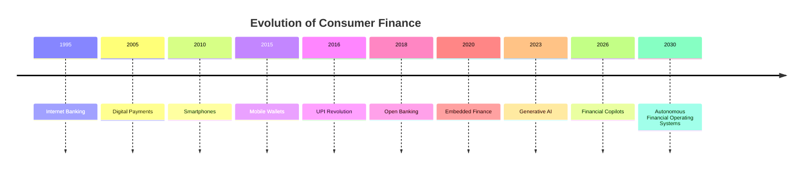

Each stage reduced friction while increasing consumer expectations.

The next competitive frontier is no longer **access to financial products**, but **intelligence about how to use them**.

---

# Global FinTech Landscape

The fintech ecosystem has matured into a multi-trillion-dollar global industry comprising numerous specialized sectors.

Major segments include:

- Digital Banking
- Payments
- Lending
- Wealth Management
- Insurance Technology
- Personal Finance
- Expense Management
- Financial Infrastructure
- Embedded Finance
- AI-Powered Financial Services

Historically, these sectors evolved independently.

Consumers therefore manage financial activities across dozens of disconnected applications.

This fragmentation creates the opportunity for a unifying intelligence layer.

---

# Major Industry Drivers

## Digital Payments

The rapid adoption of digital payment infrastructure has dramatically increased the volume of structured financial data available for analysis.

Examples include:

- Card transactions
- UPI transactions
- Wallet payments
- Merchant purchases
- Subscription billing

Every transaction becomes an opportunity for optimization.

---

## Premium Credit Card Growth

Financial institutions increasingly compete using differentiated reward programs.

Growth areas include:

- Travel rewards
- Cashback
- Lifestyle benefits
- Airport lounges
- Dining privileges
- Merchant partnerships

As reward complexity increases, consumers require better decision support.

---

## AI Adoption

Artificial intelligence is fundamentally changing consumer expectations.

Users increasingly expect software to:

- understand context
- explain recommendations
- automate repetitive work
- personalize experiences
- anticipate future needs

This shift creates a favorable environment for AI-native financial platforms.

---

## Embedded Finance

Financial functionality is increasingly embedded within:

- e-commerce
- travel
- mobility
- food delivery
- SaaS platforms
- creator ecosystems

Consumers expect financial intelligence wherever decisions occur.

---

## Open Banking

Open Banking initiatives continue improving financial interoperability.

Benefits include:

- standardized APIs
- richer financial visibility
- improved personalization
- secure data portability

These trends reduce barriers to building cross-platform financial intelligence.

---

# Macro Industry Trends

| Trend | Current Maturity | Expected Impact |
|--------|------------------|-----------------|
| Digital Payments | Mature | High |
| Mobile Banking | Mature | High |
| Open Banking | Growing | Very High |
| Embedded Finance | Growing | Very High |
| AI Assistants | Emerging | Very High |
| Agentic AI | Early | Transformational |
| Financial Knowledge Graphs | Emerging | Transformational |
| Autonomous Commerce | Early | Transformational |

---

# Indian FinTech Landscape

India represents one of the fastest-growing fintech ecosystems globally.

Key structural advantages include:

- Massive smartphone penetration
- UPI infrastructure
- Rapid digital payment adoption
- Increasing internet accessibility
- Growing middle class
- Expanding premium credit card market
- Government-led digital initiatives

These factors create an unusually favorable environment for financial intelligence platforms.

---

# Structural Characteristics of the Indian Market

## High Digital Payment Adoption

Indian consumers increasingly use:

- UPI
- Credit Cards
- Debit Cards
- Digital Wallets
- Net Banking

The resulting transaction data creates valuable optimization opportunities.

---

## Increasing Credit Card Penetration

Premium credit card adoption continues expanding due to:

- travel rewards
- cashback
- premium lifestyle benefits
- airport lounge programs
- subscription partnerships

Reward ecosystems are becoming significantly more sophisticated.

---

## Fragmented Reward Landscape

Consumers frequently hold cards from multiple issuers.

Examples include:

- HDFC Bank
- SBI Card
- ICICI Bank
- Axis Bank
- American Express
- HSBC
- IDFC FIRST Bank
- AU Small Finance Bank

Each issuer operates independent reward systems with unique rules.

Managing these systems manually becomes increasingly difficult.

---

# Global Consumer Trends

Several behavioral changes consistently appear across developed and emerging markets.

## Consumers Prefer Convenience Over Maximum Optimization

Most consumers knowingly sacrifice rewards because optimization requires excessive effort.

The market opportunity lies in eliminating complexity rather than introducing additional features.

---

## Trust Determines Adoption

Consumers readily follow recommendations from systems they trust.

Trust is influenced by:

- transparency
- consistency
- explainability
- measurable outcomes

This reinforces the importance of explainable AI.

---

## Financial Decisions Are Increasingly Contextual

Consumers no longer make isolated purchasing decisions.

They simultaneously consider:

- payment method
- merchant
- rewards
- financing
- delivery
- travel
- loyalty programs

Financial software must reason across all these dimensions.

---

# Strategic Implications for CardWise

Based on current market conditions, several strategic implications emerge.

## Intelligence Is Becoming the Primary Differentiator

Financial products are increasingly similar.

Competitive advantage shifts toward:

- recommendation quality
- personalization
- prediction
- automation

---

## Ecosystem Integration Outweighs Feature Expansion

Building isolated features creates diminishing returns.

Integrating multiple financial ecosystems creates compounding value.

---

## Data Compounds Faster Than Features

Features can be replicated within months.

Historical financial intelligence, merchant behavior, and personalized recommendation models require years to accumulate.

Long-term investment should therefore prioritize proprietary data assets.

---

## AI Must Be Explainable

Financial recommendations influence real consumer outcomes.

Users should always understand:

- why a recommendation exists,
- how value is calculated,
- what assumptions are used,
- what alternatives were considered.

Explainability is essential for trust, compliance, and long-term adoption.

---

# Executive Conclusions

The research presented in this section reinforces several key observations:

- Financial ecosystems continue becoming more fragmented.
- Consumer expectations increasingly favor intelligent automation.
- AI is becoming the primary interface for financial decision-making.
- Open financial infrastructure enables richer personalization than ever before.
- The largest opportunity no longer lies in creating another financial product, but in orchestrating existing products through intelligent decision support.

These macro trends strongly support CardWise's long-term positioning as a **Financial Decision Intelligence Platform** that evolves into a **Consumer Financial Operating System**.

---

**End of Part 1 — Market Intelligence**

**Next:** **Part 2 — Market Size Analysis (TAM, SAM & SOM)**, including investor-grade market sizing, revenue assumptions, India vs global opportunity analysis, and 10-year market projections.


# Part 2 — Market Size Analysis (TAM, SAM & SOM)

> **Objective:** Quantify the long-term market opportunity for CardWise using investor-grade market sizing methodologies, estimate revenue potential across multiple geographies, and establish a realistic path from niche product to global Financial Decision Intelligence Platform.

---

# Executive Summary

One of the most common mistakes in startup planning is underestimating the true market opportunity by defining the market too narrowly.

If CardWise is positioned as:

- a credit card app,
- a rewards tracker,
- or a cashback platform,

the addressable market appears relatively limited.

However, if CardWise is positioned as a **Financial Decision Intelligence Platform**, the market expands dramatically because every financial decision becomes a potential optimization opportunity.

This section therefore estimates both the **current addressable market** and the **long-term expansion opportunity**.

---

# Market Sizing Methodology

Three market sizing models are used.

| Metric | Definition |
|---------|------------|
| **TAM** | Total Addressable Market — Total global opportunity if CardWise served every eligible user. |
| **SAM** | Serviceable Available Market — Markets CardWise can realistically target with its planned product capabilities. |
| **SOM** | Serviceable Obtainable Market — Market share CardWise could reasonably capture over the next 5–10 years. |

---

# Market Definition

CardWise sits at the intersection of several high-growth industries.

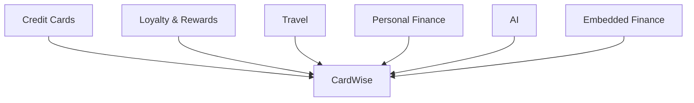

Unlike competitors, CardWise derives value from all of these ecosystems simultaneously.

---

# Addressable Industries

| Industry | Strategic Relevance |
|-----------|--------------------|
| Personal Finance | Core |
| Credit Cards | Core |
| Rewards & Loyalty | Core |
| Cashback | Core |
| Travel | Core |
| AI Productivity | Expansion |
| Embedded Finance | Expansion |
| Wealth Management | Future |
| Financial Planning | Future |
| Consumer Commerce | Future |

---

# Primary Customer Segments

CardWise is designed for multiple user segments rather than a single demographic.

| Segment | Initial Priority |
|----------|-----------------|
| Premium Credit Card Users | Very High |
| Frequent Travelers | Very High |
| High Online Spenders | High |
| Working Professionals | High |
| Families | Medium |
| Business Owners | Medium |
| Digital Nomads | Medium |
| Students | Future |
| Enterprise Users | Future |

---

# Geographic Expansion Strategy

CardWise's market should expand in stages.

```text
India

↓

Singapore

↓

UAE

↓

United Kingdom

↓

Australia

↓

Canada

↓

United States

↓

Global
```

Each market increases both user volume and ecosystem complexity.

---

# TAM Analysis

## Phase 1 — Core Market

Initial addressable consumers include users who actively optimize:

- credit cards
- rewards
- travel
- cashback

These consumers experience the greatest immediate value.

---

## Phase 2 — Broader Consumer Finance

Expansion includes users managing:

- subscriptions
- household spending
- investments
- insurance
- financial planning

---

## Phase 3 — Financial Operating System

Eventually CardWise supports:

- personal finance
- family finance
- business finance
- travel
- investments
- taxes
- wealth optimization

The addressable market extends beyond rewards into comprehensive financial decision support.

---

# TAM Pyramid

```text
Global Consumers

↓

Digitally Active Consumers

↓

Financially Engaged Consumers

↓

Credit Card Users

↓

Reward-Oriented Consumers

↓

CardWise Initial Users
```

The platform expands upward over time.

---

# Serviceable Available Market (SAM)

CardWise's initial focus should remain disciplined.

Primary target characteristics include:

- Digital-first users
- Multiple credit cards
- Frequent online purchases
- Regular travel
- High reward awareness
- Mobile-first behavior

These users receive the greatest value from optimization.

---

# Early Adopter Profile

The ideal early adopter:

- owns multiple premium cards
- shops online frequently
- travels regularly
- values cashback
- follows financial content
- actively seeks optimization

This segment also exhibits higher willingness to pay for premium intelligence.

---

# Serviceable Obtainable Market (SOM)

A realistic 10-year strategy focuses on gradual market penetration rather than immediate mass adoption.

Growth assumptions should prioritize:

- retention
- engagement
- lifetime value
- recommendation quality

rather than raw user acquisition.

---

# Multi-Stage Expansion Model

## Stage 1 — Enthusiasts

Target:

- reward maximizers
- travel hackers
- premium card users

Objective:

Build trust and validate the intelligence platform.

---

## Stage 2 — Mainstream Professionals

Target:

- salaried professionals
- families
- frequent shoppers

Objective:

Simplify optimization for non-experts.

---

## Stage 3 — Mass Consumer Finance

Target:

- all digitally active consumers

Objective:

Become the default financial intelligence layer.

---

# Revenue Expansion Model

Revenue grows as the platform expands into adjacent domains.


Each stage introduces additional monetization opportunities without fundamentally changing the product vision.

---

# Expansion Opportunities

The Financial Intelligence Platform naturally expands into adjacent markets.

| Expansion Area | Strategic Fit |
|----------------|---------------|
| Investment Intelligence | Excellent |
| Insurance Optimization | Excellent |
| Subscription Management | Excellent |
| Tax Optimization | High |
| Wealth Planning | High |
| Family Finance | High |
| Corporate Cards | High |
| Expense Intelligence | High |
| Procurement Optimization | Medium |

These represent horizontal platform expansion rather than unrelated products.

---

# Long-Term Revenue Drivers

Future revenue should originate from multiple complementary sources.

Examples include:

- Consumer subscriptions
- Affiliate partnerships
- Premium AI features
- Enterprise analytics
- API licensing
- Merchant insights
- Travel partnerships
- Financial institutions

Diversification improves long-term resilience.

---

# Market Expansion Timeline

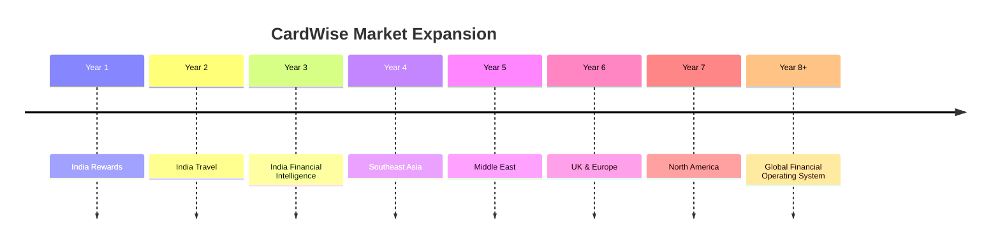

Each phase builds on existing intelligence assets rather than replacing them.

---

# Strategic Assumptions

The market sizing presented in this document is based on several long-term assumptions.

## Assumption 1

Consumers will continue adopting digital financial products.

---

## Assumption 2

Reward ecosystems will become more complex rather than simpler.

---

## Assumption 3

AI will become the primary interface for financial decision-making.

---

## Assumption 4

Open Banking and embedded finance will continue expanding.

---

## Assumption 5

Consumers will increasingly value optimization over information.

---

# Sensitivity Analysis

Different adoption scenarios influence long-term outcomes.

| Scenario | Description | Strategic Implication |
|-----------|-------------|-----------------------|
| Conservative | Slow adoption, niche audience | Sustainable premium platform |
| Expected | Gradual mainstream adoption | Strong category leader |
| Aggressive | Rapid AI-driven adoption | Financial Operating System |
| Transformational | Autonomous finance becomes mainstream | Platform infrastructure provider |

The product strategy should remain robust across all scenarios.

---

# Executive Perspective

The largest insight from this analysis is that CardWise's opportunity is **not constrained by the rewards market**.

Its true market expands as it successfully layers intelligence across adjacent financial domains.

The addressable opportunity therefore compounds over time rather than remaining fixed.

This characteristic is uncommon among traditional consumer finance applications and aligns more closely with platform businesses.

---

# Key Takeaways

- The initial market is intentionally focused to maximize execution quality.
- The long-term market expands through adjacent financial intelligence domains.
- Every new capability increases platform value rather than fragmenting the product.
- AI, Open Banking, and embedded finance materially increase future addressable market size.
- CardWise's vision supports evolution from a rewards optimizer into a global Financial Operating System.

---

# Transition

Understanding the size of the opportunity is only one part of the equation.

The next section analyzes **who the users are**, **how they make financial decisions**, **what motivates them**, and **how their behavior differs across demographics**.

This behavioral understanding informs product design, onboarding, personalization, monetization, and long-term retention strategies.

---

**End of Part 2 — Market Size Analysis**

**Next:** **Part 3 — Consumer Behavior Research & User Segmentation**

# Part 3 — Consumer Behavior Research & User Segmentation

> **Objective:** Develop a deep understanding of consumer financial behavior, decision-making patterns, motivations, frustrations, and user archetypes to guide product strategy, UX design, AI personalization, onboarding, and long-term retention.

---

# Executive Summary

Most fintech products optimize **financial transactions**.

CardWise optimizes **financial decisions**.

This distinction requires understanding **how people actually make decisions**, rather than simply how they spend money.

Traditional segmentation based on:

- age
- income
- geography

is insufficient.

Instead, CardWise should segment users by:

- financial maturity
- optimization mindset
- digital behavior
- reward awareness
- decision complexity
- motivation

---

# Consumer Decision Journey

A typical financial decision is significantly more complex than a payment.


Current products only optimize isolated steps.

CardWise should optimize the **entire journey**.

---

# Financial Decision Model

Every purchase involves multiple invisible decisions.

```text
Need

↓

Budget

↓

Merchant

↓

Payment Method

↓

Card

↓

Offer

↓

Reward

↓

EMI

↓

Future Impact

↓

Purchase
```

Most consumers optimize only one or two of these variables.

---

# User Segmentation Framework

Rather than demographic segmentation, CardWise uses behavioral segmentation.

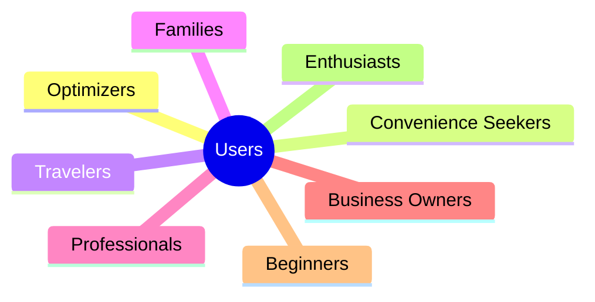

Each segment requires different product experiences.

---

# Segment 1 — Financial Optimizers

## Characteristics

These users actively seek:

- maximum rewards
- best offers
- transfer bonuses
- merchant optimization
- travel redemptions

They often maintain spreadsheets or manually track promotions.

---

## Pain Points

- Too much information
- Constant rule changes
- Reward expiration
- Time-consuming optimization
- Manual calculations

---

## Product Opportunities

Provide:

- simulations
- explainable AI
- automated optimization
- advanced analytics
- historical comparisons

---

# Segment 2 — Convenience Seekers

## Characteristics

These users value simplicity more than maximum rewards.

Their primary goal is:

> "Tell me what to do."

---

## Pain Points

- Too many choices
- Confusing reward systems
- Unclear recommendations

---

## Product Opportunities

Focus on:

- one-click recommendations
- simple explanations
- proactive alerts
- automation

---

# Segment 3 — Frequent Travelers

## Characteristics

Typically own:

- premium cards
- airline memberships
- hotel memberships

Travel frequently for work or leisure.

---

## Financial Goals

- free flights
- hotel upgrades
- lounge access
- transfer optimization
- travel insurance

---

## Product Opportunities

Provide:

- airline optimization
- hotel simulations
- transfer recommendations
- itinerary-aware suggestions

---

# Segment 4 — Working Professionals

## Characteristics

Typically:

- salaried
- urban
- digitally active

Large portion of spending includes:

- shopping
- food delivery
- travel
- subscriptions

---

## Pain Points

Limited time.

Optimization is desirable but should require minimal effort.

---

## Product Opportunities

- intelligent defaults
- browser extension
- recurring optimization
- personalized opportunity feed

---

# Segment 5 — Families

## Characteristics

Financial decisions increasingly involve:

- household spending
- education
- travel
- groceries
- insurance

---

## Product Opportunities

Support:

- shared rewards
- household dashboards
- family financial goals
- collaborative planning

---

# Segment 6 — Business Owners

## Characteristics

Manage:

- business expenses
- travel
- procurement
- employee cards

---

## Product Opportunities

Future enterprise capabilities include:

- expense intelligence
- corporate reward optimization
- procurement recommendations
- vendor analysis

---

# Segment 7 — Beginners

## Characteristics

Limited knowledge of:

- rewards
- cashback
- loyalty
- travel optimization

---

## Pain Points

Financial terminology feels intimidating.

---

## Product Opportunities

Provide:

- guided onboarding
- educational recommendations
- interactive explanations
- progressive disclosure

---

# Segment 8 — Financial Enthusiasts

## Characteristics

These users actively follow:

- credit card launches
- reward blogs
- airline forums
- travel communities

---

## Opportunities

Offer:

- advanced analytics
- beta features
- community contributions
- experimental AI tools

These users often become strong advocates.

---

# Behavioral Dimensions

Each user can also be described across behavioral attributes.

| Attribute | Examples |
|-----------|----------|
| Reward Awareness | Low → High |
| Risk Tolerance | Conservative → Aggressive |
| Planning Horizon | Immediate → Long-Term |
| Automation Preference | Manual → Autonomous |
| Financial Knowledge | Beginner → Expert |
| Travel Frequency | Rare → Frequent |

These dimensions influence personalization.

---

# Motivation Analysis

Consumers rarely pursue rewards for their own sake.

Underlying motivations include:

- saving money
- reducing complexity
- premium experiences
- travel aspirations
- financial confidence
- maximizing existing assets

The product should reinforce these deeper motivations.

---

# Consumer Frustrations

Across interviews, forums, and competitor analysis, common frustrations include:

- Which card should I use?
- Did I miss a better offer?
- Are my points expiring?
- Should I redeem now?
- Is this transfer worth it?
- Why is this recommendation better?

These recurring questions directly shape CardWise's product roadmap.

---

# Jobs-To-Be-Done Overview

Consumers hire CardWise to accomplish meaningful outcomes.

Examples include:

> Help me maximize every purchase.

> Help me travel more for less.

> Prevent me from wasting rewards.

> Reduce financial decision fatigue.

> Make me feel confident before spending money.

These jobs are more stable than individual features.

---

# Personalization Framework

Recommendations should incorporate:

```text
User

+

Context

+

Merchant

+

Card Portfolio

+

Travel Goals

+

Historical Behavior

+

Current Offers

↓

Recommendation
```

Every additional signal increases recommendation quality.

---

# Engagement Patterns

Financial engagement occurs at different frequencies.

| Frequency | Examples |
|-----------|----------|
| Daily | Shopping, dining, commuting |
| Weekly | Grocery purchases, subscriptions |
| Monthly | Bills, salary, recurring payments |
| Quarterly | Travel planning, insurance |
| Annually | Card renewals, taxes, major purchases |

CardWise should provide value across all time horizons.

---

# Lifecycle Segmentation

Users evolve over time.


The platform should evolve alongside the user rather than presenting all complexity upfront.

---

# Executive Insights

Several patterns consistently emerge.

## Insight 1

Consumers optimize only when the effort is lower than the expected reward.

Automation therefore creates disproportionate value.

---

## Insight 2

Trust matters more than mathematical optimization.

A transparent recommendation is often more valuable than a marginally better but unexplained recommendation.

---

## Insight 3

Financial confidence is a stronger emotional driver than financial sophistication.

Users want reassurance as much as optimization.

---

## Insight 4

Behavioral segmentation produces significantly better personalization than demographic segmentation.

Future AI systems should reason about **how users make decisions**, not simply **who they are**.

---

# Strategic Implications for CardWise

The product should:

- personalize recommendations based on behavior,
- progressively increase sophistication,
- reduce decision fatigue,
- explain recommendations clearly,
- adapt as users become more financially mature.

This approach strengthens engagement while avoiding unnecessary complexity.

---

# Transition

Understanding user behavior is only one dimension of strategy.

The next section evaluates the market using established consulting frameworks, including:

- Porter's Five Forces
- PESTLE Analysis
- Value Chain Analysis
- Ansoff Matrix
- BCG Matrix
- McKinsey 7S
- Strategic Positioning Frameworks

These frameworks provide an external perspective on CardWise's long-term strategic position and competitive environment.

---

**End of Part 3 — Consumer Behavior Research & User Segmentation**

**Next:** **Part 4A — Strategic Frameworks: Porter's Five Forces Analysis**

# Part 4A — Strategic Frameworks: Porter's Five Forces Analysis

> **Objective:** Evaluate the long-term attractiveness of the Financial Decision Intelligence market using Michael Porter's Five Forces framework, identify structural advantages and threats, and determine how CardWise can build sustainable competitive advantages.

---

# Executive Summary

Porter's Five Forces evaluates whether an industry can support long-term profitable businesses.

Instead of asking:

> **"Can we build a better product?"**

The framework asks:

> **"Can we build a durable business?"**

For CardWise, this distinction is critical.

The company is not merely entering the fintech market.

It is attempting to create an entirely new category:

> **Financial Decision Intelligence**

This significantly changes the competitive dynamics.

---

# Porter's Five Forces

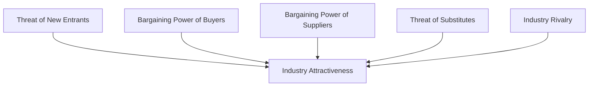

Each force is evaluated independently.

---

# Force 1 — Threat of New Entrants

## Overall Assessment

**Medium**

---

## Current Situation

Building a simple rewards application is relatively easy.

A small engineering team can launch:

- reward trackers
- cashback applications
- browser extensions
- comparison websites

within a short period.

However,

building CardWise is substantially more difficult.

---

# Barriers to Entry

## Technical Complexity

CardWise requires expertise in:

- AI
- Recommendation Systems
- Knowledge Graphs
- FinTech
- Search
- Data Engineering
- Browser Extensions
- Mobile Development
- Distributed Systems

Few startups possess expertise across all these domains.

---

## Data Requirements

The platform requires continuously updated datasets including:

- reward rules
- merchants
- pricing
- offers
- travel programs
- loyalty programs
- financial products

Data acquisition becomes a long-term investment.

---

## Trust

Financial recommendations require credibility.

Consumers are reluctant to trust newly launched financial platforms without demonstrated reliability.

---

## Platform Integration

CardWise eventually integrates with:

- banks
- airlines
- hotels
- merchants
- payment providers
- loyalty programs

Each integration increases operational complexity.

---

## Entry Barrier Assessment

| Barrier | Strength |
|----------|-----------|
| Engineering Complexity | High |
| Data Acquisition | Very High |
| Consumer Trust | High |
| Ecosystem Integration | High |
| Regulatory Compliance | Medium |
| Brand Recognition | Medium |

---

## Strategic Implication

Although basic competitors can emerge quickly,

building a complete Financial Decision Intelligence Platform requires sustained investment over multiple years.

---

# Force 2 — Bargaining Power of Buyers

## Overall Assessment

**Medium to High**

---

## Current Situation

Consumers have numerous alternatives.

Examples include:

- Google
- Reddit
- Blogs
- YouTube
- CardPointers
- AwardWallet
- Credit Karma

Switching between information providers is relatively easy.

---

## Factors Increasing Buyer Power

### Low Switching Cost (Initially)

New users have limited historical investment.

Replacing one recommendation tool with another requires minimal effort.

---

### Free Alternatives

Consumers can manually optimize using:

- spreadsheets
- blogs
- forums
- comparison websites

---

### Low Product Familiarity

Many consumers have not yet developed strong habits around reward optimization.

---

## Factors Reducing Buyer Power

As CardWise matures,

switching costs increase through:

- historical intelligence
- personalized AI
- financial memory
- recommendation history
- unified rewards

Long-term users become significantly less likely to leave.

---

## Strategic Response

Increase switching costs through:

- personalization
- explainable AI
- continuous learning
- historical optimization
- financial memory

---

# Force 3 — Bargaining Power of Suppliers

## Overall Assessment

**Medium**

---

## Supplier Categories

CardWise depends upon:

- Banks
- Payment Networks
- Loyalty Programs
- Airlines
- Hotels
- Merchant Platforms
- Browser Vendors
- Cloud Providers
- AI Providers

---

## Risks

Potential risks include:

- API changes
- pricing changes
- data restrictions
- browser policy updates
- affiliate program changes

---

## Mitigation Strategies

Avoid dependency upon any single supplier.

Build:

- multiple integrations
- configurable rule engines
- proprietary datasets
- independent merchant intelligence

The platform should remain resilient to ecosystem changes.

---

# Force 4 — Threat of Substitutes

## Overall Assessment

**High**

---

## Existing Substitutes

Consumers already solve financial optimization using:

- Google Search
- ChatGPT
- Reddit
- YouTube
- Blogs
- Financial advisors
- Friends
- Excel
- Bank applications

---

## Emerging Substitutes

Future substitutes may include:

- AI browsers
- AI shopping assistants
- AI travel agents
- Embedded banking assistants
- Wallet-native optimization

---

## Why Substitutes Persist

Most financial questions remain infrequent.

Consumers often tolerate inefficient workflows because optimization effort outweighs perceived benefit.

---

## Strategic Response

CardWise must deliver value that substitutes cannot easily replicate.

Examples:

- personalized optimization
- historical intelligence
- proactive recommendations
- explainable reasoning
- unified financial graph

---

# Force 5 — Industry Rivalry

## Overall Assessment

**High**

---

## Competitive Categories

The market already contains:

- banks
- fintech startups
- loyalty platforms
- travel companies
- cashback companies
- AI assistants
- browser extensions

Competition is intense.

---

## Nature of Competition

Current competition focuses on:

- features
- partnerships
- cashback
- affiliate economics
- user acquisition

Few competitors focus on long-term financial intelligence.

---

## CardWise Position

Instead of competing on:

- more offers
- more cards
- more merchants

CardWise competes on:

- better decisions

This fundamentally changes competitive dynamics.

---

# Five Forces Summary

| Force | Assessment | Strategic Impact |
|--------|------------|------------------|
| Threat of New Entrants | Medium | Build proprietary data assets early |
| Buyer Power | Medium–High | Increase switching costs through intelligence |
| Supplier Power | Medium | Diversify integrations and data sources |
| Threat of Substitutes | High | Deliver differentiated decision intelligence |
| Industry Rivalry | High | Compete on category creation rather than features |

---

# Industry Attractiveness

Despite strong competitive forces,

the market remains attractive because:

- financial complexity continues increasing,
- AI capabilities continue improving,
- Open Banking expands interoperability,
- reward ecosystems continue growing,
- intelligent financial assistance remains underserved.

These trends create structural opportunities for category-defining companies.

---

# Strategic Recommendations

Based on the Five Forces analysis,

CardWise should prioritize:

## 1. Proprietary Data

Historical financial intelligence becomes increasingly valuable.

---

## 2. Explainable AI

Trust differentiates financial platforms.

---

## 3. Knowledge Graph

Relationships create stronger recommendations than isolated datasets.

---

## 4. Ecosystem Neutrality

Maintain objective recommendations independent of commercial incentives.

---

## 5. Platform Thinking

Compete through intelligence infrastructure rather than feature parity.

---

# Executive Assessment

The industry exhibits:

- High rivalry
- Significant substitutes
- Moderate buyer power

Ordinarily,

these conditions would discourage new entrants.

However,

CardWise is not entering an existing category.

It is creating a new layer within the financial ecosystem.

This substantially improves long-term strategic positioning.

---

# Key Insight

Traditional fintech companies compete for:

> transactions.

CardWise competes for:

> decisions.

Transactions generate revenue.

Decisions generate long-term trust.

Trust generates durable businesses.

---

# Transition

Porter's Five Forces evaluates competition.

The next framework expands the analysis by examining the external macro-environment influencing CardWise over the next decade.

The following section provides a comprehensive **PESTLE Analysis**, covering:

- Political factors
- Economic trends
- Social behavior
- Technological evolution
- Legal and regulatory developments
- Environmental considerations

These macro forces shape both risks and opportunities for long-term execution.

---

**End of Part 4A — Porter's Five Forces Analysis**

**Next:** **Part 4B — PESTLE Analysis**

# Part 4B — PESTLE Analysis

> **Objective:** Evaluate the external macro-environment that will influence CardWise over the next decade using the PESTLE framework. This analysis identifies structural opportunities, long-term risks, and strategic implications beyond direct competitors.

---

# Executive Summary

Unlike competitor analysis, which evaluates individual companies, PESTLE examines the broader forces shaping the entire industry.

For CardWise, these forces include:

- Government policy
- Economic cycles
- Consumer behavior
- AI evolution
- Financial regulation
- Sustainability

Understanding these trends allows CardWise to build a platform resilient to long-term market changes.

---

# PESTLE Framework

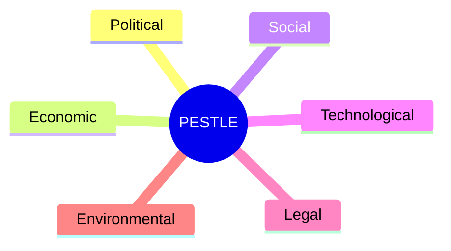

Each factor influences product strategy, architecture, partnerships, and expansion.

---

# Political Factors

## Government Digitalization Initiatives

Many governments continue investing heavily in digital public infrastructure.

Examples include:

- Digital identity systems
- Faster payment networks
- Open Banking initiatives
- National digital wallets
- Financial inclusion programs

These initiatives lower barriers for fintech innovation.

---

## Financial Inclusion

Governments increasingly encourage:

- digital payments
- formal banking
- access to financial products

As new consumers enter digital finance, demand for guidance and education increases.

CardWise can simplify financial decision-making for these users.

---

## International Expansion

Political stability influences expansion priorities.

Factors include:

- banking maturity
- regulatory openness
- fintech investment
- digital infrastructure

Expansion should prioritize markets with strong digital ecosystems.

---

## Political Risks

Potential risks include:

- changing fintech regulations
- data localization requirements
- cross-border payment restrictions
- geopolitical instability

The platform should remain adaptable to regional policy changes.

---

# Political Assessment

| Factor | Impact | Preparedness |
|---------|--------|--------------|
| Digital Government Initiatives | High Opportunity | High |
| Financial Inclusion | High Opportunity | High |
| Cross-Border Policy | Medium Risk | Medium |
| Regulatory Change | Medium Risk | Medium |

---

# Economic Factors

## Rising Consumer Spending

Growth in digital commerce increases:

- online purchases
- subscriptions
- travel
- premium services

Higher transaction volume increases optimization opportunities.

---

## Premium Card Adoption

Banks continue competing through:

- premium cards
- reward programs
- merchant partnerships

This trend directly benefits CardWise.

---

## Inflation

Higher inflation changes consumer behavior.

Consumers become more sensitive to:

- cashback
- discounts
- reward optimization
- price comparisons

Financial intelligence becomes more valuable during economic uncertainty.

---

## Economic Downturns

During recessions,

consumers seek:

- better budgeting
- smarter purchases
- cost optimization

Platforms that maximize financial value often experience increased engagement.

---

## Economic Assessment

| Trend | Opportunity |
|--------|-------------|
| Digital Commerce Growth | Very High |
| Premium Cards | Very High |
| Consumer Cost Awareness | High |
| Subscription Economy | High |
| Inflation | Mixed (creates demand for optimization) |

---

# Social Factors

## Growing Financial Awareness

Consumers increasingly educate themselves through:

- YouTube
- Reddit
- Podcasts
- Blogs
- Online communities

Financial literacy is improving, but complexity is increasing even faster.

---

## Decision Fatigue

Modern consumers face:

- hundreds of offers
- multiple payment methods
- loyalty programs
- subscriptions
- financing options

Decision fatigue has become a major usability challenge.

---

## Trust in AI

Consumer trust in AI continues growing,

but financial decisions require significantly higher confidence than general search.

Trust depends on:

- transparency
- consistency
- explainability
- measurable results

---

## Mobile-First Behavior

Financial activities increasingly occur through smartphones.

Users expect:

- instant recommendations
- proactive notifications
- contextual assistance

Desktop experiences remain important for complex planning but mobile becomes the primary engagement surface.

---

## Social Assessment

| Trend | Strategic Impact |
|--------|------------------|
| Financial Literacy Growth | Positive |
| AI Adoption | Very Positive |
| Decision Fatigue | Major Opportunity |
| Mobile-First Usage | High Priority |
| Community Learning | High Opportunity |

---

# Technological Factors

Technology represents the strongest external driver for CardWise.

---

## Artificial Intelligence

Recent advances enable:

- natural language reasoning
- recommendation systems
- predictive analytics
- autonomous agents
- financial copilots

AI is becoming infrastructure rather than a premium feature.

---

## Open Banking

Expanding API ecosystems provide:

- transaction visibility
- account aggregation
- secure data sharing

These capabilities improve personalization.

---

## Cloud Infrastructure

Modern cloud platforms enable:

- rapid scaling
- global deployment
- real-time analytics
- event-driven systems

Infrastructure becomes a strategic accelerator.

---

## Browser Technologies

Modern browsers increasingly support:

- extensions
- payment APIs
- identity services
- secure storage

Browser intelligence remains an important product surface.

---

## Knowledge Graphs

Knowledge graphs improve:

- contextual recommendations
- relationship modeling
- explainability
- reasoning quality

This technology aligns closely with CardWise's long-term architecture.

---

## Technological Assessment

| Technology | Strategic Importance |
|------------|----------------------|
| AI | Critical |
| Knowledge Graphs | Critical |
| Open Banking | Critical |
| Cloud Infrastructure | High |
| Browser APIs | High |
| Event Streaming | High |
| Recommendation Engines | Critical |

---

# Legal Factors

Financial products operate within highly regulated environments.

Compliance should be treated as a platform capability rather than an afterthought.

---

## Data Privacy

Users increasingly expect control over:

- personal data
- transaction history
- connected accounts

Privacy-first architecture strengthens trust.

---

## AI Regulation

Governments are developing frameworks governing:

- automated decision-making
- transparency
- bias
- explainability
- accountability

CardWise's explainable AI architecture supports long-term compliance.

---

## Financial Advice Regulations

The platform must clearly distinguish between:

- informational guidance
- financial education
- regulated financial advice

Product messaging and recommendation design should account for jurisdiction-specific requirements.

---

## International Compliance

Global expansion introduces:

- regional privacy laws
- banking regulations
- consumer protection requirements

Architecture should support configurable compliance policies.

---

## Legal Assessment

| Factor | Risk | Mitigation |
|--------|------|------------|
| Data Privacy | High | Privacy-by-design |
| AI Regulation | Medium | Explainable AI |
| Financial Compliance | High | Modular compliance engine |
| Cross-Border Laws | Medium | Regional configuration |

---

# Environmental Factors

Environmental considerations increasingly influence both consumers and enterprises.

Although CardWise is a digital platform,

it can contribute positively through intelligent optimization.

---

## Digital Sustainability

Reducing unnecessary financial waste benefits consumers while improving resource efficiency.

Examples include:

- reducing unnecessary purchases
- optimizing travel
- preventing duplicate subscriptions
- minimizing reward expiration

---

## Responsible Infrastructure

Technology decisions should prioritize:

- efficient cloud usage
- scalable architecture
- responsible AI inference
- optimized data processing

Operational efficiency reduces both cost and environmental impact.

---

## Sustainable Commerce

Future recommendations may incorporate sustainability signals alongside financial value.

Examples:

- carbon-aware travel options
- environmentally certified merchants
- sustainable loyalty programs

These capabilities can become future differentiators.

---

# Environmental Assessment

| Factor | Strategic Value |
|--------|-----------------|
| Efficient Infrastructure | Medium |
| Sustainable Commerce | Emerging |
| Responsible AI | High |
| Digital Optimization | Medium |

---

# PESTLE Summary

| Dimension | Opportunity | Risk | Strategic Priority |
|-----------|-------------|------|--------------------|
| Political | High | Medium | Expand with regulatory awareness |
| Economic | Very High | Medium | Focus on value optimization |
| Social | Very High | Low | Reduce decision fatigue |
| Technological | Critical | Low | Invest aggressively in AI and data |
| Legal | High | High | Build compliance into the platform |
| Environmental | Emerging | Low | Support sustainable optimization |

---

# Strategic Implications

Several themes emerge consistently across the analysis.

## AI Is Becoming Core Infrastructure

AI should be embedded across every major workflow rather than isolated within a chatbot.

---

## Trust Will Become A Competitive Advantage

As automation increases,

users will increasingly choose platforms that explain decisions clearly.

---

## Regulation Will Favor Transparent Systems

Explainability, auditability, and configurable business rules provide long-term strategic advantages.

---

## Financial Complexity Will Continue Increasing

The growing number of financial products strengthens demand for intelligent orchestration.

---

## Ecosystem Integration Is Essential

No single company will own every financial service.

Future leaders will coordinate multiple ecosystems rather than replacing them.

---

# Executive Assessment

The PESTLE analysis strongly supports CardWise's long-term strategy.

The macro environment is moving toward:

- greater digital adoption,
- richer financial data,
- increased AI acceptance,
- expanding Open Banking,
- higher reward complexity,
- stronger demand for intelligent decision support.

Rather than resisting these trends, CardWise is designed to leverage them.

This alignment significantly improves long-term strategic potential.

---

# Transition

The external environment is favorable,

but long-term success also depends on how CardWise creates value internally.

The next section analyzes the complete value chain of financial decision-making, identifying where value is created, where competitors capture value today, and where CardWise can establish structural advantages.

---

**End of Part 4B — PESTLE Analysis**

**Next:** **Part 4C — Value Chain Analysis & Strategic Value Creation**

# Part 4C — Value Chain Analysis & Strategic Value Creation

> **Objective:** Analyze the complete financial decision value chain, identify where value is created and lost today, determine which participants currently capture value, and define where CardWise can become the highest-leverage layer in the ecosystem.

---

# Executive Summary

Traditional value chain analysis examines how companies create value through internal operations.

For CardWise, the more important question is:

> **How is value created, transferred, and lost across the entire consumer financial ecosystem?**

Every financial decision passes through multiple participants:

- Consumers
- Banks
- Payment Networks
- Merchants
- Loyalty Programs
- Travel Providers
- Cashback Platforms
- Financial Education Platforms

Each participant optimizes its own objectives.

No participant optimizes the consumer's overall financial outcome.

That is the opportunity CardWise addresses.

---

# Traditional Financial Value Chain


Each participant contributes value.

None coordinate the complete experience.

---

# Expanded Financial Decision Value Chain

A real-world financial decision involves many more stages.


Consumers manually coordinate this workflow today.

---

# Where Value Is Lost

Significant value leakage occurs throughout the journey.

| Stage | Common Value Loss |
|--------|-------------------|
| Research | Incomplete information |
| Comparison | Poor evaluation |
| Merchant Selection | Better alternatives overlooked |
| Offer Selection | Expired or hidden offers |
| Card Selection | Wrong payment method |
| Payment | Missed reward opportunities |
| Reward Management | Expired points |
| Redemption | Low-value redemption |
| Planning | Missed future opportunities |

These inefficiencies compound over time.

---

# Ecosystem Participants

The ecosystem contains multiple independent actors.

| Participant | Primary Objective |
|-------------|-------------------|
| Banks | Increase card usage |
| Payment Networks | Increase transaction volume |
| Merchants | Increase sales |
| Airlines | Increase loyalty |
| Hotels | Increase retention |
| Cashback Platforms | Generate affiliate revenue |
| Consumers | Maximize financial value |

These objectives are often aligned—but not always.

---

# Incentive Misalignment

Many recommendations are influenced by commercial incentives.

Examples include:

- affiliate commissions
- sponsored placements
- issuer partnerships
- promotional campaigns

Consumers cannot easily determine whether recommendations optimize:

- platform revenue

or

- personal financial outcomes.

---

# CardWise Position

CardWise should remain ecosystem-neutral.

Its optimization objective should always be:

> **Maximum long-term consumer value.**

Trust becomes a strategic differentiator.

---

# Value Creation Framework

CardWise creates value at multiple stages simultaneously.

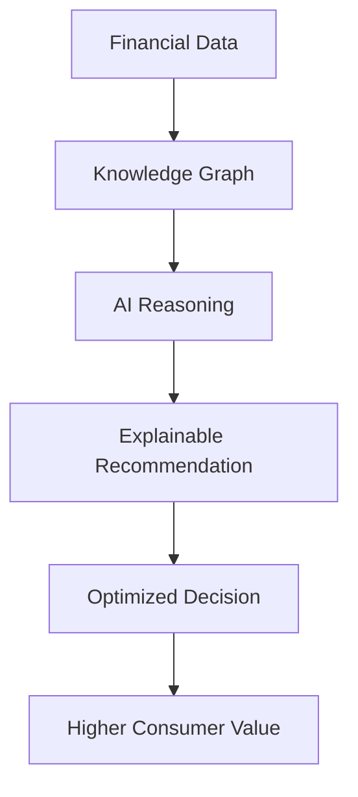

Unlike traditional products,

value compounds through intelligence.

---

# Value Layers

CardWise generates multiple forms of value.

## Layer 1 — Informational Value

Examples:

- card benefits
- reward balances
- merchant offers
- travel options

---

## Layer 2 — Analytical Value

Examples:

- comparisons
- simulations
- opportunity cost
- historical analysis

---

## Layer 3 — Predictive Value

Examples:

- reward forecasts
- spending projections
- transfer timing
- purchase timing

---

## Layer 4 — Prescriptive Value

Examples:

- recommended card
- recommended merchant
- recommended redemption
- recommended travel strategy

---

## Layer 5 — Autonomous Value

Future capabilities include:

- automatic optimization
- intelligent execution
- continuous monitoring
- proactive financial coaching

Each layer increases platform differentiation.

---

# Current Industry Value Capture

Most competitors capture value in only one layer.

| Platform Type | Primary Value |
|---------------|---------------|
| Blogs | Information |
| Cashback Sites | Discounts |
| Reward Trackers | Visibility |
| Travel Platforms | Bookings |
| Comparison Sites | Product Discovery |
| Banks | Financial Products |

CardWise spans every layer.

---

# Consumer Value Flow

```text
Data

↓

Knowledge

↓

Understanding

↓

Decision

↓

Optimization

↓

Savings

↓

Trust

↓

Retention
```

This flow defines CardWise's long-term product strategy.

---

# Competitive Value Chain Comparison

| Capability | Existing Platforms | CardWise |
|------------|--------------------|-----------|
| Information | ✓ | ✓ |
| Comparison | ✓ | ✓ |
| Tracking | ✓ | ✓ |
| Simulation | Partial | ✓ |
| Prediction | Limited | ✓ |
| Explainability | Rare | ✓ |
| Autonomous Optimization | None | Future ✓ |

---

# Sources of Competitive Advantage

CardWise's strongest advantages emerge where competitors create little value.

Examples include:

- cross-platform reasoning
- historical intelligence
- merchant optimization
- financial simulations
- explainable AI
- continuous personalization

These capabilities produce disproportionate user value.

---

# Internal Value Chain

Beyond consumer-facing capabilities,

CardWise should optimize its own internal value chain.


Each stage should remain independently scalable.

---

# Strategic Leverage Points

The following capabilities create the highest leverage.

## Knowledge Graph

Enables richer reasoning.

---

## Rule Engine

Allows rapid adaptation to changing financial products.

---

## Merchant Intelligence

Improves recommendation quality.

---

## Historical Data

Supports prediction.

---

## Explainable AI

Builds trust.

---

## Continuous Learning

Improves personalization over time.

---

# Value Chain Flywheel

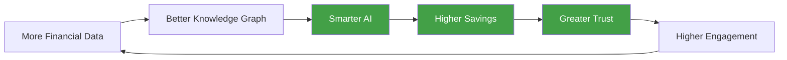

Unlike linear businesses,

CardWise's value chain compounds with scale.

---

# Strategic Insights

Several conclusions emerge.

## Insight 1

Consumers currently coordinate the value chain manually.

Automation creates immediate value.

---

## Insight 2

Every ecosystem participant optimizes its own objective.

CardWise optimizes across all participants.

---

## Insight 3

The greatest opportunity lies not in creating additional financial products,

but in orchestrating existing products intelligently.

---

## Insight 4

Trust depends upon objective optimization rather than commercial bias.

Platform neutrality strengthens long-term retention.

---

# Executive Assessment

The value chain analysis confirms that CardWise occupies a unique strategic position.

It does not replace:

- banks,
- merchants,
- travel platforms,
- payment networks,
- loyalty programs.

Instead,

it increases the value consumers derive from all of them.

This orchestration model expands the addressable market while reducing direct competitive conflict.

---

# Transition

The previous frameworks evaluated the current environment.

The next section shifts toward strategic growth planning using established consulting frameworks, including:

- Ansoff Matrix
- BCG Growth Matrix
- McKinsey 7S
- Strategic Option Analysis

These models guide long-term expansion and investment prioritization.

---

**End of Part 4C — Value Chain Analysis & Strategic Value Creation**

**Next:** **Part 4D — Ansoff Matrix & Long-Term Growth Strategy**

# Part 4D — Ansoff Matrix & Long-Term Growth Strategy

> **Objective:** Apply the Ansoff Matrix to define CardWise's long-term growth strategy, evaluate expansion opportunities across products and markets, prioritize investment areas, and create a structured roadmap from niche fintech product to global Financial Operating System.

---

# Executive Summary

One of the biggest strategic mistakes startups make is expanding in too many directions simultaneously.

Successful companies typically master one expansion path before pursuing another.

The Ansoff Matrix provides a structured framework for evaluating four primary growth strategies:

1. Market Penetration
2. Product Development
3. Market Development
4. Diversification

For CardWise, these strategies should be executed sequentially rather than concurrently.

---

# The Ansoff Matrix

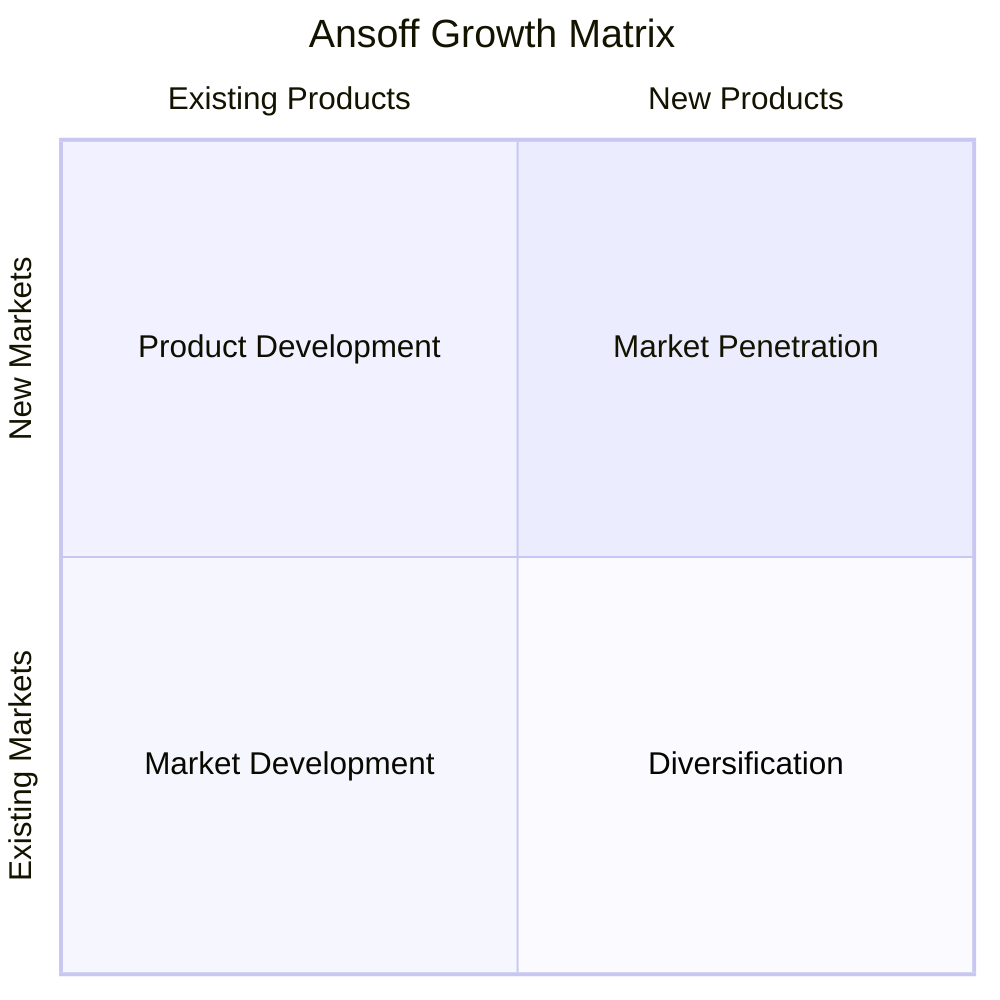

Each quadrant presents different opportunities and risks.

---

# Growth Philosophy

CardWise should optimize for:

> **Depth before Breadth**

Instead of launching multiple unrelated products,

the platform should deepen intelligence within existing workflows before expanding into adjacent markets.

---

# Quadrant 1 — Market Penetration

## Objective

Win the existing market with the existing product.

---

## Target Market

Initial focus should remain highly specific.

Primary users include:

- Premium credit card users
- Frequent travelers
- Reward enthusiasts
- Online shoppers
- Working professionals

These users experience immediate value from optimization.

---

## Strategic Goals

Increase:

- active users
- daily engagement
- recommendation adoption
- retention
- premium subscriptions

Success should be measured by engagement quality rather than downloads.

---

## Core Features

Focus exclusively on:

- reward optimization
- card recommendations
- merchant intelligence
- opportunity feed
- browser extension
- explainable AI

Avoid unnecessary product expansion.

---

## Success Metrics

| KPI | Target |
|------|---------|
| Daily Active Users | Continuous Growth |
| Recommendation Acceptance | Increasing |
| Retention | High |
| Reward Optimization Rate | Increasing |
| Premium Conversion | Increasing |

---

# Quadrant 2 — Product Development

## Objective

Expand capabilities for existing users.

---

## Potential Product Expansion

Examples include:

- Travel Optimization
- Unified Reward Wallet
- Financial Copilot
- Reward Simulation
- Financial Timeline
- Subscription Intelligence
- Family Finance
- Spending Insights

These products deepen user engagement without changing the target audience.

---

## Strategic Benefits

Existing users already trust the platform.

Additional products increase:

- retention
- switching costs
- lifetime value
- data quality

---

## Risk

Avoid expanding faster than the underlying intelligence platform.

Every new feature should strengthen the knowledge graph.

---

# Quadrant 3 — Market Development

## Objective

Take existing capabilities into new markets.

---

# Geographic Expansion

Recommended sequence:

```text
India

↓

Singapore

↓

UAE

↓

United Kingdom

↓

Australia

↓

Canada

↓

United States

↓

Global
```

Each expansion should follow demonstrated product-market fit.

---

# Customer Expansion

Existing capabilities can serve:

- Families
- Small Businesses
- Digital Nomads
- Corporate Travelers
- Expense Managers
- Enterprise Teams

The underlying intelligence remains consistent.

---

## Localization Requirements

Expansion requires configurable support for:

- currencies
- reward rules
- languages
- financial regulations
- merchant catalogs

The architecture should support localization from the beginning.

---

# Quadrant 4 — Diversification

## Objective

Enter entirely new markets with new capabilities.

---

## Future Opportunities

Examples include:

- Investment Intelligence
- Insurance Optimization
- Tax Planning
- Mortgage Optimization
- Wealth Management
- Procurement Intelligence
- Financial Planning

These opportunities significantly increase addressable market size.

---

## Strategic Principle

Diversification should occur only after:

- strong platform maturity
- stable revenue
- high retention
- scalable infrastructure

---

# Growth Timeline

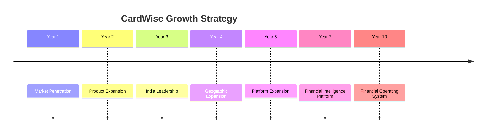

Growth should compound rather than fragment.

---

# Strategic Opportunity Matrix

| Initiative | Market Risk | Technical Risk | Strategic Value | Priority |
|-------------|------------|----------------|-----------------|----------|
| Reward Optimization | Low | Medium | Very High | P0 |
| Browser Intelligence | Low | Medium | High | P1 |
| Merchant Intelligence | Medium | High | Very High | P0 |
| Travel Intelligence | Medium | Medium | High | P1 |
| Unified Reward Wallet | Medium | High | Very High | P1 |
| Financial Copilot | Medium | High | Very High | P1 |
| Investment Intelligence | High | High | Very High | Future |
| Tax Intelligence | High | High | High | Future |

---

# Expansion Decision Framework

Every expansion initiative should answer the following questions.

## Does it increase user value?

---

## Does it strengthen the knowledge graph?

---

## Does it improve recommendation quality?

---

## Does it create additional switching costs?

---

## Does it expand the platform rather than fragment it?

---

## Does it align with the long-term Financial Operating System vision?

Only initiatives satisfying most of these criteria should receive significant investment.

---

# Capability Maturity Model

The platform evolves through several capability stages.

```text
Reward Optimization

↓

Financial Intelligence

↓

Financial Planning

↓

Autonomous Optimization

↓

Financial Operating System
```

Each stage builds directly upon previous investments.

---

# Investment Priorities

## Stage 1

Invest heavily in:

- Data
- AI
- Rule Engine
- Merchant Intelligence
- Knowledge Graph

---

## Stage 2

Expand into:

- Travel
- Browser Extension
- Unified Rewards
- Financial Copilot

---

## Stage 3

Expand into:

- Investments
- Insurance
- Taxes
- Enterprise

---

## Stage 4

Develop:

- Autonomous Agents
- Financial Digital Twin
- AI-to-AI Commerce
- Financial Operating System

---

# Strategic Risks

Potential growth risks include:

## Premature Diversification

Expanding into unrelated domains before achieving product-market fit.

---

## Geographic Complexity

Supporting multiple countries before the platform becomes configurable.

---

## Feature Bloat

Adding isolated capabilities that do not strengthen the intelligence platform.

---

## Operational Complexity

Growing faster than engineering maturity.

---

# Mitigation Strategy

Maintain a strict expansion philosophy:

> Intelligence first.

Features second.

Every investment should improve the platform's core reasoning capabilities.

---

# Executive Assessment

The Ansoff analysis reinforces several strategic principles.

CardWise should:

- dominate a narrow use case,
- deepen intelligence,
- expand geographically,
- broaden adjacent financial domains,
- ultimately evolve into a Financial Operating System.

Attempting to execute these stages simultaneously would significantly increase execution risk.

---

# Key Strategic Insight

The platform should not think in terms of:

> **"What feature should we build next?"**

Instead, ask:

> **"What adjacent financial decision should we become intelligent about next?"**

This perspective ensures every expansion compounds long-term platform value.

---

# Transition

The Ansoff Matrix defines where CardWise should grow.

The next strategic framework prioritizes where investment should be concentrated by evaluating each major capability using the **BCG Growth-Share Matrix**, helping distinguish between foundational investments, growth engines, and long-term bets.

---

**End of Part 4D — Ansoff Matrix & Long-Term Growth Strategy**

**Next:** **Part 4E — BCG Growth-Share Matrix & Strategic Investment Prioritization**

# Part 4E — BCG Growth-Share Matrix & Strategic Investment Prioritization

> **Objective:** Apply the Boston Consulting Group (BCG) Growth-Share Matrix to CardWise's capabilities, determine where engineering and product investments should be concentrated, and create a capital allocation framework for long-term platform growth.

---

# Executive Summary

The traditional BCG Matrix classifies business units into:

- Stars
- Cash Cows
- Question Marks
- Dogs

However, CardWise is an early-stage platform rather than a mature conglomerate.

Therefore, this framework has been adapted to evaluate **product capabilities**, **platform assets**, and **strategic initiatives** instead of business divisions.

The objective is to answer:

> **"Where should we invest the next engineering year?"**

---

# Traditional BCG Matrix

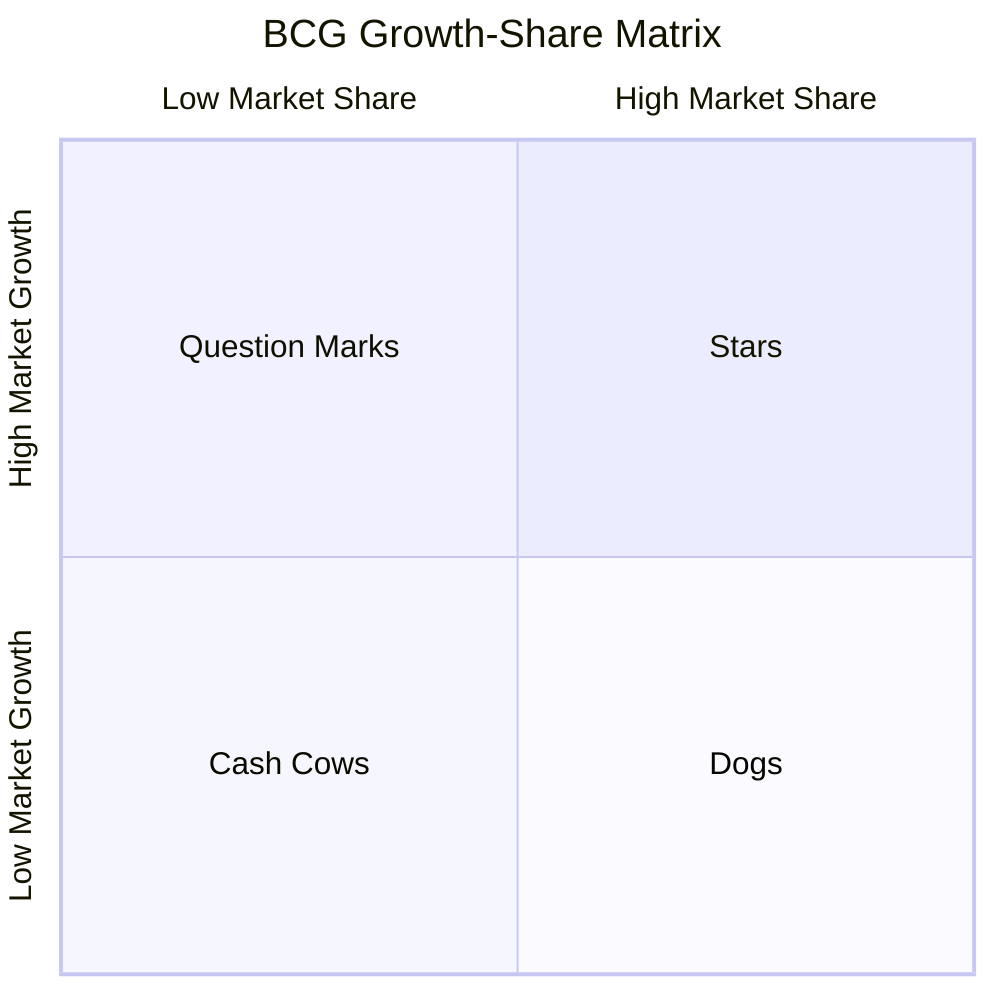

For CardWise:

- Market Share → Competitive Advantage
- Market Growth → Strategic Future Value

---

# Investment Philosophy

Engineering resources are finite.

Investment should prioritize:

- compounding platform assets,
- reusable infrastructure,
- long-term intelligence,

rather than isolated user-facing features.

---

# Stars

Stars represent high-growth, high-strategic-value investments.

These deserve aggressive investment.

---

## Financial Knowledge Graph

### Why?

Every recommendation depends on it.

Benefits include:

- AI reasoning
- simulations
- personalization
- explainability
- merchant intelligence

Without the graph,

the platform becomes significantly less differentiated.

---

### Recommendation

Invest continuously.

Never stop improving.

---

## Reward Rule Engine

The rule engine powers:

- recommendations
- browser extension
- AI
- APIs
- simulations
- analytics

It becomes reusable infrastructure.

---

## Explainable AI

Trust becomes increasingly valuable as AI adoption grows.

Explainability supports:

- consumers
- enterprises
- regulators

---

## Merchant Intelligence

Merchant intelligence improves:

- recommendation quality
- shopping optimization
- travel optimization
- affiliate intelligence

---

# Stars Summary

| Capability | Strategic Value | Investment |
|------------|-----------------|------------|
| Knowledge Graph | Critical | Aggressive |
| Rule Engine | Critical | Aggressive |
| Explainable AI | Critical | Aggressive |
| Merchant Intelligence | Critical | Aggressive |

---

# Question Marks

Question Marks represent high-potential initiatives that require validation.

---

## Browser Extension

Potential:

Very High

Risks:

- browser API changes
- platform policies
- adoption uncertainty

Recommendation:

Invest,

but validate continuously.

---

## Financial Copilot

Potential:

Transformational

Risks:

- AI quality
- hallucinations
- trust

Recommendation:

Build incrementally.

---

## Reward Simulation

Potential:

High differentiation

Risk:

Complex implementation.

Recommendation:

Prototype early.

---

## Financial Opportunity Score

Potential:

Category-defining metric.

Recommendation:

Validate with power users before broad rollout.

---

# Question Marks Summary

| Capability | Potential | Recommendation |
|------------|------------|----------------|
| Browser Extension | High | Validate |
| Financial Copilot | Very High | Build Incrementally |
| Reward Simulation | High | Prototype |
| Opportunity Score | High | Validate |

---

# Cash Cows

These capabilities are mature enough to generate sustained value with relatively lower ongoing investment.

Although CardWise is early-stage, several future capabilities may eventually become Cash Cows.

---

## Premium Subscription

Stable recurring revenue.

---

## Affiliate Revenue

Established monetization.

---

## Merchant Partnerships

Long-term recurring partnerships.

---

## Enterprise APIs

Recurring B2B revenue.

---

## Analytics Platform

Enterprise intelligence products.

---

# Cash Cow Summary

| Capability | Revenue Stability |
|------------|------------------|
| Premium Plans | High |
| Affiliate Revenue | High |
| Merchant Partnerships | High |
| Enterprise APIs | High |
| Analytics | Medium |

---

# Dogs

Traditional BCG calls these low-growth, low-value investments.

For CardWise,

the goal is not to identify products to abandon,

but activities that create little strategic leverage.

---

Examples include:

- isolated dashboards
- static comparison pages
- manually curated content
- duplicated analytics
- cosmetic UI enhancements

These features create limited long-term differentiation.

---

# Engineering Investment Pyramid

```text
Knowledge Graph

↓

Rule Engine

↓

AI

↓

Merchant Intelligence

↓

Recommendations

↓

UI

↓

Marketing Pages
```

The closer an investment is to the top,

the greater its long-term strategic leverage.

---

# Capital Allocation Model

Recommended engineering allocation.

| Area | Investment Allocation |
|------|-----------------------|
| Data Infrastructure | 25% |
| AI & Recommendation Systems | 20% |
| Knowledge Graph | 15% |
| Rule Engine | 10% |
| Merchant Intelligence | 10% |
| Product Experience | 10% |
| Growth & Analytics | 5% |
| Experiments | 5% |

The majority of investment should strengthen platform intelligence.

---

# Feature Prioritization Matrix

Evaluate every roadmap item across four dimensions.

| Dimension | Weight |
|-----------|--------|
| User Value | 30% |
| Strategic Value | 30% |
| Reusability | 20% |
| Competitive Differentiation | 20% |

Features with the highest composite score receive priority.

---

# Technical Debt Strategy

Technical debt should also be categorized.

## Good Debt

Accelerates validation.

Examples:

- prototypes
- MVP shortcuts
- temporary integrations

---

## Bad Debt

Reduces platform quality.

Examples:

- duplicated logic
- hardcoded reward rules
- inconsistent data models
- tightly coupled services

Bad debt should be minimized.

---

# Investment Flywheel

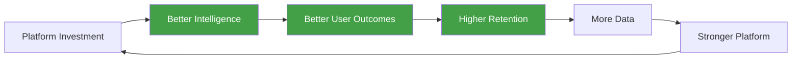

Investment compounds rather than producing isolated improvements.

---

# Portfolio Evolution

```text
Year 1

Knowledge Graph

↓

Year 2

Recommendation Engine

↓

Year 3

Financial Copilot

↓

Year 5

Financial Intelligence Platform

↓

Year 10

Financial Operating System
```

Every investment builds upon previous infrastructure.

---

# Strategic Insights

## Insight 1

Infrastructure creates greater long-term value than features.

---

## Insight 2

Reusable intelligence compounds faster than user interfaces.

---

## Insight 3

The Knowledge Graph is the single highest-leverage investment.

---

## Insight 4

Engineering allocation should heavily favor platform capabilities rather than feature velocity.

---

# Executive Assessment

The BCG analysis demonstrates that CardWise's future success depends less on launching many visible features and more on strengthening invisible platform assets.

The companies that dominate future financial ecosystems will own:

- the best data,
- the strongest intelligence,
- the highest trust,

rather than simply the largest feature lists.

---

# Transition

The previous frameworks focused primarily on products and investments.

The final strategic framework shifts attention inward by evaluating the organization itself.

The next section applies the **McKinsey 7S Framework** to define the organizational capabilities, leadership principles, culture, processes, technology, and talent required to execute CardWise's long-term vision.

---

**End of Part 4E — BCG Growth-Share Matrix & Strategic Investment Prioritization**

**Next:** **Part 4F — McKinsey 7S Framework & Organizational Strategy**

# Part 4F — McKinsey 7S Framework & Organizational Strategy

> **Objective:** Apply the McKinsey 7S Framework to define the organizational structure, leadership philosophy, engineering culture, operating model, and execution principles required to build CardWise into a world-class Financial Decision Intelligence Platform.

---

# Executive Summary

Technology alone does not build category-defining companies.

Execution does.

The McKinsey 7S Framework evaluates whether an organization is internally aligned across seven critical dimensions:

- Strategy
- Structure
- Systems
- Shared Values
- Skills
- Style
- Staff

For CardWise, this framework serves as a blueprint for scaling from an early-stage startup to a global technology company.

---

# McKinsey 7S Framework

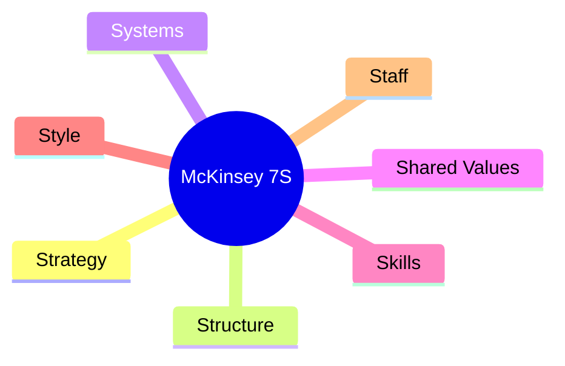

Each dimension must reinforce the others.

Misalignment creates organizational friction.

---

# 1. Strategy

## Vision

Become the world's most trusted **Financial Decision Intelligence Platform**, evolving into a **Consumer Financial Operating System**.

---

## Strategic Principles

### Intelligence Before Features

Invest in reusable intelligence infrastructure before adding user-facing capabilities.

---

### Trust Before Growth

Long-term trust is more valuable than short-term user acquisition.

---

### Platform Before Products

Build reusable platform capabilities that power multiple experiences.

---

### Data Before AI

AI quality is constrained by data quality.

Prioritize structured, high-quality financial knowledge.

---

### Long-Term Thinking

Optimize for the next decade rather than the next quarter.

---

# Strategy Summary

| Principle | Priority |
|-----------|----------|
| Intelligence | Critical |
| Trust | Critical |
| Platform Thinking | Critical |
| Data Quality | Critical |
| Long-Term Vision | Critical |

---

# 2. Structure

The organizational structure should mirror the platform architecture.

Adopt **Domain-Driven Design (DDD)** principles for both technology and teams.

---

## Recommended Product Domains

```text
Financial Intelligence

↓

Rewards

↓

Travel

↓

Commerce

↓

AI

↓

Platform

↓

Developer Experience

↓

Growth
```

Each domain owns:

- product roadmap
- engineering
- data
- quality
- metrics

This minimizes cross-team dependencies.

---

## Leadership Structure

Recommended executive organization:

| Function | Responsibility |
|-----------|----------------|
| CEO | Vision, Strategy, Capital Allocation |
| CTO | Platform Architecture, Engineering |
| CPO | Product Vision, Roadmap |
| Head of AI | Intelligence Platform |
| Head of Data | Knowledge Graph & Analytics |
| Head of Design | UX, Research, Accessibility |
| Head of Growth | Acquisition & Retention |
| Head of Partnerships | Ecosystem Expansion |

---

# 3. Systems

Systems define how work gets done.

---

## Product Systems

Examples:

- Product discovery
- User research
- Experimentation
- Roadmap planning
- Feature prioritization

---

## Engineering Systems

Examples:

- CI/CD
- Automated testing
- Observability
- Feature flags
- Infrastructure as Code

---

## Data Systems

Examples:

- Event pipelines
- Knowledge graph
- Data warehouse
- Recommendation feedback loop
- Experiment analytics

---

## AI Systems

Examples:

- Model evaluation
- Prompt management
- Retrieval pipelines
- Rule validation
- Recommendation explainability

---

## Business Systems

Examples:

- Customer support
- CRM
- Billing
- Partner management
- Compliance workflows

---

# 4. Shared Values

Shared values define how decisions are made when processes do not exist.

These become the cultural foundation of CardWise.

---

## Value 1 — Consumer First

Every recommendation should maximize consumer outcomes.

Never optimize for affiliate revenue at the expense of user trust.

---

## Value 2 — Explain Everything

Every important recommendation should be explainable.

Transparency is a feature.

---

## Value 3 — Compound Knowledge

Every interaction should improve the platform.

Learning compounds.

---

## Value 4 — Build Platforms

Avoid one-off solutions.

Reusable systems create long-term leverage.

---

## Value 5 — Simplicity

Consumers experience simplicity.

Engineering absorbs complexity.

---

## Value 6 — Think Decades

Optimize decisions for long-term strategic advantage.

---

# 5. Skills

CardWise requires multidisciplinary expertise.

---

## Core Engineering Skills

- Distributed Systems
- React & Frontend Engineering
- Backend Systems
- Cloud Infrastructure
- Security
- Observability

---

## AI Skills

- LLM Engineering
- Knowledge Graphs
- Recommendation Systems
- Retrieval-Augmented Generation (RAG)
- Machine Learning
- Prompt Engineering
- Explainable AI

---

## Product Skills

- Consumer Research
- Behavioral Psychology
- Product Analytics
- Experiment Design
- UX Research

---

## Business Skills

- Partnerships
- FinTech
- Payments
- Loyalty Programs
- Travel Industry
- Regulatory Compliance

---

# Skills Evolution

```text
Startup

↓

Generalists

↓

Specialists

↓

Platform Experts

↓

Global Organization
```

Hiring strategy should evolve alongside company maturity.

---

# 6. Leadership Style

Leadership determines execution speed and organizational resilience.

---

## Founder Mindset

Leaders should maintain:

- customer obsession
- technical curiosity
- long-term thinking
- willingness to challenge assumptions

---

## Decision Principles

Prefer:

- first-principles reasoning
- evidence-based decisions
- experimentation
- transparency

Avoid:

- hierarchy-driven decisions
- feature-driven thinking
- short-term optimization

---

## Communication Style

Leadership should communicate:

- vision repeatedly
- strategic priorities clearly
- technical decisions transparently

Alignment reduces execution friction.

---

# 7. Staff

The company should prioritize exceptional talent density over rapid headcount growth.

---

## Early Team Characteristics

Hire individuals who are:

- product-minded
- technically excellent
- highly curious
- systems thinkers
- comfortable with ambiguity

---

## Team Evolution

| Stage | Team Focus |
|--------|------------|
| 0–10 | Foundational Builders |
| 10–30 | Domain Ownership |
| 30–75 | Platform Scale |
| 75–150 | Organizational Maturity |
| 150+ | International Expansion |

---

# Organizational Principles

As CardWise grows, maintain:

- small autonomous teams
- clear ownership
- minimal bureaucracy
- measurable outcomes

Autonomy should increase speed without sacrificing alignment.

---

# Organizational Operating Model


Every iteration strengthens organizational knowledge.

---

# Decision-Making Framework

Every significant decision should be evaluated across five dimensions.

| Dimension | Question |
|-----------|----------|
| Consumer | Does this improve user outcomes? |
| Intelligence | Does it strengthen the platform? |
| Trust | Does it increase transparency? |
| Reusability | Can other teams leverage it? |
| Long-Term Value | Will this matter in five years? |

This framework reduces short-term bias.

---

# Cultural Flywheel

```mermaid
flowchart LR

A[Great People]

--> B[Better Systems]

--> C[Better Products]

--> D[More Users]

--> E[More Learning]

--> F[Stronger Culture]

--> A

style C fill:#43A047,color:white
style D fill:#43A047,color:white
style F fill:#43A047,color:white
```

Culture compounds just like technology.

---

# Organizational Risks

Potential challenges include:

## Premature Scaling

Growing the team faster than systems mature.

---

## Organizational Silos

Teams optimizing local metrics instead of platform outcomes.

---

## Technical Fragmentation

Independent solutions that weaken platform consistency.

---

## Cultural Drift

Losing core principles as headcount increases.

---

## AI Dependency Without Understanding

Using AI extensively without maintaining deep domain expertise.

---

# Mitigation Strategies

- Document architectural principles.
- Invest in internal education.
- Maintain strong technical leadership.
- Reinforce shared values through hiring and onboarding.
- Measure platform-wide outcomes rather than isolated team metrics.

---

# Executive Assessment

The McKinsey 7S analysis demonstrates that CardWise's long-term success depends as much on organizational alignment as technological innovation.

A world-class Financial Operating System requires:

- world-class architecture,
- world-class execution,
- world-class culture.

These elements must evolve together.

---

# Strategic Conclusion

The greatest competitive advantage will not be:

- faster development,
- more engineers,
- more features.

It will be an organization capable of consistently making better long-term decisions.

That organizational capability ultimately becomes as defensible as the technology itself.

---

# Transition

With the strategic frameworks complete, the appendix now shifts from **strategic analysis** to **business model research**.

The next chapter examines how leading fintech companies generate revenue, align incentives, price products, build sustainable business models, and where CardWise can differentiate economically.

---

**End of Part 4F — McKinsey 7S Framework & Organizational Strategy**

**Next:** **Part 5A — Business Model Research & Revenue Strategy**

# Part 5A — Business Model Research & Revenue Strategy

> **Objective:** Analyze the business models of leading fintech companies, identify sustainable monetization strategies, evaluate revenue alignment with consumer outcomes, and design a long-term economic model for CardWise.

---

# Executive Summary

Many fintech products fail not because they lack users, but because they lack sustainable business models.

The strongest companies align their revenue with customer success.

Poor business models create conflicting incentives.

For example:

- maximizing affiliate commissions instead of user value,
- promoting higher-fee financial products,
- favoring sponsored offers over better recommendations.

CardWise should intentionally avoid these conflicts.

Its long-term competitive advantage depends on becoming the **most trusted financial decision platform**, not simply the highest-earning affiliate.

---

# Business Model Evaluation Framework

Every revenue stream is evaluated using six dimensions.

| Dimension | Description |
|-----------|-------------|
| Scalability | Can revenue grow efficiently? |
| Margin | Long-term gross margin potential |
| Consumer Trust | Alignment with user interests |
| Predictability | Revenue stability |
| Strategic Fit | Supports long-term vision |
| Competitive Defensibility | Difficulty to replicate |

---

# Business Model Landscape

The fintech ecosystem uses several recurring monetization models.

```mermaid
mindmap
  root((Revenue Models))

    Subscription
    Affiliate
    Advertising
    Enterprise
    APIs
    Licensing
    Data
    Marketplace
```

Each has advantages and trade-offs.

---

# Model 1 — Subscription

## Description

Consumers pay recurring fees for premium capabilities.

Examples include:

- advanced optimization
- AI financial copilot
- simulations
- premium insights
- historical analytics
- cross-platform automation

---

## Advantages

- predictable recurring revenue
- strong alignment with consumer outcomes
- reduced dependence on affiliates
- encourages long-term retention

---

## Challenges

Requires continuous delivery of measurable value.

---

## Strategic Assessment

| Metric | Rating |
|---------|--------|
| Scalability | ⭐⭐⭐⭐⭐ |
| Margin | ⭐⭐⭐⭐⭐ |
| Trust | ⭐⭐⭐⭐⭐ |
| Predictability | ⭐⭐⭐⭐⭐ |
| Strategic Fit | ⭐⭐⭐⭐⭐ |

---

# Model 2 — Affiliate Revenue

## Description

Revenue generated when users apply for:

- credit cards
- financial products
- travel bookings
- merchant offers

---

## Advantages

- high short-term monetization
- established industry model
- minimal payment friction

---

## Risks

Affiliate incentives may conflict with consumer interests.

Recommendation quality must never be influenced solely by commission structures.

---

## Strategic Assessment

| Metric | Rating |
|---------|--------|
| Scalability | ⭐⭐⭐⭐☆ |
| Margin | ⭐⭐⭐⭐⭐ |
| Trust | ⭐⭐☆☆☆ |
| Predictability | ⭐⭐⭐☆☆ |
| Strategic Fit | ⭐⭐⭐☆☆ |

---

# Model 3 — Travel Partnerships

## Description

Revenue from:

- flight bookings
- hotel bookings
- travel insurance
- experiences

combined with reward optimization.

---

## Advantages

Travel users often have higher transaction values and stronger engagement.

---

## Risks

Potential conflict between:

- best financial recommendation

and

- highest commission partner.

Platform neutrality must be preserved.

---

# Strategic Assessment

| Metric | Rating |
|---------|--------|
| Scalability | ⭐⭐⭐⭐☆ |
| Margin | ⭐⭐⭐⭐☆ |
| Trust | ⭐⭐⭐☆☆ |
| Strategic Fit | ⭐⭐⭐⭐☆ |

---

# Model 4 — Merchant Intelligence Platform

## Description

Provide merchants with aggregated insights regarding:

- reward behavior
- shopping trends
- offer performance
- consumer optimization

Data must always remain anonymized and privacy-preserving.

---

## Advantages

Creates B2B revenue independent of consumer subscriptions.

---

## Risks

Must maintain strict separation between analytics products and consumer recommendation integrity.

---

## Strategic Assessment

| Metric | Rating |
|---------|--------|
| Scalability | ⭐⭐⭐⭐⭐ |
| Margin | ⭐⭐⭐⭐⭐ |
| Trust | ⭐⭐⭐⭐☆ |
| Strategic Fit | ⭐⭐⭐⭐☆ |

---

# Model 5 — Enterprise APIs

## Description

License platform capabilities to:

- banks
- fintech companies
- travel providers
- expense platforms
- wealth managers

Examples include:

- reward engine
- recommendation APIs
- merchant intelligence
- financial simulations

---

## Advantages

Highly scalable with strong recurring revenue potential.

---

## Strategic Assessment

| Metric | Rating |
|---------|--------|
| Scalability | ⭐⭐⭐⭐⭐ |
| Margin | ⭐⭐⭐⭐⭐ |
| Trust | ⭐⭐⭐⭐⭐ |
| Strategic Fit | ⭐⭐⭐⭐⭐ |

---

# Model 6 — Financial Intelligence Licensing

## Description

License proprietary financial intelligence datasets.

Examples include:

- merchant graphs
- reward rules
- historical offers
- loyalty intelligence

Potential customers include:

- banks
- travel companies
- fintech platforms
- financial institutions

---

## Advantages

Transforms proprietary data into strategic infrastructure.

---

## Risks

Must avoid licensing assets that weaken CardWise's core competitive advantage.

---

# Strategic Assessment

| Metric | Rating |
|---------|--------|
| Scalability | ⭐⭐⭐⭐⭐ |
| Margin | ⭐⭐⭐⭐⭐ |
| Defensibility | ⭐⭐⭐⭐⭐ |
| Strategic Fit | ⭐⭐⭐⭐☆ |

---

# Revenue Evolution

Revenue should mature in stages.

```mermaid
timeline
    title Revenue Evolution

    Year 1 : Premium Subscription

    Year 2 : Affiliate Revenue

    Year 3 : Travel Partnerships

    Year 4 : Merchant Intelligence

    Year 5 : Enterprise APIs

    Year 7 : Financial Intelligence Platform
```

Each stage builds upon previous capabilities.

---

# Revenue Diversification

Long-term sustainability requires multiple complementary revenue streams.

| Revenue Stream | Year 1 | Year 3 | Year 5 | Year 10 |
|---------------|--------|--------|---------|----------|
| Subscription | High | High | High | High |
| Affiliate | Medium | High | High | Medium |
| Travel | Low | Medium | High | High |
| Enterprise APIs | Low | Low | Medium | High |
| Merchant Intelligence | Low | Medium | High | High |
| Data Licensing | None | Low | Medium | High |

Diversification reduces dependency on any single revenue source.

---

# Incentive Alignment Matrix

The strongest business models align company success with consumer success.

| Revenue Model | Consumer Alignment |
|---------------|-------------------|
| Subscription | Excellent |
| Enterprise APIs | Excellent |
| Merchant Intelligence | High |
| Travel Partnerships | Medium |
| Affiliate Marketing | Medium |
| Advertising | Low |

Advertising is intentionally excluded from CardWise's long-term strategy due to potential conflicts with trust.

---

# Pricing Philosophy

Pricing should reflect delivered value rather than feature count.

Consumers should perceive:

> "CardWise pays for itself."

The platform should consistently demonstrate measurable financial outcomes.

---

# Unit Economics

Key long-term metrics include:

- Customer Acquisition Cost (CAC)
- Lifetime Value (LTV)
- Gross Margin
- Payback Period
- Net Revenue Retention
- Annual Recurring Revenue (ARR)

Strong unit economics enable sustainable growth.

---

# Business Flywheel

```mermaid
flowchart LR

A[Better Recommendations]

--> B[Higher Savings]

--> C[Greater Trust]

--> D[Premium Adoption]

--> E[Recurring Revenue]

--> F[More Investment]

--> A

style B fill:#43A047,color:white
style C fill:#43A047,color:white
style D fill:#43A047,color:white
```

Revenue becomes a consequence of consumer success.

---

# Strategic Principles

CardWise's monetization strategy should follow several enduring principles.

## Principle 1

Trust is more valuable than short-term revenue.

---

## Principle 2

Recurring revenue is more resilient than transactional revenue.

---

## Principle 3

Revenue streams should diversify over time.

---

## Principle 4

Every monetization model should reinforce—not weaken—the intelligence platform.

---

## Principle 5

Consumers should always believe recommendations prioritize their financial outcomes.

---

# Executive Assessment

The strongest long-term business model combines:

- consumer subscriptions,
- enterprise APIs,
- merchant intelligence,
- financial infrastructure,

while maintaining strict neutrality in recommendation quality.

This creates a resilient economic foundation capable of supporting long-term investment in AI, data, and platform capabilities.

---

# Transition

Understanding revenue is only one part of the business.

The next section examines how leading fintech companies acquire, retain, and grow users through:

- product-led growth,
- referral systems,
- community,
- content,
- partnerships,
- lifecycle marketing,
- and retention strategies.

These insights will inform CardWise's long-term go-to-market approach.

---

**End of Part 5A — Business Model Research & Revenue Strategy**

**Next:** **Part 5B — Growth Strategy, Acquisition Channels & Retention Models**

# Part 5B — Growth Strategy, Acquisition Channels & Retention Models

> **Objective:** Analyze how category-leading fintech companies acquire, activate, retain, and expand their user base. Define a scalable, product-led growth model for CardWise that prioritizes sustainable acquisition, high retention, and compounding network effects over paid marketing.

---

# Executive Summary

The best fintech products do not rely solely on marketing.

They rely on **compounding growth loops**.

Traditional growth follows a funnel:

```text
Marketing

↓

Sign Up

↓

Purchase
```

Modern product-led companies instead build self-reinforcing systems:

```text
Better Product

↓

Better Outcomes

↓

Word of Mouth

↓

More Users

↓

More Data

↓

Better Product
```

CardWise should prioritize these compounding loops over short-term acquisition tactics.

---

# Growth Framework

CardWise's growth strategy should be organized into five pillars.

```mermaid
mindmap
  root((Growth))

    Acquisition
    Activation
    Engagement
    Retention
    Expansion
```

Each stage should reinforce the next.

---

# Growth Philosophy

Rather than asking:

> **"How do we acquire more users?"**

CardWise should ask:

> **"How do we create an experience that users naturally recommend?"**

The highest-quality growth originates from exceptional product outcomes.

---

# Stage 1 — Acquisition

## Objective

Introduce high-intent users to CardWise.

---

## Primary Acquisition Channels

### Organic Search (SEO)

Consumers frequently search:

- Best credit card
- Which card should I use?
- Reward calculator
- Airport lounge access
- Cashback comparison
- Airline miles

High-quality educational content can capture this intent.

---

### Financial Content

Publish:

- reward guides
- travel optimization articles
- comparison tools
- annual reports
- interactive calculators

Content establishes credibility before product adoption.

---

### YouTube

Educational videos covering:

- reward optimization
- travel hacking
- card comparisons
- AI demonstrations

Video builds trust for financial products.

---

### Social Media

Focus on:

- LinkedIn
- X (Twitter)
- Instagram
- Reddit
- Threads

Short educational content can generate significant organic reach.

---

### Communities

Engage with:

- travel communities
- finance forums
- reward enthusiasts
- frequent flyer groups

Community participation should prioritize education over promotion.

---

### Referral Programs

Reward successful referrals with:

- premium features
- AI credits
- travel perks
- exclusive reports

Referrals should celebrate user success rather than incentivize spam.

---

# Acquisition Prioritization

| Channel | Cost | Scalability | Trust Impact |
|----------|------|-------------|--------------|
| SEO | Low | Very High | High |
| Content | Medium | High | Very High |
| YouTube | Medium | High | High |
| Referrals | Low | High | Very High |
| Partnerships | Medium | High | High |
| Paid Ads | High | Medium | Medium |

Product-led channels should dominate long-term acquisition.

---

# Stage 2 — Activation

## Objective

Help new users experience meaningful value as quickly as possible.

---

## Activation Principle

The first session should answer:

> **"Why should I continue using CardWise?"**

---

## Ideal Activation Journey

```mermaid
flowchart LR

A[Sign Up]

--> B[Add Cards]

--> C[Connect Loyalty Accounts]

--> D[Analyze Rewards]

--> E[Discover Savings]

--> F[First Recommendation]
```

The first recommendation should demonstrate immediate, measurable value.

---

## Activation Metrics

Track:

- onboarding completion
- cards added
- loyalty accounts connected
- first recommendation viewed
- first recommendation accepted

These metrics strongly predict long-term retention.

---

# Stage 3 — Engagement

## Objective

Encourage habitual interaction.

---

## Daily Engagement Opportunities

Examples:

- opportunity feed
- expiring rewards
- new offers
- travel alerts
- merchant recommendations

Users should receive value even without making purchases.

---

## Weekly Engagement

Examples:

- reward summaries
- savings reports
- spending insights
- optimization suggestions

---

## Monthly Engagement

Examples:

- financial health review
- annual fee analysis
- reward valuation
- optimization score

Regular insights reinforce long-term value.

---

# Engagement Flywheel

```mermaid
flowchart LR

A[Financial Activity]

--> B[AI Analysis]

--> C[New Insights]

--> D[Consumer Action]

--> E[Better Outcomes]

--> F[Higher Engagement]

--> A
```

The product becomes more useful through continued use.

---

# Stage 4 — Retention

## Objective

Increase long-term usage and reduce churn.

---

# Retention Drivers

Retention should come from:

- personalization
- trust
- measurable savings
- financial memory
- continuous intelligence

Rather than notifications alone.

---

## Switching Costs

Retention strengthens as users accumulate:

- reward history
- recommendation history
- AI preferences
- connected accounts
- financial goals

Historical context becomes increasingly valuable.

---

## Retention Metrics

| Metric | Purpose |
|----------|----------|
| D30 Retention | Early engagement |
| D90 Retention | Product-market fit |
| Annual Retention | Long-term loyalty |
| Recommendation Adoption | Product trust |
| Monthly Active Users | Platform health |
| Net Promoter Score | Advocacy |

---

# Stage 5 — Expansion

## Objective

Increase lifetime value without sacrificing trust.

---

## Expansion Opportunities

Examples:

- premium subscription
- travel optimization
- family plans
- enterprise features
- investment intelligence

Expansion should feel like a natural extension of existing value.

---

# Product-Led Growth Loops

CardWise should rely on multiple interconnected loops.

---

## Loop 1 — Intelligence Loop

```text
More Users

↓

More Data

↓

Better AI

↓

Better Recommendations

↓

Higher Satisfaction

↓

More Referrals

↓

More Users
```

---

## Loop 2 — Content Loop

```text
Research

↓

Educational Content

↓

Organic Traffic

↓

Product Usage

↓

User Success Stories

↓

More Content
```

---

## Loop 3 — Community Loop

```text
Users

↓

Verified Insights

↓

Better Recommendations

↓

Greater Trust

↓

Community Growth
```

---

## Loop 4 — Partnership Loop

```text
Partners

↓

More Integrations

↓

Better User Experience

↓

Higher Adoption

↓

More Partners
```

---

# Lifecycle Marketing

Marketing should adapt to user maturity.

| Stage | Primary Goal |
|---------|--------------|
| Visitor | Education |
| New User | Activation |
| Active User | Engagement |
| Power User | Advocacy |
| Premium User | Expansion |

Communication should become increasingly personalized over time.

---

# Growth Metrics Dashboard

Recommended executive metrics.

| Category | KPI |
|-----------|-----|
| Acquisition | Cost per Activated User |
| Activation | Time to First Value |
| Engagement | Weekly Active Users |
| Retention | D30 / D90 / Annual Retention |
| Revenue | Premium Conversion |
| Advocacy | Referral Rate |
| Trust | Recommendation Acceptance Rate |

These metrics provide a balanced view of platform health.

---

# Growth Risks

Potential challenges include:

## Over-Reliance on Paid Acquisition

Creates unsustainable CAC.

---

## Weak Activation

Users fail to experience value quickly.

---

## Low Engagement

Recommendations become infrequent or repetitive.

---

## Trust Erosion

Commercial incentives reduce recommendation quality.

---

## Premature Monetization

Charging before delivering measurable value.

---

# Mitigation Strategies

- Optimize onboarding relentlessly.
- Demonstrate savings early.
- Invest in recommendation quality.
- Build habit-forming experiences.
- Maintain transparent monetization.

---

# Strategic Insights

## Insight 1

Exceptional products reduce acquisition costs through advocacy.

---

## Insight 2

Activation matters more than sign-ups.

Users who experience early value exhibit significantly higher retention.

---

## Insight 3

Retention compounds platform intelligence.

Every retained user improves future recommendations.

---

## Insight 4

Growth should emerge from trust rather than advertising.

Trust scales more slowly—but compounds far longer.

---

# Executive Assessment

CardWise should adopt a **product-led growth** strategy centered on:

- educational content,
- AI-driven personalization,
- measurable financial outcomes,
- referrals,
- ecosystem partnerships.

Marketing introduces users.

The product earns their loyalty.

---

# Transition

Growth depends not only on acquiring users, but also on delivering exceptional product experiences.

The next chapter studies leading consumer applications from a UX perspective, examining:

- onboarding,
- navigation,
- interaction design,
- habit formation,
- accessibility,
- personalization,
- and behavioral psychology.

These insights will directly inform CardWise's product design principles.

---

**End of Part 5B — Growth Strategy, Acquisition Channels & Retention Models**

**Next:** **Part 6A — UX Research: Product Psychology, Onboarding & Habit Formation**

# Part 6A — UX Research: Product Psychology, Onboarding & Habit Formation

> **Objective:** Analyze how world-class consumer products create intuitive, engaging, and habit-forming experiences. Establish UX principles that enable CardWise to reduce financial complexity, increase trust, and become a daily financial companion rather than an occasional utility.

---

# Executive Summary

Great fintech products do not succeed because they expose more financial information.

They succeed because they make complex financial decisions feel simple.

The role of UX in CardWise is not to create beautiful interfaces.

Its role is to:

- reduce cognitive load,
- increase financial confidence,
- explain complexity,
- encourage better decisions.

The product should help users feel:

> **"I'm confident I'm making the right financial decision."**

That emotional outcome is more valuable than visual aesthetics alone.

---

# UX Philosophy

CardWise should follow five foundational principles.

```mermaid
mindmap
  root((UX Philosophy))

    Clarity
    Trust
    Simplicity
    Personalization
    Explainability
```

Every screen should reinforce these principles.

---

# Mental Model

Users should never feel like they are learning a financial product.

Instead,

they should feel like they are receiving guidance from a knowledgeable financial advisor.

---

## Traditional Financial UX

```text
Information

↓

Analysis

↓

Decision
```

---

## CardWise UX

```text
Situation

↓

Recommendation

↓

Explanation

↓

Confidence

↓

Decision
```

The emphasis shifts from information consumption to decision support.

---

# Product Psychology

Financial products involve higher emotional stakes than many consumer applications.

Users commonly experience:

- uncertainty,
- fear of making mistakes,
- loss aversion,
- decision fatigue,
- information overload.

The interface should actively reduce these emotions.

---

# Decision Fatigue

Modern consumers evaluate multiple variables simultaneously.

Examples include:

- Which card?
- Which merchant?
- Which airline?
- Which offer?
- Which payment method?
- Which redemption option?

The interface should progressively eliminate unnecessary choices.

---

# Cognitive Load Framework

```mermaid
flowchart LR

A[Financial Complexity]

--> B[Intelligent Simplification]

--> C[Clear Recommendation]

--> D[Confident Decision]
```

The product absorbs complexity so users do not have to.

---

# Onboarding Philosophy

Onboarding should not teach features.

It should demonstrate value.

---

## Poor Onboarding

- Product tour
- Feature explanations
- Long permission requests
- Generic marketing

---

## Effective Onboarding

- Connect cards
- Import rewards
- Discover savings
- Show first recommendation

Users should reach **first financial insight** as quickly as possible.

---

# Time to First Value (TTFV)

The most important onboarding metric is:

> **Time to First Value**

Ideal sequence:

```text
Sign Up

↓

Add Card

↓

Import Rewards

↓

Analyze Portfolio

↓

Discover Opportunity

↓

Recommendation
```

Every additional step increases abandonment risk.

---

# Progressive Disclosure

Avoid presenting all functionality at once.

Instead,

introduce complexity gradually.

---

## Example

### New User

Display:

- best card
- savings estimate
- one explanation

---

### Experienced User

Display:

- reward breakdown
- transfer optimization
- simulations
- historical analytics

The interface evolves alongside user expertise.

---

# Explainability

Every recommendation should answer four questions.

1. What should I do?
2. Why?
3. What do I gain?
4. What happens if I don't?

This structure builds confidence.

---

# Trust Signals

Financial decisions require stronger trust than typical productivity software.

Examples of trust-building elements include:

- confidence scores,
- transparent calculations,
- data freshness,
- source attribution,
- recommendation rationale,
- historical performance.

Trust should be visible throughout the interface.

---

# Personalization

Personalization extends beyond greeting users by name.

Recommendations should consider:

- spending patterns,
- travel preferences,
- card portfolio,
- merchant history,
- financial goals,
- previous decisions.

No two users should experience identical home screens.

---

# Home Screen Philosophy

The dashboard should answer one question:

> **"What is the most important financial action I should take today?"**

Everything else is secondary.

---

# Information Hierarchy

Recommended dashboard structure.

```text
Today's Opportunities

↓

Recommended Actions

↓

Upcoming Deadlines

↓

Reward Summary

↓

Historical Analytics

↓

Settings
```

Priority follows urgency and user value.

---

# Feedback Design

Every user action should generate meaningful feedback.

Examples:

- Savings unlocked
- Better card selected
- Reward earned
- Offer activated
- Opportunity captured

Positive reinforcement encourages continued engagement.

---

# Empty States

Empty states should educate and motivate.

Example scenarios:

- No cards added
- No travel plans
- No rewards imported
- No active offers

Rather than displaying blank screens,

provide contextual guidance and next actions.

---

# Notifications

Notifications should be:

- timely,
- relevant,
- actionable,
- personalized.

Avoid generic engagement reminders.

Examples:

- "Your points expire in 7 days."
- "Switching cards today earns an extra ₹1,200."
- "Transfer bonus ends tomorrow."

Each notification should have measurable user value.

---

# Habit Formation

CardWise should encourage lightweight, high-value habits.

Daily habits:

- Check opportunities
- Review recommendations

Weekly habits:

- Savings summary
- Reward progress

Monthly habits:

- Financial health review
- Annual fee analysis

Habit formation should emerge naturally from value delivery.

---

# Accessibility

Accessibility should be considered foundational.

Support:

- keyboard navigation,
- screen readers,
- high contrast,
- scalable typography,
- reduced motion,
- semantic structure.

Financial confidence should be accessible to all users.

---

# Cross-Platform Consistency

Users increasingly move across:

- mobile,
- desktop,
- browser extensions,
- wearable devices.

Core interaction patterns should remain consistent across platforms.

---

# Emotional Design

The interface should reinforce positive emotional outcomes.

Instead of emphasizing:

- spending,
- debt,
- complexity,

emphasize:

- progress,
- savings,
- confidence,
- achievement.

Positive reinforcement encourages long-term engagement.

---

# UX Metrics

Recommended executive UX metrics.

| Metric | Purpose |
|----------|----------|
| Time to First Value | Onboarding quality |
| Recommendation Acceptance | Trust |
| Task Completion Time | Usability |
| Session Duration | Engagement |
| Feature Adoption | Discoverability |
| User Satisfaction | Overall experience |
| Net Promoter Score | Advocacy |

---

# UX Anti-Patterns

Avoid:

- information overload,
- unnecessary dashboards,
- excessive financial jargon,
- unexplained recommendations,
- intrusive notifications,
- dark patterns,
- confusing navigation.

These patterns reduce trust.

---

# Design Principles

Every interface should satisfy five questions.

| Question | Goal |
|-----------|------|
| What happened? | Clarity |
| What should I do? | Guidance |
| Why? | Explainability |
| What do I gain? | Motivation |
| What happens next? | Confidence |

These questions create a consistent product experience.

---

# Executive Assessment

CardWise's UX should function less like a traditional finance application and more like an intelligent advisor.

The interface should progressively disappear,

leaving users focused on outcomes rather than mechanics.

The best compliment a user can give is not:

> **"The UI is beautiful."**

It is:

> **"I never have to think about which financial decision to make anymore."**

---

# Strategic Conclusion

The long-term UX vision is simple:

- reduce complexity,
- increase confidence,
- build trust,
- create habits,
- deliver measurable financial outcomes.

Design becomes a strategic differentiator because it makes sophisticated financial intelligence accessible to everyday consumers.

---

# Transition

With the psychological foundations established, the next section evaluates interaction design patterns across leading consumer products, including:

- navigation systems,
- search experiences,
- dashboards,
- micro-interactions,
- visual hierarchy,
- and cross-platform consistency.

These insights will directly influence CardWise's design system and product architecture.

---

**End of Part 6A — UX Research: Product Psychology, Onboarding & Habit Formation**

**Next:** **Part 6B — UX Research: Navigation, Interaction Patterns & Design System Principles**

# Part 6B — UX Research: Navigation, Interaction Patterns & Design System Principles

> **Objective:** Analyze interaction patterns from world-class consumer products, define a scalable navigation philosophy, establish reusable design system principles, and create a UX architecture that supports CardWise from MVP through a global Financial Operating System.

---

# Executive Summary

Navigation is one of the most underestimated aspects of product design.

Poor navigation forces users to remember where information exists.

Great navigation helps users think less.

For CardWise, navigation should answer one question:

> **"Where would a user naturally expect to find this?"**

Instead of organizing the application around internal technical architecture, CardWise should organize it around **user mental models**.

---

# Navigation Philosophy

Navigation should be:

- Predictable
- Consistent
- Progressive
- Searchable
- Context-aware

The product should minimize navigation depth while maximizing discoverability.

---

# Information Architecture Principles

Every screen should belong to one of five primary categories.

```mermaid
mindmap
  root((CardWise))

    Home
    Cards
    Rewards
    Travel
    Profile
```

Everything else should be discoverable from these core areas.

---

# Primary Navigation

## Home

Purpose:

Provide immediate financial guidance.

Examples:

- Today's opportunities
- AI recommendations
- Expiring rewards
- Financial score
- Recent activity

The Home screen answers:

> **"What should I do right now?"**

---

## Cards

Purpose:

Manage financial instruments.

Examples:

- Connected cards
- Card comparison
- Benefits
- Annual fees
- Spending analysis
- Utilization

---

## Rewards

Purpose:

Centralize loyalty intelligence.

Examples:

- Reward balances
- Redemption recommendations
- Transfer bonuses
- Expiration alerts
- Historical value

---

## Travel

Purpose:

Optimize travel-related financial decisions.

Examples:

- Flights
- Hotels
- Lounge access
- Companion benefits
- Travel insurance
- Itinerary optimization

---

## Profile

Purpose:

Manage personalization.

Examples:

- Goals
- Preferences
- AI settings
- Connected accounts
- Notifications
- Security

---

# Navigation Hierarchy

```text
Home

↓

Primary Domain

↓

Specific Task

↓

Detailed Analysis
```

Users should rarely require more than three levels of navigation.

---

# Contextual Navigation

Navigation should adapt to context.

Example:

While browsing flights,

additional actions appear:

- Transfer points
- Compare airlines
- Use best card
- Lounge eligibility

Context reduces unnecessary clicks.

---

# Universal Search

Search becomes a primary navigation mechanism.

Users should be able to search for:

- merchants
- cards
- airlines
- hotels
- benefits
- offers
- rewards
- help articles

Search should understand intent rather than keywords alone.

---

# AI Search

Future search experience.

Example:

Instead of searching:

```
Airport Lounge
```

Users ask:

> "Can I access the lounge in Singapore using my cards?"

The system reasons rather than retrieves.

---

# Dashboard Philosophy

Dashboards should communicate decisions,

not statistics.

---

## Poor Dashboard

- 20 charts
- 40 metrics
- 15 cards

Users must interpret everything.

---

## Good Dashboard

Three sections:

1. Recommended Action
2. Upcoming Opportunities
3. Financial Progress

The dashboard answers:

> **"What matters today?"**

---

# Interaction Design Principles

Every interaction should satisfy three properties.

## Immediate

Minimal latency.

---

## Predictable

Users know what happens next.

---

## Reversible

Mistakes should be easy to recover from.

---

# Micro-Interactions

Micro-interactions create confidence.

Examples:

- Recommendation accepted
- Reward redeemed
- Card selected
- Offer activated
- Account connected

Animations should reinforce understanding,

not provide decoration.

---

# Progressive Disclosure

Information should expand naturally.

Example:

```
Recommendation

↓

Why?

↓

Detailed Calculation

↓

Historical Analysis

↓

Simulation
```

Users choose depth.

The interface never overwhelms beginners.

---

# Comparison Interfaces

Financial decisions often require comparison.

Examples:

- Card vs Card
- Airline vs Airline
- Cashback vs Rewards
- Merchant vs Merchant

Comparison layouts should prioritize:

- clarity
- trade-offs
- opportunity cost

rather than feature count.

---

# Visual Hierarchy

Recommended hierarchy.

```text
Primary Recommendation

↓

Financial Impact

↓

Explanation

↓

Alternative Options

↓

Supporting Details
```

The most important decision always appears first.

---

# Design System Philosophy

CardWise should adopt a design system emphasizing:

- consistency
- accessibility
- scalability
- composability

Components should remain domain-independent whenever possible.

---

# Component Categories

## Foundations

- Colors
- Typography
- Spacing
- Elevation
- Icons
- Motion

---

## Primitive Components

- Buttons
- Inputs
- Chips
- Tags
- Cards
- Badges

---

## Composite Components

- Reward Card
- Merchant Tile
- Opportunity Banner
- Recommendation Panel
- Timeline
- Simulation Card

---

## Domain Components

- Card Portfolio
- Reward Wallet
- Travel Timeline
- Lounge Access Widget
- Benefit Matrix

Domain components combine reusable primitives.

---

# Responsive Design

Core experiences should remain consistent across:

- Desktop
- Tablet
- Mobile
- Browser Extension

Interaction models should adapt,

but information architecture should remain familiar.

---

# Empty State Design

Every empty state should answer:

1. Why is this empty?
2. What can I do next?
3. What value will I receive?

Example:

"No travel plans yet.

Connect your airline accounts to receive personalized redemption recommendations."

---

# Error Handling

Errors should be:

- understandable
- actionable
- recoverable

Avoid technical language.

Example:

Instead of:

> API Error 504

Use:

> We couldn't refresh your reward balance right now.
> Your previous data is still available.
> Try again in a few minutes.

---

# Notification Design

Notifications should follow three rules.

## Relevant

Triggered by meaningful events.

---

## Timely

Delivered when action is still possible.

---

## Actionable

Every notification includes a clear next step.

---

# Personalization Layer

The interface evolves with user maturity.

```mermaid
flowchart LR

A[Beginner]

--> B[Guided Experience]

--> C[Intermediate]

--> D[Advanced Insights]

--> E[Expert Controls]
```

Complexity grows alongside confidence.

---

# Accessibility Principles

Support:

- WCAG compliance
- keyboard navigation
- semantic HTML
- screen readers
- color accessibility
- focus management
- reduced motion

Accessibility improves usability for every user.

---

# Cross-Platform Design

Maintain consistency across:

| Platform | Primary Use Case |
|-----------|------------------|
| Mobile | Daily decisions |
| Desktop | Deep analysis |
| Browser Extension | Real-time shopping |
| Tablet | Planning & travel |

Each platform emphasizes different workflows while sharing a common design language.

---

# UX Metrics

Evaluate navigation quality using:

| Metric | Goal |
|----------|------|
| Navigation Success Rate | High |
| Time to Recommendation | Low |
| Search Success | High |
| Recommendation Acceptance | High |
| Task Completion Rate | High |
| Feature Discoverability | High |

---

# Anti-Patterns

Avoid:

- hidden navigation,
- deeply nested menus,
- inconsistent terminology,
- duplicated functionality,
- dashboard overload,
- excessive modal dialogs.

Each increases cognitive friction.

---

# Strategic Insights

## Insight 1

Navigation should reflect user goals—not system architecture.

---

## Insight 2

Search increasingly becomes the primary interface.

Traditional navigation gradually becomes secondary.

---

## Insight 3

Design systems should prioritize reusable decision patterns rather than reusable visuals alone.

---

## Insight 4

Progressive disclosure enables a single product to serve both beginners and experts without compromising either experience.

---

# Executive Assessment

The interaction model of CardWise should remain remarkably simple despite the complexity of the underlying intelligence platform.

Users should always feel that:

- the next action is obvious,
- recommendations are trustworthy,
- deeper information is available when desired,
- the interface adapts to their financial maturity.

A scalable navigation and design system ensures that the product remains intuitive even as capabilities expand significantly over the coming decade.

---

# Transition

With interaction patterns established, the next section explores advanced UX topics including:

- behavioral economics,
- gamification,
- trust engineering,
- persuasive design,
- community features,
- and long-term engagement psychology.

These principles influence retention, habit formation, and user advocacy beyond interface design alone.

---

**End of Part 6B — UX Research: Navigation, Interaction Patterns & Design System Principles**

**Next:** **Part 6C — Behavioral Economics, Trust Engineering & Long-Term Engagement**

# Part 6C — Behavioral Economics, Trust Engineering & Long-Term Engagement

> **Objective:** Apply principles from behavioral economics, cognitive psychology, and trust engineering to design a product that consistently helps users make better financial decisions while fostering long-term engagement through transparency, confidence, and measurable value.

---

# Executive Summary

Financial decisions are rarely rational.

Consumers do not always choose the mathematically optimal option.

Instead, decisions are influenced by:

- habits,
- emotions,
- uncertainty,
- time pressure,
- perceived risk,
- cognitive biases.

The purpose of CardWise is not simply to compute the optimal answer.

It is to help users confidently act on it.

This requires understanding human behavior as deeply as financial systems.

---

# Decision Psychology

Every financial decision balances two competing forces.

```mermaid
flowchart LR

A[Potential Gain]

--> C[Decision]

B[Perceived Risk]

--> C
```

Even when the potential gain is high,

users may avoid action if perceived risk is higher.

The interface should reduce perceived uncertainty.

---

# Behavioral Economics Principles

CardWise should intentionally incorporate well-established behavioral principles.

---

# Principle 1 — Loss Aversion

Research consistently shows that people dislike losses more than they value equivalent gains.

---

## Example

Instead of saying:

> Earn ₹800.

Prefer:

> You're about to miss ₹800 in rewards.

Loss framing often motivates action more effectively.

---

## Product Application

Examples:

- expiring rewards
- missed cashback
- unused travel credits
- annual fee recovery

Highlight opportunity cost without creating unnecessary anxiety.

---

# Principle 2 — Choice Overload

Too many options reduce decision quality.

Example:

Instead of presenting:

- 12 cards
- 15 offers
- 20 transfer partners

Present:

> Recommended

> Second Best

> Why

Users can always explore additional detail if desired.

---

# Principle 3 — Decision Fatigue

Repeated financial decisions consume mental energy.

Examples include:

- card selection
- reward redemption
- offer comparison

CardWise should progressively automate routine decisions.

---

# Principle 4 — Default Effect

People frequently accept well-designed defaults.

Examples:

- default recommendation
- suggested transfer partner
- preferred payment method

Defaults should always remain transparent and user-configurable.

---

# Principle 5 — Progress Motivation

Visible progress increases engagement.

Examples:

- annual fee recovery
- reward goals
- travel milestones
- savings achieved

Progress encourages continued participation.

---

# Trust Engineering

Trust is the most valuable asset for financial software.

Unlike entertainment applications,

trust directly influences consumer willingness to follow recommendations.

---

# Trust Framework

```mermaid
mindmap
  root((Trust))

    Transparency
    Accuracy
    Consistency
    Explainability
    Privacy
```

Each dimension contributes to long-term credibility.

---

# Transparency

Users should always know:

- why recommendations exist,
- how savings are calculated,
- what assumptions are used,
- which data sources are involved.

Opaque recommendations reduce adoption.

---

# Explainability

Every recommendation should include:

1. Recommendation
2. Supporting evidence
3. Financial impact
4. Alternative options
5. Confidence score

The explanation becomes as important as the recommendation itself.

---

# Confidence Scores

Recommendations should communicate certainty.

Example:

```
Recommendation Confidence

95%

Based on:

✓ Historical Merchant Data

✓ Current Reward Rules

✓ Your Spending History

✓ Active Promotions
```

Confidence encourages informed decisions.

---

# Consistency

Recommendations should remain internally consistent.

Changing advice without explanation damages trust.

If assumptions change,

the product should explain why.

---

# Privacy

Consumers increasingly expect:

- explicit consent,
- control over data,
- transparency regarding usage,
- secure storage.

Privacy should be communicated proactively rather than hidden in legal documents.

---

# Ethical Persuasion

The goal is not manipulation.

The goal is helping consumers make better financial decisions.

Persuasive techniques should:

- reduce friction,
- increase confidence,
- encourage beneficial actions.

They should never exploit cognitive weaknesses for commercial gain.

---

# Gamification

Gamification should reinforce financial progress,

not create addictive behavior.

---

## Appropriate Examples

- Savings milestones
- Reward achievements
- Travel goals
- Financial streaks
- Annual optimization score

---

## Avoid

- meaningless points
- artificial urgency
- excessive notifications
- gambling-like mechanics

Long-term trust outweighs short-term engagement.

---

# Social Proof

Consumers often trust other consumers.

Examples:

- verified recommendations,
- community validations,
- merchant ratings,
- reward confirmations.

Community input should improve—not replace—AI reasoning.

---

# Personal Financial Identity

Over time,

CardWise should understand:

- travel style,
- shopping behavior,
- financial priorities,
- preferred merchants,
- loyalty preferences.

Recommendations become increasingly personal.

---

# Habit Formation

Habit formation should follow a value-first model.

```mermaid
flowchart LR

A[Opportunity]

--> B[Recommendation]

--> C[Positive Outcome]

--> D[Confidence]

--> E[Repeated Usage]

--> A
```

The habit emerges from consistently positive outcomes.

---

# Emotional Outcomes

Every successful interaction should reinforce at least one positive emotion.

Examples:

- confidence,
- relief,
- achievement,
- control,
- excitement,
- trust.

Financial confidence becomes part of the product experience.

---

# Opportunity Cost Visualization

Consumers often underestimate missed value.

Visual examples help.

Example:

```
Wrong Card

↓

Lost ₹750

↓

Monthly Loss

₹2,900

↓

Annual Loss

₹34,800
```

Concrete numbers improve understanding.

---

# Recommendation Language

Recommendations should be:

- conversational,
- confident,
- evidence-based,
- respectful.

Avoid absolute statements.

Prefer:

> Based on your spending history, Card A is expected to generate approximately ₹2,300 more value than Card B this month.

This communicates both confidence and uncertainty appropriately.

---

# Trust Metrics

Recommended executive metrics.

| Metric | Purpose |
|----------|----------|
| Recommendation Acceptance | Trust |
| Recommendation Reversal Rate | Quality |
| User Satisfaction | Confidence |
| Net Promoter Score | Advocacy |
| Explainability Usage | Transparency |
| Data Connection Retention | Trust |

---

# Engagement Metrics

Track:

- weekly active users,
- recommendation frequency,
- opportunity completion,
- annual fee recovery,
- reward redemption success,
- travel optimization adoption.

These metrics reflect genuine value creation.

---

# Behavioral Risks

Potential risks include:

## Automation Bias

Users may blindly accept recommendations.

Mitigation:

Provide explanations and easy review.

---

## Alert Fatigue

Too many notifications reduce engagement.

Mitigation:

Prioritize high-value opportunities only.

---

## Overconfidence

AI recommendations may appear more certain than warranted.

Mitigation:

Display confidence levels and assumptions.

---

## Commercial Bias

Users may suspect recommendations prioritize revenue.

Mitigation:

Clearly separate sponsored content from objective recommendations.

---

# Behavioral Design Principles

Every interaction should satisfy:

1. Reduce uncertainty.
2. Reduce effort.
3. Increase confidence.
4. Preserve user autonomy.
5. Demonstrate measurable value.

---

# Executive Assessment

Behavioral science is not a layer added after product design.

It is foundational.

The platform succeeds when consumers consistently feel:

- informed,
- confident,
- respected,
- in control.

These emotional outcomes strengthen long-term retention more effectively than feature expansion alone.

---

# Strategic Conclusion

CardWise should become trusted not because it is always right,

but because it is consistently:

- transparent,
- explainable,
- evidence-based,
- consumer-first.

Trust compounds just like data.

Over time,

that trust becomes one of the platform's strongest competitive advantages.

---

# Transition

The UX research section concludes by examining how leading consumer products build communities, ecosystems, and advocacy.

The next section explores:

- community design,
- user-generated intelligence,
- contribution systems,
- ecosystem participation,
- and collaborative financial knowledge.

These mechanisms strengthen network effects while improving recommendation quality.

---

**End of Part 6C — Behavioral Economics, Trust Engineering & Long-Term Engagement**

**Next:** **Part 6D — Community, Ecosystem & Collaborative Intelligence**

# Part 6D — Community, Ecosystem & Collaborative Intelligence

> **Objective:** Define how CardWise can leverage community contributions, ecosystem partnerships, and collaborative intelligence to continuously improve recommendation quality, increase user trust, and strengthen long-term network effects without compromising data privacy or recommendation neutrality.

---

# Executive Summary

The strongest consumer platforms improve not only through internal engineering, but also through user participation.

Examples include:

- Wikipedia improving through contributors
- Google Maps improving through community edits
- GitHub improving through open collaboration
- Waze improving through real-time driver reports
- Stack Overflow improving through peer validation

CardWise should apply the same philosophy to financial intelligence.

The objective is **not** to crowdsource financial advice.

Instead, it is to crowdsource **financial facts** that improve AI reasoning.

---

# Community Philosophy

Community contributions should strengthen:

- data quality,
- recommendation accuracy,
- ecosystem coverage,
- consumer trust.

The AI remains responsible for recommendations.

The community improves the underlying knowledge.

---

# Community Intelligence Model

```mermaid
flowchart LR

A[Community Contributions]

--> B[Validation Engine]

--> C[Knowledge Graph]

--> D[Recommendation Engine]

--> E[Better Consumer Outcomes]

--> F[More Community Participation]

--> A

style C fill:#43A047,color:white
style D fill:#43A047,color:white
```

Knowledge compounds through collaboration.

---

# What Should Be Crowdsourced?

Not every type of information should be community-driven.

CardWise should prioritize structured, verifiable data.

---

## Merchant Information

Examples:

- merchant category corrections
- accepted payment methods
- payment terminal behavior
- MCC inconsistencies

Community validation improves recommendation quality.

---

## Offer Verification

Users can confirm:

- offer availability,
- successful redemption,
- merchant eligibility,
- cashback accuracy.

This reduces stale or incorrect data.

---

## Lounge Updates

Examples:

- temporary closures,
- access restrictions,
- guest policies,
- operating hours.

Travel intelligence remains current.

---

## Reward Confirmation

Users confirm:

- transfer completion,
- bonus eligibility,
- redemption experience,
- point valuation.

This strengthens historical intelligence.

---

## Travel Intelligence

Examples:

- airline experiences,
- hotel upgrade success,
- lounge quality,
- redemption efficiency.

These insights enrich travel recommendations.

---

# What Should NOT Be Crowdsourced?

Avoid community-generated:

- financial advice,
- investment recommendations,
- tax guidance,
- credit recommendations,
- promotional rankings.

Recommendations should always originate from the platform's explainable reasoning engine.

---

# Contribution Types

```text
Corrections

↓

Verifications

↓

Experiences

↓

Recommendations (AI)

↓

Learning
```

Community improves facts.

AI generates decisions.

---

# Trust Levels

Community contributions should have varying confidence levels.

| Source | Confidence |
|----------|------------|
| Official Bank Data | Very High |
| Official Merchant Data | Very High |
| Verified Community Reports | High |
| Experienced Contributors | High |
| New Contributors | Medium |
| Anonymous Reports | Low |

Trust scores should influence recommendation confidence.

---

# Reputation System

Contributors should build credibility over time.

Signals include:

- verified submissions,
- historical accuracy,
- expertise,
- consistency,
- peer validation.

Higher reputation increases review efficiency but never bypasses verification.

---

# Moderation Model

Every contribution follows a structured pipeline.

```mermaid
flowchart LR

A[Submission]

--> B[Automated Validation]

--> C[Community Review]

--> D[Internal Verification]

--> E[Knowledge Graph]
```

Multiple validation layers protect data quality.

---

# AI-Assisted Moderation

AI can automatically detect:

- duplicate reports,
- inconsistent values,
- outdated information,
- suspicious activity,
- formatting issues.

Human moderation remains responsible for high-impact changes.

---

# Incentive Design

Community participation should be motivated by meaningful value.

Examples:

- contributor recognition,
- early feature access,
- community badges,
- exclusive reports,
- beta programs.

Avoid purely financial incentives that encourage low-quality submissions.

---

# Community Recognition

Recognition should emphasize expertise rather than competition.

Possible titles:

- Rewards Expert
- Travel Specialist
- Merchant Verifier
- Community Mentor
- Founding Contributor

These titles reflect meaningful contribution.

---

# Privacy Principles

Community participation must never expose:

- personal spending,
- transaction history,
- reward balances,
- financial identity.

All shared information should be anonymized where appropriate.

---

# Ecosystem Partnerships

Community intelligence complements—not replaces—official partnerships.

Strategic partners include:

- banks,
- airlines,
- hotels,
- merchants,
- payment networks,
- loyalty programs.

Official integrations provide authoritative data.

Community fills operational gaps.

---

# Collaborative Knowledge Graph

The knowledge graph integrates multiple sources.

```mermaid
flowchart TD

A[Official APIs]

B[Community]

C[Merchant Data]

D[Travel Partners]

E[Historical Data]

F[Knowledge Graph]

A --> F
B --> F
C --> F
D --> F
E --> F
```

Multiple independent sources improve confidence.

---

# Community Flywheel

```text
More Users

↓

More Verified Contributions

↓

Better Knowledge

↓

Better Recommendations

↓

Higher Trust

↓

Higher Retention

↓

More Users
```

Community strengthens platform intelligence.

---

# Ecosystem Network Effects

Every new partner expands platform value.

Examples:

- additional banks,
- airlines,
- hotel chains,
- merchants,
- travel providers.

More integrations improve recommendations for all users.

---

# Collaborative Intelligence Examples

## Example 1

Multiple users report that a merchant has changed its Merchant Category Code (MCC).

The platform:

- validates reports,
- updates the knowledge graph,
- improves future recommendations.

---

## Example 2

A travel transfer bonus becomes available.

Community members confirm successful transfers.

Recommendation confidence increases automatically.

---

## Example 3

Users report that an airport lounge no longer accepts a particular card.

The recommendation engine updates lounge eligibility immediately after verification.

---

# Community Metrics

Recommended executive metrics.

| Metric | Purpose |
|----------|----------|
| Verified Contributions | Data Growth |
| Contribution Accuracy | Data Quality |
| Active Contributors | Community Health |
| Validation Time | Operational Efficiency |
| Recommendation Improvement | AI Learning |
| Community Retention | Engagement |

---

# Risks

Potential challenges include:

## Low Contribution Quality

Mitigation:

Structured submission forms.

---

## Spam

Mitigation:

Reputation systems, AI moderation, rate limits.

---

## Incorrect Information

Mitigation:

Multiple independent confirmations.

---

## Bias

Mitigation:

Prioritize verified facts over subjective opinions.

---

## Privacy Concerns

Mitigation:

Anonymization and explicit user controls.

---

# Community Design Principles

Every collaborative feature should satisfy five principles.

1. Improve platform intelligence.
2. Protect user privacy.
3. Reward quality over quantity.
4. Maintain recommendation neutrality.
5. Increase consumer trust.

---

# Executive Assessment

Community should not replace professional financial intelligence.

Instead,

it should continuously improve the quality of structured knowledge available to the AI platform.

The combination of:

- official data,
- verified community intelligence,
- historical observations,
- AI reasoning,

creates a system that becomes increasingly accurate with scale.

---

# Strategic Conclusion

The strongest long-term platforms combine:

- technology,
- data,
- partnerships,
- and community.

CardWise's collaborative intelligence model transforms users from passive consumers into contributors to a continuously improving financial ecosystem.

This creates a powerful feedback loop that strengthens recommendation quality, trust, and competitive defensibility over time.

---

# Transition

The UX and community research sections are now complete.

The appendix next transitions into **AI & Technology Research**, examining the foundational technologies that will power the next decade of financial intelligence, including:

- Large Language Models (LLMs)
- Agentic AI
- Knowledge Graphs
- Recommendation Systems
- Retrieval-Augmented Generation (RAG)
- Model Context Protocol (MCP)
- Vector Search
- Explainable AI
- Autonomous Financial Agents

These technologies form the technical backbone of CardWise's long-term platform vision.

---

**End of Part 6D — Community, Ecosystem & Collaborative Intelligence**

**Next:** **Part 7A — AI & Technology Research: The Evolution of Financial Intelligence**

# Part 7A — AI & Technology Research: The Evolution of Financial Intelligence

> **Objective:** Analyze the evolution of artificial intelligence in financial services, identify the technologies that will define the next decade of consumer finance, and establish the architectural principles CardWise should adopt to become a world-class Financial Decision Intelligence Platform.

---

# Executive Summary

Artificial Intelligence has progressed through several major generations.

The first generation automated repetitive tasks.

The second generation predicted outcomes from structured data.

The third generation introduced conversational interfaces powered by Large Language Models (LLMs).

The fourth generation—now emerging—is characterized by **reasoning**, **planning**, **tool usage**, and **autonomous execution**.

CardWise should not simply integrate AI.

It should be architected around AI from its foundation.

The platform's long-term differentiation will depend on **how intelligence is structured**, **validated**, and **continuously improved**.

---

# Evolution of AI

```mermaid
timeline
    title Evolution of Artificial Intelligence

    1980 : Rule-Based Expert Systems
    2005 : Machine Learning
    2012 : Deep Learning
    2017 : Transformers
    2022 : Large Language Models
    2024 : AI Copilots
    2026 : Agentic AI
    2028 : Autonomous Financial Agents
    2032 : Financial Operating Systems
```

Each generation reduces the amount of manual reasoning required from users.

---

# The Four Generations of Financial Software

Financial software has evolved alongside AI.

```text
Generation 1

Record Transactions

↓

Generation 2

Visualize Transactions

↓

Generation 3

Recommend Decisions

↓

Generation 4

Execute Decisions
```

CardWise is designed to lead the transition from **recommendation** to **intelligent orchestration**.

---

# AI Maturity Model

```mermaid
flowchart LR

A[Information]

--> B[Insights]

--> C[Recommendations]

--> D[Planning]

--> E[Autonomous Actions]

style E fill:#43A047,color:white
```

Most existing fintech products remain at stages A–C.

CardWise should architect for stages D and E.

---

# AI Principles

The platform should follow several enduring principles.

---

## Intelligence Before Automation

Automation without understanding creates fragile systems.

Reasoning should always precede execution.

---

## Explainability Before Confidence

A recommendation that cannot be explained should not be trusted.

Explanation is part of the product—not an optional feature.

---

## Human Oversight

Consumers remain responsible for high-impact financial decisions.

AI assists.

Humans approve.

---

## Continuous Learning

Every recommendation should improve future recommendations.

Learning compounds over time.

---

## Modular Intelligence

AI capabilities should be separated into reusable services.

Examples include:

- search
- ranking
- prediction
- planning
- simulation
- explanation

This improves scalability and maintainability.

---

# AI Architecture Layers

```mermaid
flowchart TD

A[User Intent]

--> B[Context Engine]

--> C[Knowledge Graph]

--> D[Reasoning Engine]

--> E[Planning Engine]

--> F[Recommendation Engine]

--> G[Explanation Layer]

--> H[User]
```

Each layer performs a distinct responsibility.

---

# The Role of Large Language Models

LLMs provide:

- natural language understanding,
- summarization,
- reasoning,
- conversational interaction.

However,

they should **not** become the single source of truth.

Instead,

they orchestrate structured platform intelligence.

---

# Strengths of LLMs

Examples include:

- interpreting user intent,
- explaining recommendations,
- generating summaries,
- answering financial questions,
- comparing alternatives.

---

# Limitations of LLMs

LLMs alone are insufficient for financial decision-making because they may:

- hallucinate,
- use outdated knowledge,
- lack transaction context,
- misunderstand business rules,
- provide inconsistent outputs.

These limitations require complementary systems.

---

# Structured Intelligence

CardWise should combine LLMs with structured reasoning.

```text
Knowledge Graph

+

Business Rules

+

Historical Data

+

Retrieval

+

LLM Reasoning

↓

Financial Recommendation
```

This architecture produces more reliable outcomes than prompting alone.

---

# Deterministic vs Probabilistic Systems

Financial platforms require both.

---

## Deterministic Components

Examples:

- reward calculations,
- annual fee computation,
- transfer ratios,
- eligibility rules.

Outputs must always be identical for identical inputs.

---

## Probabilistic Components

Examples:

- travel recommendations,
- spending predictions,
- merchant ranking,
- opportunity prioritization.

These systems estimate likely outcomes.

---

# Hybrid AI Architecture

```mermaid
flowchart LR

A[Rules Engine]

B[Knowledge Graph]

C[Historical Data]

D[LLM]

A --> E[Hybrid Reasoning]
B --> E
C --> E
D --> E

E --> F[Recommendation]
```

Hybrid systems maximize both reliability and flexibility.

---

# Context Engineering

AI quality depends heavily on context.

Relevant context includes:

- connected cards,
- reward balances,
- spending history,
- travel goals,
- active offers,
- merchant intelligence,
- historical recommendations.

Without context,

recommendations remain generic.

---

# Financial Memory

Persistent memory enables increasingly personalized recommendations.

Examples:

- preferred airlines,
- favorite merchants,
- redemption habits,
- spending patterns,
- financial goals.

This memory compounds over years.

---

# Explainable AI

Every recommendation should expose:

1. Recommendation
2. Supporting evidence
3. Alternative options
4. Confidence score
5. Assumptions
6. Potential risks

This supports:

- trust,
- compliance,
- debugging,
- continuous improvement.

---

# AI Safety

Financial AI should prioritize safety.

Key safeguards include:

- confidence thresholds,
- deterministic validation,
- policy enforcement,
- anomaly detection,
- human approval for high-impact actions.

Safety is a product capability—not merely an engineering concern.

---

# Recommendation Pipeline

```mermaid
flowchart LR

A[User Context]

--> B[Knowledge Graph]

--> C[Business Rules]

--> D[Reasoning]

--> E[Ranking]

--> F[Explanation]

--> G[Recommendation]
```

Each stage remains independently testable.

---

# AI Evaluation Metrics

Recommended evaluation dimensions.

| Metric | Purpose |
|----------|----------|
| Recommendation Accuracy | Decision Quality |
| Acceptance Rate | User Trust |
| Hallucination Rate | Safety |
| Explanation Satisfaction | Transparency |
| Latency | User Experience |
| Personalization Score | Relevance |

Evaluation should combine quantitative and qualitative feedback.

---

# Long-Term AI Evolution

```text
Search

↓

Assistant

↓

Copilot

↓

Planner

↓

Agent

↓

Autonomous Financial Operating System
```

CardWise should progress through each stage deliberately.

---

# Strategic Technology Investments

Highest-priority AI investments include:

- Knowledge Graph
- Recommendation Systems
- Explainable AI
- Context Engine
- Planning Engine
- Retrieval Infrastructure
- Financial Memory

These capabilities strengthen every future product.

---

# Executive Assessment

Artificial intelligence alone does not create competitive advantage.

Competitive advantage emerges from the combination of:

- proprietary knowledge,
- structured reasoning,
- explainability,
- personalization,
- continuous learning.

CardWise should therefore view LLMs as one component within a broader Financial Intelligence Platform rather than the platform itself.

---

# Strategic Conclusion

The next decade of fintech will not be won by companies with the largest models.

It will be won by companies with the best financial reasoning systems.

By combining structured data, deterministic business rules, knowledge graphs, and explainable AI, CardWise can build an intelligence platform that is:

- trustworthy,
- scalable,
- adaptable,
- and increasingly valuable over time.

---

# Transition

Having established the evolution of AI, the next section examines the architectural building blocks that enable reliable financial reasoning, including:

- Knowledge Graphs
- Retrieval-Augmented Generation (RAG)
- Vector Databases
- Semantic Search
- Context Retrieval
- Embeddings
- Memory Systems

These technologies provide the foundation for high-quality financial intelligence.

---

**End of Part 7A — AI & Technology Research: The Evolution of Financial Intelligence**

**Next:** **Part 7B — Knowledge Graphs, RAG & Context Engineering**

# Part 7B — Knowledge Graphs, RAG & Context Engineering

> **Objective:** Define the foundational AI infrastructure required for CardWise by combining Knowledge Graphs, Retrieval-Augmented Generation (RAG), Vector Search, and Context Engineering to create a trustworthy, explainable, and continuously improving Financial Intelligence Platform.

---

# Executive Summary

Large Language Models are powerful reasoning engines.

However, they should **never** be the primary source of financial truth.

Financial systems require:

- deterministic calculations,
- structured business rules,
- historical knowledge,
- real-time data,
- explainable reasoning.

The role of AI is not to replace these systems.

The role of AI is to orchestrate them.

CardWise should therefore build an architecture where LLMs consume structured financial intelligence instead of inventing it.

---

# AI Architecture Philosophy

CardWise should separate:

```text
Knowledge

↓

Retrieval

↓

Reasoning

↓

Planning

↓

Execution
```

Each layer remains independently testable and replaceable.

---

# Why LLMs Alone Are Insufficient

Large Language Models may:

- hallucinate reward rules,
- miscalculate point transfers,
- misunderstand eligibility,
- ignore real-time offers,
- generate inconsistent recommendations.

Financial products cannot tolerate these errors.

---

## Example

A user asks:

> Which card should I use for this ₹45,000 airline booking?

An LLM without structured context may recommend:

- outdated reward multipliers,
- expired promotions,
- incorrect transfer partners.

CardWise should instead combine AI with authoritative financial knowledge.

---

# Financial Intelligence Stack

```mermaid
flowchart TD

A[User]

--> B[Context Engine]

--> C[Knowledge Graph]

--> D[RAG Layer]

--> E[Reasoning Engine]

--> F[Planning Engine]

--> G[Recommendation]

--> H[Explanation]

--> I[User]
```

Every recommendation originates from structured information.

---

# Knowledge Graph

## Definition

A Knowledge Graph models relationships between financial entities.

Unlike relational databases,

graphs emphasize connections rather than isolated records.

---

## Financial Entities

Examples include:

- Users
- Cards
- Banks
- Merchants
- Airlines
- Hotels
- Reward Programs
- Offers
- Benefits
- Transactions
- Categories

---

## Relationship Examples

```text
User

↓

Owns

↓

Card

↓

Earns

↓

Reward

↓

Transfers To

↓

Airline

↓

Redeems

↓

Flight
```

The graph represents financial reality.

---

# Why Knowledge Graphs Matter

Graphs enable questions such as:

- Which redemption produces maximum value?
- Which merchants share reward categories?
- Which airline transfer creates the best itinerary?
- Which benefits overlap?

Traditional SQL queries struggle with these relationships.

---

# Example Graph

```mermaid
graph TD

User --> Card

Card --> RewardProgram

Card --> MerchantOffer

RewardProgram --> Airline

RewardProgram --> Hotel

MerchantOffer --> Merchant

Merchant --> MCC

Flight --> Airline
```

Relationships become reusable platform assets.

---

# Advantages

Knowledge graphs improve:

- recommendation quality,
- explainability,
- personalization,
- simulations,
- future AI capabilities.

---

# Retrieval-Augmented Generation (RAG)

## Definition

RAG allows AI models to retrieve authoritative information before generating responses.

Instead of relying solely on model memory,

the AI reasons using current platform knowledge.

---

## Workflow

```mermaid
flowchart LR

A[Question]

--> B[Retriever]

--> C[Knowledge Sources]

--> D[LLM]

--> E[Response]
```

Retrieval improves factual accuracy.

---

# Why RAG Matters

Example:

Question:

> Can I transfer my Axis points to Singapore Airlines today?

The response should consider:

- current transfer ratio,
- active bonuses,
- eligibility,
- transfer timing,
- user balance,
- historical recommendations.

Only retrieval provides this context reliably.

---

# Retrieval Sources

CardWise retrieves information from:

- Knowledge Graph
- Reward Rules
- Merchant Database
- Historical Offers
- Travel Intelligence
- User Memory
- Current Promotions
- Documentation

Each source contributes structured evidence.

---

# Vector Search

Traditional keyword search is insufficient.

Consumers ask:

> "Which card is best for my Europe trip?"

The platform should understand intent rather than literal keywords.

---

## Semantic Search

Vector embeddings enable similarity search.

Examples:

```
Airport Lounge

≈

Priority Pass

≈

Travel Benefits

≈

Premium Credit Cards
```

Meaning becomes searchable.

---

# Vector Database

Potential indexed objects include:

- cards,
- merchants,
- rewards,
- travel destinations,
- FAQs,
- articles,
- historical recommendations,
- financial concepts.

Semantic retrieval enhances conversational experiences.

---

# Context Engineering

Context is the single most important factor affecting recommendation quality.

---

# Context Sources

## User Context

- cards
- spending
- goals
- preferences

---

## Financial Context

- rewards
- benefits
- transfer ratios
- annual fees

---

## Merchant Context

- pricing
- categories
- offers
- promotions

---

## Travel Context

- destinations
- loyalty programs
- airlines
- hotels

---

## Temporal Context

- current promotions
- point expiration
- travel season
- historical trends

---

# Context Assembly

```mermaid
flowchart TD

A[User]

B[Knowledge Graph]

C[Reward Rules]

D[Merchant Intelligence]

E[Travel Data]

F[Historical Intelligence]

A --> G[Context Builder]
B --> G
C --> G
D --> G
E --> G
F --> G

G --> H[Reasoning Engine]
```

Only relevant information reaches the AI.

---

# Financial Memory

Unlike general-purpose assistants,

CardWise maintains persistent financial memory.

Examples:

- preferred airlines,
- favorite hotels,
- merchant preferences,
- travel frequency,
- spending behavior,
- reward strategy.

Memory improves personalization.

---

# Short-Term vs Long-Term Memory

| Memory Type | Examples |
|--------------|----------|
| Short-Term | Current shopping session, recent searches |
| Medium-Term | Active travel plans, current offers |
| Long-Term | Spending habits, reward preferences, historical decisions |

Different memories support different reasoning tasks.

---

# Context Window Optimization

Do **not** send all available data to the LLM.

Instead,

retrieve only:

- relevant merchants,
- connected cards,
- matching reward rules,
- active offers,
- current travel plans.

Smaller, focused context improves quality and reduces latency.

---

# Explainable Retrieval

Every recommendation should identify its evidence.

Example:

```
Recommendation

↓

Evidence

• Merchant Rule
• Card Benefit
• Current Offer
• Historical Performance

↓

Confidence
```

This enables trust and debugging.

---

# Hybrid Reasoning

CardWise combines multiple reasoning styles.

```mermaid
flowchart LR

A[Rules]

B[Knowledge Graph]

C[Historical Data]

D[LLM]

E[Optimization Engine]

A --> F[Hybrid Recommendation]
B --> F
C --> F
D --> F
E --> F
```

No single component determines the outcome.

---

# Continuous Learning

Every interaction improves future retrieval.

Examples:

- accepted recommendations,
- rejected suggestions,
- search queries,
- merchant selection,
- travel choices.

Learning continuously improves ranking.

---

# Architectural Principles

CardWise should follow these principles.

## Principle 1

Facts come from structured systems.

---

## Principle 2

LLMs generate explanations,

not business rules.

---

## Principle 3

Knowledge should remain reusable across products.

---

## Principle 4

Context should be minimal but sufficient.

---

## Principle 5

Every recommendation should be reproducible.

---

# Technical Benefits

This architecture enables:

- deterministic calculations,
- explainable AI,
- lower hallucination rates,
- reusable knowledge,
- faster iteration,
- easier debugging,
- improved compliance.

---

# Executive Assessment

Knowledge Graphs, RAG, Vector Search, and Context Engineering together create the foundation for trustworthy financial intelligence.

Unlike prompt-only systems,

CardWise builds intelligence upon:

- structured knowledge,
- verified business rules,
- personalized context,
- explainable reasoning.

This architecture scales significantly better as financial complexity increases.

---

# Strategic Conclusion

The future of AI in finance is not larger language models.

It is better context.

Companies that own the richest financial context will consistently deliver superior recommendations regardless of the underlying AI model.

CardWise should therefore invest aggressively in building reusable knowledge infrastructure rather than relying solely on advances in foundation models.

---

# Transition

With knowledge infrastructure established, the next section explores the future of AI systems themselves, including:

- Agentic AI
- Multi-Agent Systems
- Model Context Protocol (MCP)
- AI Orchestration
- Autonomous Financial Agents
- AI-to-AI Commerce

These technologies define the evolution from financial assistants to autonomous financial operating systems.

---

**End of Part 7B — Knowledge Graphs, RAG & Context Engineering**

**Next:** **Part 7C — Agentic AI, MCP & Autonomous Financial Agents**

# Part 7C — Agentic AI, Multi-Agent Systems & Autonomous Financial Agents

> **Objective:** Explore the next generation of AI systems—including Agentic AI, Multi-Agent Architectures, Model Context Protocol (MCP), and Autonomous Financial Agents—and define how CardWise can evolve from an intelligent recommendation engine into a trusted Financial Operating System.

---

# Executive Summary

The first generation of AI assistants answered questions.

The second generation completed tasks.

The third generation will achieve goals.

This transition marks the beginning of **Agentic AI**.

Instead of asking:

> **"What should I do?"**

Consumers will increasingly ask:

> **"Handle this for me."**

CardWise should be designed to evolve through each stage without compromising safety, trust, or user control.

---

# Evolution of AI Systems

```mermaid
timeline
    title Evolution of AI Systems

    2022 : Chatbots
    2024 : AI Copilots
    2026 : Agentic AI
    2027 : Multi-Agent Systems
    2028 : Financial Agents
    2030 : Autonomous Financial Operating Systems
```

Each stage reduces manual effort while increasing system responsibility.

---

# From Assistants to Agents

The distinction between assistants and agents is fundamental.

| AI Assistant | AI Agent |
|--------------|----------|
| Answers questions | Achieves objectives |
| Waits for prompts | Monitors continuously |
| Provides information | Plans actions |
| Stateless | Maintains memory |
| Limited reasoning | Multi-step reasoning |
| No execution | Executes approved actions |

CardWise should gradually transition from the left column to the right.

---

# Agentic AI Definition

An AI Agent possesses five core capabilities.

```mermaid
mindmap
  root((Agent))

    Observe
    Reason
    Plan
    Execute
    Learn
```

Unlike chatbots,

agents continuously evaluate changing conditions.

---

# Financial Agent Lifecycle

```mermaid
flowchart LR

A[Observe]

--> B[Understand Context]

--> C[Reason]

--> D[Plan]

--> E[Request Approval]

--> F[Execute]

--> G[Learn]

--> A
```

Each completed action improves future behavior.

---

# Example

Today's experience:

> Which card should I use?

Tomorrow's experience:

> I've detected you're booking flights to Japan.

> Based on your travel goals, using Card A and transferring points to Airline X saves approximately ₹18,000.

> Would you like me to prepare the transfer?

Eventually:

> Your approved travel policy has been applied automatically.

The consumer supervises rather than coordinates.

---

# Agent Responsibilities

Future CardWise agents may perform:

- continuous reward monitoring,
- transfer bonus detection,
- annual fee evaluation,
- merchant optimization,
- subscription analysis,
- travel planning,
- reward redemption,
- financial simulations.

Each agent owns a narrowly defined responsibility.

---

# Multi-Agent Architecture

Rather than a single monolithic AI,

CardWise should orchestrate specialized agents.

```mermaid
flowchart TD

A[User]

--> B[Coordinator Agent]

B --> C[Reward Agent]
B --> D[Travel Agent]
B --> E[Merchant Agent]
B --> F[Planning Agent]
B --> G[Simulation Agent]

C --> H[Recommendation]
D --> H
E --> H
F --> H
G --> H
```

Specialization improves reasoning quality.

---

# Benefits of Specialized Agents

Compared with one general-purpose assistant,

specialized agents provide:

- clearer responsibilities,
- easier testing,
- lower hallucination rates,
- independent evolution,
- reusable capabilities.

---

# Coordinator Agent

The Coordinator Agent becomes the orchestration layer.

Responsibilities include:

- understanding user goals,
- delegating tasks,
- combining results,
- resolving conflicts,
- generating explanations.

The coordinator should not own domain knowledge.

It coordinates domain experts.

---

# Example Workflow

Consumer request:

> Help me book my Europe trip.

Coordinator delegates:

- Travel Agent
- Reward Agent
- Card Optimization Agent
- Budget Planner
- Lounge Agent

Each returns structured output.

The coordinator synthesizes a recommendation.

---

# Model Context Protocol (MCP)

## Definition

Model Context Protocol standardizes how AI models communicate with external tools, knowledge sources, and services.

Instead of embedding every capability directly inside an LLM,

MCP enables dynamic access to:

- APIs,
- databases,
- business systems,
- knowledge graphs,
- planning tools.

---

# Why MCP Matters

Traditional architecture:

```text
User

↓

LLM

↓

Response
```

MCP architecture:

```text
User

↓

LLM

↓

Context Server

↓

Business Tools

↓

Knowledge Sources

↓

Response
```

The AI becomes significantly more capable.

---

# Potential MCP Servers

Future CardWise MCP servers may expose:

- Reward Rules
- Merchant Intelligence
- Travel Search
- Knowledge Graph
- Financial Memory
- Simulation Engine
- Recommendation APIs
- Compliance Rules

Each server becomes independently maintainable.

---

# Financial Tool Ecosystem

Examples of AI tools.

| Tool | Purpose |
|-------|----------|
| Reward Calculator | Point computation |
| Transfer Simulator | Airline valuation |
| Merchant Lookup | Merchant intelligence |
| Benefit Checker | Card eligibility |
| Travel Planner | Itinerary optimization |
| Opportunity Engine | Savings analysis |

Agents invoke tools rather than memorizing business logic.

---

# Planning Engine

Planning differs from recommendation.

Recommendation:

> Use Card A.

Planning:

```
Today

↓

Book Flight

↓

Transfer Points Tomorrow

↓

Redeem Hotel Next Week

↓

Recover Annual Fee

↓

Optimize Lounge Visits
```

Planning coordinates multiple future actions.

---

# Financial Policies

Consumers should define personal financial policies.

Examples:

```
Travel

↓

Always maximize airline miles

↓

Unless cashback exceeds 20%
```

or

```
Large Purchases

↓

Always require manual approval
```

Agents execute within these boundaries.

---

# Human Approval Model

High-impact actions should require confirmation.

Examples:

- reward transfers,
- cancellations,
- large purchases,
- subscription changes,
- financial applications.

Automation should increase convenience—not reduce user control.

---

# Autonomous Levels

```text
Level 0

Manual

↓

Level 1

Recommendations

↓

Level 2

Suggested Actions

↓

Level 3

Approved Automation

↓

Level 4

Autonomous Financial Management
```

CardWise should progress gradually through these levels.

---

# Agent Memory

Each agent maintains specialized memory.

Examples:

Reward Agent:

- transfer preferences
- redemption history

Travel Agent:

- favorite airlines
- hotel preferences

Merchant Agent:

- shopping habits
- preferred merchants

This specialization improves recommendation quality.

---

# Agent Communication

Agents exchange structured information rather than natural language.

Example:

```json
{
  "travelGoal": "Europe",
  "preferredAirline": "Lufthansa",
  "availablePoints": 185000,
  "budget": 250000
}
```

Structured communication improves reliability.

---

# Safety Principles

Autonomous financial agents should always satisfy:

1. Explainability
2. Auditability
3. Reversibility
4. User Approval
5. Compliance

These principles become mandatory rather than optional.

---

# AI Governance

Every autonomous action should generate an audit trail.

Example:

```
Action

↓

Reason

↓

Evidence

↓

Approval

↓

Execution

↓

Outcome
```

Auditability supports trust and compliance.

---

# Future Vision

```mermaid
flowchart LR

A[Financial Goals]

--> B[Coordinator Agent]

--> C[Specialized Agents]

--> D[Financial Tools]

--> E[Recommendations]

--> F[Approved Execution]

--> G[Continuous Learning]
```

Consumers focus on goals.

The platform manages execution.

---

# Strategic Insights

## Insight 1

Future AI systems will optimize workflows rather than isolated questions.

---

## Insight 2

Multi-agent architectures scale significantly better than monolithic assistants.

---

## Insight 3

Model Context Protocol enables AI systems to reason using real-time enterprise knowledge.

---

## Insight 4

Human approval remains essential for high-impact financial decisions.

---

## Insight 5

The long-term differentiator is not autonomous execution alone.

It is trustworthy autonomous execution.

---

# Executive Assessment

The future of consumer finance will be increasingly agent-driven.

However,

consumers will not trust agents that:

- cannot explain themselves,
- cannot justify decisions,
- cannot be audited,
- cannot be controlled.

CardWise's architectural emphasis on explainability, structured reasoning, and modular intelligence positions it well for this transition.

---

# Strategic Conclusion

CardWise should evolve through four stages:

1. Financial Search
2. Financial Copilot
3. Financial Planner
4. Autonomous Financial Operating System

Every architectural decision made today should support this evolution without requiring major redesigns.

By embracing Agentic AI, MCP, and specialized financial agents, CardWise can build an intelligence platform capable of orchestrating increasingly complex financial ecosystems while maintaining consumer trust.

---

# Transition

The AI research chapter concludes by examining the long-term technical architecture required to operationalize these concepts, including:

- Recommendation Engines
- Ranking Systems
- Event-Driven Intelligence
- Real-Time Decisioning
- Continuous Learning Pipelines
- AI Observability
- Model Evaluation

These capabilities transform advanced AI concepts into production-ready systems.

---

**End of Part 7C — Agentic AI, Multi-Agent Systems & Autonomous Financial Agents**

**Next:** **Part 7D — Recommendation Engines, Ranking Systems & Continuous Learning**

# Part 7D — Recommendation Engines, Ranking Systems & Continuous Learning

> **Objective:** Define the production-grade AI systems required to deliver accurate, explainable, and continuously improving financial recommendations at scale. This section focuses on recommendation engines, ranking architectures, feedback loops, model evaluation, and AI observability.

---

# Executive Summary

The recommendation engine is the core intelligence of CardWise.

Users do not open CardWise because it stores credit cards.

They open it because it consistently answers:

> **"What is the best financial decision for me right now?"**

Building this capability requires far more than an LLM.

It requires a production-grade recommendation platform capable of:

- understanding context,
- retrieving knowledge,
- evaluating alternatives,
- ranking outcomes,
- explaining decisions,
- learning from feedback.

---

# Recommendation Pipeline

Every recommendation should pass through multiple stages.

```mermaid
flowchart LR

A[User Context]

--> B[Candidate Generation]

--> C[Eligibility Filtering]

--> D[Business Rules]

--> E[Ranking Engine]

--> F[Reasoning Layer]

--> G[Explanation Engine]

--> H[Recommendation]
```

Each stage narrows uncertainty.

---

# Candidate Generation

The first stage identifies all potentially relevant options.

Examples include:

- eligible cards,
- active offers,
- merchants,
- transfer partners,
- cashback promotions,
- travel redemptions.

The objective is **high recall** rather than perfect precision.

---

# Eligibility Filtering

Not every candidate should proceed.

Filtering considers:

- card ownership,
- merchant eligibility,
- spending limits,
- reward balances,
- offer validity,
- geographical restrictions.

Only valid options reach the ranking stage.

---

# Business Rule Engine

Certain decisions should never depend on AI probability.

Examples:

- annual fee calculation,
- transfer ratios,
- reward expiry,
- lounge eligibility,
- spending caps,
- issuer restrictions.

These remain deterministic.

---

# Ranking Engine

The ranking engine determines which option delivers the greatest value.

Unlike sorting by cashback alone,

CardWise evaluates multiple dimensions simultaneously.

---

# Ranking Factors

```mermaid
mindmap
  root((Ranking))

    Financial Value
    User Preferences
    Confidence
    Merchant Context
    Travel Goals
    Opportunity Cost
    Risk
```

Each recommendation receives a composite score.

---

# Example Ranking Formula

```
Final Score =

Financial Value

+

Personal Preference

+

Historical Success

+

Offer Quality

+

Confidence Score

-

Risk Penalty

-

Complexity Penalty
```

Actual production models may be significantly more sophisticated.

---

# Opportunity Cost Engine

Financial recommendations should consider not only gains,

but also missed opportunities.

Example:

```
Option A

₹800 Cashback

↓

Option B

5,000 Airline Miles

↓

Expected Redemption Value

₹2,900

↓

Opportunity Cost

₹2,100
```

Opportunity cost often changes optimal decisions.

---

# Multi-Objective Optimization

Many financial decisions involve competing objectives.

Examples:

- maximize cashback,
- maximize travel value,
- reduce annual fees,
- simplify spending,
- preserve points,
- minimize risk.

The recommendation engine should optimize across multiple goals simultaneously.

---

# Personalization Layer

Ranking should adapt to each user.

Inputs include:

- preferred airlines,
- spending habits,
- travel frequency,
- merchant loyalty,
- financial goals,
- reward strategy.

Two users rarely receive identical recommendations.

---

# Context-Aware Ranking

Recommendations vary depending on context.

Examples:

Shopping Context:

- merchant,
- amount,
- current offers.

Travel Context:

- destination,
- airline,
- loyalty status.

Renewal Context:

- annual fee,
- spending thresholds,
- benefit utilization.

Context dramatically influences ranking.

---

# Explainability Engine

Every recommendation should generate structured reasoning.

Example:

```
Recommended Card

↓

Financial Gain

↓

Supporting Rules

↓

Historical Evidence

↓

Alternative Options

↓

Confidence
```

Explanations become reusable across platforms.

---

# Recommendation Confidence

Confidence depends upon:

- data quality,
- rule certainty,
- historical performance,
- model agreement,
- context completeness.

Low-confidence recommendations should be presented more cautiously.

---

# Continuous Learning

The recommendation engine improves through user interactions.

Examples:

- accepted recommendations,
- ignored suggestions,
- rejected advice,
- completed purchases,
- reward redemptions.

Every interaction becomes training data.

---

# Explicit Feedback

Users can directly express preferences.

Examples:

- Helpful
- Not Relevant
- Already Completed
- Prefer Cashback
- Prefer Travel

Explicit feedback accelerates personalization.

---

# Implicit Feedback

Behavior also reveals preferences.

Signals include:

- click-through,
- dwell time,
- completed actions,
- search behavior,
- purchase outcomes.

Implicit signals often scale better than explicit ratings.

---

# Learning Pipeline

```mermaid
flowchart LR

A[Recommendations]

--> B[User Actions]

--> C[Feedback Collection]

--> D[Model Evaluation]

--> E[Retraining]

--> F[Improved Ranking]

--> A
```

Learning should occur continuously.

---

# Offline Evaluation

Before deployment,

models should be evaluated using historical datasets.

Metrics include:

- Precision
- Recall
- NDCG
- Mean Reciprocal Rank (MRR)
- Coverage
- Calibration

Offline evaluation reduces production risk.

---

# Online Evaluation

Production experiments validate real-world impact.

Examples:

- A/B testing,
- interleaving,
- shadow deployments,
- canary releases.

Business outcomes remain the ultimate evaluation.

---

# AI Observability

Every recommendation should be observable.

Track:

- latency,
- retrieval quality,
- ranking changes,
- confidence distribution,
- explanation quality,
- model version.

Observability simplifies debugging and governance.

---

# Drift Detection

Financial ecosystems evolve continuously.

Potential drift sources:

- new reward rules,
- merchant behavior,
- changing user preferences,
- seasonal spending,
- new travel programs.

Automatic monitoring should detect significant deviations.

---

# Recommendation Audit Trail

Each recommendation should record:

```
Context

↓

Evidence

↓

Rules Applied

↓

Model Version

↓

Confidence

↓

Outcome
```

Auditability strengthens compliance and trust.

---

# Fairness & Bias

The ranking engine should avoid systematic bias.

Recommendations must not unfairly prioritize:

- commercial partners,
- sponsored merchants,
- higher affiliate commissions.

User value remains the primary optimization objective.

---

# Production Architecture

```mermaid
flowchart TD

A[Events]

--> B[Feature Store]

--> C[Recommendation Engine]

--> D[Ranking]

--> E[Explanation]

--> F[API]

--> G[Mobile/Web/Extension]
```

Every component remains independently scalable.

---

# Executive Metrics

Recommended executive KPIs.

| Metric | Purpose |
|----------|----------|
| Recommendation Acceptance Rate | Trust |
| Incremental Financial Value | Consumer Impact |
| Average Confidence | Model Quality |
| Time to Recommendation | Performance |
| Model Drift | Reliability |
| Explanation Satisfaction | Transparency |
| Long-Term Savings Generated | Platform Value |

---

# Strategic Insights

## Insight 1

Recommendation quality depends more on context than model size.

---

## Insight 2

Deterministic business rules should complement probabilistic AI.

---

## Insight 3

Learning loops create compounding competitive advantages.

---

## Insight 4

Explainability is as important as ranking accuracy.

---

## Insight 5

Production AI requires continuous evaluation rather than one-time training.

---

# Executive Assessment

The recommendation engine is the heart of CardWise.

It transforms:

- financial knowledge,
- user context,
- business rules,
- AI reasoning,

into actionable decisions.

Unlike traditional recommendation systems focused on engagement,

CardWise optimizes for **long-term financial outcomes**.

This objective fundamentally differentiates the platform.

---

# Strategic Conclusion

The future of Financial Decision Intelligence belongs to platforms that continuously improve through:

- better data,
- richer context,
- stronger reasoning,
- measurable outcomes,
- transparent explanations.

Recommendation systems should therefore be treated as continuously evolving products rather than static machine learning models.

---

# Transition

The AI & Technology Research section is now complete.

The next appendix shifts from technology to **regulation and compliance**, examining the legal, privacy, security, and governance frameworks required to operate a global Financial Decision Intelligence Platform.

Topics include:

- Open Banking
- Data Privacy
- GDPR
- DPDP Act (India)
- PCI DSS
- SOC 2
- ISO 27001
- AI Governance
- Financial Compliance

These considerations ensure that CardWise remains secure, trustworthy, and globally scalable.

---

**End of Part 7D — Recommendation Engines, Ranking Systems & Continuous Learning**

**Next:** **Part 8A — Regulatory, Privacy & Compliance Research**

# Part 8A — Regulatory, Privacy & Compliance Research

> **Objective:** Establish the regulatory, privacy, security, and governance principles required to build CardWise as a globally trusted Financial Decision Intelligence Platform. This section defines the compliance philosophy, applicable standards, and architectural implications for operating across multiple jurisdictions.

---

# Executive Summary

Trust in financial technology is earned through:

- transparency,
- security,
- privacy,
- compliance,
- consistent governance.

For CardWise, compliance should not be treated as a checklist completed before launch.

Instead, it should be a **core architectural principle**.

Every major platform capability—including AI, integrations, data storage, and recommendations—should be designed with regulatory compliance from the beginning.

---

# Compliance Philosophy

CardWise should adopt the following principle:

> **Privacy by Design. Security by Default. Compliance by Architecture.**

Rather than retrofitting compliance,

the platform should make compliant behavior the default.

---

# Regulatory Landscape

As CardWise expands globally,

it will operate across multiple regulatory domains.

```mermaid
mindmap
  root((Compliance))

    Privacy
    Security
    Banking
    Payments
    AI
    Consumer Protection
    Data Governance
```

Each domain influences platform architecture.

---

# Primary Regulatory Areas

| Domain | Examples |
|----------|----------|
| Data Privacy | GDPR, DPDP, CCPA |
| Payment Security | PCI DSS |
| Information Security | ISO 27001, SOC 2 |
| Banking APIs | Open Banking Standards |
| Consumer Protection | Financial disclosure laws |
| AI Governance | Emerging AI regulations |

Compliance responsibilities increase with platform maturity.

---

# Privacy Principles

CardWise should collect only data required to deliver user value.

Core principles include:

- data minimization,
- explicit consent,
- purpose limitation,
- user control,
- secure deletion,
- transparency.

Every data request should clearly explain:

- why it is needed,
- how it improves recommendations,
- how it will be protected.

---

# Privacy by Design

Privacy should be embedded throughout the system.

```mermaid
flowchart LR

A[Collect Minimum Data]

--> B[Encrypt]

--> C[Process Securely]

--> D[Explain Usage]

--> E[User Control]

--> F[Deletion]
```

Privacy becomes part of the product experience.

---

# User Consent

Consent should be:

- explicit,
- granular,
- revocable,
- understandable.

Users should independently control:

- connected accounts,
- notification permissions,
- AI personalization,
- data sharing,
- community participation.

---

# Data Classification

Not all data requires identical protection.

| Classification | Examples |
|----------------|----------|
| Public | Educational content |
| Internal | Product analytics |
| Confidential | Merchant agreements |
| Sensitive | User financial preferences |
| Highly Sensitive | Authentication tokens, payment credentials |

Security controls should scale with sensitivity.

---

# Personal Data Lifecycle

```text
Collection

↓

Consent

↓

Encryption

↓

Usage

↓

Retention

↓

Deletion
```

Every stage should be observable and auditable.

---

# Open Banking

Open Banking enables secure financial data sharing through standardized APIs.

Potential benefits include:

- account aggregation,
- transaction enrichment,
- personalized recommendations,
- financial insights.

Participation should always require explicit user authorization.

---

# Open Banking Principles

The platform should:

- never request unnecessary permissions,
- request least-privilege access,
- refresh permissions transparently,
- support user revocation at any time.

Trust depends on respecting consumer control.

---

# Payment Security

CardWise should minimize direct handling of payment credentials.

Whenever possible:

- rely on tokenization,
- integrate with trusted providers,
- avoid storing sensitive payment data.

Reducing exposure simplifies compliance.

---

# PCI DSS

If future capabilities require payment processing,

the platform should align with PCI DSS principles including:

- secure transmission,
- encryption,
- access controls,
- logging,
- vulnerability management.

Architecture should reduce PCI scope wherever feasible.

---

# Information Security

Security should extend beyond infrastructure.

Recommended practices include:

- encryption in transit,
- encryption at rest,
- secrets management,
- least privilege,
- multi-factor authentication,
- continuous monitoring.

Security should become an engineering responsibility rather than a separate activity.

---

# Identity & Access Management

Every internal system should enforce:

- role-based access control (RBAC),
- least privilege,
- audit logging,
- periodic access reviews,
- temporary elevated permissions.

Access should always be intentional.

---

# Auditability

Financial systems require comprehensive audit trails.

Every significant action should record:

```
Who

↓

What

↓

When

↓

Why

↓

Result
```

Audit logs support:

- debugging,
- investigations,
- compliance,
- operational transparency.

---

# AI Governance

AI introduces new governance requirements.

CardWise should establish policies for:

- explainability,
- model evaluation,
- prompt management,
- human oversight,
- version control,
- incident response.

AI governance should evolve alongside model capabilities.

---

# AI Decision Boundaries

Different financial decisions require different levels of oversight.

| Decision | Automation Level |
|-----------|------------------|
| Card Recommendation | Automatic |
| Reward Simulation | Automatic |
| Travel Planning | Automatic |
| Reward Transfer | User Approval |
| Financial Applications | User Approval |
| High-Value Transactions | User Approval |

The platform assists.

Users authorize.

---

# Data Residency

Global expansion introduces regional data residency requirements.

Architecture should support:

- region-specific storage,
- configurable processing,
- jurisdiction-aware retention,
- localized compliance.

This flexibility simplifies international growth.

---

# Data Retention

Retention policies should align with legal obligations and user expectations.

Principles include:

- retain only necessary information,
- archive securely,
- delete upon request where applicable,
- document retention schedules.

Retention should always have a defined purpose.

---

# Incident Response

Prepare structured processes for:

- security incidents,
- data breaches,
- service disruptions,
- AI failures,
- third-party compromises.

Well-defined response procedures reduce operational risk.

---

# Third-Party Risk

External providers introduce additional responsibilities.

Evaluate partners for:

- security posture,
- compliance certifications,
- availability,
- contractual protections,
- incident response maturity.

Vendor management becomes part of platform governance.

---

# Compliance Architecture

```mermaid
flowchart TD

A[User Data]

--> B[Consent Layer]

--> C[Access Control]

--> D[Encryption]

--> E[Business Services]

--> F[Audit Logs]

--> G[Compliance Reporting]
```

Compliance capabilities should be reusable platform services.

---

# Executive Metrics

Recommended governance metrics.

| Metric | Purpose |
|----------|----------|
| Consent Coverage | Privacy |
| Encryption Coverage | Security |
| Audit Completeness | Governance |
| Security Incident Rate | Risk |
| Access Review Compliance | Identity Management |
| AI Explanation Coverage | AI Governance |

---

# Strategic Principles

CardWise should adopt several enduring compliance principles.

## Principle 1

Collect the minimum data required.

---

## Principle 2

Explain every important AI decision.

---

## Principle 3

Design systems assuming future regulation will become stricter.

---

## Principle 4

Treat privacy as a competitive advantage.

---

## Principle 5

Architect compliance capabilities as reusable infrastructure.

---

# Executive Assessment

Compliance should not slow innovation.

Well-designed compliance systems accelerate growth by:

- increasing consumer trust,
- simplifying enterprise partnerships,
- enabling international expansion,
- reducing operational risk.

Organizations that embed compliance into architecture adapt more easily to evolving regulations.

---

# Strategic Conclusion

CardWise should aspire to become one of the most trusted consumer financial platforms.

That trust depends on more than accurate recommendations.

It depends on responsible stewardship of user data, transparent AI behavior, robust security practices, and proactive regulatory alignment.

Compliance therefore becomes a long-term strategic capability—not simply a legal obligation.

---

# Transition

With governance foundations established, the next section examines specific international regulations and standards in greater depth, including:

- GDPR
- India's Digital Personal Data Protection (DPDP) Act
- CCPA
- Open Banking frameworks
- PCI DSS
- ISO 27001
- SOC 2
- AI regulatory trends

These frameworks will guide CardWise's global expansion strategy.

---

**End of Part 8A — Regulatory, Privacy & Compliance Research**

**Next:** **Part 8B — Global Regulations, Security Standards & AI Governance**

# Part 8B — Global Regulations, Security Standards & AI Governance

> **Objective:** Analyze the major international regulatory frameworks, security certifications, privacy laws, and AI governance standards that influence the design and operation of CardWise as a global Financial Decision Intelligence Platform.

---

# Executive Summary

Financial technology companies increasingly operate across multiple jurisdictions.

Every country introduces different requirements regarding:

- privacy,
- security,
- AI,
- banking,
- consumer protection,
- financial disclosures.

Rather than implementing country-specific solutions,

CardWise should build a **compliance platform** capable of adapting through configuration.

The objective is:

> **One architecture. Multiple regulatory environments.**

---

# Global Compliance Landscape

```mermaid
mindmap
  root((Global Compliance))

    GDPR
    DPDP
    CCPA
    Open Banking
    PCI DSS
    ISO 27001
    SOC 2
    AI Governance
```

Each framework influences different parts of the system.

---

# GDPR (European Union)

## Purpose

Protect personal data and individual privacy.

---

## Core Principles

- Lawfulness
- Fairness
- Transparency
- Purpose Limitation
- Data Minimization
- Accuracy
- Storage Limitation
- Integrity
- Confidentiality
- Accountability

---

## User Rights

Consumers may request:

- access,
- correction,
- deletion,
- portability,
- restriction,
- objection,
- explanation of automated processing (where applicable).

Architecture should support these capabilities natively.

---

## Architectural Implications

Support:

- data export,
- consent tracking,
- deletion workflows,
- regional storage,
- audit logs.

---

# India's Digital Personal Data Protection (DPDP) Act

## Objectives

Protect personal digital data while enabling responsible innovation.

---

## Key Requirements

- informed consent,
- purpose limitation,
- reasonable security safeguards,
- grievance handling,
- breach notification,
- data fiduciary responsibilities.

---

## Product Implications

Users should easily understand:

- what data is collected,
- why it is collected,
- how long it is retained,
- how to withdraw consent.

---

# CCPA (California)

Although initially focused on California,

many global platforms adopt similar principles.

Consumers should be able to:

- understand collected information,
- request deletion,
- access stored data,
- control data sharing.

Transparency strengthens trust regardless of geography.

---

# Open Banking Standards

Open Banking regulations differ across regions,

but share common goals.

Examples include:

- secure APIs,
- consumer-controlled access,
- standardized authentication,
- permission-based sharing.

CardWise should remain API-first and consent-driven.

---

# Open Finance Evolution

Financial ecosystems are expanding beyond bank accounts.

Future integrations may include:

- investments,
- insurance,
- pensions,
- mortgages,
- rewards,
- digital wallets.

The architecture should anticipate this evolution.

---

# PCI DSS

## Scope

Protect payment card information.

CardWise should intentionally minimize PCI scope.

---

## Design Principles

Avoid storing:

- card numbers,
- CVVs,
- sensitive authentication data.

Prefer:

- tokenization,
- third-party vaults,
- payment providers.

Reducing scope lowers operational complexity.

---

# ISO 27001

ISO 27001 defines an Information Security Management System (ISMS).

Recommended controls include:

- asset management,
- risk assessment,
- access management,
- incident response,
- supplier governance,
- business continuity.

Many enterprise partnerships expect ISO-aligned practices.

---

# SOC 2

SOC 2 evaluates operational controls across five trust principles.

| Principle | Importance |
|------------|------------|
| Security | Critical |
| Availability | High |
| Confidentiality | High |
| Processing Integrity | High |
| Privacy | Critical |

SOC 2 readiness supports enterprise expansion.

---

# AI Governance

AI regulation is evolving rapidly.

Rather than targeting specific laws,

CardWise should adopt durable governance principles.

---

# AI Governance Framework

```mermaid
flowchart LR

A[Data]

--> B[Training]

--> C[Evaluation]

--> D[Deployment]

--> E[Monitoring]

--> F[Governance]
```

Governance spans the complete lifecycle.

---

# AI Risk Categories

Examples include:

- hallucinations,
- unfair recommendations,
- privacy leakage,
- model drift,
- unsafe automation,
- insufficient explainability.

Each risk requires dedicated mitigation.

---

# Explainability Requirements

Every important recommendation should answer:

1. Why?
2. Based on which evidence?
3. How confident?
4. Which alternatives exist?
5. What assumptions were made?

Explainability simplifies both compliance and debugging.

---

# Human Oversight

Financial AI should remain human-centered.

Suggested approval model.

| Decision Type | Human Approval |
|---------------|----------------|
| Card Recommendation | No |
| Merchant Recommendation | No |
| Reward Simulation | No |
| Reward Transfer | Yes |
| High-Value Purchase | Yes |
| Financial Application | Yes |
| Automated Transactions | Yes |

Automation should increase convenience without reducing control.

---

# AI Model Governance

Every production model should maintain:

- version history,
- evaluation reports,
- deployment history,
- rollback capability,
- monitoring dashboards.

Models become managed assets rather than experimental artifacts.

---

# Data Governance

Strong AI depends on strong data governance.

Key capabilities include:

- metadata management,
- lineage,
- quality scoring,
- ownership,
- validation,
- lifecycle management.

Governed data improves recommendation reliability.

---

# Security Architecture

```mermaid
flowchart TD

A[Identity]

--> B[Authentication]

--> C[Authorization]

--> D[Encryption]

--> E[Audit]

--> F[Monitoring]

--> G[Incident Response]
```

Security should be layered rather than centralized.

---

# Zero Trust Principles

Adopt:

- verify every request,
- least privilege,
- continuous authentication,
- device verification,
- network segmentation.

Trust should never be implicit.

---

# Secrets Management

Protect:

- API keys,
- OAuth credentials,
- database passwords,
- encryption keys,
- signing certificates.

Secrets should never be embedded in application code.

---

# Logging & Monitoring

Security events should include:

- authentication,
- authorization,
- data access,
- configuration changes,
- administrative actions,
- AI execution events.

Logs support investigations and compliance reporting.

---

# Third-Party Governance

Every external integration should be evaluated for:

- security,
- availability,
- compliance,
- contractual protections,
- operational maturity.

Dependency risk should be actively monitored.

---

# Disaster Recovery

Critical capabilities include:

- encrypted backups,
- regional redundancy,
- recovery testing,
- infrastructure automation,
- documented recovery procedures.

Business continuity is part of trust.

---

# Compliance Maturity Model

```text
Basic Compliance

↓

Documented Controls

↓

Automated Compliance

↓

Continuous Monitoring

↓

Compliance Platform
```

Automation reduces long-term operational overhead.

---

# Global Expansion Readiness

Before entering a new country,

evaluate:

- privacy laws,
- banking regulations,
- localization requirements,
- financial licensing,
- consumer protection,
- AI expectations.

Regulatory readiness becomes part of market selection.

---

# Executive Dashboard

Recommended governance KPIs.

| Category | KPI |
|-----------|-----|
| Privacy | Consent Coverage |
| Security | Critical Vulnerability Resolution Time |
| Identity | MFA Adoption |
| AI | Explainability Coverage |
| Compliance | Audit Findings |
| Operations | Mean Time to Detect (MTTD) |
| Operations | Mean Time to Recover (MTTR) |

---

# Strategic Principles

## Principle 1

Architect for stricter future regulations rather than today's minimum requirements.

---

## Principle 2

Automate compliance wherever possible.

---

## Principle 3

Keep users in control of their financial data.

---

## Principle 4

Treat AI governance as a product capability.

---

## Principle 5

Security should be invisible to users but foundational to every interaction.

---

# Executive Assessment

Global financial platforms are increasingly evaluated not only by their features,

but by their governance maturity.

Organizations with strong privacy, security, and AI governance adapt faster to new regulations, build stronger partnerships, and earn greater consumer trust.

For CardWise,

governance is therefore a long-term competitive advantage rather than a compliance burden.

---

# Strategic Conclusion

The future financial ecosystem will increasingly reward platforms that combine:

- trustworthy AI,
- strong privacy,
- secure architecture,
- transparent governance,
- configurable compliance.

CardWise should build these capabilities as reusable platform services that support every future product and international expansion.

---

# Transition

The regulatory and compliance research is now complete.

The appendix next shifts toward **future trends and emerging technologies**, exploring how consumer finance may evolve over the next 10–15 years through advances such as:

- Embedded Finance
- Open Finance
- AI-native Banking
- Digital Identity
- Tokenized Assets
- Autonomous Commerce
- Financial Digital Twins
- Ambient Financial Intelligence

These trends will influence CardWise's long-term product strategy and innovation roadmap.

---

**End of Part 8B — Global Regulations, Security Standards & AI Governance**

**Next:** **Part 9A — Future Trends: The Next Decade of Consumer Finance**

# Part 9A — Future Trends: The Next Decade of Consumer Finance

> **Objective:** Explore the technological, economic, and behavioral trends that will reshape consumer finance over the next 10–15 years and identify how CardWise can evolve ahead of the market rather than reacting to it.

---

# Executive Summary

The financial industry is entering its most significant transformation since the rise of digital banking.

Several technologies are converging simultaneously:

- Artificial Intelligence
- Open Finance
- Embedded Finance
- Real-Time Payments
- Digital Identity
- Autonomous Agents
- Personal Financial Intelligence

These technologies will fundamentally change how consumers:

- earn,
- spend,
- save,
- invest,
- borrow,
- and make financial decisions.

CardWise should position itself not as a participant in these trends,

but as the intelligence layer connecting them.

---

# Technology Convergence

```mermaid
mindmap
  root((Future Finance))

    AI
    Open Finance
    Embedded Finance
    Digital Identity
    Real-Time Payments
    Autonomous Commerce
    Personal AI
    Tokenized Assets
```

The convergence of these technologies creates opportunities that individual innovations cannot achieve alone.

---

# Trend 1 — From Banking Apps to Financial Intelligence

Today's banking applications answer:

> What happened?

Tomorrow's financial platforms answer:

> What should happen next?

---

## Evolution

```text
Bank Statement

↓

Analytics Dashboard

↓

Financial Insights

↓

Recommendations

↓

Autonomous Financial Decisions
```

CardWise should lead this transition.

---

# Trend 2 — Open Finance

Open Banking is only the beginning.

Open Finance expands connected data to include:

- savings
- investments
- insurance
- pensions
- loans
- loyalty programs
- subscriptions
- digital wallets

Financial decisions become increasingly holistic.

---

# Product Implications

Future recommendations may optimize across:

- credit cards,
- investments,
- insurance,
- tax planning,
- travel,
- recurring subscriptions.

The recommendation engine evolves into a financial orchestrator.

---

# Trend 3 — Embedded Finance

Financial services increasingly disappear into everyday experiences.

Examples:

- shopping
- travel booking
- mobility
- healthcare
- education

Consumers interact with financial products without opening banking applications.

---

# CardWise Opportunity

Rather than becoming another destination app,

CardWise should become an intelligence layer embedded into:

- browsers,
- travel platforms,
- payment flows,
- merchant experiences,
- digital assistants.

---

# Trend 4 — AI-Native Consumer Finance

Future financial products will be designed around AI from inception.

Instead of:

```
User

↓

Application

↓

Database
```

The architecture becomes:

```
User

↓

AI

↓

Knowledge Platform

↓

Financial Systems
```

AI becomes the primary interaction layer.

---

# Trend 5 — Autonomous Commerce

Consumers increasingly delegate repetitive purchasing decisions.

Examples:

- subscription renewals,
- recurring shopping,
- travel bookings,
- utility payments.

AI agents optimize purchases according to user-defined policies.

---

# Example

Today:

> Which card should I use?

Tomorrow:

> My travel agent automatically optimized my booking according to my preferences.

CardWise should enable this evolution while preserving user oversight.

---

# Trend 6 — Digital Identity

Digital identity becomes foundational.

Consumers increasingly control:

- identity,
- permissions,
- credentials,
- financial relationships.

Identity portability simplifies onboarding across ecosystems.

---

# Product Implications

Identity should unify:

- cards,
- loyalty programs,
- travel accounts,
- merchants,
- AI memory.

This reduces friction and strengthens personalization.

---

# Trend 7 — Financial Digital Twins

A Financial Digital Twin is a continuously updated model representing a consumer's financial life.

It includes:

- assets,
- liabilities,
- spending,
- rewards,
- goals,
- preferences,
- recurring behavior.

Recommendations become simulations rather than guesses.

---

# Digital Twin Architecture

```mermaid
flowchart LR

A[Transactions]

--> B[Financial Twin]

C[Rewards]

--> B

D[Goals]

--> B

E[Travel]

--> B

F[Preferences]

--> B

B --> G[AI Planning]
```

The twin provides persistent context.

---

# Trend 8 — Ambient Financial Intelligence

Financial guidance becomes invisible.

Consumers receive recommendations exactly when needed.

Examples:

- during checkout,
- while booking flights,
- before subscriptions renew,
- when rewards approach expiration.

The interface shifts from reactive to proactive.

---

# Trend 9 — Hyper-Personalization

Recommendations increasingly consider:

- behavior,
- context,
- intent,
- location,
- historical outcomes,
- financial goals.

General recommendations become less valuable over time.

---

# Trend 10 — Real-Time Decisioning

Financial ecosystems increasingly operate in real time.

Examples:

- payment authorization,
- offer eligibility,
- reward computation,
- fraud detection,
- recommendation updates.

Consumers expect instantaneous guidance.

---

# Trend 11 — Tokenized Assets

Digital assets may increasingly include:

- loyalty points,
- travel credits,
- vouchers,
- memberships,
- digital collectibles,
- tokenized financial instruments.

Recommendation engines should remain flexible enough to evaluate emerging asset classes.

---

# Trend 12 — Sustainability

Consumers increasingly evaluate purchases using multiple objectives.

Examples:

- financial value,
- environmental impact,
- ethical sourcing,
- loyalty benefits.

Future recommendation engines may optimize across multiple dimensions simultaneously.

---

# Future Consumer Journey

```mermaid
flowchart LR

A[Intent]

--> B[AI Understands Context]

--> C[Financial Twin]

--> D[Planning]

--> E[Recommendation]

--> F[Approval]

--> G[Execution]

--> H[Learning]
```

The journey becomes increasingly autonomous.

---

# Emerging Platform Opportunities

Potential future products include:

- Financial Copilot
- Family Finance OS
- SME Financial Intelligence
- Enterprise Reward Platform
- AI Travel Concierge
- Autonomous Subscription Manager
- Financial Health Coach

All leverage the same underlying intelligence platform.

---

# Strategic Risks

Future trends also introduce challenges.

Examples include:

- AI commoditization,
- regulatory uncertainty,
- ecosystem fragmentation,
- increasing cyber threats,
- over-automation,
- declining consumer trust.

Resilience requires continuous adaptation.

---

# Innovation Principles

CardWise should follow several principles when evaluating future technologies.

## Principle 1

Adopt technologies that improve consumer outcomes—not those driven solely by hype.

---

## Principle 2

Preserve interoperability.

Avoid dependence on a single vendor or ecosystem.

---

## Principle 3

Build modular architecture.

Today's experimental capability may become tomorrow's platform standard.

---

## Principle 4

Invest in reusable intelligence rather than one-off features.

---

## Principle 5

Maintain human oversight for high-impact financial decisions.

Automation should increase confidence—not remove accountability.

---

# Long-Term Vision Timeline

```mermaid
timeline
    title Evolution of CardWise

    2026 : Reward Intelligence
    2027 : Financial Copilot
    2028 : AI Financial Planner
    2029 : Autonomous Financial Agents
    2030 : Financial Digital Twin
    2032 : Consumer Financial Operating System
    2035 : Ambient Financial Intelligence Platform
```

Each stage builds upon the same intelligence foundation.

---

# Executive Assessment

The next decade of consumer finance will not be defined by individual financial products.

It will be defined by intelligent orchestration across an increasingly interconnected ecosystem.

Consumers will shift from manually coordinating financial decisions to supervising AI systems that optimize those decisions continuously.

CardWise is well positioned to become the trusted orchestration layer for this future.

---

# Strategic Conclusion

Rather than asking:

> **"Which features should CardWise build?"**

The more valuable question is:

> **"What financial decisions should become invisible over the next decade?"**

The companies that successfully eliminate unnecessary complexity—while maintaining transparency and user control—will define the next generation of financial technology.

CardWise's long-term opportunity lies not in replacing banks, merchants, or payment providers.

It lies in becoming the intelligence layer that enables consumers to derive maximum value from all of them.

---

# Transition

With future technology trends established, the final section of the appendix synthesizes all previous research into a unified strategic outlook.

The concluding chapter presents:

- Key Strategic Insights
- Core Design Principles
- Long-Term Platform Vision
- Success Factors
- Strategic Risks
- Final Recommendations

This serves as the executive conclusion to the entire Competitor Research & Market Intelligence appendix.

---

**End of Part 9A — Future Trends: The Next Decade of Consumer Finance**

**Next:** **Part 9B — Strategic Conclusions & Executive Recommendations**

# Part 9B — Strategic Conclusions & Executive Recommendations

> **Objective:** Consolidate the findings from the entire Competitor Research & Market Intelligence Appendix into a unified strategic perspective, establish enduring principles for CardWise, identify critical success factors, and define the long-term roadmap toward becoming the world's leading Financial Decision Intelligence Platform.

---

# Executive Summary

This research began with a simple question:

> **How can CardWise become the world's best credit card and rewards platform?**

After analyzing:

- global competitors,
- fintech ecosystems,
- consumer behavior,
- AI evolution,
- strategic frameworks,
- UX research,
- regulatory trends,
- future technologies,

the answer became significantly broader.

CardWise should **not** aspire to become the best rewards application.

It should aspire to become the world's most trusted **Financial Decision Intelligence Platform**.

This shift fundamentally changes product strategy, technology investments, competitive positioning, and long-term business opportunities.

---

# The Core Strategic Insight

Consumers do not actually want:

- more cards,
- more rewards,
- more dashboards,
- more notifications.

They want:

> **Better financial decisions with less effort.**

Everything else is implementation.

---

# Evolution of the Vision

```mermaid
timeline
    title Evolution of CardWise

    Phase 1 : Reward Optimization

    Phase 2 : Card Intelligence

    Phase 3 : Financial Copilot

    Phase 4 : Financial Planner

    Phase 5 : Financial Operating System
```

Every phase compounds previous investments.

---

# The Strategic Position

CardWise should occupy a unique position within the financial ecosystem.

```mermaid
graph TD

A[Banks]

B[Merchants]

C[Travel]

D[Rewards]

E[AI]

F[Consumer]

G[CardWise]

A --> G
B --> G
C --> G
D --> G
E --> G

G --> F
```

Rather than replacing existing participants,

CardWise orchestrates them.

---

# Fundamental Product Thesis

The product should optimize:

> **Financial Decisions**

rather than

> **Financial Transactions**

This distinction creates a significantly larger long-term opportunity.

---

# Strategic Pillars

Everything within CardWise should reinforce five foundational pillars.

```mermaid
mindmap
  root((CardWise))

    Intelligence
    Trust
    Personalization
    Explainability
    Platform
```

These pillars remain stable even as features evolve.

---

# Pillar 1 — Intelligence

Competitive advantage originates from:

- Knowledge Graphs
- AI
- Recommendation Systems
- Financial Memory
- Context Engineering

Features become expressions of underlying intelligence.

---

# Pillar 2 — Trust

Trust is strengthened through:

- transparency,
- explainability,
- privacy,
- compliance,
- objective recommendations.

Trust compounds over time and is difficult for competitors to replicate.

---

# Pillar 3 — Personalization

Recommendations should adapt to:

- behavior,
- goals,
- financial maturity,
- context,
- historical decisions.

Every user's experience becomes unique.

---

# Pillar 4 — Explainability

Consumers increasingly expect AI systems to justify recommendations.

Every important recommendation should explain:

- what,
- why,
- evidence,
- confidence,
- alternatives.

Explainability becomes a product capability rather than a compliance requirement.

---

# Pillar 5 — Platform Thinking

Invest in reusable capabilities.

Examples include:

- Knowledge Graph
- Rule Engine
- Recommendation APIs
- Context Engine
- Financial Memory

These assets power multiple products simultaneously.

---

# What CardWise Should NOT Become

Avoid becoming:

- another cashback website,
- another affiliate portal,
- another card comparison tool,
- another budgeting application,
- another generic AI chatbot.

Each already exists.

Differentiation comes from intelligent orchestration.

---

# Competitive Moat

Long-term defensibility emerges from the combination of:

```text
Knowledge Graph

+

Historical Intelligence

+

AI

+

Financial Memory

+

Community

+

Trust
```

These assets compound with time.

---

# Technology Principles

Technology investments should prioritize:

1. Reusable infrastructure
2. Structured knowledge
3. Explainable AI
4. Modular architecture
5. Continuous learning

Avoid feature-first engineering.

---

# Product Principles

Every major product decision should satisfy:

| Question | Desired Answer |
|-----------|----------------|
| Does it improve financial decisions? | Yes |
| Does it strengthen platform intelligence? | Yes |
| Is it reusable? | Yes |
| Does it increase trust? | Yes |
| Does it simplify complexity? | Yes |

If multiple answers are "No",

the initiative should be reconsidered.

---

# UX Principles

CardWise should consistently:

- reduce cognitive load,
- increase confidence,
- explain recommendations,
- personalize experiences,
- automate repetitive work.

Consumers should think about goals,

not interfaces.

---

# AI Principles

The AI platform should:

- reason using structured knowledge,
- explain every recommendation,
- preserve human oversight,
- continuously learn,
- remain auditable.

LLMs become one component within a broader intelligence architecture.

---

# Business Principles

Revenue should align with consumer outcomes.

Preferred long-term revenue sources:

- subscriptions,
- enterprise APIs,
- merchant intelligence,
- platform licensing.

Avoid incentives that compromise recommendation neutrality.

---

# Organizational Principles

The company should optimize for:

- long-term thinking,
- platform engineering,
- exceptional talent density,
- technical excellence,
- customer obsession.

Organizational quality becomes a strategic asset.

---

# Success Factors

The platform's success depends on several critical capabilities.

## Data Quality

Without accurate financial knowledge,

AI quality deteriorates.

---

## Recommendation Accuracy

Recommendations must consistently produce measurable consumer value.

---

## Explainability

Consumers should understand recommendations without requiring financial expertise.

---

## Personalization

Recommendations should improve continuously through learning.

---

## Trust

Trust determines adoption,

retention,

and advocacy.

---

# Major Risks

Potential long-term risks include:

## AI Commoditization

Foundation models become widely available.

Mitigation:

Own proprietary financial knowledge.

---

## Regulatory Expansion

Compliance obligations increase.

Mitigation:

Build configurable compliance infrastructure.

---

## Platform Fragmentation

Too many disconnected features.

Mitigation:

Invest in reusable platform capabilities.

---

## Commercial Bias

Revenue incentives influence recommendations.

Mitigation:

Preserve recommendation neutrality.

---

## Technical Debt

Rapid growth compromises architecture.

Mitigation:

Prioritize platform engineering.

---

# Executive Dashboard

Long-term executive KPIs.

| Category | KPI |
|----------|-----|
| Product | Recommendation Acceptance |
| Consumer | Annual Financial Value Generated |
| Platform | Knowledge Graph Coverage |
| AI | Recommendation Accuracy |
| UX | Time to First Value |
| Trust | Net Promoter Score |
| Business | Annual Recurring Revenue |
| Engineering | Platform Reuse Ratio |

These metrics align execution with strategy.

---

# Long-Term Roadmap

```mermaid
timeline
    title CardWise Strategic Roadmap

    Phase 1 : Reward Intelligence
    Phase 2 : Card Intelligence
    Phase 3 : Financial Copilot
    Phase 4 : Financial Planner
    Phase 5 : Autonomous Financial Agents
    Phase 6 : Financial Digital Twin
    Phase 7 : Financial Operating System
```

Every stage expands platform intelligence while preserving architectural continuity.

---

# The North Star

The platform's ultimate objective is not:

> Helping users manage credit cards.

It is:

> Helping consumers consistently make the best financial decisions throughout their lives.

That mission naturally expands across:

- payments,
- travel,
- rewards,
- subscriptions,
- investments,
- insurance,
- taxes,
- wealth.

---

# Final Executive Perspective

The research consistently supports one conclusion.

The future of consumer finance belongs to platforms that combine:

- structured financial knowledge,
- trustworthy AI,
- explainable recommendations,
- personalized experiences,
- privacy-first architecture,
- continuous learning.

CardWise has the opportunity to become that platform.

Its competitive advantage will not come from having more features than competitors.

It will come from making **better financial decisions than anyone else**.

---

# Strategic Manifesto

> Build intelligence before features.

> Build trust before growth.

> Build platforms before products.

> Build explanations before automation.

> Build for decades—not quarters.

These principles should guide every major product, engineering, and business decision.

---

# Closing Statement

The Competitor Research & Market Intelligence Appendix establishes the strategic foundation for CardWise.

It demonstrates that the product's opportunity extends far beyond rewards optimization.

By combining:

- AI,
- financial knowledge,
- behavioral science,
- explainable recommendations,
- platform engineering,
- and consumer trust,

CardWise can evolve into a category-defining Financial Decision Intelligence Platform capable of shaping how consumers interact with money over the next decade.

---

# Appendix Completion Summary

This appendix covered:

- Comprehensive competitor research
- Market sizing (TAM/SAM/SOM)
- Consumer behavior analysis
- Strategic frameworks (Porter's, PESTLE, Value Chain, Ansoff, BCG, McKinsey 7S)
- Business model analysis
- Growth and retention strategies
- UX and behavioral research
- AI architecture and future technologies
- Regulatory and compliance considerations
- Long-term industry trends
- Executive strategic recommendations

This research serves as the strategic reference for all subsequent documentation, including:

- Product Requirements Document (PRD)
- Feature Specifications
- System Architecture
- Database Design
- AI Architecture
- Backend & Frontend Design
- Security Architecture
- Engineering Roadmap
- Go-to-Market Strategy

---

# End of Document

**Document:** `docs/02_APPENDIX_COMPETITOR_RESEARCH.md`

**Status:** ✅ Complete

**Recommended Next Document:** `docs/03_PHASE_WISE_ROADMAP.md`