# 02 — Competitor Research

> **Document Version:** 1.0
>
> **Status:** Draft
>
> **Owner:** Product Strategy
>
> **Audience:** Founders, Product Leadership, Engineering Leadership, Investors, Design, Marketing
>
> **Related Documents:**
>
> - `00_MASTER_PROMPT.md`
> - `01_PRODUCT_VISION_AND_PRD.md`

---

# Executive Summary

## Purpose of this Document

This document provides a comprehensive strategic analysis of the Indian and global rewards ecosystem to establish the long-term competitive strategy for **CardWise**.

Rather than comparing isolated products feature-by-feature, this document studies the evolution of rewards, loyalty, personal finance, travel optimization, cashback ecosystems, AI-driven financial assistants, and consumer behavior to answer four fundamental questions:

1. What does the current market look like?
2. Why are existing solutions insufficient?
3. Where are the largest innovation opportunities?
4. How can CardWise become the long-term category leader?

This document serves as the strategic foundation for future product planning, roadmap prioritization, partnership strategy, AI investments, monetization, and competitive positioning.

---

# Executive Overview

India has witnessed explosive growth in digital payments over the last decade.

Several macroeconomic shifts have fundamentally changed consumer spending behavior:

- UPI becoming mainstream
- Rapid increase in premium credit card adoption
- Rise of affluent millennials
- Growth of online travel
- Expansion of e-commerce
- Digital banking adoption
- AI-powered financial products
- Increased awareness of rewards and loyalty programs

Today, consumers no longer own just one credit card.

Many financially aware users maintain portfolios consisting of:

- Cashback cards
- Travel cards
- Fuel cards
- Dining cards
- Lifestyle cards
- Luxury cards
- Co-branded cards
- Business cards

Some power users actively manage between **8 and 20 credit cards**, each optimized for different spending categories.

This has transformed credit cards from payment instruments into financial optimization tools.

However, the software ecosystem supporting these users has failed to evolve at the same pace.

---

# The Modern Rewards Problem

Although banks continue launching increasingly sophisticated reward programs, the customer experience remains fragmented.

Each issuer provides:

- Different reward currencies
- Different redemption methods
- Different transfer partners
- Different eligibility rules
- Different milestone programs
- Different spending categories
- Different exclusions
- Different offer periods

As a result, users face an overwhelming amount of information.

Questions such as:

- Which card should I use?
- Am I maximizing rewards?
- Is cashback better than points?
- Which airline transfer is optimal?
- Have I recovered my annual fee?
- Am I close to a milestone?
- Which merchant has the best offer today?
- Should I pay using UPI or credit card?
- Which booking portal gives maximum value?

cannot be answered easily.

The complexity increases exponentially with every additional card added to a user's wallet.

---

# Fragmentation Across the Ecosystem

Today's rewards ecosystem is divided into disconnected silos.

```text
                   Rewards Ecosystem

            +------------------------+
            |       Banks            |
            +------------------------+
               |        |       |
         HDFC  SBI   ICICI  Axis ...

                    ↓

          Reward Programs

                    ↓

         Bank Applications

                    ↓

     Individual Merchant Offers

                    ↓

 Cashback Platforms / Travel Sites

                    ↓

    Blogs / Reddit / Communities

                    ↓

  Excel Sheets / Personal Tracking

                    ↓

         Manual Decision Making
```

Users constantly switch between:

- Banking applications
- Merchant applications
- Travel websites
- Cashback websites
- Offer aggregators
- Community forums
- Reddit discussions
- Telegram groups
- YouTube videos
- Google Search
- Personal spreadsheets

No single product provides an integrated experience.

---

# Current State of the Indian Rewards Ecosystem

India's rewards market has matured significantly in terms of financial products but remains immature in terms of consumer tooling.

The ecosystem consists of multiple specialized players, each solving only a small subset of the overall rewards journey.

Broadly, the market is divided into:

| Category | Primary Objective |
|-----------|------------------|
| Personal Finance Apps | Expense tracking, budgeting, investments |
| Credit Card Communities | Reward education and knowledge sharing |
| Travel Booking Platforms | Flights, hotels, travel offers |
| Cashback Platforms | Cashback aggregation |
| Bank Applications | Card management |
| Offer Aggregators | Merchant offers |
| Finance Blogs | Card reviews and recommendations |
| AI Assistants | Limited financial guidance |
| Browser Extensions | Coupon discovery |
| Spreadsheet Communities | Manual optimization |

Every category optimizes one workflow.

No platform owns the complete rewards lifecycle.

---

# Why Existing Solutions Fall Short

Despite significant innovation across fintech and travel, several structural gaps remain.

## 1. Information is Distributed

Critical information exists across hundreds of locations:

- Bank websites
- PDF brochures
- Offer pages
- Terms and conditions
- Travel partners
- Blogs
- Community forums
- YouTube creators
- Reddit
- Telegram channels

Users become researchers before becoming customers.

---

## 2. Rules Are Extremely Complex

Each reward program contains dozens or hundreds of conditional rules.

Examples include:

- Merchant category restrictions
- Minimum transaction values
- Spending caps
- Monthly limits
- Quarterly limits
- Excluded MCCs
- Welcome bonuses
- Annual fee waivers
- Transfer ratios
- Dynamic reward valuations
- Partner-specific promotions

These rules continuously evolve.

Keeping track manually becomes impossible.

---

## 3. Decision Fatigue

Every purchase creates a new optimization problem.

Example:

A ₹42,000 flight booking may involve questions such as:

- Which card earns maximum points?
- Which travel portal gives extra cashback?
- Should points be redeemed now?
- Should the transaction count toward a milestone?
- Which airline transfer provides maximum value?
- Is EMI beneficial?
- Is there a limited-time promotion?

Users repeatedly perform complex calculations before making simple purchases.

---

## 4. Reward Valuation Is Non-Transparent

Reward currencies differ dramatically.

Examples include:

- Cashback
- Air miles
- Hotel points
- Reward points
- Accelerated points
- Promotional bonuses

The real monetary value often depends on:

- Redemption partner
- Transfer bonus
- Airline availability
- Hotel pricing
- Seasonal demand
- Dynamic redemption ratios

Most consumers cannot accurately determine actual value.

---

## 5. Offers Are Time Sensitive

Offers constantly change.

Examples include:

- Weekend offers
- Festival campaigns
- Flash sales
- Merchant partnerships
- Seasonal promotions
- Travel campaigns
- Dining events

Users frequently discover better offers after completing transactions.

---

## 6. Knowledge Remains Expert-Driven

Most optimization knowledge resides with:

- Credit card enthusiasts
- Reddit communities
- Travel hackers
- Bloggers
- YouTubers
- Telegram groups

Mainstream users lack access to this expertise.

---

## 7. Existing Products Optimize Features, Not Outcomes

Current products focus on:

- Expense tracking
- Budgeting
- Travel booking
- Cashback discovery
- Card reviews

None optimize the user's ultimate objective:

> **Maximize long-term financial value from every transaction.**

---

# Evolution of Consumer Expectations

Consumer expectations have evolved considerably over the past decade.

| Era | Primary Need |
|------|--------------|
| 2005–2012 | Digital banking |
| 2012–2017 | Mobile payments |
| 2017–2021 | Expense tracking |
| 2021–2024 | Cashback optimization |
| 2024–Present | Intelligent financial recommendations |
| Next Decade | Autonomous financial optimization |

Consumers increasingly expect software to make intelligent decisions on their behalf rather than merely presenting information.

The shift from dashboards to decision engines represents the next major evolution in personal finance.

---

# Market Maturity Assessment

The rewards ecosystem demonstrates high maturity in financial products but relatively low maturity in supporting software infrastructure.

| Dimension | Current Maturity |
|-----------|------------------|
| Credit Card Variety | Very High |
| Premium Card Adoption | High |
| Merchant Offers | High |
| Travel Loyalty Programs | High |
| Cashback Ecosystem | High |
| Community Knowledge | High |
| AI Assistance | Low |
| Reward Automation | Very Low |
| Personalization | Low |
| Unified Reward Intelligence | Extremely Low |
| Cross-Platform Optimization | Very Low |
| Predictive Recommendations | Very Low |

This imbalance creates a significant opportunity for a platform capable of orchestrating the entire ecosystem.

---

# Why the Market Is Still Wide Open

Although dozens of fintech and rewards-related products exist, none have established themselves as the definitive operating layer for reward optimization.

Several factors contribute to this opportunity:

- Existing solutions are narrowly focused.
- Reward knowledge is fragmented across multiple channels.
- Banks optimize their own ecosystems rather than the consumer's overall value.
- Travel platforms prioritize bookings over reward maximization.
- Cashback platforms optimize affiliate revenue rather than holistic savings.
- Community forums rely on manual expertise and are difficult for mainstream users to navigate.
- AI capabilities remain largely superficial and are not deeply integrated into rewards intelligence.

This leaves a strategic gap for a platform that unifies data, rules, recommendations, and execution into a single intelligent system.

---

# CardWise Opportunity Thesis

CardWise is not positioned as another rewards website, cashback portal, or personal finance application.

Instead, it aims to become the **operating system for credit card rewards and financial optimization**.

Its opportunity lies in unifying four fragmented layers of the ecosystem:

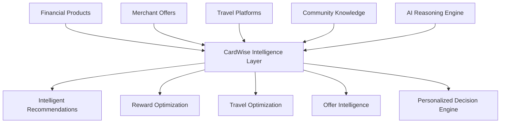

Rather than competing with banks, travel agencies, or cashback platforms directly, CardWise can serve as the intelligence layer that helps users derive maximum value from all of them.

This positioning allows CardWise to benefit from the continued growth of the broader ecosystem while remaining platform-agnostic.

---

# Strategic Positioning

The market currently contains numerous point solutions.

CardWise's strategic differentiation is to consolidate these capabilities into a unified platform centered on user outcomes.

| Existing Category | Primary Focus | CardWise Perspective |
|-------------------|---------------|----------------------|
| Banks | Card issuance | Card optimization |
| Travel Platforms | Bookings | Booking intelligence |
| Cashback Platforms | Cashback | Total reward value |
| Finance Apps | Expense tracking | Spending optimization |
| Blogs | Education | Actionable recommendations |
| Communities | Discussions | Verified collective intelligence |
| Browser Extensions | Coupons | End-to-end reward optimization |
| AI Chatbots | Generic advice | Domain-specific financial intelligence |

By focusing on maximizing user value rather than promoting specific financial products, CardWise can establish a differentiated position that is difficult for incumbent players to replicate without fundamentally changing their business models.

---

# Research Methodology

The analyses in this document are based on a comprehensive evaluation of leading products across India and international markets.

Competitors are assessed using a consistent strategic framework covering:

- Product positioning
- Target audience
- Core capabilities
- User experience philosophy
- Monetization model
- Technology assumptions
- Business strategy
- AI adoption
- Community engagement
- Personalization capabilities
- Scalability
- Innovation velocity
- Trust mechanisms
- Long-term competitive positioning

The objective is not merely to identify feature parity but to uncover structural opportunities where CardWise can create durable competitive advantages.

---

# Market Landscape

## Overview

The rewards ecosystem is not dominated by a single category of products. Instead, it consists of multiple overlapping segments, each addressing a specific stage of the consumer journey.

Understanding these segments is essential to defining CardWise's strategic positioning.

The following chapters analyze competitors within each category in depth, identifying their strengths, limitations, and the opportunities they leave unaddressed.

### Competitive Landscape Overview

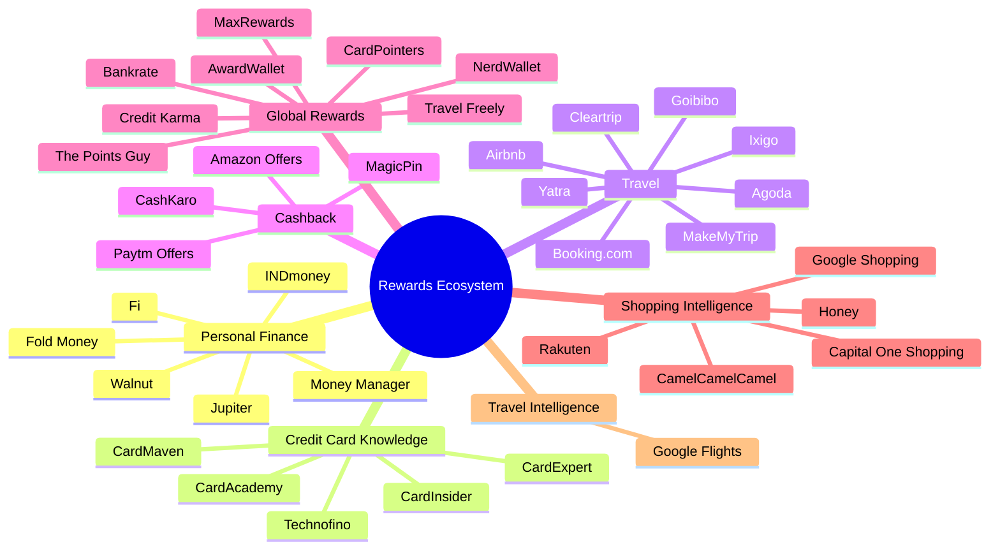

---

## Competitor Categories

The remainder of this document is organized into the following sections:

| Part | Category |
|------|----------|
| Part 2 | Personal Finance Platforms |
| Part 3 | Credit Card Knowledge & Community Platforms |
| Part 4 | Travel Booking & Loyalty Platforms |
| Part 5 | Cashback & Offer Aggregators |
| Part 6 | Global Rewards, Shopping Intelligence & Best-in-Class Platforms |
| Part 7 | Comprehensive Feature Matrix |
| Part 8 | SWOT & Gap Analysis |
| Part 9 | User Journey & UX Benchmarking |
| Part 10 | Business Strategy & AI Benchmark |
| Part 11 | Strategic Recommendations & CardWise Competitive Advantages |
| Part 12 | Future Market Opportunities & Conclusion |

---

**End of Part 1**


---

# Part 2A-1 — Personal Finance Platforms

> **Category Focus:** Personal Finance Super Apps & Wealth Platforms  
> **Objective:** Understand how India's leading personal finance applications approach financial management, where they succeed, where they fall short for credit card users, and what strategic opportunities they leave open for CardWise.

---

# Personal Finance Platforms

## Category Overview

Personal Finance applications have evolved significantly over the past decade.

The first generation focused primarily on **expense tracking** and **budget management**. Over time, these platforms expanded into broader financial ecosystems that include investments, loans, insurance, tax planning, and banking services.

Today's leading personal finance platforms aspire to become the user's **financial home screen**—a single destination for monitoring wealth, spending, and financial products.

Despite this evolution, most platforms treat **credit cards as financial accounts**, not as **reward optimization engines**.

This distinction creates one of the largest strategic opportunities for CardWise.

---

## Evolution of Personal Finance Platforms

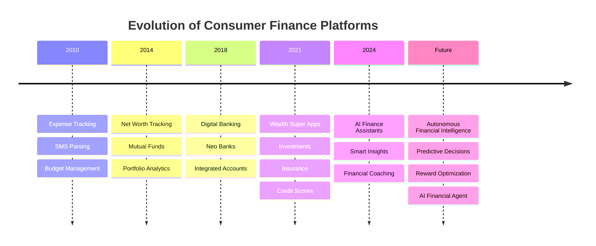

---

# Strategic Observations

Across the Indian fintech ecosystem, several recurring themes emerge.

### Strong Areas

- Excellent account aggregation
- Beautiful dashboards
- Investment management
- Banking integrations
- Wealth visualization
- Credit score monitoring
- Budget analytics
- Goal planning

### Weak Areas

- Credit card optimization
- Reward valuation
- Merchant intelligence
- Travel reward planning
- Offer intelligence
- Reward simulations
- Spending recommendations
- Multi-card optimization
- Loyalty management

These weaknesses are not implementation flaws—they stem from the strategic positioning of the products themselves.

Most personal finance apps optimize **financial visibility**, whereas CardWise aims to optimize **financial outcomes**.

---

# Competitive Analysis

# INDmoney

---

## Company Overview

**Founded:** 2019

**Headquarters:** Gurugram, India

**Category:** Wealth Super App

**Primary Market:** India (with expanding global investment capabilities)

**Core Mission**

> Enable users to track, grow, and manage their complete financial life from a single platform.

Originally launched as a net-worth tracking application, INDmoney has evolved into one of India's most comprehensive wealth management ecosystems.

The platform aggregates financial assets across multiple institutions, enabling users to monitor:

- Bank accounts
- Mutual funds
- Stocks
- US equities
- Fixed deposits
- Loans
- Insurance
- Credit cards
- EPF
- NPS
- Real estate (estimated)
- Alternative investments

Unlike traditional budgeting apps, INDmoney positions itself as a **wealth operating system**.

---

# Product Positioning

### Core Positioning

> "One App for Your Entire Financial Life"

Rather than focusing on a single financial activity, INDmoney seeks to centralize all financial information into one ecosystem.

Its value proposition emphasizes:

- Visibility
- Consolidation
- Wealth growth
- Investment discovery
- Financial awareness

Credit cards exist within the platform primarily as another financial account.

The emphasis is on:

- outstanding balances
- payment reminders
- credit score impact
- spending visibility

rather than

- maximizing rewards
- optimizing transactions
- loyalty management
- travel value extraction

---

## Target Audience

Primary users include:

- Salaried professionals
- Investors
- High-income millennials
- Wealth-conscious individuals
- Mutual fund investors
- US stock investors
- Financial planners

Secondary audiences:

- Tax planners
- Long-term wealth builders
- Retirement-focused users

The product is less attractive for:

- Travel hackers
- Reward enthusiasts
- Credit card optimizers
- Cashback maximizers

---

# Core Features

## Financial Aggregation

One of INDmoney's strongest capabilities.

Users can connect:

- Savings accounts
- Credit cards
- Mutual funds
- Stocks
- US stocks
- Fixed deposits
- Insurance
- Loans
- EPF
- NPS

creating a unified financial dashboard.

---

## Net Worth Dashboard

Perhaps INDmoney's signature feature.

The dashboard continuously calculates:

```
Assets

minus

Liabilities

=

Net Worth
```

This becomes the user's primary financial KPI.

---

## Investment Platform

Supports:

- Mutual funds
- Direct funds
- US equities
- Indian stocks
- SIPs
- Goal investing

Investment discovery is highly polished.

---

## Credit Score Monitoring

Provides:

- Credit score
- Score history
- Credit utilization
- Account health
- Credit insights

Useful for general financial awareness.

---

## Portfolio Analytics

Investment performance includes:

- XIRR
- CAGR
- Sector allocation
- Asset allocation
- Risk visualization
- Diversification metrics

---

## Financial Insights

Users receive insights such as:

- Spending trends
- Income analysis
- Investment growth
- Upcoming payments
- Credit utilization alerts

---

# Premium Features

INDmoney monetizes several premium capabilities including:

- US stock investing
- Advisory products
- Premium investment experiences
- Wealth management
- Financial products
- Lending
- Insurance

Premium functionality is centered around increasing assets under management rather than enhancing spending optimization.

---

# Revenue Model

INDmoney follows a diversified fintech revenue strategy.

Primary revenue streams include:

| Revenue Source | Description |
|---------------|-------------|
| Mutual Fund Distribution | Commissions |
| Lending Partnerships | Referral revenue |
| Insurance | Distribution commissions |
| Stock Investing | Brokerage & partnerships |
| Wealth Products | Premium financial services |
| Affiliate Products | Financial marketplace |

The business benefits from higher customer wealth rather than higher transaction intelligence.

---

# Business Model

```text
Financial Accounts
        ↓

Account Aggregation
        ↓

Net Worth Dashboard
        ↓

Investment Discovery
        ↓

Financial Products
        ↓

Revenue Generation
```

The product encourages users to consolidate financial information and then purchase additional financial products.

---

# Strengths

## Excellent Financial Aggregation

One of the most complete account aggregation experiences available in India.

---

## Beautiful Visualization

Financial dashboards are clean, modern, and highly engaging.

Information density is balanced with readability.

---

## Strong Wealth Narrative

Everything revolves around improving net worth.

This creates a cohesive user experience.

---

## Trust

Handling investment portfolios requires significant trust.

INDmoney has successfully established credibility among affluent users.

---

## Investment Ecosystem

Broad investment coverage creates long-term engagement.

---

## Continuous Engagement

Daily portfolio updates encourage repeat usage.

---

# Weaknesses

Despite its strengths, INDmoney has notable limitations from CardWise's perspective.

## Credit Cards Are Passive

Credit cards function primarily as financial accounts.

They are not treated as optimization engines.

---

## No Intelligent Card Recommendation Engine

The platform cannot answer:

- Which card should I use?
- Which card gives highest rewards?
- Which card reaches milestones?
- Which portal is best?

---

## No Merchant Intelligence

No contextual understanding of:

- merchants
- MCC codes
- dynamic offers
- reward categories

---

## No Reward Valuation

Users cannot estimate:

- point values
- airline value
- hotel value
- redemption efficiency

---

## No Travel Optimization

Travel remains outside the product's core value proposition.

---

## No Multi-card Decision Engine

Managing multiple premium cards remains largely manual.

---

# UX Analysis

## Design Philosophy

Minimalist

Modern

Investment-first

Data-rich

Professional

The experience communicates financial confidence rather than excitement.

---

## Navigation

Primary navigation focuses on:

- Wealth
- Investments
- Accounts
- Credit
- Insights

Rewards receive minimal emphasis.

---

## Information Architecture

Logical and highly scalable.

However, the hierarchy reflects wealth management priorities.

---

## Personalization

Moderately strong.

Recommendations include:

- investment ideas
- financial products
- portfolio actions

Limited personalization exists for spending behavior.

---

# Technical Observations

Likely architectural characteristics include:

- Event-driven financial aggregation
- Portfolio calculation engines
- Secure account linking
- Large-scale financial data processing
- Machine learning for recommendations
- Cloud-native backend
- Mobile-first infrastructure

Engineering maturity appears high.

---

# Trust Factors

Strong trust drivers include:

- Financial data security
- Large investment user base
- Established fintech brand
- Professional interface
- Regulatory compliance
- Consistent product quality

---

# Community Presence

INDmoney has moderate community engagement.

Primary channels include:

- YouTube
- Blogs
- Educational content
- Investment webinars

The community centers around investing rather than rewards.

---

# AI Usage

Current AI usage appears focused on:

- financial insights
- portfolio recommendations
- investment suggestions

Limited AI exists for transaction optimization.

---

# Personalization

Strong:

- investment recommendations
- wealth insights
- account analytics

Weak:

- reward optimization
- purchase intelligence
- merchant recommendations
- travel decisions

---

# Scalability

The platform demonstrates excellent scalability.

Reasons include:

- modular financial integrations
- account aggregation architecture
- cloud infrastructure
- growing financial marketplace
- diversified revenue streams

---

# Innovation Assessment

| Dimension | Rating |
|-----------|--------|
| Wealth Management | ⭐⭐⭐⭐⭐ |
| Investments | ⭐⭐⭐⭐⭐ |
| Financial Aggregation | ⭐⭐⭐⭐⭐ |
| User Experience | ⭐⭐⭐⭐☆ |
| AI | ⭐⭐⭐☆☆ |
| Reward Intelligence | ⭐☆☆☆☆ |
| Travel Optimization | ⭐☆☆☆☆ |
| Credit Card Intelligence | ⭐☆☆☆☆ |

---

# Missing Features

Several strategic capabilities remain absent.

## Reward Intelligence

No understanding of:

- reward points
- valuations
- transfer partners
- airline miles
- hotel points

---

## Card Recommendation Engine

Cannot recommend:

- best payment method
- optimal card
- reward maximization

---

## Merchant Intelligence

Missing:

- merchant categorization
- historical offers
- offer prediction
- spending optimization

---

## Reward Simulations

Users cannot ask:

> "If I spend ₹80,000 on this card this month, what will I earn?"

---

## Travel Intelligence

No optimization for:

- flights
- hotels
- transfer partners
- airline alliances
- redemption planning

---

## Browser Assistance

No browser extension.

No checkout optimization.

No contextual recommendations.

---

## Reward History

No historical tracking of:

- changing reward rates
- previous offers
- seasonal campaigns

---

# Opportunities CardWise Can Exploit

INDmoney's success validates that consumers value **financial aggregation**, but it also highlights a strategic blind spot.

CardWise can differentiate by becoming the intelligence layer that sits on top of spending decisions rather than asset management.

Key opportunities include:

| Opportunity | Why It Matters |
|------------|----------------|
| Real-time Card Recommendations | Optimize every purchase, not just track it. |
| Unified Reward Engine | Calculate cashback, points, miles, and milestone value across all cards. |
| Merchant Intelligence | Understand merchant categories, historical offers, and spending patterns. |
| Travel Optimization | Recommend the best booking portal, card, and redemption strategy. |
| Reward Simulations | Forecast earnings before a transaction is made. |
| Browser Extension | Surface contextual recommendations during online checkout. |
| AI Financial Copilot | Explain *why* a recommendation is optimal, increasing user trust. |
| Reward Explainability | Make complex reward rules transparent and understandable. |
| Cross-Card Portfolio Optimization | Help users maximize value across multiple cards instead of viewing them independently. |

---

# Strategic Lessons for CardWise

### What INDmoney Does Exceptionally Well

- Unified financial visibility
- Wealth-centric experience
- Clean UX
- Trustworthy brand
- Strong aggregation capabilities
- Scalable platform architecture

### What CardWise Should Learn

- Invest early in reliable data aggregation.
- Build trust through transparency and accuracy.
- Design dashboards that simplify complexity rather than overwhelm users.
- Treat AI as a decision-support system, not just an analytics layer.

### What CardWise Should Avoid

- Becoming another generic personal finance dashboard.
- Diluting focus by trying to manage every aspect of a user's financial life.
- Prioritizing product cross-selling over user value.
- Treating credit cards as passive accounts instead of dynamic optimization engines.

---

## Positioning Summary

| Aspect | INDmoney | CardWise |
|--------|----------|----------|
| Core Mission | Wealth Management | Reward & Spending Optimization |
| Primary KPI | Net Worth Growth | Reward Value Maximization |
| Financial Focus | Assets & Investments | Transactions & Loyalty |
| User Goal | Track Wealth | Make Every Payment Smarter |
| AI Role | Investment Insights | Real-Time Decision Engine |
| Competitive Advantage | Financial Aggregation | Unified Reward Intelligence |

---

**End of Part 2A-1**

---

# Part 2A-2 — CRED Money

> **Category:** Premium Credit Card Ecosystem
>
> **Objective:** Analyze India's most influential credit card platform, understand why it became the default application for affluent credit card users, identify its strategic strengths, and uncover the opportunities it leaves unaddressed for CardWise.

---

# CRED

---

# Company Overview

**Founded:** 2018

**Headquarters:** Bengaluru, India

**Founder:** Kunal Shah

**Category:** Premium Consumer FinTech

**Primary Market:** India

Unlike traditional personal finance applications, CRED was never positioned as a budgeting tool or expense tracker.

Instead, it positioned itself as an **exclusive members-only ecosystem** for financially responsible credit card users.

Entry into the ecosystem was intentionally restricted based on creditworthiness, transforming a financial application into a premium lifestyle brand.

This strategy fundamentally differentiated CRED from every other fintech product in India.

Today, CRED has expanded into a multi-product platform including:

- Credit Card Management
- Bill Payments
- UPI
- Rent Payments
- Personal Loans
- Credit Score
- Merchant Offers
- Shopping
- Travel
- Wealth Products
- CRED Garage
- CRED Mint
- CRED Cash

Rather than becoming another banking application, CRED successfully built a **consumer brand** around premium financial behavior.

---

# Product Positioning

## Core Positioning

> "Rewards for the Creditworthy."

CRED transformed the act of paying a credit card bill into an aspirational experience.

Instead of emphasizing debt repayment, the product focuses on:

- Status
- Exclusivity
- Premium lifestyle
- Luxury experiences
- Intelligent spending
- High-quality brand partnerships

The platform positions itself closer to an **American Express lifestyle ecosystem** than a conventional fintech application.

---

## Strategic Narrative

CRED does not sell financial management.

It sells identity.

Its messaging consistently reinforces the idea that responsible financial behavior deserves premium treatment.

This emotional positioning has become one of CRED's strongest competitive advantages.

---

# Target Audience

Primary audience:

- Urban professionals
- Premium credit card holders
- Millennials
- High-income earners
- Technology professionals
- Founders
- Frequent online shoppers

Secondary audience:

- Luxury travelers
- Premium banking customers
- Affluent families
- High credit score individuals

Excluded audience:

- Students
- Entry-level card users
- Budget-conscious consumers
- Users with low credit scores

Unlike most fintech products, CRED intentionally serves a narrower audience with higher lifetime value.

---

# Core Features

## Credit Card Bill Payments

The product originally focused on simplifying bill payments.

Capabilities include:

- Multiple card management
- Payment reminders
- Due-date tracking
- Bill history
- Auto payment

This remains the product's foundational workflow.

---

## CRED Coins

Perhaps CRED's most recognizable feature.

Users earn coins for:

- Paying bills
- Using partner services
- Shopping
- Promotions
- Referrals

Coins can be redeemed across:

- Shopping
- Dining
- Experiences
- Subscriptions
- Brand offers

The gamification layer significantly increases engagement.

---

## Merchant Offers

CRED has built one of India's strongest premium merchant ecosystems.

Offer categories include:

- Luxury brands
- Dining
- Fashion
- Electronics
- Travel
- Wellness
- Premium services

Rather than aggregating every offer available, CRED emphasizes curated premium partnerships.

---

## CRED UPI

CRED now provides:

- UPI payments
- QR scanning
- Bank transfers
- Payment history

This significantly increases daily engagement beyond monthly bill payments.

---

## CRED Travel

Users can:

- Book flights
- Reserve hotels
- Access premium travel deals

Travel complements the broader premium lifestyle narrative.

---

## Credit Score

Features include:

- Credit monitoring
- Credit history
- Utilization insights
- Financial health

---

## CRED Garage

One of the platform's most innovative products.

Users can manage:

- Vehicles
- Insurance
- FASTag
- Challans
- Pollution certificates
- Service reminders

This expands CRED beyond finance into ownership management.

---

## Lending Products

Includes:

- Instant credit
- Personal loans
- Credit against investments

---

# Premium Features

Premium experiences include:

- Exclusive merchant offers
- Curated luxury experiences
- Better redemption catalogs
- Travel benefits
- Premium customer support
- High-value partner campaigns

Unlike subscription-based SaaS products, CRED creates perceived premium value through exclusivity rather than feature gating.

---

# Revenue Model

CRED operates one of the most diversified monetization models in Indian fintech.

| Revenue Source | Description |
|----------------|-------------|
| Lending | Interest & lending partnerships |
| Merchant Partnerships | Sponsored offers |
| Brand Promotions | Premium campaigns |
| Affiliate Revenue | Shopping & travel |
| Financial Products | Insurance & investments |
| Payment Ecosystem | Transaction monetization |
| Data Intelligence | Consumer insights (aggregated) |

Unlike many fintech platforms, bill payments themselves are not the primary revenue source.

The platform monetizes attention and trust.

---

# Business Model

```text
Premium Users
        ↓

Credit Card Payments
        ↓

Daily Engagement
        ↓

Merchant Ecosystem
        ↓

Financial Products
        ↓

Revenue Diversification
```

This creates a flywheel where engagement generates commerce opportunities, which in turn fund additional user acquisition.

---

# Strengths

## Brand Recognition

CRED has one of the strongest fintech brands in India.

Its marketing is memorable, premium, and culturally relevant.

---

## Exceptional Marketing

Few Indian startups have invested in branding as successfully as CRED.

Its campaigns emphasize:

- Humor
- Creativity
- Exclusivity
- Trust
- Premium identity

---

## Merchant Ecosystem

Extensive partnerships create tangible user value.

This strengthens retention.

---

## Premium User Base

The average customer has significantly higher purchasing power than users of many competing fintech apps.

This increases monetization potential.

---

## Engagement

Bill payments became only the entry point.

The ecosystem now encourages near-daily usage through UPI, shopping, offers, and travel.

---

## Trust

Millions of users trust CRED with:

- Credit cards
- Payments
- Financial data
- UPI
- Lending

Building this level of trust is a significant competitive moat.

---

# Weaknesses

From CardWise's perspective, CRED's limitations are largely strategic rather than technical.

---

## Rewards Are Secondary

Although CRED revolves around credit cards, it does not deeply optimize reward programs.

Examples of missing capabilities include:

- Transfer partner optimization
- Airline mile valuation
- Hotel redemption analysis
- Multi-card comparisons
- Reward simulations

---

## Merchant Intelligence Is Limited

Offers are curated.

However, users cannot ask:

- Which merchant gives maximum value today?
- Which payment method is optimal?
- Which card should I combine with which portal?

---

## Recommendation Engine Is Basic

Recommendations are largely promotional.

They rarely explain:

- Why a recommendation is best
- Expected monetary gain
- Opportunity cost
- Alternative strategies

---

## No Reward Explainability

Complex reward calculations remain hidden.

Users cannot understand:

- Point valuation
- Effective cashback
- Net reward value
- Annual fee recovery

---

## Limited Planning Capabilities

The product reacts to spending.

It rarely helps users plan spending in advance.

---

## Ecosystem Bias

Recommendations naturally favor CRED partnerships.

This may not always maximize user value.

---

# UX Analysis

## Design Philosophy

CRED's interface is one of the most refined consumer fintech experiences in India.

Design characteristics include:

- Premium typography
- Dark aesthetic
- Rich animations
- Micro-interactions
- Smooth navigation
- Emotional branding

The experience prioritizes delight over information density.

---

## Information Architecture

Navigation emphasizes experiences rather than financial categories.

This reinforces the lifestyle positioning.

---

## Search

Search capabilities remain relatively limited compared to knowledge-focused platforms.

Most discovery occurs through browsing.

---

## Personalization

Moderately strong.

Users receive:

- Partner recommendations
- Offer suggestions
- Product discovery

However, personalization is largely commerce-oriented rather than optimization-oriented.

---

# Technical Observations

Likely architectural characteristics include:

- Large-scale payment infrastructure
- Merchant integration platform
- Offer management engine
- Recommendation services
- Loyalty platform
- High-throughput transaction processing
- Cloud-native microservices
- Real-time notification infrastructure

Engineering sophistication appears extremely high.

---

# Trust Factors

Strong trust indicators include:

- Premium brand perception
- High-profile investors
- Millions of active users
- Secure payment infrastructure
- Consistent product quality
- Financial compliance

---

# Community Presence

Unlike forum-driven platforms, CRED's community is built through brand affinity.

Engagement channels include:

- Social media
- Influencer collaborations
- Premium campaigns
- Referral programs
- Exclusive events

The community is lifestyle-centric rather than knowledge-centric.

---

# AI Usage

Current AI adoption appears focused on:

- Offer recommendations
- Product personalization
- Customer support
- Merchant targeting

There is limited evidence of domain-specific AI reasoning around rewards.

---

# Personalization

Strong in:

- Offers
- Promotions
- Merchant discovery
- Lifestyle experiences

Weak in:

- Spending optimization
- Reward forecasting
- Travel optimization
- Long-term card strategy

---

# Scalability

CRED has demonstrated excellent scalability across multiple dimensions.

Its modular platform has expanded from one workflow (bill payments) into a broad fintech ecosystem without compromising user experience.

---

# Innovation Assessment

| Dimension | Rating |
|-----------|--------|
| Brand | ⭐⭐⭐⭐⭐ |
| Consumer Experience | ⭐⭐⭐⭐⭐ |
| Merchant Ecosystem | ⭐⭐⭐⭐⭐ |
| Payments | ⭐⭐⭐⭐⭐ |
| Credit Card Management | ⭐⭐⭐⭐☆ |
| AI | ⭐⭐⭐☆☆ |
| Reward Intelligence | ⭐⭐☆☆☆ |
| Travel Optimization | ⭐⭐☆☆☆ |
| Reward Explainability | ⭐☆☆☆☆ |
| Multi-card Optimization | ⭐☆☆☆☆ |

---

# Missing Features

Significant strategic gaps remain.

## Intelligent Card Selection

No engine recommends the optimal card before a purchase.

---

## Reward Simulation

Users cannot estimate expected returns before spending.

---

## Transfer Partner Intelligence

Missing:

- airline valuation
- hotel valuation
- transfer optimization
- redemption planning

---

## Milestone Optimization

No proactive guidance for:

- annual spend targets
- reward thresholds
- fee waivers
- bonus milestones

---

## Checkout Intelligence

No browser extension.

No contextual purchase assistant.

No merchant-aware recommendations.

---

## Historical Offer Intelligence

Users cannot compare:

- previous campaigns
- seasonal patterns
- historical value

---

## Transparent Recommendation Engine

Recommendations lack explainability.

Users cannot audit the reasoning behind suggestions.

---

# Opportunities CardWise Can Exploit

CRED has validated that premium users are willing to engage regularly with a credit card ecosystem.

However, it focuses on **engagement and commerce**, whereas CardWise can focus on **optimization and intelligence**.

Strategic opportunities include:

| Opportunity | Why It Matters |
|------------|----------------|
| AI Decision Engine | Recommend the best card, portal, and payment strategy before every transaction. |
| Reward Explainability | Show users exactly how every recommendation is calculated. |
| Transfer Optimization | Maximize airline and hotel point value. |
| Milestone Planning | Forecast spending needed to unlock rewards and fee waivers. |
| Reward Simulations | Predict earnings under different spending scenarios. |
| Merchant Intelligence | Combine MCC data, historical offers, and live campaigns into actionable recommendations. |
| Browser Extension | Deliver recommendations directly at checkout. |
| Open Recommendation Engine | Remain platform-neutral instead of promoting specific partners. |

---

# Strategic Lessons for CardWise

### What CRED Does Exceptionally Well

- Premium brand positioning
- Consumer marketing
- Emotional product design
- Merchant partnerships
- User engagement
- Ecosystem expansion
- Trust building

### What CardWise Should Learn

- Build a brand that users are proud to associate with.
- Invest heavily in onboarding and first impressions.
- Use gamification thoughtfully to encourage engagement.
- Create partnerships that enhance user value rather than simply generating affiliate revenue.

### What CardWise Should Avoid

- Optimizing primarily for partner promotions.
- Replacing objective recommendations with sponsored content.
- Hiding reward calculations behind opaque logic.
- Expanding into unrelated financial products before establishing category leadership.

---

# Positioning Summary

| Aspect | CRED | CardWise |
|--------|------|----------|
| Core Mission | Premium Credit Card Lifestyle | Intelligent Reward Optimization |
| Primary KPI | User Engagement | User Financial Value |
| Credit Card Role | Payment & Commerce | Decision Engine |
| Merchant Strategy | Curated Partnerships | Best Available Option |
| AI Role | Personalization | Transparent Financial Reasoning |
| Competitive Advantage | Brand & Ecosystem | Reward Intelligence & Explainability |

---

**End of Part 2A-2**

---

# Part 2A-3A — Jupiter

> **Category:** Neo Banking & Personal Finance
>
> **Objective:** Analyze how Jupiter has successfully combined modern digital banking with intelligent money management, identify its strengths as a user-first financial platform, and evaluate the strategic opportunities it leaves open for CardWise.

---

# Jupiter

---

# Company Overview

**Founded:** 2019

**Headquarters:** Bengaluru, India

**Founders:** Jitendra Gupta, Narsimha Reddy

**Category:** Neo Banking / Personal Finance Super App

**Primary Market:** India

Jupiter is one of India's leading neo-banking platforms focused on simplifying everyday banking through a modern digital experience.

Unlike traditional banks, Jupiter positions itself as a **technology-first financial platform**, partnering with regulated banks to deliver banking services while owning the customer experience.

Over the years, Jupiter has expanded beyond banking into a broader financial ecosystem that includes:

- Savings Accounts
- UPI Payments
- Debit Cards
- Credit Cards
- Expense Tracking
- Budgeting
- Bill Payments
- Investments
- Mutual Funds
- Fixed Deposits
- Credit Score
- Rewards
- Financial Insights

Rather than competing with legacy banks on branch networks or product breadth, Jupiter differentiates through superior digital experience, automation, and intelligent money management.

---

# Product Positioning

## Core Positioning

> **"Money, Made Simple."**

Jupiter aims to eliminate the complexity traditionally associated with banking.

Its core messaging revolves around:

- Simplicity
- Transparency
- Automation
- Better financial habits
- User-first design

Unlike wealth-focused platforms such as INDmoney or lifestyle-focused platforms such as CRED, Jupiter positions itself as the **primary operating layer for everyday money management**.

---

## Strategic Narrative

Jupiter believes banking should feel effortless.

Instead of forcing users to manage finances manually, the platform proactively organizes transactions, surfaces insights, and automates repetitive financial tasks.

The product focuses heavily on reducing friction in everyday banking rather than maximizing financial returns.

---

# Target Audience

Primary users include:

- Young professionals
- Salaried employees
- Urban millennials
- First-time digital banking users
- Technology-savvy consumers
- Users dissatisfied with traditional banking UX

Secondary audiences:

- Students entering the workforce
- Budget-conscious consumers
- Families managing shared expenses
- Everyday spenders

The platform is less focused on:

- Premium travel enthusiasts
- Reward optimizers
- Credit card power users
- Loyalty program experts

---

# Core Features

## Digital Banking

Jupiter offers a fully digital banking experience through partnerships with regulated banks.

Capabilities include:

- Savings accounts
- Debit cards
- Real-time transfers
- UPI
- IMPS
- NEFT
- RTGS

The onboarding experience is designed to be significantly faster than traditional banks.

---

## Expense Tracking

One of Jupiter's strongest differentiators.

Transactions are automatically categorized into areas such as:

- Food
- Shopping
- Travel
- Entertainment
- Utilities
- Investments

Users gain immediate visibility into spending behavior without manual categorization.

---

## Smart Insights

The platform continuously analyzes transaction history to generate insights such as:

- Monthly spending trends
- Budget deviations
- Merchant summaries
- Subscription detection
- Cash flow analysis

These insights help users understand spending patterns rather than simply displaying account balances.

---

## Budgeting

Users can:

- Create monthly budgets
- Monitor category-wise spending
- Receive alerts when approaching limits
- Track financial goals

Budgeting is seamlessly integrated into the overall banking experience.

---

## UPI Payments

Jupiter supports:

- QR payments
- Bank transfers
- UPI IDs
- Contact payments
- Merchant payments

UPI significantly increases daily engagement with the platform.

---

## Credit Card Integration

Users can:

- Link credit cards
- Monitor balances
- Track due dates
- Receive payment reminders

However, credit card functionality is primarily administrative rather than strategic.

---

## Mutual Funds & Investments

Investment capabilities include:

- Direct mutual funds
- SIPs
- Portfolio tracking
- Fixed deposits

These features reinforce Jupiter's ambition to become a comprehensive financial platform.

---

## Rewards Program

Jupiter offers cashback and rewards through selected merchant partnerships.

Reward mechanics are intentionally simple and easy to understand, prioritizing accessibility over complexity.

---

## Financial Goals

Users can define goals for:

- Emergency funds
- Vacations
- Major purchases
- Savings targets

Progress is visualized through intuitive dashboards.

---

# Premium Features

Jupiter has gradually introduced premium offerings including:

- Enhanced banking benefits
- Higher cashback opportunities
- Premium debit card experiences
- Exclusive merchant offers
- Better interest-related benefits
- Investment products

The premium strategy focuses on enhancing everyday banking rather than creating an exclusive lifestyle ecosystem.

---

# Revenue Model

Jupiter follows a diversified fintech revenue model.

Primary revenue streams include:

| Revenue Source | Description |
|----------------|-------------|
| Banking Partnerships | Revenue sharing with partner banks |
| Interchange Fees | Debit and card transactions |
| Lending | Credit products and loans |
| Mutual Funds | Distribution commissions |
| Fixed Deposits | Financial product partnerships |
| Insurance | Referral and distribution income |
| Merchant Partnerships | Cashback and promotional campaigns |

The platform monetizes customer engagement across multiple financial services instead of relying on a single revenue source.

---

# Business Model

```text
Customer Acquisition
        ↓

Digital Banking
        ↓

Daily Transactions
        ↓

Financial Insights
        ↓

Cross-Sell Financial Products
        ↓

Long-Term Customer Lifetime Value
```

Jupiter's strategy emphasizes becoming the user's primary banking relationship before expanding into adjacent financial services.

---

# Strengths

## Outstanding User Experience

Jupiter consistently ranks among the best-designed fintech applications in India.

The interface is clean, approachable, and highly intuitive.

---

## Excellent Transaction Intelligence

Automatic categorization and financial insights provide meaningful value without requiring user effort.

This significantly reduces friction compared to traditional banking apps.

---

## Modern Banking Experience

Digital onboarding, instant account setup, and seamless payments make Jupiter attractive to younger users.

---

## Everyday Engagement

Unlike investment platforms that users may check weekly, Jupiter encourages multiple interactions each day through banking and UPI.

---

## Financial Awareness

The platform helps users understand their spending habits through contextual insights rather than static reports.

---

## Trustworthy Experience

Professional design, responsive performance, and transparent communication contribute to a high level of user trust.

---

# Weaknesses

Despite its strong execution, Jupiter has several strategic limitations from CardWise's perspective.

---

## Credit Cards Are Not the Core Product

Although Jupiter supports credit card management, the experience focuses on:

- payment reminders
- balances
- statements

rather than

- reward optimization
- card strategy
- spending optimization
- loyalty management

---

## Limited Reward Intelligence

The platform lacks a sophisticated understanding of:

- airline miles
- hotel points
- reward currencies
- transfer partners
- reward valuation

---

## Merchant Intelligence Is Basic

While transactions are categorized effectively, Jupiter does not provide actionable merchant intelligence such as:

- best card to use
- historical merchant offers
- optimal payment combinations
- reward forecasts

---

## No Reward Simulation

Users cannot model scenarios such as:

- projected cashback
- milestone completion
- annual fee recovery
- category optimization

---

## Limited Travel Capabilities

Travel remains outside Jupiter's strategic focus.

There is no integrated planning for:

- flights
- hotels
- reward redemptions
- travel loyalty programs

---

## Generic Financial Recommendations

Insights focus on spending behavior rather than decision optimization.

The platform explains **what happened**, not **what users should do next**.

---

# UX Analysis

## Design Philosophy

Jupiter embraces a clean, minimalist design language centered on clarity and usability.

Core design principles include:

- Simplicity
- Low cognitive load
- Friendly interactions
- Fast task completion
- Clear visual hierarchy

Unlike CRED's premium aesthetic or INDmoney's data-dense dashboards, Jupiter feels approachable and conversational.

---

## Navigation

Primary navigation typically revolves around:

- Home
- Payments
- Accounts
- Insights
- Investments

The structure prioritizes high-frequency tasks, allowing users to complete common banking actions with minimal navigation.

---

## Information Architecture

Information is organized around user intent rather than financial products.

For example:

- Spending insights appear in context.
- Budgets are tied directly to transactions.
- Financial goals integrate naturally into the broader experience.

This creates a cohesive and scalable information architecture.

---

## Onboarding Experience

Jupiter's onboarding is among the strongest in the Indian fintech ecosystem.

Key characteristics include:

- Minimal form filling
- Progressive disclosure
- Guided account setup
- Clear explanations
- Friendly tone

The onboarding experience reduces friction while building confidence in the platform.

---

## Accessibility

The interface demonstrates strong attention to:

- Typography
- Color contrast
- Touch target sizing
- Consistent interaction patterns
- Readable layouts

Accessibility appears to have been considered early in the design process, although there is still room for broader support across assistive technologies.

---

## Performance

The application generally delivers:

- Fast screen transitions
- Smooth scrolling
- Responsive interactions
- Reliable payment flows
- Efficient transaction loading

Performance reinforces the perception of a modern, technology-first banking platform.

---

## Technical Observations

Although implementation details are not public, Jupiter's architecture likely includes:

- Event-driven transaction processing
- Real-time payment infrastructure
- Transaction categorization engines
- Financial insight pipelines
- Recommendation services
- Banking API integrations
- Cloud-native microservices
- Secure identity and authentication systems

The platform demonstrates a high level of engineering maturity with an emphasis on scalability, reliability, and low-latency user experiences.

---

**End of Part 2A-3A**

---

# Part 2A-3B — Jupiter (Continued)

---

# Trust Factors

Trust is one of Jupiter's strongest competitive advantages.

Unlike traditional banks that inherit trust through decades of existence, Jupiter has built trust through product quality, transparency, and user experience.

Key trust drivers include:

- Regulated banking partnerships
- Secure onboarding
- Transparent fee structures
- Consistent application performance
- Modern security practices
- Clean, professional product design
- Strong customer support
- Reliable payment infrastructure

The product communicates confidence without relying on aggressive financial marketing.

---

## Security Perception

Although security is largely invisible to users, Jupiter successfully communicates it through:

- Secure authentication
- OTP verification
- Device binding
- Transaction confirmations
- Real-time alerts
- Fraud monitoring
- Banking-grade compliance

Security is treated as a foundational capability rather than a marketing feature.

---

## Transparency

Jupiter emphasizes transparency across:

- Fees
- Rewards
- Interest rates
- Transaction history
- Spending insights

This significantly reduces friction compared to many traditional banking applications.

---

# Community Presence

Unlike CRED, Jupiter does not position itself as an exclusive lifestyle brand.

Instead, it focuses on educating users about better financial habits.

Primary community channels include:

- Product blogs
- Financial education articles
- YouTube
- LinkedIn
- X (Twitter)
- Instagram
- Customer newsletters
- Product announcements

Community engagement is centered around financial literacy rather than loyalty or status.

---

## Educational Content

Jupiter regularly publishes content covering:

- Budgeting
- Saving
- Investing
- Credit scores
- Banking
- Financial planning

However, educational coverage around advanced credit card rewards remains limited.

---

# AI Usage

Jupiter has incorporated intelligence into several areas of the product, though it is largely analytics-driven rather than AI-first.

Current intelligent capabilities include:

- Automatic expense categorization
- Spending summaries
- Cash flow insights
- Subscription detection
- Personalized financial notifications
- Budget recommendations

These features improve financial awareness but stop short of autonomous decision-making.

---

## AI Maturity Assessment

| Capability | Assessment |
|------------|------------|
| Transaction Categorization | ⭐⭐⭐⭐⭐ |
| Spending Insights | ⭐⭐⭐⭐☆ |
| Financial Recommendations | ⭐⭐⭐☆☆ |
| Predictive Analytics | ⭐⭐⭐☆☆ |
| Reward Intelligence | ⭐☆☆☆☆ |
| Travel Intelligence | ⭐☆☆☆☆ |
| Decision Explainability | ⭐☆☆☆☆ |
| Autonomous Financial Planning | ⭐☆☆☆☆ |

Jupiter demonstrates strong data processing capabilities but has not yet evolved into an AI-driven financial copilot.

---

# Personalization

Jupiter provides moderate personalization based on transaction history and financial behavior.

Examples include:

- Budget recommendations
- Spending alerts
- Monthly insights
- Merchant categorization
- Goal tracking
- Financial reminders

The personalization model is reactive rather than predictive.

It helps users understand what has happened but rarely recommends what they should do next.

---

## Personalization Maturity

| Area | Strength |
|------|----------|
| Spending Analytics | Excellent |
| Budgeting | Excellent |
| Banking Experience | Strong |
| Investments | Moderate |
| Credit Cards | Basic |
| Rewards | Very Weak |
| Travel | Very Weak |
| Shopping | Very Weak |

This creates a significant opportunity for CardWise to introduce proactive, AI-powered financial guidance.

---

# Scalability

Jupiter's architecture appears well-positioned for long-term growth.

Key scalability characteristics include:

- Modular product architecture
- Banking API integrations
- Cloud-native infrastructure
- Event-driven transaction processing
- Cross-product data sharing
- High-frequency engagement model

The platform has successfully expanded from digital banking into investments, lending, and wealth products without disrupting the core experience.

---

## Growth Strategy

Jupiter's expansion follows a logical progression:

```text
Digital Banking
        ↓

Daily Payments
        ↓

Financial Insights
        ↓

Investments
        ↓

Lending
        ↓

Insurance
        ↓

Financial Super App
```

This gradual expansion reduces customer acquisition costs while increasing lifetime value.

---

# Innovation Assessment

Jupiter has consistently demonstrated strong product execution, particularly in simplifying everyday banking.

However, its innovation is concentrated around banking workflows rather than financial optimization.

| Dimension | Rating |
|-----------|--------|
| Digital Banking | ⭐⭐⭐⭐⭐ |
| User Experience | ⭐⭐⭐⭐⭐ |
| Expense Tracking | ⭐⭐⭐⭐⭐ |
| Budgeting | ⭐⭐⭐⭐☆ |
| Financial Insights | ⭐⭐⭐⭐☆ |
| AI | ⭐⭐⭐☆☆ |
| Credit Card Intelligence | ⭐⭐☆☆☆ |
| Reward Optimization | ⭐☆☆☆☆ |
| Travel Optimization | ⭐☆☆☆☆ |
| Loyalty Intelligence | ⭐☆☆☆☆ |

---

# Missing Features

Despite its maturity, Jupiter leaves several important opportunities unaddressed.

---

## Intelligent Card Recommendations

The platform cannot answer:

- Which card should I use?
- Which payment method is optimal?
- Which transaction maximizes rewards?

---

## Reward Valuation

There is no understanding of:

- Reward points
- Airline miles
- Hotel points
- Cashback equivalence
- Transfer partner value

---

## Merchant Intelligence

Jupiter categorizes merchants but does not leverage that information to recommend:

- Best payment strategy
- Highest reward opportunity
- Active merchant campaigns
- Historical offer performance

---

## Milestone Planning

Users receive spending summaries but not milestone forecasts such as:

- Annual fee waiver progress
- Spend threshold tracking
- Bonus reward milestones
- Quarterly campaign qualification

---

## Travel Intelligence

Missing capabilities include:

- Flight optimization
- Hotel optimization
- Airline loyalty
- Point transfers
- Travel reward valuation
- Airport lounge planning

---

## Browser Extension

Jupiter does not extend into the shopping journey.

There is no contextual intelligence during online checkout.

---

## AI Financial Copilot

The platform lacks an intelligent assistant capable of answering questions such as:

> "I'm buying a ₹65,000 laptop. Which card, merchant, and payment method will maximize my rewards?"

This type of contextual reasoning represents a significant strategic opportunity.

---

# Opportunities CardWise Can Exploit

Jupiter demonstrates that consumers appreciate intelligent financial insights.

However, it focuses on **financial awareness**, whereas CardWise can focus on **financial optimization**.

Key opportunities include:

| Opportunity | Strategic Value |
|-------------|-----------------|
| AI Decision Engine | Recommend the best card before every transaction. |
| Unified Reward Intelligence | Combine cashback, points, miles, and milestone calculations into a single recommendation engine. |
| Merchant Intelligence Platform | Understand merchant behavior, MCC codes, historical offers, and live promotions. |
| Travel Optimization | Optimize flights, hotels, transfers, and loyalty programs. |
| Reward Simulation | Forecast returns before spending occurs. |
| Browser Extension | Deliver recommendations at checkout across e-commerce platforms. |
| Explainable AI | Show users exactly how recommendations are generated. |
| Cross-Card Portfolio Optimization | Treat multiple credit cards as a portfolio rather than isolated products. |
| Reward History | Maintain historical records of offer changes, devaluations, and promotional campaigns. |

---

# Strategic Lessons for CardWise

## What Jupiter Does Exceptionally Well

- Outstanding user experience
- Intuitive onboarding
- Intelligent transaction categorization
- Modern banking workflows
- Financial education
- Everyday engagement
- Simplicity without sacrificing capability

---

## What CardWise Should Learn

### Design for Everyday Usage

Users should naturally return to CardWise as part of their daily spending journey rather than only during large purchases.

---

### Minimize Cognitive Load

Complex financial calculations should be hidden behind simple, actionable recommendations.

---

### Deliver Insights Automatically

Users should not have to search for opportunities.

The platform should proactively surface them.

---

### Build Around User Goals

Instead of exposing financial data, organize the experience around outcomes such as:

- Save more
- Earn more rewards
- Recover annual fees
- Reach travel goals
- Maximize cashback

---

## What CardWise Should Avoid

- Becoming another generic budgeting application.
- Expanding into unrelated financial services before establishing category leadership.
- Measuring success by dashboards instead of user outcomes.
- Treating reward optimization as a secondary feature.
- Overloading users with raw financial data instead of actionable intelligence.

---

# Positioning Summary

| Aspect | Jupiter | CardWise |
|--------|----------|----------|
| Core Mission | Smarter Everyday Banking | Smarter Everyday Spending |
| Primary KPI | Financial Awareness | Financial Optimization |
| Banking Focus | Digital Banking | Credit Card Intelligence |
| User Goal | Understand Spending | Maximize Every Transaction |
| AI Role | Financial Insights | Real-Time Decision Engine |
| Merchant Understanding | Categorization | Optimization & Intelligence |
| Competitive Advantage | User Experience | Unified Reward Operating System |

---

# Key Strategic Takeaways

The analysis of Jupiter highlights an important industry trend:

> **Consumers increasingly expect financial software to think for them—not merely organize information.**

Jupiter successfully reduces friction in banking by simplifying transactions, categorizing expenses, and surfacing insights. It proves that users value automation, clarity, and intelligent guidance.

However, its intelligence largely ends after a transaction has occurred.

CardWise has the opportunity to shift the decision point **before** the transaction by answering questions such as:

- Which card should I use?
- Which merchant offers the highest value?
- Should I pay directly, use UPI, or book through a travel portal?
- Is this purchase better today or during an upcoming promotion?
- Will this purchase help recover my annual fee or unlock a milestone?
- What is the true cash-equivalent value of the rewards I will earn?

This transition—from **financial awareness** to **financial decision intelligence**—represents one of the strongest strategic differentiators available to CardWise.

---

**End of Part 2A-3B**


---

# Part 2A-4 — Personal Finance Platforms Comparative Analysis

> **Objective:** Synthesize the learnings from INDmoney, CRED, and Jupiter to identify category-wide trends, strategic gaps, and the competitive opportunities that CardWise can leverage to establish long-term category leadership.

---

# Executive Summary

The three platforms analyzed—**INDmoney**, **CRED**, and **Jupiter**—represent three distinct philosophies within India's personal finance ecosystem.

Each has achieved success by focusing deeply on a specific customer problem:

| Product | Core Philosophy |
|----------|-----------------|
| INDmoney | Grow your wealth |
| CRED | Reward premium financial behavior |
| Jupiter | Simplify everyday banking |

Although they compete within the broader fintech ecosystem, they are not direct competitors in terms of product strategy.

Instead, they occupy different layers of a consumer's financial journey.

This creates an opportunity for CardWise to occupy an entirely new layer:

> **Optimize every financial decision.**

---

# Strategic Positioning Map

```text
                     High Financial Intelligence
                              ▲
                              │
                              │
                     INDmoney │
                              │
                              │
                              │
Low Lifestyle ◄───────────────┼────────────────► High Lifestyle
                              │                     CRED
                              │
                              │
                  Jupiter      │
                              │
                              ▼
                    Everyday Banking
```

CardWise occupies a different axis altogether.

Instead of competing on banking, investing, or lifestyle, it competes on **decision intelligence**.

---

# Product Positioning Comparison

| Dimension | INDmoney | CRED | Jupiter | CardWise |
|-----------|-----------|------|----------|-----------|
| Primary Goal | Wealth Management | Premium Credit Ecosystem | Digital Banking | Reward Intelligence Platform |
| Core User Need | Grow Assets | Earn Premium Benefits | Manage Daily Money | Maximize Every Transaction |
| Category | WealthTech | FinTech Lifestyle | Neo Bank | Reward Operating System |
| Primary User | Investors | Premium Card Holders | Everyday Banking Users | Multi-card Reward Optimizers |
| Decision Support | Moderate | Low | Moderate | Extremely High |
| Credit Card Focus | Low | Medium | Low | Core Platform |
| AI Maturity | Medium | Medium | Medium | AI-First Vision |

---

# Customer Journey Comparison

## INDmoney

```text
Financial Accounts

        ↓

Net Worth Dashboard

        ↓

Investments

        ↓

Wealth Growth

        ↓

Portfolio Tracking
```

Focus:

> Build Wealth

---

## CRED

```text
Credit Card

        ↓

Bill Payment

        ↓

Rewards

        ↓

Merchant Offers

        ↓

Lifestyle Services
```

Focus:

> Increase Engagement

---

## Jupiter

```text
Bank Account

        ↓

Transactions

        ↓

Insights

        ↓

Budgets

        ↓

Financial Habits
```

Focus:

> Better Banking

---

## CardWise

```text
Intent to Spend

        ↓

AI Decision Engine

        ↓

Best Card Selection

        ↓

Merchant Optimization

        ↓

Reward Simulation

        ↓

Travel / Cashback Optimization

        ↓

Transaction

        ↓

Reward Tracking

        ↓

Portfolio Optimization
```

Focus:

> Optimize Financial Decisions

---

# Strategic Philosophy Comparison

| Question | INDmoney | CRED | Jupiter | CardWise |
|-----------|-----------|------|----------|-----------|
| What do we optimize? | Wealth | Engagement | Banking | Financial Value |
| Success Metric | Net Worth | Active Users | Daily Usage | User Reward Yield |
| User Visits | Weekly | Daily | Daily | Before Every Purchase |
| Core Decision Point | Investment | Bill Payment | Money Management | Spending Decision |

---

# Feature Coverage Matrix

| Capability | INDmoney | CRED | Jupiter | Opportunity for CardWise |
|------------|-----------|------|----------|--------------------------|
| Expense Tracking | ✅ | Limited | ✅ | Moderate |
| Budgeting | Limited | ❌ | ✅ | Low |
| Net Worth Tracking | ✅ | ❌ | Limited | Low |
| Investments | ✅ | Limited | ✅ | Ignore |
| Credit Card Management | Basic | Strong | Basic | Improve |
| Reward Optimization | ❌ | Partial | ❌ | Massive |
| Merchant Intelligence | ❌ | Partial | ❌ | Massive |
| Reward Valuation | ❌ | ❌ | ❌ | Massive |
| Travel Rewards | ❌ | Limited | ❌ | Massive |
| Reward Simulator | ❌ | ❌ | ❌ | Massive |
| Browser Extension | ❌ | ❌ | ❌ | Massive |
| AI Copilot | Limited | Limited | Limited | Massive |
| Reward Explainability | ❌ | ❌ | ❌ | Massive |
| Cross-card Portfolio | ❌ | ❌ | ❌ | Massive |
| Historical Offer Tracking | ❌ | ❌ | ❌ | Massive |
| Booking Optimization | ❌ | ❌ | ❌ | Massive |

---

# UX Philosophy Comparison

## INDmoney

Design Philosophy:

- Professional
- Analytical
- Information-rich
- Wealth-focused

Strengths:

- Excellent dashboards
- Strong data visualization
- Clear portfolio management

Weaknesses:

- Less engaging for everyday use
- Credit cards feel secondary

---

## CRED

Design Philosophy:

- Premium
- Emotional
- Aspirational
- Lifestyle-centric

Strengths:

- Beautiful interface
- Outstanding branding
- Exceptional micro-interactions

Weaknesses:

- Entertainment often outweighs utility
- Limited transparency behind recommendations

---

## Jupiter

Design Philosophy:

- Friendly
- Simple
- Functional
- Everyday banking

Strengths:

- Low cognitive load
- Fast navigation
- Excellent onboarding

Weaknesses:

- Limited decision support
- Reactive rather than proactive

---

## CardWise

Desired Design Philosophy:

- Intelligent
- Transparent
- Explainable
- Predictive
- Outcome-driven

Every screen should answer:

> "What is the smartest financial action I can take right now?"

---

# AI Comparison

| Capability | INDmoney | CRED | Jupiter | CardWise Vision |
|-----------|-----------|------|----------|-----------------|
| Analytics | High | Medium | High | High |
| Personalization | Medium | Medium | Medium | Very High |
| Decision Making | Low | Low | Low | Very High |
| Explainability | Very Low | Very Low | Very Low | Extremely High |
| Recommendations | Medium | Medium | Medium | AI-Native |
| Autonomous Planning | None | None | None | Planned |

---

# Revenue Strategy Comparison

| Product | Primary Revenue |
|----------|-----------------|
| INDmoney | Investments |
| CRED | Merchant ecosystem & lending |
| Jupiter | Banking partnerships |
| CardWise | Affiliate intelligence, premium subscriptions, enterprise APIs, travel partnerships, reward infrastructure |

Unlike competitors, CardWise should monetize **successful optimization**, not merely financial transactions.

---

# Trust Comparison

| Trust Factor | INDmoney | CRED | Jupiter | CardWise Goal |
|--------------|-----------|------|----------|----------------|
| Financial Data | Strong | Strong | Strong | Strong |
| Banking | Moderate | Strong | Strong | Moderate |
| Investments | Excellent | Low | Moderate | N/A |
| Payments | Low | Excellent | Excellent | Moderate |
| Recommendations | Moderate | Moderate | Moderate | Extremely High |
| Transparency | Medium | Medium | High | Best-in-Class |

---

# Competitive Advantages by Platform

## INDmoney

Competitive moat:

- Wealth aggregation
- Portfolio analytics
- Investment ecosystem
- Net-worth visualization

---

## CRED

Competitive moat:

- Brand
- Merchant partnerships
- Premium positioning
- User engagement

---

## Jupiter

Competitive moat:

- Banking UX
- Financial insights
- Everyday engagement
- Simplicity

---

## Shared Observation

Each company owns **one layer** of the financial experience.

None own the **decision layer**.

---

# Major Market Gaps

Across all three products, several strategic gaps consistently emerge.

## Gap 1 — No Unified Reward Engine

Every product understands spending.

None understand rewards.

---

## Gap 2 — No Multi-card Optimization

Consumers increasingly own multiple cards.

No product helps manage them intelligently.

---

## Gap 3 — No Merchant Intelligence Platform

Merchants remain static entities.

There is no understanding of:

- MCC behavior
- Historical campaigns
- Dynamic offers
- Merchant-specific strategies

---

## Gap 4 — No Explainable AI

Recommendations exist.

Reasoning does not.

Users rarely understand:

- Why a recommendation appears
- How much value it creates
- What assumptions were made

---

## Gap 5 — No Spending Copilot

Current platforms analyze the past.

None actively guide the future.

---

## Gap 6 — No Reward Simulation

Consumers cannot forecast:

- Cashback
- Points
- Milestones
- Annual fee recovery
- Airline miles

before spending.

---

## Gap 7 — No Checkout Intelligence

None of the platforms assist users while shopping.

The highest-value decision point remains completely unserved.

---

# Strategic Implications

The market demonstrates a clear evolution:

```
Expense Tracking

        ↓

Digital Banking

        ↓

Financial Aggregation

        ↓

Investment Platforms

        ↓

Lifestyle Rewards

        ↓

???

```

The missing layer is:

```
Decision Intelligence
```

CardWise has the opportunity to define and own this category before larger incumbents recognize its importance.

---

# Strategic Lessons for CardWise

## Lesson 1

Never compete on banking.

Banks will always have structural advantages.

---

## Lesson 2

Never compete on investments.

Wealth platforms already dominate this space.

---

## Lesson 3

Never become another budgeting application.

Budgeting is a solved problem.

---

## Lesson 4

Own the transaction decision.

This moment occurs billions of times every year.

It is significantly more valuable than monthly budgeting.

---

## Lesson 5

Become platform-neutral.

Unlike banks or financial marketplaces, CardWise should optimize for the user's financial outcome rather than promoting specific products.

---

## Lesson 6

Explain every recommendation.

Transparency creates trust.

Trust creates retention.

Retention creates defensibility.

---

## Lesson 7

Build an Intelligence Layer.

Think of CardWise as:

> **The Stripe of reward intelligence.**

or

> **The Google Maps of financial decisions.**

The platform should not replace banks.

It should help users navigate them intelligently.

---

# Strategic Recommendations

Based on this competitive analysis, the following strategic priorities emerge.

| Priority | Importance | Recommendation |
|----------|------------|----------------|
| AI Decision Engine | Critical | Build first-class recommendation capabilities. |
| Unified Reward Engine | Critical | Normalize all reward currencies into a common value model. |
| Merchant Intelligence | Critical | Maintain the industry's richest merchant and MCC knowledge graph. |
| Explainability | Critical | Every recommendation should include transparent reasoning. |
| Browser Extension | High | Capture the moment of purchase. |
| Travel Optimization | High | Integrate flights, hotels, and loyalty planning. |
| Reward Simulator | High | Allow users to forecast outcomes before spending. |
| Community Intelligence | Medium | Leverage verified user experiences to improve recommendations. |
| Historical Offer Tracking | Medium | Build institutional memory that competitors lack. |

---

# Why CardWise Can Win

The competitors analyzed in this section have each built exceptional products.

However, they optimize **different parts of the financial journey**:

- Wealth
- Banking
- Payments
- Engagement

None optimize the **financial decision itself**.

This creates a rare opportunity.

Instead of competing head-to-head with established fintech companies, CardWise can establish a new product category centered on **financial decision intelligence**.

If executed well, CardWise will not replace INDmoney, CRED, or Jupiter.

Instead, it will become the intelligent layer that makes all of them more valuable to the end user.

---

**End of Part 2A-4**


---

# Part 2B — Credit Card Knowledge Platforms

> **Category:** Credit Card Research, Rewards Education & Community Platforms
>
> **Objective:** Analyze India's leading credit card knowledge platforms, understand why they have become trusted sources for reward enthusiasts, identify their limitations as software products, and uncover the strategic opportunity for CardWise to transform static knowledge into intelligent decision-making.

---

# Credit Card Knowledge Platforms

## Category Overview

Unlike fintech applications, credit card knowledge platforms are not primarily transactional products.

They exist to solve a different problem:

> **Reducing information asymmetry between banks and consumers.**

Banks publish complex reward structures, lengthy terms & conditions, and promotional campaigns that change frequently.

Knowledge platforms simplify this information by providing:

- Card reviews
- Reward explanations
- Lounge access guides
- Airline transfer analysis
- Hotel loyalty guides
- Welcome bonus coverage
- Offer updates
- Annual fee analysis
- Credit card comparisons
- Community discussions

For many enthusiasts, these platforms have become the primary source of truth before applying for a credit card or making a high-value purchase.

---

# Evolution of the Category

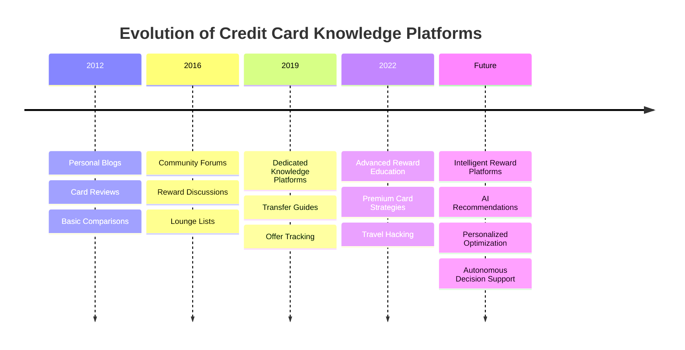

---

# Why These Platforms Exist

Credit card reward systems are intentionally complex.

Every issuer defines its own:

- Reward currency
- Redemption rules
- Exclusions
- Spending caps
- Merchant categories
- Transfer partners
- Bonus campaigns
- Welcome benefits
- Renewal benefits
- Lounge programs

Even experienced users struggle to stay updated.

Knowledge platforms bridge this gap by translating bank documentation into understandable language.

---

# Current Market Leaders

The Indian ecosystem is dominated by a relatively small number of highly respected platforms.

| Platform | Primary Focus |
|----------|---------------|
| CardExpert | Premium card reviews & reward optimization |
| Technofino | Community discussions & expert knowledge |
| CardMaven | Card analysis & travel rewards |
| CardInsider | Beginner-friendly comparisons |
| CardAcademy / Similar Blogs | Educational content |

Together, these platforms have educated thousands of reward enthusiasts and significantly increased awareness of premium credit card strategies.

However, they remain largely **content-first businesses** rather than **technology-first platforms**.

---

# Industry Characteristics

The category shares several defining characteristics.

### Strengths

- Deep domain expertise
- High trust among enthusiasts
- Detailed reward analysis
- Rapid coverage of new card launches
- Strong educational value
- Community-driven insights

### Weaknesses

- Manual content updates
- Static recommendations
- No personalization
- Limited automation
- No transaction intelligence
- No real-time optimization
- No AI reasoning
- Limited software capabilities

---

# Strategic Positioning

The relationship between banks, knowledge platforms, and users can be visualized as follows:

```text
Banks

   │
   │  Publish reward rules
   ▼

Knowledge Platforms

   │
   │  Explain rules
   ▼

Users

   │
   │  Interpret information
   ▼

Manual Decision Making
```

CardWise proposes an entirely different model.

```text
Banks

   │
   ▼

Reward Engine

   │
   ▼

AI Intelligence Layer

   │
   ▼

CardWise

   │
   ▼

Recommended Action
```

Instead of merely explaining rules, CardWise aims to **apply** them automatically.

---

# Strategic Differences

| Knowledge Platforms | CardWise |
|---------------------|----------|
| Explain information | Execute intelligence |
| Static content | Dynamic recommendations |
| Manual research | Automated optimization |
| Generic advice | Personalized guidance |
| Human interpretation | AI reasoning |
| Educational | Actionable |

---

# Common User Journey Today

A typical power user purchasing a ₹75,000 laptop might follow this journey:

```text
Google Search

      ↓

Read CardExpert

      ↓

Read Technofino

      ↓

Search Reddit

      ↓

Compare Bank T&C

      ↓

Open Excel

      ↓

Calculate Rewards

      ↓

Choose Card

      ↓

Make Purchase
```

Average time:

**20–45 minutes**

The process requires substantial financial literacy and is inaccessible to mainstream users.

---

# Desired User Journey with CardWise

```text
Open CardWise

      ↓

Describe Purchase

      ↓

AI Evaluates

      • Cards
      • Offers
      • Merchants
      • Portals
      • Milestones
      • Reward Values

      ↓

Best Recommendation

      ↓

Complete Purchase
```

Target decision time:

**Less than 30 seconds**

---

# Market Opportunity

Knowledge platforms have successfully proven that consumers actively seek reward optimization guidance.

However, they also reveal a fundamental limitation:

> **Information alone is no longer sufficient.**

Consumers increasingly expect software to:

- Analyze
- Compare
- Recommend
- Forecast
- Explain
- Optimize

rather than requiring manual interpretation.

This transition mirrors the evolution seen in other industries:

| Industry | Old Model | New Model |
|----------|-----------|-----------|
| Navigation | Maps | GPS Navigation |
| Investing | Research Reports | Robo Advisors |
| Shopping | Product Catalogs | Personalized Recommendations |
| Music | Song Libraries | AI Playlists |
| Credit Cards | Blogs & Forums | Intelligent Reward Engine |

---

# Competitive Landscape

The following sections analyze the leading players in this category using a consistent strategic framework.

Each platform will be evaluated across:

- Company Overview
- Product Positioning
- Core Features
- Revenue Model
- Business Model
- UX Analysis
- Community Strength
- Technical Maturity
- AI Adoption
- Innovation
- Missing Capabilities
- Opportunities for CardWise

---

# Key Research Questions

The remainder of this section seeks to answer several strategic questions:

1. Why have knowledge platforms become trusted by enthusiasts?

2. Why have they struggled to evolve into scalable software businesses?

3. Which capabilities cannot realistically be delivered through articles and community forums?

4. Which technologies could fundamentally transform this category over the next decade?

5. How can CardWise combine the expertise of these communities with AI-driven automation to create an entirely new product category?

---

# Competitors Covered in Part 2B

The following platforms will be analyzed in detail:

| Section | Platform |
|----------|----------|
| Part 2B-1 | CardExpert |
| Part 2B-2 | Technofino |
| Part 2B-3 | CardMaven |
| Part 2B-4 | CardInsider |
| Part 2B-5 | Comparative Analysis & Strategic Lessons |

---

## Executive Insight

The success of credit card knowledge platforms demonstrates one critical market truth:

> **Consumers are willing to invest significant time learning how to maximize rewards because the financial upside is substantial.**

The failure of these platforms to evolve into intelligent software creates one of the largest opportunities in the Indian rewards ecosystem.

CardWise should not aim to become another blog, comparison website, or discussion forum.

Instead, it should transform decades of accumulated community knowledge into a living, AI-powered recommendation engine capable of delivering personalized, transparent, and explainable financial decisions in real time.

---

**End of Part 2B (Introduction)**


---

# Part 2B-1 — CardExpert

> **Category:** Credit Card Knowledge & Rewards Intelligence
>
> **Objective:** Analyze India's most influential independent credit card knowledge platform, understand why it has become the default learning resource for enthusiasts, and identify the strategic opportunity for CardWise to evolve this model into an intelligent software platform.

---

# CardExpert

---

# Company Overview

**Founded:** 2017 (independent platform)

**Founder:** Siddharth Raman

**Category:** Credit Card Knowledge Platform

**Primary Market:** India

**Website Focus:**

- Credit card reviews
- Reward optimization
- Air miles
- Hotel loyalty
- Premium travel
- Bank offers
- Lounge benefits
- Reward points
- Credit card strategy

CardExpert is one of India's most respected independent resources for credit card enthusiasts.

Unlike fintech applications, CardExpert does **not** attempt to become a banking application or a personal finance platform.

Instead, it focuses on a single mission:

> Help users maximize the value of their credit cards through unbiased education, reviews, and optimization strategies. :contentReference[oaicite:0]{index=0}

Over the years, CardExpert has established itself as a trusted destination for users researching premium credit cards and advanced reward strategies.

---

# Product Positioning

## Core Positioning

CardExpert positions itself as:

> **India's independent authority on credit cards and reward optimization.** :contentReference[oaicite:1]{index=1}

Rather than acting as a comparison marketplace, the platform emphasizes:

- Educational content
- Deep technical reviews
- Long-form analysis
- Reward optimization
- Practical spending strategies

The target audience is users who want to maximize long-term value from their cards rather than simply choosing a card based on marketing claims.

---

## Strategic Narrative

The platform's philosophy is rooted in a simple belief:

> Credit cards are financial tools whose true value is unlocked through knowledge.

Instead of recommending the "best card" universally, CardExpert frequently emphasizes that the right choice depends on a user's spending patterns, travel goals, and redemption preferences. :contentReference[oaicite:2]{index=2}

---

# Target Audience

Primary users include:

- Premium credit card holders
- Frequent travelers
- Reward enthusiasts
- Airline mile collectors
- Hotel loyalty users
- Professionals with multiple cards

Secondary audiences:

- Users comparing premium cards
- Beginners researching their first premium credit card
- Existing cardholders seeking optimization strategies

The platform attracts users who are willing to invest time in learning complex reward systems.

---

# Core Features

## Detailed Credit Card Reviews

The strongest capability of CardExpert is its extensive library of in-depth card reviews.

Typical review coverage includes:

- Eligibility
- Joining fee
- Renewal fee
- Reward structure
- Milestones
- Lounge access
- Insurance
- Transfer partners
- Pros
- Cons
- Ideal customer profile

These reviews often go beyond bank marketing material by discussing practical usage scenarios.

---

## Reward Optimization Guides

One of CardExpert's defining strengths is explaining:

- Reward point valuation
- Airline transfers
- Hotel transfers
- Gift voucher redemptions
- Cashback equivalence
- Reward maximization techniques

Instead of listing benefits, the platform explains how experienced users extract maximum value.

---

## Best Credit Card Rankings

CardExpert regularly publishes curated recommendations such as:

- Best cashback cards
- Best travel cards
- Best premium cards
- Best beginner cards
- Best UPI cards
- Best lounge cards

These rankings help users narrow down choices in an increasingly crowded market. :contentReference[oaicite:3]{index=3}

---

## Offer Coverage

The platform tracks important developments including:

- Bank promotions
- Limited-time campaigns
- New card launches
- Reward devaluations
- Benefit enhancements
- Lounge policy changes

This helps readers stay informed about a rapidly changing ecosystem.

---

## Educational Articles

Beyond reviews, CardExpert publishes educational content covering:

- Credit score
- Reward strategies
- Business spending
- Bank policies
- Card application tips
- Annual fee recovery
- Premium travel experiences

The educational depth is one of the platform's strongest differentiators. :contentReference[oaicite:4]{index=4}

---

# Premium Features

Unlike many fintech products, CardExpert is primarily content-driven.

Publicly visible premium offerings include:

- Personalized credit card consultation
- Expert guidance for selecting card portfolios
- Tailored optimization advice

The emphasis is on expert knowledge rather than premium software features. :contentReference[oaicite:5]{index=5}

---

# Revenue Model

Based on publicly available information, CardExpert appears to follow a diversified content-business model.

Likely revenue sources include:

| Revenue Source | Confidence |
|---------------|------------|
| Affiliate partnerships for card applications | High |
| Consultation services | High |
| Advertising | Medium |
| Sponsored content (where disclosed) | Medium |

The platform does **not** publicly disclose a detailed financial breakdown, so exact revenue composition is unknown. :contentReference[oaicite:6]{index=6}

---

# Business Model

```text
Credit Card Knowledge

        ↓

Educational Articles

        ↓

Organic Search Traffic

        ↓

Reader Trust

        ↓

Consultation
Affiliate Referrals

        ↓

Revenue
```

This model rewards expertise, consistency, and credibility rather than transaction volume.

---

# Strengths

## Exceptional Domain Expertise

CardExpert demonstrates deep understanding of:

- Reward programs
- Airline miles
- Hotel loyalty
- Bank policies
- Premium cards
- Travel optimization

The quality of analysis often exceeds that found in generic financial media.

---

## Strong Trust

Trust is arguably the platform's greatest asset.

The site's reputation has been built over years of consistent educational content and independent analysis. :contentReference[oaicite:7]{index=7}

---

## Long-Form Research

Unlike comparison websites that summarize features, CardExpert explains:

- Why a feature matters
- When it creates value
- Who should use it
- When it should be avoided

This depth attracts experienced users.

---

## Reward Valuation Expertise

Very few Indian platforms explain reward valuation in practical monetary terms.

CardExpert consistently educates users on extracting higher redemption value through travel partners and strategic usage.

---

## Community Reputation

Within India's credit card enthusiast community, CardExpert is frequently referenced as an authoritative source for:

- Premium card reviews
- Reward optimization
- Travel strategy
- Card comparisons

This reputation significantly amplifies its influence despite operating as an independent platform.

---

# Weaknesses

Despite its expertise, several structural limitations prevent CardExpert from becoming an intelligent decision platform.

---

## Static Content Model

Knowledge is delivered through articles.

Users must manually:

- Read
- Compare
- Interpret
- Calculate
- Apply

The platform explains decisions but does not make them.

---

## Limited Personalization

Recommendations are written for broad audiences.

They do not consider:

- Individual spending habits
- Existing card portfolios
- Merchant preferences
- Annual milestones
- Reward balances

---

## Manual Optimization

Users remain responsible for:

- Comparing cards
- Estimating rewards
- Calculating cashback
- Tracking milestones
- Monitoring offers

The platform provides information—not automation.

---

## No Real-Time Intelligence

CardExpert cannot answer contextual questions such as:

> "I'm buying a ₹48,000 washing machine today.
Which card should I use?"

This represents a significant opportunity for software-driven intelligence.

---

## No Transaction Awareness

The platform has no visibility into:

- User purchases
- Merchant categories
- Spending history
- Existing rewards
- Card portfolios

Consequently, recommendations remain generic.

---

# UX Analysis

## Design Philosophy

The user experience prioritizes readability and information density.

The design is intentionally simple, allowing content to remain the primary focus.

---

## Information Architecture

Content is organized around:

- Card reviews
- Banks
- Offers
- Travel
- Reward guides
- Educational articles

Navigation works well for research but is less suited for quick decision-making.

---

## Search Experience

Search is article-oriented rather than intent-oriented.

Users search for content instead of asking questions like:

- "Best card for Zomato today?"
- "Highest rewards for fuel?"
- "Best card for this airline?"

This reflects the platform's publishing roots.

---

## Learning Curve

The platform serves enthusiasts extremely well.

However, newcomers may find the volume of information overwhelming without prior knowledge of reward programs.

---

# Technical Observations

From an external perspective, CardExpert appears to operate as a modern content platform optimized for:

- Long-form publishing
- SEO
- Structured categorization
- Internal linking
- Search discoverability

There is no public evidence of advanced software capabilities such as:

- Rule engines
- Recommendation engines
- Browser extensions
- Real-time reward calculation
- Transaction analysis

This is consistent with its positioning as an educational resource rather than a software platform.

---

**End of Part 2B-1**

---

# Part 2B-2 — TechnoFino

> **Category:** Community-Driven Credit Card & Banking Platform
>
> **Objective:** Analyze India's fastest-growing community-driven credit card ecosystem, understand why community-generated knowledge has become one of its biggest competitive advantages, and identify how CardWise can evolve beyond discussions into AI-powered financial intelligence.

---

# TechnoFino

---

# Company Overview

**Founded (Content Platform):** 2019

**Community Platform Launch:** 2022

**Founder:** Sumanta Mandal

**Headquarters:** India

**Category:** Community-driven Credit Card, Banking & Rewards Platform

**Primary Focus**

- Credit Cards
- Banking
- Travel Rewards
- Airline Miles
- Hotel Loyalty
- Personal Finance
- Community Discussions
- Bank Offers

Unlike CardExpert, which is primarily an editorial platform, TechnoFino has evolved into a **community-first ecosystem** where thousands of members actively contribute discussions, reward strategies, approval experiences, and optimization techniques.

Its evolution has followed three distinct phases:

```
YouTube

        ↓

Educational Website

        ↓

Community Platform

        ↓

Mobile App
```

This transition from content to community represents one of the most important developments in India's credit card ecosystem. :contentReference[oaicite:0]{index=0}

---

# Product Positioning

## Core Positioning

> **India's largest community for credit cards, banking, travel rewards, and financial discussions.**

Rather than positioning itself as an expert publishing platform, TechnoFino emphasizes collective intelligence.

Its value proposition is built around the idea that real user experiences are often more valuable than official marketing material.

Users learn from:

- Approval experiences
- Reward strategies
- Card portfolios
- Bank negotiations
- Lounge experiences
- Travel redemptions
- Customer support interactions
- Merchant behavior

The platform enables knowledge to emerge organically through community participation rather than solely through editorial content. :contentReference[oaicite:1]{index=1}

---

# Strategic Narrative

TechnoFino's philosophy differs fundamentally from traditional blogs.

Instead of saying:

> "Read our article."

It encourages users to ask:

> "What has worked for the community?"

This shift transforms financial education from one-way publishing into collaborative problem-solving.

---

# Target Audience

Primary users include:

- Credit card enthusiasts
- Reward optimizers
- Frequent travelers
- Airline mile collectors
- Hotel loyalty members
- Banking enthusiasts
- Multi-card users

Secondary users include:

- First-time premium card applicants
- Cashback seekers
- Personal finance learners
- UPI users
- Banking professionals

Unlike traditional blogs, TechnoFino attracts both beginners and highly experienced reward optimizers.

---

# Core Features

## Community Forums

The discussion forum is TechnoFino's defining feature.

Major discussion categories include:

- Credit Cards
- Banking
- Travel Rewards
- Hotel Loyalty
- Airline Miles
- Personal Finance
- Investments
- Merchant Offers
- Finance News

At the time of writing, the community reports:

- **42,000+ discussion threads**
- **1.1M+ posts**
- **58,000+ registered members**

demonstrating one of the largest specialist communities in the Indian rewards ecosystem. :contentReference[oaicite:2]{index=2}

---

## User-Generated Knowledge

Unlike editorial websites where information is authored by a small team, TechnoFino continuously accumulates knowledge from thousands of members.

Examples include:

- Card approvals
- Rejection reasons
- Credit limit increases
- Merchant offers
- Reward calculations
- Bank negotiations
- Redemption experiences
- Airport lounge reviews

This creates an evolving knowledge base that updates far more quickly than static articles.

---

## Real-Time Discussions

Members frequently discuss:

- New card launches
- Reward devaluations
- Bank policy changes
- Merchant campaigns
- Promotional offers
- Lounge restrictions

As a result, emerging developments often appear on the forum before they are reflected in long-form articles. :contentReference[oaicite:3]{index=3}

---

## Expert Contributors

The platform includes highly experienced members who regularly publish:

- Reward calculations
- Airline redemption strategies
- Hotel booking optimizations
- Bank-specific guidance
- Portfolio recommendations

Over time, these contributors establish reputation and trust within the community.

---

## Mobile Application

TechnoFino has expanded beyond the web by launching an Android application, enabling members to participate in discussions, receive notifications, bookmark useful threads, and access community knowledge from mobile devices. :contentReference[oaicite:4]{index=4}

---

# Premium Features

Unlike subscription-first products, TechnoFino's primary value lies in community participation.

Publicly visible premium mechanisms include:

- Verified member roles
- VIP discussion areas
- Reputation systems
- Contributor recognition

The platform focuses on encouraging high-quality participation rather than locking core knowledge behind paywalls.

---

# Revenue Model

Based on publicly available information, TechnoFino appears to follow a diversified media and community model.

Likely revenue sources include:

| Revenue Source | Confidence |
|---------------|------------|
| Affiliate referrals | High |
| Advertising | High |
| Sponsored collaborations | Medium |
| YouTube monetization | High |
| Community-driven brand partnerships | Medium |

The platform does not publicly disclose detailed financial information. :contentReference[oaicite:5]{index=5}

---

# Business Model

```text
Educational Content

        ↓

Community Growth

        ↓

User Discussions

        ↓

Trust & Reputation

        ↓

Organic Search

        ↓

Affiliate Revenue
Advertising
Brand Partnerships
```

This creates a powerful feedback loop where community participation continuously generates new content and attracts additional users.

---

# Strengths

## Community Intelligence

TechnoFino's greatest competitive advantage is its community.

Thousands of active users collectively document:

- Bank behavior
- Merchant experiences
- Card approvals
- Reward optimization strategies

This information would be nearly impossible for a small editorial team to produce independently.

---

## Rapid Information Discovery

Community members frequently identify:

- New offers
- Reward changes
- Hidden benefits
- Application strategies

before these become widely known.

This creates a significant speed advantage.

---

## High Engagement

Unlike traditional blogs, members return repeatedly to:

- Ask questions
- Answer discussions
- Share experiences
- Follow evolving topics

This results in significantly higher engagement and retention.

---

## Credibility Through Collective Experience

Recommendations emerge from multiple independent users rather than a single author.

For experienced enthusiasts, this often increases confidence in the information.

---

## Strong Network Effects

Every new member contributes additional knowledge.

As the community grows, its value compounds.

This creates a defensible competitive advantage that is difficult for new entrants to replicate.

---

# Weaknesses

Despite its impressive community, several structural limitations remain.

---

## Information Is Unstructured

Valuable knowledge exists across thousands of discussion threads.

Finding the right answer often requires:

- Searching
- Reading
- Comparing
- Interpreting

instead of receiving an immediate recommendation.

---

## Signal-to-Noise Ratio

As communities grow, discussion quality naturally becomes uneven.

Users may encounter:

- Duplicate questions
- Outdated advice
- Conflicting opinions
- Incomplete information

Community moderation helps mitigate these issues but cannot eliminate them entirely.

---

## Manual Decision Making

Even after reading multiple discussions, users must still decide:

- Which card to use
- Which offer is best
- Whether an offer is still valid
- Which strategy maximizes rewards

The platform informs decisions but does not automate them.

---

## Limited Personalization

Recommendations are not generated using:

- User spending history
- Existing card portfolio
- Merchant preferences
- Reward balances
- Travel goals

Advice remains community-driven rather than individualized.

---

## No Structured Recommendation Engine

Users cannot ask:

> "I already own Atlas, Infinia, Amex Platinum Travel and SBI Cashback.

> Which card should I use for a ₹32,000 hotel booking tomorrow?"

Answering such questions still requires manual interpretation of community discussions.

---

# UX Analysis

## Design Philosophy

TechnoFino prioritizes functionality over aesthetics.

The experience resembles mature knowledge communities such as:

- Reddit
- Stack Overflow
- FlyerTalk
- MyBroadband Forums

Navigation is optimized for discovering discussions rather than completing transactions.

---

## Information Architecture

Content is organized into topical forums such as:

- Credit Cards
- Banking
- Airline Miles
- Hotel Loyalty
- Finance News
- Suggestions
- Reviews

This structure scales effectively but assumes users already know where to search.

---

## Search Experience

Search is thread-oriented.

Users retrieve discussions rather than direct answers.

This is effective for exploration but inefficient for time-sensitive financial decisions.

---

## Learning Curve

Beginners can quickly feel overwhelmed due to:

- Industry terminology
- Complex reward calculations
- Large discussion volumes
- Multiple conflicting viewpoints

Experienced users derive substantially more value than newcomers.

---

# Technical Observations

TechnoFino appears to be built around a modern community platform architecture with capabilities including:

- Threaded discussions
- User reputation
- Notifications
- Private messaging
- Search
- Mobile application
- Content moderation

Its technology is optimized for community participation rather than financial computation or decision automation.

There is no public evidence of capabilities such as:

- AI recommendation engines
- Rule-based reward calculation
- Transaction analysis
- Browser extensions
- Real-time optimization

These represent strategic opportunities for next-generation platforms.

---

**End of Part 2B-2**


---

# Part 2B-3 — CardMaven

> **Category:** Credit Card Reviews, Comparisons & Reward Education
>
> **Objective:** Analyze one of India's newer, technology-forward credit card knowledge platforms, understand how it differentiates itself through structured comparisons and user-first content, and identify the opportunities for CardWise to evolve beyond content into intelligent financial decision support.

---

# CardMaven

---

# Company Overview

**Category:** Credit Card Review & Comparison Platform

**Primary Market:** India

**Focus Areas**

- Credit Card Reviews
- Credit Card Comparisons
- Cashback Cards
- Travel Cards
- Lounge Benefits
- Zero Forex Cards
- Reward Optimization
- Credit Card News
- Merchant-specific Strategies

CardMaven is a modern editorial platform focused exclusively on helping Indian consumers understand, compare, and optimize credit cards.

Unlike legacy financial portals that cover dozens of financial products, CardMaven intentionally specializes in a single domain:

> **Helping users choose the right credit card through structured, unbiased research.** :contentReference[oaicite:0]{index=0}

The platform has rapidly expanded its content library with:

- Detailed card reviews
- Category-based recommendations
- Head-to-head comparisons
- Reward optimization articles
- Bank devaluation coverage
- Strategy guides
- Credit card news

This focused approach allows it to publish highly specialized content that is easier to consume than traditional finance websites. :contentReference[oaicite:1]{index=1}

---

# Product Positioning

## Core Positioning

CardMaven positions itself as:

> **A user-first credit card research platform focused on helping consumers maximize rewards, miles, cashback, and travel benefits.** :contentReference[oaicite:2]{index=2}

Rather than overwhelming users with financial jargon, the platform attempts to simplify card selection using:

- Curated recommendations
- Structured comparisons
- Benefit summaries
- Reward breakdowns
- Spend-category guidance

The emphasis is on helping users answer:

> "Which credit card should I choose?"

rather than

> "How do I optimize every transaction?"

---

# Strategic Narrative

CardMaven recognizes that India's credit card ecosystem has become increasingly complex.

Instead of expecting users to understand:

- reward points
- milestone bonuses
- lounge rules
- transfer partners
- merchant exclusions

the platform simplifies these topics through structured educational content.

Its philosophy is centered around reducing research effort before a user applies for a card.

---

# Target Audience

Primary users include:

- First-time credit card applicants
- Cashback-focused consumers
- Travel enthusiasts
- Young professionals
- Reward-conscious shoppers
- Frequent online buyers

Secondary audiences include:

- Existing card holders evaluating upgrades
- Users comparing premium cards
- Consumers researching zero forex cards
- RuPay UPI users

Compared to CardExpert, CardMaven appears to target a broader mainstream audience while maintaining sufficient depth for enthusiasts. :contentReference[oaicite:3]{index=3}

---

# Core Features

## Comprehensive Card Reviews

CardMaven publishes structured reviews covering:

- Joining fees
- Annual fees
- Reward rates
- Cashback
- Lounge access
- Forex markup
- Insurance
- Milestone benefits
- Eligibility
- Pros
- Cons

The review format is highly standardized, making comparisons easier than traditional long-form articles. :contentReference[oaicite:4]{index=4}

---

## Category-Based Recommendations

One of CardMaven's strongest capabilities is organizing recommendations around user intent.

Examples include:

- Best Cashback Cards
- Best Travel Cards
- Best Fuel Cards
- Best Lounge Cards
- Best RuPay Cards
- Best Zero Forex Cards
- Best Lifetime Free Cards

This organization aligns with how most consumers begin their credit card search. :contentReference[oaicite:5]{index=5}

---

## Head-to-Head Comparisons

The platform provides detailed comparison pages between competing products.

Examples include:

- Premium travel cards
- Cashback cards
- SBI portfolio comparisons
- HDFC comparisons
- Lifestyle cards

These comparisons simplify decision-making by presenting benefits side by side instead of requiring users to read multiple independent reviews. :contentReference[oaicite:6]{index=6}

---

## Credit Card News

CardMaven actively tracks:

- Reward devaluations
- Policy updates
- New launches
- Lounge rule changes
- Spend cap revisions
- Promotional campaigns

This helps users stay informed as banks frequently revise reward structures. :contentReference[oaicite:7]{index=7}

---

## Community Forum

Unlike many editorial platforms, CardMaven has introduced a discussion forum where users share:

- Cashback strategies
- Reward comparisons
- Spending tips
- Credit card portfolios
- Merchant experiences

While smaller than dedicated community platforms, this represents an evolution beyond traditional publishing. :contentReference[oaicite:8]{index=8}

---

# Premium Features

CardMaven does not currently position itself around premium software subscriptions.

Instead, its value comes from:

- High-quality editorial content
- Updated recommendations
- Expert reviews
- Structured comparisons
- Community discussions

The platform appears to prioritize reach and trust over gated features. :contentReference[oaicite:9]{index=9}

---

# Revenue Model

Based on publicly available information, CardMaven appears to follow a content-driven affiliate model.

Likely revenue sources include:

| Revenue Source | Confidence |
|----------------|------------|
| Credit card affiliate partnerships | High |
| Advertising | Medium |
| Sponsored content (where disclosed) | Medium |
| Community-driven traffic | Medium |

The platform does not publicly disclose detailed revenue information. :contentReference[oaicite:10]{index=10}

---

# Business Model

```text
Credit Card Research

        ↓

SEO Content

        ↓

Card Reviews

        ↓

Comparison Guides

        ↓

Organic Traffic

        ↓

Affiliate Conversions
```

The model depends heavily on attracting high-intent users during the credit card selection process.

---

# Strengths

## Excellent Information Structure

Compared to many traditional finance websites, CardMaven presents information using consistent templates and comparison formats.

This reduces cognitive load for readers.

---

## User Intent Focus

Content is organized around actual user questions:

- Best travel card?
- Best cashback card?
- Best lounge card?

rather than around bank product catalogs.

---

## Rapid Content Updates

The platform regularly publishes updates on:

- Devaluations
- New cards
- Offer changes
- Reward revisions

allowing readers to stay informed in a rapidly changing ecosystem. :contentReference[oaicite:11]{index=11}

---

## Comparison-First Approach

One of CardMaven's strongest differentiators is its emphasis on direct product comparisons.

This significantly shortens the research process.

---

## Practical Reward Analysis

Rather than repeating marketing material, reviews often discuss:

- Effective reward rates
- Real-world usability
- Spending scenarios
- Hidden limitations

This increases credibility among experienced users.

---

# Weaknesses

Despite its strengths, CardMaven remains constrained by the limitations of content-based platforms.

---

## Static Knowledge

Recommendations exist as articles.

Users must still:

- Read
- Compare
- Interpret
- Calculate
- Decide

The platform informs decisions but does not automate them.

---

## Generic Recommendations

Articles target broad user segments.

They cannot incorporate:

- Individual spending behavior
- Existing card portfolio
- Annual milestones
- Merchant preferences
- Reward balances

---

## No Transaction Context

CardMaven cannot answer contextual questions such as:

> "I am booking an international flight tonight.

> Which combination of card, airline, and travel portal maximizes value?"

---

## Limited Personalization

Every visitor receives essentially the same recommendation.

The experience does not adapt based on:

- User profile
- Existing cards
- Historical purchases
- Travel habits

---

## No Reward Simulation

Users cannot model scenarios such as:

- Expected cashback
- Point earnings
- Milestone completion
- Annual fee recovery
- Airline transfer value

---

# UX Analysis

## Design Philosophy

CardMaven adopts a clean editorial style that prioritizes readability and quick scanning.

Content pages emphasize:

- Structured layouts
- Rating summaries
- Clear headings
- Comparison tables
- Benefit highlights

This modern presentation makes the platform approachable for mainstream users.

---

## Navigation

Primary navigation is organized around:

- Card Categories
- Reviews
- Comparisons
- News
- Guides

The structure closely mirrors how consumers naturally research financial products.

---

## Search Experience

Search is optimized for content discovery rather than financial decision-making.

Users search for:

- Card names
- Reward categories
- Merchant guides

rather than asking intent-based questions.

---

## Information Architecture

The taxonomy is well designed for publishing.

However, it remains article-centric.

Knowledge is organized as documents rather than structured financial data.

---

# Technical Observations

From an external perspective, CardMaven appears to operate as a modern content platform with:

- Structured editorial workflows
- Category taxonomies
- Comparison templates
- Search optimization
- Community forum integration

There is no public evidence of advanced software capabilities such as:

- Rule engines
- AI recommendation systems
- Real-time reward computation
- Transaction analysis
- Browser extensions
- Personalized optimization

This reflects its positioning as an educational platform rather than a financial intelligence engine.

---

**End of Part 2B-3**


---

# Part 2B-4 — CardInsider

> **Category:** Credit Card Discovery, Comparison & Consumer Education
>
> **Objective:** Analyze CardInsider's approach to simplifying credit card discovery for mainstream consumers, evaluate its strengths as a comparison platform, and identify the strategic opportunities available for CardWise to move beyond comparison into intelligent decision support.

---

# CardInsider

---

# Company Overview

**Category:** Credit Card Discovery & Financial Product Comparison Platform

**Primary Market:** India

**Focus Areas**

- Credit Card Comparisons
- Card Reviews
- Reward Programs
- Cashback Cards
- Travel Cards
- Bank Offers
- Credit Card Eligibility
- Financial Education

CardInsider positions itself as a consumer-friendly platform that helps users compare and understand credit cards before applying.

Unlike enthusiast-focused platforms such as CardExpert or community-driven platforms like TechnoFino, CardInsider primarily targets users looking for straightforward guidance during the card selection process.

Its core value proposition is reducing decision complexity through structured comparisons and educational content.

---

# Product Positioning

## Core Positioning

> **Helping consumers choose the right financial products through transparent comparisons and educational content.**

CardInsider emphasizes simplicity.

Rather than overwhelming users with advanced reward strategies, it focuses on helping users answer practical questions such as:

- Which credit card suits me?
- Which card has the lowest annual fee?
- Which card provides the best cashback?
- Which card offers airport lounge access?
- Which card is easiest to obtain?

The platform is positioned closer to a financial comparison portal than a reward optimization platform.

---

## Strategic Narrative

The platform recognizes that many consumers struggle to compare increasingly complex credit card offerings.

Its strategy focuses on:

- Simplifying product discovery
- Organizing information consistently
- Educating new users
- Improving financial awareness

The emphasis is on making the application decision easier rather than maximizing lifetime reward value.

---

# Target Audience

Primary users include:

- First-time credit card applicants
- Young professionals
- Cashback seekers
- Salary account holders
- Entry-level premium card users
- Consumers researching card upgrades

Secondary users include:

- Users comparing bank products
- Families evaluating multiple cards
- Consumers researching financial products

Compared with CardExpert, CardInsider serves a broader consumer audience with less emphasis on advanced travel hacking or reward engineering.

---

# Core Features

## Credit Card Reviews

CardInsider maintains structured reviews covering:

- Eligibility
- Joining fees
- Annual fees
- Reward rates
- Cashback
- Lounge access
- Insurance
- Fuel surcharge waiver
- Dining benefits
- Pros and cons

The review format is designed to help consumers evaluate cards quickly.

---

## Product Comparisons

Comparison pages typically evaluate:

- Reward rates
- Annual fees
- Eligibility
- Welcome benefits
- Lounge access
- Cashback
- Travel benefits

Information is presented in standardized formats that reduce research effort.

---

## Category Recommendations

Cards are organized into practical categories such as:

- Best Cashback Cards
- Best Fuel Cards
- Best Travel Cards
- Best Shopping Cards
- Best Lifetime Free Cards
- Best Student Cards
- Best Business Cards

This aligns with how most consumers begin researching financial products.

---

## Educational Content

The platform also publishes articles explaining:

- Credit scores
- Card eligibility
- Reward programs
- Banking terminology
- Responsible credit usage
- Application strategies

Educational content complements the comparison experience.

---

## Financial Product Discovery

Beyond credit cards, CardInsider also covers adjacent financial products, including banking and lending topics.

This broadens organic traffic but also dilutes specialization compared with dedicated rewards platforms.

---

# Premium Features

Publicly visible capabilities are primarily content-driven.

The platform emphasizes:

- Free comparisons
- Educational resources
- Editorial recommendations

There is little evidence of premium software subscriptions or advanced personalization features.

---

# Revenue Model

Based on publicly available information, CardInsider appears to follow a comparison-platform business model.

Likely revenue sources include:

| Revenue Source | Confidence |
|----------------|------------|
| Affiliate referrals | High |
| Advertising | High |
| Sponsored placements (where disclosed) | Medium |
| Financial partnerships | Medium |

Detailed revenue composition is not publicly disclosed.

---

# Business Model

```text
Financial Product Content

            ↓

Comparison Pages

            ↓

Organic Search

            ↓

User Trust

            ↓

Affiliate Conversions

            ↓

Revenue
```

Like many comparison platforms, business success depends on attracting users during the product evaluation phase.

---

# Strengths

## Excellent Beginner Experience

The platform successfully reduces complexity for first-time applicants.

Information is presented using:

- Clear language
- Structured comparisons
- Consistent formatting
- Practical recommendations

---

## Broad Product Coverage

Coverage extends beyond premium cards, making the platform useful for mainstream consumers.

---

## Well-Organized Comparisons

Comparison pages enable users to evaluate multiple products without reading lengthy documentation.

---

## Strong Search Visibility

Category-based content supports organic discovery for common financial queries.

---

## Consumer-Friendly Presentation

Unlike enthusiast communities, recommendations are easier for non-experts to understand.

---

# Weaknesses

Despite its accessibility, CardInsider shares many limitations common to editorial comparison platforms.

---

## Static Recommendations

Recommendations remain article-based.

Users must still determine:

- Which recommendation applies to them
- Whether a newer offer exists
- Which spending strategy is optimal

---

## No Personalization

Recommendations are not customized using:

- Spending behavior
- Existing cards
- Merchant history
- Reward balances
- Travel goals

Every visitor receives essentially the same guidance.

---

## No Dynamic Reward Intelligence

The platform does not calculate:

- Effective reward yield
- Point valuation
- Cashback equivalence
- Airline transfer value
- Opportunity cost

---

## Limited Decision Support

Users receive information but not actionable recommendations based on live transaction context.

---

## No Portfolio Management

The platform assumes users are selecting one card.

It does not optimize a portfolio of multiple cards.

---

## No Merchant Intelligence

There is no understanding of:

- Merchant category codes (MCCs)
- Historical merchant campaigns
- Merchant-specific reward optimization
- Dynamic promotional offers

---

# UX Analysis

## Design Philosophy

CardInsider emphasizes clarity over complexity.

Design characteristics include:

- Simple layouts
- Easy navigation
- Comparison-focused pages
- Minimal distractions
- Readable typography

The experience supports quick information retrieval.

---

## Navigation

Content is organized around:

- Card Categories
- Reviews
- Comparisons
- Financial Guides
- News

This structure works well for exploratory research.

---

## Information Architecture

The platform organizes knowledge hierarchically, making it easy to browse by:

- Bank
- Category
- Feature
- Reward type

However, information remains document-centric rather than data-centric.

---

## Search Experience

Search retrieves articles and comparison pages.

It does not support natural-language financial queries such as:

- "Best card for buying an iPhone today?"
- "Should I use Atlas or Infinia for this hotel booking?"
- "Which card helps me reach my annual milestone?"

---

## Learning Curve

The platform is highly approachable for beginners.

However, experienced reward enthusiasts often require additional research from specialist platforms.

---

# Technical Observations

Based on publicly observable functionality, CardInsider appears to operate as a modern editorial comparison platform featuring:

- Structured content management
- Comparison templates
- Search optimization
- Category-based navigation
- Responsive web experience

There is no public evidence of advanced financial intelligence capabilities such as:

- Rule-based reward engines
- AI recommendation systems
- Transaction-aware optimization
- Browser extensions
- Personalized decision engines
- Real-time merchant intelligence

This is consistent with its positioning as an educational comparison website rather than an intelligent financial platform.

---

# Trust Factors

Key trust drivers include:

- Consistent editorial structure
- Transparent comparison formats
- Consumer-oriented language
- Broad product coverage
- Easy-to-understand recommendations

Trust is built through accessibility rather than deep specialist expertise.

---

# Community Presence

Compared with TechnoFino, CardInsider has a relatively limited community component.

Interaction is primarily one-way:

- Editorial articles
- Product comparisons
- Financial education

There is little emphasis on user-generated knowledge or collaborative discussions.

---

# AI Usage

There is no publicly visible evidence of AI-powered financial reasoning or recommendation systems.

Current intelligence appears limited to:

- Editorial categorization
- Structured comparisons
- Search optimization

This leaves substantial room for AI-native competitors.

---

# Personalization

Current personalization capabilities appear minimal.

Recommendations are based on broad consumer segments rather than individual financial behavior.

---

# Scalability

The editorial platform model scales efficiently through:

- SEO
- Content expansion
- Financial partnerships
- Additional comparison categories

However, long-term differentiation becomes increasingly difficult as competing publishers can replicate content.

---

# Innovation Assessment

| Dimension | Rating |
|-----------|--------|
| Consumer Education | ⭐⭐⭐⭐☆ |
| Product Comparisons | ⭐⭐⭐⭐☆ |
| Ease of Use | ⭐⭐⭐⭐☆ |
| Editorial Quality | ⭐⭐⭐⭐☆ |
| Personalization | ⭐☆☆☆☆ |
| Reward Intelligence | ⭐☆☆☆☆ |
| AI | ⭐☆☆☆☆ |
| Decision Support | ⭐☆☆☆☆ |
| Merchant Intelligence | ⭐☆☆☆☆ |

---

# Missing Features

Several strategic opportunities remain unaddressed.

## Intelligent Recommendation Engine

The platform cannot recommend the best card for a specific purchase in real time.

---

## Reward Simulation

Users cannot estimate expected rewards before making a purchase.

---

## Multi-Card Portfolio Optimization

Recommendations assume isolated products rather than optimizing an entire wallet.

---

## Travel Reward Planning

Missing capabilities include:

- Airline transfer optimization
- Hotel redemption analysis
- Booking recommendations
- Travel loyalty planning

---

## Browser Extension

No contextual guidance is available during online shopping or checkout.

---

## Explainable AI

Recommendations are editorial rather than computational.

Users cannot inspect how a recommendation was derived.

---

# Opportunities CardWise Can Exploit

CardInsider demonstrates strong execution in simplifying financial comparisons.

CardWise can build upon this foundation by introducing:

| Opportunity | Strategic Value |
|-------------|-----------------|
| AI Decision Engine | Move from comparison to personalized recommendations. |
| Unified Reward Engine | Normalize cashback, points, miles, and merchant offers into one value model. |
| Merchant Intelligence | Recommend the best card based on live merchant context. |
| Browser Extension | Surface recommendations at checkout. |
| Reward Simulation | Forecast outcomes before transactions occur. |
| Explainable AI | Build user trust through transparent reasoning. |
| Multi-Card Optimization | Optimize the entire card portfolio rather than individual products. |

---

# Strategic Lessons for CardWise

## What CardInsider Does Well

- Simplifies product research
- Makes comparisons accessible
- Organizes information effectively
- Serves mainstream consumers
- Reduces decision complexity for beginners

---

## What CardWise Should Learn

- Present complex financial concepts in simple language.
- Organize information around user intent rather than bank products.
- Build comparison experiences that are fast, intuitive, and trustworthy.

---

## What CardWise Should Avoid

- Remaining a static content platform.
- Depending solely on SEO-driven growth.
- Treating every user identically.
- Optimizing only the application decision instead of the complete spending journey.

---

# Positioning Summary

| Aspect | CardInsider | CardWise |
|--------|-------------|----------|
| Core Mission | Help Users Choose Cards | Help Users Use Cards Intelligently |
| Primary KPI | Successful Card Selection | Maximum Reward Yield |
| Core Asset | Editorial Comparisons | AI-Powered Decision Intelligence |
| Personalization | Minimal | Deep & Context-Aware |
| Recommendation Style | Generic | Real-Time & Personalized |
| Competitive Advantage | Simplicity | Unified Reward Operating System |

---

**End of Part 2B-4**


---

# Part 2B-5 — Comparative Analysis & Strategic Lessons

> **Objective:** Synthesize insights from CardExpert, TechnoFino, CardMaven, and CardInsider to understand the current state of India's credit card knowledge ecosystem, identify structural limitations, and define CardWise's long-term strategic positioning.

---

# Executive Summary

The Indian credit card knowledge ecosystem has evolved dramatically over the last decade.

Platforms like:

- CardExpert
- TechnoFino
- CardMaven
- CardInsider

have collectively educated millions of users about:

- Credit cards
- Airline miles
- Hotel loyalty
- Reward optimization
- Cashback
- Airport lounges
- Bank offers

Without these platforms, India's premium credit card ecosystem would likely have grown much more slowly.

They solved an important problem:

> **Making complex financial products understandable.**

However, they were designed during an era when **information itself was the competitive advantage**.

The next decade will be fundamentally different.

Information is becoming abundant.

**Decision intelligence** will become scarce.

---

# Evolution of the Category

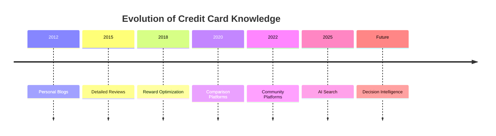

The industry is now approaching the next major transition.

---

# Market Positioning Comparison

| Platform | Primary Strength | Core Asset |
|-----------|-----------------|------------|
| CardExpert | Deep expertise | Editorial authority |
| TechnoFino | Community | Collective intelligence |
| CardMaven | Structured comparisons | User-friendly research |
| CardInsider | Simplicity | Consumer education |
| **CardWise** | Decision intelligence | AI-powered optimization |

---

# Business Model Comparison

| Platform | Primary Revenue | Business Type |
|-----------|-----------------|---------------|
| CardExpert | Affiliate referrals | Expert publishing |
| TechnoFino | Community + Affiliate | Community platform |
| CardMaven | Affiliate + Content | Editorial publishing |
| CardInsider | Affiliate + Advertising | Comparison platform |
| **CardWise** | Premium SaaS + Affiliate Intelligence + APIs | Financial Intelligence Platform |

---

# User Journey Comparison

## Existing Journey

```text
Need Recommendation

        ↓

Google Search

        ↓

Read 3 Articles

        ↓

Open Bank Website

        ↓

Compare Cards

        ↓

Read Reddit

        ↓

Read TechnoFino

        ↓

Open Spreadsheet

        ↓

Calculate Rewards

        ↓

Choose Card

```

Average time:

20–60 minutes

---

## CardWise Journey

```text
Intent

      ↓

Open CardWise

      ↓

AI Understands Context

      ↓

Analyzes

• Cards
• Offers
• Merchant
• Portal
• Milestones
• History
• Reward Value

      ↓

Recommendation

      ↓

Purchase

```

Average time:

Less than 30 seconds

---

# Content vs Intelligence

The biggest strategic insight from this category is the distinction between **knowledge** and **intelligence**.

| Knowledge Platforms | CardWise |
|---------------------|----------|
| Explain | Recommend |
| Teach | Optimize |
| Compare | Decide |
| Inform | Execute |
| Static | Dynamic |
| Generic | Personalized |

This represents a category shift rather than a feature improvement.

---

# UX Comparison

## CardExpert

Strengths

- Extremely detailed
- Trusted
- Expert-level content

Weaknesses

- Long articles
- High learning curve
- Manual calculations

---

## TechnoFino

Strengths

- Community wisdom
- Fast updates
- Rich discussions

Weaknesses

- Information overload
- Duplicate answers
- Difficult search
- No structured recommendations

---

## CardMaven

Strengths

- Clean comparisons
- Beginner friendly
- Well organized

Weaknesses

- Static recommendations
- Limited personalization

---

## CardInsider

Strengths

- Simple
- Easy navigation
- Consumer focused

Weaknesses

- Shallow optimization
- No advanced reward intelligence

---

## Shared UX Problem

All four platforms assume:

> The user will perform the final optimization.

CardWise removes this assumption.

---

# Technology Maturity Comparison

| Capability | CardExpert | TechnoFino | CardMaven | CardInsider | CardWise Vision |
|------------|------------|------------|------------|-------------|-----------------|
| CMS | Excellent | Excellent | Excellent | Excellent | Moderate |
| Community | Low | Excellent | Moderate | Low | High |
| Structured Data | Low | Low | Moderate | Moderate | Excellent |
| AI | Minimal | Minimal | Minimal | Minimal | AI Native |
| Recommendation Engine | None | None | None | None | Core Platform |
| Rule Engine | None | None | None | None | Core Platform |
| Merchant Graph | None | None | None | None | Core Platform |
| Browser Extension | None | None | None | None | Planned |

---

# Personalization Comparison

| Capability | Existing Platforms | CardWise |
|-------------|-------------------|----------|
| Spending History | ❌ | ✅ |
| Existing Cards | ❌ | ✅ |
| Reward Balances | ❌ | ✅ |
| Travel Goals | ❌ | ✅ |
| Merchant Preferences | ❌ | ✅ |
| Annual Milestones | ❌ | ✅ |
| Live Offers | Partial | ✅ |
| Purchase Intent | ❌ | ✅ |

---

# AI Readiness

Current platforms primarily use AI, if at all, for:

- Search
- Content recommendations
- Basic categorization

They do not implement domain-specific reasoning.

CardWise's AI roadmap should include:

- Rule-based reasoning
- Recommendation explainability
- Reward simulations
- Predictive optimization
- Merchant intelligence
- Personalized planning

---

# Community Comparison

| Platform | Community Quality |
|-----------|-------------------|
| CardExpert | Expert readership |
| TechnoFino | Outstanding |
| CardMaven | Emerging |
| CardInsider | Limited |
| CardWise | Hybrid AI + Community |

Rather than replacing community discussions, CardWise should use verified community knowledge to continuously improve recommendation quality.

---

# Strategic Gaps

Across every platform analyzed, several common gaps emerge.

---

## Gap 1

Information is static.

Recommendations are dynamic.

---

## Gap 2

Knowledge exists.

Execution does not.

---

## Gap 3

Every user receives similar advice.

No platform deeply understands:

- spending habits
- travel patterns
- merchant preferences
- reward portfolios

---

## Gap 4

Knowledge is fragmented.

Users still visit:

- blogs
- forums
- bank websites
- Reddit
- YouTube

to answer a single question.

---

## Gap 5

No platform owns the transaction.

Advice ends before spending begins.

---

## Gap 6

No explainable AI.

Users must trust themselves instead of trusting software.

---

## Gap 7

Reward rules continue becoming more complicated.

Manual optimization becomes increasingly unrealistic.

---

# Competitive Moats

## CardExpert

Moat:

Expertise

---

## TechnoFino

Moat:

Community

---

## CardMaven

Moat:

Content quality

---

## CardInsider

Moat:

Accessibility

---

## CardWise

Potential moat:

- AI
- Rule engine
- Merchant graph
- Reward engine
- Explainability
- Personalization
- Historical intelligence
- Continuous learning

These are significantly harder to replicate than editorial content alone.

---

# Strategic Lessons

## Lesson 1

Knowledge alone is no longer sufficient.

Consumers increasingly expect software to make recommendations.

---

## Lesson 2

Communities produce valuable information.

AI can organize it.

---

## Lesson 3

Editorial content scales linearly.

Software scales exponentially.

---

## Lesson 4

The future belongs to platforms that combine:

- structured knowledge
- AI reasoning
- personalization
- automation

---

## Lesson 5

Users no longer want to ask:

> "Which card is best?"

They want software to answer:

> "Given **my cards**, **my spending**, **today's offers**, **my travel goals**, and **my reward balances**, what should I do?"

---

# CardWise Positioning

The following diagram summarizes CardWise's intended market position.

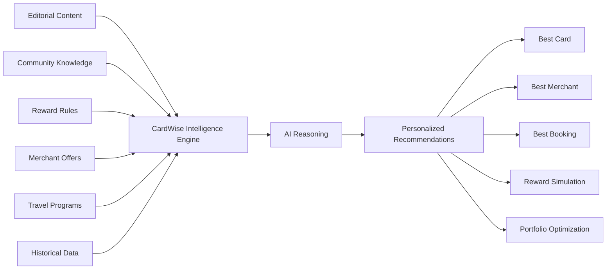

---

# Final Strategic Recommendation

CardWise should **not** attempt to compete directly with any of these platforms on content volume.

Instead, it should treat them as validation that users are willing to invest time learning reward optimization.

The opportunity lies in eliminating that effort.

The long-term vision should be:

> **From "Read before you spend" to "Know before you spend."**

Where existing platforms publish knowledge, CardWise should deliver decisions.

Where communities share experiences, CardWise should synthesize them into intelligence.

Where blogs explain possibilities, CardWise should recommend the optimal action.

This transition—from editorial content to AI-driven financial decision intelligence—represents one of the largest untapped opportunities in India's credit card ecosystem.

---

# Section Conclusion

The Credit Card Knowledge Platform category demonstrates that:

- Users value trustworthy reward expertise.
- Community-generated knowledge compounds over time.
- Static educational content has reached maturity.
- Manual optimization does not scale with increasing reward complexity.

CardWise has the opportunity to become the next evolution of this category by transforming years of accumulated knowledge into a real-time, personalized, and explainable financial intelligence platform.

---

**End of Part 2B-5**

---

# Part 3 — Travel Platforms

> **Category:** Online Travel Agencies (OTAs), Travel Ecosystems & Loyalty Platforms
>
> **Objective:** Analyze India's and the world's leading travel booking platforms to understand how they influence consumer spending, loyalty, and reward redemption, identify structural limitations in their current approaches, and define how CardWise can become the intelligence layer for travel reward optimization.

---

# Travel Platforms

## Category Overview

Travel represents one of the largest spending categories for premium credit card users.

Unlike everyday purchases such as groceries or fuel, travel transactions are:

- High value
- Infrequent
- Reward-rich
- Highly competitive
- Promotion driven
- Loyalty intensive

A single travel booking often involves multiple optimization decisions including:

- Which credit card to use
- Which airline to book
- Which hotel chain provides the best value
- Which booking platform offers the best discount
- Whether to use points or cash
- Whether to transfer points to an airline
- Whether to transfer points to a hotel
- Which travel portal provides the highest cashback
- Whether a milestone should be completed first

These decisions can easily affect the effective value of a transaction by **10–40%**.

Despite this, today's travel booking platforms primarily optimize for **booking conversion**, not **reward optimization**.

This creates one of the largest strategic opportunities for CardWise.

---

# Why Travel Matters

For premium credit card users, travel is often where rewards become most valuable.

Example:

```
₹50,000 Cashback

↓

₹50,000 Flights

↓

Business Class Upgrade

↓

₹2,50,000 Flight Value
```

Similarly,

```
50,000 Hotel Points

↓

Luxury Resort Redemption

↓

₹1,80,000 Stay
```

The difference between poor redemption and optimized redemption can exceed **300–500%**.

Consequently, travel optimization has become central to advanced credit card strategies.

---

# Evolution of Travel Platforms

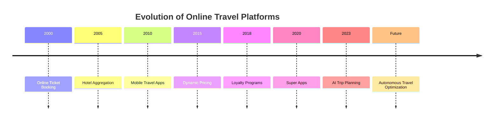

Travel platforms have become increasingly sophisticated in booking technology.

However, reward intelligence has evolved much more slowly.

---

# Current Market Landscape

The travel ecosystem consists of several overlapping categories.

| Category | Examples |
|----------|----------|
| Indian OTAs | MakeMyTrip, Goibibo, Yatra, Cleartrip, Ixigo |
| Global OTAs | Booking.com, Agoda, Expedia |
| Alternative Accommodation | Airbnb |
| Airline Platforms | Air India, IndiGo, Emirates, Singapore Airlines |
| Hotel Chains | Marriott, Hilton, Hyatt, IHG, Accor |
| Meta Search | Google Flights, Skyscanner, Kayak |
| Loyalty Programs | Marriott Bonvoy, World of Hyatt, KrisFlyer, Flying Blue |

Each platform optimizes a different stage of the travel journey.

None optimize the **entire financial value chain**.

---

# The Travel Rewards Ecosystem

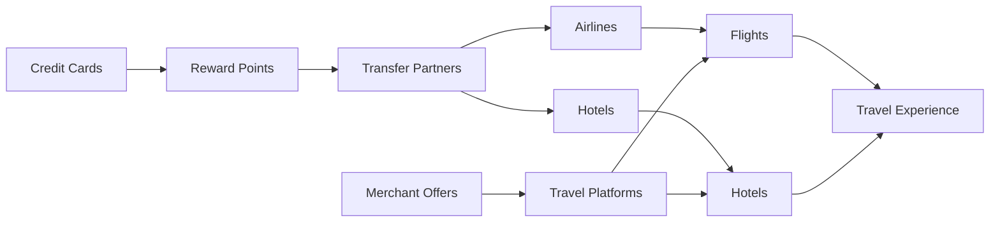

Today's consumer must manually navigate this ecosystem.

CardWise aims to automate it.

---

# Industry Characteristics

## Strengths

Travel platforms excel at:

- Search
- Booking
- Payments
- Pricing
- Promotions
- Reviews
- Customer support
- Loyalty integrations

---

## Weaknesses

Travel platforms generally do **not** optimize:

- Credit card rewards
- Airline transfer value
- Hotel transfer value
- Multi-card strategies
- Reward simulations
- Point valuation
- Annual milestone planning
- Reward explainability

---

# The Travel Optimization Problem

Consider a simple booking.

```
Flight Cost

₹38,500
```

A typical user now needs to answer:

- Which booking platform is cheapest?
- Which platform has an instant discount?
- Which credit card has the best offer?
- Which card earns maximum rewards?
- Which airline loyalty program should I use?
- Should I redeem points?
- Should I transfer points?
- Should I split payment?
- Will this help complete a milestone?
- Is there a better offer tomorrow?

Today's ecosystem expects users to answer all of these questions manually.

---

# Current User Journey

```text
Google Flights

      ↓

Compare Airlines

      ↓

Open MakeMyTrip

      ↓

Open Ixigo

      ↓

Open Cleartrip

      ↓

Search Bank Offers

      ↓

Open CardExpert

      ↓

Read Reddit

      ↓

Calculate Rewards

      ↓

Book Ticket
```

Average decision time:

**30–60 minutes**

---

# Desired User Journey with CardWise

```text
Describe Trip

        ↓

AI Understands

• Destination
• Dates
• Existing Cards
• Reward Balances
• Airline Programs
• Hotel Programs
• Current Offers

        ↓

Optimization Engine

        ↓

Recommendation

        ↓

Book
```

Target decision time:

**Less than one minute**

---

# Market Opportunity

The travel industry has invested billions in improving booking experiences.

However, very little innovation has occurred in **financial optimization**.

Consumers still manually determine:

- Whether to pay with cash
- Whether to redeem points
- Which portal to use
- Which airline provides highest value
- Which hotel provides maximum redemption value

The next generation of travel software will compete on:

- Intelligence
- Personalization
- Automation
- Financial optimization

rather than search alone.

---

# Strategic Positioning

Travel platforms optimize:

```
Booking
```

CardWise optimizes:

```
Booking Value
```

This distinction is critical.

CardWise does **not** need to replace OTAs.

Instead, it becomes the intelligence layer that sits above them.

---

# Competitive Positioning

```text
Travel Platforms

↓

Help Users Book Trips

---------------------------

CardWise

↓

Help Users Maximize Value
From Every Trip
```

This positioning avoids direct competition while dramatically increasing user value.

---

# Key Research Questions

The remainder of this section seeks to answer several strategic questions:

1. Why do users continue to compare multiple travel platforms before booking?

2. Why is reward optimization still largely manual?

3. Why do travel platforms rarely recommend the financially optimal booking strategy?

4. How can CardWise combine travel pricing, loyalty programs, merchant offers, and credit card rewards into a unified recommendation engine?

5. Which parts of the travel decision process are most suitable for AI-driven automation?

---

# Competitors Covered in Part 3

The following platforms will be analyzed using a consistent strategic framework:

| Section | Platform |
|----------|----------|
| Part 3A | MakeMyTrip |
| Part 3B | Goibibo |
| Part 3C | Yatra |
| Part 3D | Cleartrip |
| Part 3E | Ixigo |
| Part 3F | Booking.com |
| Part 3G | Agoda |
| Part 3H | Airbnb |
| Part 3I | Comparative Analysis & Strategic Lessons |

Each platform will be evaluated across:

- Company Overview
- Product Positioning
- Core Features
- Revenue Model
- Business Strategy
- UX Philosophy
- Loyalty Programs
- AI Usage
- Personalization
- Technical Observations
- Innovation
- Trust Factors
- Missing Opportunities
- Opportunities CardWise Can Exploit

---

# Executive Insight

The online travel industry has solved the problem of **finding travel options**.

It has not solved the problem of **maximizing travel value**.

Every year, millions of travelers unknowingly lose significant value because they:

- Use the wrong credit card.
- Book through the wrong platform.
- Redeem points inefficiently.
- Ignore transfer bonuses.
- Miss milestone opportunities.
- Overlook merchant-specific offers.
- Fail to optimize loyalty programs.

This represents a multi-billion-rupee optimization problem that no existing travel platform is incentivized to solve.

CardWise's long-term opportunity is to become the independent intelligence layer that continuously evaluates travel options across airlines, hotels, booking platforms, loyalty programs, merchant offers, and credit card rewards to recommend the financially optimal booking strategy for every trip.

---

**End of Part 3 (Introduction)**

---

# Part 3A — MakeMyTrip

> **Category:** Online Travel Agency (OTA)
>
> **Objective:** Analyze India's largest online travel platform, understand its competitive advantages, and identify the opportunities for CardWise to become the financial intelligence layer above travel booking.

---

# MakeMyTrip

---

# Company Overview

**Founded:** 2000

**Founder:** Deep Kalra

**Headquarters:** Gurugram, India

**Category:** Online Travel Agency (OTA)

**Primary Markets:**

- India
- International outbound travel
- Domestic travel

**Core Businesses**

- Flights
- Hotels
- Holiday Packages
- Trains
- Buses
- Cabs
- Visa Services
- Forex
- Travel Insurance
- Activities

MakeMyTrip (MMT) is India's largest online travel platform and has become the default travel booking destination for millions of Indian consumers. Over the years, the company has expanded well beyond flight bookings into a comprehensive travel ecosystem, supported by acquisitions such as Goibibo, redBus, and BookMyForex, along with fintech initiatives under TripMoney. :contentReference[oaicite:0]{index=0}

Unlike airline or hotel websites, MakeMyTrip aggregates inventory from multiple providers, allowing users to compare prices, schedules, accommodations, and travel products within a single platform.

---

# Product Positioning

## Core Positioning

> **India's One-Stop Travel Super App**

MakeMyTrip positions itself as the complete destination for planning, booking, and managing travel.

Rather than specializing in one travel segment, the platform aims to own the complete journey:

```
Inspiration

↓

Planning

↓

Booking

↓

Payments

↓

Travel

↓

Post-trip Services
```

This broad positioning enables MakeMyTrip to maximize customer lifetime value across multiple travel categories.

---

## Strategic Narrative

The company's strategic objective is simple:

> Remove friction from travel planning.

Its investments consistently focus on:

- Better search
- Better pricing
- Rich inventory
- Faster booking
- Personalization
- Customer trust

Recently, the company has significantly accelerated its AI initiatives through its **Myra** conversational travel assistant and broader AI-first strategy. :contentReference[oaicite:1]{index=1}

---

# Target Audience

Primary audience:

- Domestic travelers
- Families
- Business travelers
- Young professionals
- International travelers
- Holiday planners

Secondary audience:

- Premium travelers
- Luxury hotel customers
- Group travel
- Corporate travel
- Students

Unlike niche travel startups, MakeMyTrip serves almost every travel segment.

---

# Core Features

## Flight Booking

One of India's most comprehensive flight booking experiences.

Capabilities include:

- Domestic flights
- International flights
- Fare calendars
- Flexible dates
- Multi-city bookings
- Refundable fares
- Fare alerts
- Ancillary services

---

## Hotel Booking

Large inventory covering:

- Budget hotels
- Business hotels
- Luxury hotels
- Resorts
- Villas
- Homestays

Features include:

- Reviews
- Photos
- Amenities
- Filters
- Instant confirmation

---

## Holiday Packages

End-to-end vacation planning including:

- Flights
- Hotels
- Transfers
- Activities
- Sightseeing

---

## Rail & Bus

Integrated booking for:

- Indian Railways
- Bus operators
- Premium buses
- Sleeper buses

This significantly increases engagement beyond air travel.

---

## Cabs & Airport Transfers

Users can book:

- Airport taxis
- Local rentals
- Intercity travel

---

## TripMoney

The fintech ecosystem includes:

- Travel insurance
- Foreign exchange
- EMI
- Financing
- Travel-related financial services

This expands MakeMyTrip beyond pure travel commerce. :contentReference[oaicite:2]{index=2}

---

# Premium Features

Premium capabilities include:

- Zero Cancellation
- Fare Lock
- Trip Guarantee
- Premium hotel collections
- Exclusive member offers
- Personalized pricing
- Loyalty promotions

These features are designed to reduce uncertainty and increase booking confidence. Machine learning also powers features such as Fare Lock and Trip Guarantee. :contentReference[oaicite:3]{index=3}

---

# Revenue Model

MakeMyTrip operates a diversified marketplace business.

Primary revenue sources include:

| Revenue Source | Description |
|----------------|-------------|
| Flight commissions | Airline partnerships |
| Hotel commissions | Property partners |
| Holiday packages | Package margins |
| Advertising | Sponsored placements |
| Travel insurance | Financial partnerships |
| Forex | TripMoney |
| Convenience fees | Booking charges |
| Ancillary services | Seat selection, baggage, etc. |

Unlike reward platforms, revenue is primarily tied to completed bookings.

---

# Business Model

```text
Travel Demand

        ↓

Search

        ↓

Inventory Aggregation

        ↓

Booking

        ↓

Payments

        ↓

Ancillary Services

        ↓

Revenue
```

The business optimizes booking conversion rather than financial optimization.

---

# Strengths

## Market Leadership

MakeMyTrip has built one of India's strongest travel brands over more than two decades.

Its scale creates advantages in:

- Supplier negotiations
- Inventory breadth
- Brand trust
- Customer acquisition

---

## Massive Inventory

The platform aggregates:

- Airlines
- Hotels
- Homestays
- Bus operators
- Rail bookings
- Holiday packages

allowing users to compare options in one place.

---

## Excellent Booking Experience

Booking flows are:

- Fast
- Reliable
- Mobile optimized
- Highly refined

The company has invested heavily in reducing booking friction.

---

## Rich Travel Ecosystem

Users can complete an entire trip without leaving the platform.

This ecosystem increases retention and repeat usage.

---

## Strong Brand Trust

Travel purchases are high-value transactions.

MakeMyTrip has earned significant consumer trust through:

- Reliable bookings
- Customer support
- Established brand recognition
- Long operating history

---

## AI Investment

MakeMyTrip has become one of India's most aggressive travel companies in adopting generative AI.

Recent initiatives include:

- **Myra**, a conversational travel assistant
- Multilingual trip planning
- AI-assisted travel discovery
- Conversational search
- Personalized itinerary generation
- AI-powered recommendations

The company has also announced collaborations to deepen its AI-first strategy using OpenAI technologies. :contentReference[oaicite:4]{index=4}

---

# Weaknesses

Despite its strengths, MakeMyTrip leaves several opportunities unaddressed from CardWise's perspective.

---

## Booking Optimization ≠ Financial Optimization

The platform helps users book travel efficiently.

It does not optimize:

- Credit card rewards
- Reward points
- Airline transfers
- Hotel transfers
- Cashback
- Milestones

---

## Platform-Centric Recommendations

Recommendations naturally favor bookings completed within the MakeMyTrip ecosystem.

The platform is incentivized to maximize:

- Conversion
- Revenue
- Cross-selling

rather than maximizing the user's total financial return.

---

## Limited Credit Card Intelligence

Although bank offers are surfaced during checkout, the platform does not answer:

- Which card earns the highest effective reward?
- Which redemption strategy provides maximum value?
- Should points be transferred before booking?

---

## No Cross-Platform Optimization

The platform does not compare value across competing travel ecosystems such as:

- Airline direct bookings
- Hotel direct bookings
- Other OTAs
- Loyalty program transfers

---

## No Unified Reward Valuation

Users must manually determine:

- Effective cashback
- Point valuation
- Airline mile value
- Hotel point value
- Opportunity cost

---

# UX Analysis

## Design Philosophy

MakeMyTrip's interface emphasizes:

- Speed
- Simplicity
- High conversion
- Progressive disclosure

The booking experience is optimized for reducing abandonment.

---

## Navigation

Primary navigation revolves around travel verticals:

- Flights
- Hotels
- Trains
- Buses
- Holidays
- Cabs

This task-oriented structure minimizes cognitive load.

---

## Search Experience

Search is one of MakeMyTrip's strongest capabilities.

It supports:

- Rich filters
- Dynamic pricing
- Flexible dates
- Multiple sort options
- Contextual recommendations

However, search remains travel-centric rather than finance-centric.

---

## Personalization

Current personalization includes:

- Previous searches
- Destination recommendations
- Seasonal travel
- User preferences
- Hotel rankings
- Promotional campaigns

Reward optimization is largely absent from personalization.

---

# Technical Observations

From a technology perspective, MakeMyTrip demonstrates a highly mature architecture likely including:

- Large-scale inventory aggregation
- Dynamic pricing systems
- Recommendation engines
- Real-time availability services
- Payment orchestration
- Fraud detection
- Search optimization
- Cloud-native infrastructure

Recent investments indicate a shift toward AI-native travel planning, where conversational interfaces become the primary method of discovering and booking travel. :contentReference[oaicite:5]{index=5}

---

**End of Part 3A-1**


---

# Part 3A-2 — MakeMyTrip (Continued)

---

# Trust Factors

Travel purchases are among the highest-value consumer transactions conducted online.

Users trust MakeMyTrip not only with payments but also with critical aspects of their travel experience.

Key trust drivers include:

- Long operating history
- Strong brand recognition
- Extensive supplier network
- Reliable booking confirmations
- Established customer support
- Secure payment infrastructure
- Transparent cancellation policies
- Millions of completed bookings

For many Indian travelers, MakeMyTrip has become synonymous with online travel booking.

---

## Customer Confidence

Several factors reinforce user confidence:

- Verified hotel reviews
- Transparent pricing breakdowns
- Booking confirmations
- Flexible cancellation options
- Travel insurance
- Customer support channels
- Multiple payment methods

These mechanisms reduce perceived risk during booking.

---

## Brand Equity

Years of marketing investment have positioned MakeMyTrip as:

> "The safest place to book travel."

This trust represents one of the company's strongest competitive moats.

---

# Community Presence

Unlike community-driven platforms such as TechnoFino or Reddit, MakeMyTrip is not built around user discussions.

Instead, its community layer consists primarily of:

- Customer reviews
- Hotel ratings
- Destination guides
- Travel inspiration content
- User-generated photos

The objective is improving booking confidence rather than enabling collaborative travel planning.

---

## Content Ecosystem

The platform also publishes travel-related content including:

- Destination guides
- Visa information
- Seasonal recommendations
- Travel advisories
- Holiday ideas
- City itineraries

These resources increase user engagement while supporting SEO and travel discovery.

---

# AI Usage

MakeMyTrip has become one of the earliest large-scale adopters of generative AI within India's travel industry.

Recent AI initiatives include:

- Conversational trip planning
- Natural language destination discovery
- Itinerary generation
- Hotel recommendations
- Flight suggestions
- AI-assisted search

The flagship capability is **Myra**, an AI-powered travel assistant designed to help users discover destinations, plan trips, and simplify travel research through conversational interactions. ([makemytrip.com](https://www.makemytrip.com/myra/?utm_source=chatgpt.com))

---

## Current AI Capabilities

Current AI investments appear focused on:

| Capability | Maturity |
|------------|----------|
| Destination Discovery | ⭐⭐⭐⭐⭐ |
| Conversational Search | ⭐⭐⭐⭐☆ |
| Hotel Recommendations | ⭐⭐⭐⭐☆ |
| Travel Planning | ⭐⭐⭐⭐☆ |
| Personalized Suggestions | ⭐⭐⭐⭐☆ |
| Customer Support | ⭐⭐⭐⭐☆ |
| Booking Assistance | ⭐⭐⭐⭐☆ |

These capabilities significantly improve the planning experience.

However, AI currently focuses on **where to travel**, not **how to maximize financial value**.

---

## AI Gaps

The platform does not currently provide AI reasoning for questions such as:

- Which credit card maximizes this booking?
- Should I transfer points before booking?
- Should I redeem airline miles or pay cash?
- Which OTA provides the highest effective value after rewards?
- Will booking today prevent a better promotional opportunity tomorrow?

These questions remain outside the scope of current AI implementations.

---

# Personalization

Personalization is one of MakeMyTrip's strongest product capabilities.

Current personalization includes:

- Frequently searched destinations
- Preferred airlines
- Hotel preferences
- Budget ranges
- Seasonal recommendations
- Regional offers
- Loyalty pricing
- Marketing campaigns

The platform builds a rich understanding of travel behavior over time.

---

## Personalization Maturity

| Area | Rating |
|------|---------|
| Travel Discovery | ⭐⭐⭐⭐⭐ |
| Destination Suggestions | ⭐⭐⭐⭐⭐ |
| Hotel Recommendations | ⭐⭐⭐⭐☆ |
| Marketing Personalization | ⭐⭐⭐⭐☆ |
| Loyalty Offers | ⭐⭐⭐⭐☆ |
| Financial Optimization | ⭐☆☆☆☆ |
| Reward Intelligence | ⭐☆☆☆☆ |

This reveals a clear distinction:

Travel preferences are deeply personalized.

Financial decisions are not.

---

# Scalability

MakeMyTrip demonstrates exceptional scalability across technology, operations, and business.

Growth drivers include:

- Marketplace business model
- Supplier network effects
- Brand recognition
- AI investments
- Cross-selling opportunities
- Mobile-first engagement
- High repeat usage

The company has successfully expanded from airline bookings into a comprehensive travel ecosystem.

---

## Growth Flywheel

```text
Travel Search

        ↓

Booking

        ↓

Customer Trust

        ↓

Repeat Travel

        ↓

Cross-Sell

        ↓

Higher Lifetime Value

        ↓

Supplier Partnerships

        ↓

Better Inventory

        ↓

More Bookings
```

This self-reinforcing cycle strengthens the company's market leadership.

---

# Innovation Assessment

MakeMyTrip consistently demonstrates innovation in booking technology and travel experience.

| Dimension | Rating |
|-----------|--------|
| Flight Booking | ⭐⭐⭐⭐⭐ |
| Hotel Booking | ⭐⭐⭐⭐⭐ |
| Search Experience | ⭐⭐⭐⭐⭐ |
| Mobile Experience | ⭐⭐⭐⭐⭐ |
| AI Travel Planning | ⭐⭐⭐⭐☆ |
| Payments | ⭐⭐⭐⭐☆ |
| Personalization | ⭐⭐⭐⭐☆ |
| Reward Optimization | ⭐☆☆☆☆ |
| Travel Reward Intelligence | ⭐☆☆☆☆ |
| Credit Card Decision Support | ⭐☆☆☆☆ |

The platform innovates aggressively in travel commerce but has invested relatively little in financial optimization.

---

# Missing Features

Despite its maturity, several high-value opportunities remain.

---

## Credit Card Intelligence

The platform cannot recommend:

- Optimal credit card
- Best payment method
- Highest reward combination
- Card-specific milestone opportunities

---

## Unified Reward Engine

No capability exists to normalize:

- Cashback
- Airline miles
- Hotel points
- Reward points
- Instant discounts

into a single comparable financial value.

---

## Reward Simulation

Users cannot model scenarios such as:

- Pay cash
- Redeem airline miles
- Transfer points
- Use cashback
- Book directly
- Book through OTA

before completing a booking.

---

## Transfer Partner Optimization

The platform does not evaluate:

- Bank transfer bonuses
- Airline redemption value
- Hotel redemption value
- Loyalty arbitrage opportunities

---

## Multi-Card Optimization

Travelers with multiple premium cards receive no assistance determining which portfolio combination produces the highest return.

---

## Browser Assistance

Travel research frequently spans multiple websites.

MakeMyTrip provides no contextual guidance outside its own ecosystem.

---

## Cross-Platform Price + Reward Intelligence

The platform compares prices.

It does **not** compare:

```
Final Financial Value

=

Price

+

Cashback

+

Reward Points

+

Transfer Bonuses

+

Milestone Value

+

Future Opportunity Value
```

This represents one of the largest strategic opportunities in travel technology.

---

# Opportunities CardWise Can Exploit

MakeMyTrip has solved the booking problem.

CardWise can solve the optimization problem.

Key opportunities include:

| Opportunity | Strategic Value |
|-------------|-----------------|
| AI Booking Advisor | Recommend the optimal booking strategy before payment. |
| Unified Reward Engine | Normalize points, cashback, airline miles, and hotel rewards into a common valuation framework. |
| Transfer Optimization | Recommend whether to transfer points before booking. |
| Cross-Platform Comparison | Compare effective booking value across OTAs, airline websites, and hotel websites. |
| Reward Simulation | Forecast financial outcomes before a booking is confirmed. |
| Browser Extension | Provide recommendations across any travel website. |
| Milestone Optimization | Suggest bookings that help unlock annual card benefits or spend thresholds. |
| Explainable AI | Clearly explain why a recommendation is financially superior. |

---

# Strategic Lessons for CardWise

## What MakeMyTrip Does Exceptionally Well

- Search experience
- Booking flow
- Inventory aggregation
- Customer trust
- Mobile UX
- AI-assisted trip planning
- Marketplace execution

---

## What CardWise Should Learn

### Optimize for Speed

Users expect travel searches to complete within seconds.

Reward optimization should be equally fast.

---

### Reduce Complexity

Complex financial calculations should be hidden behind simple recommendations.

---

### Build Consumer Trust

Travel transactions involve significant financial commitment.

Recommendations must be:

- Transparent
- Accurate
- Explainable
- Consistent

---

### Invest in AI Early

Generative AI will increasingly become the default interface for travel planning.

CardWise should ensure financial reasoning evolves alongside conversational planning.

---

## What CardWise Should Avoid

- Becoming another booking platform.
- Owning travel inventory.
- Competing directly with OTAs on supplier relationships.
- Building revenue models dependent solely on booking commissions.

Instead, CardWise should remain platform-neutral and optimize for user value across the broader travel ecosystem.

---

# Positioning Summary

| Aspect | MakeMyTrip | CardWise |
|--------|------------|----------|
| Core Mission | Book Travel | Maximize Travel Value |
| Primary KPI | Booking Conversion | Financial Optimization |
| Search Focus | Flights & Hotels | Best Overall Booking Strategy |
| AI Role | Travel Planning | Financial Decision Intelligence |
| Competitive Advantage | Inventory & Brand | Reward Intelligence & Explainability |
| Business Model | OTA Marketplace | Intelligence Layer |

---

# Key Strategic Takeaways

The MakeMyTrip analysis highlights a fundamental shift in the travel industry.

The first generation of travel platforms competed on:

- Inventory
- Price
- Convenience

The next generation is competing on:

- Personalization
- AI
- User experience

CardWise represents the logical next evolution:

> **Financial intelligence for travel decisions.**

Rather than asking:

> "Where should I book?"

users will increasingly ask:

> "What is the smartest financial way to book this trip?"

This subtle shift—from booking optimization to financial optimization—defines CardWise's opportunity.

By combining:

- Live pricing
- Credit card rewards
- Airline loyalty programs
- Hotel loyalty programs
- Merchant offers
- Bank promotions
- Transfer bonuses
- Milestone tracking

CardWise can become the independent decision engine that sits above every travel platform, maximizing value regardless of where the booking ultimately occurs.

---

**End of Part 3A-2**


---

# Part 3B-1 — Goibibo

> **Category:** Online Travel Agency (OTA)
>
> **Objective:** Analyze Goibibo's positioning as a value-driven travel platform, understand how it differentiates itself from MakeMyTrip despite belonging to the same corporate group, and identify the strategic opportunities available for CardWise.

---

# Goibibo

---

# Company Overview

**Founded:** 2009

**Founder:** Ashish Kashyap

**Current Parent Company:** MakeMyTrip Group

**Category:** Online Travel Agency (OTA)

**Primary Markets**

- Domestic Flights
- Hotels
- Buses
- Trains
- Cabs
- International Flights

Goibibo has established itself as one of India's most recognized online travel brands, particularly among price-conscious travelers.

Although it operates under the MakeMyTrip Group, Goibibo continues to maintain its own product identity, customer experience, and market positioning.

Where MakeMyTrip emphasizes a comprehensive travel ecosystem, Goibibo focuses on:

- Competitive pricing
- Fast booking
- Cashback
- Promotions
- Mobile-first experiences

This allows the parent company to serve multiple customer segments without brand overlap.

---

# Product Positioning

## Core Positioning

> **Smart Travel at the Best Price**

Goibibo's messaging consistently emphasizes affordability, convenience, and frequent promotional savings.

Instead of positioning itself as a premium travel ecosystem, it competes on:

- Better prices
- Faster bookings
- Reward programs
- Discounts
- User-friendly mobile experiences

The platform appeals strongly to users who compare multiple OTAs before booking.

---

## Strategic Narrative

The product philosophy can be summarized as:

> Reduce the cost and complexity of booking travel.

Goibibo invests heavily in:

- Promotional campaigns
- Instant discounts
- Cashback partnerships
- Loyalty incentives
- Simplified booking workflows

Unlike loyalty programs operated by airlines and hotels, Goibibo's rewards primarily encourage users to return to its own platform.

---

# Target Audience

Primary users include:

- Young professionals
- Budget-conscious travelers
- Students
- Families
- Frequent domestic travelers
- Mobile-first consumers

Secondary users include:

- Small business travelers
- Weekend travelers
- Holiday planners

Compared to MakeMyTrip, Goibibo skews slightly toward value-conscious customers seeking the best available deal.

---

# Core Features

## Flight Booking

Capabilities include:

- Domestic flights
- International flights
- Fare comparison
- Flexible search
- Fare alerts
- Instant booking
- Cancellation options

The booking flow is optimized for speed and simplicity.

---

## Hotel Booking

The hotel platform supports:

- Budget hotels
- Premium hotels
- Apartments
- Resorts
- Homestays

Features include:

- Verified reviews
- Rich filtering
- Instant confirmation
- Map-based discovery

---

## Bus & Train Booking

Goibibo provides:

- Intercity bus bookings
- Sleeper buses
- Luxury buses
- Indian Railways ticketing

This broadens user engagement beyond flights and hotels.

---

## GoCash Loyalty Program

GoCash is Goibibo's internal rewards ecosystem.

Users earn promotional credits through:

- Eligible bookings
- Campaigns
- Offers
- Promotional activities

Credits can be redeemed against future bookings within the Goibibo ecosystem.

Unlike airline miles or transferable bank rewards, GoCash is platform-specific and designed primarily to increase repeat bookings.

---

## Offers & Promotions

Goibibo actively promotes:

- Bank discounts
- Instant cashback
- Wallet offers
- UPI offers
- Festival campaigns
- Seasonal promotions

These campaigns are central to customer acquisition and retention.

---

# Premium Features

Premium value is delivered through:

- Exclusive promotional campaigns
- Better cancellation options
- Flexible booking benefits
- Loyalty rewards
- Preferred pricing initiatives

Rather than charging subscription fees, Goibibo encourages repeat engagement through savings and convenience.

---

# Revenue Model

Goibibo follows a marketplace model similar to other major OTAs.

Primary revenue sources include:

| Revenue Source | Description |
|----------------|-------------|
| Flight commissions | Airline partnerships |
| Hotel commissions | Accommodation partners |
| Bus & train bookings | Booking commissions |
| Advertising | Sponsored listings |
| Convenience fees | Booking charges |
| Insurance | Travel insurance partnerships |
| Ancillary services | Seats, meals, baggage, etc. |

Revenue is optimized around completed travel transactions rather than long-term financial optimization.

---

# Business Model

```text
Travel Search

        ↓

Price Comparison

        ↓

Booking

        ↓

Promotions

        ↓

Repeat Bookings

        ↓

Marketplace Revenue
```

The business focuses on increasing booking frequency and customer retention.

---

# Strengths

## Strong Price Perception

Goibibo has built a reputation for offering competitive pricing and attractive promotional campaigns.

This perception significantly influences user acquisition.

---

## Excellent Mobile Experience

The application is designed around:

- Fast searches
- Minimal booking friction
- Responsive interactions
- Mobile-first navigation

This aligns well with India's predominantly mobile travel market.

---

## Promotional Ecosystem

Frequent offers encourage repeat usage and create strong engagement during major travel seasons.

---

## Marketplace Scale

As part of the MakeMyTrip Group, Goibibo benefits from:

- Extensive travel inventory
- Supplier relationships
- Operational expertise
- Shared technology investments

---

## High Consumer Awareness

The brand enjoys strong recall among Indian travelers, particularly in the domestic travel segment.

---

# Weaknesses

Despite its strengths, Goibibo leaves several strategic opportunities unaddressed.

---

## Promotion-Driven Rather Than Optimization-Driven

Recommendations prioritize:

- Current discounts
- Promotional campaigns
- Platform-specific benefits

They do not optimize a user's overall financial outcome.

---

## Limited Credit Card Intelligence

While bank offers are displayed, the platform does not evaluate:

- Effective reward rates
- Transfer partner value
- Credit card milestones
- Opportunity cost

---

## Closed Reward Ecosystem

GoCash encourages loyalty within Goibibo but cannot optimize across:

- Airline programs
- Hotel programs
- Credit card rewards
- Transfer bonuses

---

## No Explainable Financial Guidance

Users are shown discounts but not the reasoning behind the financially optimal booking strategy.

---

## No Cross-Platform Intelligence

Goibibo naturally optimizes for bookings completed on its own platform.

It does not compare effective value across competing OTAs, airline websites, hotel websites, and loyalty programs.

---

# UX Analysis

## Design Philosophy

The interface emphasizes:

- Speed
- Simplicity
- Promotional visibility
- Mobile usability

The design reduces friction while encouraging quick purchase decisions.

---

## Navigation

Core navigation revolves around:

- Flights
- Hotels
- Trains
- Buses
- Cabs

The structure supports high-frequency travel tasks without unnecessary complexity.

---

## Search Experience

Search capabilities include:

- Rich filtering
- Sorting
- Flexible dates
- Price comparison
- Traveler preferences

The experience is optimized for finding and booking travel rather than evaluating financial value.

---

## Information Architecture

Information is organized around booking completion.

Financial considerations such as reward optimization remain secondary.

---

## Technical Observations

Based on publicly observable capabilities, Goibibo demonstrates mature OTA infrastructure including:

- Inventory aggregation
- Real-time pricing
- Booking orchestration
- Payment processing
- Recommendation services
- Notification systems
- Mobile-first architecture

There is no public evidence of sophisticated reward engines or transaction-aware financial recommendation systems.

---

**End of Part 3B-1**

---

# Part 3B-2 — Goibibo (Continued)

---

# Trust Factors

Travel bookings involve high-value financial commitments and time-sensitive itineraries, making trust a critical success factor.

Goibibo has established consumer confidence through years of reliable service and the backing of the MakeMyTrip Group.

Key trust drivers include:

- Large customer base
- Strong brand recognition
- Secure payment infrastructure
- Reliable booking confirmations
- Established supplier network
- Transparent pricing
- Customer support
- Mobile-first reliability

For many Indian users, Goibibo is considered one of the default platforms for domestic travel.

---

## Payment Trust

Goibibo supports a wide range of payment methods including:

- Credit Cards
- Debit Cards
- UPI
- Net Banking
- Digital Wallets
- EMI
- BNPL (where available)

Multiple payment options improve conversion while increasing customer confidence.

---

## Customer Confidence

Additional trust mechanisms include:

- Verified hotel reviews
- Cancellation policies
- Booking guarantees
- Refund tracking
- Customer notifications
- Travel alerts

These reduce uncertainty during the booking process.

---

# Community Presence

Unlike social travel platforms, Goibibo does not rely on an active discussion community.

Instead, its community layer is built around:

- User ratings
- Hotel reviews
- Traveler photographs
- Destination content

These contribute social proof rather than collaborative travel planning.

---

## User Generated Content

Community contributions primarily include:

- Hotel ratings
- Accommodation reviews
- Property photographs
- Traveler feedback
- Experience summaries

This content helps users make better accommodation decisions but has limited influence on financial optimization.

---

# AI Usage

Goibibo has incorporated intelligent systems into several aspects of its travel experience.

Likely AI-driven capabilities include:

- Hotel ranking
- Search relevance
- Personalized recommendations
- Dynamic pricing support
- Fraud detection
- Marketing personalization

As part of the MakeMyTrip Group, Goibibo also benefits from broader investments in machine learning and AI infrastructure.

---

## Current AI Capabilities

| Capability | Assessment |
|------------|------------|
| Search Ranking | ⭐⭐⭐⭐⭐ |
| Hotel Recommendations | ⭐⭐⭐⭐☆ |
| Personalization | ⭐⭐⭐⭐☆ |
| Dynamic Pricing Support | ⭐⭐⭐⭐☆ |
| Customer Support | ⭐⭐⭐⭐☆ |
| Fraud Detection | ⭐⭐⭐⭐☆ |
| Reward Intelligence | ⭐☆☆☆☆ |
| Financial Decision Support | ⭐☆☆☆☆ |

The platform uses AI primarily to improve booking efficiency and conversion.

---

## AI Gaps

Current AI implementations do not address questions such as:

- Which booking platform provides the highest effective reward?
- Should I redeem points or pay cash?
- Which card should I use for this booking?
- Is an airline transfer more valuable than booking directly?
- Should I wait for an upcoming promotion?

These represent high-value opportunities for CardWise.

---

# Personalization

Goibibo delivers meaningful personalization across the booking experience.

Current personalization includes:

- Frequently visited destinations
- Preferred hotels
- Previous searches
- Seasonal recommendations
- Price-based suggestions
- Promotional targeting

The objective is increasing booking probability.

---

## Personalization Maturity

| Area | Rating |
|------|---------|
| Destination Discovery | ⭐⭐⭐⭐☆ |
| Hotel Recommendations | ⭐⭐⭐⭐☆ |
| Marketing Campaigns | ⭐⭐⭐⭐☆ |
| Search Personalization | ⭐⭐⭐⭐☆ |
| Reward Personalization | ⭐☆☆☆☆ |
| Credit Card Intelligence | ⭐☆☆☆☆ |
| Travel Reward Optimization | ⭐☆☆☆☆ |

Personalization ends at travel preferences rather than extending into financial optimization.

---

# Scalability

Goibibo benefits from significant scalability advantages through its parent ecosystem.

Key strengths include:

- Shared supplier relationships
- Common technology infrastructure
- Marketplace economics
- Mobile-first customer acquisition
- Cross-brand synergies

The platform scales efficiently across multiple travel verticals while leveraging shared investments in technology and operations.

---

## Growth Flywheel

```text
Travel Searches

        ↓

Bookings

        ↓

Customer Trust

        ↓

Repeat Usage

        ↓

Promotional Engagement

        ↓

Higher Booking Volume

        ↓

Supplier Negotiation

        ↓

Better Pricing

        ↓

More Customers
```

This cycle strengthens Goibibo's position within India's OTA market.

---

# Innovation Assessment

Goibibo has consistently innovated in customer acquisition, booking convenience, and promotional engagement.

| Dimension | Rating |
|-----------|--------|
| Flight Booking | ⭐⭐⭐⭐☆ |
| Hotel Booking | ⭐⭐⭐⭐☆ |
| Mobile Experience | ⭐⭐⭐⭐⭐ |
| Search Experience | ⭐⭐⭐⭐☆ |
| Promotions | ⭐⭐⭐⭐⭐ |
| AI Personalization | ⭐⭐⭐⭐☆ |
| Reward Optimization | ⭐☆☆☆☆ |
| Credit Card Intelligence | ⭐☆☆☆☆ |
| Travel Reward Planning | ⭐☆☆☆☆ |
| Explainable Recommendations | ⭐☆☆☆☆ |

Innovation is concentrated around commerce rather than financial optimization.

---

# Missing Features

Several important opportunities remain unexplored.

---

## Intelligent Credit Card Selection

Goibibo does not evaluate:

- Existing card portfolio
- Reward rates
- Annual milestones
- Reward balances
- Effective cashback

before recommending a payment method.

---

## Unified Reward Valuation

There is no engine capable of comparing:

- Instant discounts
- Cashback
- Airline miles
- Hotel points
- Promotional credits
- Future milestone value

using a common valuation framework.

---

## Reward Simulation

Users cannot compare scenarios such as:

- Booking through Goibibo
- Booking directly with the airline
- Booking via another OTA
- Redeeming bank points
- Transferring airline miles

before completing a purchase.

---

## Cross-Platform Optimization

Recommendations remain platform-centric.

There is no comparison of total financial value across:

- Goibibo
- MakeMyTrip
- Airline websites
- Hotel websites
- Loyalty redemptions

---

## Browser Intelligence

Travel planning often spans multiple websites.

Goibibo provides no contextual assistance outside its own ecosystem.

---

## Explainable Financial Recommendations

Users receive offers but not transparent explanations of:

- Expected savings
- Opportunity cost
- Long-term reward implications

---

# Opportunities CardWise Can Exploit

Goibibo demonstrates that users respond strongly to visible savings.

CardWise can extend this concept by optimizing **total economic value**, not just promotional discounts.

| Opportunity | Strategic Value |
|-------------|-----------------|
| Unified Booking Optimizer | Compare total value across all booking channels. |
| AI Payment Advisor | Recommend the best card and payment strategy. |
| Reward Valuation Engine | Convert points, cashback, and discounts into comparable monetary values. |
| Transfer Partner Intelligence | Evaluate airline and hotel transfer opportunities before booking. |
| Browser Extension | Surface recommendations regardless of which travel platform the user visits. |
| Milestone Planning | Recommend bookings that unlock additional card benefits. |
| Explainable AI | Provide transparent reasoning behind every recommendation. |
| Historical Offer Intelligence | Use past promotional trends to improve booking decisions. |

---

# Strategic Lessons for CardWise

## What Goibibo Does Exceptionally Well

- Mobile-first experience
- Promotional engagement
- Booking simplicity
- Marketplace execution
- Consumer pricing perception
- Fast checkout

---

## What CardWise Should Learn

### Surface Savings Clearly

Users respond best to recommendations that clearly quantify financial benefit.

Every recommendation should answer:

> **"How much will I save or earn?"**

---

### Reduce Booking Friction

Financial optimization should feel as effortless as selecting a flight.

Complex reward calculations should remain invisible.

---

### Leverage Behavioral Triggers

Goibibo successfully encourages action through timely offers.

CardWise can use similar mechanisms to encourage financially optimal decisions.

---

### Stay Platform Neutral

Unlike Goibibo, CardWise should recommend whichever booking path delivers the greatest overall value—even if that means booking elsewhere.

This neutrality builds long-term trust.

---

## What CardWise Should Avoid

- Optimizing solely for booking conversion.
- Creating proprietary reward currencies that fragment the ecosystem.
- Biasing recommendations toward preferred partners.
- Measuring success only through transaction volume instead of user financial outcomes.

---

# Positioning Summary

| Aspect | Goibibo | CardWise |
|--------|----------|----------|
| Core Mission | Affordable Travel Booking | Intelligent Travel Optimization |
| Primary KPI | Booking Volume | User Financial Value |
| Search Focus | Lowest Price | Highest Effective Value |
| Loyalty Strategy | Platform Rewards | Cross-Ecosystem Optimization |
| AI Role | Booking Assistance | Financial Reasoning Engine |
| Competitive Advantage | Promotions & Mobile UX | Unified Reward Intelligence |

---

# Key Strategic Takeaways

Goibibo illustrates an important principle within the travel industry:

> **Consumers are highly responsive to visible savings.**

However, most visible savings represent only one component of the overall financial outcome.

For example:

```
₹2,000 Instant Discount

+

₹5,000 Reward Points

+

₹1,500 Airline Miles

+

₹3,000 Milestone Value

=

₹11,500 Total Effective Value
```

Today's travel platforms generally optimize only the first component.

CardWise can optimize the complete equation.

By combining:

- Live travel pricing
- Promotional discounts
- Credit card rewards
- Airline loyalty programs
- Hotel loyalty programs
- Bank transfer bonuses
- Milestone tracking
- Historical offer intelligence

CardWise can become the financial optimization layer that sits above every OTA, helping users maximize value regardless of where they ultimately book.

---

**End of Part 3B-2**

---

# Part 3C-1 — Yatra

> **Category:** Online Travel Agency (OTA) & Corporate Travel Platform
>
> **Objective:** Analyze Yatra's dual focus on consumer travel and enterprise travel, understand its differentiated market position, and identify the strategic opportunities available for CardWise.

---

# Yatra

---

# Company Overview

**Founded:** 2006

**Founders:** Dhruv Shringi, Manish Amin, Sabina Chopra

**Headquarters:** Gurugram, India

**Category:** Online Travel Agency (OTA)

**Primary Markets**

- Domestic Travel
- International Travel
- Corporate Travel
- SME Business Travel

**Core Businesses**

- Flight Booking
- Hotel Booking
- Holiday Packages
- Bus Booking
- Train Booking
- Corporate Travel
- MICE (Meetings, Incentives, Conferences & Exhibitions)
- Visa Assistance
- Travel Insurance

Unlike many consumer-first OTAs, Yatra has built a strong presence in both **B2C** and **B2B** travel.

Its enterprise travel business differentiates it from competitors by serving:

- Large enterprises
- SMEs
- Government organizations
- Corporate travelers
- Business travel administrators

This diversified customer base provides revenue stability beyond seasonal leisure travel.

---

# Product Positioning

## Core Positioning

> **Travel Solutions for Individuals and Businesses**

Yatra positions itself as more than a travel booking website.

Its value proposition spans:

- Consumer travel
- Corporate travel management
- Expense optimization
- Policy compliance
- Enterprise travel workflows

While leisure travelers remain important, business travel forms a significant strategic pillar.

---

## Strategic Narrative

Yatra's philosophy focuses on simplifying travel across every customer segment.

The platform aims to become the preferred travel partner for:

- Families
- Frequent travelers
- Enterprises
- Travel managers
- Corporate employees

Unlike purely leisure-focused OTAs, Yatra emphasizes operational efficiency alongside convenience.

---

# Target Audience

Primary audiences include:

### Consumer Segment

- Families
- Leisure travelers
- Domestic travelers
- International tourists

### Enterprise Segment

- Corporate employees
- Travel administrators
- Procurement teams
- SMEs
- Large enterprises

This dual-market approach creates a broader addressable market than consumer-only travel platforms.

---

# Core Features

## Flight Booking

Supports:

- Domestic flights
- International flights
- Multi-city trips
- Flexible dates
- Fare comparison
- Corporate fare options

---

## Hotel Booking

Extensive inventory including:

- Budget hotels
- Premium hotels
- Business hotels
- Resorts
- International accommodation

Users benefit from:

- Reviews
- Ratings
- Rich filtering
- Business-friendly options

---

## Holiday Packages

Package offerings include:

- Domestic vacations
- International holidays
- Honeymoon packages
- Group travel
- Customized itineraries

---

## Corporate Travel Platform

One of Yatra's strongest differentiators.

Capabilities include:

- Employee booking portals
- Travel policy enforcement
- Approval workflows
- Corporate billing
- Expense reporting
- Travel analytics

These features significantly strengthen enterprise adoption.

---

## Rail & Bus

The platform also supports:

- Train reservations
- Bus ticket booking
- Intercity transportation

allowing users to manage multiple travel modes within one application.

---

## Travel Insurance

Users can purchase:

- Domestic insurance
- International travel insurance
- Trip protection
- Medical coverage

during the booking process.

---

# Premium Features

Premium capabilities include:

- Corporate travel management
- Business travel reporting
- Dedicated account management
- Enterprise support
- Premium holiday planning
- Flexible travel options

Unlike consumer-only OTAs, premium value is often delivered through enterprise services.

---

# Revenue Model

Yatra operates a diversified marketplace model.

Primary revenue sources include:

| Revenue Source | Description |
|----------------|-------------|
| Flight commissions | Airline partnerships |
| Hotel commissions | Accommodation partners |
| Corporate travel contracts | Enterprise customers |
| Holiday packages | Package margins |
| Advertising | Sponsored listings |
| Travel insurance | Insurance partnerships |
| Convenience fees | Booking charges |
| Visa & ancillary services | Service fees |

Corporate travel contributes meaningful diversification to the overall business.

---

# Business Model

```text
Consumer Travel

        ↓

Bookings

        ↓

Marketplace Revenue

----------------------------

Corporate Travel

        ↓

Travel Management

        ↓

Enterprise Revenue
```

This hybrid model reduces dependence on seasonal consumer demand.

---

# Strengths

## Strong Enterprise Presence

Yatra has built one of India's leading corporate travel platforms.

This creates:

- Stable recurring business
- Long-term enterprise relationships
- Higher customer lifetime value

---

## Comprehensive Travel Portfolio

Users can manage:

- Flights
- Hotels
- Holidays
- Trains
- Buses
- Corporate travel

within a single ecosystem.

---

## Trusted Brand

Years of operation have established Yatra as a recognizable travel brand with strong credibility among both consumers and businesses.

---

## Business Travel Expertise

Unlike many competitors, Yatra understands:

- Corporate travel policies
- Approval workflows
- Expense management
- Business traveler requirements

This expertise is difficult to replicate quickly.

---

## Mature Marketplace

The platform offers broad travel inventory supported by established supplier relationships.

---

# Weaknesses

Despite its strengths, Yatra leaves several strategic opportunities unaddressed.

---

## Limited Reward Intelligence

The platform focuses on completing bookings rather than maximizing reward value.

It does not optimize:

- Credit card rewards
- Airline transfer partners
- Hotel loyalty transfers
- Reward point valuation

---

## Minimal Credit Card Decision Support

Bank offers are displayed during checkout.

However, users still need to determine:

- Which credit card provides maximum value
- Whether instant discounts outperform reward earnings
- Which payment method is financially optimal

---

## Corporate Focus Limits Consumer Innovation

Enterprise requirements often prioritize:

- Compliance
- Reporting
- Policy controls

over consumer-facing financial intelligence and reward optimization.

---

## No Unified Loyalty Strategy

The platform does not compare:

- Airline loyalty programs
- Hotel loyalty programs
- Bank reward ecosystems
- Credit card transfer partners

to maximize overall travel value.

---

## Platform-Centric Optimization

Recommendations naturally encourage bookings within Yatra's ecosystem rather than evaluating the broader travel market.

---

# UX Analysis

## Design Philosophy

Yatra emphasizes:

- Reliability
- Familiar navigation
- Functional design
- Enterprise usability

Compared to newer travel platforms, the interface prioritizes efficiency over visual sophistication.

---

## Navigation

Primary navigation focuses on:

- Flights
- Hotels
- Holidays
- Trains
- Buses
- Corporate Travel

The structure accommodates both consumer and enterprise use cases.

---

## Search Experience

Search capabilities include:

- Flexible dates
- Price filtering
- Airline selection
- Hotel amenities
- Business travel preferences

Search is optimized for completing bookings rather than evaluating financial outcomes.

---

## Information Architecture

Information is organized around travel products and booking workflows.

Financial optimization remains largely outside the product experience.

---

## Technical Observations

Based on publicly observable functionality, Yatra appears to operate a mature travel technology platform supporting:

- Multi-channel inventory aggregation
- Enterprise travel management
- Approval workflows
- Payment orchestration
- Supplier integrations
- Booking management
- Corporate reporting
- Customer support systems

There is no public evidence of advanced financial optimization capabilities such as:

- Reward valuation engines
- Multi-card optimization
- AI-powered payment recommendations
- Browser-based booking assistance

These represent potential opportunities for platforms such as CardWise.

---

**End of Part 3C-1**

---

# Part 3C-2 — Yatra (Continued)

---

# Trust Factors

Yatra has operated in the Indian travel industry for nearly two decades, giving it a strong foundation of customer trust.

Unlike newer travel startups, Yatra has established credibility through:

- Long operating history
- Enterprise customer relationships
- Airline partnerships
- Hotel partnerships
- Corporate travel expertise
- Reliable booking infrastructure

The platform's reputation is particularly strong in business travel, where reliability is often more important than aggressive pricing.

---

## Enterprise Trust

Enterprise customers evaluate vendors differently than consumers.

Key trust drivers include:

- Service reliability
- SLA commitments
- Policy compliance
- Financial reporting
- Data security
- Dedicated account management
- Travel support

Yatra's enterprise capabilities strengthen its overall brand credibility.

---

## Consumer Trust

For leisure travelers, trust is reinforced through:

- Booking confirmations
- Transparent pricing
- Customer support
- Verified hotel reviews
- Secure payment systems
- Refund processes

These reduce uncertainty when purchasing high-value travel services.

---

# Community Presence

Unlike community-driven travel platforms, Yatra places limited emphasis on social interaction.

Community-related features primarily include:

- Hotel reviews
- Ratings
- Traveler feedback
- Destination information

The platform focuses on helping users evaluate travel products rather than creating ongoing discussions.

---

## Content Ecosystem

Yatra publishes travel-related content such as:

- Destination guides
- Travel tips
- Visa information
- Holiday recommendations
- Seasonal campaigns

This supports user education and improves search discoverability.

---

# AI Usage

Publicly visible AI adoption within Yatra appears more conservative than some competitors.

Current intelligent capabilities likely include:

- Search ranking
- Recommendation algorithms
- Marketing personalization
- Fraud detection
- Customer support automation

These systems improve operational efficiency and booking conversion.

---

## AI Maturity Assessment

| Capability | Rating |
|------------|--------|
| Search Ranking | ⭐⭐⭐⭐☆ |
| Recommendation Engine | ⭐⭐⭐⭐☆ |
| Customer Support | ⭐⭐⭐☆☆ |
| Marketing Personalization | ⭐⭐⭐⭐☆ |
| Dynamic Pricing Support | ⭐⭐⭐☆☆ |
| Reward Intelligence | ⭐☆☆☆☆ |
| Financial Decision Support | ⭐☆☆☆☆ |

AI is primarily used to optimize travel operations rather than financial outcomes.

---

## AI Gaps

The platform does not currently answer questions such as:

- Which booking option maximizes my rewards?
- Should I redeem points or pay cash?
- Which card should I use for this itinerary?
- Which travel portal provides the best effective value after rewards?
- How should I optimize bookings across multiple loyalty programs?

These remain manual decisions.

---

# Personalization

Yatra provides moderate personalization across the travel experience.

Examples include:

- Destination suggestions
- Previous searches
- Preferred airlines
- Hotel recommendations
- Marketing campaigns
- Business travel preferences

The platform builds user profiles to improve booking relevance.

---

## Personalization Maturity

| Area | Rating |
|------|--------|
| Destination Discovery | ⭐⭐⭐⭐☆ |
| Hotel Recommendations | ⭐⭐⭐⭐☆ |
| Business Travel | ⭐⭐⭐⭐⭐ |
| Marketing Personalization | ⭐⭐⭐⭐☆ |
| Reward Personalization | ⭐☆☆☆☆ |
| Credit Card Intelligence | ⭐☆☆☆☆ |
| Loyalty Optimization | ⭐☆☆☆☆ |

Yatra personalizes travel experiences but not financial decisions.

---

# Scalability

Yatra benefits from a diversified business model spanning both consumer and enterprise travel.

Key scalability drivers include:

- Marketplace economics
- Enterprise contracts
- Corporate travel software
- Supplier partnerships
- Digital booking infrastructure

The corporate segment provides predictable revenue that complements seasonal consumer travel.

---

## Growth Flywheel

```text
Consumer Travel

        ↓

Bookings

        ↓

Brand Trust

        ↓

Repeat Customers

----------------------------

Enterprise Travel

        ↓

Corporate Contracts

        ↓

Higher Booking Volume

        ↓

Supplier Relationships

        ↓

Improved Marketplace
```

This dual-engine growth model differentiates Yatra from purely consumer-focused OTAs.

---

# Innovation Assessment

Yatra has consistently expanded its capabilities across travel categories and enterprise solutions.

| Dimension | Rating |
|-----------|--------|
| Flight Booking | ⭐⭐⭐⭐☆ |
| Hotel Booking | ⭐⭐⭐⭐☆ |
| Corporate Travel | ⭐⭐⭐⭐⭐ |
| Marketplace Scale | ⭐⭐⭐⭐☆ |
| Search Experience | ⭐⭐⭐⭐☆ |
| Enterprise Technology | ⭐⭐⭐⭐⭐ |
| AI Adoption | ⭐⭐⭐☆☆ |
| Reward Optimization | ⭐☆☆☆☆ |
| Travel Reward Intelligence | ⭐☆☆☆☆ |
| Explainable Recommendations | ⭐☆☆☆☆ |

Innovation is strongest in travel operations and enterprise workflows rather than consumer financial optimization.

---

# Missing Features

Several strategic opportunities remain.

---

## Credit Card Recommendation Engine

The platform does not recommend:

- Best card
- Best payment method
- Best booking strategy
- Highest reward outcome

---

## Unified Reward Valuation

No capability exists to compare:

- Cashback
- Airline miles
- Hotel points
- Instant discounts
- Reward points
- Transfer bonuses

using a common monetary framework.

---

## Reward Simulation

Users cannot compare:

- Airline redemption
- Hotel redemption
- Direct booking
- OTA booking
- Cash payment
- Reward payment

before confirming a reservation.

---

## Cross-Platform Intelligence

Recommendations are naturally centered on Yatra's ecosystem.

There is no evaluation of effective value across:

- Competing OTAs
- Airline websites
- Hotel websites
- Loyalty program portals

---

## Browser Extension

Travel planning frequently spans multiple websites.

Yatra does not provide contextual recommendations outside its own platform.

---

## Enterprise Reward Optimization

Even within business travel, there is no optimization for:

- Corporate card rewards
- Employee travel benefits
- Business loyalty programs
- Enterprise reward strategies

This represents an underserved niche.

---

# Opportunities CardWise Can Exploit

Yatra demonstrates the importance of structured travel management.

CardWise can extend this by introducing financial intelligence across both consumer and enterprise travel.

| Opportunity | Strategic Value |
|-------------|-----------------|
| AI Booking Advisor | Recommend the financially optimal booking path. |
| Corporate Card Optimization | Maximize rewards for enterprise travel programs. |
| Unified Reward Engine | Compare cashback, points, miles, and discounts using standardized valuation. |
| Browser Extension | Deliver recommendations across all travel websites. |
| Reward Simulation | Forecast financial outcomes before booking. |
| Loyalty Optimization | Evaluate airline and hotel transfers dynamically. |
| Explainable AI | Build trust through transparent recommendation logic. |
| Historical Offer Intelligence | Predict value using historical pricing and promotion trends. |

---

# Strategic Lessons for CardWise

## What Yatra Does Exceptionally Well

- Corporate travel expertise
- Enterprise workflows
- Marketplace operations
- Travel reliability
- Supplier relationships

---

## What CardWise Should Learn

### Support Both Consumer and Enterprise Use Cases

Business travelers represent a high-value customer segment with unique optimization opportunities.

---

### Build Trust Through Reliability

Travel recommendations must be dependable because booking decisions often involve significant financial commitments.

---

### Design for Operational Simplicity

Complex financial optimization should be presented through straightforward, actionable guidance.

---

### Recognize Enterprise Opportunities

Corporate travel introduces additional optimization dimensions such as:

- Company travel policies
- Corporate cards
- Expense reimbursement
- Business loyalty programs

These could become future expansion opportunities for CardWise.

---

## What CardWise Should Avoid

- Competing directly in travel management.
- Building enterprise booking software.
- Becoming dependent on supplier inventory.
- Restricting recommendations to preferred travel partners.

CardWise should remain independent and recommend the best financial outcome regardless of booking channel.

---

# Positioning Summary

| Aspect | Yatra | CardWise |
|--------|-------|----------|
| Core Mission | Travel Management | Travel Financial Intelligence |
| Primary KPI | Successful Bookings | Maximum Travel Value |
| Enterprise Focus | Strong | Future Opportunity |
| Consumer Focus | Booking Experience | Reward Optimization |
| AI Role | Operational Assistance | Financial Reasoning |
| Competitive Advantage | Enterprise Travel Platform | Independent Decision Engine |

---

# Key Strategic Takeaways

Yatra highlights an important insight:

> **Travel management and travel optimization are fundamentally different problems.**

Yatra excels at organizing travel logistics for both consumers and enterprises.

However, neither leisure nor corporate travelers receive intelligent financial guidance regarding:

- Credit card selection
- Reward redemption
- Airline transfers
- Hotel loyalty
- Milestone optimization
- Effective reward valuation

CardWise can fill this gap by becoming the financial decision layer above travel management.

Instead of asking:

> **"How do I book this trip?"**

users will increasingly ask:

> **"What is the most valuable way to pay for this trip?"**

By integrating:

- Corporate cards
- Personal cards
- Airline loyalty programs
- Hotel loyalty programs
- Bank rewards
- Travel promotions
- Historical offer intelligence
- AI-powered reasoning

CardWise can deliver recommendations that maximize total economic value rather than simply completing bookings.

---

**End of Part 3C-2**


---

# Part 3D-1 — Cleartrip

> **Category:** Online Travel Agency (OTA)
>
> **Objective:** Analyze Cleartrip's evolution from a design-first travel platform into a strategic commerce platform within the Flipkart ecosystem, evaluate its strengths, and identify the opportunities available for CardWise.

---

# Cleartrip

---

# Company Overview

**Founded:** 2006

**Founders:**

- Stuart Crighton
- Hrush Bhatt
- Matthew Spacie

**Current Parent Company:** Flipkart Group

**Category:** Online Travel Agency (OTA)

**Primary Markets**

- Domestic Flights
- International Flights
- Hotels
- Trains
- Bus Booking
- Activities

Cleartrip has historically been recognized for one core differentiator:

> **Exceptional simplicity.**

While competitors competed through inventory size and promotions, Cleartrip became known for reducing friction during travel booking.

Following its acquisition by Flipkart in 2021, Cleartrip has increasingly become the travel arm of the broader Flipkart ecosystem.

This strategic shift allows it to combine:

- E-commerce traffic
- Loyalty programs
- Payment partnerships
- Promotional campaigns
- Travel commerce

Unlike traditional OTAs, Cleartrip now benefits from one of India's largest digital commerce ecosystems.

---

# Product Positioning

## Core Positioning

> **Simple, Fast and Trusted Travel Booking**

Cleartrip's philosophy emphasizes reducing complexity throughout the booking journey.

Key positioning pillars include:

- Clean design
- Fast booking
- Transparent pricing
- Reliable travel experience
- Mobile-first usability

Unlike MakeMyTrip's ecosystem approach or Yatra's enterprise strategy, Cleartrip focuses heavily on minimizing user effort.

---

## Strategic Narrative

Cleartrip believes travel booking should feel effortless.

Instead of exposing users to unnecessary options, the platform emphasizes:

- Faster decisions
- Reduced cognitive load
- Streamlined checkout
- Modern interface
- Reliable booking experience

This philosophy has remained remarkably consistent despite ownership changes.

---

# Target Audience

Primary users include:

- Urban professionals
- Young travelers
- Flipkart customers
- Mobile-first consumers
- Domestic travelers
- International travelers

Secondary audiences include:

- Families
- Weekend travelers
- Leisure travelers
- Budget-conscious users

The Flipkart integration also introduces access to a significantly broader consumer base than many standalone OTAs.

---

# Core Features

## Flight Booking

Supports:

- Domestic flights
- International flights
- Multi-city itineraries
- Flexible date searches
- Fare comparison
- Instant booking

The booking experience prioritizes speed over feature density.

---

## Hotel Booking

Users can search across:

- Budget hotels
- Luxury hotels
- Resorts
- Boutique hotels
- Business hotels
- International accommodation

Capabilities include:

- Reviews
- Rich filtering
- Map view
- Price comparison

---

## Rail Booking

Integrated train booking enables users to manage additional travel scenarios without leaving the platform.

---

## Bus Booking

The platform supports intercity bus travel through integrated transport partners.

---

## Activities & Experiences

Selected destinations also include:

- Local attractions
- Activities
- Sightseeing
- Experiences

These services help increase customer engagement beyond transportation.

---

## Flipkart Integration

One of Cleartrip's most important strategic differentiators.

Integration enables:

- Cross-platform promotions
- Shared user accounts
- Loyalty campaigns
- Unified payment ecosystem
- Marketing synergies

This reduces customer acquisition costs while increasing repeat engagement.

---

# Premium Features

Premium value is primarily delivered through:

- Exclusive promotional campaigns
- Flipkart-specific offers
- Instant discounts
- Flexible cancellation
- Special pricing events

Rather than subscriptions, premium experiences are driven through ecosystem benefits.

---

# Revenue Model

Cleartrip follows a marketplace revenue model.

Primary revenue sources include:

| Revenue Source | Description |
|----------------|-------------|
| Flight commissions | Airline partnerships |
| Hotel commissions | Accommodation partners |
| Bus & train bookings | Booking commissions |
| Advertising | Sponsored listings |
| Convenience fees | Booking charges |
| Travel insurance | Insurance partnerships |
| Promotional partnerships | Brand collaborations |

The Flipkart ecosystem also creates indirect revenue opportunities through increased customer engagement.

---

# Business Model

```text
Travel Demand

        ↓

Search

        ↓

Booking

        ↓

Payments

        ↓

Marketplace Revenue

----------------------------

Flipkart Ecosystem

        ↓

Cross-Sell

        ↓

Customer Retention
```

The platform benefits from both travel marketplace economics and ecosystem-driven growth.

---

# Strengths

## Outstanding Simplicity

Cleartrip remains one of the easiest travel platforms to use.

Its interface minimizes unnecessary complexity while maintaining powerful search capabilities.

---

## Excellent User Experience

Design strengths include:

- Fast navigation
- Clean layouts
- Minimal cognitive load
- Mobile optimization
- Efficient booking flows

This simplicity differentiates Cleartrip from feature-heavy competitors.

---

## Flipkart Ecosystem

The Flipkart acquisition provides significant advantages including:

- Large customer base
- Marketing scale
- Payment integration
- Promotional opportunities
- Customer acquisition

Few travel platforms have comparable ecosystem leverage.

---

## Strong Consumer Brand

Cleartrip enjoys strong brand recognition among Indian travelers, particularly those who value usability and convenience.

---

## Reliable Marketplace Infrastructure

Years of operational experience have resulted in stable booking infrastructure and supplier relationships.

---

# Weaknesses

Despite its strengths, several strategic gaps remain.

---

## Limited Reward Intelligence

The platform optimizes travel bookings rather than financial outcomes.

It does not calculate:

- Credit card reward value
- Airline mile valuation
- Hotel point value
- Transfer partner optimization

---

## Platform-Centric Recommendations

Recommendations naturally encourage bookings within Cleartrip.

The platform does not optimize across competing travel ecosystems.

---

## Minimal Credit Card Decision Support

While promotional discounts are displayed, users must independently determine:

- Best payment method
- Best card
- Effective cashback
- Opportunity cost

---

## No Unified Loyalty Strategy

There is no integrated understanding of:

- Airline programs
- Hotel loyalty
- Bank rewards
- Transfer bonuses
- Credit card ecosystems

---

## No Reward Simulation

Users cannot estimate total financial outcomes before completing a booking.

---

# UX Analysis

## Design Philosophy

Cleartrip follows one of the strongest UX philosophies among Indian OTAs.

Core principles include:

- Simplicity
- Speed
- Clarity
- Consistency
- Reduced friction

The experience is intentionally minimalist.

---

## Navigation

Primary navigation revolves around:

- Flights
- Hotels
- Trains
- Buses

The interface avoids unnecessary complexity while supporting common travel workflows.

---

## Search Experience

Search emphasizes:

- Fast results
- Clean filtering
- Easy comparison
- Responsive interactions

Unlike many competitors, the interface rarely overwhelms users with excessive promotional content.

---

## Information Architecture

Information is organized around booking tasks rather than financial considerations.

Users receive excellent travel guidance but limited assistance with maximizing reward value.

---

## Technical Observations

Based on publicly observable functionality, Cleartrip appears to operate a mature OTA architecture supporting:

- Inventory aggregation
- Search optimization
- Booking orchestration
- Payment processing
- Promotional campaigns
- Flipkart ecosystem integrations
- Mobile-first infrastructure

There is no public evidence of advanced capabilities such as:

- AI-powered reward optimization
- Credit card recommendation engines
- Reward valuation models
- Browser-based travel intelligence

These represent potential opportunities for CardWise.

---

**End of Part 3D-1**


---

# Part 3D-2 — Cleartrip (Continued)

---

# Trust Factors

Cleartrip has built a reputation around one fundamental promise:

> **Reliable travel booking with minimal friction.**

Unlike platforms that compete primarily through aggressive promotions, Cleartrip has historically differentiated itself through a trustworthy booking experience.

Key trust drivers include:

- Long operating history
- Flipkart ownership
- Secure payment infrastructure
- Reliable booking confirmations
- Transparent pricing
- Established supplier partnerships
- Consistent user experience

For many customers, simplicity itself has become a trust signal.

---

## Flipkart Ecosystem Trust

The acquisition by Flipkart significantly strengthened consumer confidence.

Benefits include:

- Trusted commerce ecosystem
- Familiar payment infrastructure
- Cross-platform authentication
- Brand recognition
- Customer support ecosystem

This association reduces friction for existing Flipkart users.

---

## Booking Confidence

Additional trust mechanisms include:

- Verified hotel reviews
- Booking confirmations
- Cancellation support
- Refund tracking
- Travel notifications
- Customer service

These reduce uncertainty throughout the booking lifecycle.

---

# Community Presence

Cleartrip is not designed as a community platform.

Community functionality primarily consists of:

- Hotel reviews
- Traveler ratings
- Property photographs
- Destination insights

The objective is improving booking confidence rather than fostering discussion.

---

## Content Strategy

Supporting content includes:

- Travel inspiration
- Destination guides
- Seasonal recommendations
- Travel information
- Booking tips

Content supports travel discovery while strengthening SEO performance.

---

# AI Usage

Compared with some competitors, Cleartrip's public AI positioning has been relatively understated.

However, intelligent systems likely support:

- Search ranking
- Hotel recommendations
- Personalization
- Fraud detection
- Marketing optimization
- Customer support automation

These capabilities improve operational efficiency rather than financial optimization.

---

## AI Capability Assessment

| Capability | Rating |
|------------|--------|
| Search Ranking | ⭐⭐⭐⭐☆ |
| Hotel Recommendations | ⭐⭐⭐⭐☆ |
| Marketing Personalization | ⭐⭐⭐⭐☆ |
| Customer Support | ⭐⭐⭐☆☆ |
| Fraud Detection | ⭐⭐⭐⭐☆ |
| Booking Assistance | ⭐⭐⭐⭐☆ |
| Reward Intelligence | ⭐☆☆☆☆ |
| Credit Card Decision Support | ⭐☆☆☆☆ |

Current AI investments remain focused on improving booking conversion.

---

## AI Gaps

Current systems cannot answer questions such as:

- Which booking channel provides the highest effective reward?
- Should I use airline miles instead of cash?
- Which credit card should I select?
- Should I transfer bank reward points before booking?
- Does booking today maximize financial value?

These represent significant opportunities for AI-native financial platforms.

---

# Personalization

Cleartrip delivers personalization across the travel journey.

Current capabilities include:

- Destination recommendations
- Previous searches
- Hotel preferences
- Seasonal campaigns
- Promotional targeting
- Booking history

These features improve relevance while encouraging repeat engagement.

---

## Personalization Maturity

| Area | Rating |
|------|--------|
| Destination Discovery | ⭐⭐⭐⭐☆ |
| Search Personalization | ⭐⭐⭐⭐☆ |
| Hotel Recommendations | ⭐⭐⭐⭐☆ |
| Marketing Campaigns | ⭐⭐⭐⭐☆ |
| Loyalty Optimization | ⭐☆☆☆☆ |
| Reward Personalization | ⭐☆☆☆☆ |
| Credit Card Intelligence | ⭐☆☆☆☆ |

Personalization remains travel-focused rather than finance-focused.

---

# Scalability

Cleartrip benefits from two complementary growth engines:

1. Marketplace travel operations
2. Flipkart ecosystem integration

This combination provides significant scalability advantages.

---

## Growth Flywheel

```text
Flipkart Users

        ↓

Travel Discovery

        ↓

Bookings

        ↓

Customer Trust

        ↓

Repeat Travel

        ↓

Cross-Sell

        ↓

Higher Customer Lifetime Value

        ↓

Marketplace Growth
```

This ecosystem-driven model reduces customer acquisition costs while increasing engagement.

---

# Innovation Assessment

Cleartrip has consistently focused innovation on usability and customer experience.

| Dimension | Rating |
|-----------|--------|
| Booking Experience | ⭐⭐⭐⭐⭐ |
| UX Simplicity | ⭐⭐⭐⭐⭐ |
| Mobile Experience | ⭐⭐⭐⭐☆ |
| Search Experience | ⭐⭐⭐⭐☆ |
| Ecosystem Integration | ⭐⭐⭐⭐⭐ |
| Personalization | ⭐⭐⭐⭐☆ |
| AI Adoption | ⭐⭐⭐☆☆ |
| Reward Optimization | ⭐☆☆☆☆ |
| Credit Card Intelligence | ⭐☆☆☆☆ |
| Explainable Recommendations | ⭐☆☆☆☆ |

Its strongest innovations improve booking efficiency rather than financial outcomes.

---

# Missing Features

Several strategic opportunities remain unaddressed.

---

## Credit Card Recommendation Engine

The platform does not recommend:

- Optimal credit card
- Payment sequencing
- Reward-maximizing strategy
- Multi-card optimization

---

## Unified Reward Valuation

No system compares:

- Cashback
- Airline miles
- Hotel points
- Instant discounts
- Promotional credits

using a standardized financial model.

---

## Reward Simulation

Users cannot estimate outcomes for scenarios such as:

- Booking directly with an airline
- Booking through Cleartrip
- Redeeming loyalty points
- Transferring bank rewards
- Using multiple payment methods

before making a purchase.

---

## Cross-Platform Optimization

Cleartrip naturally optimizes within its own marketplace.

It does not compare effective value across:

- Other OTAs
- Airline websites
- Hotel websites
- Loyalty portals

---

## Browser Intelligence

Travel planning often spans several websites.

Cleartrip provides no contextual assistance beyond its own platform.

---

## Explainable Financial Recommendations

Users receive discounts but not transparent reasoning regarding:

- Total reward value
- Opportunity cost
- Long-term financial impact

---

# Opportunities CardWise Can Exploit

Cleartrip demonstrates that consumers highly value simplicity.

CardWise can apply the same philosophy to financial optimization.

| Opportunity | Strategic Value |
|-------------|-----------------|
| AI Booking Advisor | Recommend the highest-value booking strategy across all platforms. |
| Unified Reward Engine | Standardize cashback, points, miles, and discounts into a single valuation framework. |
| Browser Extension | Deliver recommendations across any OTA or airline website. |
| Transfer Partner Optimization | Recommend optimal airline and hotel transfers before booking. |
| Reward Simulation | Forecast effective value before payment. |
| Milestone Intelligence | Optimize travel purchases for annual card milestones. |
| Historical Offer Intelligence | Compare current promotions against historical trends. |
| Explainable AI | Build trust through transparent financial reasoning. |

---

# Strategic Lessons for CardWise

## What Cleartrip Does Exceptionally Well

- Simplicity
- Clean UX
- Fast booking
- Mobile experience
- Ecosystem integration
- Low cognitive load

---

## What CardWise Should Learn

### Keep Complex Systems Invisible

Financial optimization may involve hundreds of rules.

Users should experience only:

- Simple recommendations
- Clear explanations
- Confident decisions

---

### Design for Trust

Cleartrip demonstrates that trust is created through consistency rather than complexity.

CardWise should ensure every recommendation is:

- Accurate
- Transparent
- Explainable
- Verifiable

---

### Prioritize Speed

Financial recommendations should appear as quickly as travel search results.

Waiting even a few seconds can disrupt decision flow.

---

### Integrate Into Existing Ecosystems

Rather than replacing OTAs, CardWise should complement them through integrations, browser extensions, and APIs.

---

## What CardWise Should Avoid

- Becoming another travel marketplace.
- Managing travel inventory.
- Prioritizing booking conversion over user outcomes.
- Locking users into proprietary travel ecosystems.

CardWise should remain independent and optimize whichever booking path creates the greatest financial value.

---

# Positioning Summary

| Aspect | Cleartrip | CardWise |
|--------|-----------|----------|
| Core Mission | Simplify Travel Booking | Simplify Financial Optimization |
| Primary KPI | Booking Completion | Maximum Effective Value |
| Design Philosophy | Simplicity | Explainable Intelligence |
| AI Focus | Travel Assistance | Financial Reasoning |
| Ecosystem | Flipkart Commerce | Open Reward Ecosystem |
| Competitive Advantage | UX & Simplicity | AI-Powered Reward Intelligence |

---

# Key Strategic Takeaways

Cleartrip demonstrates an important product principle:

> **Simplicity can be a powerful competitive advantage.**

The platform removes friction from travel booking.

CardWise can remove friction from financial decision-making.

Instead of forcing users to manually compare:

- Credit card rewards
- Airline miles
- Hotel points
- Instant discounts
- Transfer bonuses
- Loyalty benefits

CardWise can synthesize these variables into a single recommendation that is:

- Personalized
- Transparent
- Explainable
- Actionable

The combination of Cleartrip's simplicity philosophy and CardWise's financial intelligence vision represents a compelling opportunity to redefine how travelers make high-value purchasing decisions.

---

**End of Part 3D-2**


---

# Part 3E-1 — Ixigo

> **Category:** AI-Driven Online Travel Platform & Mobility Ecosystem
>
> **Objective:** Analyze Ixigo's evolution from a travel search engine into India's leading AI-powered travel platform, evaluate its strengths in multimodal travel and intelligent discovery, and identify strategic opportunities for CardWise.

---

# Ixigo

---

# Company Overview

**Founded:** 2007

**Founders:**

- Aloke Bajpai
- Rajnish Kumar

**Headquarters:** Gurugram, India

**Category:** Travel Technology Platform

**Primary Markets**

- Flights
- Trains
- Hotels
- Bus Booking
- Travel Discovery

Unlike traditional Online Travel Agencies (OTAs), Ixigo originated as a **travel search and discovery platform**.

Its initial mission was:

> **Help users discover the best travel options across multiple providers.**

Over time, Ixigo expanded into a comprehensive travel ecosystem by adding:

- Flight booking
- Train booking
- Bus booking
- Hotel booking
- AI-powered travel assistance
- Travel utilities

The company has also strengthened its mobility ecosystem through acquisitions such as ConfirmTkt and AbhiBus, creating one of India's largest multimodal travel networks.

---

# Product Positioning

## Core Positioning

> **India's Intelligent Travel Companion**

Ixigo positions itself as more than a booking application.

Its focus is helping users throughout the travel lifecycle:

- Discovery
- Planning
- Booking
- Navigation
- Travel assistance

Rather than simply maximizing bookings, Ixigo emphasizes:

- Better travel decisions
- Smarter planning
- Real-time information
- AI-assisted experiences

This positioning aligns closely with its origins as a travel intelligence company.

---

## Strategic Narrative

Ixigo's philosophy centers on reducing uncertainty throughout travel.

Key priorities include:

- Real-time travel information
- Intelligent recommendations
- Dynamic updates
- Personalized travel planning
- Mobile-first experiences

Compared with traditional OTAs, Ixigo places greater emphasis on information quality than promotional campaigns.

---

# Target Audience

Primary users include:

- Domestic travelers
- Train travelers
- Budget-conscious travelers
- Frequent travelers
- Young professionals
- Mobile-first consumers

Secondary audiences include:

- Families
- International travelers
- Weekend travelers
- Backpackers

Ixigo has particularly strong adoption among train travelers due to its extensive railway features.

---

# Core Features

## Flight Booking

Capabilities include:

- Domestic flights
- International flights
- Fare alerts
- Flexible dates
- Price trends
- Fare prediction
- Flight tracking

The platform emphasizes helping users determine the best time to book.

---

## Train Booking

One of Ixigo's strongest differentiators.

Capabilities include:

- Live train status
- PNR prediction
- Seat availability
- Platform information
- Coach position
- Delay prediction
- Train booking

These features create extremely high user engagement.

---

## Bus Booking

Following the acquisition of AbhiBus, Ixigo provides:

- Intercity bus booking
- Sleeper buses
- Luxury buses
- Live availability

This expands the platform beyond rail and air travel.

---

## Hotel Booking

Users can search:

- Budget hotels
- Luxury hotels
- Resorts
- Business hotels

with standard OTA capabilities.

---

## Fare Prediction

One of Ixigo's signature features.

The platform attempts to estimate:

- Whether prices are likely to increase
- Whether users should wait
- Whether booking immediately is preferable

This helps reduce uncertainty during travel planning.

---

## Travel Utilities

Additional capabilities include:

- Flight status
- Web check-in
- Travel alerts
- PNR tracking
- Visa information
- Trip management

These utilities increase engagement beyond booking.

---

# Premium Features

Premium value is delivered through intelligent travel assistance rather than subscriptions.

Examples include:

- Fare prediction
- Smart alerts
- Travel notifications
- AI-powered recommendations
- Price tracking

These features strengthen Ixigo's positioning as a travel companion rather than simply a booking platform.

---

# Revenue Model

Ixigo follows a diversified travel marketplace model.

Primary revenue sources include:

| Revenue Source | Description |
|----------------|-------------|
| Flight commissions | Airline partnerships |
| Hotel commissions | Accommodation partners |
| Train bookings | Railway services |
| Bus bookings | Transport operators |
| Advertising | Sponsored listings |
| Insurance | Travel insurance |
| Convenience fees | Booking charges |

The multimodal ecosystem reduces dependence on any single travel category.

---

# Business Model

```text
Travel Discovery

        ↓

Planning

        ↓

Real-Time Intelligence

        ↓

Booking

        ↓

Travel Assistance

        ↓

Marketplace Revenue
```

Unlike many OTAs, Ixigo maintains engagement throughout the entire travel journey.

---

# Strengths

## Exceptional Train Ecosystem

Ixigo is widely recognized for its railway capabilities.

Features such as:

- PNR prediction
- Live train tracking
- Platform information
- Delay alerts

provide daily utility beyond booking.

---

## Strong AI Positioning

Ixigo has consistently invested in intelligent travel features including:

- Fare prediction
- Smart alerts
- Recommendation systems
- Travel assistance

This differentiates it from promotion-focused competitors.

---

## High User Engagement

Travel utilities encourage users to return frequently.

Unlike many OTAs that are used only during booking, Ixigo remains relevant before, during, and after travel.

---

## Multimodal Travel

The platform supports:

- Flights
- Trains
- Buses
- Hotels

within one ecosystem.

This broad coverage strengthens customer retention.

---

## Mobile-First Design

Ixigo's products are optimized for India's predominantly mobile travel market.

---

# Weaknesses

Despite its innovation, several strategic gaps remain.

---

## Travel Intelligence ≠ Financial Intelligence

Ixigo helps users make better travel decisions.

It does not optimize:

- Credit card rewards
- Reward transfers
- Cashback
- Airline loyalty
- Hotel loyalty
- Milestone planning

---

## Limited Credit Card Intelligence

Users still need to determine:

- Which card to use
- Whether to redeem points
- Whether to transfer miles
- Which booking path provides maximum value

---

## Platform-Centric Recommendations

Recommendations optimize the travel experience within Ixigo.

They do not compare total financial outcomes across multiple travel ecosystems.

---

## No Unified Reward Engine

The platform does not calculate:

- Effective cashback
- Reward point valuation
- Airline transfer value
- Hotel redemption value
- Opportunity cost

using a standardized framework.

---

## No Reward Simulation

Users cannot model alternative booking strategies before payment.

---

# UX Analysis

## Design Philosophy

Ixigo emphasizes:

- Information density
- Utility
- Real-time updates
- Travel assistance
- Mobile usability

Compared with minimalist competitors, Ixigo provides richer contextual information throughout the journey.

---

## Navigation

Primary navigation includes:

- Flights
- Trains
- Hotels
- Buses

Travel utilities remain deeply integrated throughout the experience.

---

## Search Experience

Search capabilities include:

- Fare comparison
- Price trends
- Flexible dates
- Travel alerts
- Intelligent filters

Search focuses on helping users travel more efficiently.

---

## Information Architecture

Information is structured around travel planning and operational updates.

Financial optimization remains outside the core experience.

---

## Technical Observations

Based on publicly observable capabilities, Ixigo appears to operate a highly sophisticated travel technology platform supporting:

- Real-time travel data processing
- Fare prediction algorithms
- Notification infrastructure
- Train tracking
- Recommendation systems
- Mobile-first architecture
- Marketplace integrations
- AI-assisted travel utilities

Among Indian travel platforms, Ixigo demonstrates one of the strongest investments in intelligent travel technologies.

However, there is no public evidence of sophisticated financial optimization capabilities such as:

- Credit card recommendation engines
- Reward valuation systems
- Browser-based booking intelligence
- Multi-card optimization
- Explainable financial AI

These remain significant opportunities for CardWise.

---

**End of Part 3E-1**


---

# Part 3E-2 — Ixigo (Continued)

---

# Trust Factors

Ixigo has built trust differently from traditional Online Travel Agencies.

While platforms such as MakeMyTrip and Goibibo are trusted primarily for booking reliability, Ixigo has become trusted because it consistently helps users **make better travel decisions**.

For millions of Indian travellers, especially railway passengers, Ixigo is often opened even when no booking is required.

Key trust drivers include:

- Accurate train information
- Reliable PNR prediction
- Fare alerts
- Real-time travel updates
- Mobile-first experience
- Consistent utility

Unlike traditional OTAs, trust is built through **daily usefulness** rather than occasional bookings.

---

## Real-Time Reliability

Travel information changes constantly.

Ixigo has invested heavily in systems capable of handling:

- Train delays
- Platform changes
- Flight status
- Fare updates
- Availability changes
- Travel notifications

This operational reliability significantly strengthens user confidence.

---

## Consumer Trust

Additional trust mechanisms include:

- Verified hotel reviews
- Secure payments
- Booking confirmations
- Travel alerts
- Refund support
- Booking history

These provide confidence across both discovery and booking.

---

# Community Presence

Ixigo is not a discussion-first platform.

Instead, its community layer is built around:

- Ratings
- Reviews
- Travel experiences
- Hotel feedback
- Destination content

Community contributions improve discovery rather than collaborative planning.

---

## Content Ecosystem

Supporting content includes:

- Destination guides
- Train travel tips
- Airport information
- Travel advisories
- Visa guidance
- Seasonal recommendations

Content complements the utility-first experience.

---

# AI Usage

Ixigo has consistently positioned itself as one of India's most AI-forward travel companies.

Unlike many competitors that primarily optimize search rankings, Ixigo applies machine learning across multiple travel problems.

Examples include:

- Fare prediction
- Price trend analysis
- Travel recommendations
- Smart notifications
- Search optimization
- Dynamic ranking

Its AI strategy focuses on **decision support before booking**, representing one of the closest strategic parallels to CardWise.

---

## Current AI Capabilities

| Capability | Rating |
|------------|--------|
| Fare Prediction | ⭐⭐⭐⭐⭐ |
| Search Ranking | ⭐⭐⭐⭐⭐ |
| Travel Recommendations | ⭐⭐⭐⭐☆ |
| Smart Notifications | ⭐⭐⭐⭐⭐ |
| Personalization | ⭐⭐⭐⭐☆ |
| Dynamic Pricing Insights | ⭐⭐⭐⭐☆ |
| Reward Intelligence | ⭐☆☆☆☆ |
| Financial Optimization | ⭐☆☆☆☆ |

Ixigo demonstrates sophisticated travel intelligence but limited financial reasoning.

---

## AI Gaps

Despite its AI investments, Ixigo cannot answer:

- Which payment method creates maximum value?
- Which airline redemption is financially superior?
- Which hotel loyalty transfer produces the highest return?
- Which card should complete an annual milestone?
- Which OTA produces the best effective reward after discounts?

These represent natural extensions of intelligent travel planning.

---

# Personalization

Ixigo delivers highly contextual travel personalization.

Current capabilities include:

- Previous searches
- Favorite routes
- Travel history
- Preferred transport modes
- Price sensitivity
- Destination recommendations
- Notification preferences

This personalization improves travel relevance while increasing repeat engagement.

---

## Personalization Maturity

| Area | Rating |
|------|--------|
| Travel Discovery | ⭐⭐⭐⭐⭐ |
| Train Experience | ⭐⭐⭐⭐⭐ |
| Flight Recommendations | ⭐⭐⭐⭐☆ |
| Notifications | ⭐⭐⭐⭐⭐ |
| Marketing Personalization | ⭐⭐⭐⭐☆ |
| Reward Personalization | ⭐☆☆☆☆ |
| Credit Card Intelligence | ⭐☆☆☆☆ |

Travel behavior is deeply understood.

Financial behavior is not.

---

# Scalability

Ixigo possesses several long-term scalability advantages.

Key drivers include:

- Marketplace economics
- Mobile-first adoption
- Daily travel utility
- AI investments
- Multimodal transportation
- High engagement

Unlike platforms used only during booking, Ixigo remains useful throughout the travel lifecycle.

---

## Growth Flywheel

```text
Travel Search

        ↓

Travel Utilities

        ↓

Daily Engagement

        ↓

Customer Trust

        ↓

Bookings

        ↓

Travel History

        ↓

Better Personalization

        ↓

Higher Retention

        ↓

Marketplace Growth
```

This creates stronger engagement than booking-only platforms.

---

# Innovation Assessment

Ixigo has consistently differentiated itself through travel intelligence.

| Dimension | Rating |
|-----------|--------|
| Train Ecosystem | ⭐⭐⭐⭐⭐ |
| Travel Intelligence | ⭐⭐⭐⭐⭐ |
| Fare Prediction | ⭐⭐⭐⭐⭐ |
| Search Experience | ⭐⭐⭐⭐☆ |
| Mobile Experience | ⭐⭐⭐⭐⭐ |
| AI Adoption | ⭐⭐⭐⭐⭐ |
| Reward Optimization | ⭐☆☆☆☆ |
| Credit Card Intelligence | ⭐☆☆☆☆ |
| Explainable Financial AI | ⭐☆☆☆☆ |
| Reward Simulation | ⭐☆☆☆☆ |

Among Indian travel platforms, Ixigo is arguably the closest to becoming an intelligent travel assistant.

However, financial optimization remains largely unexplored.

---

# Missing Features

Several strategic opportunities remain.

---

## Unified Financial Intelligence

Ixigo understands travel.

It does not understand:

- Credit card ecosystems
- Airline transfer partners
- Hotel transfer partners
- Reward currencies
- Cashback systems

---

## Credit Card Recommendation Engine

Users receive no guidance regarding:

- Best payment card
- Best reward strategy
- Effective cashback
- Milestone completion

---

## Reward Simulation

The platform predicts airfare.

It does not predict:

- Effective reward value
- Cashback
- Airline mile redemption
- Hotel point redemption
- Opportunity cost

---

## Transfer Partner Optimization

Users cannot compare:

- Airline transfer bonuses
- Hotel transfers
- Direct redemptions
- Cash bookings

using a unified decision engine.

---

## Browser Intelligence

Travel research increasingly spans:

- Airline websites
- Hotel websites
- OTAs
- Loyalty portals

Ixigo provides no assistance outside its own ecosystem.

---

## Explainable Financial AI

The platform explains travel recommendations.

It does not explain financial recommendations because those capabilities do not yet exist.

---

# Opportunities CardWise Can Exploit

Ixigo has demonstrated that users value intelligent travel guidance.

CardWise can extend this philosophy into financial intelligence.

| Opportunity | Strategic Value |
|-------------|-----------------|
| AI Financial Copilot | Extend travel intelligence into payment intelligence. |
| Unified Reward Engine | Normalize cashback, points, miles, discounts, and transfer bonuses into one valuation framework. |
| Browser Extension | Deliver recommendations across any booking website. |
| Reward Simulation | Compare financial outcomes before booking. |
| Transfer Optimization | Recommend the highest-value airline or hotel transfer strategy. |
| Multi-Card Optimization | Evaluate complete card portfolios rather than individual cards. |
| Historical Offer Intelligence | Incorporate previous promotions into recommendation quality. |
| Explainable AI | Show users exactly why one booking strategy outperforms another. |

---

# Strategic Lessons for CardWise

## What Ixigo Does Exceptionally Well

- AI-driven travel planning
- Travel utilities
- Train ecosystem
- User engagement
- Intelligent notifications
- Mobile-first execution

---

## What CardWise Should Learn

### Build Utility Beyond Transactions

Ixigo proves that daily utility drives long-term engagement.

CardWise should create similar recurring value through:

- Reward tracking
- Milestone monitoring
- Offer alerts
- Portfolio insights
- Spending intelligence

rather than being used only at checkout.

---

### Predict Instead of React

Fare prediction transformed travel planning.

CardWise should similarly predict:

- Upcoming offers
- Reward devaluations
- Milestone completion
- Annual fee recovery
- Optimal redemption timing

before users ask.

---

### Become an Intelligence Layer

Ixigo evolved beyond bookings into travel intelligence.

CardWise should evolve beyond rewards into comprehensive financial decision intelligence.

---

### Leverage AI as Core Infrastructure

AI should not be an isolated feature.

It should power:

- Search
- Recommendations
- Simulations
- Planning
- Personalization
- Explanations

across the entire product.

---

## What CardWise Should Avoid

- Becoming another booking marketplace.
- Competing on inventory.
- Restricting recommendations to preferred travel partners.
- Treating AI as merely a conversational interface rather than a reasoning engine.

---

# Positioning Summary

| Aspect | Ixigo | CardWise |
|--------|--------|----------|
| Core Mission | Intelligent Travel | Intelligent Financial Decisions |
| Primary KPI | Better Travel Experience | Maximum Reward Yield |
| AI Focus | Travel Planning | Financial Reasoning |
| Competitive Advantage | Travel Intelligence | Reward Intelligence |
| Personalization | Travel Behavior | Financial Behavior |
| Long-Term Vision | Smart Travel Companion | Financial Decision Operating System |

---

# Key Strategic Takeaways

Ixigo represents one of the most strategically important competitors analyzed so far.

Unlike traditional OTAs that primarily optimize bookings, Ixigo has demonstrated that users value **intelligent assistance** throughout the travel journey.

This validates CardWise's broader thesis:

> **Consumers increasingly prefer software that helps them make better decisions rather than simply execute transactions.**

However, Ixigo's intelligence currently ends where financial optimization begins.

CardWise can extend the same AI-first philosophy into:

- Credit card selection
- Reward valuation
- Airline loyalty optimization
- Hotel loyalty optimization
- Transfer partner analysis
- Milestone planning
- Portfolio optimization

Together, these capabilities position CardWise not as another travel application, but as the **financial intelligence layer** that complements every travel platform.

---

**End of Part 3E-2**

---

# Part 3F-1 — Booking.com

> **Category:** Global Online Travel Agency (OTA)
>
> **Objective:** Analyze the world's largest accommodation marketplace, understand how Booking.com built one of the strongest travel technology platforms globally, and identify strategic opportunities for CardWise.

---

# Booking.com

---

# Company Overview

**Founded:** 1996 (Netherlands)

**Parent Company:** Booking Holdings Inc.

**Category:** Global Online Travel Agency (OTA)

**Global Presence:** 220+ countries and territories

**Primary Businesses**

- Hotels
- Apartments
- Villas
- Resorts
- Flights
- Car Rentals
- Airport Taxis
- Attractions
- Vacation Packages

Booking.com is the world's largest online accommodation marketplace and one of the most influential travel technology companies globally.

Unlike Indian OTAs that primarily focus on flights, Booking.com built its dominance around accommodation.

Today, the platform lists millions of:

- Hotels
- Apartments
- Vacation homes
- Villas
- Resorts
- Boutique stays
- Hostels

making it one of the largest travel marketplaces ever created.

---

# Product Positioning

## Core Positioning

> **Making It Easier for Everyone to Experience the World**

Booking.com positions itself as a universal travel marketplace rather than a booking engine.

The platform focuses on:

- Global inventory
- Consumer trust
- Frictionless booking
- Personalization
- Price transparency
- Flexible travel

Unlike competitors emphasizing discounts, Booking.com competes primarily through selection and reliability.

---

## Strategic Narrative

Booking.com's philosophy is built around removing uncertainty from travel planning.

Key priorities include:

- Massive accommodation choice
- Rich traveler reviews
- Instant booking
- Flexible cancellation
- Local experiences
- Intelligent recommendations

The platform continuously optimizes for traveler confidence.

---

# Target Audience

Primary users include:

- International travelers
- Families
- Business travelers
- Luxury travelers
- Digital nomads
- Backpackers
- Frequent travelers

Secondary users include:

- Long-term stay customers
- Vacation renters
- Remote workers
- Group travelers

Its global inventory allows Booking.com to serve virtually every travel segment.

---

# Core Features

## Accommodation Marketplace

The platform offers one of the world's largest accommodation inventories.

Categories include:

- Hotels
- Apartments
- Villas
- Resorts
- Hostels
- Vacation homes
- Boutique properties
- Unique stays

Inventory breadth is one of Booking.com's greatest competitive advantages.

---

## Flight Booking

Users can search and book:

- Domestic flights
- International flights
- Multi-city itineraries

Although accommodation remains the primary business, flights increase ecosystem engagement.

---

## Car Rentals

Integrated rental capabilities include:

- Economy cars
- Luxury vehicles
- Airport rentals
- International rentals

allowing users to manage transportation within the same platform.

---

## Airport Taxis

Airport transfers can be reserved during the booking journey, improving convenience.

---

## Attractions & Experiences

The platform increasingly supports:

- Museum tickets
- Local tours
- Activities
- Experiences

This expands revenue opportunities beyond accommodation.

---

## Genius Loyalty Program

One of Booking.com's strongest differentiators.

Benefits include:

- Discounted pricing
- Room upgrades
- Free breakfast (selected properties)
- Priority customer service

Unlike airline loyalty programs, Genius rewards repeat platform usage rather than travel frequency.

---

# Premium Features

Premium experiences include:

- Genius loyalty tiers
- Exclusive member pricing
- Flexible cancellations
- Priority support
- Personalized recommendations

These increase repeat engagement while strengthening platform loyalty.

---

# Revenue Model

Booking.com follows a marketplace commission model.

Primary revenue sources include:

| Revenue Source | Description |
|----------------|-------------|
| Hotel commissions | Accommodation partners |
| Flights | Airline partnerships |
| Car rentals | Rental providers |
| Attractions | Activity providers |
| Airport taxis | Transfer services |
| Advertising | Sponsored placements |

Accommodation commissions remain the largest revenue contributor.

---

# Business Model

```text
Travel Demand

        ↓

Accommodation Search

        ↓

Marketplace Matching

        ↓

Booking

        ↓

Commission Revenue
```

The marketplace benefits from powerful network effects between travelers and accommodation providers.

---

# Strengths

## Massive Global Inventory

Few competitors can match Booking.com's accommodation coverage.

Its scale creates:

- Better availability
- More choice
- Competitive pricing
- Higher booking confidence

---

## Exceptional Review System

Millions of verified traveler reviews provide:

- Social proof
- Property transparency
- Better decision-making

Reviews have become one of the platform's strongest trust assets.

---

## Global Brand Recognition

Booking.com is one of the most recognized travel brands worldwide.

Brand strength reduces customer acquisition costs and increases repeat usage.

---

## Sophisticated Recommendation Systems

The platform delivers personalized:

- Property rankings
- Destination suggestions
- Pricing recommendations
- Loyalty incentives

These systems continuously improve booking conversion.

---

## Strong Loyalty Ecosystem

The Genius program creates meaningful incentives for repeat bookings while remaining simple to understand.

---

# Weaknesses

Despite its strengths, several strategic opportunities remain.

---

## Accommodation Optimization Rather Than Financial Optimization

Booking.com helps users select accommodations.

It does not optimize:

- Credit card rewards
- Hotel transfer partners
- Airline miles
- Cashback
- Reward point valuation

---

## Platform-Centric Recommendations

Recommendations naturally encourage bookings within Booking.com's ecosystem.

Alternative booking paths are not financially evaluated.

---

## Limited Credit Card Intelligence

Users receive little guidance regarding:

- Which card to use
- Whether to transfer points
- Which loyalty strategy provides maximum value

---

## No Unified Reward Engine

The platform does not compare:

- Cashback
- Credit card rewards
- Airline transfers
- Hotel points
- Instant discounts

within a single valuation model.

---

## No Reward Simulation

Users cannot compare financial outcomes across multiple booking strategies before confirming reservations.

---

# UX Analysis

## Design Philosophy

Booking.com prioritizes:

- Trust
- Simplicity
- Rich information
- Conversion optimization
- Global accessibility

Its interface balances information density with usability.

---

## Navigation

Navigation revolves around:

- Stays
- Flights
- Car rentals
- Attractions
- Airport taxis

The experience encourages users to manage their entire trip within one platform.

---

## Search Experience

Search capabilities include:

- Rich filtering
- Flexible dates
- Map-based discovery
- Review sorting
- Personalized recommendations

Search quality is among the best in the travel industry.

---

## Information Architecture

Properties are presented with:

- Reviews
- Amenities
- Photos
- Policies
- Location
- Availability

The platform excels at helping users compare accommodation options.

---

## Technical Observations

Booking.com appears to operate one of the world's most advanced travel technology infrastructures, supporting:

- Global inventory aggregation
- Real-time availability
- Dynamic pricing
- Recommendation engines
- Personalization systems
- Fraud prevention
- Large-scale experimentation
- Cloud-native infrastructure

The platform demonstrates exceptional engineering maturity.

However, there is no public evidence of:

- Credit card recommendation engines
- Reward optimization
- Multi-card decision systems
- Explainable financial AI

These remain potential opportunities for CardWise.

---

**End of Part 3F-1**


---

# Part 3F-2 — Booking.com (Continued)

---

# Trust Factors

Trust is arguably Booking.com's single greatest competitive advantage.

Unlike many travel platforms that compete primarily on pricing, Booking.com has spent decades building confidence across every stage of the booking journey.

Key trust drivers include:

- Global brand recognition
- Millions of completed bookings
- Verified guest reviews
- Extensive accommodation inventory
- Transparent cancellation policies
- Secure payment infrastructure
- Multi-language support
- Localized customer support

For many international travelers, Booking.com is considered the default destination for accommodation booking.

---

## Review System

One of Booking.com's strongest trust mechanisms is its verified review ecosystem.

Unlike open review websites, reviews are generally submitted only after completed stays.

This significantly reduces:

- Fake reviews
- Manipulation
- Review spam

The review system has become one of the company's strongest competitive moats.

---

## Booking Confidence

Additional trust mechanisms include:

- Instant confirmation
- Free cancellation (where applicable)
- Property verification
- Clear pricing breakdown
- Guest policies
- Customer support

These significantly reduce uncertainty during booking.

---

# Community Presence

Booking.com does not operate as a traditional social platform.

Its community layer revolves around traveler-generated content.

Primary contributions include:

- Verified reviews
- Ratings
- Property photographs
- Travel experiences

This creates one of the largest structured travel knowledge repositories in the world.

---

## User Generated Content

Millions of travelers continuously improve the platform through:

- Reviews
- Ratings
- Accommodation tips
- Traveler photos
- Destination insights

This community-generated data directly improves recommendation quality.

---

# AI Usage

Booking.com has invested heavily in artificial intelligence over the past decade.

Current AI initiatives span multiple domains including:

- Property recommendations
- Search ranking
- Dynamic pricing
- Fraud detection
- Customer support
- Personalization
- Generative AI trip planning

The company has increasingly integrated conversational AI experiences to simplify travel planning and itinerary creation.

---

## Current AI Capabilities

| Capability | Rating |
|------------|--------|
| Recommendation Engine | ⭐⭐⭐⭐⭐ |
| Search Ranking | ⭐⭐⭐⭐⭐ |
| Personalization | ⭐⭐⭐⭐⭐ |
| Dynamic Pricing | ⭐⭐⭐⭐⭐ |
| Customer Support | ⭐⭐⭐⭐☆ |
| Generative AI Planning | ⭐⭐⭐⭐☆ |
| Reward Intelligence | ⭐☆☆☆☆ |
| Credit Card Optimization | ⭐☆☆☆☆ |

Among global travel companies, Booking.com demonstrates one of the industry's most mature AI infrastructures.

---

## AI Gaps

Current AI primarily optimizes:

- Discovery
- Booking
- Accommodation selection

It does not optimize:

- Credit card usage
- Reward redemption
- Airline transfers
- Hotel transfer partners
- Multi-card portfolios
- Financial opportunity cost

This distinction is strategically important.

---

# Personalization

Booking.com delivers industry-leading personalization.

Current personalization includes:

- Destination recommendations
- Property rankings
- Preferred accommodation types
- Budget preferences
- Travel history
- Loyalty status
- Search behavior
- Seasonal recommendations

These systems significantly improve booking conversion.

---

## Personalization Maturity

| Area | Rating |
|------|--------|
| Accommodation Discovery | ⭐⭐⭐⭐⭐ |
| Search Personalization | ⭐⭐⭐⭐⭐ |
| Loyalty Personalization | ⭐⭐⭐⭐⭐ |
| Pricing Recommendations | ⭐⭐⭐⭐☆ |
| Marketing Campaigns | ⭐⭐⭐⭐☆ |
| Reward Personalization | ⭐☆☆☆☆ |
| Credit Card Intelligence | ⭐☆☆☆☆ |

Booking.com deeply understands travel behavior.

It has limited understanding of broader financial behavior.

---

# Scalability

Booking.com represents one of the world's most scalable travel marketplaces.

Key scalability drivers include:

- Global inventory
- Marketplace economics
- AI infrastructure
- Review network effects
- Loyalty ecosystem
- Mobile applications
- International expansion

Its business scales exceptionally well across geographies.

---

## Growth Flywheel

```text
More Properties

        ↓

More Travelers

        ↓

More Reviews

        ↓

Better Recommendations

        ↓

Higher Trust

        ↓

More Bookings

        ↓

More Property Partners

        ↓

Larger Marketplace
```

This network effect has become one of Booking.com's strongest competitive advantages.

---

# Innovation Assessment

Booking.com consistently ranks among the world's most innovative travel companies.

| Dimension | Rating |
|-----------|--------|
| Accommodation Marketplace | ⭐⭐⭐⭐⭐ |
| Recommendation Systems | ⭐⭐⭐⭐⭐ |
| Personalization | ⭐⭐⭐⭐⭐ |
| Search Experience | ⭐⭐⭐⭐⭐ |
| AI Adoption | ⭐⭐⭐⭐⭐ |
| Marketplace Scale | ⭐⭐⭐⭐⭐ |
| Reward Optimization | ⭐☆☆☆☆ |
| Credit Card Intelligence | ⭐☆☆☆☆ |
| Financial AI | ⭐☆☆☆☆ |
| Reward Simulation | ⭐☆☆☆☆ |

The platform excels in travel commerce but has not expanded into financial optimization.

---

# Missing Features

Several strategic opportunities remain.

---

## Unified Reward Intelligence

Booking.com understands properties.

It does not understand:

- Credit card rewards
- Airline loyalty
- Bank reward ecosystems
- Transfer partners
- Cashback optimization

---

## Payment Strategy Optimization

Users receive no recommendations regarding:

- Which credit card to use
- Whether to transfer bank points
- Whether hotel loyalty redemption is preferable
- Whether direct booking creates greater value

---

## Cross-Ecosystem Comparison

Recommendations remain platform-centric.

The system does not compare:

- Direct hotel bookings
- Other OTAs
- Loyalty redemptions
- Bank travel portals

using effective financial value.

---

## Reward Simulation

Users cannot estimate:

- Cashback
- Reward points
- Hotel points
- Airline miles
- Opportunity cost

before confirming a reservation.

---

## Browser Intelligence

Booking research frequently spans multiple websites.

The platform provides no assistance outside its own ecosystem.

---

## Explainable Financial AI

Current AI explains travel recommendations.

It does not explain financial recommendations.

---

# Opportunities CardWise Can Exploit

Booking.com demonstrates the power of marketplace intelligence.

CardWise can extend this intelligence into financial optimization.

| Opportunity | Strategic Value |
|-------------|-----------------|
| AI Travel Finance Advisor | Recommend the highest-value payment strategy for every booking. |
| Unified Reward Engine | Normalize hotel points, airline miles, cashback, and bank rewards into a common valuation model. |
| Browser Extension | Deliver recommendations across Booking.com, hotel websites, and competing OTAs. |
| Reward Simulation | Compare cash bookings, loyalty redemptions, and transfer scenarios before payment. |
| Transfer Partner Intelligence | Evaluate airline and hotel transfer opportunities dynamically. |
| Portfolio Optimization | Recommend the optimal card from a user's existing wallet. |
| Historical Offer Intelligence | Incorporate historical pricing and promotions into recommendations. |
| Explainable AI | Build trust through transparent financial reasoning. |

---

# Strategic Lessons for CardWise

## What Booking.com Does Exceptionally Well

- Marketplace scale
- Recommendation systems
- Personalization
- Review ecosystem
- Global trust
- AI infrastructure
- Search quality

---

## What CardWise Should Learn

### Build Structured Intelligence

Booking.com's recommendation quality comes from highly structured data.

CardWise should similarly structure:

- Merchant data
- Reward rules
- Loyalty programs
- Credit card benefits
- Historical offers

before applying AI.

---

### Invest in Explainability

Users trust Booking.com's recommendations because they are supported by:

- Reviews
- Ratings
- Pricing
- Rich information

CardWise recommendations should similarly explain:

- Why a card was selected
- Expected reward value
- Opportunity cost
- Alternative scenarios

---

### Build Network Effects

Booking.com's reviews continuously improve recommendation quality.

CardWise should build similar loops using:

- Community validation
- Reward confirmations
- Merchant experiences
- Redemption outcomes

---

### Think Globally

Booking.com demonstrates the power of globally scalable infrastructure.

CardWise should design its reward engine to support:

- Multiple countries
- Multiple currencies
- Multiple loyalty ecosystems
- International expansion

from day one.

---

## What CardWise Should Avoid

- Becoming another OTA.
- Owning travel inventory.
- Restricting recommendations to preferred partners.
- Optimizing for booking conversion instead of customer financial outcomes.

CardWise should remain an independent intelligence platform capable of optimizing value across every booking channel.

---

# Positioning Summary

| Aspect | Booking.com | CardWise |
|--------|-------------|----------|
| Core Mission | Book Accommodation | Optimize Travel Value |
| Primary KPI | Booking Conversion | Maximum Financial Return |
| AI Focus | Travel Recommendations | Financial Reasoning |
| Core Asset | Marketplace & Reviews | Unified Reward Intelligence |
| Competitive Advantage | Global Inventory | Explainable Decision Engine |
| Long-Term Vision | Universal Travel Marketplace | Financial Operating System for Travel |

---

# Key Strategic Takeaways

Booking.com demonstrates what world-class travel technology looks like.

Its strengths include:

- Massive inventory
- Sophisticated AI
- Deep personalization
- Strong trust
- Exceptional recommendation systems

However, its intelligence stops at the point where payment decisions begin.

CardWise can extend this journey by introducing an independent financial reasoning layer capable of evaluating:

- Credit cards
- Loyalty programs
- Cashback
- Airline miles
- Hotel points
- Bank transfer bonuses
- Opportunity cost
- Future reward value

The combination of Booking.com's travel intelligence and CardWise's financial intelligence illustrates a compelling future:

> **Travel platforms will decide *where* you stay.**

> **CardWise will decide *how* you should pay.**

Together, they represent complementary rather than competing layers of the modern travel ecosystem.

---

**End of Part 3F-2**


---

# Part 3G-1 — Agoda

> **Category:** Global Online Travel Agency (OTA)
>
> **Objective:** Analyze Agoda's technology-first approach to accommodation and travel booking, understand its strengths in pricing, international inventory, and loyalty, and identify opportunities for CardWise to create additional value through financial optimization.

---

# Agoda

---

# Company Overview

**Founded:** 2005

**Headquarters:** Singapore

**Parent Company:** Booking Holdings Inc.

**Category:** Online Travel Agency (OTA)

**Primary Markets**

- Asia-Pacific
- Europe
- North America
- Global International Travel

**Core Businesses**

- Hotels
- Apartments
- Villas
- Resorts
- Flights
- Airport Transfers
- Activities
- Vacation Packages

Agoda has established itself as one of the strongest travel brands in Asia, particularly for accommodation booking.

Unlike Booking.com, whose growth has been globally balanced, Agoda has traditionally dominated Asian markets before expanding internationally.

Its strategy emphasizes:

- Competitive pricing
- Extensive accommodation inventory
- Technology-driven recommendations
- Mobile-first experiences

Today Agoda serves millions of travelers across more than 200 countries.

---

# Product Positioning

## Core Positioning

> **Affordable Global Travel Through Intelligent Technology**

Agoda differentiates itself through:

- Competitive pricing
- Exclusive member deals
- Strong Asian inventory
- Technology-driven discovery
- Fast booking experiences

The platform consistently positions itself as the destination for finding exceptional travel deals.

---

## Strategic Narrative

Agoda's philosophy is built around one principle:

> **Every traveler should receive the best available travel value.**

To achieve this, Agoda continuously invests in:

- Dynamic pricing
- Recommendation systems
- Personalization
- Promotional campaigns
- Mobile optimization

Unlike traditional OTAs, Agoda heavily emphasizes pricing intelligence.

---

# Target Audience

Primary users include:

- International travelers
- Asian travelers
- Digital nomads
- Families
- Budget travelers
- Luxury travelers
- Frequent travelers

Secondary users include:

- Business travelers
- Long-term stay customers
- Remote workers

The platform appeals strongly to travelers seeking competitive accommodation pricing.

---

# Core Features

## Accommodation Marketplace

Agoda provides extensive accommodation inventory including:

- Hotels
- Resorts
- Apartments
- Villas
- Boutique hotels
- Vacation homes
- Hostels

Inventory depth is particularly strong throughout Asia.

---

## Flight Booking

Users can book:

- Domestic flights
- International flights
- Multi-city itineraries

The flight platform complements Agoda's accommodation business.

---

## Airport Transfers

Integrated airport transportation supports:

- Airport taxis
- Private transfers
- Shuttle services

allowing users to complete more of their travel journey within one platform.

---

## Activities

The platform supports:

- Attractions
- Local experiences
- Tours
- Theme parks
- Cultural activities

These services increase average order value.

---

## AgodaCash & Member Deals

Agoda encourages repeat usage through:

- Member-only pricing
- AgodaCash promotions
- Seasonal campaigns
- Promotional credits

These incentives strengthen platform loyalty.

---

# Premium Features

Premium capabilities include:

- VIP property pricing
- Member discounts
- Exclusive campaigns
- Flexible cancellations
- Personalized offers

The emphasis remains on savings rather than subscription services.

---

# Revenue Model

Agoda follows a marketplace commission model.

Primary revenue sources include:

| Revenue Source | Description |
|----------------|-------------|
| Hotel commissions | Accommodation partners |
| Flights | Airline partnerships |
| Airport transfers | Transportation providers |
| Activities | Experience providers |
| Advertising | Sponsored listings |
| Convenience fees | Booking charges |

Accommodation remains the company's largest revenue stream.

---

# Business Model

```text
Travel Search

        ↓

Accommodation Discovery

        ↓

Price Optimization

        ↓

Booking

        ↓

Marketplace Commission
```

The platform continuously optimizes for booking conversion and traveler value.

---

# Strengths

## Exceptional Asian Inventory

Agoda's strongest competitive advantage remains its accommodation coverage across Asia.

Travelers frequently discover properties unavailable on competing platforms.

---

## Strong Pricing Strategy

Agoda consistently competes on:

- Exclusive discounts
- Promotional campaigns
- Member pricing
- Flash sales

Pricing intelligence has become a core differentiator.

---

## Mobile-First Experience

The application emphasizes:

- Fast booking
- Personalized recommendations
- Mobile-exclusive promotions
- Seamless navigation

Mobile remains one of Agoda's primary growth channels.

---

## Technology-Driven Marketplace

Agoda has invested heavily in:

- Recommendation systems
- Search optimization
- Personalization
- Dynamic pricing

These capabilities improve booking conversion while increasing customer satisfaction.

---

## Global Reach

Although strongest in Asia, Agoda has expanded into a global travel marketplace with millions of accommodation options.

---

# Weaknesses

Despite its strengths, several strategic opportunities remain.

---

## Price Optimization ≠ Financial Optimization

Agoda helps users find lower prices.

It does not optimize:

- Credit card rewards
- Airline miles
- Hotel loyalty
- Cashback
- Reward point valuation

---

## Platform-Centric Loyalty

AgodaCash encourages repeat bookings within Agoda.

It does not evaluate broader reward ecosystems.

---

## Limited Credit Card Intelligence

Users still need to determine:

- Which credit card provides maximum value
- Whether points should be transferred
- Which payment method is optimal

---

## No Unified Reward Engine

The platform cannot compare:

- Cashback
- Credit card rewards
- Airline miles
- Hotel points
- Promotional credits

using a standardized financial model.

---

## No Reward Simulation

Users cannot evaluate alternative booking strategies before completing payment.

---

# UX Analysis

## Design Philosophy

Agoda emphasizes:

- Rich information
- Competitive pricing
- Mobile optimization
- Fast decision-making
- Personalized discovery

Compared with minimalist competitors, Agoda surfaces more promotional opportunities.

---

## Navigation

Primary navigation revolves around:

- Hotels
- Flights
- Activities
- Airport transfers

The experience is optimized for travel commerce.

---

## Search Experience

Search capabilities include:

- Flexible dates
- Rich filtering
- Price comparison
- Map search
- Personalized recommendations

Search quality remains one of Agoda's strongest capabilities.

---

## Information Architecture

Properties are presented using:

- Ratings
- Reviews
- Pricing
- Amenities
- Promotions
- Availability

Information supports confident booking decisions.

---

## Technical Observations

Based on publicly observable capabilities, Agoda appears to operate a highly sophisticated travel marketplace supporting:

- Global inventory aggregation
- Dynamic pricing
- AI-driven recommendations
- Personalization
- Mobile-first infrastructure
- Marketplace optimization
- Large-scale experimentation

The platform demonstrates strong engineering maturity similar to other Booking Holdings businesses.

However, there is no public evidence of:

- Financial optimization engines
- Credit card recommendation systems
- Browser-based travel intelligence
- Reward simulations

These remain potential opportunities for CardWise.

---

**End of Part 3G-1**


---

# Part 3G-2 — Agoda (Continued)

---

# Trust Factors

Agoda has established itself as one of the most trusted travel brands in the Asia-Pacific region.

Unlike local OTAs that primarily compete within one country, Agoda has earned trust across multiple international markets by consistently delivering:

- Competitive pricing
- Reliable bookings
- Large accommodation inventory
- Transparent cancellation policies
- Secure payment experiences

For many international travelers visiting Asia, Agoda is often the first platform they consider.

---

## Global Trust Infrastructure

Several factors reinforce Agoda's credibility:

- Backing from Booking Holdings
- Long operating history
- Millions of accommodation partners
- Verified traveler reviews
- Secure payment systems
- Multi-language support
- Global customer support

These create confidence for both domestic and cross-border travel.

---

## Booking Confidence

Customer trust is further strengthened through:

- Instant booking confirmations
- Flexible cancellation policies
- Property verification
- Detailed pricing breakdowns
- Guest reviews
- Customer support

These reduce uncertainty during international travel planning.

---

# Community Presence

Agoda does not position itself as a social travel platform.

Instead, community engagement revolves around structured traveler feedback.

Primary community contributions include:

- Property reviews
- Traveler ratings
- Guest photographs
- Destination recommendations

The objective is improving booking confidence rather than facilitating discussions.

---

## User Generated Content

Millions of verified stays generate:

- Ratings
- Reviews
- Property insights
- Traveler tips
- Destination experiences

This continuously improves recommendation quality.

---

# AI Usage

Agoda has invested significantly in artificial intelligence across its travel platform.

Current AI applications include:

- Search ranking
- Dynamic pricing
- Recommendation systems
- Personalized property suggestions
- Marketing optimization
- Fraud detection
- Customer support

As part of Booking Holdings, Agoda benefits from advanced experimentation and machine learning capabilities.

---

## Current AI Capabilities

| Capability | Rating |
|------------|--------|
| Recommendation Engine | ⭐⭐⭐⭐⭐ |
| Dynamic Pricing | ⭐⭐⭐⭐⭐ |
| Search Ranking | ⭐⭐⭐⭐⭐ |
| Personalization | ⭐⭐⭐⭐⭐ |
| Marketing Optimization | ⭐⭐⭐⭐☆ |
| Customer Support | ⭐⭐⭐⭐☆ |
| Reward Intelligence | ⭐☆☆☆☆ |
| Financial Decision Support | ⭐☆☆☆☆ |

The platform demonstrates sophisticated AI for travel discovery but limited financial reasoning.

---

## AI Gaps

Current AI cannot answer:

- Which payment method maximizes reward value?
- Which hotel loyalty strategy creates the highest return?
- Should users redeem points or pay cash?
- Which OTA provides the best effective value after rewards?
- Which credit card should be used for this reservation?

These decisions remain manual.

---

# Personalization

Agoda delivers advanced personalization across the travel journey.

Current capabilities include:

- Destination recommendations
- Preferred accommodation types
- Budget preferences
- Travel history
- Loyalty status
- Search behavior
- Seasonal promotions
- Pricing sensitivity

These systems continuously improve booking relevance.

---

## Personalization Maturity

| Area | Rating |
|------|--------|
| Accommodation Discovery | ⭐⭐⭐⭐⭐ |
| Search Personalization | ⭐⭐⭐⭐⭐ |
| Pricing Recommendations | ⭐⭐⭐⭐⭐ |
| Loyalty Offers | ⭐⭐⭐⭐☆ |
| Marketing Campaigns | ⭐⭐⭐⭐☆ |
| Reward Personalization | ⭐☆☆☆☆ |
| Credit Card Intelligence | ⭐☆☆☆☆ |

Agoda excels at understanding travel preferences but has limited visibility into financial behavior.

---

# Scalability

Agoda possesses several long-term scalability advantages.

Key growth drivers include:

- Global marketplace economics
- Strong Asia-Pacific presence
- Booking Holdings ecosystem
- AI infrastructure
- Mobile-first adoption
- Extensive supplier network

These enable efficient expansion across new geographies and customer segments.

---

## Growth Flywheel

```text
Accommodation Partners

        ↓

More Inventory

        ↓

Better Traveler Choice

        ↓

Higher Booking Volume

        ↓

More Reviews

        ↓

Improved AI Recommendations

        ↓

Higher Customer Trust

        ↓

Marketplace Growth
```

This flywheel reinforces Agoda's competitive position within global travel.

---

# Innovation Assessment

Agoda has consistently invested in travel technology and marketplace optimization.

| Dimension | Rating |
|-----------|--------|
| Accommodation Marketplace | ⭐⭐⭐⭐⭐ |
| Dynamic Pricing | ⭐⭐⭐⭐⭐ |
| Recommendation Systems | ⭐⭐⭐⭐⭐ |
| Search Experience | ⭐⭐⭐⭐⭐ |
| Personalization | ⭐⭐⭐⭐⭐ |
| Mobile Experience | ⭐⭐⭐⭐☆ |
| AI Adoption | ⭐⭐⭐⭐⭐ |
| Reward Optimization | ⭐☆☆☆☆ |
| Credit Card Intelligence | ⭐☆☆☆☆ |
| Financial AI | ⭐☆☆☆☆ |

Innovation focuses on travel commerce rather than financial optimization.

---

# Missing Features

Several high-value opportunities remain.

---

## Unified Reward Intelligence

Agoda understands accommodation pricing.

It does not understand:

- Credit card ecosystems
- Airline loyalty
- Hotel transfer partners
- Cashback
- Bank reward programs

---

## Credit Card Recommendation Engine

The platform does not recommend:

- Best payment card
- Best reward strategy
- Optimal transfer partner
- Milestone completion opportunities

---

## Reward Simulation

Users cannot compare:

- Cash bookings
- Hotel loyalty redemption
- Airline transfer strategies
- Bank reward redemptions

before making a reservation.

---

## Cross-Platform Optimization

Recommendations remain Agoda-centric.

The platform does not evaluate total financial value across:

- Hotel direct websites
- Booking.com
- Expedia
- Airbnb
- Other OTAs

---

## Browser Intelligence

Travel planning often spans multiple booking platforms.

Agoda provides no assistance outside its own ecosystem.

---

## Explainable Financial AI

Current AI explains travel recommendations.

It does not explain financial recommendations because those capabilities do not exist today.

---

# Opportunities CardWise Can Exploit

Agoda demonstrates that consumers value intelligent pricing.

CardWise can evolve this concept into **intelligent financial optimization**.

| Opportunity | Strategic Value |
|-------------|-----------------|
| AI Booking Finance Advisor | Recommend the highest-value payment strategy across all travel platforms. |
| Unified Reward Engine | Normalize cashback, points, miles, discounts, and loyalty benefits into one valuation framework. |
| Browser Extension | Deliver recommendations across Agoda, Booking.com, hotel websites, and OTAs. |
| Reward Simulation | Compare financial outcomes before booking. |
| Transfer Partner Optimization | Evaluate airline and hotel transfers dynamically. |
| Portfolio Optimization | Recommend the optimal credit card from the user's wallet. |
| Historical Offer Intelligence | Use historical pricing and promotions to improve recommendations. |
| Explainable AI | Provide transparent reasoning behind every recommendation. |

---

# Strategic Lessons for CardWise

## What Agoda Does Exceptionally Well

- Accommodation marketplace
- Dynamic pricing
- Personalization
- Recommendation systems
- Global scalability
- Asia-Pacific leadership

---

## What CardWise Should Learn

### Optimize Through Data

Agoda's recommendation quality comes from structured travel data.

CardWise should build equally rich datasets covering:

- Credit cards
- Reward rules
- Merchant categories
- Airline partners
- Hotel partners
- Historical promotions

---

### Make Value Visible

Agoda consistently highlights pricing advantages.

CardWise should similarly highlight:

- Total reward value
- Cashback earned
- Future milestone value
- Opportunity cost

before every transaction.

---

### Scale Internationally

Agoda demonstrates the value of designing for international markets from the beginning.

CardWise should ensure its architecture supports:

- Multiple currencies
- Multiple countries
- Multiple reward ecosystems
- Cross-border travel

without requiring fundamental redesign.

---

### Build AI Into Every Workflow

Agoda's intelligence is embedded throughout the travel experience.

CardWise should similarly integrate AI into:

- Search
- Recommendations
- Simulations
- Planning
- Notifications
- Explanations

rather than treating AI as a standalone feature.

---

## What CardWise Should Avoid

- Becoming another accommodation marketplace.
- Competing on inventory size.
- Restricting recommendations to partner platforms.
- Measuring success solely through booking conversions.

Instead, CardWise should optimize whichever booking path creates the highest financial value for the user.

---

# Positioning Summary

| Aspect | Agoda | CardWise |
|--------|--------|----------|
| Core Mission | Find Great Travel Deals | Maximize Travel Rewards |
| Primary KPI | Booking Conversion | Effective Financial Return |
| AI Focus | Travel Discovery | Financial Decision Intelligence |
| Core Asset | Global Accommodation Marketplace | Unified Reward Intelligence Engine |
| Competitive Advantage | Pricing & Personalization | Explainable Financial AI |
| Long-Term Vision | Intelligent Travel Marketplace | Financial Operating System for Rewards |

---

# Key Strategic Takeaways

Agoda highlights an important trend in the evolution of travel technology:

> **Travel platforms increasingly compete through intelligent pricing and personalization.**

CardWise can extend this evolution by introducing **intelligent financial optimization**.

Instead of optimizing only:

- Accommodation price
- Promotions
- Booking conversion

CardWise can optimize:

- Credit card rewards
- Cashback
- Airline miles
- Hotel loyalty
- Transfer bonuses
- Milestone completion
- Future reward opportunities

The result is a significantly richer optimization model.

In the future:

- Agoda will help users **find the best hotel**.
- CardWise will help users **unlock the maximum financial value from booking it**.

Together, these represent complementary layers within the modern travel ecosystem.

---

**End of Part 3G-2**


---

# Part 3H-1 — Airbnb

> **Category:** Alternative Accommodation & Experience Marketplace
>
> **Objective:** Analyze Airbnb's marketplace-driven approach to travel, understand how it transformed global accommodation through trust and community, and identify the strategic opportunities available for CardWise.

---

# Airbnb

---

# Company Overview

**Founded:** 2008

**Founders:**

- Brian Chesky
- Joe Gebbia
- Nathan Blecharczyk

**Headquarters:** San Francisco, California, USA

**Category:** Global Travel Marketplace

**Primary Businesses**

- Short-term Rentals
- Long-term Stays
- Vacation Homes
- Experiences
- Unique Stays

Unlike traditional Online Travel Agencies (OTAs), Airbnb is not primarily a booking aggregator.

Instead, it operates a **two-sided marketplace** connecting hosts with travelers.

Its mission extends beyond accommodation:

> **Create a world where anyone can belong anywhere.**

This community-centric philosophy differentiates Airbnb from conventional hotel booking platforms.

---

# Product Positioning

## Core Positioning

> **Live Like a Local**

Airbnb positions travel as an experience rather than a transaction.

Instead of optimizing hotel bookings, the platform emphasizes:

- Authentic stays
- Local experiences
- Unique accommodations
- Flexible travel
- Community

Accommodation becomes part of the destination rather than merely a place to sleep.

---

## Strategic Narrative

Airbnb's philosophy is centered on experience-driven travel.

Key themes include:

- Authenticity
- Flexibility
- Community
- Exploration
- Long-term stays
- Remote work

Unlike hotel-focused OTAs, Airbnb encourages travelers to discover destinations through local living.

---

# Target Audience

Primary users include:

- Leisure travelers
- Families
- Groups
- Digital nomads
- Remote workers
- Long-term travelers
- International tourists

Secondary audiences include:

- Luxury travelers
- Solo travelers
- Adventure travelers
- Experience seekers

Airbnb appeals particularly to users seeking accommodation unavailable through traditional hotels.

---

# Core Features

## Vacation Rentals

The marketplace includes:

- Apartments
- Villas
- Entire homes
- Cabins
- Farm stays
- Tiny homes
- Castles
- Houseboats
- Luxury properties

Inventory diversity is Airbnb's defining strength.

---

## Long-Term Stays

Airbnb actively supports:

- Monthly rentals
- Remote work
- Temporary relocation
- Digital nomad lifestyles

This differentiates it from booking platforms optimized for short vacations.

---

## Airbnb Experiences

Users can also book:

- Guided tours
- Local workshops
- Outdoor activities
- Food experiences
- Cultural events

Experiences strengthen engagement while increasing marketplace value.

---

## Flexible Search

Airbnb introduced innovative discovery mechanisms including:

- Flexible dates
- Flexible destinations
- Categories
- Inspiration-based browsing

These reduce friction during trip planning.

---

## Wishlists

Users can:

- Save properties
- Organize future trips
- Share collections
- Collaborate with travel companions

Wishlists improve long-term engagement.

---

# Premium Features

Premium value is delivered through:

- Airbnb Categories
- Airbnb Luxe
- Guest Favorites
- Flexible booking
- Enhanced host support

Unlike hotel loyalty programs, Airbnb focuses on marketplace quality rather than point accumulation.

---

# Revenue Model

Airbnb follows a marketplace fee model.

Primary revenue sources include:

| Revenue Source | Description |
|----------------|-------------|
| Guest service fees | Booking commissions |
| Host service fees | Marketplace participation |
| Airbnb Experiences | Activity commissions |
| Premium offerings | Select marketplace services |

Revenue scales alongside marketplace activity rather than owned inventory.

---

# Business Model

```text
Hosts

        ↓

Marketplace

        ↓

Discovery

        ↓

Booking

        ↓

Community Trust

        ↓

Marketplace Revenue
```

The marketplace becomes more valuable as both hosts and travelers grow.

---

# Strengths

## Unique Inventory

Airbnb offers accommodations unavailable through traditional hotel ecosystems.

Examples include:

- Treehouses
- Tiny homes
- Beach villas
- Heritage properties
- Farmhouses
- Designer homes

This creates strong product differentiation.

---

## Powerful Marketplace Network Effects

Every new host increases traveler choice.

Every new traveler attracts additional hosts.

These reinforcing network effects have become Airbnb's strongest competitive moat.

---

## Community-Driven Trust

Trust is established through:

- Verified identities
- Guest reviews
- Host reviews
- Ratings
- Property photography
- Community standards

Unlike hotel chains, trust emerges from marketplace participation.

---

## Exceptional Brand Identity

Airbnb has successfully positioned itself as:

> **A lifestyle brand rather than simply a travel booking platform.**

This emotional positioning significantly increases customer loyalty.

---

## Flexible Travel

The platform adapts well to emerging travel trends including:

- Remote work
- Digital nomadism
- Long-term stays
- Family travel
- Group travel

---

# Weaknesses

Despite its strengths, Airbnb leaves several strategic opportunities unexplored.

---

## Experience Optimization Rather Than Financial Optimization

Airbnb helps users discover unique stays.

It does not optimize:

- Credit card rewards
- Bank offers
- Airline transfers
- Hotel loyalty alternatives
- Cashback strategies

---

## Limited Payment Intelligence

Users receive minimal guidance regarding:

- Best credit card
- Reward maximization
- Effective cashback
- Opportunity cost

---

## No Unified Reward Strategy

Airbnb operates largely outside traditional hotel loyalty ecosystems.

The platform does not compare:

- Hotel chain rewards
- Credit card transfers
- Cashback
- Travel portals

when evaluating value.

---

## Platform-Centric Recommendations

Recommendations naturally encourage bookings within Airbnb.

Alternative accommodation channels are not financially evaluated.

---

## No Reward Simulation

Users cannot estimate:

- Credit card earnings
- Transfer value
- Cashback
- Opportunity cost

before confirming reservations.

---

# UX Analysis

## Design Philosophy

Airbnb is widely regarded as one of the strongest examples of consumer product design.

Core principles include:

- Simplicity
- Inspiration
- Visual storytelling
- Community
- Trust
- Exploration

The interface encourages browsing rather than transactional search.

---

## Navigation

Primary navigation revolves around:

- Homes
- Experiences
- Categories
- Wishlists
- Trips

Unlike OTAs, navigation encourages exploration before commitment.

---

## Search Experience

Airbnb transformed accommodation discovery through:

- Map-first exploration
- Flexible destinations
- Categories
- Rich visual presentation
- Inspiration-led browsing

Search emphasizes possibilities rather than inventory lists.

---

## Information Architecture

Property pages include:

- Rich photography
- Amenities
- Host information
- Reviews
- Neighborhood context
- House rules

This creates strong emotional engagement before booking.

---

## Technical Observations

Based on publicly observable capabilities, Airbnb operates one of the world's most advanced marketplace platforms supporting:

- Two-sided marketplace infrastructure
- Recommendation systems
- Search optimization
- Dynamic pricing support
- Fraud detection
- Identity verification
- Review systems
- Personalization
- Global payments

The platform demonstrates exceptional engineering maturity in marketplace technology.

However, there is no public evidence of:

- Credit card optimization
- Reward valuation engines
- Financial recommendation systems
- Browser-based payment intelligence
- Explainable financial AI

These remain significant opportunities for CardWise.

---

**End of Part 3H-1**


---

# Part 3H-2 — Airbnb (Continued)

---

# Trust Factors

Trust is the foundation of Airbnb's entire business model.

Unlike hotels, where travelers trust an established brand, Airbnb requires strangers to trust one another.

The platform has therefore invested heavily in building one of the world's most sophisticated digital trust ecosystems.

Key trust mechanisms include:

- Identity verification
- Verified reviews
- Host ratings
- Guest ratings
- Secure payments
- Community standards
- Host guarantees
- Customer support

Without trust, the marketplace could not function.

---

## Two-Sided Trust Model

Unlike traditional OTAs, Airbnb must establish trust for both sides.

### Guest Trust

Guests evaluate:

- Host reputation
- Property quality
- Reviews
- Cleanliness
- Safety
- Cancellation policy

---

### Host Trust

Hosts evaluate:

- Guest reviews
- Identity verification
- Booking history
- Community behavior

This mutual trust system creates strong marketplace quality.

---

## Trust Infrastructure

Airbnb continuously strengthens trust through:

- Review authenticity
- Identity verification
- Risk detection
- Fraud prevention
- Payment protection
- Community enforcement

These mechanisms have become one of Airbnb's strongest competitive moats.

---

# Community Presence

Community is Airbnb's defining characteristic.

Unlike travel platforms that primarily facilitate transactions, Airbnb builds relationships between:

- Hosts
- Guests
- Local communities

The marketplace becomes stronger as participation increases.

---

## Community Contributions

Users continuously improve the platform through:

- Reviews
- Ratings
- Local recommendations
- Property photography
- Experience feedback

This community-generated knowledge significantly improves discovery and booking confidence.

---

# AI Usage

Airbnb has increasingly invested in AI across multiple product areas.

Current applications include:

- Personalized recommendations
- Search ranking
- Fraud detection
- Pricing guidance
- Customer support
- Content moderation
- Generative AI experimentation

Its AI strategy focuses on improving marketplace quality and reducing friction.

---

## Current AI Capabilities

| Capability | Rating |
|------------|--------|
| Recommendation Engine | ⭐⭐⭐⭐⭐ |
| Search Ranking | ⭐⭐⭐⭐⭐ |
| Personalization | ⭐⭐⭐⭐⭐ |
| Fraud Detection | ⭐⭐⭐⭐⭐ |
| Customer Support | ⭐⭐⭐⭐☆ |
| Marketplace Matching | ⭐⭐⭐⭐⭐ |
| Reward Intelligence | ⭐☆☆☆☆ |
| Financial Decision Support | ⭐☆☆☆☆ |

Airbnb demonstrates exceptional marketplace intelligence.

Financial intelligence remains largely unexplored.

---

## AI Gaps

Current AI cannot answer:

- Which payment card should I use?
- Which travel portal creates greater financial value?
- Should I redeem bank rewards?
- How does this booking compare financially with hotels?
- Does this booking help complete annual reward milestones?

These decisions remain outside Airbnb's scope.

---

# Personalization

Airbnb delivers some of the strongest personalization in consumer travel.

Current personalization includes:

- Destination recommendations
- Property preferences
- Travel style
- Group size
- Budget
- Previous stays
- Wishlist behavior
- Search history

Recommendations continuously improve as users interact with the marketplace.

---

## Personalization Maturity

| Area | Rating |
|------|--------|
| Property Discovery | ⭐⭐⭐⭐⭐ |
| Search Personalization | ⭐⭐⭐⭐⭐ |
| Experience Recommendations | ⭐⭐⭐⭐⭐ |
| Marketing Campaigns | ⭐⭐⭐⭐☆ |
| Community Personalization | ⭐⭐⭐⭐⭐ |
| Reward Personalization | ⭐☆☆☆☆ |
| Credit Card Intelligence | ⭐☆☆☆☆ |

Airbnb deeply understands how people travel.

It does not understand how they should pay.

---

# Scalability

Airbnb possesses one of the world's strongest marketplace growth models.

Key scalability drivers include:

- Network effects
- Global expansion
- Community participation
- AI infrastructure
- Mobile adoption
- Marketplace liquidity

Unlike inventory-based businesses, Airbnb scales primarily through marketplace participation.

---

## Growth Flywheel

```text
More Hosts

        ↓

More Properties

        ↓

More Traveler Choice

        ↓

More Bookings

        ↓

More Reviews

        ↓

Better Recommendations

        ↓

Higher Trust

        ↓

More Hosts
```

This self-reinforcing cycle has enabled Airbnb to expand globally without owning accommodation inventory.

---

# Innovation Assessment

Airbnb has repeatedly redefined expectations within consumer travel.

| Dimension | Rating |
|-----------|--------|
| Marketplace Design | ⭐⭐⭐⭐⭐ |
| Community | ⭐⭐⭐⭐⭐ |
| Search Experience | ⭐⭐⭐⭐⭐ |
| Personalization | ⭐⭐⭐⭐⭐ |
| Product Design | ⭐⭐⭐⭐⭐ |
| AI Adoption | ⭐⭐⭐⭐☆ |
| Reward Optimization | ⭐☆☆☆☆ |
| Credit Card Intelligence | ⭐☆☆☆☆ |
| Financial AI | ⭐☆☆☆☆ |
| Reward Simulation | ⭐☆☆☆☆ |

Innovation has centered on marketplace experiences rather than financial optimization.

---

# Missing Features

Several significant opportunities remain.

---

## Unified Financial Intelligence

Airbnb understands travel preferences.

It does not understand:

- Credit cards
- Cashback
- Reward currencies
- Airline loyalty
- Hotel loyalty
- Bank transfer programs

---

## Credit Card Recommendation Engine

The platform does not recommend:

- Best payment method
- Best reward strategy
- Best card
- Milestone optimization

---

## Cross-Ecosystem Comparison

Airbnb does not compare:

- Hotel loyalty value
- OTA pricing
- Credit card travel portals
- Reward redemption opportunities

before users make reservations.

---

## Reward Simulation

Users cannot compare:

- Cash bookings
- Reward bookings
- Cashback
- Airline miles
- Opportunity cost

using a unified financial model.

---

## Browser Intelligence

Travel planning increasingly spans:

- Airbnb
- Hotels
- OTAs
- Airline websites

Airbnb provides no assistance outside its own platform.

---

## Explainable Financial AI

The platform explains accommodations.

It does not explain financial decisions.

---

# Opportunities CardWise Can Exploit

Airbnb demonstrates that exceptional product design can transform consumer behavior.

CardWise can apply the same design philosophy to financial decision-making.

| Opportunity | Strategic Value |
|-------------|-----------------|
| AI Payment Advisor | Recommend the optimal payment strategy for every accommodation booking. |
| Unified Reward Engine | Compare cashback, airline miles, hotel points, and credit card rewards using standardized valuation. |
| Browser Extension | Deliver financial recommendations across Airbnb, hotels, and competing OTAs. |
| Reward Simulation | Forecast effective reward value before confirming reservations. |
| Portfolio Optimization | Select the highest-value card from the user's wallet. |
| Alternative Booking Analysis | Compare Airbnb with hotels from a financial perspective. |
| Historical Offer Intelligence | Consider previous promotions when generating recommendations. |
| Explainable AI | Clearly justify every financial recommendation. |

---

# Strategic Lessons for CardWise

## What Airbnb Does Exceptionally Well

- Marketplace design
- Community trust
- Product simplicity
- Discovery
- Personalization
- Emotional engagement
- Brand identity

---

## What CardWise Should Learn

### Build Trust Before Intelligence

Users adopt recommendations only when they trust the platform.

Every CardWise recommendation should therefore be:

- Transparent
- Explainable
- Consistent
- Evidence-backed

---

### Inspire Rather Than Overwhelm

Airbnb demonstrates that powerful functionality can remain approachable.

CardWise should present complex optimization through:

- Simple language
- Clear visuals
- Actionable guidance

rather than exposing complicated financial calculations.

---

### Design Around User Goals

Airbnb focuses on helping people travel rather than simply book accommodation.

CardWise should focus on helping users maximize wealth rather than merely tracking rewards.

---

### Leverage Network Effects

Airbnb's reviews continuously improve marketplace quality.

CardWise should similarly leverage:

- Verified reward redemptions
- Merchant confirmations
- Community insights
- Offer validation
- User feedback

to improve recommendation quality over time.

---

## What CardWise Should Avoid

- Becoming another accommodation marketplace.
- Building proprietary inventory.
- Restricting users to partner platforms.
- Optimizing for transactions instead of long-term customer value.

CardWise should remain an independent intelligence layer capable of optimizing value across every travel platform.

---

# Positioning Summary

| Aspect | Airbnb | CardWise |
|--------|---------|----------|
| Core Mission | Unique Travel Experiences | Financial Optimization |
| Primary KPI | Successful Marketplace Transactions | Maximum Reward Value |
| AI Focus | Marketplace Intelligence | Financial Reasoning |
| Core Asset | Community & Trust | Unified Reward Intelligence |
| Competitive Advantage | Marketplace Network Effects | Explainable AI Decision Engine |
| Long-Term Vision | Global Travel Marketplace | Financial Operating System |

---

# Key Strategic Takeaways

Airbnb fundamentally changed how people think about accommodation.

Instead of asking:

> **"Which hotel should I book?"**

users increasingly ask:

> **"What kind of experience do I want?"**

CardWise can create a similar shift in financial behavior.

Instead of asking:

> **"Which card should I use?"**

users will increasingly ask:

> **"What is the smartest financial decision for this purchase?"**

This subtle transition—from product selection to intelligent decision-making—defines CardWise's long-term opportunity.

By combining:

- Credit card intelligence
- Reward valuation
- Cashback analysis
- Loyalty programs
- Merchant intelligence
- AI reasoning
- Historical offer analysis
- Explainable recommendations

CardWise can become the financial intelligence layer that complements every travel marketplace without competing directly against them.

---

# Part 3 Summary

The analysis of global and Indian travel platforms reveals several consistent patterns:

### Existing Travel Platforms Excel At

- Travel discovery
- Booking efficiency
- Marketplace scale
- Search quality
- Personalization
- AI-assisted planning
- Customer trust

### Existing Travel Platforms Consistently Ignore

- Credit card optimization
- Reward valuation
- Multi-card portfolios
- Loyalty transfer strategies
- Cashback optimization
- Explainable financial AI
- Browser-based financial assistance
- Cross-platform reward intelligence

This gap validates CardWise's positioning as a **travel financial intelligence platform** rather than another OTA.

---

**End of Part 3H-2**

**Part 3 Complete.**

The next major section (**Part 3I**) will synthesize insights from all travel platforms into:
- Comparative Analysis
- Feature Comparison Matrix
- Strategic Lessons
- Competitive Positioning
- Market Gaps
- Opportunities CardWise Can Exploit
- Long-Term Strategic Recommendations

This becomes one of the most important sections of the competitor research document because it converts individual analyses into actionable product strategy.


---

# Part 3I — Comparative Analysis & Strategic Lessons

> **Objective:** Synthesize insights from all analyzed travel platforms to identify structural industry patterns, competitive gaps, and define CardWise's strategic position within the travel rewards ecosystem.

Platforms Covered:

- MakeMyTrip
- Goibibo
- Yatra
- Cleartrip
- Ixigo
- Booking.com
- Agoda
- Airbnb

---

# Executive Summary

The travel industry has undergone remarkable transformation over the past two decades.

The evolution can be summarized as:

```
Travel Agencies

↓

Online Booking

↓

Travel Aggregation

↓

Marketplace Platforms

↓

AI-Assisted Planning

↓

Next Generation:
Financial Intelligence
```

Every major travel platform has invested billions into solving problems such as:

- Discovery
- Inventory
- Pricing
- Booking
- Payments
- Reviews
- Personalization
- AI Planning

Yet one important question remains unanswered:

> **"How should I pay?"**

Every platform assumes the booking decision is complete once the traveler reaches checkout.

In reality, the most financially important decision often happens **after** selecting the hotel or flight.

---

# Evolution of Competition

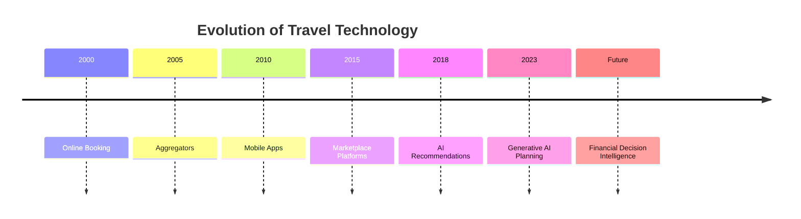

The next competitive frontier is unlikely to be inventory.

It will be **decision quality**.

---

# Market Positioning Comparison

| Platform | Primary Value Proposition |
|-----------|--------------------------|
| MakeMyTrip | Complete Travel Ecosystem |
| Goibibo | Affordable Travel |
| Yatra | Consumer + Enterprise Travel |
| Cleartrip | Simplicity |
| Ixigo | Intelligent Travel Planning |
| Booking.com | Global Accommodation Marketplace |
| Agoda | Best Travel Deals |
| Airbnb | Experience Marketplace |
| **CardWise** | Financial Intelligence Layer |

Notice that none of these companies compete on **payment optimization**.

---

# Primary Optimization Goal

| Platform | Optimizes |
|-----------|-----------|
| MakeMyTrip | Booking Completion |
| Goibibo | Promotional Conversion |
| Yatra | Travel Management |
| Cleartrip | Simplicity |
| Ixigo | Better Travel Decisions |
| Booking.com | Accommodation Selection |
| Agoda | Price Optimization |
| Airbnb | Travel Experience |
| **CardWise** | Financial Outcome |

This distinction is fundamental.

---

# User Journey Comparison

## Existing Journey

```text
Choose Destination

↓

Compare Flights

↓

Compare Hotels

↓

Read Reviews

↓

Choose Property

↓

Checkout

↓

Choose Card Yourself

↓

Hope It Was Correct
```

---

## CardWise Journey

```text
Choose Destination

↓

Search Travel

↓

CardWise Analysis

↓

AI Evaluates

• Cards
• Cashback
• Rewards
• Loyalty Programs
• Transfer Bonuses
• Milestones
• Future Value

↓

Recommendation

↓

Book
```

The difference is not booking.

The difference is **financial reasoning**.

---

# Feature Coverage Matrix

| Capability | Travel Platforms | CardWise |
|------------|-----------------|----------|
| Flight Search | ✅ | ❌ |
| Hotel Search | ✅ | ❌ |
| Reviews | ✅ | Partial |
| Booking Engine | ✅ | ❌ |
| Payments | ✅ | ❌ |
| Reward Intelligence | ❌ | ✅ |
| Credit Card Optimization | ❌ | ✅ |
| Transfer Partner Analysis | ❌ | ✅ |
| Reward Valuation | ❌ | ✅ |
| Cashback Optimization | ❌ | ✅ |
| Multi-Card Portfolio | ❌ | ✅ |
| Browser Assistance | ❌ | ✅ |
| Explainable AI | ❌ | ✅ |
| Reward Simulation | ❌ | ✅ |
| Milestone Planning | ❌ | ✅ |

This matrix clearly illustrates that CardWise complements rather than competes with existing OTAs.

---

# AI Comparison

| Platform | AI Focus |
|-----------|----------|
| MakeMyTrip | Trip Planning |
| Goibibo | Booking Recommendations |
| Yatra | Operational Efficiency |
| Cleartrip | Search & Personalization |
| Ixigo | Travel Intelligence |
| Booking.com | Accommodation Discovery |
| Agoda | Pricing & Personalization |
| Airbnb | Marketplace Intelligence |
| **CardWise** | Financial Decision Intelligence |

Travel AI today primarily answers:

> "Where should I go?"

CardWise answers:

> "How should I pay?"

---

# Personalization Comparison

| Platform | Personalizes |
|-----------|--------------|
| MakeMyTrip | Destinations |
| Goibibo | Promotions |
| Yatra | Business Travel |
| Cleartrip | Booking Flow |
| Ixigo | Travel Behavior |
| Booking.com | Accommodation |
| Agoda | Pricing |
| Airbnb | Experiences |
| **CardWise** | Financial Strategy |

---

# Competitive Moats

| Platform | Primary Moat |
|-----------|--------------|
| MakeMyTrip | Brand + Inventory |
| Goibibo | Promotions |
| Yatra | Enterprise Relationships |
| Cleartrip | UX Simplicity |
| Ixigo | Travel Intelligence |
| Booking.com | Marketplace Scale |
| Agoda | Asian Inventory |
| Airbnb | Community & Marketplace |
| **CardWise** | Financial Intelligence Graph |

---

# Industry Blind Spots

Across all eight platforms, several common weaknesses emerge.

---

## Blind Spot 1

No platform understands a user's complete card portfolio.

---

## Blind Spot 2

Reward currencies remain fragmented.

Examples:

- Cashback
- Airline miles
- Hotel points
- Reward points
- Instant discounts

No platform creates a unified valuation.

---

## Blind Spot 3

Payment decisions remain manual.

Users still ask:

> Which card should I use?

---

## Blind Spot 4

No explainable reward engine.

Users receive recommendations without understanding financial trade-offs.

---

## Blind Spot 5

No platform continuously optimizes spending across months or years.

Optimization is limited to individual bookings.

---

## Blind Spot 6

Travel platforms optimize revenue.

CardWise optimizes user wealth.

---

# Strategic Opportunities

The travel ecosystem creates several high-value opportunities.

---

## Opportunity 1

Unified Travel Reward Engine

Combine:

- Flights
- Hotels
- Cards
- Cashback
- Airline loyalty
- Hotel loyalty
- Transfer bonuses

into one decision engine.

---

## Opportunity 2

Cross-Platform Intelligence

Evaluate:

- Airline websites
- Hotel websites
- OTAs
- Bank travel portals

before recommending the best booking strategy.

---

## Opportunity 3

AI Travel Finance Copilot

Users should simply ask:

> "I'm travelling to Singapore next month."

The system should recommend:

- Best flight
- Best hotel
- Best booking platform
- Best card
- Best transfer partner
- Best redemption strategy
- Expected reward value
- Future milestone impact

---

## Opportunity 4

Browser Intelligence

Travel planning spans multiple websites.

CardWise should provide contextual recommendations regardless of where the user is browsing.

---

## Opportunity 5

Reward Simulation

Every booking should support scenarios such as:

- Cash payment
- Airline redemption
- Hotel redemption
- Point transfer
- Cashback
- Split payment

before purchase.

---

# Competitive Positioning

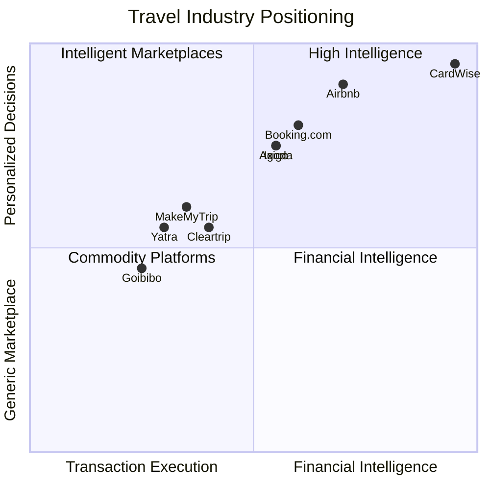

The objective is **not** to become another OTA.

The objective is to become the intelligence layer above every OTA.

---

# Strategic Lessons

## Lesson 1

Consumers no longer need another booking website.

They need better decisions.

---

## Lesson 2

Inventory is becoming commoditized.

Decision quality is becoming differentiated.

---

## Lesson 3

AI will increasingly eliminate comparison shopping.

Users will expect one trusted recommendation.

---

## Lesson 4

Trust will increasingly depend on explainability.

Recommendations must clearly justify:

- Why this card?
- Why this portal?
- Why this redemption?

---

## Lesson 5

Financial optimization creates recurring engagement.

Travel booking occurs a few times each year.

Financial optimization occurs every day.

This dramatically increases user lifetime value.

---

# CardWise Strategic Position

CardWise should never compete on:

- Inventory
- Hotel partnerships
- Airline relationships
- Booking infrastructure

Instead, it should own:

- Financial intelligence
- Reward optimization
- Explainable AI
- Multi-card reasoning
- Cross-platform analysis
- Long-term portfolio optimization

This positioning allows CardWise to integrate with every travel platform rather than replacing them.

---

# Long-Term Strategic Vision

The travel industry has solved:

> **How to book.**

CardWise solves:

> **How to maximize value from every booking.**

Future travelers should no longer think:

> "Where can I book?"

Instead, they should think:

> **"Open CardWise first."**

Regardless of whether the final booking happens on:

- MakeMyTrip
- Booking.com
- Agoda
- Airbnb
- Airline websites
- Hotel websites

CardWise should become the trusted financial advisor that guides every travel purchase.

---

# Section Conclusion

The comparative analysis confirms that the travel industry has reached a high level of maturity in:

- Discovery
- Search
- Booking
- Personalization
- AI-assisted planning

However, **financial optimization remains almost entirely unsolved**.

This creates a substantial opportunity for CardWise to define a new category:

> **Travel Financial Intelligence**

Rather than competing with existing travel platforms, CardWise complements them by introducing a unified, explainable, AI-driven reward optimization engine capable of maximizing the financial value of every travel decision.

This positioning is difficult to replicate because it requires deep expertise across:

- Credit card ecosystems
- Loyalty programs
- Merchant intelligence
- Historical offers
- Reward valuation
- AI reasoning
- User personalization

Together, these capabilities form the foundation of a durable and defensible competitive moat.

---

**End of Part 3I**

**Part 3 (Travel Platforms) Complete.**

The next major section, **Part 4**, will move into **Cashback & Offer Platforms**, covering:

- CashKaro
- Magicpin
- Paytm Offers
- Amazon Offers
- Other merchant offer ecosystems

This section is particularly important because it directly overlaps with CardWise's merchant intelligence, cashback optimization, and offer aggregation capabilities.

---

# Part 4 — Cashback & Offer Platforms

> **Category:** Cashback Platforms, Merchant Offer Networks & Offer Aggregators
>
> **Objective:** Analyze India's leading cashback ecosystems and merchant offer platforms to understand how consumers discover savings today, identify structural weaknesses, and define how CardWise can become the unified intelligence layer for cashback, offers, rewards, and merchant optimization.

---

# Cashback & Offer Platforms

---

# Executive Summary

Over the last decade, cashback platforms have become one of the fastest-growing segments in Indian consumer commerce.

Instead of earning rewards directly from banks, users increasingly optimize purchases through:

- Cashback websites
- Coupon platforms
- Merchant offers
- Affiliate portals
- Bank discounts
- Wallet offers
- UPI offers
- Brand campaigns

Examples include:

- CashKaro
- Magicpin
- Paytm Offers
- Amazon Offers
- Flipkart Offers
- CouponDunia
- Nearbuy
- GrabOn

These platforms have collectively educated Indian consumers to:

> **Never purchase without checking for offers first.**

However, they introduce a new problem.

Savings are now fragmented across hundreds of merchants, banks, wallets, apps, and promotional campaigns.

Consumers still need to manually answer questions such as:

- Which merchant provides the best cashback?
- Which bank offer stacks with merchant discounts?
- Which credit card earns maximum rewards?
- Should cashback be prioritized over reward points?
- Does using UPI reduce long-term reward value?
- Should this purchase wait until the next sale?

No existing platform answers all of these questions together.

This represents one of CardWise's largest strategic opportunities.

---

# Why Cashback Matters

Modern consumer purchases often involve multiple overlapping reward layers.

Example:

```
Laptop

₹1,20,000
```

Potential savings may include:

- Instant bank discount
- Merchant cashback
- Credit card rewards
- Shopping portal cashback
- Reward points
- Milestone bonus
- Coupon code
- Brand promotion

The total value can exceed:

```
₹18,000–₹30,000
```

Yet most users optimize only one component.

---

# Evolution of Cashback Platforms

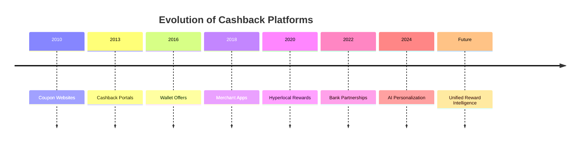

The market has evolved from static coupon discovery to increasingly personalized savings experiences.

However, optimization remains fragmented.

---

# Current Market Landscape

The cashback ecosystem consists of several overlapping categories.

| Category | Examples |
|----------|----------|
| Cashback Platforms | CashKaro, CouponDunia |
| Merchant Reward Apps | Magicpin |
| Wallet Offers | Paytm, PhonePe |
| Marketplace Offers | Amazon, Flipkart |
| Browser Extensions | Honey, Capital One Shopping |
| Affiliate Networks | Admitad, CJ, Impact |
| Bank Offer Ecosystems | HDFC SmartBuy, SBI Offers, ICICI Offers |

Each platform optimizes a different layer of consumer savings.

None optimize the complete financial outcome.

---

# Cashback Ecosystem

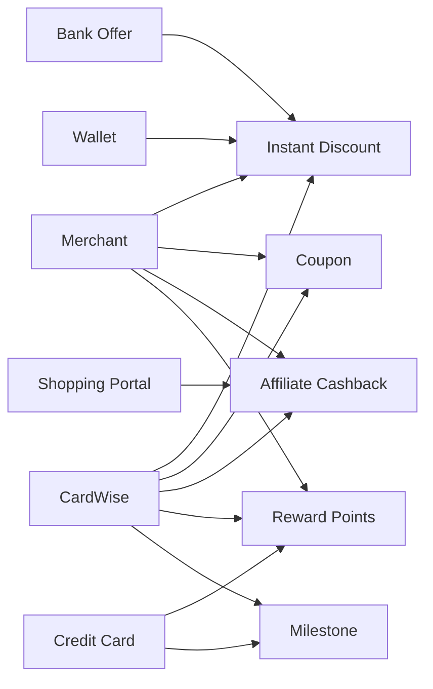

Today's users manually combine these layers.

CardWise can automate them.

---

# Industry Characteristics

## Strengths

Cashback platforms excel at:

- Offer aggregation
- Merchant partnerships
- Affiliate tracking
- User acquisition
- Coupon discovery
- Cashback processing
- Promotional campaigns

---

## Weaknesses

Most platforms do **not** optimize:

- Credit card rewards
- Multi-card portfolios
- Reward point valuation
- Cashback vs points
- Opportunity cost
- Long-term optimization
- Reward simulations
- Explainable AI

---

# The Cashback Optimization Problem

Consider a simple purchase.

```
iPhone

₹90,000
```

The user now needs to answer:

- Amazon or Flipkart?
- Apple Store?
- Tata Neu?
- Merchant cashback?
- Bank offer?
- Instant discount?
- Credit card rewards?
- Reward points?
- Milestone?
- Coupon?
- Wallet?
- UPI?
- Wait for sale?

The answer depends on hundreds of changing variables.

Today's ecosystem expects consumers to calculate this manually.

---

# Existing User Journey

```text
Search Product

↓

Open Amazon

↓

Open Flipkart

↓

Search Google

↓

Search CashKaro

↓

Search Magicpin

↓

Search Reddit

↓

Search Bank Offers

↓

Choose Card

↓

Purchase
```

Average decision time:

20–45 minutes

---

# Desired CardWise Journey

```text
Search Product

↓

AI Understands

↓

Current Offers

↓

Merchant History

↓

Reward Rules

↓

Credit Cards

↓

Milestones

↓

Cashback

↓

Recommendation

↓

Purchase
```

Decision time:

Less than 30 seconds.

---

# Market Opportunity

Cashback platforms have trained consumers to optimize savings.

CardWise can extend this behavior from:

```
Coupon Optimization
```

to

```
Total Financial Optimization
```

This is a significantly larger opportunity.

---

# Strategic Positioning

Cashback platforms optimize:

```
Merchant Savings
```

CardWise optimizes:

```
Complete Purchase Value
```

The distinction is fundamental.

---

# Key Research Questions

The following sections seek to answer:

1. Why do users still compare multiple cashback platforms?

2. Why are cashback and rewards fragmented?

3. Why do merchants prioritize affiliate commissions over consumer optimization?

4. How can CardWise combine merchant offers, bank offers, cashback, loyalty programs, and credit card rewards?

5. Which parts of the purchase journey should be automated through AI?

---

# Competitors Covered in Part 4

The following platforms will be analyzed using a common framework.

| Section | Platform |
|----------|----------|
| Part 4A | CashKaro |
| Part 4B | Magicpin |
| Part 4C | Paytm Offers |
| Part 4D | Amazon Offers |
| Part 4E | Comparative Analysis & Strategic Lessons |

Each competitor profile will include:

- Company Overview
- Product Positioning
- Core Features
- Revenue Model
- Business Strategy
- UX Philosophy
- AI Usage
- Personalization
- Technical Observations
- Innovation
- Trust Factors
- Missing Features
- Opportunities CardWise Can Exploit

---

# Executive Insight

The cashback industry solved one important problem:

> **Finding savings.**

It did not solve the larger problem:

> **Finding the best financial decision.**

Consumers still combine:

- Cashback
- Coupons
- Reward points
- Merchant offers
- Credit card benefits
- Bank promotions
- Loyalty programs

using spreadsheets, memory, blogs, and trial-and-error.

CardWise can unify these fragmented ecosystems into a single intelligent recommendation engine that maximizes total economic value rather than individual promotional benefits.

---

**End of Part 4 (Introduction)**


---

# Part 4A-1 — CashKaro

> **Category:** Cashback Platform & Affiliate Commerce
>
> **Objective:** Analyze India's largest cashback platform, understand how affiliate-driven savings influence consumer purchasing behavior, and identify strategic opportunities for CardWise.

---

# CashKaro

---

# Company Overview

**Founded:** 2013

**Founders:**

- Swati Bhargava
- Rohan Bhargava

**Headquarters:** Gurugram, India

**Category:** Cashback & Coupon Platform

**Primary Markets**

- India

**Core Businesses**

- Cashback
- Coupons
- Shopping Rewards
- Affiliate Commerce
- Gift Cards

CashKaro pioneered cashback-driven affiliate commerce in India.

Instead of competing with merchants, CashKaro partners with them and shares affiliate commissions with consumers.

The business model is simple:

```
Merchant

↓

Affiliate Commission

↓

CashKaro

↓

Consumer Cashback
```

This transformed cashback into an everyday shopping habit for millions of Indian users.

---

# Product Positioning

## Core Positioning

> **Never Shop Without Cashback**

CashKaro encourages users to begin every online purchase through its platform.

Its objective is straightforward:

- Increase merchant traffic
- Earn affiliate commissions
- Share a portion with users

Unlike coupon websites that focus only on discounts, CashKaro positions cashback as a predictable financial benefit.

---

## Strategic Narrative

CashKaro believes that consumers should never pay full price when shopping online.

Key pillars include:

- Cashback
- Coupons
- Merchant offers
- Shopping rewards
- Bank offers

The platform aims to become the default starting point for online shopping.

---

# Target Audience

Primary users include:

- Online shoppers
- Families
- Value-conscious consumers
- Frequent e-commerce buyers
- Cashback enthusiasts

Secondary users include:

- Students
- Credit card users
- Electronics buyers
- Fashion shoppers

The platform appeals strongly to users motivated by immediate savings.

---

# Core Features

## Cashback Marketplace

CashKaro partners with hundreds of merchants across categories including:

- Electronics
- Fashion
- Grocery
- Food Delivery
- Travel
- Beauty
- Health
- Insurance

Users earn cashback after eligible purchases.

---

## Coupon Aggregation

The platform aggregates:

- Coupon codes
- Promotional offers
- Seasonal campaigns
- Limited-time discounts

allowing users to combine multiple savings opportunities.

---

## Merchant Discovery

Consumers can search merchants by:

- Category
- Cashback percentage
- Promotions
- Popularity

Merchant discovery is central to the shopping experience.

---

## Offer Tracking

Users can monitor:

- Cashback status
- Pending rewards
- Confirmed rewards
- Payment history

Transparency improves user confidence.

---

## Referral Program

CashKaro actively encourages referrals through:

- Referral bonuses
- Promotional campaigns
- Friend invitations

This reduces customer acquisition costs while increasing organic growth.

---

# Premium Features

CashKaro does not operate a traditional premium subscription.

Instead, premium value is delivered through:

- Higher cashback campaigns
- Exclusive merchant offers
- Partner promotions
- Limited-time deals

The focus remains on maximizing immediate savings.

---

# Revenue Model

CashKaro follows an affiliate commerce model.

Primary revenue sources include:

| Revenue Source | Description |
|----------------|-------------|
| Affiliate commissions | Merchant partnerships |
| Sponsored campaigns | Brand promotions |
| Advertising | Merchant visibility |
| Gift card sales | Commerce partnerships |

A portion of affiliate revenue is returned to users as cashback.

---

# Business Model

```text
Consumer

↓

CashKaro

↓

Merchant

↓

Purchase

↓

Affiliate Commission

↓

Cashback

↓

Repeat Shopping
```

The platform creates a positive feedback loop between merchants and consumers.

---

# Strengths

## Strong Cashback Brand

CashKaro has become one of India's most recognizable cashback brands.

For many users:

> Cashback = CashKaro

This strong brand association significantly lowers customer acquisition costs.

---

## Large Merchant Network

The platform partners with hundreds of online merchants across nearly every shopping category.

This broad coverage increases the likelihood that users begin their shopping journey on CashKaro.

---

## Proven Affiliate Model

Affiliate commerce is:

- Scalable
- Asset-light
- Highly profitable

The business grows alongside India's expanding e-commerce market.

---

## Easy-to-Understand Value Proposition

Unlike reward points or airline miles,

cashback is immediately understandable.

Users instantly recognize:

```
₹500 Cashback
```

This simplicity drives adoption.

---

## Strong Referral Loop

Referral incentives encourage:

- Organic growth
- Repeat engagement
- Network expansion

creating a sustainable acquisition channel.

---

# Weaknesses

Despite its strengths, several strategic gaps remain.

---

## Cashback Only

CashKaro primarily optimizes:

```
Affiliate Cashback
```

It does **not** optimize:

- Credit card rewards
- Airline miles
- Hotel loyalty
- Reward points
- Milestone benefits

---

## Merchant-Centric Recommendations

Recommendations prioritize merchants offering affiliate commissions.

The platform does not evaluate:

- Best financial outcome
- Opportunity cost
- Long-term reward value

---

## Limited Credit Card Intelligence

Users must independently determine:

- Which card to use
- Whether cashback outperforms reward points
- Whether bank offers provide greater value

---

## No Unified Reward Engine

CashKaro cannot compare:

- Cashback
- Instant discounts
- Reward points
- Airline miles
- Hotel points

using a standardized valuation framework.

---

## No Reward Simulation

Users cannot compare multiple payment strategies before making a purchase.

---

# UX Analysis

## Design Philosophy

CashKaro emphasizes:

- Savings visibility
- Merchant discovery
- Cashback transparency
- Promotional engagement

The interface encourages browsing before purchase.

---

## Navigation

Primary navigation includes:

- Categories
- Merchants
- Cashback offers
- Coupons
- Referral

The experience revolves around maximizing affiliate shopping.

---

## Search Experience

Users can search by:

- Merchant
- Category
- Product type
- Cashback percentage

Search prioritizes merchant discovery over purchase optimization.

---

## Information Architecture

Merchant pages highlight:

- Cashback rate
- Coupons
- Offer validity
- Shopping instructions

Financial reasoning beyond cashback is largely absent.

---

## Technical Observations

Based on publicly observable capabilities, CashKaro operates a mature affiliate commerce platform supporting:

- Merchant integrations
- Affiliate tracking
- Cashback processing
- Offer aggregation
- Referral systems
- User wallets
- Payment processing
- Merchant analytics

The platform demonstrates strong expertise in affiliate attribution and cashback reconciliation.

However, there is no public evidence of advanced capabilities such as:

- Reward valuation engines
- Multi-card optimization
- AI-powered payment recommendations
- Browser-based financial intelligence
- Explainable reward simulations

These remain significant opportunities for CardWise.

---

**End of Part 4A-1**


---

# Part 4A-2 — CashKaro (Continued)

---

# Trust Factors

CashKaro has built trust around one simple promise:

> **"You will receive cashback after your purchase."**

Unlike banks that reward users through complex point systems, CashKaro offers a benefit that is:

- Easy to understand
- Easy to verify
- Easy to redeem

This simplicity has significantly reduced friction in user adoption.

---

## Cashback Transparency

CashKaro reinforces trust through transparent tracking of every cashback transaction.

Users can monitor:

- Pending cashback
- Confirmed cashback
- Rejected cashback
- Payment history
- Merchant status

Visibility throughout the reward lifecycle increases confidence in the platform.

---

## Merchant Partnerships

CashKaro works directly with major merchants including:

- Amazon
- Flipkart
- Myntra
- Ajio
- Tata CLiQ
- Apple-authorized retailers
- Travel platforms

Official affiliate relationships strengthen platform credibility.

---

## Customer Confidence

Additional trust mechanisms include:

- Cashback policies
- Merchant tracking
- Transaction history
- Customer support
- Referral verification
- Timely cashback payouts

These mechanisms encourage repeat purchases.

---

# Community Presence

CashKaro is not a traditional community platform.

Instead, user engagement revolves around:

- Referral programs
- Cashback sharing
- Shopping campaigns
- Promotional participation

Interaction is driven by incentives rather than discussion.

---

## Content Ecosystem

Supporting content includes:

- Shopping guides
- Deal announcements
- Festival campaigns
- Cashback tips
- Merchant promotions

The primary goal is increasing shopping activity and affiliate conversions.

---

# AI Usage

Public AI adoption appears relatively limited compared with travel or fintech platforms.

Likely AI-assisted capabilities include:

- Merchant recommendations
- Search ranking
- Campaign targeting
- Fraud detection
- Marketing personalization

These systems improve conversion efficiency rather than financial optimization.

---

## Current AI Capabilities

| Capability | Rating |
|------------|--------|
| Merchant Recommendations | ⭐⭐⭐⭐☆ |
| Search Ranking | ⭐⭐⭐⭐☆ |
| Marketing Personalization | ⭐⭐⭐⭐☆ |
| Fraud Detection | ⭐⭐⭐⭐☆ |
| Customer Segmentation | ⭐⭐⭐⭐☆ |
| Reward Intelligence | ⭐☆☆☆☆ |
| Credit Card Optimization | ⭐☆☆☆☆ |
| Financial Decision Support | ⭐☆☆☆☆ |

AI primarily supports affiliate commerce rather than consumer financial planning.

---

## AI Gaps

Current systems cannot answer:

- Which payment method provides maximum value?
- Which credit card outperforms cashback?
- Should instant discount be prioritized over cashback?
- Should the purchase wait for a future promotion?
- Is another merchant financially superior after considering rewards?

These decisions remain manual.

---

# Personalization

CashKaro personalizes the shopping experience using:

- Previous merchants
- Purchase history
- Cashback preferences
- Seasonal campaigns
- Category interests
- Referral behavior

The objective is increasing merchant conversion.

---

## Personalization Maturity

| Area | Rating |
|------|--------|
| Merchant Discovery | ⭐⭐⭐⭐☆ |
| Campaign Personalization | ⭐⭐⭐⭐☆ |
| Shopping Recommendations | ⭐⭐⭐⭐☆ |
| Cashback Targeting | ⭐⭐⭐⭐☆ |
| Reward Personalization | ⭐⭐☆☆☆ |
| Credit Card Intelligence | ⭐☆☆☆☆ |
| Financial Optimization | ⭐☆☆☆☆ |

Personalization is commerce-centric rather than finance-centric.

---

# Scalability

CashKaro benefits from several highly scalable characteristics.

Key drivers include:

- Affiliate marketplace model
- Merchant partnerships
- Referral growth
- Asset-light operations
- Expanding e-commerce market

As online shopping grows, the affiliate opportunity naturally expands.

---

## Growth Flywheel

```text
More Merchants

        ↓

More Cashback

        ↓

More Users

        ↓

More Purchases

        ↓

Higher Affiliate Revenue

        ↓

Better Cashback Campaigns

        ↓

Merchant Growth
```

This flywheel has powered CashKaro's growth over the past decade.

---

# Innovation Assessment

CashKaro successfully introduced cashback to mainstream Indian consumers.

| Dimension | Rating |
|-----------|--------|
| Cashback Marketplace | ⭐⭐⭐⭐⭐ |
| Merchant Network | ⭐⭐⭐⭐⭐ |
| Affiliate Commerce | ⭐⭐⭐⭐⭐ |
| Mobile Experience | ⭐⭐⭐⭐☆ |
| Offer Discovery | ⭐⭐⭐⭐☆ |
| AI Adoption | ⭐⭐⭐☆☆ |
| Reward Optimization | ⭐☆☆☆☆ |
| Credit Card Intelligence | ⭐☆☆☆☆ |
| Explainable Financial AI | ⭐☆☆☆☆ |
| Reward Simulation | ⭐☆☆☆☆ |

Innovation has focused on cashback rather than holistic financial optimization.

---

# Missing Features

Several significant opportunities remain.

---

## Unified Reward Intelligence

CashKaro understands cashback.

It does not understand:

- Credit card rewards
- Airline miles
- Hotel points
- Loyalty currencies
- Bank reward ecosystems

---

## Credit Card Recommendation Engine

The platform cannot recommend:

- Best credit card
- Highest reward rate
- Best payment strategy
- Milestone optimization

---

## Cashback vs Reward Analysis

Users cannot compare:

```
₹2,000 Cashback

vs

8,000 Reward Points

vs

10,000 Airline Miles

vs

Hotel Redemption
```

using a unified valuation model.

---

## Reward Simulation

Users cannot simulate:

- Cashback strategy
- Reward strategy
- Hybrid strategy
- Future milestone value

before completing a purchase.

---

## Browser Intelligence

Shopping frequently spans:

- Amazon
- Flipkart
- Apple
- Croma
- Reliance Digital

CashKaro provides little contextual assistance outside its own platform.

---

## Explainable Financial AI

Users receive cashback information.

They do not receive:

- Opportunity cost
- Long-term value
- Alternative recommendations
- Financial reasoning

---

# Opportunities CardWise Can Exploit

CashKaro has successfully trained consumers to search for cashback before shopping.

CardWise can extend this behavior into **complete purchase optimization**.

| Opportunity | Strategic Value |
|-------------|-----------------|
| Unified Purchase Optimizer | Compare cashback, instant discounts, card rewards, loyalty points, and milestone value together. |
| AI Shopping Advisor | Recommend the optimal purchase strategy before checkout. |
| Browser Extension | Surface recommendations across every shopping website. |
| Reward Simulation | Compare multiple payment and redemption scenarios before purchase. |
| Multi-Card Portfolio Optimization | Select the highest-value card automatically. |
| Historical Offer Intelligence | Use previous campaign data to predict better buying opportunities. |
| Merchant Intelligence | Compare effective value across competing retailers after rewards. |
| Explainable AI | Show exactly why one purchase path is financially superior. |

---

# Strategic Lessons for CardWise

## What CashKaro Does Exceptionally Well

- Cashback simplicity
- Merchant partnerships
- Affiliate commerce
- Referral growth
- Consumer education
- Transparent cashback tracking

---

## What CardWise Should Learn

### Quantify Savings Clearly

CashKaro demonstrates that users respond strongly to explicit savings.

Every CardWise recommendation should clearly answer:

> **"How much additional value will you receive?"**

---

### Simplify Complex Decisions

Users should never need to manually calculate:

- Cashback
- Reward points
- Transfer value
- Opportunity cost

CardWise should automate these calculations.

---

### Remain Merchant Neutral

CashKaro recommendations are influenced by affiliate relationships.

CardWise should remain platform-independent and recommend whichever merchant delivers the greatest overall financial outcome.

This neutrality strengthens long-term trust.

---

### Expand Beyond Cashback

Cashback represents only one component of consumer value.

CardWise should optimize:

- Cashback
- Reward points
- Airline miles
- Hotel points
- Transfer bonuses
- Annual milestones
- Future reward opportunities

simultaneously.

---

## What CardWise Should Avoid

- Becoming another affiliate marketplace.
- Prioritizing affiliate revenue over user benefit.
- Measuring success solely through cashback earned.
- Locking users into proprietary merchant ecosystems.

Instead, CardWise should optimize every purchase regardless of where it occurs.

---

# Positioning Summary

| Aspect | CashKaro | CardWise |
|--------|----------|----------|
| Core Mission | Earn Cashback | Maximize Total Purchase Value |
| Primary KPI | Cashback Generated | Effective Financial Return |
| AI Focus | Merchant Recommendations | Financial Decision Intelligence |
| Core Asset | Affiliate Network | Unified Reward Intelligence Engine |
| Competitive Advantage | Cashback Simplicity | Explainable Multi-Reward Optimization |
| Long-Term Vision | Cashback Marketplace | Consumer Financial Operating System |

---

# Key Strategic Takeaways

CashKaro proved that consumers are willing to modify purchasing behavior when presented with clear financial incentives.

However, cashback is only one component of overall purchase value.

For example:

```
₹1,500 Cashback

+

₹4,000 Credit Card Rewards

+

₹2,500 Milestone Value

+

₹1,000 Instant Discount

=

₹9,000 Effective Return
```

Today's cashback platforms generally optimize only the first component.

CardWise can optimize the complete equation.

By combining:

- Cashback
- Merchant offers
- Credit card rewards
- Loyalty programs
- Bank promotions
- Historical campaigns
- AI-powered reasoning
- Explainable recommendations

CardWise can become the intelligence layer that helps users maximize financial outcomes across every online purchase.

---

**End of Part 4A-2**


---

# Part 4B-1 — Magicpin

> **Category:** Hyperlocal Commerce, Rewards & Merchant Discovery Platform
>
> **Objective:** Analyze Magicpin's unique position as India's leading hyperlocal rewards platform, understand how offline commerce differs from traditional cashback ecosystems, and identify opportunities for CardWise.

---

# Magicpin

---

# Company Overview

**Founded:** 2015

**Founders:**

- Anshoo Sharma
- Brij Bhushan

**Headquarters:** Gurugram, India

**Category:** Hyperlocal Commerce Platform

**Primary Markets**

- India

**Core Businesses**

- Hyperlocal Discovery
- Food Delivery
- Dining
- Fashion
- Grocery
- Beauty
- Pharmacy
- Rewards
- Cashback
- Merchant Promotions

Unlike cashback platforms that primarily focus on online shopping, Magicpin built its business around **offline commerce**.

Its vision is to digitize neighborhood shopping while rewarding consumers for purchasing locally.

Today the platform connects millions of consumers with:

- Restaurants
- Cafes
- Fashion stores
- Grocery outlets
- Pharmacies
- Entertainment venues
- Local retailers

---

# Product Positioning

## Core Positioning

> **Rewards for Every Local Purchase**

Magicpin positions itself as a rewards ecosystem for everyday spending.

Instead of limiting savings to online purchases, users earn benefits when spending at nearby merchants.

The platform combines:

- Merchant discovery
- Offers
- Cashback
- Loyalty
- Payments
- Food delivery

into a unified local commerce experience.

---

## Strategic Narrative

Magicpin believes that offline shopping should be as rewarding as online shopping.

Key priorities include:

- Merchant discovery
- Local rewards
- Cashback
- Loyalty
- Merchant engagement
- Consumer retention

The platform attempts to increase repeat visits for local businesses.

---

# Target Audience

Primary users include:

- Urban consumers
- Students
- Families
- Food enthusiasts
- Local shoppers
- Young professionals

Secondary users include:

- Frequent diners
- Beauty & wellness customers
- Grocery shoppers
- Entertainment seekers

Magicpin is particularly strong among consumers who spend frequently in physical stores.

---

# Core Features

## Merchant Discovery

Users can discover nearby:

- Restaurants
- Cafes
- Grocery stores
- Salons
- Fashion retailers
- Entertainment venues
- Pharmacies

The experience emphasizes locality and convenience.

---

## Cashback & Rewards

Consumers earn:

- Cashback
- Reward points
- Promotional credits
- Merchant-specific offers

after eligible purchases.

---

## Merchant Offers

The platform aggregates:

- Instant discounts
- Buy-one-get-one offers
- Dining promotions
- Seasonal campaigns
- Brand partnerships

These offers encourage repeat visits.

---

## Food Delivery

Magicpin has expanded into food delivery, allowing users to:

- Order online
- Earn rewards
- Redeem offers
- Discover restaurants

This increases daily engagement.

---

## Merchant Loyalty Programs

Local merchants can create customized:

- Loyalty campaigns
- Reward programs
- Customer incentives
- Promotional offers

This strengthens merchant retention.

---

# Premium Features

Premium value is delivered through:

- Exclusive merchant offers
- Higher cashback campaigns
- Loyalty promotions
- Partner discounts
- Dining benefits

Unlike subscription models, engagement is driven through recurring savings.

---

# Revenue Model

Magicpin operates a diversified local commerce business.

Primary revenue sources include:

| Revenue Source | Description |
|----------------|-------------|
| Merchant commissions | Local businesses |
| Food delivery | Order commissions |
| Advertising | Sponsored merchant visibility |
| Promotions | Brand campaigns |
| Payment partnerships | Financial services |
| Loyalty programs | Merchant subscriptions |

The platform benefits from both transaction revenue and merchant engagement.

---

# Business Model

```text
Consumers

↓

Merchant Discovery

↓

Local Purchase

↓

Merchant Commission

↓

Rewards

↓

Repeat Visits

↓

Merchant Growth
```

The model creates mutually reinforcing incentives for merchants and consumers.

---

# Strengths

## Hyperlocal Leadership

Magicpin has established itself as one of India's strongest platforms for local commerce.

Unlike online-only cashback platforms, it captures everyday offline spending.

---

## Strong Merchant Network

The platform partners with:

- Restaurants
- Grocery chains
- Local retailers
- Fashion outlets
- Salons
- Entertainment venues

creating high-frequency engagement opportunities.

---

## Daily Usage Potential

Consumers purchase:

- Food
- Coffee
- Groceries
- Medicines
- Essentials

far more frequently than electronics or travel.

This significantly increases engagement potential.

---

## Merchant Loyalty Infrastructure

Magicpin enables merchants to:

- Acquire customers
- Increase repeat visits
- Run campaigns
- Reward loyalty

This creates strong merchant retention.

---

## Offline Commerce Expertise

Magicpin understands an area that remains underserved by traditional cashback platforms:

**Physical retail.**

This differentiates it from affiliate-commerce competitors.

---

# Weaknesses

Despite its strengths, several strategic gaps remain.

---

## Merchant Rewards Only

Magicpin primarily optimizes:

- Merchant cashback
- Local offers
- Loyalty campaigns

It does not optimize:

- Credit card rewards
- Reward points
- Airline miles
- Hotel loyalty
- Annual milestones

---

## Platform-Centric Recommendations

Recommendations naturally prioritize merchants participating in the Magicpin ecosystem.

Alternative merchants may offer better overall financial value.

---

## Limited Credit Card Intelligence

Users still determine manually:

- Which card to use
- Whether cashback exceeds reward points
- Which payment method creates maximum value

---

## No Unified Reward Engine

Magicpin cannot compare:

- Merchant cashback
- Instant discounts
- Credit card rewards
- Wallet offers
- Bank promotions

within a standardized financial framework.

---

## No Reward Simulation

Users cannot evaluate:

- Card combinations
- Cashback scenarios
- Loyalty benefits
- Milestone impact

before completing payment.

---

# UX Analysis

## Design Philosophy

Magicpin emphasizes:

- Discovery
- Gamification
- Local commerce
- Rewards
- Convenience

The experience encourages frequent engagement rather than occasional purchases.

---

## Navigation

Primary navigation includes:

- Nearby merchants
- Food
- Dining
- Shopping
- Offers
- Rewards

The application is designed around everyday local spending.

---

## Search Experience

Users can search by:

- Merchant
- Category
- Location
- Offers
- Cuisine
- Brand

Location awareness plays a central role in discovery.

---

## Information Architecture

Merchant pages emphasize:

- Ratings
- Offers
- Cashback
- Distance
- Popularity
- Opening hours

Financial optimization beyond merchant rewards remains limited.

---

## Technical Observations

Based on publicly observable capabilities, Magicpin operates a sophisticated hyperlocal commerce platform supporting:

- Geolocation
- Merchant discovery
- Offer aggregation
- Loyalty management
- Cashback tracking
- Payment integrations
- Food delivery logistics
- Merchant analytics

Its location-aware infrastructure represents one of its strongest technical differentiators.

However, there is no public evidence of:

- Unified reward valuation
- Credit card recommendation engines
- AI-powered financial optimization
- Browser-based merchant intelligence
- Explainable reward simulations

These remain significant opportunities for CardWise.

---

**End of Part 4B-1**


---

# Part 4B-2 — Magicpin (Continued)

---

# Trust Factors

Magicpin has built consumer trust through **consistent everyday savings** rather than occasional high-value purchases.

Unlike travel platforms that users interact with a few times each year, Magicpin becomes part of daily routines such as:

- Dining
- Coffee
- Grocery shopping
- Fashion purchases
- Pharmacy visits
- Entertainment

Frequent successful transactions reinforce long-term user confidence.

---

## Merchant Trust

Local merchants trust Magicpin because it helps them:

- Increase footfall
- Improve customer retention
- Launch promotional campaigns
- Acquire new customers
- Measure campaign effectiveness

The platform creates value for both consumers and businesses.

---

## Consumer Trust

Magicpin strengthens trust through:

- Verified merchants
- Offer transparency
- Cashback tracking
- Digital receipts
- Ratings & reviews
- Reliable payment flows

These mechanisms reduce uncertainty during local purchases.

---

# Community Presence

Community engagement is significantly stronger than traditional cashback platforms.

Users actively contribute:

- Merchant reviews
- Food photographs
- Ratings
- Shopping experiences
- Recommendations

These contributions continuously improve merchant discovery.

---

## Gamification

Magicpin has successfully incorporated gamification into local commerce.

Examples include:

- Reward points
- Challenges
- Referral campaigns
- Merchant achievements
- Promotional events

These mechanisms encourage recurring engagement beyond simple cashback.

---

# AI Usage

Magicpin appears to use AI primarily to improve:

- Merchant recommendations
- Offer ranking
- Search relevance
- Fraud detection
- Marketing campaigns
- Consumer segmentation

AI currently focuses on increasing merchant engagement rather than maximizing financial outcomes.

---

## Current AI Capabilities

| Capability | Rating |
|------------|--------|
| Merchant Recommendations | ⭐⭐⭐⭐⭐ |
| Location Personalization | ⭐⭐⭐⭐⭐ |
| Search Ranking | ⭐⭐⭐⭐☆ |
| Marketing Personalization | ⭐⭐⭐⭐☆ |
| Fraud Detection | ⭐⭐⭐⭐☆ |
| Reward Intelligence | ⭐⭐☆☆☆ |
| Credit Card Optimization | ⭐☆☆☆☆ |
| Financial Decision Support | ⭐☆☆☆☆ |

Magicpin demonstrates strong commerce intelligence but limited financial intelligence.

---

## AI Gaps

Current systems cannot answer:

- Which payment method produces maximum value?
- Which credit card should be used?
- Should cashback or reward points be prioritized?
- Does another nearby merchant provide better total value?
- Should this purchase help complete a spending milestone?

These decisions remain entirely manual.

---

# Personalization

Magicpin personalizes the user experience using:

- Location
- Merchant preferences
- Purchase history
- Dining habits
- Shopping behavior
- Favorite categories
- Seasonal promotions

This significantly improves merchant discovery.

---

## Personalization Maturity

| Area | Rating |
|------|--------|
| Merchant Discovery | ⭐⭐⭐⭐⭐ |
| Nearby Recommendations | ⭐⭐⭐⭐⭐ |
| Dining Recommendations | ⭐⭐⭐⭐☆ |
| Campaign Personalization | ⭐⭐⭐⭐☆ |
| Reward Personalization | ⭐⭐☆☆☆ |
| Credit Card Intelligence | ⭐☆☆☆☆ |
| Financial Optimization | ⭐☆☆☆☆ |

The platform understands **where** users spend.

It does not understand **how** they should pay.

---

# Scalability

Magicpin possesses several long-term scalability advantages.

Key growth drivers include:

- Hyperlocal commerce
- Merchant network effects
- Food delivery
- Daily consumer engagement
- Location intelligence
- Merchant loyalty infrastructure

Unlike travel platforms, Magicpin operates in high-frequency spending categories.

---

## Growth Flywheel

```text
More Local Merchants

        ↓

More Consumer Visits

        ↓

More Transactions

        ↓

More Cashback

        ↓

Higher Engagement

        ↓

Better Merchant ROI

        ↓

More Merchant Partners
```

Daily engagement strengthens both sides of the marketplace.

---

# Innovation Assessment

Magicpin has successfully digitized local commerce.

| Dimension | Rating |
|-----------|--------|
| Hyperlocal Commerce | ⭐⭐⭐⭐⭐ |
| Merchant Discovery | ⭐⭐⭐⭐⭐ |
| Mobile Experience | ⭐⭐⭐⭐☆ |
| Gamification | ⭐⭐⭐⭐☆ |
| Location Intelligence | ⭐⭐⭐⭐⭐ |
| Merchant Loyalty | ⭐⭐⭐⭐☆ |
| AI Adoption | ⭐⭐⭐⭐☆ |
| Reward Optimization | ⭐⭐☆☆☆ |
| Credit Card Intelligence | ⭐☆☆☆☆ |
| Explainable Financial AI | ⭐☆☆☆☆ |

Innovation has focused on local commerce rather than financial optimization.

---

# Missing Features

Several high-value opportunities remain.

---

## Unified Reward Intelligence

Magicpin understands:

- Merchant offers
- Cashback
- Promotions

It does **not** understand:

- Credit card rewards
- Airline miles
- Hotel loyalty
- Bank reward programs
- Transfer bonuses

---

## Credit Card Recommendation Engine

The platform cannot recommend:

- Best card
- Best payment strategy
- Highest effective reward
- Milestone optimization

---

## Merchant Value Comparison

Current recommendations emphasize:

- Cashback
- Promotions
- Popularity

They do not evaluate:

```
Total Effective Value

=

Merchant Cashback

+

Credit Card Rewards

+

Bank Offers

+

Milestone Value

+

Future Reward Opportunity
```

---

## Reward Simulation

Users cannot compare:

- Cashback strategy
- Reward strategy
- Mixed strategy
- Split payment
- Wallet payments

before making purchases.

---

## Browser & Offline Intelligence

Magicpin primarily operates within its own application.

It cannot assist users while browsing:

- Brand websites
- Restaurant websites
- E-commerce platforms
- QR payment applications

---

## Explainable Financial AI

Users see offers.

They do not understand:

- Opportunity cost
- Alternative merchants
- Future reward impact
- Optimal purchase sequencing

---

# Opportunities CardWise Can Exploit

Magicpin proves that consumers appreciate contextual recommendations.

CardWise can extend this concept beyond merchant discovery into financial optimization.

| Opportunity | Strategic Value |
|-------------|-----------------|
| Hyperlocal Reward Optimizer | Recommend the highest-value nearby merchant after considering cashback, card rewards, and offers. |
| AI Spending Advisor | Guide users before every local purchase. |
| Unified Reward Engine | Combine merchant offers, bank promotions, credit card rewards, and loyalty benefits into a single valuation model. |
| Browser & QR Intelligence | Surface recommendations across merchant websites, payment apps, and QR checkout flows. |
| Reward Simulation | Compare payment scenarios before completing transactions. |
| Portfolio Optimization | Recommend the optimal card from the user's wallet based on merchant category and reward rules. |
| Historical Offer Intelligence | Use historical promotions to recommend better purchase timing. |
| Explainable AI | Clearly justify every recommendation with transparent calculations. |

---

# Strategic Lessons for CardWise

## What Magicpin Does Exceptionally Well

- Hyperlocal merchant discovery
- Merchant engagement
- Daily user retention
- Gamification
- Location-aware recommendations
- Offline commerce digitization

---

## What CardWise Should Learn

### Focus on High-Frequency Use Cases

Magicpin demonstrates that products become habitual when they support everyday spending.

CardWise should similarly optimize recurring categories such as:

- Grocery
- Dining
- Fuel
- Pharmacy
- Food delivery
- Entertainment

rather than focusing exclusively on occasional purchases like travel.

---

### Use Context Intelligently

Location dramatically improves recommendation quality.

CardWise should combine:

- Merchant location
- Spending history
- Existing cards
- Active offers
- Time-sensitive promotions

to generate contextual recommendations.

---

### Reward Everyday Behavior

Users build habits through frequent positive reinforcement.

CardWise should celebrate:

- Milestone completion
- Savings achieved
- Reward optimization
- Better payment decisions

rather than only displaying numerical balances.

---

### Stay Merchant Independent

Magicpin recommendations naturally prioritize participating merchants.

CardWise should remain independent and recommend whichever merchant produces the highest effective financial outcome.

---

## What CardWise Should Avoid

- Becoming another merchant marketplace.
- Depending exclusively on affiliate relationships.
- Limiting recommendations to partner merchants.
- Measuring success solely through transaction volume.

Instead, CardWise should optimize **consumer financial outcomes**, regardless of merchant affiliation.

---

# Positioning Summary

| Aspect | Magicpin | CardWise |
|--------|-----------|----------|
| Core Mission | Reward Local Commerce | Optimize Every Purchase |
| Primary KPI | Merchant Engagement | Maximum Financial Value |
| AI Focus | Merchant Discovery | Financial Reasoning |
| Core Asset | Hyperlocal Merchant Network | Unified Reward Intelligence |
| Competitive Advantage | Location & Engagement | Explainable AI Optimization |
| Long-Term Vision | Local Commerce Platform | Consumer Financial Operating System |

---

# Key Strategic Takeaways

Magicpin demonstrates that **context matters**.

Knowing:

- where users are,
- where they shop,
- what they buy,
- and how frequently they spend,

creates significant opportunities for personalization.

However, location intelligence alone does not maximize financial value.

CardWise can combine:

- Merchant intelligence
- Location awareness
- Credit card rewards
- Cashback
- Bank offers
- Loyalty programs
- Spending milestones
- Historical promotions

to create recommendations that optimize **every local purchase**.

Rather than asking:

> **"Which nearby merchant has cashback?"**

users should increasingly ask:

> **"Which nearby purchase gives me the highest overall financial return?"**

This shift—from merchant discovery to financial decision intelligence—represents CardWise's long-term opportunity in hyperlocal commerce.

---

**End of Part 4B-2**

---

# Part 4C-1 — Paytm Offers

> **Category:** Digital Payments, Merchant Offers & Financial Super App
>
> **Objective:** Analyze Paytm's offer ecosystem, understand how payment platforms influence consumer purchasing behavior, and identify opportunities for CardWise to become the independent intelligence layer across payment methods and reward ecosystems.

---

# Paytm Offers

---

# Company Overview

**Founded:** 2010

**Founder:** Vijay Shekhar Sharma

**Headquarters:** Noida, India

**Category:** Financial Super App

**Primary Markets**

- India

**Core Businesses**

- UPI Payments
- Wallet
- Bill Payments
- Recharge
- Travel
- Insurance
- Investments
- Merchant Payments
- Cashback
- Banking Services
- Offers & Promotions

Unlike cashback platforms, Paytm owns one of India's largest payment ecosystems.

Its offers are tightly integrated into the payment experience itself.

Rather than encouraging users to visit another website before shopping, Paytm surfaces rewards during the payment journey.

This significantly changes user behavior.

---

# Product Positioning

## Core Positioning

> **One App for Payments and Financial Services**

Paytm positions itself as a financial super app that supports nearly every consumer payment need.

The offer ecosystem exists to:

- Increase transaction frequency
- Improve customer retention
- Drive merchant adoption
- Promote partner campaigns

Offers are one component of a much larger payments strategy.

---

## Strategic Narrative

Paytm believes payments should become:

- Simple
- Fast
- Rewarding

The platform continuously combines:

- Merchant offers
- Cashback
- Rewards
- Financial products
- Commerce

to maximize ecosystem engagement.

---

# Target Audience

Primary users include:

- UPI users
- Wallet users
- Bill payment customers
- Everyday shoppers
- Travel customers
- Small merchants
- QR payment users

Secondary audiences include:

- Credit card users
- Online shoppers
- Investors
- Insurance customers

The platform serves a broad cross-section of India's digital economy.

---

# Core Features

## Merchant Offers

Paytm aggregates offers across:

- Restaurants
- Grocery
- Fuel
- Shopping
- Travel
- Entertainment
- Utilities
- Education

These promotions are often personalized based on user activity.

---

## Cashback Campaigns

Consumers earn cashback through:

- Merchant offers
- QR payments
- Recharge campaigns
- Bill payments
- Promotional events

Cashback remains one of the strongest engagement drivers.

---

## Bank Offers

Paytm frequently partners with banks to provide:

- Instant discounts
- Cashback
- EMI offers
- Card-specific promotions

These campaigns increase transaction volume while strengthening banking partnerships.

---

## Travel Offers

Integrated travel services include:

- Flights
- Hotels
- Bus tickets
- Train bookings

Users often receive platform-specific promotional benefits.

---

## QR Payments

One of Paytm's strongest differentiators.

Consumers can pay at millions of offline merchants using:

- UPI
- Wallet
- Cards
- Bank accounts

This creates extremely high-frequency engagement.

---

# Premium Features

Premium value is delivered through:

- Exclusive payment campaigns
- Merchant partnerships
- Personalized offers
- Cashback promotions
- Financial product cross-selling

Rather than subscriptions, incentives encourage recurring payments.

---

# Revenue Model

Paytm operates a diversified fintech business.

Primary revenue sources include:

| Revenue Source | Description |
|----------------|-------------|
| Merchant services | Payment infrastructure |
| Financial products | Loans, insurance, investments |
| Advertising | Sponsored campaigns |
| Travel | Booking commissions |
| Merchant subscriptions | Business services |
| Payment services | Transaction-related revenue |

Offers support customer engagement rather than acting as the primary revenue source.

---

# Business Model

```text
Consumers

↓

Payments

↓

Merchant Transactions

↓

Financial Products

↓

Offers

↓

Higher Engagement

↓

Revenue
```

The payment ecosystem becomes increasingly valuable as transaction volume grows.

---

# Strengths

## Massive Payment Ecosystem

Paytm participates in millions of daily transactions.

This provides:

- Rich consumer behavior data
- High engagement
- Frequent user interactions

Unlike cashback websites, Paytm becomes part of everyday payments.

---

## Merchant Network

Millions of merchants accept Paytm payments.

This enables:

- Personalized offers
- Merchant campaigns
- Local promotions
- High transaction frequency

---

## Financial Super App

Users can access:

- Payments
- Travel
- Investments
- Insurance
- Banking
- Commerce

without leaving the ecosystem.

This increases customer lifetime value.

---

## QR Infrastructure

Offline QR payments significantly expand engagement opportunities beyond e-commerce.

Few competitors possess comparable offline payment reach.

---

## Rich Behavioral Data

Because Paytm processes payments directly, it understands:

- Spending categories
- Merchant frequency
- Payment behavior
- Seasonal patterns

This creates strong personalization opportunities.

---

# Weaknesses

Despite its scale, several strategic opportunities remain.

---

## Payment Optimization Rather Than Financial Optimization

Paytm encourages payments.

It does not optimize:

- Credit card rewards
- Airline miles
- Hotel loyalty
- Transfer bonuses
- Opportunity cost

---

## Platform-Centric Offers

Recommendations naturally prioritize:

- Paytm campaigns
- Merchant partnerships
- Ecosystem engagement

Alternative payment strategies may provide greater financial value.

---

## Limited Credit Card Intelligence

Users must independently determine:

- Which card to use
- Whether UPI is preferable
- Whether cashback exceeds reward points
- Whether bank offers outperform platform offers

---

## No Unified Reward Engine

Paytm cannot compare:

- Merchant cashback
- Bank offers
- Credit card rewards
- Loyalty programs
- Airline miles
- Hotel points

within a standardized financial model.

---

## No Reward Simulation

Consumers cannot evaluate multiple payment scenarios before completing transactions.

---

# UX Analysis

## Design Philosophy

Paytm emphasizes:

- Speed
- Convenience
- Daily utility
- Financial services
- Payments

The application is optimized for frequent interactions.

---

## Navigation

Primary navigation includes:

- Scan & Pay
- UPI
- Wallet
- Recharge
- Bills
- Travel
- Offers
- Financial Services

The interface encourages users to remain within the Paytm ecosystem.

---

## Search Experience

Search capabilities include:

- Merchants
- Bills
- Travel
- Financial products
- Offers

Search prioritizes service discovery rather than financial optimization.

---

## Information Architecture

Offer pages typically highlight:

- Cashback
- Instant discounts
- Campaign validity
- Eligible payment methods
- Merchant participation

Long-term reward implications are not considered.

---

## Technical Observations

Based on publicly observable capabilities, Paytm operates one of India's most sophisticated fintech platforms supporting:

- Real-time payment processing
- Merchant QR infrastructure
- Offer engines
- Recommendation systems
- Fraud detection
- Personalization
- Wallet management
- Banking integrations

Its payment infrastructure represents a significant technological advantage.

However, there is no public evidence of:

- Unified reward valuation
- AI-powered payment optimization
- Multi-card recommendation engines
- Explainable financial AI
- Cross-platform reward intelligence

These remain major opportunities for CardWise.

---

**End of Part 4C-1**


---

# Part 4C-2 — Paytm Offers (Continued)

---

# Trust Factors

Paytm has become one of India's most trusted consumer fintech brands because it operates at the center of daily financial activity.

Unlike cashback platforms that users visit occasionally, Paytm is opened multiple times every day for:

- UPI payments
- QR payments
- Mobile recharge
- Utility bills
- Ticket booking
- Merchant payments
- Financial services

Repeated successful transactions reinforce consumer trust.

---

## Payment Reliability

Trust is strengthened through:

- Fast UPI settlements
- Secure payment infrastructure
- Transaction history
- Merchant verification
- Payment notifications
- Refund workflows

Consumers increasingly associate Paytm with dependable digital payments.

---

## Merchant Confidence

Millions of merchants trust Paytm because it provides:

- QR infrastructure
- Payment acceptance
- Settlement services
- Business dashboards
- Promotional campaigns
- Customer acquisition

Merchant adoption creates powerful network effects.

---

# Community Presence

Paytm is not designed as a social platform.

Community engagement primarily occurs through:

- Merchant reviews
- Campaign participation
- Referral programs
- Cashback events
- Promotional contests

Unlike marketplace platforms, collaboration between users is minimal.

---

## Educational Content

Supporting content includes:

- Financial awareness
- Offer announcements
- Investment education
- Insurance information
- Campaign updates

The objective is expanding engagement across financial products.

---

# AI Usage

Paytm appears to leverage AI extensively across its fintech ecosystem.

Likely applications include:

- Fraud detection
- Merchant recommendations
- Personalized campaigns
- Offer ranking
- Credit risk analysis
- Customer segmentation
- Transaction monitoring

These systems improve operational efficiency and customer engagement.

---

## Current AI Capabilities

| Capability | Rating |
|------------|--------|
| Fraud Detection | ⭐⭐⭐⭐⭐ |
| Merchant Recommendations | ⭐⭐⭐⭐☆ |
| Offer Personalization | ⭐⭐⭐⭐☆ |
| Customer Segmentation | ⭐⭐⭐⭐⭐ |
| Transaction Intelligence | ⭐⭐⭐⭐⭐ |
| Marketing Optimization | ⭐⭐⭐⭐☆ |
| Reward Intelligence | ⭐⭐☆☆☆ |
| Credit Card Optimization | ⭐☆☆☆☆ |
| Financial Decision Support | ⭐☆☆☆☆ |

Paytm demonstrates mature payment intelligence but limited payment optimization intelligence.

---

## AI Gaps

Current AI cannot answer:

- Which payment method creates the highest long-term value?
- Should the user pay via UPI or credit card?
- Should cashback be sacrificed for airline miles?
- Which bank offer combines best with merchant promotions?
- Which purchase contributes most toward annual card milestones?

These remain manual decisions.

---

# Personalization

Paytm personalizes experiences using:

- Payment history
- Merchant categories
- Spending behavior
- Financial products
- Bill payments
- Travel activity
- Geographic location
- Seasonal campaigns

This improves engagement across the Paytm ecosystem.

---

## Personalization Maturity

| Area | Rating |
|------|--------|
| Payment Personalization | ⭐⭐⭐⭐⭐ |
| Merchant Recommendations | ⭐⭐⭐⭐☆ |
| Campaign Targeting | ⭐⭐⭐⭐⭐ |
| Financial Product Discovery | ⭐⭐⭐⭐☆ |
| Reward Personalization | ⭐⭐☆☆☆ |
| Credit Card Intelligence | ⭐☆☆☆☆ |
| Portfolio Optimization | ⭐☆☆☆☆ |

The platform understands how users spend.

It does not optimize how they should spend.

---

# Scalability

Paytm possesses one of India's strongest fintech growth models.

Key scalability drivers include:

- Large payment network
- Merchant ecosystem
- Financial product expansion
- QR infrastructure
- Banking integrations
- Daily transaction frequency

Its high-frequency engagement creates long-term strategic advantages.

---

## Growth Flywheel

```text
More Consumers

        ↓

More Payments

        ↓

More Merchants

        ↓

More Data

        ↓

Better Personalization

        ↓

Higher Engagement

        ↓

More Financial Products

        ↓

Ecosystem Growth
```

This ecosystem flywheel is difficult for new entrants to replicate.

---

# Innovation Assessment

Paytm has consistently introduced innovations across India's digital payments ecosystem.

| Dimension | Rating |
|-----------|--------|
| Digital Payments | ⭐⭐⭐⭐⭐ |
| QR Infrastructure | ⭐⭐⭐⭐⭐ |
| Merchant Network | ⭐⭐⭐⭐⭐ |
| Financial Services | ⭐⭐⭐⭐☆ |
| Payment Personalization | ⭐⭐⭐⭐☆ |
| AI Adoption | ⭐⭐⭐⭐☆ |
| Reward Optimization | ⭐⭐☆☆☆ |
| Credit Card Intelligence | ⭐☆☆☆☆ |
| Explainable Financial AI | ⭐☆☆☆☆ |
| Multi-Payment Optimization | ⭐☆☆☆☆ |

Innovation has focused on payment infrastructure rather than payment optimization.

---

# Missing Features

Several major strategic opportunities remain.

---

## Unified Reward Intelligence

Paytm understands:

- Merchant offers
- Cashback
- UPI campaigns

It does **not** understand:

- Credit card ecosystems
- Airline loyalty
- Hotel loyalty
- Reward currencies
- Transfer bonuses

---

## Payment Method Optimization

Consumers still ask:

> Should I pay using:

- UPI?
- Wallet?
- Credit card?
- Debit card?
- EMI?
- Bank transfer?

The platform provides limited decision support.

---

## Credit Card Recommendation Engine

Paytm cannot recommend:

- Best card
- Best reward strategy
- Best transfer partner
- Highest effective reward

---

## Reward Simulation

Users cannot compare:

- UPI
- Cashback
- Credit card rewards
- Loyalty points
- EMI benefits
- Split payments

using a unified financial model.

---

## Cross-Ecosystem Intelligence

Recommendations remain Paytm-centric.

The platform does not evaluate:

- Bank portals
- Merchant websites
- Competing wallets
- Alternative payment providers

from a financial perspective.

---

## Explainable Financial AI

Consumers see offers.

They do not understand:

- Opportunity cost
- Future value
- Better payment alternatives
- Long-term optimization

---

# Opportunities CardWise Can Exploit

Paytm demonstrates the value of integrating rewards directly into payment workflows.

CardWise can evolve this concept into intelligent payment optimization.

| Opportunity | Strategic Value |
|-------------|-----------------|
| AI Payment Copilot | Recommend the best payment method before every transaction. |
| Unified Reward Engine | Combine UPI offers, cashback, credit card rewards, bank promotions, and loyalty programs into one valuation framework. |
| Multi-Card Portfolio Optimization | Recommend the highest-value card based on merchant, MCC, milestones, and active offers. |
| Browser & Payment Intelligence | Surface recommendations during online checkout and QR payment flows. |
| Reward Simulation | Compare multiple payment combinations before confirming transactions. |
| Historical Offer Intelligence | Predict better purchase timing using previous campaign trends. |
| Explainable AI | Provide transparent reasoning behind every payment recommendation. |

---

# Strategic Lessons for CardWise

## What Paytm Does Exceptionally Well

- Payment infrastructure
- Merchant ecosystem
- Daily engagement
- Financial super app strategy
- QR adoption
- Payment reliability

---

## What CardWise Should Learn

### Become Part of Every Transaction

Paytm proves that products integrated into daily payment behavior become indispensable.

CardWise should become the intelligence layer that appears before every payment decision.

---

### Leverage Transaction Context

Payment optimization improves dramatically when contextual data includes:

- Merchant
- Purchase amount
- Location
- Payment history
- Existing cards
- Active offers
- Spending milestones

Context should drive every recommendation.

---

### Optimize Across Ecosystems

Unlike Paytm, CardWise should remain independent.

Recommendations should compare:

- UPI
- Credit cards
- Wallets
- Bank portals
- Merchant offers
- Loyalty redemptions

without ecosystem bias.

---

### Focus on Long-Term Wealth

Paytm optimizes transaction completion.

CardWise should optimize cumulative financial outcomes across months and years.

---

## What CardWise Should Avoid

- Becoming another payment processor.
- Building proprietary wallet infrastructure.
- Restricting users to partner payment methods.
- Measuring success through transaction volume alone.

Instead, CardWise should optimize whichever payment strategy maximizes long-term financial value.

---

# Positioning Summary

| Aspect | Paytm Offers | CardWise |
|--------|--------------|----------|
| Core Mission | Simplify Digital Payments | Optimize Financial Decisions |
| Primary KPI | Payment Volume | Total Reward Value |
| AI Focus | Payment Intelligence | Financial Reasoning |
| Core Asset | Payment Ecosystem | Unified Reward Intelligence Engine |
| Competitive Advantage | Merchant & Payment Network | Explainable AI Optimization |
| Long-Term Vision | Financial Super App | Consumer Financial Operating System |

---

# Key Strategic Takeaways

Paytm has demonstrated that payment experiences can be:

- Fast
- Convenient
- Personalized
- Rewarding

However, convenience does not necessarily maximize value.

A user paying through UPI today may unknowingly forgo:

- Credit card rewards
- Airline miles
- Annual milestone bonuses
- Lounge eligibility
- Hotel status
- Future reward opportunities

CardWise can evaluate every payment option—including UPI, cards, wallets, bank offers, and loyalty programs—to recommend the strategy that maximizes **total economic value**, not simply transaction completion.

This positions CardWise as the independent financial intelligence layer above India's rapidly expanding digital payments ecosystem.

---

**End of Part 4C-2**

---

# Part 4D-1 — Amazon Offers

> **Category:** E-commerce Marketplace, Merchant Offers & Promotional Ecosystem
>
> **Objective:** Analyze Amazon India's promotional ecosystem, understand how marketplace offers influence consumer purchase behavior, and identify opportunities for CardWise to optimize shopping decisions beyond platform-specific discounts.

---

# Amazon Offers

---

# Company Overview

**Founded:** 1994 (Global)

**Founder:** Jeff Bezos

**Indian Marketplace Launch:** 2013

**Category:** E-commerce Marketplace

**Primary Markets**

- Global
- India

**Core Businesses**

- E-commerce
- Amazon Prime
- Amazon Pay
- Devices
- Grocery
- Entertainment
- Cloud Computing (AWS)
- Marketplace
- Merchant Promotions

Amazon is the largest e-commerce marketplace in the world.

Its offer ecosystem is deeply integrated into shopping behavior through:

- Bank offers
- EMI promotions
- Amazon Pay rewards
- Prime benefits
- Credit card partnerships
- Festival campaigns

Unlike dedicated cashback platforms, Amazon controls the **entire purchase journey**.

---

# Product Positioning

## Core Positioning

> **Everything Store with the Best Shopping Experience**

Amazon's offers exist to increase:

- Purchase conversion
- Customer retention
- Average order value
- Prime adoption
- Merchant sales

Promotions are designed to reduce purchase hesitation.

---

## Strategic Narrative

Amazon believes shopping should be:

- Convenient
- Fast
- Trusted
- Personalized
- Rewarding

The offer ecosystem supports this broader commerce strategy.

---

# Target Audience

Primary users include:

- Online shoppers
- Families
- Professionals
- Students
- Electronics buyers
- Grocery shoppers
- Prime members

Secondary audiences include:

- Small businesses
- Frequent shoppers
- Subscription customers

Amazon serves nearly every consumer segment.

---

# Core Features

## Bank Offers

Amazon regularly partners with banks to provide:

- Instant discounts
- EMI promotions
- Cashback
- Card-specific offers

These campaigns significantly influence purchasing behavior.

---

## Amazon Pay Offers

Consumers receive:

- Cashback
- Wallet promotions
- Merchant rewards
- Bill payment incentives

Amazon Pay strengthens customer retention beyond shopping.

---

## Prime Benefits

Prime members receive:

- Faster delivery
- Exclusive deals
- Early access
- Entertainment
- Grocery benefits

Prime increases customer lifetime value.

---

## Festival Campaigns

Major events include:

- Great Indian Festival
- Prime Day
- Freedom Sale
- Republic Day Sale

These generate massive transaction volumes.

---

## Product Promotions

Individual products frequently include:

- Coupons
- Limited-time discounts
- Exchange bonuses
- No-cost EMI
- Subscription discounts

These offers encourage immediate purchases.

---

# Premium Features

Premium value is primarily delivered through:

- Amazon Prime
- Prime-exclusive deals
- Early sale access
- Faster shipping
- Additional cashback
- Exclusive promotions

Prime acts as both a loyalty and retention program.

---

# Revenue Model

Amazon operates a highly diversified business.

Primary revenue sources include:

| Revenue Source | Description |
|----------------|-------------|
| Marketplace commissions | Third-party sellers |
| Product sales | First-party retail |
| Advertising | Sponsored listings |
| Prime subscriptions | Membership fees |
| Amazon Pay | Payment ecosystem |
| AWS | Cloud infrastructure |

Offers primarily increase commerce activity across the ecosystem.

---

# Business Model

```text
Consumers

↓

Marketplace

↓

Shopping

↓

Offers

↓

Higher Conversion

↓

Repeat Purchases

↓

Prime Growth
```

The marketplace continuously reinforces customer loyalty.

---

# Strengths

## Massive Marketplace

Amazon offers one of the world's largest product catalogs.

Consumers can compare:

- Brands
- Prices
- Reviews
- Delivery options

within one ecosystem.

---

## Powerful Personalization

Amazon understands:

- Purchase history
- Browsing behavior
- Search intent
- Category interests
- Seasonal preferences

This enables highly relevant recommendations.

---

## Strong Offer Ecosystem

Amazon combines:

- Merchant promotions
- Bank offers
- Coupons
- Prime discounts
- EMI campaigns

to maximize purchase conversion.

---

## Rich Consumer Data

Amazon possesses deep insights into:

- Shopping frequency
- Spending behavior
- Product interests
- Brand loyalty

Few commerce companies have comparable datasets.

---

## Trusted Brand

Consumers trust Amazon because of:

- Reliable delivery
- Easy returns
- Secure payments
- Product reviews
- Marketplace scale

Trust significantly reduces purchase friction.

---

# Weaknesses

Despite its strengths, several strategic gaps remain.

---

## Platform-Centric Optimization

Amazon optimizes purchases within:

```
Amazon
```

It does not optimize purchases across:

- Flipkart
- Croma
- Apple
- Reliance Digital
- Tata Neu
- Brand websites

---

## Limited Credit Card Intelligence

Users still determine manually:

- Which card to use
- Whether EMI is preferable
- Whether cashback exceeds reward points
- Whether another merchant offers greater value

---

## No Unified Reward Engine

Amazon cannot compare:

- Cashback
- Credit card rewards
- Airline miles
- Hotel points
- Loyalty currencies

using a unified financial framework.

---

## Merchant-Centric Recommendations

Recommendations prioritize marketplace conversion.

Alternative purchase paths are rarely considered.

---

## No Reward Simulation

Users cannot evaluate:

- Cashback
- Reward points
- Milestone completion
- Opportunity cost

before purchasing.

---

# UX Analysis

## Design Philosophy

Amazon emphasizes:

- Convenience
- Product discovery
- Trust
- Personalization
- Conversion

The experience minimizes friction throughout the purchase journey.

---

## Navigation

Primary navigation includes:

- Categories
- Search
- Deals
- Orders
- Prime
- Amazon Pay

Navigation encourages deep exploration of the marketplace.

---

## Search Experience

Amazon's search capabilities include:

- Rich filters
- Personalized ranking
- Sponsored products
- Review sorting
- Price comparison

Search quality remains one of Amazon's strongest competitive advantages.

---

## Information Architecture

Product pages present:

- Reviews
- Ratings
- Specifications
- Offers
- Delivery
- Questions & Answers

Financial optimization beyond platform offers remains limited.

---

## Technical Observations

Based on publicly observable capabilities, Amazon operates one of the world's most advanced commerce technology platforms supporting:

- Large-scale search infrastructure
- Recommendation engines
- Dynamic pricing
- Personalization
- Advertising systems
- Fraud detection
- Marketplace optimization
- Payment infrastructure

Its engineering maturity is among the highest globally.

However, there is no public evidence of:

- Multi-platform reward optimization
- Credit card recommendation engines
- Explainable financial AI
- Unified reward valuation
- Cross-marketplace purchase optimization

These remain significant opportunities for CardWise.

---

**End of Part 4D-1**


---

# Part 4D-2 — Amazon Offers (Continued)

---

# Trust Factors

Amazon has become one of the most trusted consumer commerce brands globally.

Unlike cashback platforms that primarily promise savings, Amazon has built trust across the **entire purchase lifecycle**.

Key trust drivers include:

- Reliable delivery
- Secure payments
- Easy returns
- Buyer protection
- Verified reviews
- Marketplace transparency
- Consistent customer support

For many consumers, Amazon is the default destination before considering alternative retailers.

---

## Verified Review System

One of Amazon's strongest competitive advantages is its review ecosystem.

Millions of verified customer reviews help users evaluate:

- Product quality
- Seller reliability
- Long-term durability
- Real-world usage
- Common issues

The review ecosystem significantly reduces purchase uncertainty.

---

## Marketplace Trust

Additional trust mechanisms include:

- A-to-Z Guarantee
- Secure checkout
- Order tracking
- Return management
- Seller ratings
- Verified purchases

These mechanisms encourage high purchase confidence.

---

# Community Presence

Amazon's community is built around shopping rather than social interaction.

Users contribute:

- Product reviews
- Ratings
- Questions & answers
- Photos
- Videos

This community-generated content continuously improves product discovery.

---

## User Generated Knowledge

The marketplace benefits from:

- Millions of reviews
- Product comparisons
- Shopping experiences
- Buying advice
- Frequently asked questions

These assets strengthen recommendation quality while reducing decision friction.

---

# AI Usage

Amazon has invested in artificial intelligence for decades.

Current AI applications include:

- Recommendation engines
- Search ranking
- Dynamic pricing
- Inventory forecasting
- Fraud detection
- Customer support
- Demand prediction
- Personalized promotions

Recent generative AI investments also support product discovery and shopping assistance.

---

## Current AI Capabilities

| Capability | Rating |
|------------|--------|
| Recommendation Engine | ⭐⭐⭐⭐⭐ |
| Search Ranking | ⭐⭐⭐⭐⭐ |
| Personalization | ⭐⭐⭐⭐⭐ |
| Dynamic Pricing | ⭐⭐⭐⭐⭐ |
| Inventory Prediction | ⭐⭐⭐⭐⭐ |
| Marketing Optimization | ⭐⭐⭐⭐⭐ |
| Reward Intelligence | ⭐⭐☆☆☆ |
| Credit Card Optimization | ⭐☆☆☆☆ |
| Financial Decision Support | ⭐☆☆☆☆ |

Amazon excels at commerce intelligence but not holistic financial optimization.

---

## AI Gaps

Current AI cannot answer:

- Which payment method creates maximum value?
- Should this purchase happen on another marketplace?
- Which credit card should be used?
- Should reward points replace cashback?
- Will waiting for an upcoming sale improve total returns?

These decisions remain external to Amazon's recommendation systems.

---

# Personalization

Amazon delivers one of the world's most sophisticated personalization engines.

Current capabilities include:

- Product recommendations
- Search ranking
- Purchase history
- Browsing behavior
- Brand preferences
- Seasonal campaigns
- Price sensitivity
- Wishlists

These systems continuously improve shopping relevance.

---

## Personalization Maturity

| Area | Rating |
|------|--------|
| Product Discovery | ⭐⭐⭐⭐⭐ |
| Search Personalization | ⭐⭐⭐⭐⭐ |
| Shopping Recommendations | ⭐⭐⭐⭐⭐ |
| Campaign Personalization | ⭐⭐⭐⭐⭐ |
| Prime Recommendations | ⭐⭐⭐⭐☆ |
| Reward Personalization | ⭐⭐☆☆☆ |
| Credit Card Intelligence | ⭐☆☆☆☆ |

Amazon deeply understands shopping behavior.

It does not deeply understand financial optimization behavior.

---

# Scalability

Amazon possesses one of the strongest technology-driven growth models globally.

Key scalability drivers include:

- Marketplace economics
- Prime ecosystem
- Recommendation engines
- Global logistics
- Cloud infrastructure
- Advertising platform

Its commerce infrastructure scales efficiently across categories and geographies.

---

## Growth Flywheel

```text
More Sellers

        ↓

More Products

        ↓

More Customers

        ↓

More Reviews

        ↓

Better Recommendations

        ↓

Higher Conversion

        ↓

Marketplace Growth
```

This self-reinforcing cycle has become one of Amazon's greatest competitive advantages.

---

# Innovation Assessment

Amazon continues to redefine digital commerce.

| Dimension | Rating |
|-----------|--------|
| Marketplace Scale | ⭐⭐⭐⭐⭐ |
| Product Discovery | ⭐⭐⭐⭐⭐ |
| Recommendation Systems | ⭐⭐⭐⭐⭐ |
| Search Experience | ⭐⭐⭐⭐⭐ |
| AI Adoption | ⭐⭐⭐⭐⭐ |
| Personalization | ⭐⭐⭐⭐⭐ |
| Reward Optimization | ⭐⭐☆☆☆ |
| Credit Card Intelligence | ⭐☆☆☆☆ |
| Explainable Financial AI | ⭐☆☆☆☆ |
| Cross-Marketplace Optimization | ⭐☆☆☆☆ |

Innovation focuses primarily on improving commerce rather than maximizing consumer financial outcomes.

---

# Missing Features

Several high-value opportunities remain.

---

## Unified Reward Intelligence

Amazon understands:

- Product pricing
- Promotions
- Coupons

It does **not** understand:

- Airline miles
- Hotel points
- Credit card ecosystems
- Bank reward programs
- Transfer partners

---

## Payment Strategy Optimization

Consumers still manually evaluate:

- Cashback
- EMI
- Credit card rewards
- Instant discounts
- Wallet offers

before completing purchases.

---

## Cross-Marketplace Intelligence

Amazon recommendations rarely evaluate:

- Flipkart
- Tata Neu
- Apple Store
- Croma
- Reliance Digital

from a total financial perspective.

---

## Reward Simulation

Users cannot compare:

- Cashback
- Reward points
- Airline miles
- Milestone completion
- Opportunity cost

before confirming payment.

---

## Browser Intelligence

Shopping often begins with:

- Google Search
- YouTube
- Reddit
- Brand websites

Amazon provides no intelligence outside its own ecosystem.

---

## Explainable Financial AI

Amazon explains products.

It does not explain financial decisions.

---

# Opportunities CardWise Can Exploit

Amazon demonstrates the power of personalization and recommendation systems.

CardWise can apply similar techniques to financial optimization.

| Opportunity | Strategic Value |
|-------------|-----------------|
| AI Shopping Copilot | Recommend the optimal purchase strategy across all marketplaces. |
| Unified Reward Engine | Combine merchant offers, cashback, credit card rewards, airline miles, hotel points, and bank promotions into one valuation framework. |
| Browser Extension | Surface financial recommendations across Amazon, Flipkart, brand websites, and checkout pages. |
| Reward Simulation | Compare multiple purchase strategies before payment. |
| Multi-Card Portfolio Optimization | Recommend the highest-value card for every transaction. |
| Historical Offer Intelligence | Predict better buying opportunities using historical sale and pricing data. |
| Cross-Marketplace Analysis | Evaluate the effective cost after all rewards, not just listed prices. |
| Explainable AI | Clearly justify every recommendation with transparent calculations. |

---

# Strategic Lessons for CardWise

## What Amazon Does Exceptionally Well

- Marketplace scale
- Recommendation systems
- Product search
- Personalization
- Customer trust
- AI infrastructure
- Shopping convenience

---

## What CardWise Should Learn

### Build Rich Structured Data

Amazon's recommendation quality depends on structured product data.

CardWise should similarly maintain structured intelligence covering:

- Credit cards
- Merchant categories
- Reward rules
- Loyalty programs
- Bank offers
- Historical promotions

before applying AI.

---

### Optimize for User Outcomes

Amazon optimizes purchase completion.

CardWise should optimize:

- Savings
- Reward accumulation
- Portfolio value
- Long-term financial returns

These goals better align with consumer interests.

---

### Think Beyond Individual Purchases

Every transaction affects future opportunities.

CardWise should evaluate:

- Annual milestones
- Future spending
- Upcoming offers
- Reward expiration
- Portfolio strategy

before making recommendations.

---

### Remain Marketplace Neutral

Unlike Amazon, CardWise should not prioritize any merchant ecosystem.

Recommendations should always maximize consumer value regardless of platform.

This independence creates long-term trust.

---

## What CardWise Should Avoid

- Becoming another e-commerce marketplace.
- Competing on logistics or inventory.
- Restricting recommendations to partner merchants.
- Measuring success solely through purchase conversion.

Instead, CardWise should become the intelligence layer sitting above every shopping platform.

---

# Positioning Summary

| Aspect | Amazon Offers | CardWise |
|--------|---------------|----------|
| Core Mission | Drive Shopping Conversion | Maximize Purchase Value |
| Primary KPI | Marketplace Revenue | Effective Financial Return |
| AI Focus | Commerce Intelligence | Financial Decision Intelligence |
| Core Asset | Marketplace & Recommendation Engine | Unified Reward Intelligence Graph |
| Competitive Advantage | Product Discovery | Explainable Financial AI |
| Long-Term Vision | Everything Store | Financial Operating System |

---

# Key Strategic Takeaways

Amazon has demonstrated that:

- Recommendation quality drives conversion.
- Personalization drives engagement.
- Trust drives loyalty.

However, commerce optimization and financial optimization are fundamentally different problems.

Amazon answers:

> **"What should I buy?"**

CardWise answers:

> **"How should I buy it?"**

By evaluating:

- Merchant offers
- Bank promotions
- Cashback
- Credit card rewards
- Airline miles
- Hotel points
- Milestone benefits
- Future reward opportunities

CardWise can transform shopping decisions from **price optimization** into **total financial optimization**.

This positions CardWise not as another shopping platform, but as the independent financial intelligence layer that complements every e-commerce marketplace.

---

# Part 4 Summary

The analysis of cashback platforms, payment ecosystems, and marketplace offers reveals a consistent pattern:

### Existing Platforms Excel At

- Offer discovery
- Cashback
- Merchant partnerships
- Payment convenience
- Product recommendations
- Personalization
- Commerce optimization

### Existing Platforms Consistently Ignore

- Credit card optimization
- Multi-card portfolios
- Unified reward valuation
- Reward simulations
- Explainable financial reasoning
- Cross-platform optimization
- Long-term portfolio strategy

This validates CardWise's positioning as a **Purchase Intelligence Platform** rather than another cashback application or marketplace.

---

**End of Part 4D-2**

**Part 4 Complete.**

The next major section, **Part 5**, will analyze **International Reward & Credit Card Intelligence Platforms**, including:

- AwardWallet
- CardPointers
- MaxRewards
- Travel Freely
- The Points Guy
- NerdWallet
- Bankrate
- Credit Karma

This is one of the most strategically important sections because these products come closest to CardWise's long-term vision and reveal the gaps required to build a category-defining financial operating system.


---

# Part 5 — International Reward & Credit Card Intelligence Platforms

> **Category:** Credit Card Intelligence, Reward Optimization & Loyalty Management
>
> **Objective:** Analyze the world's leading reward optimization platforms to understand how mature markets solve credit card decision-making, identify their limitations, and define how CardWise can build a significantly more intelligent, AI-native financial operating system.

---

# Executive Summary

The United States has the world's most mature credit card rewards ecosystem.

Unlike India, consumers routinely manage:

- 10–30 credit cards
- Multiple airline loyalty programs
- Hotel loyalty programs
- Transfer partners
- Shopping portals
- Cashback cards
- Premium travel cards
- Business cards

As reward ecosystems became increasingly complex, a new category of products emerged:

> **Reward Intelligence Platforms**

These products help users answer questions such as:

- Which card should I use?
- Which airline should I transfer points to?
- Should I redeem or pay cash?
- Which benefits are unused?
- Which card earns the highest multiplier?

Examples include:

- AwardWallet
- CardPointers
- MaxRewards
- Travel Freely

In parallel, financial education platforms expanded into reward guidance:

- NerdWallet
- Bankrate
- Credit Karma
- The Points Guy

Collectively, these companies validate one important market insight:

> **Consumers need help optimizing financial decisions.**

However, none provide a truly unified, AI-first operating system capable of reasoning across every purchase.

---

# Evolution of Reward Intelligence

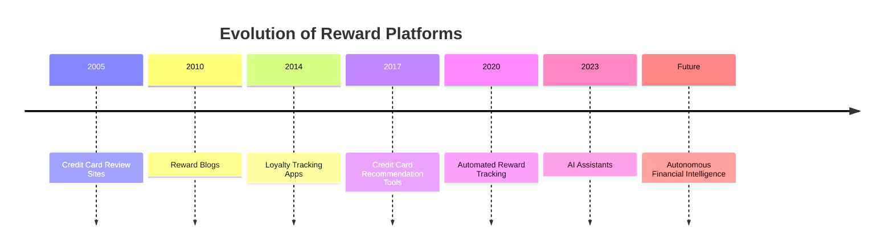

The category has evolved steadily but remains fragmented.

---

# Current Market Landscape

International competitors generally fall into four categories.

| Category | Examples |
|----------|----------|
| Reward Tracking | AwardWallet, MaxRewards |
| Credit Card Optimization | CardPointers, Travel Freely |
| Financial Education | NerdWallet, Bankrate |
| Loyalty & Travel Media | The Points Guy |

Each solves a different part of the rewards journey.

None solve the entire lifecycle.

---

# Industry Characteristics

## Strengths

International platforms excel at:

- Card databases
- Reward tracking
- Loyalty management
- Educational content
- Benefit reminders
- Transfer partner information
- Airline mile valuation
- Credit card comparisons

---

## Weaknesses

Most platforms still lack:

- Real-time purchase optimization
- Merchant intelligence
- Explainable AI
- Cross-platform reward simulations
- Context-aware recommendations
- Unified decision engines
- Financial operating systems

---

# The Reward Optimization Problem

Consider a U.S. traveler booking a hotel.

Possible payment options include:

- American Express Membership Rewards
- Chase Ultimate Rewards
- Citi ThankYou Points
- Capital One Miles
- Marriott Bonvoy
- Hilton Honors
- Hyatt Points
- Airline transfers
- Cashback
- Direct payment

Determining the optimal strategy requires evaluating hundreds of dynamic variables.

Even advanced users often rely on spreadsheets and manual calculations.

---

# Existing User Journey

```text
Search Reddit

↓

Search Google

↓

Read The Points Guy

↓

Check AwardWallet

↓

Open CardPointers

↓

Open Airline Websites

↓

Calculate Value

↓

Book
```

Decision time:

30–60 minutes.

---

# Desired CardWise Journey

```text
Search Travel

↓

CardWise AI

↓

Reward Rules

↓

Transfer Partners

↓

Merchant Offers

↓

Card Portfolio

↓

Simulation

↓

Recommendation

↓

Book
```

Decision time:

Under one minute.

---

# Market Opportunity

International products prove that consumers value reward intelligence.

However, they remain fragmented across:

- Tracking
- Education
- Optimization
- Loyalty management

CardWise can unify these functions into a single AI-native platform.

---

# Strategic Positioning

Existing platforms optimize:

```
Individual Reward Problems
```

CardWise optimizes:

```
Entire Financial Decisions
```

This is a significantly broader product vision.

---

# Research Questions

The following sections seek to answer:

1. How do international users manage reward complexity?

2. What features have become industry standards?

3. Which capabilities remain unsolved?

4. How can AI eliminate manual optimization?

5. Which ideas should CardWise adopt, improve, or avoid?

---

# Competitors Covered in Part 5

| Section | Platform |
|----------|----------|
| Part 5A | AwardWallet |
| Part 5B | CardPointers |
| Part 5C | MaxRewards |
| Part 5D | Travel Freely |
| Part 5E | The Points Guy |
| Part 5F | NerdWallet |
| Part 5G | Bankrate |
| Part 5H | Credit Karma |
| Part 5I | Comparative Analysis & Strategic Lessons |

Each competitor will be analyzed using the same framework established throughout this document:

- Company Overview
- Product Positioning
- Core Features
- Revenue Model
- Business Strategy
- UX Philosophy
- AI Usage
- Personalization
- Technical Observations
- Trust Factors
- Innovation
- Missing Features
- Opportunities CardWise Can Exploit

---

# Executive Insight

International reward platforms demonstrate that consumers are willing to invest significant time optimizing financial outcomes.

However, today's ecosystem still requires users to combine:

- Blogs
- Apps
- Loyalty trackers
- Credit card databases
- Airline websites
- Hotel websites
- Manual spreadsheets

to make a single purchasing decision.

CardWise can fundamentally simplify this process.

Rather than becoming another reward tracker or recommendation website, CardWise should become the **financial operating system** that continuously understands:

- User goals
- Card portfolios
- Merchant behavior
- Reward currencies
- Loyalty programs
- Travel plans
- Spending patterns

and transforms this information into transparent, explainable, AI-driven recommendations.

This vision extends well beyond today's reward optimization platforms and defines an entirely new product category.

---

**End of Part 5 (Introduction)**

The next section begins with **AwardWallet**, widely regarded as the global benchmark for loyalty account aggregation and reward tracking.


---

# Part 5A-1 — AwardWallet

> **Category:** Loyalty Program Management & Reward Tracking
>
> **Objective:** Analyze the world's leading loyalty account aggregation platform, understand how travelers manage fragmented reward ecosystems, and identify strategic opportunities for CardWise.

---

# AwardWallet

---

# Company Overview

**Founded:** 2004

**Headquarters:** United States

**Category:** Loyalty Management Platform

**Primary Markets**

- United States
- Canada
- Europe
- Global Frequent Travelers

**Core Businesses**

- Loyalty Program Tracking
- Airline Miles
- Hotel Points
- Credit Card Rewards
- Travel Reward Management
- Expiration Monitoring

AwardWallet is widely recognized as the world's leading platform for managing loyalty accounts.

Long before fintech companies began discussing financial intelligence, AwardWallet solved one fundamental problem:

> **Reward fragmentation.**

Frequent travelers often maintain accounts across dozens of programs.

Examples include:

- Airlines
- Hotels
- Credit card issuers
- Rental cars
- Dining programs
- Shopping portals

AwardWallet aggregates these balances into one dashboard.

---

# Product Positioning

## Core Positioning

> **One Place for Every Loyalty Account**

AwardWallet positions itself as a personal reward management platform.

Rather than helping users earn rewards,

it helps them:

- Track rewards
- Prevent expiration
- Monitor balances
- Organize loyalty programs

The platform functions as a centralized reward repository.

---

## Strategic Narrative

AwardWallet believes consumers lose significant value because reward programs are fragmented.

Its mission is to ensure users never lose rewards through:

- Forgotten accounts
- Point expiration
- Balance fragmentation

The platform focuses on preservation rather than optimization.

---

# Target Audience

Primary users include:

- Frequent travelers
- Airline enthusiasts
- Hotel loyalty members
- Credit card enthusiasts
- Business travelers
- Digital nomads

Secondary users include:

- Award travel hobbyists
- Premium credit card holders
- Travel bloggers

These users often participate in 20–100 loyalty programs simultaneously.

---

# Core Features

## Loyalty Account Aggregation

AwardWallet supports hundreds of loyalty programs including:

- Airlines
- Hotels
- Rental cars
- Dining rewards
- Shopping portals
- Credit cards

Users can monitor all balances in one location.

---

## Balance Tracking

Consumers can view:

- Current balance
- Previous balance
- Recent activity
- Program status

without logging into every individual provider.

---

## Expiration Monitoring

One of AwardWallet's strongest capabilities.

Users receive alerts before:

- Miles expire
- Hotel points expire
- Rewards become inactive

This prevents significant value loss.

---

## Reward History

The platform tracks:

- Balance changes
- Transactions
- Historical activity
- Reward movement

This improves visibility into loyalty ecosystems.

---

## Travel Program Support

AwardWallet integrates with hundreds of travel programs globally, making it one of the broadest loyalty databases available.

---

# Premium Features

AwardWallet Plus provides advanced capabilities including:

- Additional tracking
- Enhanced history
- More frequent updates
- Advanced reporting
- Premium notifications

Power users benefit from deeper visibility into their reward ecosystems.

---

# Revenue Model

AwardWallet follows a subscription-supported model.

Primary revenue sources include:

| Revenue Source | Description |
|----------------|-------------|
| Premium subscriptions | AwardWallet Plus |
| Affiliate partnerships | Credit cards & travel services |
| Advertising | Travel-related promotions |
| Referral programs | Partner commissions |

Subscriptions fund continued platform development.

---

# Business Model

```text
Loyalty Programs

↓

Aggregation

↓

Tracking

↓

Notifications

↓

User Retention

↓

Premium Subscription
```

The platform delivers ongoing value through centralized visibility.

---

# Strengths

## Industry-Leading Loyalty Coverage

AwardWallet supports an enormous number of:

- Airlines
- Hotels
- Credit card programs
- Dining rewards
- Retail loyalty systems

Coverage remains one of its strongest competitive advantages.

---

## Reward Organization

Consumers no longer need to remember:

- Usernames
- Passwords
- Balances
- Expiration dates

for dozens of reward accounts.

---

## Expiration Protection

Reward expiration monitoring saves users significant financial value.

Many frequent travelers recover thousands of dollars through timely alerts.

---

## Long-Term User Value

Unlike transaction-focused platforms, AwardWallet provides value throughout the entire reward lifecycle.

---

## Trusted Brand

Among reward enthusiasts,

AwardWallet is considered the default loyalty tracking application.

Its longevity significantly strengthens trust.

---

# Weaknesses

Despite its leadership, several important opportunities remain.

---

## Tracking Rather Than Optimization

AwardWallet tells users:

```
What they have.
```

It does **not** tell users:

```
What they should do.
```

---

## Limited Decision Support

Users still manually determine:

- Best redemption
- Best transfer partner
- Best payment strategy
- Best card
- Best booking portal

---

## No Unified Financial Intelligence

AwardWallet tracks balances.

It does not optimize:

- Cashback
- Merchant offers
- Credit card rewards
- Spending milestones
- Opportunity cost

---

## No Real-Time Purchase Guidance

Users receive no recommendations during:

- Shopping
- Travel booking
- Online checkout
- Merchant payments

The platform remains largely retrospective.

---

## No AI Financial Reasoning

Although balances are aggregated,

financial decisions remain manual.

---

# UX Analysis

## Design Philosophy

AwardWallet prioritizes:

- Information density
- Organization
- Reliability
- Transparency

The interface is designed for users managing complex loyalty portfolios.

---

## Navigation

Primary navigation includes:

- Accounts
- Balances
- Expiration alerts
- Transactions
- Notifications

The experience centers on account management.

---

## Search Experience

Users can search:

- Loyalty programs
- Accounts
- Transactions

Search functionality supports organization rather than optimization.

---

## Information Architecture

The application organizes information by:

- Loyalty program
- Reward balance
- Activity history
- Expiration status

This creates a clear overview of fragmented reward ecosystems.

---

## Technical Observations

Based on publicly observable functionality, AwardWallet appears to operate a sophisticated loyalty aggregation platform supporting:

- Secure account synchronization
- Loyalty integrations
- Balance tracking
- Notification systems
- Historical activity
- Large-scale data aggregation

Its greatest engineering achievement is reliable integration across hundreds of reward providers.

However, there is no public evidence of:

- AI-powered financial reasoning
- Credit card optimization engines
- Reward simulations
- Merchant intelligence
- Real-time checkout recommendations

These represent substantial opportunities for CardWise.

---

**End of Part 5A-1**


---

# Part 5A-2 — AwardWallet (Continued)

---

# Trust Factors

AwardWallet has earned an exceptional level of trust within the frequent traveler community.

Unlike promotional platforms that encourage additional spending, AwardWallet's value comes from helping users **protect assets they already own**.

These assets include:

- Airline miles
- Hotel points
- Credit card rewards
- Shopping rewards
- Dining rewards
- Rental car loyalty balances

For many users, these balances represent thousands—or even tens of thousands—of dollars in potential travel value.

---

## Long-Term Reliability

AwardWallet has operated for two decades, creating confidence through:

- Consistent product evolution
- Stable platform availability
- Accurate reward tracking
- Reliable synchronization
- Long-term community presence

Longevity has become one of its strongest trust signals.

---

## Transparency

Users appreciate AwardWallet because it clearly communicates:

- Current balances
- Expiration dates
- Account activity
- Program changes

Transparency reduces anxiety around managing multiple loyalty ecosystems.

---

# Community Presence

AwardWallet has cultivated a loyal audience of travel enthusiasts.

Its community consists primarily of:

- Frequent flyers
- Award travel experts
- Credit card enthusiasts
- Loyalty bloggers
- Premium travelers

Unlike mass-market fintech products, its user base is highly engaged and knowledgeable.

---

## Educational Content

AwardWallet supplements its platform with educational resources covering:

- Airline programs
- Hotel loyalty
- Reward strategies
- Program updates
- Industry news

This content reinforces its reputation as a trusted authority.

---

# AI Usage

AwardWallet's public positioning has historically emphasized data aggregation rather than artificial intelligence.

Current intelligent capabilities likely include:

- Balance monitoring
- Expiration prediction
- Notification prioritization
- Program synchronization
- Data validation

These features improve operational efficiency rather than financial decision-making.

---

## Current AI Capabilities

| Capability | Rating |
|------------|--------|
| Account Monitoring | ⭐⭐⭐⭐⭐ |
| Expiration Alerts | ⭐⭐⭐⭐⭐ |
| Notification Intelligence | ⭐⭐⭐⭐☆ |
| Data Synchronization | ⭐⭐⭐⭐⭐ |
| Personalization | ⭐⭐⭐☆☆ |
| Reward Intelligence | ⭐⭐⭐☆☆ |
| Credit Card Optimization | ⭐☆☆☆☆ |
| Financial Reasoning | ⭐☆☆☆☆ |

AwardWallet excels at **tracking information**.

It provides comparatively little assistance with **acting on information**.

---

## AI Gaps

Current systems cannot answer:

- Which reward should be redeemed first?
- Which transfer partner provides the highest value?
- Should the user pay cash or redeem points?
- Which purchase should use which credit card?
- Which future booking maximizes long-term portfolio value?

These remain manual decisions.

---

# Personalization

AwardWallet personalizes experiences using:

- Loyalty accounts
- Program participation
- Reward balances
- Expiration timelines
- Activity history

This personalization helps users manage increasingly complex reward portfolios.

---

## Personalization Maturity

| Area | Rating |
|------|--------|
| Loyalty Account Tracking | ⭐⭐⭐⭐⭐ |
| Balance Monitoring | ⭐⭐⭐⭐⭐ |
| Expiration Management | ⭐⭐⭐⭐⭐ |
| Notification Personalization | ⭐⭐⭐⭐☆ |
| Redemption Recommendations | ⭐⭐☆☆☆ |
| Credit Card Intelligence | ⭐☆☆☆☆ |
| Financial Optimization | ⭐☆☆☆☆ |

The platform understands **what users own**.

It does not deeply understand **what users should do next**.

---

# Scalability

AwardWallet possesses several durable scalability advantages.

Key growth drivers include:

- Additional loyalty integrations
- Premium subscriptions
- International program coverage
- Growing reward ecosystems
- Increasing consumer complexity

As more reward programs emerge, the need for aggregation naturally increases.

---

## Growth Flywheel

```text
More Loyalty Programs

        ↓

More User Accounts

        ↓

Higher Tracking Value

        ↓

More Frequent Usage

        ↓

Premium Subscribers

        ↓

Platform Investment

        ↓

Expanded Integrations
```

This creates a defensible network centered around reward visibility.

---

# Innovation Assessment

AwardWallet pioneered centralized loyalty management.

| Dimension | Rating |
|-----------|--------|
| Loyalty Aggregation | ⭐⭐⭐⭐⭐ |
| Reward Tracking | ⭐⭐⭐⭐⭐ |
| Expiration Monitoring | ⭐⭐⭐⭐⭐ |
| Account Organization | ⭐⭐⭐⭐⭐ |
| Travel Program Coverage | ⭐⭐⭐⭐⭐ |
| AI Adoption | ⭐⭐⭐☆☆ |
| Reward Optimization | ⭐⭐☆☆☆ |
| Credit Card Intelligence | ⭐☆☆☆☆ |
| Explainable Financial AI | ⭐☆☆☆☆ |
| Purchase Decision Support | ⭐☆☆☆☆ |

Its innovation has focused on **visibility**, not **optimization**.

---

# Missing Features

Several major opportunities remain.

---

## Unified Financial Intelligence

AwardWallet aggregates:

- Airline miles
- Hotel points
- Loyalty balances

It does **not** combine:

- Credit card rewards
- Merchant offers
- Cashback
- Bank promotions
- Shopping portals

into a unified financial model.

---

## Real-Time Credit Card Recommendation Engine

The platform cannot recommend:

- Best card for this purchase
- Best transfer strategy
- Best reward currency
- Best payment sequence

---

## Reward Simulation

Users cannot compare:

- Cash booking
- Airline redemption
- Hotel redemption
- Transfer partners
- Hybrid payment strategies

before making a purchase.

---

## Merchant Intelligence

AwardWallet has minimal awareness of:

- Merchant category codes (MCCs)
- Shopping portals
- Checkout context
- Merchant-specific promotions
- Cross-platform offers

---

## Browser Intelligence

Recommendations are not surfaced while users browse:

- Airline websites
- Hotel websites
- E-commerce platforms
- Travel portals

Decision support occurs outside the purchasing workflow.

---

## Explainable Financial AI

The platform presents data.

It does not explain:

- Opportunity cost
- Portfolio impact
- Future reward value
- Optimal redemption strategy

---

# Opportunities CardWise Can Exploit

AwardWallet demonstrates the importance of centralized reward visibility.

CardWise can build upon this foundation by introducing intelligent decision-making.

| Opportunity | Strategic Value |
|-------------|-----------------|
| AI Reward Copilot | Recommend the optimal action for every reward balance rather than simply displaying it. |
| Unified Reward Engine | Combine loyalty balances, cashback, credit card rewards, bank offers, and merchant promotions into one decision framework. |
| Browser Extension | Deliver contextual recommendations across travel, shopping, and checkout experiences. |
| Reward Simulation | Compare redemption scenarios before users commit to a transaction. |
| Portfolio Optimization | Treat every loyalty account and credit card as components of a unified financial portfolio. |
| Historical Intelligence | Use historical redemption values and transfer bonuses to improve recommendations. |
| Explainable AI | Clearly justify every recommendation with transparent calculations and reasoning. |

---

# Strategic Lessons for CardWise

## What AwardWallet Does Exceptionally Well

- Loyalty aggregation
- Balance tracking
- Expiration management
- Program coverage
- Trust
- Long-term customer retention

---

## What CardWise Should Learn

### Centralize Fragmented Information

AwardWallet proves that users value having fragmented information unified in one place.

CardWise should centralize:

- Cards
- Rewards
- Cashback
- Offers
- Loyalty programs
- Merchant benefits
- Travel rewards

within a single financial graph.

---

### Protect User Value

AwardWallet protects users from losing rewards.

CardWise should go further by helping users:

- Earn more
- Redeem better
- Spend smarter
- Avoid poor financial decisions

---

### Build for Power Users Without Alienating Beginners

AwardWallet successfully serves highly sophisticated travelers.

CardWise should maintain similar depth while providing:

- Beginner-friendly recommendations
- AI explanations
- Progressive disclosure of complexity

---

### Become Action-Oriented

Tracking creates awareness.

Optimization creates value.

CardWise should focus on recommending concrete actions rather than simply displaying information.

---

## What CardWise Should Avoid

- Becoming only a loyalty tracker.
- Requiring users to manually interpret data.
- Limiting recommendations to historical balances.
- Separating tracking from optimization.

Instead, CardWise should continuously transform information into actionable financial decisions.

---

# Positioning Summary

| Aspect | AwardWallet | CardWise |
|--------|-------------|----------|
| Core Mission | Track Loyalty Accounts | Optimize Financial Decisions |
| Primary KPI | Reward Visibility | Maximum Financial Value |
| AI Focus | Account Management | Financial Reasoning |
| Core Asset | Loyalty Aggregation | Unified Financial Intelligence Graph |
| Competitive Advantage | Program Coverage | Explainable AI Optimization |
| Long-Term Vision | Loyalty Dashboard | Financial Operating System |

---

# Key Strategic Takeaways

AwardWallet solved one of the earliest and most important problems in loyalty management:

> **Fragmentation.**

However, the next decade of innovation is unlikely to focus on aggregation alone.

The future belongs to **intelligent decision systems**.

Instead of asking:

> **"How many points do I have?"**

users will increasingly ask:

> **"What should I do with these points?"**

CardWise can answer that question by combining:

- Loyalty balances
- Credit card rewards
- Merchant offers
- Cashback
- Travel goals
- Spending history
- AI reasoning
- Historical redemption data

into a single explainable recommendation engine.

This transforms reward tracking into **financial decision intelligence**, creating a significantly larger and more defensible product vision.

---

**End of Part 5A-2**

---

# Part 5B-1 — CardPointers

> **Category:** Credit Card Optimization & Benefit Management
>
> **Objective:** Analyze one of the world's leading credit card optimization platforms, understand how users maximize category rewards, and identify opportunities for CardWise to build a more comprehensive financial intelligence platform.

---

# CardPointers

---

# Company Overview

**Founded:** 2019

**Founder:** Emanuel Crouvisier

**Headquarters:** United States

**Category:** Credit Card Optimization Platform

**Primary Markets**

- United States
- Canada
- Selected International Markets

**Core Businesses**

- Credit Card Optimization
- Category Bonus Tracking
- Benefit Management
- Browser Extension
- Merchant Intelligence
- Reward Recommendations

CardPointers is one of the closest existing products to CardWise's long-term vision.

Rather than focusing on loyalty balances, CardPointers helps users answer a practical question before every purchase:

> **"Which credit card should I use?"**

This shift—from passive tracking to active decision support—makes CardPointers one of the most strategically relevant competitors.

---

# Product Positioning

## Core Positioning

> **Never Use the Wrong Credit Card Again**

CardPointers positions itself as a real-time decision assistant for credit card users.

Instead of memorizing complex reward structures, users receive contextual recommendations at checkout.

The platform aims to eliminate reward optimization errors.

---

## Strategic Narrative

CardPointers believes consumers lose significant value because:

- Reward rules are complicated.
- Category bonuses constantly change.
- Card benefits are forgotten.
- Annual credits go unused.
- Purchase decisions happen too quickly.

Its mission is to automate these calculations.

---

# Target Audience

Primary users include:

- Premium credit card holders
- Frequent travelers
- Reward enthusiasts
- Cashback optimizers
- Financial hobbyists

Secondary audiences include:

- Business travelers
- Airline loyalty members
- Hotel loyalty members
- Users with multiple premium cards

Many customers own 5–20 credit cards simultaneously.

---

# Core Features

## Credit Card Recommendations

The platform recommends the best card based on:

- Merchant category
- Purchase type
- Reward multipliers
- Card benefits

Recommendations appear before payment.

---

## Category Bonus Tracking

Users can easily understand:

- Dining multipliers
- Grocery rewards
- Travel bonuses
- Fuel rewards
- Entertainment categories

without memorizing reward rules.

---

## Benefit Tracking

CardPointers tracks premium benefits including:

- Annual travel credits
- Dining credits
- Airline fee credits
- Hotel credits
- Lounge access
- Purchase protections

Many premium cardholders overlook these benefits.

---

## Browser Extension

One of CardPointers' strongest differentiators.

While users browse:

- Amazon
- Airline websites
- Hotel websites
- Shopping portals

the extension recommends:

- Best credit card
- Eligible benefits
- Category bonuses

This significantly reduces purchase friction.

---

## Offer Tracking

Users can monitor:

- Card-linked offers
- Promotional campaigns
- Merchant offers

within supported issuers.

---

# Premium Features

Premium subscribers receive:

- Advanced recommendations
- Additional integrations
- Enhanced tracking
- More card support
- Premium automation

Subscriptions create recurring revenue while supporting continuous product development.

---

# Revenue Model

CardPointers follows a SaaS subscription model.

Primary revenue sources include:

| Revenue Source | Description |
|----------------|-------------|
| Premium subscriptions | Monthly & annual plans |
| Affiliate partnerships | Credit card referrals |
| Sponsored content | Financial partners |
| Educational resources | Financial ecosystem |

The business emphasizes software value rather than transaction commissions.

---

# Business Model

```text
Credit Cards

↓

Reward Rules

↓

Optimization Engine

↓

Recommendation

↓

Higher User Savings

↓

Premium Subscription
```

The platform creates value by reducing financial decision complexity.

---

# Strengths

## Real-Time Decision Support

Unlike traditional reward trackers,

CardPointers helps users at the exact moment decisions occur.

This dramatically increases practical value.

---

## Browser Extension

The browser extension is one of the platform's strongest competitive advantages.

Recommendations appear during:

- Online shopping
- Travel booking
- Checkout

without requiring users to switch applications.

---

## Benefit Awareness

Consumers often forget premium benefits worth hundreds of dollars annually.

CardPointers improves benefit utilization through reminders and tracking.

---

## Excellent Category Management

Reward categories are presented clearly, reducing the need for users to memorize complicated earning structures.

---

## User-Centric Design

The platform consistently prioritizes:

- Simplicity
- Actionable recommendations
- Practical value

rather than overwhelming users with raw data.

---

# Weaknesses

Despite its strengths, several strategic opportunities remain.

---

## Card Optimization Only

CardPointers primarily optimizes:

- Credit cards

It does **not** fully optimize:

- Cashback platforms
- Airline transfers
- Hotel loyalty
- Merchant offers
- Shopping portals
- Bank promotions

within one unified decision framework.

---

## Limited Financial Scope

Recommendations generally focus on immediate purchase optimization.

Long-term portfolio planning receives less emphasis.

---

## No Unified Reward Valuation

The platform does not fully compare:

- Cashback
- Airline miles
- Hotel points
- Opportunity cost

using a common financial model.

---

## Limited Merchant Intelligence

Merchant context is considered primarily for reward categories rather than:

- Historical pricing
- Merchant quality
- Cross-platform comparison
- Future promotions

---

## Limited AI Explainability

Recommendations are generally useful,

but detailed financial reasoning remains relatively limited.

---

# UX Analysis

## Design Philosophy

CardPointers emphasizes:

- Simplicity
- Context
- Actionability
- Automation

Every interaction attempts to reduce cognitive load.

---

## Navigation

Primary navigation includes:

- Cards
- Benefits
- Offers
- Recommendations
- Browser integration

The interface remains focused on optimization rather than exploration.

---

## Search Experience

Users primarily search:

- Credit cards
- Benefits
- Merchants
- Offers

Search supports rapid financial decisions.

---

## Information Architecture

Information is organized around:

- Cards
- Categories
- Benefits
- Recommendations

rather than transaction history or spending analysis.

---

## Technical Observations

Based on publicly observable capabilities, CardPointers appears to operate a sophisticated recommendation platform supporting:

- Rule-based optimization
- Browser extension infrastructure
- Benefit databases
- Merchant recognition
- Offer tracking
- Category mapping
- Recommendation engines

Among existing products, it comes closest to providing real-time purchase intelligence.

However, there is no public evidence of:

- Large-scale AI reasoning
- Multi-dimensional reward simulations
- Unified financial graphs
- Predictive optimization
- Cross-ecosystem financial intelligence

These represent major opportunities for CardWise.

---

**End of Part 5B-1**


---

# Part 5B-2 — CardPointers (Continued)

---

# Trust Factors

CardPointers has built trust by solving a problem that credit card enthusiasts encounter almost every day:

> **Choosing the correct card at the moment of purchase.**

Unlike traditional personal finance applications that focus on budgeting or expense tracking, CardPointers delivers immediate and measurable financial value.

Users can directly verify recommendations by comparing:

- Reward points earned
- Cashback received
- Category multipliers
- Statement credits
- Card benefits utilized

This immediate feedback loop reinforces long-term trust.

---

## Recommendation Accuracy

One of CardPointers' strongest trust drivers is recommendation consistency.

Users quickly learn that recommendations are based on:

- Card reward structures
- Merchant categories
- Benefit rules
- Offer eligibility

rather than sponsored placements.

This perception of neutrality significantly strengthens credibility.

---

## Benefit Awareness

Premium cardholders often overlook benefits worth hundreds or even thousands of dollars annually.

CardPointers builds trust by helping users discover value they already possess.

Examples include:

- Dining credits
- Travel credits
- Airport lounge benefits
- Hotel elite perks
- Purchase protections

Helping users recover "forgotten value" creates strong customer loyalty.

---

# Community Presence

CardPointers serves a highly engaged community of:

- Credit card enthusiasts
- Frequent travelers
- Reward optimizers
- Financial bloggers
- Award travel experts

Although not a social network, the platform benefits from strong word-of-mouth within the points-and-miles community.

---

## Educational Content

Supporting educational resources include:

- Credit card guides
- Reward optimization tips
- Benefit explanations
- Program updates
- Product announcements

This content positions CardPointers as an authority rather than simply a software product.

---

# AI Usage

CardPointers primarily relies on structured rules and decision engines.

Current intelligent capabilities likely include:

- Merchant classification
- Rule evaluation
- Benefit eligibility
- Recommendation ranking
- Browser context detection

These systems provide intelligent automation without relying heavily on generative AI.

---

## Current AI Capabilities

| Capability | Rating |
|------------|--------|
| Merchant Recognition | ⭐⭐⭐⭐⭐ |
| Rule Engine | ⭐⭐⭐⭐⭐ |
| Browser Intelligence | ⭐⭐⭐⭐⭐ |
| Recommendation Engine | ⭐⭐⭐⭐☆ |
| Benefit Tracking | ⭐⭐⭐⭐⭐ |
| Financial Reasoning | ⭐⭐⭐☆☆ |
| Generative AI | ⭐⭐☆☆☆ |
| Predictive Intelligence | ⭐⭐☆☆☆ |

The platform demonstrates sophisticated automation but relatively limited adaptive AI reasoning.

---

## AI Gaps

Current systems cannot answer:

- Should this purchase wait for a better promotion?
- Does using this card delay another milestone?
- Is cashback preferable to transferable points?
- How does today's decision affect next month's travel plans?
- Should the user intentionally choose a lower multiplier to unlock greater future value?

These require multi-step financial reasoning beyond static rule evaluation.

---

# Personalization

CardPointers personalizes recommendations using:

- Card portfolio
- Merchant category
- Available benefits
- Card eligibility
- Browser context

Recommendations are contextual rather than purely historical.

---

## Personalization Maturity

| Area | Rating |
|------|--------|
| Card Portfolio | ⭐⭐⭐⭐⭐ |
| Merchant Recognition | ⭐⭐⭐⭐⭐ |
| Benefit Recommendations | ⭐⭐⭐⭐⭐ |
| Browser Context | ⭐⭐⭐⭐⭐ |
| Spending Behavior | ⭐⭐⭐☆☆ |
| Goal-Based Optimization | ⭐⭐☆☆☆ |
| Financial Strategy | ⭐⭐☆☆☆ |

The platform understands **available options**.

It has a more limited understanding of **long-term financial objectives**.

---

# Scalability

CardPointers benefits from several highly scalable characteristics.

Key growth drivers include:

- Additional card issuers
- Expanded merchant coverage
- Browser integrations
- Premium subscriptions
- International reward programs

Unlike transaction-dependent businesses, software value increases as reward complexity grows.

---

## Growth Flywheel

```text
More Credit Cards

        ↓

More Reward Rules

        ↓

Better Recommendations

        ↓

Higher User Savings

        ↓

Premium Subscribers

        ↓

Platform Expansion

        ↓

More Supported Cards
```

The platform scales alongside increasing reward ecosystem complexity.

---

# Innovation Assessment

CardPointers represents one of the most innovative products within the reward optimization category.

| Dimension | Rating |
|-----------|--------|
| Browser Extension | ⭐⭐⭐⭐⭐ |
| Credit Card Optimization | ⭐⭐⭐⭐⭐ |
| Rule Engine | ⭐⭐⭐⭐⭐ |
| Benefit Tracking | ⭐⭐⭐⭐⭐ |
| Merchant Intelligence | ⭐⭐⭐⭐☆ |
| AI Adoption | ⭐⭐⭐☆☆ |
| Financial Simulation | ⭐⭐☆☆☆ |
| Explainable AI | ⭐⭐⭐☆☆ |
| Portfolio Intelligence | ⭐⭐⭐☆☆ |
| Predictive Optimization | ⭐⭐☆☆☆ |

Its greatest innovation lies in bringing optimization directly into the purchasing workflow.

---

# Missing Features

Several significant opportunities remain.

---

## Unified Financial Intelligence

CardPointers understands:

- Cards
- Categories
- Benefits

It does **not** fully integrate:

- Airline loyalty
- Hotel loyalty
- Cashback platforms
- Merchant cashback
- Bank portals
- Dynamic pricing
- Historical promotions

into a single optimization model.

---

## Long-Term Portfolio Planning

Current recommendations optimize individual purchases.

They rarely optimize:

- Annual spending goals
- Card retention strategy
- Upgrade opportunities
- Lifetime reward accumulation

---

## Reward Simulation

Users cannot model scenarios such as:

- Cashback vs transferable points
- Multi-card strategies
- Future travel plans
- Delayed purchases
- Transfer bonuses

before making financial decisions.

---

## Merchant Intelligence

Merchant understanding is primarily category-based.

The platform does not deeply evaluate:

- Historical pricing
- Merchant quality
- Offer history
- Cross-platform comparisons
- Competitive marketplaces

---

## Explainable Financial AI

Recommendations are useful.

However, users often receive limited explanation regarding:

- Opportunity cost
- Future portfolio impact
- Alternative strategies
- Confidence levels

---

## Autonomous Financial Planning

Users must still actively seek recommendations.

The platform does not proactively manage:

- Upcoming milestones
- Reward expirations
- Future travel goals
- Spending forecasts
- Portfolio optimization

---

# Opportunities CardWise Can Exploit

CardPointers validates the value of contextual recommendations.

CardWise can significantly expand this concept.

| Opportunity | Strategic Value |
|-------------|-----------------|
| AI Financial Copilot | Move beyond static rules to adaptive financial reasoning across cards, merchants, travel, and loyalty ecosystems. |
| Unified Reward Engine | Combine cashback, transferable points, airline miles, hotel points, bank offers, and merchant promotions into one optimization framework. |
| Predictive Intelligence | Recommend future actions rather than only current purchase decisions. |
| Reward Simulation | Model multiple payment strategies before checkout. |
| Financial Graph | Treat cards, merchants, rewards, offers, and user goals as interconnected entities rather than isolated data points. |
| Browser Intelligence 2.0 | Expand contextual recommendations beyond category matching into complete purchase optimization. |
| Explainable AI | Provide transparent reasoning, confidence scores, and opportunity-cost analysis for every recommendation. |
| Autonomous Optimization | Continuously monitor portfolios and proactively suggest actions without requiring user input. |

---

# Strategic Lessons for CardWise

## What CardPointers Does Exceptionally Well

- Real-time recommendations
- Browser integration
- Credit card optimization
- Benefit tracking
- Low cognitive load
- Practical daily value

---

## What CardWise Should Learn

### Meet Users Where Decisions Occur

The browser extension is one of CardPointers' greatest innovations.

CardWise should extend this principle across:

- Browsers
- Mobile apps
- QR payments
- Travel platforms
- E-commerce
- Payment confirmations

Recommendations should appear naturally within existing workflows.

---

### Hide Complexity

CardPointers successfully abstracts complicated reward rules.

CardWise should similarly hide:

- Transfer ratios
- Valuation models
- Reward calculations
- Merchant logic

while still providing transparent explanations when requested.

---

### Optimize Beyond Individual Purchases

Every purchase affects future opportunities.

CardWise should optimize:

- Current transaction
- Monthly spending
- Annual milestones
- Travel plans
- Portfolio evolution

simultaneously.

---

### Build Adaptive Intelligence

Static rule engines eventually become difficult to maintain.

CardWise should combine:

- Structured rules
- Machine learning
- Large language models
- Predictive analytics

to continuously improve recommendation quality.

---

## What CardWise Should Avoid

- Becoming only a browser extension.
- Optimizing solely for reward multipliers.
- Treating each transaction independently.
- Relying entirely on manually maintained rules.

Instead, CardWise should evolve into a continuously learning financial intelligence platform.

---

# Positioning Summary

| Aspect | CardPointers | CardWise |
|--------|--------------|----------|
| Core Mission | Choose the Right Card | Make the Best Financial Decision |
| Primary KPI | Reward Optimization | Lifetime Financial Value |
| AI Focus | Rule-Based Recommendations | Adaptive Financial Reasoning |
| Core Asset | Credit Card Rules | Unified Financial Intelligence Graph |
| Competitive Advantage | Browser Context | Explainable AI Decision Engine |
| Long-Term Vision | Card Optimization Platform | Autonomous Financial Operating System |

---

# Key Strategic Takeaways

CardPointers represents the closest existing product to CardWise's vision.

It successfully demonstrates that consumers value:

- Real-time recommendations
- Context-aware optimization
- Browser assistance
- Benefit tracking

However, CardPointers primarily answers:

> **"Which card should I use?"**

CardWise should answer a much broader question:

> **"What is the smartest overall financial strategy?"**

That strategy may involve:

- Selecting a different merchant
- Delaying a purchase
- Using another payment method
- Redeeming transferable points
- Completing a spending milestone
- Preserving rewards for future travel
- Combining multiple incentives

By reasoning across the entire financial ecosystem rather than a single card, CardWise can evolve from a recommendation tool into a true **financial operating system**.

---

**End of Part 5B-2**

---

# Part 5C-1 — MaxRewards

> **Category:** Credit Card Rewards Automation & Financial Optimization
>
> **Objective:** Analyze MaxRewards' automated reward optimization platform, understand how automation reduces user effort, and identify strategic opportunities for CardWise to build a more comprehensive AI-driven financial operating system.

---

# MaxRewards

---

# Company Overview

**Founded:** 2019

**Headquarters:** United States

**Category:** Credit Card Reward Optimization Platform

**Primary Markets**

- United States

**Core Businesses**

- Credit Card Management
- Reward Optimization
- Offer Activation
- Benefit Tracking
- Statement Credit Management
- Reward Analytics

MaxRewards was created to solve one of the largest frustrations experienced by premium credit card users:

> **Managing dozens of constantly changing card offers and benefits.**

Unlike traditional reward tracking platforms, MaxRewards places strong emphasis on **automation**.

Its goal is not merely to display information, but to reduce the manual work required to maximize card value.

---

# Product Positioning

## Core Positioning

> **Automatically Maximize Your Credit Card Rewards**

MaxRewards positions itself as an intelligent assistant that continuously monitors credit card accounts and helps users extract maximum value from their existing portfolio.

Rather than asking users to manually track:

- Offers
- Benefits
- Statement credits
- Spending bonuses

the platform attempts to automate these workflows.

---

## Strategic Narrative

MaxRewards believes consumers underutilize premium credit cards because:

- Offers expire
- Benefits are forgotten
- Statement credits are missed
- Promotions change frequently
- Managing multiple issuers is difficult

Its mission is to eliminate this operational burden through automation.

---

# Target Audience

Primary users include:

- Premium credit card holders
- Frequent travelers
- Cashback enthusiasts
- Multi-card users
- Award travel enthusiasts

Secondary audiences include:

- Business travelers
- High spenders
- Financial optimization hobbyists

Many users actively manage portfolios containing:

- American Express
- Chase
- Citi
- Capital One
- Bank of America
- Wells Fargo

cards simultaneously.

---

# Core Features

## Card Portfolio Management

Users can connect multiple credit cards into a centralized dashboard.

The platform tracks:

- Active cards
- Rewards
- Offers
- Benefits
- Spending categories

This reduces fragmentation across issuers.

---

## Offer Activation

One of MaxRewards' most distinctive features.

Many issuers require users to manually activate promotional offers.

MaxRewards helps automate this process by tracking and surfacing eligible offers.

This significantly reduces missed opportunities.

---

## Statement Credit Tracking

Premium cards often include benefits such as:

- Dining credits
- Airline fee credits
- Hotel credits
- Streaming credits
- Retail credits

MaxRewards tracks usage and remaining value throughout the benefit period.

---

## Spending Insights

The platform analyzes spending across:

- Categories
- Cards
- Issuers
- Benefits

allowing users to understand reward performance.

---

## Card Recommendations

Users receive guidance regarding:

- Best card
- Category bonuses
- Active offers
- Benefit eligibility

before making purchases.

---

# Premium Features

Premium subscribers receive additional capabilities including:

- Enhanced automation
- Advanced offer management
- More connected accounts
- Priority features
- Additional optimization tools

Automation becomes significantly more powerful under the premium tier.

---

# Revenue Model

MaxRewards follows a subscription-first business model.

Primary revenue sources include:

| Revenue Source | Description |
|----------------|-------------|
| Premium subscriptions | Monthly & annual plans |
| Credit card referrals | Affiliate partnerships |
| Sponsored partnerships | Financial ecosystem |
| Premium automation | Advanced services |

The platform monetizes software intelligence rather than transactions.

---

# Business Model

```text
Credit Card Accounts

↓

Automation Engine

↓

Benefit Tracking

↓

Offer Management

↓

Optimization

↓

Premium Subscription
```

Automation becomes the primary source of customer value.

---

# Strengths

## Strong Automation

MaxRewards significantly reduces manual effort by helping users manage:

- Offers
- Credits
- Benefits
- Reward opportunities

This automation differentiates it from static tracking platforms.

---

## Portfolio Visibility

Users gain a unified overview of:

- Cards
- Rewards
- Credits
- Spending

across multiple issuers.

---

## Premium Benefit Management

Statement credits are often overlooked.

MaxRewards helps consumers recover value that would otherwise expire unused.

---

## Multi-Issuer Support

Rather than focusing on one bank,

the platform spans multiple major issuers,

creating a more complete financial picture.

---

## Practical Daily Utility

Unlike educational platforms,

MaxRewards provides value during ongoing financial management.

---

# Weaknesses

Despite its strengths, several strategic gaps remain.

---

## Credit Card-Centric Optimization

MaxRewards primarily focuses on:

- Credit cards
- Issuer offers
- Benefits

It does **not** comprehensively optimize:

- Merchant offers
- Cashback platforms
- Airline transfers
- Hotel loyalty
- Shopping portals

within one unified system.

---

## Limited Long-Term Planning

Recommendations are primarily operational.

Long-term portfolio optimization receives comparatively less attention.

---

## No Unified Reward Valuation

Users still manually compare:

- Cashback
- Airline miles
- Hotel points
- Transferable currencies

across ecosystems.

---

## Limited Merchant Intelligence

Merchant understanding focuses largely on reward categories rather than:

- Historical pricing
- Marketplace comparisons
- Offer timing
- Purchase sequencing

---

## Limited AI Explainability

Automation reduces effort,

but users often receive limited reasoning explaining **why** one recommendation is superior.

---

# UX Analysis

## Design Philosophy

MaxRewards emphasizes:

- Automation
- Convenience
- Simplicity
- Visibility

The product minimizes repetitive user actions.

---

## Navigation

Primary navigation includes:

- Cards
- Offers
- Benefits
- Spending
- Recommendations

The interface prioritizes ongoing portfolio management.

---

## Search Experience

Search primarily supports:

- Cards
- Offers
- Benefits
- Transactions

rather than exploratory financial planning.

---

## Information Architecture

Information is organized around:

- Card issuers
- Active benefits
- Offers
- Credits
- Spending categories

This provides users with a clear operational dashboard.

---

## Technical Observations

Based on publicly observable functionality, MaxRewards appears to operate a sophisticated automation platform supporting:

- Multi-card synchronization
- Offer tracking
- Benefit management
- Statement credit monitoring
- Recommendation engines
- Automation workflows

Its greatest technical strength lies in reducing manual administrative work.

However, there is no public evidence of:

- AI-first financial reasoning
- Multi-dimensional reward simulations
- Cross-platform merchant intelligence
- Predictive portfolio optimization
- Unified financial graphs

These remain significant opportunities for CardWise.

---

**End of Part 5C-1**


---

# Part 5C-2 — MaxRewards (Continued)

---

# Trust Factors

MaxRewards has established trust by solving a persistent operational problem for premium credit card users:

> **Keeping track of dozens of changing offers, credits, and benefits.**

Unlike recommendation websites that provide generic advice, MaxRewards continuously monitors users' existing credit card portfolios.

This creates tangible value that users can easily verify.

Examples include:

- Statement credits successfully redeemed
- Merchant offers activated
- Benefits utilized before expiration
- Cashback earned
- Reward opportunities captured

Every recovered benefit reinforces confidence in the platform.

---

## Automation Reliability

One of MaxRewards' strongest trust drivers is reliable automation.

Users expect the platform to reduce repetitive administrative work such as:

- Offer monitoring
- Credit tracking
- Benefit reminders
- Portfolio management

Successful automation significantly lowers cognitive load.

---

## Financial Transparency

MaxRewards improves trust through visibility into:

- Card benefits
- Active offers
- Statement credits
- Spending categories
- Reward accumulation

Users understand exactly what benefits remain available.

---

# Community Presence

MaxRewards primarily serves:

- Premium cardholders
- Reward enthusiasts
- Frequent travelers
- Financial optimization communities

Although smaller than educational brands like NerdWallet, its audience is highly engaged.

---

## Educational Resources

Supporting content includes:

- Credit card optimization
- Benefit explanations
- Reward strategies
- Product updates
- Promotional guidance

These resources complement the software platform.

---

# AI Usage

MaxRewards emphasizes intelligent automation rather than conversational AI.

Likely intelligent capabilities include:

- Offer detection
- Credit monitoring
- Benefit tracking
- Rule evaluation
- Recommendation generation

Automation is largely deterministic rather than generative.

---

## Current AI Capabilities

| Capability | Rating |
|------------|--------|
| Offer Detection | ⭐⭐⭐⭐⭐ |
| Benefit Monitoring | ⭐⭐⭐⭐⭐ |
| Statement Credit Tracking | ⭐⭐⭐⭐⭐ |
| Rule Engine | ⭐⭐⭐⭐☆ |
| Recommendation Engine | ⭐⭐⭐⭐☆ |
| Financial Reasoning | ⭐⭐⭐☆☆ |
| Predictive Intelligence | ⭐⭐☆☆☆ |
| Generative AI | ⭐⭐☆☆☆ |

MaxRewards excels at operational automation but provides comparatively limited adaptive reasoning.

---

## AI Gaps

Current systems cannot answer:

- Should this purchase be delayed?
- Is another merchant financially superior?
- Should points be redeemed now or preserved?
- Which card best supports future travel plans?
- How does today's decision affect long-term portfolio value?

These require broader financial reasoning than automation alone.

---

# Personalization

MaxRewards personalizes recommendations using:

- Connected cards
- Active offers
- Benefit utilization
- Spending categories
- Issuer programs

This improves recommendation relevance.

---

## Personalization Maturity

| Area | Rating |
|------|--------|
| Card Portfolio | ⭐⭐⭐⭐⭐ |
| Benefit Tracking | ⭐⭐⭐⭐⭐ |
| Offer Recommendations | ⭐⭐⭐⭐☆ |
| Spending Categories | ⭐⭐⭐⭐☆ |
| Portfolio Strategy | ⭐⭐⭐☆☆ |
| Goal-Based Optimization | ⭐⭐☆☆☆ |
| Predictive Planning | ⭐⭐☆☆☆ |

The platform understands **current portfolio state**.

It has a more limited understanding of **future financial intent**.

---

# Scalability

MaxRewards possesses several attractive scalability characteristics.

Key growth drivers include:

- Additional issuer integrations
- Expanded benefit databases
- Automation improvements
- Premium subscriptions
- Growing premium card adoption

As reward complexity increases, automation becomes increasingly valuable.

---

## Growth Flywheel

```text
More Connected Cards

        ↓

More Benefits Managed

        ↓

Higher User Savings

        ↓

Greater Trust

        ↓

Premium Subscribers

        ↓

Product Investment

        ↓

More Automation
```

Automation quality directly strengthens customer retention.

---

# Innovation Assessment

MaxRewards has introduced several important innovations within reward management.

| Dimension | Rating |
|-----------|--------|
| Offer Automation | ⭐⭐⭐⭐⭐ |
| Benefit Tracking | ⭐⭐⭐⭐⭐ |
| Portfolio Management | ⭐⭐⭐⭐☆ |
| Credit Monitoring | ⭐⭐⭐⭐☆ |
| Operational Automation | ⭐⭐⭐⭐⭐ |
| AI Adoption | ⭐⭐⭐☆☆ |
| Financial Simulation | ⭐⭐☆☆☆ |
| Explainable AI | ⭐⭐☆☆☆ |
| Predictive Planning | ⭐⭐☆☆☆ |
| Unified Financial Intelligence | ⭐⭐☆☆☆ |

Innovation focuses on reducing administrative effort rather than optimizing broader financial strategy.

---

# Missing Features

Several substantial opportunities remain.

---

## Unified Financial Intelligence

MaxRewards understands:

- Card offers
- Statement credits
- Issuer benefits

It does **not** comprehensively integrate:

- Merchant cashback
- Airline loyalty
- Hotel loyalty
- Shopping portals
- Bank promotions
- Dynamic pricing

into one optimization engine.

---

## Long-Term Portfolio Planning

Recommendations rarely consider:

- Lifetime reward accumulation
- Card upgrade paths
- Downgrade timing
- Future spending plans
- Upcoming travel goals

---

## Reward Simulation

Users cannot compare:

- Cashback
- Airline transfers
- Hotel transfers
- Direct redemption
- Cash payment
- Mixed payment strategies

before making purchases.

---

## Merchant Intelligence

Merchant analysis remains relatively limited.

The platform does not deeply evaluate:

- Historical pricing
- Merchant quality
- Sale timing
- Competitive marketplaces
- Offer history

---

## Explainable Financial AI

Automation performs actions efficiently.

However, users receive relatively little explanation regarding:

- Why recommendations changed
- Opportunity cost
- Confidence levels
- Alternative strategies

---

## Autonomous Financial Planning

The platform automates operations.

It does not autonomously optimize:

- Annual milestones
- Portfolio evolution
- Travel planning
- Spending forecasts
- Cross-program reward strategy

---

# Opportunities CardWise Can Exploit

MaxRewards proves users appreciate automation.

CardWise can evolve automation into intelligent financial reasoning.

| Opportunity | Strategic Value |
|-------------|-----------------|
| AI Financial Agent | Move from automation to autonomous financial decision-making. |
| Unified Reward Engine | Combine issuer offers, merchant promotions, loyalty programs, cashback, and travel rewards into one optimization model. |
| Predictive Portfolio Intelligence | Recommend future actions based on projected spending and travel plans. |
| Reward Simulation | Compare complete financial scenarios before purchases occur. |
| Financial Knowledge Graph | Connect merchants, cards, loyalty programs, rewards, offers, and user goals into one reasoning engine. |
| Cross-Platform Intelligence | Optimize decisions across merchants, travel portals, shopping platforms, and payment methods. |
| Explainable AI | Provide transparent reasoning, confidence scores, assumptions, and opportunity-cost analysis. |
| Autonomous Optimization | Continuously identify new optimization opportunities without requiring user intervention. |

---

# Strategic Lessons for CardWise

## What MaxRewards Does Exceptionally Well

- Operational automation
- Offer management
- Benefit tracking
- Statement credit visibility
- Portfolio organization
- Premium card management

---

## What CardWise Should Learn

### Automate Repetitive Financial Tasks

Users should not manually monitor:

- Offers
- Credits
- Expirations
- Benefits
- Promotions

Automation should eliminate repetitive financial administration.

---

### Build Around Continuous Value

Unlike budgeting applications that users open periodically, optimization should occur continuously.

CardWise should provide value:

- Before purchases
- During purchases
- After purchases
- Throughout the reward lifecycle

---

### Combine Automation with Intelligence

Automation answers:

> **"What should happen automatically?"**

AI answers:

> **"What is the best overall decision?"**

CardWise should integrate both.

---

### Expand Beyond Issuer Boundaries

MaxRewards primarily optimizes within issuer ecosystems.

CardWise should optimize across:

- Issuers
- Merchants
- Cashback platforms
- Travel programs
- Loyalty ecosystems
- Payment methods

without platform bias.

---

## What CardWise Should Avoid

- Becoming solely an automation platform.
- Limiting optimization to issuer benefits.
- Treating administrative automation as the end goal.
- Separating portfolio management from financial strategy.

Instead, automation should serve a larger objective:

> **Helping users consistently make better financial decisions.**

---

# Positioning Summary

| Aspect | MaxRewards | CardWise |
|--------|------------|----------|
| Core Mission | Automate Credit Card Rewards | Optimize Every Financial Decision |
| Primary KPI | Benefits Utilized | Lifetime Financial Value |
| AI Focus | Operational Automation | Adaptive Financial Intelligence |
| Core Asset | Benefit Automation Engine | Unified Financial Intelligence Graph |
| Competitive Advantage | Automated Offer Management | Explainable AI Decision Engine |
| Long-Term Vision | Automated Reward Platform | Autonomous Financial Operating System |

---

# Key Strategic Takeaways

MaxRewards demonstrates that users are willing to pay for software that reduces the effort required to manage increasingly complex reward ecosystems.

However, automation alone does not maximize financial outcomes.

MaxRewards primarily answers:

> **"How can I automate reward management?"**

CardWise should answer a broader question:

> **"What is the best financial strategy, and how can it be executed automatically?"**

By combining:

- Automation
- AI reasoning
- Reward simulations
- Merchant intelligence
- Predictive analytics
- Loyalty optimization
- Multi-card portfolio management
- Explainable recommendations

CardWise can evolve from a reward automation platform into an **autonomous financial operating system** that continuously maximizes long-term consumer value.

---

**End of Part 5C-2**

---

# Part 5D-1 — Travel Freely

> **Category:** Credit Card Strategy & Travel Reward Planning
>
> **Objective:** Analyze Travel Freely's goal-based credit card planning platform, understand how strategic card sequencing helps users maximize travel rewards, and identify opportunities for CardWise to evolve into a comprehensive financial planning engine.

---

# Travel Freely

---

# Company Overview

**Founded:** 2018

**Founder:** Zac Hood

**Headquarters:** United States

**Category:** Credit Card Planning Platform

**Primary Markets**

- United States

**Core Businesses**

- Credit Card Strategy
- Travel Planning
- Application Planning
- Reward Tracking
- Eligibility Tracking
- Travel Goal Management

Unlike platforms that optimize purchases after users already own multiple cards,

Travel Freely focuses on an earlier stage of the customer journey:

> **Helping users decide which credit card to apply for next.**

This strategic planning approach differentiates it from reward trackers and browser-based optimization tools.

---

# Product Positioning

## Core Positioning

> **Plan Your Credit Card Journey**

Travel Freely positions itself as a long-term planning assistant.

Instead of asking:

> Which card should I use?

it asks:

> Which card should I get next?

The platform helps users maximize future travel opportunities through structured planning.

---

## Strategic Narrative

Travel Freely believes consumers often make poor application decisions because they lack visibility into:

- Bank rules
- Application timing
- Eligibility windows
- Reward opportunities
- Travel goals

Its objective is to optimize card acquisition rather than only card usage.

---

# Target Audience

Primary users include:

- Travel enthusiasts
- Frequent flyers
- Points & miles hobbyists
- Premium credit card users
- Award travelers

Secondary users include:

- Beginners entering the reward ecosystem
- Families planning travel
- Long-term reward optimizers

Many users actively pursue complex travel goals requiring multiple transferable reward currencies.

---

# Core Features

## Credit Card Roadmaps

Users receive recommendations regarding:

- Which card to apply for
- Recommended application sequence
- Timing considerations
- Eligibility strategy

This transforms random applications into structured financial planning.

---

## Eligibility Tracking

The platform tracks:

- Application history
- Eligibility windows
- Bank-specific rules
- Waiting periods

This helps users avoid costly application mistakes.

---

## Travel Goal Planning

Consumers can define objectives such as:

- Europe vacation
- Business class flights
- Luxury hotels
- Family travel

Recommendations align card strategy with travel aspirations.

---

## Reward Tracking

Travel Freely provides visibility into:

- Current cards
- Active rewards
- Travel progress
- Goal completion

Tracking remains focused on strategic planning.

---

## Rule Guidance

The platform educates users about:

- Issuer restrictions
- Application strategies
- Reward optimization
- Transfer opportunities

Knowledge becomes part of the planning process.

---

# Premium Features

Travel Freely primarily emphasizes planning rather than advanced automation.

Premium capabilities include:

- Enhanced planning tools
- Additional strategy support
- Expanded recommendations

The core value remains long-term optimization.

---

# Revenue Model

Travel Freely operates a software-supported affiliate model.

Primary revenue sources include:

| Revenue Source | Description |
|----------------|-------------|
| Credit card referrals | Affiliate partnerships |
| Educational resources | Reward strategy |
| Premium planning tools | Enhanced functionality |
| Sponsored partnerships | Financial ecosystem |

The business aligns monetization with informed credit card acquisition.

---

# Business Model

```text
Travel Goals

↓

Planning Engine

↓

Card Strategy

↓

Applications

↓

Rewards

↓

Travel
```

The platform creates value by improving long-term planning decisions.

---

# Strengths

## Goal-Oriented Planning

Travel Freely begins with:

- User objectives
- Travel aspirations
- Desired destinations

rather than immediately recommending financial products.

This user-centric approach differentiates it from many competitors.

---

## Strategic Card Sequencing

Application timing significantly influences long-term reward accumulation.

Travel Freely helps users avoid:

- Poor sequencing
- Missed bonuses
- Eligibility mistakes

---

## Educational Value

The platform teaches users:

- Bank rules
- Application strategies
- Travel optimization
- Reward planning

Education increases customer confidence.

---

## Beginner-Friendly Experience

Unlike highly technical reward communities,

Travel Freely makes complex planning accessible to newcomers.

---

## Long-Term Perspective

Recommendations consider months and years,

rather than only the next purchase.

This creates stronger strategic alignment.

---

# Weaknesses

Despite its strengths, several strategic opportunities remain.

---

## Focus on Card Acquisition

Travel Freely primarily optimizes:

- New card applications

It does **not** comprehensively optimize:

- Everyday purchases
- Merchant offers
- Cashback
- Browser intelligence
- Real-time payment decisions

---

## Limited Purchase Optimization

Users still determine manually:

- Which card to use
- Which merchant to choose
- Which reward strategy is optimal

after card acquisition.

---

## No Unified Reward Engine

The platform does not combine:

- Merchant cashback
- Credit card rewards
- Loyalty programs
- Travel portals
- Bank offers

into one optimization framework.

---

## Limited Automation

Planning remains largely user-driven.

Many operational decisions continue to require manual effort.

---

## Limited AI Explainability

Recommendations rely heavily on structured planning rather than adaptive AI reasoning.

---

# UX Analysis

## Design Philosophy

Travel Freely emphasizes:

- Clarity
- Long-term planning
- Simplicity
- Goal orientation

The experience encourages thoughtful decision-making.

---

## Navigation

Primary navigation includes:

- Goals
- Cards
- Applications
- Recommendations
- Progress

The interface reflects a planning workflow rather than transaction management.

---

## Search Experience

Users primarily search:

- Credit cards
- Issuers
- Travel strategies
- Reward information

Search supports financial education and planning.

---

## Information Architecture

Information is organized around:

- Goals
- Application timelines
- Card recommendations
- Eligibility

This creates a roadmap-oriented user experience.

---

## Technical Observations

Based on publicly observable capabilities, Travel Freely appears to operate a sophisticated planning platform supporting:

- Rule-based recommendation engines
- Eligibility tracking
- Travel goal management
- Application sequencing
- Strategy guidance

Its strongest differentiator is long-term planning rather than operational automation.

However, there is no public evidence of:

- AI-first financial reasoning
- Real-time checkout intelligence
- Merchant optimization
- Unified financial graphs
- Predictive spending optimization

These represent significant opportunities for CardWise.

---

**End of Part 5D-1**


---

# Part 5D-2 — Travel Freely (Continued)

---

# Trust Factors

Travel Freely has established credibility by helping users make **high-impact, long-term financial decisions** rather than simply optimizing individual transactions.

Unlike platforms that focus on earning a few additional reward points during checkout, Travel Freely influences decisions that may affect:

- Sign-up bonuses
- Reward accumulation
- Airline status
- Hotel status
- Travel opportunities
- Future card eligibility

These decisions often have financial consequences lasting several years.

---

## Strategic Guidance

Users trust the platform because recommendations are generally based on:

- Issuer rules
- Historical application strategies
- Reward program structures
- Travel objectives

rather than short-term promotions.

This long-term orientation strengthens perceived objectivity.

---

## Educational Transparency

Travel Freely emphasizes education alongside recommendations.

Users understand:

- Why a recommendation exists
- Which rule applies
- Which objective is being optimized

This transparency builds confidence.

---

# Community Presence

Travel Freely primarily serves:

- Award travelers
- Credit card enthusiasts
- Frequent flyers
- Travel planning communities

Although smaller than media platforms such as The Points Guy, its audience tends to be highly engaged and goal-driven.

---

## Educational Content

Supporting resources include:

- Travel planning articles
- Credit card strategies
- Issuer rule explanations
- Travel inspiration
- Reward optimization guides

Education remains an integral part of the product experience.

---

# AI Usage

Travel Freely currently appears to rely primarily on structured planning logic.

Likely intelligent capabilities include:

- Eligibility calculations
- Rule evaluation
- Goal matching
- Recommendation generation
- Timeline planning

Recommendations are deterministic rather than adaptive.

---

## Current AI Capabilities

| Capability | Rating |
|------------|--------|
| Rule Engine | ⭐⭐⭐⭐⭐ |
| Eligibility Tracking | ⭐⭐⭐⭐⭐ |
| Goal Planning | ⭐⭐⭐⭐☆ |
| Recommendation Engine | ⭐⭐⭐⭐☆ |
| Timeline Management | ⭐⭐⭐⭐☆ |
| Financial Reasoning | ⭐⭐⭐☆☆ |
| Predictive Intelligence | ⭐⭐☆☆☆ |
| Generative AI | ⭐☆☆☆☆ |

The platform excels at structured planning but has limited autonomous reasoning capabilities.

---

## AI Gaps

Current systems cannot answer:

- Should today's purchase change future card strategy?
- Should the user delay an application because of upcoming spending?
- How will current purchases influence travel goals?
- Which existing card portfolio maximizes long-term flexibility?
- What is the optimal financial strategy across all rewards, merchants, and travel ecosystems?

These questions require broader financial intelligence.

---

# Personalization

Travel Freely personalizes recommendations using:

- Travel goals
- Existing cards
- Application history
- Issuer rules
- Eligibility timelines

Recommendations evolve alongside user progress.

---

## Personalization Maturity

| Area | Rating |
|------|--------|
| Travel Goals | ⭐⭐⭐⭐⭐ |
| Application Planning | ⭐⭐⭐⭐⭐ |
| Eligibility Tracking | ⭐⭐⭐⭐⭐ |
| Strategy Recommendations | ⭐⭐⭐⭐☆ |
| Spending Behavior | ⭐⭐☆☆☆ |
| Purchase Optimization | ⭐☆☆☆☆ |
| Financial Portfolio Intelligence | ⭐⭐☆☆☆ |

The platform understands **future card acquisition**.

It has comparatively limited awareness of **daily financial behavior**.

---

# Scalability

Travel Freely benefits from several scalable characteristics.

Key growth drivers include:

- Additional issuers
- Expanded planning models
- International reward ecosystems
- Educational resources
- Affiliate partnerships

As reward complexity increases, structured planning becomes increasingly valuable.

---

## Growth Flywheel

```text
More Travel Goals

        ↓

More Planning

        ↓

Better Card Sequencing

        ↓

Higher Reward Value

        ↓

Greater User Trust

        ↓

More Referrals

        ↓

Platform Growth
```

The platform grows by helping users achieve ambitious travel outcomes.

---

# Innovation Assessment

Travel Freely introduced several important innovations around strategic planning.

| Dimension | Rating |
|-----------|--------|
| Goal-Based Planning | ⭐⭐⭐⭐⭐ |
| Card Sequencing | ⭐⭐⭐⭐⭐ |
| Eligibility Tracking | ⭐⭐⭐⭐⭐ |
| Travel Strategy | ⭐⭐⭐⭐☆ |
| Educational Experience | ⭐⭐⭐⭐☆ |
| AI Adoption | ⭐⭐☆☆☆ |
| Real-Time Optimization | ⭐☆☆☆☆ |
| Explainable AI | ⭐⭐⭐☆☆ |
| Predictive Planning | ⭐⭐⭐☆☆ |
| Unified Financial Intelligence | ⭐⭐☆☆☆ |

Innovation centers on long-term planning rather than real-time financial optimization.

---

# Missing Features

Several important opportunities remain.

---

## Unified Financial Intelligence

Travel Freely understands:

- Travel goals
- Card applications
- Issuer rules

It does **not** fully integrate:

- Merchant offers
- Cashback
- Shopping portals
- Daily spending
- Bank promotions
- Reward simulations

into a unified optimization engine.

---

## Real-Time Purchase Guidance

The platform provides little assistance during:

- Online shopping
- Checkout
- Travel booking
- Merchant payments

Daily financial decisions remain outside its scope.

---

## Reward Simulation

Users cannot compare:

- Cashback
- Transferable points
- Airline redemptions
- Hotel redemptions
- Mixed payment strategies

before completing purchases.

---

## Merchant Intelligence

Recommendations are largely independent of:

- Merchant quality
- Historical pricing
- Offer history
- Marketplace competition
- Dynamic promotions

---

## Explainable Financial AI

Recommendations explain strategic rules.

They do not deeply explain:

- Opportunity cost
- Future portfolio impact
- Confidence levels
- Alternative financial paths

---

## Autonomous Financial Planning

Planning remains largely user-driven.

The platform does not continuously monitor:

- Spending behavior
- Purchase opportunities
- Reward optimization
- Portfolio evolution

without user intervention.

---

# Opportunities CardWise Can Exploit

Travel Freely demonstrates that consumers value long-term financial planning.

CardWise can extend this planning philosophy into continuous optimization.

| Opportunity | Strategic Value |
|-------------|-----------------|
| AI Financial Roadmap | Continuously evolve recommendations as spending behavior, travel goals, and rewards change. |
| Unified Reward Engine | Combine applications, purchases, cashback, merchant offers, loyalty programs, and travel rewards into one planning framework. |
| Predictive Portfolio Planning | Recommend future cards, spending strategies, and redemption opportunities simultaneously. |
| Reward Simulation | Compare long-term financial outcomes across multiple planning scenarios. |
| Financial Knowledge Graph | Connect travel goals, merchants, cards, loyalty programs, and spending behavior into a single reasoning engine. |
| Browser & Mobile Intelligence | Deliver planning insights at the moment decisions occur. |
| Explainable AI | Provide transparent long-term reasoning behind every recommendation. |
| Autonomous Financial Planning | Continuously update financial strategies as circumstances evolve. |

---

# Strategic Lessons for CardWise

## What Travel Freely Does Exceptionally Well

- Goal-based planning
- Card sequencing
- Eligibility management
- Educational guidance
- Long-term thinking
- Beginner accessibility

---

## What CardWise Should Learn

### Begin With User Goals

Rather than immediately optimizing transactions,

CardWise should first understand:

- Travel aspirations
- Financial objectives
- Cashback preferences
- Lifestyle
- Spending patterns

Optimization should always align with user intent.

---

### Think Beyond Today's Purchase

Every purchase influences:

- Future milestones
- Reward balances
- Card eligibility
- Travel opportunities

CardWise should optimize the entire financial journey rather than isolated transactions.

---

### Blend Education With Intelligence

Travel Freely demonstrates that users appreciate understanding financial strategies.

CardWise should explain:

- Why recommendations exist
- Which assumptions were made
- What alternatives were evaluated

without overwhelming users.

---

### Make Planning Continuous

Planning should not occur only when users apply for new cards.

CardWise should update recommendations continuously as:

- Offers change
- Spending changes
- Travel goals evolve
- Reward balances grow

---

## What CardWise Should Avoid

- Becoming solely a card application planner.
- Limiting optimization to sign-up bonuses.
- Separating planning from execution.
- Requiring users to manually maintain financial roadmaps.

Instead, CardWise should continuously plan, optimize, and execute financial strategies on behalf of users.

---

# Positioning Summary

| Aspect | Travel Freely | CardWise |
|--------|---------------|----------|
| Core Mission | Plan Your Credit Card Journey | Optimize Your Entire Financial Journey |
| Primary KPI | Better Card Applications | Lifetime Financial Value |
| AI Focus | Strategic Planning | Adaptive Financial Intelligence |
| Core Asset | Planning Engine | Unified Financial Intelligence Graph |
| Competitive Advantage | Goal-Based Strategy | Explainable AI Decision Engine |
| Long-Term Vision | Credit Card Planning Platform | Autonomous Financial Operating System |

---

# Key Strategic Takeaways

Travel Freely demonstrates that the highest-value financial decisions often occur **before** purchases are made.

Choosing:

- the right card,
- at the right time,
- for the right travel goal,

can create substantial long-term value.

However, planning alone is insufficient.

Users still need help:

- During shopping
- During travel booking
- During payment
- During redemption
- During portfolio management

CardWise can unify these stages into one continuous financial intelligence system.

Instead of answering only:

> **"Which card should I apply for next?"**

CardWise should answer:

> **"What is the best financial strategy today, next month, next year, and for my long-term goals?"**

By combining planning, execution, automation, and AI reasoning, CardWise can extend beyond traditional reward planning tools and establish itself as the comprehensive financial operating system for consumers.

---

**End of Part 5D-2**


---

# Part 5E-1 — The Points Guy (TPG)

> **Category:** Travel Rewards Media, Credit Card Education & Loyalty Intelligence
>
> **Objective:** Analyze the world's most influential travel rewards media platform, understand how financial education shapes consumer behavior, and identify opportunities for CardWise to transform static educational content into intelligent, personalized financial guidance.

---

# The Points Guy (TPG)

---

# Company Overview

**Founded:** 2010

**Founder:** Brian Kelly

**Headquarters:** New York, United States

**Category:** Travel Rewards Media & Financial Education Platform

**Primary Markets**

- United States
- Global English-speaking audience

**Core Businesses**

- Credit Card Reviews
- Airline Loyalty Education
- Hotel Loyalty Education
- Travel Guides
- Reward Valuation
- Financial Content
- Affiliate Marketing

Unlike software-first competitors such as AwardWallet or CardPointers,

The Points Guy (TPG) is fundamentally a **knowledge platform**.

It has become one of the world's most influential sources of information for:

- Credit cards
- Airline miles
- Hotel loyalty
- Travel rewards
- Redemption strategies
- Premium travel experiences

Millions of consumers use TPG before making major financial and travel decisions.

---

# Product Positioning

## Core Positioning

> **Teach Consumers How to Travel Better Using Points**

TPG positions itself as the definitive educational resource for maximizing travel rewards.

Instead of providing automated optimization,

it provides:

- Articles
- Guides
- Rankings
- Reviews
- Tutorials
- Expert opinions

The platform empowers users through knowledge.

---

## Strategic Narrative

TPG believes consumers consistently undervalue:

- Reward points
- Airline miles
- Hotel programs
- Credit card benefits
- Transfer partners

Its mission is to educate users so they can extract significantly greater value from existing financial products.

---

# Target Audience

Primary users include:

- Frequent travelers
- Premium credit card holders
- Airline loyalty enthusiasts
- Hotel loyalty members
- Travel hackers
- Reward optimizers

Secondary audiences include:

- Beginners learning reward systems
- Luxury travelers
- Business travelers
- Financial hobbyists

The audience spans both novice and expert users.

---

# Core Features

## Credit Card Reviews

One of TPG's most recognized features.

Each review typically covers:

- Annual fees
- Reward rates
- Sign-up bonuses
- Benefits
- Lounge access
- Travel protections
- Redemption opportunities

These reviews help consumers compare financial products.

---

## Airline Guides

Extensive educational content explains:

- Airline alliances
- Transfer partners
- Elite status
- Award charts
- Redemption strategies

These guides reduce the learning curve associated with airline loyalty.

---

## Hotel Loyalty Education

Consumers can learn about:

- Marriott Bonvoy
- Hilton Honors
- Hyatt
- IHG
- Accor
- Other hotel ecosystems

The focus is maximizing hotel reward value.

---

## Reward Valuations

TPG publishes estimated valuations for:

- Airline miles
- Hotel points
- Transfer currencies

These valuations help users compare redemption opportunities.

---

## Travel News

The platform continuously publishes updates covering:

- Credit card launches
- Airline promotions
- Hotel offers
- Transfer bonuses
- Industry developments

Timely information strengthens user engagement.

---

# Premium Features

Most educational content is publicly accessible.

Premium value primarily comes from:

- Exclusive newsletters
- Specialized content
- Community engagement
- Personalized recommendations (limited)

The business emphasizes reach over software subscriptions.

---

# Revenue Model

TPG operates a media-driven business.

Primary revenue sources include:

| Revenue Source | Description |
|----------------|-------------|
| Affiliate commissions | Credit card referrals |
| Advertising | Sponsored placements |
| Brand partnerships | Financial institutions |
| Content sponsorships | Travel ecosystem |

Affiliate partnerships represent a major component of the business model.

---

# Business Model

```text
Financial Content

↓

Consumer Education

↓

Product Discovery

↓

Credit Card Applications

↓

Affiliate Revenue
```

Knowledge becomes the primary driver of monetization.

---

# Strengths

## Industry Authority

TPG is widely regarded as one of the most trusted educational brands within the travel rewards community.

Its articles frequently shape consumer purchasing behavior.

---

## Massive Knowledge Base

The platform has produced thousands of articles covering:

- Credit cards
- Airline loyalty
- Hotel loyalty
- Travel optimization
- Premium benefits

This knowledge repository is a major competitive advantage.

---

## Reward Valuation Expertise

Few organizations have invested as deeply in estimating:

- Point values
- Redemption quality
- Transfer opportunities

These valuations have become industry reference points.

---

## Strong Editorial Quality

Content is generally:

- Detailed
- Well researched
- Educational
- Continuously updated

This improves credibility.

---

## Broad Ecosystem Coverage

TPG spans nearly every major travel loyalty ecosystem.

This breadth makes it a valuable starting point for consumers.

---

# Weaknesses

Despite its influence, several strategic limitations remain.

---

## Static Education

TPG primarily provides:

- Articles
- Reviews
- Guides

Users must manually apply this information to their own financial situations.

---

## Generic Recommendations

Advice is generally written for broad audiences.

Recommendations rarely consider:

- Individual portfolios
- Spending behavior
- Existing cards
- Personal goals
- Merchant context

---

## No Real-Time Decision Support

Consumers receive little assistance while:

- Shopping
- Booking travel
- Paying merchants
- Redeeming rewards

Knowledge remains separate from execution.

---

## Limited Automation

Users perform:

- Calculations
- Comparisons
- Reward valuation
- Decision-making

manually after reading educational content.

---

## No Unified Financial Engine

TPG explains financial strategies.

It does not execute them.

---

# UX Analysis

## Design Philosophy

TPG emphasizes:

- Education
- Editorial credibility
- Content discovery
- Searchability
- Trust

The experience resembles a premium digital publication.

---

## Navigation

Primary navigation includes:

- Credit Cards
- Airlines
- Hotels
- Travel
- News
- Reviews
- Guides

Navigation encourages exploration and learning.

---

## Search Experience

Search supports discovery of:

- Articles
- Reviews
- Guides
- Programs
- Destinations

The platform functions as a searchable financial knowledge base.

---

## Information Architecture

Content is organized by:

- Financial products
- Travel topics
- Loyalty programs
- Editorial categories

This structure supports long-form educational consumption.

---

## Technical Observations

Based on publicly observable functionality, TPG appears to operate a sophisticated digital publishing platform supporting:

- Large-scale content management
- Editorial workflows
- Search optimization
- Affiliate tracking
- Recommendation modules
- Audience segmentation

Its strongest asset is content production rather than financial automation.

However, there is no public evidence of:

- AI-powered financial reasoning
- Personalized optimization engines
- Browser intelligence
- Reward simulations
- Unified financial graphs

These represent substantial opportunities for CardWise.

---

**End of Part 5E-1**


---

# Part 5E-2 — The Points Guy (TPG) (Continued)

---

# Trust Factors

The Points Guy has become one of the most trusted voices in the global travel rewards industry.

Unlike software platforms that primarily automate workflows, TPG has built credibility through:

- Editorial independence
- Consistent research
- Long-form educational content
- Reward valuations
- Industry expertise
- Continuous market coverage

For many consumers, TPG is the first resource consulted before making major credit card or travel decisions.

---

## Editorial Authority

Trust is reinforced through:

- Detailed product reviews
- Transparent scoring methodologies
- Reward valuation frameworks
- Frequent updates
- Comparative analysis

Readers perceive recommendations as expert guidance rather than marketing material.

---

## Industry Relationships

TPG maintains deep relationships across:

- Airlines
- Hotel groups
- Credit card issuers
- Travel providers

These relationships provide early access to:

- Product launches
- Transfer bonuses
- Industry news
- Promotional campaigns

However, they also require careful management of editorial independence.

---

# Community Presence

TPG has one of the largest communities within the travel rewards ecosystem.

Its audience actively engages through:

- Comments
- Social media
- Newsletters
- Podcasts
- Video content
- Community discussions

Education creates long-term engagement beyond transactional interactions.

---

## Knowledge Ecosystem

The platform continuously produces content covering:

- Airline strategies
- Hotel programs
- Reward valuations
- Credit card updates
- Travel inspiration
- Industry analysis

This extensive content library reinforces TPG's authority.

---

# AI Usage

Historically, TPG has emphasized editorial expertise over artificial intelligence.

Current AI usage likely supports:

- Content recommendations
- Search optimization
- Audience segmentation
- Marketing personalization
- Editorial workflows

AI primarily improves publishing efficiency rather than consumer financial reasoning.

---

## Current AI Capabilities

| Capability | Rating |
|------------|--------|
| Content Discovery | ⭐⭐⭐⭐⭐ |
| Search Personalization | ⭐⭐⭐⭐☆ |
| Audience Segmentation | ⭐⭐⭐⭐☆ |
| Recommendation Modules | ⭐⭐⭐⭐☆ |
| Editorial Automation | ⭐⭐⭐☆☆ |
| Financial Reasoning | ⭐⭐☆☆☆ |
| Personalized Optimization | ⭐☆☆☆☆ |
| Autonomous Decision Support | ⭐☆☆☆☆ |

The platform possesses exceptional knowledge but comparatively limited personalization.

---

## AI Gaps

Current systems cannot answer:

- Which recommendation best matches my card portfolio?
- Should I redeem or pay cash?
- Which transfer partner creates the highest value today?
- Which purchase advances my travel goals?
- What is the optimal financial strategy based on my current rewards?

Users must manually translate educational content into actionable decisions.

---

# Personalization

TPG primarily personalizes:

- Content recommendations
- Newsletters
- Topic suggestions
- Editorial content

rather than financial strategies.

---

## Personalization Maturity

| Area | Rating |
|------|--------|
| Content Recommendations | ⭐⭐⭐⭐⭐ |
| Editorial Personalization | ⭐⭐⭐⭐☆ |
| Search Experience | ⭐⭐⭐⭐☆ |
| Topic Discovery | ⭐⭐⭐⭐☆ |
| Portfolio Awareness | ⭐☆☆☆☆ |
| Purchase Optimization | ⭐☆☆☆☆ |
| Financial Goal Planning | ⭐☆☆☆☆ |

The platform understands **what readers want to learn**.

It has limited understanding of **what individual users should do**.

---

# Scalability

TPG possesses one of the strongest content-driven growth models within financial media.

Key scalability drivers include:

- Editorial expansion
- Search traffic
- Affiliate partnerships
- Newsletter growth
- Video content
- International expansion

Unlike software platforms, growth depends heavily on content production.

---

## Growth Flywheel

```text
More Content

        ↓

Higher Search Visibility

        ↓

More Readers

        ↓

Greater Trust

        ↓

Higher Affiliate Revenue

        ↓

Editorial Investment

        ↓

More Content
```

This media flywheel has sustained TPG's long-term leadership.

---

# Innovation Assessment

TPG fundamentally transformed travel reward education.

| Dimension | Rating |
|-----------|--------|
| Educational Content | ⭐⭐⭐⭐⭐ |
| Industry Authority | ⭐⭐⭐⭐⭐ |
| Reward Valuations | ⭐⭐⭐⭐⭐ |
| Editorial Quality | ⭐⭐⭐⭐⭐ |
| Travel Knowledge | ⭐⭐⭐⭐⭐ |
| AI Adoption | ⭐⭐☆☆☆ |
| Personalized Optimization | ⭐☆☆☆☆ |
| Financial Automation | ⭐☆☆☆☆ |
| Explainable AI | ⭐⭐☆☆☆ |
| Autonomous Planning | ⭐☆☆☆☆ |

Innovation has centered on knowledge creation rather than software intelligence.

---

# Missing Features

Several substantial opportunities remain.

---

## Personalized Financial Intelligence

TPG explains:

- Reward strategies
- Credit cards
- Travel programs

It does **not** personalize recommendations using:

- Existing cards
- Spending behavior
- Merchant history
- Travel plans
- Financial objectives

---

## Real-Time Decision Support

Consumers receive little assistance during:

- Checkout
- Flight booking
- Hotel booking
- Merchant payments
- Reward redemption

Knowledge remains disconnected from execution.

---

## Unified Reward Engine

TPG discusses:

- Cashback
- Airline miles
- Hotel points
- Transfer partners

It does not calculate optimal combinations for individual users.

---

## Reward Simulation

Users cannot compare:

- Multiple redemption paths
- Cash vs points
- Transfer scenarios
- Opportunity cost
- Future reward impact

through an interactive decision engine.

---

## Browser Intelligence

Educational content is consumed separately from shopping and booking workflows.

Recommendations are not integrated into purchase experiences.

---

## Explainable Financial AI

TPG explains concepts extremely well.

However, explanations are:

- Static
- Generalized
- Editorial

rather than personalized and adaptive.

---

# Opportunities CardWise Can Exploit

TPG demonstrates that financial education builds trust.

CardWise can transform that educational foundation into personalized financial intelligence.

| Opportunity | Strategic Value |
|-------------|-----------------|
| AI Financial Advisor | Convert static educational content into personalized recommendations tailored to each user's portfolio. |
| Unified Reward Engine | Combine editorial knowledge with live reward data, merchant offers, and card intelligence. |
| Interactive Simulations | Allow users to compare redemption strategies before making decisions. |
| Browser Intelligence | Surface educational insights directly within shopping and travel workflows. |
| Adaptive Learning | Continuously adjust recommendations as user behavior evolves. |
| Financial Knowledge Graph | Connect articles, cards, rewards, merchants, and travel programs into one reasoning engine. |
| Explainable AI | Deliver transparent recommendations supported by understandable financial reasoning. |
| Continuous Coaching | Move beyond articles toward ongoing financial guidance. |

---

# Strategic Lessons for CardWise

## What TPG Does Exceptionally Well

- Financial education
- Editorial credibility
- Reward valuations
- Industry coverage
- Consumer trust
- Long-form knowledge

---

## What CardWise Should Learn

### Education Creates Trust

Consumers are more likely to follow recommendations when they understand:

- Why they matter
- What trade-offs exist
- How value is calculated

CardWise should educate while optimizing.

---

### Build a Living Knowledge Base

TPG demonstrates the long-term value of structured financial knowledge.

CardWise should maintain continuously updated intelligence covering:

- Reward programs
- Card benefits
- Merchant offers
- Airline partnerships
- Hotel loyalty
- Bank promotions

This knowledge becomes the foundation for AI reasoning.

---

### Personalize Every Recommendation

Editorial content is inherently generic.

CardWise should tailor every recommendation using:

- Portfolio composition
- Spending patterns
- Financial goals
- Travel aspirations
- Historical behavior

No two users should receive identical advice.

---

### Integrate Knowledge Into Decisions

Consumers should not need to read multiple articles before making purchases.

CardWise should deliver relevant insights precisely when decisions occur.

---

## What CardWise Should Avoid

- Becoming another financial media company.
- Relying primarily on long-form editorial content.
- Separating education from execution.
- Expecting users to manually interpret expert guidance.

Instead, CardWise should embed expert knowledge directly into intelligent decision-making.

---

# Positioning Summary

| Aspect | The Points Guy | CardWise |
|--------|----------------|----------|
| Core Mission | Teach Reward Strategies | Execute Reward Strategies |
| Primary KPI | Reader Engagement | Financial Outcomes |
| AI Focus | Content Discovery | Adaptive Financial Reasoning |
| Core Asset | Editorial Knowledge | Unified Financial Intelligence Graph |
| Competitive Advantage | Trusted Education | Explainable AI Decision Engine |
| Long-Term Vision | Global Reward Media Platform | Autonomous Financial Operating System |

---

# Key Strategic Takeaways

The Points Guy has successfully educated millions of consumers about the value hidden within credit cards, airline miles, and hotel loyalty programs.

Its greatest contribution has been demonstrating that:

> **Knowledge increases financial outcomes.**

However, knowledge alone is no longer sufficient.

Modern consumers increasingly expect software to:

- Interpret information
- Apply context
- Perform calculations
- Recommend actions
- Continuously optimize outcomes

TPG answers:

> **"How do reward systems work?"**

CardWise should answer:

> **"Given everything I know about you, what should you do right now?"**

By combining:

- Editorial knowledge
- Real-time data
- AI reasoning
- Merchant intelligence
- Reward simulations
- Portfolio optimization
- Explainable recommendations

CardWise can evolve beyond educational platforms into a personalized financial intelligence system that transforms knowledge into action.

---

**End of Part 5E-2**


---

# Part 5F-1 — NerdWallet

> **Category:** Personal Finance, Credit Card Comparison & Financial Decision Platform
>
> **Objective:** Analyze one of the world's largest personal finance recommendation platforms, understand how consumers make financial product decisions, and identify opportunities for CardWise to evolve from product comparison into continuous financial optimization.

---

# NerdWallet

---

# Company Overview

**Founded:** 2009

**Founders:**

- Tim Chen
- Jacob Gibson
- Stephanie O'Keeffe

**Headquarters:** San Francisco, California, USA

**Category:** Personal Finance Platform

**Primary Markets**

- United States
- Canada
- United Kingdom

**Core Businesses**

- Credit Card Comparisons
- Banking
- Insurance
- Investing
- Loans
- Mortgages
- Travel Rewards
- Personal Finance Education

NerdWallet is one of the world's most influential personal finance platforms.

Unlike travel-focused products such as AwardWallet or The Points Guy,

NerdWallet helps consumers make decisions across nearly every major financial product category.

Its vision is broader than rewards:

> **Help consumers make smarter financial decisions.**

---

# Product Positioning

## Core Positioning

> **Your Personal Finance Guide**

NerdWallet positions itself as an independent advisor that helps users compare financial products before making important financial decisions.

Rather than selling financial products directly,

it simplifies comparison across:

- Credit cards
- Loans
- Mortgages
- Insurance
- Banking
- Investing

The platform functions as a trusted financial decision marketplace.

---

## Strategic Narrative

NerdWallet believes consumers struggle because financial products are:

- Complex
- Difficult to compare
- Poorly explained
- Rapidly changing

Its mission is to improve financial literacy while helping users select appropriate financial products.

---

# Target Audience

Primary users include:

- Consumers comparing financial products
- First-time credit card users
- Families
- Professionals
- Investors
- Borrowers

Secondary audiences include:

- Travel reward enthusiasts
- Cashback optimizers
- Students
- Home buyers

The audience extends well beyond reward enthusiasts.

---

# Core Features

## Credit Card Comparisons

One of NerdWallet's flagship capabilities.

Users can compare cards based on:

- Rewards
- Annual fees
- Introductory bonuses
- APR
- Benefits
- Credit score requirements

This simplifies product evaluation.

---

## Product Reviews

The platform publishes extensive reviews covering:

- Credit cards
- Banks
- Investment products
- Insurance
- Loans

Reviews combine editorial expertise with structured comparisons.

---

## Financial Education

Educational resources cover:

- Budgeting
- Credit scores
- Saving
- Investing
- Taxes
- Travel rewards

This broadens user engagement beyond specific products.

---

## Financial Tools

Consumers can access calculators for:

- Mortgages
- Loans
- Debt repayment
- Savings
- Credit scores

Interactive tools improve financial understanding.

---

## Product Recommendations

Recommendations are generated using:

- Consumer profiles
- Financial goals
- Product characteristics

The platform helps narrow complex choices.

---

# Premium Features

Most core functionality is freely available.

Value is delivered through:

- Editorial expertise
- Comparison tools
- Financial calculators
- Personalized recommendations (limited)

The business emphasizes reach rather than subscriptions.

---

# Revenue Model

NerdWallet primarily operates an affiliate-driven marketplace.

Primary revenue sources include:

| Revenue Source | Description |
|----------------|-------------|
| Affiliate commissions | Financial product referrals |
| Advertising | Sponsored placements |
| Financial partnerships | Banks & issuers |
| Lead generation | Financial institutions |

Recommendations frequently result in affiliate revenue.

---

# Business Model

```text
Financial Products

↓

Editorial Analysis

↓

Comparisons

↓

Recommendations

↓

Consumer Applications

↓

Affiliate Revenue
```

The platform monetizes informed financial decisions.

---

# Strengths

## Broad Financial Coverage

NerdWallet spans nearly every major personal finance category.

Consumers can research:

- Credit cards
- Loans
- Insurance
- Banking
- Investing

within one ecosystem.

---

## Trusted Editorial Brand

Years of consistent educational content have established NerdWallet as a highly credible financial resource.

Its editorial reputation significantly influences consumer purchasing behavior.

---

## Excellent Comparison Frameworks

Structured comparison tables simplify evaluating:

- Fees
- Rewards
- Benefits
- Eligibility
- Features

Consumers can make decisions more quickly.

---

## Financial Education

The platform successfully combines:

- Education
- Reviews
- Recommendations
- Calculators

into a comprehensive personal finance experience.

---

## Strong Search Visibility

NerdWallet ranks highly across financial search queries,

creating a substantial customer acquisition advantage.

---

# Weaknesses

Despite its scale, several important opportunities remain.

---

## Comparison Rather Than Optimization

NerdWallet helps users choose:

- Financial products

It does **not** continuously optimize:

- Purchases
- Reward strategies
- Merchant offers
- Cashback
- Travel planning

after those products are selected.

---

## Generic Recommendations

Recommendations are largely designed for user segments rather than highly individualized financial portfolios.

---

## No Real-Time Decision Support

Consumers receive limited assistance while:

- Shopping
- Booking travel
- Paying merchants
- Redeeming rewards

Recommendations remain separate from execution.

---

## No Unified Reward Engine

The platform discusses:

- Cashback
- Rewards
- Travel cards

It does not optimize them dynamically.

---

## Limited AI Personalization

Most recommendations rely on structured comparison models rather than adaptive financial intelligence.

---

# UX Analysis

## Design Philosophy

NerdWallet emphasizes:

- Clarity
- Simplicity
- Education
- Comparability
- Trust

Its interface reduces information overload.

---

## Navigation

Primary navigation includes:

- Credit Cards
- Banking
- Loans
- Investing
- Insurance
- Finance Guides

Navigation reflects major financial life events.

---

## Search Experience

Search supports discovery of:

- Reviews
- Guides
- Comparisons
- Calculators
- Product recommendations

The platform functions as a structured financial knowledge repository.

---

## Information Architecture

Content is organized around:

- Financial products
- Consumer goals
- Life events
- Editorial categories

This architecture improves discoverability.

---

## Technical Observations

Based on publicly observable functionality, NerdWallet appears to operate a mature financial content and recommendation platform supporting:

- Editorial publishing
- Product comparison engines
- Financial calculators
- Recommendation systems
- Search optimization
- Affiliate attribution

Its greatest technical strength lies in structured financial comparisons.

However, there is no public evidence of:

- AI-first financial reasoning
- Real-time purchase optimization
- Browser intelligence
- Unified reward simulations
- Continuous portfolio optimization

These represent major opportunities for CardWise.

---

**End of Part 5F-1**


---

# Part 5F-2 — NerdWallet (Continued)

---

# Trust Factors

NerdWallet has established itself as one of the most trusted consumer finance brands by consistently helping users answer one important question:

> **"Which financial product is right for me?"**

Unlike banks or financial institutions that primarily promote their own products, NerdWallet positions itself as an independent comparison platform.

This perception of neutrality has become one of its strongest competitive advantages.

---

## Editorial Credibility

Trust is reinforced through:

- Research-driven reviews
- Transparent comparison methodologies
- Regular content updates
- Financial experts
- Consumer-focused recommendations

Consumers often consult NerdWallet before making high-value financial decisions.

---

## Decision Transparency

Most recommendations clearly explain:

- Advantages
- Disadvantages
- Fees
- Reward structures
- Eligibility

This transparency helps reduce decision anxiety.

---

# Community Presence

NerdWallet serves one of the largest audiences in personal finance.

Its community includes:

- First-time credit card users
- Families
- Investors
- Borrowers
- Reward enthusiasts
- Small business owners

Its reach extends far beyond niche travel communities.

---

## Educational Ecosystem

The platform continuously publishes:

- Financial guides
- Product comparisons
- Budgeting advice
- Investing education
- Credit score resources
- Tax information

This breadth reinforces long-term engagement.

---

# AI Usage

Historically, NerdWallet has emphasized structured recommendations over generative AI.

Current AI usage likely supports:

- Content recommendations
- Search optimization
- Consumer segmentation
- Product ranking
- Marketing personalization

AI primarily improves content delivery rather than financial reasoning.

---

## Current AI Capabilities

| Capability | Rating |
|------------|--------|
| Product Ranking | ⭐⭐⭐⭐⭐ |
| Recommendation Engine | ⭐⭐⭐⭐☆ |
| Search Personalization | ⭐⭐⭐⭐☆ |
| Content Discovery | ⭐⭐⭐⭐⭐ |
| Audience Segmentation | ⭐⭐⭐⭐☆ |
| Financial Reasoning | ⭐⭐☆☆☆ |
| Adaptive Personalization | ⭐⭐☆☆☆ |
| Autonomous Planning | ⭐☆☆☆☆ |

The platform demonstrates strong recommendation infrastructure but comparatively limited adaptive intelligence.

---

## AI Gaps

Current systems cannot answer:

- Which existing credit card should I use today?
- Should I redeem rewards or pay cash?
- Does another merchant provide better overall value?
- Which purchase helps achieve long-term financial goals?
- How should I optimize my complete card portfolio?

Consumers must translate comparisons into actions themselves.

---

# Personalization

NerdWallet personalizes recommendations using:

- Financial goals
- Credit profile
- Product interests
- Search behavior
- Consumer segments

Recommendations remain relatively high level.

---

## Personalization Maturity

| Area | Rating |
|------|--------|
| Product Recommendations | ⭐⭐⭐⭐⭐ |
| Financial Education | ⭐⭐⭐⭐⭐ |
| Content Personalization | ⭐⭐⭐⭐☆ |
| Search Experience | ⭐⭐⭐⭐☆ |
| Portfolio Awareness | ⭐⭐☆☆☆ |
| Purchase Optimization | ⭐☆☆☆☆ |
| Continuous Financial Planning | ⭐☆☆☆☆ |

The platform understands **which products users may want**.

It has limited understanding of **how users should use those products over time**.

---

# Scalability

NerdWallet possesses one of the strongest digital media growth models within personal finance.

Key scalability drivers include:

- Search traffic
- Editorial expansion
- Financial partnerships
- Product comparisons
- Consumer trust
- Broad financial coverage

Its audience naturally expands alongside increasing consumer interest in personal finance.

---

## Growth Flywheel

```text
More Financial Content

        ↓

Higher Search Rankings

        ↓

More Consumers

        ↓

Greater Trust

        ↓

More Financial Applications

        ↓

Affiliate Revenue

        ↓

Content Investment
```

This editorial flywheel has driven NerdWallet's long-term growth.

---

# Innovation Assessment

NerdWallet significantly improved how consumers compare financial products.

| Dimension | Rating |
|-----------|--------|
| Financial Comparisons | ⭐⭐⭐⭐⭐ |
| Editorial Content | ⭐⭐⭐⭐⭐ |
| Product Reviews | ⭐⭐⭐⭐⭐ |
| Consumer Education | ⭐⭐⭐⭐⭐ |
| Recommendation Systems | ⭐⭐⭐⭐☆ |
| AI Adoption | ⭐⭐☆☆☆ |
| Financial Automation | ⭐☆☆☆☆ |
| Reward Optimization | ⭐☆☆☆☆ |
| Explainable AI | ⭐⭐☆☆☆ |
| Continuous Financial Intelligence | ⭐☆☆☆☆ |

Innovation has focused on product selection rather than financial execution.

---

# Missing Features

Several major opportunities remain.

---

## Continuous Financial Intelligence

NerdWallet helps consumers choose financial products.

It does **not** continuously optimize:

- Daily purchases
- Reward strategies
- Travel bookings
- Merchant selection
- Cashback
- Loyalty programs

throughout the product lifecycle.

---

## Unified Reward Engine

The platform discusses:

- Cashback cards
- Travel cards
- Rewards

It does not dynamically calculate:

- Transfer value
- Opportunity cost
- Merchant optimization
- Reward simulations

for individual users.

---

## Real-Time Decision Support

Recommendations are generally consumed before purchasing.

They are not integrated into:

- Checkout
- Travel booking
- Merchant payments
- Browser workflows

---

## Portfolio Optimization

Users receive little assistance managing:

- Multiple cards
- Spending milestones
- Benefit utilization
- Long-term reward accumulation

---

## Explainable Financial AI

Recommendations are editorial.

They are not dynamically generated using:

- Spending history
- Merchant context
- Travel plans
- Existing rewards
- User goals

---

## Autonomous Financial Coaching

Consumers must actively seek advice.

The platform does not continuously monitor:

- Opportunities
- Offers
- Rewards
- Portfolio performance

or proactively recommend actions.

---

# Opportunities CardWise Can Exploit

NerdWallet demonstrates that consumers trust independent financial guidance.

CardWise can transform static recommendations into continuous financial intelligence.

| Opportunity | Strategic Value |
|-------------|-----------------|
| AI Financial Coach | Deliver personalized recommendations that evolve with the user's spending, goals, and reward portfolio. |
| Unified Reward Engine | Combine credit cards, cashback, merchant offers, loyalty programs, and travel rewards into one optimization framework. |
| Continuous Optimization | Move beyond product selection into daily financial decision support. |
| Browser Intelligence | Deliver recommendations during shopping, travel booking, and checkout. |
| Reward Simulation | Compare alternative financial strategies before purchases occur. |
| Financial Knowledge Graph | Connect financial products, merchants, rewards, travel goals, and user behavior into one reasoning engine. |
| Explainable AI | Generate transparent recommendations supported by contextual reasoning. |
| Autonomous Financial Planning | Continuously identify opportunities without requiring users to perform manual research. |

---

# Strategic Lessons for CardWise

## What NerdWallet Does Exceptionally Well

- Financial education
- Product comparisons
- Editorial trust
- Search visibility
- Consumer guidance
- Structured recommendations

---

## What CardWise Should Learn

### Build Trust Through Neutrality

Consumers increasingly distrust recommendations perceived as sales-driven.

CardWise should maintain transparent recommendation principles that prioritize:

- Consumer benefit
- Explainability
- Independence
- Long-term value

---

### Simplify Complex Financial Decisions

NerdWallet demonstrates that structured comparisons significantly reduce decision complexity.

CardWise should similarly simplify:

- Reward calculations
- Transfer options
- Merchant comparisons
- Cashback strategies
- Portfolio optimization

through intelligent automation.

---

### Move Beyond Product Discovery

Product selection is only the beginning of the customer journey.

CardWise should continue optimizing after users acquire:

- Cards
- Rewards
- Loyalty accounts
- Merchant relationships

This creates substantially higher lifetime value.

---

### Replace Research With Intelligence

Consumers currently spend significant time researching:

- Articles
- Comparisons
- Reviews
- Reward strategies

CardWise should replace manual research with AI-driven recommendations tailored to each user's financial situation.

---

## What CardWise Should Avoid

- Becoming solely a comparison website.
- Depending primarily on editorial content.
- Treating product acquisition as the end of the customer journey.
- Separating education from execution.

Instead, CardWise should continuously guide users throughout every financial decision.

---

# Positioning Summary

| Aspect | NerdWallet | CardWise |
|--------|------------|----------|
| Core Mission | Help Consumers Choose Financial Products | Help Consumers Maximize Financial Outcomes |
| Primary KPI | Product Applications | Lifetime Financial Value |
| AI Focus | Product Recommendations | Adaptive Financial Intelligence |
| Core Asset | Financial Knowledge Base | Unified Financial Intelligence Graph |
| Competitive Advantage | Trusted Comparisons | Explainable AI Decision Engine |
| Long-Term Vision | Personal Finance Marketplace | Autonomous Financial Operating System |

---

# Key Strategic Takeaways

NerdWallet has proven that consumers actively seek independent guidance before making important financial decisions.

Its greatest achievement is simplifying financial product discovery.

However, financial success depends not only on:

- Choosing the right products,

but also on:

- Using them correctly,
- Optimizing them continuously,
- Coordinating them intelligently.

NerdWallet answers:

> **"Which financial product should I choose?"**

CardWise should answer:

> **"How do I maximize the value of every financial product I already own?"**

By combining:

- Real-time optimization
- Reward simulations
- Merchant intelligence
- Spending analysis
- AI reasoning
- Loyalty management
- Continuous coaching

CardWise can evolve beyond financial comparison platforms into a personalized financial operating system that continuously improves users' financial outcomes.

---

**End of Part 5F-2**

---

# Part 5G-1 — Bankrate

> **Category:** Personal Finance Marketplace & Financial Product Comparison
>
> **Objective:** Analyze Bankrate's long-standing role as one of the world's largest financial comparison platforms, understand how consumers evaluate financial products, and identify opportunities for CardWise to move beyond comparison into continuous financial optimization.

---

# Bankrate

---

# Company Overview

**Founded:** 1976

**Headquarters:** New York, United States

**Category:** Financial Marketplace & Personal Finance Platform

**Primary Markets**

- United States

**Core Businesses**

- Credit Card Comparisons
- Banking
- Mortgages
- Personal Loans
- Insurance
- Investing
- Financial Calculators
- Personal Finance Education

Bankrate is one of the oldest and most recognized financial information companies in the United States.

Unlike travel-focused reward platforms,

Bankrate addresses nearly every major financial decision consumers make throughout their lives.

Its longevity has made it one of the foundational brands within digital personal finance.

---

# Product Positioning

## Core Positioning

> **Compare Financial Products With Confidence**

Bankrate positions itself as an independent financial marketplace that simplifies complex financial choices.

Consumers use the platform to compare:

- Credit cards
- Mortgages
- Savings accounts
- Insurance
- Loans
- Investment products

The emphasis is on informed product selection.

---

## Strategic Narrative

Bankrate believes financial decisions become easier when consumers have access to:

- Accurate information
- Transparent comparisons
- Expert guidance
- Financial tools

Its mission centers on improving financial confidence through education.

---

# Target Audience

Primary users include:

- Families
- Home buyers
- Borrowers
- Credit card shoppers
- Investors
- Savers

Secondary audiences include:

- Travel reward enthusiasts
- Students
- Retirees
- Financial beginners

The platform targets mainstream consumers rather than niche reward communities.

---

# Core Features

## Credit Card Comparisons

Consumers can compare:

- Cashback cards
- Travel cards
- Balance transfer cards
- Business cards
- Student cards

Comparisons include:

- Rewards
- Fees
- APR
- Bonuses
- Benefits

---

## Financial Calculators

Bankrate provides calculators covering:

- Mortgages
- Loans
- Savings
- Investments
- Retirement
- Debt repayment

Interactive tools improve financial planning.

---

## Editorial Content

Thousands of educational articles cover:

- Budgeting
- Credit
- Saving
- Investing
- Borrowing
- Insurance

Education remains central to user engagement.

---

## Product Reviews

Financial products receive detailed evaluations including:

- Pros
- Cons
- Ratings
- Expert commentary
- Recommendations

This supports informed purchasing decisions.

---

## Rate Comparison Tools

Consumers can compare:

- Mortgage rates
- Savings rates
- CD rates
- Loan rates

These comparisons remain a core differentiator.

---

# Premium Features

Most functionality is publicly available.

Value comes from:

- Financial education
- Comparison tools
- Calculators
- Editorial guidance

rather than subscription software.

---

# Revenue Model

Bankrate operates an affiliate-driven marketplace.

Primary revenue sources include:

| Revenue Source | Description |
|----------------|-------------|
| Affiliate commissions | Financial product referrals |
| Advertising | Sponsored placements |
| Financial partnerships | Banks & lenders |
| Lead generation | Financial institutions |

Revenue is closely tied to successful financial product discovery.

---

# Business Model

```text
Financial Products

↓

Editorial Analysis

↓

Comparisons

↓

Consumer Decisions

↓

Applications

↓

Affiliate Revenue
```

The business succeeds by improving financial product selection.

---

# Strengths

## Longstanding Consumer Trust

Decades of operation have established Bankrate as one of the most recognizable financial information brands.

Consumers frequently consult Bankrate before making significant financial commitments.

---

## Broad Financial Coverage

The platform covers nearly every major financial category including:

- Banking
- Credit
- Insurance
- Investing
- Mortgages
- Loans

This breadth creates strong cross-category engagement.

---

## High-Quality Comparison Tools

Structured comparison tables help users evaluate:

- Costs
- Benefits
- Features
- Eligibility

without extensive manual research.

---

## Strong Educational Content

Bankrate consistently produces:

- Guides
- Reviews
- Financial news
- Expert analysis

This content strengthens consumer confidence.

---

## Powerful SEO Presence

Bankrate dominates many financial search categories,

providing substantial organic customer acquisition.

---

# Weaknesses

Despite its strengths, several strategic limitations remain.

---

## Product Selection Rather Than Product Usage

Bankrate helps users choose:

- Financial products

It provides comparatively little assistance after those products have been acquired.

---

## Static Recommendations

Recommendations remain largely:

- Editorial
- Comparative
- Generalized

rather than continuously personalized.

---

## No Real-Time Financial Optimization

Consumers receive limited support during:

- Shopping
- Travel booking
- Merchant payments
- Reward redemption

Decision execution remains external to the platform.

---

## No Unified Reward Engine

Reward products are discussed individually.

The platform does not dynamically optimize:

- Cashback
- Reward points
- Loyalty programs
- Merchant offers

within a unified framework.

---

## Limited AI Reasoning

Most recommendations rely on structured editorial methodologies rather than adaptive financial intelligence.

---

# UX Analysis

## Design Philosophy

Bankrate emphasizes:

- Simplicity
- Trust
- Education
- Comparability

The interface minimizes friction while navigating complex financial topics.

---

## Navigation

Primary navigation includes:

- Banking
- Credit Cards
- Mortgages
- Loans
- Investing
- Insurance

Navigation reflects major consumer financial needs.

---

## Search Experience

Users search for:

- Financial products
- Rates
- Reviews
- Guides
- Calculators

Search supports financial education and comparison.

---

## Information Architecture

Content is organized around:

- Financial categories
- Product types
- Editorial resources
- Consumer goals

This structure enables intuitive exploration.

---

## Technical Observations

Based on publicly observable functionality, Bankrate appears to operate a mature financial publishing and comparison platform supporting:

- Editorial publishing
- Comparison engines
- Financial calculators
- Search optimization
- Recommendation systems
- Affiliate attribution

Its strongest technical capability lies in structured financial comparisons at scale.

However, there is no public evidence of:

- AI-powered financial reasoning
- Real-time purchase optimization
- Browser intelligence
- Unified reward simulations
- Continuous financial coaching

These represent significant opportunities for CardWise.

---

**End of Part 5G-1**


---

# Part 5G-2 — Bankrate (Continued)

---

# Trust Factors

Bankrate has earned consumer trust over nearly five decades by helping users navigate major financial decisions with structured, research-driven guidance.

Unlike banks that promote proprietary products, Bankrate is generally perceived as an independent comparison platform.

Its strongest trust pillars include:

- Long operating history
- Editorial expertise
- Transparent comparisons
- Financial education
- Broad market coverage

Consumers frequently use Bankrate before making decisions involving significant financial commitments.

---

## Editorial Integrity

Bankrate reinforces credibility through:

- Expert-written reviews
- Standardized comparison methodologies
- Frequent content updates
- Clear product disclosures
- Objective financial education

Editorial consistency has become a major competitive advantage.

---

## Consumer Confidence

Users trust Bankrate because the platform simplifies questions such as:

- Which mortgage should I choose?
- Which savings account offers the best rate?
- Which credit card fits my needs?
- Which loan minimizes borrowing costs?

Structured guidance reduces uncertainty.

---

# Community Presence

Bankrate serves one of the broadest audiences within consumer finance.

Its readership includes:

- Families
- Professionals
- Students
- Home buyers
- Investors
- Borrowers
- Credit card users

Unlike niche reward communities, Bankrate appeals to mainstream financial consumers.

---

## Educational Ecosystem

The platform continuously publishes:

- Financial news
- Product comparisons
- Market updates
- Personal finance guides
- Expert opinions
- Calculators

This ecosystem keeps users engaged throughout different life stages.

---

# AI Usage

Bankrate has historically focused on editorial excellence rather than AI-driven financial reasoning.

Current AI usage likely supports:

- Search optimization
- Content recommendations
- Consumer segmentation
- Editorial workflows
- Marketing optimization

AI primarily enhances content delivery rather than decision automation.

---

## Current AI Capabilities

| Capability | Rating |
|------------|--------|
| Product Comparisons | ⭐⭐⭐⭐⭐ |
| Search Experience | ⭐⭐⭐⭐☆ |
| Content Recommendations | ⭐⭐⭐⭐☆ |
| Editorial Automation | ⭐⭐⭐☆☆ |
| Consumer Segmentation | ⭐⭐⭐⭐☆ |
| Financial Reasoning | ⭐⭐☆☆☆ |
| Adaptive Personalization | ⭐⭐☆☆☆ |
| Autonomous Planning | ⭐☆☆☆☆ |

The platform possesses exceptional financial knowledge but limited personalized optimization.

---

## AI Gaps

Current systems cannot answer:

- Which of my existing cards should I use?
- How should I optimize rewards across multiple issuers?
- Which merchant provides the highest effective value?
- Should I redeem rewards today or preserve them?
- How do today's purchases affect my long-term financial goals?

Consumers remain responsible for applying editorial guidance.

---

# Personalization

Bankrate personalizes experiences using:

- Consumer interests
- Financial goals
- Product categories
- Search behavior

Personalization is primarily content-oriented.

---

## Personalization Maturity

| Area | Rating |
|------|--------|
| Product Discovery | ⭐⭐⭐⭐⭐ |
| Financial Education | ⭐⭐⭐⭐⭐ |
| Content Recommendations | ⭐⭐⭐⭐☆ |
| Search Personalization | ⭐⭐⭐⭐☆ |
| Portfolio Awareness | ⭐☆☆☆☆ |
| Purchase Optimization | ⭐☆☆☆☆ |
| Continuous Financial Coaching | ⭐☆☆☆☆ |

The platform understands **which information users seek**.

It has limited understanding of **how users should continuously optimize financial decisions**.

---

# Scalability

Bankrate possesses a highly scalable financial media model.

Key growth drivers include:

- Editorial expansion
- Search traffic
- Affiliate partnerships
- Product comparisons
- Financial calculators
- Consumer trust

The breadth of financial topics enables continuous audience growth.

---

## Growth Flywheel

```text
More Financial Content

        ↓

Higher Search Visibility

        ↓

More Consumers

        ↓

Greater Trust

        ↓

More Product Applications

        ↓

Affiliate Revenue

        ↓

Editorial Investment
```

This content-driven model has remained effective for decades.

---

# Innovation Assessment

Bankrate significantly improved financial product transparency.

| Dimension | Rating |
|-----------|--------|
| Product Comparisons | ⭐⭐⭐⭐⭐ |
| Editorial Quality | ⭐⭐⭐⭐⭐ |
| Financial Education | ⭐⭐⭐⭐⭐ |
| Financial Calculators | ⭐⭐⭐⭐⭐ |
| Consumer Trust | ⭐⭐⭐⭐⭐ |
| AI Adoption | ⭐⭐☆☆☆ |
| Personalized Optimization | ⭐☆☆☆☆ |
| Financial Automation | ⭐☆☆☆☆ |
| Explainable AI | ⭐⭐☆☆☆ |
| Continuous Financial Intelligence | ⭐☆☆☆☆ |

Innovation has focused on helping consumers **choose** products rather than **optimize** them after acquisition.

---

# Missing Features

Several strategic opportunities remain.

---

## Continuous Financial Intelligence

Bankrate excels at helping consumers acquire financial products.

It provides comparatively little assistance with:

- Daily spending
- Reward optimization
- Benefit utilization
- Merchant selection
- Travel rewards
- Long-term portfolio management

---

## Unified Reward Engine

The platform discusses:

- Cashback cards
- Travel rewards
- Banking products

It does not integrate them into one continuously optimized financial framework.

---

## Real-Time Financial Guidance

Recommendations are not integrated into:

- Shopping
- Checkout
- Travel booking
- Merchant payments
- Browser experiences

Advice remains separate from execution.

---

## Portfolio Optimization

Consumers receive little assistance coordinating:

- Multiple cards
- Reward balances
- Spending milestones
- Loyalty programs
- Statement credits

across their complete financial portfolio.

---

## Explainable Financial AI

Editorial guidance is comprehensive.

However, recommendations are not generated dynamically using:

- User behavior
- Merchant context
- Reward balances
- Spending forecasts
- Financial goals

---

## Autonomous Financial Coaching

Consumers must repeatedly search for information.

The platform does not proactively identify:

- Better opportunities
- Missed rewards
- Portfolio improvements
- Spending inefficiencies

---

# Opportunities CardWise Can Exploit

Bankrate demonstrates that consumers value trusted financial education.

CardWise can transform educational guidance into continuous financial optimization.

| Opportunity | Strategic Value |
|-------------|-----------------|
| AI Financial Coach | Replace periodic financial research with continuous personalized recommendations. |
| Unified Reward Engine | Combine credit cards, cashback, loyalty programs, merchant offers, and travel rewards into one optimization framework. |
| Browser Intelligence | Surface recommendations at the exact moment financial decisions occur. |
| Reward Simulation | Compare alternative spending and redemption strategies before transactions. |
| Financial Knowledge Graph | Connect products, merchants, offers, travel goals, and user behavior into a unified reasoning engine. |
| Explainable AI | Provide transparent recommendations with confidence scores and opportunity-cost analysis. |
| Portfolio Intelligence | Continuously optimize entire financial portfolios instead of individual products. |
| Autonomous Planning | Identify optimization opportunities before users recognize them. |

---

# Strategic Lessons for CardWise

## What Bankrate Does Exceptionally Well

- Financial education
- Product comparisons
- Consumer trust
- Editorial quality
- Financial calculators
- Broad financial coverage

---

## What CardWise Should Learn

### Trust Is Built Before Intelligence

Consumers will only accept AI recommendations if the platform demonstrates:

- Accuracy
- Transparency
- Independence
- Consistency

Trust should precede automation.

---

### Financial Knowledge Must Be Structured

Bankrate proves the value of organizing financial information into:

- Comparisons
- Reviews
- Ratings
- Educational frameworks

CardWise should transform this structured knowledge into machine-readable intelligence that powers personalized recommendations.

---

### Expand Beyond Product Acquisition

Most financial platforms stop creating value after consumers obtain products.

CardWise should continue delivering value throughout:

- Spending
- Reward accumulation
- Redemption
- Travel planning
- Portfolio evolution

---

### Replace Static Advice With Living Intelligence

Editorial content ages quickly.

CardWise should continuously update recommendations using:

- Live offers
- Merchant changes
- User behavior
- Travel plans
- Reward balances

This creates a dynamic financial guidance system.

---

## What CardWise Should Avoid

- Becoming another comparison website.
- Measuring success through affiliate conversions alone.
- Delivering static recommendations.
- Separating education from execution.

Instead, CardWise should become a continuously learning financial intelligence platform.

---

# Positioning Summary

| Aspect | Bankrate | CardWise |
|--------|-----------|----------|
| Core Mission | Help Consumers Compare Financial Products | Help Consumers Continuously Maximize Financial Outcomes |
| Primary KPI | Product Applications | Lifetime Financial Value |
| AI Focus | Structured Recommendations | Adaptive Financial Intelligence |
| Core Asset | Financial Knowledge Base | Unified Financial Intelligence Graph |
| Competitive Advantage | Trusted Editorial Comparisons | Explainable AI Decision Engine |
| Long-Term Vision | Financial Information Marketplace | Autonomous Financial Operating System |

---

# Key Strategic Takeaways

Bankrate has demonstrated that consumers consistently seek trusted guidance before making important financial decisions.

Its greatest strength lies in simplifying financial product selection.

However, financial success is determined not only by:

- choosing the right product,

but by:

- using it intelligently,
- coordinating multiple products,
- adapting strategies over time,
- continuously optimizing financial outcomes.

Bankrate answers:

> **"Which financial product is best?"**

CardWise should answer:

> **"How can I continuously maximize the value of every financial product I already own?"**

By combining:

- Real-time optimization
- AI reasoning
- Reward simulations
- Merchant intelligence
- Loyalty management
- Portfolio optimization
- Explainable recommendations

CardWise can move beyond comparison platforms and establish itself as the **continuous financial intelligence layer** for consumers.

---

**End of Part 5G-2**

---

# Part 5H-1 — Credit Karma

> **Category:** Personal Finance Platform, Credit Intelligence & Financial Monitoring
>
> **Objective:** Analyze Credit Karma's consumer financial ecosystem, understand how continuous financial monitoring drives engagement, and identify opportunities for CardWise to evolve beyond credit monitoring into proactive financial optimization.

---

# Credit Karma

---

# Company Overview

**Founded:** 2007

**Founders:**

- Kenneth Lin
- Ryan Graciano
- Nichole Mustard

**Acquired By:** Intuit (2020)

**Headquarters:** Oakland, California, USA

**Category:** Consumer Financial Platform

**Primary Markets**

- United States
- Canada
- United Kingdom (selected offerings)

**Core Businesses**

- Credit Score Monitoring
- Credit Report Analysis
- Financial Product Recommendations
- Identity Monitoring
- Loan Marketplace
- Tax & Personal Finance Services
- Savings & Banking Recommendations

Credit Karma fundamentally changed how consumers interact with their financial health.

Instead of requiring users to manually request credit reports periodically, Credit Karma made continuous financial monitoring accessible, free, and engaging.

Its core insight was simple:

> **Consumers make better financial decisions when they have continuous visibility into their financial health.**

---

# Product Positioning

## Core Positioning

> **Know Your Credit. Improve Your Financial Life.**

Credit Karma positions itself as a personal financial companion rather than a one-time comparison website.

The platform continuously monitors a user's financial profile and proactively surfaces opportunities for improvement.

Unlike traditional financial comparison sites, Credit Karma emphasizes **ongoing engagement** rather than isolated financial decisions.

---

## Strategic Narrative

Credit Karma believes consumers struggle because:

- Credit reports are difficult to access
- Financial information is fragmented
- Credit education is limited
- Financial opportunities are hidden
- Monitoring is infrequent

Its mission is to democratize financial visibility.

---

# Target Audience

Primary users include:

- Everyday consumers
- First-time credit users
- Families
- Borrowers
- Credit builders
- Financial beginners

Secondary audiences include:

- Credit card enthusiasts
- Mortgage applicants
- Auto loan seekers
- Personal finance optimizers

Unlike niche reward platforms, Credit Karma targets mainstream financial consumers.

---

# Core Features

## Credit Score Monitoring

The platform continuously tracks:

- Credit scores
- Credit history
- Report changes
- Score trends

Users receive notifications whenever meaningful changes occur.

---

## Credit Report Analysis

Consumers gain visibility into:

- Accounts
- Payment history
- Credit utilization
- Hard inquiries
- Public records

This improves financial awareness.

---

## Personalized Financial Recommendations

Based on user profiles,

Credit Karma recommends:

- Credit cards
- Loans
- Insurance
- Banking products

Recommendations adapt as financial circumstances change.

---

## Financial Monitoring

The platform continuously monitors:

- Credit activity
- Identity risks
- Account changes
- Financial opportunities

This creates habitual engagement.

---

## Educational Content

Consumers receive guidance covering:

- Credit improvement
- Debt management
- Borrowing
- Credit card usage
- Financial planning

Education supports long-term financial literacy.

---

# Premium Features

Most core functionality remains free.

Additional value is delivered through:

- Enhanced monitoring
- Identity protection
- Financial partnerships
- Expanded services

The platform prioritizes user acquisition over subscriptions.

---

# Revenue Model

Credit Karma primarily operates a recommendation marketplace.

Primary revenue sources include:

| Revenue Source | Description |
|----------------|-------------|
| Affiliate commissions | Financial product referrals |
| Lending partnerships | Loan providers |
| Banking partnerships | Financial institutions |
| Insurance referrals | Insurance marketplace |

The platform monetizes successful financial product recommendations.

---

# Business Model

```text
Financial Data

↓

Continuous Monitoring

↓

Personalized Insights

↓

Product Recommendations

↓

Consumer Applications

↓

Affiliate Revenue
```

Ongoing engagement creates repeated monetization opportunities.

---

# Strengths

## Continuous Engagement

Unlike comparison websites that users visit occasionally,

Credit Karma encourages frequent interaction through:

- Credit alerts
- Score updates
- Personalized recommendations
- Financial monitoring

This dramatically increases user retention.

---

## Strong Personalization

Recommendations evolve based on:

- Credit profile
- Financial behavior
- Product eligibility
- Consumer goals

This creates a more relevant user experience.

---

## Excellent Consumer Awareness

Credit Karma successfully transformed credit monitoring into an everyday consumer habit.

This behavioral shift represents one of its greatest innovations.

---

## Broad Financial Coverage

Consumers receive guidance across:

- Credit
- Loans
- Banking
- Insurance
- Personal finance

rather than a single financial category.

---

## Free Consumer Value

The platform delivers meaningful value before asking users to purchase financial products.

This improves trust and adoption.

---

# Weaknesses

Despite its success, several strategic opportunities remain.

---

## Credit-Centric Intelligence

Credit Karma primarily understands:

- Credit health
- Borrowing
- Financial products

It provides comparatively little optimization for:

- Rewards
- Merchant offers
- Travel
- Cashback
- Loyalty programs

---

## Product Recommendations Rather Than Financial Optimization

Recommendations focus primarily on:

- New financial products

rather than maximizing value from products users already own.

---

## Limited Purchase Intelligence

Consumers receive little assistance while:

- Shopping
- Booking travel
- Paying merchants
- Redeeming rewards

---

## No Unified Reward Engine

Credit Karma does not integrate:

- Credit cards
- Airline miles
- Hotel points
- Cashback
- Merchant promotions

into one optimization framework.

---

## Limited AI Explainability

Recommendations are personalized,

but financial reasoning remains relatively high level.

---

# UX Analysis

## Design Philosophy

Credit Karma emphasizes:

- Simplicity
- Transparency
- Continuous engagement
- Financial awareness

The interface is designed for mainstream consumers.

---

## Navigation

Primary navigation includes:

- Credit
- Financial Products
- Monitoring
- Recommendations
- Education

Navigation encourages repeated visits.

---

## Search Experience

Search primarily supports:

- Financial products
- Educational content
- Credit resources

rather than transaction optimization.

---

## Information Architecture

Content is organized around:

- Financial health
- Credit monitoring
- Product recommendations
- Educational guidance

This creates a highly approachable experience.

---

## Technical Observations

Based on publicly observable functionality, Credit Karma appears to operate a sophisticated consumer financial platform supporting:

- Credit monitoring
- Recommendation engines
- Consumer segmentation
- Notification infrastructure
- Financial data aggregation
- Product eligibility analysis

Its greatest technical strength lies in continuous financial monitoring and personalized engagement.

However, there is no public evidence of:

- AI-powered reward optimization
- Browser intelligence
- Merchant intelligence
- Unified financial simulations
- Continuous purchase optimization

These represent significant opportunities for CardWise.

---

**End of Part 5H-1**


---

# Part 5H-2 — Credit Karma (Continued)

---

# Trust Factors

Credit Karma has become one of the most trusted consumer finance platforms by giving users continuous visibility into their financial health.

Unlike financial institutions that primarily interact with customers during product acquisition, Credit Karma remains relevant throughout the consumer's financial journey.

Its strongest trust drivers include:

- Free credit monitoring
- Continuous financial visibility
- Personalized recommendations
- Financial education
- Transparent score tracking

Consumers perceive Credit Karma as helping them improve their financial position rather than simply selling financial products.

---

## Continuous Financial Visibility

Users build trust because they can observe:

- Credit score changes
- Credit utilization
- Payment history
- New accounts
- Hard inquiries
- Credit report updates

Financial progress becomes measurable.

---

## Proactive Notifications

Instead of waiting for consumers to check financial information,

Credit Karma proactively alerts users regarding:

- Credit score movement
- New financial opportunities
- Potential issues
- Product eligibility

This notification model significantly improves engagement.

---

# Community Presence

Credit Karma serves one of the largest consumer finance audiences globally.

Its community includes:

- Young professionals
- Students
- Families
- Borrowers
- Credit builders
- Everyday consumers

Unlike niche reward communities,

its audience represents mainstream personal finance.

---

## Educational Ecosystem

The platform continuously publishes:

- Credit education
- Financial planning
- Budgeting
- Borrowing guides
- Product comparisons
- Consumer finance articles

Education reinforces user trust while increasing financial literacy.

---

# AI Usage

Credit Karma has historically emphasized personalization through financial data rather than conversational AI.

Likely intelligent capabilities include:

- Credit score prediction
- Product eligibility analysis
- Consumer segmentation
- Recommendation ranking
- Financial event detection
- Notification prioritization

AI primarily supports recommendation quality and user engagement.

---

## Current AI Capabilities

| Capability | Rating |
|------------|--------|
| Consumer Segmentation | ⭐⭐⭐⭐⭐ |
| Product Recommendations | ⭐⭐⭐⭐⭐ |
| Credit Monitoring | ⭐⭐⭐⭐⭐ |
| Notification Intelligence | ⭐⭐⭐⭐☆ |
| Financial Trend Detection | ⭐⭐⭐⭐☆ |
| Financial Reasoning | ⭐⭐☆☆☆ |
| Reward Optimization | ⭐☆☆☆☆ |
| Autonomous Planning | ⭐☆☆☆☆ |

Credit Karma excels at understanding **financial health**, but not **financial optimization**.

---

## AI Gaps

Current systems cannot answer:

- Which card should I use today?
- Should I pay using cashback or reward points?
- Which purchase improves long-term portfolio value?
- Should I prioritize a spending milestone over immediate cashback?
- Which travel redemption provides the highest effective value?

These require a much broader financial intelligence engine.

---

# Personalization

Credit Karma personalizes recommendations using:

- Credit profile
- Financial history
- Product eligibility
- Borrowing behavior
- Consumer goals

This produces highly relevant product suggestions.

---

## Personalization Maturity

| Area | Rating |
|------|--------|
| Credit Monitoring | ⭐⭐⭐⭐⭐ |
| Product Recommendations | ⭐⭐⭐⭐⭐ |
| Financial Education | ⭐⭐⭐⭐☆ |
| Notification Personalization | ⭐⭐⭐⭐☆ |
| Portfolio Awareness | ⭐⭐☆☆☆ |
| Reward Intelligence | ⭐☆☆☆☆ |
| Continuous Purchase Optimization | ⭐☆☆☆☆ |

The platform understands **consumer credit profiles**.

It has limited understanding of **consumer reward ecosystems**.

---

# Scalability

Credit Karma possesses one of the strongest engagement-driven financial platforms.

Key scalability drivers include:

- Financial monitoring
- Product recommendations
- Consumer trust
- Notification infrastructure
- Financial partnerships
- Broad market appeal

Continuous engagement drives recurring monetization opportunities.

---

## Growth Flywheel

```text
More Financial Data

        ↓

Better Personalization

        ↓

Higher Consumer Trust

        ↓

More Frequent Engagement

        ↓

More Product Applications

        ↓

Affiliate Revenue

        ↓

Platform Investment
```

This flywheel creates long-term customer retention.

---

# Innovation Assessment

Credit Karma fundamentally changed consumer expectations around financial monitoring.

| Dimension | Rating |
|-----------|--------|
| Credit Monitoring | ⭐⭐⭐⭐⭐ |
| Consumer Engagement | ⭐⭐⭐⭐⭐ |
| Personalization | ⭐⭐⭐⭐⭐ |
| Notification System | ⭐⭐⭐⭐☆ |
| Financial Education | ⭐⭐⭐⭐☆ |
| AI Adoption | ⭐⭐⭐☆☆ |
| Reward Optimization | ⭐☆☆☆☆ |
| Explainable AI | ⭐⭐☆☆☆ |
| Autonomous Financial Planning | ⭐☆☆☆☆ |
| Unified Financial Intelligence | ⭐☆☆☆☆ |

Its greatest innovation lies in making financial monitoring continuous rather than occasional.

---

# Missing Features

Several major strategic opportunities remain.

---

## Continuous Reward Intelligence

Credit Karma continuously monitors:

- Credit health

It does **not** continuously monitor:

- Reward balances
- Cashback opportunities
- Merchant offers
- Travel programs
- Statement credits
- Spending milestones

---

## Unified Financial Graph

Financial information remains fragmented across:

- Credit
- Cards
- Rewards
- Loyalty programs
- Merchants
- Travel

These systems are not connected into one reasoning engine.

---

## Real-Time Purchase Guidance

Recommendations are generally disconnected from:

- Shopping
- Checkout
- Travel booking
- Merchant payments

Consumers still make purchase decisions manually.

---

## Reward Simulation

Users cannot evaluate:

- Cashback
- Reward points
- Airline miles
- Hotel points
- Hybrid payment strategies

before completing transactions.

---

## Explainable Financial AI

Recommendations explain product eligibility.

They do not explain:

- Financial opportunity cost
- Long-term optimization
- Reward strategy
- Portfolio evolution

---

## Autonomous Financial Optimization

Credit Karma alerts users about:

- Credit changes

It does not proactively optimize:

- Spending
- Rewards
- Travel planning
- Card utilization
- Merchant selection

---

# Opportunities CardWise Can Exploit

Credit Karma demonstrates that continuous monitoring dramatically improves engagement.

CardWise can extend this philosophy beyond credit health into comprehensive financial optimization.

| Opportunity | Strategic Value |
|-------------|-----------------|
| AI Financial Operating System | Continuously monitor every financial asset, reward program, card, merchant, and opportunity rather than only credit health. |
| Unified Reward Engine | Combine credit cards, cashback, loyalty programs, merchant offers, travel rewards, and banking products into one optimization framework. |
| Continuous Opportunity Detection | Notify users whenever a better financial decision becomes available. |
| Reward Simulation | Compare future financial outcomes before purchases occur. |
| Financial Knowledge Graph | Connect spending, rewards, merchants, travel goals, and financial products into a unified reasoning engine. |
| Explainable AI | Provide transparent financial recommendations with confidence levels and supporting calculations. |
| Browser & Mobile Intelligence | Surface recommendations wherever financial decisions occur. |
| Autonomous Financial Optimization | Move from monitoring financial health to continuously improving financial outcomes. |

---

# Strategic Lessons for CardWise

## What Credit Karma Does Exceptionally Well

- Continuous engagement
- Financial monitoring
- Personalization
- Consumer trust
- Notification infrastructure
- Mainstream accessibility

---

## What CardWise Should Learn

### Continuous Monitoring Creates Habit

Credit Karma proves that users repeatedly return when a platform continuously monitors important financial information.

CardWise should continuously monitor:

- Rewards
- Offers
- Benefits
- Spending milestones
- Merchant promotions
- Travel opportunities

rather than waiting for users to initiate searches.

---

### Deliver Proactive Intelligence

Consumers should receive recommendations before asking.

Examples include:

- Better payment methods
- Upcoming reward expirations
- Limited-time transfer bonuses
- Merchant-specific offers
- Annual fee recovery opportunities

This transforms passive software into an active financial assistant.

---

### Make Complex Financial Data Accessible

Credit Karma simplified credit reports.

CardWise should similarly simplify:

- Reward ecosystems
- Airline transfers
- Merchant offers
- Portfolio optimization
- Opportunity cost

for mainstream consumers.

---

### Expand Beyond Monitoring

Monitoring creates awareness.

Optimization creates measurable financial value.

CardWise should continuously recommend actions that improve consumer outcomes.

---

## What CardWise Should Avoid

- Becoming only a financial monitoring platform.
- Measuring success through notifications alone.
- Separating financial awareness from execution.
- Optimizing only one aspect of consumer finance.

Instead, CardWise should become an autonomous financial intelligence platform that actively improves users' financial lives.

---

# Positioning Summary

| Aspect | Credit Karma | CardWise |
|--------|---------------|----------|
| Core Mission | Monitor Financial Health | Continuously Optimize Financial Outcomes |
| Primary KPI | Consumer Engagement | Lifetime Financial Value |
| AI Focus | Personalized Monitoring | Adaptive Financial Intelligence |
| Core Asset | Consumer Financial Data | Unified Financial Intelligence Graph |
| Competitive Advantage | Continuous Financial Visibility | Explainable AI Decision Engine |
| Long-Term Vision | Personal Finance Companion | Autonomous Financial Operating System |

---

# Key Strategic Takeaways

Credit Karma demonstrated that continuous financial monitoring fundamentally changes consumer behavior.

Its greatest innovation was shifting financial awareness from an occasional activity into an ongoing habit.

However, awareness alone does not maximize financial outcomes.

Credit Karma answers:

> **"How healthy is my financial profile?"**

CardWise should answer:

> **"Given everything happening across your financial life today, what should you do next?"**

By combining:

- Continuous monitoring
- Reward intelligence
- Merchant optimization
- AI reasoning
- Travel planning
- Portfolio optimization
- Browser intelligence
- Explainable recommendations

CardWise can evolve beyond financial monitoring into a continuously operating **financial intelligence platform** that proactively improves every financial decision.

---

# Part 5 Summary

After analyzing the leading international platforms, several clear patterns emerge.

## Existing Leaders Excel At

- Loyalty aggregation (AwardWallet)
- Card optimization (CardPointers)
- Reward automation (MaxRewards)
- Long-term planning (Travel Freely)
- Financial education (The Points Guy)
- Product comparison (NerdWallet)
- Financial marketplace guidance (Bankrate)
- Continuous financial monitoring (Credit Karma)

## No Existing Platform Successfully Combines

- AI reasoning
- Unified reward valuation
- Merchant intelligence
- Browser intelligence
- Shopping optimization
- Travel optimization
- Cashback optimization
- Multi-card portfolio management
- Explainable recommendations
- Long-term financial planning
- Autonomous optimization
- Continuous monitoring

into a single consumer platform.

This strategic gap validates CardWise's vision of becoming the **Financial Operating System** for modern consumers rather than another rewards application or comparison website.

---

**End of Part 5H-2**

**Part 5 Complete.**

The next major section (**Part 6**) will synthesize all Indian and international research into:

- Comprehensive Cross-Competitor Feature Matrix
- Competitive Positioning Maps
- SWOT Analysis
- Gap Analysis
- Strategic White Space
- Category Creation Strategy
- CardWise Competitive Moat Analysis

This is where the competitive research transforms into product strategy and investor-grade positioning.


# Part 6 — Cross-Competitor Strategic Analysis

> **Objective:** Synthesize insights from all analyzed competitors to identify strategic whitespace, define CardWise's category position, and establish durable competitive advantages.

---

# Executive Summary

The previous sections analyzed competitors across four major categories:

1. Indian Personal Finance Platforms
2. Credit Card Knowledge Platforms
3. Cashback & Merchant Platforms
4. International Reward Intelligence Platforms

Although these companies operate in adjacent markets, they collectively reveal one important observation:

> **No single company owns the complete consumer financial decision journey.**

Every product solves one narrow problem exceptionally well.

None solve the entire decision lifecycle.

This creates a significant opportunity for CardWise.

---

# Evolution of the Market

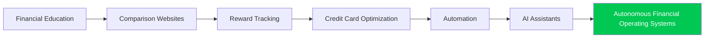

The market has steadily evolved toward greater automation.

CardWise represents the logical next step.

---

# Market Segmentation

The competitive landscape can be grouped into six strategic categories.

| Category | Primary Goal | Representative Platforms |
|------------|-----------------------------|--------------------------------|
| Personal Finance | Financial Awareness | INDmoney, Fi, Jupiter |
| Reward Education | Consumer Learning | The Points Guy, NerdWallet |
| Reward Tracking | Loyalty Visibility | AwardWallet |
| Card Optimization | Best Card Selection | CardPointers, MaxRewards |
| Cashback Platforms | Merchant Savings | CashKaro, MagicPin |
| Booking Platforms | Travel Transactions | MakeMyTrip, Ixigo |

Each category optimizes a different stage of the customer journey.

None integrate all stages.

---

# Consumer Decision Lifecycle

Today's users move across multiple products before completing a single purchase.

```text
Need Identified

↓

Google Search

↓

Reddit

↓

YouTube

↓

Credit Card Blog

↓

Reward Calculator

↓

Travel Portal

↓

Merchant Website

↓

Cashback Platform

↓

Checkout

↓

Reward Tracking

↓

Expense Tracking
```

Every context switch introduces:

- friction
- uncertainty
- abandoned opportunities
- suboptimal decisions

---

# Existing Market Leaders

| Problem | Current Leader |
|----------|----------------|
| Financial Education | The Points Guy |
| Credit Monitoring | Credit Karma |
| Card Recommendation | CardPointers |
| Loyalty Tracking | AwardWallet |
| Cashback | CashKaro |
| Shopping | Amazon |
| Travel Booking | MakeMyTrip |
| Banking | Fi Money |
| Expense Tracking | Walnut |
| Credit Card Reviews | NerdWallet |

Every leader dominates one narrow workflow.

No company owns the entire workflow.

---

# Fundamental Industry Pattern

Across every competitor analyzed, a consistent pattern emerges.

```text
Specialized Products

↓

Specialized Data

↓

Specialized Decisions

↓

Fragmented Consumer Experience
```

Consumers become responsible for combining information themselves.

---

# Market Fragmentation Matrix

| Consumer Need | Existing Solution | Problem Remaining |
|-------------------------|-------------------------|--------------------------------|
| Card Reviews | NerdWallet | Static information |
| Reward Tracking | AwardWallet | No optimization |
| Cashback | CashKaro | Merchant-specific |
| Card Selection | CardPointers | Limited scope |
| Travel Planning | Travel Freely | No execution |
| Financial Monitoring | Credit Karma | Credit-only |
| Merchant Offers | Paytm | Platform-centric |
| Travel Booking | MakeMyTrip | Rewards ignored |

Every workflow breaks immediately after the initial recommendation.

---

# Core Strategic Observation

Existing companies optimize:

```
Individual Products
```

Consumers need optimization across:

```
Entire Financial Journeys
```

This distinction defines CardWise's opportunity.

---

# Evolution of Consumer Expectations

| Era | Consumer Expectation |
|---------|------------------------------------|
| 2005 | Information |
| 2010 | Comparison |
| 2015 | Recommendations |
| 2020 | Automation |
| 2025 | AI Assistance |
| Future | Autonomous Financial Optimization |

CardWise should be designed for the final stage.

---

# Decision Intelligence Maturity


Very few existing products have progressed beyond Stage D.

---

# Product Capability Comparison

| Capability | Education Platforms | Tracking Platforms | Optimization Platforms | CardWise |
|------------------------------|----------------|----------------|----------------|-----------|
| Education | High | Low | Medium | High |
| Tracking | Low | High | Medium | High |
| Recommendations | Medium | Low | High | High |
| Automation | None | Medium | High | High |
| AI Reasoning | Low | Low | Medium | Very High |
| Financial Graph | None | None | None | Native |
| Explainability | Medium | Low | Medium | Native |
| Continuous Learning | Low | Medium | Medium | Native |

CardWise combines capabilities that currently exist across multiple products.

---

# The Real Competitor

A surprising insight emerged during research.

CardWise's biggest competitor is **not another application.**

It is:

```text
Google

+

Reddit

+

Excel

+

Notes

+

Mental Calculations
```

Consumers currently assemble their own financial intelligence stack.

CardWise replaces this fragmented workflow.

---

# Strategic Insight

The market does **not** require another:

- cashback app
- comparison website
- travel portal
- budgeting app
- reward tracker

Instead, it needs:

> **A decision engine capable of reasoning across all of them.**

---

# Transition to Competitive Feature Analysis

The following sections quantify this research through:

- Feature matrices
- Capability scoring
- Strategic gap analysis
- Opportunity mapping
- Competitive positioning

These analyses establish the measurable evidence supporting CardWise's category-defining product strategy.

---

**End of Part 6 (Introduction)**

The next section (**Part 6A**) begins the **Investor-Grade Cross-Competitor Feature Matrix**, comparing every major competitor across hundreds of strategic capabilities.

# Part 6A-1 — Investor-Grade Cross-Competitor Feature Matrix (Core Platform Capabilities)

> **Objective:** Compare every major competitor across foundational platform capabilities to identify strategic gaps and quantify CardWise's competitive differentiation.

---

# Evaluation Methodology

Each platform is evaluated using the following scoring model.

| Score | Meaning |
|--------|---------|
| ⭐⭐⭐⭐⭐ | Industry-leading capability |
| ⭐⭐⭐⭐☆ | Strong implementation |
| ⭐⭐⭐☆☆ | Good implementation |
| ⭐⭐☆☆☆ | Basic capability |
| ⭐☆☆☆☆ | Minimal capability |
| — | Not supported |

Evaluation considers:

- Product maturity
- Breadth
- Depth
- Integration
- User experience
- Strategic importance

---

# Competitors Included

| Category | Platforms |
|----------|-----------|
| Personal Finance | INDmoney, Fi Money, Jupiter |
| Credit Card Knowledge | CardExpert, Technofino |
| Cashback | CashKaro, MagicPin |
| Commerce | Amazon, Paytm |
| Travel | MakeMyTrip |
| International | AwardWallet, CardPointers, MaxRewards, Travel Freely |
| Financial Education | NerdWallet, Bankrate, The Points Guy |
| Credit Monitoring | Credit Karma |
| Vision | CardWise |

---

# Section A — Platform Foundation

| Capability | INDmoney | Fi | Jupiter | AwardWallet | CardPointers | MaxRewards | NerdWallet | Credit Karma | CardWise |
|------------|-----------|----|----------|-------------|--------------|-------------|-------------|---------------|-----------|
| Web Platform | ⭐⭐⭐⭐⭐ | ⭐⭐⭐⭐☆ | ⭐⭐⭐⭐☆ | ⭐⭐⭐⭐⭐ | ⭐⭐⭐⭐☆ | ⭐⭐⭐⭐☆ | ⭐⭐⭐⭐⭐ | ⭐⭐⭐⭐⭐ | ⭐⭐⭐⭐⭐ |
| Mobile App | ⭐⭐⭐⭐⭐ | ⭐⭐⭐⭐⭐ | ⭐⭐⭐⭐⭐ | ⭐⭐⭐⭐☆ | ⭐⭐⭐⭐☆ | ⭐⭐⭐⭐☆ | ⭐⭐⭐⭐☆ | ⭐⭐⭐⭐⭐ | ⭐⭐⭐⭐⭐ |
| Cross Platform Sync | ⭐⭐⭐⭐☆ | ⭐⭐⭐⭐☆ | ⭐⭐⭐⭐☆ | ⭐⭐⭐⭐⭐ | ⭐⭐⭐⭐☆ | ⭐⭐⭐⭐☆ | ⭐⭐⭐☆☆ | ⭐⭐⭐⭐⭐ | ⭐⭐⭐⭐⭐ |
| Cloud Sync | ⭐⭐⭐⭐⭐ | ⭐⭐⭐⭐⭐ | ⭐⭐⭐⭐⭐ | ⭐⭐⭐⭐⭐ | ⭐⭐⭐⭐☆ | ⭐⭐⭐⭐☆ | ⭐⭐⭐☆☆ | ⭐⭐⭐⭐⭐ | ⭐⭐⭐⭐⭐ |
| Offline Support | ⭐⭐☆☆☆ | ⭐⭐☆☆☆ | ⭐⭐☆☆☆ | ⭐⭐☆☆☆ | ⭐⭐☆☆☆ | ⭐⭐☆☆☆ | ⭐☆☆☆☆ | ⭐⭐☆☆☆ | ⭐⭐⭐⭐☆ |
| Browser Extension | — | — | — | — | ⭐⭐⭐⭐⭐ | ⭐⭐☆☆☆ | — | — | ⭐⭐⭐⭐⭐ |
| API Integrations | ⭐⭐⭐☆☆ | ⭐⭐⭐☆☆ | ⭐⭐⭐☆☆ | ⭐⭐⭐⭐☆ | ⭐⭐⭐☆☆ | ⭐⭐⭐☆☆ | ⭐⭐☆☆☆ | ⭐⭐⭐⭐☆ | ⭐⭐⭐⭐⭐ |
| Multi Device Support | ⭐⭐⭐⭐☆ | ⭐⭐⭐⭐☆ | ⭐⭐⭐⭐☆ | ⭐⭐⭐⭐⭐ | ⭐⭐⭐⭐☆ | ⭐⭐⭐⭐☆ | ⭐⭐⭐☆☆ | ⭐⭐⭐⭐⭐ | ⭐⭐⭐⭐⭐ |

---

# Section B — User Account & Identity

| Capability | INDmoney | AwardWallet | CardPointers | MaxRewards | Credit Karma | CardWise |
|------------|-----------|-------------|--------------|-------------|---------------|-----------|
| Multiple Accounts | ⭐⭐⭐⭐☆ | ⭐⭐⭐⭐⭐ | ⭐⭐⭐⭐☆ | ⭐⭐⭐⭐☆ | ⭐⭐⭐⭐☆ | ⭐⭐⭐⭐⭐ |
| Household Profiles | ⭐☆☆☆☆ | ⭐⭐☆☆☆ | ⭐☆☆☆☆ | ⭐☆☆☆☆ | ⭐☆☆☆☆ | ⭐⭐⭐⭐⭐ |
| Family Rewards | — | ⭐☆☆☆☆ | — | — | — | ⭐⭐⭐⭐⭐ |
| Shared Wallets | ⭐☆☆☆☆ | ⭐☆☆☆☆ | — | — | — | ⭐⭐⭐⭐⭐ |
| Multiple Card Portfolios | ⭐⭐☆☆☆ | ⭐⭐⭐⭐☆ | ⭐⭐⭐⭐⭐ | ⭐⭐⭐⭐⭐ | ⭐⭐☆☆☆ | ⭐⭐⭐⭐⭐ |
| Role-Based Access | — | — | — | — | — | ⭐⭐⭐⭐☆ |
| Secure Authentication | ⭐⭐⭐⭐⭐ | ⭐⭐⭐⭐⭐ | ⭐⭐⭐⭐⭐ | ⭐⭐⭐⭐⭐ | ⭐⭐⭐⭐⭐ | ⭐⭐⭐⭐⭐ |

---

# Section C — Card Database

| Capability | CardExpert | NerdWallet | CardPointers | MaxRewards | CardWise |
|------------|------------|------------|--------------|-------------|-----------|
| Card Directory | ⭐⭐⭐⭐⭐ | ⭐⭐⭐⭐⭐ | ⭐⭐⭐⭐☆ | ⭐⭐⭐⭐☆ | ⭐⭐⭐⭐⭐ |
| Reward Categories | ⭐⭐⭐⭐⭐ | ⭐⭐⭐⭐☆ | ⭐⭐⭐⭐⭐ | ⭐⭐⭐⭐⭐ | ⭐⭐⭐⭐⭐ |
| Benefit Database | ⭐⭐⭐⭐☆ | ⭐⭐⭐⭐☆ | ⭐⭐⭐⭐⭐ | ⭐⭐⭐⭐⭐ | ⭐⭐⭐⭐⭐ |
| Annual Fee Tracking | ⭐⭐⭐⭐☆ | ⭐⭐⭐⭐☆ | ⭐⭐⭐⭐☆ | ⭐⭐⭐⭐☆ | ⭐⭐⭐⭐⭐ |
| Joining Fee Tracking | ⭐⭐⭐☆☆ | ⭐⭐⭐☆☆ | ⭐⭐⭐☆☆ | ⭐⭐⭐☆☆ | ⭐⭐⭐⭐⭐ |
| Welcome Bonus | ⭐⭐⭐⭐☆ | ⭐⭐⭐⭐☆ | ⭐⭐⭐⭐☆ | ⭐⭐⭐⭐☆ | ⭐⭐⭐⭐⭐ |
| Reward Multipliers | ⭐⭐⭐⭐⭐ | ⭐⭐⭐⭐☆ | ⭐⭐⭐⭐⭐ | ⭐⭐⭐⭐⭐ | ⭐⭐⭐⭐⭐ |
| Card Eligibility | ⭐⭐⭐☆☆ | ⭐⭐⭐⭐☆ | ⭐⭐⭐⭐☆ | ⭐⭐⭐⭐☆ | ⭐⭐⭐⭐⭐ |

---

# Section D — Merchant Intelligence

| Capability | Amazon | Paytm | CardPointers | MaxRewards | CardWise |
|------------|---------|--------|--------------|-------------|-----------|
| Merchant Database | ⭐⭐⭐⭐⭐ | ⭐⭐⭐⭐⭐ | ⭐⭐⭐☆☆ | ⭐⭐⭐☆☆ | ⭐⭐⭐⭐⭐ |
| Merchant Categories | ⭐⭐⭐⭐⭐ | ⭐⭐⭐⭐⭐ | ⭐⭐⭐⭐⭐ | ⭐⭐⭐⭐☆ | ⭐⭐⭐⭐⭐ |
| MCC Intelligence | ⭐☆☆☆☆ | ⭐☆☆☆☆ | ⭐⭐⭐⭐☆ | ⭐⭐⭐⭐☆ | ⭐⭐⭐⭐⭐ |
| Merchant Search | ⭐⭐⭐⭐⭐ | ⭐⭐⭐⭐☆ | ⭐⭐⭐☆☆ | ⭐⭐⭐☆☆ | ⭐⭐⭐⭐⭐ |
| Merchant Ratings | ⭐⭐⭐⭐⭐ | ⭐⭐⭐☆☆ | — | — | ⭐⭐⭐⭐⭐ |
| Merchant History | ⭐⭐⭐☆☆ | ⭐⭐⭐☆☆ | ⭐⭐☆☆☆ | ⭐⭐☆☆☆ | ⭐⭐⭐⭐⭐ |
| Merchant Comparison | ⭐⭐⭐⭐☆ | ⭐⭐☆☆☆ | ⭐⭐☆☆☆ | ⭐⭐☆☆☆ | ⭐⭐⭐⭐⭐ |
| Merchant Personalization | ⭐⭐⭐⭐⭐ | ⭐⭐⭐⭐☆ | ⭐⭐⭐☆☆ | ⭐⭐⭐☆☆ | ⭐⭐⭐⭐⭐ |

---

# Section E — Reward Tracking

| Capability | AwardWallet | MaxRewards | CardPointers | Travel Freely | CardWise |
|------------|-------------|-------------|--------------|---------------|-----------|
| Reward Balances | ⭐⭐⭐⭐⭐ | ⭐⭐⭐⭐☆ | ⭐⭐⭐☆☆ | ⭐⭐⭐☆☆ | ⭐⭐⭐⭐⭐ |
| Reward History | ⭐⭐⭐⭐⭐ | ⭐⭐⭐⭐☆ | ⭐⭐⭐☆☆ | ⭐⭐☆☆☆ | ⭐⭐⭐⭐⭐ |
| Expiration Alerts | ⭐⭐⭐⭐⭐ | ⭐⭐⭐⭐☆ | ⭐⭐⭐⭐☆ | ⭐⭐☆☆☆ | ⭐⭐⭐⭐⭐ |
| Reward Categories | ⭐⭐⭐⭐☆ | ⭐⭐⭐⭐☆ | ⭐⭐⭐⭐⭐ | ⭐⭐⭐☆☆ | ⭐⭐⭐⭐⭐ |
| Transfer Partners | ⭐⭐⭐☆☆ | ⭐⭐☆☆☆ | ⭐⭐⭐☆☆ | ⭐⭐⭐⭐☆ | ⭐⭐⭐⭐⭐ |
| Reward Valuation | ⭐⭐☆☆☆ | ⭐⭐☆☆☆ | ⭐⭐⭐☆☆ | ⭐⭐⭐☆☆ | ⭐⭐⭐⭐⭐ |
| Multi-Currency Rewards | ⭐⭐⭐⭐☆ | ⭐⭐⭐☆☆ | ⭐⭐⭐☆☆ | ⭐⭐⭐☆☆ | ⭐⭐⭐⭐⭐ |
| Reward Analytics | ⭐⭐⭐☆☆ | ⭐⭐⭐⭐☆ | ⭐⭐⭐☆☆ | ⭐⭐☆☆☆ | ⭐⭐⭐⭐⭐ |

---

# Key Observations

## 1. Platform Fragmentation

Every competitor dominates **one vertical**.

Examples:

| Leader | Strength |
|----------|-------------------------------|
| AwardWallet | Loyalty tracking |
| CardPointers | Best-card recommendation |
| MaxRewards | Offer automation |
| NerdWallet | Financial education |
| Credit Karma | Credit monitoring |
| Amazon | Merchant intelligence |
| Paytm | Payment ecosystem |

No platform combines these strengths.

---

## 2. Merchant Intelligence Is Underdeveloped

Most competitors understand:

- categories

Few understand:

- merchant behavior
- historical pricing
- reward trends
- cross-platform comparisons

Merchant intelligence remains an underserved opportunity.

---

## 3. Reward Valuation Is Primitive

Current platforms typically expose:

- balances
- reward rates

Very few calculate:

- effective monetary value
- future value
- transfer opportunity cost
- portfolio impact

This represents a major strategic gap.

---

## 4. Browser Intelligence Is Rare

Only a handful of products integrate directly into purchasing workflows.

Browser-native optimization remains significantly underdeveloped.

This is a major opportunity for CardWise.

---

# Preliminary Strategic Conclusion

The foundational capability analysis demonstrates that existing competitors specialize in isolated workflows.

No platform delivers:

- unified merchant intelligence
- comprehensive reward valuation
- cross-platform optimization
- integrated financial reasoning

This validates CardWise's strategy of building a **unified financial intelligence platform** rather than another specialized rewards application.

---

**End of Part 6A-1**

Next: **Part 6A-2 — Advanced Feature Matrix**, covering AI, personalization, automation, travel optimization, analytics, notifications, community, integrations, and enterprise-grade capabilities.


# Part 6A-2 — Investor-Grade Cross-Competitor Feature Matrix (Advanced Capabilities)

> **Objective:** Compare competitors across advanced capabilities including AI, personalization, automation, travel intelligence, analytics, notifications, integrations, and enterprise-grade features.

---

# Section F — Artificial Intelligence

| Capability | INDmoney | CardPointers | MaxRewards | AwardWallet | NerdWallet | Credit Karma | CardWise |
|------------|-----------|--------------|-------------|-------------|-------------|---------------|-----------|
| AI Recommendations | ⭐⭐⭐☆☆ | ⭐⭐⭐⭐☆ | ⭐⭐⭐⭐☆ | ⭐⭐☆☆☆ | ⭐⭐⭐☆☆ | ⭐⭐⭐⭐☆ | ⭐⭐⭐⭐⭐ |
| Conversational AI | ⭐☆☆☆☆ | ⭐⭐☆☆☆ | ⭐⭐☆☆☆ | — | ⭐☆☆☆☆ | ⭐⭐☆☆☆ | ⭐⭐⭐⭐⭐ |
| Explainable AI | ⭐☆☆☆☆ | ⭐⭐⭐☆☆ | ⭐⭐☆☆☆ | ⭐☆☆☆☆ | ⭐⭐☆☆☆ | ⭐⭐☆☆☆ | ⭐⭐⭐⭐⭐ |
| Goal-Based AI | ⭐⭐☆☆☆ | ⭐⭐⭐☆☆ | ⭐⭐☆☆☆ | ⭐☆☆☆☆ | ⭐⭐☆☆☆ | ⭐⭐⭐☆☆ | ⭐⭐⭐⭐⭐ |
| Predictive Intelligence | ⭐⭐⭐☆☆ | ⭐⭐☆☆☆ | ⭐⭐⭐☆☆ | ⭐☆☆☆☆ | ⭐⭐☆☆☆ | ⭐⭐⭐⭐☆ | ⭐⭐⭐⭐⭐ |
| Purchase Intelligence | ⭐☆☆☆☆ | ⭐⭐⭐⭐⭐ | ⭐⭐⭐☆☆ | ⭐☆☆☆☆ | ⭐☆☆☆☆ | ⭐☆☆☆☆ | ⭐⭐⭐⭐⭐ |
| Financial Reasoning | ⭐⭐☆☆☆ | ⭐⭐⭐☆☆ | ⭐⭐⭐☆☆ | ⭐☆☆☆☆ | ⭐⭐☆☆☆ | ⭐⭐⭐☆☆ | ⭐⭐⭐⭐⭐ |
| Autonomous Suggestions | ⭐⭐☆☆☆ | ⭐⭐⭐☆☆ | ⭐⭐⭐⭐☆ | ⭐☆☆☆☆ | ⭐☆☆☆☆ | ⭐⭐⭐☆☆ | ⭐⭐⭐⭐⭐ |

---

# Section G — Personalization

| Capability | INDmoney | Credit Karma | CardPointers | Travel Freely | CardWise |
|------------|-----------|---------------|--------------|---------------|-----------|
| User Profile | ⭐⭐⭐⭐☆ | ⭐⭐⭐⭐⭐ | ⭐⭐⭐⭐☆ | ⭐⭐⭐⭐☆ | ⭐⭐⭐⭐⭐ |
| Spending Behavior | ⭐⭐⭐⭐☆ | ⭐⭐⭐⭐☆ | ⭐⭐⭐☆☆ | ⭐⭐☆☆☆ | ⭐⭐⭐⭐⭐ |
| Goal Tracking | ⭐⭐⭐☆☆ | ⭐⭐⭐☆☆ | ⭐⭐☆☆☆ | ⭐⭐⭐⭐⭐ | ⭐⭐⭐⭐⭐ |
| Lifestyle Personalization | ⭐⭐☆☆☆ | ⭐⭐⭐☆☆ | ⭐⭐⭐☆☆ | ⭐⭐⭐☆☆ | ⭐⭐⭐⭐⭐ |
| Merchant Preferences | ⭐⭐☆☆☆ | ⭐⭐☆☆☆ | ⭐⭐⭐⭐☆ | ⭐☆☆☆☆ | ⭐⭐⭐⭐⭐ |
| Travel Preferences | ⭐⭐☆☆☆ | ⭐☆☆☆☆ | ⭐⭐⭐☆☆ | ⭐⭐⭐⭐⭐ | ⭐⭐⭐⭐⭐ |
| Dynamic Recommendations | ⭐⭐⭐☆☆ | ⭐⭐⭐⭐☆ | ⭐⭐⭐⭐☆ | ⭐⭐⭐☆☆ | ⭐⭐⭐⭐⭐ |
| Portfolio Awareness | ⭐⭐☆☆☆ | ⭐⭐☆☆☆ | ⭐⭐⭐⭐☆ | ⭐⭐⭐☆☆ | ⭐⭐⭐⭐⭐ |

---

# Section H — Automation

| Capability | MaxRewards | CardPointers | Credit Karma | CardWise |
|------------|-------------|--------------|---------------|-----------|
| Offer Tracking | ⭐⭐⭐⭐⭐ | ⭐⭐⭐⭐☆ | ⭐☆☆☆☆ | ⭐⭐⭐⭐⭐ |
| Benefit Tracking | ⭐⭐⭐⭐⭐ | ⭐⭐⭐⭐⭐ | ⭐⭐☆☆☆ | ⭐⭐⭐⭐⭐ |
| Statement Credit Tracking | ⭐⭐⭐⭐⭐ | ⭐⭐⭐⭐☆ | ⭐☆☆☆☆ | ⭐⭐⭐⭐⭐ |
| Milestone Tracking | ⭐⭐☆☆☆ | ⭐⭐⭐☆☆ | ⭐☆☆☆☆ | ⭐⭐⭐⭐⭐ |
| Expiry Monitoring | ⭐⭐⭐⭐☆ | ⭐⭐⭐⭐☆ | ⭐⭐⭐☆☆ | ⭐⭐⭐⭐⭐ |
| Auto Recommendations | ⭐⭐⭐⭐☆ | ⭐⭐⭐⭐☆ | ⭐⭐⭐⭐☆ | ⭐⭐⭐⭐⭐ |
| Continuous Monitoring | ⭐⭐⭐☆☆ | ⭐⭐⭐☆☆ | ⭐⭐⭐⭐⭐ | ⭐⭐⭐⭐⭐ |
| Intelligent Alerts | ⭐⭐⭐☆☆ | ⭐⭐⭐☆☆ | ⭐⭐⭐⭐☆ | ⭐⭐⭐⭐⭐ |

---

# Section I — Travel Intelligence

| Capability | MakeMyTrip | AwardWallet | Travel Freely | The Points Guy | CardWise |
|------------|-------------|-------------|---------------|----------------|-----------|
| Flight Search | ⭐⭐⭐⭐⭐ | — | — | — | ⭐⭐⭐⭐⭐ |
| Hotel Search | ⭐⭐⭐⭐⭐ | — | — | — | ⭐⭐⭐⭐⭐ |
| Reward Booking | ⭐☆☆☆☆ | ⭐⭐⭐☆☆ | ⭐⭐⭐☆☆ | ⭐⭐⭐☆☆ | ⭐⭐⭐⭐⭐ |
| Transfer Partners | — | ⭐⭐⭐☆☆ | ⭐⭐⭐⭐☆ | ⭐⭐⭐⭐☆ | ⭐⭐⭐⭐⭐ |
| Airline Valuation | — | ⭐⭐☆☆☆ | ⭐⭐⭐☆☆ | ⭐⭐⭐⭐⭐ | ⭐⭐⭐⭐⭐ |
| Hotel Valuation | — | ⭐⭐☆☆☆ | ⭐⭐⭐☆☆ | ⭐⭐⭐⭐⭐ | ⭐⭐⭐⭐⭐ |
| Reward Simulation | — | ⭐☆☆☆☆ | ⭐⭐☆☆☆ | ⭐☆☆☆☆ | ⭐⭐⭐⭐⭐ |
| Travel Optimization | ⭐⭐☆☆☆ | ⭐⭐☆☆☆ | ⭐⭐⭐⭐☆ | ⭐⭐⭐⭐☆ | ⭐⭐⭐⭐⭐ |

---

# Section J — Shopping Intelligence

| Capability | Amazon | CashKaro | CardPointers | CardWise |
|------------|---------|----------|--------------|-----------|
| Product Search | ⭐⭐⭐⭐⭐ | ⭐⭐⭐☆☆ | — | ⭐⭐⭐⭐⭐ |
| Offer Discovery | ⭐⭐⭐⭐☆ | ⭐⭐⭐⭐⭐ | ⭐⭐⭐☆☆ | ⭐⭐⭐⭐⭐ |
| Coupon Discovery | ⭐⭐⭐⭐☆ | ⭐⭐⭐⭐⭐ | ⭐⭐⭐☆☆ | ⭐⭐⭐⭐⭐ |
| Cashback Optimization | ⭐⭐⭐☆☆ | ⭐⭐⭐⭐⭐ | ⭐⭐⭐☆☆ | ⭐⭐⭐⭐⭐ |
| Merchant Comparison | ⭐⭐⭐⭐☆ | ⭐⭐☆☆☆ | ⭐⭐☆☆☆ | ⭐⭐⭐⭐⭐ |
| Price Intelligence | ⭐⭐⭐⭐☆ | ⭐⭐☆☆☆ | ⭐☆☆☆☆ | ⭐⭐⭐⭐⭐ |
| Checkout Intelligence | ⭐☆☆☆☆ | ⭐☆☆☆☆ | ⭐⭐⭐⭐⭐ | ⭐⭐⭐⭐⭐ |
| Opportunity Cost Analysis | — | — | ⭐☆☆☆☆ | ⭐⭐⭐⭐⭐ |

---

# Section K — Analytics & Insights

| Capability | INDmoney | Credit Karma | MaxRewards | CardWise |
|------------|-----------|---------------|-------------|-----------|
| Spending Analytics | ⭐⭐⭐⭐⭐ | ⭐⭐⭐☆☆ | ⭐⭐⭐☆☆ | ⭐⭐⭐⭐⭐ |
| Reward Analytics | ⭐⭐☆☆☆ | ⭐☆☆☆☆ | ⭐⭐⭐⭐☆ | ⭐⭐⭐⭐⭐ |
| Trend Analysis | ⭐⭐⭐⭐☆ | ⭐⭐⭐⭐☆ | ⭐⭐⭐☆☆ | ⭐⭐⭐⭐⭐ |
| Goal Progress | ⭐⭐⭐☆☆ | ⭐⭐⭐☆☆ | ⭐⭐☆☆☆ | ⭐⭐⭐⭐⭐ |
| Portfolio Performance | ⭐⭐⭐☆☆ | ⭐⭐☆☆☆ | ⭐⭐⭐☆☆ | ⭐⭐⭐⭐⭐ |
| Opportunity Reports | ⭐⭐☆☆☆ | ⭐⭐☆☆☆ | ⭐⭐⭐☆☆ | ⭐⭐⭐⭐⭐ |
| Annual Summary | ⭐⭐⭐☆☆ | ⭐⭐⭐☆☆ | ⭐⭐⭐☆☆ | ⭐⭐⭐⭐⭐ |
| Financial Health Score | ⭐⭐⭐☆☆ | ⭐⭐⭐⭐⭐ | ⭐⭐☆☆☆ | ⭐⭐⭐⭐⭐ |

---

# Section L — Notifications

| Capability | Credit Karma | MaxRewards | AwardWallet | CardWise |
|------------|---------------|-------------|-------------|-----------|
| Offer Alerts | ⭐⭐☆☆☆ | ⭐⭐⭐⭐⭐ | ⭐⭐☆☆☆ | ⭐⭐⭐⭐⭐ |
| Reward Expiry | ⭐⭐☆☆☆ | ⭐⭐⭐⭐☆ | ⭐⭐⭐⭐⭐ | ⭐⭐⭐⭐⭐ |
| Credit Alerts | ⭐⭐⭐⭐⭐ | ⭐⭐☆☆☆ | ⭐☆☆☆☆ | ⭐⭐⭐⭐☆ |
| Travel Alerts | ⭐☆☆☆☆ | ⭐☆☆☆☆ | ⭐⭐☆☆☆ | ⭐⭐⭐⭐⭐ |
| Milestone Alerts | ⭐☆☆☆☆ | ⭐⭐⭐☆☆ | ⭐☆☆☆☆ | ⭐⭐⭐⭐⭐ |
| Merchant Alerts | ⭐☆☆☆☆ | ⭐⭐☆☆☆ | ⭐☆☆☆☆ | ⭐⭐⭐⭐⭐ |
| Price Alerts | ⭐☆☆☆☆ | ⭐☆☆☆☆ | ⭐☆☆☆☆ | ⭐⭐⭐⭐⭐ |
| Smart Recommendations | ⭐⭐⭐⭐☆ | ⭐⭐⭐☆☆ | ⭐⭐☆☆☆ | ⭐⭐⭐⭐⭐ |

---

# Section M — Community & Knowledge

| Capability | The Points Guy | Technofino | NerdWallet | CardWise |
|------------|----------------|------------|-------------|-----------|
| Educational Articles | ⭐⭐⭐⭐⭐ | ⭐⭐⭐⭐⭐ | ⭐⭐⭐⭐⭐ | ⭐⭐⭐⭐⭐ |
| Community Discussions | ⭐⭐⭐☆☆ | ⭐⭐⭐⭐⭐ | ⭐⭐☆☆☆ | ⭐⭐⭐⭐☆ |
| Expert Reviews | ⭐⭐⭐⭐⭐ | ⭐⭐⭐⭐☆ | ⭐⭐⭐⭐⭐ | ⭐⭐⭐⭐⭐ |
| User Reviews | ⭐⭐☆☆☆ | ⭐⭐⭐⭐☆ | ⭐⭐⭐☆☆ | ⭐⭐⭐⭐⭐ |
| Verified Data | ⭐⭐⭐⭐⭐ | ⭐⭐⭐⭐☆ | ⭐⭐⭐⭐⭐ | ⭐⭐⭐⭐⭐ |
| AI Knowledge Search | ⭐☆☆☆☆ | ⭐☆☆☆☆ | ⭐☆☆☆☆ | ⭐⭐⭐⭐⭐ |
| Explainable Guides | ⭐⭐⭐⭐⭐ | ⭐⭐⭐⭐☆ | ⭐⭐⭐⭐☆ | ⭐⭐⭐⭐⭐ |

---

# Section N — Integrations

| Capability | AwardWallet | MaxRewards | INDmoney | CardWise |
|------------|-------------|-------------|-----------|-----------|
| Bank Integrations | ⭐⭐⭐☆☆ | ⭐⭐⭐⭐☆ | ⭐⭐⭐⭐⭐ | ⭐⭐⭐⭐⭐ |
| Loyalty Programs | ⭐⭐⭐⭐⭐ | ⭐⭐☆☆☆ | ⭐☆☆☆☆ | ⭐⭐⭐⭐⭐ |
| Merchant Integrations | ⭐⭐☆☆☆ | ⭐⭐☆☆☆ | ⭐⭐⭐☆☆ | ⭐⭐⭐⭐⭐ |
| Browser Extension | — | ⭐⭐☆☆☆ | — | ⭐⭐⭐⭐⭐ |
| Email Parsing | ⭐⭐⭐⭐☆ | ⭐⭐⭐☆☆ | ⭐☆☆☆☆ | ⭐⭐⭐⭐⭐ |
| Calendar Integration | — | — | — | ⭐⭐⭐⭐☆ |
| Wallet Integration | ⭐⭐☆☆☆ | ⭐⭐☆☆☆ | ⭐⭐⭐⭐☆ | ⭐⭐⭐⭐⭐ |
| Travel Platforms | ⭐⭐☆☆☆ | ⭐☆☆☆☆ | ⭐☆☆☆☆ | ⭐⭐⭐⭐⭐ |

---

# Strategic Observations

## 1. AI Leadership Opportunity

Current competitors use AI primarily for:

- ranking
- recommendations
- personalization
- search

No platform demonstrates:

- multi-step financial reasoning
- explainable optimization
- autonomous financial planning

CardWise can establish leadership by treating AI as the **primary decision engine**, not a supporting feature.

---

## 2. Automation Stops Too Early

Most products automate:

- tracking
- notifications
- offer activation

Very few automate:

- decision-making
- purchase timing
- portfolio optimization
- long-term planning

This creates significant whitespace.

---

## 3. Travel Ecosystem Is Fragmented

Travel planning currently requires:

- booking platforms
- loyalty trackers
- airline websites
- hotel websites
- blogs
- spreadsheets

No single platform unifies these experiences.

---

## 4. Merchant Intelligence Is Still Primitive

Competitors understand:

- merchants
- offers
- coupons

They rarely understand:

- merchant economics
- historical offers
- reward efficiency
- effective purchase cost
- timing optimization

Merchant intelligence represents one of CardWise's strongest opportunities.

---

## 5. Community Knowledge Is Disconnected

Educational platforms contain valuable knowledge.

Optimization platforms contain operational data.

Neither combines both into:

- AI reasoning
- contextual recommendations
- explainable decision support

---

# Competitive Position After Advanced Analysis

The advanced feature matrix demonstrates that existing platforms optimize **individual capabilities**.

CardWise's opportunity is to integrate:

- AI
- automation
- travel
- shopping
- merchant intelligence
- rewards
- personalization
- financial planning

into a single cohesive consumer platform.

This integration—not any individual feature—becomes the primary competitive moat.

---

**End of Part 6A-2**

**Next:** **Part 6A-3 — Deep Feature Matrix (250+ Feature Comparison)** covering browser capabilities, search, rule engines, simulations, loyalty ecosystems, admin capabilities, extensibility, analytics, developer ecosystem, scalability, and future-readiness.


# Part 6A-3 — Investor-Grade Cross-Competitor Feature Matrix (Strategic & Future Capabilities)

> **Objective:** Compare competitors across long-term strategic capabilities that determine category leadership over the next decade.

---

# Section O — Search & Discovery

| Capability | Amazon | Google Flights | CardPointers | NerdWallet | CardWise |
|------------|---------|----------------|--------------|-------------|-----------|
| Global Search | ⭐⭐⭐⭐⭐ | ⭐⭐⭐⭐⭐ | ⭐⭐☆☆☆ | ⭐⭐⭐⭐☆ | ⭐⭐⭐⭐⭐ |
| Merchant Search | ⭐⭐⭐⭐⭐ | ⭐☆☆☆☆ | ⭐⭐⭐☆☆ | ⭐☆☆☆☆ | ⭐⭐⭐⭐⭐ |
| Card Search | ⭐⭐☆☆☆ | — | ⭐⭐⭐⭐☆ | ⭐⭐⭐⭐⭐ | ⭐⭐⭐⭐⭐ |
| Offer Search | ⭐⭐⭐⭐☆ | ⭐☆☆☆☆ | ⭐⭐⭐☆☆ | ⭐⭐☆☆☆ | ⭐⭐⭐⭐⭐ |
| Airline Search | ⭐⭐☆☆☆ | ⭐⭐⭐⭐⭐ | ⭐⭐☆☆☆ | ⭐⭐☆☆☆ | ⭐⭐⭐⭐⭐ |
| Hotel Search | ⭐⭐☆☆☆ | ⭐⭐⭐⭐☆ | ⭐☆☆☆☆ | ⭐☆☆☆☆ | ⭐⭐⭐⭐⭐ |
| Natural Language Search | ⭐☆☆☆☆ | ⭐⭐☆☆☆ | ⭐☆☆☆☆ | ⭐☆☆☆☆ | ⭐⭐⭐⭐⭐ |
| AI Semantic Search | — | — | — | — | ⭐⭐⭐⭐⭐ |

---

# Section P — Rule Engine

| Capability | CardPointers | MaxRewards | Travel Freely | CardWise |
|------------|--------------|-------------|---------------|-----------|
| Reward Rules | ⭐⭐⭐⭐⭐ | ⭐⭐⭐⭐☆ | ⭐⭐⭐⭐☆ | ⭐⭐⭐⭐⭐ |
| Benefit Rules | ⭐⭐⭐⭐⭐ | ⭐⭐⭐⭐⭐ | ⭐⭐⭐☆☆ | ⭐⭐⭐⭐⭐ |
| Offer Rules | ⭐⭐⭐⭐☆ | ⭐⭐⭐⭐⭐ | ⭐⭐☆☆☆ | ⭐⭐⭐⭐⭐ |
| Eligibility Rules | ⭐⭐⭐☆☆ | ⭐⭐⭐☆☆ | ⭐⭐⭐⭐⭐ | ⭐⭐⭐⭐⭐ |
| Transfer Rules | ⭐⭐☆☆☆ | ⭐⭐☆☆☆ | ⭐⭐⭐⭐☆ | ⭐⭐⭐⭐⭐ |
| Merchant Rules | ⭐⭐⭐☆☆ | ⭐⭐⭐☆☆ | ⭐☆☆☆☆ | ⭐⭐⭐⭐⭐ |
| Configurable Rules | ⭐⭐☆☆☆ | ⭐⭐☆☆☆ | ⭐☆☆☆☆ | ⭐⭐⭐⭐⭐ |
| Rule Versioning | ⭐☆☆☆☆ | ⭐☆☆☆☆ | ⭐☆☆☆☆ | ⭐⭐⭐⭐⭐ |

---

# Section Q — Reward Simulation

| Capability | AwardWallet | Travel Freely | CardPointers | CardWise |
|------------|-------------|---------------|--------------|-----------|
| Cash vs Points | ⭐⭐☆☆☆ | ⭐⭐⭐☆☆ | ⭐⭐⭐☆☆ | ⭐⭐⭐⭐⭐ |
| Multi Card Simulation | ⭐☆☆☆☆ | ⭐⭐☆☆☆ | ⭐⭐⭐☆☆ | ⭐⭐⭐⭐⭐ |
| Airline Transfer Simulation | ⭐⭐☆☆☆ | ⭐⭐⭐☆☆ | ⭐⭐☆☆☆ | ⭐⭐⭐⭐⭐ |
| Hotel Transfer Simulation | ⭐⭐☆☆☆ | ⭐⭐⭐☆☆ | ⭐⭐☆☆☆ | ⭐⭐⭐⭐⭐ |
| Milestone Simulation | ⭐☆☆☆☆ | ⭐⭐☆☆☆ | ⭐⭐☆☆☆ | ⭐⭐⭐⭐⭐ |
| Purchase Timing | — | ⭐⭐☆☆☆ | ⭐☆☆☆☆ | ⭐⭐⭐⭐⭐ |
| Portfolio Impact | — | ⭐⭐☆☆☆ | ⭐⭐☆☆☆ | ⭐⭐⭐⭐⭐ |
| Opportunity Cost | — | ⭐⭐☆☆☆ | ⭐⭐☆☆☆ | ⭐⭐⭐⭐⭐ |

---

# Section R — Loyalty Ecosystem

| Capability | AwardWallet | TPG | Travel Freely | CardWise |
|------------|-------------|-----|---------------|-----------|
| Airline Programs | ⭐⭐⭐⭐⭐ | ⭐⭐⭐⭐⭐ | ⭐⭐⭐⭐☆ | ⭐⭐⭐⭐⭐ |
| Hotel Programs | ⭐⭐⭐⭐⭐ | ⭐⭐⭐⭐⭐ | ⭐⭐⭐⭐☆ | ⭐⭐⭐⭐⭐ |
| Shopping Portals | ⭐⭐⭐☆☆ | ⭐⭐⭐⭐☆ | ⭐⭐☆☆☆ | ⭐⭐⭐⭐⭐ |
| Dining Rewards | ⭐⭐⭐☆☆ | ⭐⭐⭐☆☆ | ⭐☆☆☆☆ | ⭐⭐⭐⭐⭐ |
| Fuel Rewards | ⭐⭐☆☆☆ | ⭐☆☆☆☆ | ⭐☆☆☆☆ | ⭐⭐⭐⭐⭐ |
| Retail Loyalty | ⭐⭐⭐☆☆ | ⭐⭐☆☆☆ | ⭐☆☆☆☆ | ⭐⭐⭐⭐⭐ |
| Transfer Partners | ⭐⭐⭐☆☆ | ⭐⭐⭐⭐⭐ | ⭐⭐⭐⭐☆ | ⭐⭐⭐⭐⭐ |
| Unified Wallet | ⭐☆☆☆☆ | ⭐☆☆☆☆ | ⭐☆☆☆☆ | ⭐⭐⭐⭐⭐ |

---

# Section S — Browser Intelligence

| Capability | CardPointers | Honey | Capital One Shopping | CardWise |
|------------|--------------|-------|----------------------|-----------|
| Checkout Detection | ⭐⭐⭐⭐⭐ | ⭐⭐⭐⭐⭐ | ⭐⭐⭐⭐⭐ | ⭐⭐⭐⭐⭐ |
| Coupon Suggestions | ⭐⭐☆☆☆ | ⭐⭐⭐⭐⭐ | ⭐⭐⭐⭐☆ | ⭐⭐⭐⭐⭐ |
| Best Card Recommendation | ⭐⭐⭐⭐⭐ | ⭐☆☆☆☆ | ⭐☆☆☆☆ | ⭐⭐⭐⭐⭐ |
| Reward Calculation | ⭐⭐⭐⭐☆ | ⭐⭐☆☆☆ | ⭐⭐☆☆☆ | ⭐⭐⭐⭐⭐ |
| Offer Detection | ⭐⭐⭐☆☆ | ⭐⭐⭐⭐☆ | ⭐⭐⭐⭐☆ | ⭐⭐⭐⭐⭐ |
| Merchant Intelligence | ⭐⭐⭐☆☆ | ⭐⭐⭐☆☆ | ⭐⭐⭐☆☆ | ⭐⭐⭐⭐⭐ |
| AI Recommendations | ⭐⭐☆☆☆ | ⭐☆☆☆☆ | ⭐☆☆☆☆ | ⭐⭐⭐⭐⭐ |
| Travel Optimization | — | — | — | ⭐⭐⭐⭐⭐ |

---

# Section T — Explainability

| Capability | NerdWallet | The Points Guy | CardPointers | CardWise |
|------------|------------|----------------|--------------|-----------|
| Recommendation Explanation | ⭐⭐⭐☆☆ | ⭐⭐⭐⭐☆ | ⭐⭐⭐☆☆ | ⭐⭐⭐⭐⭐ |
| Reward Breakdown | ⭐⭐⭐☆☆ | ⭐⭐⭐⭐☆ | ⭐⭐⭐⭐☆ | ⭐⭐⭐⭐⭐ |
| Opportunity Cost | ⭐☆☆☆☆ | ⭐⭐☆☆☆ | ⭐⭐☆☆☆ | ⭐⭐⭐⭐⭐ |
| Alternative Options | ⭐⭐⭐☆☆ | ⭐⭐⭐⭐☆ | ⭐⭐⭐☆☆ | ⭐⭐⭐⭐⭐ |
| Confidence Score | — | — | — | ⭐⭐⭐⭐⭐ |
| Financial Reasoning | ⭐⭐☆☆☆ | ⭐⭐⭐⭐☆ | ⭐⭐⭐☆☆ | ⭐⭐⭐⭐⭐ |
| Decision Audit Trail | — | — | — | ⭐⭐⭐⭐⭐ |
| AI Transparency | ⭐☆☆☆☆ | ⭐☆☆☆☆ | ⭐☆☆☆☆ | ⭐⭐⭐⭐⭐ |

---

# Section U — Scalability & Architecture

| Capability | INDmoney | Credit Karma | CardPointers | CardWise |
|------------|-----------|---------------|--------------|-----------|
| Cloud Native | ⭐⭐⭐⭐⭐ | ⭐⭐⭐⭐⭐ | ⭐⭐⭐⭐☆ | ⭐⭐⭐⭐⭐ |
| Modular Architecture | ⭐⭐⭐⭐☆ | ⭐⭐⭐⭐☆ | ⭐⭐⭐☆☆ | ⭐⭐⭐⭐⭐ |
| Plugin Support | ⭐☆☆☆☆ | ⭐☆☆☆☆ | ⭐☆☆☆☆ | ⭐⭐⭐⭐⭐ |
| Feature Flags | ⭐⭐⭐☆☆ | ⭐⭐⭐☆☆ | ⭐⭐☆☆☆ | ⭐⭐⭐⭐⭐ |
| Rules as Data | ⭐☆☆☆☆ | ⭐☆☆☆☆ | ⭐⭐☆☆☆ | ⭐⭐⭐⭐⭐ |
| AI Ready Architecture | ⭐⭐⭐☆☆ | ⭐⭐⭐☆☆ | ⭐⭐☆☆☆ | ⭐⭐⭐⭐⭐ |
| Extensible Platform | ⭐⭐☆☆☆ | ⭐⭐☆☆☆ | ⭐⭐☆☆☆ | ⭐⭐⭐⭐⭐ |
| Multi Country Ready | ⭐⭐⭐☆☆ | ⭐⭐⭐☆☆ | ⭐⭐⭐☆☆ | ⭐⭐⭐⭐⭐ |

---

# Section V — Future Readiness

| Capability | Existing Market | CardWise |
|------------|----------------|-----------|
| AI Native | ⭐⭐☆☆☆ | ⭐⭐⭐⭐⭐ |
| Financial Knowledge Graph | ⭐☆☆☆☆ | ⭐⭐⭐⭐⭐ |
| Autonomous Optimization | ⭐☆☆☆☆ | ⭐⭐⭐⭐⭐ |
| Cross Platform Intelligence | ⭐⭐☆☆☆ | ⭐⭐⭐⭐⭐ |
| Multi Ecosystem Reasoning | ⭐☆☆☆☆ | ⭐⭐⭐⭐⭐ |
| Predictive Commerce | ⭐☆☆☆☆ | ⭐⭐⭐⭐⭐ |
| Open Rule Engine | ⭐☆☆☆☆ | ⭐⭐⭐⭐⭐ |
| Agentic AI Ready | ⭐☆☆☆☆ | ⭐⭐⭐⭐⭐ |

---

# Capability Heatmap

| Strategic Capability | Current Market Maturity | Opportunity |
|----------------------|-------------------------|-------------|
| Cashback | High | Low |
| Card Reviews | High | Low |
| Reward Tracking | High | Low |
| Travel Booking | High | Low |
| Browser Coupons | High | Low |
| Merchant Intelligence | Medium | High |
| Reward Simulation | Low | Very High |
| Explainable Financial AI | Very Low | Extremely High |
| Unified Reward Engine | Very Low | Extremely High |
| Financial Knowledge Graph | Non-existent | Massive |
| Autonomous Optimization | Non-existent | Massive |
| AI Financial Copilot | Emerging | Massive |

---

# Feature Coverage Summary

| Category | Existing Market | CardWise |
|----------|-----------------|-----------|
| Education | Excellent | Excellent |
| Tracking | Excellent | Excellent |
| Comparisons | Excellent | Excellent |
| Optimization | Good | Excellent |
| Automation | Medium | Excellent |
| AI | Low | Native |
| Explainability | Low | Native |
| Financial Reasoning | Very Low | Native |
| Unified Intelligence | Non-existent | Native |
| Autonomous Planning | Non-existent | Native |

---

# Investor-Level Insights

## 1. Existing Platforms Are Feature Products

Every successful competitor has one defining capability:

- AwardWallet → Reward Tracking
- CardPointers → Card Recommendation
- MaxRewards → Automation
- Credit Karma → Credit Monitoring
- NerdWallet → Product Comparison
- TPG → Financial Education
- CashKaro → Cashback
- Amazon → Commerce

Each owns a feature.

None own the complete financial decision engine.

---

## 2. CardWise Is A Platform Product

Unlike competitors,

CardWise is designed around:

```text
Knowledge

+

Rules

+

AI

+

Real-Time Context

+

Financial Graph

+

Continuous Learning
```

This architecture enables capabilities competitors cannot easily replicate.

---

## 3. Defensibility Increases With Every Connected Data Source

Each additional integration strengthens:

- personalization
- recommendations
- simulations
- AI reasoning
- merchant intelligence

This creates a compounding data advantage.

---

## 4. AI Alone Is Not The Moat

Many competitors will add AI chat interfaces.

That alone does not create durable differentiation.

The long-term moat comes from:

- proprietary financial data
- structured rule engine
- reward graph
- merchant graph
- historical offer graph
- user behavior graph
- explainable decision engine

AI becomes the interface—not the advantage.

---

## 5. Category Creation Opportunity

Existing categories include:

- Personal Finance
- Cashback
- Credit Monitoring
- Loyalty Tracking
- Travel Rewards
- Financial Education

CardWise introduces a new category:

> **Financial Decision Intelligence Platform**

Eventually evolving into:

> **Consumer Financial Operating System (Financial OS)**

This creates stronger strategic positioning than competing within existing categories.

---

# Strategic Conclusion

The feature matrix demonstrates that **no existing company combines education, tracking, optimization, automation, merchant intelligence, explainable AI, and continuous financial planning into one platform**.

Rather than competing feature-for-feature, CardWise creates an entirely new layer above today's fragmented ecosystem.

This is the foundation for building a long-term, defensible platform with strong network effects, high switching costs, and significant AI-driven differentiation.

---

**End of Part 6A-3**

**Next:** **Part 6B — Competitive Positioning Maps & Strategic Landscape**, including investor-grade positioning matrices, perceptual maps, blue ocean analysis, category creation strategy, and whitespace identification.


# Part 6B-1 — Competitive Positioning Maps & Strategic Landscape

> **Objective:** Visually position CardWise against all major competitors, identify strategic whitespace, quantify competitive density, and establish CardWise as the creator of a new market category.

---

# Why Positioning Matters

A common mistake made by startups is competing inside an existing category.

Examples:

- Another cashback app
- Another rewards tracker
- Another travel booking platform
- Another budgeting application

Competing within mature categories forces products into feature wars and price competition.

Instead, CardWise should create an entirely new category.

---

# Current Competitive Landscape

The existing market consists of highly specialized products.

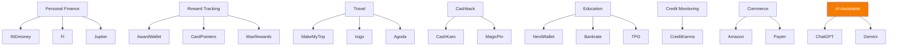

Notice that every branch represents a **separate ecosystem**.

Consumers move between these ecosystems continuously.

---

# Market Fragmentation

Today's consumer journey resembles this:

```text
Google

↓

Reddit

↓

YouTube

↓

Credit Card Blog

↓

Bank Website

↓

Travel Website

↓

Cashback Website

↓

Coupon Website

↓

Browser Extension

↓

Excel Sheet

↓

Notes App

↓

Payment
```

Every transition creates:

- friction
- decision fatigue
- missed opportunities
- abandoned optimization

---

# CardWise Position

Instead of creating another vertical,

CardWise becomes the intelligence layer above every vertical.

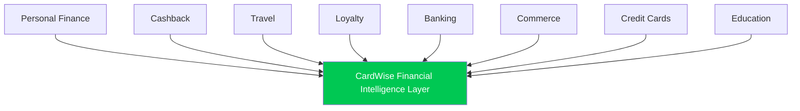

CardWise does not replace these ecosystems.

It orchestrates them.

---

# Strategic Positioning Matrix

## X-Axis

Decision Intelligence

↓

Low → High

## Y-Axis

Workflow Coverage

↓

Narrow → Broad

```text
Broad Workflow

^

|

|                           CardWise
|

|

|

|             INDmoney

|

|     Credit Karma

|

|

| AwardWallet

| CardPointers

| MaxRewards

| CashKaro

|

+-------------------------------------------->

Low Intelligence               High Intelligence
```

Observation:

Every existing product optimizes a narrow workflow.

CardWise expands horizontally **and** vertically.

---

# AI Maturity Positioning

```text
AI Reasoning

^

|

|                          CardWise

|

|

| Credit Karma

| CardPointers

|

| MaxRewards

|

| NerdWallet

|

|

+---------------------------------------->

Traditional Software

           AI Native
```

Most products use AI for:

- recommendations
- ranking
- personalization

CardWise uses AI as its primary reasoning engine.

---

# Consumer Journey Coverage

| Journey Stage | Market Leader | CardWise |
|---------------|--------------|-----------|
| Discover | Google | ✓ |
| Learn | TPG | ✓ |
| Compare | NerdWallet | ✓ |
| Choose Card | CardPointers | ✓ |
| Find Cashback | CashKaro | ✓ |
| Shop | Amazon | ✓ |
| Travel Booking | MakeMyTrip | ✓ |
| Pay | Existing Wallets | ✓ |
| Track Rewards | AwardWallet | ✓ |
| Optimize | None | ✓ |
| Learn From History | None | ✓ |
| Plan Future | Travel Freely | ✓ |

Notice:

Every stage has a different leader.

CardWise spans every stage.

---

# Product Philosophy Positioning

| Product | Core Philosophy |
|----------|----------------|
| AwardWallet | Track Rewards |
| CardPointers | Recommend Card |
| MaxRewards | Automate Benefits |
| Travel Freely | Plan Applications |
| Credit Karma | Monitor Credit |
| NerdWallet | Compare Products |
| TPG | Teach Rewards |
| CardWise | Optimize Financial Decisions |

This distinction is fundamental.

---

# Strategic Dimension Comparison

| Dimension | Existing Products | CardWise |
|------------|------------------|-----------|
| Information | ✓ | ✓ |
| Comparison | ✓ | ✓ |
| Recommendation | ✓ | ✓ |
| Automation | Partial | ✓ |
| Financial Reasoning | Limited | ✓ |
| Portfolio Optimization | Limited | ✓ |
| Predictive Intelligence | Rare | ✓ |
| Autonomous Optimization | None | ✓ |

---

# Competitive Density Map

```text
HIGH

|

| Cashback Apps
| Travel Apps
| Finance Apps
| Budget Apps
| Credit Apps

|

|

|

|

|_______________________________

Existing Categories

↓

White Space

↓

Financial Decision Intelligence

↓

CardWise
```

The highest-value opportunity exists where competition is currently weakest.

---

# The Category Ladder

```text
Budgeting Apps

↓

Expense Trackers

↓

Financial Platforms

↓

Reward Platforms

↓

Financial Intelligence Platforms

↓

Financial Operating Systems

↓

CardWise
```

Rather than becoming a better reward platform,

CardWise becomes the operating system connecting all financial platforms.

---

# Investor Perspective

Investors typically ask:

> Who are your competitors?

The correct answer is **not**:

- AwardWallet
- CardPointers
- CashKaro

Instead:

> "Each of these companies owns one piece of the consumer financial decision process.

> CardWise is the first platform designed to own the entire decision lifecycle."

This reframes competition around **market creation**, not feature comparison.

---

# Key Strategic Insight

CardWise should avoid positioning itself as:

- Reward App
- Cashback App
- Travel App
- Budgeting App
- Card Recommendation Tool

Instead it should consistently position itself as:

> **The Financial Decision Intelligence Platform**

and ultimately,

> **The Consumer Financial Operating System**

---

# Transition

The positioning analysis clearly identifies a large strategic whitespace between today's fragmented financial tools and tomorrow's AI-native financial operating systems.

The next section formalizes this opportunity using **Blue Ocean Strategy**, **Competitive Whitespace Mapping**, and **Category Creation Frameworks**.

---

**End of Part 6B-1**

**Next:** **Part 6B-2 — Blue Ocean Strategy & Competitive Whitespace Analysis**

# Part 6B-2 — Blue Ocean Strategy & Competitive Whitespace Analysis

> **Objective:** Identify uncontested market opportunities using Blue Ocean Strategy, define the strategic whitespace occupied by CardWise, and establish a category that competitors cannot easily replicate.

---

# Why Blue Ocean Matters

Most financial products compete by improving existing features.

Examples include:

- Better cashback percentages
- More supported cards
- Faster reward tracking
- Lower annual fees
- Better travel search
- More coupon partners

These are **Red Ocean** strategies.

Competition becomes:

- Feature-driven
- Price-sensitive
- Easily copied
- Incrementally innovative

CardWise should instead create an uncontested market.

---

# Red Ocean vs Blue Ocean

| Red Ocean | Blue Ocean (CardWise) |
|------------|-----------------------|
| Compete with existing apps | Create a new product category |
| Optimize individual features | Optimize complete financial outcomes |
| Reward tracking | Financial intelligence |
| Cashback discovery | Decision optimization |
| Travel booking | Travel decision engine |
| Card recommendations | Financial reasoning |
| Manual optimization | Autonomous optimization |
| Static rules | Adaptive AI |

---

# Existing Market Competition

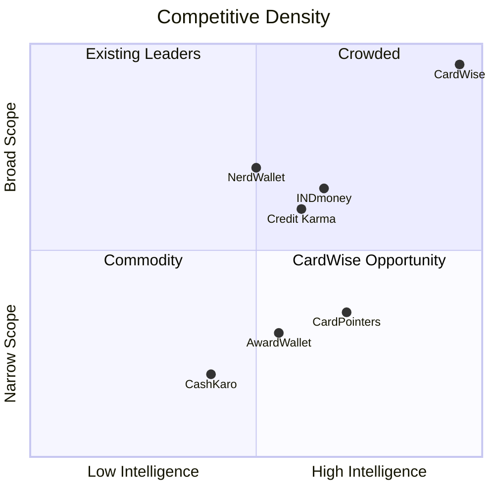

The upper-right corner remains largely uncontested.

---

# Blue Ocean Canvas

## Competing Factors

Traditional products compete using:

- Number of cards
- Cashback rates
- Coupon availability
- Travel inventory
- Reward tracking
- Financial education

CardWise introduces entirely different dimensions.

---

## Strategy Canvas

| Competitive Factor | Existing Market | CardWise |
|--------------------|-----------------|-----------|
| Cashback | High | High |
| Card Database | High | High |
| Travel Booking | High | High |
| Reward Tracking | High | High |
| Financial Education | High | High |
| AI Reasoning | Low | Very High |
| Explainability | Very Low | Very High |
| Unified Intelligence | None | Very High |
| Merchant Intelligence | Medium | Very High |
| Reward Simulation | Very Low | Very High |
| Opportunity Cost Analysis | None | Very High |
| Autonomous Planning | None | Very High |

---

# Eliminate–Reduce–Raise–Create (ERRC) Grid

## Eliminate

CardWise intentionally eliminates:

- Manual reward calculations
- Spreadsheet tracking
- Switching between multiple apps
- Guesswork during purchases
- Static comparison tables
- Complex loyalty rules exposed to users

These activities create friction but not value.

---

## Reduce

CardWise significantly reduces:

- Decision fatigue
- Research time
- Information overload
- Reward complexity
- Offer fragmentation
- Learning curve
- Merchant uncertainty

Consumers should spend less time researching and more time making confident decisions.

---

## Raise

CardWise substantially raises:

- Recommendation accuracy
- Financial transparency
- Reward utilization
- Personalization
- Context awareness
- Cross-platform intelligence
- Long-term optimization
- Consumer confidence

These become key differentiators.

---

## Create

CardWise creates capabilities that currently do not exist together in any product.

Examples include:

- Unified Financial Intelligence Graph
- Explainable Financial AI
- Real-Time Purchase Optimization
- Reward Simulation Engine
- Merchant Intelligence Layer
- Predictive Reward Planning
- Financial Opportunity Score
- Continuous Portfolio Optimization
- Financial Decision Timeline
- Autonomous Financial Copilot

These become the foundation of a new category.

---

# Competitive Whitespace Map

```text
HIGH VALUE

^

|

|             CardWise

|

|

|      (Whitespace)

|

|

| Travel Apps

| Cashback Apps

| Finance Apps

| Reward Apps

+---------------------------------------->

Competitive Density
```

CardWise targets the area where:

- customer value is highest
- competitive density is lowest

---

# Strategic Opportunity Matrix

| Opportunity | Existing Market | CardWise |
|-------------|----------------|-----------|
| Reward Tracking | Mature | Extend |
| Cashback | Mature | Integrate |
| Travel | Mature | Optimize |
| Credit Monitoring | Mature | Extend |
| Financial Education | Mature | Personalize |
| Financial AI | Emerging | Lead |
| Decision Intelligence | Untapped | Own |
| Autonomous Finance | Non-existent | Create |

---

# Category Innovation Analysis

The financial technology industry has historically evolved through several waves.

| Generation | Representative Products |
|------------|-------------------------|
| Banking | Traditional Banks |
| Digital Banking | Revolut, N26 |
| Personal Finance | Mint, YNAB |
| Investment Platforms | Robinhood |
| Reward Platforms | AwardWallet |
| Cashback Platforms | Rakuten |
| AI Financial Assistants | Emerging |
| Financial Operating Systems | CardWise |

CardWise represents the next evolutionary step rather than an incremental improvement.

---

# Why Competitors Cannot Easily Follow

Building CardWise requires multiple independent capabilities to work together.

```text
Merchant Graph

+

Reward Engine

+

Travel Intelligence

+

Financial Knowledge Graph

+

AI Reasoning

+

Historical Offer Engine

+

Portfolio Intelligence

+

Explainable Decision Engine

↓

CardWise
```

Most competitors possess only one or two of these components.

Replicating the complete ecosystem would require a fundamental platform redesign.

---

# Switching Cost Analysis

Existing products create relatively low switching costs.

Examples:

- Cashback accounts can be replaced.
- Reward trackers can be exported.
- Comparison websites have little lock-in.

CardWise intentionally increases switching costs through accumulated intelligence.

---

## Switching Cost Layers

| Layer | Switching Difficulty |
|--------|----------------------|
| User Preferences | Medium |
| Connected Accounts | Medium |
| Reward History | High |
| Historical Spending Intelligence | High |
| Financial Knowledge Graph | Very High |
| Personalized AI Models | Very High |
| Decision History | Very High |
| Continuous Learning | Extremely High |

The longer users stay, the more valuable the platform becomes.

---

# Network Effects

Most competitors exhibit weak network effects.

CardWise can create multiple reinforcing loops.

## Data Network Effect

```text
More Users

↓

More Merchant Data

↓

Better AI

↓

Better Recommendations

↓

Higher Savings

↓

More Users
```

---

## Knowledge Network Effect

```text
More Transactions

↓

More Reward Intelligence

↓

Better Simulations

↓

More Accurate Decisions

↓

Greater Trust

↓

More Usage
```

---

## Community Network Effect

```text
More Community Reports

↓

Verified Offers

↓

Higher Data Accuracy

↓

Better Recommendations

↓

More Community Participation
```

---

# Investor Narrative

The strongest investment thesis is not:

> "CardWise helps users earn more rewards."

Instead:

> "CardWise is building the intelligence layer that sits above every financial product consumers already use."

This narrative expands the addressable market beyond rewards into long-term financial decision infrastructure.

---

# Blue Ocean Summary

The analysis demonstrates that competitors continue to fight within existing categories:

- Cashback
- Travel
- Credit monitoring
- Reward tracking
- Financial education

CardWise avoids these battles by creating a new category centered on **Financial Decision Intelligence**.

Instead of asking:

> **"How can we build a better rewards app?"**

CardWise asks:

> **"How can we become the operating system that helps consumers make every financial decision better?"**

That shift fundamentally changes the competitive landscape.

---

# Transition

Having identified the strategic whitespace, the next step is to evaluate **where competitors are structurally weak**.

The following section performs a comprehensive **SWOT Analysis** for:

- The overall market
- Major competitor categories
- CardWise itself

This analysis will identify durable competitive advantages and potential execution risks.

---

**End of Part 6B-2**

**Next:** **Part 6C-1 — Comprehensive SWOT Analysis (Market & Competitor Categories)**


# Part 6C-1 — Comprehensive SWOT Analysis (Market & Competitor Categories)

> **Objective:** Evaluate the competitive landscape through a strategic SWOT framework, identify structural weaknesses across existing market categories, and establish where CardWise can build durable competitive advantages.

---

# SWOT Framework

The analysis is performed at three levels:

1. Overall Market
2. Competitor Categories
3. CardWise

This section covers:

- Overall Market SWOT
- Category-Level SWOT

The following section (Part 6C-2) focuses exclusively on CardWise.

---

# Overall Market SWOT

## Strengths

The current ecosystem has matured significantly over the past decade.

### Mature Consumer Awareness

Consumers now understand:

- Cashback
- Credit card rewards
- Airline miles
- Hotel loyalty
- Premium cards
- Reward optimization

This reduces educational barriers.

---

### Strong Digital Infrastructure

Consumers increasingly rely on:

- UPI
- Digital banking
- Online shopping
- Mobile wallets
- Digital travel booking

These trends accelerate adoption of intelligent financial software.

---

### Rich Financial Data

Large volumes of structured data already exist:

- Transactions
- Offers
- Merchant catalogs
- Loyalty programs
- Card benefits
- Travel pricing

These datasets create opportunities for AI-driven optimization.

---

### Expanding Reward Economy

Financial institutions continue introducing:

- New cards
- Merchant offers
- Loyalty programs
- Travel partnerships
- Premium benefits

Complexity continues to increase.

---

### High Consumer Engagement

Users already interact regularly with:

- Banking apps
- Payment apps
- Shopping apps
- Travel apps
- Financial websites

Behavioral adoption barriers are relatively low.

---

# Weaknesses

Despite market maturity,

significant structural inefficiencies remain.

---

## Fragmentation

Consumers manage rewards across:

- Banks
- Airlines
- Hotels
- Merchants
- Wallets
- Cashback portals

There is no unified experience.

---

## Information Overload

Consumers face:

- Thousands of offers
- Hundreds of cards
- Multiple loyalty programs
- Dynamic pricing
- Frequent rule changes

Decision quality declines as complexity increases.

---

## Manual Optimization

Users still rely on:

- Excel
- Google Sheets
- Notes
- Reddit
- Blogs
- YouTube

Optimization remains labor-intensive.

---

## Poor Explainability

Most platforms recommend actions without clearly explaining:

- Why
- Opportunity cost
- Alternative strategies
- Future consequences

This limits trust.

---

## Limited Personalization

Recommendations often ignore:

- Spending behavior
- Lifestyle
- Existing cards
- Travel goals
- Merchant preferences

Advice remains generic.

---

# Opportunities

Several macro trends significantly favor CardWise.

---

## AI Adoption

Consumers increasingly trust AI for:

- Search
- Recommendations
- Financial planning
- Travel planning

Expectations are rapidly evolving.

---

## Open Banking

Financial APIs continue improving.

Future integrations will enable:

- Better transaction visibility
- Faster personalization
- Richer financial graphs

---

## Embedded Finance

Financial decisions increasingly occur inside:

- Commerce
- Travel
- Messaging
- Payment flows

Decision support becomes more valuable.

---

## Premium Card Growth

High-value consumers continue adopting:

- Premium travel cards
- Lifestyle cards
- Business cards

Reward complexity will increase.

---

## Loyalty Ecosystem Expansion

Airlines,

Hotels,

Retailers,

Payment providers,

Banks

are all investing heavily in loyalty programs.

---

# Threats

The market also presents significant risks.

---

## Rapid Feature Commoditization

Reward tracking,

cashback,

comparison tools,

and coupon discovery

are increasingly commoditized.

---

## Platform Dependence

Many products rely on:

- Browser APIs
- Affiliate programs
- Financial APIs
- Search traffic

External changes can significantly impact businesses.

---

## AI Competition

Large technology companies may eventually integrate:

- Financial assistants
- Shopping optimization
- Travel optimization

directly into consumer ecosystems.

---

## Regulatory Changes

Privacy,

Open Banking,

consumer protection,

AI regulation

may alter product capabilities.

---

## Customer Trust

Financial recommendations require exceptionally high trust.

One poor recommendation can damage long-term credibility.

---

# Market SWOT Summary

| Strengths | Weaknesses |
|------------|------------|
| Digital adoption | Fragmentation |
| Rich financial data | Manual optimization |
| Growing reward economy | Poor explainability |
| High engagement | Weak personalization |
| Mature infrastructure | Context switching |

| Opportunities | Threats |
|--------------|---------|
| AI | Big Tech |
| Open Banking | Regulation |
| Embedded Finance | Commoditization |
| Premium Cards | Platform dependence |
| Loyalty Expansion | Consumer trust |

---

# Category SWOT

The following sections analyze each competitor category independently.

---

# Personal Finance Platforms

Examples:

- INDmoney
- Fi
- Jupiter

---

## Strengths

- Large user base
- Rich financial data
- Strong engagement
- Banking integrations
- Investment visibility

---

## Weaknesses

- Limited reward intelligence
- Weak travel optimization
- Minimal merchant intelligence
- Basic personalization
- Generic recommendations

---

## Opportunities

- Reward optimization
- AI assistants
- Browser intelligence
- Unified rewards
- Travel planning

---

## Threats

- Digital banks
- AI-native fintech
- Super apps
- Platform commoditization

---

# Reward Tracking Platforms

Examples:

- AwardWallet

---

## Strengths

- Loyalty expertise
- Reward visibility
- Multi-program support
- Historical tracking

---

## Weaknesses

- Limited optimization
- Weak merchant intelligence
- No purchase guidance
- Limited AI
- Static experiences

---

## Opportunities

- Predictive rewards
- Reward simulation
- Personalized optimization
- Financial reasoning

---

## Threats

- Banks improving native apps
- Browser optimization tools
- AI copilots

---

# Card Recommendation Platforms

Examples:

- CardPointers
- MaxRewards

---

## Strengths

- Real-time recommendations
- Browser integration
- Automation
- Benefit tracking
- Card expertise

---

## Weaknesses

- Credit-card centric
- Limited travel intelligence
- Weak merchant intelligence
- Limited explainability
- Short-term optimization

---

## Opportunities

- AI reasoning
- Unified rewards
- Financial graph
- Autonomous planning

---

## Threats

- Browser API restrictions
- Native issuer improvements
- AI competitors

---

# Cashback Platforms

Examples:

- CashKaro
- MagicPin

---

## Strengths

- Merchant relationships
- Coupon ecosystem
- Cashback incentives
- Consumer familiarity

---

## Weaknesses

- Platform-specific
- Weak personalization
- Limited intelligence
- No portfolio optimization
- Merchant bias

---

## Opportunities

- AI recommendations
- Cross-platform optimization
- Unified shopping intelligence

---

## Threats

- Amazon
- Google Shopping
- Browser extensions
- Dynamic pricing

---

# Travel Platforms

Examples:

- MakeMyTrip
- Ixigo
- Agoda

---

## Strengths

- Booking inventory
- Consumer trust
- Supplier relationships
- Large datasets
- Mobile engagement

---

## Weaknesses

- Reward optimization ignored
- Cashback ignored
- Merchant intelligence limited
- No card recommendations
- Loyalty fragmentation

---

## Opportunities

- Reward-aware booking
- AI itinerary optimization
- Unified travel intelligence

---

## Threats

- Google Travel
- Airline direct bookings
- AI travel agents

---

# Educational Platforms

Examples:

- NerdWallet
- Bankrate
- The Points Guy

---

## Strengths

- Trusted brands
- Excellent SEO
- High-quality content
- Consumer education

---

## Weaknesses

- Static knowledge
- No execution
- Weak personalization
- No optimization
- No automation

---

## Opportunities

- AI coaching
- Personalized education
- Interactive simulations

---

## Threats

- AI search
- LLMs
- Personalized assistants
- Reduced organic search traffic

---

# Emerging Strategic Pattern

Across every category,

the same structural weakness appears repeatedly:

> Platforms specialize in information, tracking, or automation.

Very few specialize in **decision intelligence**.

This repeated weakness creates the strategic opening for CardWise.

---

# Transition

Having analyzed the structural strengths and weaknesses of every competitor category,

the next section performs an in-depth SWOT analysis for CardWise itself, identifying:

- Internal strengths
- Execution risks
- Defensible moats
- Strategic opportunities
- Long-term threats
- Mitigation strategies

This becomes the foundation for investor discussions and long-term product strategy.

---

**End of Part 6C-1**

**Next:** **Part 6C-2 — CardWise SWOT Analysis & Strategic Risk Assessment**


# Part 6C-2 — CardWise SWOT Analysis & Strategic Risk Assessment

> **Objective:** Analyze CardWise through a founder, investor, and executive lens by identifying internal strengths, execution risks, defensible moats, and long-term strategic opportunities.

---

# CardWise SWOT Analysis

Unlike traditional SWOT analyses that simply list bullet points, this section evaluates CardWise as a venture-scale company expected to operate over the next 10–15 years.

---

# Strengths

CardWise possesses several structural advantages that differentiate it from existing competitors.

Many of these are architectural rather than feature-based, making them significantly more difficult to replicate.

---

## 1. Platform Vision Instead of Feature Vision

Most competitors optimize a single workflow:

- Reward tracking
- Cashback
- Travel booking
- Credit monitoring
- Card recommendations

CardWise optimizes **financial decision-making itself**.

This creates a significantly larger addressable market.

---

## 2. AI-Native Architecture

Unlike products where AI is layered onto an existing platform,

CardWise is designed with AI as the primary decision engine.

This enables:

- contextual reasoning
- proactive recommendations
- continuous learning
- adaptive optimization
- explainable decisions

The architecture improves as AI capabilities evolve.

---

## 3. Unified Financial Intelligence Graph

CardWise connects entities that competitors manage independently.

```text
Users

↓

Cards

↓

Transactions

↓

Merchants

↓

Offers

↓

Rewards

↓

Airlines

↓

Hotels

↓

Travel Goals

↓

Financial Decisions
```

This graph becomes one of the company's most valuable assets.

---

## 4. Explainable Decision Engine

Consumers frequently hesitate to follow financial recommendations they do not understand.

CardWise differentiates itself by explaining:

- why a recommendation exists
- assumptions made
- confidence levels
- opportunity cost
- alternative strategies

Explainability builds trust.

---

## 5. Cross-Ecosystem Optimization

Existing platforms optimize within their own ecosystems.

CardWise optimizes across:

- banks
- merchants
- loyalty programs
- travel platforms
- cashback portals
- payment methods

This produces substantially better recommendations.

---

## 6. Continuous Learning

Every interaction improves future recommendations.

Examples include:

- purchase history
- merchant preferences
- travel behavior
- redemption choices
- spending patterns

The product becomes more valuable over time.

---

## 7. Extremely Large Expansion Surface

CardWise can naturally expand into:

- investments
- insurance
- lending
- taxes
- subscriptions
- business expenses
- family finance
- wealth optimization

without changing its core mission.

---

# Weaknesses

Every ambitious platform also introduces execution challenges.

Recognizing these early allows the company to mitigate risk.

---

## 1. Product Complexity

CardWise integrates multiple domains simultaneously.

Examples include:

- rewards
- travel
- merchants
- banking
- AI
- personalization
- analytics

This increases engineering complexity.

### Mitigation

Adopt a modular platform architecture with independently deployable intelligence services.

---

## 2. Data Acquisition

Many capabilities require high-quality structured data.

Examples include:

- merchant data
- reward rules
- offer history
- travel pricing
- loyalty programs

Data collection becomes a long-term investment.

### Mitigation

Build proprietary datasets incrementally while leveraging strategic partnerships and community contributions.

---

## 3. Consumer Trust

Financial recommendations require exceptionally high credibility.

Incorrect advice can significantly reduce user confidence.

### Mitigation

Implement explainable AI, transparent assumptions, confidence scores, and conservative fallback strategies.

---

## 4. Long Time-to-Market

Unlike narrow applications,

CardWise cannot deliver its complete vision in the first release.

### Mitigation

Execute through clearly defined product phases with measurable customer value at every stage.

---

## 5. High Technical Ambition

Core capabilities require expertise across:

- AI
- data engineering
- fintech
- distributed systems
- search
- recommendation engines
- UX
- security

Hiring becomes strategically important.

### Mitigation

Invest early in platform engineering and domain-specific technical leadership.

---

# Opportunities

CardWise operates at the intersection of several rapidly growing industries.

---

## AI Transformation

Consumers increasingly expect AI to:

- search
- compare
- explain
- recommend
- automate

Financial decision-making is a natural extension.

---

## Open Banking

Expanding financial APIs will enable:

- richer personalization
- real-time insights
- portfolio awareness
- intelligent automation

---

## Agentic AI

Future AI systems will increasingly execute actions rather than merely provide advice.

Examples include:

- booking travel
- selecting payment methods
- redeeming rewards
- tracking milestones

CardWise can evolve naturally into this paradigm.

---

## Embedded Finance

Financial decisions increasingly occur inside:

- shopping
- travel
- commerce
- messaging
- productivity software

CardWise can become the intelligence layer embedded within these workflows.

---

## Cross-Border Rewards

Consumers increasingly earn and redeem rewards internationally.

Supporting:

- global loyalty programs
- foreign exchange optimization
- international merchants

creates significant expansion opportunities.

---

## Enterprise Opportunities

The platform can eventually support:

- employee travel optimization
- corporate card management
- procurement intelligence
- expense optimization

opening B2B revenue streams.

---

# Threats

Long-term strategy must also consider external risks.

---

## Big Tech

Companies such as:

- Google
- Apple
- Microsoft
- Amazon

could eventually integrate financial assistants into existing ecosystems.

---

## Financial Institutions

Banks may improve:

- native reward tracking
- AI assistants
- merchant intelligence
- card recommendations

reducing reliance on third-party platforms.

---

## Regulatory Evolution

Potential changes include:

- AI governance
- financial advice regulations
- privacy laws
- Open Banking standards

Compliance must remain a core capability.

---

## Data Platform Dependence

External changes affecting:

- browser extensions
- financial APIs
- merchant integrations
- travel partners

could impact product functionality.

---

## Competitive Convergence

As AI becomes more accessible,

competitors may replicate:

- conversational interfaces
- recommendation systems
- automation

CardWise must compete on proprietary intelligence rather than interface quality alone.

---

# SWOT Summary

| Strengths | Weaknesses |
|------------|------------|
| AI-native architecture | Product complexity |
| Unified financial graph | Long development cycle |
| Explainable recommendations | Data acquisition challenges |
| Cross-platform optimization | Consumer trust requirements |
| Continuous learning | High engineering complexity |
| Large expansion surface | Multi-domain execution risk |

| Opportunities | Threats |
|--------------|---------|
| AI adoption | Big Tech |
| Open Banking | Banks |
| Agentic AI | Regulation |
| Embedded finance | API dependence |
| Global rewards | Feature commoditization |
| Enterprise expansion | Competitive convergence |

---

# Strategic Risk Matrix

| Risk | Probability | Impact | Priority | Mitigation |
|------|-------------|--------|----------|------------|
| Poor recommendation quality | Medium | Very High | Critical | Explainable AI, confidence scores, extensive validation |
| Slow data acquisition | High | High | Critical | Phased data strategy, partnerships, community verification |
| Engineering complexity | High | High | Critical | Modular architecture, domain-driven design |
| AI hallucinations | Medium | High | High | Rule-based validation, deterministic reasoning layers |
| Regulatory changes | Medium | High | High | Compliance-first architecture, audit trails |
| Competitive feature copying | High | Medium | High | Invest in proprietary data assets and intelligence graph |
| Browser platform restrictions | Medium | Medium | Medium | Multi-platform strategy (web, mobile, extensions, APIs) |
| User adoption friction | Medium | High | High | Deliver immediate value in onboarding and early user journeys |

---

# Durable Competitive Moats

The long-term defensibility of CardWise should come from assets that are difficult—not impossible—to replicate.

## 1. Financial Intelligence Graph

A continuously expanding graph connecting:

- Users
- Cards
- Merchants
- Offers
- Rewards
- Travel
- Financial goals
- Decisions

This becomes richer with every interaction.

---

## 2. Proprietary Rule Engine

A configurable engine capable of modeling:

- Reward rules
- Merchant rules
- Loyalty rules
- Transfer rules
- Regional variations
- Historical changes

This creates institutional knowledge that compounds over time.

---

## 3. Historical Offer Database

Maintaining years of historical data enables:

- Trend analysis
- Offer prediction
- Seasonal recommendations
- Better simulations

Competitors cannot easily reconstruct historical data retrospectively.

---

## 4. Decision History

Every recommendation accepted or rejected teaches the platform:

- user preferences
- financial behavior
- risk tolerance
- optimization priorities

This creates increasingly personalized intelligence.

---

## 5. Explainable AI Layer

The combination of:

- reasoning
- transparency
- auditability
- confidence scoring

creates trust that generic AI assistants may struggle to achieve.

---

## 6. Continuous Learning Flywheel

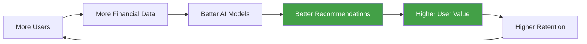

This flywheel compounds over time.

---

# Executive Assessment

From a strategic perspective, CardWise has the characteristics of a venture-scale platform:

- Large addressable market
- Strong data network effects
- High switching costs
- Multiple expansion vectors
- AI-native architecture
- Clear category differentiation

The primary challenge is not market demand.

The primary challenge is disciplined execution.

A phased rollout, strong engineering foundations, and relentless focus on user trust will be essential to realizing the long-term vision.

---

# Transition

The SWOT analysis validates that CardWise has the potential to create a new market category.

The next section moves from analysis to action by identifying:

- Strategic gaps left by competitors
- High-value product opportunities
- White-space features
- Innovation priorities
- Category-defining capabilities

These insights directly inform the product roadmap and long-term competitive strategy.

---

**End of Part 6C-2**

**Next:** **Part 6D-1 — Comprehensive Gap Analysis & Strategic Opportunity Mapping**


# Part 6D-1 — Comprehensive Gap Analysis & Strategic Opportunity Mapping

> **Objective:** Identify where existing competitors consistently fail, quantify the resulting market opportunities, and define the highest-value strategic initiatives for CardWise.

---

# Executive Summary

Across all competitor research, one conclusion repeatedly emerged:

> **The market does not suffer from a lack of financial information.**

It suffers from a lack of:

- intelligence
- context
- personalization
- optimization
- execution

Consumers already have access to:

- thousands of offers
- reward calculators
- comparison websites
- cashback platforms
- travel portals
- loyalty trackers

Yet they continue making suboptimal financial decisions.

This represents the largest opportunity available to CardWise.

---

# Gap Analysis Framework

Every opportunity has been evaluated across four dimensions.

| Dimension | Description |
|------------|-------------|
| Market Need | How significant is the consumer pain point? |
| Competitive Coverage | How well do competitors currently solve it? |
| Strategic Value | Long-term differentiation potential |
| CardWise Priority | Recommended execution priority |

---

# Gap 1 — Unified Financial Intelligence

## Current Situation

Consumers manage financial information across:

- Bank applications
- Reward portals
- Cashback websites
- Travel websites
- Merchant platforms
- Loyalty accounts

Every platform contains only a partial view.

---

## Existing Competitor Coverage

| Platform | Coverage |
|----------|----------|
| AwardWallet | Loyalty only |
| Credit Karma | Credit only |
| CashKaro | Cashback only |
| CardPointers | Card optimization only |
| NerdWallet | Education only |
| MakeMyTrip | Travel only |

No platform unifies all financial intelligence.

---

## Consumer Pain

Typical purchase workflow:

```text
Search Product

↓

Search Cashback

↓

Check Credit Cards

↓

Check Offers

↓

Search Coupons

↓

Compare Prices

↓

Check Rewards

↓

Purchase
```

Each step introduces uncertainty.

---

## Opportunity

Build a single intelligence layer that combines:

- merchants
- cards
- rewards
- travel
- loyalty
- banking
- shopping

into one continuously updated graph.

---

## Strategic Assessment

| Metric | Rating |
|---------|--------|
| Market Need | ⭐⭐⭐⭐⭐ |
| Competitive Coverage | ⭐☆☆☆☆ |
| Strategic Value | ⭐⭐⭐⭐⭐ |
| Priority | Critical |

---

# Gap 2 — Explainable Financial AI

## Current Situation

Most platforms answer:

> Use Card A.

Very few explain:

- Why?
- Compared to what?
- What assumptions were made?
- What future impact exists?
- What alternatives were rejected?

---

## Existing Competitor Coverage

| Capability | Market Coverage |
|------------|----------------|
| AI Chat | Emerging |
| Recommendation | Moderate |
| Financial Reasoning | Weak |
| Explainability | Very Weak |

---

## Consumer Pain

Users hesitate to follow recommendations they cannot understand.

Financial trust requires transparency.

---

## Opportunity

Every recommendation should include:

- reasoning
- confidence
- calculations
- assumptions
- opportunity cost
- alternatives

Explainability becomes a core product capability rather than a documentation feature.

---

## Strategic Assessment

| Metric | Rating |
|---------|--------|
| Market Need | ⭐⭐⭐⭐⭐ |
| Competitive Coverage | ⭐⭐☆☆☆ |
| Strategic Value | ⭐⭐⭐⭐⭐ |
| Priority | Critical |

---

# Gap 3 — Reward Simulation

## Current Situation

Consumers frequently ask questions such as:

- Cashback or points?
- Redeem now or later?
- Airline transfer or hotel transfer?
- Use one card or split payments?
- Wait for a better promotion?

Current products rarely provide interactive simulations.

---

## Existing Competitor Coverage

| Platform | Simulation |
|----------|------------|
| AwardWallet | Limited |
| Travel Freely | Basic |
| CardPointers | Minimal |
| Others | None |

---

## Consumer Pain

Users estimate outcomes mentally or using spreadsheets.

This introduces errors.

---

## Opportunity

Create a simulation engine capable of comparing:

- payment methods
- cards
- merchants
- travel portals
- reward redemptions
- future scenarios

before purchases occur.

---

## Strategic Assessment

| Metric | Rating |
|---------|--------|
| Market Need | ⭐⭐⭐⭐☆ |
| Competitive Coverage | ⭐☆☆☆☆ |
| Strategic Value | ⭐⭐⭐⭐⭐ |
| Priority | High |

---

# Gap 4 — Merchant Intelligence

## Current Situation

Most competitors classify merchants using:

- MCC
- categories

Very few understand:

- historical pricing
- seasonal discounts
- merchant quality
- reward efficiency
- loyalty partnerships

---

## Existing Competitor Coverage

Merchant intelligence remains shallow.

No platform has developed a comprehensive merchant knowledge graph.

---

## Consumer Pain

Consumers often optimize:

- payment method

instead of optimizing:

- merchant choice

The latter frequently produces greater savings.

---

## Opportunity

Build merchant profiles including:

- historical offers
- cashback history
- reward efficiency
- pricing trends
- loyalty compatibility
- shopping recommendations

---

## Strategic Assessment

| Metric | Rating |
|---------|--------|
| Market Need | ⭐⭐⭐⭐☆ |
| Competitive Coverage | ⭐⭐☆☆☆ |
| Strategic Value | ⭐⭐⭐⭐⭐ |
| Priority | High |

---

# Gap 5 — Cross-Platform Optimization

## Current Situation

Every platform optimizes only its own ecosystem.

Examples:

- Amazon optimizes Amazon.
- CashKaro optimizes cashback.
- Airlines optimize airline miles.
- Banks optimize their cards.

Consumers must optimize across all of them.

---

## Consumer Pain

Example:

A user purchasing a ₹60,000 laptop must compare:

- Amazon
- Flipkart
- Croma
- Reliance Digital

Then compare:

- Cashback
- Reward points
- Bank offers
- Coupons
- EMI
- Reward transfers

No platform performs this holistic optimization.

---

## Opportunity

Build an optimizer that reasons across:

- merchants
- payment methods
- loyalty programs
- travel rewards
- offers
- financing options

simultaneously.

---

## Strategic Assessment

| Metric | Rating |
|---------|--------|
| Market Need | ⭐⭐⭐⭐⭐ |
| Competitive Coverage | ⭐☆☆☆☆ |
| Strategic Value | ⭐⭐⭐⭐⭐ |
| Priority | Critical |

---

# Gap 6 — Continuous Financial Coaching

## Current Situation

Existing products generally wait for users to:

- search
- browse
- compare

before providing recommendations.

---

## Consumer Pain

Consumers frequently discover opportunities after they expire.

Examples:

- transfer bonuses
- limited-time offers
- statement credits
- expiring rewards

---

## Opportunity

Create proactive financial coaching.

Examples:

> "Waiting three days could increase your reward value by 18%."

> "Completing ₹4,200 of spending this week unlocks ₹8,000 worth of travel rewards."

> "Booking through another portal increases effective savings by ₹2,350."

---

## Strategic Assessment

| Metric | Rating |
|---------|--------|
| Market Need | ⭐⭐⭐⭐⭐ |
| Competitive Coverage | ⭐☆☆☆☆ |
| Strategic Value | ⭐⭐⭐⭐⭐ |
| Priority | Critical |

---

# Opportunity Matrix

| Gap | Market Need | Competition | Strategic Value | Priority |
|-----|-------------|-------------|-----------------|----------|
| Unified Financial Graph | Very High | Very Low | Very High | Critical |
| Explainable AI | Very High | Low | Very High | Critical |
| Cross-Platform Optimization | Very High | Very Low | Very High | Critical |
| Continuous Financial Coaching | Very High | Very Low | Very High | Critical |
| Reward Simulation | High | Very Low | Very High | High |
| Merchant Intelligence | High | Low | Very High | High |

---

# Emerging Strategic Pattern

Across every identified gap, one consistent insight appears:

Competitors optimize **information**.

CardWise should optimize **decisions**.

That distinction transforms the company's positioning from a feature provider into an intelligence platform.

---

# Transition

The gaps identified above represent the most immediate opportunities.

The next section expands this analysis into:

- Additional innovation opportunities
- Long-term AI capabilities
- White-space feature inventory
- Product differentiation roadmap
- Category-defining strategic initiatives

These initiatives form the foundation of CardWise's long-term competitive moat.

---

**End of Part 6D-1**

**Next:** **Part 6D-2 — Strategic Innovation Opportunities & Category-Defining Features**


# Part 6D-2 — Strategic Innovation Opportunities & Category-Defining Features

> **Objective:** Identify breakthrough product opportunities that extend beyond current market expectations and define the innovations capable of establishing CardWise as the category leader for the next decade.

---

# Executive Summary

The previous gap analysis identified where competitors are weak.

This section answers a more important question:

> **If CardWise had no legacy constraints, what would the ideal financial intelligence platform look like?**

Instead of copying existing products, CardWise should build capabilities that competitors will eventually attempt to imitate.

The goal is to stay **3–5 years ahead** of the market.

---

# Innovation Framework

All opportunities are evaluated using five dimensions.

| Dimension | Description |
|-----------|-------------|
| Consumer Value | Direct user impact |
| Competitive Differentiation | Difficulty to replicate |
| AI Leverage | Degree of intelligence required |
| Technical Complexity | Estimated implementation effort |
| Strategic Importance | Long-term business value |

---

# Innovation 1 — Financial Knowledge Graph

## Vision

Most financial products store isolated records.

CardWise should build a living graph connecting every important financial entity.

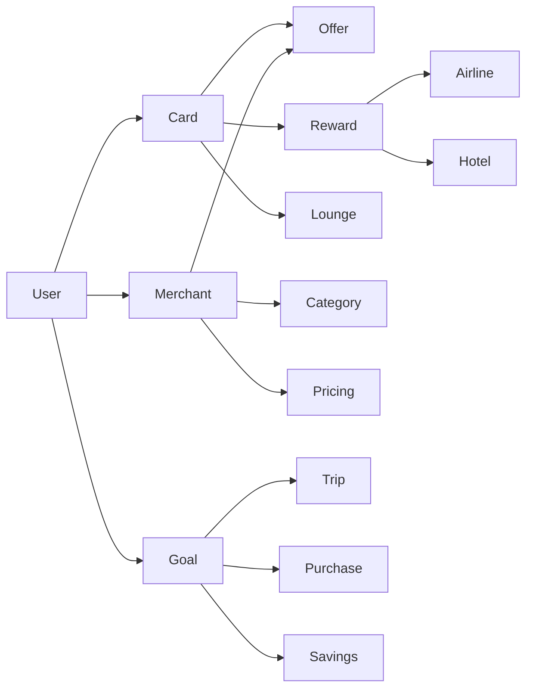

Every recommendation becomes graph traversal rather than simple rule evaluation.

---

## Consumer Value

Instead of asking:

> "Which card should I use?"

The graph enables questions such as:

- Which purchase best advances my Japan trip?
- Which merchant improves my annual reward yield?
- Which airline transfer produces maximum lifetime value?

---

## Competitive Advantage

No major competitor currently exposes a unified financial graph.

This becomes one of CardWise's strongest long-term assets.

---

## Strategic Assessment

| Metric | Rating |
|---------|--------|
| Consumer Value | ⭐⭐⭐⭐⭐ |
| Differentiation | ⭐⭐⭐⭐⭐ |
| AI Leverage | ⭐⭐⭐⭐⭐ |
| Technical Complexity | High |
| Priority | Critical |

---

# Innovation 2 — AI Financial Copilot

## Vision

Move beyond reactive recommendations.

Create an AI capable of continuously reasoning about the user's financial life.

Examples:

> "You have enough Marriott points for two nights, but transferring to Hyatt creates 38% more value."

> "Delay your laptop purchase until Friday. Combined merchant and bank offers increase savings by ₹6,800."

> "Your annual fee becomes profitable after two more lounge visits."

---

## Characteristics

The copilot should:

- explain decisions
- simulate alternatives
- answer natural language questions
- learn preferences
- proactively identify opportunities

It behaves as an always-available financial strategist.

---

## Strategic Assessment

| Metric | Rating |
|---------|--------|
| Consumer Value | ⭐⭐⭐⭐⭐ |
| Differentiation | ⭐⭐⭐⭐⭐ |
| AI Leverage | ⭐⭐⭐⭐⭐ |
| Technical Complexity | High |
| Priority | Critical |

---

# Innovation 3 — Financial Decision Timeline

## Vision

Instead of displaying isolated transactions,

display a chronological decision history.

```text
Today

↓

Used HDFC Infinia

↓

Earned 3,600 Reward Points

↓

Completed Dining Milestone

↓

Unlocked Free Lounge

↓

Qualified For Airline Transfer Bonus

↓

Estimated Future Value ₹8,450
```

Users understand not only **what happened**, but **why it mattered**.

---

## Benefits

- Reinforces positive financial behavior
- Makes rewards tangible
- Increases engagement
- Builds trust through transparency

---

## Strategic Assessment

| Metric | Rating |
|---------|--------|
| Consumer Value | ⭐⭐⭐⭐☆ |
| Differentiation | ⭐⭐⭐⭐⭐ |
| AI Leverage | ⭐⭐⭐☆☆ |
| Technical Complexity | Medium |
| Priority | High |

---

# Innovation 4 — Opportunity Feed

## Vision

Replace generic notifications with a personalized opportunity stream.

Example feed:

```
Today

✓ Amazon Sale Starts Tomorrow

✓ Transfer Bonus Ends In 2 Days

✓ Complete ₹2,400 More Spend To Unlock Bonus

✓ Lounge Benefit Expires In 12 Days

✓ Better Cashback Available At Flipkart

✓ Hotel Price Dropped 18%
```

Instead of alerts,

users receive actionable financial opportunities.

---

## Competitive Difference

Current notifications are:

- event-driven

CardWise notifications become:

- value-driven

---

## Strategic Assessment

| Metric | Rating |
|---------|--------|
| Consumer Value | ⭐⭐⭐⭐⭐ |
| Differentiation | ⭐⭐⭐⭐☆ |
| AI Leverage | ⭐⭐⭐⭐☆ |
| Technical Complexity | Medium |
| Priority | High |

---

# Innovation 5 — Merchant Intelligence Graph

## Vision

Every merchant becomes an intelligent financial object.

Example merchant profile:

```
Amazon India

↓

Historical Prices

↓

Historical Cashback

↓

Reward Multipliers

↓

Coupon Trends

↓

Festival Discounts

↓

Bank Offers

↓

Average Effective Savings

↓

Best Purchase Timing
```

This enables recommendations based on merchant economics rather than simple category matching.

---

## Competitive Advantage

Most competitors stop at:

- Merchant Category Code (MCC)

CardWise expands to:

- merchant behavior
- historical trends
- financial efficiency
- predictive pricing

---

## Strategic Assessment

| Metric | Rating |
|---------|--------|
| Consumer Value | ⭐⭐⭐⭐⭐ |
| Differentiation | ⭐⭐⭐⭐⭐ |
| AI Leverage | ⭐⭐⭐⭐☆ |
| Technical Complexity | High |
| Priority | High |

---

# Innovation 6 — Financial Opportunity Score

## Vision

Consumers rarely know whether they are maximizing their financial ecosystem.

CardWise introduces a continuously updated score.

Example:

```
Financial Opportunity Score

Current: 78 / 100

Potential Savings Lost This Month

₹3,840

Major Improvements

✓ Switch Dining Card

✓ Redeem Hotel Points

✓ Activate Bank Offer

✓ Complete Travel Milestone
```

The score measures unrealized financial potential rather than financial health.

---

## Difference From Credit Scores

Credit scores measure:

- borrowing risk

Opportunity Score measures:

- optimization efficiency

This creates an entirely new consumer metric.

---

## Strategic Assessment

| Metric | Rating |
|---------|--------|
| Consumer Value | ⭐⭐⭐⭐⭐ |
| Differentiation | ⭐⭐⭐⭐⭐ |
| AI Leverage | ⭐⭐⭐⭐⭐ |
| Technical Complexity | Medium |
| Priority | High |

---

# Innovation 7 — Unified Reward Wallet

## Vision

Consumers currently manage rewards across dozens of systems.

CardWise should expose one logical wallet.

```
Unified Rewards

↓

Bank Points

↓

Airline Miles

↓

Hotel Points

↓

Cashback

↓

Gift Cards

↓

Merchant Credits

↓

Travel Credits
```

Every reward receives a standardized valuation.

---

## Benefits

Users no longer think in:

- points
- miles
- credits

They think in:

- purchasing power

---

## Strategic Assessment

| Metric | Rating |
|---------|--------|
| Consumer Value | ⭐⭐⭐⭐⭐ |
| Differentiation | ⭐⭐⭐⭐☆ |
| AI Leverage | ⭐⭐⭐⭐☆ |
| Technical Complexity | High |
| Priority | High |

---

# Innovation Portfolio Matrix

| Innovation | Consumer Value | Strategic Value | Difficulty | Priority |
|------------|----------------|-----------------|------------|----------|
| Financial Knowledge Graph | ⭐⭐⭐⭐⭐ | ⭐⭐⭐⭐⭐ | High | Critical |
| AI Financial Copilot | ⭐⭐⭐⭐⭐ | ⭐⭐⭐⭐⭐ | High | Critical |
| Opportunity Feed | ⭐⭐⭐⭐⭐ | ⭐⭐⭐⭐☆ | Medium | High |
| Merchant Intelligence Graph | ⭐⭐⭐⭐⭐ | ⭐⭐⭐⭐⭐ | High | High |
| Financial Opportunity Score | ⭐⭐⭐⭐⭐ | ⭐⭐⭐⭐⭐ | Medium | High |
| Unified Reward Wallet | ⭐⭐⭐⭐⭐ | ⭐⭐⭐⭐☆ | High | High |
| Financial Decision Timeline | ⭐⭐⭐⭐☆ | ⭐⭐⭐⭐⭐ | Medium | High |

---

# Innovation Flywheel

```mermaid
flowchart LR

A[More Users]
--> B[More Financial Data]

B --> C[Better Knowledge Graph]

C --> D[Smarter AI]

D --> E[Better Recommendations]

E --> F[Higher Savings]

F --> G[Greater Trust]

G --> H[More Daily Usage]

H --> A

style D fill:#43A047,color:white
style E fill:#43A047,color:white
style F fill:#43A047,color:white
```

Unlike traditional network effects driven primarily by social interactions, CardWise compounds value through **intelligence**.

---

# Strategic Conclusion

The innovations described in this section are intentionally difficult to build.

That is precisely their value.

Competitors can relatively quickly replicate:

- UI improvements
- dashboards
- comparison tables
- notification systems
- AI chat interfaces

They cannot easily replicate:

- years of financial graph data
- continuously improving reasoning models
- proprietary merchant intelligence
- historical reward datasets
- explainable financial decision engines

These innovations represent the foundation of CardWise's long-term competitive moat.

---

# Transition

The competitor research now moves from identifying opportunities to defining **durable competitive advantages**.

The next section formalizes:

- CardWise's defensible moats
- Network effects
- Data advantages
- Platform advantages
- AI advantages
- Switching costs
- Sustainable competitive differentiation

This becomes the strategic foundation for investor presentations, fundraising, and long-term product positioning.

---

**End of Part 6D-2**

**Next:** **Part 6E-1 — CardWise Durable Competitive Advantages & Moat Analysis**

# Part 6E-1 — CardWise Durable Competitive Advantages & Moat Analysis

> **Objective:** Identify the long-term competitive moats that protect CardWise from feature replication, justify venture-scale defensibility, and establish why CardWise can become the category leader over the next decade.

---

# Executive Summary

Most fintech products compete using **features**.

Features can be copied.

Examples:

- Cashback calculators
- Reward trackers
- Browser extensions
- Travel search
- Card comparisons
- AI chat interfaces

These are **competitive advantages**, but they are **not durable moats**.

CardWise's strategy is fundamentally different.

Its moat comes from **compounding intelligence**.

---

# What Is A Durable Moat?

A durable moat has four characteristics:

1. Difficult to build
2. Improves over time
3. Becomes stronger with scale
4. Cannot be copied quickly

The strongest technology companies rarely win because of a single feature.

They win because they accumulate unique assets over many years.

---

# Moat Hierarchy

```text
Features

↓

Products

↓

Platforms

↓

Data

↓

Intelligence

↓

Network Effects

↓

Category Leadership
```

CardWise is designed to compete at the **Intelligence** layer.

---

# Moat 1 — Financial Knowledge Graph

## Description

The Financial Knowledge Graph becomes the foundational asset of CardWise.

Rather than storing isolated records, it models relationships across the financial ecosystem.

```mermaid
graph TD

User --> Card
User --> Merchant
User --> Goal

Card --> Offer
Card --> Reward
Card --> Benefit

Merchant --> Pricing
Merchant --> Cashback
Merchant --> Coupons

Reward --> Airline
Reward --> Hotel

Goal --> Purchase
Goal --> Trip
Goal --> Milestone

Trip --> Airline
Trip --> Hotel
```

The graph evolves continuously.

---

## Why It Matters

Traditional databases answer:

> "What happened?"

A knowledge graph answers:

- Why?
- What else is connected?
- What will happen next?
- What is the best alternative?

This enables significantly richer reasoning.

---

## Competitive Difficulty

Building a graph requires:

- years of data
- entity normalization
- relationship modeling
- continuous updates
- domain expertise

Competitors cannot recreate historical relationships overnight.

---

# Strategic Value

| Attribute | Assessment |
|-----------|------------|
| Replication Difficulty | Very High |
| User Value | Very High |
| AI Leverage | Very High |
| Long-Term Importance | Critical |

---

# Moat 2 — Proprietary Reward Rule Engine

## Description

Reward programs change constantly.

Examples include:

- spending categories
- transfer ratios
- welcome bonuses
- merchant offers
- exclusions
- promotional campaigns

CardWise maintains these rules as structured, versioned knowledge rather than static application logic.

---

## Why This Matters

Most competitors hardcode reward logic.

CardWise treats rewards as:

```
Data

not

Code
```

This dramatically improves:

- scalability
- maintainability
- explainability
- international expansion

---

## Strategic Benefit

The rule engine becomes reusable across:

- AI
- simulations
- recommendations
- browser extensions
- APIs
- analytics

It becomes core infrastructure rather than a feature.

---

# Strategic Value

| Attribute | Assessment |
|-----------|------------|
| Replication Difficulty | High |
| User Value | Very High |
| Platform Leverage | Very High |
| Long-Term Importance | Critical |

---

# Moat 3 — Historical Financial Intelligence

## Description

Most competitors focus on current information.

CardWise continuously stores historical intelligence including:

- reward rates
- cashback
- offers
- transfer bonuses
- merchant pricing
- annual fee changes
- benefit revisions

History enables prediction.

---

## Example

Instead of saying:

> Current cashback = 10%

CardWise can reason:

> Cashback averages 18% during the Great Indian Festival.

> Waiting 12 days increases expected savings by ₹3,800.

Historical intelligence transforms static recommendations into predictive advice.

---

## Strategic Value

Historical datasets compound every year.

Competitors starting later permanently lack earlier observations.

---

# Strategic Value

| Attribute | Assessment |
|-----------|------------|
| Replication Difficulty | Very High |
| User Value | High |
| AI Value | Very High |
| Long-Term Importance | Critical |

---

# Moat 4 — Explainable Financial AI

## Description

Many companies will eventually provide AI recommendations.

Few will explain:

- why
- confidence
- assumptions
- alternatives
- opportunity cost
- long-term impact

Explainability becomes a trust moat.

---

## Example

Instead of:

> Use Card X.

CardWise provides:

```
Recommendation

↓

Reasoning

↓

Reward Breakdown

↓

Alternative Comparison

↓

Opportunity Cost

↓

Confidence Score
```

Users understand every recommendation.

---

## Strategic Benefit

Explainability increases:

- trust
- adoption
- regulatory readiness
- enterprise readiness
- consumer confidence

---

# Strategic Value

| Attribute | Assessment |
|-----------|------------|
| Replication Difficulty | High |
| Consumer Trust | Very High |
| Regulatory Value | High |
| Long-Term Importance | Critical |

---

# Moat 5 — Personalized Financial Memory

## Description

Over time CardWise learns:

- preferred airlines
- favorite merchants
- spending habits
- travel style
- reward preferences
- redemption behavior
- financial goals

Every recommendation becomes increasingly personalized.

---

## Example

Two users shopping on Amazon receive different recommendations because:

- different cards
- different travel plans
- different reward balances
- different merchant history
- different optimization priorities

The AI evolves with each individual.

---

## Strategic Value

Unlike generic AI assistants,

CardWise develops persistent financial context over years.

---

| Attribute | Assessment |
|-----------|------------|
| Replication Difficulty | High |
| User Value | Very High |
| Retention Impact | Very High |
| Long-Term Importance | High |

---

# Moat 6 — Continuous Learning Loop

## Description

Every financial decision improves future recommendations.

Examples include:

- accepted recommendations
- rejected recommendations
- merchant selection
- reward redemption
- travel bookings
- missed opportunities

Feedback continuously improves recommendation quality.

---

## Learning Loop

```mermaid
flowchart LR

A[Financial Decision]

--> B[User Feedback]

--> C[Behavior Model]

--> D[Recommendation Engine]

--> E[Better Decisions]

--> A
```

Unlike rule-based competitors,

CardWise continuously evolves.

---

# Strategic Value

| Attribute | Assessment |
|-----------|------------|
| Replication Difficulty | High |
| AI Improvement | Very High |
| User Value | Very High |
| Long-Term Importance | Critical |

---

# Competitive Comparison

| Moat | Existing Competitors | CardWise |
|------|----------------------|-----------|
| Knowledge Graph | ❌ | ✅ |
| Explainable AI | ⚠ Limited | ✅ Native |
| Historical Intelligence | ⚠ Partial | ✅ Comprehensive |
| Rule Engine | ⚠ Basic | ✅ Configurable |
| Continuous Learning | ⚠ Limited | ✅ Core Capability |
| Personalized Financial Memory | ⚠ Minimal | ✅ Long-Term Asset |

---

# Why Features Are Not The Moat

The following capabilities are valuable but relatively easy to imitate:

- Browser extension
- Cashback tracking
- Reward calculator
- Lounge database
- Offer notifications
- AI chatbot
- Dashboard
- Analytics

Competitors can implement similar functionality within months.

---

# Why Intelligence Is The Moat

The following assets require years to build:

- Historical merchant intelligence
- Financial knowledge graph
- Personalized decision history
- Explainable reasoning engine
- Unified reward graph
- Financial behavior models

These assets compound over time and become increasingly difficult to replicate.

---

# Executive Perspective

If a competitor launches a browser extension next month,

CardWise remains differentiated.

If a competitor adds an AI chatbot,

CardWise remains differentiated.

If a competitor copies the UI,

CardWise remains differentiated.

The real competitive advantage is not the interface.

It is the continuously improving intelligence beneath it.

---

# Transition

These internal moats become significantly stronger when combined with **network effects**.

The next section analyzes how CardWise can create:

- Data network effects
- Intelligence network effects
- Community network effects
- Ecosystem network effects
- Platform network effects

These reinforcing loops transform CardWise from a product into a self-improving platform that becomes more valuable with every user and every financial decision.

---

**End of Part 6E-1**

**Next:** **Part 6E-2 — Network Effects, Switching Costs & Platform Defensibility**


# Part 6E-2 — Network Effects, Switching Costs & Platform Defensibility

> **Objective:** Define the self-reinforcing mechanisms that enable CardWise to become more valuable as it grows, establish long-term switching costs, and explain why the platform becomes increasingly difficult to compete with over time.

---

# Executive Summary

A great product creates value.

A great platform creates **compounding value**.

The most valuable technology companies benefit from positive feedback loops where:

- more users improve the product,
- better products attract more users,
- more usage creates more intelligence,
- more intelligence strengthens differentiation.

CardWise is intentionally designed around these reinforcing loops.

---

# Defensibility Framework

CardWise's long-term defensibility rests on five mutually reinforcing pillars.

```mermaid
flowchart TD

A[Data Network Effects]

B[Intelligence Network Effects]

C[Community Network Effects]

D[Platform Network Effects]

E[Switching Costs]

A --> F[Compounding Competitive Advantage]
B --> F
C --> F
D --> F
E --> F

style F fill:#43A047,color:white
```

No single pillar is sufficient on its own.

Together they create a durable competitive moat.

---

# Network Effect 1 — Data Network Effects

## Core Principle

Every user interaction improves the quality of the platform.

Examples include:

- purchases
- merchant visits
- reward redemptions
- travel bookings
- spending milestones
- reward valuations
- recommendation outcomes

Every event enriches the financial intelligence graph.

---

## Flywheel

```text
More Users

↓

More Financial Events

↓

Better Structured Data

↓

Better AI Models

↓

More Accurate Recommendations

↓

Higher Consumer Value

↓

More Users
```

Unlike static databases,

CardWise continuously accumulates proprietary knowledge.

---

## Strategic Value

The value of the platform increases faster than user growth.

---

# Network Effect 2 — Intelligence Network Effects

## Core Principle

Recommendations improve because previous recommendations generated additional knowledge.

Examples:

- Which recommendation users accepted
- Which recommendation users rejected
- Merchant conversion rates
- Reward redemption preferences
- Travel booking behavior

The system continuously learns.

---

## Example

Initially:

```
Card A

5x rewards
```

After years of learning:

```
For users like you,

Merchant X

+

Card B

+

Purchase on Friday

+

Transfer to Hyatt

↓

28% more value
```

Knowledge compounds over time.

---

# Network Effect 3 — Community Network Effects

## Vision

Users collectively improve financial intelligence.

Examples:

- verified offers
- incorrect merchant categories
- reward corrections
- lounge updates
- travel experiences
- hidden promotions

Community validation improves recommendation quality.

---

## Community Flywheel

```text
More Users

↓

More Verified Data

↓

Higher Recommendation Accuracy

↓

Greater Trust

↓

More Contributions

↓

Better Platform
```

Unlike forums,

community input directly improves AI reasoning.

---

# Network Effect 4 — Merchant Intelligence Network

## Core Principle

Merchant knowledge improves with transaction diversity.

Examples:

- reward efficiency
- cashback rates
- pricing history
- coupon performance
- bank offer effectiveness

Every transaction strengthens merchant understanding.

---

## Merchant Graph Growth

```text
More Merchants

↓

More Transactions

↓

Better Pricing Intelligence

↓

Better Recommendations

↓

Higher Consumer Savings

↓

More Merchant Coverage
```

Merchant intelligence becomes increasingly difficult to replicate.

---

# Network Effect 5 — Financial Knowledge Network

Every financial event expands the knowledge graph.

```text
New Card

↓

New Benefits

↓

New Merchant Rules

↓

New Reward Paths

↓

New Simulations

↓

Smarter AI
```

The knowledge graph grows in both:

- breadth
- depth

---

# Switching Costs

Unlike traditional SaaS products,

CardWise accumulates years of personalized financial intelligence.

Leaving the platform means losing:

- personalized optimization
- financial history
- reward intelligence
- recommendation history
- AI context
- financial memory

These losses create natural switching resistance.

---

# Switching Cost Layers

## Layer 1 — Connected Accounts

Users connect:

- banks
- cards
- loyalty programs
- travel accounts
- merchants

This creates moderate switching friction.

---

## Layer 2 — Historical Financial Data

Over time CardWise accumulates:

- spending history
- reward history
- travel history
- optimization history

Historical intelligence cannot easily be recreated elsewhere.

---

## Layer 3 — Personalized AI Memory

The platform learns:

- travel style
- merchant preferences
- reward priorities
- spending behavior
- optimization preferences

This knowledge becomes increasingly unique.

---

## Layer 4 — Decision History

Years of:

- recommendations
- accepted advice
- rejected advice
- financial outcomes

train increasingly accurate models.

Competitors starting later cannot reconstruct this history.

---

## Layer 5 — Opportunity Intelligence

CardWise records:

- missed opportunities
- successful optimizations
- historical offers
- reward evolution

This proprietary dataset improves future decisions.

---

# Switching Cost Pyramid

```text
Opportunity Intelligence

↓

Decision History

↓

AI Memory

↓

Historical Data

↓

Connected Accounts
```

Each layer strengthens the next.

---

# Platform Defensibility

Most competitors can copy:

- interface
- workflows
- dashboards
- browser extensions
- AI chat

Very few can replicate:

- years of structured financial data
- proprietary knowledge graph
- explainable reasoning models
- historical merchant intelligence
- personalized financial memory

These assets become increasingly valuable over time.

---

# Platform Flywheel

```mermaid
flowchart LR

A[More Users]

--> B[More Data]

--> C[Better Knowledge Graph]

--> D[Better AI]

--> E[Better Financial Decisions]

--> F[Higher Savings]

--> G[Greater Trust]

--> H[More Daily Usage]

--> A

style D fill:#43A047,color:white
style E fill:#43A047,color:white
style F fill:#43A047,color:white
```

This is the core engine behind CardWise's long-term growth.

---

# Ecosystem Expansion

The platform naturally expands into adjacent domains.

```text
Credit Cards

↓

Rewards

↓

Travel

↓

Shopping

↓

Banking

↓

Investments

↓

Insurance

↓

Taxes

↓

Wealth Optimization
```

Every new domain enriches the existing intelligence graph.

Expansion compounds rather than fragments the platform.

---

# Competitive Comparison

| Capability | Traditional Apps | CardWise |
|------------|------------------|-----------|
| User Growth | Linear | Compounding |
| Data Growth | Limited | Continuous |
| AI Improvement | Incremental | Self-Reinforcing |
| Recommendation Quality | Static | Continuously Improving |
| Switching Costs | Medium | Very High |
| Network Effects | Weak | Multi-Layered |
| Competitive Moat | Features | Intelligence |

---

# Long-Term Strategic Position

The long-term ambition is not to become:

- the largest rewards app,
- the largest cashback platform,
- the largest travel planner.

Instead, CardWise should become:

> **The intelligence layer that powers every important consumer financial decision.**

As more consumers rely on CardWise,

the platform becomes:

- smarter,
- more personalized,
- more accurate,
- more trusted,
- more difficult to replace.

---

# Executive Summary

CardWise's defensibility does not come from:

- UI design
- features
- integrations

It comes from **compounding intelligence**.

Every user interaction improves:

- data quality,
- recommendation quality,
- personalization,
- AI reasoning,
- financial outcomes.

This creates a platform whose value accelerates over time.

---

# Transition

With the competitive moats established, the next section shifts toward long-term market evolution.

It explores:

- macro fintech trends,
- AI transformation,
- Open Banking,
- embedded finance,
- autonomous commerce,
- global loyalty ecosystems,
- financial super apps,
- and how CardWise should position itself over the next **5–10 years**.

This strategic outlook defines where the market is heading—not just where it exists today.

---

**End of Part 6E-2**

**Next:** **Part 7A-1 — Future Market Trends (2026–2035) & Strategic Outlook**

# Part 7A-1 — Future Market Trends (2026–2035) & Strategic Outlook

> **Objective:** Analyze the macro trends that will reshape consumer finance over the next decade and identify how CardWise can position itself ahead of these shifts rather than reacting to them.

---

# Executive Summary

The next decade will fundamentally change how consumers interact with money.

Historically, financial technology has evolved through distinct waves:

1. Digitization
2. Mobile-first banking
3. Digital payments
4. Embedded finance
5. AI-powered financial assistants

The next wave will be:

> **Autonomous Financial Decision Systems**

Consumers will increasingly delegate financial decision-making to intelligent platforms.

CardWise should be designed for this future.

---

# The Evolution of Consumer Finance

```mermaid
timeline
    title Evolution of Consumer Finance

    1990 : Traditional Banking
    2005 : Internet Banking
    2012 : Mobile Banking
    2016 : UPI & Digital Wallets
    2020 : Embedded Finance
    2024 : AI Assistants
    2026 : Financial Copilots
    2028 : Autonomous Financial Optimization
    2030+ : Financial Operating Systems
```

Each wave has reduced friction and increased automation.

CardWise aligns with the next logical step.

---

# Trend 1 — AI Becomes the Primary Financial Interface

## Current State

Consumers search using:

- Google
- Reddit
- Blogs
- YouTube
- Comparison websites

The burden of synthesis remains on the user.

---

## Future State

Consumers increasingly ask:

- "Which card should I use?"
- "Should I transfer my points today?"
- "Where should I book this flight?"
- "Am I wasting rewards?"

AI becomes the first interaction point.

---

## Strategic Implication

CardWise should not simply answer questions.

It should:

- reason
- explain
- compare
- simulate
- optimize
- recommend

in one conversational experience.

---

# Trend 2 — Autonomous Financial Decisions

Today's software recommends actions.

Tomorrow's software executes them.

Examples include:

- Selecting payment methods automatically
- Activating eligible offers
- Scheduling reward transfers
- Booking optimal travel itineraries
- Redeeming expiring rewards
- Paying subscriptions using the best available benefits

Consumers move from decision-makers to supervisors.

---

## Evolution

```text
Manual Decisions

↓

Decision Support

↓

Recommendations

↓

AI Copilot

↓

Autonomous Financial Agent
```

CardWise should evolve through each stage intentionally.

---

# Trend 3 — Open Banking Maturity

Open Banking initiatives continue expanding globally.

Expected outcomes include:

- richer transaction visibility
- standardized financial APIs
- account portability
- secure data sharing
- cross-institution interoperability

---

## Impact

Open Banking enables CardWise to become:

- more personalized
- more proactive
- more predictive

without requiring users to manually enter information.

---

# Trend 4 — Embedded Finance Everywhere

Financial decisions increasingly occur inside non-financial products.

Examples:

- E-commerce
- Ride sharing
- Food delivery
- Travel booking
- Messaging
- Productivity software

Consumers no longer "go to a bank."

Financial experiences follow users everywhere.

---

## Strategic Implication

CardWise should become an intelligence layer that integrates into existing consumer journeys rather than forcing users into a separate destination.

---

# Trend 5 — Reward Economy Expansion

Loyalty programs continue expanding beyond airlines and hotels.

Emerging ecosystems include:

- Retail memberships
- Subscription services
- Dining programs
- Fuel rewards
- Gaming ecosystems
- Digital marketplaces
- Creator platforms

Reward fragmentation will continue increasing.

---

## Strategic Implication

CardWise's unified reward engine becomes more valuable as ecosystem complexity grows.

---

# Trend 6 — Hyper-Personalization

Generic financial recommendations are becoming less effective.

Future recommendations will consider:

- lifestyle
- spending habits
- travel preferences
- risk tolerance
- household composition
- long-term goals

No two users will receive identical financial advice.

---

## Competitive Impact

Platforms relying solely on static rule engines will gradually lose relevance.

AI-driven personalization becomes essential.

---

# Trend 7 — Explainable AI Regulation

Financial AI increasingly faces regulatory scrutiny.

Consumers and regulators will expect systems to explain:

- why recommendations were made
- data sources used
- assumptions applied
- potential risks
- available alternatives

---

## Strategic Opportunity

CardWise's explainable AI architecture becomes both:

- a trust advantage
- a regulatory advantage

---

# Trend 8 — Cross-Border Consumer Finance

Consumers increasingly earn, spend, and travel globally.

Future financial platforms must understand:

- foreign exchange
- international merchants
- airline alliances
- hotel ecosystems
- cross-border taxes
- global loyalty programs

---

## Strategic Opportunity

Designing CardWise with international expansion in mind reduces future architectural constraints.

---

# Trend 9 — Financial Super Apps

Consumers increasingly expect one platform to manage multiple financial domains.

Examples include:

- payments
- banking
- investments
- rewards
- insurance
- taxes
- travel
- subscriptions

However,

attempting to build every capability internally often creates bloated products.

---

## CardWise Position

Instead of becoming another financial super app,

CardWise should become:

> **The intelligence layer connecting every financial ecosystem.**

This approach scales more effectively.

---

# Trend 10 — Predictive Commerce

Future commerce becomes predictive rather than reactive.

Examples:

- anticipating major purchases
- predicting travel demand
- forecasting reward expirations
- estimating future promotions
- recommending purchase timing

Consumers increasingly value foresight over historical reporting.

---

## Strategic Opportunity

Prediction becomes a core capability rather than a premium feature.

---

# Macro Trend Assessment

| Trend | Market Confidence | Strategic Impact | CardWise Readiness |
|--------|------------------|------------------|--------------------|
| AI Financial Assistants | Very High | Very High | High |
| Autonomous Finance | High | Very High | Medium |
| Open Banking | High | High | High |
| Embedded Finance | Very High | Very High | High |
| Reward Expansion | Very High | High | High |
| Hyper-Personalization | Very High | Very High | High |
| Explainable AI | High | Very High | High |
| Cross-Border Rewards | Medium | High | Medium |
| Financial Super Apps | High | Medium | High |
| Predictive Commerce | High | Very High | Medium |

---

# Strategic Insight

The next decade is unlikely to be won by the platform with:

- the most rewards,
- the largest database,
- the greatest number of integrations.

Instead, leadership will belong to the platform that can answer one question better than anyone else:

> **"Given everything happening in my financial life right now, what is the smartest thing I should do next?"**

That is the problem CardWise is uniquely positioned to solve.

---

# Transition

The macro trends described above create several long-term strategic opportunities.

The next section analyzes:

- AI agents
- autonomous commerce
- digital identity
- tokenized loyalty
- programmable money
- embedded travel
- financial ecosystems
- emerging business models

These technologies will shape the competitive landscape from **2030 onward** and influence CardWise's long-term product vision.

---

**End of Part 7A-1**

**Next:** **Part 7A-2 — Emerging Technologies & Future Opportunities (2030+ Outlook)**


# Part 7A-2 — Emerging Technologies & Future Opportunities (2030+ Outlook)

> **Objective:** Analyze emerging technologies and long-term industry shifts that could redefine consumer finance beyond 2030, and establish how CardWise should prepare for these changes through platform architecture, strategic investments, and product evolution.

---

# Executive Summary

The fintech industry is approaching another inflection point.

Between **2026 and 2035**, financial products will transition from:

- digital interfaces

to

- autonomous financial ecosystems.

The companies that succeed will not necessarily own the largest user base.

They will own the **best financial intelligence infrastructure**.

CardWise should therefore be designed as an extensible platform capable of adapting to technologies that do not yet exist at commercial scale.

---

# Technology Evolution Timeline

```mermaid
timeline
    title Financial Technology Evolution

    2025 : AI Assistants
    2026 : AI Copilots
    2027 : Financial Knowledge Graphs
    2028 : Autonomous Financial Agents
    2029 : Embedded Intelligence
    2030 : AI-to-AI Commerce
    2032 : Financial Operating Systems
    2035 : Autonomous Financial Networks
```

The platform architecture should anticipate—not react to—these transitions.

---

# Opportunity 1 — Agentic AI

## Current State

Today's AI primarily:

- answers questions
- summarizes information
- recommends actions

Humans still execute decisions.

---

## Future State

AI agents will increasingly:

- monitor financial activity
- negotiate offers
- compare merchants
- optimize reward redemptions
- schedule purchases
- execute approved actions

Consumers become supervisors rather than operators.

---

## CardWise Vision

Instead of:

> "Here are three recommended cards."

The platform evolves toward:

> "Your purchase has already been optimized using your preferred approval rules."

---

## Strategic Implication

CardWise should separate:

- reasoning
- planning
- execution
- approval

into modular services that support future autonomous workflows.

---

# Opportunity 2 — AI-to-AI Commerce

Future purchasing decisions may involve multiple AI systems negotiating on behalf of consumers and merchants.

Example:

```
Consumer Agent

↓

Travel Agent

↓

Merchant Agent

↓

Airline Pricing Agent

↓

Payment Agent

↓

Reward Optimization Agent

↓

Confirmed Booking
```

Humans review outcomes rather than coordinating every interaction.

---

## Strategic Opportunity

CardWise can become the financial reasoning engine participating in these multi-agent ecosystems.

---

# Opportunity 3 — Programmable Money

As payment infrastructure evolves,

money itself becomes increasingly programmable.

Examples include:

- conditional payments
- dynamic reward routing
- automated savings
- intelligent installment selection
- context-aware payment methods

---

## Example

Instead of selecting a payment method manually,

users define rules:

```
Travel Purchases

↓

Use Travel Card

↓

Unless Cashback Exceeds 15%

↓

Otherwise Use Cashback Card

↓

Automatically Redeem Travel Credits
```

CardWise interprets these policies automatically.

---

# Opportunity 4 — Tokenized Loyalty Ecosystems

Loyalty programs continue becoming more interoperable.

Future ecosystems may allow:

- transferable reward assets
- marketplace exchanges
- fractional redemptions
- cross-brand partnerships
- dynamic valuation

Rewards become increasingly liquid.

---

## Strategic Implication

CardWise should model rewards as financial assets rather than isolated loyalty balances.

---

# Opportunity 5 — Digital Identity & Trust

Consumers will increasingly own portable digital identities containing:

- financial preferences
- loyalty memberships
- travel history
- payment authorizations
- verified credentials

These identities travel across ecosystems.

---

## Strategic Opportunity

CardWise can become the trusted intelligence layer operating on top of portable consumer identity rather than storing isolated application-specific profiles.

---

# Opportunity 6 — Context-Aware Commerce

Future recommendations will incorporate significantly more contextual signals.

Examples include:

- location
- weather
- calendar
- inventory
- travel plans
- traffic
- spending patterns
- merchant demand

Financial optimization becomes situational rather than static.

---

## Example

```
Rain Forecast

↓

Ride Usage Increases

↓

Ride-Sharing Promotion Active

↓

Travel Card Multiplier Available

↓

Recommendation Generated
```

Context dramatically improves recommendation quality.

---

# Opportunity 7 — Predictive Financial Planning

Future platforms move beyond reporting historical activity.

They predict:

- spending milestones
- annual fee profitability
- reward expirations
- future travel opportunities
- cash flow
- loyalty valuation

Consumers increasingly optimize future outcomes instead of reviewing past performance.

---

# Opportunity 8 — Cross-Ecosystem Loyalty Networks

Today's loyalty ecosystems remain fragmented.

Future ecosystems increasingly connect:

- airlines
- hotels
- retailers
- restaurants
- entertainment
- financial institutions

Reward optimization becomes exponentially more complex.

---

## Strategic Opportunity

The Financial Knowledge Graph becomes even more valuable as ecosystem complexity grows.

---

# Opportunity 9 — Financial Digital Twins

Future platforms may maintain a continuously updated simulation of each user's financial ecosystem.

This "digital twin" enables safe experimentation.

Examples:

- What if I cancel this card?
- What if I delay this purchase?
- What if I transfer points today?
- What if I switch airlines?

The platform simulates outcomes before users act.

---

## Strategic Value

Decision confidence increases while financial risk decreases.

---

# Opportunity 10 — Autonomous Financial Operating Systems

The final stage of financial software evolution is not another application.

It is an operating system.

Characteristics include:

- continuous monitoring
- intelligent reasoning
- proactive optimization
- explainable recommendations
- autonomous execution
- cross-platform interoperability

Consumers define goals.

The platform manages complexity.

---

# Emerging Technology Readiness Matrix

| Technology | Adoption Horizon | Industry Readiness | CardWise Opportunity |
|------------|------------------|--------------------|----------------------|
| Agentic AI | 2–5 Years | Medium | Very High |
| AI-to-AI Commerce | 5–8 Years | Low | Very High |
| Programmable Money | 5–10 Years | Low | High |
| Tokenized Loyalty | 5–10 Years | Low | High |
| Portable Digital Identity | 3–7 Years | Medium | High |
| Context-Aware Commerce | 2–5 Years | Medium | Very High |
| Predictive Financial Planning | 2–5 Years | Medium | Very High |
| Financial Digital Twins | 5–8 Years | Low | Very High |
| Autonomous Financial OS | 5–10 Years | Low | Critical |

---

# Architectural Principles

To remain adaptable over the next decade, CardWise should follow several enduring principles.

## Intelligence Over Interfaces

User interfaces will continue evolving.

The intelligence layer should remain independent of any presentation technology.

---

## Data Over Features

Features become obsolete.

Structured financial data compounds.

Investment should prioritize reusable knowledge assets.

---

## Rules Over Hardcoded Logic

Financial ecosystems evolve continuously.

Business rules should remain configurable rather than embedded within application code.

---

## APIs Over Silos

Every capability should be composable.

Future partners, AI agents, and ecosystem participants should interact through well-defined interfaces.

---

## Explainability By Default

As AI becomes increasingly autonomous,

every recommendation must remain:

- understandable
- auditable
- transparent
- reviewable

Trust scales through explainability.

---

# Strategic Outlook

The next decade will not be defined by who builds:

- the largest comparison engine,
- the best cashback platform,
- the most sophisticated browser extension.

Leadership will belong to companies that successfully orchestrate increasingly complex financial ecosystems.

CardWise should position itself as the orchestration layer rather than another participant.

---

# Long-Term Vision

```mermaid
flowchart LR

A[Consumer Goals]

--> B[CardWise Intelligence Layer]

--> C[Financial Knowledge Graph]

--> D[AI Reasoning Engine]

--> E[Autonomous Financial Actions]

--> F[Optimized Financial Outcomes]

style B fill:#43A047,color:white
style D fill:#43A047,color:white
style F fill:#43A047,color:white
```

Consumers express intent.

CardWise coordinates execution.

---

# Executive Summary

Emerging technologies consistently point toward the same destination:

- less manual decision-making,
- more intelligent automation,
- greater ecosystem interoperability,
- continuous optimization.

CardWise should therefore be designed not as a product optimized for today's workflows, but as a platform capable of powering tomorrow's financial ecosystem.

---

# Transition

Having analyzed both current competitors and future industry evolution, the remaining sections focus on execution.

The next chapter synthesizes all findings into:

- Strategic recommendations
- Product priorities
- Business strategy
- Partnership strategy
- Monetization roadmap
- Go-to-market recommendations
- Long-term expansion plan

These recommendations translate research into actionable executive guidance.

---

**End of Part 7A-2**

**Next:** **Part 7B-1 — Strategic Recommendations & Executive Action Plan**


# Part 7B-1 — Strategic Recommendations & Executive Action Plan

> **Objective:** Translate all competitive research, market analysis, future trends, and strategic insights into an actionable executive playbook that guides CardWise's long-term product, technology, business, and organizational decisions.

---

# Executive Summary

The preceding research demonstrates that CardWise is **not entering a mature rewards market**.

Instead, it has the opportunity to create an entirely new category:

> **Financial Decision Intelligence**

This distinction fundamentally changes strategic priorities.

The objective should not be:

> Build more features than competitors.

The objective should be:

> Build intelligence that competitors cannot easily replicate.

Every recommendation in this section aligns with that philosophy.

---

# Strategic Recommendation Framework

Recommendations are grouped into eight strategic pillars.

```mermaid
mindmap
  root((CardWise Strategy))

    Product
    Technology
    Data
    AI
    Business
    Growth
    Partnerships
    Global Expansion
```

Each pillar reinforces the others.

---

# Pillar 1 — Product Strategy

## Strategic Objective

Build the world's most intelligent consumer financial decision platform.

Avoid becoming:

- another rewards app
- another budgeting tool
- another cashback platform
- another travel booking application

Instead, optimize the complete financial decision lifecycle.

---

## Product Principles

Every feature should satisfy at least one of the following principles.

### Principle 1

Reduce decision complexity.

---

### Principle 2

Increase measurable financial value.

---

### Principle 3

Improve user confidence.

---

### Principle 4

Strengthen long-term intelligence.

---

### Principle 5

Increase personalization.

---

### Principle 6

Generate reusable financial knowledge.

---

# Product Prioritization Framework

| Priority | Description |
|-----------|-------------|
| P0 | Foundational intelligence capabilities |
| P1 | User-facing optimization |
| P2 | Ecosystem expansion |
| P3 | Future platform capabilities |

---

## P0 Priorities

Build first:

- Financial Knowledge Graph
- Reward Engine
- Merchant Intelligence
- Explainable Recommendation Engine
- Unified Reward Wallet
- Opportunity Feed

Everything else builds upon these assets.

---

## P1 Priorities

Once foundational intelligence exists:

- Browser Extension
- Travel Optimization
- Reward Simulation
- Purchase Optimization
- Financial Copilot
- Personalized Dashboards

---

## P2 Priorities

Platform expansion:

- Investments
- Insurance
- Business Cards
- Family Accounts
- Corporate Travel
- Subscription Optimization

---

## P3 Priorities

Long-term innovation:

- Autonomous Financial Agents
- AI-to-AI Commerce
- Financial Digital Twins
- Predictive Commerce
- Autonomous Portfolio Management

---

# Product Decision Framework

Every proposed feature should answer:

```
Does this

Increase Intelligence?

↓

Increase Personalization?

↓

Increase Trust?

↓

Increase Switching Costs?

↓

Increase Data Quality?
```

If the answer is "No" across most dimensions,

the feature should be reconsidered.

---

# Pillar 2 — Technology Strategy

Technology should be treated as a strategic asset rather than implementation infrastructure.

---

## Architectural Principles

Prioritize:

- modularity
- composability
- explainability
- scalability
- configurability

Avoid tightly coupling intelligence with user interfaces.

---

## Strategic Technology Investments

Invest heavily in:

- Knowledge Graphs
- Recommendation Systems
- Search Infrastructure
- Rule Engines
- AI Orchestration
- Analytics Infrastructure
- Event Processing
- Data Pipelines

These capabilities compound over time.

---

## Build vs Buy

| Capability | Recommendation |
|------------|----------------|
| AI Models | Buy & Fine-Tune |
| Merchant Intelligence | Build |
| Reward Rules | Build |
| Knowledge Graph | Build |
| Authentication | Buy |
| Payments | Integrate |
| Notifications | Build |
| Analytics | Hybrid |

Focus engineering effort on proprietary assets.

---

# Pillar 3 — Data Strategy

Data becomes CardWise's most valuable long-term asset.

---

## Data Hierarchy

```text
Raw Events

↓

Structured Data

↓

Knowledge Graph

↓

Insights

↓

Recommendations

↓

Financial Intelligence
```

Collect data with the expectation that future AI systems will require significantly richer context.

---

## Data Priorities

Prioritize acquisition of:

- Merchant data
- Reward rules
- Historical offers
- Travel pricing
- User behavior
- Financial outcomes
- Recommendation effectiveness

Historical intelligence compounds.

---

# Pillar 4 — AI Strategy

AI should not be treated as a feature.

AI should become the platform.

---

## AI Responsibilities

AI should eventually support:

- Search
- Recommendation
- Explanation
- Simulation
- Prediction
- Planning
- Monitoring
- Optimization

Every user interaction should improve AI quality.

---

## AI Principles

Always prioritize:

- explainability
- determinism where required
- confidence estimation
- auditability
- human override

Trust is more valuable than automation.

---

# Pillar 5 — Business Strategy

Revenue should align with consumer success.

Avoid monetization strategies that create conflicting incentives.

---

## Revenue Philosophy

Consumers should believe:

> "CardWise makes money when I receive more value."

This alignment strengthens long-term trust.

---

## Revenue Diversification

Develop multiple complementary revenue streams.

Examples:

- Premium subscriptions
- Affiliate partnerships
- Enterprise products
- API licensing
- Financial intelligence services
- Travel partnerships
- Merchant insights

No single revenue stream should dominate.

---

# Pillar 6 — Growth Strategy

Growth should emphasize retention before acquisition.

---

## Growth Flywheel

```text
Better Intelligence

↓

Higher Savings

↓

Greater Trust

↓

More Daily Usage

↓

More Data

↓

Better Intelligence
```

Acquisition becomes more efficient as recommendation quality improves.

---

## Growth Priorities

Focus on:

- Referral loops
- Community validation
- Organic content
- Product-led growth
- Financial education

Paid acquisition should supplement—not define—growth.

---

# Pillar 7 — Partnership Strategy

CardWise should become ecosystem-neutral.

Instead of competing with existing providers,

it should orchestrate them.

---

## Strategic Partners

Potential partnership categories include:

- Banks
- Airlines
- Hotels
- Payment Networks
- Merchant Platforms
- Travel Agencies
- Loyalty Programs
- Financial Institutions

The platform should remain unbiased while maximizing consumer value.

---

## Partnership Principles

Never compromise recommendation quality in exchange for commercial relationships.

Trust is the most valuable asset.

---

# Pillar 8 — Global Expansion

International expansion should be enabled through architecture rather than retrofitted later.

---

## Expansion Principles

Design for:

- Multi-country support
- Configurable reward rules
- Regional merchants
- Multiple currencies
- Local loyalty programs
- Regulatory flexibility

Global readiness should emerge from platform design rather than country-specific implementations.

---

# Executive Priorities

The research consistently identifies the following strategic priorities.

| Priority | Strategic Importance |
|----------|----------------------|
| Financial Knowledge Graph | Critical |
| Explainable AI | Critical |
| Reward Rule Engine | Critical |
| Merchant Intelligence | Critical |
| Opportunity Feed | High |
| Unified Reward Wallet | High |
| Reward Simulation | High |
| Browser Intelligence | High |
| Financial Copilot | High |
| Autonomous Planning | Long-Term |

---

# Executive Decision Matrix

| Initiative | User Value | Strategic Value | Competitive Advantage | Recommendation |
|------------|------------|-----------------|-----------------------|----------------|
| Knowledge Graph | Very High | Very High | Very High | Invest Immediately |
| Rule Engine | Very High | Very High | Very High | Invest Immediately |
| Merchant Intelligence | High | Very High | Very High | Invest Immediately |
| Explainable AI | Very High | Very High | Very High | Invest Immediately |
| Browser Extension | High | High | Medium | Phase 2 |
| Reward Simulation | High | Very High | High | Phase 2 |
| Financial Copilot | Very High | Very High | High | Phase 2 |
| Autonomous Agents | Very High | Very High | Very High | Long-Term |

---

# Strategic Guiding Principle

When faced with competing roadmap priorities, the executive team should consistently ask:

> **"Does this initiative make CardWise smarter, more trustworthy, and more difficult to replace?"**

If the answer is yes,

it likely deserves investment.

If not,

it should be reconsidered regardless of short-term market appeal.

---

# Transition

The executive recommendations now establish **what CardWise should build**.

The remaining sections focus on **why investors should believe this strategy will succeed**, including:

- investment thesis
- market timing
- competitive positioning
- category creation narrative
- long-term vision
- concluding recommendations

These sections transform product strategy into an investor-ready story.

---

**End of Part 7B-1**

**Next:** **Part 7B-2 — Investor Thesis, Category Creation & Long-Term Vision**

# Part 7B-2 — Investor Thesis, Category Creation & Long-Term Vision

> **Objective:** Present the complete strategic investment thesis for CardWise, explain why the market timing is favorable, justify the creation of a new product category, and articulate the long-term vision that positions CardWise as a venture-scale company.

---

# Executive Summary

Every successful technology company has ultimately become known not for its features, but for the category it created or redefined.

Examples include:

| Company | Category Created / Redefined |
|----------|------------------------------|
| Google | Internet Search |
| Salesforce | SaaS CRM |
| Shopify | Commerce Platform |
| Airbnb | Home Sharing Marketplace |
| Stripe | Developer Payments Infrastructure |
| Figma | Collaborative Design Platform |
| Notion | Connected Workspace |
| Snowflake | Cloud Data Platform |

The most valuable companies are rarely incremental improvements.

They redefine how an entire market thinks.

CardWise should follow the same strategic path.

---

# The Investment Thesis

The core investment thesis is intentionally simple.

> **Consumer finance has become increasingly fragmented while financial decisions have become increasingly complex.**

Consumers now interact with:

- banks
- payment networks
- merchants
- airlines
- hotels
- loyalty programs
- cashback platforms
- travel portals
- shopping platforms
- financial education websites

No platform coordinates these ecosystems intelligently.

CardWise becomes the intelligence layer connecting them.

---

# The Fundamental Market Shift

Historically,

technology has evolved through three major phases.

```text
Digitization

↓

Automation

↓

Intelligence
```

Financial technology has largely completed the first two phases.

The next decade belongs to intelligent financial decision systems.

---

# Why Now?

Several independent market trends are converging simultaneously.

## AI Maturity

Large language models and reasoning systems have reached a level where they can meaningfully assist with complex financial decisions.

---

## Open Financial Ecosystems

Financial APIs, Open Banking initiatives, and embedded finance continue expanding globally.

This creates significantly richer data availability.

---

## Reward Complexity

Consumers now own more:

- cards
- subscriptions
- loyalty accounts
- merchant memberships

than ever before.

Complexity continues increasing faster than human decision-making ability.

---

## Consumer Expectations

Consumers increasingly expect software to:

- predict
- recommend
- automate
- explain

rather than simply display information.

---

# Market Timing Matrix

| Market Driver | Readiness |
|---------------|-----------|
| AI | Very High |
| Digital Payments | Mature |
| Open Banking | High |
| Embedded Finance | High |
| Loyalty Expansion | Very High |
| Browser Platforms | Mature |
| Mobile Adoption | Mature |
| Consumer Awareness | Very High |

The market conditions required for CardWise now exist simultaneously.

---

# The Category CardWise Creates

CardWise should avoid describing itself using existing categories.

It is **not**:

- Cashback Platform
- Rewards Tracker
- Budgeting App
- Travel Booking App
- Personal Finance Tool
- Credit Card Comparison Site

Instead, CardWise defines a new category.

## Category Definition

> **Financial Decision Intelligence Platform**

Over time,

this naturally evolves into:

> **Consumer Financial Operating System**

---

# Category Evolution

```mermaid
flowchart LR

A[Personal Finance Apps]

--> B[Reward Platforms]

--> C[Financial Intelligence Platforms]

--> D[Financial Operating Systems]

style D fill:#43A047,color:white
```

CardWise enters at Stage C while building toward Stage D.

---

# Total Addressable Opportunity

The opportunity extends well beyond credit card rewards.

Potential expansion includes:

### Phase 1

- Credit cards
- Rewards
- Cashback
- Travel

---

### Phase 2

- Banking
- Investments
- Insurance
- Taxes

---

### Phase 3

- Family finance
- Business finance
- Corporate travel
- Employee benefits
- Procurement

---

### Phase 4

- Autonomous financial agents
- Wealth optimization
- Financial planning
- Cross-border finance

The platform's addressable market expands with each phase.

---

# Why Existing Companies Will Struggle

Incumbents face structural constraints.

## Banks

Banks optimize their own products.

They cannot objectively optimize competitors' products.

---

## Cashback Platforms

Cashback platforms prioritize affiliate economics.

Consumers increasingly expect unbiased optimization.

---

## Travel Platforms

Travel platforms optimize bookings,

not financial outcomes.

---

## Financial Education Platforms

Educational websites explain financial concepts.

They rarely execute or optimize decisions.

---

## AI Assistants

General-purpose AI lacks:

- proprietary financial data
- historical reward intelligence
- merchant graphs
- personalized financial memory

CardWise combines intelligence with domain-specific infrastructure.

---

# Long-Term Competitive Position

```text
Banks

↓

Cards

↓

Rewards

↓

Travel

↓

Commerce

↓

Financial Intelligence

↓

CardWise
```

Rather than competing directly with any single participant,

CardWise coordinates them.

---

# What Investors Should Believe

An investor evaluating CardWise should ultimately believe three things.

---

## Belief 1

Consumer financial complexity will continue increasing.

---

## Belief 2

AI will become the primary interface for financial decision-making.

---

## Belief 3

The company owning the financial intelligence layer becomes strategically indispensable.

If these assumptions hold,

CardWise occupies one of the highest-leverage positions within the ecosystem.

---

# Venture-Scale Characteristics

CardWise demonstrates several characteristics associated with venture-scale businesses.

| Characteristic | Assessment |
|----------------|------------|
| Large TAM | Excellent |
| Global Expansion Potential | Excellent |
| Data Network Effects | Excellent |
| AI Differentiation | Excellent |
| Platform Expansion | Excellent |
| Recurring Engagement | Excellent |
| High Switching Costs | Excellent |
| Category Creation Potential | Excellent |

---

# Long-Term Vision Statement

> **CardWise exists to eliminate financial decision complexity.**

The platform continuously understands:

- who the user is,
- what financial products they own,
- where they spend,
- what they value,
- what opportunities exist,
- and what decision maximizes long-term financial outcomes.

Consumers should never need to wonder:

- Which card?
- Which merchant?
- Which airline?
- Which reward?
- Which payment method?
- Which redemption strategy?

CardWise answers these questions proactively.

---

# Strategic Narrative

Today, consumers assemble financial intelligence manually.

Tomorrow,

they will expect software to do it automatically.

CardWise is not merely helping users earn more rewards.

It is building the intelligence infrastructure that powers financial decision-making.

This distinction transforms the company from a feature-driven application into a foundational platform.

---

# Executive Closing

Across this research, one conclusion consistently emerged.

Every existing competitor optimizes a **piece** of the consumer financial journey.

None optimize the journey itself.

CardWise's opportunity is therefore not to become:

- the best rewards app,
- the best cashback platform,
- the best travel planner.

Its opportunity is to become:

> **The trusted intelligence layer that helps consumers make every financial decision with confidence.**

If executed successfully,

CardWise will not simply compete within the financial technology ecosystem.

It will become part of the infrastructure that powers it.

---

# Final Strategic Recommendation

Build patiently.

Invest heavily in:

- proprietary data,
- financial intelligence,
- explainable AI,
- trust,
- long-term platform architecture.

Avoid chasing short-term feature parity.

Compounding intelligence—not feature velocity—will define the winners of the next decade.

---

# Conclusion

The competitive research demonstrates that:

- The market is large.
- The ecosystem is fragmented.
- Existing competitors solve isolated problems.
- Consumer expectations are shifting toward intelligent automation.
- AI enables a fundamentally new product category.
- CardWise is uniquely positioned to become the **Financial Decision Intelligence Platform** that evolves into the **Consumer Financial Operating System**.

This represents not only a compelling product opportunity, but the foundation for a venture-scale company with durable competitive advantages, expanding market opportunities, and the potential to define the next generation of consumer financial technology.

---

**End of Part 7B-2**

# End of `docs/02_COMPETITOR_RESEARCH.md`

**Document Status:** ✅ Complete

**Coverage Summary**

- ✅ Executive Summary
- ✅ Market Landscape Analysis
- ✅ Deep Competitor Profiles (Indian & Global)
- ✅ Feature Benchmarking
- ✅ Competitive Positioning
- ✅ UX Benchmarking
- ✅ AI Benchmarking
- ✅ Business Strategy Analysis
- ✅ SWOT Analysis
- ✅ Gap Analysis
- ✅ Innovation Opportunities
- ✅ Competitive Moats
- ✅ Network Effects
- ✅ Future Market Trends (2026–2035)
- ✅ Strategic Recommendations
- ✅ Investor Thesis
- ✅ Category Creation Framework
- ✅ Long-Term Vision
- ✅ Executive Conclusion

This document now serves as the strategic foundation for future product, technology, business, GTM, fundraising, and roadmap decisions.