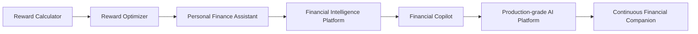
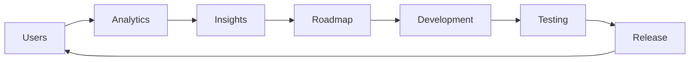

# CardWise Phase-wise Roadmap

> **Version:** 1.0  
> **Status:** Living Engineering Document  
> **Document Owner:** Shailesh Kumar Jha  
> **Product:** CardWise  
> **Document Type:** Product Development & Engineering Roadmap

---

# Executive Summary

CardWise is an AI-first Financial Decision Intelligence Platform that helps users make the right financial decision at the right moment.

Unlike conventional fintech applications that primarily display financial information, CardWise is designed to understand financial context, reason over multiple data sources, explain recommendations transparently, and eventually automate repetitive financial decision-making.

This roadmap is **not a business roadmap**, **not an investor roadmap**, and **not an organizational scaling document**.

It is a **product engineering execution roadmap** that defines how CardWise will evolve from an idea into a production-grade application built with high engineering standards.

The document serves as the primary execution guide for designing, building, validating, launching, and continuously improving the product.

Its purpose is to ensure that every feature, architectural decision, and engineering investment contributes toward a single long-term vision:

> **Build the most trusted AI-native financial companion for everyday consumers.**

---

# Purpose of this Roadmap

Software projects often fail because they become collections of disconnected features.

CardWise follows a different philosophy.

Every implementation decision must contribute toward a coherent long-term product vision.

This roadmap exists to:

- Define the order in which capabilities should be built.
- Prevent premature optimization.
- Reduce unnecessary complexity.
- Establish clear engineering milestones.
- Maintain architectural consistency.
- Keep AI tightly integrated with deterministic financial systems.
- Ensure production readiness at every stage.
- Avoid accumulating avoidable technical debt.
- Provide a single source of truth for implementation priorities.

Rather than focusing on deadlines, the roadmap focuses on **product maturity**.

A phase is considered complete only when its objectives, quality standards, and exit criteria have been satisfied.

---

# Vision Statement

CardWise aims to become the default financial decision layer between users and their financial ecosystem.

Whenever a user makes a financial decision—shopping, traveling, paying bills, redeeming rewards, choosing a credit card, planning expenses, or optimizing loyalty programs—CardWise should provide the most accurate, explainable, and context-aware recommendation.

Over time, the platform evolves from:

```text
Reward Calculator

↓

Reward Optimizer

↓

Financial Intelligence Platform

↓

Financial Copilot

↓

Autonomous Financial Assistant
```

Every roadmap phase incrementally moves the product toward this vision.

---

# Product Development Philosophy

CardWise is built upon a small number of fundamental engineering philosophies that influence every technical and product decision.

---

## Build Platforms, Not Features

Instead of creating isolated functionality, every major implementation should become reusable.

Examples include:

- Recommendation Engine
- Merchant Intelligence
- Reward Engine
- AI Gateway
- Notification Platform
- Analytics SDK
- Design System
- Knowledge Platform

Whenever a capability is likely to be reused in multiple places, it should be abstracted into a shared platform component.

---

## Intelligence Before Complexity

Adding more features does not necessarily create a better product.

CardWise prioritizes making existing features smarter before introducing new ones.

For example:

Instead of supporting twenty reward programs with mediocre recommendations,

prefer supporting five programs with industry-leading recommendation quality.

---

## Quality Before Speed

Fast iteration is valuable.

Poor engineering is expensive.

Every feature must satisfy:

- correctness,
- maintainability,
- accessibility,
- observability,
- documentation,
- testing,
- performance.

The objective is sustainable velocity rather than rapid accumulation of features.

---

## User Value Before Technology

Technology choices exist to solve user problems.

Every new technology introduced into CardWise should answer one question:

> **How does this improve the user experience?**

If no clear answer exists, the technology should not be adopted.

---

## Continuous Improvement

The roadmap intentionally avoids defining a "finished" product.

Every release should improve:

- recommendation quality,
- performance,
- usability,
- explainability,
- accessibility,
- AI intelligence.

Small, continuous improvements compound into exceptional software.

---

# Roadmap Philosophy

This roadmap is **phase-driven** rather than **calendar-driven**.

Dates are poor indicators of product readiness.

Instead, progression is determined by measurable engineering and product outcomes.

Each phase defines:

- objectives,
- deliverables,
- technical scope,
- dependencies,
- quality standards,
- exit criteria.

Only after meeting those criteria should development proceed to the next phase.

This approach provides flexibility while ensuring that architectural foundations remain stable.

---

# Why Phase-driven Development

Financial software has a naturally layered architecture.

Attempting to build advanced AI features before establishing reliable financial data models introduces unnecessary complexity and technical debt.

CardWise intentionally follows a progression where each phase builds upon the previous one.

```text
Foundation

↓

Reliable Data

↓

Recommendations

↓

Intelligence

↓

Conversations

↓

Automation
```

Each layer strengthens the next.

This minimizes rewrites and allows engineering effort to compound over time.

---

# Product Evolution

The long-term evolution of CardWise follows a deliberate progression.



Each stage expands the platform's capabilities without compromising simplicity.

---

# Engineering Principles

Every engineering decision should satisfy the following principles.

---

## Simplicity

Prefer simple, understandable solutions over unnecessarily complex architectures.

Complexity should be introduced only when justified by measurable requirements.

---

## Scalability

Design systems that support future growth without requiring complete rewrites.

Examples:

- modular architecture,
- reusable services,
- shared components,
- configuration-driven behavior.

---

## Reliability

Every feature should behave consistently.

Failures should be predictable, observable, and recoverable.

---

## Maintainability

Future changes should become easier—not harder—as the project grows.

Readable code is more valuable than clever code.

---

## Testability

Every critical business rule should be independently testable.

Financial calculations should never depend solely on UI behavior.

---

## Observability

Every important action should produce sufficient telemetry for debugging and monitoring.

Metrics, logs, traces, and analytics should be considered core product capabilities.

---

## Security

Security is integrated into every layer rather than treated as a final-stage concern.

---

## Documentation

Documentation evolves alongside implementation.

Every major architectural decision should be documented before becoming production behavior.

---

# Product Quality Principles

Every feature delivered in CardWise must satisfy a consistent quality standard.

A feature is considered complete only when it is:

- Functional
- Accessible
- Responsive
- Tested
- Documented
- Observable
- Secure
- Performant
- Explainable
- Production Ready

This prevents "almost complete" functionality from accumulating over time.

---

# AI-first Development Principles

Artificial Intelligence is treated as a platform capability rather than an isolated feature.

Several principles guide AI adoption.

---

## Deterministic Before Generative

Financial calculations remain deterministic.

AI explains and orchestrates.

AI never replaces verified financial computation.

---

## Retrieval Before Guessing

AI should retrieve verified knowledge before generating responses.

Knowledge sources include:

- reward rules,
- merchant database,
- user preferences,
- financial memory,
- recommendation engine.

---

## Explainability

Every AI recommendation should answer:

- Why?
- Compared to what?
- What assumptions were made?
- What confidence exists?
- What evidence supports the recommendation?

Users should understand recommendations rather than blindly trust them.

---

## Progressive Intelligence

AI capabilities should mature gradually.

```text
Explanation

↓

Personalization

↓

Planning

↓

Conversation

↓

Reasoning

↓

Automation
```

Every stage builds upon proven reliability.

---

# Solo Builder Strategy

CardWise is intentionally designed to be developed and maintained by a single engineer.

Instead of increasing productivity through team size, development velocity is increased through:

- strong architecture,
- reusable platforms,
- automation,
- AI-assisted engineering,
- comprehensive documentation,
- managed cloud services,
- disciplined prioritization.

The objective is to maximize leverage rather than headcount.

Engineering effort should focus on product differentiation rather than operational overhead.

---

# Development Principles

To maintain momentum over a long-term solo project, every phase follows these rules.

## Complete Before Expanding

Finish existing functionality before introducing unrelated features.

---

## Reuse Before Rebuilding

Every reusable component should become part of the platform.

---

## Automate Repetitive Work

Examples include:

- deployments,
- testing,
- documentation generation,
- release notes,
- dependency updates,
- monitoring.

---

## Measure Everything

Every significant user interaction should be measurable.

Engineering decisions should increasingly become data-informed.

---

## Minimize Operational Complexity

Prefer managed services whenever they reduce maintenance effort without compromising flexibility.

The founder's time should primarily be spent building product value.

---

# Definition of Done

A feature is considered complete only when all of the following conditions are satisfied.

## Product

- Requirements implemented.
- UX validated.
- Edge cases handled.

---

## Frontend

- Responsive.
- Accessible.
- Empty states.
- Loading states.
- Error states.

---

## Backend

- APIs implemented.
- Validation completed.
- Error handling implemented.

---

## Database

- Schema finalized.
- Indexes reviewed.
- Migrations created.

---

## AI

- Prompt reviewed.
- Response quality validated.
- Explainability verified.

---

## Testing

- Unit tests.
- Integration tests.
- Regression tests.

---

## Performance

- Performance budget satisfied.
- Lighthouse targets achieved.
- API latency within target.

---

## Security

- Authentication validated.
- Authorization verified.
- Input validation complete.

---

## Observability

- Analytics events implemented.
- Logging complete.
- Monitoring configured.

---

## Documentation

- Technical documentation updated.
- API documentation updated.
- Architecture documentation updated.

Only after satisfying every checklist item can the feature move into production.

---

# Success Metrics

The roadmap measures success through product quality rather than delivery speed.

## Product Metrics

- Recommendation Accuracy
- User Retention
- Session Completion Rate
- Feature Adoption
- Time to First Value

---

## Engineering Metrics

- Deployment Frequency
- Build Success Rate
- Test Coverage
- API Performance
- Error Rate

---

## AI Metrics

- Recommendation Precision
- Explanation Quality
- Retrieval Accuracy
- AI Response Time

---

## UX Metrics

- Task Completion Rate
- Accessibility Score
- Lighthouse Score
- User Satisfaction

---

## Platform Metrics

- Availability
- Security
- Scalability
- Observability
- Maintainability

---

# High-Level Development Timeline

| Phase | Primary Goal |
|--------|--------------|
| Phase 0 | Foundation & Architecture |
| Phase 1 | Core MVP |
| Phase 2 | Public Beta |
| Phase 3 | Product Maturity |
| Phase 4 | AI Intelligence Platform |
| Phase 5 | Financial Copilot |
| Phase 6 | Production Excellence |
| Phase 7 | Continuous Evolution |

Each phase introduces only the complexity required to achieve its objectives, ensuring that the platform remains maintainable while steadily increasing in capability.

---

# Looking Ahead

The remainder of this roadmap describes each phase in detail, including:

- Objectives
- Deliverables
- Features
- Technical Architecture
- Backend Evolution
- Frontend Evolution
- AI Capabilities
- Database Changes
- Infrastructure
- Security
- Testing
- Performance Targets
- Definition of Done
- Exit Criteria

Together, these phases form a complete engineering blueprint for building, launching, and continuously evolving CardWise into a polished, production-grade AI-first financial application.


# Phase 0 — Foundation & Architecture

> **Objective:** Build a rock-solid engineering foundation that enables every future feature to be implemented consistently, securely, and efficiently.

Phase 0 intentionally contains **very little user-facing functionality**.

Instead, this phase invests in the engineering platform that will dramatically increase development velocity throughout the rest of the project.

This is arguably the most important phase of the roadmap.

A weak foundation results in:

- inconsistent architecture
- duplicated code
- poor developer experience
- technical debt
- performance issues
- difficult testing
- unstable deployments

Every hour invested here saves many hours in later phases.

---

# Phase Vision

By the completion of Phase 0:

- the repository is production-ready
- architecture is finalized
- infrastructure is automated
- CI/CD is operational
- authentication framework exists
- design system is established
- coding standards are enforced
- monitoring is integrated
- analytics are configured
- deployment is repeatable

No major architectural rewrites should be required after this phase.

---

# Primary Goals

## Engineering Goals

- Establish project architecture.
- Finalize technology stack.
- Create scalable repository structure.
- Implement shared engineering tooling.
- Standardize coding practices.
- Automate development workflows.

---

## Product Goals

- Define product identity.
- Create design language.
- Finalize navigation structure.
- Build reusable UI primitives.
- Create production-ready layouts.

---

## Platform Goals

- Authentication foundation.
- Infrastructure provisioning.
- Analytics integration.
- Logging.
- Error monitoring.
- Security baseline.

---

# Deliverables

| Area | Deliverable |
|-------|-------------|
| Repository | Monorepo initialized |
| Frontend | Next.js application |
| Backend | NestJS/Fastify API |
| Database | PostgreSQL configured |
| Cache | Redis configured |
| Authentication | JWT + OAuth framework |
| Infrastructure | Docker + Kubernetes manifests |
| CI/CD | GitHub Actions |
| Monitoring | Grafana + OpenTelemetry |
| Analytics | PostHog + GA4 |
| Documentation | Complete developer documentation |

---

# Technology Stack

## Frontend

- Next.js
- React
- TypeScript
- Tailwind CSS
- Shadcn UI
- TanStack Query
- Zustand
- React Hook Form
- Zod

---

## Backend

- NestJS
- TypeScript
- PostgreSQL
- Prisma ORM
- Redis
- BullMQ
- OpenAPI

---

## AI

- OpenAI
- Anthropic
- LangChain
- MCP-compatible Tool Layer
- Embedding Models
- Vector Search (future-ready)

---

## Infrastructure

- Docker
- Kubernetes
- GitHub Actions
- Terraform
- NGINX
- Cloudflare

---

## Monitoring

- Grafana
- Prometheus
- Loki
- Tempo
- OpenTelemetry
- Sentry

---

## Storage

- PostgreSQL
- Redis
- S3 Compatible Object Storage

---

# Repository Structure

```text
cardwise/

apps/
    web/
    admin/
    extension/

packages/
    ui/
    config/
    types/
    api-client/
    analytics/
    auth/
    design-system/
    eslint-config/
    tsconfig/

services/
    api/

docs/

scripts/

infra/

docker/

.github/
```

---

# Monorepo Principles

The repository follows several principles.

## Shared First

Any reusable code belongs in `packages/`.

---

## Domain Isolation

Features are grouped by business domain.

Example:

```text
cards/

merchants/

recommendations/

travel/

analytics/

users/
```

---

## Independent Packages

Every shared package should:

- build independently
- test independently
- publish independently

---

# Coding Standards

Every file follows consistent conventions.

---

## TypeScript

- Strict mode enabled
- No implicit any
- No ignored compiler errors

---

## React

- Functional Components
- Hooks only
- Composition over inheritance
- Feature-based folders

---

## Backend

- Dependency Injection
- DTO validation
- Layered architecture
- Repository pattern where appropriate

---

## Naming

Examples:

```
CardRecommendationService

MerchantRepository

RewardEngine

RecommendationCard

useRecommendation()
```

Consistency is preferred over brevity.

---

# Design System Foundation

A dedicated design system is established before product development begins.

---

## Tokens

Define:

- colors
- typography
- spacing
- radius
- shadows
- motion
- icons

---

## Components

Initial component library:

- Button
- Input
- Card
- Dialog
- Modal
- Tooltip
- Badge
- Tabs
- Select
- Toast
- Avatar
- Skeleton
- Empty State
- Error State

---

## Layout Components

- Page Layout
- Sidebar
- Navigation
- Header
- Footer
- Container
- Grid
- Section

---

# Navigation Architecture

Initial application structure:

```text
Home

Cards

Rewards

Merchants

Insights

Settings
```

Navigation remains intentionally simple during the early phases.

---

# Authentication Foundation

Supported providers:

- Email
- Google
- Apple (future-ready)

Features:

- Login
- Registration
- Email Verification
- Password Reset
- Session Management
- JWT
- Refresh Tokens

---

# User Management Foundation

Core profile includes:

- Name
- Email
- Avatar
- Country
- Currency
- Preferred Language
- Timezone

Future preferences are intentionally deferred.

---

# Database Foundation

Primary database:

PostgreSQL

Core tables:

- users
- sessions
- audit_logs
- settings
- migrations

Business tables will be added in later phases.

---

# API Foundation

REST APIs only during Phase 0.

Standards:

- OpenAPI documentation
- Versioned endpoints
- Standard error responses
- Pagination
- Validation
- Request IDs

---

# State Management Strategy

Global State:

Zustand

Server State:

TanStack Query

Forms:

React Hook Form

Validation:

Zod

This separation minimizes unnecessary re-renders and improves maintainability.

---

# Error Handling

Every layer follows consistent error handling.

Frontend:

- User-friendly messages
- Retry support
- Error boundaries

Backend:

- Structured exceptions
- Error codes
- Correlation IDs

Infrastructure:

- Centralized logging
- Alerting
- Incident dashboards

---

# Logging

Every request logs:

- request ID
- user ID
- endpoint
- latency
- status code

Every log is structured JSON.

---

# Analytics Foundation

Capture:

- page views
- onboarding
- authentication
- navigation
- feature usage

Do **not** collect unnecessary personal information.

---

# Monitoring

Monitor:

Application

↓

API

↓

Database

↓

Cache

↓

Infrastructure

↓

Browser

↓

AI

Dashboards are prepared before production traffic exists.

---

# CI/CD

Every pull request executes:

```text
Install

↓

Lint

↓

Type Check

↓

Unit Tests

↓

Build

↓

Preview Deployment
```

Main branch additionally performs:

```text
Deploy

↓

Smoke Tests

↓

Health Checks

↓

Notifications
```

---

# Security Baseline

Implement:

- HTTPS
- CSP
- CSRF Protection
- Secure Cookies
- Input Validation
- Output Encoding
- Rate Limiting
- Helmet Headers

Security is enabled from the first deployment.

---

# Documentation

The repository should already contain:

```
README

Architecture

Setup Guide

Development Guide

Contributing Guide

Coding Standards

Folder Structure

Environment Variables

Deployment Guide
```

Documentation evolves with the implementation.

---

# Testing Foundation

Testing stack:

Frontend

- Vitest
- React Testing Library

Backend

- Jest
- Supertest

Future additions:

- Playwright
- Load Testing

---

# Performance Budget

Initial targets:

| Metric | Target |
|----------|---------|
| Lighthouse | >95 |
| First Contentful Paint | <1.5s |
| Largest Contentful Paint | <2.5s |
| Bundle Size | <250 KB initial |
| API P95 | <300 ms |

Performance budgets are enforced from the beginning.

---

# Accessibility Baseline

Target:

WCAG 2.2 AA

Requirements:

- keyboard navigation
- semantic HTML
- color contrast
- focus indicators
- screen reader support
- reduced motion

Accessibility is treated as a core product requirement.

---

# Development Checklist

Before Phase 0 is considered complete:

- [ ] Repository initialized
- [ ] Monorepo configured
- [ ] Next.js application running
- [ ] Backend API running
- [ ] PostgreSQL configured
- [ ] Redis configured
- [ ] Authentication implemented
- [ ] Design System initialized
- [ ] CI/CD operational
- [ ] Monitoring configured
- [ ] Analytics configured
- [ ] Error tracking enabled
- [ ] Logging standardized
- [ ] Documentation completed
- [ ] Security baseline implemented
- [ ] Performance budget established
- [ ] Accessibility baseline established

---

# Exit Criteria

Phase 0 is complete when:

## Engineering

- Architecture is finalized.
- Repository structure is stable.
- Development workflow is fully automated.

---

## Product

- Core layouts implemented.
- Navigation finalized.
- Design language established.

---

## Infrastructure

- Deployments require zero manual steps.
- Monitoring is operational.
- Alerts are configured.

---

## Quality

- Coding standards documented.
- Testing framework operational.
- Performance budgets enforced.
- Security baseline implemented.

No customer-facing functionality should be developed further until these foundational capabilities are complete.

Phase 0 establishes the engineering platform upon which every subsequent CardWise capability will be built.


# Phase 1 — MVP (Core Reward Intelligence Platform)

> **Objective:** Build the first fully functional version of CardWise that enables users to discover the best payment card for a purchase based on rewards, benefits, and merchant-specific intelligence.

Phase 1 focuses on delivering **real user value** with the smallest possible feature set.

The MVP should not attempt to solve every financial problem.

Instead, it should solve **one problem exceptionally well**:

> **"Which card should I use right now?"**

Every feature in this phase should directly support that objective.

---

# Phase Vision

By the end of Phase 1, CardWise should be a polished, production-ready application that allows users to:

- Create an account
- Add and manage payment cards
- Browse supported merchants
- Search merchants
- Receive the best card recommendation
- Understand why a recommendation was made
- Track estimated savings
- Access the application via web
- Use the initial browser extension

The experience should already feel premium, even though many advanced capabilities are intentionally postponed.

---

# Primary Objectives

## Product Objectives

- Deliver a delightful first experience.
- Minimize onboarding friction.
- Build user trust through explainable recommendations.
- Establish CardWise's core value proposition.

---

## Engineering Objectives

- Validate core architecture.
- Build reusable domain services.
- Establish API contracts.
- Ensure production stability.
- Prepare the platform for future intelligence layers.

---

## UX Objectives

- Reduce cognitive load.
- Minimize clicks.
- Prioritize speed.
- Build confidence through transparency.
- Keep the interface uncluttered.

---

# Scope

## Included

- Authentication
- User Profile
- Card Management
- Merchant Directory
- Reward Engine V1
- Recommendation Engine V1
- Merchant Search
- Dashboard
- Browser Extension (Basic)
- Analytics
- Notifications (Basic)
- Settings

---

## Explicitly Excluded

The following are intentionally deferred:

- AI Copilot
- Financial Planning
- Travel Planning
- Knowledge Graph
- Reward Wallet
- Goal Tracking
- Financial Memory
- Multi-agent AI
- Premium Subscription
- Browser Autofill Intelligence
- Autonomous Automation

These belong to later phases.

---

# Product Modules

```text
Authentication

↓

User Profile

↓

Cards

↓

Merchants

↓

Reward Engine

↓

Recommendation Engine

↓

Dashboard

↓

Browser Extension
```

Each module is independently testable and reusable.

---

# Feature 1 — User Authentication

## Goal

Allow secure account creation and sign-in.

---

### Features

- Email registration
- Email login
- Google Sign-In
- Forgot password
- Email verification
- Session management

---

### Future Ready

Architecture should support:

- Apple Sign-In
- Passkeys
- Multi-factor authentication

without requiring architectural changes.

---

# Feature 2 — User Profile

Each user profile stores:

- Name
- Email
- Avatar
- Country
- Currency
- Timezone
- Preferred Language

Future financial preferences are intentionally excluded.

---

# Feature 3 — Card Management

Users can maintain their personal card portfolio.

---

## Operations

- Add card
- Edit card
- Remove card
- Activate/Deactivate
- Favorite card
- View benefits

---

## Stored Information

Each card includes:

- Bank
- Card Name
- Network (Visa/Mastercard/RuPay/Amex)
- Reward Program
- Joining Fee
- Annual Fee
- Annual Fee Waiver
- Lounge Access
- Fuel Benefits
- Cashback Rules
- Reward Rules

---

# Feature 4 — Merchant Directory

A centralized merchant catalog powers recommendations.

---

## Merchant Information

Store:

- Merchant Name
- Category
- MCC
- Supported Payment Types
- Merchant Tags
- Country
- Website
- Brand Assets

---

## Search

Support:

- fuzzy search
- category search
- popular merchants
- recently searched

---

# Feature 5 — Reward Engine V1

The Reward Engine becomes the deterministic core of CardWise.

It calculates:

- reward points,
- cashback,
- milestone bonuses,
- exclusions,
- effective reward rate.

No AI participates in calculations.

---

## Inputs

- Merchant
- Card
- Amount
- Currency
- Reward Rules

---

## Outputs

- Points
- Cashback
- Estimated Value
- Reward Rate
- Explanation

---

# Feature 6 — Recommendation Engine V1

The Recommendation Engine compares every eligible card.

---

## Recommendation Factors

- Reward Rate
- Cashback
- Point Value
- Merchant Bonus
- Card Restrictions
- User Ownership
- Promotional Offers

---

## Output

```text
Best Card

↓

Estimated Savings

↓

Explanation

↓

Alternative Cards

↓

Confidence
```

Every recommendation must be explainable.

---

# Feature 7 — Dashboard

The dashboard becomes the user's home.

---

## Sections

### Welcome

Greeting.

---

### Best Recommendation

Recently viewed recommendation.

---

### Cards

Owned cards.

---

### Popular Merchants

Frequently searched merchants.

---

### Recent Activity

Recommendation history.

---

### Insights

Simple metrics.

Examples:

- Total recommendations
- Estimated savings
- Favorite merchant

---

# Feature 8 — Merchant Search

Search becomes the fastest path to value.

---

## Search Flow

```text
Open Search

↓

Type Merchant

↓

Suggestions

↓

Select Merchant

↓

Enter Amount

↓

Recommendation
```

Target:

Recommendation within **5 seconds**.

---

# Feature 9 — Recommendation Screen

The recommendation screen becomes the product's signature experience.

---

## Components

Recommendation Card

Reward Summary

Savings

Alternative Cards

Calculation Breakdown

Why Recommended

Card Benefits

Every recommendation should be understandable in under 30 seconds.

---

# Feature 10 — Browser Extension (V1)

The extension validates contextual recommendations.

---

## Supported Websites

Initially:

- Amazon
- Flipkart
- Myntra

Additional merchants are introduced later.

---

## Capabilities

Detect:

- Merchant
- Purchase Amount

Display:

- Recommended Card
- Estimated Rewards
- Why It Was Chosen

No autofill.

No automation.

Recommendations only.

---

# Backend Services

The MVP introduces the following services.

```text
Authentication

↓

Users

↓

Cards

↓

Merchants

↓

Reward Engine

↓

Recommendations

↓

Analytics

↓

Notifications
```

Services remain inside a modular monolith.

---

# Database Evolution

New entities include:

- users
- cards
- banks
- merchants
- reward_rules
- recommendations
- recommendation_history
- searches
- analytics_events

Schema prioritizes normalization and future extensibility.

---

# API Deliverables

Core APIs include:

## Authentication

- Register
- Login
- Logout
- Refresh Token

---

## User

- Get Profile
- Update Profile

---

## Cards

- Create
- Read
- Update
- Delete
- List

---

## Merchants

- Search
- Get Details
- Categories

---

## Recommendations

- Generate Recommendation
- Recommendation History

---

## Analytics

- Track Events

---

# Frontend Deliverables

Primary routes:

```text
/

Dashboard

/cards

/merchants

/recommendation

/profile

/settings

/help
```

Shared UI components from Phase 0 are reused consistently.

---

# State Management

Global state:

- User
- Authentication
- Theme
- Notifications

Server state:

- Cards
- Merchants
- Recommendations
- Search

---

# Analytics

Capture:

- Registration
- Login
- Card Added
- Merchant Search
- Recommendation Generated
- Recommendation Accepted
- Dashboard Viewed

These events establish the baseline for future personalization.

---

# Security

Implement:

- JWT authentication
- Refresh tokens
- Input validation
- API rate limiting
- Secure cookies
- CSP
- CSRF protection
- Audit logging

Security remains invisible but foundational.

---

# Performance Targets

| Metric | Target |
|---------|--------|
| Merchant Search | <300 ms |
| Recommendation Generation | <500 ms |
| Dashboard Load | <2 seconds |
| Lighthouse | >95 |
| API Availability | 99.9% |

Performance regressions block release.

---

# Accessibility Targets

Maintain:

- WCAG 2.2 AA
- Keyboard navigation
- Screen reader compatibility
- Accessible forms
- High contrast support

Accessibility testing becomes part of CI.

---

# Testing Strategy

## Frontend

- Unit tests
- Component tests
- Accessibility tests

---

## Backend

- Unit tests
- Integration tests
- API contract tests

---

## Browser Extension

- End-to-end validation
- Merchant detection tests
- Recommendation rendering tests

---

# Production Checklist

Before MVP release:

- [ ] Authentication stable
- [ ] Card management complete
- [ ] Merchant search operational
- [ ] Reward calculations verified
- [ ] Recommendation engine validated
- [ ] Dashboard polished
- [ ] Browser extension functional
- [ ] Analytics events verified
- [ ] Monitoring dashboards active
- [ ] Error tracking enabled
- [ ] Security review completed
- [ ] Performance budgets satisfied
- [ ] Accessibility audit passed
- [ ] Documentation updated

---

# Success Metrics

## Product

- Users complete onboarding in under 3 minutes.
- Recommendation generation success rate >99%.
- Recommendation explanations understood by users.
- Merchant search becomes the primary interaction.

---

## Engineering

- Stable deployment pipeline.
- High automated test coverage.
- Zero critical production defects.
- Observability across all core services.

---

## User Experience

- Fast recommendation workflow.
- Minimal navigation complexity.
- High satisfaction with recommendation quality.
- Clear understanding of reward calculations.

---

# Exit Criteria

Phase 1 is complete when CardWise reliably delivers accurate, explainable, and performant reward recommendations for supported merchants through both the web application and the browser extension.

At this point, the platform has validated its core value proposition and established the technical foundation for richer intelligence.

The next phase focuses on expanding recommendation quality through merchant intelligence, personalization, user feedback, and broader ecosystem support without fundamentally changing the product architecture established during the MVP.


# Phase 2 — Public Beta & Personalization

> **Objective:** Expand CardWise beyond a deterministic reward recommendation engine into an intelligent, personalized financial assistant by improving recommendation quality, merchant intelligence, browser integration, analytics, and user feedback.

Phase 2 is about **depth**, not breadth.

The MVP has already proven that CardWise can recommend the best card.

Now the focus shifts to answering a more important question:

> **"How can CardWise consistently provide better recommendations than any competing product?"**

The answer lies in:

- richer merchant intelligence,
- contextual recommendations,
- personalized experiences,
- continuous learning,
- high-quality analytics.

---

# Phase Vision

By the completion of Phase 2, CardWise should feel significantly smarter than the MVP.

Instead of simply calculating rewards, it should understand:

- where users shop,
- how they spend,
- which merchants they prefer,
- which rewards they value,
- how recommendations should adapt over time.

This is the beginning of CardWise's transition from a **calculator** to an **intelligence platform**.

---

# Primary Objectives

## Product Objectives

- Improve recommendation quality.
- Introduce user personalization.
- Expand merchant coverage.
- Improve browser experience.
- Increase daily engagement.

---

## Engineering Objectives

- Introduce intelligent recommendation layers.
- Expand analytics capabilities.
- Improve platform scalability.
- Introduce experimentation infrastructure.
- Improve observability.

---

## UX Objectives

- Reduce search friction.
- Surface contextual information.
- Improve discoverability.
- Increase recommendation confidence.

---

# Scope

## Included

- Merchant Intelligence
- Reward Engine V2
- Recommendation Engine V2
- Browser Extension V2
- User Preferences
- Saved Searches
- Favorite Merchants
- Personalized Dashboard
- Offer Intelligence
- Analytics Expansion
- Feedback System
- Experimentation Platform

---

## Explicitly Excluded

Still postponed:

- AI Copilot
- Financial Memory
- Knowledge Graph
- Goal Planning
- Travel Planning
- Financial Timeline
- Multi-Agent AI
- Autonomous Automation

---

# Product Evolution

```text
Merchant Search

↓

Recommendation

↓

Personalization

↓

Merchant Intelligence

↓

Behavioral Intelligence

↓

Context-aware Recommendation
```

Recommendations begin adapting to users instead of remaining static.

---

# Feature 1 — Merchant Intelligence

The merchant database evolves into one of CardWise's most valuable assets.

---

## Merchant Profile

Each merchant now stores:

- Name
- Category
- MCC
- Brand
- Parent Company
- Payment Acceptance
- Popular Cards
- Active Promotions
- Historical Promotions
- Reward Multipliers
- Tags

---

## Merchant Metadata

Additional intelligence includes:

- popularity score,
- average reward rate,
- seasonal campaigns,
- transaction confidence,
- merchant aliases.

---

## Merchant Relationships

Future-ready support for:

- merchant groups,
- parent brands,
- marketplace relationships.

Example:

Amazon

↓

Amazon Fresh

↓

Amazon Pay

↓

Amazon MiniTV

These relationships improve recommendation quality.

---

# Feature 2 — Reward Engine V2

The Reward Engine becomes significantly more sophisticated.

---

## New Inputs

- promotional campaigns,
- merchant-specific bonuses,
- quarterly offers,
- milestone progress,
- category caps,
- exclusions.

---

## New Outputs

- optimized reward value,
- effective reward rate,
- estimated redemption value,
- confidence score,
- recommendation rationale.

---

# Feature 3 — Recommendation Engine V2

The recommendation engine evolves from deterministic ranking to weighted intelligence.

---

## Ranking Factors

- Reward Value
- Cashback
- Reward Point Value
- Merchant Offers
- User Preferences
- Historical Acceptance
- Spending Habits
- Active Promotions

---

## Recommendation Score

```
Reward Value

+

Merchant Bonus

+

User Preference

+

Promotion Score

↓

Recommendation Score
```

Rule-based calculations remain deterministic.

---

# Feature 4 — User Preferences

Users can now customize CardWise.

---

## Preferences

Examples:

Preferred Reward Type

- Cashback
- Airline Miles
- Hotel Points
- Reward Points

---

Preferred Banks

---

Preferred Airlines

---

Preferred Hotels

---

Notification Preferences

---

Preferred Currency

These preferences influence recommendation ranking.

---

# Feature 5 — Personalized Dashboard

The dashboard becomes adaptive.

---

## New Widgets

Recently Used Cards

Favorite Merchants

Savings This Month

Best Offers

Trending Merchants

Quick Recommendation

Recent Searches

---

Widgets become configurable.

Future widgets can be added without redesigning the dashboard.

---

# Feature 6 — Saved Searches

Users can bookmark common searches.

Examples:

Amazon ₹5,000

Flipkart Electronics

Myntra Fashion

Flight Booking

Recurring searches become one-click actions.

---

# Feature 7 — Favorite Merchants

Users may mark merchants as favorites.

Benefits include:

- faster search,
- better recommendations,
- personalized offers,
- future notification support.

---

# Feature 8 — Offer Intelligence

CardWise introduces a dedicated Offer Engine.

---

## Supported Offers

- cashback campaigns,
- instant discounts,
- EMI promotions,
- festive offers,
- merchant campaigns,
- bank promotions.

---

## Offer Evaluation

Every offer includes:

- validity,
- conditions,
- estimated value,
- stackability,
- eligibility.

---

# Feature 9 — Browser Extension V2

The extension becomes significantly more useful.

---

## New Capabilities

Detect:

- merchant,
- cart amount,
- product category,
- checkout stage.

Display:

- recommended card,
- expected reward,
- alternative cards,
- active offers,
- reward explanation.

---

## UX Improvements

- collapsible interface,
- floating recommendation panel,
- manual refresh,
- quick feedback.

---

# Feature 10 — Recommendation History

Every recommendation becomes searchable.

Store:

- merchant,
- amount,
- selected card,
- alternatives,
- reward estimate,
- timestamp.

Users can review previous recommendations.

---

# Feature 11 — User Feedback

Introduce structured recommendation feedback.

Examples:

👍 Useful

👎 Not Useful

Wrong Recommendation

Missing Card

Incorrect Reward

Feedback directly informs future improvements.

---

# Feature 12 — Analytics Expansion

Track significantly richer product behavior.

---

## User Events

- recommendation viewed,
- recommendation copied,
- alternative selected,
- feedback submitted,
- widget interaction,
- extension opened,
- merchant favorited.

---

## Product Metrics

Measure:

- recommendation acceptance,
- merchant popularity,
- search latency,
- feature adoption,
- recommendation confidence.

---

# Feature 13 — Experimentation Platform

Prepare the platform for controlled improvements.

Support:

- feature flags,
- A/B experiments,
- gradual rollout,
- configuration-driven UI.

Every major UX change becomes measurable.

---

# Backend Evolution

New services:

```text
Merchant Intelligence

↓

Offer Engine

↓

Recommendation Engine V2

↓

Analytics Platform

↓

Experimentation Platform
```

Architecture remains a modular monolith but with stronger domain boundaries.

---

# Database Evolution

New entities:

- merchant_offers
- merchant_aliases
- saved_searches
- favorite_merchants
- user_preferences
- recommendation_feedback
- experiments
- feature_flags

Existing tables receive additional metadata.

---

# API Deliverables

## Merchant APIs

- Search
- Details
- Offers
- Similar Merchants

---

## Offer APIs

- Active Offers
- Historical Offers

---

## Preference APIs

- Update Preferences
- Retrieve Preferences

---

## Feedback APIs

- Submit Feedback
- Recommendation Feedback

---

## Experiment APIs

- Feature Flags
- Experiment Assignment

---

# Frontend Evolution

New screens:

```text
Favorite Merchants

Saved Searches

Offers

Recommendation History

Preferences
```

Dashboard evolves into a configurable workspace.

---

# Browser Extension Evolution

Support additional merchants.

Improve:

- merchant detection,
- recommendation speed,
- checkout compatibility.

Target:

Recommendation appears within **1 second** after checkout detection.

---

# Security Improvements

Enhance:

- session management,
- rate limiting,
- API quotas,
- audit logging,
- browser extension permissions.

Security posture matures without affecting usability.

---

# Performance Targets

| Metric | Target |
|---------|--------|
| Merchant Search | <200 ms |
| Recommendation Generation | <350 ms |
| Dashboard Load | <1.5 seconds |
| Browser Extension Response | <1 second |
| Lighthouse | >97 |

---

# Accessibility

Expand accessibility coverage.

Requirements:

- browser extension keyboard support,
- accessible recommendation cards,
- improved focus management,
- screen reader validation.

---

# Testing Strategy

Additional coverage includes:

- recommendation scoring,
- browser extension flows,
- personalization logic,
- offer evaluation,
- experiment assignment.

Regression testing becomes mandatory before every release.

---

# Production Checklist

Before completing Phase 2:

- [ ] Merchant Intelligence complete
- [ ] Reward Engine V2 validated
- [ ] Recommendation Engine V2 operational
- [ ] Personalized Dashboard released
- [ ] Browser Extension V2 deployed
- [ ] Saved Searches complete
- [ ] Favorite Merchants complete
- [ ] Offer Engine operational
- [ ] Recommendation History available
- [ ] Feedback system integrated
- [ ] Analytics dashboards expanded
- [ ] Feature Flags operational
- [ ] Accessibility audit completed
- [ ] Performance targets achieved

---

# Success Metrics

## Product

- Increased recommendation acceptance.
- Higher repeat usage.
- Faster merchant search.
- More personalized experience.

---

## Engineering

- Stable experimentation platform.
- High service reliability.
- Improved observability.
- Scalable recommendation architecture.

---

## UX

- Reduced search effort.
- Increased dashboard engagement.
- Positive feedback on recommendation quality.
- Improved browser extension adoption.

---

# Exit Criteria

Phase 2 concludes when CardWise consistently delivers personalized, context-aware recommendations supported by merchant intelligence, user preferences, and high-quality analytics.

At this stage, the platform has evolved beyond a simple reward calculator into a genuinely intelligent recommendation system with a strong data foundation.

The next phase shifts focus from recommendation quality alone to broader product maturity by introducing travel optimization, reward management, richer user engagement, and advanced financial insights that expand CardWise's value beyond individual purchases.


# Phase 3 — Product Maturity & Financial Productivity

> **Objective:** Transform CardWise from a recommendation engine into a daily-use financial productivity application by introducing reward management, travel optimization, financial insights, premium capabilities, and long-term user engagement features.

By the end of Phase 2, CardWise successfully answers:

> **"Which card should I use?"**

Phase 3 expands that question into:

> **"How can CardWise help me maximize the value of my entire financial ecosystem?"**

The platform begins shifting from **transaction-level intelligence** to **financial lifestyle optimization**.

Users should now have reasons to return even when they are **not actively making purchases**.

---

# Phase Vision

CardWise becomes a financial companion rather than a recommendation tool.

Users should begin opening CardWise to:

- monitor rewards,
- plan purchases,
- prepare travel,
- discover offers,
- analyze spending,
- maximize card benefits.

The application starts becoming part of users' financial routines.

---

# Primary Objectives

## Product Objectives

- Increase weekly engagement.
- Improve user retention.
- Expand product value beyond recommendations.
- Build financial awareness.
- Encourage proactive financial planning.

---

## Engineering Objectives

- Expand domain architecture.
- Introduce financial insight services.
- Improve recommendation intelligence.
- Build reusable financial modules.
- Prepare data structures for AI capabilities.

---

## UX Objectives

- Surface meaningful insights.
- Encourage exploration.
- Reduce navigation effort.
- Create a premium product experience.

---

# Scope

## Included

- Reward Wallet
- Travel Hub
- Trip Planning
- Premium Benefits Dashboard
- Card Comparison
- Spending Insights
- Reward Expiry Tracking
- Milestone Tracking
- Advanced Notifications
- Personalized Homepage
- Recommendation Engine V3

---

## Deferred

Still intentionally excluded:

- Conversational AI
- Financial Copilot
- Knowledge Graph
- Financial Memory
- Goal Planning
- AI Workspace
- Autonomous Workflows

---

# Product Evolution

```text
Recommendation

↓

Reward Tracking

↓

Financial Insights

↓

Travel Optimization

↓

Personal Productivity
```

The application becomes useful between purchases—not only during them.

---

# Feature 1 — Reward Wallet

The Reward Wallet becomes the central location for managing loyalty programs.

---

## Supported Data

For every card:

- Reward Balance
- Cashback Balance
- Airline Miles
- Hotel Points
- Expiring Rewards
- Last Updated
- Estimated Redemption Value

---

## Wallet Overview

Users can immediately answer:

- How many rewards do I have?
- Which rewards expire soon?
- What are they worth?
- Where should I redeem them?

---

## Future Ready

Architecture supports:

- automatic synchronization,
- account aggregation,
- redemption history.

---

# Feature 2 — Reward Expiry Intelligence

Reward expiry becomes proactive.

---

## Dashboard

Display:

- Expiring Soon
- High Value Rewards
- Redeem First
- Recommended Redemption Strategy

---

## Notifications

Examples:

```
5,200 reward points expire in 12 days.

Redeem now for approximately ₹1,850 value.
```

---

# Feature 3 — Card Benefits Dashboard

Each card receives a dedicated detail page.

---

## Sections

Overview

↓

Benefits

↓

Reward Rules

↓

Milestones

↓

Offers

↓

Lounge Access

↓

Insurance

↓

Annual Fee

↓

Historical Recommendations

Users gain a complete understanding of each card.

---

# Feature 4 — Card Comparison

Compare multiple cards simultaneously.

---

## Comparison Metrics

- Reward Rate
- Cashback
- Annual Fee
- Lounge Access
- Insurance
- Forex Markup
- Fuel Benefits
- Travel Benefits
- Welcome Bonus
- Milestones

---

## UX

Comparison table supports:

- filtering,
- sorting,
- highlighting differences,
- recommendation badges.

---

# Feature 5 — Spending Insights

Users begin understanding spending patterns.

---

## Categories

Examples:

- Shopping
- Dining
- Travel
- Fuel
- Entertainment
- Groceries
- Utilities

---

## Insights

Examples:

```
Dining accounts for 18% of your spending.

Switching one recurring payment could earn approximately ₹4,800 more annually.
```

---

# Feature 6 — Milestone Tracker

Many premium cards include milestone benefits.

CardWise now tracks them.

---

## Examples

Spend:

₹4,00,000

↓

Receive

10,000 Bonus Points

---

Dashboard displays:

Current Progress

Remaining Spend

Estimated Completion Date

Expected Reward

---

# Feature 7 — Travel Hub

Travel becomes a dedicated product area.

---

## Modules

Flights

Hotels

Lounges

Forex

Visa Information

Travel Cards

Airport Benefits

Insurance

Travel remains recommendation-focused during this phase.

Booking is intentionally postponed.

---

# Feature 8 — Trip Planner

Users can prepare future trips.

---

## Inputs

Destination

Travel Dates

Estimated Budget

Preferred Airline

Preferred Hotel

---

## Outputs

Recommended Cards

Reward Opportunities

Estimated Points

Lounge Eligibility

Travel Benefits

---

Future AI planning will build upon this foundation.

---

# Feature 9 — Premium Dashboard

Premium users receive additional insights.

Examples:

- annual savings,
- reward efficiency,
- premium recommendations,
- milestone forecasts,
- advanced comparisons.

Premium remains focused on intelligence rather than feature gating.

---

# Feature 10 — Recommendation Engine V3

Recommendations evolve beyond immediate purchases.

---

## New Inputs

- reward balances,
- milestone progress,
- travel plans,
- expiring rewards,
- preferred programs.

---

## New Outputs

Examples:

```
Use Card A today.

It earns fewer immediate rewards,

but helps unlock a 15,000-point milestone this month.

Estimated long-term value:

₹8,700
```

Recommendations become strategic rather than transactional.

---

# Feature 11 — Personalized Homepage

The homepage becomes adaptive.

Possible sections:

- Morning Summary
- Expiring Rewards
- Recommended Actions
- Upcoming Travel
- Milestones
- Active Offers
- Favorite Merchants
- Recent Activity

The homepage reflects each user's financial context.

---

# Feature 12 — Advanced Notifications

Notifications become meaningful.

Examples:

```
You're ₹9,200 away from your next milestone.

Use your Atlas card for your next hotel booking.
```

---

```
A better cashback offer is available today.

Consider delaying this purchase by 48 hours.
```

---

# Backend Evolution

New services:

```text
Reward Wallet

↓

Travel

↓

Insights

↓

Milestones

↓

Notifications V2

↓

Recommendation Engine V3
```

Domain boundaries become increasingly well-defined.

---

# Database Evolution

Additional entities:

- reward_balances
- reward_expiry
- reward_redemption
- spending_categories
- spending_insights
- milestone_progress
- trips
- airports
- lounges

Schemas remain normalized and future-ready.

---

# API Deliverables

## Reward APIs

- Reward Wallet
- Reward History
- Reward Expiry

---

## Travel APIs

- Destinations
- Airports
- Lounge Lookup
- Trip Planning

---

## Insight APIs

- Spending Insights
- Category Analysis
- Savings Summary

---

## Comparison APIs

- Compare Cards
- Benefit Comparison

---

# Frontend Evolution

New routes:

```text
/rewards

/travel

/trips

/cards/compare

/insights

/wallet

/milestones
```

Navigation begins grouping features by financial workflows rather than data entities.

---

# Browser Extension Evolution

The extension now supports:

- milestone reminders,
- travel merchants,
- offer overlays,
- recommendation history.

Merchant coverage expands substantially.

---

# Security Improvements

Enhancements include:

- session revocation,
- trusted devices,
- audit trail improvements,
- stronger browser extension isolation.

---

# Performance Targets

| Metric | Target |
|---------|--------|
| Dashboard | <1 second |
| Recommendation | <250 ms |
| Card Comparison | <500 ms |
| Reward Wallet | <300 ms |
| Lighthouse | >98 |

---

# Accessibility

Expand support for:

- comparison tables,
- financial charts,
- keyboard navigation,
- responsive travel planner,
- accessible notification center.

---

# Testing Strategy

Additional coverage includes:

- reward calculations,
- milestone tracking,
- travel recommendations,
- comparison engine,
- insight generation.

Performance regression testing becomes mandatory.

---

# Production Checklist

Before Phase 3 is complete:

- [ ] Reward Wallet complete
- [ ] Reward Expiry tracking operational
- [ ] Card Comparison complete
- [ ] Spending Insights available
- [ ] Milestone Tracker operational
- [ ] Travel Hub released
- [ ] Trip Planner available
- [ ] Personalized Homepage complete
- [ ] Recommendation Engine V3 validated
- [ ] Notification Center upgraded
- [ ] Performance targets achieved
- [ ] Accessibility audit passed
- [ ] Documentation updated

---

# Success Metrics

## Product

- Increased weekly active users.
- Higher feature adoption outside merchant search.
- Increased Reward Wallet usage.
- Strong engagement with travel planning.

---

## Engineering

- Stable modular architecture.
- Low operational overhead.
- High test coverage.
- Strong observability across new domains.

---

## User Experience

- Users understand the value of their rewards.
- CardWise becomes part of regular financial management.
- Increased trust in long-term recommendations.
- Improved satisfaction with personalized insights.

---

# Exit Criteria

Phase 3 concludes when CardWise successfully evolves from a transaction-focused recommendation engine into a comprehensive financial productivity application.

Users should routinely return to the platform to monitor rewards, prepare travel, analyze spending, compare cards, and optimize financial decisions—even when they are not making an immediate purchase.

With these foundations in place, the platform is ready for its next major transformation: introducing an AI-native intelligence layer powered by semantic understanding, contextual reasoning, financial memory, and knowledge-driven recommendations.

# Phase 4 — AI Intelligence Platform

> **Objective:** Transform CardWise from a feature-driven financial application into an AI-native intelligence platform capable of understanding context, reasoning across financial information, and delivering deeply personalized recommendations.

The first three phases establish a high-quality financial platform built on deterministic systems.

Phase 4 introduces a new capability:

> **Understanding.**

Instead of simply calculating rewards or comparing cards, CardWise begins understanding:

- user behavior,
- financial intent,
- historical decisions,
- merchant relationships,
- travel patterns,
- spending habits,
- financial preferences.

This is where CardWise evolves into a true **Financial Intelligence Platform**.

---

# Phase Vision

CardWise should now answer questions such as:

- Which card should I use?
- Why?
- What if I wait until next week?
- Which card is better for my upcoming trip?
- Which rewards should I redeem first?
- How can I maximize my annual reward value?
- What is the smartest financial decision based on my history?

The application becomes proactive instead of reactive.

---

# Primary Objectives

## Product Objectives

- Introduce intelligent personalization.
- Build explainable AI recommendations.
- Improve recommendation quality.
- Reduce user effort.
- Surface proactive financial insights.

---

## Engineering Objectives

- Introduce AI platform architecture.
- Build retrieval infrastructure.
- Build contextual reasoning.
- Prepare conversational AI.
- Enable reusable intelligence services.

---

## UX Objectives

- Replace manual exploration with intelligent suggestions.
- Surface recommendations naturally.
- Make AI explainable.
- Build trust.

---

# Scope

## Included

- Knowledge Graph
- Semantic Search
- Vector Database
- RAG Pipeline
- Financial Memory (Read-only)
- Context Engine
- Recommendation Engine V4
- AI Explanation Engine
- Insight Generation
- Smart Search

---

## Deferred

Still intentionally postponed:

- Chat-based Copilot
- Multi-step Planning
- Workflow Automation
- Autonomous Agents
- Goal Execution

---

# Product Evolution

```text
Data

↓

Information

↓

Knowledge

↓

Context

↓

Reasoning

↓

Intelligence
```

CardWise now understands relationships instead of isolated entities.

---

# AI Platform Architecture

```mermaid
flowchart TD

User

↓

Context Engine

↓

Knowledge Graph

↓

Vector Search

↓

RAG Pipeline

↓

LLM

↓

Explanation Engine

↓

Response
```

Each layer has a clearly defined responsibility.

---

# Core Principle

Financial calculations remain deterministic.

AI is responsible for:

- reasoning,
- summarization,
- personalization,
- explanations,
- contextual understanding.

AI never replaces verified financial calculations.

---

# Feature 1 — Knowledge Graph

The Knowledge Graph becomes the foundation of CardWise's intelligence.

---

## Nodes

Examples:

- User
- Card
- Merchant
- Reward Program
- Airline
- Hotel
- Airport
- Offer
- Category
- Bank

---

## Relationships

Examples:

```
User

OWNS

Card

↓

Card

EARNS

Reward

↓

Reward

VALID_AT

Merchant

↓

Merchant

BELONGS_TO

Category
```

These relationships power advanced reasoning.

---

# Feature 2 — Semantic Search

Users no longer need exact merchant names.

Examples:

Search:

```
Coffee Shops
```

Returns:

Starbucks

Third Wave

Blue Tokai

Cafe Coffee Day

---

Search:

```
Luxury Hotels
```

Returns relevant hotel partners.

Search becomes meaning-aware instead of keyword-based.

---

# Feature 3 — Vector Database

Store embeddings for:

- merchants,
- cards,
- rewards,
- offers,
- travel guides,
- financial documentation,
- conversations (future).

This enables semantic retrieval.

---

# Feature 4 — Retrieval-Augmented Generation (RAG)

Every AI response is grounded in verified data.

---

## Sources

- Reward Rules
- Merchant Database
- Card Database
- User Preferences
- Travel Data
- Knowledge Graph

---

## Response Pipeline

```
Question

↓

Context Retrieval

↓

Knowledge Search

↓

Financial Rules

↓

LLM

↓

Verified Response
```

Hallucinations are minimized through grounded retrieval.

---

# Feature 5 — Context Engine

The Context Engine determines what information matters.

Examples:

Current Merchant

Current Card Portfolio

Recent Purchases

Reward Balances

Travel Plans

User Preferences

Active Promotions

Only relevant context is supplied to the AI layer.

---

# Feature 6 — Financial Memory (Read-Only)

CardWise begins remembering long-term preferences.

Examples:

Preferred Airline

Favorite Hotel Chain

Preferred Cashback

Favorite Shopping Merchants

Typical Travel Style

Dining Preferences

The system learns gradually.

No automatic decision-making yet.

---

# Feature 7 — AI Explanation Engine

Every recommendation becomes richer.

Example:

```
Use HDFC Diners Black.

Reason:

• 10X Reward Multiplier
• Active Dining Offer
• ₹640 Estimated Reward
• You're nearing your annual milestone
• This maximizes long-term value
```

Users should always understand why recommendations are made.

---

# Feature 8 — Smart Insights

Generate proactive observations.

Examples:

```
Your Amazon spending has increased 38%.

Switching one recurring purchase could earn an additional ₹12,000 annually.
```

---

```
Your travel card has not been used in 4 months.

Its annual fee waiver may not be achieved.
```

Insights become personalized and contextual.

---

# Feature 9 — Recommendation Engine V4

The recommendation engine evolves from weighted scoring to contextual reasoning.

---

## Inputs

Previous Recommendation History

Financial Memory

Merchant Relationships

Travel Context

Reward Expiry

Milestones

Preferences

Active Offers

Historical Acceptance

---

## Outputs

Best Card

↓

Alternative

↓

Confidence

↓

Explanation

↓

Long-term Impact

↓

Related Insights

Recommendations become increasingly personalized.

---

# Feature 10 — Intelligent Search

Search becomes conversational without introducing a chatbot.

Examples:

```
Best card for dining tonight

Best forex card

Card with lounge access

Hotels accepting Marriott points

Cards with fuel surcharge waiver
```

Natural language queries become first-class citizens.

---

# Backend Evolution

New services:

```text
Knowledge Graph

↓

Embedding Service

↓

Vector Search

↓

Context Engine

↓

RAG Pipeline

↓

Explanation Engine

↓

Recommendation Engine V4
```

These services remain modular and reusable.

---

# Database Evolution

New entities:

- embeddings
- knowledge_nodes
- knowledge_edges
- financial_memory
- ai_context
- semantic_tags
- insight_history

Traditional relational storage remains the source of truth.

---

# AI Infrastructure

Introduce:

- embedding generation,
- vector indexing,
- retrieval caching,
- prompt templates,
- model abstraction layer,
- AI evaluation pipeline.

Multiple LLM providers remain interchangeable.

---

# Frontend Evolution

New pages:

```text
Smart Insights

Knowledge Search

Financial Memory

Recommendation Details

AI Explanation
```

The UI shifts toward contextual information instead of dashboards filled with metrics.

---

# Search Evolution

Search pipeline:

```
Natural Language

↓

Intent Detection

↓

Semantic Retrieval

↓

Knowledge Graph

↓

Recommendations

↓

Results
```

Users search by intent instead of exact terms.

---

# Analytics Evolution

Track:

- AI searches,
- semantic queries,
- explanation views,
- recommendation confidence,
- insight interactions,
- retrieval quality.

AI quality becomes measurable.

---

# Security Enhancements

Protect:

- prompts,
- embeddings,
- AI memory,
- retrieval permissions,
- contextual information.

Every AI request is audited.

---

# Performance Targets

| Metric | Target |
|---------|--------|
| Semantic Search | <400 ms |
| AI Explanation | <2 seconds |
| Recommendation | <300 ms |
| Vector Retrieval | <150 ms |
| Context Generation | <100 ms |

---

# Accessibility

AI features must remain accessible.

Requirements:

- screen-reader friendly explanations,
- keyboard-accessible search,
- readable recommendation summaries,
- structured AI responses.

---

# Testing Strategy

Introduce AI evaluation.

Validate:

- retrieval quality,
- recommendation consistency,
- prompt quality,
- explanation accuracy,
- hallucination rate,
- response latency.

AI testing becomes part of CI/CD.

---

# Production Checklist

Before completing Phase 4:

- [ ] Knowledge Graph operational
- [ ] Vector Database deployed
- [ ] Semantic Search available
- [ ] RAG pipeline validated
- [ ] Context Engine complete
- [ ] Financial Memory initialized
- [ ] AI Explanation Engine released
- [ ] Smart Insights operational
- [ ] Recommendation Engine V4 validated
- [ ] AI monitoring configured
- [ ] Evaluation pipeline operational
- [ ] Documentation updated

---

# Success Metrics

## Product

- Increased recommendation confidence.
- Higher engagement with AI explanations.
- Increased search success.
- Better personalization.

---

## Engineering

- Stable AI platform.
- Low hallucination rate.
- Reliable retrieval.
- High observability.

---

## User Experience

- Users trust AI recommendations.
- Reduced effort to find information.
- More proactive financial discovery.
- Improved understanding of financial decisions.

---

# Exit Criteria

Phase 4 concludes when CardWise consistently delivers context-aware, explainable, and personalized financial intelligence powered by a Knowledge Graph, semantic retrieval, and grounded AI reasoning.

The platform has now evolved beyond deterministic recommendation systems into an AI-native intelligence platform capable of understanding financial context rather than merely processing financial data.

This phase establishes the foundation required for the next major evolution: a conversational Financial Copilot capable of multi-step reasoning, interactive planning, and collaborative financial decision-making.


# Phase 5 — Financial Copilot

> **Objective:** Transform CardWise from an AI-powered recommendation platform into an interactive Financial Copilot capable of natural conversations, multi-step reasoning, personalized planning, and intelligent financial guidance.

The previous phases enabled CardWise to answer:

> **"What is the best financial decision?"**

Phase 5 expands that capability into:

> **"Help me make better financial decisions."**

The interaction model fundamentally changes.

Instead of users navigating screens to find answers, they interact naturally with an AI that understands their financial context, remembers long-term preferences, and collaborates on complex financial decisions.

The Copilot does **not** replace the existing product—it orchestrates it.

---

# Phase Vision

CardWise becomes an intelligent financial companion that users can consult at any time.

Examples:

- "Which card should I use for my Europe trip next month?"
- "Can I hit my annual milestone before December?"
- "What's the smartest way to redeem my points?"
- "Should I upgrade my current credit card?"
- "Help me reduce my annual card fees."
- "How much value did I get from my cards this year?"

The Copilot combines deterministic financial calculations with contextual AI reasoning to provide reliable, explainable guidance.

---

# Primary Objectives

## Product Objectives

- Introduce conversational financial assistance.
- Reduce friction in discovering insights.
- Provide interactive planning.
- Increase daily engagement.
- Make financial optimization intuitive.

---

## Engineering Objectives

- Build a reusable Copilot platform.
- Introduce conversational orchestration.
- Implement tool-calling infrastructure.
- Support multi-step reasoning.
- Maintain deterministic financial correctness.

---

## UX Objectives

- Natural language interactions.
- Context-aware conversations.
- Transparent reasoning.
- Minimal cognitive load.
- Fast, responsive AI experiences.

---

# Scope

## Included

- Financial Copilot
- Conversational UI
- Tool Calling
- Goal Planning
- Financial Timeline
- Recommendation Conversations
- AI Workspace
- Conversation History
- Multi-step Reasoning
- Explainable Responses

---

## Deferred

Still intentionally postponed:

- Autonomous execution
- AI agents performing financial actions
- Automatic approvals
- Continuous workflow automation

Those capabilities belong to Phase 6.

---

# Product Evolution

```text
Recommendations

↓

Context

↓

Conversation

↓

Planning

↓

Reasoning

↓

Financial Guidance
```

The interface evolves from screen-driven workflows to conversation-driven experiences.

---

# Core Principles

## AI Assists—It Does Not Decide

The Copilot recommends.

The user decides.

No financial action is performed automatically.

---

## Deterministic Calculations

Reward calculations remain deterministic.

The LLM never calculates reward values directly.

Instead it retrieves verified outputs from the Reward Engine.

---

## Explainability

Every recommendation must answer:

- Why?
- Compared to what?
- What assumptions exist?
- What data was used?
- What alternatives were considered?

---

# Feature 1 — Conversational Financial Copilot

The Copilot becomes a new entry point into CardWise.

---

## Example Questions

```
Which card should I use for dining tonight?

---

How can I maximize my lounge access?

---

Can I save more on my next vacation?

---

Which card should I cancel?

---

Should I pay this annual fee?
```

Users should feel like they are talking to a knowledgeable financial advisor.

---

# Feature 2 — AI Workspace

Introduce a dedicated workspace for AI interactions.

---

## Workspace Sections

Conversation

↓

Context

↓

Recommendations

↓

Related Cards

↓

Suggested Actions

↓

Supporting Data

The AI workspace complements—not replaces—the traditional dashboard.

---

# Feature 3 — Conversation Memory

Maintain continuity across conversations.

Examples:

```
User:

Plan my Japan trip.

---

Later...

What was the best airline card you recommended?

---

AI:

Continue from previous conversation.
```

Context is preserved while respecting user privacy.

---

# Feature 4 — Financial Timeline

Provide a chronological view of financial activity.

---

## Timeline Events

- Recommendations
- Card Additions
- Reward Redemptions
- Milestones
- Travel Plans
- Offer Activations
- AI Conversations

The timeline helps users understand how decisions evolve over time.

---

# Feature 5 — Goal Planning

Allow users to define financial objectives.

---

## Examples

- Maximize cashback.
- Earn enough miles for Europe.
- Achieve annual fee waiver.
- Save ₹50,000 on travel.
- Consolidate rewards.

The Copilot creates actionable plans.

---

# Feature 6 — Multi-Step Reasoning

The Copilot solves complex questions through reasoning.

Example:

```
Question

↓

Understand Intent

↓

Retrieve Context

↓

Query Reward Engine

↓

Query Knowledge Graph

↓

Evaluate Alternatives

↓

Generate Plan

↓

Explain Recommendation
```

Reasoning remains transparent.

---

# Feature 7 — Tool Calling

The Copilot interacts with internal platform services.

Supported tools:

- Reward Engine
- Merchant Search
- Recommendation Engine
- Knowledge Graph
- Travel Hub
- Reward Wallet
- Spending Insights
- Card Comparison

The LLM orchestrates these tools rather than replacing them.

---

# Feature 8 — Financial Planning

Generate interactive plans.

Examples:

```
Travel Plan

↓

Recommended Cards

↓

Expected Rewards

↓

Lounge Benefits

↓

Point Redemption

↓

Estimated Savings
```

Plans remain editable.

---

# Feature 9 — Smart Follow-up Questions

The Copilot proactively clarifies missing information.

Example:

```
User:

Which card should I use?

↓

AI:

Which merchant?

↓

User:

Amazon

↓

AI:

Purchase amount?

↓

Recommendation
```

Conversations become adaptive instead of rigid.

---

# Feature 10 — Recommendation Conversations

Users can explore recommendations conversationally.

Example:

```
Why wasn't my Atlas card selected?

↓

Because...

↓

Compare it.

↓

Here's the comparison...

↓

What if the purchase was ₹50,000?

↓

Updated recommendation...
```

Recommendations become interactive.

---

# Backend Evolution

New services:

```text
Conversation Service

↓

Context Manager

↓

Tool Orchestrator

↓

Planning Engine

↓

Conversation Memory

↓

Copilot Gateway
```

Each service has a clearly defined responsibility.

---

# AI Architecture Evolution

Introduce:

- prompt orchestration,
- conversation state management,
- tool execution,
- response synthesis,
- streaming responses,
- evaluation framework.

LLM providers remain abstracted behind a common interface.

---

# Database Evolution

New entities:

- conversations
- conversation_messages
- conversation_context
- goals
- plans
- timeline_events
- tool_executions
- ai_feedback

These entities integrate with existing user, card, and recommendation data.

---

# Frontend Evolution

New routes:

```text
/copilot

/goals

/plans

/timeline

/conversations
```

The Copilot becomes a first-class navigation destination.

---

# UX Evolution

Enhancements include:

- streaming AI responses,
- suggested prompts,
- contextual quick actions,
- conversation history,
- pinned insights,
- expandable reasoning.

The interface emphasizes clarity over novelty.

---

# Analytics Evolution

Track:

- conversation starts,
- tool usage,
- plan creation,
- follow-up questions,
- recommendation acceptance,
- AI satisfaction,
- completion rate.

These metrics drive continuous improvement.

---

# Security Enhancements

Protect:

- conversation history,
- financial plans,
- AI context,
- tool permissions,
- memory access.

Every AI interaction is authenticated, authorized, and audited.

---

# Performance Targets

| Metric | Target |
|---------|--------|
| First AI Response | <2 seconds |
| Streaming Start | <500 ms |
| Tool Execution | <300 ms |
| Plan Generation | <3 seconds |
| Conversation Continuation | <1 second |

---

# Accessibility

The Copilot must support:

- keyboard-first interaction,
- screen reader compatibility,
- accessible chat transcripts,
- high-contrast themes,
- reduced motion preferences.

Conversation should be usable by all users.

---

# Testing Strategy

Expand testing to include:

- conversation quality,
- tool orchestration,
- reasoning consistency,
- prompt evaluation,
- context retrieval,
- goal planning,
- memory persistence.

AI regression testing becomes mandatory.

---

# Production Checklist

Before completing Phase 5:

- [ ] Financial Copilot operational
- [ ] Conversation Workspace released
- [ ] Conversation Memory implemented
- [ ] Financial Timeline available
- [ ] Goal Planning complete
- [ ] Tool Calling validated
- [ ] Multi-step reasoning tested
- [ ] Recommendation conversations functional
- [ ] AI evaluation pipeline expanded
- [ ] Security review completed
- [ ] Accessibility audit passed
- [ ] Documentation updated

---

# Success Metrics

## Product

- Increased daily engagement.
- Higher Copilot adoption.
- Longer session duration.
- Increased goal creation.
- Higher recommendation trust.

---

## Engineering

- Stable conversational platform.
- Reliable tool orchestration.
- Low AI error rate.
- High observability.

---

## User Experience

- Users naturally interact through conversation.
- Financial planning becomes easier.
- Recommendations feel personalized and explainable.
- The Copilot becomes the primary interface for discovering financial insights.

---

# Exit Criteria

Phase 5 concludes when CardWise provides a reliable, explainable, and context-aware Financial Copilot capable of answering complex financial questions, generating personalized plans, orchestrating platform capabilities through tool calling, and maintaining meaningful conversational continuity.

At this stage, CardWise has evolved into an AI-native financial assistant that collaborates with users rather than simply presenting information.

The next phase focuses on production excellence—hardening every aspect of the application for long-term reliability, scalability, accessibility, security, and maintainability before broad public adoption.


# Phase 6 — Production Excellence & Public Launch

> **Objective:** Harden CardWise into a production-grade application that is secure, performant, reliable, observable, maintainable, and ready for long-term public usage.

Previous phases focused primarily on **building capabilities**.

Phase 6 focuses on **building confidence**.

The objective is not to introduce major new user-facing features.

Instead, the goal is to ensure that every existing feature satisfies production-quality standards across engineering, user experience, infrastructure, security, performance, and operational excellence.

At the end of this phase, CardWise should be ready for a stable public launch.

---

# Phase Vision

CardWise should now feel like a mature commercial application.

Users should experience:

- fast performance,
- reliable recommendations,
- polished interfaces,
- stable browser extensions,
- robust security,
- minimal bugs,
- high accessibility,
- excellent responsiveness.

Engineering should experience:

- repeatable deployments,
- comprehensive observability,
- predictable releases,
- automated quality checks,
- simplified maintenance.

---

# Primary Objectives

## Product Objectives

- Polish every user-facing experience.
- Eliminate UX inconsistencies.
- Improve reliability.
- Increase trust.
- Prepare for public launch.

---

## Engineering Objectives

- Improve scalability.
- Reduce technical debt.
- Increase automated test coverage.
- Improve monitoring.
- Strengthen deployment pipelines.
- Optimize infrastructure costs.

---

## UX Objectives

- Improve perceived performance.
- Simplify complex workflows.
- Reduce friction.
- Improve accessibility.
- Refine micro-interactions.

---

# Scope

## Included

- Performance Optimization
- Accessibility Compliance
- Security Hardening
- Production Monitoring
- Error Tracking
- Logging
- Backup & Recovery
- Browser Extension Hardening
- SEO
- Progressive Web App
- Offline Support
- Caching
- Release Automation
- Production Documentation

---

## Explicitly Excluded

Major feature development pauses during this phase.

Only production-critical improvements are introduced.

---

# Product Evolution

```text
Working Product

↓

Reliable Product

↓

Polished Product

↓

Production-ready Product

↓

Public Launch
```

---

# Engineering Hardening

## Architecture Review

Perform a comprehensive review of:

- service boundaries,
- package organization,
- API consistency,
- shared components,
- dependency graph,
- technical debt.

Refactor only where measurable value exists.

---

## Code Quality

Enforce:

- zero TypeScript errors,
- zero lint violations,
- consistent formatting,
- documented public APIs,
- architecture conformance.

---

## Dependency Management

Update:

- framework versions,
- security patches,
- third-party libraries,
- build tooling.

Automate dependency monitoring.

---

# Performance Optimization

## Frontend

Optimize:

- bundle splitting,
- image loading,
- route prefetching,
- lazy loading,
- font loading,
- hydration,
- rendering performance.

---

## Backend

Improve:

- query optimization,
- database indexing,
- Redis caching,
- response compression,
- pagination,
- connection pooling.

---

## Browser Extension

Reduce:

- initialization time,
- DOM observation overhead,
- content script size,
- memory consumption.

---

## AI

Optimize:

- prompt construction,
- retrieval latency,
- embedding cache,
- token usage,
- streaming performance.

---

# Progressive Web App (PWA)

Enhance the web application with native-like capabilities.

---

## Features

- Installable application
- Offline shell
- Background sync (where applicable)
- Push notifications
- Offline assets
- Update notifications

The PWA should complement the browser extension.

---

# Offline Experience

Offline support focuses on graceful degradation.

Available offline:

- previously viewed recommendations,
- saved cards,
- recent merchants,
- cached reward rules,
- user preferences.

Unavailable features should clearly communicate connectivity requirements.

---

# Security Hardening

Review every layer.

---

## Authentication

Validate:

- session expiration,
- refresh token rotation,
- device management,
- logout flows.

---

## Authorization

Audit:

- API permissions,
- administrative routes,
- browser extension permissions,
- AI tool access.

---

## Infrastructure

Review:

- TLS configuration,
- CSP,
- CORS,
- WAF,
- rate limiting,
- security headers.

---

## Secrets

Verify:

- secure storage,
- key rotation,
- environment isolation,
- audit logging.

---

# Accessibility

Target full WCAG 2.2 AA compliance.

Review:

- keyboard navigation,
- focus management,
- semantic markup,
- ARIA usage,
- screen reader support,
- contrast ratios,
- responsive layouts.

Accessibility audits become part of every release.

---

# Observability

Every production service should expose:

- logs,
- metrics,
- traces,
- health endpoints,
- dashboards,
- alerts.

---

## Metrics

Track:

- API latency,
- recommendation latency,
- AI response time,
- database performance,
- browser extension usage,
- error rates.

---

## Logging

Every request should include:

- request ID,
- correlation ID,
- user ID (where appropriate),
- endpoint,
- duration,
- outcome.

Logs remain structured and searchable.

---

## Tracing

Distributed tracing spans:

- frontend,
- backend,
- AI services,
- browser extension,
- database,
- external integrations.

---

# Error Tracking

Centralize:

- frontend exceptions,
- backend exceptions,
- browser extension errors,
- AI failures,
- network failures.

Errors should include actionable diagnostics.

---

# Backup & Recovery

Implement:

- automated database backups,
- point-in-time recovery,
- configuration backups,
- infrastructure backups,
- restoration validation.

Recovery procedures are documented and tested.

---

# Release Management

Adopt a predictable release strategy.

---

## Versioning

```
v0.x

↓

v1.0 Public Launch

↓

v1.x Maintenance

↓

v2.x Major Capabilities
```

Semantic Versioning is used consistently.

---

## Release Pipeline

```text
Commit

↓

CI

↓

Tests

↓

Preview

↓

Manual Verification

↓

Production

↓

Health Checks

↓

Monitoring
```

Every release follows the same process.

---

# SEO & Discoverability

Optimize:

- metadata,
- Open Graph,
- structured data,
- canonical URLs,
- sitemap,
- robots.txt,
- performance.

Every public page should satisfy modern SEO standards.

---

# Browser Extension Hardening

Review:

- compatibility,
- permission model,
- merchant detection,
- update process,
- installation flow.

Ensure compatibility with supported browser versions.

---

# Documentation

Complete:

- user documentation,
- setup guide,
- architecture diagrams,
- API documentation,
- troubleshooting guides,
- deployment procedures,
- operational runbooks.

Documentation should enable future maintenance with minimal context switching.

---

# Automated Testing

Increase confidence through automation.

---

## Coverage Goals

- Unit Tests
- Integration Tests
- End-to-End Tests
- Accessibility Tests
- Performance Tests
- Browser Extension Tests
- AI Evaluation Tests

Critical financial logic should approach 100% coverage.

---

# Performance Targets

| Metric | Target |
|---------|--------|
| Initial Page Load | <1.5 seconds |
| Dashboard Load | <1 second |
| Recommendation Generation | <250 ms |
| AI First Response | <2 seconds |
| Lighthouse Performance | >98 |
| Core Web Vitals | All Green |

---

# Reliability Targets

| Metric | Target |
|---------|--------|
| Availability | 99.9% |
| API Error Rate | <0.1% |
| Failed Recommendations | <0.5% |
| Browser Extension Crash Rate | <0.1% |
| AI Failure Rate | <1% |

---

# Production Checklist

## Infrastructure

- [ ] Automated deployments
- [ ] Monitoring dashboards
- [ ] Alerts configured
- [ ] Backup strategy validated
- [ ] Disaster recovery documented

---

## Security

- [ ] Security review complete
- [ ] Dependency audit complete
- [ ] Secrets validated
- [ ] Authentication audited
- [ ] Authorization verified

---

## Performance

- [ ] Performance budgets met
- [ ] Core Web Vitals pass
- [ ] Database optimized
- [ ] Caching verified
- [ ] Browser extension optimized

---

## Accessibility

- [ ] WCAG audit passed
- [ ] Keyboard navigation verified
- [ ] Screen reader testing complete
- [ ] Contrast validated

---

## Quality

- [ ] Test coverage targets achieved
- [ ] Documentation complete
- [ ] Error tracking operational
- [ ] Analytics validated

---

## Launch Readiness

- [ ] Domain configured
- [ ] SSL enabled
- [ ] Privacy Policy published
- [ ] Terms of Service published
- [ ] Cookie consent implemented
- [ ] Support contact available
- [ ] Release notes prepared

---

# Success Metrics

## Product

- Stable public launch.
- High user satisfaction.
- Low support requests.
- Strong recommendation reliability.

---

## Engineering

- High deployment confidence.
- Low production defect rate.
- Strong observability.
- Minimal operational overhead.

---

## User Experience

- Fast interactions.
- Accessible workflows.
- Reliable browser extension.
- Consistent AI responses.

---

# Exit Criteria

Phase 6 is complete when CardWise operates as a production-grade application with enterprise-quality engineering standards despite being maintained by a solo developer.

The platform should demonstrate:

- reliable deployments,
- strong security,
- excellent performance,
- comprehensive observability,
- accessible user experiences,
- stable AI capabilities,
- maintainable architecture.

At this point, CardWise is considered publicly launch-ready.

Future development transitions from foundational product building to continuous improvement, iterative enhancement, and long-term platform evolution driven by user feedback and measured product outcomes.


# Phase 7 — Continuous Evolution & Long-Term Product Vision

> **Objective:** Establish a sustainable long-term development strategy where CardWise continuously improves through user feedback, engineering excellence, AI advancements, and iterative product refinement.

Unlike previous phases, **Phase 7 has no defined end date**.

Software is never truly "finished."

Once CardWise reaches production quality, the objective shifts from **building features** to **building a better product every release**.

Every iteration should improve one or more of:

- user experience,
- recommendation quality,
- engineering quality,
- platform reliability,
- AI intelligence,
- accessibility,
- maintainability.

---

# Phase Vision

CardWise should become a product that consistently improves without requiring major architectural rewrites.

The platform should evolve through:

```text
Measure

↓

Learn

↓

Improve

↓

Release

↓

Measure Again
```

Every improvement compounds over time.

---

# Development Philosophy

Future development follows four principles.

---

## User-Led Evolution

Prioritize changes based on:

- real usage,
- user interviews,
- analytics,
- customer feedback,
- support requests.

Avoid building features without validated demand.

---

## Continuous Refactoring

Technical debt is addressed continuously.

Small, regular improvements are preferred over large rewrite projects.

---

## AI as an Accelerator

AI should increasingly assist with:

- engineering,
- testing,
- documentation,
- debugging,
- recommendation quality,
- support,
- analytics.

---

## Platform Stability

Architecture changes should become less frequent.

Future improvements should primarily occur within well-defined modules.

---

# Continuous Product Improvements

Every release should improve one or more product dimensions.

---

## Recommendation Quality

Improve:

- merchant intelligence,
- reward calculations,
- recommendation confidence,
- edge-case handling,
- explanation quality.

---

## User Experience

Refine:

- onboarding,
- navigation,
- search,
- dashboards,
- browser extension,
- mobile responsiveness.

---

## Performance

Continuously optimize:

- API latency,
- rendering speed,
- search,
- recommendation generation,
- AI response times.

---

## Accessibility

Expand support for:

- assistive technologies,
- localization,
- keyboard workflows,
- adaptive layouts.

Accessibility becomes an ongoing commitment.

---

# AI Evolution

The AI platform continues learning.

---

## Improve

- prompt quality,
- retrieval,
- context generation,
- planning,
- explanation,
- reasoning.

---

## Introduce

As appropriate:

- newer foundation models,
- better embeddings,
- improved evaluation pipelines,
- more efficient orchestration.

The AI architecture remains provider-agnostic.

---

# Merchant Intelligence Evolution

Continuously expand:

- merchant coverage,
- reward programs,
- promotional campaigns,
- regional merchants,
- travel partners.

Merchant intelligence becomes one of CardWise's strongest differentiators.

---

# Reward Engine Evolution

Continuously improve support for:

- new banks,
- revised reward rules,
- category changes,
- promotional offers,
- reward valuations.

Rule accuracy remains a core responsibility.

---

# Browser Extension Evolution

Expand support for:

- additional merchants,
- checkout experiences,
- browser compatibility,
- performance optimizations,
- contextual recommendations.

The extension should remain lightweight and reliable.

---

# Security Maintenance

Maintain:

- dependency updates,
- vulnerability remediation,
- penetration testing,
- secret rotation,
- authentication improvements.

Security reviews become part of every release cycle.

---

# Performance Maintenance

Monitor continuously:

- Core Web Vitals,
- bundle size,
- API latency,
- AI latency,
- browser extension performance,
- infrastructure utilization.

Performance regressions should be treated as bugs.

---

# Analytics-Driven Improvements

Use analytics to answer questions such as:

- Which recommendations are ignored?
- Which merchants are searched most?
- Which pages have the highest exit rate?
- Which AI responses require follow-up?
- Which features remain unused?

Every product decision should become increasingly evidence-based.

---

# Maintenance Activities

Recurring tasks include:

- dependency updates,
- framework upgrades,
- browser compatibility testing,
- database optimization,
- cache tuning,
- log cleanup,
- monitoring improvements.

Preventive maintenance reduces long-term operational risk.

---

# Release Strategy

Adopt predictable release cycles.

Example:

```text
Weekly

↓

Bug Fixes

Monthly

↓

Minor Improvements

Quarterly

↓

Major Features
```

Critical security fixes are released immediately.

---

# Versioning Strategy

Follow Semantic Versioning.

Examples:

```
v1.0.0

Initial Production Release

↓

v1.1.0

Reward Improvements

↓

v1.2.0

Travel Enhancements

↓

v2.0.0

Major AI Evolution
```

Release notes accompany every public release.

---

# Product Feedback Loop



The roadmap remains responsive to real-world usage.

---

# Product Health Dashboard

Monitor continuously:

## Product

- Daily Active Users
- Weekly Active Users
- Monthly Active Users
- Feature Adoption
- User Retention
- Recommendation Acceptance

---

## Engineering

- Deployment Frequency
- Build Success Rate
- Error Rate
- Test Coverage
- Performance Budget Compliance

---

## AI

- Response Latency
- Retrieval Accuracy
- Recommendation Confidence
- User Satisfaction
- Hallucination Rate

---

## Platform

- Availability
- Incident Count
- Recovery Time
- Cache Hit Ratio
- Database Performance

---

# Technical Debt Management

Maintain a dedicated backlog.

Categories include:

- code quality,
- architecture,
- testing,
- documentation,
- infrastructure,
- performance,
- accessibility.

Allocate engineering time regularly to debt reduction.

---

# Future Opportunities

These are intentionally outside the committed roadmap but remain potential areas of exploration:

- Native mobile applications
- Wearable integrations
- Voice interactions
- Open Banking integrations
- OCR for statements
- Receipt scanning
- Budget tracking
- Expense categorization
- Family financial management
- Subscription optimization
- Investment portfolio insights
- Tax estimation
- Smart reminders
- Offline-first experiences
- Additional browser support

These ideas should only be pursued after validating user demand and ensuring they align with CardWise's core mission.

---

# Long-Term Architectural Principles

Maintain:

- modular architecture,
- reusable platform services,
- clean API boundaries,
- comprehensive documentation,
- automated quality gates.

Avoid introducing unnecessary complexity.

---

# Definition of Success

CardWise succeeds when users consistently trust it to make better financial decisions.

Success is measured not by feature count but by outcomes.

Examples:

- users save more money,
- rewards are maximized,
- financial decisions become easier,
- users return regularly,
- recommendations remain accurate,
- AI remains explainable.

---

# Engineering Sustainability

As a solo-maintained product, long-term sustainability is essential.

Guiding principles include:

- Automate repetitive tasks.
- Prefer managed infrastructure.
- Minimize operational overhead.
- Document architectural decisions.
- Continuously improve developer tooling.
- Refactor incrementally.
- Keep deployments simple and repeatable.

The product should remain maintainable without requiring a large engineering organization.

---

# Final Product Vision

CardWise begins as a simple reward recommendation application.

Through deliberate, phase-driven development, it evolves into a comprehensive AI-native financial companion.

The transformation follows a clear progression:

```text
Card Management

↓

Reward Optimization

↓

Merchant Intelligence

↓

Financial Insights

↓

Travel Intelligence

↓

Knowledge Platform

↓

Financial Copilot

↓

Production Excellence

↓

Continuous Improvement
```

Each phase builds upon stable foundations, ensuring that complexity grows only where it provides measurable value.

---

# Roadmap Completion Criteria

This roadmap is considered successfully executed when CardWise demonstrates the following characteristics:

- A polished and intuitive user experience.
- Reliable and explainable financial recommendations.
- High engineering quality and maintainability.
- Strong security and privacy practices.
- Excellent accessibility and performance.
- AI capabilities that enhance—not replace—deterministic financial logic.
- Comprehensive observability and operational confidence.
- Sustainable long-term development as a solo-maintained product.

At this point, CardWise is no longer simply an application—it becomes a continuously improving financial decision platform that users can rely on every day.

---

# Closing Statement

The purpose of this roadmap is not merely to deliver software.

It is to provide a disciplined framework for building a product that remains useful, trustworthy, maintainable, and enjoyable to use over many years.

Every completed phase should leave the platform in a better state than before.

Every release should improve the user experience.

Every engineering investment should reduce future complexity.

By following this roadmap, CardWise evolves through deliberate, incremental improvements into a high-quality financial product where intelligence, usability, and engineering excellence reinforce one another—creating a sustainable platform that can continue growing without compromising its core principles.