# docs/04_FEATURE_SPECIFICATIONS.md

# CardWise Engineering Product Specification (EPS)

**Version:** 1.0

**Status:** Draft

**Document Type:** Engineering Product Specification (EPS)

**Audience:**

- Product
- Engineering
- Design
- QA
- AI Engineering
- Security
- DevOps
- Analytics
- Technical Writers

---

# Table of Contents

## Part I — Document Foundation

### Chapter 1. Engineering Specification Overview
Estimated Size: ~5 pages

1.1 Purpose

1.2 Goals

1.3 Scope

1.4 Intended Audience

1.5 Engineering Principles

1.6 Documentation Conventions

1.7 Requirement Identifier Standards

1.8 Requirement Priority Definitions

1.9 Feature Lifecycle

1.10 Terminology

---

## Part II — Core Platform Features

### Chapter 2. Authentication & Account Management
Estimated Size: ~25–35 pages

Feature ID Prefix: AUTH

Includes:

- Authentication
- Sign Up
- Login
- Logout
- OTP
- Email Verification
- Password Management
- Session Management
- Device Management
- Token Refresh
- Social Login
- Account Recovery
- Account Deletion
- Security Verification

---

### Chapter 3. User Onboarding
Estimated Size: ~18–25 pages

Feature ID Prefix: ONB

Includes:

- Welcome
- Personalization
- Goals
- Existing Cards
- Banks
- Spending Categories
- Permissions
- Notification Preferences
- AI Setup
- Completion Flow

---

### Chapter 4. Dashboard & Home
Estimated Size: ~35–45 pages

Feature ID Prefix: DASH

Includes:

- Personalized Dashboard
- Widgets
- Spending Summary
- Rewards Summary
- Bills
- Insights
- Recommendations
- Quick Actions
- Recent Activity
- Cards Snapshot

---

### Chapter 5. Credit Card Portfolio
Estimated Size: ~40–55 pages

Feature ID Prefix: CARD

Includes:

- Portfolio
- Add Card
- Edit Card
- Remove Card
- Card Metadata
- Card Status
- Virtual Cards
- Archived Cards
- Favorite Cards

---

### Chapter 6. Credit Card Details
Estimated Size: ~35–45 pages

Feature ID Prefix: CARDDET

Includes:

- Features
- Benefits
- Fees
- Reward Structure
- Eligibility
- Partner Benefits
- AI Summary
- Spending Insights

---

### Chapter 7. Credit Card Comparison
Estimated Size: ~25–35 pages

Feature ID Prefix: COMP

Includes:

- Side-by-side Comparison
- Comparison Metrics
- Smart Recommendations
- AI Analysis

---

## Part III — Financial Tracking

### Chapter 8. Transactions
Estimated Size: ~45–60 pages

Feature ID Prefix: TXN

Includes:

- Transaction Feed
- Categories
- Tags
- Search
- Filters
- Merchant Recognition
- AI Categorization
- Split Transactions
- Recurring Detection

---

### Chapter 9. Statements
Estimated Size: ~35–45 pages

Feature ID Prefix: STMT

Includes:

- Statement Import
- OCR
- PDF Parsing
- Statement History
- AI Analysis
- Duplicate Detection

---

### Chapter 10. Bills & Payments
Estimated Size: ~35–45 pages

Feature ID Prefix: BILL

Includes:

- Due Dates
- Payment Tracking
- Calendar
- Auto Reminder
- Late Fee Warning
- Payment Status

---

## Part IV — Rewards Ecosystem

### Chapter 11. Rewards Engine
Estimated Size: ~45–55 pages

Feature ID Prefix: REWARD

Includes:

- Reward Points
- Earning Rules
- Categories
- Tracking
- Optimization
- Forecast

---

### Chapter 12. Cashback
Estimated Size: ~25–35 pages

Feature ID Prefix: CASH

Includes:

- Cashback Tracking
- Cashback Opportunities
- History
- AI Suggestions

---

### Chapter 13. Milestones & Annual Fee Waiver
Estimated Size: ~30–40 pages

Feature ID Prefix: MILE

Includes:

- Spend Milestones
- Progress
- Fee Waiver
- Notifications
- Forecast

---

### Chapter 14. Reward Redemption
Estimated Size: ~30–40 pages

Feature ID Prefix: RED

Includes:

- Redemption Options
- Conversion Ratios
- Transfer Partners
- AI Optimization

---

## Part V — Offers & Benefits

### Chapter 15. Merchant Offers
Estimated Size: ~30–40 pages

Feature ID Prefix: MOFF

Includes:

- Merchant Discounts
- Nearby Offers
- Offer Discovery
- Personalized Offers

---

### Chapter 16. Bank Offers
Estimated Size: ~30–40 pages

Feature ID Prefix: BOFF

Includes:

- Issuer Offers
- Limited Time Offers
- Coupon Integration
- Eligibility

---

### Chapter 17. Travel Benefits
Estimated Size: ~40–50 pages

Feature ID Prefix: TRVL

Includes:

- Airline Benefits
- Hotel Benefits
- Travel Discounts
- Visa Benefits
- Concierge

---

### Chapter 18. Lounge Access
Estimated Size: ~30–40 pages

Feature ID Prefix: LNG

Includes:

- Lounge Eligibility
- Visit Tracking
- Usage History
- Nearby Lounges
- Guest Access

---

### Chapter 19. Insurance Benefits
Estimated Size: ~25–35 pages

Feature ID Prefix: INS

Includes:

- Travel Insurance
- Purchase Protection
- Device Protection
- Claims Information

---

### Chapter 20. Fuel Benefits
Estimated Size: ~20–25 pages

Feature ID Prefix: FUEL

---

### Chapter 21. EMI Benefits
Estimated Size: ~20–25 pages

Feature ID Prefix: EMI

---

## Part VI — Intelligence Layer

### Chapter 22. Recommendation Engine
Estimated Size: ~45–60 pages

Feature ID Prefix: REC

Includes:

- Smart Spending
- Best Card
- Reward Optimization
- Savings Prediction
- AI Suggestions

---

### Chapter 23. AI Assistant
Estimated Size: ~60–75 pages

Feature ID Prefix: AI

Includes:

- Conversational AI
- Context Awareness
- Card Questions
- Reward Questions
- Offer Questions
- Spending Advice
- Statement Analysis
- AI Memory
- Suggested Actions

---

### Chapter 24. Universal Search
Estimated Size: ~30–40 pages

Feature ID Prefix: SEARCH

Includes:

- Global Search
- Semantic Search
- Filters
- AI Search

---

## Part VII — Productivity

### Chapter 25. Calendar & Timeline
Estimated Size: ~25–35 pages

Feature ID Prefix: CAL

---

### Chapter 26. Reports & Analytics
Estimated Size: ~35–45 pages

Feature ID Prefix: REPORT

Includes:

- Spending Reports
- Reward Reports
- Export
- Trends
- AI Insights

---

## Part VIII — Integrations

### Chapter 27. Integrations
Estimated Size: ~35–45 pages

Feature ID Prefix: INT

Includes:

- Gmail
- Calendar
- Bank Import
- SMS
- OCR
- Future APIs

---

### Chapter 28. Import & Export
Estimated Size: ~25–35 pages

Feature ID Prefix: IMP

Includes:

- CSV
- Excel
- PDF
- Backup
- Restore

---

## Part IX — Growth

### Chapter 29. Premium Subscription
Estimated Size: ~30–40 pages

Feature ID Prefix: PREM

---

### Chapter 30. Referral Program
Estimated Size: ~20–30 pages

Feature ID Prefix: REF

---

### Chapter 31. Gamification
Estimated Size: ~25–35 pages

Feature ID Prefix: GAME

Includes:

- Levels
- XP
- Achievements
- Challenges
- Streaks

---

## Part X — User Management

### Chapter 32. User Profile
Estimated Size: ~20–30 pages

Feature ID Prefix: PROF

---

### Chapter 33. Settings
Estimated Size: ~35–45 pages

Feature ID Prefix: SET

Includes:

- Preferences
- Privacy
- Security
- Notifications
- AI Settings
- Appearance
- Data Controls

---

## Part XI — Administration

### Chapter 34. Admin Console
Estimated Size: ~60–80 pages

Feature ID Prefix: ADMIN

Includes:

- User Management
- Offer Management
- Card Catalog
- Rules
- Analytics
- AI Monitoring
- Feature Flags
- Audit Logs

---

## Part XII — Cross-Cutting Platform Features

### Chapter 35. Global Navigation
Estimated Size: ~20–30 pages

Feature ID Prefix: NAV

---

### Chapter 36. Global Filters
Estimated Size: ~20–30 pages

Feature ID Prefix: FILTER

---

### Chapter 37. Notification System
Estimated Size: ~35–45 pages

Feature ID Prefix: NOTIF

Includes:

- Push
- Email
- In-App
- Silent Notifications
- Digest

---

### Chapter 38. Empty States
Estimated Size: ~15–20 pages

Feature ID Prefix: EMPTY

---

### Chapter 39. Error Handling Framework
Estimated Size: ~25–35 pages

Feature ID Prefix: ERROR

---

### Chapter 40. Offline Experience
Estimated Size: ~20–30 pages

Feature ID Prefix: OFFLINE

---

### Chapter 41. Accessibility Framework
Estimated Size: ~25–35 pages

Feature ID Prefix: A11Y

---

### Chapter 42. Analytics & Telemetry Framework
Estimated Size: ~35–45 pages

Feature ID Prefix: ANALYTICS

---

### Chapter 43. Security Framework
Estimated Size: ~45–60 pages

Feature ID Prefix: SEC

---

### Chapter 44. Feature Flag Framework
Estimated Size: ~20–25 pages

Feature ID Prefix: FF

---

### Chapter 45. Performance Framework
Estimated Size: ~25–35 pages

Feature ID Prefix: PERF

---

### Chapter 46. Design System Integration
Estimated Size: ~25–35 pages

Feature ID Prefix: DS

---

## Part XIII — Engineering Appendices

### Chapter 47. Common UX Patterns

Estimated Size: ~25 pages

Includes:

- Loaders
- Skeletons
- Snackbars
- Dialogs
- Confirmation Patterns
- Forms
- Empty States
- Pagination
- Infinite Scroll
- Responsive Rules

---

### Chapter 48. Shared Business Rules

Estimated Size: ~25 pages

Includes:

- Rewards Calculations
- Eligibility Rules
- Offer Prioritization
- Spend Categories
- Merchant Matching
- Time Zone Rules
- Currency Rules

---

### Chapter 49. Shared Validation Rules

Estimated Size: ~20 pages

Includes:

- Email
- Mobile
- OTP
- Currency
- Dates
- Search
- Filters
- Uploads

---

### Chapter 50. Shared API Contracts

Estimated Size: ~30 pages

Logical API dependency catalog used by all features.

---

### Chapter 51. Shared Analytics Events

Estimated Size: ~30 pages

Canonical analytics event dictionary.

---

### Chapter 52. Glossary

Estimated Size: ~10 pages

---

# Estimated Documentation Size

| Part | Chapters | Approx. Pages |
|-------|----------|--------------:|
| Part I | 1 | 5 |
| Part II | 6 | 185 |
| Part III | 3 | 145 |
| Part IV | 4 | 155 |
| Part V | 7 | 220 |
| Part VI | 3 | 175 |
| Part VII | 2 | 80 |
| Part VIII | 2 | 70 |
| Part IX | 3 | 95 |
| Part X | 2 | 75 |
| Part XI | 1 | 70 |
| Part XII | 12 | 345 |
| Part XIII | 6 | 140 |

**Estimated Total:** **~1,760–1,800 pages** of engineering-grade documentation.

---

# Standard Feature Chapter Template

Every feature chapter (Chapters 2–46 where applicable) will follow the exact structure below:

1. Feature Metadata
2. Overview
3. Personas
4. User Stories
5. Functional Requirements
6. Non-Functional Requirements
7. Business Rules
8. User Flow (Mermaid)
9. State Diagram (Mermaid)
10. Sequence Diagram (Mermaid)
11. Component Diagram (Mermaid)
12. Screen Specification
13. UI Components
14. Validation Rules
15. Decision Tables
16. Logical Data Model
17. API Dependencies
18. Analytics & Telemetry
19. Notifications
20. Error Handling
21. Edge Cases
22. Accessibility
23. Security
24. Performance
25. QA Acceptance Matrix
26. Future Enhancements

---

# Generation Plan

To ensure each feature is implementation-ready and never truncated, the document will be generated **one complete chapter at a time** in the following order:

1. Chapter 1 — Engineering Specification Overview
2. Chapter 2 — Authentication & Account Management
3. Chapter 3 — User Onboarding
4. Chapter 4 — Dashboard & Home
5. Chapter 5 — Credit Card Portfolio
6. Chapter 6 — Credit Card Details
7. Chapter 7 — Credit Card Comparison
8. Chapter 8 — Transactions
9. Chapter 9 — Statements
10. Chapter 10 — Bills & Payments
11. Chapter 11 — Rewards Engine
12. Chapter 12 — Cashback
13. Chapter 13 — Milestones & Annual Fee Waiver
14. Chapter 14 — Reward Redemption
15. Chapter 15 — Merchant Offers
16. Chapter 16 — Bank Offers
17. Chapter 17 — Travel Benefits
18. Chapter 18 — Lounge Access
19. Chapter 19 — Insurance Benefits
20. Chapter 20 — Fuel Benefits
21. Chapter 21 — EMI Benefits
22. Chapter 22 — Recommendation Engine
23. Chapter 23 — AI Assistant
24. Chapter 24 — Universal Search
25. Chapter 25 — Calendar & Timeline
26. Chapter 26 — Reports & Analytics
27. Chapter 27 — Integrations
28. Chapter 28 — Import & Export
29. Chapter 29 — Premium Subscription
30. Chapter 30 — Referral Program
31. Chapter 31 — Gamification
32. Chapter 32 — User Profile
33. Chapter 33 — Settings
34. Chapter 34 — Admin Console
35. Chapters 35–46 — Cross-cutting Platform Features
36. Chapters 47–52 — Shared Engineering Appendices

---


# Chapter 1 — Engineering Specification Overview

---

# 1.1 Document Metadata

| Field | Value |
|--------|-------|
| Document | CardWise Engineering Product Specification (EPS) |
| Version | 1.0 |
| Status | Draft |
| Owner | Product & Engineering |
| Last Updated | Initial Draft |
| Applies To | Web, Mobile, Backend, AI Platform, Admin Console |
| Audience | Product, Engineering, QA, UX, Analytics, Security, DevOps |
| Repository | `/docs/04_FEATURE_SPECIFICATIONS.md` |

---

# 1.2 Purpose

This Engineering Product Specification (EPS) serves as the definitive implementation document for all user-facing and platform features of CardWise.

Unlike the Product Vision or PRD, this document focuses on **how a feature should behave**, rather than **why it exists**.

Each feature chapter is designed to be self-contained, enabling engineering, design, QA, analytics, security, AI, and DevOps teams to implement, validate, deploy, and maintain the feature without requiring additional clarification.

This document intentionally excludes implementation code, database schema definitions, and infrastructure deployment details, which are covered in their respective engineering documents.

---

# 1.3 Objectives

The EPS aims to:

- Define every production feature in a consistent format.
- Eliminate ambiguity between Product, Design, and Engineering.
- Provide stable identifiers for requirements and business rules.
- Standardize feature behavior across Web, Mobile, and Backend.
- Ensure consistent UX throughout the application.
- Improve QA coverage through traceable acceptance criteria.
- Define analytics instrumentation alongside feature behavior.
- Incorporate security, accessibility, and performance considerations as first-class requirements.

---

# 1.4 Relationship to Other Documents

| Document | Purpose | Relationship |
|----------|---------|--------------|
| `00_MASTER_PROMPT.md` | Documentation generation standards | Source of documentation philosophy |
| `01_PRODUCT_VISION_AND_PRD.md` | Product goals and requirements | Defines *what* and *why* |
| `02_COMPETITOR_RESEARCH.md` | Competitive landscape | Provides market insights |
| `03_PHASE_WISE_ROADMAP.md` | Delivery roadmap | Defines implementation phases |
| `04_FEATURE_SPECIFICATIONS.md` | Engineering Product Specification | Defines feature behavior |
| `05_DATABASE_DESIGN.md` | Data architecture | Defines persistence model |
| `06_BACKEND_ARCHITECTURE.md` | Backend architecture | Defines services and APIs |
| `07_FRONTEND_ARCHITECTURE.md` | Frontend architecture | Defines UI architecture |
| `08_AI_ARCHITECTURE.md` | AI platform | Defines AI systems |
| `09_SECURITY_ARCHITECTURE.md` | Security architecture | Defines platform security |

---

# 1.5 Scope

This document covers:

- User-facing product behavior
- Feature workflows
- Business rules
- User interactions
- Validation logic
- Analytics requirements
- Accessibility requirements
- Performance expectations
- Error handling
- Notification behavior
- Security expectations
- Offline behavior
- Cross-platform consistency

---

# 1.6 Out of Scope

The following are intentionally excluded:

- Source code
- API implementation
- SQL schema
- Infrastructure provisioning
- CI/CD configuration
- Cloud deployment
- Monitoring configuration
- Cost optimization
- Internal engineering processes
- Sprint planning
- Team organization

---

# 1.7 Engineering Philosophy

CardWise follows several core engineering principles.

## 1.7.1 User-Centric Design

Every feature should optimize for user clarity, confidence, and efficiency.

---

## 1.7.2 Consistency Over Novelty

Similar interactions must behave consistently across all modules to reduce cognitive load.

---

## 1.7.3 Progressive Disclosure

Complex information should be revealed incrementally, presenting advanced details only when needed.

---

## 1.7.4 AI as an Assistant

Artificial Intelligence augments user decision-making but never acts autonomously on behalf of the user.

AI-generated insights must:

- explain reasoning where feasible,
- distinguish factual data from generated suggestions,
- avoid presenting speculative information as certainty.

---

## 1.7.5 Privacy by Design

Personal financial information must remain private, with data collection limited to what is required for feature functionality.

---

## 1.7.6 Secure by Default

Security considerations are integrated into feature design rather than added later.

---

## 1.7.7 Accessibility First

Every feature is expected to satisfy WCAG 2.2 AA requirements.

Accessibility is considered part of the definition of done.

---

## 1.7.8 Performance as a Feature

Performance targets are functional requirements.

Slow interfaces negatively impact usability and therefore require explicit engineering consideration.

---

# 1.8 Product Principles

CardWise is designed as a Financial Intelligence Platform.

The platform:

- analyzes financial information,
- recommends actions,
- explains credit card benefits,
- assists users in understanding rewards.

The platform does **not**:

- execute financial transactions,
- provide regulated financial advice,
- access bank accounts without explicit user authorization,
- initiate payments,
- replace issuer-provided statements.

---

# 1.9 Feature Lifecycle

Every feature progresses through a standardized lifecycle.

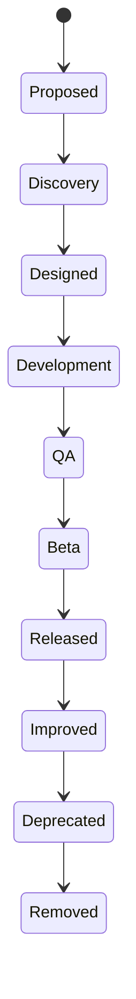

---

# 1.10 Requirement Traceability

Every requirement must be uniquely identifiable.

## Identifier Categories

| Prefix | Description |
|---------|-------------|
| FEAT | Feature |
| US | User Story |
| FR | Functional Requirement |
| NFR | Non-Functional Requirement |
| BR | Business Rule |
| VAL | Validation Rule |
| API | API Dependency |
| EVT | Analytics Event |
| ERR | Error Scenario |
| QA | Acceptance Test |
| AC | Acceptance Criterion |
| PERF | Performance Requirement |
| SEC | Security Requirement |
| A11Y | Accessibility Requirement |

Example:

```
FR-AUTH-001
US-DASH-014
BR-REWARD-021
QA-TXN-103
ERR-STMT-004
```

Identifiers are immutable once published to preserve traceability.

---

# 1.11 Requirement Priority Levels

| Priority | Description |
|----------|-------------|
| P0 | Critical; feature cannot ship without it |
| P1 | High priority; required for target release |
| P2 | Medium priority; can be deferred with minimal impact |
| P3 | Low priority; optional enhancement |

---

# 1.12 Requirement Status Values

| Status | Meaning |
|--------|---------|
| Draft | Under definition |
| Approved | Ready for implementation |
| In Progress | Being implemented |
| Implemented | Development complete |
| Validated | QA complete |
| Released | Available to users |
| Deprecated | Scheduled for removal |

---

# 1.13 Cross-Platform Behavior

Unless explicitly stated otherwise, every feature shall support:

- Responsive Web
- Progressive Web App (PWA)
- Native Mobile Applications (future phases)
- Admin Console (where applicable)

Behavioral parity is expected across supported platforms.

---

# 1.14 Documentation Conventions

## Requirement Language

The following keywords indicate requirement strength:

| Keyword | Meaning |
|----------|---------|
| SHALL | Mandatory |
| SHOULD | Strong recommendation |
| MAY | Optional |
| MUST NOT | Prohibited |

---

## Terminology

- **User**: Registered CardWise account holder.
- **Card**: A credit card added to the user's portfolio.
- **Benefit**: Any issuer-provided advantage associated with a card.
- **Offer**: Time-bound promotion available to eligible users.
- **Milestone**: Spending threshold unlocking a benefit.
- **Reward**: Points, cashback, miles, or equivalent earned through spending.
- **Recommendation**: AI-generated suggestion based on available data.
- **Insight**: Actionable information derived from analytics.

---

# 1.15 Feature Dependency Model

Features are categorized into dependency tiers.

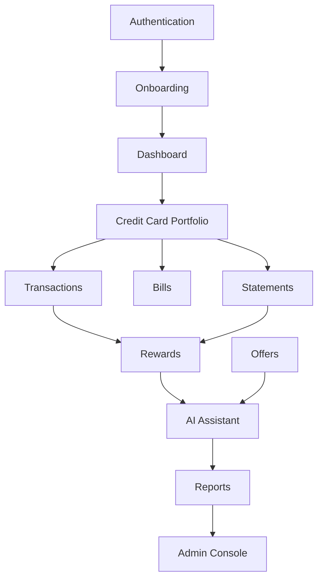

---

# 1.16 Cross-Cutting Concerns

The following capabilities apply across all feature specifications unless overridden by a feature-specific requirement:

- Authentication & authorization
- Localization & internationalization
- Accessibility compliance
- Analytics instrumentation
- Structured logging
- Audit logging (where applicable)
- Feature flags
- Error reporting
- Rate limiting
- Responsive design
- Offline resilience
- Notification framework
- Privacy controls
- Secure data handling

---

# 1.17 Mermaid Diagram Standards

Feature chapters may include the following Mermaid diagram types:

| Diagram Type | Purpose |
|--------------|---------|
| `flowchart` | User journeys and decision flows |
| `stateDiagram-v2` | Feature state transitions |
| `sequenceDiagram` | Interaction between actors and systems |
| `graph` | Component hierarchies and dependencies |
| `journey` | User experience flows |
| `mindmap` | Conceptual relationships |
| `erDiagram` | Logical entity relationships (non-schema) |
| `classDiagram` | Logical domain models where beneficial |

Diagrams should prioritize clarity over completeness and remain synchronized with the surrounding specification.

---

# 1.18 Feature Chapter Structure

Each feature chapter (Chapters 2–46) will follow the standardized structure below to ensure consistency and implementation readiness:

1. Feature Metadata
2. Overview
3. Personas
4. User Stories
5. Functional Requirements
6. Non-Functional Requirements
7. Business Rules
8. User Flow
9. State Diagram
10. Sequence Diagram
11. Component Diagram
12. Screen Specification
13. UI Components
14. Validation Rules
15. Decision Tables
16. Logical Data Model
17. API Dependencies
18. Analytics & Telemetry
19. Notifications
20. Error Handling
21. Edge Cases
22. Accessibility
23. Security
24. Performance
25. QA Acceptance Matrix
26. Future Enhancements

No feature chapter should depend on information defined exclusively in another feature chapter.

---

# 1.19 Quality Gates

A feature specification is considered complete only if it satisfies all of the following criteria:

- All required sections are present.
- Functional and non-functional requirements are uniquely identified.
- Business rules are explicitly documented.
- User flows are represented using Mermaid diagrams.
- Validation logic is complete.
- Error scenarios are defined.
- Analytics events are specified.
- Accessibility requirements are documented.
- Security considerations are addressed.
- Performance expectations are measurable.
- QA acceptance criteria provide comprehensive coverage.
- Future enhancements are clearly separated from the current implementation scope.

---

# 1.20 Document Governance

This document is a living engineering artifact.

Changes to feature specifications should adhere to the following principles:

- Requirement identifiers remain stable after publication.
- Backward-incompatible behavioral changes require explicit revision history.
- Feature chapters should be updated atomically to maintain internal consistency.
- Shared conventions defined in this chapter take precedence unless a feature explicitly documents an approved exception.
- Engineering, Product, Design, QA, Security, and Analytics stakeholders should review changes affecting their respective domains before implementation.

---

# 1.21 Revision Strategy

Subsequent revisions of this document should:

- Preserve historical traceability of requirements.
- Clearly distinguish new functionality from modified behavior.
- Minimize duplication by referencing shared conventions defined in this chapter.
- Ensure diagrams, business rules, analytics events, and acceptance criteria remain synchronized with feature behavior.

---

# 1.22 Chapter Summary

This chapter establishes the engineering standards, governance model, documentation conventions, requirement taxonomy, and quality expectations that apply to every feature specification within CardWise.

All subsequent chapters should be interpreted in the context of these foundational principles, ensuring consistency, traceability, and production-grade implementation quality across the platform.

# Chapter 2 — Authentication & Account Management (Part 1/4)

---

# Feature Metadata

| Field | Value |
|--------|-------|
| Feature ID | AUTH |
| Module | Identity & Access Management |
| Priority | P0 (Critical) |
| Release | Phase 1 (MVP) |
| Status | Planned |
| Product Owner | Product |
| Engineering Owner | Backend + Frontend |
| Design Owner | UX |
| Analytics Owner | Data & Product Analytics |
| Security Owner | Security Engineering |
| Feature Flag | `auth_v1` |
| Dependencies | Notification Service, User Service, Session Service, Analytics Platform, Feature Flag Service |
| Related Features | ONB, PROFILE, SETTINGS, ADMIN, SECURITY |

---

# 2.1 Overview

## Purpose

Provide a secure, frictionless, and privacy-conscious authentication system that enables users to create, access, and manage their CardWise accounts across supported devices.

The authentication module establishes the identity of the user, manages active sessions, protects user data, and serves as the entry point for every authenticated feature in CardWise.

---

## Summary

The Authentication & Account Management module is responsible for:

- User registration
- Login
- Logout
- Email verification
- Mobile verification (future)
- OTP verification
- Password management
- Password reset
- Session lifecycle
- Device management
- Remembered devices
- Token refresh
- Account recovery
- Account deletion
- Security notifications
- Authentication audit logs
- Social authentication (Phase 2)

---

## Business Goals

- Minimize onboarding friction.
- Maximize successful authentication rate.
- Protect user accounts from unauthorized access.
- Provide secure multi-device access.
- Build trust through transparent security controls.
- Enable future enterprise-grade identity capabilities.

---

## User Problems Solved

| Problem | Solution |
|----------|----------|
| Creating an account is complicated | Minimal signup flow |
| Users forget passwords | Self-service recovery |
| Users worry about unauthorized access | Device/session management |
| Users use multiple devices | Persistent secure sessions |
| Users accidentally remain logged in | Session visibility & logout |

---

## Success Metrics

| Metric | Target |
|----------|---------|
| Signup completion | >90% |
| Login success | >98% |
| Password reset completion | >95% |
| Session refresh success | >99.5% |
| Authentication API availability | 99.95% |
| Unauthorized access incidents | Near zero |
| Mean login time | <2 seconds |

---

## In Scope

- Email signup
- Email login
- Password authentication
- OTP verification
- Email verification
- Forgot password
- Reset password
- Session management
- Device management
- Logout
- Delete account request
- Audit events
- Security notifications

---

## Out of Scope

- Banking authentication
- Net banking login
- Aadhaar authentication
- PAN verification
- Biometric authentication
- OAuth enterprise login
- UPI authentication
- Payment authorization
- KYC verification

---

## Assumptions

- Each account is uniquely identified by email.
- One email can own only one CardWise account.
- Users explicitly consent to the Terms of Service and Privacy Policy.
- Email delivery infrastructure is operational.
- Users have access to their registered email address.

---

## Dependencies

### Internal

- User Service
- Session Service
- Notification Service
- Analytics Service
- Audit Log Service
- Feature Flag Service

### External

- Email provider
- CAPTCHA provider
- Identity provider (future)
- OAuth providers (future)

---

## Risks

| Risk | Mitigation |
|------|------------|
| Credential stuffing | Rate limiting + CAPTCHA |
| Password reuse | Password strength validation |
| Email compromise | Session notifications |
| Brute force attacks | Progressive lockout |
| Spam signups | Email verification |

---

# 2.2 Personas

## Primary Users

### New User

Characteristics:

- No existing account
- Wants to begin using CardWise
- Minimal knowledge of platform

Permissions:

- Register account
- Verify email
- Start onboarding

---

### Returning User

Characteristics:

- Existing account
- Previously onboarded

Permissions:

- Login
- Manage sessions
- Update password
- Logout

---

### Security-Conscious User

Characteristics:

- Frequently reviews sessions
- Wants login notifications
- Uses strong passwords

Permissions:

- View devices
- Logout remote sessions
- Change password
- Delete account

---

## Secondary Users

### Administrator

Permissions:

- View authentication logs
- Disable accounts
- Force logout
- Review abuse reports

Administrator cannot:

- View passwords
- Login as users
- Access private financial data

---

# 2.3 User Stories

## Registration

### US-AUTH-001

As a new user,

I want to register using my email,

so that I can access CardWise.

---

### US-AUTH-002

As a new user,

I want to verify my email,

so that my account becomes trusted.

---

### US-AUTH-003

As a user,

I want my password strength validated,

so that I create a secure account.

---

## Login

### US-AUTH-004

As a returning user,

I want to login using email and password,

so that I can continue using CardWise.

---

### US-AUTH-005

As a returning user,

I want my session remembered,

so that I don't login repeatedly.

---

### US-AUTH-006

As a user,

I want secure session expiration,

so that my account remains protected.

---

## Password Recovery

### US-AUTH-007

As a user,

I forgot my password,

I want to recover it using email.

---

### US-AUTH-008

As a user,

I should receive only one active reset link.

---

### US-AUTH-009

Expired reset links should not work.

---

## Device Management

### US-AUTH-010

As a user,

I want to see active devices.

---

### US-AUTH-011

As a user,

I want to logout from another device.

---

### US-AUTH-012

As a user,

I want to know when a new device logs in.

---

## Account Security

### US-AUTH-013

As a user,

I want login attempts recorded.

---

### US-AUTH-014

As a user,

I want suspicious login detection.

---

### US-AUTH-015

As a user,

I want to permanently delete my account.

---

## Negative Stories

### US-AUTH-016

Login should fail using invalid password.

---

### US-AUTH-017

Login should fail using unverified email (configurable via feature flag).

---

### US-AUTH-018

Password reset should fail after expiry.

---

### US-AUTH-019

Verification link cannot be reused.

---

### US-AUTH-020

Locked accounts cannot authenticate.

---

# 2.4 Functional Requirements

| ID | Priority | Requirement |
|----|----------|-------------|
| FR-AUTH-001 | P0 | Users shall register using email and password. |
| FR-AUTH-002 | P0 | Email addresses shall be unique. |
| FR-AUTH-003 | P0 | Passwords shall never be stored in plaintext. |
| FR-AUTH-004 | P0 | Email verification shall be required before full account activation (feature flag controlled). |
| FR-AUTH-005 | P0 | Verification emails shall expire after a configurable duration. |
| FR-AUTH-006 | P0 | Users shall login using verified credentials. |
| FR-AUTH-007 | P0 | Authentication shall create a secure user session. |
| FR-AUTH-008 | P0 | Refresh tokens shall support session renewal. |
| FR-AUTH-009 | P1 | Users shall remain logged in until expiry or logout. |
| FR-AUTH-010 | P0 | Users shall logout from the current device. |
| FR-AUTH-011 | P1 | Users shall logout from all devices. |
| FR-AUTH-012 | P0 | Forgot password shall issue a secure reset token. |
| FR-AUTH-013 | P0 | Reset links shall expire automatically. |
| FR-AUTH-014 | P0 | Password changes shall invalidate previous reset tokens. |
| FR-AUTH-015 | P1 | Users shall view active sessions. |
| FR-AUTH-016 | P1 | Users shall revoke any active session. |
| FR-AUTH-017 | P1 | Authentication history shall be retained for audit. |
| FR-AUTH-018 | P2 | Social login providers shall be supported in future phases. |
| FR-AUTH-019 | P0 | Authentication failures shall be logged. |
| FR-AUTH-020 | P0 | Authentication APIs shall be idempotent where applicable. |
| FR-AUTH-021 | P1 | Session timeout duration shall be configurable. |
| FR-AUTH-022 | P1 | Concurrent device limits shall be configurable. |
| FR-AUTH-023 | P0 | Users shall receive notifications for new device logins. |
| FR-AUTH-024 | P1 | Users may request account deletion. |
| FR-AUTH-025 | P1 | Account deletion shall require recent authentication confirmation. |

---

# 2.5 Non-Functional Requirements

## Performance

| ID | Requirement |
|----|-------------|
| NFR-AUTH-001 | Login API < 2 seconds (P95). |
| NFR-AUTH-002 | Signup API < 3 seconds (P95). |
| NFR-AUTH-003 | Password reset initiation < 2 seconds. |
| NFR-AUTH-004 | Token refresh < 500 ms (P95). |

---

## Reliability

- Authentication services shall achieve 99.95% availability.
- Session creation shall be atomic.
- Token generation shall be cryptographically secure.
- Duplicate account creation shall be prevented under concurrent requests.

---

## Scalability

- Horizontally scalable authentication services.
- Stateless application layer.
- Centralized session/token store.
- Support millions of registered users.

---

## Accessibility

- Fully keyboard accessible.
- Screen-reader compatible forms.
- Accessible error messaging.
- Visible focus indicators.

---

## Security

- HTTPS only.
- Secure cookies.
- CSRF protection.
- XSS mitigation.
- Password hashing using strong adaptive algorithms.
- Refresh token rotation.
- Audit logging.

---

## Availability

Authentication shall remain operational during rolling deployments with zero user-visible downtime.

---

## Localization

- Validation messages localizable.
- Email templates localized.
- Date/time displayed using user locale.

---

## Offline Behaviour

- Login unavailable while offline.
- Existing valid sessions may continue in offline-supported modules until token expiry.
- Offline state should be communicated clearly without exposing authentication controls that cannot function.

---

# 2.6 Business Rules

| ID | Rule |
|----|------|
| BR-AUTH-001 | One email address may own only one CardWise account. |
| BR-AUTH-002 | Email verification tokens are single-use. |
| BR-AUTH-003 | Password reset tokens are single-use. |
| BR-AUTH-004 | Verification tokens expire after configured duration. |
| BR-AUTH-005 | Reset tokens expire after configured duration. |
| BR-AUTH-006 | Password reset invalidates all outstanding reset links. |
| BR-AUTH-007 | Logout invalidates the current access token immediately. |
| BR-AUTH-008 | Logout All Devices invalidates every active session except the current confirmation flow until completion. |
| BR-AUTH-009 | Password changes revoke all refresh tokens. |
| BR-AUTH-010 | Failed login attempts contribute toward temporary lockout thresholds. |
| BR-AUTH-011 | Account deletion requests require recent authentication verification. |
| BR-AUTH-012 | Authentication events must be recorded in immutable audit logs. |
| BR-AUTH-013 | Authentication-related emails must not reveal whether an account exists unless required for authenticated flows. |
| BR-AUTH-014 | CAPTCHA enforcement thresholds are configurable via platform settings. |
| BR-AUTH-015 | Feature flags may enable or disable mandatory email verification without code changes. |

---

# 2.7 User Flow

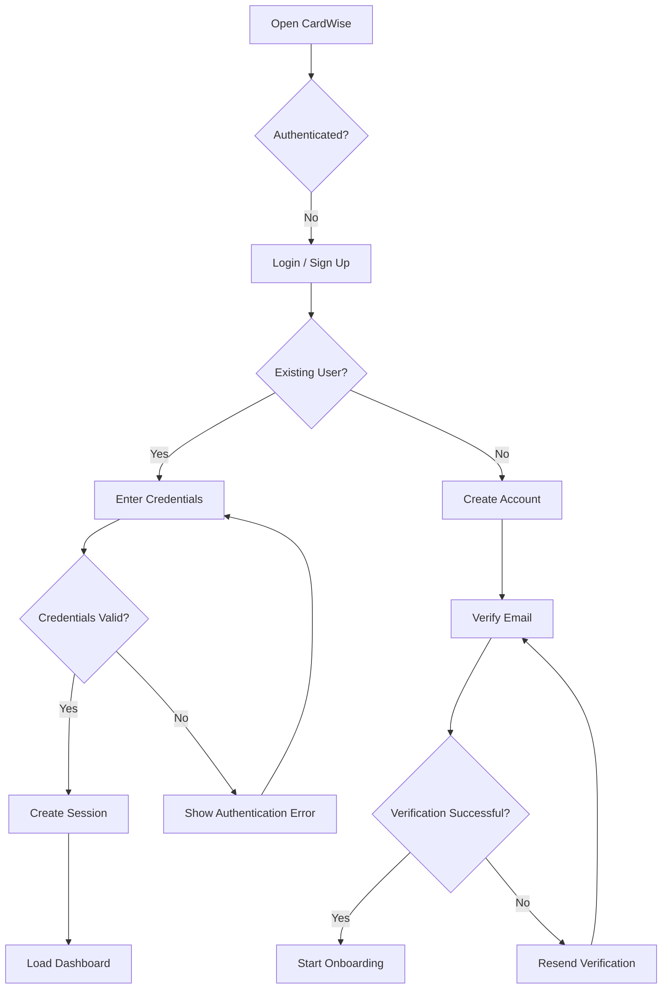

---

# 2.8 State Diagram

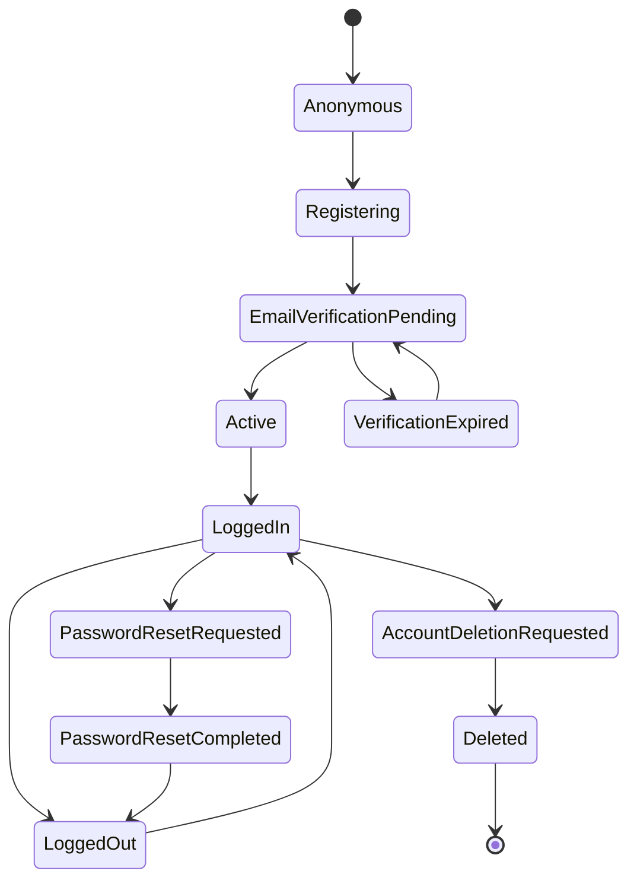

---

# 2.9 Sequence Diagram

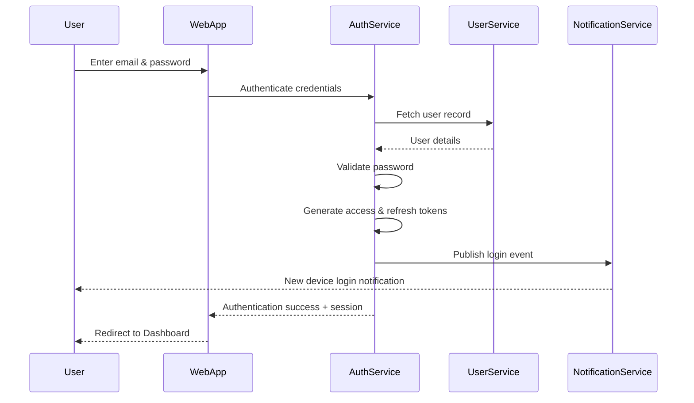

---

**End of Part 1/4**

The next part will cover:

1. Component Diagram
2. Screen Specifications
3. UI Components
4. Validation Rules
5. Decision Tables
6. Logical Data Model
```


# Chapter 2 — Authentication & Account Management (Part 2/4)

---

# 2.10 Component Diagram

```mermaid
graph TD

    App[CardWise Application]

    App --> AuthShell
    AuthShell --> LoginScreen
    AuthShell --> SignupScreen
    AuthShell --> VerifyEmailScreen
    AuthShell --> ForgotPasswordScreen
    AuthShell --> ResetPasswordScreen
    AuthShell --> SessionManagementScreen
    AuthShell --> DeleteAccountScreen

    LoginScreen --> LoginForm
    LoginScreen --> SocialLoginSection
    LoginScreen --> PasswordVisibilityToggle
    LoginScreen --> ForgotPasswordLink
    LoginScreen --> TermsFooter

    SignupScreen --> SignupForm
    SignupScreen --> PasswordStrengthMeter
    SignupScreen --> TermsAcceptance
    SignupScreen --> EmailVerificationBanner

    VerifyEmailScreen --> VerificationStatus
    VerifyEmailScreen --> ResendVerificationButton

    ForgotPasswordScreen --> ForgotPasswordForm

    ResetPasswordScreen --> ResetPasswordForm
    ResetPasswordScreen --> PasswordStrengthMeter

    SessionManagementScreen --> ActiveDeviceList
    SessionManagementScreen --> DeviceCard
    SessionManagementScreen --> LogoutOtherDevicesDialog

    DeleteAccountScreen --> WarningCard
    DeleteAccountScreen --> ConfirmationDialog
```

---

# 2.11 Screen Specifications

## 2.11.1 Login Screen

### Purpose

Authenticate an existing CardWise user.

### Layout

```
-----------------------------------------
Logo

Welcome Back

Email Address

Password

Forgot Password?

Login Button

Divider

Continue with Google (Phase 2)

Create Account

Terms & Privacy Links
-----------------------------------------
```

### Sections

- Branding
- Login Form
- Error Banner
- Footer Links

### Widgets

| Widget | Required |
|----------|----------|
| Email Input | Yes |
| Password Input | Yes |
| Show Password Toggle | Yes |
| Forgot Password Link | Yes |
| Login Button | Yes |
| Signup CTA | Yes |
| Error Banner | Yes |

### Responsive Behaviour

Desktop

- Centered card
- Max width 420px

Tablet

- Responsive card
- Full-width form

Mobile

- Full screen
- Sticky primary CTA
- Keyboard-safe layout

### Loading State

- Disable all inputs
- Button spinner
- Prevent duplicate submissions

### Empty State

Default blank form.

### Error State

Inline validation plus page-level authentication error.

### Skeleton State

Not applicable.

---

## 2.11.2 Registration Screen

### Layout

- Logo
- Welcome message
- Registration form
- Password requirements
- Terms checkbox
- Create Account CTA

### Widgets

- Name
- Email
- Password
- Confirm Password
- Terms Checkbox
- Create Account

### Responsive Behaviour

Consistent with Login.

### Loading State

Disable form while registration request is active.

---

## 2.11.3 Email Verification Screen

### Purpose

Confirm ownership of the registered email.

### Sections

- Success Illustration
- Instructions
- Resend Email
- Change Email
- Refresh Status

### States

- Pending
- Verified
- Expired
- Failed
- Rate Limited

---

## 2.11.4 Forgot Password Screen

### Sections

- Email Input
- Send Reset Link Button
- Success Confirmation

---

## 2.11.5 Reset Password Screen

### Sections

- New Password
- Confirm Password
- Strength Meter
- Reset Button

---

## 2.11.6 Active Sessions Screen

### Sections

- Current Device
- Other Devices
- Login History
- Logout Device
- Logout All Devices

---

## 2.11.7 Delete Account Screen

### Sections

- Warning Banner
- Data Loss Summary
- Confirmation Checkbox
- Password Confirmation
- Delete Button

---

# 2.12 UI Components

---

## Authentication Form

### Purpose

Reusable authentication form.

### Variants

- Login
- Signup
- Password Reset

### States

- Idle
- Focused
- Invalid
- Disabled
- Loading
- Success

### Accessibility

- Labels associated with controls
- Proper error announcements
- Keyboard navigable

---

## Password Field

### Purpose

Secure password entry.

### Variants

- Hidden
- Visible

### States

- Empty
- Valid
- Invalid
- Disabled

Accessibility

- Screen reader announces visibility state
- Toggle accessible via keyboard

---

## Password Strength Meter

### Purpose

Visual feedback for password complexity.

### States

- Very Weak
- Weak
- Fair
- Good
- Strong

Accessibility

Color must not be the only indicator.

---

## Email Verification Banner

Purpose

Display verification status.

Variants

- Pending
- Success
- Expired

---

## Device Card

Purpose

Display authenticated session.

Contents

- Device Name
- Browser
- OS
- Approximate Location
- Last Active
- Current Device Badge

Actions

- Logout Device

---

## Session List

Purpose

Display active authenticated sessions.

States

- Empty
- Loaded
- Error

---

## Confirmation Dialog

Purpose

Reusable confirmation dialog.

Variants

- Logout
- Logout All
- Delete Account

---

## Security Alert Banner

Purpose

Notify user of suspicious activity.

Variants

- Warning
- Error
- Informational

---

## Error Banner

Purpose

Authentication error display.

Variants

- Invalid Credentials
- Locked Account
- Verification Required
- Network Error

---

## Primary Authentication Button

Variants

- Enabled
- Disabled
- Loading

Accessibility

Minimum touch target:

44x44 px

---

# 2.13 Validation Rules

## Registration Validation

| ID | Field | Rule |
|-----|------|------|
| VAL-AUTH-001 | Name | Required |
| VAL-AUTH-002 | Name | 2–100 characters |
| VAL-AUTH-003 | Email | Required |
| VAL-AUTH-004 | Email | RFC compliant format |
| VAL-AUTH-005 | Email | Trim whitespace |
| VAL-AUTH-006 | Email | Lowercase before submission |
| VAL-AUTH-007 | Password | Required |
| VAL-AUTH-008 | Password | Minimum 12 characters |
| VAL-AUTH-009 | Password | Maximum 128 characters |
| VAL-AUTH-010 | Password | At least one uppercase |
| VAL-AUTH-011 | Password | At least one lowercase |
| VAL-AUTH-012 | Password | At least one digit |
| VAL-AUTH-013 | Password | At least one special character |
| VAL-AUTH-014 | Confirm Password | Must match Password |
| VAL-AUTH-015 | Terms | Must be accepted |

---

## Login Validation

| ID | Rule |
|-----|------|
| VAL-AUTH-020 | Email required |
| VAL-AUTH-021 | Password required |
| VAL-AUTH-022 | Email normalized before authentication |

---

## Password Reset Validation

| ID | Rule |
|-----|------|
| VAL-AUTH-030 | Token required |
| VAL-AUTH-031 | Token not expired |
| VAL-AUTH-032 | Token unused |
| VAL-AUTH-033 | Password passes complexity |
| VAL-AUTH-034 | Password differs from previous password |

---

## Email Verification Validation

| ID | Rule |
|-----|------|
| VAL-AUTH-040 | Verification token exists |
| VAL-AUTH-041 | Token belongs to account |
| VAL-AUTH-042 | Token not expired |
| VAL-AUTH-043 | Token unused |

---

## Session Validation

| ID | Rule |
|-----|------|
| VAL-AUTH-050 | Session belongs to authenticated user |
| VAL-AUTH-051 | Session not revoked |
| VAL-AUTH-052 | Refresh token valid |
| VAL-AUTH-053 | Device identifier matches session |

---

# 2.14 Decision Tables

## Login Decision Matrix

| Condition | Result |
|-----------|--------|
| Valid credentials + verified email | Login successful |
| Valid credentials + email verification pending (verification required) | Redirect to verification |
| Invalid password | Authentication error |
| Unknown email | Generic authentication error |
| Locked account | Account locked message |
| Excessive failed attempts | Temporary lockout |
| Server unavailable | Retry message |

---

## Password Reset Decision Matrix

| Condition | Result |
|-----------|--------|
| Valid token | Allow password reset |
| Expired token | Show expiration screen |
| Already used token | Reject request |
| Invalid token | Reject request |
| Password fails policy | Validation error |

---

## Logout Decision Matrix

| User Action | Result |
|-------------|--------|
| Logout current device | Current session revoked |
| Logout all devices | All sessions revoked |
| Session expired | Redirect to login |
| Refresh token invalid | Force re-authentication |

---

## Account Deletion Decision Matrix

| Condition | Outcome |
|-----------|---------|
| Password confirmed | Continue |
| Recent authentication missing | Re-authenticate |
| Pending legal hold (future) | Reject deletion |
| Confirmation cancelled | No action |

---

# 2.15 Logical Data Model

> This section defines logical entities only. Physical database design is documented separately.

## Logical Entities

### User

Required Fields

- User Identifier
- Full Name
- Email Address
- Email Verification Status
- Account Status
- Created Timestamp
- Updated Timestamp

Relationships

- One User → Many Sessions
- One User → Many Authentication Events
- One User → Many Devices

---

### Session

Required Fields

- Session Identifier
- User Identifier
- Device Identifier
- Refresh Token Identifier
- Created Time
- Last Activity Time
- Expiration Time
- Revocation Status

Relationship

Many Sessions belong to one User.

---

### Device

Required Fields

- Device Identifier
- Device Name
- Browser
- Operating System
- Platform
- Approximate Location
- Trusted Status
- Last Seen

Relationship

One User may own multiple trusted devices.

---

### Verification Token

Required Fields

- Token Identifier
- User Identifier
- Purpose
- Expiration
- Consumed Status

Relationship

One User may have multiple historical verification tokens, but only one active token per purpose.

---

### Password Reset Token

Required Fields

- Token Identifier
- User Identifier
- Issued Time
- Expiration Time
- Consumed Status

Relationship

Linked to exactly one user and invalidated after use or expiry.

---

### Authentication Event

Required Fields

- Event Identifier
- User Identifier
- Event Type
- Timestamp
- Device Identifier
- IP Metadata
- Outcome
- Risk Score (future)

Relationship

One User → Many Authentication Events.


# Chapter 2 — Authentication & Account Management (Part 3/4)

---

# 2.16 API Dependencies

> This section documents logical API dependencies only. API contracts, payloads, authentication mechanisms, and versioning are specified in the Backend Architecture document.

## Authentication APIs

| API ID | API | Purpose | Success Response | Failure Behaviour | Retry Strategy |
|---------|-----|---------|------------------|-------------------|----------------|
| API-AUTH-001 | Register User | Create a new user account | User created, verification initiated | Validation errors, duplicate email | No automatic retry |
| API-AUTH-002 | Login | Authenticate user | Access token, refresh token, user profile | Generic authentication failure | User initiated |
| API-AUTH-003 | Refresh Session | Issue new access token | New access token | Session expired | Silent retry once |
| API-AUTH-004 | Logout | Revoke current session | Success | Session already invalid | No retry |
| API-AUTH-005 | Logout All Sessions | Revoke all active sessions | Success | Partial failure | Retry once with idempotency key |

---

## Email Verification APIs

| API ID | Purpose | Success | Failure | Retry |
|---------|----------|----------|----------|--------|
| API-AUTH-006 | Send verification email | Email queued | Delivery unavailable | Exponential backoff |
| API-AUTH-007 | Verify email token | Email verified | Token invalid/expired | User requests new token |
| API-AUTH-008 | Resend verification | New verification issued | Rate limited | Retry after cooldown |

---

## Password Recovery APIs

| API ID | Purpose | Success | Failure | Retry |
|---------|----------|----------|----------|--------|
| API-AUTH-009 | Forgot password | Reset email queued | Generic success response even if email is unknown | Cooldown enforced |
| API-AUTH-010 | Validate reset token | Token valid | Token expired | No retry |
| API-AUTH-011 | Reset password | Password updated | Validation error | User initiated |

---

## Session APIs

| API ID | Purpose | Success | Failure |
|---------|----------|----------|----------|
| API-AUTH-012 | List active sessions | Session list | Unauthorized |
| API-AUTH-013 | Revoke session | Session revoked | Session unavailable |
| API-AUTH-014 | Current session | Current session metadata | Unauthorized |

---

## Account APIs

| API ID | Purpose | Success |
|---------|----------|----------|
| API-AUTH-015 | Delete account request | Deletion workflow initiated |
| API-AUTH-016 | Cancel deletion (future) | Cancellation accepted |

---

## External Dependencies

| Dependency | Purpose | Failure Behaviour |
|------------|---------|-------------------|
| Email Provider | Verification & password reset | Queue and retry |
| CAPTCHA Service | Abuse prevention | Fail closed for suspicious requests |
| Analytics Platform | Event ingestion | Queue locally if available |
| Feature Flag Service | Dynamic authentication behaviour | Safe defaults |

---

# 2.17 Analytics & Telemetry

## Analytics Objectives

Authentication analytics help measure:

- User acquisition
- Authentication success
- Drop-off locations
- Recovery success
- Abuse attempts
- Device usage
- Session quality

---

## Event Naming Convention

```
auth.<action>.<result>
```

Examples:

```
auth.signup.started
auth.signup.completed
auth.login.success
auth.login.failed
auth.password.reset.completed
```

---

## Analytics Events

### EVT-AUTH-001

Event

```
auth.signup.started
```

Properties

- signup_method
- platform
- locale
- app_version
- experiment_id

---

### EVT-AUTH-002

Event

```
auth.signup.completed
```

Properties

- signup_method
- verification_required
- elapsed_time_ms

---

### EVT-AUTH-003

Event

```
auth.email.verification.completed
```

Properties

- verification_time_ms
- resend_count

---

### EVT-AUTH-004

Event

```
auth.login.success
```

Properties

- device_type
- browser
- operating_system
- remembered_device
- login_duration_ms

---

### EVT-AUTH-005

Event

```
auth.login.failed
```

Properties

- reason
- error_code
- attempt_count
- captcha_required

---

### EVT-AUTH-006

Event

```
auth.password.reset.requested
```

Properties

- platform

---

### EVT-AUTH-007

Event

```
auth.password.reset.completed
```

Properties

- reset_duration_ms

---

### EVT-AUTH-008

Event

```
auth.logout.completed
```

Properties

- logout_type
- session_count

---

### EVT-AUTH-009

Event

```
auth.session.revoked
```

Properties

- revoked_session
- remaining_sessions

---

### EVT-AUTH-010

Event

```
auth.account.deleted.requested
```

Properties

- reason
- account_age_days

---

## Authentication Funnel

```text
Landing
   │
   ▼
Signup Started
   │
   ▼
Signup Completed
   │
   ▼
Email Verified
   │
   ▼
Onboarding Started
   │
   ▼
Dashboard Viewed
```

---

## Login Funnel

```text
Login Screen
      │
      ▼
Credentials Entered
      │
      ▼
Authentication Success
      │
      ▼
Dashboard Loaded
```

---

## KPIs

| KPI | Target |
|------|---------|
| Signup completion | >90% |
| Login success | >98% |
| Email verification completion | >85% |
| Password recovery completion | >95% |
| Authentication latency (P95) | <2 seconds |
| Session refresh success | >99.5% |

---

## Telemetry

The authentication module shall emit structured telemetry for:

- API latency
- Error rates
- Token refresh failures
- Email delivery latency
- CAPTCHA trigger frequency
- Authentication throughput
- Session creation latency
- Session revocation latency

---

# 2.18 Notifications

## Email Notifications

| ID | Trigger | Recipient |
|----|----------|-----------|
| NOTIF-AUTH-001 | Registration | User |
| NOTIF-AUTH-002 | Email verification | User |
| NOTIF-AUTH-003 | Password reset request | User |
| NOTIF-AUTH-004 | Password changed | User |
| NOTIF-AUTH-005 | New device login | User |
| NOTIF-AUTH-006 | Account deletion requested | User |
| NOTIF-AUTH-007 | Account deletion completed | User |

---

## Push Notifications (Future)

| ID | Trigger |
|----|----------|
| NOTIF-AUTH-101 | New login detected |
| NOTIF-AUTH-102 | Password changed |
| NOTIF-AUTH-103 | Session revoked |

---

## In-App Notifications

| ID | Trigger |
|----|----------|
| NOTIF-AUTH-201 | Verification pending |
| NOTIF-AUTH-202 | Verification completed |
| NOTIF-AUTH-203 | Security recommendation |
| NOTIF-AUTH-204 | Suspicious activity detected |

---

## Silent Notifications

Used for:

- Refresh token synchronization
- Session synchronization
- Device synchronization
- Security policy updates

---

# 2.19 Error Handling

## Error Classification

| Category | Recoverable | Example |
|----------|-------------|----------|
| Validation | Yes | Invalid email |
| Authentication | Yes | Incorrect password |
| Authorization | No | Session revoked |
| Network | Yes | Timeout |
| Service | Yes | Email unavailable |
| Fatal | No | Corrupted session |

---

## Recoverable Errors

### ERR-AUTH-001

Invalid credentials.

User Message

> Incorrect email or password.

Recovery

- Stay on login page
- Clear password field only
- Preserve email input

---

### ERR-AUTH-002

Email not verified.

Recovery

- Display verification banner
- Provide resend action

---

### ERR-AUTH-003

Verification link expired.

Recovery

- Generate new verification request

---

### ERR-AUTH-004

Password reset token expired.

Recovery

- Redirect to Forgot Password

---

### ERR-AUTH-005

Temporary lockout.

Recovery

- Countdown timer
- Retry after cooldown

---

### ERR-AUTH-006

Network unavailable.

Recovery

- Retry button
- Offline indicator

---

## Fatal Errors

### ERR-AUTH-101

Session validation failure.

Action

- Force logout
- Redirect to login

---

### ERR-AUTH-102

Corrupted authentication state.

Action

- Clear local credentials
- Restart authentication flow

---

### ERR-AUTH-103

Account disabled.

Action

- Block login
- Show support contact

---

## Retry Behaviour

| Scenario | Strategy |
|-----------|----------|
| Email delivery | Exponential backoff |
| Token refresh | Silent retry once |
| Login request | Manual retry |
| Password reset email | Cooldown enforced |
| Verification resend | Rate limited |

---

## User Messaging Principles

Authentication-related error messages shall:

- Avoid exposing internal system details.
- Avoid confirming whether an email address exists.
- Be actionable whenever possible.
- Use plain language.
- Be localized.
- Be accessible to assistive technologies.


# Chapter 2 — Authentication & Account Management (Part 4/4)

---

# 2.20 Edge Cases

## Registration

| ID | Scenario | Expected Behaviour |
|----|----------|--------------------|
| EDGE-AUTH-001 | Email already registered | Display generic account exists message with Login CTA |
| EDGE-AUTH-002 | User refreshes page during signup | Preserve entered data where safe (except password) |
| EDGE-AUTH-003 | User clicks verification link twice | First succeeds, subsequent attempts show "Already Verified" |
| EDGE-AUTH-004 | Verification email delayed | Allow resend after configurable cooldown |
| EDGE-AUTH-005 | Multiple signup requests from same email | Maintain idempotent behavior; create only one account |

---

## Login

| ID | Scenario | Expected Behaviour |
|----|----------|--------------------|
| EDGE-AUTH-006 | Multiple rapid login clicks | Ignore duplicate submissions |
| EDGE-AUTH-007 | Access token expires during active session | Silent refresh using refresh token |
| EDGE-AUTH-008 | Refresh token expired | Force re-authentication |
| EDGE-AUTH-009 | User opens multiple browser tabs | Synchronize authentication state across tabs |
| EDGE-AUTH-010 | User changes password on another device | Revoke existing sessions and require login |

---

## Password Recovery

| ID | Scenario | Expected Behaviour |
|----|----------|--------------------|
| EDGE-AUTH-011 | Multiple reset requests | Only latest reset token remains valid |
| EDGE-AUTH-012 | Reset link opened on different device | Allow if token is valid |
| EDGE-AUTH-013 | User submits same password | Reject if password reuse policy prohibits it |
| EDGE-AUTH-014 | Reset link expires while page is open | Revalidate before submission and redirect appropriately |

---

## Sessions

| ID | Scenario | Expected Behaviour |
|----|----------|--------------------|
| EDGE-AUTH-015 | User logs out current device | Only current session revoked |
| EDGE-AUTH-016 | User revokes active session from another device | Remote device redirected to login on next request |
| EDGE-AUTH-017 | Concurrent logout-all requests | Process idempotently |
| EDGE-AUTH-018 | Browser cookies manually deleted | Session invalidated and user prompted to log in |

---

## Security

| ID | Scenario | Expected Behaviour |
|----|----------|--------------------|
| EDGE-AUTH-019 | Brute-force login attempts | Progressive throttling and CAPTCHA |
| EDGE-AUTH-020 | Credential stuffing attack | Detect anomalous activity and rate limit |
| EDGE-AUTH-021 | Replay of verification token | Reject as already consumed |
| EDGE-AUTH-022 | Replay of refresh token | Detect reuse and revoke affected session family |
| EDGE-AUTH-023 | Suspicious geographic login | Notify user and increase risk score |

---

# 2.21 Accessibility

Authentication is a critical user journey and SHALL comply with **WCAG 2.2 AA**.

---

## Keyboard Navigation

### A11Y-AUTH-001

All interactive controls shall be reachable using keyboard only.

---

### A11Y-AUTH-002

Logical tab order shall follow visual order.

---

### A11Y-AUTH-003

Visible focus indicators shall remain present for every interactive element.

---

### A11Y-AUTH-004

Authentication dialogs shall trap focus until dismissed.

---

## Screen Reader Support

### A11Y-AUTH-005

Every input shall have an accessible label.

---

### A11Y-AUTH-006

Required fields shall expose required state.

---

### A11Y-AUTH-007

Validation errors shall be announced automatically using appropriate live regions.

---

### A11Y-AUTH-008

Password visibility toggle shall announce current state.

Example:

```
Password visible

Password hidden
```

---

## Forms

- Labels remain visible.
- Placeholder text is never used as the only label.
- Required fields identified programmatically.
- Validation announced immediately after submission.

---

## Error Messaging

Errors shall:

- identify affected field,
- explain issue,
- explain corrective action.

---

## Contrast

Minimum contrast ratios:

- Text: 4.5:1
- Large text: 3:1
- Focus indicators: WCAG compliant

---

## Reduced Motion

Authentication animations shall respect system-level reduced motion preferences.

---

## Mobile Accessibility

- Touch targets ≥ 44 × 44 px
- Keyboard avoidance supported
- Autofill compatibility
- One-time code auto-fill (future support)

---

# 2.22 Security

Authentication is the highest-risk externally accessible module and follows secure-by-default principles.

---

## Authentication Controls

### SEC-AUTH-001

Passwords SHALL be hashed using adaptive one-way algorithms.

---

### SEC-AUTH-002

Plaintext passwords SHALL never be stored or logged.

---

### SEC-AUTH-003

Access tokens SHALL have short expiration periods.

---

### SEC-AUTH-004

Refresh tokens SHALL rotate after successful use.

---

### SEC-AUTH-005

Refresh token reuse SHALL invalidate the associated session family.

---

## Authorization

### SEC-AUTH-006

Every authenticated endpoint SHALL validate user identity.

---

### SEC-AUTH-007

Session ownership SHALL be verified before session revocation.

---

## Privacy

Authentication systems SHALL:

- minimize personal information,
- avoid unnecessary telemetry,
- avoid exposing sensitive identifiers.

---

## Audit Logging

Authentication events recorded include:

- Registration
- Login success
- Login failure
- Password reset
- Password change
- Session creation
- Session revocation
- Account deletion request

Audit logs SHALL be immutable and time-stamped.

---

## Rate Limiting

| Endpoint | Strategy |
|----------|----------|
| Login | Progressive throttling |
| Signup | IP + email limits |
| Forgot Password | Cooldown |
| Verification resend | Cooldown |
| Token refresh | Sliding window |
| Session revoke | Per-user rate limit |

---

## Abuse Prevention

Controls include:

- CAPTCHA
- IP reputation
- Device fingerprinting (privacy-preserving)
- Velocity checks
- Anomaly detection
- Replay protection

---

## OWASP Alignment

Authentication SHALL mitigate risks identified in:

- Broken Authentication
- Session Fixation
- Session Hijacking
- Credential Stuffing
- Cross-Site Request Forgery (CSRF)
- Cross-Site Scripting (XSS)
- Injection through user inputs
- Sensitive Data Exposure

---

## Secure Defaults

- Secure cookies
- HttpOnly cookies
- SameSite protection
- HTTPS only
- Strict transport security
- Content Security Policy
- No sensitive information in URLs

---

# 2.23 Performance

## Performance Budgets

| Requirement | Target |
|-------------|--------|
| Login screen first render | < 1.5 s |
| Interactive login form | < 2 s |
| Signup completion API | < 3 s (P95) |
| Session refresh | < 500 ms (P95) |
| Active sessions screen | < 2 s |
| Logout response | < 1 s |

---

## Rendering

- Authentication screens render without blocking assets.
- Critical CSS prioritized.
- Above-the-fold UI optimized.

---

## Caching

Cacheable:

- Static illustrations
- Localized strings
- Public assets

Not Cacheable:

- Authentication responses
- Tokens
- Session metadata
- Password reset state

---

## Lazy Loading

Lazy load:

- Social login providers
- Illustrations
- Help content
- Legal documents

---

## Background Processing

Background tasks include:

- Session synchronization
- Refresh token renewal
- Analytics event delivery
- Security notification dispatch

---

## Rendering Expectations

- No layout shift during authentication.
- Minimal visual flicker after login.
- Dashboard transition initiated immediately after successful authentication.

---

# 2.24 QA Acceptance Matrix

## Happy Path

| QA ID | Scenario | Expected Result |
|-------|----------|-----------------|
| QA-AUTH-001 | Register new account | Account created successfully |
| QA-AUTH-002 | Verify email | Account activated |
| QA-AUTH-003 | Login with valid credentials | Dashboard displayed |
| QA-AUTH-004 | Logout | Session terminated |
| QA-AUTH-005 | Reset password | Password updated successfully |
| QA-AUTH-006 | View active sessions | All active sessions displayed |

---

## Negative Path

| QA ID | Scenario | Expected Result |
|-------|----------|-----------------|
| QA-AUTH-101 | Invalid password | Authentication fails |
| QA-AUTH-102 | Expired verification token | Verification rejected |
| QA-AUTH-103 | Expired reset token | Reset rejected |
| QA-AUTH-104 | Duplicate email registration | Registration blocked |
| QA-AUTH-105 | Session already revoked | Graceful handling |

---

## Boundary Cases

| QA ID | Scenario |
|-------|----------|
| QA-AUTH-201 | Minimum password length |
| QA-AUTH-202 | Maximum password length |
| QA-AUTH-203 | Maximum email length |
| QA-AUTH-204 | Concurrent login requests |
| QA-AUTH-205 | Maximum configured session count |

---

## Accessibility Tests

- Complete keyboard navigation.
- Screen reader announcements verified.
- Focus order validated.
- Error announcements verified.
- Contrast ratios measured.
- Reduced motion respected.

---

## Performance Tests

- Login latency under expected peak load.
- Signup throughput under concurrent traffic.
- Token refresh latency.
- Session revocation latency.
- Authentication service failover validation.

---

## Security Tests

- Brute-force resistance.
- Rate limiting validation.
- Session fixation prevention.
- Refresh token replay detection.
- CSRF protection.
- XSS validation.
- SQL/NoSQL injection resistance.
- Secure cookie validation.

---

## Regression Checklist

- Registration
- Email verification
- Login
- Logout
- Forgot password
- Reset password
- Active sessions
- Logout all devices
- Account deletion request
- Analytics events
- Notification delivery
- Feature flag behavior
- Localization
- Accessibility
- Audit logging

---

# 2.25 Future Enhancements

## Phase 2

- Google Sign-In
- Apple Sign-In
- Passkey support (WebAuthn)
- Passwordless email authentication
- Trusted device management
- Login activity map
- Configurable session timeout
- User-managed security preferences
- Adaptive authentication based on device trust

---

## Phase 3

- Multi-factor authentication (MFA)
- Authenticator app support (TOTP)
- Security keys (FIDO2)
- Risk-based authentication engine
- Login approval from trusted device
- Suspicious activity center
- Organization and family account support
- Enterprise SSO (OIDC/SAML)

---

## Long-Term Roadmap

- Biometric authentication for native mobile applications
- Continuous authentication using behavioral signals
- AI-assisted fraud and anomaly detection
- Privacy-preserving device intelligence
- Cross-device session continuity
- Decentralized identity (DID) evaluation
- Fine-grained user security dashboard with real-time risk insights
- Compliance support for evolving authentication standards

---

# Chapter Summary

The **Authentication & Account Management** feature establishes the foundational identity and access layer for CardWise. It defines secure user registration, authentication, session lifecycle management, password recovery, device management, account deletion, analytics instrumentation, accessibility, security controls, performance expectations, and comprehensive QA coverage.

All subsequent authenticated features within CardWise depend on this module and inherit its authentication, authorization, session, and audit principles unless explicitly overridden by feature-specific requirements.

---
**End of Chapter 2 — Authentication & Account Management**


# Chapter 3 — User Onboarding (Part 1/4)

---

# Feature Metadata

| Field | Value |
|--------|-------|
| Feature ID | ONB |
| Module | User Onboarding |
| Priority | P0 (Critical) |
| Release | Phase 1 (MVP) |
| Status | Planned |
| Product Owner | Product |
| Engineering Owner | Frontend + Backend |
| Design Owner | UX |
| Analytics Owner | Product Analytics |
| Security Owner | Security Engineering |
| Feature Flag | `onboarding_v1` |
| Dependencies | Authentication, User Profile, Card Portfolio, Notification Service, Analytics Platform, Recommendation Engine |
| Related Features | AUTH, DASH, CARD, SETTINGS, AI |

---

# 3.1 Overview

## Purpose

The Onboarding module personalizes the CardWise experience immediately after account creation by collecting only the minimum information required to provide relevant insights, recommendations, reminders, and AI-powered assistance.

Rather than functioning as a mandatory questionnaire, onboarding is designed as a progressive setup experience that balances personalization with low user friction.

---

## Summary

The onboarding flow is responsible for:

- Welcoming new users
- Introducing CardWise capabilities
- Collecting user preferences
- Configuring personalization
- Adding existing credit cards
- Setting spending preferences
- Configuring notifications
- Granting optional permissions
- Preparing the initial dashboard
- Bootstrapping AI personalization

---

## Business Goals

- Reduce first-session abandonment.
- Increase successful onboarding completion.
- Improve recommendation quality.
- Encourage early feature adoption.
- Minimize setup friction.
- Increase long-term retention.

---

## User Problems Solved

| Problem | Solution |
|----------|----------|
| New users don't know where to begin | Guided onboarding |
| Recommendations are generic | Collect spending preferences |
| Users forget important setup | Step-by-step flow |
| Dashboard initially feels empty | Immediate personalization |

---

## Success Metrics

| Metric | Target |
|----------|---------|
| Onboarding completion rate | >85% |
| Average onboarding duration | <5 minutes |
| First card added during onboarding | >70% |
| Notification opt-in | >60% |
| Dashboard viewed after onboarding | >95% |
| AI personalization completed | >75% |

---

## In Scope

- Welcome experience
- Feature introduction
- Profile initialization
- Spending preference selection
- Existing credit card setup
- Bank selection
- Category preferences
- Notification preferences
- Permission requests
- AI personalization
- Completion summary

---

## Out of Scope

- Detailed profile editing
- Advanced settings
- Premium subscription
- Card statement import
- Reward optimization
- Bank account linking
- OAuth integrations

---

## Assumptions

- User has successfully authenticated.
- User has verified email if verification is enabled.
- User has not completed onboarding previously.
- Network connectivity is available.
- Recommendation engine is operational.

---

## Dependencies

### Internal

- Authentication Service
- User Profile Service
- Card Service
- Recommendation Engine
- Analytics Platform
- Notification Service

### External

- Push Notification Provider
- Browser Permissions API
- Email Service

---

## Risks

| Risk | Mitigation |
|------|------------|
| High abandonment | Progressive steps with save state |
| Excessive information requests | Collect only essential data |
| Permission denial | Graceful degradation |
| Empty dashboard | Seed with educational content |

---

# 3.2 Personas

## Primary Users

### First-Time User

Characteristics

- Newly registered
- Exploring CardWise
- No existing portfolio

Permissions

- Complete onboarding
- Configure preferences
- Add cards
- Skip optional steps

---

### Existing Card Holder

Characteristics

- Already owns one or more credit cards
- Wants immediate recommendations

Permissions

- Add multiple cards
- Configure spending profile
- Skip educational screens

---

### Casual User

Characteristics

- Wants minimal setup
- Prefers exploring independently

Permissions

- Skip optional questions
- Complete onboarding later

---

## Secondary Users

### Returning User (Incomplete Onboarding)

Permissions

- Resume onboarding
- Edit previous responses
- Skip remaining optional steps

---

# 3.3 User Stories

## Welcome Experience

### US-ONB-001

As a new user,

I want to understand what CardWise does,

so that I know the value of completing setup.

---

### US-ONB-002

As a new user,

I want onboarding to be short,

so that I can quickly start using the application.

---

## Personalization

### US-ONB-003

As a user,

I want to specify my spending habits,

so that recommendations become relevant.

---

### US-ONB-004

As a user,

I want to choose spending categories,

so AI understands my priorities.

---

### US-ONB-005

As a user,

I want to indicate travel frequency,

so travel-related benefits are prioritized.

---

## Card Portfolio

### US-ONB-006

As a user,

I want to add my existing credit cards,

so CardWise can optimize their usage.

---

### US-ONB-007

As a user,

I want to skip adding cards,

so I can explore the application first.

---

## Notifications

### US-ONB-008

As a user,

I want to control notifications,

so I only receive relevant reminders.

---

## AI Setup

### US-ONB-009

As a user,

I want AI recommendations personalized,

so they align with my spending behavior.

---

## Completion

### US-ONB-010

As a user,

I want onboarding progress saved automatically,

so I never lose my work.

---

### US-ONB-011

As a user,

I want to resume onboarding later,

if I leave midway.

---

## Negative Stories

### US-ONB-012

If network connectivity fails,

my progress should remain saved.

---

### US-ONB-013

Skipping optional questions should not block dashboard access.

---

### US-ONB-014

Permission denial should not prevent onboarding completion.

---

### US-ONB-015

Invalid card information should produce actionable validation messages.

---

# 3.4 Functional Requirements

| ID | Priority | Requirement |
|----|----------|-------------|
| FR-ONB-001 | P0 | Onboarding shall begin immediately after first successful authentication. |
| FR-ONB-002 | P0 | Users shall see a welcome experience before setup begins. |
| FR-ONB-003 | P0 | Onboarding progress shall be automatically persisted after every completed step. |
| FR-ONB-004 | P0 | Users shall resume onboarding from the last completed step. |
| FR-ONB-005 | P0 | Users may skip optional steps. |
| FR-ONB-006 | P1 | Users may navigate backward without losing data. |
| FR-ONB-007 | P0 | Users shall configure spending preferences. |
| FR-ONB-008 | P0 | Users shall select preferred spending categories. |
| FR-ONB-009 | P1 | Users may specify travel frequency. |
| FR-ONB-010 | P0 | Users shall be able to add one or more existing credit cards. |
| FR-ONB-011 | P0 | Users may defer card addition. |
| FR-ONB-012 | P1 | Notification preferences shall be configurable. |
| FR-ONB-013 | P1 | Browser notification permission shall be requested contextually. |
| FR-ONB-014 | P0 | AI personalization profile shall be initialized. |
| FR-ONB-015 | P0 | Dashboard shall become accessible after onboarding completion or intentional skip. |
| FR-ONB-016 | P1 | Onboarding completion shall generate analytics events. |
| FR-ONB-017 | P2 | Contextual educational tips may be displayed. |
| FR-ONB-018 | P1 | Users may revisit onboarding from Settings (future). |
| FR-ONB-019 | P0 | Completion state shall synchronize across devices. |
| FR-ONB-020 | P0 | Onboarding shall support feature-flag-controlled step visibility. |

---

# 3.5 Non-Functional Requirements

## Performance

| ID | Requirement |
|----|-------------|
| NFR-ONB-001 | Initial onboarding screen shall render within 2 seconds. |
| NFR-ONB-002 | Step transitions shall complete within 300 ms. |
| NFR-ONB-003 | Progress save requests shall complete within 500 ms (P95). |

---

## Reliability

- Progress shall never be lost after a completed step.
- Saved progress shall survive browser refreshes.
- Resume functionality shall remain deterministic across devices.

---

## Scalability

- Onboarding service shall support concurrent new-user traffic without affecting authenticated application performance.
- Individual onboarding steps shall be independently configurable through feature flags.

---

## Accessibility

- Every onboarding step shall comply with WCAG 2.2 AA.
- Progress indicators shall be announced by screen readers.
- All actions shall be keyboard accessible.

---

## Security

- Only authenticated users may access onboarding.
- Stored onboarding preferences shall inherit user privacy controls.
- Personally identifiable information shall be encrypted in transit.

---

## Availability

Onboarding services shall maintain 99.9% availability during production operation.

---

## Localization

- All instructional content shall support localization.
- Currency, number, and date formats shall follow user locale.
- Spending categories shall support translated labels.

---

## Offline Behaviour

- Previously saved onboarding progress shall remain available.
- Unsaved edits shall be preserved locally until connectivity is restored.
- Permission requests shall be deferred until online where applicable.

---

# 3.6 Business Rules

| ID | Rule |
|----|------|
| BR-ONB-001 | Onboarding is shown only once per account unless explicitly restarted. |
| BR-ONB-002 | Required steps cannot be skipped. |
| BR-ONB-003 | Optional steps may be skipped individually. |
| BR-ONB-004 | Progress is automatically saved after every completed step. |
| BR-ONB-005 | A completed step may be revisited before final completion. |
| BR-ONB-006 | Dashboard access is granted after completing all mandatory steps. |
| BR-ONB-007 | At least one spending preference must be selected before AI personalization is initialized. |
| BR-ONB-008 | Notification permission requests occur only after user education screens. |
| BR-ONB-009 | Browser permission denial shall not block onboarding completion. |
| BR-ONB-010 | Added credit cards immediately become available in the portfolio after onboarding. |
| BR-ONB-011 | AI recommendations use only confirmed onboarding data. |
| BR-ONB-012 | Analytics events shall be emitted once per completed onboarding step. |

---

# 3.7 User Flow

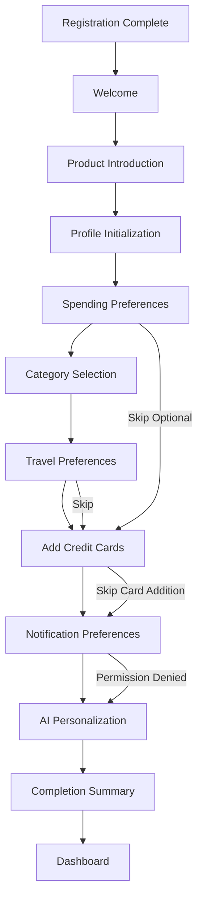

---

# 3.8 State Diagram

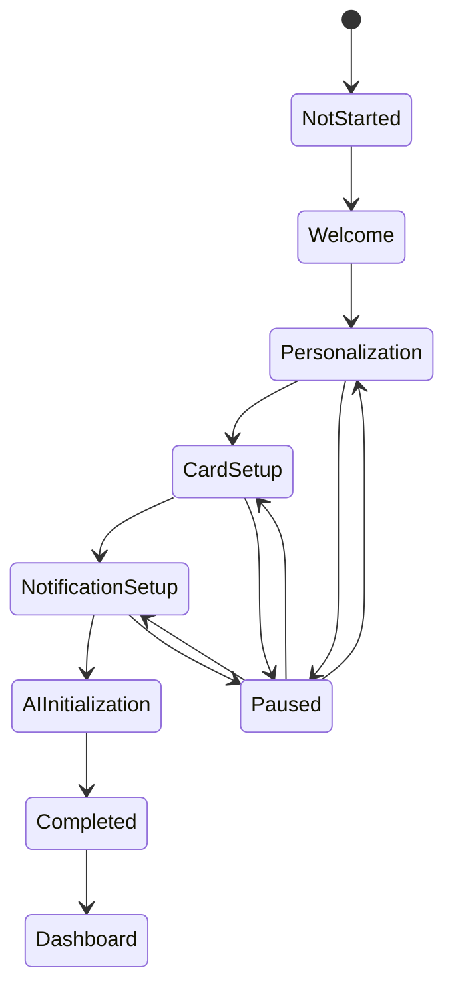

---

# 3.9 Sequence Diagram

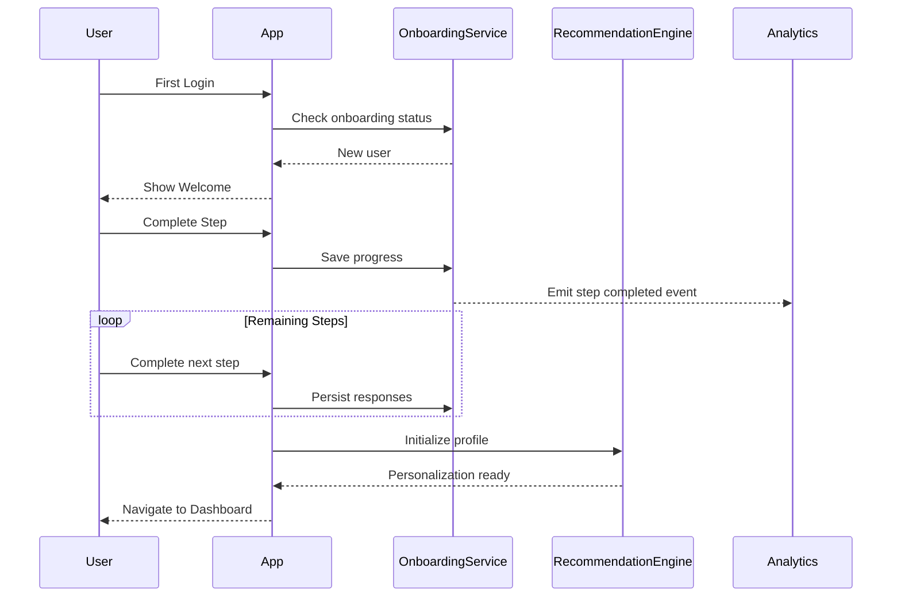

---

**End of Part 1/4**

**Next Part (2/4) will include:**

1. Component Diagram
2. Screen Specifications
3. UI Components
4. Validation Rules
5. Decision Tables
6. Logical Data Model


# Chapter 3 — User Onboarding (Part 2/4)

---

# 3.10 Component Diagram

```mermaid
graph TD

    App[CardWise Application]

    App --> OnboardingShell

    OnboardingShell --> ProgressHeader
    OnboardingShell --> WelcomeScreen
    OnboardingShell --> IntroCarousel
    OnboardingShell --> ProfileSetupScreen
    OnboardingShell --> SpendingPreferencesScreen
    OnboardingShell --> CategorySelectionScreen
    OnboardingShell --> TravelPreferencesScreen
    OnboardingShell --> CardSetupScreen
    OnboardingShell --> NotificationPreferencesScreen
    OnboardingShell --> AIInitializationScreen
    OnboardingShell --> CompletionScreen

    WelcomeScreen --> ContinueButton

    IntroCarousel --> FeatureCard
    IntroCarousel --> SkipButton

    ProfileSetupScreen --> ProfileForm

    SpendingPreferencesScreen --> PreferenceSelector

    CategorySelectionScreen --> CategoryGrid

    TravelPreferencesScreen --> TravelFrequencySelector

    CardSetupScreen --> CardSearch
    CardSetupScreen --> CardList
    CardSetupScreen --> SkipCardButton

    NotificationPreferencesScreen --> NotificationToggle
    NotificationPreferencesScreen --> PermissionRequest

    AIInitializationScreen --> ProgressIndicator

    CompletionScreen --> DashboardCTA
```

---

# 3.11 Screen Specifications

---

## 3.11.1 Welcome Screen

### Purpose

Introduce CardWise and explain the onboarding process.

### Layout

```
---------------------------------------
Welcome Illustration

Welcome to CardWise

Short introduction

Primary CTA

Skip Introduction

Progress Indicator
---------------------------------------
```

### Sections

- Welcome Hero
- Product Value Proposition
- Primary CTA
- Skip CTA
- Progress Footer

### Widgets

| Widget | Required |
|----------|----------|
| Illustration | Yes |
| Title | Yes |
| Description | Yes |
| Continue Button | Yes |
| Skip Introduction | Yes |
| Progress Indicator | Yes |

### Responsive Behaviour

Desktop

- Centered onboarding card
- Illustration on top

Tablet

- Responsive card layout

Mobile

- Full-screen layout
- Sticky CTA

### Loading State

Static screen.

### Empty State

Not applicable.

### Error State

Not applicable.

---

## 3.11.2 Spending Preferences Screen

### Purpose

Capture user spending behavior.

### Sections

- Monthly Spending Range
- Lifestyle Preferences
- Spending Goals
- Continue CTA

### Widgets

- Radio Cards
- Slider
- Chips
- Continue Button

### Loading State

Preference options displayed immediately.

### Empty State

No selection made.

### Error State

Prompt user to select at least one preference.

---

## 3.11.3 Category Selection Screen

### Purpose

Allow users to select preferred spending categories.

### Sections

- Category Grid
- Selected Categories
- Continue CTA

### Widgets

- Multi-select Chips
- Search
- Selected Counter

Supported Categories

- Dining
- Groceries
- Fuel
- Shopping
- Travel
- Entertainment
- Utilities
- Healthcare
- Education
- Insurance
- Online Shopping
- Subscriptions

---

## 3.11.4 Travel Preferences Screen

### Sections

- Domestic Travel Frequency
- International Travel Frequency
- Lounge Interest
- Hotel Preferences

---

## 3.11.5 Credit Card Setup Screen

### Purpose

Add existing credit cards.

### Sections

- Search Cards
- Popular Cards
- Selected Cards
- Add Another Card
- Skip

### Widgets

- Search Bar
- Card Tile
- Add Button
- Skip Button

### States

- Empty
- Search Results
- Selected Cards
- Error

---

## 3.11.6 Notification Preferences Screen

### Sections

- Bill Reminders
- Milestone Alerts
- Offer Alerts
- Reward Alerts
- AI Insights
- Browser Permission Request

---

## 3.11.7 AI Initialization Screen

### Purpose

Prepare recommendation engine.

### Sections

- Progress Indicator
- Personalization Summary
- Loading Animation

---

## 3.11.8 Completion Screen

### Sections

- Congratulations Message
- Summary
- Dashboard Preview
- Go To Dashboard CTA

---

# 3.12 UI Components

---

## Progress Header

### Purpose

Display onboarding progress.

### Variants

- Linear
- Step Indicator

### States

- Active
- Completed
- Upcoming

Accessibility

Progress announced to screen readers.

---

## Feature Card

Purpose

Explain one CardWise capability.

Variants

- Rewards
- Offers
- AI
- Dashboard

---

## Preference Selector

Purpose

Capture lifestyle preferences.

Variants

- Single Select
- Multi Select

States

- Selected
- Deselected
- Disabled

---

## Category Chip

Purpose

Represent a spending category.

States

- Selected
- Unselected
- Hover
- Disabled

Accessibility

Selection announced by assistive technologies.

---

## Card Tile

Purpose

Display available credit card.

Contents

- Card Name
- Issuer
- Network
- Thumbnail
- Add Button

States

- Added
- Not Added
- Disabled

---

## Selected Card Summary

Purpose

Display added cards.

Contents

- Card Name
- Remove Button

---

## Notification Toggle

Purpose

Enable notification preferences.

Variants

- Enabled
- Disabled

---

## Browser Permission Prompt

Purpose

Request notification permission.

States

- Not Requested
- Granted
- Denied
- Blocked

---

## Completion Summary Card

Purpose

Summarize onboarding.

Contents

- Cards Added
- Preferences Configured
- Notifications Enabled
- Personalization Status

---

## Primary CTA

Purpose

Proceed to next onboarding step.

States

- Enabled
- Disabled
- Loading

---

# 3.13 Validation Rules

## Profile Initialization

| ID | Field | Rule |
|-----|------|------|
| VAL-ONB-001 | Display Name | Required |
| VAL-ONB-002 | Display Name | 2–100 characters |

---

## Spending Preferences

| ID | Rule |
|-----|------|
| VAL-ONB-010 | At least one spending preference required |
| VAL-ONB-011 | Spending range must be selected |

---

## Category Selection

| ID | Rule |
|-----|------|
| VAL-ONB-020 | Minimum one category required |
| VAL-ONB-021 | Maximum configurable category limit enforced |
| VAL-ONB-022 | Duplicate category selection prohibited |

---

## Credit Card Setup

| ID | Rule |
|-----|------|
| VAL-ONB-030 | Card must exist in catalog |
| VAL-ONB-031 | Duplicate cards not allowed |
| VAL-ONB-032 | Card issuer required |
| VAL-ONB-033 | Network must be supported |

---

## Notification Preferences

| ID | Rule |
|-----|------|
| VAL-ONB-040 | Browser permission status synchronized |
| VAL-ONB-041 | Notification categories configurable independently |

---

## Completion

| ID | Rule |
|-----|------|
| VAL-ONB-050 | Mandatory steps completed |
| VAL-ONB-051 | Completion state persisted |

---

# 3.14 Decision Tables

## Onboarding Navigation

| Condition | Result |
|-----------|--------|
| Mandatory step incomplete | Prevent continuation |
| Optional step skipped | Continue to next step |
| Network unavailable | Save locally and retry |
| Browser refreshed | Resume from latest saved step |

---

## Credit Card Setup

| Condition | Result |
|-----------|--------|
| Card found | Add to portfolio |
| Card already added | Prevent duplicate |
| Card unavailable | Display validation message |
| User skips | Continue onboarding |

---

## Notification Permissions

| Condition | Result |
|-----------|--------|
| Permission granted | Enable push notifications |
| Permission denied | Continue without push |
| Browser unsupported | Hide permission request |
| User dismisses prompt | Continue onboarding |

---

## AI Personalization

| Condition | Result |
|-----------|--------|
| Preferences available | Initialize recommendation profile |
| No preferences collected | Initialize default profile |
| Initialization fails | Retry in background after dashboard load |

---

## Resume Logic

| Condition | Result |
|-----------|--------|
| User exits midway | Resume at last completed step |
| Onboarding completed | Open dashboard |
| Feature flag changes flow | Migrate to nearest compatible step |

---

# 3.15 Logical Data Model

> Logical entities only. Physical schema is defined in the Database Design document.

---

## User Onboarding Profile

Required Fields

- User Identifier
- Onboarding Version
- Current Step
- Completion Status
- Started Timestamp
- Completed Timestamp

Relationships

One User → One Active Onboarding Profile

---

## Spending Preferences

Required Fields

- Preference Identifier
- User Identifier
- Monthly Spending Range
- Lifestyle Profile
- Spending Goals

Relationship

One User → One Spending Preference Profile

---

## Spending Categories

Required Fields

- Category Identifier
- Category Name
- Display Order

Relationship

Many Categories ↔ Many Users

---

## Selected Categories

Required Fields

- User Identifier
- Category Identifier
- Selection Timestamp

Relationship

Bridge entity between User and Spending Category.

---

## Travel Preferences

Required Fields

- Domestic Frequency
- International Frequency
- Lounge Interest
- Hotel Preference

Relationship

One User → One Travel Preference Profile

---

## Onboarding Card Selection

Required Fields

- User Identifier
- Card Identifier
- Added During Onboarding
- Selection Timestamp

Relationship

One User → Many Selected Cards

---

## Notification Preferences

Required Fields

- User Identifier
- Bill Reminder Enabled
- Offer Alerts Enabled
- Reward Alerts Enabled
- AI Insight Alerts Enabled
- Browser Permission Status

Relationship

One User → One Notification Preference Profile

---

## AI Personalization Profile

Required Fields

- User Identifier
- Personalization Status
- Recommendation Profile Version
- Last Initialization Timestamp

Relationship

One User → One AI Profile

---

## Onboarding Progress

Required Fields

- User Identifier
- Current Step
- Last Completed Step
- Auto Saved Timestamp
- Completion Percentage

Relationship

One User → One Progress Record


# Chapter 3 — User Onboarding (Part 3/4)

---

# 3.16 API Dependencies

> This section defines logical API dependencies. API contracts and payload specifications are documented in the Backend Architecture.

---

## Onboarding APIs

| API ID | API | Purpose | Success Response | Failure Behaviour | Retry Strategy |
|---------|-----|---------|------------------|-------------------|----------------|
| API-ONB-001 | Get Onboarding Status | Determine whether onboarding is required | Current onboarding state | Default to resume flow | Retry once |
| API-ONB-002 | Start Onboarding | Initialize onboarding profile | Session initialized | Generic error | User initiated |
| API-ONB-003 | Save Progress | Persist current step | Progress saved | Queue locally if offline | Automatic retry |
| API-ONB-004 | Resume Onboarding | Retrieve latest saved progress | Current step | Resume from last confirmed state | Retry once |
| API-ONB-005 | Complete Onboarding | Finalize onboarding | Dashboard access enabled | Roll back completion state | Automatic retry |

---

## Preference APIs

| API ID | Purpose | Success | Failure |
|---------|----------|----------|----------|
| API-ONB-006 | Save spending preferences | Preferences stored | Validation error |
| API-ONB-007 | Save category selections | Categories stored | Validation error |
| API-ONB-008 | Save travel preferences | Preferences stored | Validation error |

---

## Credit Card APIs

| API ID | Purpose | Success | Failure |
|---------|----------|----------|----------|
| API-ONB-009 | Search credit cards | Matching cards | Empty results |
| API-ONB-010 | Add card during onboarding | Card added | Duplicate or invalid card |
| API-ONB-011 | Remove selected card | Card removed | Card not found |

---

## Notification APIs

| API ID | Purpose | Success | Failure |
|---------|----------|----------|----------|
| API-ONB-012 | Save notification preferences | Preferences updated | Validation error |
| API-ONB-013 | Register push capability | Device registered | Retry later |

---

## AI APIs

| API ID | Purpose | Success | Failure |
|---------|----------|----------|----------|
| API-ONB-014 | Initialize recommendation profile | AI profile created | Background retry |
| API-ONB-015 | Generate initial dashboard recommendations | Personalized widgets | Default recommendations |

---

## External Dependencies

| Dependency | Purpose | Failure Behaviour |
|------------|---------|-------------------|
| Browser Notification API | Push permission | Continue without push |
| Analytics Platform | Event ingestion | Queue and retry |
| Recommendation Engine | Personalization | Fallback profile |
| Card Catalog Service | Card lookup | Display empty search state |

---

# 3.17 Analytics & Telemetry

## Analytics Objectives

The onboarding module measures:

- User activation
- Step completion
- User drop-off
- Preference selection
- Card addition rate
- Permission acceptance
- Personalization quality

---

## Event Naming Convention

```
onboarding.<step>.<action>
```

Examples

```
onboarding.started
onboarding.step.completed
onboarding.card.added
onboarding.completed
```

---

## Analytics Events

### EVT-ONB-001

Event

```
onboarding.started
```

Properties

- platform
- app_version
- locale
- onboarding_version

---

### EVT-ONB-002

Event

```
onboarding.step.completed
```

Properties

- step_name
- step_number
- completion_time_ms
- skipped

---

### EVT-ONB-003

Event

```
onboarding.preference.selected
```

Properties

- preference_type
- selected_value

---

### EVT-ONB-004

Event

```
onboarding.category.selected
```

Properties

- category_name
- total_selected

---

### EVT-ONB-005

Event

```
onboarding.card.added
```

Properties

- issuer
- network
- source
- onboarding_step

---

### EVT-ONB-006

Event

```
onboarding.notifications.updated
```

Properties

- bill_enabled
- reward_enabled
- offer_enabled
- ai_enabled
- browser_permission

---

### EVT-ONB-007

Event

```
onboarding.ai.initialized
```

Properties

- personalization_version
- initialization_duration_ms

---

### EVT-ONB-008

Event

```
onboarding.completed
```

Properties

- completion_time_ms
- skipped_steps
- cards_added
- categories_selected

---

## Primary Funnel

```text
Registration
      │
      ▼
Welcome
      │
      ▼
Preferences
      │
      ▼
Categories
      │
      ▼
Card Added
      │
      ▼
Notifications
      │
      ▼
AI Initialized
      │
      ▼
Dashboard
```

---

## Step Drop-off Funnel

```text
Step Viewed
      │
      ▼
Interaction Started
      │
      ▼
Validation Passed
      │
      ▼
Step Saved
      │
      ▼
Next Step
```

---

## KPIs

| KPI | Target |
|------|---------|
| Onboarding completion | >85% |
| Average completion time | <5 min |
| First card added | >70% |
| Notification opt-in | >60% |
| AI initialization success | >99% |
| Resume success | >99.5% |

---

## Telemetry

The onboarding system shall emit telemetry for:

- Step render duration
- Progress save latency
- Resume latency
- Card search latency
- Card addition latency
- AI initialization latency
- API failures
- Client-side validation failures

---

# 3.18 Notifications

## In-App Notifications

| ID | Trigger | Recipient |
|----|----------|-----------|
| NOTIF-ONB-001 | Progress automatically saved | User |
| NOTIF-ONB-002 | Card successfully added | User |
| NOTIF-ONB-003 | AI personalization complete | User |
| NOTIF-ONB-004 | Onboarding completed | User |

---

## Push Notifications

| ID | Trigger |
|----|----------|
| NOTIF-ONB-101 | Resume onboarding reminder (future) |
| NOTIF-ONB-102 | Finish adding your cards (future) |

---

## Email Notifications

| ID | Trigger |
|----|----------|
| NOTIF-ONB-201 | Welcome to CardWise |
| NOTIF-ONB-202 | Resume onboarding reminder (optional) |
| NOTIF-ONB-203 | Onboarding completed |

---

## Silent Notifications

Used for:

- AI profile synchronization
- Progress synchronization
- Dashboard prefetch
- Recommendation refresh

---

# 3.19 Error Handling

## Error Classification

| Category | Recoverable | Example |
|----------|-------------|----------|
| Validation | Yes | Missing required selection |
| Network | Yes | Progress save timeout |
| Service | Yes | Recommendation service unavailable |
| Permission | Yes | Notification permission denied |
| Fatal | No | Corrupted onboarding state |

---

## Recoverable Errors

### ERR-ONB-001

Progress save failed.

User Message

> We couldn't save your latest changes. We'll retry automatically.

Recovery

- Store progress locally.
- Retry in the background.
- Notify only if retries fail.

---

### ERR-ONB-002

Card search unavailable.

Recovery

- Show retry action.
- Continue without card addition if desired.

---

### ERR-ONB-003

Card could not be added.

Recovery

- Preserve entered information.
- Display actionable validation.
- Allow retry.

---

### ERR-ONB-004

AI initialization delayed.

Recovery

- Complete onboarding.
- Continue initialization asynchronously.
- Use default recommendations until complete.

---

### ERR-ONB-005

Notification permission denied.

Recovery

- Continue onboarding.
- Explain how permission can be enabled later from browser or application settings.

---

### ERR-ONB-006

Category selection validation failed.

Recovery

- Highlight invalid fields.
- Preserve user selections.
- Focus first invalid control.

---

## Fatal Errors

### ERR-ONB-101

Onboarding state corrupted.

Action

- Recreate onboarding profile.
- Restore last confirmed progress if available.

---

### ERR-ONB-102

Required onboarding configuration missing.

Action

- Display maintenance screen.
- Prevent incomplete onboarding.
- Log diagnostic information.

---

### ERR-ONB-103

User identity mismatch.

Action

- Invalidate onboarding session.
- Redirect to authentication.

---

## Retry Behaviour

| Scenario | Strategy |
|-----------|----------|
| Progress save | Automatic retry with exponential backoff |
| Card search | Manual retry |
| Card addition | User initiated retry |
| AI initialization | Background retry |
| Notification registration | Retry after application restart |

---

## User Messaging Principles

Error messages during onboarding SHALL:

- Explain what happened.
- Clearly indicate whether progress was preserved.
- Avoid technical terminology.
- Offer an immediate recovery action whenever possible.
- Never require users to restart onboarding unless recovery is impossible.
- Be localized and accessible to assistive technologies.


# Chapter 3 — User Onboarding (Part 4/4)

---

# 3.20 Edge Cases

## Welcome & Navigation

| ID | Scenario | Expected Behaviour |
|----|----------|--------------------|
| EDGE-ONB-001 | User refreshes browser during onboarding | Resume from last successfully saved step |
| EDGE-ONB-002 | User opens onboarding in multiple tabs | Synchronize progress and prevent conflicting updates |
| EDGE-ONB-003 | User closes browser unexpectedly | Resume onboarding from latest persisted state |
| EDGE-ONB-004 | Feature flag changes onboarding flow | Migrate user to nearest compatible step without data loss |

---

## Progress Persistence

| ID | Scenario | Expected Behaviour |
|----|----------|--------------------|
| EDGE-ONB-005 | Progress save request times out | Store locally and retry automatically |
| EDGE-ONB-006 | User navigates backward repeatedly | Preserve previously entered responses |
| EDGE-ONB-007 | User resumes onboarding on another device | Load latest synchronized state |
| EDGE-ONB-008 | Backend version changes during onboarding | Perform version migration before rendering next step |

---

## Credit Card Setup

| ID | Scenario | Expected Behaviour |
|----|----------|--------------------|
| EDGE-ONB-009 | User searches for unavailable card | Display empty search state with feedback option |
| EDGE-ONB-010 | User attempts to add duplicate card | Prevent duplicate and explain why |
| EDGE-ONB-011 | Card catalog temporarily unavailable | Allow user to skip and continue |
| EDGE-ONB-012 | User skips card addition | Dashboard loads with educational empty state |

---

## Permissions

| ID | Scenario | Expected Behaviour |
|----|----------|--------------------|
| EDGE-ONB-013 | Browser blocks notification request | Continue onboarding without interruption |
| EDGE-ONB-014 | User dismisses permission dialog | Record dismissal and allow later configuration |
| EDGE-ONB-015 | Device does not support notifications | Hide unsupported controls |

---

## AI Personalization

| ID | Scenario | Expected Behaviour |
|----|----------|--------------------|
| EDGE-ONB-016 | Recommendation service unavailable | Initialize default profile |
| EDGE-ONB-017 | User skipped optional preferences | Generate recommendations from available data |
| EDGE-ONB-018 | AI initialization exceeds timeout | Continue to dashboard and finish asynchronously |

---

# 3.21 Accessibility

The onboarding experience SHALL comply with **WCAG 2.2 AA** across desktop, tablet, and mobile.

---

## Keyboard Navigation

### A11Y-ONB-001

Every onboarding step shall be fully operable using only a keyboard.

---

### A11Y-ONB-002

Progress navigation shall follow logical tab order.

---

### A11Y-ONB-003

Focus shall move to the beginning of each new step after navigation.

---

### A11Y-ONB-004

Dialogs shall trap focus until dismissed.

---

## Screen Reader Support

### A11Y-ONB-005

Each onboarding step shall expose an accessible title.

---

### A11Y-ONB-006

Progress indicator shall announce:

- Current step
- Total steps
- Completion percentage

---

### A11Y-ONB-007

Selection controls shall expose selected state programmatically.

---

### A11Y-ONB-008

Validation errors shall be announced immediately after submission.

---

## Forms

- Visible labels for every control.
- Placeholder text is never the only instruction.
- Required inputs expose required state.
- Instructions remain available after data entry.

---

## Visual Accessibility

- Minimum text contrast of 4.5:1.
- Progress indicators must not rely solely on color.
- Selected states shall include icons or checkmarks.

---

## Reduced Motion

Animations between onboarding steps shall respect operating system reduced-motion preferences.

---

## Mobile Accessibility

- Touch targets ≥44×44 px.
- Keyboard-safe layouts.
- Screen rotation supported.
- Dynamic font scaling supported up to 200%.

---

# 3.22 Security

Although onboarding collects limited information, it establishes long-term personalization data and SHALL follow secure-by-default principles.

---

## Authentication

### SEC-ONB-001

Only authenticated users may access onboarding.

---

### SEC-ONB-002

Onboarding endpoints shall validate session ownership before every request.

---

## Authorization

### SEC-ONB-003

Users may access only their own onboarding profile.

---

### SEC-ONB-004

Administrative tools shall require elevated privileges for onboarding inspection.

---

## Privacy

Onboarding data SHALL:

- Collect only necessary information.
- Support future user modification.
- Follow platform data retention policies.
- Respect user consent preferences.

---

## Audit Logging

The following events shall be logged:

- Onboarding started
- Step completed
- Card added during onboarding
- Preferences updated
- Notifications configured
- AI initialization completed
- Onboarding completed

Audit records shall be immutable and timestamped.

---

## Abuse Prevention

Controls include:

- Rate limiting for card search.
- Input validation for free-text fields.
- Request throttling.
- CSRF protection.
- Replay protection for completion requests.

---

## Secure Defaults

- HTTPS only.
- Secure session validation.
- Server-side validation of every step.
- Feature flag evaluation performed on trusted backend services where applicable.

---

# 3.23 Performance

## Performance Budgets

| Requirement | Target |
|-------------|--------|
| Welcome screen render | <1.5 s |
| Step transition | <300 ms |
| Progress save | <500 ms (P95) |
| Card search results | <1 s (P95) |
| AI initialization trigger | <1 s |
| Completion to dashboard navigation | <2 s |

---

## Rendering

- Render current step immediately.
- Prefetch next step assets where possible.
- Avoid layout shifts during navigation.

---

## Caching

Cacheable:

- Static illustrations
- Spending category catalog
- Product education assets

Non-cacheable:

- User progress
- Preferences
- AI initialization state
- Notification permission state

---

## Lazy Loading

Lazy load:

- Educational illustrations
- Card search module
- Recommendation preview assets
- Help content

---

## Background Processing

Execute asynchronously:

- AI profile initialization
- Dashboard widget prefetch
- Analytics event delivery
- Recommendation generation

---

## Rendering Expectations

- Smooth step transitions.
- No blocking spinners for local validation.
- Immediate visual confirmation after successful progress save.
- Dashboard should display meaningful content on first load.

---

# 3.24 QA Acceptance Matrix

## Happy Path

| QA ID | Scenario | Expected Result |
|-------|----------|-----------------|
| QA-ONB-001 | Complete onboarding | Dashboard accessible |
| QA-ONB-002 | Save progress | Progress restored correctly |
| QA-ONB-003 | Add credit card | Card appears in portfolio |
| QA-ONB-004 | Configure notifications | Preferences saved |
| QA-ONB-005 | AI initialization | Personalized dashboard available |

---

## Negative Path

| QA ID | Scenario | Expected Result |
|-------|----------|-----------------|
| QA-ONB-101 | Network interruption | Progress preserved |
| QA-ONB-102 | Invalid card selection | Validation displayed |
| QA-ONB-103 | Notification permission denied | Onboarding continues |
| QA-ONB-104 | AI service unavailable | Default recommendations shown |
| QA-ONB-105 | Resume after browser refresh | Latest progress restored |

---

## Boundary Cases

| QA ID | Scenario |
|-------|----------|
| QA-ONB-201 | Maximum supported card additions |
| QA-ONB-202 | Maximum category selections |
| QA-ONB-203 | Empty preference selections where optional |
| QA-ONB-204 | Resume across multiple devices |
| QA-ONB-205 | Feature flag migration between onboarding versions |

---

## Accessibility Tests

- Keyboard-only completion.
- Screen reader verification.
- Progress announcements.
- Error announcements.
- Contrast validation.
- Reduced-motion validation.
- Mobile accessibility verification.

---

## Performance Tests

- Initial render latency.
- Step transition latency.
- Card search under load.
- Progress persistence throughput.
- AI initialization latency.
- Dashboard transition timing.

---

## Security Tests

- Unauthorized onboarding access blocked.
- Session ownership validation.
- CSRF protection.
- Input validation.
- Replay protection.
- Rate limiting validation.
- Audit log generation.

---

## Regression Checklist

- Welcome experience
- Progress persistence
- Resume flow
- Spending preferences
- Category selection
- Travel preferences
- Credit card setup
- Notification preferences
- AI initialization
- Completion flow
- Analytics events
- Localization
- Accessibility
- Feature flag compatibility

---

# 3.25 Future Enhancements

## Phase 2

- Adaptive onboarding based on user intent.
- Import cards directly from supported statement uploads.
- AI-generated onboarding recommendations.
- Interactive product walkthrough.
- Smart defaults based on region.
- Context-aware educational tips.
- Personalized dashboard preview before completion.

---

## Phase 3

- Conversational AI onboarding assistant.
- Voice-guided onboarding.
- Dynamic onboarding flows based on detected card portfolio.
- Collaborative onboarding for family accounts.
- Goal-driven onboarding (travel, cashback, rewards, lounge optimization).

---

## Long-Term Roadmap

- Fully AI-generated onboarding journeys.
- Predictive preference inference with user confirmation.
- Cross-device onboarding continuity.
- Intelligent onboarding A/B experimentation framework.
- Adaptive personalization engine that continuously refines recommendations after onboarding.
- Self-optimizing onboarding based on anonymized aggregate behavior while preserving user privacy.

---

# Chapter Summary

The **User Onboarding** feature establishes the personalized foundation of the CardWise experience by guiding newly registered users through a progressive, low-friction setup flow. It captures essential preferences, initializes the user's credit card portfolio, configures notification settings, and bootstraps AI personalization while emphasizing resilience, accessibility, security, and seamless recovery from interruptions.

Successful completion of onboarding prepares the user for a meaningful first dashboard experience and provides the Recommendation Engine with sufficient context to generate relevant, personalized insights from the outset.

---
**End of Chapter 3 — User Onboarding**


# Chapter 4 — Dashboard & Home (Part 1/5)

---

# Feature Metadata

| Field | Value |
|--------|-------|
| Feature ID | DASH |
| Module | Dashboard & Home |
| Priority | P0 (Critical) |
| Release | Phase 1 (MVP) |
| Status | Planned |
| Product Owner | Product |
| Engineering Owner | Frontend + Backend |
| Design Owner | UX |
| Analytics Owner | Product Analytics |
| Security Owner | Security Engineering |
| Feature Flag | `dashboard_v1` |
| Dependencies | Authentication, Onboarding, Card Portfolio, Transactions, Bills, Rewards, Offers, Recommendation Engine, AI Assistant, Notification Service |
| Related Features | AUTH, ONB, CARD, TXN, BILL, REWARD, CASH, MILE, AI, SEARCH, REPORT |

---

# 4.1 Overview

## Purpose

The Dashboard is the primary landing experience after authentication and serves as the command center for CardWise. It provides users with a consolidated, personalized, and actionable view of their credit card portfolio, spending insights, upcoming bills, rewards, offers, AI recommendations, and recent activity.

Rather than functioning as a static homepage, the dashboard is a dynamic intelligence layer that continuously adapts based on user behavior, portfolio composition, and contextual signals.

---

## Summary

The Dashboard module is responsible for:

- Personalized home experience
- Credit card portfolio snapshot
- Spending overview
- Reward summary
- Cashback summary
- Upcoming bill reminders
- Annual fee waiver progress
- Milestone tracking
- AI-generated recommendations
- Merchant & bank offers
- Quick actions
- Recent activity timeline
- Widget personalization
- Cross-device dashboard synchronization
- Empty-state education

---

## Business Goals

- Provide immediate value after login.
- Surface high-priority financial actions.
- Encourage daily engagement.
- Improve reward optimization.
- Increase feature discoverability.
- Reduce time to important actions.
- Become the primary destination for credit card management.

---

## User Problems Solved

| Problem | Solution |
|----------|----------|
| Users don't know which action is important | Prioritized AI insights |
| Important bills are forgotten | Prominent due reminders |
| Rewards remain unused | Reward summary widgets |
| Users forget offers | Personalized offer widgets |
| Credit cards feel difficult to manage | Unified portfolio overview |
| Information is scattered | Single intelligent dashboard |

---

## Success Metrics

| Metric | Target |
|---------|--------|
| Dashboard load success | >99.9% |
| Dashboard first render | <2 seconds |
| Widget interaction rate | >70% |
| AI recommendation CTR | >30% |
| Daily dashboard visits | >80% of active users |
| Bill reminder engagement | >75% |
| Dashboard customization usage | >25% |

---

## In Scope

- Personalized dashboard
- Widget framework
- Portfolio summary
- Spending summary
- Reward overview
- Cashback overview
- Bill reminders
- Milestone tracking
- AI recommendations
- Offers preview
- Quick actions
- Recent activity
- Dashboard refresh
- Widget personalization
- Dashboard loading states

---

## Out of Scope

- Full transaction management
- Statement analysis
- Detailed reports
- Offer browsing
- AI conversation interface
- Card comparison
- Settings management
- Admin dashboards

---

## Assumptions

- User has completed onboarding.
- User is authenticated.
- Dashboard data is aggregated from multiple platform services.
- Recommendation engine may provide asynchronous updates.
- Some widgets may intentionally render partial data while background synchronization continues.

---

## Dependencies

### Internal

- Authentication Service
- User Profile Service
- Card Portfolio Service
- Transactions Service
- Bills Service
- Rewards Engine
- Cashback Engine
- Recommendation Engine
- AI Platform
- Notification Service
- Analytics Platform

### External

- Push Notification Provider
- Remote Configuration Service
- Feature Flag Service

---

## Risks

| Risk | Mitigation |
|------|------------|
| Slow dashboard due to multiple APIs | Backend aggregation + parallel loading |
| Empty dashboard for new users | Educational widgets & onboarding hints |
| Widget failures affecting entire screen | Independent widget loading |
| Information overload | Priority-based widget ordering |
| Excessive personalization complexity | Rule-based defaults with user customization |

---

# 4.2 Personas

## Primary Users

### Everyday Credit Card User

Characteristics

- Opens CardWise daily or several times per week.
- Wants immediate visibility into bills and rewards.

Permissions

- View dashboard
- Customize widgets
- Access quick actions
- View personalized recommendations

---

### Reward Optimizer

Characteristics

- Owns multiple cards.
- Maximizes cashback and reward points.

Permissions

- Monitor milestones
- View reward summaries
- Access optimization suggestions

---

### Frequent Traveller

Characteristics

- Travels frequently.
- Interested in lounge, travel offers, and insurance.

Permissions

- View travel widgets
- Monitor lounge eligibility
- View travel recommendations

---

### New User

Characteristics

- Recently completed onboarding.
- Has minimal portfolio data.

Permissions

- View educational dashboard
- Add cards
- Explore quick actions

---

## Secondary Users

### Returning User After Inactivity

Characteristics

- Has not opened CardWise recently.

Permissions

- Resume dashboard state
- View important missed events
- Review new recommendations

---

# 4.3 User Stories

## Dashboard Loading

### US-DASH-001

As a user,

I want the dashboard to load quickly,

so that I can immediately understand my financial status.

---

### US-DASH-002

As a user,

I want widgets to load independently,

so one slow service doesn't block the entire dashboard.

---

### US-DASH-003

As a user,

I want my dashboard personalized,

so the most relevant information appears first.

---

## Portfolio

### US-DASH-004

As a user,

I want to view all my cards,

so I know my active portfolio.

---

### US-DASH-005

As a user,

I want total reward points summarized,

so I understand my overall value.

---

### US-DASH-006

As a user,

I want upcoming annual fee milestones,

so I don't miss waiver opportunities.

---

## Bills

### US-DASH-007

As a user,

I want upcoming payment reminders,

so I never miss due dates.

---

### US-DASH-008

As a user,

I want overdue bills highlighted,

so I can act immediately.

---

## AI

### US-DASH-009

As a user,

I want AI recommendations,

so I know which actions maximize rewards.

---

### US-DASH-010

As a user,

I want recommendations explained,

so I understand why they matter.

---

## Quick Actions

### US-DASH-011

As a user,

I want one-tap shortcuts,

so I can quickly perform common tasks.

---

### US-DASH-012

As a user,

I want recently used actions surfaced,

so repetitive tasks become faster.

---

## Personalization

### US-DASH-013

As a user,

I want to rearrange dashboard widgets,

so the layout matches my priorities.

---

### US-DASH-014

As a user,

I want hidden widgets remembered,

so my dashboard remains uncluttered.

---

## Negative Stories

### US-DASH-015

If one widget fails,

the remainder of the dashboard should continue functioning.

---

### US-DASH-016

Dashboard refresh should never discard user layout preferences.

---

### US-DASH-017

Network failures should present cached dashboard data whenever available.

---

### US-DASH-018

Missing portfolio data should display educational empty states instead of blank widgets.

---

# 4.4 Functional Requirements

| ID | Priority | Requirement |
|----|----------|-------------|
| FR-DASH-001 | P0 | Dashboard shall be the default landing page after authentication and onboarding. |
| FR-DASH-002 | P0 | Dashboard shall display personalized widgets. |
| FR-DASH-003 | P0 | Widgets shall load independently. |
| FR-DASH-004 | P0 | Dashboard shall support pull-to-refresh on supported devices. |
| FR-DASH-005 | P0 | Dashboard shall display active credit card summary. |
| FR-DASH-006 | P0 | Dashboard shall display upcoming bill reminders. |
| FR-DASH-007 | P0 | Dashboard shall display reward summaries. |
| FR-DASH-008 | P0 | Dashboard shall display cashback summaries. |
| FR-DASH-009 | P0 | Dashboard shall display AI recommendations. |
| FR-DASH-010 | P0 | Dashboard shall display quick actions. |
| FR-DASH-011 | P1 | Users shall reorder supported widgets. |
| FR-DASH-012 | P1 | Users shall hide supported widgets. |
| FR-DASH-013 | P0 | Dashboard shall display recent activity. |
| FR-DASH-014 | P1 | Dashboard shall display merchant and bank offer previews. |
| FR-DASH-015 | P0 | Dashboard shall display annual fee milestone progress. |
| FR-DASH-016 | P1 | Dashboard shall restore previous scroll position when appropriate. |
| FR-DASH-017 | P1 | Widget visibility shall synchronize across user devices. |
| FR-DASH-018 | P0 | Dashboard shall support feature-flag-controlled widgets. |
| FR-DASH-019 | P1 | Dashboard shall support contextual educational widgets. |
| FR-DASH-020 | P0 | Dashboard shall gracefully handle partial service failures. |

---

# 4.5 Non-Functional Requirements

## Performance

| ID | Requirement |
|----|-------------|
| NFR-DASH-001 | Dashboard shell shall render within 1 second. |
| NFR-DASH-002 | Above-the-fold widgets shall become interactive within 2 seconds (P95). |
| NFR-DASH-003 | Widget refresh shall complete within 1 second after cached data becomes available. |
| NFR-DASH-004 | User interactions shall respond within 100 ms. |

---

## Reliability

- Widget failures shall remain isolated.
- Cached dashboard shall remain available when backend services are temporarily unavailable.
- Dashboard refresh operations shall be idempotent.

---

## Scalability

- Widget architecture shall support independent evolution.
- Additional widgets shall be deployable without dashboard redesign.
- Dashboard aggregation shall support millions of users.

---

## Accessibility

- Dashboard shall comply with WCAG 2.2 AA.
- Widgets shall expose accessible headings.
- Keyboard navigation shall support complete dashboard interaction.

---

## Security

- Dashboard data shall only display information belonging to the authenticated user.
- Sensitive financial information shall never appear in browser logs or URLs.

---

## Availability

Dashboard services shall achieve 99.9% uptime.

---

## Localization

- Currency, numbers, and dates shall follow user locale.
- Widget text shall support localization.
- Dynamic recommendations shall support translated content.

---

## Offline Behaviour

- Cached dashboard shall remain viewable.
- Offline banner shall clearly indicate stale information.
- Mutating actions shall be disabled until connectivity returns.

---

# 4.6 Business Rules

| ID | Rule |
|----|------|
| BR-DASH-001 | Dashboard is the primary authenticated landing page. |
| BR-DASH-002 | Widget ordering follows user customization when available; otherwise, platform defaults apply. |
| BR-DASH-003 | High-priority alerts (e.g., overdue bills) always appear before informational widgets. |
| BR-DASH-004 | AI recommendations shall only use data available to the user. |
| BR-DASH-005 | Hidden widgets remain hidden until explicitly restored by the user. |
| BR-DASH-006 | Dashboard customization is synchronized across supported devices. |
| BR-DASH-007 | Empty-state widgets shall provide actionable next steps. |
| BR-DASH-008 | Recommendation freshness shall respect configured cache policies. |
| BR-DASH-009 | Widget failures shall not block dashboard rendering. |
| BR-DASH-010 | Feature flags determine availability of experimental widgets. |

---

# 4.7 User Flow

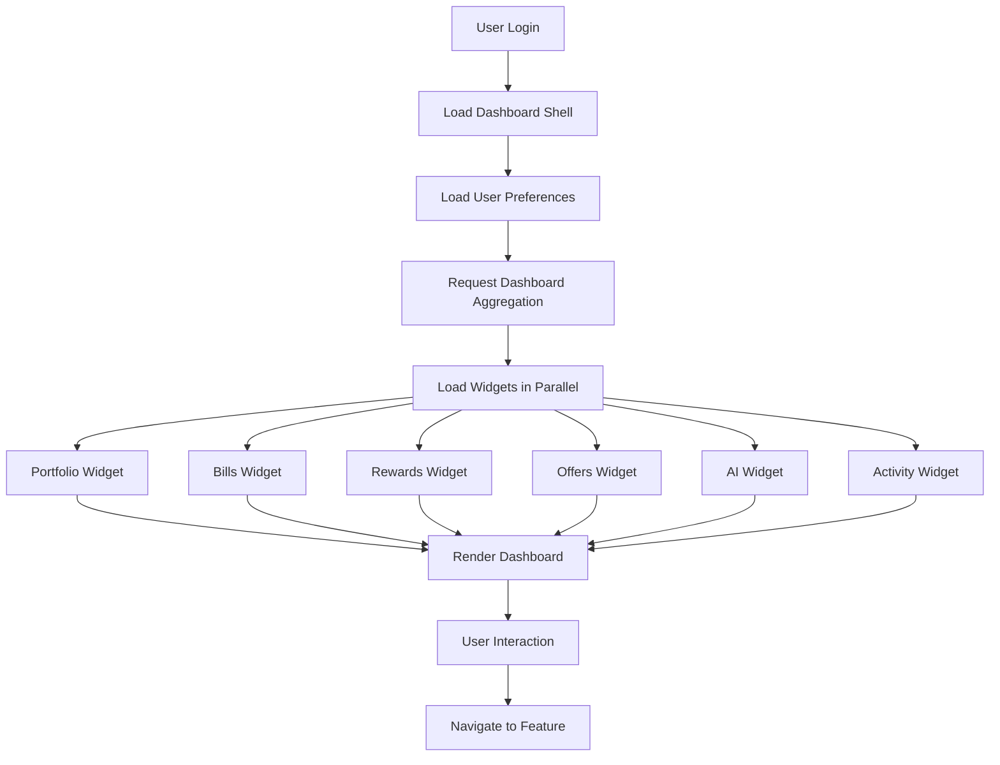

---

# 4.8 State Diagram

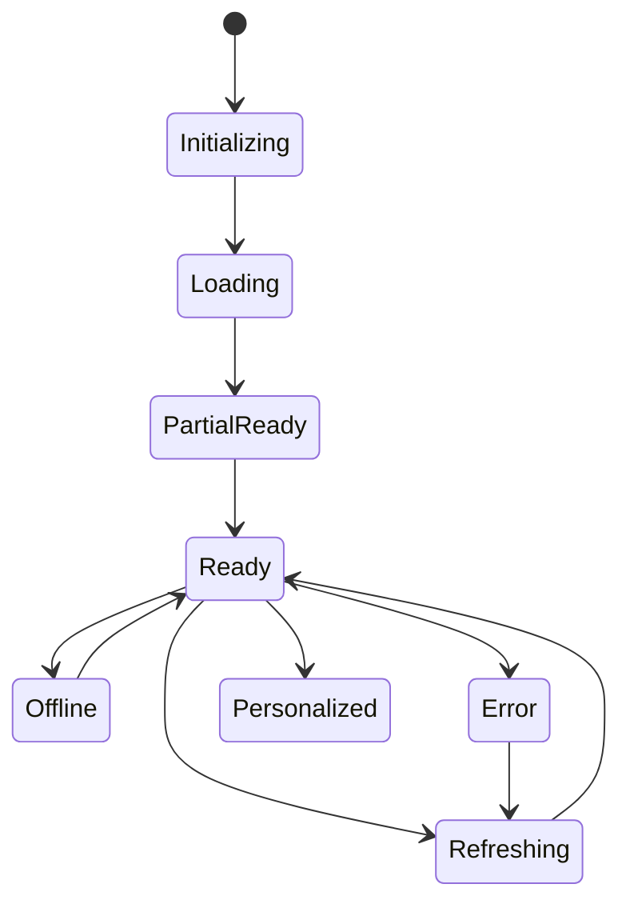

---

# 4.9 Sequence Diagram

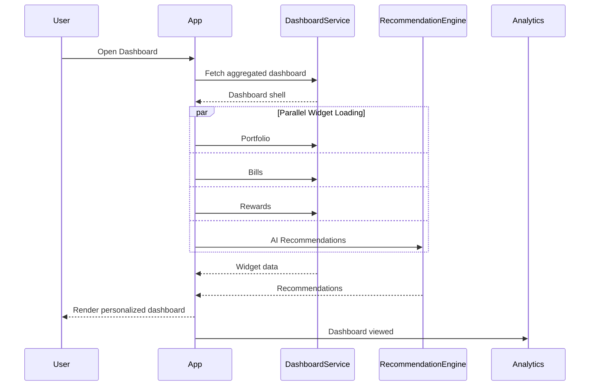

---

**End of Part 1/5**

**Next Part (2/5) will include:**

1. Component Diagram
2. Dashboard Layout
3. Widget Architecture
4. Screen Specifications
5. UI Components


# Chapter 4 — Dashboard & Home (Part 2/5)

---

# 4.10 Component Diagram

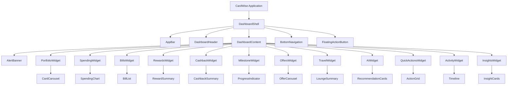

---

# 4.11 Dashboard Layout

## Layout Philosophy

The dashboard follows a **priority-first**, **progressive disclosure** layout.

Critical actions are positioned above informational content, ensuring users see the most important items first without excessive scrolling.

---

## Desktop Layout

```
+---------------------------------------------------------------+

App Bar

---------------------------------------------------------------

Alert Banner (Conditional)

---------------------------------------------------------------

Portfolio Summary

---------------------------------------------------------------

Bills          Rewards

---------------------------------------------------------------

Cashback       Milestones

---------------------------------------------------------------

AI Recommendations

---------------------------------------------------------------

Merchant & Bank Offers

---------------------------------------------------------------

Travel Benefits

---------------------------------------------------------------

Recent Activity

---------------------------------------------------------------

Insights

---------------------------------------------------------------

Quick Actions

---------------------------------------------------------------
```

---

## Tablet Layout

- Two-column responsive grid.
- Larger widgets expand horizontally.
- Charts resize proportionally.

---

## Mobile Layout

```
App Bar

↓

Alert Banner

↓

Portfolio Summary

↓

Bills

↓

Rewards

↓

Cashback

↓

Milestones

↓

AI Recommendations

↓

Offers

↓

Recent Activity

↓

Quick Actions

```

Widgets stack vertically while preserving priority order.

---

# 4.12 Widget Architecture

## Widget Principles

Every widget shall be:

- Independently rendered.
- Independently refreshed.
- Independently cached.
- Independently monitored.
- Independently feature-flagged.

---

## Widget Lifecycle

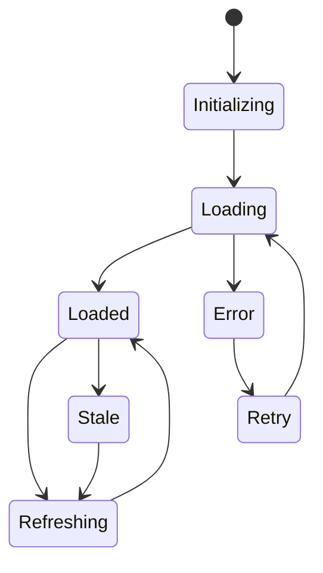

---

## Widget Categories

| Category | Examples |
|-----------|----------|
| Financial Summary | Portfolio, Spending, Rewards |
| Actionable | Bills, Milestones, AI |
| Discovery | Offers, Travel |
| Informational | Activity, Insights |
| Utility | Quick Actions |

---

## Widget Priority Levels

| Priority | Description |
|----------|-------------|
| P0 | Blocking user actions (Bills, Alerts) |
| P1 | Frequently accessed financial summaries |
| P2 | Recommendations and offers |
| P3 | Educational and informational widgets |

---

## Widget Refresh Strategy

| Widget | Refresh Mode |
|---------|--------------|
| Bills | Immediate on dashboard open |
| Portfolio | Immediate |
| Rewards | Immediate |
| Cashback | Immediate |
| AI | Background refresh |
| Offers | Background refresh |
| Activity | Incremental refresh |
| Insights | Cached with periodic refresh |

---

# 4.13 Screen Specifications

---

## 4.13.1 Dashboard Home

### Purpose

Provide a unified overview of the user's financial health and actionable insights.

---

### Sections

1. App Bar
2. Alert Banner
3. Portfolio Summary
4. Financial Overview
5. AI Recommendations
6. Offers
7. Recent Activity
8. Quick Actions

---

### Widgets

| Widget | Required |
|----------|----------|
| Portfolio Summary | Yes |
| Bills | Yes |
| Rewards | Yes |
| Cashback | Yes |
| AI Recommendations | Yes |
| Quick Actions | Yes |
| Recent Activity | Yes |
| Offers | Yes |
| Insights | Yes |
| Milestones | Yes |

---

### Responsive Behaviour

Desktop

- Multi-column dashboard
- Persistent navigation
- Wide charts

Tablet

- Responsive two-column grid

Mobile

- Vertical scrolling
- Sticky app bar
- Floating quick actions

---

### Loading State

- Dashboard shell appears immediately.
- Widgets render skeletons independently.
- Cached content replaces skeletons as soon as available.

---

### Empty State

Displayed for:

- No cards
- No rewards
- No transactions
- No bills
- No offers

Each empty state includes:

- Illustration
- Explanation
- Primary CTA

---

### Error State

Individual widgets display localized error cards.

Dashboard remains usable.

---

### Skeleton State

Skeletons exist for:

- Portfolio widget
- Charts
- Reward summary
- AI cards
- Offer carousel
- Timeline

---

## 4.13.2 Portfolio Summary Widget

### Purpose

Summarize user's active credit card portfolio.

### Sections

- Total Cards
- Total Credit Limit (optional/future)
- Active Cards
- Favorite Card
- Portfolio CTA

---

## 4.13.3 Bills Widget

### Sections

- Upcoming Bills
- Overdue Bills
- Due Today
- Calendar CTA

---

## 4.13.4 Rewards Widget

### Sections

- Total Rewards
- Recent Earnings
- Redeem CTA

---

## 4.13.5 Cashback Widget

### Sections

- Cashback Earned
- Pending Cashback
- Monthly Trend

---

## 4.13.6 AI Recommendation Widget

### Sections

- Recommendation Cards
- Confidence Indicator
- Explain Recommendation
- View All

---

## 4.13.7 Offer Widget

### Sections

- Merchant Offers
- Bank Offers
- Nearby Offers
- View All

---

## 4.13.8 Quick Actions Widget

### Sections

- Add Card
- Scan Statement
- View Bills
- Ask AI
- Compare Cards
- View Rewards

---

## 4.13.9 Recent Activity Widget

### Sections

- Timeline
- Transaction Updates
- Bill Updates
- Reward Updates

---

## 4.13.10 Insights Widget

### Sections

- Weekly Insights
- Monthly Trends
- Savings Opportunity
- AI Summary

---

# 4.14 UI Components

---

## Dashboard Shell

### Purpose

Provide the structural layout for the dashboard.

### States

- Loading
- Ready
- Refreshing
- Offline

Accessibility

Landmark regions properly defined.

---

## Dashboard Widget

### Purpose

Reusable container for dashboard modules.

### Variants

- Compact
- Standard
- Expanded
- Carousel

### States

- Loading
- Empty
- Error
- Loaded
- Refreshing

---

## Alert Banner

### Purpose

Display high-priority user alerts.

### Variants

- Bill Due
- Milestone
- Security
- Offer
- AI Recommendation

Priority

Highest.

---

## Portfolio Card

### Purpose

Display summarized portfolio information.

### Contents

- Card Count
- Favorite Card
- Portfolio CTA

---

## Financial Summary Card

Purpose

Display numerical summaries.

Variants

- Rewards
- Cashback
- Spending
- Bills

---

## Recommendation Card

Purpose

Represent one AI recommendation.

Contents

- Title
- Explanation
- Confidence Badge
- CTA

States

- New
- Viewed
- Dismissed
- Saved

---

## Offer Card

Purpose

Display promotional offers.

Contents

- Merchant
- Benefit
- Expiry
- CTA

States

- Active
- Expired
- Saved

---

## Quick Action Tile

Purpose

Provide immediate navigation.

Variants

- Add Card
- Compare Cards
- Ask AI
- Bills
- Rewards
- Statements

States

- Enabled
- Disabled
- Highlighted

---

## Activity Timeline Item

Purpose

Display chronological activity.

Variants

- Transaction
- Bill
- Reward
- Cashback
- Offer
- Recommendation

---

## Insight Card

Purpose

Present actionable financial intelligence.

Contents

- Insight Title
- Supporting Data
- Suggested Action

Variants

- Spending
- Reward
- Cashback
- Travel
- Savings
- Risk

---

## Dashboard Refresh Indicator

Purpose

Provide refresh feedback.

States

- Idle
- Pulling
- Refreshing
- Completed

Accessibility

Refresh status announced using ARIA live regions.

---

## Widget Overflow Menu

Purpose

Manage widget-level actions.

Actions

- Refresh
- Hide
- Move (future)
- Learn More
- Report Issue

Accessibility

Keyboard accessible menu with focus restoration after dismissal.


¡# Chapter 4 — Dashboard & Home (Part 3/5)

---

# 4.15 Validation Rules

> Dashboard validation primarily governs widget rendering, personalization, data freshness, and action availability rather than user input.

---

## Dashboard Initialization

| ID | Rule |
|-----|------|
| VAL-DASH-001 | User must be authenticated. |
| VAL-DASH-002 | Onboarding must be completed or intentionally skipped. |
| VAL-DASH-003 | Dashboard preferences must belong to the authenticated user. |
| VAL-DASH-004 | Dashboard version must be compatible with current application version. |

---

## Widget Rendering

| ID | Rule |
|-----|------|
| VAL-DASH-010 | Widget visibility determined by feature flags. |
| VAL-DASH-011 | Hidden widgets remain hidden until restored. |
| VAL-DASH-012 | Widget priority determines initial ordering when no user customization exists. |
| VAL-DASH-013 | Widgets without available data render contextual empty states instead of disappearing. |
| VAL-DASH-014 | Widget failures shall not interrupt rendering of sibling widgets. |

---

## Portfolio Widget

| ID | Rule |
|-----|------|
| VAL-DASH-020 | Portfolio summary requires at least one active card. |
| VAL-DASH-021 | Archived cards excluded by default. |
| VAL-DASH-022 | Card counts synchronized with portfolio service. |

---

## Bills Widget

| ID | Rule |
|-----|------|
| VAL-DASH-030 | Due dates sorted chronologically. |
| VAL-DASH-031 | Overdue bills always appear before upcoming bills. |
| VAL-DASH-032 | Duplicate reminders prohibited. |

---

## Rewards Widget

| ID | Rule |
|-----|------|
| VAL-DASH-040 | Total rewards aggregated across eligible cards. |
| VAL-DASH-041 | Hidden cards excluded from calculations when configured. |
| VAL-DASH-042 | Negative reward balances never displayed without explanation. |

---

## AI Recommendation Widget

| ID | Rule |
|-----|------|
| VAL-DASH-050 | Recommendation must reference valid user data. |
| VAL-DASH-051 | Duplicate recommendations suppressed. |
| VAL-DASH-052 | Expired recommendations hidden automatically. |
| VAL-DASH-053 | Recommendations include confidence metadata. |

---

## Dashboard Personalization

| ID | Rule |
|-----|------|
| VAL-DASH-060 | Widget order persisted after every successful change. |
| VAL-DASH-061 | Personalization synchronized across devices. |
| VAL-DASH-062 | Unsupported widgets ignored gracefully after application upgrades. |

---

# 4.16 Decision Tables

## Dashboard Initialization

| Condition | Result |
|-----------|--------|
| Authenticated + onboarding complete | Open dashboard |
| Authenticated + onboarding incomplete | Resume onboarding |
| Authentication expired | Redirect to login |
| Maintenance mode | Show maintenance screen |

---

## Widget Rendering

| Condition | Result |
|-----------|--------|
| Widget enabled + data available | Render widget |
| Widget enabled + no data | Render empty state |
| Widget disabled by feature flag | Hide widget |
| Widget service unavailable | Render widget error state |
| Widget loading | Display skeleton |

---

## Dashboard Refresh

| Condition | Result |
|-----------|--------|
| Pull-to-refresh | Refresh all refreshable widgets |
| Individual widget refresh | Refresh selected widget only |
| Offline | Display cached content |
| Background synchronization | Update affected widgets only |

---

## AI Recommendation

| Condition | Result |
|-----------|--------|
| High confidence recommendation | Display prominently |
| Medium confidence | Standard display |
| Low confidence | Lower priority placement |
| Recommendation unavailable | Display educational insight |

---

## Empty State Logic

| Condition | Result |
|-----------|--------|
| No cards | Encourage card addition |
| No transactions | Suggest importing statements |
| No rewards | Explain reward tracking |
| No bills | Explain reminder setup |
| No offers | Display educational placeholder |

---

# 4.17 Logical Data Model

> Logical entities only. Physical schema is documented separately.

---

## Dashboard Profile

Required Fields

- User Identifier
- Dashboard Version
- Personalization Version
- Last Viewed Timestamp
- Last Refresh Timestamp

Relationship

One User → One Dashboard Profile

---

## Dashboard Layout

Required Fields

- Layout Identifier
- User Identifier
- Widget Order
- Hidden Widgets
- Layout Version

Relationship

One User → One Active Layout

---

## Dashboard Widget

Required Fields

- Widget Identifier
- Widget Type
- Display Priority
- Visibility Status
- Feature Flag
- Refresh Policy

Relationship

Many Widgets → One Dashboard

---

## Portfolio Summary

Required Fields

- Active Card Count
- Favorite Card Identifier
- Portfolio Health Score
- Last Updated Timestamp

Relationship

Derived from Card Portfolio.

---

## Financial Summary

Required Fields

- Total Rewards
- Total Cashback
- Upcoming Bills
- Milestone Progress
- Spending Summary

Relationship

Aggregated from Rewards, Bills, Transactions, and Milestones.

---

## Recommendation

Required Fields

- Recommendation Identifier
- Recommendation Type
- Priority
- Confidence Score
- Explanation
- Action
- Expiration Timestamp

Relationship

One User → Many Recommendations

---

## Dashboard Insight

Required Fields

- Insight Identifier
- Insight Type
- Severity
- Generated Timestamp
- Dismissed Status

Relationship

One User → Many Insights

---

## Dashboard Activity

Required Fields

- Activity Identifier
- Activity Type
- Event Timestamp
- Source Module

Relationship

Aggregated from multiple platform services.

---

# 4.18 API Dependencies

> Dashboard APIs are aggregation-oriented. They consolidate information from multiple platform services to minimize client-side orchestration.

---

## Dashboard APIs

| API ID | API | Purpose | Success Response | Failure Behaviour | Retry Strategy |
|---------|-----|---------|------------------|-------------------|----------------|
| API-DASH-001 | Get Dashboard | Retrieve aggregated dashboard payload | Dashboard data | Cached dashboard fallback | Automatic retry |
| API-DASH-002 | Refresh Dashboard | Refresh dashboard | Updated widgets | Partial refresh | Retry failed widgets |
| API-DASH-003 | Get Dashboard Layout | Retrieve user layout | Layout configuration | Default layout | Retry once |
| API-DASH-004 | Save Dashboard Layout | Persist widget order & visibility | Layout saved | Preserve local changes | Background retry |

---

## Portfolio APIs

| API ID | Purpose | Success | Failure |
|---------|----------|----------|----------|
| API-DASH-005 | Portfolio summary | Portfolio snapshot | Widget error state |
| API-DASH-006 | Favorite card | Card metadata | Empty widget section |

---

## Bills APIs

| API ID | Purpose | Success | Failure |
|---------|----------|----------|----------|
| API-DASH-007 | Upcoming bills | Bill summary | Cached data |
| API-DASH-008 | Overdue bills | Alert list | Widget warning |

---

## Rewards APIs

| API ID | Purpose | Success | Failure |
|---------|----------|----------|----------|
| API-DASH-009 | Reward summary | Aggregated rewards | Cached rewards |
| API-DASH-010 | Cashback summary | Cashback totals | Cached values |

---

## AI & Recommendation APIs

| API ID | Purpose | Success | Failure |
|---------|----------|----------|----------|
| API-DASH-011 | Recommendations | Personalized recommendations | Educational fallback |
| API-DASH-012 | Dashboard insights | Insight cards | Cached insights |

---

## Offer APIs

| API ID | Purpose | Success | Failure |
|---------|----------|----------|----------|
| API-DASH-013 | Merchant offers | Offer preview | Empty offer widget |
| API-DASH-014 | Bank offers | Offer summary | Cached offers |

---

## Activity APIs

| API ID | Purpose | Success | Failure |
|---------|----------|----------|----------|
| API-DASH-015 | Recent activity | Timeline | Cached timeline |

---

## Widget APIs

| API ID | Purpose | Success | Failure |
|---------|----------|----------|----------|
| API-DASH-016 | Refresh widget | Updated widget | Existing cached widget retained |
| API-DASH-017 | Hide widget | Widget hidden | Local state retained |
| API-DASH-018 | Restore widget | Widget restored | Default placement |

---

## External Dependencies

| Dependency | Purpose | Failure Behaviour |
|------------|---------|-------------------|
| Recommendation Engine | AI recommendations | Educational fallback |
| Analytics Platform | Dashboard analytics | Queue telemetry |
| Remote Configuration | Widget configuration | Use cached configuration |
| Feature Flag Service | Dynamic widget availability | Default safe configuration |

---

## API Failure Strategy

### Aggregated Dashboard Request

If one downstream service fails:

- Return partial dashboard payload.
- Mark affected widget as unavailable.
- Continue rendering remaining widgets.

---

### Widget Refresh

Each widget refresh shall be:

- Independent
- Idempotent
- Retryable
- Non-blocking

---

### Dashboard Layout Synchronization

If layout synchronization fails:

- Preserve local configuration.
- Retry in the background.
- Resolve conflicts using latest server version with user-change reconciliation.

---

## Caching Strategy

| Data Type | Cache Strategy |
|-----------|----------------|
| Dashboard shell | Short-lived memory cache |
| Widget configuration | Persistent local cache |
| Portfolio summary | Short-lived cache |
| Recommendations | Time-based cache |
| Activity timeline | Incremental cache |
| Offers | Time-based cache |
| Layout preferences | Persistent synchronized cache |


# Chapter 4 — Dashboard & Home (Part 4/5)

---

# 4.19 Analytics & Telemetry

## Analytics Objectives

The Dashboard is the primary engagement surface in CardWise. Analytics for this module measure:

- User engagement
- Daily active usage
- Widget interaction frequency
- Recommendation effectiveness
- Feature discoverability
- Dashboard performance
- Personalization effectiveness
- Navigation behavior

---

## Event Naming Convention

```
dashboard.<object>.<action>
```

Examples

```
dashboard.viewed
dashboard.widget.opened
dashboard.widget.refreshed
dashboard.recommendation.clicked
dashboard.quick_action.executed
```

---

## Analytics Events

### EVT-DASH-001

Event

```
dashboard.viewed
```

Properties

- session_id
- dashboard_version
- platform
- app_version
- personalization_version
- load_duration_ms

---

### EVT-DASH-002

Event

```
dashboard.loaded
```

Properties

- widget_count
- rendered_widget_count
- failed_widget_count
- cache_used

---

### EVT-DASH-003

Event

```
dashboard.widget.viewed
```

Properties

- widget_type
- widget_position
- visibility_duration_ms

---

### EVT-DASH-004

Event

```
dashboard.widget.clicked
```

Properties

- widget_type
- interaction_type
- destination_feature

---

### EVT-DASH-005

Event

```
dashboard.widget.hidden
```

Properties

- widget_type
- previous_position

---

### EVT-DASH-006

Event

```
dashboard.widget.reordered
```

Properties

- widget_type
- previous_index
- new_index

---

### EVT-DASH-007

Event

```
dashboard.quick_action.executed
```

Properties

- action_name
- source_widget

---

### EVT-DASH-008

Event

```
dashboard.recommendation.clicked
```

Properties

- recommendation_id
- recommendation_type
- confidence_score

---

### EVT-DASH-009

Event

```
dashboard.offer.opened
```

Properties

- offer_id
- offer_type
- merchant
- issuer

---

### EVT-DASH-010

Event

```
dashboard.refreshed
```

Properties

- refresh_source
- refreshed_widget_count
- refresh_duration_ms

---

## Engagement Funnel

```text
Login
   │
   ▼
Dashboard Viewed
   │
   ▼
Widget Interaction
   │
   ▼
Feature Navigation
   │
   ▼
Task Completion
```

---

## Widget Engagement Funnel

```text
Widget Rendered
      │
      ▼
Widget Visible
      │
      ▼
Widget Expanded
      │
      ▼
CTA Clicked
      │
      ▼
Feature Opened
```

---

## KPIs

| KPI | Target |
|------|---------|
| Dashboard load success | >99.9% |
| Widget interaction rate | >70% |
| AI recommendation CTR | >30% |
| Quick Action usage | >40% |
| Average dashboard session | >90 seconds |
| Widget render success | >99% |
| Dashboard refresh success | >99.5% |

---

## Telemetry

Dashboard telemetry includes:

- Dashboard render duration
- Individual widget render duration
- API latency
- Widget refresh duration
- Layout synchronization latency
- Cache hit ratio
- Memory usage
- Client-side rendering errors
- Scroll depth
- Time-to-interactive
- Largest Contentful Paint (LCP)
- Interaction to Next Paint (INP)

---

# 4.20 Notifications

## In-App Notifications

| ID | Trigger | Recipient |
|----|----------|-----------|
| NOTIF-DASH-001 | New recommendation available | User |
| NOTIF-DASH-002 | Dashboard customization saved | User |
| NOTIF-DASH-003 | New high-priority insight generated | User |
| NOTIF-DASH-004 | Portfolio updated | User |

---

## Push Notifications

Dashboard push notifications originate from other modules but deep-link into dashboard widgets.

Examples:

| ID | Trigger |
|----|----------|
| NOTIF-DASH-101 | Bill due today |
| NOTIF-DASH-102 | Milestone achieved |
| NOTIF-DASH-103 | High-value merchant offer |
| NOTIF-DASH-104 | AI recommendation available |

---

## Silent Notifications

Used for:

- Dashboard refresh
- Recommendation synchronization
- Widget cache updates
- Offer synchronization
- Portfolio synchronization

---

# 4.21 Error Handling

## Error Classification

| Category | Recoverable | Example |
|----------|-------------|----------|
| Widget | Yes | Rewards service unavailable |
| Network | Yes | Dashboard refresh timeout |
| Aggregation | Yes | One downstream service failed |
| Personalization | Yes | Layout unavailable |
| Fatal | No | Authentication invalid |

---

## Recoverable Errors

### ERR-DASH-001

Widget unavailable.

User Message

> This section is temporarily unavailable.

Recovery

- Display retry action.
- Preserve remaining dashboard.

---

### ERR-DASH-002

Dashboard refresh failed.

Recovery

- Continue showing cached dashboard.
- Retry in background.
- Display last updated timestamp.

---

### ERR-DASH-003

Recommendation unavailable.

Recovery

- Replace with educational insight.
- Retry asynchronously.

---

### ERR-DASH-004

Offer service unavailable.

Recovery

- Hide unavailable offers.
- Display placeholder.

---

### ERR-DASH-005

Layout synchronization failed.

Recovery

- Continue with locally stored layout.
- Retry background synchronization.

---

### ERR-DASH-006

Portfolio aggregation delayed.

Recovery

- Render dashboard immediately.
- Update portfolio widget asynchronously.

---

## Fatal Errors

### ERR-DASH-101

Authentication invalid.

Action

- Clear dashboard state.
- Redirect to login.

---

### ERR-DASH-102

Dashboard aggregation unavailable.

Action

- Display full-page recovery screen.
- Provide retry.
- Preserve cached dashboard if available.

---

### ERR-DASH-103

Critical application configuration missing.

Action

- Display maintenance experience.
- Report diagnostic event.

---

## Retry Behaviour

| Scenario | Strategy |
|-----------|----------|
| Widget refresh | Retry independently |
| Dashboard refresh | Retry with exponential backoff |
| Recommendation fetch | Background retry |
| Layout sync | Silent retry |
| Offer synchronization | Scheduled refresh |

---

## User Messaging Principles

Dashboard messaging SHALL:

- Avoid blocking users because of isolated failures.
- Always preserve available information.
- Clearly distinguish stale information from current data.
- Avoid technical terminology.
- Encourage recovery actions only when useful.

---

# 4.22 Edge Cases

## Dashboard Initialization

| ID | Scenario | Expected Behaviour |
|----|----------|--------------------|
| EDGE-DASH-001 | User has no cards | Educational portfolio widget displayed |
| EDGE-DASH-002 | User has completed onboarding but no activity | Show onboarding follow-up guidance |
| EDGE-DASH-003 | Dashboard version updated | Migrate layout preferences automatically |
| EDGE-DASH-004 | First dashboard visit after release | Display "What's New" widget (feature-flag controlled) |

---

## Widget Behaviour

| ID | Scenario | Expected Behaviour |
|----|----------|--------------------|
| EDGE-DASH-005 | Widget service timeout | Widget enters error state without affecting siblings |
| EDGE-DASH-006 | Widget removed by feature flag | Layout reflows automatically |
| EDGE-DASH-007 | Widget restored | Restore to default or last known position |
| EDGE-DASH-008 | User hides all optional widgets | Mandatory widgets remain visible |

---

## Refresh

| ID | Scenario | Expected Behaviour |
|----|----------|--------------------|
| EDGE-DASH-009 | Pull-to-refresh while another refresh is active | Ignore duplicate refresh request |
| EDGE-DASH-010 | Refresh while offline | Continue displaying cached dashboard |
| EDGE-DASH-011 | Partial API failures | Refresh successful widgets only |

---

## Personalization

| ID | Scenario | Expected Behaviour |
|----|----------|--------------------|
| EDGE-DASH-012 | User logs in from another device | Synchronize layout |
| EDGE-DASH-013 | Personalization unavailable | Use default dashboard |
| EDGE-DASH-014 | Recommendation generation incomplete | Display cached recommendations until refreshed |

---

## Navigation

| ID | Scenario | Expected Behaviour |
|----|----------|--------------------|
| EDGE-DASH-015 | User opens notification deep link | Navigate directly to relevant widget or destination screen |
| EDGE-DASH-016 | Widget destination unavailable | Display contextual error and remain on dashboard |
| EDGE-DASH-017 | Returning from feature page | Restore previous dashboard scroll position where supported |


# Chapter 4 — Dashboard & Home (Part 5/5)

---

# 4.23 Accessibility

The Dashboard is the primary entry point to CardWise and SHALL comply with **WCAG 2.2 AA** across all supported platforms.

---

## Keyboard Navigation

### A11Y-DASH-001

Every interactive widget SHALL be fully keyboard accessible.

---

### A11Y-DASH-002

Users SHALL be able to navigate between widgets using logical tab order.

---

### A11Y-DASH-003

Widget action menus SHALL be operable using keyboard only.

---

### A11Y-DASH-004

After navigation back to Dashboard, focus SHALL be restored to the previously focused widget whenever feasible.

---

## Screen Reader Support

### A11Y-DASH-005

Each widget SHALL expose an accessible heading.

---

### A11Y-DASH-006

Financial summary cards SHALL expose descriptive labels rather than numeric values alone.

Example:

```
Total Rewards

125,000 Reward Points
```

instead of

```
125000
```

---

### A11Y-DASH-007

Charts SHALL include accessible textual summaries.

---

### A11Y-DASH-008

Recommendation cards SHALL expose:

- Recommendation title
- Recommendation explanation
- Primary action

---

## Visual Accessibility

Dashboard SHALL support:

- Minimum 4.5:1 contrast ratio
- High contrast operating-system modes
- Scalable typography
- Zoom up to 200%
- Color-independent status indicators

---

## Motion

Dashboard animations SHALL:

- Respect reduced-motion preferences.
- Avoid excessive parallax.
- Avoid auto-playing decorative animations.

---

## Mobile Accessibility

- Touch targets ≥44×44 px.
- Safe-area support.
- Dynamic font scaling.
- Screen orientation support.
- Accessible pull-to-refresh gesture alternatives.

---

## Widget Accessibility

Every widget SHALL provide:

- Accessible title
- Accessible loading state
- Accessible empty state
- Accessible error state
- Accessible action buttons

---

# 4.24 Security

Although the dashboard primarily displays aggregated information, it exposes highly sensitive financial data and SHALL follow strict security principles.

---

## Authentication

### SEC-DASH-001

Only authenticated users may access dashboard data.

---

### SEC-DASH-002

Expired sessions SHALL immediately invalidate dashboard access.

---

## Authorization

### SEC-DASH-003

Dashboard data SHALL only include information belonging to the authenticated user.

---

### SEC-DASH-004

Widget-level authorization SHALL be validated server-side.

---

## Privacy

Dashboard SHALL:

- Never expose full card numbers.
- Never expose CVV.
- Never expose authentication secrets.
- Mask sensitive identifiers where appropriate.
- Respect user privacy preferences for financial summaries.

---

## Secure Rendering

- Prevent browser caching of sensitive responses where appropriate.
- Prevent sensitive information from appearing in URLs.
- Prevent leakage through browser history.
- Prevent exposure through screenshots where platform capabilities exist (future mobile enhancement).

---

## Audit Logging

Dashboard-related audit events include:

- Dashboard viewed
- Layout updated
- Widget visibility changed
- Widget order updated
- Security-sensitive quick actions initiated

---

## Abuse Prevention

Controls include:

- Server-side authorization checks
- API rate limiting
- Request throttling
- Replay protection for state-changing operations
- Feature flag validation

---

## OWASP Alignment

Dashboard SHALL mitigate:

- Broken Access Control
- Sensitive Data Exposure
- Cross-Site Scripting (XSS)
- Cross-Site Request Forgery (CSRF)
- Injection attacks
- Clickjacking
- Insecure Direct Object References (IDOR)

---

## Secure Defaults

- HTTPS only
- Content Security Policy
- Secure cookies
- HttpOnly cookies
- SameSite protection
- Strict Transport Security
- No sensitive data in local storage unless explicitly encrypted

---

# 4.25 Performance

## Performance Budgets

| Requirement | Target |
|-------------|--------|
| Dashboard shell render | <1 s |
| First meaningful widget | <1.5 s |
| Above-the-fold interactive | <2 s (P95) |
| Individual widget refresh | <1 s |
| Dashboard refresh | <2 s |
| Widget reorder persistence | <300 ms |
| Quick Action response | <100 ms |

---

## Rendering Strategy

Dashboard SHALL use:

- Progressive rendering
- Incremental hydration (where applicable)
- Independent widget rendering
- Deferred below-the-fold rendering
- Optimistic UI for layout customization

---

## Caching Strategy

### Memory Cache

- Dashboard aggregation
- Widget metadata
- Navigation state

---

### Persistent Cache

- Dashboard layout
- Widget visibility
- Recently viewed insights
- Recommendation metadata
- Static educational content

---

### Cache Invalidation

Invalidate when:

- Authentication changes
- User switches accounts
- Dashboard version changes
- Widget configuration changes
- Feature flag changes

---

## Lazy Loading

Lazy load:

- Offer carousel images
- Recommendation explanations
- Activity timeline history
- Below-the-fold widgets
- Charts outside viewport
- Educational assets

---

## Virtualization

Virtualization SHALL be used for:

- Long activity timelines
- Large recommendation lists
- Extensive offer lists
- Future notification feeds

---

## Background Processing

Execute asynchronously:

- Recommendation refresh
- Offer synchronization
- Dashboard aggregation refresh
- Widget telemetry upload
- Cache cleanup
- Insight generation

---

## Network Optimization

- Parallel widget loading
- Batched dashboard aggregation
- Conditional requests where supported
- Delta updates for activity timeline
- Image optimization and responsive assets

---

## Performance Monitoring

The dashboard SHALL continuously measure:

- First Contentful Paint (FCP)
- Largest Contentful Paint (LCP)
- Interaction to Next Paint (INP)
- Cumulative Layout Shift (CLS)
- Time to Interactive (TTI)
- Widget render latency
- API latency
- Client memory usage

---

# 4.26 QA Acceptance Matrix

## Happy Path

| QA ID | Scenario | Expected Result |
|-------|----------|-----------------|
| QA-DASH-001 | Dashboard loads successfully | Personalized dashboard rendered |
| QA-DASH-002 | Widgets render independently | Partial failures do not block dashboard |
| QA-DASH-003 | Pull-to-refresh | Updated data displayed |
| QA-DASH-004 | Widget reorder | Layout persists |
| QA-DASH-005 | Widget hide/show | Visibility synchronized |
| QA-DASH-006 | AI recommendation opens destination | Correct navigation |
| QA-DASH-007 | Quick Action executed | Destination screen opens |

---

## Negative Path

| QA ID | Scenario | Expected Result |
|-------|----------|-----------------|
| QA-DASH-101 | Portfolio service unavailable | Portfolio widget error state only |
| QA-DASH-102 | Recommendation service unavailable | Educational fallback shown |
| QA-DASH-103 | Dashboard offline | Cached dashboard displayed |
| QA-DASH-104 | Layout synchronization fails | Local layout retained |
| QA-DASH-105 | Aggregation timeout | Partial dashboard rendered |

---

## Boundary Cases

| QA ID | Scenario |
|-------|----------|
| QA-DASH-201 | Maximum supported widgets |
| QA-DASH-202 | User hides every optional widget |
| QA-DASH-203 | Hundreds of activity timeline entries |
| QA-DASH-204 | Large recommendation dataset |
| QA-DASH-205 | Large number of linked credit cards |

---

## Accessibility Tests

- Keyboard navigation
- Screen reader validation
- Focus restoration
- Widget headings
- Chart accessibility
- Contrast verification
- Reduced motion
- Dynamic font scaling
- Mobile accessibility

---

## Performance Tests

- Cold dashboard load
- Warm cache dashboard load
- Widget refresh latency
- Parallel API loading
- Offline dashboard startup
- Dashboard under high latency
- Widget virtualization performance

---

## Security Tests

- Unauthorized dashboard access blocked
- User isolation validation
- Widget authorization
- Sensitive data masking
- Session expiration handling
- CSRF validation
- XSS validation
- Clickjacking protection
- Secure caching verification

---

## Regression Checklist

- Dashboard rendering
- Widget ordering
- Widget visibility
- Portfolio summary
- Bills widget
- Rewards widget
- Cashback widget
- AI recommendations
- Offers preview
- Activity timeline
- Insights
- Quick actions
- Pull-to-refresh
- Offline mode
- Personalization
- Analytics events
- Accessibility
- Feature flags
- Localization

---

# 4.27 Future Enhancements

## Phase 2

- Drag-and-drop dashboard customization
- Widget resizing
- Multiple dashboard layouts
- Smart dashboard themes
- Adaptive widget prioritization
- Calendar agenda widget
- Travel dashboard mode
- Premium dashboard widgets
- Cross-device live synchronization

---

## Phase 3

- AI-generated personalized dashboards
- Predictive financial timeline
- Dynamic widget creation based on user behavior
- Goal-oriented dashboards (Travel, Cashback, Rewards, Business, Family)
- Voice-driven dashboard navigation
- Real-time collaboration for shared family dashboards

---

## Long-Term Roadmap

- Fully modular dashboard marketplace
- User-created custom widgets
- AI-powered dashboard summarization
- Natural language dashboard generation
- Personalized financial health score dashboard
- Predictive "Next Best Action" engine
- Context-aware dashboard that adapts to location, time, and spending patterns
- Multi-device synchronized dashboard experiences
- Extensible plugin framework for future CardWise modules

---

# Chapter Summary

The **Dashboard & Home** module serves as the operational center of CardWise, bringing together portfolio summaries, spending insights, rewards, cashback, bills, offers, AI recommendations, recent activity, and quick actions into a single personalized experience.

Its modular widget architecture, independent rendering model, robust personalization capabilities, resilient error handling, accessibility compliance, security controls, and performance optimizations establish the foundation for a scalable, intelligent financial intelligence platform. Subsequent feature modules will integrate into the dashboard through standardized widget contracts, ensuring consistency, extensibility, and long-term maintainability across the product.

---
**End of Chapter 4 — Dashboard & Home**


# Chapter 5 — Credit Card Portfolio (Part 1/6)

---

# Feature Metadata

| Field | Value |
|--------|-------|
| Feature ID | CARD |
| Module | Credit Card Portfolio |
| Priority | P0 (Critical) |
| Release | Phase 1 (MVP) |
| Status | Planned |
| Product Owner | Product |
| Engineering Owner | Frontend + Backend |
| Design Owner | UX |
| Analytics Owner | Product Analytics |
| Security Owner | Security Engineering |
| Feature Flag | `portfolio_v1` |
| Dependencies | Authentication, User Profile, Dashboard, Card Catalog, Rewards Engine, Bills, Recommendation Engine, AI Platform, Analytics Platform |
| Related Features | DASH, CARDDET, COMP, TXN, BILL, REWARD, CASH, MILE, AI, SEARCH, REPORT |

---

# 5.1 Overview

## Purpose

The Credit Card Portfolio is the canonical representation of every credit card associated with a CardWise user. It acts as the foundation for reward optimization, bill tracking, statement analysis, recommendations, travel benefits, lounge access, insurance eligibility, and AI-driven financial insights.

Unlike a simple card list, the portfolio is an intelligent collection that combines user-provided information, platform-managed metadata, and derived insights to create a unified view of the user's credit card ecosystem.

---

## Summary

The Credit Card Portfolio module is responsible for:

- Managing all user credit cards
- Adding cards from supported issuers
- Supporting custom cards
- Editing card metadata
- Archiving cards
- Closing cards
- Duplicate detection
- Portfolio statistics
- Benefit association
- Fee management
- Statement cycle configuration
- Due date configuration
- Reward program linkage
- Portfolio health scoring
- Smart insights
- AI enrichment
- Portfolio synchronization

---

## Business Goals

- Provide a single source of truth for user credit cards.
- Enable downstream financial intelligence features.
- Reduce manual data entry.
- Improve recommendation quality.
- Encourage complete portfolio setup.
- Maintain accurate benefit tracking.

---

## User Problems Solved

| Problem | Solution |
|----------|----------|
| Users own multiple cards | Unified portfolio |
| Card details are scattered | Centralized management |
| Benefits are difficult to remember | Structured benefit metadata |
| Fee waivers are forgotten | Milestone tracking integration |
| Duplicate cards cause confusion | Intelligent duplicate detection |
| Unsupported cards cannot be tracked | Custom card support |

---

## Success Metrics

| Metric | Target |
|---------|--------|
| Users with at least one card | >90% |
| Average cards per active user | Product KPI |
| Duplicate detection accuracy | >99% |
| Portfolio completion rate | >80% |
| Card edit success | >99% |
| Portfolio synchronization success | >99.5% |

---

## In Scope

- Add card
- Edit card
- Archive card
- Restore archived card
- Close card
- Delete card (soft delete where applicable)
- Card metadata management
- Card nickname
- Card image
- Benefit association
- Statement configuration
- Due date configuration
- Annual fee information
- Reward program association
- Portfolio statistics
- Portfolio search
- Portfolio filters
- Portfolio sorting
- Portfolio insights

---

## Out of Scope

- Transaction management
- Statement parsing
- Bill payment
- Reward redemption
- Offer browsing
- Credit score management
- Loan products
- Debit cards (Phase 1)
- Charge cards (future evaluation)

---

## Assumptions

- User is authenticated.
- Card catalog is available for supported issuers.
- Unsupported cards may be manually added.
- Portfolio changes propagate asynchronously to dependent modules.
- Card ownership is self-declared by the user.

---

## Dependencies

### Internal

- Authentication Service
- User Service
- Card Catalog Service
- Dashboard
- Rewards Engine
- Recommendation Engine
- AI Platform
- Analytics Platform

### External

- Card metadata provider (future)
- Issuer catalog updates
- Remote configuration service

---

## Risks

| Risk | Mitigation |
|------|------------|
| Duplicate card entries | Intelligent duplicate detection |
| Unsupported card products | Custom card workflow |
| Incorrect user input | Validation + guided editing |
| Catalog changes | Versioned card definitions |
| Missing benefit metadata | Progressive enrichment |

---

# 5.2 Personas

## Primary Users

### Single Card User

Characteristics

- Owns one credit card.
- Wants reminders and reward tracking.

Permissions

- Add card
- Edit card
- Archive card
- Delete card

---

### Multi-Card Optimizer

Characteristics

- Owns multiple credit cards.
- Maximizes rewards and cashback.

Permissions

- Manage entire portfolio
- Configure nicknames
- Compare cards
- View portfolio insights

---

### Frequent Traveller

Characteristics

- Uses premium travel cards.

Permissions

- Track travel benefits
- View lounge eligibility
- Monitor insurance benefits

---

### Power User

Characteristics

- Frequently updates portfolio.
- Wants advanced customization.

Permissions

- Manage custom cards
- Archive historical cards
- Configure statement cycles
- Customize card appearance

---

## Secondary Users

### Administrator

Permissions

- Manage card catalog
- Review unsupported card reports
- Update issuer metadata

Administrators cannot:

- Modify user-owned portfolio without authorized workflows.
- View sensitive user financial data beyond operational needs.

---

# 5.3 User Stories

## Card Management

### US-CARD-001

As a user,

I want to add my credit card,

so CardWise can personalize recommendations.

---

### US-CARD-002

As a user,

I want to edit my card details,

so my portfolio remains accurate.

---

### US-CARD-003

As a user,

I want to archive unused cards,

so my portfolio remains organized.

---

### US-CARD-004

As a user,

I want to restore archived cards,

so historical cards can become active again.

---

### US-CARD-005

As a user,

I want to close cards,

so future recommendations ignore inactive cards.

---

## Portfolio Organization

### US-CARD-006

As a user,

I want to assign nicknames,

so similar cards are easier to distinguish.

---

### US-CARD-007

As a user,

I want to search my portfolio,

so I quickly locate a specific card.

---

### US-CARD-008

As a user,

I want to filter cards,

so I can focus on relevant subsets.

---

### US-CARD-009

As a user,

I want to sort cards,

so the most useful cards appear first.

---

## Metadata

### US-CARD-010

As a user,

I want statement and due dates configured,

so reminders remain accurate.

---

### US-CARD-011

As a user,

I want annual fee information,

so fee waivers are tracked correctly.

---

### US-CARD-012

As a user,

I want card benefits automatically associated,

so I understand everything my card offers.

---

## Insights

### US-CARD-013

As a user,

I want portfolio health insights,

so I know which information is missing.

---

### US-CARD-014

As a user,

I want AI recommendations based on my portfolio,

so I maximize value.

---

### US-CARD-015

As a user,

I want duplicate cards detected,

so my portfolio remains clean.

---

## Negative Stories

### US-CARD-016

Adding the same card twice should not create duplicate active entries.

---

### US-CARD-017

Deleting one card must not affect other portfolio items.

---

### US-CARD-018

Unsupported cards should still be manageable using custom card workflows.

---

### US-CARD-019

Archived cards should not appear in active recommendations unless explicitly restored.

---

### US-CARD-020

Editing metadata shall not invalidate historical analytics.

---

# 5.4 Functional Requirements

| ID | Priority | Requirement |
|----|----------|-------------|
| FR-CARD-001 | P0 | Users shall add supported credit cards from the card catalog. |
| FR-CARD-002 | P0 | Users shall create custom cards when no catalog match exists. |
| FR-CARD-003 | P0 | Users shall edit card metadata. |
| FR-CARD-004 | P0 | Users shall archive cards. |
| FR-CARD-005 | P0 | Users shall restore archived cards. |
| FR-CARD-006 | P0 | Users shall close cards without deleting historical data. |
| FR-CARD-007 | P0 | Portfolio shall detect duplicate cards. |
| FR-CARD-008 | P0 | Users shall configure statement dates. |
| FR-CARD-009 | P0 | Users shall configure payment due dates. |
| FR-CARD-010 | P0 | Portfolio shall associate issuer metadata automatically. |
| FR-CARD-011 | P0 | Portfolio shall associate reward programs automatically where supported. |
| FR-CARD-012 | P1 | Users shall assign custom nicknames. |
| FR-CARD-013 | P1 | Users shall customize card images (future). |
| FR-CARD-014 | P1 | Portfolio shall support search. |
| FR-CARD-015 | P1 | Portfolio shall support filtering. |
| FR-CARD-016 | P1 | Portfolio shall support sorting. |
| FR-CARD-017 | P0 | Portfolio shall expose data to dependent modules through a canonical model. |
| FR-CARD-018 | P1 | Portfolio shall generate health insights. |
| FR-CARD-019 | P0 | Portfolio changes shall synchronize with dashboard and AI services. |
| FR-CARD-020 | P0 | Portfolio shall maintain historical integrity for archived and closed cards. |
| FR-CARD-021 | P1 | Portfolio shall support configurable primary/default card designation. |
| FR-CARD-022 | P1 | Portfolio shall maintain benefit tags for every supported card. |
| FR-CARD-023 | P2 | Portfolio shall support manual credit limit tracking. |
| FR-CARD-024 | P2 | Portfolio shall support available limit tracking. |
| FR-CARD-025 | P1 | Portfolio shall support bulk import in future phases. |

---

# 5.5 Non-Functional Requirements

## Performance

| ID | Requirement |
|----|-------------|
| NFR-CARD-001 | Portfolio list shall render within 2 seconds (P95). |
| NFR-CARD-002 | Card search results shall appear within 300 ms. |
| NFR-CARD-003 | Portfolio updates shall synchronize within 2 seconds. |
| NFR-CARD-004 | Duplicate detection shall complete before final card creation. |

---

## Reliability

- Portfolio updates shall be transactional.
- Card metadata shall remain consistent across dependent modules.
- Archived and closed cards shall preserve historical relationships.

---

## Scalability

- Support portfolios containing hundreds of cards without functional degradation.
- Card catalog updates shall not require user portfolio migrations.
- Portfolio APIs shall support horizontal scaling.

---

## Accessibility

- Portfolio screens shall comply with WCAG 2.2 AA.
- Card lists shall support keyboard navigation.
- Search and filters shall be fully accessible.

---

## Security

- Portfolio data shall only be visible to authenticated owners.
- Sensitive card identifiers shall never be fully displayed.
- Card metadata shall be validated server-side.

---

## Availability

Portfolio services shall maintain 99.9% availability.

---

## Localization

- Issuer names, benefit descriptions, and monetary values shall support localization where applicable.
- Date formats shall follow user locale.

---

## Offline Behaviour

- Cached portfolio remains viewable offline.
- Editing operations queue until connectivity is restored where supported.
- Users are clearly informed when viewing stale data.

---

# 5.6 Business Rules

| ID | Rule |
|----|------|
| BR-CARD-001 | A user may own multiple active credit cards. |
| BR-CARD-002 | Duplicate active portfolio entries are not permitted for the same physical card. |
| BR-CARD-003 | Archived cards are excluded from active recommendations by default. |
| BR-CARD-004 | Closed cards remain available for historical reporting unless permanently deleted according to retention policies. |
| BR-CARD-005 | Statement date shall precede the corresponding payment due date within the configured billing cycle. |
| BR-CARD-006 | Benefit metadata originates from the card catalog and may be supplemented by user-provided information where supported. |
| BR-CARD-007 | Custom cards shall receive a reduced feature set until enriched with additional metadata. |
| BR-CARD-008 | Portfolio updates propagate asynchronously to dependent modules. |
| BR-CARD-009 | Portfolio search indexes active and archived cards independently. |
| BR-CARD-010 | Exactly one card may be designated as the primary card when the feature is enabled. |
| BR-CARD-011 | Canonical portfolio identifiers remain stable throughout the card lifecycle. |
| BR-CARD-012 | Soft deletion is preferred over permanent deletion to preserve referential integrity. |

---

# 5.7 User Flow

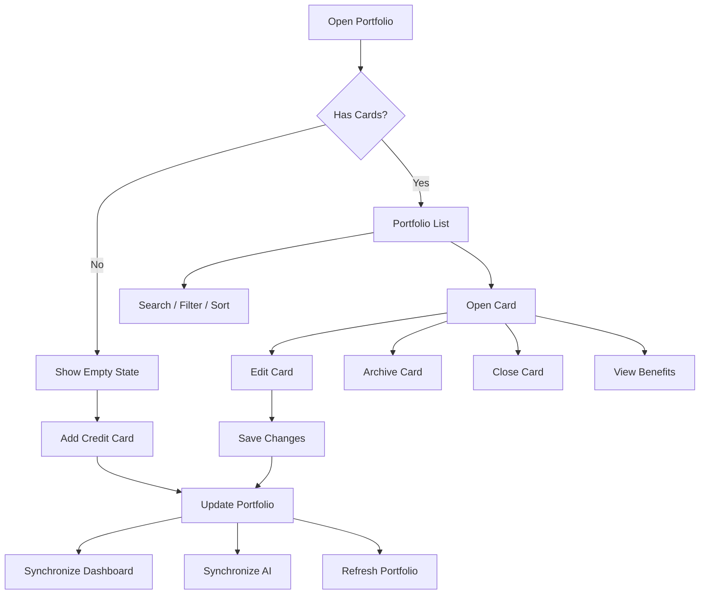

---

# 5.8 State Diagram

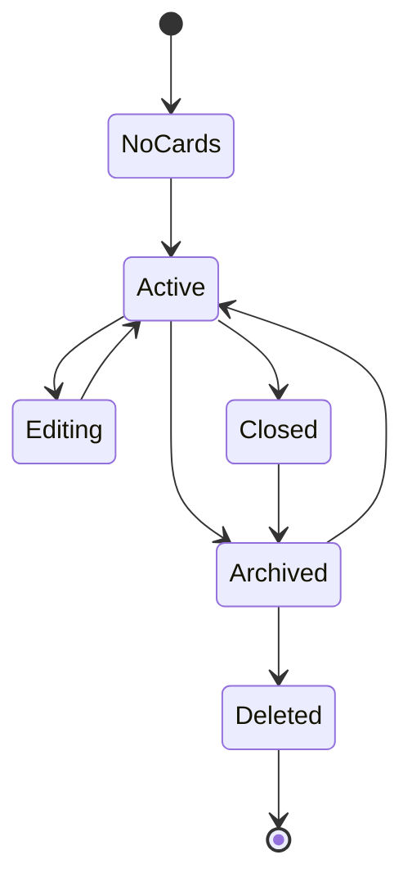

---

# 5.9 Sequence Diagram

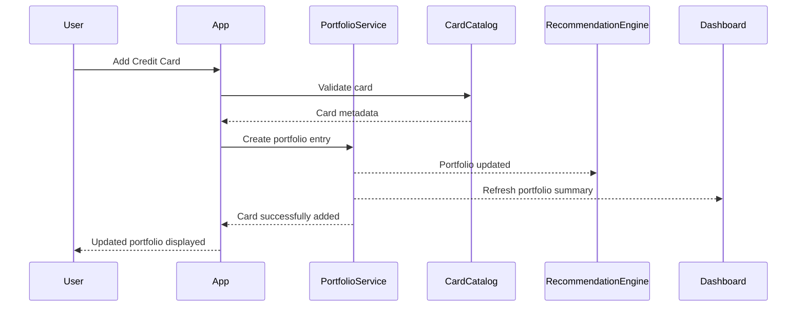

---

**End of Part 1/6**

**Next Part (2/6) will include:**

1. Component Diagram
2. Portfolio Architecture
3. Screen Specifications
4. UI Components


# Chapter 5 — Credit Card Portfolio (Part 2/6)

---

# 5.10 Component Diagram

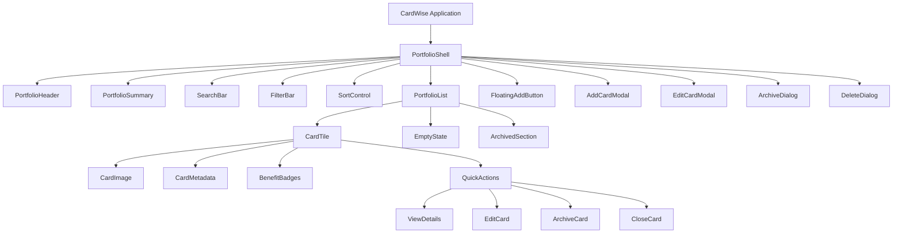

---

# 5.11 Portfolio Architecture

## Architecture Goals

The portfolio serves as the **canonical domain model** for every credit card owned by the user.

All downstream modules consume portfolio entities rather than maintaining independent card definitions.

---

## Logical Architecture

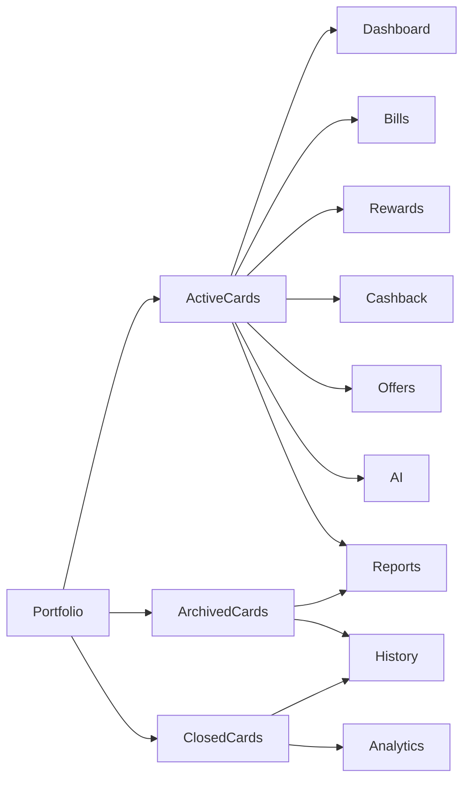

---

## Portfolio Layers

| Layer | Responsibility |
|--------|----------------|
| Presentation | Portfolio UI |
| Domain | Portfolio rules |
| Catalog | Card metadata |
| Benefits | Benefit association |
| Analytics | Portfolio insights |
| Synchronization | Cross-module updates |

---

## Portfolio Lifecycle

```mermaid
stateDiagram-v2

[*] --> Added

Added --> Active

Active --> Edited

Edited --> Active

Active --> Archived

Archived --> Restored

Restored --> Active

Active --> Closed

Closed --> Deleted

Deleted --> [*]
```

---

# 5.12 Screen Specifications

---

## 5.12.1 Portfolio Home

### Purpose

Display every card owned by the user with summary statistics and management actions.

---

### Layout

```
------------------------------------------------

Portfolio Header

Summary Statistics

Search

Filters

Sorting

-----------------------------------------------

Card List

-----------------------------------------------

Floating Add Card Button

------------------------------------------------
```

---

### Sections

1. Portfolio Header
2. Statistics
3. Search
4. Filters
5. Sorting
6. Active Cards
7. Archived Cards
8. Empty State

---

### Widgets

| Widget | Required |
|----------|----------|
| Portfolio Summary | Yes |
| Search | Yes |
| Filters | Yes |
| Sort | Yes |
| Card List | Yes |
| Add Card Button | Yes |

---

### Responsive Behaviour

Desktop

- Multi-column grid
- Persistent filters

Tablet

- Two-column cards

Mobile

- Single-column cards
- Sticky Add Card FAB

---

### Loading State

- Summary skeleton
- Card skeletons
- Search placeholder

---

### Empty State

Displayed when no active cards exist.

Includes:

- Illustration
- Educational text
- Add Card CTA

---

### Error State

Portfolio unavailable.

Retry supported.

---

### Skeleton State

- Summary
- Card tiles
- Statistics
- Filters

---

## 5.12.2 Add Credit Card Screen

### Purpose

Add supported or custom cards.

---

### Sections

- Search
- Popular Cards
- Recent Issuers
- Manual Entry
- Continue Button

---

### Widgets

- Search Field
- Card Grid
- Issuer Selector
- Continue Button

---

### States

- Searching
- Results
- No Results
- Manual Entry

---

## 5.12.3 Edit Card Screen

### Sections

- Nickname
- Statement Date
- Due Date
- Annual Fee
- Credit Limit
- Notes (future)

---

## 5.12.4 Archived Cards Screen

### Sections

- Archived Card List
- Restore Button
- Permanently Delete (future)

---

## 5.12.5 Portfolio Statistics Screen

### Sections

- Total Cards
- Issuer Distribution
- Network Distribution
- Benefit Summary
- Portfolio Health Score

---

# 5.13 UI Components

---

## Portfolio Header

### Purpose

Display portfolio title and quick actions.

Contents

- Title
- Total Cards
- Add Card Button

---

## Portfolio Summary Card

Purpose

Display high-level statistics.

Contents

- Active Cards
- Archived Cards
- Closed Cards
- Portfolio Health Score

---

## Card Tile

Purpose

Represent one portfolio card.

Contents

- Card Artwork
- Card Name
- Nickname
- Issuer
- Network
- Reward Program
- Status Badge

Actions

- View
- Edit
- Archive
- Close

States

- Active
- Archived
- Closed
- Loading
- Disabled

Accessibility

Entire tile keyboard accessible.

---

## Benefit Badge

Purpose

Highlight major card benefits.

Variants

- Cashback
- Rewards
- Lounge
- Fuel
- Travel
- Insurance
- EMI
- Dining
- Shopping

States

- Enabled
- Disabled
- Expiring Soon

---

## Card Status Badge

Purpose

Display lifecycle state.

Variants

- Active
- Archived
- Closed
- Unsupported
- Custom

---

## Search Bar

Purpose

Search portfolio.

Features

- Instant search
- Clear button
- Recent searches (future)

---

## Filter Chip

Purpose

Filter portfolio.

Variants

- Issuer
- Network
- Status
- Benefit
- Reward Program

States

- Selected
- Unselected

---

## Sort Menu

Purpose

Sort cards.

Options

- Alphabetical
- Recently Added
- Annual Fee
- Reward Potential
- Recently Used (future)

---

## Empty Portfolio Card

Purpose

Guide first-time users.

Contents

- Illustration
- Explanation
- Add Card CTA
- Learn More

---

## Portfolio Health Indicator

Purpose

Visualize completeness of portfolio information.

Levels

- Excellent
- Good
- Fair
- Poor

Factors

- Missing dates
- Missing fees
- Missing benefits
- Missing reward program
- Duplicate cards

---

## Floating Add Card Button

Purpose

Primary action for portfolio.

States

- Idle
- Pressed
- Disabled

Accessibility

Minimum touch target:

44 × 44 px.

---

## Overflow Menu

Purpose

Expose secondary actions.

Actions

- Edit
- Archive
- Close Card
- View Details
- Copy Card Name
- Report Incorrect Metadata

Accessibility

Keyboard navigable with proper focus restoration.

---

## Portfolio Statistic Tile

Purpose

Display aggregated portfolio metrics.

Variants

- Total Cards
- Issuers
- Networks
- Active Benefits
- Active Milestones

States

- Loading
- Loaded
- Empty
- Error


# Chapter 5 — Credit Card Portfolio (Part 3/6)

---

# 5.14 Validation Rules

> Validation ensures portfolio integrity while allowing flexible management of supported and custom credit cards.

---

## Card Creation

| ID | Field | Rule |
|-----|------|------|
| VAL-CARD-001 | Card Type | Required |
| VAL-CARD-002 | Issuer | Required |
| VAL-CARD-003 | Card Name | Required |
| VAL-CARD-004 | Card Name | Must exist in catalog or be marked as Custom |
| VAL-CARD-005 | Duplicate Detection | Prevent duplicate active entries |
| VAL-CARD-006 | Network | Required for supported cards |
| VAL-CARD-007 | Status | Default = Active |

---

## Statement Information

| ID | Rule |
|-----|------|
| VAL-CARD-010 | Statement date required for reminder features |
| VAL-CARD-011 | Statement date between 1–31 where applicable |
| VAL-CARD-012 | Due date between 1–31 where applicable |
| VAL-CARD-013 | Due date must not equal statement date unless issuer explicitly supports it |
| VAL-CARD-014 | Statement cycle validated against issuer-specific rules when available |

---

## Fees

| ID | Rule |
|-----|------|
| VAL-CARD-020 | Annual fee ≥ 0 |
| VAL-CARD-021 | Joining fee ≥ 0 |
| VAL-CARD-022 | Fee waiver target ≥ annual fee trigger minimum where applicable |
| VAL-CARD-023 | Currency follows user locale |

---

## Credit Limits

| ID | Rule |
|-----|------|
| VAL-CARD-030 | Credit limit ≥ 0 |
| VAL-CARD-031 | Available limit ≤ credit limit |
| VAL-CARD-032 | Manual values clearly identified as user-entered |

---

## Nicknames

| ID | Rule |
|-----|------|
| VAL-CARD-040 | Nickname optional |
| VAL-CARD-041 | Maximum length configurable |
| VAL-CARD-042 | Trim leading/trailing whitespace |
| VAL-CARD-043 | Emoji support permitted (future configuration) |

---

## Archive & Close

| ID | Rule |
|-----|------|
| VAL-CARD-050 | Active card may be archived |
| VAL-CARD-051 | Archived card may be restored |
| VAL-CARD-052 | Closed cards cannot become active without explicit reactivation workflow |
| VAL-CARD-053 | Historical relationships preserved after closure |

---

# 5.15 Decision Tables

## Add Card Decision Matrix

| Condition | Result |
|-----------|--------|
| Supported card found | Create supported portfolio entry |
| Unsupported card | Offer custom card workflow |
| Duplicate detected | Prevent creation and highlight existing card |
| Card catalog unavailable | Allow manual entry if feature enabled |

---

## Card Status Matrix

| Current Status | User Action | Result |
|---------------|-------------|--------|
| Active | Archive | Archived |
| Archived | Restore | Active |
| Active | Close | Closed |
| Closed | Archive | Closed (no change) |
| Archived | Delete (future) | Soft delete or retention policy applied |

---

## Statement Configuration

| Condition | Result |
|-----------|--------|
| Valid statement & due dates | Save configuration |
| Invalid dates | Validation error |
| Missing dates | Allow save with reduced reminder functionality (feature configurable) |

---

## Portfolio Health

| Condition | Result |
|-----------|--------|
| All required metadata present | Excellent |
| Minor metadata missing | Good |
| Multiple missing fields | Fair |
| Critical information missing | Poor |

---

## Duplicate Detection

| Condition | Result |
|-----------|--------|
| Exact issuer + product match | Potential duplicate warning |
| Same issuer, different product | Allow creation |
| Custom card resembles supported card | Suggest supported catalog entry |
| Duplicate archived card | Offer restore instead of new creation |

---

# 5.16 Logical Data Model

> This section defines logical entities only. Physical persistence is documented in `05_DATABASE_DESIGN.md`.

---

## Credit Card

Required Fields

- Card Identifier
- User Identifier
- Catalog Identifier (nullable for custom cards)
- Card Name
- Issuer
- Payment Network
- Card Status
- Card Type
- Created Timestamp
- Updated Timestamp

Relationship

One User → Many Credit Cards

---

## Card Metadata

Required Fields

- Statement Date
- Due Date
- Joining Fee
- Annual Fee
- Renewal Fee
- Fee Waiver Rule
- Credit Limit (optional)
- Available Limit (optional)
- Nickname

Relationship

One Credit Card → One Metadata Record

---

## Card Benefit

Required Fields

- Benefit Identifier
- Benefit Type
- Benefit Name
- Availability
- Expiration Rules
- Source

Relationship

One Credit Card → Many Benefits

---

## Reward Program Association

Required Fields

- Reward Program Identifier
- Card Identifier
- Program Name
- Point Currency
- Conversion Rules

Relationship

One Credit Card → One Reward Program (Phase 1)

---

## Portfolio Statistics

Required Fields

- Active Card Count
- Archived Card Count
- Closed Card Count
- Portfolio Health Score
- Last Calculated Timestamp

Relationship

One User → One Statistics Aggregate

---

## Portfolio Insight

Required Fields

- Insight Identifier
- User Identifier
- Insight Type
- Severity
- Recommendation
- Generated Timestamp

Relationship

One User → Many Insights

---

## Portfolio Timeline Event

Required Fields

- Event Identifier
- Card Identifier
- Event Type
- Event Timestamp
- Source

Relationship

One Credit Card → Many Timeline Events

---

## Portfolio Search Index

Required Fields

- Search Tokens
- Issuer
- Card Name
- Nickname
- Benefit Tags
- Status

Relationship

Derived entity optimized for search.

---

# 5.17 API Dependencies

> Portfolio APIs expose the canonical card model used by downstream services.

---

## Portfolio APIs

| API ID | API | Purpose | Success Response | Failure Behaviour | Retry Strategy |
|---------|-----|---------|------------------|-------------------|----------------|
| API-CARD-001 | Get Portfolio | Retrieve portfolio | Portfolio list | Cached portfolio | Retry once |
| API-CARD-002 | Add Card | Create portfolio entry | Card created | Validation error | User initiated |
| API-CARD-003 | Update Card | Update metadata | Updated card | Validation error | User initiated |
| API-CARD-004 | Archive Card | Archive card | Status updated | Card unavailable | Retry once |
| API-CARD-005 | Restore Card | Restore archived card | Active status | Conflict | Retry once |
| API-CARD-006 | Close Card | Close card | Status updated | Validation error | User initiated |

---

## Search APIs

| API ID | Purpose | Success | Failure |
|---------|----------|----------|----------|
| API-CARD-007 | Search catalog | Matching cards | Empty results |
| API-CARD-008 | Search portfolio | Matching user cards | Empty results |

---

## Metadata APIs

| API ID | Purpose | Success | Failure |
|---------|----------|----------|----------|
| API-CARD-009 | Get card metadata | Metadata | Placeholder values |
| API-CARD-010 | Refresh metadata | Updated metadata | Existing metadata retained |

---

## Benefit APIs

| API ID | Purpose | Success | Failure |
|---------|----------|----------|----------|
| API-CARD-011 | Card benefits | Benefit list | Cached benefits |
| API-CARD-012 | Reward association | Reward program | Empty association |

---

## Portfolio Insight APIs

| API ID | Purpose | Success | Failure |
|---------|----------|----------|----------|
| API-CARD-013 | Portfolio insights | Insight list | Educational fallback |
| API-CARD-014 | Portfolio health | Health score | Previous score retained |

---

## Synchronization APIs

| API ID | Purpose | Success | Failure |
|---------|----------|----------|----------|
| API-CARD-015 | Dashboard sync | Dashboard refreshed | Background retry |
| API-CARD-016 | Recommendation sync | AI refreshed | Scheduled retry |
| API-CARD-017 | Benefit refresh | Benefits updated | Existing benefits retained |

---

## External Dependencies

| Dependency | Purpose | Failure Behaviour |
|------------|---------|-------------------|
| Card Catalog Service | Supported card definitions | Manual card workflow |
| Metadata Provider (future) | Card enrichment | Existing metadata retained |
| Recommendation Engine | Portfolio insights | Educational fallback |
| Analytics Platform | Portfolio events | Queue telemetry |
| Feature Flag Service | Dynamic capability enablement | Safe defaults |

---

## API Failure Strategy

### Card Creation

If catalog validation fails:

- Offer manual/custom card creation where enabled.
- Preserve user-entered information.
- Allow retry after catalog recovery.

---

### Metadata Synchronization

If enrichment services are unavailable:

- Continue using existing metadata.
- Schedule asynchronous refresh.
- Notify user only when manual action is required.

---

### Cross-Module Synchronization

Portfolio updates SHALL:

- Complete successfully before triggering downstream synchronization.
- Notify Dashboard, Recommendation Engine, Rewards, Bills, and Analytics asynchronously.
- Never block the user's save operation because of downstream service failures.

---

## Caching Strategy

| Data Type | Cache Strategy |
|-----------|----------------|
| Portfolio list | Persistent local cache with background refresh |
| Card catalog | Versioned cache with periodic updates |
| Benefit metadata | Time-based cache |
| Portfolio insights | Short-lived cache |
| Portfolio health score | Recomputed after portfolio changes |
| Search index | Incrementally updated after card modifications |


# Chapter 5 — Credit Card Portfolio (Part 4/6)

---

# 5.18 Analytics & Telemetry

## Analytics Objectives

The Credit Card Portfolio module is the foundational data source for CardWise. Analytics for this feature measure:

- Portfolio adoption
- Card addition success
- Portfolio completeness
- User engagement
- Card lifecycle changes
- Portfolio quality
- Benefit discovery
- Feature utilization
- AI readiness

---

## Event Naming Convention

```
portfolio.<entity>.<action>
```

Examples

```
portfolio.viewed
portfolio.card.added
portfolio.card.updated
portfolio.card.archived
portfolio.search.executed
portfolio.health.viewed
```

---

## Analytics Events

### EVT-CARD-001

Event

```
portfolio.viewed
```

Properties

- portfolio_size
- active_card_count
- archived_card_count
- dashboard_entry_point
- platform

---

### EVT-CARD-002

Event

```
portfolio.card.added
```

Properties

- issuer
- network
- card_type
- catalog_card
- custom_card
- onboarding_source

---

### EVT-CARD-003

Event

```
portfolio.card.updated
```

Properties

- updated_fields
- card_status
- metadata_version

---

### EVT-CARD-004

Event

```
portfolio.card.archived
```

Properties

- archive_reason
- card_age_days

---

### EVT-CARD-005

Event

```
portfolio.card.restored
```

Properties

- restore_source

---

### EVT-CARD-006

Event

```
portfolio.card.closed
```

Properties

- closure_reason
- portfolio_size_after_close

---

### EVT-CARD-007

Event

```
portfolio.search.executed
```

Properties

- query_length
- result_count
- filter_count
- sort_option

---

### EVT-CARD-008

Event

```
portfolio.filter.applied
```

Properties

- filter_type
- filter_value

---

### EVT-CARD-009

Event

```
portfolio.health.viewed
```

Properties

- health_score
- missing_fields
- recommendation_count

---

### EVT-CARD-010

Event

```
portfolio.duplicate.detected
```

Properties

- detection_type
- resolution_action

---

## Portfolio Funnel

```text
Open Portfolio
      │
      ▼
Add Card
      │
      ▼
Complete Card Metadata
      │
      ▼
Benefits Available
      │
      ▼
AI Personalization Improved
```

---

## Card Creation Funnel

```text
Add Card
      │
      ▼
Search Catalog
      │
      ▼
Select Card
      │
      ▼
Configure Metadata
      │
      ▼
Portfolio Updated
```

---

## Portfolio Quality Funnel

```text
Card Added
      │
      ▼
Metadata Completed
      │
      ▼
Benefits Verified
      │
      ▼
Portfolio Health Improved
```

---

## KPIs

| KPI | Target |
|------|---------|
| Users with ≥1 card | >90% |
| Card creation success | >99% |
| Duplicate prevention accuracy | >99% |
| Metadata completion | >80% |
| Portfolio search success | >95% |
| Benefit association success | >98% |
| Portfolio synchronization success | >99.5% |

---

## Telemetry

Portfolio telemetry SHALL capture:

- Portfolio render duration
- Card search latency
- Catalog lookup latency
- Card creation latency
- Portfolio synchronization latency
- Duplicate detection duration
- Benefit enrichment duration
- Portfolio health calculation duration
- Client rendering errors
- API latency
- Cache hit ratio

---

# 5.19 Notifications

## In-App Notifications

| ID | Trigger | Recipient |
|----|----------|-----------|
| NOTIF-CARD-001 | Card added successfully | User |
| NOTIF-CARD-002 | Card archived | User |
| NOTIF-CARD-003 | Card restored | User |
| NOTIF-CARD-004 | Portfolio health improved | User |
| NOTIF-CARD-005 | Missing card information detected | User |
| NOTIF-CARD-006 | New benefits available | User |

---

## Push Notifications

| ID | Trigger |
|----|----------|
| NOTIF-CARD-101 | Annual fee waiver approaching |
| NOTIF-CARD-102 | Statement date reminder |
| NOTIF-CARD-103 | Benefit expiring soon |
| NOTIF-CARD-104 | Newly supported metadata available for custom card |

---

## Email Notifications

| ID | Trigger |
|----|----------|
| NOTIF-CARD-201 | Portfolio import completed (future) |
| NOTIF-CARD-202 | Portfolio summary digest (future premium feature) |

---

## Silent Notifications

Used for:

- Benefit synchronization
- Catalog updates
- Portfolio synchronization
- AI enrichment
- Dashboard refresh
- Recommendation recalculation

---

# 5.20 Error Handling

## Error Classification

| Category | Recoverable | Example |
|----------|-------------|----------|
| Validation | Yes | Invalid statement date |
| Catalog | Yes | Card not found |
| Synchronization | Yes | Dashboard refresh delayed |
| Metadata | Yes | Benefit enrichment unavailable |
| Fatal | No | Corrupted portfolio state |

---

## Recoverable Errors

### ERR-CARD-001

Card not found in catalog.

User Message

> We couldn't find that card. You can create it as a custom card.

Recovery

- Offer custom card workflow.
- Preserve entered information.

---

### ERR-CARD-002

Duplicate card detected.

Recovery

- Highlight existing portfolio entry.
- Offer navigation to existing card.
- Prevent duplicate active creation.

---

### ERR-CARD-003

Metadata synchronization failed.

Recovery

- Preserve existing metadata.
- Retry enrichment in background.

---

### ERR-CARD-004

Portfolio synchronization delayed.

Recovery

- Save portfolio successfully.
- Continue downstream synchronization asynchronously.

---

### ERR-CARD-005

Benefit metadata unavailable.

Recovery

- Display known benefits.
- Mark unavailable sections as "Updating".
- Retry in background.

---

### ERR-CARD-006

Card archive failed.

Recovery

- Keep card active.
- Allow retry.
- Preserve user context.

---

### ERR-CARD-007

Portfolio search unavailable.

Recovery

- Display cached portfolio.
- Disable advanced search until recovered.

---

### ERR-CARD-008

Portfolio health calculation unavailable.

Recovery

- Display previous health score.
- Schedule recalculation.

---

## Fatal Errors

### ERR-CARD-101

Portfolio ownership mismatch.

Action

- Reject request.
- Log security event.
- Redirect to safe state.

---

### ERR-CARD-102

Portfolio corrupted.

Action

- Prevent further edits.
- Display recovery screen.
- Restore last consistent state if available.

---

### ERR-CARD-103

Critical card catalog unavailable.

Action

- Disable supported-card creation.
- Allow custom card creation where enabled.
- Notify platform monitoring.

---

## Retry Behaviour

| Scenario | Strategy |
|-----------|----------|
| Card search | Manual retry |
| Catalog lookup | Automatic retry with exponential backoff |
| Metadata enrichment | Background retry |
| Benefit synchronization | Scheduled retry |
| Dashboard synchronization | Asynchronous retry |
| Recommendation synchronization | Background retry |

---

## User Messaging Principles

Portfolio-related messages SHALL:

- Explain the issue in plain language.
- Preserve user-entered information whenever possible.
- Avoid blocking the user because of downstream service failures.
- Clearly distinguish between supported and custom card workflows.
- Never expose internal catalog identifiers or technical implementation details.
- Be localized and accessible to assistive technologies.

---

## Recovery Flow

```mermaid
flowchart TD

A[Operation Failed]

A --> B{Recoverable?}

B -- Yes --> C[Preserve User Data]

C --> D[Retry Automatically]

D --> E{Success?}

E -- Yes --> F[Continue Workflow]

E -- No --> G[Offer Manual Retry]

B -- No --> H[Display Recovery Screen]

H --> I[Report Diagnostic Event]

I --> J[Return to Safe Portfolio State]
```


# Chapter 5 — Credit Card Portfolio (Part 5/6)

---

# 5.21 Edge Cases

## Portfolio Initialization

| ID | Scenario | Expected Behaviour |
|----|----------|--------------------|
| EDGE-CARD-001 | First-time user with no cards | Display educational empty state with primary Add Card CTA |
| EDGE-CARD-002 | Portfolio contains only archived cards | Display Archived section with restore guidance |
| EDGE-CARD-003 | Portfolio contains only closed cards | Display historical portfolio with explanation |
| EDGE-CARD-004 | User has maximum supported cards | Continue rendering without degradation |

---

## Card Addition

| ID | Scenario | Expected Behaviour |
|----|----------|--------------------|
| EDGE-CARD-005 | Card catalog temporarily unavailable | Allow custom card creation where enabled |
| EDGE-CARD-006 | Issuer renamed after catalog update | Maintain stable internal identifier while displaying updated issuer name |
| EDGE-CARD-007 | Card product discontinued | Keep existing portfolio entry and mark as discontinued if applicable |
| EDGE-CARD-008 | User adds similar card with different network variant | Validate against catalog before duplicate detection |

---

## Metadata

| ID | Scenario | Expected Behaviour |
|----|----------|--------------------|
| EDGE-CARD-009 | Statement date unavailable | Save portfolio with reminder feature partially disabled |
| EDGE-CARD-010 | Due date unknown | Highlight missing configuration |
| EDGE-CARD-011 | Benefit metadata partially available | Display known benefits and indicate remaining information is pending |
| EDGE-CARD-012 | Reward program changes | Synchronize metadata without affecting historical records |

---

## Portfolio Organization

| ID | Scenario | Expected Behaviour |
|----|----------|--------------------|
| EDGE-CARD-013 | User renames multiple cards identically | Allowed, internal identifiers remain unique |
| EDGE-CARD-014 | Archived card restored after long period | Restore metadata and re-enable dependent features |
| EDGE-CARD-015 | Closed card archived | Preserve closure history |
| EDGE-CARD-016 | User changes primary card | Update dependent recommendation logic asynchronously |

---

## Synchronization

| ID | Scenario | Expected Behaviour |
|----|----------|--------------------|
| EDGE-CARD-017 | Dashboard synchronization delayed | Portfolio save succeeds immediately |
| EDGE-CARD-018 | AI enrichment delayed | Portfolio remains usable |
| EDGE-CARD-019 | Recommendation refresh unavailable | Continue with previous recommendations |
| EDGE-CARD-020 | Benefit catalog updated while editing | Preserve user edits and refresh after save |

---

## Search & Filtering

| ID | Scenario | Expected Behaviour |
|----|----------|--------------------|
| EDGE-CARD-021 | Search returns zero results | Display contextual empty state |
| EDGE-CARD-022 | Hidden filters become invalid after app update | Ignore unsupported filters gracefully |
| EDGE-CARD-023 | Multiple filters produce empty dataset | Show clear reset filters action |
| EDGE-CARD-024 | Portfolio sorted after synchronization | Preserve user-selected sort order |

---

# 5.22 Accessibility

The Credit Card Portfolio SHALL comply with **WCAG 2.2 AA** across desktop, tablet, and mobile platforms.

---

## Keyboard Navigation

### A11Y-CARD-001

Users SHALL navigate the portfolio list entirely using a keyboard.

---

### A11Y-CARD-002

Search, filters, sorting, and card actions SHALL be keyboard operable.

---

### A11Y-CARD-003

After closing dialogs (Add, Edit, Archive), focus SHALL return to the originating control.

---

### A11Y-CARD-004

Card action menus SHALL support arrow-key navigation.

---

## Screen Reader Support

### A11Y-CARD-005

Every card SHALL expose:

- Card name
- Issuer
- Network
- Current status
- Primary benefit summary

---

### A11Y-CARD-006

Portfolio summary statistics SHALL include descriptive labels.

Example:

```
5 Active Credit Cards
```

instead of

```
5
```

---

### A11Y-CARD-007

Benefit badges SHALL expose accessible descriptions.

Example:

```
Airport Lounge Access
```

instead of

```
Lounge
```

---

### A11Y-CARD-008

Search result counts SHALL be announced after filtering.

---

## Visual Accessibility

Portfolio SHALL support:

- High contrast themes
- Minimum 4.5:1 text contrast
- Zoom up to 200%
- Color-independent status indicators
- Consistent focus indicators

---

## Motion

- Respect reduced-motion preferences.
- Avoid unnecessary animations during portfolio updates.
- Animate only meaningful state transitions.

---

## Mobile Accessibility

- Touch targets ≥44×44 px.
- Support screen rotation.
- Dynamic font scaling.
- Safe-area compatibility.
- Accessible swipe gestures with alternative controls.

---

# 5.23 Security

The Credit Card Portfolio stores sensitive financial metadata and SHALL follow secure-by-default principles.

---

## Authentication

### SEC-CARD-001

Only authenticated users may access portfolio data.

---

### SEC-CARD-002

Expired sessions SHALL invalidate all portfolio operations.

---

## Authorization

### SEC-CARD-003

Users SHALL only manage their own portfolio entries.

---

### SEC-CARD-004

Every state-changing operation SHALL validate ownership server-side.

---

## Sensitive Data Protection

Portfolio SHALL NOT store or expose:

- Full card number (PAN)
- CVV
- PIN
- OTP
- Internet banking credentials
- Payment authentication secrets

---

## Masking Rules

Where card identifiers are displayed:

- Show only masked representations if applicable.
- Avoid exposing personally identifiable financial information.
- Respect user privacy settings for dashboard summaries.

---

## Data Privacy

Portfolio metadata SHALL:

- Follow data minimization principles.
- Be exportable by the user.
- Be removable according to account deletion policies.
- Respect applicable privacy regulations.

---

## Audit Logging

Audit events include:

- Card created
- Card updated
- Card archived
- Card restored
- Card closed
- Primary card changed
- Portfolio exported (future)
- Bulk import executed (future)

Audit logs SHALL include:

- Timestamp
- User identifier
- Operation type
- Resource identifier
- Outcome

Sensitive field values SHALL NOT be stored in audit logs.

---

## Abuse Prevention

Controls include:

- Rate limiting for portfolio mutations.
- Duplicate submission protection.
- Request idempotency for create/update operations.
- Server-side validation of catalog identifiers.
- CSRF protection.
- Replay protection.

---

## OWASP Considerations

Portfolio SHALL mitigate:

- Broken Access Control
- Insecure Direct Object References (IDOR)
- Cross-Site Scripting (XSS)
- Injection attacks
- Sensitive Data Exposure
- Mass Assignment
- Cross-Site Request Forgery (CSRF)

---

## Secure Defaults

- HTTPS only.
- Secure cookies.
- HttpOnly session cookies.
- SameSite cookie policy.
- Strict Transport Security.
- Content Security Policy.
- No sensitive portfolio information stored in browser URLs.
- Client-side caches containing portfolio metadata encrypted where supported.

---

## Data Synchronization Security

Portfolio synchronization SHALL:

- Authenticate every downstream request.
- Verify integrity before applying updates.
- Prevent stale updates from overwriting newer versions.
- Resolve synchronization conflicts deterministically using version metadata.


# Chapter 5 — Credit Card Portfolio (Part 6/6)

---

# 5.24 Performance

The Credit Card Portfolio is a foundational module accessed by almost every user session. Performance optimizations prioritize responsiveness, scalability, and synchronization consistency.

---

## Performance Budgets

| Requirement | Target |
|-------------|--------|
| Portfolio shell render | <1 s |
| First visible card | <1.5 s |
| Full portfolio render (≤20 cards) | <2 s |
| Portfolio search | <300 ms |
| Filter application | <200 ms |
| Sorting | <200 ms |
| Add card operation | <2 s |
| Edit card save | <1 s |
| Archive/Restore operation | <1 s |
| Portfolio synchronization | <2 s |

---

## Rendering Strategy

Portfolio SHALL use:

- Progressive rendering
- Incremental list hydration (where applicable)
- Optimistic UI for create/update/archive operations
- Independent summary rendering
- Non-blocking metadata enrichment

---

## Search Optimization

Search SHALL support:

- Incremental indexing
- Prefix matching
- Tokenized issuer search
- Nickname search
- Benefit tag search
- Case-insensitive matching
- Locale-aware comparisons

Search SHOULD debounce user input (implementation-defined) to avoid excessive network or indexing operations.

---

## Filtering Optimization

Filtering SHALL execute against indexed portfolio data and support combinations of:

- Issuer
- Network
- Status
- Card Type
- Reward Program
- Benefit Tags
- Annual Fee Type
- Lounge Eligibility
- Travel Benefits

Filters SHALL preserve scroll position whenever feasible.

---

## Sorting Optimization

Supported sorting includes:

- Alphabetical
- Recently Added
- Recently Updated
- Statement Date
- Due Date
- Annual Fee
- Issuer
- Network
- Reward Potential (derived)
- Health Score (derived)

Sorting SHALL be stable and deterministic.

---

## Caching Strategy

### Memory Cache

- Active portfolio
- Search index
- Statistics
- Portfolio health
- Filter metadata

---

### Persistent Cache

- Portfolio list
- Card metadata
- Benefit catalog
- User preferences
- Sort preference
- Filter preference

---

### Cache Invalidation

Invalidate cache when:

- Portfolio modified
- Catalog version changes
- User changes account
- Benefit metadata updated
- Recommendation model version changes
- Feature flags affecting portfolio change

---

## Lazy Loading

Lazy load:

- Archived cards
- Closed cards
- Card artwork
- Expanded benefit sections
- Timeline history
- Secondary metadata
- Future analytics panels

---

## Virtualization

Virtualization SHALL be enabled for:

- Large portfolios
- Long archived lists
- Benefit lists
- Portfolio timelines
- Future bulk management screens

---

## Background Processing

Execute asynchronously:

- Benefit enrichment
- Recommendation refresh
- Dashboard synchronization
- Analytics upload
- Portfolio health recalculation
- Search index optimization
- Card artwork prefetch
- Catalog synchronization

---

## Network Optimization

- Batch metadata requests.
- Delta synchronization where supported.
- Conditional requests using version metadata.
- Compress catalog payloads.
- Cache immutable catalog assets aggressively.

---

## Performance Monitoring

The platform SHALL continuously monitor:

- Portfolio render duration
- Search latency
- Filter latency
- Sort latency
- API latency
- Metadata enrichment duration
- Duplicate detection duration
- Synchronization latency
- Memory consumption
- Cache hit ratio

---

# 5.25 QA Acceptance Matrix

## Happy Path

| QA ID | Scenario | Expected Result |
|-------|----------|-----------------|
| QA-CARD-001 | Add supported card | Portfolio updated successfully |
| QA-CARD-002 | Add custom card | Custom portfolio entry created |
| QA-CARD-003 | Edit card metadata | Changes persisted |
| QA-CARD-004 | Archive card | Card moved to archived section |
| QA-CARD-005 | Restore archived card | Card active again |
| QA-CARD-006 | Close card | Card excluded from active recommendations |
| QA-CARD-007 | Search portfolio | Matching cards returned |
| QA-CARD-008 | Filter portfolio | Results updated correctly |
| QA-CARD-009 | Sort portfolio | Stable ordering applied |
| QA-CARD-010 | Portfolio synchronization | Dashboard and dependent modules updated |

---

## Negative Path

| QA ID | Scenario | Expected Result |
|-------|----------|-----------------|
| QA-CARD-101 | Duplicate card creation | Prevented with guidance |
| QA-CARD-102 | Invalid statement date | Validation error displayed |
| QA-CARD-103 | Catalog unavailable | Manual workflow offered where enabled |
| QA-CARD-104 | Metadata enrichment failure | Existing metadata retained |
| QA-CARD-105 | Synchronization timeout | Portfolio saved; background retry initiated |
| QA-CARD-106 | Unauthorized update | Request rejected |

---

## Boundary Cases

| QA ID | Scenario |
|-------|----------|
| QA-CARD-201 | Maximum supported portfolio size |
| QA-CARD-202 | Maximum nickname length |
| QA-CARD-203 | Large archived portfolio |
| QA-CARD-204 | Extensive benefit metadata |
| QA-CARD-205 | Simultaneous edits from multiple devices |
| QA-CARD-206 | Large card catalog search dataset |

---

## Accessibility Tests

- Keyboard-only portfolio management
- Screen reader validation for card summaries
- Search announcements
- Filter accessibility
- Dialog focus management
- High contrast verification
- Dynamic font scaling
- Reduced-motion behavior
- Mobile accessibility

---

## Performance Tests

- Cold portfolio load
- Warm cache portfolio load
- Search under large catalog
- Filter combinations
- Sorting performance
- Parallel synchronization
- Large portfolio virtualization
- Background enrichment impact

---

## Security Tests

- User ownership validation
- Authorization enforcement
- Sensitive metadata masking
- CSRF protection
- Replay protection
- Duplicate request handling
- Audit log generation
- Secure synchronization
- Session expiration handling

---

## Regression Checklist

- Portfolio rendering
- Add card
- Edit card
- Archive card
- Restore card
- Close card
- Search
- Filters
- Sorting
- Benefit badges
- Statement configuration
- Due date configuration
- Portfolio health
- Statistics
- Dashboard synchronization
- Recommendation synchronization
- Analytics events
- Accessibility
- Localization
- Feature flag compatibility

---

# 5.26 Future Enhancements

## Phase 2

### Portfolio Automation

- Bulk card import from statements
- OCR-assisted card recognition
- Smart issuer detection
- Automatic metadata completion
- Duplicate resolution assistant

### Portfolio Intelligence

- Portfolio optimization score
- Card utilization insights
- Spending category coverage analysis
- Benefit overlap detection
- Gap analysis for missing card categories

### Organization

- Custom collections (e.g., Travel, Daily Use, Business)
- Tags and labels
- Favorites
- Smart folders
- Multi-profile portfolios

---

## Phase 3

### AI-Powered Portfolio

- AI-assisted portfolio cleanup
- Automatic card categorization
- Predictive benefit recommendations
- Card retirement suggestions
- Portfolio simulations for "what-if" scenarios

### Collaboration

- Shared family portfolio
- Household card management
- Delegated access with permissions
- Business expense portfolio support

### Integrations

- Automatic issuer synchronization (where supported)
- Open banking metadata enrichment (subject to regulatory support)
- Secure third-party import connectors

---

## Long-Term Roadmap

### Intelligent Portfolio Graph

Represent the portfolio as an interconnected financial graph linking:

- Credit Cards
- Rewards
- Transactions
- Bills
- Offers
- Travel Benefits
- Lounge Access
- Insurance
- Merchant Categories
- AI Recommendations

This graph becomes the canonical knowledge layer for CardWise's recommendation engine.

---

### Digital Wallet Representation

Future support for:

- Physical cards
- Virtual cards
- Tokenized cards
- Network tokens
- Replacement cards
- Reissued cards

while preserving historical continuity.

---

### Predictive Portfolio Assistant

Capabilities include:

- Detecting underutilized cards
- Identifying redundant products
- Forecasting annual fee waiver likelihood
- Suggesting optimal card usage by spending category
- Recommending portfolio improvements without acting autonomously

---

### Enterprise-Grade Extensibility

Prepare the portfolio model for future expansion through:

- Versioned card capabilities
- Pluggable benefit providers
- Configurable metadata schemas
- Regional card catalogs
- Extensible issuer integrations

---

# Chapter Summary

The **Credit Card Portfolio** module defines the canonical representation of every credit card within CardWise and serves as the foundational data model for all downstream features. It provides comprehensive lifecycle management, metadata enrichment, benefit association, health analysis, synchronization, and extensibility while maintaining strict security, accessibility, and performance standards.

By establishing a consistent portfolio abstraction, the platform enables Rewards, Cashback, Bills, Offers, Travel Benefits, AI Recommendations, Reports, and future intelligence features to operate on a single, authoritative source of truth, ensuring long-term maintainability and scalable product evolution.

---
**End of Chapter 5 — Credit Card Portfolio**


# Chapter 6 — Credit Card Details (Part 1/7)

---

# Feature Metadata

| Field | Value |
|--------|-------|
| Feature ID | CARDDET |
| Module | Credit Card Details |
| Priority | P0 (Critical) |
| Release | Phase 1 (MVP) |
| Status | Planned |
| Product Owner | Product |
| Engineering Owner | Frontend + Backend |
| Design Owner | UX |
| Analytics Owner | Product Analytics |
| Security Owner | Security Engineering |
| Feature Flag | `card_details_v1` |
| Dependencies | Credit Card Portfolio, Transactions, Statements, Bills, Rewards, Cashback, Offers, Travel Benefits, Recommendation Engine, AI Platform, Reports |
| Related Features | CARD, DASH, TXN, STMT, BILL, REWARD, CASH, OFFER, TRAVEL, AI, REPORT |

---

# 6.1 Overview

## Purpose

The **Credit Card Details** module provides a comprehensive, card-centric view of an individual credit card. It aggregates operational data, financial summaries, benefits, insights, historical activity, and AI-generated recommendations into a single experience.

Unlike the Portfolio, which manages a collection of cards, the Card Details screen focuses on **one card as the primary entity**, enabling users to understand its performance, benefits, obligations, and opportunities.

---

## Summary

The Card Details module is responsible for:

- Displaying complete card information
- Showing reward balances
- Tracking cashback
- Monitoring annual fee waivers
- Tracking spending milestones
- Displaying statement information
- Showing bill status
- Displaying transaction summaries
- Displaying offers
- Showing lounge eligibility
- Displaying insurance coverage
- Travel benefits
- Fuel benefits
- EMI benefits
- AI insights
- AI usage recommendations
- Card health indicators
- Card timeline
- Card management actions

---

## Business Goals

- Make every card understandable at a glance.
- Increase engagement with card benefits.
- Improve reward utilization.
- Encourage timely bill payments.
- Improve recommendation relevance.
- Reduce navigation across multiple modules.

---

## User Problems Solved

| Problem | Solution |
|----------|----------|
| Users forget card benefits | Unified benefit summary |
| Users don't know which card to use | AI recommendations |
| Rewards are scattered | Consolidated reward overview |
| Bills are difficult to track | Integrated billing section |
| Card information is fragmented | Single card-centric workspace |

---

## Success Metrics

| Metric | Target |
|---------|--------|
| Card Details load success | >99.9% |
| Average time to first render | <2 seconds |
| AI recommendation engagement | >30% |
| Reward section interaction | >60% |
| Benefit section interaction | >50% |
| Card management success | >99% |

---

## In Scope

- Card overview
- Financial summary
- Rewards
- Cashback
- Spending analysis
- Benefit overview
- Annual fee tracking
- Milestone tracking
- Offers
- Lounge access
- Insurance
- Fuel benefits
- EMI benefits
- AI insights
- Related statements
- Related bills
- Related transactions
- Card timeline
- Quick actions

---

## Out of Scope

- Editing transactions
- Statement parsing
- Reward redemption
- Bill payment
- Card application
- Credit score
- Loan products
- Bank account management

---

## Assumptions

- Card exists in the user's portfolio.
- Dependent services provide aggregated information.
- Some benefit metadata may be asynchronously enriched.
- Historical information remains immutable once recorded.

---

## Dependencies

### Internal

- Portfolio Service
- Transactions
- Bills
- Statements
- Rewards Engine
- Cashback Engine
- Recommendation Engine
- Analytics Platform
- AI Platform

### External

- Benefit metadata provider (future)
- Issuer catalog updates
- Feature flag service

---

## Risks

| Risk | Mitigation |
|------|------------|
| Large amount of information | Progressive disclosure |
| Slow loading due to many services | Aggregated APIs + independent sections |
| Missing metadata | Graceful placeholders |
| Outdated benefit information | Background synchronization |

---

# 6.2 Personas

## Primary Users

### Everyday User

Characteristics

- Owns one or more credit cards.
- Frequently checks bills and rewards.

Permissions

- View details
- Edit metadata
- Archive card
- Close card

---

### Reward Optimizer

Characteristics

- Tracks every reward opportunity.

Permissions

- View reward sections
- Analyze milestones
- Review AI recommendations

---

### Frequent Traveller

Characteristics

- Uses premium travel cards.

Permissions

- Review lounge benefits
- Insurance
- Travel privileges
- Airport access

---

### Power User

Characteristics

- Uses advanced financial analysis.

Permissions

- Review detailed spending
- Timeline
- Reports
- Benefit breakdown

---

## Secondary Users

### Administrator

Permissions

- Maintain card metadata
- Validate benefit definitions
- Update issuer information

No direct access to user financial activity outside authorized operational workflows.

---

# 6.3 User Stories

## Overview

### US-CARDDET-001

As a user,

I want a complete overview of one card,

so I understand its current status immediately.

---

### US-CARDDET-002

As a user,

I want important actions highlighted,

so I never miss bills or milestones.

---

## Rewards

### US-CARDDET-003

As a user,

I want my reward balance,

so I know how much value I've accumulated.

---

### US-CARDDET-004

As a user,

I want reward earning history,

so I understand my earning patterns.

---

## Cashback

### US-CARDDET-005

As a user,

I want cashback summaries,

so I know my realized savings.

---

## Benefits

### US-CARDDET-006

As a user,

I want all benefits grouped together,

so I don't need to search elsewhere.

---

### US-CARDDET-007

As a user,

I want benefit eligibility explained,

so I understand how to use them.

---

## AI

### US-CARDDET-008

As a user,

I want AI to recommend when to use this card,

so I maximize rewards.

---

### US-CARDDET-009

As a user,

I want AI warnings,

so I avoid poor spending decisions.

---

## Timeline

### US-CARDDET-010

As a user,

I want historical activity,

so I understand everything that happened on this card.

---

## Management

### US-CARDDET-011

As a user,

I want to edit card metadata,

so information remains accurate.

---

### US-CARDDET-012

As a user,

I want quick actions,

so common tasks require minimal navigation.

---

## Negative Stories

### US-CARDDET-013

If one section fails,

the remaining page should remain usable.

---

### US-CARDDET-014

Missing benefit metadata should never hide the rest of the page.

---

### US-CARDDET-015

Stale cached information should be clearly identified.

---

### US-CARDDET-016

Archived cards should remain viewable in read-only mode unless restored.

---

# 6.4 Functional Requirements

| ID | Priority | Requirement |
|----|----------|-------------|
| FR-CARDDET-001 | P0 | Display complete card overview. |
| FR-CARDDET-002 | P0 | Display statement information. |
| FR-CARDDET-003 | P0 | Display payment due information. |
| FR-CARDDET-004 | P0 | Display reward summary. |
| FR-CARDDET-005 | P0 | Display cashback summary. |
| FR-CARDDET-006 | P0 | Display annual fee information. |
| FR-CARDDET-007 | P0 | Display fee waiver progress. |
| FR-CARDDET-008 | P0 | Display milestone progress. |
| FR-CARDDET-009 | P0 | Display benefit sections. |
| FR-CARDDET-010 | P0 | Display AI recommendations. |
| FR-CARDDET-011 | P0 | Display AI warnings. |
| FR-CARDDET-012 | P0 | Display spending insights. |
| FR-CARDDET-013 | P0 | Display linked transactions. |
| FR-CARDDET-014 | P0 | Display linked statements. |
| FR-CARDDET-015 | P0 | Display linked bills. |
| FR-CARDDET-016 | P1 | Display timeline. |
| FR-CARDDET-017 | P1 | Display related reports. |
| FR-CARDDET-018 | P0 | Support card editing. |
| FR-CARDDET-019 | P0 | Support archive and close workflows. |
| FR-CARDDET-020 | P1 | Support offline cached viewing. |
| FR-CARDDET-021 | P1 | Display portfolio-derived health indicators. |
| FR-CARDDET-022 | P1 | Deep-link into related modules while preserving navigation context. |

---

# 6.5 Non-Functional Requirements

## Performance

| ID | Requirement |
|----|-------------|
| NFR-CARDDET-001 | Card Details shell shall render within 1 second. |
| NFR-CARDDET-002 | Above-the-fold content shall become interactive within 2 seconds (P95). |
| NFR-CARDDET-003 | Individual sections shall load independently. |

---

## Reliability

- Independent section rendering.
- Cached details remain available offline.
- Metadata synchronization shall be resilient.

---

## Scalability

- Support future benefit categories.
- Support extensible AI sections.
- Allow additional timeline event types.

---

## Accessibility

- WCAG 2.2 AA compliant.
- Accessible charts.
- Accessible timelines.
- Keyboard support throughout.

---

## Security

- Card information visible only to authorized owner.
- Sensitive financial identifiers masked.
- Read-only access enforced for archived cards.

---

## Availability

Card Details services shall achieve 99.9% availability.

---

## Localization

- Currency formatting.
- Benefit localization.
- Date localization.
- Regional issuer terminology.

---

## Offline Behaviour

- Cached card overview available.
- Clearly indicate stale data.
- Editing disabled until connectivity restored.

---

# 6.6 Business Rules

| ID | Rule |
|----|------|
| BR-CARDDET-001 | Card Details shall always reference the canonical Portfolio entity. |
| BR-CARDDET-002 | Archived cards are displayed in read-only mode except for supported restoration actions. |
| BR-CARDDET-003 | AI recommendations shall only use data available for the selected card. |
| BR-CARDDET-004 | Benefits displayed originate from the latest synchronized metadata. |
| BR-CARDDET-005 | Historical statements and transactions remain immutable. |
| BR-CARDDET-006 | Missing metadata shall display placeholders instead of hiding sections. |
| BR-CARDDET-007 | Financial summaries refresh independently of static card metadata. |
| BR-CARDDET-008 | Timeline events are displayed in reverse chronological order. |
| BR-CARDDET-009 | Deep links preserve navigation context for return to Card Details. |
| BR-CARDDET-010 | Card management actions require confirmation where destructive. |

---

# 6.7 User Flow

```mermaid
flowchart TD

A[Open Portfolio]
    --> B[Select Card]

B --> C[Load Card Details]

C --> D[Load Overview]

D --> E[Load Financial Sections]

E --> F[Rewards]

E --> G[Bills]

E --> H[Transactions]

E --> I[Benefits]

E --> J[AI Insights]

F --> K[Render Card Details]
G --> K
H --> K
I --> K
J --> K

K --> L[User Action]

L --> M[Edit Card]
L --> N[View Transactions]
L --> O[View Statements]
L --> P[Archive Card]
```

---

# 6.8 State Diagram

```mermaid
stateDiagram-v2

[*] --> Loading

Loading --> PartialReady

PartialReady --> Ready

Ready --> Refreshing

Refreshing --> Ready

Ready --> ReadOnly

ReadOnly --> Ready

Ready --> Error

Error --> Refreshing
```

---

# 6.9 Sequence Diagram

```mermaid
sequenceDiagram

participant User
participant App
participant CardService
participant AggregationService
participant RecommendationEngine

User->>App: Open Card

App->>CardService: Request card metadata

CardService-->>App: Base card information

App->>AggregationService: Request financial summary

AggregationService-->>App: Rewards, Bills, Transactions, Benefits

App->>RecommendationEngine: Fetch AI recommendations

RecommendationEngine-->>App: Recommendations

App-->>User: Render complete Card Details
```

---

**End of Part 1/7**

**Next Part (2/7) will include:**

1. Component Diagram
2. Information Architecture
3. Screen Specifications
4. UI Components


# Chapter 6 — Credit Card Details (Part 2/7)

---

# 6.10 Component Diagram

```mermaid
graph TD

    App[CardWise Application]

    App --> CardDetailsShell

    CardDetailsShell --> StickyHeader
    CardDetailsShell --> CardHeroSection
    CardDetailsShell --> QuickActionsBar
    CardDetailsShell --> FinancialOverview
    CardDetailsShell --> BenefitCenter
    CardDetailsShell --> AIInsights
    CardDetailsShell --> ActivityCenter
    CardDetailsShell --> RelatedResources
    CardDetailsShell --> BottomActionBar

    CardHeroSection --> CardArtwork
    CardHeroSection --> CardIdentity
    CardHeroSection --> CardStatus
    CardHeroSection --> CardHealthIndicator

    FinancialOverview --> SpendingSummary
    FinancialOverview --> RewardsSummary
    FinancialOverview --> CashbackSummary
    FinancialOverview --> BillSummary
    FinancialOverview --> CreditUtilization
    FinancialOverview --> FeeWaiverProgress

    BenefitCenter --> TravelBenefits
    BenefitCenter --> LoungeBenefits
    BenefitCenter --> FuelBenefits
    BenefitCenter --> InsuranceBenefits
    BenefitCenter --> EMIBenefits
    BenefitCenter --> MerchantOffers
    BenefitCenter --> BankOffers

    AIInsights --> RecommendationCard
    AIInsights --> UsageSuggestions
    AIInsights --> WarningCards

    ActivityCenter --> Timeline
    ActivityCenter --> StatementSummary
    ActivityCenter --> RecentTransactions

    RelatedResources --> Reports
    RelatedResources --> Documents

    BottomActionBar --> EditCard
    BottomActionBar --> ArchiveCard
    BottomActionBar --> CloseCard
```

---

# 6.11 Information Architecture

## Information Hierarchy

The Card Details screen follows a **progressive disclosure** model.

Critical operational information is always displayed first, while analytical and historical information is progressively revealed further down the page.

```mermaid
graph TD

A[Card Hero]

A --> B[Financial Summary]

B --> C[Rewards & Cashback]

C --> D[Bills & Statements]

D --> E[Benefits]

E --> F[AI Insights]

F --> G[Transactions]

G --> H[Timeline]

H --> I[Reports]

I --> J[Management Actions]
```

---

## Navigation Structure

```
Portfolio
     │
     ▼
Card Details
     │
     ├── Edit Card
     ├── Transactions
     ├── Statements
     ├── Bills
     ├── Rewards
     ├── Offers
     ├── Reports
     └── Archive / Close
```

---

## Section Priority

| Priority | Section |
|-----------|---------|
| P0 | Card Hero |
| P0 | Bill Status |
| P0 | Rewards Summary |
| P0 | AI Recommendation |
| P1 | Spending Summary |
| P1 | Benefits |
| P1 | Cashback |
| P1 | Statements |
| P2 | Timeline |
| P2 | Reports |
| P2 | Historical Analytics |

---

# 6.12 Screen Specifications

---

# 6.12.1 Card Details Screen

## Purpose

Provide a unified, card-centric workspace for understanding, managing, and optimizing an individual credit card.

---

## Layout

```
------------------------------------------------

Sticky App Bar

------------------------------------------------

Card Hero

------------------------------------------------

Quick Actions

------------------------------------------------

Financial Summary

------------------------------------------------

Rewards

Cashback

Fee Waiver

------------------------------------------------

AI Recommendation

------------------------------------------------

Benefits

------------------------------------------------

Transactions Preview

------------------------------------------------

Statements Preview

------------------------------------------------

Bills Preview

------------------------------------------------

Timeline

------------------------------------------------

Reports

------------------------------------------------

Management Actions

------------------------------------------------
```

---

## Sections

1. Card Hero
2. Financial Summary
3. Rewards
4. Cashback
5. Bills
6. AI Insights
7. Benefits
8. Transactions
9. Statements
10. Timeline
11. Reports
12. Management Actions

---

## Responsive Behaviour

### Desktop

- Multi-column layout
- Sticky summary panel
- Wide analytical charts

---

### Tablet

- Two-column adaptive layout

---

### Mobile

- Single-column
- Sticky quick actions
- Collapsible sections

---

## Loading State

Displayed immediately:

- Hero skeleton
- Summary skeleton
- Benefit placeholders
- Chart placeholders

---

## Empty State

Shown when:

- No rewards
- No statements
- No transactions
- No bills
- No offers

Each section provides:

- Illustration
- Explanation
- CTA

---

## Error State

Individual sections display isolated error cards.

Entire screen remains usable.

---

## Skeleton State

Available for:

- Hero
- Summary
- Charts
- Benefit cards
- Timeline
- AI recommendations

---

# 6.12.2 Card Hero

## Purpose

Present essential information about the selected card.

---

## Contents

- Card Artwork
- Card Name
- Nickname
- Issuer
- Network
- Status
- Health Indicator
- Favorite Badge
- Primary Badge

---

## States

- Active
- Archived
- Closed
- Loading

---

# 6.12.3 Financial Summary

## Sections

- Credit Limit
- Available Limit
- Utilization
- Statement Date
- Due Date
- Outstanding Balance (future)
- Annual Fee
- Fee Waiver Progress

---

# 6.12.4 Reward Summary

## Sections

- Total Points
- Monthly Earned
- Pending Rewards
- Expiring Rewards
- Redeem CTA

---

# 6.12.5 Cashback Summary

## Sections

- Total Cashback
- Monthly Cashback
- Pending Cashback
- Cashback Trend

---

# 6.12.6 Benefit Center

## Sections

- Travel
- Lounge
- Insurance
- Fuel
- EMI
- Dining
- Shopping
- Entertainment
- Concierge

---

# 6.12.7 AI Insight Panel

## Sections

- Best Usage Recommendation
- Spending Warning
- Benefit Reminder
- Optimization Opportunity
- Confidence Score

---

# 6.12.8 Transactions Preview

## Sections

- Recent Transactions
- Category Distribution
- View All CTA

---

# 6.12.9 Statement Preview

## Sections

- Latest Statement
- Statement History
- Download CTA

---

# 6.12.10 Bill Preview

## Sections

- Next Due
- Current Status
- Calendar CTA

---

# 6.12.11 Timeline

## Sections

- Card Added
- Statement Generated
- Rewards Earned
- Cashback Credited
- Bill Reminder
- AI Recommendation
- Benefit Update

---

# 6.13 UI Components

---

## Card Hero

### Purpose

Display primary identity of the card.

---

### Contents

- Artwork
- Card Name
- Issuer
- Network
- Nickname
- Status

---

### States

- Loading
- Active
- Archived
- Closed

---

## Health Indicator

Purpose

Represent overall completeness and usefulness of the card configuration.

---

### Levels

- Excellent
- Good
- Fair
- Poor

---

### Inputs

- Metadata completeness
- Benefit availability
- Statement configuration
- Due date configuration
- Reward linkage

---

## Financial Summary Card

Purpose

Summarize financial information.

---

### Variants

- Credit Limit
- Fee Waiver
- Utilization
- Statement
- Due Date

---

## Benefit Card

Purpose

Represent one benefit category.

---

### Variants

- Travel
- Lounge
- Insurance
- Fuel
- EMI
- Shopping
- Dining
- Concierge

---

### States

- Active
- Inactive
- Expiring
- Unknown

---

## AI Recommendation Card

Purpose

Display actionable recommendation.

---

### Contents

- Recommendation
- Explanation
- Confidence
- Suggested Action

---

### States

- New
- Viewed
- Saved
- Dismissed

---

## AI Warning Card

Purpose

Highlight important financial risks.

---

### Examples

- Wrong card for merchant
- Annual fee risk
- Milestone behind schedule
- Benefit expiring
- Lounge eligibility changing

---

## Timeline Item

Purpose

Represent one historical event.

---

### Variants

- Transaction
- Statement
- Bill
- Reward
- Cashback
- AI
- Benefit

---

## Quick Action Bar

Purpose

Expose primary actions.

---

### Actions

- Edit
- View Statements
- View Bills
- View Rewards
- Ask AI
- Archive
- Close

---

## Management Action Card

Purpose

Contain destructive actions.

---

### Actions

- Archive
- Restore
- Close
- Delete (future)

---

### Accessibility

Requires confirmation dialog before execution.

---

## Expandable Section

Purpose

Reduce scrolling by collapsing lower-priority content.

---

### Supported Sections

- Benefits
- Timeline
- Reports
- Transactions
- Statements

---

### States

- Expanded
- Collapsed
- Loading
- Error

---

## Section Error Card

Purpose

Display isolated failures.

---

### Actions

- Retry
- Learn More
- Contact Support (future)

---

## Sticky Quick Action Bar

Purpose

Ensure frequently used actions remain accessible during scrolling.

---

### Behavior

- Appears after Card Hero scrolls off-screen.
- Hides on downward fast-scroll (mobile).
- Reappears on upward scroll.
- Preserves keyboard accessibility.


# Chapter 6 — Credit Card Details (Part 3/7)

---

# 6.14 Validation Rules

> Validation rules ensure the integrity of card-specific information displayed and managed within the Card Details module. Business validations are performed server-side, while client-side validation improves usability.

---

## Card Identity

| ID | Field | Rule |
|-----|------|------|
| VAL-CARDDET-001 | Card Identifier | Required and must exist in user's portfolio |
| VAL-CARDDET-002 | Card Status | Must be one of Active, Archived, Closed |
| VAL-CARDDET-003 | Card Ownership | Must belong to authenticated user |
| VAL-CARDDET-004 | Card Metadata Version | Compatible with current catalog version |

---

## Financial Information

| ID | Rule |
|-----|------|
| VAL-CARDDET-010 | Credit limit ≥ 0 |
| VAL-CARDDET-011 | Available limit ≤ credit limit |
| VAL-CARDDET-012 | Utilization calculated from latest available financial data |
| VAL-CARDDET-013 | Annual fee ≥ 0 |
| VAL-CARDDET-014 | Fee waiver target validated against issuer rules where supported |

---

## Statement Information

| ID | Rule |
|-----|------|
| VAL-CARDDET-020 | Statement date within supported billing range |
| VAL-CARDDET-021 | Due date follows statement cycle configuration |
| VAL-CARDDET-022 | Latest statement references existing statement record |
| VAL-CARDDET-023 | Historical statements immutable |

---

## Rewards

| ID | Rule |
|-----|------|
| VAL-CARDDET-030 | Reward balance cannot be negative unless issuer explicitly supports adjustments |
| VAL-CARDDET-031 | Pending rewards separated from available rewards |
| VAL-CARDDET-032 | Expired rewards excluded from redeemable balance |

---

## Benefits

| ID | Rule |
|-----|------|
| VAL-CARDDET-040 | Benefit metadata originates from synchronized catalog |
| VAL-CARDDET-041 | Expired benefits clearly marked |
| VAL-CARDDET-042 | Unsupported benefits hidden unless historical data exists |

---

## Timeline

| ID | Rule |
|-----|------|
| VAL-CARDDET-050 | Timeline ordered by event timestamp descending |
| VAL-CARDDET-051 | Events reference valid source entities |
| VAL-CARDDET-052 | Deleted events retained only when required for audit purposes |

---

## Card Management

| ID | Rule |
|-----|------|
| VAL-CARDDET-060 | Archived cards cannot be edited except supported metadata |
| VAL-CARDDET-061 | Closed cards cannot receive new financial activity |
| VAL-CARDDET-062 | Destructive actions require confirmation |
| VAL-CARDDET-063 | Read-only mode enforced where applicable |

---

# 6.15 Decision Tables

## Card Loading

| Condition | Result |
|-----------|--------|
| Card exists and active | Display editable view |
| Card archived | Display read-only view with restore action |
| Card closed | Display historical view |
| Card not found | Show not found experience |
| Ownership validation fails | Access denied |

---

## Financial Summary

| Condition | Result |
|-----------|--------|
| Financial data available | Display complete summary |
| Partial data available | Render available sections with placeholders |
| Data unavailable | Display informational empty state |
| Refresh in progress | Keep previous values until updated |

---

## Benefit Display

| Condition | Result |
|-----------|--------|
| Benefit active | Display normally |
| Benefit expiring soon | Highlight with warning state |
| Benefit expired | Display historical state where applicable |
| Benefit unavailable | Hide or show informational placeholder based on feature configuration |

---

## AI Recommendation

| Condition | Result |
|-----------|--------|
| High confidence | Display prominently |
| Medium confidence | Standard recommendation |
| Low confidence | Lower priority placement |
| Recommendation unavailable | Display educational guidance |

---

## Quick Actions

| Condition | Result |
|-----------|--------|
| Active card | All supported actions available |
| Archived card | Restore and view actions available |
| Closed card | Historical actions only |
| Offline | Read-only actions available |

---

## Timeline

| Condition | Result |
|-----------|--------|
| Event available | Display timeline item |
| Source deleted | Preserve event with historical reference |
| Unknown event type | Render generic timeline entry |

---

# 6.16 Logical Data Model

> Logical entities only. Physical persistence is documented separately.

---

## Card Detail View

Required Fields

- Card Identifier
- Portfolio Identifier
- Current Status
- Metadata Version
- Last Synchronization Timestamp

Relationship

One Portfolio Card → One Card Detail View

---

## Financial Summary

Required Fields

- Credit Limit
- Available Limit
- Utilization
- Statement Date
- Due Date
- Annual Fee
- Fee Waiver Progress
- Outstanding Amount (future)

Relationship

One Card → One Financial Summary

---

## Reward Summary

Required Fields

- Reward Balance
- Pending Rewards
- Expiring Rewards
- Reward Program Identifier
- Last Updated Timestamp

Relationship

One Card → One Reward Summary

---

## Cashback Summary

Required Fields

- Lifetime Cashback
- Current Cycle Cashback
- Pending Cashback
- Cashback Trend

Relationship

One Card → One Cashback Summary

---

## Benefit Collection

Required Fields

- Benefit Identifier
- Benefit Category
- Benefit Name
- Eligibility
- Expiration Status
- Source

Relationship

One Card → Many Benefits

---

## AI Insight

Required Fields

- Insight Identifier
- Recommendation Type
- Recommendation
- Confidence Score
- Generated Timestamp
- Expiration Timestamp

Relationship

One Card → Many AI Insights

---

## Timeline Event

Required Fields

- Event Identifier
- Event Type
- Event Timestamp
- Source Module
- Display Summary

Relationship

One Card → Many Timeline Events

---

## Related Resource

Required Fields

- Resource Identifier
- Resource Type
- Source Module
- Navigation Target

Supported Types

- Transaction
- Statement
- Bill
- Report
- Recommendation
- Offer

Relationship

One Card → Many Related Resources

---

## Benefit Health

Required Fields

- Health Score
- Missing Metadata Count
- Expiring Benefit Count
- Active Benefit Count
- Last Calculated Timestamp

Relationship

Derived from Benefit Collection and Card Metadata.

---

## Card Insight Summary

Required Fields

- Summary Identifier
- Card Identifier
- Overall Recommendation
- Highest Priority Action
- Risk Indicators
- Opportunity Indicators

Relationship

One Card → One Current Insight Summary

---

## Card Section State

Required Fields

- Section Identifier
- Visibility Status
- Loading Status
- Last Refresh Timestamp
- Error Status

Supported Sections

- Hero
- Financial Summary
- Rewards
- Cashback
- Bills
- Statements
- Benefits
- AI
- Timeline
- Reports

Relationship

One Card Detail View → Many Section States

---

## Navigation Context

Required Fields

- Origin Screen
- Return Target
- Scroll Position
- Selected Tab (future)
- Deep Link Source

Relationship

Maintained for a single Card Details session to support seamless navigation across related modules.


# Chapter 6 — Credit Card Details (Part 4/7)

---

# 6.17 API Dependencies

> The Card Details screen is an aggregation layer that composes data from multiple platform services into a single, card-centric experience. Each section loads independently to maximize resilience and perceived performance.

---

## Card Details APIs

| API ID | API | Purpose | Success Response | Failure Behaviour | Retry Strategy |
|---------|-----|---------|------------------|-------------------|----------------|
| API-CARDDET-001 | Get Card Details | Retrieve canonical card metadata | Card overview | Cached overview | Automatic retry |
| API-CARDDET-002 | Refresh Card Details | Refresh all card sections | Updated card summary | Partial refresh | Background retry |
| API-CARDDET-003 | Get Card Status | Retrieve lifecycle status | Current status | Cached status | Retry once |

---

## Financial APIs

| API ID | Purpose | Success | Failure |
|---------|----------|----------|----------|
| API-CARDDET-004 | Financial summary | Credit, utilization, fee summary | Cached financial summary |
| API-CARDDET-005 | Fee waiver progress | Milestone progress | Previous progress retained |
| API-CARDDET-006 | Spending summary | Category totals | Placeholder visualization |

---

## Rewards APIs

| API ID | Purpose | Success | Failure |
|---------|----------|----------|----------|
| API-CARDDET-007 | Reward balance | Reward summary | Cached rewards |
| API-CARDDET-008 | Reward history | Historical earning summary | Empty history placeholder |

---

## Cashback APIs

| API ID | Purpose | Success | Failure |
|---------|----------|----------|----------|
| API-CARDDET-009 | Cashback summary | Cashback totals | Cached cashback |
| API-CARDDET-010 | Cashback trend | Trend visualization | Hide trend visualization |

---

## Statement & Bill APIs

| API ID | Purpose | Success | Failure |
|---------|----------|----------|----------|
| API-CARDDET-011 | Latest statement | Statement summary | Previous statement retained |
| API-CARDDET-012 | Statement history | Historical list | Empty history state |
| API-CARDDET-013 | Bill summary | Upcoming bill | Placeholder summary |

---

## Transaction APIs

| API ID | Purpose | Success | Failure |
|---------|----------|----------|----------|
| API-CARDDET-014 | Recent transactions | Transaction preview | Cached transactions |
| API-CARDDET-015 | Spending categories | Category distribution | Partial visualization |

---

## Benefit APIs

| API ID | Purpose | Success | Failure |
|---------|----------|----------|----------|
| API-CARDDET-016 | Benefit summary | Benefit overview | Cached benefits |
| API-CARDDET-017 | Lounge eligibility | Lounge information | Informational placeholder |
| API-CARDDET-018 | Insurance benefits | Insurance summary | Placeholder |
| API-CARDDET-019 | Travel benefits | Travel overview | Placeholder |
| API-CARDDET-020 | Merchant offers | Available offers | Empty offer section |

---

## AI APIs

| API ID | Purpose | Success | Failure |
|---------|----------|----------|----------|
| API-CARDDET-021 | AI recommendations | Personalized recommendations | Educational fallback |
| API-CARDDET-022 | AI warnings | Risk indicators | Hide warning section |
| API-CARDDET-023 | Optimization insights | Spending optimization | Cached insights |

---

## Timeline APIs

| API ID | Purpose | Success | Failure |
|---------|----------|----------|----------|
| API-CARDDET-024 | Timeline events | Historical activity | Cached timeline |
| API-CARDDET-025 | Card events | Card lifecycle events | Partial timeline |

---

## Related Resource APIs

| API ID | Purpose | Success | Failure |
|---------|----------|----------|----------|
| API-CARDDET-026 | Related reports | Report previews | Empty section |
| API-CARDDET-027 | Linked resources | Statements, bills, reports | Partial rendering |

---

## Management APIs

| API ID | Purpose | Success | Failure |
|---------|----------|----------|----------|
| API-CARDDET-028 | Update card | Updated metadata | Validation error |
| API-CARDDET-029 | Archive card | Status updated | Retry |
| API-CARDDET-030 | Close card | Historical mode enabled | Retry |

---

## External Dependencies

| Dependency | Purpose | Failure Behaviour |
|------------|---------|-------------------|
| Portfolio Service | Canonical card entity | Card unavailable state |
| Rewards Engine | Reward balances | Cached reward summary |
| Bills Service | Billing information | Cached bill summary |
| Transaction Service | Spending activity | Cached transactions |
| AI Platform | Recommendations | Educational fallback |
| Benefit Catalog | Benefit metadata | Previous synchronized metadata |
| Analytics Platform | Event collection | Queue telemetry |

---

## API Failure Strategy

### Independent Section Loading

Each Card Details section SHALL:

- Load independently.
- Retry independently.
- Display localized loading states.
- Display localized error states.
- Never block unrelated sections.

---

### Aggregation Strategy

The shell SHALL:

1. Load card identity.
2. Render immediately.
3. Fetch secondary sections in parallel.
4. Replace placeholders incrementally.
5. Preserve previously cached information where possible.

---

### Synchronization Behaviour

When card metadata changes:

- Portfolio updates first.
- Dashboard refreshes asynchronously.
- Recommendations recalculate.
- Benefits re-evaluated if required.
- Analytics event emitted.

---

## Caching Strategy

| Data Type | Cache Strategy |
|-----------|----------------|
| Card identity | Persistent cache |
| Financial summary | Short-lived cache |
| Reward summary | Time-based cache |
| Benefit metadata | Versioned cache |
| Timeline | Incremental cache |
| AI recommendations | Short-lived cache |
| Reports | Lazy loaded |

---

# 6.18 Analytics & Telemetry

## Analytics Objectives

The Card Details module is the primary engagement surface for understanding and optimizing a single credit card.

Analytics measure:

- Card engagement
- Benefit discovery
- AI recommendation effectiveness
- Spending analysis usage
- Reward visibility
- Bill awareness
- Cross-feature navigation
- Card management behavior

---

## Event Naming Convention

```
card_details.<object>.<action>
```

Examples

```
card_details.viewed
card_details.reward.opened
card_details.benefit.clicked
card_details.ai_recommendation.clicked
card_details.quick_action.executed
```

---

## Analytics Events

### EVT-CARDDET-001

Event

```
card_details.viewed
```

Properties

- card_identifier
- issuer
- network
- status
- entry_point
- session_id

---

### EVT-CARDDET-002

Event

```
card_details.section.viewed
```

Properties

- section_name
- visibility_duration_ms
- scroll_depth

---

### EVT-CARDDET-003

Event

```
card_details.reward.opened
```

Properties

- reward_program
- reward_balance
- navigation_target

---

### EVT-CARDDET-004

Event

```
card_details.cashback.opened
```

Properties

- cashback_total
- cashback_cycle

---

### EVT-CARDDET-005

Event

```
card_details.benefit.clicked
```

Properties

- benefit_category
- benefit_name
- benefit_status

---

### EVT-CARDDET-006

Event

```
card_details.ai_recommendation.clicked
```

Properties

- recommendation_identifier
- confidence_score
- recommendation_type

---

### EVT-CARDDET-007

Event

```
card_details.quick_action.executed
```

Properties

- action_name
- action_source

---

### EVT-CARDDET-008

Event

```
card_details.timeline.opened
```

Properties

- event_count
- filter_state

---

### EVT-CARDDET-009

Event

```
card_details.edit.started
```

Properties

- editable_fields
- card_status

---

### EVT-CARDDET-010

Event

```
card_details.management.completed
```

Properties

- operation
- previous_status
- current_status

---

## Primary User Funnel

```text
Portfolio
    │
    ▼
Card Details Viewed
    │
    ▼
Financial Summary Viewed
    │
    ▼
Benefit / Reward Interaction
    │
    ▼
AI Recommendation Viewed
    │
    ▼
Action Taken
```

---

## AI Engagement Funnel

```text
AI Recommendation Displayed
           │
           ▼
Recommendation Opened
           │
           ▼
Recommendation Understood
           │
           ▼
Suggested Action Performed
```

---

## Benefit Discovery Funnel

```text
Card Viewed
      │
      ▼
Benefits Expanded
      │
      ▼
Benefit Selected
      │
      ▼
Related Module Opened
```

---

## KPIs

| KPI | Target |
|------|---------|
| Card Details load success | >99.9% |
| Average engagement time | >2 minutes |
| Benefit interaction rate | >50% |
| AI recommendation CTR | >30% |
| Quick Action usage | >40% |
| Section render success | >99% |
| Independent section recovery | >99% |

---

## Telemetry

Telemetry SHALL continuously capture:

- Card Details render duration
- Hero render latency
- Section render latency
- API latency per dependency
- AI recommendation generation latency
- Benefit synchronization duration
- Timeline loading latency
- Cache hit ratio
- Memory usage
- Scroll depth
- Time-to-Interactive (TTI)
- Largest Contentful Paint (LCP)
- Interaction to Next Paint (INP)
- Client-side rendering exceptions
- Partial section failures


# Chapter 6 — Credit Card Details (Part 5/7)

---

# 6.19 Notifications

The Card Details module is primarily a consumer of notifications generated by other modules. Notifications should deep-link users directly into the relevant section of the selected card whenever possible.

---

## In-App Notifications

| ID | Trigger | Recipient |
|----|----------|-----------|
| NOTIF-CARDDET-001 | Card metadata updated | User |
| NOTIF-CARDDET-002 | New AI recommendation available | User |
| NOTIF-CARDDET-003 | Benefit information updated | User |
| NOTIF-CARDDET-004 | Annual fee milestone updated | User |
| NOTIF-CARDDET-005 | Reward balance refreshed | User |
| NOTIF-CARDDET-006 | Cashback credited | User |
| NOTIF-CARDDET-007 | Card health improved | User |
| NOTIF-CARDDET-008 | New merchant offer available | User |

---

## Push Notifications

| ID | Trigger | Deep Link |
|----|----------|-----------|
| NOTIF-CARDDET-101 | Bill due soon | Bill Summary |
| NOTIF-CARDDET-102 | Statement generated | Statement Section |
| NOTIF-CARDDET-103 | Reward points expiring | Rewards Section |
| NOTIF-CARDDET-104 | Annual fee waiver at risk | Fee Waiver Progress |
| NOTIF-CARDDET-105 | New lounge benefit available | Benefits Section |
| NOTIF-CARDDET-106 | Insurance policy updated | Insurance Benefits |
| NOTIF-CARDDET-107 | AI spending recommendation | AI Insight Panel |
| NOTIF-CARDDET-108 | New merchant offer | Offers Section |

---

## Email Notifications

| ID | Trigger |
|----|----------|
| NOTIF-CARDDET-201 | Monthly card performance summary |
| NOTIF-CARDDET-202 | Annual fee reminder |
| NOTIF-CARDDET-203 | Benefit expiration digest |
| NOTIF-CARDDET-204 | Personalized optimization report (Premium) |

---

## Silent Notifications

Used for:

- Reward synchronization
- Benefit metadata refresh
- Statement availability
- Bill status refresh
- AI recommendation refresh
- Timeline synchronization
- Card health recalculation

---

## Notification Rules

| Rule ID | Rule |
|----------|------|
| NR-CARDDET-001 | Multiple notifications for the same event shall be deduplicated. |
| NR-CARDDET-002 | Deep links shall restore the correct Card Details section. |
| NR-CARDDET-003 | Expired notifications shall not navigate to unavailable resources. |
| NR-CARDDET-004 | Notification preferences from User Settings shall always be respected. |

---

# 6.20 Error Handling

The Card Details module SHALL isolate failures to individual sections and avoid blocking access to unaffected information.

---

## Error Classification

| Category | Recoverable | Example |
|----------|-------------|----------|
| Network | Yes | Reward service timeout |
| Aggregation | Yes | Benefit metadata unavailable |
| Synchronization | Yes | AI recommendation delayed |
| Validation | Yes | Invalid metadata update |
| Authorization | No | User not authorized |
| Fatal | No | Card record unavailable |

---

## Recoverable Errors

### ERR-CARDDET-001

Financial summary unavailable.

User Message

> Financial information is temporarily unavailable.

Recovery

- Display cached values.
- Retry automatically.
- Show last updated timestamp.

---

### ERR-CARDDET-002

Benefit metadata unavailable.

Recovery

- Display synchronized benefits.
- Mark unavailable sections as "Updating".
- Retry in background.

---

### ERR-CARDDET-003

AI recommendations unavailable.

Recovery

- Display educational guidance.
- Retry asynchronously.
- Preserve previous recommendations where applicable.

---

### ERR-CARDDET-004

Timeline loading failed.

Recovery

- Display cached timeline.
- Allow manual retry.

---

### ERR-CARDDET-005

Reward synchronization failed.

Recovery

- Preserve existing balance.
- Schedule background refresh.

---

### ERR-CARDDET-006

Cashback service unavailable.

Recovery

- Hide trend visualization.
- Continue displaying lifetime cashback if available.

---

### ERR-CARDDET-007

Related resources unavailable.

Recovery

- Hide unavailable previews.
- Preserve navigation to available modules.

---

### ERR-CARDDET-008

Card update failed.

Recovery

- Preserve user edits locally.
- Allow retry without data loss.

---

## Fatal Errors

### ERR-CARDDET-101

Card not found.

Action

- Display "Card Not Found" experience.
- Offer return to Portfolio.

---

### ERR-CARDDET-102

Ownership validation failed.

Action

- Deny access.
- Log security event.
- Redirect to Portfolio.

---

### ERR-CARDDET-103

Card record corrupted.

Action

- Prevent editing.
- Display recovery screen.
- Notify monitoring systems.

---

## Retry Behaviour

| Scenario | Strategy |
|-----------|----------|
| Financial summary | Automatic retry with exponential backoff |
| Reward refresh | Background retry |
| Benefit synchronization | Scheduled retry |
| Timeline | Manual retry |
| AI recommendation | Background retry |
| Metadata update | User-initiated retry |

---

## User Messaging Principles

Card Details messaging SHALL:

- Explain issues without technical terminology.
- Clearly distinguish between temporary and permanent failures.
- Preserve user confidence by displaying available data.
- Avoid blocking the entire page because of localized failures.
- Encourage recovery only when user action is beneficial.

---

## Error Recovery Flow

```mermaid
flowchart TD

A[Section Request Failed]

A --> B{Recoverable?}

B -- Yes --> C[Display Cached Content]

C --> D[Retry in Background]

D --> E{Recovered?}

E -- Yes --> F[Refresh Section]

E -- No --> G[Display Retry CTA]

B -- No --> H[Display Fatal Error]

H --> I[Return to Safe Navigation]
```

---

# 6.21 Edge Cases

## Card Availability

| ID | Scenario | Expected Behaviour |
|----|----------|--------------------|
| EDGE-CARDDET-001 | Card archived while details page open | Transition to read-only mode without page reload |
| EDGE-CARDDET-002 | Card closed from another device | Refresh state and disable active operations |
| EDGE-CARDDET-003 | Card deleted (future) | Show unavailable state and return to Portfolio |
| EDGE-CARDDET-004 | Card metadata updated externally | Refresh affected sections incrementally |

---

## Financial Data

| ID | Scenario | Expected Behaviour |
|----|----------|--------------------|
| EDGE-CARDDET-005 | No transactions yet | Display educational empty state |
| EDGE-CARDDET-006 | No statements generated | Hide historical charts and explain availability |
| EDGE-CARDDET-007 | Missing utilization data | Display placeholder instead of incorrect calculation |
| EDGE-CARDDET-008 | Reward balance adjustment | Show adjustment event in timeline |

---

## Benefits

| ID | Scenario | Expected Behaviour |
|----|----------|--------------------|
| EDGE-CARDDET-009 | Benefit expires while viewing page | Update benefit state after refresh |
| EDGE-CARDDET-010 | Benefit temporarily withdrawn by issuer | Mark as unavailable with explanation |
| EDGE-CARDDET-011 | Issuer introduces new benefit | Display after metadata synchronization |
| EDGE-CARDDET-012 | Benefit category unsupported | Hide section without affecting layout |

---

## AI

| ID | Scenario | Expected Behaviour |
|----|----------|--------------------|
| EDGE-CARDDET-013 | Recommendation becomes stale | Replace after next synchronization |
| EDGE-CARDDET-014 | AI confidence drops significantly | Reduce recommendation priority |
| EDGE-CARDDET-015 | Conflicting recommendations | Display highest-priority recommendation with explanation |

---

## Navigation

| ID | Scenario | Expected Behaviour |
|----|----------|--------------------|
| EDGE-CARDDET-016 | User opens from notification | Navigate directly to referenced section |
| EDGE-CARDDET-017 | User returns from linked module | Restore previous scroll position and expanded sections |
| EDGE-CARDDET-018 | Deep link references unavailable section | Open Card Details and display contextual message |

---

## Synchronization

| ID | Scenario | Expected Behaviour |
|----|----------|--------------------|
| EDGE-CARDDET-019 | Dashboard updates before Card Details | Refresh card summary asynchronously |
| EDGE-CARDDET-020 | Multiple services return different timestamps | Display newest valid synchronized data |
| EDGE-CARDDET-021 | Partial API failures | Render successful sections independently |
| EDGE-CARDDET-022 | Offline cache older than synchronization threshold | Mark page as using stale data and limit editable actions |

---

## User Interaction

| ID | Scenario | Expected Behaviour |
|----|----------|--------------------|
| EDGE-CARDDET-023 | Rapid repeated quick-action taps | Ignore duplicate operations using idempotency protection |
| EDGE-CARDDET-024 | User edits metadata while background refresh occurs | Preserve local edits until save completes |
| EDGE-CARDDET-025 | User expands multiple sections | Maintain independent expansion state for each section |


# Chapter 6 — Credit Card Details (Part 6/7)

---

# 6.22 Accessibility

The Credit Card Details module SHALL comply with **WCAG 2.2 AA** across all supported platforms.

Because this screen contains large amounts of structured financial information, accessibility is considered a primary functional requirement.

---

## Accessibility Principles

The Card Details experience SHALL provide:

- Equal access to all financial information
- Consistent navigation
- Predictable interactions
- Clear semantic structure
- Alternative representations for charts
- Screen-reader friendly summaries

---

## Keyboard Navigation

### A11Y-CARDDET-001

Every interactive element SHALL be reachable using keyboard navigation.

---

### A11Y-CARDDET-002

Logical tab order SHALL follow visual reading order.

```
Hero
↓

Quick Actions
↓

Financial Summary
↓

Rewards

↓

Benefits

↓

Transactions

↓

Timeline
```

---

### A11Y-CARDDET-003

Expandable sections SHALL support:

- Enter
- Space
- Arrow Keys

---

### A11Y-CARDDET-004

Dialogs (Edit, Archive, Close) SHALL:

- Trap focus
- Restore focus after dismissal
- Support Escape key

---

## Screen Reader Support

### A11Y-CARDDET-005

Every section SHALL expose:

- Accessible heading
- Accessible description
- Landmark role where appropriate

---

### A11Y-CARDDET-006

Financial values SHALL include descriptive labels.

Example

```
Credit Limit

₹5,00,000
```

instead of

```
500000
```

---

### A11Y-CARDDET-007

Charts SHALL expose equivalent textual summaries.

Example

```
Top Spending Category

Dining

32%
```

---

### A11Y-CARDDET-008

Timeline events SHALL announce:

- Event type
- Date
- Summary

---

### A11Y-CARDDET-009

Benefit cards SHALL expose:

- Benefit name
- Eligibility
- Status
- Expiration

---

## Visual Accessibility

Card Details SHALL support:

- High contrast mode
- Minimum 4.5:1 contrast ratio
- 200% zoom
- Dynamic font scaling
- Color-independent status indicators
- Consistent focus rings

---

## Motion

Animations SHALL:

- Respect reduced-motion preferences
- Avoid automatic scrolling
- Avoid flashing content
- Minimize distracting transitions

---

## Mobile Accessibility

Support:

- Touch targets ≥44×44 px
- Safe-area insets
- Screen rotation
- Dynamic type
- Accessible swipe alternatives

---

## Accessibility for Charts

Every visualization SHALL include:

- Textual summary
- Screen-reader alternative
- Keyboard navigation
- High-contrast rendering

Charts include:

- Spending trends
- Cashback trends
- Reward trends
- Utilization
- Milestone progress

---

## Accessibility for AI

Recommendations SHALL include:

- Explanation
- Confidence
- Suggested action

without relying solely on color or icons.

---

# 6.23 Security

The Card Details module aggregates sensitive financial information from multiple services and SHALL follow a defense-in-depth security model.

---

## Authentication

### SEC-CARDDET-001

Only authenticated users may access Card Details.

---

### SEC-CARDDET-002

Expired sessions SHALL immediately revoke access.

---

## Authorization

### SEC-CARDDET-003

Every request SHALL validate card ownership.

---

### SEC-CARDDET-004

Archived cards SHALL enforce read-only permissions except supported lifecycle actions.

---

## Sensitive Information Protection

The screen SHALL NEVER display:

- Full PAN
- CVV
- PIN
- OTP
- Authentication tokens
- Internet banking credentials

---

## Data Masking

Visible identifiers SHALL be masked where appropriate.

Examples

```
•••• 1234
```

```
Visa Signature
```

instead of complete payment credentials.

---

## Privacy

The module SHALL:

- Respect user privacy preferences.
- Support account deletion workflows.
- Minimize stored personal information.
- Avoid exposing unnecessary financial metadata.

---

## Audit Logging

Audit events include:

- Card viewed
- Card edited
- Card archived
- Card restored
- Card closed
- Benefit viewed
- AI recommendation opened

Audit records SHALL include:

- Timestamp
- User identifier
- Card identifier
- Operation
- Outcome

Sensitive financial values SHALL NOT be written to audit logs.

---

## Secure Rendering

Prevent:

- Browser caching of sensitive responses where appropriate
- Sensitive information in URLs
- Screenshot leakage where supported by the platform (future enhancement)
- Client-side exposure of hidden administrative fields

---

## Abuse Prevention

Protection includes:

- Rate limiting
- Ownership validation
- CSRF protection
- Replay protection
- Request idempotency
- Brute-force mitigation for state-changing operations

---

## OWASP Alignment

The module SHALL mitigate:

- Broken Access Control
- Injection
- Sensitive Data Exposure
- XSS
- CSRF
- Clickjacking
- IDOR
- Security Misconfiguration

---

## Secure Defaults

- HTTPS only
- HSTS
- Secure cookies
- HttpOnly cookies
- SameSite protection
- CSP
- No sensitive values persisted in browser storage unless encrypted

---

## Cross-Service Security

Every downstream service SHALL:

- Validate authorization independently
- Verify request integrity
- Reject stale updates
- Support traceability using correlation identifiers

---

# 6.24 Performance

The Card Details module aggregates information from many independent services and therefore prioritizes **progressive rendering**, **parallel data loading**, and **section-level resilience**.

---

## Performance Budgets

| Requirement | Target |
|-------------|--------|
| Card shell render | <1 s |
| Hero section render | <1.2 s |
| Above-the-fold interactive | <2 s (P95) |
| Individual section render | <800 ms |
| Quick Action response | <100 ms |
| Edit metadata save | <1 s |
| Timeline expansion | <300 ms |

---

## Rendering Strategy

The module SHALL use:

- Progressive rendering
- Independent section rendering
- Optimistic UI for supported edits
- Deferred loading for lower-priority content
- Placeholder replacement without layout shifts

---

## Lazy Loading

Lazy load:

- Reports
- Timeline history
- Older transactions
- Historical statements
- Large benefit collections
- AI explanation details
- Images outside viewport

---

## Caching Strategy

### Memory Cache

- Card identity
- Current session state
- Expanded sections
- Navigation context

---

### Persistent Cache

- Card metadata
- Benefit metadata
- Reward summary
- User preferences
- Recently viewed cards

---

### Cache Invalidation

Invalidate when:

- Card metadata changes
- Portfolio synchronization occurs
- Benefit catalog updates
- User switches accounts
- Card status changes
- AI recommendation expires

---

## Background Processing

Execute asynchronously:

- AI recommendation refresh
- Benefit synchronization
- Timeline updates
- Analytics upload
- Health score recalculation
- Cache cleanup

---

## Virtualization

Virtualization SHALL be used for:

- Transaction previews
- Timeline
- Statement history
- Report lists
- Large benefit catalogs

---

## Network Optimization

Use:

- Parallel API requests
- Request batching where supported
- Conditional requests
- Delta synchronization
- Compressed payloads
- Immutable asset caching

---

## Performance Monitoring

Continuously monitor:

- Hero render duration
- Section render latency
- API latency
- Cache hit ratio
- Memory usage
- Largest Contentful Paint (LCP)
- Interaction to Next Paint (INP)
- Time to Interactive (TTI)
- Cumulative Layout Shift (CLS)
- Client-side rendering exceptions
- Partial section failures

---

## Resource Prioritization

### Critical

Load immediately:

- Card Hero
- Bill Summary
- Financial Summary
- AI Recommendation

---

### High Priority

Load next:

- Rewards
- Cashback
- Benefits
- Statements

---

### Medium Priority

Load after interaction or idle:

- Timeline
- Reports
- Historical Analytics

---

### Low Priority

Background loading:

- Extended AI explanations
- Related reports
- Educational content
- Future premium insights


# Chapter 6 — Credit Card Details (Part 7/7)

---

# 6.25 QA Acceptance Matrix

## Happy Path

| QA ID | Scenario | Expected Result |
|-------|----------|-----------------|
| QA-CARDDET-001 | Open active card | Complete Card Details page rendered |
| QA-CARDDET-002 | View financial summary | Credit, utilization, fee, statement data displayed |
| QA-CARDDET-003 | View rewards | Reward summary loads successfully |
| QA-CARDDET-004 | View cashback | Cashback summary displayed |
| QA-CARDDET-005 | View benefits | All supported benefit categories rendered |
| QA-CARDDET-006 | AI recommendation available | Recommendation displayed with explanation |
| QA-CARDDET-007 | Open transaction preview | Related transactions displayed |
| QA-CARDDET-008 | Open statement preview | Latest statement displayed |
| QA-CARDDET-009 | Archive card | Card transitions to read-only mode |
| QA-CARDDET-010 | Restore archived card | Editable state restored |

---

## Negative Path

| QA ID | Scenario | Expected Result |
|-------|----------|-----------------|
| QA-CARDDET-101 | Card not found | Not Found experience displayed |
| QA-CARDDET-102 | Unauthorized access | Access denied |
| QA-CARDDET-103 | Rewards unavailable | Reward section isolated with fallback |
| QA-CARDDET-104 | Benefits unavailable | Benefit section displays placeholder |
| QA-CARDDET-105 | Timeline unavailable | Timeline fallback shown |
| QA-CARDDET-106 | AI service unavailable | Educational fallback displayed |
| QA-CARDDET-107 | Financial summary timeout | Cached summary retained |
| QA-CARDDET-108 | Metadata update conflict | Conflict handled gracefully |

---

## Boundary Cases

| QA ID | Scenario |
|-------|----------|
| QA-CARDDET-201 | Card with no transactions |
| QA-CARDDET-202 | Card with thousands of transactions |
| QA-CARDDET-203 | Card with hundreds of timeline events |
| QA-CARDDET-204 | Card with all supported benefits |
| QA-CARDDET-205 | Card with no benefit metadata |
| QA-CARDDET-206 | Large reward history |
| QA-CARDDET-207 | Extensive statement history |
| QA-CARDDET-208 | Simultaneous updates from multiple devices |

---

## Accessibility Tests

Validate:

- Keyboard navigation
- Focus management
- Dialog accessibility
- Expandable sections
- Screen reader labels
- Accessible charts
- Timeline narration
- High contrast mode
- Dynamic font scaling
- Reduced motion
- Mobile accessibility

---

## Performance Tests

Verify:

- Cold page load
- Warm cache load
- Progressive rendering
- Parallel section loading
- Large timeline performance
- Benefit rendering
- AI section rendering
- Virtualization performance
- Network degradation handling
- Offline startup

---

## Security Tests

Verify:

- Authentication enforcement
- Ownership validation
- Authorization rules
- Read-only archived cards
- Sensitive data masking
- Session expiration
- CSRF protection
- Replay protection
- Audit log generation
- Secure API communication

---

## Regression Checklist

Validate:

- Card Hero
- Financial Summary
- Credit Utilization
- Statement Summary
- Bill Summary
- Rewards
- Cashback
- Annual Fee
- Fee Waiver Progress
- Milestones
- Merchant Offers
- Bank Offers
- Lounge Benefits
- Insurance
- Fuel Benefits
- EMI Benefits
- AI Recommendations
- AI Warnings
- Timeline
- Transactions Preview
- Statements Preview
- Reports Preview
- Quick Actions
- Edit Card
- Archive Card
- Restore Card
- Analytics Events
- Accessibility
- Localization
- Feature Flags

---

# 6.26 Future Enhancements

## Phase 2

### Intelligent Financial Insights

- Monthly financial health score
- Card utilization forecasting
- Smart statement summaries
- AI-generated spending narratives
- Personalized savings opportunities
- Auto-detection of unusual spending behavior

---

### Enhanced Card Intelligence

- Dynamic benefit eligibility tracking
- Live lounge visit balance
- Insurance coverage visualization
- Interactive annual fee simulator
- Reward expiration forecasting
- Cashback prediction engine

---

### Personalization

- Custom dashboard sections
- Favorite widgets
- Collapsible layouts
- Pinned insights
- Personalized card themes
- User-defined quick actions

---

## Phase 3

### AI-Native Card Experience

- Natural language card exploration

Examples:

- "How did I use this card last month?"
- "Should I use this card for travel?"
- "How close am I to my annual fee waiver?"

---

### Predictive Assistance

- Upcoming milestone predictions
- Best upcoming merchant recommendations
- Spending optimization forecasts
- Reward maximization suggestions
- Travel readiness analysis

---

### Advanced Visualizations

- Interactive spending heatmaps
- Reward accumulation timeline
- Benefit utilization dashboard
- Annual comparison views
- Multi-year spending trends

---

## Long-Term Roadmap

### Unified Financial Intelligence Workspace

Transform Card Details into an intelligent workspace that integrates:

- Portfolio
- Transactions
- Statements
- Bills
- Rewards
- Cashback
- Benefits
- AI
- Reports
- Calendar
- Notifications

into a single contextual experience.

---

### Digital Card Twin

Maintain a continuously synchronized digital representation of every credit card, including:

- Metadata
- Financial activity
- Benefits
- AI recommendations
- Lifecycle events
- Historical analytics

This becomes the authoritative source for all card-specific intelligence within CardWise.

---

### Context-Aware Intelligence

Future capabilities include:

- Location-aware recommendations
- Merchant-aware suggestions
- Travel-aware benefit activation
- Time-sensitive reminders
- Event-driven financial insights
- Cross-card optimization strategies

---

### Extensible Card Capability Framework

Support future expansion through:

- Pluggable benefit providers
- Regional issuer extensions
- Versioned card capabilities
- Custom AI modules
- Third-party integrations
- Configurable card attributes

---

# Chapter Summary

The **Credit Card Details** module is the central operational workspace for an individual credit card within CardWise. It consolidates portfolio metadata, financial summaries, rewards, cashback, benefits, AI recommendations, historical activity, and management operations into a single cohesive experience.

By using a modular aggregation architecture with independent section rendering, progressive loading, strong security controls, comprehensive accessibility support, and resilient error handling, the module provides a scalable foundation for integrating current and future financial intelligence capabilities. It serves as the primary interaction point for users seeking to understand, optimize, and manage each credit card throughout its lifecycle.

---

## Integration Contract

The Card Details module acts as the integration hub for the following modules:

| Module | Integration Type |
|---------|------------------|
| Credit Card Portfolio | Canonical card entity |
| Transactions | Spending preview and navigation |
| Statements | Statement summaries and history |
| Bills | Payment status and reminders |
| Rewards | Reward balances and earning history |
| Cashback | Cashback summaries and trends |
| Milestones | Fee waiver and milestone progress |
| Merchant Offers | Contextual merchant offers |
| Bank Offers | Issuer-specific promotions |
| Travel Benefits | Travel privileges |
| Lounge Access | Eligibility and usage |
| Insurance Benefits | Coverage summaries |
| Fuel Benefits | Fuel surcharge benefits |
| EMI Benefits | EMI eligibility and offers |
| AI Recommendation Engine | Personalized recommendations |
| AI Assistant | Card-specific conversations |
| Reports | Deep analytics |
| Notifications | Context-aware deep links |

This integration contract establishes the Card Details screen as the canonical consumer of all card-specific intelligence within the CardWise platform.

---

**End of Chapter 6 — Credit Card Details**

---

## Next Generation Strategy (New Format)

From this point onward, we'll switch to the agreed **domain-based, part-wise generation** strategy instead of completing one feature chapter at a time. This will significantly reduce the number of prompts while maintaining the same engineering depth and consistency across the remaining EPS documentation.


# Domain 1 — Credit Card Comparison

---

# Feature Metadata

| Field | Value |
|--------|-------|
| Domain ID | DOM-01 |
| Feature ID | FR-COMP-001 |
| Feature Name | Credit Card Comparison |
| Priority | P0 |
| Complexity | High |
| Release Phase | Phase 1 |
| Primary Personas | New User, Existing Card Holder, Power User |
| Dependencies | Dashboard, Credit Card Portfolio, Credit Card Details, Reward Engine, Offer Engine, Analytics Engine |
| Upstream Systems | Card Repository, Offer Service, Rewards Service |
| Downstream Systems | Recommendation Engine, Analytics Platform, Share Module |
| Offline Support | Read-only (cached comparisons only) |
| Analytics Enabled | Yes |
| AI Assisted | Future (comparison insights) |

---

# Overview

The Credit Card Comparison feature enables users to compare multiple credit cards side-by-side across standardized financial, reward, benefit, eligibility, and lifestyle dimensions.

The comparison experience is intended to help users make informed decisions while:

- choosing a new credit card
- deciding which existing card to retain
- selecting the best card for a purchase
- evaluating upgrade opportunities
- understanding long-term ownership costs

The comparison engine normalizes card information into comparable attributes regardless of issuing bank.

Users may compare:

- cards already owned
- wishlist cards
- recommended cards
- publicly available cards
- cards from different banks

Maximum comparison count is configurable.

Default system configuration:

- Maximum cards = 4

---

# Personas

## Persona P-COMP-01 — New Applicant

### Goals

- Find best first credit card
- Compare annual fees
- Compare eligibility
- Compare rewards

### Pain Points

- Difficult to understand marketing terms
- Cannot compare banks objectively

---

## Persona P-COMP-02 — Existing Card Holder

### Goals

- Compare owned cards
- Decide which card to use
- Optimize spending

### Pain Points

- Multiple overlapping benefits
- Difficult reward comparison

---

## Persona P-COMP-03 — Rewards Optimizer

### Goals

- Maximize reward rate
- Maximize travel benefits
- Minimize annual fee

### Pain Points

- Reward calculations vary by issuer
- Benefit conditions are difficult to compare

---

## Persona P-COMP-04 — Financial Planner

### Goals

- Analyze long-term ownership
- Estimate yearly value
- Evaluate ROI

---

# User Stories

| ID | User Story |
|----|------------|
| US-COMP-001 | As a user, I want to compare multiple cards simultaneously. |
| US-COMP-002 | As a user, I want standardized comparisons regardless of issuer. |
| US-COMP-003 | As a user, I want differences automatically highlighted. |
| US-COMP-004 | As a user, I want similarities collapsed to reduce clutter. |
| US-COMP-005 | As a user, I want reward rates compared category-wise. |
| US-COMP-006 | As a user, I want annual fee comparisons. |
| US-COMP-007 | As a user, I want joining fee comparisons. |
| US-COMP-008 | As a user, I want lounge benefit comparison. |
| US-COMP-009 | As a user, I want insurance benefit comparison. |
| US-COMP-010 | As a user, I want eligibility comparison. |
| US-COMP-011 | As a user, I want milestone benefit comparison. |
| US-COMP-012 | As a user, I want reward valuation comparison. |
| US-COMP-013 | As a user, I want comparison links that can be shared. |
| US-COMP-014 | As a user, I want comparison results saved. |
| US-COMP-015 | As a user, I want AI recommendations in future releases. |

---

# Functional Requirements

---

## FR-COMP-001 — Add Card to Comparison

### Description

Users shall be able to add any eligible card to a comparison workspace.

### Acceptance Criteria

- Add from Dashboard
- Add from Card Details
- Add from Search
- Add from Recommendations
- Duplicate prevention
- Maximum comparison limit enforced

---

## FR-COMP-002 — Remove Card

Users may remove any compared card without affecting others.

---

## FR-COMP-003 — Replace Card

Users may replace a selected card while preserving comparison layout.

---

## FR-COMP-004 — Compare Owned & Public Cards

Comparison shall support:

- owned cards
- non-owned cards
- archived cards (optional configuration)
- discontinued cards (historical mode)

---

## FR-COMP-005 — Side-by-Side Comparison

System shall generate standardized comparison columns.

Supported comparison groups:

- Basic Details
- Fees
- Rewards
- Cashback
- Welcome Benefits
- Annual Fee Waiver
- Reward Categories
- Merchant Offers
- Fuel Benefits
- EMI
- Insurance
- Travel Benefits
- Lounge Access
- Foreign Markup
- Eligibility
- Income Requirement
- Joining Benefits
- Renewal Benefits
- Redemption Options

---

## FR-COMP-006 — Highlight Differences

Users may enable:

- Show Differences Only

When enabled:

- identical rows collapse
- differing values remain visible

---

## FR-COMP-007 — Highlight Best Value

System shall identify optimal values where applicable.

Examples:

- lowest annual fee
- highest reward rate
- maximum lounge visits
- lowest forex markup

Highlighting shall be informational only.

---

## FR-COMP-008 — Compare Reward Rates

Comparison shall support:

- base rewards
- accelerated rewards
- merchant rewards
- online rewards
- offline rewards
- fuel rewards
- travel rewards
- dining rewards
- grocery rewards

---

## FR-COMP-009 — Compare Annual Cost

System shall estimate yearly ownership cost.

Includes:

- joining fee
- renewal fee
- fee waiver probability
- expected reward value

---

## FR-COMP-010 — Save Comparison

Users shall save comparison presets.

---

## FR-COMP-011 — Share Comparison

Users may share comparison via:

- deep link
- PDF (future)
- image (future)

---

## FR-COMP-012 — Comparison History

System stores recently viewed comparisons.

---

## FR-COMP-013 — Sorting

Users may sort comparison rows by:

- rewards
- fees
- alphabetical
- issuer
- benefit score

---

## FR-COMP-014 — Filter Attributes

Users may hide irrelevant comparison groups.

Example:

- hide insurance
- hide fuel
- hide travel

---

## FR-COMP-015 — Responsive Comparison

Comparison shall support:

Desktop

- horizontal table

Tablet

- adaptive layout

Mobile

- swipe comparison
- sticky headers

---

# Non-Functional Requirements

| ID | Requirement |
|----|-------------|
| NFR-COMP-001 | Comparison page loads under 2 seconds for cached data. |
| NFR-COMP-002 | Compare up to 4 cards simultaneously. |
| NFR-COMP-003 | Comparison must remain usable on 360px width devices. |
| NFR-COMP-004 | Horizontal scrolling shall remain smooth at 60 FPS. |
| NFR-COMP-005 | Cached comparison loads without server roundtrip. |
| NFR-COMP-006 | All comparison values use normalized units. |
| NFR-COMP-007 | Rendering must avoid layout shifts. |
| NFR-COMP-008 | State restoration after refresh supported. |
| NFR-COMP-009 | Accessibility score ≥ WCAG AA. |
| NFR-COMP-010 | Analytics events generated within 500 ms. |

---

# Business Rules

| ID | Rule |
|----|------|
| BR-COMP-001 | Duplicate cards cannot exist within one comparison. |
| BR-COMP-002 | Maximum compared cards configurable (default = 4). |
| BR-COMP-003 | Discontinued cards are marked accordingly. |
| BR-COMP-004 | Missing attributes display "Not Available". |
| BR-COMP-005 | Unknown reward values never participate in best-value highlighting. |
| BR-COMP-006 | Annual fee comparisons normalize waived fees separately. |
| BR-COMP-007 | Reward values are converted into a common valuation model before comparison. |
| BR-COMP-008 | Benefit rankings are informational, not financial advice. |
| BR-COMP-009 | Comparison order persists for saved comparisons. |
| BR-COMP-010 | Shared comparisons never expose private user data. |

---

# User Flow

```mermaid
flowchart TD

A[Open CardWise]
B[Open Compare]
C[Select First Card]
D[Select Additional Cards]
E{Maximum Reached?}
F[Show Comparison]
G[Enable Filters]
H[Show Differences Only]
I[Save Comparison]
J[Share Comparison]
K[Exit]

A --> B
B --> C
C --> D
D --> E
E -- No --> D
E -- Yes --> F
F --> G
G --> H
H --> I
I --> J
J --> K
```

---

# State Diagram

```mermaid
stateDiagram-v2

[*] --> Empty

Empty --> SelectingCards

SelectingCards --> Comparing

Comparing --> Filtering

Filtering --> Comparing

Comparing --> Saving

Saving --> Saved

Saved --> Comparing

Comparing --> Sharing

Sharing --> Comparing

Comparing --> Closed

Closed --> [*]
```

---

# Sequence Diagram

```mermaid
sequenceDiagram

actor User

participant UI
participant ComparisonEngine
participant CardRepository
participant RewardService
participant OfferService

User->>UI: Open Comparison

UI->>ComparisonEngine: Create Comparison Session

ComparisonEngine->>CardRepository: Fetch Card Data

CardRepository-->>ComparisonEngine: Card Metadata

ComparisonEngine->>RewardService: Fetch Rewards

RewardService-->>ComparisonEngine: Reward Data

ComparisonEngine->>OfferService: Fetch Benefits

OfferService-->>ComparisonEngine: Benefit Data

ComparisonEngine-->>UI: Normalized Comparison

User->>UI: Enable Differences Only

UI->>ComparisonEngine: Apply Filter

ComparisonEngine-->>UI: Filtered Comparison

User->>UI: Save Comparison

UI->>ComparisonEngine: Save Session

ComparisonEngine-->>UI: Success
```

---

# Component Diagram

```mermaid
graph TD

ComparisonPage

ComparisonToolbar

CardSelector

ComparisonGrid

ComparisonEngine

DifferenceEngine

NormalizationEngine

RewardComparator

FeeComparator

BenefitComparator

ComparisonStorage

Analytics

ShareModule

CardRepository

RewardService

OfferService

ComparisonPage --> ComparisonToolbar
ComparisonPage --> CardSelector
ComparisonPage --> ComparisonGrid

ComparisonGrid --> ComparisonEngine

ComparisonEngine --> DifferenceEngine
ComparisonEngine --> NormalizationEngine
ComparisonEngine --> RewardComparator
ComparisonEngine --> FeeComparator
ComparisonEngine --> BenefitComparator

ComparisonEngine --> ComparisonStorage

ComparisonEngine --> Analytics

ComparisonEngine --> ShareModule

ComparisonEngine --> CardRepository

ComparisonEngine --> RewardService

ComparisonEngine --> OfferService
```

---

## End of Domain 1

# Domain 1 — Credit Card Comparison

## Information Architecture

### Navigation Hierarchy

```text
Dashboard
│
├── Compare Cards
│   ├── Comparison Workspace
│   │   ├── Card Selector
│   │   ├── Comparison Table
│   │   ├── Filters
│   │   ├── Sort Options
│   │   ├── Difference View
│   │   ├── Save Comparison
│   │   ├── Share Comparison
│   │   └── Comparison History
│   │
│   └── Saved Comparisons
│
└── Credit Card Details
    └── Add to Comparison
```

---

## Screen Specifications

### SCR-COMP-001 — Comparison Workspace

### Purpose

Provides a unified interface for comparing multiple credit cards using standardized attributes.

### Entry Points

- Dashboard
- Credit Card Details
- Universal Search
- AI Recommendations
- Saved Comparisons
- Shared Comparison Link

### Exit Points

- Card Details
- Dashboard
- Saved Comparisons
- Share Flow

### Primary Actions

- Add Card
- Remove Card
- Replace Card
- Sort
- Filter
- Toggle Difference View
- Save
- Share

### Secondary Actions

- View Card Details
- Expand Comparison Section
- Collapse Section
- Reset Filters

---

### Screen Layout

| Section | Description |
|----------|-------------|
| Header | Comparison title, card count, actions |
| Toolbar | Filters, sorting, view options |
| Comparison Header | Selected cards |
| Comparison Matrix | Attribute comparison table |
| Sticky Navigation | Comparison category navigation |
| Footer | Save, Share, Reset |

---

## SCR-COMP-002 — Card Selector

### Purpose

Allows users to select cards for comparison.

### Components

- Search
- Recent Cards
- Owned Cards
- Recommended Cards
- Wishlist Cards
- Public Card Catalog

### Supported Operations

- Search
- Multi-select
- Replace Existing Card
- Remove Selected Card

---

## SCR-COMP-003 — Saved Comparisons

### Purpose

Displays previously saved comparison sessions.

### Information Displayed

- Name
- Created Date
- Updated Date
- Compared Cards
- Card Count
- Last Viewed

### Actions

- Open
- Rename
- Duplicate
- Delete
- Share

---

## SCR-COMP-004 — Shared Comparison View

### Purpose

Displays comparison in read-only mode for shared links.

### Restrictions

- No editing
- No saving to another user's account
- No private card information
- Anonymous access (configurable)

---

# UI Components

---

## CMP-COMP-001 — Comparison Header

### Description

Displays compared cards horizontally.

### Properties

| Property | Type | Required |
|----------|------|----------|
| Card Image | Image | Yes |
| Card Name | Text | Yes |
| Issuer | Text | Yes |
| Network | Badge | Yes |
| Remove Action | Button | Yes |
| Replace Action | Button | Yes |

### Behaviour

- Sticky while scrolling
- Responsive
- Horizontal scrolling on mobile

---

## CMP-COMP-002 — Comparison Category Navigation

### Description

Allows quick navigation between comparison sections.

### Categories

- Overview
- Fees
- Rewards
- Cashback
- Lounge
- Travel
- Insurance
- Fuel
- EMI
- Eligibility
- Redemption

### Behaviour

- Sticky navigation
- Scroll synchronization
- Active section highlight

---

## CMP-COMP-003 — Comparison Matrix

### Description

Displays normalized attribute values.

### Supported Row Types

- Text
- Numeric
- Percentage
- Currency
- Boolean
- Rating
- Badge
- Icon
- List
- Rich Text

### Behaviour

- Zebra striping
- Sticky first column
- Responsive scrolling
- Dynamic row height

---

## CMP-COMP-004 — Difference Toggle

### Description

Shows only differing values across compared cards.

### States

- Disabled
- Enabled

### Behaviour

When enabled:

- Identical rows are hidden
- Visible row count updates dynamically
- Section summaries remain visible

---

## CMP-COMP-005 — Best Value Indicator

### Description

Highlights values considered objectively superior.

### Supported Attributes

- Lowest fee
- Highest reward rate
- Lowest forex markup
- Highest lounge access
- Highest cashback

### Rules

- Multiple winners allowed
- Unknown values excluded
- Configurable highlight style

---

## CMP-COMP-006 — Attribute Filter Panel

### Supported Filters

- Rewards
- Fees
- Lounge
- Cashback
- Insurance
- Fuel
- Travel
- EMI
- Eligibility
- Income
- Joining Benefits
- Renewal Benefits

### Actions

- Select All
- Clear All
- Apply
- Reset

---

## CMP-COMP-007 — Sorting Control

### Sorting Options

- Alphabetical
- Annual Fee
- Joining Fee
- Reward Rate
- Cashback
- Forex Markup
- Lounge Access
- Overall Rating

### Behaviour

Sorting affects comparison column ordering only.

---

## CMP-COMP-008 — Save Comparison Dialog

### Fields

| Field | Required |
|---------|----------|
| Comparison Name | Yes |
| Description | No |
| Tags | No |

### Actions

- Save
- Cancel

---

## CMP-COMP-009 — Share Comparison Dialog

### Share Methods

- Deep Link
- QR Code
- Native Share
- Copy Link

### Future Support

- PDF Export
- Image Export

---

# Validation Rules

| ID | Validation |
|----|------------|
| VAL-COMP-001 | At least two cards required before comparison begins. |
| VAL-COMP-002 | Maximum configured comparison limit cannot be exceeded. |
| VAL-COMP-003 | Duplicate cards are not permitted. |
| VAL-COMP-004 | Comparison name is mandatory when saving. |
| VAL-COMP-005 | Comparison name maximum length is 100 characters. |
| VAL-COMP-006 | Invalid cards cannot be added. |
| VAL-COMP-007 | Archived cards are marked before comparison. |
| VAL-COMP-008 | Discontinued cards require confirmation before adding. |
| VAL-COMP-009 | Hidden attributes cannot be used for sorting. |
| VAL-COMP-010 | Shared comparison must contain at least two valid cards. |
| VAL-COMP-011 | Empty comparison cannot be saved. |
| VAL-COMP-012 | Read-only shared comparisons cannot be modified. |

---

# Decision Tables

## DT-COMP-001 — Add Card to Comparison

| Existing Card | Duplicate | Limit Reached | Result |
|---------------|-----------|---------------|--------|
| No | No | No | Add Card |
| Yes | Yes | No | Reject |
| No | No | Yes | Show Limit Error |
| Invalid | — | — | Reject |

---

## DT-COMP-002 — Best Value Highlight

| Value Available | Comparable | Highest/Lowest Applicable | Highlight |
|-----------------|------------|---------------------------|-----------|
| Yes | Yes | Yes | Yes |
| Yes | Yes | No | No |
| No | — | — | No |
| Partial | Yes | No | No |

---

## DT-COMP-003 — Save Comparison

| Name Provided | Cards ≥2 | User Authenticated | Result |
|---------------|----------|--------------------|--------|
| Yes | Yes | Yes | Save |
| No | Yes | Yes | Validation Error |
| Yes | No | Yes | Reject |
| Yes | Yes | No | Authentication Required |

---

## DT-COMP-004 — Share Comparison

| Comparison Exists | Public Sharing Enabled | Result |
|-------------------|-----------------------|--------|
| Yes | Yes | Generate Link |
| Yes | No | Reject |
| No | Yes | Error |
| No | No | Error |

---

# Logical Data Model

## Entity — ComparisonSession

| Field | Type |
|---------|------|
| comparisonId | UUID |
| ownerId | UUID |
| name | String |
| description | String |
| cardIds | Array<UUID> |
| filters | JSON |
| sorting | String |
| differenceOnly | Boolean |
| createdAt | Timestamp |
| updatedAt | Timestamp |

---

## Entity — ComparedCard

| Field | Type |
|---------|------|
| comparisonCardId | UUID |
| comparisonId | UUID |
| cardId | UUID |
| displayOrder | Integer |
| isOwned | Boolean |
| snapshotVersion | Integer |

---

## Entity — ComparisonAttribute

| Field | Type |
|---------|------|
| attributeId | UUID |
| category | Enum |
| displayName | String |
| normalizedValue | JSON |
| rawValue | JSON |
| comparisonType | Enum |
| highlightEligible | Boolean |

---

## Entity — SavedComparison

| Field | Type |
|---------|------|
| savedComparisonId | UUID |
| comparisonId | UUID |
| ownerId | UUID |
| title | String |
| description | String |
| createdAt | Timestamp |
| updatedAt | Timestamp |

---

## Entity — SharedComparison

| Field | Type |
|---------|------|
| shareId | UUID |
| comparisonId | UUID |
| shareToken | String |
| expiresAt | Timestamp |
| isPublic | Boolean |
| createdAt | Timestamp |

---

## Entity Relationship Diagram

```mermaid
erDiagram

ComparisonSession ||--o{ ComparedCard : contains
ComparisonSession ||--o{ SavedComparison : persists
ComparisonSession ||--o{ SharedComparison : publishes
ComparedCard ||--o{ ComparisonAttribute : exposes

ComparisonSession {
    UUID comparisonId
    UUID ownerId
    String name
    Boolean differenceOnly
    Timestamp createdAt
}

ComparedCard {
    UUID comparisonCardId
    UUID cardId
    Integer displayOrder
}

ComparisonAttribute {
    UUID attributeId
    String category
    JSON normalizedValue
}

SavedComparison {
    UUID savedComparisonId
    UUID comparisonId
}

SharedComparison {
    UUID shareId
    UUID comparisonId
    String shareToken
}
```


# Domain 1 — Credit Card Comparison

## API Dependencies

### Overview

The Credit Card Comparison feature aggregates information from multiple internal services to present a normalized comparison view. The Comparison module is orchestration-only and does not own card metadata, rewards, offers, or eligibility information.

---

## Service Dependency Matrix

| Service | Required | Purpose | Failure Behaviour |
|----------|----------|---------|-------------------|
| Card Catalog Service | Yes | Card metadata | Comparison unavailable |
| User Portfolio Service | Yes | Owned cards | Show public cards only |
| Rewards Service | Yes | Reward rates and valuation | Hide reward sections |
| Cashback Service | Yes | Cashback calculations | Hide cashback section |
| Offers Service | Yes | Merchant & bank offers | Hide offers section |
| Benefits Service | Yes | Travel, insurance, lounge, fuel, EMI | Hide unavailable sections |
| Eligibility Service | No | Eligibility comparison | Display "Unavailable" |
| Recommendation Service | No | AI insights | Hide recommendation widget |
| Analytics Service | Yes | Event ingestion | Retry asynchronously |
| Share Service | Yes | Shareable comparison links | Disable sharing |

---

## API-COMP-001 — Get Comparison Data

### Purpose

Retrieves normalized comparison data for selected credit cards.

### Method

`POST`

### Endpoint

`/api/v1/comparisons`

### Request Parameters

| Field | Type | Required |
|---------|------|----------|
| cardIds | Array<UUID> | Yes |
| includeRewards | Boolean | No |
| includeBenefits | Boolean | No |
| includeOffers | Boolean | No |
| includeEligibility | Boolean | No |

### Success Response

Returns

- normalized comparison matrix
- comparison categories
- supported filters
- best-value indicators
- missing attributes

### Error Responses

| HTTP | Description |
|------|-------------|
| 400 | Invalid request |
| 401 | Unauthorized |
| 404 | Card not found |
| 422 | Comparison limit exceeded |
| 500 | Internal error |

---

## API-COMP-002 — Save Comparison

### Method

`POST`

### Endpoint

`/api/v1/comparisons/save`

### Request

| Field | Required |
|---------|----------|
| name | Yes |
| description | No |
| cardIds | Yes |
| filters | No |
| sorting | No |

---

## API-COMP-003 — Get Saved Comparisons

### Method

`GET`

### Endpoint

`/api/v1/comparisons/saved`

---

## API-COMP-004 — Delete Saved Comparison

### Method

`DELETE`

### Endpoint

`/api/v1/comparisons/{comparisonId}`

---

## API-COMP-005 — Generate Share Link

### Method

`POST`

### Endpoint

`/api/v1/comparisons/share`

### Response

Returns

- share identifier
- secure token
- expiration timestamp
- share URL

---

## API-COMP-006 — Open Shared Comparison

### Method

`GET`

### Endpoint

`/api/v1/shared-comparisons/{token}`

---

## API-COMP-007 — Comparison History

### Method

`GET`

### Endpoint

`/api/v1/comparisons/history`

---

## API-COMP-008 — Get Comparison Configuration

### Purpose

Retrieves server-configurable comparison settings.

### Configuration

- maximum cards
- supported comparison categories
- sortable fields
- enabled filters
- share configuration
- feature flags

---

# Analytics & Telemetry

## Analytics Objectives

The Comparison feature captures user behavior to understand:

- Frequently compared cards
- Decision-making patterns
- High-value comparison attributes
- Feature adoption
- Conversion to applications
- Drop-off points
- Saved comparison usage
- Shared comparison engagement

---

## Event Taxonomy

### EVT-COMP-001 — Comparison Started

### Trigger

User opens comparison workspace.

### Properties

| Property | Type |
|----------|------|
| source | Enum |
| authenticated | Boolean |
| sessionId | UUID |

---

### EVT-COMP-002 — Card Added

### Trigger

A card is added to the comparison.

### Properties

| Property | Type |
|----------|------|
| cardId | UUID |
| issuer | String |
| source | Enum |
| comparisonSize | Integer |

---

### EVT-COMP-003 — Card Removed

Properties

- cardId
- comparisonSize
- removalSource

---

### EVT-COMP-004 — Comparison Viewed

Properties

- cardCount
- categoriesVisible
- durationSinceCreation
- comparisonMode

---

### EVT-COMP-005 — Difference View Enabled

Properties

- visibleRows
- hiddenRows
- comparisonSize

---

### EVT-COMP-006 — Filter Applied

Properties

- filterCategory
- filterCount
- resultingRows

---

### EVT-COMP-007 — Sorting Changed

Properties

- previousSort
- newSort

---

### EVT-COMP-008 — Comparison Saved

Properties

- comparisonId
- cardCount
- comparisonAge

---

### EVT-COMP-009 — Comparison Deleted

Properties

- comparisonId
- ageInDays

---

### EVT-COMP-010 — Comparison Shared

Properties

- comparisonId
- shareMethod
- cardCount

---

### EVT-COMP-011 — Shared Comparison Opened

Properties

- shareId
- anonymous
- platform

---

### EVT-COMP-012 — Card Details Opened

Trigger

User navigates from comparison to individual card details.

---

### EVT-COMP-013 — Comparison Exited

Properties

- sessionDuration
- comparedCards
- finalState

---

## Funnel Metrics

### Comparison Creation Funnel

```text
Comparison Opened
        │
        ▼
First Card Selected
        │
        ▼
Second Card Selected
        │
        ▼
Comparison Generated
        │
        ▼
Filters Applied
        │
        ▼
Comparison Saved
        │
        ▼
Comparison Shared
```

---

## Operational Metrics

| Metric | Description |
|---------|-------------|
| Comparison generation time | Time required to build normalized comparison |
| Average cards compared | Average cards per session |
| Saved comparison rate | Percentage of sessions resulting in save |
| Share rate | Percentage of comparisons shared |
| Difference mode adoption | Usage of "Show Differences Only" |
| Most compared issuer | Top issuer by comparison frequency |
| Most compared card | Highest compared credit card |
| Most viewed category | Most expanded comparison category |

---

## Performance Telemetry

### PERF-COMP-001

Measure

- initial render duration

---

### PERF-COMP-002

Measure

- API response latency

---

### PERF-COMP-003

Measure

- table rendering time

---

### PERF-COMP-004

Measure

- horizontal scroll FPS

---

### PERF-COMP-005

Measure

- filter application latency

---

### PERF-COMP-006

Measure

- comparison regeneration duration

---

### PERF-COMP-007

Measure

- save comparison latency

---

### PERF-COMP-008

Measure

- share link generation latency

---

## Crash Diagnostics

Capture

- failed comparison generation
- missing attribute mappings
- rendering exceptions
- API dependency failures
- normalization failures
- unexpected comparison state
- share failures

---

# Notifications

The Credit Card Comparison feature generates only informational notifications. No time-sensitive alerts are produced.

---

## Notification Matrix

| ID | Trigger | Priority | Delivery |
|----|---------|----------|----------|
| NOTIF-COMP-001 | Comparison successfully saved | Low | In-app |
| NOTIF-COMP-002 | Comparison deleted | Low | In-app |
| NOTIF-COMP-003 | Share link generated | Low | In-app |
| NOTIF-COMP-004 | Share link expired | Medium | In-app |
| NOTIF-COMP-005 | Comparison restored from history | Low | In-app |
| NOTIF-COMP-006 | Comparison configuration updated | Low | In-app |

---

## In-App Notifications

### NOTIF-COMP-001

**Trigger**

Comparison saved successfully.

**Message**

> Comparison saved successfully.

---

### NOTIF-COMP-002

**Trigger**

Comparison removed.

**Message**

> Comparison deleted.

---

### NOTIF-COMP-003

**Trigger**

Share link created.

**Message**

> Share link generated successfully.

---

### NOTIF-COMP-004

**Trigger**

Expired share link accessed.

**Message**

> This comparison link has expired.

---

### NOTIF-COMP-005

**Trigger**

Comparison restored.

**Message**

> Previous comparison restored.

---

## Notification Suppression Rules

| Rule ID | Description |
|----------|-------------|
| NS-COMP-001 | Do not show duplicate success notifications within the same session. |
| NS-COMP-002 | Suppress notifications for automatic comparison restoration. |
| NS-COMP-003 | Collapse repeated share success notifications into a single message. |
| NS-COMP-004 | Suppress informational notifications while offline. |
| NS-COMP-005 | Display only one comparison-related notification at a time. |


# Domain 1 — Credit Card Comparison

# Error Handling

## Error Handling Strategy

The Credit Card Comparison feature follows a graceful degradation model. Wherever possible, partial comparison results are displayed instead of blocking the entire workflow.

### Error Handling Principles

- Never lose the user's selected cards.
- Preserve comparison state across recoverable failures.
- Degrade individual comparison sections independently.
- Provide actionable error messages.
- Retry transient failures automatically.
- Avoid exposing internal service or validation details.

---

## Error Categories

| Category | Description | Recovery Strategy |
|----------|-------------|-------------------|
| Validation | Invalid user action | Inline validation |
| Business Rule | Comparison constraint violation | Inform user and prevent action |
| Network | Connectivity failure | Retry with cached data |
| Dependency | Downstream service unavailable | Hide affected section |
| Authorization | Permission failure | Re-authenticate |
| Data | Missing or inconsistent comparison data | Display placeholder values |
| Rendering | UI rendering failure | Recover component and log telemetry |
| Sharing | Share generation failure | Retry or disable sharing |

---

## Error Matrix

| ID | Scenario | User Message | Recovery |
|----|----------|--------------|----------|
| ERR-COMP-001 | Less than two cards selected | Select at least two cards to compare. | Add another card |
| ERR-COMP-002 | Maximum comparison limit exceeded | Maximum comparison limit reached. | Remove an existing card |
| ERR-COMP-003 | Duplicate card selected | Card is already added for comparison. | Ignore duplicate |
| ERR-COMP-004 | Card unavailable | Selected card is unavailable. | Choose another card |
| ERR-COMP-005 | Rewards service unavailable | Reward information is temporarily unavailable. | Hide reward section |
| ERR-COMP-006 | Benefits service unavailable | Some benefits cannot be displayed right now. | Render remaining sections |
| ERR-COMP-007 | Share link generation failed | Unable to generate share link. Please try again. | Retry |
| ERR-COMP-008 | Saved comparison not found | Comparison no longer exists. | Return to saved comparisons |
| ERR-COMP-009 | Shared comparison expired | This comparison link has expired. | Exit shared view |
| ERR-COMP-010 | Offline without cache | Comparison data is unavailable offline. | Retry when online |
| ERR-COMP-011 | Session expired | Please sign in again. | Re-authenticate |
| ERR-COMP-012 | Unexpected application error | Something went wrong. | Reload comparison |

---

## Retry Strategy

| Failure Type | Automatic Retry | Maximum Attempts |
|--------------|----------------|------------------|
| Network Timeout | Yes | 3 |
| HTTP 5xx | Yes | 3 |
| HTTP 429 | Yes (Backoff) | 5 |
| Authentication Failure | No | 0 |
| Validation Failure | No | 0 |
| Business Rule Failure | No | 0 |
| Rendering Failure | Component Recovery | 1 |

---

## Recovery Flow

```mermaid
flowchart TD

A[Comparison Request]
B{Request Successful?}
C[Render Comparison]
D[Retry Automatically]
E{Retry Successful?}
F[Render Partial Comparison]
G[Display Error State]
H[Retry Manually]

A --> B
B -->|Yes| C
B -->|No| D
D --> E
E -->|Yes| C
E -->|No| F
F --> G
G --> H
H --> A
```

---

# Edge Cases

## EC-COMP-001

### Scenario

User attempts to compare only one card.

### Expected Behaviour

- Comparison is not generated.
- Inline guidance prompts the user to add another card.

---

## EC-COMP-002

### Scenario

User removes cards until only one remains.

### Expected Behaviour

- Comparison view transitions back to selection state.
- Existing selections are preserved.

---

## EC-COMP-003

### Scenario

Compared card becomes discontinued while comparison is open.

### Expected Behaviour

- Card remains visible.
- Discontinued badge displayed.
- Historical values retained.

---

## EC-COMP-004

### Scenario

Card metadata changes during an active comparison.

### Expected Behaviour

- Current session remains stable.
- Updated data applied on refresh.

---

## EC-COMP-005

### Scenario

One downstream service fails.

### Expected Behaviour

- Related comparison category displays an unavailable state.
- Remaining categories continue to function.

---

## EC-COMP-006

### Scenario

User opens an expired shared comparison.

### Expected Behaviour

- Expiration message displayed.
- No sensitive data exposed.

---

## EC-COMP-007

### Scenario

Comparison contains cards from unsupported issuers.

### Expected Behaviour

- Unsupported attributes display "Not Available".
- Remaining attributes render normally.

---

## EC-COMP-008

### Scenario

Comparison opened while offline using cached data.

### Expected Behaviour

- Cached comparison loads.
- Editing and sharing actions are disabled.

---

## EC-COMP-009

### Scenario

User reaches comparison limit and selects another card.

### Expected Behaviour

- Existing cards remain unchanged.
- User is prompted to replace or remove a card.

---

## EC-COMP-010

### Scenario

Reward valuation is unavailable for a card.

### Expected Behaviour

- Reward section remains visible.
- Value shown as unavailable.
- Best-value highlighting ignores the field.

---

# Accessibility

## Accessibility Goals

The comparison interface shall comply with WCAG 2.2 AA guidelines.

---

## Keyboard Navigation

| ID | Requirement |
|----|-------------|
| ACC-COMP-001 | Every interactive element is keyboard accessible. |
| ACC-COMP-002 | Comparison matrix supports arrow-key navigation. |
| ACC-COMP-003 | Sticky headers remain reachable using keyboard navigation. |
| ACC-COMP-004 | Filter panel is fully keyboard operable. |
| ACC-COMP-005 | Focus order follows visual reading order. |

---

## Screen Reader Support

| ID | Requirement |
|----|-------------|
| ACC-COMP-006 | Comparison tables expose semantic table roles. |
| ACC-COMP-007 | Column headers announce associated card names. |
| ACC-COMP-008 | Row headers announce comparison attributes. |
| ACC-COMP-009 | Icons include descriptive accessible labels. |
| ACC-COMP-010 | Status changes are announced using live regions. |

---

## Visual Accessibility

| ID | Requirement |
|----|-------------|
| ACC-COMP-011 | Highlighting does not rely solely on color. |
| ACC-COMP-012 | Contrast ratio meets WCAG AA requirements. |
| ACC-COMP-013 | Responsive zoom supported up to 200%. |
| ACC-COMP-014 | Text scales without layout breakage. |
| ACC-COMP-015 | Reduced motion preferences are respected. |

---

# Security

## Security Objectives

The Comparison feature shall prevent unauthorized access while ensuring shared comparisons expose only intended information.

---

## Security Requirements

| ID | Requirement |
|----|-------------|
| SEC-COMP-001 | Shared links contain signed, non-guessable tokens. |
| SEC-COMP-002 | User-owned comparison data requires authentication. |
| SEC-COMP-003 | Shared comparisons exclude private portfolio information. |
| SEC-COMP-004 | Comparison identifiers are UUID-based. |
| SEC-COMP-005 | API authorization validated for every request. |
| SEC-COMP-006 | Comparison names are sanitized before persistence. |
| SEC-COMP-007 | Share tokens are revocable. |
| SEC-COMP-008 | Rate limiting applied to share-link generation. |
| SEC-COMP-009 | Audit logs generated for create, update, delete, and share actions. |
| SEC-COMP-010 | Sensitive telemetry excludes personally identifiable information. |

---

## Threat Model

| Threat | Mitigation |
|---------|------------|
| Unauthorized comparison access | Authentication and authorization |
| Enumeration attacks | UUID identifiers and signed tokens |
| Link tampering | Signature validation |
| Cross-site scripting | Input sanitization and output encoding |
| API abuse | Rate limiting |
| Replay attacks | Token expiration and revocation |
| Excessive sharing | Share quotas and monitoring |

---

# Performance

## Performance Objectives

The comparison experience shall remain responsive even with the maximum supported number of cards and attributes.

---

## Performance Targets

| ID | Target |
|----|--------|
| PERF-COMP-001 | Initial comparison render ≤ 2 seconds |
| PERF-COMP-002 | Cached comparison load ≤ 500 ms |
| PERF-COMP-003 | Filter application ≤ 200 ms |
| PERF-COMP-004 | Sort operation ≤ 200 ms |
| PERF-COMP-005 | Horizontal scrolling maintains 60 FPS |
| PERF-COMP-006 | Comparison regeneration ≤ 1 second |
| PERF-COMP-007 | Save comparison ≤ 500 ms |
| PERF-COMP-008 | Share link generation ≤ 1 second |
| PERF-COMP-009 | UI remains responsive with maximum supported cards |
| PERF-COMP-010 | No measurable layout shift after initial render |

---

## Optimization Strategies

### Data

- Normalize comparison attributes once per request.
- Cache immutable card metadata.
- Reuse comparison snapshots where possible.

---

### Rendering

- Virtualize large comparison matrices.
- Render visible sections first.
- Lazy-load expandable comparison categories.
- Memoize comparison rows and cells.

---

### Network

- Parallelize downstream service requests.
- Cache static benefit metadata.
- Compress comparison payloads.
- Deduplicate concurrent requests.

---

### Client State

- Persist comparison session locally.
- Restore comparison after page refresh.
- Synchronize state only when changes occur.
- Avoid unnecessary recalculations for unchanged attributes.

---

## Capacity Assumptions

| Metric | Supported |
|---------|-----------|
| Compared cards | Configurable (default 4) |
| Comparison categories | 25+ |
| Comparison attributes | 300+ |
| Saved comparisons per user | Configurable |
| Shared comparisons | Unlimited (subject to quota) |
| Concurrent comparison sessions | System dependent |

---

## Monitoring

The following operational metrics shall be monitored continuously:

- Comparison generation latency
- Downstream dependency latency
- Partial-render frequency
- Error rate by comparison category
- Share generation success rate
- Saved comparison success rate
- Client rendering duration
- Cache hit ratio
- Retry frequency
- Component recovery rate


# Domain 1 — Credit Card Comparison

# QA Acceptance Matrix

## Test Coverage Overview

| Category | Coverage |
|----------|----------|
| Functional Testing | Required |
| API Testing | Required |
| Integration Testing | Required |
| UI Testing | Required |
| Accessibility Testing | Required |
| Performance Testing | Required |
| Security Testing | Required |
| Offline Testing | Required |
| Regression Testing | Required |
| Cross-Browser Testing | Required |

---

## Functional Acceptance Criteria

| QA ID | Scenario | Expected Result |
|------|----------|-----------------|
| QA-COMP-001 | Open comparison workspace | Workspace loads successfully |
| QA-COMP-002 | Add first card | Card appears in comparison selection |
| QA-COMP-003 | Add second card | Comparison matrix is generated |
| QA-COMP-004 | Add maximum supported cards | All cards are displayed correctly |
| QA-COMP-005 | Attempt to exceed comparison limit | User receives validation message |
| QA-COMP-006 | Add duplicate card | Duplicate is prevented |
| QA-COMP-007 | Remove a card | Comparison updates immediately |
| QA-COMP-008 | Replace a card | Existing position is preserved |
| QA-COMP-009 | Sort comparison | Columns reorder correctly |
| QA-COMP-010 | Apply attribute filters | Hidden attributes are removed from view |
| QA-COMP-011 | Reset filters | Default comparison is restored |
| QA-COMP-012 | Enable "Show Differences Only" | Identical rows are hidden |
| QA-COMP-013 | Disable "Show Differences Only" | All rows are displayed |
| QA-COMP-014 | Save comparison | Comparison persists successfully |
| QA-COMP-015 | Open saved comparison | Comparison restores accurately |
| QA-COMP-016 | Rename saved comparison | Updated name is displayed |
| QA-COMP-017 | Delete saved comparison | Comparison is removed |
| QA-COMP-018 | Generate share link | Share URL is created |
| QA-COMP-019 | Open shared comparison | Read-only comparison loads |
| QA-COMP-020 | Open expired share link | Expiration message is displayed |

---

## Business Rule Validation

| QA ID | Business Rule | Expected Result |
|------|---------------|-----------------|
| QA-COMP-021 | Duplicate prevention | Duplicate card cannot be added |
| QA-COMP-022 | Maximum comparison limit | Additional cards are rejected |
| QA-COMP-023 | Minimum card requirement | Comparison requires at least two cards |
| QA-COMP-024 | Missing attribute handling | "Not Available" is displayed |
| QA-COMP-025 | Best-value highlighting | Only eligible values are highlighted |
| QA-COMP-026 | Unknown reward values | Excluded from highlighting |
| QA-COMP-027 | Shared comparison privacy | Private user data is never exposed |
| QA-COMP-028 | Saved comparison ownership | Only owner can modify saved comparison |

---

## API Validation

| QA ID | Scenario | Expected Result |
|------|----------|-----------------|
| QA-COMP-029 | Fetch comparison data | Successful response |
| QA-COMP-030 | Invalid card identifier | HTTP 404 |
| QA-COMP-031 | Invalid payload | HTTP 400 |
| QA-COMP-032 | Unauthorized request | HTTP 401 |
| QA-COMP-033 | Comparison limit exceeded | HTTP 422 |
| QA-COMP-034 | Save comparison | Successful persistence |
| QA-COMP-035 | Delete comparison | Successful deletion |
| QA-COMP-036 | Generate share link | Secure link returned |
| QA-COMP-037 | Open shared comparison | Read-only response returned |

---

## UI Validation

| QA ID | Scenario | Expected Result |
|------|----------|-----------------|
| QA-COMP-038 | Desktop layout | All comparison columns visible |
| QA-COMP-039 | Tablet layout | Responsive layout maintained |
| QA-COMP-040 | Mobile layout | Horizontal swipe functions correctly |
| QA-COMP-041 | Sticky header | Header remains visible while scrolling |
| QA-COMP-042 | Sticky attribute column | First column remains visible |
| QA-COMP-043 | Large comparison table | No layout breakage |
| QA-COMP-044 | Dynamic row height | Content remains readable |
| QA-COMP-045 | Empty comparison | Appropriate empty state displayed |

---

## Accessibility Validation

| QA ID | Scenario | Expected Result |
|------|----------|-----------------|
| QA-COMP-046 | Keyboard navigation | Entire comparison is keyboard accessible |
| QA-COMP-047 | Screen reader navigation | Headers announced correctly |
| QA-COMP-048 | Focus visibility | Focus indicator always visible |
| QA-COMP-049 | Color contrast | WCAG AA compliant |
| QA-COMP-050 | Zoom to 200% | Layout remains usable |
| QA-COMP-051 | Reduced motion | Animations minimized |
| QA-COMP-052 | Semantic table roles | Correctly exposed to assistive technologies |

---

## Performance Validation

| QA ID | Scenario | Expected Result |
|------|----------|-----------------|
| QA-COMP-053 | Initial comparison generation | Within performance target |
| QA-COMP-054 | Cached comparison | Loads within target |
| QA-COMP-055 | Sorting | Immediate response |
| QA-COMP-056 | Filter application | No visible lag |
| QA-COMP-057 | Horizontal scrolling | Smooth scrolling maintained |
| QA-COMP-058 | Large comparison dataset | Stable rendering |
| QA-COMP-059 | Save comparison | Meets latency target |
| QA-COMP-060 | Share link generation | Completes within target |

---

## Security Validation

| QA ID | Scenario | Expected Result |
|------|----------|-----------------|
| QA-COMP-061 | Unauthorized comparison access | Access denied |
| QA-COMP-062 | Invalid share token | Request rejected |
| QA-COMP-063 | Expired share token | Expiration response returned |
| QA-COMP-064 | Modified share token | Signature validation fails |
| QA-COMP-065 | Input sanitization | Malicious input rejected |
| QA-COMP-066 | Rate-limited share generation | Requests throttled correctly |
| QA-COMP-067 | Audit logging | Relevant actions recorded |

---

## Offline Validation

| QA ID | Scenario | Expected Result |
|------|----------|-----------------|
| QA-COMP-068 | Cached comparison opened offline | Comparison displayed |
| QA-COMP-069 | Save while offline | User informed action is unavailable |
| QA-COMP-070 | Share while offline | Share action disabled |
| QA-COMP-071 | Network restored | Comparison synchronizes successfully |

---

## Regression Checklist

- Comparison generation
- Card selection
- Card replacement
- Card removal
- Attribute rendering
- Best-value highlighting
- Difference view
- Sorting
- Filtering
- Save comparison
- Delete comparison
- Shared comparison
- Deep links
- Cached comparison
- Responsive layouts
- Accessibility compliance
- Analytics event generation

---

# Future Enhancements

## FE-COMP-001 — AI Comparison Summary

Generate natural-language summaries explaining the key differences between compared cards.

---

## FE-COMP-002 — Personalized Comparison Score

Rank compared cards based on the user's spending profile, preferences, and ownership history.

---

## FE-COMP-003 — Scenario-Based Comparison

Compare cards for specific use cases such as:

- Travel
- Dining
- Fuel
- Online Shopping
- International Spending
- Business Expenses

---

## FE-COMP-004 — Smart Recommendations

Recommend additional cards during comparison based on missing benefits or complementary features.

---

## FE-COMP-005 — Dynamic Benefit Simulation

Estimate yearly value using configurable spending scenarios.

---

## FE-COMP-006 — Historical Comparison

Track how card benefits, fees, and reward structures have changed over time.

---

## FE-COMP-007 — Versioned Comparison Snapshots

Allow users to preserve comparison results against a specific version of card metadata.

---

## FE-COMP-008 — Collaboration

Support collaborative comparison sessions shared between multiple users.

---

## FE-COMP-009 — Export Formats

Support exporting comparison results as:

- PDF
- Excel
- CSV
- Image

---

## FE-COMP-010 — AI Explanation Engine

Provide contextual explanations for:

- reward calculations
- annual fee waivers
- forex markup
- milestone benefits
- lounge eligibility
- redemption value

---

# Chapter Summary

## Scope

The Credit Card Comparison domain enables users to evaluate multiple credit cards using a standardized comparison framework covering financial, reward, benefit, eligibility, and ownership dimensions.

---

## Primary Capabilities

- Multi-card comparison
- Standardized comparison model
- Best-value identification
- Difference-only view
- Configurable filtering
- Flexible sorting
- Saved comparisons
- Shareable comparison links
- Responsive comparison experience
- Offline cached viewing

---

## Engineering Deliverables

- Functional specifications
- Non-functional requirements
- Business rules
- User flows
- State diagrams
- Sequence diagrams
- Component diagrams
- Information architecture
- Screen specifications
- UI component catalog
- Validation rules
- Decision tables
- Logical data model
- API dependency mapping
- Analytics and telemetry definitions
- Notification specifications
- Error handling strategy
- Edge case catalog
- Accessibility requirements
- Security requirements
- Performance targets
- Comprehensive QA acceptance matrix
- Future roadmap

---

## Dependencies

- Authentication
- User Onboarding
- Dashboard
- Credit Card Portfolio
- Credit Card Details
- Rewards Domain
- Merchant Offers Domain
- Analytics Platform
- Notification Framework
- Universal Search
- AI Recommendation Engine

---

## Completion Status

| Section | Status |
|----------|--------|
| Feature Metadata | ✅ Complete |
| Functional Specification | ✅ Complete |
| Architecture & UX | ✅ Complete |
| Data Model | ✅ Complete |
| API Specification | ✅ Complete |
| Analytics & Notifications | ✅ Complete |
| Error Handling | ✅ Complete |
| Accessibility & Security | ✅ Complete |
| Performance | ✅ Complete |
| QA Acceptance | ✅ Complete |
| Future Enhancements | ✅ Complete |

---

**Domain 1 — Credit Card Comparison** is complete.


# Domain 2 — Transactions, Statements, Bills & Payment Tracking

# Feature Metadata

---

## Feature Overview

This domain provides a unified financial activity management system for all credit cards linked to CardWise.

It enables users to:

- View transactions across all cards
- Search and filter spending
- Categorize expenses
- Track statement cycles
- Monitor outstanding dues
- Track bill payments
- Receive payment reminders
- Analyze monthly spending
- Detect unusual spending
- Track payment history
- Monitor statement generation
- View billing timelines
- Manage payment status across multiple cards

This domain acts as the financial activity backbone of CardWise and powers budgeting, analytics, AI recommendations, notifications, and reports.

---

## Feature Metadata — Transactions

| Field | Value |
|--------|-------|
| Feature ID | FR-TXN-001 |
| Priority | P0 |
| Release Phase | Phase 1 |
| Complexity | High |
| Owner | Finance Domain |
| Primary Data Source | Transaction Service |
| Cacheable | Yes |
| Offline Support | Read-only |
| Analytics Enabled | Yes |

---

## Feature Metadata — Statements

| Field | Value |
|--------|-------|
| Feature ID | FR-STMT-001 |
| Priority | P0 |
| Release Phase | Phase 1 |
| Complexity | High |
| Owner | Billing Domain |
| Primary Data Source | Statement Service |
| Offline Support | Cached Statements |
| Analytics Enabled | Yes |

---

## Feature Metadata — Bills & Payment Tracking

| Field | Value |
|--------|-------|
| Feature ID | FR-BILL-001 |
| Priority | P0 |
| Release Phase | Phase 1 |
| Complexity | High |
| Owner | Billing Domain |
| Primary Data Source | Billing Service |
| Offline Support | Cached Bills |
| Analytics Enabled | Yes |

---

# Personas

## Persona P-TXN-001 — Daily User

### Goals

- Track recent transactions
- Verify spending
- Find purchases quickly

### Pain Points

- Transactions scattered across multiple banking apps
- Difficult search experience

---

## Persona P-TXN-002 — Budget Conscious User

### Goals

- Monitor monthly expenses
- Track category-wise spending
- Avoid overspending

### Pain Points

- No consolidated spending view

---

## Persona P-TXN-003 — Frequent Traveler

### Goals

- Track international expenses
- Monitor foreign currency transactions
- Verify forex charges

---

## Persona P-TXN-004 — Rewards Optimizer

### Goals

- Understand reward-earning transactions
- Verify accelerated reward eligibility

---

## Persona P-BILL-001 — Responsible Card Holder

### Goals

- Never miss payments
- Avoid late fees
- Maintain good credit score

---

## Persona P-BILL-002 — Multi-Card User

### Goals

- Manage multiple payment due dates
- Track statement cycles
- Avoid duplicate payments

---

# User Stories

## Transactions

| ID | User Story |
|----|------------|
| US-TXN-001 | As a user, I want to view all transactions in one place. |
| US-TXN-002 | As a user, I want to filter transactions by card. |
| US-TXN-003 | As a user, I want to search transactions instantly. |
| US-TXN-004 | As a user, I want category-wise spending visibility. |
| US-TXN-005 | As a user, I want merchant-wise history. |
| US-TXN-006 | As a user, I want reward-earning transactions identified. |
| US-TXN-007 | As a user, I want refunds clearly distinguished. |
| US-TXN-008 | As a user, I want failed transactions identified. |
| US-TXN-009 | As a user, I want recurring payments highlighted. |
| US-TXN-010 | As a user, I want offline viewing of cached transactions. |

---

## Statements

| ID | User Story |
|----|------------|
| US-STMT-001 | As a user, I want to view all statements. |
| US-STMT-002 | As a user, I want statement summaries. |
| US-STMT-003 | As a user, I want downloadable statements. |
| US-STMT-004 | As a user, I want statement history. |
| US-STMT-005 | As a user, I want statement generation notifications. |
| US-STMT-006 | As a user, I want billing cycle visibility. |

---

## Bills & Payment Tracking

| ID | User Story |
|----|------------|
| US-BILL-001 | As a user, I want upcoming payment reminders. |
| US-BILL-002 | As a user, I want outstanding amount visibility. |
| US-BILL-003 | As a user, I want minimum due visibility. |
| US-BILL-004 | As a user, I want payment status tracking. |
| US-BILL-005 | As a user, I want payment history. |
| US-BILL-006 | As a user, I want overdue bill alerts. |
| US-BILL-007 | As a user, I want bill payment timelines. |
| US-BILL-008 | As a user, I want bill settlement confirmation. |

---

# Functional Requirements

---

# Transactions

---

## FR-TXN-001 — Unified Transaction Feed

The system shall present transactions from every linked credit card within a single chronological timeline.

### Acceptance Criteria

- Cross-card aggregation
- Card identification
- Merchant information
- Transaction status
- Real-time updates where supported

---

## FR-TXN-002 — Transaction Search

Users shall search using:

- Merchant name
- Amount
- Transaction ID
- Notes
- Category
- Bank
- Card nickname

---

## FR-TXN-003 — Advanced Filters

Supported filters include:

- Card
- Date range
- Amount
- Category
- Merchant
- Transaction status
- Reward eligible
- International
- EMI
- Refund
- Pending
- Failed

---

## FR-TXN-004 — Transaction Categories

Each transaction shall belong to a normalized spending category.

Examples

- Dining
- Grocery
- Fuel
- Shopping
- Utilities
- Travel
- Entertainment
- Healthcare
- Education
- Government
- Insurance
- Investments
- Others

---

## FR-TXN-005 — Merchant Recognition

The platform shall normalize merchant names across issuers.

Example

```
AMZN
Amazon
AMAZON PAY
AMAZON SELLER SERVICES
```

Displayed as

```
Amazon
```

---

## FR-TXN-006 — Transaction Details

Each transaction shall expose:

- Merchant
- Timestamp
- Amount
- Currency
- Card
- Category
- Reward Points
- Cashback
- Notes
- Status
- Location (if available)
- MCC
- Transaction Reference

---

## FR-TXN-007 — Transaction Status

Supported states

- Pending
- Completed
- Failed
- Reversed
- Refunded
- Chargeback
- Disputed

---

## FR-TXN-008 — Recurring Transaction Detection

The system shall automatically identify recurring payments.

Examples

- Netflix
- Spotify
- Electricity
- Broadband
- Insurance
- Mobile Recharge

---

## FR-TXN-009 — Spending Timeline

Provide chronological spending visualization.

---

## FR-TXN-010 — Transaction Notes

Users may attach personal notes.

---

## FR-TXN-011 — Transaction Tags

Users may define custom tags.

Examples

- Office
- Family
- Vacation
- Tax
- Business

---

## FR-TXN-012 — Reward Attribution

Each transaction shall display:

- Base rewards
- Accelerated rewards
- Bonus rewards
- Cashback
- Milestone contribution

---

# Statements

---

## FR-STMT-001 — Statement Repository

Store historical statements for every card.

---

## FR-STMT-002 — Statement Summary

Display

- Statement amount
- Minimum due
- Payment due date
- Previous balance
- Credits
- Payments
- Adjustments

---

## FR-STMT-003 — Statement Timeline

Users shall browse statements chronologically.

---

## FR-STMT-004 — Statement Download

Supported formats

- PDF
- Original issuer copy (where available)

---

## FR-STMT-005 — Statement Search

Search statements by

- Month
- Year
- Card
- Amount

---

## FR-STMT-006 — Statement Comparison

Compare spending between billing cycles.

---

## Bills & Payment Tracking

---

## FR-BILL-001 — Bill Dashboard

Provide a consolidated dashboard showing all outstanding bills.

---

## FR-BILL-002 — Upcoming Due Dates

Display

- Due date
- Remaining days
- Card
- Amount

---

## FR-BILL-003 — Minimum Due Tracking

Show

- Total due
- Minimum due
- Recommended payment

---

## FR-BILL-004 — Payment Status

Supported states

- Upcoming
- Paid
- Overdue
- Processing
- Failed
- Partially Paid

---

## FR-BILL-005 — Payment History

Maintain payment history across billing cycles.

---

## FR-BILL-006 — Payment Timeline

Provide chronological payment history.

---

## FR-BILL-007 — Overdue Detection

Automatically identify overdue bills.

---

## FR-BILL-008 — Bill Calendar

Display monthly billing schedule.

---

## FR-BILL-009 — Payment Confirmation

Record successful payment confirmations.

---

## FR-BILL-010 — Auto-Pay Visibility

Display

- Auto-pay enabled
- Auto-pay status
- Auto-pay method
- Next auto-payment

---

# Non-Functional Requirements

| ID | Requirement |
|----|-------------|
| NFR-TXN-001 | Transaction feed loads within 2 seconds for cached data. |
| NFR-TXN-002 | Support 100,000+ historical transactions per user. |
| NFR-TXN-003 | Search latency below 300 ms. |
| NFR-TXN-004 | Timeline scrolling remains smooth at 60 FPS. |
| NFR-STMT-001 | Statement retrieval under 1 second. |
| NFR-STMT-002 | Cached statements available offline. |
| NFR-BILL-001 | Payment status updates within supported synchronization interval. |
| NFR-BILL-002 | Due-date calculations remain timezone-aware and deterministic. |
| NFR-ALL-001 | All financial amounts use precise decimal arithmetic. |
| NFR-ALL-002 | All timestamps stored in UTC and localized on presentation. |

---

# Business Rules

| ID | Rule |
|----|------|
| BR-TXN-001 | Every transaction belongs to exactly one credit card. |
| BR-TXN-002 | Transactions are immutable once synchronized from issuer sources unless corrected by a subsequent adjustment event. |
| BR-TXN-003 | Refunds remain linked to their original transactions whenever possible. |
| BR-TXN-004 | Merchant normalization shall not overwrite raw issuer data. |
| BR-STMT-001 | Every statement belongs to one billing cycle. |
| BR-STMT-002 | Statements become read-only after synchronization. |
| BR-BILL-001 | Only one active bill may exist for a billing cycle. |
| BR-BILL-002 | Payment status is derived from payment events and outstanding balance. |
| BR-BILL-003 | Minimum due shall never exceed total outstanding amount. |
| BR-BILL-004 | Completed payments are immutable except through reconciliation events. |

---

# User Flow

```mermaid
flowchart TD

A[Dashboard]
B[Financial Activity]
C[Transactions]
D[Statements]
E[Bills]
F[Transaction Details]
G[Statement Details]
H[Payment Details]
I[Search & Filter]
J[Timeline]
K[Return]

A --> B

B --> C
B --> D
B --> E

C --> I
I --> F

D --> G

E --> H
H --> J

F --> K
G --> K
H --> K
```

---

# State Diagram

```mermaid
stateDiagram-v2

[*] --> Loading

Loading --> TransactionsLoaded
Loading --> StatementsLoaded
Loading --> BillsLoaded

TransactionsLoaded --> TransactionDetail

StatementsLoaded --> StatementDetail

BillsLoaded --> BillDetail

TransactionDetail --> TransactionsLoaded
StatementDetail --> StatementsLoaded
BillDetail --> BillsLoaded

TransactionsLoaded --> Searching
Searching --> TransactionsLoaded

BillsLoaded --> PaymentProcessing
PaymentProcessing --> BillsLoaded

TransactionsLoaded --> [*]
StatementsLoaded --> [*]
BillsLoaded --> [*]
```

---

# Sequence Diagram

```mermaid
sequenceDiagram

actor User

participant UI
participant TransactionService
participant StatementService
participant BillingService

User->>UI: Open Financial Activity

UI->>TransactionService: Fetch Transactions
TransactionService-->>UI: Transactions

UI->>StatementService: Fetch Statements
StatementService-->>UI: Statements

UI->>BillingService: Fetch Bills
BillingService-->>UI: Bills

User->>UI: Open Transaction

UI->>TransactionService: Fetch Details

TransactionService-->>UI: Transaction Detail

User->>UI: View Statement

UI->>StatementService: Fetch Statement

StatementService-->>UI: Statement Data

User->>UI: Open Bill

UI->>BillingService: Fetch Bill

BillingService-->>UI: Bill Details
```

---

# Component Diagram

```mermaid
graph TD

FinancialActivity

TransactionList

TransactionSearch

TransactionFilters

TransactionDetails

StatementCenter

StatementViewer

BillDashboard

BillTimeline

PaymentStatus

TransactionService

StatementService

BillingService

Analytics

NotificationService

FinancialActivity --> TransactionList
FinancialActivity --> StatementCenter
FinancialActivity --> BillDashboard

TransactionList --> TransactionSearch
TransactionList --> TransactionFilters
TransactionList --> TransactionDetails

StatementCenter --> StatementViewer

BillDashboard --> BillTimeline
BillDashboard --> PaymentStatus

TransactionList --> TransactionService
StatementCenter --> StatementService
BillDashboard --> BillingService

TransactionService --> Analytics
StatementService --> Analytics
BillingService --> NotificationService
```


# Domain 2 — Transactions, Statements & Bills

# Information Architecture

## Navigation Hierarchy

```text
Dashboard
│
├── Financial Activity
│   │
│   ├── Transactions
│   │   ├── Timeline
│   │   ├── Search
│   │   ├── Filters
│   │   ├── Categories
│   │   ├── Merchant Details
│   │   ├── Transaction Details
│   │   └── Notes & Tags
│   │
│   ├── Statements
│   │   ├── Current Statement
│   │   ├── Statement History
│   │   ├── Statement Details
│   │   ├── Downloads
│   │   └── Billing Cycle
│   │
│   └── Bills
│       ├── Upcoming Bills
│       ├── Active Bills
│       ├── Payment History
│       ├── Payment Timeline
│       ├── AutoPay Status
│       └── Bill Details
│
└── Credit Card Details
    ├── Transactions
    ├── Statements
    └── Bills
```

---

# Screen Specifications

## SCR-TXN-001 — Transactions Home

### Purpose

Displays all transactions across every linked credit card in a unified timeline.

### Entry Points

- Dashboard
- Credit Card Details
- Search
- AI Recommendations
- Reports

### Exit Points

- Transaction Details
- Merchant Details
- Statement
- Dashboard

### Primary Actions

- Search
- Filter
- Sort
- Open Transaction
- Add Note
- Add Tag

### Secondary Actions

- Share Transaction
- Copy Reference Number
- View Merchant History

---

### Layout

| Section | Description |
|----------|-------------|
| Header | Search, Filters |
| Summary | Total Spend, Monthly Spend |
| Timeline | Unified Transaction Feed |
| Quick Filters | Chips |
| Bottom Actions | Export, Refresh |

---

## SCR-TXN-002 — Transaction Details

### Purpose

Displays complete information for an individual transaction.

### Sections

- Merchant
- Amount
- Rewards
- Cashback
- Notes
- Tags
- Timeline
- Reference
- Category
- Status

### Actions

- Edit Notes
- Add Tags
- View Merchant
- Report Issue

---

## SCR-TXN-003 — Merchant View

### Purpose

Displays historical spending for a merchant.

### Sections

- Merchant Summary
- Spending History
- Frequency
- Categories
- Rewards Earned

---

## SCR-STMT-001 — Statement Center

### Purpose

Provides centralized access to all card statements.

### Sections

- Current Statement
- Previous Statements
- Statement Search
- Billing Calendar

### Actions

- Download
- View Details
- Compare Statements

---

## SCR-STMT-002 — Statement Details

### Sections

- Opening Balance
- Purchases
- Refunds
- Payments
- Interest
- Taxes
- Closing Balance
- Due Date

---

## SCR-BILL-001 — Bill Dashboard

### Purpose

Provides consolidated payment tracking.

### Sections

- Outstanding Bills
- Upcoming Payments
- Paid Bills
- AutoPay
- Payment Timeline

### Primary Actions

- View Bill
- Mark Payment
- View History

---

## SCR-BILL-002 — Bill Details

### Sections

- Outstanding Amount
- Minimum Due
- Payment Due Date
- Statement Cycle
- Payment Status
- Payment Timeline

### Actions

- View Statement
- View Transactions
- Export

---

# UI Components

---

## CMP-TXN-001 — Transaction Timeline

### Description

Infinite scrolling chronological transaction list.

### Properties

| Property | Required |
|----------|----------|
| Merchant | Yes |
| Amount | Yes |
| Card | Yes |
| Status | Yes |
| Date | Yes |

### Behaviour

- Infinite scrolling
- Sticky month headers
- Date grouping
- Cached pagination

---

## CMP-TXN-002 — Transaction Search

### Features

Supports searching by:

- Merchant
- Amount
- Notes
- Category
- Bank
- Card
- Transaction Reference

### Behaviour

- Instant search
- Debounced queries
- Highlight matches

---

## CMP-TXN-003 — Filter Panel

### Filters

- Card
- Category
- Date
- Merchant
- Status
- Rewards
- Cashback
- EMI
- International
- Refunds

---

## CMP-TXN-004 — Category Chips

Displays normalized spending categories.

Examples

- Dining
- Grocery
- Fuel
- Shopping
- Travel
- Utilities

---

## CMP-TXN-005 — Transaction Card

Displays

- Merchant
- Card
- Amount
- Category
- Status
- Rewards
- Cashback
- Timestamp

---

## CMP-TXN-006 — Merchant Summary Card

Displays

- Total Spend
- Average Spend
- Visit Count
- Last Transaction

---

## CMP-STMT-001 — Statement Card

Displays

- Billing Month
- Total Due
- Minimum Due
- Due Date
- Payment Status

---

## CMP-STMT-002 — Statement Viewer

Displays complete billing statement.

Supports

- Expandable sections
- Download
- Search within statement

---

## CMP-BILL-001 — Outstanding Bill Card

Displays

- Card
- Amount
- Due Date
- Remaining Days
- Status

---

## CMP-BILL-002 — Payment Timeline

Displays

- Statement Generated
- Reminder Sent
- Payment Initiated
- Payment Completed

---

## CMP-BILL-003 — Payment Status Badge

Supported States

- Upcoming
- Paid
- Overdue
- Failed
- Processing
- Partial

---

## CMP-BILL-004 — Billing Calendar

Displays

- Statement Dates
- Due Dates
- Payment Dates
- Billing Cycle

---

# Validation Rules

| ID | Validation |
|----|------------|
| VAL-TXN-001 | Search text maximum length is 200 characters. |
| VAL-TXN-002 | Date range start cannot exceed end date. |
| VAL-TXN-003 | Amount filters must be positive values. |
| VAL-TXN-004 | Category filters must use supported categories. |
| VAL-TXN-005 | Notes maximum length is 1,000 characters. |
| VAL-TXN-006 | Tags maximum length is 50 characters. |
| VAL-TXN-007 | Duplicate custom tags are not allowed. |
| VAL-STMT-001 | Statement download allowed only for available statements. |
| VAL-STMT-002 | Statement comparison requires at least two statements. |
| VAL-BILL-001 | Payment status is read-only for synchronized bills. |
| VAL-BILL-002 | AutoPay status reflects latest synchronized state. |
| VAL-BILL-003 | Outstanding amount cannot be negative. |
| VAL-BILL-004 | Due date cannot precede statement generation date. |

---

# Decision Tables

## DT-TXN-001 — Transaction Search

| Search Query | Matching Records | Result |
|---------------|------------------|--------|
| Valid | Found | Display Results |
| Valid | None | Empty State |
| Empty | — | Display All Transactions |
| Invalid | — | Validation Error |

---

## DT-TXN-002 — Transaction Status

| Authorization | Settlement | Refund | Final Status |
|--------------|------------|--------|--------------|
| Pending | Pending | No | Pending |
| Approved | Settled | No | Completed |
| Approved | Settled | Yes | Refunded |
| Failed | — | — | Failed |
| Approved | Reversed | No | Reversed |

---

## DT-STMT-001 — Statement Availability

| Statement Exists | Download Available | Result |
|------------------|-------------------|--------|
| Yes | Yes | Download |
| Yes | No | View Only |
| No | — | Not Found |

---

## DT-BILL-001 — Bill Status

| Outstanding | Due Date Passed | Payment Received | Status |
|--------------|----------------|------------------|--------|
| Yes | No | No | Upcoming |
| Yes | Yes | No | Overdue |
| Yes | No | Partial | Partially Paid |
| No | — | Yes | Paid |

---

# Logical Data Model

## Entity — Transaction

| Field | Type |
|---------|------|
| transactionId | UUID |
| cardId | UUID |
| merchantId | UUID |
| amount | Decimal |
| currency | String |
| category | Enum |
| status | Enum |
| rewardPoints | Decimal |
| cashback | Decimal |
| mcc | String |
| referenceNumber | String |
| transactionDate | Timestamp |
| createdAt | Timestamp |

---

## Entity — Merchant

| Field | Type |
|---------|------|
| merchantId | UUID |
| normalizedName | String |
| rawName | String |
| category | Enum |
| country | String |

---

## Entity — Statement

| Field | Type |
|---------|------|
| statementId | UUID |
| cardId | UUID |
| billingCycleStart | Date |
| billingCycleEnd | Date |
| statementAmount | Decimal |
| minimumDue | Decimal |
| dueDate | Date |
| generatedAt | Timestamp |

---

## Entity — Bill

| Field | Type |
|---------|------|
| billId | UUID |
| statementId | UUID |
| outstandingAmount | Decimal |
| minimumDue | Decimal |
| dueDate | Date |
| paymentStatus | Enum |
| autoPayEnabled | Boolean |

---

## Entity — Payment

| Field | Type |
|---------|------|
| paymentId | UUID |
| billId | UUID |
| amount | Decimal |
| paymentDate | Timestamp |
| paymentMethod | Enum |
| status | Enum |

---

# Entity Relationship Diagram

```mermaid
erDiagram

Merchant ||--o{ Transaction : processes

Transaction }o--|| CreditCard : belongs_to

CreditCard ||--o{ Statement : generates

Statement ||--|| Bill : creates

Bill ||--o{ Payment : receives

Merchant {
    UUID merchantId
    String normalizedName
}

Transaction {
    UUID transactionId
    Decimal amount
    Enum status
}

Statement {
    UUID statementId
    Decimal statementAmount
    Date dueDate
}

Bill {
    UUID billId
    Decimal outstandingAmount
    Enum paymentStatus
}

Payment {
    UUID paymentId
    Decimal amount
}
```


# Domain 2 — Transactions, Statements & Bills

# API Dependencies

## Overview

The Transactions, Statements, and Bills domain aggregates financial activity from multiple upstream services. CardWise acts as a unified orchestration layer and does not modify issuer-provided financial records.

---

## Service Dependency Matrix

| Service | Required | Purpose | Failure Behaviour |
|----------|----------|---------|-------------------|
| Authentication Service | Yes | User authentication | Block access |
| Credit Card Portfolio Service | Yes | Linked cards | Hide unavailable cards |
| Transaction Service | Yes | Transaction history | Transaction module unavailable |
| Merchant Normalization Service | No | Merchant standardization | Display raw merchant names |
| Rewards Service | No | Reward attribution | Hide reward information |
| Cashback Service | No | Cashback calculations | Hide cashback values |
| Statement Service | Yes | Statement retrieval | Statement module unavailable |
| Billing Service | Yes | Outstanding bills and payment status | Bills module unavailable |
| Payment Service | No | Payment confirmations | Show latest synchronized status |
| Notification Service | Yes | Bill reminders and alerts | Queue notifications |
| Analytics Platform | Yes | Telemetry ingestion | Retry asynchronously |
| Search Service | No | Global transaction search | Fallback to local filtering |
| AI Recommendation Engine | No | Spending insights | Hide AI widgets |

---

# Transactions APIs

---

## API-TXN-001 — Get Transactions

### Purpose

Returns the user's unified transaction timeline across all linked credit cards.

### Method

`GET`

### Endpoint

`/api/v1/transactions`

### Supported Query Parameters

| Parameter | Required |
|-----------|----------|
| cardId | No |
| startDate | No |
| endDate | No |
| category | No |
| merchant | No |
| status | No |
| page | No |
| pageSize | No |

### Success Response

Returns

- paginated transactions
- timeline metadata
- available filters
- summary statistics

### Error Responses

| HTTP | Description |
|------|-------------|
| 400 | Invalid filters |
| 401 | Unauthorized |
| 404 | Card not found |
| 500 | Internal server error |

---

## API-TXN-002 — Get Transaction Details

### Method

`GET`

### Endpoint

`/api/v1/transactions/{transactionId}`

---

## API-TXN-003 — Search Transactions

### Method

`POST`

### Endpoint

`/api/v1/transactions/search`

---

## API-TXN-004 — Update Transaction Notes

### Method

`PATCH`

### Endpoint

`/api/v1/transactions/{transactionId}/notes`

---

## API-TXN-005 — Update Transaction Tags

### Method

`PATCH`

### Endpoint

`/api/v1/transactions/{transactionId}/tags`

---

# Statements APIs

---

## API-STMT-001 — Get Statements

### Method

`GET`

### Endpoint

`/api/v1/statements`

---

## API-STMT-002 — Get Statement Details

### Method

`GET`

### Endpoint

`/api/v1/statements/{statementId}`

---

## API-STMT-003 — Download Statement

### Method

`GET`

### Endpoint

`/api/v1/statements/{statementId}/download`

---

## API-STMT-004 — Compare Statements

### Method

`POST`

### Endpoint

`/api/v1/statements/compare`

---

# Bills APIs

---

## API-BILL-001 — Get Bills

### Method

`GET`

### Endpoint

`/api/v1/bills`

---

## API-BILL-002 — Get Bill Details

### Method

`GET`

### Endpoint

`/api/v1/bills/{billId}`

---

## API-BILL-003 — Get Payment History

### Method

`GET`

### Endpoint

`/api/v1/bills/{billId}/payments`

---

## API-BILL-004 — Get Billing Calendar

### Method

`GET`

### Endpoint

`/api/v1/billing/calendar`

---

## API-BILL-005 — Get AutoPay Status

### Method

`GET`

### Endpoint

`/api/v1/bills/{billId}/autopay`

---

# Analytics & Telemetry

## Analytics Objectives

The Financial Activity domain collects telemetry to understand user spending behavior, billing engagement, payment discipline, and feature adoption while respecting user privacy.

---

## Transactions Events

### EVT-TXN-001 — Transaction Timeline Viewed

**Trigger**

User opens the transaction timeline.

**Properties**

| Property | Type |
|----------|------|
| cardCount | Integer |
| visibleTransactions | Integer |
| source | Enum |

---

### EVT-TXN-002 — Transaction Details Viewed

Properties

- transactionId
- merchantId
- category
- amount

---

### EVT-TXN-003 — Search Executed

Properties

- queryLength
- resultCount
- filtersApplied

---

### EVT-TXN-004 — Filters Applied

Properties

- filterTypes
- activeFilterCount
- resultCount

---

### EVT-TXN-005 — Transaction Notes Updated

Properties

- transactionId
- noteLength

---

### EVT-TXN-006 — Transaction Tags Updated

Properties

- transactionId
- tagCount

---

### EVT-TXN-007 — Merchant Details Viewed

Properties

- merchantId
- historicalTransactionCount

---

# Statement Events

### EVT-STMT-001 — Statement Viewed

Properties

- statementId
- billingCycle
- cardId

---

### EVT-STMT-002 — Statement Downloaded

Properties

- statementId
- format

---

### EVT-STMT-003 — Statement Compared

Properties

- comparisonCount
- billingCycles

---

# Bill Events

### EVT-BILL-001 — Bills Dashboard Viewed

Properties

- outstandingBills
- overdueBills
- upcomingBills

---

### EVT-BILL-002 — Bill Details Viewed

Properties

- billId
- outstandingAmount
- paymentStatus

---

### EVT-BILL-003 — Payment History Viewed

Properties

- billId
- paymentCount

---

### EVT-BILL-004 — AutoPay Status Viewed

Properties

- autoPayEnabled

---

### EVT-BILL-005 — Billing Calendar Viewed

Properties

- visibleMonth

---

# Funnel Metrics

## Transaction Discovery Funnel

```text
Dashboard
      │
      ▼
Transactions Opened
      │
      ▼
Search / Filters Applied
      │
      ▼
Transaction Viewed
      │
      ▼
Merchant Viewed
```

---

## Billing Funnel

```text
Dashboard
      │
      ▼
Bills Opened
      │
      ▼
Bill Viewed
      │
      ▼
Payment Timeline Viewed
      │
      ▼
Payment Completed
```

---

## Statement Funnel

```text
Dashboard
      │
      ▼
Statements Opened
      │
      ▼
Statement Viewed
      │
      ▼
Statement Downloaded
```

---

# Operational Metrics

| Metric | Description |
|---------|-------------|
| Transaction timeline load time | End-to-end timeline generation latency |
| Search latency | Transaction search response time |
| Merchant normalization success rate | Percentage of normalized merchants |
| Statement retrieval latency | Time to retrieve statements |
| Statement download success rate | Successful download percentage |
| Outstanding bill accuracy | Synchronization consistency |
| Payment synchronization latency | Delay between issuer update and CardWise |
| Billing calendar usage | Monthly engagement |
| Notes adoption | Percentage of transactions with notes |
| Tags adoption | Percentage of tagged transactions |

---

# Performance Telemetry

### PERF-TXN-001

Measure

- timeline render duration

---

### PERF-TXN-002

Measure

- search response time

---

### PERF-TXN-003

Measure

- filter application latency

---

### PERF-TXN-004

Measure

- transaction detail render time

---

### PERF-STMT-001

Measure

- statement retrieval latency

---

### PERF-STMT-002

Measure

- statement download duration

---

### PERF-BILL-001

Measure

- bills dashboard load time

---

### PERF-BILL-002

Measure

- payment timeline render duration

---

### PERF-BILL-003

Measure

- billing calendar rendering time

---

# Crash Diagnostics

Capture

- failed transaction synchronization
- failed merchant normalization
- statement retrieval failures
- statement download failures
- billing synchronization failures
- payment timeline failures
- API timeout exceptions
- rendering failures
- cache restoration failures
- unexpected state transitions

---

# Notifications

## Notification Matrix

| ID | Trigger | Priority | Delivery |
|----|---------|----------|----------|
| NOTIF-BILL-001 | Statement generated | High | Push, In-App, Email |
| NOTIF-BILL-002 | Payment due reminder | High | Push, In-App |
| NOTIF-BILL-003 | Payment overdue | Critical | Push, In-App, Email |
| NOTIF-BILL-004 | Payment received | Medium | Push, In-App |
| NOTIF-BILL-005 | AutoPay failed | Critical | Push, In-App, Email |
| NOTIF-BILL-006 | AutoPay scheduled | Low | In-App |
| NOTIF-BILL-007 | Statement available for download | Medium | In-App |
| NOTIF-TXN-001 | High-value transaction detected | Medium | Push, In-App |
| NOTIF-TXN-002 | International transaction detected | Medium | Push, In-App |
| NOTIF-TXN-003 | Refund processed | Medium | Push, In-App |
| NOTIF-TXN-004 | Recurring payment detected | Low | In-App |

---

## Notification Templates

### NOTIF-BILL-001

**Trigger**

New billing statement generated.

**Message**

> Your latest credit card statement is now available.

---

### NOTIF-BILL-002

**Trigger**

Upcoming payment due date.

**Message**

> Your credit card payment is due soon.

---

### NOTIF-BILL-003

**Trigger**

Bill becomes overdue.

**Message**

> Your payment is overdue. Pay as soon as possible to avoid additional charges.

---

### NOTIF-BILL-004

**Trigger**

Payment successfully recorded.

**Message**

> Your payment has been successfully recorded.

---

### NOTIF-BILL-005

**Trigger**

AutoPay execution failed.

**Message**

> AutoPay could not be completed. Please make a manual payment.

---

### NOTIF-TXN-001

**Trigger**

Large transaction detected.

**Message**

> A high-value transaction has been recorded on your card.

---

### NOTIF-TXN-002

**Trigger**

International transaction detected.

**Message**

> An international transaction has been detected.

---

### NOTIF-TXN-003

**Trigger**

Refund received.

**Message**

> A refund has been processed successfully.

---

## Notification Suppression Rules

| Rule ID | Description |
|----------|-------------|
| NS-BILL-001 | Suppress duplicate reminders after payment confirmation. |
| NS-BILL-002 | Do not send overdue notifications for fully settled bills. |
| NS-BILL-003 | Collapse multiple reminders for the same bill within the configured notification window. |
| NS-TXN-001 | Suppress duplicate transaction notifications for synchronized retries. |
| NS-TXN-002 | Do not notify for historical transaction imports. |
| NS-ALL-001 | Respect user notification preferences and quiet hours. |


# Domain 2 — Transactions, Statements & Bills

# Error Handling

## Error Handling Strategy

The Financial Activity domain follows a **partial availability** model. Failures in one module (Transactions, Statements, or Bills) must not prevent users from accessing the remaining modules.

### Error Handling Principles

- Preserve synchronized financial records.
- Never modify issuer-provided transaction data locally.
- Display the latest successfully synchronized data whenever possible.
- Recover gracefully from downstream service failures.
- Clearly distinguish synchronization issues from user actions.
- Prevent duplicate financial events during retries.
- Maintain auditability for all financial data.

---

## Error Categories

| Category | Description | Recovery Strategy |
|----------|-------------|-------------------|
| Validation | Invalid filters or user input | Inline validation |
| Synchronization | Upstream issuer synchronization failure | Display latest synchronized data |
| Network | Connectivity issues | Retry with exponential backoff |
| Authorization | Session expired or unauthorized | Re-authenticate |
| Dependency | Downstream service unavailable | Partial rendering |
| Data Integrity | Inconsistent financial data | Display safe fallback state |
| Download | Statement download failure | Retry manually |
| Rendering | UI component failure | Recover component independently |

---

## Error Matrix

| ID | Scenario | User Message | Recovery |
|----|----------|--------------|----------|
| ERR-TXN-001 | Transactions unavailable | Transactions are temporarily unavailable. | Retry synchronization |
| ERR-TXN-002 | Search failed | Unable to search transactions. | Retry search |
| ERR-TXN-003 | Invalid filter | One or more filters are invalid. | Correct filters |
| ERR-TXN-004 | Merchant data unavailable | Merchant information is unavailable. | Display raw merchant |
| ERR-TXN-005 | Reward attribution unavailable | Reward information is unavailable. | Hide reward section |
| ERR-STMT-001 | Statement unavailable | Statement could not be retrieved. | Retry |
| ERR-STMT-002 | Statement download failed | Unable to download statement. | Retry download |
| ERR-STMT-003 | Statement comparison failed | Statements cannot be compared currently. | Retry later |
| ERR-BILL-001 | Bills unavailable | Billing information is temporarily unavailable. | Retry |
| ERR-BILL-002 | Payment history unavailable | Payment history cannot be loaded. | Retry |
| ERR-BILL-003 | AutoPay status unavailable | AutoPay information is unavailable. | Display latest synchronized status |
| ERR-BILL-004 | Billing calendar unavailable | Billing calendar cannot be displayed. | Retry |
| ERR-ALL-001 | Offline without cached data | Financial activity is unavailable offline. | Retry when online |
| ERR-ALL-002 | Unexpected application error | Something went wrong. | Reload module |

---

## Retry Strategy

| Failure Type | Automatic Retry | Maximum Attempts |
|--------------|----------------|------------------|
| Network Timeout | Yes | 3 |
| HTTP 5xx | Yes | 3 |
| HTTP 429 | Yes (Backoff) | 5 |
| Synchronization Failure | Yes | Configurable |
| Statement Download | No | 0 |
| Validation Failure | No | 0 |
| Authentication Failure | No | 0 |
| Rendering Failure | Component Recovery | 1 |

---

## Recovery Flow

```mermaid
flowchart TD

A[Load Financial Activity]
B{Service Available?}
C[Display Latest Data]
D[Retry Request]
E{Retry Successful?}
F[Display Partial Data]
G[Show Recovery State]
H[Manual Refresh]

A --> B
B -->|Yes| C
B -->|No| D
D --> E
E -->|Yes| C
E -->|No| F
F --> G
G --> H
H --> A
```

---

# Edge Cases

## EC-TXN-001

### Scenario

Large transaction history exceeding pagination limits.

### Expected Behaviour

Transactions continue loading seamlessly using infinite scrolling.

---

## EC-TXN-002

### Scenario

Multiple transactions occur with identical timestamps.

### Expected Behaviour

Display deterministic ordering using transaction identifiers.

---

## EC-TXN-003

### Scenario

Merchant normalization fails.

### Expected Behaviour

Display issuer-provided merchant name.

---

## EC-TXN-004

### Scenario

Reward service unavailable.

### Expected Behaviour

Reward fields display as unavailable without affecting transaction visibility.

---

## EC-TXN-005

### Scenario

Refund synchronized before original transaction.

### Expected Behaviour

Maintain refund independently until original transaction becomes available.

---

## EC-TXN-006

### Scenario

Duplicate synchronization event received.

### Expected Behaviour

Ignore duplicate financial event using idempotent synchronization.

---

## EC-STMT-001

### Scenario

Statement exists but downloadable file is unavailable.

### Expected Behaviour

Display statement summary and disable download action.

---

## EC-STMT-002

### Scenario

Statement regenerated by issuer.

### Expected Behaviour

Replace previous version while maintaining version history.

---

## EC-BILL-001

### Scenario

Partial payment received.

### Expected Behaviour

Outstanding amount recalculated and payment status updated to **Partially Paid**.

---

## EC-BILL-002

### Scenario

Payment confirmation delayed.

### Expected Behaviour

Display **Processing** until synchronization completes.

---

## EC-BILL-003

### Scenario

AutoPay enabled externally.

### Expected Behaviour

Reflect updated AutoPay state after synchronization.

---

## EC-BILL-004

### Scenario

Bill due date falls on a holiday.

### Expected Behaviour

Display issuer-provided due date without modification.

---

## EC-ALL-001

### Scenario

Offline mode with cached financial data.

### Expected Behaviour

Cached data remains available in read-only mode.

---

# Accessibility

## Accessibility Goals

The Financial Activity domain shall comply with WCAG 2.2 AA while ensuring financial information remains understandable and navigable.

---

## Keyboard Navigation

| ID | Requirement |
|----|-------------|
| ACC-TXN-001 | Transaction list fully keyboard navigable. |
| ACC-TXN-002 | Infinite scrolling supports keyboard interaction. |
| ACC-TXN-003 | Filters accessible using keyboard only. |
| ACC-STMT-001 | Statement viewer supports keyboard navigation. |
| ACC-BILL-001 | Bill timeline accessible using keyboard. |
| ACC-ALL-001 | Logical focus order maintained across all financial modules. |

---

## Screen Reader Support

| ID | Requirement |
|----|-------------|
| ACC-TXN-004 | Transactions announce merchant, amount, date, and status. |
| ACC-TXN-005 | Transaction status changes announced through live regions. |
| ACC-STMT-002 | Statement sections expose semantic headings. |
| ACC-BILL-002 | Payment status announced with descriptive labels. |
| ACC-BILL-003 | Billing timeline exposes chronological navigation. |

---

## Visual Accessibility

| ID | Requirement |
|----|-------------|
| ACC-ALL-002 | Financial status does not rely solely on color. |
| ACC-ALL-003 | Currency values maintain consistent formatting. |
| ACC-ALL-004 | Contrast ratios satisfy WCAG AA. |
| ACC-ALL-005 | Zoom supported up to 200% without functional loss. |
| ACC-ALL-006 | Reduced motion preferences respected. |

---

# Security

## Security Objectives

Financial activity is highly sensitive and must be protected through authentication, authorization, secure synchronization, and comprehensive audit logging.

---

## Security Requirements

| ID | Requirement |
|----|-------------|
| SEC-TXN-001 | Transaction APIs require authenticated access. |
| SEC-TXN-002 | Transaction identifiers use UUIDs. |
| SEC-TXN-003 | Notes and tags sanitized before persistence. |
| SEC-STMT-001 | Statement downloads require authorization. |
| SEC-STMT-002 | Download URLs are time-limited. |
| SEC-BILL-001 | Bill information accessible only to the account owner. |
| SEC-BILL-002 | Payment events stored as immutable audit records. |
| SEC-ALL-001 | Financial data encrypted in transit. |
| SEC-ALL-002 | Sensitive data encrypted at rest. |
| SEC-ALL-003 | Audit logs generated for financial data access. |
| SEC-ALL-004 | Personally identifiable information excluded from analytics payloads. |

---

## Threat Model

| Threat | Mitigation |
|---------|------------|
| Unauthorized financial access | Authentication and authorization |
| Identifier enumeration | UUID identifiers |
| Statement download abuse | Time-limited download links |
| Data tampering | Immutable synchronization records |
| Replay attacks | Idempotent synchronization |
| API abuse | Rate limiting |
| Cross-site scripting | Input sanitization and output encoding |
| Information disclosure | Least-privilege access |

---

# Performance

## Performance Objectives

The Financial Activity domain must remain responsive for users with extensive transaction histories spanning multiple years and cards.

---

## Performance Targets

| ID | Target |
|----|--------|
| PERF-TXN-001 | Timeline initial render ≤ 2 seconds |
| PERF-TXN-002 | Cached timeline load ≤ 500 ms |
| PERF-TXN-003 | Search latency ≤ 300 ms |
| PERF-TXN-004 | Filter application ≤ 200 ms |
| PERF-TXN-005 | Infinite scrolling maintains 60 FPS |
| PERF-STMT-001 | Statement retrieval ≤ 1 second |
| PERF-STMT-002 | Statement download initialization ≤ 1 second |
| PERF-BILL-001 | Bills dashboard ≤ 1 second |
| PERF-BILL-002 | Billing calendar rendering ≤ 500 ms |
| PERF-ALL-001 | No measurable layout shift after initial render |

---

## Optimization Strategies

### Data

- Incremental synchronization
- Immutable transaction snapshots
- Merchant normalization cache
- Statement metadata cache

---

### Rendering

- Virtualized transaction lists
- Lazy loading for historical data
- Deferred statement rendering
- Memoized financial summaries

---

### Network

- Parallel retrieval of transactions, statements, and bills
- Cursor-based pagination
- Delta synchronization
- Request deduplication

---

### Client State

- Persist search filters
- Cache recent financial activity
- Restore scroll position
- Synchronize only modified financial records

---

## Capacity Assumptions

| Metric | Supported |
|---------|-----------|
| Historical transactions | 100,000+ per user |
| Linked cards | Configurable |
| Statements | Unlimited (subject to retention policy) |
| Bills | Unlimited |
| Transaction categories | 50+ |
| Merchant records | Millions |
| Concurrent synchronization jobs | System dependent |

---

## Monitoring

The following operational metrics shall be monitored continuously:

- Transaction synchronization success rate
- Merchant normalization success rate
- Statement retrieval latency
- Statement download success rate
- Bill synchronization latency
- Payment synchronization latency
- Search latency
- Infinite scrolling performance
- Cache hit ratio
- API dependency health
- Partial rendering frequency
- Financial data integrity validation failures


# Domain 2 — Transactions, Statements & Bills

# QA Acceptance Matrix

## Test Coverage Overview

| Category | Coverage |
|----------|----------|
| Functional Testing | Required |
| API Testing | Required |
| Integration Testing | Required |
| UI Testing | Required |
| Accessibility Testing | Required |
| Performance Testing | Required |
| Security Testing | Required |
| Offline Testing | Required |
| Synchronization Testing | Required |
| Regression Testing | Required |

---

# Transactions

## Functional Acceptance Criteria

| QA ID | Scenario | Expected Result |
|------|----------|-----------------|
| QA-TXN-001 | Open transaction timeline | Timeline loads successfully |
| QA-TXN-002 | View unified transactions across cards | Transactions displayed chronologically |
| QA-TXN-003 | Search by merchant | Matching transactions returned |
| QA-TXN-004 | Search by amount | Matching transactions returned |
| QA-TXN-005 | Search by reference number | Correct transaction displayed |
| QA-TXN-006 | Apply card filter | Only matching transactions displayed |
| QA-TXN-007 | Apply category filter | Filtered results displayed |
| QA-TXN-008 | Apply date filter | Correct date range shown |
| QA-TXN-009 | Apply amount filter | Correct results displayed |
| QA-TXN-010 | Remove all filters | Full transaction history restored |
| QA-TXN-011 | View transaction details | Complete information displayed |
| QA-TXN-012 | View merchant history | Merchant timeline displayed |
| QA-TXN-013 | Add transaction note | Note saved successfully |
| QA-TXN-014 | Update transaction note | Updated note displayed |
| QA-TXN-015 | Add transaction tag | Tag successfully added |
| QA-TXN-016 | Remove transaction tag | Tag removed |
| QA-TXN-017 | View reward attribution | Rewards displayed correctly |
| QA-TXN-018 | View cashback | Cashback displayed correctly |
| QA-TXN-019 | Infinite scrolling | Additional transactions loaded |
| QA-TXN-020 | Refresh transaction list | Latest synchronized data displayed |

---

# Statements

## Functional Acceptance Criteria

| QA ID | Scenario | Expected Result |
|------|----------|-----------------|
| QA-STMT-001 | Open statement center | Statements displayed |
| QA-STMT-002 | View current statement | Current statement loaded |
| QA-STMT-003 | View historical statement | Historical statement displayed |
| QA-STMT-004 | Download statement | Download succeeds |
| QA-STMT-005 | Search statements | Matching statements displayed |
| QA-STMT-006 | Compare statements | Comparison displayed |
| QA-STMT-007 | View billing cycle | Billing cycle information displayed |
| QA-STMT-008 | View statement summary | Summary values accurate |

---

# Bills & Payment Tracking

## Functional Acceptance Criteria

| QA ID | Scenario | Expected Result |
|------|----------|-----------------|
| QA-BILL-001 | Open bills dashboard | Outstanding bills displayed |
| QA-BILL-002 | View bill details | Complete bill displayed |
| QA-BILL-003 | View payment history | Payment timeline displayed |
| QA-BILL-004 | View AutoPay status | Current AutoPay state shown |
| QA-BILL-005 | View billing calendar | Calendar displayed correctly |
| QA-BILL-006 | Upcoming bill | Remaining days calculated correctly |
| QA-BILL-007 | Overdue bill | Overdue status displayed |
| QA-BILL-008 | Partial payment | Status updated correctly |
| QA-BILL-009 | Completed payment | Bill marked paid |
| QA-BILL-010 | Processing payment | Processing status displayed |

---

# Business Rule Validation

| QA ID | Business Rule | Expected Result |
|------|---------------|-----------------|
| QA-BR-001 | Every transaction belongs to one card | Validation passes |
| QA-BR-002 | Merchant normalization | Raw data preserved internally |
| QA-BR-003 | Refund linked to original transaction | Relationship maintained |
| QA-BR-004 | Statement immutable after synchronization | Updates rejected |
| QA-BR-005 | One active bill per billing cycle | Validation enforced |
| QA-BR-006 | Minimum due never exceeds outstanding amount | Validation passes |
| QA-BR-007 | Payment status derived correctly | Correct state displayed |
| QA-BR-008 | Duplicate synchronization ignored | No duplicate records created |

---

# API Validation

| QA ID | Scenario | Expected Result |
|------|----------|-----------------|
| QA-API-001 | Get transactions | HTTP 200 |
| QA-API-002 | Search transactions | HTTP 200 |
| QA-API-003 | Invalid search request | HTTP 400 |
| QA-API-004 | Unauthorized transaction access | HTTP 401 |
| QA-API-005 | Get statements | HTTP 200 |
| QA-API-006 | Download statement | HTTP 200 |
| QA-API-007 | Missing statement | HTTP 404 |
| QA-API-008 | Get bills | HTTP 200 |
| QA-API-009 | Get payment history | HTTP 200 |
| QA-API-010 | Invalid bill identifier | HTTP 404 |

---

# UI Validation

| QA ID | Scenario | Expected Result |
|------|----------|-----------------|
| QA-UI-001 | Desktop timeline | Responsive layout maintained |
| QA-UI-002 | Tablet layout | Responsive layout maintained |
| QA-UI-003 | Mobile timeline | Smooth scrolling |
| QA-UI-004 | Sticky filters | Remain visible while scrolling |
| QA-UI-005 | Large transaction history | Stable rendering |
| QA-UI-006 | Empty transactions | Empty state displayed |
| QA-UI-007 | Empty statements | Empty state displayed |
| QA-UI-008 | Empty bills | Empty state displayed |

---

# Accessibility Validation

| QA ID | Scenario | Expected Result |
|------|----------|-----------------|
| QA-A11Y-001 | Keyboard navigation | Fully supported |
| QA-A11Y-002 | Screen reader transaction announcements | Correct labels announced |
| QA-A11Y-003 | Screen reader statement navigation | Semantic headings available |
| QA-A11Y-004 | Payment status announcements | Proper accessibility labels |
| QA-A11Y-005 | WCAG AA contrast | Pass |
| QA-A11Y-006 | Zoom to 200% | Layout remains usable |
| QA-A11Y-007 | Reduced motion | Animations minimized |

---

# Performance Validation

| QA ID | Scenario | Expected Result |
|------|----------|-----------------|
| QA-PERF-001 | Timeline load | Meets SLA |
| QA-PERF-002 | Timeline scroll | 60 FPS maintained |
| QA-PERF-003 | Transaction search | Response within target |
| QA-PERF-004 | Filter application | Response within target |
| QA-PERF-005 | Statement retrieval | Meets SLA |
| QA-PERF-006 | Statement download | Meets SLA |
| QA-PERF-007 | Bills dashboard | Meets SLA |
| QA-PERF-008 | Payment timeline | Meets SLA |

---

# Security Validation

| QA ID | Scenario | Expected Result |
|------|----------|-----------------|
| QA-SEC-001 | Unauthorized access | Denied |
| QA-SEC-002 | Statement download authorization | Enforced |
| QA-SEC-003 | Bill ownership validation | Enforced |
| QA-SEC-004 | Input sanitization | Malicious input rejected |
| QA-SEC-005 | Download URL expiration | Expired URLs rejected |
| QA-SEC-006 | Rate limiting | Abuse prevented |
| QA-SEC-007 | Audit log generation | Recorded successfully |

---

# Offline Validation

| QA ID | Scenario | Expected Result |
|------|----------|-----------------|
| QA-OFF-001 | Cached transactions | Displayed |
| QA-OFF-002 | Cached statements | Displayed |
| QA-OFF-003 | Cached bills | Displayed |
| QA-OFF-004 | Offline search | Searches cached data only |
| QA-OFF-005 | Offline edits | Prevented with explanation |
| QA-OFF-006 | Synchronization after reconnect | Successful |

---

# Synchronization Validation

| QA ID | Scenario | Expected Result |
|------|----------|-----------------|
| QA-SYNC-001 | New transaction synchronized | Timeline updated |
| QA-SYNC-002 | Updated bill synchronized | Outstanding balance updated |
| QA-SYNC-003 | Statement synchronized | Statement repository updated |
| QA-SYNC-004 | Duplicate synchronization event | Ignored |
| QA-SYNC-005 | Delayed synchronization | Retry succeeds |
| QA-SYNC-006 | Partial synchronization failure | Remaining modules continue functioning |

---

# Regression Checklist

## Transactions

- Timeline rendering
- Infinite scrolling
- Search
- Filters
- Merchant normalization
- Transaction details
- Notes
- Tags
- Reward attribution
- Cashback visibility

---

## Statements

- Statement repository
- Current statement
- Historical statements
- Downloads
- Billing cycle
- Statement comparison

---

## Bills

- Bills dashboard
- Bill details
- Outstanding amount
- Minimum due
- Payment history
- Payment status
- Billing calendar
- AutoPay status

---

## Cross-Domain

- Offline mode
- Synchronization
- Notifications
- Analytics events
- Deep linking
- Security
- Accessibility
- Responsive layouts

---

# Future Enhancements

## FE-TXN-001 — Receipt Attachment

Allow users to upload receipts for transactions.

---

## FE-TXN-002 — AI Expense Categorization

Automatically improve transaction categorization using machine learning.

---

## FE-TXN-003 — Split Transactions

Support splitting a transaction across multiple custom categories.

---

## FE-TXN-004 — Duplicate Transaction Detection

Identify possible duplicate issuer transactions.

---

## FE-TXN-005 — Subscription Intelligence

Detect recurring subscriptions and estimate future payments.

---

## FE-STMT-001 — OCR Statement Import

Import historical PDF statements using OCR.

---

## FE-STMT-002 — Statement Difference Analysis

Automatically explain month-over-month statement changes.

---

## FE-BILL-001 — Payment Forecast

Predict future outstanding balances based on current spending.

---

## FE-BILL-002 — Smart Payment Planner

Recommend optimal payment amounts considering rewards, interest, and cash flow.

---

## FE-BILL-003 — Multi-Bank Payment Integration

Enable bill payments directly through supported banking integrations.

---

## FE-ALL-001 — Financial Timeline

Merge transactions, statements, payments, reminders, and rewards into a unified chronological timeline.

---

## FE-ALL-002 — AI Financial Insights

Generate personalized insights on spending behavior, payment habits, and financial trends.

---

# Domain Summary

## Scope

The Transactions, Statements, and Bills domain provides a unified financial activity platform that consolidates spending history, billing information, payment tracking, and statement management across all linked credit cards.

---

## Core Capabilities

- Unified transaction timeline
- Advanced search and filtering
- Merchant normalization
- Reward attribution
- Statement management
- Statement downloads
- Billing cycle tracking
- Outstanding bill management
- Payment history
- AutoPay visibility
- Billing calendar
- Offline financial history

---

## Engineering Deliverables

- Feature specifications
- Functional requirements
- Business rules
- Non-functional requirements
- User flows
- State diagrams
- Sequence diagrams
- Component diagrams
- Information architecture
- Screen specifications
- UI component catalog
- Validation rules
- Decision tables
- Logical data model
- API specifications
- Analytics and telemetry
- Notification specifications
- Error handling
- Edge cases
- Accessibility
- Security
- Performance targets
- QA acceptance matrix
- Future roadmap

---

## Dependencies

- Authentication
- Credit Card Portfolio
- Credit Card Details
- Dashboard
- Rewards
- Cashback
- Analytics Platform
- Notification Framework
- Universal Search
- AI Recommendation Engine

---

## Completion Status

| Section | Status |
|----------|--------|
| Feature Metadata | ✅ Complete |
| Functional Requirements | ✅ Complete |
| Architecture & UX | ✅ Complete |
| Data Model | ✅ Complete |
| API Specifications | ✅ Complete |
| Analytics & Notifications | ✅ Complete |
| Error Handling | ✅ Complete |
| Accessibility & Security | ✅ Complete |
| Performance | ✅ Complete |
| QA Acceptance Matrix | ✅ Complete |
| Future Enhancements | ✅ Complete |

---

**Domain 2 — Transactions, Statements & Bills** is complete.


# Domain 3 — Rewards, Cashback, Annual Fee Waivers & Milestones, Reward Redemption

# Feature Metadata

---

## Domain Overview

The Rewards domain is responsible for helping users maximize the value of every credit card by tracking, analyzing, forecasting, and optimizing reward-related benefits.

This domain consolidates reward ecosystems from multiple issuers into a normalized model, enabling users to understand:

- Reward points earned
- Cashback earned
- Reward value
- Redemption opportunities
- Milestone progress
- Annual fee waiver eligibility
- Expiring rewards
- Best card for maximizing rewards
- Reward history
- Redemption history

The platform abstracts issuer-specific terminology into standardized reward concepts while preserving issuer-specific rules.

---

## Feature Metadata — Rewards

| Field | Value |
|--------|-------|
| Feature ID | FR-RWD-001 |
| Priority | P0 |
| Release Phase | Phase 1 |
| Complexity | High |
| Owner | Rewards Domain |
| Primary Data Source | Rewards Service |
| Offline Support | Cached balances |
| Analytics Enabled | Yes |

---

## Feature Metadata — Cashback

| Field | Value |
|--------|-------|
| Feature ID | FR-CB-001 |
| Priority | P0 |
| Release Phase | Phase 1 |
| Complexity | Medium |
| Owner | Rewards Domain |
| Primary Data Source | Cashback Service |
| Offline Support | Cached history |
| Analytics Enabled | Yes |

---

## Feature Metadata — Annual Fee Waivers & Milestones

| Field | Value |
|--------|-------|
| Feature ID | FR-MILE-001 |
| Priority | P0 |
| Release Phase | Phase 1 |
| Complexity | High |
| Owner | Benefits Domain |
| Primary Data Source | Milestone Service |
| Offline Support | Cached progress |
| Analytics Enabled | Yes |

---

## Feature Metadata — Reward Redemption

| Field | Value |
|--------|-------|
| Feature ID | FR-RED-001 |
| Priority | P1 |
| Release Phase | Phase 2 |
| Complexity | High |
| Owner | Rewards Domain |
| Primary Data Source | Redemption Service |
| Offline Support | No |
| Analytics Enabled | Yes |

---

# Personas

## Persona P-RWD-001 — Rewards Optimizer

### Goals

- Maximize reward points
- Use the best card for every purchase
- Track reward earnings accurately

### Pain Points

- Different reward systems across issuers
- Difficult reward valuation

---

## Persona P-CB-001 — Cashback User

### Goals

- Track cashback earnings
- Verify cashback credits
- Optimize cashback categories

---

## Persona P-MILE-001 — High Spender

### Goals

- Achieve annual milestones
- Waive annual fees
- Unlock premium benefits

---

## Persona P-RED-001 — Reward Redeemer

### Goals

- Redeem rewards at maximum value
- Avoid reward expiration
- Compare redemption options

---

# User Stories

## Rewards

| ID | User Story |
|----|------------|
| US-RWD-001 | As a user, I want to view my reward balance across all cards. |
| US-RWD-002 | As a user, I want reward earnings for every transaction. |
| US-RWD-003 | As a user, I want reward valuation in currency. |
| US-RWD-004 | As a user, I want reward history. |
| US-RWD-005 | As a user, I want expiring reward alerts. |
| US-RWD-006 | As a user, I want category-wise reward tracking. |

---

## Cashback

| ID | User Story |
|----|------------|
| US-CB-001 | As a user, I want cashback tracking across all cards. |
| US-CB-002 | As a user, I want cashback credited status. |
| US-CB-003 | As a user, I want cashback history. |
| US-CB-004 | As a user, I want cashback forecasts. |

---

## Annual Fee Waivers & Milestones

| ID | User Story |
|----|------------|
| US-MILE-001 | As a user, I want progress toward annual fee waivers. |
| US-MILE-002 | As a user, I want milestone spending progress. |
| US-MILE-003 | As a user, I want milestone reminders. |
| US-MILE-004 | As a user, I want projected completion dates. |

---

## Reward Redemption

| ID | User Story |
|----|------------|
| US-RED-001 | As a user, I want available redemption options. |
| US-RED-002 | As a user, I want reward valuation before redemption. |
| US-RED-003 | As a user, I want redemption history. |
| US-RED-004 | As a user, I want recommendations for optimal redemption timing. |

---

# Functional Requirements

---

# Rewards

---

## FR-RWD-001 — Unified Reward Dashboard

The system shall display consolidated reward balances across all linked cards.

### Acceptance Criteria

- Total reward balance
- Per-card balances
- Reward currency
- Estimated monetary value
- Last synchronization time

---

## FR-RWD-002 — Reward History

Maintain chronological reward earning history.

Includes

- Transaction source
- Reward type
- Earned points
- Bonus points
- Expiry information

---

## FR-RWD-003 — Reward Valuation

Convert issuer-specific reward points into standardized estimated monetary value.

Display

- Points
- Approximate value
- Redemption ratio

---

## FR-RWD-004 — Category-wise Rewards

Track rewards earned across categories.

Examples

- Dining
- Grocery
- Fuel
- Travel
- Shopping
- Utilities
- Entertainment

---

## FR-RWD-005 — Reward Expiry Tracking

Track

- Expiring rewards
- Expiry date
- Remaining days
- Expiring value

---

## FR-RWD-006 — Reward Forecast

Estimate expected reward earnings based on current spending behavior.

---

## FR-RWD-007 — Reward Leaderboard

Display highest reward-generating cards.

---

## FR-RWD-008 — Reward Attribution

Each transaction shall expose

- Base rewards
- Accelerated rewards
- Promotional rewards
- Bonus campaigns

---

# Cashback

---

## FR-CB-001 — Cashback Dashboard

Display

- Total cashback earned
- Pending cashback
- Credited cashback
- Monthly cashback

---

## FR-CB-002 — Cashback History

Track

- Earned
- Pending
- Credited
- Reversed

---

## FR-CB-003 — Cashback Categories

Display cashback grouped by spending category.

---

## FR-CB-004 — Cashback Forecast

Predict future cashback earnings.

---

## FR-CB-005 — Cashback Attribution

Every eligible transaction shall expose cashback calculations.

---

# Annual Fee Waivers & Milestones

---

## FR-MILE-001 — Annual Fee Waiver Tracker

Track progress toward annual fee waiver requirements.

Display

- Required spend
- Current spend
- Remaining spend
- Remaining days

---

## FR-MILE-002 — Milestone Tracker

Track all issuer-defined milestones.

Examples

- Lounge unlock
- Voucher eligibility
- Bonus rewards
- Upgrade eligibility

---

## FR-MILE-003 — Milestone Progress

Visualize progress using percentage completion.

---

## FR-MILE-004 — Spending Forecast

Estimate milestone completion using historical spending trends.

---

## FR-MILE-005 — Milestone History

Maintain completed milestone history.

---

# Reward Redemption

---

## FR-RED-001 — Redemption Catalog

Display available redemption options.

Examples

- Statement credit
- Gift cards
- Flights
- Hotels
- Merchandise
- Cashback
- Partner transfers

---

## FR-RED-002 — Redemption Value

Display effective value before redemption.

---

## FR-RED-003 — Redemption History

Maintain redemption history.

---

## FR-RED-004 — Redemption Recommendations

Recommend redemption options based on reward value.

---

## FR-RED-005 — Redemption Eligibility

Determine whether redemption requirements are satisfied.

---

# Non-Functional Requirements

| ID | Requirement |
|----|-------------|
| NFR-RWD-001 | Reward dashboard loads within 2 seconds using cached data. |
| NFR-RWD-002 | Reward balances synchronize incrementally. |
| NFR-CB-001 | Cashback calculations remain deterministic. |
| NFR-MILE-001 | Milestone progress recalculated after every eligible transaction. |
| NFR-RED-001 | Redemption catalog retrieved within 2 seconds. |
| NFR-ALL-001 | Monetary values rounded consistently across the platform. |
| NFR-ALL-002 | Reward calculations remain reproducible and auditable. |
| NFR-ALL-003 | Cached reward information available in read-only mode offline. |

---

# Business Rules

| ID | Rule |
|----|------|
| BR-RWD-001 | Reward balances are issuer-specific and never merged at the source level. |
| BR-RWD-002 | Estimated monetary value is informational only. |
| BR-RWD-003 | Expired rewards cannot contribute to available balances. |
| BR-CB-001 | Pending cashback is excluded from credited totals. |
| BR-CB-002 | Reversed cashback adjusts historical balances. |
| BR-MILE-001 | Annual fee waiver calculations use eligible spending only. |
| BR-MILE-002 | One transaction may contribute to multiple milestones if issuer rules allow. |
| BR-RED-001 | Redemption availability depends on issuer eligibility rules. |
| BR-RED-002 | Redemption history is immutable after synchronization. |

---

# User Flow

```mermaid
flowchart TD

A[Dashboard]
B[Rewards Center]

C[Rewards]
D[Cashback]
E[Milestones]
F[Redemption]

G[Reward Details]
H[Cashback Details]
I[Milestone Details]
J[Redemption Details]

K[Return]

A --> B

B --> C
B --> D
B --> E
B --> F

C --> G
D --> H
E --> I
F --> J

G --> K
H --> K
I --> K
J --> K
```

---

# State Diagram

```mermaid
stateDiagram-v2

[*] --> Loading

Loading --> RewardsLoaded
Loading --> CashbackLoaded
Loading --> MilestonesLoaded
Loading --> RedemptionLoaded

RewardsLoaded --> RewardDetail

CashbackLoaded --> CashbackDetail

MilestonesLoaded --> MilestoneDetail

RedemptionLoaded --> RedemptionDetail

RewardDetail --> RewardsLoaded
CashbackDetail --> CashbackLoaded
MilestoneDetail --> MilestonesLoaded
RedemptionDetail --> RedemptionLoaded

RewardsLoaded --> Syncing
Syncing --> RewardsLoaded

RewardsLoaded --> [*]
CashbackLoaded --> [*]
MilestonesLoaded --> [*]
RedemptionLoaded --> [*]
```

---

# Sequence Diagram

```mermaid
sequenceDiagram

actor User

participant UI
participant RewardsService
participant CashbackService
participant MilestoneService
participant RedemptionService

User->>UI: Open Rewards Center

UI->>RewardsService: Fetch Reward Balances
RewardsService-->>UI: Rewards

UI->>CashbackService: Fetch Cashback
CashbackService-->>UI: Cashback

UI->>MilestoneService: Fetch Milestones
MilestoneService-->>UI: Progress

UI->>RedemptionService: Fetch Redemption Options
RedemptionService-->>UI: Redemption Catalog

User->>UI: View Reward Details

UI->>RewardsService: Fetch History

RewardsService-->>UI: Reward History
```

---

# Component Diagram

```mermaid
graph TD

RewardsCenter

RewardDashboard

RewardHistory

CashbackDashboard

MilestoneTracker

WaiverTracker

RedemptionCatalog

RewardForecast

RewardsService

CashbackService

MilestoneService

RedemptionService

Analytics

NotificationService

RewardsCenter --> RewardDashboard
RewardsCenter --> CashbackDashboard
RewardsCenter --> MilestoneTracker
RewardsCenter --> RedemptionCatalog

RewardDashboard --> RewardHistory
MilestoneTracker --> WaiverTracker
RewardDashboard --> RewardForecast

RewardDashboard --> RewardsService
CashbackDashboard --> CashbackService
MilestoneTracker --> MilestoneService
RedemptionCatalog --> RedemptionService

RewardsService --> Analytics
MilestoneService --> NotificationService
```

# Domain 3 — Rewards, Cashback, Annual Fee Waivers & Milestones, Reward Redemption

# Information Architecture

## Navigation Hierarchy

```text
Dashboard
│
├── Rewards Center
│   │
│   ├── Rewards
│   │   ├── Overview
│   │   ├── Reward History
│   │   ├── Reward Categories
│   │   ├── Expiring Rewards
│   │   ├── Reward Forecast
│   │   └── Reward Details
│   │
│   ├── Cashback
│   │   ├── Cashback Dashboard
│   │   ├── Cashback History
│   │   ├── Pending Cashback
│   │   ├── Credited Cashback
│   │   └── Cashback Details
│   │
│   ├── Milestones
│   │   ├── Annual Fee Waivers
│   │   ├── Spending Milestones
│   │   ├── Progress Tracker
│   │   ├── Completed Milestones
│   │   └── Forecast
│   │
│   └── Reward Redemption
│       ├── Redemption Catalog
│       ├── Recommended Redemptions
│       ├── Redemption History
│       └── Redemption Details
│
└── Credit Card Details
    ├── Rewards
    ├── Cashback
    ├── Milestones
    └── Redemption
```

---

# Screen Specifications

## SCR-RWD-001 — Rewards Dashboard

### Purpose

Provides a consolidated overview of rewards earned across all linked credit cards.

### Entry Points

- Dashboard
- Credit Card Details
- AI Recommendations
- Notifications

### Exit Points

- Reward Details
- Reward History
- Reward Categories
- Redemption Center

### Primary Actions

- View History
- Filter
- Sort
- View Expiring Rewards

### Secondary Actions

- Compare Cards
- Open Card Details

---

### Layout

| Section | Description |
|----------|-------------|
| Header | Total reward balance |
| Reward Summary | Overall points and value |
| Per-Card Summary | Card-wise balances |
| Reward Categories | Category distribution |
| Expiring Rewards | Upcoming expirations |
| Forecast | Estimated future rewards |

---

## SCR-RWD-002 — Reward History

### Sections

- Timeline
- Reward Transactions
- Bonus Rewards
- Expired Rewards
- Filters

### Actions

- Search
- Filter
- View Transaction

---

## SCR-CB-001 — Cashback Dashboard

### Purpose

Displays cashback earned across all cards.

### Sections

- Total Cashback
- Pending Cashback
- Credited Cashback
- Monthly Trend
- Cashback Categories

### Actions

- View History
- Filter

---

## SCR-CB-002 — Cashback History

### Sections

- Cashback Timeline
- Pending Credits
- Reversed Cashback
- Cashback Details

---

## SCR-MILE-001 — Milestone Dashboard

### Purpose

Tracks progress toward issuer-defined milestones.

### Sections

- Annual Fee Waiver
- Milestone Progress
- Forecast
- Completed Milestones
- Upcoming Milestones

### Actions

- View Details
- View Spending

---

## SCR-MILE-002 — Milestone Details

### Sections

- Required Spend
- Current Spend
- Remaining Spend
- Remaining Days
- Eligible Transactions
- Reward Benefit

---

## SCR-RED-001 — Reward Redemption Center

### Purpose

Displays all available reward redemption opportunities.

### Sections

- Redemption Catalog
- Recommended Options
- Estimated Value
- Redemption History

### Actions

- View Details
- Compare Redemption Value

---

## SCR-RED-002 — Redemption Details

### Sections

- Redemption Method
- Required Points
- Estimated Value
- Eligibility
- Processing Time
- Terms

---

# UI Components

---

## CMP-RWD-001 — Reward Summary Card

Displays

- Total Points
- Estimated Value
- Last Updated
- Reward Currency

---

## CMP-RWD-002 — Reward History Timeline

Displays

- Earn Date
- Transaction
- Reward Type
- Earned Points
- Bonus Points
- Expiry

---

## CMP-RWD-003 — Reward Category Chart

Displays reward earnings grouped by category.

Supported Categories

- Dining
- Grocery
- Fuel
- Shopping
- Travel
- Entertainment
- Utilities
- Others

---

## CMP-RWD-004 — Expiring Rewards Widget

Displays

- Points Expiring
- Expiry Date
- Remaining Days

---

## CMP-RWD-005 — Reward Forecast Card

Displays

- Expected Monthly Rewards
- Annual Projection
- Trend

---

## CMP-CB-001 — Cashback Summary Card

Displays

- Total Cashback
- Pending Cashback
- Credited Cashback
- Reversed Cashback

---

## CMP-CB-002 — Cashback Timeline

Displays

- Earn Date
- Credited Date
- Amount
- Status

---

## CMP-MILE-001 — Annual Fee Waiver Tracker

Displays

- Progress Bar
- Eligible Spend
- Remaining Spend
- Remaining Days

---

## CMP-MILE-002 — Milestone Progress Card

Displays

- Progress Percentage
- Milestone Benefit
- Current Spend
- Required Spend

---

## CMP-MILE-003 — Milestone Forecast Card

Displays

- Estimated Completion Date
- Projected Spend
- Confidence Indicator

---

## CMP-RED-001 — Redemption Catalog

Displays

- Redemption Option
- Required Points
- Estimated Value
- Processing Time

---

## CMP-RED-002 — Redemption Recommendation Card

Displays

- Recommended Redemption
- Value Rating
- Effective Reward Rate

---

## CMP-RED-003 — Redemption History Timeline

Displays

- Redemption Date
- Redemption Type
- Points Used
- Status

---

# Validation Rules

| ID | Validation |
|----|------------|
| VAL-RWD-001 | Reward balances cannot be negative. |
| VAL-RWD-002 | Reward valuation must use supported issuer conversion rules. |
| VAL-RWD-003 | Expiry date must be later than earn date. |
| VAL-RWD-004 | Forecast generated only when sufficient spending history exists. |
| VAL-CB-001 | Pending cashback excluded from credited totals. |
| VAL-CB-002 | Cashback amount cannot be negative. |
| VAL-MILE-001 | Eligible spending cannot exceed total spending. |
| VAL-MILE-002 | Progress percentage limited to 100%. |
| VAL-MILE-003 | Forecast dates cannot precede current date. |
| VAL-RED-001 | Redemption requires sufficient reward balance. |
| VAL-RED-002 | Redemption eligibility validated before display. |
| VAL-RED-003 | Redemption history is read-only. |

---

# Decision Tables

## DT-RWD-001 — Reward Balance

| Reward Available | Expired | Display |
|------------------|---------|---------|
| Yes | No | Available Balance |
| Yes | Yes | Expired Rewards |
| No | — | Zero Balance |

---

## DT-CB-001 — Cashback Status

| Cashback Earned | Credited | Reversed | Final Status |
|-----------------|----------|----------|--------------|
| Yes | No | No | Pending |
| Yes | Yes | No | Credited |
| Yes | Yes | Yes | Reversed |

---

## DT-MILE-001 — Annual Fee Waiver

| Eligible Spend Reached | Billing Year Active | Result |
|-------------------------|---------------------|--------|
| Yes | Yes | Waiver Achieved |
| No | Yes | Progress Ongoing |
| No | No | Not Applicable |

---

## DT-RED-001 — Redemption Eligibility

| Sufficient Points | Redemption Available | Eligible | Result |
|-------------------|----------------------|----------|--------|
| Yes | Yes | Yes | Display Option |
| No | Yes | No | Disable Option |
| Yes | No | No | Unavailable |
| No | No | No | Hidden |

---

# Logical Data Model

## Entity — RewardBalance

| Field | Type |
|---------|------|
| rewardBalanceId | UUID |
| cardId | UUID |
| availablePoints | Decimal |
| expiredPoints | Decimal |
| estimatedValue | Decimal |
| lastSyncedAt | Timestamp |

---

## Entity — RewardTransaction

| Field | Type |
|---------|------|
| rewardTransactionId | UUID |
| transactionId | UUID |
| rewardType | Enum |
| earnedPoints | Decimal |
| expiryDate | Date |

---

## Entity — Cashback

| Field | Type |
|---------|------|
| cashbackId | UUID |
| cardId | UUID |
| amount | Decimal |
| status | Enum |
| creditedAt | Timestamp |

---

## Entity — Milestone

| Field | Type |
|---------|------|
| milestoneId | UUID |
| cardId | UUID |
| milestoneType | Enum |
| requiredSpend | Decimal |
| currentSpend | Decimal |
| completionPercentage | Decimal |

---

## Entity — Redemption

| Field | Type |
|---------|------|
| redemptionId | UUID |
| cardId | UUID |
| redemptionType | Enum |
| requiredPoints | Decimal |
| estimatedValue | Decimal |
| status | Enum |

---

# Entity Relationship Diagram

```mermaid
erDiagram

CreditCard ||--|| RewardBalance : owns

RewardBalance ||--o{ RewardTransaction : records

CreditCard ||--o{ Cashback : earns

CreditCard ||--o{ Milestone : tracks

CreditCard ||--o{ Redemption : redeems

RewardBalance {
    UUID rewardBalanceId
    Decimal availablePoints
    Decimal estimatedValue
}

RewardTransaction {
    UUID rewardTransactionId
    Decimal earnedPoints
    Date expiryDate
}

Cashback {
    UUID cashbackId
    Decimal amount
    Enum status
}

Milestone {
    UUID milestoneId
    Decimal requiredSpend
    Decimal completionPercentage
}

Redemption {
    UUID redemptionId
    Decimal requiredPoints
    Enum status
}
```


# Domain 3 — Rewards, Cashback, Annual Fee Waivers & Milestones, Reward Redemption

# API Dependencies

## Overview

The Rewards domain aggregates issuer-specific loyalty programs into a unified experience. CardWise normalizes reward currencies, cashback, milestone progress, and redemption information while preserving issuer-specific calculations and eligibility rules.

---

## Service Dependency Matrix

| Service | Required | Purpose | Failure Behaviour |
|----------|----------|---------|-------------------|
| Authentication Service | Yes | User authentication | Block access |
| Credit Card Portfolio Service | Yes | Linked cards | Hide unavailable cards |
| Transaction Service | Yes | Reward attribution | Show cached reward history |
| Rewards Service | Yes | Reward balances and history | Rewards unavailable |
| Cashback Service | Yes | Cashback history | Cashback section unavailable |
| Milestone Service | Yes | Annual fee waiver & milestone tracking | Milestone section unavailable |
| Redemption Service | No | Redemption catalog | Hide redemption features |
| Recommendation Engine | No | Personalized recommendations | Hide recommendations |
| Notification Service | Yes | Reward expiry & milestone reminders | Queue notifications |
| Analytics Platform | Yes | Telemetry ingestion | Retry asynchronously |
| Exchange Rate Service | No | Reward valuation normalization | Display issuer-native values |
| Search Service | No | Reward search | Local filtering only |

---

# Rewards APIs

---

## API-RWD-001 — Get Reward Dashboard

### Purpose

Returns consolidated reward information across all linked credit cards.

### Method

`GET`

### Endpoint

`/api/v1/rewards`

### Supported Query Parameters

| Parameter | Required |
|-----------|----------|
| cardId | No |
| issuer | No |
| includeExpired | No |

### Success Response

Returns

- reward balances
- estimated values
- reward history summary
- expiring rewards
- category distribution

### Error Responses

| HTTP | Description |
|------|-------------|
| 400 | Invalid request |
| 401 | Unauthorized |
| 404 | Card not found |
| 500 | Internal server error |

---

## API-RWD-002 — Get Reward History

### Method

`GET`

### Endpoint

`/api/v1/rewards/history`

---

## API-RWD-003 — Get Reward Forecast

### Method

`GET`

### Endpoint

`/api/v1/rewards/forecast`

---

## API-RWD-004 — Get Expiring Rewards

### Method

`GET`

### Endpoint

`/api/v1/rewards/expiring`

---

# Cashback APIs

---

## API-CB-001 — Get Cashback Dashboard

### Method

`GET`

### Endpoint

`/api/v1/cashback`

---

## API-CB-002 — Get Cashback History

### Method

`GET`

### Endpoint

`/api/v1/cashback/history`

---

## API-CB-003 — Get Cashback Forecast

### Method

`GET`

### Endpoint

`/api/v1/cashback/forecast`

---

# Milestone APIs

---

## API-MILE-001 — Get Milestones

### Method

`GET`

### Endpoint

`/api/v1/milestones`

---

## API-MILE-002 — Get Annual Fee Waiver Progress

### Method

`GET`

### Endpoint

`/api/v1/milestones/annual-fee-waiver`

---

## API-MILE-003 — Get Milestone History

### Method

`GET`

### Endpoint

`/api/v1/milestones/history`

---

## API-MILE-004 — Get Milestone Forecast

### Method

`GET`

### Endpoint

`/api/v1/milestones/forecast`

---

# Reward Redemption APIs

---

## API-RED-001 — Get Redemption Catalog

### Method

`GET`

### Endpoint

`/api/v1/redemptions`

---

## API-RED-002 — Get Redemption Details

### Method

`GET`

### Endpoint

`/api/v1/redemptions/{redemptionId}`

---

## API-RED-003 — Get Redemption History

### Method

`GET`

### Endpoint

`/api/v1/redemptions/history`

---

## API-RED-004 — Validate Redemption Eligibility

### Method

`POST`

### Endpoint

`/api/v1/redemptions/validate`

---

# Analytics & Telemetry

## Analytics Objectives

The Rewards domain captures user engagement with loyalty programs, milestone progression, redemption behavior, and optimization opportunities while avoiding collection of unnecessary sensitive information.

---

# Rewards Events

### EVT-RWD-001 — Rewards Dashboard Viewed

**Trigger**

User opens the Rewards dashboard.

**Properties**

| Property | Type |
|----------|------|
| cardCount | Integer |
| totalRewardBalance | Decimal |
| rewardPrograms | Integer |

---

### EVT-RWD-002 — Reward History Viewed

Properties

- historyCount
- selectedCard
- selectedPeriod

---

### EVT-RWD-003 — Reward Forecast Viewed

Properties

- projectedRewards
- forecastPeriod

---

### EVT-RWD-004 — Expiring Rewards Viewed

Properties

- expiringPoints
- expiryWindow

---

### EVT-RWD-005 — Reward Category Selected

Properties

- category
- rewardValue

---

# Cashback Events

### EVT-CB-001 — Cashback Dashboard Viewed

Properties

- creditedCashback
- pendingCashback

---

### EVT-CB-002 — Cashback History Viewed

Properties

- cashbackCount
- selectedPeriod

---

### EVT-CB-003 — Cashback Forecast Viewed

Properties

- projectedCashback
- forecastWindow

---

# Milestone Events

### EVT-MILE-001 — Milestones Viewed

Properties

- activeMilestones
- completedMilestones

---

### EVT-MILE-002 — Annual Fee Waiver Viewed

Properties

- progressPercentage
- remainingSpend

---

### EVT-MILE-003 — Milestone Forecast Viewed

Properties

- projectedCompletionDate

---

# Redemption Events

### EVT-RED-001 — Redemption Catalog Viewed

Properties

- availableOptions
- selectedCard

---

### EVT-RED-002 — Redemption Details Viewed

Properties

- redemptionType
- requiredPoints

---

### EVT-RED-003 — Redemption History Viewed

Properties

- redemptionCount

---

### EVT-RED-004 — Redemption Eligibility Checked

Properties

- eligible
- requiredPoints
- availablePoints

---

# Funnel Metrics

## Rewards Engagement Funnel

```text
Dashboard
      │
      ▼
Rewards Center
      │
      ▼
Reward History
      │
      ▼
Reward Forecast
      │
      ▼
Redemption Catalog
```

---

## Milestone Funnel

```text
Dashboard
      │
      ▼
Milestones
      │
      ▼
Annual Fee Waiver
      │
      ▼
Milestone Forecast
```

---

## Redemption Funnel

```text
Dashboard
      │
      ▼
Redemption Catalog
      │
      ▼
Redemption Details
      │
      ▼
Eligibility Validation
```

---

# Operational Metrics

| Metric | Description |
|---------|-------------|
| Reward synchronization latency | Time to update balances |
| Cashback synchronization latency | Time to update cashback |
| Milestone recalculation duration | Time to recompute progress |
| Reward forecast generation | Forecast execution latency |
| Redemption catalog retrieval | Catalog response time |
| Reward expiry notification delivery | Notification success rate |
| Annual fee waiver completion rate | Percentage of users reaching waiver |
| Reward redemption engagement | Catalog usage frequency |
| Reward valuation accuracy | Successful normalization rate |
| Cashback credit accuracy | Cashback reconciliation success |

---

# Performance Telemetry

### PERF-RWD-001

Measure

- reward dashboard load time

---

### PERF-RWD-002

Measure

- reward history rendering

---

### PERF-RWD-003

Measure

- reward forecast calculation

---

### PERF-CB-001

Measure

- cashback dashboard rendering

---

### PERF-MILE-001

Measure

- milestone recalculation time

---

### PERF-MILE-002

Measure

- annual fee waiver progress update latency

---

### PERF-RED-001

Measure

- redemption catalog retrieval

---

### PERF-RED-002

Measure

- redemption eligibility validation

---

# Crash Diagnostics

Capture

- reward synchronization failures
- cashback synchronization failures
- milestone recalculation failures
- reward valuation failures
- redemption catalog retrieval failures
- reward forecast generation failures
- reward expiry calculation failures
- rendering exceptions
- cache restoration failures
- unexpected reward state transitions

---

# Notifications

## Notification Matrix

| ID | Trigger | Priority | Delivery |
|----|---------|----------|----------|
| NOTIF-RWD-001 | Reward balance updated | Low | In-App |
| NOTIF-RWD-002 | Rewards expiring soon | High | Push, In-App, Email |
| NOTIF-RWD-003 | Bonus rewards credited | Medium | Push, In-App |
| NOTIF-CB-001 | Cashback credited | Medium | Push, In-App |
| NOTIF-CB-002 | Cashback reversed | Medium | In-App |
| NOTIF-MILE-001 | Milestone achieved | High | Push, In-App |
| NOTIF-MILE-002 | Annual fee waiver achieved | High | Push, In-App, Email |
| NOTIF-MILE-003 | Milestone nearing completion | Medium | Push, In-App |
| NOTIF-RED-001 | New redemption options available | Low | In-App |
| NOTIF-RED-002 | Redemption eligibility changed | Medium | In-App |

---

## Notification Templates

### NOTIF-RWD-002

**Trigger**

Rewards approaching expiration.

**Message**

> Some of your reward points are expiring soon. Redeem them before they expire.

---

### NOTIF-RWD-003

**Trigger**

Bonus rewards credited.

**Message**

> Bonus reward points have been added to your account.

---

### NOTIF-CB-001

**Trigger**

Cashback credited.

**Message**

> Cashback has been credited to your account.

---

### NOTIF-MILE-001

**Trigger**

Milestone completed.

**Message**

> Congratulations! You've completed a spending milestone.

---

### NOTIF-MILE-002

**Trigger**

Annual fee waiver achieved.

**Message**

> You've qualified for the annual fee waiver on your card.

---

### NOTIF-MILE-003

**Trigger**

Milestone approaching completion.

**Message**

> You're close to completing a milestone. Keep using your eligible card to unlock the benefit.

---

### NOTIF-RED-001

**Trigger**

New redemption opportunities become available.

**Message**

> New reward redemption options are now available.

---

## Notification Suppression Rules

| Rule ID | Description |
|----------|-------------|
| NS-RWD-001 | Suppress duplicate reward synchronization notifications within the same session. |
| NS-RWD-002 | Group multiple expiring reward notifications into a single notification. |
| NS-CB-001 | Do not notify historical cashback imports. |
| NS-MILE-001 | Do not repeatedly notify completed milestones. |
| NS-MILE-002 | Suppress milestone reminders after milestone completion. |
| NS-RED-001 | Do not notify unchanged redemption catalogs. |
| NS-ALL-001 | Respect user notification preferences and configured quiet hours. |


# Domain 3 — Rewards, Cashback, Annual Fee Waivers & Milestones, Reward Redemption

# Error Handling

## Error Handling Strategy

The Rewards domain follows a **graceful degradation** approach where failures in one reward subsystem (Rewards, Cashback, Milestones, or Redemption) must not affect the availability of the others.

### Error Handling Principles

- Preserve the last successfully synchronized reward information.
- Never modify issuer-provided reward balances locally.
- Display cached values when live synchronization is unavailable.
- Clearly distinguish estimated values from issuer-confirmed values.
- Prevent duplicate reward calculations.
- Ensure all reward calculations remain auditable.
- Recover automatically from transient synchronization failures.

---

## Error Categories

| Category | Description | Recovery Strategy |
|----------|-------------|-------------------|
| Validation | Invalid user input | Inline validation |
| Synchronization | Reward synchronization failure | Display cached data |
| Network | Connectivity issues | Automatic retry |
| Authorization | Session expired | Re-authenticate |
| Dependency | Upstream reward service unavailable | Partial rendering |
| Calculation | Reward valuation failure | Display issuer-native values |
| Redemption | Redemption validation failure | Disable redemption action |
| Rendering | UI rendering failure | Component recovery |

---

## Error Matrix

| ID | Scenario | User Message | Recovery |
|----|----------|--------------|----------|
| ERR-RWD-001 | Rewards unavailable | Rewards are temporarily unavailable. | Retry synchronization |
| ERR-RWD-002 | Reward history unavailable | Unable to load reward history. | Retry |
| ERR-RWD-003 | Reward valuation unavailable | Estimated reward value is unavailable. | Display raw reward balance |
| ERR-RWD-004 | Reward forecast failed | Unable to generate forecast. | Retry later |
| ERR-RWD-005 | Reward expiry calculation failed | Expiry information is temporarily unavailable. | Display balance only |
| ERR-CB-001 | Cashback unavailable | Cashback information is temporarily unavailable. | Retry |
| ERR-CB-002 | Cashback forecast failed | Cashback forecast unavailable. | Retry later |
| ERR-MILE-001 | Milestone progress unavailable | Unable to calculate milestone progress. | Display latest synchronized progress |
| ERR-MILE-002 | Annual fee waiver unavailable | Annual fee waiver information is unavailable. | Retry |
| ERR-RED-001 | Redemption catalog unavailable | Redemption options cannot be loaded. | Retry |
| ERR-RED-002 | Redemption eligibility failed | Unable to validate redemption eligibility. | Retry validation |
| ERR-ALL-001 | Offline without cached rewards | Reward information unavailable offline. | Retry when online |
| ERR-ALL-002 | Unexpected application error | Something went wrong. | Reload module |

---

## Retry Strategy

| Failure Type | Automatic Retry | Maximum Attempts |
|--------------|----------------|------------------|
| Network Timeout | Yes | 3 |
| HTTP 5xx | Yes | 3 |
| HTTP 429 | Yes (Backoff) | 5 |
| Reward Synchronization | Yes | Configurable |
| Cashback Synchronization | Yes | Configurable |
| Redemption Validation | Yes | 2 |
| Validation Failure | No | 0 |
| Authentication Failure | No | 0 |
| Rendering Failure | Component Recovery | 1 |

---

## Recovery Flow

```mermaid
flowchart TD

A[Load Rewards Center]
B{Reward Services Available?}
C[Display Current Data]
D[Retry Synchronization]
E{Retry Successful?}
F[Display Cached Data]
G[Show Recovery State]
H[Manual Refresh]

A --> B
B -->|Yes| C
B -->|No| D
D --> E
E -->|Yes| C
E -->|No| F
F --> G
G --> H
H --> A
```

---

# Edge Cases

## EC-RWD-001

### Scenario

Reward balance becomes negative because of issuer adjustment.

### Expected Behaviour

Display issuer-provided balance with adjustment indicator.

---

## EC-RWD-002

### Scenario

Reward valuation rules change.

### Expected Behaviour

Recalculate estimated values while preserving original reward balances.

---

## EC-RWD-003

### Scenario

Reward points expire during an active session.

### Expected Behaviour

Refresh balances after synchronization.

---

## EC-RWD-004

### Scenario

Issuer introduces a new reward currency.

### Expected Behaviour

Display issuer-native reward unit until normalization rules become available.

---

## EC-CB-001

### Scenario

Cashback reversed after being credited.

### Expected Behaviour

Update cashback history while maintaining audit trail.

---

## EC-CB-002

### Scenario

Pending cashback exceeds credited cashback.

### Expected Behaviour

Display values independently without reconciliation errors.

---

## EC-MILE-001

### Scenario

Issuer changes milestone requirements mid-year.

### Expected Behaviour

Recalculate progress using issuer-provided rules and retain previous history.

---

## EC-MILE-002

### Scenario

Transaction contributes to multiple milestones.

### Expected Behaviour

Apply contribution according to issuer eligibility rules.

---

## EC-RED-001

### Scenario

Reward balance changes during redemption.

### Expected Behaviour

Revalidate eligibility before allowing redemption.

---

## EC-RED-002

### Scenario

Redemption option removed by issuer.

### Expected Behaviour

Remove unavailable option after synchronization.

---

## EC-ALL-001

### Scenario

Offline mode with cached reward data.

### Expected Behaviour

Display cached balances in read-only mode.

---

# Accessibility

## Accessibility Goals

The Rewards domain shall comply with WCAG 2.2 AA while presenting financial and reward information in an understandable, accessible, and consistent manner.

---

## Keyboard Navigation

| ID | Requirement |
|----|-------------|
| ACC-RWD-001 | Reward dashboard fully keyboard navigable. |
| ACC-RWD-002 | Reward history supports keyboard navigation. |
| ACC-CB-001 | Cashback timeline keyboard accessible. |
| ACC-MILE-001 | Milestone cards accessible without pointer interaction. |
| ACC-RED-001 | Redemption catalog supports complete keyboard interaction. |
| ACC-ALL-001 | Logical focus order maintained across all reward modules. |

---

## Screen Reader Support

| ID | Requirement |
|----|-------------|
| ACC-RWD-003 | Reward balances announced with value and currency. |
| ACC-RWD-004 | Reward expiry alerts exposed through live regions. |
| ACC-CB-002 | Cashback amounts announced using localized currency formatting. |
| ACC-MILE-002 | Progress indicators expose percentage completion. |
| ACC-RED-002 | Redemption options announce estimated value and eligibility. |

---

## Visual Accessibility

| ID | Requirement |
|----|-------------|
| ACC-ALL-002 | Progress indicators do not rely solely on color. |
| ACC-ALL-003 | Charts include accessible textual summaries. |
| ACC-ALL-004 | Contrast ratios satisfy WCAG AA. |
| ACC-ALL-005 | Zoom supported up to 200% without functional loss. |
| ACC-ALL-006 | Reduced motion preferences respected. |

---

# Security

## Security Objectives

Reward balances, milestone progress, and redemption eligibility are financial assets and must be protected against unauthorized access, manipulation, and inconsistent synchronization.

---

## Security Requirements

| ID | Requirement |
|----|-------------|
| SEC-RWD-001 | Reward APIs require authenticated access. |
| SEC-RWD-002 | Reward balances synchronized from trusted issuer sources only. |
| SEC-RWD-003 | Reward history maintained as immutable records. |
| SEC-CB-001 | Cashback calculations stored with complete audit history. |
| SEC-MILE-001 | Milestone progress derived from verified eligible transactions. |
| SEC-MILE-002 | Annual fee waiver calculations remain reproducible. |
| SEC-RED-001 | Redemption eligibility validated server-side. |
| SEC-RED-002 | Redemption history immutable after synchronization. |
| SEC-ALL-001 | Financial and reward data encrypted in transit and at rest. |
| SEC-ALL-002 | Audit logs generated for reward synchronization and redemption events. |
| SEC-ALL-003 | Personally identifiable information excluded from analytics payloads. |

---

## Threat Model

| Threat | Mitigation |
|---------|------------|
| Unauthorized reward access | Authentication and authorization |
| Reward manipulation | Trusted issuer synchronization |
| Redemption abuse | Server-side eligibility validation |
| Replay attacks | Idempotent synchronization |
| API abuse | Rate limiting |
| Data tampering | Immutable synchronization records |
| Information disclosure | Least-privilege access |
| Cross-site scripting | Input sanitization and output encoding |

---

# Performance

## Performance Objectives

The Rewards domain must provide fast access to balances, milestone progress, forecasts, and redemption information while supporting multiple issuer reward programs.

---

## Performance Targets

| ID | Target |
|----|--------|
| PERF-RWD-001 | Reward dashboard ≤ 2 seconds |
| PERF-RWD-002 | Cached reward dashboard ≤ 500 ms |
| PERF-RWD-003 | Reward history rendering ≤ 500 ms |
| PERF-RWD-004 | Reward forecast generation ≤ 1 second |
| PERF-CB-001 | Cashback dashboard ≤ 1 second |
| PERF-MILE-001 | Milestone progress recalculation ≤ 500 ms |
| PERF-MILE-002 | Annual fee waiver recalculation ≤ 500 ms |
| PERF-RED-001 | Redemption catalog ≤ 2 seconds |
| PERF-RED-002 | Redemption eligibility validation ≤ 300 ms |
| PERF-ALL-001 | No measurable layout shift after initial render |

---

## Optimization Strategies

### Data

- Incremental reward synchronization
- Cached reward balances
- Cached milestone calculations
- Cached redemption catalog metadata

---

### Rendering

- Lazy loading for reward history
- Virtualized timelines
- Memoized progress calculations
- Deferred chart rendering

---

### Network

- Parallel retrieval of rewards, cashback, milestones, and redemption data
- Delta synchronization
- Request deduplication
- Cached normalization metadata

---

### Client State

- Persist selected filters
- Cache reward summaries
- Restore navigation state
- Synchronize only modified reward records

---

## Capacity Assumptions

| Metric | Supported |
|---------|-----------|
| Linked reward programs | Configurable |
| Reward transactions | 100,000+ per user |
| Cashback records | Unlimited |
| Milestones per card | Configurable |
| Redemption catalog items | Thousands |
| Reward history retention | Unlimited (subject to retention policy) |

---

## Monitoring

The following operational metrics shall be monitored continuously:

- Reward synchronization success rate
- Cashback synchronization success rate
- Milestone recalculation latency
- Redemption catalog availability
- Reward valuation success rate
- Forecast generation latency
- Reward expiry calculation accuracy
- Cache hit ratio
- API dependency health
- Partial rendering frequency
- Financial consistency validation failures


# Domain 3 — Rewards, Cashback, Annual Fee Waivers & Milestones, Reward Redemption

# QA Acceptance Matrix

## Test Coverage Overview

| Category | Coverage |
|----------|----------|
| Functional Testing | Required |
| API Testing | Required |
| Integration Testing | Required |
| UI Testing | Required |
| Accessibility Testing | Required |
| Performance Testing | Required |
| Security Testing | Required |
| Offline Testing | Required |
| Synchronization Testing | Required |
| Regression Testing | Required |

---

# Rewards

## Functional Acceptance Criteria

| QA ID | Scenario | Expected Result |
|------|----------|-----------------|
| QA-RWD-001 | Open Rewards Dashboard | Dashboard loads successfully |
| QA-RWD-002 | View consolidated reward balance | Total reward balance displayed correctly |
| QA-RWD-003 | View card-wise reward balances | Per-card balances displayed |
| QA-RWD-004 | View reward valuation | Estimated monetary value displayed |
| QA-RWD-005 | View reward history | Reward timeline displayed |
| QA-RWD-006 | Search reward history | Matching reward records returned |
| QA-RWD-007 | Filter reward history | Filtered results displayed |
| QA-RWD-008 | View category-wise rewards | Category distribution displayed |
| QA-RWD-009 | View expiring rewards | Expiry information displayed |
| QA-RWD-010 | View reward forecast | Forecast generated successfully |
| QA-RWD-011 | View reward attribution | Reward calculations displayed correctly |
| QA-RWD-012 | Synchronize rewards | Latest balances displayed |

---

# Cashback

## Functional Acceptance Criteria

| QA ID | Scenario | Expected Result |
|------|----------|-----------------|
| QA-CB-001 | Open Cashback Dashboard | Cashback dashboard loads |
| QA-CB-002 | View total cashback | Correct cashback displayed |
| QA-CB-003 | View pending cashback | Pending cashback displayed |
| QA-CB-004 | View credited cashback | Credited cashback displayed |
| QA-CB-005 | View cashback history | Cashback timeline displayed |
| QA-CB-006 | View cashback forecast | Forecast generated |
| QA-CB-007 | Cashback reversal | History updated correctly |

---

# Annual Fee Waivers & Milestones

## Functional Acceptance Criteria

| QA ID | Scenario | Expected Result |
|------|----------|-----------------|
| QA-MILE-001 | Open milestone dashboard | Dashboard loads |
| QA-MILE-002 | View annual fee waiver progress | Progress displayed |
| QA-MILE-003 | View milestone tracker | Progress displayed correctly |
| QA-MILE-004 | View milestone forecast | Forecast generated |
| QA-MILE-005 | View completed milestones | Historical milestones displayed |
| QA-MILE-006 | View milestone details | Complete milestone information displayed |
| QA-MILE-007 | Eligible transaction contributes to milestone | Progress updated correctly |

---

# Reward Redemption

## Functional Acceptance Criteria

| QA ID | Scenario | Expected Result |
|------|----------|-----------------|
| QA-RED-001 | Open redemption catalog | Catalog loads |
| QA-RED-002 | View redemption details | Details displayed |
| QA-RED-003 | Validate redemption eligibility | Eligibility evaluated correctly |
| QA-RED-004 | View redemption history | History displayed |
| QA-RED-005 | Compare redemption values | Estimated values shown |
| QA-RED-006 | Recommendation displayed | Best-value recommendation shown |

---

# Business Rule Validation

| QA ID | Business Rule | Expected Result |
|------|---------------|-----------------|
| QA-BR-001 | Reward balances never negative | Validation passes |
| QA-BR-002 | Expired rewards excluded from available balance | Validation passes |
| QA-BR-003 | Pending cashback excluded from credited totals | Validation passes |
| QA-BR-004 | Cashback reversal updates history | Correct adjustment shown |
| QA-BR-005 | Annual fee waiver uses eligible spend only | Correct calculation |
| QA-BR-006 | Multiple milestone contribution | Eligible milestones updated |
| QA-BR-007 | Redemption eligibility validated | Only eligible options enabled |
| QA-BR-008 | Redemption history immutable | Updates rejected |

---

# API Validation

| QA ID | Scenario | Expected Result |
|------|----------|-----------------|
| QA-API-001 | Get reward dashboard | HTTP 200 |
| QA-API-002 | Get reward history | HTTP 200 |
| QA-API-003 | Get expiring rewards | HTTP 200 |
| QA-API-004 | Get cashback dashboard | HTTP 200 |
| QA-API-005 | Get cashback history | HTTP 200 |
| QA-API-006 | Get milestones | HTTP 200 |
| QA-API-007 | Get annual fee waiver progress | HTTP 200 |
| QA-API-008 | Get redemption catalog | HTTP 200 |
| QA-API-009 | Validate redemption eligibility | HTTP 200 |
| QA-API-010 | Unauthorized request | HTTP 401 |

---

# UI Validation

| QA ID | Scenario | Expected Result |
|------|----------|-----------------|
| QA-UI-001 | Desktop rewards dashboard | Responsive layout maintained |
| QA-UI-002 | Tablet layout | Responsive layout maintained |
| QA-UI-003 | Mobile rewards dashboard | Responsive layout maintained |
| QA-UI-004 | Large reward history | Smooth rendering |
| QA-UI-005 | Reward charts | Correct visualization |
| QA-UI-006 | Empty rewards | Empty state displayed |
| QA-UI-007 | Empty cashback | Empty state displayed |
| QA-UI-008 | Empty redemption catalog | Empty state displayed |

---

# Accessibility Validation

| QA ID | Scenario | Expected Result |
|------|----------|-----------------|
| QA-A11Y-001 | Keyboard navigation | Fully supported |
| QA-A11Y-002 | Reward balances announced | Screen reader compatible |
| QA-A11Y-003 | Milestone progress announced | Accessible progress indicators |
| QA-A11Y-004 | Redemption catalog accessible | Full keyboard navigation |
| QA-A11Y-005 | WCAG AA contrast | Pass |
| QA-A11Y-006 | Zoom to 200% | Layout remains usable |
| QA-A11Y-007 | Reduced motion | Animations minimized |

---

# Performance Validation

| QA ID | Scenario | Expected Result |
|------|----------|-----------------|
| QA-PERF-001 | Reward dashboard load | Meets SLA |
| QA-PERF-002 | Reward history rendering | Meets SLA |
| QA-PERF-003 | Cashback dashboard | Meets SLA |
| QA-PERF-004 | Milestone recalculation | Meets SLA |
| QA-PERF-005 | Redemption catalog | Meets SLA |
| QA-PERF-006 | Forecast generation | Meets SLA |

---

# Security Validation

| QA ID | Scenario | Expected Result |
|------|----------|-----------------|
| QA-SEC-001 | Unauthorized reward access | Denied |
| QA-SEC-002 | Redemption validation | Server-side validation enforced |
| QA-SEC-003 | Reward synchronization integrity | Verified |
| QA-SEC-004 | Input sanitization | Malicious input rejected |
| QA-SEC-005 | Audit log generation | Successful |
| QA-SEC-006 | Encryption validation | Data protected |

---

# Offline Validation

| QA ID | Scenario | Expected Result |
|------|----------|-----------------|
| QA-OFF-001 | Cached rewards | Displayed |
| QA-OFF-002 | Cached cashback | Displayed |
| QA-OFF-003 | Cached milestones | Displayed |
| QA-OFF-004 | Offline redemption catalog | Unavailable with explanation |
| QA-OFF-005 | Offline forecast | Uses cached data when available |
| QA-OFF-006 | Synchronization after reconnect | Successful |

---

# Synchronization Validation

| QA ID | Scenario | Expected Result |
|------|----------|-----------------|
| QA-SYNC-001 | Reward balance synchronized | Dashboard updated |
| QA-SYNC-002 | Cashback synchronized | Cashback totals updated |
| QA-SYNC-003 | Milestone recalculated | Progress updated |
| QA-SYNC-004 | Redemption catalog refreshed | Latest options displayed |
| QA-SYNC-005 | Duplicate synchronization event | Ignored |
| QA-SYNC-006 | Partial synchronization failure | Remaining modules operational |

---

# Regression Checklist

## Rewards

- Reward dashboard
- Reward history
- Reward valuation
- Reward categories
- Reward expiry
- Reward forecast
- Reward attribution

---

## Cashback

- Cashback dashboard
- Cashback history
- Pending cashback
- Credited cashback
- Cashback forecast
- Cashback reversals

---

## Annual Fee Waivers & Milestones

- Annual fee waiver tracker
- Milestone tracker
- Progress calculation
- Milestone forecast
- Completed milestones

---

## Reward Redemption

- Redemption catalog
- Redemption details
- Eligibility validation
- Redemption history
- Recommendations

---

## Cross-Domain

- Offline mode
- Synchronization
- Notifications
- Analytics events
- Security
- Accessibility
- Responsive layouts

---

# Future Enhancements

## FE-RWD-001 — Dynamic Reward Optimizer

Recommend the optimal card before every purchase based on current reward programs.

---

## FE-RWD-002 — Cross-Issuer Reward Index

Normalize all reward programs into a common value index for easier comparison.

---

## FE-RWD-003 — Reward Simulation

Estimate rewards for hypothetical purchases before spending.

---

## FE-CB-001 — Cashback Calendar

Forecast future cashback credit dates.

---

## FE-CB-002 — Cashback Opportunity Detection

Identify merchants and categories with temporarily elevated cashback rates.

---

## FE-MILE-001 — AI Milestone Planner

Recommend spending distribution to complete multiple milestones simultaneously.

---

## FE-MILE-002 — Annual Fee Waiver Probability

Estimate the likelihood of achieving fee waivers before the end of the billing year.

---

## FE-RED-001 — One-Click Redemption

Initiate reward redemption directly through supported issuer integrations.

---

## FE-RED-002 — Redemption Value Optimizer

Continuously evaluate all redemption options and recommend the highest effective value.

---

## FE-ALL-001 — Unified Rewards Wallet

Provide a consolidated view of all loyalty assets, including rewards, cashback, vouchers, and partner points.

---

## FE-ALL-002 — AI Rewards Advisor

Generate personalized recommendations for earning, preserving, and redeeming rewards based on spending behavior.

---

# Domain Summary

## Scope

The Rewards domain provides a unified platform for managing reward points, cashback, annual fee waivers, milestone progress, and redemption opportunities across all linked credit cards.

---

## Core Capabilities

- Unified reward balances
- Reward valuation
- Reward history
- Reward expiry tracking
- Cashback management
- Cashback forecasting
- Annual fee waiver tracking
- Milestone progress monitoring
- Redemption catalog
- Redemption recommendations
- Reward forecasting
- Offline reward visibility

---

## Engineering Deliverables

- Feature specifications
- Functional requirements
- Business rules
- Non-functional requirements
- User flows
- State diagrams
- Sequence diagrams
- Component diagrams
- Information architecture
- Screen specifications
- UI component catalog
- Validation rules
- Decision tables
- Logical data model
- API specifications
- Analytics and telemetry
- Notification specifications
- Error handling
- Edge cases
- Accessibility
- Security
- Performance targets
- QA acceptance matrix
- Future roadmap

---

## Dependencies

- Authentication
- Credit Card Portfolio
- Transactions
- Statements
- Dashboard
- AI Recommendation Engine
- Analytics Platform
- Notification Framework
- Universal Search

---

## Completion Status

| Section | Status |
|----------|--------|
| Feature Metadata | ✅ Complete |
| Functional Requirements | ✅ Complete |
| Architecture & UX | ✅ Complete |
| Data Model | ✅ Complete |
| API Specifications | ✅ Complete |
| Analytics & Notifications | ✅ Complete |
| Error Handling | ✅ Complete |
| Accessibility & Security | ✅ Complete |
| Performance | ✅ Complete |
| QA Acceptance Matrix | ✅ Complete |
| Future Enhancements | ✅ Complete |

---


# Domain 4 — Merchant Offers, Bank Offers, Travel Benefits, Lounge Access, Insurance Benefits, Fuel Benefits & EMI Benefits

# Feature Metadata

---

# Domain Overview

The Benefits domain centralizes every non-reward value proposition associated with a credit card. It provides users with complete visibility into issuer benefits, merchant promotions, travel privileges, lounge access, insurance coverage, fuel savings, and EMI-related offers.

The platform normalizes issuer-specific terminology into standardized benefit models while preserving issuer conditions and eligibility requirements.

This domain enables users to:

- Discover available offers
- Track offer eligibility
- Search merchant discounts
- Compare bank offers
- Monitor travel privileges
- Track lounge usage
- View insurance coverage
- Monitor fuel surcharge waivers
- Discover EMI offers
- Compare benefits across cards
- Receive benefit reminders
- Identify expiring offers

---

## Feature Metadata — Merchant Offers

| Field | Value |
|--------|-------|
| Feature ID | FR-MOFF-001 |
| Priority | P0 |
| Release Phase | Phase 1 |
| Complexity | High |
| Owner | Offers Domain |
| Primary Data Source | Merchant Offers Service |
| Offline Support | Cached offers |
| Analytics Enabled | Yes |

---

## Feature Metadata — Bank Offers

| Field | Value |
|--------|-------|
| Feature ID | FR-BOFF-001 |
| Priority | P0 |
| Release Phase | Phase 1 |
| Complexity | Medium |
| Owner | Offers Domain |
| Primary Data Source | Bank Offers Service |
| Offline Support | Cached offers |
| Analytics Enabled | Yes |

---

## Feature Metadata — Travel Benefits

| Field | Value |
|--------|-------|
| Feature ID | FR-TRAVEL-001 |
| Priority | P0 |
| Release Phase | Phase 1 |
| Complexity | High |
| Owner | Benefits Domain |
| Primary Data Source | Travel Benefits Service |
| Offline Support | Cached benefits |
| Analytics Enabled | Yes |

---

## Feature Metadata — Lounge Access

| Field | Value |
|--------|-------|
| Feature ID | FR-LOUNGE-001 |
| Priority | P0 |
| Release Phase | Phase 1 |
| Complexity | Medium |
| Owner | Benefits Domain |
| Primary Data Source | Lounge Service |
| Offline Support | Cached eligibility |
| Analytics Enabled | Yes |

---

## Feature Metadata — Insurance Benefits

| Field | Value |
|--------|-------|
| Feature ID | FR-INS-001 |
| Priority | P1 |
| Release Phase | Phase 2 |
| Complexity | Medium |
| Owner | Benefits Domain |
| Primary Data Source | Insurance Service |
| Offline Support | Cached coverage |
| Analytics Enabled | Yes |

---

## Feature Metadata — Fuel Benefits

| Field | Value |
|--------|-------|
| Feature ID | FR-FUEL-001 |
| Priority | P0 |
| Release Phase | Phase 1 |
| Complexity | Medium |
| Owner | Benefits Domain |
| Primary Data Source | Fuel Benefits Service |
| Offline Support | Cached benefits |
| Analytics Enabled | Yes |

---

## Feature Metadata — EMI Benefits

| Field | Value |
|--------|-------|
| Feature ID | FR-EMI-001 |
| Priority | P1 |
| Release Phase | Phase 2 |
| Complexity | Medium |
| Owner | Benefits Domain |
| Primary Data Source | EMI Benefits Service |
| Offline Support | Cached eligibility |
| Analytics Enabled | Yes |

---

# Personas

## Persona P-BEN-001 — Smart Shopper

### Goals

- Find the best merchant discounts
- Maximize savings
- Discover ongoing promotions

### Pain Points

- Offers scattered across multiple bank applications
- Difficult to determine eligibility

---

## Persona P-BEN-002 — Frequent Traveler

### Goals

- Maximize travel privileges
- Track lounge access
- Use travel insurance effectively

### Pain Points

- Benefit conditions vary across issuers
- Usage limits are difficult to monitor

---

## Persona P-BEN-003 — High-Spending Professional

### Goals

- Utilize premium benefits
- Optimize EMI offers
- Track annual travel perks

---

## Persona P-BEN-004 — Family Card Holder

### Goals

- Utilize insurance benefits
- Maximize fuel savings
- Discover family-oriented offers

---

# User Stories

## Merchant Offers

| ID | User Story |
|----|------------|
| US-MOFF-001 | As a user, I want to view merchant offers applicable to my cards. |
| US-MOFF-002 | As a user, I want merchant offers categorized by merchant type. |
| US-MOFF-003 | As a user, I want expiring merchant offers highlighted. |
| US-MOFF-004 | As a user, I want to search merchant offers quickly. |

---

## Bank Offers

| ID | User Story |
|----|------------|
| US-BOFF-001 | As a user, I want to view bank-specific offers. |
| US-BOFF-002 | As a user, I want eligibility requirements displayed. |
| US-BOFF-003 | As a user, I want offer validity dates. |
| US-BOFF-004 | As a user, I want offer comparisons across banks. |

---

## Travel Benefits

| ID | User Story |
|----|------------|
| US-TRAVEL-001 | As a user, I want travel benefits organized by card. |
| US-TRAVEL-002 | As a user, I want travel insurance information. |
| US-TRAVEL-003 | As a user, I want airport transfer benefits. |
| US-TRAVEL-004 | As a user, I want hotel and airline privileges. |

---

## Lounge Access

| ID | User Story |
|----|------------|
| US-LOUNGE-001 | As a user, I want remaining lounge visits displayed. |
| US-LOUNGE-002 | As a user, I want eligible lounges listed. |
| US-LOUNGE-003 | As a user, I want lounge usage history. |
| US-LOUNGE-004 | As a user, I want lounge eligibility conditions. |

---

## Insurance Benefits

| ID | User Story |
|----|------------|
| US-INS-001 | As a user, I want insurance coverage details. |
| US-INS-002 | As a user, I want claim eligibility requirements. |
| US-INS-003 | As a user, I want insurance validity periods. |

---

## Fuel Benefits

| ID | User Story |
|----|------------|
| US-FUEL-001 | As a user, I want fuel surcharge waiver information. |
| US-FUEL-002 | As a user, I want eligible fuel stations. |
| US-FUEL-003 | As a user, I want fuel benefit usage history. |

---

## EMI Benefits

| ID | User Story |
|----|------------|
| US-EMI-001 | As a user, I want available EMI offers. |
| US-EMI-002 | As a user, I want merchant EMI eligibility. |
| US-EMI-003 | As a user, I want zero-cost EMI information. |
| US-EMI-004 | As a user, I want EMI tenure options. |

---

# Functional Requirements

---

# Merchant Offers

---

## FR-MOFF-001 — Unified Merchant Offers

The system shall aggregate merchant offers across all linked cards.

### Acceptance Criteria

- Merchant name
- Offer title
- Discount
- Validity
- Eligible cards
- Terms

---

## FR-MOFF-002 — Merchant Categorization

Offers shall be grouped by merchant categories.

Examples

- Shopping
- Dining
- Travel
- Electronics
- Fashion
- Grocery
- Entertainment
- Healthcare

---

## FR-MOFF-003 — Offer Search

Support searching using

- Merchant
- Category
- Offer title
- Card
- Bank

---

## FR-MOFF-004 — Offer Expiry Tracking

Track

- Expiry date
- Remaining days
- Expiring offers

---

## FR-MOFF-005 — Offer Eligibility

Determine offer eligibility using

- Card
- Issuer
- Network
- Spend requirements
- Merchant conditions

---

# Bank Offers

---

## FR-BOFF-001 — Bank Offer Repository

Maintain current bank offers for supported issuers.

---

## FR-BOFF-002 — Eligibility Rules

Display

- Eligible cards
- Spend conditions
- Exclusions
- Offer period

---

## FR-BOFF-003 — Offer Comparison

Compare identical offers across multiple issuers.

---

## FR-BOFF-004 — Bank Offer History

Maintain historical offer availability.

---

# Travel Benefits

---

## FR-TRAVEL-001 — Travel Benefit Dashboard

Display

- Airline privileges
- Hotel privileges
- Visa assistance
- Concierge
- Airport transfers

---

## FR-TRAVEL-002 — Travel Benefit Details

Display

- Eligibility
- Usage limits
- Validity
- Conditions

---

## FR-TRAVEL-003 — Benefit Usage Tracking

Track usage history for supported travel benefits.

---

## Lounge Access

---

## FR-LOUNGE-001 — Lounge Dashboard

Display

- Remaining visits
- Used visits
- Annual allowance
- Quarterly allowance

---

## FR-LOUNGE-002 — Eligible Lounges

Display

- Domestic lounges
- International lounges
- Partner lounges

---

## FR-LOUNGE-003 — Lounge Usage History

Maintain historical lounge usage.

---

## FR-LOUNGE-004 — Lounge Eligibility

Determine access eligibility using issuer rules.

---

# Insurance Benefits

---

## FR-INS-001 — Insurance Dashboard

Display

- Coverage
- Validity
- Policy information
- Eligibility

---

## FR-INS-002 — Insurance Types

Support

- Air accident
- Travel
- Lost baggage
- Purchase protection
- Device protection
- Fraud protection

---

## FR-INS-003 — Coverage Details

Display

- Coverage amount
- Claim process
- Conditions

---

# Fuel Benefits

---

## FR-FUEL-001 — Fuel Benefit Dashboard

Display

- Fuel surcharge waiver
- Cashback
- Reward multiplier

---

## FR-FUEL-002 — Eligible Fuel Stations

List eligible merchant partners.

---

## FR-FUEL-003 — Fuel Benefit Usage

Maintain benefit usage history.

---

# EMI Benefits

---

## FR-EMI-001 — EMI Dashboard

Display

- Zero-cost EMI
- Standard EMI
- Merchant EMI
- Tenure

---

## FR-EMI-002 — EMI Eligibility

Determine

- Merchant eligibility
- Card eligibility
- Transaction eligibility

---

## FR-EMI-003 — EMI Comparison

Compare

- Interest
- Tenure
- Monthly installment

---

# Non-Functional Requirements

| ID | Requirement |
|----|-------------|
| NFR-BEN-001 | Benefits dashboard loads within 2 seconds using cached data. |
| NFR-BEN-002 | Offer synchronization occurs incrementally. |
| NFR-BEN-003 | Benefit calculations remain deterministic. |
| NFR-BEN-004 | Cached benefits available in read-only mode offline. |
| NFR-BEN-005 | Expiry calculations remain timezone-aware. |
| NFR-BEN-006 | Benefit eligibility evaluated consistently across all modules. |
| NFR-BEN-007 | Search latency below 300 ms. |
| NFR-BEN-008 | Offer updates do not block dashboard rendering. |

---

# Business Rules

| ID | Rule |
|----|------|
| BR-MOFF-001 | Expired offers are excluded from active offer listings by default. |
| BR-MOFF-002 | One offer may apply to multiple eligible cards. |
| BR-BOFF-001 | Offer eligibility follows issuer-defined rules without modification. |
| BR-TRAVEL-001 | Travel benefits are issuer-specific and cannot be transferred between cards. |
| BR-LOUNGE-001 | Lounge visit limits reset according to issuer-defined schedules. |
| BR-INS-001 | Insurance coverage information is informational only unless explicitly synchronized from issuer sources. |
| BR-FUEL-001 | Fuel surcharge waivers apply only to eligible merchants and transactions. |
| BR-EMI-001 | EMI eligibility depends on issuer, merchant, and transaction conditions. |
| BR-BEN-001 | Historical benefit records remain immutable after synchronization. |

---

# User Flow

```mermaid
flowchart TD

A[Dashboard]
B[Benefits Center]

C[Merchant Offers]
D[Bank Offers]
E[Travel Benefits]
F[Lounge Access]
G[Insurance]
H[Fuel Benefits]
I[EMI Benefits]

J[Benefit Details]

K[Return]

A --> B

B --> C
B --> D
B --> E
B --> F
B --> G
B --> H
B --> I

C --> J
D --> J
E --> J
F --> J
G --> J
H --> J
I --> J

J --> K
```

---

# State Diagram

```mermaid
stateDiagram-v2

[*] --> Loading

Loading --> MerchantOffersLoaded
Loading --> BankOffersLoaded
Loading --> TravelBenefitsLoaded
Loading --> LoungeLoaded
Loading --> InsuranceLoaded
Loading --> FuelBenefitsLoaded
Loading --> EMILoaded

MerchantOffersLoaded --> BenefitDetails
BankOffersLoaded --> BenefitDetails
TravelBenefitsLoaded --> BenefitDetails
LoungeLoaded --> BenefitDetails
InsuranceLoaded --> BenefitDetails
FuelBenefitsLoaded --> BenefitDetails
EMILoaded --> BenefitDetails

BenefitDetails --> MerchantOffersLoaded

MerchantOffersLoaded --> Syncing
Syncing --> MerchantOffersLoaded

MerchantOffersLoaded --> [*]
```

---

# Sequence Diagram

```mermaid
sequenceDiagram

actor User

participant UI
participant OffersService
participant BenefitsService

User->>UI: Open Benefits Center

UI->>OffersService: Fetch Merchant Offers
OffersService-->>UI: Merchant Offers

UI->>OffersService: Fetch Bank Offers
OffersService-->>UI: Bank Offers

UI->>BenefitsService: Fetch Benefits
BenefitsService-->>UI: Travel, Lounge, Insurance, Fuel & EMI Benefits

User->>UI: Open Benefit Details

UI->>BenefitsService: Fetch Benefit Details

BenefitsService-->>UI: Benefit Information
```

---

# Component Diagram

```mermaid
graph TD

BenefitsCenter

MerchantOffers

BankOffers

TravelBenefits

LoungeBenefits

InsuranceBenefits

FuelBenefits

EMIBenefits

BenefitDetails

OffersService

BenefitsService

Analytics

NotificationService

BenefitsCenter --> MerchantOffers
BenefitsCenter --> BankOffers
BenefitsCenter --> TravelBenefits
BenefitsCenter --> LoungeBenefits
BenefitsCenter --> InsuranceBenefits
BenefitsCenter --> FuelBenefits
BenefitsCenter --> EMIBenefits

MerchantOffers --> BenefitDetails
BankOffers --> BenefitDetails
TravelBenefits --> BenefitDetails
LoungeBenefits --> BenefitDetails
InsuranceBenefits --> BenefitDetails
FuelBenefits --> BenefitDetails
EMIBenefits --> BenefitDetails

MerchantOffers --> OffersService
BankOffers --> OffersService

TravelBenefits --> BenefitsService
LoungeBenefits --> BenefitsService
InsuranceBenefits --> BenefitsService
FuelBenefits --> BenefitsService
EMIBenefits --> BenefitsService

BenefitsService --> Analytics
BenefitsService --> NotificationService
```


# Domain 4 — Merchant Offers, Bank Offers, Travel Benefits, Lounge Access, Insurance Benefits, Fuel Benefits & EMI Benefits

# Information Architecture

## Navigation Hierarchy

```text
Dashboard
│
├── Benefits Center
│   │
│   ├── Merchant Offers
│   │   ├── Featured Offers
│   │   ├── Nearby Offers
│   │   ├── Categories
│   │   ├── Expiring Soon
│   │   ├── Offer Details
│   │   └── Saved Offers
│   │
│   ├── Bank Offers
│   │   ├── Active Offers
│   │   ├── Offer Categories
│   │   ├── Eligible Cards
│   │   ├── Offer History
│   │   └── Offer Details
│   │
│   ├── Travel Benefits
│   │   ├── Airlines
│   │   ├── Hotels
│   │   ├── Airport Transfers
│   │   ├── Concierge
│   │   └── Benefit Details
│   │
│   ├── Lounge Access
│   │   ├── Remaining Visits
│   │   ├── Lounge Directory
│   │   ├── Usage History
│   │   └── Eligibility
│   │
│   ├── Insurance
│   │   ├── Coverage Summary
│   │   ├── Coverage Types
│   │   ├── Claim Information
│   │   └── Policy Details
│   │
│   ├── Fuel Benefits
│   │   ├── Fuel Offers
│   │   ├── Eligible Stations
│   │   ├── Usage History
│   │   └── Benefit Details
│   │
│   └── EMI Benefits
│       ├── EMI Offers
│       ├── Zero Cost EMI
│       ├── Merchant EMI
│       ├── EMI Calculator
│       └── Eligibility
│
└── Credit Card Details
    └── Benefits
```

---

# Screen Specifications

## SCR-MOFF-001 — Merchant Offers Dashboard

### Purpose

Displays all merchant offers applicable to the user's linked credit cards.

### Entry Points

- Dashboard
- Card Details
- Search
- Notifications

### Exit Points

- Offer Details
- Merchant Details
- Card Details

### Primary Actions

- Search
- Filter
- Save Offer
- Share Offer

### Secondary Actions

- View Terms
- Compare Cards
- View Merchant

---

### Layout

| Section | Description |
|----------|-------------|
| Header | Search and filters |
| Featured Offers | Personalized recommendations |
| Categories | Merchant categories |
| Offer List | Available merchant offers |
| Expiring Soon | Time-sensitive offers |

---

## SCR-BOFF-001 — Bank Offers Dashboard

### Sections

- Featured Bank Offers
- Active Offers
- Eligibility
- Offer History

### Actions

- Compare Offers
- View Details

---

## SCR-TRAVEL-001 — Travel Benefits Dashboard

### Sections

- Airline Benefits
- Hotel Benefits
- Airport Transfers
- Concierge Services
- Travel Insurance

### Actions

- View Details
- Compare Cards

---

## SCR-LOUNGE-001 — Lounge Dashboard

### Sections

- Remaining Visits
- Used Visits
- Eligible Lounges
- Lounge History

### Actions

- View Lounge Directory
- View Eligibility

---

## SCR-INS-001 — Insurance Dashboard

### Sections

- Coverage Summary
- Insurance Types
- Coverage Limits
- Policy Conditions

### Actions

- View Details
- View Claim Process

---

## SCR-FUEL-001 — Fuel Benefits Dashboard

### Sections

- Fuel Waivers
- Cashback
- Eligible Fuel Stations
- Usage History

### Actions

- View Details
- View Eligibility

---

## SCR-EMI-001 — EMI Benefits Dashboard

### Sections

- Zero Cost EMI
- Merchant EMI
- Tenure Options
- EMI Calculator
- Eligibility

### Actions

- Compare EMI
- View Details

---

# UI Components

---

## CMP-MOFF-001 — Merchant Offer Card

Displays

- Merchant
- Discount
- Eligible Cards
- Expiry Date
- Offer Category

---

## CMP-MOFF-002 — Offer Category Chips

Supported Categories

- Shopping
- Dining
- Grocery
- Travel
- Electronics
- Entertainment
- Healthcare
- Fashion
- Fuel

---

## CMP-MOFF-003 — Expiring Offer Widget

Displays

- Offer
- Remaining Days
- Eligible Cards

---

## CMP-BOFF-001 — Bank Offer Card

Displays

- Issuer
- Offer
- Eligibility
- Validity

---

## CMP-TRAVEL-001 — Travel Benefit Card

Displays

- Benefit Name
- Eligible Card
- Usage Limit
- Validity

---

## CMP-TRAVEL-002 — Airline Benefit Card

Displays

- Airline
- Benefit
- Conditions

---

## CMP-TRAVEL-003 — Hotel Benefit Card

Displays

- Hotel Partner
- Benefit
- Redemption Rules

---

## CMP-LOUNGE-001 — Lounge Summary Card

Displays

- Remaining Visits
- Used Visits
- Annual Allowance
- Reset Date

---

## CMP-LOUNGE-002 — Lounge Directory Card

Displays

- Lounge Name
- Airport
- Country
- Eligibility

---

## CMP-INS-001 — Insurance Summary Card

Displays

- Insurance Type
- Coverage
- Validity
- Claim Status

---

## CMP-INS-002 — Coverage Details Card

Displays

- Coverage Amount
- Conditions
- Exclusions

---

## CMP-FUEL-001 — Fuel Benefit Card

Displays

- Fuel Waiver
- Cashback
- Reward Multiplier

---

## CMP-FUEL-002 — Eligible Fuel Station Card

Displays

- Fuel Station
- Eligible Benefit
- Conditions

---

## CMP-EMI-001 — EMI Offer Card

Displays

- EMI Type
- Interest Rate
- Tenure
- Monthly Installment

---

## CMP-EMI-002 — EMI Calculator

Displays

- Purchase Amount
- Tenure
- Monthly EMI
- Total Interest

---

# Validation Rules

| ID | Validation |
|----|------------|
| VAL-MOFF-001 | Offer validity must include current date. |
| VAL-MOFF-002 | Offer expiry must be later than activation date. |
| VAL-MOFF-003 | Eligible card must satisfy issuer requirements. |
| VAL-BOFF-001 | Offer comparison requires at least two eligible offers. |
| VAL-TRAVEL-001 | Benefit usage cannot exceed issuer-defined limits. |
| VAL-LOUNGE-001 | Remaining visits cannot be negative. |
| VAL-INS-001 | Coverage amount must be non-negative. |
| VAL-FUEL-001 | Fuel benefit applies only to eligible merchants. |
| VAL-EMI-001 | EMI tenure must be supported by issuer. |
| VAL-EMI-002 | Monthly installment calculated using issuer-provided rules. |

---

# Decision Tables

## DT-MOFF-001 — Merchant Offer Eligibility

| Eligible Card | Offer Active | Merchant Eligible | Result |
|---------------|-------------|-------------------|--------|
| Yes | Yes | Yes | Show Offer |
| Yes | No | Yes | Expired |
| No | Yes | Yes | Ineligible |
| Yes | Yes | No | Hidden |

---

## DT-BOFF-001 — Bank Offer Visibility

| Offer Active | Eligible Card | Result |
|--------------|---------------|--------|
| Yes | Yes | Display |
| Yes | No | Disabled |
| No | Yes | Expired |
| No | No | Hidden |

---

## DT-TRAVEL-001 — Travel Benefit Eligibility

| Eligible Card | Usage Available | Result |
|---------------|----------------|--------|
| Yes | Yes | Benefit Available |
| Yes | No | Usage Limit Reached |
| No | Yes | Ineligible |

---

## DT-LOUNGE-001 — Lounge Access

| Eligible | Remaining Visits | Result |
|-----------|------------------|--------|
| Yes | >0 | Access Available |
| Yes | 0 | Limit Reached |
| No | — | Not Eligible |

---

## DT-FUEL-001 — Fuel Benefit

| Eligible Station | Eligible Card | Result |
|------------------|---------------|--------|
| Yes | Yes | Benefit Applied |
| Yes | No | Ineligible |
| No | Yes | No Benefit |

---

## DT-EMI-001 — EMI Eligibility

| Merchant Eligible | Card Eligible | Transaction Eligible | Result |
|-------------------|---------------|----------------------|--------|
| Yes | Yes | Yes | EMI Available |
| Yes | Yes | No | Ineligible |
| Yes | No | Yes | Ineligible |
| No | Yes | Yes | Unsupported |

---

# Logical Data Model

## Entity — MerchantOffer

| Field | Type |
|---------|------|
| offerId | UUID |
| merchantId | UUID |
| title | String |
| category | Enum |
| validFrom | Date |
| validUntil | Date |
| terms | String |

---

## Entity — BankOffer

| Field | Type |
|---------|------|
| bankOfferId | UUID |
| issuerId | UUID |
| title | String |
| eligibility | JSON |
| validity | DateRange |

---

## Entity — TravelBenefit

| Field | Type |
|---------|------|
| travelBenefitId | UUID |
| cardId | UUID |
| benefitType | Enum |
| usageLimit | Integer |
| validity | DateRange |

---

## Entity — LoungeBenefit

| Field | Type |
|---------|------|
| loungeBenefitId | UUID |
| cardId | UUID |
| remainingVisits | Integer |
| annualLimit | Integer |
| resetDate | Date |

---

## Entity — InsuranceBenefit

| Field | Type |
|---------|------|
| insuranceBenefitId | UUID |
| insuranceType | Enum |
| coverageAmount | Decimal |
| validity | DateRange |

---

## Entity — FuelBenefit

| Field | Type |
|---------|------|
| fuelBenefitId | UUID |
| fuelStation | String |
| waiverPercentage | Decimal |
| cashback | Decimal |

---

## Entity — EMIBenefit

| Field | Type |
|---------|------|
| emiBenefitId | UUID |
| emiType | Enum |
| tenure | Integer |
| interestRate | Decimal |

---

# Entity Relationship Diagram

```mermaid
erDiagram

CreditCard ||--o{ MerchantOffer : eligible_for
CreditCard ||--o{ BankOffer : supports
CreditCard ||--o{ TravelBenefit : provides
CreditCard ||--|| LoungeBenefit : includes
CreditCard ||--o{ InsuranceBenefit : covers
CreditCard ||--o{ FuelBenefit : provides
CreditCard ||--o{ EMIBenefit : supports

MerchantOffer {
    UUID offerId
    String title
    Date validUntil
}

BankOffer {
    UUID bankOfferId
    String title
}

TravelBenefit {
    UUID travelBenefitId
    Enum benefitType
}

LoungeBenefit {
    UUID loungeBenefitId
    Integer remainingVisits
}

InsuranceBenefit {
    UUID insuranceBenefitId
    Decimal coverageAmount
}

FuelBenefit {
    UUID fuelBenefitId
    Decimal cashback
}

EMIBenefit {
    UUID emiBenefitId
    Integer tenure
}
```


# Domain 4 — Merchant Offers, Bank Offers, Travel Benefits, Lounge Access, Insurance Benefits, Fuel Benefits & EMI Benefits

# API Dependencies

## Overview

The Benefits domain aggregates issuer and partner data to provide a unified view of promotional offers, lifestyle privileges, travel benefits, insurance coverage, fuel savings, and EMI programs. CardWise acts as an orchestration layer and does not alter issuer-defined eligibility or benefit rules.

---

## Service Dependency Matrix

| Service | Required | Purpose | Failure Behaviour |
|----------|----------|---------|-------------------|
| Authentication Service | Yes | User authentication | Block access |
| Credit Card Portfolio Service | Yes | Linked cards | Hide unavailable cards |
| Merchant Offers Service | Yes | Merchant discounts | Merchant offers unavailable |
| Bank Offers Service | Yes | Issuer offers | Bank offers unavailable |
| Travel Benefits Service | Yes | Travel privileges | Hide travel section |
| Lounge Service | Yes | Lounge eligibility and usage | Hide lounge section |
| Insurance Benefits Service | No | Insurance coverage | Hide insurance section |
| Fuel Benefits Service | Yes | Fuel benefits | Hide fuel section |
| EMI Benefits Service | No | EMI eligibility | Hide EMI section |
| Merchant Directory Service | No | Merchant metadata | Display raw merchant information |
| Notification Service | Yes | Benefit reminders | Queue notifications |
| Analytics Platform | Yes | Telemetry ingestion | Retry asynchronously |
| Search Service | No | Offer discovery | Fallback to local filtering |
| AI Recommendation Engine | No | Personalized benefit recommendations | Hide AI suggestions |

---

# Merchant Offers APIs

---

## API-MOFF-001 — Get Merchant Offers

### Purpose

Returns merchant offers applicable to the user's linked credit cards.

### Method

`GET`

### Endpoint

`/api/v1/offers/merchant`

### Supported Query Parameters

| Parameter | Required |
|-----------|----------|
| cardId | No |
| category | No |
| merchant | No |
| activeOnly | No |
| expiringSoon | No |

### Success Response

Returns

- applicable offers
- eligibility
- expiry information
- merchant metadata

### Error Responses

| HTTP | Description |
|------|-------------|
| 400 | Invalid request |
| 401 | Unauthorized |
| 404 | Card not found |
| 500 | Internal server error |

---

## API-MOFF-002 — Get Merchant Offer Details

### Method

`GET`

### Endpoint

`/api/v1/offers/merchant/{offerId}`

---

## API-MOFF-003 — Search Merchant Offers

### Method

`POST`

### Endpoint

`/api/v1/offers/merchant/search`

---

# Bank Offers APIs

---

## API-BOFF-001 — Get Bank Offers

### Method

`GET`

### Endpoint

`/api/v1/offers/bank`

---

## API-BOFF-002 — Get Bank Offer Details

### Method

`GET`

### Endpoint

`/api/v1/offers/bank/{offerId}`

---

## API-BOFF-003 — Compare Bank Offers

### Method

`POST`

### Endpoint

`/api/v1/offers/bank/compare`

---

# Travel Benefits APIs

---

## API-TRAVEL-001 — Get Travel Benefits

### Method

`GET`

### Endpoint

`/api/v1/benefits/travel`

---

## API-TRAVEL-002 — Get Travel Benefit Details

### Method

`GET`

### Endpoint

`/api/v1/benefits/travel/{benefitId}`

---

# Lounge APIs

---

## API-LOUNGE-001 — Get Lounge Benefits

### Method

`GET`

### Endpoint

`/api/v1/benefits/lounge`

---

## API-LOUNGE-002 — Get Lounge Usage History

### Method

`GET`

### Endpoint

`/api/v1/benefits/lounge/history`

---

## API-LOUNGE-003 — Get Lounge Directory

### Method

`GET`

### Endpoint

`/api/v1/benefits/lounge/directory`

---

# Insurance APIs

---

## API-INS-001 — Get Insurance Benefits

### Method

`GET`

### Endpoint

`/api/v1/benefits/insurance`

---

## API-INS-002 — Get Coverage Details

### Method

`GET`

### Endpoint

`/api/v1/benefits/insurance/{benefitId}`

---

# Fuel APIs

---

## API-FUEL-001 — Get Fuel Benefits

### Method

`GET`

### Endpoint

`/api/v1/benefits/fuel`

---

## API-FUEL-002 — Get Eligible Fuel Stations

### Method

`GET`

### Endpoint

`/api/v1/benefits/fuel/stations`

---

# EMI APIs

---

## API-EMI-001 — Get EMI Benefits

### Method

`GET`

### Endpoint

`/api/v1/benefits/emi`

---

## API-EMI-002 — Validate EMI Eligibility

### Method

`POST`

### Endpoint

`/api/v1/benefits/emi/validate`

---

## API-EMI-003 — EMI Calculator

### Method

`POST`

### Endpoint

`/api/v1/benefits/emi/calculate`

---

# Analytics & Telemetry

## Analytics Objectives

The Benefits domain measures benefit discovery, offer engagement, eligibility checks, usage patterns, and feature adoption while preserving user privacy.

---

# Merchant Offer Events

### EVT-MOFF-001 — Merchant Offers Viewed

**Trigger**

User opens Merchant Offers.

**Properties**

| Property | Type |
|----------|------|
| visibleOffers | Integer |
| eligibleCards | Integer |
| activeFilters | Integer |

---

### EVT-MOFF-002 — Merchant Offer Opened

Properties

- offerId
- merchantId
- category

---

### EVT-MOFF-003 — Merchant Offer Searched

Properties

- queryLength
- resultCount

---

### EVT-MOFF-004 — Merchant Offer Saved

Properties

- offerId
- merchantId

---

# Bank Offer Events

### EVT-BOFF-001 — Bank Offers Viewed

Properties

- issuerCount
- activeOffers

---

### EVT-BOFF-002 — Bank Offer Compared

Properties

- comparedOffers
- issuers

---

# Travel Events

### EVT-TRAVEL-001 — Travel Benefits Viewed

Properties

- benefitCount
- selectedCard

---

### EVT-TRAVEL-002 — Travel Benefit Details Viewed

Properties

- benefitType
- usageLimit

---

# Lounge Events

### EVT-LOUNGE-001 — Lounge Dashboard Viewed

Properties

- remainingVisits
- annualLimit

---

### EVT-LOUNGE-002 — Lounge Directory Viewed

Properties

- airport
- country

---

### EVT-LOUNGE-003 — Lounge Usage History Viewed

Properties

- visitCount

---

# Insurance Events

### EVT-INS-001 — Insurance Dashboard Viewed

Properties

- coverageTypes
- selectedCard

---

# Fuel Events

### EVT-FUEL-001 — Fuel Benefits Viewed

Properties

- benefitCount
- eligibleStations

---

# EMI Events

### EVT-EMI-001 — EMI Dashboard Viewed

Properties

- availableOffers
- eligibleCards

---

### EVT-EMI-002 — EMI Eligibility Checked

Properties

- eligible
- transactionAmount

---

### EVT-EMI-003 — EMI Calculator Used

Properties

- amount
- tenure

---

# Funnel Metrics

## Merchant Offer Discovery Funnel

```text
Dashboard
      │
      ▼
Merchant Offers
      │
      ▼
Search / Filter
      │
      ▼
Offer Details
      │
      ▼
Saved Offer
```

---

## Travel Benefits Funnel

```text
Dashboard
      │
      ▼
Travel Benefits
      │
      ▼
Benefit Details
      │
      ▼
Lounge Access
```

---

## EMI Funnel

```text
Dashboard
      │
      ▼
EMI Benefits
      │
      ▼
Eligibility Check
      │
      ▼
EMI Calculator
```

---

# Operational Metrics

| Metric | Description |
|---------|-------------|
| Merchant offer synchronization latency | Offer refresh time |
| Active offer count | Number of active offers |
| Offer eligibility accuracy | Successful eligibility evaluation |
| Travel benefit synchronization | Benefit refresh latency |
| Lounge usage synchronization | Usage update latency |
| Fuel benefit synchronization | Benefit refresh latency |
| EMI eligibility response time | Validation latency |
| Insurance coverage synchronization | Coverage update latency |
| Offer search latency | Merchant offer search response time |
| Benefit recommendation engagement | Recommendation usage |

---

# Performance Telemetry

### PERF-MOFF-001

Measure

- merchant offer dashboard load

---

### PERF-MOFF-002

Measure

- merchant offer search latency

---

### PERF-TRAVEL-001

Measure

- travel benefit rendering

---

### PERF-LOUNGE-001

Measure

- lounge directory rendering

---

### PERF-INS-001

Measure

- insurance dashboard rendering

---

### PERF-FUEL-001

Measure

- fuel benefit rendering

---

### PERF-EMI-001

Measure

- EMI eligibility validation

---

### PERF-EMI-002

Measure

- EMI calculation latency

---

# Crash Diagnostics

Capture

- merchant offer synchronization failures
- bank offer synchronization failures
- travel benefit synchronization failures
- lounge directory failures
- lounge usage synchronization failures
- insurance synchronization failures
- fuel benefit synchronization failures
- EMI eligibility failures
- rendering exceptions
- cache restoration failures
- unexpected benefit state transitions

---

# Notifications

## Notification Matrix

| ID | Trigger | Priority | Delivery |
|----|---------|----------|----------|
| NOTIF-MOFF-001 | New merchant offer available | Low | In-App |
| NOTIF-MOFF-002 | Merchant offer expiring soon | Medium | Push, In-App |
| NOTIF-BOFF-001 | New bank offer available | Low | In-App |
| NOTIF-TRAVEL-001 | New travel benefit available | Medium | In-App |
| NOTIF-LOUNGE-001 | Lounge visits running low | Medium | Push, In-App |
| NOTIF-LOUNGE-002 | Lounge visit quota reset | Low | In-App |
| NOTIF-INS-001 | Insurance benefit updated | Medium | In-App |
| NOTIF-FUEL-001 | Fuel benefit available nearby | Low | Push, In-App |
| NOTIF-EMI-001 | New zero-cost EMI offer | Medium | Push, In-App |
| NOTIF-EMI-002 | EMI eligibility updated | Low | In-App |

---

## Notification Templates

### NOTIF-MOFF-002

**Trigger**

Merchant offer nearing expiry.

**Message**

> One or more merchant offers are expiring soon.

---

### NOTIF-TRAVEL-001

**Trigger**

New travel benefit available.

**Message**

> A new travel benefit is now available for one of your cards.

---

### NOTIF-LOUNGE-001

**Trigger**

Remaining lounge visits are low.

**Message**

> You have limited lounge visits remaining for this benefit period.

---

### NOTIF-LOUNGE-002

**Trigger**

Lounge visit quota reset.

**Message**

> Your lounge visit allowance has been refreshed.

---

### NOTIF-FUEL-001

**Trigger**

Eligible fuel benefit detected.

**Message**

> Fuel savings are available with one of your eligible cards.

---

### NOTIF-EMI-001

**Trigger**

New zero-cost EMI offer available.

**Message**

> A new zero-cost EMI offer is available for your eligible card.

---

## Notification Suppression Rules

| Rule ID | Description |
|----------|-------------|
| NS-MOFF-001 | Suppress duplicate notifications for the same merchant offer. |
| NS-MOFF-002 | Group multiple expiring offers into a single notification. |
| NS-BOFF-001 | Do not notify historical offer imports. |
| NS-LOUNGE-001 | Suppress lounge quota reminders after quota exhaustion. |
| NS-FUEL-001 | Suppress duplicate nearby fuel benefit notifications within the configured time window. |
| NS-EMI-001 | Notify EMI eligibility changes only when the effective result changes. |
| NS-ALL-001 | Respect user notification preferences and configured quiet hours. |

# Domain 4 — Merchant Offers, Bank Offers, Travel Benefits, Lounge Access, Insurance Benefits, Fuel Benefits & EMI Benefits

# Error Handling

## Error Handling Strategy

The Benefits domain follows a **graceful degradation** architecture. Failure in any benefit provider must not affect the availability of other benefit modules.

When upstream benefit providers become unavailable, CardWise shall continue to display the most recently synchronized benefit information wherever possible.

---

## Error Handling Principles

- Preserve cached benefit information.
- Never infer issuer eligibility when authoritative data is unavailable.
- Clearly indicate stale benefit information.
- Recover automatically from transient synchronization failures.
- Avoid duplicate notifications after synchronization retries.
- Maintain immutable historical benefit records.
- Never display misleading eligibility results.

---

## Error Categories

| Category | Description | Recovery Strategy |
|----------|-------------|-------------------|
| Validation | Invalid user input | Inline validation |
| Synchronization | Benefit synchronization failure | Display cached data |
| Network | Connectivity issues | Automatic retry |
| Authorization | Session expired | Re-authenticate |
| Dependency | Upstream provider unavailable | Partial rendering |
| Eligibility | Eligibility evaluation failure | Mark as unavailable |
| Calculation | EMI calculation failure | Retry calculation |
| Rendering | UI rendering failure | Recover component |

---

## Error Matrix

| ID | Scenario | User Message | Recovery |
|----|----------|--------------|----------|
| ERR-MOFF-001 | Merchant offers unavailable | Merchant offers are temporarily unavailable. | Retry synchronization |
| ERR-MOFF-002 | Offer search failed | Unable to search offers. | Retry search |
| ERR-MOFF-003 | Offer eligibility unavailable | Offer eligibility cannot be determined. | Display unavailable state |
| ERR-BOFF-001 | Bank offers unavailable | Bank offers are temporarily unavailable. | Retry |
| ERR-TRAVEL-001 | Travel benefits unavailable | Travel benefits cannot be loaded. | Display cached benefits |
| ERR-LOUNGE-001 | Lounge eligibility unavailable | Lounge eligibility is unavailable. | Retry |
| ERR-LOUNGE-002 | Lounge directory unavailable | Lounge directory cannot be loaded. | Retry |
| ERR-INS-001 | Insurance information unavailable | Insurance details are temporarily unavailable. | Retry |
| ERR-FUEL-001 | Fuel benefits unavailable | Fuel benefits cannot be loaded. | Display cached data |
| ERR-EMI-001 | EMI eligibility failed | Unable to validate EMI eligibility. | Retry validation |
| ERR-EMI-002 | EMI calculation failed | Unable to calculate EMI. | Retry calculation |
| ERR-ALL-001 | Offline without cached data | Benefit information unavailable offline. | Retry when online |
| ERR-ALL-002 | Unexpected application error | Something went wrong. | Reload module |

---

## Retry Strategy

| Failure Type | Automatic Retry | Maximum Attempts |
|--------------|----------------|------------------|
| Network Timeout | Yes | 3 |
| HTTP 5xx | Yes | 3 |
| HTTP 429 | Yes (Backoff) | 5 |
| Benefit Synchronization | Yes | Configurable |
| EMI Calculation | Yes | 2 |
| Eligibility Validation | Yes | 2 |
| Validation Failure | No | 0 |
| Authentication Failure | No | 0 |
| Rendering Failure | Component Recovery | 1 |

---

## Recovery Flow

```mermaid
flowchart TD

A[Load Benefits Center]
B{Services Available?}
C[Display Current Benefits]
D[Retry Synchronization]
E{Retry Successful?}
F[Display Cached Benefits]
G[Show Recovery State]
H[Manual Refresh]

A --> B
B -->|Yes| C
B -->|No| D
D --> E
E -->|Yes| C
E -->|No| F
F --> G
G --> H
H --> A
```

---

# Edge Cases

## EC-MOFF-001

### Scenario

Merchant offer expires while user is viewing the offer.

### Expected Behaviour

Display expiry notice and remove the offer after the next synchronization.

---

## EC-MOFF-002

### Scenario

Same merchant offer available across multiple cards.

### Expected Behaviour

Display every eligible card and highlight the most beneficial offer.

---

## EC-BOFF-001

### Scenario

Issuer modifies offer eligibility.

### Expected Behaviour

Refresh eligibility after synchronization while preserving historical records.

---

## EC-TRAVEL-001

### Scenario

Travel benefit usage reaches annual limit.

### Expected Behaviour

Display usage limit reached and remaining eligibility as zero.

---

## EC-LOUNGE-001

### Scenario

Quarterly lounge allowance resets.

### Expected Behaviour

Refresh remaining visits after synchronization.

---

## EC-LOUNGE-002

### Scenario

Lounge partner removed by issuer.

### Expected Behaviour

Remove partner after synchronization while retaining historical usage.

---

## EC-INS-001

### Scenario

Insurance coverage updated by issuer.

### Expected Behaviour

Display latest synchronized coverage while preserving previous versions.

---

## EC-FUEL-001

### Scenario

Fuel station partnership discontinued.

### Expected Behaviour

Remove station from eligible list after synchronization.

---

## EC-EMI-001

### Scenario

Merchant no longer supports zero-cost EMI.

### Expected Behaviour

Display updated eligibility after synchronization.

---

## EC-EMI-002

### Scenario

EMI tenure changes after issuer update.

### Expected Behaviour

Refresh supported tenures without affecting historical calculations.

---

## EC-ALL-001

### Scenario

Offline mode with cached benefits.

### Expected Behaviour

Display cached benefits in read-only mode with synchronization timestamp.

---

# Accessibility

## Accessibility Goals

The Benefits domain shall comply with WCAG 2.2 AA while ensuring offers, eligibility, and benefit information remain understandable and accessible.

---

## Keyboard Navigation

| ID | Requirement |
|----|-------------|
| ACC-BEN-001 | All benefit modules fully keyboard navigable. |
| ACC-BEN-002 | Offer cards accessible without pointer interaction. |
| ACC-BEN-003 | Search and filters keyboard accessible. |
| ACC-BEN-004 | Benefit comparison supports keyboard navigation. |
| ACC-BEN-005 | Logical focus order maintained throughout the Benefits Center. |

---

## Screen Reader Support

| ID | Requirement |
|----|-------------|
| ACC-BEN-006 | Offer cards announce merchant, discount, and validity. |
| ACC-BEN-007 | Benefit eligibility clearly announced. |
| ACC-BEN-008 | Progress indicators expose remaining lounge visits. |
| ACC-BEN-009 | EMI calculations announced using accessible summaries. |
| ACC-BEN-010 | Insurance coverage announced with coverage amount and validity. |

---

## Visual Accessibility

| ID | Requirement |
|----|-------------|
| ACC-BEN-011 | Expiring offers are not identified using color alone. |
| ACC-BEN-012 | Benefit badges satisfy WCAG AA contrast requirements. |
| ACC-BEN-013 | Zoom supported up to 200% without functional loss. |
| ACC-BEN-014 | Charts include accessible textual summaries where applicable. |
| ACC-BEN-015 | Reduced motion preferences respected. |

---

# Security

## Security Objectives

The Benefits domain shall protect issuer benefit information while ensuring eligibility calculations, synchronization, and historical benefit records remain trustworthy and tamper-resistant.

---

## Security Requirements

| ID | Requirement |
|----|-------------|
| SEC-BEN-001 | Benefit APIs require authenticated access. |
| SEC-BEN-002 | Benefit eligibility evaluated using trusted issuer data only. |
| SEC-BEN-003 | Historical benefit records remain immutable. |
| SEC-BEN-004 | Cached benefit information encrypted at rest. |
| SEC-BEN-005 | Benefit synchronization performed through trusted service integrations. |
| SEC-BEN-006 | EMI calculations executed server-side for authoritative results. |
| SEC-BEN-007 | Audit logs generated for synchronization events and eligibility evaluations. |
| SEC-BEN-008 | Personally identifiable information excluded from analytics payloads. |
| SEC-BEN-009 | Rate limiting applied to eligibility validation endpoints. |
| SEC-BEN-010 | Offer sharing excludes user-specific eligibility information. |

---

## Threat Model

| Threat | Mitigation |
|---------|------------|
| Unauthorized benefit access | Authentication and authorization |
| Eligibility manipulation | Trusted issuer synchronization |
| Offer tampering | Immutable synchronized records |
| Replay attacks | Idempotent synchronization |
| API abuse | Rate limiting |
| Information disclosure | Least-privilege access |
| Cross-site scripting | Input sanitization and output encoding |
| Calculation tampering | Server-side validation |

---

# Performance

## Performance Objectives

The Benefits domain must deliver a responsive experience while aggregating data from multiple issuers, merchant partners, and benefit providers.

---

## Performance Targets

| ID | Target |
|----|--------|
| PERF-BEN-001 | Benefits dashboard ≤ 2 seconds |
| PERF-BEN-002 | Cached dashboard ≤ 500 ms |
| PERF-BEN-003 | Merchant offer search ≤ 300 ms |
| PERF-BEN-004 | Eligibility evaluation ≤ 300 ms |
| PERF-BEN-005 | Lounge directory ≤ 1 second |
| PERF-BEN-006 | Benefit details ≤ 500 ms |
| PERF-BEN-007 | EMI calculation ≤ 300 ms |
| PERF-BEN-008 | Offer synchronization without blocking UI |
| PERF-BEN-009 | Incremental updates only for changed benefit data |
| PERF-BEN-010 | No measurable layout shift after initial render |

---

## Optimization Strategies

### Data

- Incremental benefit synchronization
- Cached merchant metadata
- Cached lounge directory
- Cached eligibility rules

---

### Rendering

- Lazy loading for benefit categories
- Virtualized offer lists
- Memoized eligibility calculations
- Deferred rendering for secondary sections

---

### Network

- Parallel retrieval of benefit providers
- Delta synchronization
- Request deduplication
- Cached partner metadata

---

### Client State

- Persist selected filters
- Cache recently viewed benefits
- Restore navigation state
- Synchronize only modified benefit records

---

## Capacity Assumptions

| Metric | Supported |
|---------|-----------|
| Active merchant offers | 100,000+ |
| Supported merchants | Millions |
| Bank offers | Configurable |
| Lounge locations | Thousands |
| Insurance benefit types | Configurable |
| Fuel partners | Thousands |
| EMI partner merchants | Hundreds of thousands |

---

## Monitoring

The following operational metrics shall be monitored continuously:

- Merchant offer synchronization success rate
- Bank offer synchronization latency
- Benefit eligibility accuracy
- Lounge synchronization latency
- Insurance synchronization success rate
- Fuel benefit synchronization latency
- EMI eligibility validation latency
- Cache hit ratio
- API dependency health
- Partial rendering frequency
- Benefit consistency validation failures


# Domain 4 — Merchant Offers, Bank Offers, Travel Benefits, Lounge Access, Insurance Benefits, Fuel Benefits & EMI Benefits

# QA Acceptance Matrix

## Test Coverage Overview

| Category | Coverage |
|----------|----------|
| Functional Testing | Required |
| API Testing | Required |
| Integration Testing | Required |
| UI Testing | Required |
| Accessibility Testing | Required |
| Performance Testing | Required |
| Security Testing | Required |
| Offline Testing | Required |
| Synchronization Testing | Required |
| Regression Testing | Required |

---

# Merchant Offers

## Functional Acceptance Criteria

| QA ID | Scenario | Expected Result |
|------|----------|-----------------|
| QA-MOFF-001 | Open Merchant Offers dashboard | Dashboard loads successfully |
| QA-MOFF-002 | View applicable offers | Eligible offers displayed |
| QA-MOFF-003 | Search merchant offers | Matching offers returned |
| QA-MOFF-004 | Filter by category | Filtered offers displayed |
| QA-MOFF-005 | Filter by card | Eligible offers updated |
| QA-MOFF-006 | View offer details | Complete offer information displayed |
| QA-MOFF-007 | View merchant information | Merchant details displayed |
| QA-MOFF-008 | View expiring offers | Expiry information displayed |
| QA-MOFF-009 | Save merchant offer | Offer saved successfully |
| QA-MOFF-010 | Remove saved offer | Offer removed successfully |

---

# Bank Offers

## Functional Acceptance Criteria

| QA ID | Scenario | Expected Result |
|------|----------|-----------------|
| QA-BOFF-001 | Open Bank Offers dashboard | Dashboard loads |
| QA-BOFF-002 | View active bank offers | Active offers displayed |
| QA-BOFF-003 | Compare bank offers | Comparison displayed correctly |
| QA-BOFF-004 | View eligibility | Eligibility shown accurately |
| QA-BOFF-005 | View historical offers | Historical offers displayed |

---

# Travel Benefits

## Functional Acceptance Criteria

| QA ID | Scenario | Expected Result |
|------|----------|-----------------|
| QA-TRAVEL-001 | Open Travel Benefits dashboard | Dashboard loads |
| QA-TRAVEL-002 | View airline benefits | Benefits displayed |
| QA-TRAVEL-003 | View hotel benefits | Benefits displayed |
| QA-TRAVEL-004 | View airport transfer benefits | Benefits displayed |
| QA-TRAVEL-005 | View concierge benefits | Benefits displayed |
| QA-TRAVEL-006 | View benefit details | Complete information displayed |
| QA-TRAVEL-007 | View usage history | Usage displayed correctly |

---

# Lounge Access

## Functional Acceptance Criteria

| QA ID | Scenario | Expected Result |
|------|----------|-----------------|
| QA-LOUNGE-001 | Open Lounge dashboard | Dashboard loads |
| QA-LOUNGE-002 | View remaining visits | Remaining visits accurate |
| QA-LOUNGE-003 | View lounge directory | Eligible lounges displayed |
| QA-LOUNGE-004 | View lounge usage history | History displayed |
| QA-LOUNGE-005 | View eligibility rules | Eligibility displayed correctly |

---

# Insurance Benefits

## Functional Acceptance Criteria

| QA ID | Scenario | Expected Result |
|------|----------|-----------------|
| QA-INS-001 | Open Insurance dashboard | Dashboard loads |
| QA-INS-002 | View insurance coverage | Coverage displayed |
| QA-INS-003 | View coverage limits | Limits displayed |
| QA-INS-004 | View claim information | Claim process displayed |
| QA-INS-005 | View policy conditions | Conditions displayed |

---

# Fuel Benefits

## Functional Acceptance Criteria

| QA ID | Scenario | Expected Result |
|------|----------|-----------------|
| QA-FUEL-001 | Open Fuel Benefits dashboard | Dashboard loads |
| QA-FUEL-002 | View surcharge waiver | Waiver displayed |
| QA-FUEL-003 | View eligible fuel stations | Eligible stations displayed |
| QA-FUEL-004 | View benefit usage history | History displayed |
| QA-FUEL-005 | View cashback information | Cashback displayed correctly |

---

# EMI Benefits

## Functional Acceptance Criteria

| QA ID | Scenario | Expected Result |
|------|----------|-----------------|
| QA-EMI-001 | Open EMI dashboard | Dashboard loads |
| QA-EMI-002 | View EMI offers | Offers displayed |
| QA-EMI-003 | Validate EMI eligibility | Eligibility calculated correctly |
| QA-EMI-004 | Use EMI calculator | EMI calculated correctly |
| QA-EMI-005 | Compare EMI options | Comparison displayed correctly |

---

# Business Rule Validation

| QA ID | Business Rule | Expected Result |
|------|---------------|-----------------|
| QA-BR-001 | Expired offers hidden by default | Validation passes |
| QA-BR-002 | Offer eligibility follows issuer rules | Correct eligibility displayed |
| QA-BR-003 | Multiple eligible cards supported | All eligible cards displayed |
| QA-BR-004 | Lounge visit limits enforced | Validation passes |
| QA-BR-005 | Fuel waiver applies only at eligible merchants | Validation passes |
| QA-BR-006 | Insurance coverage displayed from synchronized source | Validation passes |
| QA-BR-007 | EMI eligibility requires issuer validation | Validation passes |
| QA-BR-008 | Historical benefit records immutable | Updates rejected |

---

# API Validation

| QA ID | Scenario | Expected Result |
|------|----------|-----------------|
| QA-API-001 | Get merchant offers | HTTP 200 |
| QA-API-002 | Search merchant offers | HTTP 200 |
| QA-API-003 | Get bank offers | HTTP 200 |
| QA-API-004 | Get travel benefits | HTTP 200 |
| QA-API-005 | Get lounge directory | HTTP 200 |
| QA-API-006 | Get insurance benefits | HTTP 200 |
| QA-API-007 | Get fuel benefits | HTTP 200 |
| QA-API-008 | Get EMI benefits | HTTP 200 |
| QA-API-009 | Validate EMI eligibility | HTTP 200 |
| QA-API-010 | Unauthorized request | HTTP 401 |

---

# UI Validation

| QA ID | Scenario | Expected Result |
|------|----------|-----------------|
| QA-UI-001 | Desktop Benefits Center | Responsive layout maintained |
| QA-UI-002 | Tablet layout | Responsive layout maintained |
| QA-UI-003 | Mobile layout | Responsive layout maintained |
| QA-UI-004 | Large offer catalog | Smooth rendering |
| QA-UI-005 | Benefit cards | Consistent rendering |
| QA-UI-006 | Empty merchant offers | Empty state displayed |
| QA-UI-007 | Empty lounge directory | Empty state displayed |
| QA-UI-008 | Empty benefit category | Empty state displayed |

---

# Accessibility Validation

| QA ID | Scenario | Expected Result |
|------|----------|-----------------|
| QA-A11Y-001 | Keyboard navigation | Fully supported |
| QA-A11Y-002 | Screen reader support | Correct announcements |
| QA-A11Y-003 | Offer cards | Accessible labels available |
| QA-A11Y-004 | Lounge progress | Accessible progress indicators |
| QA-A11Y-005 | WCAG AA contrast | Pass |
| QA-A11Y-006 | Zoom to 200% | Layout remains usable |
| QA-A11Y-007 | Reduced motion | Animations minimized |

---

# Performance Validation

| QA ID | Scenario | Expected Result |
|------|----------|-----------------|
| QA-PERF-001 | Benefits dashboard load | Meets SLA |
| QA-PERF-002 | Merchant offer search | Meets SLA |
| QA-PERF-003 | Benefit eligibility calculation | Meets SLA |
| QA-PERF-004 | Lounge directory | Meets SLA |
| QA-PERF-005 | EMI calculation | Meets SLA |
| QA-PERF-006 | Parallel synchronization | Meets SLA |

---

# Security Validation

| QA ID | Scenario | Expected Result |
|------|----------|-----------------|
| QA-SEC-001 | Unauthorized benefit access | Denied |
| QA-SEC-002 | Benefit synchronization integrity | Verified |
| QA-SEC-003 | Eligibility validation | Server-side validation enforced |
| QA-SEC-004 | Input sanitization | Malicious input rejected |
| QA-SEC-005 | Audit log generation | Successful |
| QA-SEC-006 | Data encryption | Verified |

---

# Offline Validation

| QA ID | Scenario | Expected Result |
|------|----------|-----------------|
| QA-OFF-001 | Cached merchant offers | Displayed |
| QA-OFF-002 | Cached travel benefits | Displayed |
| QA-OFF-003 | Cached lounge eligibility | Displayed |
| QA-OFF-004 | Cached insurance information | Displayed |
| QA-OFF-005 | Cached fuel benefits | Displayed |
| QA-OFF-006 | Cached EMI eligibility | Displayed where applicable |

---

# Synchronization Validation

| QA ID | Scenario | Expected Result |
|------|----------|-----------------|
| QA-SYNC-001 | Merchant offers synchronized | Latest offers displayed |
| QA-SYNC-002 | Bank offers synchronized | Offers updated |
| QA-SYNC-003 | Travel benefits synchronized | Benefits updated |
| QA-SYNC-004 | Lounge usage synchronized | Usage refreshed |
| QA-SYNC-005 | Duplicate synchronization ignored | No duplicate records |
| QA-SYNC-006 | Partial synchronization failure | Remaining modules operational |

---

# Regression Checklist

## Merchant Offers

- Offer dashboard
- Search
- Filters
- Categories
- Offer details
- Saved offers
- Expiry tracking

---

## Bank Offers

- Active offers
- Eligibility
- Comparison
- Offer history

---

## Travel Benefits

- Travel dashboard
- Airline benefits
- Hotel benefits
- Concierge
- Airport transfers
- Usage tracking

---

## Lounge Access

- Remaining visits
- Lounge directory
- Eligibility
- Usage history

---

## Insurance Benefits

- Coverage summary
- Coverage details
- Claim information
- Policy conditions

---

## Fuel Benefits

- Fuel waivers
- Eligible stations
- Cashback
- Usage history

---

## EMI Benefits

- EMI dashboard
- Eligibility
- EMI calculator
- EMI comparison

---

## Cross-Domain

- Offline mode
- Synchronization
- Notifications
- Analytics events
- Security
- Accessibility
- Responsive layouts

---

# Future Enhancements

## FE-MOFF-001 — Location-Aware Offers

Automatically surface nearby merchant offers using user location.

---

## FE-MOFF-002 — Smart Offer Ranking

Rank offers based on expected savings, historical usage, and user preferences.

---

## FE-BOFF-001 — Personalized Offer Recommendations

Recommend issuer offers based on spending behavior and purchase intent.

---

## FE-TRAVEL-001 — Travel Planner Integration

Recommend eligible travel benefits automatically when an upcoming trip is detected.

---

## FE-TRAVEL-002 — Benefit Usage Forecast

Predict unused travel benefits likely to expire before reset.

---

## FE-LOUNGE-001 — Real-Time Lounge Occupancy

Display estimated lounge occupancy where supported by partners.

---

## FE-INS-001 — Digital Claim Assistant

Guide users through insurance eligibility, documentation, and claim submission.

---

## FE-FUEL-001 — Nearby Fuel Savings

Recommend nearby eligible fuel stations with the highest effective savings.

---

## FE-EMI-001 — Intelligent EMI Advisor

Recommend whether to use EMI or pay in full based on cash flow and reward impact.

---

## FE-EMI-002 — Purchase Simulator

Estimate EMI costs, reward earnings, and total savings before making a purchase.

---

## FE-BEN-001 — Unified Benefit Wallet

Provide a consolidated timeline of offers, benefits, milestones, vouchers, and premium privileges.

---

## FE-BEN-002 — AI Benefits Advisor

Generate personalized recommendations for maximizing card benefits based on current eligibility, upcoming expirations, travel plans, and spending behavior.

---

# Domain Summary

## Scope

The Benefits domain consolidates merchant offers, issuer promotions, travel privileges, lounge access, insurance coverage, fuel savings, and EMI programs into a unified benefit management platform.

---

## Core Capabilities

- Merchant offer discovery
- Bank offer comparison
- Travel benefit management
- Lounge eligibility and usage tracking
- Insurance coverage visibility
- Fuel benefit management
- EMI eligibility validation
- Benefit comparison
- Expiry tracking
- Offline benefit visibility

---

## Engineering Deliverables

- Feature specifications
- Functional requirements
- Business rules
- Non-functional requirements
- User flows
- State diagrams
- Sequence diagrams
- Component diagrams
- Information architecture
- Screen specifications
- UI component catalog
- Validation rules
- Decision tables
- Logical data model
- API specifications
- Analytics and telemetry
- Notification specifications
- Error handling
- Edge cases
- Accessibility
- Security
- Performance targets
- QA acceptance matrix
- Future roadmap

---

## Dependencies

- Authentication
- Credit Card Portfolio
- Dashboard
- Transactions
- Merchant Directory
- AI Recommendation Engine
- Analytics Platform
- Notification Framework
- Universal Search

---

## Completion Status

| Section | Status |
|----------|--------|
| Feature Metadata | ✅ Complete |
| Functional Requirements | ✅ Complete |
| Architecture & UX | ✅ Complete |
| Data Model | ✅ Complete |
| API Specifications | ✅ Complete |
| Analytics & Notifications | ✅ Complete |
| Error Handling | ✅ Complete |
| Accessibility & Security | ✅ Complete |
| Performance | ✅ Complete |
| QA Acceptance Matrix | ✅ Complete |
| Future Enhancements | ✅ Complete |

---

**Domain 4 — Merchant Offers, Bank Offers, Travel Benefits, Lounge Access, Insurance Benefits, Fuel Benefits & EMI Benefits** is complete.

# Domain 5 — AI Recommendation Engine & AI Assistant

# Feature Metadata

---

# Domain Overview

The AI domain provides personalized, explainable, and privacy-aware intelligence across the CardWise platform. It continuously analyzes user credit card portfolios, spending patterns, rewards, offers, billing cycles, and benefit utilization to generate actionable recommendations.

Unlike traditional chatbots, the AI layer is deeply integrated with every domain of CardWise and acts as an intelligent financial co-pilot.

Primary capabilities include:

- Best card recommendations before spending
- Reward optimization
- Cashback optimization
- Offer discovery
- Spending insights
- Bill payment guidance
- Annual fee waiver forecasting
- Lounge utilization reminders
- Reward redemption recommendations
- Portfolio optimization
- Credit card comparison assistance
- Natural language querying
- Context-aware AI conversations
- Explainable recommendations
- Personalized financial insights

The AI subsystem is designed using Retrieval-Augmented Generation (RAG), rule-based reasoning, deterministic financial calculations, and Large Language Models (LLMs), ensuring transparency and verifiability.

---

## Feature Metadata — AI Recommendation Engine

| Field | Value |
|--------|-------|
| Feature ID | FR-AI-001 |
| Priority | P0 |
| Release Phase | Phase 2 |
| Complexity | Very High |
| Owner | AI Platform |
| Primary Data Source | Recommendation Engine |
| Offline Support | Cached recommendations only |
| Analytics Enabled | Yes |

---

## Feature Metadata — AI Assistant

| Field | Value |
|--------|-------|
| Feature ID | FR-AIA-001 |
| Priority | P0 |
| Release Phase | Phase 2 |
| Complexity | Very High |
| Owner | AI Platform |
| Primary Data Source | AI Assistant Service |
| Offline Support | No |
| Analytics Enabled | Yes |

---

# Personas

## Persona P-AI-001 — Reward Maximizer

### Goals

- Maximize rewards
- Select the best card before every purchase
- Avoid missed opportunities

### Pain Points

- Complex reward structures
- Multiple issuer rules
- Dynamic offers

---

## Persona P-AI-002 — Busy Professional

### Goals

- Receive concise financial recommendations
- Avoid manual analysis
- Automate decision making

---

## Persona P-AI-003 — Frequent Traveler

### Goals

- Maximize travel benefits
- Utilize lounge visits
- Optimize airline and hotel rewards

---

## Persona P-AI-004 — Financial Planner

### Goals

- Improve financial discipline
- Optimize cash flow
- Reduce unnecessary fees

---

# User Stories

## AI Recommendation Engine

| ID | User Story |
|----|------------|
| US-AI-001 | As a user, I want recommendations for the best card before making a purchase. |
| US-AI-002 | As a user, I want explanations for every recommendation. |
| US-AI-003 | As a user, I want spending insights generated automatically. |
| US-AI-004 | As a user, I want reward optimization suggestions. |
| US-AI-005 | As a user, I want annual fee waiver guidance. |
| US-AI-006 | As a user, I want bill payment recommendations. |
| US-AI-007 | As a user, I want portfolio optimization advice. |
| US-AI-008 | As a user, I want benefit utilization suggestions. |

---

## AI Assistant

| ID | User Story |
|----|------------|
| US-AIA-001 | As a user, I want to ask questions using natural language. |
| US-AIA-002 | As a user, I want contextual answers using my own card data. |
| US-AIA-003 | As a user, I want conversational follow-up questions. |
| US-AIA-004 | As a user, I want recommendations generated during conversations. |
| US-AIA-005 | As a user, I want financial explanations in simple language. |
| US-AIA-006 | As a user, I want AI to reference my existing portfolio. |
| US-AIA-007 | As a user, I want suggested follow-up questions. |
| US-AIA-008 | As a user, I want transparent reasoning behind AI responses. |

---

# Functional Requirements

---

# AI Recommendation Engine

---

## FR-AI-001 — Best Card Recommendation

The system shall recommend the optimal credit card for a purchase.

Recommendations shall consider

- Reward rate
- Cashback
- Merchant offers
- Bank offers
- Travel benefits
- Milestones
- Lounge eligibility
- EMI benefits

---

## FR-AI-002 — Explainable Recommendations

Every recommendation shall include

- Primary reason
- Supporting factors
- Estimated savings
- Confidence level
- Alternative recommendations

---

## FR-AI-003 — Reward Optimization

Recommend opportunities to maximize

- Reward points
- Cashback
- Travel benefits
- Lounge access

---

## FR-AI-004 — Spending Insights

Generate personalized insights

Examples

- Spending trends
- Category analysis
- Merchant concentration
- Monthly patterns

---

## FR-AI-005 — Bill Optimization

Recommend

- Payment timing
- Interest avoidance
- Fee avoidance
- Cash flow optimization

---

## FR-AI-006 — Portfolio Optimization

Recommend

- Underutilized cards
- Redundant cards
- Benefit overlap
- Missing card categories

---

## FR-AI-007 — Benefit Utilization

Recommend

- Expiring offers
- Reward redemption
- Lounge usage
- Travel benefits
- Insurance benefits

---

## FR-AI-008 — Recommendation Timeline

Maintain historical recommendation history.

---

# AI Assistant

---

## FR-AIA-001 — Conversational Assistant

Support natural language conversations.

---

## FR-AIA-002 — Context Awareness

Assistant shall understand

- Current portfolio
- Rewards
- Bills
- Offers
- Benefits
- User preferences

---

## FR-AIA-003 — Conversation Memory

Maintain conversation context during active sessions.

---

## FR-AIA-004 — Financial Q&A

Answer questions about

- Cards
- Rewards
- Bills
- Cashback
- Benefits
- Offers

---

## FR-AIA-005 — Guided Conversations

Suggest follow-up questions based on current context.

---

## FR-AIA-006 — Recommendation Integration

Embed AI recommendations inside conversations.

---

## FR-AIA-007 — Source Attribution

Provide reasoning and data sources supporting AI responses.

---

## FR-AIA-008 — Conversation History

Maintain searchable conversation history.

---

# Non-Functional Requirements

| ID | Requirement |
|----|-------------|
| NFR-AI-001 | Recommendation generation ≤ 2 seconds for cached scenarios. |
| NFR-AI-002 | AI responses include deterministic explanations where applicable. |
| NFR-AI-003 | Recommendation calculations remain reproducible. |
| NFR-AI-004 | Recommendation confidence scores remain consistent. |
| NFR-AIA-001 | AI assistant responses streamed progressively. |
| NFR-AIA-002 | Conversation context preserved during active sessions. |
| NFR-AIA-003 | Personally identifiable information minimized in LLM prompts. |
| NFR-AI-005 | Recommendation services horizontally scalable. |

---

# Business Rules

| ID | Rule |
|----|------|
| BR-AI-001 | AI recommendations never modify financial records. |
| BR-AI-002 | Deterministic calculations take precedence over probabilistic reasoning. |
| BR-AI-003 | Recommendations include explanation metadata. |
| BR-AI-004 | Confidence scores derived from recommendation quality metrics. |
| BR-AI-005 | Recommendation history remains immutable. |
| BR-AIA-001 | AI responses clearly distinguish facts from predictions. |
| BR-AIA-002 | AI assistant never fabricates issuer benefits or card features. |
| BR-AIA-003 | Unsupported questions produce transparent limitations. |
| BR-AIA-004 | User data used only within authorized AI processing boundaries. |

---

# User Flow

```mermaid
flowchart TD

A[Dashboard]

B[AI Hub]

C[Recommendations]

D[AI Assistant]

E[Recommendation Details]

F[Conversation]

G[Suggested Actions]

H[Return]

A --> B

B --> C
B --> D

C --> E
D --> F

E --> G
F --> G

G --> H
```

---

# State Diagram

```mermaid
stateDiagram-v2

[*] --> Initializing

Initializing --> RecommendationsLoaded
Initializing --> AssistantReady

RecommendationsLoaded --> RecommendationDetails

AssistantReady --> Conversation

Conversation --> Processing

Processing --> AssistantReady

RecommendationDetails --> RecommendationsLoaded

RecommendationsLoaded --> Refreshing

Refreshing --> RecommendationsLoaded

RecommendationsLoaded --> [*]
AssistantReady --> [*]
```

---

# Sequence Diagram

```mermaid
sequenceDiagram

actor User

participant UI

participant RecommendationEngine

participant AIAssistant

participant KnowledgeEngine

User->>UI: Open AI Hub

UI->>RecommendationEngine: Generate Recommendations

RecommendationEngine-->>UI: Recommendation List

User->>UI: Ask Question

UI->>AIAssistant: Send Prompt

AIAssistant->>KnowledgeEngine: Retrieve Context

KnowledgeEngine-->>AIAssistant: Relevant Data

AIAssistant-->>UI: AI Response

User->>UI: Open Recommendation

UI->>RecommendationEngine: Get Explanation

RecommendationEngine-->>UI: Recommendation Details
```

---

# Component Diagram

```mermaid
graph TD

AIHub

RecommendationDashboard

RecommendationDetails

AssistantUI

ConversationHistory

RecommendationEngine

RuleEngine

KnowledgeEngine

RAGPipeline

LLMGateway

Analytics

NotificationService

AIHub --> RecommendationDashboard
AIHub --> AssistantUI

RecommendationDashboard --> RecommendationDetails

AssistantUI --> ConversationHistory

RecommendationDashboard --> RecommendationEngine

RecommendationEngine --> RuleEngine
RecommendationEngine --> KnowledgeEngine

AssistantUI --> RAGPipeline
RAGPipeline --> LLMGateway

RecommendationEngine --> Analytics
AIAssistant --> NotificationService
```


# Domain 5 — AI Recommendation Engine & AI Assistant

# Information Architecture

## Navigation Hierarchy

```text
Dashboard
│
├── AI Hub
│   │
│   ├── Recommendations
│   │   ├── Best Card
│   │   ├── Reward Optimization
│   │   ├── Cashback Optimization
│   │   ├── Offer Recommendations
│   │   ├── Bill Optimization
│   │   ├── Portfolio Insights
│   │   ├── Benefit Optimization
│   │   ├── Spending Insights
│   │   └── Recommendation History
│   │
│   ├── AI Assistant
│   │   ├── Conversation
│   │   ├── Suggested Questions
│   │   ├── Conversation History
│   │   ├── Saved Conversations
│   │   └── Shared Conversations
│   │
│   ├── Insights
│   │   ├── Spending
│   │   ├── Rewards
│   │   ├── Bills
│   │   ├── Benefits
│   │   └── Portfolio Health
│   │
│   └── Explainability
│       ├── Recommendation Reasons
│       ├── Data Sources
│       ├── Confidence Score
│       └── Alternative Options
│
└── Global Search
    └── Ask AI
```

---

# Screen Specifications

## SCR-AI-001 — AI Hub

### Purpose

Provides a centralized entry point for all AI-powered capabilities, including recommendations, assistant interactions, insights, and explanations.

### Entry Points

- Dashboard
- Universal Search
- Card Details
- Transactions
- Rewards
- Notifications

### Exit Points

- Recommendation Details
- AI Assistant
- Recommendation History
- Insights

### Primary Actions

- View Recommendations
- Ask AI
- Explore Insights
- Apply Suggested Actions

### Secondary Actions

- Share Recommendation
- Save Conversation
- Refresh Recommendations

---

### Layout

| Section | Description |
|----------|-------------|
| Header | AI search and quick actions |
| Recommendation Summary | Personalized recommendations |
| Insights | Financial insights |
| Assistant Entry | Conversational AI |
| Suggested Questions | Context-aware prompts |
| Recent Conversations | Conversation history |

---

## SCR-AI-002 — Recommendation Details

### Sections

- Recommendation Summary
- Explanation
- Estimated Savings
- Alternative Cards
- Confidence Score
- Supporting Data

### Actions

- View Details
- Compare Cards
- Apply Recommendation
- Share

---

## SCR-AI-003 — Spending Insights

### Sections

- Spending Trends
- Category Analysis
- Merchant Analysis
- Monthly Summary
- Savings Opportunities

---

## SCR-AI-004 — Portfolio Insights

### Sections

- Card Utilization
- Benefit Coverage
- Redundant Cards
- Missing Categories
- Portfolio Health Score

---

## SCR-AIA-001 — AI Assistant

### Purpose

Supports conversational interactions using portfolio-aware financial intelligence.

### Sections

- Conversation
- Suggested Questions
- References
- Recommended Actions

### Actions

- Send Message
- Regenerate Response
- Copy Response
- Share Conversation

---

## SCR-AIA-002 — Conversation History

### Sections

- Recent Conversations
- Favorites
- Saved Conversations
- Search History

---

## SCR-AIA-003 — Explainability View

### Sections

- Recommendation Reasoning
- Supporting Factors
- Confidence Score
- Data Sources
- Alternative Recommendations

---

# UI Components

---

## CMP-AI-001 — Recommendation Card

Displays

- Recommendation Title
- Best Card
- Estimated Savings
- Confidence Score
- Primary Reason

---

## CMP-AI-002 — Recommendation Explanation

Displays

- Recommendation Summary
- Supporting Factors
- Estimated Benefit
- Alternative Options

---

## CMP-AI-003 — Insight Card

Displays

- Insight
- Category
- Trend
- Suggested Action

---

## CMP-AI-004 — Portfolio Health Card

Displays

- Overall Score
- Strengths
- Weaknesses
- Improvement Suggestions

---

## CMP-AI-005 — Suggested Question Chips

Displays

- Contextual follow-up questions
- Frequently asked questions
- Recent queries

---

## CMP-AIA-001 — Conversation Panel

Displays

- User Messages
- AI Responses
- Citations
- Streaming Status

---

## CMP-AIA-002 — AI Message Card

Displays

- Response
- Sources
- Confidence
- Timestamp

---

## CMP-AIA-003 — Suggested Actions

Displays

- Open Reward Center
- Compare Cards
- Pay Bill
- View Offer
- Open Benefits

---

## CMP-AIA-004 — Follow-Up Questions

Displays

- Related Questions
- Recommended Topics
- Personalized Suggestions

---

## CMP-AIA-005 — Source Attribution Panel

Displays

- Referenced Cards
- Transactions
- Benefits
- Rules Used
- Confidence Indicators

---

# Validation Rules

| ID | Validation |
|----|------------|
| VAL-AI-001 | Recommendation must include at least one supporting reason. |
| VAL-AI-002 | Confidence score must be between 0 and 100. |
| VAL-AI-003 | Estimated savings cannot be negative. |
| VAL-AI-004 | Recommendation generated only from synchronized portfolio data. |
| VAL-AI-005 | Explainability metadata required for every recommendation. |
| VAL-AIA-001 | Empty prompts cannot be submitted. |
| VAL-AIA-002 | Conversation history associated with authenticated user only. |
| VAL-AIA-003 | Unsupported queries return transparent limitation responses. |
| VAL-AIA-004 | Follow-up suggestions generated only after successful response. |

---

# Decision Tables

## DT-AI-001 — Recommendation Availability

| Portfolio Available | Sufficient Data | Result |
|---------------------|-----------------|--------|
| Yes | Yes | Generate Recommendation |
| Yes | No | Limited Recommendation |
| No | Yes | Request Card Setup |
| No | No | Onboarding Required |

---

## DT-AI-002 — Best Card Recommendation

| Eligible Cards | Highest Reward Value | Active Offer | Result |
|----------------|----------------------|-------------|--------|
| One | Yes | No | Recommend Card |
| Multiple | Yes | Yes | Highest Overall Value |
| None | — | — | No Recommendation |

---

## DT-AIA-001 — AI Assistant Response

| Supported Query | Portfolio Context | Result |
|-----------------|-------------------|--------|
| Yes | Yes | Personalized Response |
| Yes | No | General Guidance |
| No | Yes | Transparent Limitation |
| No | No | Clarification Required |

---

## DT-AIA-002 — Explainability

| Deterministic Rule | AI Reasoning | Result |
|--------------------|-------------|--------|
| Yes | Yes | Show Both |
| Yes | No | Rule Explanation |
| No | Yes | AI Explanation |
| No | No | Insufficient Context |

---

# Logical Data Model

## Entity — Recommendation

| Field | Type |
|---------|------|
| recommendationId | UUID |
| recommendationType | Enum |
| title | String |
| description | String |
| confidenceScore | Decimal |
| estimatedSavings | Decimal |
| generatedAt | Timestamp |

---

## Entity — RecommendationReason

| Field | Type |
|---------|------|
| reasonId | UUID |
| recommendationId | UUID |
| reasonType | Enum |
| explanation | Text |
| priority | Integer |

---

## Entity — Insight

| Field | Type |
|---------|------|
| insightId | UUID |
| category | Enum |
| title | String |
| description | Text |
| generatedAt | Timestamp |

---

## Entity — Conversation

| Field | Type |
|---------|------|
| conversationId | UUID |
| createdAt | Timestamp |
| updatedAt | Timestamp |
| title | String |

---

## Entity — Message

| Field | Type |
|---------|------|
| messageId | UUID |
| conversationId | UUID |
| sender | Enum |
| content | Text |
| timestamp | Timestamp |

---

## Entity — SuggestedAction

| Field | Type |
|---------|------|
| actionId | UUID |
| recommendationId | UUID |
| actionType | Enum |
| destination | String |

---

# Entity Relationship Diagram

```mermaid
erDiagram

Recommendation ||--o{ RecommendationReason : contains

Recommendation ||--o{ SuggestedAction : provides

Conversation ||--o{ Message : contains

Recommendation ||--o{ Insight : generates

Recommendation {
    UUID recommendationId
    Decimal confidenceScore
    Decimal estimatedSavings
}

RecommendationReason {
    UUID reasonId
    Enum reasonType
}

Insight {
    UUID insightId
    Enum category
}

Conversation {
    UUID conversationId
    Timestamp createdAt
}

Message {
    UUID messageId
    Enum sender
}

SuggestedAction {
    UUID actionId
    Enum actionType
}
```


# Domain 5 — AI Recommendation Engine & AI Assistant

# API Dependencies

## Overview

The AI domain orchestrates data from multiple CardWise services to generate personalized recommendations and conversational responses. The AI layer does not act as a source of truth for financial records; it consumes synchronized data from authoritative domain services and augments it with deterministic rules and LLM-powered reasoning.

Recommendations are generated using a hybrid architecture consisting of:

- Rule Engine
- Recommendation Engine
- Retrieval-Augmented Generation (RAG)
- Knowledge Index
- LLM Gateway
- User Context Service

---

## Service Dependency Matrix

| Service | Required | Purpose | Failure Behaviour |
|----------|----------|---------|-------------------|
| Authentication Service | Yes | User authentication | Block access |
| User Profile Service | Yes | User preferences & context | Use default preferences |
| Credit Card Portfolio Service | Yes | Portfolio analysis | Recommendation quality reduced |
| Transactions Service | Yes | Spending insights | Limited recommendations |
| Rewards Service | Yes | Reward optimization | Hide reward suggestions |
| Bills Service | Yes | Bill recommendations | Hide bill suggestions |
| Benefits Service | Yes | Offer & benefit optimization | Hide benefit suggestions |
| Universal Search Service | No | AI search integration | Disable search shortcuts |
| Analytics Platform | Yes | Telemetry ingestion | Retry asynchronously |
| Notification Service | Yes | Recommendation reminders | Queue notifications |
| Recommendation Engine | Yes | Deterministic recommendations | AI assistant remains available |
| Rule Engine | Yes | Business rule evaluation | Reduce confidence score |
| Knowledge Index | Yes | Context retrieval | Use limited context |
| Vector Search Service | Yes | Semantic retrieval | Fallback to keyword retrieval |
| LLM Gateway | Yes | Natural language generation | Fallback to deterministic responses |

---

# Recommendation APIs

---

## API-AI-001 — Get Recommendations

### Purpose

Returns personalized AI recommendations for the authenticated user.

### Method

`GET`

### Endpoint

`/api/v1/ai/recommendations`

### Supported Query Parameters

| Parameter | Required |
|-----------|----------|
| category | No |
| cardId | No |
| priority | No |
| limit | No |

### Success Response

Returns

- recommendation list
- confidence score
- explanation summary
- suggested actions

### Error Responses

| HTTP | Description |
|------|-------------|
| 400 | Invalid request |
| 401 | Unauthorized |
| 500 | Recommendation generation failed |

---

## API-AI-002 — Get Recommendation Details

### Method

`GET`

### Endpoint

`/api/v1/ai/recommendations/{recommendationId}`

---

## API-AI-003 — Get Spending Insights

### Method

`GET`

### Endpoint

`/api/v1/ai/insights/spending`

---

## API-AI-004 — Get Portfolio Insights

### Method

`GET`

### Endpoint

`/api/v1/ai/insights/portfolio`

---

## API-AI-005 — Get Recommendation History

### Method

`GET`

### Endpoint

`/api/v1/ai/recommendations/history`

---

# AI Assistant APIs

---

## API-AIA-001 — Create Conversation

### Method

`POST`

### Endpoint

`/api/v1/ai/conversations`

---

## API-AIA-002 — Send Message

### Method

`POST`

### Endpoint

`/api/v1/ai/conversations/{conversationId}/messages`

---

## API-AIA-003 — Get Conversation

### Method

`GET`

### Endpoint

`/api/v1/ai/conversations/{conversationId}`

---

## API-AIA-004 — List Conversations

### Method

`GET`

### Endpoint

`/api/v1/ai/conversations`

---

## API-AIA-005 — Delete Conversation

### Method

`DELETE`

### Endpoint

`/api/v1/ai/conversations/{conversationId}`

---

## API-AIA-006 — Generate Suggested Questions

### Method

`GET`

### Endpoint

`/api/v1/ai/suggestions`

---

# Explainability APIs

---

## API-AIX-001 — Get Recommendation Explanation

### Method

`GET`

### Endpoint

`/api/v1/ai/recommendations/{recommendationId}/explanation`

---

## API-AIX-002 — Get Supporting Evidence

### Method

`GET`

### Endpoint

`/api/v1/ai/recommendations/{recommendationId}/evidence`

---

# Analytics & Telemetry

## Analytics Objectives

The AI domain measures recommendation quality, assistant usefulness, user engagement, explainability consumption, and AI adoption while preserving privacy and minimizing retention of sensitive conversational data.

---

# Recommendation Events

### EVT-AI-001 — AI Hub Viewed

**Trigger**

User opens the AI Hub.

**Properties**

| Property | Type |
|----------|------|
| recommendationCount | Integer |
| personalized | Boolean |

---

### EVT-AI-002 — Recommendation Viewed

Properties

- recommendationId
- recommendationType
- confidenceScore

---

### EVT-AI-003 — Recommendation Applied

Properties

- recommendationId
- actionType
- estimatedSavings

---

### EVT-AI-004 — Recommendation Dismissed

Properties

- recommendationId
- dismissalReason

---

### EVT-AI-005 — Recommendation Shared

Properties

- recommendationId
- shareDestination

---

# Insight Events

### EVT-AI-006 — Spending Insight Viewed

Properties

- insightType
- category

---

### EVT-AI-007 — Portfolio Insight Viewed

Properties

- healthScore
- recommendationCount

---

# AI Assistant Events

### EVT-AIA-001 — Conversation Started

Properties

- entryPoint
- suggestedPromptUsed

---

### EVT-AIA-002 — Message Sent

Properties

- messageLength
- conversationLength

---

### EVT-AIA-003 — AI Response Generated

Properties

- responseLatency
- responseTokens
- citedDataSources

---

### EVT-AIA-004 — Suggested Question Selected

Properties

- suggestionId

---

### EVT-AIA-005 — Conversation Shared

Properties

- conversationLength
- shareDestination

---

# Explainability Events

### EVT-AIX-001 — Recommendation Explanation Viewed

Properties

- recommendationId
- explanationSectionsViewed

---

### EVT-AIX-002 — Supporting Evidence Viewed

Properties

- evidenceCount
- evidenceTypes

---

# Funnel Metrics

## Recommendation Adoption Funnel

```text
Dashboard
      │
      ▼
AI Hub
      │
      ▼
Recommendation Viewed
      │
      ▼
Recommendation Details
      │
      ▼
Suggested Action Applied
```

---

## AI Assistant Funnel

```text
Dashboard
      │
      ▼
AI Assistant
      │
      ▼
Conversation Started
      │
      ▼
AI Response Generated
      │
      ▼
Suggested Action Opened
```

---

## Explainability Funnel

```text
Recommendation
      │
      ▼
Explanation Viewed
      │
      ▼
Supporting Evidence
      │
      ▼
Recommendation Accepted
```

---

# Operational Metrics

| Metric | Description |
|---------|-------------|
| Recommendation generation latency | End-to-end recommendation time |
| Recommendation acceptance rate | Percentage of accepted recommendations |
| Recommendation dismissal rate | Percentage of dismissed recommendations |
| Recommendation confidence distribution | Confidence score histogram |
| AI response latency | End-to-end assistant response time |
| LLM token usage | Prompt and completion token counts |
| Retrieval accuracy | Relevant documents retrieved |
| Rule engine execution time | Deterministic reasoning latency |
| Conversation completion rate | Conversations ending with successful responses |
| Suggested question adoption | Suggested prompt selection rate |
| Explainability engagement | Explanation panel usage |

---

# Performance Telemetry

### PERF-AI-001

Measure

- recommendation generation latency

---

### PERF-AI-002

Measure

- recommendation ranking execution

---

### PERF-AI-003

Measure

- recommendation explanation generation

---

### PERF-AIA-001

Measure

- first token response latency

---

### PERF-AIA-002

Measure

- complete response generation time

---

### PERF-AIA-003

Measure

- conversation restoration time

---

### PERF-AIX-001

Measure

- explainability rendering latency

---

### PERF-RAG-001

Measure

- retrieval latency

---

### PERF-RAG-002

Measure

- context assembly duration

---

# Crash Diagnostics

Capture

- recommendation generation failures
- rule engine failures
- retrieval failures
- vector search failures
- LLM gateway failures
- streaming interruptions
- conversation persistence failures
- explanation generation failures
- cache restoration failures
- unexpected AI state transitions

---

# Notifications

## Notification Matrix

| ID | Trigger | Priority | Delivery |
|----|---------|----------|----------|
| NOTIF-AI-001 | New personalized recommendation | Medium | In-App |
| NOTIF-AI-002 | High-value savings opportunity | High | Push, In-App |
| NOTIF-AI-003 | Reward optimization opportunity | Medium | In-App |
| NOTIF-AI-004 | Annual fee waiver at risk | High | Push, In-App |
| NOTIF-AI-005 | Benefit about to expire | Medium | Push, In-App |
| NOTIF-AIA-001 | Conversation follow-up available | Low | In-App |
| NOTIF-AIA-002 | AI-generated weekly financial summary | Medium | Push, In-App, Email |

---

## Notification Templates

### NOTIF-AI-002

**Trigger**

AI detects a high-value savings opportunity.

**Message**

> We've identified a better card choice that could increase your savings on an upcoming purchase.

---

### NOTIF-AI-003

**Trigger**

Reward optimization opportunity detected.

**Message**

> You can earn more rewards by using a different eligible card for similar purchases.

---

### NOTIF-AI-004

**Trigger**

Annual fee waiver progress is behind target.

**Message**

> Based on your current spending, you may miss your annual fee waiver. Here's how to stay on track.

---

### NOTIF-AI-005

**Trigger**

Benefits or rewards are nearing expiration.

**Message**

> One or more valuable benefits will expire soon. Review your recommendations to maximize their value.

---

### NOTIF-AIA-002

**Trigger**

Weekly AI financial summary generated.

**Message**

> Your personalized weekly financial summary is ready with insights, opportunities, and recommendations.

---

## Notification Suppression Rules

| Rule ID | Description |
|----------|-------------|
| NS-AI-001 | Suppress duplicate recommendations until underlying data changes. |
| NS-AI-002 | Group multiple low-priority recommendations into a single summary notification. |
| NS-AIA-001 | Do not send follow-up notifications for inactive conversations beyond the retention window. |
| NS-AIX-001 | Do not notify explainability updates unless recommendation content changes. |
| NS-ALL-001 | Respect user notification preferences, AI personalization settings, and configured quiet hours. |


# Domain 5 — AI Recommendation Engine & AI Assistant

# Error Handling

## Error Handling Strategy

The AI domain follows a **hybrid graceful degradation** model. Deterministic recommendation capabilities remain available whenever possible, even if AI-specific services become unavailable.

If LLM-powered responses cannot be generated, the platform shall automatically fall back to rule-based recommendations and deterministic calculations.

No AI-generated recommendation shall modify financial records or override authoritative issuer data.

---

## Error Handling Principles

- Never fabricate financial information.
- Clearly distinguish unavailable AI functionality from unavailable financial data.
- Prefer deterministic responses over speculative responses.
- Preserve conversation history during recoverable failures.
- Retry transient AI infrastructure failures automatically.
- Maintain explainability whenever recommendations are generated.
- Never expose internal AI model errors to end users.

---

## Error Categories

| Category | Description | Recovery Strategy |
|----------|-------------|-------------------|
| Validation | Invalid prompt or parameters | Inline validation |
| Network | Connectivity issues | Automatic retry |
| Authorization | Session expired | Re-authenticate |
| Dependency | Downstream service unavailable | Partial AI functionality |
| Retrieval | Knowledge retrieval failure | Deterministic fallback |
| Recommendation | Recommendation engine unavailable | Cached recommendations |
| LLM | Model unavailable | Rule-based responses |
| Streaming | Response interrupted | Resume or regenerate |
| Rendering | UI rendering failure | Component recovery |

---

## Error Matrix

| ID | Scenario | User Message | Recovery |
|----|----------|--------------|----------|
| ERR-AI-001 | Recommendation service unavailable | Recommendations are temporarily unavailable. | Retry generation |
| ERR-AI-002 | Recommendation explanation unavailable | Explanation is temporarily unavailable. | Display summary only |
| ERR-AI-003 | Recommendation confidence unavailable | Confidence score unavailable. | Hide confidence indicator |
| ERR-AI-004 | Portfolio analysis failed | Unable to analyze your portfolio. | Retry later |
| ERR-AIA-001 | AI assistant unavailable | AI Assistant is temporarily unavailable. | Retry |
| ERR-AIA-002 | Response generation failed | Unable to generate a response. | Regenerate response |
| ERR-AIA-003 | Conversation history unavailable | Conversation history cannot be loaded. | Retry |
| ERR-AIA-004 | Context retrieval failed | Context could not be retrieved. | Generate limited response |
| ERR-RAG-001 | Knowledge retrieval failed | Unable to retrieve supporting information. | Deterministic fallback |
| ERR-LLM-001 | Language model unavailable | AI reasoning is temporarily unavailable. | Rule-based recommendations |
| ERR-STREAM-001 | Response streaming interrupted | Response interrupted. | Resume or regenerate |
| ERR-ALL-001 | Offline mode | AI requires an internet connection. | Display cached recommendations |
| ERR-ALL-002 | Unexpected application error | Something went wrong. | Reload AI module |

---

## Retry Strategy

| Failure Type | Automatic Retry | Maximum Attempts |
|--------------|----------------|------------------|
| Network Timeout | Yes | 3 |
| HTTP 5xx | Yes | 3 |
| HTTP 429 | Yes (Backoff) | 5 |
| Recommendation Generation | Yes | 2 |
| Retrieval Failure | Yes | 2 |
| LLM Failure | Yes | 2 |
| Streaming Failure | Resume | 1 |
| Validation Failure | No | 0 |
| Authentication Failure | No | 0 |
| Rendering Failure | Component Recovery | 1 |

---

## Recovery Flow

```mermaid
flowchart TD

A[User Requests AI]

B{Recommendation Engine Available?}

C[Generate Recommendation]

D{LLM Available?}

E[Generate AI Response]

F[Rule-based Recommendation]

G[Cached Recommendation]

H[Show Recovery State]

I[Retry]

A --> B

B -->|Yes| C
B -->|No| G

C --> D

D -->|Yes| E
D -->|No| F

F --> H
G --> H

H --> I
I --> A
```

---

# Edge Cases

## EC-AI-001

### Scenario

User owns only one credit card.

### Expected Behaviour

Generate optimization advice instead of card comparison.

---

## EC-AI-002

### Scenario

Insufficient transaction history.

### Expected Behaviour

Generate recommendations using available profile and card metadata while indicating reduced confidence.

---

## EC-AI-003

### Scenario

Conflicting deterministic rules.

### Expected Behaviour

Apply rule precedence and expose explanation metadata.

---

## EC-AI-004

### Scenario

Recommendation generated using partially synchronized data.

### Expected Behaviour

Display synchronization timestamp and reduced confidence.

---

## EC-AIA-001

### Scenario

User asks about unsupported issuer products.

### Expected Behaviour

Respond transparently and avoid speculative answers.

---

## EC-AIA-002

### Scenario

Conversation exceeds context window.

### Expected Behaviour

Summarize previous conversation before continuing.

---

## EC-AIA-003

### Scenario

User references deleted conversation.

### Expected Behaviour

Notify that historical context is unavailable.

---

## EC-RAG-001

### Scenario

Relevant documents unavailable.

### Expected Behaviour

Fallback to deterministic financial guidance.

---

## EC-LLM-001

### Scenario

Model timeout.

### Expected Behaviour

Retry once before returning rule-based recommendations.

---

## EC-ALL-001

### Scenario

Offline mode.

### Expected Behaviour

Display cached recommendations only and disable conversational AI.

---

# Accessibility

## Accessibility Goals

The AI domain shall comply with WCAG 2.2 AA while ensuring conversational interfaces and recommendation content remain accessible to all users.

---

## Keyboard Navigation

| ID | Requirement |
|----|-------------|
| ACC-AI-001 | Recommendation cards fully keyboard navigable. |
| ACC-AI-002 | AI Assistant supports complete keyboard interaction. |
| ACC-AI-003 | Conversation history keyboard accessible. |
| ACC-AI-004 | Suggested questions accessible via keyboard. |
| ACC-AI-005 | Logical focus maintained during streamed responses. |

---

## Screen Reader Support

| ID | Requirement |
|----|-------------|
| ACC-AI-006 | Recommendation summaries announced correctly. |
| ACC-AI-007 | Streaming responses announced using live regions. |
| ACC-AI-008 | Confidence indicators announced with descriptive labels. |
| ACC-AI-009 | Suggested actions exposed as accessible controls. |
| ACC-AI-010 | Citations and supporting evidence announced independently. |

---

## Visual Accessibility

| ID | Requirement |
|----|-------------|
| ACC-AI-011 | Confidence indicators not represented using color alone. |
| ACC-AI-012 | Recommendation priority badges satisfy WCAG AA contrast. |
| ACC-AI-013 | Conversation layout supports 200% zoom. |
| ACC-AI-014 | Reduced motion preferences disable streaming animations where applicable. |
| ACC-AI-015 | Charts and AI-generated insights include textual summaries. |

---

# Security

## Security Objectives

The AI platform must protect user financial information, prevent prompt injection attacks, ensure trustworthy recommendations, and maintain strict separation between deterministic financial logic and probabilistic AI reasoning.

---

## Security Requirements

| ID | Requirement |
|----|-------------|
| SEC-AI-001 | AI services require authenticated access. |
| SEC-AI-002 | Personally identifiable information minimized before LLM requests. |
| SEC-AI-003 | Recommendation calculations executed using trusted financial data. |
| SEC-AI-004 | Prompt injection defenses applied before LLM invocation. |
| SEC-AI-005 | AI responses never expose internal prompts or system instructions. |
| SEC-AI-006 | Conversation history encrypted at rest. |
| SEC-AI-007 | AI requests and responses audited securely. |
| SEC-AI-008 | User-specific embeddings logically isolated. |
| SEC-AI-009 | Model outputs filtered before presentation. |
| SEC-AI-010 | Sensitive financial actions require deterministic validation outside the AI layer. |

---

## Threat Model

| Threat | Mitigation |
|---------|------------|
| Prompt injection | Prompt isolation and sanitization |
| Hallucinated financial advice | Rule validation and explainability |
| Unauthorized conversation access | Authentication and authorization |
| Sensitive data leakage | Prompt minimization and encryption |
| Vector database poisoning | Trusted indexing pipeline |
| Model abuse | Rate limiting and abuse detection |
| Replay attacks | Request validation and idempotency |
| Information disclosure | Least-privilege architecture |

---

# Performance

## Performance Objectives

The AI domain shall deliver low-latency recommendations and conversational responses while maintaining deterministic correctness and scalable inference.

---

## Performance Targets

| ID | Target |
|----|--------|
| PERF-AI-001 | Cached recommendations ≤ 2 seconds |
| PERF-AI-002 | Recommendation explanation ≤ 1 second |
| PERF-AIA-001 | First response token ≤ 500 ms |
| PERF-AIA-002 | Complete response ≤ 5 seconds (typical) |
| PERF-RAG-001 | Retrieval latency ≤ 300 ms |
| PERF-RAG-002 | Context assembly ≤ 500 ms |
| PERF-AI-003 | Recommendation ranking ≤ 500 ms |
| PERF-AI-004 | Conversation restoration ≤ 1 second |
| PERF-AI-005 | No measurable layout shift after initial render |

---

## Optimization Strategies

### Data

- Cached recommendation results
- Incremental portfolio indexing
- Embedding cache
- Conversation summarization

---

### AI Pipeline

- Hybrid rule + LLM execution
- Retrieval-Augmented Generation
- Parallel retrieval
- Response streaming
- Confidence calibration

---

### Network

- Request batching
- Streaming transport
- Response compression
- Intelligent retry strategy

---

### Client State

- Persist active conversations
- Cache recommendations
- Restore interrupted sessions
- Lazy load conversation history

---

## Capacity Assumptions

| Metric | Supported |
|---------|-----------|
| Active conversations per user | Unlimited |
| Recommendation history | Unlimited |
| AI messages per conversation | Configurable |
| Knowledge documents | Millions |
| Indexed financial entities | Millions |
| Simultaneous recommendation requests | Horizontally scalable |

---

## Monitoring

The following operational metrics shall be monitored continuously:

- Recommendation generation success rate
- Recommendation acceptance rate
- AI response latency
- Retrieval latency
- First-token latency
- Hallucination detection signals
- Rule-engine fallback frequency
- Prompt injection detection rate
- Conversation completion rate
- Cache hit ratio
- AI infrastructure availability
- Model utilization

# Domain 5 — AI Recommendation Engine & AI Assistant

# QA Acceptance Matrix

## Test Coverage Overview

| Category | Coverage |
|----------|----------|
| Functional Testing | Required |
| API Testing | Required |
| Integration Testing | Required |
| AI Validation | Required |
| Explainability Testing | Required |
| UI Testing | Required |
| Accessibility Testing | Required |
| Performance Testing | Required |
| Security Testing | Required |
| Privacy Testing | Required |
| Regression Testing | Required |

---

# AI Recommendation Engine

## Functional Acceptance Criteria

| QA ID | Scenario | Expected Result |
|------|----------|-----------------|
| QA-AI-001 | Open AI Hub | Dashboard loads successfully |
| QA-AI-002 | View recommendations | Personalized recommendations displayed |
| QA-AI-003 | View recommendation details | Explanation displayed correctly |
| QA-AI-004 | View confidence score | Confidence displayed |
| QA-AI-005 | View estimated savings | Savings calculated correctly |
| QA-AI-006 | View alternative recommendations | Alternatives displayed |
| QA-AI-007 | Apply recommendation | Suggested action opened |
| QA-AI-008 | View recommendation history | Historical recommendations displayed |
| QA-AI-009 | Refresh recommendations | Latest recommendations generated |
| QA-AI-010 | Portfolio optimization | Optimization recommendations generated |
| QA-AI-011 | Reward optimization | Reward suggestions generated |
| QA-AI-012 | Bill optimization | Bill recommendations generated |

---

# AI Assistant

## Functional Acceptance Criteria

| QA ID | Scenario | Expected Result |
|------|----------|-----------------|
| QA-AIA-001 | Start conversation | Conversation created |
| QA-AIA-002 | Send message | AI response generated |
| QA-AIA-003 | Ask follow-up question | Context preserved |
| QA-AIA-004 | View conversation history | History displayed |
| QA-AIA-005 | Suggested questions | Contextual suggestions displayed |
| QA-AIA-006 | Regenerate response | Alternative response generated |
| QA-AIA-007 | Share conversation | Conversation shared successfully |
| QA-AIA-008 | Delete conversation | Conversation removed |
| QA-AIA-009 | Restore conversation | Previous context restored |
| QA-AIA-010 | Conversation citations | Supporting references displayed |

---

# Explainability Validation

## Functional Acceptance Criteria

| QA ID | Scenario | Expected Result |
|------|----------|-----------------|
| QA-AIX-001 | View recommendation explanation | Explanation displayed |
| QA-AIX-002 | View supporting evidence | Supporting data shown |
| QA-AIX-003 | View confidence explanation | Confidence rationale displayed |
| QA-AIX-004 | View alternative options | Alternatives listed |
| QA-AIX-005 | Recommendation traceability | Deterministic factors visible |

---

# Business Rule Validation

| QA ID | Business Rule | Expected Result |
|------|---------------|-----------------|
| QA-BR-001 | Recommendations never modify financial records | Validation passes |
| QA-BR-002 | Deterministic rules override probabilistic reasoning | Validation passes |
| QA-BR-003 | Recommendations include explanations | Validation passes |
| QA-BR-004 | Confidence score available when applicable | Validation passes |
| QA-BR-005 | Unsupported questions handled transparently | Validation passes |
| QA-BR-006 | Recommendation history immutable | Validation passes |
| QA-BR-007 | AI assistant distinguishes facts from predictions | Validation passes |
| QA-BR-008 | User data remains within authorized processing boundaries | Validation passes |

---

# AI Quality Validation

| QA ID | Scenario | Expected Result |
|------|----------|-----------------|
| QA-LLM-001 | Portfolio-aware recommendation | Recommendation uses current portfolio |
| QA-LLM-002 | Reward optimization query | Recommendation aligns with reward rules |
| QA-LLM-003 | Hallucination prevention | Unsupported facts not generated |
| QA-LLM-004 | Recommendation consistency | Repeated requests produce deterministic results where applicable |
| QA-LLM-005 | Prompt injection attempt | Malicious instructions ignored |
| QA-LLM-006 | Context retrieval | Relevant portfolio information retrieved |
| QA-LLM-007 | Explainability completeness | Supporting reasoning available |
| QA-LLM-008 | Rule-engine fallback | Deterministic response generated when LLM unavailable |

---

# API Validation

| QA ID | Scenario | Expected Result |
|------|----------|-----------------|
| QA-API-001 | Get recommendations | HTTP 200 |
| QA-API-002 | Get recommendation details | HTTP 200 |
| QA-API-003 | Get spending insights | HTTP 200 |
| QA-API-004 | Create conversation | HTTP 201 |
| QA-API-005 | Send message | HTTP 200 |
| QA-API-006 | Get conversation | HTTP 200 |
| QA-API-007 | Delete conversation | HTTP 204 |
| QA-API-008 | Get suggested questions | HTTP 200 |
| QA-API-009 | Get explanation | HTTP 200 |
| QA-API-010 | Unauthorized request | HTTP 401 |

---

# UI Validation

| QA ID | Scenario | Expected Result |
|------|----------|-----------------|
| QA-UI-001 | AI Hub desktop | Responsive layout maintained |
| QA-UI-002 | Tablet layout | Responsive layout maintained |
| QA-UI-003 | Mobile layout | Responsive layout maintained |
| QA-UI-004 | Streaming responses | Smooth rendering |
| QA-UI-005 | Large conversations | Efficient rendering |
| QA-UI-006 | Empty recommendation state | Empty state displayed |
| QA-UI-007 | Empty conversation history | Empty state displayed |
| QA-UI-008 | Recommendation cards | Consistent rendering |

---

# Accessibility Validation

| QA ID | Scenario | Expected Result |
|------|----------|-----------------|
| QA-A11Y-001 | Keyboard navigation | Fully supported |
| QA-A11Y-002 | Screen reader support | Correct announcements |
| QA-A11Y-003 | Streaming responses | Live regions announced |
| QA-A11Y-004 | Recommendation cards | Accessible labels available |
| QA-A11Y-005 | WCAG AA contrast | Pass |
| QA-A11Y-006 | Zoom to 200% | Layout remains usable |
| QA-A11Y-007 | Reduced motion | Streaming animations minimized |

---

# Performance Validation

| QA ID | Scenario | Expected Result |
|------|----------|-----------------|
| QA-PERF-001 | Recommendation generation | Meets SLA |
| QA-PERF-002 | Recommendation explanation | Meets SLA |
| QA-PERF-003 | First-token latency | Meets SLA |
| QA-PERF-004 | Full AI response | Meets SLA |
| QA-PERF-005 | Retrieval latency | Meets SLA |
| QA-PERF-006 | Conversation restoration | Meets SLA |

---

# Security Validation

| QA ID | Scenario | Expected Result |
|------|----------|-----------------|
| QA-SEC-001 | Unauthorized AI access | Denied |
| QA-SEC-002 | Prompt injection defense | Malicious prompts neutralized |
| QA-SEC-003 | Conversation isolation | User isolation enforced |
| QA-SEC-004 | Recommendation integrity | Verified |
| QA-SEC-005 | Encryption validation | Data protected |
| QA-SEC-006 | Audit log generation | Successful |

---

# Privacy Validation

| QA ID | Scenario | Expected Result |
|------|----------|-----------------|
| QA-PRIV-001 | PII minimization | Sensitive fields excluded from prompts |
| QA-PRIV-002 | Data retention policy | Conversation lifecycle enforced |
| QA-PRIV-003 | User deletion request | Conversation removed |
| QA-PRIV-004 | AI prompt logging | Sensitive data masked |
| QA-PRIV-005 | Cross-user isolation | User context isolated |

---

# Offline Validation

| QA ID | Scenario | Expected Result |
|------|----------|-----------------|
| QA-OFF-001 | Cached recommendations | Displayed |
| QA-OFF-002 | AI Assistant offline | Disabled with explanation |
| QA-OFF-003 | Cached recommendation history | Available |
| QA-OFF-004 | Conversation sync after reconnect | Successful |

---

# Regression Checklist

## Recommendation Engine

- Best card recommendation
- Reward optimization
- Cashback optimization
- Bill optimization
- Portfolio optimization
- Benefit optimization
- Recommendation explanations
- Recommendation history

---

## AI Assistant

- Conversations
- Suggested questions
- Context retention
- Conversation history
- Streaming responses
- Citations
- Suggested actions

---

## Explainability

- Supporting evidence
- Confidence score
- Alternative recommendations
- Recommendation reasoning

---

## Cross-Domain

- Portfolio integration
- Transactions integration
- Rewards integration
- Bills integration
- Benefits integration
- Search integration
- Notifications
- Analytics
- Offline behavior

---

# Future Enhancements

## FE-AI-001 — Predictive Spending Advisor

Forecast future spending patterns and recommend proactive card usage before purchases occur.

---

## FE-AI-002 — Real-Time Purchase Recommendation

Provide instant "Best Card to Use" recommendations through browser extensions, mobile notifications, and payment integrations.

---

## FE-AI-003 — Portfolio Simulator

Allow users to simulate adding or removing cards to evaluate changes in rewards, fees, and benefit coverage.

---

## FE-AI-004 — Personalized Financial Goals

Generate AI-driven strategies for achieving user-defined financial goals such as maximizing cashback, reducing fees, or increasing travel rewards.

---

## FE-AI-005 — Autonomous Optimization Mode

Automatically surface recommendations based on detected spending behavior without requiring user interaction.

---

## FE-AIA-001 — Multimodal AI Assistant

Support image uploads for statements, offer screenshots, bills, and receipts with contextual AI assistance.

---

## FE-AIA-002 — Voice Conversations

Enable real-time voice conversations with streaming responses and spoken recommendations.

---

## FE-AIA-003 — Agentic Task Execution

Allow the assistant to execute approved actions such as creating reminders, comparing cards, tracking offers, or generating reports after explicit user confirmation.

---

## FE-AIA-004 — Continuous Financial Coach

Provide proactive coaching with weekly summaries, financial health trends, spending anomalies, and personalized action plans.

---

## FE-AIX-001 — Recommendation Replay

Allow users to replay recommendation generation and inspect every rule, calculation, and supporting factor used to reach the final recommendation.

---

## FE-AIX-002 — Explainability Timeline

Track how recommendations evolve over time as portfolio, transactions, rewards, and benefits change.

---

# Domain Summary

## Scope

The AI domain delivers explainable, portfolio-aware intelligence through a hybrid recommendation engine and conversational AI assistant. It combines deterministic financial calculations with Retrieval-Augmented Generation (RAG) and LLM-powered reasoning to help users maximize the value of their credit card portfolio.

---

## Core Capabilities

- Best card recommendations
- Reward optimization
- Cashback optimization
- Bill optimization
- Portfolio analysis
- Spending insights
- Benefit recommendations
- Annual fee waiver guidance
- Natural language conversations
- Context-aware financial assistance
- Explainable recommendations
- Conversation history
- AI-powered insights

---

## Engineering Deliverables

- Feature specifications
- Functional requirements
- Business rules
- Non-functional requirements
- User flows
- State diagrams
- Sequence diagrams
- Component diagrams
- Information architecture
- Screen specifications
- UI component catalog
- Validation rules
- Decision tables
- Logical data model
- API specifications
- Analytics and telemetry
- Notification specifications
- Error handling
- Edge cases
- Accessibility
- Security
- Performance targets
- QA acceptance matrix
- Future roadmap

---

## Dependencies

- Authentication
- User Profile
- Credit Card Portfolio
- Transactions
- Statements
- Bills
- Rewards
- Benefits
- Universal Search
- Notification Framework
- Analytics Platform
- Recommendation Engine
- Rule Engine
- Knowledge Index
- Vector Search
- LLM Gateway

---

## Completion Status

| Section | Status |
|----------|--------|
| Feature Metadata | ✅ Complete |
| Functional Requirements | ✅ Complete |
| Architecture & UX | ✅ Complete |
| Data Model | ✅ Complete |
| API Specifications | ✅ Complete |
| Analytics & Notifications | ✅ Complete |
| Error Handling | ✅ Complete |
| Accessibility & Security | ✅ Complete |
| Performance | ✅ Complete |
| QA Acceptance Matrix | ✅ Complete |
| Future Enhancements | ✅ Complete |

---

**Domain 5 — AI Recommendation Engine & AI Assistant** is complete.


# Domain 6 — Universal Search & Global Filters

# Feature Metadata

---

# Domain Overview

The Universal Search domain provides a centralized, high-performance search experience across the entire CardWise platform. Users can discover cards, transactions, statements, bills, rewards, offers, benefits, reports, AI conversations, and settings from a single interface.

The Global Filters subsystem enables users to consistently filter data across all supported domains using reusable filtering criteria.

The search architecture supports:

- Full-text search
- Semantic search
- Faceted search
- Fuzzy matching
- Incremental indexing
- Real-time suggestions
- Search history
- Saved searches
- AI-powered search
- Cross-domain filtering
- Advanced filtering
- Search analytics

Universal Search acts as the primary discovery layer across CardWise.

---

# Feature Metadata — Universal Search

| Field | Value |
|--------|-------|
| Feature ID | FR-SEARCH-001 |
| Priority | P0 |
| Release Phase | Phase 2 |
| Complexity | High |
| Owner | Search Platform |
| Primary Data Source | Search Index |
| Offline Support | Cached history only |
| Analytics Enabled | Yes |

---

## Feature Metadata — Global Filters

| Field | Value |
|--------|-------|
| Feature ID | FR-FILTER-001 |
| Priority | P0 |
| Release Phase | Phase 2 |
| Complexity | Medium |
| Owner | Platform |
| Primary Data Source | Filter Engine |
| Offline Support | Cached filters |
| Analytics Enabled | Yes |

---

# Personas

## Persona P-SEARCH-001 — Power User

### Goals

- Find information instantly
- Avoid navigating multiple screens
- Search across all financial data

### Pain Points

- Large amount of financial information
- Difficult navigation
- Fragmented discovery

---

## Persona P-SEARCH-002 — Financial Analyst

### Goals

- Filter transactions quickly
- Locate historical statements
- Compare cards efficiently

---

## Persona P-SEARCH-003 — Frequent Traveler

### Goals

- Find travel benefits
- Search lounge history
- Discover offers

---

## Persona P-SEARCH-004 — Everyday User

### Goals

- Search bills
- Find rewards
- Locate previous transactions

---

# User Stories

## Universal Search

| ID | User Story |
|----|------------|
| US-SEARCH-001 | As a user, I want to search everything from one place. |
| US-SEARCH-002 | As a user, I want instant search suggestions. |
| US-SEARCH-003 | As a user, I want recent searches available. |
| US-SEARCH-004 | As a user, I want fuzzy matching for misspelled queries. |
| US-SEARCH-005 | As a user, I want semantic search results. |
| US-SEARCH-006 | As a user, I want AI-assisted search. |
| US-SEARCH-007 | As a user, I want saved searches. |
| US-SEARCH-008 | As a user, I want search results grouped by category. |

---

## Global Filters

| ID | User Story |
|----|------------|
| US-FILTER-001 | As a user, I want reusable filters across all modules. |
| US-FILTER-002 | As a user, I want multiple filters applied simultaneously. |
| US-FILTER-003 | As a user, I want filters persisted between sessions. |
| US-FILTER-004 | As a user, I want saved filter presets. |
| US-FILTER-005 | As a user, I want date-based filtering. |
| US-FILTER-006 | As a user, I want amount-based filtering. |
| US-FILTER-007 | As a user, I want issuer-based filtering. |
| US-FILTER-008 | As a user, I want quick filter chips. |

---

# Functional Requirements

---

# Universal Search

---

## FR-SEARCH-001 — Global Search

The system shall support searching across all indexed CardWise entities.

Supported entities include

- Credit Cards
- Transactions
- Statements
- Bills
- Rewards
- Cashback
- Offers
- Benefits
- Reports
- Notifications
- AI Conversations
- Settings

---

## FR-SEARCH-002 — Instant Suggestions

Display suggestions while typing.

Suggestions may include

- Cards
- Merchants
- Categories
- Rewards
- Offers
- Previous searches

---

## FR-SEARCH-003 — Search Result Categorization

Group results by domain.

Examples

- Cards
- Transactions
- Bills
- Rewards
- Offers
- Benefits
- Reports
- AI

---

## FR-SEARCH-004 — Semantic Search

Support natural language queries.

Examples

- "Cards with airport lounge"
- "Bills due next week"
- "Highest cashback card"
- "Travel rewards"

---

## FR-SEARCH-005 — Search History

Maintain searchable history.

Support

- Delete
- Clear All
- Pin
- Favorites

---

## FR-SEARCH-006 — Saved Searches

Allow users to save frequently used searches.

---

## FR-SEARCH-007 — Search Highlighting

Highlight matched keywords inside search results.

---

## FR-SEARCH-008 — AI Search Integration

Allow users to send search queries directly to the AI Assistant.

---

# Global Filters

---

## FR-FILTER-001 — Shared Filter Framework

Provide reusable filters across all modules.

---

## FR-FILTER-002 — Date Filters

Support

- Today
- Yesterday
- Last 7 Days
- Last 30 Days
- Current Month
- Previous Month
- Current Year
- Custom Range

---

## FR-FILTER-003 — Amount Filters

Support

- Minimum Amount
- Maximum Amount
- Amount Range

---

## FR-FILTER-004 — Card Filters

Support filtering by

- Card
- Issuer
- Network
- Card Type

---

## FR-FILTER-005 — Category Filters

Support filtering using

- Merchant Category
- Transaction Category
- Reward Category
- Offer Category

---

## FR-FILTER-006 — Status Filters

Support

- Pending
- Completed
- Failed
- Active
- Expired

---

## FR-FILTER-007 — Saved Filter Presets

Allow creation of reusable filter configurations.

---

## FR-FILTER-008 — Filter Persistence

Persist active filters between navigation and sessions where applicable.

---

# Non-Functional Requirements

| ID | Requirement |
|----|-------------|
| NFR-SEARCH-001 | First search results displayed within 500 ms for indexed data. |
| NFR-SEARCH-002 | Suggestions generated within 150 ms. |
| NFR-SEARCH-003 | Search index updated incrementally. |
| NFR-SEARCH-004 | Search supports millions of indexed records. |
| NFR-FILTER-001 | Filter application completes within 300 ms for cached datasets. |
| NFR-FILTER-002 | Filters reusable across supported modules. |
| NFR-FILTER-003 | Saved filters synchronized across devices. |
| NFR-FILTER-004 | Search remains functional during partial index refreshes. |

---

# Business Rules

| ID | Rule |
|----|------|
| BR-SEARCH-001 | Search results ranked by relevance and recency. |
| BR-SEARCH-002 | Users can access only authorized data. |
| BR-SEARCH-003 | Deleted entities removed from search index after synchronization. |
| BR-SEARCH-004 | Search history belongs exclusively to the authenticated user. |
| BR-FILTER-001 | Filters applied consistently across supported modules. |
| BR-FILTER-002 | Saved filters immutable until explicitly modified by the user. |
| BR-FILTER-003 | Date filters evaluated using the user's configured timezone. |
| BR-FILTER-004 | Filter precedence follows explicit user selections over defaults. |

---

# User Flow

```mermaid
flowchart TD

A[Dashboard]

B[Universal Search]

C[Search Suggestions]

D[Search Results]

E[Apply Filters]

F[Filtered Results]

G[Open Result]

H[AI Search]

I[Return]

A --> B

B --> C

C --> D

D --> E

E --> F

F --> G

D --> H

G --> I
```

---

# State Diagram

```mermaid
stateDiagram-v2

[*] --> Idle

Idle --> Typing

Typing --> SuggestionsLoaded

SuggestionsLoaded --> ResultsLoaded

ResultsLoaded --> FiltersApplied

FiltersApplied --> ResultsLoaded

ResultsLoaded --> AIQuery

AIQuery --> ResultsLoaded

ResultsLoaded --> [*]
```

---

# Sequence Diagram

```mermaid
sequenceDiagram

actor User

participant UI

participant SearchService

participant FilterEngine

participant AIService

User->>UI: Enter Search Query

UI->>SearchService: Search Index

SearchService-->>UI: Search Results

User->>UI: Apply Filters

UI->>FilterEngine: Evaluate Filters

FilterEngine-->>UI: Filtered Results

User->>UI: Ask AI

UI->>AIService: Send Query

AIService-->>UI: AI Response
```

---

# Component Diagram

```mermaid
graph TD

SearchBar

Suggestions

SearchResults

FilterPanel

SavedFilters

SearchHistory

AISearch

SearchService

FilterEngine

SearchIndex

Analytics

NotificationService

SearchBar --> Suggestions

SearchBar --> SearchResults

SearchResults --> FilterPanel

FilterPanel --> SavedFilters

SearchResults --> SearchHistory

SearchResults --> AISearch

SearchBar --> SearchService

SearchService --> SearchIndex

FilterPanel --> FilterEngine

SearchService --> Analytics

SearchService --> NotificationService
```

# Domain 6 — Universal Search & Global Filters

# Information Architecture

## Navigation Hierarchy

```text
Global Header
│
├── Universal Search
│   │
│   ├── Search Home
│   │   ├── Recent Searches
│   │   ├── Saved Searches
│   │   ├── Suggested Searches
│   │   ├── Trending Searches
│   │   └── AI Search
│   │
│   ├── Search Results
│   │   ├── All Results
│   │   ├── Credit Cards
│   │   ├── Transactions
│   │   ├── Statements
│   │   ├── Bills
│   │   ├── Rewards
│   │   ├── Cashback
│   │   ├── Merchant Offers
│   │   ├── Bank Offers
│   │   ├── Benefits
│   │   ├── Reports
│   │   ├── Notifications
│   │   ├── AI Conversations
│   │   └── Settings
│   │
│   ├── Search Details
│   │
│   └── Search History
│
└── Global Filters
    ├── Quick Filters
    ├── Advanced Filters
    ├── Saved Filters
    ├── Filter Presets
    └── Filter History
```

---

# Screen Specifications

## SCR-SEARCH-001 — Universal Search

### Purpose

Provides a centralized entry point for searching all indexed CardWise entities.

### Entry Points

- Global Header
- Keyboard Shortcut
- Dashboard
- AI Assistant
- Mobile Navigation

### Exit Points

- Search Result
- AI Search
- Saved Search
- Search History

### Primary Actions

- Search
- Filter
- Save Search
- Clear Search

### Secondary Actions

- Pin Search
- Share Search
- Delete History

---

### Layout

| Section | Description |
|----------|-------------|
| Search Bar | Global search input |
| Instant Suggestions | Dynamic suggestions while typing |
| Recent Searches | User history |
| Saved Searches | Frequently reused searches |
| Result Categories | Grouped search results |
| AI Search Entry | Natural language search |

---

## SCR-SEARCH-002 — Search Results

### Sections

- All Results
- Cards
- Transactions
- Statements
- Bills
- Rewards
- Cashback
- Offers
- Benefits
- Reports
- AI Results

### Actions

- Open Result
- Apply Filters
- Sort Results
- Save Search

---

## SCR-SEARCH-003 — Search History

### Sections

- Recent Searches
- Pinned Searches
- Saved Searches
- Frequently Used

### Actions

- Delete
- Pin
- Clear History
- Repeat Search

---

## SCR-SEARCH-004 — Saved Searches

### Sections

- Saved Queries
- Favorite Searches
- Shared Searches

### Actions

- Rename
- Delete
- Execute
- Duplicate

---

## SCR-FILTER-001 — Global Filter Panel

### Purpose

Provides reusable filters that work consistently across all supported domains.

### Sections

- Quick Filters
- Date Filters
- Card Filters
- Amount Filters
- Category Filters
- Status Filters
- Saved Presets

### Actions

- Apply
- Reset
- Save Preset
- Share Preset

---

## SCR-FILTER-002 — Advanced Filters

### Sections

- Date Range
- Numeric Filters
- Merchant Filters
- Card Filters
- Category Filters
- Custom Rules

---

## SCR-FILTER-003 — Saved Filter Presets

### Sections

- Personal Presets
- Shared Presets
- Recent Presets

---

# UI Components

---

## CMP-SEARCH-001 — Global Search Bar

Displays

- Search Input
- Voice Search (future)
- AI Search Shortcut
- Clear Button

---

## CMP-SEARCH-002 — Instant Suggestion List

Displays

- Search Suggestions
- Previous Searches
- Recommended Searches
- Frequently Used Searches

---

## CMP-SEARCH-003 — Search Result Card

Displays

- Entity Type
- Title
- Description
- Highlighted Matches
- Navigation Target

---

## CMP-SEARCH-004 — Search Category Tabs

Supported Categories

- All
- Cards
- Transactions
- Statements
- Bills
- Rewards
- Cashback
- Offers
- Benefits
- Reports
- AI
- Settings

---

## CMP-SEARCH-005 — Recent Search Card

Displays

- Search Query
- Timestamp
- Pin Status

---

## CMP-SEARCH-006 — Saved Search Card

Displays

- Search Name
- Query
- Last Used
- Favorite Status

---

## CMP-FILTER-001 — Quick Filter Chips

Supported Filters

- Today
- This Month
- Active
- Pending
- Completed
- Rewards
- Bills
- Offers

---

## CMP-FILTER-002 — Date Range Picker

Displays

- Start Date
- End Date
- Presets

---

## CMP-FILTER-003 — Amount Range Selector

Displays

- Minimum
- Maximum
- Currency

---

## CMP-FILTER-004 — Multi-Select Filter

Displays

- Issuer
- Card
- Merchant
- Category
- Status

---

## CMP-FILTER-005 — Saved Filter Card

Displays

- Filter Name
- Conditions
- Last Used

---

## CMP-FILTER-006 — Active Filter Summary

Displays

- Applied Filters
- Result Count
- Reset Option

---

# Validation Rules

| ID | Validation |
|----|------------|
| VAL-SEARCH-001 | Empty search queries do not trigger indexed searches. |
| VAL-SEARCH-002 | Search query length shall not exceed configured maximum. |
| VAL-SEARCH-003 | Search history belongs only to authenticated users. |
| VAL-SEARCH-004 | Saved search names must be unique per user. |
| VAL-SEARCH-005 | Deleted entities shall not appear in indexed results after synchronization. |
| VAL-FILTER-001 | Start date must not be later than end date. |
| VAL-FILTER-002 | Minimum amount must not exceed maximum amount. |
| VAL-FILTER-003 | Filter presets require at least one filter criterion. |
| VAL-FILTER-004 | Unsupported filters ignored gracefully. |
| VAL-FILTER-005 | Saved filters reference only supported filter types. |

---

# Decision Tables

## DT-SEARCH-001 — Search Execution

| Query Entered | Indexed Results | Result |
|---------------|-----------------|--------|
| Yes | Yes | Display Results |
| Yes | No | Empty Search State |
| No | Yes | Show Recent Searches |
| No | No | Search Home |

---

## DT-SEARCH-002 — Search Suggestions

| Query Length | Matching Suggestions | Result |
|--------------|----------------------|--------|
| 0 | — | Recent Searches |
| 1+ | Yes | Suggestions Displayed |
| 1+ | No | Continue Search |
| Max Length Exceeded | — | Validation Error |

---

## DT-FILTER-001 — Filter Evaluation

| Valid Filters | Matching Records | Result |
|---------------|------------------|--------|
| Yes | Yes | Filtered Results |
| Yes | No | Empty Results |
| No | Yes | Validation Error |
| No | No | Validation Error |

---

## DT-FILTER-002 — Saved Filter

| Filter Valid | Duplicate Name | Result |
|--------------|----------------|--------|
| Yes | No | Save Preset |
| Yes | Yes | Prompt Rename |
| No | No | Reject Save |
| No | Yes | Reject Save |

---

# Logical Data Model

## Entity — SearchQuery

| Field | Type |
|---------|------|
| queryId | UUID |
| queryText | String |
| createdAt | Timestamp |
| source | Enum |
| executedBy | UUID |

---

## Entity — SearchResult

| Field | Type |
|---------|------|
| resultId | UUID |
| entityType | Enum |
| entityId | UUID |
| title | String |
| relevanceScore | Decimal |

---

## Entity — SearchHistory

| Field | Type |
|---------|------|
| historyId | UUID |
| userId | UUID |
| queryText | String |
| searchedAt | Timestamp |

---

## Entity — SavedSearch

| Field | Type |
|---------|------|
| savedSearchId | UUID |
| userId | UUID |
| name | String |
| query | String |

---

## Entity — FilterPreset

| Field | Type |
|---------|------|
| presetId | UUID |
| userId | UUID |
| presetName | String |
| configuration | JSON |

---

## Entity — ActiveFilter

| Field | Type |
|---------|------|
| filterId | UUID |
| filterType | Enum |
| value | JSON |
| appliedAt | Timestamp |

---

# Entity Relationship Diagram

```mermaid
erDiagram

SearchQuery ||--o{ SearchResult : returns

SearchQuery ||--o{ SearchHistory : records

SavedSearch ||--|| SearchQuery : stores

FilterPreset ||--o{ ActiveFilter : contains

SearchQuery {
    UUID queryId
    String queryText
    Timestamp createdAt
}

SearchResult {
    UUID resultId
    Enum entityType
    Decimal relevanceScore
}

SearchHistory {
    UUID historyId
    Timestamp searchedAt
}

SavedSearch {
    UUID savedSearchId
    String name
}

FilterPreset {
    UUID presetId
    String presetName
}

ActiveFilter {
    UUID filterId
    Enum filterType
}
```


# Domain 6 — Universal Search & Global Filters

# API Dependencies

## Overview

The Universal Search domain provides a centralized discovery layer across all CardWise entities. It indexes data from multiple domain services into a unified search index while preserving access control boundaries and entity ownership.

Global Filters operate independently of individual feature modules and provide a reusable filtering framework that can be applied consistently across all searchable datasets.

The search platform supports:

- Full-text search
- Semantic search
- Prefix matching
- Fuzzy matching
- Faceted search
- Incremental indexing
- Cross-domain ranking
- AI-assisted search

---

## Service Dependency Matrix

| Service | Required | Purpose | Failure Behaviour |
|----------|----------|---------|-------------------|
| Authentication Service | Yes | User authentication | Block access |
| User Profile Service | Yes | Search preferences | Use default preferences |
| Credit Card Service | Yes | Card indexing | Card results unavailable |
| Transaction Service | Yes | Transaction indexing | Transaction results unavailable |
| Statement Service | Yes | Statement indexing | Statement results unavailable |
| Bill Service | Yes | Bill indexing | Bill results unavailable |
| Rewards Service | Yes | Reward indexing | Reward results unavailable |
| Benefits Service | Yes | Offer & benefit indexing | Benefit results unavailable |
| AI Assistant Service | No | AI search integration | Disable AI search |
| Search Index Service | Yes | Search execution | Search unavailable |
| Search Suggestion Service | Yes | Autocomplete | Suggestions unavailable |
| Filter Engine | Yes | Global filter execution | Filters unavailable |
| Analytics Platform | Yes | Telemetry ingestion | Retry asynchronously |
| Notification Service | No | Saved search notifications | Notifications skipped |

---

# Universal Search APIs

---

## API-SEARCH-001 — Execute Search

### Purpose

Search across all indexed CardWise entities.

### Method

`GET`

### Endpoint

`/api/v1/search`

### Supported Query Parameters

| Parameter | Required |
|-----------|----------|
| query | Yes |
| category | No |
| limit | No |
| offset | No |
| sort | No |

### Success Response

Returns

- grouped results
- relevance scores
- entity metadata
- pagination

### Error Responses

| HTTP | Description |
|------|-------------|
| 400 | Invalid query |
| 401 | Unauthorized |
| 500 | Search service unavailable |

---

## API-SEARCH-002 — Get Search Suggestions

### Method

`GET`

### Endpoint

`/api/v1/search/suggestions`

---

## API-SEARCH-003 — Semantic Search

### Method

`POST`

### Endpoint

`/api/v1/search/semantic`

---

## API-SEARCH-004 — Search History

### Method

`GET`

### Endpoint

`/api/v1/search/history`

---

## API-SEARCH-005 — Saved Searches

### Method

`GET`

### Endpoint

`/api/v1/search/saved`

---

## API-SEARCH-006 — Save Search

### Method

`POST`

### Endpoint

`/api/v1/search/saved`

---

## API-SEARCH-007 — Delete Saved Search

### Method

`DELETE`

### Endpoint

`/api/v1/search/saved/{savedSearchId}`

---

# Global Filter APIs

---

## API-FILTER-001 — Apply Filters

### Method

`POST`

### Endpoint

`/api/v1/filters/apply`

---

## API-FILTER-002 — Save Filter Preset

### Method

`POST`

### Endpoint

`/api/v1/filters/presets`

---

## API-FILTER-003 — Get Filter Presets

### Method

`GET`

### Endpoint

`/api/v1/filters/presets`

---

## API-FILTER-004 — Delete Filter Preset

### Method

`DELETE`

### Endpoint

`/api/v1/filters/presets/{presetId}`

---

# Analytics & Telemetry

## Analytics Objectives

The Search domain measures discoverability, search quality, filter usage, result relevance, and AI-assisted search adoption while ensuring that search analytics never expose sensitive financial information.

---

# Search Events

### EVT-SEARCH-001 — Search Executed

**Trigger**

User executes a search.

**Properties**

| Property | Type |
|----------|------|
| queryLength | Integer |
| category | String |
| resultCount | Integer |
| responseTime | Integer |

---

### EVT-SEARCH-002 — Search Suggestion Selected

Properties

- suggestionType
- suggestionRank

---

### EVT-SEARCH-003 — Search Result Opened

Properties

- entityType
- resultRank
- searchSource

---

### EVT-SEARCH-004 — Search Returned No Results

Properties

- queryLength
- category

---

### EVT-SEARCH-005 — Saved Search Created

Properties

- filterCount
- queryLength

---

### EVT-SEARCH-006 — Search History Cleared

Properties

- historyCount

---

# Filter Events

### EVT-FILTER-001 — Filter Applied

Properties

- filterCount
- module
- resultCount

---

### EVT-FILTER-002 — Filter Removed

Properties

- filterType

---

### EVT-FILTER-003 — Filter Preset Saved

Properties

- presetName
- filterCount

---

### EVT-FILTER-004 — Filter Preset Applied

Properties

- presetId

---

### EVT-FILTER-005 — Filter Reset

Properties

- removedFilters

---

# AI Search Events

### EVT-AIS-001 — AI Search Triggered

Properties

- queryLength
- contextAvailable

---

### EVT-AIS-002 — AI Search Recommendation Opened

Properties

- recommendationType

---

# Funnel Metrics

## Universal Search Funnel

```text
Dashboard
      │
      ▼
Universal Search
      │
      ▼
Suggestions
      │
      ▼
Search Results
      │
      ▼
Open Result
```

---

## Global Filters Funnel

```text
Search Results
      │
      ▼
Open Filter Panel
      │
      ▼
Apply Filters
      │
      ▼
Filtered Results
```

---

## AI Search Funnel

```text
Universal Search
      │
      ▼
Ask AI
      │
      ▼
AI Response
      │
      ▼
Open Suggested Result
```

---

# Operational Metrics

| Metric | Description |
|---------|-------------|
| Search latency | End-to-end search execution time |
| Suggestion latency | Autocomplete response time |
| Index freshness | Delay between source update and index availability |
| Search success rate | Percentage of searches returning results |
| Zero-result rate | Percentage of searches with no results |
| Average result click position | Ranking quality metric |
| Filter application latency | Time to apply global filters |
| Filter preset usage | Preset adoption rate |
| Semantic search usage | AI-assisted search adoption |
| Index synchronization success rate | Incremental indexing health |

---

# Performance Telemetry

### PERF-SEARCH-001

Measure

- search execution latency

---

### PERF-SEARCH-002

Measure

- suggestion generation latency

---

### PERF-SEARCH-003

Measure

- search index lookup duration

---

### PERF-SEARCH-004

Measure

- semantic search latency

---

### PERF-FILTER-001

Measure

- filter application duration

---

### PERF-FILTER-002

Measure

- filter preset loading latency

---

### PERF-INDEX-001

Measure

- incremental indexing duration

---

### PERF-INDEX-002

Measure

- index synchronization latency

---

# Crash Diagnostics

Capture

- search service failures
- suggestion service failures
- semantic search failures
- index synchronization failures
- filter engine failures
- filter persistence failures
- corrupted search history
- saved search restoration failures
- rendering exceptions
- cache restoration failures
- unexpected search state transitions

---

# Notifications

## Notification Matrix

| ID | Trigger | Priority | Delivery |
|----|---------|----------|----------|
| NOTIF-SEARCH-001 | Saved search results updated | Low | In-App |
| NOTIF-SEARCH-002 | Saved search contains new matching items | Medium | Push, In-App |
| NOTIF-SEARCH-003 | Search index refreshed after maintenance | Low | In-App |
| NOTIF-FILTER-001 | Shared filter preset updated | Low | In-App |
| NOTIF-AIS-001 | AI search feature available for current query | Low | In-App |

---

## Notification Templates

### NOTIF-SEARCH-002

**Trigger**

New items match a saved search.

**Message**

> New results are available for one of your saved searches.

---

### NOTIF-SEARCH-003

**Trigger**

Search index refresh completed.

**Message**

> Search results have been refreshed with the latest synchronized information.

---

### NOTIF-FILTER-001

**Trigger**

Shared filter preset updated.

**Message**

> A filter preset you use has been updated.

---

### NOTIF-AIS-001

**Trigger**

AI-assisted search available.

**Message**

> Try AI Search for a more conversational way to explore your financial data.

---

## Notification Suppression Rules

| Rule ID | Description |
|----------|-------------|
| NS-SEARCH-001 | Suppress duplicate notifications for identical saved search updates. |
| NS-SEARCH-002 | Group multiple saved search updates into a single notification. |
| NS-FILTER-001 | Do not notify repeated filter preset updates within the suppression window. |
| NS-AIS-001 | Display AI search suggestions only once per eligible session unless dismissed. |
| NS-ALL-001 | Respect user notification preferences and configured quiet hours. |


# Domain 6 — Universal Search & Global Filters

# Error Handling

## Error Handling Strategy

The Universal Search domain follows a **progressive degradation** strategy. Search functionality shall continue operating with reduced capabilities whenever one or more indexing, suggestion, semantic search, or filtering services become unavailable.

The platform shall prioritize availability of deterministic keyword search over advanced semantic capabilities.

---

## Error Handling Principles

- Preserve search responsiveness during partial service degradation.
- Never expose unauthorized entities in search results.
- Continue serving cached search history when available.
- Fallback from semantic search to keyword search automatically.
- Maintain filter consistency across all supported modules.
- Clearly distinguish "no results" from service failures.
- Recover automatically from transient indexing failures.

---

## Error Categories

| Category | Description | Recovery Strategy |
|----------|-------------|-------------------|
| Validation | Invalid search query or filters | Inline validation |
| Network | Connectivity issues | Automatic retry |
| Authorization | Session expired | Re-authenticate |
| Dependency | Search service unavailable | Partial functionality |
| Index | Search index unavailable | Cached index or retry |
| Semantic | AI search unavailable | Keyword search fallback |
| Filter | Filter engine unavailable | Display unfiltered results |
| Rendering | UI rendering failure | Component recovery |

---

## Error Matrix

| ID | Scenario | User Message | Recovery |
|----|----------|--------------|----------|
| ERR-SEARCH-001 | Search service unavailable | Search is temporarily unavailable. | Retry search |
| ERR-SEARCH-002 | Search index unavailable | Results are temporarily unavailable. | Retry after synchronization |
| ERR-SEARCH-003 | Search suggestions unavailable | Suggestions are unavailable. | Continue manual search |
| ERR-SEARCH-004 | No matching results | No matching results found. | Suggest related searches |
| ERR-FILTER-001 | Filter evaluation failed | Unable to apply selected filters. | Retry filter application |
| ERR-FILTER-002 | Saved filter unavailable | Saved filter could not be loaded. | Retry |
| ERR-AIS-001 | AI search unavailable | AI Search is temporarily unavailable. | Keyword search fallback |
| ERR-AIS-002 | Semantic search failed | Showing keyword search results instead. | Continue with fallback |
| ERR-INDEX-001 | Incremental indexing failed | Search index update delayed. | Retry indexing |
| ERR-ALL-001 | Offline mode | Search is unavailable offline except cached history. | Display cached history |
| ERR-ALL-002 | Unexpected application error | Something went wrong. | Reload Search module |

---

## Retry Strategy

| Failure Type | Automatic Retry | Maximum Attempts |
|--------------|----------------|------------------|
| Network Timeout | Yes | 3 |
| HTTP 5xx | Yes | 3 |
| HTTP 429 | Yes (Backoff) | 5 |
| Search Execution | Yes | 2 |
| Suggestion Retrieval | Yes | 2 |
| Semantic Search | Yes | 2 |
| Index Synchronization | Yes | Configurable |
| Filter Evaluation | Yes | 2 |
| Validation Failure | No | 0 |
| Authentication Failure | No | 0 |
| Rendering Failure | Component Recovery | 1 |

---

## Recovery Flow

```mermaid
flowchart TD

A[User Executes Search]

B{Search Service Available?}

C[Return Search Results]

D{Semantic Search Available?}

E[AI Search Results]

F[Keyword Search]

G[Cached History]

H[Recovery State]

I[Retry Search]

A --> B

B -->|Yes| C
B -->|No| G

C --> D

D -->|Yes| E
D -->|No| F

F --> H
G --> H

H --> I

I --> A
```

---

# Edge Cases

## EC-SEARCH-001

### Scenario

User submits an empty search query.

### Expected Behaviour

Display recent searches, saved searches, and suggested searches without executing an indexed search.

---

## EC-SEARCH-002

### Scenario

Search query exceeds maximum supported length.

### Expected Behaviour

Reject the query with inline validation before execution.

---

## EC-SEARCH-003

### Scenario

Search result deleted after indexing.

### Expected Behaviour

Exclude deleted entities after index synchronization and gracefully handle stale links.

---

## EC-SEARCH-004

### Scenario

Identical entity exists in multiple indexed domains.

### Expected Behaviour

Display grouped results with entity type differentiation.

---

## EC-FILTER-001

### Scenario

Multiple filters produce zero matching results.

### Expected Behaviour

Display empty state with filter summary and reset actions.

---

## EC-FILTER-002

### Scenario

Saved filter references unsupported filter type.

### Expected Behaviour

Ignore unsupported filters while preserving valid criteria.

---

## EC-AIS-001

### Scenario

Semantic search produces no relevant matches.

### Expected Behaviour

Automatically fallback to keyword search.

---

## EC-AIS-002

### Scenario

AI Search unavailable during active search session.

### Expected Behaviour

Continue with deterministic search and display availability notice.

---

## EC-INDEX-001

### Scenario

Incremental index update delayed.

### Expected Behaviour

Display latest available indexed results with synchronization timestamp.

---

## EC-ALL-001

### Scenario

Offline mode.

### Expected Behaviour

Display cached search history and disable online search functionality.

---

# Accessibility

## Accessibility Goals

The Search domain shall comply with WCAG 2.2 AA while enabling efficient keyboard-first discovery and accessible filtering across the application.

---

## Keyboard Navigation

| ID | Requirement |
|----|-------------|
| ACC-SEARCH-001 | Global search bar accessible using keyboard only. |
| ACC-SEARCH-002 | Search suggestions fully keyboard navigable. |
| ACC-SEARCH-003 | Search results support logical focus order. |
| ACC-FILTER-001 | Filter panel accessible without pointer interaction. |
| ACC-FILTER-002 | Saved filters keyboard accessible. |

---

## Screen Reader Support

| ID | Requirement |
|----|-------------|
| ACC-SEARCH-004 | Search results announced with entity type and relevance. |
| ACC-SEARCH-005 | Search suggestions exposed using ARIA listbox semantics. |
| ACC-FILTER-003 | Applied filters announced after every change. |
| ACC-FILTER-004 | Result count announced after filter application. |
| ACC-AIS-001 | AI Search availability communicated through accessible status messages. |

---

## Visual Accessibility

| ID | Requirement |
|----|-------------|
| ACC-SEARCH-006 | Highlighted search terms remain readable without relying solely on color. |
| ACC-SEARCH-007 | Search input satisfies WCAG AA contrast requirements. |
| ACC-FILTER-005 | Active filter indicators remain distinguishable without color. |
| ACC-SEARCH-008 | Zoom supported up to 200% without functional loss. |
| ACC-SEARCH-009 | Reduced motion preferences disable suggestion animations. |

---

# Security

## Security Objectives

The Search platform must enforce authorization boundaries while providing fast cross-domain discovery without exposing unauthorized or sensitive financial information.

---

## Security Requirements

| ID | Requirement |
|----|-------------|
| SEC-SEARCH-001 | Search results restricted to authorized entities only. |
| SEC-SEARCH-002 | Search index excludes sensitive fields not intended for discovery. |
| SEC-SEARCH-003 | Search history encrypted at rest. |
| SEC-SEARCH-004 | Saved searches isolated per authenticated user. |
| SEC-SEARCH-005 | Search queries sanitized before execution. |
| SEC-FILTER-001 | Filter definitions validated before evaluation. |
| SEC-FILTER-002 | Shared filter presets enforce access control. |
| SEC-AIS-001 | AI Search respects existing authorization boundaries. |
| SEC-SEARCH-006 | Search telemetry excludes personally identifiable information. |
| SEC-SEARCH-007 | Rate limiting applied to search APIs. |

---

## Threat Model

| Threat | Mitigation |
|---------|------------|
| Unauthorized entity discovery | Authorization enforcement |
| Search injection | Input sanitization |
| Search index poisoning | Trusted indexing pipeline |
| Enumeration attacks | Rate limiting |
| Information disclosure | Field-level indexing controls |
| Shared filter abuse | Ownership validation |
| Replay attacks | Request validation |
| Cross-site scripting | Output encoding and sanitization |

---

# Performance

## Performance Objectives

The Search platform must deliver low-latency search across millions of indexed entities while supporting semantic retrieval, reusable filters, and real-time suggestions.

---

## Performance Targets

| ID | Target |
|----|--------|
| PERF-SEARCH-001 | Keyword search ≤ 500 ms |
| PERF-SEARCH-002 | Suggestions ≤ 150 ms |
| PERF-SEARCH-003 | Semantic search ≤ 1 second |
| PERF-SEARCH-004 | Result rendering ≤ 500 ms |
| PERF-FILTER-001 | Filter application ≤ 300 ms |
| PERF-FILTER-002 | Saved filter loading ≤ 200 ms |
| PERF-INDEX-001 | Incremental indexing without downtime |
| PERF-INDEX-002 | Search index synchronization ≤ configurable SLA |
| PERF-SEARCH-005 | No measurable layout shift after initial render |

---

## Optimization Strategies

### Search Engine

- Incremental indexing
- Relevance ranking
- Faceted indexing
- Cached popular queries
- Prefix indexing
- Fuzzy matching optimization

---

### Rendering

- Virtualized result lists
- Lazy loading
- Incremental rendering
- Memoized filter evaluation

---

### Network

- Query deduplication
- Parallel search execution
- Response compression
- Cached suggestions

---

### Client State

- Persist search history
- Cache recent results
- Restore active filters
- Restore previous search session

---

## Capacity Assumptions

| Metric | Supported |
|---------|-----------|
| Indexed entities | Hundreds of millions |
| Saved searches per user | Configurable |
| Search history entries | Configurable |
| Simultaneous search requests | Horizontally scalable |
| Filter presets | Configurable |
| Search suggestions | Thousands per query |

---

## Monitoring

The following operational metrics shall be monitored continuously:

- Search success rate
- Search latency
- Suggestion latency
- Semantic search availability
- Filter application latency
- Index synchronization health
- Cache hit ratio
- Zero-result search rate
- Result click-through rate
- Search abandonment rate
- Authorization validation failures
- Incremental indexing failures

# Domain 6 — Universal Search & Global Filters

# QA Acceptance Matrix

## Test Coverage Overview

| Category | Coverage |
|----------|----------|
| Functional Testing | Required |
| API Testing | Required |
| Integration Testing | Required |
| Search Relevance Testing | Required |
| Index Validation | Required |
| UI Testing | Required |
| Accessibility Testing | Required |
| Performance Testing | Required |
| Security Testing | Required |
| Offline Testing | Required |
| Regression Testing | Required |

---

# Universal Search

## Functional Acceptance Criteria

| QA ID | Scenario | Expected Result |
|------|----------|-----------------|
| QA-SEARCH-001 | Open Universal Search | Search interface loads successfully |
| QA-SEARCH-002 | Execute keyword search | Relevant results returned |
| QA-SEARCH-003 | Execute semantic search | Contextually relevant results returned |
| QA-SEARCH-004 | View grouped results | Results grouped by entity type |
| QA-SEARCH-005 | Search transactions | Matching transactions displayed |
| QA-SEARCH-006 | Search credit cards | Matching cards displayed |
| QA-SEARCH-007 | Search rewards | Matching rewards displayed |
| QA-SEARCH-008 | Search offers | Matching offers displayed |
| QA-SEARCH-009 | Search benefits | Matching benefits displayed |
| QA-SEARCH-010 | Search reports | Matching reports displayed |
| QA-SEARCH-011 | Open search result | Correct destination opened |
| QA-SEARCH-012 | Highlight matched terms | Query terms highlighted correctly |
| QA-SEARCH-013 | View recent searches | Search history displayed |
| QA-SEARCH-014 | Save search | Search saved successfully |
| QA-SEARCH-015 | Delete saved search | Saved search removed successfully |

---

# Global Filters

## Functional Acceptance Criteria

| QA ID | Scenario | Expected Result |
|------|----------|-----------------|
| QA-FILTER-001 | Open filter panel | Filter panel loads |
| QA-FILTER-002 | Apply date filter | Results filtered correctly |
| QA-FILTER-003 | Apply amount filter | Results filtered correctly |
| QA-FILTER-004 | Apply card filter | Matching entities displayed |
| QA-FILTER-005 | Apply issuer filter | Matching entities displayed |
| QA-FILTER-006 | Apply category filter | Results filtered correctly |
| QA-FILTER-007 | Apply status filter | Results filtered correctly |
| QA-FILTER-008 | Apply multiple filters | Combined filtering works correctly |
| QA-FILTER-009 | Reset filters | Default state restored |
| QA-FILTER-010 | Save filter preset | Preset saved successfully |
| QA-FILTER-011 | Load filter preset | Preset applied correctly |
| QA-FILTER-012 | Delete filter preset | Preset removed successfully |

---

# Business Rule Validation

| QA ID | Business Rule | Expected Result |
|------|---------------|-----------------|
| QA-BR-001 | Search results ranked by relevance | Validation passes |
| QA-BR-002 | Unauthorized entities excluded | Validation passes |
| QA-BR-003 | Deleted entities removed after indexing | Validation passes |
| QA-BR-004 | Search history isolated per user | Validation passes |
| QA-BR-005 | Filters applied consistently across modules | Validation passes |
| QA-BR-006 | Filter precedence follows explicit user selections | Validation passes |
| QA-BR-007 | Saved searches immutable until modified | Validation passes |
| QA-BR-008 | Saved filter presets isolated per user | Validation passes |

---

# Search Quality Validation

| QA ID | Scenario | Expected Result |
|------|----------|-----------------|
| QA-SRCH-001 | Exact keyword match | Highest-ranked result returned |
| QA-SRCH-002 | Partial keyword match | Relevant results returned |
| QA-SRCH-003 | Fuzzy search | Misspelled queries resolved correctly |
| QA-SRCH-004 | Semantic query | Contextually relevant entities returned |
| QA-SRCH-005 | Cross-domain search | Multiple entity types returned |
| QA-SRCH-006 | Zero-result query | Empty state displayed correctly |
| QA-SRCH-007 | Large result set | Pagination and ranking maintained |
| QA-SRCH-008 | Highlight accuracy | Matching fragments highlighted correctly |

---

# API Validation

| QA ID | Scenario | Expected Result |
|------|----------|-----------------|
| QA-API-001 | Execute search | HTTP 200 |
| QA-API-002 | Get suggestions | HTTP 200 |
| QA-API-003 | Execute semantic search | HTTP 200 |
| QA-API-004 | Get search history | HTTP 200 |
| QA-API-005 | Save search | HTTP 201 |
| QA-API-006 | Delete saved search | HTTP 204 |
| QA-API-007 | Apply filters | HTTP 200 |
| QA-API-008 | Save filter preset | HTTP 201 |
| QA-API-009 | Delete filter preset | HTTP 204 |
| QA-API-010 | Unauthorized request | HTTP 401 |

---

# UI Validation

| QA ID | Scenario | Expected Result |
|------|----------|-----------------|
| QA-UI-001 | Desktop search experience | Responsive layout maintained |
| QA-UI-002 | Tablet layout | Responsive layout maintained |
| QA-UI-003 | Mobile layout | Responsive layout maintained |
| QA-UI-004 | Large search results | Smooth rendering |
| QA-UI-005 | Search suggestions | Responsive interaction |
| QA-UI-006 | Empty search state | Empty state displayed |
| QA-UI-007 | Empty filtered state | Empty state displayed |
| QA-UI-008 | Saved searches | Consistent rendering |

---

# Accessibility Validation

| QA ID | Scenario | Expected Result |
|------|----------|-----------------|
| QA-A11Y-001 | Keyboard navigation | Fully supported |
| QA-A11Y-002 | Screen reader support | Correct announcements |
| QA-A11Y-003 | Search suggestions | Accessible listbox behavior |
| QA-A11Y-004 | Filter controls | Fully accessible |
| QA-A11Y-005 | WCAG AA contrast | Pass |
| QA-A11Y-006 | Zoom to 200% | Layout remains usable |
| QA-A11Y-007 | Reduced motion | Suggestion animations minimized |

---

# Performance Validation

| QA ID | Scenario | Expected Result |
|------|----------|-----------------|
| QA-PERF-001 | Keyword search | Meets SLA |
| QA-PERF-002 | Semantic search | Meets SLA |
| QA-PERF-003 | Suggestion generation | Meets SLA |
| QA-PERF-004 | Filter application | Meets SLA |
| QA-PERF-005 | Incremental indexing | Meets SLA |
| QA-PERF-006 | Search result rendering | Meets SLA |

---

# Security Validation

| QA ID | Scenario | Expected Result |
|------|----------|-----------------|
| QA-SEC-001 | Unauthorized entity search | Access denied |
| QA-SEC-002 | Query sanitization | Malicious input rejected |
| QA-SEC-003 | Saved search isolation | User isolation enforced |
| QA-SEC-004 | Filter authorization | Access control enforced |
| QA-SEC-005 | Search telemetry | Sensitive data excluded |
| QA-SEC-006 | Rate limiting | Requests throttled correctly |

---

# Offline Validation

| QA ID | Scenario | Expected Result |
|------|----------|-----------------|
| QA-OFF-001 | Cached search history | Displayed |
| QA-OFF-002 | Cached filter presets | Available |
| QA-OFF-003 | Online search offline | Disabled with explanation |
| QA-OFF-004 | AI Search offline | Disabled gracefully |

---

# Regression Checklist

## Universal Search

- Keyword search
- Semantic search
- Search suggestions
- Search history
- Saved searches
- Search highlighting
- Grouped results
- AI Search integration

---

## Global Filters

- Date filters
- Amount filters
- Card filters
- Issuer filters
- Category filters
- Status filters
- Filter presets
- Filter persistence
- Multi-filter combinations

---

## Cross-Domain

- Transactions
- Statements
- Bills
- Rewards
- Offers
- Benefits
- Reports
- AI Conversations
- Notifications
- Settings

---

# Future Enhancements

## FE-SEARCH-001 — Voice Search

Support natural language voice queries across all searchable entities.

---

## FE-SEARCH-002 — Federated Search

Integrate search across external banking providers, loyalty partners, and connected financial services.

---

## FE-SEARCH-003 — Personalized Ranking

Adapt search ranking using user behavior, frequently accessed entities, and contextual relevance.

---

## FE-SEARCH-004 — Visual Search

Enable users to upload screenshots of statements, offers, receipts, or cards to locate related information.

---

## FE-SEARCH-005 — Predictive Search

Generate proactive search suggestions based on upcoming bills, travel plans, spending behavior, and recent activity.

---

## FE-FILTER-001 — Dynamic Filter Builder

Allow users to construct advanced logical filter expressions using AND, OR, NOT, and nested conditions.

---

## FE-FILTER-002 — AI Filter Suggestions

Recommend useful filter combinations based on the current dataset and previous user behavior.

---

## FE-FILTER-003 — Cross-Device Filter Synchronization

Synchronize filter presets, saved searches, and search preferences across all signed-in devices in real time.

---

## FE-FILTER-004 — Smart Collections

Automatically group frequently accessed search results into reusable collections.

---

## FE-SEARCH-006 — Conversational Search

Merge Universal Search with AI Assistant to support conversational exploration while maintaining structured search results.

---

# Domain Summary

## Scope

The Universal Search and Global Filters domain provides a unified discovery and navigation layer across all CardWise modules, enabling users to efficiently locate, filter, and explore financial information using keyword search, semantic search, reusable filters, and AI-assisted discovery.

---

## Core Capabilities

- Universal cross-domain search
- Semantic search
- Full-text search
- Instant suggestions
- Search history
- Saved searches
- Search result grouping
- AI-assisted search
- Reusable global filters
- Filter presets
- Cross-module filtering
- Advanced filtering
- Search personalization

---

## Engineering Deliverables

- Feature specifications
- Functional requirements
- Business rules
- Non-functional requirements
- User flows
- State diagrams
- Sequence diagrams
- Component diagrams
- Information architecture
- Screen specifications
- UI component catalog
- Validation rules
- Decision tables
- Logical data model
- API specifications
- Analytics and telemetry
- Notification specifications
- Error handling
- Edge cases
- Accessibility
- Security
- Performance targets
- QA acceptance matrix
- Future roadmap

---

## Dependencies

- Authentication
- User Profile
- Credit Card Portfolio
- Transactions
- Statements
- Bills
- Rewards
- Merchant Offers
- Benefits
- Reports
- AI Assistant
- Search Index
- Filter Engine
- Analytics Platform
- Notification Framework

---

## Completion Status

| Section | Status |
|----------|--------|
| Feature Metadata | ✅ Complete |
| Functional Requirements | ✅ Complete |
| Architecture & UX | ✅ Complete |
| Data Model | ✅ Complete |
| API Specifications | ✅ Complete |
| Analytics & Notifications | ✅ Complete |
| Error Handling | ✅ Complete |
| Accessibility & Security | ✅ Complete |
| Performance | ✅ Complete |
| QA Acceptance Matrix | ✅ Complete |
| Future Enhancements | ✅ Complete |

---

**Domain 6 — Universal Search & Global Filters** is complete.


# Domain 7 — Notifications, Calendar & Timeline, Reports & Analytics

---

# 7.1 Feature Metadata

| Field | Value |
|--------|--------|
| Domain ID | DOM-07 |
| Domain Name | Notifications, Calendar & Timeline, Reports & Analytics |
| Status | Planned |
| Priority | Critical |
| Dependencies | Authentication, Dashboard, Portfolio, Transactions, Statements, Bills, Rewards, Merchant Offers, AI Recommendation Engine, Search |
| Primary Users | All Users |
| Supporting Services | Notification Service, Analytics Engine, Report Generator, Scheduler, Calendar Engine |
| Data Sources | Cards, Transactions, Statements, Rewards, Offers, Bills, User Preferences |
| Related Modules | Dashboard, Card Details, Bills, Rewards, Offers, Settings, AI Assistant |

---

# 7.2 Overview

Domain 7 provides proactive financial awareness by transforming portfolio data into actionable insights through intelligent notifications, chronological event visualization, and analytical reporting.

The domain consists of four tightly integrated capabilities:

1. Notifications
2. Calendar & Timeline
3. Reports
4. Analytics

These capabilities ensure users never miss payment deadlines, reward expirations, milestone achievements, statement releases, annual fee events, offer expirations, or unusual account activity while enabling long-term financial analysis and decision making.

Primary objectives include:

- Prevent missed payments
- Improve reward utilization
- Surface financial trends
- Visualize historical events
- Deliver actionable insights
- Enable data-driven credit card management

---

# 7.3 Personas

## Persona 1 — Casual Card User

Goals

- Never miss bill payments
- Receive important reminders
- Understand spending patterns

Pain Points

- Forgetting due dates
- Missing offers
- Poor spending visibility

---

## Persona 2 — Reward Optimizer

Goals

- Maximize rewards
- Track expirations
- Receive milestone alerts

Pain Points

- Lost reward points
- Missed bonus categories
- Forgotten redemption windows

---

## Persona 3 — Frequent Traveler

Goals

- Monitor lounge usage
- Travel benefit reminders
- Insurance notifications

Pain Points

- Benefit expiration
- Missing travel coverage
- Forgotten travel offers

---

## Persona 4 — Finance Enthusiast

Goals

- Detailed spending reports
- Monthly comparisons
- Budget tracking

Pain Points

- Manual analysis
- Multiple spreadsheets
- Inconsistent categorization

---

## Persona 5 — Multi-Card Power User

Goals

- Unified timeline
- Centralized alerts
- Portfolio analytics

Pain Points

- Information scattered across banks
- Notification overload
- Difficult historical tracking

---

# 7.4 User Stories

| ID | User Story |
|----|------------|
| US-NOTIF-001 | As a user, I want payment reminders before due dates. |
| US-NOTIF-002 | As a user, I want statement generation notifications. |
| US-NOTIF-003 | As a user, I want reward expiration alerts. |
| US-NOTIF-004 | As a user, I want annual fee reminders. |
| US-NOTIF-005 | As a user, I want offer expiry notifications. |
| US-NOTIF-006 | As a user, I want milestone achievement notifications. |
| US-CAL-001 | As a user, I want all financial events on a calendar. |
| US-CAL-002 | As a user, I want chronological history of my portfolio. |
| US-CAL-003 | As a user, I want upcoming events highlighted. |
| US-REP-001 | As a user, I want monthly spending reports. |
| US-REP-002 | As a user, I want category analysis. |
| US-REP-003 | As a user, I want issuer-wise reports. |
| US-REP-004 | As a user, I want reward earning reports. |
| US-REP-005 | As a user, I want cashback summaries. |
| US-ANA-001 | As a user, I want spending trends. |
| US-ANA-002 | As a user, I want utilization analytics. |
| US-ANA-003 | As a user, I want payment behavior analysis. |
| US-ANA-004 | As a user, I want AI-generated financial insights. |

---

# 7.5 Functional Requirements

## Notifications

### FR-NOTIF-001

System shall generate payment reminders.

Priority Levels

- Informational
- Reminder
- Important
- Critical

---

### FR-NOTIF-002

System shall support reminder schedules.

Examples

- 10 days before due date
- 7 days
- 5 days
- 3 days
- 1 day
- Due today
- Overdue

---

### FR-NOTIF-003

System shall notify users for:

- Statement generated
- Statement unavailable
- Payment posted
- Payment overdue
- Reward expiration
- Cashback credited
- Annual fee charged
- Annual fee waiver achieved
- Offer available
- Offer expiring
- Lounge benefit reset
- Insurance renewal
- EMI completion
- Credit limit change
- New recommendation available

---

### FR-NOTIF-004

System shall support notification channels.

Supported channels

- In-app
- Push
- Email
- Digest notifications

---

### FR-NOTIF-005

Users shall configure:

- Notification categories
- Quiet hours
- Delivery timing
- Channel preferences
- Reminder frequency

---

### FR-NOTIF-006

System shall prevent duplicate notifications.

---

### FR-NOTIF-007

Notifications shall remain linked to originating entities.

Examples

- Transaction
- Statement
- Reward
- Offer
- Card
- Report

---

## Calendar

### FR-CAL-001

System shall provide a unified financial calendar.

Supported events include:

- Due dates
- Statement dates
- Annual fee dates
- Reward expiry
- Offer expiry
- Lounge reset
- EMI completion
- Insurance renewal
- Credit limit review
- Custom reminders

---

### FR-CAL-002

Calendar shall support:

- Daily
- Weekly
- Monthly
- Agenda
- Timeline

views.

---

### FR-CAL-003

Users shall create custom reminders.

---

### FR-CAL-004

Events shall support recurring schedules.

---

### FR-CAL-005

Calendar shall integrate with notification engine.

---

## Timeline

### FR-TIME-001

System shall maintain immutable chronological history.

---

### FR-TIME-002

Timeline events include

- Card added
- Card removed
- Transaction imported
- Statement generated
- Bill paid
- Reward earned
- Reward redeemed
- Offer activated
- Offer expired
- Recommendation accepted
- Profile updated

---

### FR-TIME-003

Timeline shall support filtering by

- Card
- Issuer
- Event type
- Category
- Date
- Importance

---

### FR-TIME-004

Timeline shall support search.

---

### FR-TIME-005

Timeline events shall deep-link to source entities.

---

## Reports

### FR-REP-001

System shall generate reports.

Supported reports include

- Monthly spending
- Quarterly spending
- Annual spending
- Merchant analysis
- Category analysis
- Issuer comparison
- Reward summary
- Cashback summary
- Fee analysis
- EMI report
- Utilization report

---

### FR-REP-002

Reports shall support custom date ranges.

---

### FR-REP-003

Reports shall support card filtering.

---

### FR-REP-004

Reports shall support comparison periods.

Examples

- Month-over-month

- Quarter-over-quarter

- Year-over-year

---

### FR-REP-005

Reports shall display

- Charts
- KPIs
- Trends
- Insights
- Breakdown tables

---

## Analytics

### FR-ANA-001

System shall compute spending analytics.

---

### FR-ANA-002

Analytics shall include

- Spending trends
- Utilization trends
- Payment behavior
- Reward efficiency
- Cashback efficiency
- Merchant concentration
- Category mix
- Seasonal spending

---

### FR-ANA-003

Analytics shall support AI-generated observations.

---

### FR-ANA-004

System shall identify anomalies.

Examples

- Unusual spending
- Utilization spikes
- Missed payments
- Reduced rewards
- Large recurring expenses

---

### FR-ANA-005

Analytics shall update automatically after portfolio changes.

---

# 7.6 Non-Functional Requirements

| ID | Requirement |
|----|-------------|
| NFR-NOTIF-001 | Notification generation shall complete within 5 seconds of triggering event. |
| NFR-NOTIF-002 | Duplicate notification rate shall remain below 0.1%. |
| NFR-CAL-001 | Calendar rendering shall support thousands of events. |
| NFR-CAL-002 | Timeline loading shall use incremental pagination. |
| NFR-REP-001 | Standard reports shall generate within 3 seconds. |
| NFR-REP-002 | Large reports shall support asynchronous generation. |
| NFR-ANA-001 | Analytics shall refresh automatically after data synchronization. |
| NFR-ANA-002 | Historical analytics shall remain reproducible. |
| NFR-001 | System shall maintain high availability. |
| NFR-002 | All timestamps shall use UTC internally. |
| NFR-003 | User timezone shall be respected during presentation. |

---

# 7.7 Business Rules

| ID | Rule |
|----|------|
| BR-NOTIF-001 | Critical reminders cannot be permanently disabled. |
| BR-NOTIF-002 | Quiet hours suppress only non-critical notifications. |
| BR-NOTIF-003 | Duplicate reminders for the same event are prohibited. |
| BR-CAL-001 | Completed events remain visible in history. |
| BR-CAL-002 | Historical events are immutable. |
| BR-TIME-001 | Timeline ordering is chronological. |
| BR-TIME-002 | Timeline records cannot be edited manually. |
| BR-REP-001 | Reports use finalized transaction data only. |
| BR-REP-002 | Pending transactions are excluded unless explicitly enabled. |
| BR-ANA-001 | Analytics calculations use normalized transaction categories. |
| BR-ANA-002 | AI insights shall never modify underlying financial data. |
| BR-ANA-003 | Reports remain consistent across devices. |

---

# 7.8 User Flow

```mermaid
flowchart TD

A[Dashboard] --> B[Notification Center]

B --> C{Notification Type}

C --> D[Payment Reminder]
C --> E[Reward Alert]
C --> F[Offer Alert]
C --> G[Statement Alert]
C --> H[Annual Fee Alert]

D --> I[Open Bill]
E --> J[Reward Details]
F --> K[Offer Details]
G --> L[Statement]
H --> M[Card Details]

A --> N[Calendar]

N --> O[Upcoming Events]

O --> P[Timeline]

P --> Q[Reports]

Q --> R[Analytics]

R --> S[AI Insights]

S --> T[Recommended Action]
```

---

# 7.9 State Diagram

```mermaid
stateDiagram-v2

[*] --> Scheduled

Scheduled --> Queued

Queued --> Delivered

Delivered --> Viewed

Viewed --> Actioned

Viewed --> Dismissed

Delivered --> Expired

Actioned --> Archived

Dismissed --> Archived

Expired --> Archived

Archived --> [*]
```

---

# 7.10 Sequence Diagram

```mermaid
sequenceDiagram

participant User
participant App
participant Scheduler
participant NotificationService
participant Analytics
participant Calendar

Scheduler->>Analytics: Refresh financial events

Analytics->>NotificationService: Generate reminders

NotificationService->>App: Deliver notification

App->>User: Display notification

User->>App: Open notification

App->>Calendar: Load related event

Calendar-->>App: Event details

App-->>User: Navigate to destination
```

---

# 7.11 Component Diagram

```mermaid
flowchart LR

Dashboard

NotificationCenter

Calendar

Timeline

Reports

Analytics

AIInsights

Scheduler

NotificationService

ReportEngine

EventStore

Portfolio

Transactions

Rewards

Offers

Bills

Dashboard --> NotificationCenter
Dashboard --> Calendar
Dashboard --> Reports
Dashboard --> Analytics

NotificationCenter --> NotificationService

Calendar --> EventStore

Timeline --> EventStore

Reports --> ReportEngine

Analytics --> ReportEngine

ReportEngine --> Portfolio
ReportEngine --> Transactions
ReportEngine --> Rewards
ReportEngine --> Offers
ReportEngine --> Bills

Scheduler --> NotificationService

NotificationService --> EventStore

Analytics --> AIInsights
```


# Domain 7 — Part 2
# Information Architecture, Screen Specifications, UI Components, Validation Rules, Decision Tables & Logical Data Model

---

# 7.12 Information Architecture

## Navigation Hierarchy

```text
Dashboard
│
├── Notifications
│   ├── All Notifications
│   ├── Unread
│   ├── Critical
│   ├── Payment Reminders
│   ├── Rewards
│   ├── Offers
│   ├── Statements
│   ├── Annual Fees
│   ├── Lounge
│   ├── Insurance
│   ├── AI Insights
│   └── Notification Settings
│
├── Calendar
│   ├── Month View
│   ├── Week View
│   ├── Day View
│   ├── Agenda View
│   ├── Timeline View
│   ├── Upcoming Events
│   ├── Completed Events
│   └── Custom Reminders
│
├── Reports
│   ├── Spending
│   ├── Rewards
│   ├── Cashback
│   ├── Fees
│   ├── Utilization
│   ├── Merchant Analysis
│   ├── Category Analysis
│   ├── Card Comparison
│   ├── Export Report
│   └── Saved Reports
│
└── Analytics
    ├── Overview
    ├── Spending Trends
    ├── Reward Efficiency
    ├── Cashback Efficiency
    ├── Utilization
    ├── Payment Behaviour
    ├── AI Insights
    └── Recommendations
```

---

## Screen Relationships

```mermaid
flowchart LR

Dashboard --> Notifications

Dashboard --> Calendar

Dashboard --> Reports

Dashboard --> Analytics

Notifications --> NotificationDetail

Calendar --> EventDetail

Timeline --> EventDetail

Reports --> ReportDetail

Analytics --> InsightDetail

InsightDetail --> CardDetail

InsightDetail --> TransactionDetail

NotificationDetail --> Bills

NotificationDetail --> Rewards

NotificationDetail --> Offers
```

---

# 7.13 Screen Specifications

---

## SCR-NOTIF-001 — Notification Center

### Purpose

Central inbox for all financial notifications.

### Sections

- Header
- Search
- Filter Bar
- Notification List
- Bulk Actions
- Empty State

### Actions

- Open
- Mark Read
- Mark Unread
- Delete
- Archive
- Snooze
- View Source
- Configure Notifications

### Filters

- All
- Unread
- Critical
- Today
- This Week
- Bills
- Rewards
- Offers
- Statements
- AI
- System

---

## SCR-NOTIF-002 — Notification Details

### Purpose

Detailed information about a notification.

### Sections

- Notification Header
- Timestamp
- Source Object
- Related Card
- Suggested Actions
- History

### CTA

- Pay Bill
- Redeem Rewards
- View Offer
- Open Statement
- View Analytics

---

## SCR-CAL-001 — Financial Calendar

### Purpose

Unified financial calendar.

### Views

- Month
- Week
- Day
- Agenda

### Sections

- Calendar Grid
- Event Legend
- Upcoming Events
- Mini Calendar
- Filters

### Event Colors

- Bills
- Rewards
- Offers
- Statements
- Fees
- Insurance
- Lounge
- Custom

---

## SCR-CAL-002 — Timeline

### Purpose

Chronological portfolio history.

### Sections

- Timeline Feed
- Search
- Filter Chips
- Event Cards

### Event Card

Contains

- Icon
- Title
- Description
- Timestamp
- Card
- Source
- Status
- CTA

---

## SCR-REP-001 — Reports Home

### Purpose

Entry point for all reports.

### Sections

- KPIs
- Quick Reports
- Saved Reports
- Recent Reports
- Export
- Custom Report Builder

---

## SCR-REP-002 — Report Viewer

### Sections

- Report Header
- Filters
- Summary KPIs
- Charts
- Tables
- Insights
- Export
- Share

---

## SCR-ANA-001 — Analytics Dashboard

### Sections

- Portfolio Score
- Spending Trends
- Category Distribution
- Merchant Analysis
- Rewards
- Cashback
- Utilization
- Payment Behaviour
- AI Recommendations

---

## SCR-ANA-002 — Insight Details

### Sections

- Insight Summary
- Evidence
- Trend
- Recommendation
- Expected Benefit
- Linked Entities

---

# 7.14 UI Components

---

## Notifications

| Component ID | Component |
|--------------|-----------|
| CMP-NOTIF-001 | Notification Card |
| CMP-NOTIF-002 | Notification Badge |
| CMP-NOTIF-003 | Priority Indicator |
| CMP-NOTIF-004 | Notification Group |
| CMP-NOTIF-005 | Notification Filter |
| CMP-NOTIF-006 | Notification Actions |
| CMP-NOTIF-007 | Empty Inbox State |
| CMP-NOTIF-008 | Notification Search |

---

## Calendar

| Component ID | Component |
|--------------|-----------|
| CMP-CAL-001 | Calendar Grid |
| CMP-CAL-002 | Event Badge |
| CMP-CAL-003 | Event Popup |
| CMP-CAL-004 | Mini Calendar |
| CMP-CAL-005 | Event Legend |
| CMP-CAL-006 | Reminder Chip |
| CMP-CAL-007 | Date Navigator |

---

## Timeline

| Component ID | Component |
|--------------|-----------|
| CMP-TIME-001 | Timeline Card |
| CMP-TIME-002 | Timeline Connector |
| CMP-TIME-003 | Timeline Filter |
| CMP-TIME-004 | Event Avatar |
| CMP-TIME-005 | Timeline Search |

---

## Reports

| Component ID | Component |
|--------------|-----------|
| CMP-REP-001 | KPI Card |
| CMP-REP-002 | Line Chart |
| CMP-REP-003 | Bar Chart |
| CMP-REP-004 | Pie Chart |
| CMP-REP-005 | Trend Card |
| CMP-REP-006 | Comparison Table |
| CMP-REP-007 | Export Button |

---

## Analytics

| Component ID | Component |
|--------------|-----------|
| CMP-ANA-001 | Insight Card |
| CMP-ANA-002 | Recommendation Card |
| CMP-ANA-003 | Trend Graph |
| CMP-ANA-004 | Portfolio Score |
| CMP-ANA-005 | Utilization Gauge |
| CMP-ANA-006 | Spending Heatmap |
| CMP-ANA-007 | Category Breakdown |

---

# 7.15 Validation Rules

## Notifications

| VAL ID | Rule |
|---------|------|
| VAL-NOTIF-001 | Notification must reference an existing entity. |
| VAL-NOTIF-002 | Scheduled notification timestamp cannot be in the past. |
| VAL-NOTIF-003 | Duplicate notification keys are rejected. |
| VAL-NOTIF-004 | Priority must be one of the supported levels. |
| VAL-NOTIF-005 | Notification channel must be enabled before delivery. |

---

## Calendar

| VAL ID | Rule |
|---------|------|
| VAL-CAL-001 | Event requires start timestamp. |
| VAL-CAL-002 | End timestamp cannot precede start timestamp. |
| VAL-CAL-003 | Recurring events require recurrence rule. |
| VAL-CAL-004 | Event type must be supported. |
| VAL-CAL-005 | Deleted entities cannot create calendar events. |

---

## Timeline

| VAL ID | Rule |
|---------|------|
| VAL-TIME-001 | Timeline event must have immutable identifier. |
| VAL-TIME-002 | Timestamp is mandatory. |
| VAL-TIME-003 | Source entity must exist. |
| VAL-TIME-004 | Event type must be recognized. |

---

## Reports

| VAL ID | Rule |
|---------|------|
| VAL-REP-001 | Start date cannot exceed end date. |
| VAL-REP-002 | Report range cannot exceed supported limits. |
| VAL-REP-003 | Selected cards must belong to user. |
| VAL-REP-004 | Comparison periods cannot overlap incorrectly. |
| VAL-REP-005 | Metrics must be compatible with report type. |

---

## Analytics

| VAL ID | Rule |
|---------|------|
| VAL-ANA-001 | Analytics require synchronized portfolio. |
| VAL-ANA-002 | Historical snapshots cannot be modified. |
| VAL-ANA-003 | AI insights require complete input data. |
| VAL-ANA-004 | Derived metrics must be reproducible. |

---

# 7.16 Decision Tables

## Notification Delivery

| Condition | Deliver Immediately | Schedule | Suppress |
|------------|--------------------|----------|----------|
| Critical Alert | Yes | No | No |
| Quiet Hours | No | Yes | No |
| Duplicate | No | No | Yes |
| Disabled Category | No | No | Yes |
| User Offline | No | Yes | No |

---

## Calendar Event Visibility

| Event Type | Calendar | Timeline | Reports |
|------------|----------|----------|---------|
| Bill Due | Yes | Yes | Yes |
| Statement | Yes | Yes | Yes |
| Reward Expiry | Yes | Yes | Yes |
| Offer Expiry | Yes | Yes | Yes |
| Lounge Reset | Yes | Yes | No |
| Insurance Renewal | Yes | Yes | Yes |
| Custom Reminder | Yes | Yes | No |

---

## Report Generation

| Condition | Generate | Queue | Reject |
|------------|----------|-------|--------|
| Small Dataset | Yes | No | No |
| Large Dataset | No | Yes | No |
| Invalid Filters | No | No | Yes |
| Missing Data | Yes | No | No |
| Unsupported Metrics | No | No | Yes |

---

## Analytics Refresh

| Trigger | Refresh Analytics |
|----------|-------------------|
| Transaction Import | Yes |
| Statement Import | Yes |
| Bill Payment | Yes |
| Reward Redemption | Yes |
| Offer Activation | Yes |
| Settings Update | No |
| Theme Change | No |

---

# 7.17 Logical Data Model

## DT-NOTIFICATION

| Field | Type |
|--------|------|
| notificationId | UUID |
| userId | UUID |
| type | Enum |
| priority | Enum |
| channel | Enum |
| title | String |
| body | String |
| sourceType | Enum |
| sourceId | UUID |
| status | Enum |
| scheduledAt | Timestamp |
| deliveredAt | Timestamp |
| readAt | Timestamp |
| expiresAt | Timestamp |
| createdAt | Timestamp |

---

## DT-CALENDAR-EVENT

| Field | Type |
|--------|------|
| eventId | UUID |
| userId | UUID |
| eventType | Enum |
| title | String |
| description | Text |
| startAt | Timestamp |
| endAt | Timestamp |
| recurrence | JSON |
| sourceType | Enum |
| sourceId | UUID |
| reminderEnabled | Boolean |
| createdAt | Timestamp |

---

## DT-TIMELINE-EVENT

| Field | Type |
|--------|------|
| timelineEventId | UUID |
| userId | UUID |
| eventType | Enum |
| entityType | Enum |
| entityId | UUID |
| title | String |
| metadata | JSON |
| occurredAt | Timestamp |
| createdAt | Timestamp |

---

## DT-REPORT

| Field | Type |
|--------|------|
| reportId | UUID |
| userId | UUID |
| reportType | Enum |
| filters | JSON |
| generatedAt | Timestamp |
| generatedBy | Enum |
| reportStatus | Enum |
| reportVersion | Integer |

---

## DT-ANALYTICS-SNAPSHOT

| Field | Type |
|--------|------|
| snapshotId | UUID |
| userId | UUID |
| periodStart | Date |
| periodEnd | Date |
| spending | Decimal |
| rewards | Decimal |
| cashback | Decimal |
| utilization | Decimal |
| paymentScore | Decimal |
| aiInsights | JSON |
| createdAt | Timestamp |

---

# Domain 7 — Part 3

## API Dependencies

### Overview

The Notifications, Calendar & Timeline, Reports & Analytics domain depends on multiple internal services to aggregate financial events, generate insights, deliver notifications, and provide analytical reports. This domain is primarily consumer-oriented, with limited write operations for user preferences, reminders, and notification actions.

---

# API Dependency Matrix

| API ID | Service | Purpose | Dependency |
|---------|----------|----------|------------|
| API-NOTIF-001 | Notification Service | Fetch notifications | Critical |
| API-NOTIF-002 | Notification Service | Mark notification as read | Critical |
| API-NOTIF-003 | Notification Service | Update notification preferences | Critical |
| API-NOTIF-004 | Notification Service | Snooze notification | Medium |
| API-CAL-001 | Calendar Service | Retrieve calendar events | Critical |
| API-CAL-002 | Calendar Service | Create custom reminder | High |
| API-CAL-003 | Calendar Service | Update reminder | High |
| API-CAL-004 | Calendar Service | Delete reminder | Medium |
| API-TIME-001 | Timeline Service | Retrieve activity timeline | Critical |
| API-TIME-002 | Timeline Service | Fetch timeline event details | Medium |
| API-REP-001 | Reporting Service | Generate report | Critical |
| API-REP-002 | Reporting Service | Retrieve generated report | Critical |
| API-REP-003 | Reporting Service | Export report | High |
| API-ANA-001 | Analytics Service | Portfolio analytics | Critical |
| API-ANA-002 | Analytics Service | Spending insights | Critical |
| API-ANA-003 | Analytics Service | Reward analytics | High |
| API-ANA-004 | Analytics Service | Utilization analytics | High |
| API-AI-001 | AI Recommendation Engine | Insight generation | High |

---

# External Dependencies

| Dependency | Purpose |
|------------|---------|
| Authentication Domain | User identity |
| Portfolio Domain | Card information |
| Transactions Domain | Spending data |
| Bills Domain | Due dates |
| Rewards Domain | Reward events |
| Offers Domain | Offer lifecycle |
| AI Engine | Recommendation generation |

---

# API Contracts

## API-NOTIF-001

### Retrieve Notifications

Purpose

Returns notifications available for the authenticated user.

Inputs

- Pagination
- Status
- Priority
- Category
- Date Range

Returns

- Notification list
- Pagination metadata
- Unread count
- Critical count

---

## API-NOTIF-002

### Update Notification Status

Supported Actions

- Read
- Unread
- Archive
- Delete
- Snooze

---

## API-CAL-001

### Retrieve Calendar

Returns

- Calendar events
- Event metadata
- Reminder status
- Linked entities

Supports

- Month
- Week
- Day
- Agenda

---

## API-CAL-002

### Create Reminder

Inputs

- Title
- Description
- Event Date
- Reminder Offset
- Recurrence
- Priority

Returns

- Reminder Identifier
- Status

---

## API-TIME-001

### Timeline API

Returns

- Ordered event history
- Event metadata
- Linked objects
- Event category

Supports

- Pagination
- Search
- Filters

---

## API-REP-001

### Generate Report

Inputs

- Report Type
- Date Range
- Cards
- Categories
- Merchants
- Filters

Returns

- Report Identifier
- Processing Status

---

## API-REP-002

### Retrieve Report

Returns

- KPIs
- Charts
- Tables
- Summary
- AI Insights

---

## API-REP-003

### Export Report

Supported Formats

- PDF
- CSV
- Excel

Returns

- Export Job
- Download Reference

---

## API-ANA-001

### Portfolio Analytics

Returns

- Spending trends
- Utilization
- Payment behaviour
- Portfolio health
- Risk indicators

---

## API-ANA-002

### Spending Analytics

Returns

- Category trends
- Merchant trends
- Monthly comparison
- Forecasts

---

## API-AI-001

### AI Insights

Returns

- Insight cards
- Recommendations
- Opportunity score
- Suggested actions

---

# API Failure Dependencies

| Service | Failure Behaviour |
|----------|-------------------|
| Notification Service | Cached notifications displayed |
| Calendar Service | Previously synced events shown |
| Timeline Service | Last successful timeline displayed |
| Reporting Service | Existing reports remain accessible |
| Analytics Service | Cached analytics displayed |
| AI Engine | Hide AI insight widgets |

---

# Analytics & Telemetry

## Overview

This domain produces one of the highest telemetry volumes within CardWise because nearly every user interaction with reminders, reports, timelines, and insights contributes to engagement, recommendation quality, and product optimization.

Analytics events must be immutable, timestamped, and attributable to authenticated users while respecting privacy controls.

---

# Event Categories

## Notification Events

| Event ID | Description |
|-----------|-------------|
| EVT-NOTIF-001 | Notification delivered |
| EVT-NOTIF-002 | Notification viewed |
| EVT-NOTIF-003 | Notification opened |
| EVT-NOTIF-004 | Notification archived |
| EVT-NOTIF-005 | Notification dismissed |
| EVT-NOTIF-006 | Notification snoozed |
| EVT-NOTIF-007 | Notification action clicked |
| EVT-NOTIF-008 | Notification preference changed |

---

## Calendar Events

| Event ID | Description |
|-----------|-------------|
| EVT-CAL-001 | Calendar opened |
| EVT-CAL-002 | Month changed |
| EVT-CAL-003 | Event opened |
| EVT-CAL-004 | Reminder created |
| EVT-CAL-005 | Reminder updated |
| EVT-CAL-006 | Reminder deleted |
| EVT-CAL-007 | Calendar filter applied |

---

## Timeline Events

| Event ID | Description |
|-----------|-------------|
| EVT-TIME-001 | Timeline opened |
| EVT-TIME-002 | Timeline searched |
| EVT-TIME-003 | Timeline filtered |
| EVT-TIME-004 | Timeline event opened |
| EVT-TIME-005 | Timeline deep link followed |

---

## Report Events

| Event ID | Description |
|-----------|-------------|
| EVT-REP-001 | Report generated |
| EVT-REP-002 | Report viewed |
| EVT-REP-003 | Report exported |
| EVT-REP-004 | Report shared |
| EVT-REP-005 | Report filter changed |
| EVT-REP-006 | Comparison enabled |

---

## Analytics Events

| Event ID | Description |
|-----------|-------------|
| EVT-ANA-001 | Analytics dashboard opened |
| EVT-ANA-002 | Insight viewed |
| EVT-ANA-003 | Recommendation accepted |
| EVT-ANA-004 | Recommendation ignored |
| EVT-ANA-005 | Trend explored |
| EVT-ANA-006 | AI explanation expanded |

---

# Telemetry Attributes

Every event should include the following attributes where applicable.

| Attribute | Description |
|-----------|-------------|
| userId | Authenticated user |
| sessionId | Active session |
| eventTimestamp | UTC timestamp |
| deviceType | Device category |
| appVersion | Client version |
| platform | Platform identifier |
| screenId | Current screen |
| notificationId | Notification identifier |
| reportId | Report identifier |
| insightId | AI insight identifier |
| cardId | Related card |
| issuerId | Issuer |
| eventSource | Source module |

---

# Performance Telemetry

| PERF ID | Metric |
|----------|--------|
| PERF-NOTIF-001 | Notification delivery latency |
| PERF-NOTIF-002 | Notification open latency |
| PERF-CAL-001 | Calendar rendering time |
| PERF-CAL-002 | Event loading duration |
| PERF-TIME-001 | Timeline pagination latency |
| PERF-REP-001 | Report generation duration |
| PERF-REP-002 | Export duration |
| PERF-ANA-001 | Analytics refresh duration |
| PERF-ANA-002 | Insight generation duration |

---

# Business Analytics

The following KPIs should be monitored continuously.

| KPI | Description |
|------|-------------|
| Notification Open Rate | Percentage of delivered notifications opened |
| Notification Action Rate | Action completion after notification |
| Reminder Success Rate | Bills paid before due date |
| Calendar Engagement | Active calendar users |
| Timeline Engagement | Timeline usage frequency |
| Report Generation Rate | Reports created per user |
| Report Export Rate | Export frequency |
| Insight Adoption Rate | AI recommendations accepted |
| Monthly Active Analytics Users | Users opening analytics dashboard |
| Average Reports per Month | Reporting engagement |

---

# Notifications

## Notification Categories

| NOTIF ID | Category | Priority |
|-----------|----------|----------|
| NOTIF-001 | Bill Due Reminder | Critical |
| NOTIF-002 | Bill Overdue | Critical |
| NOTIF-003 | Statement Generated | High |
| NOTIF-004 | Statement Missing | High |
| NOTIF-005 | Reward Expiry | High |
| NOTIF-006 | Cashback Credited | Medium |
| NOTIF-007 | Annual Fee Reminder | High |
| NOTIF-008 | Annual Fee Charged | Critical |
| NOTIF-009 | Fee Waiver Achieved | Medium |
| NOTIF-010 | Offer Expiring | Medium |
| NOTIF-011 | New Offer Available | Low |
| NOTIF-012 | Lounge Benefit Reset | Medium |
| NOTIF-013 | Insurance Renewal | Medium |
| NOTIF-014 | EMI Completed | Low |
| NOTIF-015 | Credit Utilization Alert | High |
| NOTIF-016 | AI Recommendation Available | Medium |
| NOTIF-017 | Portfolio Insight Generated | Low |
| NOTIF-018 | Monthly Report Ready | Medium |
| NOTIF-019 | Weekly Summary Available | Low |
| NOTIF-020 | Custom Reminder | User Defined |

---

## Notification Delivery Channels

| Channel | Supported |
|----------|-----------|
| In-App | Yes |
| Push Notification | Yes |
| Email | Yes |
| Daily Digest | Yes |
| Weekly Digest | Yes |

---

## Notification Priority Matrix

| Priority | User Interrupt Level | Quiet Hours Override |
|----------|----------------------|----------------------|
| Critical | Immediate | Yes |
| High | High | No |
| Medium | Normal | No |
| Low | Passive | No |

---

## Default Reminder Schedule

### Bill Due

- 10 days before
- 7 days before
- 3 days before
- 1 day before
- Due date
- Overdue

---

### Reward Expiry

- 30 days
- 14 days
- 7 days
- 1 day

---

### Offer Expiry

- 7 days
- 3 days
- Last day

---

### Annual Fee

- 30 days
- 15 days
- Due date

---

### Statement

- Immediately after statement generation

---

## Notification Suppression Rules

| Rule ID | Description |
|----------|-------------|
| BR-NOTIF-SUP-001 | Duplicate notifications within suppression window are blocked. |
| BR-NOTIF-SUP-002 | Completed actions invalidate pending reminders. |
| BR-NOTIF-SUP-003 | Archived notifications are not re-delivered. |
| BR-NOTIF-SUP-004 | Expired entities cannot generate new notifications. |
| BR-NOTIF-SUP-005 | Disabled categories are excluded from delivery except critical alerts. |

---


# Domain 7 — Part 4

## Error Handling

### Overview

The Notifications, Calendar & Timeline, Reports & Analytics domain must gracefully handle partial failures, stale data, delayed processing, unavailable dependencies, and client-side interruptions without causing data loss or inconsistent user experiences.

Error handling follows the global CardWise error management strategy while providing domain-specific recovery mechanisms.

---

# Notification Errors

## ERR-NOTIF-001

### Scenario

Notification delivery failed.

### Possible Causes

- Push service unavailable
- Network timeout
- Invalid device token
- Email provider unavailable

### User Experience

- Notification is queued for retry.
- User is not shown an error immediately.
- In-app notification remains available if successfully generated.

### Recovery

- Exponential retry
- Alternate delivery channel
- Dead-letter queue after retry exhaustion

---

## ERR-NOTIF-002

### Scenario

Notification already processed.

### Behaviour

- Ignore duplicate action.
- Maintain idempotency.
- Return latest notification state.

---

## ERR-NOTIF-003

### Scenario

Notification references a deleted entity.

### Behaviour

- Display notification history.
- Replace deep link with informational screen.
- Explain that the referenced item is no longer available.

---

## ERR-NOTIF-004

### Scenario

Notification preferences unavailable.

### Behaviour

- Use last synchronized preferences.
- Retry background synchronization.
- Prevent accidental preference resets.

---

# Calendar Errors

## ERR-CAL-001

### Scenario

Calendar events unavailable.

### Behaviour

- Display cached events.
- Show synchronization status.
- Retry background refresh.

---

## ERR-CAL-002

### Scenario

Recurring reminder creation failed.

### Behaviour

- Preserve user input.
- Highlight invalid recurrence rule.
- Allow correction without data loss.

---

## ERR-CAL-003

### Scenario

Timezone conversion failure.

### Behaviour

- Fallback to stored UTC timestamps.
- Display warning banner.
- Continue rendering events.

---

## ERR-CAL-004

### Scenario

Calendar synchronization interrupted.

### Behaviour

- Resume incremental synchronization.
- Prevent duplicate event creation.
- Preserve locally created reminders.

---

# Timeline Errors

## ERR-TIME-001

### Scenario

Timeline history unavailable.

### Behaviour

- Display cached history.
- Show synchronization indicator.
- Retry automatically.

---

## ERR-TIME-002

### Scenario

Referenced event no longer exists.

### Behaviour

- Display archived event metadata.
- Disable unavailable actions.
- Preserve audit history.

---

# Report Errors

## ERR-REP-001

### Scenario

Report generation timeout.

### Behaviour

- Continue generation asynchronously.
- Notify user when completed.
- Keep existing reports accessible.

---

## ERR-REP-002

### Scenario

Large dataset exceeds synchronous processing limits.

### Behaviour

- Queue background job.
- Display processing status.
- Notify upon completion.

---

## ERR-REP-003

### Scenario

Unsupported report filters.

### Behaviour

- Highlight invalid filters.
- Explain validation failure.
- Preserve compatible selections.

---

## ERR-REP-004

### Scenario

Report export failed.

### Behaviour

- Preserve generated report.
- Retry export.
- Provide export status.

---

# Analytics Errors

## ERR-ANA-001

### Scenario

Analytics computation unavailable.

### Behaviour

- Display last successful analytics snapshot.
- Show refresh indicator.
- Retry automatically.

---

## ERR-ANA-002

### Scenario

AI insight generation failed.

### Behaviour

- Hide AI-specific widgets.
- Continue displaying analytical metrics.
- Retry insight generation independently.

---

## ERR-ANA-003

### Scenario

Incomplete transaction history.

### Behaviour

- Mark analytics as partial.
- Explain missing coverage.
- Encourage synchronization.

---

# Domain Error Matrix

| Error Category | User Impact | Recovery Strategy |
|----------------|------------|-------------------|
| Notification Delivery | Low | Retry |
| Calendar Sync | Medium | Cached Data |
| Timeline Retrieval | Low | Cached Timeline |
| Report Generation | Medium | Background Processing |
| Report Export | Low | Retry |
| Analytics Refresh | Medium | Snapshot Recovery |
| AI Insight Failure | Low | Graceful Degradation |

---

# Edge Cases

## Notifications

### EC-NOTIF-001

Multiple bills due on the same day.

Expected Behaviour

- Group notifications.
- Prioritize highest outstanding amount.
- Allow bulk actions.

---

### EC-NOTIF-002

Reward expires after redemption.

Expected Behaviour

- Suppress expiration reminder.
- Record redemption event.

---

### EC-NOTIF-003

Bill paid after reminder scheduled.

Expected Behaviour

- Cancel pending reminders.
- Generate payment confirmation if enabled.

---

### EC-NOTIF-004

User disables notifications during active reminder sequence.

Expected Behaviour

- Stop future reminders.
- Preserve notification history.
- Continue mandatory critical alerts.

---

# Calendar

### EC-CAL-001

Leap year events.

Expected Behaviour

- Preserve recurrence correctly.
- Avoid invalid date generation.

---

### EC-CAL-002

Daylight Saving Time transition.

Expected Behaviour

- Store UTC internally.
- Render according to user timezone.

---

### EC-CAL-003

Multiple overlapping reminders.

Expected Behaviour

- Merge visually.
- Maintain independent actions.

---

### EC-CAL-004

Custom reminder without linked entity.

Expected Behaviour

- Support standalone reminders.
- Allow full lifecycle management.

---

# Timeline

### EC-TIME-001

Thousands of historical events.

Expected Behaviour

- Incremental pagination.
- Lazy loading.
- Virtualized rendering.

---

### EC-TIME-002

Historical entity deleted.

Expected Behaviour

- Preserve immutable event record.
- Remove unavailable navigation targets.

---

# Reports

### EC-REP-001

No transactions within selected range.

Expected Behaviour

- Generate empty report.
- Display contextual empty state.
- Preserve selected filters.

---

### EC-REP-002

Cross-year comparison.

Expected Behaviour

- Normalize comparison periods.
- Preserve reporting consistency.

---

### EC-REP-003

Multiple currencies.

Expected Behaviour

- Convert using configured reporting currency.
- Preserve original transaction currency.

---

# Analytics

### EC-ANA-001

Single transaction user.

Expected Behaviour

- Generate limited analytics.
- Hide statistically insignificant trends.

---

### EC-ANA-002

Large portfolio with hundreds of cards.

Expected Behaviour

- Aggregate metrics efficiently.
- Maintain interactive performance.

---

### EC-ANA-003

Portfolio synchronized from multiple banks simultaneously.

Expected Behaviour

- Prevent duplicate analytics.
- Execute incremental recomputation.

---

# Accessibility

## Accessibility Objectives

The domain shall comply with WCAG 2.2 AA requirements while ensuring equal access to notifications, analytical visualizations, calendar interactions, and timeline navigation.

---

## Accessibility Requirements

| ACC ID | Requirement |
|---------|-------------|
| ACC-NOTIF-001 | Notifications shall be announced using appropriate live regions. |
| ACC-NOTIF-002 | Notification priority shall not rely solely on colour. |
| ACC-CAL-001 | Calendar shall support complete keyboard navigation. |
| ACC-CAL-002 | Calendar events shall expose descriptive labels. |
| ACC-TIME-001 | Timeline shall maintain logical reading order. |
| ACC-TIME-002 | Timeline controls shall support keyboard shortcuts. |
| ACC-REP-001 | Charts shall provide accessible textual summaries. |
| ACC-REP-002 | Tables shall remain fully screen-reader compatible. |
| ACC-ANA-001 | Analytics widgets shall expose semantic headings. |
| ACC-ANA-002 | Insight cards shall provide descriptive action labels. |
| ACC-001 | All interactive elements shall expose visible focus indicators. |
| ACC-002 | Contrast ratios shall satisfy WCAG AA requirements. |

---

# Security

## Security Objectives

Protect financial insights, reports, user preferences, notification history, and analytical data from unauthorized access while preserving integrity and auditability.

---

## Security Requirements

| SEC ID | Requirement |
|---------|-------------|
| SEC-NOTIF-001 | Notifications shall be visible only to authenticated users. |
| SEC-NOTIF-002 | Sensitive notification content shall respect device privacy settings. |
| SEC-CAL-001 | Calendar events shall inherit user authorization rules. |
| SEC-CAL-002 | Custom reminders shall be scoped to the owning user. |
| SEC-TIME-001 | Timeline records shall be immutable after creation. |
| SEC-REP-001 | Report exports shall require active authorization. |
| SEC-REP-002 | Exported reports shall be traceable through audit logs. |
| SEC-ANA-001 | Analytics shall never expose another user's financial data. |
| SEC-ANA-002 | AI insights shall never modify financial records. |
| SEC-001 | All API communication shall use encrypted transport. |
| SEC-002 | Audit events shall be retained according to retention policies. |

---

# Performance

## Performance Objectives

The domain should remain responsive for both new users and power users with extensive financial histories.

---

## Performance Targets

| PERF ID | Target |
|----------|--------|
| PERF-NOTIF-001 | Notification Center initial load ≤ 2 seconds |
| PERF-NOTIF-002 | Notification action response ≤ 300 ms |
| PERF-CAL-001 | Calendar rendering ≤ 2 seconds |
| PERF-CAL-002 | Calendar navigation ≤ 500 ms |
| PERF-TIME-001 | Timeline initial load ≤ 2 seconds |
| PERF-TIME-002 | Timeline pagination ≤ 500 ms |
| PERF-REP-001 | Standard report generation ≤ 3 seconds |
| PERF-REP-002 | Background report completion target ≤ 60 seconds |
| PERF-REP-003 | Report export initiation ≤ 2 seconds |
| PERF-ANA-001 | Analytics dashboard load ≤ 3 seconds |
| PERF-ANA-002 | Insight refresh ≤ 5 seconds |
| PERF-001 | UI interactions shall maintain 60 FPS where applicable. |
| PERF-002 | Long-running operations shall execute asynchronously. |
| PERF-003 | Cached analytical snapshots shall be reused whenever valid. |
| PERF-004 | Incremental updates shall be preferred over full recomputation. |

---

# Domain 7 — Part 5

## 7.18 QA Acceptance Matrix

### Overview

The QA Acceptance Matrix defines the minimum acceptance criteria for Notifications, Calendar & Timeline, Reports & Analytics before release to production. Every requirement must satisfy Functional, UX, Performance, Security, Accessibility, and Reliability validations.

---

### Notifications

| QA ID | Requirement | Acceptance Criteria |
|--------|-------------|--------------------|
| QA-NOTIF-001 | Bill reminders | Reminders are delivered according to configured schedule. |
| QA-NOTIF-002 | Statement notifications | Notification is generated after statement availability. |
| QA-NOTIF-003 | Reward expiry | Users receive alerts before configured expiry windows. |
| QA-NOTIF-004 | Offer expiry | Offer expiration reminders are generated correctly. |
| QA-NOTIF-005 | Annual fee alerts | Fee reminders trigger according to business rules. |
| QA-NOTIF-006 | Notification actions | Opening notification navigates to the correct destination. |
| QA-NOTIF-007 | Read state | Read status is synchronized across devices. |
| QA-NOTIF-008 | Snooze | Snoozed notifications reappear after configured duration. |
| QA-NOTIF-009 | Duplicate suppression | Duplicate notifications are never displayed. |
| QA-NOTIF-010 | Preference updates | Preference changes take effect immediately for future notifications. |

---

### Calendar

| QA ID | Requirement | Acceptance Criteria |
|--------|-------------|--------------------|
| QA-CAL-001 | Calendar rendering | Calendar loads successfully with all supported views. |
| QA-CAL-002 | Event display | Financial events appear on correct dates. |
| QA-CAL-003 | Timezone handling | Events display using user timezone. |
| QA-CAL-004 | Reminder creation | Custom reminders are successfully created. |
| QA-CAL-005 | Reminder editing | Updates are reflected immediately. |
| QA-CAL-006 | Reminder deletion | Deleted reminders no longer appear. |
| QA-CAL-007 | Recurring reminders | Recurrence follows configured schedule. |
| QA-CAL-008 | Event filtering | Filters return correct event subsets. |
| QA-CAL-009 | Navigation | Month, week, day and agenda views work consistently. |
| QA-CAL-010 | Deep linking | Event selection opens related entity. |

---

### Timeline

| QA ID | Requirement | Acceptance Criteria |
|--------|-------------|--------------------|
| QA-TIME-001 | Event ordering | Events are displayed chronologically. |
| QA-TIME-002 | Pagination | Large histories load incrementally. |
| QA-TIME-003 | Search | Search returns matching events. |
| QA-TIME-004 | Filtering | Filters work independently and together. |
| QA-TIME-005 | Immutable history | Historical events cannot be modified. |
| QA-TIME-006 | Deep links | Linked entities open correctly. |
| QA-TIME-007 | Archived entities | Timeline remains accessible after entity deletion. |

---

### Reports

| QA ID | Requirement | Acceptance Criteria |
|--------|-------------|--------------------|
| QA-REP-001 | Monthly report | Generates successfully using selected filters. |
| QA-REP-002 | Category report | Category totals are accurate. |
| QA-REP-003 | Merchant report | Merchant aggregation is correct. |
| QA-REP-004 | Reward report | Reward calculations match portfolio data. |
| QA-REP-005 | Cashback report | Cashback totals match transaction records. |
| QA-REP-006 | Export PDF | PDF export completes successfully. |
| QA-REP-007 | Export CSV | CSV export preserves report values. |
| QA-REP-008 | Export Excel | Spreadsheet export is correctly formatted. |
| QA-REP-009 | Comparison mode | Comparison calculations are accurate. |
| QA-REP-010 | Empty report | Empty reports render correctly without failures. |

---

### Analytics

| QA ID | Requirement | Acceptance Criteria |
|--------|-------------|--------------------|
| QA-ANA-001 | Spending analytics | Spending metrics match transaction history. |
| QA-ANA-002 | Utilization analytics | Utilization calculations are accurate. |
| QA-ANA-003 | Reward analytics | Reward trends match reward history. |
| QA-ANA-004 | Cashback analytics | Cashback trends are calculated correctly. |
| QA-ANA-005 | AI insights | AI recommendations are displayed when available. |
| QA-ANA-006 | Trend calculations | Historical comparisons are accurate. |
| QA-ANA-007 | Dashboard refresh | Analytics refresh after portfolio synchronization. |
| QA-ANA-008 | Cached analytics | Cached snapshots display during service interruptions. |
| QA-ANA-009 | Large portfolios | Dashboard remains responsive with high data volume. |
| QA-ANA-010 | Missing data | Partial analytics are clearly identified. |

---

### Cross-Domain Validation

| QA ID | Requirement | Acceptance Criteria |
|--------|-------------|--------------------|
| QA-DOM-001 | Authentication | All screens require authenticated access. |
| QA-DOM-002 | Authorization | User cannot access another user's reports or notifications. |
| QA-DOM-003 | Synchronization | Data remains consistent across supported devices. |
| QA-DOM-004 | Offline mode | Cached information is displayed where supported. |
| QA-DOM-005 | Accessibility | All screens satisfy WCAG 2.2 AA requirements. |
| QA-DOM-006 | Performance | Performance targets defined in PERF section are met. |
| QA-DOM-007 | Localization | Dates, currencies and formats follow user preferences. |
| QA-DOM-008 | Error recovery | Recovery mechanisms function according to specifications. |

---

## 7.19 Future Enhancements

The following enhancements are intentionally outside the MVP scope but are compatible with the current architecture.

### Notifications

| ID | Enhancement |
|----|-------------|
| FE-NOTIF-001 | Smart notification prioritization using user behaviour. |
| FE-NOTIF-002 | Notification bundling powered by AI. |
| FE-NOTIF-003 | Context-aware reminder timing optimization. |
| FE-NOTIF-004 | Cross-device notification handoff. |
| FE-NOTIF-005 | Wearable device notification support. |

---

### Calendar & Timeline

| ID | Enhancement |
|----|-------------|
| FE-CAL-001 | External calendar synchronization. |
| FE-CAL-002 | Drag-and-drop reminder management. |
| FE-CAL-003 | Natural language reminder creation. |
| FE-CAL-004 | Timeline playback mode. |
| FE-CAL-005 | Financial milestone visualization. |

---

### Reports

| ID | Enhancement |
|----|-------------|
| FE-REP-001 | Custom report builder with reusable templates. |
| FE-REP-002 | Scheduled report generation. |
| FE-REP-003 | Automatic monthly email summaries. |
| FE-REP-004 | Benchmark reports against anonymized users. |
| FE-REP-005 | Interactive drill-down reports. |

---

### Analytics

| ID | Enhancement |
|----|-------------|
| FE-ANA-001 | Predictive spending forecasts. |
| FE-ANA-002 | Budget planning recommendations. |
| FE-ANA-003 | AI-generated financial health score. |
| FE-ANA-004 | Personalized optimization roadmap. |
| FE-ANA-005 | Goal tracking with projected completion dates. |
| FE-ANA-006 | Credit score trend integration. |
| FE-ANA-007 | Advanced anomaly detection. |
| FE-ANA-008 | Portfolio simulation engine. |

---

## 7.20 Domain Summary

### Purpose

Domain 7 enables users to remain informed, organized, and data-driven through intelligent notifications, comprehensive financial calendars, immutable timelines, detailed reports, and actionable analytics.

---

### Primary Capabilities

- Centralized notification management
- Intelligent reminder scheduling
- Financial calendar
- Chronological activity timeline
- Portfolio reporting
- Spending analytics
- Reward analytics
- Cashback analytics
- Utilization monitoring
- AI-powered financial insights

---

### Upstream Dependencies

- Authentication
- User Profile
- Dashboard
- Credit Card Portfolio
- Card Details
- Transactions
- Statements
- Bills & Payment Tracking
- Rewards
- Cashback
- Annual Fee Waivers & Milestones
- Reward Redemption
- Merchant Offers
- Bank Offers
- Travel Benefits
- Lounge Access
- Insurance Benefits
- Fuel Benefits
- EMI Benefits
- AI Recommendation Engine
- AI Assistant
- Universal Search
- Global Filters

---

### Downstream Consumers

- Premium Features
- Referral Program
- Gamification
- User Profile
- Settings
- Admin Console
- Global Analytics
- Cross-cutting UX
- Offline Behaviour

---

### Primary Data Entities

| Entity | Purpose |
|--------|---------|
| Notification | User communication and reminders |
| Calendar Event | Financial event scheduling |
| Timeline Event | Immutable activity history |
| Report | Generated financial summaries |
| Analytics Snapshot | Aggregated portfolio metrics |
| AI Insight | Recommendation and optimization guidance |

---

### Key Success Metrics

| Metric | Goal |
|--------|------|
| Bill Reminder Success Rate | >99% reminders delivered before due date |
| Missed Payment Reduction | Continuous improvement |
| Notification Open Rate | High user engagement |
| Calendar Usage | Increasing monthly active users |
| Timeline Engagement | Consistent repeat usage |
| Report Generation Success | >99.9% successful generations |
| Report Export Success | >99.9% successful exports |
| Analytics Accuracy | Consistent with source financial data |
| AI Insight Adoption | Increasing acceptance over time |
| User Satisfaction | Positive trend across financial management workflows |

---

### Domain Completion Checklist

| Area | Status |
|------|--------|
| Feature Metadata | ✅ Complete |
| Overview | ✅ Complete |
| Personas | ✅ Complete |
| User Stories | ✅ Complete |
| Functional Requirements | ✅ Complete |
| Non-Functional Requirements | ✅ Complete |
| Business Rules | ✅ Complete |
| User Flow | ✅ Complete |
| State Diagram | ✅ Complete |
| Sequence Diagram | ✅ Complete |
| Component Diagram | ✅ Complete |
| Information Architecture | ✅ Complete |
| Screen Specifications | ✅ Complete |
| UI Components | ✅ Complete |
| Validation Rules | ✅ Complete |
| Decision Tables | ✅ Complete |
| Logical Data Model | ✅ Complete |
| API Dependencies | ✅ Complete |
| Analytics & Telemetry | ✅ Complete |
| Notifications | ✅ Complete |
| Error Handling | ✅ Complete |
| Edge Cases | ✅ Complete |
| Accessibility | ✅ Complete |
| Security | ✅ Complete |
| Performance | ✅ Complete |
| QA Acceptance Matrix | ✅ Complete |
| Future Enhancements | ✅ Complete |
| Domain Summary | ✅ Complete |

---


# Domain 8 — Integrations, Import & Export

---

# 8.1 Feature Metadata

| Field | Value |
|--------|--------|
| Domain ID | DOM-08 |
| Domain Name | Integrations, Import & Export |
| Status | Planned |
| Priority | Critical |
| Dependencies | Authentication, User Profile, Portfolio, Transactions, Statements, Bills, Rewards, Reports, Analytics |
| Primary Users | All Users |
| Supporting Services | Integration Gateway, Import Engine, Export Engine, File Processing Service, Background Job Service |
| Data Sources | Banks, Card Networks, Financial Files, User Uploads, Internal Modules |
| Related Modules | Dashboard, Portfolio, Transactions, Statements, Reports, Settings, Notifications |

---

# 8.2 Overview

Domain 8 provides secure mechanisms for importing financial information from supported sources, integrating with external providers, synchronizing portfolio data, and exporting user-owned financial information.

This domain acts as the interoperability layer for CardWise, ensuring reliable data exchange between CardWise and external financial ecosystems while preserving data integrity, traceability, and security.

The domain consists of three major capabilities:

1. Integrations
2. Import
3. Export

Primary objectives include:

- Secure external connectivity
- Reliable financial data synchronization
- Bulk portfolio onboarding
- Seamless migration from other tools
- Standardized export capabilities
- Complete auditability of all import/export operations

---

# 8.3 Personas

## Persona 1 — New User

Goals

- Import existing cards quickly
- Avoid manual data entry
- Complete onboarding efficiently

Pain Points

- Large historical data
- Manual setup effort
- Missing financial history

---

## Persona 2 — Power User

Goals

- Synchronize multiple banks
- Import statements regularly
- Export financial reports

Pain Points

- Duplicate imports
- Unsupported formats
- Manual reconciliation

---

## Persona 3 — Financial Analyst

Goals

- Export reports
- Analyze spending externally
- Archive financial records

Pain Points

- Limited export formats
- Missing metadata
- Incomplete datasets

---

## Persona 4 — Frequent Traveler

Goals

- Consolidate multiple international cards
- Preserve historical transactions

Pain Points

- Multiple issuers
- Different statement formats
- Currency inconsistencies

---

## Persona 5 — Existing Finance App User

Goals

- Migrate data into CardWise
- Preserve portfolio history

Pain Points

- Vendor lock-in
- Data loss concerns
- Duplicate records

---

# 8.4 User Stories

| ID | User Story |
|----|------------|
| US-INT-001 | As a user, I want to connect supported financial providers. |
| US-INT-002 | As a user, I want to synchronize portfolio data securely. |
| US-INT-003 | As a user, I want integration status visibility. |
| US-IMP-001 | As a user, I want to import statements. |
| US-IMP-002 | As a user, I want to import transaction history. |
| US-IMP-003 | As a user, I want duplicate detection during import. |
| US-IMP-004 | As a user, I want validation before import completion. |
| US-EXP-001 | As a user, I want to export reports. |
| US-EXP-002 | As a user, I want to export transactions. |
| US-EXP-003 | As a user, I want multiple export formats. |
| US-EXP-004 | As a user, I want export history. |

---

# 8.5 Functional Requirements

## Integrations

### FR-INT-001

System shall support secure integrations with external financial providers.

Supported provider categories include

- Banks
- Card Issuers
- Financial Aggregators
- Statement Providers
- Notification Providers

---

### FR-INT-002

Users shall manage connected integrations.

Supported operations

- Connect
- Disconnect
- Pause
- Resume
- Reauthorize
- Refresh

---

### FR-INT-003

Each integration shall maintain synchronization status.

Supported states

- Connected
- Syncing
- Pending
- Expired
- Failed
- Disconnected

---

### FR-INT-004

System shall maintain synchronization history.

History includes

- Start time
- Completion time
- Imported records
- Updated records
- Failed records
- Error summary

---

### FR-INT-005

Synchronization shall execute asynchronously.

---

### FR-INT-006

Users shall manually trigger synchronization.

---

### FR-INT-007

Automatic synchronization schedules shall be configurable.

---

## Import

### FR-IMP-001

System shall support importing

- Credit cards
- Transactions
- Statements
- Bills
- Rewards
- Merchant categories

---

### FR-IMP-002

Supported import sources

- File upload
- Connected integration
- Manual import
- Migration package

---

### FR-IMP-003

Supported file formats

- CSV
- PDF
- Excel
- JSON

---

### FR-IMP-004

System shall validate imported data before persistence.

Validation includes

- Required fields
- Duplicate detection
- Date validation
- Currency validation
- Numeric validation
- Card ownership validation

---

### FR-IMP-005

Import preview shall be available before confirmation.

---

### FR-IMP-006

Users shall selectively import records.

---

### FR-IMP-007

Import operations shall generate audit logs.

---

### FR-IMP-008

Large imports shall execute as background jobs.

---

### FR-IMP-009

Import failures shall not partially corrupt portfolio data.

---

## Export

### FR-EXP-001

System shall export

- Transactions
- Reports
- Portfolio
- Rewards
- Cashback
- Bills
- Analytics

---

### FR-EXP-002

Supported export formats

- PDF
- CSV
- Excel
- JSON

---

### FR-EXP-003

Users shall configure export options.

Options include

- Date range
- Cards
- Categories
- Merchants
- Currency
- Report type

---

### FR-EXP-004

Large exports shall execute asynchronously.

---

### FR-EXP-005

Export history shall be retained.

---

### FR-EXP-006

Exports shall include metadata.

---

### FR-EXP-007

Users shall download completed exports.

---

### FR-EXP-008

Expired exports shall be removed according to retention policy.

---

# 8.6 Non-Functional Requirements

| ID | Requirement |
|----|-------------|
| NFR-INT-001 | Integration synchronization shall be fault tolerant. |
| NFR-INT-002 | Integration retries shall be automatic for transient failures. |
| NFR-IMP-001 | Small imports shall complete within 10 seconds. |
| NFR-IMP-002 | Large imports shall execute asynchronously. |
| NFR-IMP-003 | Import validation shall be deterministic. |
| NFR-EXP-001 | Standard exports shall begin within 3 seconds. |
| NFR-EXP-002 | Export generation shall support background execution. |
| NFR-001 | All import/export operations shall be fully auditable. |
| NFR-002 | Imported data shall remain traceable to original source. |
| NFR-003 | Operations shall remain idempotent wherever applicable. |

---

# 8.7 Business Rules

| ID | Rule |
|----|------|
| BR-INT-001 | One integration connection is maintained per supported provider and account combination. |
| BR-INT-002 | Expired authorizations require user reauthentication. |
| BR-INT-003 | Failed synchronization never overwrites existing valid data. |
| BR-IMP-001 | Imported records require validation before persistence. |
| BR-IMP-002 | Duplicate records are skipped unless explicitly merged. |
| BR-IMP-003 | Import preview is mandatory before final confirmation. |
| BR-IMP-004 | Background imports continue even if user leaves the application. |
| BR-EXP-001 | Users may export only their own data. |
| BR-EXP-002 | Export files expire according to retention policy. |
| BR-EXP-003 | Export history is retained for audit purposes. |
| BR-EXP-004 | Sensitive data shall be excluded according to export permissions. |

---

# 8.8 User Flow

```mermaid
flowchart TD

A[Dashboard]

A --> B[Integrations]

B --> C{Integration Connected?}

C -->|No| D[Connect Provider]

D --> E[Authorize]

E --> F[Synchronize]

C -->|Yes| F

F --> G[Import Preview]

G --> H{Validation Passed?}

H -->|No| I[Resolve Validation Errors]

I --> G

H -->|Yes| J[Import Data]

J --> K[Portfolio Updated]

K --> L[Generate Reports]

L --> M[Export]

M --> N[Download]
```

---

# 8.9 State Diagram

```mermaid
stateDiagram-v2

[*] --> Idle

Idle --> Connecting

Connecting --> Authorized

Authorized --> Syncing

Syncing --> Validating

Validating --> Importing

Importing --> Completed

Importing --> Failed

Completed --> ExportReady

ExportReady --> Downloaded

Downloaded --> Archived

Failed --> Retry

Retry --> Syncing

Archived --> [*]
```

---

# 8.10 Sequence Diagram

```mermaid
sequenceDiagram

participant User
participant App
participant IntegrationGateway
participant ImportEngine
participant ValidationEngine
participant Portfolio

User->>App: Connect Provider

App->>IntegrationGateway: Authorize

IntegrationGateway-->>App: Connection Established

User->>App: Start Synchronization

App->>ImportEngine: Import Data

ImportEngine->>ValidationEngine: Validate Records

ValidationEngine-->>ImportEngine: Validation Result

ImportEngine->>Portfolio: Persist Valid Records

Portfolio-->>App: Synchronization Complete

App-->>User: Import Summary
```

---

# 8.11 Component Diagram

```mermaid
flowchart LR

Dashboard

IntegrationGateway

ImportEngine

ValidationEngine

ExportEngine

BackgroundJobs

Portfolio

Transactions

Statements

Reports

Analytics

NotificationService

Dashboard --> IntegrationGateway

IntegrationGateway --> ImportEngine

ImportEngine --> ValidationEngine

ValidationEngine --> Portfolio

Portfolio --> Transactions

Portfolio --> Statements

Portfolio --> Reports

Reports --> ExportEngine

Analytics --> ExportEngine

ExportEngine --> NotificationService

BackgroundJobs --> ImportEngine

BackgroundJobs --> ExportEngine
```

---


# Domain 8 — Part 2

## Information Architecture

### Navigation Hierarchy

```text
Dashboard
│
├── Integrations
│   ├── Connected Providers
│   ├── Available Providers
│   ├── Connection Details
│   ├── Synchronization History
│   ├── Authorization Status
│   ├── Sync Settings
│   └── Integration Logs
│
├── Import
│   ├── Import Home
│   ├── Upload File
│   ├── Import From Provider
│   ├── Migration Wizard
│   ├── Import Preview
│   ├── Validation Results
│   ├── Import Progress
│   ├── Import History
│   └── Failed Records
│
└── Export
    ├── Export Home
    ├── Export Configuration
    ├── Report Export
    ├── Transaction Export
    ├── Portfolio Export
    ├── Export Queue
    ├── Export History
    └── Downloads
```

---

## Navigation Relationships

```mermaid
flowchart LR

Dashboard --> Integrations

Dashboard --> Import

Dashboard --> Export

Integrations --> ConnectionDetails

Integrations --> SyncHistory

ConnectionDetails --> Authorization

Import --> Upload

Import --> Preview

Preview --> Validation

Validation --> ImportProgress

ImportProgress --> ImportHistory

Export --> ExportConfiguration

ExportConfiguration --> ExportQueue

ExportQueue --> DownloadHistory

DownloadHistory --> Download
```

---

# 8.12 Screen Specifications

---

## SCR-INT-001 — Integrations Dashboard

### Purpose

Central management screen for all external integrations.

### Sections

- Connected Providers
- Available Providers
- Synchronization Status
- Last Sync Summary
- Failed Integrations
- Integration Health
- Quick Actions

### Actions

- Connect
- Disconnect
- Reauthorize
- Synchronize
- Pause
- Resume
- Configure

---

## SCR-INT-002 — Integration Details

### Sections

- Provider Information
- Connection Status
- Authorization
- Synchronization History
- Imported Objects
- Error Logs
- Permissions
- Sync Schedule

### CTA

- Sync Now
- Refresh Authorization
- Disconnect
- View Logs

---

## SCR-IMP-001 — Import Home

### Purpose

Starting point for all import operations.

### Sections

- Import Options
- Recent Imports
- Supported Formats
- Migration Tools
- Import Templates

### Import Sources

- Connected Provider
- CSV
- Excel
- PDF
- JSON
- Migration Package

---

## SCR-IMP-002 — Import Preview

### Sections

- Import Summary
- Validation Status
- Duplicate Detection
- Invalid Records
- Preview Table
- Import Options

### Actions

- Confirm Import
- Skip Invalid
- Merge Duplicates
- Cancel

---

## SCR-IMP-003 — Import Progress

### Sections

- Progress Indicator
- Processed Records
- Successful Records
- Failed Records
- Remaining Records
- Background Status

---

## SCR-EXP-001 — Export Center

### Purpose

Unified export configuration.

### Sections

- Export Type
- Format
- Filters
- Date Range
- Destination
- Export Queue
- Export History

---

## SCR-EXP-002 — Export Details

### Sections

- Export Metadata
- Progress
- File Information
- Expiration
- Download
- Audit Information

---

# 8.13 UI Components

---

## Integration Components

| Component ID | Component |
|--------------|-----------|
| CMP-INT-001 | Provider Card |
| CMP-INT-002 | Connection Status Badge |
| CMP-INT-003 | Sync Status Indicator |
| CMP-INT-004 | Authorization Banner |
| CMP-INT-005 | Integration Action Menu |
| CMP-INT-006 | Provider Logo |
| CMP-INT-007 | Synchronization Timeline |

---

## Import Components

| Component ID | Component |
|--------------|-----------|
| CMP-IMP-001 | File Upload Widget |
| CMP-IMP-002 | Import Source Selector |
| CMP-IMP-003 | Validation Summary Card |
| CMP-IMP-004 | Duplicate Resolution Panel |
| CMP-IMP-005 | Import Preview Table |
| CMP-IMP-006 | Progress Bar |
| CMP-IMP-007 | Import Statistics |
| CMP-IMP-008 | Failed Records Table |

---

## Export Components

| Component ID | Component |
|--------------|-----------|
| CMP-EXP-001 | Export Configuration Panel |
| CMP-EXP-002 | Format Selector |
| CMP-EXP-003 | Export Queue Card |
| CMP-EXP-004 | Download Card |
| CMP-EXP-005 | Export History Table |
| CMP-EXP-006 | Export Status Badge |
| CMP-EXP-007 | Expiration Banner |

---

# 8.14 Validation Rules

## Integration Validation

| VAL ID | Rule |
|---------|------|
| VAL-INT-001 | Provider must be supported. |
| VAL-INT-002 | User authorization is required before synchronization. |
| VAL-INT-003 | Expired credentials prevent synchronization. |
| VAL-INT-004 | Integration identifiers shall be unique. |
| VAL-INT-005 | Connection state must be valid before refresh. |

---

## Import Validation

| VAL ID | Rule |
|---------|------|
| VAL-IMP-001 | Uploaded file format must be supported. |
| VAL-IMP-002 | Uploaded file size shall not exceed configured limits. |
| VAL-IMP-003 | Mandatory fields shall be present. |
| VAL-IMP-004 | Dates shall be valid. |
| VAL-IMP-005 | Currency values shall be valid. |
| VAL-IMP-006 | Card identifiers shall belong to the authenticated user where applicable. |
| VAL-IMP-007 | Duplicate transactions shall be detected before persistence. |
| VAL-IMP-008 | Invalid records shall not block valid records unless configured. |

---

## Export Validation

| VAL ID | Rule |
|---------|------|
| VAL-EXP-001 | Export format shall be supported. |
| VAL-EXP-002 | Date range shall be valid. |
| VAL-EXP-003 | Requested data shall belong to the authenticated user. |
| VAL-EXP-004 | Selected entities shall exist. |
| VAL-EXP-005 | Export filters shall be internally consistent. |
| VAL-EXP-006 | Export request shall comply with retention policies. |

---

# 8.15 Decision Tables

## Integration Connection

| Condition | Connect | Reauthorize | Reject |
|------------|---------|-------------|--------|
| New Provider | Yes | No | No |
| Existing Active Connection | No | No | Yes |
| Authorization Expired | No | Yes | No |
| Unsupported Provider | No | No | Yes |
| Provider Unavailable | No | No | Yes |

---

## Import Processing

| Condition | Import | Skip | Reject |
|------------|--------|------|--------|
| Valid Record | Yes | No | No |
| Duplicate Record | No | Yes | No |
| Invalid Required Field | No | No | Yes |
| Unsupported Currency | No | No | Yes |
| Invalid Date | No | No | Yes |
| Optional Field Missing | Yes | No | No |

---

## Duplicate Resolution

| Existing Record | Incoming Record | Action |
|-----------------|-----------------|--------|
| Exact Match | Exact Match | Skip |
| Exact Match | Updated Version | Merge |
| Missing Existing | New Record | Create |
| Conflict | Different Values | User Resolution |

---

## Export Generation

| Dataset Size | Generate Immediately | Queue Background Job |
|--------------|----------------------|----------------------|
| Small | Yes | No |
| Medium | Yes | No |
| Large | No | Yes |
| Very Large | No | Yes |

---

# 8.16 Logical Data Model

## DT-INTEGRATION

| Field | Type |
|--------|------|
| integrationId | UUID |
| userId | UUID |
| providerType | Enum |
| providerName | String |
| connectionStatus | Enum |
| authorizationStatus | Enum |
| lastSyncAt | Timestamp |
| nextScheduledSync | Timestamp |
| createdAt | Timestamp |
| updatedAt | Timestamp |

---

## DT-INTEGRATION-SYNC

| Field | Type |
|--------|------|
| syncId | UUID |
| integrationId | UUID |
| syncStatus | Enum |
| startedAt | Timestamp |
| completedAt | Timestamp |
| importedRecords | Integer |
| updatedRecords | Integer |
| skippedRecords | Integer |
| failedRecords | Integer |
| errorSummary | Text |

---

## DT-IMPORT-JOB

| Field | Type |
|--------|------|
| importJobId | UUID |
| userId | UUID |
| sourceType | Enum |
| fileName | String |
| fileFormat | Enum |
| validationStatus | Enum |
| importStatus | Enum |
| totalRecords | Integer |
| successfulRecords | Integer |
| failedRecords | Integer |
| createdAt | Timestamp |
| completedAt | Timestamp |

---

## DT-IMPORT-RECORD

| Field | Type |
|--------|------|
| importRecordId | UUID |
| importJobId | UUID |
| sourceIdentifier | String |
| entityType | Enum |
| validationStatus | Enum |
| duplicateStatus | Enum |
| processingStatus | Enum |
| errorCode | String |
| createdAt | Timestamp |

---

## DT-EXPORT-JOB

| Field | Type |
|--------|------|
| exportJobId | UUID |
| userId | UUID |
| exportType | Enum |
| exportFormat | Enum |
| filters | JSON |
| exportStatus | Enum |
| fileSize | Integer |
| downloadReference | String |
| expiresAt | Timestamp |
| createdAt | Timestamp |
| completedAt | Timestamp |

---

## DT-EXPORT-HISTORY

| Field | Type |
|--------|------|
| historyId | UUID |
| exportJobId | UUID |
| downloadedAt | Timestamp |
| downloadCount | Integer |
| expiryStatus | Enum |
| auditReference | String |

---


# Domain 8 — Part 3

## 8.17 API Dependencies

### Overview

The Integrations, Import & Export domain orchestrates communication between CardWise and internal/external services responsible for authentication, financial data synchronization, validation, background processing, reporting, notifications, and audit logging.

All import and export operations are asynchronous where appropriate and designed to be idempotent.

---

# Internal API Dependency Matrix

| API ID | Service | Purpose | Dependency |
|---------|----------|----------|------------|
| API-INT-001 | Integration Gateway | Provider discovery | Critical |
| API-INT-002 | Integration Gateway | Provider authorization | Critical |
| API-INT-003 | Integration Gateway | Synchronization | Critical |
| API-INT-004 | Integration Gateway | Disconnect provider | High |
| API-INT-005 | Integration Gateway | Synchronization history | High |
| API-IMP-001 | Import Engine | File upload | Critical |
| API-IMP-002 | Validation Engine | Validate import | Critical |
| API-IMP-003 | Duplicate Detection Service | Duplicate identification | Critical |
| API-IMP-004 | Background Job Service | Large import execution | High |
| API-EXP-001 | Export Engine | Create export | Critical |
| API-EXP-002 | Export Engine | Retrieve export | Critical |
| API-EXP-003 | Export Engine | Download export | High |
| API-EXP-004 | Report Engine | Report generation | High |
| API-JOB-001 | Background Job Service | Job status | High |
| API-NOTIF-001 | Notification Service | Completion notifications | Medium |
| API-AUDIT-001 | Audit Service | Audit logging | Critical |

---

# External Dependencies

| Dependency | Purpose |
|------------|---------|
| Authentication Domain | User identity |
| User Profile | User preferences |
| Portfolio Domain | Card validation |
| Transactions Domain | Transaction persistence |
| Statements Domain | Statement storage |
| Bills Domain | Bill synchronization |
| Rewards Domain | Reward synchronization |
| Reports Domain | Export source |
| Analytics Domain | Export source |
| Notification Domain | Job completion alerts |

---

# API Contracts

## API-INT-001

### Provider Discovery

Purpose

Returns supported financial providers available for the authenticated user.

Returns

- Provider list
- Provider capabilities
- Supported synchronization modes
- Authentication requirements
- Availability status

---

## API-INT-002

### Provider Authorization

Inputs

- Provider identifier
- Authorization payload

Returns

- Authorization status
- Connection identifier
- Expiration information
- Synchronization eligibility

---

## API-INT-003

### Synchronization

Purpose

Starts synchronization with the selected provider.

Returns

- Synchronization identifier
- Estimated duration
- Processing status

---

## API-INT-005

### Synchronization History

Returns

- Synchronization history
- Imported record counts
- Updated record counts
- Failed records
- Processing duration

---

## API-IMP-001

### Import Upload

Supported Inputs

- CSV
- Excel
- PDF
- JSON
- Migration Package

Returns

- Upload identifier
- Validation status
- File metadata

---

## API-IMP-002

### Validation

Returns

- Valid records
- Invalid records
- Duplicate records
- Validation summary
- Error report

---

## API-IMP-003

### Duplicate Detection

Returns

- Duplicate identifiers
- Merge recommendations
- Conflict summary

---

## API-EXP-001

### Create Export

Inputs

- Export type
- Format
- Filters
- Date range

Returns

- Export identifier
- Processing status
- Estimated completion

---

## API-EXP-002

### Retrieve Export

Returns

- Export metadata
- Completion status
- File information
- Expiration timestamp

---

## API-EXP-003

### Download Export

Returns

- Download reference
- Audit confirmation
- Download timestamp

---

## API-JOB-001

### Background Job Status

Returns

- Current state
- Progress percentage
- Queue position
- Estimated completion
- Failure details

---

# API Failure Dependencies

| Service | Failure Behaviour |
|----------|-------------------|
| Integration Gateway | Existing synchronized data remains available |
| Import Engine | Uploaded file preserved for retry |
| Validation Engine | Import paused until validation completes |
| Duplicate Detection | Import blocked pending validation |
| Export Engine | Existing exports remain downloadable |
| Background Job Service | Jobs resume after recovery |
| Notification Service | Completion notifications retried |
| Audit Service | Operations queued until audit service recovers |

---

# 8.18 Analytics & Telemetry

## Overview

The Integrations, Import & Export domain captures operational metrics, user engagement, synchronization quality, validation effectiveness, migration success, export utilization, and provider reliability.

Telemetry must be immutable and retained according to platform observability policies.

---

# Integration Events

| Event ID | Description |
|-----------|-------------|
| EVT-INT-001 | Provider discovered |
| EVT-INT-002 | Provider connected |
| EVT-INT-003 | Authorization successful |
| EVT-INT-004 | Authorization failed |
| EVT-INT-005 | Synchronization started |
| EVT-INT-006 | Synchronization completed |
| EVT-INT-007 | Synchronization failed |
| EVT-INT-008 | Provider disconnected |
| EVT-INT-009 | Synchronization paused |
| EVT-INT-010 | Synchronization resumed |

---

# Import Events

| Event ID | Description |
|-----------|-------------|
| EVT-IMP-001 | File uploaded |
| EVT-IMP-002 | Validation started |
| EVT-IMP-003 | Validation completed |
| EVT-IMP-004 | Duplicate detected |
| EVT-IMP-005 | Import started |
| EVT-IMP-006 | Import completed |
| EVT-IMP-007 | Import failed |
| EVT-IMP-008 | Import cancelled |
| EVT-IMP-009 | Migration completed |
| EVT-IMP-010 | Import retried |

---

# Export Events

| Event ID | Description |
|-----------|-------------|
| EVT-EXP-001 | Export requested |
| EVT-EXP-002 | Export queued |
| EVT-EXP-003 | Export generated |
| EVT-EXP-004 | Export downloaded |
| EVT-EXP-005 | Export expired |
| EVT-EXP-006 | Export deleted |
| EVT-EXP-007 | Export failed |

---

# Operational Telemetry

Every telemetry event should include the following attributes where applicable.

| Attribute | Description |
|-----------|-------------|
| userId | Authenticated user |
| sessionId | Current session |
| integrationId | Connected provider |
| providerType | Financial provider |
| importJobId | Import identifier |
| exportJobId | Export identifier |
| fileFormat | Imported or exported format |
| entityType | Imported entity |
| totalRecords | Total processed |
| successfulRecords | Successfully processed |
| failedRecords | Failed records |
| processingTime | End-to-end duration |
| appVersion | Client version |
| platform | Platform identifier |
| eventTimestamp | UTC timestamp |

---

# Performance Telemetry

| PERF ID | Metric |
|----------|--------|
| PERF-INT-001 | Authorization latency |
| PERF-INT-002 | Synchronization duration |
| PERF-INT-003 | Synchronization success rate |
| PERF-IMP-001 | Upload duration |
| PERF-IMP-002 | Validation duration |
| PERF-IMP-003 | Import duration |
| PERF-EXP-001 | Export generation duration |
| PERF-EXP-002 | Export download latency |
| PERF-JOB-001 | Background queue duration |
| PERF-JOB-002 | Average processing time |

---

# Business Analytics

The following KPIs shall be monitored continuously.

| KPI | Description |
|------|-------------|
| Provider Connection Success Rate | Successful provider authorizations |
| Active Integrations | Connected provider count |
| Synchronization Success Rate | Successful synchronization percentage |
| Import Success Rate | Successful imports |
| Validation Failure Rate | Invalid import percentage |
| Duplicate Detection Rate | Duplicate identification effectiveness |
| Migration Completion Rate | Successful migrations |
| Export Success Rate | Completed exports |
| Export Download Rate | Download completion percentage |
| Average Synchronization Time | End-to-end synchronization latency |

---

# 8.19 Notifications

## Notification Categories

| NOTIF ID | Category | Priority |
|-----------|----------|----------|
| NOTIF-INT-001 | Provider Connected | Medium |
| NOTIF-INT-002 | Provider Disconnected | High |
| NOTIF-INT-003 | Authorization Expiring | High |
| NOTIF-INT-004 | Authorization Failed | Critical |
| NOTIF-INT-005 | Synchronization Completed | Medium |
| NOTIF-INT-006 | Synchronization Failed | High |
| NOTIF-IMP-001 | Import Started | Low |
| NOTIF-IMP-002 | Import Completed | Medium |
| NOTIF-IMP-003 | Import Failed | High |
| NOTIF-IMP-004 | Validation Failed | High |
| NOTIF-IMP-005 | Duplicate Records Found | Medium |
| NOTIF-EXP-001 | Export Ready | Medium |
| NOTIF-EXP-002 | Export Failed | High |
| NOTIF-EXP-003 | Export Expiring | Low |
| NOTIF-EXP-004 | Export Expired | Low |

---

## Notification Delivery Channels

| Channel | Supported |
|----------|-----------|
| In-App | Yes |
| Push Notification | Yes |
| Email | Yes |
| Daily Digest | Yes |

---

## Notification Priority Matrix

| Priority | Immediate Delivery | Retry Enabled |
|----------|--------------------|---------------|
| Critical | Yes | Yes |
| High | Yes | Yes |
| Medium | Yes | Yes |
| Low | Batched | Yes |

---

## Default Notification Triggers

### Integration

- Provider connected
- Authorization expires
- Synchronization completed
- Synchronization failed

---

### Import

- Upload completed
- Validation completed
- Import completed
- Import failed

---

### Export

- Export ready
- Export failed
- Export expiration reminder
- Export deleted

---

## Notification Suppression Rules

| Rule ID | Description |
|----------|-------------|
| BR-INT-NOTIF-001 | Consecutive successful synchronizations are summarized where applicable. |
| BR-INT-NOTIF-002 | Duplicate synchronization failures within the suppression window are consolidated. |
| BR-IMP-NOTIF-001 | Validation failures are grouped by import job. |
| BR-EXP-NOTIF-001 | Completed export notifications are generated once per export job. |
| BR-EXP-NOTIF-002 | Expired export reminders are suppressed after file deletion. |

---


# Domain 8 — Part 4

## 8.20 Error Handling

### Overview

The Integrations, Import & Export domain shall gracefully recover from provider failures, invalid user input, malformed files, synchronization interruptions, partial imports, export failures, and infrastructure outages while ensuring data consistency, traceability, and auditability.

No import or export operation shall leave the user's portfolio in an inconsistent state.

---

# Integration Errors

## ERR-INT-001

### Scenario

Provider authentication failed.

### Possible Causes

- Invalid credentials
- Expired authorization
- Revoked permissions
- Provider-side authentication error

### Behaviour

- Connection remains inactive.
- Existing synchronized data remains available.
- User is prompted to reauthorize.

### Recovery

- Retry authorization
- Reauthenticate provider
- Background health check

---

## ERR-INT-002

### Scenario

Provider unavailable.

### Behaviour

- Synchronization is postponed.
- Existing portfolio remains unchanged.
- Retry schedule is initiated.

---

## ERR-INT-003

### Scenario

Synchronization interrupted.

### Behaviour

- Resume from last successful checkpoint.
- Prevent duplicate imports.
- Preserve completed records.

---

## ERR-INT-004

### Scenario

Provider rate limit exceeded.

### Behaviour

- Queue synchronization.
- Respect provider backoff period.
- Retry automatically.

---

## ERR-INT-005

### Scenario

Provider returns unsupported data.

### Behaviour

- Ignore unsupported fields.
- Continue processing compatible data.
- Log unsupported attributes.

---

# Import Errors

## ERR-IMP-001

### Scenario

Unsupported file format.

### Behaviour

- Reject upload.
- Display supported formats.
- Preserve user session.

---

## ERR-IMP-002

### Scenario

Corrupted upload.

### Behaviour

- Reject import.
- Display parsing summary.
- Allow re-upload.

---

## ERR-IMP-003

### Scenario

Validation failure.

### Behaviour

- Highlight invalid records.
- Allow selective correction.
- Continue with valid records if configured.

---

## ERR-IMP-004

### Scenario

Duplicate records detected.

### Behaviour

- Display duplicate summary.
- Allow merge or skip.
- Preserve original records.

---

## ERR-IMP-005

### Scenario

Background import interrupted.

### Behaviour

- Resume from checkpoint.
- Prevent duplicate persistence.
- Notify upon recovery.

---

## ERR-IMP-006

### Scenario

Large import exceeds processing threshold.

### Behaviour

- Convert to asynchronous job.
- Notify user.
- Continue processing in background.

---

# Export Errors

## ERR-EXP-001

### Scenario

Export generation failed.

### Behaviour

- Preserve export request.
- Retry generation.
- Notify user.

---

## ERR-EXP-002

### Scenario

Download link expired.

### Behaviour

- Inform user.
- Allow export regeneration.
- Preserve export history.

---

## ERR-EXP-003

### Scenario

Export exceeds supported size.

### Behaviour

- Generate background export.
- Compress where applicable.
- Notify on completion.

---

## ERR-EXP-004

### Scenario

Export cancelled.

### Behaviour

- Terminate processing.
- Preserve audit history.
- Release processing resources.

---

## ERR-EXP-005

### Scenario

Insufficient permissions.

### Behaviour

- Deny export.
- Explain authorization failure.
- Record audit event.

---

# Cross-Service Errors

## ERR-DOM-001

### Scenario

Background job unavailable.

### Behaviour

- Queue operation.
- Retry automatically.
- Preserve request metadata.

---

## ERR-DOM-002

### Scenario

Audit logging unavailable.

### Behaviour

- Queue audit events.
- Continue operation where permitted.
- Synchronize once service recovers.

---

## ERR-DOM-003

### Scenario

Notification delivery failed.

### Behaviour

- Retry delivery.
- Preserve notification.
- Allow manual status verification.

---

# Error Matrix

| Error Category | User Impact | Recovery Strategy |
|----------------|------------|-------------------|
| Authentication Failure | Medium | Reauthorize |
| Provider Unavailable | Low | Retry |
| Synchronization Failure | Medium | Resume |
| Validation Failure | Medium | User Correction |
| Duplicate Detection | Low | Merge or Skip |
| Background Job Failure | Medium | Resume |
| Export Failure | Low | Retry |
| Download Failure | Low | Regenerate |
| Audit Failure | Low | Queue Events |

---

## 8.21 Edge Cases

### Integrations

#### EC-INT-001

Multiple providers synchronize simultaneously.

Expected Behaviour

- Execute independently.
- Prevent cross-provider conflicts.
- Aggregate synchronization status.

---

#### EC-INT-002

Provider authorization expires during synchronization.

Expected Behaviour

- Complete current operation where supported.
- Require reauthorization for future synchronizations.

---

#### EC-INT-003

Provider returns duplicate transactions across multiple sync cycles.

Expected Behaviour

- Detect duplicates.
- Avoid duplicate persistence.
- Update modified records only.

---

#### EC-INT-004

Provider changes schema.

Expected Behaviour

- Ignore unsupported fields.
- Continue compatible synchronization.
- Log compatibility issues.

---

### Import

#### EC-IMP-001

File contains mixed currencies.

Expected Behaviour

- Preserve original currency.
- Validate currency codes.
- Flag unsupported currencies.

---

#### EC-IMP-002

Large file containing hundreds of thousands of records.

Expected Behaviour

- Background processing.
- Incremental persistence.
- Progress reporting.

---

#### EC-IMP-003

Partial validation failure.

Expected Behaviour

- Separate valid and invalid records.
- Import valid records where configured.
- Generate validation report.

---

#### EC-IMP-004

Import interrupted by client disconnect.

Expected Behaviour

- Continue server-side processing.
- Preserve job status.
- Notify upon completion.

---

### Export

#### EC-EXP-001

Export requested during ongoing synchronization.

Expected Behaviour

- Export latest committed data.
- Clearly indicate snapshot timestamp.

---

#### EC-EXP-002

Repeated export requests.

Expected Behaviour

- Reuse active export when possible.
- Prevent duplicate processing.

---

#### EC-EXP-003

Export after data deletion.

Expected Behaviour

- Respect retention policies.
- Exclude deleted entities.
- Preserve audit references.

---

#### EC-EXP-004

Expired download reopened.

Expected Behaviour

- Display expiration message.
- Offer regeneration.

---

## 8.22 Accessibility

### Accessibility Objectives

All integration, import, and export workflows shall comply with WCAG 2.2 AA while remaining fully usable using keyboard navigation and assistive technologies.

---

### Accessibility Requirements

| ACC ID | Requirement |
|---------|-------------|
| ACC-INT-001 | Provider cards shall expose accessible labels. |
| ACC-INT-002 | Synchronization status shall not rely solely on colour. |
| ACC-IMP-001 | File upload shall support keyboard interaction. |
| ACC-IMP-002 | Validation summaries shall be screen-reader compatible. |
| ACC-IMP-003 | Progress indicators shall expose accessible values. |
| ACC-EXP-001 | Export progress shall be announced using live regions. |
| ACC-EXP-002 | Download actions shall expose descriptive labels. |
| ACC-001 | Interactive controls shall maintain visible focus states. |
| ACC-002 | Colour contrast shall satisfy WCAG AA requirements. |
| ACC-003 | Error messages shall identify affected fields programmatically. |

---

## 8.23 Security

### Security Objectives

Protect imported and exported financial data while ensuring secure provider integrations, least-privilege access, encryption, auditability, and regulatory compliance.

---

### Security Requirements

| SEC ID | Requirement |
|---------|-------------|
| SEC-INT-001 | Provider credentials shall never be stored in plaintext. |
| SEC-INT-002 | Authorization tokens shall be securely managed and rotated. |
| SEC-INT-003 | Provider permissions shall follow least privilege. |
| SEC-IMP-001 | Uploaded files shall undergo validation before processing. |
| SEC-IMP-002 | Malicious uploads shall be rejected. |
| SEC-IMP-003 | Temporary uploaded files shall be securely deleted after processing. |
| SEC-EXP-001 | Export files shall be accessible only to authorized users. |
| SEC-EXP-002 | Download links shall expire automatically. |
| SEC-EXP-003 | Export operations shall generate audit records. |
| SEC-001 | All communication shall use encrypted transport. |
| SEC-002 | Sensitive financial information shall remain encrypted at rest. |
| SEC-003 | Import and export permissions shall respect user authorization policies. |

---

## 8.24 Performance

### Performance Objectives

Integration, import, and export workflows shall remain responsive while supporting large financial datasets and long-running background jobs.

---

### Performance Targets

| PERF ID | Target |
|----------|--------|
| PERF-INT-001 | Provider discovery ≤ 2 seconds |
| PERF-INT-002 | Connection establishment ≤ 5 seconds |
| PERF-INT-003 | Synchronization initiation ≤ 2 seconds |
| PERF-INT-004 | Synchronization status refresh ≤ 1 second |
| PERF-IMP-001 | Upload initialization ≤ 2 seconds |
| PERF-IMP-002 | Validation of small files ≤ 5 seconds |
| PERF-IMP-003 | Import preview generation ≤ 3 seconds |
| PERF-IMP-004 | Background imports support incremental processing |
| PERF-EXP-001 | Export request acceptance ≤ 2 seconds |
| PERF-EXP-002 | Small exports generated ≤ 5 seconds |
| PERF-EXP-003 | Download initiation ≤ 2 seconds |
| PERF-JOB-001 | Background jobs automatically resume after transient failures |
| PERF-001 | Large operations shall execute asynchronously. |
| PERF-002 | Import and export queues shall support horizontal scaling. |
| PERF-003 | Duplicate detection shall remain deterministic regardless of dataset size. |
| PERF-004 | Checkpoint recovery shall avoid reprocessing completed records. |

---


# Domain 8 — Part 5

## 8.25 QA Acceptance Matrix

### Overview

The QA Acceptance Matrix defines the minimum acceptance criteria for the Integrations, Import & Export domain before production release. Functional correctness, reliability, security, performance, accessibility, and interoperability must be validated across all supported workflows.

---

### Integrations

| QA ID | Requirement | Acceptance Criteria |
|--------|-------------|--------------------|
| QA-INT-001 | Provider discovery | Supported providers are displayed correctly. |
| QA-INT-002 | Provider authorization | Successful authorization establishes a valid connection. |
| QA-INT-003 | Synchronization | Synchronization imports expected records without duplication. |
| QA-INT-004 | Manual synchronization | User-triggered synchronization executes successfully. |
| QA-INT-005 | Scheduled synchronization | Automatic synchronization follows configured schedule. |
| QA-INT-006 | Connection status | Status reflects provider connectivity accurately. |
| QA-INT-007 | Reauthorization | Expired authorization can be refreshed successfully. |
| QA-INT-008 | Disconnect | Disconnect removes future synchronization without deleting existing portfolio data. |
| QA-INT-009 | Synchronization history | History accurately records completed jobs. |
| QA-INT-010 | Retry mechanism | Transient failures recover automatically according to retry policy. |

---

### Import

| QA ID | Requirement | Acceptance Criteria |
|--------|-------------|--------------------|
| QA-IMP-001 | CSV import | Valid CSV files import successfully. |
| QA-IMP-002 | Excel import | Supported spreadsheets import correctly. |
| QA-IMP-003 | PDF import | Supported statements are parsed successfully. |
| QA-IMP-004 | JSON import | JSON imports conform to schema validation. |
| QA-IMP-005 | Validation | Invalid records are identified correctly. |
| QA-IMP-006 | Duplicate detection | Duplicate records are identified before persistence. |
| QA-IMP-007 | Import preview | Preview accurately represents imported records. |
| QA-IMP-008 | Selective import | Users can exclude individual records before import. |
| QA-IMP-009 | Background processing | Large imports continue after user leaves the application. |
| QA-IMP-010 | Audit logging | Import operations generate complete audit records. |

---

### Export

| QA ID | Requirement | Acceptance Criteria |
|--------|-------------|--------------------|
| QA-EXP-001 | Report export | Reports export successfully in supported formats. |
| QA-EXP-002 | Transaction export | Exported transactions match source data. |
| QA-EXP-003 | Portfolio export | Portfolio data is exported accurately. |
| QA-EXP-004 | Export filters | Applied filters affect exported dataset correctly. |
| QA-EXP-005 | Export queue | Large exports execute asynchronously. |
| QA-EXP-006 | Download | Generated files download successfully. |
| QA-EXP-007 | Export expiration | Expired downloads become inaccessible according to retention policy. |
| QA-EXP-008 | Export history | Export history accurately records completed jobs. |
| QA-EXP-009 | Export regeneration | Expired exports can be regenerated successfully. |
| QA-EXP-010 | Metadata | Export metadata matches generated file. |

---

### Cross-Domain Validation

| QA ID | Requirement | Acceptance Criteria |
|--------|-------------|--------------------|
| QA-DOM-001 | Authentication | Import/export operations require authenticated users. |
| QA-DOM-002 | Authorization | Users can access only their own data. |
| QA-DOM-003 | Data integrity | Imported data remains consistent across modules. |
| QA-DOM-004 | Idempotency | Repeated synchronization does not create duplicate data. |
| QA-DOM-005 | Auditability | Every operation is traceable. |
| QA-DOM-006 | Accessibility | All workflows satisfy WCAG 2.2 AA requirements. |
| QA-DOM-007 | Security | Sensitive information is protected throughout lifecycle. |
| QA-DOM-008 | Performance | Performance targets are consistently achieved. |

---

## 8.26 Future Enhancements

The following enhancements are intentionally outside the MVP scope but align with the long-term architecture.

### Integrations

| ID | Enhancement |
|----|-------------|
| FE-INT-001 | Open Banking API integrations. |
| FE-INT-002 | Real-time transaction synchronization. |
| FE-INT-003 | Multi-factor provider authorization management. |
| FE-INT-004 | Automatic provider capability discovery. |
| FE-INT-005 | Smart synchronization scheduling based on provider usage. |

---

### Import

| ID | Enhancement |
|----|-------------|
| FE-IMP-001 | AI-powered statement parsing. |
| FE-IMP-002 | OCR improvements for scanned statements. |
| FE-IMP-003 | Intelligent duplicate resolution. |
| FE-IMP-004 | Automated category mapping during import. |
| FE-IMP-005 | Incremental migration from legacy finance applications. |
| FE-IMP-006 | Custom import templates. |

---

### Export

| ID | Enhancement |
|----|-------------|
| FE-EXP-001 | Scheduled recurring exports. |
| FE-EXP-002 | Cloud storage destinations. |
| FE-EXP-003 | Password-protected export files. |
| FE-EXP-004 | Shareable export links with expiration controls. |
| FE-EXP-005 | Multi-format export bundles. |
| FE-EXP-006 | API-based export automation. |

---

## 8.27 Domain Summary

### Purpose

Domain 8 provides secure interoperability between CardWise and external financial ecosystems through provider integrations, data import, migration, synchronization, and export capabilities while preserving accuracy, traceability, and security.

---

### Primary Capabilities

- External provider integrations
- Secure authorization
- Financial data synchronization
- Bulk portfolio onboarding
- Statement imports
- Transaction imports
- Duplicate detection
- Import validation
- Report exports
- Portfolio exports
- Background processing
- Audit logging

---

### Upstream Dependencies

- Authentication
- User Profile
- Dashboard
- Credit Card Portfolio
- Credit Card Details
- Transactions
- Statements
- Bills & Payment Tracking
- Rewards
- Cashback
- Annual Fee Waivers & Milestones
- Reward Redemption
- Merchant Offers
- Bank Offers
- Travel Benefits
- Lounge Access
- Insurance Benefits
- Fuel Benefits
- EMI Benefits
- AI Recommendation Engine
- AI Assistant
- Universal Search
- Global Filters
- Notifications
- Calendar & Timeline
- Reports & Analytics

---

### Downstream Consumers

- Premium Features
- Referral Program
- Gamification
- User Profile
- Settings
- Admin Console
- Cross-cutting UX
- Global Analytics
- Offline Behaviour

---

### Primary Data Entities

| Entity | Purpose |
|--------|---------|
| Integration | External provider connection |
| Integration Sync | Synchronization execution history |
| Import Job | Import workflow lifecycle |
| Import Record | Individual imported record |
| Export Job | Export generation lifecycle |
| Export History | Download and audit tracking |

---

### Key Success Metrics

| Metric | Goal |
|--------|------|
| Provider Authorization Success Rate | >99% |
| Synchronization Success Rate | >99% |
| Import Validation Accuracy | 100% deterministic validation |
| Duplicate Detection Accuracy | >99.9% |
| Import Completion Rate | >99% |
| Export Generation Success Rate | >99.9% |
| Export Download Success Rate | >99.9% |
| Background Job Recovery Rate | >99% |
| Audit Coverage | 100% of operations |
| User Data Integrity | Zero unintended data loss |

---

### Domain Completion Checklist

| Area | Status |
|------|--------|
| Feature Metadata | ✅ Complete |
| Overview | ✅ Complete |
| Personas | ✅ Complete |
| User Stories | ✅ Complete |
| Functional Requirements | ✅ Complete |
| Non-Functional Requirements | ✅ Complete |
| Business Rules | ✅ Complete |
| User Flow | ✅ Complete |
| State Diagram | ✅ Complete |
| Sequence Diagram | ✅ Complete |
| Component Diagram | ✅ Complete |
| Information Architecture | ✅ Complete |
| Screen Specifications | ✅ Complete |
| UI Components | ✅ Complete |
| Validation Rules | ✅ Complete |
| Decision Tables | ✅ Complete |
| Logical Data Model | ✅ Complete |
| API Dependencies | ✅ Complete |
| Analytics & Telemetry | ✅ Complete |
| Notifications | ✅ Complete |
| Error Handling | ✅ Complete |
| Edge Cases | ✅ Complete |
| Accessibility | ✅ Complete |
| Security | ✅ Complete |
| Performance | ✅ Complete |
| QA Acceptance Matrix | ✅ Complete |
| Future Enhancements | ✅ Complete |
| Domain Summary | ✅ Complete |

---


# Domain 9 — Premium Features, Referral Program & Gamification

---

# 9.1 Feature Metadata

| Field | Value |
|--------|--------|
| Domain ID | DOM-09 |
| Domain Name | Premium Features, Referral Program & Gamification |
| Status | Planned |
| Priority | High |
| Dependencies | Authentication, User Profile, Dashboard, Portfolio, Rewards, Analytics, Notifications, Reports, AI Recommendation Engine |
| Primary Users | Free Users, Premium Subscribers, Referral Participants |
| Supporting Services | Subscription Service, Referral Engine, Gamification Engine, Achievement Service, Leaderboard Service |
| Data Sources | User Activity, Portfolio, Transactions, Rewards, Subscription Records, Referral Events |
| Related Modules | Dashboard, Settings, Notifications, Analytics, AI Assistant, Reports |

---

# 9.2 Overview

Domain 9 introduces monetization, user engagement, and community growth capabilities through premium subscriptions, referral incentives, and gamified experiences.

The domain encourages long-term product engagement while unlocking advanced financial intelligence, exclusive features, personalized experiences, and reward-based progression.

The domain consists of three tightly integrated capabilities:

1. Premium Features
2. Referral Program
3. Gamification

Primary objectives include:

- Drive subscription adoption
- Increase long-term retention
- Encourage product exploration
- Reward active users
- Enable viral user acquisition
- Promote responsible financial habits

---

# 9.3 Personas

## Persona 1 — Free User

Goals

- Explore premium benefits
- Unlock additional insights
- Evaluate subscription value

Pain Points

- Limited analytics
- Feature restrictions
- Unclear upgrade value

---

## Persona 2 — Premium Subscriber

Goals

- Access advanced capabilities
- Receive exclusive AI insights
- Manage larger portfolios

Pain Points

- Expectation of premium reliability
- Feature discoverability

---

## Persona 3 — Product Advocate

Goals

- Invite friends
- Earn referral rewards
- Track referral progress

Pain Points

- Referral transparency
- Reward delays

---

## Persona 4 — Achievement-Oriented User

Goals

- Complete challenges
- Unlock badges
- Improve financial habits

Pain Points

- Lack of motivation
- Hidden achievements

---

## Persona 5 — Power User

Goals

- Reach higher levels
- Earn recognition
- Access exclusive features

Pain Points

- Plateau after completing core workflows
- Limited progression

---

# 9.4 User Stories

| ID | User Story |
|----|------------|
| US-PREM-001 | As a user, I want to compare Free and Premium plans. |
| US-PREM-002 | As a user, I want to subscribe securely. |
| US-PREM-003 | As a subscriber, I want premium analytics and AI insights. |
| US-PREM-004 | As a subscriber, I want subscription management. |
| US-REF-001 | As a user, I want to invite friends. |
| US-REF-002 | As a user, I want to monitor referral status. |
| US-REF-003 | As a user, I want referral rewards after successful referrals. |
| US-GAME-001 | As a user, I want achievements for completing milestones. |
| US-GAME-002 | As a user, I want to earn badges. |
| US-GAME-003 | As a user, I want progression levels. |
| US-GAME-004 | As a user, I want streak tracking. |
| US-GAME-005 | As a user, I want engagement challenges. |

---

# 9.5 Functional Requirements

## Premium Features

### FR-PREM-001

System shall support multiple subscription plans.

Supported plans include

- Free
- Premium
- Future Enterprise (Reserved)

---

### FR-PREM-002

Premium users shall receive access to premium-only capabilities.

Examples include

- Advanced analytics
- AI portfolio optimization
- Unlimited exports
- Advanced reports
- Priority support
- Premium themes
- Future premium integrations

---

### FR-PREM-003

System shall enforce feature access based on subscription entitlement.

---

### FR-PREM-004

Users shall manage subscriptions.

Supported operations

- Subscribe
- Upgrade
- Renew
- Cancel
- Restore
- View invoices

---

### FR-PREM-005

System shall display upgrade opportunities where premium functionality is unavailable.

---

### FR-PREM-006

Premium status shall synchronize across all supported devices.

---

## Referral Program

### FR-REF-001

Each user shall receive a unique referral code.

---

### FR-REF-002

Users shall share referral links.

Supported channels

- Copy Link
- QR Code
- Email
- Messaging Apps

---

### FR-REF-003

Referral lifecycle shall support

- Invitation Sent
- Registration
- Qualification
- Reward Granted
- Expired

---

### FR-REF-004

Referral rewards shall be configurable.

Examples

- Premium days
- Coins
- Achievement points
- Feature unlocks

---

### FR-REF-005

Users shall track referral history.

---

### FR-REF-006

Fraud detection shall validate referral eligibility.

---

## Gamification

### FR-GAME-001

System shall award achievements.

---

### FR-GAME-002

System shall maintain user levels.

---

### FR-GAME-003

Users shall earn experience points (XP).

---

### FR-GAME-004

System shall calculate achievement progress.

---

### FR-GAME-005

Supported achievement categories

- Portfolio
- Bills
- Rewards
- Spending
- AI Usage
- Learning
- Referrals
- Consistency

---

### FR-GAME-006

System shall maintain user streaks.

---

### FR-GAME-007

Daily, weekly and seasonal challenges shall be supported.

---

### FR-GAME-008

Leaderboard support shall be configurable.

---

# 9.6 Non-Functional Requirements

| ID | Requirement |
|----|-------------|
| NFR-PREM-001 | Subscription validation shall complete within 2 seconds. |
| NFR-PREM-002 | Premium entitlement checks shall occur before restricted actions. |
| NFR-REF-001 | Referral tracking shall be idempotent. |
| NFR-REF-002 | Referral events shall be fully auditable. |
| NFR-GAME-001 | Achievement calculation shall execute asynchronously where appropriate. |
| NFR-GAME-002 | XP calculations shall remain deterministic. |
| NFR-001 | Domain shall remain horizontally scalable. |
| NFR-002 | User progression shall remain reproducible across devices. |
| NFR-003 | Reward calculations shall be deterministic. |

---

# 9.7 Business Rules

| ID | Rule |
|----|------|
| BR-PREM-001 | Premium features require an active subscription. |
| BR-PREM-002 | Subscription expiration immediately removes premium entitlements. |
| BR-PREM-003 | Historical premium reports remain accessible according to entitlement policy. |
| BR-REF-001 | Referral codes are unique per user. |
| BR-REF-002 | Self-referrals are prohibited. |
| BR-REF-003 | Rewards are granted only after referral qualification. |
| BR-REF-004 | Fraudulent referrals are rejected. |
| BR-GAME-001 | Achievements may be awarded only once unless repeatable by design. |
| BR-GAME-002 | XP cannot become negative. |
| BR-GAME-003 | Streak interruptions reset according to challenge rules. |
| BR-GAME-004 | Leaderboards shall exclude suspended accounts. |

---

# 9.8 User Flow

```mermaid
flowchart TD

A[Dashboard]

A --> B[Premium]

B --> C{Subscribed?}

C -->|No| D[View Plans]

D --> E[Subscribe]

E --> F[Premium Activated]

C -->|Yes| G[Premium Features]

A --> H[Referral Program]

H --> I[Share Referral]

I --> J[Friend Registers]

J --> K[Qualification]

K --> L[Referral Reward]

A --> M[Gamification]

M --> N[Complete Activity]

N --> O[XP Earned]

O --> P[Achievement]

P --> Q[Level Progress]

Q --> R[Leaderboard]
```

---

# 9.9 State Diagram

```mermaid
stateDiagram-v2

[*] --> Free

Free --> Premium

Premium --> Expired

Expired --> Renewed

Renewed --> Premium

Premium --> Cancelled

Cancelled --> Free

Free --> ReferralActive

ReferralActive --> RewardGranted

RewardGranted --> AchievementUnlocked

AchievementUnlocked --> LevelAdvanced

LevelAdvanced --> [*]
```

---

# 9.10 Sequence Diagram

```mermaid
sequenceDiagram

participant User
participant App
participant SubscriptionService
participant ReferralEngine
participant GamificationEngine

User->>App: Upgrade to Premium

App->>SubscriptionService: Validate Purchase

SubscriptionService-->>App: Premium Activated

App-->>User: Unlock Features

User->>App: Share Referral

App->>ReferralEngine: Create Referral

ReferralEngine-->>App: Referral Code

User->>App: Complete Financial Activity

App->>GamificationEngine: Evaluate Progress

GamificationEngine-->>App: XP + Achievement

App-->>User: Show Progress
```

---

# 9.11 Component Diagram

```mermaid
flowchart LR

Dashboard

PremiumModule

SubscriptionService

ReferralEngine

GamificationEngine

AchievementService

LeaderboardService

Rewards

Analytics

Notifications

UserProfile

Dashboard --> PremiumModule

PremiumModule --> SubscriptionService

PremiumModule --> ReferralEngine

PremiumModule --> GamificationEngine

GamificationEngine --> AchievementService

GamificationEngine --> LeaderboardService

GamificationEngine --> Rewards

GamificationEngine --> Analytics

SubscriptionService --> Notifications

ReferralEngine --> Notifications

AchievementService --> Notifications

SubscriptionService --> UserProfile
```

---


# Domain 9 — Part 2

## 9.12 Information Architecture

### Navigation Hierarchy

```text
Dashboard
│
├── Premium
│   ├── Plan Comparison
│   ├── Subscription Details
│   ├── Premium Features
│   ├── Billing History
│   ├── Invoices
│   ├── Payment Methods
│   └── Subscription Settings
│
├── Referral Program
│   ├── Referral Home
│   ├── Invite Friends
│   ├── Referral Code
│   ├── Referral Link
│   ├── Referral Status
│   ├── Referral Rewards
│   ├── Referral History
│   └── Terms & Eligibility
│
└── Gamification
    ├── Dashboard
    ├── XP Progress
    ├── Levels
    ├── Achievements
    ├── Badges
    ├── Challenges
    ├── Streaks
    ├── Leaderboard
    └── Reward History
```

---

## Navigation Relationships

```mermaid
flowchart LR

Dashboard --> Premium

Dashboard --> Referral

Dashboard --> Gamification

Premium --> PlanComparison

Premium --> SubscriptionDetails

SubscriptionDetails --> BillingHistory

Referral --> InviteFriends

InviteFriends --> ReferralStatus

ReferralStatus --> ReferralRewards

Gamification --> Challenges

Challenges --> Achievements

Achievements --> Levels

Levels --> Leaderboard
```

---

# 9.13 Screen Specifications

---

## SCR-PREM-001 — Premium Home

### Purpose

Primary entry point for premium subscription management and feature discovery.

### Sections

- Current Plan
- Feature Comparison
- Upgrade Banner
- Premium Benefits
- Subscription Status
- Billing Summary
- Quick Actions

### Actions

- Upgrade
- Renew
- Restore Purchase
- Cancel Subscription
- View Billing History
- View Invoices

---

## SCR-PREM-002 — Subscription Details

### Sections

- Plan Information
- Subscription Status
- Renewal Date
- Payment Method
- Billing History
- Invoice List
- Feature Entitlements

### CTA

- Upgrade Plan
- Change Payment Method
- Cancel Subscription
- Contact Support

---

## SCR-REF-001 — Referral Dashboard

### Purpose

Central location for managing referral activities.

### Sections

- Referral Code
- Referral Link
- Share Actions
- Referral Progress
- Pending Referrals
- Reward Summary
- Referral History

### Share Channels

- Copy Link
- QR Code
- Email
- SMS
- Messaging Applications

---

## SCR-REF-002 — Referral Details

### Sections

- Referral Timeline
- Qualification Status
- Reward Information
- Eligibility
- Referral Events

---

## SCR-GAME-001 — Gamification Dashboard

### Purpose

Displays user progression and engagement metrics.

### Sections

- Current Level
- XP Progress
- Active Streak
- Achievements
- Challenges
- Badge Collection
- Leaderboard Preview

---

## SCR-GAME-002 — Achievement Center

### Sections

- Achievement Categories
- Progress Indicators
- Locked Achievements
- Unlocked Achievements
- Badge Gallery
- Reward Details

---

## SCR-GAME-003 — Challenge Center

### Sections

- Daily Challenges
- Weekly Challenges
- Seasonal Challenges
- Progress
- Rewards
- Completion History

---

# 9.14 UI Components

---

## Premium Components

| Component ID | Component |
|--------------|-----------|
| CMP-PREM-001 | Subscription Card |
| CMP-PREM-002 | Plan Comparison Table |
| CMP-PREM-003 | Premium Feature Card |
| CMP-PREM-004 | Upgrade Banner |
| CMP-PREM-005 | Billing History Table |
| CMP-PREM-006 | Invoice Card |
| CMP-PREM-007 | Entitlement Badge |

---

## Referral Components

| Component ID | Component |
|--------------|-----------|
| CMP-REF-001 | Referral Code Card |
| CMP-REF-002 | Referral Link Card |
| CMP-REF-003 | QR Code Widget |
| CMP-REF-004 | Share Sheet |
| CMP-REF-005 | Referral Timeline |
| CMP-REF-006 | Reward Card |
| CMP-REF-007 | Referral Statistics |

---

## Gamification Components

| Component ID | Component |
|--------------|-----------|
| CMP-GAME-001 | XP Progress Bar |
| CMP-GAME-002 | Level Card |
| CMP-GAME-003 | Achievement Card |
| CMP-GAME-004 | Badge Tile |
| CMP-GAME-005 | Challenge Card |
| CMP-GAME-006 | Streak Indicator |
| CMP-GAME-007 | Leaderboard Card |
| CMP-GAME-008 | Reward History Card |

---

# 9.15 Validation Rules

## Premium

| VAL ID | Rule |
|---------|------|
| VAL-PREM-001 | Subscription plan shall exist. |
| VAL-PREM-002 | Active subscription shall have valid entitlement. |
| VAL-PREM-003 | Subscription expiry date shall be after activation date. |
| VAL-PREM-004 | Payment status shall be valid before activation. |
| VAL-PREM-005 | Restore requests shall match authenticated account. |

---

## Referral

| VAL ID | Rule |
|---------|------|
| VAL-REF-001 | Referral code shall be unique. |
| VAL-REF-002 | Self-referrals are prohibited. |
| VAL-REF-003 | Duplicate referral registrations are rejected. |
| VAL-REF-004 | Reward eligibility shall satisfy qualification rules. |
| VAL-REF-005 | Referral expiration shall follow campaign rules. |

---

## Gamification

| VAL ID | Rule |
|---------|------|
| VAL-GAME-001 | XP shall never be negative. |
| VAL-GAME-002 | Achievement identifiers shall be unique. |
| VAL-GAME-003 | Level progression shall follow configured thresholds. |
| VAL-GAME-004 | Streak calculations shall use chronological activity. |
| VAL-GAME-005 | Challenges shall not be completed more than allowed. |
| VAL-GAME-006 | Badge prerequisites shall be satisfied before unlocking. |

---

# 9.16 Decision Tables

## Premium Access

| Subscription Status | Premium Access | Upgrade Prompt |
|---------------------|----------------|----------------|
| Active | Yes | No |
| Expired | No | Yes |
| Cancelled | No | Yes |
| Free | No | Yes |

---

## Referral Qualification

| Condition | Reward Granted | Pending | Rejected |
|------------|----------------|---------|----------|
| Qualified Referral | Yes | No | No |
| Pending Verification | No | Yes | No |
| Self Referral | No | No | Yes |
| Fraud Detected | No | No | Yes |
| Duplicate Registration | No | No | Yes |

---

## Achievement Processing

| Condition | Unlock Achievement | Award XP | Notify User |
|------------|--------------------|----------|-------------|
| Requirement Met | Yes | Yes | Yes |
| Already Unlocked | No | No | No |
| Partial Progress | No | No | No |
| Repeatable Achievement | Yes | Yes | Yes |

---

## Challenge Completion

| Progress | Complete | Continue |
|----------|----------|----------|
| 100% | Yes | No |
| Below 100% | No | Yes |
| Expired | No | No |
| Cancelled | No | No |

---

# 9.17 Logical Data Model

## DT-SUBSCRIPTION

| Field | Type |
|--------|------|
| subscriptionId | UUID |
| userId | UUID |
| planType | Enum |
| subscriptionStatus | Enum |
| activatedAt | Timestamp |
| expiresAt | Timestamp |
| renewalAt | Timestamp |
| paymentReference | String |
| createdAt | Timestamp |
| updatedAt | Timestamp |

---

## DT-REFERRAL

| Field | Type |
|--------|------|
| referralId | UUID |
| referrerUserId | UUID |
| referredUserId | UUID |
| referralCode | String |
| referralStatus | Enum |
| qualifiedAt | Timestamp |
| rewardGrantedAt | Timestamp |
| campaignId | UUID |
| createdAt | Timestamp |

---

## DT-ACHIEVEMENT

| Field | Type |
|--------|------|
| achievementId | UUID |
| category | Enum |
| title | String |
| description | Text |
| xpReward | Integer |
| repeatable | Boolean |
| createdAt | Timestamp |

---

## DT-USER-ACHIEVEMENT

| Field | Type |
|--------|------|
| userAchievementId | UUID |
| userId | UUID |
| achievementId | UUID |
| progress | Decimal |
| unlocked | Boolean |
| unlockedAt | Timestamp |
| xpAwarded | Integer |

---

## DT-CHALLENGE

| Field | Type |
|--------|------|
| challengeId | UUID |
| challengeType | Enum |
| title | String |
| startAt | Timestamp |
| endAt | Timestamp |
| rewardType | Enum |
| rewardValue | Decimal |
| createdAt | Timestamp |

---

## DT-USER-PROGRESSION

| Field | Type |
|--------|------|
| progressionId | UUID |
| userId | UUID |
| currentLevel | Integer |
| currentXP | Integer |
| lifetimeXP | Integer |
| activeStreak | Integer |
| highestStreak | Integer |
| lastActivityAt | Timestamp |
| updatedAt | Timestamp |

---


# Domain 9 — Part 3

## 9.18 API Dependencies

### Overview

The Premium Features, Referral Program & Gamification domain coordinates subscription management, referral lifecycle tracking, reward distribution, achievement computation, progression management, and engagement analytics.

Most APIs are asynchronous to support scalable reward processing, event-driven achievement evaluation, and subscription synchronization.

---

# Internal API Dependency Matrix

| API ID | Service | Purpose | Dependency |
|---------|----------|----------|------------|
| API-PREM-001 | Subscription Service | Retrieve subscription | Critical |
| API-PREM-002 | Subscription Service | Purchase subscription | Critical |
| API-PREM-003 | Subscription Service | Validate entitlement | Critical |
| API-PREM-004 | Subscription Service | Cancel subscription | High |
| API-PREM-005 | Subscription Service | Restore subscription | High |
| API-REF-001 | Referral Service | Generate referral code | Critical |
| API-REF-002 | Referral Service | Validate referral | Critical |
| API-REF-003 | Referral Service | Track referral lifecycle | Critical |
| API-REF-004 | Referral Service | Grant rewards | High |
| API-GAME-001 | Gamification Service | Evaluate achievements | Critical |
| API-GAME-002 | Gamification Service | Calculate XP | Critical |
| API-GAME-003 | Gamification Service | Update progression | Critical |
| API-GAME-004 | Leaderboard Service | Retrieve leaderboard | Medium |
| API-NOTIF-001 | Notification Service | Achievement notifications | High |
| API-ANA-001 | Analytics Service | Engagement analytics | Medium |
| API-AUDIT-001 | Audit Service | Audit logging | Critical |

---

# External Dependencies

| Dependency | Purpose |
|------------|---------|
| Authentication Domain | User identity |
| User Profile | User preferences |
| Rewards Domain | Reward allocation |
| Notifications Domain | User notifications |
| Analytics Domain | Usage metrics |
| AI Recommendation Engine | Premium AI capabilities |
| Reports Domain | Premium reporting |
| Billing Platform | Subscription billing |

---

# API Contracts

## API-PREM-001

### Retrieve Subscription

Purpose

Returns active subscription information.

Returns

- Current plan
- Subscription status
- Expiration
- Entitlements
- Renewal information

---

## API-PREM-002

### Purchase Subscription

Inputs

- Plan
- Billing cycle
- Payment reference

Returns

- Subscription identifier
- Activation status
- Entitlement status

---

## API-PREM-003

### Validate Entitlement

Returns

- Feature access
- Subscription status
- Remaining validity

---

## API-REF-001

### Generate Referral

Returns

- Referral code
- Referral URL
- QR payload
- Campaign metadata

---

## API-REF-002

### Validate Referral

Returns

- Eligibility
- Qualification status
- Fraud indicators
- Campaign validity

---

## API-REF-004

### Grant Referral Reward

Returns

- Reward type
- Reward value
- Grant timestamp
- Transaction reference

---

## API-GAME-001

### Evaluate Achievement

Returns

- Achievement status
- Progress
- Newly unlocked achievements
- XP earned

---

## API-GAME-002

### Calculate XP

Returns

- Current XP
- Lifetime XP
- Level progress
- Streak status

---

## API-GAME-004

### Retrieve Leaderboard

Returns

- Ranking
- Score
- Position
- Category
- Season

---

# API Failure Dependencies

| Service | Failure Behaviour |
|----------|-------------------|
| Subscription Service | Cached entitlements remain valid until refresh interval expires |
| Billing Platform | Subscription activation remains pending |
| Referral Service | Referral events queued for retry |
| Gamification Service | Achievement evaluation deferred |
| Leaderboard Service | Hide leaderboard widgets |
| Notification Service | Retry notifications asynchronously |
| Audit Service | Queue audit events for replay |

---

## 9.19 Analytics & Telemetry

### Overview

This domain generates engagement-focused telemetry used to optimize retention, monetization, referral effectiveness, and user progression.

All premium actions, referral events, achievements, and challenge interactions are tracked for analytics.

---

# Premium Events

| Event ID | Description |
|-----------|-------------|
| EVT-PREM-001 | Premium screen viewed |
| EVT-PREM-002 | Plan selected |
| EVT-PREM-003 | Subscription purchased |
| EVT-PREM-004 | Subscription renewed |
| EVT-PREM-005 | Subscription cancelled |
| EVT-PREM-006 | Premium feature accessed |
| EVT-PREM-007 | Upgrade banner clicked |

---

# Referral Events

| Event ID | Description |
|-----------|-------------|
| EVT-REF-001 | Referral generated |
| EVT-REF-002 | Referral shared |
| EVT-REF-003 | Referral opened |
| EVT-REF-004 | Referral registered |
| EVT-REF-005 | Referral qualified |
| EVT-REF-006 | Referral reward granted |
| EVT-REF-007 | Referral rejected |

---

# Gamification Events

| Event ID | Description |
|-----------|-------------|
| EVT-GAME-001 | XP earned |
| EVT-GAME-002 | Level advanced |
| EVT-GAME-003 | Achievement unlocked |
| EVT-GAME-004 | Badge earned |
| EVT-GAME-005 | Challenge started |
| EVT-GAME-006 | Challenge completed |
| EVT-GAME-007 | Streak increased |
| EVT-GAME-008 | Streak broken |
| EVT-GAME-009 | Leaderboard viewed |

---

# Telemetry Attributes

Every telemetry event should include the following attributes where applicable.

| Attribute | Description |
|-----------|-------------|
| userId | Authenticated user |
| sessionId | Current session |
| subscriptionId | Active subscription |
| referralId | Referral identifier |
| achievementId | Achievement identifier |
| challengeId | Challenge identifier |
| level | Current user level |
| xp | Current XP |
| streak | Active streak |
| platform | Client platform |
| appVersion | Application version |
| eventTimestamp | UTC timestamp |

---

# Performance Telemetry

| PERF ID | Metric |
|----------|--------|
| PERF-PREM-001 | Subscription activation latency |
| PERF-PREM-002 | Entitlement validation latency |
| PERF-REF-001 | Referral validation duration |
| PERF-REF-002 | Reward processing duration |
| PERF-GAME-001 | Achievement evaluation duration |
| PERF-GAME-002 | XP calculation latency |
| PERF-GAME-003 | Leaderboard retrieval latency |

---

# Business Analytics

The following KPIs shall be continuously monitored.

| KPI | Description |
|------|-------------|
| Premium Conversion Rate | Free users upgrading to Premium |
| Subscription Renewal Rate | Active subscription renewals |
| Subscription Churn Rate | Subscription cancellations |
| Referral Share Rate | Users sharing referral links |
| Referral Qualification Rate | Successful referral completion |
| Referral Fraud Rate | Invalid referrals detected |
| Average XP Earned | XP gained per active user |
| Achievement Completion Rate | Achievement unlock percentage |
| Challenge Completion Rate | Challenge success percentage |
| Daily Active Gamified Users | Users engaging with gamification features |

---

## 9.20 Notifications

### Notification Categories

| NOTIF ID | Category | Priority |
|-----------|----------|----------|
| NOTIF-PREM-001 | Premium Activated | High |
| NOTIF-PREM-002 | Subscription Renewed | Medium |
| NOTIF-PREM-003 | Subscription Expiring | High |
| NOTIF-PREM-004 | Subscription Expired | Critical |
| NOTIF-PREM-005 | Premium Feature Available | Medium |
| NOTIF-REF-001 | Referral Registered | Medium |
| NOTIF-REF-002 | Referral Qualified | High |
| NOTIF-REF-003 | Referral Reward Granted | High |
| NOTIF-REF-004 | Referral Rejected | Medium |
| NOTIF-GAME-001 | Achievement Unlocked | Medium |
| NOTIF-GAME-002 | Level Up | High |
| NOTIF-GAME-003 | Badge Earned | Medium |
| NOTIF-GAME-004 | Challenge Completed | Medium |
| NOTIF-GAME-005 | Streak Milestone | Medium |
| NOTIF-GAME-006 | Leaderboard Position Improved | Low |

---

### Notification Delivery Channels

| Channel | Supported |
|----------|-----------|
| In-App | Yes |
| Push Notification | Yes |
| Email | Yes |
| Weekly Digest | Yes |

---

### Notification Priority Matrix

| Priority | Immediate Delivery | Retry Enabled |
|----------|--------------------|---------------|
| Critical | Yes | Yes |
| High | Yes | Yes |
| Medium | Yes | Yes |
| Low | Batched | Yes |

---

### Default Notification Triggers

#### Premium

- Subscription activated
- Subscription renewed
- Subscription expiry reminder
- Subscription expired

---

#### Referral

- Referral registered
- Referral qualified
- Reward granted
- Referral rejected

---

#### Gamification

- Achievement unlocked
- Level completed
- Badge awarded
- Challenge completed
- Streak milestone

---

### Notification Suppression Rules

| Rule ID | Description |
|----------|-------------|
| BR-PREM-NOTIF-001 | Multiple entitlement refreshes do not generate duplicate notifications. |
| BR-REF-NOTIF-001 | Only one reward notification is generated per qualified referral. |
| BR-GAME-NOTIF-001 | Simultaneous achievement unlocks are grouped into a summary notification where applicable. |
| BR-GAME-NOTIF-002 | Consecutive XP updates are aggregated before user notification. |
| BR-GAME-NOTIF-003 | Expired challenges do not generate completion notifications. |

---


# Domain 9 — Part 4

## 9.21 Error Handling

### Overview

The Premium Features, Referral Program & Gamification domain shall gracefully handle subscription failures, billing interruptions, referral validation errors, reward processing issues, achievement calculation failures, and progression inconsistencies while preserving user trust and data integrity.

No failure shall result in duplicate rewards, incorrect premium entitlements, or inconsistent progression.

---

# Premium Errors

## ERR-PREM-001

### Scenario

Subscription purchase failed.

### Possible Causes

- Billing failure
- Payment declined
- Network interruption
- Billing provider unavailable

### Behaviour

- Subscription remains unchanged.
- User receives actionable error message.
- Purchase may be retried.

### Recovery

- Retry purchase
- Restore transaction
- Retry billing verification

---

## ERR-PREM-002

### Scenario

Premium entitlement validation unavailable.

### Behaviour

- Continue using last verified entitlement during grace period.
- Retry entitlement validation in background.
- Prevent accidental entitlement loss.

---

## ERR-PREM-003

### Scenario

Subscription renewal failed.

### Behaviour

- Enter configurable grace period.
- Notify user.
- Retry billing according to billing policy.

---

## ERR-PREM-004

### Scenario

Restore purchase unsuccessful.

### Behaviour

- Preserve current subscription state.
- Explain restoration failure.
- Allow manual retry.

---

# Referral Errors

## ERR-REF-001

### Scenario

Invalid referral code.

### Behaviour

- Reject referral.
- Explain invalid or expired code.
- Preserve registration flow.

---

## ERR-REF-002

### Scenario

Referral already used.

### Behaviour

- Reject duplicate qualification.
- Maintain audit history.

---

## ERR-REF-003

### Scenario

Fraud detection triggered.

### Behaviour

- Suspend reward processing.
- Record fraud indicators.
- Flag for administrative review.

---

## ERR-REF-004

### Scenario

Reward distribution failed.

### Behaviour

- Preserve qualification.
- Queue reward retry.
- Notify user after successful completion.

---

# Gamification Errors

## ERR-GAME-001

### Scenario

Achievement evaluation unavailable.

### Behaviour

- Queue evaluation.
- Retry asynchronously.
- Preserve activity history.

---

## ERR-GAME-002

### Scenario

XP calculation interrupted.

### Behaviour

- Use last consistent progression state.
- Recalculate from event history.
- Prevent duplicate XP.

---

## ERR-GAME-003

### Scenario

Leaderboard unavailable.

### Behaviour

- Hide leaderboard.
- Continue progression.
- Retry retrieval.

---

## ERR-GAME-004

### Scenario

Challenge evaluation delayed.

### Behaviour

- Mark challenge as processing.
- Notify upon completion.
- Preserve challenge progress.

---

# Cross-Service Errors

## ERR-DOM-001

### Scenario

Notification service unavailable.

### Behaviour

- Queue notifications.
- Deliver when service recovers.
- Preserve notification ordering.

---

## ERR-DOM-002

### Scenario

Analytics service unavailable.

### Behaviour

- Continue premium functionality.
- Delay analytical updates.
- Retry asynchronously.

---

## ERR-DOM-003

### Scenario

Audit logging unavailable.

### Behaviour

- Queue audit events.
- Preserve business operations where permitted.
- Replay events after recovery.

---

# Error Matrix

| Error Category | User Impact | Recovery Strategy |
|----------------|------------|-------------------|
| Subscription Purchase | High | Retry Purchase |
| Entitlement Validation | Medium | Grace Period |
| Billing Failure | Medium | Retry Billing |
| Referral Validation | Medium | User Correction |
| Referral Reward | Low | Background Retry |
| Achievement Evaluation | Low | Deferred Processing |
| XP Calculation | Medium | Event Replay |
| Leaderboard Failure | Low | Graceful Degradation |
| Audit Failure | Low | Event Queue |

---

## 9.22 Edge Cases

### Premium

#### EC-PREM-001

Subscription expires during active session.

Expected Behaviour

- Existing session remains valid until entitlement refresh.
- Restricted features become unavailable after refresh.

---

#### EC-PREM-002

Subscription renewed before expiration.

Expected Behaviour

- Extend validity.
- Preserve uninterrupted premium access.

---

#### EC-PREM-003

Multiple devices refresh entitlement simultaneously.

Expected Behaviour

- Synchronize entitlement consistently.
- Prevent duplicate refresh events.

---

#### EC-PREM-004

Billing provider temporarily unavailable.

Expected Behaviour

- Enter retry flow.
- Maintain grace period where applicable.

---

### Referral

#### EC-REF-001

Friend registers after referral campaign expires.

Expected Behaviour

- Registration succeeds.
- Referral reward follows campaign eligibility rules.

---

#### EC-REF-002

Multiple users attempt to claim the same referral.

Expected Behaviour

- First valid qualification succeeds.
- Remaining attempts are rejected.

---

#### EC-REF-003

Referral qualifies after delayed verification.

Expected Behaviour

- Grant reward once qualification completes.
- Preserve chronological audit trail.

---

#### EC-REF-004

Referral reward configuration changes during campaign.

Expected Behaviour

- Existing qualified referrals retain original reward rules.
- New qualifications use updated configuration.

---

### Gamification

#### EC-GAME-001

Multiple achievements unlocked simultaneously.

Expected Behaviour

- Award all eligible achievements.
- Aggregate notifications where appropriate.

---

#### EC-GAME-002

User completes multiple challenges in one session.

Expected Behaviour

- Evaluate independently.
- Aggregate XP correctly.
- Prevent duplicate rewards.

---

#### EC-GAME-003

Offline activity synchronized later.

Expected Behaviour

- Recalculate XP chronologically.
- Preserve historical ordering.

---

#### EC-GAME-004

Leaderboard season resets.

Expected Behaviour

- Archive previous rankings.
- Initialize new season without affecting lifetime progression.

---

## 9.23 Accessibility

### Accessibility Objectives

Premium management, referral workflows, and gamification experiences shall comply with WCAG 2.2 AA while ensuring all subscription, progression, and reward information is accessible through assistive technologies.

---

### Accessibility Requirements

| ACC ID | Requirement |
|---------|-------------|
| ACC-PREM-001 | Plan comparison tables shall expose accessible headers. |
| ACC-PREM-002 | Premium status indicators shall not rely solely on colour. |
| ACC-REF-001 | Referral sharing controls shall support keyboard navigation. |
| ACC-REF-002 | QR code alternatives shall include accessible textual representations where applicable. |
| ACC-GAME-001 | Progress bars shall expose semantic progress values. |
| ACC-GAME-002 | Achievement cards shall provide descriptive labels. |
| ACC-GAME-003 | Leaderboards shall support screen-reader navigation. |
| ACC-001 | Interactive controls shall maintain visible focus indicators. |
| ACC-002 | Colour contrast shall satisfy WCAG 2.2 AA requirements. |
| ACC-003 | Success and error messages shall be announced using appropriate live regions. |

---

## 9.24 Security

### Security Objectives

Protect subscription entitlements, referral integrity, reward distribution, and user progression while preventing abuse, fraud, unauthorized access, and privilege escalation.

---

### Security Requirements

| SEC ID | Requirement |
|---------|-------------|
| SEC-PREM-001 | Premium entitlements shall be validated server-side. |
| SEC-PREM-002 | Billing transactions shall be auditable. |
| SEC-PREM-003 | Subscription status shall not be modifiable by clients. |
| SEC-REF-001 | Referral codes shall be resistant to enumeration. |
| SEC-REF-002 | Fraud detection shall validate referral eligibility before reward distribution. |
| SEC-REF-003 | Referral rewards shall be granted only once per qualified referral. |
| SEC-GAME-001 | XP calculations shall execute on trusted services. |
| SEC-GAME-002 | Achievement unlocks shall be validated server-side. |
| SEC-GAME-003 | Leaderboard submissions shall be derived from verified progression data. |
| SEC-001 | All communication shall use encrypted transport. |
| SEC-002 | Sensitive billing data shall never be exposed to unauthorized users. |
| SEC-003 | All reward-related operations shall generate immutable audit records. |

---

## 9.25 Performance

### Performance Objectives

Premium, referral, and gamification workflows shall remain responsive while supporting high volumes of subscriptions, reward events, progression calculations, and engagement tracking.

---

### Performance Targets

| PERF ID | Target |
|----------|--------|
| PERF-PREM-001 | Premium plan screen load ≤ 2 seconds |
| PERF-PREM-002 | Entitlement validation ≤ 500 ms |
| PERF-PREM-003 | Subscription activation ≤ 5 seconds |
| PERF-REF-001 | Referral code generation ≤ 500 ms |
| PERF-REF-002 | Referral validation ≤ 2 seconds |
| PERF-REF-003 | Reward processing ≤ 5 seconds |
| PERF-GAME-001 | Achievement evaluation ≤ 2 seconds |
| PERF-GAME-002 | XP recalculation ≤ 3 seconds |
| PERF-GAME-003 | Leaderboard retrieval ≤ 2 seconds |
| PERF-GAME-004 | Challenge progress refresh ≤ 1 second |
| PERF-001 | Event-driven progression shall scale horizontally. |
| PERF-002 | Duplicate reward prevention shall remain deterministic. |
| PERF-003 | Background reward processing shall support retry without duplicate grants. |
| PERF-004 | Leaderboard computation shall support seasonal partitioning. |

---

# Domain 9 — Part 5

## 9.26 QA Acceptance Matrix

### Overview

The QA Acceptance Matrix defines the acceptance criteria for Premium Features, Referral Program, and Gamification. The domain shall satisfy functional correctness, entitlement integrity, fraud prevention, scalability, accessibility, and performance requirements before production release.

---

### Premium Features

| QA ID | Requirement | Acceptance Criteria |
|--------|-------------|--------------------|
| QA-PREM-001 | Plan comparison | Available plans display correct features and pricing. |
| QA-PREM-002 | Subscription purchase | Successful purchase activates Premium entitlements. |
| QA-PREM-003 | Entitlement validation | Premium features are accessible only with valid entitlement. |
| QA-PREM-004 | Subscription renewal | Renewal extends entitlement without interruption. |
| QA-PREM-005 | Subscription cancellation | Cancellation follows configured billing policy. |
| QA-PREM-006 | Restore purchase | Valid purchases are restored successfully. |
| QA-PREM-007 | Cross-device sync | Premium status is synchronized across supported devices. |
| QA-PREM-008 | Billing history | Billing records are displayed accurately. |
| QA-PREM-009 | Invoice retrieval | Invoices are available for completed purchases. |
| QA-PREM-010 | Feature gating | Restricted features consistently display upgrade flow. |

---

### Referral Program

| QA ID | Requirement | Acceptance Criteria |
|--------|-------------|--------------------|
| QA-REF-001 | Referral generation | Unique referral code is generated for every eligible user. |
| QA-REF-002 | Referral sharing | Referral links are shareable across supported channels. |
| QA-REF-003 | Referral registration | Valid referral registrations are recorded correctly. |
| QA-REF-004 | Referral qualification | Qualification rules are enforced accurately. |
| QA-REF-005 | Fraud detection | Invalid or self-referrals are rejected. |
| QA-REF-006 | Reward distribution | Rewards are granted only after qualification. |
| QA-REF-007 | Referral history | Referral lifecycle is accurately displayed. |
| QA-REF-008 | Referral expiration | Expired referrals follow campaign rules. |
| QA-REF-009 | Duplicate prevention | Duplicate referral rewards are prevented. |
| QA-REF-010 | Audit logging | Referral events are fully auditable. |

---

### Gamification

| QA ID | Requirement | Acceptance Criteria |
|--------|-------------|--------------------|
| QA-GAME-001 | XP calculation | XP is calculated accurately for supported activities. |
| QA-GAME-002 | Level progression | Level advancement follows configured thresholds. |
| QA-GAME-003 | Achievement unlocking | Eligible achievements unlock exactly once unless repeatable. |
| QA-GAME-004 | Badge assignment | Badges are awarded according to prerequisites. |
| QA-GAME-005 | Challenge completion | Challenge completion follows configured objectives. |
| QA-GAME-006 | Streak calculation | Streak values are calculated chronologically. |
| QA-GAME-007 | Leaderboard | Rankings reflect verified progression data. |
| QA-GAME-008 | Seasonal reset | New seasons reset leaderboard without affecting lifetime progression. |
| QA-GAME-009 | Offline synchronization | Deferred activity updates progression correctly. |
| QA-GAME-010 | Notification delivery | Achievement and progression notifications are generated correctly. |

---

### Cross-Domain Validation

| QA ID | Requirement | Acceptance Criteria |
|--------|-------------|--------------------|
| QA-DOM-001 | Authentication | Subscription, referral, and progression require authenticated users. |
| QA-DOM-002 | Authorization | Users access only their own subscription and progression data. |
| QA-DOM-003 | Idempotency | Duplicate purchases, rewards, and XP grants are prevented. |
| QA-DOM-004 | Synchronization | User progression remains consistent across supported devices. |
| QA-DOM-005 | Auditability | Subscription and reward operations generate immutable audit records. |
| QA-DOM-006 | Accessibility | All screens satisfy WCAG 2.2 AA requirements. |
| QA-DOM-007 | Security | Fraud prevention and entitlement validation function correctly. |
| QA-DOM-008 | Performance | Domain meets all defined performance targets. |

---

## 9.27 Future Enhancements

The following enhancements are intentionally outside the MVP scope but align with the long-term product roadmap.

### Premium Features

| ID | Enhancement |
|----|-------------|
| FE-PREM-001 | Family and shared subscription plans. |
| FE-PREM-002 | Regional subscription pricing. |
| FE-PREM-003 | Feature-specific add-on subscriptions. |
| FE-PREM-004 | Annual savings calculator for Premium users. |
| FE-PREM-005 | Personalized upgrade recommendations using AI. |
| FE-PREM-006 | Premium-exclusive financial coaching sessions. |

---

### Referral Program

| ID | Enhancement |
|----|-------------|
| FE-REF-001 | Multi-tier referral campaigns. |
| FE-REF-002 | Time-limited referral events. |
| FE-REF-003 | Dynamic referral rewards based on campaigns. |
| FE-REF-004 | Referral milestone achievements. |
| FE-REF-005 | Team and community referral programs. |
| FE-REF-006 | Referral analytics dashboard. |

---

### Gamification

| ID | Enhancement |
|----|-------------|
| FE-GAME-001 | Personalized financial missions. |
| FE-GAME-002 | AI-generated challenges based on spending behaviour. |
| FE-GAME-003 | Community competitions and tournaments. |
| FE-GAME-004 | Seasonal battle passes. |
| FE-GAME-005 | Collectible digital trophies. |
| FE-GAME-006 | Advanced prestige levels. |
| FE-GAME-007 | Team-based financial challenges. |
| FE-GAME-008 | Social profile showcasing achievements. |

---

## 9.28 Domain Summary

### Purpose

Domain 9 enhances long-term engagement, monetization, and user acquisition through premium subscriptions, referral incentives, and gamified financial experiences while preserving fairness, security, and scalability.

---

### Primary Capabilities

- Premium subscription management
- Feature entitlement management
- Billing visibility
- Referral generation
- Referral qualification
- Reward distribution
- Achievement system
- XP and level progression
- Badge collection
- Challenges and streaks
- Leaderboards
- Engagement tracking

---

### Upstream Dependencies

- Authentication
- User Profile
- Dashboard
- Credit Card Portfolio
- Credit Card Details
- Transactions
- Statements
- Bills & Payment Tracking
- Rewards
- Cashback
- Annual Fee Waivers & Milestones
- Reward Redemption
- Merchant Offers
- Bank Offers
- Travel Benefits
- Lounge Access
- Insurance Benefits
- Fuel Benefits
- EMI Benefits
- AI Recommendation Engine
- AI Assistant
- Universal Search
- Global Filters
- Notifications
- Calendar & Timeline
- Reports & Analytics
- Integrations
- Import
- Export

---

### Downstream Consumers

- User Profile
- Settings
- Admin Console
- Cross-cutting UX
- Global Analytics
- Offline Behaviour
- Empty States
- Global Error Handling

---

### Primary Data Entities

| Entity | Purpose |
|--------|---------|
| Subscription | Premium plan lifecycle |
| Referral | Referral invitation and qualification |
| Achievement | Configurable achievement definition |
| User Achievement | User-specific achievement progress |
| Challenge | Time-bound engagement activity |
| User Progression | XP, levels, streaks, and progression |

---

### Key Success Metrics

| Metric | Goal |
|--------|------|
| Premium Conversion Rate | Increasing month-over-month |
| Subscription Renewal Rate | >85% |
| Subscription Churn Rate | Continuous reduction |
| Referral Qualification Rate | Increasing campaign effectiveness |
| Referral Fraud Rate | <0.5% |
| Achievement Completion Rate | Increasing engagement |
| Challenge Participation Rate | Growing active participation |
| Leaderboard Engagement | Consistent weekly growth |
| Daily Active Gamified Users | Continuous increase |
| Reward Distribution Accuracy | 100% deterministic |

---

### Domain Completion Checklist

| Area | Status |
|------|--------|
| Feature Metadata | ✅ Complete |
| Overview | ✅ Complete |
| Personas | ✅ Complete |
| User Stories | ✅ Complete |
| Functional Requirements | ✅ Complete |
| Non-Functional Requirements | ✅ Complete |
| Business Rules | ✅ Complete |
| User Flow | ✅ Complete |
| State Diagram | ✅ Complete |
| Sequence Diagram | ✅ Complete |
| Component Diagram | ✅ Complete |
| Information Architecture | ✅ Complete |
| Screen Specifications | ✅ Complete |
| UI Components | ✅ Complete |
| Validation Rules | ✅ Complete |
| Decision Tables | ✅ Complete |
| Logical Data Model | ✅ Complete |
| API Dependencies | ✅ Complete |
| Analytics & Telemetry | ✅ Complete |
| Notifications | ✅ Complete |
| Error Handling | ✅ Complete |
| Edge Cases | ✅ Complete |
| Accessibility | ✅ Complete |
| Security | ✅ Complete |
| Performance | ✅ Complete |
| QA Acceptance Matrix | ✅ Complete |
| Future Enhancements | ✅ Complete |
| Domain Summary | ✅ Complete |

---


# Domain 10 — User Profile, Settings, Admin Console, Cross-cutting UX, Analytics, Offline Behaviour, Empty States & Global Error Handling

---

# 10.1 Feature Metadata

| Field | Value |
|--------|--------|
| Domain ID | DOM-10 |
| Domain Name | User Profile, Settings, Admin Console, Cross-cutting UX, Analytics, Offline Behaviour, Empty States & Global Error Handling |
| Status | Planned |
| Priority | Critical |
| Dependencies | All Previous Domains |
| Primary Users | End Users, Premium Users, Support Administrators, Platform Administrators |
| Supporting Services | User Service, Configuration Service, Feature Flag Service, Analytics Service, Error Reporting Service, Audit Service |
| Data Sources | User Profile, Portfolio, Preferences, Analytics Events, System Configuration, Feature Flags |
| Related Modules | Authentication, Dashboard, Portfolio, Notifications, Reports, Premium, Integrations, AI Assistant |

---

# 10.2 Overview

Domain 10 defines the foundational platform capabilities shared across the entire CardWise application. Rather than introducing standalone business functionality, it establishes the operational, administrative, and user experience standards that every feature must follow.

This domain ensures consistency, reliability, maintainability, observability, and usability across the complete application lifecycle.

The domain consists of eight capability groups:

1. User Profile
2. Settings
3. Admin Console
4. Cross-cutting UX
5. Global Analytics
6. Offline Behaviour
7. Empty States
8. Global Error Handling

Primary objectives include:

- Centralized user management
- Consistent application settings
- Operational administration
- Unified user experience
- Platform-wide observability
- Reliable offline experience
- Helpful empty states
- Predictable error recovery

---

# 10.3 Personas

## Persona 1 — Everyday User

Goals

- Manage personal profile
- Configure preferences
- Personalize application

Pain Points

- Hidden settings
- Inconsistent preferences
- Poor personalization

---

## Persona 2 — Power User

Goals

- Fine-grained customization
- Advanced preferences
- Multi-device consistency

Pain Points

- Missing advanced controls
- Synchronization issues

---

## Persona 3 — Support Administrator

Goals

- Investigate issues
- Assist users
- View audit history

Pain Points

- Limited diagnostics
- Difficult troubleshooting

---

## Persona 4 — Platform Administrator

Goals

- Configure platform behaviour
- Manage feature rollout
- Monitor operational health

Pain Points

- Operational visibility
- Configuration complexity

---

## Persona 5 — Product Team

Goals

- Measure adoption
- Observe feature usage
- Monitor product health

Pain Points

- Missing telemetry
- Fragmented analytics

---

# 10.4 User Stories

| ID | User Story |
|----|------------|
| US-PROF-001 | As a user, I want to update my profile information. |
| US-PROF-002 | As a user, I want to manage my account preferences. |
| US-PROF-003 | As a user, I want my preferences synchronized across devices. |
| US-SET-001 | As a user, I want configurable application settings. |
| US-SET-002 | As a user, I want notification preferences. |
| US-SET-003 | As a user, I want privacy controls. |
| US-ADM-001 | As an administrator, I want platform administration capabilities. |
| US-ADM-002 | As an administrator, I want operational audit logs. |
| US-UX-001 | As a user, I want consistent interactions across all screens. |
| US-ANA-001 | As the product team, I want application-wide analytics. |
| US-OFF-001 | As a user, I want offline access where supported. |
| US-EMP-001 | As a user, I want meaningful empty states. |
| US-ERR-001 | As a user, I want understandable error messages with recovery guidance. |

---

# 10.5 Functional Requirements

## User Profile

### FR-PROF-001

System shall maintain a centralized user profile.

Supported profile information includes

- Display name
- Avatar
- Preferred currency
- Preferred language
- Country
- Timezone
- Date format
- Theme preference

---

### FR-PROF-002

Users shall edit profile information.

---

### FR-PROF-003

Profile changes shall synchronize across supported devices.

---

### FR-PROF-004

Profile changes shall generate audit events.

---

## Settings

### FR-SET-001

Application settings shall be configurable.

Supported categories include

- Notifications
- Appearance
- Privacy
- Security
- Integrations
- Data
- Accessibility
- AI Preferences

---

### FR-SET-002

Settings shall synchronize across devices.

---

### FR-SET-003

Settings shall support restoration of default values.

---

### FR-SET-004

Feature availability shall respect feature flags.

---

## Admin Console

### FR-ADM-001

Authorized administrators shall access operational dashboards.

---

### FR-ADM-002

Administrative capabilities include

- User management
- Feature flags
- Configuration management
- Audit log review
- Error monitoring
- Operational metrics

---

### FR-ADM-003

Administrative actions shall generate immutable audit records.

---

### FR-ADM-004

Administrative permissions shall follow role-based access control.

---

## Cross-cutting UX

### FR-UX-001

System shall provide consistent navigation.

---

### FR-UX-002

Loading indicators shall be standardized.

---

### FR-UX-003

Success feedback shall be consistent.

---

### FR-UX-004

Confirmation dialogs shall follow platform guidelines.

---

### FR-UX-005

Keyboard navigation shall be supported throughout the application.

---

### FR-UX-006

Progressive disclosure shall be used for advanced functionality.

---

## Global Analytics

### FR-ANA-001

System shall collect application-wide telemetry.

---

### FR-ANA-002

Analytics shall support feature adoption tracking.

---

### FR-ANA-003

User behaviour analytics shall remain privacy-aware.

---

### FR-ANA-004

Feature flag experiments shall integrate with analytics.

---

## Offline Behaviour

### FR-OFF-001

Supported screens shall provide offline functionality.

---

### FR-OFF-002

Offline data shall be clearly identified.

---

### FR-OFF-003

Queued actions shall synchronize automatically after connectivity returns.

---

### FR-OFF-004

Conflict resolution shall preserve data integrity.

---

## Empty States

### FR-EMP-001

Every empty collection shall provide contextual guidance.

---

### FR-EMP-002

Empty states shall recommend meaningful next actions.

---

### FR-EMP-003

Illustrations shall be optional and configurable.

---

## Global Error Handling

### FR-ERR-001

Application shall provide standardized error presentation.

---

### FR-ERR-002

Errors shall include actionable recovery guidance.

---

### FR-ERR-003

Unexpected failures shall be reported automatically.

---

### FR-ERR-004

Retry mechanisms shall be available where applicable.

---

# 10.6 Non-Functional Requirements

| ID | Requirement |
|----|-------------|
| NFR-PROF-001 | Profile synchronization shall complete within 5 seconds. |
| NFR-SET-001 | Settings synchronization shall be deterministic. |
| NFR-ADM-001 | Administrative actions shall be fully auditable. |
| NFR-UX-001 | Shared UX components shall remain visually consistent. |
| NFR-ANA-001 | Analytics collection shall have minimal performance impact. |
| NFR-OFF-001 | Offline cache shall remain resilient to application restarts. |
| NFR-ERR-001 | Error reporting shall execute asynchronously. |
| NFR-001 | Cross-cutting services shall remain horizontally scalable. |
| NFR-002 | Shared platform behaviour shall remain version compatible. |
| NFR-003 | Configuration changes shall be reproducible across environments. |

---

# 10.7 Business Rules

| ID | Rule |
|----|------|
| BR-PROF-001 | Users may modify only their own profile. |
| BR-PROF-002 | Profile synchronization preserves the latest valid state. |
| BR-SET-001 | User settings override application defaults. |
| BR-SET-002 | Feature flags override user preferences where applicable. |
| BR-ADM-001 | Administrative permissions follow RBAC policies. |
| BR-ADM-002 | Administrative actions require audit logging. |
| BR-UX-001 | Shared UX components shall use platform design standards. |
| BR-OFF-001 | Offline changes synchronize after connectivity restoration. |
| BR-EMP-001 | Empty states shall never block navigation. |
| BR-ERR-001 | User-facing errors shall avoid exposing internal implementation details. |
| BR-ERR-002 | Recoverable errors shall present retry options whenever possible. |

---

# 10.8 User Flow

```mermaid
flowchart TD

A[Application]

A --> B[User Profile]

B --> C[Settings]

C --> D[Preferences Saved]

D --> E[Synchronization]

E --> F[Analytics]

A --> G[Offline Mode]

G --> H[Queued Actions]

H --> I[Reconnect]

I --> J[Background Synchronization]

A --> K[Admin Console]

K --> L[Platform Configuration]

A --> M[Global Error Handler]

M --> N[Recovery]

A --> O[Empty State]

O --> P[Suggested Actions]
```

---

# 10.9 State Diagram

```mermaid
stateDiagram-v2

[*] --> Active

Active --> Offline

Offline --> SyncPending

SyncPending --> Synchronizing

Synchronizing --> Active

Active --> Error

Error --> Recovering

Recovering --> Active

Active --> AdminMode

AdminMode --> Active

Active --> [*]
```

---

# 10.10 Sequence Diagram

```mermaid
sequenceDiagram

participant User
participant App
participant UserService
participant SyncService
participant Analytics
participant ErrorService

User->>App: Update Settings

App->>UserService: Save Preferences

UserService-->>App: Success

App->>SyncService: Synchronize

SyncService-->>App: Complete

App->>Analytics: Track Event

Analytics-->>App: Recorded

App-->>User: Confirmation

App->>ErrorService: Report unexpected failures
```

---

# 10.11 Component Diagram

```mermaid
flowchart LR

Application

UserProfile

Settings

AdminConsole

FeatureFlags

Analytics

OfflineManager

ErrorHandler

NotificationService

AuditService

SyncService

Application --> UserProfile

Application --> Settings

Application --> AdminConsole

Settings --> FeatureFlags

UserProfile --> SyncService

SyncService --> Analytics

OfflineManager --> SyncService

ErrorHandler --> AuditService

AdminConsole --> AuditService

Analytics --> NotificationService
```

---


# Domain 10 — Part 2

## 10.12 Information Architecture

### Navigation Hierarchy

```text
Application
│
├── User Profile
│   ├── Personal Information
│   ├── Profile Photo
│   ├── Financial Preferences
│   ├── Locale & Language
│   ├── Timezone
│   ├── Connected Accounts
│   ├── Security
│   └── Account Management
│
├── Settings
│   ├── General
│   ├── Appearance
│   ├── Notifications
│   ├── Privacy
│   ├── Accessibility
│   ├── AI Preferences
│   ├── Data & Storage
│   ├── Integrations
│   ├── Backup & Restore
│   └── About
│
├── Admin Console
│   ├── Dashboard
│   ├── User Management
│   ├── Feature Flags
│   ├── Configuration
│   ├── System Health
│   ├── Audit Logs
│   ├── Error Monitoring
│   ├── Analytics
│   └── Support Tools
│
├── Offline Center
│   ├── Cached Data
│   ├── Pending Actions
│   ├── Synchronization Queue
│   └── Sync History
│
├── Error Center
│   ├── Recent Errors
│   ├── Retry Queue
│   └── Support Information
│
└── Empty States
    ├── Portfolio
    ├── Transactions
    ├── Reports
    ├── Search
    ├── Notifications
    └── Generic Empty State
```

---

## Navigation Relationships

```mermaid
flowchart LR

Application --> UserProfile

Application --> Settings

Application --> AdminConsole

Application --> OfflineCenter

Application --> ErrorCenter

UserProfile --> Security

UserProfile --> ConnectedAccounts

Settings --> NotificationSettings

Settings --> Privacy

Settings --> Appearance

Settings --> Accessibility

AdminConsole --> UserManagement

AdminConsole --> FeatureFlags

AdminConsole --> AuditLogs

OfflineCenter --> SyncQueue

ErrorCenter --> RetryQueue

RetryQueue --> Application
```

---

# 10.13 Screen Specifications

---

## SCR-PROF-001 — User Profile

### Purpose

Central location for user identity and account information.

### Sections

- Avatar
- Personal Details
- Financial Preferences
- Locale
- Connected Accounts
- Security
- Account Actions

### Actions

- Edit Profile
- Change Avatar
- Update Preferences
- Manage Account
- Sign Out

---

## SCR-SET-001 — Settings

### Purpose

Central configuration hub.

### Sections

- General
- Appearance
- Notifications
- Privacy
- Accessibility
- AI Preferences
- Integrations
- Storage
- About

### Actions

- Save
- Reset Defaults
- Export Settings
- Import Settings

---

## SCR-ADM-001 — Admin Dashboard

### Purpose

Operational platform management.

### Sections

- System Status
- User Metrics
- Feature Flags
- Configuration
- Recent Errors
- Audit Activity
- Operational KPIs

### Actions

- Manage Users
- Toggle Feature
- Review Audit Logs
- View Error Details

---

## SCR-ADM-002 — User Management

### Sections

- User Search
- User Details
- Role Management
- Account Status
- Activity History
- Support Actions

---

## SCR-OFF-001 — Offline Center

### Purpose

Offline synchronization management.

### Sections

- Connection Status
- Cached Data
- Pending Operations
- Synchronization Queue
- Retry Queue

---

## SCR-ERR-001 — Error Center

### Sections

- Recent Errors
- Recovery Suggestions
- Retry Actions
- Diagnostic Information

---

## SCR-EMP-001 — Generic Empty State

### Purpose

Provide guidance when content is unavailable.

### Sections

- Illustration
- Title
- Description
- Suggested Action
- Help Links

---

# 10.14 UI Components

---

## User Profile Components

| Component ID | Component |
|--------------|-----------|
| CMP-PROF-001 | Avatar Component |
| CMP-PROF-002 | Profile Card |
| CMP-PROF-003 | Preference Selector |
| CMP-PROF-004 | Connected Account Card |
| CMP-PROF-005 | Security Status Badge |
| CMP-PROF-006 | Account Summary |

---

## Settings Components

| Component ID | Component |
|--------------|-----------|
| CMP-SET-001 | Settings Navigation |
| CMP-SET-002 | Toggle Switch |
| CMP-SET-003 | Preference Card |
| CMP-SET-004 | Theme Selector |
| CMP-SET-005 | Language Selector |
| CMP-SET-006 | Reset Confirmation Dialog |

---

## Admin Components

| Component ID | Component |
|--------------|-----------|
| CMP-ADM-001 | Admin KPI Card |
| CMP-ADM-002 | Feature Flag Table |
| CMP-ADM-003 | Audit Log Table |
| CMP-ADM-004 | User Management Table |
| CMP-ADM-005 | Error Monitoring Widget |
| CMP-ADM-006 | Configuration Panel |

---

## Offline Components

| Component ID | Component |
|--------------|-----------|
| CMP-OFF-001 | Offline Banner |
| CMP-OFF-002 | Sync Queue Card |
| CMP-OFF-003 | Pending Action Card |
| CMP-OFF-004 | Connectivity Indicator |
| CMP-OFF-005 | Sync Progress Indicator |

---

## Error Components

| Component ID | Component |
|--------------|-----------|
| CMP-ERR-001 | Error Banner |
| CMP-ERR-002 | Retry Button |
| CMP-ERR-003 | Error Details Card |
| CMP-ERR-004 | Support Card |
| CMP-ERR-005 | Recovery Status |

---

## Empty State Components

| Component ID | Component |
|--------------|-----------|
| CMP-EMP-001 | Empty State Illustration |
| CMP-EMP-002 | Empty State Message |
| CMP-EMP-003 | Primary CTA |
| CMP-EMP-004 | Secondary CTA |
| CMP-EMP-005 | Help Panel |

---

# 10.15 Validation Rules

## User Profile

| VAL ID | Rule |
|---------|------|
| VAL-PROF-001 | Display name shall not be empty. |
| VAL-PROF-002 | Preferred currency shall be supported. |
| VAL-PROF-003 | Selected timezone shall be valid. |
| VAL-PROF-004 | Selected language shall be supported. |
| VAL-PROF-005 | Avatar file shall satisfy upload constraints. |

---

## Settings

| VAL ID | Rule |
|---------|------|
| VAL-SET-001 | Settings categories shall exist. |
| VAL-SET-002 | Configuration values shall satisfy supported ranges. |
| VAL-SET-003 | Privacy settings shall be internally consistent. |
| VAL-SET-004 | Notification preferences shall reference supported channels. |
| VAL-SET-005 | Feature flags shall not be user editable. |

---

## Admin Console

| VAL ID | Rule |
|---------|------|
| VAL-ADM-001 | Administrative users require valid roles. |
| VAL-ADM-002 | Configuration changes require authorization. |
| VAL-ADM-003 | Feature flags require valid identifiers. |
| VAL-ADM-004 | Administrative actions generate audit records. |
| VAL-ADM-005 | Unsupported configuration changes are rejected. |

---

## Offline

| VAL ID | Rule |
|---------|------|
| VAL-OFF-001 | Queued actions require unique identifiers. |
| VAL-OFF-002 | Synchronization order shall remain deterministic. |
| VAL-OFF-003 | Cached records require version metadata. |
| VAL-OFF-004 | Conflict resolution shall preserve data integrity. |

---

## Error Handling

| VAL ID | Rule |
|---------|------|
| VAL-ERR-001 | Errors require standardized classification. |
| VAL-ERR-002 | Recoverable errors expose retry actions. |
| VAL-ERR-003 | Unexpected failures generate diagnostic identifiers. |
| VAL-ERR-004 | User-facing errors shall avoid implementation details. |

---

# 10.16 Decision Tables

## User Preference Resolution

| Condition | User Preference | Default Configuration | Feature Flag |
|------------|-----------------|----------------------|--------------|
| User Preference Exists | Applied | Ignored | Respected |
| User Preference Missing | No | Applied | Respected |
| Feature Disabled | Ignored | Ignored | Applied |

---

## Offline Synchronization

| Connectivity | Pending Queue | Synchronize |
|--------------|---------------|-------------|
| Online | Empty | No |
| Online | Available | Yes |
| Offline | Available | No |
| Restored | Available | Yes |

---

## Feature Flag Evaluation

| Feature Enabled | User Entitled | Display Feature |
|-----------------|---------------|-----------------|
| Yes | Yes | Yes |
| Yes | No | No |
| No | Yes | No |
| No | No | No |

---

## Empty State Resolution

| Data Available | Error Exists | Screen |
|----------------|-------------|--------|
| Yes | No | Normal Content |
| No | No | Empty State |
| No | Yes | Error State |
| Partial | No | Partial Content |

---

# 10.17 Logical Data Model

## DT-USER-PROFILE

| Field | Type |
|--------|------|
| userId | UUID |
| displayName | String |
| avatarUrl | String |
| preferredCurrency | Enum |
| language | Enum |
| timezone | String |
| theme | Enum |
| createdAt | Timestamp |
| updatedAt | Timestamp |

---

## DT-USER-SETTINGS

| Field | Type |
|--------|------|
| settingsId | UUID |
| userId | UUID |
| category | Enum |
| configuration | JSON |
| version | Integer |
| updatedAt | Timestamp |

---

## DT-FEATURE-FLAG

| Field | Type |
|--------|------|
| featureFlagId | UUID |
| featureKey | String |
| status | Enum |
| rolloutPercentage | Integer |
| targetAudience | JSON |
| updatedBy | UUID |
| updatedAt | Timestamp |

---

## DT-OFFLINE-QUEUE

| Field | Type |
|--------|------|
| queueId | UUID |
| userId | UUID |
| operationType | Enum |
| payload | JSON |
| queueStatus | Enum |
| retryCount | Integer |
| createdAt | Timestamp |
| synchronizedAt | Timestamp |

---

## DT-APPLICATION-ERROR

| Field | Type |
|--------|------|
| errorId | UUID |
| userId | UUID |
| errorCategory | Enum |
| errorCode | String |
| recoverable | Boolean |
| diagnosticId | String |
| occurredAt | Timestamp |
| resolvedAt | Timestamp |

---

## DT-AUDIT-EVENT

| Field | Type |
|--------|------|
| auditEventId | UUID |
| actorId | UUID |
| actorRole | Enum |
| action | String |
| entityType | Enum |
| entityId | UUID |
| metadata | JSON |
| createdAt | Timestamp |

---


# Domain 10 — Part 3

## 10.18 API Dependencies

### Overview

The User Profile, Settings, Admin Console, Cross-cutting UX, Analytics, Offline Behaviour, Empty States & Global Error Handling domain provides shared platform services consumed throughout CardWise.

These APIs provide centralized profile management, configuration, feature flag evaluation, telemetry, offline synchronization, operational administration, and standardized error reporting.

All cross-cutting services shall expose stable contracts to minimize coupling between feature domains.

---

# Internal API Dependency Matrix

| API ID | Service | Purpose | Dependency |
|---------|----------|----------|------------|
| API-PROF-001 | User Service | Retrieve user profile | Critical |
| API-PROF-002 | User Service | Update profile | Critical |
| API-PROF-003 | User Service | Synchronize profile | High |
| API-SET-001 | Configuration Service | Retrieve settings | Critical |
| API-SET-002 | Configuration Service | Update settings | Critical |
| API-SET-003 | Configuration Service | Restore defaults | Medium |
| API-ADM-001 | Administration Service | User management | Critical |
| API-ADM-002 | Administration Service | Configuration management | Critical |
| API-ADM-003 | Administration Service | Feature flag management | Critical |
| API-ADM-004 | Audit Service | Audit events | Critical |
| API-UX-001 | Design System Service | Shared UI configuration | Medium |
| API-ANA-001 | Analytics Service | Event ingestion | Critical |
| API-ANA-002 | Analytics Service | Feature analytics | High |
| API-OFF-001 | Synchronization Service | Offline queue processing | Critical |
| API-OFF-002 | Cache Service | Offline cache | High |
| API-ERR-001 | Error Reporting Service | Error reporting | Critical |
| API-ERR-002 | Diagnostics Service | Diagnostic metadata | High |

---

# External Dependencies

| Dependency | Purpose |
|------------|---------|
| Authentication Domain | Authentication and identity |
| Notification Domain | Preference synchronization |
| Reports Domain | Analytics dashboards |
| Premium Domain | Entitlement-aware configuration |
| Integration Domain | Synchronization status |
| AI Recommendation Engine | AI preferences |
| All Feature Domains | Shared profile and settings |

---

# API Contracts

## API-PROF-001

### Retrieve User Profile

Purpose

Returns the authenticated user's profile.

Returns

- Personal information
- Preferences
- Locale
- Theme
- Connected accounts
- Profile metadata

---

## API-PROF-002

### Update User Profile

Inputs

- Editable profile fields
- Avatar reference
- Locale preferences

Returns

- Updated profile
- Synchronization status
- Audit reference

---

## API-SET-001

### Retrieve Settings

Returns

- Settings categories
- Effective configuration
- Feature availability
- Version information

---

## API-SET-002

### Update Settings

Inputs

- Setting category
- Configuration values

Returns

- Updated settings
- Configuration version
- Synchronization status

---

## API-ADM-001

### User Management

Returns

- User summary
- Roles
- Account status
- Administrative metadata

Supports

- Search
- Pagination
- Filtering

---

## API-ADM-003

### Feature Flag Management

Returns

- Feature list
- Rollout configuration
- Target audience
- Current status

---

## API-ANA-001

### Analytics Event Collection

Purpose

Receives application-wide telemetry.

Returns

- Processing status
- Event identifier

---

## API-OFF-001

### Offline Synchronization

Returns

- Queue status
- Pending actions
- Synchronization progress
- Conflict summary

---

## API-ERR-001

### Error Reporting

Returns

- Error identifier
- Diagnostic identifier
- Processing status

---

# API Failure Dependencies

| Service | Failure Behaviour |
|----------|-------------------|
| User Service | Cached profile displayed |
| Configuration Service | Last synchronized settings applied |
| Administration Service | Administrative actions disabled |
| Analytics Service | Events buffered for later submission |
| Synchronization Service | Offline queue retained |
| Cache Service | Read-only cached experience |
| Error Reporting Service | Local error queue maintained |
| Audit Service | Audit events buffered until recovery |

---

## 10.19 Analytics & Telemetry

### Overview

This domain is responsible for platform-wide observability. Every feature module depends on these telemetry services to measure adoption, reliability, usability, operational health, and application performance.

All analytics collection shall comply with configured privacy preferences.

---

# User Profile Events

| Event ID | Description |
|-----------|-------------|
| EVT-PROF-001 | Profile viewed |
| EVT-PROF-002 | Profile updated |
| EVT-PROF-003 | Avatar changed |
| EVT-PROF-004 | Preference updated |
| EVT-PROF-005 | Connected account modified |

---

# Settings Events

| Event ID | Description |
|-----------|-------------|
| EVT-SET-001 | Settings opened |
| EVT-SET-002 | Setting modified |
| EVT-SET-003 | Settings restored |
| EVT-SET-004 | Theme changed |
| EVT-SET-005 | Notification preferences updated |
| EVT-SET-006 | Accessibility preference updated |

---

# Administration Events

| Event ID | Description |
|-----------|-------------|
| EVT-ADM-001 | Administrator login |
| EVT-ADM-002 | User modified |
| EVT-ADM-003 | Feature flag updated |
| EVT-ADM-004 | Configuration updated |
| EVT-ADM-005 | Audit log viewed |
| EVT-ADM-006 | Support action performed |

---

# Offline Events

| Event ID | Description |
|-----------|-------------|
| EVT-OFF-001 | Offline mode entered |
| EVT-OFF-002 | Connectivity restored |
| EVT-OFF-003 | Queue synchronized |
| EVT-OFF-004 | Conflict resolved |
| EVT-OFF-005 | Cached data refreshed |

---

# Error Events

| Event ID | Description |
|-----------|-------------|
| EVT-ERR-001 | Recoverable error |
| EVT-ERR-002 | Unexpected error |
| EVT-ERR-003 | Retry initiated |
| EVT-ERR-004 | Recovery completed |
| EVT-ERR-005 | Error reported |

---

# Telemetry Attributes

Every telemetry event should include the following attributes where applicable.

| Attribute | Description |
|-----------|-------------|
| userId | Authenticated user |
| sessionId | Current session |
| platform | Client platform |
| appVersion | Application version |
| screenId | Current screen |
| featureFlagVersion | Active feature flag configuration |
| locale | User locale |
| theme | Active theme |
| connectivity | Online or offline |
| eventTimestamp | UTC timestamp |
| diagnosticId | Error diagnostic identifier |
| experimentId | Active experiment identifier |

---

# Performance Telemetry

| PERF ID | Metric |
|----------|--------|
| PERF-PROF-001 | Profile load latency |
| PERF-PROF-002 | Profile synchronization duration |
| PERF-SET-001 | Settings retrieval latency |
| PERF-SET-002 | Settings synchronization duration |
| PERF-ADM-001 | Administrative dashboard load time |
| PERF-ANA-001 | Analytics ingestion latency |
| PERF-OFF-001 | Offline synchronization duration |
| PERF-ERR-001 | Error reporting latency |
| PERF-ERR-002 | Recovery duration |

---

# Business Analytics

The following KPIs shall be continuously monitored.

| KPI | Description |
|------|-------------|
| Profile Completion Rate | Percentage of completed user profiles |
| Settings Adoption Rate | Users configuring application settings |
| Feature Flag Adoption | Feature rollout effectiveness |
| Administrative Activity | Operational workload |
| Analytics Event Success Rate | Successful telemetry ingestion |
| Offline Synchronization Success Rate | Successful synchronization percentage |
| Offline Conflict Rate | Synchronization conflicts |
| Error Recovery Rate | Recoverable error success percentage |
| Crash-Free Sessions | Stable application sessions |
| Platform Availability | Overall platform health |

---

## 10.20 Notifications

### Notification Categories

| NOTIF ID | Category | Priority |
|-----------|----------|----------|
| NOTIF-PROF-001 | Profile Updated | Low |
| NOTIF-PROF-002 | Connected Account Changed | Medium |
| NOTIF-SET-001 | Settings Updated | Low |
| NOTIF-SET-002 | Security Preference Changed | High |
| NOTIF-ADM-001 | Administrative Action Completed | Medium |
| NOTIF-ADM-002 | Feature Flag Updated | Medium |
| NOTIF-OFF-001 | Offline Synchronization Completed | Low |
| NOTIF-OFF-002 | Synchronization Failed | High |
| NOTIF-ERR-001 | Error Recovered | Low |
| NOTIF-ERR-002 | Manual Action Required | High |

---

### Notification Delivery Channels

| Channel | Supported |
|----------|-----------|
| In-App | Yes |
| Push Notification | Yes |
| Email | Yes |

---

### Notification Priority Matrix

| Priority | Immediate Delivery | Retry Enabled |
|----------|--------------------|---------------|
| High | Yes | Yes |
| Medium | Yes | Yes |
| Low | Batched | Yes |

---

### Default Notification Triggers

#### User Profile

- Profile updated
- Connected account changed
- Security preferences modified

---

#### Settings

- Settings synchronized
- Privacy settings updated
- Accessibility settings updated

---

#### Administration

- Configuration published
- Feature flag rollout completed
- Administrative action completed

---

#### Offline

- Synchronization completed
- Synchronization failed
- Conflict detected

---

#### Error Handling

- Recovery completed
- User action required
- Diagnostic report submitted

---

### Notification Suppression Rules

| Rule ID | Description |
|----------|-------------|
| BR-PROF-NOTIF-001 | Consecutive profile updates within the suppression window generate a single notification. |
| BR-SET-NOTIF-001 | Multiple settings changes in one session are summarized into a single notification. |
| BR-OFF-NOTIF-001 | Repeated synchronization retries do not generate duplicate notifications. |
| BR-ERR-NOTIF-001 | Identical recoverable errors are grouped until successfully resolved. |
| BR-ADM-NOTIF-001 | Administrative notifications are delivered only to authorized administrators. |

---


# Domain 10 — Part 4

## 10.21 Error Handling

### Overview

The User Profile, Settings, Admin Console, Cross-cutting UX, Analytics, Offline Behaviour, Empty States & Global Error Handling domain establishes the platform-wide error management strategy used throughout CardWise.

All recoverable failures shall provide clear user guidance, preserve user data, and support automated recovery wherever feasible.

Unexpected failures shall be observable, diagnosable, and traceable through centralized logging and audit systems.

---

# User Profile Errors

## ERR-PROF-001

### Scenario

Profile update failed.

### Possible Causes

- Network interruption
- Validation failure
- Synchronization conflict
- Service unavailable

### Behaviour

- Preserve unsaved changes.
- Display validation feedback.
- Allow retry without data loss.

### Recovery

- Retry submission
- Restore draft
- Synchronize latest profile

---

## ERR-PROF-002

### Scenario

Avatar upload failed.

### Behaviour

- Keep existing avatar.
- Preserve uploaded selection.
- Allow retry.

---

## ERR-PROF-003

### Scenario

Profile synchronization conflict.

### Behaviour

- Detect version conflict.
- Preserve both revisions.
- Resolve using synchronization policy.

---

# Settings Errors

## ERR-SET-001

### Scenario

Settings synchronization failed.

### Behaviour

- Continue using locally saved configuration.
- Retry synchronization automatically.
- Notify user only if recovery fails.

---

## ERR-SET-002

### Scenario

Invalid configuration detected.

### Behaviour

- Reject invalid values.
- Restore previous valid configuration.
- Explain validation failure.

---

## ERR-SET-003

### Scenario

Feature unavailable due to feature flag.

### Behaviour

- Hide unavailable functionality.
- Display contextual explanation when appropriate.

---

# Admin Console Errors

## ERR-ADM-001

### Scenario

Unauthorized administrative action.

### Behaviour

- Deny operation.
- Display authorization error.
- Generate audit event.

---

## ERR-ADM-002

### Scenario

Configuration deployment failed.

### Behaviour

- Roll back partial deployment.
- Preserve previous configuration.
- Notify administrators.

---

## ERR-ADM-003

### Scenario

Feature flag publication failed.

### Behaviour

- Preserve previous rollout.
- Retry publication.
- Record deployment status.

---

# Offline Behaviour Errors

## ERR-OFF-001

### Scenario

Synchronization interrupted.

### Behaviour

- Resume from last successful checkpoint.
- Preserve pending queue.
- Prevent duplicate synchronization.

---

## ERR-OFF-002

### Scenario

Conflict detected during synchronization.

### Behaviour

- Identify conflicting entities.
- Execute conflict resolution policy.
- Preserve audit history.

---

## ERR-OFF-003

### Scenario

Offline cache unavailable.

### Behaviour

- Fall back to online-only mode.
- Inform user of limited offline functionality.

---

# Global Error Handling

## ERR-GLOBAL-001

### Scenario

Unexpected application exception.

### Behaviour

- Capture diagnostic information.
- Display standardized error interface.
- Continue application where possible.

---

## ERR-GLOBAL-002

### Scenario

Service dependency unavailable.

### Behaviour

- Degrade gracefully.
- Hide unavailable functionality.
- Retry automatically.

---

## ERR-GLOBAL-003

### Scenario

Session expired.

### Behaviour

- Preserve recoverable work.
- Redirect to authentication.
- Resume workflow after successful sign-in where supported.

---

## ERR-GLOBAL-004

### Scenario

Application update required.

### Behaviour

- Inform user.
- Explain update requirement.
- Block unsupported versions according to rollout policy.

---

# Error Matrix

| Error Category | User Impact | Recovery Strategy |
|----------------|------------|-------------------|
| Profile Update | Medium | Retry |
| Avatar Upload | Low | Retry |
| Settings Synchronization | Low | Automatic Retry |
| Configuration Validation | Low | Restore Previous Configuration |
| Administrative Authorization | Medium | Permission Enforcement |
| Feature Flag Deployment | Low | Rollback |
| Offline Synchronization | Medium | Resume |
| Conflict Resolution | Medium | Merge Policy |
| Unexpected Exception | Medium | Graceful Recovery |
| Dependency Failure | Low | Graceful Degradation |

---

## 10.22 Edge Cases

### User Profile

#### EC-PROF-001

Profile updated simultaneously on multiple devices.

Expected Behaviour

- Detect synchronization conflict.
- Apply conflict resolution policy.
- Preserve audit history.

---

#### EC-PROF-002

Profile update interrupted by connectivity loss.

Expected Behaviour

- Save draft locally.
- Resume submission after connectivity restoration.

---

### Settings

#### EC-SET-001

Settings modified while offline.

Expected Behaviour

- Apply locally.
- Queue synchronization.
- Synchronize after reconnect.

---

#### EC-SET-002

Feature flag changes during active session.

Expected Behaviour

- Refresh affected features safely.
- Avoid application restart where possible.

---

### Admin Console

#### EC-ADM-001

Multiple administrators modify configuration simultaneously.

Expected Behaviour

- Detect configuration conflict.
- Prevent conflicting deployment.
- Preserve audit records.

---

#### EC-ADM-002

Feature rollout paused mid-deployment.

Expected Behaviour

- Preserve rollout state.
- Resume or rollback according to deployment policy.

---

### Offline Behaviour

#### EC-OFF-001

Large synchronization queue after prolonged offline usage.

Expected Behaviour

- Synchronize incrementally.
- Preserve ordering.
- Display synchronization progress.

---

#### EC-OFF-002

Application restarted before synchronization.

Expected Behaviour

- Restore pending queue.
- Continue synchronization automatically.

---

### Empty States

#### EC-EMP-001

User has never added a credit card.

Expected Behaviour

- Display onboarding guidance.
- Highlight primary action.

---

#### EC-EMP-002

Search returns no results.

Expected Behaviour

- Display helpful suggestions.
- Offer filter reset.

---

### Global Errors

#### EC-ERR-001

Repeated recoverable errors.

Expected Behaviour

- Suppress duplicate messages.
- Escalate after configured retry threshold.

---

#### EC-ERR-002

Multiple service failures simultaneously.

Expected Behaviour

- Degrade independently.
- Preserve available functionality.
- Aggregate user messaging.

---

## 10.23 Accessibility

### Accessibility Objectives

Cross-cutting platform capabilities shall comply with WCAG 2.2 AA and provide a consistent accessible experience across every CardWise workflow.

---

### Accessibility Requirements

| ACC ID | Requirement |
|---------|-------------|
| ACC-PROF-001 | Profile forms shall expose accessible labels and validation messages. |
| ACC-SET-001 | Settings navigation shall support complete keyboard navigation. |
| ACC-ADM-001 | Administrative dashboards shall maintain semantic structure. |
| ACC-OFF-001 | Offline status indicators shall expose accessible announcements. |
| ACC-ERR-001 | Error messages shall use appropriate live regions. |
| ACC-EMP-001 | Empty states shall provide descriptive headings and actions. |
| ACC-UX-001 | Focus order shall remain logical across all shared components. |
| ACC-UX-002 | Motion effects shall respect reduced-motion preferences. |
| ACC-001 | Colour shall never be the only indicator of state. |
| ACC-002 | Contrast ratios shall satisfy WCAG 2.2 AA requirements. |
| ACC-003 | Interactive elements shall expose visible focus indicators. |

---

## 10.24 Security

### Security Objectives

Protect user identity, configuration, administrative capabilities, platform telemetry, cached data, and operational controls while ensuring least-privilege access and comprehensive auditability.

---

### Security Requirements

| SEC ID | Requirement |
|---------|-------------|
| SEC-PROF-001 | Profile updates require authenticated users. |
| SEC-PROF-002 | Sensitive profile fields require server-side validation. |
| SEC-SET-001 | Settings updates shall be scoped to the authenticated user. |
| SEC-SET-002 | Privacy preferences shall be enforced across all telemetry services. |
| SEC-ADM-001 | Administrative access shall require RBAC authorization. |
| SEC-ADM-002 | Administrative actions shall generate immutable audit events. |
| SEC-ADM-003 | Feature flag changes require authorized administrators. |
| SEC-OFF-001 | Offline cache shall encrypt sensitive financial information. |
| SEC-OFF-002 | Offline queue shall validate queued actions before synchronization. |
| SEC-ERR-001 | Diagnostic reports shall exclude sensitive information unless explicitly permitted. |
| SEC-001 | All cross-cutting APIs shall use encrypted transport. |
| SEC-002 | Platform configuration changes shall remain fully auditable. |

---

## 10.25 Performance

### Performance Objectives

Shared platform services shall remain highly responsive because every feature domain depends upon them.

The platform shall continue to provide predictable performance under heavy concurrent usage.

---

### Performance Targets

| PERF ID | Target |
|----------|--------|
| PERF-PROF-001 | Profile retrieval ≤ 1 second |
| PERF-PROF-002 | Profile update ≤ 2 seconds |
| PERF-SET-001 | Settings retrieval ≤ 1 second |
| PERF-SET-002 | Settings synchronization ≤ 2 seconds |
| PERF-ADM-001 | Administrative dashboard load ≤ 3 seconds |
| PERF-ADM-002 | Feature flag evaluation ≤ 100 ms |
| PERF-ANA-001 | Analytics event ingestion ≤ 500 ms |
| PERF-OFF-001 | Offline queue restoration ≤ 2 seconds |
| PERF-OFF-002 | Queue synchronization resumes automatically after connectivity restoration |
| PERF-ERR-001 | Error reporting ≤ 500 ms (asynchronous) |
| PERF-ERR-002 | Error recovery UI displayed ≤ 300 ms |
| PERF-001 | Shared platform services shall support horizontal scaling. |
| PERF-002 | Cross-cutting services shall avoid blocking application startup. |
| PERF-003 | Cached configuration shall minimize repeated network requests. |
| PERF-004 | Background synchronization shall prioritize user-initiated operations. |

---

# Domain 10 — Part 5

## 10.26 QA Acceptance Matrix

### Overview

The QA Acceptance Matrix defines the production acceptance criteria for the shared platform capabilities of CardWise. Since this domain underpins every other domain, failures here have application-wide impact.

All platform capabilities shall satisfy functional correctness, reliability, scalability, security, accessibility, observability, and operational readiness before production deployment.

---

## User Profile

| QA ID | Requirement | Acceptance Criteria |
|--------|-------------|--------------------|
| QA-PROF-001 | Profile retrieval | User profile loads successfully for authenticated users. |
| QA-PROF-002 | Profile update | Profile updates persist correctly across all supported devices. |
| QA-PROF-003 | Avatar update | Avatar uploads complete successfully and display consistently. |
| QA-PROF-004 | Preference synchronization | Profile preferences remain synchronized across sessions. |
| QA-PROF-005 | Locale settings | Language, currency and timezone are applied consistently. |
| QA-PROF-006 | Connected accounts | Connected account information is displayed accurately. |
| QA-PROF-007 | Audit logging | Profile modifications generate audit records. |
| QA-PROF-008 | Offline updates | Offline profile changes synchronize correctly. |
| QA-PROF-009 | Conflict resolution | Concurrent profile updates resolve according to synchronization policy. |
| QA-PROF-010 | Security | Users can modify only their own profile. |

---

## Settings

| QA ID | Requirement | Acceptance Criteria |
|--------|-------------|--------------------|
| QA-SET-001 | Settings retrieval | Settings load successfully. |
| QA-SET-002 | Settings persistence | Configuration persists after restart. |
| QA-SET-003 | Synchronization | Settings remain synchronized across supported devices. |
| QA-SET-004 | Reset defaults | Default configuration restores correctly. |
| QA-SET-005 | Notification preferences | Notification settings affect delivery behaviour correctly. |
| QA-SET-006 | Theme | Theme changes apply immediately where supported. |
| QA-SET-007 | Privacy | Privacy preferences affect telemetry collection appropriately. |
| QA-SET-008 | Accessibility | Accessibility settings propagate throughout the application. |
| QA-SET-009 | Feature flags | Disabled functionality remains inaccessible. |
| QA-SET-010 | Validation | Invalid configuration values are rejected. |

---

## Admin Console

| QA ID | Requirement | Acceptance Criteria |
|--------|-------------|--------------------|
| QA-ADM-001 | Administrator authentication | Administrative screens require authorized access. |
| QA-ADM-002 | User management | Administrative user operations execute correctly. |
| QA-ADM-003 | Feature flags | Feature flag changes propagate safely. |
| QA-ADM-004 | Configuration | Platform configuration updates apply correctly. |
| QA-ADM-005 | Audit logs | Administrative actions are recorded immutably. |
| QA-ADM-006 | Operational dashboard | Platform metrics display correctly. |
| QA-ADM-007 | Error monitoring | Platform errors are visible to administrators. |
| QA-ADM-008 | RBAC | Administrative permissions are enforced. |
| QA-ADM-009 | Concurrent administration | Simultaneous administrative operations remain consistent. |
| QA-ADM-010 | Rollback | Failed configuration deployments are recoverable. |

---

## Cross-cutting UX

| QA ID | Requirement | Acceptance Criteria |
|--------|-------------|--------------------|
| QA-UX-001 | Navigation | Shared navigation behaves consistently across modules. |
| QA-UX-002 | Loading indicators | Loading states follow platform standards. |
| QA-UX-003 | Success feedback | Successful operations display standardized confirmations. |
| QA-UX-004 | Confirmation dialogs | Confirmation patterns remain consistent. |
| QA-UX-005 | Keyboard navigation | Keyboard interaction is supported throughout the application. |
| QA-UX-006 | Responsive layouts | Shared layouts adapt correctly across supported screen sizes. |
| QA-UX-007 | Focus management | Focus order remains predictable after navigation and dialogs. |
| QA-UX-008 | Design consistency | Shared components follow the design system. |

---

## Global Analytics

| QA ID | Requirement | Acceptance Criteria |
|--------|-------------|--------------------|
| QA-ANA-001 | Event collection | Telemetry events are collected successfully. |
| QA-ANA-002 | Event reliability | Events are retained during temporary failures. |
| QA-ANA-003 | Feature analytics | Feature usage metrics are recorded accurately. |
| QA-ANA-004 | Privacy | Analytics respect configured privacy preferences. |
| QA-ANA-005 | Feature flags | Experiments correctly annotate analytics events. |
| QA-ANA-006 | Performance | Telemetry collection has minimal user-visible impact. |

---

## Offline Behaviour

| QA ID | Requirement | Acceptance Criteria |
|--------|-------------|--------------------|
| QA-OFF-001 | Offline mode | Supported screens function offline. |
| QA-OFF-002 | Queue persistence | Pending actions survive application restart. |
| QA-OFF-003 | Synchronization | Queued actions synchronize after connectivity restoration. |
| QA-OFF-004 | Conflict handling | Synchronization conflicts follow configured policy. |
| QA-OFF-005 | Cached data | Cached data remains readable while offline. |
| QA-OFF-006 | Retry | Failed synchronization retries automatically. |

---

## Empty States

| QA ID | Requirement | Acceptance Criteria |
|--------|-------------|--------------------|
| QA-EMP-001 | Portfolio empty | Appropriate onboarding guidance is displayed. |
| QA-EMP-002 | Search empty | Helpful suggestions are shown. |
| QA-EMP-003 | Reports empty | Report generation guidance is displayed. |
| QA-EMP-004 | Notifications empty | Informative empty state is shown. |
| QA-EMP-005 | Generic empty | Empty states include contextual next actions. |

---

## Global Error Handling

| QA ID | Requirement | Acceptance Criteria |
|--------|-------------|--------------------|
| QA-ERR-001 | Standardized errors | Errors use consistent presentation. |
| QA-ERR-002 | Retry | Recoverable errors expose retry actions. |
| QA-ERR-003 | Diagnostics | Unexpected failures generate diagnostic identifiers. |
| QA-ERR-004 | Recovery | Recovery workflows preserve user data. |
| QA-ERR-005 | Reporting | Errors are reported asynchronously. |
| QA-ERR-006 | Graceful degradation | Application remains usable during partial service failures. |

---

## Cross-Domain Validation

| QA ID | Requirement | Acceptance Criteria |
|--------|-------------|--------------------|
| QA-DOM-001 | Authentication | Shared platform features require authenticated access where applicable. |
| QA-DOM-002 | Authorization | Access controls are consistently enforced. |
| QA-DOM-003 | Synchronization | Shared configuration remains consistent across devices. |
| QA-DOM-004 | Auditability | Administrative and user actions generate audit records. |
| QA-DOM-005 | Observability | Platform health is fully observable. |
| QA-DOM-006 | Accessibility | WCAG 2.2 AA requirements are satisfied. |
| QA-DOM-007 | Security | Cross-cutting security requirements are enforced. |
| QA-DOM-008 | Performance | Platform-wide performance targets are achieved. |

---

## 10.27 Future Enhancements

The following enhancements are intentionally outside the MVP scope while remaining compatible with the established platform architecture.

### User Profile

| ID | Enhancement |
|----|-------------|
| FE-PROF-001 | Multiple financial personas. |
| FE-PROF-002 | Household profiles. |
| FE-PROF-003 | Advanced profile verification. |
| FE-PROF-004 | Personalized onboarding preferences. |
| FE-PROF-005 | Cross-platform profile portability. |

---

### Settings

| ID | Enhancement |
|----|-------------|
| FE-SET-001 | Searchable settings. |
| FE-SET-002 | Configuration presets. |
| FE-SET-003 | Environment-specific settings. |
| FE-SET-004 | AI-assisted settings recommendations. |
| FE-SET-005 | Settings version history and rollback. |

---

### Admin Console

| ID | Enhancement |
|----|-------------|
| FE-ADM-001 | Advanced operational dashboards. |
| FE-ADM-002 | Automated configuration validation. |
| FE-ADM-003 | Progressive feature rollout automation. |
| FE-ADM-004 | Operational playbooks. |
| FE-ADM-005 | Multi-region administration. |

---

### Cross-cutting UX

| ID | Enhancement |
|----|-------------|
| FE-UX-001 | Context-aware onboarding. |
| FE-UX-002 | AI-powered contextual help. |
| FE-UX-003 | Adaptive navigation. |
| FE-UX-004 | Personalized home layouts. |
| FE-UX-005 | Smart accessibility recommendations. |

---

### Offline Behaviour

| ID | Enhancement |
|----|-------------|
| FE-OFF-001 | Predictive offline caching. |
| FE-OFF-002 | Background synchronization prioritization. |
| FE-OFF-003 | Intelligent conflict resolution. |
| FE-OFF-004 | Offline analytics collection. |

---

### Error Handling

| ID | Enhancement |
|----|-------------|
| FE-ERR-001 | AI-assisted error diagnosis. |
| FE-ERR-002 | Automated recovery workflows. |
| FE-ERR-003 | Predictive failure detection. |
| FE-ERR-004 | Self-healing service orchestration. |

---

## 10.28 Domain Summary

### Purpose

Domain 10 establishes the shared platform capabilities that ensure CardWise remains consistent, secure, observable, accessible, resilient, and maintainable across every functional domain.

---

### Primary Capabilities

- User profile management
- Application settings
- Administrative console
- Shared user experience
- Platform analytics
- Offline support
- Empty state framework
- Global error handling
- Feature flag management
- Configuration management
- Audit logging
- Cross-device synchronization

---

### Upstream Dependencies

- Authentication
- User Onboarding
- Dashboard
- Credit Card Portfolio
- Credit Card Details
- Credit Card Comparison
- Transactions
- Statements
- Bills & Payment Tracking
- Rewards
- Cashback
- Annual Fee Waivers & Milestones
- Reward Redemption
- Merchant Offers
- Bank Offers
- Travel Benefits
- Lounge Access
- Insurance Benefits
- Fuel Benefits
- EMI Benefits
- AI Recommendation Engine
- AI Assistant
- Universal Search
- Global Filters
- Notifications
- Calendar & Timeline
- Reports & Analytics
- Integrations
- Import
- Export
- Premium Features
- Referral Program
- Gamification

---

### Downstream Consumers

This is the terminal platform domain.

Its shared services are consumed by the entire CardWise application and future modules.

---

### Primary Data Entities

| Entity | Purpose |
|--------|---------|
| User Profile | User identity and preferences |
| User Settings | Application configuration |
| Feature Flag | Runtime capability management |
| Offline Queue | Deferred operations |
| Application Error | Standardized error tracking |
| Audit Event | Immutable operational history |

---

### Key Success Metrics

| Metric | Goal |
|--------|------|
| Profile Synchronization Success Rate | >99.9% |
| Settings Synchronization Success Rate | >99.9% |
| Administrative Audit Coverage | 100% |
| Analytics Event Success Rate | >99.9% |
| Offline Synchronization Success Rate | >99% |
| Error Recovery Rate | Continuous improvement |
| Crash-Free Sessions | >99.9% |
| Feature Flag Evaluation Success Rate | >99.99% |
| Platform Availability | >99.9% |
| User Satisfaction | Continuous improvement |

---

### Domain Completion Checklist

| Area | Status |
|------|--------|
| Feature Metadata | ✅ Complete |
| Overview | ✅ Complete |
| Personas | ✅ Complete |
| User Stories | ✅ Complete |
| Functional Requirements | ✅ Complete |
| Non-Functional Requirements | ✅ Complete |
| Business Rules | ✅ Complete |
| User Flow | ✅ Complete |
| State Diagram | ✅ Complete |
| Sequence Diagram | ✅ Complete |
| Component Diagram | ✅ Complete |
| Information Architecture | ✅ Complete |
| Screen Specifications | ✅ Complete |
| UI Components | ✅ Complete |
| Validation Rules | ✅ Complete |
| Decision Tables | ✅ Complete |
| Logical Data Model | ✅ Complete |
| API Dependencies | ✅ Complete |
| Analytics & Telemetry | ✅ Complete |
| Notifications | ✅ Complete |
| Error Handling | ✅ Complete |
| Edge Cases | ✅ Complete |
| Accessibility | ✅ Complete |
| Security | ✅ Complete |
| Performance | ✅ Complete |
| QA Acceptance Matrix | ✅ Complete |
| Future Enhancements | ✅ Complete |
| Domain Summary | ✅ Complete |

---

# End of Document

All functional domains defined in the CardWise Engineering Product Specification have now been completed.

The specification now covers:

- Authentication
- User Onboarding
- Dashboard & Home
- Credit Card Portfolio
- Credit Card Details
- Credit Card Comparison
- Transactions
- Statements
- Bills & Payment Tracking
- Rewards
- Cashback
- Annual Fee Waivers & Milestones
- Reward Redemption
- Merchant Offers
- Bank Offers
- Travel Benefits
- Lounge Access
- Insurance Benefits
- Fuel Benefits
- EMI Benefits
- AI Recommendation Engine
- AI Assistant
- Universal Search
- Global Filters
- Notifications
- Calendar & Timeline
- Reports & Analytics
- Integrations
- Import
- Export
- Premium Features
- Referral Program
- Gamification
- User Profile
- Settings
- Admin Console
- Cross-cutting UX
- Global Analytics
- Offline Behaviour
- Empty States
- Global Error Handling

The Engineering Product Specification is now complete and provides comprehensive production-grade functional specifications for the CardWise platform.