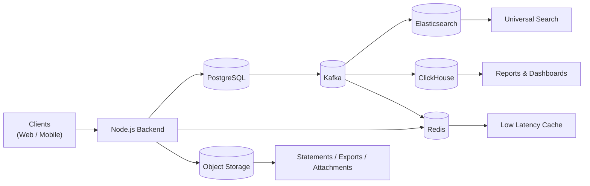
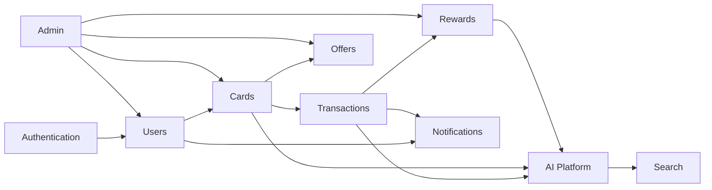
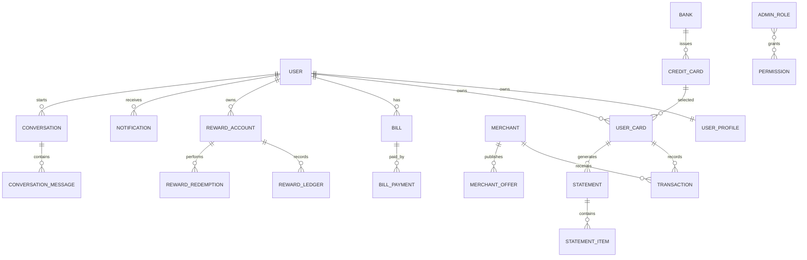
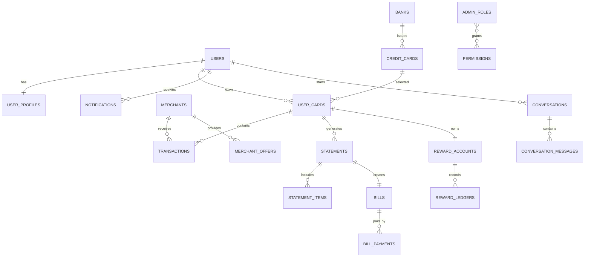
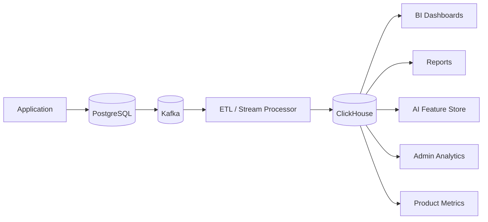
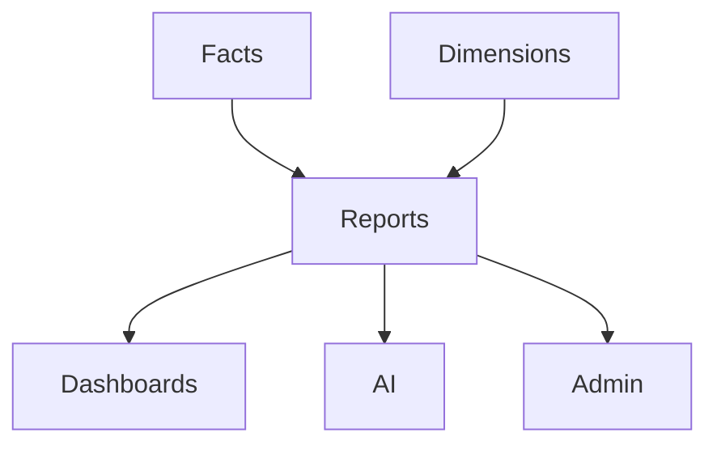
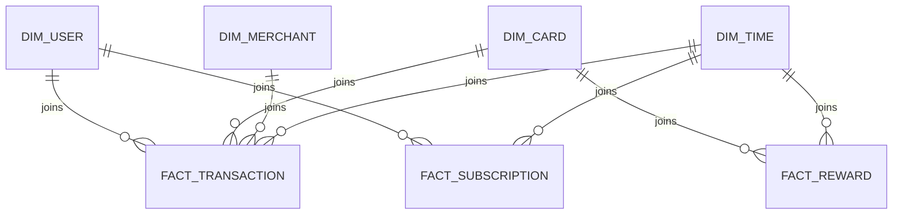
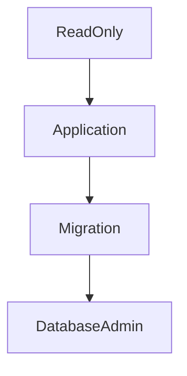

# 05_DATABASE_DESIGN.md

# Part 1 — Database Foundation & Architecture

| Metadata | Value |
|----------|-------|
| Document ID | DB-DOC-001 |
| Version | 1.0 |
| Status | Production Ready |
| Scope | CardWise Database Architecture |
| Primary Database | PostgreSQL |
| Cache | Redis |
| Search | Elasticsearch / OpenSearch |
| Analytics | ClickHouse |
| Object Storage | S3 Compatible |
| Event Streaming | Kafka |
| ORM | Prisma |
| Backend | Node.js |
| Architecture | Modular Monolith (Microservice Ready) |

---

# DB-001 Introduction

The CardWise database architecture is designed to support a production-grade, highly scalable, secure, and maintainable financial application capable of managing millions of users, billions of financial records, and continuously evolving product capabilities.

The database layer serves as the authoritative source of truth for transactional financial data while simultaneously enabling low-latency user experiences, analytical reporting, AI-driven insights, and future microservice decomposition.

The architecture intentionally separates operational concerns across multiple specialized storage systems instead of forcing every workload into a single database.

This document defines:

- Database architecture
- Storage responsibilities
- Data ownership
- Naming conventions
- Identifier standards
- Versioning strategy
- Auditing strategy
- Consistency guarantees
- Future scalability decisions

This document intentionally excludes:

- SQL
- ORM implementation
- Migration scripts
- API specifications
- Business workflows

These topics are documented elsewhere within the engineering documentation suite.

---

# DB-002 Objectives

The primary objectives of the CardWise database architecture are:

| ID | Objective |
|----|-----------|
| DB-OBJ-001 | Maintain financial data integrity |
| DB-OBJ-002 | Support horizontal application scaling |
| DB-OBJ-003 | Ensure predictable query performance |
| DB-OBJ-004 | Minimize operational complexity |
| DB-OBJ-005 | Support AI workloads |
| DB-OBJ-006 | Support advanced analytics |
| DB-OBJ-007 | Enable future microservice extraction |
| DB-OBJ-008 | Simplify maintenance and schema evolution |
| DB-OBJ-009 | Ensure auditability of financial records |
| DB-OBJ-010 | Support eventual multi-region deployment |
| DB-OBJ-011 | Minimize data duplication |
| DB-OBJ-012 | Provide strong transactional consistency |

---

# DB-003 Database Principles

The following engineering principles govern every database decision.

| Principle ID | Principle | Description |
|--------------|-----------|-------------|
| DB-PR-001 | Single Source of Truth | Every business entity has one authoritative owner. |
| DB-PR-002 | Normalize Before Optimizing | Denormalization only for measured performance needs. |
| DB-PR-003 | ACID for Financial Data | Financial operations require strong consistency. |
| DB-PR-004 | Read Optimization | Read-heavy queries use indexes, materialized views, caching, and search indices. |
| DB-PR-005 | Immutable Audit Trail | Business-critical changes are never permanently lost. |
| DB-PR-006 | Event Driven | Significant state changes generate immutable events. |
| DB-PR-007 | Explicit Ownership | Every table belongs to one bounded context. |
| DB-PR-008 | Security by Default | Sensitive data is encrypted and access controlled. |
| DB-PR-009 | Time Consistency | All timestamps stored in UTC. |
| DB-PR-010 | Microservice Ready | Schema boundaries support future service extraction. |
| DB-PR-011 | Operational Simplicity | Avoid unnecessary database technologies. |
| DB-PR-012 | Predictable Scaling | Independent scaling for transactional, search, cache, and analytics workloads. |

---

# DB-004 Technology Stack

## Database Technology Matrix

| Layer | Technology | Responsibility |
|--------|------------|----------------|
| Primary OLTP | PostgreSQL | Transactional data |
| ORM | Prisma | Schema mapping |
| Cache | Redis | Low latency reads |
| Search | Elasticsearch / OpenSearch | Full-text search |
| Analytics | ClickHouse | Reporting & BI |
| Object Storage | S3 Compatible | Statements, documents, exports |
| Queue | Kafka | Event streaming |
| Backend | Node.js | Business logic |

---

## Storage Responsibilities

| Storage | Primary Use |
|----------|-------------|
| PostgreSQL | System of record |
| Redis | Session cache, computed cache, rate limiting |
| Elasticsearch | Universal search |
| ClickHouse | Historical analytics |
| Kafka | Event propagation |
| S3 | Large immutable objects |

---

# DB-005 Architecture Overview

The CardWise persistence architecture follows a polyglot persistence model where each storage engine is selected based on workload characteristics.

## Core Principles

- One authoritative transactional database
- Specialized read stores
- Event-driven synchronization
- Independent scaling
- Read/write separation
- Immutable event propagation

---

# DB-006 High-Level Database Architecture



---

# DB-007 Database Selection Rationale

## PostgreSQL

| Decision | Rationale |
|----------|-----------|
| ACID Transactions | Required for financial integrity |
| Mature Ecosystem | Proven operational stability |
| Rich Indexing | Supports complex filtering |
| JSONB Support | Flexible metadata storage |
| Strong Constraints | Prevents invalid financial data |
| Partitioning | Supports large datasets |
| Extensions | Future optimization flexibility |

---

## Redis

Chosen because:

- Sub-millisecond latency
- Distributed cache
- Session storage
- Rate limiting
- Ephemeral data
- Leaderboards
- Frequently accessed dashboard data

---

## Elasticsearch / OpenSearch

Used exclusively for:

- Universal search
- Merchant search
- Offer discovery
- Card search
- Fuzzy matching
- Autocomplete
- Full-text ranking

---

## ClickHouse

Optimized for:

- Analytics
- Historical trends
- Aggregations
- User insights
- Reward reports
- BI dashboards
- AI feature engineering

---

## Kafka

Kafka provides:

- Event durability
- Decoupled integrations
- Analytics ingestion
- Search synchronization
- Cache invalidation
- Future microservice communication

---

## Object Storage

Object storage is responsible for:

- PDF statements
- Imported files
- Export archives
- Generated reports
- Receipt images
- User-uploaded documents

Only metadata is stored in PostgreSQL.

---

# DB-008 Storage Strategy

## Data Classification

| Data Type | Storage |
|------------|---------|
| Users | PostgreSQL |
| Cards | PostgreSQL |
| Transactions | PostgreSQL |
| Rewards | PostgreSQL |
| Bills | PostgreSQL |
| Settings | PostgreSQL |
| Search Documents | Elasticsearch |
| Sessions | Redis |
| OTP Cache | Redis |
| Dashboard Cache | Redis |
| Analytics | ClickHouse |
| PDFs | S3 |
| Images | S3 |
| Reports | S3 |
| Events | Kafka |

---

## Data Ownership Rules

| Rule | Description |
|------|-------------|
| One Owner | Every entity has exactly one owner database. |
| No Dual Writes | Avoid simultaneous writes to multiple databases. |
| Event Synchronization | Downstream systems consume events. |
| Immutable Analytics | Analytics data is append-only. |
| Cached Data | Redis never becomes the source of truth. |

---

# DB-009 Consistency Model

CardWise adopts different consistency guarantees depending on workload.

## Transactional Data

Consistency Level:

**Strong Consistency**

Examples:

- Bill payment
- Reward redemption
- Card creation
- User profile updates
- Subscription changes

---

## Search

Consistency:

**Eventual Consistency**

Acceptable delay:

- A few seconds

Reason:

Search freshness is less critical than transactional correctness.

---

## Analytics

Consistency:

Eventual

Reason:

Reports tolerate ingestion latency while benefiting from optimized analytical storage.

---

## Cache

Consistency:

Eventual

Cache invalidation occurs via event-driven updates and time-based expiration.

---

# DB-010 CAP Tradeoffs

Different storage systems prioritize different CAP characteristics.

| Component | Consistency | Availability | Partition Tolerance | Decision |
|------------|-------------|--------------|---------------------|----------|
| PostgreSQL | High | Medium | Limited | Favor consistency |
| Redis | Medium | High | High | Favor availability |
| Elasticsearch | Medium | High | High | Favor availability |
| Kafka | High | High | High | Configurable durability |
| ClickHouse | Medium | High | High | Favor analytics throughput |

### Engineering Decision

Financial correctness always takes precedence over temporary availability for transactional operations. Read-oriented systems such as cache, search, and analytics prioritize availability and responsiveness while tolerating eventual consistency.

---

# DB-011 Database Naming Conventions

## General Rules

| Rule | Convention |
|------|------------|
| Table Names | snake_case, plural |
| Column Names | snake_case |
| Constraint Names | prefixed |
| Index Names | prefixed |
| Foreign Keys | explicit names |
| Views | descriptive |
| Materialized Views | descriptive |
| Sequences | avoided (UUID strategy) |

---

## Examples

| Object | Example |
|----------|----------|
| Table | users |
| Table | credit_cards |
| Table | reward_transactions |
| Column | created_at |
| Column | user_id |
| Index | idx_transactions_user_date |
| Constraint | fk_transactions_user |
| Constraint | uk_users_email |

---

# DB-012 Schema Naming Standards

The database is logically partitioned using PostgreSQL schemas aligned with bounded contexts.

| Schema | Purpose |
|---------|---------|
| auth | Authentication |
| users | User domain |
| cards | Credit card portfolio |
| rewards | Reward ecosystem |
| transactions | Financial transactions |
| offers | Merchant and bank offers |
| ai | AI metadata |
| notifications | Notification system |
| analytics | Operational reporting metadata |
| admin | Administration |
| integrations | External connectors |
| audit | Audit trail |
| system | Internal platform metadata |

---

## Schema Design Principles

- Strong ownership boundaries
- Minimal cross-schema coupling
- Clear migration ownership
- Easier future extraction into services

---

# DB-013 Identifier Standards

Every business entity follows globally unique identifiers.

| Rule | Value |
|------|-------|
| Primary Identifier | UUID |
| External IDs | Separate columns |
| Search IDs | UUID |
| Event IDs | UUID |
| File IDs | UUID |
| Audit IDs | UUID |

Business identifiers (such as referral codes or redemption codes) are never reused as primary keys.

---

# DB-014 Primary Key Strategy

## Primary Key Standard

Every table uses:

- Single-column UUID primary key
- Immutable identifier
- Never updated
- Never reused

Benefits include:

- Global uniqueness
- Simplified replication
- Safe distributed generation
- Easier future service decomposition
- Reduced key collision risk

Natural keys are enforced through unique constraints rather than replacing surrogate primary keys.

---

# DB-015 UUID Strategy

CardWise standardizes on UUID Version 7 (UUIDv7) for primary identifiers.

## Rationale

| Benefit | Explanation |
|----------|-------------|
| Time Ordered | Improves index locality compared to random UUIDs. |
| Globally Unique | Supports distributed generation without coordination. |
| Scalable | Eliminates sequence bottlenecks. |
| Predictable Ordering | Better insertion performance for B-tree indexes. |

## Generation Rules

- Generated by the application layer
- Immutable after creation
- Exposed externally when appropriate
- Never regenerated
- Used consistently across services and events

---

# DB-016 Time Standards

Every timestamp stored in CardWise follows a common standard.

| Rule | Standard |
|------|----------|
| Timezone | UTC |
| Precision | Microseconds where supported |
| Format | ISO-8601 at API boundaries |
| Clock Source | Application servers synchronized via NTP |

## Standard Timestamp Columns

| Column | Purpose |
|----------|----------|
| created_at | Record creation |
| updated_at | Latest modification |
| deleted_at | Soft deletion |
| last_accessed_at | User activity |
| processed_at | Background processing |
| published_at | Publication lifecycle |

Business-specific dates (e.g., statement dates, bill due dates) are stored separately from system timestamps.

---

# DB-017 Soft Delete Strategy

Soft deletion is the default strategy for user-owned and business-critical data.

## Standard Columns

| Column | Description |
|----------|-------------|
| deleted_at | Deletion timestamp |
| deleted_by | Actor responsible |
| delete_reason | Optional business reason |

## Principles

- Logical deletion instead of physical removal
- Excluded from normal queries
- Restorable where permitted
- Auditable lifecycle
- Background archival and purge based on retention policies

### Exceptions

The following categories may be permanently removed after validation:

- Temporary caches
- Session data
- Idempotency records after expiry
- Ephemeral processing artifacts

---

# DB-018 Versioning Strategy

Versioning supports optimistic concurrency, historical traceability, and schema evolution.

## Record Versioning

Each mutable business entity includes:

| Column | Purpose |
|----------|----------|
| version | Optimistic concurrency control |
| updated_at | Modification timestamp |

## Configuration Versioning

Configuration-driven entities maintain immutable versions to support rollback and reproducibility.

## Schema Versioning

Managed through incremental migrations, ensuring forward-only evolution and repeatable deployments.

---

# DB-019 Audit Strategy

Auditability is a foundational requirement for CardWise.

## Audit Goals

- Regulatory traceability
- Security investigations
- Operational debugging
- User accountability
- Historical reconstruction

## Audited Information

| Category | Audited |
|----------|----------|
| User Updates | Yes |
| Financial Changes | Yes |
| Reward Changes | Yes |
| Administrative Actions | Yes |
| Authentication Events | Yes |
| Permission Changes | Yes |
| Configuration Changes | Yes |

## Audit Record Attributes

Each audit event captures:

- Actor identifier
- Target entity
- Operation type
- Previous state reference
- New state reference
- Timestamp
- Correlation identifier
- Request identifier
- Source system
- Client metadata

Audit records are append-only and never modified after creation.

---

# DB-020 Multi-tenancy Strategy (Future-Proof)

Although CardWise initially operates as a single-tenant application, the schema is designed to enable future multi-tenant deployment with minimal structural changes.

## Design Principles

| Principle | Description |
|-----------|-------------|
| Tenant Isolation | Logical isolation using tenant identifiers where applicable. |
| Shared Infrastructure | Single PostgreSQL cluster with tenant-aware schemas and queries initially. |
| Evolution Path | Supports migration to dedicated databases or schemas for enterprise tenants. |
| Tenant Context | Propagated through application, events, cache keys, and search indices. |

## Planned Tenant Model

| Layer | Strategy |
|-------|----------|
| PostgreSQL | Shared database with tenant-aware ownership |
| Redis | Tenant-prefixed cache namespaces |
| Elasticsearch | Tenant-aware indices or aliases |
| ClickHouse | Tenant dimension in analytical models |
| Kafka | Tenant metadata in event payloads |
| S3 | Tenant-prefixed object paths |

## Scalability Path


## Engineering Benefits

- No redesign required for SaaS expansion
- Minimal impact on application code
- Supports enterprise onboarding
- Enables regional data residency
- Compatible with future microservice architecture

---

# Part 1 Summary

This section establishes the foundational engineering decisions governing the CardWise data platform.

Key outcomes include:

- Polyglot persistence architecture with specialized storage systems
- PostgreSQL as the authoritative transactional database
- Redis for low-latency caching
- Elasticsearch/OpenSearch for full-text search
- ClickHouse for analytical workloads
- Kafka for durable event streaming
- S3-compatible object storage for immutable files
- UUIDv7-based globally unique identifiers
- UTC time standardization
- Soft-delete lifecycle management
- Immutable auditing strategy
- Versioning for concurrency and evolution
- Future-ready multi-tenancy architecture
- Consistent naming, schema, and identifier conventions
- Strong consistency for financial operations with eventual consistency for read-optimized systems


# 05_DATABASE_DESIGN.md

# Part 2 — Domain Modeling

---

# DB-021 Domain Modeling Overview

The CardWise data model follows **Domain-Driven Design (DDD)** principles, where each bounded context owns its entities, aggregates, business rules, and persistence model. While the application initially ships as a **Modular Monolith**, database ownership boundaries are intentionally aligned with future microservice extraction.

## Design Goals

| ID | Goal |
|----|------|
| DOM-001 | High cohesion within domains |
| DOM-002 | Loose coupling across domains |
| DOM-003 | Clear ownership of data |
| DOM-004 | Minimize cross-domain joins |
| DOM-005 | Support future service decomposition |
| DOM-006 | Independent schema evolution |
| DOM-007 | Event-driven synchronization |
| DOM-008 | Consistent aggregate boundaries |

---

# DB-022 Domain Landscape

The complete CardWise platform is organized into the following bounded contexts.

| Domain ID | Bounded Context | Primary Schema | Data Owner |
|------------|-----------------|----------------|------------|
| DOM-001 | Authentication | auth | Identity Module |
| DOM-002 | User Management | users | User Module |
| DOM-003 | Credit Card Portfolio | cards | Card Module |
| DOM-004 | Transactions | transactions | Transaction Module |
| DOM-005 | Statements & Bills | transactions | Billing Module |
| DOM-006 | Rewards & Cashback | rewards | Rewards Module |
| DOM-007 | Merchant & Bank Offers | offers | Offer Engine |
| DOM-008 | Travel Benefits | offers | Benefits Module |
| DOM-009 | AI Recommendation Engine | ai | AI Platform |
| DOM-010 | AI Assistant | ai | AI Platform |
| DOM-011 | Universal Search | search | Search Platform |
| DOM-012 | Notifications | notifications | Notification Platform |
| DOM-013 | Calendar & Timeline | users | Timeline Module |
| DOM-014 | Premium Subscription | users | Subscription Module |
| DOM-015 | Referral System | users | Referral Module |
| DOM-016 | Gamification | rewards | Gamification Module |
| DOM-017 | Import & Export | integrations | Integration Platform |
| DOM-018 | Analytics Metadata | analytics | Analytics Platform |
| DOM-019 | Admin Console | admin | Admin Platform |
| DOM-020 | Audit & Compliance | audit | Platform Services |
| DOM-021 | System Configuration | system | Platform Services |

---

# DB-023 Domain Dependency Map



---

# DB-024 Aggregate Root Catalog

Each bounded context exposes one or more aggregate roots.

| Aggregate ID | Aggregate Root | Description |
|--------------|----------------|-------------|
| AGR-001 | User | User lifecycle |
| AGR-002 | Credit Card | Card ownership |
| AGR-003 | Transaction | Financial activity |
| AGR-004 | Statement | Monthly statements |
| AGR-005 | Bill | Bill tracking |
| AGR-006 | Reward Account | Rewards |
| AGR-007 | Merchant Offer | Offers |
| AGR-008 | Notification | User notifications |
| AGR-009 | Subscription | Premium membership |
| AGR-010 | Referral | Referral program |
| AGR-011 | Admin User | Administration |
| AGR-012 | AI Recommendation | Recommendation engine |

---

# DB-025 Entity Classification

Entities are grouped into four categories.

| Category | Purpose |
|-----------|---------|
| Core Entities | Business-critical entities |
| Supporting Entities | Operational support |
| Reference Entities | Static lookup data |
| System Entities | Platform infrastructure |

---

# DB-026 Core Entity Catalog

## User Domain

| Entity ID | Entity | Aggregate |
|------------|--------|-----------|
| ENT-001 | User | User |
| ENT-002 | User Profile | User |
| ENT-003 | User Preference | User |
| ENT-004 | User Device | User |
| ENT-005 | User Session | User |
| ENT-006 | User Address | User |
| ENT-007 | User Verification | User |
| ENT-008 | Premium Subscription | Subscription |

---

## Authentication Domain

| Entity ID | Entity |
|------------|--------|
| ENT-009 | Identity Provider |
| ENT-010 | OAuth Account |
| ENT-011 | Refresh Token |
| ENT-012 | MFA Configuration |
| ENT-013 | Login History |
| ENT-014 | OTP Request |

---

## Credit Card Domain

| Entity ID | Entity |
|------------|--------|
| ENT-015 | Credit Card |
| ENT-016 | Card Variant |
| ENT-017 | User Card |
| ENT-018 | Card Benefit |
| ENT-019 | Card Fee |
| ENT-020 | Card Reward Rule |
| ENT-021 | Card Eligibility |
| ENT-022 | Card Image |
| ENT-023 | Card Network |

---

## Banking Domain

| Entity ID | Entity |
|------------|--------|
| ENT-024 | Bank |
| ENT-025 | Bank Branch |
| ENT-026 | Bank Product |
| ENT-027 | Issuer Configuration |

---

## Transaction Domain

| Entity ID | Entity |
|------------|--------|
| ENT-028 | Transaction |
| ENT-029 | Transaction Category |
| ENT-030 | Merchant |
| ENT-031 | Merchant Category |
| ENT-032 | Transaction Tag |
| ENT-033 | Split Transaction |
| ENT-034 | Attachment |

---

## Billing Domain

| Entity ID | Entity |
|------------|--------|
| ENT-035 | Statement |
| ENT-036 | Statement Item |
| ENT-037 | Bill |
| ENT-038 | Bill Payment |
| ENT-039 | Payment Reminder |

---

## Rewards Domain

| Entity ID | Entity |
|------------|--------|
| ENT-040 | Reward Account |
| ENT-041 | Reward Ledger |
| ENT-042 | Cashback Ledger |
| ENT-043 | Reward Redemption |
| ENT-044 | Milestone |
| ENT-045 | Annual Fee Waiver |
| ENT-046 | Reward Expiry |

---

## Offer Domain

| Entity ID | Entity |
|------------|--------|
| ENT-047 | Merchant Offer |
| ENT-048 | Bank Offer |
| ENT-049 | Offer Category |
| ENT-050 | Offer Redemption |
| ENT-051 | Offer Eligibility |
| ENT-052 | Offer Rule |

---

## Travel Benefits

| Entity ID | Entity |
|------------|--------|
| ENT-053 | Lounge Program |
| ENT-054 | Lounge Visit |
| ENT-055 | Airport Lounge |
| ENT-056 | Travel Insurance |
| ENT-057 | Fuel Benefit |
| ENT-058 | EMI Plan |

---

## AI Domain

| Entity ID | Entity |
|------------|--------|
| ENT-059 | Recommendation |
| ENT-060 | Recommendation Score |
| ENT-061 | Prompt History |
| ENT-062 | Conversation |
| ENT-063 | Conversation Message |
| ENT-064 | AI Feature Store Metadata |

---

## Notification Domain

| Entity ID | Entity |
|------------|--------|
| ENT-065 | Notification |
| ENT-066 | Notification Template |
| ENT-067 | Delivery Attempt |
| ENT-068 | Push Token |
| ENT-069 | Email Queue |
| ENT-070 | SMS Queue |

---

## Search Domain

| Entity ID | Entity |
|------------|--------|
| ENT-071 | Search Index Metadata |
| ENT-072 | Search Synonym |
| ENT-073 | Search Analytics |

---

## Admin Domain

| Entity ID | Entity |
|------------|--------|
| ENT-074 | Admin User |
| ENT-075 | Admin Role |
| ENT-076 | Permission |
| ENT-077 | Feature Flag |
| ENT-078 | Audit Review |

---

## Integration Domain

| Entity ID | Entity |
|------------|--------|
| ENT-079 | Import Job |
| ENT-080 | Export Job |
| ENT-081 | Webhook |
| ENT-082 | API Credential |
| ENT-083 | Sync Job |

---

## System Domain

| Entity ID | Entity |
|------------|--------|
| ENT-084 | System Setting |
| ENT-085 | Country |
| ENT-086 | Currency |
| ENT-087 | Timezone |
| ENT-088 | Language |
| ENT-089 | File Metadata |
| ENT-090 | Event Log |

---

# DB-027 Supporting Entity Catalog

Supporting entities exist to improve normalization, operational flexibility, and future extensibility.

| Entity ID | Entity | Purpose |
|------------|--------|---------|
| ENT-091 | Label | User-defined labels |
| ENT-092 | Favorite | Saved entities |
| ENT-093 | Recently Viewed | Navigation history |
| ENT-094 | User Bookmark | Quick access |
| ENT-095 | Notification Preference | Channel preferences |
| ENT-096 | Device Capability | Platform support |
| ENT-097 | Import Mapping | CSV field mapping |
| ENT-098 | Export Template | Reusable exports |
| ENT-099 | Report Configuration | Saved reports |
| ENT-100 | Dashboard Widget | Personalized dashboard |

---

# DB-028 Reference Entity Catalog

Reference entities are relatively static and change infrequently.

| Entity ID | Entity |
|------------|--------|
| ENT-101 | Country Master |
| ENT-102 | State Master |
| ENT-103 | Currency Master |
| ENT-104 | Language Master |
| ENT-105 | Card Network Master |
| ENT-106 | Merchant Category Code |
| ENT-107 | Reward Type |
| ENT-108 | Notification Channel |
| ENT-109 | Benefit Category |
| ENT-110 | Transaction Type |
| ENT-111 | Offer Type |
| ENT-112 | Fee Type |
| ENT-113 | Interest Type |
| ENT-114 | AI Model Registry |
| ENT-115 | Feature Toggle Type |

---

# DB-029 Relationship Matrix

| Parent Entity | Child Entity | Relationship |
|---------------|-------------|--------------|
| User | User Profile | 1 : 1 |
| User | User Card | 1 : N |
| User | Transaction | 1 : N |
| User | Bill | 1 : N |
| User | Reward Account | 1 : N |
| User | Notification | 1 : N |
| User | Conversation | 1 : N |
| User | Referral | 1 : N |
| Bank | Credit Card | 1 : N |
| Credit Card | Card Benefit | 1 : N |
| Credit Card | Reward Rule | 1 : N |
| Credit Card | Offer Eligibility | 1 : N |
| Credit Card | User Card | 1 : N |
| User Card | Transaction | 1 : N |
| User Card | Statement | 1 : N |
| Statement | Statement Item | 1 : N |
| Bill | Bill Payment | 1 : N |
| Reward Account | Reward Ledger | 1 : N |
| Reward Account | Redemption | 1 : N |
| Merchant | Transaction | 1 : N |
| Merchant | Merchant Offer | 1 : N |
| Merchant Offer | Offer Redemption | 1 : N |
| Conversation | Conversation Message | 1 : N |
| Admin Role | Permission | M : N |

---

# DB-030 Cross-Domain Relationships

Only aggregate roots are referenced across domains wherever possible.

| Source Domain | Target Domain | Relationship Type |
|---------------|---------------|-------------------|
| Authentication | User | Identity ownership |
| User | Card | Ownership |
| Card | Transactions | Usage |
| Card | Rewards | Reward calculation |
| Card | Offers | Eligibility |
| Transactions | Analytics | Event projection |
| Transactions | AI | Feature generation |
| Rewards | AI | Recommendation signals |
| AI | Notifications | Personalized alerts |
| Search | All Domains | Read-only indexing |
| Admin | All Domains | Operational access |

---

# DB-031 Domain Ownership Rules

| Rule ID | Rule |
|----------|------|
| OWN-001 | Every entity has exactly one owning bounded context. |
| OWN-002 | Cross-domain writes are prohibited. |
| OWN-003 | Shared data is propagated via events. |
| OWN-004 | Read-only projections may exist outside the owning context. |
| OWN-005 | Domain boundaries are preserved even within a modular monolith. |
| OWN-006 | Aggregate invariants are enforced only by the owning module. |

---

# DB-032 High-Level Entity Relationship Diagram



---

# DB-033 Domain Modeling Decisions

| Decision ID | Engineering Decision | Rationale |
|-------------|----------------------|-----------|
| DEC-001 | Use aggregate roots for transactional ownership | Prevent inconsistent writes |
| DEC-002 | Separate operational and analytical models | Independent optimization |
| DEC-003 | Normalize reference data | Reduce duplication |
| DEC-004 | Use immutable ledger entities for financial records | Preserve auditability |
| DEC-005 | Event-driven synchronization between domains | Loose coupling |
| DEC-006 | Shared identifiers instead of shared tables | Future microservice readiness |
| DEC-007 | Keep AI metadata outside transactional aggregates | Reduce coupling with ML workloads |

---

# DB-034 Design Considerations

## Best Practices

- Clearly define ownership for every entity.
- Avoid circular dependencies between bounded contexts.
- Keep aggregate boundaries small and transactional.
- Model financial records as append-oriented ledgers where possible.
- Isolate reference/master data from operational entities.
- Use immutable events to synchronize downstream read models.

## Risks

| Risk | Mitigation |
|------|------------|
| Cross-domain coupling | Enforce ownership and event-driven integration |
| Entity explosion | Group related entities under aggregate roots |
| Excessive joins | Introduce read models and projections where appropriate |
| Duplicate master data | Centralize reference entities |
| Future service extraction complexity | Maintain strict bounded context boundaries from the outset |

---

# Part 2 Summary

This section defines the conceptual domain model for CardWise, establishing:

- Complete bounded context map
- Aggregate root catalog
- Core entity inventory
- Supporting entity inventory
- Reference entity catalog
- Domain ownership rules
- Cross-domain interaction model
- High-level relationship matrix
- Production-ready ER overview aligned with future microservice decomposition


# 05_DATABASE_DESIGN.md

# Part 3 — Relational Schema Design

---

# DB-035 Relational Schema Design Overview

The CardWise relational data model is implemented on **PostgreSQL** and serves as the authoritative source of truth for all transactional and operational data.

The schema is designed around the following principles:

- Third Normal Form (3NF) by default
- Controlled denormalization for measured performance improvements
- Immutable financial ledgers
- Explicit foreign key relationships
- Strict data integrity
- Future-ready modular schema boundaries
- Predictable migrations
- Optimized indexing strategy

---

# DB-036 Relational Design Principles

| ID | Principle | Description |
|----|-----------|-------------|
| REL-001 | Normalize by Default | Minimize redundancy while preserving clarity |
| REL-002 | Explicit Relationships | Every relationship is represented by a foreign key |
| REL-003 | Immutable Financial Records | Financial history is append-only |
| REL-004 | Consistent Naming | Uniform table and column conventions |
| REL-005 | Constraint Driven | Database constraints enforce invariants wherever possible |
| REL-006 | UUID Primary Keys | Global uniqueness across services |
| REL-007 | Auditable Changes | Every mutable entity supports auditing |
| REL-008 | Soft Deletes | Business entities are logically deleted |

---

# DB-037 Schema Organization

The database is logically divided into PostgreSQL schemas aligned with bounded contexts.

| Schema | Primary Tables |
|---------|----------------|
| auth | identities, oauth_accounts, refresh_tokens, login_history, otp_requests |
| users | users, user_profiles, user_preferences, user_devices, subscriptions |
| cards | banks, credit_cards, card_variants, user_cards, card_benefits, reward_rules |
| transactions | merchants, transactions, statements, statement_items, bills, bill_payments |
| rewards | reward_accounts, reward_ledgers, cashback_ledgers, reward_redemptions |
| offers | merchant_offers, bank_offers, offer_rules, offer_redemptions |
| ai | recommendations, conversations, conversation_messages |
| notifications | notifications, templates, delivery_attempts |
| admin | admin_users, roles, permissions |
| audit | audit_logs, entity_history |
| integrations | import_jobs, export_jobs, webhooks |
| system | countries, currencies, languages, feature_flags |

---

# DB-038 Common Table Standards

Every transactional table follows a standardized structure.

## Mandatory Columns

| Column | Type (Conceptual) | Purpose |
|---------|-------------------|---------|
| id | UUIDv7 | Primary key |
| created_at | Timestamp UTC | Creation timestamp |
| updated_at | Timestamp UTC | Last modification |
| version | Integer | Optimistic concurrency |
| deleted_at | Timestamp UTC Nullable | Soft deletion |
| created_by | UUID Nullable | Audit reference |
| updated_by | UUID Nullable | Audit reference |

---

## Optional Standard Columns

| Column | Purpose |
|---------|---------|
| status | Entity lifecycle |
| metadata | Flexible JSON metadata |
| external_id | External integration reference |
| source_system | Origin of record |
| correlation_id | Distributed tracing |
| request_id | Request traceability |

---

# DB-039 Core Table Definitions

## TAB-001 users.users

| Attribute | Value |
|-----------|-------|
| Purpose | Primary user account |
| Aggregate | User |
| Primary Key | PK_users |
| Estimated Size | Millions of rows |

### Columns

| Column | Required | Description |
|---------|----------|-------------|
| id | Yes | User identifier |
| email | Yes | Unique email |
| phone | Optional | Mobile number |
| full_name | Yes | Display name |
| onboarding_status | Yes | Current onboarding stage |
| account_status | Yes | Active, suspended, deleted |
| premium_status | Yes | Subscription status |
| timezone_id | Yes | User timezone |
| locale | Yes | Preferred language |
| metadata | Optional | Extensible attributes |

---

## TAB-002 users.user_profiles

| Column | Description |
|---------|-------------|
| id | Profile ID |
| user_id | User reference |
| occupation | Occupation |
| annual_income | Income range |
| credit_score_range | Score band |
| financial_goals | Goals |
| preferred_categories | Spending interests |

Relationship:

```
User 1 ---- 1 UserProfile
```

---

## TAB-003 cards.credit_cards

Stores master card catalog.

| Column | Description |
|---------|-------------|
| id | Card identifier |
| bank_id | Issuing bank |
| network_id | Visa/Mastercard/etc |
| card_name | Marketing name |
| joining_fee | Joining fee |
| annual_fee | Annual fee |
| reward_program | Reward type |
| active | Availability |

---

## TAB-004 cards.user_cards

Represents cards owned by users.

| Column | Description |
|---------|-------------|
| id | User card ID |
| user_id | Card owner |
| credit_card_id | Master card |
| nickname | Optional label |
| credit_limit | Configured limit |
| available_limit | Remaining limit |
| statement_day | Monthly statement |
| due_day | Bill due |
| activation_date | Activated |
| closed_at | Closure timestamp |

---

## TAB-005 transactions.transactions

Stores normalized financial transactions.

| Column | Description |
|---------|-------------|
| id | Transaction ID |
| user_card_id | Source card |
| merchant_id | Merchant |
| transaction_type | Purchase / Refund / Fee |
| amount | Monetary amount |
| currency_id | Currency |
| transaction_time | Financial timestamp |
| posting_time | Posted timestamp |
| category_id | Spending category |
| reward_processed | Reward generated |
| statement_id | Associated statement |

---

## TAB-006 transactions.statements

Monthly generated statements.

| Column | Description |
|---------|-------------|
| id | Statement ID |
| user_card_id | Card |
| billing_cycle_start | Cycle start |
| billing_cycle_end | Cycle end |
| statement_date | Generated |
| due_date | Payment due |
| total_due | Amount due |
| minimum_due | Minimum payment |
| pdf_file_id | Statement document |

---

## TAB-007 transactions.statement_items

Detailed statement entries.

Relationship

```
Statement

↓

Statement Items

↓

Transactions
```

---

## TAB-008 transactions.bills

Tracks outstanding bills.

| Column | Description |
|---------|-------------|
| id | Bill |
| statement_id | Statement |
| amount_due | Outstanding |
| minimum_due | Minimum |
| paid_amount | Total paid |
| bill_status | Open/Closed |
| overdue_days | Calculated |

---

## TAB-009 rewards.reward_accounts

| Column | Description |
|---------|-------------|
| id | Reward account |
| user_card_id | Card |
| available_balance | Current balance |
| pending_balance | Pending |
| expired_balance | Expired |

---

## TAB-010 rewards.reward_ledgers

Immutable ledger.

Each row represents exactly one reward movement.

| Ledger Entry |
|--------------|
| Earn |
| Adjustment |
| Expiry |
| Redemption |
| Reversal |

---

## TAB-011 offers.merchant_offers

Stores merchant offers.

Key attributes

- Merchant
- Offer title
- Offer period
- Eligible cards
- Cashback
- Terms
- Priority

---

## TAB-012 notifications.notifications

Stores user notifications.

| Column | Description |
|---------|-------------|
| id | Notification |
| user_id | Recipient |
| title | Title |
| body | Content |
| channel | Push / Email / SMS |
| priority | Delivery priority |
| delivery_status | Pending / Delivered |
| read_at | Read timestamp |

---

## TAB-013 ai.recommendations

Stores personalized recommendations.

| Column | Description |
|---------|-------------|
| id | Recommendation |
| user_id | User |
| recommendation_type | Card / Offer / Reward |
| confidence_score | AI confidence |
| explanation | Human-readable reasoning |
| generated_at | Generation timestamp |
| expires_at | Expiry |

---

# DB-040 Column Standards

## Naming Convention

| Standard | Example |
|----------|---------|
| Foreign Keys | user_id |
| Booleans | is_active |
| Amounts | annual_fee |
| Dates | statement_date |
| Timestamps | created_at |
| Status Fields | account_status |

---

## Monetary Columns

All monetary values follow identical standards.

| Rule | Description |
|------|-------------|
| Currency stored separately | Yes |
| Decimal precision | High precision fixed-point |
| Floating point | Never used |
| Tax values | Separate columns where applicable |

---

## Status Columns

Lifecycle states are represented using constrained enumerations or validated reference tables.

Examples:

- ACTIVE
- PENDING
- FAILED
- EXPIRED
- CLOSED
- ARCHIVED

---

# DB-041 Constraint Standards

The database relies on constraints as the first line of defense against invalid data.

| Constraint Type | Prefix |
|-----------------|--------|
| Primary Key | PK- |
| Foreign Key | FK- |
| Unique | UK- |
| Check | CK- |

---

# DB-042 Primary Key Standards

| Rule ID | Standard |
|----------|----------|
| PK-001 | Every table has one UUIDv7 primary key |
| PK-002 | Primary keys are immutable |
| PK-003 | Primary keys are never recycled |
| PK-004 | No composite primary keys unless absolutely necessary |

---

## Example Primary Keys

| Table | Primary Key |
|---------|-------------|
| users | PK_users |
| user_cards | PK_user_cards |
| transactions | PK_transactions |
| rewards | PK_reward_accounts |
| notifications | PK_notifications |

---

# DB-043 Foreign Key Standards

Foreign keys preserve referential integrity across schemas.

| Relationship | Foreign Key |
|--------------|-------------|
| UserProfile → User | FK_user_profiles_user |
| UserCard → User | FK_user_cards_user |
| UserCard → CreditCard | FK_user_cards_card |
| Transaction → UserCard | FK_transactions_user_card |
| Transaction → Merchant | FK_transactions_merchant |
| Statement → UserCard | FK_statements_card |
| Bill → Statement | FK_bills_statement |
| RewardLedger → RewardAccount | FK_reward_ledger_account |

### Rules

- No cascading deletes for financial entities
- Restrict deletes when referenced
- Cascade updates only where identifiers are immutable (generally unnecessary with UUIDs)
- Cross-schema references are explicit and documented

---

# DB-044 Unique Constraint Standards

Unique constraints protect business invariants.

| Constraint ID | Business Rule |
|---------------|---------------|
| UK_users_email | Email must be unique |
| UK_users_phone | Phone unique when present |
| UK_bank_code | Bank codes unique |
| UK_card_slug | Card identifier unique |
| UK_offer_code | Offer code unique |
| UK_subscription_user | One active subscription per user |
| UK_referral_code | Referral codes unique |
| UK_feature_flag | Feature flag key unique |

---

# DB-045 Check Constraint Standards

Check constraints validate values before persistence.

| Constraint ID | Validation |
|---------------|------------|
| CK_amount_positive | Amount ≥ 0 where applicable |
| CK_reward_balance | Balance cannot be negative |
| CK_due_date | Due date after statement date |
| CK_credit_limit | Credit limit > 0 |
| CK_confidence_score | Between 0 and 1 |
| CK_fee_amount | Fee ≥ 0 |
| CK_expiry_date | Expiry after creation |

---

# DB-046 Default Value Standards

| Column | Default |
|---------|---------|
| created_at | Current UTC timestamp |
| updated_at | Current UTC timestamp |
| version | 1 |
| deleted_at | NULL |
| metadata | Empty JSON object |
| status | Entity-specific default |
| is_active | TRUE |

Defaults are deterministic and do not encode business-specific behavior.

---

# DB-047 Relationship Cardinality

| Parent | Child | Cardinality |
|---------|-------|-------------|
| User | UserProfile | 1 : 1 |
| User | UserCard | 1 : N |
| CreditCard | UserCard | 1 : N |
| UserCard | Transaction | 1 : N |
| UserCard | Statement | 1 : N |
| Statement | StatementItem | 1 : N |
| Statement | Bill | 1 : 1 |
| Bill | BillPayment | 1 : N |
| RewardAccount | RewardLedger | 1 : N |
| Merchant | MerchantOffer | 1 : N |
| Conversation | ConversationMessage | 1 : N |
| Role | Permission | M : N |

---

# DB-048 Detailed Relational ER Diagram



---

# DB-049 Relational Design Best Practices

## Engineering Decisions

| Decision ID | Description |
|-------------|-------------|
| REL-D-001 | Keep transactional entities normalized |
| REL-D-002 | Represent financial movements using immutable ledgers |
| REL-D-003 | Enforce business invariants through constraints before application validation |
| REL-D-004 | Use UUIDv7 consistently across all tables |
| REL-D-005 | Avoid nullable foreign keys except for optional relationships |
| REL-D-006 | Separate master/reference data from transactional records |
| REL-D-007 | Keep cross-domain relationships explicit and minimal |

## Risks & Trade-offs

| Risk | Mitigation |
|------|------------|
| Excessive joins on read-heavy screens | Materialized views and read models (Part 4) |
| Constraint overhead during writes | Acceptable trade-off for financial correctness |
| Large transaction tables | Partitioning strategy (Part 4) |
| Evolving business rules | Versioned schemas and forward-only migrations |

---

# Part 3 Summary

This section establishes the implementation-ready relational foundation for CardWise, including:

- PostgreSQL schema organization
- Standardized table structures
- Core table definitions
- Column conventions
- Primary key strategy
- Foreign key relationships
- Unique constraints
- Check constraints
- Default value standards
- Relationship cardinality
- Detailed relational ER diagram
- Best practices for maintaining integrity, consistency, and future scalability

# 05_DATABASE_DESIGN.md

# Part 4 — Indexing, Partitioning, Read Models & Performance

---

# DB-050 Performance Engineering Overview

CardWise is expected to support:

- Millions of registered users
- Hundreds of millions of transactions
- Tens of millions of reward ledger entries
- Large merchant and offer catalogs
- High-frequency dashboard queries
- AI-driven recommendation lookups
- Near real-time search
- Low-latency mobile experiences

The indexing and data access strategy is designed to optimize **read performance without compromising transactional correctness**.

---

# DB-051 Indexing Principles

| ID | Principle | Description |
|----|-----------|-------------|
| IDX-001 | Index for Measured Queries | Create indexes based on query patterns, not assumptions |
| IDX-002 | Minimize Write Amplification | Avoid unnecessary indexes on write-heavy tables |
| IDX-003 | Prefer Composite Indexes | Match common filtering and sorting patterns |
| IDX-004 | Cover Frequent Reads | Reduce heap lookups where practical |
| IDX-005 | Eliminate Redundant Indexes | Prevent duplicated maintenance cost |
| IDX-006 | Monitor Continuously | Review index usage periodically |
| IDX-007 | Support Future Scale | Design indexes with partitioning in mind |

---

# DB-052 Query Pattern Classification

| Query Type | Frequency | Latency Target |
|------------|-----------|----------------|
| Dashboard | Very High | <100 ms |
| Card Portfolio | Very High | <100 ms |
| Transactions | Very High | <150 ms |
| Statement View | High | <200 ms |
| Rewards | High | <150 ms |
| Offer Discovery | High | <200 ms |
| Universal Search | Very High | <100 ms |
| Notifications | High | <100 ms |
| Admin Reports | Medium | <500 ms |
| Analytics | Low (OLTP) | Offloaded to ClickHouse |

---

# DB-053 Index Naming Standards

All indexes follow a consistent naming convention.

| Prefix | Purpose |
|---------|---------|
| IDX- | Standard index |
| UK- | Unique index |
| PK- | Primary key |
| PART- | Partition index |
| MAT- | Materialized view index |

## Naming Pattern

```
idx_<table>_<column(s)>
```

### Examples

| Index Name | Purpose |
|------------|---------|
| idx_users_email | User lookup |
| idx_user_cards_user | User card retrieval |
| idx_transactions_card_time | Transaction history |
| idx_reward_ledger_account | Reward lookup |
| idx_notifications_user_status | Notification feed |

---

# DB-054 Primary Operational Indexes

## User Domain

| Index ID | Table | Columns | Purpose |
|-----------|-------|----------|---------|
| IDX-001 | users | email | Login |
| IDX-002 | users | phone | Mobile login |
| IDX-003 | users | account_status | Active users |
| IDX-004 | user_profiles | user_id | Profile lookup |

---

## Card Domain

| Index ID | Table | Columns |
|-----------|-------|----------|
| IDX-010 | credit_cards | bank_id |
| IDX-011 | credit_cards | network_id |
| IDX-012 | credit_cards | active |
| IDX-013 | user_cards | user_id |
| IDX-014 | user_cards | credit_card_id |
| IDX-015 | user_cards | user_id, status |

---

## Transaction Domain

| Index ID | Table | Columns |
|-----------|-------|----------|
| IDX-020 | transactions | user_card_id |
| IDX-021 | transactions | merchant_id |
| IDX-022 | transactions | transaction_time |
| IDX-023 | transactions | statement_id |
| IDX-024 | transactions | category_id |
| IDX-025 | transactions | user_card_id, transaction_time |
| IDX-026 | transactions | user_card_id, posting_time |

---

## Statement Domain

| Index | Columns |
|--------|----------|
| IDX-030 | user_card_id |
| IDX-031 | statement_date |
| IDX-032 | due_date |
| IDX-033 | user_card_id, statement_date |

---

## Reward Domain

| Index | Columns |
|--------|----------|
| IDX-040 | reward_account_id |
| IDX-041 | transaction_id |
| IDX-042 | expiry_date |
| IDX-043 | user_card_id |

---

## Offer Domain

| Index | Columns |
|--------|----------|
| IDX-050 | merchant_id |
| IDX-051 | bank_id |
| IDX-052 | offer_category |
| IDX-053 | valid_from |
| IDX-054 | valid_until |
| IDX-055 | active |

---

## Notification Domain

| Index | Columns |
|--------|----------|
| IDX-060 | user_id |
| IDX-061 | delivery_status |
| IDX-062 | created_at |
| IDX-063 | user_id, read_at |

---

# DB-055 Composite Index Strategy

Composite indexes are created only for validated query patterns.

| Index | Query Pattern |
|--------|---------------|
| user_id + status | Active user cards |
| user_card_id + transaction_time | Transaction history |
| user_card_id + statement_date | Statement listing |
| merchant_id + active | Offer discovery |
| user_id + created_at | Notification feed |
| reward_account_id + expiry_date | Expiring rewards |
| bank_id + annual_fee | Card comparison |
| category_id + transaction_time | Spending analysis |

---

## Composite Index Design Rules

- Highest selectivity columns first
- Equality filters before range filters
- Align with ORDER BY clauses
- Avoid wide indexes
- Review periodically based on production telemetry

---

# DB-056 Partial Index Strategy

Partial indexes reduce storage overhead by indexing only frequently queried subsets.

| Table | Condition | Use Case |
|--------|-----------|----------|
| users | account_status = ACTIVE | Active user lookups |
| user_cards | status = ACTIVE | Portfolio loading |
| merchant_offers | active = TRUE | Offer discovery |
| notifications | read_at IS NULL | Unread notifications |
| bills | bill_status = OPEN | Outstanding bills |
| subscriptions | status = ACTIVE | Premium validation |

---

# DB-057 Covering Index Strategy

Frequently executed read queries should be satisfied entirely from index data whenever practical.

Candidate read paths include:

- Dashboard summary
- Card list
- Active offers
- Reward balances
- Notification list
- Statement overview

Benefits:

- Fewer heap accesses
- Lower latency
- Reduced I/O
- Better cache utilization

---

# DB-058 Partitioning Strategy

Large operational tables are partitioned to improve maintenance and query performance.

## Partition Candidates

| Table | Partition Key | Strategy |
|---------|---------------|----------|
| transactions | transaction_time | Monthly Range |
| reward_ledgers | created_at | Monthly Range |
| notifications | created_at | Monthly Range |
| audit_logs | created_at | Monthly Range |
| event_logs | created_at | Monthly Range |
| login_history | created_at | Monthly Range |

---

## Partition Lifecycle


---

# DB-059 Partition Design Rules

| Rule | Description |
|------|-------------|
| PART-001 | Monthly partitions by default |
| PART-002 | Automatic partition creation |
| PART-003 | Automatic retirement |
| PART-004 | Partition pruning enabled |
| PART-005 | Partition-aware indexes |
| PART-006 | Historical partitions compressed where supported |

---

# DB-060 Sharding Strategy

## Initial Deployment

CardWise begins with a **single PostgreSQL primary database**.

No application-level sharding is introduced initially to minimize complexity.

---

## Future Sharding Strategy

When scaling beyond a single database instance:

### Phase 1

Read replicas

↓

### Phase 2

Partition-aware scaling

↓

### Phase 3

Logical tenant sharding

↓

### Phase 4

Regional deployment

---

## Shard Candidates

| Entity | Shard Key |
|----------|-----------|
| Users | tenant_id |
| Transactions | tenant_id + user_id |
| Notifications | tenant_id |
| Reward Ledger | tenant_id |
| AI Metadata | tenant_id |

---

# DB-061 Materialized Views

Materialized views provide optimized read models for expensive aggregations.

| View ID | Purpose |
|----------|----------|
| MAT-001 | Dashboard summary |
| MAT-002 | Monthly spending |
| MAT-003 | Reward balances |
| MAT-004 | Card utilization |
| MAT-005 | Merchant statistics |
| MAT-006 | Active premium users |
| MAT-007 | Referral leaderboard |
| MAT-008 | AI feature aggregates |

---

## Refresh Strategy

| View Type | Refresh |
|------------|---------|
| Dashboard | Incremental / Scheduled |
| Spending | Scheduled |
| Rewards | Event-driven |
| Reports | Scheduled |
| Leaderboards | Near Real-Time |

---

# DB-062 Read Model Strategy

CardWise follows **CQRS-inspired read optimization** while maintaining a single transactional write model.

## Read Models

| Read Model | Source |
|-------------|---------|
| Dashboard | Materialized View |
| Card Portfolio | PostgreSQL + Redis |
| Rewards | PostgreSQL + Redis |
| Offers | Elasticsearch |
| Search | Elasticsearch |
| Reports | ClickHouse |
| AI Recommendations | PostgreSQL + Redis |

---

## Read Flow

```mermaid
flowchart LR

Write

-->

PostgreSQL

-->

Kafka

-->

Read Models

Read Models

-->

Redis

Read Models

-->

Elasticsearch

Read Models

-->

ClickHouse
```

---

# DB-063 Redis Caching Strategy

Redis is used strictly as a performance optimization layer.

## Cache Categories

| Cache ID | Cached Data | TTL |
|-----------|-------------|-----|
| CACHE-001 | User Session | Configurable |
| CACHE-002 | Dashboard Summary | Short |
| CACHE-003 | Card Portfolio | Short |
| CACHE-004 | Reward Balance | Short |
| CACHE-005 | Active Offers | Medium |
| CACHE-006 | Search Suggestions | Medium |
| CACHE-007 | Notification Count | Short |
| CACHE-008 | AI Recommendations | Short |
| CACHE-009 | Feature Flags | Medium |
| CACHE-010 | Rate Limiting | Short |

---

# DB-064 Redis Data Structures

| Structure | Use Case |
|------------|----------|
| String | Session |
| Hash | User profile cache |
| Set | User permissions |
| Sorted Set | Leaderboards |
| List | Recent searches |
| Bitmap | Feature rollout |
| HyperLogLog | Approximate analytics |
| Stream | Lightweight event processing |

---

# DB-065 Cache Invalidation Strategy

Cache consistency is maintained using multiple complementary mechanisms.

| Strategy | Description |
|----------|-------------|
| Event-driven invalidation | Kafka events invalidate dependent cache entries |
| Write-through | Selected critical updates refresh cache immediately |
| TTL expiration | Automatic removal of stale entries |
| Versioned keys | Prevent stale reads during deployments |
| Manual invalidation | Administrative cache eviction |

---

# DB-066 Search Index Design

Operational search is delegated to Elasticsearch/OpenSearch.

## Searchable Entities

| Index | Entity |
|--------|--------|
| users | Users |
| cards | Credit Cards |
| merchants | Merchants |
| offers | Merchant Offers |
| transactions | Transaction Search |
| rewards | Reward History |
| notifications | Notifications |
| faq | Knowledge Base |

---

## Search Synchronization


---

## Indexed Fields

Examples include:

- Names
- Descriptions
- Merchant names
- Card names
- Offer titles
- Categories
- Tags
- Synonyms
- AI-generated keywords

---

# DB-067 Search Optimization

| Optimization | Purpose |
|--------------|---------|
| Edge n-grams | Autocomplete |
| Synonym dictionaries | Better relevance |
| Stemming | Flexible matching |
| Fuzzy search | Typo tolerance |
| Boosting | Business ranking |
| Field weighting | Better results |
| Incremental indexing | Near real-time freshness |

---

# DB-068 Performance Optimization Guidelines

## Query Optimization

- Prefer indexed access paths
- Eliminate N+1 queries
- Batch reads where possible
- Paginate all large result sets
- Use keyset pagination for infinite scrolling
- Avoid SELECT *
- Push filtering to the database
- Optimize join order based on cardinality

---

## Database Optimization

- Analyze execution plans regularly
- Vacuum and analyze routinely
- Rebuild fragmented indexes when necessary
- Monitor bloat
- Compress historical partitions
- Archive inactive data according to retention policies

---

# DB-069 Operational Performance Targets

| Metric | Target |
|---------|---------|
| Dashboard Load | <100 ms |
| Card Portfolio | <100 ms |
| Transaction History | <150 ms |
| Search Autocomplete | <75 ms |
| Reward Lookup | <100 ms |
| Statement Overview | <200 ms |
| Notification Feed | <100 ms |
| Cache Hit Ratio | >90% |
| Search Freshness | <5 seconds |
| Materialized View Refresh | Within defined SLA |

---

# DB-070 Part 4 Summary

This section defines the production performance architecture for CardWise, including:

- Comprehensive indexing strategy
- Composite and partial indexing standards
- Covering index guidance
- Time-based partitioning strategy
- Future sharding roadmap
- Materialized view architecture
- CQRS-inspired read models
- Redis caching architecture
- Cache invalidation strategy
- Elasticsearch/OpenSearch index design
- Search optimization techniques
- Operational performance targets
- Query optimization and database tuning best practices


# 05_DATABASE_DESIGN.md

# Part 5 — Transactions, Concurrency, Auditing & Data Lifecycle

---

# DB-071 Transaction Management Overview

CardWise manages highly sensitive financial information where **data correctness always takes precedence over throughput**.

Every business operation is classified according to its transactional requirements to ensure:

- Atomicity
- Consistency
- Isolation
- Durability
- Idempotency
- Recoverability
- Auditability

The application layer defines transaction boundaries, while PostgreSQL guarantees ACID compliance for all OLTP operations.

---

# DB-072 Transaction Design Principles

| ID | Principle | Description |
|----|-----------|-------------|
| TXN-001 | Keep Transactions Short | Reduce lock contention and improve throughput |
| TXN-002 | Single Aggregate Consistency | Transactions primarily operate within one aggregate boundary |
| TXN-003 | Avoid Long-Running Transactions | External calls occur outside database transactions |
| TXN-004 | Commit Before Event Publication | Events are published only after successful commit |
| TXN-005 | Retry Safely | Operations must be idempotent where retries are possible |
| TXN-006 | Explicit Rollback | Any validation failure aborts the entire transaction |
| TXN-007 | Deterministic Ordering | Updates touching multiple entities follow a consistent order |

---

# DB-073 Transaction Classification

| Transaction Type | Consistency | Typical Scope |
|------------------|-------------|---------------|
| User Registration | Strong | User aggregate |
| Login | Strong | Authentication |
| Card Addition | Strong | User + Card |
| Transaction Import | Strong | Card + Transactions |
| Statement Generation | Strong | Statement aggregate |
| Bill Payment | Strong | Bill + Payment |
| Reward Accrual | Strong | Reward Ledger |
| Reward Redemption | Strong | Reward Ledger |
| Offer Redemption | Strong | Offer + User |
| Profile Update | Strong | User aggregate |
| AI Recommendation Generation | Eventual | AI domain |
| Analytics Projection | Eventual | ClickHouse |
| Search Index Update | Eventual | Elasticsearch |
| Notification Delivery | Eventual | Notification platform |

---

# DB-074 Transaction Boundaries

Each business capability defines a clear transactional boundary.

| Aggregate | Transaction Boundary |
|------------|----------------------|
| User | User + Profile + Preferences |
| User Card | User Card + Related Metadata |
| Transaction | Transaction + Reward Generation Trigger |
| Statement | Statement + Statement Items |
| Bill | Bill + Payment Records |
| Reward Account | Reward Ledger Entries |
| Offer | Offer Redemption State |
| Subscription | Subscription Lifecycle |
| Notification | Notification Record Creation |

### Engineering Rules

- Never span unrelated aggregates in a single transaction.
- External services are invoked only after commit.
- Downstream systems receive committed events through Kafka.

---

# DB-075 Transaction Flow


---

# DB-076 Concurrency Control

CardWise combines optimistic and pessimistic strategies depending on workload characteristics.

## Optimistic Concurrency

Used for:

- User profile updates
- Preferences
- Settings
- Administrative configuration
- AI metadata

Mechanism:

- Version column
- Compare-and-update semantics
- Retry on conflict

---

## Pessimistic Concurrency

Reserved for operations where conflicting writes could compromise financial correctness.

Examples:

- Bill payment processing
- Reward redemption
- Annual fee waiver evaluation
- Reward balance adjustment
- Subscription activation
- Referral reward allocation

---

# DB-077 Locking Strategy

The goal is to minimize lock duration while preserving consistency.

| Lock Type | Use Case |
|------------|----------|
| Row-Level Lock | Financial updates |
| Shared Lock | Validation scenarios |
| Exclusive Lock | Schema changes |
| Advisory Lock | Distributed coordination where appropriate |

### Locking Rules

| Rule | Description |
|------|-------------|
| LOCK-001 | Lock the smallest possible scope |
| LOCK-002 | Lock rows, not tables |
| LOCK-003 | Acquire locks in deterministic order |
| LOCK-004 | Release locks immediately after commit |
| LOCK-005 | Never hold locks during external API calls |

---

# DB-078 Isolation Levels

Different workloads require different isolation guarantees.

| Operation | Isolation Level |
|------------|-----------------|
| User Registration | Read Committed |
| Login | Read Committed |
| Card Import | Repeatable Read |
| Statement Generation | Repeatable Read |
| Bill Payment | Serializable |
| Reward Redemption | Serializable |
| Subscription Purchase | Serializable |
| Admin Configuration | Repeatable Read |
| Analytics ETL | Read Committed |

### Rationale

- Serializable isolation is reserved for monetary operations.
- Read Committed is sufficient for most CRUD workflows.
- Repeatable Read protects reporting and batch consistency without the cost of full serialization.

---

# DB-079 Optimistic Concurrency Strategy

Optimistic concurrency is implemented using entity versioning.

## Standard Version Column

| Column | Purpose |
|---------|---------|
| version | Incremented after every successful update |

### Update Lifecycle

```mermaid
flowchart LR

Read Entity

-->

Check Version

-->

Apply Update

-->

Increment Version

-->

Commit
```

### Conflict Resolution

If the stored version differs from the client version:

- Reject the update
- Return conflict information
- Allow the client to reload the latest state
- Avoid silent overwrites

---

# DB-080 Idempotency Strategy

Idempotency prevents duplicate processing caused by retries, network failures, or client resubmissions.

## Idempotent Operations

| Operation | Idempotent |
|------------|------------|
| User Registration | Yes |
| Card Import | Yes |
| Bill Payment | Yes |
| Reward Redemption | Yes |
| Subscription Purchase | Yes |
| Import Job Execution | Yes |
| Export Job Execution | Yes |
| Webhook Processing | Yes |

---

## Idempotency Record

Each protected operation stores an idempotency record containing:

| Attribute | Purpose |
|------------|---------|
| Idempotency Key | Unique request identifier |
| Request Hash | Detect payload changes |
| Operation Type | Business operation |
| Status | Processing outcome |
| Response Reference | Cached successful result |
| Expiry Timestamp | Retention limit |

### Rules

- Keys are unique within their operational scope.
- Duplicate requests return the original successful response.
- Expired records are purged according to retention policies.

---

# DB-081 Event Storage Strategy

Business events are immutable representations of significant state changes.

## Event Categories

| Event Category | Examples |
|----------------|----------|
| User Events | Registration, profile updates |
| Card Events | Card added, card removed |
| Transaction Events | Purchase, refund |
| Billing Events | Statement generated, bill paid |
| Reward Events | Earn, redeem, expire |
| Offer Events | Offer claimed |
| Subscription Events | Activated, renewed |
| Administrative Events | Feature flag changes |

---

## Event Lifecycle

```mermaid
flowchart LR

Business Action

-->

Transaction Commit

-->

Event Persisted

-->

Kafka

-->

Consumers

-->

Read Models
```

### Event Design Principles

- Immutable
- Ordered per aggregate where applicable
- Versioned
- Timestamped
- Correlated using request identifiers

---

# DB-082 Audit Tables

Audit records capture all business-critical changes without modifying historical entries.

## Primary Audit Tables

| Table | Purpose |
|---------|---------|
| audit_logs | Generic audit events |
| entity_history | Entity snapshots |
| authentication_audit | Login and security events |
| admin_audit | Administrative actions |
| permission_audit | RBAC changes |
| configuration_audit | Feature/configuration changes |

---

## Audit Record Contents

| Field | Description |
|--------|-------------|
| Audit ID | Unique identifier |
| Entity Type | Affected entity |
| Entity ID | Target record |
| Action | Create, Update, Delete, Restore |
| Actor ID | Initiating user/system |
| Previous Snapshot Reference | Before state |
| Current Snapshot Reference | After state |
| Timestamp | Event time |
| Correlation ID | Distributed trace |
| Source | Client or subsystem |

---

# DB-083 History Tables

History tables preserve historical business state for entities requiring temporal analysis.

## Versioned Entities

| Entity | History Required |
|----------|-----------------|
| User Profile | Yes |
| Credit Card Metadata | Yes |
| Card Benefits | Yes |
| Reward Rules | Yes |
| Offer Rules | Yes |
| Premium Subscription | Yes |
| Feature Flags | Yes |
| System Settings | Yes |

### History Principles

- Immutable historical versions
- Chronological ordering
- Version references
- Restorable configuration states where permitted

---

# DB-084 Soft Delete Lifecycle

Soft deletion protects recoverable business data while supporting compliance and operational safety.

## Lifecycle

```mermaid
flowchart LR

Active

-->

Soft Deleted

-->

Archived

-->

Retention Review

-->

Permanent Purge
```

---

## Soft Delete Policy

| Entity | Soft Delete |
|----------|-------------|
| Users | Yes |
| User Cards | Yes |
| Transactions | No (Immutable) |
| Statements | No |
| Bills | No |
| Reward Ledger | No |
| Offers | Yes |
| Notifications | Yes |
| Import Jobs | Yes |
| Export Jobs | Yes |
| Feature Flags | Yes |

### Rules

- Immutable financial records are never soft deleted.
- Soft-deleted records are excluded from normal application queries.
- Restoration requires explicit authorization where supported.

---

# DB-085 Retention Policies

Retention balances regulatory, operational, and storage requirements.

| Data Category | Retention Strategy |
|---------------|-------------------|
| User Profiles | Retained until account lifecycle policy permits removal |
| Transactions | Long-term retention |
| Statements | Long-term retention |
| Reward Ledger | Long-term retention |
| Audit Logs | Extended retention |
| Login History | Medium-term retention |
| Notification Delivery Logs | Short-to-medium retention |
| Import Logs | Medium-term retention |
| Export Logs | Medium-term retention |
| Cache Data | Ephemeral |
| Idempotency Records | Short-term |
| Kafka Events | Configurable operational retention |
| Analytics Projections | Managed independently in ClickHouse |

---

# DB-086 Archival Strategy

Cold historical data is moved out of high-performance operational storage while preserving accessibility.

## Archival Candidates

| Entity | Archive Eligible |
|----------|-----------------|
| Old Notifications | Yes |
| Historical Login Records | Yes |
| Legacy Import Jobs | Yes |
| Legacy Export Jobs | Yes |
| Archived Audit Segments | Yes |
| Historical Event Logs | Yes |

### Archival Objectives

- Reduce OLTP storage growth
- Improve index efficiency
- Lower operational costs
- Preserve historical traceability

---

# DB-087 Data Lifecycle Management


Lifecycle state transitions are governed by business rules, retention requirements, and compliance obligations.

---

# DB-088 Operational Safeguards

| Safeguard | Purpose |
|------------|---------|
| Atomic Transactions | Prevent partial writes |
| Version Columns | Detect concurrent updates |
| Idempotency Keys | Prevent duplicate processing |
| Immutable Ledgers | Preserve financial history |
| Audit Logs | Regulatory traceability |
| History Tables | Temporal reconstruction |
| Soft Deletes | Safe recovery |
| Retention Policies | Controlled storage growth |
| Event Publication After Commit | Consistent downstream processing |

---

# DB-089 Best Practices & Risks

## Best Practices

- Keep database transactions short.
- Separate transactional consistency from asynchronous processing.
- Use optimistic concurrency for user-driven updates.
- Reserve serializable isolation for financial workflows.
- Treat ledgers and events as immutable.
- Enforce idempotency for externally retried operations.
- Archive historical operational data without impacting OLTP performance.

## Risks & Mitigations

| Risk | Mitigation |
|------|------------|
| Deadlocks | Deterministic lock ordering and short transactions |
| Duplicate processing | Idempotency records and unique keys |
| Lost updates | Version-based optimistic concurrency |
| Long-running locks | Avoid external calls within transactions |
| Audit gaps | Mandatory append-only audit logging |
| Storage growth | Partitioning, archival, and retention policies |

---

# DB-090 Part 5 Summary

This section defines the transactional and lifecycle foundation of the CardWise database, including:

- ACID transaction strategy
- Transaction boundaries
- Concurrency control
- Locking policies
- Isolation level selection
- Optimistic concurrency management
- Idempotency architecture
- Immutable event storage
- Audit table design
- History table strategy
- Soft delete lifecycle
- Data retention policies
- Archival approach
- End-to-end data lifecycle management
- Operational safeguards for financial correctness and recoverability

# 05_DATABASE_DESIGN.md

# Part 6 — Analytics Database, ClickHouse & Data Warehouse

---

# DB-091 Analytics Architecture Overview

CardWise separates **Online Transaction Processing (OLTP)** from **Online Analytical Processing (OLAP)** to ensure that analytical workloads never impact transactional performance.

## Design Objectives

| ID | Objective |
|----|-----------|
| ANA-001 | Isolate analytical workloads from OLTP |
| ANA-002 | Support near real-time dashboards |
| ANA-003 | Enable long-term historical analysis |
| ANA-004 | Power AI feature engineering |
| ANA-005 | Support business intelligence reporting |
| ANA-006 | Scale independently from PostgreSQL |
| ANA-007 | Optimize large aggregations |
| ANA-008 | Preserve immutable analytical history |

---

# DB-092 High-Level Analytics Architecture



---

# DB-093 Analytics Design Principles

| Principle | Description |
|------------|-------------|
| Immutable Facts | Facts are append-only |
| Event Driven | Analytics originate from business events |
| Denormalized Storage | Optimized for read performance |
| Time-Series Friendly | Efficient temporal queries |
| Partition Aware | Data partitioned by event time |
| Column-Oriented | Fast aggregations |
| Read Optimized | Heavy aggregations without impacting OLTP |
| Independent Scaling | Separate compute and storage growth |

---

# DB-094 Why ClickHouse

ClickHouse is selected as the analytical database because it is optimized for:

- Columnar storage
- High compression
- Fast aggregations
- Large-scale analytical scans
- Time-series workloads
- Near real-time ingestion
- Efficient dashboard queries
- Low infrastructure cost per terabyte

---

## Comparison

| Capability | PostgreSQL | ClickHouse |
|-------------|------------|------------|
| OLTP | Excellent | Poor |
| Large Aggregations | Moderate | Excellent |
| Time-Series Analytics | Moderate | Excellent |
| Compression | Moderate | Excellent |
| Dashboard Queries | Good | Excellent |
| Billions of Rows | Challenging | Excellent |
| Concurrent Reporting | Moderate | Excellent |

---

# DB-095 Analytics Data Model

The analytics platform is organized into **Facts**, **Dimensions**, and **Aggregations**.



---

# DB-096 Fact Tables

Fact tables store immutable business events.

| Fact ID | Fact Table | Source |
|----------|------------|--------|
| FACT-001 | fact_transactions | Transaction events |
| FACT-002 | fact_rewards | Reward ledger |
| FACT-003 | fact_redemptions | Reward redemption |
| FACT-004 | fact_bills | Billing events |
| FACT-005 | fact_payments | Bill payments |
| FACT-006 | fact_offer_usage | Offer redemptions |
| FACT-007 | fact_notifications | Notification delivery |
| FACT-008 | fact_ai_recommendations | Recommendation generation |
| FACT-009 | fact_referrals | Referral events |
| FACT-010 | fact_subscriptions | Premium lifecycle |

---

## Fact Table Characteristics

| Property | Value |
|-----------|-------|
| Append Only | Yes |
| Mutable | No |
| Time Partitioned | Yes |
| Compression | Enabled |
| Historical Retention | Long-term |

---

# DB-097 Dimension Tables

Dimensions provide descriptive context for analytical facts.

| Dimension ID | Dimension |
|--------------|-----------|
| DIM-001 | User |
| DIM-002 | Credit Card |
| DIM-003 | Bank |
| DIM-004 | Merchant |
| DIM-005 | Merchant Category |
| DIM-006 | Country |
| DIM-007 | Currency |
| DIM-008 | Time |
| DIM-009 | Reward Type |
| DIM-010 | Offer Type |
| DIM-011 | Device |
| DIM-012 | Subscription Tier |
| DIM-013 | Notification Channel |
| DIM-014 | AI Model |
| DIM-015 | Referral Campaign |

---

# DB-098 Analytical Relationships



---

# DB-099 Reporting Models

The reporting layer exposes optimized analytical datasets.

| Model ID | Reporting Model |
|-----------|-----------------|
| RM-001 | Spending Trends |
| RM-002 | Card Usage Summary |
| RM-003 | Monthly Statements |
| RM-004 | Reward Earnings |
| RM-005 | Reward Redemption |
| RM-006 | Cashback Summary |
| RM-007 | Offer Utilization |
| RM-008 | Premium Conversion |
| RM-009 | Referral Performance |
| RM-010 | Notification Effectiveness |
| RM-011 | AI Recommendation Accuracy |
| RM-012 | User Growth |
| RM-013 | Churn Analysis |
| RM-014 | Merchant Insights |
| RM-015 | Financial Health Metrics |

---

# DB-100 Aggregation Strategy

Frequently used metrics are pre-aggregated to minimize query latency.

## Daily Aggregations

| Aggregate | Description |
|------------|-------------|
| Daily Spend | Total spending |
| Daily Rewards | Rewards earned |
| Daily Cashback | Cashback accumulated |
| Daily Active Users | DAU |
| Daily Offer Usage | Offer redemptions |

---

## Weekly Aggregations

- Weekly spending
- Weekly category distribution
- Weekly reward utilization
- Weekly AI engagement
- Weekly notification metrics

---

## Monthly Aggregations

- Monthly statement totals
- Monthly reward summaries
- Monthly premium revenue
- Monthly user growth
- Monthly churn
- Monthly merchant rankings

---

## Yearly Aggregations

- Annual spending
- Annual reward earnings
- Annual fee waiver eligibility
- Annual subscription renewals
- Annual financial trends

---

# DB-101 OLTP vs OLAP Responsibilities

| Capability | PostgreSQL (OLTP) | ClickHouse (OLAP) |
|-------------|-------------------|-------------------|
| User CRUD | ✅ | ❌ |
| Financial Transactions | ✅ | ❌ |
| Reward Ledger | ✅ | ❌ |
| Operational Dashboard | ✅ | Limited |
| Business Intelligence | ❌ | ✅ |
| Trend Analysis | ❌ | ✅ |
| Time-Series Analysis | ❌ | ✅ |
| Large Aggregations | ❌ | ✅ |
| Product Metrics | ❌ | ✅ |
| AI Feature Generation | Partial | ✅ |

---

# DB-102 Data Warehouse Architecture

CardWise adopts a modern warehouse architecture based on event-driven ingestion.

```mermaid
flowchart LR

PostgreSQL

-->

Kafka

-->

Streaming ETL

-->

ClickHouse

-->

Data Marts

-->

Dashboards

Data Marts

-->

Machine Learning

Data Marts

-->

Business Reports
```

---

# DB-103 ETL / ELT Strategy

The analytical pipeline supports both streaming and scheduled processing.

## Streaming Pipeline

Used for:

- Transactions
- Rewards
- Notifications
- AI events
- Offer usage

Target latency:

**Near Real-Time**

---

## Scheduled Pipeline

Used for:

- Historical backfills
- Data corrections
- Master data synchronization
- Aggregation refresh
- Archive imports

---

# DB-104 ETL Stages

| Stage | Description |
|---------|-------------|
| Extract | Consume Kafka events or snapshots |
| Validate | Schema and quality validation |
| Transform | Business enrichment |
| Deduplicate | Prevent duplicate facts |
| Aggregate | Compute rollups |
| Load | Persist into ClickHouse |
| Verify | Data reconciliation |

---

# DB-105 Data Quality Rules

Every analytical record passes quality validation.

| Rule ID | Validation |
|----------|------------|
| DQ-001 | Mandatory fields present |
| DQ-002 | Referential integrity against dimensions |
| DQ-003 | Valid timestamps |
| DQ-004 | Non-negative monetary values |
| DQ-005 | Currency consistency |
| DQ-006 | Duplicate event detection |
| DQ-007 | Schema version compatibility |
| DQ-008 | Event ordering validation where required |

---

# DB-106 Analytical Data Lifecycle

```mermaid
flowchart LR

Kafka Event

-->

Validation

-->

Transformation

-->

Fact Table

-->

Aggregation

-->

Dashboard

-->

Archive
```

---

# DB-107 AI Feature Store

ClickHouse also serves as the analytical foundation for AI feature generation.

## Feature Categories

| Feature Group | Examples |
|---------------|----------|
| Spending | Monthly spend, category ratios |
| Rewards | Earn rate, redemption rate |
| Cards | Utilization, active cards |
| Offers | Offer acceptance rate |
| Payments | On-time payment ratio |
| Engagement | Session frequency |
| Premium | Subscription likelihood |
| Referrals | Referral effectiveness |

---

## AI Feature Principles

- Derived from immutable facts
- Versioned feature definitions
- Reproducible calculations
- Time-aware snapshots
- No direct writes from ML models into OLTP

---

# DB-108 Business Metrics Catalog

| Metric | Source |
|----------|--------|
| Monthly Active Users | fact_sessions |
| Daily Active Users | fact_sessions |
| Total Spend | fact_transactions |
| Average Spend | fact_transactions |
| Reward Earn Rate | fact_rewards |
| Cashback Earned | fact_rewards |
| Offer Conversion | fact_offer_usage |
| Premium Conversion | fact_subscriptions |
| Referral Conversion | fact_referrals |
| Notification CTR | fact_notifications |
| AI Recommendation Acceptance | fact_ai_recommendations |

---

# DB-109 Performance Optimization

## ClickHouse Best Practices

- Partition by event date
- Order data for common query patterns
- Compress historical partitions
- Precompute expensive aggregations
- Avoid updates to fact tables
- Keep dimensions compact
- Separate hot and cold analytical data
- Continuously monitor ingestion lag

---

# DB-110 Analytics Governance

| Area | Governance Rule |
|------|------------------|
| Data Ownership | Defined by source bounded context |
| Schema Evolution | Backward-compatible event contracts |
| Data Lineage | End-to-end traceability |
| Quality Monitoring | Automated validation |
| Access Control | Role-based analytical permissions |
| Retention | Managed independently from OLTP |
| Metadata | Central catalog for facts, dimensions, and metrics |

---

# DB-111 Part 6 Summary

This section defines the analytical architecture for CardWise, including:

- ClickHouse as the dedicated OLAP platform
- Event-driven analytical ingestion
- Fact and dimension modeling
- Reporting model architecture
- Pre-aggregation strategy
- Clear separation of OLTP and OLAP responsibilities
- Data warehouse architecture
- Streaming and scheduled ETL/ELT pipelines
- Data quality validation rules
- AI feature store design
- Business metrics catalog
- Performance optimization for analytical workloads
- Governance principles for scalable and trustworthy analytics


# 05_DATABASE_DESIGN.md

# Part 7 — Security, Compliance, Backup & Disaster Recovery

---

# DB-112 Security Architecture Overview

The CardWise database security model follows a **Defense-in-Depth** approach, combining multiple security layers to protect sensitive financial data throughout its lifecycle.

Security controls are implemented across:

- Infrastructure
- Network
- Database
- Application
- Storage
- Backups
- Secrets
- Identity
- Auditing
- Monitoring

The primary goals are:

- Confidentiality
- Integrity
- Availability
- Regulatory compliance
- Operational resilience

---

# DB-113 Security Principles

| ID | Principle | Description |
|----|-----------|-------------|
| SEC-001 | Least Privilege | Grant only the minimum required permissions |
| SEC-002 | Zero Trust | Verify every access request |
| SEC-003 | Encryption by Default | Encrypt sensitive data in transit and at rest |
| SEC-004 | Immutable Audit | Security-relevant events are append-only |
| SEC-005 | Segregation of Duties | Administrative responsibilities are separated |
| SEC-006 | Defense in Depth | Multiple independent security layers |
| SEC-007 | Secure by Default | Default-deny posture for privileged access |
| SEC-008 | Continuous Monitoring | Detect anomalies and suspicious behavior |

---

# DB-114 Data Classification

All persisted data is classified according to its sensitivity.

| Classification | Description | Examples |
|----------------|-------------|----------|
| Public | Safe for public exposure | Static card metadata, supported networks |
| Internal | Operational information | Feature flags, configuration |
| Confidential | User-specific business data | Card portfolio, preferences |
| Sensitive | Personally identifiable information (PII) | Name, email, phone |
| Highly Sensitive | Financial and authentication data | Transactions, reward balances, login history |

---

# DB-115 Encryption Strategy

## Encryption in Transit

| Component | Requirement |
|------------|-------------|
| Client → API | TLS 1.2+ (TLS 1.3 preferred) |
| API → PostgreSQL | Encrypted connection |
| API → Redis | Encrypted connection |
| API → Kafka | Encrypted connection |
| API → Object Storage | Encrypted connection |
| Internal Service Communication | Mutual TLS where applicable |

---

## Encryption at Rest

| Storage | Encryption |
|----------|------------|
| PostgreSQL | Disk-level encryption |
| Redis | Encrypted persistence where enabled |
| ClickHouse | Encrypted storage volumes |
| Object Storage | Server-side encryption |
| Backups | Encrypted before storage |
| Kafka | Encrypted disks |

---

## Column-Level Encryption

Highly sensitive values may additionally be encrypted at the application layer before persistence.

Examples include:

- Government-issued identifiers (if introduced)
- API credentials
- External integration secrets
- Recovery tokens

---

# DB-116 Personally Identifiable Information (PII)

PII is isolated, minimized, and protected throughout the platform.

## PII Categories

| Data | Classification |
|------|----------------|
| Name | Sensitive |
| Email | Sensitive |
| Phone Number | Sensitive |
| Address | Sensitive |
| Device Identifiers | Confidential |
| IP Address | Confidential |
| Authentication Metadata | Highly Sensitive |

---

## PII Handling Rules

| Rule ID | Description |
|----------|-------------|
| PII-001 | Collect only required information |
| PII-002 | Never expose raw PII in logs |
| PII-003 | Restrict administrative visibility |
| PII-004 | Encrypt sensitive attributes where appropriate |
| PII-005 | Mask PII in exports unless explicitly authorized |
| PII-006 | Apply retention and deletion policies consistently |

---

# DB-117 Secrets Management

Sensitive credentials are never stored in application source code or database configuration tables.

## Secret Types

| Secret | Storage Location |
|----------|------------------|
| Database Credentials | Secret manager |
| JWT Signing Keys | Secret manager |
| API Keys | Secret manager |
| Kafka Credentials | Secret manager |
| Object Storage Keys | Secret manager |
| OAuth Client Secrets | Secret manager |

---

## Secret Management Principles

- Automatic rotation
- Versioning
- Access auditing
- Environment isolation
- Least-privilege retrieval
- No plaintext storage in repositories

---

# DB-118 Authentication to the Database

Application components authenticate using dedicated service accounts.

```mermaid
flowchart LR

Application

-->

Connection Pool

-->

Database Role

-->

PostgreSQL
```

### Rules

- No shared administrator credentials
- Separate credentials per environment
- Service-specific authentication
- Credential rotation without downtime where possible

---

# DB-119 Role-Based Access Control (RBAC)

Database permissions are granted through roles rather than individual accounts.

## Role Hierarchy



---

## Logical Role Responsibilities

| Role | Responsibility |
|------|----------------|
| ReadOnly | Reporting and diagnostics |
| Application | Standard runtime operations |
| Migration | Schema evolution |
| Analytics | ClickHouse ingestion and reporting |
| Backup | Backup execution |
| DatabaseAdmin | Administrative maintenance |

---

# DB-120 Database Permission Matrix

| Capability | ReadOnly | Application | Migration | DatabaseAdmin |
|-------------|----------|-------------|-----------|---------------|
| SELECT | ✅ | ✅ | ✅ | ✅ |
| INSERT | ❌ | ✅ | ✅ | ✅ |
| UPDATE | ❌ | ✅ | ✅ | ✅ |
| DELETE | ❌ | Limited | ✅ | ✅ |
| CREATE TABLE | ❌ | ❌ | ✅ | ✅ |
| ALTER TABLE | ❌ | ❌ | ✅ | ✅ |
| DROP TABLE | ❌ | ❌ | Controlled | ✅ |
| CREATE INDEX | ❌ | ❌ | ✅ | ✅ |
| Backup | ❌ | ❌ | ❌ | ✅ |

---

# DB-121 Row-Level Security (Future-Ready)

Although the initial deployment relies on application-enforced authorization, the schema is compatible with future Row-Level Security (RLS) adoption.

## Candidate Domains

| Domain | RLS Candidate |
|----------|---------------|
| Users | Yes |
| User Cards | Yes |
| Transactions | Yes |
| Rewards | Yes |
| Notifications | Yes |
| AI Conversations | Yes |
| Imports | Yes |
| Exports | Yes |

### Future Tenant Isolation

```mermaid
flowchart LR

Tenant

-->

Application Context

-->

RLS Policy

-->

Authorized Rows
```

---

# DB-122 Compliance Strategy

CardWise is designed with common financial and privacy compliance expectations in mind.

## Compliance Areas

| Area | Consideration |
|------|---------------|
| Data Privacy | Minimize and protect personal data |
| Financial Integrity | Preserve immutable financial history |
| Auditability | Complete change history |
| Access Control | Role-based authorization |
| Encryption | Data at rest and in transit |
| Retention | Configurable lifecycle policies |
| Incident Response | Operational runbooks and auditing |

---

## Compliance Principles

- Privacy by Design
- Security by Default
- Explicit data ownership
- Tamper-evident auditing
- Controlled administrative access
- Data minimization

---

# DB-123 Backup Strategy

Backups protect against accidental deletion, corruption, infrastructure failure, and disaster scenarios.

## Backup Types

| Backup Type | Purpose |
|-------------|----------|
| Full Backup | Complete database snapshot |
| Incremental Backup | Capture changes since previous backup |
| Continuous WAL Archiving | Point-in-time recovery support |
| ClickHouse Backup | Analytical recovery |
| Object Storage Metadata Backup | File metadata protection |

---

## Backup Scope

| Component | Included |
|------------|----------|
| PostgreSQL | ✅ |
| Redis Persistence (where enabled) | ✅ |
| ClickHouse | ✅ |
| Object Metadata | ✅ |
| Configuration Metadata | ✅ |
| Audit Records | ✅ |

Object files remain protected by object storage durability policies and lifecycle management.

---

# DB-124 Backup Lifecycle

```mermaid
flowchart LR

Backup

-->

Verification

-->

Encryption

-->

Replication

-->

Retention

-->

Restoration Testing
```

---

# DB-125 Recovery Objectives

| Objective | Target |
|------------|--------|
| Recovery Point Objective (RPO) | Minutes (subject to deployment architecture) |
| Recovery Time Objective (RTO) | Operationally defined based on environment tier |
| Point-in-Time Recovery | Supported |
| Backup Verification | Mandatory |
| Restore Validation | Mandatory |

Targets may differ between development, staging, and production environments.

---

# DB-126 Disaster Recovery Strategy

The disaster recovery plan addresses infrastructure failures, regional outages, and data corruption.

## Recovery Workflow

```mermaid
flowchart LR

Failure

-->

Incident Detection

-->

Recovery Decision

-->

Restore

-->

Validation

-->

Traffic Restoration

-->

Post-Incident Review
```

---

## Disaster Scenarios

| Scenario | Mitigation |
|-----------|------------|
| Database Instance Failure | Restore or failover |
| Storage Corruption | Verified backups |
| Accidental Data Deletion | Point-in-time recovery |
| Region Failure | Multi-region roadmap |
| Backup Failure | Backup monitoring and validation |
| Credential Compromise | Secret rotation and audit review |

---

# DB-127 High Availability Strategy

Operational availability is achieved through redundant infrastructure and controlled failover.

## PostgreSQL

- Primary instance
- Read replicas
- Automated health monitoring
- Failover orchestration
- Continuous WAL archiving

---

## Redis

- Replication
- Automatic failover
- Persistence where appropriate

---

## Kafka

- Replicated partitions
- Broker redundancy
- Durable event retention

---

## ClickHouse

- Replicated clusters
- Distributed query execution
- Independent scaling

---

# DB-128 Archival & Long-Term Storage

Historical operational data is archived without compromising accessibility.

## Archive Candidates

| Entity | Archive |
|----------|---------|
| Old Audit Records | Yes |
| Historical Notifications | Yes |
| Historical Login Events | Yes |
| Legacy Import Jobs | Yes |
| Historical Event Logs | Yes |

### Archive Principles

- Read-only storage
- Cost-optimized media
- Indexed metadata
- Controlled restoration workflow

---

# DB-129 Security Monitoring

Security-relevant database events are continuously monitored.

## Monitored Events

| Event | Monitoring |
|--------|------------|
| Failed Authentication | Yes |
| Privileged Access | Yes |
| Schema Changes | Yes |
| Permission Changes | Yes |
| Backup Failures | Yes |
| Replication Failures | Yes |
| Storage Capacity | Yes |
| Unexpected Query Spikes | Yes |

---

## Alert Categories

- Authentication anomalies
- Privilege escalation
- Backup failures
- Replication lag
- Storage thresholds
- Unusual administrative activity
- Excessive failed queries
- Unexpected schema modifications

---

# DB-130 Best Practices & Risks

## Best Practices

- Apply least-privilege access consistently.
- Encrypt data both in transit and at rest.
- Keep secrets outside application code and databases.
- Audit all privileged operations.
- Validate backup integrity regularly.
- Test disaster recovery procedures periodically.
- Separate operational, analytical, and administrative permissions.

## Risks & Mitigations

| Risk | Mitigation |
|------|------------|
| Credential leakage | Centralized secret management and rotation |
| Insider misuse | RBAC, audit logs, segregation of duties |
| Data exposure | Encryption, masking, least privilege |
| Backup corruption | Verification and restore testing |
| Unauthorized schema changes | Restricted migration roles and auditing |
| Regional outage | High availability and future multi-region deployment |

---

# DB-131 Part 7 Summary

This section establishes the security and resilience foundation for the CardWise database platform, including:

- Defense-in-depth security architecture
- Data classification model
- Encryption strategy
- PII handling and protection
- Secrets management
- Database authentication
- Role-based access control
- Future-ready Row-Level Security
- Compliance design principles
- Backup architecture
- Recovery objectives
- Disaster recovery workflow
- High availability strategy
- Long-term archival
- Security monitoring and operational safeguards


# 05_DATABASE_DESIGN.md

# Part 8 — Migration Strategy, Schema Evolution & Operational Governance

---

# DB-132 Migration Strategy Overview

CardWise adopts a **forward-only, versioned migration strategy** to ensure safe, repeatable, and automated database evolution across all environments.

Database migrations are treated as first-class engineering artifacts and are integrated into the CI/CD pipeline.

## Objectives

| ID | Objective |
|----|-----------|
| MIG-001 | Deterministic deployments |
| MIG-002 | Zero manual production changes |
| MIG-003 | Backward compatibility during deployments |
| MIG-004 | Safe schema evolution |
| MIG-005 | Roll-forward recovery strategy |
| MIG-006 | Reproducible environments |
| MIG-007 | Automated validation |
| MIG-008 | Minimized deployment risk |

---

# DB-133 Migration Principles

| Principle | Description |
|------------|-------------|
| Forward Only | Never modify previously applied migrations |
| Immutable History | Migration history is append-only |
| Idempotent Execution | Safe to retry where supported by tooling |
| Small Changes | Prefer incremental schema evolution |
| Version Controlled | Every migration lives in source control |
| Automated Deployment | Executed via CI/CD pipeline |
| Tested First | Applied to lower environments before production |
| Observable | Every migration is logged and monitored |

---

# DB-134 Migration Lifecycle

```mermaid
flowchart LR

Schema Change Request

-->

Migration Design

-->

Code Review

-->

Automated Testing

-->

Development

-->

Staging

-->

Production

-->

Verification
```

---

# DB-135 Migration Categories

| Category | Description |
|----------|-------------|
| Schema Creation | New tables, schemas, indexes |
| Schema Modification | Additive column and constraint changes |
| Data Migration | Controlled transformation of existing data |
| Reference Data | Static lookup updates |
| Performance | Indexes, partitions, materialized views |
| Cleanup | Removal of deprecated objects after validation |

---

# DB-136 Schema Evolution Strategy

The schema evolves using **expand → migrate → contract** to avoid breaking running application versions.

## Evolution Phases

```mermaid
flowchart LR

Expand

-->

Application Compatibility

-->

Data Backfill

-->

Validation

-->

Contract
```

### Phase Definitions

| Phase | Purpose |
|--------|---------|
| Expand | Introduce additive schema changes |
| Compatibility | Support both old and new application versions |
| Backfill | Populate new structures where required |
| Validation | Verify correctness and completeness |
| Contract | Remove deprecated structures after adoption |

---

# DB-137 Backward Compatibility

Schema changes are designed to support rolling deployments and minimize downtime.

## Compatibility Rules

| Rule ID | Description |
|----------|-------------|
| BC-001 | Add columns before using them |
| BC-002 | Avoid immediate removal of columns |
| BC-003 | Maintain compatibility across application versions during rollout |
| BC-004 | Deprecate before deletion |
| BC-005 | Version event contracts independently from database changes |
| BC-006 | Validate consumers before removing legacy structures |

---

# DB-138 Schema Change Types

## Safe Changes

| Change | Safe |
|----------|------|
| Add table | ✅ |
| Add nullable column | ✅ |
| Add index | ✅ |
| Add view | ✅ |
| Add materialized view | ✅ |
| Add reference data | ✅ |

---

## Controlled Changes

| Change | Requires Planning |
|----------|------------------|
| Add NOT NULL column | Yes |
| Rename column | Yes |
| Change data type | Yes |
| Add foreign key | Yes |
| Partition restructuring | Yes |
| Constraint tightening | Yes |

---

## High-Risk Changes

| Change | Strategy |
|----------|----------|
| Drop column | Deprecation first |
| Drop table | Multi-release process |
| Primary key change | Avoid unless unavoidable |
| Large data rewrite | Incremental migration |
| Massive index rebuild | Planned maintenance or online strategy |

---

# DB-139 Feature Flag Integration

Feature flags allow schema changes to be introduced independently of user-visible functionality.

```mermaid
flowchart LR

Schema

-->

Deploy

-->

Feature Flag Disabled

-->

Validation

-->

Feature Flag Enabled
```

## Benefits

- Progressive rollout
- Fast rollback of application behavior
- Reduced deployment risk
- Easier production validation
- Independent database and feature releases

---

# DB-140 Seed Data Strategy

Seed data establishes required baseline configuration for every environment.

## Seed Categories

| Category | Examples |
|-----------|----------|
| Countries | Country master |
| Currencies | Currency master |
| Languages | Supported locales |
| Card Networks | Visa, Mastercard, etc. |
| Merchant Categories | MCC catalog |
| Reward Types | Cashback, points |
| Notification Channels | Push, email, SMS |
| Feature Flags | Platform defaults |
| Roles | Administrative roles |
| Permissions | RBAC permissions |

---

## Seed Principles

- Deterministic
- Version controlled
- Environment-aware where necessary
- Repeatable
- Non-destructive
- Auditable

---

# DB-141 Reference Data Management

Reference data changes infrequently but is critical to system behavior.

## Characteristics

| Property | Value |
|----------|-------|
| Stable identifiers | Yes |
| Version controlled | Yes |
| Auditable | Yes |
| Environment consistent | Yes |
| Centrally owned | Yes |

---

## Reference Domains

- Countries
- States
- Currencies
- Languages
- Card networks
- Reward types
- Offer types
- Notification channels
- Permission catalog
- Feature flag catalog

---

# DB-142 Data Validation Framework

All data entering the database passes through layered validation.

```mermaid
flowchart LR

Client

-->

API Validation

-->

Business Validation

-->

Database Constraints

-->

Persistence
```

---

## Validation Layers

| Layer | Responsibility |
|--------|----------------|
| Client | Basic input validation |
| API | Structural validation |
| Business Logic | Domain rules |
| Database | Referential integrity and constraints |

---

# DB-143 Integrity Rules

Data integrity is enforced through a combination of schema design and application logic.

## Referential Integrity

- All foreign keys reference valid parent records.
- Orphaned records are not permitted unless explicitly modeled.
- Cross-schema relationships are documented and controlled.

---

## Business Integrity

| Rule ID | Description |
|----------|-------------|
| VAL-001 | A user cannot own duplicate active instances of the same card unless explicitly supported |
| VAL-002 | Reward balances cannot become negative |
| VAL-003 | Bill payments cannot exceed defined business limits without reconciliation |
| VAL-004 | Statements are immutable after finalization |
| VAL-005 | Financial ledger entries are append-only |
| VAL-006 | Notification delivery history is immutable |
| VAL-007 | Premium subscription periods cannot overlap for the same active subscription |

---

# DB-144 Operational Runbooks

Operational procedures are documented for recurring database activities.

## Standard Runbooks

| Runbook | Purpose |
|----------|----------|
| Schema Deployment | Controlled production rollout |
| Failed Migration Recovery | Roll-forward recovery process |
| Backup Verification | Backup validation |
| Database Restore | Recovery procedure |
| Partition Maintenance | Create and retire partitions |
| Index Maintenance | Rebuild and monitor indexes |
| Materialized View Refresh | Refresh strategy |
| ClickHouse ETL Recovery | Resume analytical ingestion |
| Cache Rebuild | Redis warm-up |
| Search Reindex | Elasticsearch/OpenSearch rebuild |

---

# DB-145 Migration Failure Handling

Migration failures follow a roll-forward philosophy.

```mermaid
flowchart LR

Migration Failure

-->

Stop Deployment

-->

Root Cause Analysis

-->

Create Corrective Migration

-->

Validate

-->

Redeploy
```

## Rules

- Avoid modifying applied migrations.
- Prefer corrective migrations over manual fixes.
- Validate schema state before resuming deployments.
- Record all recovery actions for auditing.

---

# DB-146 Environment Promotion Strategy

Every schema version progresses through the same promotion pipeline.

```mermaid
flowchart LR

Development

-->

Integration

-->

Staging

-->

Production
```

## Promotion Requirements

| Requirement | Mandatory |
|-------------|-----------|
| Automated Tests | ✅ |
| Migration Validation | ✅ |
| Performance Checks | ✅ |
| Data Integrity Checks | ✅ |
| Backup Availability | ✅ |
| Monitoring Enabled | ✅ |

---

# DB-147 Schema Governance

Schema governance ensures long-term maintainability and consistency.

## Governance Rules

| Rule ID | Description |
|----------|-------------|
| GOV-001 | Every table has an owning bounded context |
| GOV-002 | Every schema change undergoes peer review |
| GOV-003 | Naming conventions remain consistent |
| GOV-004 | Constraints are documented |
| GOV-005 | Cross-domain dependencies require architectural review |
| GOV-006 | Deprecated objects follow the expand → migrate → contract lifecycle |
| GOV-007 | Database documentation is updated alongside schema changes |

---

# DB-148 Operational Checklists

## Pre-Deployment

- Migration reviewed
- Automated tests passed
- Backup verified
- Roll-forward plan documented
- Monitoring configured
- Performance impact assessed

---

## Post-Deployment

- Migration completed successfully
- Schema version verified
- Application health validated
- Query latency monitored
- Error rates reviewed
- Data integrity checks completed
- Event processing confirmed
- Read models synchronized

---

# DB-149 Best Practices & Risks

## Best Practices

- Prefer additive schema changes.
- Keep migrations small and focused.
- Separate schema changes from feature activation using feature flags.
- Version control all migrations and reference data.
- Continuously validate production schema consistency.
- Document operational procedures and recovery workflows.

## Risks & Mitigations

| Risk | Mitigation |
|------|------------|
| Breaking schema changes | Expand → Migrate → Contract strategy |
| Failed production deployment | Roll-forward recovery and automated validation |
| Environment drift | Version-controlled migrations and seed data |
| Data inconsistency | Layered validation and integrity rules |
| Operational errors | Standardized runbooks and checklists |
| Undocumented schema evolution | Mandatory governance and documentation updates |

---

# DB-150 Part 8 Summary

This section defines the operational lifecycle for evolving the CardWise database safely and consistently, including:

- Forward-only migration strategy
- Migration lifecycle
- Schema evolution using Expand → Migrate → Contract
- Backward compatibility principles
- Schema change classification
- Feature flag integration
- Seed data management
- Reference data governance
- Layered validation framework
- Data integrity rules
- Operational runbooks
- Migration failure handling
- Environment promotion strategy
- Schema governance
- Deployment checklists
- Best practices for long-term maintainability


# 05_DATABASE_DESIGN.md

# Part 9 — Performance Engineering, Scalability & Operational Excellence

---

# DB-151 Performance Engineering Overview

The CardWise database platform is engineered to deliver **predictable low-latency performance**, maintain high availability, and scale horizontally as product adoption grows.

Performance engineering is treated as a continuous operational discipline rather than a one-time optimization exercise.

## Objectives

| ID | Objective |
|----|-----------|
| PERF-001 | Low query latency |
| PERF-002 | High throughput |
| PERF-003 | Predictable scalability |
| PERF-004 | Efficient resource utilization |
| PERF-005 | Operational observability |
| PERF-006 | Rapid failure detection |
| PERF-007 | Automated recovery where appropriate |
| PERF-008 | Sustainable long-term growth |

---

# DB-152 Scalability Strategy

CardWise follows a phased scalability roadmap to minimize operational complexity while supporting future growth.

## Scaling Roadmap

```mermaid
flowchart LR

Phase1["Phase 1
Single PostgreSQL"]

-->

Phase2["Phase 2
Read Replicas"]

-->

Phase3["Phase 3
Partitioning"]

-->

Phase4["Phase 4
Tenant-Aware Scaling"]

-->

Phase5["Phase 5
Regional Deployment"]

-->

Phase6["Phase 6
Service Extraction"]
```

---

## Scaling Principles

| Principle | Description |
|------------|-------------|
| Scale Reads First | Add read replicas before write scaling |
| Partition Before Sharding | Delay sharding until operationally necessary |
| Independent Storage Scaling | OLTP, search, cache, and analytics scale independently |
| Event-Driven Expansion | Use Kafka to decouple workloads |
| Minimize Cross-Region Writes | Preserve transactional consistency |

---

# DB-153 Capacity Planning

Capacity planning is based on expected growth and monitored continuously.

## Primary Capacity Dimensions

| Dimension | Consideration |
|-----------|---------------|
| Registered Users | Growth trajectory |
| Daily Active Users | Peak concurrent usage |
| Transactions | Daily and monthly volume |
| Reward Ledger Entries | Long-term accumulation |
| Notifications | Delivery throughput |
| Search Index Size | Catalog growth |
| Analytical Events | ClickHouse ingestion rate |
| Object Storage | Statements and exports |

---

## Planning Guidelines

- Maintain operational headroom for traffic spikes.
- Continuously monitor storage growth.
- Forecast partition expansion.
- Scale compute independently from storage where supported.
- Review capacity assumptions regularly.

---

# DB-154 Connection Pooling

Connection pooling reduces database overhead and improves throughput.

```mermaid
flowchart LR

Clients

-->

Application

-->

Connection Pool

-->

PostgreSQL
```

## Pooling Principles

| Rule | Description |
|------|-------------|
| POOL-001 | Reuse connections |
| POOL-002 | Prevent connection exhaustion |
| POOL-003 | Separate pools by workload where beneficial |
| POOL-004 | Monitor pool saturation |
| POOL-005 | Gracefully handle pool exhaustion |

---

## Workload Categories

| Workload | Pool Characteristics |
|----------|----------------------|
| User Requests | Short-lived transactional |
| Background Jobs | Controlled concurrency |
| ETL Processes | Independent pool |
| Administrative Tasks | Restricted pool |

---

# DB-155 Query Optimization Strategy

Every production query should be measurable, explainable, and optimized.

## Optimization Principles

| Principle | Description |
|------------|-------------|
| Use Appropriate Indexes | Align with query patterns |
| Filter Early | Reduce scanned rows |
| Return Required Columns Only | Avoid unnecessary data transfer |
| Paginate Large Result Sets | Prevent excessive memory usage |
| Prefer Keyset Pagination | Efficient infinite scrolling |
| Avoid N+1 Queries | Batch or join intelligently |
| Analyze Execution Plans | Validate optimizer choices |

---

## Query Review Checklist

- Index usage verified
- Full table scans understood or eliminated
- Join order appropriate
- Pagination applied
- Result size bounded
- Execution plan reviewed
- Latency measured in production-like environments

---

# DB-156 Performance Monitoring

Operational monitoring provides continuous visibility into database health.

## Monitored Components

| Component | Monitoring |
|-----------|------------|
| PostgreSQL | Yes |
| Redis | Yes |
| Kafka | Yes |
| ClickHouse | Yes |
| Elasticsearch/OpenSearch | Yes |
| Object Storage | Capacity and availability |

---

## Monitoring Categories

- Availability
- Latency
- Throughput
- Errors
- Resource utilization
- Replication health
- Storage growth
- Query performance

---

# DB-157 Database Metrics

Key database metrics are collected and retained for trend analysis.

## PostgreSQL Metrics

| Metric | Purpose |
|----------|---------|
| Active Connections | Capacity planning |
| Idle Connections | Pool tuning |
| Transaction Rate | Throughput |
| Commit Rate | Workload analysis |
| Rollback Rate | Failure detection |
| Query Latency | Performance |
| Lock Wait Time | Contention detection |
| Deadlocks | Concurrency health |
| Cache Hit Ratio | Buffer efficiency |
| Replication Lag | Replica health |
| Storage Utilization | Capacity management |

---

## Redis Metrics

| Metric | Purpose |
|----------|---------|
| Memory Usage | Capacity |
| Evictions | Cache pressure |
| Hit Ratio | Cache effectiveness |
| Connected Clients | Operational health |
| Replication Status | Availability |

---

## Kafka Metrics

| Metric | Purpose |
|----------|---------|
| Consumer Lag | Event freshness |
| Producer Throughput | Ingestion rate |
| Partition Health | Reliability |
| Broker Availability | Cluster health |

---

## ClickHouse Metrics

| Metric | Purpose |
|----------|---------|
| Query Latency | Analytics performance |
| Ingestion Rate | ETL health |
| Storage Growth | Capacity |
| Merge Activity | Operational efficiency |

---

# DB-158 Alerting Strategy

Critical database events generate automated alerts.

## Alert Categories

| Category | Trigger |
|-----------|---------|
| Availability | Database unreachable |
| Replication | Replica lag threshold exceeded |
| Performance | Sustained latency degradation |
| Storage | Capacity threshold reached |
| Backup | Failure or missed schedule |
| Security | Suspicious access patterns |
| ETL | Pipeline failure |
| Search | Index synchronization failure |

---

## Alert Severity Levels

| Severity | Description |
|----------|-------------|
| Critical | Immediate operational impact |
| High | Significant degradation |
| Medium | Requires investigation |
| Low | Informational or early warning |

---

# DB-159 Service Level Indicators (SLIs)

SLIs provide objective measurements of database service quality.

| SLI | Description |
|-----|-------------|
| Availability | Successful database access rate |
| Read Latency | Time to complete read operations |
| Write Latency | Time to complete write operations |
| Replication Lag | Freshness of replicas |
| Backup Success Rate | Completed backups |
| Restore Success Rate | Successful recovery validation |
| Cache Hit Ratio | Redis effectiveness |
| Search Freshness | Time between commit and index availability |
| Analytics Freshness | OLTP to ClickHouse latency |

---

# DB-160 Service Level Objectives (SLOs)

Target objectives guide operational excellence.

| SLO | Target |
|-----|--------|
| Database Availability | ≥ 99.9% (environment-dependent) |
| Dashboard Read Latency | < 100 ms |
| Card Portfolio Read Latency | < 100 ms |
| Transaction History | < 150 ms |
| Notification Feed | < 100 ms |
| Search Autocomplete | < 75 ms |
| Cache Hit Ratio | > 90% |
| Search Synchronization | Within operational SLA |
| Analytics Availability | High availability with independent recovery |

Actual production targets may evolve as scale and infrastructure mature.

---

# DB-161 Failure Detection

The platform continuously detects operational anomalies.

## Detection Sources

- Health checks
- Database metrics
- Query latency trends
- Connection pool saturation
- Replication lag
- Backup verification
- ETL status
- Search synchronization
- Infrastructure monitoring

---

## Detection Workflow

```mermaid
flowchart LR

Metrics

-->

Monitoring

-->

Alert

-->

Incident

-->

Recovery

-->

Verification
```

---

# DB-162 Failure Recovery Strategy

Recovery prioritizes service continuity while preserving data integrity.

## Failure Categories

| Failure | Recovery Strategy |
|----------|-------------------|
| Application Failure | Restart and reconnect |
| Connection Pool Exhaustion | Scale or rebalance pools |
| Replica Failure | Rebuild replica |
| Primary Failure | Controlled failover |
| Cache Failure | Rebuild from PostgreSQL |
| Search Failure | Reindex from events |
| ClickHouse Failure | Resume ETL from Kafka offsets |
| Kafka Consumer Failure | Restart from committed offsets |

---

## Recovery Principles

- Preserve transactional correctness
- Prefer automated recovery where safe
- Validate system state before restoring traffic
- Reconcile downstream read models after recovery

---

# DB-163 Operational Dashboards

Dedicated dashboards provide real-time visibility.

## Dashboard Categories

| Dashboard | Audience |
|-----------|----------|
| Database Health | Platform Engineering |
| Query Performance | Backend Engineering |
| Cache Health | Platform Engineering |
| Search Health | Search Platform |
| Analytics Pipeline | Data Engineering |
| Capacity Planning | Infrastructure Team |
| Security Monitoring | Security Team |
| Backup & Recovery | Operations |

---

# DB-164 Continuous Performance Optimization

Performance optimization is an ongoing operational process.

## Review Activities

| Activity | Frequency |
|----------|-----------|
| Query Plan Review | Regular |
| Index Usage Review | Regular |
| Partition Maintenance | Scheduled |
| Capacity Forecasting | Periodic |
| Cache Effectiveness Review | Periodic |
| ETL Performance Review | Periodic |
| Backup Validation | Scheduled |
| Disaster Recovery Exercises | Periodic |

---

## Optimization Opportunities

- Remove unused indexes
- Tune connection pools
- Refresh materialized views
- Archive historical data
- Improve cache hit rates
- Optimize analytical aggregations
- Reduce replication lag
- Refine search indexing

---

# DB-165 Operational Best Practices

## Best Practices

- Measure before optimizing.
- Keep dashboards focused on actionable metrics.
- Continuously review execution plans for high-impact queries.
- Monitor growth trends before capacity limits are reached.
- Test recovery procedures regularly.
- Separate operational and analytical workloads.
- Automate health checks and alerting wherever possible.

---

## Risks & Mitigations

| Risk | Mitigation |
|------|------------|
| Connection exhaustion | Proper pooling and monitoring |
| Query regressions | Performance testing and plan review |
| Storage exhaustion | Capacity forecasting and archival |
| Replica lag | Continuous monitoring and tuning |
| Alert fatigue | Severity-based alerting |
| Slow recovery | Documented runbooks and regular drills |
| Scaling bottlenecks | Phased scalability roadmap |

---

# DB-166 Part 9 Summary

This section defines the operational performance framework for CardWise, including:

- Long-term scalability roadmap
- Capacity planning strategy
- Connection pooling architecture
- Query optimization principles
- Continuous monitoring
- Database metrics catalog
- Alerting strategy
- Service Level Indicators (SLIs)
- Service Level Objectives (SLOs)
- Failure detection workflow
- Recovery strategies
- Operational dashboards
- Continuous performance optimization
- Engineering best practices for sustained operational excellence

