# docs/06_BACKEND_ARCHITECTURE.md

# CardWise Backend Architecture

**Document ID:** ARC-001  
**Version:** 1.0  
**Status:** Draft – Engineering Baseline  
**Owner:** Backend Architecture Team  
**Scope:** Production Backend Architecture  
**Target Runtime:** Node.js + TypeScript + NestJS

---

# 1. Introduction

CardWise is a feature-rich FinTech platform designed to help users manage, analyze, optimize, and maximize the value of their credit cards. The backend architecture is designed to support current functional requirements while enabling long-term evolution without major architectural rewrites.

The backend follows a **Modular Monolith** architecture with clear domain boundaries, strict dependency management, event-driven communication, and a clean separation of concerns. This approach minimizes operational complexity during early product stages while remaining fully prepared for future extraction into independently deployable microservices.

The architecture emphasizes:

- Maintainability
- Scalability
- Security
- Observability
- Reliability
- Extensibility
- Domain ownership
- Operational simplicity
- AI readiness
- Cloud-native deployment

The backend is intended to serve:

- Web application
- Progressive Web App (PWA)
- Future Mobile applications
- Admin Console
- AI services
- Third-party integrations
- Analytics systems
- Event consumers

---

# ARC-001 Objectives

| ID | Objective |
|------|-----------|
| ARC-OBJ-001 | Modular architecture with strong domain boundaries |
| ARC-OBJ-002 | Production-grade security |
| ARC-OBJ-003 | High availability |
| ARC-OBJ-004 | Horizontal scalability |
| ARC-OBJ-005 | Event-driven business workflows |
| ARC-OBJ-006 | AI-first integration capabilities |
| ARC-OBJ-007 | Cloud-native deployment |
| ARC-OBJ-008 | Operational observability |
| ARC-OBJ-009 | Microservice-ready architecture |
| ARC-OBJ-010 | Long-term maintainability |

---

# ARC-002 Backend Design Principles

The backend architecture adheres to the following engineering principles.

| ID | Principle | Description |
|------|-----------|-------------|
| ARC-DP-001 | Domain Driven Design | Organize by business capability rather than technology |
| ARC-DP-002 | Modular First | Independent modules with explicit contracts |
| ARC-DP-003 | API First | Stable REST APIs with OpenAPI specifications |
| ARC-DP-004 | Event Driven | Business events decouple modules |
| ARC-DP-005 | Stateless Services | Horizontal scaling without session affinity |
| ARC-DP-006 | Secure by Default | Least privilege and defense in depth |
| ARC-DP-007 | Observability First | Logs, traces, metrics, audit events |
| ARC-DP-008 | AI Ready | Native support for AI services and future models |
| ARC-DP-009 | Cloud Native | Kubernetes-oriented deployment |
| ARC-DP-010 | Backward Compatibility | Non-breaking API evolution |

---

# ARC-003 Technology Stack

## Backend Platform

| Layer | Technology |
|---------|------------|
| Runtime | Node.js |
| Language | TypeScript |
| Framework | NestJS |
| ORM | Prisma |
| Validation | Zod |
| Logging | Pino |
| API | REST |
| Documentation | OpenAPI |
| Authentication | JWT |
| Authorization | RBAC |
| Cache | Redis |
| Database | PostgreSQL |
| Search | OpenSearch / Elasticsearch |
| Analytics | ClickHouse |
| Event Streaming | Kafka |
| Object Storage | S3 Compatible |
| Containerization | Docker |
| Orchestration | Kubernetes |
| Monitoring | Prometheus |
| Dashboards | Grafana |
| Distributed Tracing | OpenTelemetry |
| CI/CD | GitHub Actions |

---

## Supporting Technologies

| Area | Technology |
|--------|------------|
| Email | SMTP Provider |
| Push Notifications | Firebase Cloud Messaging |
| SMS | Provider Agnostic |
| Scheduler | NestJS Scheduler |
| File Processing | Worker Queue |
| Secrets | Kubernetes Secrets |
| Feature Flags | Config-based |
| Rate Limiting | Redis |
| Background Jobs | Kafka Consumers |

---

# ARC-004 Architecture Philosophy

The architecture intentionally prioritizes **modular complexity over distributed complexity**.

Instead of prematurely adopting microservices, CardWise uses a highly structured Modular Monolith where each domain is isolated through well-defined interfaces and contracts.

### Core Philosophies

- Business capability over technical layers
- Independent bounded contexts
- Event-driven workflows
- Infrastructure abstraction
- Domain isolation
- Explicit dependencies
- Immutable events
- Shared kernel only where necessary
- Infrastructure as replaceable adapters
- AI as a first-class platform capability

---

# ARC-005 High-Level Backend Architecture

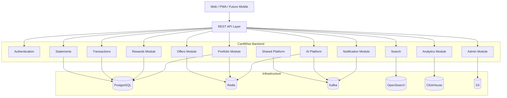

---

## ARC-005.1 Architectural Characteristics

| Characteristic | Decision |
|---------------|----------|
| Deployment | Single deployable unit |
| Internal Communication | Direct module interfaces |
| Cross-domain Communication | Domain events |
| Persistence | Shared PostgreSQL with domain ownership |
| Scalability | Horizontal pods |
| AI | Dedicated AI module |
| Search | OpenSearch |
| Analytics | ClickHouse |
| File Storage | S3 |

---

# ARC-006 Modular Monolith Design

Each business capability exists as an isolated backend module.

```
Application

├── Authentication
├── User
├── Credit Cards
├── Portfolio
├── Rewards
├── Offers
├── Bills
├── Transactions
├── Statements
├── AI
├── Search
├── Analytics
├── Notifications
├── Premium
├── Admin
└── Shared
```

Each module owns:

- Controllers
- Services
- Domain logic
- Validation
- Repository interfaces
- Domain events
- Policies
- DTOs
- Business rules

Modules do **not** access another module's persistence directly.

---

## ARC-006.1 Advantages

| Benefit | Description |
|----------|-------------|
| Easier deployment | Single artifact |
| Lower operational cost | No distributed system overhead |
| Faster development | Shared runtime |
| Easier debugging | Centralized tracing |
| Easier testing | Unified application context |
| Future ready | Microservice extraction possible |

---

## ARC-006.2 Trade-offs

| Trade-off | Mitigation |
|-----------|------------|
| Larger deployment unit | Strong module boundaries |
| Shared runtime | Strict dependency rules |
| Shared database | Domain ownership enforcement |
| Deployment blast radius | Comprehensive automated testing |

---

# ARC-007 Future Microservice Evolution

The modular monolith is intentionally designed so each domain can be extracted into an independent service with minimal refactoring.

## Extraction Candidates

| Phase | Candidate |
|--------|-----------|
| Phase 1 | Authentication |
| Phase 2 | Notifications |
| Phase 3 | AI Platform |
| Phase 4 | Search |
| Phase 5 | Analytics |
| Phase 6 | Rewards |
| Phase 7 | Offers |
| Phase 8 | Portfolio |
| Phase 9 | Transactions |
| Phase 10 | Admin |

---

## Migration Strategy

```text
Modular Monolith

↓

Domain Isolation

↓

Event Contracts

↓

Independent Database

↓

Kafka Integration

↓

Dedicated Deployment

↓

Microservice
```

---

# ARC-008 Hexagonal Architecture

CardWise follows **Ports and Adapters** architecture.

```
                External Systems

        REST
        Kafka
        Redis
        PostgreSQL
        S3
        AI Providers

             ↓

Adapters

↓

Application

↓

Domain

↓

Ports

↓

Infrastructure
```

---

## ARC-008.1 Ports

Ports define contracts for:

- Repositories
- AI Providers
- Payment Providers
- Storage
- Notifications
- Search
- Cache
- Event Bus

---

## ARC-008.2 Adapters

Adapters implement infrastructure details.

Examples:

- Prisma Repository
- Redis Cache
- Kafka Producer
- OpenSearch Client
- AWS S3 Adapter
- Google OAuth Adapter

The domain layer remains infrastructure-agnostic.

---

# ARC-009 Clean Architecture Layers

```text
Presentation Layer

↓

Application Layer

↓

Domain Layer

↓

Infrastructure Layer
```

---

## ARC-009.1 Layer Responsibilities

| Layer | Responsibility |
|--------|----------------|
| Presentation | HTTP requests and responses |
| Application | Use cases and orchestration |
| Domain | Business rules and entities |
| Infrastructure | External systems and persistence |

---

## ARC-009.2 Layer Characteristics

### Presentation Layer

Responsible for:

- REST controllers
- Validation
- Authentication guards
- Response serialization
- Request mapping

---

### Application Layer

Responsible for:

- Use cases
- Transactions
- Event publishing
- Cross-module orchestration
- Business workflows

---

### Domain Layer

Contains:

- Entities
- Value Objects
- Aggregates
- Domain Services
- Policies
- Business Rules
- Domain Events

This layer contains **no infrastructure dependencies**.

---

### Infrastructure Layer

Contains:

- Prisma
- Redis
- Kafka
- OpenSearch
- Storage
- External APIs
- Email
- SMS
- Push Notifications

---

# ARC-010 Dependency Rules

Dependency flow is strictly inward.

```text
Presentation

↓

Application

↓

Domain

↓

Infrastructure
```

Allowed:

- Controller → Service
- Service → Repository Interface
- Infrastructure → Repository Implementation

Forbidden:

- Controller → Database
- Domain → Prisma
- Domain → Redis
- Domain → Kafka
- Module → Another Module Database

---

## Dependency Matrix

| From | To | Allowed |
|-------|----|----------|
| Presentation | Application | ✅ |
| Application | Domain | ✅ |
| Infrastructure | Domain | ✅ |
| Domain | Infrastructure | ❌ |
| Presentation | Infrastructure | ❌ |

---

# ARC-011 Project Structure

```text
apps/

cardwise-api/

src/

modules/

shared/

config/

core/

common/

infrastructure/

events/

ai/

search/

analytics/

notifications/

admin/

main.ts
```

---

## Folder Structure

```text
module/

controllers/

application/

domain/

infrastructure/

dto/

events/

repositories/

validators/

policies/

mappers/
```

Every module follows an identical internal structure to reduce cognitive load, improve discoverability, and simplify onboarding.

---

# ARC-012 Module Organization

Modules are grouped by responsibility.

| Category | Examples |
|-----------|----------|
| Core | Auth, User, Portfolio |
| Financial | Cards, Bills, Rewards |
| AI | Assistant, Recommendations |
| Platform | Notifications, Search |
| Admin | CMS, Admin Console |
| Infrastructure | Storage, Events |

Modules communicate through:

- Public application services
- Domain events
- Shared contracts

Direct database access between modules is prohibited.

---

# ARC-013 Naming Conventions

## Modules

```
PortfolioModule

RewardsModule

NotificationModule
```

---

## Services

```
CreatePortfolioService

CalculateRewardService

SyncStatementService
```

---

## Events

```
CardAddedEvent

RewardCalculatedEvent

StatementImportedEvent
```

---

## Repositories

```
CardRepository

RewardRepository

StatementRepository
```

---

## DTOs

```
CreateCardRequest

CardResponse

UpdateRewardRequest
```

---

## Configuration

```
database.config.ts

cache.config.ts

auth.config.ts
```

---

# ARC-014 Request Lifecycle

```mermaid
sequenceDiagram

participant Client

participant API

participant Validation

participant Auth

participant Service

participant Domain

participant Repository

participant DB

Client->>API: HTTP Request

API->>Validation: Validate Input

Validation->>Auth: Authenticate

Auth->>Service: Authorized Request

Service->>Domain: Execute Business Logic

Domain->>Repository: Data Request

Repository->>DB: Query

DB-->>Repository: Result

Repository-->>Domain

Domain-->>Service

Service-->>API

API-->>Client: JSON Response
```

---

## Request Processing Pipeline

1. Receive request
2. Parse headers
3. Correlation ID assignment
4. Authentication
5. Authorization
6. Validation
7. Business execution
8. Event publication
9. Response mapping
10. Structured logging
11. Metrics collection
12. Response delivery

---

# ARC-015 Response Lifecycle

The backend follows a consistent response pipeline to ensure predictable client behavior and observability.

```text
Business Result

↓

Response Mapper

↓

Metadata

↓

HTTP Status

↓

JSON Serialization

↓

Compression

↓

Client
```

---

## Response Principles

| Principle | Description |
|-----------|-------------|
| Consistent Structure | Uniform success and error envelopes |
| Predictable Status Codes | RFC-compliant HTTP semantics |
| Metadata | Pagination, request IDs, timestamps where applicable |
| Compression | Gzip/Brotli for supported clients |
| Correlation | Request ID propagated in responses |

---

# ARC-016 Error Handling Philosophy

Errors are categorized to improve user experience, diagnostics, and operational response.

## Error Categories

| Category | Description |
|----------|-------------|
| Validation | Invalid request payloads |
| Authentication | Missing or invalid credentials |
| Authorization | Insufficient permissions |
| Business | Domain rule violations |
| Integration | Third-party failures |
| Infrastructure | Database, cache, or messaging failures |
| Unexpected | Unhandled runtime exceptions |

---

## Error Handling Principles

- Fail fast on invalid input.
- Never expose internal implementation details.
- Use standardized error codes.
- Include correlation IDs for support and debugging.
- Log unexpected errors with full context.
- Publish operational alerts for critical failures.
- Ensure idempotent retry behavior where appropriate.

---

# ARC-017 Configuration Strategy

Configuration is centralized, validated at startup, and environment-aware.

## Configuration Domains

| ID | Domain | Purpose |
|----|--------|---------|
| CFG-001 | Application | Runtime behavior |
| CFG-002 | Database | PostgreSQL connectivity |
| CFG-003 | Cache | Redis configuration |
| CFG-004 | Messaging | Kafka brokers and topics |
| CFG-005 | Authentication | JWT, OAuth, providers |
| CFG-006 | Storage | S3-compatible object storage |
| CFG-007 | AI | Model providers and limits |
| CFG-008 | Notifications | Email, SMS, Push providers |
| CFG-009 | Observability | Logging, metrics, tracing |
| CFG-010 | Feature Flags | Controlled feature rollout |

---

## Configuration Principles

- Strongly typed configuration.
- Startup validation.
- Immutable runtime configuration.
- Secret values separated from application configuration.
- Environment-specific overrides.
- Sensible defaults for local development only.

---

# ARC-018 Environment Management

The backend supports multiple isolated deployment environments while maintaining consistent operational behavior.

## Supported Environments

| Environment | Purpose |
|------------|---------|
| Local | Individual development |
| Development | Shared engineering environment |
| QA | Functional and integration testing |
| Staging | Production-like validation |
| Production | Live customer workloads |
| Disaster Recovery | Business continuity and failover |

---

## Environment Strategy

| Area | Strategy |
|------|----------|
| Configuration | Environment-specific configuration bundles |
| Secrets | External secret management with runtime injection |
| Databases | Isolated instances per environment |
| Object Storage | Dedicated buckets and lifecycle policies |
| Kafka | Environment-specific clusters or namespaces |
| Observability | Separate dashboards, alerts, and retention policies |
| Feature Flags | Progressive rollout across environments |

---

## Environment Promotion Flow

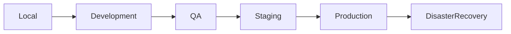

---

## Operational Considerations

| Area | Recommendation |
|------|----------------|
| Deployments | Automated CI/CD with progressive rollout |
| Rollback | Versioned releases with rapid rollback capability |
| Schema Changes | Backward-compatible database migrations |
| Secrets Rotation | Scheduled rotation without application changes |
| Configuration Drift | Automated validation during deployment |
| Auditability | Version-controlled configuration and deployment history |

---

# Part 2 — Complete Module Design

# ARC-019 Complete Module Design

CardWise backend modules are designed around **bounded contexts** aligned with business capabilities.

Each module represents an independently maintainable domain boundary with:

- Dedicated business ownership
- Independent domain rules
- Explicit public interfaces
- Controlled dependencies
- Own validation rules
- Own persistence ownership
- Domain events
- Application services

The module architecture prevents business logic from becoming tightly coupled as the product grows.

---

# ARC-020 Bounded Context Architecture

A bounded context defines the boundary where a specific business capability owns its:

- Data model
- Business rules
- Workflows
- Events
- APIs
- Domain language

CardWise follows Domain Driven Design principles where each bounded context represents a meaningful business area.

---

## ARC-020.1 CardWise Bounded Contexts

| Context ID | Bounded Context | Responsibility |
|------------|----------------|----------------|
| MOD-001 | Identity Context | Authentication, users, sessions |
| MOD-002 | User Profile Context | User preferences and personalization |
| MOD-003 | Card Management Context | Credit card portfolio management |
| MOD-004 | Transaction Context | Transaction tracking and categorization |
| MOD-005 | Statement Context | Statement ingestion and processing |
| MOD-006 | Billing Context | Bills, payments, due dates |
| MOD-007 | Rewards Context | Points, cashback, redemption |
| MOD-008 | Offers Context | Merchant and bank offers |
| MOD-009 | Benefits Context | Travel, lounge, insurance benefits |
| MOD-010 | AI Context | Recommendations and assistant |
| MOD-011 | Search Context | Universal search |
| MOD-012 | Notification Context | User communication |
| MOD-013 | Analytics Context | Product analytics |
| MOD-014 | Premium Context | Subscription capabilities |
| MOD-015 | Referral Context | Referral programs |
| MOD-016 | Gamification Context | User engagement |
| MOD-017 | Admin Context | Internal administration |
| MOD-018 | Integration Context | External systems |

---

# ARC-021 Module Catalog

## Core Business Modules

---

# MOD-001 Identity Module

## Responsibility

Handles authentication and identity management.

## Capabilities

- User registration
- Login
- OAuth authentication
- JWT lifecycle
- Session management
- Account security

## Dependencies

| Dependency | Type |
|------------|------|
| User Module | Internal |
| Notification Module | Internal |
| OAuth Providers | External |

## Events

| Event ID | Event |
|----------|-------|
| EVT-001 | UserRegistered |
| EVT-002 | UserAuthenticated |
| EVT-003 | SessionCreated |

---

# MOD-002 User Profile Module

## Responsibility

Manages user-specific information.

## Capabilities

- Profile management
- Preferences
- User settings
- Personalization data
- Privacy settings

## Events

| Event ID | Event |
|----------|-------|
| EVT-004 | ProfileUpdated |
| EVT-005 | PreferenceChanged |

---

# MOD-003 Card Management Module

## Responsibility

Central domain for credit card ownership and metadata.

## Capabilities

- Add cards
- Remove cards
- Maintain card metadata
- Track card lifecycle
- Card configuration

## Owns

- User-card relationships
- Card metadata
- Card preferences

## Events

| Event ID | Event |
|----------|-------|
| EVT-006 | CardAdded |
| EVT-007 | CardRemoved |
| EVT-008 | CardUpdated |

---

# MOD-004 Transaction Module

## Responsibility

Manages financial activity.

## Capabilities

- Transaction ingestion
- Categorization
- Merchant mapping
- Transaction history
- Spending analysis

## Events

| Event ID | Event |
|----------|-------|
| EVT-009 | TransactionCreated |
| EVT-010 | TransactionCategorized |

---

# MOD-005 Statement Module

## Responsibility

Handles statement lifecycle.

## Capabilities

- Statement upload
- Statement parsing
- Statement history
- Statement reconciliation

## Integrations

- File Storage
- OCR Processing
- AI Extraction

## Events

| Event ID | Event |
|----------|-------|
| EVT-011 | StatementUploaded |
| EVT-012 | StatementProcessed |

---

# MOD-006 Billing Module

## Responsibility

Tracks payment obligations.

## Capabilities

- Bills
- Due dates
- Payment reminders
- Payment status

## Events

| Event ID | Event |
|----------|-------|
| EVT-013 | BillCreated |
| EVT-014 | PaymentDue |

---

# MOD-007 Rewards Module

## Responsibility

Manages reward optimization.

## Capabilities

- Reward tracking
- Points calculation
- Cashback tracking
- Redemption workflows

## Events

| Event ID | Event |
|----------|-------|
| EVT-015 | RewardEarned |
| EVT-016 | RewardRedeemed |

---

# MOD-008 Offers Module

## Responsibility

Manages financial and merchant offers.

## Capabilities

- Bank offers
- Merchant offers
- Eligibility evaluation
- Offer discovery

## Events

| Event ID | Event |
|----------|-------|
| EVT-017 | OfferPublished |
| EVT-018 | OfferExpired |

---

# MOD-009 Benefits Module

## Responsibility

Handles card benefits.

## Supported Domains

- Lounge access
- Travel benefits
- Insurance
- Fuel benefits
- Annual fee waivers

## Events

| Event ID | Event |
|----------|-------|
| EVT-019 | BenefitActivated |
| EVT-020 | BenefitUsed |

---

# MOD-010 AI Module

## Responsibility

Provides intelligence capabilities.

## Capabilities

- Card recommendations
- Spending insights
- AI assistant
- Personalized suggestions
- Financial explanations

## Dependencies

- Search
- User Profile
- Transaction Data
- Vector Search
- LLM Providers

## Events

| Event ID | Event |
|----------|-------|
| EVT-021 | RecommendationGenerated |
| EVT-022 | AIConversationCreated |

---

# MOD-011 Search Module

## Responsibility

Provides global search capabilities.

## Capabilities

- Card search
- Offer search
- Benefit search
- Merchant search

## Infrastructure

- OpenSearch / Elasticsearch

---

# MOD-012 Notification Module

## Responsibility

Communication platform.

## Channels

- Push notifications
- Email
- SMS
- In-app notifications

## Events

| Event ID | Event |
|----------|-------|
| EVT-023 | NotificationRequested |
| EVT-024 | NotificationSent |

---

# MOD-013 Analytics Module

## Responsibility

Business and product analytics.

## Capabilities

- User behavior tracking
- Product metrics
- Reports
- Dashboards

## Infrastructure

- ClickHouse
- Kafka events

---

# MOD-014 Premium Module

## Responsibility

Subscription management.

## Capabilities

- Premium plans
- Feature access
- Subscription status

---

# MOD-015 Referral Module

## Responsibility

Referral lifecycle.

## Capabilities

- Referral links
- Rewards
- Tracking

---

# MOD-016 Gamification Module

## Responsibility

User engagement.

## Capabilities

- Achievements
- Streaks
- Badges
- Challenges

---

# MOD-017 Admin Module

## Responsibility

Internal operations.

## Capabilities

- User management
- Content management
- Card catalog management
- Analytics dashboards

---

# MOD-018 Integration Module

## Responsibility

External ecosystem communication.

## Integrations

- Banks
- Payment providers
- OAuth providers
- Notification providers
- Financial data providers

---

# ARC-022 Supporting Modules

Supporting modules provide reusable platform capabilities.

| Module ID | Module | Responsibility |
|-----------|--------|----------------|
| MOD-019 | Configuration Module | Runtime configuration |
| MOD-020 | Audit Module | Compliance tracking |
| MOD-021 | File Module | Object storage handling |
| MOD-022 | Event Module | Event publishing |
| MOD-023 | Cache Module | Redis abstraction |
| MOD-024 | Security Module | Security utilities |
| MOD-025 | Logging Module | Structured logging |
| MOD-026 | Monitoring Module | Metrics and tracing |

---

# ARC-023 Infrastructure Modules

Infrastructure modules abstract external systems.

| Module ID | Responsibility |
|-----------|----------------|
| MOD-INF-001 | Database Access |
| MOD-INF-002 | Redis Client |
| MOD-INF-003 | Kafka Producer |
| MOD-INF-004 | Kafka Consumer |
| MOD-INF-005 | OpenSearch Client |
| MOD-INF-006 | S3 Storage |
| MOD-INF-007 | Email Provider |
| MOD-INF-008 | SMS Provider |
| MOD-INF-009 | Push Provider |
| MOD-INF-010 | AI Provider Adapter |

---

# ARC-024 Shared Modules

Shared modules contain only cross-cutting concerns.

Allowed:

- Common utilities
- Error definitions
- Request context
- Logging helpers
- Security primitives
- Shared contracts

Not allowed:

- Business rules
- Domain entities
- Feature-specific logic

---

# ARC-025 Module Communication Architecture

Modules communicate through controlled mechanisms.

Priority order:

1. Direct application service calls
2. Domain events
3. Kafka events
4. External APIs

---

## Communication Rules

| Scenario | Communication |
|----------|---------------|
| Synchronous user request | Service interface |
| Independent workflow | Domain event |
| Analytics tracking | Kafka event |
| Notification trigger | Event consumer |
| External system | Integration adapter |

---

# ARC-026 Module Communication Diagram

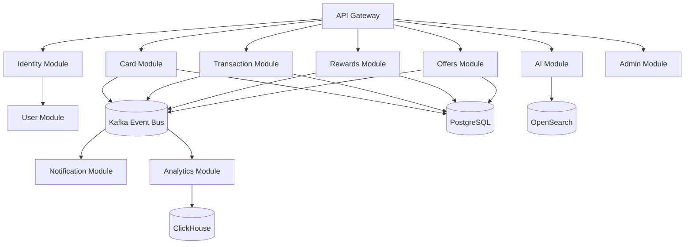

---

# ARC-027 Dependency Matrix

| Module | Depends On |
|--------|------------|
| Identity | User, Notification |
| User | Shared |
| Cards | User, Shared |
| Transactions | Cards, User |
| Statements | File, Transactions |
| Billing | User, Notification |
| Rewards | Transactions, Cards |
| Offers | Cards, User |
| Benefits | Cards |
| AI | User, Transactions, Search |
| Search | Cards, Offers |
| Notifications | Events |
| Analytics | Events |
| Admin | All controlled APIs |

---

# ARC-028 Module Design Rules

## Rule 1 — Single Ownership

Every business concept has exactly one owning module.

Example:

Rewards belong only to Rewards Module.

---

## Rule 2 — No Database Sharing

Modules cannot directly query another module's tables.

---

## Rule 3 — Explicit Contracts

Cross-module interaction requires:

- Interface
- DTO contract
- Event contract

---

## Rule 4 — Events for Loose Coupling

Long-running workflows should use events.

Example:

```
TransactionCreated

↓

Reward Calculation

↓

Notification

↓

Analytics
```

---

## Rule 5 — Infrastructure Isolation

Business modules must never depend directly on:

- Prisma
- Redis
- Kafka
- Cloud providers

They depend on abstractions.

---

# ARC-029 Operational Considerations

| Area | Strategy |
|------|----------|
| Ownership | Each module has clear maintainers |
| Testing | Module-level automated tests |
| Deployment | Single backend artifact |
| Monitoring | Module-level metrics |
| Logging | Module correlation IDs |
| Scaling | Extract high-load modules when required |
| Documentation | Module contracts maintained |

---

# ARC-030 Future Extraction Readiness

Every module should already contain:

- Independent domain logic
- Explicit APIs
- Event contracts
- Repository abstraction
- Configuration isolation
- Observability hooks

This allows migration from:

```
Modular Monolith

↓

Service Boundary

↓

Independent Service

↓

Microservice
```

without rewriting business logic.

---

# Part 3 — API Architecture

---

# ARC-040 API Architecture Overview

CardWise exposes a production-grade REST API that serves:

- Web Application
- Progressive Web App (PWA)
- Future Mobile Applications
- Admin Console
- AI Platform
- Third-party Integrations
- Internal Background Workers

The API is designed around the following principles:

- Resource-oriented
- Predictable
- Versioned
- Stateless
- Secure
- Cache-aware
- Idempotent where applicable
- Observable
- Backward compatible
- OpenAPI-first

---

# API-001 API Design Goals

| Goal | Description |
|------|-------------|
| Consistency | Uniform request and response structures |
| Simplicity | Predictable resource naming |
| Evolvability | Versioning without breaking clients |
| Security | Authentication and authorization by default |
| Performance | Pagination, filtering, compression and caching |
| Reliability | Idempotency and retry-safe APIs |
| Discoverability | Complete OpenAPI documentation |
| Observability | Request IDs, metrics, tracing and audit logging |

---

# ARC-041 REST Architecture

The backend follows REST principles.

Every endpoint represents a business resource rather than an action.

## Example Resource Categories

| Resource | Purpose |
|-----------|---------|
| Authentication | Identity management |
| Users | User profile |
| Portfolio | User credit cards |
| Cards | Card catalog |
| Transactions | Spending history |
| Statements | Statement management |
| Bills | Bill lifecycle |
| Rewards | Reward points |
| Cashback | Cashback history |
| Offers | Merchant & bank offers |
| Travel | Travel benefits |
| Reports | Reports |
| Search | Universal search |
| Notifications | User notifications |
| AI | AI assistant |
| Admin | Administration |

---

# ARC-042 URI Design Standards

## General Rules

- Use nouns instead of verbs.
- Use plural resource names.
- Use kebab-case for URL segments.
- Avoid deeply nested resources where possible.
- Keep URLs stable across versions.
- Prefer query parameters for filtering.
- Resource identifiers are immutable UUIDs.

---

## Standard URI Pattern

```
/api/v1/{resource}

/api/v1/{resource}/{id}

/api/v1/{resource}/{id}/{child-resource}
```

---

## Examples

```
/api/v1/cards

/api/v1/cards/{cardId}

/api/v1/portfolio

/api/v1/rewards

/api/v1/offers

/api/v1/statements

/api/v1/transactions

/api/v1/search
```

---

# ARC-043 HTTP Method Standards

| Method | Purpose | Idempotent |
|----------|----------|------------|
| GET | Read | Yes |
| POST | Create | No* |
| PUT | Replace | Yes |
| PATCH | Partial Update | No |
| DELETE | Delete | Yes |

*POST becomes idempotent when an Idempotency-Key is supplied.

---

## Usage Guidelines

GET

- Retrieve resources
- No side effects

POST

- Create resources
- Trigger workflows

PUT

- Replace an existing resource

PATCH

- Partial updates

DELETE

- Soft delete where applicable
- Hard delete only for internal administrative workflows

---

# ARC-044 Endpoint Naming Standards

## Collection

```
GET /cards

POST /cards
```

---

## Single Resource

```
GET /cards/{id}

PATCH /cards/{id}

DELETE /cards/{id}
```

---

## Child Resources

```
GET /portfolio/{id}/transactions

GET /cards/{id}/offers

GET /cards/{id}/benefits
```

---

## Search Resources

```
GET /search

GET /offers/search

GET /cards/search
```

---

## Action Resources

Actions are avoided where possible.

Preferred

```
POST /statements/import
```

instead of

```
POST /importStatement
```

---

# ARC-045 API Module Catalog

| Module | Base Path |
|---------|-----------|
| Authentication | /auth |
| Users | /users |
| Portfolio | /portfolio |
| Cards | /cards |
| Transactions | /transactions |
| Statements | /statements |
| Bills | /bills |
| Rewards | /rewards |
| Cashback | /cashback |
| Offers | /offers |
| Travel | /travel |
| EMI | /emi |
| Notifications | /notifications |
| Reports | /reports |
| Search | /search |
| Analytics | /analytics |
| AI Assistant | /ai |
| Premium | /premium |
| Referral | /referrals |
| Admin | /admin |

---

# ARC-046 Request Validation

All incoming requests are validated before reaching the application layer.

Validation occurs in the following order:

```text
HTTP Request

↓

Content-Type Validation

↓

Authentication

↓

Authorization

↓

Schema Validation

↓

Business Validation

↓

Application Service
```

---

## Validation Layers

| Layer | Responsibility |
|---------|---------------|
| Transport | Content type, headers |
| Authentication | JWT validation |
| Authorization | Permission checks |
| Schema | Zod validation |
| Business | Domain rules |
| Database | Referential integrity |

---

## Validation Principles

- Reject invalid payloads immediately.
- Return descriptive validation errors.
- Never coerce ambiguous values.
- Unknown fields are rejected unless explicitly allowed.
- Normalize data before business processing.

---

# VAL-001 Input Validation Rules

Every request is validated for:

- Required fields
- Data types
- String length
- Numeric ranges
- UUID format
- Enum values
- Date formats
- Currency codes
- ISO country codes
- Pagination limits
- File size
- MIME type
- Business constraints

---

# ARC-047 Request Headers

## Standard Headers

| Header | Required | Purpose |
|----------|----------|----------|
| Authorization | Yes | Bearer JWT |
| X-Request-ID | Optional | Correlation ID |
| X-Correlation-ID | Optional | Distributed tracing |
| X-Client-Version | Optional | Client compatibility |
| X-Platform | Optional | Web / Android / iOS |
| Accept-Language | Optional | Localization |
| Idempotency-Key | Conditional | Safe retries |

---

# ARC-048 Standard Response Format

Every successful response follows a consistent envelope.

```text
Response

├── success
├── data
├── metadata
└── timestamp
```

---

## Response Metadata

Metadata may include:

- Pagination
- Total records
- Request ID
- Correlation ID
- Processing time
- API version
- Warnings

---

## Success Principles

- Predictable structure
- Stable property names
- Null values only when meaningful
- Empty collections instead of null arrays

---

# ARC-049 Error Response Standard

Errors follow a uniform contract.

```text
Error

├── success
├── error
│   ├── code
│   ├── message
│   ├── details
│   └── fieldErrors
├── requestId
├── timestamp
└── path
```

---

# ERR-001 Error Categories

| Category | HTTP |
|-----------|------|
| Validation | 400 |
| Authentication | 401 |
| Authorization | 403 |
| Resource Not Found | 404 |
| Conflict | 409 |
| Rate Limited | 429 |
| Business Rule | 422 |
| Internal Error | 500 |
| Service Unavailable | 503 |

---

# ERR-002 Error Code Strategy

Business errors receive stable identifiers.

Examples

```
AUTH_INVALID_TOKEN

CARD_NOT_FOUND

STATEMENT_ALREADY_IMPORTED

INVALID_BILL_STATUS

REWARD_RULE_VIOLATION

OFFER_EXPIRED

PREMIUM_REQUIRED

AI_QUOTA_EXCEEDED
```

Error codes are immutable once released.

---

# ARC-050 Pagination Strategy

All collection endpoints support pagination.

---

## Default

| Property | Value |
|-----------|-------|
| Default Page Size | 25 |
| Maximum Page Size | 100 |
| Default Sort | Created Date DESC |

---

## Supported Pagination Modes

### Offset Pagination

Used for:

- Admin Console
- Reports
- Card catalog

---

### Cursor Pagination

Used for:

- Transactions
- Notifications
- Activity timeline
- AI conversations
- Event history

---

# API-002 Pagination Metadata

Returned metadata includes:

- Current page
- Page size
- Total items
- Total pages
- Next cursor
- Previous cursor
- Has next
- Has previous

---

# ARC-051 Filtering Standards

Every collection endpoint supports filtering.

---

## Supported Operators

| Operator | Meaning |
|-----------|----------|
| eq | Equal |
| neq | Not Equal |
| gt | Greater Than |
| gte | Greater Than or Equal |
| lt | Less Than |
| lte | Less Than or Equal |
| in | Multiple values |
| contains | Partial match |
| startsWith | Prefix |
| endsWith | Suffix |
| between | Range |

---

## Common Filters

Transactions

- Date
- Category
- Merchant
- Amount
- Card
- Reward Type

Offers

- Bank
- Merchant
- Category
- Expiry
- Active

Cards

- Network
- Issuer
- Annual Fee
- Lounge Access
- Reward Type

---

# ARC-052 Sorting Standards

All list APIs support sorting.

Syntax

```
sort=field

sort=-field
```

Multiple sorting fields are supported.

Example

```
sort=-createdAt,name
```

---

# ARC-053 Search Standards

Search APIs support:

- Keyword search
- Prefix search
- Fuzzy search
- Semantic search (future)
- Suggestions
- Autocomplete

Search requests never directly query PostgreSQL.

All search traffic is routed through OpenSearch.

---

# ARC-054 API Versioning Strategy

Current version

```
v1
```

URI Versioning

```
/api/v1/
```

Future

```
/api/v2/
```

---

## Versioning Rules

- Never remove fields in the same version.
- New optional fields are allowed.
- Breaking changes require a new version.
- Deprecated endpoints remain available during the migration window.
- Version-specific OpenAPI specifications are generated.

---

# ARC-055 OpenAPI Strategy

Every endpoint is documented.

Documentation includes:

- Authentication
- Authorization
- Request schemas
- Response schemas
- Error schemas
- Examples
- Tags
- Rate limits
- Deprecation notices

---

## API Documentation Sections

| Section | Included |
|----------|-----------|
| Authentication | Yes |
| Parameters | Yes |
| Examples | Yes |
| Errors | Yes |
| Response Schemas | Yes |
| Security | Yes |
| Rate Limits | Yes |
| Version | Yes |

---

# ARC-056 Rate Limiting

Redis-backed distributed rate limiting is used.

---

## Default Limits

| Endpoint Category | Limit |
|-------------------|-------|
| Authentication | 10/min |
| Public APIs | 60/min |
| User APIs | 300/min |
| AI APIs | Configurable quota |
| Admin APIs | Higher authenticated limits |
| Webhooks | Separate limits |

---

## Rate Limiting Keys

Rate limiting is evaluated using:

- User ID
- IP Address
- API Key
- Device ID
- OAuth Client

---

# ARC-057 Idempotency Strategy

Idempotency protects retry-safe operations.

Required for:

- Statement import
- Referral creation
- Subscription purchase
- Payment confirmation
- Bill payment recording
- Export creation

---

## Idempotency Flow

```text
Request

↓

Idempotency Key

↓

Redis Lookup

↓

Existing Result?

↓

Yes → Return Cached Response

↓

No

↓

Execute Transaction

↓

Persist Result

↓

Return Response
```

---

# CACHE-001 Idempotency Retention

| Operation | Retention |
|------------|-----------|
| Payments | 24 Hours |
| Imports | 24 Hours |
| Premium Purchase | 24 Hours |
| Referrals | 7 Days |

---

# ARC-058 Webhook Architecture

CardWise both consumes and exposes webhooks.

---

## Incoming Webhooks

Examples

- Payment providers
- Banking partners
- OAuth providers
- AI providers
- Notification providers

---

## Outgoing Webhooks

Future enterprise integrations include:

- Spending events
- Portfolio updates
- Rewards updates
- Bill reminders
- AI insights

---

## Webhook Security

Every webhook implements:

- HTTPS only
- Signature verification
- Timestamp validation
- Replay protection
- Idempotency
- Retry support
- Dead Letter Queue handling

---

# ARC-059 API Security Headers

Responses include:

- Strict-Transport-Security
- Content-Security-Policy
- X-Content-Type-Options
- X-Frame-Options
- Referrer-Policy
- Permissions-Policy

---

# ARC-060 API Lifecycle

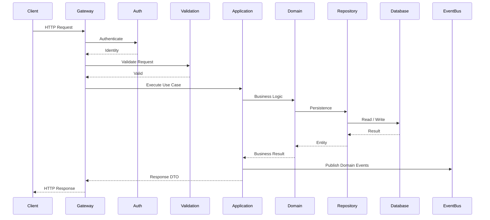

---

# ARC-061 API Design Best Practices

| Practice | Rationale |
|----------|-----------|
| Resource-oriented URLs | Improves discoverability |
| Stable error codes | Simplifies client integration |
| OpenAPI-first development | Keeps documentation synchronized |
| Uniform response envelopes | Reduces client-side complexity |
| Cursor pagination for large datasets | Improves performance and consistency |
| Idempotent write operations | Enables safe retries |
| Strict validation | Prevents invalid state |
| Correlation IDs | Improves observability |
| Backward-compatible evolution | Minimizes client disruption |

---

# ARC-062 Risks & Trade-offs

| Decision | Benefit | Trade-off | Mitigation |
|----------|---------|-----------|------------|
| REST-first architecture | Simplicity and ecosystem support | Multiple round trips for complex views | Backend aggregation endpoints where appropriate |
| URI versioning | Clear evolution path | Additional maintenance | Automated version lifecycle management |
| Cursor pagination | Better scalability | More complex client implementation | SDK helpers and documentation |
| Uniform response envelope | Consistent client experience | Slight payload overhead | Negligible compared to operational benefits |
| Redis-backed rate limiting | Distributed enforcement | Additional infrastructure dependency | Graceful degradation and health monitoring |

---


# Part 4 — Authentication & Authorization

---

# ARC-063 Authentication & Authorization Overview

Authentication and Authorization form the security foundation of CardWise.

The system is designed around:

- Zero Trust principles
- Stateless authentication
- Token-based authorization
- Least privilege access
- Fine-grained permissions
- OAuth integrations
- Multi-device support
- Session observability
- Future MFA readiness

Authentication verifies **who the user is**.

Authorization determines **what the authenticated user can do**.

---

# AUTH-001 Authentication Goals

| Goal | Description |
|------|-------------|
| Secure Identity | Verify user identity using trusted providers |
| Stateless | Eliminate server-side session dependency |
| Multi-Platform | Support Web, PWA and future Mobile Apps |
| Scalable | Horizontal scaling without sticky sessions |
| Secure Token Lifecycle | Short-lived access tokens with refresh tokens |
| Extensible | Ready for MFA, Passkeys and Enterprise SSO |
| Observable | Audit every authentication event |

---

# ARC-064 Authentication Architecture

The backend supports multiple authentication methods.

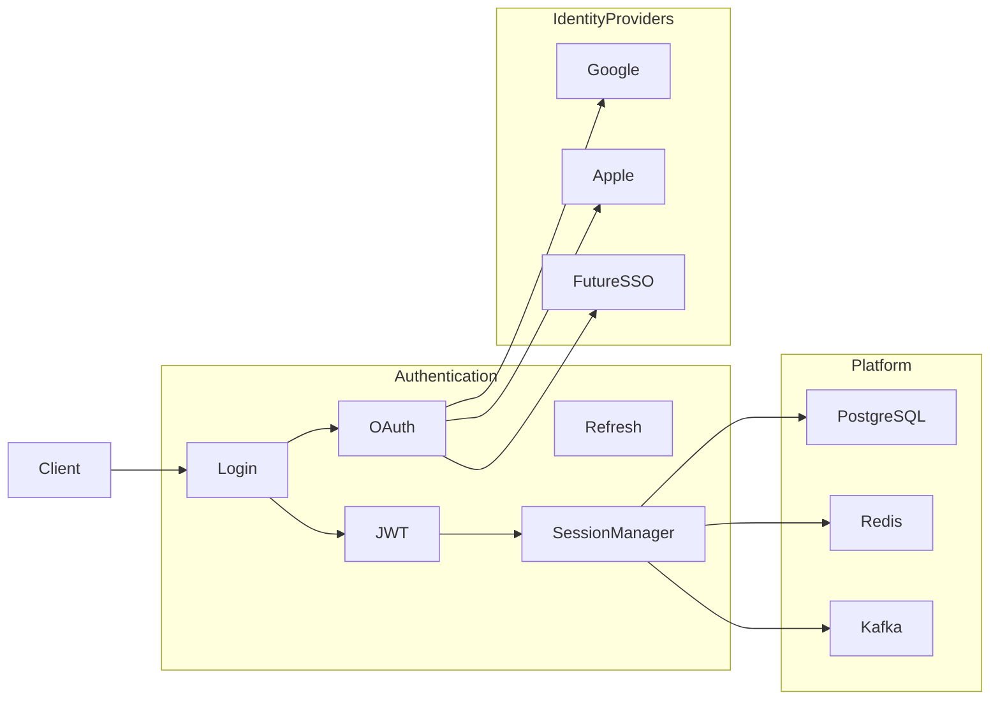

---

# AUTH-002 Supported Authentication Methods

| Method | Status |
|---------|--------|
| Email + Password | Supported |
| Google Sign-In | Supported |
| Apple Sign-In | Supported |
| OAuth 2.0 | Supported |
| Refresh Tokens | Supported |
| Magic Link | Future |
| Passkeys | Future |
| Multi-Factor Authentication | Future |
| Enterprise SSO | Future |

---

# ARC-065 Login Flows

Supported login methods:

| Login Type | Description |
|------------|-------------|
| Email & Password | Primary authentication method |
| Google OAuth | Social login |
| Apple Sign-In | iOS ecosystem support |
| Existing Session Refresh | Silent login |
| Admin Login | Separate permission validation |

Every login results in:

- Identity verification
- Device registration
- Session creation
- Audit logging
- Token generation
- Security event publication

---

# AUTH-003 Identity Model

Each authenticated identity consists of:

- User
- Authentication Provider
- Provider Identifier
- Email
- Verification Status
- Linked Providers
- Active Sessions
- Devices
- Security Metadata

Identity providers remain decoupled from user business data.

---

# ARC-066 JWT Architecture

JWT is used for stateless API authentication.

---

## JWT Components

| Component | Purpose |
|------------|---------|
| Header | Signing algorithm |
| Payload | Claims |
| Signature | Integrity verification |

---

## Standard Claims

| Claim | Purpose |
|--------|----------|
| sub | User identifier |
| iss | Token issuer |
| aud | Audience |
| exp | Expiration |
| iat | Issued at |
| nbf | Not before |
| jti | Token identifier |
| sid | Session identifier |

---

## Custom Claims

| Claim | Description |
|--------|-------------|
| role | User role |
| permissions | Effective permissions |
| premium | Subscription status |
| locale | Preferred language |
| timezone | User timezone |
| deviceId | Device identifier |

Only non-sensitive authorization metadata is included in JWT claims.

---

# AUTH-004 Access Token Strategy

| Property | Strategy |
|-----------|----------|
| Lifetime | Short-lived |
| Storage | Secure client storage |
| Revocable | Yes |
| Rotation | Automatic via refresh token |
| Signing | Asymmetric signing preferred |
| Audience | Platform-specific |

---

# ARC-067 Refresh Token Strategy

Refresh tokens enable secure session continuity.

---

## Characteristics

- Long-lived
- Rotated after every successful refresh
- Revocable
- Device-bound
- Session-bound
- Stored securely
- Never exposed in logs

---

## Refresh Workflow

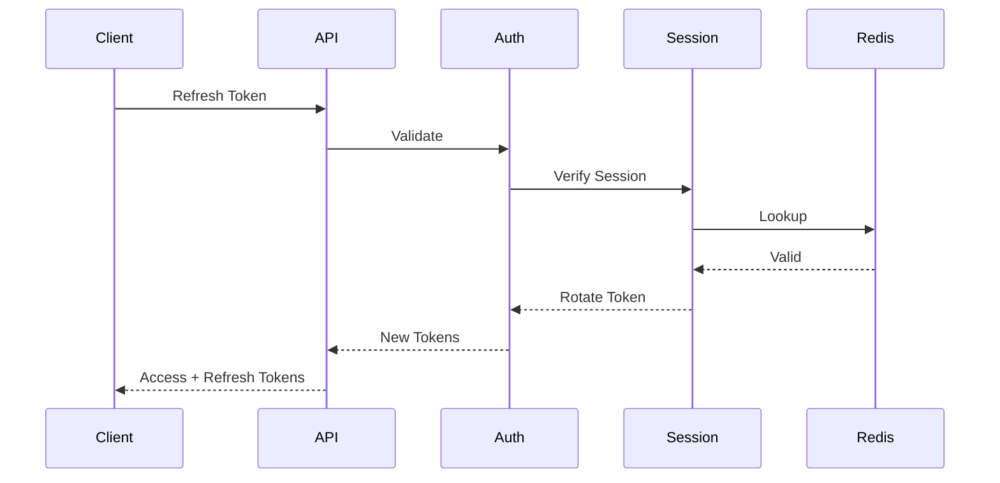

---

# AUTH-005 Token Lifecycle

```text
Login

↓

Access Token Issued

↓

API Usage

↓

Expiration

↓

Refresh Request

↓

Token Rotation

↓

Continue Session

↓

Logout

↓

Revocation
```

---

## Token Rules

| Rule | Description |
|------|-------------|
| Access tokens are short-lived | Limits exposure window |
| Refresh tokens rotate | Prevents replay attacks |
| Token reuse detection | Identifies compromised sessions |
| Revocation supported | Enables forced logout |
| Device binding | Limits token misuse |

---

# ARC-068 OAuth Architecture

CardWise uses OAuth 2.0/OpenID Connect for external identity providers.

---

## Supported Providers

| Provider | Purpose |
|----------|---------|
| Google | Consumer login |
| Apple | Apple ecosystem |
| Enterprise IdP | Future SSO |

---

## OAuth Responsibilities

- Authorization Code Flow
- Token exchange
- Identity verification
- Account linking
- User provisioning
- Provider synchronization

OAuth provider access tokens are never used for application authorization.

---

# AUTH-006 Google Sign-In

Workflow:

1. User initiates Google Sign-In.
2. Google authenticates the user.
3. Backend validates the identity token.
4. Existing account is linked or a new account is created.
5. CardWise issues its own JWT and refresh token.
6. Session is established.

Google tokens are not stored beyond what is operationally necessary.

---

# AUTH-007 Apple Sign-In

Workflow mirrors Google Sign-In while respecting Apple-specific identity behaviors.

Special considerations:

- Private relay email addresses
- Stable provider identifiers
- Account linking
- Email updates

Application authorization remains provider-independent.

---

# ARC-069 Session Management

Although authentication is stateless, sessions are tracked for security and operational purposes.

---

## Session Attributes

| Attribute | Purpose |
|------------|---------|
| Session ID | Unique identifier |
| Device ID | Device association |
| Platform | Web / PWA / Mobile |
| IP Address | Security monitoring |
| User Agent | Device fingerprinting |
| Login Time | Audit |
| Last Activity | Session tracking |
| Refresh Token Version | Rotation validation |

---

## Session Features

- Multiple concurrent devices
- Individual session revocation
- Global logout
- Device history
- Security notifications
- Future trusted devices

---

# AUTH-008 Device Management

Each device maintains:

- Device identifier
- Browser information
- Platform
- Last login
- Last activity
- Session status
- Trust level

Future enhancements:

- Device naming
- Device approval
- Device risk scoring

---

# ARC-070 Authorization Model

Authorization follows **Role-Based Access Control (RBAC)** enhanced with fine-grained permissions.

```text
User

↓

Role

↓

Permission Set

↓

Policy Evaluation

↓

Resource Access
```

---

# AUTH-009 Roles

Initial system roles:

| Role | Purpose |
|------|----------|
| User | Regular customer |
| Premium User | Premium subscriber |
| Support | Customer support |
| Operations | Internal operations |
| Admin | Administrative access |
| Super Admin | Full platform management |
| System | Internal service identity |

Roles are centrally managed and versioned.

---

# AUTH-010 Permission Categories

| Category | Examples |
|-----------|----------|
| Portfolio | Read, Create, Update, Delete |
| Cards | Read |
| Rewards | Read |
| Statements | Import, Read |
| Reports | Generate, Export |
| Notifications | Manage preferences |
| Admin | Manage users |
| Analytics | Read dashboards |
| AI | Use assistant, Generate insights |
| Premium | Access premium features |

---

# AUTH-011 Permission Evaluation

Authorization checks evaluate:

- Authenticated identity
- Assigned roles
- Explicit permissions
- Resource ownership
- Subscription status
- Feature flags
- Contextual policies

Permission evaluation occurs before business execution.

---

# ARC-071 Resource Ownership

Many operations require ownership verification.

Examples:

- Portfolio
- Statements
- Bills
- Rewards
- Reports
- Transactions

Users cannot access resources owned by another user unless explicitly authorized.

---

# AUTH-012 Policy-Based Authorization

Complex authorization is implemented using policies.

Example policy dimensions:

- Resource ownership
- Subscription tier
- Time constraints
- Administrative scope
- Feature availability

Policies are reusable across modules.

---

# ARC-072 Security Middleware Pipeline

```text
Incoming Request

↓

Request ID

↓

Rate Limiting

↓

Authentication

↓

Session Validation

↓

Permission Evaluation

↓

Policy Evaluation

↓

Input Validation

↓

Business Execution
```

Each middleware has a single responsibility.

---

# AUTH-013 Route Protection

Endpoints are classified into access levels.

| Level | Authentication | Authorization |
|---------|----------------|---------------|
| Public | No | No |
| Authenticated | Yes | Basic |
| Premium | Yes | Subscription |
| Admin | Yes | Role |
| Internal | Service Identity | Strict Policy |

---

# AUTH-014 Account Recovery

Supported recovery mechanisms:

- Password reset
- Email verification
- Refresh token revocation
- Session invalidation

Future enhancements:

- Recovery codes
- Passkey recovery
- Trusted device recovery

---

# AUTH-015 Logout Strategy

Logout performs:

- Refresh token revocation
- Session invalidation
- Audit event publication
- Security logging
- Cache invalidation

Access tokens naturally expire.

Revoked refresh tokens cannot generate new access tokens.

---

# AUTH-016 Security Events

Every significant authentication action publishes a domain event.

Examples:

- EVT-USER-REGISTERED
- EVT-LOGIN-SUCCESS
- EVT-LOGIN-FAILED
- EVT-LOGOUT
- EVT-PASSWORD-RESET
- EVT-EMAIL-VERIFIED
- EVT-SESSION-REVOKED
- EVT-TOKEN-REFRESHED

These events feed:

- Audit
- Analytics
- Notifications
- Security monitoring

---

# AUTH-017 Authentication Observability

Authentication metrics include:

- Login success rate
- Login failure rate
- Refresh token usage
- Active sessions
- Token revocations
- Failed OAuth callbacks
- Session duration
- Authentication latency

Logs include correlation IDs while excluding sensitive credentials and tokens.

---

# AUTH-018 Security Best Practices

| Practice | Rationale |
|----------|-----------|
| Short-lived access tokens | Reduces exposure window |
| Refresh token rotation | Mitigates replay attacks |
| Secure password hashing | Protects stored credentials |
| HTTPS-only transport | Prevents interception |
| Token revocation | Supports rapid incident response |
| Device-aware sessions | Improves account security |
| Principle of least privilege | Minimizes unauthorized access |
| Immutable audit logs | Enables forensic investigations |
| Centralized authorization | Ensures consistent policy enforcement |

---

# AUTH-019 Risks & Trade-offs

| Decision | Benefit | Trade-off | Mitigation |
|----------|---------|-----------|------------|
| Stateless JWT authentication | Horizontal scalability | Token revocation complexity | Refresh token tracking and revocation store |
| RBAC with policy layer | Flexible authorization | Higher implementation complexity | Centralized authorization framework |
| Multiple OAuth providers | Better user experience | Provider-specific behaviors | Provider abstraction layer |
| Multi-device sessions | Improved usability | Larger session management surface | Device tracking and session revocation |
| Refresh token rotation | Stronger security | Additional storage and validation | Redis-backed session management |

---

# Part 5 — Business Layer, Application Layer, Domain Layer & Infrastructure Layer

---

# ARC-073 Backend Layered Architecture

CardWise follows **Clean Architecture** combined with **Hexagonal Architecture** and **Domain-Driven Design (DDD)**.

Every request traverses multiple well-defined layers.

```text
Presentation Layer

↓

Application Layer

↓

Domain Layer

↓

Repository Interfaces (Ports)

↓

Infrastructure Layer (Adapters)

↓

External Systems
```

The architecture ensures:

- Business logic is independent of frameworks.
- Infrastructure remains replaceable.
- Domain models remain pure.
- Testing is simplified.
- Modules remain independently evolvable.

---

# ARC-074 Layer Responsibilities

| Layer | Responsibility | Framework Dependent | Contains Business Logic |
|--------|----------------|---------------------|--------------------------|
| Presentation | HTTP handling | Yes | No |
| Application | Use cases & orchestration | Minimal | Limited |
| Domain | Core business rules | No | Yes |
| Infrastructure | Database & external systems | Yes | No |

---

# ARC-075 Presentation Layer

The Presentation Layer is the entry point into the backend.

Responsibilities include:

- HTTP routing
- Request parsing
- Authentication
- Authorization
- Request validation
- Response serialization
- API versioning
- Correlation ID propagation
- Error mapping

The Presentation Layer **must never contain business logic**.

---

## Presentation Layer Components

| Component | Responsibility |
|------------|---------------|
| Controllers | Receive requests |
| DTOs | Transport contracts |
| Validation | Schema validation |
| Guards | Authentication |
| Interceptors | Logging & metrics |
| Filters | Error handling |
| Middleware | Request preprocessing |

---

# ARC-076 Application Layer

The Application Layer orchestrates business workflows.

It coordinates multiple domain services while remaining independent of infrastructure implementation.

Responsibilities include:

- Executing use cases
- Coordinating repositories
- Publishing events
- Managing transactions
- Calling external adapters
- Permission-aware orchestration
- Cross-module workflows

---

## Application Layer Characteristics

| Property | Value |
|-----------|-------|
| Business orchestration | Yes |
| Domain rules | Delegated to Domain Layer |
| Database access | Through repository interfaces |
| Event publishing | Yes |
| Transactions | Managed here |
| External systems | Via ports |

---

## Example Application Use Cases

| Module | Example Use Cases |
|----------|------------------|
| Portfolio | Add Card, Remove Card |
| Rewards | Calculate Rewards |
| Statements | Import Statement |
| Bills | Record Payment |
| Offers | Activate Offer |
| Premium | Upgrade Subscription |
| AI | Generate Recommendation |

---

# ARC-077 Domain Layer

The Domain Layer contains the heart of CardWise.

It encapsulates all business knowledge.

Nothing inside the Domain Layer depends on:

- NestJS
- Prisma
- PostgreSQL
- Redis
- Kafka
- HTTP
- REST
- OpenSearch

---

## Domain Components

| Component | Responsibility |
|------------|---------------|
| Entities | Business objects |
| Value Objects | Immutable concepts |
| Aggregates | Consistency boundaries |
| Domain Services | Complex business logic |
| Domain Events | Business occurrences |
| Policies | Authorization & rules |
| Specifications | Validation rules |

---

## Domain Layer Principles

- Framework independent
- Persistence ignorant
- Infrastructure agnostic
- Highly testable
- Rich domain model
- Explicit invariants

---

# ARC-078 Domain Entities

Representative domain entities include:

| Entity | Module |
|----------|---------|
| User | Authentication |
| Portfolio | Portfolio |
| CreditCard | Cards |
| Transaction | Transactions |
| Statement | Statements |
| RewardBalance | Rewards |
| Cashback | Cashback |
| Offer | Offers |
| Bill | Bills |
| Notification | Notifications |
| Subscription | Premium |
| Referral | Referral |
| Achievement | Gamification |

Each entity owns its invariants and lifecycle rules.

---

# ARC-079 Value Objects

Value Objects model immutable business concepts.

Examples include:

- Currency
- Money
- RewardPoints
- EmailAddress
- PhoneNumber
- CardNumber (masked representation)
- BillingCycle
- DateRange
- Percentage
- CreditLimit

Value Objects are compared by value rather than identity.

---

# ARC-080 Aggregate Design

Aggregates enforce consistency boundaries.

Representative aggregates:

| Aggregate Root | Owns |
|----------------|------|
| Portfolio | User Cards |
| Statement | Transactions |
| RewardAccount | Reward History |
| Bill | Payments |
| User | Preferences |
| Subscription | Billing State |

Cross-aggregate consistency is achieved using domain events rather than distributed transactions.

---

# ARC-081 Domain Services

Domain Services encapsulate business logic that does not naturally belong to a single entity.

Examples:

- Reward Calculation
- Cashback Optimization
- Statement Reconciliation
- Annual Fee Waiver Evaluation
- Card Recommendation
- Offer Eligibility
- Spending Categorization
- EMI Eligibility
- Travel Benefit Evaluation

---

# ARC-082 Application Workflow

```mermaid
flowchart LR

Controller

↓

UseCase

↓

DomainService

↓

RepositoryInterface

↓

RepositoryImplementation

↓

PostgreSQL

UseCase --> EventPublisher

EventPublisher --> Kafka
```

---

# ARC-083 Infrastructure Layer

Infrastructure contains every technology-specific implementation.

Responsibilities include:

- Database access
- Cache
- Messaging
- Search
- Object storage
- Email
- SMS
- OAuth
- External APIs
- AI providers

The infrastructure layer depends on interfaces defined by the Domain/Application layers.

---

## Infrastructure Components

| Component | Purpose |
|------------|---------|
| Prisma | Persistence |
| Redis | Cache |
| Kafka | Messaging |
| OpenSearch | Search |
| S3 | Object Storage |
| SMTP | Email |
| Firebase | Push Notifications |
| OAuth Providers | Authentication |
| AI Providers | LLM Integration |

---

# ARC-084 Repository Pattern

Repositories abstract persistence from the Domain Layer.

The Domain Layer only depends on repository interfaces (ports).

Infrastructure provides concrete implementations.

---

## Repository Responsibilities

- Entity retrieval
- Persistence
- Pagination
- Optimized querying
- Transaction participation
- Concurrency handling

Repositories do **not** contain business logic.

---

## Repository Guidelines

| Rule | Description |
|------|-------------|
| One repository per aggregate root | Preferred |
| No cross-domain queries | Use application services |
| Return domain models | Avoid leaking persistence models |
| Hide ORM details | Preserve abstraction |
| Optimize internally | Transparent to callers |

---

# ARC-085 Prisma Integration

Prisma serves as the ORM and data access layer.

Responsibilities:

- Schema mapping
- Type-safe queries
- Transactions
- Migrations
- Connection pooling
- Query optimization

Prisma is isolated within the Infrastructure Layer and is never referenced directly from the Domain Layer.

---

## Prisma Design Principles

| Principle | Description |
|------------|-------------|
| Type Safety | Compile-time guarantees |
| Explicit Transactions | Controlled write consistency |
| Repository Isolation | ORM hidden from business logic |
| Migration Discipline | Version-controlled schema evolution |
| Query Optimization | Prevent N+1 patterns |

---

# ARC-086 Caching Strategy

Redis is used to reduce latency and database load.

Caching is transparent to the business layer.

---

## CACHE-002 Cache Categories

| Category | Examples |
|-----------|----------|
| Reference Data | Card catalog, issuers |
| User Data | Preferences |
| Session Data | Authentication sessions |
| Frequently Read | Offers |
| Computed Results | AI recommendations |
| Search Metadata | Popular queries |
| Rate Limits | API quotas |
| Idempotency | Request keys |

---

## CACHE-003 Cache Policies

| Policy | Usage |
|----------|------|
| Cache-Aside | Default strategy |
| Read-Through | Future optimization |
| Write-Through | Rarely used |
| Write-Behind | Analytics workloads |
| TTL-Based | Ephemeral data |
| Explicit Invalidation | Critical consistency |

---

# ARC-087 Cache Invalidation

Invalidation occurs when:

- Card updated
- Offer expires
- Reward recalculated
- Statement imported
- Profile updated
- Subscription changes
- Notification preferences change

Event-driven invalidation ensures cache consistency.

---

# ARC-088 Transaction Management

Transactional consistency is maintained within aggregate boundaries.

---

## Transaction Rules

| Rule | Description |
|------|-------------|
| Short-lived transactions | Minimize lock duration |
| One aggregate per transaction | Preferred |
| Event publication after commit | Prevent phantom events |
| Retry transient failures | Supported |
| Avoid nested transactions | Simplifies recovery |

---

## Transaction Lifecycle

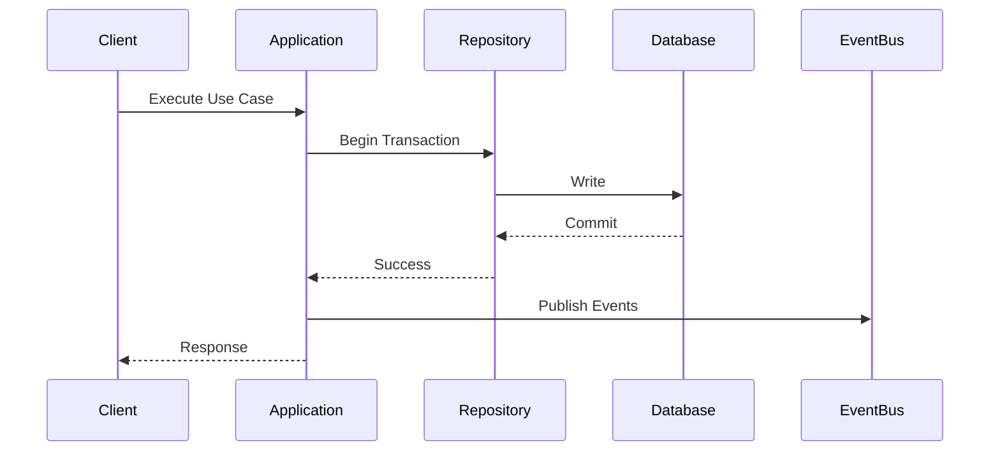

---

# ARC-089 Domain Event Publishing

Every important business occurrence becomes a Domain Event.

Events are immutable.

Events are published only after a successful transaction commit.

---

## Event Categories

| Category | Examples |
|-----------|----------|
| Authentication | User Registered |
| Portfolio | Card Added |
| Statements | Statement Imported |
| Rewards | Reward Calculated |
| Cashback | Cashback Earned |
| Offers | Offer Activated |
| Premium | Subscription Activated |
| AI | Recommendation Generated |

---

# EVT-001 Event Publishing Rules

| Rule | Description |
|------|-------------|
| Publish after commit | Prevent inconsistent consumers |
| Immutable payloads | Preserve event history |
| Version events | Support evolution |
| Include metadata | Correlation IDs, timestamps |
| Idempotent consumers | Safe retries |

---

# ARC-090 Kafka Integration

Kafka provides asynchronous communication between modules.

Primary use cases:

- Notifications
- Search indexing
- Analytics ingestion
- AI processing
- Audit logging
- Cache invalidation
- Background processing

---

## Kafka Topic Categories

| Topic Category | Purpose |
|----------------|---------|
| Authentication | Identity events |
| Portfolio | Card lifecycle |
| Transactions | Spending events |
| Statements | Import events |
| Rewards | Reward updates |
| Offers | Offer changes |
| Analytics | Event stream |
| Notifications | Delivery requests |
| AI | Recommendation events |
| Audit | Immutable audit trail |

---

## Kafka Design Principles

- At-least-once delivery
- Ordered within partitions
- Consumer groups
- Dead Letter Queues
- Retry topics
- Event versioning
- Schema evolution support

---

# ARC-091 Background Jobs

Background jobs execute long-running or asynchronous tasks without blocking user requests.

---

## JOB-001 Job Categories

| Category | Examples |
|-----------|----------|
| Scheduled | Bill reminders |
| Event-Driven | Reward recalculation |
| Batch | Analytics aggregation |
| Maintenance | Cleanup |
| AI | Recommendation generation |
| Search | Index synchronization |
| Import | Statement processing |
| Export | Report generation |

---

## JOB-002 Job Execution Principles

- Idempotent execution
- Retry with exponential backoff
- Dead Letter Queue support
- Observability
- Progress tracking
- Cancellation where applicable
- Configurable concurrency

---

# ARC-092 Job Scheduling

Recurring jobs include:

- Daily bill reminders
- Offer expiration checks
- Reward expiry processing
- Cache cleanup
- Analytics rollups
- Search optimization
- AI embedding refresh
- Subscription validation

Scheduling remains isolated from business rules through dedicated application services.

---

# ARC-093 Layer Interaction Diagram

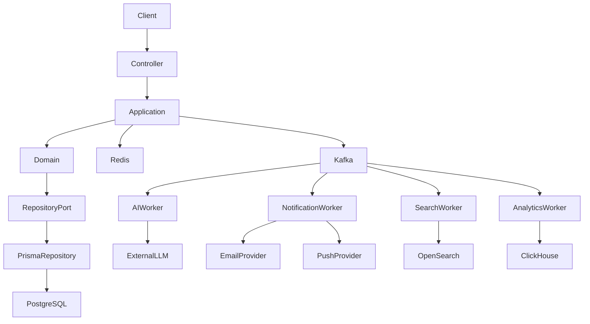

---

# ARC-094 Operational Considerations

| Area | Recommendation |
|------|----------------|
| Business Logic | Keep exclusively in the Domain Layer |
| Transactions | Restrict to aggregate boundaries |
| Repository Design | Interface-driven and persistence-agnostic |
| Event Publishing | Publish only after successful commits |
| Cache | Use event-driven invalidation |
| Kafka | Separate transactional and analytical workloads |
| Background Jobs | Design for idempotency and observability |
| Layer Isolation | Prevent infrastructure leakage into the domain |
| Testing | Unit-test domain logic independently of infrastructure |

---

# ARC-095 Risks & Trade-offs

| Decision | Benefit | Trade-off | Mitigation |
|----------|---------|-----------|------------|
| Rich domain model | High maintainability | Increased design effort | Strong bounded contexts |
| Repository abstraction | Infrastructure independence | Additional indirection | Consistent interface design |
| Event-driven integration | Loose coupling | Eventual consistency | Idempotent consumers and retries |
| Redis caching | Lower latency | Cache invalidation complexity | Event-based invalidation strategy |
| Kafka for async workloads | Scalability | Operational overhead | Centralized monitoring and DLQs |
| Aggregate transactions | Strong consistency | Cross-aggregate coordination | Domain events and sagas where necessary |

---


# Part 6 — AI Architecture

---

# ARC-096 AI Architecture Overview

Artificial Intelligence is a first-class platform capability within CardWise.

Rather than existing as an isolated feature, AI operates as an intelligent layer across every major business domain including:

- Credit Card Recommendations
- Rewards Optimization
- Cashback Optimization
- Offer Recommendations
- Travel Planning
- Spending Insights
- Bill Intelligence
- Portfolio Analysis
- Financial Assistant
- Universal Search
- Fraud Signal Readiness
- Personalized Notifications

The AI Platform is designed to be:

- Provider agnostic
- Model agnostic
- Prompt driven
- Observable
- Cost aware
- Secure
- Extensible
- RAG ready
- Event driven

---

# AI-001 AI Design Principles

| Principle | Description |
|------------|-------------|
| AI as Platform | Shared capability across all modules |
| Human in Control | AI recommendations are advisory unless explicitly automated |
| Explainability | Recommendations should include rationale where feasible |
| Provider Independence | LLM vendors are abstracted behind adapters |
| Prompt Versioning | Prompts are managed as versioned assets |
| Cost Awareness | Optimize token usage and latency |
| Privacy by Design | Sensitive user data is minimized and protected |
| Observability | Track quality, latency, usage, and failures |

---

# ARC-097 High-Level AI Platform

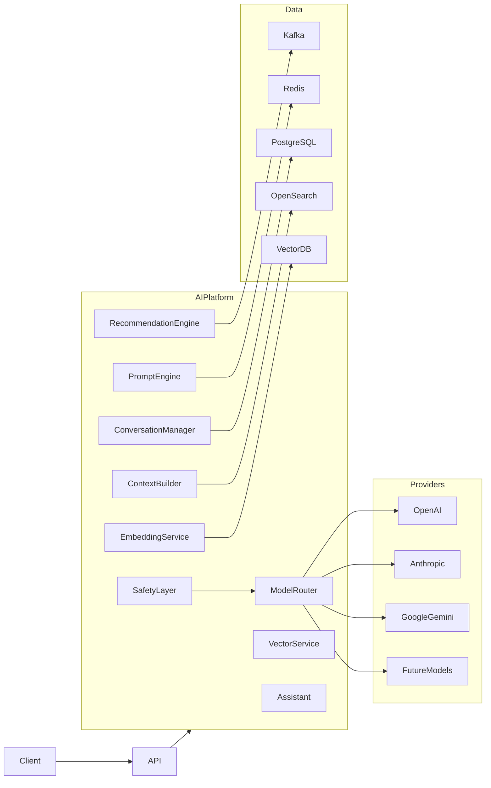

---

# ARC-098 AI Module Organization

| Module | Responsibility |
|----------|---------------|
| AI Assistant | Conversational interface |
| Recommendation Engine | Personalized recommendations |
| Prompt Engine | Prompt templates & versioning |
| Context Builder | Assemble contextual information |
| Conversation Manager | Conversation history |
| Model Router | Provider selection |
| Embedding Service | Embedding generation |
| Vector Search | Semantic retrieval |
| AI Analytics | AI usage metrics |
| Safety Layer | Validation and moderation |

---

# ARC-099 AI Assistant

The AI Assistant provides conversational financial intelligence.

Capabilities include:

- Credit card questions
- Spending analysis
- Reward optimization
- Offer explanations
- Travel recommendations
- Bill guidance
- Card comparisons
- Financial insights
- Product education
- Goal planning

The assistant never directly performs irreversible financial actions without explicit user confirmation.

---

## AI Assistant Characteristics

| Property | Value |
|-----------|-------|
| Stateless Requests | Supported |
| Persistent Conversations | Supported |
| Multi-turn Context | Supported |
| Streaming Responses | Future |
| Tool Calling | Supported |
| Function Execution | Supported |
| Context Awareness | Supported |

---

# ARC-100 Recommendation Engine

The Recommendation Engine generates personalized recommendations using business rules, analytics, and AI models.

---

## Recommendation Categories

| Category | Examples |
|-----------|----------|
| Card Usage | Best card for a purchase |
| Rewards | Maximize reward points |
| Cashback | Highest cashback opportunity |
| Offers | Eligible merchant offers |
| Travel | Lounge & travel benefit suggestions |
| Bills | Payment timing recommendations |
| Annual Fee | Waiver optimization |
| Portfolio | Card retention or closure suggestions |
| Premium | Upgrade recommendations |
| Spending | Budget and savings insights |

---

## Recommendation Inputs

- User portfolio
- Transaction history
- Statements
- Rewards
- Merchant offers
- Travel benefits
- Spending patterns
- User preferences
- Premium status
- Historical interactions

---

# AI-002 Recommendation Pipeline

```text
Business Events

↓

Feature Aggregation

↓

Context Builder

↓

Rule Engine

↓

AI Ranking

↓

Recommendation Generation

↓

Explanation

↓

Storage

↓

Client
```

---

# ARC-101 Hybrid Decision Engine

Recommendations combine deterministic rules with AI reasoning.

```text
Business Rules

+

Analytics

+

Machine Intelligence

=

Final Recommendation
```

Business rules always take precedence when regulatory or contractual constraints exist.

---

# ARC-102 Prompt Management

Prompt engineering is managed centrally.

Prompts are treated as version-controlled assets rather than embedded application logic.

---

## Prompt Components

| Component | Purpose |
|------------|---------|
| System Prompt | Defines AI behavior |
| Context Prompt | User and domain context |
| Task Prompt | Requested operation |
| Guardrails | Safety constraints |
| Output Schema | Structured responses |

---

## Prompt Versioning

Each prompt includes:

- Prompt ID
- Version
- Owner
- Change history
- Rollback support
- Evaluation metrics

Prompts are independently deployable without backend code changes.

---

# AI-003 Prompt Lifecycle

```text
Prompt Authoring

↓

Review

↓

Approval

↓

Versioning

↓

Deployment

↓

Monitoring

↓

Optimization
```

---

# ARC-103 Context Builder

The Context Builder assembles relevant information before invoking an LLM.

Potential context sources include:

- Portfolio
- Transactions
- Statements
- Rewards
- Offers
- Bills
- User preferences
- Travel benefits
- Calendar events
- Premium features

Only the minimum required context is provided to reduce cost and protect privacy.

---

# ARC-104 Tool Calling

LLMs interact with business capabilities through controlled tools.

Examples:

- Search portfolio
- Retrieve offers
- Compare cards
- Calculate rewards
- Generate reports
- Retrieve bills
- Analyze spending
- Lookup travel benefits

LLMs never access databases directly.

---

# AI-004 Tool Execution Flow

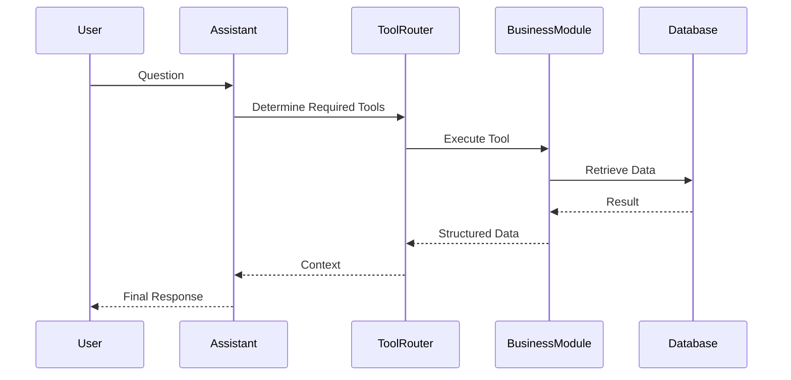

---

# ARC-105 RAG Readiness

The AI Platform is designed to support Retrieval-Augmented Generation (RAG).

Future knowledge sources may include:

- Help documentation
- Credit card benefits
- Bank policies
- Merchant offers
- Travel guides
- Insurance documentation
- FAQs
- Product documentation

---

## RAG Pipeline

```text
Question

↓

Embedding

↓

Vector Search

↓

Context Retrieval

↓

Prompt Assembly

↓

LLM

↓

Grounded Response
```

---

# ARC-106 Embeddings

Embeddings enable semantic understanding.

Embedding candidates include:

- Card descriptions
- Benefit documentation
- Offers
- Merchant metadata
- Help articles
- AI conversations
- Product documentation

Embeddings are regenerated when source documents change.

---

# ARC-107 Vector Search Readiness

Vector search is intentionally abstracted behind an adapter.

Supported future providers:

- PostgreSQL + pgvector
- OpenSearch Vector
- Pinecone
- Weaviate
- Milvus
- Qdrant

No business logic depends on a specific vector database implementation.

---

# AI-005 Conversation Management

Conversation history supports:

- Context continuity
- Personalization
- AI memory (session scoped)
- Follow-up questions
- Feedback collection

---

## Conversation Components

| Component | Responsibility |
|------------|---------------|
| Conversation | Session metadata |
| Message | User/assistant messages |
| Tool Invocation | Executed tools |
| Citations | Referenced data sources |
| Feedback | User ratings |
| Tokens | Usage accounting |

---

## Retention Strategy

Conversation retention is configurable based on:

- User preferences
- Regulatory requirements
- Premium features
- Operational needs

Sensitive information is masked where appropriate.

---

# ARC-108 Model Routing

The Model Router selects an LLM based on workload characteristics.

Routing factors include:

- Task type
- Latency requirements
- Cost budget
- Context size
- Provider availability
- Quality requirements
- Rate limits

The application layer requests capabilities rather than specific providers.

---

# ARC-109 AI Safety Layer

Every AI request passes through a safety layer.

Responsibilities include:

- Prompt validation
- Context sanitization
- Sensitive data filtering
- Prompt injection mitigation
- Output validation
- Schema enforcement
- Hallucination safeguards
- Abuse detection

The Safety Layer is provider-independent.

---

# ARC-110 AI Caching Strategy

Redis-backed caching reduces latency and inference costs.

Cache candidates include:

- Prompt templates
- Embeddings
- Recommendation results
- Frequently asked questions
- Static card information
- Benefit summaries

Caching policies balance freshness with operational cost.

---

# ARC-111 AI Observability

Every AI interaction is observable.

---

## OBS-001 AI Metrics

| Metric | Description |
|----------|-------------|
| Requests | Total AI requests |
| Success Rate | Successful responses |
| Error Rate | Failed requests |
| Latency | End-to-end processing time |
| Token Usage | Prompt and completion tokens |
| Cost | Provider cost estimation |
| Cache Hit Rate | AI cache effectiveness |
| Recommendation Acceptance | User adoption rate |
| Feedback Score | User quality ratings |

---

## Distributed Tracing

Each AI request includes:

- Request ID
- Correlation ID
- Conversation ID
- Prompt Version
- Model Version
- Provider
- Tool Invocations
- Latency Breakdown

---

## Logging

Logs exclude:

- User secrets
- Authentication tokens
- Payment credentials
- Full prompt contents containing sensitive information

Structured logs retain sufficient context for debugging while protecting privacy.

---

# ARC-112 AI Failure Handling

Potential failure scenarios include:

- Provider outage
- Timeout
- Rate limiting
- Invalid responses
- Tool failures
- Vector search failures
- Budget exhaustion

Fallback strategies:

- Retry with exponential backoff
- Switch to alternate provider
- Rule-based recommendation fallback
- Cached responses where appropriate
- Graceful degradation with user messaging

---

# ARC-113 AI Event Integration

The AI Platform consumes business events to maintain contextual awareness.

Examples include:

- EVT-CARD-ADDED
- EVT-STATEMENT-IMPORTED
- EVT-TRANSACTION-CREATED
- EVT-REWARD-CALCULATED
- EVT-OFFER-ACTIVATED
- EVT-BILL-PAID
- EVT-PREMIUM-UPGRADED

Generated AI outputs may publish events such as:

- EVT-AI-RECOMMENDATION-GENERATED
- EVT-AI-INSIGHT-CREATED
- EVT-AI-CONVERSATION-COMPLETED

---

# ARC-114 AI Architecture Diagram

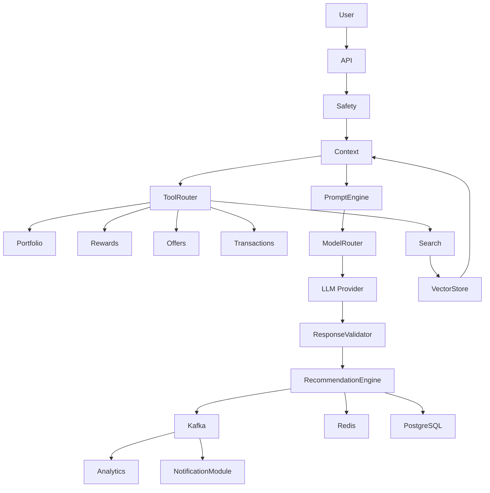

---

# ARC-115 Operational Considerations

| Area | Recommendation |
|------|----------------|
| Provider Strategy | Maintain provider abstraction to avoid vendor lock-in |
| Prompt Management | Version prompts independently of application releases |
| Privacy | Minimize context shared with LLMs |
| Cost Control | Monitor token usage and cache aggressively |
| Recommendation Quality | Continuously evaluate user acceptance metrics |
| Safety | Validate both prompts and model outputs |
| Resilience | Implement provider failover and graceful degradation |
| Observability | Track quality, latency, costs, and failures per request |

---

# ARC-116 Risks & Trade-offs

| Decision | Benefit | Trade-off | Mitigation |
|----------|---------|-----------|------------|
| Multi-provider support | Higher availability and flexibility | Additional routing complexity | Centralized Model Router |
| RAG-ready architecture | Improved factual grounding | Additional infrastructure | Adapter-based vector layer |
| Tool-based AI access | Controlled data access | Higher orchestration overhead | Standardized tool interfaces |
| Prompt versioning | Safe evolution and rollback | Governance effort | Prompt registry with approval workflow |
| AI caching | Lower latency and cost | Potential stale responses | TTLs and event-driven invalidation |
| Hybrid rules + AI | More reliable recommendations | More complex decision pipeline | Clear precedence and explainable outputs |

---

# Part 7 — External Integrations

---

# ARC-117 External Integration Architecture

CardWise interacts with numerous third-party systems to provide financial intelligence, notifications, authentication, storage, analytics, and future banking capabilities.

All external communication follows the following principles:

- Adapter Pattern
- Hexagonal Architecture
- Provider Independence
- Retry Safety
- Idempotency
- Circuit Breakers
- Observability
- Secure Communication
- Versioned Contracts
- Event-Driven Processing

The application and domain layers **never directly communicate with external providers**.

All integrations pass through Infrastructure Adapters.

---

# INT-001 Integration Design Principles

| Principle | Description |
|------------|-------------|
| Provider Agnostic | External vendors can be replaced without affecting business logic |
| Contract First | Stable interfaces between application and infrastructure |
| Async Preferred | Long-running integrations execute asynchronously |
| Secure by Default | TLS, authentication, request signing |
| Idempotent | Safe retries for external operations |
| Observable | Logs, metrics, traces for every integration |
| Fail Gracefully | Partial failures should not impact unrelated modules |
| Event Driven | Business events trigger integrations whenever possible |

---

# ARC-118 Integration Categories

| Category | Examples |
|-----------|----------|
| Authentication | Google, Apple |
| Banking | Future Open Banking APIs |
| Notifications | Email, SMS, Push |
| Storage | S3 Compatible Object Storage |
| Search | OpenSearch |
| Analytics | ClickHouse |
| AI | Multiple LLM Providers |
| Calendar | Google Calendar, Apple Calendar |
| Payment | Premium subscription providers |
| Import | PDF, CSV |
| Export | CSV, PDF, JSON |
| Monitoring | Prometheus, Grafana |
| Observability | OpenTelemetry |

---

# ARC-119 High-Level Integration Architecture

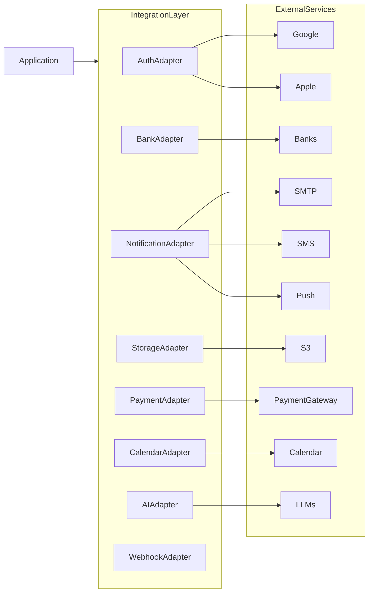

---

# ARC-120 Banking Integration Architecture

Bank integrations are intentionally abstracted to support future expansion.

Possible future integration sources:

- Open Banking APIs
- Account Aggregators
- Issuer APIs
- Statement Providers
- Banking Partners
- Credit Bureau Integrations

Current product scope assumes user-managed data import with optional future direct integrations.

---

## INT-002 Banking Adapter Responsibilities

- Authentication
- API abstraction
- Request signing
- Response normalization
- Retry handling
- Rate limit handling
- Audit logging
- Error translation

Business modules interact only with the adapter interface.

---

# ARC-121 Email Integration

Email supports:

- Welcome emails
- Password reset
- Verification
- Bill reminders
- Reward expiry
- Offer alerts
- Premium notifications
- Referral invitations
- Weekly summaries
- Monthly reports

---

## Email Design Principles

| Principle | Description |
|------------|-------------|
| Template Driven | Centralized email templates |
| Localization | Multi-language support |
| Queue Based | Asynchronous delivery |
| Retryable | Automatic retry on transient failures |
| Observable | Delivery tracking and metrics |

---

# ARC-122 SMS Integration

SMS is reserved for time-sensitive communication.

Examples:

- OTP
- Critical security alerts
- Bill reminders
- Payment confirmations
- Account recovery

SMS usage should remain configurable and cost-aware.

---

# ARC-123 Push Notification Integration

Push notifications support:

- Offer alerts
- Reward expiry
- Statement availability
- Bill reminders
- AI insights
- Referral updates
- Premium announcements

Notification delivery is asynchronous and event-driven.

---

# INT-003 Notification Flow

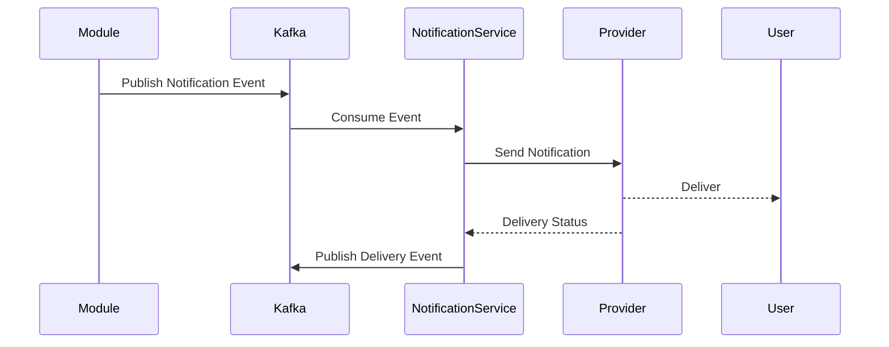

---

# ARC-124 Calendar Integration

Future integrations include:

- Google Calendar
- Apple Calendar
- Outlook Calendar

Supported events:

- Bill due dates
- Reward expiry
- Annual fee reminders
- Offer expiry
- Subscription renewal

Calendar synchronization is optional and user-controlled.

---

# ARC-125 Payment Provider Integration

Payment providers are primarily used for Premium subscriptions.

Responsibilities include:

- Checkout initiation
- Payment confirmation
- Subscription activation
- Refund processing
- Webhook handling
- Billing reconciliation

Payment provider abstraction prevents vendor lock-in.

---

## INT-004 Payment Workflow

```text
Premium Upgrade

↓

Payment Provider

↓

Webhook Confirmation

↓

Subscription Activation

↓

User Notification

↓

Analytics Event
```

---

# ARC-126 Object Storage Architecture

Object storage is used for binary assets.

Examples include:

- Statement PDFs
- CSV imports
- Exported reports
- User-uploaded files
- Admin assets
- Generated documents

Storage is abstracted through a dedicated Storage Adapter.

---

## FILE-001 Storage Categories

| Category | Examples |
|-----------|----------|
| Statements | Uploaded PDFs |
| Imports | CSV files |
| Reports | Generated exports |
| Media | Admin assets |
| Logs | Optional archived logs |
| AI Assets | Future embeddings & documents |

---

## Storage Principles

- Private buckets by default
- Pre-signed URLs for uploads/downloads
- Lifecycle policies
- Versioning
- Encryption at rest
- Metadata tracking

---

# ARC-127 Import Architecture

Import pipelines support structured ingestion of external data.

Supported import types:

- Statement PDFs
- CSV transactions
- Portfolio imports
- Rewards history
- Merchant mappings

---

## Import Pipeline

```text
Upload

↓

Virus Scan (Future)

↓

Validation

↓

Parsing

↓

Normalization

↓

Duplicate Detection

↓

Business Processing

↓

Persistence

↓

Events
```

---

## Import Characteristics

| Property | Value |
|-----------|-------|
| Asynchronous | Yes |
| Retryable | Yes |
| Idempotent | Yes |
| Progress Tracking | Yes |
| Partial Failure Support | Yes |

---

# ARC-128 Export Architecture

Exports support:

- CSV
- PDF
- JSON

Future support:

- Excel
- Scheduled exports
- Secure sharing links

---

## Export Workflow

```text
Export Request

↓

Authorization

↓

Background Job

↓

Data Generation

↓

Object Storage

↓

Notification

↓

Download
```

---

# ARC-129 Webhook Architecture

CardWise both consumes and exposes webhooks.

---

## Incoming Webhooks

Examples:

- Payment confirmation
- OAuth callbacks
- AI provider callbacks
- Notification provider delivery status
- Future banking events

---

## Outgoing Webhooks

Enterprise-ready webhook support includes:

- Portfolio changes
- Reward updates
- Offer events
- Bill reminders
- Subscription changes
- AI insights

---

## Webhook Processing Pipeline

```mermaid
flowchart LR

IncomingWebhook

↓

Authentication

↓

SignatureValidation

↓

TimestampValidation

↓

IdempotencyCheck

↓

BusinessProcessing

↓

Response

↓

EventPublishing
```

---

# INT-005 Webhook Security

All webhooks implement:

- HTTPS only
- HMAC signature validation
- Timestamp validation
- Replay protection
- Idempotency
- Request logging
- Rate limiting
- Schema validation

---

# ARC-130 Retry Strategy

Retry behavior differs by integration type.

| Integration | Retry Strategy |
|-------------|----------------|
| Email | Exponential backoff |
| SMS | Limited retries |
| Push | Provider-specific retries |
| AI | Retry with provider failover |
| Storage | Retry transient failures |
| Banking | Configurable with backoff |
| Payment | Idempotent retries |
| Webhooks | Exponential backoff + DLQ |

---

## Retry Principles

- Retry only transient failures.
- Never retry permanent validation failures.
- Preserve idempotency across retries.
- Log every retry attempt.
- Publish retry metrics.

---

# ARC-131 Dead Letter Queue (DLQ)

Failed asynchronous operations are redirected to Dead Letter Queues.

Examples:

- Notification failures
- AI failures
- Search indexing failures
- Analytics ingestion failures
- Webhook failures

DLQ messages retain sufficient metadata for replay and investigation.

---

# ARC-132 Circuit Breaker Architecture

External providers are protected by circuit breakers.

```text
Closed

↓

Failures Increase

↓

Open

↓

Cooldown

↓

Half Open

↓

Recovered?

↓

Closed
```

---

## Circuit Breaker Triggers

- Timeout threshold
- Consecutive failures
- Error rate threshold
- Provider availability

---

## Benefits

- Prevent cascading failures
- Faster failure detection
- Reduced resource consumption
- Improved platform resilience

---

# ARC-133 Provider Abstraction

Every external provider implements a common interface.

Example abstractions:

- Email Provider
- SMS Provider
- Push Provider
- Payment Provider
- AI Provider
- Storage Provider
- Calendar Provider

Business modules remain independent of provider-specific SDKs.

---

# ARC-134 Integration Security

Security measures include:

- Mutual TLS where supported
- OAuth 2.0 / API Keys
- Secret rotation
- Request signing
- Least privilege credentials
- Encrypted communication
- Audit logging
- IP allowlists where applicable

Secrets are never embedded in source code.

---

# ARC-135 Integration Observability

Every integration publishes operational telemetry.

---

## OBS-002 Integration Metrics

| Metric | Description |
|----------|-------------|
| Request Count | Total requests |
| Success Rate | Successful operations |
| Error Rate | Failed operations |
| Retry Count | Retry attempts |
| Latency | End-to-end latency |
| Timeout Rate | Timed out requests |
| Circuit Breaker State | Health indicator |
| Queue Depth | Pending async work |
| DLQ Size | Failed operations awaiting replay |

---

## Tracing

Each integration request propagates:

- Request ID
- Correlation ID
- Trace ID
- Span ID
- Provider identifier
- Retry count

---

## Logging

Structured logs capture:

- Provider
- Endpoint
- Duration
- Status
- Error category
- Correlation ID

Sensitive payloads and credentials are excluded.

---

# ARC-136 Integration Diagram

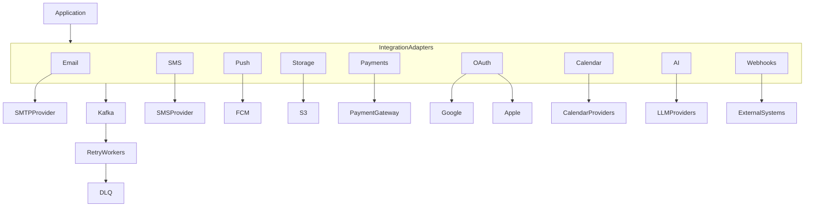

---

# ARC-137 Operational Considerations

| Area | Recommendation |
|------|----------------|
| Provider Independence | Abstract all vendor-specific implementations |
| Retry Strategy | Apply exponential backoff with idempotency |
| Webhooks | Validate signatures and protect against replay attacks |
| Object Storage | Use encrypted private buckets with lifecycle policies |
| Notifications | Deliver asynchronously via Kafka-backed workers |
| Payment Integrations | Activate subscriptions only after verified callbacks |
| Monitoring | Track latency, failures, retries, and DLQ growth |
| Circuit Breakers | Protect all network-dependent integrations |

---

# ARC-138 Risks & Trade-offs

| Decision | Benefit | Trade-off | Mitigation |
|----------|---------|-----------|------------|
| Adapter-based integrations | Easy provider replacement | Additional abstraction layer | Standardized interfaces |
| Queue-backed notifications | Better scalability | Eventual delivery | Delivery tracking and retries |
| Webhook-driven updates | Near real-time synchronization | External dependency reliability | Idempotency, retries, DLQs |
| S3-compatible storage | Cloud portability | Object lifecycle management | Automated lifecycle policies |
| Circuit breakers | Prevent cascading failures | Temporary request rejection | Graceful degradation and fallback logic |
| Provider failover | Higher availability | Increased routing complexity | Centralized provider selection and health monitoring |

---

# Part 8 — Security, Validation, Secrets Management & Observability

---

# ARC-139 Security Architecture Overview

Security is implemented as a cross-cutting concern across every backend layer.

Rather than treating security as a separate module, every component of CardWise is designed using a **Secure-by-Default** philosophy.

Security objectives include:

- Confidentiality
- Integrity
- Availability
- Accountability
- Non-repudiation
- Privacy
- Compliance readiness
- Operational resilience

Security controls are implemented at:

- Infrastructure
- Network
- API Gateway
- Authentication
- Authorization
- Business Logic
- Database
- Storage
- AI Platform
- Observability

---

# SEC-001 Security Principles

| Principle | Description |
|------------|-------------|
| Zero Trust | Never implicitly trust users, services, or networks |
| Least Privilege | Minimum permissions required |
| Defense in Depth | Multiple independent security layers |
| Secure Defaults | Safe behavior by default |
| Explicit Validation | Reject invalid data early |
| Encryption Everywhere | Protect data in transit and at rest |
| Immutable Audit | Tamper-resistant audit trail |
| Fail Securely | Deny access on uncertainty |

---

# ARC-140 Security Layers

```mermaid
flowchart TB

Internet

↓

LoadBalancer

↓

WAF

↓

API Gateway

↓

Authentication

↓

Authorization

↓

Validation

↓

Business Layer

↓

Database

↓

Storage

↓

Monitoring
```

Every layer assumes upstream controls may fail and performs its own validation where appropriate.

---

# ARC-141 Input Validation

Every external input is considered untrusted.

Validation occurs before business logic execution.

---

## VAL-001 Validation Layers

| Layer | Responsibility |
|---------|---------------|
| Transport | Content-Type, HTTP method |
| Headers | Required headers |
| Authentication | Identity verification |
| Authorization | Permission verification |
| Schema | Structural validation |
| Business | Domain rules |
| Persistence | Referential integrity |

---

## Validation Rules

Incoming requests validate:

- Required fields
- Data types
- UUIDs
- Dates
- Currency
- Enumerations
- Numeric ranges
- Length constraints
- File types
- File sizes
- Pagination limits
- Sort fields
- Filter operators

Unknown properties are rejected unless explicitly allowed.

---

# ARC-142 Input Sanitization

Validation confirms correctness.

Sanitization protects downstream systems.

Sanitization includes:

- Whitespace normalization
- HTML stripping where appropriate
- Unicode normalization
- Dangerous character handling
- Path traversal prevention
- Filename normalization
- URL validation

No business logic depends on unsanitized user input.

---

# SEC-002 Injection Protection

Protection mechanisms include:

| Attack | Protection |
|---------|------------|
| SQL Injection | Prisma parameterized queries |
| NoSQL Injection | Strict schema validation |
| Command Injection | No shell execution from user input |
| Path Traversal | Canonical path validation |
| SSRF | URL allowlists |
| Template Injection | Escaping and controlled rendering |
| Prompt Injection | AI safety layer and tool restrictions |

---

# ARC-143 Output Encoding

All responses are encoded appropriately for their destination.

Examples:

- JSON encoding
- HTML escaping where applicable
- CSV escaping
- PDF sanitization
- File name normalization

Sensitive internal information is never returned to clients.

---

# ARC-144 API Security Controls

The API layer enforces:

- HTTPS only
- HSTS
- CORS policy
- Rate limiting
- JWT validation
- Permission checks
- Correlation IDs
- Security headers
- Request size limits
- Content-Type enforcement

---

## Security Headers

Responses include:

- Strict-Transport-Security
- X-Content-Type-Options
- X-Frame-Options
- Referrer-Policy
- Permissions-Policy
- Content-Security-Policy

---

# ARC-145 Secrets Management

Application secrets are externalized from source code.

Examples:

- JWT signing keys
- Database credentials
- Redis credentials
- Kafka credentials
- OAuth client secrets
- SMTP credentials
- Storage credentials
- AI provider keys
- Payment provider secrets

---

## SEC-003 Secret Management Principles

| Principle | Description |
|------------|-------------|
| Never Commit Secrets | No credentials in source control |
| Runtime Injection | Secrets injected during deployment |
| Rotation | Periodic credential rotation |
| Least Privilege | Scoped access per service |
| Auditability | Secret access is logged |
| Encryption | Secrets encrypted at rest |

---

# ARC-146 Encryption Strategy

Encryption protects sensitive information both in transit and at rest.

---

## Data in Transit

Protected using:

- TLS 1.2+
- HTTPS
- Secure cookies where applicable
- Provider TLS validation

---

## Data at Rest

Protected using:

- Database encryption
- Object storage encryption
- Encrypted backups
- Volume encryption
- Secret encryption

---

## Sensitive Data Categories

| Category | Protection |
|-----------|------------|
| Passwords | Strong adaptive hashing |
| Tokens | Encrypted or securely hashed as appropriate |
| OAuth Secrets | Encrypted |
| API Keys | Encrypted |
| Financial Metadata | Encryption at rest |
| User PII | Encryption at rest and restricted access |

CardWise intentionally avoids storing full payment card numbers or CVV information.

---

# ARC-147 Audit Logging

Audit logging records security-sensitive and compliance-relevant operations.

Audit logs are immutable.

---

## AUD-001 Audited Events

| Event | Logged |
|--------|--------|
| Login | Yes |
| Logout | Yes |
| Password Reset | Yes |
| Permission Changes | Yes |
| Admin Actions | Yes |
| Data Export | Yes |
| Subscription Changes | Yes |
| OAuth Linking | Yes |
| Statement Import | Yes |
| Account Deletion | Yes |

---

## Audit Log Attributes

Every audit record includes:

- Timestamp
- User ID
- Actor type
- Resource
- Action
- Correlation ID
- IP address
- Device metadata
- Result

Audit records are append-only.

---

# ARC-148 Logging Architecture

Application logging follows structured logging principles.

Logging objectives:

- Debugging
- Incident response
- Performance analysis
- Capacity planning
- Security investigations

---

## LOG-001 Log Categories

| Category | Purpose |
|-----------|----------|
| Application | Business events |
| Infrastructure | Platform events |
| Security | Authentication & authorization |
| Audit | Compliance |
| Performance | Slow operations |
| Integration | External providers |
| AI | AI requests |
| Background Jobs | Worker execution |

---

## Logging Rules

- JSON structured logs
- Correlation IDs
- Request IDs
- Trace IDs
- Consistent severity levels
- No sensitive data
- Configurable retention

---

# ARC-149 Distributed Tracing

OpenTelemetry provides end-to-end distributed tracing.

---

## Trace Flow

```text
Client

↓

Gateway

↓

Controller

↓

Application

↓

Repository

↓

Database

↓

Kafka

↓

Worker

↓

External Provider
```

---

## Trace Metadata

Each trace includes:

- Trace ID
- Span ID
- Parent Span
- Request ID
- User ID (where appropriate)
- Module
- Duration
- Status

---

# ARC-150 Metrics Collection

Metrics are collected through Prometheus.

---

## MET-001 Metric Categories

| Category | Examples |
|-----------|----------|
| API | Request count, latency |
| Database | Query duration |
| Redis | Cache hit rate |
| Kafka | Consumer lag |
| Background Jobs | Queue depth |
| AI | Token usage |
| Authentication | Login success rate |
| Notifications | Delivery success |
| Search | Query latency |

---

## RED Metrics

Every HTTP endpoint exposes:

- Rate
- Errors
- Duration

---

## USE Metrics

Infrastructure tracks:

- Utilization
- Saturation
- Errors

---

# ARC-151 Monitoring

Grafana dashboards monitor:

- API latency
- Error rates
- Authentication failures
- Kafka lag
- Cache hit ratio
- Database health
- AI latency
- Queue depth
- Storage utilization
- Background jobs

Dashboards are environment-specific.

---

# MON-001 Alert Categories

| Category | Trigger Examples |
|-----------|------------------|
| Critical | Service unavailable |
| High | Elevated error rate |
| Medium | Queue backlog |
| Low | Cache degradation |
| Informational | Deployment completed |

Alerts route to appropriate operational channels.

---

# ARC-152 Health Checks

Health endpoints expose service readiness without leaking sensitive information.

---

## Health Categories

| Check | Purpose |
|---------|---------|
| Liveness | Process is running |
| Readiness | Service can accept traffic |
| Startup | Initialization complete |
| Dependency | External systems reachable |

---

## Dependencies Monitored

- PostgreSQL
- Redis
- Kafka
- OpenSearch
- Object Storage
- AI Providers
- SMTP Provider
- Payment Provider

Health responses are optimized for orchestration systems.

---

# ARC-153 Operational Readiness

Production deployments require operational validation.

Checklist includes:

- Configuration validation
- Secret availability
- Database connectivity
- Kafka connectivity
- Redis connectivity
- Storage accessibility
- Health endpoint verification
- Metrics registration
- Tracing initialization
- Alert configuration

Deployment proceeds only after readiness checks succeed.

---

# ARC-154 Incident Response

Operational incidents follow a structured lifecycle.

```text
Detection

↓

Alert

↓

Investigation

↓

Mitigation

↓

Recovery

↓

Verification

↓

Postmortem

↓

Action Items
```

Every major incident produces a documented retrospective with corrective actions.

---

# ARC-155 Compliance Readiness

The architecture is designed to support common security and privacy expectations.

Examples include:

- Audit logging
- Encryption
- Least privilege
- Access control
- Data retention policies
- Data deletion workflows
- Export capabilities
- Consent-aware processing

Specific regulatory implementation details are documented separately in the Security & Compliance documentation.

---

# ARC-156 Security Observability Diagram

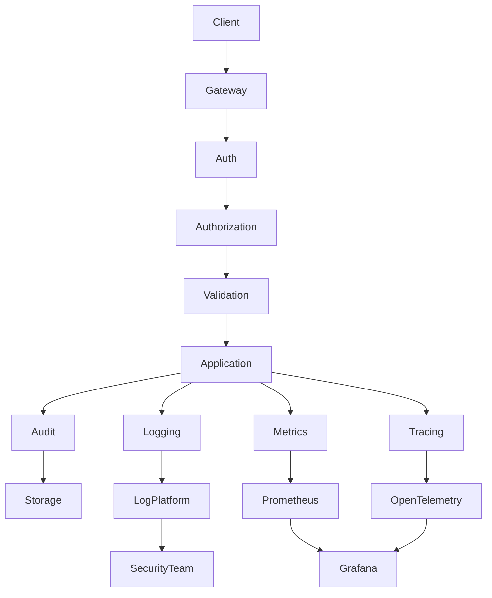

---

# ARC-157 Operational Considerations

| Area | Recommendation |
|------|----------------|
| Validation | Reject invalid requests before business execution |
| Secrets | Externalize and rotate regularly |
| Encryption | Encrypt sensitive data in transit and at rest |
| Audit | Log all security-sensitive operations immutably |
| Logging | Use structured logs without sensitive payloads |
| Tracing | Propagate trace context across async workflows |
| Monitoring | Alert on latency, failures, and dependency health |
| Health Checks | Separate liveness, readiness, startup, and dependency checks |
| Incident Response | Maintain documented runbooks and postmortem process |

---

# ARC-158 Risks & Trade-offs

| Decision | Benefit | Trade-off | Mitigation |
|----------|---------|-----------|------------|
| Defense in Depth | Strong layered security | Higher operational complexity | Standardized security controls |
| Structured Logging | Better diagnostics | Increased storage usage | Configurable retention policies |
| Extensive Audit Logging | Compliance and forensics | Larger audit dataset | Retention and archival strategies |
| Full Distributed Tracing | Faster root cause analysis | Additional telemetry overhead | Sampling and configurable trace levels |
| Runtime Secret Injection | Improved credential security | Deployment dependency | Automated secret validation during startup |
| Strict Validation | Prevents invalid system state | Additional request processing | Optimized validation pipeline |

---

# Part 9 — Performance Engineering, Scalability & Deployment Strategy

---

# ARC-159 Performance Engineering Overview

Performance is a foundational architectural concern rather than a post-development optimization exercise.

CardWise is expected to support:

- Millions of registered users
- Hundreds of thousands of daily active users
- Millions of monthly transactions
- Large AI workloads
- Heavy analytical queries
- Real-time notifications
- Background processing
- High-volume search

The platform is designed around predictable latency, horizontal scalability, efficient resource utilization, and operational resilience.

---

# PERF-001 Performance Goals

| Metric | Target |
|---------|---------|
| API Availability | ≥ 99.9% |
| Core API P95 Latency | < 200 ms |
| Authentication P95 | < 150 ms |
| Portfolio Load P95 | < 300 ms |
| Search P95 | < 250 ms |
| AI Response (Non-streaming) P95 | < 5 seconds |
| Background Job Queue Delay | < 30 seconds |
| Cache Hit Ratio | > 85% |
| Database Connection Utilization | < 70% |

---

# ARC-160 Scalability Philosophy

CardWise adopts **Scale Out before Scale Up**.

Preferred order:

1. Efficient algorithms
2. Query optimization
3. Caching
4. Async processing
5. Horizontal scaling
6. Service extraction (future)

Scalability should never require application rewrites.

---

# ARC-161 Horizontal Scaling

The backend is completely stateless.

Every API instance can process any request.

State is externalized into:

- PostgreSQL
- Redis
- Kafka
- Object Storage
- OpenSearch
- ClickHouse

---

## Horizontal Scaling Principles

| Principle | Description |
|------------|-------------|
| Stateless APIs | No in-memory sessions |
| Externalized State | Shared infrastructure |
| Load Balancer | Even traffic distribution |
| Independent Workers | Scale background processing separately |
| Elastic Pods | Kubernetes-managed scaling |
| No Sticky Sessions | Simplifies failover |

---

# ARC-162 Kubernetes Scaling Strategy

Each deployment defines independent scaling characteristics.

| Component | Scaling Trigger |
|-----------|-----------------|
| API Pods | CPU + Request Rate |
| AI Workers | Queue Depth |
| Notification Workers | Kafka Lag |
| Analytics Workers | Event Throughput |
| Search Indexers | Index Queue |
| Import Workers | Pending Imports |
| Export Workers | Pending Exports |

---

# ARC-163 Load Balancing

Incoming traffic is distributed through a Layer 7 load balancer.

Responsibilities include:

- TLS termination
- Request routing
- Health-aware balancing
- Connection reuse
- Compression
- Rate limiting (optional edge layer)

Traffic distribution remains transparent to clients.

---

# PERF-002 Request Routing Strategy

```text
Client

↓

Load Balancer

↓

Ingress Controller

↓

API Pods

↓

Business Modules

↓

Infrastructure Services
```

---

# ARC-164 Connection Pooling

Database connections are pooled to maximize throughput.

---

## PostgreSQL

Connection pool objectives:

- Minimize connection overhead
- Prevent database exhaustion
- Reuse idle connections
- Backpressure under heavy load

---

## Redis

Redis pools support:

- Shared connections
- Pipelining
- Efficient command batching

---

## External Providers

Connection reuse is preferred for:

- AI Providers
- SMTP
- Storage
- OAuth
- Payment Providers

---

# PERF-003 Database Performance Strategy

Performance techniques include:

- Proper indexing
- Query optimization
- Avoiding N+1 queries
- Cursor pagination
- Read-heavy caching
- Batch processing
- Efficient transactions
- Selective projections

Slow queries are logged and monitored.

---

# ARC-165 Caching Architecture

Redis is the primary distributed cache.

---

## Cache Categories

| Category | Strategy |
|-----------|----------|
| Card Catalog | Long TTL |
| Offers | Medium TTL |
| User Preferences | Medium TTL |
| Sessions | Sliding expiration |
| AI Results | Configurable TTL |
| Search Metadata | Short TTL |
| Dashboard Aggregates | Short TTL |
| Rate Limits | Expiring counters |

---

## Cache Rules

- Cache-aside by default
- Event-driven invalidation
- Configurable TTL
- No permanent cache dependency
- Graceful cache miss handling

---

# ARC-166 Asynchronous Processing

Long-running operations never block user requests.

Examples include:

- Statement parsing
- Notification delivery
- AI recommendation generation
- Analytics aggregation
- Search indexing
- Report generation
- File processing
- Export creation

Kafka-backed workers process asynchronous workloads.

---

# PERF-004 Background Processing Flow

```text
HTTP Request

↓

Persist Business Data

↓

Commit Transaction

↓

Publish Event

↓

Kafka

↓

Worker

↓

External Systems

↓

Completion Event
```

---

# ARC-167 Resource Management

Each service defines explicit resource limits.

Managed resources include:

- CPU
- Memory
- File descriptors
- Network connections
- Thread pool utilization
- Queue depth

Resource exhaustion should degrade gracefully rather than fail catastrophically.

---

# ARC-168 Failure Recovery

The platform assumes component failures are inevitable.

Recovery strategies include:

- Automatic retries
- Circuit breakers
- Dead Letter Queues
- Graceful degradation
- Cache fallback
- Alternate AI providers
- Restart policies
- Health-based traffic removal

---

## Failure Scenarios

| Scenario | Recovery |
|-----------|----------|
| API Pod Failure | Kubernetes restart |
| Database Restart | Connection retry |
| Kafka Consumer Failure | Consumer group rebalance |
| Redis Outage | Fallback to database where possible |
| AI Provider Failure | Alternate provider or rule-based fallback |
| Notification Failure | Retry + DLQ |
| Search Failure | Graceful degradation |

---

# ARC-169 Resilience Patterns

CardWise implements multiple resilience mechanisms.

---

## Supported Patterns

| Pattern | Purpose |
|-----------|----------|
| Retry | Recover transient failures |
| Timeout | Prevent resource blocking |
| Circuit Breaker | Stop cascading failures |
| Bulkhead | Isolate failures |
| Rate Limiting | Protect services |
| Backpressure | Prevent overload |
| Queue Buffering | Smooth traffic spikes |
| Idempotency | Safe retries |

---

# PERF-005 Timeout Strategy

Timeouts are configured per dependency.

| Dependency | Strategy |
|-------------|----------|
| Database | Short timeout |
| Redis | Very short timeout |
| Kafka | Configurable |
| AI Providers | Adaptive timeout |
| Storage | Moderate timeout |
| Payment Providers | Provider-specific |
| OAuth Providers | Provider-specific |

---

# ARC-170 Service Level Objectives (SLOs)

The platform defines measurable reliability objectives.

| Service | Availability Target |
|----------|---------------------|
| Authentication | 99.95% |
| Portfolio | 99.90% |
| Rewards | 99.90% |
| Search | 99.90% |
| Notifications | 99.50% |
| AI Assistant | 99.00% |
| Analytics | 99.00% |

---

# ARC-171 Service Level Indicators (SLIs)

Measured indicators include:

- Availability
- Latency
- Error Rate
- Throughput
- Queue Delay
- Cache Hit Ratio
- Database Latency
- Search Latency
- AI Response Time
- Worker Success Rate

SLIs feed dashboards, alerts, and capacity planning.

---

# ARC-172 Capacity Planning

Capacity planning is based on sustained growth rather than peak estimates alone.

---

## Growth Dimensions

| Area | Scaling Consideration |
|------|------------------------|
| Users | Registered & active users |
| Transactions | Daily processing volume |
| Statements | Imported documents |
| AI Requests | Prompt volume |
| Notifications | Delivery throughput |
| Search | Query rate |
| Analytics | Event ingestion |
| Storage | Object growth |

---

## Planning Principles

- Scale before saturation
- Maintain operational headroom
- Monitor growth trends
- Validate through load testing
- Review quarterly

---

# PERF-006 Performance Testing Strategy

Performance validation includes:

- Load Testing
- Stress Testing
- Spike Testing
- Endurance Testing
- Soak Testing
- Failover Testing
- Recovery Testing
- Capacity Testing

Testing occurs before major production releases.

---

# ARC-173 Deployment Strategy

Deployments are fully automated through CI/CD.

Goals:

- Zero-downtime deployments
- Automated rollback
- Progressive rollout
- Health verification
- Version tracking

---

## Deployment Workflow

```text
Build

↓

Static Analysis

↓

Unit Tests

↓

Integration Tests

↓

Container Build

↓

Security Scan

↓

Deploy to Staging

↓

Smoke Tests

↓

Progressive Production Rollout

↓

Monitoring

↓

Completion
```

---

# DEP-001 Release Strategy

Supported deployment strategies:

| Strategy | Usage |
|-----------|-------|
| Rolling Update | Default |
| Blue-Green | High-risk releases |
| Canary | Incremental rollout |
| Feature Flags | Progressive feature enablement |

---

# ARC-174 Deployment Architecture

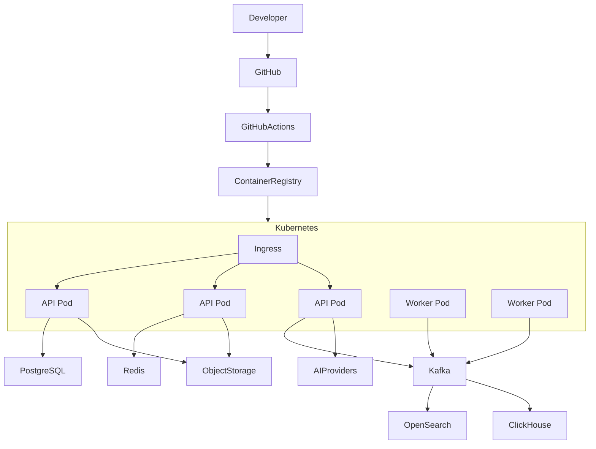

---

# ARC-175 Autoscaling Strategy

Autoscaling is driven by workload-specific metrics.

| Component | Trigger |
|-----------|----------|
| API Pods | CPU + Request Rate |
| Workers | Queue Depth |
| AI Workers | Pending AI Jobs |
| Search Workers | Index Backlog |
| Notification Workers | Kafka Lag |

Autoscaling policies include minimum and maximum replica thresholds to avoid oscillation.

---

# ARC-176 Disaster Recovery

Recovery objectives:

| Objective | Target |
|------------|---------|
| Recovery Time Objective (RTO) | Business-defined |
| Recovery Point Objective (RPO) | Business-defined |

Recovery capabilities include:

- Automated backups
- Point-in-time recovery
- Multi-zone deployment
- Immutable artifacts
- Configuration versioning

Disaster recovery procedures are tested periodically.

---

# ARC-177 Operational Readiness

Before production deployment, verify:

- Health checks
- Monitoring dashboards
- Alert rules
- Secrets availability
- Database migrations
- Kafka connectivity
- Redis health
- Storage accessibility
- Rollback procedures
- Runbooks

Operational readiness is a release gate.

---

# ARC-178 Risks & Trade-offs

| Decision | Benefit | Trade-off | Mitigation |
|----------|---------|-----------|------------|
| Stateless services | Easy horizontal scaling | External infrastructure dependency | Highly available shared services |
| Heavy asynchronous processing | Faster user responses | Eventual consistency | Idempotent consumers and event tracking |
| Aggressive caching | Lower latency | Cache invalidation complexity | Event-driven invalidation |
| Kubernetes autoscaling | Elastic capacity | Operational complexity | Well-defined scaling policies and observability |
| Progressive deployments | Reduced release risk | Longer deployment duration | Automated rollout and rollback |
| Multi-provider AI support | Higher resilience | Routing complexity | Centralized model routing and health monitoring |

---

# Part 10 — Engineering Best Practices, QA Checklist, Future Enhancements & Architecture Summary

---

# ARC-179 Backend Engineering QA Checklist

The following checklist acts as the engineering Definition of Done (DoD) for every backend feature.

---

## QA-001 Architecture Checklist

| Check | Status |
|---------|--------|
| Business logic isolated from infrastructure | ☐ |
| Domain boundaries maintained | ☐ |
| Clean Architecture followed | ☐ |
| Hexagonal Architecture followed | ☐ |
| No cross-module database access | ☐ |
| Public contracts documented | ☐ |
| Domain events published correctly | ☐ |
| Repository abstraction maintained | ☐ |

---

## QA-002 API Checklist

| Check | Status |
|---------|--------|
| OpenAPI updated | ☐ |
| Request validation implemented | ☐ |
| Response contract follows standards | ☐ |
| Error codes documented | ☐ |
| Pagination implemented | ☐ |
| Filtering supported where applicable | ☐ |
| Sorting supported | ☐ |
| Version compatibility maintained | ☐ |

---

## QA-003 Security Checklist

| Check | Status |
|---------|--------|
| Authentication required | ☐ |
| Authorization verified | ☐ |
| Permissions evaluated | ☐ |
| Secrets externalized | ☐ |
| Sensitive data encrypted | ☐ |
| Audit logging added | ☐ |
| Input validation complete | ☐ |
| Output encoding verified | ☐ |

---

## QA-004 Database Checklist

| Check | Status |
|---------|--------|
| Prisma schema updated | ☐ |
| Migration reviewed | ☐ |
| Indexes validated | ☐ |
| Query performance reviewed | ☐ |
| Transactions optimized | ☐ |
| N+1 queries eliminated | ☐ |
| Connection usage verified | ☐ |

---

## QA-005 Caching Checklist

| Check | Status |
|---------|--------|
| Cache strategy selected | ☐ |
| Cache invalidation defined | ☐ |
| TTL configured | ☐ |
| Cache metrics added | ☐ |
| Graceful cache miss handling | ☐ |

---

## QA-006 Kafka Checklist

| Check | Status |
|---------|--------|
| Events versioned | ☐ |
| Idempotent consumer | ☐ |
| Retry strategy implemented | ☐ |
| DLQ configured | ☐ |
| Event schema documented | ☐ |
| Monitoring configured | ☐ |

---

## QA-007 AI Checklist

| Check | Status |
|---------|--------|
| Prompt version assigned | ☐ |
| Context minimized | ☐ |
| Safety validation applied | ☐ |
| Tool access restricted | ☐ |
| Token usage monitored | ☐ |
| AI metrics collected | ☐ |
| Provider abstraction used | ☐ |

---

## QA-008 Observability Checklist

| Check | Status |
|---------|--------|
| Structured logging | ☐ |
| Metrics exported | ☐ |
| Traces available | ☐ |
| Correlation IDs propagated | ☐ |
| Dashboards updated | ☐ |
| Alerts configured | ☐ |

---

# ARC-180 Backend Engineering Best Practices

---

## Architecture

- Design around business domains.
- Keep modules independently evolvable.
- Avoid shared mutable state.
- Favor composition over inheritance.
- Keep infrastructure replaceable.
- Maintain stable public contracts.
- Avoid leaking framework details into the domain layer.

---

## Business Logic

- Keep business rules inside the Domain Layer.
- One responsibility per use case.
- Publish immutable domain events.
- Prefer explicit workflows over implicit side effects.
- Avoid duplicate business logic across modules.

---

## API Design

- Stable resource naming.
- Consistent response envelopes.
- Immutable error codes.
- Backward-compatible evolution.
- Cursor pagination for large datasets.
- Explicit request validation.

---

## Persistence

- One repository per aggregate.
- Prefer aggregate consistency boundaries.
- Optimize queries before adding infrastructure.
- Keep transactions short-lived.
- Never expose ORM models outside repositories.

---

## Asynchronous Processing

- Use Kafka for long-running operations.
- Make consumers idempotent.
- Handle retries with exponential backoff.
- Publish events only after successful commits.
- Configure Dead Letter Queues.

---

## AI Platform

- Keep prompts version controlled.
- Minimize context shared with models.
- Prefer tool calling over unrestricted model access.
- Monitor token usage and costs.
- Implement provider failover.
- Evaluate recommendation quality continuously.

---

## Security

- Validate all input.
- Encrypt sensitive data.
- Externalize secrets.
- Log security-sensitive actions.
- Apply least privilege.
- Review permissions regularly.

---

## Performance

- Cache only where beneficial.
- Optimize slow queries.
- Prefer asynchronous workflows.
- Monitor latency continuously.
- Benchmark critical endpoints.

---

# ARC-181 Backend Anti-Patterns

The following practices are prohibited.

| Anti-Pattern | Reason |
|--------------|--------|
| Business logic inside controllers | Violates separation of concerns |
| Direct module database access | Breaks bounded contexts |
| Shared mutable global state | Reduces scalability |
| Circular module dependencies | Increases coupling |
| Long-running HTTP requests | Reduces throughput |
| Blocking I/O in request path | Poor scalability |
| Hardcoded secrets | Security risk |
| ORM models exposed externally | Tight coupling |
| Synchronous notification sending | Increases latency |
| Business logic in database migrations | Unpredictable behavior |
| Unversioned events | Breaks consumers |
| Unbounded cache growth | Memory pressure |
| AI provider-specific logic in domain layer | Vendor lock-in |
| Missing correlation IDs | Reduced observability |
| Silent exception handling | Difficult debugging |

---

# ARC-182 Future Enhancements

The backend architecture intentionally leaves room for future evolution.

---

## Short-Term Enhancements

- Multi-factor Authentication (MFA)
- Magic Link Authentication
- Passkeys / WebAuthn
- Streaming AI responses
- Scheduled reports
- Calendar synchronization
- Advanced search ranking
- Improved analytics dashboards

---

## Medium-Term Enhancements

- Event Sourcing for selected domains
- CQRS for read-heavy modules
- Vector database integration
- Real-time recommendation engine
- Personalized notification engine
- Automated reward redemption suggestions
- Open Banking integrations
- Intelligent fraud detection

---

## Long-Term Enhancements

- Service Mesh adoption
- Microservice extraction
- Multi-region deployment
- Active-active architecture
- Edge API routing
- Global traffic management
- AI autonomous financial planner
- Enterprise APIs
- Marketplace integrations
- Financial data exchange ecosystem

---

# ARC-183 Backend Module Count Summary

| Category | Modules |
|-----------|---------|
| Authentication | 1 |
| User & Profile | 1 |
| Credit Cards | 1 |
| Portfolio | 1 |
| Financial Intelligence | 8 |
| AI Platform | 1 |
| Search | 1 |
| Analytics | 1 |
| Notifications | 1 |
| Calendar | 1 |
| Reports | 1 |
| Premium | 1 |
| Referral | 1 |
| Gamification | 1 |
| Integrations | 1 |
| Import | 1 |
| Export | 1 |
| Admin | 1 |
| Audit | 1 |
| Platform | 1 |

---

## Total Backend Modules

| Metric | Count |
|----------|-------|
| Business Modules | 27 |
| Shared Infrastructure Modules | Multiple |
| Deployment Unit | 1 (Modular Monolith) |
| Planned Extractable Services | 10+ |
| Primary Database | PostgreSQL |
| Message Broker | Kafka |
| Cache | Redis |

---

# ARC-184 API Summary

| Category | Summary |
|-----------|----------|
| API Style | REST |
| Versioning | URI Versioning |
| Documentation | OpenAPI |
| Authentication | JWT + OAuth |
| Authorization | RBAC + Policies |
| Validation | Zod |
| Pagination | Offset + Cursor |
| Search | OpenSearch |
| Idempotency | Supported |
| Webhooks | Incoming & Outgoing |

---

# ARC-185 Infrastructure Summary

| Layer | Technology |
|---------|------------|
| Runtime | Node.js |
| Framework | NestJS |
| Language | TypeScript |
| ORM | Prisma |
| Database | PostgreSQL |
| Cache | Redis |
| Messaging | Kafka |
| Search | OpenSearch / Elasticsearch |
| Analytics | ClickHouse |
| Storage | S3 Compatible |
| Monitoring | Prometheus |
| Dashboards | Grafana |
| Tracing | OpenTelemetry |
| Logging | Pino |
| Containers | Docker |
| Orchestration | Kubernetes |
| CI/CD | GitHub Actions |

---

# ARC-186 Architecture Summary

The CardWise backend follows a production-grade architecture with the following characteristics:

| Area | Decision |
|------|----------|
| Architectural Style | Modular Monolith |
| Evolution Strategy | Microservice-ready |
| Design Pattern | Hexagonal + Clean Architecture |
| Domain Modeling | Domain-Driven Design |
| Communication | REST + Kafka |
| Scalability | Horizontal |
| State Management | Stateless APIs |
| AI | Provider-agnostic AI Platform |
| Storage | Relational + Search + Analytics |
| Security | Zero Trust |
| Observability | Logs + Metrics + Traces |
| Deployment | Kubernetes |

---

# ARC-187 Operational Summary

| Area | Capability |
|---------|------------|
| High Availability | Supported |
| Horizontal Scaling | Supported |
| Rolling Deployments | Supported |
| Blue-Green Deployment | Supported |
| Canary Releases | Supported |
| Disaster Recovery | Supported |
| Backup Strategy | Supported |
| Monitoring | Comprehensive |
| Alerting | Comprehensive |
| Audit Logging | Comprehensive |
| Health Checks | Liveness, Readiness, Startup |
| CI/CD | Fully Automated |

---

# ARC-188 Backend Architecture Decision Record (ADR) Summary

| ADR | Decision |
|------|----------|
| ADR-001 | Modular Monolith as initial architecture |
| ADR-002 | Domain-Driven Design for business modeling |
| ADR-003 | Hexagonal Architecture for infrastructure isolation |
| ADR-004 | Clean Architecture layering |
| ADR-005 | Kafka for asynchronous messaging |
| ADR-006 | PostgreSQL as primary transactional database |
| ADR-007 | Redis for distributed caching and sessions |
| ADR-008 | OpenSearch for search workloads |
| ADR-009 | ClickHouse for analytical workloads |
| ADR-010 | S3-compatible object storage for files |
| ADR-011 | JWT + OAuth authentication |
| ADR-012 | RBAC with policy-based authorization |
| ADR-013 | OpenTelemetry for distributed tracing |
| ADR-014 | Kubernetes as deployment platform |
| ADR-015 | AI Platform as a shared domain capability |

---

# ARC-189 Complete Backend Architecture

```mermaid
flowchart TB

Client["Web / PWA / Future Mobile"]
Admin["Admin Portal"]

Client --> Ingress
Admin --> Ingress

subgraph Kubernetes["Kubernetes Cluster"]

Ingress["Ingress Controller"]

subgraph API["CardWise API (Modular Monolith)"]

Controllers["Presentation Layer"]

Application["Application Layer"]

Domain["Domain Layer"]

Repositories["Repository Interfaces"]

Infrastructure["Infrastructure Adapters"]

end

Ingress --> Controllers

Controllers --> Application

Application --> Domain

Domain --> Repositories

Repositories --> Infrastructure

end

Infrastructure --> PostgreSQL[(PostgreSQL)]

Infrastructure --> Redis[(Redis)]

Infrastructure --> Kafka[(Kafka)]

Infrastructure --> OpenSearch[(OpenSearch)]

Infrastructure --> ClickHouse[(ClickHouse)]

Infrastructure --> ObjectStorage[(S3 Compatible Storage)]

Infrastructure --> AIProviders["AI Providers"]

Infrastructure --> OAuth["OAuth Providers"]

Infrastructure --> NotificationProviders["Email / SMS / Push"]

Kafka --> Workers["Background Workers"]

Workers --> NotificationProviders

Workers --> OpenSearch

Workers --> ClickHouse

Workers --> AIProviders

Application --> Observability["Logging + Metrics + Tracing"]

Observability --> Prometheus["Prometheus"]

Prometheus --> Grafana["Grafana"]

Observability --> OpenTelemetry["OpenTelemetry"]

Application --> Audit["Audit Trail"]

Audit --> PostgreSQL
```

---

# ARC-190 Final Backend Conclusion

The CardWise backend architecture is designed to support the product from initial launch through long-term growth without requiring disruptive architectural rewrites.

Key architectural characteristics include:

- Modular Monolith with clear bounded contexts
- Domain-Driven Design for business modeling
- Clean and Hexagonal Architecture for maintainability
- Event-driven workflows using Kafka
- Stateless APIs enabling horizontal scalability
- Provider-agnostic AI Platform
- Secure-by-default design with Zero Trust principles
- Comprehensive observability through logs, metrics, traces, and audit logs
- Kubernetes-ready cloud-native deployment
- Clear migration path toward independently deployable microservices

This document serves as the engineering source of truth for backend architecture decisions and should be referenced during feature development, architecture reviews, operational planning, and future platform evolution.

---