# docs/07_FRONTEND_ARCHITECTURE.md

# CardWise Frontend Architecture

Version: 1.0  
Status: Production Engineering Specification  
Owner: Frontend Engineering  
Document Type: Engineering Architecture Specification

---

# Part 1 — Frontend Foundation

---

# 1. Introduction

The CardWise frontend is designed as a **production-grade, enterprise-scale, feature-first web platform** that serves as the primary interaction layer between users and the CardWise ecosystem. It provides a highly modular, performant, secure, accessible, and maintainable architecture capable of supporting thousands of UI components, hundreds of routes, multiple feature domains, AI-powered experiences, and progressive enhancements over time.

Unlike a traditional Single Page Application (SPA), the CardWise frontend is designed as an **Application Platform** with clearly defined architectural layers, domain boundaries, reusable UI primitives, and infrastructure services.

The frontend architecture prioritizes:

- Long-term maintainability
- Independent feature evolution
- High developer productivity
- Exceptional runtime performance
- Excellent accessibility
- Strong security posture
- Offline capabilities
- Progressive Web App (PWA) support
- AI-assisted user experiences
- Operational observability

This document establishes the architectural standards, engineering guidelines, project organization, dependency rules, lifecycle, rendering model, and configuration strategy that all frontend development must follow.

---

# 2. Objectives

| ID | Objective | Description |
|----|-----------|-------------|
| ARC-001 | Scalability | Support hundreds of pages and thousands of reusable components without architectural degradation. |
| ARC-002 | Modularity | Isolate business domains into independent feature modules. |
| ARC-003 | Maintainability | Minimize coupling and maximize code discoverability. |
| ARC-004 | Performance | Deliver fast initial load, smooth interactions, and optimized runtime performance. |
| ARC-005 | Reliability | Provide resilient UI through graceful degradation, retries, caching, and error boundaries. |
| ARC-006 | Security | Enforce secure authentication, authorization, and frontend hardening practices. |
| ARC-007 | Accessibility | Achieve WCAG 2.2 AA compliance across the application. |
| ARC-008 | Offline Readiness | Support resilient offline and degraded network experiences. |
| ARC-009 | Reusability | Promote reusable UI primitives and domain-independent shared components. |
| ARC-010 | Observability | Enable comprehensive frontend monitoring, tracing, analytics, and diagnostics. |
| ARC-011 | Extensibility | Facilitate future expansion into browser extensions, mobile applications, embedded widgets, and partner portals. |

---

# 3. Frontend Design Principles

| ID | Principle | Description |
|----|-----------|-------------|
| FE-001 | Feature First | Organize code around business capabilities rather than technical layers. |
| FE-002 | Domain Isolation | Minimize dependencies between feature domains. |
| FE-003 | Composition Over Inheritance | Build complex interfaces through composable UI elements. |
| FE-004 | Separation of Concerns | Clearly separate presentation, business logic, state, and infrastructure. |
| FE-005 | Reusable Design System | Build every screen using standardized design primitives. |
| FE-006 | Predictable State | Differentiate server state, client state, and UI state. |
| FE-007 | Progressive Enhancement | Deliver core functionality before advanced capabilities. |
| FE-008 | Performance by Default | Every architectural decision considers runtime efficiency. |
| FE-009 | Accessibility by Design | Accessibility is integrated into every component and workflow. |
| FE-010 | Secure by Default | Security is treated as a foundational architectural concern. |
| FE-011 | Testability | All modules are designed for deterministic testing. |
| FE-012 | Observability | User interactions and system behavior are measurable and traceable. |

---

# 4. Technology Stack

## 4.1 Framework Stack

| Layer | Technology |
|--------|------------|
| Language | TypeScript |
| Framework | React 19 |
| Build Tool | Vite |
| Package Manager | pnpm |
| Monorepo | Turborepo |

---

## 4.2 UI Stack

| Layer | Technology |
|--------|------------|
| Design System | Custom CardWise Design System |
| Component Library | shadcn/ui |
| Accessibility Primitives | Radix UI |
| Styling | Tailwind CSS |
| Tokens | CSS Variables + Design Tokens |
| Icons | Lucide Icons |
| Motion | Framer Motion |

---

## 4.3 State & Data

| Layer | Technology |
|--------|------------|
| Client State | Zustand |
| Server State | TanStack Query |
| Forms | React Hook Form |
| Validation | Zod |
| Tables | TanStack Table |
| Charts | Apache ECharts |
| Drag & Drop | dnd-kit |

---

## 4.4 Platform Services

| Layer | Technology |
|--------|------------|
| Authentication | JWT, OAuth 2.0 |
| Social Login | Google, Apple |
| Analytics | PostHog |
| Observability | OpenTelemetry |
| Error Tracking | Sentry |
| Offline | Workbox |
| Deployment | Docker + Kubernetes + CDN |

---

# 5. Architecture Philosophy

The frontend follows a hybrid architecture that combines multiple proven engineering paradigms.

| Pattern | Purpose |
|----------|---------|
| Feature-First | Domain scalability |
| Clean Architecture | Dependency management |
| Component-Driven Development | UI reuse |
| Domain-Driven Design | Business alignment |
| MVVM-inspired Presentation | UI separation |
| Atomic Design | Component hierarchy |
| Progressive Enhancement | Device compatibility |
| Offline First | Resilience |
| Event-Driven UI | Loose coupling |

---

## Architectural Goals

- Independent feature evolution
- Stable module boundaries
- Low coupling
- High cohesion
- Predictable rendering
- Reusable infrastructure
- Platform consistency
- Minimal shared mutable state
- Clear ownership boundaries

---

# 6. High-Level Frontend Architecture

The CardWise frontend is organized into layered architectural domains with unidirectional dependencies. Each layer has clearly defined responsibilities and communicates only through approved interfaces.

## ARC-101 Frontend Layers

| Layer | Responsibility |
|--------|----------------|
| Presentation | Screens, layouts, UI composition, user interactions |
| Feature | Business workflows, orchestration, feature logic |
| Shared | Shared components, utilities, hooks, helpers |
| State | Client state, server state, cache coordination |
| Infrastructure | API client, authentication, telemetry, storage |
| Platform | Browser APIs, service worker, runtime environment |

---

## Frontend Request Flow

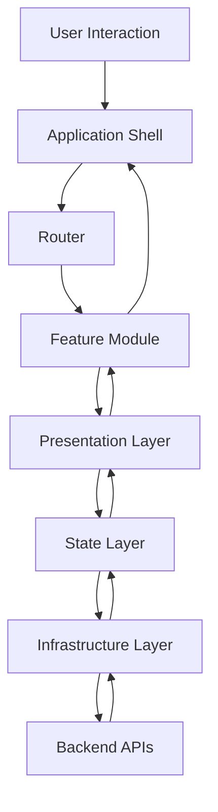

---

# 7. Application Shell

## APP-001 Overview

The Application Shell provides the persistent runtime environment for all feature modules.

It initializes:

- Application routing
- Authentication context
- Theme system
- Design tokens
- Global providers
- Query client
- Zustand stores
- Error boundaries
- Toast system
- Notification center
- Modal manager
- Analytics
- Telemetry
- Feature flags
- Runtime configuration

The shell remains mounted throughout the application's lifecycle, while individual feature modules are dynamically loaded based on navigation.

---

## Shell Responsibilities

| ID | Responsibility |
|----|----------------|
| LAYOUT-001 | Root application layout |
| LAYOUT-002 | Persistent navigation |
| LAYOUT-003 | Global providers |
| LAYOUT-004 | Authentication bootstrap |
| LAYOUT-005 | Session restoration |
| LAYOUT-006 | Theme initialization |
| LAYOUT-007 | Global overlays |
| LAYOUT-008 | Service worker registration |
| LAYOUT-009 | Runtime configuration loading |
| LAYOUT-010 | Error boundary initialization |

---

# 8. Feature-First Architecture

CardWise organizes all business capabilities into independent feature modules.

Each feature owns:

- Pages
- Components
- Hooks
- Services
- Models
- Validation
- Routing
- Assets
- Tests
- Feature-specific state

A feature must not directly manipulate another feature's internal implementation.

Cross-feature communication occurs only through:

- Shared APIs
- Shared services
- Event contracts
- Shared stores
- Infrastructure interfaces

---

## Benefits

- Independent development
- Easier ownership
- Reduced merge conflicts
- Better scalability
- Improved testing
- Simplified code navigation
- Predictable dependency graph

---

# 9. Clean Architecture

The frontend enforces a layered dependency model inspired by Clean Architecture.

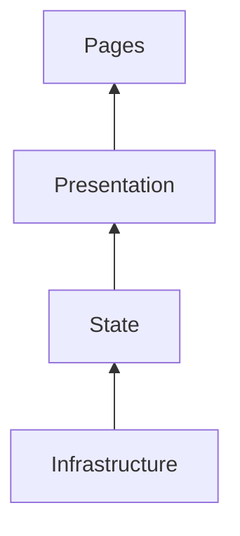

---

## Layer Responsibilities

| Layer | Responsibility |
|--------|----------------|
| Pages | Route composition |
| Presentation | UI rendering |
| State | Business interaction and state orchestration |
| Infrastructure | External systems, APIs, browser capabilities |

---

## Dependency Rule

Outer layers may depend on inner abstractions.

Inner layers must never depend on outer implementations.

This guarantees:

- Low coupling
- High maintainability
- Easier testing
- Infrastructure replacement
- Long-term scalability

---

# 10. Presentation Architecture

The presentation layer follows an MVVM-inspired pattern that separates UI rendering from state orchestration and infrastructure concerns.

| Layer | Responsibility |
|--------|----------------|
| Pages | Route-level composition |
| Layouts | Shared page structure |
| Components | UI rendering |
| Hooks | Presentation logic |
| View Models | Data transformation |
| Stores | State coordination |
| Services | Infrastructure access |

---

## Rendering Pipeline

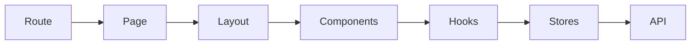

---

# 11. Dependency Rules

The following architectural dependency rules are mandatory.

| Rule ID | Rule |
|----------|------|
| ARC-201 | Features cannot directly depend on other feature internals. |
| ARC-202 | Shared modules must not import feature modules. |
| ARC-203 | Infrastructure must not depend on presentation components. |
| ARC-204 | UI components must remain business-agnostic where possible. |
| ARC-205 | Domain models must remain framework-independent. |
| ARC-206 | Global state should be minimized. |
| ARC-207 | Business logic must not reside in UI components. |
| ARC-208 | Cross-feature interactions require explicit interfaces. |

---

## Risks

| Risk | Mitigation |
|------|------------|
| Feature coupling | Enforce module boundaries and architectural reviews. |
| Shared module bloat | Regularly audit shared utilities and components. |
| Circular dependencies | Automated dependency graph validation in CI. |
| State leakage | Restrict global state to platform-level concerns. |

---

# 12. Project Structure

The repository adopts a Turborepo-based monorepo with clear separation between applications and reusable packages.

```text
cardwise/
│
├── apps/
│   ├── web/
│   ├── admin/
│   └── docs/
│
├── packages/
│   ├── design-system/
│   ├── ui/
│   ├── icons/
│   ├── hooks/
│   ├── utils/
│   ├── config/
│   ├── api-client/
│   ├── auth/
│   ├── analytics/
│   ├── telemetry/
│   ├── feature-flags/
│   ├── types/
│   └── testing/
│
├── tooling/
├── scripts/
├── infrastructure/
├── .github/
└── turbo.json
```

---

# 13. Folder Organization

Within each application, folders follow a consistent feature-first organization.

```text
src/
│
├── app/
├── routes/
├── layouts/
├── features/
├── shared/
├── components/
├── hooks/
├── providers/
├── services/
├── stores/
├── assets/
├── config/
├── constants/
├── types/
├── utils/
├── styles/
├── workers/
├── mocks/
└── tests/
```

---

## Organizational Principles

| ID | Principle |
|----|-----------|
| CFG-001 | Features own their implementation. |
| CFG-002 | Shared code remains framework-neutral where practical. |
| CFG-003 | Avoid deep nesting beyond three to four directory levels. |
| CFG-004 | Co-locate tests with their corresponding modules when appropriate. |
| CFG-005 | Separate platform concerns from business features. |

---

# 14. Naming Conventions

| Artifact | Convention | Example |
|----------|------------|---------|
| Feature | kebab-case | rewards-center |
| Component | PascalCase | RewardCard |
| Hook | useCamelCase | useRewardSummary |
| Store | camelCase + Store | rewardsStore |
| Route | kebab-case | /credit-cards |
| Utility | camelCase | formatCurrency |
| Constant | UPPER_SNAKE_CASE | DEFAULT_PAGE_SIZE |
| Type | PascalCase | RewardTransaction |
| Enum | PascalCase | RewardType |
| CSS Variable | --kebab-case | --color-primary |
| Design Token | token.category.item | color.brand.primary |

---

# 15. Application Lifecycle

The application follows a deterministic initialization sequence to ensure consistent runtime behavior.

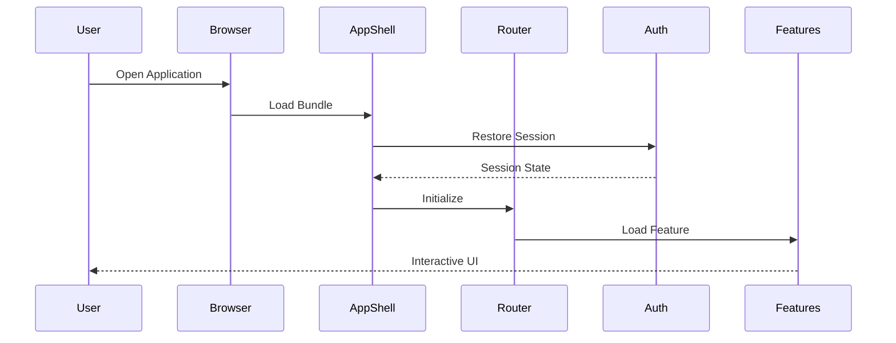

---

## Lifecycle Stages

| Stage | Description |
|--------|-------------|
| Bootstrap | Runtime initialization and configuration loading |
| Authentication | Session restoration and identity verification |
| Routing | Initial route resolution |
| Feature Loading | Lazy loading of feature bundles |
| Hydration | State restoration and cache synchronization |
| Interaction | User-driven application workflows |
| Background Sync | Periodic synchronization and cache updates |
| Shutdown | Cleanup of subscriptions and runtime resources |

---

# 16. Rendering Strategy

CardWise adopts a hybrid rendering strategy optimized for responsiveness, scalability, and user experience.

| Rendering Mode | Use Case |
|----------------|----------|
| Client-Side Rendering (CSR) | Authenticated application experiences |
| Progressive Rendering | Large dashboards and analytics pages |
| Lazy Rendering | Feature modules and heavy components |
| Incremental Rendering | Infinite lists and paginated content |
| Skeleton Rendering | Initial loading states |
| Virtualized Rendering | High-volume tables and transaction histories |

---

## Rendering Principles

- Prioritize Time to Interactive (TTI).
- Avoid unnecessary re-renders through granular state subscriptions.
- Defer non-critical rendering until after initial interaction.
- Use virtualization for large datasets.
- Maintain consistent layout stability to minimize cumulative layout shift (CLS).

---

# 17. Configuration Strategy

Configuration is centralized, immutable at runtime where appropriate, and environment-aware.

## Configuration Sources

| Source | Purpose |
|--------|---------|
| Build-Time Variables | Compile-time feature toggles and endpoints |
| Runtime Configuration | Deployment-specific settings |
| Feature Flags | Controlled rollout of capabilities |
| Remote Configuration | Dynamic operational adjustments |
| User Preferences | Personalized application settings |

---

## Configuration Principles

| ID | Principle |
|----|-----------|
| CFG-101 | No hardcoded environment values. |
| CFG-102 | Validate configuration during application startup. |
| CFG-103 | Separate secrets from frontend configuration. |
| CFG-104 | Version configuration changes. |
| CFG-105 | Support safe fallback defaults where appropriate. |

---

# 18. Environment Management

CardWise supports multiple deployment environments with isolated configurations and infrastructure.

| Environment | Purpose |
|-------------|---------|
| Local | Individual development |
| Development | Team integration |
| QA | Functional and regression testing |
| Staging | Pre-production validation |
| Production | Live customer environment |

---

## Environment Characteristics

| ID | Characteristic |
|----|----------------|
| DEP-001 | Environment-specific API endpoints |
| DEP-002 | Isolated authentication configuration |
| DEP-003 | Dedicated analytics projects |
| DEP-004 | Separate telemetry pipelines |
| DEP-005 | Independent feature flag configurations |
| DEP-006 | Environment-aware logging levels |
| DEP-007 | Controlled rollout strategies |
| DEP-008 | CDN-backed static asset delivery |

---

## Operational Considerations

| Area | Consideration |
|------|---------------|
| Configuration Drift | Detect and validate configuration mismatches during startup. |
| Rollbacks | Maintain backward-compatible configuration contracts for safe deployment rollback. |
| Monitoring | Track frontend health, startup failures, and client-side errors across environments. |
| Security | Ensure no sensitive credentials are exposed in client bundles. |
| Performance | Optimize static asset delivery through caching, compression, and CDN distribution. |
| Developer Experience | Standardize local setup and environment parity to reduce onboarding friction. |

# Part 2 — Feature Module Design

---

# 19. Feature Module Design

The CardWise frontend is organized using a **Feature-First Modular Architecture** aligned with Domain-Driven Design (DDD). Each feature module represents a cohesive business capability with clearly defined ownership, public interfaces, internal implementation boundaries, and lifecycle.

A feature module is independently developed, tested, deployed (as part of the frontend bundle), and evolved without exposing its internal implementation to other modules.

---

## Objectives

| ID | Objective |
|-----|----------|
| FE-101 | Strong domain isolation |
| FE-102 | High cohesion |
| FE-103 | Low coupling |
| FE-104 | Independent evolution |
| FE-105 | Shared UI consistency |
| FE-106 | Predictable ownership |
| FE-107 | Testability |
| FE-108 | Feature discoverability |

---

## Module Characteristics

Every feature module owns:

- Pages
- Route definitions
- Business components
- View models
- Validation schemas
- Local state
- Query definitions
- API adapters
- Feature hooks
- Feature-specific utilities
- Assets
- Tests
- Feature documentation

A module never exposes internal implementation details.

---

# 20. Bounded Contexts

The frontend mirrors backend bounded contexts to minimize translation complexity between client and server.

| Context ID | Context | Responsibility |
|------------|----------|---------------|
| FE-CTX-001 | Identity | Authentication, authorization, profile |
| FE-CTX-002 | User | User preferences, onboarding |
| FE-CTX-003 | Portfolio | Credit cards owned by user |
| FE-CTX-004 | Rewards | Reward points, cashback |
| FE-CTX-005 | Offers | Merchant & bank offers |
| FE-CTX-006 | Payments | Bills, reminders, payments |
| FE-CTX-007 | Transactions | Spending history |
| FE-CTX-008 | Statements | Statement management |
| FE-CTX-009 | Travel | Lounge, hotel, flights |
| FE-CTX-010 | AI | Recommendation engine |
| FE-CTX-011 | Search | Universal search |
| FE-CTX-012 | Notifications | Alerts & reminders |
| FE-CTX-013 | Analytics | Dashboards & insights |
| FE-CTX-014 | Settings | Preferences |
| FE-CTX-015 | Premium | Subscription management |
| FE-CTX-016 | Referral | Referral program |
| FE-CTX-017 | Admin | Administration portal |
| FE-CTX-018 | Platform | Shared platform services |

---

# 21. Module Catalog

## Core Application Modules

| Module ID | Module | Category |
|------------|---------|----------|
| FE-201 | Authentication | Core |
| FE-202 | User Profile | Core |
| FE-203 | Dashboard | Core |
| FE-204 | Notifications | Core |
| FE-205 | Search | Core |
| FE-206 | Settings | Core |

---

## Financial Modules

| Module ID | Module |
|------------|---------|
| FE-210 | Credit Card Portfolio |
| FE-211 | Card Details |
| FE-212 | Card Comparison |
| FE-213 | Transactions |
| FE-214 | Statements |
| FE-215 | Bill Payments |
| FE-216 | EMI Manager |
| FE-217 | Spending Analytics |

---

## Rewards Modules

| Module ID | Module |
|------------|---------|
| FE-220 | Reward Points |
| FE-221 | Cashback |
| FE-222 | Redemption |
| FE-223 | Milestones |
| FE-224 | Annual Fee Waiver |
| FE-225 | Loyalty Programs |

---

## Offer Modules

| Module ID | Module |
|------------|---------|
| FE-230 | Merchant Offers |
| FE-231 | Bank Offers |
| FE-232 | Nearby Offers |
| FE-233 | Offer Discovery |
| FE-234 | Offer Alerts |

---

## Travel Modules

| Module ID | Module |
|------------|---------|
| FE-240 | Travel Dashboard |
| FE-241 | Lounge Access |
| FE-242 | Hotel Benefits |
| FE-243 | Flight Benefits |
| FE-244 | Insurance |
| FE-245 | Visa Assistance |

---

## AI Modules

| Module ID | Module |
|------------|---------|
| FE-250 | AI Assistant |
| FE-251 | Spending Advisor |
| FE-252 | Card Recommendation |
| FE-253 | Offer Recommendation |
| FE-254 | Reward Optimizer |
| FE-255 | AI Insights |

---

## Productivity Modules

| Module ID | Module |
|------------|---------|
| FE-260 | Calendar |
| FE-261 | Timeline |
| FE-262 | Tasks |
| FE-263 | Reports |
| FE-264 | Export Center |

---

## Growth Modules

| Module ID | Module |
|------------|---------|
| FE-270 | Premium |
| FE-271 | Referral |
| FE-272 | Gamification |
| FE-273 | Achievements |

---

## Administration Modules

| Module ID | Module |
|------------|---------|
| FE-280 | Admin Dashboard |
| FE-281 | User Management |
| FE-282 | Offer Management |
| FE-283 | Content Management |
| FE-284 | Audit Logs |
| FE-285 | System Monitoring |

---

# 22. Core Modules

Core modules are loaded during application startup and remain available throughout the application's lifecycle.

| Module | Purpose |
|----------|----------|
| Authentication | Identity management |
| Navigation | Global navigation |
| Layout | Shared shell |
| Theme | Theme management |
| Notifications | Toasts & alerts |
| Session | Session management |
| Configuration | Runtime configuration |
| Error Boundary | Global fault tolerance |

---

## Core Module Rules

| Rule ID | Rule |
|----------|------|
| FE-301 | Core modules cannot depend on feature modules. |
| FE-302 | Core modules expose stable APIs only. |
| FE-303 | Core modules initialize before feature loading. |
| FE-304 | Core modules own application lifecycle events. |

---

# 23. Shared Modules

Shared modules provide reusable functionality across multiple features without containing business-specific logic.

## Shared Categories

| Category | Examples |
|-----------|----------|
| UI | Buttons, Dialogs, Inputs |
| Layout | Page templates |
| Forms | Shared form controls |
| Tables | Data grids |
| Charts | Visualization wrappers |
| Hooks | Reusable hooks |
| Utilities | Date, currency, formatting |
| Validators | Common schemas |
| Icons | Custom iconography |
| Constants | Shared enums |

---

## Shared Module Guidelines

| Rule | Description |
|------|-------------|
| DS-101 | Must be domain-agnostic |
| DS-102 | No business logic |
| DS-103 | No feature-specific dependencies |
| DS-104 | Public APIs must remain stable |
| DS-105 | Backward compatibility preferred |

---

# 24. Platform Modules

Platform modules abstract browser capabilities and external integrations.

| Module | Responsibility |
|----------|---------------|
| API Client | HTTP communication |
| Authentication | Token lifecycle |
| Storage | Local persistence |
| Analytics | Event tracking |
| Telemetry | Tracing |
| Logging | Client logs |
| Service Worker | Offline support |
| Feature Flags | Runtime experimentation |
| Error Reporting | Exception capture |
| Permissions | Browser permissions |
| Notifications | Push notifications |
| Clipboard | Clipboard access |

---

## Platform Principles

- Browser APIs are never accessed directly from features.
- Platform modules provide abstraction layers.
- Runtime behavior remains consistent across environments.
- Infrastructure changes do not impact business features.

---

# 25. Feature Modules

Every feature follows a standardized internal organization.

```text
feature/
│
├── pages/
├── components/
├── hooks/
├── services/
├── stores/
├── queries/
├── mutations/
├── validators/
├── models/
├── types/
├── routes/
├── assets/
├── constants/
├── utils/
└── tests/
```

---

## Feature Ownership

Each feature owns:

- UI
- Validation
- Business interactions
- API orchestration
- Local caching
- Tests
- Documentation

---

## Responsibilities

| Layer | Responsibility |
|--------|----------------|
| Pages | Route entry |
| Components | Rendering |
| Hooks | UI orchestration |
| Queries | Server state |
| Stores | Client state |
| Services | Business interactions |
| Validators | Form validation |

---

# 26. Dependency Matrix

| Consumer | Allowed Dependencies |
|------------|---------------------|
| Feature | Shared, Platform |
| Shared | Platform |
| Platform | External Libraries |
| Pages | Feature Components |
| Components | Shared UI |
| Hooks | Stores, Queries |
| Queries | API Client |
| Stores | Platform Services |

---

## Forbidden Dependencies

| Rule ID | Forbidden Dependency |
|----------|----------------------|
| FE-401 | Feature → Feature Internals |
| FE-402 | Shared → Feature |
| FE-403 | Platform → Feature |
| FE-404 | Component → API Client |
| FE-405 | Component → Browser APIs |
| FE-406 | Shared → Business Logic |

---

# 27. Module Communication

Modules communicate only through approved interfaces.

Approved communication methods:

- Public services
- Public hooks
- Shared stores
- TanStack Query cache
- Navigation
- Event bus (limited)
- Browser events (platform managed)

Direct imports into another module's private implementation are prohibited.

---

## Communication Patterns

| Pattern | Recommended |
|----------|-------------|
| Service APIs | ✅ |
| Shared Components | ✅ |
| Shared Hooks | ✅ |
| Query Cache | ✅ |
| Event Bus | Limited |
| Direct Store Mutation | ❌ |
| Cross Feature Imports | ❌ |

---

# 28. Cross-Module Interaction Flow

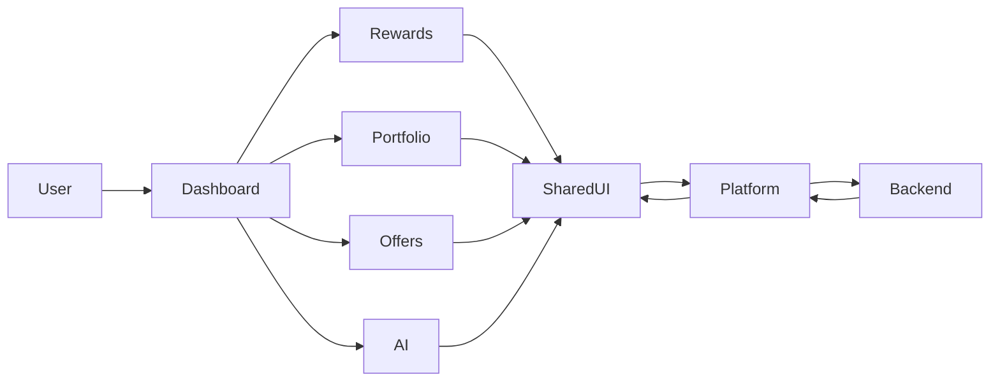

---

# 29. Module Dependency Diagram

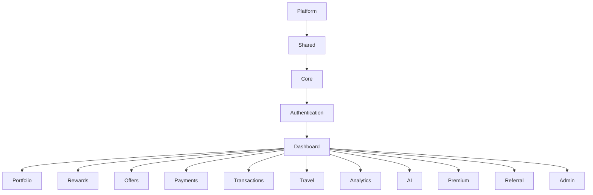

---

# 30. Operational Considerations

| Area | Consideration |
|------|---------------|
| Scalability | New feature modules must integrate without modifying existing module boundaries. |
| Ownership | Each module should have clear engineering ownership and documentation. |
| Dependency Control | Automated tooling should detect circular dependencies and unauthorized imports. |
| Bundle Size | Feature modules should be lazy-loadable where practical to minimize initial payload. |
| Maintainability | Public interfaces must remain stable while allowing internal implementation changes. |
| Testing | Every module must be independently testable with isolated mocks and fixtures. |
| Security | Platform modules should centralize authentication, authorization, and sensitive browser APIs. |
| Performance | Shared modules should avoid unnecessary re-renders and expensive runtime dependencies. |


# Part 3 — Routing Architecture

---

# 31. Routing Architecture

The CardWise frontend adopts a **hierarchical, declarative, feature-driven routing architecture** using **React Router v7**. Routing is designed to provide:

- Predictable URL structures
- Independent feature ownership
- Nested layouts
- Lazy-loaded feature modules
- Route-level authorization
- Deep linking
- Breadcrumb generation
- Analytics instrumentation
- SEO-ready public routes
- Offline-aware navigation

Every route belongs to exactly one feature module and is registered through a centralized routing registry while maintaining feature ownership.

---

## Objectives

| ID | Objective |
|-----|----------|
| ROUTE-001 | Feature-owned routing |
| ROUTE-002 | Stable URLs |
| ROUTE-003 | Lazy route loading |
| ROUTE-004 | Secure route access |
| ROUTE-005 | Deep linking |
| ROUTE-006 | Predictable navigation |
| ROUTE-007 | Reusable layouts |
| ROUTE-008 | Navigation observability |

---

# 32. Routing Principles

| ID | Principle | Description |
|----|-----------|-------------|
| ROUTE-101 | URLs are permanent | Existing URLs should remain backward compatible whenever possible. |
| ROUTE-102 | Feature ownership | Each feature owns its route definitions. |
| ROUTE-103 | Layout reuse | Pages share common layouts instead of duplicating structure. |
| ROUTE-104 | Lazy by default | Feature bundles load only when needed. |
| ROUTE-105 | Route metadata | Every route declares title, permissions, breadcrumbs, analytics, and feature flags. |
| ROUTE-106 | Authorization first | Access checks occur before rendering protected content. |
| ROUTE-107 | Observable navigation | Navigation events are tracked for diagnostics and analytics. |

---

# 33. Route Categories

| Category | Description |
|-----------|-------------|
| Public | Accessible without authentication |
| Authentication | Login, signup, onboarding |
| Protected | Requires authenticated user |
| Premium | Requires active premium subscription |
| Admin | Restricted to administrative users |
| System | Error, maintenance, health pages |
| Modal Routes | Overlay-based navigation |
| Offline | Offline fallback experiences |

---

# 34. Route Registry

## Public Routes

| Route ID | URL | Purpose |
|-----------|-----|----------|
| PAGE-001 | / | Landing page |
| PAGE-002 | /about | Product overview |
| PAGE-003 | /pricing | Premium plans |
| PAGE-004 | /privacy | Privacy policy |
| PAGE-005 | /terms | Terms of service |
| PAGE-006 | /help | Help center |

---

## Authentication Routes

| Route ID | URL |
|-----------|-----|
| AUTH-101 | /login |
| AUTH-102 | /signup |
| AUTH-103 | /forgot-password |
| AUTH-104 | /reset-password |
| AUTH-105 | /verify-email |
| AUTH-106 | /oauth/callback |
| AUTH-107 | /onboarding |

---

## Application Routes

| Route ID | URL |
|-----------|-----|
| PAGE-100 | /dashboard |
| PAGE-101 | /portfolio |
| PAGE-102 | /cards |
| PAGE-103 | /transactions |
| PAGE-104 | /statements |
| PAGE-105 | /payments |
| PAGE-106 | /rewards |
| PAGE-107 | /cashback |
| PAGE-108 | /offers |
| PAGE-109 | /travel |
| PAGE-110 | /analytics |
| PAGE-111 | /search |
| PAGE-112 | /notifications |
| PAGE-113 | /calendar |
| PAGE-114 | /profile |
| PAGE-115 | /settings |

---

## Premium Routes

| Route ID | URL |
|-----------|-----|
| PAGE-150 | /premium |
| PAGE-151 | /premium/benefits |
| PAGE-152 | /premium/reports |

---

## Admin Routes

| Route ID | URL |
|-----------|-----|
| PAGE-200 | /admin |
| PAGE-201 | /admin/users |
| PAGE-202 | /admin/cards |
| PAGE-203 | /admin/offers |
| PAGE-204 | /admin/content |
| PAGE-205 | /admin/analytics |
| PAGE-206 | /admin/system |

---

# 35. Navigation System

Navigation is centralized within the Application Shell and dynamically adapts to user context.

---

## Navigation Types

| Navigation | Description |
|------------|-------------|
| Primary Navigation | Main feature access |
| Secondary Navigation | Context-specific actions |
| Sidebar Navigation | Desktop feature navigation |
| Bottom Navigation | Mobile/PWA navigation |
| Breadcrumb Navigation | Context awareness |
| Global Search Navigation | Universal search |
| Quick Actions | Frequently used operations |
| Context Menus | Entity-specific actions |

---

## Navigation Rules

| Rule ID | Rule |
|----------|------|
| NAV-101 | Navigation is permission-aware. |
| NAV-102 | Navigation reflects feature availability. |
| NAV-103 | Hidden routes remain accessible only through valid links when appropriate. |
| NAV-104 | Navigation state persists across refreshes where beneficial. |
| NAV-105 | Keyboard navigation is fully supported. |

---

# 36. Layout Architecture

Layouts define shared structural components for related pages while allowing page-specific content.

---

## Layout Catalog

| Layout ID | Layout | Purpose |
|------------|---------|----------|
| LAYOUT-101 | Root Layout | Application shell |
| LAYOUT-102 | Public Layout | Marketing pages |
| LAYOUT-103 | Auth Layout | Authentication flows |
| LAYOUT-104 | Dashboard Layout | Primary authenticated experience |
| LAYOUT-105 | Settings Layout | User preferences |
| LAYOUT-106 | Analytics Layout | Reporting experiences |
| LAYOUT-107 | Admin Layout | Administrative console |
| LAYOUT-108 | Error Layout | Error boundaries |
| LAYOUT-109 | Offline Layout | Offline experiences |

---

## Layout Responsibilities

- Header
- Sidebar
- Footer
- Notifications
- Global search
- Theme switcher
- Breadcrumbs
- Overlay containers
- Dialog portal
- Toast manager

---

# 37. Protected Routes

Protected routes enforce authentication and authorization before rendering content.

---

## Protection Levels

| Level | Requirement |
|--------|-------------|
| Level 1 | Authenticated user |
| Level 2 | Verified email |
| Level 3 | Completed onboarding |
| Level 4 | Premium subscription |
| Level 5 | Administrative privileges |

---

## Authentication Flow

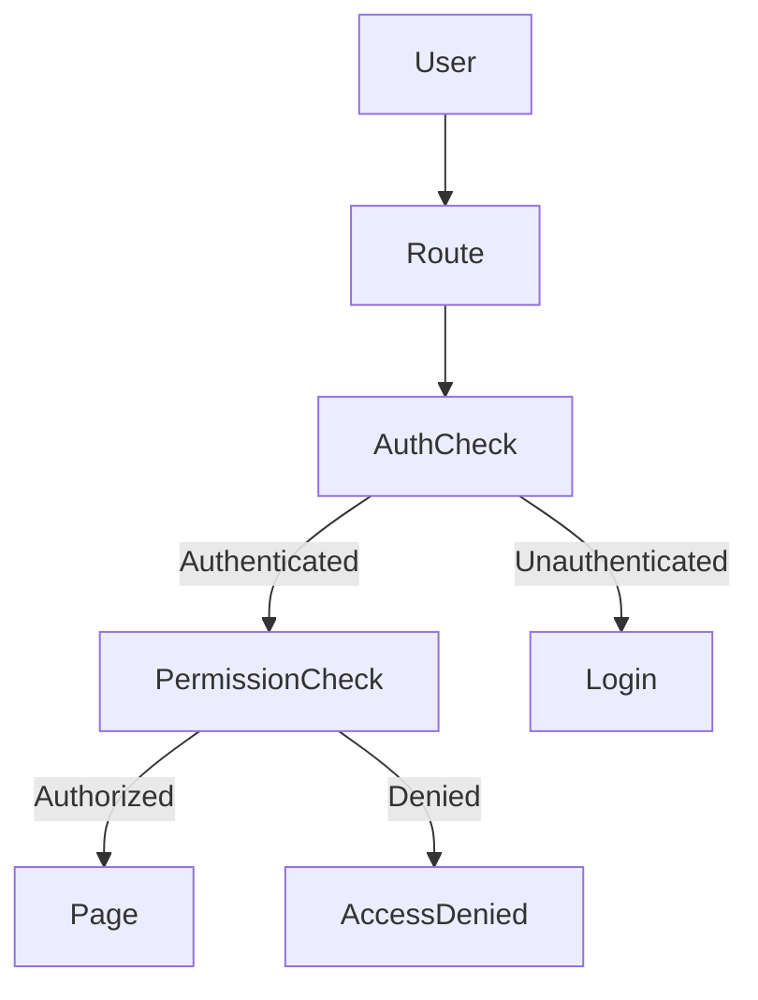

---

## Operational Considerations

- Preserve intended destination after login.
- Prevent unauthorized UI rendering.
- Handle expired sessions gracefully.
- Display meaningful access-denied messaging.

---

# 38. Nested Routes

Nested routes reduce duplication and improve layout reuse.

Example hierarchy:

```text
/dashboard
    /overview
    /portfolio
    /rewards
    /offers
    /analytics
```

---

## Nested Route Benefits

| Benefit | Description |
|----------|-------------|
| Shared Layouts | Avoid repeated UI structure |
| Faster Navigation | Persistent layout components |
| Better Code Splitting | Child routes load independently |
| Simplified Breadcrumbs | Hierarchical route metadata |
| Improved Performance | Reduced remounting |

---

# 39. Route Guards

Route guards evaluate runtime conditions before navigation.

---

## Guard Types

| Guard ID | Condition |
|-----------|-----------|
| AUTH-201 | Authentication |
| AUTH-202 | Session validity |
| AUTH-203 | Email verification |
| AUTH-204 | Onboarding completion |
| AUTH-205 | Premium entitlement |
| AUTH-206 | Admin role |
| AUTH-207 | Feature flag availability |
| AUTH-208 | Maintenance mode |
| AUTH-209 | Offline compatibility |

---

## Guard Execution Order


---

# 40. Deep Linking

Deep linking enables direct access to specific application states.

Supported scenarios include:

- Specific credit card
- Individual transaction
- Reward redemption
- Merchant offer
- Statement details
- AI recommendation
- Calendar event
- Notification
- Search result
- Shared report

---

## Deep Link Requirements

| ID | Requirement |
|----|-------------|
| ROUTE-201 | Stable identifiers |
| ROUTE-202 | Restorable application state |
| ROUTE-203 | Authorization validation |
| ROUTE-204 | Shareable URLs |
| ROUTE-205 | Analytics attribution |

---

# 41. Page Architecture

Each page is responsible for route composition only.

Business logic remains inside feature hooks, view models, and services.

---

## Page Structure

```text
Page

├── Layout
│
├── Feature Header
│
├── Filters
│
├── Content Sections
│
├── Actions
│
└── Footer Components
```

---

## Responsibilities

| Layer | Responsibility |
|---------|---------------|
| Page | Route composition |
| Layout | Shared structure |
| Components | Rendering |
| Hooks | State orchestration |
| Queries | Server communication |
| Services | Business workflows |

---

# 42. URL Strategy

URLs are designed to be:

- Human readable
- Predictable
- Stable
- REST-inspired
- Bookmarkable
- Shareable
- SEO-friendly for public pages

---

## URL Guidelines

| Rule | Example |
|------|----------|
| Lowercase | /credit-cards |
| Hyphen-separated | /annual-fee-waiver |
| Resource-oriented | /cards/{cardId} |
| Nested resources | /cards/{cardId}/transactions |
| Query parameters for filters | ?bank=hdfc |
| Avoid UI state in path | Use query parameters where appropriate |

---

## URL Examples

| Resource | URL |
|-----------|-----|
| Card | /cards/{cardId} |
| Transaction | /transactions/{transactionId} |
| Reward | /rewards/{rewardId} |
| Offer | /offers/{offerId} |
| User | /profile |
| Settings | /settings/preferences |

---

# 43. Breadcrumb System

Breadcrumbs are generated automatically from route metadata.

---

## Example

```text
Dashboard

>

Portfolio

>

Card Details

>

Reward History
```

---

## Breadcrumb Rules

| Rule ID | Rule |
|----------|------|
| NAV-201 | Every page declares breadcrumb metadata. |
| NAV-202 | Dynamic entities resolve display names asynchronously. |
| NAV-203 | Breadcrumbs reflect nested routing hierarchy. |
| NAV-204 | Breadcrumbs support keyboard navigation. |

---

# 44. Navigation State

Navigation state is managed separately from application state.

---

## Navigation State Includes

- Current route
- Previous route
- Navigation history
- Active menu item
- Expanded sidebar groups
- Breadcrumb trail
- Search context
- Recently visited pages
- Pending redirects

---

## Persistence Strategy

| State | Persisted |
|---------|-----------|
| Sidebar expansion | Yes |
| Active theme | Yes |
| Recent pages | Yes |
| Breadcrumbs | No |
| Pending redirect | Temporary |
| Navigation history | Session only |

---

# 45. Routing Lifecycle

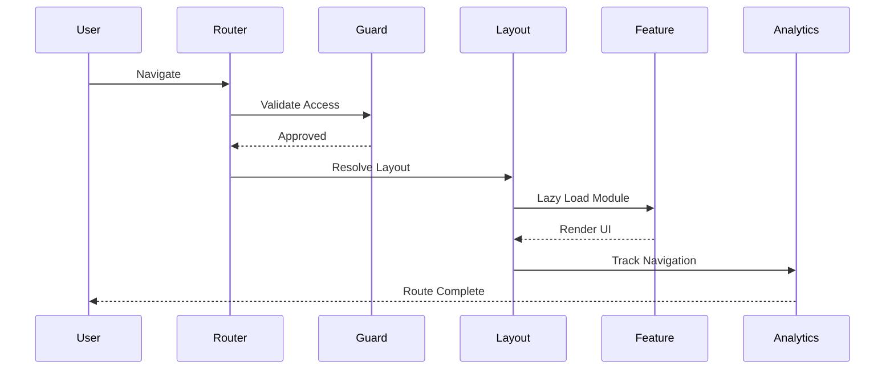

---

# 46. Operational Considerations

| Area | Consideration |
|------|---------------|
| Performance | Lazy-load route bundles and prefetch frequently visited destinations. |
| Security | Enforce authorization before rendering protected content. |
| Observability | Record navigation timings, failures, and route transitions for diagnostics. |
| Accessibility | Preserve focus management and announce page changes to assistive technologies. |
| Offline Support | Route to offline-capable experiences when network connectivity is unavailable. |
| Maintainability | Route metadata should remain centralized and version-controlled. |
| Scalability | New feature routes must integrate without modifying unrelated routing logic. |


# Part 4 — State Management

---

# 47. State Management Overview

CardWise uses a **multi-layer state architecture** that clearly separates **server state**, **client state**, **UI state**, and **derived state**.

Instead of maintaining a single global store, each category of state is managed by the technology best suited for it.

| State Type | Technology |
|------------|------------|
| Server State | TanStack Query |
| Client State | Zustand |
| Form State | React Hook Form |
| URL State | React Router |
| Session State | Auth Store |
| UI State | Local Feature Stores |
| Persistent State | Browser Storage |
| Cached Offline State | IndexedDB + Workbox |

---

## Objectives

| ID | Objective |
|----|-----------|
| STATE-001 | Minimal global state |
| STATE-002 | Predictable updates |
| STATE-003 | Clear ownership |
| STATE-004 | Optimistic UX |
| STATE-005 | Offline resilience |
| STATE-006 | Efficient caching |
| STATE-007 | High performance |
| STATE-008 | Easy debugging |

---

# 48. State Architecture

The frontend follows a layered state hierarchy.

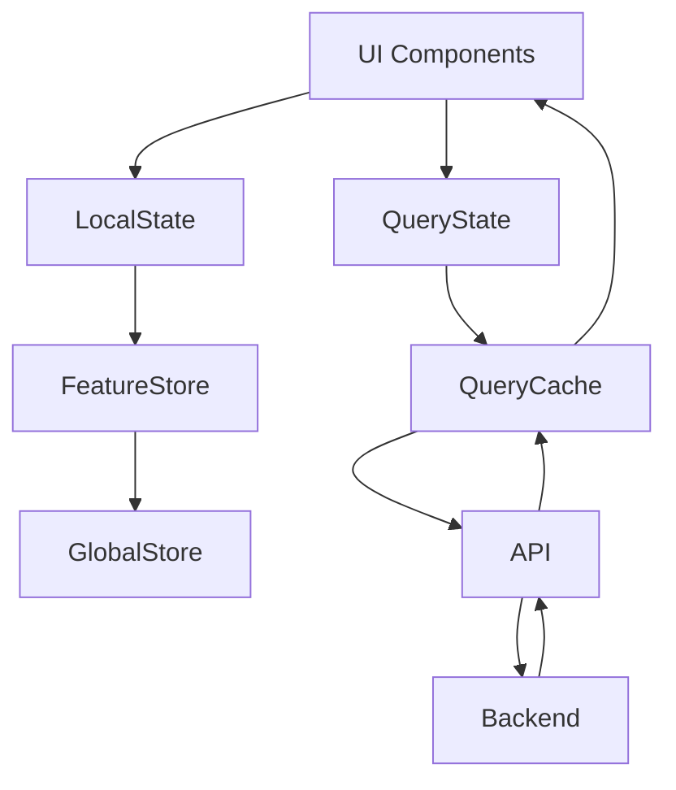

---

## State Layers

| Layer | Responsibility |
|--------|----------------|
| Component State | Temporary UI interactions |
| Feature Store | Feature-specific client state |
| Global Store | Cross-feature application state |
| Query Cache | Server data |
| Persistent Storage | Local persistence |
| Offline Cache | Offline synchronization |

---

# 49. Zustand Architecture

Zustand manages lightweight client-side application state.

Only client-owned state is stored in Zustand.

Server data must never be duplicated inside Zustand unless specifically justified.

---

## Store Categories

| Store ID | Store |
|-----------|------|
| STORE-001 | Auth Store |
| STORE-002 | User Store |
| STORE-003 | Theme Store |
| STORE-004 | Notification Store |
| STORE-005 | Preferences Store |
| STORE-006 | Navigation Store |
| STORE-007 | Feature Flag Store |
| STORE-008 | Search Store |
| STORE-009 | Filter Store |
| STORE-010 | Modal Store |
| STORE-011 | Sidebar Store |
| STORE-012 | Session Store |

---

## Feature Stores

Each major feature owns its own store.

Examples:

- Portfolio Store
- Rewards Store
- Transactions Store
- Analytics Store
- Calendar Store
- AI Assistant Store

Feature stores remain isolated and cannot directly mutate other feature stores.

---

## Store Principles

| Rule ID | Rule |
|----------|------|
| STORE-101 | Keep stores small and focused. |
| STORE-102 | Prefer feature-local stores over global stores. |
| STORE-103 | Avoid storing server data. |
| STORE-104 | Use immutable update patterns. |
| STORE-105 | Expose actions through stable interfaces. |
| STORE-106 | Prevent circular store dependencies. |

---

# 50. TanStack Query Architecture

TanStack Query is the single source of truth for server state.

---

## Responsibilities

- API communication
- Query caching
- Background refetching
- Cache invalidation
- Pagination
- Infinite scrolling
- Optimistic updates
- Retry handling
- Request deduplication
- Network awareness

---

## Query Types

| Query Type | Example |
|-------------|----------|
| Entity Query | Card details |
| Collection Query | Portfolio |
| Infinite Query | Transactions |
| Search Query | Universal search |
| Analytics Query | Spending insights |
| Recommendation Query | AI suggestions |

---

## Mutation Types

| Mutation | Example |
|----------|----------|
| Create | Add card |
| Update | Edit profile |
| Delete | Remove card |
| Action | Redeem rewards |
| Upload | Statement upload |
| Import | CSV import |

---

# 51. Server State

Server state represents backend-owned information.

Examples include:

- User profile
- Credit cards
- Offers
- Transactions
- Statements
- Rewards
- Cashback
- AI recommendations
- Analytics
- Notifications
- Premium status

---

## Server State Rules

| Rule ID | Rule |
|----------|------|
| CACHE-101 | Server state lives exclusively in TanStack Query. |
| CACHE-102 | Avoid unnecessary duplication. |
| CACHE-103 | Queries define ownership boundaries. |
| CACHE-104 | Cached responses must support invalidation. |
| CACHE-105 | Stale data should be clearly managed. |

---

# 52. Client State

Client state represents application-owned runtime information.

Examples:

- Theme
- Sidebar visibility
- Selected filters
- Wizard progress
- Active tab
- Sort order
- Dialog visibility
- Pending uploads
- User preferences
- Search input

---

## Client State Ownership

| Category | Owner |
|-----------|-------|
| Theme | Theme Store |
| Navigation | Navigation Store |
| Filters | Feature Store |
| Modals | Modal Store |
| Preferences | User Store |
| Session | Session Store |

---

# 53. Global State

Global state should remain intentionally small.

---

## Allowed Global State

| State |
|--------|
| Authentication |
| User Identity |
| Theme |
| Feature Flags |
| Locale |
| Navigation |
| Runtime Configuration |
| Notifications |
| Connectivity Status |

---

## Disallowed Global State

- Portfolio data
- Transaction lists
- Reward history
- Analytics datasets
- Search results
- Card details
- Offer catalog

These belong to server state.

---

# 54. UI State

UI state is ephemeral and tied to rendering behavior.

Examples include:

- Expanded panels
- Hover state
- Loading spinners
- Selected table rows
- Active accordions
- Wizard step
- Open dialogs
- Toast visibility
- Animation state

---

## UI State Guidelines

| Rule | Description |
|------|-------------|
| STATE-201 | Keep UI state as local as possible. |
| STATE-202 | Avoid unnecessary promotion to global stores. |
| STATE-203 | Reset transient state on unmount unless persistence is required. |
| STATE-204 | Derive UI state where possible instead of duplicating it. |

---

# 55. Cache Strategy

Caching minimizes network requests while ensuring data freshness.

---

## Cache Layers

| Layer | Technology |
|--------|------------|
| Memory Cache | TanStack Query |
| Browser Cache | HTTP Cache |
| Persistent Cache | IndexedDB |
| Static Assets | CDN |
| Offline Cache | Workbox |

---

## Cache Policies

| Data | Policy |
|------|--------|
| User Profile | Long-lived with background refresh |
| Portfolio | Stale-while-revalidate |
| Transactions | Paginated with incremental refresh |
| Rewards | Short refresh interval |
| Offers | Time-based invalidation |
| AI Recommendations | Limited lifetime |
| Static Metadata | Versioned cache |

---

## Cache Invalidation

Triggers include:

- Successful mutation
- Session change
- Logout
- Feature flag updates
- Manual refresh
- Version upgrades
- Background synchronization

---

# 56. Optimistic Updates

Optimistic updates provide immediate UI feedback before server confirmation.

---

## Suitable Operations

| Operation | Optimistic |
|------------|------------|
| Profile update | Yes |
| Notification dismissal | Yes |
| Favorite card | Yes |
| Bookmark offer | Yes |
| Preference changes | Yes |
| Theme changes | Yes |
| Filter updates | Yes |

---

## Unsuitable Operations

| Operation | Reason |
|------------|--------|
| Bill payment | Financial integrity |
| Reward redemption | Server validation required |
| Card deletion | Irreversible action |
| Premium purchase | Payment confirmation |
| Identity verification | Compliance workflow |

---

## Optimistic Update Flow

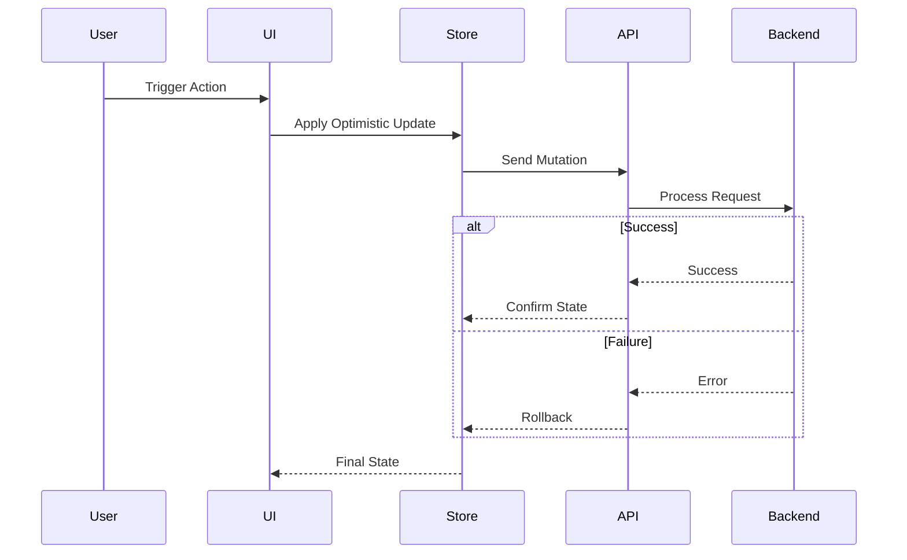

---

# 57. Data Synchronization

Data synchronization ensures consistency between frontend caches and backend systems.

---

## Synchronization Sources

- User interactions
- Background refresh
- Window focus
- Network reconnection
- Push notifications
- Manual refresh
- Feature mutations
- Scheduled polling (where required)

---

## Synchronization Strategy

| Event | Action |
|--------|--------|
| Window focus | Revalidate stale queries |
| Network restored | Retry failed requests |
| Successful mutation | Invalidate related queries |
| Logout | Clear sensitive caches |
| Login | Bootstrap essential queries |
| App version update | Refresh static configuration |

---

# 58. State Flow Architecture

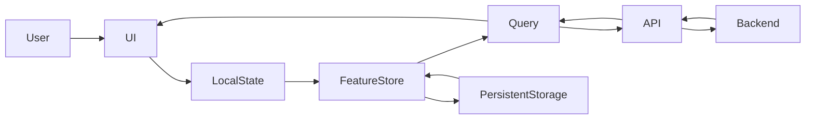

---

# 59. State Persistence

Only selected state is persisted across browser sessions.

---

## Persisted State

| State | Storage |
|---------|---------|
| Theme | Local Storage |
| User Preferences | Local Storage |
| Sidebar State | Local Storage |
| Language | Local Storage |
| Feature Flags | Memory (runtime) |
| Authentication Tokens | Secure HTTP-only cookies / secure storage strategy |
| Query Cache | IndexedDB (selected datasets) |

---

## Non-Persisted State

- Temporary filters
- Dialog visibility
- Loading indicators
- Active animations
- Hover state
- In-flight requests
- Pending optimistic rollbacks

---

# 60. Error Recovery

State management must support graceful recovery from failures.

---

## Recovery Mechanisms

| Failure | Recovery |
|----------|----------|
| Query failure | Automatic retry with exponential backoff |
| Network loss | Offline mode with queued synchronization |
| Store corruption | Reset to default state |
| Authentication expiry | Silent refresh or re-authentication |
| Cache inconsistency | Targeted invalidation and refetch |
| Version mismatch | Clear incompatible persisted state |

---

# 61. Operational Considerations

| Area | Consideration |
|------|---------------|
| Performance | Minimize unnecessary subscriptions and component re-renders through selective state access. |
| Maintainability | Clearly document ownership for every store and query. |
| Security | Never persist sensitive data in insecure browser storage. |
| Offline Support | Ensure cached data is version-aware and safely synchronized after reconnection. |
| Scalability | Favor feature-local state to avoid oversized global stores. |
| Debugging | Provide development tooling for inspecting stores, queries, cache invalidations, and mutations. |
| Testing | Mock stores and query clients independently for deterministic unit and integration testing. |


# Part 5 — Component Architecture

---

# 62. Component Architecture

The CardWise frontend follows a **Component-Driven Development (CDD)** approach with **Atomic Design principles** where appropriate. Components are designed to be:

- Highly reusable
- Composable
- Accessible
- Testable
- Framework-consistent
- Performance optimized
- Theme aware
- Responsive by default

The objective is to ensure every feature is composed from standardized building blocks rather than bespoke implementations.

---

## Objectives

| ID | Objective |
|----|-----------|
| CMP-001 | Maximize component reuse |
| CMP-002 | Enforce visual consistency |
| CMP-003 | Minimize duplication |
| CMP-004 | Improve maintainability |
| CMP-005 | Support accessibility by default |
| CMP-006 | Enable independent evolution |
| CMP-007 | Optimize rendering performance |
| CMP-008 | Simplify testing |

---

# 63. Component Design Principles

| ID | Principle | Description |
|----|-----------|-------------|
| CMP-101 | Single Responsibility | A component performs one well-defined responsibility. |
| CMP-102 | Composition Over Configuration | Prefer composition to large configuration objects. |
| CMP-103 | Controlled APIs | Public APIs remain minimal and stable. |
| CMP-104 | Stateless by Default | Components should remain presentational whenever possible. |
| CMP-105 | Accessibility First | Components are keyboard and screen-reader friendly. |
| CMP-106 | Theme Awareness | Components consume design tokens instead of fixed styles. |
| CMP-107 | Predictable Rendering | Avoid unnecessary side effects during rendering. |
| CMP-108 | Testability | Components expose deterministic behavior. |

---

# 64. Component Classification

Components are categorized by responsibility.

| Category | Description |
|----------|-------------|
| Primitive | Fundamental UI building blocks |
| Foundation | Layout and structural elements |
| Composite | Combined reusable components |
| Domain | Business-specific reusable components |
| Page | Route-level composition |
| Overlay | Dialogs, drawers, popovers |
| Feedback | Toasts, alerts, banners |
| Visualization | Charts, tables, dashboards |

---

# 65. Atomic Structure

The design system loosely follows Atomic Design while allowing pragmatic exceptions for domain-specific components.

```text
Atoms
    ↓

Molecules
    ↓

Organisms
    ↓

Templates
    ↓

Pages
```

---

## Atomic Levels

| Level | Examples |
|--------|----------|
| Atoms | Button, Icon, Label, Badge, Avatar |
| Molecules | Search Box, Input Group, Card Header |
| Organisms | Card Grid, Sidebar, Data Table |
| Templates | Dashboard Layout, Settings Layout |
| Pages | Dashboard, Portfolio, Rewards |

---

# 66. Component Hierarchy

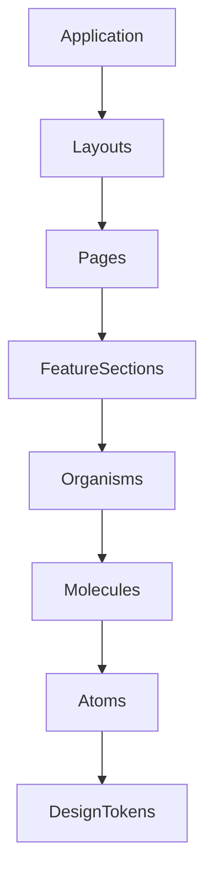

---

## Hierarchy Rules

| Rule ID | Rule |
|----------|------|
| CMP-201 | Pages compose organisms. |
| CMP-202 | Organisms compose molecules. |
| CMP-203 | Molecules compose atoms. |
| CMP-204 | Atoms depend only on design system primitives and tokens. |
| CMP-205 | Lower-level components never import higher-level components. |

---

# 67. Design System

The CardWise Design System serves as the single source of truth for all visual and interaction patterns.

---

## Objectives

| ID | Objective |
|----|-----------|
| DS-201 | Consistent UI |
| DS-202 | Shared visual language |
| DS-203 | Accessibility compliance |
| DS-204 | Faster feature development |
| DS-205 | Cross-platform consistency |
| DS-206 | Theme support |
| DS-207 | Token-driven styling |
| DS-208 | Reduced maintenance cost |

---

## Design System Layers

| Layer | Responsibility |
|--------|----------------|
| Design Tokens | Colors, spacing, typography, radius, elevation |
| Foundations | Grid, layout, breakpoints, motion |
| Primitives | Core UI controls |
| Composite Components | Higher-level reusable components |
| Patterns | Standard interaction flows |
| Templates | Shared page layouts |

---

# 68. Component Catalog

## Primitive Components

| Component ID | Component |
|--------------|-----------|
| UI-001 | Button |
| UI-002 | Icon |
| UI-003 | Text |
| UI-004 | Link |
| UI-005 | Badge |
| UI-006 | Avatar |
| UI-007 | Divider |
| UI-008 | Spinner |
| UI-009 | Skeleton |
| UI-010 | Tooltip |

---

## Form Components

| Component |
|-----------|
| Input |
| Text Area |
| Select |
| Multi Select |
| Checkbox |
| Radio Group |
| Toggle |
| Date Picker |
| File Upload |
| OTP Input |
| Search Input |

---

## Navigation Components

| Component |
|-----------|
| Sidebar |
| Header |
| Footer |
| Tabs |
| Breadcrumbs |
| Pagination |
| Navigation Rail |
| Navigation Drawer |

---

## Feedback Components

| Component |
|-----------|
| Toast |
| Alert |
| Snackbar |
| Banner |
| Progress Bar |
| Empty State |
| Error State |
| Success State |
| Confirmation Dialog |

---

## Data Components

| Component |
|-----------|
| Data Table |
| Virtual Table |
| Chart Container |
| Metric Card |
| Timeline |
| Calendar |
| Transaction List |
| Reward Summary |
| Activity Feed |

---

## Overlay Components

| Component |
|-----------|
| Dialog |
| Drawer |
| Bottom Sheet |
| Popover |
| Context Menu |
| Command Palette |

---

# 69. Domain Components

Business-specific components belong exclusively to their owning feature.

Examples include:

- Credit Card Tile
- Reward Balance Card
- Cashback Summary
- Merchant Offer Card
- Bill Reminder Widget
- AI Insight Card
- Lounge Eligibility Badge
- Spending Breakdown Chart
- Statement Preview
- Redemption Timeline

These components are **not** shared outside their feature unless intentionally promoted.

---

# 70. Hooks Architecture

Custom hooks encapsulate presentation logic and orchestration while remaining independent of rendering.

---

## Hook Categories

| Category | Responsibility |
|----------|----------------|
| UI Hooks | Interaction behavior |
| Feature Hooks | Feature orchestration |
| Query Hooks | Server communication |
| Form Hooks | Form management |
| Navigation Hooks | Routing helpers |
| Utility Hooks | Browser capabilities |
| Platform Hooks | Infrastructure access |

---

## Hook Rules

| Rule ID | Rule |
|----------|------|
| CMP-301 | Hooks expose stable APIs. |
| CMP-302 | Hooks avoid direct DOM manipulation unless necessary. |
| CMP-303 | Hooks encapsulate reusable behavior. |
| CMP-304 | Hooks remain framework-consistent. |
| CMP-305 | Hooks are independently testable. |

---

# 71. Utilities

Utilities provide stateless reusable functionality.

---

## Utility Categories

| Category |
|----------|
| Date formatting |
| Currency formatting |
| Number formatting |
| String utilities |
| Validation helpers |
| URL utilities |
| Analytics helpers |
| Permission helpers |
| Localization helpers |
| Feature flag helpers |

---

## Utility Rules

- Pure functions only.
- No side effects.
- No framework dependencies where practical.
- Well-defined inputs and outputs.
- Unit-test coverage required.

---

# 72. Forms Architecture

CardWise standardizes all forms using React Hook Form and Zod.

---

## Form Responsibilities

| Layer | Responsibility |
|--------|----------------|
| Components | Rendering |
| Form Controller | State management |
| Validation Schema | Input validation |
| API Layer | Submission |
| Error Mapper | Error translation |

---

## Form Lifecycle

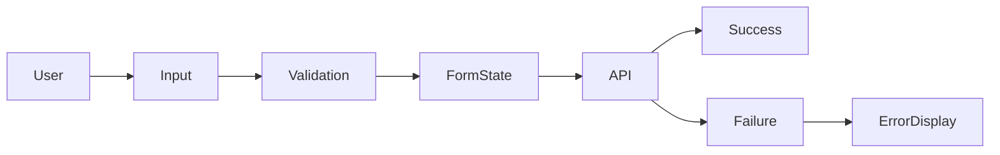

---

## Form Standards

| Rule ID | Rule |
|----------|------|
| UI-101 | Validation occurs before submission. |
| UI-102 | Errors are displayed inline and accessibly. |
| UI-103 | Submit actions are idempotent where possible. |
| UI-104 | Long-running operations provide progress feedback. |

---

# 73. Validation Strategy

Validation occurs at multiple layers.

| Layer | Purpose |
|--------|---------|
| Input | Immediate feedback |
| Schema | Structural validation |
| Business | Domain rules |
| Server | Authoritative validation |

---

## Validation Principles

- Fail early.
- Use descriptive error messaging.
- Prevent invalid state transitions.
- Keep client and server validation aligned.

---

# 74. Theme System

The application supports dynamic theming through design tokens and CSS variables.

---

## Theme Layers

| Layer | Responsibility |
|--------|----------------|
| Tokens | Semantic values |
| Theme | Color mappings |
| Components | Consume semantic tokens |
| User Preferences | Theme selection |
| Runtime | Theme switching |

---

## Supported Themes

| Theme |
|--------|
| Light |
| Dark |
| System |
| High Contrast (future-ready) |

---

# 75. Design Tokens

Design tokens provide a platform-independent representation of visual design decisions.

---

## Token Categories

| Token ID | Category |
|-----------|----------|
| TOKEN-001 | Color |
| TOKEN-002 | Typography |
| TOKEN-003 | Spacing |
| TOKEN-004 | Radius |
| TOKEN-005 | Shadow |
| TOKEN-006 | Border |
| TOKEN-007 | Motion |
| TOKEN-008 | Opacity |
| TOKEN-009 | Z-index |
| TOKEN-010 | Breakpoints |

---

## Token Principles

| Rule ID | Rule |
|----------|------|
| TOKEN-101 | Components consume semantic tokens only. |
| TOKEN-102 | Raw values are avoided in component implementations. |
| TOKEN-103 | Tokens are version-controlled. |
| TOKEN-104 | Token changes remain backward compatible where feasible. |

---

# 76. Dark Mode

Dark mode is implemented through semantic design tokens rather than component-specific styling.

---

## Requirements

| ID | Requirement |
|----|-------------|
| THEME-101 | User-selectable preference |
| THEME-102 | System preference support |
| THEME-103 | Persistent across sessions |
| THEME-104 | Accessible contrast ratios |
| THEME-105 | Smooth runtime switching |

---

# 77. Responsive Design

Responsive behavior is built into every component.

---

## Breakpoint Strategy

| Device | Purpose |
|----------|---------|
| Mobile | Primary touch experience |
| Tablet | Medium layouts |
| Desktop | Full dashboard |
| Large Desktop | Wide analytics and admin workflows |

---

## Responsive Principles

- Mobile-first design.
- Flexible layouts.
- Fluid spacing.
- Adaptive navigation.
- Touch-friendly interactions.
- Optimized data density for larger screens.

---

# 78. Component Interaction Diagram

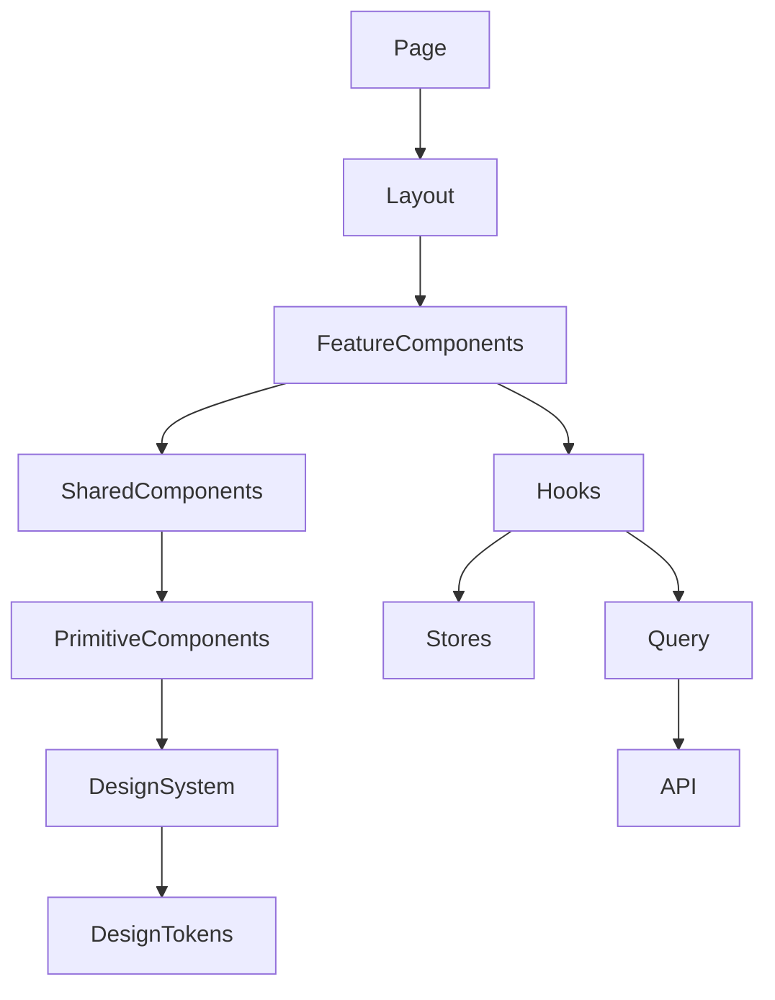

---

# 79. Operational Considerations

| Area | Consideration |
|------|---------------|
| Reusability | Promote reusable components only after demonstrating cross-feature demand. |
| Performance | Favor memoization and virtualization for expensive rendering scenarios. |
| Accessibility | Validate every reusable component against WCAG 2.2 AA guidelines before adoption. |
| Maintainability | Keep component APIs minimal and document breaking changes. |
| Testing | Unit-test primitives and integration-test composite components. |
| Design Consistency | All visual updates should originate from the design system and design tokens. |
| Scalability | Regularly review component usage to eliminate duplication and consolidate patterns. |


# Part 6 — API Integration & Authentication Architecture

---

# 80. API Integration Overview

The CardWise frontend communicates with backend services through a centralized, platform-managed API layer.

Feature modules never communicate directly with backend services. Instead, all requests flow through a standardized API infrastructure responsible for:

- Authentication
- Authorization
- Request lifecycle
- Response normalization
- Error handling
- Retry policies
- Caching
- Logging
- Telemetry
- Rate limiting awareness
- Offline support

This abstraction ensures consistency, observability, and future extensibility.

---

## Objectives

| ID | Objective |
|----|-----------|
| API-001 | Centralized API communication |
| API-002 | Standardized request lifecycle |
| API-003 | Consistent error handling |
| API-004 | Secure authentication |
| API-005 | Request observability |
| API-006 | Automatic retries |
| API-007 | Offline resilience |
| API-008 | Minimal feature coupling |

---

# 81. API Layer Architecture

The frontend API layer is composed of independent infrastructure modules.

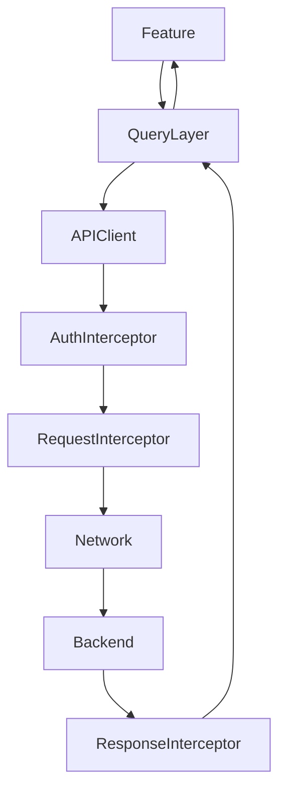

---

## API Layers

| Layer | Responsibility |
|--------|----------------|
| Feature | Business interaction |
| Query Layer | Server state orchestration |
| API Client | Request execution |
| Authentication | Token management |
| Interceptors | Cross-cutting concerns |
| Network | HTTP transport |
| Backend | Domain services |

---

# 82. API Client

A single API client provides standardized communication across all backend services.

---

## Responsibilities

| Responsibility |
|---------------|
| Base request execution |
| Header management |
| Authentication injection |
| Retry coordination |
| Timeout management |
| Error normalization |
| Telemetry |
| Request cancellation |
| File upload |
| File download |

---

## API Principles

| Rule ID | Rule |
|----------|------|
| API-101 | One standardized API client. |
| API-102 | Features never instantiate transport directly. |
| API-103 | Requests remain stateless. |
| API-104 | All requests are observable. |
| API-105 | Timeouts are centrally managed. |

---

# 83. Request Lifecycle

Every request follows a deterministic lifecycle.

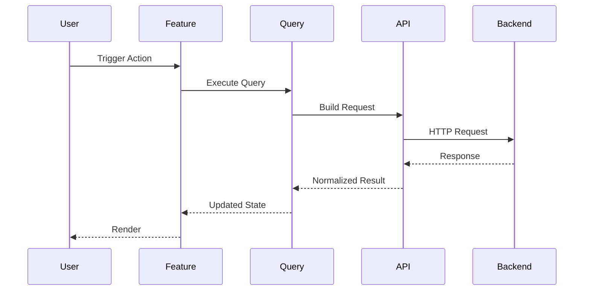

---

## Lifecycle Stages

| Stage | Description |
|--------|-------------|
| Preparation | Build request configuration |
| Authentication | Attach credentials |
| Transmission | Send request |
| Processing | Backend execution |
| Normalization | Standardize response |
| Cache Update | Synchronize query cache |
| Rendering | Update UI |

---

# 84. Response Lifecycle

Responses are normalized before reaching feature modules.

---

## Processing Pipeline

```text
Backend Response

↓

Transport Validation

↓

Authentication Check

↓

Error Detection

↓

Normalization

↓

Query Cache

↓

Feature Rendering
```

---

## Response Rules

| Rule ID | Rule |
|----------|------|
| API-201 | Responses follow a common structure. |
| API-202 | Errors are normalized. |
| API-203 | Unknown fields are ignored unless explicitly required. |
| API-204 | Metadata is preserved for diagnostics. |

---

# 85. Authentication Architecture

Authentication is based on secure JWT-backed sessions.

Identity providers include:

- Email/password
- Google Sign-In
- Apple Sign-In
- OAuth providers (future expansion)

---

## Authentication Components

| Component | Responsibility |
|-----------|----------------|
| Login | User authentication |
| Session Manager | Session lifecycle |
| Token Manager | Token refresh |
| Permission Manager | Authorization |
| Identity Provider | External authentication |
| Logout Handler | Session cleanup |

---

# 86. JWT Authentication

JWT is the primary authentication mechanism for authenticated application APIs.

---

## JWT Lifecycle

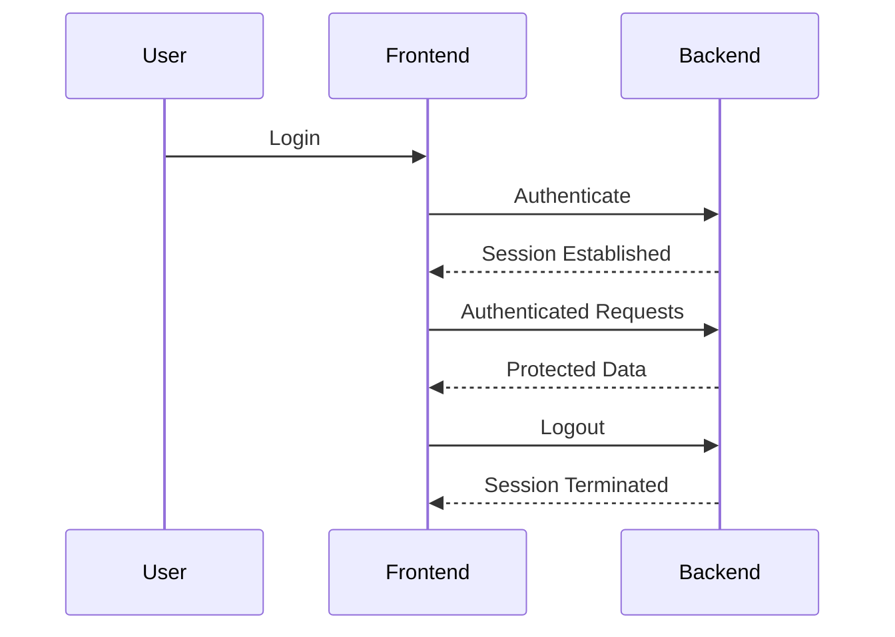

---

## JWT Principles

| Rule ID | Rule |
|----------|------|
| AUTH-301 | Tokens are never exposed to feature modules. |
| AUTH-302 | Authentication is infrastructure-managed. |
| AUTH-303 | Expired sessions trigger re-authentication flows. |
| AUTH-304 | Sensitive operations require server-side authorization. |

---

# 87. OAuth Architecture

OAuth providers integrate through a standardized identity abstraction.

---

## Supported Providers

| Provider |
|-----------|
| Google |
| Apple |

Future providers may include enterprise identity systems without requiring changes to feature modules.

---

## OAuth Flow


---

## OAuth Principles

- Provider-specific logic remains isolated.
- Feature modules consume only authenticated session state.
- Identity mapping occurs on the backend.
- Authorization remains backend-driven.

---

# 88. Google Sign-In

Google Sign-In provides streamlined onboarding for eligible users.

---

## Workflow

1. User initiates Google authentication.
2. Google authenticates the user.
3. Backend validates the identity assertion.
4. Backend establishes the application session.
5. Frontend initializes authenticated state.
6. Onboarding is resumed or completed.

---

## Operational Considerations

- Handle account linking.
- Prevent duplicate identities.
- Gracefully recover from interrupted sign-in.
- Respect provider-specific security requirements.

---

# 89. Apple Sign-In

Apple Sign-In follows the same architectural contract as other OAuth providers while respecting Apple's privacy model.

---

## Requirements

| Requirement |
|-------------|
| Privacy-preserving identity |
| Secure session establishment |
| Backend identity verification |
| Consistent frontend session handling |
| Unified onboarding experience |

---

# 90. Authorization

Authorization determines feature availability after authentication.

---

## Authorization Layers

| Layer | Responsibility |
|--------|----------------|
| Route Guard | Navigation access |
| Feature Guard | Feature availability |
| Component Guard | UI visibility |
| Backend | Final authorization |

---

## Permission Categories

| Category |
|----------|
| Authenticated User |
| Verified User |
| Premium User |
| Administrator |
| Internal Operations |
| Feature Flag Access |

---

## Authorization Rules

| Rule ID | Rule |
|----------|------|
| AUTH-401 | Backend remains the source of truth for authorization. |
| AUTH-402 | Frontend authorization improves UX but does not replace backend validation. |
| AUTH-403 | Hidden UI must not imply backend access restrictions. |
| AUTH-404 | Permissions are evaluated before rendering protected features. |

---

# 91. Error Handling

Errors are classified and handled consistently.

---

## Error Categories

| Category | Example |
|-----------|----------|
| Authentication | Session expired |
| Authorization | Access denied |
| Validation | Invalid input |
| Network | Connection failure |
| Timeout | Slow response |
| Server | Internal error |
| Rate Limiting | Too many requests |
| Offline | Network unavailable |

---

## Error Strategy

| Error | User Experience |
|--------|-----------------|
| Network | Retry with offline guidance |
| Validation | Inline feedback |
| Authentication | Re-authentication flow |
| Authorization | Access denied page |
| Server | Friendly recovery message |
| Unknown | Generic fallback with diagnostics |

---

## Error Flow

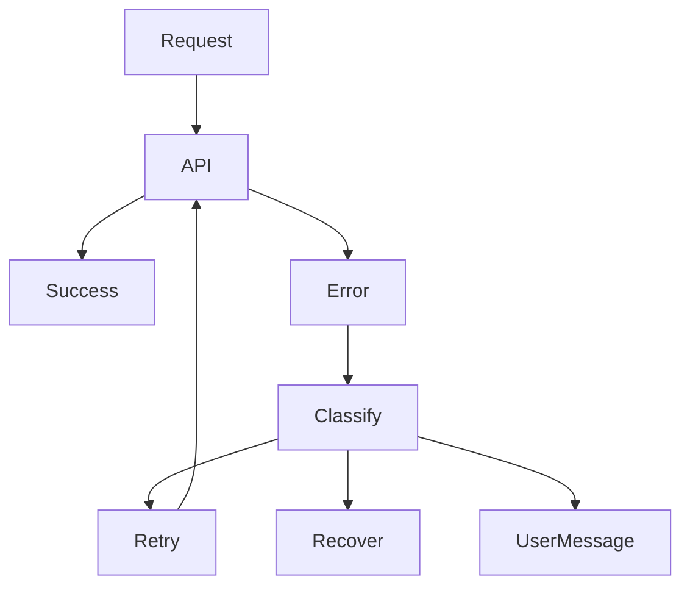

---

# 92. Loading States

Loading feedback is standardized across the application.

---

## Loading Types

| Type | Usage |
|------|-------|
| Skeleton | Initial page load |
| Spinner | Short actions |
| Inline Progress | Form submission |
| Background Refresh | Silent updates |
| Lazy Placeholder | Code splitting |
| Optimistic UI | Immediate feedback |

---

## Principles

- Avoid layout shifts.
- Match loading indicators to expected duration.
- Keep interactions responsive.
- Provide accessible loading announcements.

---

# 93. Offline Strategy

Offline support integrates with API infrastructure and the PWA layer.

---

## Offline Capabilities

| Capability |
|------------|
| Cached application shell |
| Cached metadata |
| Cached user preferences |
| Offline navigation |
| Read-only cached data |
| Deferred synchronization |
| Retry queue |

---

## Offline Workflow

```mermaid
flowchart LR

User

User --> Request

Request --> NetworkCheck

NetworkCheck -->|Online| API

NetworkCheck -->|Offline| Cache

Cache --> UI

API --> Backend

Backend --> API

API --> Cache

Cache --> UI
```

---

## Synchronization

When connectivity returns:

- Retry queued requests.
- Synchronize pending mutations where supported.
- Refresh stale queries.
- Clear temporary offline indicators.
- Resume background synchronization.

---

# 94. API Security

The API integration layer follows security-first engineering practices.

---

## Security Controls

| ID | Control |
|----|---------|
| SEC-301 | Secure transport (HTTPS) |
| SEC-302 | Authentication middleware |
| SEC-303 | CSRF protection strategy |
| SEC-304 | Request validation |
| SEC-305 | Secure cookie/session handling |
| SEC-306 | Sensitive header management |
| SEC-307 | Rate-limit awareness |
| SEC-308 | Request tracing |

---

## Sensitive Data Rules

- Do not log authentication credentials.
- Mask personally identifiable information in telemetry.
- Avoid exposing internal server responses.
- Remove sensitive headers before diagnostics.
- Prevent token leakage through URLs or browser history.

---

# 95. Operational Considerations

| Area | Consideration |
|------|---------------|
| Reliability | Implement retry strategies with exponential backoff for transient failures. |
| Performance | Deduplicate concurrent requests and minimize unnecessary network traffic. |
| Security | Centralize authentication, authorization, and sensitive request handling. |
| Observability | Correlate requests with traces, logs, and analytics for end-to-end diagnostics. |
| Offline Support | Ensure queued operations are idempotent before automatic replay. |
| Scalability | Abstract transport details to support future backend evolution without affecting feature modules. |
| Maintainability | Version API contracts and normalize responses to minimize feature-specific parsing logic. |

# Part 7 — Performance Engineering & Progressive Web App Architecture

---

# 96. Performance Engineering Overview

Performance is a first-class architectural concern in CardWise. The frontend is designed to deliver a fast, responsive, and resilient experience across devices ranging from entry-level mobile phones to high-performance desktop systems.

Performance optimization is integrated into every architectural layer rather than treated as a post-development activity.

Primary goals include:

- Fast initial load
- Low Time to Interactive (TTI)
- Excellent Core Web Vitals
- Efficient memory utilization
- Smooth animations (60 FPS target)
- Minimal JavaScript execution
- Efficient rendering
- Optimized network utilization
- Battery-efficient execution
- Progressive enhancement

---

## Performance Objectives

| ID | Objective |
|----|-----------|
| PERF-001 | Excellent Core Web Vitals |
| PERF-002 | Fast initial rendering |
| PERF-003 | Minimal bundle size |
| PERF-004 | Efficient runtime performance |
| PERF-005 | Responsive interactions |
| PERF-006 | Low memory footprint |
| PERF-007 | Offline resilience |
| PERF-008 | Predictable scalability |

---

# 97. Performance Budget

Performance budgets establish measurable engineering constraints.

| Metric | Target |
|---------|--------|
| Largest Contentful Paint (LCP) | < 2.5 seconds |
| Interaction to Next Paint (INP) | < 200 ms |
| Cumulative Layout Shift (CLS) | < 0.1 |
| First Contentful Paint (FCP) | < 1.8 seconds |
| Time to Interactive (TTI) | < 3 seconds |
| Initial JavaScript (compressed) | ≤ 250 KB target |
| Individual Lazy Chunk | ≤ 150 KB target |
| CSS Payload | ≤ 100 KB target |
| Image Compression | Modern formats preferred |
| Lighthouse Performance | ≥ 90 |

---

## Engineering Rules

| Rule ID | Rule |
|----------|------|
| PERF-101 | Every feature must respect performance budgets. |
| PERF-102 | Performance regressions block production releases. |
| PERF-103 | Bundle growth is continuously monitored. |
| PERF-104 | Runtime metrics are collected in production. |

---

# 98. Code Splitting

The application uses route-level and feature-level code splitting to minimize initial bundle size.

---

## Splitting Strategy

| Level | Strategy |
|--------|----------|
| Route | Lazy load feature routes |
| Feature | Independent feature bundles |
| Component | Lazy load expensive components |
| Visualization | Load chart libraries on demand |
| Admin | Separate administrative bundle |
| AI | Deferred loading for AI features |

---

## Lazy Loading Candidates

- Analytics dashboards
- Reports
- AI Assistant
- Charts
- Admin Console
- Statement viewer
- PDF rendering
- Import/Export tools
- Travel planner
- Premium features

---

## Code Splitting Flow

```mermaid
flowchart LR

User

User --> Router

Router --> Shell

Shell --> LazyFeature

LazyFeature --> ChunkLoader

ChunkLoader --> FeatureBundle

FeatureBundle --> Render
```

---

# 99. Lazy Loading

Lazy loading extends beyond routes to optimize runtime behavior.

---

## Lazy Resources

| Resource | Loading Strategy |
|-----------|------------------|
| Images | Lazy by viewport |
| Charts | On demand |
| Dialogs | Deferred until opened |
| Drawers | Deferred |
| Maps | Deferred |
| PDF Viewer | Deferred |
| File Preview | Deferred |
| AI Components | Deferred |
| Admin Modules | Deferred |

---

## Principles

- Load only what is immediately required.
- Prioritize above-the-fold content.
- Prefetch likely next navigations.
- Avoid unnecessary eager loading.

---

# 100. Bundle Optimization

Bundle optimization minimizes download size and execution time.

---

## Optimization Techniques

| Technique | Purpose |
|------------|----------|
| Tree Shaking | Remove unused code |
| Dead Code Elimination | Reduce bundle size |
| Dynamic Imports | Lazy loading |
| Shared Vendor Chunks | Avoid duplication |
| Asset Compression | Smaller payloads |
| CDN Distribution | Faster delivery |
| Module Federation Ready | Future extensibility |

---

## Bundle Rules

| Rule ID | Rule |
|----------|------|
| BUILD-101 | Remove unused dependencies. |
| BUILD-102 | Avoid duplicate libraries. |
| BUILD-103 | Optimize third-party imports. |
| BUILD-104 | Continuously monitor bundle composition. |

---

# 101. Rendering Optimization

Rendering performance is optimized through architectural patterns.

---

## Optimization Techniques

| Technique | Purpose |
|------------|----------|
| Selective State Subscriptions | Reduce re-renders |
| Stable Component Boundaries | Improve reconciliation |
| Deferred Rendering | Improve responsiveness |
| Incremental Rendering | Large datasets |
| Skeleton UI | Better perceived performance |
| Layout Stability | Prevent visual shifts |

---

## Rendering Principles

- Render only visible content.
- Minimize component remounting.
- Keep rendering deterministic.
- Separate expensive computations from rendering.
- Reduce unnecessary DOM updates.

---

# 102. Memoization Strategy

Memoization is applied selectively to reduce redundant computation while avoiding unnecessary complexity.

---

## Memoization Targets

| Target | Strategy |
|----------|----------|
| Expensive derived data | Memoized |
| Static configuration | Cached |
| Large filtered datasets | Memoized |
| Stable callbacks | Memoized when beneficial |
| Constant objects | Shared references |

---

## Guidelines

| Rule ID | Rule |
|----------|------|
| PERF-201 | Measure before optimizing. |
| PERF-202 | Avoid premature memoization. |
| PERF-203 | Prefer simpler implementations when performance impact is negligible. |
| PERF-204 | Regularly review memoization effectiveness. |

---

# 103. Virtualization

Large datasets are virtualized to maintain smooth scrolling and low memory usage.

---

## Virtualization Targets

| Component | Reason |
|------------|--------|
| Transaction Lists | Thousands of records |
| Statement Tables | Large datasets |
| Offer Catalog | Infinite browsing |
| Search Results | Dynamic loading |
| Analytics Tables | High data density |
| Notification History | Long-lived records |

---

## Virtualization Principles

- Render only visible rows.
- Preserve keyboard navigation.
- Maintain accessibility semantics.
- Support variable row heights where required.

---

# 104. Image Optimization

Images are optimized to reduce bandwidth and improve rendering.

---

## Image Strategy

| Area | Strategy |
|------|----------|
| Format | AVIF / WebP preferred |
| Responsive Images | Device-aware sizing |
| Lazy Loading | Viewport-based |
| Compression | Lossless where appropriate |
| CDN | Edge delivery |
| Placeholder | Blur/skeleton while loading |

---

## Image Rules

- Never load oversized assets.
- Avoid layout shifts with predefined dimensions.
- Optimize icons as SVG where applicable.
- Cache static assets aggressively.

---

# 105. Caching Strategy

Performance depends on multiple coordinated caching layers.

---

## Cache Layers

| Layer | Technology |
|--------|------------|
| Browser Cache | HTTP caching |
| CDN Cache | Static assets |
| Query Cache | TanStack Query |
| Persistent Cache | IndexedDB |
| Service Worker Cache | Workbox |

---

## Cache Policies

| Resource | Policy |
|-----------|--------|
| Static Assets | Long-lived versioned cache |
| User Metadata | Background refresh |
| Portfolio | Stale-while-revalidate |
| Offers | Time-based refresh |
| AI Suggestions | Short-lived cache |
| Images | CDN cache |

---

# 106. Progressive Web App (PWA) Architecture

CardWise is designed as a full-featured Progressive Web Application.

---

## PWA Objectives

| ID | Objective |
|----|-----------|
| PWA-001 | Installable application |
| PWA-002 | Offline navigation |
| PWA-003 | Background synchronization |
| PWA-004 | Push notifications |
| PWA-005 | Reliable startup |
| PWA-006 | Native-like experience |

---

## PWA Components

| Component | Responsibility |
|-----------|----------------|
| Web App Manifest | Installation metadata |
| Service Worker | Network interception |
| Cache Manager | Asset caching |
| Sync Manager | Deferred synchronization |
| Notification Manager | Push notifications |
| Offline Manager | Offline experience |

---

# 107. Service Worker

The service worker is implemented using Workbox and acts as the application's network proxy.

---

## Responsibilities

- Cache application shell
- Serve offline resources
- Queue failed requests
- Synchronize pending work
- Update cached assets
- Receive push notifications
- Manage cache versions

---

## Service Worker Lifecycle

```mermaid
stateDiagram-v2

[*] --> Install

Install --> Activate

Activate --> Idle

Idle --> Fetch

Fetch --> Cache

Fetch --> Network

Network --> Cache

Cache --> Response

Response --> Idle

Idle --> Update

Update --> Activate
```

---

# 108. Offline Support

Offline support provides graceful degradation instead of feature failure.

---

## Offline Features

| Feature | Offline Support |
|----------|-----------------|
| Application Shell | Full |
| Navigation | Full |
| User Preferences | Full |
| Cached Dashboard | Read-only |
| Cached Portfolio | Read-only |
| Cached Transactions | Read-only |
| Search History | Local |
| Draft Forms | Local persistence |
| Pending Actions | Deferred synchronization |

---

## Offline Behavior

- Display connectivity status.
- Queue supported mutations.
- Retry automatically after reconnection.
- Preserve user input.
- Provide clear offline messaging.

---

# 109. PWA Runtime Flow

```mermaid
flowchart TD

User

User --> AppShell

AppShell --> ServiceWorker

ServiceWorker --> Cache

ServiceWorker --> Network

Network --> Backend

Cache --> UI

Backend --> Network

Network --> Cache

Cache --> UI
```

---

# 110. Runtime Performance Monitoring

Performance is continuously measured in production.

---

## Monitored Metrics

| Category | Metrics |
|-----------|----------|
| Core Web Vitals | LCP, INP, CLS, FCP |
| JavaScript | Bundle size, execution time |
| Rendering | Frame rate, render duration |
| Network | Request latency, failures |
| Memory | Heap usage, leaks |
| Caching | Hit ratio, eviction rate |
| Navigation | Route transition duration |
| PWA | Offline usage, install rate |

---

## Alerting Thresholds

Performance alerts should be generated for:

- Core Web Vitals degradation
- Bundle size regressions
- Increased render times
- Elevated API latency
- High JavaScript execution time
- Excessive memory growth
- Cache miss spikes

---

# 111. Operational Considerations

| Area | Consideration |
|------|---------------|
| Scalability | Performance optimizations should remain effective as feature count and user data grow. |
| Monitoring | Continuously collect production performance telemetry and compare against established budgets. |
| Release Management | Validate performance budgets during CI/CD before deployment. |
| Offline Reliability | Ensure cache versioning and synchronization prevent stale or inconsistent data. |
| User Experience | Favor perceived performance improvements such as skeleton screens and progressive loading. |
| Maintainability | Regularly audit dependencies, bundle composition, and lazy-loading boundaries. |
| Security | Prevent sensitive data from being cached inappropriately within browser or service worker storage. |


# Part 8 — Accessibility, Internationalization, Observability & Security

---

# 112. Accessibility (A11Y)

Accessibility is a **non-functional architectural requirement** across the entire CardWise frontend. Every feature, component, and interaction must be usable by people with diverse abilities and input methods.

The platform targets **WCAG 2.2 Level AA** compliance as the engineering baseline.

Accessibility is validated continuously during design, implementation, testing, and release.

---

## Accessibility Objectives

| ID | Objective |
|----|-----------|
| A11Y-001 | WCAG 2.2 AA compliance |
| A11Y-002 | Full keyboard accessibility |
| A11Y-003 | Screen reader compatibility |
| A11Y-004 | Accessible forms |
| A11Y-005 | Accessible navigation |
| A11Y-006 | Accessible visualizations |
| A11Y-007 | Accessible error messaging |
| A11Y-008 | Consistent interaction patterns |

---

## Accessibility Principles

| Principle | Description |
|------------|-------------|
| Perceivable | Content is available through multiple sensory channels. |
| Operable | Every interaction is keyboard accessible. |
| Understandable | Content and navigation are predictable. |
| Robust | Compatible with assistive technologies and modern browsers. |

---

# 113. Accessibility Standards

## Keyboard Navigation

Every interactive element must support:

- Tab navigation
- Shift + Tab navigation
- Arrow key navigation where appropriate
- Escape to close overlays
- Enter/Space activation
- Visible focus indicators
- Logical focus order

---

## Screen Reader Support

Every component must expose appropriate semantic information.

Requirements include:

- Semantic HTML
- Meaningful labels
- Accessible names
- Descriptive help text
- Live regions for dynamic updates
- Proper heading hierarchy
- Landmark regions
- Announcements for route changes

---

## Color & Contrast

| Requirement | Target |
|-------------|--------|
| Normal text | ≥ 4.5:1 contrast |
| Large text | ≥ 3:1 contrast |
| Interactive controls | Visible in all themes |
| Focus indicators | Clearly distinguishable |
| Charts | Not color-dependent alone |

---

## Accessible Forms

All forms must provide:

- Explicit labels
- Required field indicators
- Accessible error messages
- Validation summaries for complex forms
- Keyboard-friendly interactions
- Programmatic relationships between labels and inputs

---

## Accessibility Rules

| Rule ID | Rule |
|----------|------|
| A11Y-101 | Never rely solely on color to convey meaning. |
| A11Y-102 | Every interactive control has an accessible name. |
| A11Y-103 | Dynamic content changes are announced when appropriate. |
| A11Y-104 | Focus is managed after dialogs, navigation, and errors. |
| A11Y-105 | Custom components preserve native accessibility behavior wherever possible. |

---

# 114. Internationalization (i18n)

CardWise is designed for future global expansion.

Although the initial release targets English, the frontend architecture fully supports localization and regional customization.

---

## Objectives

| ID | Objective |
|----|-----------|
| I18N-001 | Multi-language support |
| I18N-002 | Regional formatting |
| I18N-003 | Locale-aware content |
| I18N-004 | Expandable translation system |
| I18N-005 | Runtime language switching |

---

## Localizable Resources

| Resource | Localized |
|-----------|-----------|
| UI Labels | Yes |
| Validation Messages | Yes |
| Notifications | Yes |
| Dates | Yes |
| Currency | Yes |
| Numbers | Yes |
| Time Zones | Yes |
| Accessibility Labels | Yes |
| Email Templates | Backend-managed |

---

## Localization Principles

- Separate content from presentation.
- Avoid concatenated strings.
- Support pluralization rules.
- Respect locale-specific formatting.
- Prepare layouts for varying text lengths.
- Keep translation keys stable and version-controlled.

---

# 115. Localization Strategy

Localization extends beyond language translation.

---

## Regional Adaptation

| Area | Examples |
|------|----------|
| Currency | INR, USD, EUR, etc. |
| Date Format | Locale-specific presentation |
| Number Formatting | Decimal/group separators |
| Time Zone | User-preferred zone |
| First Day of Week | Region-aware |
| Measurement Units | Future extensibility |

---

## Language Switching

Supported behavior:

- Runtime language switching
- Persisted user preference
- Fallback language
- Lazy-loaded translation bundles
- No full application reload

---

# 116. Search Engine Optimization (SEO)

Most authenticated application pages are not intended for indexing; however, public-facing pages require modern SEO practices.

---

## SEO Scope

| Page Type | Indexed |
|-----------|----------|
| Landing Page | Yes |
| Pricing | Yes |
| Help Center | Yes |
| Documentation | Yes (where applicable) |
| Authenticated Dashboard | No |
| User Data | No |
| Admin Portal | No |

---

## SEO Objectives

| ID | Objective |
|----|-----------|
| FE-SEO-001 | Discoverability of public pages |
| FE-SEO-002 | Rich metadata |
| FE-SEO-003 | Social sharing support |
| FE-SEO-004 | Search engine compatibility |

---

# 117. Metadata Management

Metadata is managed declaratively at the route level.

---

## Metadata Includes

- Page title
- Meta description
- Canonical URL
- Open Graph metadata
- Social preview metadata
- Robots directives
- Structured data (where applicable)

---

## Metadata Principles

| Rule | Description |
|------|-------------|
| Unique titles | Every public page has a distinct title. |
| Relevant descriptions | Reflect page content accurately. |
| Canonical URLs | Prevent duplicate indexing. |
| Structured data | Applied to appropriate public content only. |

---

# 118. Analytics Architecture

Analytics provides product insights while respecting user privacy and applicable regulations.

---

## Analytics Categories

| Category | Examples |
|-----------|----------|
| Navigation | Route changes |
| Engagement | Feature usage |
| Conversion | Premium upgrades |
| Performance | Core Web Vitals |
| Errors | Client failures |
| Search | Search behavior |
| AI | Recommendation interactions |
| Retention | Returning user behavior |

---

## Event Lifecycle

```mermaid
flowchart LR

User

User --> Feature

Feature --> Analytics

Analytics --> EventProcessor

EventProcessor --> PostHog

EventProcessor --> Observability

Observability --> Dashboards
```

---

## Event Design Principles

| Rule ID | Rule |
|----------|------|
| OBS-101 | Events use stable schemas. |
| OBS-102 | Personally identifiable information is minimized or masked. |
| OBS-103 | Events are versioned when schemas evolve. |
| OBS-104 | Client and server events share correlation identifiers. |

---

# 119. Logging Architecture

Logging supports diagnostics without exposing sensitive information.

---

## Log Categories

| Category | Description |
|-----------|-------------|
| Navigation | Route transitions |
| API | Request lifecycle |
| Authentication | Session events |
| Errors | Recoverable and fatal failures |
| Performance | Runtime measurements |
| Feature Flags | Evaluation results |
| Offline | Connectivity changes |

---

## Logging Principles

- Structured logs only.
- Correlation IDs for traceability.
- Avoid sensitive payloads.
- Environment-specific log verbosity.
- Automatic sampling for high-volume events.

---

# 120. Error Tracking

Client-side errors are captured centrally using Sentry.

---

## Error Types

| Type | Examples |
|------|----------|
| JavaScript Exceptions | Runtime failures |
| Promise Rejections | Async errors |
| Rendering Errors | Component failures |
| Network Errors | Request failures |
| Resource Loading | Missing assets |
| PWA Errors | Service worker failures |

---

## Error Pipeline

```mermaid
flowchart TD

Application

Application --> ErrorBoundary

ErrorBoundary --> ErrorProcessor

ErrorProcessor --> Sentry

ErrorProcessor --> Logs

Logs --> Dashboards

Sentry --> Alerting
```

---

## Error Handling Principles

| Rule ID | Rule |
|----------|------|
| LOG-101 | Capture uncaught exceptions. |
| LOG-102 | Group similar errors. |
| LOG-103 | Preserve stack traces where available. |
| LOG-104 | Associate errors with releases and environments. |

---

# 121. Observability

Observability combines telemetry, logging, tracing, and analytics to provide end-to-end visibility into frontend behavior.

---

## Observability Components

| Component | Purpose |
|-----------|---------|
| OpenTelemetry | Distributed tracing |
| Sentry | Error monitoring |
| PostHog | Product analytics |
| Performance Metrics | Core Web Vitals |
| Structured Logs | Diagnostics |
| Dashboards | Operational visibility |

---

## Monitored Signals

| Signal | Examples |
|---------|----------|
| Availability | Application startup success |
| Performance | Route load times |
| Reliability | Error rates |
| User Experience | Interaction latency |
| Feature Adoption | Feature usage |
| Connectivity | Offline/online transitions |

---

# 122. Security Architecture

Frontend security complements backend enforcement while improving user trust and resilience.

---

## Security Objectives

| ID | Objective |
|----|-----------|
| SEC-401 | Protect user sessions |
| SEC-402 | Prevent client-side attacks |
| SEC-403 | Secure browser storage |
| SEC-404 | Reduce attack surface |
| SEC-405 | Support secure deployment |
| SEC-406 | Protect sensitive UI workflows |

---

## Security Controls

| Control | Purpose |
|----------|---------|
| HTTPS Only | Secure transport |
| Content Security Policy | Restrict resource loading |
| Secure Cookies | Session protection |
| Input Validation | Prevent malformed input |
| Output Encoding | Reduce injection risks |
| Trusted Origins | Cross-origin protection |
| Permission Management | Browser capability control |
| Dependency Scanning | Supply chain security |

---

## Frontend Hardening

### Browser Security

- Content Security Policy (CSP)
- Trusted Types readiness
- Secure HTTP headers
- Referrer Policy
- Permissions Policy
- Cross-Origin protections
- SameSite cookie support

---

### Data Protection

- Never expose secrets in client bundles.
- Minimize sensitive data stored on the client.
- Encrypt sensitive data in transit.
- Remove confidential information from logs.
- Mask user-identifiable information in analytics.

---

### Dependency Security

| Requirement | Description |
|-------------|-------------|
| Dependency Auditing | Continuous vulnerability scanning |
| Version Pinning | Controlled upgrades |
| License Review | Compliance validation |
| Integrity Verification | Trusted package sources |

---

## Security Rules

| Rule ID | Rule |
|----------|------|
| SEC-501 | Backend remains the ultimate security authority. |
| SEC-502 | Frontend authorization is for user experience only. |
| SEC-503 | Sensitive operations require backend validation. |
| SEC-504 | Client-side validation never replaces server validation. |
| SEC-505 | Security incidents are observable and auditable. |

---

# 123. Operational Readiness

Operational readiness ensures the frontend can be deployed, monitored, and supported in production.

---

## Readiness Checklist

| Area | Requirement |
|------|-------------|
| Monitoring | Dashboards configured |
| Alerting | Critical alerts defined |
| Logging | Structured logs enabled |
| Analytics | Event validation completed |
| Accessibility | WCAG verification passed |
| Localization | Translation validation completed |
| Security | Security review approved |
| Performance | Performance budget satisfied |
| Documentation | Architecture and runbooks updated |

---

## Operational Considerations

| Area | Consideration |
|------|---------------|
| Compliance | Support applicable privacy regulations through configurable analytics and consent mechanisms. |
| Incident Response | Correlate logs, traces, and error reports using shared identifiers. |
| Privacy | Collect only necessary telemetry and respect user preferences. |
| Accessibility | Include accessibility validation in release criteria. |
| Internationalization | Validate layouts across supported locales before release. |
| Security | Continuously monitor dependencies, browser capabilities, and emerging client-side threats. |
| Maintainability | Keep analytics schemas, metadata, and security policies version-controlled alongside application code. |


# Part 9 — Testing Strategy, CI/CD & Deployment Architecture

---

# 124. Testing Strategy

Testing is a core engineering discipline within CardWise. The frontend follows a **multi-layer testing strategy** that validates functionality, usability, accessibility, security, performance, and deployment readiness.

Testing is integrated throughout the Software Development Lifecycle (SDLC) and automated wherever practical.

---

## Testing Objectives

| ID | Objective |
|----|-----------|
| TEST-001 | Prevent regressions |
| TEST-002 | Enable confident refactoring |
| TEST-003 | Validate business workflows |
| TEST-004 | Ensure accessibility compliance |
| TEST-005 | Verify performance budgets |
| TEST-006 | Improve deployment confidence |
| TEST-007 | Reduce production defects |
| TEST-008 | Support continuous delivery |

---

## Testing Pyramid

```mermaid
flowchart BT

E2E["End-to-End Tests"]

Integration["Integration Tests"]

Component["Component Tests"]

Unit["Unit Tests"]

Unit --> Component

Component --> Integration

Integration --> E2E
```

---

## Test Coverage Goals

| Test Type | Target Coverage |
|------------|-----------------|
| Unit | ≥ 90% for shared libraries and critical business logic |
| Component | High coverage for reusable UI components |
| Integration | Critical user journeys |
| End-to-End | Business-critical workflows |
| Accessibility | All reusable components and key pages |
| Visual Regression | Shared design system components and high-value pages |

---

# 125. Unit Testing

Unit tests validate isolated functions, utilities, hooks, stores, and domain logic.

---

## Scope

| Area | Tested |
|------|---------|
| Utilities | Yes |
| Formatters | Yes |
| Validation Schemas | Yes |
| Business Rules | Yes |
| State Stores | Yes |
| Custom Hooks | Yes |
| Query Helpers | Yes |
| Permission Logic | Yes |

---

## Exclusions

- Third-party libraries
- Browser internals
- Backend APIs
- Visual appearance

---

## Unit Testing Principles

| Rule ID | Rule |
|----------|------|
| TEST-101 | Tests remain deterministic. |
| TEST-102 | External dependencies are mocked appropriately. |
| TEST-103 | Tests are isolated and independent. |
| TEST-104 | Assertions validate observable behavior rather than implementation details. |

---

# 126. Component Testing

Component testing validates reusable UI components in isolation.

---

## Scope

| Component Category | Tested |
|--------------------|---------|
| Primitive Components | Yes |
| Composite Components | Yes |
| Form Components | Yes |
| Navigation Components | Yes |
| Data Visualization Containers | Yes |
| Feedback Components | Yes |
| Accessibility Behavior | Yes |

---

## Validation Areas

- Rendering
- User interaction
- Accessibility
- Keyboard support
- Focus management
- Error states
- Loading states
- Theme compatibility
- Responsive behavior

---

# 127. Integration Testing

Integration tests validate interactions between multiple frontend modules.

---

## Scenarios

| Scenario | Included |
|-----------|----------|
| Authentication Flow | Yes |
| Routing | Yes |
| API Integration | Yes |
| State Synchronization | Yes |
| Feature Workflows | Yes |
| Form Submission | Yes |
| Query Cache Updates | Yes |
| Permission Handling | Yes |

---

## Integration Rules

| Rule ID | Rule |
|----------|------|
| TEST-201 | Validate public interfaces between modules. |
| TEST-202 | Avoid testing private implementation details. |
| TEST-203 | Simulate realistic runtime behavior. |
| TEST-204 | Use representative fixtures and mock services. |

---

# 128. End-to-End (E2E) Testing

End-to-end testing validates complete user journeys using Playwright.

---

## Critical User Journeys

| Journey | Priority |
|----------|----------|
| User Registration | Critical |
| Login & Logout | Critical |
| Onboarding | Critical |
| Portfolio Management | Critical |
| Card Comparison | Critical |
| Transaction Review | Critical |
| Reward Redemption | Critical |
| Bill Management | Critical |
| Premium Upgrade | Critical |
| AI Recommendation Workflow | High |
| Admin Operations | High |

---

## Cross-Browser Validation

| Browser | Required |
|----------|----------|
| Chromium | Yes |
| Firefox | Yes |
| WebKit | Yes |

---

## Device Coverage

| Device | Required |
|----------|----------|
| Mobile | Yes |
| Tablet | Yes |
| Desktop | Yes |

---

# 129. Visual Regression Testing

Visual regression testing ensures UI consistency across releases.

---

## Scope

| Area | Included |
|------|----------|
| Design System Components | Yes |
| Shared Layouts | Yes |
| Navigation | Yes |
| Dashboard | Yes |
| Reports | Yes |
| Forms | Yes |
| Dark Mode | Yes |
| Responsive Layouts | Yes |

---

## Validation Criteria

- Layout consistency
- Typography
- Color usage
- Spacing
- Icons
- Theme rendering
- Responsive behavior
- Component composition

---

# 130. Performance Testing

Performance validation ensures adherence to architectural budgets.

---

## Performance Metrics

| Category | Metrics |
|-----------|----------|
| Core Web Vitals | LCP, INP, CLS |
| Route Loading | Navigation latency |
| Rendering | Render duration |
| JavaScript | Bundle execution time |
| Network | API latency |
| Memory | Heap utilization |
| Animation | Frame rate |

---

## Performance Rules

| Rule ID | Rule |
|----------|------|
| PERF-301 | Validate performance budgets before release. |
| PERF-302 | Investigate significant regressions immediately. |
| PERF-303 | Profile high-impact workflows periodically. |
| PERF-304 | Track production metrics continuously. |

---

# 131. Accessibility Testing

Accessibility testing combines automation with manual verification.

---

## Automated Validation

- Semantic structure
- Color contrast
- Keyboard navigation checks
- ARIA validation
- Landmark validation
- Form accessibility

---

## Manual Validation

- Screen reader testing
- Keyboard-only navigation
- Focus management
- Zoom and reflow
- High contrast mode
- Reduced motion preferences

---

## Accessibility Rules

| Rule ID | Rule |
|----------|------|
| A11Y-201 | Accessibility testing is part of every release. |
| A11Y-202 | Critical accessibility issues block production releases. |
| A11Y-203 | Manual validation complements automated testing. |

---

# 132. Security Testing

Frontend security validation is incorporated into CI/CD.

---

## Validation Areas

| Area | Validation |
|------|------------|
| Dependency Vulnerabilities | Automated scanning |
| CSP Compliance | Validation |
| Sensitive Data Exposure | Verification |
| Authentication Flow | Testing |
| Authorization UX | Validation |
| Client Storage | Inspection |
| Build Artifacts | Secret scanning |

---

## Security Principles

- Verify dependency integrity.
- Detect exposed secrets.
- Review browser security headers.
- Validate authentication flows.
- Confirm telemetry redaction.

---

# 133. CI/CD Pipeline

Continuous Integration validates every change before deployment.

---

## Pipeline Stages

| Stage | Purpose |
|--------|---------|
| Source Validation | Branch and commit checks |
| Dependency Installation | Reproducible environment |
| Static Analysis | Linting and type checking |
| Unit Testing | Fast validation |
| Component Testing | UI validation |
| Integration Testing | Module interaction |
| Build | Production bundle generation |
| Performance Validation | Budget verification |
| Security Scanning | Vulnerability detection |
| Artifact Publishing | Immutable artifacts |

---

## CI/CD Workflow

```mermaid
flowchart LR

Developer

Developer --> SourceControl

SourceControl --> CI

CI --> Lint

Lint --> TypeCheck

TypeCheck --> UnitTests

UnitTests --> ComponentTests

ComponentTests --> IntegrationTests

IntegrationTests --> Build

Build --> PerformanceChecks

PerformanceChecks --> SecurityChecks

SecurityChecks --> Artifact

Artifact --> CD
```

---

# 134. Build Pipeline

The production build process produces optimized, versioned, immutable frontend artifacts.

---

## Build Outputs

| Artifact | Description |
|-----------|-------------|
| JavaScript Bundles | Optimized application code |
| CSS Assets | Compiled styles |
| Static Assets | Images, fonts, icons |
| Source Maps | Environment-controlled debugging |
| Manifest | PWA metadata |
| Build Metadata | Version information |

---

## Build Validation

| Validation | Purpose |
|------------|---------|
| Type Checking | Compile-time correctness |
| Linting | Code quality |
| Bundle Analysis | Size monitoring |
| Dependency Audit | Security |
| Asset Optimization | Performance |
| Manifest Validation | PWA readiness |

---

# 135. Deployment Strategy

Deployment uses immutable artifacts distributed through containerized infrastructure and a CDN.

---

## Deployment Environments

| Environment | Purpose |
|-------------|---------|
| Local | Development |
| Development | Team integration |
| QA | Functional validation |
| Staging | Production verification |
| Production | Customer-facing environment |

---

## Deployment Principles

| Rule ID | Rule |
|----------|------|
| DEP-101 | Immutable deployments. |
| DEP-102 | Environment-specific configuration. |
| DEP-103 | Versioned releases. |
| DEP-104 | Rollback support. |
| DEP-105 | Health validation before traffic promotion. |

---

# 136. Release Strategy

Releases minimize risk through controlled rollout mechanisms.

---

## Supported Strategies

| Strategy | Purpose |
|-----------|----------|
| Rolling Deployment | Default production rollout |
| Blue-Green Deployment | Low-risk infrastructure upgrades |
| Canary Release | Progressive validation |
| Feature Flags | Incremental feature exposure |
| Emergency Rollback | Rapid recovery |

---

## Release Gates

Production promotion requires successful completion of:

- Static analysis
- Type checking
- Test suites
- Accessibility validation
- Performance budget checks
- Security scanning
- Build verification
- Deployment smoke tests

---

# 137. Deployment Architecture

```mermaid
flowchart TD

Developer

Developer --> GitRepository

GitRepository --> CI

CI --> Build

Build --> ArtifactRepository

ArtifactRepository --> ContainerImage

ContainerImage --> Kubernetes

Kubernetes --> CDN

CDN --> Browser

Browser --> User
```

---

# 138. Post-Deployment Validation

Every deployment undergoes automated validation.

---

## Validation Checklist

| Validation | Purpose |
|------------|---------|
| Health Checks | Application availability |
| Smoke Tests | Core functionality |
| Error Monitoring | Runtime stability |
| Performance Monitoring | Core Web Vitals |
| Analytics Verification | Event delivery |
| Log Validation | Operational diagnostics |
| Feature Flag Verification | Configuration correctness |

---

# 139. Operational Considerations

| Area | Consideration |
|------|---------------|
| Reliability | Block production promotion when critical quality gates fail. |
| Observability | Monitor deployments using logs, traces, metrics, and release identifiers. |
| Maintainability | Keep test suites fast, deterministic, and resistant to flakiness. |
| Scalability | Parallelize CI workloads and optimize caching to reduce pipeline duration. |
| Security | Continuously scan dependencies, artifacts, and deployment configurations. |
| Compliance | Retain build metadata and release history for auditing and rollback. |
| Developer Experience | Provide rapid feedback through incremental validation and reusable CI workflows. |


# Part 10 — QA Checklist, Engineering Standards & Frontend Architecture Summary

---

# 140. Quality Assurance Checklist

The following checklist defines the minimum engineering quality gates that every frontend feature must satisfy before merging and releasing.

---

## Architecture

| ID | Checklist Item | Status Required |
|----|----------------|-----------------|
| QA-001 | Feature follows Feature-First architecture | Mandatory |
| QA-002 | No architectural rule violations | Mandatory |
| QA-003 | Module boundaries respected | Mandatory |
| QA-004 | Dependency rules satisfied | Mandatory |
| QA-005 | No circular dependencies | Mandatory |
| QA-006 | Public APIs documented | Mandatory |

---

## Component Quality

| ID | Checklist Item | Status Required |
|----|----------------|-----------------|
| QA-010 | Uses Design System components where applicable | Mandatory |
| QA-011 | No duplicated reusable components | Mandatory |
| QA-012 | Component responsibilities are clearly defined | Mandatory |
| QA-013 | Stable public component API | Mandatory |
| QA-014 | Theme compatibility verified | Mandatory |
| QA-015 | Responsive behavior validated | Mandatory |

---

## State Management

| ID | Checklist Item | Status Required |
|----|----------------|-----------------|
| QA-020 | Correct separation of server and client state | Mandatory |
| QA-021 | No unnecessary global state | Mandatory |
| QA-022 | Query invalidation strategy defined | Mandatory |
| QA-023 | Optimistic updates validated | Where Applicable |
| QA-024 | Cache strategy documented | Mandatory |

---

## Routing

| ID | Checklist Item | Status Required |
|----|----------------|-----------------|
| QA-030 | Route metadata complete | Mandatory |
| QA-031 | Route guards implemented | Mandatory |
| QA-032 | Breadcrumb support verified | Mandatory |
| QA-033 | Navigation analytics enabled | Mandatory |
| QA-034 | Deep linking validated | Mandatory |

---

## Accessibility

| ID | Checklist Item | Status Required |
|----|----------------|-----------------|
| QA-040 | WCAG 2.2 AA validation | Mandatory |
| QA-041 | Keyboard navigation verified | Mandatory |
| QA-042 | Screen reader validation completed | Mandatory |
| QA-043 | Focus management verified | Mandatory |
| QA-044 | Color contrast requirements satisfied | Mandatory |
| QA-045 | Accessible error messaging implemented | Mandatory |

---

## Performance

| ID | Checklist Item | Status Required |
|----|----------------|-----------------|
| QA-050 | Performance budget satisfied | Mandatory |
| QA-051 | Bundle size validated | Mandatory |
| QA-052 | Lazy loading implemented where applicable | Mandatory |
| QA-053 | Rendering performance reviewed | Mandatory |
| QA-054 | Core Web Vitals monitored | Mandatory |

---

## Security

| ID | Checklist Item | Status Required |
|----|----------------|-----------------|
| QA-060 | Authentication flow validated | Mandatory |
| QA-061 | Authorization UX verified | Mandatory |
| QA-062 | Sensitive data protected | Mandatory |
| QA-063 | Secure browser storage strategy followed | Mandatory |
| QA-064 | Security review completed | Mandatory |

---

## Testing

| ID | Checklist Item | Status Required |
|----|----------------|-----------------|
| QA-070 | Unit tests passed | Mandatory |
| QA-071 | Component tests passed | Mandatory |
| QA-072 | Integration tests passed | Mandatory |
| QA-073 | End-to-end tests passed | Mandatory |
| QA-074 | Accessibility tests passed | Mandatory |
| QA-075 | Performance validation completed | Mandatory |

---

# 141. Engineering Best Practices

The following engineering practices are mandatory across the CardWise frontend.

---

## Architecture

| Practice ID | Practice |
|-------------|----------|
| FE-BP-001 | Keep business logic outside presentation components. |
| FE-BP-002 | Respect feature boundaries. |
| FE-BP-003 | Favor composition over inheritance. |
| FE-BP-004 | Prefer explicit dependencies over hidden coupling. |
| FE-BP-005 | Build reusable abstractions only after repeated use cases emerge. |

---

## Components

- Prefer small, focused components.
- Keep component APIs predictable.
- Avoid deeply nested component trees.
- Reuse design system primitives.
- Minimize prop complexity.
- Preserve accessibility by default.

---

## State

- Keep server state in TanStack Query.
- Keep client state in Zustand.
- Keep UI state local whenever possible.
- Avoid duplicated sources of truth.
- Derive state instead of copying data.

---

## Performance

- Lazy-load feature bundles.
- Measure before optimizing.
- Avoid unnecessary memoization.
- Virtualize large collections.
- Keep rendering deterministic.

---

## Maintainability

- Favor readability over cleverness.
- Document architectural decisions.
- Keep modules cohesive.
- Limit public APIs.
- Remove dead code promptly.

---

# 142. Frontend Anti-Patterns

The following practices are prohibited because they introduce unnecessary complexity, coupling, or performance degradation.

---

## Architectural Anti-Patterns

| Anti-Pattern | Why It Is Discouraged |
|--------------|-----------------------|
| Cross-feature imports into private modules | Breaks ownership boundaries |
| Global mutable state for feature data | Reduces scalability |
| Business logic inside UI components | Decreases testability |
| Circular dependencies | Complicates maintenance |
| Duplicate domain models | Increases inconsistency |
| Shared modules containing business logic | Violates architectural layering |

---

## UI Anti-Patterns

- Excessively large page components.
- Inline business rules.
- Direct browser API access from feature components.
- Hardcoded visual values instead of design tokens.
- Inconsistent loading experiences.
- Inaccessible custom controls.

---

## Performance Anti-Patterns

- Eager loading of rarely used features.
- Rendering large datasets without virtualization.
- Over-fetching server data.
- Excessive client-side data duplication.
- Unbounded re-render chains.
- Large third-party dependencies without justification.

---

## Operational Anti-Patterns

- Environment-specific logic embedded in features.
- Missing telemetry for critical workflows.
- Silent error handling.
- Unversioned configuration.
- Manual deployment processes.
- Undocumented architectural exceptions.

---

# 143. Future Enhancements

The architecture intentionally supports future expansion without major restructuring.

---

## Planned Evolution

| Area | Planned Capability |
|------|--------------------|
| AI | Autonomous financial copilots and proactive recommendations |
| Browser Extension | Shared design system and feature modules |
| Mobile | React Native application reusing shared packages |
| Desktop | Cross-platform desktop application via web technologies |
| Offline | Expanded offline editing and synchronization |
| Real-Time | Live offers, transaction updates, collaborative notifications |
| Personalization | Adaptive dashboards and AI-driven layouts |
| Search | Semantic and conversational search |
| Integrations | Additional banking, travel, and loyalty providers |
| Design System | Cross-platform token synchronization |

---

## Architectural Readiness

Current architecture already supports:

- Feature expansion
- Additional domains
- New authentication providers
- Multi-region deployments
- Localization
- Progressive enhancement
- Multi-platform reuse
- Independent package evolution

---

# 144. Component Summary

## Component Distribution

| Category | Purpose |
|-----------|---------|
| Primitive Components | Foundation UI controls |
| Composite Components | Reusable feature building blocks |
| Domain Components | Business-specific interfaces |
| Layout Components | Shared application structure |
| Navigation Components | Routing and navigation |
| Data Components | Tables, charts, metrics |
| Overlay Components | Dialogs, drawers, popovers |
| Feedback Components | Errors, notifications, progress |

---

## Component Responsibilities

```mermaid
flowchart TD

DesignTokens --> PrimitiveComponents

PrimitiveComponents --> CompositeComponents

CompositeComponents --> DomainComponents

DomainComponents --> Pages

Pages --> Layouts

Layouts --> ApplicationShell
```

---

# 145. Module Summary

## Platform Modules

- Authentication
- API Client
- Analytics
- Logging
- Telemetry
- Feature Flags
- Configuration
- Service Worker
- Storage

---

## Shared Modules

- UI Library
- Design System
- Utilities
- Hooks
- Validators
- Layouts
- Constants
- Types

---

## Business Modules

- Authentication
- Dashboard
- Portfolio
- Transactions
- Statements
- Rewards
- Cashback
- Merchant Offers
- Bank Offers
- Travel
- Analytics
- Calendar
- Notifications
- Search
- AI Assistant
- Premium
- Referral
- Settings
- Admin Console

---

# 146. Architecture Summary

## Architectural Pillars

| Pillar | Outcome |
|---------|---------|
| Feature-First Architecture | Independent feature ownership |
| Clean Architecture | Clear dependency boundaries |
| Component-Driven Development | High UI reuse |
| Domain-Driven Design | Business alignment |
| Modular Monorepo | Shared packages with isolated responsibilities |
| Design System | Consistent user experience |
| State Separation | Predictable data flow |
| Progressive Web App | Offline-capable application |
| Observability | End-to-end operational visibility |
| Security by Design | Secure frontend foundation |

---

## Engineering Characteristics

| Characteristic | Outcome |
|----------------|---------|
| Scalability | Supports hundreds of features and routes |
| Maintainability | Clear ownership and modular structure |
| Performance | Optimized loading, rendering, and caching |
| Accessibility | WCAG 2.2 AA compliant architecture |
| Reliability | Graceful degradation and recovery |
| Extensibility | Future-ready for new products and platforms |
| Testability | Multi-layer automated testing strategy |
| Operability | Production-grade monitoring and diagnostics |

---

# 147. Operational Summary

## Production Readiness

| Area | Status |
|------|--------|
| Modular Architecture | Ready |
| Routing | Ready |
| State Management | Ready |
| Design System | Ready |
| Authentication | Ready |
| API Integration | Ready |
| Accessibility | Ready |
| Internationalization | Ready |
| Performance Engineering | Ready |
| Progressive Web App | Ready |
| Security | Ready |
| Testing Strategy | Ready |
| CI/CD Integration | Ready |
| Deployment Architecture | Ready |
| Observability | Ready |

---

## Runtime Capabilities

The CardWise frontend architecture supports:

- High-volume authenticated users
- Large feature catalogs
- Complex financial workflows
- AI-assisted user experiences
- Multi-device responsiveness
- Offline-capable interactions
- Progressive enhancement
- Continuous delivery
- Secure production deployments
- Future multi-platform expansion

---

# 148. Final Frontend Architecture

```mermaid
flowchart TB

subgraph Client["Client Runtime"]
    Browser["Browser / PWA"]
    ServiceWorker["Service Worker"]
    Browser --> ServiceWorker
end

subgraph Shell["Application Shell"]
    Router["Router"]
    Providers["Global Providers"]
    Theme["Theme & Design Tokens"]
    Navigation["Navigation"]
    Router --> Providers
    Providers --> Theme
    Theme --> Navigation
end

subgraph Features["Feature Modules"]
    Dashboard["Dashboard"]
    Portfolio["Portfolio"]
    Rewards["Rewards"]
    Offers["Offers"]
    Transactions["Transactions"]
    Travel["Travel"]
    Analytics["Analytics"]
    Search["Search"]
    AI["AI Assistant"]
    Settings["Settings"]
    Admin["Admin"]
end

subgraph Shared["Shared Platform"]
    DesignSystem["Design System"]
    Components["Shared Components"]
    Hooks["Shared Hooks"]
    Utilities["Utilities"]
end

subgraph State["State Layer"]
    Zustand["Zustand"]
    Query["TanStack Query"]
    Cache["Query Cache"]
end

subgraph Infrastructure["Infrastructure"]
    API["API Client"]
    Auth["Authentication"]
    Telemetry["Telemetry"]
    Logging["Logging"]
    FeatureFlags["Feature Flags"]
end

subgraph Backend["Backend Platform"]
    Gateway["API Gateway"]
    Services["Domain Services"]
end

Browser --> Router
Navigation --> Dashboard
Navigation --> Portfolio
Navigation --> Rewards
Navigation --> Offers
Navigation --> Transactions
Navigation --> Travel
Navigation --> Analytics
Navigation --> Search
Navigation --> AI
Navigation --> Settings
Navigation --> Admin

Dashboard --> Components
Portfolio --> Components
Rewards --> Components
Offers --> Components
Transactions --> Components
Travel --> Components
Analytics --> Components
Search --> Components
AI --> Components
Settings --> Components
Admin --> Components

Components --> DesignSystem
Components --> Hooks
Hooks --> Zustand
Hooks --> Query
Query --> Cache
Cache --> API
API --> Auth
API --> Gateway
Gateway --> Services

Telemetry --> API
Logging --> API
FeatureFlags --> Providers
```

---

# 149. Frontend Engineering Conclusion

The CardWise frontend architecture establishes a **production-grade engineering foundation** for a large-scale financial platform.

Key characteristics of this architecture include:

- Feature-first modular organization aligned with business domains.
- Clear dependency boundaries inspired by Clean Architecture.
- A reusable, token-driven Design System supporting consistent user experiences.
- Explicit separation of server state, client state, and presentation concerns.
- Progressive Web App capabilities with offline support and resilient synchronization.
- Built-in accessibility, internationalization, observability, and security practices.
- Performance engineering integrated into architecture through code splitting, lazy loading, caching, and virtualization.
- Comprehensive testing and CI/CD strategies that promote reliable, repeatable releases.
- Operational readiness through monitoring, logging, analytics, and deployment automation.
- Extensibility for future platforms, AI capabilities, and new business domains without fundamental architectural changes.

This document serves as the authoritative frontend engineering specification for CardWise and should be treated as the reference standard for implementation, architectural reviews, onboarding, and future evolution of the platform.


