# docs/08_ADMIN_PORTAL.md

# CardWise Admin Portal Architecture

**Document Version:** 1.0  
**Status:** Production Ready Engineering Specification  
**Scope:** Internal Operations Platform  
**Audience:** Engineering, Product, Operations, Security, Compliance, Support, DevOps

---

# Part 1 — Foundation & Platform Architecture

---

# 1. Introduction

The CardWise Admin Portal is the operational control plane for the entire CardWise ecosystem.

Unlike the consumer application, which focuses on delivering intelligent financial insights, the Admin Portal exists to operate, govern, monitor, and continuously improve the platform at scale.

It provides internal teams with secure, auditable, and role-based tooling to manage:

- Users
- Credit Cards
- Banks
- Offers
- Rewards
- Travel Programs
- Merchant Catalog
- CMS
- AI Systems
- Feature Flags
- Runtime Configuration
- Operational Jobs
- Analytics
- Monitoring
- Security
- Compliance

The platform is designed as a **mission-critical operational system**, emphasizing correctness, security, auditability, and operational efficiency over feature velocity.

---

# 2. Objectives

## ADMIN-OBJ-001 — Centralized Operations

Provide a unified platform for all internal operational workflows.

---

## ADMIN-OBJ-002 — Secure Governance

Ensure every administrative action is governed by strict RBAC, approvals, and audit trails.

---

## ADMIN-OBJ-003 — Operational Scalability

Enable operations teams to manage millions of users, offers, and financial entities without engineering intervention.

---

## ADMIN-OBJ-004 — Data Integrity

Protect business-critical master data through validation, versioning, approvals, and rollback mechanisms.

---

## ADMIN-OBJ-005 — Operational Observability

Provide complete visibility into platform health, operational KPIs, failures, queues, and background processing.

---

## ADMIN-OBJ-006 — AI Governance

Allow AI systems to be safely monitored, configured, overridden, and audited by authorized operators.

---

## ADMIN-OBJ-007 — Zero-Downtime Operations

Support runtime configuration changes, feature flagging, and emergency controls without application redeployment.

---

## Engineering Goals

| ID | Goal | Priority |
|----|------|----------|
| ADMIN-G-001 | High availability | Critical |
| ADMIN-G-002 | Strong consistency for master data | Critical |
| ADMIN-G-003 | Least-privilege access | Critical |
| ADMIN-G-004 | Complete auditability | Critical |
| ADMIN-G-005 | Horizontal scalability | High |
| ADMIN-G-006 | Operational automation | High |
| ADMIN-G-007 | Self-service tooling | High |
| ADMIN-G-008 | Disaster recovery readiness | High |

---

# 3. Admin Portal Philosophy

The Admin Portal is treated as a **Platform Product**, not a collection of internal pages.

Every module follows the same operational principles.

## ADMIN-PHIL-001 — Operational Safety First

Administrative actions can directly impact production users and financial recommendations. Every action must prioritize safety over speed.

---

## ADMIN-PHIL-002 — Least Privilege

Users receive only the permissions required for their responsibilities.

---

## ADMIN-PHIL-003 — Immutable Auditability

Every state-changing action is permanently recorded.

Nothing important happens without traceability.

---

## ADMIN-PHIL-004 — Approval over Direct Mutation

Sensitive operations require structured review before execution.

---

## ADMIN-PHIL-005 — Configuration over Code

Operational behavior should be configurable through governed runtime settings wherever possible.

---

## ADMIN-PHIL-006 — Progressive Automation

Routine operational tasks should gradually transition from manual execution to policy-driven automation with human oversight.

---

## ADMIN-PHIL-007 — Observable by Default

Every workflow emits operational metrics, logs, traces, and audit events.

---

## Design Principles

| Principle | Description |
|-----------|-------------|
| Predictability | Consistent behavior across modules |
| Recoverability | Rollback and version history for critical data |
| Transparency | Every action is explainable |
| Separation of Duties | Operational responsibilities are isolated |
| Security by Default | Sensitive operations require elevated controls |
| Extensibility | New operational modules integrate without architectural changes |

---

# 4. Platform Architecture

The Admin Portal follows a layered architecture separating presentation, orchestration, domain logic, platform services, and infrastructure.

## Architectural Layers

| Layer | Responsibility |
|--------|----------------|
| Presentation | Admin UI, dashboards, workflows |
| Application | Orchestration, validation, approvals |
| Domain | Business rules and operational policies |
| Platform | Search, notifications, feature flags, jobs |
| Data | PostgreSQL, Redis, Elasticsearch, S3 |
| Infrastructure | Kubernetes, Kafka, Monitoring |

---

## Core Platform Modules

| Module ID | Module |
|------------|---------|
| ADM-MOD-001 | Dashboard |
| ADM-MOD-002 | User Operations |
| ADM-MOD-003 | Card Management |
| ADM-MOD-004 | Bank Management |
| ADM-MOD-005 | Offer Operations |
| ADM-MOD-006 | Reward Operations |
| ADM-MOD-007 | Travel Management |
| ADM-MOD-008 | Merchant Management |
| ADM-MOD-009 | CMS |
| ADM-MOD-010 | AI Operations |
| ADM-MOD-011 | Analytics |
| ADM-MOD-012 | Monitoring |
| ADM-MOD-013 | Audit Center |
| ADM-MOD-014 | Feature Flags |
| ADM-MOD-015 | Runtime Configuration |
| ADM-MOD-016 | Import / Export Center |

---

## Engineering Rationale

- Independent operational domains reduce coupling.
- Shared platform services enforce consistency.
- Modular boundaries enable incremental delivery and ownership.
- Centralized governance simplifies compliance and incident response.

### Trade-offs

| Decision | Benefit | Cost |
|----------|---------|------|
| Modular domains | Better ownership | More cross-module contracts |
| Shared platform services | Consistent behavior | Platform dependency |
| Centralized admin | Easier governance | Higher availability requirements |

### Risks

| Risk | Mitigation |
|------|------------|
| Cross-module dependencies | Stable interfaces and contracts |
| Privilege escalation | Fine-grained RBAC and approvals |
| Operational bottlenecks | Async workflows and job queues |

---

# 5. High-Level Architecture

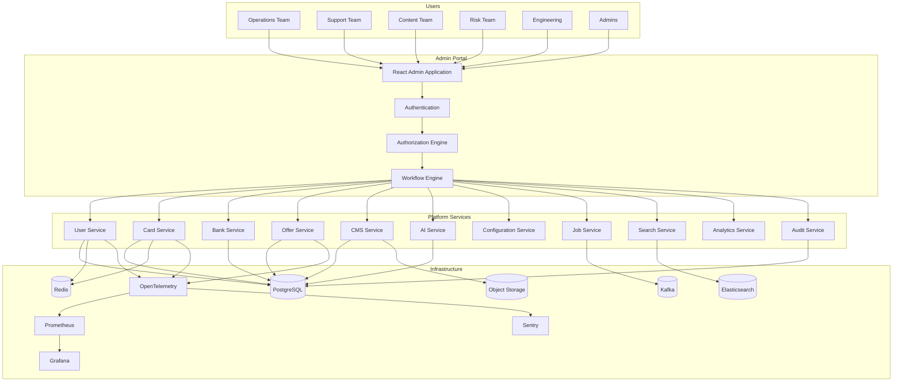

---

# 6. Admin Personas

The portal supports multiple operational personas with clearly separated responsibilities.

| Persona ID | Persona | Responsibility |
|------------|----------|----------------|
| ROLE-001 | Super Administrator | Platform ownership |
| ROLE-002 | Platform Administrator | Runtime operations |
| ROLE-003 | Product Operations | Product catalog management |
| ROLE-004 | Customer Support | User assistance |
| ROLE-005 | Risk & Compliance | Fraud, KYC, governance |
| ROLE-006 | Content Manager | CMS and educational content |
| ROLE-007 | Offer Manager | Merchant and bank offers |
| ROLE-008 | Banking Operations | Banks and card metadata |
| ROLE-009 | AI Operations | Prompt governance and overrides |
| ROLE-010 | Data Analyst | Analytics and reporting |
| ROLE-011 | QA Engineer | Validation and release checks |
| ROLE-012 | Security Administrator | Security reviews and approvals |

---

## Persona Ownership Matrix

| Domain | Primary Owner | Secondary Owner |
|---------|---------------|-----------------|
| Users | Support | Risk |
| Cards | Banking Ops | Product Ops |
| Offers | Offer Manager | Product Ops |
| CMS | Content Team | Product Team |
| AI | AI Operations | Engineering |
| Analytics | Data Team | Product |
| Feature Flags | Platform Admin | Engineering |
| Security | Security Admin | Super Admin |

---

## Operational Considerations

- Avoid overlapping responsibilities.
- Require explicit ownership for every domain.
- Separate operational and engineering duties where feasible.

---

# 7. RBAC Philosophy

RBAC is the foundation of operational security.

Every action is evaluated using multiple dimensions.

## RBAC Dimensions

- Identity
- Role
- Permission
- Resource
- Environment
- Approval State
- Ownership
- Time Constraints

---

## Authorization Pipeline

```text
User
   │
Authentication
   │
Role Resolution
   │
Permission Resolution
   │
Context Evaluation
   │
Approval Validation
   │
Execution
   │
Audit Logging
```

---

## RBAC Principles

| RBAC ID | Principle |
|----------|-----------|
| RBAC-001 | Default deny |
| RBAC-002 | Explicit allow |
| RBAC-003 | Least privilege |
| RBAC-004 | Separation of duties |
| RBAC-005 | Context-aware authorization |
| RBAC-006 | Approval for privileged actions |
| RBAC-007 | Immutable audit trail |

---

## Engineering Rationale

A layered authorization model reduces the blast radius of compromised accounts while enabling flexible operational policies.

### Best Practices

- Grant permissions through roles, not individuals.
- Keep privileged roles minimal.
- Review role assignments periodically.
- Require re-authentication for critical actions.

---

# 8. Role Hierarchy

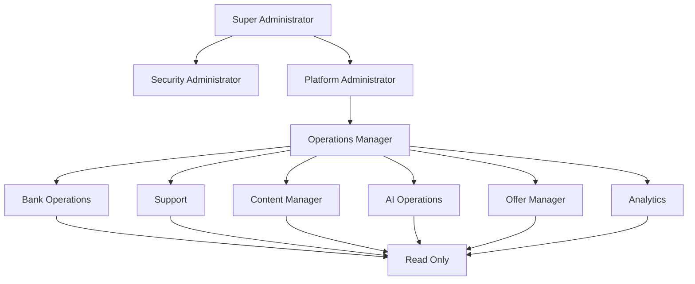

---

# 9. Permission Model

Permissions follow a resource-action model.

```
<Resource>:<Action>
```

Examples:

```
user:view
user:update
user:suspend
card:create
card:update
offer:publish
cms:delete
featureflag:update
config:modify
audit:view
```

---

## Permission Categories

| Prefix | Resource |
|----------|----------|
| USER-* | User management |
| CARD-* | Cards |
| BANK-* | Banks |
| OFFER-* | Offers |
| CMS-* | Content |
| AI-* | AI |
| CFG-* | Runtime configuration |
| AUDIT-* | Audit center |
| JOB-* | Background jobs |
| EXPORT-* | Export center |
| IMPORT-* | Import center |
| ALERT-* | Monitoring |
| LOG-* | Logs |

---

## Permission Levels

| Level | Description |
|--------|-------------|
| Read | View only |
| Create | Add new resources |
| Update | Modify resources |
| Delete | Remove resources |
| Approve | Review and approve |
| Publish | Make changes live |
| Execute | Trigger operational actions |
| Admin | Full domain control |

---

### Risks

- Excessive permissions increase operational risk.
- Permission sprawl complicates audits.
- Overly granular permissions increase administrative overhead.

### Mitigations

- Role templates.
- Periodic access reviews.
- Approval-based elevation.
- Time-bound privileged access.

---

# 10. Project Structure

The Admin Portal is organized as a modular monorepo application with clear separation between platform capabilities and business domains.

```text
admin-portal/
│
├── app-shell/
├── authentication/
├── authorization/
├── dashboard/
├── modules/
│   ├── users/
│   ├── cards/
│   ├── banks/
│   ├── offers/
│   ├── rewards/
│   ├── travel/
│   ├── merchants/
│   ├── cms/
│   ├── ai/
│   ├── analytics/
│   ├── monitoring/
│   ├── audit/
│   ├── feature-flags/
│   ├── runtime-config/
│   ├── jobs/
│   └── import-export/
│
├── platform/
├── shared/
├── design-system/
├── assets/
├── observability/
└── documentation/
```

---

## Engineering Best Practices

- Domain-driven module organization.
- Shared platform abstractions.
- Reusable UI primitives.
- Centralized observability.
- Consistent navigation and workflow patterns.

---

# 11. Application Lifecycle

The Admin Portal follows a governed lifecycle for every operational action.

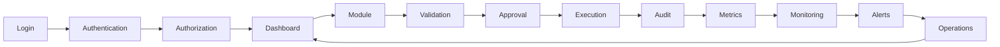

---

## Lifecycle Stages

| Stage | Purpose |
|---------|----------|
| Authentication | Identity verification |
| Authorization | RBAC evaluation |
| Module Access | Domain-specific workflows |
| Validation | Input and business rule checks |
| Approval | Sensitive action governance |
| Execution | Transaction processing |
| Audit | Immutable event recording |
| Metrics | Operational telemetry |
| Monitoring | Platform health evaluation |
| Alerts | Incident notification |

---

## Operational Considerations

- Every lifecycle stage must emit logs, metrics, and traces.
- Failures should be recoverable with minimal operator intervention.
- Critical workflows should support retries and idempotent execution.
- Sensitive actions should require explicit confirmation and, where applicable, multi-step approvals.

# Part 2 — User Management & User Operations

---

# 12. User Management

The User Management domain provides a secure operational interface for managing the complete lifecycle of CardWise users while maintaining strong privacy guarantees, auditability, and regulatory compliance.

Unlike customer-facing profile management, this module focuses on operational support, fraud prevention, compliance, and account integrity.

---

## Objectives

| ID | Objective |
|-----|-----------|
| USER-OBJ-001 | Quickly locate any user |
| USER-OBJ-002 | Support customer operations without direct database access |
| USER-OBJ-003 | Maintain complete audit history |
| USER-OBJ-004 | Protect sensitive user information |
| USER-OBJ-005 | Support safe account recovery |
| USER-OBJ-006 | Enable fraud investigations |
| USER-OBJ-007 | Support GDPR/DPDP compliant operations |

---

# User Domain Responsibilities

| Module | Responsibility |
|----------|----------------|
| USER-001 | User Lookup |
| USER-002 | User Profile |
| USER-003 | Verification Status |
| USER-004 | Premium Management |
| USER-005 | Sessions |
| USER-006 | Device History |
| USER-007 | Login History |
| USER-008 | Account Actions |
| USER-009 | Support Timeline |
| USER-010 | Audit Timeline |

---

## Engineering Rationale

Operational teams should never require direct production database access. All support workflows must flow through governed interfaces with validation, permissions, and immutable auditing.

### Best Practices

- Read-only by default.
- Sensitive fields masked unless explicitly permitted.
- All mutations require reason codes.
- Every state change generates audit events.

### Trade-offs

| Decision | Benefit | Cost |
|----------|---------|------|
| Centralized user console | Faster support | Larger module complexity |
| Masked sensitive fields | Better privacy | Additional permission checks |
| Immutable timelines | Easier investigations | Increased storage |

### Risks

| Risk | Mitigation |
|------|------------|
| Unauthorized access | Fine-grained RBAC |
| Human error | Confirmation dialogs and approvals |
| Privacy violations | Field masking and audit logging |

---

# 13. User Lookup

The lookup service acts as the entry point for almost every support workflow.

## Supported Search Attributes

| ID | Attribute |
|----|-----------|
| USER-SEARCH-001 | User ID |
| USER-SEARCH-002 | Email |
| USER-SEARCH-003 | Mobile Number |
| USER-SEARCH-004 | Username |
| USER-SEARCH-005 | Premium ID |
| USER-SEARCH-006 | Device ID |
| USER-SEARCH-007 | Session ID |
| USER-SEARCH-008 | Credit Card ID |
| USER-SEARCH-009 | External Identity Provider ID |
| USER-SEARCH-010 | KYC Reference ID |

---

## Search Capabilities

| Capability | Description |
|------------|-------------|
| Exact Search | Unique identifiers |
| Prefix Search | Email/mobile |
| Full Text | Names and aliases |
| Advanced Filters | Status, premium, country, KYC |
| Saved Queries | Frequently used searches |
| Bulk Search | CSV-based lookup |

---

## Search Results

Each result displays:

- Basic profile
- Verification status
- Premium badge
- Current account status
- Last login
- Active sessions
- Risk indicators
- Recent support tickets

---

# 14. User Profile

The profile page is the operational source of truth for an individual user.

## Profile Sections

| Section | Description |
|----------|-------------|
| Identity | Basic user information |
| Authentication | Login providers |
| Verification | Email, phone, KYC |
| Premium | Subscription details |
| Devices | Registered devices |
| Sessions | Active sessions |
| Cards | Linked cards |
| Rewards | Reward summary |
| Travel | Membership summary |
| Activity | Timeline |
| Audit | Administrative history |

---

## Profile Visibility Levels

| Data Category | Default Access |
|---------------|----------------|
| Name | Support |
| Email | Masked |
| Mobile | Masked |
| KYC Documents | Compliance only |
| Payment Metadata | Restricted |
| Device Fingerprints | Fraud team |
| Internal Notes | Authorized roles only |

---

# 15. User Operations

Operational actions are grouped into governed workflows with explicit permissions.

## Supported Operations

| Operation ID | Operation |
|--------------|-----------|
| USER-OPS-001 | Update profile metadata |
| USER-OPS-002 | Verify email |
| USER-OPS-003 | Verify mobile |
| USER-OPS-004 | Reset MFA |
| USER-OPS-005 | Force logout |
| USER-OPS-006 | Revoke sessions |
| USER-OPS-007 | Suspend account |
| USER-OPS-008 | Reinstate account |
| USER-OPS-009 | Merge accounts |
| USER-OPS-010 | Delete personal data (policy-driven) |
| USER-OPS-011 | Add operational notes |
| USER-OPS-012 | Escalate to Risk |

---

## Action Categories

| Category | Examples |
|-----------|----------|
| Read | View profile |
| Operational | Reset sessions |
| Administrative | Premium changes |
| Compliance | KYC decisions |
| High Risk | Merge accounts |
| Destructive | Data deletion |

---

## Operational Considerations

- Every action requires a reason.
- High-risk actions require approvals.
- Sensitive operations require re-authentication.
- Mutations are idempotent wherever feasible.

---

# 16. Account Lifecycle

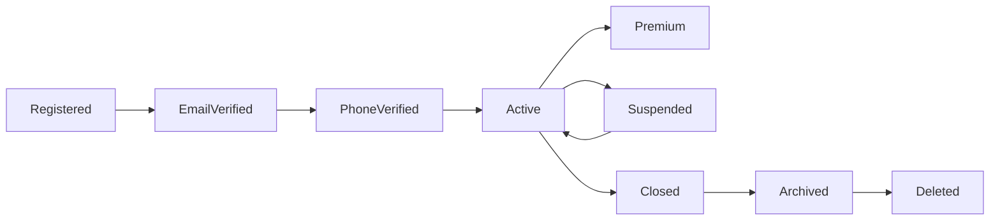

---

## Lifecycle States

| State | Description |
|--------|-------------|
| Registered | Initial registration |
| Email Verified | Email confirmed |
| Phone Verified | Mobile confirmed |
| Active | Normal usage |
| Premium | Paid subscription active |
| Suspended | Temporarily restricted |
| Closed | User-initiated closure |
| Archived | Retained per policy |
| Deleted | Final removal after retention period |

---

## Lifecycle Rules

| Rule ID | Rule |
|----------|------|
| USER-LIFE-001 | Suspended users cannot authenticate |
| USER-LIFE-002 | Archived accounts remain searchable for compliance |
| USER-LIFE-003 | Deletion follows retention policies |
| USER-LIFE-004 | Premium cannot exist on closed accounts |

---

# 17. Session Management

The session module provides visibility and operational control over active authentication sessions.

## Session Attributes

| Attribute | Description |
|------------|-------------|
| Session ID | Unique identifier |
| Device | Browser/device metadata |
| IP Address | Latest login IP |
| Region | Derived location |
| Created At | Session creation |
| Last Activity | Most recent activity |
| Authentication Method | Password/OAuth/MFA |
| Status | Active/Expired/Revoked |

---

## Supported Actions

| Action | Permission |
|----------|------------|
| View session | USER:view |
| Revoke single session | USER:revoke-session |
| Revoke all sessions | USER:revoke-all |
| Force password reset | USER:reset-password |
| Require MFA | USER:enforce-mfa |

---

## Best Practices

- Never expose session secrets.
- Show approximate geolocation only.
- Log every revocation.
- Notify users after forced logout.

---

# 18. KYC Review

KYC workflows are isolated to compliance-authorized roles.

## Review States

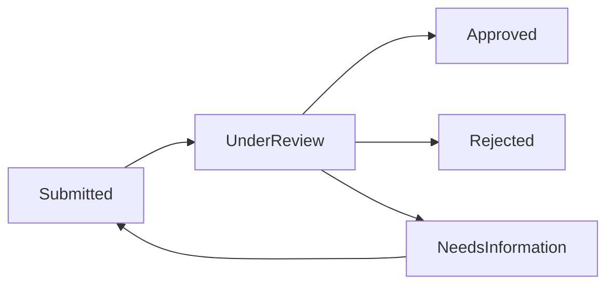

---

## KYC Statuses

| Status | Description |
|---------|-------------|
| Pending | Awaiting review |
| Under Review | Compliance review |
| Approved | Verification successful |
| Rejected | Verification failed |
| Needs Information | Additional documents required |
| Expired | Re-verification needed |

---

## Reviewer Capabilities

| Capability | Description |
|------------|-------------|
| Document review | Inspect submitted documents |
| Decision | Approve or reject |
| Request information | Seek additional evidence |
| Escalation | Forward to senior reviewer |

---

## Risks

- Identity fraud
- Manual review bias
- Unauthorized document access

### Mitigations

- Dual-review for high-risk cases.
- Restricted document permissions.
- Full reviewer audit trail.

---

# 19. Premium Management

Premium subscriptions are managed through controlled administrative workflows.

## Supported Actions

| ID | Action |
|----|--------|
| USER-PREM-001 | Grant premium |
| USER-PREM-002 | Extend validity |
| USER-PREM-003 | Revoke premium |
| USER-PREM-004 | Issue promotional access |
| USER-PREM-005 | Restore entitlement |

---

## Governance Rules

| Rule | Description |
|------|-------------|
| Approval required | Promotional grants above policy threshold |
| Audit required | All entitlement changes |
| Notifications | User informed of status changes |
| Rollback | Accidental changes reversible |

---

# 20. Device Management

Every trusted device is tracked for security and fraud analysis.

## Device Metadata

| Field | Description |
|--------|-------------|
| Device ID | Internal identifier |
| Platform | Web, Android, iOS |
| Browser/App Version | Client details |
| OS | Operating system |
| Fingerprint | Device signature |
| Last Seen | Latest activity |
| Status | Trusted, Suspicious, Blocked |

---

## Device Operations

| Operation | Description |
|------------|-------------|
| View device | Inspect metadata |
| Revoke trust | Remove trusted status |
| Block device | Prevent authentication |
| Flag suspicious | Escalate for investigation |

---

## Operational Considerations

- Fingerprints are not editable.
- Device history is immutable.
- Blocking a device invalidates active sessions.

---

# 21. Suspension Workflow

Account suspension protects the platform against fraud, abuse, and policy violations.

## Suspension Reasons

| ID | Reason |
|----|--------|
| USER-SUSP-001 | Fraud suspicion |
| USER-SUSP-002 | Policy violation |
| USER-SUSP-003 | Chargeback abuse |
| USER-SUSP-004 | Security compromise |
| USER-SUSP-005 | Regulatory request |
| USER-SUSP-006 | Manual investigation |

---

## Suspension Workflow

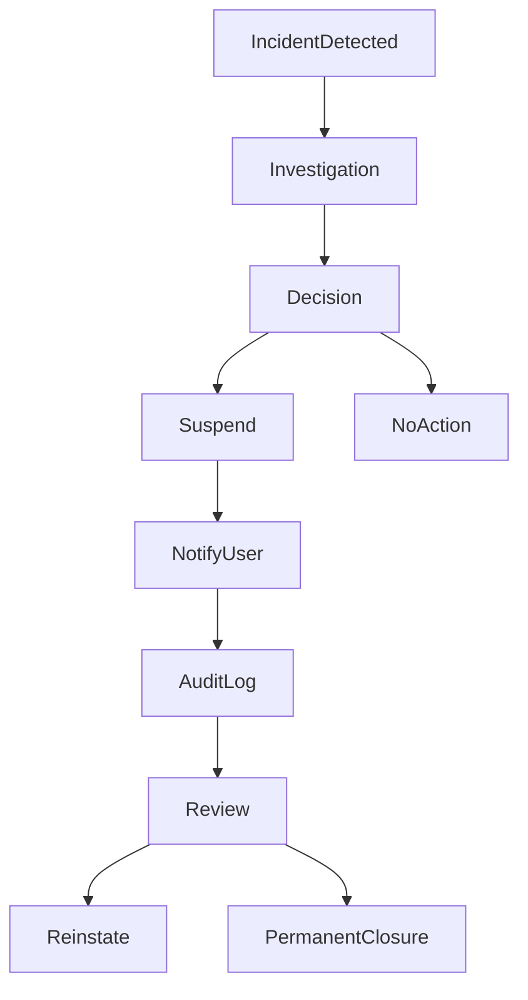

---

## Suspension Governance

| Rule | Description |
|------|-------------|
| Reason mandatory | Every suspension requires a standardized reason code |
| Approval | High-impact suspensions require secondary approval |
| Notification | User notified unless restricted by policy |
| Review | Scheduled review before permanent closure |
| Audit | Entire workflow recorded immutably |

---

## Engineering Rationale

Separating suspension from deletion preserves evidence, supports investigations, and allows reversible enforcement while minimizing disruption to legitimate users.

### Best Practices

- Prefer temporary suspension over irreversible actions.
- Use standardized reason codes.
- Enforce review SLAs for suspended accounts.
- Automate reminders for pending investigations.

### Trade-offs

| Decision | Benefit | Cost |
|----------|---------|------|
| Multi-stage suspension | Reduced false positives | Longer operational workflow |
| Approval gates | Better governance | Slightly slower response |
| Immutable evidence | Strong compliance | Increased storage |

### Risks

| Risk | Mitigation |
|------|------------|
| Incorrect suspension | Secondary review and appeal workflow |
| Abuse of privileges | RBAC, approvals, audits |
| Delayed investigations | SLA tracking and operational dashboards |

# Part 3 — Credit Card Management & Bank Operations

---

# 22. Credit Card Management

The Credit Card Management domain is the authoritative source for all card-related master data used throughout the CardWise platform.

Every recommendation, comparison, reward calculation, eligibility decision, travel benefit, AI suggestion, and analytics report ultimately depends on the quality and integrity of this dataset.

Unlike user-generated data, credit card information is curated, version-controlled, and governed through structured approval workflows.

---

## Objectives

| ID | Objective |
|-----|-----------|
| CARD-OBJ-001 | Maintain a single source of truth for all credit cards |
| CARD-OBJ-002 | Support complete version history |
| CARD-OBJ-003 | Enable safe editing through approval workflows |
| CARD-OBJ-004 | Minimize production data inconsistencies |
| CARD-OBJ-005 | Support rapid publication of new cards |
| CARD-OBJ-006 | Preserve historical card information |
| CARD-OBJ-007 | Enable downstream systems through stable master data |

---

## Card Domain Responsibilities

| Module ID | Responsibility |
|------------|----------------|
| CARD-001 | Card Master |
| CARD-002 | Card Variants |
| CARD-003 | Reward Configuration |
| CARD-004 | Fee Management |
| CARD-005 | Interest Rates |
| CARD-006 | Benefits |
| CARD-007 | Travel Benefits |
| CARD-008 | Eligibility Rules |
| CARD-009 | Images & Assets |
| CARD-010 | Metadata |
| CARD-011 | Version History |
| CARD-012 | Publishing |

---

## Engineering Rationale

All card metadata is managed centrally to prevent inconsistencies across recommendation engines, AI services, search indexes, mobile apps, browser extensions, and partner integrations.

### Best Practices

- Treat card metadata as immutable versions.
- Avoid direct edits to published records.
- Separate draft and published states.
- Publish atomically.

### Trade-offs

| Decision | Benefit | Cost |
|----------|---------|------|
| Versioned metadata | Rollback support | Additional storage |
| Draft-first editing | Safer releases | Longer publishing workflow |
| Centralized master data | Consistency | Larger governance effort |

---

# 23. Card Master

The Card Master represents the canonical definition of a credit card product.

Each logical product is uniquely identified regardless of future revisions.

---

## Core Attributes

| Attribute | Description |
|------------|-------------|
| Card ID | Stable internal identifier |
| Card Name | Display name |
| Bank | Issuing bank |
| Network | Visa, Mastercard, RuPay, Amex |
| Product Family | Premium, Cashback, Travel, etc. |
| Lifecycle Status | Draft, Published, Archived |
| Version | Active version |
| Effective Date | Production activation |
| Retirement Date | End of lifecycle |

---

## Card Lifecycle

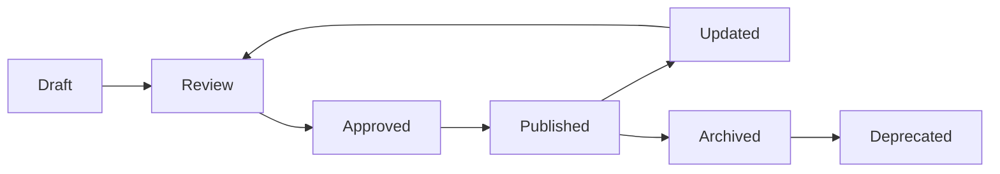

---

## Lifecycle Rules

| Rule ID | Rule |
|----------|------|
| CARD-LIFE-001 | Only one published version at a time |
| CARD-LIFE-002 | Drafts are not searchable externally |
| CARD-LIFE-003 | Archived cards remain historically available |
| CARD-LIFE-004 | Deprecated cards remain referenceable for analytics |

---

# 24. Card Variants

Many banks issue multiple variants of the same product family.

Examples include:

- Entry
- Gold
- Platinum
- Signature
- Infinite
- Business
- Corporate

---

## Variant Hierarchy

```text
Card Family
      │
      ├── Variant A
      ├── Variant B
      ├── Variant C
      └── Variant D
```

---

## Variant Metadata

| Field | Description |
|--------|-------------|
| Variant ID | Stable identifier |
| Parent Card | Master reference |
| Display Name | Marketing name |
| Eligibility | Variant-specific |
| Fees | Variant-specific |
| Rewards | Variant-specific |
| Benefits | Variant-specific |
| Images | Variant-specific |

---

## Operational Considerations

- Variants inherit defaults from the master where appropriate.
- Overrides are explicitly tracked.
- Shared assets reduce duplication.

---

# 25. Bank Management

Banks are managed independently from cards to maximize reuse and maintain consistent branding across the platform.

---

## Bank Responsibilities

| Module | Description |
|----------|-------------|
| BANK-001 | Bank Profile |
| BANK-002 | Logos |
| BANK-003 | Brand Colors |
| BANK-004 | Contact Information |
| BANK-005 | Issuer Metadata |
| BANK-006 | Integrations |
| BANK-007 | Supported Networks |
| BANK-008 | Status |

---

## Bank Statuses

| Status | Description |
|---------|-------------|
| Draft | Initial setup |
| Active | Production ready |
| Maintenance | Temporarily unavailable |
| Deprecated | No longer issuing new cards |
| Archived | Historical only |

---

## Engineering Rationale

Separating bank metadata from card definitions enables consistent branding, reusable integrations, and simplified updates when issuer information changes.

---

# 26. Card Metadata

Metadata powers filtering, recommendations, AI, search, and analytics.

---

## Metadata Categories

| Category | Examples |
|-----------|----------|
| Financial | Joining fee, renewal fee, APR |
| Rewards | Cashback, points, miles |
| Travel | Lounge, hotel, airline |
| Insurance | Purchase protection, travel insurance |
| Lifestyle | Dining, entertainment |
| Digital | Contactless, tokenization |
| Eligibility | Income, age, geography |
| Marketing | Hero labels, badges |

---

## Metadata Characteristics

| Property | Requirement |
|-----------|-------------|
| Strong typing | Yes |
| Versioned | Yes |
| Searchable | Yes |
| Auditable | Yes |
| Localizable | Yes |

---

## Risks

- Incorrect metadata affects recommendation accuracy.
- Missing values reduce search quality.
- Inconsistent taxonomy impacts analytics.

### Mitigations

- Validation rules.
- Schema enforcement.
- Controlled vocabularies.

---

# 27. Benefits Management

Benefits are modeled independently to maximize reuse across multiple cards.

---

## Benefit Categories

| ID | Category |
|----|----------|
| CARD-BEN-001 | Cashback |
| CARD-BEN-002 | Reward Points |
| CARD-BEN-003 | Airport Lounge |
| CARD-BEN-004 | Dining |
| CARD-BEN-005 | Fuel |
| CARD-BEN-006 | Shopping |
| CARD-BEN-007 | Entertainment |
| CARD-BEN-008 | Insurance |
| CARD-BEN-009 | Concierge |
| CARD-BEN-010 | Golf |
| CARD-BEN-011 | Travel |
| CARD-BEN-012 | Wellness |

---

## Benefit Structure

Each benefit contains:

- Title
- Description
- Category
- Eligibility
- Limits
- Frequency
- Validity
- Applicable regions
- Source
- Verification status

---

## Operational Considerations

- Benefits may be shared across multiple cards.
- Expired benefits remain in historical versions.
- Verification status indicates confidence in data quality.

---

# 28. Fee Management

Fees influence comparison rankings and recommendation engines.

---

## Fee Types

| Type | Description |
|------|-------------|
| Joining Fee | Initial issuance |
| Annual Fee | Recurring renewal |
| Renewal Waiver | Spend-based waiver |
| Foreign Markup | FX surcharge |
| Cash Advance | Withdrawal fee |
| Late Payment | Penalty |
| Over-limit | Exceeding credit limit |

---

## Governance Rules

| Rule | Description |
|------|-------------|
| Effective dating | Mandatory |
| Historical tracking | Required |
| Currency normalization | Required |
| Approval | Required before publishing |

---

# 29. Rewards Management

Reward structures are among the most frequently changing card attributes.

---

## Reward Components

| Component | Description |
|------------|-------------|
| Base Reward Rate | Standard earning |
| Accelerated Categories | Bonus rewards |
| Caps | Monthly/annual limits |
| Exclusions | Non-eligible transactions |
| Redemption Ratio | Conversion value |
| Transfer Partners | Airline/hotel partners |
| Expiration Policy | Reward validity |

---

## Reward Validation Rules

| Rule ID | Rule |
|----------|------|
| CARD-REWARD-001 | Reward rates must be non-negative |
| CARD-REWARD-002 | Caps require effective dates |
| CARD-REWARD-003 | Redemption ratios require source references |
| CARD-REWARD-004 | Historical reward policies remain immutable |

---

## Best Practices

- Normalize reward calculations.
- Preserve historical earning structures.
- Publish reward updates atomically.

---

# 30. Travel Benefits

Travel-related information is modeled independently due to frequent changes and third-party dependencies.

---

## Travel Benefit Categories

| Category | Examples |
|-----------|----------|
| Airport Lounge | Domestic, International |
| Airline | Priority boarding, baggage |
| Hotel | Membership, upgrades |
| Rental Cars | Discounts |
| Visa Assistance | Travel documentation |
| Insurance | Medical, baggage, delays |

---

## Operational Considerations

- Third-party data requires periodic validation.
- Benefit expirations trigger review workflows.
- Geographic restrictions are versioned.

---

# 31. Card Versioning

Every published card is immutable.

Changes always generate a new version.

---

## Version States


---

## Version Metadata

| Field | Description |
|--------|-------------|
| Version Number | Sequential identifier |
| Created By | Operator |
| Created At | Timestamp |
| Change Summary | Human-readable description |
| Approval Status | Workflow state |
| Published By | Approver |
| Effective Date | Activation date |

---

## Version Rules

| Rule | Description |
|------|-------------|
| Immutable after publication | Yes |
| Rollback supported | Yes |
| Diff view available | Yes |
| Historical lookup | Yes |

---

## Engineering Rationale

Immutable versions simplify debugging, compliance reviews, recommendation reproducibility, and historical analytics.

### Trade-offs

| Decision | Benefit | Cost |
|----------|---------|------|
| Immutable publishing | Strong integrity | More versions stored |
| Version comparisons | Easier reviews | Additional tooling |

---

# 32. Approval Workflow

Sensitive changes to financial products require structured approvals before publication.

---

## Approval Levels

| Level | Reviewer |
|--------|----------|
| Level 1 | Product Operations |
| Level 2 | Banking Operations |
| Level 3 | Compliance (when applicable) |
| Level 4 | Super Administrator (exceptional cases) |

---

## Approval States

| State | Description |
|--------|-------------|
| Draft | Editing |
| Submitted | Awaiting review |
| Changes Requested | Reviewer feedback |
| Approved | Ready for publication |
| Rejected | Cannot proceed |
| Published | Live in production |

---

## Approval Workflow

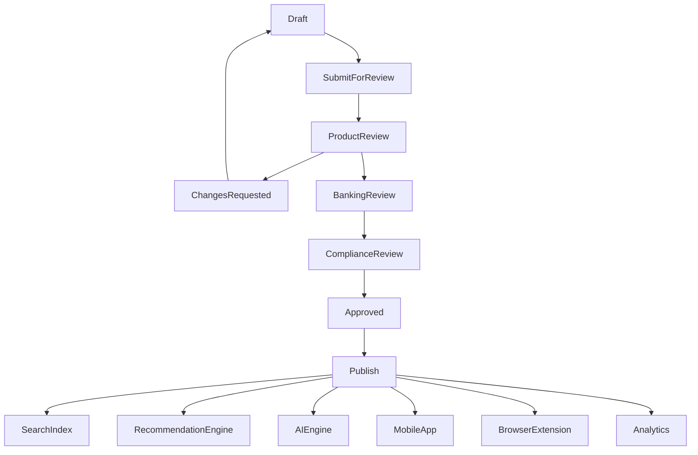

---

## Operational Considerations

- Parallel validation before approval reduces review time.
- Publishing triggers downstream synchronization.
- Failed downstream synchronization generates operational alerts.
- Rollback always targets the previously published version.

### Best Practices

- Use mandatory change summaries.
- Require dual approval for high-impact financial changes.
- Automate validation before human review.
- Track publication latency as an operational KPI.

### Risks

| Risk | Mitigation |
|------|------------|
| Incorrect card data | Multi-stage approvals and automated validation |
| Downstream inconsistency | Event-driven publication pipeline |
| Accidental publication | Confirmation gates and rollback support |


# Part 4 — Offer Management & Merchant Operations

---

# 33. Offer Management

Offer Management is responsible for the complete lifecycle of all promotional offers available within CardWise.

Unlike static card metadata, offers are highly dynamic, frequently updated, geographically constrained, and often time-sensitive.

This module ensures that every offer remains accurate, searchable, versioned, and operationally governed.

---

## Objectives

| ID | Objective |
|-----|-----------|
| OFFER-OBJ-001 | Maintain a centralized offer catalog |
| OFFER-OBJ-002 | Support multiple offer providers |
| OFFER-OBJ-003 | Enable scheduled publishing |
| OFFER-OBJ-004 | Ensure eligibility correctness |
| OFFER-OBJ-005 | Preserve historical offer versions |
| OFFER-OBJ-006 | Support AI recommendation systems |
| OFFER-OBJ-007 | Reduce operational overhead through automation |

---

## Offer Domain Responsibilities

| Module ID | Responsibility |
|------------|----------------|
| OFFER-001 | Offer Master |
| OFFER-002 | Campaign Management |
| OFFER-003 | Eligibility Rules |
| OFFER-004 | Scheduling |
| OFFER-005 | Prioritization |
| OFFER-006 | Merchant Mapping |
| OFFER-007 | Geographic Availability |
| OFFER-008 | Version History |
| OFFER-009 | Approval Workflow |
| OFFER-010 | Publishing |

---

## Engineering Rationale

Offer data changes significantly more frequently than card metadata. Treating offers as a governed operational domain prevents stale promotions, inaccurate recommendations, and customer dissatisfaction.

### Best Practices

- Store offers independently from merchants.
- Publish through controlled workflows.
- Validate eligibility before activation.
- Archive expired offers without deletion.

### Trade-offs

| Decision | Benefit | Cost |
|----------|---------|------|
| Versioned offers | Full history | Increased storage |
| Scheduled publishing | Reduced manual work | Scheduler complexity |
| Independent eligibility engine | Reusable logic | Additional orchestration |

---

# 34. Offer Master

The Offer Master is the canonical representation of a promotional campaign.

---

## Offer Types

| Type | Description |
|------|-------------|
| Bank Offer | Issuer-sponsored promotion |
| Merchant Offer | Brand-specific promotion |
| Network Offer | Visa/Mastercard/RuPay/Amex campaigns |
| Platform Offer | CardWise-exclusive campaigns |
| Partner Offer | Third-party integrations |
| Seasonal Offer | Festival and event campaigns |

---

## Core Attributes

| Attribute | Description |
|------------|-------------|
| Offer ID | Stable identifier |
| Offer Name | Internal title |
| Display Title | Customer-facing name |
| Offer Type | Classification |
| Merchant | Associated merchant |
| Applicable Cards | Eligible cards |
| Regions | Supported geography |
| Priority | Ranking weight |
| Status | Lifecycle state |
| Effective Dates | Validity period |

---

## Offer Lifecycle


---

## Lifecycle Rules

| Rule ID | Rule |
|----------|------|
| OFFER-LIFE-001 | Only active offers appear to customers |
| OFFER-LIFE-002 | Expired offers remain available for analytics |
| OFFER-LIFE-003 | Archived offers are immutable |
| OFFER-LIFE-004 | Future offers are hidden until activation |

---

# 35. Merchant Management

Merchants are managed independently to ensure consistency across offers, rewards, AI recommendations, and search.

---

## Merchant Responsibilities

| Module | Responsibility |
|----------|----------------|
| MERCHANT-001 | Merchant Profile |
| MERCHANT-002 | Brand Assets |
| MERCHANT-003 | Categories |
| MERCHANT-004 | Search Aliases |
| MERCHANT-005 | MCC Mapping |
| MERCHANT-006 | Geographic Presence |
| MERCHANT-007 | External Identifiers |

---

## Merchant Metadata

| Field | Description |
|--------|-------------|
| Merchant ID | Stable identifier |
| Brand Name | Official name |
| Display Name | Customer-facing name |
| Logo | Brand asset |
| MCC Codes | Merchant category codes |
| Website | Official URL |
| Parent Brand | Group relationship |
| Active Status | Availability |

---

## Engineering Rationale

Separating merchant data avoids duplication across thousands of offers while improving search accuracy and recommendation quality.

---

# 36. Categories & Taxonomy

Offers are classified using a hierarchical taxonomy to power search, recommendations, analytics, and AI.

---

## Category Hierarchy

```text
Shopping
├── Electronics
├── Fashion
├── Grocery
└── Home

Travel
├── Flights
├── Hotels
├── Cabs
└── Rail

Dining
├── Restaurants
├── Cafes
└── Food Delivery

Entertainment
├── Movies
├── Gaming
└── Streaming
```

---

## Category Metadata

| Field | Description |
|--------|-------------|
| Category ID | Stable identifier |
| Parent Category | Hierarchical parent |
| Display Name | User-visible name |
| Search Keywords | Synonyms |
| AI Tags | Recommendation metadata |
| Status | Active/Archived |

---

## Operational Considerations

- Categories are versioned.
- Parent-child integrity is enforced.
- Synonyms improve search relevance.
- Archived categories remain historically referenceable.

---

# 37. Campaign Management

Campaigns group related offers under shared business objectives.

---

## Campaign Types

| Type | Examples |
|------|----------|
| Seasonal | Diwali, Christmas |
| Merchant | Amazon Sale |
| Banking | HDFC Cashback Festival |
| Travel | Summer Vacation |
| Platform | CardWise Rewards Week |

---

## Campaign Attributes

| Field | Description |
|--------|-------------|
| Campaign ID | Stable identifier |
| Name | Internal name |
| Start Date | Activation |
| End Date | Expiration |
| Budget | Optional operational metadata |
| Status | Draft, Active, Completed |
| Owner | Responsible team |

---

## Best Practices

- Reuse campaign templates.
- Group related offers logically.
- Schedule campaigns in advance.
- Track campaign performance independently.

---

# 38. Scheduling Engine

Scheduling automates publication and expiration without manual intervention.

---

## Scheduling States


---

## Scheduling Rules

| Rule | Description |
|------|-------------|
| Activation | Automatic at start time |
| Expiration | Automatic at end time |
| Time Zone | UTC storage with localized display |
| Conflict Detection | Prevent overlapping exclusive campaigns |
| Retry | Automatic retries for scheduler failures |

---

## Risks

- Incorrect activation windows.
- Time zone inconsistencies.
- Scheduler failures.

### Mitigations

- UTC normalization.
- Validation before scheduling.
- Operational alerts for missed jobs.

---

# 39. Priority Engine

When multiple offers apply simultaneously, the Priority Engine determines ranking.

---

## Priority Factors

| Factor | Description |
|---------|-------------|
| Merchant relevance | Brand match |
| Reward value | Effective savings |
| Offer exclusivity | Limited campaigns |
| User eligibility | Personalized applicability |
| Freshness | Recently launched |
| Manual boost | Operational override |

---

## Priority Resolution

```text
Eligibility
      │
Priority Score
      │
Tie Breakers
      │
Personalization
      │
Final Ranking
```

---

## Engineering Rationale

A centralized priority model ensures consistent ranking across search, recommendations, browser extension, mobile app, and AI services.

---

# 40. Eligibility Engine

Eligibility determines whether an offer is applicable for a specific user.

---

## Eligibility Dimensions

| Dimension | Examples |
|------------|----------|
| Card | Eligible card products |
| Bank | Issuer restrictions |
| Network | Visa, Mastercard, etc. |
| Geography | Country, state, city |
| Merchant | Brand-specific |
| Spend Threshold | Minimum purchase |
| Customer Segment | Premium, student, etc. |
| Time | Campaign validity |

---

## Evaluation Pipeline

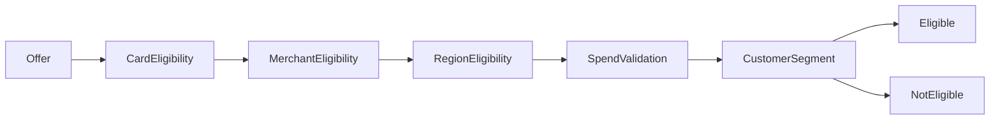

---

## Best Practices

- Stateless evaluation.
- Deterministic outcomes.
- Explainable eligibility failures.
- Cached reusable evaluations where appropriate.

---

# 41. Offer Review Workflow

Every offer undergoes structured review before publication.

---

## Review Stages

| Stage | Reviewer |
|--------|----------|
| Content Review | Product Operations |
| Business Review | Offer Operations |
| Compliance Review | Risk/Compliance (when required) |
| Technical Validation | Automated |
| Publication Approval | Authorized approver |

---

## Review Outcomes

| Outcome | Description |
|----------|-------------|
| Approved | Ready for publishing |
| Changes Requested | Returned for edits |
| Rejected | Cannot proceed |
| Scheduled | Awaiting activation |
| Published | Live |

---

## Review Workflow

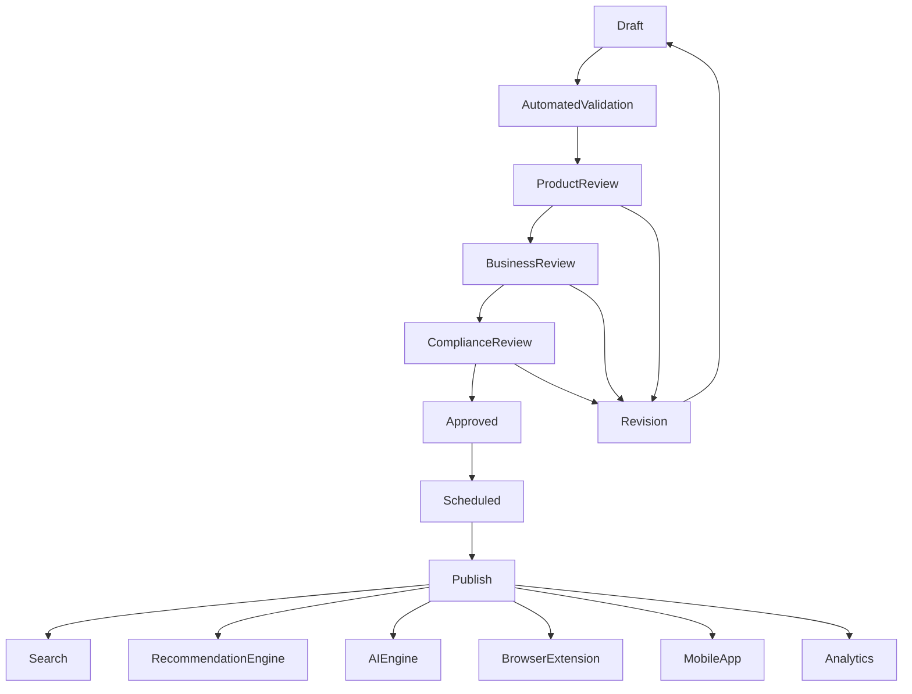

---

## Operational Considerations

- Validation executes before human review.
- Compliance review is conditional based on campaign type.
- Publication propagates changes through an event-driven pipeline.
- Publication failures trigger automatic rollback procedures.

### Engineering Rationale

Separating validation, review, and publication reduces operational risk while ensuring consistent customer experiences across all CardWise surfaces.

### Trade-offs

| Decision | Benefit | Cost |
|----------|---------|------|
| Multi-stage review | Higher quality | Longer publishing cycle |
| Automated validation | Fewer human errors | Validation maintenance |
| Event-driven publishing | Better scalability | Event orchestration complexity |

### Risks

| Risk | Mitigation |
|------|------------|
| Invalid eligibility rules | Automated rule validation |
| Stale offers | Scheduled expiration and monitoring |
| Duplicate campaigns | Conflict detection and review gates |
| Incorrect prioritization | Deterministic scoring with auditability |

# Part 5 — Content Management System (CMS)

---

# 42. Content Management System

The CardWise Content Management System (CMS) is the centralized platform for managing all editorial, educational, marketing, and customer-facing content.

The CMS is intentionally separated from application code to enable product, content, and operations teams to publish and update information without requiring engineering deployments.

It serves as the single source of truth for structured and unstructured content across:

- Web Application
- Mobile Application
- Browser Extension
- Email Campaigns
- Push Notifications
- In-App Messaging
- AI Knowledge Base
- Help Center
- SEO Landing Pages

---

## Objectives

| ID | Objective |
|-----|-----------|
| CMS-OBJ-001 | Centralize all content management |
| CMS-OBJ-002 | Enable non-engineering publishing |
| CMS-OBJ-003 | Maintain version-controlled content |
| CMS-OBJ-004 | Support multilingual content |
| CMS-OBJ-005 | Ensure review and approval before publication |
| CMS-OBJ-006 | Integrate with AI knowledge systems |
| CMS-OBJ-007 | Improve SEO and discoverability |

---

## CMS Domain Responsibilities

| Module ID | Responsibility |
|------------|----------------|
| CMS-001 | Help Articles |
| CMS-002 | FAQs |
| CMS-003 | Guides |
| CMS-004 | Marketing Pages |
| CMS-005 | Notifications |
| CMS-006 | Announcements |
| CMS-007 | Localization |
| CMS-008 | Media Library |
| CMS-009 | SEO Metadata |
| CMS-010 | Version History |
| CMS-011 | Publishing Workflow |
| CMS-012 | Search Indexing |

---

## Engineering Rationale

Separating content from application logic reduces deployment frequency, improves editorial agility, and enables consistent content delivery across all CardWise channels.

### Best Practices

- Treat content as versioned assets.
- Separate drafts from published content.
- Validate structured metadata before publishing.
- Reuse shared content components where possible.

### Trade-offs

| Decision | Benefit | Cost |
|----------|---------|------|
| Headless CMS approach | Multi-channel delivery | More abstraction |
| Versioned publishing | Safe rollbacks | Increased storage |
| Structured content | Better automation | Additional modeling effort |

---

# 43. Content Workflow

Every content item progresses through a governed lifecycle to ensure quality, consistency, and compliance.

---

## Content Types

| Type | Examples |
|------|----------|
| Help Article | "How reward points work" |
| FAQ | Frequently asked questions |
| Guide | Travel optimization, reward maximization |
| Landing Page | Product marketing |
| Legal | Privacy policy, terms |
| Announcement | Platform updates |
| Knowledge Base | AI reference material |

---

## Content Lifecycle

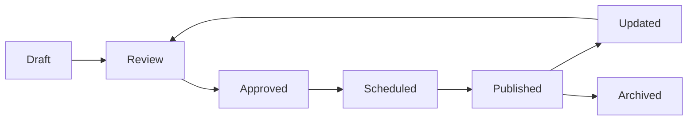

---

## Workflow Rules

| Rule ID | Rule |
|----------|------|
| CMS-WF-001 | Only approved content can be published |
| CMS-WF-002 | Published content is immutable until a new version is created |
| CMS-WF-003 | Archived content remains searchable internally |
| CMS-WF-004 | Draft content is inaccessible externally |

---

## Operational Considerations

- Support scheduled publishing.
- Enable emergency unpublishing.
- Track editorial ownership.
- Preserve complete revision history.

---

# 44. Notification Management

The Notification Center manages operational and marketing communications delivered across all supported channels.

---

## Notification Channels

| Channel | Description |
|----------|-------------|
| Push | Mobile and web push notifications |
| Email | Transactional and marketing |
| In-App | Application banners and alerts |
| SMS | Critical communication |
| Browser Extension | Offer and reward alerts |

---

## Notification Categories

| Category | Examples |
|----------|----------|
| Transactional | Verification, password reset |
| Operational | Maintenance alerts |
| Marketing | New offers, campaigns |
| Rewards | Redemption reminders |
| Travel | Lounge eligibility updates |
| AI | Personalized insights |

---

## Notification Lifecycle

```text
Draft
   │
Approval
   │
Scheduling
   │
Delivery
   │
Tracking
   │
Analytics
```

---

## Best Practices

- Separate templates from campaigns.
- Localize all user-facing messages.
- Respect notification preferences.
- Deduplicate repeated notifications.

---

# 45. FAQ Management

FAQs provide structured, searchable answers for common user questions.

---

## FAQ Structure

| Field | Description |
|--------|-------------|
| FAQ ID | Stable identifier |
| Question | User-facing question |
| Answer | Rich content |
| Category | Functional grouping |
| Tags | Search metadata |
| Priority | Ordering |
| Status | Draft/Published |

---

## FAQ Categories

| Category | Examples |
|----------|----------|
| Credit Cards | Fees, rewards |
| Offers | Eligibility |
| Premium | Subscription |
| Travel | Lounge access |
| Security | MFA, login |
| Payments | Transactions |

---

## Engineering Rationale

Structured FAQs improve customer self-service while providing high-quality knowledge for AI-powered assistants.

---

# 46. Marketing Pages

Marketing pages are independently managed, version-controlled, and optimized for SEO.

---

## Supported Page Types

| Type | Description |
|------|-------------|
| Home Landing | Product overview |
| Premium | Subscription benefits |
| Rewards | Feature highlights |
| Travel | Lounge and airline content |
| Campaign | Promotional pages |
| Comparison | Product comparisons |

---

## Page Components

| Component | Description |
|-----------|-------------|
| Hero Section | Primary messaging |
| Feature Blocks | Product capabilities |
| CTA | Conversion actions |
| Testimonials | Social proof |
| FAQ | Embedded knowledge |
| SEO Metadata | Search optimization |

---

## Operational Considerations

- Pages use reusable content blocks.
- SEO metadata is mandatory.
- Publication supports preview environments.

---

# 47. Search Content

Search indexes all CMS content for fast retrieval across user-facing products and internal tools.

---

## Indexed Content

| Content Type | Indexed |
|--------------|---------|
| Articles | Yes |
| FAQs | Yes |
| Guides | Yes |
| Marketing Pages | Yes |
| Announcements | Yes |
| AI Knowledge | Yes |

---

## Search Metadata

| Attribute | Description |
|-----------|-------------|
| Title | Indexed |
| Description | Indexed |
| Tags | Indexed |
| Category | Indexed |
| Language | Indexed |
| Keywords | Indexed |
| Version | Indexed |

---

## Search Pipeline

```text
Content Update
      │
Validation
      │
Publishing
      │
Search Index
      │
Cache Refresh
      │
Available to Products
```

---

## Best Practices

- Re-index only changed documents.
- Support synonym dictionaries.
- Enable weighted search ranking.
- Maintain search freshness SLAs.

---

# 48. Localization

Localization enables multilingual content delivery while maintaining a single canonical source.

---

## Localization Hierarchy

```text
Content

├── English (Default)

├── Hindi

├── Tamil

├── Telugu

├── Kannada

├── Marathi

├── Bengali

└── Additional Languages
```

---

## Translation States

| State | Description |
|--------|-------------|
| Not Started | Awaiting translation |
| In Progress | Translator editing |
| Review | Linguistic review |
| Approved | Ready for publication |
| Published | Live |
| Outdated | Source updated |

---

## Localization Rules

| Rule | Description |
|------|-------------|
| Source-first | Default language drives translations |
| Version alignment | Translations linked to source version |
| Missing fallback | Default language displayed |
| Approval | Required before publication |

---

## Risks

- Stale translations.
- Inconsistent terminology.
- Missing localized assets.

### Mitigations

- Translation status dashboards.
- Shared terminology glossary.
- Automated stale translation detection.

---

# 49. Media Library

The Media Library stores all reusable digital assets referenced by CMS content.

---

## Asset Types

| Type | Examples |
|------|----------|
| Images | PNG, JPEG, SVG |
| Icons | Product icons |
| Documents | PDFs |
| Videos | Tutorials |
| Illustrations | Marketing graphics |
| Logos | Banks, merchants |

---

## Asset Metadata

| Field | Description |
|--------|-------------|
| Asset ID | Stable identifier |
| File Type | MIME type |
| Size | File size |
| Dimensions | Media dimensions |
| Owner | Uploading team |
| Version | Asset revision |
| Tags | Search metadata |

---

## Asset Lifecycle

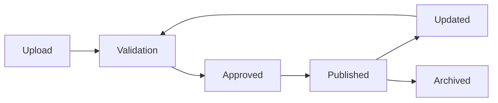

---

## Operational Considerations

- Assets are immutable after publication.
- New revisions generate new versions.
- CDN invalidation occurs after publication.
- Orphaned assets are periodically identified.

---

# 50. CMS Publishing Flow

Every content publication follows a standardized governance workflow.

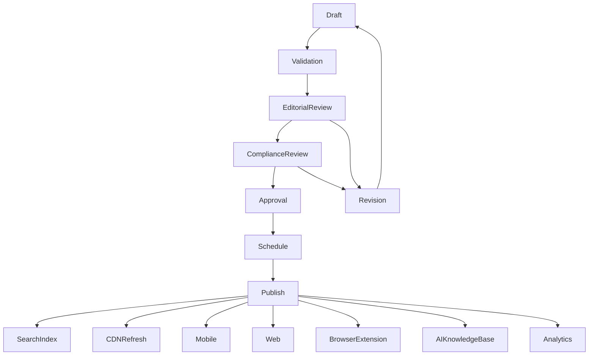

---

## Engineering Rationale

A governed publishing workflow ensures high-quality content, minimizes operational risk, and guarantees consistent propagation across every CardWise delivery channel.

### Best Practices

- Separate editorial and publication responsibilities.
- Use preview environments before publishing.
- Maintain immutable content history.
- Automatically refresh dependent search indexes and caches.

### Trade-offs

| Decision | Benefit | Cost |
|----------|---------|------|
| Multi-stage publishing | Higher content quality | Longer publication cycle |
| Structured content blocks | Better reuse | Additional authoring complexity |
| Versioned media assets | Reliable rollback | Increased storage requirements |

### Risks

| Risk | Mitigation |
|------|------------|
| Incorrect content published | Approval workflow and preview validation |
| Broken media references | Asset validation and dependency checks |
| SEO degradation | Mandatory metadata validation |
| Outdated AI knowledge | Automatic synchronization with AI knowledge base |

# Part 6 — AI Operations

---

# 51. AI Operations

The AI Operations module provides governance, observability, and operational control over all AI-powered capabilities within CardWise.

Unlike traditional machine learning operations that focus solely on model deployment, CardWise AI Operations manages the complete lifecycle of:

- Prompt Engineering
- Recommendation Policies
- AI Configuration
- AI Safety
- Human Review
- Recommendation Overrides
- Knowledge Sources
- Feedback Processing
- AI Analytics
- AI Auditability

The objective is to ensure that AI systems remain accurate, explainable, safe, and continuously improving while allowing human operators to intervene when necessary.

---

## Objectives

| ID | Objective |
|-----|-----------|
| AI-OBJ-001 | Govern AI prompts and policies |
| AI-OBJ-002 | Enable safe recommendation overrides |
| AI-OBJ-003 | Support human-in-the-loop review |
| AI-OBJ-004 | Track AI quality metrics |
| AI-OBJ-005 | Maintain complete auditability |
| AI-OBJ-006 | Support rapid rollback of AI changes |
| AI-OBJ-007 | Improve recommendation quality through feedback |

---

## AI Domain Responsibilities

| Module ID | Responsibility |
|------------|----------------|
| AI-001 | Prompt Management |
| AI-002 | Prompt Versioning |
| AI-003 | Recommendation Overrides |
| AI-004 | AI Moderation |
| AI-005 | Feedback Queue |
| AI-006 | Human Review |
| AI-007 | Knowledge Sources |
| AI-008 | AI Analytics |
| AI-009 | Safety Policies |
| AI-010 | Audit Trail |

---

## Engineering Rationale

AI behavior changes frequently due to evolving prompts, policies, and knowledge. Treating AI configuration as governed operational data enables safer experimentation without requiring application deployments.

### Best Practices

- Version every prompt.
- Keep AI configuration separate from application code.
- Require approvals for production prompt changes.
- Preserve historical AI decisions for reproducibility.

### Trade-offs

| Decision | Benefit | Cost |
|----------|---------|------|
| Prompt versioning | Easy rollback | More operational metadata |
| Human review | Higher quality | Additional operational effort |
| Recommendation overrides | Fast incident response | Manual intervention required |

---

# 52. Prompt Management

Prompts are managed as version-controlled operational assets.

Every AI capability references a specific prompt version rather than an editable prompt.

---

## Prompt Categories

| Category | Examples |
|----------|----------|
| Recommendation | Best card suggestions |
| Reward Optimization | Maximize reward points |
| Offer Ranking | Personalized offers |
| Travel Assistant | Lounge and airline guidance |
| Customer Support | AI assistant responses |
| Financial Education | Knowledge explanations |
| Content Generation | CMS assistance |

---

## Prompt Metadata

| Field | Description |
|--------|-------------|
| Prompt ID | Stable identifier |
| Name | Internal title |
| Category | Functional area |
| Owner | Responsible team |
| Version | Immutable version number |
| Status | Draft/Published |
| Created By | Operator |
| Effective Date | Production activation |

---

## Prompt Lifecycle


---

## Prompt Rules

| Rule ID | Rule |
|----------|------|
| AI-PROMPT-001 | Published prompts are immutable |
| AI-PROMPT-002 | New edits create new versions |
| AI-PROMPT-003 | Rollback supported |
| AI-PROMPT-004 | Every prompt change requires an audit record |

---

# 53. Recommendation Overrides

Recommendation overrides allow authorized operators to temporarily supersede AI-generated results during incidents or business events.

Overrides are intended for exceptional situations, not routine operations.

---

## Override Types

| Type | Description |
|------|-------------|
| Card Recommendation | Promote or suppress cards |
| Offer Ranking | Adjust offer priority |
| Merchant Ranking | Modify merchant visibility |
| Reward Valuation | Temporary valuation changes |
| Travel Recommendations | Preferred lounge or airline guidance |

---

## Override Attributes

| Field | Description |
|--------|-------------|
| Override ID | Stable identifier |
| Target | Entity being overridden |
| Scope | Global, regional, user segment |
| Effective Period | Start and end time |
| Reason | Mandatory justification |
| Owner | Responsible operator |

---

## Operational Rules

- Overrides are time-bound.
- Automatic expiration is mandatory.
- All overrides require audit logging.
- High-impact overrides require approval.

---

# 54. AI Moderation

AI Moderation ensures generated content and recommendations comply with platform policies.

---

## Moderation Categories

| Category | Examples |
|----------|----------|
| Safety | Harmful advice |
| Compliance | Regulatory violations |
| Quality | Incorrect recommendations |
| Bias | Unfair ranking |
| Hallucination | Unsupported claims |
| Sensitive Content | Restricted financial guidance |

---

## Moderation Outcomes

| Outcome | Description |
|----------|-------------|
| Approved | Acceptable output |
| Flagged | Requires review |
| Blocked | Not delivered |
| Escalated | Human intervention required |

---

## Moderation Pipeline

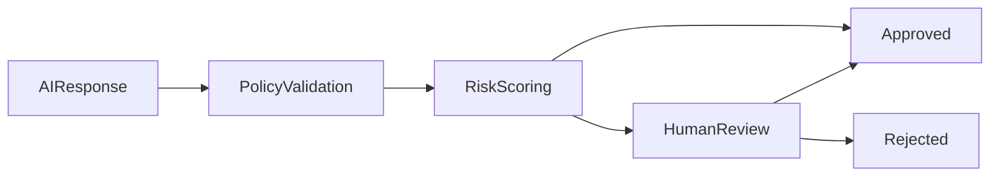

---

## Engineering Rationale

Moderation provides a consistent safety layer independent of the underlying AI model, allowing policies to evolve without retraining models.

---

# 55. Feedback Queue

The Feedback Queue captures user and operator feedback to improve AI quality.

---

## Feedback Sources

| Source | Description |
|---------|-------------|
| User | Explicit feedback |
| Support | Customer reports |
| AI Reviewer | Internal quality checks |
| Analytics | Automated anomaly detection |
| Product Team | Manual observations |

---

## Feedback Categories

| Category | Examples |
|----------|----------|
| Incorrect Recommendation | Wrong card suggested |
| Poor Ranking | Offer ordering issues |
| Hallucination | Unsupported statement |
| Missing Context | Recommendation lacked information |
| UX Issue | Poor explanation |
| Positive Feedback | Helpful recommendation |

---

## Workflow

```text
Feedback

      │

Classification

      │

Prioritization

      │

Assignment

      │

Review

      │

Resolution

      │

Analytics
```

---

## Best Practices

- Deduplicate similar reports.
- Prioritize high-frequency issues.
- Link feedback to prompt versions.
- Track resolution SLAs.

---

# 56. Human Review Dashboard

The Human Review Dashboard enables experts to validate AI outputs before or after publication depending on operational policies.

---

## Review Types

| Review | Description |
|---------|-------------|
| Recommendation Review | Validate AI suggestions |
| Offer Review | Check offer ranking |
| Prompt Review | Validate prompt changes |
| Knowledge Review | Verify knowledge sources |
| Moderation Review | Resolve flagged outputs |

---

## Review Outcomes

| Outcome | Description |
|----------|-------------|
| Approved | Accept AI output |
| Edited | Human-corrected |
| Rejected | Discard output |
| Escalated | Senior review required |

---

## Operational Considerations

- Review workload is prioritized by risk.
- SLA tracking ensures timely resolution.
- Reviewer consistency is measured over time.

---

# 57. Knowledge Sources

Knowledge sources power AI recommendations and explanations.

---

## Knowledge Types

| Type | Examples |
|------|----------|
| Card Metadata | Card catalog |
| Offers | Merchant promotions |
| Rewards | Reward rules |
| Travel | Lounge and airline data |
| CMS | Help articles |
| Policies | Internal governance |
| Analytics | Usage trends |

---

## Knowledge Governance

| Rule | Description |
|------|-------------|
| Versioned | Yes |
| Searchable | Yes |
| Auditable | Yes |
| Approval Required | Yes |
| Rollback Supported | Yes |

---

## Risks

- Outdated knowledge.
- Inconsistent data.
- Conflicting sources.

### Mitigations

- Source prioritization.
- Automated freshness checks.
- Version alignment validation.

---

# 58. AI Analytics

AI Analytics provides operational visibility into AI performance.

---

## Core Metrics

| Metric ID | Description |
|------------|-------------|
| AI-METRIC-001 | Recommendation acceptance rate |
| AI-METRIC-002 | User satisfaction |
| AI-METRIC-003 | Override frequency |
| AI-METRIC-004 | Prompt success rate |
| AI-METRIC-005 | Hallucination rate |
| AI-METRIC-006 | Moderation rate |
| AI-METRIC-007 | Human review volume |
| AI-METRIC-008 | Resolution SLA |

---

## Dashboard Categories

| Category | Description |
|----------|-------------|
| Recommendation Quality | Accuracy trends |
| Prompt Performance | Version comparison |
| Feedback Trends | Common issues |
| Moderation | Flagged content |
| Overrides | Active manual overrides |
| Knowledge Freshness | Data currency |

---

## Operational Considerations

- Metrics are near real-time.
- Historical trends are retained.
- Alerts trigger when quality thresholds degrade.

---

# 59. AI Operations Flow

The AI Operations workflow standardizes governance from prompt creation through production monitoring.

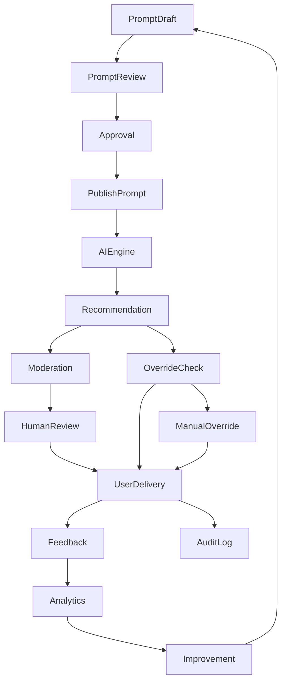

---

## Engineering Rationale

A closed-loop operational workflow enables continuous AI improvement while ensuring that every recommendation remains explainable, reviewable, and auditable.

### Best Practices

- Treat prompts as immutable production assets.
- Use staged rollouts for prompt changes.
- Maintain clear ownership for every AI capability.
- Monitor AI quality continuously with automated alerts.

### Trade-offs

| Decision | Benefit | Cost |
|----------|---------|------|
| Human-in-the-loop review | Higher quality and safety | Increased operational effort |
| Prompt versioning | Safe experimentation | More version management |
| Manual overrides | Fast incident mitigation | Temporary operational complexity |

### Risks

| Risk | Mitigation |
|------|------------|
| Prompt regression | Version rollback and staged deployment |
| Unsafe AI responses | Moderation pipeline and human review |
| Knowledge drift | Automated freshness validation |
| Excessive manual overrides | Root cause analysis and prompt improvements |

# Part 7 — Feature Flags, Runtime Configuration & Operations

---

# 60. Operations Platform

The Operations Platform provides runtime operational controls that enable CardWise teams to safely manage production behavior without requiring application deployments.

This platform is responsible for:

- Feature Flags
- Runtime Configuration
- Kill Switches
- Background Jobs
- Scheduler
- Import Center
- Export Center
- Bulk Operations
- Operational Automation

The goal is to maximize operational agility while maintaining governance, auditability, and production safety.

---

## Objectives

| ID | Objective |
|-----|-----------|
| OPS-OBJ-001 | Enable runtime control of platform behavior |
| OPS-OBJ-002 | Minimize production deployments |
| OPS-OBJ-003 | Support emergency response mechanisms |
| OPS-OBJ-004 | Govern operational automation |
| OPS-OBJ-005 | Ensure complete auditability |
| OPS-OBJ-006 | Improve operational efficiency |
| OPS-OBJ-007 | Reduce operational risk during releases |

---

## Operations Domain Responsibilities

| Module ID | Responsibility |
|------------|----------------|
| OPS-001 | Feature Flags |
| OPS-002 | Runtime Configuration |
| OPS-003 | Kill Switches |
| OPS-004 | Background Jobs |
| OPS-005 | Scheduler |
| OPS-006 | Import Center |
| OPS-007 | Export Center |
| OPS-008 | Bulk Operations |
| OPS-009 | Queue Management |
| OPS-010 | Operational Audit |

---

## Engineering Rationale

Separating operational controls from application deployments allows teams to respond rapidly to incidents, perform controlled rollouts, and adjust system behavior without code changes.

### Best Practices

- Prefer configuration over deployments.
- Keep runtime changes reversible.
- Audit every operational action.
- Require approvals for high-impact changes.

### Trade-offs

| Decision | Benefit | Cost |
|----------|---------|------|
| Runtime controls | Faster incident response | Greater governance complexity |
| Feature flags | Safe experimentation | Flag lifecycle management |
| Operational automation | Reduced manual work | Monitoring requirements |

---

# 61. Feature Flags

Feature Flags enable controlled activation of application capabilities.

Every flag is treated as a managed operational asset.

---

## Flag Categories

| Category | Examples |
|----------|----------|
| Release | New UI rollout |
| Experiment | A/B testing |
| Operational | Maintenance mode |
| Premium | Premium-only capabilities |
| Regional | Country-specific features |
| Emergency | Incident response |

---

## Flag Metadata

| Field | Description |
|--------|-------------|
| Flag ID | Stable identifier |
| Name | Internal title |
| Description | Functional purpose |
| Owner | Responsible team |
| Status | Enabled/Disabled |
| Scope | Global or targeted |
| Expiration | Planned removal date |

---

## Flag Evaluation Hierarchy

```text
Global

↓

Environment

↓

Region

↓

User Segment

↓

User

↓

Runtime Decision
```

---

## Governance Rules

| Rule ID | Rule |
|----------|------|
| CFG-FLAG-001 | Every flag has an owner |
| CFG-FLAG-002 | Every flag has an expiration review |
| CFG-FLAG-003 | Emergency flags require audit logging |
| CFG-FLAG-004 | Deprecated flags must be removed |

---

## Operational Considerations

- Flags should be short-lived unless explicitly permanent.
- Avoid deeply nested flag dependencies.
- Monitor flag usage to prevent configuration drift.

---

# 62. Runtime Configuration

Runtime Configuration enables controlled modification of operational parameters without restarting services.

---

## Configuration Categories

| Category | Examples |
|----------|----------|
| Recommendation Engine | Ranking weights |
| Rewards | Point valuation thresholds |
| Search | Boost values |
| AI | Confidence thresholds |
| Cache | TTL values |
| Rate Limits | Request limits |
| Notifications | Delivery windows |

---

## Configuration Metadata

| Field | Description |
|--------|-------------|
| Configuration Key | Stable identifier |
| Value | Current runtime value |
| Default Value | Baseline configuration |
| Environment | Scope |
| Version | Configuration revision |
| Last Modified | Timestamp |
| Modified By | Operator |

---

## Runtime Rules

| Rule | Description |
|------|-------------|
| Validation | Mandatory before activation |
| Versioning | Required |
| Rollback | Supported |
| Approval | Required for critical parameters |

---

## Engineering Rationale

Runtime configuration allows rapid operational tuning while preserving deployment stability and minimizing production risk.

---

# 63. Kill Switches

Kill Switches provide emergency controls for disabling high-risk functionality during production incidents.

---

## Kill Switch Categories

| Category | Examples |
|----------|----------|
| Payments | Disable payment flow |
| Offers | Hide offer engine |
| Recommendations | Disable AI ranking |
| Browser Extension | Disable sync |
| Search | Disable indexing |
| Notifications | Pause delivery |

---

## Switch Characteristics

| Property | Requirement |
|-----------|-------------|
| Immediate Activation | Yes |
| Global Scope | Supported |
| Regional Scope | Supported |
| Automatic Audit | Required |
| Approval | Required except emergency policy |

---

## Risks

- Incorrect activation.
- Overuse.
- Forgotten rollback.

### Mitigations

- Explicit confirmation.
- Incident linkage.
- Automatic reminders.

---

# 64. Background Jobs

Background jobs execute asynchronous operational workloads.

---

## Job Categories

| Category | Examples |
|----------|----------|
| Search Indexing | Rebuild indexes |
| Offer Refresh | Merchant synchronization |
| Card Updates | Metadata refresh |
| AI Processing | Recommendation generation |
| Notifications | Batch delivery |
| Analytics | Aggregation |
| Cleanup | Archive expired data |

---

## Job States

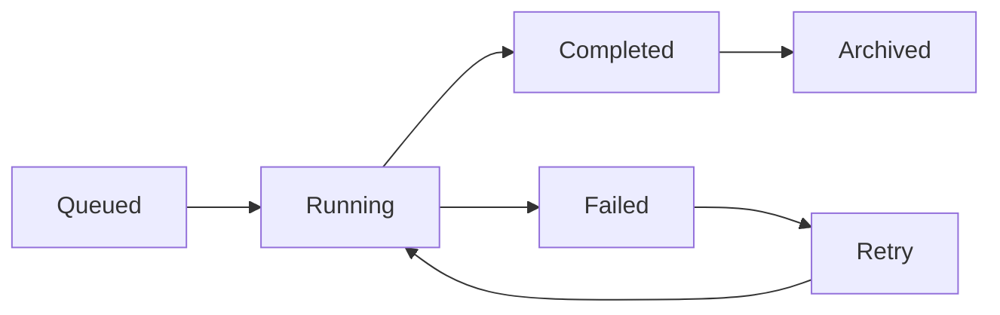

---

## Job Metadata

| Field | Description |
|--------|-------------|
| Job ID | Stable identifier |
| Job Type | Processing category |
| Status | Current state |
| Priority | Queue priority |
| Retries | Retry count |
| Duration | Execution time |
| Owner | Responsible module |

---

## Best Practices

- Idempotent execution.
- Configurable retries.
- Dead-letter handling.
- Metrics for every execution.

---

# 65. Scheduler

The Scheduler coordinates all recurring operational activities.

---

## Scheduled Workloads

| Category | Examples |
|----------|----------|
| Offer Activation | Start campaigns |
| Offer Expiration | End campaigns |
| Search Reindex | Refresh indexes |
| AI Retraining Trigger | Scheduled evaluation |
| Cleanup | Archive obsolete records |
| Reporting | Generate daily summaries |

---

## Scheduler Rules

| Rule | Description |
|------|-------------|
| Time Zone | UTC storage |
| Retry | Automatic |
| Alerting | Required on failures |
| Dependency Checks | Before execution |

---

## Operational Considerations

- Prevent overlapping executions.
- Support manual execution.
- Preserve execution history.

---

# 66. Import Center

The Import Center supports controlled bulk ingestion of operational data.

---

## Supported Imports

| Import Type | Examples |
|-------------|----------|
| Credit Cards | New products |
| Offers | Campaign uploads |
| Merchants | Merchant catalog |
| Banks | Issuer information |
| Rewards | Reward mappings |
| CMS | Articles and FAQs |

---

## Import Pipeline

```mermaid
flowchart LR

Upload

Upload --> Validation

Validation --> Preview

Preview --> Approval

Approval --> Import

Import --> Verification

Verification --> Complete

Import --> Rollback
```

---

## Validation Checks

| Validation | Description |
|------------|-------------|
| Schema | Required fields |
| Business Rules | Domain validation |
| Duplicate Detection | Existing records |
| Referential Integrity | Foreign references |
| Version Conflicts | Existing revisions |

---

## Engineering Rationale

Preview-before-import significantly reduces production incidents caused by malformed bulk uploads.

---

# 67. Export Center

The Export Center enables governed extraction of operational data.

---

## Export Categories

| Category | Examples |
|----------|----------|
| User Reports | Support exports |
| Offer Reports | Campaign analysis |
| Analytics | KPI exports |
| Audit Logs | Compliance |
| Configuration | Backup |
| Card Catalog | Operational review |

---

## Export Controls

| Control | Description |
|----------|-------------|
| Permission | Role-based |
| Masking | Sensitive fields |
| Watermark | Optional |
| Expiration | Temporary download links |
| Audit | Mandatory logging |

---

## Best Practices

- Minimize exported sensitive data.
- Encrypt exported archives where required.
- Track download history.
- Support asynchronous exports for large datasets.

---

# 68. Bulk Operations

Bulk Operations enable efficient management of large datasets while maintaining operational safety.

---

## Supported Bulk Actions

| Action | Examples |
|---------|----------|
| Publish | Multiple offers |
| Archive | Expired campaigns |
| Assign | Categories |
| Update | Metadata |
| Delete | Soft deletion |
| Validate | Bulk consistency checks |

---

## Governance Rules

| Rule | Description |
|------|-------------|
| Preview Required | Yes |
| Validation Required | Yes |
| Approval | High-impact operations |
| Rollback | Supported where applicable |

---

## Operational Risks

| Risk | Mitigation |
|------|------------|
| Incorrect bulk updates | Preview and approval |
| Long-running operations | Background processing |
| Partial failures | Transaction summaries and retries |

---

# 69. Operations Flow

The Operations Platform orchestrates runtime changes through a governed workflow.

```mermaid
flowchart TD

Operator --> Authentication

Authentication --> Authorization

Authorization --> OperationSelection

OperationSelection --> Validation

Validation --> Approval

Approval --> Execution

Execution --> BackgroundJobs

Execution --> RuntimeConfig

Execution --> FeatureFlags

Execution --> Scheduler

Execution --> ImportExport

Execution --> AuditLog

AuditLog --> Monitoring

Monitoring --> Alerts

Alerts --> OperationsDashboard
```

---

## Engineering Rationale

Centralizing operational workflows provides a consistent governance model across runtime configuration, feature management, and bulk operations while minimizing production risk.

### Best Practices

- Validate all operational changes before execution.
- Use staged rollouts for high-impact feature flags.
- Execute bulk operations asynchronously.
- Continuously monitor operational workflows with alerts and dashboards.

### Trade-offs

| Decision | Benefit | Cost |
|----------|---------|------|
| Centralized operations platform | Consistent governance | Larger platform scope |
| Runtime configuration | Faster operational response | Configuration lifecycle management |
| Background execution | Better scalability | Increased orchestration complexity |

### Risks

| Risk | Mitigation |
|------|------------|
| Configuration drift | Periodic configuration audits |
| Forgotten feature flags | Automated expiration reviews |
| Failed imports | Validation, preview, and rollback |
| Scheduler failures | Retries, alerting, and execution monitoring |

# Part 8 — Analytics, Monitoring & Observability

---

# 70. Analytics Platform

The Analytics Platform provides operational visibility into every aspect of the CardWise ecosystem.

Unlike customer-facing analytics, this platform is designed for internal decision-making, operational excellence, product optimization, incident response, and executive reporting.

The Analytics Platform consolidates metrics from:

- User Activity
- Credit Cards
- Offers
- Rewards
- Travel
- AI Systems
- CMS
- Search
- Revenue
- Operations
- Infrastructure

Every metric is governed, versioned, and traceable to ensure consistency across dashboards.

---

## Objectives

| ID | Objective |
|-----|-----------|
| DASH-OBJ-001 | Provide unified operational visibility |
| DASH-OBJ-002 | Enable real-time business monitoring |
| DASH-OBJ-003 | Support executive reporting |
| DASH-OBJ-004 | Detect anomalies proactively |
| DASH-OBJ-005 | Measure product adoption |
| DASH-OBJ-006 | Improve operational efficiency |
| DASH-OBJ-007 | Support data-driven decisions |

---

## Dashboard Categories

| Dashboard ID | Dashboard |
|--------------|-----------|
| DASH-001 | Executive Dashboard |
| DASH-002 | Product Dashboard |
| DASH-003 | User Analytics |
| DASH-004 | Revenue Dashboard |
| DASH-005 | Offer Analytics |
| DASH-006 | Search Analytics |
| DASH-007 | AI Analytics |
| DASH-008 | Operations Dashboard |
| DASH-009 | Infrastructure Dashboard |
| DASH-010 | Incident Dashboard |

---

## Engineering Rationale

Centralizing operational dashboards ensures that all stakeholders rely on consistent, validated metrics, reducing conflicting interpretations across teams.

### Best Practices

- Standardize metric definitions.
- Version dashboard configurations.
- Preserve historical trends.
- Support drill-down investigations.

### Trade-offs

| Decision | Benefit | Cost |
|----------|---------|------|
| Unified dashboards | Consistent reporting | Larger analytics platform |
| Near real-time metrics | Faster decisions | Increased infrastructure cost |
| Historical retention | Trend analysis | Storage overhead |

---

# 71. Business KPI Dashboard

The Executive Dashboard presents high-level business health indicators.

---

## Core KPIs

| Metric ID | Description |
|------------|-------------|
| METRIC-001 | Daily Active Users |
| METRIC-002 | Monthly Active Users |
| METRIC-003 | Premium Subscribers |
| METRIC-004 | Active Credit Cards |
| METRIC-005 | Offers Redeemed |
| METRIC-006 | Reward Value Generated |
| METRIC-007 | Travel Benefits Utilized |
| METRIC-008 | Revenue |
| METRIC-009 | Customer Satisfaction |
| METRIC-010 | AI Recommendation Acceptance Rate |

---

## Executive Views

| View | Purpose |
|------|---------|
| Growth | User acquisition |
| Engagement | Feature adoption |
| Revenue | Business performance |
| Operations | Platform health |
| AI | Recommendation effectiveness |

---

## Operational Considerations

- KPI definitions are centrally governed.
- Historical values are immutable.
- Metrics support configurable reporting windows.

---

# 72. Product Analytics

Product Analytics measures adoption, engagement, and effectiveness of platform features.

---

## Product Metrics

| Category | Metrics |
|----------|----------|
| Authentication | Login success, MFA adoption |
| Cards | Portfolio growth |
| Offers | Click-through, redemption |
| Rewards | Points earned and redeemed |
| Search | Query volume |
| AI | Recommendation engagement |
| CMS | Article consumption |

---

## Product Funnel

```mermaid
flowchart LR

Visitor --> Registration

Registration --> ActiveUser

ActiveUser --> CardPortfolio

CardPortfolio --> OfferDiscovery

OfferDiscovery --> Redemption

Redemption --> Premium

Premium --> Advocacy
```

---

## Best Practices

- Track feature adoption independently.
- Measure user journeys end-to-end.
- Monitor conversion bottlenecks.
- Correlate releases with behavioral changes.

---

# 73. Monitoring Platform

Monitoring provides continuous visibility into application and infrastructure health.

---

## Monitoring Domains

| Domain | Examples |
|----------|----------|
| APIs | Latency, availability |
| Databases | Query performance |
| Kafka | Consumer lag |
| Redis | Memory, hit ratio |
| Search | Index health |
| AI | Response latency |
| Background Jobs | Queue depth |
| CMS | Publishing latency |

---

## Health States

| State | Description |
|--------|-------------|
| Healthy | Operating normally |
| Warning | Threshold approaching |
| Critical | Immediate action required |
| Maintenance | Planned downtime |

---

## Monitoring Principles

- Every service exposes health metrics.
- Every dependency is monitored.
- Every alert is actionable.
- Every outage is traceable.

---

# 74. Alert Center

The Alert Center aggregates operational events requiring attention.

---

## Alert Categories

| Category | Examples |
|----------|----------|
| Availability | API outage |
| Performance | High latency |
| Security | Suspicious activity |
| Operations | Failed import |
| AI | Quality degradation |
| Scheduler | Missed execution |
| Search | Index failures |

---

## Alert Severity

| Severity | Description |
|----------|-------------|
| Info | Informational |
| Warning | Attention required |
| Major | High impact |
| Critical | Immediate response |

---

## Alert Lifecycle

```mermaid
flowchart LR

Detected --> Classified

Classified --> Assigned

Assigned --> Acknowledged

Acknowledged --> Resolved

Resolved --> Closed
```

---

## Operational Considerations

- Alerts include ownership.
- Duplicate alerts are suppressed.
- Escalation policies are configurable.
- Resolution history is retained.

---

# 75. Operational Dashboard

The Operations Dashboard provides a unified operational command center.

---

## Dashboard Sections

| Section | Description |
|----------|-------------|
| Active Incidents | Current production issues |
| Feature Flags | Runtime status |
| Background Jobs | Queue health |
| Imports | Running operations |
| Exports | Pending exports |
| AI Overrides | Active interventions |
| Scheduled Tasks | Upcoming executions |
| System Notices | Operational announcements |

---

## Engineering Rationale

A centralized dashboard minimizes context switching and accelerates operational response during incidents.

---

# 76. Audit Logs

Audit Logs provide immutable records of every privileged action performed within the Admin Portal.

---

## Audit Event Categories

| Category | Examples |
|----------|----------|
| Authentication | Login, logout |
| Authorization | Permission changes |
| User Operations | Suspension |
| Card Management | Publishing |
| Offer Management | Activation |
| CMS | Content publication |
| AI | Prompt changes |
| Runtime Configuration | Parameter updates |
| Feature Flags | Toggle changes |

---

## Audit Record Fields

| Field | Description |
|--------|-------------|
| Audit ID | Stable identifier |
| Timestamp | Event time |
| Operator | Initiating user |
| Resource | Target entity |
| Action | Operation performed |
| Previous State | Before change |
| New State | After change |
| Result | Success/Failure |
| Correlation ID | Trace linkage |

---

## Best Practices

- Audit records are immutable.
- Sensitive fields are masked.
- Correlate audit events with traces.
- Support advanced search and filtering.

---

# 77. Observability Platform

Observability combines metrics, logs, traces, and events into a unified operational model.

---

## Observability Components

| Component | Technology |
|------------|------------|
| Metrics | Prometheus |
| Dashboards | Grafana |
| Traces | OpenTelemetry |
| Errors | Sentry |
| Logs | OpenSearch |
| Events | Kafka |

---

## Telemetry Sources

| Source | Examples |
|---------|----------|
| Web Application | User interactions |
| Backend APIs | Request traces |
| Background Jobs | Execution metrics |
| Scheduler | Job lifecycle |
| AI Services | Inference timing |
| Search | Query latency |

---

## Telemetry Pipeline

```mermaid
flowchart LR

Applications

Applications --> Metrics

Applications --> Logs

Applications --> Traces

Metrics --> Prometheus

Logs --> OpenSearch

Traces --> OpenTelemetry

Prometheus --> Grafana

OpenTelemetry --> Grafana

Logs --> IncidentResponse

Grafana --> AlertCenter

AlertCenter --> OperationsTeam
```

---

## Engineering Rationale

Unified observability significantly reduces Mean Time to Detect (MTTD) and Mean Time to Resolve (MTTR) by providing complete visibility across application, infrastructure, and operational workflows.

### Best Practices

- Instrument every critical workflow.
- Standardize telemetry naming conventions.
- Correlate logs, metrics, and traces using shared identifiers.
- Continuously review dashboard usefulness and alert quality.

### Trade-offs

| Decision | Benefit | Cost |
|----------|---------|------|
| Full-stack observability | Faster incident diagnosis | Higher storage and telemetry costs |
| Centralized dashboards | Simplified operations | Larger operational platform |
| Rich audit correlation | Better investigations | Additional metadata overhead |

### Risks

| Risk | Mitigation |
|------|------------|
| Alert fatigue | Alert deduplication and severity tuning |
| Missing telemetry | Observability standards and automated validation |
| Metric inconsistency | Central metric governance |
| Long-term storage growth | Retention policies and tiered archival |

# Part 9 — Security, RBAC, Compliance & Deployment

---

# 78. Security Architecture

The Admin Portal is one of the highest-privileged systems within the CardWise platform and therefore follows a **Zero Trust** security model.

Every request is authenticated, authorized, audited, monitored, and continuously evaluated before execution.

The platform assumes:

- Internal users can make mistakes.
- Credentials may be compromised.
- Sensitive operations require additional verification.
- Every privileged action must be attributable to an individual.

Security is therefore embedded into every architectural layer rather than implemented as a standalone feature.

---

## Objectives

| ID | Objective |
|-----|-----------|
| SEC-OBJ-001 | Enforce Zero Trust principles |
| SEC-OBJ-002 | Protect sensitive operational data |
| SEC-OBJ-003 | Prevent privilege escalation |
| SEC-OBJ-004 | Ensure complete auditability |
| SEC-OBJ-005 | Meet regulatory requirements |
| SEC-OBJ-006 | Secure deployment pipeline |
| SEC-OBJ-007 | Enable rapid incident response |

---

## Security Principles

| Principle | Description |
|-----------|-------------|
| Verify Explicitly | Authenticate and authorize every request |
| Least Privilege | Minimum required permissions |
| Assume Breach | Design for compromised accounts |
| Defense in Depth | Multiple independent security layers |
| Secure by Default | Restrictive default configuration |
| Continuous Monitoring | Ongoing detection and response |

---

## Engineering Rationale

Applying Zero Trust minimizes the blast radius of compromised credentials and strengthens governance over high-impact administrative operations.

---

# 79. RBAC Architecture

Role-Based Access Control (RBAC) governs every administrative capability.

Permissions are evaluated dynamically using identity, role, resource, environment, and contextual policies.

---

## Authorization Pipeline

```mermaid
flowchart LR

User

User --> Authentication

Authentication --> SessionValidation

SessionValidation --> RoleResolution

RoleResolution --> PermissionEvaluation

PermissionEvaluation --> ContextPolicies

ContextPolicies --> ApprovalCheck

ApprovalCheck --> Execution

Execution --> AuditLog
```

---

## RBAC Layers

| Layer | Responsibility |
|--------|----------------|
| Authentication | Verify operator identity |
| Session | Validate active session |
| Role Resolution | Determine assigned roles |
| Permission Evaluation | Resource-level authorization |
| Context Policies | Time, location, ownership |
| Approval | Sensitive action governance |
| Audit | Immutable event recording |

---

## RBAC Principles

| RBAC ID | Principle |
|----------|-----------|
| RBAC-101 | Default deny |
| RBAC-102 | Explicit permission grants |
| RBAC-103 | Resource-level authorization |
| RBAC-104 | Time-bound elevated access |
| RBAC-105 | Multi-role evaluation |
| RBAC-106 | Separation of duties |
| RBAC-107 | Continuous authorization checks |

---

# 80. Permission Matrix

Permissions are grouped by operational domains and assigned through predefined roles.

---

## Permission Categories

| Prefix | Domain |
|----------|--------|
| USER-* | User Operations |
| CARD-* | Credit Cards |
| BANK-* | Banks |
| OFFER-* | Offers |
| CMS-* | Content |
| AI-* | AI Operations |
| CFG-* | Runtime Configuration |
| JOB-* | Background Jobs |
| IMPORT-* | Import Center |
| EXPORT-* | Export Center |
| AUDIT-* | Audit Logs |
| ALERT-* | Monitoring |
| SEC-* | Security Administration |

---

## Role Capability Matrix

| Capability | Viewer | Support | Ops | Platform Admin | Super Admin |
|------------|:------:|:-------:|:---:|:--------------:|:-----------:|
| View Users | ✓ | ✓ | ✓ | ✓ | ✓ |
| Modify Users | ✗ | ✓ | ✓ | ✓ | ✓ |
| Publish Cards | ✗ | ✗ | ✓ | ✓ | ✓ |
| Publish Offers | ✗ | ✗ | ✓ | ✓ | ✓ |
| Edit CMS | ✗ | ✗ | ✓ | ✓ | ✓ |
| Feature Flags | ✗ | ✗ | ✓ | ✓ | ✓ |
| Runtime Config | ✗ | ✗ | ✗ | ✓ | ✓ |
| Security Policies | ✗ | ✗ | ✗ | ✓ | ✓ |
| Permission Changes | ✗ | ✗ | ✗ | ✗ | ✓ |

---

## Operational Considerations

- Roles are additive unless explicitly restricted.
- Temporary access follows automatic expiration.
- Role assignments require approval and auditing.

---

# 81. Approval Workflows

Sensitive administrative operations require structured approval before execution.

---

## Approval Levels

| Level | Reviewer |
|--------|----------|
| Level 1 | Domain Owner |
| Level 2 | Operations Manager |
| Level 3 | Security Administrator |
| Level 4 | Super Administrator |

---

## Approval Triggers

| Operation | Approval Required |
|-----------|-------------------|
| User Merge | Yes |
| Bulk Delete | Yes |
| Card Publication | Yes |
| Offer Publication | Yes |
| Runtime Configuration | Critical only |
| Kill Switch | Emergency policy |
| Permission Changes | Always |
| Prompt Publication | Yes |

---

## Approval Workflow

```mermaid
flowchart TD

Request

Request --> Validation

Validation --> Reviewer

Reviewer --> Approved

Reviewer --> ChangesRequested

Reviewer --> Rejected

Approved --> Execution

Execution --> Audit

Audit --> Notification

ChangesRequested --> Request
```

---

## Best Practices

- Require written justification.
- Support delegated reviewers.
- Record reviewer comments.
- Notify requestors automatically.

---

# 82. Sensitive Operations

Certain operations require enhanced safeguards beyond standard RBAC.

---

## High-Risk Operations

| Operation | Additional Protection |
|-----------|-----------------------|
| Delete Production Data | Dual approval |
| Account Merge | Audit + approval |
| Runtime Configuration | Approval |
| Kill Switch Activation | Incident reference |
| Permission Changes | MFA re-authentication |
| Export Sensitive Data | Watermark + logging |
| AI Override | Expiration required |

---

## Enhanced Security Controls

| Control | Description |
|----------|-------------|
| Step-up Authentication | Re-authentication before execution |
| Dual Approval | Two independent approvers |
| Time-bound Authorization | Temporary access windows |
| Session Validation | Verify active trusted session |
| Audit Correlation | Link to incident/change request |

---

## Risks

- Accidental destructive actions.
- Insider threats.
- Compromised privileged accounts.

### Mitigations

- Dual approval.
- Immutable audit trails.
- Continuous monitoring.

---

# 83. Compliance

The Admin Portal supports regulatory and organizational governance requirements through technical controls and operational processes.

---

## Compliance Areas

| Area | Coverage |
|------|----------|
| Auditability | Immutable audit records |
| Access Control | Least privilege |
| Data Protection | Encryption and masking |
| Change Management | Version-controlled changes |
| Retention | Policy-driven archival |
| Incident Response | Traceability |
| Operational Governance | Approval workflows |

---

## Compliance Controls

| Control | Description |
|----------|-------------|
| Data Masking | Sensitive information protection |
| Retention Policies | Lifecycle management |
| Export Governance | Controlled data extraction |
| Audit Integrity | Immutable records |
| Periodic Reviews | Access certification |

---

## Engineering Rationale

Embedding compliance controls into platform architecture reduces operational overhead while improving regulatory readiness and investigation capabilities.

---

# 84. Testing Strategy

Security validation is integrated throughout the development lifecycle.

---

## Testing Layers

| Layer | Purpose |
|--------|---------|
| Unit Testing | Permission logic |
| Integration Testing | RBAC flows |
| End-to-End Testing | Critical workflows |
| Security Testing | Authentication and authorization |
| Penetration Testing | External attack simulation |
| Chaos Testing | Operational resilience |
| Disaster Recovery Testing | Business continuity |

---

## Security Test Scenarios

| Scenario | Expected Result |
|----------|-----------------|
| Unauthorized access | Denied |
| Expired session | Rejected |
| Missing approval | Blocked |
| Invalid permission | Rejected |
| Suspicious activity | Alert generated |
| Failed MFA | Access denied |

---

## Best Practices

- Automate authorization regression testing.
- Validate permission boundaries.
- Include security testing in release gates.
- Periodically review approval workflows.

---

# 85. Deployment Strategy

Deployment of the Admin Portal prioritizes safety, availability, and operational continuity.

---

## Deployment Principles

| Principle | Description |
|-----------|-------------|
| Progressive Rollout | Incremental deployment |
| Rollback Ready | Immediate recovery |
| Configuration First | Minimize redeployments |
| Observability | Monitor every release |
| Approval Gates | Production deployment governance |

---

## Release Pipeline

```mermaid
flowchart LR

Development

Development --> CI

CI --> AutomatedTests

AutomatedTests --> SecurityValidation

SecurityValidation --> Staging

Staging --> UAT

UAT --> ProductionApproval

ProductionApproval --> ProgressiveDeployment

ProgressiveDeployment --> Monitoring

Monitoring --> ReleaseComplete

Monitoring --> Rollback
```

---

## Deployment Readiness Checklist

| Item | Status Required |
|------|-----------------|
| Automated Tests Passing | Required |
| Security Validation | Required |
| Observability Enabled | Required |
| Rollback Plan | Required |
| Feature Flags Configured | Required |
| Approval Completed | Required |

---

# 86. Security Architecture Summary

```mermaid
flowchart TD

Operator

Operator --> MFA

MFA --> Authentication

Authentication --> SessionValidation

SessionValidation --> RBAC

RBAC --> ContextPolicies

ContextPolicies --> ApprovalWorkflow

ApprovalWorkflow --> Operation

Operation --> AuditLog

Operation --> Metrics

Operation --> Traces

Metrics --> Monitoring

Traces --> IncidentResponse

AuditLog --> Compliance

Monitoring --> Alerts

Alerts --> SecurityTeam
```

---

## Engineering Rationale

The security architecture emphasizes prevention, detection, response, and recovery. By combining Zero Trust, layered authorization, immutable auditing, and continuous observability, the Admin Portal remains resilient against both accidental misuse and malicious activity.

### Best Practices

- Enforce MFA for all privileged users.
- Continuously review role assignments.
- Treat every privileged action as auditable.
- Validate deployment security before production rollout.

### Trade-offs

| Decision | Benefit | Cost |
|----------|---------|------|
| Multi-layer authorization | Stronger security | Increased operational complexity |
| Mandatory approvals | Reduced operational risk | Longer execution time |
| Extensive audit logging | Better investigations | Higher storage consumption |

### Risks

| Risk | Mitigation |
|------|------------|
| Privilege escalation | Least privilege and periodic reviews |
| Insider misuse | Dual approvals and immutable audits |
| Deployment regressions | Progressive rollout with rollback |
| Credential compromise | MFA, session validation, continuous monitoring |

# Part 10 — QA Checklist, Operational Runbooks & Architecture Summary

---

# 87. Quality Assurance Checklist

The Admin Portal is a mission-critical operational platform. Every release must satisfy engineering, security, operational, and usability requirements before deployment.

The following checklist serves as the release readiness baseline.

---

## Functional QA

| QA ID | Validation |
|--------|------------|
| QA-001 | All modules load successfully |
| QA-002 | Navigation and routing function correctly |
| QA-003 | CRUD workflows complete successfully |
| QA-004 | Search returns accurate results |
| QA-005 | Filters and sorting operate correctly |
| QA-006 | Bulk operations behave as expected |
| QA-007 | Scheduled jobs execute correctly |
| QA-008 | Import and export workflows validate successfully |
| QA-009 | Approval workflows function end-to-end |
| QA-010 | Rollback workflows execute successfully |

---

## Security QA

| QA ID | Validation |
|--------|------------|
| QA-SEC-001 | Authentication required for all protected routes |
| QA-SEC-002 | RBAC enforced consistently |
| QA-SEC-003 | Unauthorized operations are blocked |
| QA-SEC-004 | MFA required for privileged actions |
| QA-SEC-005 | Sensitive fields are masked |
| QA-SEC-006 | Audit logs generated for privileged operations |
| QA-SEC-007 | Session expiration handled correctly |
| QA-SEC-008 | Permission escalation attempts rejected |

---

## Performance QA

| QA ID | Validation |
|--------|------------|
| QA-PERF-001 | Dashboard loads within defined SLA |
| QA-PERF-002 | Search latency within acceptable thresholds |
| QA-PERF-003 | Large datasets paginate correctly |
| QA-PERF-004 | Background jobs scale under load |
| QA-PERF-005 | Bulk imports complete within expected duration |
| QA-PERF-006 | Charts render efficiently |
| QA-PERF-007 | Concurrent operator workflows remain responsive |

---

## Observability QA

| QA ID | Validation |
|--------|------------|
| QA-OBS-001 | Metrics emitted for critical workflows |
| QA-OBS-002 | Logs include correlation identifiers |
| QA-OBS-003 | Traces span cross-service requests |
| QA-OBS-004 | Alerts trigger correctly |
| QA-OBS-005 | Dashboards reflect current platform state |

---

## Release Readiness

| Item | Required |
|------|----------|
| Functional Testing | ✓ |
| Security Validation | ✓ |
| Regression Testing | ✓ |
| Performance Validation | ✓ |
| Accessibility Review | ✓ |
| Documentation Updated | ✓ |
| Rollback Plan Prepared | ✓ |
| Monitoring Enabled | ✓ |

---

## Engineering Rationale

A standardized release checklist reduces operational risk, improves deployment confidence, and ensures consistency across releases.

---

# 88. Engineering Best Practices

The Admin Portal follows platform-wide engineering standards to ensure maintainability, scalability, and operational excellence.

---

## Architecture

- Modular domain-driven architecture.
- Clear separation between operational domains.
- Shared platform services.
- Stable domain boundaries.
- Event-driven synchronization.

---

## Data Management

- Immutable version history.
- Soft deletion for operational entities.
- Strong referential integrity.
- Centralized master data ownership.
- Consistent identifier strategy.

---

## Security

- Zero Trust architecture.
- Least privilege access.
- Mandatory audit trails.
- Approval workflows for privileged operations.
- Continuous access reviews.

---

## Operational Excellence

- Configuration over deployment.
- Feature flags for controlled rollouts.
- Automated validation pipelines.
- Runtime observability.
- Standardized operational metrics.

---

## AI Governance

- Version-controlled prompts.
- Human review for high-risk outputs.
- Recommendation overrides with expiration.
- AI quality monitoring.
- Continuous feedback incorporation.

---

## Best Practices Summary

| Category | Recommendation |
|----------|----------------|
| Architecture | Domain-driven modularity |
| Security | Zero Trust and RBAC |
| Operations | Configuration-driven management |
| Reliability | Event-driven processing |
| Monitoring | Unified observability |
| Governance | Immutable auditing |

---

# 89. Operational Runbooks

Operational runbooks standardize responses to common production events.

---

## Runbook Categories

| Runbook ID | Scenario |
|------------|----------|
| OPS-RUN-001 | User account recovery |
| OPS-RUN-002 | Offer publication failure |
| OPS-RUN-003 | Card publication rollback |
| OPS-RUN-004 | Failed background job |
| OPS-RUN-005 | Scheduler failure |
| OPS-RUN-006 | Search indexing issue |
| OPS-RUN-007 | AI quality degradation |
| OPS-RUN-008 | Runtime configuration rollback |
| OPS-RUN-009 | Feature flag emergency disable |
| OPS-RUN-010 | Security incident response |

---

## Standard Runbook Structure

Every runbook follows the same format.

| Section | Description |
|----------|-------------|
| Purpose | Why the runbook exists |
| Scope | Applicable systems |
| Preconditions | Required permissions and dependencies |
| Detection | How the issue is identified |
| Impact Assessment | Business and technical impact |
| Resolution Steps | Standard operational workflow |
| Verification | Post-resolution validation |
| Rollback | Recovery procedure |
| Escalation | Responsible teams |
| Postmortem | Required follow-up activities |

---

## Incident Response Flow

```mermaid
flowchart TD

AlertDetected --> Triage

Triage --> ImpactAssessment

ImpactAssessment --> AssignOwner

AssignOwner --> Mitigation

Mitigation --> Verification

Verification --> Recovery

Recovery --> Monitoring

Monitoring --> IncidentClosure

IncidentClosure --> Postmortem

Postmortem --> PreventiveActions
```

---

## Operational Considerations

- Runbooks are version-controlled.
- Regularly validate procedures through drills.
- Link runbooks to monitoring alerts.
- Capture lessons learned after every major incident.

---

# 90. Admin Portal Summary

The CardWise Admin Portal functions as the operational control plane for the entire CardWise ecosystem.

It enables internal teams to manage every critical platform capability through governed, observable, and secure workflows.

---

## Platform Capabilities

| Domain | Capability |
|----------|------------|
| User Management | Customer operations |
| Card Management | Master data governance |
| Bank Management | Issuer administration |
| Offer Management | Campaign lifecycle |
| Rewards | Reward catalog management |
| Travel | Benefit administration |
| Merchant Management | Merchant catalog |
| CMS | Content publishing |
| AI Operations | Prompt governance and review |
| Runtime Operations | Feature flags and configuration |
| Analytics | Business intelligence |
| Monitoring | Platform health |
| Security | RBAC and compliance |
| Audit | Immutable operational history |

---

## Platform Characteristics

| Characteristic | Description |
|----------------|-------------|
| Modular | Independent operational domains |
| Secure | Zero Trust with RBAC |
| Observable | Unified telemetry |
| Governed | Approval-based workflows |
| Versioned | Immutable history |
| Scalable | Event-driven architecture |
| Extensible | Domain-oriented platform |

---

# 91. Architecture Summary

The Admin Portal architecture is built around five foundational principles.

---

## 1. Governance First

Every privileged action is authenticated, authorized, approved where necessary, and audited.

---

## 2. Operational Independence

Operational teams can safely manage production systems without requiring engineering deployments.

---

## 3. Platform Consistency

Shared services provide common patterns for approvals, auditing, search, configuration, notifications, and observability.

---

## 4. Data Integrity

Critical operational data is versioned, validated, and recoverable through controlled publishing and rollback workflows.

---

## 5. Continuous Observability

Every workflow emits metrics, logs, traces, and audit events, enabling proactive monitoring and rapid incident response.

---

## Engineering Trade-offs

| Decision | Benefit | Cost |
|----------|---------|------|
| Modular architecture | Better ownership and scalability | More cross-domain coordination |
| Immutable versioning | Safe rollback and compliance | Additional storage |
| Centralized governance | Consistent operations | Increased operational processes |
| Rich observability | Faster diagnosis | Higher telemetry volume |

---

# 92. Final Architecture Diagram

```mermaid
flowchart TB

subgraph AdminUsers
Support[Customer Support]
Operations[Operations]
Content[Content Team]
Risk[Risk & Compliance]
AIOps[AI Operations]
Platform[Platform Admin]
Security[Security Admin]
end

subgraph AdminPortal
Dashboard[Admin Dashboard]
RBAC[Authentication & RBAC]
Workflow[Approval Workflow Engine]
Audit[Audit Service]
end

subgraph OperationalDomains
Users[User Management]
Cards[Card Management]
Banks[Bank Management]
Offers[Offer Management]
Rewards[Reward Management]
Travel[Travel Management]
Merchants[Merchant Management]
CMS[Content Management]
AI[AI Operations]
Runtime[Runtime Configuration]
Flags[Feature Flags]
Jobs[Job Scheduler]
Analytics[Analytics]
Monitoring[Monitoring]
end

subgraph PlatformServices
Search[Search Platform]
Notifications[Notification Service]
Queues[Kafka]
Storage[(PostgreSQL)]
Cache[(Redis)]
ObjectStore[(S3)]
Telemetry[OpenTelemetry]
Metrics[Prometheus]
Dashboards[Grafana]
Errors[Sentry]
end

Support --> Dashboard
Operations --> Dashboard
Content --> Dashboard
Risk --> Dashboard
AIOps --> Dashboard
Platform --> Dashboard
Security --> Dashboard

Dashboard --> RBAC
RBAC --> Workflow
Workflow --> Audit

Workflow --> Users
Workflow --> Cards
Workflow --> Banks
Workflow --> Offers
Workflow --> Rewards
Workflow --> Travel
Workflow --> Merchants
Workflow --> CMS
Workflow --> AI
Workflow --> Runtime
Workflow --> Flags
Workflow --> Jobs
Workflow --> Analytics
Workflow --> Monitoring

Users --> Storage
Cards --> Storage
Banks --> Storage
Offers --> Storage
Rewards --> Storage
Travel --> Storage
Merchants --> Storage
CMS --> Storage
AI --> Storage

Users --> Cache
Offers --> Cache
Runtime --> Cache

Jobs --> Queues

Search --> Storage

CMS --> ObjectStore

Workflow --> Search
Workflow --> Notifications

Users --> Telemetry
Cards --> Telemetry
Offers --> Telemetry
AI --> Telemetry
Jobs --> Telemetry

Telemetry --> Metrics
Metrics --> Dashboards
Telemetry --> Errors

Audit --> Storage
Monitoring --> Dashboards
Analytics --> Dashboards
```

---

# Document Completion Summary

| Section | Status |
|----------|--------|
| Platform Architecture | ✅ Complete |
| User Operations | ✅ Complete |
| Card & Bank Management | ✅ Complete |
| Offer Management | ✅ Complete |
| CMS | ✅ Complete |
| AI Operations | ✅ Complete |
| Runtime Operations | ✅ Complete |
| Analytics & Monitoring | ✅ Complete |
| Security & Compliance | ✅ Complete |
| QA & Runbooks | ✅ Complete |

---

## Overall Engineering Summary

The CardWise Admin Portal is designed as a production-grade internal operations platform that enables secure, scalable, and observable management of every critical business domain.

Its architecture combines:

- Domain-driven modularity
- Zero Trust security
- Fine-grained RBAC
- Immutable auditability
- Event-driven workflows
- Runtime configurability
- AI governance
- Comprehensive observability
- Version-controlled master data
- Operational resilience

This document serves as the engineering source of truth for implementing, operating, securing, and evolving the CardWise Admin Portal across all internal teams.