# docs/09_AI_AND_RECOMMENDATION_ENGINE.md

# CardWise AI & Recommendation Engine Architecture

**Document Version:** 1.0  
**Status:** Production Engineering Specification  
**Audience:** Engineering, AI Platform, Data Platform, Product, Architecture, Security, DevOps, MLOps

---

# 1. Introduction

CardWise is designed to become the **Intelligence Layer for Personal Finance**, enabling users to make optimal payment and rewards decisions in real time.

The AI platform is not a standalone chatbot or recommendation engine. Instead, it functions as a distributed decision intelligence platform that continuously learns from users, merchants, financial products, transactions, offers, travel preferences, and contextual signals to provide personalized, explainable, and trustworthy recommendations.

Unlike traditional rule-based systems, the CardWise AI Platform combines:

- Knowledge Graphs
- Recommendation Systems
- Search Intelligence
- Large Language Models (LLMs)
- Embedding Models
- Hybrid Ranking
- Real-Time Feature Stores
- Streaming Data Pipelines
- Explainable AI
- Human Governance

into a unified AI Operating System.

The platform is designed with the following principles:

- Deterministic where precision is mandatory
- Probabilistic where personalization adds value
- Explainable by default
- Privacy-first
- Continuously learning
- Vendor-independent
- Model-agnostic
- Cost-aware
- Observable
- Secure by design

---

# 2. AI Vision

**ID:** AI-001

## Vision Statement

> Build the world's most trusted AI-powered financial intelligence platform that enables every user to maximize rewards, optimize payments, reduce unnecessary costs, and make smarter financial decisions with complete transparency.

---

## Long-Term Objectives

| ID | Objective | Description |
|------|------------|------------|
| AI-OBJ-001 | Payment Intelligence | Recommend the optimal payment method for every transaction. |
| AI-OBJ-002 | Reward Optimization | Maximize lifetime reward value across all assets. |
| AI-OBJ-003 | Offer Intelligence | Continuously discover, score, and personalize offers. |
| AI-OBJ-004 | Merchant Intelligence | Understand merchant behavior and category relationships. |
| AI-OBJ-005 | Travel Intelligence | Optimize flights, hotels, lounge access, and reward redemptions. |
| AI-OBJ-006 | Financial Copilot | Assist users through conversational decision-making. |
| AI-OBJ-007 | Explainability | Every recommendation must be explainable. |
| AI-OBJ-008 | Continuous Learning | Improve recommendations from explicit and implicit feedback. |
| AI-OBJ-009 | AI Governance | Maintain trustworthy, compliant, and auditable AI systems. |

---

## Engineering Goals

| Goal | Priority |
|--------|----------|
| Low-latency inference | Critical |
| High recommendation precision | Critical |
| Explainability | Critical |
| Fault tolerance | Critical |
| Horizontal scalability | Critical |
| Model independence | High |
| Offline evaluation | High |
| Streaming support | High |
| Continuous experimentation | High |

---

# 3. AI Philosophy

**ID:** AI-002

CardWise AI follows a layered intelligence philosophy instead of relying on a single AI model.

Each recommendation is generated through multiple cooperating intelligence components rather than a monolithic model.

---

## Core Principles

### AI-PHIL-001 — Explainability Before Intelligence

Recommendations must always include reasoning.

Users should understand:

- Why this recommendation exists
- Why alternatives were rejected
- Confidence level
- Expected benefit
- Applicable constraints

---

### AI-PHIL-002 — Deterministic Rules Override LLM Output

Critical financial decisions must never rely solely on generative AI.

Priority order:

```
Compliance Rules
        ↓
Business Rules
        ↓
Eligibility Rules
        ↓
Optimization Engine
        ↓
ML Ranking
        ↓
LLM Explanation
```

---

### AI-PHIL-003 — Hybrid Intelligence

The platform combines:

- Rule Engines
- Machine Learning
- Statistical Models
- Knowledge Graphs
- Search Ranking
- Embedding Similarity
- LLM Reasoning

Each subsystem contributes to the final recommendation score.

---

### AI-PHIL-004 — Context is King

Recommendations depend on:

- User profile
- Current location
- Merchant
- Time
- Historical behavior
- Offers
- Travel plans
- Reward balances
- Spending goals
- Device context

No recommendation should be generated using only static card information.

---

### AI-PHIL-005 — Continuous Learning

Every interaction becomes a learning signal.

Examples include:

- Card selection
- Offer clicks
- Search behavior
- Reward redemption
- Dismissals
- Feedback
- Copilot conversations

---

### AI-PHIL-006 — AI Should Assist, Not Decide

CardWise provides recommendations.

Users retain complete control over financial decisions.

---

## AI Decision Hierarchy

| Level | Responsibility |
|--------|---------------|
| Compliance Layer | Regulatory enforcement |
| Eligibility Layer | Rule validation |
| Optimization Layer | Reward maximization |
| Recommendation Layer | Candidate ranking |
| Personalization Layer | User adaptation |
| LLM Layer | Natural language explanation |
| Feedback Layer | Continuous learning |

---

# 4. High-Level AI Architecture

**ID:** AI-003

The AI Platform is composed of independently scalable services.

Each service owns a specific responsibility and communicates through well-defined interfaces and event streams.

---

## AI Architecture Layers

| Layer | Responsibility |
|---------|---------------|
| Data Sources | User, merchants, cards, offers, travel, rewards |
| Data Platform | ETL, CDC, Kafka streams |
| Feature Platform | Feature Store, embeddings, vector generation |
| Knowledge Platform | Knowledge Graph |
| Search Platform | Hybrid search and retrieval |
| Recommendation Platform | Ranking and optimization |
| LLM Platform | Context-aware reasoning |
| Copilot Platform | Conversational experiences |
| AI Governance | Evaluation, monitoring, safety |
| Observability | Metrics, tracing, logging |

---

## AI Component Responsibilities

| Component | Primary Function |
|------------|------------------|
| Recommendation Engine | Decision ranking |
| Embedding Service | Vector generation |
| Feature Store | Online/offline features |
| Knowledge Graph | Entity relationships |
| Vector Search | Semantic retrieval |
| LLM Gateway | Multi-model orchestration |
| Prompt Orchestrator | Context assembly |
| Copilot Engine | Conversational workflows |
| Evaluation Engine | Offline benchmarking |
| Monitoring Platform | Health and AI quality |

---

# 5. High-Level AI Architecture Diagram

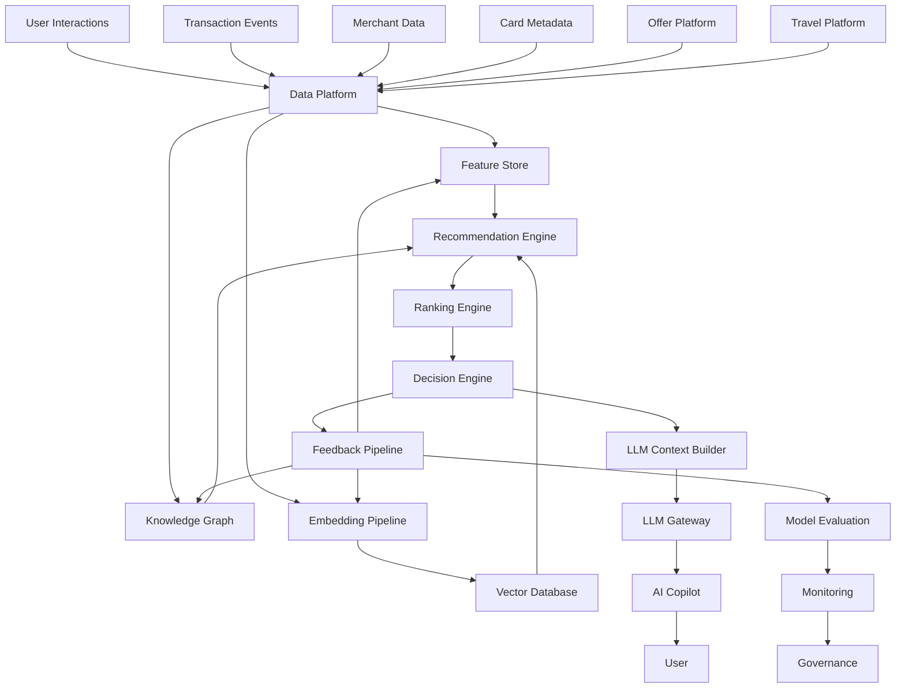

---

# 6. Recommendation Philosophy

**ID:** REC-001

The recommendation engine exists to maximize **long-term user value**, not merely immediate engagement.

Every recommendation should balance:

- Financial gain
- User preferences
- Confidence
- Explainability
- Simplicity
- Trust

---

## Recommendation Priorities

| Priority | Description |
|----------|-------------|
| Financial Benefit | Maximize reward value |
| Eligibility | Ensure recommendation is valid |
| Confidence | Use reliable signals |
| User Preference | Respect historical behavior |
| Explainability | Provide reasoning |
| Diversity | Avoid repetitive suggestions |
| Freshness | Surface newly relevant opportunities |

---

## Recommendation Types

| Recommendation | Primary Objective |
|---------------|-------------------|
| Best Card | Maximize rewards |
| Best Payment Method | Optimize total value |
| Offer Recommendation | Increase savings |
| Lounge Recommendation | Improve travel experience |
| Redemption Recommendation | Maximize redemption efficiency |
| Upgrade Recommendation | Increase long-term value |
| Card Closure Recommendation | Reduce unnecessary costs |
| Travel Recommendation | Improve booking outcomes |
| Merchant Recommendation | Increase reward opportunities |

---

## Recommendation Pipeline

```
Candidates

↓

Eligibility Filtering

↓

Business Rules

↓

Knowledge Graph Expansion

↓

ML Ranking

↓

Context Personalization

↓

Final Decision

↓

Explanation

↓

Feedback
```

---

## Engineering Considerations

| Consideration | Strategy |
|---------------|----------|
| Latency | Precompute where possible |
| Personalization | Real-time feature lookup |
| Explainability | Attach rationale metadata |
| Scalability | Independent ranking services |
| Freshness | Event-driven updates |

---

## Risks

| Risk | Mitigation |
|------|------------|
| Cold start | Hybrid rule-based defaults |
| Sparse user data | Population priors and contextual signals |
| Ranking instability | Versioned ranking strategies |
| Recommendation fatigue | Diversity-aware ranking |

---

# 7. Personalization Philosophy

**ID:** USER-001

CardWise personalizes recommendations using a combination of static attributes, behavioral patterns, contextual signals, and learned representations.

Personalization is adaptive rather than fixed.

---

## Personalization Dimensions

| Dimension | Examples |
|------------|----------|
| Spending | Categories, frequency, average value |
| Merchant Affinity | Preferred brands and retailers |
| Travel | Airlines, hotels, destinations |
| Rewards | Cashback, miles, points |
| Temporal | Time of day, weekday, seasonality |
| Geographic | City, country, region |
| Financial | Credit utilization, payment behavior |
| Interaction | Searches, clicks, dismissals, saves |

---

## Personalization Layers

| Layer | Description |
|--------|-------------|
| Global Models | Population-level insights |
| Segment Models | Cohort-based adaptation |
| User Models | Individual preferences |
| Session Models | Short-term intent |
| Context Models | Real-time environment |

---

## Personalization Objectives

| Objective | Description |
|------------|-------------|
| Increase relevance | Improve recommendation quality |
| Reduce cognitive load | Present fewer, higher-quality options |
| Respect user intent | Align with current goals |
| Adapt over time | Learn from behavioral changes |
| Preserve trust | Avoid unexpected recommendations |

---

## Operational Considerations

| Area | Approach |
|------|----------|
| Privacy | Feature minimization and access controls |
| Cold Start | Hybrid personalization strategies |
| Feedback | Continuous feature updates |
| Drift | Monitor preference evolution |

---

# 8. Knowledge Graph Overview

**ID:** KG-001

The Knowledge Graph serves as the semantic backbone of the AI platform.

It models relationships between entities rather than isolated records, enabling richer reasoning, discovery, and recommendation capabilities.

---

## Core Entity Domains

| Domain | Examples |
|----------|----------|
| Credit Cards | Products, issuers, networks |
| Banks | Financial institutions |
| Merchants | Online and offline merchants |
| Categories | Dining, travel, fuel, shopping |
| Offers | Cashback, discounts, coupons |
| Rewards | Points, miles, cashback |
| Airlines | Loyalty programs |
| Hotels | Hotel chains and programs |
| Airports | Lounges and terminals |
| Users | Preferences and affinities |
| Locations | Cities, regions, countries |

---

## Example Relationships

| Relationship | Description |
|--------------|-------------|
| Card → Earns → Reward |
| Merchant → Accepts → Card Network |
| Merchant → Has → Offer |
| Airline → Supports → Transfer Partner |
| User → Prefers → Merchant |
| Card → Provides → Lounge Access |
| Reward → Redeems Into → Airline Miles |
| Hotel → Participates In → Loyalty Program |

---

## Engineering Benefits

| Capability | Value |
|-------------|-------|
| Semantic reasoning | Rich relationship traversal |
| Recommendation expansion | Better candidate discovery |
| Explainability | Transparent reasoning paths |
| Search | Improved semantic retrieval |
| AI Context | Higher-quality grounding for LLMs |

---

## Operational Considerations

| Area | Strategy |
|------|----------|
| Consistency | Versioned graph updates |
| Freshness | Incremental event-driven synchronization |
| Scale | Partitioned graph storage and caching |
| Governance | Schema evolution with compatibility controls |

---

# 9. AI Project Structure

**ID:** AI-004

The AI platform is organized into modular domains with clear ownership boundaries.

```
ai-platform/

├── recommendation-engine/
├── ranking-engine/
├── optimization-engine/
├── feature-store/
├── embedding-service/
├── vector-search/
├── knowledge-graph/
├── search-platform/
├── llm-gateway/
├── prompt-orchestrator/
├── copilot/
├── personalization/
├── evaluation/
├── experimentation/
├── governance/
├── monitoring/
├── observability/
├── shared-ai-libraries/
└── documentation/
```

---

## Ownership Matrix

| Module | Primary Responsibility |
|----------|-----------------------|
| Recommendation Engine | Candidate generation and ranking |
| Personalization | User intelligence |
| Feature Store | Feature management |
| Knowledge Graph | Entity relationships |
| Search Platform | Retrieval and ranking |
| Copilot | Conversational experiences |
| Governance | Compliance and AI policies |
| Monitoring | Operational visibility |

---

## Architectural Principles

- Single responsibility per service
- Independent deployment lifecycle
- Event-driven communication
- Shared contracts with versioning
- Clear ownership boundaries
- Observability by default
- Vendor abstraction for AI providers

---

# 10. AI Lifecycle

**ID:** AI-005

The AI lifecycle defines how data, models, recommendations, and feedback evolve over time.

---

## Lifecycle Stages

| Stage | Description |
|---------|-------------|
| Data Collection | Capture events from all product domains |
| Data Validation | Verify quality and consistency |
| Feature Engineering | Build reusable online and offline features |
| Embedding Generation | Produce semantic representations |
| Knowledge Graph Enrichment | Update entity relationships |
| Candidate Generation | Produce recommendation candidates |
| Ranking & Optimization | Score and prioritize candidates |
| Inference | Deliver recommendations in real time |
| Explanation | Generate transparent reasoning |
| Feedback Collection | Capture user responses |
| Evaluation | Measure quality and business impact |
| Governance | Audit, approve, and monitor AI behavior |

---

## AI Lifecycle Diagram

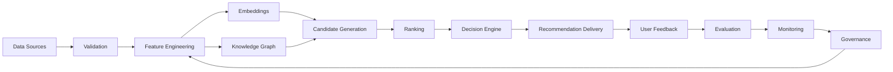

---

## Best Practices

| Area | Recommendation |
|------|----------------|
| Versioning | Version models, embeddings, prompts, ranking logic, and graph schemas independently. |
| Explainability | Persist rationale metadata alongside every recommendation. |
| Observability | Capture latency, quality, confidence, and business KPIs for each inference path. |
| Scalability | Separate online serving from offline training and enrichment pipelines. |
| Reliability | Provide deterministic fallback strategies when AI components are unavailable. |
| Privacy | Minimize PII exposure throughout the AI lifecycle and enforce least-privilege access. |

---

## Trade-offs

| Decision | Benefits | Trade-offs |
|----------|----------|------------|
| Hybrid AI architecture | High accuracy and resilience | Increased system complexity |
| Knowledge Graph integration | Better reasoning and explainability | Additional maintenance overhead |
| Multi-model LLM gateway | Provider flexibility and redundancy | More governance and evaluation effort |
| Real-time personalization | Highly relevant recommendations | Higher infrastructure costs |
| Event-driven pipelines | Fresh data and scalability | Operational complexity |

---

## Risks

| Risk | Impact | Mitigation |
|------|--------|------------|
| Model drift | Reduced recommendation quality | Continuous evaluation and drift detection |
| Stale knowledge | Incorrect recommendations | Incremental graph updates and freshness SLAs |
| Hallucinated explanations | Loss of user trust | Deterministic grounding and guardrails |
| Vendor dependency | Availability and pricing risks | Model abstraction layer and multi-provider support |
| Feedback bias | Reinforcement of poor recommendations | Balanced exploration and offline evaluation |

# 11. Recommendation Engine

**Section ID:** REC-100

The Recommendation Engine is the central decision intelligence platform within CardWise. It transforms raw financial, behavioral, contextual, and merchant data into personalized, explainable, and actionable recommendations.

Unlike traditional recommendation systems that optimize for clicks or engagement, the CardWise Recommendation Engine optimizes for **long-term financial value**, **user trust**, **reward maximization**, and **decision confidence**.

The engine combines deterministic rule evaluation, machine learning models, knowledge graph traversal, feature retrieval, contextual ranking, and business policies to produce a ranked set of recommendations.

---

## Objectives

| ID | Objective |
|-----|----------|
| REC-101 | Recommend the optimal card for every payment |
| REC-102 | Recommend the optimal payment method |
| REC-103 | Maximize cashback and reward earnings |
| REC-104 | Maximize travel reward value |
| REC-105 | Surface personalized merchant offers |
| REC-106 | Recommend reward redemption opportunities |
| REC-107 | Explain every recommendation |
| REC-108 | Learn continuously from user interactions |
| REC-109 | Maintain low-latency inference |
| REC-110 | Support real-time contextual recommendations |

---

# Recommendation Types

| Recommendation | Stable ID | Trigger |
|---------------|-----------|---------|
| Best Card | REC-CARD | Payment Event |
| Best Payment Method | REC-PAY | Payment Intent |
| Offer Recommendation | REC-OFFER | Merchant Context |
| Cashback Optimization | REC-CASH | Category Spend |
| Reward Optimization | REC-REWARD | Reward Balance |
| Merchant Recommendation | REC-MERCHANT | User Activity |
| Lounge Recommendation | REC-LOUNGE | Travel Context |
| Redemption Recommendation | REC-REDEEM | Reward Portfolio |
| Upgrade Recommendation | REC-UPGRADE | Card Analysis |
| Closure Recommendation | REC-CLOSE | Portfolio Health |

---

# Recommendation Pipeline

```text
Incoming Context
        │
        ▼
Feature Retrieval
        │
        ▼
Candidate Generation
        │
        ▼
Eligibility Filters
        │
        ▼
Business Rules
        │
        ▼
Knowledge Graph Expansion
        │
        ▼
ML Scoring
        │
        ▼
Personalization
        │
        ▼
Ranking
        │
        ▼
Explanation Generation
        │
        ▼
Recommendation Delivery
```

---

# Recommendation Inputs

| Category | Examples |
|-----------|----------|
| User Profile | Age, location, preferences |
| Card Portfolio | Owned cards |
| Merchant | MCC, merchant name |
| Offers | Merchant offers |
| Rewards | Reward balances |
| Travel | Upcoming trips |
| Spend History | Historical transactions |
| Session | Current activity |
| Device | Mobile/Desktop |
| Time | Hour, weekday, season |
| Context | Payment intent |

---

# Recommendation Outputs

Every recommendation includes:

- Recommendation ID
- Recommendation Type
- Confidence Score
- Expected Reward
- Expected Cashback
- Alternative Options
- Why Recommended
- Applicable Constraints
- Expiration
- Supporting Signals

---

# Recommendation Confidence

**ID:** REC-111

Confidence represents how certain the platform is that the recommendation is optimal.

Confidence is derived from multiple independent signals rather than a single ML probability.

---

## Confidence Signals

| Signal | Weight Source |
|---------|---------------|
| User Similarity | Embedding |
| Historical Success | Analytics |
| Rule Match | Rule Engine |
| Merchant Confidence | Merchant Intelligence |
| Offer Freshness | Offer Engine |
| Context Match | Feature Store |
| Personalization | User Profile |
| Reward Prediction | Reward Engine |

---

## Confidence Bands

| Score | Meaning |
|--------|----------|
| 95–100 | Extremely Confident |
| 85–94 | Highly Confident |
| 70–84 | Confident |
| 50–69 | Moderate |
| <50 | Low Confidence |

Low-confidence recommendations should either:

- request additional context,
- provide multiple alternatives, or
- gracefully fall back to deterministic rules.

---

# Recommendation Constraints

**ID:** REC-112

Recommendations must never violate mandatory constraints.

---

## Constraint Categories

| Constraint | Source |
|------------|--------|
| Bank Eligibility | Card Rules |
| Offer Validity | Offer Engine |
| Merchant Restrictions | Merchant DB |
| User Eligibility | User Profile |
| Card Status | Portfolio |
| Expired Promotions | Offer Service |
| Spend Limits | Card Metadata |
| Reward Caps | Reward Rules |
| Regulatory Rules | Compliance Engine |

---

# Candidate Generation

**ID:** REC-113

Candidate generation identifies all potentially relevant options before ranking.

Generation prioritizes recall over precision.

---

## Candidate Sources

| Source | Purpose |
|---------|---------|
| Owned Cards | Existing portfolio |
| Available Offers | Merchant discounts |
| Similar Users | Collaborative filtering |
| Knowledge Graph | Relationship expansion |
| Semantic Search | Related entities |
| Travel Engine | Travel-specific candidates |
| Merchant Engine | Merchant intelligence |
| Business Rules | Deterministic options |

---

## Candidate Expansion

The Knowledge Graph may enrich candidates by discovering:

- partner airlines
- transfer partners
- co-branded cards
- affiliated merchants
- reward partners
- category relationships
- seasonal offers

---

# Candidate Filtering

**ID:** REC-114

Filtering removes impossible or invalid recommendations before scoring.

---

## Filter Pipeline

1. User Eligibility
2. Offer Expiry
3. Merchant Support
4. Card Availability
5. Spending Threshold
6. Reward Constraints
7. Compliance
8. Geographic Availability

---

## Engineering Considerations

| Decision | Rationale |
|----------|-----------|
| Filter early | Reduce ranking cost |
| Deterministic filters | Prevent invalid recommendations |
| Incremental evaluation | Lower latency |
| Cache filter results | Reduce repeated computation |

---

# Card Recommendation Engine

**Section ID:** REC-CARD

The Card Recommendation Engine determines which payment card should be used for a transaction.

It evaluates all eligible cards within the user's portfolio and predicts the highest total value.

---

## Optimization Inputs

- Merchant
- MCC
- Spend Amount
- Active Offers
- Card Benefits
- Reward Multiplier
- Cashback Rules
- Reward Caps
- User Preferences
- Upcoming Travel
- Existing Spend
- Annual Fee Recovery
- Welcome Bonus Progress

---

## Scoring Dimensions

| Dimension | Description |
|-----------|-------------|
| Cashback | Immediate savings |
| Reward Points | Future value |
| Offer Savings | Merchant-specific |
| Milestone Progress | Spend thresholds |
| Lounge Eligibility | Travel benefit |
| Category Multiplier | Accelerated earning |
| Foreign Markup | International optimization |
| User Preference | Historical selection |

---

## Recommendation Example

```
Merchant

↓

Eligible Cards

↓

Compute Reward Value

↓

Compute Cashback

↓

Compute Offer Savings

↓

Apply Constraints

↓

Rank Cards

↓

Return Top Recommendation
```

---

# Payment Recommendation Engine

**Section ID:** REC-PAY

Payment optimization extends beyond selecting a card.

It determines the optimal payment combination.

---

## Supported Payment Types

- Credit Card
- Debit Card
- UPI
- Wallet
- EMI
- Net Banking
- Bank Offers
- Pay Later
- Gift Cards
- Reward Points

---

## Decision Factors

| Factor | Example |
|---------|----------|
| Merchant Acceptance | Supported methods |
| Processing Fees | Extra charges |
| Cashback | Net savings |
| Offers | Instant discounts |
| Reward Value | Future redemption |
| User Preference | Preferred methods |
| Risk | Fraud signals |
| Convenience | Payment friction |

---

## Payment Ranking Goals

1. Maximize financial benefit
2. Reduce payment friction
3. Increase reward value
4. Maintain security
5. Respect user preference

---

# Reward Optimization Engine

**Section ID:** REC-REWARD

The Reward Optimization Engine predicts the highest long-term value of points, cashback, and loyalty currencies.

Optimization considers future opportunity cost rather than only current redemption value.

---

## Optimization Objectives

| Goal | Description |
|------|-------------|
| Maximize point valuation |
| Minimize reward expiry |
| Optimize transfer timing |
| Recommend bonus transfer windows |
| Preserve premium benefits |
| Suggest optimal redemption |

---

## Reward Inputs

- Current balances
- Transfer partners
- Historical redemption values
- Dynamic airline valuations
- Hotel valuations
- Upcoming travel
- Seasonal promotions
- Expiry dates

---

## Recommendation Outputs

- Redeem Now
- Hold Rewards
- Transfer to Airline
- Transfer to Hotel
- Convert to Cashback
- Use for Travel
- Preserve for Future

---

# Cashback Optimization

**Section ID:** REC-CASH

Cashback optimization predicts immediate financial savings across payment options.

---

## Cashback Sources

- Bank Offers
- Card Cashback
- Merchant Cashback
- Platform Cashback
- Coupon Stack
- Wallet Cashback
- Referral Credits

---

## Cashback Ranking Formula (Conceptual)

Final Cashback Value =

Immediate Cashback

+

Reward Equivalent

+

Offer Savings

+

Future Milestone Value

---

## Cashback Strategy

| Scenario | Recommendation |
|----------|----------------|
| High Cashback | Recommend Cashback |
| Higher Reward Value | Recommend Rewards |
| Limited-Time Offer | Prioritize Offer |
| Reward Expiry | Recommend Redemption |
| Milestone Near | Recommend Spend Progress |

---

# Unified Decision Engine

**Section ID:** REC-DECISION

The Decision Engine aggregates outputs from all recommendation subsystems into a single ranked recommendation.

---

## Inputs

- Card Engine
- Reward Engine
- Cashback Engine
- Merchant Intelligence
- Knowledge Graph
- User Embeddings
- Feature Store
- Business Rules
- Safety Policies

---

## Decision Order

```text
Retrieve Features
        │
Generate Candidates
        │
Eligibility Rules
        │
Knowledge Graph Expansion
        │
Business Constraints
        │
ML Scoring
        │
Personalization
        │
Ranking
        │
Explainability
        │
Recommendation
```

---

# Recommendation Flow

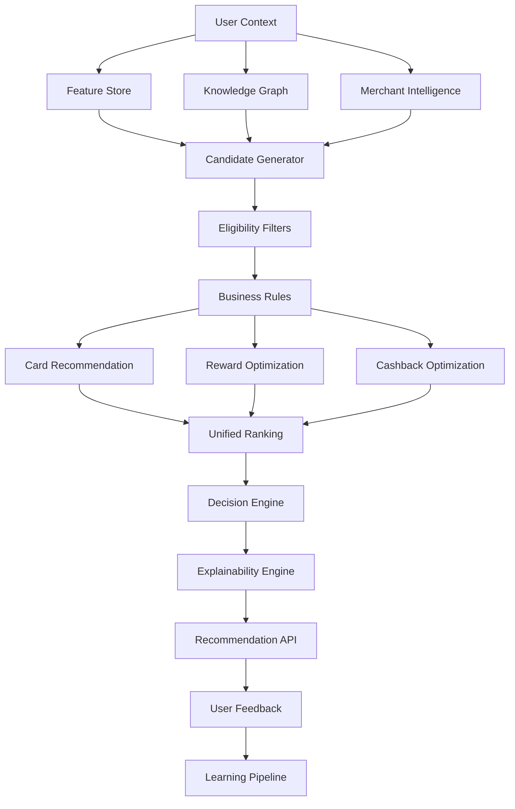

---

# Operational Considerations

| Area | Strategy |
|------|----------|
| Latency | Precompute heavy features and cache rankings |
| Freshness | Event-driven invalidation on offer or portfolio changes |
| Scalability | Stateless recommendation services with horizontal scaling |
| Explainability | Persist rationale metadata for every recommendation |
| Fault Tolerance | Deterministic fallback if ML or graph services are unavailable |

---

# Best Practices

- Separate candidate generation from ranking.
- Prefer deterministic rule evaluation before ML scoring.
- Version recommendation strategies independently.
- Record every recommendation for offline evaluation.
- Keep explanations synchronized with ranking logic.
- Monitor recommendation diversity to prevent user fatigue.
- Support graceful degradation when dependent AI services are unavailable.

---

# Trade-offs

| Decision | Benefits | Trade-offs |
|----------|----------|------------|
| Hybrid rule + ML recommendations | Higher accuracy and compliance | Increased architectural complexity |
| Multi-stage ranking | Better precision | Higher inference cost |
| Knowledge graph expansion | Richer candidate discovery | Additional graph maintenance |
| Real-time personalization | Highly relevant outcomes | Increased infrastructure requirements |

---

# Risks

| Risk | Mitigation |
|------|------------|
| Recommendation bias | Diversity-aware ranking and periodic evaluation |
| Cold-start users | Population defaults and deterministic rules |
| Offer staleness | Event-driven cache invalidation |
| High inference latency | Feature caching, asynchronous enrichment, precomputation |
| Over-optimization for engagement | Optimize for long-term financial value rather than clicks |

# 12. User Intelligence

**Section ID:** USER-100

The User Intelligence Platform is responsible for understanding each user's financial behavior, preferences, goals, and intent.

Unlike traditional profile systems that rely only on static information, CardWise continuously builds a dynamic behavioral model using transactional activity, interactions, contextual signals, travel patterns, merchant relationships, and feedback.

The objective is to create a **360° Financial Intelligence Profile** that powers every recommendation, ranking decision, search result, and AI Copilot response.

---

# Objectives

| ID | Objective |
|-----|----------|
| USER-101 | Continuously learn user behavior |
| USER-102 | Build user embeddings |
| USER-103 | Predict user preferences |
| USER-104 | Detect behavior changes |
| USER-105 | Improve recommendation quality |
| USER-106 | Support explainable personalization |
| USER-107 | Enable real-time inference |
| USER-108 | Preserve user privacy |
| USER-109 | Minimize cold-start impact |
| USER-110 | Continuously improve through feedback |

---

# User Intelligence Architecture

```text
User Events
      │
      ▼
Behavior Pipeline
      │
      ▼
Feature Engineering
      │
      ▼
User Profile
      │
      ▼
Embedding Generation
      │
      ▼
Feature Store
      │
      ▼
Recommendation Engine
      │
      ▼
Feedback Loop
```

---

# User Intelligence Components

| Component | Stable ID | Responsibility |
|------------|-----------|----------------|
| User Profile | USER-PROFILE | Static user information |
| Behavioral Engine | USER-BEH | Learn user behavior |
| Preference Engine | USER-PREF | Infer preferences |
| Embedding Engine | EMB-USER | Generate embeddings |
| Segmentation Engine | USER-SEG | Group similar users |
| Affinity Engine | USER-AFF | Learn affinities |
| Intent Engine | USER-INTENT | Detect short-term goals |
| Feature Store | USER-FS | Online feature serving |

---

# User Profile Model

**ID:** USER-111

The User Profile combines static attributes with continuously evolving behavioral signals.

Static attributes are relatively stable, while behavioral attributes evolve as new interactions occur.

---

## Static Attributes

| Category | Examples |
|----------|----------|
| Geography | Country, city, timezone |
| Portfolio | Owned cards |
| Preferred Currency | INR, USD, etc. |
| Loyalty Programs | Airline and hotel memberships |
| Travel Documents | Travel readiness indicators |
| Communication Preferences | Notification settings |
| Financial Goals | Cashback, miles, luxury travel |
| Account Metadata | Registration, verification status |

---

## Dynamic Attributes

| Category | Examples |
|----------|----------|
| Spending Trends | Monthly changes |
| Preferred Categories | Dining, fuel, travel |
| Merchant Frequency | Most visited merchants |
| Reward Behavior | Earn vs redeem patterns |
| Search Activity | Recent searches |
| Offer Engagement | Viewed, saved, redeemed |
| Copilot Conversations | Financial questions |
| Device Usage | Platform preferences |

---

# Behavior Modeling

**Section ID:** USER-BEH

Behavior modeling transforms raw user interactions into meaningful financial intelligence.

The system captures long-term habits, medium-term trends, and short-term intent.

---

## Behavioral Signals

| Signal | Examples |
|---------|----------|
| Transaction Activity | Purchases |
| Search Behavior | Card searches |
| Merchant Visits | Merchant frequency |
| Offer Usage | Offer redemption |
| Reward Activity | Transfers, redemption |
| Travel Planning | Flight searches |
| Copilot Usage | Financial assistance |
| Notification Engagement | Opens, dismissals |

---

## Behavioral Time Windows

| Window | Purpose |
|---------|---------|
| Session | Immediate intent |
| Daily | Short-term changes |
| Weekly | Emerging trends |
| Monthly | Spending habits |
| Quarterly | Lifestyle evolution |
| Yearly | Long-term financial behavior |

---

## Behavioral Categories

- Spending velocity
- Merchant loyalty
- Category affinity
- Reward utilization
- Offer responsiveness
- Travel frequency
- Seasonal behavior
- Payment preferences
- Search exploration
- Financial planning maturity

---

# Behavioral State Machine

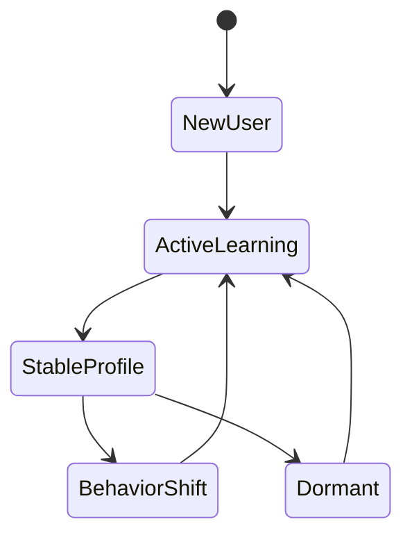

---

# User Embeddings

**Section ID:** EMB-USER

Embeddings provide dense semantic representations of users.

Instead of storing only explicit preferences, embeddings encode behavioral similarity, latent interests, and evolving financial patterns.

These vectors enable high-quality personalization, retrieval, and recommendation.

---

## Embedding Sources

| Source | Contribution |
|---------|--------------|
| Transactions | Spending behavior |
| Merchant Visits | Brand affinity |
| Search Queries | Intent |
| Offer Interactions | Savings preference |
| Reward Activity | Redemption behavior |
| Travel History | Travel affinity |
| Copilot Conversations | Financial interests |
| User Feedback | Satisfaction signals |

---

## Embedding Characteristics

| Property | Requirement |
|----------|-------------|
| Normalized | Yes |
| Versioned | Yes |
| Time-aware | Yes |
| Incrementally Updated | Yes |
| Explainable Metadata | Yes |
| Cacheable | Yes |

---

## Embedding Use Cases

- Similar user retrieval
- Personalized ranking
- Merchant recommendations
- Search personalization
- Offer ranking
- Travel recommendations
- Reward optimization
- Cold-start mitigation

---

# Embedding Lifecycle

```text
User Events
      │
Feature Extraction
      │
Embedding Generation
      │
Vector Validation
      │
Vector Store
      │
Online Retrieval
      │
Continuous Updates
```

---

# User Segmentation

**Section ID:** USER-SEG

Segmentation groups users with similar financial characteristics while still allowing individualized recommendations.

Segments provide useful priors, especially for new users and sparse datasets.

---

## Segmentation Dimensions

| Dimension | Examples |
|-----------|----------|
| Spending Level | Low, medium, high |
| Reward Preference | Cashback, miles, hybrid |
| Travel Frequency | Rare, frequent |
| Merchant Loyalty | Generalist, brand loyal |
| Portfolio Size | Single card, premium portfolio |
| Redemption Behavior | Immediate vs delayed |
| Offer Usage | Aggressive vs passive |
| Financial Goals | Savings, luxury travel, simplicity |

---

## Segment Types

| Segment | Characteristics |
|----------|----------------|
| Cashback Maximizers | Prefer immediate savings |
| Travel Enthusiasts | Optimize airline and hotel rewards |
| Luxury Users | Premium card usage |
| Everyday Spenders | Grocery, dining, fuel focus |
| Reward Collectors | Accumulate transferable points |
| Offer Hunters | High engagement with promotions |
| Minimalists | Simplicity over optimization |

---

## Segment Evolution

Users are not permanently assigned to a single segment.

Segment membership evolves automatically as behavioral patterns change.

---

# Preference Learning

**Section ID:** USER-PREF

Preference learning identifies what users consistently prefer without requiring explicit configuration.

The engine combines explicit settings with implicit behavioral observations.

---

## Explicit Preferences

- Preferred airlines
- Preferred hotel chains
- Favorite merchants
- Preferred payment methods
- Travel goals
- Cashback preference
- Reward redemption preference

---

## Implicit Preferences

- Frequently selected cards
- Frequently visited merchants
- Ignored recommendations
- Search frequency
- Offer redemption behavior
- Copilot interactions
- Seasonal spending changes

---

## Preference Confidence

| Confidence | Interpretation |
|-------------|---------------|
| High | Strong repeated evidence |
| Medium | Consistent but limited evidence |
| Low | Emerging preference |
| Unknown | Insufficient data |

---

# Feature Store

**Section ID:** USER-FS

The Feature Store provides consistent feature access for both offline model training and online inference.

It eliminates feature drift by ensuring identical feature definitions across environments.

---

## Feature Categories

| Category | Examples |
|----------|----------|
| User Features | Spend, rewards, preferences |
| Merchant Features | Popularity, category |
| Card Features | Multipliers, benefits |
| Offer Features | Freshness, eligibility |
| Travel Features | Destinations, airlines |
| Context Features | Time, location, device |
| Interaction Features | Clicks, saves, feedback |

---

## Online Features

Designed for low-latency inference.

Examples include:

- Current reward balance
- Active offers
- Recent transactions
- Latest merchant affinity
- Session intent
- Real-time location context

---

## Offline Features

Designed for model training and evaluation.

Examples include:

- 90-day spend trends
- Historical redemption rates
- Long-term category affinity
- Seasonal behavior
- Portfolio evolution
- Travel history

---

## Feature Lifecycle

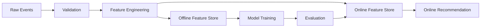

---

# Merchant Affinity Engine

**Section ID:** USER-AFF

Merchant affinity measures how strongly a user is associated with specific merchants, brands, and merchant categories.

Affinity is dynamic and continuously updated.

---

## Affinity Signals

| Signal | Importance |
|---------|------------|
| Visit Frequency | High |
| Spend Amount | High |
| Spend Consistency | High |
| Offer Redemption | High |
| Search Activity | Medium |
| Wishlist Activity | Medium |
| Copilot Mentions | Medium |
| Merchant Ratings | Low |

---

## Affinity Categories

- Grocery
- Dining
- Fuel
- Fashion
- Electronics
- Travel
- Hotels
- Airlines
- Entertainment
- Health
- Subscription Services

---

## Merchant Affinity Applications

| Use Case | Benefit |
|----------|----------|
| Personalized Offers | Higher relevance |
| Merchant Ranking | Better recommendations |
| Search Personalization | Improved retrieval |
| Copilot Context | More natural assistance |
| Travel Planning | Preferred partners |
| Reward Suggestions | Better redemption timing |

---

# Real-Time User Intelligence Flow

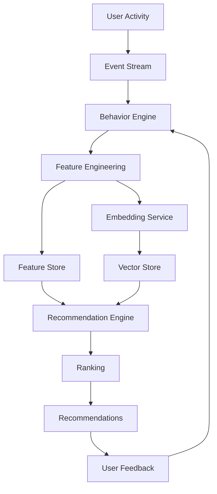

---

# Operational Considerations

| Area | Strategy |
|------|----------|
| Privacy | Store only necessary behavioral signals with strict access controls |
| Freshness | Stream updates for high-impact events while batching low-priority signals |
| Latency | Keep online features in memory-backed stores for low-latency retrieval |
| Consistency | Use shared feature definitions across training and inference |
| Scalability | Partition feature storage and embedding pipelines independently |
| Explainability | Persist the strongest behavioral signals behind each recommendation |

---

# Best Practices

- Separate immutable profile data from behavioral features.
- Treat embeddings as derived artifacts rather than source-of-truth data.
- Continuously update affinities using event-driven pipelines.
- Version feature definitions independently from ML models.
- Expire stale behavioral signals using configurable decay windows.
- Prefer incremental feature computation over full recomputation.
- Record feature lineage for auditability and reproducibility.

---

# Trade-offs

| Decision | Benefits | Trade-offs |
|----------|----------|------------|
| Real-time feature updates | Highly personalized recommendations | Higher infrastructure cost |
| Rich behavioral modeling | Better recommendation quality | Increased storage requirements |
| User embeddings | Improved semantic understanding | Additional vector management complexity |
| Dynamic segmentation | Adaptive personalization | More sophisticated monitoring needed |

---

# Risks

| Risk | Mitigation |
|------|------------|
| Cold-start users | Use segment-level priors and deterministic defaults |
| Preference drift | Detect behavioral shifts and refresh embeddings |
| Sparse interaction data | Combine explicit preferences with contextual signals |
| Over-personalization | Introduce diversity and exploration strategies |
| Privacy concerns | Minimize retained behavioral data and enforce governance |

# 13. Knowledge Graph

**Section ID:** KG-100

The Knowledge Graph (KG) is the semantic intelligence layer of CardWise.

While relational databases excel at storing entities, they are inefficient at reasoning over complex, multi-hop relationships such as:

> Which airline loyalty program provides the highest redemption value for points earned from a particular credit card when traveling to Japan during the next three months?

Answering questions like this requires traversing interconnected relationships between cards, issuers, merchants, offers, reward currencies, airlines, hotels, airports, travel partners, users, and contextual signals.

The Knowledge Graph serves as the foundational reasoning engine for:

- Recommendation Engine
- AI Copilot
- Semantic Search
- Personalization
- Explainability
- Merchant Intelligence
- Reward Optimization
- Travel Intelligence

It is **not** the source of truth for transactional data. Instead, it represents semantic relationships and derived intelligence that complement operational databases.

---

# Objectives

| ID | Objective |
|-----|----------|
| KG-101 | Model financial ecosystem relationships |
| KG-102 | Enable multi-hop reasoning |
| KG-103 | Improve recommendation quality |
| KG-104 | Support explainable AI |
| KG-105 | Enhance semantic search |
| KG-106 | Enable graph-based ranking |
| KG-107 | Improve personalization |
| KG-108 | Support continuous enrichment |
| KG-109 | Maintain graph consistency |
| KG-110 | Provide low-latency graph traversal |

---

# High-Level Knowledge Graph Architecture

```text
Operational Databases
        │
        ▼
Data Extraction
        │
        ▼
Entity Resolution
        │
        ▼
Relationship Discovery
        │
        ▼
Knowledge Graph
        │
 ┌──────┼────────────┐
 ▼      ▼            ▼
Search Recommendation Copilot
        │
        ▼
Explainability
```

---

# Graph Design Principles

| Principle | Description |
|-----------|-------------|
| Entity-centric | Every business object becomes a first-class entity |
| Relationship-first | Relationships are explicitly modeled |
| Immutable history | Graph evolution is auditable |
| Versioned schema | Schema evolution without breaking consumers |
| Incremental enrichment | Graph updates continuously |
| Explainable traversal | Recommendation paths remain inspectable |
| Domain isolation | Independent graph domains with shared ontology |

---

# Core Entity Domains

| Domain | Stable ID | Description |
|----------|-----------|-------------|
| Credit Cards | KG-CARD | Card products |
| Banks | KG-BANK | Issuing institutions |
| Merchants | KG-MERCHANT | Online and offline merchants |
| Offers | KG-OFFER | Promotions and campaigns |
| Rewards | KG-REWARD | Points, miles, cashback |
| Airlines | KG-AIRLINE | Loyalty programs |
| Hotels | KG-HOTEL | Hotel chains |
| Airports | KG-AIRPORT | Airport entities |
| Lounges | KG-LOUNGE | Lounge network |
| Categories | KG-CATEGORY | Merchant categories |
| Users | KG-USER | User semantic profile |
| Locations | KG-LOCATION | Geographic hierarchy |

---

# Entity Standards

Every entity within the graph should support:

| Property | Purpose |
|-----------|---------|
| Stable Identifier | Global uniqueness |
| Version | Schema compatibility |
| Metadata | Human-readable information |
| Relationship Count | Traversal optimization |
| Confidence Score | Entity reliability |
| Source Provenance | Data lineage |
| Last Updated | Freshness |
| Status | Active, deprecated, archived |

---

# Merchant Graph

**Section ID:** KG-MERCHANT

The Merchant Graph captures relationships between merchants, brands, categories, payment acceptance, offers, reward eligibility, and user affinity.

---

## Merchant Relationships

| Relationship | Description |
|--------------|-------------|
| Merchant → Category | Merchant classification |
| Merchant → Offer | Active promotions |
| Merchant → Card | Eligible cards |
| Merchant → Bank | Partner issuers |
| Merchant → Brand | Parent organization |
| Merchant → Region | Geographic availability |
| Merchant → Loyalty Program | Merchant rewards |
| Merchant → Airline | Transfer or travel partner |
| Merchant → Hotel | Hospitality relationships |

---

## Merchant Intelligence Applications

- Merchant similarity
- Cross-merchant recommendations
- Offer discovery
- Category inference
- Merchant clustering
- Seasonal recommendations
- Merchant expansion

---

## Example Merchant Traversal

```text
User

↓

Preferred Merchant

↓

Merchant Category

↓

Associated Offers

↓

Eligible Cards

↓

Highest Reward

↓

Recommendation
```

---

# Card Graph

**Section ID:** KG-CARD

The Card Graph models relationships among financial products and their associated benefits.

Rather than viewing cards independently, the graph captures how they interact with merchants, rewards, issuers, categories, travel benefits, and user behavior.

---

## Card Relationships

| Relationship | Description |
|--------------|-------------|
| Card → Bank |
| Card → Reward Currency |
| Card → Merchant Category |
| Card → Offer |
| Card → Lounge |
| Card → Airline Partner |
| Card → Hotel Partner |
| Card → Transfer Partner |
| Card → Network |
| Card → Fee Structure |
| Card → Insurance Benefits |
| Card → User Portfolio |

---

## Card Intelligence

Supports:

- Card comparison
- Portfolio optimization
- Upgrade analysis
- Closure recommendations
- Benefit discovery
- Milestone tracking

---

# Offer Graph

**Section ID:** KG-OFFER

Offers are dynamic entities whose relationships change frequently.

The Offer Graph enables efficient discovery and reasoning over active promotions.

---

## Offer Relationships

| Relationship | Description |
|--------------|-------------|
| Offer → Merchant |
| Offer → Bank |
| Offer → Card |
| Offer → Payment Method |
| Offer → Category |
| Offer → Geography |
| Offer → Time Window |
| Offer → Reward Type |
| Offer → User Segment |

---

## Offer Intelligence

The graph supports:

- Stackable offer discovery
- Conflicting offer detection
- Personalized eligibility
- Offer freshness
- Campaign optimization
- Similar offer retrieval

---

## Offer Lifecycle

```text
Offer Published

↓

Eligibility Mapping

↓

Merchant Linking

↓

Card Linking

↓

Knowledge Graph Update

↓

Recommendation Availability

↓

Expiration

↓

Archive
```

---

# Travel Graph

**Section ID:** KG-TRAVEL

The Travel Graph models relationships across airlines, hotels, airports, loyalty programs, lounges, destinations, and transfer partners.

It enables intelligent travel planning beyond simple reward redemption.

---

## Travel Domains

| Entity | Description |
|----------|-------------|
| Airline |
| Hotel |
| Airport |
| Destination |
| Route |
| Lounge |
| Alliance |
| Transfer Partner |
| Loyalty Program |
| Travel Season |

---

## Relationships

| Relationship | Description |
|--------------|-------------|
| Airline → Alliance |
| Airline → Loyalty Program |
| Card → Airline Transfer |
| Card → Hotel Transfer |
| Airport → Lounge |
| Hotel → Loyalty Program |
| Destination → Season |
| Route → Airline |

---

## Travel Intelligence

Supports:

- Best transfer partner
- Lounge recommendations
- Hotel recommendations
- Flight optimization
- Destination personalization
- Redemption optimization

---

# Reward Graph

**Section ID:** KG-REWARD

The Reward Graph models every reward currency and its conversion ecosystem.

It enables reasoning across transferable points, cashback, airline miles, hotel points, vouchers, and merchant rewards.

---

## Reward Relationships

| Relationship | Description |
|--------------|-------------|
| Card → Earns → Reward |
| Reward → Transfers To → Airline |
| Reward → Transfers To → Hotel |
| Reward → Converts To → Cashback |
| Reward → Expires On → Date |
| Reward → Multiplier → Merchant Category |
| Reward → Eligible User Segment |

---

## Reward Intelligence

Supports:

- Best redemption path
- Transfer optimization
- Expiry detection
- Value estimation
- Opportunity cost analysis
- Bonus transfer discovery

---

# Semantic Relationships

**Section ID:** KG-SEMANTIC

Semantic relationships enable inference beyond explicitly stored connections.

These inferred edges are derived from graph traversal, embeddings, behavioral similarity, and statistical association.

---

## Semantic Relationship Types

| Relationship | Description |
|--------------|-------------|
| Similar Merchant |
| Similar Card |
| Similar User |
| Frequently Co-Used |
| Similar Offer |
| Similar Travel Pattern |
| Similar Reward Strategy |
| Common Transfer Partner |

---

## Inference Sources

- Graph traversal
- User embeddings
- Merchant embeddings
- Reward embeddings
- Historical behavior
- Recommendation outcomes
- Search interactions

---

## Semantic Applications

| Use Case | Benefit |
|----------|----------|
| Recommendation expansion | Better candidate discovery |
| Semantic search | Richer retrieval |
| Copilot reasoning | More natural responses |
| Explainability | Human-readable relationship paths |
| Personalization | Similar-user reasoning |
| Cold-start mitigation | Graph-based defaults |

---

# Graph Enrichment Pipeline

**Section ID:** KG-PIPE

Graph enrichment continuously discovers new entities and relationships.

---

## Enrichment Sources

| Source | Purpose |
|----------|---------|
| Transaction Events | Merchant links |
| Offer Platform | Offer relationships |
| Reward Updates | Reward graph |
| Travel Data | Airline/hotel graph |
| Search Activity | Semantic links |
| User Feedback | Affinity refinement |
| Copilot Usage | Intent relationships |

---

## Enrichment Workflow

```text
Incoming Event

↓

Validation

↓

Entity Resolution

↓

Duplicate Detection

↓

Relationship Discovery

↓

Confidence Scoring

↓

Graph Update

↓

Index Refresh
```

---

# Knowledge Graph Explainability

**Section ID:** KG-EXPLAIN

One of the primary advantages of the graph is transparent reasoning.

Every recommendation should be traceable through graph relationships.

---

## Example Explanation Chain

```text
User

↓

Frequently Shops At

↓

Amazon

↓

Eligible Offer

↓

Preferred Card

↓

Highest Cashback

↓

Recommendation
```

---

## Explainability Metadata

Every graph-assisted recommendation should include:

- Traversed entities
- Traversed relationships
- Confidence score
- Supporting evidence
- Graph version
- Recommendation timestamp

---

# Mermaid Knowledge Graph

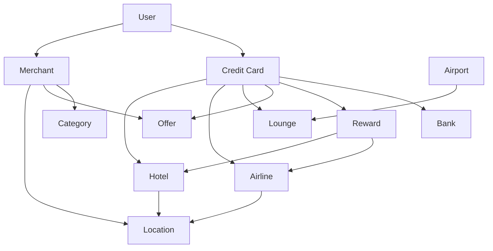

---

# Graph Operations

| Operation | Purpose |
|-----------|---------|
| Neighbor Lookup | Direct relationship retrieval |
| Multi-Hop Traversal | Complex reasoning |
| Path Discovery | Explainability |
| Similarity Search | Related entities |
| Community Detection | Clustering |
| Centrality Analysis | Important entities |
| Incremental Update | Continuous enrichment |
| Relationship Validation | Integrity checks |

---

# Operational Considerations

| Area | Strategy |
|------|----------|
| Freshness | Event-driven incremental graph updates |
| Scalability | Partition graph domains with independent enrichment pipelines |
| Consistency | Version entities and relationships independently |
| Availability | Serve graph queries from replicated read-optimized instances |
| Explainability | Preserve traversed paths for every graph-assisted recommendation |
| Governance | Track provenance and confidence for every relationship |

---

# Best Practices

- Separate operational data from semantic knowledge.
- Version graph schemas independently of application releases.
- Store relationship confidence and provenance.
- Prefer incremental enrichment over full graph rebuilds.
- Keep inferred relationships distinguishable from authoritative ones.
- Validate graph integrity continuously.
- Record graph traversal metadata for auditability.

---

# Trade-offs

| Decision | Benefits | Trade-offs |
|----------|----------|------------|
| Knowledge Graph over relational joins | Rich semantic reasoning | Increased modeling complexity |
| Inferred relationships | Better discovery | Requires confidence management |
| Multi-hop traversal | Higher-quality recommendations | Higher computational cost |
| Domain-specific graph partitions | Better scalability | Cross-domain orchestration complexity |

---

# Risks

| Risk | Mitigation |
|------|------------|
| Relationship explosion | Confidence thresholds and pruning policies |
| Stale graph edges | Continuous event-driven enrichment |
| Incorrect entity resolution | Deterministic identity resolution and validation |
| Expensive traversals | Caching, indexing, and traversal depth limits |
| Schema evolution issues | Backward-compatible ontology versioning |

# 14. LLM Layer

**Section ID:** MODEL-100

The LLM Layer provides natural language reasoning, explanation generation, conversational intelligence, semantic understanding, and AI-assisted planning for CardWise.

Unlike traditional chatbot integrations, the LLM Layer is **not the decision maker**.

Financial recommendations, eligibility decisions, reward calculations, and optimization outcomes are produced by deterministic systems, recommendation engines, and machine learning models.

The LLM's primary responsibilities are to:

- Understand user intent
- Retrieve relevant knowledge
- Explain recommendations
- Summarize financial insights
- Assist with planning
- Generate natural language responses
- Drive AI Copilot conversations

This separation ensures:

- Explainability
- Regulatory compliance
- Low hallucination risk
- Deterministic financial decisions
- Vendor independence

---

# Objectives

| ID | Objective |
|-----|----------|
| MODEL-101 | Provide conversational intelligence |
| MODEL-102 | Explain recommendations |
| MODEL-103 | Understand user intent |
| MODEL-104 | Support semantic reasoning |
| MODEL-105 | Integrate retrieval-augmented generation (RAG) |
| MODEL-106 | Prevent hallucinations |
| MODEL-107 | Enable provider independence |
| MODEL-108 | Maintain prompt governance |
| MODEL-109 | Optimize latency and cost |
| MODEL-110 | Ensure safe financial guidance |

---

# High-Level LLM Architecture

```text
User Query
      │
      ▼
Intent Detection
      │
      ▼
Prompt Orchestrator
      │
      ▼
Context Builder
      │
      ▼
Knowledge Retrieval
      │
      ▼
RAG Assembly
      │
      ▼
LLM Gateway
      │
      ▼
Safety Validation
      │
      ▼
Response Generation
      │
      ▼
Post Processing
      │
      ▼
User
```

---

# LLM Responsibilities

| Capability | Owned by LLM |
|------------|--------------|
| Natural language understanding | ✓ |
| Recommendation explanation | ✓ |
| Conversation | ✓ |
| Summaries | ✓ |
| Goal planning assistance | ✓ |
| Semantic reasoning | ✓ |
| Decision calculation | ✗ |
| Reward computation | ✗ |
| Offer eligibility | ✗ |
| Financial optimization | ✗ |
| Compliance enforcement | ✗ |

---

# Multi-Model Strategy

**Section ID:** MODEL-101

CardWise adopts a provider-agnostic architecture.

Individual models may vary based on latency, capability, cost, or availability.

The orchestration layer abstracts provider-specific implementations from the rest of the platform.

---

## Model Categories

| Category | Purpose |
|----------|---------|
| General LLM | Conversational responses |
| Fast LLM | Low-latency interactions |
| High-Reasoning LLM | Complex financial explanations |
| Embedding Model | Semantic representations |
| Reranking Model | Document ranking |
| Classification Model | Intent detection |
| Moderation Model | Safety validation |

---

## Model Selection Factors

| Factor | Importance |
|---------|------------|
| Latency | Critical |
| Cost | High |
| Context Window | High |
| Tool Compatibility | High |
| Reliability | Critical |
| Structured Output | High |
| Explainability | High |

---

# LLM Gateway

**Section ID:** MODEL-GATEWAY

The LLM Gateway acts as the unified interface between CardWise services and AI providers.

It isolates provider-specific APIs, authentication, routing, retries, and observability.

---

## Responsibilities

- Provider routing
- Authentication
- Rate limiting
- Retry policies
- Streaming support
- Token accounting
- Cost monitoring
- Model fallback
- Request tracing
- Response validation

---

## Gateway Benefits

| Benefit | Description |
|----------|-------------|
| Vendor Independence | Replace providers without application changes |
| Central Governance | Unified AI policies |
| Cost Optimization | Dynamic routing |
| Observability | Centralized monitoring |
| Reliability | Automatic fallback |

---

# Prompt Engineering

**Section ID:** PROMPT-100

Prompt engineering transforms structured financial context into deterministic, repeatable prompts suitable for LLM reasoning.

Prompts are treated as versioned engineering artifacts rather than application code.

---

## Prompt Principles

| Principle | Description |
|-----------|-------------|
| Deterministic | Stable structure |
| Modular | Reusable components |
| Versioned | Backward compatible |
| Observable | Track usage |
| Auditable | Change history |
| Secure | Sensitive data controls |

---

## Prompt Composition

```text
System Instructions

+

Business Context

+

User Context

+

Knowledge Retrieval

+

Recommendation Metadata

+

Safety Constraints

+

Formatting Instructions
```

---

# Prompt Components

| Component | Responsibility |
|------------|----------------|
| System Layer | Global behavior |
| Domain Layer | Financial context |
| Recommendation Layer | Recommendation metadata |
| User Layer | Personalization |
| Retrieval Layer | Retrieved knowledge |
| Safety Layer | Guardrails |
| Output Layer | Response formatting |

---

# Prompt Templates

**Section ID:** PROMPT-TEMPLATE

Prompt templates define reusable interaction patterns across AI capabilities.

Templates standardize structure while allowing contextual variation.

---

## Template Categories

| Template | Use Case |
|----------|----------|
| Recommendation Explanation | Explain why a card was recommended |
| Reward Summary | Summarize reward opportunities |
| Spend Analysis | Analyze spending behavior |
| Goal Planning | Financial planning |
| Offer Summary | Explain merchant offers |
| Travel Planning | Reward-aware travel |
| Search Answer | Natural language search |
| Copilot Conversation | Multi-turn dialogue |

---

## Template Metadata

Every template includes:

- Template ID
- Version
- Supported models
- Context requirements
- Safety classification
- Output format
- Evaluation metrics
- Deprecation status

---

# Prompt Versioning

**Section ID:** PROMPT-VERSION

Prompt behavior changes should be managed with the same rigor as application code.

---

## Versioning Goals

- Backward compatibility
- Reproducibility
- Safe experimentation
- Rollback capability
- Auditability

---

## Prompt Lifecycle

```text
Draft

↓

Review

↓

Evaluation

↓

Approval

↓

Production

↓

Monitoring

↓

Retirement
```

---

## Version Metadata

| Field | Purpose |
|--------|----------|
| Version | Compatibility |
| Owner | Accountability |
| Release Date | Audit |
| Supported Models | Routing |
| Metrics | Evaluation |
| Status | Lifecycle |

---

# Context Injection

**Section ID:** PROMPT-CONTEXT

Context injection provides the LLM with accurate, structured, and minimal information required to answer a specific user request.

The objective is to maximize relevance while minimizing token usage.

---

## Context Sources

| Source | Example |
|----------|----------|
| Recommendation Engine | Ranked recommendations |
| Feature Store | User features |
| Knowledge Graph | Semantic relationships |
| Search Platform | Retrieved documents |
| User Profile | Preferences |
| Merchant Intelligence | Merchant context |
| Travel Platform | Upcoming trips |
| Reward Platform | Reward balances |

---

## Context Prioritization

1. Active session
2. Recommendation metadata
3. User profile
4. Retrieved documents
5. Knowledge graph
6. Historical interactions
7. Long-term preferences

---

## Context Principles

- Least required context
- No redundant information
- Structured metadata
- Freshness validation
- PII minimization
- Deterministic ordering

---

# Retrieval-Augmented Generation (RAG)

**Section ID:** MODEL-RAG

RAG grounds LLM responses using authoritative CardWise knowledge instead of relying solely on model memory.

This ensures financial responses remain accurate, explainable, and current.

---

## Knowledge Sources

| Source | Purpose |
|----------|---------|
| Knowledge Graph | Entity relationships |
| Search Index | Structured documentation |
| Feature Store | User context |
| Recommendation Engine | Decision metadata |
| Merchant Database | Merchant information |
| Reward Catalog | Reward details |
| Offer Platform | Active offers |
| Travel Platform | Travel intelligence |

---

## Retrieval Pipeline

```text
User Query

↓

Intent Detection

↓

Embedding Generation

↓

Hybrid Search

↓

Vector Retrieval

↓

Keyword Retrieval

↓

Document Fusion

↓

Re-ranking

↓

Context Assembly

↓

LLM
```

---

## RAG Principles

- Retrieve before generation
- Prefer authoritative sources
- Limit retrieved context
- Preserve citations internally
- Reject unsupported conclusions

---

# Safety Layer

**Section ID:** SAFETY-LLM

Every LLM interaction passes through multiple safety validation stages.

Safety mechanisms protect users, business integrity, and regulatory compliance.

---

## Safety Objectives

| Objective | Description |
|-----------|-------------|
| Prevent hallucinations | Ground responses |
| Protect PII | Mask sensitive data |
| Financial compliance | Avoid unauthorized advice |
| Prompt security | Resist prompt injection |
| Response quality | Validate outputs |
| Abuse prevention | Detect misuse |

---

## Safety Pipeline

```text
Input Validation

↓

Prompt Sanitization

↓

Policy Enforcement

↓

Context Validation

↓

LLM Generation

↓

Output Validation

↓

Response Filtering

↓

User
```

---

# Hallucination Prevention

**Section ID:** SAFETY-HALL

Hallucinations are unacceptable in financial recommendation systems.

The architecture is designed to minimize unsupported statements through deterministic grounding.

---

## Prevention Strategies

| Strategy | Purpose |
|-----------|---------|
| RAG | Ground factual responses |
| Knowledge Graph | Semantic validation |
| Recommendation Metadata | Deterministic explanations |
| Confidence Thresholds | Reject weak evidence |
| Response Validation | Detect inconsistencies |
| Human Overrides | Correct edge cases |

---

## Response Categories

| Category | Behavior |
|-----------|----------|
| Fully Grounded | Return response |
| Partially Supported | Clearly communicate uncertainty |
| Unsupported | Refuse or request additional information |
| Safety Violation | Block response |

---

# End-to-End LLM Flow

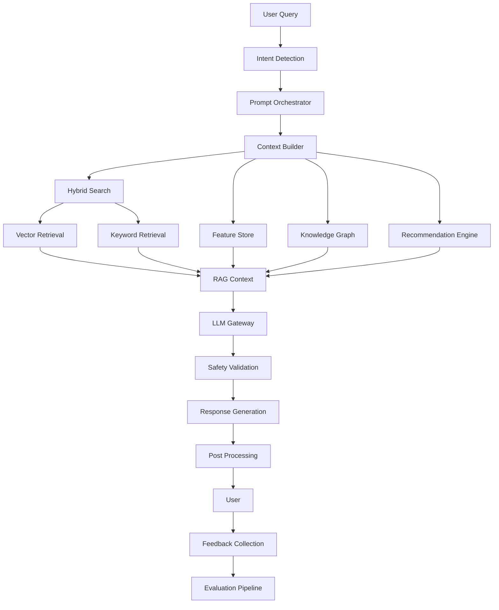

---

# Operational Considerations

| Area | Strategy |
|------|----------|
| Availability | Multi-provider routing with automatic fallback |
| Latency | Cache retrieval results and use lightweight models where appropriate |
| Cost | Dynamic model selection based on task complexity |
| Observability | Track token usage, latency, provider health, and response quality |
| Security | Sanitize prompts, minimize context, and validate outputs |
| Explainability | Link responses to recommendation metadata and retrieved evidence |

---

# Best Practices

- Separate deterministic decision logic from natural language generation.
- Treat prompts as version-controlled assets.
- Ground all financial responses using authoritative retrieval.
- Keep prompts modular and reusable.
- Evaluate prompts independently from model versions.
- Minimize context to reduce cost and latency.
- Log prompt, model, and retrieval versions for reproducibility.
- Support graceful fallback when LLM services are unavailable.

---

# Trade-offs

| Decision | Benefits | Trade-offs |
|----------|----------|------------|
| Multi-model architecture | Flexibility and resilience | Higher operational complexity |
| RAG-first generation | Better factual accuracy | Additional retrieval latency |
| Provider abstraction | Vendor independence | More gateway maintenance |
| Structured prompts | Consistent outputs | Less flexibility for experimentation |

---

# Risks

| Risk | Mitigation |
|------|------------|
| Hallucinated financial advice | Deterministic grounding and response validation |
| Prompt injection | Input sanitization and policy enforcement |
| Provider outages | Multi-provider failover through LLM Gateway |
| Escalating inference costs | Intelligent routing and token optimization |
| Prompt regressions | Versioning, evaluation, and staged rollouts |

# 15. AI Copilot

**Section ID:** COPILOT-100

The AI Copilot is the primary conversational intelligence interface for CardWise.

Unlike traditional customer support chatbots, the CardWise AI Copilot is a **financial decision companion** that combines deterministic recommendation systems, semantic retrieval, user intelligence, and LLM reasoning to help users make better financial decisions.

The Copilot never independently determines financial outcomes. Instead, it orchestrates multiple platform capabilities and presents personalized, explainable recommendations grounded in authoritative platform data.

Its responsibilities include:

- Financial guidance
- Recommendation explanations
- Spend analysis
- Goal planning
- Reward optimization
- Travel planning
- Merchant insights
- Natural language search
- Portfolio intelligence

---

# Objectives

| ID | Objective |
|-----|----------|
| COPILOT-101 | Provide conversational financial assistance |
| COPILOT-102 | Explain recommendation decisions |
| COPILOT-103 | Enable natural language interaction |
| COPILOT-104 | Guide users toward financial goals |
| COPILOT-105 | Increase recommendation transparency |
| COPILOT-106 | Learn from user interactions |
| COPILOT-107 | Reduce financial decision complexity |
| COPILOT-108 | Support contextual conversations |
| COPILOT-109 | Maintain trust through explainability |
| COPILOT-110 | Integrate seamlessly with platform intelligence |

---

# Copilot Architecture

```text
User
   │
   ▼
Conversation Engine
   │
   ▼
Intent Detection
   │
   ▼
Context Builder
   │
   ▼
Recommendation Engine
Knowledge Graph
Feature Store
Search Platform
Travel Engine
Reward Engine
   │
   ▼
LLM Layer
   │
   ▼
Response Validation
   │
   ▼
Conversation Memory
   │
   ▼
User
```

---

# Core Capabilities

| Capability | Description |
|------------|-------------|
| Recommendation Explanation | Explain platform recommendations |
| Financial Assistant | Answer finance-related questions |
| Spend Analysis | Explain spending patterns |
| Portfolio Review | Analyze owned cards |
| Reward Planning | Optimize rewards |
| Travel Planning | Optimize travel rewards |
| Offer Discovery | Find relevant offers |
| Merchant Insights | Explain merchant benefits |
| Goal Planning | Assist financial objectives |
| Conversational Search | Natural language discovery |

---

# Conversation Engine

**Section ID:** COPILOT-CONV

The Conversation Engine manages conversational flow, context, memory, and orchestration.

It determines what information is required before delegating specialized tasks to downstream AI services.

---

## Responsibilities

- Intent recognition
- Context management
- Conversation state
- Clarification handling
- Multi-turn dialogue
- Response orchestration
- Tool routing
- Follow-up management

---

## Conversation States

| State | Description |
|--------|-------------|
| Greeting | Initial interaction |
| Discovery | Gather user intent |
| Clarification | Request missing information |
| Recommendation | Deliver recommendation |
| Explanation | Explain decisions |
| Planning | Goal-oriented dialogue |
| Feedback | Capture user response |
| Completion | End conversation |

---

# Conversation Lifecycle

```text
User Message

↓

Intent Detection

↓

Retrieve Context

↓

Determine Missing Information

↓

Execute Required Intelligence Services

↓

Generate Explanation

↓

Validate Response

↓

Return Answer

↓

Collect Feedback
```

---

# Intent Detection

**Section ID:** COPILOT-INTENT

Intent detection identifies the user's objective before invoking downstream services.

Intent classification combines deterministic rules, embeddings, historical behavior, and LLM-assisted reasoning.

---

## Primary Intent Categories

| Intent | Example |
|----------|---------|
| Best Card | Which card should I use? |
| Rewards | How can I maximize points? |
| Cashback | Best cashback today? |
| Offers | Any offers for this merchant? |
| Travel | Best redemption for my trip? |
| Portfolio | Should I keep this card? |
| Comparison | Compare two cards |
| Search | Find premium travel cards |
| Spend Analysis | Why are my rewards lower? |
| Planning | Help me reach my travel goal |

---

## Intent Confidence

| Confidence | Behavior |
|------------|----------|
| High | Execute directly |
| Medium | Ask clarifying questions if necessary |
| Low | Request additional information |

---

# Financial Assistant

**Section ID:** COPILOT-FINANCE

The Financial Assistant helps users understand their financial decisions using deterministic platform intelligence.

It is educational and assistive rather than advisory.

---

## Supported Areas

- Credit card usage
- Reward optimization
- Offer eligibility
- Portfolio analysis
- Reward transfers
- Travel optimization
- Spending insights
- Merchant recommendations
- Lounge eligibility
- Benefit discovery

---

## Assistant Principles

- Explain rather than prescribe
- Reference platform data
- Highlight assumptions
- Surface trade-offs
- Communicate uncertainty
- Avoid unsupported financial claims

---

# Explainability Engine

**Section ID:** COPILOT-EXPLAIN

Every recommendation presented by the Copilot should include understandable reasoning.

Explainability increases trust, transparency, and user confidence.

---

## Explanation Components

| Component | Description |
|-----------|-------------|
| Recommendation | Final outcome |
| Supporting Factors | Key drivers |
| Alternatives | Other viable options |
| Constraints | Eligibility or limitations |
| Confidence | Recommendation certainty |
| Expected Benefit | Estimated value |
| Data Freshness | Recency of information |

---

## Explanation Sources

- Recommendation metadata
- Knowledge graph paths
- Feature importance
- Business rules
- User preferences
- Merchant context
- Reward calculations

---

## Explanation Levels

| Level | Audience |
|---------|----------|
| Basic | Everyday users |
| Detailed | Enthusiasts |
| Technical | Support and internal debugging |

---

# Goal Planning

**Section ID:** COPILOT-GOAL

The Goal Planning Engine helps users achieve long-term financial outcomes.

Goals are tracked continuously and recommendations adapt as user behavior changes.

---

## Goal Categories

| Goal | Examples |
|------|----------|
| Cashback | Maximize annual cashback |
| Travel | Fund an international trip |
| Rewards | Accumulate transferable points |
| Card Optimization | Improve portfolio efficiency |
| Fee Recovery | Offset annual fees |
| Lounge Access | Maximize lounge utilization |
| Merchant Savings | Save at preferred merchants |
| Premium Upgrade | Qualify for premium cards |

---

## Goal Lifecycle

```text
Goal Created

↓

Current Progress

↓

Gap Analysis

↓

Recommendation Plan

↓

Progress Tracking

↓

Goal Achieved

↓

Next Goal
```

---

# Recommendation Explanation Pipeline

**Section ID:** COPILOT-REC

Recommendation explanations are generated using structured metadata rather than free-form inference.

---

## Pipeline

```text
Recommendation

↓

Retrieve Metadata

↓

Retrieve Graph Path

↓

Retrieve User Signals

↓

Build Explanation Context

↓

LLM Explanation

↓

Validation

↓

User
```

---

## Explanation Metadata

| Field | Purpose |
|--------|----------|
| Recommendation ID | Traceability |
| Confidence | Reliability |
| Financial Benefit | Estimated gain |
| Supporting Signals | Explain ranking |
| Alternatives | Comparison |
| Constraints | Limitations |
| Graph Evidence | Relationship path |

---

# Conversation Memory

**Section ID:** COPILOT-MEMORY

Conversation memory enables coherent multi-turn interactions while respecting privacy and data minimization principles.

Memory is categorized into session memory and long-term preference memory.

---

## Memory Types

| Memory | Scope |
|---------|-------|
| Session Context | Active conversation |
| Clarification History | Current task |
| User Preferences | Long-term profile |
| Recommendation History | Recent decisions |
| Goal Progress | Persistent objectives |
| Copilot Feedback | Quality improvement |

---

## Memory Principles

- Purpose limitation
- Minimal retention
- Explicit user control
- Versioned storage
- Context expiration
- Privacy-first design

---

# Feedback Collection

**Section ID:** FEEDBACK-COPILOT

Every interaction provides learning opportunities.

Feedback is used to improve recommendation quality, explanations, and conversational effectiveness.

---

## Explicit Feedback

- Helpful response
- Not helpful
- Correct recommendation
- Incorrect recommendation
- Missing information
- Report issue

---

## Implicit Feedback

- Conversation abandonment
- Follow-up questions
- Recommendation acceptance
- Recommendation rejection
- Click-through behavior
- Search refinement

---

## Feedback Pipeline

```text
Conversation

↓

User Response

↓

Feedback Classification

↓

Analytics

↓

Evaluation

↓

Recommendation Improvement

↓

Model Improvement
```

---

# Copilot Response Principles

| Principle | Description |
|-----------|-------------|
| Grounded | Based on authoritative platform data |
| Explainable | Include rationale |
| Transparent | Communicate uncertainty |
| Actionable | Provide next steps |
| Personalized | Adapt to user context |
| Concise | Avoid unnecessary complexity |

---

# Mermaid Conversation Flow

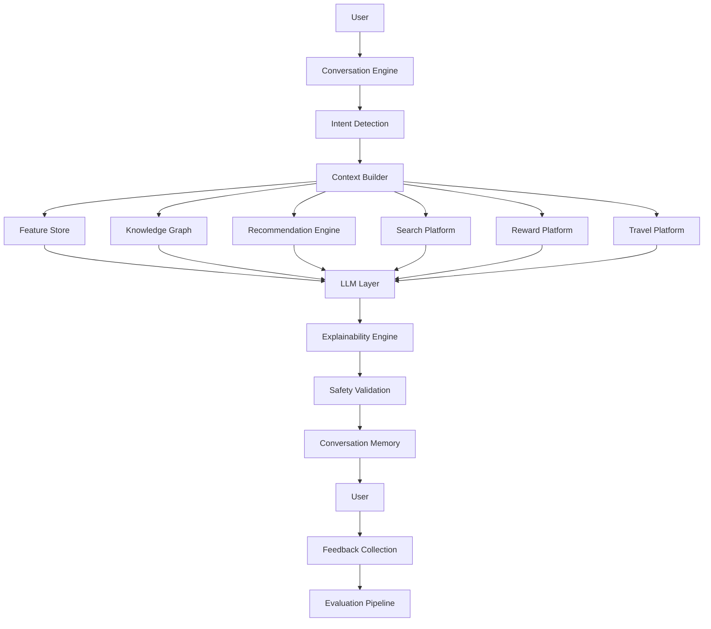

---

# Operational Considerations

| Area | Strategy |
|------|----------|
| Availability | Gracefully degrade to deterministic recommendations if LLM services are unavailable |
| Latency | Retrieve structured context before invoking language models |
| Consistency | Base explanations on recommendation metadata rather than regenerated reasoning |
| Privacy | Store only necessary conversational context and honor user retention controls |
| Observability | Track intent accuracy, latency, satisfaction, and completion metrics |
| Scalability | Keep conversation orchestration stateless with externalized session storage |

---

# Best Practices

- Separate conversation orchestration from recommendation logic.
- Never allow the Copilot to bypass deterministic financial rules.
- Ground every explanation using platform-generated evidence.
- Ask clarifying questions instead of making assumptions.
- Preserve conversation continuity using structured memory.
- Capture both explicit and implicit feedback for continuous improvement.
- Provide transparent confidence and limitations for every recommendation.

---

# Trade-offs

| Decision | Benefits | Trade-offs |
|----------|----------|------------|
| Rich conversational memory | Better multi-turn experience | Additional privacy and storage considerations |
| Structured explanations | Greater trust and consistency | Less conversational flexibility |
| Goal-driven planning | Higher long-term engagement | More state management complexity |
| Context-rich orchestration | More personalized responses | Increased retrieval latency |

---

# Risks

| Risk | Mitigation |
|------|------------|
| Hallucinated explanations | Use recommendation metadata and RAG grounding |
| Loss of conversation context | Structured session memory with recovery mechanisms |
| User over-reliance on AI | Clearly communicate assumptions and limitations |
| Privacy leakage | Minimize retained context and enforce strict access controls |
| Conflicting platform signals | Deterministic precedence rules and validation before response generation |

# 16. Search Intelligence

**Section ID:** SEARCH-100

The Search Intelligence Platform powers every search experience within CardWise.

Unlike conventional keyword-based search engines, CardWise Search combines:

- Full-text retrieval
- Semantic search
- Hybrid search
- Knowledge Graph traversal
- Personalized ranking
- Recommendation-aware retrieval
- LLM-assisted query understanding

to deliver highly relevant, context-aware, and explainable search results.

The platform is responsible for enabling users to quickly discover:

- Credit cards
- Offers
- Merchants
- Reward programs
- Airlines
- Hotels
- Lounges
- Benefits
- Travel partners
- AI-generated answers grounded in platform data

Search is treated as a first-class AI capability rather than a utility feature.

---

# Objectives

| ID | Objective |
|-----|----------|
| SEARCH-101 | Deliver highly relevant search results |
| SEARCH-102 | Support natural language queries |
| SEARCH-103 | Enable semantic understanding |
| SEARCH-104 | Personalize search rankings |
| SEARCH-105 | Minimize search latency |
| SEARCH-106 | Improve discovery of offers and rewards |
| SEARCH-107 | Integrate Knowledge Graph reasoning |
| SEARCH-108 | Support hybrid retrieval |
| SEARCH-109 | Continuously improve through feedback |
| SEARCH-110 | Explain search rankings |

---

# High-Level Search Architecture

```text
User Query
      │
      ▼
Query Understanding
      │
      ▼
Intent Detection
      │
      ▼
Query Enrichment
      │
      ▼
Hybrid Retrieval
      │
 ┌────┴───────────┐
 ▼                ▼
Keyword Search   Vector Search
 │                │
 └──────┬─────────┘
        ▼
Knowledge Graph Expansion
        ▼
Candidate Fusion
        ▼
Ranking
        ▼
Re-ranking
        ▼
Personalization
        ▼
Search Results
```

---

# Search Components

| Component | Stable ID | Responsibility |
|------------|-----------|----------------|
| Query Understanding | SEARCH-QUERY | Parse user intent |
| Keyword Engine | SEARCH-KEYWORD | Lexical retrieval |
| Vector Engine | VECTOR-SEARCH | Semantic retrieval |
| Knowledge Graph Search | KG-SEARCH | Relationship expansion |
| Ranking Engine | RANK-CORE | Initial ranking |
| Re-ranking Engine | RANK-RERANK | Final ordering |
| Personalization | SEARCH-PER | User-aware ranking |
| Search Analytics | SEARCH-ANALYTICS | Continuous improvement |

---

# Query Understanding

**Section ID:** SEARCH-QUERY

The Query Understanding Engine converts natural language into structured search intent.

---

## Responsibilities

- Language normalization
- Spell correction
- Synonym expansion
- Intent detection
- Entity recognition
- Query rewriting
- Context incorporation
- Ambiguity resolution

---

## Example Queries

| User Query | Structured Intent |
|------------|-------------------|
| Best card for fuel | Category: Fuel, Intent: Recommendation |
| Cashback on Amazon | Merchant: Amazon, Benefit: Cashback |
| Lounge in Bangalore airport | Airport: Bangalore, Entity: Lounge |
| Best airline transfer | Reward Transfer Intent |
| Hotel rewards in Japan | Destination + Hotel Rewards |

---

# Search Domains

| Domain | Examples |
|----------|----------|
| Credit Cards |
| Banks |
| Merchants |
| Offers |
| Rewards |
| Airlines |
| Hotels |
| Airports |
| Lounges |
| Merchant Categories |
| Travel Destinations |
| Knowledge Articles |

---

# Semantic Search

**Section ID:** SEARCH-SEMANTIC

Semantic Search retrieves conceptually relevant information instead of relying solely on exact keyword matches.

This allows users to express intent naturally.

---

## Semantic Retrieval Sources

- User embeddings
- Merchant embeddings
- Card embeddings
- Offer embeddings
- Reward embeddings
- Travel embeddings
- Knowledge Graph embeddings
- Document embeddings

---

## Semantic Search Benefits

| Benefit | Description |
|----------|-------------|
| Natural language | Understand conversational queries |
| Synonym awareness | Match similar concepts |
| Contextual understanding | Interpret intent |
| Discovery | Find related entities |
| Personalization | Better relevance |

---

## Example

Instead of matching:

```
Travel Card
```

the engine understands:

- Airline rewards
- Hotel benefits
- Lounge access
- Foreign exchange
- International spending
- Travel insurance

---

# Hybrid Search

**Section ID:** SEARCH-HYBRID

Hybrid Search combines lexical precision with semantic understanding.

This approach delivers higher recall while maintaining ranking quality.

---

## Hybrid Pipeline

```text
Query

↓

Keyword Retrieval

+

Vector Retrieval

↓

Knowledge Graph Expansion

↓

Candidate Fusion

↓

Ranking

↓

Re-ranking

↓

Personalization
```

---

## Retrieval Sources

| Source | Strength |
|----------|----------|
| Keyword Search | Exact matches |
| Vector Search | Semantic similarity |
| Knowledge Graph | Relationship discovery |
| Recommendation Metadata | Context |
| Feature Store | Personalization |

---

# Embedding Platform

**Section ID:** EMB-SEARCH

Embeddings power semantic retrieval across the entire search ecosystem.

Each searchable entity has an associated semantic representation.

---

## Embedded Entity Types

| Entity | Purpose |
|----------|---------|
| User | Personalization |
| Merchant | Similar merchants |
| Credit Card | Similar cards |
| Offers | Offer discovery |
| Rewards | Reward search |
| Hotels | Travel |
| Airlines | Travel |
| Documents | Knowledge retrieval |

---

## Embedding Lifecycle

```text
Entity Created

↓

Metadata Update

↓

Embedding Generation

↓

Validation

↓

Vector Index

↓

Online Search

↓

Periodic Refresh
```

---

## Embedding Quality Goals

| Goal | Description |
|------|-------------|
| High recall | Retrieve relevant entities |
| Low latency | Fast nearest-neighbor lookup |
| Freshness | Reflect recent changes |
| Consistency | Same representation online/offline |
| Explainability | Associate embeddings with metadata |

---

# Vector Database

**Section ID:** VECTOR-100

The Vector Database stores semantic representations of entities and enables nearest-neighbor retrieval.

It complements, rather than replaces, relational databases and search indexes.

---

## Stored Vector Types

| Vector | Source |
|---------|--------|
| User | Behavioral profile |
| Merchant | Merchant intelligence |
| Card | Card metadata |
| Reward | Reward characteristics |
| Offer | Offer metadata |
| Travel | Travel entities |
| Documentation | Knowledge base |

---

## Responsibilities

- Similarity search
- Nearest-neighbor lookup
- Approximate vector retrieval
- Metadata filtering
- Version management
- Index maintenance

---

# Ranking Engine

**Section ID:** RANK-CORE

The Ranking Engine orders retrieved candidates according to relevance before personalization.

Ranking combines deterministic scoring with machine learning signals.

---

## Ranking Signals

| Signal | Importance |
|---------|------------|
| Text relevance | High |
| Semantic similarity | High |
| Recommendation score | High |
| Popularity | Medium |
| Freshness | High |
| Knowledge Graph proximity | Medium |
| User behavior | High |
| Business priority | Medium |

---

## Initial Ranking Objectives

- Maximize relevance
- Preserve diversity
- Prioritize freshness
- Respect eligibility
- Minimize latency

---

# Re-ranking Engine

**Section ID:** RANK-RERANK

The Re-ranking Engine applies advanced personalization and contextual reasoning to the top-ranked candidates.

---

## Re-ranking Inputs

- User embeddings
- Session intent
- Current context
- Recommendation metadata
- Merchant affinity
- Search history
- Feature Store
- Knowledge Graph

---

## Re-ranking Goals

| Goal | Description |
|------|-------------|
| Personalization | Adapt to user |
| Context Awareness | Current intent |
| Diversity | Avoid repetition |
| Explainability | Transparent ordering |
| Fairness | Balanced exposure |

---

# Personalization Layer

**Section ID:** SEARCH-PER

Search personalization ensures two users issuing the same query may receive different result rankings based on their preferences and context.

---

## Personalization Signals

| Signal | Source |
|----------|---------|
| User Embedding | Behavior |
| Merchant Affinity | Affinity Engine |
| Travel Preference | User Intelligence |
| Reward Preference | Feature Store |
| Search History | Analytics |
| Session Intent | Conversation |
| Location | Context |
| Device | Context |

---

## Personalization Rules

- Never violate eligibility.
- Preserve search diversity.
- Explain major ranking changes.
- Respect explicit user preferences.
- Fall back gracefully for new users.

---

# Search Analytics

**Section ID:** SEARCH-ANALYTICS

Every search interaction becomes a learning signal.

Analytics are used to improve retrieval, ranking, and query understanding.

---

## Metrics Collected

| Metric | Purpose |
|----------|---------|
| Query frequency | Popularity |
| Click-through rate | Relevance |
| Reformulation rate | Query quality |
| Zero-result rate | Coverage |
| Dwell time | Satisfaction |
| Conversion | Recommendation effectiveness |
| Search latency | Performance |
| Abandonment | UX quality |

---

## Feedback Sources

- Clicks
- Saves
- Recommendation acceptance
- Search refinements
- Copilot interactions
- Explicit ratings
- Session completion

---

# End-to-End Search Flow

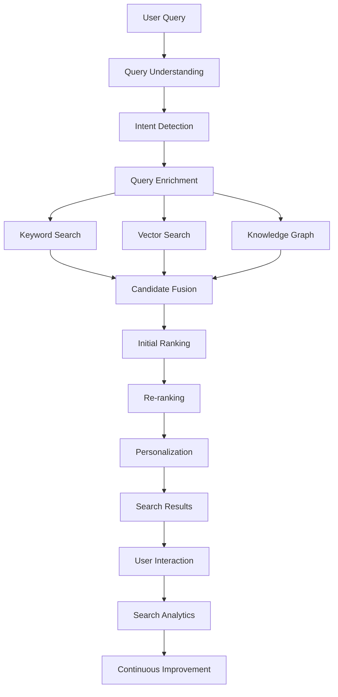

---

# Search Explainability

**Section ID:** SEARCH-EXPLAIN

Search results should be explainable to improve transparency and user trust.

---

## Explainability Sources

| Source | Example |
|----------|----------|
| Keyword Match | Exact query terms |
| Semantic Similarity | Related concepts |
| Recommendation Score | Platform intelligence |
| Merchant Affinity | User behavior |
| Reward Match | Relevant benefits |
| Knowledge Graph | Connected entities |

---

## Explanation Metadata

Every search result may include:

- Matching signals
- Ranking confidence
- Recommendation relevance
- Related entities
- Personalization factors
- Freshness timestamp

---

# Operational Considerations

| Area | Strategy |
|------|----------|
| Availability | Separate search infrastructure from transactional services |
| Latency | Parallel lexical and vector retrieval with bounded response times |
| Freshness | Incremental indexing and near real-time vector updates |
| Scalability | Independent scaling of indexing, retrieval, and ranking services |
| Consistency | Version embeddings, indexes, and ranking models together |
| Observability | Monitor retrieval quality, latency, and ranking effectiveness |

---

# Best Practices

- Separate retrieval from ranking and re-ranking.
- Combine lexical and semantic search rather than relying on either individually.
- Keep embeddings synchronized with source entities.
- Personalize only after relevance has been established.
- Continuously evaluate ranking quality using offline and online metrics.
- Record ranking features for explainability and experimentation.
- Use Knowledge Graph expansion to improve discovery, not to override relevance.

---

# Trade-offs

| Decision | Benefits | Trade-offs |
|----------|----------|------------|
| Hybrid search | High precision and recall | Increased infrastructure complexity |
| Multi-stage ranking | Better relevance | Additional inference latency |
| Personalized search | More relevant results | Higher computational cost |
| Semantic retrieval | Better natural language support | Ongoing embedding maintenance |

---

# Risks

| Risk | Mitigation |
|------|------------|
| Irrelevant semantic matches | Hybrid retrieval with deterministic ranking signals |
| Embedding drift | Scheduled regeneration and quality monitoring |
| Personalization bias | Diversity-aware re-ranking and exploration strategies |
| Index staleness | Event-driven incremental indexing |
| High search latency | Parallel retrieval, caching, and optimized re-ranking |

# 17. AI Infrastructure

**Section ID:** PIPE-100

The AI Infrastructure Platform provides the foundational systems required to build, deploy, operate, and scale all AI capabilities within CardWise.

It enables reliable, low-latency, highly available, and continuously learning AI services while remaining independent of any specific model provider.

The infrastructure is designed around four core principles:

- **Offline Intelligence** — Large-scale feature computation, model training, graph enrichment, evaluation, and experimentation.
- **Online Intelligence** — Real-time feature serving, recommendation inference, semantic search, and conversational AI.
- **Streaming Intelligence** — Continuous ingestion of user behavior, merchant updates, offer changes, and transaction events.
- **Operational Excellence** — Monitoring, observability, governance, resilience, and cost optimization.

---

# Objectives

| ID | Objective |
|-----|----------|
| PIPE-101 | Support low-latency AI inference |
| PIPE-102 | Enable continuous feature updates |
| PIPE-103 | Scale recommendation infrastructure independently |
| PIPE-104 | Support streaming and batch processing |
| PIPE-105 | Provide reliable model serving |
| PIPE-106 | Enable reproducible ML workflows |
| PIPE-107 | Maintain high availability |
| PIPE-108 | Optimize infrastructure cost |
| PIPE-109 | Ensure observability across AI systems |
| PIPE-110 | Support continuous experimentation |

---

# High-Level AI Infrastructure

```text
Data Sources
      │
      ▼
Streaming Platform
      │
      ▼
Feature Engineering
      │
 ┌────┴─────────┐
 ▼              ▼
Offline Store   Online Store
 │              │
 ▼              ▼
Model Training  Real-time Inference
 │              │
 ▼              ▼
Model Registry  Recommendation Engine
 │              │
 └──────┬───────┘
        ▼
Monitoring & Governance
```

---

# Infrastructure Components

| Component | Stable ID | Responsibility |
|-----------|-----------|----------------|
| Streaming Platform | PIPE-STREAM | Event ingestion |
| Feature Pipeline | PIPE-FEATURE | Feature computation |
| Offline Processing | PIPE-OFFLINE | Batch intelligence |
| Online Inference | PIPE-ONLINE | Real-time serving |
| Model Serving | MODEL-SERVE | Model execution |
| Cache Layer | CACHE-AI | Low-latency access |
| Vector Platform | VECTOR-INFRA | Semantic retrieval |
| Monitoring Platform | METRIC-INFRA | AI observability |

---

# Offline Pipeline

**Section ID:** PIPE-OFFLINE

The Offline Pipeline performs computationally intensive AI workloads that do not require immediate user interaction.

These pipelines generate reusable intelligence artifacts for online serving.

---

## Offline Responsibilities

- Feature engineering
- Embedding generation
- Recommendation evaluation
- Knowledge graph enrichment
- User segmentation
- Merchant intelligence
- Historical analytics
- Model training datasets
- Ranking evaluation

---

## Offline Workflow

```text
Raw Data

↓

Validation

↓

Transformation

↓

Feature Engineering

↓

Embedding Generation

↓

Graph Enrichment

↓

Model Training

↓

Evaluation

↓

Artifact Publication
```

---

## Offline Outputs

| Output | Consumer |
|----------|----------|
| Feature Tables | Feature Store |
| User Embeddings | Vector Database |
| Merchant Embeddings | Search |
| Knowledge Graph Updates | Graph Platform |
| Model Artifacts | Model Serving |
| Evaluation Reports | AI Operations |

---

# Online Inference

**Section ID:** PIPE-ONLINE

Online inference powers all real-time AI interactions.

The primary objective is to produce highly personalized responses within strict latency budgets.

---

## Online Consumers

- Recommendation Engine
- AI Copilot
- Search Platform
- Personalization
- Offer Ranking
- Merchant Intelligence
- Travel Intelligence
- Reward Optimization

---

## Online Inference Flow

```text
Request

↓

Retrieve Online Features

↓

Retrieve Embeddings

↓

Retrieve Graph Context

↓

Model Inference

↓

Business Rules

↓

Ranking

↓

Response
```

---

## Latency Targets

| Component | Target |
|-----------|--------|
| Feature Retrieval | <10 ms |
| Cache Lookup | <5 ms |
| Vector Search | <25 ms |
| Recommendation Ranking | <40 ms |
| Online Inference | <75 ms |
| End-to-End AI Response | <200 ms (excluding LLM generation where applicable) |

---

# Streaming Platform

**Section ID:** PIPE-STREAM

Streaming enables continuous learning and near real-time updates across the AI ecosystem.

Event-driven processing minimizes stale recommendations and accelerates personalization.

---

## Event Sources

| Source | Examples |
|----------|----------|
| User Activity | Clicks, searches |
| Transactions | Payments |
| Merchant Updates | New merchants |
| Offers | Offer creation, expiry |
| Rewards | Earned, redeemed |
| Travel | Booking events |
| Copilot | Conversations |
| Feedback | Ratings |

---

## Stream Consumers

- Feature Store
- Embedding Service
- Recommendation Engine
- Search Platform
- Knowledge Graph
- Monitoring
- Analytics

---

## Streaming Principles

- Immutable events
- Ordered processing
- Idempotent consumers
- Retry mechanisms
- Dead-letter handling
- Schema versioning

---

# Batch Processing

**Section ID:** PIPE-BATCH

Batch processing complements streaming by handling workloads that benefit from large-scale computation.

---

## Batch Jobs

| Job | Frequency |
|------|-----------|
| User Segmentation | Daily |
| Embedding Refresh | Daily |
| Merchant Intelligence | Daily |
| Graph Rebuild | Weekly (or incremental continuously) |
| Recommendation Evaluation | Daily |
| Ranking Metrics | Hourly/Daily |
| Cost Analytics | Daily |
| Drift Reports | Daily |

---

## Batch Design Goals

- Repeatability
- Incremental computation
- Fault recovery
- Cost efficiency
- Data consistency

---

# Feature Store Infrastructure

**Section ID:** PIPE-FS

The Feature Store provides a unified source for serving ML features in both offline training and online inference.

---

## Core Responsibilities

- Feature versioning
- Online serving
- Offline training consistency
- Point-in-time correctness
- Feature lineage
- Metadata management

---

## Feature Categories

| Category | Examples |
|----------|----------|
| User | Spend patterns |
| Merchant | Popularity |
| Card | Reward multipliers |
| Offer | Eligibility |
| Context | Device, location |
| Travel | Upcoming trips |
| Session | Active intent |

---

## Infrastructure Requirements

- Low latency
- High availability
- Strong consistency guarantees
- Version management
- Auditability

---

# Cache Strategy

**Section ID:** CACHE-100

Caching minimizes expensive computations and reduces inference latency.

Different cache layers are optimized for different workloads.

---

## Cache Layers

| Cache | Purpose |
|--------|----------|
| Feature Cache | Online features |
| Recommendation Cache | Frequently requested recommendations |
| Search Cache | Popular queries |
| Embedding Cache | Recently accessed vectors |
| Prompt Cache | Reusable prompt assembly |
| Knowledge Cache | Graph traversals |
| Session Cache | Conversation state |

---

## Cache Invalidation

Triggers include:

- User profile updates
- Offer expiration
- Merchant changes
- Card portfolio updates
- Reward balance changes
- Travel bookings
- Recommendation strategy updates

---

## Caching Principles

- TTL-based expiration
- Event-driven invalidation
- Read-through caching
- Version-aware keys
- Hot data prioritization

---

# Model Serving

**Section ID:** MODEL-SERVE

Model Serving provides standardized deployment and inference for machine learning models.

Models are exposed through versioned serving endpoints with centralized governance.

---

## Responsibilities

- Model loading
- Version routing
- Canary deployments
- Rollback support
- Autoscaling
- Health monitoring
- Inference logging
- Resource isolation

---

## Supported Model Types

| Model | Purpose |
|--------|---------|
| Ranking Models | Recommendation |
| Classification Models | Intent detection |
| Embedding Models | Semantic search |
| Re-ranking Models | Search optimization |
| Personalization Models | User adaptation |
| Forecasting Models | Reward projections |

---

## Model Lifecycle

```text
Training

↓

Validation

↓

Registry

↓

Approval

↓

Deployment

↓

Monitoring

↓

Retirement
```

---

# Infrastructure Resilience

**Section ID:** PIPE-RESILIENCE

AI infrastructure should gracefully degrade without affecting critical user journeys.

---

## Fallback Strategy

| Component Failure | Fallback |
|-------------------|----------|
| Embedding Service | Keyword search |
| Vector Database | Lexical retrieval |
| Recommendation Model | Deterministic ranking |
| Feature Store | Cached features |
| Knowledge Graph | Cached relationships |
| LLM Provider | Alternative provider or deterministic explanations |
| Streaming Platform | Buffered ingestion and replay |

---

## Resilience Principles

- Stateless services
- Horizontal scaling
- Graceful degradation
- Circuit breakers
- Retry with backoff
- Bulkhead isolation
- Health-based routing

---

# Mermaid Infrastructure Architecture

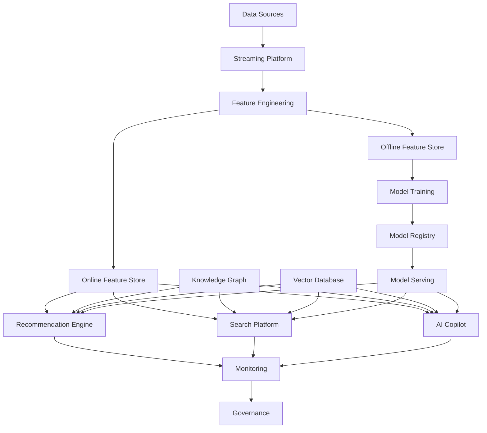

---

# Capacity Planning

| Area | Scaling Strategy |
|------|------------------|
| Streaming | Partition-based horizontal scaling |
| Feature Store | Read replicas and sharding |
| Vector Search | Distributed ANN indexes |
| Recommendation Engine | Stateless autoscaling |
| Model Serving | Autoscaling by inference load |
| Cache | Distributed in-memory clusters |
| Knowledge Graph | Read replicas and graph partitioning |

---

# Operational Considerations

| Area | Strategy |
|------|----------|
| Availability | Multi-instance deployments with automatic failover |
| Performance | Optimize critical inference paths and minimize synchronous dependencies |
| Scalability | Independently scale retrieval, inference, and serving layers |
| Cost | Tier workloads based on latency requirements and model complexity |
| Observability | End-to-end tracing across all AI infrastructure components |
| Disaster Recovery | Automated backups, replayable event streams, and regional redundancy |

---

# Best Practices

- Decouple offline training from online inference.
- Treat features as reusable platform assets.
- Version every deployable AI artifact independently.
- Design streaming pipelines to be idempotent.
- Prefer incremental computation over full recomputation.
- Cache expensive graph traversals and inference results.
- Build graceful degradation into every AI service.
- Continuously validate infrastructure latency against SLOs.

---

# Trade-offs

| Decision | Benefits | Trade-offs |
|----------|----------|------------|
| Separate offline and online pipelines | Better scalability and reliability | More operational complexity |
| Heavy use of caching | Lower latency and infrastructure cost | Cache invalidation complexity |
| Event-driven architecture | Near real-time intelligence | Increased distributed systems complexity |
| Independent model serving | Flexible deployment and rollback | Additional platform overhead |

---

# Risks

| Risk | Mitigation |
|------|------------|
| Inference latency spikes | Autoscaling, caching, and performance budgets |
| Event backlog | Partition scaling and replay mechanisms |
| Feature inconsistency | Unified Feature Store with version control |
| Model serving outages | Health-based routing and deterministic fallbacks |
| Infrastructure cost growth | Continuous capacity planning and workload optimization |

# 18. AI Operations (AIOps)

**Section ID:** AIOPS-100

The AI Operations (AIOps) Platform governs the complete operational lifecycle of CardWise's AI ecosystem.

Unlike traditional MLOps, which focuses primarily on model deployment, CardWise AIOps manages the lifecycle of:

- Recommendation Strategies
- ML Models
- Ranking Pipelines
- Embedding Models
- Prompt Templates
- LLM Providers
- Knowledge Graphs
- Feature Definitions
- Evaluation Pipelines
- Experiments
- AI Safety Policies

The objective is to ensure that every AI decision is:

- Observable
- Explainable
- Reproducible
- Auditable
- Safe
- Continuously improving

---

# Objectives

| ID | Objective |
|-----|----------|
| AIOPS-101 | Govern the complete AI lifecycle |
| AIOPS-102 | Continuously evaluate AI quality |
| AIOPS-103 | Detect model and data drift |
| AIOPS-104 | Enable safe experimentation |
| AIOPS-105 | Support controlled rollouts |
| AIOPS-106 | Maintain reproducibility |
| AIOPS-107 | Ensure AI compliance |
| AIOPS-108 | Provide operational observability |
| AIOPS-109 | Optimize AI cost and performance |
| AIOPS-110 | Enable rapid rollback |

---

# AIOps Architecture

```text
AI Components
      │
      ▼
Version Registry
      │
      ▼
Deployment Manager
      │
      ▼
Monitoring
      │
      ▼
Evaluation
      │
      ▼
Drift Detection
      │
      ▼
Experimentation
      │
      ▼
Governance
      │
      ▼
Continuous Improvement
```

---

# AI Governance Domains

| Domain | Stable ID | Responsibility |
|----------|-----------|----------------|
| Model Governance | MODEL-GOV | ML model lifecycle |
| Prompt Governance | PROMPT-GOV | Prompt lifecycle |
| Feature Governance | FEATURE-GOV | Feature management |
| Embedding Governance | EMB-GOV | Vector quality |
| Graph Governance | KG-GOV | Knowledge graph quality |
| Recommendation Governance | REC-GOV | Ranking strategy |
| Experiment Platform | EXP-CORE | Controlled experiments |
| Monitoring Platform | METRIC-AI | AI observability |

---

# Model Governance

**Section ID:** MODEL-GOV

Every deployed model is treated as a governed production artifact.

No model may be deployed without passing defined evaluation and approval gates.

---

## Model Lifecycle

```text
Training

↓

Validation

↓

Offline Evaluation

↓

Approval

↓

Canary Deployment

↓

Production

↓

Monitoring

↓

Retirement
```

---

## Governance Metadata

| Field | Purpose |
|--------|----------|
| Model Version | Traceability |
| Owner | Accountability |
| Training Dataset | Lineage |
| Feature Version | Reproducibility |
| Evaluation Metrics | Quality |
| Approval Status | Governance |
| Deployment Date | Audit |
| Rollback Version | Recovery |

---

## Governance Policies

- Immutable production versions
- Reproducible training
- Approval workflow
- Audit logging
- Rollback readiness
- Version compatibility

---

# Prompt Governance

**Section ID:** PROMPT-GOV

Prompt templates are managed as production assets.

Prompt changes can significantly alter system behavior and therefore require controlled governance.

---

## Prompt Lifecycle

```text
Draft

↓

Review

↓

Offline Evaluation

↓

Experiment

↓

Approval

↓

Production

↓

Monitoring

↓

Retirement
```

---

## Managed Metadata

| Metadata | Description |
|-----------|-------------|
| Prompt Version | Version control |
| Target Models | Compatibility |
| Safety Classification | Risk level |
| Output Schema | Expected structure |
| Owner | Accountability |
| Evaluation Results | Quality |
| Deployment Status | Release stage |

---

## Governance Principles

- Backward compatibility
- Version isolation
- Controlled rollout
- Rollback support
- Approval workflow
- Experiment tracking

---

# Recommendation Governance

**Section ID:** REC-GOV

Recommendation logic evolves continuously through business policies, ML improvements, and experimentation.

Governance ensures these changes remain safe, measurable, and explainable.

---

## Governed Components

- Candidate generation
- Ranking strategies
- Personalization rules
- Business constraints
- Eligibility rules
- Explainability metadata
- Recommendation weights

---

## Change Controls

| Control | Purpose |
|----------|----------|
| Versioning | Traceability |
| Simulation | Offline validation |
| Canary rollout | Risk reduction |
| Rollback | Recovery |
| Monitoring | Quality assurance |

---

# Experimentation Platform

**Section ID:** EXP-100

Experimentation enables evidence-based evolution of AI systems.

Every significant AI change should be validated through controlled experimentation before full deployment.

---

## Experiment Types

| Experiment | Description |
|------------|-------------|
| Ranking comparison | Evaluate ranking algorithms |
| Prompt evaluation | Compare prompt versions |
| Embedding comparison | Test embedding quality |
| Search evaluation | Retrieval improvements |
| Recommendation strategies | Optimize user outcomes |
| UI experiments | Presentation testing |

---

## Experiment Lifecycle

```text
Hypothesis

↓

Experiment Design

↓

Traffic Allocation

↓

Measurement

↓

Evaluation

↓

Decision

↓

Production Rollout
```

---

## Experiment Metadata

- Experiment ID
- Owner
- Start Date
- End Date
- Hypothesis
- Metrics
- Success Criteria
- Rollout Strategy
- Rollback Plan

---

# A/B Testing

**Section ID:** EXP-AB

A/B testing validates changes using statistically meaningful user cohorts.

---

## Supported Experiments

| Area | Examples |
|------|----------|
| Recommendation ranking |
| Search ranking |
| Copilot responses |
| Prompt templates |
| Personalization logic |
| UI explanations |
| Goal planning |

---

## Allocation Strategies

| Strategy | Use Case |
|-----------|----------|
| Random Split | General experiments |
| Segment-based | Targeted users |
| Geographic | Regional testing |
| Feature Flag | Incremental rollout |
| Canary | Production safety |

---

## Success Metrics

- Recommendation acceptance
- Search satisfaction
- User engagement
- Goal completion
- Reward optimization
- Response latency
- User retention
- Conversation quality

---

# Evaluation Platform

**Section ID:** METRIC-EVAL

Evaluation measures AI quality before and after deployment.

Both offline and online evaluation are required.

---

## Offline Metrics

| Metric | Description |
|---------|-------------|
| Precision | Recommendation relevance |
| Recall | Candidate coverage |
| NDCG | Ranking quality |
| MAP | Search quality |
| MRR | Retrieval effectiveness |
| Coverage | Recommendation diversity |

---

## Online Metrics

| Metric | Description |
|---------|-------------|
| CTR | User engagement |
| Acceptance Rate | Recommendation adoption |
| Conversion Rate | Goal completion |
| Session Success | User satisfaction |
| Search Success | Relevant retrieval |
| Copilot Satisfaction | Conversation quality |

---

## Business Metrics

- Reward value generated
- Cashback generated
- Offer redemption
- Travel savings
- Portfolio optimization
- Active user growth
- Retention
- Revenue impact

---

# Drift Detection

**Section ID:** METRIC-DRIFT

Production AI systems evolve over time.

Drift detection continuously monitors changes in data, user behavior, and model performance.

---

## Drift Types

| Drift | Description |
|---------|-------------|
| Data Drift | Input distribution changes |
| Feature Drift | Feature value changes |
| Concept Drift | Behavior changes |
| Embedding Drift | Vector quality degradation |
| Ranking Drift | Search changes |
| Prompt Drift | LLM behavior changes |

---

## Detection Workflow

```text
Production Traffic

↓

Metric Collection

↓

Baseline Comparison

↓

Drift Detection

↓

Alert

↓

Investigation

↓

Mitigation
```

---

## Drift Actions

- Alert engineering
- Retrain models
- Refresh embeddings
- Update features
- Adjust ranking
- Roll back deployments

---

# AI Monitoring

**Section ID:** METRIC-AI

Monitoring provides operational visibility across every AI subsystem.

---

## Monitoring Categories

| Category | Examples |
|-----------|----------|
| Infrastructure | CPU, memory |
| Latency | Inference time |
| Availability | Service uptime |
| Recommendation | Acceptance rate |
| Search | Query quality |
| Copilot | Conversation quality |
| Embeddings | Retrieval quality |
| Costs | Token usage, compute spend |

---

## Alert Categories

- Latency threshold exceeded
- Error rate increase
- Recommendation degradation
- Search failure
- Drift detected
- Cost anomaly
- Provider outage
- Feature inconsistency

---

# AI Observability

**Section ID:** METRIC-OBS

Every AI request should be fully traceable.

Observability spans infrastructure, retrieval, inference, ranking, explanations, and user feedback.

---

## Trace Metadata

| Metadata | Purpose |
|-----------|----------|
| Request ID | End-to-end tracing |
| Recommendation Version | Auditability |
| Prompt Version | LLM traceability |
| Model Version | Reproducibility |
| Feature Version | Consistency |
| Graph Version | Explainability |
| Ranking Version | Evaluation |
| User Feedback | Continuous learning |

---

# Mermaid AIOps Flow

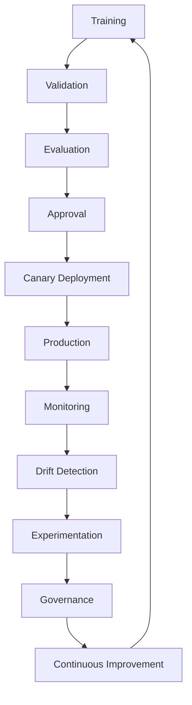

---

# Operational Considerations

| Area | Strategy |
|------|----------|
| Governance | Require approvals and audit trails for every production AI artifact |
| Deployment | Use progressive rollouts with automated rollback criteria |
| Reliability | Continuously monitor latency, availability, and quality metrics |
| Cost | Track infrastructure, inference, and LLM usage separately |
| Compliance | Maintain immutable deployment and evaluation history |
| Incident Response | Define AI-specific runbooks for quality degradation and provider failures |

---

# Best Practices

- Govern prompts, models, ranking strategies, and features independently.
- Evaluate every AI change before production rollout.
- Use canary deployments for high-impact changes.
- Continuously compare online performance against offline expectations.
- Automate drift detection and quality alerts.
- Version every AI artifact and dependency.
- Preserve complete lineage for reproducibility and audits.
- Define clear rollback criteria for every deployment.

---

# Trade-offs

| Decision | Benefits | Trade-offs |
|----------|----------|------------|
| Comprehensive governance | Higher reliability and compliance | Increased operational overhead |
| Frequent experimentation | Faster product improvement | More complex analysis and traffic management |
| Continuous monitoring | Early issue detection | Higher infrastructure and storage costs |
| Strict approval workflows | Reduced production risk | Slower deployment velocity |

---

# Risks

| Risk | Mitigation |
|------|------------|
| Undetected quality degradation | Continuous monitoring with automated alerts |
| Experiment contamination | Isolated cohorts and controlled traffic allocation |
| Drift accumulation | Scheduled evaluation and retraining pipelines |
| Governance bypass | Mandatory approval gates and immutable audit logs |
| Rollback complexity | Versioned artifacts and automated deployment tooling |

# 19. Security, Compliance & Responsible AI

**Section ID:** SAFETY-100

The AI Platform processes sensitive financial, behavioral, and contextual information to deliver intelligent recommendations. As such, security, privacy, governance, and responsible AI are foundational architectural requirements rather than optional capabilities.

The platform must ensure:

- Protection of user data
- Responsible use of AI
- Regulatory compliance
- Explainable recommendations
- Fair and unbiased decision making
- Secure AI infrastructure
- Auditable AI operations
- Trustworthy user experiences

Security and Responsible AI requirements apply uniformly across:

- Recommendation Engine
- AI Copilot
- Search Intelligence
- Feature Store
- Knowledge Graph
- Embedding Platform
- Model Serving
- LLM Gateway
- Prompt Orchestrator
- AI Operations

---

# Objectives

| ID | Objective |
|-----|----------|
| SAFETY-101 | Protect user data throughout the AI lifecycle |
| SAFETY-102 | Enforce responsible AI practices |
| SAFETY-103 | Prevent unauthorized AI behavior |
| SAFETY-104 | Maintain regulatory compliance |
| SAFETY-105 | Ensure explainable recommendations |
| SAFETY-106 | Detect and mitigate bias |
| SAFETY-107 | Support complete auditability |
| SAFETY-108 | Measure AI quality continuously |
| SAFETY-109 | Secure third-party AI integrations |
| SAFETY-110 | Maintain user trust |

---

# AI Security Architecture

```text
Client

↓

Authentication

↓

Authorization

↓

API Gateway

↓

AI Gateway

↓

Safety Layer

↓

Recommendation / Search / Copilot

↓

Monitoring

↓

Audit Logging

↓

Governance
```

---

# Security Principles

| Principle | Description |
|-----------|-------------|
| Zero Trust | Authenticate and authorize every request |
| Least Privilege | Grant only required access |
| Defense in Depth | Layered security controls |
| Secure by Default | Default-deny configurations |
| Privacy by Design | Data protection integrated into architecture |
| Fail Secure | Prefer safe failures over permissive behavior |
| Continuous Verification | Validate identities, data, and AI outputs |

---

# PII Handling

**Section ID:** SAFETY-PII

Personally Identifiable Information (PII) must be protected throughout the AI processing lifecycle.

AI systems should consume only the minimum information necessary to complete a task.

---

## PII Categories

| Category | Examples |
|----------|----------|
| Personal Identity | Name, email, phone |
| Financial | Card identifiers, account references |
| Behavioral | Spending history |
| Location | Home city, travel history |
| Device | Device identifiers |
| Authentication | Session identifiers |
| Support Conversations | User interactions |

---

## PII Controls

| Control | Purpose |
|----------|----------|
| Data Minimization | Process only necessary fields |
| Tokenization | Replace sensitive identifiers |
| Encryption | Protect data in transit and at rest |
| Access Control | Restrict privileged access |
| Retention Policies | Remove stale information |
| Audit Logging | Record access events |

---

## AI Processing Rules

- Never expose raw payment credentials.
- Avoid sending unnecessary PII to external AI providers.
- Prefer internal identifiers over personal identifiers.
- Apply masking before prompt construction.
- Limit conversational memory to the minimum required context.

---

# Responsible AI

**Section ID:** SAFETY-RESP

Responsible AI ensures recommendations remain fair, transparent, and aligned with user interests.

The platform prioritizes long-term user value over engagement optimization.

---

## Responsible AI Principles

| Principle | Description |
|-----------|-------------|
| Fairness | Avoid systematic disadvantage |
| Transparency | Explain important decisions |
| Accountability | Identify responsible owners |
| Human Oversight | Enable intervention when necessary |
| Reliability | Produce consistent outcomes |
| Privacy | Respect user data boundaries |
| Safety | Prevent harmful outputs |

---

## AI Decision Hierarchy

```text
Compliance Rules

↓

Security Policies

↓

Eligibility Rules

↓

Business Rules

↓

Recommendation Engine

↓

LLM Explanation
```

LLMs are never the authoritative source for financial eligibility or reward calculations.

---

# Bias Mitigation

**Section ID:** SAFETY-BIAS

Bias can originate from data, features, models, prompts, ranking logic, or feedback loops.

The platform continuously evaluates AI behavior to identify and reduce undesirable bias.

---

## Potential Bias Sources

| Source | Example |
|---------|----------|
| Historical Data | Legacy behavioral trends |
| User Feedback | Popularity amplification |
| Recommendation Ranking | Exposure imbalance |
| Prompt Templates | Leading language |
| Embeddings | Representation imbalance |
| Search Ranking | Rich-get-richer effects |

---

## Mitigation Strategies

| Strategy | Purpose |
|-----------|----------|
| Dataset Evaluation | Detect skewed data |
| Feature Review | Remove inappropriate signals |
| Diversity-aware Ranking | Broaden recommendations |
| Human Review | Validate sensitive changes |
| Experimentation | Measure fairness impact |
| Continuous Monitoring | Detect emerging bias |

---

# AI Explainability

**Section ID:** SAFETY-EXPLAIN

Explainability is mandatory for high-impact financial recommendations.

Users should understand why recommendations were generated and what factors influenced them.

---

## Explainability Components

| Component | Description |
|-----------|-------------|
| Recommendation Reason | Primary explanation |
| Supporting Factors | Key ranking signals |
| Alternatives | Other valid options |
| Confidence | Estimated certainty |
| Constraints | Eligibility or limitations |
| Data Freshness | Recency of supporting data |

---

## Explainability Standards

- Human-readable language
- Consistent reasoning
- Traceable recommendation lineage
- Stable explanation format
- Clear communication of uncertainty

---

# Compliance Framework

**Section ID:** SAFETY-COMPLIANCE

The AI platform should be designed to support applicable regulatory and contractual obligations across jurisdictions.

Compliance capabilities should be configurable to accommodate evolving legal requirements.

---

## Compliance Areas

| Area | Objective |
|------|-----------|
| Privacy | Protect personal information |
| Financial Regulations | Support compliant financial workflows |
| Data Governance | Control data lifecycle |
| AI Governance | Manage AI lifecycle responsibly |
| Security | Protect infrastructure and data |
| Audit | Enable traceability |

---

## Compliance Capabilities

- Immutable audit logs
- Versioned AI artifacts
- Data retention controls
- Access reviews
- Consent-aware processing
- Policy enforcement
- Incident reporting support

---

# Human Oversight

**Section ID:** SAFETY-HUMAN

Not every AI decision should be fully autonomous.

The platform should support human intervention for exceptional scenarios.

---

## Human Review Triggers

| Trigger | Example |
|----------|----------|
| Low confidence recommendations | Weak supporting evidence |
| Policy conflicts | Conflicting business rules |
| Model anomalies | Unexpected prediction behavior |
| User disputes | Recommendation challenges |
| Safety violations | Potentially harmful output |
| Compliance alerts | Regulatory concerns |

---

## Override Capabilities

- Recommendation suppression
- Manual ranking adjustment
- Prompt deactivation
- Model rollback
- Feature disabling
- Provider isolation

Every override should be logged and auditable.

---

# AI Metrics

**Section ID:** METRIC-200

AI quality should be measured across technical, user, and business dimensions.

---

## Technical Metrics

| Metric | Description |
|----------|-------------|
| Inference Latency | AI response time |
| Error Rate | Request failures |
| Availability | Service uptime |
| Throughput | Requests processed |
| Cache Hit Rate | Cache efficiency |
| Token Consumption | LLM usage |
| Retrieval Latency | Search performance |

---

## Recommendation Metrics

| Metric | Description |
|---------|-------------|
| Acceptance Rate | Recommendation adoption |
| Precision | Relevant recommendations |
| Coverage | Recommendation diversity |
| Confidence Distribution | Decision confidence |
| Explainability Coverage | Recommendations with explanations |

---

## Search Metrics

| Metric | Description |
|---------|-------------|
| Search Success Rate | Relevant retrieval |
| Zero-result Rate | Search coverage |
| Ranking Quality | Retrieval effectiveness |
| Semantic Recall | Vector search quality |

---

## Copilot Metrics

| Metric | Description |
|----------|-------------|
| Intent Accuracy | Correct intent detection |
| Conversation Completion | Successful interactions |
| Clarification Rate | Ambiguous conversations |
| User Satisfaction | Feedback quality |
| Grounded Response Rate | Responses supported by platform data |

---

## Operational Metrics

| Metric | Description |
|---------|-------------|
| Drift Events | Model and data drift |
| Rollback Frequency | Deployment quality |
| Experiment Success Rate | Innovation effectiveness |
| Infrastructure Cost | Operational efficiency |
| Provider Availability | External dependency health |

---

# Engineering Best Practices

**Section ID:** AI-BEST-100

## Architecture Principles

- Keep deterministic decision systems independent from LLMs.
- Build every AI capability as an independently deployable service.
- Version all AI artifacts separately (models, prompts, embeddings, features, graph schemas, ranking logic).
- Favor event-driven synchronization over periodic polling.
- Design for graceful degradation and deterministic fallbacks.

---

## Data Principles

- Maintain a single authoritative source for transactional data.
- Treat embeddings and derived features as reproducible artifacts.
- Enforce feature consistency between offline training and online inference.
- Preserve lineage for datasets, features, and models.
- Minimize retained sensitive information.

---

## AI Engineering Principles

- Ground responses using authoritative platform knowledge.
- Prefer explainable recommendations over opaque optimization.
- Measure every production AI component.
- Continuously evaluate recommendation quality.
- Detect and remediate drift proactively.
- Validate every production change through controlled experimentation.

---

## Reliability Principles

- Define latency budgets for every inference stage.
- Use progressive deployments with automated rollback.
- Implement health-based routing for external AI providers.
- Design every AI service with resilience and fault isolation.
- Monitor both infrastructure health and AI quality metrics.

---

# End-to-End AI Architecture Summary

The CardWise AI Platform is composed of multiple specialized intelligence systems that work together to produce accurate, explainable, and personalized financial recommendations.

| Layer | Primary Responsibility |
|--------|------------------------|
| User Intelligence | Behavioral understanding and personalization |
| Feature Store | Real-time and offline feature management |
| Knowledge Graph | Semantic reasoning and relationship modeling |
| Recommendation Engine | Decision optimization |
| Search Intelligence | Hybrid semantic retrieval |
| LLM Layer | Natural language reasoning and explanations |
| AI Copilot | Conversational financial assistant |
| AI Infrastructure | Serving, streaming, caching, and orchestration |
| AI Operations | Governance, experimentation, monitoring |
| Security & Responsible AI | Privacy, safety, compliance, trust |

---

# Final End-to-End AI Architecture

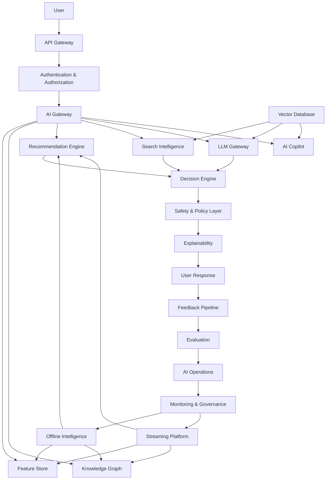

---

# Document Summary

This document defines the production-grade AI architecture for CardWise, establishing the platform as an AI-native financial intelligence system rather than a traditional recommendation engine.

Key architectural characteristics include:

- Hybrid AI combining deterministic rules, machine learning, Knowledge Graphs, semantic search, and LLMs.
- Clear separation between decision-making systems and natural language generation.
- Event-driven architecture supporting real-time personalization and continuous learning.
- Explainability and auditability embedded into every recommendation lifecycle.
- Independent governance of models, prompts, embeddings, features, ranking strategies, and graph schemas.
- Responsible AI principles emphasizing privacy, transparency, fairness, and human oversight.
- Scalable infrastructure supporting offline intelligence, online inference, streaming updates, and continuous experimentation.
- Comprehensive observability spanning infrastructure, AI quality, business outcomes, and operational health.

This architecture serves as the canonical engineering specification for all AI capabilities within the CardWise platform and should be referenced by backend, frontend, data platform, AI/ML, MLOps, DevOps, security, and product engineering teams when designing, implementing, or evolving AI-powered functionality.