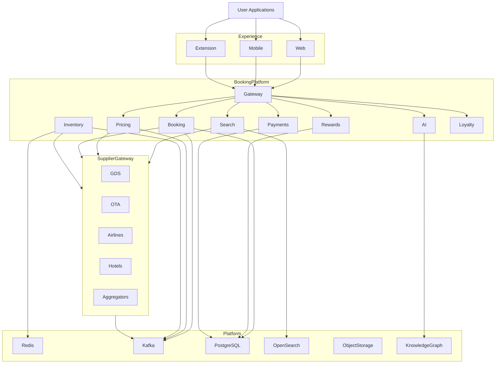
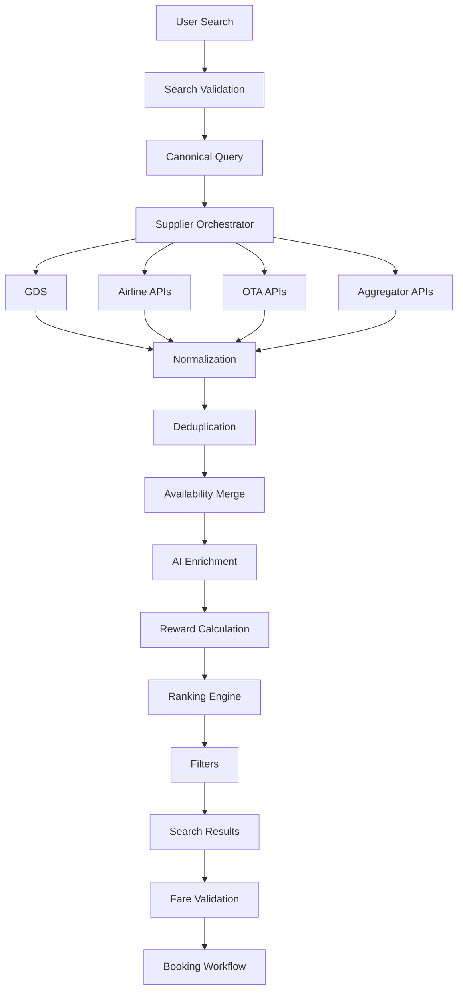
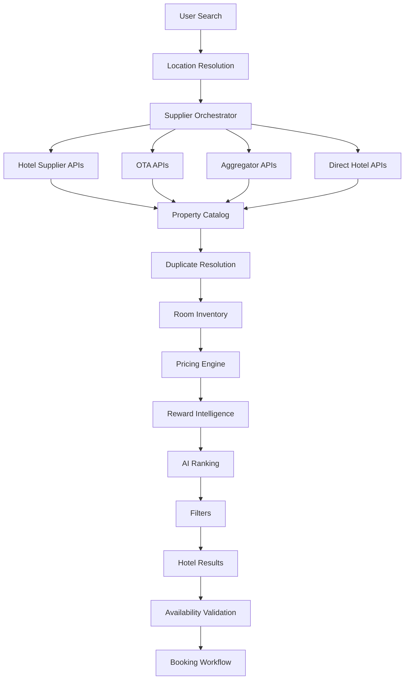
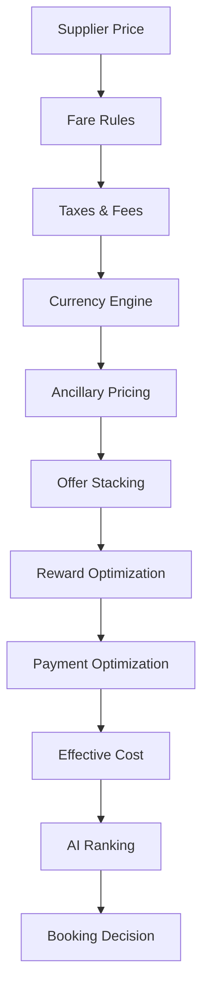
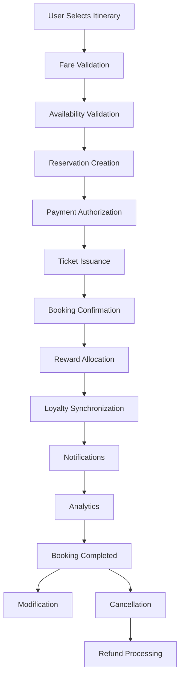
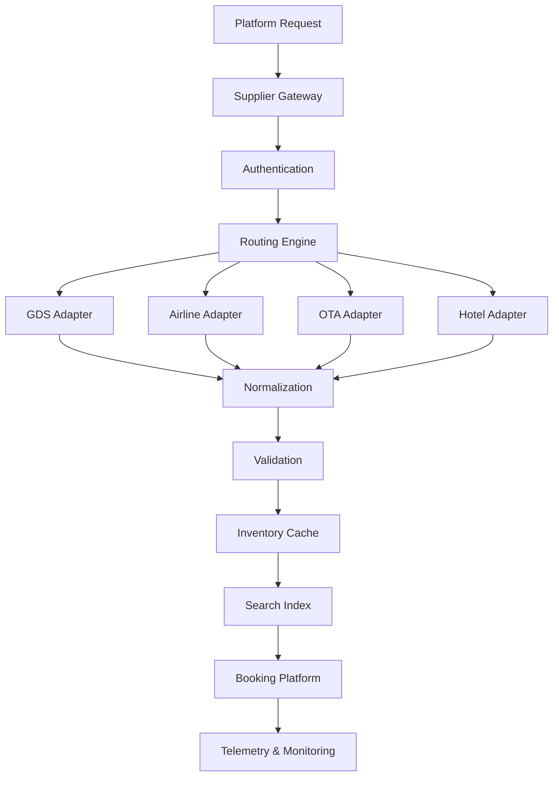
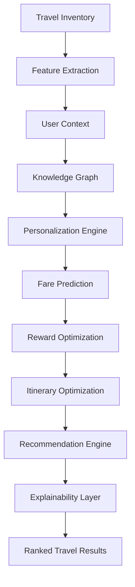
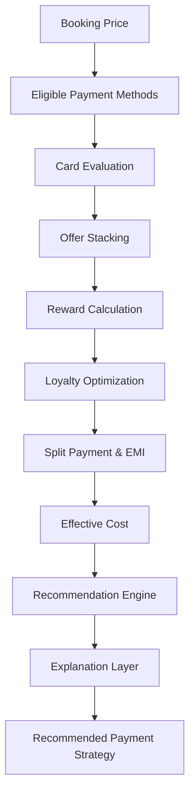
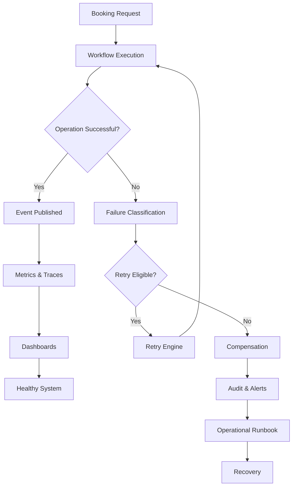
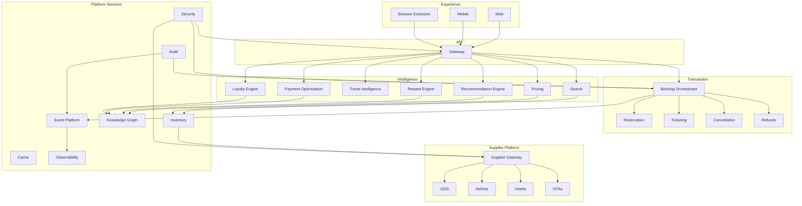

# docs/10_BOOKING_ENGINE.md

# CardWise Booking Engine Architecture

**Document Version:** 1.0  
**Status:** Production Architecture Specification  
**Scope:** Booking Platform Engineering Architecture  
**Primary Owners:** Platform Engineering, Travel Platform, AI Platform, Rewards Platform

---

# 1. Introduction

The CardWise Booking Engine is the travel transaction platform that powers intelligent travel booking across the CardWise ecosystem.

Unlike a traditional Online Travel Agency (OTA), CardWise treats booking as an optimization problem rather than merely a reservation workflow.

Every booking decision considers multiple dimensions simultaneously:

- Real-time pricing
- Credit card rewards
- Cashback offers
- Loyalty programs
- Airline miles
- Hotel points
- Lounge eligibility
- Coupon stacking
- Travel partner promotions
- User preferences
- Historical booking behavior
- AI recommendations
- Future reward opportunities

The objective is not only to help users book travel but to maximize long-term financial value throughout the entire travel lifecycle.

The Booking Engine operates as a platform that connects multiple independent domains:

| Domain | Responsibility |
|---------|----------------|
| BOOK-* | Reservation lifecycle |
| SEARCH-* | Travel search platform |
| PRICE-* | Dynamic pricing |
| FLIGHT-* | Flight intelligence |
| HOTEL-* | Hotel intelligence |
| PAYMENT-* | Payment optimization |
| REWARD-* | Reward optimization |
| LOYALTY-* | Loyalty platform |
| AI-* | Recommendation engine |
| INVENTORY-* | Availability management |
| SUPPLIER-* | External integrations |
| CACHE-* | Performance optimization |
| SAFETY-* | Security & compliance |

---

# 2. Booking Vision

## BOOK-VISION-001

CardWise aims to become the intelligence layer between travelers and travel suppliers.

Instead of simply exposing available inventory, the platform continuously answers higher-order optimization questions:

- Which itinerary provides the highest overall value?
- Which payment method minimizes effective cost?
- Which booking unlocks the highest future rewards?
- Which loyalty program should receive points?
- Should points or cash be used?
- Is it better to wait before booking?
- Which card provides free upgrades?
- Which hotel chain produces better long-term value?
- Which airline ecosystem aligns with the user's travel history?

Booking becomes an optimization engine instead of a transactional interface.

---

## BOOK-VISION-002

Every booking should optimize across five independent dimensions.

| Dimension | Optimization Goal |
|------------|-------------------|
| Cost | Lowest effective price |
| Rewards | Maximum reward generation |
| Convenience | Simplest journey |
| Personalization | User-specific ranking |
| Future Value | Long-term ecosystem benefits |

---

## BOOK-VISION-003

The Booking Engine must remain supplier-agnostic.

Inventory should be obtained from multiple sources simultaneously without introducing supplier-specific business logic into downstream services.

Benefits include:

- Easy supplier replacement
- Multi-supplier redundancy
- Better pricing
- Improved availability
- Regional expansion
- Higher reliability

---

# 3. Booking Philosophy

## BOOK-001

### Intelligence Before Booking

Searching is not equivalent to booking.

Before presenting any travel option, CardWise enriches raw supplier inventory using internal intelligence.

Examples include:

- Reward valuation
- Effective trip cost
- Future point valuation
- Transfer partner recommendations
- Card-specific discounts
- Upgrade eligibility
- Lounge access
- Insurance coverage
- Visa requirements
- Historical booking confidence

---

## BOOK-002

### Booking Should Be Explainable

Every recommendation should include reasoning.

Example:

```
Recommended because:

• ₹1,850 cheaper after cashback
• 4X reward multiplier
• Eligible for airport lounge
• Includes free baggage
• Higher on-time performance
• Better redemption value
```

Users should understand why recommendations differ from the lowest listed fare.

---

## BOOK-003

### Financial Optimization Over Lowest Price

Lowest price does not necessarily represent highest value.

Example comparison:

| Option | Cash Price | Rewards | Effective Value |
|---------|-----------:|---------|----------------:|
| Airline A | ₹8,500 | Low | ₹8,500 |
| Airline B | ₹9,100 | 6,000 points + lounge + cashback | Effective value significantly higher |

Ranking models should optimize for effective cost rather than sticker price.

---

## BOOK-004

### Supplier Independence

Business capabilities should never depend on any single travel supplier.

The architecture separates:

- Search
- Availability
- Pricing
- Booking
- Ticketing
- Loyalty
- Payments

from supplier-specific implementations.

---

## BOOK-005

### Real-Time Decision Making

Critical travel decisions rely on live information.

Examples:

- Fare volatility
- Seat inventory
- Hotel occupancy
- Flash sales
- Dynamic promotions
- Card campaigns
- Airport disruptions

The architecture favors event-driven synchronization over periodic batch updates wherever feasible.

---

## BOOK-006

### Issuer Portal Channels (Handoff Suppliers)

Many bank cards award **accelerated rewards only when travel is booked on the issuer portal** (for example HDFC SmartBuy, Axis Travel Edge, Amex Travel, ICICI, SBI, Kotak, IDFC FIRST, IndusInd, and others).

CardWise treats these as first-class **booking channels**, not as embedded websites:

| Channel kind | Fulfillment |
|--------------|-------------|
| `DIRECT` | CardWise search / mock or GDS inventory |
| `PORTAL_HANDOFF` | Deep-link to the issuer travel portal; reservation completes on the bank site |

**Guarantees:**

- No iframe embedding of bank portals (blocked by `X-Frame-Options` / CSP and typically forbidden by ToS)
- No scraping or proxying of bank checkout HTML
- Portal rankings use curated acceleration **rule estimates**, not live bank inventory
- The extension assists on **all catalogued bank portal hostnames** (one shared catalog with the API) to confirm acceleration and preferred cards

APIs: `POST /api/v1/bookings/channels/recommend`, `POST /api/v1/bookings/channels/handoff`.

---

# 4. High-Level Booking Architecture

The Booking Engine is organized into loosely coupled platform services that independently scale while cooperating through asynchronous events.

Primary architectural goals:

- Horizontal scalability
- Fault isolation
- Multi-supplier support
- High availability
- Low latency search
- Consistent booking state
- Event-driven orchestration
- Intelligent optimization

---

## Architectural Layers

| Layer | Responsibility |
|--------|----------------|
| Experience Layer | Web, Mobile, Extension |
| Booking APIs | User-facing orchestration |
| Search Platform | Flight & hotel discovery |
| Pricing Platform | Fare computation |
| Recommendation Platform | AI ranking |
| Reward Platform | Reward optimization |
| Payment Platform | Card intelligence |
| Booking Core | Reservation lifecycle |
| Supplier Gateway | External integrations |
| Data Platform | Search index, cache, analytics |

---

## Component Responsibilities

| Component | Responsibility |
|-----------|----------------|
| Search Service | Inventory discovery |
| Ranking Engine | Personalized ordering |
| Pricing Engine | Fare computation |
| Booking Orchestrator | Booking lifecycle |
| Inventory Service | Availability synchronization |
| Reward Engine | Point optimization |
| Payment Optimizer | Card recommendation |
| Loyalty Engine | Miles & point valuation |
| AI Engine | Personalization |
| Supplier Gateway | External APIs |
| Event Platform | Booking events |

---

# 5. High-Level Architecture Diagram



---

# 6. Supplier Ecosystem Overview

## SUPPLIER-001

CardWise is designed to integrate with heterogeneous travel providers.

Supported supplier categories include:

| Supplier Type | Purpose |
|---------------|----------|
| GDS | Airline inventory |
| Airline APIs | Direct airline booking |
| OTA APIs | Aggregated inventory |
| Hotel APIs | Direct hotel inventory |
| Hotel Aggregators | Multi-property availability |
| Meta Search | Comparative pricing |
| Loyalty Providers | Miles & points |
| Currency Providers | FX conversion |
| Payment Networks | Transaction processing |

---

## Supplier Abstraction Layer

Instead of tightly coupling business logic to external providers, every supplier is accessed through a standardized adapter layer.

Benefits include:

- Uniform response models
- Retry consistency
- Error normalization
- Authentication isolation
- Independent version upgrades
- Supplier replacement with minimal downstream impact

---

## Supplier Responsibilities

| Stable ID | Responsibility |
|------------|---------------|
| SUPPLIER-001 | Search inventory |
| SUPPLIER-002 | Fare retrieval |
| SUPPLIER-003 | Booking creation |
| SUPPLIER-004 | Reservation updates |
| SUPPLIER-005 | Ticket issuance |
| SUPPLIER-006 | Cancellation |
| SUPPLIER-007 | Refund processing |
| SUPPLIER-008 | Ancillary inventory |
| SUPPLIER-009 | Loyalty synchronization |

---

## Engineering Rationale

- Minimize vendor lock-in.
- Improve resilience through provider redundancy.
- Allow region-specific supplier expansion.
- Enable A/B routing for pricing, latency, and availability improvements.

### Best Practices

- Normalize supplier contracts into canonical internal models.
- Enforce circuit breakers and rate limiting per supplier.
- Maintain independent health scores for routing decisions.

### Trade-offs

| Benefit | Cost |
|---------|------|
| Flexibility | Additional adapter complexity |
| Multi-provider resilience | Canonical model maintenance |
| Easier expansion | Higher integration testing effort |

### Risks

- Supplier API changes.
- Rate-limit exhaustion.
- Inconsistent booking semantics.
- Partial feature parity across providers.

### Operational Considerations

- Track supplier SLA, latency, success rate, and error codes.
- Support graceful degradation when individual suppliers are unavailable.
- Maintain audit logs for all supplier interactions.

---

# 7. Booking Lifecycle Overview

## BOOK-101

Every booking progresses through a deterministic state machine.

High-level lifecycle:

1. Search
2. Recommendation
3. Fare validation
4. User selection
5. Payment optimization
6. Reservation creation
7. Payment authorization
8. Ticket issuance
9. Confirmation
10. Post-booking services
11. Cancellation or modification (optional)
12. Refund settlement (if applicable)

---

## Lifecycle States

| State | Description |
|--------|-------------|
| SEARCHED | Inventory retrieved |
| SELECTED | User selected itinerary |
| PRICE_VALIDATED | Latest fare confirmed |
| RESERVED | Supplier reservation created |
| PAYMENT_PENDING | Awaiting payment |
| PAYMENT_COMPLETED | Payment successful |
| TICKETED | Tickets issued |
| CONFIRMED | Booking finalized |
| MODIFIED | User changed itinerary |
| CANCELLED | Booking cancelled |
| REFUND_PENDING | Refund initiated |
| REFUNDED | Refund completed |
| FAILED | Booking terminated |

---

## Design Principles

- Immutable booking history.
- Idempotent state transitions.
- Event-driven progression.
- Recoverable intermediate failures.
- Strong auditability.

---

## Engineering Rationale

A well-defined lifecycle simplifies retries, reconciliation, customer support, analytics, and compensation workflows.

### Best Practices

- Persist every state transition.
- Emit immutable domain events.
- Validate legal transitions before state updates.

### Trade-offs

| Benefit | Cost |
|---------|------|
| Reliable recovery | More orchestration logic |
| Clear auditing | Increased event volume |

### Risks

- Out-of-order events.
- Supplier timeout during reservation.
- Payment-booking synchronization failures.

### Operational Considerations

- Provide reconciliation jobs for long-running states.
- Alert on bookings stalled beyond SLA thresholds.
- Retain complete event history for dispute resolution.

---

# 8. Travel Intelligence Overview

Travel Intelligence differentiates CardWise from conventional booking platforms by enriching supplier inventory with contextual, financial, and predictive insights before presentation to the user.

---

## AI-001

### Personalized Travel Ranking

Ranking considers:

- Previous destinations
- Budget behavior
- Preferred airlines
- Preferred hotel brands
- Family composition
- Business vs leisure travel
- Reward preferences
- Time sensitivity
- Historical booking patterns

---

## AI-002

### Fare Intelligence

The intelligence layer evaluates:

- Historical fare movement
- Current volatility
- Booking confidence
- Probability of price increase
- Probability of price decrease
- Seasonal demand
- Event impact
- Promotional campaigns

---

## AI-003

### Reward Intelligence

Each itinerary is enriched with:

- Reward points earned
- Cashback earned
- Effective trip cost
- Loyalty progression
- Transfer opportunities
- Elite qualification impact
- Lounge eligibility
- Insurance benefits

---

## AI-004

### Future Extensibility

The platform architecture accommodates future intelligence capabilities such as:

- Rail and bus optimization
- Multi-modal trip planning
- Carbon-aware routing
- Corporate travel policy optimization
- Group booking intelligence
- Autonomous travel planning agents

---

## Engineering Rationale

Embedding intelligence upstream allows consistent optimization across search, pricing, payments, and loyalty without duplicating logic in individual product flows.

### Best Practices

- Keep AI recommendations explainable.
- Separate model inference from transactional booking logic.
- Continuously evaluate recommendation quality with offline and online metrics.

### Trade-offs

| Benefit | Cost |
|---------|------|
| Higher personalization | Increased compute requirements |
| Better user outcomes | Additional model lifecycle management |

### Risks

- Model drift.
- Biased ranking.
- Stale contextual signals.
- Overfitting to historical behavior.

### Operational Considerations

- Version recommendation models.
- Monitor prediction latency and quality.
- Support fallback ranking when AI services are unavailable.

---

# 9. Booking Project Structure

The Booking Engine is organized as a domain-oriented platform to maximize modularity, ownership, and scalability.

```
booking-engine/

├── gateway/
│
├── booking/
│   ├── reservation/
│   ├── ticketing/
│   ├── cancellation/
│   ├── modification/
│   └── refund/
│
├── search/
│   ├── flight/
│   ├── hotel/
│   ├── ranking/
│   └── filters/
│
├── pricing/
│   ├── fare-engine/
│   ├── taxes/
│   ├── currency/
│   ├── ancillaries/
│   └── pricing-cache/
│
├── suppliers/
│   ├── gds/
│   ├── airlines/
│   ├── hotels/
│   ├── ota/
│   └── aggregators/
│
├── rewards/
│
├── loyalty/
│
├── payments/
│
├── inventory/
│
├── intelligence/
│   ├── recommendations/
│   ├── personalization/
│   ├── prediction/
│   └── optimization/
│
├── events/
│
├── cache/
│
├── observability/
│
└── shared/
```

## Architectural Characteristics

| Characteristic | Approach |
|----------------|----------|
| Modularity | Domain-driven package boundaries |
| Scalability | Independent service scaling |
| Extensibility | Adapter-based supplier integrations |
| Reliability | Event-driven workflows |
| Performance | Distributed caching and indexed search |
| Observability | Unified telemetry across domains |
| Security | Shared platform controls with domain isolation |

---

# Part 1 Summary

This section establishes the foundational architecture for the CardWise Booking Engine by defining its vision, guiding philosophy, high-level platform decomposition, supplier abstraction strategy, booking lifecycle, travel intelligence layer, and project organization. Subsequent sections will build on these foundations to detail flight search, hotel booking, pricing, reservations, supplier integrations, AI, payments, operations, and security.

# Part 2 — Flight Booking Engine

---

# 10. Flight Booking Engine

The Flight Booking Engine is responsible for discovering, validating, ranking, reserving, ticketing, and managing airline inventory from multiple suppliers while providing intelligent recommendations based on CardWise's reward optimization platform.

Unlike conventional OTAs, CardWise separates **search**, **pricing**, **availability**, **recommendation**, and **booking** into independent services to improve scalability and supplier flexibility.

---

## Goals

| Stable ID | Goal |
|------------|------|
| FLIGHT-001 | Multi-supplier flight search |
| FLIGHT-002 | Real-time fare validation |
| FLIGHT-003 | Personalized itinerary ranking |
| FLIGHT-004 | Reward-aware recommendations |
| FLIGHT-005 | High availability |
| FLIGHT-006 | Supplier abstraction |
| FLIGHT-007 | Low latency search |
| FLIGHT-008 | Fault tolerant booking |

---

# 11. Flight Search Architecture

## SEARCH-001 Overview

Flight Search is the entry point for every airline booking.

The search service collects inventory from multiple suppliers, normalizes responses, enriches them with CardWise intelligence, and produces a ranked result set.

Search itself never creates reservations.

Responsibilities include:

- Supplier orchestration
- Query normalization
- Inventory aggregation
- Deduplication
- Result enrichment
- AI ranking
- Cache utilization
- Pagination
- Filtering

---

## Search Inputs

| Parameter | Description |
|-----------|-------------|
| Origin Airport | IATA code |
| Destination Airport | IATA code |
| Departure Date | Required |
| Return Date | Optional |
| Trip Type | One-way / Round-trip / Multi-city |
| Cabin Class | Economy / Premium / Business / First |
| Passenger Count | Adults, Children, Infants |
| Preferred Airline | Optional |
| Flexible Dates | Optional |
| Stops Preference | Non-stop / Any |
| Loyalty Preference | Airline alliance or program |
| Budget | Optional |

---

## SEARCH-002 Search Pipeline

```
User Request

↓

Validation

↓

Canonical Query Generation

↓

Supplier Fan-out

↓

Supplier Response Collection

↓

Normalization

↓

Deduplication

↓

Inventory Merge

↓

AI Enrichment

↓

Reward Enrichment

↓

Ranking

↓

Filtering

↓

Response
```

---

## Canonical Query Model

Every supplier receives a translated version of the same internal search request.

Benefits include:

- Uniform business logic
- Supplier independence
- Easy onboarding of new providers
- Consistent analytics
- Simplified experimentation

---

## Engineering Rationale

A canonical query layer isolates downstream services from supplier-specific request formats, reducing coupling and enabling independent supplier evolution.

### Best Practices

- Validate all search parameters before fan-out.
- Normalize airport, airline, and cabin identifiers.
- Preserve supplier metadata for traceability.

### Trade-offs

| Benefit | Cost |
|---------|------|
| Supplier independence | Canonical model maintenance |
| Easier testing | Translation overhead |

### Risks

- Supplier feature mismatches.
- Inconsistent interpretation of search options.

### Operational Considerations

- Version canonical schemas.
- Track query translation failures separately from supplier failures.

---

# 12. Supplier Search Orchestration

## SEARCH-003

The Search Orchestrator manages concurrent requests across all configured suppliers.

```
Supplier A

Supplier B

Supplier C

Supplier D

↓

Aggregator

↓

Normalized Results
```

Each supplier executes independently.

No supplier can block the overall search response.

---

## Responsibilities

| Stable ID | Responsibility |
|------------|---------------|
| SEARCH-003 | Parallel execution |
| SEARCH-004 | Timeout handling |
| SEARCH-005 | Circuit breaking |
| SEARCH-006 | Retry policy |
| SEARCH-007 | Health-aware routing |
| SEARCH-008 | Partial response support |

---

## Timeout Strategy

| Supplier State | Behavior |
|----------------|----------|
| Fast | Return immediately |
| Slow | Wait until timeout budget |
| Failed | Continue without supplier |
| Unavailable | Skip |

The user receives available inventory even if one or more suppliers fail.

---

## Engineering Rationale

Parallel orchestration minimizes end-user latency while improving resilience against individual supplier degradation.

### Best Practices

- Apply per-supplier timeout budgets.
- Use adaptive routing based on health scores.
- Return partial results when safe.

### Trade-offs

| Benefit | Cost |
|---------|------|
| Faster responses | Increased orchestration complexity |
| Higher resilience | More observability requirements |

### Risks

- Slow suppliers delaying aggregation.
- Cascading failures without proper isolation.

### Operational Considerations

- Continuously monitor supplier latency percentiles.
- Automatically downgrade unhealthy providers.

---

# 13. Flight Availability Engine

## FLIGHT-101

Availability determines whether seats can actually be reserved.

Supplier caches are insufficient because inventory changes continuously.

Availability validation occurs in two phases:

1. Search-time availability
2. Pre-booking availability verification

---

## Availability States

| State | Description |
|--------|-------------|
| AVAILABLE | Seats currently available |
| LIMITED | Few seats remaining |
| WAITLIST | Reservation unavailable |
| SOLD_OUT | No inventory |
| UNKNOWN | Supplier uncertainty |

---

## Availability Refresh

Availability refresh occurs when:

- User opens itinerary
- Fare selected
- Booking initiated
- Payment begins
- Reservation creation

---

## Engineering Rationale

Separating search-time and booking-time validation reduces failed bookings while keeping search latency low.

### Best Practices

- Revalidate before reservation.
- Expire stale inventory quickly.
- Cache only short-lived availability data.

### Trade-offs

| Benefit | Cost |
|---------|------|
| Fewer booking failures | Additional supplier calls |

### Risks

- Inventory changes during payment.
- Race conditions on high-demand routes.

### Operational Considerations

- Alert on elevated availability mismatch rates.
- Measure search-to-book conversion failures.

---

# 14. Fare Search & Validation

## FARE-001

Displayed fares are indicative until validated.

The Fare Validation Service confirms:

- Current price
- Taxes
- Booking class
- Fare basis
- Seat availability
- Fare rules
- Ancillary eligibility

---

## Validation Workflow

```
User Selects Flight

↓

Current Fare Lookup

↓

Supplier Validation

↓

Fare Rule Validation

↓

Tax Recalculation

↓

Reward Recalculation

↓

Payment Optimization

↓

Booking Eligible
```

---

## Validation Outcomes

| Result | Action |
|--------|--------|
| Valid | Continue booking |
| Price Increased | Prompt user |
| Price Decreased | Update itinerary |
| Unavailable | Restart search |
| Partial Availability | Offer alternatives |

---

## Engineering Rationale

Late fare validation ensures pricing accuracy while protecting users from unexpected booking failures.

### Best Practices

- Perform validation immediately before reservation.
- Surface meaningful fare changes with explanations.
- Recalculate rewards after every price update.

### Trade-offs

| Benefit | Cost |
|---------|------|
| Accurate pricing | Extra supplier latency |

### Risks

- Supplier inconsistency.
- Rapid fare volatility.

### Operational Considerations

- Track validation success rates.
- Monitor average fare change percentage.

---

# 15. Flight Ranking Engine

## SEARCH-101

CardWise ranks flights using multiple optimization dimensions rather than raw ticket price.

---

## Ranking Signals

| Category | Example Signals |
|-----------|-----------------|
| Price | Effective cost |
| Duration | Total travel time |
| Stops | Direct vs connecting |
| Airline Quality | Reliability, service |
| User Preference | Historical choices |
| Rewards | Points earned |
| Cashback | Card-specific offers |
| Lounge | Access eligibility |
| Loyalty | Tier progression |
| Cancellation | Flexibility |
| Baggage | Included allowance |
| AI Score | Predicted user satisfaction |

---

## Effective Cost Formula

```
Effective Cost

=

Ticket Price

+

Ancillaries

+

Taxes

-

Cashback

-

Reward Value

-

Transfer Bonus

-

Offer Savings

-

Voucher Value
```

The ranking engine prioritizes itineraries with the highest net value rather than the lowest advertised fare.

---

## Personalization Factors

| Stable ID | Factor |
|------------|--------|
| AI-101 | Preferred airlines |
| AI-102 | Historical destinations |
| AI-103 | Cabin preference |
| AI-104 | Budget profile |
| AI-105 | Business vs leisure |
| AI-106 | Family travel patterns |
| AI-107 | Loyalty ecosystem |
| AI-108 | Card ownership |

---

## Ranking Outputs

Each itinerary includes:

- Overall score
- Price score
- Convenience score
- Reward score
- Loyalty score
- AI confidence
- Recommendation reason

---

## Engineering Rationale

Multi-dimensional ranking maximizes long-term customer value and differentiates CardWise from price-only travel marketplaces.

### Best Practices

- Keep ranking explainable.
- Version ranking models independently.
- Separate feature computation from ranking inference.

### Trade-offs

| Benefit | Cost |
|---------|------|
| Better recommendations | Higher computational complexity |
| Increased engagement | Continuous model tuning |

### Risks

- Recommendation bias.
- Model drift.
- Overemphasis on specific optimization dimensions.

### Operational Considerations

- Monitor click-through and booking conversion by ranking version.
- Audit recommendation fairness and diversity.

---

# 16. Flight Search Flow



---

# Part 2 Summary

The Flight Booking Engine is architected around independent search, availability, pricing, and ranking services that collectively provide resilient, low-latency, multi-supplier flight discovery. Through canonical search models, intelligent orchestration, real-time fare validation, and value-based ranking enriched with AI and rewards, CardWise transforms flight booking from a simple inventory search into an optimized travel decision platform.

# Part 3 — Hotel Booking Engine

---

# 17. Hotel Booking Engine

The Hotel Booking Engine powers intelligent accommodation discovery, pricing, reservation, and post-booking management across multiple hotel suppliers while optimizing for rewards, loyalty benefits, card offers, and traveler preferences.

Unlike flight inventory, hotel inventory is significantly more dynamic due to:

- Room type variations
- Occupancy combinations
- Meal plans
- Cancellation policies
- Promotional rates
- Property-specific benefits
- Daily inventory fluctuations

The architecture separates search, inventory, pricing, recommendation, and booking into independent services to maximize scalability and extensibility.

---

## Goals

| Stable ID | Goal |
|------------|------|
| HOTEL-001 | Multi-supplier hotel discovery |
| HOTEL-002 | Unified property catalog |
| HOTEL-003 | Real-time room availability |
| HOTEL-004 | Intelligent hotel ranking |
| HOTEL-005 | Loyalty optimization |
| HOTEL-006 | Reward-aware pricing |
| HOTEL-007 | Scalable room inventory |
| HOTEL-008 | Supplier independence |

---

# 18. Hotel Search Architecture

## SEARCH-201 Overview

Hotel Search discovers available accommodations from multiple suppliers and enriches them using CardWise intelligence before presenting personalized results.

Search responsibilities include:

- Property discovery
- Geographic search
- Room aggregation
- Availability lookup
- Pricing normalization
- Hotel deduplication
- AI enrichment
- Reward optimization
- Personalized ranking

Hotel search is designed as a read-only workflow.

No inventory is reserved during search.

---

## Search Inputs

| Parameter | Description |
|-----------|-------------|
| Destination | City, Region, Landmark, Airport |
| Check-in Date | Required |
| Check-out Date | Required |
| Guests | Adults & Children |
| Rooms | Number of rooms |
| Star Rating | Optional |
| Budget | Optional |
| Hotel Chain | Optional |
| Loyalty Preference | Optional |
| Amenities | Wi-Fi, Pool, Gym, etc. |
| Property Type | Hotel, Resort, Villa, Apartment |
| Flexible Dates | Optional |

---

## SEARCH-202 Search Pipeline

```
Search Request

↓

Location Resolution

↓

Supplier Fan-out

↓

Property Aggregation

↓

Deduplication

↓

Room Availability

↓

Pricing Enrichment

↓

Reward Intelligence

↓

AI Ranking

↓

Filters

↓

Response
```

---

## Property Resolution

The Location Service supports multiple search strategies:

- City search
- Airport proximity
- Landmark search
- Geographic coordinates
- Bounding boxes
- Popular destinations
- Recent searches

Location metadata is standardized before supplier requests.

---

## Engineering Rationale

Separating location resolution from supplier integrations improves consistency and enables advanced geographic search capabilities.

### Best Practices

- Normalize destination identifiers.
- Cache frequently searched locations.
- Support multilingual location aliases.

### Trade-offs

| Benefit | Cost |
|---------|------|
| Better search quality | Additional indexing infrastructure |
| Improved UX | More metadata management |

### Risks

- Ambiguous destinations.
- Supplier location mismatches.

### Operational Considerations

- Monitor location resolution accuracy.
- Track failed destination lookups.

---

# 19. Property Catalog Service

## HOTEL-101

Multiple suppliers frequently expose the same hotel using different identifiers.

The Property Catalog creates a canonical representation for every property.

---

## Responsibilities

| Stable ID | Responsibility |
|------------|---------------|
| HOTEL-101 | Canonical hotel identity |
| HOTEL-102 | Duplicate detection |
| HOTEL-103 | Supplier mapping |
| HOTEL-104 | Property metadata |
| HOTEL-105 | Amenities normalization |
| HOTEL-106 | Image management |
| HOTEL-107 | Geographic indexing |
| HOTEL-108 | Brand hierarchy |

---

## Canonical Property Model

Each property includes:

- Internal Property ID
- Supplier mappings
- Brand
- Chain
- Address
- Coordinates
- Star rating
- Amenities
- Policies
- Images
- Reviews
- Loyalty programs

This abstraction enables consistent experiences regardless of supplier.

---

## Duplicate Resolution

Duplicate detection uses multiple signals:

- Geographic proximity
- Address similarity
- Property name similarity
- Chain identifiers
- External mapping datasets
- Supplier confidence scores

---

## Engineering Rationale

A unified catalog avoids fragmented search results and provides a single source of truth for hotel metadata.

### Best Practices

- Continuously reconcile supplier mappings.
- Version property metadata.
- Separate static metadata from dynamic inventory.

### Trade-offs

| Benefit | Cost |
|---------|------|
| Cleaner search results | Catalog maintenance complexity |
| Better analytics | Continuous reconciliation effort |

### Risks

- Incorrect duplicate merging.
- Incomplete supplier metadata.

### Operational Considerations

- Schedule periodic reconciliation jobs.
- Audit merge confidence scores.

---

# 20. Room Inventory Engine

## INVENTORY-201

Room inventory is significantly more volatile than property metadata.

Inventory includes:

- Room availability
- Occupancy
- Meal plans
- Cancellation terms
- Promotional inventory
- Upgrade eligibility
- Package inclusions

---

## Inventory Lifecycle

```
Supplier Inventory

↓

Normalization

↓

Inventory Cache

↓

Availability Validation

↓

Pricing Validation

↓

Booking
```

---

## Inventory States

| State | Description |
|--------|-------------|
| AVAILABLE | Room can be booked |
| LIMITED | Few rooms left |
| SOLD_OUT | No rooms available |
| ON_REQUEST | Supplier confirmation required |
| UNKNOWN | Availability uncertain |

---

## Cache Strategy

| Data | TTL |
|------|-----|
| Property Metadata | Long-lived |
| Amenities | Long-lived |
| Room Inventory | Short-lived |
| Dynamic Pricing | Very short-lived |
| Promotions | Configurable |
| Images | Long-lived |

---

## Engineering Rationale

Separating static property information from dynamic room inventory minimizes cache invalidation and improves search performance.

### Best Practices

- Keep inventory caches short-lived.
- Validate availability before reservation.
- Store supplier timestamps for freshness.

### Trade-offs

| Benefit | Cost |
|---------|------|
| Faster searches | Frequent cache refreshes |
| Better scalability | More synchronization traffic |

### Risks

- Stale availability.
- Oversold inventory.

### Operational Considerations

- Monitor inventory freshness.
- Track cache hit rates and validation failures.

---

# 21. Hotel Pricing Engine

## PRICE-201

Hotel pricing is composed from multiple pricing components.

Unlike flights, pricing often depends on:

- Occupancy
- Room type
- Stay duration
- Seasonal demand
- Promotional rates
- Loyalty discounts
- Meal plans
- Taxes
- Resort fees

---

## Pricing Components

| Component | Description |
|-----------|-------------|
| Base Rate | Nightly room rate |
| Taxes | Government taxes |
| Service Charges | Mandatory fees |
| Resort Fees | Property-specific fees |
| Meal Plans | Breakfast, Half Board, etc. |
| Promotional Discounts | Supplier offers |
| Card Offers | CardWise promotions |
| Loyalty Discounts | Member rates |

---

## Effective Price

```
Effective Cost

=

Room Rate

+

Taxes

+

Mandatory Fees

-

Card Cashback

-

Reward Value

-

Coupons

-

Partner Discounts
```

---

## Pricing Validation

Validation occurs:

- During search
- Before checkout
- Before reservation
- Before payment authorization

---

## Engineering Rationale

Frequent validation minimizes pricing discrepancies while enabling reward-aware optimization.

### Best Practices

- Separate pricing calculation from availability.
- Clearly explain price changes.
- Maintain auditable pricing breakdowns.

### Trade-offs

| Benefit | Cost |
|---------|------|
| Transparent pricing | Additional processing |

### Risks

- Rapid supplier price changes.
- Inconsistent tax calculations.

### Operational Considerations

- Measure price mismatch rates.
- Track abandoned bookings due to price changes.

---

# 22. Hotel Ranking Engine

## SEARCH-301

Hotels are ranked using a multi-objective scoring model rather than lowest nightly rate alone.

---

## Ranking Signals

| Category | Example Signals |
|-----------|-----------------|
| Effective Cost | Total stay value |
| Distance | Nearby landmarks |
| Star Rating | Property quality |
| Guest Reviews | Verified ratings |
| Amenities | User preferences |
| Loyalty | Elite benefits |
| Rewards | CardWise reward value |
| Cashback | Eligible promotions |
| Cancellation | Flexibility |
| AI Personalization | Historical preferences |
| Sustainability | Optional eco-score |
| Business Suitability | Business traveler score |

---

## Personalization Factors

| Stable ID | Factor |
|------------|--------|
| AI-201 | Preferred hotel chains |
| AI-202 | Stay duration patterns |
| AI-203 | Business vs leisure |
| AI-204 | Preferred amenities |
| AI-205 | Family travel |
| AI-206 | Budget profile |
| AI-207 | Loyalty memberships |
| AI-208 | Previous hotel ratings |

---

## Recommendation Explanation

Every recommendation includes explainable factors such as:

- Highest reward value
- Preferred hotel chain
- Free breakfast included
- Eligible room upgrade
- Better cancellation policy
- Superior loyalty earnings
- Better effective nightly cost

---

## Engineering Rationale

Explainable, value-based ranking improves user trust while balancing price, quality, and long-term loyalty value.

### Best Practices

- Blend personalization with diversity.
- Prevent over-concentration on a single hotel chain.
- Continuously evaluate ranking quality.

### Trade-offs

| Benefit | Cost |
|---------|------|
| Better relevance | Increased feature computation |
| Higher conversions | Ongoing model maintenance |

### Risks

- Ranking bias.
- Cold-start recommendations.

### Operational Considerations

- Measure booking conversion by ranking version.
- Monitor diversity across hotel recommendations.

---

# 23. Hotel Search Flow



---

# Part 3 Summary

The Hotel Booking Engine combines a canonical property catalog, dynamic room inventory management, reward-aware pricing, and AI-driven personalization into a modular architecture. By separating property metadata, inventory, pricing, and ranking, CardWise delivers scalable hotel discovery while optimizing every recommendation for total traveler value rather than nightly room price alone.

# Part 4 — Pricing Engine

---

# 24. Pricing Engine

The Pricing Engine is responsible for calculating the **true economic cost** of every travel booking.

Unlike traditional booking systems that primarily compute supplier prices and taxes, the CardWise Pricing Engine evaluates the **effective price** after incorporating:

- Supplier pricing
- Taxes and mandatory fees
- Dynamic promotions
- Credit card offers
- Cashback
- Reward points
- Airline miles
- Hotel loyalty benefits
- Voucher redemption
- EMI costs
- Foreign exchange charges
- Payment processing costs

The output is not just a payable amount but a comprehensive financial evaluation that enables intelligent booking decisions.

---

## Goals

| Stable ID | Goal |
|------------|------|
| PRICE-001 | Canonical pricing model |
| PRICE-002 | Dynamic fare calculation |
| PRICE-003 | Multi-currency support |
| PRICE-004 | Offer stacking optimization |
| PRICE-005 | Reward valuation |
| PRICE-006 | Transparent pricing breakdown |
| PRICE-007 | Low-latency computation |
| PRICE-008 | Deterministic pricing pipeline |

---

# 25. Pricing Architecture

Pricing is implemented as a layered pipeline where each stage enriches the previous computation.

```
Supplier Price

↓

Fare Rules

↓

Taxes

↓

Mandatory Fees

↓

Currency Conversion

↓

Ancillary Pricing

↓

Offers

↓

Reward Optimization

↓

Payment Optimization

↓

Effective Cost
```

---

## Pricing Responsibilities

| Component | Responsibility |
|-----------|----------------|
| PRICE-* | Price calculation |
| FARE-* | Fare rule evaluation |
| PAYMENT-* | Card optimization |
| REWARD-* | Reward valuation |
| LOYALTY-* | Loyalty benefits |
| AI-* | Recommendation scoring |

---

## Pricing Principles

| Principle | Description |
|------------|-------------|
| Deterministic | Same inputs produce identical outputs |
| Explainable | Every adjustment is visible |
| Modular | Pricing components remain independent |
| Auditable | Every calculation is traceable |
| Extensible | New pricing dimensions can be added without redesign |

---

## Engineering Rationale

A layered architecture allows independent evolution of pricing, rewards, loyalty, and payment modules while preserving deterministic outcomes.

### Best Practices

- Keep pricing components stateless.
- Version pricing rules.
- Maintain immutable pricing snapshots.

### Trade-offs

| Benefit | Cost |
|---------|------|
| Extensibility | Additional orchestration |
| Auditability | Increased storage requirements |

### Risks

- Divergent pricing across services.
- Supplier calculation inconsistencies.

### Operational Considerations

- Capture pricing snapshots for every booking.
- Monitor latency and recalculation frequency.

---

# 26. Fare Rules Engine

## FARE-101

Fare rules govern the conditions under which travel products can be purchased, modified, or refunded.

They vary significantly across suppliers and products.

---

## Responsibilities

| Stable ID | Responsibility |
|------------|---------------|
| FARE-101 | Fare parsing |
| FARE-102 | Rule normalization |
| FARE-103 | Change policy evaluation |
| FARE-104 | Refund policy |
| FARE-105 | Baggage rules |
| FARE-106 | Cabin restrictions |
| FARE-107 | Upgrade eligibility |
| FARE-108 | Ticket validity |

---

## Canonical Fare Rule Model

Each fare is represented internally using standardized attributes:

- Refundability
- Change fees
- Cancellation penalties
- Baggage allowance
- Cabin restrictions
- Advance purchase requirements
- Minimum stay
- Maximum stay
- Stopover rules
- Upgrade eligibility

---

## Rule Evaluation Flow

```
Supplier Rule

↓

Normalization

↓

Canonical Rule Model

↓

Business Validation

↓

User Presentation

↓

Booking Decision
```

---

## Engineering Rationale

Canonical fare rules simplify downstream pricing, booking, and customer support workflows.

### Best Practices

- Preserve original supplier rules.
- Normalize only for business processing.
- Surface customer-friendly explanations.

### Trade-offs

| Benefit | Cost |
|---------|------|
| Consistency | Complex rule translation |

### Risks

- Supplier ambiguity.
- Incomplete rule mappings.

### Operational Considerations

- Audit normalization accuracy.
- Version fare rule parsers independently.

---

# 27. Taxes & Fee Engine

## PRICE-101

Taxes vary by:

- Country
- State
- Airport
- Airline
- Hotel
- Booking channel
- Currency
- Passenger category

Mandatory fees must be separated from optional charges.

---

## Tax Components

| Component | Description |
|-----------|-------------|
| Government Taxes | National taxation |
| Airport Charges | Airport authority fees |
| Security Fees | Aviation security |
| Service Fees | Supplier service charges |
| Hotel Taxes | Occupancy taxes |
| Tourism Levies | Destination-specific fees |
| Resort Fees | Mandatory hotel fees |

---

## Pricing Breakdown

```
Base Price

+

Taxes

+

Mandatory Fees

+

Ancillaries

=

Gross Price
```

---

## Engineering Rationale

Explicit fee decomposition increases pricing transparency and simplifies compliance across jurisdictions.

### Best Practices

- Store tax components independently.
- Recalculate taxes after itinerary changes.
- Preserve supplier-provided tax identifiers.

### Trade-offs

| Benefit | Cost |
|---------|------|
| Transparency | Larger pricing payloads |

### Risks

- Jurisdiction changes.
- Supplier tax discrepancies.

### Operational Considerations

- Track tax calculation failures.
- Maintain regional tax configuration updates.

---

# 28. Multi-Currency Engine

## PRICE-102

CardWise supports pricing and payments across multiple currencies.

The pricing engine distinguishes between:

- Supplier settlement currency
- User display currency
- Payment currency
- Reward valuation currency

---

## Currency Pipeline

```
Supplier Currency

↓

Exchange Rate Lookup

↓

Conversion

↓

Rounding

↓

Localized Display

↓

Effective Cost
```

---

## Currency Responsibilities

| Stable ID | Responsibility |
|------------|---------------|
| PRICE-102 | FX lookup |
| PRICE-103 | Currency conversion |
| PRICE-104 | Rounding rules |
| PRICE-105 | Display formatting |
| PRICE-106 | Exchange rate caching |

---

## Engineering Rationale

Separating display, settlement, and valuation currencies provides flexibility for international travel and reward optimization.

### Best Practices

- Timestamp exchange rates.
- Support configurable rounding policies.
- Cache FX rates with expiration.

### Trade-offs

| Benefit | Cost |
|---------|------|
| Global support | FX synchronization overhead |

### Risks

- Exchange rate volatility.
- Stale conversions.

### Operational Considerations

- Monitor FX provider health.
- Alert on abnormal rate changes.

---

# 29. Ancillary Pricing Engine

## PRICE-201

Ancillaries significantly influence the effective trip cost.

Supported ancillary categories include:

- Checked baggage
- Cabin baggage upgrades
- Preferred seating
- Meals
- Priority boarding
- Lounge passes
- Airport transfers
- Hotel breakfast
- Room upgrades
- Early check-in
- Late checkout
- Travel insurance

---

## Ancillary Lifecycle

```
Supplier Inventory

↓

Availability

↓

Pricing

↓

Eligibility

↓

User Selection

↓

Total Cost
```

---

## Engineering Rationale

Treating ancillaries as first-class pricing components ensures more accurate cost comparisons and recommendation quality.

### Best Practices

- Price ancillaries independently.
- Validate availability before checkout.
- Recalculate rewards after ancillary selection.

### Trade-offs

| Benefit | Cost |
|---------|------|
| Accurate pricing | Additional supplier calls |

### Risks

- Ancillary inventory changes.
- Supplier pricing inconsistencies.

### Operational Considerations

- Track ancillary attachment rates.
- Measure ancillary price mismatch frequency.

---

# 30. Offer Stacking Engine

## PRICE-301

One of CardWise's key differentiators is intelligent offer stacking.

Potential discount sources include:

- Credit card offers
- Bank campaigns
- Merchant promotions
- OTA coupons
- Airline promotions
- Hotel promotions
- Wallet discounts
- Cashback programs
- Loyalty discounts
- Referral credits

---

## Offer Evaluation Pipeline

```
Eligible Offers

↓

Compatibility Check

↓

Conflict Resolution

↓

Priority Rules

↓

Optimal Combination

↓

Savings Calculation
```

---

## Offer Categories

| Stable ID | Category |
|------------|----------|
| PRICE-301 | Instant discount |
| PRICE-302 | Cashback |
| PRICE-303 | Coupon |
| PRICE-304 | Voucher |
| PRICE-305 | Loyalty discount |
| PRICE-306 | Promotional fare |
| PRICE-307 | Card campaign |
| PRICE-308 | Merchant offer |

---

## Engineering Rationale

A dedicated stacking engine maximizes user savings while enforcing supplier and campaign constraints.

### Best Practices

- Explain accepted and rejected offers.
- Evaluate all compatible combinations.
- Maintain deterministic priority rules.

### Trade-offs

| Benefit | Cost |
|---------|------|
| Higher customer value | Increased optimization complexity |

### Risks

- Conflicting campaign rules.
- Supplier restrictions.

### Operational Considerations

- Audit stacking decisions.
- Monitor campaign utilization rates.

---

# 31. Reward Optimization Engine

## REWARD-101

Reward optimization evaluates the long-term value generated by a booking.

Inputs include:

- Credit card rewards
- Airline miles
- Hotel points
- Transfer bonuses
- Elite qualification
- Lounge benefits
- Milestone bonuses
- Promotional multipliers

---

## Reward Computation

```
Booking Price

↓

Eligible Cards

↓

Reward Multipliers

↓

Loyalty Programs

↓

Transfer Opportunities

↓

Net Reward Value

↓

Effective Cost
```

---

## Reward Outputs

| Output | Description |
|---------|-------------|
| Reward Points | Earned points |
| Cashback | Monetary value |
| Airline Miles | Earned miles |
| Hotel Points | Earned points |
| Lounge Eligibility | Access benefits |
| Effective Cost | Net trip cost |
| Future Value | Estimated long-term benefit |

---

## Engineering Rationale

Evaluating future reward value transforms pricing from a short-term transaction into a long-term financial optimization problem.

### Best Practices

- Version reward valuation models.
- Keep assumptions configurable.
- Explain estimated versus guaranteed benefits.

### Trade-offs

| Benefit | Cost |
|---------|------|
| Better decision quality | Model maintenance |

### Risks

- Reward program changes.
- Incorrect valuation assumptions.

### Operational Considerations

- Track recommendation accuracy.
- Recalculate valuations when loyalty rules change.

---

# 32. Pricing Flow



---

# Part 4 Summary

The Pricing Engine is a modular financial computation platform that transforms supplier prices into transparent, reward-aware, and payment-optimized effective costs. By separating fare rules, taxes, currencies, ancillaries, offers, and rewards into dedicated services, CardWise enables deterministic pricing, explainable savings, and long-term value optimization while remaining extensible for future pricing models and promotional strategies.

# Part 5 — Booking Workflow

---

# 33. Booking Workflow Architecture

The Booking Workflow is the transactional core of the CardWise Booking Engine.

Its responsibility is to reliably convert an itinerary selected by the user into a confirmed reservation while maintaining consistency across:

- Travel suppliers
- Payment providers
- Reward systems
- Loyalty platforms
- User accounts
- Notifications
- Analytics
- Audit systems

Unlike search and pricing, booking is a **stateful**, **transaction-oriented**, and **failure-sensitive** workflow.

Every state transition must be deterministic, idempotent, recoverable, and fully auditable.

---

## Goals

| Stable ID | Goal |
|------------|------|
| BOOK-001 | Reliable reservation creation |
| BOOK-002 | Consistent booking state |
| BOOK-003 | Idempotent workflow execution |
| BOOK-004 | Event-driven lifecycle |
| BOOK-005 | Recoverable failures |
| BOOK-006 | Auditability |
| BOOK-007 | Supplier independence |
| BOOK-008 | High availability |

---

# 34. Reservation Lifecycle

## BOOK-101 Overview

Reservations progress through a well-defined lifecycle managed by the Booking Orchestrator.

Each transition emits immutable domain events consumed by downstream systems such as payments, loyalty, notifications, analytics, and customer support.

---

## Reservation States

| State | Description |
|--------|-------------|
| INITIATED | Booking request received |
| VALIDATING | Fare and availability verification |
| RESERVED | Supplier reservation created |
| PAYMENT_PENDING | Awaiting payment authorization |
| PAYMENT_SUCCESS | Payment completed |
| TICKETING_PENDING | Awaiting ticket issuance |
| CONFIRMED | Booking finalized |
| MODIFIED | Booking updated |
| CANCELLATION_PENDING | Cancellation requested |
| CANCELLED | Reservation cancelled |
| REFUND_PENDING | Refund processing |
| REFUNDED | Refund completed |
| FAILED | Booking terminated |

---

## Lifecycle Characteristics

| Characteristic | Description |
|----------------|-------------|
| Immutable history | State changes never overwritten |
| Event sourcing compatible | Domain events retained |
| Recoverable | Supports retries and compensation |
| Observable | Every transition monitored |

---

## Engineering Rationale

Explicit lifecycle states simplify reconciliation, operational monitoring, customer support, and workflow recovery.

### Best Practices

- Validate legal state transitions.
- Persist every transition atomically.
- Attach timestamps and correlation identifiers.

### Trade-offs

| Benefit | Cost |
|---------|------|
| Reliable recovery | Additional orchestration logic |
| Complete audit trail | Higher storage requirements |

### Risks

- Out-of-order state transitions.
- Partial supplier acknowledgements.

### Operational Considerations

- Monitor bookings stuck in intermediate states.
- Alert on abnormal transition durations.

---

# 35. Booking Orchestrator

## BOOK-201

The Booking Orchestrator coordinates all participating services without embedding supplier-specific logic.

It is responsible for:

- Workflow execution
- State management
- Retry coordination
- Compensation triggers
- Event publication
- Timeout management
- Idempotency enforcement

---

## Workflow Responsibilities

| Stable ID | Responsibility |
|------------|---------------|
| BOOK-201 | Workflow orchestration |
| BOOK-202 | Reservation state management |
| BOOK-203 | Event publishing |
| BOOK-204 | Timeout handling |
| BOOK-205 | Compensation initiation |
| BOOK-206 | Retry coordination |
| BOOK-207 | Audit generation |
| BOOK-208 | User status updates |

---

## Booking Pipeline

```
User Request

↓

Fare Validation

↓

Availability Validation

↓

Reservation Creation

↓

Payment

↓

Ticket Issuance

↓

Reward Allocation

↓

Notification

↓

Analytics

↓

Booking Complete
```

---

## Engineering Rationale

A centralized orchestrator provides consistent lifecycle management while allowing individual services to evolve independently.

### Best Practices

- Keep orchestration logic declarative.
- Avoid embedding business rules within supplier adapters.
- Use correlation IDs across all workflow steps.

### Trade-offs

| Benefit | Cost |
|---------|------|
| Consistent workflows | Additional coordination overhead |
| Easier observability | Central orchestration complexity |

### Risks

- Workflow bottlenecks.
- Misconfigured timeout policies.

### Operational Considerations

- Continuously monitor orchestration latency.
- Version workflow definitions.

---

# 36. Ticketing Engine

## BOOK-301

Ticketing finalizes supplier reservations after successful payment.

For flights, this usually involves electronic ticket issuance.

For hotels, it results in confirmation vouchers or reservation numbers.

---

## Responsibilities

| Stable ID | Responsibility |
|------------|---------------|
| BOOK-301 | Ticket issuance |
| BOOK-302 | Supplier confirmation |
| BOOK-303 | Ticket validation |
| BOOK-304 | Document generation |
| BOOK-305 | Delivery status |
| BOOK-306 | Retry handling |

---

## Ticket Lifecycle

```
Reservation

↓

Supplier Confirmation

↓

Ticket Issued

↓

Validation

↓

Document Generation

↓

User Delivery
```

---

## Ticket States

| State | Description |
|--------|-------------|
| PENDING | Awaiting issuance |
| ISSUED | Successfully generated |
| FAILED | Issuance failed |
| RETRYING | Retry in progress |
| DELIVERED | Shared with user |

---

## Engineering Rationale

Separating ticketing from reservation creation improves resiliency and supports asynchronous supplier workflows.

### Best Practices

- Validate issued ticket numbers.
- Store immutable ticket metadata.
- Retry transient supplier failures.

### Trade-offs

| Benefit | Cost |
|---------|------|
| Better reliability | Additional asynchronous processing |

### Risks

- Delayed supplier issuance.
- Duplicate ticket generation.

### Operational Considerations

- Track issuance latency.
- Alert on prolonged pending ticket states.

---

# 37. Confirmation & Notification Workflow

## BOOK-401

Booking confirmation extends beyond supplier acknowledgment.

The confirmation workflow synchronizes multiple downstream systems.

---

## Confirmation Activities

- Booking confirmation
- Ticket delivery
- Calendar integration
- Reward allocation
- Loyalty updates
- User notifications
- Email generation
- Push notifications
- Analytics events

---

## Notification Channels

| Channel | Purpose |
|----------|----------|
| Email | Booking confirmation |
| Push Notification | Real-time updates |
| SMS | Critical booking alerts |
| In-App | Booking status |
| Webhooks | Partner integrations |

---

## Engineering Rationale

Asynchronous notifications prevent user-facing delays while ensuring downstream consistency.

### Best Practices

- Use event-driven notifications.
- Retry failed deliveries independently.
- Track notification acknowledgements.

### Trade-offs

| Benefit | Cost |
|---------|------|
| Faster user experience | Event processing complexity |

### Risks

- Duplicate notifications.
- Delivery failures.

### Operational Considerations

- Monitor notification success rates.
- Correlate notifications with booking events.

---

# 38. Booking Modification Engine

## BOOK-501

Travel plans frequently change after booking.

The Modification Engine evaluates requested changes while preserving reservation consistency.

---

## Supported Modifications

| Stable ID | Modification |
|------------|-------------|
| BOOK-501 | Date change |
| BOOK-502 | Passenger information |
| BOOK-503 | Cabin upgrade |
| BOOK-504 | Seat selection |
| BOOK-505 | Ancillary additions |
| BOOK-506 | Hotel room upgrade |
| BOOK-507 | Guest modifications |
| BOOK-508 | Contact information |

---

## Modification Pipeline

```
User Request

↓

Eligibility Check

↓

Supplier Validation

↓

Price Difference

↓

Reward Recalculation

↓

Payment Adjustment

↓

Confirmation
```

---

## Engineering Rationale

Separating modifications from the original booking workflow simplifies change management and downstream reconciliation.

### Best Practices

- Preserve previous reservation snapshots.
- Recalculate rewards after modifications.
- Explain additional charges before confirmation.

### Trade-offs

| Benefit | Cost |
|---------|------|
| Flexible customer experience | Increased workflow complexity |

### Risks

- Supplier restrictions.
- Fare changes during modification.

### Operational Considerations

- Track modification success rates.
- Monitor supplier response latency.

---

# 39. Cancellation Engine

## BOOK-601

Cancellation workflows depend on supplier policies, fare rules, payment status, and loyalty implications.

---

## Cancellation Flow

```
Cancellation Request

↓

Eligibility Validation

↓

Supplier Cancellation

↓

Penalty Calculation

↓

Reward Adjustment

↓

Refund Initiation

↓

Booking Closed
```

---

## Cancellation Outcomes

| Outcome | Description |
|----------|-------------|
| Fully Refundable | Complete refund |
| Partially Refundable | Penalty deducted |
| Non-refundable | No monetary refund |
| Credit Voucher | Supplier credit issued |

---

## Engineering Rationale

Dedicated cancellation workflows isolate supplier-specific rules while maintaining consistent customer experiences.

### Best Practices

- Explain penalties before confirmation.
- Preserve cancellation audit history.
- Synchronize loyalty adjustments.

### Trade-offs

| Benefit | Cost |
|---------|------|
| Clear workflows | Policy normalization complexity |

### Risks

- Supplier rule inconsistencies.
- Cancellation race conditions.

### Operational Considerations

- Track cancellation completion time.
- Alert on unresolved supplier responses.

---

# 40. Refund Engine

## BOOK-701

Refund processing reconciles financial settlements across suppliers, payment providers, and users.

---

## Refund Types

| Stable ID | Type |
|------------|------|
| BOOK-701 | Full refund |
| BOOK-702 | Partial refund |
| BOOK-703 | Voucher refund |
| BOOK-704 | Wallet credit |
| BOOK-705 | Reward reversal |
| BOOK-706 | Loyalty adjustment |

---

## Refund Pipeline

```
Cancellation

↓

Refund Calculation

↓

Supplier Settlement

↓

Payment Provider

↓

User Refund

↓

Ledger Update

↓

Audit Complete
```

---

## Refund States

| State | Description |
|--------|-------------|
| INITIATED | Refund requested |
| PROCESSING | Financial reconciliation |
| PENDING | Awaiting supplier |
| COMPLETED | Funds settled |
| FAILED | Refund unsuccessful |

---

## Engineering Rationale

Independent refund processing enables robust reconciliation and recovery from supplier or payment failures.

### Best Practices

- Maintain immutable financial ledgers.
- Track supplier settlement references.
- Separate refund initiation from settlement.

### Trade-offs

| Benefit | Cost |
|---------|------|
| Reliable accounting | Longer workflow duration |

### Risks

- Settlement delays.
- Duplicate refund requests.

### Operational Considerations

- Monitor refund SLA compliance.
- Reconcile financial discrepancies daily.

---

# 41. Booking Workflow Diagram



---

# Part 5 Summary

The Booking Workflow architecture provides a resilient, event-driven transaction platform that manages the complete reservation lifecycle from validation through ticketing, confirmation, modification, cancellation, and refunds. By combining deterministic state transitions, centralized orchestration, immutable audit trails, and asynchronous downstream processing, CardWise ensures reliable booking execution while remaining extensible across multiple suppliers, payment providers, and loyalty ecosystems.

# Part 6 — Supplier Integration

---

# 42. Supplier Integration Architecture

The Supplier Integration Platform is the connectivity layer between the CardWise Booking Engine and external travel providers.

It abstracts supplier-specific implementations behind a canonical interface, enabling the rest of the platform to operate independently of:

- GDS providers
- Airlines
- Hotel chains
- OTAs
- Meta-search providers
- Bedbanks
- Car rental providers (future)
- Rail providers (future)
- Bus operators (future)

The Supplier Gateway ensures that adding or replacing a supplier does **not** require changes in the Booking, Search, Pricing, AI, or Reward platforms.

---

## Goals

| Stable ID | Goal |
|------------|------|
| SUPPLIER-001 | Supplier abstraction |
| SUPPLIER-002 | Canonical data model |
| SUPPLIER-003 | Independent scaling |
| SUPPLIER-004 | Fault isolation |
| SUPPLIER-005 | Intelligent routing |
| SUPPLIER-006 | Version compatibility |
| SUPPLIER-007 | Inventory synchronization |
| SUPPLIER-008 | Multi-region expansion |

---

# 43. Supplier Categories

The architecture supports multiple supplier classes.

---

## Supported Supplier Types

| Category | Examples | Primary Responsibility |
|----------|----------|------------------------|
| GDS | Amadeus, Sabre, Travelport | Airline inventory and ticketing |
| Airline APIs | Direct carrier integrations | Flight inventory and reservations |
| OTA APIs | Booking platforms | Aggregated travel inventory |
| Hotel APIs | Hotel brands | Property inventory |
| Bedbanks | Wholesale accommodation providers | Room distribution |
| Loyalty Providers | Airline & hotel loyalty systems | Points and status |
| FX Providers | Currency services | Exchange rates |
| Payment Partners | Banks & payment gateways | Payment authorization |

---

## Supplier Responsibilities

| Stable ID | Responsibility |
|------------|---------------|
| SUPPLIER-101 | Search |
| SUPPLIER-102 | Pricing |
| SUPPLIER-103 | Availability |
| SUPPLIER-104 | Reservation |
| SUPPLIER-105 | Ticketing |
| SUPPLIER-106 | Cancellation |
| SUPPLIER-107 | Refund |
| SUPPLIER-108 | Ancillary inventory |

---

## Engineering Rationale

Categorizing suppliers by responsibility rather than vendor enables consistent internal APIs and easier capability expansion.

### Best Practices

- Decouple business capabilities from vendor implementations.
- Maintain supplier capability matrices.
- Support gradual supplier rollout.

### Trade-offs

| Benefit | Cost |
|---------|------|
| Flexibility | More adapter development |
| Vendor independence | Additional testing effort |

### Risks

- Capability differences across vendors.
- Supplier-specific operational constraints.

### Operational Considerations

- Continuously evaluate supplier SLA compliance.
- Maintain supplier feature compatibility documentation.

---

# 44. Supplier Gateway

## SUPPLIER-201

The Supplier Gateway is the single integration boundary between CardWise services and external providers.

Internal services communicate only with the gateway.

Supplier-specific APIs remain isolated within dedicated adapters.

---

## Responsibilities

| Stable ID | Responsibility |
|------------|---------------|
| SUPPLIER-201 | Request routing |
| SUPPLIER-202 | Authentication |
| SUPPLIER-203 | Rate limiting |
| SUPPLIER-204 | Protocol translation |
| SUPPLIER-205 | Response normalization |
| SUPPLIER-206 | Error normalization |
| SUPPLIER-207 | Retry coordination |
| SUPPLIER-208 | Telemetry collection |

---

## Gateway Pipeline

```
Platform Request

↓

Canonical Request

↓

Supplier Routing

↓

Authentication

↓

Supplier Adapter

↓

Supplier Response

↓

Normalization

↓

Canonical Response
```

---

## Engineering Rationale

A dedicated gateway isolates supplier changes and provides centralized governance for security, routing, and observability.

### Best Practices

- Keep adapters stateless.
- Centralize authentication management.
- Normalize supplier error semantics.

### Trade-offs

| Benefit | Cost |
|---------|------|
| Easier maintenance | Gateway complexity |

### Risks

- Gateway becoming a bottleneck.
- Adapter version drift.

### Operational Considerations

- Scale gateway independently.
- Monitor adapter health and throughput.

---

# 45. GDS & Direct API Integrations

## SUPPLIER-301

Different supplier types expose different operational characteristics.

---

## GDS Integrations

Responsibilities include:

- Flight search
- Fare retrieval
- Reservation creation
- Ticket issuance
- Schedule updates
- Fare rule retrieval

---

## Direct Airline APIs

Advantages:

- Richer ancillary support
- Lower distribution costs
- Faster feature adoption
- Loyalty integration
- Airline-specific promotions

---

## Hotel Supplier APIs

Support:

- Room inventory
- Dynamic pricing
- Promotions
- Packages
- Property metadata
- Loyalty programs

---

## Supplier Selection Strategy

Selection considers:

- Availability
- Response latency
- Historical reliability
- Geographic coverage
- Commercial agreements
- Feature completeness
- Cost of distribution

---

## Engineering Rationale

Supporting multiple supplier classes increases resilience and allows optimization for cost, performance, and coverage.

### Best Practices

- Separate adapters by supplier capability.
- Version adapters independently.
- Track supplier-specific performance metrics.

### Trade-offs

| Benefit | Cost |
|---------|------|
| Better inventory coverage | More integration complexity |

### Risks

- API contract changes.
- Supplier outages.

### Operational Considerations

- Validate adapter compatibility before deployments.
- Maintain automated integration certification.

---

# 46. Inventory Synchronization

## INVENTORY-301

Supplier inventory changes continuously.

CardWise maintains synchronized inventory without becoming the authoritative source.

---

## Synchronization Sources

- Real-time APIs
- Incremental updates
- Scheduled refreshes
- Event streams
- Webhooks
- Batch reconciliation

---

## Synchronization Pipeline

```
Supplier Inventory

↓

Normalization

↓

Validation

↓

Conflict Resolution

↓

Inventory Cache

↓

Search Index

↓

Analytics
```

---

## Synchronization Responsibilities

| Stable ID | Responsibility |
|------------|---------------|
| INVENTORY-301 | Inventory refresh |
| INVENTORY-302 | Availability sync |
| INVENTORY-303 | Pricing refresh |
| INVENTORY-304 | Metadata update |
| INVENTORY-305 | Conflict resolution |
| INVENTORY-306 | Reconciliation |

---

## Engineering Rationale

Continuous synchronization balances freshness with supplier rate limits and operational efficiency.

### Best Practices

- Differentiate metadata from dynamic inventory.
- Prioritize high-demand inventory.
- Use incremental synchronization whenever available.

### Trade-offs

| Benefit | Cost |
|---------|------|
| Fresher inventory | Higher synchronization traffic |

### Risks

- Stale inventory.
- Missed supplier updates.

### Operational Considerations

- Monitor synchronization lag.
- Measure inventory freshness by supplier.

---

# 47. Inventory Caching Strategy

## CACHE-301

Caching minimizes supplier dependency while preserving booking accuracy.

Different inventory types require different cache lifetimes.

---

## Cache Layers

| Layer | Purpose |
|--------|----------|
| Search Cache | Popular search responses |
| Property Cache | Static hotel metadata |
| Airline Metadata Cache | Carrier information |
| Pricing Cache | Short-lived pricing |
| Availability Cache | Seat and room inventory |
| Recommendation Cache | AI scoring |
| Currency Cache | Exchange rates |

---

## Cache Refresh Policy

| Data Type | Refresh Strategy |
|-----------|------------------|
| Static Metadata | Scheduled |
| Search Results | TTL-based |
| Availability | Short TTL |
| Pricing | Validation before booking |
| Rewards | Event-driven |
| Loyalty | Incremental refresh |

---

## Cache Invalidation

Invalidation triggers include:

- Booking completion
- Supplier update
- Inventory depletion
- Promotion changes
- Manual operations
- Synchronization events

---

## Engineering Rationale

Layered caching improves latency while preserving consistency for transactional workflows.

### Best Practices

- Cache immutable data aggressively.
- Avoid long-lived availability caches.
- Revalidate transactional data before booking.

### Trade-offs

| Benefit | Cost |
|---------|------|
| Lower latency | Cache invalidation complexity |

### Risks

- Stale pricing.
- Cache stampedes.
- Inconsistent inventory.

### Operational Considerations

- Monitor cache hit ratios.
- Implement request coalescing for hot keys.

---

# 48. Supplier Health & Routing

## SUPPLIER-401

Supplier routing decisions are dynamic.

Traffic distribution considers operational health rather than static priorities.

---

## Health Signals

| Signal | Description |
|----------|-------------|
| Availability | Uptime |
| Latency | Response time |
| Error Rate | Failures |
| Timeout Rate | Slow responses |
| Booking Success | Reservation reliability |
| Ticket Success | Issuance reliability |
| Inventory Freshness | Data quality |

---

## Routing Modes

| Mode | Description |
|------|-------------|
| Priority Routing | Preferred supplier first |
| Weighted Routing | Traffic distribution |
| Health-Based Routing | Dynamic failover |
| Geographic Routing | Region-specific suppliers |
| Capability Routing | Feature-based selection |
| Cost-Based Routing | Commercial optimization |

---

## Engineering Rationale

Dynamic routing improves resilience and maximizes successful booking outcomes across heterogeneous supplier ecosystems.

### Best Practices

- Continuously update health scores.
- Route around degraded suppliers.
- Preserve routing audit logs.

### Trade-offs

| Benefit | Cost |
|---------|------|
| Higher reliability | More routing intelligence |

### Risks

- Incorrect health scoring.
- Uneven supplier utilization.

### Operational Considerations

- Alert on supplier degradation.
- Review routing policies periodically.

---

# 49. Supplier Integration Flow



---

# Part 6 Summary

The Supplier Integration Platform provides a vendor-agnostic connectivity layer that standardizes communication with GDS providers, airlines, hotels, OTAs, and future travel partners. Through canonical models, adapter-based integrations, intelligent routing, inventory synchronization, layered caching, and continuous health monitoring, CardWise achieves high availability, operational resilience, and long-term flexibility while shielding core business services from supplier-specific complexity.

# Part 7 — Travel Intelligence

---

# 50. Travel Intelligence Platform

The Travel Intelligence Platform is the decision-making layer of the CardWise Booking Engine.

Traditional booking platforms primarily optimize for:

- Lowest fare
- Highest commission
- Sponsored listings
- Basic popularity

CardWise instead optimizes for the **overall travel value** by combining AI, financial optimization, travel knowledge, user behavior, loyalty programs, and real-time market intelligence.

Rather than answering **"What can I book?"**, the platform answers:

- What should the user book?
- Why is this the best option?
- Should the user book now or wait?
- Which itinerary maximizes long-term value?
- Which payment strategy yields the highest return?
- Which loyalty ecosystem benefits the user most?

The Travel Intelligence Platform acts as a recommendation layer across Flights, Hotels, Payments, Rewards, and Future Travel Products.

---

## Goals

| Stable ID | Goal |
|------------|------|
| AI-001 | Personalized recommendations |
| AI-002 | Explainable AI decisions |
| AI-003 | Reward-aware ranking |
| AI-004 | Fare prediction |
| AI-005 | Itinerary optimization |
| AI-006 | Context-aware personalization |
| AI-007 | Continuous learning |
| AI-008 | Knowledge Graph integration |

---

# 51. AI Recommendation Engine

## AI-101

The Recommendation Engine transforms normalized supplier inventory into personalized travel recommendations.

Recommendations consider multiple independent dimensions simultaneously.

---

## Recommendation Inputs

| Category | Examples |
|-----------|----------|
| User Profile | Budget, preferences, family size |
| Booking History | Previous trips |
| Search Context | Current destination |
| Rewards | Cards, points, cashback |
| Loyalty | Airline and hotel memberships |
| Pricing | Effective trip cost |
| Supplier Data | Availability |
| External Signals | Holidays, events, weather |
| Knowledge Graph | Travel relationships |

---

## Recommendation Pipeline

```
Travel Inventory

↓

Feature Extraction

↓

Context Enrichment

↓

Knowledge Graph

↓

ML Models

↓

Ranking

↓

Business Constraints

↓

Recommendation Explanation

↓

User Results
```

---

## Recommendation Outputs

Each recommendation includes:

- Overall score
- Confidence score
- Effective cost
- Reward value
- Savings estimate
- Personalization score
- Explanation
- Alternative options

---

## Engineering Rationale

Separating recommendation generation from transactional services enables independent model evolution without impacting booking reliability.

### Best Practices

- Version recommendation models.
- Separate online inference from offline training.
- Provide human-readable explanations.

### Trade-offs

| Benefit | Cost |
|---------|------|
| Better recommendations | Increased infrastructure complexity |
| Faster experimentation | Continuous model management |

### Risks

- Model drift.
- Cold-start users.
- Recommendation bias.

### Operational Considerations

- Track recommendation quality metrics.
- Support graceful degradation to rule-based ranking.

---

# 52. Personalization Engine

## AI-201

Every user receives a personalized travel experience.

Personalization evolves continuously based on explicit preferences and observed behavior.

---

## Personalization Signals

| Stable ID | Signal |
|------------|--------|
| AI-201 | Preferred airlines |
| AI-202 | Preferred hotel chains |
| AI-203 | Cabin preference |
| AI-204 | Budget range |
| AI-205 | Booking lead time |
| AI-206 | Travel frequency |
| AI-207 | Family composition |
| AI-208 | Business vs leisure |
| AI-209 | Reward optimization preference |
| AI-210 | Loyalty memberships |

---

## Contextual Signals

Recommendations also consider:

- Current location
- Destination popularity
- Time of year
- Public holidays
- School vacations
- Local events
- Weather
- Visa requirements
- Flight disruptions

---

## User Preference Categories

| Category | Examples |
|----------|----------|
| Cost | Budget-first |
| Comfort | Premium cabins |
| Speed | Non-stop flights |
| Rewards | Maximum points |
| Loyalty | Preferred alliance |
| Sustainability | Lower emissions |
| Flexibility | Refundable options |

---

## Engineering Rationale

A dedicated personalization service ensures consistent recommendations across flights, hotels, payments, and future travel domains.

### Best Practices

- Blend explicit preferences with behavioral signals.
- Respect user privacy controls.
- Refresh profiles incrementally.

### Trade-offs

| Benefit | Cost |
|---------|------|
| Better user relevance | Higher feature storage requirements |

### Risks

- Over-personalization.
- Preference staleness.

### Operational Considerations

- Measure recommendation diversity.
- Monitor personalization latency.

---

# 53. Fare Prediction Engine

## AI-301

Airfare and hotel pricing fluctuate continuously.

The Fare Prediction Engine estimates future price movement to help users decide whether to book immediately or wait.

---

## Prediction Inputs

| Category | Examples |
|----------|----------|
| Historical pricing | Price trends |
| Booking window | Days before departure |
| Seasonal demand | Peak periods |
| Airline behavior | Dynamic pricing |
| Market events | Conferences, festivals |
| Competitor activity | Fare changes |
| Seat availability | Remaining inventory |
| Search demand | Aggregate demand signals |

---

## Prediction Outputs

| Stable ID | Output |
|------------|--------|
| AI-301 | Probability of increase |
| AI-302 | Probability of decrease |
| AI-303 | Confidence score |
| AI-304 | Expected volatility |
| AI-305 | Suggested booking window |

---

## User Guidance

Examples:

- Book now
- Wait for possible price drop
- High risk of increase
- Limited confidence
- Volatile pricing detected

---

## Engineering Rationale

Prediction services improve booking confidence while remaining advisory rather than authoritative.

### Best Practices

- Communicate confidence levels.
- Retrain models regularly.
- Preserve historical prediction accuracy.

### Trade-offs

| Benefit | Cost |
|---------|------|
| Improved decision support | Continuous model training |

### Risks

- Unexpected market events.
- Incorrect forecasts.

### Operational Considerations

- Compare predictions against actual outcomes.
- Track prediction calibration.

---

# 54. Itinerary Optimization Engine

## AI-401

Travel optimization extends beyond selecting the cheapest itinerary.

The engine evaluates complete journeys.

---

## Optimization Dimensions

| Dimension | Description |
|-----------|-------------|
| Price | Effective cost |
| Duration | Total travel time |
| Connections | Layover quality |
| Airport Quality | Preferred airports |
| Airline Reliability | Historical performance |
| Carbon Impact | Sustainability score |
| Lounge Access | Eligible lounges |
| Reward Earnings | Points and miles |
| Upgrade Eligibility | Loyalty benefits |
| Visa Requirements | Travel convenience |

---

## Optimization Workflow

```
Available Itineraries

↓

Constraint Evaluation

↓

Reward Optimization

↓

Risk Analysis

↓

Personalization

↓

Final Ranking
```

---

## Example Trade-off

| Option | Lower Price | Higher Reward | Faster | Recommended |
|---------|-------------|---------------|---------|-------------|
| A | ✓ | ✗ | ✓ | No |
| B | Slightly Higher | ✓✓✓ | ✓ | Yes |

---

## Engineering Rationale

Multi-objective optimization enables recommendations aligned with long-term traveler value rather than short-term savings.

### Best Practices

- Use configurable weighting.
- Explain optimization trade-offs.
- Separate optimization logic from UI.

### Trade-offs

| Benefit | Cost |
|---------|------|
| Higher satisfaction | Increased computational complexity |

### Risks

- Conflicting optimization objectives.
- Excessive recommendation complexity.

### Operational Considerations

- Evaluate optimization quality using user feedback.
- Monitor recommendation acceptance rates.

---

# 55. Knowledge Graph Integration

## AI-501

The Knowledge Graph provides structured relationships across the travel ecosystem.

It connects:

- Users
- Destinations
- Airlines
- Hotels
- Airports
- Cards
- Loyalty programs
- Transfer partners
- Offers
- Merchants

---

## Knowledge Graph Use Cases

| Stable ID | Use Case |
|------------|----------|
| AI-501 | Destination similarity |
| AI-502 | Airline alliances |
| AI-503 | Hotel chain relationships |
| AI-504 | Card benefit mapping |
| AI-505 | Transfer partner discovery |
| AI-506 | Offer eligibility |
| AI-507 | Personalized travel insights |
| AI-508 | Cross-domain recommendations |

---

## Example Relationship

```
User

↓

Credit Card

↓

Reward Program

↓

Transfer Partner

↓

Airline

↓

Destination

↓

Hotel

↓

Local Offers
```

---

## Engineering Rationale

A graph-based representation captures complex relationships that are difficult to model using isolated relational entities alone.

### Best Practices

- Version graph schemas.
- Support incremental graph updates.
- Validate relationship integrity.

### Trade-offs

| Benefit | Cost |
|---------|------|
| Rich contextual reasoning | Graph maintenance complexity |

### Risks

- Incomplete relationships.
- Stale graph data.

### Operational Considerations

- Monitor graph synchronization.
- Audit relationship quality.

---

# 56. Explainable Recommendation Engine

## AI-601

Every recommendation produced by CardWise must be explainable.

Users should understand *why* an itinerary is recommended.

---

## Explanation Components

| Component | Example |
|-----------|----------|
| Price | ₹2,300 cheaper after cashback |
| Rewards | Earn 8,500 reward points |
| Loyalty | Eligible for elite upgrade |
| Card | Best with Card X |
| Convenience | Non-stop flight |
| Prediction | High likelihood of price increase |
| Personalization | Matches preferred airline |

---

## Explanation Principles

- Transparent
- Concise
- Actionable
- Consistent
- Auditable

---

## Engineering Rationale

Explainability builds trust, improves decision quality, and supports compliance for AI-assisted financial recommendations.

### Best Practices

- Generate explanations alongside recommendations.
- Separate explanation generation from ranking.
- Avoid exposing internal model details.

### Trade-offs

| Benefit | Cost |
|---------|------|
| Higher user trust | Additional inference processing |

### Risks

- Oversimplified explanations.
- Inconsistent messaging across channels.

### Operational Considerations

- Measure explanation engagement.
- Validate explanation consistency across recommendation versions.

---

# 57. Travel Intelligence Flow



---

# Part 7 Summary

The Travel Intelligence Platform transforms CardWise from a booking system into an intelligent travel decision engine. By combining personalization, fare prediction, itinerary optimization, knowledge graph reasoning, reward optimization, and explainable AI, the platform delivers recommendations that maximize overall traveler value rather than simply minimizing upfront cost. Its modular architecture enables continuous improvement of machine learning models while keeping transactional booking services stable, scalable, and vendor-independent.

# Part 8 — Payment Optimization

---

# 58. Payment Optimization Platform

The Payment Optimization Platform is one of CardWise's core differentiators.

Traditional booking platforms typically ask users **how they want to pay**.

CardWise instead determines **how they should pay** by evaluating every eligible payment method against multiple financial dimensions.

The platform continuously optimizes for:

- Lowest effective cost
- Maximum reward earnings
- Cashback
- Airline miles
- Hotel loyalty points
- Credit card milestone benefits
- Lounge access
- EMI suitability
- Foreign exchange savings
- Offer stacking
- Future reward opportunities

The Payment Optimization Platform works alongside:

- Booking Engine
- Pricing Engine
- Reward Engine
- Loyalty Engine
- AI Recommendation Platform
- Offer Engine

---

## Goals

| Stable ID | Goal |
|------------|------|
| PAYMENT-001 | Best payment recommendation |
| PAYMENT-002 | Reward-aware optimization |
| PAYMENT-003 | Offer stacking |
| PAYMENT-004 | EMI optimization |
| PAYMENT-005 | Split payment support |
| PAYMENT-006 | Multi-currency optimization |
| PAYMENT-007 | Explainable recommendations |
| PAYMENT-008 | Extensible payment strategies |

---

# 59. Payment Decision Engine

## PAYMENT-101

The Payment Decision Engine evaluates all eligible payment strategies before presenting recommendations.

Unlike simple rule engines, it performs **multi-objective optimization**.

---

## Decision Inputs

| Category | Examples |
|-----------|----------|
| Booking Price | Total payable amount |
| Credit Cards | User portfolio |
| Card Benefits | Cashback, rewards |
| Offers | Active promotions |
| Loyalty Programs | Airline & hotel memberships |
| EMI Options | Tenure, interest |
| Wallet Balance | Available credits |
| Reward Balances | Redeemable points |
| Foreign Currency | FX implications |
| User Preferences | Cashback vs rewards |

---

## Decision Pipeline

```
Booking Price

↓

Eligible Payment Methods

↓

Offer Evaluation

↓

Reward Calculation

↓

Loyalty Optimization

↓

EMI Evaluation

↓

Effective Cost Calculation

↓

Recommendation
```

---

## Recommendation Outputs

Every payment recommendation includes:

- Recommended payment method
- Effective cost
- Savings
- Reward value
- Cashback value
- Lounge eligibility
- Milestone contribution
- Explanation

---

## Engineering Rationale

A centralized decision engine ensures consistent optimization logic across all travel products while enabling rapid evolution of payment strategies.

### Best Practices

- Keep payment optimization stateless.
- Recompute recommendations whenever pricing changes.
- Version optimization policies independently.

### Trade-offs

| Benefit | Cost |
|---------|------|
| Higher financial value | Increased computation |
| Easier experimentation | More rule management |

### Risks

- Stale offer information.
- Reward program changes.

### Operational Considerations

- Monitor recommendation latency.
- Track recommendation acceptance rates.

---

# 60. Best Card Recommendation Engine

## PAYMENT-201

Users frequently own multiple credit cards.

CardWise identifies the optimal card for every booking.

---

## Evaluation Criteria

| Stable ID | Evaluation |
|------------|------------|
| PAYMENT-201 | Reward rate |
| PAYMENT-202 | Cashback |
| PAYMENT-203 | Merchant offers |
| PAYMENT-204 | Travel category multiplier |
| PAYMENT-205 | Lounge benefits |
| PAYMENT-206 | Milestone progress |
| PAYMENT-207 | FX markup |
| PAYMENT-208 | Annual fee impact |

---

## Example Evaluation

| Card | Cashback | Rewards | Lounge | Effective Value |
|------|----------|----------|---------|-----------------|
| Card A | ₹900 | Medium | Yes | High |
| Card B | ₹500 | High | Yes | Very High |
| Card C | ₹0 | Low | No | Low |

Recommendation is based on **effective financial value**, not cashback alone.

---

## Recommendation Explanation

Example:

```
Recommended because:

• 10X reward multiplier
• ₹1,200 cashback
• Lounge access included
• Helps reach annual milestone
• Lowest effective trip cost
```

---

## Engineering Rationale

Optimizing card selection increases user value while encouraging informed payment decisions.

### Best Practices

- Use configurable valuation models.
- Support issuer-specific reward structures.
- Explain recommendation rationale.

### Trade-offs

| Benefit | Cost |
|---------|------|
| Better user outcomes | Continuous benefit catalog maintenance |

### Risks

- Card benefit updates.
- Incorrect valuation assumptions.

### Operational Considerations

- Refresh card benefit catalogs regularly.
- Audit recommendation accuracy.

---

# 61. Reward Redemption Engine

## REWARD-201

CardWise determines whether users should:

- Pay entirely in cash
- Redeem airline miles
- Redeem hotel points
- Use bank reward points
- Transfer points
- Combine points and cash

---

## Redemption Pipeline

```
Booking

↓

Available Rewards

↓

Transfer Partners

↓

Redemption Valuation

↓

Future Value Estimation

↓

Recommendation
```

---

## Supported Redemption Modes

| Stable ID | Mode |
|------------|------|
| REWARD-201 | Cash |
| REWARD-202 | Full reward redemption |
| REWARD-203 | Cash + points |
| REWARD-204 | Transfer partner |
| REWARD-205 | Voucher redemption |
| REWARD-206 | Loyalty redemption |

---

## Evaluation Dimensions

- Redemption value
- Opportunity cost
- Future earning potential
- Expiration risk
- Transfer bonuses
- Elite qualification

---

## Engineering Rationale

Redemption decisions should maximize long-term value rather than simply consuming available balances.

### Best Practices

- Display estimated point valuations.
- Explain trade-offs between redemption options.
- Preserve historical valuation assumptions.

### Trade-offs

| Benefit | Cost |
|---------|------|
| Smarter redemption | More complex optimization |

### Risks

- Loyalty program changes.
- Transfer partner availability.

### Operational Considerations

- Track redemption recommendation adoption.
- Recalculate values after program updates.

---

# 62. Loyalty Optimization Engine

## LOYALTY-101

Travel bookings influence future loyalty benefits.

The Loyalty Engine evaluates how a booking contributes to:

- Airline elite status
- Hotel elite tiers
- Credit card milestones
- Promotional campaigns
- Companion vouchers
- Upgrade eligibility

---

## Loyalty Signals

| Stable ID | Signal |
|------------|--------|
| LOYALTY-101 | Tier progress |
| LOYALTY-102 | Milestone rewards |
| LOYALTY-103 | Upgrade eligibility |
| LOYALTY-104 | Bonus campaigns |
| LOYALTY-105 | Transfer opportunities |
| LOYALTY-106 | Expiring benefits |

---

## Recommendation Examples

- Book with Airline A to retain elite status.
- Stay two additional nights for bonus points.
- Use Card B to unlock annual milestone rewards.
- Transfer points before promotion expires.

---

## Engineering Rationale

Optimizing loyalty progression increases lifetime value for users beyond individual bookings.

### Best Practices

- Maintain current loyalty rules.
- Explain long-term benefits.
- Version valuation strategies.

### Trade-offs

| Benefit | Cost |
|---------|------|
| Higher long-term value | Ongoing rule maintenance |

### Risks

- Frequent program changes.
- Regional differences.

### Operational Considerations

- Synchronize loyalty balances periodically.
- Monitor recommendation effectiveness.

---

# 63. Split Payment & EMI Engine

## PAYMENT-301

CardWise supports advanced payment strategies beyond a single payment method.

---

## Supported Payment Strategies

| Stable ID | Strategy |
|------------|----------|
| PAYMENT-301 | Single card |
| PAYMENT-302 | Split across cards |
| PAYMENT-303 | Card + wallet |
| PAYMENT-304 | Card + loyalty points |
| PAYMENT-305 | EMI |
| PAYMENT-306 | No-cost EMI |
| PAYMENT-307 | Mixed payment |
| PAYMENT-308 | Corporate payment (future) |

---

## EMI Evaluation

EMI recommendations consider:

- Interest cost
- No-cost EMI eligibility
- Reward forfeiture
- Cashback eligibility
- Cash flow preferences
- Opportunity cost

---

## Split Payment Optimization

Example:

```
Flight Cost

↓

Card A

(Offer Threshold)

+

Card B

(Reward Multiplier)

↓

Maximum Savings
```

---

## Engineering Rationale

Supporting flexible payment strategies increases optimization opportunities and accommodates diverse user preferences.

### Best Practices

- Validate payment method compatibility.
- Recalculate rewards after payment splits.
- Ensure deterministic allocation logic.

### Trade-offs

| Benefit | Cost |
|---------|------|
| Greater optimization | Higher orchestration complexity |

### Risks

- Partial payment failures.
- Supplier payment restrictions.

### Operational Considerations

- Monitor split payment success rates.
- Track EMI conversion metrics.

---

# 64. Payment Recommendation Explanation

## PAYMENT-401

All payment recommendations must be transparent.

---

## Explanation Components

| Component | Example |
|-----------|----------|
| Cashback | Save ₹1,500 instantly |
| Rewards | Earn 12,000 reward points |
| Loyalty | Qualifies for elite tier |
| Lounge | Complimentary access included |
| FX | Lowest foreign transaction cost |
| EMI | No-cost EMI available |
| Future Value | Unlock annual milestone reward |

---

## Explanation Principles

- Explain every recommendation.
- Quantify financial value.
- Highlight opportunity costs.
- Show rejected alternatives when useful.
- Maintain consistency across platforms.

---

## Engineering Rationale

Explainability increases trust and encourages informed financial decisions.

### Best Practices

- Use concise, actionable language.
- Surface assumptions behind valuations.
- Keep explanations synchronized with pricing.

### Trade-offs

| Benefit | Cost |
|---------|------|
| Better transparency | Additional computation |

### Risks

- Oversimplified financial explanations.
- Outdated assumptions.

### Operational Considerations

- Measure user interaction with explanations.
- Continuously validate explanation quality.

---

# 65. Payment Optimization Flow



---

# Part 8 Summary

The Payment Optimization Platform transforms payment selection into a financial optimization problem. By evaluating credit cards, loyalty programs, reward redemptions, offer stacking, EMI options, split payments, and future benefit opportunities, CardWise recommends the payment strategy that maximizes overall traveler value. Its modular architecture enables explainable, extensible, and deterministic payment decisions while remaining tightly integrated with pricing, rewards, and travel intelligence.

# Part 9 — Operations

---

# 66. Operational Architecture

The Operations Platform ensures that the CardWise Booking Engine remains reliable, observable, fault-tolerant, and recoverable under real-world production conditions.

Unlike search workflows, booking operations involve multiple distributed systems including:

- Travel suppliers
- Payment gateways
- Reward platforms
- Loyalty providers
- Notification services
- Internal microservices

Failures are inevitable.

The operational architecture is therefore designed around:

- Resilience
- Idempotency
- Event-driven recovery
- Distributed consistency
- Observability
- Automated remediation
- Operational transparency

---

## Goals

| Stable ID | Goal |
|------------|------|
| OPS-001 | High availability |
| OPS-002 | Automatic recovery |
| OPS-003 | End-to-end observability |
| OPS-004 | Reliable event processing |
| OPS-005 | Distributed consistency |
| OPS-006 | Deterministic retries |
| OPS-007 | Operational visibility |
| OPS-008 | Continuous monitoring |

---

# 67. Retry Architecture

## BOOK-801

External suppliers and infrastructure dependencies may fail temporarily.

The Retry Engine distinguishes between transient failures and permanent failures.

---

## Retry Categories

| Category | Examples |
|-----------|----------|
| Network failures | Connection timeout |
| Supplier timeout | Slow API response |
| Temporary service outage | HTTP 503 |
| Rate limiting | HTTP 429 |
| Internal transient errors | Infrastructure issues |

Permanent failures are **never retried automatically**.

---

## Retry Workflow

```
Operation

↓

Failure

↓

Failure Classification

↓

Retry Eligible?

↓

Yes

↓

Backoff Policy

↓

Retry

↓

Success / Escalation
```

---

## Retry Policy

| Stable ID | Policy |
|------------|--------|
| OPS-101 | Exponential backoff |
| OPS-102 | Jitter |
| OPS-103 | Retry limits |
| OPS-104 | Deadline enforcement |
| OPS-105 | Failure categorization |
| OPS-106 | Retry metrics |

---

## Engineering Rationale

Controlled retries improve reliability while preventing cascading failures and supplier overload.

### Best Practices

- Retry only idempotent operations.
- Apply exponential backoff with jitter.
- Respect supplier rate limits.

### Trade-offs

| Benefit | Cost |
|---------|------|
| Higher success rate | Increased latency |

### Risks

- Retry storms.
- Duplicate supplier requests.

### Operational Considerations

- Monitor retry success rates.
- Alert on excessive retry volumes.

---

# 68. Compensation Architecture

## BOOK-802

Distributed bookings cannot rely on traditional database transactions.

Instead, CardWise uses compensating workflows to recover from partial failures.

---

## Example Scenario

```
Reservation Created

↓

Payment Successful

↓

Ticket Issuance Failed

↓

Compensation

↓

Supplier Cancellation

↓

Refund

↓

Booking Closed
```

---

## Compensation Responsibilities

| Stable ID | Responsibility |
|------------|---------------|
| OPS-201 | Reservation rollback |
| OPS-202 | Payment reversal |
| OPS-203 | Reward reversal |
| OPS-204 | Loyalty adjustment |
| OPS-205 | Notification rollback |
| OPS-206 | Audit generation |

---

## Engineering Rationale

Compensation enables eventual consistency while minimizing financial and operational risk.

### Best Practices

- Design every workflow with compensating actions.
- Record compensation decisions immutably.
- Trigger compensation automatically when safe.

### Trade-offs

| Benefit | Cost |
|---------|------|
| Better fault recovery | Increased workflow complexity |

### Risks

- Irreversible supplier actions.
- Compensation ordering issues.

### Operational Considerations

- Monitor compensation frequency.
- Escalate manual intervention when compensation fails.

---

# 69. Idempotency Framework

## BOOK-803

Distributed systems frequently experience duplicate requests caused by:

- Client retries
- Network interruptions
- Supplier retries
- Browser refreshes
- Mobile reconnections

Every critical booking operation must therefore be idempotent.

---

## Idempotent Operations

| Stable ID | Operation |
|------------|-----------|
| OPS-301 | Reservation creation |
| OPS-302 | Payment authorization |
| OPS-303 | Ticket issuance |
| OPS-304 | Cancellation |
| OPS-305 | Refund |
| OPS-306 | Reward allocation |

---

## Idempotency Workflow

```
Incoming Request

↓

Idempotency Key

↓

Lookup

↓

Already Processed?

↓

Yes → Existing Result

No → Execute Operation

↓

Persist Result
```

---

## Engineering Rationale

Idempotency guarantees consistent outcomes despite duplicate requests and retry mechanisms.

### Best Practices

- Generate globally unique idempotency keys.
- Store request fingerprints.
- Define expiration policies for keys.

### Trade-offs

| Benefit | Cost |
|---------|------|
| Eliminates duplicate side effects | Additional storage |

### Risks

- Key collisions.
- Incorrect request matching.

### Operational Considerations

- Monitor duplicate request rates.
- Audit idempotency cache effectiveness.

---

# 70. Observability Platform

## METRIC-001

The Booking Engine exposes complete operational visibility across all services.

Observability consists of:

- Metrics
- Logs
- Traces
- Events
- Health signals

---

## Observability Stack

| Layer | Purpose |
|--------|----------|
| Metrics | Performance measurement |
| Distributed Traces | Request lifecycle |
| Structured Logs | Debugging |
| Domain Events | Business monitoring |
| Dashboards | Operations |
| Alerts | Incident detection |

---

## Core Metrics

| Stable ID | Metric |
|------------|--------|
| METRIC-001 | Search latency |
| METRIC-002 | Booking latency |
| METRIC-003 | Supplier success rate |
| METRIC-004 | Payment success rate |
| METRIC-005 | Ticket issuance rate |
| METRIC-006 | Refund duration |
| METRIC-007 | Recommendation latency |
| METRIC-008 | Cache hit ratio |

---

## Engineering Rationale

End-to-end observability enables rapid diagnosis of failures and continuous performance optimization.

### Best Practices

- Instrument every critical workflow.
- Use correlation IDs across services.
- Standardize log formats.

### Trade-offs

| Benefit | Cost |
|---------|------|
| Faster incident resolution | Increased telemetry storage |

### Risks

- Excessive telemetry volume.
- Missing instrumentation.

### Operational Considerations

- Define metric retention policies.
- Regularly review alert quality.

---

# 71. Monitoring & Alerting

## METRIC-101

Monitoring combines infrastructure, application, business, and supplier metrics.

---

## Monitoring Categories

| Category | Example Metrics |
|-----------|-----------------|
| Infrastructure | CPU, Memory |
| Platform | API latency |
| Booking | Reservation success |
| Payments | Authorization rate |
| Rewards | Reward allocation |
| Suppliers | Availability |
| AI | Recommendation latency |
| Cache | Hit ratio |

---

## Alert Priorities

| Severity | Description |
|-----------|-------------|
| Critical | Booking unavailable |
| High | Payment failures |
| Medium | Supplier degradation |
| Low | Performance regressions |

---

## Service-Level Indicators (SLIs)

| SLI | Description |
|-----|-------------|
| Availability | Successful requests |
| Latency | Response time |
| Durability | Event persistence |
| Accuracy | Recommendation correctness |
| Freshness | Inventory synchronization |

---

## Service-Level Objectives (Illustrative)

| SLO | Target |
|-----|--------|
| Search Availability | ≥ 99.9% |
| Booking Availability | ≥ 99.95% |
| Payment Success | ≥ 99.9% |
| Supplier Gateway Availability | ≥ 99.9% |
| Event Processing Success | ≥ 99.99% |

> Exact SLO targets should be reviewed periodically based on production capacity planning, supplier SLAs, and business requirements.

---

## Engineering Rationale

Well-defined monitoring and SLOs align operational priorities with user experience and business impact.

### Best Practices

- Alert on user impact, not only infrastructure metrics.
- Continuously tune thresholds.
- Maintain actionable runbooks.

### Trade-offs

| Benefit | Cost |
|---------|------|
| Faster incident response | Alert configuration overhead |

### Risks

- Alert fatigue.
- False positives.
- Missing critical failures.

### Operational Considerations

- Review incidents regularly.
- Measure Mean Time to Detect (MTTD) and Mean Time to Recover (MTTR).

---

# 72. Operational Runbooks

## OPS-401

Standardized operational procedures reduce recovery time during production incidents.

---

## Example Runbooks

| Stable ID | Scenario |
|------------|----------|
| OPS-401 | Supplier outage |
| OPS-402 | Payment gateway degradation |
| OPS-403 | Booking backlog |
| OPS-404 | Cache failures |
| OPS-405 | Inventory synchronization lag |
| OPS-406 | Event queue backlog |
| OPS-407 | AI recommendation degradation |
| OPS-408 | Notification failures |

---

## Runbook Structure

Each runbook should define:

- Detection criteria
- Impact assessment
- Immediate mitigation
- Recovery procedure
- Verification steps
- Escalation path
- Post-incident review checklist

---

## Engineering Rationale

Documented operational procedures improve consistency and reduce dependence on individual operators.

### Best Practices

- Keep runbooks version-controlled.
- Validate procedures through periodic drills.
- Link alerts directly to relevant runbooks.

### Trade-offs

| Benefit | Cost |
|---------|------|
| Faster recovery | Ongoing documentation maintenance |

### Risks

- Outdated procedures.
- Incomplete incident coverage.

### Operational Considerations

- Review runbooks after major incidents.
- Incorporate lessons learned into future revisions.

---

# 73. Operational Flow



---

# Part 9 Summary

The Operations Platform equips the CardWise Booking Engine with production-grade resilience through deterministic retries, compensation workflows, idempotent transaction handling, comprehensive observability, proactive monitoring, and standardized operational runbooks. By combining event-driven recovery mechanisms with measurable service objectives and actionable operational procedures, the platform ensures reliable travel booking experiences even in the presence of supplier failures, infrastructure issues, and distributed system inconsistencies.

# Part 10 — Security, Compliance & Architecture Summary

---

# 74. Security Architecture

Security is a foundational concern across every component of the CardWise Booking Engine.

The platform processes sensitive information including:

- Personally Identifiable Information (PII)
- Travel itineraries
- Passport information (where applicable)
- Payment metadata
- Loyalty account identifiers
- Reward balances
- Booking history
- Financial optimization insights

Security is implemented as a cross-cutting architectural capability rather than an isolated subsystem.

---

## Goals

| Stable ID | Goal |
|------------|------|
| SAFETY-001 | Defense in depth |
| SAFETY-002 | Least privilege access |
| SAFETY-003 | Zero trust communication |
| SAFETY-004 | Secure data lifecycle |
| SAFETY-005 | End-to-end auditing |
| SAFETY-006 | Compliance readiness |
| SAFETY-007 | Fraud detection |
| SAFETY-008 | Secure supplier integrations |

---

# 75. Identity & Access Management

## SAFETY-101

Every service and user interaction is authenticated and authorized.

---

## Authentication Layers

| Layer | Responsibility |
|--------|----------------|
| User Authentication | Secure account access |
| Service Authentication | Internal service identity |
| Supplier Authentication | External API credentials |
| Administrative Access | Elevated operational privileges |

---

## Authorization Principles

- Least privilege
- Role-based authorization
- Attribute-based policies where appropriate
- Temporary privilege elevation
- Continuous authorization checks
- Administrative action auditing

---

## Engineering Rationale

Separating authentication from authorization enables flexible policy evolution while minimizing security risks.

### Best Practices

- Rotate credentials regularly.
- Isolate supplier credentials.
- Audit privileged operations.

### Trade-offs

| Benefit | Cost |
|---------|------|
| Stronger security | Operational overhead |

### Risks

- Credential leakage.
- Excessive privilege assignments.

### Operational Considerations

- Review access policies periodically.
- Monitor anomalous authentication activity.

---

# 76. PII Protection

## SAFETY-201

The Booking Engine stores and processes multiple categories of personal information.

---

## PII Categories

| Category | Examples |
|----------|----------|
| Identity | Name, Date of Birth |
| Contact | Email, Phone |
| Travel | Passenger information |
| Loyalty | Membership IDs |
| Financial | Billing metadata |
| Preferences | Travel preferences |

---

## Data Protection Principles

- Data minimization
- Purpose limitation
- Encryption in transit
- Encryption at rest
- Controlled retention
- Secure deletion
- Auditability

---

## Data Classification

| Classification | Examples |
|---------------|----------|
| Public | Airline metadata |
| Internal | Operational metrics |
| Confidential | Booking information |
| Restricted | PII and payment metadata |

---

## Engineering Rationale

Clear data classification enables appropriate controls throughout the information lifecycle.

### Best Practices

- Minimize stored personal data.
- Mask sensitive information in logs.
- Separate PII from analytical datasets where practical.

### Trade-offs

| Benefit | Cost |
|---------|------|
| Improved privacy | Additional data management |

### Risks

- Over-retention.
- Unauthorized access.

### Operational Considerations

- Regularly review retention policies.
- Audit access to sensitive datasets.

---

# 77. Payment Security

## SAFETY-301

Payment optimization does not require CardWise to become the system of record for payment credentials.

The platform should minimize the handling of sensitive payment information.

---

## Security Responsibilities

| Stable ID | Responsibility |
|------------|---------------|
| SAFETY-301 | Secure payment orchestration |
| SAFETY-302 | Payment provider integration |
| SAFETY-303 | Sensitive data minimization |
| SAFETY-304 | Transaction auditing |
| SAFETY-305 | Secure settlement workflows |
| SAFETY-306 | Payment event integrity |

---

## Security Principles

- Tokenized payment references
- No unnecessary persistence of payment secrets
- Secure communication with payment providers
- Immutable payment audit trails

---

## Engineering Rationale

Reducing the storage and processing footprint of payment-sensitive information decreases operational and compliance risk.

### Best Practices

- Prefer tokenized payment flows.
- Segregate payment services from recommendation services.
- Audit all payment state transitions.

### Trade-offs

| Benefit | Cost |
|---------|------|
| Lower risk exposure | Additional provider dependencies |

### Risks

- Payment provider outages.
- Token lifecycle issues.

### Operational Considerations

- Reconcile payment events.
- Monitor payment anomaly rates.

---

# 78. Fraud Prevention

## SAFETY-401

Travel bookings present multiple fraud vectors.

Fraud detection should operate continuously throughout the booking lifecycle.

---

## Fraud Signals

| Category | Examples |
|----------|----------|
| Identity | Suspicious account behavior |
| Payments | High-risk payment patterns |
| Devices | Device anomalies |
| Geography | Unusual booking locations |
| Velocity | Rapid booking attempts |
| Supplier | Reservation inconsistencies |
| Rewards | Reward abuse |
| Loyalty | Account takeover indicators |

---

## Risk Assessment Pipeline

```
Booking Request

↓

Risk Signals

↓

Feature Aggregation

↓

Fraud Rules

↓

Risk Scoring

↓

Decision

↓

Approve / Review / Reject
```

---

## Fraud Decisions

| Outcome | Action |
|----------|--------|
| Low Risk | Continue booking |
| Medium Risk | Additional verification |
| High Risk | Manual review |
| Critical Risk | Reject transaction |

---

## Engineering Rationale

Layered fraud evaluation minimizes customer friction while protecting users, suppliers, and financial systems.

### Best Practices

- Combine deterministic rules with adaptive risk models.
- Continuously evaluate false positives.
- Keep fraud services independent from booking orchestration.

### Trade-offs

| Benefit | Cost |
|---------|------|
| Reduced fraud losses | Additional operational complexity |

### Risks

- False positives.
- Fraud pattern evolution.

### Operational Considerations

- Review fraud model performance.
- Monitor fraud detection latency.

---

# 79. Compliance Architecture

## SAFETY-501

The platform should be designed to support applicable regulatory and contractual obligations across different regions.

Compliance requirements may evolve over time and should be addressed through configurable governance rather than hard-coded assumptions.

---

## Compliance Domains

| Domain | Scope |
|--------|-------|
| Privacy | User data handling and consent |
| Payment | Payment ecosystem obligations |
| Security | Organizational security controls |
| Audit | Operational traceability |
| Data Retention | Lifecycle governance |
| Supplier Contracts | External integration requirements |

---

## Compliance Principles

- Consent-aware processing
- Immutable audit history
- Configurable retention policies
- Traceable administrative actions
- Evidence generation for audits

---

## Engineering Rationale

Embedding compliance considerations into the architecture reduces future operational risk and simplifies governance.

### Best Practices

- Treat compliance as an architectural concern.
- Centralize audit evidence.
- Review regulatory changes periodically.

### Trade-offs

| Benefit | Cost |
|---------|------|
| Easier governance | Additional operational processes |

### Risks

- Changing regulatory requirements.
- Cross-region data governance complexity.

### Operational Considerations

- Maintain compliance documentation.
- Schedule periodic internal compliance reviews.

---

# 80. Engineering Best Practices

The Booking Engine should follow consistent engineering standards across all domains.

---

## Architectural Principles

| Principle | Description |
|-----------|-------------|
| Domain-driven design | Clear ownership boundaries |
| Event-driven communication | Loose coupling |
| Canonical data models | Supplier independence |
| Stateless compute | Horizontal scalability |
| Idempotent operations | Reliable retries |
| Explainable AI | User trust |
| Observability-first | Production visibility |
| Security by design | Cross-cutting controls |

---

## Operational Principles

- Prefer asynchronous workflows where possible.
- Separate read-heavy search from transactional booking.
- Design every distributed workflow for recovery.
- Preserve immutable audit trails.
- Use standardized telemetry across services.
- Continuously validate supplier integrations.
- Automate operational health verification.

---

## Quality Attributes

| Attribute | Architectural Approach |
|-----------|------------------------|
| Availability | Redundant supplier integrations |
| Scalability | Independent domain services |
| Reliability | Retry + compensation |
| Maintainability | Modular architecture |
| Extensibility | Adapter-based integrations |
| Performance | Layered caching |
| Security | Zero-trust principles |
| Observability | Unified telemetry |

---

# 81. Architecture Summary

The CardWise Booking Engine is architected as a modular, event-driven travel platform composed of specialized domains:

- Search
- Pricing
- Booking
- Inventory
- Supplier Gateway
- Travel Intelligence
- Payment Optimization
- Reward Optimization
- Loyalty
- Security
- Operations

Key architectural characteristics include:

- Canonical supplier abstraction
- Multi-provider travel inventory
- AI-driven recommendations
- Reward-aware pricing
- Payment optimization
- Event-driven workflows
- Idempotent booking lifecycle
- Distributed observability
- Explainable decision making
- Security-first architecture

This modular design allows each domain to evolve independently while maintaining consistent interfaces and operational resilience across the platform.

---

# 82. End-to-End Booking Platform Architecture



---

# 83. Document Conclusion

The CardWise Booking Engine extends beyond the traditional boundaries of a travel booking platform.

Rather than optimizing solely for inventory discovery and reservation completion, it integrates travel intelligence, financial optimization, AI-driven personalization, reward maximization, payment strategy, loyalty progression, and operational resilience into a unified architecture.

By maintaining clear domain boundaries, supplier independence, deterministic workflows, and comprehensive observability, the platform is designed to scale from flights and hotels today to additional travel verticals such as rail, buses, experiences, and mobility services in the future—without fundamental architectural changes.

This architecture establishes the Booking Engine as a core intelligence platform within the broader CardWise ecosystem, enabling users to make travel decisions that maximize long-term financial value while providing a secure, resilient, and production-ready engineering foundation.

