# docs/11_BROWSER_EXTENSION.md

# Part 1 — Browser Extension Architecture Foundation

---

# 1. Introduction

## 1.1 Purpose

The CardWise Browser Extension is the real-time intelligence layer of the CardWise ecosystem.

Unlike traditional browser extensions that only inject coupons or cashback notifications, CardWise continuously understands user context while preserving privacy and uses AI-powered financial intelligence to maximize the total value of every online transaction.

The extension acts as an event-driven client that collaborates with multiple backend intelligence systems while remaining lightweight, performant, secure, and privacy-first.

It operates across multiple domains:

- Shopping
- Travel
- Credit Cards
- Rewards
- Merchant Offers
- Loyalty Programs
- Payment Optimization
- AI Recommendations
- Booking Optimization

The extension never attempts to replace merchant experiences.

Instead, it augments them with contextual intelligence.

---

## 1.2 Engineering Goals

| ID | Goal | Priority |
|------|----------|----------|
| EXT-001 | Minimal browser overhead | Critical |
| EXT-002 | Privacy-first architecture | Critical |
| EXT-003 | Manifest V3 compliant | Critical |
| EXT-004 | Cross-browser compatibility | High |
| EXT-005 | AI-powered recommendations | Critical |
| EXT-006 | Offline resiliency | High |
| EXT-007 | Secure communication | Critical |
| EXT-008 | Real-time merchant detection | Critical |
| EXT-009 | Low memory footprint | High |
| EXT-010 | Event-driven architecture | High |

---

## 1.3 Design Principles

The extension is designed around several engineering principles.

### EXT-011 — Invisible by Default

The extension should remain passive unless contextual intelligence provides measurable value.

Users should never experience intrusive popups or unnecessary interruptions.

---

### EXT-012 — Context Before Recommendation

Recommendations are generated only after sufficient contextual understanding.

Inputs include:

- Merchant
- Page type
- Checkout stage
- User portfolio
- Card eligibility
- Rewards
- Active offers
- Spending category
- Historical preferences

---

### EXT-013 — Explainability

Every recommendation must include an explanation.

Example:

> Use HDFC Diners Black because this transaction earns 10X rewards through SmartBuy and an additional ₹500 instant discount.

Opaque AI decisions are prohibited.

---

### EXT-014 — Minimal Permissions

Permissions are granted only when required.

No unnecessary browser capabilities should be requested.

---

### EXT-015 — Local First

The extension should complete as much computation locally as possible.

Examples:

- Merchant detection
- Checkout detection
- Page classification
- DOM parsing
- UI rendering
- Session state

Cloud communication occurs only when intelligence beyond local capabilities is required.

---

# 2. Extension Vision

---

## Vision Statement

The CardWise Browser Extension aims to become the financial co-pilot for every online transaction.

It intelligently assists users throughout the purchasing journey instead of appearing only at checkout.

The extension continuously answers questions such as:

- Which credit card should I use?
- Can rewards be increased?
- Can coupons be stacked?
- Is this the best travel booking portal?
- Should points be redeemed?
- Is EMI beneficial?
- Is there a cheaper alternative?
- Is cashback available elsewhere?
- Is this merchant eligible for special offers?

---

## Core Objectives

| ID | Objective |
|------|------------|
| EXT-020 | Maximize total transaction value |
| EXT-021 | Increase reward earnings |
| EXT-022 | Reduce user effort |
| EXT-023 | Optimize travel bookings |
| EXT-024 | Improve payment decisions |
| EXT-025 | Discover hidden offers |
| EXT-026 | Reduce missed benefits |
| EXT-027 | Personalize recommendations |
| EXT-028 | Enable explainable AI |

---

# 3. Extension Philosophy

---

## Financial Intelligence Layer

Traditional extensions operate as:

```
Coupon Extension
```

or

```
Cashback Extension
```

CardWise instead functions as:

```
Financial Intelligence Layer
```

which combines:

- AI
- Credit Cards
- Merchant Knowledge
- Loyalty
- Travel
- Offers
- Rewards
- Payment Intelligence

into a single recommendation engine.

---

## User Journey Philosophy

Instead of optimizing only the payment step:

```
Checkout
    ↓
Coupon
```

CardWise optimizes the entire lifecycle.

```
Discovery

↓

Research

↓

Price Monitoring

↓

Merchant Analysis

↓

Coupon Discovery

↓

Travel Optimization

↓

Payment Optimization

↓

Reward Optimization

↓

Purchase

↓

Post Purchase Tracking
```

---

## Recommendation Hierarchy

Recommendations are prioritized according to overall financial benefit.

| Priority | Intelligence |
|-----------|-------------|
| Highest | Payment Optimization |
| High | Reward Optimization |
| High | Instant Discounts |
| Medium | Coupon Stacking |
| Medium | Cashback |
| Medium | Loyalty Benefits |
| Low | EMI Suggestions |

---

## Explainable Decision Pipeline

Every recommendation follows:

```
Context

↓

Knowledge Graph

↓

Merchant Intelligence

↓

Offer Engine

↓

Card Recommendation

↓

AI Ranking

↓

Explainable Output
```

---

# 4. High-Level Architecture

The browser extension is intentionally modular.

Each component has clearly defined responsibilities to comply with Manifest V3 constraints and maintain long-term maintainability.

---

## Architectural Components

| ID | Component | Responsibility |
|------|------------|----------------|
| EXT-100 | Manifest | Extension metadata |
| BG-100 | Background Service Worker | Event orchestration |
| CONTENT-100 | Content Scripts | DOM intelligence |
| POPUP-100 | Popup UI | Quick interactions |
| PANEL-100 | Side Panel | Persistent intelligence |
| STORAGE-100 | Browser Storage | Local persistence |
| CACHE-100 | Cache Layer | Performance optimization |
| AI-100 | Recommendation Engine Client | AI integration |
| MERCHANT-100 | Merchant Intelligence | Merchant classification |
| OFFER-100 | Offer Engine | Coupon and offers |
| PAYMENT-100 | Payment Intelligence | Card recommendation |
| TRAVEL-100 | Travel Intelligence | Flight & hotel optimization |

---

## Component Responsibilities

### Background Worker

Responsible for:

- orchestration
- messaging
- authentication
- alarms
- sync
- cache refresh
- telemetry
- notifications

---

### Content Scripts

Responsible for:

- DOM inspection
- checkout detection
- merchant detection
- travel page recognition
- payment form observation

---

### Popup

Provides:

- quick recommendations
- active offers
- reward summary
- login state

---

### Side Panel

Provides:

- AI assistant
- explainable recommendations
- travel optimization
- card comparison
- reward simulation
- spending insights

---

### Remote Intelligence Platform

Cloud services provide:

- Merchant Knowledge Graph
- AI Ranking
- Offer Engine
- Reward Engine
- Personalization
- User Portfolio
- Remote Config
- Feature Flags

---

# 5. Manifest V3 Architecture

Manifest V3 introduces significant architectural constraints compared to previous browser extension models.

CardWise is designed natively around these constraints rather than adapting legacy patterns.

---

## Architectural Principles

| ID | Principle |
|------|-----------|
| BG-101 | Stateless background execution |
| BG-102 | Event-driven processing |
| BG-103 | Minimal wakeups |
| BG-104 | Lazy initialization |
| BG-105 | Cached intelligence |
| BG-106 | Explicit messaging |
| BG-107 | Permission minimization |

---

## Manifest Components

| Component | Purpose |
|-----------|----------|
| Service Worker | Background execution |
| Content Scripts | Page interaction |
| Popup | User interface |
| Side Panel | Persistent workspace |
| Options Page | User preferences |
| Storage API | Local persistence |
| Alarms API | Scheduled refresh |
| Notifications API | Alerts |
| Identity API | Authentication |
| DeclarativeNetRequest | Safe request modification (where applicable) |

---

## Browser Event Model

```
Browser Event

↓

Service Worker Activated

↓

Validate Context

↓

Determine Merchant

↓

Detect Checkout

↓

Fetch Intelligence

↓

AI Ranking

↓

Inject Recommendation

↓

Sleep
```

---

## Lifecycle Characteristics

| Property | Strategy |
|-----------|-----------|
| Startup | Lazy |
| Memory | Minimal |
| CPU | Event Driven |
| Network | Batched |
| Rendering | On Demand |
| Storage | Cached |
| Authentication | Token Based |
| Synchronization | Incremental |

---

# 6. System Architecture Diagram

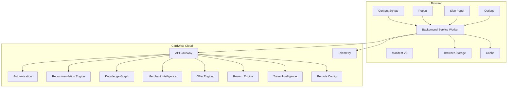

---

# 7. Engineering Trade-offs

| Decision | Benefit | Trade-off |
|-----------|----------|------------|
| Manifest V3 | Improved security | Stateless background execution |
| Service Worker | Lower memory usage | Cold start latency |
| Content Scripts | Accurate page context | Limited browser APIs |
| Side Panel | Rich experience | Larger UI surface |
| Local Cache | Lower latency | Cache invalidation complexity |
| Cloud Intelligence | Better recommendations | Network dependency |
| Explainable AI | User trust | Slightly higher computation |

---

# 8. Operational Considerations

| Area | Consideration |
|------|---------------|
| Performance | Minimize DOM observers and expensive page scans |
| Compatibility | Ensure parity across Chromium-based browsers before Safari adaptations |
| Battery Usage | Avoid unnecessary service worker wake-ups and polling |
| Memory | Dispose observers and UI resources on navigation |
| Reliability | Gracefully degrade when cloud services are unavailable |
| Offline Mode | Continue local merchant detection and cached recommendations where possible |
| Extensibility | New intelligence modules should plug into the messaging architecture without modifying existing components |

---

# 9. Risks

| ID | Risk | Mitigation |
|------|------|------------|
| SAFETY-001 | Manifest V3 lifecycle interruptions | Stateless architecture with resilient storage |
| SAFETY-002 | Frequent merchant DOM changes | Rule-based detection with remotely configurable heuristics |
| SAFETY-003 | Excessive permissions reduce user trust | Principle of least privilege and transparent permission prompts |
| SAFETY-004 | Recommendation latency | Local caching, incremental loading, and asynchronous enrichment |
| SAFETY-005 | Browser API differences | Abstract browser APIs behind a compatibility layer |
| SAFETY-006 | False merchant or checkout detection | Confidence scoring and fallback classifiers |

---

# 10. Project Structure

The extension follows a feature-oriented, modular monorepo layout that separates browser-specific concerns from reusable business logic.

```text
browser-extension/
├── apps/
│   ├── extension/
│   │   ├── manifest/
│   │   ├── background/
│   │   ├── content/
│   │   ├── popup/
│   │   ├── side-panel/
│   │   ├── options/
│   │   ├── assets/
│   │   └── bootstrap/
│   └── devtools/                 (Future)
│
├── packages/
│   ├── ai-client/
│   ├── merchant-intelligence/
│   ├── shopping-intelligence/
│   ├── travel-intelligence/
│   ├── payment-intelligence/
│   ├── offer-engine/
│   ├── recommendation-engine/
│   ├── storage/
│   ├── cache/
│   ├── messaging/
│   ├── telemetry/
│   ├── browser-abstractions/
│   ├── ui-components/
│   ├── design-system/
│   ├── feature-flags/
│   ├── remote-config/
│   └── shared-types/
│
├── tests/
│   ├── unit/
│   ├── integration/
│   ├── e2e/
│   └── browser-compatibility/
│
├── tooling/
├── scripts/
├── docs/
└── configuration/
```

## Project Organization Principles

| Principle | Rationale |
|-----------|-----------|
| Feature-first modules | Isolates business capabilities and simplifies ownership |
| Shared packages | Maximizes code reuse between popup, side panel, and content scripts |
| Browser abstraction layer | Reduces browser-specific implementation differences |
| Independent intelligence modules | Enables future capabilities without major architectural changes |
| Test segregation | Supports fast unit testing and comprehensive cross-browser validation |

---

## Part 1 Summary

Part 1 establishes the architectural foundation of the CardWise Browser Extension by defining its vision, guiding principles, high-level system architecture, Manifest V3 design, core engineering trade-offs, operational considerations, risks, and modular project structure. This foundation enables subsequent parts to focus on individual runtime components, intelligence engines, platform services, operations, and security while maintaining a consistent architecture.

# docs/11_BROWSER_EXTENSION.md

# Part 2 — Background Service Worker Architecture

---

# 11. Background Service Worker

## 11.1 Overview

The Background Service Worker is the orchestration engine of the CardWise Browser Extension.

Unlike Manifest V2 background pages, Manifest V3 service workers are **ephemeral**. They are created on-demand, execute event-driven logic, and are terminated by the browser when idle.

Accordingly, the CardWise architecture is intentionally designed around **stateless execution**, **idempotent event handling**, and **fast cold-start recovery**.

The service worker is **not** responsible for long-running business logic. It coordinates extension components, manages communication with backend intelligence services, and maintains lightweight cached state.

---

## BG-001 Responsibilities

| Responsibility | Description |
|---------------|-------------|
| Event Orchestration | Coordinate browser and extension events |
| Authentication | Maintain secure session state |
| Messaging Hub | Route messages between extension components |
| Network Gateway | Secure communication with CardWise APIs |
| Cache Management | Read/write cache and refresh stale data |
| Notification Engine | Display contextual browser notifications |
| Feature Flag Evaluation | Enable or disable runtime capabilities |
| Remote Configuration | Retrieve runtime configuration |
| Telemetry Collection | Capture metrics and diagnostics |
| Alarm Scheduling | Trigger periodic refresh tasks |

---

## BG-002 Design Principles

| Principle | Description |
|-----------|-------------|
| Stateless | Persist only essential state |
| Event Driven | Never poll unnecessarily |
| Fast Resume | Cold starts complete within milliseconds |
| Minimal Memory | Keep runtime footprint small |
| Retry Safe | Every operation must be idempotent |
| Offline Friendly | Graceful degradation without connectivity |
| Secure by Default | No sensitive data in memory longer than required |

---

# 12. Service Worker Lifecycle

Manifest V3 service workers are created and destroyed repeatedly.

The architecture assumes that any in-memory state can disappear at any moment.

---

## BG-010 Lifecycle States

```text
Installed

↓

Activated

↓

Waiting

↓

Browser Event

↓

Wake Up

↓

Execute

↓

Persist State

↓

Terminate
```

---

## Lifecycle Responsibilities

| Stage | Responsibility |
|---------|---------------|
| Installation | Initialize extension resources |
| Activation | Register listeners |
| Event Wakeup | Handle incoming event |
| Execution | Perform orchestration |
| Persistence | Save required state |
| Termination | Release all memory |

---

## Cold Start Strategy

To minimize startup latency:

- Lazy-load non-critical modules
- Avoid eager API requests
- Rehydrate only required cache
- Initialize authentication on demand
- Reuse browser storage instead of memory

---

## Warm Execution

If the worker is already active:

- Reuse cached configuration
- Reuse authentication tokens
- Batch outgoing requests
- Deduplicate repeated events

---

## BG-011 Lifecycle Decision Matrix

| Scenario | Action |
|----------|--------|
| Browser startup | Wait for event |
| New tab | No initialization |
| Merchant page opened | Wake worker |
| Checkout detected | Fetch recommendations |
| Login completed | Persist token |
| Browser idle | Allow termination |

---

# 13. Event Model

The service worker responds exclusively to browser and extension events.

---

## BG-020 Supported Events

| Event | Source | Purpose |
|--------|--------|----------|
| Installation | Browser | Initial setup |
| Update | Browser | Migration |
| Startup | Browser | Prepare runtime |
| Navigation | Content Script | Merchant detection |
| Checkout | Content Script | Payment intelligence |
| Popup Open | Popup | Quick recommendations |
| Side Panel Open | Panel | AI assistant |
| Authentication | Identity | Session management |
| Alarm | Browser | Cache refresh |
| Notification Click | Browser | User engagement |
| Storage Change | Browser | Sync runtime |
| Remote Config Update | Backend | Runtime configuration |

---

## Event Processing Pipeline

```text
Browser Event

↓

Validate Source

↓

Load Runtime Context

↓

Evaluate Feature Flags

↓

Execute Handler

↓

Persist Changes

↓

Emit Telemetry

↓

Complete
```

---

# 14. Messaging Architecture

The Background Service Worker acts as the messaging broker for the extension.

No component communicates directly with another component unless explicitly allowed.

---

## BG-030 Messaging Topology

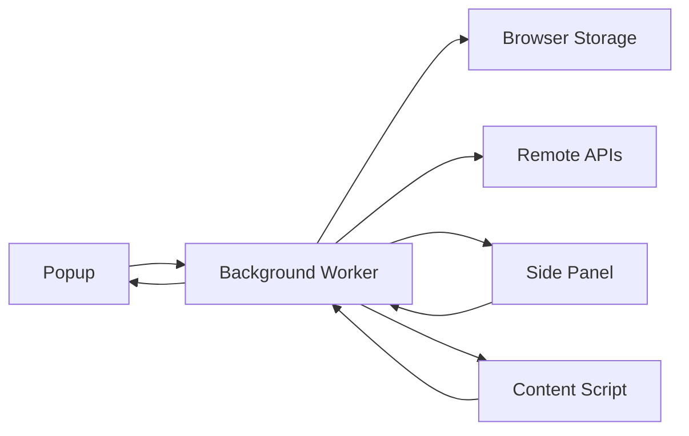

---

## Message Categories

| ID | Category | Description |
|----|----------|-------------|
| BG-031 | Authentication | Login/logout |
| BG-032 | Merchant Detection | Merchant updates |
| BG-033 | Checkout Events | Payment stage |
| BG-034 | Recommendations | AI results |
| BG-035 | Rewards | Reward calculations |
| BG-036 | Coupons | Available coupons |
| BG-037 | Notifications | Browser notifications |
| BG-038 | Configuration | Feature flags |
| BG-039 | Telemetry | Analytics |
| BG-040 | Cache | Cache synchronization |

---

## Messaging Principles

- Messages are immutable.
- Messages include version identifiers.
- Every message contains correlation IDs.
- Message processing is idempotent.
- Invalid messages are discarded safely.
- Sensitive payloads are minimized.

---

## Message Envelope

| Field | Purpose |
|--------|----------|
| Message ID | Unique identifier |
| Type | Message category |
| Version | Schema version |
| Timestamp | Event time |
| Correlation ID | Request tracing |
| Payload | Business data |
| Source | Sender component |
| Destination | Receiver component |

---

# 15. Storage Architecture

The Background Service Worker coordinates all storage access.

Content scripts should avoid writing persistent data directly unless required.

---

## STORAGE-001 Storage Layers

| Layer | Purpose |
|--------|----------|
| Memory | Temporary execution state |
| Session Storage | Current browser session |
| Local Storage | Cached intelligence |
| Sync Storage | User preferences |
| Indexed Storage (Future) | Large datasets |

---

## Data Ownership

| Data | Storage |
|------|---------|
| Authentication Tokens | Secure local storage |
| User Preferences | Sync storage |
| Merchant Cache | Local storage |
| Feature Flags | Local cache |
| Remote Configuration | Local cache |
| Telemetry Queue | Local storage |
| Recommendation Cache | Local storage |

---

## Persistence Rules

| Rule | Description |
|------|-------------|
| Persist only required state | Reduce storage overhead |
| Encrypt sensitive values | Prevent exposure |
| Apply TTL to cache | Prevent stale recommendations |
| Version stored objects | Support migrations |
| Batch writes | Reduce storage contention |

---

# 16. Cache Architecture

Caching is essential because recommendation latency directly impacts user experience.

---

## CACHE-001 Cache Hierarchy

```text
Memory Cache

↓

Browser Storage Cache

↓

Backend APIs
```

---

## Cached Objects

| Object | TTL |
|----------|------|
| Merchant Profile | 24 Hours |
| Reward Rules | 12 Hours |
| Card Metadata | 24 Hours |
| Feature Flags | 15 Minutes |
| Remote Config | 15 Minutes |
| AI Recommendation | Session |
| Coupon Catalog | 30 Minutes |
| Travel Intelligence | 10 Minutes |

---

## Cache Invalidation

Cache is refreshed when:

- TTL expires
- User logs out
- Extension updates
- Feature flags change
- Merchant rules update
- Manual refresh requested

---

## CACHE-002 Strategies

| Strategy | Use Case |
|-----------|----------|
| Read-through | Merchant profile |
| Cache-first | Card metadata |
| Network-first | AI recommendations |
| Stale-while-revalidate | Coupons |
| Write-through | Preferences |

---

# 17. Background Jobs

Manifest V3 does not support continuous execution.

Instead, lightweight scheduled work is performed through browser alarms and event-driven triggers.

---

## BG-050 Scheduled Jobs

| Job | Frequency |
|-----|-----------|
| Refresh Feature Flags | 15 min |
| Refresh Remote Config | 15 min |
| Coupon Updates | 30 min |
| Merchant Rules | Daily |
| Reward Metadata | Daily |
| Cleanup Cache | Daily |
| Retry Failed Telemetry | Hourly |

---

## Job Execution Principles

- Never overlap jobs.
- Respect browser battery optimization.
- Skip jobs while offline.
- Resume on next available event.
- Apply exponential backoff on failures.

---

# 18. Background Worker State Machine

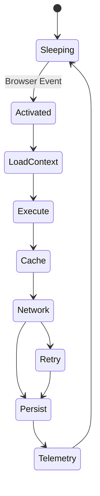

---

# 19. Engineering Best Practices

| Practice | Rationale |
|----------|-----------|
| Stateless execution | Compatible with Manifest V3 lifecycle |
| Event batching | Reduce wake-ups and network usage |
| Lazy initialization | Faster cold starts |
| Centralized messaging | Simplifies component coordination |
| Shared cache policies | Predictable performance |
| Correlation IDs | Easier debugging and tracing |
| Versioned storage | Safe upgrades |
| Graceful degradation | Better offline resilience |

---

# 20. Risks & Mitigations

| ID | Risk | Mitigation |
|----|------|------------|
| SAFETY-101 | Service worker termination during processing | Persist checkpoints before completion |
| SAFETY-102 | Cache inconsistency | Versioned cache with TTL validation |
| SAFETY-103 | Excessive wake-ups | Event aggregation and debouncing |
| SAFETY-104 | Storage quota limits | Cache eviction and compression policies |
| SAFETY-105 | Duplicate event processing | Idempotent handlers with correlation IDs |
| SAFETY-106 | Network instability | Retry with exponential backoff and offline queue |

---

# 21. Operational Considerations

| Area | Consideration |
|------|---------------|
| Startup Latency | Monitor cold-start duration and optimize module loading |
| Memory | Keep runtime allocations minimal to reduce termination risk |
| Observability | Trace event execution using correlation IDs |
| Scalability | Add new event handlers without modifying existing routing |
| Browser Compatibility | Abstract browser APIs to support Chromium, Firefox, Edge, and Safari adaptations |
| Reliability | Ensure critical events survive worker restarts through persisted checkpoints |

---

## Part 2 Summary

This part defines the Background Service Worker as the event-driven orchestration layer of the CardWise Browser Extension. It specifies lifecycle management under Manifest V3, centralized messaging, storage ownership, multi-level caching, scheduled background jobs, operational practices, and resilience strategies to ensure a lightweight, secure, and highly reliable runtime foundation.

# docs/11_BROWSER_EXTENSION.md

# Part 3 — Content Scripts Architecture

---

# 22. Content Scripts

## 22.1 Overview

Content Scripts are the primary intelligence collectors within the CardWise Browser Extension.

They execute inside web pages, observe the Document Object Model (DOM), detect user context, identify merchants, understand page intent, and communicate structured intelligence to the Background Service Worker.

Content Scripts **never** perform business decisions independently. Their responsibility is to **observe**, **classify**, **extract**, and **report** context while keeping CPU and memory usage minimal.

---

## CONTENT-001 Responsibilities

| Responsibility | Description |
|---------------|-------------|
| DOM Observation | Observe page structure and relevant changes |
| Merchant Detection | Identify merchant or travel provider |
| Page Classification | Determine page type and user intent |
| Checkout Detection | Detect checkout/payment flows |
| Data Extraction | Extract contextual metadata |
| Event Emission | Send normalized events to Background Worker |
| UI Injection | Render lightweight extension UI when required |
| Privacy Enforcement | Avoid collecting sensitive information |

---

## Engineering Principles

| Principle | Description |
|------------|-------------|
| Passive by Default | Observe before acting |
| Event Driven | Avoid polling whenever possible |
| Lightweight | Minimal CPU and memory consumption |
| Privacy First | Ignore personal and payment data |
| Idempotent | Duplicate observations produce identical results |
| Merchant Agnostic | Generic detection before merchant-specific rules |
| Fail Safe | Continue functioning even if page structure changes |

---

# 23. DOM Detection Architecture

DOM observation forms the foundation of contextual intelligence.

The extension continuously evaluates structural changes without interfering with page behavior.

---

## CONTENT-010 Detection Pipeline

```text
Page Load

↓

Initialize Observer

↓

Identify Page

↓

Detect Merchant

↓

Detect User Journey

↓

Extract Context

↓

Validate Confidence

↓

Emit Event

↓

Idle
```

---

## DOM Observation Sources

| Source | Purpose |
|----------|----------|
| Initial HTML | First-page classification |
| URL Changes | SPA navigation detection |
| DOM Mutations | Dynamic content updates |
| Form Changes | Checkout progression |
| Button States | Purchase readiness |
| Network-independent Signals | Local classification |

---

## Observation Strategy

| Strategy | Use Case |
|-----------|----------|
| Initial Scan | First page load |
| Incremental Scan | Mutation updates |
| Lazy Evaluation | Heavy sections |
| Debounced Processing | Rapid DOM changes |
| Confidence Validation | Prevent false positives |

---

## CONTENT-011 DOM Event Categories

| Event | Description |
|--------|-------------|
| Page Loaded | Initial document ready |
| Navigation | SPA route changes |
| DOM Mutation | Significant structural update |
| Checkout Step | User advances checkout |
| Payment Selection | Payment section becomes visible |
| Booking Summary | Travel summary displayed |
| Confirmation Page | Purchase completion |

---

# 24. Merchant Detection

Merchant Detection identifies the commercial entity associated with the current page.

This is the foundation for:

- Offer discovery
- Card recommendation
- Reward optimization
- Coupon eligibility
- Cashback programs
- Loyalty rules

---

## MERCHANT-001 Detection Sources

| Source | Reliability |
|---------|-------------|
| Domain Name | Very High |
| Structured Metadata | High |
| Open Graph Tags | High |
| JSON-LD Schema | High |
| Checkout Layout | Medium |
| Brand Assets | Medium |
| URL Patterns | Medium |
| DOM Features | Medium |
| AI Classification | Fallback |

---

## Merchant Classification Pipeline

```text
URL

↓

Domain Matching

↓

Metadata Extraction

↓

Known Merchant Rules

↓

Category Classification

↓

Confidence Score

↓

Merchant Profile
```

---

## Merchant Confidence Levels

| Confidence | Action |
|------------|--------|
| >95% | Merchant confirmed |
| 80–95% | Validate using secondary signals |
| 60–80% | AI-assisted classification |
| <60% | Unknown merchant |

---

## MERCHANT-002 Merchant Categories

| Category | Examples |
|-----------|----------|
| E-commerce | Online retail |
| Grocery | Supermarkets |
| Fashion | Apparel |
| Electronics | Consumer electronics |
| Food Delivery | Restaurant delivery |
| Travel | Airlines, hotels |
| Utilities | Recharge, bills |
| Entertainment | Streaming, tickets |
| Finance | Banking and insurance |
| Healthcare | Pharmacies and clinics |

---

# 25. Checkout Detection

Checkout Detection determines when the user is entering a payment-critical stage where financial recommendations provide maximum value.

---

## CHECKOUT-001 Detection Signals

| Signal | Confidence |
|---------|------------|
| Cart Summary | Medium |
| Shipping Details | High |
| Address Form | High |
| Payment Method Section | Very High |
| Order Review | Very High |
| Place Order Button | Very High |
| Booking Confirmation | High |

---

## Checkout Flow

```text
Merchant Page

↓

Cart

↓

Shipping

↓

Payment

↓

Review

↓

Confirmation
```

Recommendations are progressively enriched as the user advances through each stage.

---

## Checkout State Machine

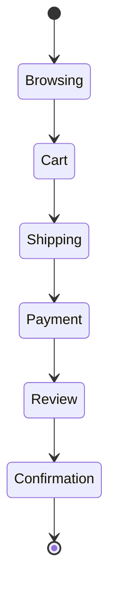

---

## CHECKOUT-002 Checkout Events

| Event | Purpose |
|--------|----------|
| Cart Detected | Initialize shopping intelligence |
| Address Completed | Prepare payment suggestions |
| Payment Visible | Compute card recommendations |
| Order Updated | Recalculate savings |
| Confirmation | Track successful purchase (privacy-safe) |

---

# 26. Page Intelligence

Page Intelligence determines the semantic purpose of the current page.

Rather than relying solely on URL patterns, CardWise combines structural analysis with contextual signals.

---

## PAGE-001 Supported Page Types

| Page Type | Description |
|------------|-------------|
| Homepage | Merchant landing page |
| Search Results | Product discovery |
| Product Details | Individual product page |
| Category Listing | Product collections |
| Shopping Cart | Cart contents |
| Checkout | Payment workflow |
| Flight Search | Travel search |
| Hotel Search | Accommodation search |
| Booking Review | Travel checkout |
| Confirmation | Purchase completed |
| Unknown | Insufficient confidence |

---

## Classification Pipeline

```text
DOM Signals

↓

Merchant Rules

↓

Semantic Analysis

↓

Category Detection

↓

Confidence Calculation

↓

Normalized Page Type
```

---

## Extracted Context

| Context | Example |
|----------|----------|
| Merchant | Amazon |
| Category | Electronics |
| Product Price | ₹59,999 |
| Currency | INR |
| Travel Route | BLR → DEL |
| Hotel City | Bengaluru |
| Checkout Stage | Payment |
| Estimated Spend | ₹18,000 |

> Sensitive information such as personal addresses, card numbers, CVV, passwords, OTPs, and payment credentials are **never extracted or transmitted**.

---

# 27. Dynamic Page Handling

Modern web applications frequently use Single Page Application (SPA) frameworks.

Traditional page-load detection is insufficient.

---

## CONTENT-020 Navigation Detection

| Framework Pattern | Strategy |
|-------------------|----------|
| History API | Observe URL changes |
| Push State | Detect route updates |
| Replace State | Refresh page classification |
| Hash Navigation | Lightweight re-evaluation |
| DOM Replacement | Incremental rescan |

---

## Mutation Processing Strategy

```text
DOM Mutation

↓

Filter Relevant Nodes

↓

Ignore Cosmetic Changes

↓

Recalculate Context

↓

Emit Delta Update
```

---

# 28. UI Injection Architecture

Content Scripts inject UI only when it adds measurable value.

Injection is context-aware and reversible.

---

## CONTENT-030 Injection Components

| Component | Purpose |
|------------|----------|
| Recommendation Badge | Quick card suggestion |
| Savings Widget | Estimated savings |
| Offer Indicator | Active offers |
| Reward Preview | Expected reward points |
| Price Tracker | Historical pricing |
| Travel Optimizer | Booking recommendations |

---

## Injection Principles

- Never obscure merchant UI.
- Respect responsive layouts.
- Avoid layout shifts.
- Load lazily.
- Remove injected UI on navigation.
- Support dark mode where possible.

---

# 29. Content Script Communication Flow

```mermaid
flowchart TB

A[Page Load]

↓

B[DOM Scanner]

↓

C[Merchant Detector]

↓

D[Page Classifier]

↓

E[Checkout Detector]

↓

F[Context Builder]

↓

G[Background Worker]

↓

H[Recommendation Engine]

↓

I[Popup / Side Panel]
```

---

# 30. Performance Optimization

Content Scripts operate on every supported webpage and therefore require strict performance discipline.

---

## CONTENT-040 Optimization Techniques

| Technique | Benefit |
|------------|----------|
| Lazy Initialization | Faster page load |
| Debounced Mutation Handling | Reduced CPU usage |
| Incremental DOM Parsing | Lower memory footprint |
| Selective Observers | Fewer unnecessary callbacks |
| Rule Caching | Reduced repeated computations |
| Delta Messaging | Smaller message payloads |
| Passive Event Listeners | Better browser performance |

---

## Performance Budget

| Metric | Target |
|---------|--------|
| Initial Injection | <50 ms |
| Merchant Detection | <100 ms |
| Checkout Detection | <150 ms |
| Recommendation Trigger | <300 ms |
| Additional Memory | <10 MB |
| CPU Utilization | Minimal during idle |

---

# 31. Engineering Trade-offs

| Decision | Benefit | Trade-off |
|-----------|----------|------------|
| Mutation Observers | Real-time awareness | Additional CPU overhead |
| Incremental Parsing | Better scalability | More implementation complexity |
| Generic Detection Rules | Broad compatibility | Lower precision for niche sites |
| Merchant-specific Rules | Higher accuracy | Ongoing maintenance |
| Deferred UI Injection | Better UX | Slightly delayed recommendations |

---

# 32. Risks & Mitigations

| ID | Risk | Mitigation |
|----|------|------------|
| SAFETY-201 | Frequent merchant UI changes | Configurable detection rules with remote updates |
| SAFETY-202 | Excessive DOM mutations | Debouncing and relevance filtering |
| SAFETY-203 | False checkout detection | Multi-signal confidence scoring |
| SAFETY-204 | Performance degradation | Strict performance budgets and lazy evaluation |
| SAFETY-205 | Sensitive data exposure | Explicit exclusion of payment and personal fields |
| SAFETY-206 | SPA navigation inconsistencies | History API monitoring with incremental rescans |

---

# 33. Operational Considerations

| Area | Consideration |
|------|---------------|
| Browser Compatibility | Validate DOM strategies across Chromium, Firefox, Edge, and Safari |
| Rule Updates | Merchant heuristics should be remotely configurable |
| Observability | Track detection confidence and false-positive rates |
| Accessibility | Injected UI must preserve keyboard navigation and screen reader compatibility |
| Reliability | Continue operating with graceful degradation on unknown merchants |

---

## Part 3 Summary

Part 3 defines the Content Script architecture as the browser-resident intelligence layer responsible for DOM observation, merchant identification, checkout detection, page classification, context extraction, and lightweight UI injection. It establishes privacy-first data collection, high-performance page analysis, and robust communication with the Background Service Worker to enable accurate, real-time financial recommendations.

# docs/11_BROWSER_EXTENSION.md

# Part 4 — Popup, Side Panel & UI Architecture

---

# 34. Extension User Experience Architecture

## 34.1 Overview

The CardWise Browser Extension provides two complementary user interfaces:

1. **Popup** – A lightweight, task-oriented interface for quick actions and immediate insights.
2. **Side Panel** – A persistent, AI-powered workspace for detailed financial intelligence, recommendations, and decision support.

The architecture intentionally separates **high-frequency interactions** from **deep exploration**, ensuring the extension remains fast while still providing rich functionality.

---

## UI-001 Design Principles

| Principle | Description |
|-----------|-------------|
| Contextual | Show only information relevant to the current page |
| Progressive Disclosure | Start simple, expand when needed |
| Non-Intrusive | Never interrupt the browsing experience |
| Explainable | Every recommendation includes reasoning |
| Responsive | Consistent experience across supported browsers |
| Accessible | WCAG-compliant interactions and keyboard navigation |
| Performant | UI renders within strict performance budgets |

---

# 35. Popup Architecture

The Popup is designed for **quick decision-making**.

Users should be able to open the extension, understand the current opportunity, and act within a few seconds.

---

## POPUP-001 Responsibilities

| Responsibility | Description |
|---------------|-------------|
| Authentication Status | Display signed-in state |
| Current Merchant | Show detected merchant |
| Best Credit Card | Recommend optimal payment method |
| Active Offers | Surface eligible offers |
| Cashback Summary | Show estimated cashback |
| Reward Estimate | Predict reward points |
| Quick Actions | Open side panel, refresh, report issue |

---

## Popup Information Hierarchy

```text
Current Merchant

↓

Best Card Recommendation

↓

Expected Savings

↓

Coupons & Offers

↓

Reward Breakdown

↓

Quick Actions
```

---

## Popup Sections

| Section | Purpose |
|----------|----------|
| Header | User profile and connection status |
| Merchant Summary | Merchant and category information |
| Recommendation Card | Best payment option |
| Savings Summary | Total projected benefit |
| Offers | Coupons, instant discounts, cashback |
| Actions | Open Side Panel, Refresh, Feedback |

---

## POPUP-002 Performance Targets

| Metric | Target |
|---------|--------|
| Initial Render | <200 ms |
| Recommendation Display | <300 ms |
| Memory Usage | <15 MB |
| Refresh Time | <1 second |
| User Interaction Latency | <50 ms |

---

# 36. Side Panel Architecture

The Side Panel provides an always-available financial intelligence workspace without interrupting browsing.

Unlike the Popup, it remains open while users navigate across supported websites.

---

## PANEL-001 Responsibilities

| Responsibility | Description |
|---------------|-------------|
| AI Financial Assistant | Conversational guidance |
| Reward Optimization | Compare payment strategies |
| Offer Exploration | Browse all available offers |
| Card Comparison | Explain why a card is recommended |
| Travel Optimization | Flight and hotel intelligence |
| Spending Insights | Analyze current purchase |
| Knowledge Graph | Explain merchant and reward relationships |
| Saved Opportunities | Bookmark recommendations |

---

## Side Panel Navigation

```text
Dashboard

├── AI Assistant
├── Payment Intelligence
├── Shopping Intelligence
├── Travel Intelligence
├── Rewards
├── Offers
├── Merchant Insights
├── Saved Items
└── Settings
```

---

## PANEL-002 Persistent Context

Unlike the Popup, the Side Panel maintains session context across page navigation.

Examples include:

- Current merchant
- Active recommendation
- Recently viewed offers
- Ongoing travel booking
- AI conversation history
- User-selected cards
- Saved comparisons

---

# 37. UI Component Architecture

The extension UI follows a modular component architecture shared across Popup and Side Panel.

---

## UI-010 Component Layers

```text
Application Shell

↓

Feature Modules

↓

Shared Components

↓

Design System

↓

Browser Runtime
```

---

## Shared Components

| Component | Purpose |
|-----------|----------|
| Card Recommendation | Display recommended card |
| Savings Banner | Total projected savings |
| Offer Card | Coupon and offer display |
| Reward Meter | Visual reward estimation |
| Merchant Badge | Merchant information |
| Confidence Indicator | Recommendation confidence |
| Explanation Panel | AI reasoning |
| Skeleton Loader | Loading states |
| Error Boundary | Graceful recovery |

---

## Feature Modules

| Module | Popup | Side Panel |
|---------|--------|------------|
| Authentication | ✓ | ✓ |
| Merchant Summary | ✓ | ✓ |
| AI Assistant | — | ✓ |
| Offer Explorer | Limited | Full |
| Reward Simulator | Limited | ✓ |
| Travel Optimizer | Limited | ✓ |
| Card Comparison | Limited | ✓ |
| Analytics | ✓ | ✓ |

---

# 38. State Management Architecture

The extension uses layered state management to balance performance, persistence, and synchronization.

---

## STATE-001 State Categories

| State | Scope |
|--------|-------|
| UI State | Component-local |
| Session State | Current browser session |
| User Preferences | Persistent |
| Merchant Context | Shared runtime |
| Recommendations | Shared runtime |
| Feature Flags | Global |
| Remote Config | Global |
| Authentication | Secure shared state |

---

## State Flow

```text
Background Worker

↓

Shared Runtime State

↓

Popup

↓

Side Panel

↓

UI Components
```

---

## Synchronization Rules

| Rule | Description |
|------|-------------|
| Single Source of Truth | Background Worker owns shared state |
| Immutable Updates | Prevent inconsistent rendering |
| Optimistic Rendering | Display cached values while refreshing |
| Delta Synchronization | Transmit only changed state |
| Event-Based Refresh | Avoid polling |

---

# 39. Navigation & Interaction Flow

The UI adapts dynamically to browsing context.

---

## User Interaction Flow

```text
Merchant Page

↓

Content Script Detects Context

↓

Background Worker Retrieves Intelligence

↓

Popup Displays Summary

↓

User Opens Side Panel

↓

AI Explains Recommendation

↓

User Chooses Payment Strategy
```

---

## Navigation Principles

- Preserve browsing context
- Avoid unnecessary page reloads
- Maintain AI conversation continuity
- Synchronize recommendation updates in real time
- Restore previous state after browser restart where applicable

---

# 40. Rendering Strategy

Rendering must remain lightweight while handling rapidly changing recommendation data.

---

## UI-020 Rendering Pipeline

```text
Runtime Context

↓

State Update

↓

Component Selection

↓

Incremental Rendering

↓

Interaction Ready
```

---

## Rendering Optimizations

| Technique | Benefit |
|-----------|----------|
| Lazy Component Loading | Faster startup |
| Memoized Components | Reduced re-renders |
| Virtualized Lists | Efficient offer browsing |
| Incremental Updates | Smooth recommendation refresh |
| Shared Design Tokens | Consistent styling |
| Skeleton Screens | Improved perceived performance |

---

# 41. Error Handling

The extension UI should always fail gracefully.

---

## Error Categories

| Error | Handling Strategy |
|--------|-------------------|
| Authentication Failure | Prompt re-login |
| Network Timeout | Show cached recommendations |
| Merchant Unknown | Display generic insights |
| AI Service Unavailable | Fall back to rule-based recommendations |
| Storage Failure | Retry and notify user |
| Partial Recommendation | Display available information with explanation |

---

## Recovery Principles

- Never crash the entire UI.
- Isolate failures using component boundaries.
- Retry transient failures.
- Preserve user context whenever possible.
- Provide actionable error messages.

---

# 42. UI Communication Flow

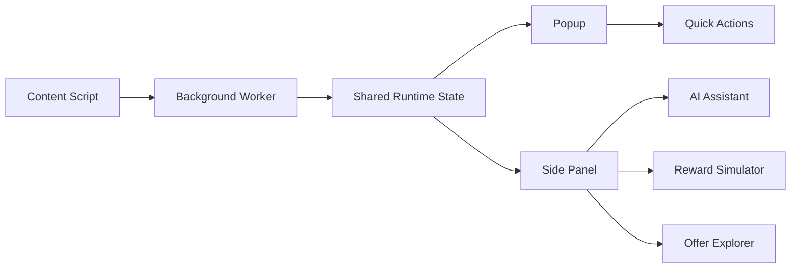

---

# 43. Accessibility

Accessibility is a core engineering requirement.

---

## UI-030 Accessibility Standards

| Standard | Requirement |
|-----------|-------------|
| Keyboard Navigation | Fully supported |
| Screen Readers | Semantic structure |
| Color Contrast | WCAG AA or better |
| Focus Management | Visible focus indicators |
| Dynamic Updates | Accessible live regions |
| Reduced Motion | Respect browser preferences |

---

# 44. Engineering Trade-offs

| Decision | Benefit | Trade-off |
|-----------|----------|------------|
| Popup for quick actions | Fast interactions | Limited screen space |
| Side Panel for advanced workflows | Rich functionality | Larger implementation surface |
| Shared component library | Consistency | Requires disciplined versioning |
| Centralized state | Predictable updates | Slight synchronization overhead |
| Incremental rendering | Better performance | More complex state management |

---

# 45. Risks & Mitigations

| ID | Risk | Mitigation |
|----|------|------------|
| SAFETY-301 | UI lag due to large recommendation payloads | Incremental rendering and lazy loading |
| SAFETY-302 | State inconsistency across Popup and Side Panel | Background Worker as single source of truth |
| SAFETY-303 | Browser-specific UI differences | Shared abstraction layer and cross-browser testing |
| SAFETY-304 | Recommendation flicker during refresh | Optimistic rendering with stale-while-refresh strategy |
| SAFETY-305 | Accessibility regressions | Automated accessibility validation and manual audits |

---

# 46. Operational Considerations

| Area | Consideration |
|------|---------------|
| Design System | Maintain shared components and design tokens across all extension surfaces |
| Telemetry | Measure UI latency, interaction success, and feature adoption |
| Feature Flags | Roll out UI capabilities incrementally |
| Localization | Ensure layouts support multiple languages and varying text lengths |
| Maintainability | Keep feature modules independent to simplify future enhancements |

---

## Part 4 Summary

Part 4 defines the user interface architecture of the CardWise Browser Extension, separating lightweight Popup interactions from the persistent Side Panel workspace. It establishes modular UI composition, centralized state management, rendering strategies, accessibility standards, error handling, and synchronization patterns that provide a responsive, explainable, and scalable user experience across all supported browsers.

# docs/11_BROWSER_EXTENSION.md

# Part 5 — Merchant Intelligence, Shopping Intelligence & Offer Optimization

---

# 47. Merchant Intelligence

## 47.1 Overview

Merchant Intelligence is the foundational intelligence layer that enables CardWise to understand **who the merchant is**, **what the user is purchasing**, **which offers are applicable**, and **how to maximize financial value**.

Instead of relying solely on domain names, CardWise constructs a comprehensive merchant profile using multiple signals and enriches it with cloud-based knowledge.

Merchant Intelligence powers:

- Card Recommendations
- Reward Optimization
- Offer Discovery
- Coupon Validation
- Cashback Eligibility
- Merchant Risk Assessment
- Travel Optimization
- Spending Categorization

---

## MERCHANT-001 Objectives

| Objective | Description |
|------------|-------------|
| Identify Merchant | Detect the active merchant with high confidence |
| Classify Category | Determine merchant category (MCC-equivalent abstraction) |
| Detect Checkout Flow | Understand transaction stage |
| Determine Eligibility | Identify applicable offers and rewards |
| Estimate Spend Type | Categorize expected spending |
| Generate Merchant Profile | Normalize merchant information for downstream engines |

---

## Merchant Intelligence Pipeline

```text
Browser URL

↓

Domain Detection

↓

Merchant Identification

↓

Category Classification

↓

Merchant Knowledge Graph

↓

Offer Eligibility

↓

Reward Rules

↓

Recommendation Engine
```

---

## Merchant Profile Model

| Attribute | Description |
|------------|-------------|
| Merchant ID | Internal normalized identifier |
| Merchant Name | Canonical merchant name |
| Merchant Category | Shopping, Travel, Dining, etc. |
| Country | Operating market |
| Supported Currencies | Accepted transaction currencies |
| Payment Methods | Cards, wallets, UPI, EMI |
| Loyalty Programs | Supported reward programs |
| Offer Catalog | Active merchant offers |
| Cashback Programs | Available cashback partners |
| Risk Score | Confidence and trust indicators |

---

# 48. Merchant Classification

Merchant classification combines deterministic rules with AI-assisted classification.

---

## MERCHANT-010 Classification Sources

| Source | Confidence |
|----------|------------|
| Domain Registry | Very High |
| Merchant Database | Very High |
| Structured Metadata | High |
| Schema.org Markup | High |
| Page Semantics | Medium |
| Checkout Components | Medium |
| Visual Heuristics | Low |
| AI Classifier | Fallback |

---

## Merchant Categories

| Category | Examples |
|-----------|----------|
| Retail | General merchandise |
| Electronics | Consumer electronics |
| Grocery | Online grocery |
| Fashion | Clothing and accessories |
| Travel | Flights, hotels, trains |
| Food Delivery | Restaurant aggregators |
| Entertainment | Streaming and ticketing |
| Healthcare | Pharmacy and wellness |
| Utilities | Recharge and bill payments |
| Financial Services | Insurance, investments |

---

## Confidence Scoring

| Score | Interpretation |
|--------|----------------|
| 95–100 | Verified merchant |
| 85–94 | High confidence |
| 70–84 | Moderate confidence |
| <70 | AI-assisted verification required |

---

# 49. Shopping Intelligence

Shopping Intelligence continuously evaluates purchasing opportunities before, during, and after checkout.

It combines merchant context, pricing, offers, coupons, and user preferences into a unified optimization strategy.

---

## SHOPPING-001 Capabilities

| Capability | Description |
|-------------|-------------|
| Product Context | Understand product and category |
| Price Intelligence | Analyze current pricing |
| Coupon Discovery | Find eligible coupons |
| Offer Stacking | Combine multiple benefits |
| Cashback Detection | Surface cashback opportunities |
| Reward Projection | Estimate reward earnings |
| Spend Analysis | Categorize purchase |
| Alternative Suggestions | Recommend better purchasing options |

---

## Shopping Intelligence Flow

```text
Merchant

↓

Product Context

↓

Pricing

↓

Coupons

↓

Offers

↓

Cashback

↓

Rewards

↓

Best Purchase Strategy
```

---

## Shopping Signals

| Signal | Purpose |
|----------|----------|
| Product Category | Reward calculation |
| Cart Value | Offer eligibility |
| Shipping Charges | Effective savings |
| Currency | Regional offers |
| Payment Options | Card optimization |
| Merchant Campaign | Instant discounts |

---

# 50. Coupon Engine

The Coupon Engine discovers, validates, ranks, and explains coupon opportunities.

Unlike traditional coupon extensions, CardWise prioritizes **verified and combinable** coupons over quantity.

---

## OFFER-001 Coupon Lifecycle

```text
Merchant

↓

Retrieve Coupons

↓

Validate Eligibility

↓

Detect Expiration

↓

Simulate Application

↓

Rank Savings

↓

Recommend Coupon
```

---

## Coupon Sources

| Source | Reliability |
|----------|------------|
| Merchant Promotions | Very High |
| Partner APIs | High |
| Curated Database | High |
| Community Contributions | Medium |
| AI Inference | Experimental |

---

## Coupon Ranking Factors

| Factor | Weight |
|----------|--------|
| Discount Value | Very High |
| Success Rate | High |
| Expiry | High |
| Stackability | High |
| User Eligibility | High |
| Historical Reliability | Medium |

---

## Coupon Validation Rules

- Verify expiry before recommendation.
- Respect merchant restrictions.
- Avoid duplicate coupon suggestions.
- Rank verified coupons above inferred coupons.
- Explain eligibility conditions.

---

# 51. Offer Stacking Engine

Offer Stacking determines the optimal combination of financial benefits.

This includes:

- Merchant Discounts
- Bank Offers
- Credit Card Rewards
- Reward Portals
- Cashback
- Loyalty Points
- Coupon Codes

---

## OFFER-010 Stack Evaluation

```text
Merchant Offer

+

Coupon

+

Card Discount

+

Cashback

+

Reward Points

+

Loyalty Bonus

↓

Maximum Net Value
```

---

## Stack Compatibility Matrix

| Benefit | Can Stack? |
|----------|------------|
| Merchant Discount | Yes |
| Coupon | Depends on merchant |
| Instant Bank Discount | Usually |
| Cashback | Depends on provider |
| Reward Points | Yes |
| Loyalty Benefits | Usually |
| EMI Offers | Conditional |

---

## Optimization Priorities

| Priority | Optimization Goal |
|----------|-------------------|
| 1 | Maximize total savings |
| 2 | Maximize reward value |
| 3 | Preserve premium benefits |
| 4 | Minimize payment cost |
| 5 | Improve long-term loyalty value |

---

# 52. Cashback Discovery

Cashback opportunities are evaluated alongside coupons and rewards rather than independently.

---

## SHOPPING-010 Cashback Sources

| Source | Description |
|----------|-------------|
| Merchant Campaigns | Direct cashback |
| Card Issuers | Statement cashback |
| Affiliate Partners | Referral cashback |
| Reward Portals | Platform cashback |
| Promotional Events | Seasonal campaigns |

---

## Cashback Evaluation

```text
Merchant

↓

Eligible Cashback

↓

Card Cashback

↓

Stackability Check

↓

Projected Net Savings
```

---

# 53. Price Intelligence

Price Intelligence helps users determine whether purchasing now is financially advantageous.

---

## SHOPPING-020 Features

| Feature | Description |
|----------|-------------|
| Current Price | Current selling price |
| Historical Trend | Previous pricing behavior |
| Seasonal Pattern | Expected future discounts |
| Alternative Seller | Better merchant options |
| Price Drop Alerts | Notify when price decreases |
| Value Score | Overall purchase attractiveness |

---

## Price Decision Pipeline

```text
Current Price

↓

Historical Comparison

↓

Seasonality

↓

Merchant Reputation

↓

Savings Opportunity

↓

Purchase Recommendation
```

---

## Price Recommendation Levels

| Level | Recommendation |
|--------|----------------|
| Excellent | Buy now |
| Good | Worth purchasing |
| Neutral | No significant advantage |
| Caution | Better deals likely |
| Delay | Wait for expected price drop |

---

# 54. Recommendation Prioritization

Shopping recommendations are ranked according to total financial value.

---

## SHOPPING-030 Ranking Inputs

| Input | Purpose |
|--------|----------|
| Merchant Confidence | Recommendation reliability |
| Offer Value | Direct savings |
| Coupon Success | Likelihood of success |
| Reward Earnings | Long-term value |
| Cashback | Immediate return |
| User Preferences | Personalized ranking |
| Historical Behavior | Better relevance |

---

## Recommendation Pipeline

```text
Merchant Intelligence

↓

Offer Engine

↓

Coupon Engine

↓

Reward Engine

↓

AI Ranking

↓

Explainable Recommendation
```

---

# 55. Merchant & Shopping Architecture

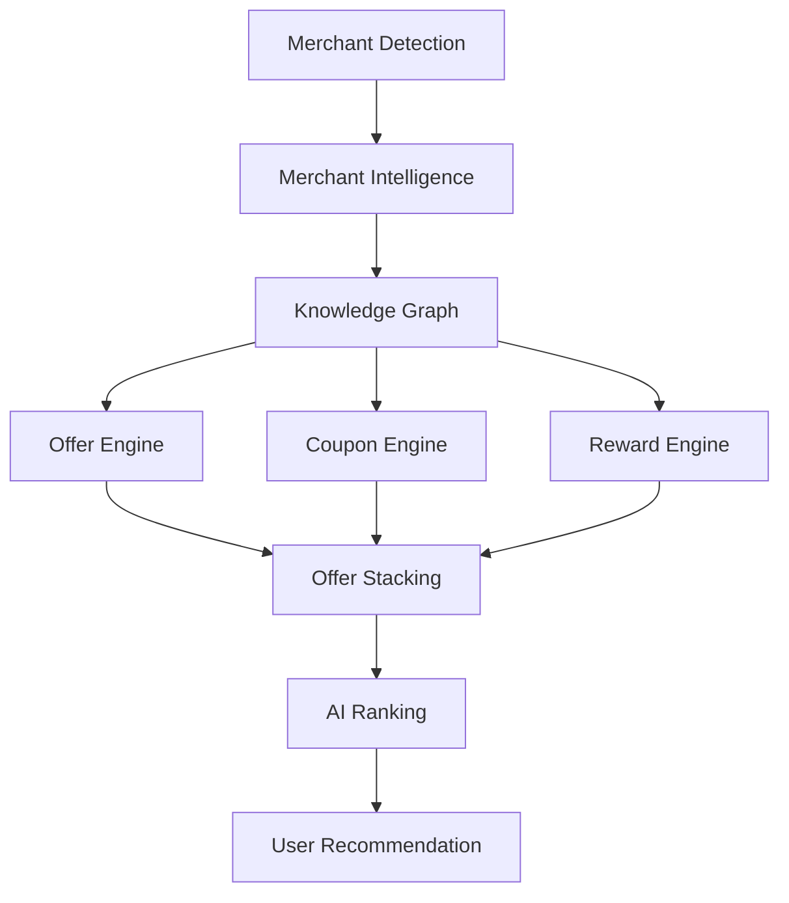

---

# 56. Performance Optimization

Merchant and Shopping Intelligence execute frequently and therefore require efficient processing.

---

## Performance Strategies

| Strategy | Benefit |
|-----------|----------|
| Merchant Cache | Reduce repeated lookups |
| Offer Cache | Lower network latency |
| Incremental Updates | Refresh only changed data |
| Lazy Enrichment | Defer expensive computations |
| Rule-Based Shortcuts | Faster known merchant processing |
| Background Prefetch | Improve perceived responsiveness |

---

## Performance Targets

| Metric | Target |
|---------|--------|
| Merchant Identification | <100 ms |
| Offer Retrieval | <250 ms |
| Coupon Ranking | <150 ms |
| Recommendation Generation | <300 ms |
| Total Shopping Intelligence | <500 ms |

---

# 57. Engineering Trade-offs

| Decision | Benefit | Trade-off |
|-----------|----------|------------|
| Deterministic merchant rules | High accuracy | Ongoing maintenance |
| AI-assisted classification | Broad coverage | Additional latency |
| Offer stacking simulation | Maximum savings | Increased computational complexity |
| Cached merchant profiles | Faster responses | Cache invalidation challenges |
| Explainable ranking | User trust | Slight processing overhead |

---

# 58. Risks & Mitigations

| ID | Risk | Mitigation |
|----|------|------------|
| SAFETY-401 | Merchant website changes | Remote rule updates and fallback classifiers |
| SAFETY-402 | Expired coupons | Real-time validation before recommendation |
| SAFETY-403 | Conflicting offers | Stack compatibility engine |
| SAFETY-404 | Inaccurate pricing | Frequent cache refresh and confidence scoring |
| SAFETY-405 | Excessive recommendation latency | Multi-level caching and asynchronous enrichment |
| SAFETY-406 | False-positive merchant detection | Multi-signal confidence validation |

---

# 59. Operational Considerations

| Area | Consideration |
|------|---------------|
| Merchant Database | Continuously expand and normalize merchant profiles |
| Offer Quality | Monitor coupon success rates and remove low-performing entries |
| Price Data | Track freshness and confidence for historical pricing |
| AI Feedback | Incorporate user interactions to improve recommendation ranking |
| Monitoring | Measure merchant detection accuracy, coupon usage, and recommendation acceptance rates |

---

## Part 5 Summary

Part 5 defines the Merchant Intelligence and Shopping Intelligence architecture that powers contextual financial optimization. It covers merchant identification, shopping context analysis, coupon discovery, offer stacking, cashback evaluation, price intelligence, and recommendation prioritization. Together, these systems enable CardWise to maximize total user value through explainable, real-time financial recommendations while maintaining high performance and operational reliability.

# docs/11_BROWSER_EXTENSION.md

# Part 6 — Travel Intelligence, Reward Optimization & Payment Recommendation

---

# 60. Travel Intelligence

## 60.1 Overview

Travel purchases are among the highest-value transactions for credit card users. Airlines, hotels, trains, buses, vacation packages, and travel aggregators often have complex combinations of:

- Instant discounts
- Reward multipliers
- Loyalty benefits
- Travel portals
- Co-branded cards
- Lounge benefits
- Complimentary insurance
- Bonus milestone rewards

The CardWise Browser Extension continuously analyzes travel booking journeys and recommends the financially optimal booking strategy.

Unlike shopping optimization, travel optimization considers both **immediate savings** and **long-term reward value**.

---

## TRAVEL-001 Objectives

| Objective | Description |
|------------|-------------|
| Detect Travel Intent | Identify travel-related booking flows |
| Optimize Booking | Recommend the best booking strategy |
| Maximize Rewards | Increase reward earnings |
| Preserve Premium Benefits | Prioritize lounge, insurance, and elite benefits |
| Evaluate Redemption | Compare cash vs. points redemption |
| Explain Recommendations | Provide transparent financial reasoning |

---

# 61. Travel Detection

The extension detects travel platforms using layered contextual signals rather than relying only on domains.

---

## TRAVEL-010 Detection Sources

| Signal | Confidence |
|----------|------------|
| Domain | Very High |
| Search Results | High |
| Passenger Forms | High |
| Flight Cards | High |
| Hotel Listings | High |
| Booking Summary | Very High |
| Payment Page | Very High |
| Confirmation Page | Very High |

---

## Travel Detection Pipeline

```text
Merchant

↓

Travel Classification

↓

Booking Type

↓

Journey Context

↓

Reward Analysis

↓

Recommendation Engine
```

---

## Supported Booking Types

| Category | Examples |
|-----------|----------|
| Flights | Domestic and international |
| Hotels | Hotels, resorts, apartments |
| Trains | Rail ticketing |
| Buses | Intercity transport |
| Vacation Packages | Bundled travel |
| Car Rentals | Vehicle rentals |
| Cruises | Cruise bookings |
| Activities | Tours and attractions |

---

# 62. Flight Intelligence

Flight bookings frequently include premium travel offers and accelerated reward programs.

The extension evaluates the booking before payment is completed.

---

## TRAVEL-020 Flight Context

| Context | Description |
|----------|-------------|
| Origin | Departure city |
| Destination | Arrival city |
| Fare Type | Economy, Business, First |
| Airline | Carrier |
| Passenger Count | Travelers |
| Fare Value | Booking amount |
| Travel Date | Journey schedule |
| Booking Portal | Merchant platform |

---

## Flight Optimization Pipeline

```text
Flight Search

↓

Fare Analysis

↓

Card Benefits

↓

Reward Multipliers

↓

Travel Portal Offers

↓

AI Ranking

↓

Booking Recommendation
```

---

## Flight Recommendation Factors

| Factor | Importance |
|----------|------------|
| Instant Discount | Very High |
| Reward Multiplier | Very High |
| Lounge Eligibility | High |
| Insurance Coverage | High |
| Cancellation Benefits | Medium |
| Airline Partnership | Medium |

---

# 63. Hotel Intelligence

Hotel bookings involve multiple optimization opportunities beyond room pricing.

The extension evaluates:

- Hotel loyalty programs
- Card-specific promotions
- Booking platform campaigns
- Reward portals
- Cashback offers
- Upgrade eligibility

---

## HOTEL-001 Context Model

| Context | Description |
|----------|-------------|
| Hotel Brand | Chain or independent |
| City | Destination |
| Stay Duration | Number of nights |
| Guests | Occupancy |
| Booking Value | Total cost |
| Loyalty Program | Eligible membership |
| Cancellation Policy | Flexible vs. non-refundable |

---

## Hotel Optimization Pipeline

```text
Hotel Selection

↓

Loyalty Analysis

↓

Card Offers

↓

Reward Projection

↓

Cashback

↓

AI Recommendation
```

---

## Optimization Priorities

| Priority | Goal |
|-----------|------|
| 1 | Maximize total value |
| 2 | Preserve elite benefits |
| 3 | Earn bonus rewards |
| 4 | Reduce booking cost |
| 5 | Improve future loyalty status |

---

# 64. Reward Optimization

Reward Optimization evaluates how different payment methods affect long-term reward earnings.

Unlike simple cashback calculations, this engine estimates the **true financial value** of reward points.

---

## PAYMENT-001 Reward Inputs

| Input | Description |
|--------|-------------|
| Card Portfolio | User-owned cards |
| Merchant Category | Spending classification |
| Reward Rules | Issuer reward structure |
| Active Promotions | Temporary campaigns |
| Redemption Value | Estimated point valuation |
| Annual Milestones | Progress toward bonus thresholds |

---

## Reward Optimization Pipeline

```text
Transaction

↓

Merchant Category

↓

Card Rules

↓

Reward Multipliers

↓

Point Valuation

↓

Projected Value

↓

Recommendation
```

---

## Reward Evaluation Metrics

| Metric | Description |
|---------|-------------|
| Base Rewards | Standard earning rate |
| Accelerated Rewards | Category bonuses |
| Milestone Progress | Spend threshold impact |
| Transfer Value | Airline/hotel transfer value |
| Redemption Efficiency | Effective monetary value |
| Opportunity Cost | Lost rewards from alternative cards |

---

# 65. Redemption Intelligence

The extension compares paying directly against redeeming accumulated rewards.

---

## PAYMENT-010 Redemption Modes

| Mode | Description |
|------|-------------|
| Cash Payment | Full payment using card |
| Full Redemption | Pay entirely with points |
| Partial Redemption | Mix points and cash |
| Portal Redemption | Travel portal points |
| Loyalty Transfer | Transfer to airline or hotel program |

---

## Redemption Decision Flow

```text
Transaction

↓

Available Points

↓

Point Valuation

↓

Alternative Reward Earnings

↓

Net Financial Benefit

↓

Recommended Strategy
```

---

## Recommendation Levels

| Level | Recommendation |
|--------|----------------|
| Excellent | Redeem points |
| Good | Partial redemption |
| Neutral | Either option acceptable |
| Better to Pay | Preserve points for higher-value redemption |

---

# 66. Payment Recommendation Engine

The Payment Recommendation Engine ranks every available payment option based on overall financial value.

---

## PAYMENT-020 Recommendation Factors

| Factor | Weight |
|----------|--------|
| Instant Discount | Very High |
| Reward Value | Very High |
| Cashback | High |
| Loyalty Benefits | High |
| Insurance | Medium |
| Lounge Access | Medium |
| EMI Cost | Medium |
| User Preference | Medium |

---

## Payment Strategy Pipeline

```text
Merchant

↓

Travel Context

↓

Offer Engine

↓

Reward Engine

↓

Card Portfolio

↓

Optimization

↓

Recommended Payment
```

---

## Payment Options

| Option | Description |
|---------|-------------|
| Credit Card | Standard payment |
| Co-branded Card | Merchant-specific benefits |
| EMI | Installment evaluation |
| Wallet | Digital wallet integration |
| Net Banking | Bank promotions |
| UPI (Future) | Linked card optimization |

---

# 67. Travel Recommendation Flow

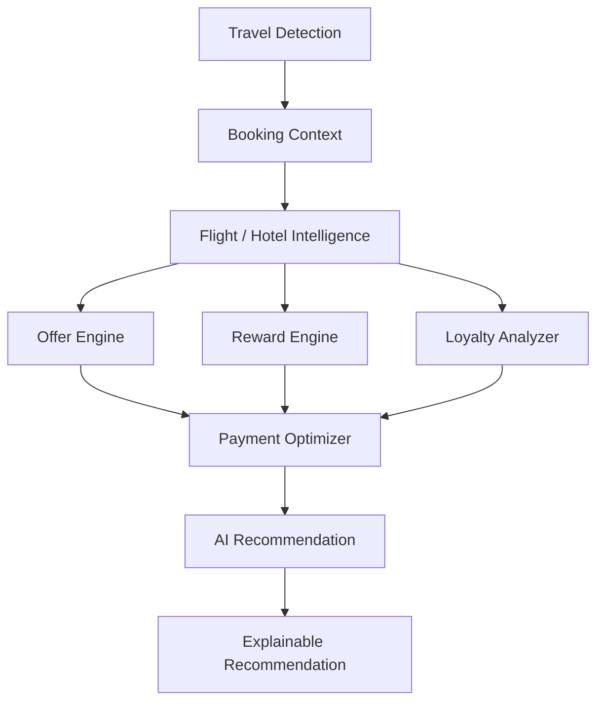

---

# 68. Explainable Recommendations

Every travel recommendation must clearly communicate *why* it is the best option.

---

## Explanation Components

| Component | Example |
|-----------|----------|
| Best Card | HDFC Diners Black |
| Instant Discount | ₹2,000 off |
| Reward Points | 12,500 points |
| Effective Reward Value | ₹4,000 equivalent |
| Lounge Benefit | Complimentary access |
| Travel Insurance | Included |
| Alternative | Compare with another card |

---

## Example Explanation

> **Recommended Card:** HDFC Diners Black  
> **Why:** Booking through the issuer's travel portal provides a ₹2,000 instant discount, earns 10X reward points (estimated value ₹4,000), includes complimentary lounge access, and preserves eligibility toward your annual milestone bonus.

---

# 69. Performance Optimization

Travel recommendations must appear before payment decisions are made.

---

## Performance Strategies

| Strategy | Benefit |
|-----------|----------|
| Booking Context Cache | Avoid repeated parsing |
| Merchant Rule Cache | Faster travel detection |
| Reward Rule Prefetch | Lower recommendation latency |
| Parallel Offer Evaluation | Faster optimization |
| Incremental AI Ranking | Progressive recommendation updates |

---

## Performance Targets

| Metric | Target |
|---------|--------|
| Travel Detection | <150 ms |
| Booking Classification | <200 ms |
| Reward Projection | <250 ms |
| Payment Recommendation | <350 ms |
| Complete Travel Recommendation | <600 ms |

---

# 70. Engineering Trade-offs

| Decision | Benefit | Trade-off |
|-----------|----------|------------|
| Deep booking analysis | Higher recommendation accuracy | Increased processing complexity |
| Real-time reward valuation | Better financial optimization | Requires frequently updated reward data |
| Multi-factor optimization | Maximizes total value | Higher computational cost |
| Explainable recommendations | Greater user trust | Slightly larger UI footprint |

---

# 71. Risks & Mitigations

| ID | Risk | Mitigation |
|----|------|------------|
| SAFETY-501 | Frequent travel website changes | Remote detection rules and adaptive classifiers |
| SAFETY-502 | Outdated reward valuations | Scheduled reward metadata refresh |
| SAFETY-503 | Inaccurate redemption estimates | Conservative valuation models with confidence indicators |
| SAFETY-504 | Recommendation latency during checkout | Parallel computation and multi-level caching |
| SAFETY-505 | Complex offer interactions | Unified optimization engine with deterministic validation |

---

# 72. Operational Considerations

| Area | Consideration |
|------|---------------|
| Travel Partner Expansion | Continuously onboard airlines, hotels, and booking platforms |
| Reward Accuracy | Maintain up-to-date issuer reward programs and transfer ratios |
| Monitoring | Track recommendation acceptance rates and booking completion |
| Experimentation | Validate optimization strategies using feature flags and A/B testing |
| Explainability | Audit recommendation explanations for consistency and correctness |

---

## Part 6 Summary

Part 6 defines the Travel Intelligence architecture responsible for optimizing high-value travel purchases. It covers travel detection, flight and hotel analysis, reward optimization, redemption intelligence, and payment recommendation. By combining merchant context, loyalty benefits, reward valuation, and AI-driven ranking, the extension delivers transparent, real-time recommendations that maximize total travel value while maintaining high performance and operational reliability.

# docs/11_BROWSER_EXTENSION.md

# Part 7 — AI Recommendation Engine, Knowledge Graph & Personalization

---

# 73. AI Recommendation Engine

## 73.1 Overview

The AI Recommendation Engine is the decision-making brain of the CardWise Browser Extension.

Unlike rule-based coupon extensions, CardWise combines deterministic business rules, machine learning models, user preferences, merchant intelligence, and the CardWise Knowledge Graph to generate **real-time, explainable financial recommendations**.

The browser extension itself performs lightweight inference and orchestration, while computationally intensive ranking, personalization, and model execution are performed by backend AI services.

This separation ensures:

- Low browser resource consumption
- Consistent recommendations across platforms
- Rapid model evolution
- Secure AI execution
- Cross-device personalization

---

## AI-001 Objectives

| Objective | Description |
|-----------|-------------|
| Contextual Recommendations | Generate recommendations based on current browsing context |
| Explainability | Provide transparent reasoning for every recommendation |
| Personalization | Adapt recommendations to individual users |
| Real-Time Decisions | Respond within checkout latency budgets |
| Continuous Learning | Improve recommendations using feedback signals |
| Cross-Platform Consistency | Maintain identical recommendation logic across Web, Mobile, and Browser Extension |

---

# 74. AI Decision Pipeline

Every recommendation passes through a multi-stage evaluation pipeline.

No individual model or rule directly generates user-facing recommendations.

---

## AI-010 Recommendation Flow

```text
User Context

↓

Merchant Intelligence

↓

Shopping / Travel Context

↓

Knowledge Graph

↓

Business Rules

↓

ML Models

↓

Ranking Engine

↓

Explainability Layer

↓

Recommendation
```

---

## Decision Inputs

| Input | Source |
|---------|---------|
| Merchant | Merchant Intelligence |
| Product Category | Shopping Intelligence |
| Booking Context | Travel Intelligence |
| User Portfolio | Credit Card Platform |
| Active Offers | Offer Engine |
| Reward Rules | Reward Engine |
| Historical Usage | Personalization Platform |
| Spending Pattern | User Analytics |
| Feature Flags | Remote Configuration |

---

# 75. Recommendation Types

The AI platform produces multiple recommendation categories.

---

## AI-020 Recommendation Categories

| Category | Purpose |
|-----------|----------|
| Best Card | Optimal payment card |
| Reward Optimization | Maximize point earnings |
| Offer Recommendation | Instant discounts |
| Coupon Recommendation | Coupon ranking |
| Cashback Suggestion | Cashback optimization |
| EMI Recommendation | Installment guidance |
| Travel Optimization | Flight/hotel booking |
| Redemption Strategy | Cash vs. points |
| Spending Insight | Financial awareness |
| Opportunity Alert | Missed reward detection |

---

## Recommendation Priority

```text
Payment Optimization

↓

Reward Optimization

↓

Merchant Offers

↓

Coupon Selection

↓

Cashback

↓

Loyalty Benefits

↓

Secondary Suggestions
```

---

# 76. Knowledge Graph

The Knowledge Graph represents relationships between merchants, cards, issuers, rewards, offers, travel partners, and users.

Rather than querying isolated datasets, the AI engine traverses connected financial entities.

---

## AI-030 Knowledge Graph Entities

| Entity | Description |
|---------|-------------|
| Merchant | Commercial entity |
| Credit Card | Payment instrument |
| Bank | Card issuer |
| Offer | Merchant or issuer promotion |
| Reward Program | Reward ecosystem |
| Loyalty Program | Airline or hotel program |
| User | Personalized profile |
| Category | Spending classification |
| Travel Partner | Airline, hotel, OTA |
| Campaign | Promotional campaign |

---

## Relationship Examples

```text
Merchant

↓

Eligible Offers

↓

Supported Cards

↓

Reward Multipliers

↓

Transfer Partners

↓

Loyalty Programs
```

---

## Graph Usage

| Capability | Benefit |
|------------|----------|
| Recommendation Ranking | Higher contextual accuracy |
| Offer Discovery | Hidden offer detection |
| Reward Projection | Better valuation |
| Alternative Suggestions | Similar merchants/cards |
| AI Explainability | Human-readable reasoning |

---

# 77. Personalization Engine

Every user receives personalized recommendations.

The extension never assumes identical optimization strategies for all users.

---

## AI-040 Personalization Signals

| Signal | Purpose |
|----------|----------|
| Card Portfolio | Eligible cards |
| Preferred Banks | Ranking adjustments |
| Spending Habits | Category weighting |
| Redemption History | Point valuation |
| Travel Frequency | Travel optimization |
| Coupon Usage | Coupon ranking |
| Cashback Preference | Savings prioritization |
| Reward Preference | Long-term optimization |

---

## User Preference Model

| Preference | Example |
|------------|----------|
| Max Cashback | Prioritize immediate savings |
| Max Rewards | Earn transferable points |
| Travel First | Optimize travel bookings |
| Simplicity | Fewer recommendations |
| Premium Benefits | Lounge and insurance priority |

---

## Personalization Pipeline

```text
User Profile

↓

Behavior History

↓

Current Context

↓

Preference Model

↓

Recommendation Ranking
```

---

# 78. Real-Time Recommendation Architecture

Recommendations must arrive before checkout decisions are made.

The architecture balances local context with cloud intelligence.

---

## AI-050 Runtime Flow

```text
Content Script

↓

Background Worker

↓

Recommendation API

↓

AI Ranking

↓

Explanation Generation

↓

Popup / Side Panel
```

---

## Latency Budget

| Stage | Target |
|---------|--------|
| Context Collection | <100 ms |
| Merchant Lookup | <100 ms |
| Recommendation Request | <150 ms |
| AI Ranking | <150 ms |
| UI Rendering | <100 ms |
| Total End-to-End | <500 ms |

---

# 79. Explainability Layer

Recommendations must be understandable, auditable, and reproducible.

Users should always know **why** a recommendation is made.

---

## AI-060 Explanation Components

| Component | Example |
|-----------|----------|
| Recommended Card | SBI Cashback Card |
| Savings | ₹1,250 instant discount |
| Rewards | 5X reward points |
| Cashback | ₹750 cashback |
| Loyalty Benefit | Marriott Bonvoy bonus |
| Confidence | 97% |
| Alternative | HDFC Regalia |

---

## Explanation Structure

```text
Recommendation

↓

Supporting Evidence

↓

Financial Impact

↓

Trade-offs

↓

Alternative Options
```

---

## Confidence Levels

| Confidence | Meaning |
|------------|---------|
| >95% | Strong recommendation |
| 85–95% | High confidence |
| 70–84% | Moderate confidence |
| <70% | Multiple viable options |

---

# 80. Feedback & Continuous Learning

Recommendations improve through explicit and implicit feedback.

---

## AI-070 Feedback Sources

| Source | Purpose |
|----------|----------|
| Recommendation Accepted | Positive reinforcement |
| Recommendation Ignored | Ranking adjustment |
| Manual Card Selection | Preference learning |
| Coupon Applied | Coupon quality |
| Travel Booking Completed | Travel optimization |
| User Feedback | Explainability improvements |

---

## Learning Pipeline

```text
Recommendation

↓

User Action

↓

Telemetry

↓

Feedback Processing

↓

Model Retraining

↓

Updated Ranking
```

---

## Learning Principles

- Never train directly inside the browser.
- Aggregate anonymized feedback.
- Preserve user privacy.
- Separate experimentation from production models.
- Version recommendation models.

---

# 81. AI Architecture

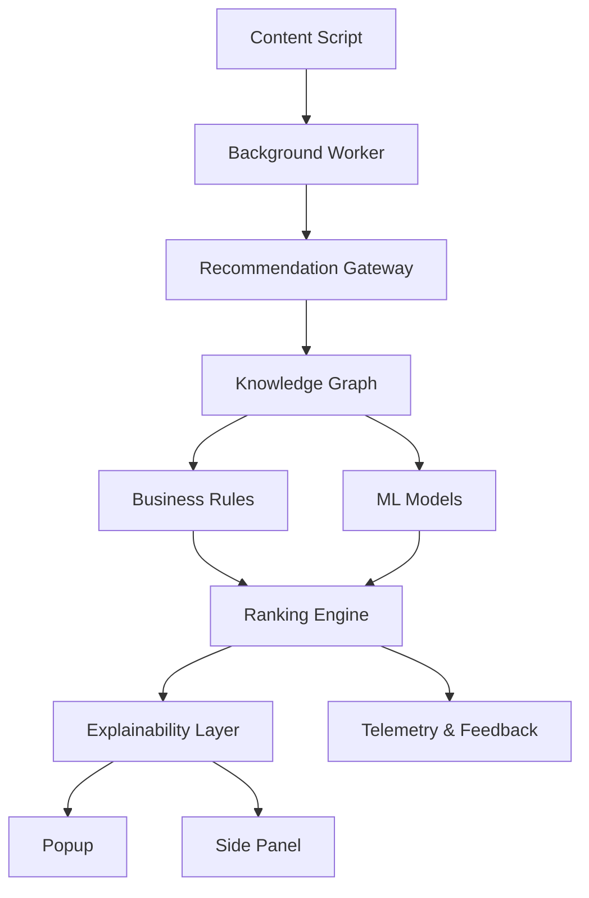

---

# 82. Performance Optimization

AI recommendations must remain responsive while minimizing browser resource consumption.

---

## Optimization Strategies

| Strategy | Benefit |
|-----------|----------|
| Context Compression | Smaller network payloads |
| Parallel Data Fetching | Lower latency |
| Incremental Ranking | Progressive recommendation updates |
| Cached Merchant Profiles | Faster inference |
| Recommendation Prefetch | Improved perceived performance |
| Model Versioning | Safe deployments |

---

## Performance Targets

| Metric | Target |
|---------|--------|
| Context Processing | <100 ms |
| Recommendation Retrieval | <250 ms |
| Explainability Generation | <100 ms |
| Recommendation Rendering | <100 ms |
| End-to-End Latency | <500 ms |

---

# 83. Engineering Trade-offs

| Decision | Benefit | Trade-off |
|-----------|----------|------------|
| Cloud-based AI inference | Smaller extension footprint | Requires network connectivity |
| Knowledge Graph | Rich contextual recommendations | Increased backend complexity |
| Explainable AI | Higher user trust | Additional processing |
| Personalized ranking | Better relevance | Requires preference management |
| Feedback-driven learning | Continuous improvement | Longer optimization cycles |

---

# 84. Risks & Mitigations

| ID | Risk | Mitigation |
|----|------|------------|
| SAFETY-601 | Slow AI responses | Multi-level caching and graceful fallback |
| SAFETY-602 | Inconsistent recommendations | Centralized ranking service |
| SAFETY-603 | Model drift | Continuous evaluation and versioning |
| SAFETY-604 | Poor explainability | Standardized explanation templates |
| SAFETY-605 | Cold-start personalization | Hybrid default and adaptive ranking |
| SAFETY-606 | Privacy concerns | Minimize transmitted context and anonymize feedback |

---

# 85. Operational Considerations

| Area | Consideration |
|------|---------------|
| Model Deployment | Use versioned releases with staged rollout |
| Experimentation | Support A/B testing through feature flags |
| Monitoring | Track recommendation latency, acceptance rate, and confidence distribution |
| Explainability Audits | Regularly verify recommendation transparency |
| Feedback Loop | Continuously evaluate recommendation quality using aggregated signals |

---

## Part 7 Summary

Part 7 defines the AI Recommendation Engine architecture that powers intelligent financial decision-making within the CardWise Browser Extension. It combines the Knowledge Graph, business rules, machine learning, personalization, explainability, and continuous feedback into a unified recommendation platform capable of delivering transparent, real-time, and highly personalized financial guidance while maintaining strict latency, privacy, and operational reliability requirements.

# docs/11_BROWSER_EXTENSION.md

# Part 8 — Extension Platform, Storage, Synchronization, Offline Support & Performance

---

# 86. Extension Platform

## 86.1 Overview

The Extension Platform provides the foundational runtime services that enable all browser extension features to operate reliably across supported browsers.

Unlike feature-specific modules (Merchant Intelligence, AI, Shopping, Travel), the platform layer is responsible for:

- Runtime coordination
- Data persistence
- Cross-component communication
- Synchronization
- Offline resilience
- Resource optimization
- Background execution
- Configuration management

The platform is designed to be **browser-agnostic**, allowing browser-specific implementations to be abstracted behind a unified interface.

---

## PLATFORM-001 Responsibilities

| Responsibility | Description |
|----------------|-------------|
| Runtime Services | Shared platform APIs |
| Storage | Local and synchronized persistence |
| Messaging | Inter-component communication |
| Synchronization | Backend and browser sync |
| Offline Support | Local-first execution |
| Cache Management | Multi-level caching |
| Background Jobs | Scheduled platform tasks |
| Resource Management | Memory and CPU optimization |

---

# 87. Storage Architecture

Storage is divided into multiple layers based on persistence, sensitivity, synchronization requirements, and performance.

The extension avoids treating browser storage as a database.

---

## STORAGE-001 Storage Hierarchy

```text
In-Memory Cache

↓

Browser Session Storage

↓

Browser Local Storage

↓

Browser Sync Storage

↓

Backend User Profile
```

---

## Storage Categories

| Storage Layer | Primary Use |
|---------------|-------------|
| Memory | Runtime state |
| Session | Temporary browsing context |
| Local | Cached intelligence |
| Sync | User preferences |
| Backend | Long-term user data |

---

## Data Ownership

| Data | Storage |
|------|---------|
| Authentication Tokens | Secure Local Storage |
| User Preferences | Sync Storage |
| Theme Settings | Sync Storage |
| Feature Flags | Local Cache |
| Merchant Cache | Local Storage |
| Offer Cache | Local Storage |
| Recommendation Cache | Local Storage |
| Telemetry Queue | Local Storage |
| AI Conversation Context | Session Storage |
| Temporary Checkout Context | Memory |

---

## Storage Design Principles

| Principle | Description |
|------------|-------------|
| Least Persistence | Store only what is required |
| Versioned Objects | Support schema evolution |
| TTL Enforcement | Automatically expire stale data |
| Encryption | Protect sensitive values |
| Compression | Reduce storage footprint |
| Lazy Loading | Load data only when needed |

---

# 88. Synchronization Architecture

The browser extension maintains consistency between:

- Browser runtime
- Cloud services
- User preferences
- AI recommendations
- Feature flags

Synchronization is **event-driven**, avoiding unnecessary polling.

---

## SYNC-001 Synchronization Flow

```text
Local Change

↓

Validation

↓

Queue

↓

Background Worker

↓

Backend

↓

Confirmation

↓

Local Update
```

---

## Synchronization Categories

| Category | Frequency |
|-----------|-----------|
| Authentication | Immediate |
| Preferences | Near Real-Time |
| Feature Flags | Periodic |
| Merchant Cache | On Demand |
| Offer Updates | Periodic |
| AI Context | Session |
| Telemetry | Batched |

---

## Conflict Resolution

| Scenario | Resolution Strategy |
|-----------|---------------------|
| Preference Conflict | Latest version wins |
| Cache Conflict | TTL validation |
| Feature Flags | Backend authoritative |
| Recommendation Cache | Local invalidation |
| Authentication | Server validation |

---

# 89. Offline Support

The extension continues providing useful functionality when network connectivity is unavailable.

Rather than disabling features completely, CardWise gracefully degrades capabilities.

---

## OFFLINE-001 Available Features

| Feature | Offline Availability |
|----------|----------------------|
| Merchant Detection | ✓ |
| Checkout Detection | ✓ |
| Cached Card Metadata | ✓ |
| Cached Reward Rules | ✓ |
| Cached Offers | Limited |
| Cached Recommendations | ✓ |
| AI Recommendations | Limited |
| User Preferences | ✓ |
| Settings | ✓ |

---

## Offline Strategy

```text
Network Check

↓

Online?

↓

Yes → Cloud Intelligence

↓

No

↓

Local Cache

↓

Rule Engine

↓

Best Available Recommendation
```

---

## Offline Degradation Levels

| Level | Capability |
|---------|------------|
| Full | Online intelligence |
| Partial | Cached recommendations |
| Limited | Rule-based optimization |
| Minimal | Merchant identification only |

---

# 90. Performance Architecture

The browser extension must remain lightweight regardless of browsing activity.

Performance is considered a platform responsibility rather than a feature responsibility.

---

## PERF-001 Performance Goals

| Metric | Target |
|----------|--------|
| Extension Startup | <300 ms |
| Popup Open | <200 ms |
| Merchant Detection | <100 ms |
| Recommendation Display | <500 ms |
| Memory Usage | <50 MB |
| Background Wake-up | <100 ms |

---

## Performance Layers

```text
Browser

↓

Platform Runtime

↓

Cache

↓

Messaging

↓

Feature Modules

↓

UI
```

---

## Resource Optimization

| Technique | Benefit |
|-----------|----------|
| Lazy Module Loading | Lower startup time |
| Shared Runtime | Reduced duplication |
| Incremental Updates | Smaller payloads |
| Memoized Selectors | Faster rendering |
| Request Batching | Lower network usage |
| Idle Processing | Better responsiveness |

---

# 91. Background Job Platform

The platform coordinates lightweight scheduled tasks using browser-supported mechanisms.

---

## BGJOB-001 Scheduled Tasks

| Task | Trigger |
|------|----------|
| Refresh Feature Flags | Alarm |
| Refresh Remote Config | Alarm |
| Merchant Cache Cleanup | Alarm |
| Offer Cache Cleanup | Alarm |
| Telemetry Upload | Queue Threshold |
| Retry Failed Requests | Connectivity Restored |
| Session Cleanup | Browser Startup |

---

## Background Job Flow

```text
Alarm

↓

Eligibility Check

↓

Task Execution

↓

Persist State

↓

Emit Metrics
```

---

## Scheduling Principles

- Never block user interactions.
- Prioritize user-initiated tasks.
- Respect browser battery optimizations.
- Cancel redundant jobs.
- Support exponential backoff.

---

# 92. Platform Messaging

Messaging is standardized across every extension module.

The platform acts as a message bus.

---

## MESSAGE-001 Message Types

| Type | Purpose |
|-------|----------|
| Command | Execute an action |
| Event | Notify state changes |
| Query | Retrieve information |
| Response | Return requested data |
| Broadcast | Notify multiple components |

---

## Message Lifecycle

```text
Component

↓

Platform Bus

↓

Validation

↓

Routing

↓

Handler

↓

Response
```

---

## Messaging Guarantees

| Guarantee | Description |
|------------|-------------|
| Ordered Processing | Per correlation ID |
| Versioned Payloads | Backward compatibility |
| Retry Safety | Idempotent handlers |
| Timeout Protection | Prevent hanging requests |
| Structured Errors | Consistent failure handling |

---

# 93. Browser Compatibility Layer

The platform abstracts browser-specific APIs to provide a unified development experience.

---

## PLATFORM-010 Supported Browsers

| Browser | Support |
|-----------|---------|
| Chrome | Full |
| Microsoft Edge | Full |
| Brave | Full |
| Opera | Full |
| Firefox | Planned parity |
| Safari | Planned parity |

---

## Compatibility Responsibilities

| Area | Description |
|------|-------------|
| Storage | Unified storage abstraction |
| Messaging | Browser-independent APIs |
| Side Panel | Feature compatibility |
| Identity | Authentication abstraction |
| Notifications | Common notification interface |
| Permissions | Unified permission handling |

---

# 94. Platform Architecture

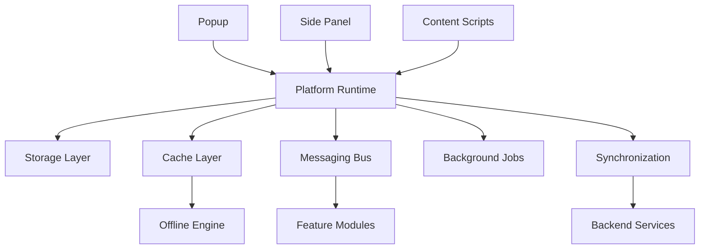

---

# 95. Engineering Best Practices

| Practice | Rationale |
|-----------|-----------|
| Centralized platform services | Reduce duplicated logic |
| Abstract browser APIs | Improve portability |
| Local-first architecture | Better responsiveness |
| Incremental synchronization | Lower bandwidth consumption |
| Multi-level caching | Faster recommendations |
| Resource budgeting | Maintain browser performance |
| Versioned storage | Safe migrations |

---

# 96. Engineering Trade-offs

| Decision | Benefit | Trade-off |
|-----------|----------|------------|
| Local-first storage | Faster response times | Cache invalidation complexity |
| Event-driven synchronization | Lower resource usage | More complex coordination |
| Browser abstraction layer | Cross-browser compatibility | Additional maintenance |
| Background scheduling | Efficient resource usage | Limited by browser lifecycle |
| Offline recommendations | Better user experience | Reduced recommendation accuracy |

---

# 97. Risks & Mitigations

| ID | Risk | Mitigation |
|----|------|------------|
| SAFETY-701 | Storage quota exceeded | Compression, TTL eviction, storage monitoring |
| SAFETY-702 | Synchronization conflicts | Versioning and conflict resolution policies |
| SAFETY-703 | Offline cache becoming stale | TTL enforcement and background refresh |
| SAFETY-704 | Browser API differences | Platform abstraction layer |
| SAFETY-705 | Background job interruptions | Idempotent tasks with checkpoint persistence |
| SAFETY-706 | Excessive memory growth | Runtime cleanup and memory budgets |

---

# 98. Operational Considerations

| Area | Consideration |
|------|---------------|
| Storage Monitoring | Track usage against browser quotas |
| Synchronization Metrics | Measure success rate, retries, and latency |
| Cache Health | Monitor hit ratio, eviction rate, and stale data |
| Browser Compatibility | Continuous validation across supported browsers |
| Platform Evolution | Introduce new runtime capabilities through feature flags |

---

## Part 8 Summary

Part 8 defines the foundational Extension Platform architecture that supports all runtime capabilities of the CardWise Browser Extension. It specifies multi-layer storage, event-driven synchronization, offline-first behavior, browser abstraction, standardized messaging, background task orchestration, and performance optimization. Together, these platform services provide a scalable, resilient, and browser-agnostic foundation for delivering intelligent financial recommendations with minimal resource consumption.

# docs/11_BROWSER_EXTENSION.md

# Part 9 — Operations, Telemetry, Feature Flags, Remote Configuration & Monitoring

---

# 99. Operations Architecture

## 99.1 Overview

The CardWise Browser Extension is deployed to thousands (eventually millions) of browser instances that cannot be managed like centralized backend services.

Operational excellence therefore depends on:

- Observability
- Progressive rollout
- Remote configuration
- Safe experimentation
- Runtime diagnostics
- Automatic recovery
- Privacy-preserving telemetry

The extension must be capable of changing behavior without requiring users to immediately update to a new extension version.

---

## OPS-001 Operational Objectives

| Objective | Description |
|-----------|-------------|
| High Availability | Continue functioning despite service degradation |
| Safe Rollouts | Minimize release risk |
| Runtime Visibility | Observe extension health in production |
| Rapid Incident Response | Disable problematic features remotely |
| Continuous Improvement | Measure user interactions and recommendation quality |
| Privacy Compliance | Collect only approved operational telemetry |

---

# 100. Telemetry Architecture

Telemetry enables engineering teams to understand runtime behavior while respecting user privacy.

Telemetry is **operational**, **aggregated**, and **privacy-first**.

Sensitive information such as payment credentials, personal addresses, passwords, OTPs, or full purchase details must **never** be collected.

---

## METRIC-001 Telemetry Categories

| Category | Purpose |
|----------|----------|
| Extension Lifecycle | Installation, startup, update |
| Performance | Startup latency, render time |
| Merchant Detection | Detection accuracy |
| Recommendation Engine | Response latency |
| Offer Engine | Coupon discovery and application success |
| Errors | Exceptions and failures |
| User Interaction | Feature usage |
| Synchronization | Sync success and failures |
| Browser Compatibility | Browser-specific diagnostics |

---

## Telemetry Pipeline

```text
Extension Event

↓

Event Validation

↓

Privacy Filter

↓

Sampling

↓

Batch Queue

↓

Background Worker

↓

Telemetry Gateway

↓

Analytics Platform
```

---

## METRIC-002 Telemetry Events

| Event | Description |
|--------|-------------|
| Extension Installed | New installation |
| Extension Updated | Version upgrade |
| Merchant Detected | Merchant identification |
| Recommendation Generated | AI recommendation produced |
| Coupon Applied | Offer successfully used |
| Travel Recommendation | Travel optimization displayed |
| Popup Opened | Popup interaction |
| Side Panel Opened | Side panel interaction |
| Error Captured | Runtime exception |
| Sync Completed | Synchronization success |

---

# 101. Feature Flag Architecture

Feature Flags enable runtime control without publishing a new extension version.

All major capabilities must be configurable remotely.

---

## FEATURE-001 Feature Categories

| Category | Examples |
|----------|----------|
| AI Features | Recommendation models |
| Merchant Rules | Detection algorithms |
| Coupon Engine | Coupon providers |
| UI Features | New layouts |
| Travel Intelligence | Travel optimization |
| Payment Intelligence | Card recommendation logic |
| Experimental Features | Beta functionality |

---

## Feature Evaluation Flow

```text
Extension Startup

↓

Load Cached Flags

↓

Fetch Updated Flags

↓

Evaluate Rules

↓

Enable Features

↓

Runtime Monitoring
```

---

## Flag Types

| Type | Description |
|------|-------------|
| Boolean | Enable/disable |
| Percentage | Progressive rollout |
| User Segment | Targeted rollout |
| Browser | Browser-specific enablement |
| Version | Extension version targeting |
| Region | Country-specific rollout |

---

## Rollout Strategy

| Stage | Percentage |
|--------|------------|
| Internal | 1% |
| Canary | 5% |
| Beta | 20% |
| Controlled Rollout | 50% |
| General Availability | 100% |

---

# 102. Remote Configuration

Remote Configuration allows engineering teams to update operational behavior dynamically.

Unlike feature flags, configuration values modify runtime behavior.

---

## CONFIG-001 Configurable Items

| Configuration | Purpose |
|---------------|----------|
| Merchant Rules | Detection heuristics |
| Coupon Providers | Source prioritization |
| Cache TTL | Cache expiration |
| Recommendation Threshold | Confidence threshold |
| Timeout Values | Network behavior |
| Retry Limits | Failure recovery |
| Telemetry Sampling | Event volume |
| UI Copy | Dynamic messaging |

---

## Configuration Lifecycle

```text
Cached Config

↓

Version Check

↓

Download

↓

Validation

↓

Activation

↓

Persistence
```

---

## Configuration Principles

- Versioned configuration
- Atomic updates
- Schema validation
- Backward compatibility
- Automatic rollback
- Cached fallback

---

# 103. Error Reporting

Errors should be observable without impacting users.

The extension distinguishes between recoverable and non-recoverable failures.

---

## ERROR-001 Error Categories

| Category | Description |
|----------|-------------|
| JavaScript Runtime | Unexpected exceptions |
| Network | API failures |
| Storage | Read/write failures |
| Authentication | Session issues |
| Merchant Detection | Classification failures |
| Recommendation | AI service failures |
| Browser API | Platform incompatibility |
| UI Rendering | Component failures |

---

## Error Pipeline

```text
Exception

↓

Classification

↓

Sanitization

↓

Aggregation

↓

Reporting

↓

Alerting
```

---

## Recovery Strategy

| Failure | Recovery |
|----------|----------|
| Network Timeout | Retry with backoff |
| Recommendation Failure | Rule-based fallback |
| Merchant Unknown | Generic recommendation |
| Config Failure | Use cached configuration |
| Storage Error | Retry then degrade gracefully |

---

# 104. Monitoring & Observability

Operational monitoring combines metrics, logs, traces, and health signals.

The browser extension contributes observability data to centralized backend systems.

---

## METRIC-010 Core Metrics

| Metric | Target |
|---------|--------|
| Startup Success | >99.9% |
| Merchant Detection Accuracy | >98% |
| Recommendation Latency | <500 ms |
| Popup Render Time | <200 ms |
| Crash-Free Sessions | >99.95% |
| Sync Success Rate | >99% |
| API Success Rate | >99% |

---

## Operational Dashboards

| Dashboard | Purpose |
|-----------|----------|
| Extension Health | Overall runtime health |
| Performance | Startup and rendering |
| Merchant Detection | Accuracy and coverage |
| Recommendation Engine | Latency and acceptance |
| Error Trends | Failures by category |
| Browser Distribution | Cross-browser adoption |
| Feature Rollout | Flag effectiveness |

---

# 105. Incident Management

Operational issues should be mitigated without requiring emergency extension releases whenever possible.

---

## OPS-010 Incident Levels

| Level | Description |
|--------|-------------|
| P0 | Extension unusable |
| P1 | Critical recommendation failures |
| P2 | Partial feature degradation |
| P3 | Minor UI or operational issues |

---

## Incident Response Flow

```text
Alert

↓

Detection

↓

Classification

↓

Mitigation

↓

Feature Flag Disable

↓

Root Cause Analysis

↓

Recovery
```

---

## Runtime Kill Switches

| Feature | Kill Switch |
|----------|-------------|
| AI Recommendations | ✓ |
| Merchant Detection Rules | ✓ |
| Coupon Engine | ✓ |
| Offer Stacking | ✓ |
| Travel Intelligence | ✓ |
| Experimental Features | ✓ |

---

# 106. Experimentation Framework

Continuous experimentation enables safer product evolution.

---

## EXP-001 Experiment Types

| Experiment | Purpose |
|------------|----------|
| Recommendation Ranking | Improve financial outcomes |
| UI Variants | Optimize usability |
| Merchant Detection Rules | Increase accuracy |
| Coupon Ranking | Improve success rate |
| AI Explanations | Increase user trust |

---

## Experiment Lifecycle

```text
Hypothesis

↓

Feature Flag

↓

Limited Rollout

↓

Telemetry Collection

↓

Evaluation

↓

Decision

↓

Production
```

---

# 107. Operational Architecture

```mermaid
flowchart TB

A[Extension Runtime]

-->

B[Telemetry Collector]

-->

C[Privacy Filter]

-->

D[Batch Queue]

-->

E[Telemetry Gateway]

E

-->

F[Metrics Platform]

E

-->

G[Logging Platform]

E

-->

H[Tracing Platform]

I[Remote Config Service]

-->

A

J[Feature Flag Service]

-->

A

K[Monitoring Dashboards]

<--

F

K

<--

G

K

<--

H

L[Alerting]

<--

K
```

---

# 108. Engineering Best Practices

| Practice | Rationale |
|-----------|-----------|
| Privacy-first telemetry | Maintain user trust and regulatory compliance |
| Remote configuration | Avoid unnecessary extension releases |
| Progressive rollouts | Reduce deployment risk |
| Kill switches | Enable rapid incident mitigation |
| Structured error reporting | Faster debugging |
| Standardized metrics | Consistent operational insights |
| Observability by design | Simplify production support |

---

# 109. Engineering Trade-offs

| Decision | Benefit | Trade-off |
|-----------|----------|------------|
| Batched telemetry | Lower network overhead | Slight reporting delay |
| Feature flags | Safer releases | Additional runtime evaluation |
| Remote configuration | Dynamic behavior | Configuration management complexity |
| Extensive monitoring | Better visibility | Increased operational cost |
| Experimentation framework | Faster innovation | Requires disciplined analysis |

---

# 110. Risks & Mitigations

| ID | Risk | Mitigation |
|----|------|------------|
| SAFETY-801 | Excessive telemetry volume | Sampling and batching |
| SAFETY-802 | Incorrect remote configuration | Schema validation and staged rollout |
| SAFETY-803 | Feature flag inconsistency | Versioned evaluation with cached fallback |
| SAFETY-804 | Monitoring blind spots | Comprehensive metrics, logs, and traces |
| SAFETY-805 | Delayed incident response | Automated alerts and kill switches |
| SAFETY-806 | Privacy violations | Strict data minimization and sanitization pipeline |

---

# 111. Operational Considerations

| Area | Consideration |
|------|---------------|
| Release Management | Use staged rollouts for every production release |
| Dashboard Maintenance | Keep operational dashboards aligned with evolving features |
| Telemetry Governance | Periodically review collected events for necessity and privacy |
| Experiment Review | Evaluate experiments before broad rollout |
| Reliability Reviews | Conduct regular operational health assessments and post-incident reviews |

---

## Part 9 Summary

Part 9 defines the operational architecture for the CardWise Browser Extension, including telemetry, feature flags, remote configuration, error reporting, monitoring, experimentation, and incident management. Together, these capabilities provide a robust operational platform that enables safe deployments, rapid recovery, continuous optimization, and privacy-preserving observability across millions of browser installations.

# docs/11_BROWSER_EXTENSION.md

# Part 10 — Security, Privacy, Permission Model & Engineering Best Practices

---

# 112. Security Architecture

## 112.1 Overview

The CardWise Browser Extension operates in a highly sensitive environment where it interacts with shopping, banking, travel, and payment-related webpages.

Although the extension provides financial intelligence, it **must never compromise user privacy or browser security**.

The security model follows a **Zero Trust**, **Least Privilege**, and **Privacy-by-Design** philosophy.

Security is implemented as a cross-cutting architectural concern across:

- Manifest
- Service Worker
- Content Scripts
- Popup
- Side Panel
- Storage
- Network Communication
- AI Recommendation Platform
- Telemetry Platform

---

## SAFETY-001 Security Principles

| Principle | Description |
|------------|-------------|
| Least Privilege | Request only the minimum permissions required |
| Zero Trust | Never trust browser, page, or network input implicitly |
| Secure by Default | Secure configuration without user intervention |
| Defense in Depth | Multiple independent protection layers |
| Privacy by Design | Minimize collection, processing, and retention of user data |
| Fail Secure | On failure, prefer safe degradation over insecure behavior |
| Explainability | Clearly communicate why permissions are requested |

---

# 113. Threat Model

The extension is designed against realistic browser extension threat scenarios.

---

## Threat Categories

| Threat | Description | Mitigation |
|----------|-------------|------------|
| Malicious Web Pages | Attempt to manipulate injected scripts | Strict DOM isolation and validation |
| XSS | Injection of malicious content | Trusted rendering and sanitization |
| MITM | Network interception | HTTPS-only communication with certificate validation provided by the browser |
| Replay Attacks | Reuse of requests | Short-lived tokens and request validation |
| Storage Exposure | Unauthorized access to local data | Encryption for sensitive values and minimal persistence |
| API Abuse | Excessive requests | Authentication, rate limiting, and server-side validation |
| Extension Tampering | Modified extension packages | Official store distribution and signed releases |
| Supply Chain Risk | Compromised dependencies | Dependency scanning, lockfiles, and software composition analysis |

---

## Security Layers

```text
Browser

↓

Manifest V3

↓

Permission Model

↓

Content Security Policy

↓

Runtime Validation

↓

Secure Messaging

↓

Secure Storage

↓

Authenticated APIs

↓

Backend Authorization

↓

Audit & Monitoring
```

---

# 114. Permission Model

Permissions directly influence user trust and extension security.

The extension follows a **progressive permission model**, requesting capabilities only when necessary.

---

## SAFETY-010 Permission Categories

| Permission Category | Purpose | Required by Default |
|---------------------|---------|---------------------|
| Active Tab | Context-aware page analysis | Yes |
| Storage | Local persistence | Yes |
| Alarms | Background refresh | Yes |
| Notifications | Price drops and alerts | Optional |
| Identity | Authentication | Optional |
| Side Panel | Persistent workspace | Yes |
| Host Permissions | Supported merchant domains | Scoped |
| Declarative APIs | Safe browser request handling | Limited |

---

## Permission Lifecycle

```text
Feature Requested

↓

Permission Required?

↓

Already Granted?

↓

Yes → Execute

↓

No

↓

Explain Need

↓

User Approval

↓

Grant Access
```

---

## Permission Best Practices

- Prefer optional permissions where supported.
- Scope host permissions to supported domains.
- Explain the business value before requesting access.
- Avoid requesting broad browser permissions unnecessarily.
- Periodically audit unused permissions.

---

# 115. Content Security Policy (CSP)

The extension follows a restrictive Content Security Policy aligned with Manifest V3.

---

## SAFETY-020 CSP Objectives

| Objective | Description |
|------------|-------------|
| Prevent Script Injection | Eliminate unsafe script execution |
| Restrict Resource Loading | Allow trusted sources only |
| Block Inline Scripts | Require bundled, reviewed assets |
| Protect UI | Prevent DOM-based injection attacks |
| Secure Network Access | Limit outbound communication to approved services |

---

## CSP Design Principles

- No inline JavaScript.
- No dynamic code evaluation.
- Trusted asset loading only.
- Strict origin validation.
- Secure resource isolation.
- Versioned static assets.

---

# 116. Secure Communication

All communication between the extension and backend services must be authenticated, encrypted, and validated.

---

## SAFETY-030 Communication Flow

```text
Extension

↓

Authentication Check

↓

HTTPS Request

↓

API Gateway

↓

Authorization

↓

Backend Services

↓

Validated Response

↓

Runtime Validation
```

---

## Communication Principles

| Principle | Description |
|------------|-------------|
| HTTPS Only | Encrypted transport |
| Authenticated Requests | User/session validation |
| Short-Lived Tokens | Reduce exposure |
| Retry with Backoff | Resilient networking |
| Request Validation | Validate payload structure |
| Response Validation | Reject malformed responses |

---

## Sensitive Data Rules

The extension must **never** transmit:

- Passwords
- Card numbers
- CVV values
- OTPs
- Authentication secrets
- Personally identifiable payment credentials

Only the minimum contextual metadata required for recommendations should be transmitted.

---

# 117. Data Protection & Privacy

Privacy is a product requirement, not an optional feature.

---

## SAFETY-040 Data Classification

| Classification | Examples | Handling |
|----------------|----------|----------|
| Public | Merchant metadata | Cached |
| Internal | Feature flags | Cached with versioning |
| Confidential | User preferences | Encrypted where appropriate |
| Sensitive | Authentication tokens | Secure local storage with restricted access |
| Restricted | Payment credentials | Never collected or stored |

---

## Privacy Principles

- Data minimization
- Purpose limitation
- Explicit user consent where required
- Limited retention
- User transparency
- Secure deletion
- Auditability

---

## Data Lifecycle

```text
Collection

↓

Validation

↓

Processing

↓

Minimal Storage

↓

Recommendation

↓

Expiration

↓

Deletion
```

---

# 118. Authentication & Session Security

Authentication enables personalized recommendations while maintaining a secure session.

---

## Session Lifecycle

```text
User Login

↓

Identity Verification

↓

Secure Token Storage

↓

Authenticated Requests

↓

Token Refresh

↓

Logout

↓

Session Cleanup
```

---

## Authentication Controls

| Control | Purpose |
|----------|----------|
| Secure Token Storage | Protect credentials |
| Token Expiration | Reduce replay risk |
| Session Validation | Prevent unauthorized access |
| Automatic Logout | Handle invalid sessions |
| Device Association | Improve account security |

---

# 119. Secure Extension Lifecycle

Security extends across the entire extension lifecycle.

---

## Lifecycle Stages

| Stage | Security Activity |
|--------|-------------------|
| Development | Static analysis and dependency review |
| Build | Signed artifacts and reproducible builds |
| Testing | Security, privacy, and penetration testing |
| Release | Verified store publication |
| Runtime | Monitoring and telemetry |
| Updates | Signed update verification |
| Incident Response | Kill switches and remote mitigation |

---

# 120. Engineering Best Practices

## Secure Development Practices

| Practice | Rationale |
|-----------|-----------|
| Threat Modeling | Identify risks early |
| Dependency Scanning | Reduce supply chain exposure |
| Principle of Least Privilege | Minimize attack surface |
| Secure Code Reviews | Detect vulnerabilities |
| Automated Security Testing | Prevent regressions |
| Runtime Monitoring | Detect anomalies |
| Privacy Reviews | Ensure compliance with data handling requirements |

---

## Operational Security Practices

| Practice | Description |
|-----------|-------------|
| Secret Rotation | Regular credential rotation |
| Audit Logging | Security event tracking |
| Feature Kill Switches | Disable vulnerable features rapidly |
| Incident Playbooks | Standardized response procedures |
| Configuration Validation | Prevent unsafe runtime settings |
| Versioned Policies | Controlled security evolution |

---

# 121. Browser Extension Security Architecture

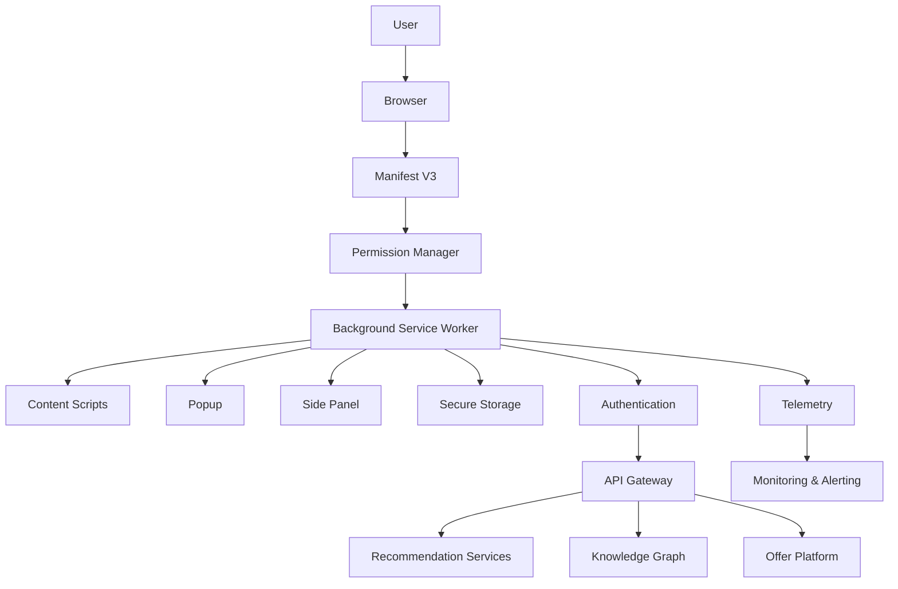

---

# 122. Architecture Summary

The CardWise Browser Extension is designed as a **secure, modular, AI-driven financial intelligence platform** rather than a traditional coupon extension.

Its architecture is built around:

- Manifest V3 compliance
- Stateless background execution
- Event-driven processing
- Modular intelligence engines
- AI-powered recommendations
- Knowledge Graph integration
- Explainable financial decisions
- Local-first performance
- Offline resilience
- Progressive permissions
- Zero Trust security
- Privacy-first telemetry
- Cross-browser compatibility
- Operational observability
- Continuous feature delivery through remote configuration

The extension serves as the real-time client of the broader CardWise ecosystem, integrating seamlessly with the Recommendation Engine, Merchant Intelligence, Offers Platform, Reward Engine, Travel Intelligence, Booking Engine, and Knowledge Graph while maintaining a lightweight browser footprint.

---

# 123. End-to-End Browser Extension Architecture

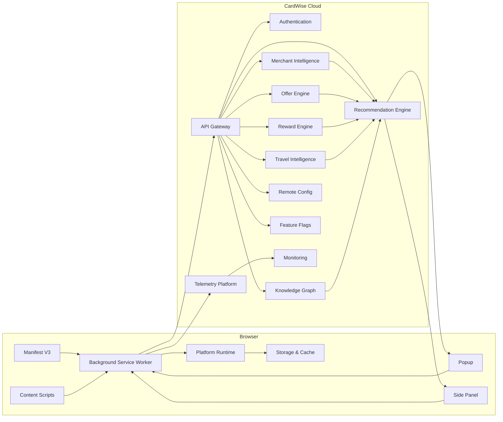

---

# 124. Final Engineering Checklist

| Area | Status |
|------|--------|
| Manifest V3 Architecture | ✅ |
| Background Service Worker | ✅ |
| Content Scripts | ✅ |
| Popup & Side Panel | ✅ |
| Merchant Intelligence | ✅ |
| Shopping Intelligence | ✅ |
| Coupon Engine | ✅ |
| Offer Stacking | ✅ |
| Travel Intelligence | ✅ |
| Payment Recommendation | ✅ |
| AI Recommendation Engine | ✅ |
| Knowledge Graph Integration | ✅ |
| Personalization | ✅ |
| Extension Platform | ✅ |
| Storage & Synchronization | ✅ |
| Offline Support | ✅ |
| Performance Architecture | ✅ |
| Telemetry | ✅ |
| Feature Flags | ✅ |
| Remote Configuration | ✅ |
| Monitoring | ✅ |
| Security & Privacy | ✅ |
| Permission Model | ✅ |
| CSP | ✅ |
| Engineering Best Practices | ✅ |
| Cross-Browser Strategy | ✅ |
| Operational Readiness | ✅ |

---

## Document Completion

This concludes the production-grade engineering architecture specification for **`docs/11_BROWSER_EXTENSION.md`**.

The document defines a scalable, secure, and AI-first browser extension architecture aligned with the broader CardWise platform. It establishes engineering standards, runtime architecture, operational practices, and security controls necessary to support future capabilities while maintaining high performance, user trust, and long-term maintainability.