# docs/12_MOBILE_APP.md

# Part 1 — Mobile Foundation Architecture

---

# 1. Introduction

## 1.1 Purpose

This document defines the production-grade engineering architecture for the CardWise Mobile Application.

The mobile application is **not** a companion application for the website.

It is a fully independent AI-powered Financial Super App that enables users to make intelligent financial decisions in real time by integrating:

- Credit Card Intelligence
- Reward Optimization
- Merchant Intelligence
- Offer Discovery
- Cashback Optimization
- AI Financial Assistant
- Flight Booking
- Hotel Booking
- Loyalty Programs
- Spending Analytics
- Payment Intelligence
- Personalized Recommendations

The mobile platform is designed to deliver low-latency recommendations, offline resilience, secure financial operations, and an intuitive user experience while maintaining architectural consistency with the broader CardWise ecosystem.

---

## 1.2 Document Objectives

This document focuses exclusively on mobile engineering architecture.

Business requirements, recommendation algorithms, backend architecture, database design, AI models, booking systems, and browser extension behavior are covered in previous documents.

This document defines:

| Area | Covered |
|--------|----------|
| APP-* | Mobile Architecture |
| AUTH-* | Authentication Architecture |
| PROFILE-* | User Profile |
| DASH-* | Dashboard Modules |
| PAYMENT-* | Payment Intelligence |
| SHOPPING-* | Shopping Experience |
| TRAVEL-* | Travel Experience |
| AI-* | Mobile AI Integration |
| STORAGE-* | Storage Strategy |
| OFFLINE-* | Offline Architecture |
| SYNC-* | Synchronization |
| NOTIFY-* | Notifications |
| METRIC-* | Telemetry |
| SAFETY-* | Security |

---

## 1.3 Engineering Goals

| Goal | Description |
|----------|------------|
| APP-001 | Single architecture across Android & iOS |
| APP-002 | Shared business logic |
| APP-003 | Native-grade performance |
| APP-004 | Offline-first UX |
| APP-005 | AI-first experience |
| APP-006 | Production observability |
| APP-007 | Secure financial application |
| APP-008 | Modular feature delivery |
| APP-009 | Independent deployment readiness |
| APP-010 | Long-term maintainability |

---

# 2. Mobile Vision

## Vision Statement

CardWise Mobile becomes the user's primary financial companion that proactively helps optimize every payment, purchase, and travel decision before money is spent.

Instead of showing static financial information, the application continuously evaluates:

- Current location
- Merchant
- Active offers
- Card portfolio
- Reward multipliers
- Cashback campaigns
- Loyalty balances
- Upcoming travel
- Spending behavior
- Financial goals

The application should answer one fundamental question:

> **"What is the smartest financial decision I can make right now?"**

---

## Mobile Principles

### APP-011 — Intelligence First

Every screen should provide actionable intelligence instead of static information.

---

### APP-012 — Zero Cognitive Load

Users should never calculate rewards manually.

The platform performs optimization automatically.

---

### APP-013 — Context Awareness

Recommendations adapt using:

- Merchant
- Location
- Time
- User history
- Active campaigns
- Upcoming trips
- Reward balances

---

### APP-014 — Speed

Target response time:

| Interaction | Target |
|-------------|---------|
| Screen Open | <300 ms |
| Navigation | <150 ms |
| Search | <250 ms |
| Recommendation Load | <500 ms |
| Cached Content | Instant |

---

### APP-015 — Trust

Financial applications require predictable behavior.

Recommendations must be:

- Explainable
- Transparent
- Consistent
- Auditable

---

# 3. Mobile Philosophy

The mobile application follows five engineering philosophies.

---

## 3.1 AI Native

AI is part of every feature rather than an isolated assistant.

Examples include:

- Payment recommendation
- Reward optimization
- Merchant suggestions
- Travel planning
- Offer prioritization
- Spending analysis

---

## 3.2 Offline First

Users frequently encounter poor connectivity:

- Airports
- Flights
- Metro
- International roaming
- Remote travel

Critical information remains available offline.

---

## 3.3 Performance by Design

Performance is treated as a feature.

Architectural decisions prioritize:

- Small bundles
- Lazy loading
- Predictable rendering
- Minimal bridge communication
- Efficient animations
- Memory efficiency

---

## 3.4 Privacy by Default

Sensitive financial information is never exposed unnecessarily.

Security controls are integrated throughout the application lifecycle rather than added later.

---

## 3.5 Modular Evolution

Every feature should evolve independently.

Examples:

- Rewards Engine
- Booking
- Offers
- AI
- Shopping

Each module owns:

- UI
- State
- Local storage
- Navigation
- Analytics
- Testing

---

# 4. High-Level Mobile Architecture

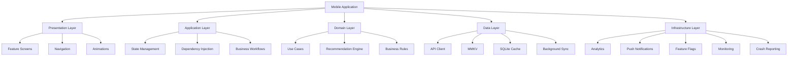

---

## Engineering Rationale

The layered architecture separates concerns into clearly defined responsibilities, reducing coupling and enabling independent evolution of UI, business logic, data handling, and infrastructure services. This improves maintainability, testing, and long-term scalability.

---

## Benefits

| Benefit | Description |
|----------|-------------|
| Independent evolution | Layers change independently |
| Better testing | Domain isolated from UI |
| Maintainability | Reduced coupling |
| Faster onboarding | Clear architecture |
| Reusable business logic | Shared across features |

---

## Trade-offs

| Decision | Trade-off |
|-----------|-----------|
| Layered architecture | Slight increase in boilerplate |
| Feature isolation | More modules to manage |
| Strong abstractions | Higher initial design effort |

---

## Risks

| Risk | Mitigation |
|------|------------|
| Layer leakage | Strict architectural boundaries |
| Cross-module dependencies | Dependency rules and reviews |
| Over-engineering | Modularize only stable domains |

---

## Operational Considerations

- Enforce architecture through linting and code ownership.
- Monitor module size and startup impact.
- Track dependency graphs to prevent cyclic references.

---

# 5. Application Architecture

The application adopts a feature-first modular architecture layered over clean architectural principles.

```
Presentation

↓

Application

↓

Domain

↓

Data

↓

Infrastructure
```

---

## Responsibilities

| Layer | Responsibility |
|--------|----------------|
| Presentation | UI rendering and user interactions |
| Application | Navigation, workflows, orchestration |
| Domain | Business rules and use cases |
| Data | Repository implementations, caching, networking |
| Infrastructure | Telemetry, notifications, feature flags, monitoring |

---

## APP-020 Layer Responsibilities

Presentation never directly communicates with APIs.

Presentation communicates only with:

- View Models
- Use Cases
- State Store

Data access occurs only through repositories.

Infrastructure services remain isolated from business logic.

---

## Best Practices

- Keep domain layer framework-agnostic.
- Avoid business logic in UI components.
- Prefer immutable state.
- Isolate side effects within application services.

---

# 6. Feature Modularization

The application is organized into independently owned feature modules.

## APP-030 Feature Modules

| Module | Responsibility |
|----------|---------------|
| Authentication | Login, sessions, biometrics |
| Dashboard | Home experience |
| Cards | Card portfolio |
| Rewards | Reward tracking |
| Offers | Merchant offers |
| Payments | Best card recommendation |
| Shopping | Merchant intelligence |
| Travel | Flights & hotels |
| AI | Assistant & recommendations |
| Profile | Preferences |
| Notifications | Inbox & alerts |
| Settings | Application settings |

---

## Shared Platform Modules

| Shared Module | Purpose |
|---------------|----------|
| Design System | Shared UI components |
| Networking | API client |
| Analytics | Event tracking |
| Storage | Local persistence |
| Security | Encryption & secure storage |
| Feature Flags | Runtime configuration |
| Remote Config | Dynamic behavior |
| Logging | Diagnostics |
| Utilities | Common helpers |

---

## Module Ownership

Each feature owns:

- Screens
- Navigation
- State
- Use Cases
- Repositories
- Analytics
- Tests
- Local cache

No feature should directly modify another feature's internal state.

---

## Engineering Rationale

Feature modularization enables independent development, testing, release readiness, and long-term maintainability while reducing cross-team conflicts and minimizing regression risk.

---

## Trade-offs

| Benefit | Cost |
|----------|------|
| Better scalability | Increased module boundaries |
| Independent ownership | More dependency management |
| Easier testing | Initial setup complexity |

---

## Risks

| Risk | Mitigation |
|------|------------|
| Shared utility bloat | Clearly defined platform APIs |
| Hidden coupling | Architecture reviews and dependency validation |
| Inconsistent UX | Shared design system governance |

---

## Operational Considerations

- Version shared platform modules carefully.
- Track module startup cost and bundle contribution.
- Review module boundaries during architecture reviews.

---

# 7. Mobile Architecture Diagram

```mermaid
flowchart TB

User

User --> UI

subgraph Mobile App

UI

Navigation

Feature Modules

State

Domain

Repositories

Storage

Networking

AI Client

Telemetry

end

Feature Modules --> State

State --> Domain

Domain --> Repositories

Repositories --> Networking

Repositories --> Storage

Domain --> AI Client

UI --> Telemetry

Networking --> Backend

AI Client --> Recommendation Engine

Telemetry --> Monitoring Platform
```

---

## Engineering Rationale

This architecture emphasizes unidirectional data flow, isolated feature ownership, and clear boundaries between user interactions, business logic, persistence, networking, and observability.

---

# 8. Suggested Repository Structure

```
mobile/

├── apps/
│   ├── android/
│   └── ios/
│
├── packages/
│   ├── app-shell/
│   ├── navigation/
│   ├── design-system/
│   ├── analytics/
│   ├── networking/
│   ├── storage/
│   ├── security/
│   ├── feature-flags/
│   ├── remote-config/
│   ├── ai/
│   ├── rewards/
│   ├── payments/
│   ├── shopping/
│   ├── travel/
│   ├── offers/
│   ├── cards/
│   ├── dashboard/
│   ├── authentication/
│   ├── profile/
│   ├── notifications/
│   ├── settings/
│   └── shared/
│
├── assets/
│
├── tooling/
│
├── scripts/
│
├── docs/
│
└── tests/
```

---

## Repository Principles

| Principle | Description |
|------------|-------------|
| APP-040 | Feature-first organization |
| APP-041 | Shared platform libraries |
| APP-042 | Independent module ownership |
| APP-043 | Clear dependency boundaries |
| APP-044 | Cross-platform consistency |
| APP-045 | Testability by design |

---

# Part 1 Summary

This section established the foundational engineering architecture for the CardWise Mobile Application by defining:

- Product vision for an AI-first financial super app
- Mobile engineering philosophy
- Layered application architecture
- Feature-first modularization strategy
- High-level architectural interactions
- Repository organization
- Engineering rationale, trade-offs, risks, and operational considerations

Subsequent sections build on this foundation to describe navigation, state management, authentication, domain-specific features, offline capabilities, operations, and security in production detail.

# docs/12_MOBILE_APP.md

# Part 2 — Application Architecture

---

# 9. Application Architecture

Part 1 established the foundational architecture and repository organization.

This section defines the runtime architecture of the mobile application, focusing on:

- Navigation Architecture
- Dependency Injection
- State Management
- Data Flow
- Feature Communication
- Lifecycle Management

The goal is to ensure the application remains scalable beyond hundreds of screens and dozens of independently evolving feature modules while maintaining predictable behavior and excellent runtime performance.

---

# 10. Runtime Architecture

The CardWise Mobile Application follows a unidirectional runtime architecture.

```
User Interaction

↓

Navigation

↓

Feature Screen

↓

ViewModel / Controller

↓

Use Case

↓

Repository

↓

Local Cache / Network

↓

State Update

↓

UI Re-render
```

The runtime model intentionally prevents direct communication between the UI layer and infrastructure services.

---

## APP-101 Runtime Principles

| ID | Principle | Description |
|----|-----------|-------------|
| APP-101 | Single Source of Truth | Each state has one owner |
| APP-102 | Unidirectional Flow | Data moves in one direction |
| APP-103 | Immutable Updates | Predictable rendering |
| APP-104 | Side Effect Isolation | Network and storage isolated |
| APP-105 | Feature Isolation | No cross-feature mutations |
| APP-106 | Lazy Feature Loading | Reduce startup cost |
| APP-107 | Deterministic State | Same input always produces same UI |
| APP-108 | Event Driven | User actions trigger workflows |

---

## Engineering Rationale

A deterministic runtime model reduces race conditions, simplifies debugging, improves observability, and makes feature testing significantly easier.

---

## Best Practices

- Avoid shared mutable state.
- Keep rendering pure.
- Make all side effects explicit.
- Prefer composition over inheritance.
- Separate UI state from domain state.

---

## Trade-offs

| Benefit | Cost |
|----------|------|
| Easier debugging | Additional abstraction layers |
| Predictable rendering | More explicit state definitions |
| Better testing | Increased architectural discipline |

---

## Risks

| Risk | Mitigation |
|------|------------|
| Event explosion | Standardized event taxonomy |
| Large state trees | Feature-local stores |
| Hidden side effects | Centralized effect handlers |

---

## Operational Considerations

- Track render frequency.
- Monitor startup latency.
- Instrument navigation performance.
- Log workflow execution times.

---

# 11. Navigation Architecture

Navigation is treated as a platform service rather than a UI concern.

The architecture supports:

- Deep linking
- Authentication guards
- Feature-based routing
- Dynamic feature enablement
- Universal links
- Runtime feature flags

---

## APP-110 Navigation Goals

| Goal | Description |
|------|-------------|
| Predictable routing | Deterministic navigation graph |
| Modular ownership | Features own their routes |
| Deep link support | Every major screen addressable |
| Authentication guards | Protected routes |
| Analytics integration | Automatic screen tracking |
| Runtime flexibility | Feature flags can modify routes |

---

## Navigation Hierarchy

```
App

├── Splash

├── Authentication

│     ├── Login

│     ├── OTP

│     ├── Biometrics

│

├── Main

│     ├── Dashboard

│     ├── Cards

│     ├── Rewards

│     ├── Offers

│     ├── Shopping

│     ├── Payments

│     ├── Travel

│     ├── AI Assistant

│     ├── Notifications

│     └── Profile

└── Modal Stack

      ├── Card Details

      ├── Booking Summary

      ├── Merchant Details

      ├── Payment Recommendation

      └── AI Insights
```

---

## Navigation Types

| Type | Purpose |
|------|----------|
| Stack | Sequential workflows |
| Bottom Tabs | Primary destinations |
| Modal | Temporary interactions |
| Full Screen | Authentication and onboarding |
| Nested Stack | Feature-specific navigation |

---

## Navigation Rules

| APP ID | Rule |
|---------|------|
| APP-111 | Features own internal routes |
| APP-112 | Navigation never contains business logic |
| APP-113 | Deep links map to route registry |
| APP-114 | Route guards execute before rendering |
| APP-115 | Navigation events generate telemetry |

---

## Engineering Rationale

Separating navigation from business logic enables feature independence, simplifies testing, and allows runtime configuration through feature flags and remote configuration.

---

## Best Practices

- Use typed route definitions.
- Keep navigation declarative.
- Minimize nested navigators.
- Centralize deep link mapping.

---

## Trade-offs

| Benefit | Cost |
|----------|------|
| Flexible routing | Larger route registry |
| Feature ownership | Additional configuration |
| Easier testing | More abstractions |

---

## Risks

| Risk | Mitigation |
|------|------------|
| Route duplication | Central registry validation |
| Deep link conflicts | Unique route namespaces |
| Navigation loops | Guard validation |

---

## Operational Considerations

- Track navigation latency.
- Measure abandoned flows.
- Monitor crash rates by route.

---

# 12. Navigation Flow

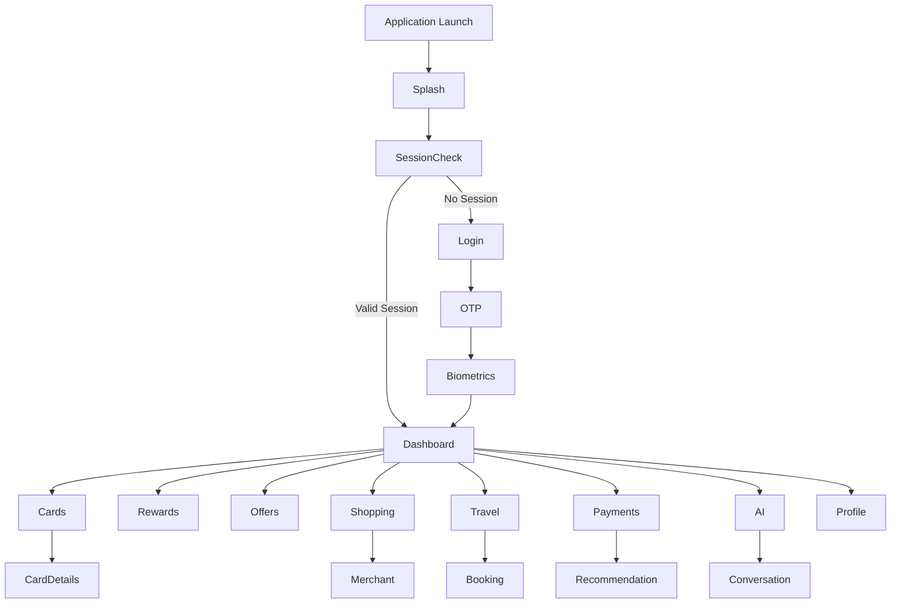

---

## Engineering Rationale

The navigation graph minimizes unnecessary transitions while supporting independent feature ownership and authenticated access control.

---

# 13. Dependency Injection

Dependency Injection (DI) standardizes creation and lifecycle management of application services.

The architecture avoids service location and uncontrolled singleton usage.

---

## APP-120 DI Goals

| Goal | Description |
|------|-------------|
| Predictable initialization | Explicit dependency graph |
| Easy testing | Replace implementations |
| Feature isolation | Scoped dependencies |
| Maintainability | Reduced coupling |

---

## Dependency Categories

| Category | Examples |
|----------|----------|
| Infrastructure | Logger, Analytics, Monitoring |
| Platform | Secure Storage, Notifications |
| Networking | HTTP Client, API Gateway |
| AI | Recommendation Client |
| Repositories | Cards, Rewards, Travel |
| Services | Authentication, Session |
| Configuration | Feature Flags, Remote Config |

---

## Dependency Lifecycle

| Lifecycle | Usage |
|-----------|-------|
| Singleton | Analytics, Logger |
| Session | User profile, Session manager |
| Feature | ViewModels, Controllers |
| Transient | Temporary workflows |

---

## Dependency Rules

| APP ID | Rule |
|---------|------|
| APP-121 | Features depend on interfaces |
| APP-122 | No circular dependencies |
| APP-123 | Domain never depends on UI |
| APP-124 | Infrastructure hidden behind abstractions |
| APP-125 | Runtime injection only at composition root |

---

## Engineering Rationale

Explicit dependency management improves maintainability, enables isolated testing, and supports future platform evolution.

---

## Best Practices

- Inject abstractions instead of implementations.
- Keep dependency graph acyclic.
- Minimize global state.
- Scope dependencies appropriately.

---

## Trade-offs

| Benefit | Cost |
|----------|------|
| Loose coupling | Additional configuration |
| Testability | More interfaces |
| Replaceable implementations | Higher upfront effort |

---

## Risks

| Risk | Mitigation |
|------|------------|
| Dependency explosion | Feature-level composition |
| Lifecycle leaks | Automated lifecycle management |
| Hidden dependencies | Static analysis |

---

## Operational Considerations

- Validate dependency graph during CI.
- Detect circular references automatically.
- Measure startup initialization cost.

---

# 14. State Management

The application uses a layered state architecture.

Different categories of state require different lifecycles.

---

## APP-130 State Categories

| Category | Owner |
|----------|-------|
| UI State | Screen |
| Feature State | Feature Store |
| Session State | Session Manager |
| Cached Data | React Query |
| Persistent Data | MMKV |
| Offline Data | SQLite |
| Global Preferences | Settings Store |

---

## State Responsibilities

### UI State

Examples:

- Loading
- Selected tab
- Dialog visibility
- Scroll position

Lifecycle:

- Screen only

---

### Feature State

Examples:

- Card list
- Rewards
- Booking search
- Merchant results

Lifecycle:

- Feature module

---

### Session State

Examples:

- User
- Authentication
- Subscription
- Preferences

Lifecycle:

- Logged-in session

---

### Cached State

Managed independently.

Includes:

- Merchant cache
- Card metadata
- Offers
- Flights
- Hotels

Automatic invalidation policies are defined by repositories.

---

## State Principles

| APP ID | Principle |
|---------|-----------|
| APP-131 | State has one owner |
| APP-132 | Immutable updates |
| APP-133 | No duplicated state |
| APP-134 | Derived state preferred |
| APP-135 | Side effects outside UI |
| APP-136 | Cache separate from UI state |

---

## Engineering Rationale

Separating state by lifecycle prevents unnecessary re-renders, improves memory usage, and reduces synchronization complexity.

---

## Best Practices

- Keep state minimal.
- Normalize large collections.
- Avoid storing derived values.
- Dispose feature state when unused.

---

## Trade-offs

| Benefit | Cost |
|----------|------|
| Better performance | More state boundaries |
| Predictable updates | Additional architecture |
| Easier testing | Slight learning curve |

---

## Risks

| Risk | Mitigation |
|------|------------|
| State duplication | Ownership rules |
| Memory growth | Automatic disposal |
| Cache inconsistency | Repository-controlled updates |

---

## Operational Considerations

- Monitor memory footprint.
- Track cache hit ratios.
- Measure state update frequency.

---

# 15. End-to-End Data Flow

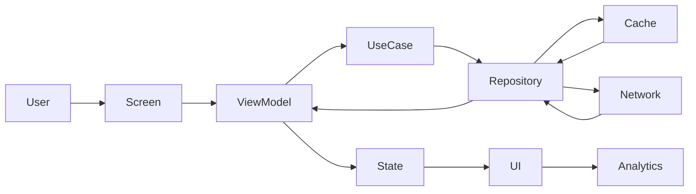

---

## Engineering Rationale

The flow guarantees consistent data ownership, isolates infrastructure concerns, and supports offline-first behavior without coupling presentation to networking.

---

# Part 2 Summary

This section defined the runtime behavior of the CardWise Mobile Application, including:

- Runtime architecture principles
- Navigation architecture and routing strategy
- Dependency Injection model
- Layered state management
- Unidirectional data flow
- Engineering rationale, trade-offs, risks, and operational considerations for each architectural decision

These foundations enable scalable feature development, predictable application behavior, and production-grade maintainability as the mobile platform evolves.

# docs/12_MOBILE_APP.md

# Part 3 — Authentication, Biometrics, Secure Session, Profile & Storage

---

# 16. Authentication Architecture

Authentication is the foundation of the CardWise mobile security model.

Unlike conventional authentication systems that only validate identity, the CardWise authentication platform also establishes a trusted device relationship, enables secure AI personalization, and protects financial data throughout the user session.

Authentication is designed around four core principles:

- Zero Trust
- Device Trust
- Continuous Session Validation
- Privacy by Default

---

## AUTH-001 Objectives

| ID | Objective |
|----|-----------|
| AUTH-001 | Secure user authentication |
| AUTH-002 | Trusted device registration |
| AUTH-003 | Passwordless authentication support |
| AUTH-004 | Fast sign-in experience |
| AUTH-005 | Multi-device support |
| AUTH-006 | Strong session protection |
| AUTH-007 | Risk-aware authentication |
| AUTH-008 | Cross-platform consistency |

---

## Supported Authentication Methods

| Method | Supported | Primary |
|----------|-----------|----------|
| Email OTP | Yes | ✅ |
| Mobile OTP | Yes | ✅ |
| Magic Link | Yes | Optional |
| Social Login | Future | Optional |
| Passkeys | Future | Preferred |
| Biometrics | Yes | Post-login |
| Device Trust | Yes | Mandatory |

Passwords are intentionally avoided to reduce credential reuse risks and improve user experience.

---

## Authentication Lifecycle

```
User Opens App

↓

Device Validation

↓

Session Check

↓

Authenticated?

↓

No → Login

↓

OTP Verification

↓

Device Registration

↓

Biometric Enrollment

↓

Profile Sync

↓

Dashboard
```

---

## Authentication Components

| Component | Responsibility |
|-----------|---------------|
| Login Service | Identity verification |
| OTP Manager | Verification workflow |
| Device Trust Manager | Device binding |
| Session Manager | Active session lifecycle |
| Token Manager | Credential management |
| Security Manager | Risk evaluation |
| Audit Logger | Authentication events |

---

## Engineering Rationale

Passwordless authentication significantly reduces phishing exposure while improving login completion rates. Combining OTP verification with device trust and biometrics creates layered security without increasing user friction.

---

## Best Practices

- Minimize authentication steps.
- Avoid password storage.
- Register trusted devices explicitly.
- Require re-verification for sensitive actions.
- Log every authentication event.

---

## Trade-offs

| Benefit | Cost |
|----------|------|
| Better UX | OTP dependency |
| Higher security | Device registration overhead |
| Reduced credential risk | Additional backend validation |

---

## Risks

| Risk | Mitigation |
|------|------------|
| OTP interception | Short-lived codes and rate limiting |
| SIM swap attacks | Device trust + risk scoring |
| Stolen devices | Biometric verification |

---

## Operational Considerations

- Monitor OTP delivery success.
- Detect suspicious login patterns.
- Measure authentication latency.
- Audit failed authentication attempts.

---

# 17. Biometric Authentication

Biometrics provide a secure and frictionless mechanism for re-authentication.

The application never stores biometric templates.

Authentication relies exclusively on the operating system's secure biometric framework.

---

## AUTH-020 Supported Biometrics

| Platform | Method |
|----------|--------|
| Android | Fingerprint, Face Authentication |
| iOS | Face ID, Touch ID |

---

## Biometric Use Cases

| Action | Biometric Required |
|----------|-------------------|
| Unlock App | Yes |
| View Sensitive Data | Configurable |
| Payment Recommendation Approval | Yes |
| Export Financial Reports | Yes |
| Modify Security Settings | Yes |
| Session Revalidation | Yes |

---

## Biometric Workflow

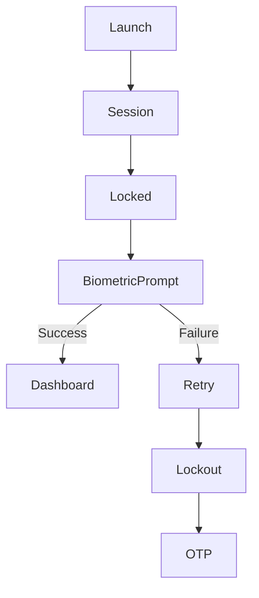

---

## AUTH-021 Biometric Principles

| Principle | Description |
|------------|-------------|
| Local Verification | Biometrics never leave the device |
| Secure Hardware | Platform secure enclave used |
| User Consent | Explicit enrollment required |
| Fallback Support | OTP available when needed |
| Configurable | Users may disable biometrics |

---

## Engineering Rationale

Using native biometric frameworks provides stronger security guarantees than custom implementations while benefiting from hardware-backed secure enclaves.

---

## Best Practices

- Never cache biometric results.
- Respect platform lockout policies.
- Allow secure fallback authentication.
- Request biometrics only for meaningful actions.

---

## Trade-offs

| Benefit | Cost |
|----------|------|
| Excellent UX | Platform-specific behavior |
| Strong security | Hardware dependency |
| Quick re-authentication | User enrollment required |

---

## Risks

| Risk | Mitigation |
|------|------------|
| Biometric unavailable | OTP fallback |
| Sensor failure | Device credentials |
| Shared devices | Device trust validation |

---

## Operational Considerations

- Track biometric adoption.
- Monitor authentication failures.
- Detect repeated lockouts.

---

# 18. Secure Session Management

The application treats every authenticated session as temporary.

Sessions are continuously evaluated rather than trusted indefinitely.

---

## AUTH-040 Session Objectives

| ID | Objective |
|----|-----------|
| AUTH-040 | Short-lived access tokens |
| AUTH-041 | Automatic refresh |
| AUTH-042 | Device-bound sessions |
| AUTH-043 | Secure logout |
| AUTH-044 | Background expiration handling |
| AUTH-045 | Session revocation |

---

## Session Components

| Component | Responsibility |
|-----------|---------------|
| Access Token | API authorization |
| Refresh Token | Session renewal |
| Device Token | Trusted device identification |
| Session Metadata | Login context |
| Risk Score | Dynamic trust evaluation |

---

## Session Lifecycle

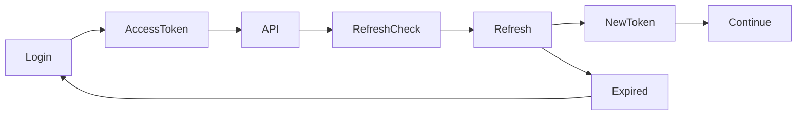

---

## Session Expiration Triggers

| Trigger | Action |
|----------|--------|
| Refresh expiry | Logout |
| Manual logout | Token revocation |
| Passwordless identity reset | Session invalidation |
| Device removal | Session termination |
| High-risk activity | Re-authentication |

---

## Engineering Rationale

Short-lived credentials significantly reduce the attack window if a token is compromised while preserving seamless user experience through automatic refresh.

---

## Best Practices

- Rotate refresh tokens.
- Bind sessions to trusted devices.
- Re-authenticate before sensitive operations.
- Remove sessions immediately after logout.

---

## Trade-offs

| Benefit | Cost |
|----------|------|
| Higher security | More refresh requests |
| Reduced token exposure | Slight complexity |

---

## Risks

| Risk | Mitigation |
|------|------------|
| Token theft | Device binding |
| Session hijacking | Risk-based re-authentication |
| Refresh abuse | Rotation and revocation |

---

## Operational Considerations

- Monitor refresh success rate.
- Detect unusual session activity.
- Alert on concurrent suspicious sessions.

---

# 19. User Profile Architecture

The user profile acts as the personalization foundation for the CardWise ecosystem.

It stores user preferences, financial configuration, personalization settings, and AI context.

---

## PROFILE-001 Profile Domains

| Domain | Description |
|----------|-------------|
| Identity | Name, contact information |
| Preferences | Theme, language |
| Financial | Preferred cards, goals |
| Travel | Airports, airlines, loyalty |
| Rewards | Redemption preferences |
| Notifications | Alert configuration |
| AI | Personalization profile |
| Security | Authentication settings |

---

## Profile Ownership

```
Profile

├── Identity

├── Preferences

├── Financial

├── Rewards

├── Travel

├── Notifications

├── AI Settings

└── Security
```

---

## Profile Synchronization

Profile updates synchronize across:

- Mobile
- Web
- Browser Extension
- Admin Portal
- AI Recommendation Engine

Synchronization remains eventual while preserving conflict safety.

---

## PROFILE-010 Personalization Attributes

| Category | Example |
|-----------|----------|
| Spending Style | Cashback focused |
| Travel Style | Premium traveler |
| Preferred Airlines | User-defined |
| Hotel Preference | Business, luxury |
| Favorite Merchants | Frequently visited |
| AI Preferences | Recommendation verbosity |

---

## Engineering Rationale

Separating profile domains enables modular ownership while allowing AI systems to personalize recommendations consistently across every platform.

---

## Best Practices

- Keep profile schema versioned.
- Minimize personally identifiable information.
- Synchronize incrementally.
- Encrypt sensitive preferences.

---

## Trade-offs

| Benefit | Cost |
|----------|------|
| Better personalization | More synchronization |
| Modular evolution | Larger schema |

---

## Risks

| Risk | Mitigation |
|------|------------|
| Profile conflicts | Version-based merges |
| Incomplete synchronization | Incremental updates |
| Schema evolution | Backward compatibility |

---

## Operational Considerations

- Measure profile sync latency.
- Audit profile updates.
- Detect synchronization failures.

---

# 20. Mobile Storage Architecture

The storage architecture separates data based on security, lifecycle, and performance requirements.

---

## STORAGE-001 Storage Layers

| Storage | Purpose |
|----------|----------|
| Secure Storage | Tokens, encryption keys |
| MMKV | Preferences and lightweight state |
| SQLite | Offline data |
| Memory Cache | Runtime state |
| React Query Cache | API responses |

---

## Storage Decision Matrix

| Data | Storage |
|------|---------|
| Access Tokens | Secure Storage |
| Refresh Tokens | Secure Storage |
| User Preferences | MMKV |
| Feature Flags | MMKV |
| Cached Cards | SQLite |
| Offers | SQLite |
| Flights | SQLite |
| Hotels | SQLite |
| Images | File Cache |
| Runtime State | Memory |

---

## Storage Principles

| STORAGE ID | Principle |
|-------------|-----------|
| STORAGE-002 | Encrypt sensitive data |
| STORAGE-003 | Never duplicate critical state |
| STORAGE-004 | Cache only reproducible data |
| STORAGE-005 | Automatic expiration policies |
| STORAGE-006 | Version storage schemas |

---

## Storage Architecture

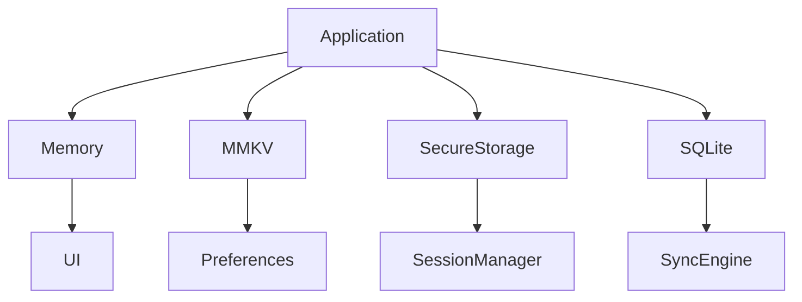

---

## Engineering Rationale

Using specialized storage layers improves security, minimizes startup time, and allows offline functionality without compromising sensitive information.

---

## Best Practices

- Encrypt all financial identifiers.
- Version local databases.
- Separate cache from persistent data.
- Remove obsolete records automatically.

---

## Trade-offs

| Benefit | Cost |
|----------|------|
| Better performance | Multiple storage systems |
| Improved security | Additional lifecycle management |
| Offline capability | Synchronization complexity |

---

## Risks

| Risk | Mitigation |
|------|------------|
| Cache corruption | Integrity validation |
| Storage growth | Expiration policies |
| Data inconsistency | Repository-controlled writes |

---

## Operational Considerations

- Monitor storage utilization.
- Track cache eviction rates.
- Validate storage migrations.
- Measure local database performance.

---

# 21. Authentication & Session Flow

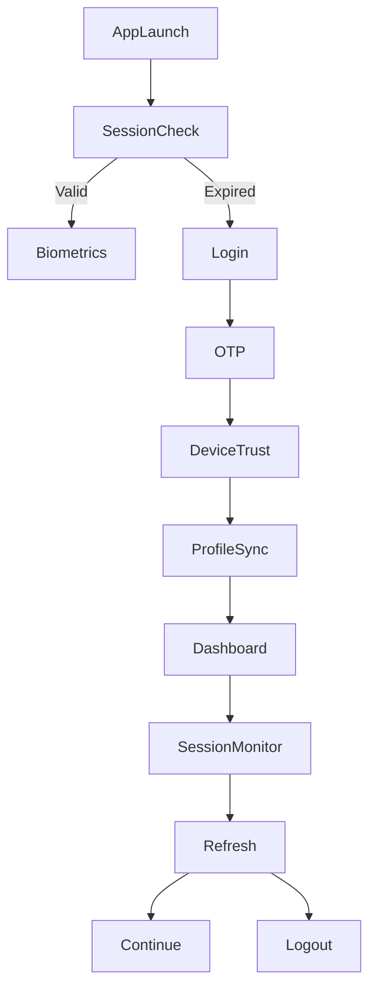

---

# Part 3 Summary

This section established the identity and security foundation of the CardWise Mobile Application by defining:

- Passwordless authentication architecture
- Hardware-backed biometric authentication
- Secure session lifecycle and token management
- Modular user profile architecture
- Multi-layer storage strategy
- Authentication and session workflows
- Engineering rationale, best practices, trade-offs, risks, and operational considerations for secure mobile identity management

These capabilities provide the trusted foundation upon which dashboard experiences, payment intelligence, AI personalization, and offline functionality are built.

# docs/12_MOBILE_APP.md

# Part 4 — Dashboard, Home, Cards, Rewards & Offers

---

# 22. Dashboard Architecture

The Dashboard is the primary entry point of the CardWise mobile application.

Unlike a traditional banking home screen, the CardWise Dashboard functions as an intelligent financial command center that continuously surfaces the most relevant information, recommendations, and actions for the user.

The dashboard is:

- Personalized
- Context-aware
- AI-driven
- Real-time
- Offline-capable
- Performance-optimized

---

## DASH-001 Objectives

| ID | Objective |
|----|-----------|
| DASH-001 | Present actionable financial insights |
| DASH-002 | Minimize cognitive load |
| DASH-003 | Personalize every dashboard session |
| DASH-004 | Prioritize high-value recommendations |
| DASH-005 | Maintain sub-second perceived loading |
| DASH-006 | Support offline viewing of cached insights |
| DASH-007 | Surface AI-generated opportunities |

---

## Dashboard Composition

The dashboard is composed of independently deployable widgets.

```
Dashboard

├── Greeting

├── Financial Health

├── Active Cards

├── Best Card Today

├── Rewards Summary

├── Offers Near You

├── Cashback Opportunities

├── Upcoming Travel

├── Spending Insights

├── AI Recommendations

├── Recent Activity

└── Quick Actions
```

Each widget owns:

- Rendering
- Local state
- Refresh policy
- Analytics
- Error handling
- Skeleton loading
- Accessibility metadata

---

## Dashboard Widget Lifecycle

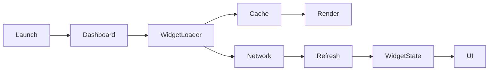

---

## Engineering Rationale

Widget isolation improves resilience by ensuring that failures in one widget do not impact the rest of the dashboard. It also allows independent iteration, experimentation, and performance optimization.

---

## Best Practices

- Render cached data immediately.
- Refresh widgets independently.
- Avoid blocking the dashboard on slow services.
- Keep widget rendering deterministic.

---

## Trade-offs

| Benefit | Cost |
|----------|------|
| Independent updates | More orchestration |
| Better resilience | Increased lifecycle management |
| Faster perceived loading | More caching logic |

---

## Risks

| Risk | Mitigation |
|------|------------|
| Widget overload | Prioritization engine |
| Inconsistent refresh times | Standard refresh policies |
| Excessive network requests | Request batching |

---

## Operational Considerations

- Measure widget render times.
- Monitor widget failure rates.
- Track user interaction per widget.
- Audit dashboard personalization quality.

---

# 23. Home Experience

The Home experience is dynamic and adapts to each user's financial behavior, travel plans, merchant preferences, and active offers.

Unlike a fixed dashboard, content is assembled at runtime.

---

## DASH-020 Home Sections

| Section | Purpose |
|----------|----------|
| Welcome | Personalized greeting |
| Highlights | Important financial events |
| Best Card | AI recommendation |
| Rewards | Current reward balances |
| Offers | Personalized promotions |
| Spending | Recent analytics |
| Travel | Upcoming trips |
| Goals | Financial progress |
| Quick Actions | Frequently used actions |

---

## Dynamic Prioritization

Content ordering considers:

- Time of day
- User location
- Merchant proximity
- Spending patterns
- Active offers
- Travel itinerary
- Reward expiry
- User engagement
- Notification history

---

## Home Refresh Strategy

| Content | Refresh Policy |
|----------|----------------|
| User greeting | Session |
| Card summary | Pull-to-refresh + background sync |
| Rewards | Incremental updates |
| Offers | Context-aware refresh |
| Spending | Scheduled refresh |
| Travel | Event-driven refresh |
| AI recommendations | Dynamic |

---

## Engineering Rationale

Dynamic composition ensures users always see the most relevant financial information while minimizing unnecessary cognitive load.

---

## Best Practices

- Prioritize actionable information.
- Keep above-the-fold content lightweight.
- Defer non-critical widgets.
- Preserve layout stability during refreshes.

---

## Trade-offs

| Benefit | Cost |
|----------|------|
| Highly personalized UX | Increased orchestration |
| Better engagement | AI dependency |

---

## Risks

| Risk | Mitigation |
|------|------------|
| Recommendation fatigue | Diversity rules |
| Layout instability | Placeholder sizing |
| Excessive personalization | User controls |

---

## Operational Considerations

- Track widget engagement.
- Measure personalization effectiveness.
- Monitor dashboard refresh latency.

---

# 24. Card Portfolio Architecture

The Card Portfolio provides users with a comprehensive view of their financial instruments while acting as the foundation for recommendation engines across the platform.

---

## DASH-040 Card Domains

| Domain | Description |
|----------|-------------|
| Active Cards | User-owned cards |
| Recommended Cards | AI suggestions |
| Expiring Cards | Renewal monitoring |
| Reward Programs | Loyalty associations |
| Usage Insights | Spending behavior |
| Benefits | Card-specific privileges |

---

## Card Lifecycle

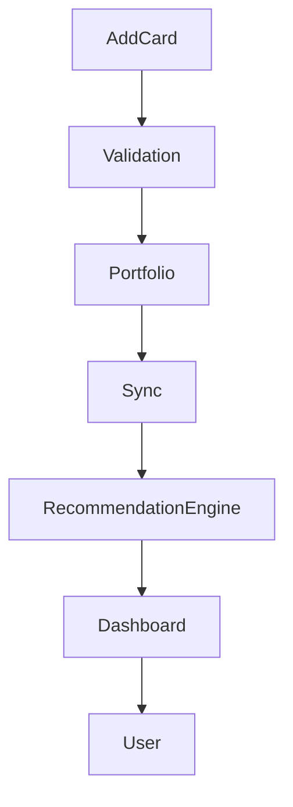

---

## Card Metadata

Each card maintains:

- Issuer
- Network
- Reward program
- Cashback rules
- Lounge access
- Travel benefits
- Annual fee
- Renewal date
- Status
- Usage analytics

---

## Card Presentation

Cards display:

- Visual branding
- Reward summary
- Active offers
- AI recommendation score
- Recent activity
- Upcoming benefits
- Suggested actions

---

## Engineering Rationale

Treating cards as intelligent entities rather than static payment instruments enables contextual recommendations across payments, shopping, and travel.

---

## Best Practices

- Separate card metadata from transaction history.
- Cache static card information.
- Synchronize usage statistics independently.

---

## Trade-offs

| Benefit | Cost |
|----------|------|
| Rich recommendations | More metadata |
| Better analytics | Increased storage |

---

## Risks

| Risk | Mitigation |
|------|------------|
| Outdated benefits | Scheduled synchronization |
| Metadata inconsistency | Versioned schemas |

---

## Operational Considerations

- Track card synchronization success.
- Measure recommendation freshness.
- Monitor portfolio update latency.

---

# 25. Rewards Dashboard

Rewards are a primary value proposition of CardWise.

The Rewards Dashboard consolidates reward programs across multiple issuers into a unified experience.

---

## DASH-060 Reward Categories

| Category | Examples |
|-----------|----------|
| Credit Card Points | Issuer programs |
| Airline Miles | Frequent flyer programs |
| Hotel Points | Loyalty programs |
| Cashback | Cash-equivalent rewards |
| Promotional Bonuses | Limited-time campaigns |
| Milestone Rewards | Spend thresholds |

---

## Rewards Overview

Users can view:

- Total reward value
- Expiring rewards
- Redemption opportunities
- AI optimization suggestions
- Category breakdown
- Historical earnings
- Projected future rewards

---

## Reward Widgets

```
Rewards

├── Total Value

├── Expiring Soon

├── Top Earning Cards

├── Recent Earnings

├── Redemption Suggestions

├── Loyalty Programs

└── AI Insights
```

---

## Engineering Rationale

Aggregating reward programs into a unified interface reduces fragmentation and improves decision-making.

---

## Best Practices

- Normalize reward units.
- Display equivalent monetary value where applicable.
- Highlight expiring rewards.
- Explain recommendation reasoning.

---

## Trade-offs

| Benefit | Cost |
|----------|------|
| Unified experience | Normalization complexity |
| Better optimization | Frequent synchronization |

---

## Risks

| Risk | Mitigation |
|------|------------|
| Delayed balances | Incremental sync |
| Reward valuation changes | Versioned calculations |

---

## Operational Considerations

- Track synchronization latency.
- Monitor reward freshness.
- Measure redemption engagement.

---

# 26. Personalized Offers

Offers are generated from multiple sources and ranked according to user relevance.

The mobile application focuses on surfacing high-value, actionable opportunities rather than exhaustive listings.

---

## DASH-080 Offer Sources

| Source | Description |
|----------|-------------|
| Issuer Promotions | Bank campaigns |
| Merchant Campaigns | Store offers |
| Payment Networks | Network discounts |
| Travel Partners | Airline and hotel offers |
| Loyalty Programs | Redemption campaigns |
| CardWise AI | Personalized recommendations |

---

## Offer Ranking Signals

Offer prioritization considers:

- User location
- Preferred merchants
- Card eligibility
- Spending habits
- Historical redemptions
- Reward value
- Offer expiry
- Merchant affinity
- Travel plans

---

## Offer Lifecycle


---

## Offer Types

| Type | Example |
|------|----------|
| Cashback | 10% cashback |
| Instant Discount | ₹500 off |
| Reward Multiplier | 5X points |
| Lounge Benefit | Complimentary access |
| Travel Upgrade | Bonus miles |
| Merchant Coupon | Exclusive discount |

---

## Engineering Rationale

Ranking offers based on predicted user value increases engagement while avoiding information overload.

---

## Best Practices

- Prioritize quality over quantity.
- Explain offer eligibility.
- Clearly display expiry information.
- Deduplicate overlapping promotions.

---

## Trade-offs

| Benefit | Cost |
|----------|------|
| Higher relevance | Ranking complexity |
| Better engagement | Continuous personalization |

---

## Risks

| Risk | Mitigation |
|------|------------|
| Expired offers | Frequent synchronization |
| Ranking bias | Diversity algorithms |
| Duplicate campaigns | Offer normalization |

---

## Operational Considerations

- Measure offer click-through rate.
- Monitor redemption conversion.
- Audit recommendation quality.
- Track offer freshness.

---

# 27. Home Dashboard Data Flow

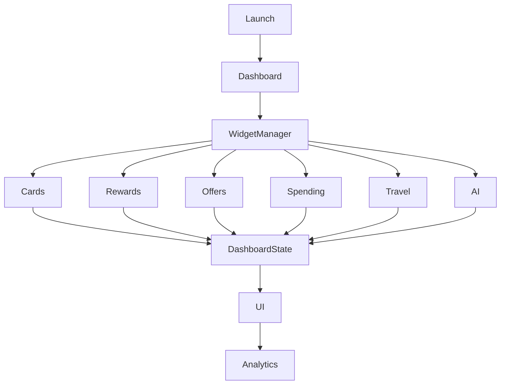

---

# Part 4 Summary

This section defined the user-facing financial intelligence layer of the CardWise Mobile Application, including:

- Intelligent dashboard architecture
- Dynamic home experience
- Card portfolio management
- Unified rewards dashboard
- Personalized offer platform
- Widget lifecycle and dashboard data flow
- Engineering rationale, best practices, trade-offs, risks, and operational considerations for each major dashboard capability

These foundational experiences establish the daily engagement layer of the application and prepare for the payment intelligence, merchant optimization, and shopping workflows covered in the next section.

# docs/12_MOBILE_APP.md

# Part 5 — Payments, Merchant Intelligence, Shopping, Offers, Coupons & Cashback

---

# 28. Payment Intelligence Architecture

Payment Intelligence is the core differentiator of CardWise.

Unlike traditional wallet or banking applications that simply facilitate payments, CardWise evaluates every transaction before it occurs and recommends the financially optimal payment method.

The recommendation engine considers:

- User card portfolio
- Merchant category
- Current offers
- Reward multipliers
- Cashback campaigns
- Loyalty programs
- Spending milestones
- Annual fee optimization
- Card usage history
- AI personalization

---

## PAYMENT-001 Objectives

| ID | Objective |
|----|-----------|
| PAYMENT-001 | Recommend the best payment option |
| PAYMENT-002 | Maximize total reward value |
| PAYMENT-003 | Minimize payment friction |
| PAYMENT-004 | Provide explainable recommendations |
| PAYMENT-005 | Adapt recommendations in real time |
| PAYMENT-006 | Support offline recommendations using cached intelligence |
| PAYMENT-007 | Learn continuously from user behavior |

---

## Payment Recommendation Inputs

| Source | Purpose |
|----------|----------|
| Card Portfolio | Eligible payment methods |
| Merchant Intelligence | Merchant category and history |
| Reward Engine | Reward calculation |
| Offer Platform | Active promotions |
| AI Engine | Personalized ranking |
| Knowledge Graph | Relationship inference |
| User Preferences | Personalized weighting |
| Spending Analytics | Goal optimization |

---

## Payment Decision Pipeline


---

## Recommendation Output

Each recommendation includes:

- Best card
- Expected rewards
- Cashback estimate
- Loyalty earnings
- Savings estimate
- Confidence score
- Explanation
- Alternative options

---

## Engineering Rationale

Separating recommendation generation from UI rendering enables consistent payment intelligence across mobile, web, browser extension, and future platforms while keeping mobile interactions fast and predictable.

---

## Best Practices

- Cache frequently used merchant recommendations.
- Display confidence levels for AI suggestions.
- Explain optimization rationale.
- Avoid blocking payment workflows on network latency.

---

## Trade-offs

| Benefit | Cost |
|----------|------|
| Highly accurate recommendations | Multiple data dependencies |
| Rich user guidance | Increased orchestration |
| Explainable decisions | Additional computation |

---

## Risks

| Risk | Mitigation |
|------|------------|
| Stale reward rules | Incremental synchronization |
| Recommendation latency | Local caching |
| Incomplete merchant data | Graceful degradation |

---

## Operational Considerations

- Measure recommendation latency.
- Monitor recommendation acceptance rate.
- Track recommendation accuracy.
- Audit payment decision quality.

---

# 29. Merchant Intelligence

Merchant Intelligence provides contextual awareness about where the user is spending money.

The platform transforms merchant information into actionable financial recommendations.

---

## SHOPPING-001 Merchant Domains

| Domain | Description |
|----------|-------------|
| Merchant Profile | Core business information |
| Merchant Category | MCC classification |
| Supported Offers | Available campaigns |
| Historical Spend | User spending history |
| Preferred Cards | Highest-value cards |
| Reward Multipliers | Category-specific earnings |
| Cashback Programs | Eligible promotions |

---

## Merchant Insights

For each merchant, the application can display:

- Best payment card
- Active discounts
- Cashback opportunities
- Reward multiplier
- Loyalty eligibility
- Nearby partner merchants
- Historical spending
- AI recommendations

---

## Merchant Lifecycle

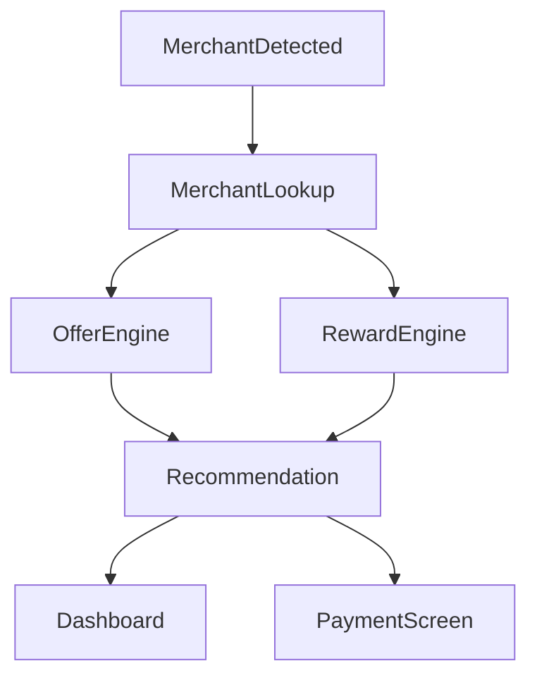

---

## Engineering Rationale

Treating merchants as first-class entities enables consistent optimization across shopping, payments, and travel while reducing duplicated business logic.

---

## Best Practices

- Cache frequently visited merchants.
- Normalize merchant identifiers.
- Separate merchant metadata from user-specific analytics.
- Update merchant intelligence incrementally.

---

## Trade-offs

| Benefit | Cost |
|----------|------|
| Rich contextual recommendations | Larger metadata repository |
| Better personalization | Frequent synchronization |

---

## Risks

| Risk | Mitigation |
|------|------------|
| Merchant misclassification | Continuous data validation |
| Inconsistent identifiers | Canonical merchant mapping |

---

## Operational Considerations

- Monitor merchant lookup latency.
- Track cache hit ratio.
- Audit merchant classification accuracy.

---

# 30. Shopping Experience

Shopping is not an isolated feature—it is an intelligent workflow built around maximizing savings and rewards.

The shopping experience begins before checkout and continues after purchase.

---

## SHOPPING-020 Shopping Journey

```
Merchant Discovery

↓

Offer Evaluation

↓

Card Recommendation

↓

Coupon Suggestions

↓

Payment Optimization

↓

Reward Estimation

↓

Purchase

↓

Reward Tracking
```

---

## Shopping Modules

| Module | Responsibility |
|----------|---------------|
| Merchant Details | Merchant profile |
| Offers | Active discounts |
| Coupons | Coupon discovery |
| Cashback | Cashback opportunities |
| AI Advisor | Shopping recommendations |
| Spending History | Merchant analytics |

---

## Shopping Actions

Users can:

- View eligible cards
- Compare reward outcomes
- Save offers
- Activate campaigns
- Copy coupon codes
- Share offers
- Bookmark merchants
- Track savings

---

## Engineering Rationale

Integrating payment optimization directly into the shopping workflow increases savings while reducing decision fatigue.

---

## Best Practices

- Prioritize active and eligible offers.
- Minimize checkout interruptions.
- Surface savings estimates prominently.
- Explain recommendation reasoning.

---

## Trade-offs

| Benefit | Cost |
|----------|------|
| Better engagement | More contextual processing |
| Higher savings | Increased personalization complexity |

---

## Risks

| Risk | Mitigation |
|------|------------|
| Offer overload | Intelligent ranking |
| Outdated campaigns | Frequent synchronization |
| User confusion | Clear eligibility indicators |

---

## Operational Considerations

- Measure offer interaction rates.
- Track shopping session completion.
- Monitor merchant engagement.

---

# 31. Offers Platform

The mobile application presents offers as intelligent opportunities rather than static advertisements.

Every offer is evaluated against the user's financial profile before being surfaced.

---

## SHOPPING-040 Offer Categories

| Category | Examples |
|----------|----------|
| Bank Offers | Issuer campaigns |
| Merchant Discounts | Retail promotions |
| Network Offers | Visa, Mastercard, RuPay |
| Seasonal Campaigns | Festive promotions |
| Travel Offers | Airline and hotel deals |
| Exclusive CardWise Offers | Partner campaigns |

---

## Offer Ranking Signals

Ranking incorporates:

- User eligibility
- Merchant affinity
- Savings potential
- Expiration date
- Reward multiplier
- Historical redemption
- Spending goals
- Geographic relevance

---

## Offer Presentation

Each offer displays:

- Savings estimate
- Eligible cards
- Expiry date
- Terms summary
- Activation status
- AI confidence
- Similar offers

---

## Engineering Rationale

Ranking offers by expected financial value improves user trust while reducing unnecessary browsing.

---

## Best Practices

- Highlight eligibility.
- Display expiration clearly.
- Avoid duplicate campaigns.
- Support offline viewing of saved offers.

---

## Trade-offs

| Benefit | Cost |
|----------|------|
| Higher relevance | More ranking computation |
| Better conversion | Continuous personalization |

---

## Risks

| Risk | Mitigation |
|------|------------|
| Duplicate promotions | Offer normalization |
| Incorrect eligibility | Rule validation |

---

## Operational Considerations

- Monitor offer impressions.
- Measure activation rate.
- Track redemption success.

---

# 32. Coupon Management

Coupons complement offers by providing merchant-specific savings opportunities.

The application differentiates between:

- Automatically applied promotions
- Manual coupon codes
- Loyalty coupons
- Exclusive partner coupons

---

## SHOPPING-060 Coupon Types

| Type | Description |
|------|-------------|
| Promo Code | Manual entry |
| Auto Applied | Applied automatically |
| Loyalty Coupon | Membership-based |
| Cashback Coupon | Cashback activation |
| Limited-Time Coupon | Time-sensitive promotion |

---

## Coupon Workflow


---

## Coupon Metadata

Each coupon contains:

- Eligibility
- Validity
- Merchant
- Applicable cards
- Estimated savings
- Usage limits
- Activation requirements

---

## Engineering Rationale

Separating coupons from offers allows independent lifecycle management while providing a unified shopping experience.

---

## Best Practices

- Validate coupon eligibility.
- Clearly communicate restrictions.
- Remove expired coupons automatically.

---

## Trade-offs

| Benefit | Cost |
|----------|------|
| Better organization | Additional metadata |
| Cleaner workflows | Separate synchronization |

---

## Risks

| Risk | Mitigation |
|------|------------|
| Invalid coupons | Real-time validation |
| Expired codes | Automatic cleanup |

---

## Operational Considerations

- Track coupon usage.
- Measure coupon conversion.
- Audit synchronization quality.

---

# 33. Cashback Intelligence

Cashback optimization complements reward point recommendations by evaluating direct monetary savings.

---

## SHOPPING-080 Cashback Sources

| Source | Description |
|----------|-------------|
| Credit Card Cashback | Card issuer |
| Merchant Cashback | Retail partner |
| Wallet Cashback | Payment wallet |
| Promotional Cashback | Campaigns |
| Loyalty Cashback | Membership benefits |

---

## Cashback Dashboard

Users can view:

- Pending cashback
- Earned cashback
- Available cashback
- Projected cashback
- Cashback trends
- Redemption history

---

## Cashback Recommendation Inputs

- Merchant
- Card
- Campaign
- Purchase amount
- Historical behavior
- Spending category
- Active promotions

---

## Cashback Flow

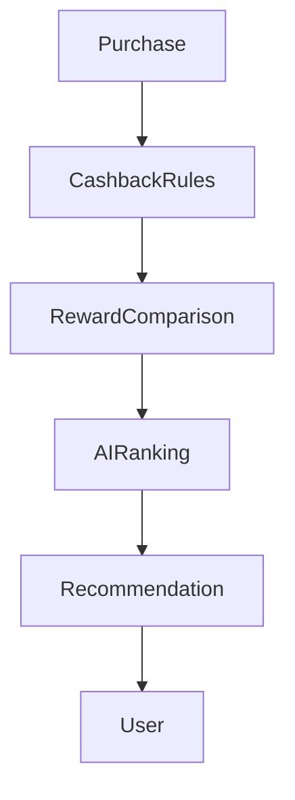

---

## Engineering Rationale

Considering cashback alongside points and loyalty rewards ensures recommendations maximize total financial value rather than a single metric.

---

## Best Practices

- Display expected cashback clearly.
- Explain calculation assumptions.
- Compare cashback with reward alternatives.

---

## Trade-offs

| Benefit | Cost |
|----------|------|
| More complete optimization | Additional calculations |
| Higher user trust | Greater data synchronization |

---

## Risks

| Risk | Mitigation |
|------|------------|
| Cashback delays | Status tracking |
| Campaign changes | Incremental updates |

---

## Operational Considerations

- Monitor cashback realization rates.
- Track recommendation acceptance.
- Audit cashback calculations.

---

# 34. Shopping & Payment Data Flow

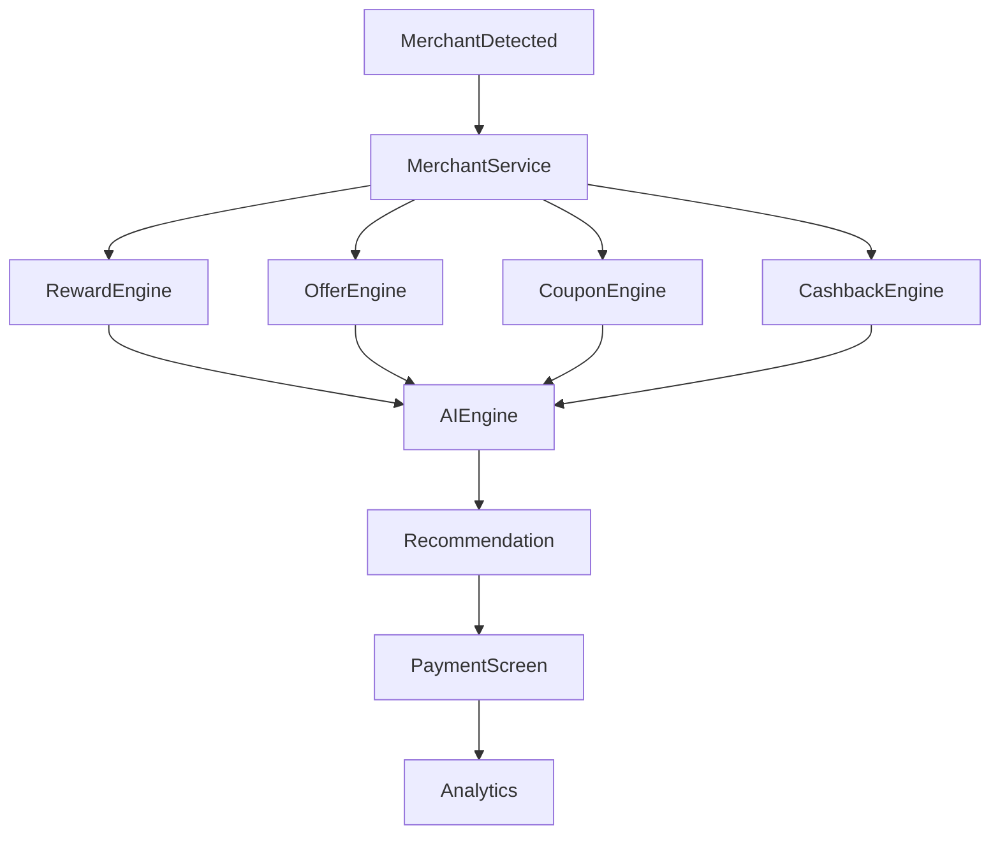

---

# Part 5 Summary

This section defined the commerce and payment optimization architecture of the CardWise Mobile Application, including:

- AI-driven payment intelligence
- Merchant Intelligence platform
- Intelligent shopping workflow
- Personalized offers platform
- Coupon management
- Cashback optimization
- End-to-end shopping and payment data flow
- Engineering rationale, best practices, trade-offs, risks, and operational considerations for every major capability

These capabilities establish the real-time financial optimization layer of the mobile application and provide the foundation for the travel booking and reward optimization workflows covered in the next section.

# docs/12_MOBILE_APP.md

# Part 6 — Travel, Booking, Trips, Reward Optimization & Payment Recommendation

---

# 35. Travel Experience Architecture

Travel is one of the highest-value domains within the CardWise ecosystem.

Unlike traditional Online Travel Agencies (OTAs), the CardWise Travel experience is designed to optimize the *entire travel transaction*, not merely facilitate booking.

Every booking decision is evaluated using:

- Credit card benefits
- Reward redemption value
- Loyalty memberships
- Airline partnerships
- Hotel programs
- Promotional campaigns
- Cashback opportunities
- AI personalization
- Historical travel behavior

The objective is to maximize total travel value while minimizing overall trip cost.

---

## TRAVEL-001 Objectives

| ID | Objective |
|----|-----------|
| TRAVEL-001 | Unified travel planning experience |
| TRAVEL-002 | Optimize payment method for every booking |
| TRAVEL-003 | Maximize travel rewards and loyalty value |
| TRAVEL-004 | Surface personalized travel offers |
| TRAVEL-005 | Maintain offline access to itineraries |
| TRAVEL-006 | Synchronize bookings across platforms |
| TRAVEL-007 | Provide explainable travel recommendations |

---

## Travel Modules

| Module | Responsibility |
|----------|---------------|
| Flight Search | Discover flights |
| Hotel Search | Discover accommodations |
| Booking Engine | Reservation workflow |
| Trip Manager | Itinerary management |
| Reward Optimizer | Reward analysis |
| Payment Advisor | Card recommendation |
| Loyalty Manager | Program integration |
| Travel Wallet | Booking documents |

---

## Engineering Rationale

Separating travel capabilities into modular services enables independent evolution of search, booking, payments, and loyalty optimization while maintaining a unified user experience.

---

## Best Practices

- Keep search responsive.
- Cache recent searches.
- Provide offline itinerary access.
- Surface total trip value instead of only price.

---

## Trade-offs

| Benefit | Cost |
|----------|------|
| Rich travel intelligence | Higher orchestration complexity |
| Better personalization | Increased data synchronization |

---

## Risks

| Risk | Mitigation |
|------|------------|
| Stale travel pricing | Frequent refresh policies |
| Booking interruptions | Session persistence |
| Loyalty inconsistencies | Scheduled synchronization |

---

## Operational Considerations

- Monitor booking completion rate.
- Measure itinerary synchronization latency.
- Audit recommendation quality.

---

# 36. Flight Booking Experience

The Flight Booking experience extends beyond route discovery by integrating payment optimization and loyalty intelligence into every search.

---

## TRAVEL-020 Flight Search Inputs

| Source | Purpose |
|----------|----------|
| Search Query | Origin, destination, dates |
| User Preferences | Preferred airlines |
| Loyalty Programs | Frequent flyer benefits |
| AI Engine | Personalized ranking |
| Reward Engine | Redemption analysis |
| Payment Engine | Best card recommendation |

---

## Flight Search Workflow

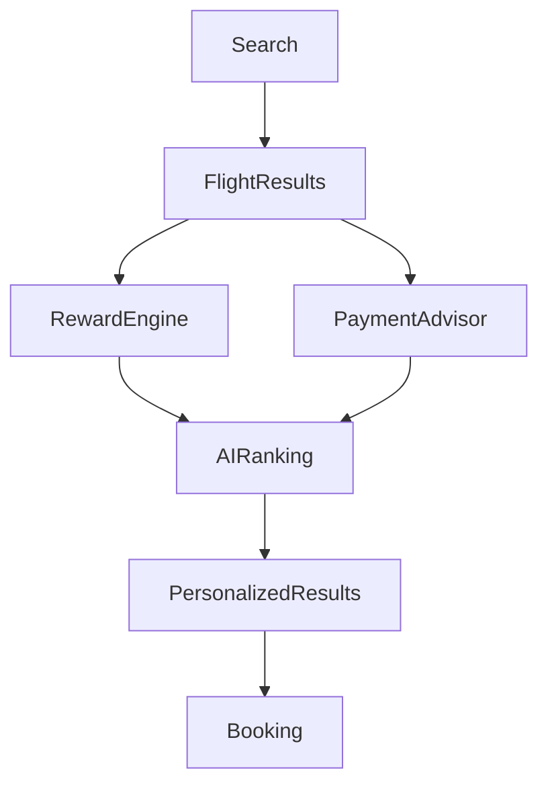

---

## Flight Result Presentation

Each result displays:

- Fare
- Loyalty earnings
- Redeemable points
- Recommended payment card
- Lounge eligibility
- Baggage benefits
- Estimated reward value
- AI explanation

---

## Engineering Rationale

Presenting financial insights directly within search results enables users to compare *true trip value* rather than focusing solely on ticket price.

---

## Best Practices

- Prioritize transparency.
- Highlight reward impact.
- Explain payment recommendations.
- Preserve search context during navigation.

---

## Trade-offs

| Benefit | Cost |
|----------|------|
| Better booking decisions | More computation |
| Increased user trust | Additional UI complexity |

---

## Risks

| Risk | Mitigation |
|------|------------|
| Fare volatility | Timely refresh |
| Recommendation delays | Cached calculations |

---

## Operational Considerations

- Track search-to-book conversion.
- Measure recommendation acceptance.
- Monitor search latency.

---

# 37. Hotel Booking Experience

The Hotel Booking experience integrates accommodation discovery with loyalty optimization and payment intelligence.

---

## TRAVEL-040 Hotel Modules

| Module | Responsibility |
|----------|---------------|
| Hotel Search | Accommodation discovery |
| Availability | Room inventory |
| Pricing | Dynamic pricing |
| Loyalty | Hotel memberships |
| Rewards | Point optimization |
| Payment Advisor | Best payment method |

---

## Hotel Recommendation Factors

Recommendations consider:

- Price
- Location
- User preferences
- Loyalty benefits
- Card partnerships
- Cashback campaigns
- Reward redemption value
- AI personalization

---

## Hotel Booking Lifecycle


---

## Engineering Rationale

Integrating hotel loyalty and payment intelligence into booking improves overall trip value while reducing fragmented decision-making.

---

## Best Practices

- Display total trip cost.
- Highlight loyalty opportunities.
- Explain recommendation reasoning.
- Cache recently viewed properties.

---

## Trade-offs

| Benefit | Cost |
|----------|------|
| Rich booking experience | Increased metadata |
| Better personalization | Higher synchronization effort |

---

## Risks

| Risk | Mitigation |
|------|------------|
| Inventory changes | Frequent availability refresh |
| Loyalty discrepancies | Program synchronization |

---

## Operational Considerations

- Measure booking abandonment.
- Track hotel recommendation accuracy.
- Monitor search responsiveness.

---

# 38. Trip Management

Trip Management provides a unified timeline of all travel activities regardless of booking source.

---

## TRAVEL-060 Trip Components

| Component | Description |
|-----------|-------------|
| Flights | Flight segments |
| Hotels | Accommodation |
| Transportation | Transfers |
| Activities | Planned experiences |
| Payments | Booking history |
| Rewards | Earned benefits |
| Documents | Tickets and confirmations |

---

## Trip Timeline

```
Upcoming

↓

Check-In

↓

In Progress

↓

Completed

↓

Archived
```

---

## Trip Dashboard

Each trip includes:

- Timeline
- Flight details
- Hotel details
- Reward summary
- Payment breakdown
- Travel documents
- Notifications
- AI travel insights

---

## Engineering Rationale

A centralized trip view improves usability and allows AI systems to generate proactive recommendations before and during travel.

---

## Best Practices

- Support offline itinerary viewing.
- Keep travel documents accessible.
- Synchronize status changes incrementally.

---

## Trade-offs

| Benefit | Cost |
|----------|------|
| Unified experience | Additional synchronization |
| Better engagement | More storage requirements |

---

## Risks

| Risk | Mitigation |
|------|------------|
| Incomplete itinerary | Multi-source reconciliation |
| Delayed updates | Event-driven synchronization |

---

## Operational Considerations

- Monitor synchronization latency.
- Measure offline access frequency.
- Audit itinerary completeness.

---

# 39. Reward Optimization for Travel

Travel bookings often present multiple reward redemption strategies.

The Reward Optimizer evaluates each alternative to maximize long-term financial value.

---

## TRAVEL-080 Optimization Inputs

| Source | Purpose |
|----------|----------|
| Reward Balances | Available points |
| Airline Programs | Frequent flyer value |
| Hotel Loyalty | Redemption opportunities |
| Card Benefits | Travel-specific rewards |
| Promotions | Active campaigns |
| AI Engine | Personalized valuation |

---

## Optimization Outputs

Users receive:

- Best redemption strategy
- Cash vs points comparison
- Hybrid payment suggestions
- Estimated savings
- Future reward impact
- Loyalty progression

---

## Optimization Workflow

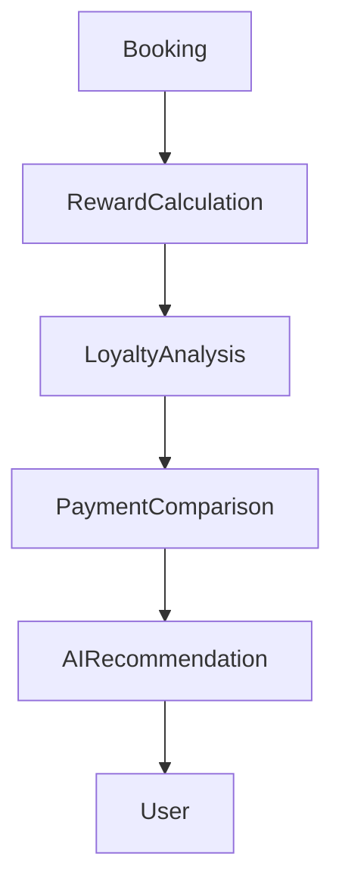

---

## Engineering Rationale

Considering both immediate savings and future reward potential enables users to make more informed travel decisions.

---

## Best Practices

- Explain trade-offs.
- Display opportunity cost.
- Keep calculations transparent.
- Update recommendations when prices change.

---

## Trade-offs

| Benefit | Cost |
|----------|------|
| Better optimization | Increased computation |
| More informed decisions | Additional explanation UI |

---

## Risks

| Risk | Mitigation |
|------|------------|
| Reward valuation changes | Versioned valuation models |
| Dynamic pricing | Recommendation refresh |

---

## Operational Considerations

- Measure recommendation usage.
- Track redemption patterns.
- Audit valuation consistency.

---

# 40. Travel Payment Recommendation

Payment recommendations for travel differ significantly from retail transactions due to:

- High transaction values
- Loyalty partnerships
- Insurance benefits
- Lounge access
- Installment options
- Foreign exchange considerations

---

## PAYMENT-100 Travel Payment Factors

| Factor | Description |
|----------|-------------|
| Reward Rate | Points earned |
| Cashback | Monetary savings |
| Lounge Access | Airport benefits |
| Insurance | Travel protection |
| FX Fees | International transactions |
| Installments | Financing options |
| Promotions | Booking campaigns |

---

## Recommendation Output

For every booking, users see:

- Recommended card
- Alternative cards
- Expected rewards
- Cashback estimate
- Lounge eligibility
- Insurance coverage
- Explanation
- Confidence score

---

## Engineering Rationale

Travel-specific recommendations maximize the combined value of rewards, protections, and travel benefits rather than optimizing only transaction cost.

---

## Best Practices

- Explain recommendation factors.
- Display benefit breakdown.
- Compare top alternatives.
- Update recommendations when inventory or pricing changes.

---

## Trade-offs

| Benefit | Cost |
|----------|------|
| Comprehensive optimization | More data dependencies |
| Better financial outcomes | Increased orchestration |

---

## Risks

| Risk | Mitigation |
|------|------------|
| Benefit rule changes | Frequent synchronization |
| Incomplete travel metadata | Graceful fallback logic |

---

## Operational Considerations

- Monitor payment recommendation latency.
- Track recommendation acceptance.
- Audit benefit calculations.

---

# 41. Travel Experience Data Flow

```mermaid
flowchart TD

TravelSearch

TravelSearch --> FlightService

TravelSearch --> HotelService

FlightService --> RewardEngine

HotelService --> RewardEngine

RewardEngine --> PaymentAdvisor

PaymentAdvisor --> AIEngine

AIEngine --> Recommendation

Recommendation --> Booking

Booking --> TripManager

TripManager --> OfflineStorage

TripManager --> Notifications

TripManager --> Analytics
```

---

# Part 6 Summary

This section defined the travel architecture of the CardWise Mobile Application, including:

- AI-powered travel experience
- Flight booking architecture
- Hotel booking architecture
- Unified trip management
- Reward optimization for travel
- Travel-specific payment recommendations
- End-to-end travel data flow
- Engineering rationale, best practices, trade-offs, risks, and operational considerations for each major travel capability

These capabilities transform the travel module into an intelligent booking platform that optimizes not only itinerary selection but also payments, loyalty benefits, and long-term reward value across the CardWise ecosystem.


# docs/12_MOBILE_APP.md

# Part 7 — AI, Knowledge Graph, Personalization, AI Assistant & Explainable AI

---

# 42. AI Architecture Overview

Artificial Intelligence is a foundational platform capability within the CardWise Mobile Application—not an isolated feature.

Rather than requiring users to actively seek recommendations, the application continuously analyzes context and proactively surfaces financial insights throughout the user journey.

The AI platform powers:

- Payment optimization
- Merchant intelligence
- Shopping recommendations
- Reward optimization
- Travel planning
- Credit card recommendations
- Spending insights
- Personalized dashboard ranking
- Notification prioritization
- Conversational AI Assistant

The mobile application acts as an intelligent client that orchestrates AI interactions while maintaining responsiveness through local caching, progressive loading, and graceful degradation.

---

## AI-001 Objectives

| ID | Objective |
|----|-----------|
| AI-001 | Deliver proactive financial intelligence |
| AI-002 | Personalize every major experience |
| AI-003 | Provide explainable recommendations |
| AI-004 | Minimize user decision fatigue |
| AI-005 | Support contextual recommendations |
| AI-006 | Learn continuously from user behavior |
| AI-007 | Preserve privacy while personalizing |
| AI-008 | Gracefully handle AI unavailability |

---

## AI Platform Capabilities

| Capability | Description |
|------------|-------------|
| Recommendation Engine | Best financial decision |
| Knowledge Graph | Financial relationship reasoning |
| Ranking Engine | Personalized prioritization |
| Context Engine | Real-time context awareness |
| AI Assistant | Conversational financial guidance |
| Learning Engine | Behavioral adaptation |
| Explanation Engine | Transparent recommendation reasoning |

---

## Engineering Rationale

Keeping AI capabilities modular allows recommendation systems, ranking algorithms, and conversational experiences to evolve independently while sharing common user context and business intelligence.

---

## Best Practices

- Keep AI advisory rather than authoritative.
- Explain recommendations clearly.
- Avoid blocking UI on AI responses.
- Cache previously generated insights.
- Degrade gracefully when AI services are unavailable.

---

## Trade-offs

| Benefit | Cost |
|----------|------|
| Highly personalized UX | Greater orchestration complexity |
| Smarter recommendations | Higher compute requirements |
| Continuous learning | Additional telemetry requirements |

---

## Risks

| Risk | Mitigation |
|------|------------|
| Recommendation inconsistency | Versioned AI models |
| Slow inference | Progressive rendering |
| Over-personalization | User-configurable preferences |

---

## Operational Considerations

- Track recommendation acceptance.
- Monitor inference latency.
- Measure cache effectiveness.
- Audit AI model versions.

---

# 43. Knowledge Graph Integration

The Knowledge Graph provides semantic relationships between financial entities across the CardWise ecosystem.

The mobile application queries the graph through domain services and never accesses graph storage directly.

---

## AI-020 Knowledge Graph Domains

| Domain | Relationships |
|----------|--------------|
| Credit Cards | Benefits, issuers, networks |
| Merchants | Categories, offers, partnerships |
| Rewards | Earning and redemption rules |
| Loyalty Programs | Airlines, hotels, transfers |
| Travel | Flights, hotels, destinations |
| Users | Preferences, behavior, eligibility |
| Campaigns | Offers and promotions |

---

## Relationship Examples

```
User

↓

Credit Card

↓

Merchant

↓

Offer

↓

Reward

↓

Travel Benefit

↓

Loyalty Program
```

---

## Mobile Usage

The application uses graph-derived intelligence to:

- Recommend cards
- Rank merchants
- Suggest loyalty redemptions
- Explain recommendations
- Discover related offers
- Improve AI responses

---

## Engineering Rationale

The Knowledge Graph enables richer reasoning than isolated datasets by connecting entities across financial, shopping, rewards, and travel domains.

---

## Best Practices

- Cache graph-derived summaries.
- Minimize repeated graph lookups.
- Keep graph interactions asynchronous.
- Refresh relationships incrementally.

---

## Trade-offs

| Benefit | Cost |
|----------|------|
| Richer recommendations | Higher dependency on graph services |
| Better explainability | Additional metadata |

---

## Risks

| Risk | Mitigation |
|------|------------|
| Outdated relationships | Scheduled synchronization |
| Missing graph edges | Fallback recommendation logic |

---

## Operational Considerations

- Monitor graph query latency.
- Track graph cache hit ratio.
- Audit recommendation consistency.

---

# 44. Personalization Engine

Personalization adapts the application experience to each user while preserving predictability and user control.

Every personalization decision must be explainable and reversible.

---

## AI-040 Personalization Inputs

| Input | Purpose |
|---------|----------|
| Spending history | Financial preferences |
| Merchant affinity | Favorite businesses |
| Travel history | Destination recommendations |
| Reward usage | Redemption optimization |
| Card portfolio | Payment optimization |
| App interactions | UI prioritization |
| Notification behavior | Delivery optimization |
| Explicit preferences | User-configured rules |

---

## Personalization Outputs

The engine influences:

- Dashboard ordering
- Offer ranking
- Payment recommendations
- AI Assistant responses
- Travel suggestions
- Merchant recommendations
- Notification priority
- Search ranking

---

## Personalization Levels

| Level | Description |
|--------|-------------|
| Global | Application-wide preferences |
| Feature | Module-specific ranking |
| Session | Temporary contextual adjustments |
| Real-Time | Location and merchant context |

---

## Engineering Rationale

Separating personalization from business logic ensures that application behavior remains deterministic while allowing recommendation quality to improve over time.

---

## Best Practices

- Respect explicit user choices.
- Allow personalization controls.
- Avoid unexpected UI changes.
- Keep ranking stable during sessions.

---

## Trade-offs

| Benefit | Cost |
|----------|------|
| Better engagement | More telemetry |
| Improved relevance | Additional model maintenance |

---

## Risks

| Risk | Mitigation |
|------|------------|
| Filter bubbles | Diversity constraints |
| Incorrect assumptions | User feedback mechanisms |
| Ranking instability | Session-level consistency |

---

## Operational Considerations

- Measure engagement uplift.
- Track recommendation diversity.
- Monitor personalization accuracy.

---

# 45. AI Assistant Architecture

The AI Assistant provides conversational financial guidance across the entire application.

Rather than functioning as a generic chatbot, it operates as a financial co-pilot with access to personalized insights and platform intelligence.

---

## AI-060 Assistant Responsibilities

| Responsibility | Description |
|----------------|-------------|
| Payment Guidance | Recommend payment methods |
| Rewards Advisor | Optimize rewards |
| Travel Assistant | Booking recommendations |
| Offer Discovery | Find valuable promotions |
| Spending Insights | Explain financial behavior |
| Card Advisor | Recommend portfolio changes |
| Financial Education | Explain concepts |

---

## Assistant Context Sources

The assistant may use:

- User profile
- Card portfolio
- Merchant intelligence
- Reward balances
- Knowledge Graph
- Travel plans
- Spending analytics
- Active offers

---

## Conversation Lifecycle

```mermaid
flowchart TD

UserQuery

UserQuery --> ContextBuilder

ContextBuilder --> KnowledgeGraph

ContextBuilder --> RecommendationEngine

ContextBuilder --> UserProfile

KnowledgeGraph --> AIModel

RecommendationEngine --> AIModel

UserProfile --> AIModel

AIModel --> ExplanationEngine

ExplanationEngine --> AssistantResponse

AssistantResponse --> User
```

---

## Assistant Design Principles

| AI ID | Principle |
|--------|-----------|
| AI-061 | Context-aware responses |
| AI-062 | Explain financial reasoning |
| AI-063 | Never fabricate financial facts |
| AI-064 | Respect user privacy |
| AI-065 | Maintain conversational continuity |
| AI-066 | Prefer actionable guidance |

---

## Engineering Rationale

Separating context assembly, reasoning, and response generation simplifies evolution of AI models while ensuring consistent application behavior.

---

## Best Practices

- Provide concise recommendations.
- Surface supporting evidence.
- Clearly distinguish facts from predictions.
- Maintain conversation context securely.

---

## Trade-offs

| Benefit | Cost |
|----------|------|
| Rich conversational UX | Higher inference cost |
| Personalized guidance | Context management complexity |

---

## Risks

| Risk | Mitigation |
|------|------------|
| Hallucinated responses | Retrieval-grounded context |
| Context drift | Session-scoped memory |
| Long response latency | Streaming responses |

---

## Operational Considerations

- Track assistant response time.
- Measure conversation completion.
- Monitor user satisfaction.

---

# 46. Explainable AI

Financial recommendations must always be transparent.

Users should understand *why* a recommendation was generated rather than simply receiving an opaque AI output.

---

## AI-080 Explanation Categories

| Category | Example |
|-----------|----------|
| Reward Optimization | Highest points earned |
| Cashback | Largest monetary savings |
| Offer Eligibility | Active merchant promotion |
| Travel | Better loyalty redemption |
| Merchant | Preferred spending category |
| Portfolio | Annual fee optimization |

---

## Explanation Components

Each recommendation contains:

- Recommendation summary
- Primary reason
- Supporting factors
- Estimated benefit
- Confidence level
- Alternative choices
- Assumptions used

---

## Explainability Workflow

```mermaid
flowchart LR

Recommendation

Recommendation --> ExplanationEngine

ExplanationEngine --> BenefitAnalysis

BenefitAnalysis --> ConfidenceScore

ConfidenceScore --> User
```

---

## Engineering Rationale

Explainability increases trust, encourages user adoption, and enables easier validation of recommendation quality.

---

## Best Practices

- Keep explanations concise.
- Use consistent terminology.
- Highlight assumptions.
- Present alternatives when appropriate.

---

## Trade-offs

| Benefit | Cost |
|----------|------|
| Greater transparency | Additional processing |
| Higher trust | More metadata generation |

---

## Risks

| Risk | Mitigation |
|------|------------|
| Overly technical explanations | User-friendly language |
| Incomplete rationale | Standard explanation templates |

---

## Operational Considerations

- Measure explanation engagement.
- Track recommendation overrides.
- Audit explanation consistency.

---

# 47. AI Decision Flow

```mermaid
flowchart TD

UserAction

UserAction --> ContextEngine

ContextEngine --> UserProfile

ContextEngine --> KnowledgeGraph

ContextEngine --> MerchantData

ContextEngine --> RewardEngine

UserProfile --> RecommendationEngine

KnowledgeGraph --> RecommendationEngine

MerchantData --> RecommendationEngine

RewardEngine --> RecommendationEngine

RecommendationEngine --> ExplanationEngine

ExplanationEngine --> UI

UI --> UserFeedback

UserFeedback --> LearningEngine

LearningEngine --> RecommendationEngine
```

---

# Part 7 Summary

This section established the AI architecture for the CardWise Mobile Application by defining:

- AI platform architecture
- Knowledge Graph integration
- Personalization engine
- Conversational AI Assistant
- Explainable AI framework
- AI decision lifecycle and data flow
- Engineering rationale, best practices, trade-offs, risks, and operational considerations for production-grade AI capabilities

These AI capabilities transform the mobile application into an intelligent financial companion that delivers proactive, transparent, and personalized financial guidance across payments, shopping, rewards, and travel while maintaining user trust and architectural scalability.

# docs/12_MOBILE_APP.md

# Part 8 — Offline Architecture, Storage, Synchronization, Notifications, Deep Links & Background Tasks

---

# 48. Offline-First Architecture

CardWise is designed as an **offline-capable financial application**, not merely an online application with local caching.

Users frequently access the application in environments with unreliable connectivity:

- Airports
- Flights
- Underground transit
- International roaming
- Rural areas
- Corporate VPN restrictions

The mobile application must continue providing meaningful financial intelligence even when network connectivity is unavailable.

The architecture follows an **Offline-First, Online-Optimized** strategy.

---

## OFFLINE-001 Objectives

| ID | Objective |
|----|-----------|
| OFFLINE-001 | Maintain application usability without connectivity |
| OFFLINE-002 | Preserve critical financial information locally |
| OFFLINE-003 | Synchronize safely after reconnection |
| OFFLINE-004 | Prevent conflicting updates |
| OFFLINE-005 | Minimize user-visible synchronization delays |
| OFFLINE-006 | Support graceful feature degradation |
| OFFLINE-007 | Ensure predictable offline behavior |

---

## Offline Design Principles

| Principle | Description |
|------------|-------------|
| Local First | Read from local storage before network |
| Eventual Consistency | Synchronize when connectivity returns |
| Optimistic UI | Immediate user feedback where appropriate |
| Deterministic Sync | Predictable conflict handling |
| Progressive Enhancement | Enable advanced functionality when online |

---

## Offline Capability Matrix

| Feature | Offline Support | Notes |
|----------|----------------|------|
| Dashboard | Partial | Cached widgets |
| Card Portfolio | Yes | Cached metadata |
| Rewards | Partial | Last synchronized values |
| Offers | Partial | Cached active offers |
| Merchant Search | Limited | Recently accessed merchants |
| AI Recommendations | Limited | Cached insights only |
| Travel Itineraries | Yes | Offline itinerary access |
| Booking | No | Network required |
| Authentication | Session-dependent | Existing session only |

---

## Engineering Rationale

Designing around offline usage improves reliability, perceived performance, and user trust, especially for travelers and users with intermittent connectivity.

---

## Best Practices

- Cache only reproducible data.
- Clearly indicate stale information.
- Avoid silent synchronization failures.
- Preserve user actions locally until synchronization succeeds.

---

## Trade-offs

| Benefit | Cost |
|----------|------|
| Excellent resilience | More synchronization logic |
| Better UX | Larger local storage footprint |
| Faster perceived performance | Cache lifecycle management |

---

## Risks

| Risk | Mitigation |
|------|------------|
| Stale recommendations | Data freshness indicators |
| Cache corruption | Integrity validation |
| Synchronization conflicts | Version-based reconciliation |

---

## Operational Considerations

- Measure offline session duration.
- Monitor synchronization success rate.
- Track stale data usage.

---

# 49. Local Storage Strategy

The application uses multiple storage mechanisms, each optimized for specific data characteristics.

---

## STORAGE-100 Storage Layers

| Storage Layer | Purpose |
|---------------|----------|
| Secure Storage | Credentials and encryption keys |
| MMKV | Lightweight preferences and configuration |
| SQLite | Offline domain data |
| Memory Cache | Runtime state |
| Image Cache | Media assets |
| React Query Cache | Network response caching |

---

## Data Placement Matrix

| Data Type | Storage |
|-----------|---------|
| Session Tokens | Secure Storage |
| User Preferences | MMKV |
| Dashboard Cache | SQLite |
| Card Metadata | SQLite |
| Offers | SQLite |
| Merchant Profiles | SQLite |
| Travel Itineraries | SQLite |
| Feature Flags | MMKV |
| Remote Config | MMKV |
| Images | File Cache |

---

## Cache Policies

| Data | Policy |
|------|--------|
| Card Metadata | Long-lived |
| Offers | Time-based expiration |
| Merchant Data | Incremental refresh |
| Dashboard Widgets | Session refresh |
| AI Insights | Short-lived |
| Images | Least Recently Used (LRU) |

---

## Engineering Rationale

Separating storage responsibilities minimizes startup latency while ensuring that sensitive information receives stronger protection than cacheable business data.

---

## Best Practices

- Encrypt sensitive records.
- Version storage schemas.
- Remove expired cache automatically.
- Keep cache independent of business logic.

---

## Trade-offs

| Benefit | Cost |
|----------|------|
| Faster application startup | Multiple storage systems |
| Better data protection | More lifecycle management |

---

## Risks

| Risk | Mitigation |
|------|------------|
| Schema migration failures | Versioned migrations |
| Storage growth | Automatic cleanup |

---

## Operational Considerations

- Monitor storage utilization.
- Measure cache hit ratios.
- Validate migration success.

---

# 50. Synchronization Architecture

Synchronization maintains consistency between local storage and backend services.

The synchronization engine operates independently of UI rendering.

---

## SYNC-001 Synchronization Objectives

| ID | Objective |
|----|-----------|
| SYNC-001 | Minimize network usage |
| SYNC-002 | Preserve local changes |
| SYNC-003 | Support incremental updates |
| SYNC-004 | Recover automatically after failures |
| SYNC-005 | Avoid duplicate synchronization |
| SYNC-006 | Detect conflicts deterministically |

---

## Synchronization Types

| Type | Description |
|------|-------------|
| Initial Sync | First application launch |
| Incremental Sync | Periodic updates |
| Event-Driven Sync | Triggered by changes |
| Manual Refresh | User initiated |
| Background Sync | Scheduled synchronization |

---

## Synchronization Lifecycle

```mermaid
flowchart TD

Launch

Launch --> LocalData

LocalData --> UI

Launch --> SyncScheduler

SyncScheduler --> Network

Network --> ConflictResolver

ConflictResolver --> LocalStorage

LocalStorage --> UI

Network --> Telemetry
```

---

## Conflict Resolution Strategy

Priority order:

1. Security data
2. User-generated changes
3. Backend authoritative metadata
4. Cached information
5. Derived analytics

---

## Engineering Rationale

Incremental synchronization minimizes bandwidth consumption while ensuring timely updates of rapidly changing financial information.

---

## Best Practices

- Synchronize only changed records.
- Retry transient failures.
- Batch synchronization requests.
- Keep synchronization idempotent.

---

## Trade-offs

| Benefit | Cost |
|----------|------|
| Lower bandwidth | More metadata tracking |
| Faster synchronization | Additional version management |

---

## Risks

| Risk | Mitigation |
|------|------------|
| Duplicate updates | Idempotency keys |
| Merge conflicts | Deterministic reconciliation |

---

## Operational Considerations

- Measure synchronization latency.
- Track retry frequency.
- Audit conflict resolution outcomes.

---

# 51. Push Notification Architecture

Notifications provide proactive financial guidance without overwhelming users.

The platform prioritizes relevance over volume.

---

## NOTIFY-001 Notification Categories

| Category | Description |
|-----------|-------------|
| Payment Advice | Best card recommendations |
| Offers | Personalized promotions |
| Rewards | Expiring points |
| Cashback | New opportunities |
| Travel | Booking updates |
| Loyalty | Tier progression |
| Security | Authentication alerts |
| AI Insights | Personalized recommendations |

---

## Notification Prioritization

Priority is determined using:

- User engagement
- Financial value
- Time sensitivity
- Travel status
- Reward expiration
- Merchant proximity
- User preferences

---

## Notification Lifecycle

```mermaid
flowchart LR

Event

Event --> NotificationEngine

NotificationEngine --> Personalization

Personalization --> DeliveryRules

DeliveryRules --> Push

Push --> User

User --> Interaction

Interaction --> Analytics
```

---

## Notification States

| State | Description |
|--------|-------------|
| Scheduled | Awaiting delivery |
| Delivered | Successfully received |
| Opened | User viewed |
| Dismissed | User ignored |
| Expired | No longer relevant |

---

## Engineering Rationale

Prioritizing notifications based on financial value increases engagement while reducing notification fatigue.

---

## Best Practices

- Group related notifications.
- Respect quiet hours.
- Avoid duplicate alerts.
- Allow granular notification preferences.

---

## Trade-offs

| Benefit | Cost |
|----------|------|
| Better engagement | More personalization logic |
| Reduced spam | Additional ranking computation |

---

## Risks

| Risk | Mitigation |
|------|------------|
| Notification overload | Intelligent throttling |
| Delayed delivery | Retry mechanisms |

---

## Operational Considerations

- Monitor delivery success.
- Measure open rates.
- Track notification fatigue.

---

# 52. Deep Link Architecture

Deep links allow users to navigate directly to specific application content from external sources.

Supported entry points include:

- Push notifications
- Emails
- SMS
- Browser extension
- QR codes
- Partner applications
- Marketing campaigns

---

## NOTIFY-020 Deep Link Domains

| Domain | Example Destination |
|----------|--------------------|
| Dashboard | Home |
| Cards | Card details |
| Rewards | Reward summary |
| Offers | Specific promotion |
| Merchant | Merchant profile |
| Travel | Booking details |
| AI | Assistant conversation |
| Profile | Settings |

---

## Deep Link Flow

```mermaid
flowchart TD

DeepLink

DeepLink --> Validation

Validation --> Authentication

Authentication --> RouteResolver

RouteResolver --> Feature

Feature --> Analytics
```

---

## Engineering Rationale

A centralized routing strategy ensures consistent navigation while enabling cross-platform integration with web, browser extension, and partner channels.

---

## Best Practices

- Validate every deep link.
- Support authentication redirects.
- Preserve intended destination.
- Log navigation outcomes.

---

## Trade-offs

| Benefit | Cost |
|----------|------|
| Better interoperability | Larger routing registry |
| Improved campaigns | Additional validation logic |

---

## Risks

| Risk | Mitigation |
|------|------------|
| Invalid links | Fallback routing |
| Unauthorized access | Route guards |

---

## Operational Considerations

- Track deep link success.
- Measure conversion.
- Audit invalid links.

---

# 53. Background Task Architecture

Background processing enables proactive updates without requiring users to actively open the application.

---

## Background Responsibilities

| Task | Purpose |
|------|----------|
| Synchronization | Refresh data |
| Reward Updates | Refresh balances |
| Offer Refresh | New campaigns |
| Travel Updates | Booking status |
| Notification Scheduling | Local reminders |
| Cache Cleanup | Storage optimization |
| Telemetry Upload | Deferred analytics |

---

## Scheduling Principles

| Principle | Description |
|-----------|-------------|
| Battery Aware | Respect platform scheduling |
| Network Aware | Prefer unmetered networks where appropriate |
| Retry Safe | Idempotent execution |
| Priority Based | Execute critical tasks first |

---

## Background Workflow

```mermaid
flowchart TD

Scheduler

Scheduler --> Sync

Scheduler --> Rewards

Scheduler --> Offers

Scheduler --> Travel

Scheduler --> CacheCleanup

Sync --> Storage

Rewards --> Storage

Offers --> Storage

Travel --> Storage

Storage --> NotificationEngine

NotificationEngine --> User
```

---

## Engineering Rationale

Delegating non-interactive work to background execution improves perceived performance while keeping foreground interactions responsive.

---

## Best Practices

- Minimize background execution time.
- Batch network requests.
- Respect platform battery optimizations.
- Avoid duplicate work.

---

## Trade-offs

| Benefit | Cost |
|----------|------|
| Better responsiveness | Platform scheduling limitations |
| Fresher data | Additional coordination |

---

## Risks

| Risk | Mitigation |
|------|------------|
| Battery drain | Intelligent scheduling |
| Excessive network usage | Adaptive synchronization |

---

## Operational Considerations

- Monitor task completion rates.
- Measure battery impact.
- Track background execution failures.

---

# 54. Offline Platform Data Flow

```mermaid
flowchart TD

User

User --> UI

UI --> LocalStorage

LocalStorage --> CachedData

CachedData --> Render

BackgroundScheduler --> SyncEngine

SyncEngine --> Backend

Backend --> UpdatedData

UpdatedData --> LocalStorage

LocalStorage --> NotificationEngine

NotificationEngine --> User

SyncEngine --> Telemetry
```

---

# Part 8 Summary

This section established the resilience architecture of the CardWise Mobile Application by defining:

- Offline-first platform architecture
- Multi-layer local storage strategy
- Incremental synchronization engine
- Intelligent push notification platform
- Deep link routing architecture
- Background task execution model
- Offline data flow
- Engineering rationale, best practices, trade-offs, risks, and operational considerations for reliable mobile operation

These capabilities ensure that the CardWise mobile application remains performant, resilient, and highly responsive across varying network conditions while maintaining consistent synchronization with the broader CardWise ecosystem.

# docs/12_MOBILE_APP.md

# Part 9 — Operations, Telemetry, Feature Flags, Remote Configuration, Monitoring & Performance

---

# 55. Mobile Operations Architecture

The CardWise Mobile Application is designed as an observable, continuously evolving platform rather than a static client application.

Operational capabilities are embedded into the platform from day one to support:

- Progressive feature rollout
- Production debugging
- User behavior analysis
- AI recommendation quality
- Performance optimization
- Reliability engineering
- Incident response

The operational platform enables rapid iteration while minimizing production risk.

---

## METRIC-001 Objectives

| ID | Objective |
|----|-----------|
| METRIC-001 | End-to-end observability |
| METRIC-002 | Runtime feature control |
| METRIC-003 | Safe production deployments |
| METRIC-004 | Performance visibility |
| METRIC-005 | Crash diagnostics |
| METRIC-006 | AI quality measurement |
| METRIC-007 | Data-driven product decisions |
| METRIC-008 | Operational resilience |

---

## Operational Layers

| Layer | Responsibility |
|--------|----------------|
| Telemetry | User events and system metrics |
| Logging | Application diagnostics |
| Monitoring | Runtime health |
| Alerting | Operational incidents |
| Feature Flags | Progressive rollout |
| Remote Config | Runtime configuration |
| Performance | Runtime optimization |
| Experimentation | Controlled feature validation |

---

## Engineering Rationale

Operational tooling is treated as core infrastructure because production visibility is essential for diagnosing issues, validating new features, and ensuring recommendation quality.

---

## Best Practices

- Instrument every critical workflow.
- Separate business metrics from system metrics.
- Keep telemetry asynchronous.
- Design for graceful degradation if telemetry services are unavailable.

---

## Trade-offs

| Benefit | Cost |
|----------|------|
| Better production visibility | Additional instrumentation |
| Faster incident response | Increased telemetry volume |

---

## Risks

| Risk | Mitigation |
|------|------------|
| Excessive event generation | Sampling and aggregation |
| Operational blind spots | Standard instrumentation guidelines |

---

## Operational Considerations

- Monitor event delivery success.
- Track operational dashboard health.
- Review telemetry coverage regularly.

---

# 56. Telemetry Architecture

Telemetry provides visibility into application behavior, user journeys, recommendation quality, and platform health.

It must answer four primary questions:

1. What are users doing?
2. How is the application performing?
3. Are AI recommendations effective?
4. Is the platform healthy?

---

## METRIC-020 Telemetry Categories

| Category | Examples |
|-----------|----------|
| Navigation | Screen transitions |
| User Actions | Button taps, searches |
| Commerce | Offer views, redemptions |
| Payments | Recommendation acceptance |
| Travel | Search, booking completion |
| AI | Recommendation quality |
| Performance | Startup, rendering |
| Errors | Exceptions and failures |

---

## Event Pipeline

```mermaid
flowchart LR

Application

Application --> EventCollector

EventCollector --> EventQueue

EventQueue --> BatchProcessor

BatchProcessor --> TelemetryBackend

TelemetryBackend --> Dashboards

TelemetryBackend --> Analytics

TelemetryBackend --> Alerting
```

---

## Event Design Principles

| Principle | Description |
|-----------|-------------|
| Structured | Versioned event schema |
| Immutable | Events are append-only |
| Contextual | Include session context |
| Privacy Aware | Exclude sensitive financial data |
| Reliable | Retry failed deliveries |

---

## Event Lifecycle

```
User Action

↓

Event Created

↓

Validation

↓

Queue

↓

Batch Upload

↓

Processing

↓

Analytics
```

---

## Engineering Rationale

Asynchronous batching reduces battery usage and network overhead while preserving high-quality behavioral analytics.

---

## Best Practices

- Use versioned event schemas.
- Keep payloads compact.
- Batch uploads.
- Validate events before transmission.

---

## Trade-offs

| Benefit | Cost |
|----------|------|
| Lower network overhead | Slight upload delay |
| Better scalability | Additional batching logic |

---

## Risks

| Risk | Mitigation |
|------|------------|
| Lost events | Local persistence |
| Duplicate events | Idempotent processing |

---

## Operational Considerations

- Monitor event backlog.
- Measure upload latency.
- Audit schema evolution.

---

# 57. Feature Flag Architecture

Feature Flags allow runtime control over application capabilities without requiring new mobile releases.

This enables safer deployments and faster experimentation.

---

## METRIC-040 Feature Flag Objectives

| ID | Objective |
|----|-----------|
| METRIC-040 | Progressive rollout |
| METRIC-041 | Instant rollback |
| METRIC-042 | Environment isolation |
| METRIC-043 | Experimentation support |
| METRIC-044 | Regional rollout |
| METRIC-045 | Platform-specific enablement |

---

## Feature Flag Categories

| Category | Examples |
|-----------|----------|
| Release Flags | New production features |
| Experiment Flags | A/B testing |
| Operational Flags | Emergency switches |
| Platform Flags | Android/iOS differences |
| Premium Flags | Subscription features |
| AI Flags | Recommendation model selection |

---

## Evaluation Flow

```mermaid
flowchart TD

Launch

Launch --> RemoteConfig

RemoteConfig --> FeatureFlags

FeatureFlags --> Evaluation

Evaluation --> Enabled

Evaluation --> Disabled

Enabled --> Feature

Disabled --> AlternativeFlow
```

---

## Engineering Rationale

Feature flags reduce deployment risk by decoupling feature availability from application releases.

---

## Best Practices

- Keep flags short-lived.
- Document ownership.
- Remove obsolete flags.
- Evaluate flags early during initialization.

---

## Trade-offs

| Benefit | Cost |
|----------|------|
| Safer deployments | Flag management overhead |
| Faster experimentation | Increased configuration complexity |

---

## Risks

| Risk | Mitigation |
|------|------------|
| Flag accumulation | Regular cleanup |
| Conflicting rules | Validation pipelines |

---

## Operational Considerations

- Audit active flags.
- Track rollout progress.
- Measure feature adoption.

---

# 58. Remote Configuration

Remote Configuration enables runtime modification of application behavior without releasing a new version.

Configuration is downloaded securely, validated, and cached locally.

---

## METRIC-060 Configuration Domains

| Domain | Examples |
|---------|----------|
| UI | Layout variations |
| AI | Recommendation thresholds |
| Payments | Ranking parameters |
| Rewards | Display preferences |
| Shopping | Offer prioritization |
| Travel | Search defaults |
| Notifications | Delivery frequency |

---

## Configuration Lifecycle

```mermaid
flowchart LR

Launch

Launch --> CachedConfig

CachedConfig --> UI

Launch --> ConfigFetch

ConfigFetch --> Validation

Validation --> LocalStorage

LocalStorage --> Runtime
```

---

## Engineering Rationale

Separating configuration from application binaries enables rapid operational response while maintaining deterministic behavior.

---

## Best Practices

- Version configuration schemas.
- Validate configuration before activation.
- Provide fallback defaults.
- Cache the last known good configuration.

---

## Trade-offs

| Benefit | Cost |
|----------|------|
| Operational flexibility | Configuration validation |
| Faster iteration | Runtime complexity |

---

## Risks

| Risk | Mitigation |
|------|------------|
| Invalid configuration | Safe fallback |
| Partial downloads | Atomic updates |

---

## Operational Considerations

- Monitor configuration fetch success.
- Track activation failures.
- Audit configuration changes.

---

# 59. Monitoring & Observability

Monitoring combines telemetry, diagnostics, distributed tracing, and operational dashboards to provide comprehensive visibility into production behavior.

---

## METRIC-080 Monitoring Domains

| Domain | Metrics |
|----------|---------|
| Application Health | Availability |
| Startup | Cold/Warm launch |
| Rendering | Frame timing |
| Networking | Latency |
| Synchronization | Success rate |
| AI | Inference latency |
| Booking | Completion rate |
| Payments | Recommendation latency |

---

## Observability Stack

| Component | Purpose |
|-----------|---------|
| OpenTelemetry | Distributed tracing |
| Prometheus | Metrics collection |
| Grafana | Dashboards |
| Structured Logging | Diagnostics |
| Crash Reporting | Failure analysis |

---

## Monitoring Workflow

```mermaid
flowchart TD

Application

Application --> Metrics

Application --> Logs

Application --> Traces

Metrics --> Monitoring

Logs --> Monitoring

Traces --> Monitoring

Monitoring --> Alerts

Alerts --> Operations
```

---

## Engineering Rationale

Combining metrics, traces, and logs enables faster root cause analysis while reducing operational recovery time.

---

## Best Practices

- Correlate metrics and traces.
- Use structured logging.
- Alert on user-impacting failures.
- Maintain actionable dashboards.

---

## Trade-offs

| Benefit | Cost |
|----------|------|
| Better diagnostics | Additional instrumentation |
| Faster incident response | Increased operational data |

---

## Risks

| Risk | Mitigation |
|------|------------|
| Alert fatigue | Intelligent alert thresholds |
| Missing visibility | Standard observability guidelines |

---

## Operational Considerations

- Review alert quality.
- Track MTTR (Mean Time to Recovery).
- Audit dashboard completeness.

---

# 60. Mobile Performance Architecture

Performance is a core product requirement rather than a post-release optimization.

The application targets consistent responsiveness across a wide range of Android and iOS devices.

---

## METRIC-100 Performance Goals

| Metric | Target |
|----------|--------|
| Cold Start | < 2.5 seconds |
| Warm Start | < 1 second |
| Navigation | < 150 ms |
| Screen Render | < 300 ms |
| Dashboard Refresh | < 500 ms |
| Recommendation Display | < 500 ms |
| Frame Rate | 60 FPS target |
| Memory Growth | Stable over long sessions |

---

## Performance Pillars

### Startup Optimization

- Lazy module initialization
- Deferred non-critical work
- Cached configuration
- Lightweight application shell

### Rendering

- Minimize unnecessary re-renders
- Virtualize large collections
- Incremental widget rendering
- Optimized animations

### Networking

- Request batching
- Intelligent caching
- Background synchronization
- Compression where appropriate

### Storage

- Fast key-value access
- Incremental database reads
- Lazy hydration
- Efficient cache eviction

---

## Performance Monitoring

```mermaid
flowchart LR

Application

Application --> StartupMetrics

Application --> RenderMetrics

Application --> NetworkMetrics

Application --> MemoryMetrics

StartupMetrics --> Dashboard

RenderMetrics --> Dashboard

NetworkMetrics --> Dashboard

MemoryMetrics --> Dashboard

Dashboard --> Alerts
```

---

## Engineering Rationale

Establishing measurable performance budgets ensures architectural decisions remain aligned with user experience goals throughout the application's evolution.

---

## Best Practices

- Measure before optimizing.
- Define performance budgets.
- Track regressions continuously.
- Optimize the critical rendering path.

---

## Trade-offs

| Benefit | Cost |
|----------|------|
| Excellent user experience | Continuous profiling |
| Lower resource usage | More engineering effort |

---

## Risks

| Risk | Mitigation |
|------|------------|
| Performance regressions | Automated benchmarking |
| Memory leaks | Long-session profiling |

---

## Operational Considerations

- Track startup performance by device class.
- Monitor frame drops.
- Audit bundle growth.
- Review performance regressions before every release.

---

# 61. Operational Data Flow

```mermaid
flowchart TD

Application

Application --> Telemetry

Application --> FeatureFlags

Application --> RemoteConfig

Application --> Monitoring

Telemetry --> Analytics

FeatureFlags --> Runtime

RemoteConfig --> Runtime

Runtime --> UI

Monitoring --> Dashboards

Monitoring --> Alerting

Alerting --> Engineering
```

---

# Part 9 Summary

This section established the operational foundation of the CardWise Mobile Application by defining:

- Mobile operations architecture
- Production telemetry platform
- Feature flag management
- Remote configuration
- Monitoring and observability
- Performance engineering architecture
- Operational data flow
- Engineering rationale, best practices, trade-offs, risks, and operational considerations for maintaining a highly observable and continuously evolving mobile platform

These capabilities enable safe feature delivery, rapid incident response, measurable AI quality, and consistent application performance across Android and iOS production environments.


# docs/12_MOBILE_APP.md

# Part 10 — Security, Privacy, Biometrics, Encryption, Best Practices & Architecture Summary

---

# 62. Security Architecture

CardWise is an AI-powered financial platform that manages highly sensitive user information, including payment instruments, rewards, loyalty memberships, travel plans, and financial insights.

Accordingly, security is treated as a **cross-cutting architectural concern** rather than a standalone module.

Every feature described in previous sections inherits the security model defined here.

The mobile security strategy follows a **Defense-in-Depth** approach built on multiple independent protection layers.

---

## SAFETY-001 Security Objectives

| ID | Objective |
|----|-----------|
| SAFETY-001 | Protect user identity |
| SAFETY-002 | Secure financial data |
| SAFETY-003 | Prevent unauthorized access |
| SAFETY-004 | Minimize attack surface |
| SAFETY-005 | Detect abnormal behavior |
| SAFETY-006 | Support regulatory compliance |
| SAFETY-007 | Maintain user trust |
| SAFETY-008 | Secure AI-powered recommendations |

---

## Security Layers

| Layer | Responsibility |
|--------|----------------|
| Device Security | Device integrity validation |
| Authentication | Identity verification |
| Authorization | Access control |
| Secure Storage | Sensitive data protection |
| Encryption | Data confidentiality |
| Networking | Secure communication |
| Runtime Protection | Application integrity |
| Monitoring | Security telemetry |

---

## Engineering Rationale

Layered security ensures that failure of any single control does not compromise the entire application.

---

## Best Practices

- Apply least-privilege principles.
- Minimize sensitive data retention.
- Treat every network as untrusted.
- Validate every external input.
- Continuously monitor security posture.

---

## Trade-offs

| Benefit | Cost |
|----------|------|
| Strong security posture | Increased implementation complexity |
| Reduced attack surface | Additional validation overhead |

---

## Risks

| Risk | Mitigation |
|------|------------|
| Credential compromise | Multi-layer authentication |
| Device compromise | Device trust and runtime checks |
| API misuse | Token validation and rate limiting |

---

## Operational Considerations

- Monitor security incidents.
- Audit authentication events.
- Review security logs regularly.
- Validate compliance continuously.

---

# 63. Privacy Architecture

Privacy is implemented according to **Privacy by Design** principles.

Only the minimum information necessary to deliver product functionality is collected and processed.

---

## SAFETY-020 Privacy Principles

| Principle | Description |
|-----------|-------------|
| Data Minimization | Collect only necessary information |
| Purpose Limitation | Use data only for intended purposes |
| User Transparency | Explain data usage clearly |
| User Control | Allow preference management |
| Secure Processing | Protect data throughout its lifecycle |
| Default Protection | Conservative privacy defaults |

---

## Privacy Domains

| Domain | Example |
|----------|---------|
| Identity | Account information |
| Preferences | Personalization settings |
| Financial | Card portfolio and rewards |
| Travel | Itineraries and loyalty programs |
| Analytics | Aggregated usage metrics |
| AI Context | Recommendation preferences |

---

## Privacy Controls

Users can manage:

- Analytics preferences
- Notification settings
- AI personalization
- Recommendation history
- Data synchronization
- Connected devices
- Session management

---

## Engineering Rationale

Providing transparent privacy controls strengthens user trust while supporting evolving regulatory requirements.

---

## Best Practices

- Separate identifiers from analytics.
- Anonymize operational telemetry where possible.
- Encrypt sensitive user preferences.
- Honor user consent consistently across platforms.

---

## Trade-offs

| Benefit | Cost |
|----------|------|
| Greater user trust | Additional preference management |
| Easier compliance | More operational complexity |

---

## Risks

| Risk | Mitigation |
|------|------------|
| Excessive data collection | Regular privacy reviews |
| Preference inconsistencies | Centralized preference management |

---

## Operational Considerations

- Audit consent changes.
- Review privacy dashboards.
- Monitor data retention policies.

---

# 64. Biometric Security

Biometric authentication supplements, but never replaces, the platform's authentication model.

The application relies exclusively on operating system biometric frameworks and never stores biometric templates.

---

## SAFETY-040 Supported Capabilities

| Capability | Android | iOS |
|------------|---------|------|
| Fingerprint | ✅ | Touch ID |
| Face Authentication | ✅ | Face ID |
| Secure Hardware | Trusted Execution Environment | Secure Enclave |
| Device Credentials | Supported | Supported |

---

## Protected Operations

Biometric confirmation may be required for:

- Application unlock
- Viewing sensitive information
- Exporting reports
- Security configuration changes
- Sensitive account actions
- AI-generated financial actions requiring confirmation

---

## Biometric Workflow

```mermaid
flowchart TD

SensitiveAction

SensitiveAction --> BiometricPrompt

BiometricPrompt -->|Verified| Continue

BiometricPrompt -->|Failed| Retry

Retry --> OTP

OTP --> Continue
```

---

## Engineering Rationale

Leveraging hardware-backed platform capabilities provides stronger security guarantees than custom biometric implementations.

---

## Best Practices

- Never cache successful biometric results.
- Respect platform lockout behavior.
- Always provide secure fallback authentication.
- Require explicit user enrollment.

---

## Trade-offs

| Benefit | Cost |
|----------|------|
| Strong authentication | Platform dependency |
| Excellent usability | Enrollment requirement |

---

## Risks

| Risk | Mitigation |
|------|------------|
| Sensor failure | Secure fallback |
| Shared device usage | Session validation |

---

## Operational Considerations

- Measure biometric adoption.
- Track authentication failures.
- Monitor fallback usage.

---

# 65. Encryption Strategy

Encryption protects data both in transit and at rest.

Sensitive information is encrypted before persistence and transmitted exclusively over secure channels.

---

## SAFETY-060 Encryption Domains

| Domain | Protection |
|----------|------------|
| Session Tokens | Secure Storage |
| User Preferences | Encrypted when sensitive |
| Card Metadata | Protected storage |
| Local Database | Application-level encryption where appropriate |
| Network Traffic | TLS |
| Backup Data | Platform-managed encryption |

---

## Data Classification

| Classification | Examples |
|----------------|----------|
| Public | Static application assets |
| Internal | Configuration |
| Confidential | User preferences |
| Restricted | Authentication credentials |
| Highly Sensitive | Financial identifiers and security metadata |

---

## Encryption Principles

- Encrypt sensitive data before persistence.
- Avoid storing secrets in application code.
- Rotate credentials when appropriate.
- Protect encryption keys using platform facilities.
- Separate encryption keys from encrypted data.

---

## Engineering Rationale

Separating data classification from storage mechanisms allows stronger protection to be applied only where required, balancing security and performance.

---

## Best Practices

- Prefer platform-provided cryptography.
- Avoid custom encryption implementations.
- Protect key lifecycle.
- Encrypt backups where applicable.

---

## Trade-offs

| Benefit | Cost |
|----------|------|
| Strong confidentiality | Additional CPU usage |
| Better compliance | Key management complexity |

---

## Risks

| Risk | Mitigation |
|------|------------|
| Key compromise | Hardware-backed key storage |
| Misconfigured encryption | Automated security validation |

---

## Operational Considerations

- Audit key rotation.
- Monitor encryption failures.
- Validate secure storage integrity.

---

# 66. Secure Development Best Practices

The following engineering practices apply across every mobile feature.

---

## Architecture

- Maintain strict layer separation.
- Prevent cyclic dependencies.
- Isolate infrastructure concerns.
- Prefer immutable state.

---

## Authentication

- Use short-lived sessions.
- Rotate refresh tokens.
- Bind sessions to trusted devices.
- Require re-authentication for sensitive actions.

---

## Networking

- Validate all server responses.
- Retry only idempotent requests.
- Handle offline transitions gracefully.
- Protect against replay attacks through backend token validation strategies.

---

## Storage

- Encrypt sensitive data.
- Remove obsolete cache.
- Version local schemas.
- Separate persistent and transient state.

---

## UI

- Prevent accidental disclosure of sensitive information.
- Avoid displaying confidential data in system previews where platform capabilities allow.
- Keep loading states deterministic.
- Maintain accessibility compliance.

---

## AI

- Explain recommendations.
- Avoid presenting uncertain outputs as facts.
- Respect user privacy preferences.
- Keep recommendation generation observable.

---

## Observability

- Instrument critical workflows.
- Monitor performance budgets.
- Audit feature flag usage.
- Track operational regressions continuously.

---

# 67. Architecture Decision Summary

---

## Major Architectural Decisions

| ADR | Decision | Rationale |
|------|----------|-----------|
| ADR-001 | React Native + TypeScript | Shared cross-platform codebase |
| ADR-002 | Feature-first modular architecture | Independent evolution |
| ADR-003 | Layered application architecture | Separation of concerns |
| ADR-004 | Zustand for application state | Lightweight, modular state management |
| ADR-005 | React Query for server state | Efficient synchronization and caching |
| ADR-006 | MMKV + SQLite storage strategy | Performance and offline capability |
| ADR-007 | Offline-first architecture | Resilience and responsiveness |
| ADR-008 | AI-driven personalization | Financial optimization |
| ADR-009 | Explainable AI | User trust |
| ADR-010 | Feature flags + Remote Config | Safe production rollout |
| ADR-011 | OpenTelemetry-based observability | Unified operational visibility |
| ADR-012 | Defense-in-depth security | Financial-grade protection |

---

## Mobile Architecture Quality Attributes

| Attribute | Strategy |
|-----------|----------|
| Scalability | Feature modularization |
| Performance | Lazy loading and optimized rendering |
| Maintainability | Layered architecture |
| Reliability | Offline-first synchronization |
| Security | Defense-in-depth |
| Observability | Comprehensive telemetry |
| Extensibility | Modular platform services |
| Testability | Clear dependency boundaries |

---

# 68. Final End-to-End Mobile Architecture

```mermaid
flowchart TB

subgraph User
    U[Mobile User]
end

subgraph Presentation
    UI[React Native UI]
    NAV[Navigation]
    DS[Design System]
end

subgraph Application
    VM[ViewModels / Controllers]
    STATE[State Management]
    WF[Application Workflows]
end

subgraph Domain
    UC[Use Cases]
    REC[Recommendation Engine Client]
    RULES[Business Rules]
end

subgraph Data
    REPO[Repositories]
    CACHE[Local Storage]
    NET[Networking]
end

subgraph Platform
    AI[AI Platform]
    KG[Knowledge Graph]
    AUTH[Authentication]
    NOTIFY[Notifications]
    SYNC[Synchronization]
    FLAGS[Feature Flags]
    CONFIG[Remote Config]
end

subgraph Infrastructure
    TELEMETRY[Telemetry]
    MONITORING[Monitoring]
    SECURITY[Security]
end

subgraph Backend
    API[Platform Services]
end

U --> UI

UI --> NAV

NAV --> VM

VM --> STATE

STATE --> UC

UC --> REPO

REPO --> CACHE

REPO --> NET

NET --> API

UC --> REC

REC --> AI

AI --> KG

AUTH --> VM

SYNC --> CACHE

NOTIFY --> UI

FLAGS --> UI

CONFIG --> UI

UI --> TELEMETRY

NET --> MONITORING

SECURITY --> AUTH

API --> MONITORING
```

---

# 69. Mobile Architecture Summary

The CardWise Mobile Application is designed as a **production-grade AI-powered Financial Super App** that delivers intelligent financial decision-making through a modular, observable, secure, and scalable architecture.

Its core architectural characteristics include:

- Feature-first modular organization
- Layered application architecture
- Offline-first user experience
- AI-native recommendation workflows
- Explainable financial intelligence
- Cross-platform React Native implementation
- Secure authentication and biometric protection
- Multi-layer storage and synchronization
- Progressive feature delivery through Feature Flags and Remote Configuration
- Comprehensive observability using OpenTelemetry, Prometheus, and Grafana
- Defense-in-depth security aligned with financial application best practices

Together, these architectural decisions provide a robust foundation capable of supporting millions of users, rapid product evolution, and future platform expansion while maintaining performance, resilience, and user trust.

---

# Document Completion

This concludes **docs/12_MOBILE_APP.md**.

The document now defines the complete production-grade mobile architecture for the CardWise ecosystem, covering:

- Mobile vision and philosophy
- Application architecture
- Navigation and state management
- Authentication and secure sessions
- Dashboard architecture
- Payment intelligence
- Merchant intelligence
- Shopping workflows
- Travel booking
- AI platform integration
- Knowledge Graph usage
- Offline architecture
- Synchronization
- Notifications
- Deep linking
- Background execution
- Operations and observability
- Security, privacy, and encryption
- Architectural decision records
- End-to-end system architecture

This document is intended to serve as the engineering reference for implementation, architecture reviews, onboarding, and long-term platform evolution.