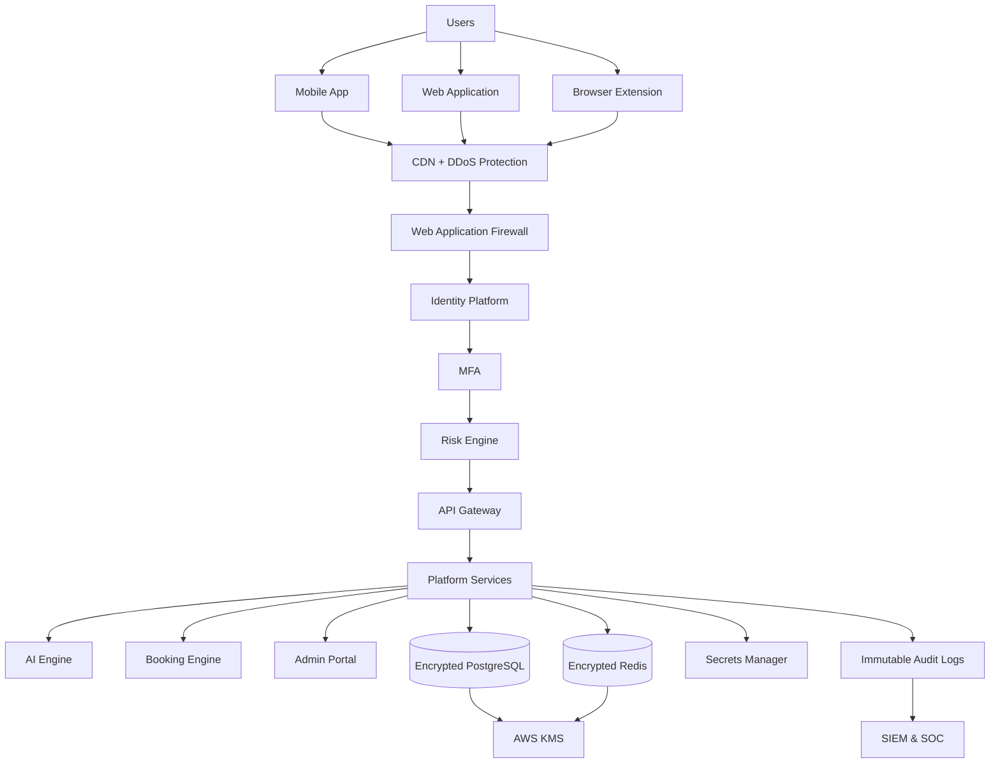
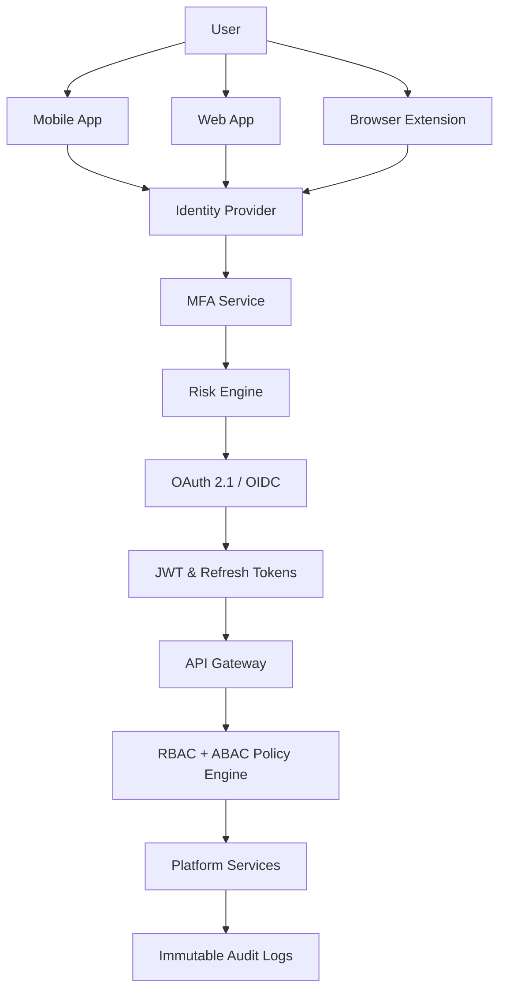
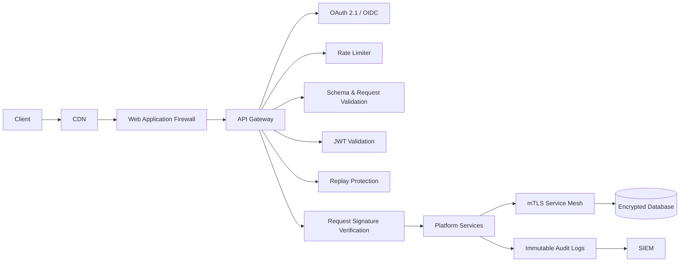
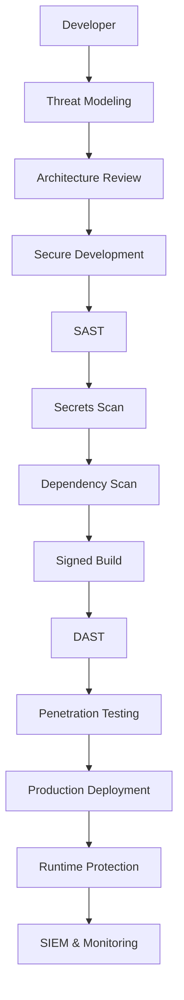
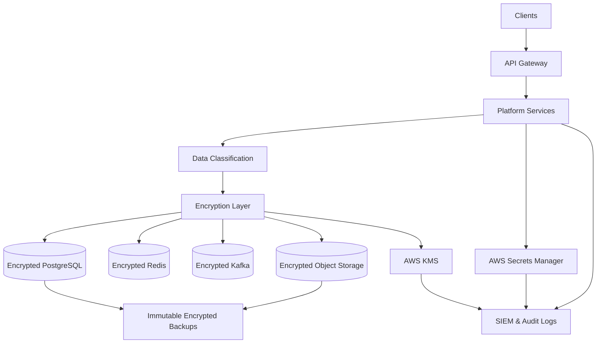
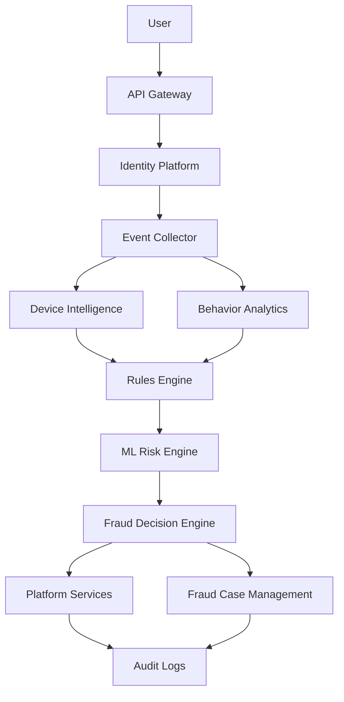
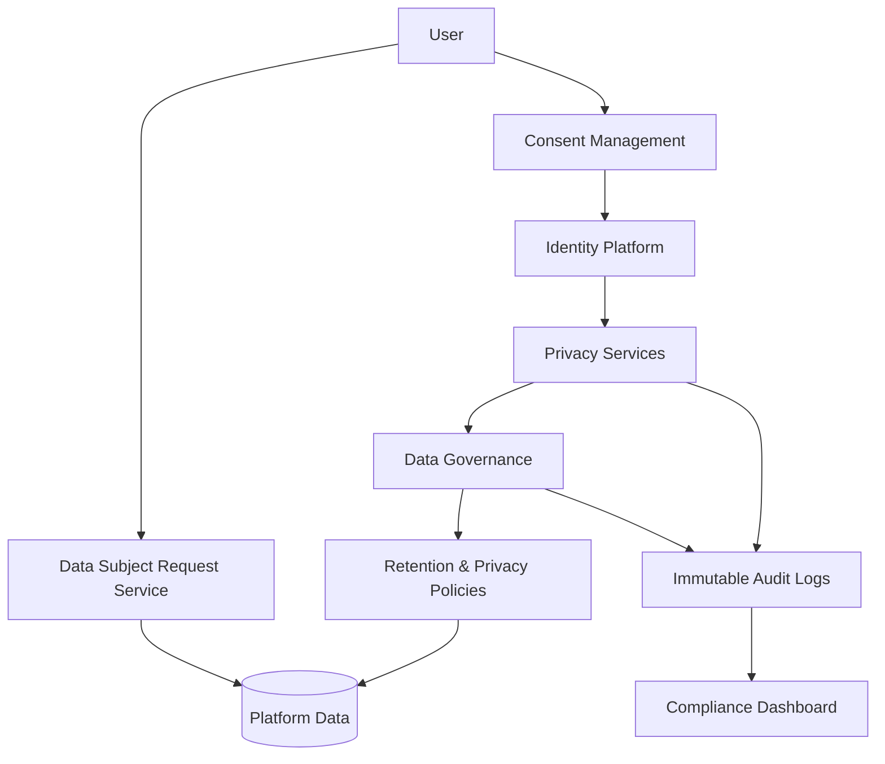
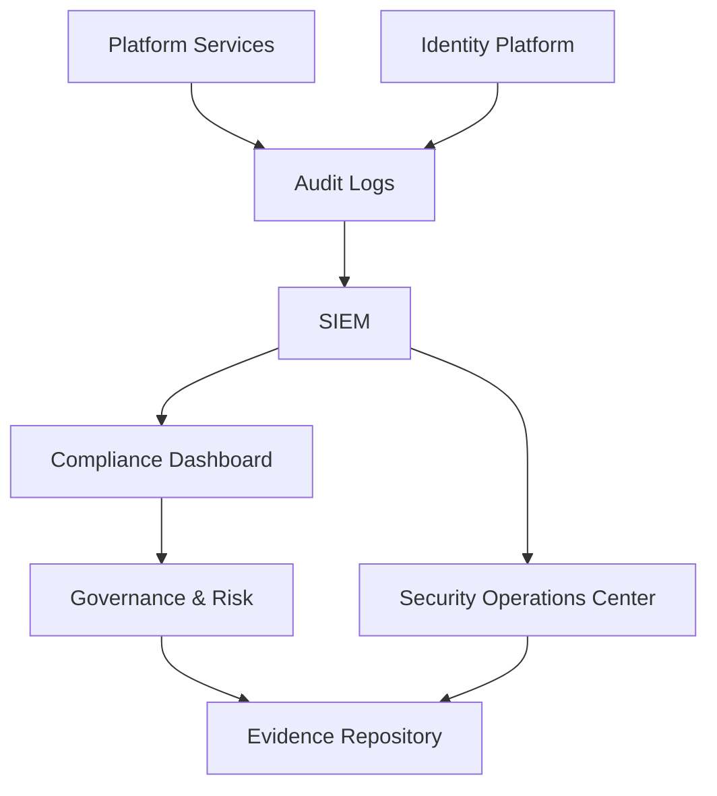
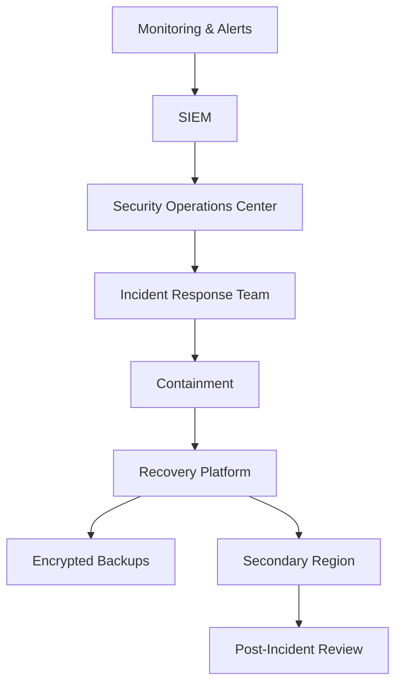
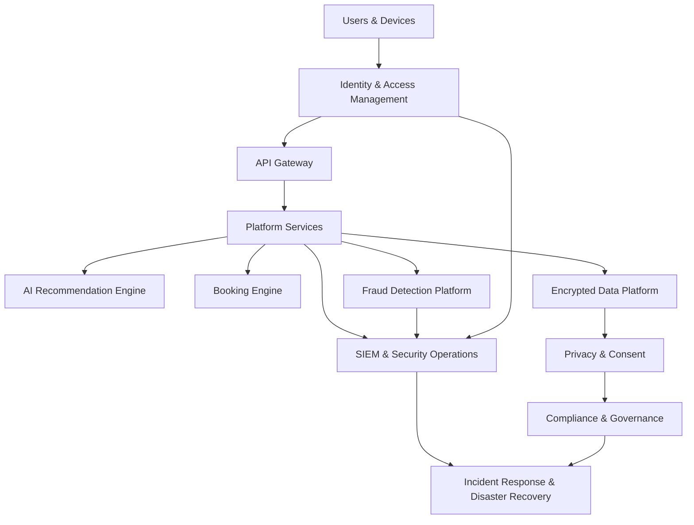

# docs/13_SECURITY_AND_COMPLIANCE.md

# Part 1 — Security Foundation & Architecture

---

# 1. Introduction

CardWise operates as a financial intelligence platform that aggregates sensitive user, payment, rewards, travel, and financial optimization data across multiple channels including:

- Web Application
- Mobile Applications
- Browser Extension
- AI Recommendation Engine
- Booking Engine
- Admin Portal
- Backend APIs
- Data Platform
- Analytics Platform
- Third-party Financial Integrations

Unlike a traditional SaaS platform, CardWise becomes a decision engine for financial behavior. Consequently, the platform must be engineered assuming that:

- Every request may be malicious.
- Every network is untrusted.
- Every identity must continuously prove trust.
- Every privilege is temporary.
- Every action must be auditable.
- Every sensitive asset must remain encrypted.
- Every security control must fail safely.

Security is therefore treated as a core architectural capability rather than an operational afterthought.

---

# 2. Security Vision

**Vision Statement**

> Build the most trusted credit card intelligence platform by embedding security, privacy, resilience, and compliance into every architectural decision.

CardWise shall:

- Never expose sensitive financial information unnecessarily.
- Never trust any network implicitly.
- Protect customer identities by default.
- Detect attacks before impact.
- Minimize blast radius during compromise.
- Provide verifiable auditability.
- Preserve customer privacy while enabling intelligent recommendations.

---

## SEC-001 Security Objectives

| Objective | Description |
|-----------|-------------|
| Confidentiality | Protect customer and financial information from unauthorized disclosure |
| Integrity | Prevent unauthorized modification of data |
| Availability | Maintain platform availability during failures and attacks |
| Accountability | Ensure every action is attributable |
| Privacy | Respect user consent and data ownership |
| Resilience | Continue operation despite infrastructure failures |
| Recoverability | Restore services rapidly after incidents |
| Compliance | Meet regulatory and contractual obligations |

---

## SEC-002 Security Success Metrics

| KPI | Target |
|------|--------|
| Critical Vulnerability Remediation | <24 hours |
| High Severity Patch | <72 hours |
| MFA Coverage | 100% privileged accounts |
| Encryption Coverage | 100% sensitive data |
| Secret Rotation | Automated |
| Security Incident Detection | <5 minutes |
| Incident Containment | <30 minutes |
| RPO | <15 minutes |
| RTO | <60 minutes |

---

# 3. Security Philosophy

CardWise follows five architectural philosophies.

---

## SEC-003 Secure by Design

Security requirements are considered before feature implementation.

Every architecture proposal must include:

- Threat analysis
- Security review
- Privacy review
- Data classification
- Compliance assessment
- Logging strategy
- Abuse scenarios

### Rationale

Retrofitting security is expensive, incomplete, and error-prone. Integrating security during design reduces long-term risk and operational cost.

---

## SEC-004 Zero Trust

Trust is never granted based on:

- Internal network
- VPN access
- Device location
- IP address
- Previous authentication

Instead, trust is established using continuous verification.

---

## SEC-005 Privacy by Design

User privacy is embedded into every workflow.

Examples include:

- Minimal data collection
- Explicit consent
- Data minimization
- Pseudonymization
- Encryption
- Data lifecycle management

---

## SEC-006 Defense in Depth

Multiple independent security layers protect every critical asset.

Failure of one control must not expose sensitive systems.

---

## SEC-007 Assume Breach

Every architectural decision assumes attackers may already have partial access.

The architecture therefore emphasizes:

- Detection
- Containment
- Isolation
- Recovery
- Continuous monitoring

---

# 4. Security Architecture Principles

| ID | Principle | Description |
|----|-----------|-------------|
| SEC-008 | Least Privilege | Minimum permissions required |
| SEC-009 | Explicit Verification | Every request verified |
| SEC-010 | Continuous Authentication | Trust evaluated continuously |
| SEC-011 | Separation of Duties | Administrative responsibilities split across roles |
| SEC-012 | Immutable Audit Trail | Logs cannot be modified |
| SEC-013 | Secure Defaults | Default configurations are restrictive |
| SEC-014 | Fail Securely | Failures default to denial rather than access |
| SEC-015 | Defense in Depth | Multiple independent controls |
| SEC-016 | Data Minimization | Collect only necessary data |
| SEC-017 | Encryption Everywhere | Data encrypted in transit and at rest |

---

# 5. Zero Trust Architecture

## SEC-018 Zero Trust Model

The platform adopts a Zero Trust Architecture (ZTA) where every access request is evaluated using multiple trust signals.

Trust evaluation includes:

- User identity
- Device health
- MFA status
- Geographic context
- Behavioral anomalies
- Session risk score
- API reputation
- Request integrity
- Authorization policies

No service bypasses identity verification solely because it resides within the internal network.

---

## Zero Trust Evaluation Flow

```text
Request

↓

Identity Validation

↓

Device Verification

↓

Risk Analysis

↓

Authorization Policy

↓

Least Privilege Access

↓

Continuous Monitoring

↓

Re-evaluation
```

---

## SEC-019 Continuous Verification

Authentication is not a one-time event.

Trust is re-evaluated whenever:

- Device changes
- IP changes
- Browser changes
- Privilege escalation
- High-value operations
- Suspicious behavior
- Long-running sessions
- API token refresh

---

### Engineering Rationale

Continuous verification reduces the risk of session hijacking, token theft, and insider misuse by requiring trust to be maintained throughout the session lifecycle.

### Trade-offs

| Benefit | Cost |
|---------|------|
| Stronger protection against compromised sessions | Increased implementation complexity |
| Adaptive security decisions | Additional latency for risk evaluation |
| Reduced insider risk | More sophisticated policy management |

### Risks

- Misconfigured trust policies may block legitimate users.
- Excessive re-authentication can degrade user experience.

### Operational Considerations

- Tune risk thresholds using production telemetry.
- Provide secure fallback mechanisms for legitimate users flagged by risk engines.
- Monitor false positive and false negative rates.

---

# 6. Defense in Depth

## SEC-020 Layered Security Model

Every request passes through multiple independent controls.

| Layer | Primary Controls |
|--------|------------------|
| Edge | CDN, WAF, DDoS protection |
| Identity | OAuth 2.1, OIDC, MFA |
| API Gateway | Rate limiting, JWT validation, request validation |
| Application | Authorization, input validation, secure coding |
| Service Mesh | mTLS, workload identity |
| Infrastructure | Kubernetes policies, IAM, network segmentation |
| Database | Encryption, RBAC, auditing |
| Storage | KMS encryption, backups |
| Monitoring | SIEM, anomaly detection |
| Incident Response | SOC workflows, automated containment |

---

## Security Layer Objectives

| Layer | Objective |
|--------|-----------|
| Prevent | Stop attacks before execution |
| Detect | Identify malicious activity |
| Respond | Contain active threats |
| Recover | Restore normal operations |

---

### Engineering Rationale

Independent controls reduce single points of failure and ensure that compromise of one layer does not automatically expose downstream systems.

### Best Practices

- Avoid relying on a single security mechanism.
- Validate inputs at every trust boundary.
- Apply consistent policy enforcement across services.

### Risks

- Layer duplication can increase operational overhead.
- Inconsistent policy configuration may create security gaps.

### Operational Considerations

- Regularly audit control effectiveness.
- Test defense layers through penetration testing and red team exercises.

---

# 7. Platform Threat Model

CardWise uses an attacker-centric threat modeling process based on STRIDE, attack trees, and abuse-case analysis.

---

## SEC-021 Primary Threat Actors

| Threat Actor | Description |
|--------------|-------------|
| External Attackers | Credential theft, API abuse, data exfiltration |
| Fraud Rings | Reward abuse, booking fraud, payment manipulation |
| Malicious Bots | Automated scraping, credential stuffing |
| Insider Threats | Privilege misuse, data leakage |
| Supply Chain Attackers | Dependency compromise |
| Nation-State Actors | Advanced persistent threats |
| Third-party Integrations | Token leakage, compromised partners |

---

## SEC-022 Critical Assets

| Asset | Security Priority |
|--------|-------------------|
| User Identity | Critical |
| Authentication Tokens | Critical |
| Rewards Data | High |
| Booking Information | High |
| Payment Metadata | Critical |
| AI Models | High |
| Recommendation Engine | High |
| API Keys | Critical |
| Encryption Keys | Critical |
| Audit Logs | Critical |

---

## SEC-023 Threat Categories

| Category | Examples |
|----------|----------|
| Identity Attacks | Credential stuffing, MFA fatigue |
| API Abuse | Replay, enumeration, scraping |
| Financial Fraud | Reward farming, fake bookings |
| Data Theft | Database exfiltration |
| Infrastructure | Container escape |
| Supply Chain | Malicious dependencies |
| Insider Threat | Privilege abuse |
| AI Attacks | Prompt injection, model manipulation |
| Browser Threats | Extension abuse, XSS |
| Mobile Threats | Reverse engineering, rooted devices |

---

### Engineering Rationale

A structured threat model enables security controls to be prioritized based on business impact and attacker capabilities rather than solely on technical vulnerabilities.

### Trade-offs

| Benefit | Cost |
|---------|------|
| Better risk prioritization | Ongoing maintenance effort |
| Focused security investments | Requires cross-functional collaboration |

### Risks

- Emerging attack techniques may invalidate existing assumptions.
- Third-party ecosystem changes can introduce new threat vectors.

### Operational Considerations

- Refresh threat models at least quarterly.
- Reassess after major architectural changes or new integrations.

---

# 8. Security Layers

## SEC-024 Enterprise Security Stack

| Layer | Primary Technologies |
|--------|----------------------|
| Client Security | Secure Browser, React Native hardening, Browser Extension sandboxing |
| Edge Security | CDN, WAF, Bot Protection |
| Identity | OAuth 2.1, OIDC, MFA |
| API Security | JWT, mTLS, Rate Limiting |
| Application Security | OWASP controls |
| Service Security | mTLS, Service Identity |
| Platform Security | Kubernetes Security Policies |
| Infrastructure Security | IAM, Network Segmentation |
| Data Security | PostgreSQL Encryption, Redis Security |
| Monitoring | OpenTelemetry, SIEM |
| Recovery | Backup & Disaster Recovery |

---

## SEC-025 Trust Boundaries

Major trust boundaries include:

1. Internet → CDN/WAF
2. CDN → API Gateway
3. API Gateway → Internal Services
4. Services → Databases
5. Services → Third-party APIs
6. AI Platform → External LLM Providers
7. Admin Portal → Privileged Services
8. Browser Extension → Backend APIs
9. Mobile App → API Gateway

Each trust boundary requires:

- Authentication
- Authorization
- Encryption
- Logging
- Rate limiting
- Request validation

---

# 9. High-Level Security Architecture



---

### Architecture Rationale

The architecture enforces security controls at every trust boundary while centralizing identity, encryption, monitoring, and governance. Sensitive assets remain isolated behind authenticated service layers, and telemetry from all components converges into centralized security operations for continuous detection and response.

### Trade-offs

| Decision | Benefit | Trade-off |
|----------|---------|-----------|
| Centralized Identity | Consistent authentication and authorization | Higher dependency on IAM availability |
| Multiple Security Layers | Reduced blast radius | Increased operational complexity |
| End-to-End Encryption | Strong confidentiality | Additional CPU overhead |
| Centralized Logging | Improved forensic capability | Higher storage and retention costs |

### Risks

- Identity provider outages can impact platform availability.
- Misconfigured security policies may unintentionally block valid traffic.
- Complex multi-layer architectures require continuous governance to avoid configuration drift.

### Operational Considerations

- Conduct periodic architecture reviews and threat modeling updates.
- Validate security controls through automated testing and red team assessments.
- Continuously monitor security posture using centralized dashboards and alerting.

---

# 10. Core Security Principles

| ID | Principle | Description |
|----|-----------|-------------|
| SEC-026 | Verify Explicitly | Authenticate and authorize every request |
| SEC-027 | Least Privilege | Grant only required permissions |
| SEC-028 | Secure Defaults | Deny by default, allow by policy |
| SEC-029 | Defense in Depth | Independent layered controls |
| SEC-030 | Assume Breach | Design for detection and containment |
| SEC-031 | Encrypt Everything | Protect data in transit and at rest |
| SEC-032 | Continuous Monitoring | Observe all critical systems and identities |
| SEC-033 | Privacy by Design | Minimize and protect personal data |
| SEC-034 | Resilience by Design | Engineer for graceful degradation and rapid recovery |
| SEC-035 | Continuous Improvement | Regularly reassess threats, controls, and architecture maturity |

---

# docs/13_SECURITY_AND_COMPLIANCE.md

# Part 2 — Identity & Access Management (IAM)

---

# 11. Identity & Access Management Overview

Identity is the primary security perimeter of CardWise.

Every user, administrator, service, workload, API, browser extension, mobile device, AI agent, and third-party integration is treated as an independently verifiable identity.

CardWise adopts a centralized Identity & Access Management (IAM) architecture that supports:

- OAuth 2.1
- OpenID Connect (OIDC)
- Multi-Factor Authentication (MFA)
- Risk-Based Authentication (RBA)
- RBAC + ABAC Hybrid Authorization
- Device Trust
- Session Intelligence
- Continuous Authentication
- Service-to-Service Identity
- Workload Identity
- Short-lived Credentials

Identity decisions are made centrally while authorization is enforced locally by every service.

---

# IAM-001 Identity Architecture Goals

| Goal | Description |
|------|-------------|
| Centralized Identity | Single source of authentication |
| Decentralized Authorization | Services enforce permissions locally |
| Zero Trust | No implicit trust |
| Passwordless Ready | Future support for Passkeys/WebAuthn |
| Fine-Grained Authorization | Resource-level access decisions |
| Short-Lived Credentials | Reduce token exposure |
| Continuous Verification | Re-evaluate trust throughout sessions |
| Comprehensive Auditability | Every identity event logged |

---

# 12. Identity Domains

The platform defines multiple identity domains with different trust requirements.

## IAM-002 Identity Types

| Identity Type | Examples | Trust Level |
|--------------|----------|-------------|
| Customer | End users | Medium |
| Administrator | Support, Finance, Operations | Critical |
| Internal Employee | Engineering, Product | Critical |
| Service Account | Backend microservices | Critical |
| Kubernetes Workload | Pods, Jobs | Critical |
| AI Agent | Recommendation engine, AI workflows | High |
| Third-party Integration | Banking APIs, Travel APIs | High |
| Browser Extension | Installed extension instance | High |
| Mobile Device | iOS / Android applications | High |
| CI/CD Pipeline | Deployment automation | Critical |

---

## IAM-003 Identity Lifecycle

```text
Provision

↓

Verification

↓

Authentication

↓

Authorization

↓

Continuous Validation

↓

Privilege Updates

↓

Revocation

↓

Audit Archive
```

---

### Engineering Rationale

A formal identity lifecycle prevents orphaned accounts, stale permissions, and long-lived credentials while enabling consistent governance.

### Best Practices

- Automate provisioning and deprovisioning.
- Eliminate shared accounts.
- Rotate machine identities automatically.

### Risks

- Orphaned identities may retain unnecessary privileges.
- Manual lifecycle processes increase operational risk.

### Operational Considerations

- Periodically reconcile identities with HR and platform inventories.
- Review inactive accounts automatically.

---

# 13. Authentication Architecture

Authentication verifies who (or what) is requesting access.

Supported mechanisms include:

- Username + Password
- Email OTP
- Mobile OTP
- OAuth Social Login
- Passkeys (Future)
- WebAuthn (Future)
- MFA
- Device Verification
- Risk-Based Authentication

---

## IAM-004 Authentication Levels

| Level | Authentication Method | Example |
|--------|-----------------------|----------|
| AAL1 | Password / OTP | Standard login |
| AAL2 | MFA | Sensitive actions |
| AAL3 | Hardware-backed authentication (future) | Administrative operations |

---

## IAM-005 Authentication Flow

```text
User Login

↓

Identity Lookup

↓

Credential Verification

↓

Risk Assessment

↓

MFA Decision

↓

Session Creation

↓

JWT + Refresh Token

↓

Continuous Monitoring
```

---

## Authentication Decision Matrix

| Scenario | MFA Required |
|----------|--------------|
| New Device | Yes |
| New Country | Yes |
| Admin Login | Always |
| Password Reset | Always |
| High-Value Booking | Yes |
| Rewards Redemption | Yes |
| Large Financial Activity | Yes |
| Trusted Device | Risk-Based |

---

### Engineering Rationale

Adaptive authentication reduces user friction while increasing protection for high-risk activities.

### Trade-offs

| Benefit | Cost |
|---------|------|
| Improved security | Additional authentication steps |
| Reduced account takeover | Increased implementation complexity |

### Risks

- Overly aggressive MFA policies may impact user experience.
- Weak recovery mechanisms can become attack vectors.

### Operational Considerations

- Monitor authentication failure patterns.
- Regularly test recovery workflows.

---

# 14. Multi-Factor Authentication (MFA)

## IAM-006 Supported Factors

| Factor | Supported | Priority |
|---------|-----------|----------|
| Authenticator App (TOTP) | Yes | Preferred |
| Push Approval | Future | Preferred |
| Email OTP | Yes | Secondary |
| SMS OTP | Limited | Backup |
| Passkeys | Future | Preferred |
| Hardware Security Keys | Future | Administrative |

---

## MFA Enforcement Policy

| Identity | MFA Policy |
|----------|------------|
| Customer | Risk-Based |
| Admin | Mandatory |
| Support | Mandatory |
| Finance | Mandatory |
| Engineering | Mandatory |
| CI/CD | Certificate-Based |
| Service Accounts | Not Applicable (Machine Identity) |

---

### Best Practices

- Prefer phishing-resistant authentication methods.
- Avoid SMS as a primary factor.
- Require MFA re-verification for privilege escalation.

### Risks

- MFA fatigue attacks.
- SIM swap attacks for SMS OTP.

### Operational Considerations

- Detect abnormal MFA approval patterns.
- Support secure recovery with identity verification.

---

# 15. OAuth 2.1 Architecture

CardWise uses OAuth 2.1 for delegated authorization.

## IAM-007 OAuth Grant Types

| Grant Type | Usage |
|------------|-------|
| Authorization Code + PKCE | Web & Mobile |
| Client Credentials | Service-to-Service |
| Refresh Token | Session Renewal |

Unsupported:

- Implicit Flow
- Resource Owner Password Credentials

---

## OAuth Components

| Component | Responsibility |
|-----------|----------------|
| Authorization Server | Authenticate identities |
| Resource Server | Protect APIs |
| Client Applications | Request authorization |
| Token Service | Issue and rotate tokens |

---

### OAuth Best Practices

- PKCE required for all public clients.
- Refresh token rotation enabled.
- Access tokens short-lived.
- Refresh tokens revocable.

---

# 16. OpenID Connect (OIDC)

OIDC extends OAuth by providing standardized identity information.

## IAM-008 OIDC Claims

| Claim | Usage |
|--------|-------|
| sub | Unique user identifier |
| email | Verified email |
| name | Display name |
| auth_time | Authentication timestamp |
| amr | Authentication method |
| acr | Authentication assurance |

---

## OIDC Benefits

- Federated identity
- Standardized authentication
- Reduced custom identity logic
- Improved interoperability

---

### Engineering Rationale

OIDC enables consistent identity handling across web, mobile, browser extensions, and future partner ecosystems.

### Trade-offs

| Benefit | Cost |
|---------|------|
| Standards compliance | Additional protocol complexity |
| Easier federation | Identity provider dependency |

---

# 17. Authorization Architecture

Authentication answers **who**.

Authorization answers **what they may do**.

CardWise implements a hybrid authorization model combining RBAC and ABAC.

---

## IAM-009 Authorization Layers

| Layer | Responsibility |
|--------|----------------|
| API Gateway | Token validation |
| Service Layer | Resource authorization |
| Business Logic | Domain permissions |
| Database | Row-level protections (where applicable) |
| Admin UI | Feature visibility |

---

## Authorization Decision Flow

```text
Authenticated Identity

↓

Role Resolution

↓

Attribute Resolution

↓

Policy Evaluation

↓

Resource Ownership

↓

Decision

↓

Audit Log
```

---

### Best Practices

- Deny by default.
- Evaluate authorization at every trust boundary.
- Never trust client-side authorization.

### Risks

- Permission inheritance errors.
- Inconsistent policy enforcement across services.

### Operational Considerations

- Centralize policy definitions where possible.
- Version authorization policies.

---

# 18. Role-Based Access Control (RBAC)

RBAC governs coarse-grained permissions.

## IAM-010 Platform Roles

| Role | Scope |
|------|-------|
| Customer | Personal resources |
| Premium Customer | Premium features |
| Customer Support | Support operations |
| Fraud Analyst | Fraud investigations |
| Finance | Financial reporting |
| Operations | Operational dashboards |
| Content Manager | Offers & promotions |
| AI Operations | AI governance |
| Security Analyst | Security operations |
| Platform Administrator | Platform management |
| Super Administrator | Full platform access |

---

## IAM-011 Permission Categories

| Category | Examples |
|----------|----------|
| Read | View resources |
| Write | Create or modify |
| Delete | Remove resources |
| Approve | Administrative approvals |
| Export | Download sensitive data |
| Configure | System configuration |
| Audit | Access security logs |

---

### Engineering Rationale

RBAC simplifies governance by assigning permissions to roles rather than individuals.

### Trade-offs

| Benefit | Cost |
|---------|------|
| Easier administration | Role explosion if unmanaged |
| Consistent access | Less contextual flexibility |

---

# 19. Attribute-Based Access Control (ABAC)

ABAC supplements RBAC with contextual policies.

## IAM-012 Authorization Attributes

| Attribute | Example |
|-----------|----------|
| User Role | Fraud Analyst |
| Department | Finance |
| Resource Owner | User ID |
| Environment | Production |
| Device Trust | Trusted |
| Location | Country |
| Risk Score | Low |
| Time | Business hours |
| Session Age | <30 minutes |

---

## Example Policy Decisions

| Scenario | Decision |
|----------|----------|
| Admin outside business hours | Require step-up authentication |
| High-risk device | Restrict sensitive actions |
| User accessing another user's portfolio | Deny |
| Fraud analyst exporting reports | Require approval |

---

### Best Practices

- Keep policies declarative and auditable.
- Minimize policy duplication.
- Review attribute sources regularly.

### Risks

- Complex policy interactions.
- Attribute integrity issues.

### Operational Considerations

- Test policies before deployment.
- Monitor policy evaluation latency.

---

# 20. Session Management

Sessions represent authenticated user state and must remain secure throughout their lifecycle.

---

## IAM-013 Session Characteristics

| Property | Value |
|----------|-------|
| Access Token | Short-lived |
| Refresh Token | Rotating |
| Session Binding | Device-aware |
| Revocation | Immediate |
| Idle Timeout | Configurable |
| Absolute Timeout | Configurable |
| Concurrent Sessions | Controlled by policy |

---

## Session Lifecycle

```text
Authentication

↓

Access Token Issued

↓

Refresh Token Issued

↓

Continuous Risk Evaluation

↓

Refresh Rotation

↓

Session Expiry / Revocation
```

---

## Session Security Controls

| Control | Purpose |
|----------|----------|
| Token Rotation | Reduce replay risk |
| Session Revocation | Immediate logout |
| Device Binding | Prevent token reuse |
| Risk Monitoring | Detect anomalies |
| Idle Timeout | Reduce exposure |
| Absolute Lifetime | Limit long-lived sessions |

---

### Engineering Rationale

Short-lived sessions with rotating credentials significantly reduce the impact of stolen tokens while supporting seamless user experiences.

### Trade-offs

| Benefit | Cost |
|---------|------|
| Stronger session security | Increased token management complexity |
| Reduced replay risk | More frequent token refresh operations |

### Risks

- Refresh token theft.
- Session fixation attacks.
- Concurrent session abuse.

### Operational Considerations

- Maintain centralized session revocation.
- Monitor unusual concurrent session patterns.
- Log all authentication, authorization, and session events.

---

# 21. Identity Security Best Practices

| ID | Practice | Description |
|----|----------|-------------|
| IAM-014 | MFA Everywhere | Mandatory for privileged identities |
| IAM-015 | Short-Lived Tokens | Minimize credential exposure |
| IAM-016 | Rotate Refresh Tokens | Prevent replay attacks |
| IAM-017 | Deny by Default | Explicit authorization required |
| IAM-018 | Least Privilege | Minimum required permissions |
| IAM-019 | Continuous Authentication | Reassess trust continuously |
| IAM-020 | Centralized Identity | Single source of authentication truth |
| IAM-021 | Audit Every Decision | Record authentication and authorization outcomes |

---

# 22. Identity & Access Architecture



---

# docs/13_SECURITY_AND_COMPLIANCE.md

# Part 3 — API Security Architecture

---

# 23. API Security Overview

The CardWise platform is API-first. Every client—including the Web Application, Mobile Applications, Browser Extension, AI Recommendation Engine, Booking Engine, Admin Portal, and third-party integrations—communicates through authenticated and authorized APIs.

As APIs represent the primary attack surface of the platform, API security is enforced through multiple independent controls following the Zero Trust model established in Part 1.

The API security architecture is designed to provide:

- Strong identity verification
- Secure token-based authentication
- Service-to-service trust
- Protection against replay attacks
- Request integrity verification
- Abuse prevention
- Traffic isolation
- Fine-grained authorization
- End-to-end observability
- Comprehensive auditability

---

# APISEC-001 API Security Objectives

| Objective | Description |
|------------|-------------|
| Strong Authentication | Every API request must have a verifiable identity |
| Authorization | Resource-level access enforcement |
| Integrity | Detect request tampering |
| Confidentiality | Encrypt all communications |
| Availability | Resist abuse and denial-of-service attacks |
| Replay Protection | Prevent reuse of intercepted requests |
| Non-Repudiation | Log all sensitive operations |
| Observability | Monitor API usage and anomalies |

---

# 24. API Trust Boundaries

Every API request crosses one or more trust boundaries. Security controls are applied at each boundary.

## APISEC-002 Trust Boundaries

| Boundary | Examples | Required Controls |
|----------|----------|-------------------|
| Internet → CDN | Public users | TLS, CDN, DDoS Protection |
| CDN → WAF | HTTP traffic | WAF rules, bot detection |
| WAF → API Gateway | API requests | Rate limiting, request validation |
| API Gateway → Internal Services | East-West traffic | JWT validation, mTLS |
| Service → Database | Data access | IAM, encryption |
| Service → External Partner | Banking, travel APIs | OAuth, mTLS, request signing |
| AI Services → LLM Providers | AI requests | API key isolation, data filtering |

---

### Engineering Rationale

Each trust boundary assumes untrusted input. Validation and authentication are repeated rather than inherited, preventing implicit trust propagation.

### Best Practices

- Validate all inbound traffic.
- Never bypass the API Gateway.
- Encrypt communications across every boundary.

### Risks

- Misconfigured trust boundaries can expose internal services.
- Inconsistent validation increases attack surface.

### Operational Considerations

- Continuously review service communication paths.
- Audit newly introduced APIs before production release.

---

# 25. API Gateway Security

The API Gateway serves as the centralized policy enforcement point for all inbound API traffic.

---

## APISEC-003 Gateway Responsibilities

| Capability | Purpose |
|------------|----------|
| JWT Validation | Verify access tokens |
| OAuth Enforcement | Identity verification |
| Rate Limiting | Prevent abuse |
| Request Validation | Reject malformed requests |
| Schema Validation | Ensure API contract compliance |
| API Version Routing | Controlled version management |
| Request Logging | Security auditing |
| Correlation IDs | Distributed tracing |
| IP Reputation | Threat intelligence |
| Bot Detection | Automated traffic mitigation |

---

## Gateway Processing Pipeline

```text
Incoming Request

↓

TLS Validation

↓

WAF Inspection

↓

JWT Verification

↓

Rate Limiting

↓

Request Validation

↓

Authorization Checks

↓

Routing

↓

Service Execution

↓

Audit Logging
```

---

### Engineering Rationale

Centralizing security at the gateway ensures consistent enforcement across all APIs while reducing duplicated security logic within downstream services.

### Trade-offs

| Benefit | Cost |
|---------|------|
| Centralized policy enforcement | Gateway becomes critical infrastructure |
| Simplified service implementation | Increased gateway complexity |

### Risks

- Gateway outages affect API availability.
- Overloaded gateways may introduce latency.

### Operational Considerations

- Deploy gateways in highly available configurations.
- Monitor gateway health, latency, and rejection rates.

---

# 26. JWT Security

CardWise uses JSON Web Tokens (JWT) as short-lived access credentials.

---

## APISEC-004 JWT Design

| Property | Value |
|-----------|-------|
| Signing Algorithm | Asymmetric (recommended) |
| Access Token Lifetime | Short-lived |
| Refresh Token | Rotating |
| Audience Validation | Mandatory |
| Issuer Validation | Mandatory |
| Expiration Validation | Mandatory |
| Key Rotation | Automated |
| Revocation Support | Immediate |

---

## Required JWT Claims

| Claim | Purpose |
|--------|----------|
| sub | User identifier |
| iss | Token issuer |
| aud | Intended audience |
| exp | Expiration |
| iat | Issued at |
| jti | Token identifier |
| scope | Authorized scopes |
| roles | RBAC permissions |

---

## JWT Validation Checklist

- Signature verification
- Expiration validation
- Issuer validation
- Audience validation
- Token replay detection
- Revocation check
- Scope validation

---

### Engineering Rationale

Short-lived signed tokens minimize the blast radius of credential compromise while enabling stateless authentication.

### Best Practices

- Avoid storing sensitive information in JWT payloads.
- Validate every claim.
- Rotate signing keys automatically.

### Risks

- Stolen tokens before expiration.
- Weak key management.

### Operational Considerations

- Maintain a token revocation mechanism.
- Track abnormal token usage across regions.

---

# 27. Mutual TLS (mTLS)

Service-to-service communication is protected using mutual TLS.

---

## APISEC-005 mTLS Coverage

| Communication | mTLS Required |
|--------------|---------------|
| API Gateway → Services | Yes |
| Service → Service | Yes |
| Service Mesh | Yes |
| Admin Services | Yes |
| AI Services | Yes |
| Background Workers | Yes |
| Internal Messaging APIs | Yes |

---

## mTLS Authentication Flow

```text
Client Service

↓

Client Certificate

↓

Server Certificate

↓

Certificate Validation

↓

Identity Verification

↓

Encrypted Communication
```

---

### Engineering Rationale

mTLS provides cryptographic verification for both communicating parties, preventing impersonation and unauthorized service access.

### Trade-offs

| Benefit | Cost |
|---------|------|
| Strong service identity | Certificate lifecycle management |
| Reduced lateral movement | Operational overhead |

### Risks

- Expired certificates.
- Certificate misconfiguration.

### Operational Considerations

- Automate certificate issuance and rotation.
- Monitor certificate expiration proactively.

---

# 28. API Rate Limiting

Rate limiting protects platform availability and reduces abuse.

---

## APISEC-006 Rate Limiting Strategy

| Dimension | Example |
|-----------|----------|
| User ID | Requests per minute |
| IP Address | Burst protection |
| API Key | Third-party quotas |
| Device ID | Mobile throttling |
| Endpoint | Sensitive endpoint limits |
| Organization | Enterprise quotas |

---

## Rate Limit Categories

| Endpoint Type | Policy |
|--------------|--------|
| Authentication | Strict |
| OTP | Very Strict |
| Password Reset | Very Strict |
| Rewards | Moderate |
| Booking | Moderate |
| Search | High Throughput |
| Public Metadata | Relaxed |
| Admin APIs | Strict |

---

### Best Practices

- Apply per-user and per-IP limits.
- Return standardized retry headers.
- Log repeated rate limit violations.

### Risks

- False positives during legitimate traffic spikes.
- Abuse from distributed botnets.

### Operational Considerations

- Tune limits based on production telemetry.
- Implement adaptive rate limiting during attacks.

---

# 29. Replay Protection

Replay attacks attempt to reuse valid requests to perform unauthorized actions.

---

## APISEC-007 Replay Prevention Controls

| Control | Purpose |
|----------|----------|
| Nonce | Unique request identifier |
| Timestamp | Request freshness |
| Token Rotation | Limit replay window |
| Request Expiration | Reject stale requests |
| Idempotency Keys | Prevent duplicate processing |
| One-Time Operations | Sensitive transaction protection |

---

## Replay Validation Flow

```text
Request

↓

Timestamp Validation

↓

Nonce Validation

↓

Signature Verification

↓

Replay Cache Lookup

↓

Accept or Reject
```

---

### Engineering Rationale

Combining timestamps, nonces, and idempotency keys significantly reduces replay opportunities for financial and booking operations.

### Trade-offs

| Benefit | Cost |
|---------|------|
| Improved transaction integrity | Additional state management |
| Reduced duplicate processing | Increased storage for replay cache |

### Risks

- Clock synchronization issues.
- Replay cache exhaustion.

### Operational Considerations

- Synchronize infrastructure time sources.
- Expire replay cache entries efficiently.

---

# 30. Request Signing

Sensitive APIs require cryptographic request signing in addition to transport security.

---

## APISEC-008 Request Signing Components

| Component | Description |
|-----------|-------------|
| Canonical Request | Deterministic request representation |
| Timestamp | Freshness verification |
| Nonce | Uniqueness |
| Signature | Cryptographic verification |
| Key Identifier | Identify signing credential |

---

## Request Signing Validation

```text
Incoming Request

↓

Canonicalization

↓

Timestamp Validation

↓

Nonce Validation

↓

Signature Verification

↓

Authorization

↓

Request Processing
```

---

### Best Practices

- Sign all sensitive requests.
- Use short signature validity windows.
- Protect signing keys within secure key management systems.

### Risks

- Key compromise.
- Incorrect canonicalization leading to false failures.

### Operational Considerations

- Rotate signing keys regularly.
- Monitor signature validation failure rates.

---

# 31. API Input Validation

Input validation is enforced at multiple layers.

---

## APISEC-009 Validation Layers

| Layer | Validation |
|--------|------------|
| API Gateway | Schema validation |
| Service Layer | Business rules |
| Domain Layer | Resource validation |
| Database | Constraint enforcement |

---

## Validation Rules

- Strict schema validation
- Content-Type verification
- Length limits
- Character restrictions
- Enumeration validation
- Numeric boundary checks
- File upload restrictions

---

### Engineering Rationale

Multi-layer validation prevents malformed or malicious inputs from propagating through the system.

### Risks

- Validation inconsistencies.
- Overly permissive parsing.

### Operational Considerations

- Maintain versioned API schemas.
- Reject unknown fields by default where appropriate.

---

# 32. API Security Monitoring

Security telemetry is collected for every API interaction.

---

## APISEC-010 Security Events

| Event | Logged |
|--------|--------|
| Authentication Success | Yes |
| Authentication Failure | Yes |
| Authorization Failure | Yes |
| Rate Limit Exceeded | Yes |
| JWT Validation Failure | Yes |
| Replay Detection | Yes |
| Signature Failure | Yes |
| API Abuse Detection | Yes |
| Sensitive Operation | Yes |
| Admin API Access | Yes |

---

## Security Metrics

| Metric | Purpose |
|---------|----------|
| Requests per Second | Capacity monitoring |
| Error Rate | Stability |
| 401 Responses | Authentication monitoring |
| 403 Responses | Authorization monitoring |
| 429 Responses | Abuse detection |
| Latency | Performance |
| Token Validation Failures | Identity monitoring |
| Replay Attempts | Threat detection |

---

### Best Practices

- Correlate API events with identity telemetry.
- Retain immutable security logs.
- Alert on anomalous request patterns.

### Risks

- Excessive logging may increase storage costs.
- Missing correlation IDs hinder investigations.

### Operational Considerations

- Standardize log formats.
- Ensure log integrity and retention according to compliance requirements.

---

# 33. API Security Best Practices

| ID | Practice | Description |
|----|----------|-------------|
| APISEC-011 | Validate Every Request | Never trust inbound traffic |
| APISEC-012 | Short-Lived JWTs | Reduce credential exposure |
| APISEC-013 | mTLS Everywhere | Authenticate internal services |
| APISEC-014 | Deny by Default | Explicit authorization required |
| APISEC-015 | Request Signing | Protect sensitive operations |
| APISEC-016 | Replay Protection | Prevent duplicate execution |
| APISEC-017 | Layered Validation | Validate at every trust boundary |
| APISEC-018 | Adaptive Rate Limiting | Protect availability |
| APISEC-019 | Comprehensive Logging | Support detection and forensics |
| APISEC-020 | Continuous Monitoring | Detect abuse in real time |

---

# 34. High-Level API Security Architecture



---

# docs/13_SECURITY_AND_COMPLIANCE.md

# Part 4 — Application Security Architecture

---

# 35. Application Security Overview

Application Security (AppSec) protects CardWise throughout the entire Software Development Lifecycle (SDLC), from design through deployment and runtime.

CardWise adopts a **Shift-Left + Shift-Right** security strategy:

- **Shift Left** — Prevent vulnerabilities during planning, design, coding, and CI/CD.
- **Shift Right** — Detect, respond, and contain threats during runtime.

Security is integrated into every engineering workflow rather than treated as a final validation step.

---

# APPSEC-001 Application Security Objectives

| Objective | Description |
|------------|-------------|
| Prevent Vulnerabilities | Secure development practices |
| Reduce Attack Surface | Secure architecture and configurations |
| Detect Vulnerabilities Early | Automated security testing |
| Secure Dependencies | Continuous dependency management |
| Protect Runtime | Runtime monitoring and response |
| Secure Clients | Harden Web, Mobile, and Browser Extension |
| Continuous Compliance | Automated security validation |

---

# 36. Secure Software Development Lifecycle (Secure SDLC)

Security gates are embedded throughout the SDLC.

---

## APPSEC-002 Secure SDLC Phases

| Phase | Security Activities |
|--------|---------------------|
| Requirements | Threat modeling, security requirements |
| Architecture | Security review, trust boundaries |
| Design | Abuse case analysis |
| Development | Secure coding guidelines |
| Code Review | Manual and automated security review |
| Build | Dependency scanning, SAST |
| Testing | DAST, penetration testing |
| Release | Security approval, artifact signing |
| Deployment | Configuration validation |
| Runtime | Continuous monitoring |

---

## Secure SDLC Flow

```text
Requirements

↓

Threat Modeling

↓

Architecture Review

↓

Secure Development

↓

Static Analysis

↓

Dependency Scan

↓

Dynamic Testing

↓

Penetration Testing

↓

Release Approval

↓

Production Monitoring
```

---

### Engineering Rationale

Embedding security into every phase significantly reduces remediation costs and lowers the likelihood of production vulnerabilities.

### Best Practices

- Treat security requirements as functional requirements.
- Include security acceptance criteria for every feature.
- Automate security checks wherever possible.

### Risks

- Manual reviews may become bottlenecks.
- Incomplete threat modeling can miss critical attack vectors.

### Operational Considerations

- Maintain security review checklists.
- Periodically reassess SDLC effectiveness.

---

# 37. OWASP Top 10 Mitigation Strategy

CardWise aligns application security controls with the latest OWASP Top 10 guidance.

---

## APPSEC-003 OWASP Coverage

| OWASP Category | Mitigation |
|----------------|------------|
| Broken Access Control | RBAC, ABAC, policy enforcement |
| Cryptographic Failures | TLS, KMS, encryption at rest |
| Injection | Parameterized queries, input validation |
| Insecure Design | Threat modeling, architecture reviews |
| Security Misconfiguration | Secure defaults, infrastructure baselines |
| Vulnerable Components | Dependency scanning |
| Identification & Authentication Failures | OAuth 2.1, MFA, JWT |
| Software & Data Integrity Failures | Artifact signing, CI/CD validation |
| Security Logging & Monitoring Failures | Centralized logging and SIEM |
| SSRF | Network segmentation, outbound allowlists |

---

### Engineering Rationale

Aligning with OWASP ensures protection against the most common and impactful application security risks.

### Trade-offs

| Benefit | Cost |
|---------|------|
| Industry-standard security posture | Ongoing maintenance |
| Reduced vulnerability exposure | Additional engineering effort |

### Operational Considerations

- Map new vulnerabilities to OWASP categories.
- Track mitigation coverage as a security KPI.

---

# 38. Secure Coding Standards

Every engineering team follows standardized secure coding practices.

---

## APPSEC-004 Secure Coding Principles

| Principle | Description |
|-----------|-------------|
| Validate Input | Never trust user input |
| Encode Output | Prevent client-side injection |
| Principle of Least Privilege | Limit permissions |
| Secure Error Handling | Avoid sensitive information leakage |
| Fail Securely | Deny access by default |
| Immutable Logging | Preserve forensic evidence |
| Defensive Programming | Handle unexpected conditions safely |

---

## Code Review Checklist

| Review Area | Required |
|-------------|----------|
| Authentication | ✓ |
| Authorization | ✓ |
| Input Validation | ✓ |
| Error Handling | ✓ |
| Logging | ✓ |
| Dependency Changes | ✓ |
| Secrets Exposure | ✓ |
| Performance Impact | ✓ |

---

### Best Practices

- Never hardcode credentials.
- Avoid exposing internal implementation details.
- Use approved cryptographic libraries only.

### Risks

- Inconsistent coding practices across teams.
- Security regressions during feature development.

### Operational Considerations

- Enforce secure coding standards through CI.
- Conduct periodic security-focused code reviews.

---

# 39. Dependency Security

Open-source dependencies are continuously monitored.

---

## APPSEC-005 Dependency Management

| Control | Purpose |
|----------|----------|
| Software Bill of Materials (SBOM) | Component inventory |
| Dependency Scanning | Known vulnerability detection |
| License Validation | Compliance verification |
| Version Pinning | Prevent unexpected updates |
| Integrity Verification | Artifact authenticity |
| Automated Updates | Security patching |

---

## Dependency Lifecycle

```text
Dependency Added

↓

License Validation

↓

Vulnerability Scan

↓

Policy Evaluation

↓

Approval

↓

Production

↓

Continuous Monitoring
```

---

### Engineering Rationale

Most modern vulnerabilities originate from third-party libraries rather than proprietary code. Continuous dependency governance minimizes supply-chain risk.

### Risks

- Zero-day vulnerabilities.
- Malicious package publication.
- Abandoned dependencies.

### Operational Considerations

- Maintain approved dependency lists.
- Monitor dependency health continuously.

---

# 40. Static Application Security Testing (SAST)

SAST analyzes source code during development.

---

## APPSEC-006 SAST Scope

| Component | Coverage |
|-----------|----------|
| Backend Services | 100% |
| Frontend | 100% |
| Mobile Apps | 100% |
| Browser Extension | 100% |
| Infrastructure Code | 100% |
| CI/CD Configuration | 100% |

---

## Vulnerability Categories

| Category | Examples |
|----------|----------|
| Injection | SQL, Command |
| Authentication | Weak authentication logic |
| Authorization | Missing access checks |
| Cryptography | Weak algorithms |
| Secrets | Hardcoded credentials |
| Input Validation | Unsafe parsing |

---

### Best Practices

- Scan every pull request.
- Block releases for critical findings.
- Track remediation time.

### Operational Considerations

- Minimize false positives through rule tuning.
- Integrate results into engineering workflows.

---

# 41. Dynamic Application Security Testing (DAST)

DAST evaluates running applications from an external attacker's perspective.

---

## APPSEC-007 DAST Coverage

| Target | Included |
|---------|----------|
| Public APIs | Yes |
| Admin Portal | Yes |
| Web Application | Yes |
| Mobile Backend APIs | Yes |
| Browser Extension APIs | Yes |

---

## DAST Testing Areas

| Test | Coverage |
|------|----------|
| Authentication | ✓ |
| Authorization | ✓ |
| XSS | ✓ |
| CSRF | ✓ |
| Injection | ✓ |
| File Upload | ✓ |
| Session Management | ✓ |

---

### Engineering Rationale

DAST identifies runtime vulnerabilities that may not be visible through source code analysis alone.

### Risks

- Incomplete coverage of authenticated workflows.
- False positives requiring manual validation.

### Operational Considerations

- Execute DAST in staging environments.
- Include authenticated scanning for privileged paths.

---

# 42. Runtime Application Self-Protection (RASP)

RASP provides runtime visibility into application behavior.

---

## APPSEC-008 RASP Capabilities

| Capability | Purpose |
|------------|----------|
| Injection Detection | Block exploitation attempts |
| Runtime Monitoring | Observe application behavior |
| Policy Enforcement | Prevent unsafe execution |
| Attack Telemetry | Security analytics |
| Threat Correlation | Link runtime events |

---

### Trade-offs

| Benefit | Cost |
|---------|------|
| Real-time protection | Runtime overhead |
| Improved visibility | Increased operational complexity |

### Operational Considerations

- Tune detection rules carefully.
- Monitor false-positive rates.

---

# 43. Browser Security

The React web application follows strict browser security controls.

---

## APPSEC-009 Browser Security Controls

| Control | Purpose |
|----------|----------|
| Content Security Policy (CSP) | Prevent XSS |
| Trusted Types | DOM injection mitigation |
| Subresource Integrity | Verify external assets |
| Secure Cookies | Session protection |
| SameSite Cookies | CSRF mitigation |
| HSTS | HTTPS enforcement |
| Referrer Policy | Limit information leakage |
| Permissions Policy | Restrict browser capabilities |

---

## Browser Threat Coverage

| Threat | Mitigation |
|---------|------------|
| XSS | CSP, output encoding |
| CSRF | SameSite cookies, anti-CSRF tokens |
| Clickjacking | Frame restrictions |
| Session Theft | Secure cookies |
| Mixed Content | HTTPS enforcement |

---

### Engineering Rationale

Modern browsers provide robust native security features that significantly reduce client-side attack surfaces when properly configured.

---

# 44. Browser Extension Security

The CardWise browser extension has elevated privileges and therefore follows additional hardening measures.

---

## APPSEC-010 Extension Security Controls

| Control | Purpose |
|----------|----------|
| Manifest V3 | Reduced attack surface |
| Minimal Permissions | Least privilege |
| Content Script Isolation | Prevent privilege escalation |
| Message Validation | Secure communication |
| Signed Releases | Integrity verification |
| Extension Update Validation | Trusted distribution |
| Secure Local Storage | Protect cached data |

---

## Threat Model

| Threat | Mitigation |
|---------|------------|
| Malicious Websites | Isolated execution |
| Extension Tampering | Code signing |
| Message Injection | Strict validation |
| Data Leakage | Encrypted local storage where appropriate |

---

### Operational Considerations

- Regularly review requested browser permissions.
- Minimize host permissions.
- Audit extension updates before publication.

---

# 45. Mobile Application Security

The React Native mobile applications require platform-specific protections.

---

## APPSEC-011 Mobile Security Controls

| Control | Purpose |
|----------|----------|
| Certificate Pinning | Prevent MITM attacks |
| Secure Storage | Protect credentials |
| Biometric Authentication | Local identity verification |
| Root/Jailbreak Detection | Reduce compromise risk |
| App Integrity Validation | Detect tampering |
| Secure Session Handling | Protect authentication |
| Encrypted Local Database | Secure offline data |

---

## Mobile Threat Coverage

| Threat | Mitigation |
|---------|------------|
| Reverse Engineering | Code obfuscation |
| MITM | TLS + Certificate Pinning |
| Credential Theft | Secure keystore/keychain |
| Tampered Devices | Integrity checks |
| Local Data Theft | Encryption |

---

### Engineering Rationale

Mobile devices operate in untrusted environments. Device-level hardening and secure credential storage reduce exposure to local attacks.

### Risks

- Rooted or jailbroken devices.
- Certificate pinning failures.
- Outdated operating systems.

### Operational Considerations

- Monitor device integrity signals.
- Enforce minimum supported OS versions.

---

# 46. Security Testing Strategy

Application security testing combines automated and manual techniques.

---

## APPSEC-012 Security Testing Matrix

| Testing Type | Frequency |
|--------------|-----------|
| SAST | Every commit |
| Dependency Scan | Every build |
| Secrets Scan | Every commit |
| DAST | Every release |
| Penetration Test | Quarterly |
| Red Team Exercise | Annually |
| Bug Bounty | Continuous (future) |

---

### Best Practices

- Treat critical findings as release blockers.
- Verify remediation through re-testing.
- Track security debt alongside technical debt.

---

# 47. Application Security Best Practices

| ID | Practice | Description |
|----|----------|-------------|
| APPSEC-013 | Shift Left | Integrate security early |
| APPSEC-014 | Automate Testing | Continuous security validation |
| APPSEC-015 | Secure Dependencies | Monitor third-party risks |
| APPSEC-016 | Harden Clients | Secure web, mobile, and extensions |
| APPSEC-017 | Runtime Protection | Monitor live threats |
| APPSEC-018 | Continuous Reviews | Regular architecture and code reviews |
| APPSEC-019 | Principle of Least Privilege | Restrict application permissions |
| APPSEC-020 | Continuous Monitoring | Observe application security posture |

---

# 48. Application Security Architecture



---

# docs/13_SECURITY_AND_COMPLIANCE.md

# Part 5 — Data Security Architecture

---

# 49. Data Security Overview

Data is the most valuable asset within the CardWise platform. It includes personally identifiable information (PII), financial metadata, rewards data, booking information, AI datasets, operational telemetry, and security logs.

The data security architecture ensures that information remains:

- **Confidential** — Accessible only to authorized identities
- **Accurate** — Protected from unauthorized modification
- **Available** — Accessible when required
- **Auditable** — Every sensitive operation is traceable
- **Compliant** — Meets regulatory and contractual obligations
- **Recoverable** — Can be restored after failures or incidents

Data protection is enforced across the complete lifecycle:

- Collection
- Transmission
- Processing
- Storage
- Analytics
- Archival
- Deletion

---

# DATA-001 Data Security Objectives

| Objective | Description |
|-----------|-------------|
| Confidentiality | Prevent unauthorized disclosure |
| Integrity | Protect against unauthorized modification |
| Availability | Ensure reliable access |
| Encryption Everywhere | Secure data in transit and at rest |
| Data Minimization | Collect only necessary information |
| Key Protection | Centralized cryptographic key management |
| Lifecycle Governance | Manage retention and deletion |
| Recoverability | Enable secure restoration after failures |

---

# 50. Data Classification Framework

Every data element is classified before storage.

Classification determines:

- Encryption requirements
- Retention period
- Backup strategy
- Access policy
- Logging requirements
- Compliance obligations

---

## DATA-002 Data Classification Levels

| Classification | Examples | Encryption | Access |
|---------------|----------|------------|--------|
| Public | Documentation, marketing pages | Optional | Public |
| Internal | Operational metrics, system configuration | Required | Employees |
| Confidential | User profiles, preferences | Required | Authorized Services |
| Restricted | Payment metadata, tokens, authentication data | Mandatory | Strictly Controlled |
| Highly Restricted | Encryption keys, secrets, audit integrity records | Mandatory + Hardware-backed controls | Minimal Access |

---

## Engineering Rationale

Classification enables security controls to scale consistently across thousands of data assets instead of relying on application-specific decisions.

---

### Best Practices

- Classify data before implementation.
- Default unknown data to **Confidential**.
- Regularly audit classification accuracy.

---

### Risks

- Misclassification can expose sensitive information.
- Overclassification may increase operational complexity.

---

### Operational Considerations

- Maintain a centralized data inventory.
- Review classifications during architecture reviews.

---

# 51. Data Lifecycle Security

Every dataset follows a controlled lifecycle.

---

## DATA-003 Data Lifecycle

```text
Collection

↓

Validation

↓

Classification

↓

Encryption

↓

Processing

↓

Storage

↓

Analytics

↓

Archive

↓

Secure Deletion
```

---

## Lifecycle Controls

| Phase | Security Controls |
|--------|------------------|
| Collection | Consent validation, input validation |
| Transmission | TLS 1.3 |
| Processing | Least privilege, audit logging |
| Storage | Encryption at rest |
| Analytics | Pseudonymization |
| Backup | Encrypted snapshots |
| Archive | Immutable storage |
| Deletion | Secure erasure |

---

### Engineering Rationale

Applying controls at every stage prevents security gaps that often occur between systems or during operational processes.

---

# 52. Encryption Strategy

Encryption is mandatory for all sensitive information.

CardWise follows an **Encrypt-by-Default** model.

---

## DATA-004 Encryption Coverage

| Asset | Encryption |
|--------|------------|
| PostgreSQL | AES-256 at rest |
| Redis | Encryption enabled |
| Object Storage | Server-side encryption |
| Backups | AES-256 |
| Kafka Topics | TLS + encrypted storage |
| Logs | Encrypted storage |
| Secrets | KMS-backed encryption |
| Mobile Local Storage | OS secure keystore |
| Browser Storage | Minimized; encrypted where applicable |

---

## Encryption in Transit

| Communication | Protection |
|--------------|------------|
| Client → CDN | TLS 1.3 |
| CDN → Gateway | TLS |
| Gateway → Services | mTLS |
| Service → Database | TLS |
| Service → Kafka | TLS |
| Service → External APIs | TLS / mTLS |
| Internal Admin Traffic | TLS |

---

### Engineering Rationale

Encrypting all communications and stored data minimizes exposure from network interception, storage compromise, and infrastructure failures.

---

### Trade-offs

| Benefit | Cost |
|---------|------|
| Strong confidentiality | CPU overhead |
| Regulatory compliance | Key management complexity |

---

### Operational Considerations

- Continuously monitor certificate validity.
- Validate encryption configuration through automated compliance checks.

---

# 53. AWS Key Management Service (KMS)

All encryption keys are centrally managed.

Applications never generate or permanently store encryption keys.

---

## DATA-005 KMS Responsibilities

| Capability | Description |
|------------|-------------|
| Master Key Management | Root cryptographic protection |
| Envelope Encryption | Data encryption keys |
| Automatic Rotation | Scheduled key rotation |
| Access Policies | Least privilege |
| Key Auditing | Immutable audit trail |
| Hardware-backed Protection | Secure key storage |

---

## Key Hierarchy

```text
Master Key (KMS)

↓

Data Encryption Key (DEK)

↓

Encrypted Application Data
```

---

### Best Practices

- Never expose plaintext master keys.
- Use envelope encryption.
- Separate production and non-production keys.

---

### Risks

- Excessive KMS permissions.
- Shared keys across environments.

---

### Operational Considerations

- Monitor key usage anomalies.
- Rotate customer-managed keys according to policy.

---

# 54. Secrets Management

Secrets include credentials, API keys, certificates, signing keys, and integration tokens.

---

## DATA-006 Secret Categories

| Secret | Storage |
|---------|---------|
| Database Credentials | AWS Secrets Manager |
| OAuth Client Secrets | AWS Secrets Manager |
| JWT Signing Keys | KMS-backed |
| API Keys | Secrets Manager |
| Third-party Tokens | Secrets Manager |
| CI/CD Credentials | Secrets Manager |
| Service Certificates | Secure certificate management |

---

## Secret Lifecycle

```text
Generate

↓

Encrypt

↓

Store

↓

Access

↓

Rotate

↓

Revoke

↓

Archive Audit
```

---

### Engineering Rationale

Centralized secret management eliminates hardcoded credentials and supports automatic rotation.

---

### Best Practices

- Never commit secrets to source control.
- Rotate secrets automatically.
- Audit all secret access.

---

### Risks

- Secret sprawl.
- Long-lived credentials.
- Excessive access permissions.

---

### Operational Considerations

- Scan repositories continuously for exposed secrets.
- Alert on abnormal secret access patterns.

---

# 55. Key Rotation Strategy

Cryptographic material must be rotated regularly.

---

## DATA-007 Rotation Policy

| Key Type | Rotation |
|-----------|----------|
| JWT Signing Keys | Scheduled + emergency rotation |
| Database Encryption Keys | Managed rotation |
| TLS Certificates | Before expiration |
| API Signing Keys | Periodic rotation |
| OAuth Secrets | Periodic rotation |
| Service Credentials | Automated rotation |

---

## Rotation Workflow

```text
Generate New Key

↓

Validate

↓

Deploy

↓

Dual-Key Transition

↓

Retire Old Key

↓

Audit
```

---

### Engineering Rationale

Regular rotation reduces the impact of credential compromise and limits long-term cryptographic exposure.

---

### Operational Considerations

- Support overlapping validity periods.
- Test rollback procedures before production rotation.

---

# 56. Secure Data Storage

Data is stored using layered security controls.

---

## DATA-008 Storage Protection

| Storage | Controls |
|----------|----------|
| PostgreSQL | Encryption, RBAC, backups |
| Redis | Encryption, authentication |
| Kafka | ACLs, TLS |
| Object Storage | Encryption, versioning |
| Search Indexes | Access controls |
| Analytics Warehouse | Data masking |

---

## Database Security Controls

| Control | Purpose |
|----------|----------|
| Row-Level Authorization | Limit access |
| Database Auditing | Monitor activity |
| Query Parameterization | Prevent injection |
| Backup Encryption | Protect recovery data |
| Connection Encryption | Secure transport |

---

### Best Practices

- Separate operational and analytical data.
- Restrict administrative database access.
- Log privileged queries.

---

### Risks

- Privilege escalation.
- Backup leakage.
- Misconfigured storage buckets.

---

### Operational Considerations

- Periodically validate storage permissions.
- Test backup restoration regularly.

---

# 57. Tokenization & Pseudonymization

Sensitive values should be replaced where possible.

---

## DATA-009 Protection Techniques

| Technique | Usage |
|-----------|-------|
| Tokenization | Replace sensitive identifiers |
| Hashing | Verification without disclosure |
| Pseudonymization | Analytics workloads |
| Data Masking | Customer support interfaces |
| Field Encryption | Sensitive database columns |

---

## Example Usage

| Data Type | Protection |
|-----------|------------|
| Email | Masking + hashing for analytics |
| Phone Number | Masking |
| Payment Metadata | Tokenization |
| User Identifier | Pseudonymization |
| Internal IDs | Opaque identifiers |

---

### Engineering Rationale

Reducing exposure of raw sensitive values limits the impact of unauthorized access while preserving business functionality.

---

# 58. Backup Security

Backups are treated as production assets.

---

## DATA-010 Backup Security Controls

| Control | Description |
|----------|-------------|
| Encryption | Mandatory |
| Access Restriction | Least privilege |
| Integrity Validation | Regular verification |
| Geographic Separation | Multi-region storage |
| Immutable Copies | Protection against ransomware |
| Recovery Testing | Scheduled validation |

---

## Backup Flow

```text
Production Data

↓

Encrypted Backup

↓

Integrity Verification

↓

Immutable Storage

↓

Cross-Region Replication

↓

Recovery Testing
```

---

### Best Practices

- Encrypt backups before storage.
- Limit backup access.
- Validate recovery procedures frequently.

---

### Risks

- Backup corruption.
- Unauthorized backup access.
- Incomplete restoration.

---

### Operational Considerations

- Monitor backup success rates.
- Define recovery objectives aligned with business requirements.

---

# 59. Data Security Monitoring

Continuous monitoring protects sensitive information.

---

## DATA-011 Monitoring Coverage

| Event | Logged |
|--------|--------|
| Encryption Failures | Yes |
| Key Usage | Yes |
| Secret Access | Yes |
| Database Access | Yes |
| Backup Operations | Yes |
| Data Export | Yes |
| Administrative Queries | Yes |
| Retention Events | Yes |

---

## Security Metrics

| Metric | Purpose |
|---------|----------|
| Key Rotation Success | Cryptographic hygiene |
| Secret Access Frequency | Insider threat detection |
| Encryption Coverage | Compliance |
| Unauthorized Access Attempts | Threat monitoring |
| Backup Success Rate | Resilience |

---

### Operational Considerations

- Forward all security telemetry to the SIEM.
- Alert on anomalous data access patterns.
- Correlate data events with identity events.

---

# 60. Data Security Best Practices

| ID | Practice | Description |
|----|----------|-------------|
| DATA-012 | Encrypt by Default | Protect all sensitive data |
| DATA-013 | Centralized Key Management | Use KMS for all keys |
| DATA-014 | Automated Secret Rotation | Minimize credential lifetime |
| DATA-015 | Classify Before Storage | Apply correct controls |
| DATA-016 | Tokenize Sensitive Data | Reduce exposure |
| DATA-017 | Encrypt Backups | Secure recovery assets |
| DATA-018 | Continuous Monitoring | Detect anomalous access |
| DATA-019 | Immutable Audit Trails | Preserve forensic evidence |
| DATA-020 | Least Privilege Data Access | Restrict exposure |
| DATA-021 | Regular Recovery Testing | Ensure recoverability |

---

# 61. High-Level Data Security Architecture



---

# docs/13_SECURITY_AND_COMPLIANCE.md

# Part 6 — Fraud Detection & Risk Intelligence Architecture

---

# 62. Fraud Detection Overview

CardWise is a financial intelligence platform that processes high-value user actions including:

- Credit card recommendations
- Rewards optimization
- Offer activation
- Travel bookings
- Cashback tracking
- Referral programs
- Loyalty management
- AI-assisted financial recommendations

These workflows introduce fraud risks beyond traditional web applications.

The Fraud Detection Platform is designed to:

- Detect malicious behavior in real time
- Assign dynamic risk scores
- Prevent financial abuse
- Protect partner ecosystems
- Minimize false positives
- Continuously learn from new attack patterns

Fraud detection is implemented as an independent platform service that integrates with Identity, APIs, AI, Booking Engine, and Analytics.

---

# FRAUD-001 Fraud Prevention Objectives

| Objective | Description |
|------------|-------------|
| Prevent Account Abuse | Stop fraudulent registrations and account takeovers |
| Detect Reward Abuse | Prevent cashback and points exploitation |
| Protect Travel Bookings | Detect fraudulent booking activity |
| Prevent Payment Abuse | Reduce financial losses |
| Detect Automated Attacks | Block bots and scripted activity |
| Adaptive Risk Assessment | Evaluate risk continuously |
| Explainable Decisions | Provide auditable fraud decisions |
| Continuous Learning | Improve detection models over time |

---

# 63. Fraud Threat Model

Fraud threats target business logic rather than infrastructure.

---

## FRAUD-002 Primary Fraud Categories

| Category | Examples |
|-----------|----------|
| Account Takeover (ATO) | Credential stuffing, session hijacking |
| Fake Accounts | Synthetic identities, disposable emails |
| Rewards Abuse | Cashback farming, referral loops |
| Offer Abuse | Coupon stacking, promotion exploitation |
| Booking Fraud | Fake reservations, abuse of refunds |
| Payment Abuse | Stolen payment methods, refund fraud |
| Bot Abuse | Automated scraping, inventory exhaustion |
| Loyalty Fraud | Duplicate accounts, point manipulation |
| Insider Abuse | Unauthorized administrative actions |
| AI Manipulation | Prompt abuse, recommendation gaming |

---

### Engineering Rationale

Business logic fraud often bypasses traditional security controls, requiring behavioral analytics and contextual risk evaluation.

---

### Best Practices

- Model fraud scenarios during feature design.
- Instrument high-value workflows.
- Correlate multiple signals before making decisions.

---

### Risks

- High false positives affecting legitimate users.
- Evolving fraud tactics requiring continuous adaptation.

---

### Operational Considerations

- Review fraud rules regularly.
- Maintain collaboration between security, operations, and product teams.

---

# 64. Fraud Detection Architecture

Fraud detection combines rule-based systems with machine learning and behavioral analytics.

---

## FRAUD-003 Fraud Detection Pipeline

```text
User Activity

↓

Identity Verification

↓

Behavior Analysis

↓

Device Analysis

↓

Context Enrichment

↓

Risk Scoring

↓

Rules Engine

↓

ML Detection

↓

Decision Engine

↓

Allow / Challenge / Block

↓

Audit & Feedback
```

---

## Fraud Platform Components

| Component | Responsibility |
|-----------|----------------|
| Event Collector | Collect user activity |
| Feature Store | Maintain behavioral features |
| Rules Engine | Deterministic detection |
| ML Risk Engine | Predict fraud probability |
| Decision Engine | Final enforcement |
| Case Management | Manual investigation |
| Feedback Loop | Improve models |

---

### Engineering Rationale

Separating fraud evaluation into dedicated components enables independent scaling, explainability, and continuous model improvement.

---

### Trade-offs

| Benefit | Cost |
|---------|------|
| Modular architecture | Increased system complexity |
| Flexible detection strategies | Additional operational overhead |

---

### Operational Considerations

- Version fraud rules independently.
- Continuously evaluate model performance.

---

# 65. Risk Engine

The Risk Engine computes a dynamic risk score for every significant operation.

---

## FRAUD-004 Risk Inputs

| Signal | Example |
|----------|----------|
| Identity | Account age |
| Authentication | MFA status |
| Device | Trusted vs unknown |
| Network | IP reputation |
| Location | Country mismatch |
| Session | Duration, anomalies |
| Behavioral | Typing patterns, navigation |
| Financial | Spending anomalies |
| Booking | Travel history |
| AI Signals | Recommendation abuse |

---

## Risk Levels

| Score | Level | Action |
|--------|-------|--------|
| 0–20 | Low | Allow |
| 21–50 | Medium | Monitor |
| 51–75 | Elevated | Step-up Authentication |
| 76–90 | High | Manual Review |
| 91–100 | Critical | Block |

---

## Risk Decision Flow

```text
Collect Signals

↓

Normalize

↓

Feature Extraction

↓

Rule Evaluation

↓

ML Scoring

↓

Composite Risk Score

↓

Decision
```

---

### Engineering Rationale

Combining deterministic rules with probabilistic models improves accuracy while maintaining explainability for compliance and operations.

---

### Risks

- Poor signal quality.
- Model drift.
- Overfitting to historical attacks.

---

### Operational Considerations

- Continuously recalibrate scoring thresholds.
- Track false positive and false negative rates.

---

# 66. Behavioral Analytics

Behavioral analytics identifies deviations from established user patterns.

---

## FRAUD-005 Behavioral Signals

| Signal | Examples |
|----------|----------|
| Login Behavior | Time, frequency |
| Navigation | Click patterns |
| Session Length | Typical usage |
| Device Usage | Normal devices |
| Purchase History | Spending patterns |
| Reward Redemption | Frequency |
| Booking Behavior | Destination anomalies |
| Typing Speed | Keystroke dynamics (where applicable) |
| Mouse Movement | Interaction patterns (web) |

---

## Anomaly Categories

| Category | Detection |
|-----------|-----------|
| Sudden Velocity | Rapid transactions |
| Geographic Jump | Impossible travel |
| Device Change | New hardware |
| Session Anomaly | Unusual duration |
| Spending Spike | Outlier purchases |
| Offer Abuse | Repeated redemption attempts |

---

### Best Practices

- Establish behavioral baselines gradually.
- Avoid making decisions from a single signal.
- Use explainable anomaly scoring.

---

### Operational Considerations

- Regularly refresh behavioral profiles.
- Respect privacy requirements when collecting telemetry.

---

# 67. Device Fingerprinting

Device intelligence supplements identity verification.

---

## FRAUD-006 Device Attributes

| Attribute | Purpose |
|-----------|----------|
| Device Identifier | Persistent recognition |
| Browser Characteristics | Client fingerprint |
| Operating System | Platform verification |
| App Version | Integrity checks |
| Hardware Signals | Device consistency |
| Time Zone | Context |
| Language | Locale validation |
| Screen Properties | Device profiling |

---

## Device Trust Levels

| Level | Description |
|--------|-------------|
| Trusted | Previously verified |
| Known | Seen before |
| Unknown | First-time device |
| Suspicious | Risk indicators present |
| Blocked | Previously associated with fraud |

---

### Engineering Rationale

Device intelligence strengthens fraud detection while reducing reliance on credentials alone.

---

### Trade-offs

| Benefit | Cost |
|---------|------|
| Better fraud detection | Privacy considerations |
| Improved account protection | Device variability |

---

### Operational Considerations

- Avoid using device fingerprints as the sole authentication factor.
- Respect regional privacy regulations.

---

# 68. AI-Assisted Fraud Detection

Machine learning identifies complex fraud patterns not captured by static rules.

---

## FRAUD-007 AI Detection Areas

| Detection Area | Example |
|----------------|----------|
| Account Takeover | Login anomalies |
| Booking Fraud | Suspicious travel behavior |
| Offer Abuse | Promotion exploitation |
| Reward Abuse | Cashback farming |
| Payment Fraud | Abnormal transaction patterns |
| Bot Activity | Automation detection |
| Referral Abuse | Self-referrals |

---

## ML Inputs

| Feature | Example |
|----------|----------|
| Historical Activity | Usage patterns |
| Device History | Trusted devices |
| Transaction Graph | Relationship analysis |
| Session Features | Navigation metrics |
| Network Signals | ASN, IP reputation |
| Fraud Labels | Historical outcomes |

---

### Best Practices

- Use explainable models for enforcement decisions.
- Continuously retrain models with validated outcomes.
- Maintain human oversight for high-impact decisions.

---

### Risks

- Model drift.
- Adversarial attacks.
- Biased training data.

---

### Operational Considerations

- Version ML models.
- Maintain rollback capability.

---

# 69. Payment Fraud Prevention

Payment-related actions receive enhanced scrutiny.

---

## FRAUD-008 Payment Controls

| Control | Purpose |
|----------|----------|
| Velocity Checks | Prevent rapid abuse |
| Risk Scoring | Transaction evaluation |
| Device Validation | Trusted devices |
| MFA | High-risk payments |
| Transaction Limits | Abuse prevention |
| Geo Validation | Regional consistency |
| Behavioral Checks | Spending anomalies |

---

### Engineering Rationale

Multiple independent controls reduce payment fraud without relying solely on payment processors.

---

# 70. Booking Fraud Prevention

Travel bookings are susceptible to refund abuse, inventory abuse, and automated attacks.

---

## FRAUD-009 Booking Protection

| Control | Purpose |
|----------|----------|
| Identity Verification | Legitimate users |
| Velocity Limits | Booking frequency |
| Refund Monitoring | Refund abuse |
| Destination Analysis | Unusual travel patterns |
| Device Reputation | Trusted devices |
| Payment Risk | Financial consistency |
| Booking Correlation | Linked accounts |

---

## Booking Risk Workflow

```text
Booking Request

↓

Identity Verification

↓

Device Validation

↓

Behavior Analysis

↓

Risk Score

↓

Payment Verification

↓

Allow / Review / Reject
```

---

### Best Practices

- Correlate booking history with account behavior.
- Review repeated cancellations and refund requests.

---

### Operational Considerations

- Integrate booking fraud signals with customer support workflows.
- Retain investigation history for repeat offenders.

---

# 71. Offer & Rewards Abuse Prevention

Reward optimization is central to CardWise and therefore requires dedicated protection.

---

## FRAUD-010 Rewards Protection

| Threat | Control |
|----------|----------|
| Cashback Farming | Velocity analysis |
| Duplicate Accounts | Identity correlation |
| Referral Loops | Graph analysis |
| Coupon Stacking | Business rule validation |
| Automated Redemption | Bot detection |
| Promotion Manipulation | Eligibility verification |

---

### Engineering Rationale

Reward systems often become primary fraud targets. Dedicated protections preserve partner trust and platform economics.

---

# 72. Fraud Operations

The Security Operations Center (SOC) collaborates with Fraud Operations for investigation and response.

---

## FRAUD-011 Fraud Case Workflow

```text
Fraud Alert

↓

Automated Triage

↓

Risk Classification

↓

Analyst Investigation

↓

Decision

↓

Account Action

↓

Feedback to Detection Models
```

---

## Analyst Actions

| Action | Description |
|----------|-------------|
| Allow | False positive |
| Monitor | Increased observation |
| Challenge | Additional verification |
| Suspend | Temporary restriction |
| Block | Permanent enforcement |

---

### Operational Considerations

- Maintain case history.
- Document analyst decisions.
- Feed confirmed outcomes into detection models.

---

# 73. Fraud Monitoring & Metrics

---

## FRAUD-012 Key Metrics

| Metric | Purpose |
|----------|----------|
| Fraud Detection Rate | Detection effectiveness |
| False Positive Rate | User experience impact |
| False Negative Rate | Missed fraud |
| Time to Detect | Operational responsiveness |
| Time to Investigate | SOC efficiency |
| Blocked Transactions | Prevention effectiveness |
| Manual Review Rate | Operational workload |
| Model Accuracy | ML quality |

---

### Best Practices

- Balance fraud prevention with customer experience.
- Review model performance monthly.
- Monitor regional fraud trends.

---

# 74. Fraud Detection Best Practices

| ID | Practice | Description |
|----|----------|-------------|
| FRAUD-013 | Risk-Based Decisions | Evaluate every sensitive action |
| FRAUD-014 | Layered Detection | Combine rules and ML |
| FRAUD-015 | Continuous Learning | Improve detection over time |
| FRAUD-016 | Explainable Decisions | Support audits and appeals |
| FRAUD-017 | Human Oversight | Review high-risk cases |
| FRAUD-018 | Device Intelligence | Strengthen identity confidence |
| FRAUD-019 | Behavioral Analytics | Detect subtle anomalies |
| FRAUD-020 | Feedback Loops | Improve detection quality |
| FRAUD-021 | Comprehensive Logging | Enable investigations |
| FRAUD-022 | Continuous Monitoring | Detect fraud in real time |

---

# 75. High-Level Fraud Detection Architecture



---

# docs/13_SECURITY_AND_COMPLIANCE.md

# Part 7 — Privacy, Data Governance & Regulatory Compliance

---

# 76. Privacy Overview

Privacy is a foundational architectural principle of CardWise, not merely a legal requirement.

As a financial intelligence platform, CardWise processes data related to:

- User identities
- Credit card portfolios
- Rewards and loyalty information
- Merchant interactions
- Travel bookings
- Behavioral analytics
- AI recommendations
- Device information
- Operational telemetry

The platform is designed to ensure that individuals retain control over their personal information while enabling intelligent product functionality.

CardWise adopts a **Privacy by Design** approach across the complete data lifecycle.

---

# PRIV-001 Privacy Objectives

| Objective | Description |
|------------|-------------|
| Transparency | Clearly communicate data usage |
| Consent | Collect and process data only with appropriate consent |
| Data Minimization | Collect only necessary information |
| User Control | Allow users to manage their personal data |
| Confidentiality | Protect personal information from unauthorized disclosure |
| Accountability | Maintain auditable privacy decisions |
| Regulatory Compliance | Meet applicable privacy laws |
| Secure Deletion | Remove data when retention is no longer justified |

---

# 77. Privacy by Design Principles

Privacy requirements are embedded into product architecture before implementation.

---

## PRIV-002 Core Principles

| Principle | Description |
|------------|-------------|
| Proactive Protection | Prevent privacy issues before deployment |
| Privacy as Default | Protective settings enabled by default |
| Embedded Privacy | Integrated into architecture |
| Full Lifecycle Protection | Secure data from collection to deletion |
| Transparency | Explain processing activities |
| User-Centric Controls | Enable meaningful user choices |
| Accountability | Demonstrate compliance through evidence |

---

### Engineering Rationale

Embedding privacy into architecture reduces compliance risk while improving user trust and long-term platform sustainability.

---

### Best Practices

- Review privacy implications during architecture reviews.
- Perform Privacy Impact Assessments (PIAs) for new high-risk features.
- Minimize collection of optional personal data.

---

### Risks

- Feature expansion increasing unnecessary data collection.
- Lack of visibility into downstream data usage.

---

### Operational Considerations

- Maintain privacy documentation alongside technical documentation.
- Reassess privacy implications after major feature releases.

---

# 78. Personal Data Inventory

A centralized data inventory identifies every category of personal information processed by the platform.

---

## PRIV-003 Personal Data Categories

| Category | Examples | Classification |
|-----------|----------|----------------|
| Identity | Name, email, phone number | Confidential |
| Authentication | Password hashes, MFA metadata | Restricted |
| Financial Metadata | Card portfolio, issuer, reward balances | Restricted |
| Booking Information | Flights, hotels, itineraries | Confidential |
| Device Information | Device ID, platform, app version | Confidential |
| Behavioral Data | Usage analytics, preferences | Confidential |
| AI Preferences | Recommendation settings | Confidential |
| Customer Support Data | Tickets, communications | Confidential |
| Audit Records | Authentication and security logs | Restricted |

---

## Data Ownership Matrix

| Data Category | Owner |
|---------------|-------|
| Customer Profile | Customer |
| Authentication Data | Identity Platform |
| Booking Data | Booking Platform |
| Rewards Data | Rewards Platform |
| Security Logs | Security Operations |
| AI Features | AI Platform |
| Operational Logs | Platform Engineering |

---

### Engineering Rationale

A complete data inventory enables consistent application of retention, encryption, and access policies.

---

# 79. GDPR Compliance Architecture

Although CardWise may initially operate in selected regions, its architecture is designed to support the requirements of the General Data Protection Regulation (GDPR).

---

## PRIV-004 GDPR Principles

| Principle | Implementation |
|------------|----------------|
| Lawfulness | Defined legal basis for processing |
| Fairness | Transparent processing |
| Transparency | Privacy notices |
| Purpose Limitation | Data used only for stated purposes |
| Data Minimization | Limited collection |
| Accuracy | User-managed updates |
| Storage Limitation | Retention policies |
| Integrity & Confidentiality | Encryption and access controls |
| Accountability | Auditable governance |

---

## GDPR User Rights

| Right | Platform Capability |
|--------|---------------------|
| Right to Access | Data export |
| Right to Rectification | Profile updates |
| Right to Erasure | Secure deletion workflow |
| Right to Restrict Processing | Consent controls |
| Right to Data Portability | Structured export |
| Right to Object | Preference management |
| Right to Withdraw Consent | Self-service controls |

---

### Engineering Rationale

Supporting GDPR capabilities through reusable platform services enables future international expansion without major architectural redesign.

---

### Operational Considerations

- Track all data subject requests.
- Define internal SLAs for request processing.
- Maintain evidence of completed requests.

---

# 80. India's Digital Personal Data Protection (DPDP) Act

CardWise is designed to align with the principles of India's Digital Personal Data Protection (DPDP) Act.

---

## PRIV-005 DPDP Alignment

| Requirement | Platform Implementation |
|-------------|-------------------------|
| Notice | Transparent privacy notice |
| Consent | Explicit consent collection |
| Purpose Limitation | Controlled processing |
| Data Accuracy | User profile management |
| Security Safeguards | Encryption, IAM, monitoring |
| Grievance Redressal | Support workflow |
| Data Deletion | Retention enforcement |

---

### Best Practices

- Maintain purpose-specific consent records.
- Clearly distinguish mandatory and optional data collection.
- Record all consent changes.

---

### Operational Considerations

- Review evolving regulatory guidance.
- Update privacy notices as processing activities change.

---

# 81. Consent Management

Consent is managed as a first-class platform capability rather than application-specific logic.

---

## PRIV-006 Consent Categories

| Consent Type | Example |
|--------------|----------|
| Account Creation | User registration |
| Marketing | Promotional communications |
| Personalization | AI recommendations |
| Analytics | Usage measurement |
| Location | Nearby offers |
| Notifications | Push and email alerts |
| Third-party Sharing | Partner integrations |

---

## Consent Lifecycle

```text
Present Notice

↓

Collect Consent

↓

Validate

↓

Store

↓

Apply Processing Rules

↓

Update / Withdraw

↓

Audit
```

---

## Consent Requirements

| Requirement | Implementation |
|-------------|----------------|
| Granular Choices | Individual consent categories |
| Version Tracking | Consent policy version |
| Timestamp | Recorded |
| Source | Recorded |
| Withdrawal | Self-service |
| Audit Trail | Immutable |

---

### Engineering Rationale

Granular consent enables compliance while giving users meaningful control over how their information is processed.

---

### Risks

- Processing data beyond granted consent.
- Failure to propagate withdrawn consent.

---

### Operational Considerations

- Synchronize consent changes across all dependent systems.
- Audit consent propagation periodically.

---

# 82. Personally Identifiable Information (PII) Handling

PII receives additional protection throughout the platform.

---

## PRIV-007 PII Protection Matrix

| Data | Protection |
|-------|------------|
| Email | Encryption, masking |
| Phone Number | Encryption, masking |
| Name | Encryption |
| Device Identifier | Restricted access |
| Authentication Data | Restricted, hashed where applicable |
| Booking Details | Encryption |
| Reward History | Encryption |
| Support Messages | Encryption |

---

## PII Processing Rules

| Rule | Description |
|------|-------------|
| Collect Minimum Required | Reduce exposure |
| Restrict Access | Least privilege |
| Mask in Logs | Avoid disclosure |
| Encrypt at Rest | Mandatory |
| Encrypt in Transit | Mandatory |
| Audit Access | Required |

---

### Engineering Rationale

PII protection reduces regulatory exposure and limits damage if unauthorized access occurs.

---

### Best Practices

- Avoid displaying full identifiers unless required.
- Mask sensitive fields in customer support tools.
- Remove PII from application logs.

---

# 83. Data Retention & Secure Deletion

Every dataset has an approved retention policy.

---

## PRIV-008 Retention Framework

| Data Category | Retention Strategy |
|---------------|-------------------|
| Authentication Logs | Defined by security policy |
| Audit Logs | Compliance retention |
| User Profiles | Active account lifecycle |
| Booking Records | Business and regulatory requirements |
| Rewards Data | Business requirements |
| Analytics | Aggregated and anonymized where possible |
| Security Incidents | Incident response policy |

---

## Secure Deletion Workflow

```text
Deletion Request

↓

Eligibility Validation

↓

Retention Verification

↓

Dependency Analysis

↓

Secure Deletion

↓

Audit Confirmation
```

---

### Engineering Rationale

Retention policies balance regulatory obligations, operational needs, and user privacy rights.

---

### Risks

- Premature deletion affecting investigations.
- Excessive retention increasing compliance exposure.

---

### Operational Considerations

- Automate retention enforcement.
- Validate deletion workflows through testing.

---

# 84. Data Governance Framework

Privacy governance defines ownership and accountability for personal information.

---

## PRIV-009 Governance Roles

| Role | Responsibility |
|------|----------------|
| Data Owner | Business accountability |
| Data Steward | Data quality |
| Privacy Officer | Regulatory compliance |
| Security Team | Technical safeguards |
| Engineering | Privacy implementation |
| Legal | Regulatory interpretation |
| Support | User request handling |

---

## Governance Responsibilities

| Activity | Responsible Role |
|-----------|------------------|
| Data Classification | Data Owner |
| Privacy Reviews | Privacy Officer |
| Access Reviews | Security Team |
| Retention Reviews | Data Steward |
| Consent Governance | Product & Privacy |
| Audit Support | Compliance Team |

---

### Engineering Rationale

Clearly defined ownership ensures privacy responsibilities remain enforceable across engineering and business teams.

---

# 85. Data Subject Request (DSR) Management

User privacy requests are handled through standardized workflows.

---

## PRIV-010 DSR Types

| Request | Supported |
|----------|-----------|
| Access | Yes |
| Correction | Yes |
| Deletion | Yes |
| Consent Withdrawal | Yes |
| Data Export | Yes |
| Processing Restriction | Yes |

---

## DSR Workflow

```text
Request Received

↓

Identity Verification

↓

Scope Validation

↓

Locate Data

↓

Process Request

↓

Quality Review

↓

Deliver Response

↓

Audit Record
```

---

### Operational Considerations

- Authenticate requestors before processing.
- Track request status and completion times.
- Maintain immutable audit records.

---

# 86. Privacy Monitoring

Privacy events are monitored continuously.

---

## PRIV-011 Privacy Events

| Event | Logged |
|--------|--------|
| Consent Granted | Yes |
| Consent Withdrawn | Yes |
| Data Export | Yes |
| Data Deletion | Yes |
| Administrative PII Access | Yes |
| Privacy Configuration Changes | Yes |
| DSR Completion | Yes |
| Policy Updates | Yes |

---

## Privacy Metrics

| Metric | Purpose |
|---------|----------|
| Consent Acceptance Rate | Product insight |
| DSR Completion Time | Regulatory compliance |
| PII Access Events | Monitoring |
| Privacy Incidents | Governance |
| Retention Compliance | Operational quality |

---

### Best Practices

- Alert on unusual PII access patterns.
- Review privacy metrics regularly.
- Correlate privacy events with security telemetry.

---

# 87. Privacy Best Practices

| ID | Practice | Description |
|----|----------|-------------|
| PRIV-012 | Privacy by Design | Integrate privacy early |
| PRIV-013 | Data Minimization | Collect only necessary information |
| PRIV-014 | Consent Governance | Respect user choices |
| PRIV-015 | Encrypt PII | Protect sensitive information |
| PRIV-016 | Mask Sensitive Data | Limit exposure |
| PRIV-017 | Automate Retention | Reduce compliance risk |
| PRIV-018 | Support User Rights | Enable privacy requests |
| PRIV-019 | Maintain Audit Trails | Demonstrate accountability |
| PRIV-020 | Periodic Privacy Reviews | Reassess compliance |
| PRIV-021 | Continuous Monitoring | Detect privacy anomalies |

---

# 88. High-Level Privacy & Data Governance Architecture



---

# docs/13_SECURITY_AND_COMPLIANCE.md

# Part 8 — Compliance, Governance, Audit & Security Operations

---

# 89. Compliance & Governance Overview

Security controls are only effective when they can be demonstrated, audited, and continuously governed.

CardWise adopts a compliance architecture that aligns engineering, operations, legal, and security functions to ensure that security controls are:

- Consistently implemented
- Continuously monitored
- Independently auditable
- Operationally measurable
- Adaptable to evolving regulatory requirements

Compliance is treated as an **engineering capability**, not a periodic audit exercise.

---

# COMP-001 Compliance Objectives

| Objective | Description |
|------------|-------------|
| Continuous Compliance | Validate controls continuously |
| Governance | Establish accountability and ownership |
| Auditability | Produce verifiable evidence |
| Operational Visibility | Monitor security posture |
| Regulatory Alignment | Meet applicable standards |
| Policy Enforcement | Apply controls consistently |
| Risk Management | Track and reduce security risks |
| Security Operations | Detect and respond to threats |

---

# 90. Compliance Framework

CardWise aligns with internationally recognized security standards while maintaining flexibility for future regulatory expansion.

---

## COMP-002 Supported Frameworks

| Framework | Purpose |
|-----------|----------|
| PCI DSS | Protection of payment-related environments |
| SOC 2 Type II | Security, availability, confidentiality |
| ISO 27001 | Information Security Management System (ISMS) |
| GDPR | European privacy requirements |
| India's DPDP Act | Indian privacy compliance |
| OWASP ASVS | Secure application verification |
| CIS Benchmarks | Secure infrastructure configuration |
| NIST Cybersecurity Framework | Risk-based security governance |

---

### Engineering Rationale

Adopting well-established frameworks reduces implementation ambiguity and supports customer trust, enterprise procurement, and future certifications.

---

### Trade-offs

| Benefit | Cost |
|---------|------|
| Strong governance | Increased documentation effort |
| Easier enterprise adoption | Continuous control validation required |

---

### Operational Considerations

- Review framework mappings annually.
- Maintain evidence repositories for audits.

---

# 91. PCI DSS Alignment

CardWise is designed to minimize PCI DSS scope wherever possible.

> **Architectural Principle:** Prefer integration patterns where payment processing is delegated to PCI-compliant payment providers, reducing direct handling of Primary Account Number (PAN) data whenever feasible.

---

## COMP-003 PCI DSS Control Mapping

| PCI Domain | Platform Controls |
|------------|------------------|
| Network Security | WAF, segmentation, firewalls |
| Secure Configurations | Hardened infrastructure baselines |
| Data Protection | Encryption, tokenization |
| Vulnerability Management | SAST, DAST, dependency scanning |
| Access Control | IAM, RBAC, MFA |
| Monitoring | SIEM, audit logging |
| Security Testing | Penetration testing |
| Security Policies | Governance framework |

---

## PCI Scope Reduction Strategy

| Strategy | Benefit |
|----------|---------|
| Tokenization | Reduce exposure to sensitive payment data |
| Third-party Payment Processing | Reduce compliance scope |
| Network Segmentation | Isolate payment-related services |
| Least Privilege | Limit administrative access |
| Audit Logging | Demonstrate compliance |

---

### Best Practices

- Avoid storing full payment card details.
- Segregate payment-related workloads.
- Continuously monitor payment integrations.

---

### Risks

- Expanding PCI scope through new features.
- Misconfigured payment integrations.

---

### Operational Considerations

- Reassess PCI scope whenever payment workflows change.
- Maintain documentation of payment data flows.

---

# 92. SOC 2 Type II Readiness

SOC 2 focuses on operational effectiveness of security controls.

---

## COMP-004 SOC 2 Trust Service Criteria

| Criteria | Platform Implementation |
|----------|-------------------------|
| Security | IAM, Zero Trust, encryption |
| Availability | Multi-region architecture, monitoring |
| Processing Integrity | Validation, auditing |
| Confidentiality | Data classification, encryption |
| Privacy | Consent management, retention policies |

---

## Evidence Collection

| Evidence | Source |
|----------|--------|
| Access Reviews | IAM platform |
| Change Logs | CI/CD platform |
| Audit Logs | SIEM |
| Vulnerability Reports | Security tooling |
| Backup Verification | Disaster Recovery platform |
| Incident Reports | Security Operations |

---

### Engineering Rationale

Continuous evidence generation reduces manual effort during audits and provides ongoing assurance rather than point-in-time validation.

---

### Operational Considerations

- Automate evidence collection wherever possible.
- Preserve immutable audit records.

---

# 93. ISO 27001 Information Security Management

CardWise follows the principles of an Information Security Management System (ISMS).

---

## COMP-005 ISMS Domains

| Domain | Coverage |
|----------|----------|
| Asset Management | Data inventory |
| Risk Assessment | Enterprise risk register |
| Access Control | IAM platform |
| Cryptography | KMS and encryption strategy |
| Physical & Environmental Security | Cloud provider controls |
| Operations Security | Monitoring and logging |
| Supplier Security | Third-party risk management |
| Incident Management | Incident response process |
| Business Continuity | Disaster recovery planning |

---

### Best Practices

- Maintain a living risk register.
- Perform regular control reviews.
- Continuously improve security policies.

---

### Risks

- Documentation drift.
- Unmanaged exceptions.

---

### Operational Considerations

- Conduct annual management reviews.
- Track corrective actions to completion.

---

# 94. Governance Framework

Governance establishes accountability for security decisions.

---

## COMP-006 Governance Structure

| Role | Responsibilities |
|------|------------------|
| Executive Leadership | Risk ownership |
| CTO | Technical governance |
| CISO | Security governance |
| Security Architecture | Control design |
| Engineering | Secure implementation |
| Platform Engineering | Infrastructure security |
| Compliance | Regulatory oversight |
| Security Operations | Monitoring and response |
| Internal Audit | Independent verification |

---

## Governance Decision Flow

```text
Business Requirement

↓

Risk Assessment

↓

Architecture Review

↓

Security Review

↓

Compliance Review

↓

Approval

↓

Implementation

↓

Continuous Monitoring
```

---

### Engineering Rationale

Formal governance ensures security decisions remain consistent across product teams and infrastructure.

---

### Operational Considerations

- Maintain Architecture Decision Records (ADRs).
- Review high-risk changes before deployment.

---

# 95. Audit Logging Architecture

Audit logs provide a verifiable record of security-relevant activities.

---

## COMP-007 Audit Principles

| Principle | Description |
|------------|-------------|
| Immutable | Logs cannot be altered |
| Timestamped | Accurate event chronology |
| Attributable | Identity associated with every action |
| Complete | Capture critical events |
| Searchable | Support investigations |
| Retained | Meet regulatory requirements |

---

## Audit Events

| Event | Logged |
|--------|--------|
| Login | Yes |
| Logout | Yes |
| MFA Events | Yes |
| Permission Changes | Yes |
| Role Assignment | Yes |
| Administrative Actions | Yes |
| Data Export | Yes |
| Configuration Changes | Yes |
| Secret Access | Yes |
| Incident Response Actions | Yes |

---

## Audit Record Structure

| Field | Description |
|--------|-------------|
| Timestamp | Event time |
| Actor | User or service identity |
| Resource | Target object |
| Action | Performed operation |
| Result | Success or failure |
| Source | Client or service |
| Correlation ID | Trace identifier |

---

### Best Practices

- Use synchronized time sources.
- Protect audit log integrity.
- Separate audit logs from operational logs.

---

### Risks

- Excessive log retention costs.
- Missing correlation identifiers.

---

### Operational Considerations

- Validate log completeness periodically.
- Restrict audit log access.

---

# 96. Security Information & Event Management (SIEM)

The SIEM aggregates security telemetry across the platform.

---

## OPSSEC-001 SIEM Data Sources

| Source | Events |
|---------|--------|
| Identity Platform | Authentication |
| API Gateway | Requests |
| Backend Services | Application logs |
| Kubernetes | Platform events |
| Databases | Audit logs |
| Browser Extension | Security telemetry |
| Mobile Apps | Device events |
| AI Platform | Model events |
| Fraud Platform | Risk decisions |
| Cloud Services | Infrastructure logs |

---

## SIEM Processing Pipeline

```text
Security Events

↓

Normalization

↓

Correlation

↓

Threat Detection

↓

Alert Generation

↓

SOC Investigation

↓

Response
```

---

### Engineering Rationale

Centralized correlation enables detection of complex attacks spanning multiple systems and identities.

---

### Trade-offs

| Benefit | Cost |
|---------|------|
| Unified visibility | Increased storage requirements |
| Better detection | More complex tuning |

---

### Operational Considerations

- Tune correlation rules regularly.
- Retain sufficient historical data for investigations.

---

# 97. Security Monitoring

Continuous monitoring validates both platform health and security posture.

---

## OPSSEC-002 Monitoring Categories

| Category | Examples |
|-----------|----------|
| Identity | Login failures, MFA events |
| Infrastructure | Node health, network anomalies |
| API Security | 401, 403, 429 responses |
| Fraud | Risk score anomalies |
| Data Security | Unauthorized access attempts |
| Secrets | Secret retrieval events |
| Certificates | Expiration monitoring |
| Vulnerabilities | Patch status |

---

## Monitoring Metrics

| Metric | Purpose |
|---------|----------|
| Mean Time to Detect (MTTD) | Detection efficiency |
| Mean Time to Respond (MTTR) | Response efficiency |
| Failed Login Rate | Identity monitoring |
| Critical Alerts | Threat awareness |
| Patch Compliance | Vulnerability management |
| Security Control Coverage | Governance |

---

### Best Practices

- Prioritize actionable alerts.
- Reduce alert fatigue through tuning.
- Correlate security and operational telemetry.

---

### Risks

- Excessive false positives.
- Missed high-severity alerts.

---

### Operational Considerations

- Review alert quality regularly.
- Measure response effectiveness.

---

# 98. Third-Party Risk Management

CardWise depends on external providers including cloud infrastructure, travel partners, financial institutions, and communication services.

---

## COMP-008 Third-Party Governance

| Area | Control |
|------|---------|
| Security Assessment | Vendor evaluation |
| Contract Review | Security obligations |
| Data Processing | Privacy review |
| API Security | Authentication and monitoring |
| Availability | SLA monitoring |
| Incident Reporting | Defined escalation process |
| Periodic Review | Risk reassessment |

---

### Engineering Rationale

External integrations inherit external risks. Governance reduces supply chain and operational exposure.

---

### Operational Considerations

- Maintain a vendor inventory.
- Review critical vendors annually.

---

# 99. Continuous Compliance

Compliance is continuously validated through automated controls.

---

## COMP-009 Continuous Compliance Checks

| Control | Frequency |
|----------|-----------|
| IAM Review | Scheduled |
| Certificate Validation | Continuous |
| Secret Rotation | Automated |
| Dependency Scanning | Every build |
| Infrastructure Drift | Continuous |
| Backup Validation | Scheduled |
| Vulnerability Assessment | Continuous |
| Audit Log Integrity | Continuous |

---

### Best Practices

- Automate evidence generation.
- Monitor compliance posture continuously.
- Treat compliance failures as operational incidents.

---

# 100. Compliance & Governance Best Practices

| ID | Practice | Description |
|----|----------|-------------|
| COMP-010 | Continuous Compliance | Validate controls continuously |
| COMP-011 | Immutable Audit Logs | Preserve forensic evidence |
| COMP-012 | Centralized SIEM | Unified threat visibility |
| COMP-013 | Governance Reviews | Evaluate major changes |
| COMP-014 | Automated Evidence Collection | Reduce audit effort |
| COMP-015 | Third-Party Governance | Manage supplier risk |
| COMP-016 | Periodic Access Reviews | Validate least privilege |
| COMP-017 | Security Metrics | Measure control effectiveness |
| COMP-018 | Control Testing | Verify operational effectiveness |
| COMP-019 | Continuous Improvement | Refine controls over time |

---

# 101. High-Level Compliance & Security Operations Architecture



---

# docs/13_SECURITY_AND_COMPLIANCE.md

# Part 9 — Incident Response, Disaster Recovery & Business Continuity

---

# 102. Operational Resilience Overview

CardWise is a mission-critical financial intelligence platform. While preventative security controls significantly reduce risk, the architecture assumes that security incidents, infrastructure failures, cloud service disruptions, software defects, and third-party outages may still occur.

Operational resilience focuses on:

- Rapid detection
- Coordinated response
- Service continuity
- Data recovery
- Customer communication
- Business continuity
- Post-incident learning

The platform is designed to continue operating safely during adverse conditions while minimizing customer impact.

---

# DR-001 Resilience Objectives

| Objective | Description |
|------------|-------------|
| Fast Detection | Identify incidents rapidly |
| Rapid Containment | Limit blast radius |
| Service Availability | Maintain critical functionality |
| Data Recovery | Restore protected information |
| Business Continuity | Continue essential operations |
| Customer Trust | Transparent communication |
| Continuous Improvement | Learn from every incident |
| Regulatory Readiness | Meet reporting obligations |

---

# 103. Incident Classification

Incidents are classified according to business impact rather than purely technical severity.

---

## OPSSEC-003 Severity Levels

| Severity | Description | Target Response |
|-----------|-------------|-----------------|
| SEV-0 | Platform-wide outage or active breach | Immediate |
| SEV-1 | Critical production impact | Highest Priority |
| SEV-2 | Major service degradation | High Priority |
| SEV-3 | Limited functional impact | Standard Response |
| SEV-4 | Minor issue or informational event | Scheduled Resolution |

---

## Incident Categories

| Category | Examples |
|----------|----------|
| Security Incident | Credential compromise, malware |
| Infrastructure Incident | Kubernetes failure, networking |
| Data Incident | Data corruption, data leakage |
| Identity Incident | Authentication failures |
| Fraud Incident | Account takeover, reward abuse |
| Availability Incident | API outage, CDN disruption |
| Third-Party Incident | Banking API outage, travel partner failure |
| AI Incident | Model failure, unsafe output |
| Compliance Incident | Unauthorized access, audit failure |

---

### Engineering Rationale

Business-impact-driven classification ensures that engineering, operations, and leadership prioritize incidents consistently.

---

### Operational Considerations

- Define clear escalation paths for each severity.
- Reassess severity throughout incident lifecycle.

---

# 104. Incident Response Lifecycle

CardWise follows a structured incident response process aligned with industry best practices.

---

## OPSSEC-004 Incident Response Phases

| Phase | Activities |
|--------|------------|
| Preparation | Runbooks, training, tooling |
| Detection | Monitoring, alerting, user reports |
| Analysis | Root cause identification |
| Containment | Isolate affected systems |
| Eradication | Remove threat |
| Recovery | Restore services |
| Post-Incident Review | Lessons learned |

---

## Incident Response Workflow

```text
Detection

↓

Alert Validation

↓

Incident Declaration

↓

Severity Assessment

↓

Containment

↓

Root Cause Analysis

↓

Recovery

↓

Validation

↓

Postmortem

↓

Action Tracking
```

---

### Best Practices

- Declare incidents early.
- Maintain a single incident commander.
- Preserve evidence before remediation.

---

### Risks

- Delayed incident declaration.
- Incomplete forensic evidence.
- Poor communication during outages.

---

### Operational Considerations

- Conduct regular incident response drills.
- Maintain updated contact lists and runbooks.

---

# 105. Security Operations Center (SOC)

The SOC provides continuous monitoring and coordinated response.

---

## OPSSEC-005 SOC Responsibilities

| Function | Description |
|-----------|-------------|
| Alert Monitoring | Continuous review |
| Threat Triage | Prioritize alerts |
| Incident Coordination | Manage active incidents |
| Threat Hunting | Proactive investigations |
| Forensics | Evidence collection |
| Vulnerability Tracking | Coordinate remediation |
| Metrics Reporting | Operational visibility |

---

## SOC Escalation Flow

```text
Security Event

↓

SIEM Correlation

↓

SOC Triage

↓

Severity Assessment

↓

Incident Declaration

↓

Response Team Activation

↓

Resolution
```

---

### Engineering Rationale

Centralized operations improve consistency, reduce response time, and support coordinated cross-functional incident management.

---

### Operational Considerations

- Maintain 24×7 monitoring capabilities appropriate to platform maturity.
- Continuously tune detection rules.

---

# 106. Incident Communication

Effective communication is essential during operational disruptions.

---

## OPSSEC-006 Communication Matrix

| Audience | Information |
|----------|-------------|
| Engineering | Technical remediation |
| Security | Threat intelligence |
| Leadership | Business impact |
| Customer Support | Customer guidance |
| Compliance | Regulatory implications |
| Customers | Service status updates |
| Third-Party Partners | Integration impact |

---

## Communication Principles

- Timely
- Accurate
- Consistent
- Transparent
- Actionable

---

### Best Practices

- Maintain predefined communication templates.
- Record all major decisions.
- Communicate known facts rather than assumptions.

---

# 107. Digital Forensics & Evidence Preservation

Evidence must remain admissible and trustworthy.

---

## OPSSEC-007 Evidence Types

| Evidence | Examples |
|----------|----------|
| Audit Logs | Authentication events |
| API Logs | Request history |
| Infrastructure Logs | Kubernetes events |
| Network Logs | Traffic records |
| Database Audit Logs | Administrative activity |
| Memory Captures | Runtime investigation |
| Configuration Snapshots | System state |

---

## Evidence Handling Workflow

```text
Incident

↓

Evidence Collection

↓

Integrity Verification

↓

Secure Storage

↓

Investigation

↓

Retention

↓

Disposition
```

---

### Best Practices

- Maintain chain of custody.
- Protect evidence integrity.
- Restrict investigator access.

---

### Operational Considerations

- Synchronize system clocks.
- Preserve evidence before recovery activities.

---

# 108. Disaster Recovery (DR)

Disaster Recovery focuses on restoring critical services after catastrophic failures.

---

## DR-002 Recovery Objectives

| Objective | Purpose |
|-----------|----------|
| Recovery Time Objective (RTO) | Maximum acceptable restoration time |
| Recovery Point Objective (RPO) | Maximum acceptable data loss |
| Critical Service Prioritization | Restore essential functions first |
| Multi-Region Recovery | Geographic resilience |
| Backup Validation | Ensure recoverability |

---

## Suggested Recovery Targets

| Service Tier | Target RTO | Target RPO |
|--------------|------------|------------|
| Identity Platform | ≤ 30 min | ≤ 5 min |
| API Gateway | ≤ 30 min | Near Zero |
| Core Backend Services | ≤ 60 min | ≤ 15 min |
| Booking Engine | ≤ 60 min | ≤ 15 min |
| AI Recommendation Platform | ≤ 4 hrs | ≤ 1 hr |
| Analytics Platform | ≤ 8 hrs | ≤ 4 hrs |

> Actual operational targets should be validated against production SLAs and infrastructure capabilities.

---

### Engineering Rationale

Tiered recovery objectives prioritize business-critical services while optimizing infrastructure investment.

---

### Trade-offs

| Benefit | Cost |
|---------|------|
| Faster recovery | Higher infrastructure cost |
| Improved resilience | Increased operational complexity |

---

# 109. Backup Architecture

Backups protect against accidental deletion, corruption, ransomware, and infrastructure failures.

---

## DR-003 Backup Strategy

| Component | Protection |
|-----------|------------|
| PostgreSQL | Automated encrypted backups |
| Redis | Persistent snapshots where appropriate |
| Object Storage | Versioning and replication |
| Configuration | Version-controlled infrastructure definitions |
| Secrets | Managed secure backup procedures |
| Audit Logs | Immutable archival |

---

## Backup Workflow

```text
Production Data

↓

Encrypted Backup

↓

Integrity Verification

↓

Immutable Storage

↓

Cross-Region Replication

↓

Recovery Validation
```

---

### Best Practices

- Follow the 3-2-1 backup principle where practical.
- Regularly test restoration.
- Encrypt all backup media.

---

### Risks

- Silent backup corruption.
- Untested recovery procedures.
- Excessive recovery time.

---

### Operational Considerations

- Monitor backup success continuously.
- Validate backup integrity through scheduled testing.

---

# 110. Multi-Region Recovery

Critical services are designed for geographic resilience.

---

## DR-004 Recovery Architecture

| Component | Strategy |
|-----------|----------|
| API Layer | Multi-region deployment |
| Kubernetes | Regional clusters |
| Databases | Cross-region replication |
| Object Storage | Multi-region redundancy |
| DNS | Regional failover |
| CDN | Global edge distribution |
| Secrets | Regional redundancy |

---

## Regional Failover Workflow

```text
Primary Region Failure

↓

Health Detection

↓

Traffic Redirection

↓

Secondary Region Activation

↓

Data Synchronization

↓

Service Validation

↓

Customer Recovery
```

---

### Engineering Rationale

Regional isolation minimizes the impact of cloud provider failures and large-scale infrastructure disruptions.

---

### Operational Considerations

- Regularly test failover procedures.
- Validate replication consistency.

---

# 111. Business Continuity Planning (BCP)

Business Continuity ensures essential business functions remain operational during disruptions.

---

## DR-005 Critical Business Functions

| Function | Priority |
|-----------|----------|
| User Authentication | Critical |
| API Availability | Critical |
| Credit Card Portfolio | Critical |
| Booking Platform | High |
| Rewards Engine | High |
| Customer Support | High |
| Fraud Detection | Critical |
| Security Monitoring | Critical |

---

## Continuity Principles

- Prioritize customer-facing services.
- Gracefully degrade non-essential features.
- Maintain secure operations during recovery.
- Preserve data integrity.

---

### Best Practices

- Identify minimum viable platform capabilities.
- Document manual fallback procedures.
- Conduct annual continuity exercises.

---

### Operational Considerations

- Review continuity plans after significant architectural changes.
- Ensure third-party dependencies are included in continuity planning.

---

# 112. Chaos Engineering & Resilience Testing

Controlled failure testing validates recovery capabilities.

---

## DR-006 Resilience Testing

| Test | Purpose |
|------|----------|
| Node Failure | Infrastructure resilience |
| Region Failure | Disaster recovery |
| Database Failover | Data availability |
| Network Partition | Service isolation |
| Certificate Expiry Simulation | Operational readiness |
| Identity Service Failure | Authentication resilience |
| Third-Party API Failure | Graceful degradation |

---

### Engineering Rationale

Regular resilience testing exposes weaknesses before real-world incidents occur.

---

### Risks

- Poorly controlled experiments affecting production.
- Incomplete recovery validation.

---

### Operational Considerations

- Execute tests during controlled windows.
- Document observations and corrective actions.

---

# 113. Post-Incident Review

Every significant incident results in a blameless post-incident review.

---

## OPSSEC-008 Review Template

| Section | Description |
|----------|-------------|
| Timeline | Chronological events |
| Root Cause | Technical and organizational causes |
| Customer Impact | Service disruption |
| Detection | How incident was identified |
| Response | Actions taken |
| Recovery | Restoration activities |
| Lessons Learned | Improvement opportunities |
| Action Items | Assigned remediation tasks |

---

### Best Practices

- Focus on systemic improvements.
- Track corrective actions to completion.
- Share learnings across engineering teams.

---

# 114. Resilience Metrics

---

## DR-007 Operational Metrics

| Metric | Purpose |
|---------|----------|
| MTTD | Mean Time to Detect |
| MTTA | Mean Time to Acknowledge |
| MTTR | Mean Time to Recover |
| Incident Frequency | Platform stability |
| Backup Success Rate | Recovery readiness |
| Recovery Test Success | Disaster preparedness |
| SLA Compliance | Operational reliability |
| Availability | Customer experience |

---

### Operational Considerations

- Review metrics monthly.
- Benchmark trends rather than isolated values.

---

# 115. Incident Response & DR Best Practices

| ID | Practice | Description |
|----|----------|-------------|
| DR-008 | Prepare in Advance | Maintain tested runbooks |
| DR-009 | Detect Early | Continuous monitoring |
| DR-010 | Contain Rapidly | Minimize blast radius |
| DR-011 | Recover Safely | Validate before reopening access |
| DR-012 | Test Regularly | Disaster recovery exercises |
| DR-013 | Preserve Evidence | Support investigations |
| DR-014 | Conduct Blameless Reviews | Continuous improvement |
| DR-015 | Automate Recovery | Reduce operational errors |
| DR-016 | Validate Backups | Ensure recoverability |
| DR-017 | Continuously Measure | Improve operational resilience |

---

# 116. High-Level Incident Response & Disaster Recovery Architecture



---


# docs/13_SECURITY_AND_COMPLIANCE.md

# Part 10 — Security Best Practices, Architecture Decision Records & Security Maturity Model

---

# 117. Security Architecture Summary

This document establishes the security foundation for the entire CardWise platform.

The architecture is built upon five fundamental principles:

- Zero Trust
- Defense in Depth
- Least Privilege
- Privacy by Design
- Continuous Verification

Security is implemented consistently across every subsystem:

- Backend Platform
- Frontend Web
- Mobile Applications
- Browser Extension
- AI Recommendation Engine
- Booking Engine
- Admin Portal
- Infrastructure Platform
- Data Platform
- Analytics Platform

Rather than relying on isolated security features, CardWise adopts a layered, continuously monitored security architecture that assumes compromise, minimizes blast radius, and enables rapid recovery.

---

# 118. Security Architecture Decision Records (ADRs)

Major architectural security decisions should be documented through Architecture Decision Records (ADRs). Each ADR captures the context, alternatives considered, rationale, consequences, and review status.

---

## ADR-SEC-001 — Zero Trust Architecture

| Field | Value |
|--------|-------|
| Status | Accepted |
| Decision | Adopt Zero Trust across all platform boundaries |
| Rationale | Internal networks cannot be implicitly trusted |
| Consequences | Increased authentication and authorization complexity, significantly reduced attack surface |

---

## ADR-SEC-002 — Centralized Identity Platform

| Field | Value |
|--------|-------|
| Status | Accepted |
| Decision | Centralize authentication through OAuth 2.1 and OIDC |
| Rationale | Consistent identity management and simplified governance |
| Consequences | Identity platform becomes a critical dependency requiring high availability |

---

## ADR-SEC-003 — Short-Lived Credentials

| Field | Value |
|--------|-------|
| Status | Accepted |
| Decision | Use short-lived access tokens with rotating refresh tokens |
| Rationale | Reduce credential exposure |
| Consequences | Increased session management complexity |

---

## ADR-SEC-004 — Encrypt by Default

| Field | Value |
|--------|-------|
| Status | Accepted |
| Decision | Encrypt all sensitive data at rest and in transit |
| Rationale | Protect against infrastructure compromise and interception |
| Consequences | Additional cryptographic overhead |

---

## ADR-SEC-005 — Centralized Secrets Management

| Field | Value |
|--------|-------|
| Status | Accepted |
| Decision | Store secrets exclusively in AWS Secrets Manager with AWS KMS integration |
| Rationale | Eliminate hardcoded credentials and support automated rotation |
| Consequences | Dependency on managed secret infrastructure |

---

## ADR-SEC-006 — Immutable Audit Logging

| Field | Value |
|--------|-------|
| Status | Accepted |
| Decision | Maintain immutable audit logs for security-relevant events |
| Rationale | Support forensics, compliance, and incident response |
| Consequences | Increased storage requirements |

---

## ADR-SEC-007 — Defense in Depth

| Field | Value |
|--------|-------|
| Status | Accepted |
| Decision | Apply multiple independent security controls across every trust boundary |
| Rationale | Avoid reliance on any single control |
| Consequences | Higher operational complexity |

---

## ADR-SEC-008 — Risk-Based Authentication

| Field | Value |
|--------|-------|
| Status | Accepted |
| Decision | Use adaptive authentication based on contextual risk |
| Rationale | Improve security while minimizing unnecessary friction |
| Consequences | Requires behavioral analytics and continuous risk evaluation |

---

## ADR-SEC-009 — Continuous Compliance

| Field | Value |
|--------|-------|
| Status | Accepted |
| Decision | Continuously validate security controls rather than relying on periodic audits |
| Rationale | Faster detection of compliance drift |
| Consequences | Additional automation and operational tooling |

---

## ADR-SEC-010 — Explainable Security Decisions

| Field | Value |
|--------|-------|
| Status | Accepted |
| Decision | Security and fraud decisions should be explainable and auditable |
| Rationale | Support compliance, appeals, and operational investigations |
| Consequences | Additional metadata collection and decision logging |

---

### Engineering Rationale

ADRs preserve institutional knowledge, improve architectural consistency, and provide traceability for future engineering decisions.

---

# 119. Enterprise Security Checklist

The following checklist should be validated before any production release.

---

## SEC-CHECK-001 Identity

| Requirement | Status |
|-------------|--------|
| OAuth 2.1 Implemented | □ |
| OIDC Enabled | □ |
| MFA for Privileged Users | □ |
| Short-Lived Tokens | □ |
| Refresh Token Rotation | □ |
| Least Privilege | □ |
| RBAC Configured | □ |
| ABAC Policies Reviewed | □ |

---

## SEC-CHECK-002 API Security

| Requirement | Status |
|-------------|--------|
| JWT Validation | □ |
| mTLS Enabled | □ |
| Rate Limiting | □ |
| Replay Protection | □ |
| Request Signing | □ |
| Input Validation | □ |
| API Audit Logging | □ |

---

## SEC-CHECK-003 Application Security

| Requirement | Status |
|-------------|--------|
| Threat Modeling Completed | □ |
| Secure Architecture Review | □ |
| Secure Code Review | □ |
| SAST Executed | □ |
| DAST Executed | □ |
| Dependency Scan Passed | □ |
| Secrets Scan Passed | □ |
| Penetration Test Reviewed | □ |

---

## SEC-CHECK-004 Data Security

| Requirement | Status |
|-------------|--------|
| Encryption at Rest | □ |
| Encryption in Transit | □ |
| Secrets in Secrets Manager | □ |
| Key Rotation Configured | □ |
| Data Classification Completed | □ |
| Backup Encryption | □ |
| Backup Recovery Tested | □ |

---

## SEC-CHECK-005 Privacy

| Requirement | Status |
|-------------|--------|
| Consent Management | □ |
| PII Classification | □ |
| Retention Policies | □ |
| Deletion Workflow | □ |
| Data Export Capability | □ |
| Privacy Impact Assessment | □ |

---

## SEC-CHECK-006 Operations

| Requirement | Status |
|-------------|--------|
| SIEM Integrated | □ |
| Alert Rules Validated | □ |
| Incident Runbooks Updated | □ |
| Disaster Recovery Tested | □ |
| Monitoring Dashboards Active | □ |
| Audit Logging Enabled | □ |

---

### Operational Considerations

- Integrate this checklist into CI/CD release gates where possible.
- Review exceptions through formal change management.

---

# 120. Security Maturity Model

The security maturity model provides a roadmap for progressive improvement.

---

## SEC-MAT-001 Maturity Levels

| Level | Description |
|--------|-------------|
| Level 1 | Initial / Reactive |
| Level 2 | Managed |
| Level 3 | Defined |
| Level 4 | Quantitatively Managed |
| Level 5 | Optimizing / Adaptive |

---

## Maturity Assessment Matrix

| Capability | L1 | L2 | L3 | L4 | L5 |
|------------|:--:|:--:|:--:|:--:|:--:|
| Identity Security | ✓ | ✓ | ✓ | ✓ | ✓ |
| Zero Trust | ✓ | ✓ | ✓ | ✓ | ✓ |
| Secure SDLC | ✓ | ✓ | ✓ | ✓ | ✓ |
| API Security | ✓ | ✓ | ✓ | ✓ | ✓ |
| Data Security | ✓ | ✓ | ✓ | ✓ | ✓ |
| Privacy Governance | ✓ | ✓ | ✓ | ✓ | ✓ |
| Fraud Detection | ✓ | ✓ | ✓ | ✓ | ✓ |
| Incident Response | ✓ | ✓ | ✓ | ✓ | ✓ |
| Disaster Recovery | ✓ | ✓ | ✓ | ✓ | ✓ |
| Continuous Compliance | ✓ | ✓ | ✓ | ✓ | ✓ |

---

## Target Maturity by Platform Phase

| Platform Stage | Target Maturity |
|----------------|-----------------|
| MVP | Level 2 |
| Public Launch | Level 3 |
| Enterprise Readiness | Level 4 |
| Global Scale | Level 5 |

---

### Engineering Rationale

A maturity model provides measurable milestones for improving security capabilities while balancing engineering investment against business growth.

---

# 121. Security Metrics & Executive Scorecard

Continuous measurement enables objective assessment of the security program.

---

## SEC-MET-001 Identity Metrics

| Metric | Target |
|---------|--------|
| MFA Coverage | 100% privileged identities |
| Failed Login Rate | Continuously monitored |
| Privileged Access Reviews | Scheduled completion |
| Dormant Accounts | Minimized |

---

## SEC-MET-002 Application Security Metrics

| Metric | Target |
|---------|--------|
| Critical Vulnerability SLA | < 24 hours |
| High Vulnerability SLA | < 72 hours |
| Dependency Compliance | 100% monitored |
| Secret Exposure | Zero tolerance |

---

## SEC-MET-003 Operational Metrics

| Metric | Target |
|---------|--------|
| Mean Time to Detect (MTTD) | Continuously improving |
| Mean Time to Respond (MTTR) | Continuously improving |
| Security Control Coverage | > 95% |
| Backup Validation Success | 100% |
| Disaster Recovery Test Success | 100% |

---

## SEC-MET-004 Privacy Metrics

| Metric | Target |
|---------|--------|
| Consent Accuracy | 100% |
| Data Subject Request SLA | Regulatory compliance |
| Privacy Incidents | Continuous reduction |
| Retention Compliance | 100% |

---

### Best Practices

- Publish security scorecards regularly.
- Trend metrics over time rather than focusing on individual values.
- Use metrics to prioritize engineering improvements.

---

# 122. Future Security Roadmap

Security capabilities will evolve alongside the platform.

---

## SEC-ROAD-001 Near-Term Enhancements

| Capability | Priority |
|------------|----------|
| Passkey Authentication | High |
| WebAuthn Support | High |
| Hardware Security Keys | High |
| Security Chaos Engineering | High |
| Infrastructure Drift Detection | High |
| Automated Compliance Reporting | High |

---

## SEC-ROAD-002 Medium-Term Enhancements

| Capability | Priority |
|------------|----------|
| Confidential Computing | Medium |
| Attribute-Based Encryption | Medium |
| Advanced UEBA | Medium |
| AI-Assisted Threat Hunting | Medium |
| Supply Chain Attestation | Medium |

---

## SEC-ROAD-003 Long-Term Enhancements

| Capability | Priority |
|------------|----------|
| Post-Quantum Cryptography Readiness | Strategic |
| Continuous Adaptive Trust | Strategic |
| Autonomous Security Response | Strategic |
| Federated Risk Intelligence | Strategic |
| Predictive Threat Analytics | Strategic |

---

### Engineering Rationale

The roadmap enables the platform to evolve with emerging threats, regulatory expectations, and advances in security technology without requiring major architectural redesign.

---

# 123. Final Security Architecture

The CardWise Security Architecture consists of interconnected capability domains:

1. **Identity & Access Security**
2. **API Security**
3. **Application Security**
4. **Infrastructure Security**
5. **Data Security**
6. **Fraud Detection & Risk Intelligence**
7. **Privacy & Data Governance**
8. **Compliance & Governance**
9. **Security Operations**
10. **Incident Response & Disaster Recovery**

These domains are integrated through centralized identity, encryption, telemetry, policy enforcement, and governance, providing layered protection across the entire platform.

---

# 124. End-to-End Security Architecture



---

# 125. Architecture Summary

The CardWise Security & Compliance Architecture establishes a production-grade security foundation built around Zero Trust, Defense in Depth, Privacy by Design, and continuous governance.

Key architectural characteristics include:

- Identity-centric Zero Trust security
- Layered API and application protection
- Encryption by default with centralized key management
- Continuous fraud detection and adaptive risk scoring
- Privacy-first data governance
- Compliance aligned with PCI DSS, SOC 2, ISO 27001, GDPR, and India's DPDP Act
- Centralized monitoring through SIEM and Security Operations
- Comprehensive incident response and disaster recovery
- Continuous security measurement through KPIs, ADRs, and maturity models

This architecture provides a scalable, auditable, and resilient security framework capable of supporting CardWise from MVP through enterprise-scale deployment while remaining adaptable to evolving threats, regulatory requirements, and future platform capabilities.

---

