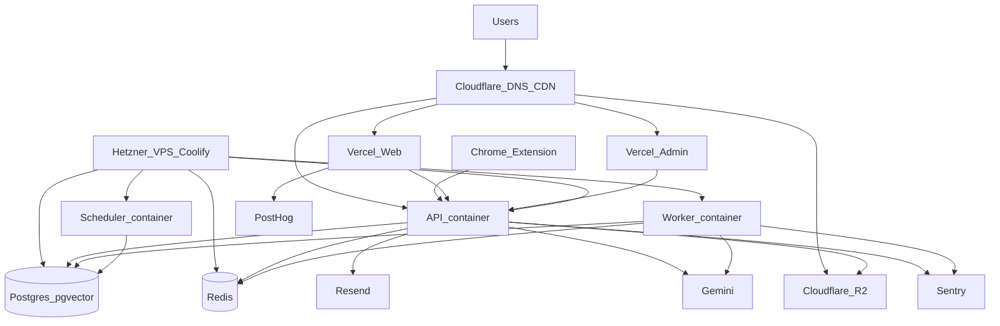

# 14A — Infrastructure Architecture

Canonical MVP layout for CardOrbit. See [14_DEPLOYMENT_STRATEGY.md](14_DEPLOYMENT_STRATEGY.md).

---

## High-level diagram

---

## Domains (example)

| Hostname | Target |
|----------|--------|
| `app.example.com` | Vercel — consumer web |
| `admin.example.com` | Vercel — admin CMS |
| `api.example.com` | Coolify proxy → `api:3000` |
| `assets.example.com` | R2 custom domain (public reads) |

Proxy only the API on the VPS. Postgres and Redis stay on the Docker `internal` network.

---

## VPS sizing (Phase 1)

| Workload | Suggested starting point |
|----------|--------------------------|
| Solo / early beta | Hetzner **CX22** or **CPX21** (3–4 vCPU, 4–8 GB RAM) |
| Disk | ≥ 40 GB SSD (images + Postgres) |
| OS | Ubuntu 24.04 LTS |
| Region | Prefer EU/near-India latency trade-off; Falkenstein/Helsinki common |

Tune Redis `--maxmemory` in compose if RAM is tight (default 256mb in production compose).

---

## Networks

- **Public:** Cloudflare → Coolify Traefik/Caddy → API  
- **Private Docker bridge:** `api`, `worker`, `scheduler`, `postgres`, `redis`  
- **Outbound:** Gemini, Resend, Google OAuth, PostHog, Sentry, R2  

---

## Data stores

| Store | Phase 1 | Later |
|-------|---------|--------|
| PostgreSQL 16 + pgvector | Container volume `postgres_data` | Managed Postgres ([14H](14H_SCALING_STRATEGY.md)) |
| Redis 7 | Container volume `redis_data` | Managed Redis |
| Uploads / assets | Cloudflare R2 | Same |
| DB backups | Nightly `pg_dump` → R2 | Same + restore drills |

---

## Process responsibilities

| Process | Responsibility |
|---------|----------------|
| **API** | HTTP, auth, enqueue jobs, health |
| **Worker** | BullMQ: Gmail sync, catalog AI, crawl, embeddings |
| **Scheduler** | Cron: reward-expiry scan, notifications sync CLIs |
| **Migrate one-shot** | `prisma migrate deploy` on release |

BullMQ stays in the **worker** only — never inside the API process.
