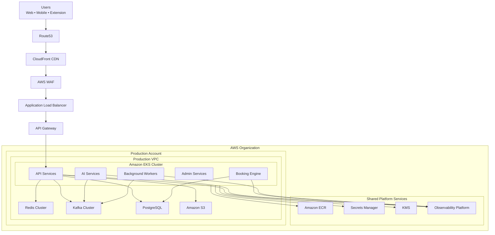
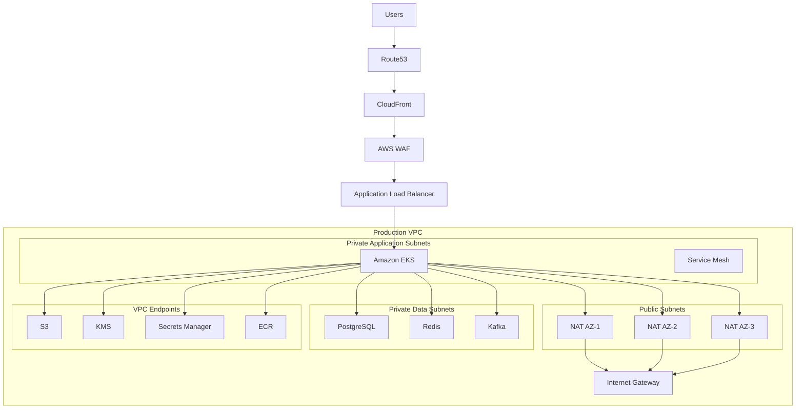
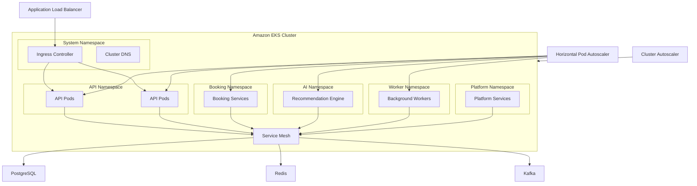
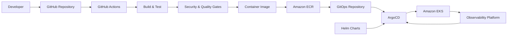
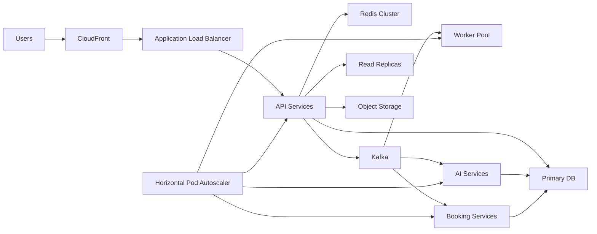
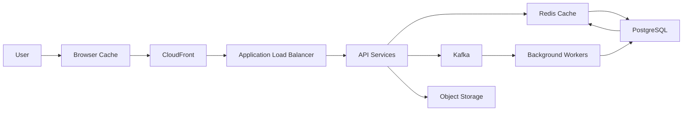
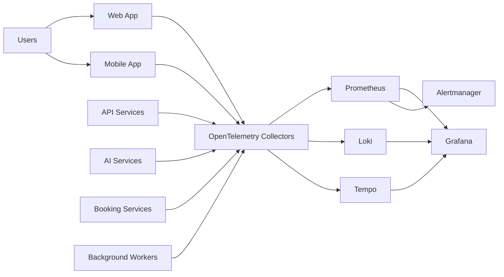
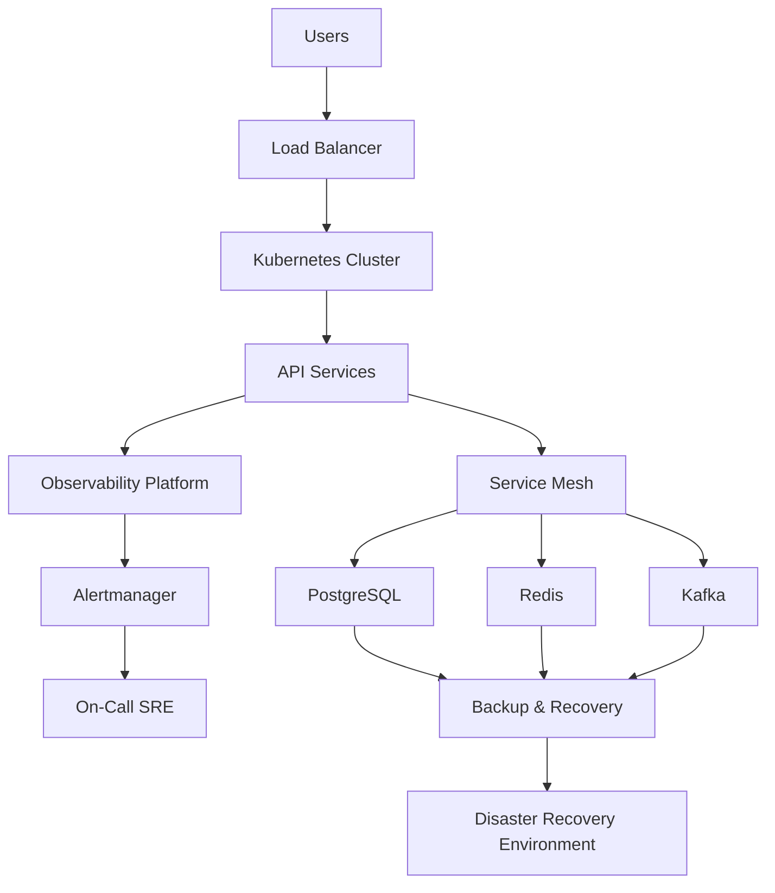
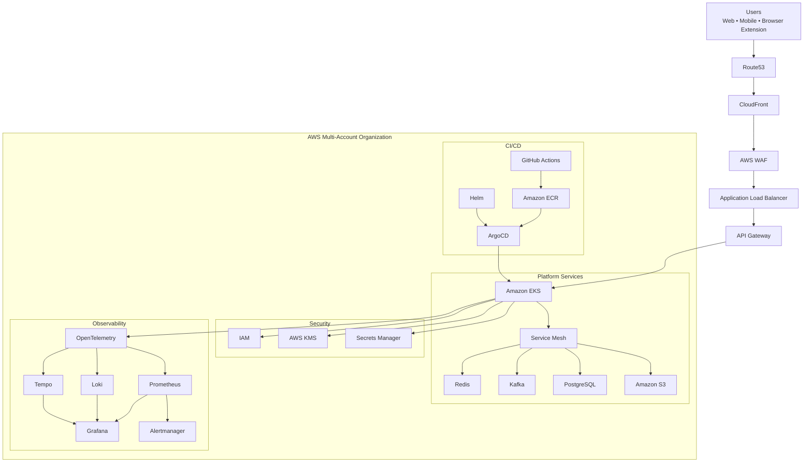

# docs/14_SCALABILITY_AND_DEVOPS.md

> **MVP launch path:** For the current production deployment (Hetzner + Coolify + Vercel + R2), use **[`14_DEPLOYMENT_STRATEGY.md`](14_DEPLOYMENT_STRATEGY.md)** and the `14A`–`14J` companions. This file retains the longer-term enterprise AWS/EKS vision and is **not** the day-1 runbook.

# Part 1 — Infrastructure Vision, Cloud Strategy & High-Level Architecture

---

# 1. Introduction

## Purpose

This document defines the production-grade infrastructure architecture for the CardWise platform.

While previous documents describe application architecture, business capabilities, backend services, AI systems, browser extension, mobile application, booking engine, and security controls, this document focuses exclusively on the operational platform required to run CardWise reliably at enterprise scale.

It establishes the engineering standards for:

- Cloud Infrastructure
- Platform Engineering
- Kubernetes
- DevOps
- Site Reliability Engineering (SRE)
- Networking
- Observability
- Scalability
- Disaster Recovery
- Platform Security
- Operational Excellence
- Cost Optimization

The objective is to ensure that CardWise can scale from an initial launch serving thousands of users to a globally distributed financial platform supporting tens of millions of users without requiring architectural rewrites.

---

# 2. Infrastructure Vision

## INFRA-001 — Platform Vision

CardWise infrastructure is designed around five long-term objectives:

| Objective | Description |
|------------|-------------|
| High Availability | Platform remains operational despite infrastructure failures |
| Horizontal Scalability | Every service scales independently |
| Security by Default | Zero Trust infrastructure with defense-in-depth |
| Operational Simplicity | Automated deployments and self-healing infrastructure |
| Cost Efficiency | Scale resources according to demand while minimizing waste |

Infrastructure should become an invisible platform enabling engineering teams to ship features rapidly without worrying about servers, deployments, networking, or infrastructure management.

---

## INFRA-002 — Infrastructure Design Goals

| Goal | Description |
|--------|-------------|
| 99.95%+ Platform Availability | Across all production services |
| Zero Downtime Deployments | Progressive delivery pipelines |
| Multi-AZ Resilience | AZ failures should not impact customers |
| Multi-Region Ready | Future expansion without redesign |
| Automated Recovery | Self-healing wherever possible |
| Immutable Infrastructure | Infrastructure changes through automation only |
| GitOps Driven | Entire infrastructure managed declaratively |
| Secure by Design | Security integrated into every layer |

---

## INFRA-003 — Infrastructure Characteristics

The platform is intentionally designed to be:

- Stateless wherever possible
- Container-native
- Kubernetes-first
- Cloud-native
- Event-driven
- API-centric
- Elastic
- Fault tolerant
- Observable
- Self-healing

---

# 3. Cloud Strategy

## INFRA-004 — Why AWS

CardWise adopts Amazon Web Services (AWS) as the primary cloud platform due to its maturity, global presence, managed services, compliance capabilities, and ecosystem.

The chosen services align closely with the scalability and reliability goals of a financial technology platform.

| Capability | AWS Service |
|------------|-------------|
| DNS | Route53 |
| CDN | CloudFront |
| Load Balancing | ALB |
| API Edge | API Gateway |
| Object Storage | S3 |
| Compute | Kubernetes (EKS) |
| Container Registry | Amazon ECR |
| Secrets | Secrets Manager |
| Encryption | KMS |
| IAM | AWS IAM |
| Monitoring | CloudWatch (supplementary) |
| Networking | VPC |

---

## INFRA-005 — Cloud Adoption Principles

| Principle | Description |
|-----------|-------------|
| Managed First | Prefer managed AWS services over self-hosting where operational burden is reduced |
| Elastic Infrastructure | Resources scale dynamically based on demand |
| Infrastructure as Product | Platform engineering owns reusable infrastructure capabilities |
| GitOps | Infrastructure changes flow through version control and approval |
| Security Everywhere | Identity, encryption, audit logging, and least privilege are enforced at every layer |
| Observability Native | Metrics, logs, traces, and events are built into the platform by default |

---

## Engineering Rationale

Choosing managed services allows engineering effort to remain focused on CardWise product differentiation rather than undifferentiated infrastructure management.

Examples include:

- Managed DNS
- Managed certificates
- Managed load balancing
- Managed object storage
- Managed identity

Stateful services that require specialized tuning (PostgreSQL, Redis, Kafka) remain architecturally independent and are discussed in later sections.

---

## Trade-offs

| Decision | Benefit | Trade-off |
|-----------|----------|-----------|
| AWS-first | Mature ecosystem | Vendor dependency |
| Managed services | Reduced operations | Higher service costs |
| Kubernetes | Consistent deployment model | Operational complexity |
| GitOps | Auditability | Learning curve |

---

# 4. AWS Architecture Overview

## INFRA-006 — Logical AWS Architecture

The production platform is organized into multiple logical layers.

| Layer | Responsibility |
|---------|---------------|
| Edge Layer | DNS, CDN, WAF |
| Traffic Layer | Load balancing |
| Compute Layer | Kubernetes workloads |
| Platform Layer | Messaging, caching |
| Data Layer | PostgreSQL, Redis |
| Storage Layer | S3 |
| Security Layer | IAM, KMS, Secrets |
| Observability Layer | Metrics, logs, tracing |

---

## AWS Service Responsibilities

| AWS Service | Responsibility |
|-------------|---------------|
| Route53 | Global DNS |
| CloudFront | Edge caching |
| AWS WAF | Layer 7 protection |
| ALB | HTTP routing |
| API Gateway | Public APIs where applicable |
| EKS | Application workloads |
| ECR | Container registry |
| S3 | Static assets, backups |
| IAM | Identity |
| KMS | Encryption keys |
| Secrets Manager | Secret storage |

---

# 5. Multi-Account Strategy

## INFRA-007 — Organizational Structure

Infrastructure follows a multi-account AWS strategy.

This reduces blast radius while improving governance.

| AWS Account | Purpose |
|--------------|----------|
| Organization Management | Billing and governance |
| Security | Security tooling |
| Shared Services | Networking, CI/CD, observability |
| Development | Developer workloads |
| Staging | Pre-production |
| Production | Customer workloads |
| Disaster Recovery | Standby infrastructure |
| Sandbox | Experimental workloads |

---

## Benefits

- Better security isolation
- Separate IAM policies
- Independent billing
- Reduced operational risk
- Controlled deployments
- Easier compliance audits

---

## INFRA-008 — Environment Separation

| Environment | Purpose |
|-------------|----------|
| Local | Individual developer machines |
| Dev | Active development |
| QA | Integration testing |
| Staging | Production validation |
| Production | Customer traffic |
| DR | Disaster recovery region |

Each environment has isolated:

- Kubernetes clusters
- Databases
- Secrets
- IAM Roles
- Networking
- Monitoring

---

## Best Practices

- No production access from development accounts.
- Separate encryption keys for each environment.
- Environment-specific secrets.
- Independent audit logging.
- Strict IAM boundaries.
- Controlled cross-account access using IAM roles.

---

# 6. High-Level Infrastructure Architecture

## INFRA-009 — Platform Layers

The infrastructure is divided into independent operational domains.

| Domain | Responsibility |
|----------|---------------|
| Edge Platform | User entry point |
| Networking Platform | Traffic routing |
| Compute Platform | Kubernetes |
| Platform Services | Kafka, Redis |
| Data Platform | PostgreSQL |
| Storage Platform | S3 |
| Security Platform | IAM, KMS |
| Observability Platform | Metrics, Logs, Traces |

---

## High-Level Request Flow

1. User accesses CardWise.
2. Route53 resolves DNS.
3. CloudFront serves cached assets where possible.
4. WAF filters malicious traffic.
5. ALB routes requests.
6. API Gateway handles edge APIs (where applicable).
7. Kubernetes services process business logic.
8. Redis provides cache lookups.
9. Kafka handles asynchronous workloads.
10. PostgreSQL persists transactional data.
11. OpenTelemetry exports telemetry.
12. Prometheus, Loki, and Tempo ingest operational data.
13. Grafana visualizes platform health.

---

## INFRA-010 — Platform Components

| Component | Purpose |
|------------|----------|
| Route53 | DNS |
| CloudFront | CDN |
| WAF | Security |
| ALB | Traffic distribution |
| API Gateway | Edge APIs |
| EKS | Compute |
| Kafka | Event streaming |
| Redis | Caching |
| PostgreSQL | Persistent data |
| S3 | Storage |
| Grafana Stack | Observability |

---

# 7. Core Infrastructure Principles

## INFRA-011 — Principle Matrix

| Principle | Description |
|------------|-------------|
| Everything Automated | Manual operations minimized |
| Immutable Deployments | Replace rather than modify |
| GitOps | Desired state stored in Git |
| Stateless Services | Easier scaling |
| Self-Healing | Automated recovery |
| Defense in Depth | Layered security |
| Observability First | Every component measurable |
| Elastic Capacity | Scale based on demand |
| Fail Fast | Detect failures quickly |
| Least Privilege | Minimum permissions required |

---

## Engineering Rationale

These principles reduce operational complexity while improving deployment confidence and platform resilience.

They also create consistency across engineering teams, allowing predictable operational behavior regardless of service ownership.

---

## Operational Considerations

| Area | Consideration |
|------|---------------|
| Deployments | Fully automated |
| Scaling | Event-driven and metrics-driven |
| Secrets | Centralized management |
| Monitoring | Unified dashboards |
| Logging | Structured and centralized |
| Incident Response | Standardized procedures |
| Disaster Recovery | Planned and regularly tested |

---

# 8. Scalability Philosophy

## SCALE-001 — Horizontal First

CardWise prioritizes horizontal scaling over vertical scaling.

Every service is expected to scale independently based on demand.

Examples include:

- API services
- Recommendation engine
- Booking services
- Notification platform
- AI inference services
- Search services

---

## SCALE-002 — Independent Scaling Domains

| Domain | Scaling Trigger |
|----------|----------------|
| API | CPU, Requests |
| AI | Queue length, GPU utilization |
| Kafka Consumers | Lag |
| Redis | Memory |
| PostgreSQL Read Replicas | Read throughput |
| Booking Engine | Concurrent bookings |
| Search | Query rate |

---

## SCALE-003 — Stateless Compute

Application services should never store user session state locally.

State is externalized into:

- Redis
- PostgreSQL
- Kafka
- Object Storage

This enables:

- Rolling deployments
- Fast recovery
- Autoscaling
- Node replacement
- Regional failover

---

## SCALE-004 — Failure Isolation

Infrastructure is intentionally partitioned to prevent cascading failures.

Isolation exists across:

- Accounts
- Regions
- Availability Zones
- Kubernetes namespaces
- Node pools
- Databases
- Caches
- Message queues

---

## Best Practices

| Practice | Benefit |
|-----------|----------|
| Independent service scaling | Efficient resource usage |
| Autoscaling | Cost optimization |
| Externalized state | High availability |
| Event-driven communication | Loose coupling |
| Queue-based processing | Load smoothing |
| Progressive deployments | Reduced deployment risk |

---

## Risks

| Risk | Mitigation |
|------|------------|
| Regional outage | Multi-region architecture (future phases) |
| Kubernetes control plane issues | Managed EKS with multi-AZ control plane |
| Cache failures | Graceful degradation and fallback strategies |
| Database bottlenecks | Read replicas, connection pooling, partitioning |
| Traffic spikes | Horizontal autoscaling and CDN offloading |
| Configuration drift | GitOps and immutable deployments |

---

# 9. Architecture Decision Records (ADRs)

| ADR ID | Decision | Status |
|---------|----------|--------|
| ADR-INFRA-001 | AWS as primary cloud provider | Accepted |
| ADR-INFRA-002 | Kubernetes-first deployment model | Accepted |
| ADR-INFRA-003 | Multi-account AWS organization | Accepted |
| ADR-INFRA-004 | GitOps for infrastructure deployment | Accepted |
| ADR-INFRA-005 | Horizontal-first scalability strategy | Accepted |
| ADR-INFRA-006 | Managed edge services (Route53, CloudFront, ALB, WAF) | Accepted |
| ADR-INFRA-007 | Stateless application architecture | Accepted |

---

# 10. High-Level Infrastructure Diagram

---

# Part 1 Summary

This section establishes the foundational infrastructure strategy for CardWise by defining:

- Enterprise infrastructure vision
- AWS-first cloud strategy
- Multi-account organization
- High-level platform architecture
- Infrastructure design principles
- Horizontal scalability philosophy
- Foundational architectural decisions

Subsequent sections build upon these principles to detail networking, Kubernetes, deployment pipelines, observability, reliability engineering, DevSecOps, cost optimization, and future platform evolution.

# Part 2 — Cloud Networking Architecture

---

# 11. Cloud Networking Overview

The CardWise networking architecture is designed around the principles of isolation, least privilege, high availability, low latency, and defense in depth.

Networking must satisfy the following requirements:

- Secure internet-facing endpoints
- Private east-west service communication
- Multi-AZ resiliency
- Future multi-region expansion
- Zero Trust networking
- High-performance routing
- Minimal public exposure
- Predictable traffic flow
- Fault isolation
- Operational simplicity

Unlike application architecture, the networking layer provides the secure transport foundation upon which every backend, AI, booking, recommendation, and administration service operates.

---

# NET-001 — Networking Goals

| Goal | Description |
|------|-------------|
| High Availability | Survive Availability Zone failures |
| Low Latency | Minimize network hops |
| Security | Default deny with explicit allow rules |
| Scalability | Support millions of concurrent connections |
| Isolation | Separate workloads by trust boundary |
| Observability | Full network visibility |
| Future Proofing | Multi-region ready architecture |

---

# Engineering Rationale

A flat VPC becomes increasingly difficult to secure and operate as services grow. CardWise adopts segmented networking with layered ingress, private compute, isolated data stores, and controlled east-west traffic to reduce blast radius while simplifying governance.

---

# 12. AWS Network Topology

## NET-002 — Regional Network Design

Each production region contains an independent networking stack.

Every region includes:

- Dedicated VPC
- Multiple Availability Zones
- Public subnets
- Private application subnets
- Private data subnets
- Management subnets
- NAT Gateways
- Internet Gateway
- VPC Endpoints

---

## Regional Layout

| Component | Quantity |
|-----------|----------|
| Region | 1 (expandable) |
| Availability Zones | 3 |
| Public Subnets | 3 |
| Private Application Subnets | 3 |
| Private Data Subnets | 3 |
| Management Subnets | 3 |
| NAT Gateways | 3 |
| Internet Gateway | 1 |

---

## Best Practices

- One subnet per AZ for each workload type.
- Never place databases in public subnets.
- Avoid single-AZ dependencies.
- Use route tables specific to subnet purpose.
- Keep ingress centralized.

---

## Risks

| Risk | Mitigation |
|------|------------|
| AZ outage | Multi-AZ deployment |
| Routing misconfiguration | Infrastructure reviews and GitOps |
| IP exhaustion | CIDR planning with growth margin |

---

# 13. Virtual Private Cloud (VPC)

## NET-003 — VPC Design

Each environment (Development, QA, Staging, Production, DR) owns an independent VPC.

No workload shares a VPC across environments.

---

## VPC Objectives

| Objective | Description |
|-----------|-------------|
| Isolation | Environment separation |
| Security | Private communication |
| Scalability | Large address space |
| Fault Containment | Environment-specific failures |

---

## Recommended Logical Segmentation

| Subnet Tier | Internet Accessible | Primary Workloads |
|-------------|--------------------|-------------------|
| Public | Yes | ALB, NAT Gateway |
| Private Application | No | Kubernetes worker nodes |
| Private Data | No | PostgreSQL, Redis, Kafka |
| Private Management | No | Bastion (if required), platform tooling |

---

## Engineering Rationale

Application workloads require outbound internet access for updates and managed service communication but should never be directly reachable from the internet. Public exposure is limited to controlled ingress points.

---

# NET-004 — CIDR Allocation Strategy

| Network | Purpose |
|----------|---------|
| VPC CIDR | Entire environment |
| Public CIDR | Internet-facing resources |
| Private App CIDR | Kubernetes workloads |
| Private Data CIDR | Databases and caches |
| Management CIDR | Platform administration |

CIDR allocation should reserve sufficient address space for long-term horizontal scaling and future node pool expansion.

---

# 14. Subnet Architecture

## NET-005 — Public Subnets

Public subnets contain only infrastructure that must terminate internet traffic.

Allowed resources:

- Application Load Balancer
- NAT Gateway
- Internet Gateway attachment
- Public-facing network interfaces

Disallowed resources:

- Databases
- Redis
- Kafka
- Kubernetes worker nodes
- Internal services

---

## NET-006 — Private Application Subnets

Primary workloads:

- Kubernetes worker nodes
- Service mesh
- API services
- AI services
- Booking services
- Background workers

Characteristics:

- No inbound internet traffic
- Outbound via NAT Gateway
- Internal DNS only
- Security group restricted

---

## NET-007 — Private Data Subnets

Only stateful infrastructure resides here.

Examples:

- PostgreSQL
- Redis
- Kafka
- Internal storage gateways

Characteristics:

- No internet routing
- Application-only access
- Strict security groups
- Restricted ports

---

## Operational Considerations

| Area | Recommendation |
|------|----------------|
| Routing | Keep subnet-specific route tables |
| Security Groups | Least privilege |
| NACLs | Coarse-grained network boundaries |
| Growth | Reserve spare IP capacity |

---

# 15. Internet Connectivity

## NET-008 — Internet Gateway

The Internet Gateway provides controlled ingress and egress for public resources.

Responsibilities:

- Internet connectivity
- ALB accessibility
- NAT Gateway egress
- Route propagation

Only public subnets route directly through the Internet Gateway.

---

## NET-009 — NAT Gateway Strategy

Private workloads require outbound connectivity without exposing inbound attack surfaces.

Each Availability Zone receives a dedicated NAT Gateway.

Benefits:

- AZ independence
- Reduced cross-AZ traffic
- Higher resilience
- Predictable routing

---

## Trade-offs

| Option | Benefit | Trade-off |
|---------|----------|-----------|
| Single NAT | Lower cost | Single point of failure |
| NAT per AZ | High availability | Increased operational cost |

CardWise prioritizes resilience over minimal infrastructure cost.

---

# 16. DNS Architecture

## NET-010 — Route53 Strategy

Route53 is the authoritative DNS provider for CardWise.

Responsibilities:

- Public DNS
- Health-based routing
- Weighted routing
- Latency routing
- Future failover routing
- Domain management

---

## DNS Hierarchy

| Domain | Purpose |
|---------|----------|
| cardwise.com | Customer-facing application |
| api.cardwise.com | Public APIs |
| admin.cardwise.com | Administration portal |
| static.cardwise.com | CDN assets |
| assets.cardwise.com | Static resources |

Additional internal DNS zones may be used for service discovery where appropriate.

---

## Best Practices

- Enable DNS health checks.
- Keep low TTL during migrations.
- Separate public and internal zones.
- Automate certificate validation.

---

# 17. CloudFront Architecture

## NET-011 — CDN Strategy

CloudFront acts as the global edge network.

Primary responsibilities:

- Static asset caching
- Image delivery
- API acceleration (selected endpoints)
- TLS termination
- Compression
- Edge security integration

---

## Cached Assets

| Asset Type | Cache Strategy |
|-------------|----------------|
| JavaScript | Long-lived immutable |
| CSS | Long-lived immutable |
| Images | Aggressive caching |
| Fonts | Long-lived |
| Static documents | Configurable |
| API responses | Selective |

---

## Benefits

- Reduced latency
- Lower origin load
- Reduced bandwidth cost
- Better global performance
- Improved resilience during traffic spikes

---

## Risks

| Risk | Mitigation |
|------|------------|
| Stale content | Controlled cache invalidation |
| Cache fragmentation | Consistent cache keys |
| Over-caching | Appropriate TTL policies |

---

# 18. Load Balancing Architecture

## NET-012 — Application Load Balancer

The Application Load Balancer is the primary ingress layer for HTTP(S) traffic.

Responsibilities:

- TLS termination
- Host-based routing
- Path routing
- Health checks
- Sticky session avoidance
- Request forwarding

---

## Routing Strategy

| Request | Destination |
|----------|-------------|
| Web application | Frontend services |
| API | Backend services |
| Admin | Admin platform |
| Internal APIs | Internal gateways where applicable |

---

## Engineering Rationale

Layer 7 routing enables flexible service evolution without changing public endpoints and supports progressive delivery strategies covered in Part 4.

---

# 19. Private Networking

## NET-013 — East-West Communication

Service-to-service communication remains entirely private.

Characteristics:

- Internal DNS
- Service mesh routing
- Mutual TLS
- Network policies
- Identity-based authorization

No internal service is directly exposed to the internet.

---

## Communication Matrix

| Source | Destination | Allowed |
|---------|-------------|---------|
| API | Redis | Yes |
| API | PostgreSQL | Yes |
| API | Kafka | Yes |
| Booking | Kafka | Yes |
| AI | Kafka | Yes |
| Browser Clients | Redis | No |
| Internet | PostgreSQL | No |

---

## Operational Considerations

- Minimize lateral movement.
- Enforce encrypted east-west traffic.
- Monitor internal network latency.
- Continuously review network policies.

---

# 20. VPC Endpoints

## NET-014 — Private AWS Service Access

AWS service communication should use VPC Endpoints wherever possible.

Typical integrations include:

- S3
- ECR
- Secrets Manager
- KMS
- CloudWatch

Benefits:

- No public internet traversal
- Reduced NAT utilization
- Improved security posture
- Lower data transfer costs

---

# 21. Networking Principles

| Principle | Description |
|-----------|-------------|
| Internet exposure is minimized | Only approved ingress points are public |
| Compute remains private | Kubernetes nodes are never internet-facing |
| Data remains isolated | Stateful systems use dedicated private subnets |
| Traffic is encrypted | TLS externally and mTLS internally |
| Multi-AZ by default | Network survives AZ failures |
| Least privilege | Explicit allow rules only |
| Observability first | Network metrics and flow logs enabled |

---

# 22. Architecture Decision Records (ADRs)

| ADR ID | Decision | Status |
|---------|----------|--------|
| ADR-NET-001 | Dedicated VPC per environment | Accepted |
| ADR-NET-002 | Three Availability Zones | Accepted |
| ADR-NET-003 | Public/private subnet segmentation | Accepted |
| ADR-NET-004 | Route53 as authoritative DNS | Accepted |
| ADR-NET-005 | CloudFront for global edge delivery | Accepted |
| ADR-NET-006 | ALB as primary ingress | Accepted |
| ADR-NET-007 | NAT Gateway per AZ | Accepted |
| ADR-NET-008 | Private east-west communication | Accepted |
| ADR-NET-009 | VPC Endpoints for AWS services | Accepted |

---

# 23. High-Level Cloud Networking Diagram

---

# Part 2 Summary

This section defines the cloud networking foundation for CardWise, including VPC segmentation, subnet architecture, DNS, CDN, load balancing, private networking, internet egress, and secure service connectivity. These networking principles provide the resilient, low-latency, and secure transport layer upon which the Kubernetes platform and deployment architecture in the next section will operate.

# Part 3 — Kubernetes Platform Architecture

---

# 24. Kubernetes Platform Overview

CardWise adopts **Amazon Elastic Kubernetes Service (EKS)** as the unified container orchestration platform for all production workloads.

The Kubernetes platform provides:

- Unified deployment model
- Automatic scheduling
- Self-healing
- Horizontal scalability
- Rolling upgrades
- Resource isolation
- Service discovery
- High availability
- Progressive delivery
- Platform standardization

Rather than managing virtual machines individually, engineering teams deploy containerized workloads while the platform automatically handles scheduling, scaling, failover, and lifecycle management.

---

# K8S-001 — Platform Objectives

| Objective | Description |
|-----------|-------------|
| High Availability | No single node failure impacts service availability |
| Elastic Compute | Scale workloads dynamically |
| Workload Isolation | Separate production domains |
| Operational Consistency | Common deployment platform for all services |
| Security | Namespace, RBAC, and network isolation |
| Reliability | Automatic recovery from failures |
| Portability | Cloud-native deployment model |
| Automation | Minimal manual operational tasks |

---

## Engineering Rationale

A standardized Kubernetes platform reduces operational fragmentation by providing a consistent runtime for backend services, AI inference, booking workloads, background jobs, and platform tooling. This enables shared deployment practices, observability, security controls, and automation across the engineering organization.

---

# 25. Cluster Strategy

## K8S-002 — Cluster Architecture

CardWise follows a **cluster-per-environment** strategy.

| Environment | Cluster |
|------------|---------|
| Development | Dedicated EKS Cluster |
| QA | Dedicated EKS Cluster |
| Staging | Dedicated EKS Cluster |
| Production | Dedicated EKS Cluster |
| Disaster Recovery | Dedicated EKS Cluster |

Clusters are completely isolated.

They do **not** share:

- Worker nodes
- Secrets
- Network policies
- IAM roles
- Service accounts
- Persistent storage

---

## Benefits

- Strong isolation
- Independent upgrades
- Reduced blast radius
- Environment-specific scaling
- Simplified compliance

---

## Trade-offs

| Decision | Benefit | Trade-off |
|----------|----------|-----------|
| Cluster per environment | Isolation | Higher infrastructure cost |
| Shared cluster | Lower cost | Increased operational complexity |

CardWise prioritizes operational isolation over minimizing infrastructure footprint.

---

# K8S-003 — Production Cluster Characteristics

| Property | Target |
|-----------|--------|
| Highly Available | Yes |
| Multi-AZ | Yes |
| Private Worker Nodes | Yes |
| Managed Control Plane | Yes |
| GitOps Managed | Yes |
| Auto Scaling | Yes |
| Service Mesh Enabled | Yes |
| OpenTelemetry Enabled | Yes |

---

# 26. Cluster Components

## K8S-004 — Control Plane

The Kubernetes control plane is managed by Amazon EKS.

Responsibilities include:

- API server
- Scheduler
- Controller manager
- Cluster state
- Authentication
- Admission control

The managed control plane removes operational burden while providing automatic upgrades and multi-AZ resilience.

---

## K8S-005 — Worker Nodes

Worker nodes execute application workloads.

Responsibilities:

- Run containers
- Resource management
- Local networking
- Volume mounting
- Pod lifecycle
- Health monitoring

Worker nodes remain entirely private and are deployed across multiple Availability Zones.

---

# 27. Node Pool Architecture

## K8S-006 — Dedicated Node Pools

Node pools are organized by workload characteristics.

| Node Pool | Primary Workloads |
|-----------|-------------------|
| System | Core Kubernetes components |
| API | Backend services |
| AI | Recommendation and inference services |
| Booking | Booking engine workloads |
| Workers | Background processing |
| Kafka Clients | High-throughput consumers |
| Batch | Scheduled and ad-hoc jobs |
| Platform | Observability and platform tooling |

---

## Engineering Rationale

Separating workloads into node pools prevents resource contention and enables workload-specific scaling, scheduling, and maintenance windows.

---

## K8S-007 — Node Pool Characteristics

| Node Pool | CPU Optimized | Memory Optimized | Autoscaled |
|-----------|---------------|------------------|------------|
| System | No | No | Limited |
| API | Yes | Moderate | Yes |
| AI | High Compute | High Memory | Yes |
| Booking | Balanced | Balanced | Yes |
| Workers | CPU Intensive | Moderate | Yes |
| Platform | Balanced | Balanced | Yes |

---

## Operational Considerations

- Reserve capacity for critical platform components.
- Avoid mixing latency-sensitive and batch workloads.
- Isolate experimental workloads from production services.
- Regularly review node utilization.

---

# 28. Namespace Strategy

## K8S-008 — Namespace Organization

Namespaces provide logical isolation inside each cluster.

| Namespace | Purpose |
|-----------|---------|
| ingress | Ingress controllers |
| platform | Platform services |
| api | Backend APIs |
| booking | Booking engine |
| ai | Recommendation engine |
| worker | Background jobs |
| admin | Administration services |
| observability | Metrics, logs, tracing |
| security | Security tooling |
| shared | Common infrastructure services |

---

## Benefits

- Resource isolation
- RBAC separation
- Independent quotas
- Simplified monitoring
- Controlled deployments

---

## Best Practices

- One business domain per namespace.
- Apply namespace-level quotas.
- Restrict cross-namespace permissions.
- Standardize labels and annotations.

---

# 29. Resource Management

## K8S-009 — Resource Allocation

Every workload defines explicit resource boundaries.

| Resource | Requirement |
|-----------|-------------|
| CPU Request | Mandatory |
| CPU Limit | Mandatory |
| Memory Request | Mandatory |
| Memory Limit | Mandatory |
| Ephemeral Storage | Defined where applicable |

---

## Benefits

- Predictable scheduling
- Fair resource sharing
- Stable autoscaling
- Reduced noisy-neighbor impact

---

## Risks

| Risk | Mitigation |
|------|------------|
| Resource starvation | Requests and limits |
| Over-provisioning | Capacity reviews |
| Under-sizing | Performance testing |

---

# 30. Scheduling Strategy

## K8S-010 — Intelligent Scheduling

The scheduler places workloads according to:

- Resource availability
- Node affinity
- Anti-affinity
- Availability Zone distribution
- Taints and tolerations
- Topology spread constraints

---

## Scheduling Principles

| Principle | Purpose |
|-----------|---------|
| Even Distribution | Reduce AZ concentration |
| Workload Isolation | Separate incompatible services |
| High Availability | Avoid single-node dependency |
| Specialized Hardware | AI workloads on dedicated nodes |

---

## Engineering Rationale

Scheduling policies ensure that critical services remain available even during infrastructure failures while maximizing cluster utilization.

---

# 31. Autoscaling Strategy

## K8S-011 — Horizontal Pod Autoscaling

Application services scale horizontally based on workload demand.

Potential scaling signals include:

- CPU utilization
- Memory utilization
- Request rate
- Queue length
- Kafka consumer lag
- Custom business metrics

---

## K8S-012 — Cluster Autoscaling

Worker node capacity expands automatically when scheduling demand exceeds available resources.

Objectives:

- Minimize idle infrastructure
- Prevent scheduling failures
- Support rapid traffic growth

---

## Scaling Matrix

| Workload | Scaling Trigger |
|-----------|----------------|
| API | CPU / Request rate |
| AI | Queue depth / Inference latency |
| Booking | Active booking requests |
| Workers | Queue backlog |
| Kafka Consumers | Consumer lag |
| Platform Services | Resource utilization |

---

## Trade-offs

| Strategy | Benefit | Trade-off |
|----------|----------|-----------|
| Aggressive autoscaling | Faster response | Increased infrastructure cost |
| Conservative autoscaling | Lower cost | Higher latency during spikes |

---

# 32. Service Discovery

## K8S-013 — Internal Service Communication

Services communicate using Kubernetes-native service discovery.

Capabilities include:

- Stable service endpoints
- Internal DNS
- Load balancing
- Service abstraction
- Namespace-aware routing

Applications remain decoupled from pod IP addresses, enabling seamless rolling updates and rescheduling.

---

# 33. Service Mesh

## K8S-014 — Service Mesh Objectives

A service mesh provides secure and observable east-west communication.

Core capabilities:

- Mutual TLS
- Traffic management
- Retry policies
- Circuit breaking
- Distributed tracing
- Traffic shifting
- Fine-grained routing
- Policy enforcement

---

## Service Mesh Responsibilities

| Capability | Benefit |
|------------|---------|
| mTLS | Encrypted service communication |
| Traffic Splitting | Progressive delivery |
| Telemetry | Rich observability |
| Retry Logic | Improved resilience |
| Circuit Breaking | Failure containment |
| Authorization | Identity-based access |

---

## Engineering Rationale

Embedding networking behavior within the service mesh reduces application complexity while providing consistent resilience and security policies across all services.

---

# 34. Platform Security

## K8S-015 — Kubernetes Security Principles

| Principle | Description |
|-----------|-------------|
| Least Privilege | Minimal RBAC permissions |
| Namespace Isolation | Domain separation |
| Private Nodes | No direct internet exposure |
| Identity-Based Access | IAM integration |
| Secret Externalization | Secrets Manager integration |
| Admission Policies | Standardized governance |

---

## Operational Considerations

- Rotate service account credentials.
- Regularly audit RBAC permissions.
- Review cluster policy violations.
- Restrict administrative access.
- Enforce workload identity.

---

# 35. High Availability Strategy

## K8S-016 — Resilience Model

The platform tolerates failures at multiple layers.

| Failure | Expected Behavior |
|----------|-------------------|
| Pod Failure | Automatic restart |
| Node Failure | Pod rescheduling |
| AZ Failure | Cross-AZ scheduling |
| Deployment Failure | Rollback handled by deployment strategy |
| Cluster Upgrade | Rolling replacement |

---

## Best Practices

- Avoid single-replica production workloads.
- Distribute replicas across Availability Zones.
- Define health probes for every service.
- Keep workloads stateless.
- Continuously validate failover behavior.

---

# 36. Cluster Governance

## K8S-017 — Governance Standards

| Area | Standard |
|------|----------|
| Naming | Consistent workload naming |
| Labels | Standardized labels |
| Annotations | Platform-defined metadata |
| Resource Quotas | Namespace-specific |
| Policies | Declarative enforcement |
| GitOps | Required for all changes |

---

# 37. Architecture Decision Records (ADRs)

| ADR ID | Decision | Status |
|---------|----------|--------|
| ADR-K8S-001 | Amazon EKS as orchestration platform | Accepted |
| ADR-K8S-002 | Dedicated cluster per environment | Accepted |
| ADR-K8S-003 | Dedicated node pools by workload | Accepted |
| ADR-K8S-004 | Namespace-based workload isolation | Accepted |
| ADR-K8S-005 | Horizontal Pod Autoscaling | Accepted |
| ADR-K8S-006 | Cluster Autoscaling | Accepted |
| ADR-K8S-007 | Service mesh for east-west traffic | Accepted |
| ADR-K8S-008 | Private worker nodes | Accepted |
| ADR-K8S-009 | Managed control plane | Accepted |

---

# 38. Kubernetes Platform Diagram

---

# Part 3 Summary

This section defines the Kubernetes platform architecture for CardWise, covering cluster organization, dedicated node pools, namespace strategy, workload scheduling, autoscaling, service discovery, service mesh integration, governance, and platform resilience. Together with the networking foundation from Part 2, these capabilities provide a secure, highly available, and horizontally scalable runtime environment for all platform services.

# Part 4 — Deployment Architecture, CI/CD & GitOps

---

# 39. Deployment Platform Overview

CardWise adopts a **cloud-native, GitOps-first Continuous Delivery platform** that enables safe, repeatable, auditable, and zero-downtime deployments.

The deployment platform is designed around the following objectives:

- Fully automated software delivery
- Immutable deployments
- Progressive delivery
- Git as the source of truth
- Environment consistency
- Automated rollback
- Security verification
- Reproducible builds
- Deployment observability
- Developer self-service

The deployment platform separates **application delivery** from **infrastructure management**, allowing engineering teams to deploy independently while maintaining operational control.

---

# DEVOPS-001 — Deployment Principles

| Principle | Description |
|-----------|-------------|
| GitOps First | Desired state stored in Git repositories |
| Immutable Artifacts | Images are never modified after build |
| Declarative Deployments | Deployment state defined declaratively |
| Progressive Delivery | Small, observable production rollouts |
| Continuous Verification | Automated validation after deployment |
| Rollback First | Fast, deterministic rollback capability |
| Zero Downtime | Production updates without user disruption |
| Environment Parity | Development closely mirrors production |

---

## Engineering Rationale

Traditional deployment pipelines often rely on imperative scripts, manual interventions, or environment-specific procedures. GitOps eliminates configuration drift by ensuring that every deployment originates from version-controlled desired state, improving reproducibility, auditability, and operational confidence.

---

# 40. Containerization Strategy

## DEVOPS-002 — Docker Standardization

Every deployable backend component is packaged as an OCI-compliant container image.

Containerized workloads include:

- API Services
- Authentication
- Recommendation Engine
- Booking Engine
- Notification Services
- Background Workers
- AI Inference Services
- Scheduled Jobs
- Platform Services

Frontend web assets are built separately and served through CDN infrastructure, while supporting platform services continue to use containerized deployment.

---

## Container Characteristics

| Property | Requirement |
|----------|-------------|
| Immutable | Required |
| Versioned | Required |
| Signed | Required |
| Reproducible | Required |
| Non-root Execution | Required |
| Minimal Base Images | Required |
| SBOM Generated | Required |
| Vulnerability Scanned | Required |

---

## Best Practices

- One application per container.
- Minimize image size.
- Eliminate unused dependencies.
- Avoid runtime package installation.
- Keep startup deterministic.
- Externalize configuration.

---

## Risks

| Risk | Mitigation |
|------|------------|
| Large image size | Minimal runtime images |
| Drift between environments | Immutable image promotion |
| Runtime inconsistencies | Standardized base images |

---

# 41. Image Lifecycle

## DEVOPS-003 — Container Image Flow

Every container progresses through a controlled lifecycle.

| Stage | Purpose |
|--------|----------|
| Build | Compile application |
| Test | Validate functionality |
| Scan | Security verification |
| Sign | Supply chain integrity |
| Publish | Store in registry |
| Promote | Environment progression |
| Deploy | GitOps synchronization |
| Observe | Production validation |

Images are promoted across environments without rebuilding, ensuring binary consistency.

---

## Engineering Rationale

Promoting the exact same artifact across Development, QA, Staging, and Production eliminates differences caused by rebuilding, improving traceability and reducing deployment risk.

---

# 42. Artifact Registry

## DEVOPS-004 — Amazon ECR

Amazon Elastic Container Registry (ECR) serves as the centralized registry for all deployable artifacts.

Responsibilities:

- Image storage
- Version management
- Vulnerability integration
- Access control
- Lifecycle management
- Regional replication (future)

---

## Repository Organization

| Repository Type | Examples |
|-----------------|----------|
| Backend Services | API, Auth, Portfolio |
| AI Services | Recommendation, Scoring |
| Booking | Flights, Hotels |
| Platform | Gateway, Workers |
| Administration | Admin APIs |
| Shared Components | Utility services |

---

## Best Practices

- Immutable tags.
- Semantic versioning.
- Retention policies.
- Image signing.
- Controlled repository permissions.

---

# 43. CI Architecture

## DEVOPS-005 — GitHub Actions

GitHub Actions provides Continuous Integration for all repositories.

Responsibilities include:

- Build automation
- Test execution
- Static analysis
- Dependency verification
- Container image creation
- Security scanning
- Artifact publishing

---

## High-Level CI Pipeline

| Stage | Purpose |
|--------|----------|
| Source Validation | Branch protection and review |
| Dependency Installation | Reproducible build |
| Static Analysis | Code quality |
| Unit Testing | Functional validation |
| Integration Testing | Service validation |
| Security Analysis | Dependency checks |
| Container Build | OCI image generation |
| Image Scan | Vulnerability detection |
| Publish | Push image to ECR |

---

## Best Practices

- Fail fast.
- Cache dependencies.
- Parallelize independent tasks.
- Enforce quality gates.
- Require successful CI before merge.

---

## Trade-offs

| Approach | Benefit | Trade-off |
|----------|----------|-----------|
| Centralized CI | Consistency | Shared platform dependency |
| Repository-specific CI | Flexibility | Governance complexity |

---

# 44. CD Architecture

## DEVOPS-006 — GitOps Deployment

Continuous Delivery is entirely GitOps-driven.

Deployment state is represented declaratively in Git.

ArgoCD continuously reconciles desired state with the Kubernetes cluster.

No manual deployment directly to production is permitted.

---

## Deployment Flow

| Step | Description |
|------|-------------|
| Image Published | New version available |
| Manifest Updated | Desired version committed |
| Git Repository Updated | Source of truth changes |
| ArgoCD Detects Change | Synchronization begins |
| Kubernetes Updated | Rolling deployment |
| Health Verification | Automatic validation |
| Deployment Complete | Desired state reached |

---

## Engineering Rationale

Separating build pipelines from deployment orchestration ensures reproducible deployments, improves auditability, and prevents configuration drift.

---

# 45. GitOps Repository Strategy

## DEVOPS-007 — Repository Separation

Deployment configuration is managed independently from application source code.

| Repository | Responsibility |
|------------|----------------|
| Application | Business logic |
| Infrastructure | Platform configuration |
| Kubernetes Manifests | Desired deployment state |
| Helm Charts | Packaging |
| Shared Platform | Common templates |

---

## Benefits

- Clear ownership
- Independent approvals
- Better auditing
- Easier rollback
- Reduced coupling

---

# 46. Helm Strategy

## DEVOPS-008 — Helm Packaging

Helm standardizes Kubernetes application packaging.

Helm charts define:

- Deployments
- Services
- Ingress
- Configurations
- Resource requirements
- Autoscaling settings

Environment-specific values remain external to maintain reusable application packages.

---

## Best Practices

- Reusable charts.
- Versioned releases.
- Consistent naming.
- Environment overlays.
- Centralized templates.

---

# 47. ArgoCD Platform

## DEVOPS-009 — ArgoCD Responsibilities

ArgoCD continuously synchronizes Kubernetes clusters with Git.

Core capabilities:

- Drift detection
- Automated synchronization
- Rollback support
- Health monitoring
- Deployment history
- Access control

---

## Operational Considerations

- Restrict production sync permissions.
- Monitor synchronization failures.
- Enable audit logging.
- Separate applications by project.
- Protect deployment branches.

---

# 48. Deployment Strategies

## DEVOPS-010 — Progressive Delivery

Different workload types require different deployment approaches.

| Strategy | Primary Usage |
|----------|---------------|
| Rolling Update | Standard backend services |
| Blue-Green | High-risk platform components |
| Canary | Critical customer-facing APIs |
| Shadow Deployment | Experimental AI inference |
| Feature Flags | Business feature rollout |

---

## Rolling Updates

Suitable for:

- API services
- Background workers
- Internal services

Benefits:

- Minimal operational overhead
- Continuous availability
- Predictable rollout

---

## Blue-Green Deployments

Suitable for:

- Platform gateways
- Critical infrastructure services
- Schema-sensitive releases

Benefits:

- Instant rollback
- Full environment validation
- Reduced deployment risk

Trade-off:

- Higher temporary resource usage

---

## Canary Deployments

Suitable for:

- Recommendation Engine
- Pricing APIs
- Booking APIs
- Search services

Traffic is gradually shifted while observing:

- Error rate
- Latency
- Resource utilization
- Business metrics

---

## Feature Flags

Feature flags decouple deployment from feature release.

Advantages:

- Safer experimentation
- Incremental rollout
- Instant disablement
- A/B testing support

---

# 49. Release Promotion

## DEVOPS-011 — Environment Promotion Flow

Production deployments occur only after successful progression through earlier environments.

| Promotion | Requirement |
|-----------|-------------|
| Development → QA | Successful automated testing |
| QA → Staging | Integration validation |
| Staging → Production | Operational approval and production readiness checks |

Images remain identical throughout promotion.

---

## Operational Considerations

- Freeze deployments during major incidents.
- Restrict production releases to approved windows when necessary.
- Monitor deployment metrics in real time.
- Record deployment metadata for auditing.

---

# 50. Rollback Strategy

## DEVOPS-012 — Automated Rollback

Rollback mechanisms include:

- Previous deployment revision
- Git revert
- ArgoCD synchronization
- Blue-Green switchback
- Canary traffic reversal
- Feature flag disablement

---

## Rollback Triggers

| Trigger | Action |
|----------|--------|
| Elevated error rate | Automatic rollback |
| Failed health checks | Stop rollout |
| Latency regression | Pause deployment |
| Availability degradation | Restore previous version |
| Critical business impact | Immediate rollback |

---

## Engineering Rationale

Rollback should be deterministic, rapid, and require minimal manual intervention to reduce Mean Time To Recovery (MTTR).

---

# 51. Deployment Governance

## DEVOPS-013 — Release Controls

| Control | Purpose |
|----------|---------|
| Branch Protection | Prevent unauthorized changes |
| Required Reviews | Engineering oversight |
| CI Quality Gates | Build integrity |
| Signed Artifacts | Supply chain protection |
| GitOps Approval | Controlled production changes |
| Audit Logging | Compliance and traceability |

---

## Best Practices

- Automate repetitive deployment tasks.
- Keep releases small and frequent.
- Avoid manual production changes.
- Validate production health continuously.
- Record every deployment event.

---

# 52. Architecture Decision Records (ADRs)

| ADR ID | Decision | Status |
|---------|----------|--------|
| ADR-DEVOPS-001 | Docker for application packaging | Accepted |
| ADR-DEVOPS-002 | Amazon ECR as artifact registry | Accepted |
| ADR-DEVOPS-003 | GitHub Actions for CI | Accepted |
| ADR-DEVOPS-004 | GitOps deployment model | Accepted |
| ADR-DEVOPS-005 | ArgoCD for Continuous Delivery | Accepted |
| ADR-DEVOPS-006 | Helm for Kubernetes packaging | Accepted |
| ADR-DEVOPS-007 | Progressive delivery by default | Accepted |
| ADR-DEVOPS-008 | Immutable artifact promotion | Accepted |
| ADR-DEVOPS-009 | Automated rollback capability | Accepted |

---

# 53. CI/CD & GitOps Architecture Diagram

---

# Part 4 Summary

This section defines the complete deployment platform for CardWise, including containerization standards, artifact lifecycle, CI pipelines with GitHub Actions, GitOps-based Continuous Delivery using ArgoCD, Helm packaging, progressive delivery strategies, release governance, and automated rollback. Together, these practices provide secure, repeatable, and zero-downtime software delivery while maintaining strong operational control and auditability.

# Part 5 — Scalability Architecture

---

# 54. Scalability Overview

CardWise is designed to scale from an MVP supporting a few thousand users to a global financial platform serving tens of millions of customers.

The scalability strategy is based on several principles:

- Horizontal-first architecture
- Independent service scaling
- Event-driven communication
- Stateless compute
- Distributed caching
- Asynchronous processing
- Database optimization
- Elastic infrastructure
- Multi-AZ resilience
- Future multi-region expansion

Every subsystem must scale independently without requiring platform-wide upgrades.

---

# SCALE-005 — Scalability Objectives

| Objective | Target |
|-----------|--------|
| Horizontal Scaling | Default for all services |
| Zero Downtime Scaling | Required |
| Independent Service Scaling | Required |
| Predictable Performance | Required |
| Elastic Capacity | Required |
| Cost-Aware Scaling | Required |
| Failure Isolation | Required |

---

## Engineering Rationale

Scaling individual services based on workload characteristics avoids over-provisioning the entire platform. The recommendation engine, booking services, notification workers, and APIs experience different traffic patterns and therefore require independent scaling policies.

---

# 55. Horizontal Scaling Strategy

## SCALE-006 — Horizontal-First Philosophy

All stateless workloads scale by increasing replica count rather than increasing instance size.

Applicable workloads include:

- Authentication
- User APIs
- Credit Card APIs
- Offer Services
- Recommendation APIs
- Search APIs
- Booking APIs
- Notification Services
- Background Workers
- Admin Services

---

## Scaling Characteristics

| Layer | Scaling Method |
|--------|----------------|
| API | Horizontal Pods |
| AI | Horizontal Workers |
| Search | Independent Replicas |
| Booking | Independent Services |
| Workers | Queue Consumers |
| CDN | Edge Scaling |
| Kubernetes | Cluster Autoscaler |

---

## Best Practices

- Keep services stateless.
- Externalize session state.
- Avoid node affinity unless necessary.
- Prefer many small replicas over few large instances.
- Continuously review autoscaling thresholds.

---

## Risks

| Risk | Mitigation |
|------|------------|
| Uneven traffic | Load balancing |
| Resource contention | Dedicated node pools |
| Scaling lag | Predictive capacity planning |

---

# 56. API Scalability

## SCALE-007 — API Layer

API services are designed for linear horizontal scaling.

Scaling metrics may include:

- Requests per second
- CPU utilization
- Latency
- Concurrent connections
- Memory usage

---

## API Scaling Flow

1. Traffic increases.
2. Metrics exceed thresholds.
3. Horizontal Pod Autoscaler creates new replicas.
4. Service mesh updates routing.
5. ALB distributes traffic.
6. Load stabilizes.

---

## Engineering Rationale

API services remain stateless, enabling rapid scaling without data synchronization between replicas.

---

# 57. PostgreSQL Scalability

## SCALE-008 — Database Scaling Strategy

PostgreSQL remains the system of record for transactional data.

Scaling focuses on:

- Read optimization
- Write optimization
- Connection efficiency
- Storage growth
- Maintenance operations

---

## Scaling Techniques

| Technique | Purpose |
|-----------|---------|
| Read Replicas | Increase read throughput |
| Connection Pooling | Reduce database overhead |
| Partitioning | Improve query performance |
| Index Optimization | Faster lookups |
| Query Optimization | Lower latency |
| Archival | Reduce active dataset |

---

## Read/Write Separation

| Operation | Target |
|-----------|--------|
| Writes | Primary Database |
| Strongly Consistent Reads | Primary |
| Reporting Reads | Replicas |
| Analytics | Dedicated analytical systems (future) |

---

## Operational Considerations

- Monitor replication lag.
- Schedule maintenance during low-traffic windows.
- Continuously review slow queries.
- Validate backup integrity.

---

## Trade-offs

| Strategy | Benefit | Trade-off |
|----------|----------|-----------|
| Vertical Scaling | Simplicity | Hardware limits |
| Read Replicas | Better read throughput | Replication lag |
| Partitioning | Large dataset efficiency | Operational complexity |

---

# 58. Redis Scalability

## SCALE-009 — Distributed Cache

Redis acts as the primary distributed caching layer.

Primary responsibilities:

- Session storage
- API cache
- Offer cache
- Recommendation cache
- Rate limiting
- Distributed locking
- Temporary state

---

## Scaling Strategy

| Technique | Purpose |
|-----------|---------|
| Sharding | Increased capacity |
| Replication | High availability |
| Autoscaling | Elastic memory utilization |
| Eviction Policies | Memory management |

---

## Best Practices

- Use TTL aggressively.
- Separate cache types logically.
- Avoid oversized keys.
- Monitor eviction rates.
- Keep hot data in memory.

---

## Risks

| Risk | Mitigation |
|------|------------|
| Memory exhaustion | Autoscaling and eviction |
| Cache stampede | Request coalescing and staggered expiration |
| Replica lag | Health monitoring |

---

# 59. Kafka Scalability

## SCALE-010 — Event Streaming Platform

Kafka enables asynchronous communication between platform services.

Examples:

- Transaction processing
- Notifications
- Recommendation updates
- Booking events
- User activity
- Analytics pipelines

---

## Scaling Dimensions

| Component | Scaling Method |
|-----------|----------------|
| Brokers | Add broker nodes |
| Topics | Partitioning |
| Producers | Horizontal scaling |
| Consumers | Consumer groups |
| Storage | Expand persistent volumes |

---

## Consumer Scaling

Consumer groups allow parallel processing.

Examples:

| Consumer Group | Workload |
|---------------|----------|
| Recommendations | AI events |
| Notifications | Push delivery |
| Offers | Offer synchronization |
| Analytics | Event aggregation |
| Booking | Reservation workflows |

---

## Engineering Rationale

Kafka decouples producers from consumers, allowing downstream systems to scale independently without impacting request latency.

---

# 60. AI Platform Scalability

## SCALE-011 — Recommendation Platform

AI services exhibit workload patterns different from standard APIs.

Scaling signals include:

- Queue depth
- Inference latency
- Model loading time
- GPU utilization (future)
- CPU utilization
- Concurrent inference requests

---

## Scaling Strategy

| Component | Scaling Method |
|-----------|----------------|
| Feature Generation | Worker replicas |
| Inference | Independent AI pods |
| Batch Processing | Scheduled workers |
| Real-Time Scoring | API replicas |

---

## Operational Considerations

- Keep models versioned.
- Warm frequently used models.
- Separate batch and online inference.
- Monitor inference latency.

---

# 61. Booking Platform Scalability

## SCALE-012 — Booking Engine

Booking traffic can spike during:

- Flash sales
- Holiday seasons
- Promotional campaigns
- Airline fare changes
- Hotel inventory releases

---

## Scaling Components

| Component | Scaling Strategy |
|-----------|-----------------|
| Search | Horizontal APIs |
| Availability | Independent replicas |
| Pricing | Queue-backed workers |
| Reservation | Transactional services |
| Payment | Dedicated isolated services |

---

## Engineering Rationale

Separating search, pricing, reservation, and payment allows each subsystem to scale according to its workload without creating bottlenecks.

---

# 62. Background Processing

## SCALE-013 — Worker Architecture

Background processing removes long-running operations from synchronous request paths.

Typical workloads include:

- Email delivery
- Offer synchronization
- Statement imports
- Reward calculations
- AI feature generation
- Analytics aggregation
- Notification delivery

---

## Scaling Triggers

| Metric | Action |
|---------|--------|
| Queue Depth | Add workers |
| Processing Time | Increase replicas |
| Consumer Lag | Scale consumers |
| CPU Utilization | Expand worker pool |

---

## Best Practices

- Idempotent job processing.
- Dead-letter queues.
- Retry with backoff.
- Visibility into queue health.

---

# 63. Search Scalability

## SCALE-014 — Search Services

Search workloads include:

- Credit card discovery
- Offer search
- Merchant search
- Booking search
- FAQ search

---

## Scaling Principles

- Independent search services
- Cached popular queries
- Asynchronous indexing
- Incremental updates
- Horizontal query processing

---

# 64. Storage Scalability

## SCALE-015 — Object Storage

Object storage is used for:

- User uploads
- Statement files
- Reports
- AI assets
- Static resources
- Backups

Storage scaling characteristics:

- Virtually unlimited capacity
- Independent lifecycle policies
- Versioning
- Replication readiness

---

# 65. Multi-Dimensional Scaling Matrix

| Platform Component | Primary Scaling Trigger | Scaling Method |
|--------------------|-------------------------|----------------|
| API Services | Request rate | Horizontal Pods |
| Authentication | Concurrent sessions | Horizontal Pods |
| Recommendation Engine | Queue depth | Worker replicas |
| AI Inference | Inference latency | Dedicated AI pods |
| Booking Search | Search traffic | Horizontal APIs |
| Notification Services | Queue backlog | Worker replicas |
| PostgreSQL | Read throughput | Read replicas |
| Redis | Memory utilization | Sharding and replicas |
| Kafka | Consumer lag | Broker expansion and consumer groups |
| CDN | Global traffic | Edge network |
| Kubernetes | Pending workloads | Cluster Autoscaler |

---

# 66. Capacity Planning

## SCALE-016 — Capacity Planning Principles

Capacity planning combines historical trends, business forecasts, and real-time telemetry.

Planning considers:

- Daily traffic
- Weekly patterns
- Seasonal peaks
- Marketing campaigns
- Festival traffic
- Product launches
- Partner onboarding

---

## Operational Considerations

| Area | Recommendation |
|------|----------------|
| Forecasting | Quarterly review |
| Load Testing | Before major releases |
| Autoscaling | Continuously tuned |
| Database Capacity | Monthly assessment |
| Cache Capacity | Monitor hit ratios |
| Kafka | Monitor partition utilization |

---

# 67. Architecture Decision Records (ADRs)

| ADR ID | Decision | Status |
|---------|----------|--------|
| ADR-SCALE-001 | Horizontal-first scaling strategy | Accepted |
| ADR-SCALE-002 | Stateless application services | Accepted |
| ADR-SCALE-003 | PostgreSQL read replicas | Accepted |
| ADR-SCALE-004 | Redis distributed cache | Accepted |
| ADR-SCALE-005 | Kafka event-driven scaling | Accepted |
| ADR-SCALE-006 | Independent AI scaling | Accepted |
| ADR-SCALE-007 | Queue-based background processing | Accepted |
| ADR-SCALE-008 | Separate booking service scaling | Accepted |
| ADR-SCALE-009 | Predictive capacity planning | Accepted |

---

# 68. End-to-End Scalability Architecture

---

# Part 5 Summary

This section defines the scalability architecture for CardWise across compute, APIs, PostgreSQL, Redis, Kafka, AI services, booking workloads, background processing, search, and object storage. By combining horizontal scaling, event-driven processing, intelligent autoscaling, and workload isolation, the platform can efficiently handle sustained growth while maintaining predictable performance, resilience, and operational efficiency.

# Part 6 — Caching, Performance Engineering & Traffic Optimization

---

# 69. Performance Engineering Overview

Performance is a foundational architectural requirement for CardWise rather than a post-deployment optimization.

The platform is designed to deliver:

- Low latency
- High throughput
- Predictable response times
- Efficient resource utilization
- Global content delivery
- Intelligent caching
- Optimized network utilization
- Efficient database access
- Asynchronous processing
- Graceful degradation under load

Performance engineering spans every layer of the platform—from browser caching and CDN optimization to database connection pooling and asynchronous event processing.

---

# PERF-001 — Performance Objectives

| Objective | Target |
|-----------|--------|
| Low API Latency | Consistently low response times under normal load |
| High Cache Hit Ratio | Maximize cache effectiveness |
| Minimal Database Round Trips | Optimize query efficiency |
| Elastic Throughput | Handle traffic spikes gracefully |
| Fast Static Asset Delivery | Global edge distribution |
| Efficient Resource Usage | Optimize compute and memory utilization |
| Graceful Degradation | Maintain core functionality during overload |

---

## Engineering Rationale

Reducing latency requires optimization across multiple layers simultaneously. A single optimization at the database or application layer cannot compensate for inefficient networking, poor cache design, or excessive synchronous processing.

---

# 70. Multi-Layer Caching Strategy

## CACHE-001 — Cache Hierarchy

CardWise employs multiple cache layers to reduce latency and backend load.

| Cache Layer | Primary Responsibility |
|-------------|------------------------|
| Browser Cache | Static assets |
| CDN Cache | Global edge delivery |
| API Gateway Cache | Selected API responses |
| Redis | Application cache |
| In-Memory Cache | Short-lived process-local data |
| Database Buffer Cache | Managed by PostgreSQL |

---

## Cache Flow

1. Browser cache lookup
2. CloudFront edge cache
3. API cache (where applicable)
4. Redis distributed cache
5. Database lookup
6. Cache population
7. Response delivery

---

## Benefits

- Reduced latency
- Lower infrastructure cost
- Reduced database load
- Higher throughput
- Better resilience during traffic spikes

---

# CACHE-002 — Cache Classification

| Data Type | Cache Layer | Characteristics |
|-----------|-------------|-----------------|
| Static Assets | Browser + CDN | Long-lived |
| Merchant Logos | CDN | Immutable |
| Credit Card Images | CDN | Long-lived |
| Public Offers | Redis + CDN | Frequently updated |
| Recommendation Results | Redis | Short TTL |
| Session Data | Redis | User scoped |
| Feature Flags | Redis | Frequently accessed |
| Exchange Rates | Redis | Time-based refresh |

---

## Best Practices

- Cache immutable assets aggressively.
- Use explicit cache invalidation.
- Avoid caching sensitive personal data at the edge.
- Prefer deterministic cache keys.
- Separate cache namespaces by domain.

---

# 71. Browser Caching

## CACHE-003 — Client-Side Cache

The browser acts as the first caching layer.

Suitable assets:

- JavaScript bundles
- CSS
- Fonts
- Icons
- Images
- Static configuration

---

## Browser Cache Policies

| Asset | Strategy |
|--------|----------|
| JavaScript | Immutable versioned assets |
| CSS | Immutable versioned assets |
| Images | Long cache duration |
| Fonts | Long cache duration |
| HTML | Short cache duration |
| API Responses | Controlled by endpoint semantics |

---

## Engineering Rationale

Versioned assets allow long cache durations while ensuring users automatically receive updated resources after deployments.

---

# 72. CDN Architecture

## CACHE-004 — CloudFront Edge Caching

CloudFront reduces origin load by serving cached responses from edge locations.

Primary responsibilities:

- Static asset delivery
- Image optimization
- Compression
- TLS termination
- Global edge acceleration

---

## CDN Cache Categories

| Category | Cache Duration |
|----------|----------------|
| Static Assets | Long-lived |
| Images | Long-lived |
| Fonts | Long-lived |
| API Responses | Selective |
| HTML | Short-lived |

---

## Operational Considerations

- Use versioned asset paths.
- Minimize cache invalidations.
- Monitor cache hit ratio.
- Compress responses before delivery.

---

## Risks

| Risk | Mitigation |
|------|------------|
| Stale assets | Versioned deployments |
| Cache fragmentation | Consistent cache keys |
| Excessive invalidations | Immutable asset strategy |

---

# 73. Redis Caching Strategy

## CACHE-005 — Distributed Application Cache

Redis provides a shared, low-latency cache for all application services.

Primary responsibilities:

- User sessions
- API response caching
- Offer lookups
- Merchant metadata
- Recommendation data
- Rate limiting
- Feature flags
- Temporary workflow state

---

## Cache Organization

| Namespace | Purpose |
|-----------|---------|
| session | Authentication sessions |
| cards | Card metadata |
| offers | Merchant offers |
| merchants | Merchant information |
| rewards | Reward calculations |
| recommendations | AI results |
| booking | Search and availability |
| config | Platform configuration |

---

## Cache Population Strategies

| Strategy | Usage |
|-----------|-------|
| Cache Aside | Read-heavy workloads |
| Read Through | Frequently accessed data |
| Write Through | Strong consistency requirements |
| Write Behind | Selected asynchronous workloads |
| Refresh Ahead | Frequently requested datasets |

---

## Engineering Rationale

Different data domains require different cache population strategies to balance latency, consistency, and infrastructure cost.

---

# CACHE-006 — Cache Invalidation

Cache invalidation is event-driven whenever possible.

Triggers include:

- Offer updates
- Merchant changes
- Credit card metadata updates
- Recommendation recalculation
- User profile modifications
- Feature flag updates

---

## Best Practices

- Keep TTL appropriate for data volatility.
- Prefer event-driven invalidation.
- Avoid global cache clears.
- Track cache hit ratio.
- Monitor eviction frequency.

---

# 74. API Performance Optimization

## PERF-002 — API Optimization

Performance optimization techniques include:

- Request batching
- Pagination
- Compression
- Efficient serialization
- Connection reuse
- HTTP keep-alive
- Asynchronous processing

---

## API Optimization Matrix

| Optimization | Benefit |
|-------------|---------|
| Pagination | Lower payload size |
| Compression | Reduced bandwidth |
| Request Batching | Fewer network round trips |
| Efficient Serialization | Lower CPU usage |
| Keep-Alive | Reduced connection overhead |
| Async Processing | Faster response time |

---

## Operational Considerations

- Monitor payload sizes.
- Track endpoint latency.
- Continuously optimize hot endpoints.
- Review large responses regularly.

---

# 75. Database Connection Pooling

## PERF-003 — Connection Management

Opening database connections for every request is inefficient.

Connection pooling provides:

- Reduced latency
- Better resource utilization
- Stable throughput
- Predictable database load

---

## Pooling Objectives

| Objective | Description |
|-----------|-------------|
| Reuse Connections | Lower overhead |
| Control Concurrency | Prevent database overload |
| Fast Acquisition | Reduce request latency |
| Predictable Capacity | Stable performance |

---

## Best Practices

- Size pools based on workload.
- Monitor connection saturation.
- Avoid idle connection accumulation.
- Separate read and write pools where appropriate.

---

# 76. Load Balancing Strategy

## PERF-004 — Traffic Distribution

Traffic is balanced across healthy service replicas.

Responsibilities:

- Health-aware routing
- Even request distribution
- Failure avoidance
- Session independence
- High availability

---

## Load Balancing Layers

| Layer | Responsibility |
|--------|----------------|
| CloudFront | Global request distribution |
| ALB | Layer 7 routing |
| Kubernetes Service | Internal service balancing |
| Service Mesh | East-west traffic distribution |

---

## Engineering Rationale

Distributing traffic across multiple layers prevents bottlenecks while maintaining resiliency during infrastructure failures.

---

# 77. Queue Optimization

## PERF-005 — Asynchronous Processing

Long-running operations should execute outside synchronous request paths.

Examples:

- Reward recalculation
- Offer synchronization
- Email delivery
- Push notifications
- AI feature generation
- Analytics aggregation
- Booking confirmations

---

## Queue Optimization Techniques

| Technique | Benefit |
|-----------|---------|
| Consumer Groups | Parallel processing |
| Batch Processing | Higher throughput |
| Retry Policies | Improved resilience |
| Dead Letter Queues | Failure isolation |
| Prioritized Queues | Critical workload preference |

---

## Operational Considerations

- Monitor queue depth.
- Track processing latency.
- Observe consumer lag.
- Review retry frequency.

---

# 78. Performance Optimization Patterns

## PERF-006 — Common Optimization Techniques

| Technique | Primary Benefit |
|-----------|-----------------|
| Lazy Loading | Faster initial response |
| Pagination | Reduced payload size |
| Compression | Lower bandwidth |
| Streaming Responses | Improved perceived latency |
| Incremental Updates | Reduced processing |
| Parallel Processing | Better throughput |
| Async Workflows | Faster API responses |

---

## Best Practices

- Optimize critical user journeys first.
- Eliminate unnecessary synchronous work.
- Continuously profile application performance.
- Prefer efficient algorithms before increasing infrastructure.

---

# 79. Performance Monitoring

## PERF-007 — Performance KPIs

| KPI | Purpose |
|-----|---------|
| API Latency | Request performance |
| Cache Hit Ratio | Cache effectiveness |
| Database Response Time | Storage performance |
| Queue Processing Time | Background throughput |
| CDN Hit Ratio | Edge efficiency |
| Connection Pool Utilization | Database efficiency |
| Error Rate | Platform stability |
| Throughput | Capacity measurement |

---

## Engineering Rationale

Performance optimization requires continuous measurement. Metrics should guide tuning decisions rather than anecdotal observations.

---

# 80. Performance Risks

| Risk | Impact | Mitigation |
|------|--------|------------|
| Cache Stampede | Database overload | Request coalescing, staggered TTL |
| Large Payloads | Increased latency | Pagination and compression |
| Hot Database Queries | Reduced throughput | Index optimization and caching |
| Queue Backlog | Delayed processing | Horizontal consumer scaling |
| Connection Exhaustion | Database instability | Connection pooling |
| CDN Cache Misses | Higher origin load | Improved cache strategy |
| Inefficient Algorithms | Excessive compute usage | Profiling and optimization |

---

# 81. Architecture Decision Records (ADRs)

| ADR ID | Decision | Status |
|---------|----------|--------|
| ADR-CACHE-001 | Multi-layer caching architecture | Accepted |
| ADR-CACHE-002 | Redis as distributed cache | Accepted |
| ADR-CACHE-003 | CloudFront edge caching | Accepted |
| ADR-PERF-001 | Browser caching with immutable assets | Accepted |
| ADR-PERF-002 | Database connection pooling | Accepted |
| ADR-PERF-003 | Queue-first asynchronous processing | Accepted |
| ADR-PERF-004 | Multi-layer load balancing | Accepted |
| ADR-PERF-005 | Event-driven cache invalidation | Accepted |
| ADR-PERF-006 | Performance metrics drive optimization | Accepted |

---

# 82. Performance & Caching Architecture Diagram

---

# Part 6 Summary

This section establishes the performance engineering and caching architecture for CardWise through a layered caching hierarchy, Redis-based distributed caching, CDN optimization, browser caching, connection pooling, multi-layer load balancing, asynchronous processing, and continuous performance measurement. Together, these patterns maximize throughput, reduce latency, protect backend services from traffic spikes, and provide a predictable user experience at enterprise scale.

# Part 7 — Observability Architecture

---

# 83. Observability Overview

Observability is a foundational capability of the CardWise platform, enabling engineering teams to understand system behavior, detect anomalies, troubleshoot incidents, and continuously improve reliability.

Every production service must be **observable by default**, emitting standardized telemetry without requiring custom operational tooling.

CardWise adopts the **Three Pillars of Observability**:

- Metrics
- Logs
- Traces

These are supplemented by:

- Service health
- Business metrics
- Synthetic monitoring
- Real User Monitoring (RUM)
- Infrastructure telemetry
- Deployment telemetry
- Alerting
- SLO reporting

---

# OBS-001 — Observability Objectives

| Objective | Description |
|-----------|-------------|
| End-to-End Visibility | Observe every production request |
| Fast Incident Detection | Reduce Mean Time to Detect (MTTD) |
| Rapid Root Cause Analysis | Reduce Mean Time to Recovery (MTTR) |
| Standardized Telemetry | Consistent instrumentation across services |
| Business Visibility | Monitor customer-impacting workflows |
| Capacity Insights | Predict scaling requirements |
| Continuous Improvement | Data-driven operational optimization |

---

## Engineering Rationale

Without comprehensive observability, distributed systems become difficult to operate. Standardized telemetry enables proactive detection, efficient debugging, informed scaling decisions, and improved customer experience.

---

# 84. Observability Architecture

## OBS-002 — Platform Components

The observability platform is built using open standards and cloud-native tooling.

| Component | Responsibility |
|-----------|----------------|
| OpenTelemetry | Instrumentation and telemetry collection |
| Prometheus | Metrics storage |
| Grafana | Visualization and dashboards |
| Loki | Centralized log aggregation |
| Tempo | Distributed tracing |
| Alertmanager | Alert routing and notification |
| CloudWatch | AWS infrastructure metrics (supplementary) |

---

## Telemetry Flow

1. Services emit telemetry.
2. OpenTelemetry collectors receive data.
3. Metrics flow to Prometheus.
4. Logs flow to Loki.
5. Traces flow to Tempo.
6. Grafana visualizes all telemetry.
7. Alertmanager evaluates alert rules.
8. Notifications are delivered to on-call responders.

---

## Best Practices

- Instrument all production services.
- Standardize metric naming.
- Correlate logs, traces, and metrics.
- Version telemetry schemas.
- Monitor observability platform health.

---

# 85. OpenTelemetry

## OBS-003 — Instrumentation Standard

OpenTelemetry is the standard instrumentation framework for the CardWise platform.

Telemetry sources include:

- Backend services
- AI services
- Booking engine
- Background workers
- Kubernetes platform
- API Gateway
- Service mesh
- Browser applications (RUM)
- Mobile applications

---

## Telemetry Types

| Type | Purpose |
|------|---------|
| Metrics | Quantitative measurements |
| Logs | Event recording |
| Traces | Request flow analysis |
| Events | Significant operational occurrences |

---

## Engineering Rationale

Using OpenTelemetry avoids vendor lock-in while providing a unified telemetry model across all services and deployment environments.

---

# OBS-004 — Standard Resource Attributes

Every service should publish consistent metadata.

| Attribute | Example |
|-----------|---------|
| Service Name | recommendation-service |
| Environment | production |
| Region | primary AWS region |
| Cluster | production-eks |
| Namespace | ai |
| Version | application release version |
| Instance | pod identifier |

---

# 86. Metrics Platform

## OBS-005 — Prometheus

Prometheus is the authoritative metrics store for platform and application telemetry.

Primary responsibilities:

- Metrics collection
- Time-series storage
- Alert evaluation
- Capacity monitoring
- Performance analysis

---

## Metrics Categories

| Category | Examples |
|----------|-----------|
| Infrastructure | CPU, Memory, Disk |
| Kubernetes | Pod health, scheduling |
| Application | Request count, latency |
| Database | Connections, replication |
| Kafka | Consumer lag |
| Redis | Hit ratio |
| AI | Inference latency |
| Booking | Search throughput |

---

## Key Infrastructure Metrics

| Metric | Purpose |
|---------|---------|
| CPU Utilization | Compute capacity |
| Memory Utilization | Resource pressure |
| Disk Usage | Storage growth |
| Network Throughput | Traffic analysis |
| Pod Restarts | Stability |
| Node Availability | Cluster health |

---

# OBS-006 — Application Metrics

| Metric | Description |
|---------|-------------|
| Request Rate | Requests per second |
| Response Time | End-to-end latency |
| Error Rate | Failure percentage |
| Active Users | Platform activity |
| Queue Depth | Background workload |
| Cache Hit Ratio | Cache efficiency |
| Database Latency | Query performance |
| API Success Rate | Service reliability |

---

## Operational Considerations

- Limit high-cardinality metrics.
- Standardize metric labels.
- Remove obsolete metrics.
- Continuously review dashboard usefulness.

---

# 87. Logging Platform

## OBS-007 — Loki

Loki provides centralized log aggregation.

Responsibilities:

- Structured log ingestion
- Centralized search
- Log retention
- Correlation with traces
- Operational debugging

---

## Log Categories

| Category | Examples |
|----------|-----------|
| Application Logs | Business events |
| Infrastructure Logs | Kubernetes |
| Audit Logs | Administrative activity |
| Security Logs | Authentication |
| Deployment Logs | Release events |
| AI Logs | Model execution |
| Booking Logs | Reservation lifecycle |

---

## Structured Logging Principles

Every log entry should include:

- Timestamp
- Severity
- Service
- Environment
- Correlation ID
- Request ID
- User context (where appropriate and compliant)
- Error classification

---

## Best Practices

- Prefer structured logs.
- Avoid sensitive data in logs.
- Use consistent severity levels.
- Correlate logs with traces.
- Apply retention policies.

---

## Risks

| Risk | Mitigation |
|------|------------|
| Excessive log volume | Sampling and retention policies |
| Sensitive data exposure | Automated log sanitization |
| Missing context | Standard logging schema |

---

# 88. Distributed Tracing

## OBS-008 — Tempo

Tempo stores distributed traces for end-to-end request analysis.

Tracing covers:

- API requests
- AI inference
- Booking workflows
- Authentication
- Kafka consumers
- Background jobs
- External integrations

---

## Trace Lifecycle

1. Request received.
2. Trace created.
3. Child spans generated.
4. Service boundaries recorded.
5. Database calls traced.
6. External API calls traced.
7. Trace stored.
8. Grafana visualization.

---

## Engineering Rationale

Distributed tracing enables rapid identification of latency bottlenecks and service dependencies within complex microservice architectures.

---

# OBS-009 — Standard Span Types

| Span Type | Example |
|-----------|---------|
| HTTP | API request |
| Database | SQL execution |
| Kafka | Producer/Consumer |
| Redis | Cache access |
| AI | Inference |
| External API | Banking partner |
| Booking | Reservation provider |

---

# 89. Dashboards

## OBS-010 — Grafana

Grafana serves as the unified visualization platform.

Dashboard categories include:

| Dashboard | Purpose |
|-----------|---------|
| Executive | Business health |
| Platform | Infrastructure |
| Kubernetes | Cluster status |
| API | Service performance |
| AI | Model performance |
| Booking | Booking operations |
| Database | PostgreSQL |
| Kafka | Streaming |
| Redis | Cache |
| Security | Authentication and access |

---

## Dashboard Design Principles

- Actionable information first.
- Minimal cognitive load.
- Consistent layouts.
- Linked drill-downs.
- Correlated metrics, logs, and traces.

---

# 90. Alerting Platform

## OBS-011 — Alertmanager

Alertmanager routes operational alerts to appropriate responders.

Alert priorities:

| Severity | Response |
|----------|----------|
| Critical | Immediate response |
| High | Urgent investigation |
| Medium | Same business day |
| Low | Scheduled review |

---

## Alert Categories

| Category | Examples |
|----------|-----------|
| Infrastructure | Node failures |
| Kubernetes | Pod crash loops |
| Database | Replication lag |
| Redis | Memory pressure |
| Kafka | Consumer lag |
| API | Error rate |
| AI | Inference failures |
| Booking | Reservation failures |

---

## Best Practices

- Minimize alert noise.
- Prefer symptom-based alerts.
- Route alerts by ownership.
- Continuously review false positives.

---

# 91. Service Level Objectives

## OBS-012 — SLI Definitions

Service Level Indicators (SLIs) measure actual system behavior.

| SLI | Description |
|-----|-------------|
| Availability | Successful request percentage |
| Latency | Response time distribution |
| Error Rate | Failed requests |
| Throughput | Requests processed |
| Freshness | Data update timeliness |
| Queue Delay | Processing latency |

---

# OBS-013 — Example SLOs

| Service | Objective |
|----------|-----------|
| Public APIs | High availability with low latency |
| Authentication | Near-continuous availability |
| Booking Platform | Reliable reservation processing |
| Recommendation Engine | Consistent inference latency |
| Admin Platform | High operational availability |

Exact numeric targets should align with evolving business requirements and customer expectations.

---

# OBS-014 — Error Budgets

Error budgets provide a structured balance between innovation and reliability.

Benefits:

- Controlled release velocity
- Objective reliability measurement
- Better prioritization
- Reduced operational risk

Engineering teams should consume error budgets thoughtfully before accelerating feature delivery.

---

# 92. Synthetic Monitoring

## OBS-015 — Active Monitoring

Synthetic monitoring continuously validates critical user journeys.

Examples:

- User login
- Dashboard loading
- Credit card search
- Offer retrieval
- Booking search
- Reward calculation
- AI recommendation generation

---

## Operational Considerations

- Execute from multiple regions.
- Monitor latency trends.
- Validate expected responses.
- Integrate with alerting.

---

# 93. Real User Monitoring (RUM)

## OBS-016 — Client-Side Observability

Real User Monitoring complements backend telemetry.

Collected metrics include:

- Page load performance
- Navigation timing
- Resource loading
- JavaScript errors
- User interactions
- Network latency
- Browser characteristics

---

## Benefits

- Real customer experience visibility
- Geographic performance insights
- Device-specific optimization
- Frontend performance regression detection

---

# 94. Business Observability

## OBS-017 — Business KPIs

Operational telemetry should be complemented with business metrics.

Examples:

| Metric | Purpose |
|---------|---------|
| Active Users | Platform adoption |
| Recommendation Acceptance | AI effectiveness |
| Booking Conversion | Revenue generation |
| Offer Redemption | Engagement |
| Payment Success | Transaction reliability |
| Notification Delivery | Communication health |

---

## Engineering Rationale

Business metrics allow engineering teams to correlate technical incidents with customer and revenue impact.

---

# 95. Architecture Decision Records (ADRs)

| ADR ID | Decision | Status |
|---------|----------|--------|
| ADR-OBS-001 | OpenTelemetry as telemetry standard | Accepted |
| ADR-OBS-002 | Prometheus for metrics | Accepted |
| ADR-OBS-003 | Grafana for visualization | Accepted |
| ADR-OBS-004 | Loki for centralized logging | Accepted |
| ADR-OBS-005 | Tempo for distributed tracing | Accepted |
| ADR-OBS-006 | Alertmanager for alert routing | Accepted |
| ADR-OBS-007 | SLO-driven operations | Accepted |
| ADR-OBS-008 | Real User Monitoring enabled | Accepted |
| ADR-OBS-009 | Business observability integrated | Accepted |

---

# 96. Observability Architecture Diagram

---

# Part 7 Summary

This section defines the complete observability architecture for CardWise using OpenTelemetry, Prometheus, Grafana, Loki, Tempo, Alertmanager, synthetic monitoring, Real User Monitoring, and SLO-driven operations. By standardizing telemetry across infrastructure, applications, and business workflows, the platform enables rapid incident detection, efficient troubleshooting, proactive capacity planning, and continuous improvement of both system reliability and customer experience.

# Part 8 — Reliability Engineering, High Availability & Disaster Recovery

---

# 97. Reliability Engineering Overview

Reliability is a core product capability for CardWise. Since the platform manages financial recommendations, payment intelligence, booking workflows, loyalty optimization, and AI-driven decision making, downtime directly impacts customer trust and business continuity.

The reliability architecture follows modern **Site Reliability Engineering (SRE)** principles by combining:

- High Availability (HA)
- Failure Isolation
- Self-Healing Infrastructure
- Automated Recovery
- Graceful Degradation
- Disaster Recovery (DR)
- Capacity Planning
- Chaos Engineering
- Incident Management
- Continuous Reliability Improvement

Reliability is designed into the platform rather than added after deployment.

---

# SRE-001 — Reliability Objectives

| Objective | Description |
|-----------|-------------|
| High Availability | Minimize service interruptions |
| Fast Recovery | Reduce Mean Time to Recovery (MTTR) |
| Fast Detection | Reduce Mean Time to Detect (MTTD) |
| Fault Isolation | Prevent cascading failures |
| Automated Recovery | Minimize manual intervention |
| Predictable Operations | Standardized incident response |
| Continuous Validation | Regular resilience testing |

---

## Engineering Rationale

Distributed systems inevitably experience failures. The goal is not to eliminate failures, but to detect, isolate, recover, and learn from them with minimal customer impact.

---

# 98. High Availability Architecture

## SRE-002 — Availability Strategy

Every critical production component is designed without a single point of failure.

| Component | Availability Strategy |
|-----------|-----------------------|
| Route53 | Managed global service |
| CloudFront | Global edge network |
| AWS WAF | Managed regional deployment |
| ALB | Multi-AZ deployment |
| EKS Control Plane | Managed Multi-AZ |
| Worker Nodes | Multi-AZ node pools |
| PostgreSQL | Primary + standby/read replicas |
| Redis | Replication and failover |
| Kafka | Multi-broker cluster |
| Object Storage | Managed regional durability |

---

## Best Practices

- Deploy across multiple Availability Zones.
- Maintain redundant infrastructure.
- Eliminate single-instance production workloads.
- Validate failover procedures regularly.

---

## Risks

| Risk | Mitigation |
|------|------------|
| Single node failure | Kubernetes self-healing |
| AZ outage | Multi-AZ deployment |
| Infrastructure degradation | Autoscaling and health checks |
| Regional outage | Disaster Recovery strategy |

---

# 99. Health Checks

## SRE-003 — Health Monitoring

Every production workload exposes standardized health endpoints.

Health checks operate at multiple layers:

| Layer | Purpose |
|--------|----------|
| Load Balancer | Traffic routing |
| Kubernetes | Pod lifecycle |
| Service Mesh | Service availability |
| Application | Business readiness |
| Database | Connectivity validation |

---

## Health Check Types

| Check | Description |
|--------|-------------|
| Liveness | Detect unrecoverable failures |
| Readiness | Accept new traffic |
| Startup | Validate initialization |
| Dependency | External dependency verification |

---

## Engineering Rationale

Separating liveness from readiness prevents healthy-but-initializing services from receiving production traffic while enabling automatic recovery for unrecoverable failures.

---

# 100. Self-Healing Infrastructure

## SRE-004 — Automated Recovery

Platform automation should recover from common failures without human intervention.

Examples include:

- Pod restart
- Node replacement
- Replica rescheduling
- Autoscaling
- Load balancer rerouting
- Deployment rollback
- Cache recovery

---

## Self-Healing Matrix

| Failure | Automatic Response |
|----------|--------------------|
| Pod Crash | Restart |
| Node Failure | Reschedule pods |
| Replica Loss | Create replacement |
| Traffic Spike | Horizontal scaling |
| Deployment Failure | Rollback |
| AZ Failure | Cross-AZ scheduling |

---

## Operational Considerations

- Regularly validate automated recovery.
- Review restart frequency.
- Detect repeated recovery loops.
- Escalate persistent failures.

---

# 101. Circuit Breakers

## SRE-005 — Failure Isolation

Circuit breakers prevent cascading failures by temporarily blocking calls to unhealthy dependencies.

Applicable integrations include:

- Banking partners
- Payment gateways
- Booking providers
- Merchant APIs
- Notification providers
- AI services
- Internal platform services

---

## Circuit Breaker States

| State | Behavior |
|--------|----------|
| Closed | Normal traffic |
| Open | Requests blocked |
| Half Open | Controlled recovery testing |

---

## Benefits

- Failure containment
- Reduced latency
- Improved recovery
- Protection of upstream services

---

# 102. Retry Policies

## SRE-006 — Intelligent Retries

Retries should be applied selectively.

Suitable for:

- Temporary network failures
- Rate limits
- Transient infrastructure errors
- Short-lived service interruptions

Retries should **not** be applied to non-idempotent operations without appropriate safeguards.

---

## Retry Principles

| Principle | Description |
|-----------|-------------|
| Exponential Backoff | Reduce retry storms |
| Jitter | Prevent synchronized retries |
| Retry Limits | Prevent infinite loops |
| Idempotency | Safe operation replay |

---

## Best Practices

- Retry only transient failures.
- Log retry attempts.
- Combine retries with circuit breakers.
- Monitor retry effectiveness.

---

# 103. Graceful Degradation

## SRE-007 — Service Prioritization

When dependencies fail, the platform should continue providing essential functionality.

Examples:

| Failure | Degraded Behavior |
|----------|-------------------|
| Recommendation Engine | Fallback recommendations |
| Merchant Offers | Cached offers |
| Booking Provider | Inform user and retry later |
| Notification Provider | Queue for later delivery |
| Analytics Pipeline | Deferred processing |

---

## Engineering Rationale

Graceful degradation protects core customer journeys while dependent services recover.

---

# 104. Capacity Planning

## SRE-008 — Capacity Management

Capacity planning combines operational telemetry with business forecasting.

Inputs include:

- Historical traffic
- Seasonal demand
- Marketing campaigns
- Product launches
- Partner onboarding
- Infrastructure utilization
- Growth forecasts

---

## Capacity Review Cadence

| Activity | Frequency |
|----------|-----------|
| Infrastructure Review | Monthly |
| Database Capacity | Monthly |
| Kafka Capacity | Monthly |
| Redis Capacity | Monthly |
| Forecast Validation | Quarterly |
| Disaster Recovery Review | Quarterly |

---

## Operational Considerations

- Maintain operational headroom.
- Validate scaling assumptions.
- Continuously review utilization trends.
- Revisit autoscaling thresholds.

---

# 105. Chaos Engineering

## SRE-009 — Controlled Failure Testing

Chaos engineering validates platform resilience through controlled experiments.

Potential scenarios:

- Pod failures
- Node failures
- Availability Zone outages
- Database failover
- Redis restart
- Kafka broker failure
- Network latency
- External API timeout

---

## Objectives

| Objective | Description |
|-----------|-------------|
| Validate Recovery | Confirm self-healing |
| Improve Confidence | Production readiness |
| Discover Weaknesses | Failure analysis |
| Train Responders | Operational preparedness |

---

## Best Practices

- Start in non-production environments.
- Define success criteria.
- Limit blast radius.
- Record lessons learned.
- Automate recurring experiments.

---

# 106. Incident Management

## SRE-010 — Incident Lifecycle

Standardized incident response minimizes confusion during operational events.

Incident phases:

1. Detection
2. Triage
3. Classification
4. Response
5. Mitigation
6. Recovery
7. Verification
8. Postmortem
9. Follow-up actions

---

## Severity Classification

| Severity | Example |
|----------|---------|
| Critical | Complete production outage |
| High | Major customer impact |
| Medium | Partial degradation |
| Low | Minor operational issue |

---

## Engineering Rationale

A consistent incident process improves coordination, accelerates recovery, and creates repeatable learning opportunities.

---

# 107. Disaster Recovery

## SRE-011 — Disaster Recovery Strategy

Disaster Recovery focuses on restoring business operations after catastrophic failures.

Recovery scenarios include:

- Regional outage
- Data corruption
- Infrastructure compromise
- Kubernetes cluster loss
- Database failure
- Storage failure

---

## Recovery Components

| Component | Strategy |
|-----------|----------|
| Infrastructure | Reproducible platform deployment |
| Databases | Automated backup and recovery |
| Object Storage | Versioning and replication readiness |
| Kubernetes | GitOps cluster reconstruction |
| Secrets | Secure backup and controlled restoration |

---

## Disaster Recovery Principles

- Automated backups
- Recovery runbooks
- Regular recovery testing
- Immutable infrastructure
- Independent recovery environment

---

# SRE-012 — Recovery Objectives

| Objective | Description |
|-----------|-------------|
| RTO (Recovery Time Objective) | Time to restore service |
| RPO (Recovery Point Objective) | Acceptable data loss window |
| Recovery Validation | Verify operational readiness |
| Business Continuity | Maintain critical operations |

Specific RTO and RPO targets should be defined according to evolving business and regulatory requirements.

---

# 108. Backup Strategy

## SRE-013 — Backup Architecture

Critical data requiring backup includes:

- PostgreSQL
- Kubernetes configuration
- Git repositories
- Helm charts
- Secrets metadata
- Object storage metadata
- Platform configuration

---

## Backup Principles

| Principle | Description |
|-----------|-------------|
| Automation | Scheduled backups |
| Encryption | Protected at rest and in transit |
| Validation | Periodic restore testing |
| Retention | Lifecycle-based management |
| Geographic Readiness | Support future cross-region recovery |

---

## Operational Considerations

- Test restores regularly.
- Monitor backup completion.
- Review retention policies.
- Validate backup integrity.

---

# 109. Reliability KPIs

## SRE-014 — Operational Metrics

| KPI | Purpose |
|-----|---------|
| Availability | Service uptime |
| MTTD | Detection efficiency |
| MTTR | Recovery efficiency |
| Incident Count | Operational stability |
| Deployment Success Rate | Release quality |
| Recovery Success | Disaster preparedness |
| Pod Restart Rate | Workload stability |
| Failover Success | Infrastructure resilience |

---

## Continuous Improvement

Reliability reviews should evaluate:

- Incident trends
- Capacity forecasts
- Error budget consumption
- Automation opportunities
- Reliability investments
- Platform maturity

---

# 110. Architecture Decision Records (ADRs)

| ADR ID | Decision | Status |
|---------|----------|--------|
| ADR-SRE-001 | Multi-AZ high availability | Accepted |
| ADR-SRE-002 | Standardized health checks | Accepted |
| ADR-SRE-003 | Self-healing Kubernetes platform | Accepted |
| ADR-SRE-004 | Circuit breakers for external dependencies | Accepted |
| ADR-SRE-005 | Exponential backoff retry strategy | Accepted |
| ADR-SRE-006 | Graceful degradation by default | Accepted |
| ADR-SRE-007 | Regular chaos engineering exercises | Accepted |
| ADR-SRE-008 | GitOps-based disaster recovery | Accepted |
| ADR-SRE-009 | Continuous capacity planning | Accepted |

---

# 111. Reliability Architecture Diagram

---

# Part 8 Summary

This section defines the reliability engineering architecture for CardWise, covering high availability, health checks, self-healing infrastructure, circuit breakers, retry policies, graceful degradation, capacity planning, chaos engineering, incident management, disaster recovery, and backup strategy. Together, these capabilities enable the platform to withstand failures, recover rapidly, and continuously improve operational resilience while maintaining customer trust.

# Part 9 — DevSecOps, Platform Security & FinOps

---

# 112. DevSecOps Overview

Security is integrated throughout the software delivery lifecycle rather than treated as a final validation step.

CardWise adopts a **DevSecOps** model where every change passes through automated security, compliance, and governance controls before reaching production.

The DevSecOps platform integrates:

- Secure SDLC
- Supply Chain Security
- Software Composition Analysis (SCA)
- Static Application Security Testing (SAST)
- Secret Detection
- Container Image Scanning
- Infrastructure Security Validation
- Runtime Security
- Continuous Compliance
- Cost Governance (FinOps)

---

# DEVOPS-014 — DevSecOps Objectives

| Objective | Description |
|-----------|-------------|
| Shift Security Left | Detect issues early |
| Continuous Compliance | Automated policy validation |
| Secure Supply Chain | Verify build provenance |
| Runtime Protection | Detect active threats |
| Auditability | Complete deployment traceability |
| Least Privilege | Identity-driven access |
| Cost Visibility | Infrastructure cost optimization |

---

## Engineering Rationale

Security defects are significantly cheaper to remediate during development than after deployment. Automated controls reduce manual review effort while improving deployment confidence.

---

# 113. Secure Software Supply Chain

## DEVOPS-015 — Supply Chain Architecture

Every deployable artifact progresses through a trusted software supply chain.

Lifecycle:

1. Source Commit
2. Code Review
3. Static Analysis
4. Dependency Validation
5. Build
6. Image Generation
7. SBOM Generation
8. Image Signing
9. Vulnerability Scanning
10. Registry Publication
11. GitOps Deployment
12. Runtime Verification

---

## Supply Chain Controls

| Control | Purpose |
|----------|---------|
| Branch Protection | Prevent unauthorized changes |
| Mandatory Reviews | Engineering governance |
| Signed Commits (recommended) | Source authenticity |
| Immutable Builds | Reproducibility |
| Image Signing | Artifact integrity |
| Deployment Verification | Runtime confidence |

---

## Best Practices

- Protect default branches.
- Enforce peer review.
- Build only from trusted repositories.
- Promote immutable artifacts.
- Record complete deployment history.

---

# 114. Software Bill of Materials (SBOM)

## DEVOPS-016 — SBOM Strategy

Every production artifact generates an accompanying Software Bill of Materials (SBOM).

The SBOM documents:

- Application dependencies
- Library versions
- Runtime packages
- Build metadata
- Component relationships

---

## Benefits

| Benefit | Description |
|----------|-------------|
| Vulnerability Tracking | Faster impact analysis |
| Compliance | Regulatory support |
| Auditability | Dependency visibility |
| Incident Response | Rapid exposure assessment |

---

## Operational Considerations

- Generate SBOM during every production build.
- Store alongside build artifacts.
- Retain historical versions.
- Validate SBOM completeness.

---

# 115. Dependency Security

## DEVOPS-017 — Software Composition Analysis

Third-party dependencies introduce operational and security risk.

Continuous dependency validation includes:

- Vulnerability detection
- License verification
- Version review
- Deprecated package identification
- Transitive dependency analysis

---

## Best Practices

- Keep dependencies current.
- Remove unused libraries.
- Minimize dependency footprint.
- Review critical updates promptly.

---

## Risks

| Risk | Mitigation |
|------|------------|
| Known vulnerabilities | Continuous scanning |
| Dependency confusion | Trusted package sources |
| Abandoned packages | Periodic dependency reviews |

---

# 116. Static Application Security

## DEVOPS-018 — SAST

Static security analysis executes during Continuous Integration.

Coverage includes:

- Authentication issues
- Authorization flaws
- Injection vulnerabilities
- Unsafe deserialization
- Insecure cryptography usage
- Hardcoded secrets
- Input validation issues

---

## Pipeline Behavior

| Result | Action |
|---------|--------|
| Critical Finding | Build failure |
| High Severity | Review required |
| Medium Severity | Tracked remediation |
| Low Severity | Engineering backlog |

---

## Engineering Rationale

Early identification of security issues reduces remediation cost while preventing vulnerable code from progressing into production.

---

# 117. Secret Management

## DEVOPS-019 — Secret Governance

Secrets are never stored within:

- Source repositories
- Container images
- Kubernetes manifests
- Build scripts
- Configuration files

Secrets are managed centrally through AWS Secrets Manager with encryption backed by AWS KMS.

---

## Secret Categories

| Secret Type | Examples |
|-------------|----------|
| Database Credentials | PostgreSQL |
| Cache Credentials | Redis |
| Kafka Credentials | Messaging |
| API Keys | External integrations |
| OAuth Credentials | Identity providers |
| Signing Keys | Platform security |

---

## Best Practices

- Automatic rotation where supported.
- Least-privilege access.
- Environment isolation.
- Continuous access auditing.

---

# 118. Container Image Security

## DEVOPS-020 — Image Scanning

Every container image undergoes automated vulnerability scanning before publication.

Scanning covers:

- Operating system packages
- Language dependencies
- Known CVEs
- Base image vulnerabilities
- Configuration issues

---

## Image Security Principles

| Principle | Description |
|-----------|-------------|
| Minimal Images | Reduce attack surface |
| Immutable Images | No runtime modification |
| Signed Images | Provenance verification |
| Regular Rebuilds | Security patch adoption |

---

## Operational Considerations

- Continuously rescan stored images.
- Remove obsolete images.
- Maintain lifecycle policies.
- Promote patched base images.

---

# 119. Runtime Security

## DEVOPS-021 — Runtime Protection

Production workloads are continuously monitored for anomalous behavior.

Monitoring areas include:

- Unexpected process execution
- Privilege escalation
- Suspicious network activity
- Container escape attempts
- Filesystem modifications
- Resource abuse

---

## Runtime Controls

| Control | Purpose |
|----------|---------|
| Read-only Filesystems | Reduce modification risk |
| Non-root Containers | Least privilege |
| Admission Policies | Deployment validation |
| Network Policies | Traffic restriction |
| Runtime Monitoring | Threat detection |

---

## Engineering Rationale

Runtime protection complements preventive controls by identifying attacks that bypass earlier security stages.

---

# 120. Kubernetes Security Governance

## DEVOPS-022 — Platform Security Controls

| Control | Description |
|----------|-------------|
| Namespace Isolation | Workload separation |
| RBAC | Least privilege |
| Network Policies | East-west traffic restriction |
| Service Accounts | Workload identity |
| Admission Policies | Deployment governance |
| Pod Security Standards | Secure workload execution |

---

## Best Practices

- Restrict cluster-admin privileges.
- Review RBAC regularly.
- Enforce namespace boundaries.
- Monitor policy violations.
- Audit privileged workloads.

---

# 121. Infrastructure Security

## DEVOPS-023 — AWS Security Controls

Infrastructure security relies on layered controls.

| Layer | Primary Controls |
|--------|------------------|
| Identity | IAM |
| Encryption | KMS |
| Secrets | Secrets Manager |
| Network | Security Groups, NACLs |
| Edge | WAF, CloudFront |
| Audit | CloudTrail |
| Logging | Centralized observability |

---

## Operational Considerations

- Rotate access credentials.
- Audit IAM permissions.
- Monitor privileged activity.
- Review security group rules regularly.

---

# 122. Compliance Automation

## DEVOPS-024 — Continuous Compliance

Compliance validation executes continuously rather than periodically.

Validation areas include:

- Infrastructure configuration
- Security baselines
- Encryption
- IAM policies
- Deployment controls
- Audit logging
- Runtime posture

---

## Benefits

- Reduced audit effort
- Faster issue detection
- Consistent governance
- Lower compliance risk

---

# 123. FinOps Overview

## COST-001 — Cost Management Philosophy

CardWise applies FinOps principles to maximize engineering efficiency while maintaining cost discipline.

Goals include:

- Resource optimization
- Capacity efficiency
- Cost visibility
- Forecast accuracy
- Responsible scaling
- Sustainable growth

---

## Engineering Rationale

Infrastructure should scale with business demand while avoiding unnecessary over-provisioning. Cost optimization must never compromise reliability or security.

---

# 124. Cost Allocation

## COST-002 — Resource Tagging

Every cloud resource should include standardized metadata.

| Tag | Purpose |
|-----|---------|
| Environment | Cost allocation |
| Service | Ownership |
| Team | Accountability |
| Cost Center | Financial reporting |
| Application | Platform grouping |
| Region | Geographic analysis |

---

## Benefits

- Accurate reporting
- Team accountability
- Chargeback readiness
- Cost forecasting

---

# 125. Compute Optimization

## COST-003 — Compute Strategy

Different workloads require different purchasing strategies.

| Workload | Preferred Strategy |
|----------|--------------------|
| Production Baseline | Reserved capacity / Savings Plans |
| Autoscaling Workloads | On-Demand |
| Fault-Tolerant Batch Jobs | Spot Instances |
| Experimental Workloads | On-Demand |

---

## Best Practices

- Maintain predictable baseline capacity.
- Use autoscaling for variable demand.
- Isolate interruptible workloads.
- Continuously review utilization.

---

# 126. Storage Optimization

## COST-004 — Storage Governance

Storage lifecycle policies should optimize cost while maintaining durability.

Examples:

- Lifecycle transitions for archived objects
- Backup retention policies
- Log retention management
- Image cleanup
- Artifact expiration

---

## Operational Considerations

- Monitor storage growth.
- Remove obsolete artifacts.
- Review backup retention.
- Optimize object lifecycle policies.

---

# 127. Cost Optimization Opportunities

## COST-005 — Continuous Optimization

| Area | Optimization |
|------|--------------|
| Kubernetes | Right-size workloads |
| PostgreSQL | Optimize storage and replicas |
| Redis | Monitor memory efficiency |
| Kafka | Review partition utilization |
| CDN | Maximize cache hit ratio |
| CI/CD | Eliminate redundant builds |
| Logging | Manage retention intelligently |

---

## Risks

| Risk | Mitigation |
|------|------------|
| Over-optimization | Protect SLOs before reducing cost |
| Resource Sprawl | Automated lifecycle management |
| Idle Infrastructure | Continuous utilization reviews |
| Unexpected Growth | Capacity forecasting |

---

# 128. FinOps KPIs

## COST-006 — Financial Metrics

| KPI | Purpose |
|-----|---------|
| Cost per Active User | Efficiency |
| Compute Utilization | Resource optimization |
| Storage Growth | Capacity planning |
| CDN Offload Ratio | Edge efficiency |
| Cache Hit Ratio | Infrastructure savings |
| Cost Forecast Accuracy | Financial planning |
| Reserved Capacity Utilization | Purchasing efficiency |

---

# 129. Architecture Decision Records (ADRs)

| ADR ID | Decision | Status |
|---------|----------|--------|
| ADR-SEC-001 | DevSecOps integrated into CI/CD | Accepted |
| ADR-SEC-002 | SBOM for all production artifacts | Accepted |
| ADR-SEC-003 | Continuous dependency scanning | Accepted |
| ADR-SEC-004 | Signed container images | Accepted |
| ADR-SEC-005 | AWS Secrets Manager for secrets | Accepted |
| ADR-SEC-006 | Runtime workload monitoring | Accepted |
| ADR-SEC-007 | Continuous compliance validation | Accepted |
| ADR-COST-001 | FinOps governance model | Accepted |
| ADR-COST-002 | Resource tagging standard | Accepted |
| ADR-COST-003 | Mixed compute purchasing strategy | Accepted |

---

# 130. DevSecOps & FinOps Architecture Diagram

```mermaid
flowchart LR

    Developer["Developer"]

    Git["Git Repository"]

    CI["GitHub Actions"]

    SAST["Static Analysis"]

    SCA["Dependency Analysis"]

    SBOM["SBOM Generation"]

    Scan["Image Scanning"]

    Sign["Image Signing"]

    ECR["Amazon ECR"]

    Argo["ArgoCD"]

    EKS["Amazon EKS"]

    Runtime["Runtime Security"]

    Monitor["Observability"]

    FinOps["Cost & FinOps"]

    Developer --> Git

    Git --> CI

    CI --> SAST
    CI --> SCA

    SAST --> SBOM

    SCA --> SBOM

    SBOM --> Scan

    Scan --> Sign

    Sign --> ECR

    ECR --> Argo

    Argo --> EKS

    EKS --> Runtime

    Runtime --> Monitor

    Monitor --> FinOps
```

---

# Part 9 Summary

This section defines the DevSecOps and FinOps architecture for CardWise, integrating security throughout the software delivery lifecycle while maintaining operational efficiency and cost governance. It covers secure software supply chains, SBOM generation, dependency analysis, static security testing, centralized secret management, container image security, runtime protection, Kubernetes and AWS security controls, continuous compliance, and FinOps practices that enable sustainable, secure, and cost-effective platform operations at enterprise scale.

# Part 10 — Infrastructure Best Practices, Maturity Model & Future Roadmap

---

# 131. Infrastructure Engineering Best Practices

The CardWise infrastructure platform should continuously evolve while maintaining operational simplicity, security, reliability, and scalability.

The following engineering principles apply to every infrastructure decision.

---

# INFRA-012 — Engineering Principles

| Principle | Description |
|------------|-------------|
| Automate Everything | Manual operations are minimized |
| GitOps First | Git remains the single source of truth |
| Immutable Infrastructure | Replace instead of modify |
| Horizontal Scaling | Scale out before scaling up |
| Secure by Default | Security controls enabled automatically |
| Observability Built-In | Every workload emits telemetry |
| Platform as Product | Internal platform treated as a product |
| Least Privilege | Identity-based access control |
| Cost Awareness | Every architectural decision considers efficiency |
| Continuous Improvement | Architecture evolves through measurable feedback |

---

## Best Practices

### Platform

- Standardize deployment patterns.
- Reuse platform components.
- Keep services independently deployable.
- Avoid infrastructure snowflakes.
- Eliminate manual production changes.

### Kubernetes

- One workload per deployment.
- Explicit resource requests and limits.
- Standard health probes.
- Namespace isolation.
- Consistent labels and annotations.

### Networking

- Default deny network posture.
- Encrypt traffic everywhere.
- Use private networking wherever possible.
- Minimize public exposure.

### Security

- Continuous scanning.
- Rotate credentials regularly.
- Audit IAM permissions.
- Encrypt data in transit and at rest.

### Operations

- Small, frequent deployments.
- Automated rollback.
- Incident postmortems.
- Capacity reviews.
- Disaster recovery testing.

---

# 132. Architecture Decision Records (ADR)

## INFRA-013 — ADR Process

Every significant infrastructure decision should be documented as an Architecture Decision Record (ADR).

Each ADR captures:

- Context
- Problem statement
- Alternatives considered
- Decision
- Consequences
- Status
- Date
- Owners

---

## ADR Lifecycle

| Stage | Description |
|---------|-------------|
| Proposed | Under evaluation |
| Accepted | Approved for implementation |
| Superseded | Replaced by newer decision |
| Deprecated | No longer recommended |

---

## Recommended ADR Categories

| Prefix | Domain |
|---------|--------|
| ADR-INFRA | Infrastructure |
| ADR-K8S | Kubernetes |
| ADR-NET | Networking |
| ADR-OBS | Observability |
| ADR-SRE | Reliability |
| ADR-SEC | Security |
| ADR-COST | FinOps |
| ADR-DEVOPS | CI/CD |

---

## Engineering Rationale

Institutionalizing architectural decisions improves knowledge sharing, simplifies onboarding, and provides historical context for future changes.

---

# 133. Infrastructure Governance

## INFRA-014 — Governance Model

Infrastructure governance balances engineering autonomy with operational consistency.

| Area | Owner |
|------|-------|
| AWS Organization | Platform Engineering |
| Kubernetes Platform | Platform Engineering |
| CI/CD Platform | DevOps |
| Observability Platform | SRE |
| Security Platform | Security Engineering |
| Networking | Cloud Infrastructure |
| Cost Governance | Platform + Finance |

---

## Governance Principles

- Infrastructure changes through GitOps.
- Mandatory peer review.
- Security validation before deployment.
- Continuous compliance checks.
- Standardized operational documentation.

---

# 134. Infrastructure Readiness Checklist

## INFRA-015 — Production Readiness

Before any service enters production, the following checklist should be completed.

| Category | Requirement |
|-----------|-------------|
| Containerized | ✓ |
| Health Checks | ✓ |
| Resource Limits | ✓ |
| Autoscaling | ✓ |
| Logging | ✓ |
| Metrics | ✓ |
| Tracing | ✓ |
| Alerts | ✓ |
| Dashboards | ✓ |
| Secrets Externalized | ✓ |
| TLS Enabled | ✓ |
| RBAC Configured | ✓ |
| Disaster Recovery Reviewed | ✓ |
| Backup Strategy Verified | ✓ |
| Load Tested | ✓ |
| Security Scan Passed | ✓ |
| SBOM Generated | ✓ |
| Runbook Available | ✓ |
| SLO Defined | ✓ |
| Ownership Assigned | ✓ |

---

## Operational Considerations

Production readiness reviews should be repeatable, evidence-based, and integrated into deployment workflows wherever possible.

---

# 135. Operational Runbooks

## INFRA-016 — Standard Runbooks

Every critical production service should maintain documented operational runbooks.

Examples include:

| Runbook | Purpose |
|----------|----------|
| Deployment Rollback | Failed releases |
| Database Recovery | Restore procedures |
| Redis Recovery | Cache restoration |
| Kafka Recovery | Messaging failures |
| Kubernetes Node Failure | Infrastructure recovery |
| Regional Failure | Disaster response |
| Certificate Renewal | TLS management |
| Secret Rotation | Credential lifecycle |
| Capacity Expansion | Scaling operations |

---

## Best Practices

- Keep runbooks version controlled.
- Validate procedures through regular exercises.
- Link runbooks from alerts and dashboards.
- Review after major incidents.

---

# 136. Scalability Maturity Model

## SCALE-017 — Platform Evolution

CardWise infrastructure is expected to mature incrementally as platform adoption grows.

### Level 1 — MVP

Characteristics:

- Single production region
- Multi-AZ deployment
- Kubernetes
- GitOps
- Basic observability
- Manual capacity reviews

---

### Level 2 — Growth

Characteristics:

- Advanced autoscaling
- Mature SRE practices
- Centralized observability
- Enhanced DevSecOps
- Improved disaster recovery
- Comprehensive runbooks

---

### Level 3 — Enterprise

Characteristics:

- Multi-region readiness
- Automated failover
- Advanced traffic management
- Platform engineering self-service
- Predictive scaling
- Continuous resilience testing

---

### Level 4 — Global Platform

Characteristics:

- Global traffic routing
- Regional resilience
- Active-active architecture (selected services)
- Autonomous operations
- Advanced FinOps
- AI-assisted operational insights

---

## Maturity Matrix

| Capability | MVP | Growth | Enterprise | Global |
|------------|:---:|:------:|:----------:|:------:|
| GitOps | ✓ | ✓ | ✓ | ✓ |
| Kubernetes | ✓ | ✓ | ✓ | ✓ |
| Autoscaling | Basic | Advanced | Advanced | Predictive |
| Observability | Basic | Mature | Advanced | Intelligent |
| Disaster Recovery | Basic | Tested | Automated | Multi-region |
| Security Automation | Basic | Mature | Advanced | Continuous |
| Platform Self-Service | Limited | Moderate | Extensive | Fully Automated |
| FinOps | Basic | Operational | Strategic | Predictive |

---

# 137. Future Infrastructure Roadmap

## INFRA-017 — Short-Term (0–12 Months)

Objectives:

- Platform stabilization
- Complete observability rollout
- Production runbooks
- Mature autoscaling
- CI/CD optimization
- Security automation
- Cost visibility

---

## INFRA-018 — Medium-Term (12–24 Months)

Objectives:

- Regional disaster recovery
- Intelligent scaling
- Advanced traffic engineering
- Platform self-service
- Automated compliance
- Expanded AI infrastructure
- Advanced performance engineering

---

## INFRA-019 — Long-Term (24+ Months)

Objectives:

- Multi-region production
- Global routing optimization
- Predictive infrastructure operations
- Autonomous remediation
- Intelligent capacity planning
- AI-assisted incident response
- Unified platform engineering portal

---

# 138. Infrastructure Risk Register

| Risk | Probability | Impact | Mitigation |
|------|-------------|--------|------------|
| Cloud Service Outage | Low | High | Multi-AZ, DR planning |
| Kubernetes Misconfiguration | Medium | High | GitOps and policy enforcement |
| Database Growth | Medium | High | Capacity planning and partitioning |
| Traffic Surge | High | Medium | Autoscaling and CDN |
| Third-Party Dependency Failure | Medium | High | Circuit breakers and graceful degradation |
| Cost Escalation | Medium | Medium | FinOps governance |
| Security Misconfiguration | Low | High | Continuous compliance and reviews |

---

# 139. Complete Infrastructure Architecture

## INFRA-020 — End-to-End Platform

The complete CardWise production platform consists of the following layers:

| Layer | Responsibility |
|---------|---------------|
| Client Layer | Web, Mobile, Browser Extension |
| Edge Layer | Route53, CloudFront, WAF |
| Traffic Layer | ALB, API Gateway |
| Compute Layer | Amazon EKS |
| Platform Layer | Service Mesh, Kafka, Redis |
| Data Layer | PostgreSQL |
| Storage Layer | Amazon S3 |
| Security Layer | IAM, KMS, Secrets Manager |
| Observability Layer | OpenTelemetry, Prometheus, Loki, Tempo, Grafana |
| Delivery Layer | GitHub Actions, ArgoCD, Helm |
| Governance Layer | DevSecOps, FinOps, SRE |

---

## End-to-End Operational Flow

1. User requests enter through Route53.
2. CloudFront serves cached assets where possible.
3. WAF inspects and filters incoming traffic.
4. ALB routes requests into Kubernetes.
5. Service mesh manages internal service communication.
6. APIs access Redis, Kafka, PostgreSQL, and S3.
7. OpenTelemetry collects metrics, logs, and traces.
8. Grafana visualizes operational telemetry.
9. Alertmanager notifies responders when thresholds are exceeded.
10. GitHub Actions and ArgoCD continuously deliver validated software through GitOps workflows.

---

# 140. Final Architecture Diagram

---

# 141. Architecture Summary

The CardWise infrastructure architecture establishes a cloud-native, production-grade operational platform built on AWS and Kubernetes. It combines GitOps-based software delivery, horizontally scalable microservices, event-driven messaging, distributed caching, comprehensive observability, and automated reliability engineering to support enterprise-scale growth.

The platform is designed around five foundational pillars:

1. **Scalability** — Horizontal-first architecture with Kubernetes, autoscaling, Kafka, Redis, PostgreSQL optimization, and independent service scaling.
2. **Reliability** — Multi-AZ deployment, self-healing infrastructure, SRE practices, disaster recovery planning, and graceful degradation.
3. **Security** — DevSecOps, zero-trust networking, IAM, KMS, Secrets Manager, supply chain security, runtime protection, and continuous compliance.
4. **Operational Excellence** — GitOps, ArgoCD, OpenTelemetry, Prometheus, Grafana, Loki, Tempo, standardized runbooks, and measurable SLOs.
5. **Efficiency** — FinOps governance, intelligent autoscaling, resource optimization, layered caching, and cost-aware infrastructure decisions.

Together with the previously defined backend, frontend, AI, booking engine, browser extension, mobile application, security, and database architectures, this infrastructure platform provides a robust foundation capable of evolving from an MVP into a globally distributed financial intelligence platform while maintaining reliability, security, operational simplicity, and engineering excellence.

---

# Document Completion

This concludes **docs/14_SCALABILITY_AND_DEVOPS.md**.

The document now provides a complete production-grade reference for:

- AWS Cloud Architecture
- Multi-Account Strategy
- Networking
- Kubernetes Platform
- CI/CD & GitOps
- Scalability
- Performance Engineering
- Caching
- Observability
- Site Reliability Engineering
- Disaster Recovery
- DevSecOps
- FinOps
- Governance
- Platform Best Practices
- Infrastructure Evolution Roadmap