# docs/15_TESTING_STRATEGY.md

# Part 1 — Quality Engineering Strategy & Testing Foundation

---

# 1. Introduction

## 1.1 Purpose

This document defines the enterprise Quality Engineering (QE) strategy for the CardWise platform. It establishes the testing philosophy, validation processes, automation strategy, quality gates, and operational validation required to safely build, release, and operate a large-scale financial intelligence platform.

Unlike traditional QA documentation that focuses primarily on defect detection, this document positions Quality Engineering as a shared engineering responsibility spanning the entire Software Development Lifecycle (SDLC), Continuous Delivery pipeline, and Production Operations.

The objective is to ensure that every platform capability—including backend services, frontend applications, mobile applications, browser extensions, AI-powered recommendation systems, booking engines, APIs, and infrastructure—is validated continuously with measurable confidence.

This document complements, but does not replace, the architectural specifications defined in:

- docs/06_BACKEND_ARCHITECTURE.md
- docs/07_FRONTEND_ARCHITECTURE.md
- docs/08_ADMIN_PORTAL.md
- docs/09_AI_AND_RECOMMENDATION_ENGINE.md
- docs/10_BOOKING_ENGINE.md
- docs/11_BROWSER_EXTENSION.md
- docs/12_MOBILE_APP.md
- docs/13_SECURITY_AND_COMPLIANCE.md
- docs/14_SCALABILITY_AND_DEVOPS.md

---

## 1.2 Objectives

| ID | Objective | Description |
|----|-----------|-------------|
| QE-001 | Build Quality In | Quality is engineered throughout development rather than inspected after implementation. |
| QE-002 | Continuous Validation | Every commit, deployment, and release is automatically validated. |
| QE-003 | Reduce Production Risk | Detect regressions before customer impact. |
| QE-004 | Release with Confidence | Every production deployment is supported by objective quality signals. |
| QE-005 | Enable Fast Iteration | High automation enables frequent, safe releases. |
| QE-006 | Protect Customer Trust | Financial recommendations and booking workflows must be highly reliable and accurate. |
| QE-007 | Validate AI Systems | AI recommendations require continuous offline and online validation. |
| QE-008 | Improve Operational Reliability | Testing continues beyond deployment into production observability. |

---

## 1.3 Scope

This strategy governs testing across:

| Domain | Included |
|---------|----------|
| Backend APIs | ✓ |
| Microservices | ✓ |
| Event-driven Systems | ✓ |
| Databases | ✓ |
| Redis | ✓ |
| Kafka | ✓ |
| Frontend Applications | ✓ |
| Admin Portal | ✓ |
| Mobile Apps | ✓ |
| Browser Extensions | ✓ |
| AI Systems | ✓ |
| Recommendation Engine | ✓ |
| Booking Engine | ✓ |
| Payments Integration | ✓ |
| Security Validation | ✓ |
| Performance Engineering | ✓ |
| Reliability Engineering | ✓ |
| Production Validation | ✓ |

---

# 2. Quality Engineering Vision

## 2.1 Vision Statement

> Every software change should automatically produce measurable evidence that it is correct, secure, performant, observable, accessible, and production-ready before reaching customers.

Quality Engineering is treated as a platform capability rather than a release phase.

Every engineering team owns quality through:

- automated validation
- measurable quality metrics
- continuous feedback
- production monitoring
- operational learning

---

## 2.2 Quality Engineering Pillars

| QE ID | Pillar | Description |
|--------|---------|-------------|
| QE-101 | Automation First | Manual testing is reserved for exploratory and usability validation. |
| QE-102 | Prevention over Detection | Prevent defects through architecture, tooling, and early validation. |
| QE-103 | Continuous Verification | Validate every change continuously. |
| QE-104 | Production Confidence | Production telemetry is part of testing. |
| QE-105 | Customer Experience | User journeys are continuously monitored. |
| QE-106 | Data Integrity | Financial calculations require deterministic verification. |
| QE-107 | AI Trustworthiness | Recommendation quality is continuously measured. |
| QE-108 | Security by Default | Security validation is integrated into every release. |

---

## Engineering Rationale

Financial platforms operate under strict correctness requirements. A visually correct interface is insufficient if reward calculations, payment routing, or recommendation logic produce inaccurate outcomes. Quality must therefore encompass functional correctness, data integrity, resilience, performance, security, accessibility, and AI behavior.

---

## Best Practices

- Treat quality metrics as engineering KPIs.
- Integrate testing into developer workflows.
- Automate repetitive validation.
- Maintain production parity in non-production environments.
- Continuously review escaped defects for systemic improvements.

---

## Trade-offs

| Decision | Benefit | Cost |
|----------|----------|------|
| Extensive automation | Faster releases | Higher initial investment |
| Production validation | Early issue detection | Additional observability infrastructure |
| Continuous testing | Lower regression risk | Longer CI execution without optimization |

---

## Risks

| Risk | Mitigation |
|------|------------|
| Over-reliance on automation | Include exploratory testing and periodic manual reviews. |
| Stale test suites | Regular maintenance and flaky test monitoring. |
| False confidence from coverage metrics | Measure behavior, not just code coverage. |

---

## Operational Considerations

- Quality dashboards are monitored alongside operational dashboards.
- Test infrastructure is treated as production infrastructure.
- Test environments are version-controlled and reproducible.

---

# 3. Testing Philosophy

## 3.1 Philosophy

Testing exists to provide confidence—not merely to increase coverage percentages.

Each release should answer the following questions:

- Does the feature behave correctly?
- Can it scale?
- Is it secure?
- Does it fail gracefully?
- Does it preserve customer data?
- Does it maintain AI recommendation quality?
- Can it be safely operated in production?

---

## TEST-001 Core Philosophy

```
Confidence > Coverage

Automation > Manual

Prevention > Detection

Continuous Validation > Periodic Testing

Customer Impact > Internal Metrics
```

---

## TEST-002 Engineering Principles

| Principle | Description |
|-----------|-------------|
| Test Early | Detect failures during development. |
| Test Often | Validate every change automatically. |
| Test Realistically | Mirror production environments where feasible. |
| Test Independently | Avoid interdependent test suites. |
| Test Deterministically | Ensure repeatable outcomes. |
| Test Observably | Capture logs, traces, and metrics for failures. |
| Test Incrementally | Validate changes in isolation before integration. |
| Test Continuously | Extend validation into production. |

---

## Engineering Rationale

High-quality systems require layered validation. No single test type is sufficient to establish release confidence. A balanced strategy minimizes blind spots while keeping feedback fast.

---

## Best Practices

- Favor deterministic tests.
- Keep tests isolated and repeatable.
- Design for observability.
- Align testing with business-critical workflows.

---

## Trade-offs

| Decision | Benefit | Cost |
|----------|----------|------|
| Small isolated tests | Fast feedback | More individual test cases |
| Realistic integration tests | Higher confidence | Longer execution time |

---

## Risks

- Fragile tests causing pipeline instability.
- Excessive end-to-end testing increasing maintenance costs.
- Inadequate business scenario coverage despite high code coverage.

---

## Operational Considerations

- Review testing strategy quarterly.
- Retire obsolete tests.
- Monitor test execution trends and stability.

---

# 4. Testing Principles

## TEST-101 Engineering Principles

| ID | Principle | Description |
|----|-----------|-------------|
| TEST-101 | Risk-Based Testing | Prioritize business-critical workflows. |
| TEST-102 | Automation by Default | Automate repeatable validation. |
| TEST-103 | Independent Verification | Validate each architectural layer independently. |
| TEST-104 | Production Parity | Test in environments closely matching production. |
| TEST-105 | Fast Feedback | Provide developers with rapid validation results. |
| TEST-106 | Fail Fast | Stop unsafe deployments early. |
| TEST-107 | Observable Failures | Every failure produces actionable diagnostics. |
| TEST-108 | Continuous Improvement | Improve testing based on production learnings. |

---

## Engineering Rationale

Testing effort should align with risk. Payment flows, financial recommendations, authentication, and booking transactions warrant deeper validation than low-risk administrative functionality.

---

## Best Practices

- Define quality objectives before implementation.
- Prioritize customer-critical journeys.
- Incorporate regression suites into every release.

---

## Trade-offs

- Risk-based prioritization may reduce coverage for lower-impact features.
- Comprehensive diagnostics increase infrastructure costs.

---

## Risks

- Incorrect risk classification.
- Test prioritization drift over time.

---

## Operational Considerations

- Maintain a risk register for all major product capabilities.
- Periodically reassess testing priorities.

---

# 5. Shift Left Strategy

## 5.1 Vision

Quality activities begin before implementation.

Testing starts during:

- product discovery
- requirements analysis
- architecture review
- API design
- threat modeling
- UX design
- data modeling

---

## QE-201 Shift Left Activities

| Phase | Validation |
|---------|------------|
| Product Requirements | Acceptance criteria review |
| Design | Architecture validation |
| API Design | Contract review |
| Database Design | Schema review |
| Development | Unit and component testing |
| Pull Request | Automated quality gates |
| Merge | Integration validation |

---

## Benefits

- Reduced defect cost.
- Faster developer feedback.
- Improved architectural quality.
- Lower production incidents.

---

## Engineering Rationale

Defects identified during requirements or design reviews are significantly less expensive to address than those discovered after deployment. Embedding validation early improves delivery efficiency and reduces downstream rework.

---

## Best Practices

- Define acceptance criteria before development.
- Require design reviews for high-risk changes.
- Enforce automated checks on pull requests.

---

## Trade-offs

| Benefit | Cost |
|----------|------|
| Fewer production defects | Additional upfront effort |
| Better design quality | Longer planning cycles for complex features |

---

## Risks

- Incomplete requirements leading to ineffective tests.
- Review bottlenecks delaying development.

---

## Operational Considerations

- Standardize review checklists.
- Measure defect origin to evaluate shift-left effectiveness.

---

# 6. Shift Right Strategy

## 6.1 Vision

Testing continues after deployment through controlled production validation and operational monitoring.

Deployment is not the end of testing—it is the beginning of real-world validation.

---

## QE-301 Shift Right Activities

| Activity | Purpose |
|-----------|----------|
| Canary Deployments | Validate small production cohorts |
| Feature Flags | Incremental rollout |
| Synthetic Monitoring | Continuous customer journey validation |
| Production Health Checks | Detect regressions |
| Error Budget Monitoring | Reliability assessment |
| Real User Monitoring | Measure customer experience |
| AI Recommendation Monitoring | Detect model drift |
| Business KPI Monitoring | Validate business outcomes |

---

## Engineering Rationale

Production environments expose traffic patterns, data diversity, and integration behaviors that cannot be fully replicated in testing environments. Controlled production validation complements pre-release verification.

---

## Best Practices

- Use progressive delivery techniques.
- Define rollback criteria before deployment.
- Monitor both technical and business indicators.

---

## Trade-offs

| Benefit | Cost |
|----------|------|
| Early production issue detection | Additional operational complexity |
| Safer releases | Increased monitoring infrastructure |

---

## Risks

- Alert fatigue.
- Inadequate rollback procedures.
- Insufficient production telemetry.

---

## Operational Considerations

- Establish on-call ownership for production validation.
- Review production incidents to refine test suites.

---

# 7. Test Pyramid

## 7.1 Testing Layers

| Layer | Goal | Relative Volume |
|--------|------|-----------------|
| Unit | Verify isolated logic | Very High |
| Component | Validate individual UI/components | High |
| Integration | Validate module interactions | Medium |
| Contract | Verify service agreements | Medium |
| API | Validate external interfaces | Medium |
| End-to-End | Validate business workflows | Low |
| Exploratory | Discover unknown risks | Targeted |

---

## TEST-401 Pyramid Strategy

| Layer | Automation Target |
|---------|------------------|
| Unit | 70–80% |
| Component | High |
| Integration | Medium |
| Contract | High |
| API | High |
| End-to-End | Selective |
| Manual Exploratory | Continuous for new features |

---

## Engineering Rationale

A balanced test pyramid maximizes feedback speed while maintaining confidence. Excessive end-to-end testing increases execution time and maintenance effort without proportionate value.

---

## Best Practices

- Keep unit tests fast and isolated.
- Reserve end-to-end tests for critical customer journeys.
- Regularly review the distribution of test types.

---

## Trade-offs

| Approach | Advantage | Limitation |
|----------|-----------|------------|
| Unit-heavy | Fast execution | Limited integration confidence |
| E2E-heavy | High workflow validation | Slow, brittle, costly |

---

## Risks

- Pyramid inversion leading to slow pipelines.
- Insufficient integration coverage.

---

## Operational Considerations

- Monitor execution time per test layer.
- Optimize parallelism to maintain rapid feedback.

---

# 8. Quality Goals

## QE-401 Platform Quality Objectives

| Goal | Target |
|------|---------|
| Deployment Confidence | High confidence before production |
| Regression Detection | Before release |
| Critical Workflow Reliability | Continuous validation |
| Automated Coverage | Comprehensive across critical paths |
| Accessibility Compliance | WCAG 2.2 AA |
| Security Validation | Integrated into every release |
| AI Recommendation Validation | Continuous |
| Production Verification | Every deployment |

---

## Quality Success Indicators

| Metric | Objective |
|----------|-----------|
| Escaped Critical Defects | Minimized |
| Build Stability | Consistently high |
| Flaky Test Rate | Continuously reduced |
| Mean Time to Detect | Minimized |
| Mean Time to Recover | Minimized |
| Release Confidence | Continuously improved |

---

## Engineering Rationale

Quality goals translate engineering practices into measurable outcomes, enabling objective assessment of release readiness and continuous improvement.

---

## Best Practices

- Review quality objectives quarterly.
- Align goals with business priorities.
- Track trends rather than isolated measurements.

---

## Trade-offs

- Ambitious targets may require increased automation investment.
- Overemphasis on metrics can encourage undesirable optimization behavior.

---

## Risks

- Metrics without context leading to poor decisions.
- Goal drift as the platform evolves.

---

## Operational Considerations

- Publish quality scorecards after each release.
- Review trends in engineering leadership meetings.

---

# 9. Testing Lifecycle

## TEST-501 Continuous Validation Lifecycle

| Stage | Validation |
|---------|------------|
| Requirements | Acceptance review |
| Architecture | Design validation |
| Development | Unit & component testing |
| Pull Request | Static analysis and automated checks |
| Integration | Service validation |
| Pre-Release | End-to-end, performance, security |
| Deployment | Canary verification |
| Production | Monitoring, synthetic testing, observability |
| Continuous Improvement | Incident analysis and test refinement |

---

## Lifecycle Characteristics

- Continuous automation
- Progressive confidence
- Risk-based validation
- Observable outcomes
- Feedback-driven improvement

---

## Engineering Rationale

The testing lifecycle ensures quality checkpoints are embedded throughout delivery, reducing reliance on a single pre-release validation phase.

---

## Best Practices

- Automate transitions between lifecycle stages.
- Maintain traceability from requirements to validation.
- Incorporate production learnings into future test design.

---

## Trade-offs

| Benefit | Cost |
|----------|------|
| Higher release confidence | Increased pipeline complexity |
| Earlier defect detection | Additional engineering effort |

---

## Risks

- Missing validation stages.
- Inconsistent enforcement across teams.

---

## Operational Considerations

- Define clear entry and exit criteria for each lifecycle stage.
- Periodically audit adherence to the lifecycle.

---

# 10. End-to-End Quality Engineering Flow

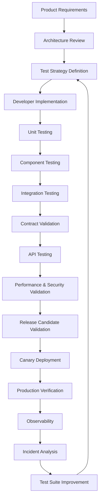

---

# Part 1 Summary

This section established the foundational Quality Engineering strategy for CardWise by defining the quality vision, engineering principles, shift-left and shift-right practices, balanced test pyramid, measurable quality goals, and continuous testing lifecycle. Together, these principles create the framework for the detailed testing architectures that follow in subsequent sections.

# docs/15_TESTING_STRATEGY.md

# Part 2 — Backend Testing Strategy

---

# 11. Backend Testing Strategy

## 11.1 Overview

The CardWise backend powers mission-critical capabilities including authentication, credit card portfolio management, rewards optimization, AI orchestration, booking workflows, payments, notifications, search, and event processing. Backend quality must therefore ensure functional correctness, transactional integrity, resilience, security, performance, and backward compatibility across distributed services.

Backend testing is designed to validate every architectural layer independently while also verifying interactions between services through integration, contract, and end-to-end validation.

---

## Objectives

| ID | Objective | Description |
|----|-----------|-------------|
| TEST-201 | Validate Business Logic | Ensure deterministic service behavior. |
| TEST-202 | Verify API Correctness | Validate request/response contracts. |
| TEST-203 | Protect Data Integrity | Prevent corruption and inconsistency. |
| TEST-204 | Validate Event Processing | Ensure reliable asynchronous workflows. |
| TEST-205 | Prevent Breaking Changes | Detect API incompatibilities before release. |
| TEST-206 | Ensure Fault Tolerance | Validate retry, timeout, and recovery behavior. |
| TEST-207 | Verify Observability | Ensure logs, metrics, and traces are emitted correctly. |
| TEST-208 | Enable Safe Deployments | Provide automated release confidence. |

---

## Backend Validation Scope

| Layer | Included |
|---------|----------|
| Business Services | ✓ |
| REST APIs | ✓ |
| Authentication | ✓ |
| Authorization | ✓ |
| PostgreSQL | ✓ |
| Redis | ✓ |
| Kafka | ✓ |
| External Integrations | ✓ |
| Booking Providers | ✓ |
| Payment Providers | ✓ |
| Notification Services | ✓ |
| AI Services | ✓ |
| Scheduler Jobs | ✓ |

---

## Engineering Rationale

Backend defects can directly impact financial calculations, booking confirmations, payment processing, and customer trust. Validation therefore prioritizes correctness before optimization while ensuring every service remains independently testable.

---

## Best Practices

- Keep business logic independent of transport layers.
- Prefer deterministic test scenarios.
- Mock only true external dependencies.
- Validate failure scenarios alongside success paths.
- Treat observability as part of functional correctness.

---

## Trade-offs

| Decision | Benefit | Cost |
|----------|----------|------|
| Extensive integration testing | Higher confidence | Longer execution time |
| Isolated unit tests | Fast feedback | Less interaction coverage |
| Contract validation | Safer deployments | Additional maintenance |

---

## Risks

| Risk | Mitigation |
|------|------------|
| Hidden service coupling | Contract testing and integration suites |
| Non-deterministic behavior | Stable fixtures and isolated environments |
| Test environment drift | Infrastructure parity and automated provisioning |

---

## Operational Considerations

- Backend tests execute on every pull request.
- Integration suites run before merge.
- Full regression executes before production deployment.
- Production smoke tests validate successful rollout.

---

# 12. Backend Testing Architecture

## TEST-210 Layered Validation Model

| Layer | Primary Focus | Automation |
|---------|---------------|------------|
| Unit | Business logic | Continuous |
| Component | Individual modules | Continuous |
| Integration | Service interactions | Continuous |
| Contract | API compatibility | Continuous |
| Database | Persistence | Continuous |
| Event | Kafka workflows | Continuous |
| End-to-End | Business workflows | Release Gate |

---

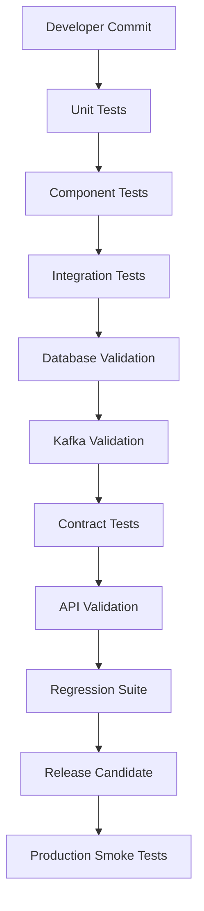

---

# 13. Unit Testing Strategy

## TEST-220 Purpose

Unit testing validates isolated business logic without requiring infrastructure dependencies.

Every business rule should be executable using deterministic inputs and predictable outputs.

---

## Coverage Areas

| Area | Examples |
|------|-----------|
| Reward Calculations | Cashback computation |
| Recommendation Rules | Card ranking logic |
| Eligibility Rules | Offer qualification |
| Pricing Logic | Booking calculations |
| Currency Conversion | Exchange computation |
| Validation | Request validation |
| Utility Functions | Date, formatting, parsing |
| Authorization Rules | Permission evaluation |

---

## Validation Requirements

| Requirement | Description |
|-------------|-------------|
| Isolation | No external infrastructure |
| Determinism | Repeatable execution |
| Fast Execution | Milliseconds per test |
| Independent | No ordering dependency |
| Parallel Safe | Executable concurrently |

---

## Quality Goals

| Metric | Target |
|---------|--------|
| Execution Speed | Very Fast |
| Reliability | High |
| Flaky Rate | Near Zero |
| Business Rule Coverage | Comprehensive |

---

## Engineering Rationale

Unit tests provide the fastest feedback loop and enable developers to verify correctness before integration.

---

## Best Practices

- Test observable behavior, not implementation details.
- Keep fixtures minimal.
- Cover edge cases and boundary conditions.
- Validate error paths.

---

## Trade-offs

| Benefit | Cost |
|----------|------|
| Rapid feedback | Limited interaction validation |
| High stability | Requires well-structured architecture |

---

## Risks

- Over-mocking.
- Low-value assertion tests.
- Coupling tests to implementation.

---

## Operational Considerations

- Execute on every local build.
- Required before pull request creation.

---

# 14. Integration Testing

## TEST-230 Purpose

Integration testing validates interactions between backend modules and infrastructure components.

These tests ensure services collaborate correctly under realistic conditions.

---

## Integration Scope

| Component | Validated |
|------------|-----------|
| Service ↔ Database | ✓ |
| Service ↔ Redis | ✓ |
| Service ↔ Kafka | ✓ |
| Service ↔ External APIs | ✓ |
| Service ↔ AI Engine | ✓ |
| Service ↔ Booking Engine | ✓ |
| Service ↔ Authentication | ✓ |

---

## Validation Areas

- Transaction handling
- Retry behavior
- Circuit breaker execution
- Timeout handling
- Cache synchronization
- Event publication
- Event consumption
- Failure recovery

---

## Engineering Rationale

Distributed systems frequently fail at integration boundaries rather than within isolated business logic. Integration testing verifies those boundaries before deployment.

---

## Best Practices

- Use production-like infrastructure.
- Isolate test data.
- Validate rollback scenarios.

---

## Trade-offs

| Benefit | Cost |
|----------|------|
| Realistic validation | Slower execution |
| Infrastructure confidence | Environment complexity |

---

## Risks

- Shared environments causing instability.
- External dependency variability.

---

## Operational Considerations

- Run in ephemeral environments.
- Reset infrastructure state between executions.

---

# 15. API Testing

## API-TEST-100 Overview

API testing validates every externally exposed interface independent of frontend or mobile clients.

---

## Validation Matrix

| Category | Validated |
|----------|-----------|
| HTTP Methods | ✓ |
| Authentication | ✓ |
| Authorization | ✓ |
| Input Validation | ✓ |
| Pagination | ✓ |
| Filtering | ✓ |
| Sorting | ✓ |
| Error Responses | ✓ |
| Rate Limiting | ✓ |
| Idempotency | ✓ |
| Versioning | ✓ |
| Response Time | ✓ |

---

## API Quality Gates

| ID | Requirement |
|----|-------------|
| API-TEST-101 | Valid status codes |
| API-TEST-102 | Stable response schema |
| API-TEST-103 | Authentication enforced |
| API-TEST-104 | Authorization enforced |
| API-TEST-105 | Error contracts validated |
| API-TEST-106 | Pagination deterministic |
| API-TEST-107 | Backward compatibility maintained |
| API-TEST-108 | Response latency within SLO |

---

## Engineering Rationale

APIs are long-lived contracts. Breaking changes can disrupt web, mobile, browser extensions, and third-party integrations simultaneously.

---

## Best Practices

- Validate both positive and negative scenarios.
- Test malformed inputs.
- Verify authorization boundaries.
- Maintain version compatibility.

---

## Trade-offs

| Benefit | Cost |
|----------|------|
| Stable integrations | Larger regression suite |

---

## Risks

- Silent schema drift.
- Undocumented breaking changes.

---

## Operational Considerations

- Execute after every deployment to staging.
- Maintain version-specific regression suites.

---

# 16. Database Testing

## TEST-240 Objectives

Database validation ensures correctness, integrity, durability, and migration safety.

---

## Validation Areas

| Category | Validation |
|----------|------------|
| Schema | ✓ |
| Constraints | ✓ |
| Foreign Keys | ✓ |
| Transactions | ✓ |
| Indexes | ✓ |
| Migrations | ✓ |
| Rollbacks | ✓ |
| Concurrency | ✓ |
| Performance | ✓ |

---

## Migration Validation

Every migration must verify:

- Forward compatibility
- Rollback capability
- Data preservation
- Constraint enforcement
- Index correctness
- Zero data loss

---

## Engineering Rationale

Database failures can permanently impact financial records and user trust. Validation must extend beyond functional correctness to include migration safety and concurrency behavior.

---

## Best Practices

- Test migrations against realistic datasets.
- Verify transaction isolation.
- Benchmark critical queries.

---

## Trade-offs

| Benefit | Cost |
|----------|------|
| Safer schema evolution | Longer validation time |

---

## Risks

- Lock contention.
- Migration rollback failures.
- Index regressions.

---

## Operational Considerations

- Validate migrations in production-like environments before rollout.

---

# 17. Event-Driven Testing

## TEST-250 Overview

CardWise relies on asynchronous communication for notifications, recommendation updates, booking events, analytics, and workflow orchestration.

Event validation ensures reliable message production and consumption.

---

## Validation Areas

| Area | Tested |
|------|--------|
| Event Publishing | ✓ |
| Event Consumption | ✓ |
| Ordering | ✓ |
| Deduplication | ✓ |
| Idempotency | ✓ |
| Retry Logic | ✓ |
| Dead Letter Queues | ✓ |
| Replay | ✓ |

---

## Engineering Rationale

Asynchronous failures are often delayed and difficult to detect. Dedicated event testing reduces the risk of inconsistent downstream state.

---

## Best Practices

- Validate event schema evolution.
- Simulate duplicate delivery.
- Test out-of-order processing.

---

## Trade-offs

| Benefit | Cost |
|----------|------|
| Reliable workflows | Increased test complexity |

---

## Risks

- Lost messages.
- Duplicate processing.
- Event version mismatch.

---

## Operational Considerations

- Monitor consumer lag and delivery failures in production.

---

# 18. Kafka Testing

## TEST-260 Kafka Validation Matrix

| Capability | Validation |
|------------|------------|
| Topic Configuration | ✓ |
| Producer Reliability | ✓ |
| Consumer Groups | ✓ |
| Partition Ordering | ✓ |
| Retry Topics | ✓ |
| Dead Letter Topics | ✓ |
| Offset Management | ✓ |
| Schema Compatibility | ✓ |

---

## Failure Scenarios

- Broker restart
- Consumer restart
- Duplicate messages
- Partition reassignment
- Network interruption
- Delayed consumers

---

## Engineering Rationale

Kafka is central to platform scalability. Testing ensures eventual consistency without compromising correctness.

---

## Best Practices

- Validate schema evolution.
- Test high-throughput scenarios.
- Verify replay behavior.

---

## Trade-offs

| Benefit | Cost |
|----------|------|
| Greater resilience | More sophisticated test infrastructure |

---

## Risks

- Consumer starvation.
- Partition imbalance.
- Schema incompatibility.

---

## Operational Considerations

- Include Kafka health validation in release verification.

---

# 19. Redis Testing

## TEST-270 Objectives

Redis validation ensures cache correctness, consistency, and resilience.

---

## Validation Areas

| Category | Tested |
|----------|--------|
| Cache Reads | ✓ |
| Cache Writes | ✓ |
| Expiration | ✓ |
| Eviction Policies | ✓ |
| Cache Invalidation | ✓ |
| Distributed Locking | ✓ |
| Session Storage | ✓ |
| Failure Recovery | ✓ |

---

## Failure Validation

- Cache miss
- Cache corruption
- Redis restart
- Connection timeout
- Cluster failover

---

## Engineering Rationale

Incorrect caching can silently serve stale rewards, pricing, or recommendation data. Validation focuses on correctness before optimization.

---

## Best Practices

- Test cache invalidation explicitly.
- Verify fallback to primary data stores.
- Simulate cache outages.

---

## Trade-offs

| Benefit | Cost |
|----------|------|
| Higher reliability | Additional infrastructure simulation |

---

## Risks

- Stale cache entries.
- Inconsistent invalidation.
- Memory pressure effects.

---

## Operational Considerations

- Continuously monitor cache hit ratios and latency after deployment.

---

# 20. Backend Testing Workflow

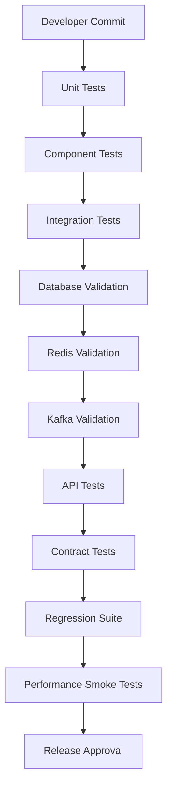

---

# Part 2 Summary

This section defined the backend quality engineering strategy for CardWise, covering layered backend validation, unit and integration testing, API verification, database integrity, event-driven systems, Kafka, Redis, and automated backend quality gates. Together, these practices provide deterministic validation, resilient distributed workflows, and high deployment confidence for the platform's backend services.

# docs/15_TESTING_STRATEGY.md

# Part 3 (A) — Frontend Testing Strategy

> **Note:** Due to document size, Part 3 is delivered in two continuations. This section covers the frontend testing philosophy, component validation, hooks, state management, UI validation, and quality architecture. The remainder (Accessibility, Visual Regression, Cross-Browser Testing, lifecycle, and diagrams) follows in Part 3(B).

---

# 21. Frontend Testing Strategy

## 21.1 Overview

The CardWise frontend is the primary customer interaction layer across the consumer web application and administrative interfaces. It is responsible for rendering financial insights, reward optimization recommendations, booking workflows, portfolio management, offer discovery, authentication, and AI-assisted experiences.

Unlike traditional UI testing that focuses primarily on rendering correctness, the CardWise frontend testing strategy validates correctness across presentation, business interactions, accessibility, responsiveness, resilience, performance, and user experience.

Frontend quality engineering emphasizes **fast feedback**, **high confidence**, and **stable developer velocity** while minimizing brittle end-to-end tests.

---

## Objectives

| ID | Objective | Description |
|----|-----------|-------------|
| TEST-301 | UI Correctness | Validate rendering accuracy. |
| TEST-302 | Business Workflow Validation | Ensure critical customer journeys function correctly. |
| TEST-303 | Component Isolation | Verify reusable UI components independently. |
| TEST-304 | State Consistency | Validate predictable state transitions. |
| TEST-305 | Accessibility | Ensure inclusive user experiences. |
| TEST-306 | Browser Compatibility | Maintain consistent behavior across supported browsers. |
| TEST-307 | Visual Consistency | Detect unintended UI regressions. |
| TEST-308 | Performance | Prevent frontend regressions affecting Core Web Vitals. |

---

## Scope

| Layer | Included |
|---------|----------|
| React Components | ✓ |
| Hooks | ✓ |
| Forms | ✓ |
| Routing | ✓ |
| Authentication Flows | ✓ |
| Dashboard | ✓ |
| Rewards UI | ✓ |
| Booking UI | ✓ |
| AI Recommendation UI | ✓ |
| Charts | ✓ |
| Admin Portal | ✓ |
| Responsive Layouts | ✓ |

---

## Engineering Rationale

Frontend failures directly affect customer trust. Incorrect reward values, inconsistent booking interfaces, broken authentication flows, or inaccessible interfaces reduce confidence even when backend systems operate correctly.

Frontend testing therefore prioritizes user-visible correctness and business workflow validation rather than implementation details.

---

## Best Practices

- Test user behavior instead of internal implementation.
- Prefer semantic queries over DOM structure.
- Keep components independently testable.
- Avoid excessive snapshot testing.
- Validate error states equally with success states.

---

## Trade-offs

| Decision | Benefit | Cost |
|----------|----------|------|
| Behavior-driven tests | Stable suites | More initial effort |
| Component isolation | Faster execution | Requires dependency abstraction |
| Minimal snapshots | Easier maintenance | Less automatic visual coverage |

---

## Risks

| Risk | Mitigation |
|------|------------|
| Brittle UI tests | Test behavior instead of markup |
| Overlapping E2E coverage | Maintain balanced testing pyramid |
| UI drift | Continuous visual regression testing |

---

## Operational Considerations

- Frontend tests execute on every pull request.
- Visual regression runs before release.
- Browser compatibility suites execute nightly.
- Lighthouse validation is integrated into release pipelines.

---

# 22. Frontend Testing Architecture

## TEST-310 Validation Layers

| Layer | Purpose | Frequency |
|---------|----------|-----------|
| Unit | Utility logic | Every Commit |
| Component | UI rendering | Every Commit |
| Hooks | Business behavior | Every Commit |
| State | Application state | Every Commit |
| Integration | Page workflows | Every Pull Request |
| Visual | UI regression | Nightly + Release |
| Cross Browser | Compatibility | Nightly |
| End-to-End | Critical journeys | Release Gate |

---

## Engineering Principles

| Principle | Description |
|-----------|-------------|
| Independent Components | Components validate in isolation. |
| User-Centric Validation | Focus on observable behavior. |
| Stable Selectors | Avoid implementation-specific selectors. |
| Accessibility First | Validate semantic correctness. |
| Fast Feedback | Optimize execution time for developers. |

---

# 23. Component Testing

## TEST-320 Purpose

Component testing validates reusable React components independently from application infrastructure.

Every design system component should be testable using deterministic inputs and expected outputs.

---

## Components Covered

| Component Category | Examples |
|-------------------|-----------|
| Buttons | Primary, Secondary, Icon |
| Forms | Inputs, Dropdowns, Selectors |
| Tables | Data grids |
| Cards | Credit card displays |
| Navigation | Header, Sidebar |
| Dialogs | Modal windows |
| Notifications | Toasts |
| Charts | Spending visualization |
| Recommendation Cards | AI suggestions |
| Booking Components | Flight and hotel cards |

---

## Validation Areas

| Area | Validated |
|------|-----------|
| Rendering | ✓ |
| Props | ✓ |
| Events | ✓ |
| Disabled States | ✓ |
| Loading States | ✓ |
| Error States | ✓ |
| Responsive Layout | ✓ |
| Accessibility Attributes | ✓ |

---

## Engineering Rationale

Small reusable components form the foundation of the frontend architecture. Validating them independently provides rapid feedback while reducing maintenance costs.

---

## Best Practices

- Test public interfaces only.
- Validate conditional rendering.
- Exercise interactive behaviors.
- Keep component dependencies minimal.

---

## Trade-offs

| Benefit | Cost |
|----------|------|
| Fast execution | Limited application context |
| Stable maintenance | Requires good component boundaries |

---

## Risks

- Over-testing implementation.
- Duplicate coverage with higher-level tests.

---

## Operational Considerations

- Components must pass validation before integration testing.
- Design system updates require complete regression execution.

---

# 24. Hooks Testing

## TEST-330 Overview

Custom hooks encapsulate reusable business logic including authentication, API interaction, feature flags, caching, recommendation orchestration, and state synchronization.

Hook testing validates behavior independently of UI rendering.

---

## Hooks Covered

| Category | Examples |
|----------|-----------|
| Authentication | Login state |
| Authorization | Permission evaluation |
| API Hooks | Data retrieval |
| Recommendation Hooks | AI results |
| Booking Hooks | Search state |
| Search Hooks | Query execution |
| Pagination Hooks | Infinite scrolling |
| Feature Flag Hooks | Rollout control |

---

## Validation Areas

| Validation | Included |
|------------|----------|
| Initial State | ✓ |
| State Updates | ✓ |
| Async Behavior | ✓ |
| Error Handling | ✓ |
| Retry Logic | ✓ |
| Cancellation | ✓ |
| Memoization | ✓ |

---

## Engineering Rationale

Testing hooks independently prevents business logic from becoming tightly coupled to UI components and improves reuse across the application.

---

## Best Practices

- Test observable hook behavior.
- Validate asynchronous transitions.
- Cover loading, success, and failure scenarios.

---

## Trade-offs

| Benefit | Cost |
|----------|------|
| Logic reuse | Additional abstraction |
| Faster validation | Separate hook maintenance |

---

## Risks

- Hidden side effects.
- Shared mutable state.

---

## Operational Considerations

- Hooks are validated alongside component tests on every commit.

---

# 25. State Management Testing

## TEST-340 Purpose

State management validation ensures predictable application behavior regardless of user interaction order.

CardWise uses centralized and localized state for authentication, portfolios, recommendations, bookings, notifications, and feature configuration.

---

## Validation Scope

| Area | Tested |
|------|--------|
| Authentication State | ✓ |
| Portfolio State | ✓ |
| Rewards State | ✓ |
| Booking State | ✓ |
| AI Recommendation State | ✓ |
| User Preferences | ✓ |
| Notification State | ✓ |
| Feature Flags | ✓ |

---

## State Validation Matrix

| Validation | Included |
|------------|----------|
| Initialization | ✓ |
| Updates | ✓ |
| Derived State | ✓ |
| Reset | ✓ |
| Persistence | ✓ |
| Synchronization | ✓ |
| Error Recovery | ✓ |

---

## Engineering Rationale

Predictable state transitions reduce UI inconsistency and simplify debugging, particularly in complex financial workflows.

---

## Best Practices

- Keep state normalized.
- Validate state transitions rather than implementation.
- Avoid hidden mutations.

---

## Trade-offs

| Benefit | Cost |
|----------|------|
| Predictable behavior | Additional architectural discipline |

---

## Risks

- State synchronization bugs.
- Stale cached values.
- Unexpected persistence.

---

## Operational Considerations

- State validation executes with component regression suites.

---

# 26. UI & User Interaction Testing

## TEST-350 Overview

UI testing validates complete page behavior from the user's perspective while remaining independent of backend implementation.

Focus areas include navigation, interaction, responsiveness, loading behavior, and error recovery.

---

## Validation Areas

| Area | Tested |
|------|--------|
| Navigation | ✓ |
| Forms | ✓ |
| Search | ✓ |
| Filters | ✓ |
| Sorting | ✓ |
| Pagination | ✓ |
| Dialogs | ✓ |
| Notifications | ✓ |
| Error Screens | ✓ |
| Empty States | ✓ |
| Loading Indicators | ✓ |
| Responsive Layout | ✓ |

---

## Customer Journey Validation

Critical workflows validated include:

- User onboarding
- Authentication
- Credit card portfolio management
- Reward optimization
- Offer discovery
- Flight search
- Hotel booking
- AI recommendation review
- Profile management
- Settings management

---

## Engineering Rationale

Business value is delivered through user workflows rather than isolated components. UI testing validates the complete interaction experience before end-to-end testing.

---

## Best Practices

- Validate complete customer journeys.
- Test responsive layouts.
- Exercise both happy-path and failure scenarios.
- Ensure consistent navigation behavior.

---

## Trade-offs

| Benefit | Cost |
|----------|------|
| Higher business confidence | Longer execution time |
| Improved UX validation | Increased maintenance compared to unit tests |

---

## Risks

- Brittle selectors.
- Dynamic data instability.
- Environmental dependencies.

---

## Operational Considerations

- UI interaction tests run before visual regression and browser compatibility suites.
- Critical user journeys form part of mandatory release validation.

---


# docs/15_TESTING_STRATEGY.md

# Part 3 (B) — Frontend Testing Strategy (Continued)

> This section completes Part 3 by covering accessibility, visual regression, cross-browser validation, frontend testing lifecycle, quality gates, metrics, and the frontend testing architecture.

---

# 27. Accessibility Testing

## TEST-360 Overview

Accessibility is a mandatory quality requirement for CardWise, ensuring that all users—including those using assistive technologies—can successfully access financial information, manage credit card portfolios, complete booking workflows, and interact with AI-powered recommendations.

Accessibility validation is integrated into the engineering lifecycle rather than treated as a final compliance activity.

The platform targets **WCAG 2.2 Level AA** compliance.

---

## Accessibility Objectives

| ID | Objective | Description |
|----|-----------|-------------|
| TEST-361 | Keyboard Accessibility | All functionality must be operable using only a keyboard. |
| TEST-362 | Screen Reader Compatibility | Interfaces expose meaningful semantic information. |
| TEST-363 | Visual Accessibility | Maintain sufficient color contrast and readable typography. |
| TEST-364 | Focus Management | Keyboard focus is logical and visible. |
| TEST-365 | Form Accessibility | Inputs include labels, descriptions, and validation messaging. |
| TEST-366 | Dynamic Content | Live updates are announced appropriately. |
| TEST-367 | Responsive Accessibility | Accessibility is preserved across all supported devices. |

---

## Validation Areas

| Area | Tested |
|------|--------|
| Semantic HTML | ✓ |
| ARIA Usage | ✓ |
| Focus Indicators | ✓ |
| Keyboard Navigation | ✓ |
| Screen Reader Support | ✓ |
| Color Contrast | ✓ |
| Images & Icons | ✓ |
| Error Messages | ✓ |
| Dialog Accessibility | ✓ |
| Tables | ✓ |
| Charts | ✓ |

---

## Accessibility Review Matrix

| Component | Validation Focus |
|-----------|------------------|
| Authentication | Labels, validation, focus |
| Dashboard | Navigation landmarks |
| Rewards | Table semantics |
| Booking | Forms and dynamic updates |
| AI Recommendations | Structured reading order |
| Admin Portal | Keyboard workflows |

---

## Engineering Rationale

Financial applications frequently present dense, information-rich interfaces. Accessibility ensures that these interfaces remain usable regardless of a user's abilities or assistive technologies.

---

## Best Practices

- Prefer semantic HTML over custom ARIA where possible.
- Ensure every interactive element is keyboard accessible.
- Validate focus order after modal dialogs.
- Avoid conveying information solely through color.

---

## Trade-offs

| Benefit | Cost |
|----------|------|
| Inclusive user experience | Additional design and testing effort |
| Improved usability | More comprehensive validation |

---

## Risks

| Risk | Mitigation |
|------|------------|
| Keyboard traps | Automated accessibility checks and manual verification |
| Poor screen reader support | Semantic markup reviews |
| Color contrast regressions | Automated contrast analysis |

---

## Operational Considerations

- Accessibility testing executes in CI.
- Manual accessibility audits are performed before major releases.
- Accessibility regressions are treated as release-blocking issues for affected functionality.

---

# 28. Visual Regression Testing

## TEST-370 Overview

Visual regression testing detects unintended UI changes introduced by new features, dependency upgrades, responsive layout adjustments, or styling modifications.

The objective is to identify visual inconsistencies before they reach production while minimizing false positives.

---

## Validation Scope

| Category | Included |
|----------|----------|
| Design System Components | ✓ |
| Dashboard Pages | ✓ |
| Booking Screens | ✓ |
| Authentication | ✓ |
| Credit Card Portfolio | ✓ |
| Recommendation UI | ✓ |
| Admin Portal | ✓ |
| Responsive Layouts | ✓ |
| Dark / Light Themes (if applicable) | ✓ |

---

## Regression Categories

| Category | Examples |
|----------|-----------|
| Layout Changes | Misalignment, spacing |
| Typography | Font changes |
| Color Changes | Theme regressions |
| Component Rendering | Missing elements |
| Responsive Breakpoints | Layout shifts |
| Charts | Rendering inconsistencies |

---

## Engineering Rationale

Functional correctness alone is insufficient for a customer-facing financial platform. Visual regressions can reduce trust, introduce usability issues, or obscure critical financial information.

---

## Best Practices

- Maintain stable test environments.
- Review intentional design updates before updating baselines.
- Exclude dynamic content where appropriate.
- Validate multiple viewport sizes.

---

## Trade-offs

| Benefit | Cost |
|----------|------|
| Early UI regression detection | Baseline maintenance |
| Higher release confidence | Additional CI execution time |

---

## Risks

- False positives caused by dynamic rendering.
- Excessive baseline updates masking regressions.

---

## Operational Considerations

- Visual regression executes nightly and before production releases.
- Design approvals are required before baseline changes.

---

# 29. Cross-Browser Testing

## TEST-380 Overview

CardWise supports multiple modern browsers to ensure a consistent experience across consumer and administrative interfaces.

Cross-browser validation verifies rendering, interaction, performance, and compatibility.

---

## Supported Browsers

| Browser | Validation Level |
|----------|------------------|
| Chrome | Full |
| Edge | Full |
| Firefox | Full |
| Safari | Full |

---

## Validation Matrix

| Area | Tested |
|------|--------|
| Rendering | ✓ |
| Navigation | ✓ |
| Forms | ✓ |
| Authentication | ✓ |
| Booking Flows | ✓ |
| Payments | ✓ |
| Charts | ✓ |
| Responsive Layout | ✓ |
| Accessibility | ✓ |

---

## Responsive Device Categories

| Device | Validation |
|---------|------------|
| Desktop | ✓ |
| Laptop | ✓ |
| Tablet | ✓ |
| Mobile Browser | ✓ |

---

## Engineering Rationale

Browser engines differ in standards implementation, rendering behavior, and performance characteristics. Continuous validation reduces compatibility-related production issues.

---

## Best Practices

- Prioritize standards-compliant implementations.
- Validate critical user journeys across all supported browsers.
- Minimize browser-specific behavior.

---

## Trade-offs

| Benefit | Cost |
|----------|------|
| Broader compatibility | Increased execution time |
| Improved customer experience | Larger validation matrix |

---

## Risks

- Vendor-specific rendering differences.
- JavaScript engine inconsistencies.
- CSS layout regressions.

---

## Operational Considerations

- Full compatibility suite executes nightly.
- Critical browser validation forms part of release certification.

---

# 30. Responsive Testing

## TEST-390 Overview

Responsive validation ensures that all interfaces remain functional, readable, and usable across supported viewport sizes and device classes.

---

## Validation Areas

| Category | Included |
|----------|----------|
| Navigation | ✓ |
| Tables | ✓ |
| Forms | ✓ |
| Charts | ✓ |
| Booking Screens | ✓ |
| Recommendation Cards | ✓ |
| Dialogs | ✓ |
| Admin Portal | ✓ |

---

## Breakpoint Validation

| Breakpoint | Purpose |
|------------|----------|
| Mobile | Consumer experience |
| Tablet | Hybrid layouts |
| Laptop | Standard desktop usage |
| Large Desktop | Wide-screen optimization |

---

## Engineering Rationale

Responsive issues can significantly affect booking workflows, portfolio analysis, and financial decision-making. Layout integrity is therefore treated as a functional requirement.

---

# 31. Frontend Testing Lifecycle

## TEST-395 Continuous Validation Flow

| Stage | Validation |
|--------|------------|
| Development | Unit & component tests |
| Pull Request | Hooks, state, integration |
| Merge | UI regression |
| Nightly | Cross-browser & visual regression |
| Release Candidate | End-to-end validation |
| Production | Smoke testing & monitoring |

---

## Lifecycle Characteristics

- Fast local feedback
- Automated pull request validation
- Progressive confidence
- Continuous monitoring
- Production verification

---

## Engineering Rationale

The frontend lifecycle balances rapid developer feedback with progressively deeper validation as software approaches production.

---

# 32. Frontend Quality Gates

## TEST-396 Mandatory Release Gates

| Gate | Requirement |
|------|-------------|
| Component Tests | Pass |
| Hook Tests | Pass |
| State Validation | Pass |
| Accessibility Validation | Pass |
| Visual Regression | Pass |
| Browser Compatibility | Pass |
| Performance Budget | Within target |
| Critical Journey Validation | Pass |

---

## Release Blocking Conditions

- Critical accessibility regressions
- Browser compatibility failures
- Major visual regressions
- Broken authentication flows
- Failed booking workflows
- Reward calculation display inconsistencies

---

# 33. Frontend Quality Metrics

## TEST-397 Metrics Dashboard

| Metric | Purpose |
|---------|---------|
| Component Test Success Rate | Stability |
| UI Regression Rate | Visual quality |
| Accessibility Score | Compliance |
| Browser Compatibility Rate | Consistency |
| Lighthouse Score | User experience |
| Core Web Vitals | Performance |
| Flaky Test Rate | Test reliability |
| Release Readiness Score | Deployment confidence |

---

## Engineering Rationale

Quality metrics should represent customer experience rather than simply measuring the number of executed tests.

---

# 34. Frontend Testing Architecture

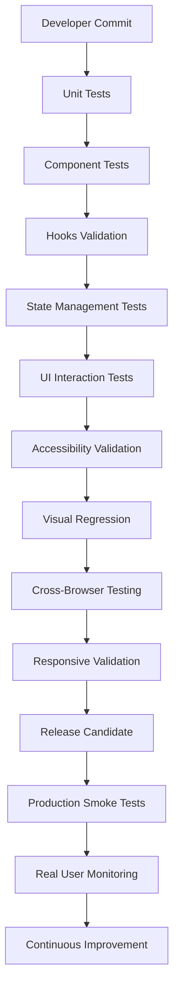

---

# Part 3 Summary

The frontend testing strategy establishes a comprehensive validation framework spanning reusable React components, custom hooks, application state, user interactions, accessibility, visual regression, responsive behavior, and cross-browser compatibility. By combining fast developer feedback with layered automated validation and production verification, CardWise ensures that customer-facing experiences remain reliable, accessible, performant, and visually consistent across every supported platform and release.

# docs/15_TESTING_STRATEGY.md

# Part 4 (A) — Mobile Testing Strategy

> **Note:** Due to document size, Part 4 is delivered in two continuations. This section covers the complete Mobile Quality Engineering strategy for the React Native application. Browser Extension Testing follows in Part 4(B).

---

# 35. Mobile Testing Strategy

## 35.1 Overview

The CardWise mobile application extends the platform's intelligent financial assistant to iOS and Android, enabling users to manage credit card portfolios, discover offers, receive AI-powered recommendations, complete bookings, monitor rewards, and receive real-time notifications.

Unlike web applications, mobile applications operate under varying network conditions, device capabilities, operating system versions, battery constraints, and lifecycle events. The mobile testing strategy therefore validates functional correctness, device compatibility, resilience, usability, and operational reliability.

The strategy emphasizes **automation-first validation** while maintaining targeted exploratory testing for device-specific behaviors.

---

## Objectives

| ID | Objective | Description |
|----|-----------|-------------|
| TEST-401 | Functional Correctness | Validate all user workflows. |
| TEST-402 | Device Compatibility | Ensure consistent behavior across supported devices. |
| TEST-403 | Offline Reliability | Verify graceful degradation without connectivity. |
| TEST-404 | Lifecycle Stability | Validate app state transitions. |
| TEST-405 | Notification Reliability | Ensure accurate push delivery and handling. |
| TEST-406 | Performance | Maintain responsive user experience. |
| TEST-407 | Security | Protect sensitive financial information on-device. |
| TEST-408 | Release Confidence | Automate mobile release validation. |

---

## Scope

| Area | Included |
|------|----------|
| Authentication | ✓ |
| Portfolio Management | ✓ |
| Rewards Dashboard | ✓ |
| AI Recommendations | ✓ |
| Booking Flows | ✓ |
| Payments | ✓ |
| Push Notifications | ✓ |
| Deep Links | ✓ |
| Offline Mode | ✓ |
| Background Sync | ✓ |
| Device Storage | ✓ |
| App Lifecycle | ✓ |

---

## Engineering Rationale

Mobile devices introduce platform-specific behaviors that cannot be fully reproduced in browser environments. Testing must therefore validate both application logic and operating system interactions under realistic usage conditions.

---

## Best Practices

- Prefer automation for deterministic scenarios.
- Maintain representative physical device coverage.
- Validate both foreground and background execution.
- Exercise degraded network conditions.
- Test upgrade paths between app versions.

---

## Trade-offs

| Decision | Benefit | Cost |
|----------|----------|------|
| Broad device coverage | Higher confidence | Longer execution time |
| Real device testing | Accurate behavior | Infrastructure investment |
| Offline validation | Better resilience | Additional scenario complexity |

---

## Risks

| Risk | Mitigation |
|------|------------|
| OS fragmentation | Device matrix validation |
| Vendor-specific behavior | Physical device verification |
| Notification inconsistencies | Platform-specific testing |

---

## Operational Considerations

- Execute automated mobile tests on every release candidate.
- Maintain separate validation for iOS and Android.
- Periodically refresh supported device matrix.

---

# 36. React Native Testing

## TEST-410 Overview

React Native testing validates shared business logic while also ensuring correct platform-specific behavior where native implementations differ.

---

## Validation Layers

| Layer | Purpose |
|--------|----------|
| Unit | Shared business logic |
| Component | React Native UI |
| Integration | Native modules |
| Device | Real device behavior |
| End-to-End | Customer journeys |

---

## Areas Covered

| Category | Tested |
|----------|--------|
| Navigation | ✓ |
| Authentication | ✓ |
| API Integration | ✓ |
| Local Storage | ✓ |
| Camera / Permissions | ✓ |
| Biometric Authentication | ✓ |
| Background Tasks | ✓ |
| Error Handling | ✓ |

---

## Engineering Rationale

Shared JavaScript logic reduces duplication, but native integrations require independent validation due to differences between Android and iOS platforms.

---

## Best Practices

- Separate platform-specific behavior from shared logic.
- Validate native module failures.
- Test lifecycle interruptions.

---

## Trade-offs

| Benefit | Cost |
|----------|------|
| Shared testing | Less duplicated effort |
| Native validation | Platform-specific maintenance |

---

## Risks

- Native bridge failures.
- Platform API differences.
- Version incompatibilities.

---

## Operational Considerations

- Validate every supported OS version before release.

---

# 37. Device Compatibility Matrix

## TEST-420 Supported Device Matrix

| Category | Validation |
|----------|------------|
| Latest Android | ✓ |
| Previous Android Versions | ✓ |
| Latest iOS | ✓ |
| Previous iOS Versions | ✓ |
| Tablets | ✓ |
| Foldable Devices (where supported) | ✓ |

---

## Screen Categories

| Category | Tested |
|----------|--------|
| Small Phones | ✓ |
| Standard Phones | ✓ |
| Large Phones | ✓ |
| Tablets | ✓ |

---

## Hardware Validation

| Feature | Validation |
|----------|------------|
| Camera | ✓ |
| Biometrics | ✓ |
| GPS | ✓ |
| Notifications | ✓ |
| Secure Storage | ✓ |

---

## Engineering Rationale

Device fragmentation affects rendering, memory usage, permissions, and operating system behavior. A representative validation matrix minimizes platform-specific regressions.

---

## Best Practices

- Prioritize devices based on user adoption.
- Include both emulators and physical devices.
- Review device coverage quarterly.

---

# 38. Offline & Network Resilience Testing

## TEST-430 Overview

Users may access CardWise under unreliable or intermittent network conditions. Offline validation ensures predictable application behavior during connectivity disruptions.

---

## Validation Scenarios

| Scenario | Tested |
|----------|--------|
| No Network | ✓ |
| Slow Network | ✓ |
| High Latency | ✓ |
| Packet Loss | ✓ |
| Network Switching | ✓ |
| Airplane Mode | ✓ |
| Background Resume | ✓ |

---

## Validation Areas

- Cached portfolio access
- Previously loaded rewards
- Pending synchronization
- Request retry behavior
- Error messaging
- Data reconciliation after reconnect

---

## Engineering Rationale

Financial applications should fail gracefully. Clear communication and reliable synchronization are essential to maintaining user trust during connectivity issues.

---

## Best Practices

- Distinguish offline from server failures.
- Queue retryable operations safely.
- Prevent duplicate submissions.

---

## Trade-offs

| Benefit | Cost |
|----------|------|
| Better resilience | More synchronization logic |

---

## Risks

- Stale data.
- Duplicate operations.
- Synchronization conflicts.

---

## Operational Considerations

- Validate offline recovery during every regression cycle.

---

# 39. Deep Link Testing

## TEST-440 Overview

Deep links enable users to navigate directly into specific CardWise experiences from emails, notifications, browser extensions, and external partners.

---

## Validation Matrix

| Entry Point | Validation |
|-------------|------------|
| Email Links | ✓ |
| Push Notifications | ✓ |
| Marketing Campaigns | ✓ |
| Browser Extension | ✓ |
| Universal Links | ✓ |
| App Links | ✓ |

---

## Validation Areas

| Area | Tested |
|------|--------|
| Authentication Redirect | ✓ |
| Route Resolution | ✓ |
| Invalid URLs | ✓ |
| Expired Links | ✓ |
| Authorization | ✓ |
| Parameter Validation | ✓ |

---

## Engineering Rationale

Incorrect deep-link routing can interrupt critical customer journeys and negatively impact conversion rates.

---

## Best Practices

- Validate authenticated and unauthenticated flows.
- Test malformed URLs.
- Verify backward compatibility.

---

## Risks

- Broken routing.
- Unauthorized access.
- Invalid parameter handling.

---

# 40. Push Notification Testing

## TEST-450 Overview

Push notifications provide users with reward opportunities, booking updates, payment reminders, AI recommendations, and security alerts.

Testing ensures reliable delivery and predictable user interactions.

---

## Notification Categories

| Category | Validation |
|----------|------------|
| Rewards | ✓ |
| Offers | ✓ |
| Booking Updates | ✓ |
| Payment Reminders | ✓ |
| AI Insights | ✓ |
| Security Alerts | ✓ |

---

## Validation Areas

| Area | Tested |
|------|--------|
| Delivery | ✓ |
| Foreground Handling | ✓ |
| Background Handling | ✓ |
| Terminated State | ✓ |
| Duplicate Delivery | ✓ |
| Tap Navigation | ✓ |
| Silent Notifications | ✓ |

---

## Engineering Rationale

Notification failures directly reduce user engagement and may result in missed financial opportunities or delayed booking updates.

---

## Best Practices

- Validate all application states.
- Test notification grouping.
- Verify navigation consistency.

---

## Trade-offs

| Benefit | Cost |
|----------|------|
| Higher engagement | Platform-specific complexity |

---

## Risks

- Delayed delivery.
- Incorrect routing.
- Duplicate notifications.

---

## Operational Considerations

- Continuously monitor notification delivery metrics in production.

---

# 41. Mobile Performance Testing

## TEST-460 Objectives

Mobile performance validation ensures responsive interactions across supported devices while minimizing resource consumption.

---

## Validation Areas

| Metric | Validation |
|---------|------------|
| App Launch Time | ✓ |
| Navigation Speed | ✓ |
| Memory Usage | ✓ |
| CPU Usage | ✓ |
| Battery Impact | ✓ |
| Frame Rendering | ✓ |
| Network Efficiency | ✓ |
| Background Resource Usage | ✓ |

---

## Performance Goals

| Goal | Target |
|------|--------|
| Smooth Navigation | Consistent |
| Memory Stability | No uncontrolled growth |
| Battery Efficiency | Within acceptable limits |
| Crash-Free Sessions | High reliability |

---

## Engineering Rationale

Performance issues significantly impact perceived quality, especially for frequently accessed financial applications.

---

## Best Practices

- Monitor performance trends across releases.
- Validate low-end devices.
- Optimize rendering paths.

---

## Trade-offs

| Benefit | Cost |
|----------|------|
| Better UX | Additional benchmarking effort |

---

## Risks

- Memory leaks.
- Excessive battery usage.
- Slow startup.

---

## Operational Considerations

- Include performance regression analysis in every release candidate.

---

# Part 4(A) Summary

This section established the mobile quality engineering strategy for the CardWise React Native application, including functional validation, device compatibility, offline resilience, deep-link handling, push notification reliability, lifecycle management, and performance verification. Together, these practices ensure consistent, secure, and resilient mobile experiences across supported platforms.

# docs/15_TESTING_STRATEGY.md

# Part 4 (B) — Browser Extension Testing Strategy

> This section completes **Part 4** by defining the Quality Engineering strategy for the CardWise Browser Extension across Chrome (Manifest V3), Firefox, Edge, and Safari. It covers lifecycle validation, content scripts, background service workers, permissions, cross-browser compatibility, security considerations, quality gates, and release validation.

---

# 42. Browser Extension Testing Strategy

## 42.1 Overview

The CardWise Browser Extension acts as a real-time intelligent assistant while users browse supported merchant websites. It identifies eligible credit cards, recommends the optimal payment method, surfaces offers, estimates rewards, and integrates with the CardWise platform.

Unlike conventional web applications, browser extensions execute in multiple isolated contexts and interact with third-party websites, browser APIs, and asynchronous background processes. Quality engineering must therefore validate correctness across extension lifecycle events, permissions, browser compatibility, messaging, and merchant page interactions.

---

## Objectives

| ID | Objective | Description |
|----|-----------|-------------|
| TEST-470 | Lifecycle Validation | Verify installation, updates, and removal. |
| TEST-471 | Content Script Reliability | Ensure accurate merchant page integration. |
| TEST-472 | Background Reliability | Validate Manifest V3 service worker behavior. |
| TEST-473 | Secure Permissions | Ensure least-privilege browser access. |
| TEST-474 | Cross-Browser Compatibility | Maintain consistent behavior across supported browsers. |
| TEST-475 | Performance | Minimize browser overhead. |
| TEST-476 | Privacy Protection | Prevent unintended data collection or leakage. |
| TEST-477 | Release Confidence | Automate extension certification before publication. |

---

## Scope

| Area | Included |
|------|----------|
| Installation | ✓ |
| Upgrade | ✓ |
| Content Scripts | ✓ |
| Background Service Worker | ✓ |
| Popup UI | ✓ |
| Options Page | ✓ |
| Browser Messaging | ✓ |
| Storage | ✓ |
| Merchant Detection | ✓ |
| Offer Injection | ✓ |
| Authentication | ✓ |
| Sync with Backend | ✓ |

---

## Engineering Rationale

Browser extensions execute within security-restricted environments and interact with pages outside the application's control. Validation must therefore account for browser APIs, changing website structures, and lifecycle events while ensuring customer privacy and reliable recommendations.

---

## Best Practices

- Keep browser permissions minimal.
- Separate business logic from browser APIs.
- Validate extension behavior on supported merchant sites.
- Test degraded network conditions.
- Verify graceful handling of unsupported websites.

---

## Trade-offs

| Decision | Benefit | Cost |
|----------|----------|------|
| Broad browser coverage | Higher compatibility | Increased maintenance effort |
| Merchant-specific validation | Better recommendation accuracy | Larger regression suite |
| Automated lifecycle testing | Safer releases | Additional CI complexity |

---

## Risks

| Risk | Mitigation |
|------|------------|
| Browser API changes | Continuous compatibility validation |
| Merchant DOM changes | Automated merchant regression suite |
| Permission misuse | Permission review and security testing |

---

## Operational Considerations

- Validate extension on every supported browser before release.
- Maintain merchant regression datasets.
- Review browser API deprecations each release cycle.

---

# 43. Extension Lifecycle Testing

## TEST-480 Overview

Lifecycle validation ensures that the extension behaves correctly throughout installation, upgrades, browser restarts, updates, and removal.

---

## Lifecycle Events

| Event | Validation |
|-------|------------|
| First Installation | ✓ |
| Browser Restart | ✓ |
| Extension Enable | ✓ |
| Extension Disable | ✓ |
| Update | ✓ |
| Version Migration | ✓ |
| Uninstall | ✓ |

---

## Validation Areas

| Area | Tested |
|------|--------|
| Initial Configuration | ✓ |
| Storage Initialization | ✓ |
| Authentication State | ✓ |
| Version Migration | ✓ |
| Cleanup | ✓ |
| Background Restart | ✓ |

---

## Engineering Rationale

Lifecycle failures can result in corrupted storage, stale configuration, inconsistent authentication, or disabled recommendation services.

---

## Best Practices

- Validate upgrade paths from multiple previous versions.
- Verify backward-compatible storage migrations.
- Test browser restart recovery.

---

## Trade-offs

| Benefit | Cost |
|----------|------|
| Safer upgrades | Additional version management |

---

## Risks

- Migration failures.
- Incomplete cleanup.
- Persisted stale state.

---

## Operational Considerations

- Execute lifecycle validation for every release candidate.

---

# 44. Content Script Testing

## TEST-490 Overview

Content scripts execute directly within merchant pages and are responsible for identifying payment opportunities, extracting contextual information, and displaying CardWise recommendations.

---

## Validation Scope

| Area | Tested |
|------|--------|
| Merchant Detection | ✓ |
| DOM Observation | ✓ |
| Dynamic Content | ✓ |
| Checkout Detection | ✓ |
| Offer Injection | ✓ |
| Recommendation Rendering | ✓ |
| Cleanup | ✓ |

---

## Merchant Validation

| Category | Validation |
|----------|------------|
| Static Pages | ✓ |
| Single Page Applications | ✓ |
| Infinite Scroll | ✓ |
| Dynamic DOM Updates | ✓ |
| Multiple Checkout Variants | ✓ |

---

## Engineering Rationale

Merchant websites change frequently. Content scripts must tolerate evolving DOM structures while avoiding interference with page functionality.

---

## Best Practices

- Avoid assumptions about DOM hierarchy.
- Detect page mutations safely.
- Fail gracefully on unsupported sites.
- Minimize injected resources.

---

## Trade-offs

| Benefit | Cost |
|----------|------|
| Robust merchant support | Larger validation matrix |

---

## Risks

- DOM changes.
- CSS conflicts.
- JavaScript namespace collisions.

---

## Operational Considerations

- Maintain automated merchant compatibility suites.

---

# 45. Background Service Worker Testing

## TEST-500 Overview

Manifest V3 replaces persistent background pages with service workers, introducing lifecycle and state management challenges.

Testing validates background processing reliability under intermittent execution.

---

## Validation Areas

| Area | Tested |
|------|--------|
| Startup | ✓ |
| Shutdown | ✓ |
| Event Handling | ✓ |
| Browser Messaging | ✓ |
| Storage Access | ✓ |
| Network Requests | ✓ |
| Authentication Refresh | ✓ |

---

## Failure Scenarios

- Service worker restart
- Browser restart
- Network interruption
- Authentication expiration
- Storage corruption

---

## Engineering Rationale

Background service workers may terminate unexpectedly. Business logic must tolerate suspension without losing state or user context.

---

## Best Practices

- Keep service workers stateless where possible.
- Persist only required state.
- Handle asynchronous failures explicitly.

---

## Trade-offs

| Benefit | Cost |
|----------|------|
| Better reliability | Additional lifecycle complexity |

---

## Risks

- Lost background events.
- Interrupted synchronization.
- Expired authentication.

---

## Operational Considerations

- Validate restart scenarios in every regression cycle.

---

# 46. Popup & Options UI Testing

## TEST-510 Overview

The popup and options pages provide the primary user interface for extension interactions, configuration, authentication, and recommendation visibility.

---

## Validation Matrix

| Area | Tested |
|------|--------|
| Authentication | ✓ |
| User Preferences | ✓ |
| Recommendation Display | ✓ |
| Offer Details | ✓ |
| Settings | ✓ |
| Error Handling | ✓ |
| Loading States | ✓ |

---

## Engineering Rationale

Popup interfaces are frequently opened and closed. Testing focuses on rapid rendering, state restoration, and consistent user interactions.

---

## Best Practices

- Validate initialization speed.
- Test repeated open/close cycles.
- Ensure synchronization with backend state.

---

# 47. Browser Permissions Testing

## TEST-520 Objectives

Browser permissions determine the extension's security posture. Validation ensures that only explicitly required permissions are requested and correctly enforced.

---

## Permission Validation

| Permission Area | Tested |
|-----------------|--------|
| Host Permissions | ✓ |
| Storage | ✓ |
| Tabs | ✓ |
| Notifications | ✓ |
| Identity | ✓ |
| Scripting APIs | ✓ |

---

## Security Validation

| Area | Validation |
|------|------------|
| Permission Escalation | ✓ |
| Unauthorized Access | ✓ |
| Revoked Permissions | ✓ |
| Runtime Permission Requests | ✓ |

---

## Engineering Rationale

Minimizing browser permissions reduces attack surface and improves user trust.

---

## Best Practices

- Request permissions only when required.
- Validate permission denial scenarios.
- Test runtime permission changes.

---

## Risks

- Excessive permissions.
- Unexpected permission revocation.
- Browser policy changes.

---

# 48. Cross-Browser Extension Testing

## TEST-530 Overview

Although the extension shares common business logic, browser implementations differ in API behavior, lifecycle management, permissions, and extension packaging.

---

## Supported Browsers

| Browser | Validation |
|----------|------------|
| Chrome (MV3) | Full |
| Edge | Full |
| Firefox | Full |
| Safari | Full |

---

## Compatibility Matrix

| Capability | Chrome | Edge | Firefox | Safari |
|------------|:------:|:----:|:--------:|:------:|
| Installation | ✓ | ✓ | ✓ | ✓ |
| Content Scripts | ✓ | ✓ | ✓ | ✓ |
| Background Worker | ✓ | ✓ | ✓* | ✓ |
| Storage | ✓ | ✓ | ✓ | ✓ |
| Messaging | ✓ | ✓ | ✓ | ✓ |
| Popup | ✓ | ✓ | ✓ | ✓ |
| Options Page | ✓ | ✓ | ✓ | ✓ |

> *Validated using browser-specific compatibility behavior where applicable.

---

## Engineering Rationale

Cross-browser validation protects against browser-specific regressions while preserving a consistent customer experience.

---

## Best Practices

- Prefer standards-based browser APIs.
- Avoid vendor-specific implementations where possible.
- Validate all critical merchant journeys across supported browsers.

---

# 49. Extension Quality Gates

## TEST-540 Mandatory Release Gates

| Gate | Requirement |
|------|-------------|
| Lifecycle Tests | Pass |
| Merchant Compatibility | Pass |
| Content Script Validation | Pass |
| Background Worker Validation | Pass |
| Permission Validation | Pass |
| Cross-Browser Testing | Pass |
| Security Validation | Pass |
| Performance Validation | Pass |

---

## Release Blocking Conditions

- Merchant detection failures
- Recommendation rendering failures
- Broken authentication
- Background synchronization failures
- Permission violations
- Browser-specific regressions

---

# 50. Browser Extension Testing Architecture

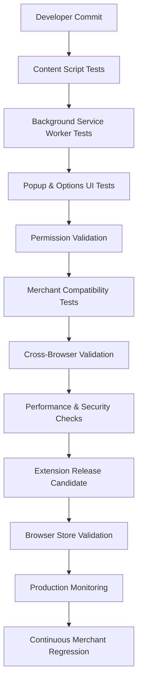

---

# Part 4 Summary

Part 4 established the complete quality engineering strategy for CardWise's mobile application and browser extension. The strategy covers React Native validation, device compatibility, offline resilience, deep-link handling, push notifications, extension lifecycle testing, content scripts, Manifest V3 service workers, permissions, merchant compatibility, and cross-browser validation. Together, these practices provide a comprehensive framework for ensuring secure, reliable, and consistent experiences across mobile platforms and browser ecosystems.

# docs/15_TESTING_STRATEGY.md

# Part 5 (A) — API Testing Strategy

> **Note:** Due to document size, Part 5 is delivered in two continuations. This section covers the enterprise API testing strategy for the CardWise platform, including REST validation, authentication, authorization, request/response validation, pagination, idempotency, rate limiting, and API quality gates. Contract testing and microservices validation follow in Part 5(B).

---

# 51. API Testing Strategy

## 51.1 Overview

The CardWise platform exposes APIs that power the Web application, Mobile application, Browser Extension, Admin Portal, AI services, booking engine, and third-party integrations. These APIs are long-lived contracts and must maintain correctness, consistency, backward compatibility, security, and predictable performance throughout the product lifecycle.

API testing validates not only successful request processing but also failure scenarios, authorization boundaries, resilience under load, and compatibility across versions.

---

## Objectives

| ID | Objective | Description |
|----|-----------|-------------|
| API-TEST-001 | Contract Stability | Maintain stable public interfaces. |
| API-TEST-002 | Functional Correctness | Validate business behavior for all endpoints. |
| API-TEST-003 | Security | Verify authentication and authorization. |
| API-TEST-004 | Reliability | Ensure deterministic responses under normal and failure conditions. |
| API-TEST-005 | Performance | Meet latency and throughput objectives. |
| API-TEST-006 | Compatibility | Prevent breaking API changes. |
| API-TEST-007 | Observability | Validate logs, metrics, and traces. |
| API-TEST-008 | Release Confidence | Provide automated deployment confidence. |

---

## API Validation Scope

| Area | Included |
|------|----------|
| Authentication APIs | ✓ |
| User APIs | ✓ |
| Portfolio APIs | ✓ |
| Rewards APIs | ✓ |
| Recommendation APIs | ✓ |
| Booking APIs | ✓ |
| Payment APIs | ✓ |
| Notification APIs | ✓ |
| Search APIs | ✓ |
| Admin APIs | ✓ |
| AI APIs | ✓ |
| Internal Service APIs | ✓ |

---

## Engineering Rationale

Every customer interaction eventually traverses one or more APIs. API failures can cascade across multiple applications simultaneously. Comprehensive validation therefore serves as one of the highest-value investments in platform quality.

---

## Best Practices

- Treat APIs as versioned contracts.
- Validate business rules independently of UI.
- Exercise both positive and negative scenarios.
- Verify non-functional characteristics alongside functional correctness.

---

## Trade-offs

| Decision | Benefit | Cost |
|----------|----------|------|
| Comprehensive API regression | Higher confidence | Longer execution time |
| Version compatibility testing | Safer evolution | Additional maintenance |

---

## Risks

| Risk | Mitigation |
|------|------------|
| Breaking schema changes | Automated contract validation |
| Inconsistent error handling | Standardized API specifications |
| Authentication regressions | Continuous security testing |

---

## Operational Considerations

- API validation executes on every pull request.
- Full regression runs before release.
- Production smoke APIs execute immediately after deployment.

---

# 52. REST API Validation

## API-TEST-010 Overview

REST API validation verifies that every endpoint conforms to functional, security, and protocol expectations.

---

## Validation Matrix

| Category | Tested |
|----------|--------|
| HTTP Methods | ✓ |
| Status Codes | ✓ |
| Headers | ✓ |
| Content Types | ✓ |
| Serialization | ✓ |
| Deserialization | ✓ |
| Compression | ✓ |
| Caching Headers | ✓ |

---

## HTTP Method Validation

| Method | Validation Focus |
|---------|------------------|
| GET | Retrieval correctness |
| POST | Resource creation |
| PUT | Full replacement |
| PATCH | Partial updates |
| DELETE | Resource removal |

---

## Engineering Rationale

Protocol correctness ensures predictable behavior across diverse clients and integration partners.

---

## Best Practices

- Validate protocol compliance.
- Test malformed requests.
- Verify content negotiation.

---

## Trade-offs

| Benefit | Cost |
|----------|------|
| Better interoperability | Expanded regression suite |

---

## Risks

- Incorrect status codes.
- Unexpected serialization changes.

---

## Operational Considerations

- Monitor production error distributions for protocol anomalies.

---

# 53. Authentication Testing

## API-TEST-020 Objectives

Authentication testing validates identity verification mechanisms and session establishment.

---

## Validation Areas

| Area | Tested |
|------|--------|
| Login | ✓ |
| Logout | ✓ |
| Token Generation | ✓ |
| Token Refresh | ✓ |
| Token Expiration | ✓ |
| Invalid Credentials | ✓ |
| Multi-device Sessions | ✓ |

---

## Security Scenarios

| Scenario | Validation |
|----------|------------|
| Expired Tokens | ✓ |
| Invalid Tokens | ✓ |
| Tampered Tokens | ✓ |
| Missing Credentials | ✓ |
| Concurrent Sessions | ✓ |

---

## Engineering Rationale

Authentication is the first security boundary protecting customer financial data. Validation must cover both expected usage and malicious inputs.

---

## Best Practices

- Verify token lifecycle behavior.
- Test session invalidation.
- Validate clock skew handling where applicable.

---

## Trade-offs

| Benefit | Cost |
|----------|------|
| Stronger security posture | More complex validation matrix |

---

## Risks

- Session fixation.
- Improper token expiration.
- Authentication bypass.

---

## Operational Considerations

- Authentication failures should emit security audit events.

---

# 54. Authorization Testing

## API-TEST-030 Overview

Authorization testing verifies that authenticated users can perform only the operations explicitly permitted by their roles and permissions.

---

## Validation Matrix

| Area | Tested |
|------|--------|
| RBAC | ✓ |
| Resource Ownership | ✓ |
| Administrative Access | ✓ |
| Read Permissions | ✓ |
| Write Permissions | ✓ |
| Delete Permissions | ✓ |
| Feature Flags | ✓ |

---

## Negative Validation

- Unauthorized resource access
- Cross-user data access
- Privilege escalation
- Missing permissions
- Expired authorization context

---

## Engineering Rationale

Authorization defects are often more severe than functional defects because they may expose sensitive customer information or administrative capabilities.

---

## Best Practices

- Validate every permission boundary.
- Exercise both allowed and denied paths.
- Test resource ownership independently.

---

## Risks

- Horizontal privilege escalation.
- Vertical privilege escalation.
- Inconsistent policy enforcement.

---

# 55. Request Validation Testing

## API-TEST-040 Overview

Every API must reject malformed, incomplete, or invalid requests consistently and predictably.

---

## Validation Categories

| Category | Tested |
|----------|--------|
| Required Fields | ✓ |
| Optional Fields | ✓ |
| Data Types | ✓ |
| Enum Validation | ✓ |
| Length Constraints | ✓ |
| Numeric Limits | ✓ |
| Date Validation | ✓ |
| Nested Objects | ✓ |

---

## Invalid Input Scenarios

- Missing required attributes
- Unsupported values
- Invalid identifiers
- Oversized payloads
- Empty payloads
- Duplicate fields
- Unexpected properties

---

## Engineering Rationale

Strong request validation prevents inconsistent downstream state and improves API usability.

---

## Best Practices

- Validate inputs before business processing.
- Return deterministic validation errors.
- Keep validation consistent across endpoints.

---

# 56. Response Validation Testing

## API-TEST-050 Overview

Response validation ensures APIs consistently return correct schemas, data integrity, metadata, and error contracts.

---

## Validation Matrix

| Area | Tested |
|------|--------|
| Response Schema | ✓ |
| Required Fields | ✓ |
| Nullable Fields | ✓ |
| Data Types | ✓ |
| Ordering | ✓ |
| Metadata | ✓ |
| Pagination Metadata | ✓ |
| Error Objects | ✓ |

---

## Engineering Rationale

Stable response contracts enable independent evolution of clients without introducing regressions.

---

## Best Practices

- Maintain schema version compatibility.
- Verify optional field behavior.
- Standardize error responses.

---

# 57. Pagination, Filtering & Sorting Testing

## API-TEST-060 Objectives

Collection APIs must provide deterministic pagination, filtering, and sorting behavior.

---

## Validation Areas

| Capability | Tested |
|------------|--------|
| Offset Pagination | ✓ |
| Cursor Pagination | ✓ |
| Sorting | ✓ |
| Filtering | ✓ |
| Combined Queries | ✓ |
| Empty Results | ✓ |
| Boundary Conditions | ✓ |

---

## Edge Cases

- Last page
- Empty datasets
- Duplicate sort keys
- Invalid filters
- Maximum page sizes
- Unsupported sort fields

---

## Engineering Rationale

Incorrect pagination or sorting can produce duplicate, missing, or inconsistent financial records.

---

## Best Practices

- Maintain deterministic ordering.
- Validate stable cursors.
- Exercise large datasets.

---

# 58. Idempotency Testing

## API-TEST-070 Overview

Certain financial and booking operations require idempotent behavior to prevent duplicate transactions during retries.

---

## Validation Areas

| Scenario | Tested |
|----------|--------|
| Retry Requests | ✓ |
| Duplicate Submission | ✓ |
| Network Timeout Retry | ✓ |
| Booking Confirmation | ✓ |
| Payment Retry | ✓ |

---

## Engineering Rationale

Idempotency protects against duplicate bookings, payments, and portfolio updates caused by network failures or client retries.

---

## Best Practices

- Validate repeated requests.
- Preserve original response semantics.
- Ensure request identity remains stable.

---

## Risks

- Duplicate financial operations.
- Inconsistent retry handling.

---

# 59. Error Handling & Rate Limiting Testing

## API-TEST-080 Overview

APIs must fail predictably while protecting platform stability from abuse and excessive traffic.

---

## Error Validation

| Area | Tested |
|------|--------|
| Validation Errors | ✓ |
| Authentication Errors | ✓ |
| Authorization Errors | ✓ |
| Business Rule Errors | ✓ |
| Infrastructure Failures | ✓ |
| Unknown Exceptions | ✓ |

---

## Rate Limiting Validation

| Scenario | Tested |
|----------|--------|
| Normal Usage | ✓ |
| Burst Traffic | ✓ |
| Sustained Traffic | ✓ |
| Retry Behavior | ✓ |
| Header Validation | ✓ |

---

## Engineering Rationale

Consistent failure behavior simplifies client implementation while protecting shared platform resources.

---

## Best Practices

- Standardize error formats.
- Expose retry guidance where appropriate.
- Validate rate limit recovery behavior.

---

# 60. API Quality Gates

## API-TEST-090 Mandatory Release Gates

| Gate | Requirement |
|------|-------------|
| Functional Regression | Pass |
| Authentication Validation | Pass |
| Authorization Validation | Pass |
| Request Validation | Pass |
| Response Validation | Pass |
| Pagination Validation | Pass |
| Idempotency Validation | Pass |
| Rate Limiting Validation | Pass |
| Performance Smoke Tests | Pass |

---

## Release Blocking Conditions

- Authentication failures
- Authorization bypass
- Breaking response schema
- Incorrect financial calculations
- Duplicate transaction behavior
- Critical API latency regressions

---

# Part 5(A) Summary

This section established the enterprise API testing strategy for CardWise, covering REST protocol validation, authentication, authorization, request and response correctness, pagination, idempotency, error handling, rate limiting, and API quality gates. Together, these practices ensure that platform APIs remain secure, stable, predictable, and backward compatible across all consuming applications and services.

# docs/15_TESTING_STRATEGY.md

# Part 5 (B) — Contract Testing & Microservices Testing

> This section completes **Part 5** by defining the enterprise strategy for API contract validation, consumer-driven contracts, producer verification, backward compatibility, distributed microservices testing, service resilience, and inter-service communication validation.

---

# 61. Contract Testing Strategy

## 61.1 Overview

As the CardWise platform evolves, multiple independently deployable services communicate through REST APIs, asynchronous events, and shared contracts. Contract testing ensures that service evolution does not introduce breaking changes for downstream consumers.

Unlike integration testing, which validates runtime interactions, contract testing validates the agreed interface between producers and consumers before deployment.

CardWise adopts **Consumer-Driven Contract Testing (CDCT)** using **Pact** for synchronous APIs and schema validation for asynchronous messaging.

---

## Objectives

| ID | Objective | Description |
|----|-----------|-------------|
| API-TEST-101 | Prevent Breaking Changes | Detect incompatible API modifications before deployment. |
| API-TEST-102 | Independent Deployments | Allow services to evolve safely. |
| API-TEST-103 | Consumer Confidence | Verify provider behavior against consumer expectations. |
| API-TEST-104 | Backward Compatibility | Preserve compatibility across versions. |
| API-TEST-105 | Release Safety | Block incompatible releases automatically. |

---

## Scope

| Contract Type | Validation |
|---------------|------------|
| REST APIs | ✓ |
| Internal APIs | ✓ |
| Public APIs | ✓ |
| Kafka Events | ✓ |
| Webhook Payloads | ✓ |
| AI Service Contracts | ✓ |
| Booking Provider APIs | ✓ |
| Payment Provider APIs | ✓ |

---

## Engineering Rationale

Integration testing alone cannot guarantee interface stability. Contract validation provides rapid feedback while allowing independent deployment of producer and consumer services.

---

## Best Practices

- Treat contracts as versioned artifacts.
- Validate providers continuously.
- Keep contracts consumer-focused.
- Avoid implementation-specific assertions.

---

## Trade-offs

| Decision | Benefit | Cost |
|----------|----------|------|
| Consumer-driven contracts | Independent deployments | Contract maintenance |
| Automated verification | Faster feedback | CI complexity |

---

## Risks

| Risk | Mitigation |
|------|------------|
| Contract drift | Continuous provider verification |
| Incomplete consumer coverage | Contract ownership reviews |
| Schema divergence | Version compatibility validation |

---

## Operational Considerations

- Execute provider verification on every merge.
- Publish contract verification results as release artifacts.
- Track contract compatibility across active service versions.

---

# 62. Consumer-Driven Contract Testing

## API-TEST-110 Overview

Consumer-driven contracts describe the exact expectations that consuming applications have of a service. Providers must satisfy every published contract before deployment.

---

## Consumers

| Consumer | Contract Validation |
|-----------|---------------------|
| Web Application | ✓ |
| Mobile Application | ✓ |
| Browser Extension | ✓ |
| Admin Portal | ✓ |
| AI Services | ✓ |
| Booking Engine | ✓ |

---

## Validation Areas

| Area | Tested |
|------|--------|
| Request Structure | ✓ |
| Response Schema | ✓ |
| Required Fields | ✓ |
| Optional Fields | ✓ |
| Error Responses | ✓ |
| HTTP Status Codes | ✓ |
| Headers | ✓ |

---

## Engineering Rationale

Consumers define the observable API behavior that matters. Validating these expectations minimizes unexpected production regressions.

---

## Best Practices

- Keep contracts small and focused.
- Update contracts alongside consumer changes.
- Remove obsolete contracts promptly.

---

## Trade-offs

| Benefit | Cost |
|----------|------|
| Safer service evolution | Contract maintenance effort |

---

## Risks

- Outdated contracts.
- Consumer assumptions not reflected in contracts.

---

## Operational Considerations

- Contract publication is part of the CI pipeline.
- Failed contract verification blocks deployment.

---

# 63. Provider Verification

## API-TEST-120 Overview

Provider verification ensures that backend services satisfy every published consumer contract before release.

---

## Validation Matrix

| Validation | Included |
|------------|----------|
| Required Fields | ✓ |
| Optional Fields | ✓ |
| Data Types | ✓ |
| Response Codes | ✓ |
| Error Contracts | ✓ |
| Version Compatibility | ✓ |
| Authorization | ✓ |

---

## Engineering Rationale

Provider validation prevents deployments that would otherwise break dependent applications despite successful unit and integration tests.

---

## Best Practices

- Verify all active contract versions.
- Maintain backward-compatible behavior during transitions.
- Archive deprecated contracts only after all consumers migrate.

---

## Risks

- Incomplete provider coverage.
- Hidden runtime assumptions.

---

# 64. Backward Compatibility Testing

## API-TEST-130 Overview

Backward compatibility testing ensures that existing applications continue functioning correctly as backend services evolve.

---

## Compatibility Rules

| Rule | Validation |
|------|------------|
| Existing Fields Remain Stable | ✓ |
| Optional Fields May Be Added | ✓ |
| Required Fields Not Removed | ✓ |
| Response Semantics Preserved | ✓ |
| Error Contracts Stable | ✓ |

---

## Version Validation

| Scenario | Tested |
|----------|--------|
| Current Client ↔ Current API | ✓ |
| Previous Client ↔ Current API | ✓ |
| Mixed Version Deployment | ✓ |
| Rolling Upgrade | ✓ |

---

## Engineering Rationale

CardWise supports progressive deployments and staged client rollouts. API compatibility is therefore essential for uninterrupted customer experience.

---

## Best Practices

- Prefer additive changes.
- Deprecate before removal.
- Publish version migration guidance.

---

## Trade-offs

| Benefit | Cost |
|----------|------|
| Safer upgrades | Slower API evolution |

---

## Risks

- Breaking schema changes.
- Uncoordinated deprecations.

---

# 65. Microservices Testing Strategy

## TEST-601 Overview

The CardWise platform consists of independently deployable backend services communicating synchronously and asynchronously. Microservices testing validates service boundaries, communication reliability, and distributed behavior.

---

## Validation Scope

| Service Category | Tested |
|------------------|--------|
| Authentication | ✓ |
| User Service | ✓ |
| Portfolio Service | ✓ |
| Rewards Service | ✓ |
| Recommendation Service | ✓ |
| Booking Service | ✓ |
| Payment Service | ✓ |
| Notification Service | ✓ |
| Search Service | ✓ |

---

## Validation Areas

| Area | Tested |
|------|--------|
| Service Discovery | ✓ |
| API Communication | ✓ |
| Retry Logic | ✓ |
| Timeout Handling | ✓ |
| Circuit Breakers | ✓ |
| Fallback Behavior | ✓ |
| Observability | ✓ |

---

## Engineering Rationale

Distributed systems frequently fail at communication boundaries rather than within isolated services. Testing emphasizes resilience under partial failure.

---

## Best Practices

- Test service isolation.
- Validate retry policies.
- Exercise degraded network scenarios.
- Verify graceful fallback behavior.

---

## Trade-offs

| Benefit | Cost |
|----------|------|
| Improved resilience | More complex environments |

---

## Risks

- Cascading failures.
- Timeout propagation.
- Retry amplification.

---

# 66. Inter-Service Communication Testing

## TEST-610 Overview

Service communication testing validates synchronous API calls and asynchronous event-driven interactions.

---

## Validation Matrix

| Interaction | Validation |
|-------------|------------|
| REST Calls | ✓ |
| Kafka Events | ✓ |
| Retry Behavior | ✓ |
| Dead Letter Handling | ✓ |
| Duplicate Messages | ✓ |
| Idempotent Processing | ✓ |

---

## Failure Scenarios

- Service unavailable
- Slow downstream service
- Partial network partition
- Invalid event payload
- Message replay
- Duplicate delivery

---

## Engineering Rationale

Reliable service communication is essential for maintaining consistency across financial operations and booking workflows.

---

## Best Practices

- Validate timeout handling.
- Test duplicate events.
- Verify event ordering assumptions.

---

# 67. Distributed Transaction Testing

## TEST-620 Overview

Certain business workflows span multiple services without relying on traditional distributed database transactions.

Validation focuses on consistency, compensation, and recovery.

---

## Workflows

| Workflow | Validation |
|----------|------------|
| Booking Confirmation | ✓ |
| Payment Processing | ✓ |
| Rewards Allocation | ✓ |
| Portfolio Synchronization | ✓ |
| Notification Dispatch | ✓ |

---

## Validation Areas

| Area | Tested |
|------|--------|
| Compensation Logic | ✓ |
| Partial Failure Recovery | ✓ |
| Retry Safety | ✓ |
| Idempotency | ✓ |
| Eventual Consistency | ✓ |

---

## Engineering Rationale

Distributed workflows must tolerate partial failures while preserving business correctness.

---

## Risks

- Orphaned transactions.
- Duplicate operations.
- Inconsistent state.

---

# 68. Service Resilience Testing

## TEST-630 Overview

Service resilience testing validates system behavior under dependency failures and degraded operating conditions.

---

## Validation Areas

| Scenario | Tested |
|----------|--------|
| Service Restart | ✓ |
| Database Delay | ✓ |
| Cache Failure | ✓ |
| Kafka Delay | ✓ |
| External API Timeout | ✓ |
| DNS Failure | ✓ |

---

## Expected Behaviors

- Graceful degradation
- Retry within limits
- Circuit breaker activation
- Fallback responses
- Error observability

---

## Engineering Rationale

Resilient systems continue providing value despite localized failures and infrastructure disruptions.

---

# 69. Contract & Microservices Quality Gates

## TEST-640 Mandatory Gates

| Gate | Requirement |
|------|-------------|
| Consumer Contracts | Pass |
| Provider Verification | Pass |
| Backward Compatibility | Pass |
| Service Communication | Pass |
| Distributed Workflow Validation | Pass |
| Resilience Validation | Pass |
| Event Schema Validation | Pass |

---

## Release Blocking Conditions

- Contract verification failures
- Breaking API changes
- Distributed workflow inconsistencies
- Service communication regressions
- Event schema incompatibilities

---

# 70. Contract & Microservices Testing Architecture

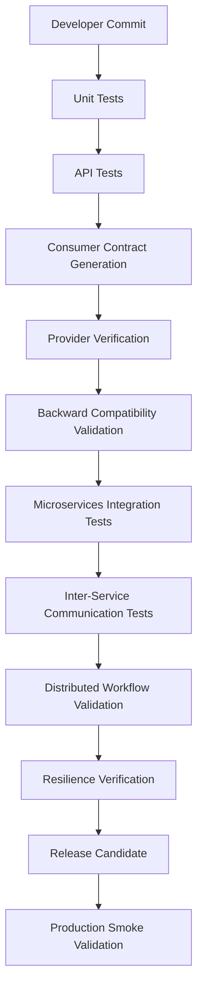

---

# Part 5 Summary

Part 5 established the enterprise API quality strategy for CardWise, covering REST API validation, authentication, authorization, request and response verification, contract testing, consumer-driven contracts, provider verification, backward compatibility, distributed microservices testing, service communication, resilience validation, and release quality gates. Together, these practices enable independently deployable services while maintaining strong compatibility guarantees, operational resilience, and high release confidence.

# docs/15_TESTING_STRATEGY.md

# Part 6 (A) — AI Testing Strategy

> **Note:** Due to the breadth of AI quality engineering, Part 6 is delivered in three continuations. This section establishes the AI testing foundation, covering quality principles, LLM validation, prompt evaluation, hallucination prevention, safety testing, deterministic evaluation, offline benchmarking, and AI quality metrics. Recommendation Engine Validation and Booking Engine Testing follow in Parts 6(B) and 6(C).

---

# 71. AI Testing Strategy

## 71.1 Overview

The CardWise platform leverages Artificial Intelligence to provide personalized credit card recommendations, reward optimization, spending insights, merchant-specific offers, booking guidance, financial explanations, and conversational assistance.

Unlike deterministic software systems, AI systems exhibit probabilistic behavior. Quality engineering must therefore validate not only correctness, but also consistency, explainability, safety, personalization quality, and user trust.

The AI testing strategy combines traditional software validation with statistical evaluation, model benchmarking, offline experimentation, online experimentation, and continuous production monitoring.

---

## Objectives

| ID | Objective | Description |
|----|-----------|-------------|
| AI-TEST-001 | Response Correctness | Ensure AI-generated outputs are factually and contextually accurate. |
| AI-TEST-002 | Recommendation Trust | Prevent misleading financial guidance. |
| AI-TEST-003 | Prompt Reliability | Validate prompt stability across model updates. |
| AI-TEST-004 | Hallucination Reduction | Detect unsupported or fabricated outputs. |
| AI-TEST-005 | Safety | Prevent harmful or policy-violating responses. |
| AI-TEST-006 | Explainability | Provide understandable recommendation reasoning. |
| AI-TEST-007 | Continuous Evaluation | Monitor quality after deployment. |
| AI-TEST-008 | Regression Prevention | Detect quality degradation between releases. |

---

## Scope

| Area | Included |
|------|----------|
| LLM Orchestration | ✓ |
| Prompt Templates | ✓ |
| AI Recommendations | ✓ |
| Reward Explanations | ✓ |
| Financial Insights | ✓ |
| Conversational Assistant | ✓ |
| Retrieval-Augmented Responses | ✓ |
| Feature Extraction | ✓ |

---

## Engineering Rationale

Financial AI systems directly influence user decisions. Unlike entertainment-oriented AI applications, recommendation quality, factual consistency, and safety materially affect customer trust and business outcomes.

---

## Best Practices

- Treat AI quality as a measurable engineering discipline.
- Validate model outputs using representative datasets.
- Separate model evaluation from prompt evaluation.
- Monitor production behavior continuously.

---

## Trade-offs

| Decision | Benefit | Cost |
|----------|----------|------|
| Extensive offline evaluation | Reliable quality baseline | Larger evaluation datasets |
| Continuous production monitoring | Early degradation detection | Additional infrastructure |

---

## Risks

| Risk | Mitigation |
|------|------------|
| Model drift | Continuous benchmarking |
| Hallucinations | Retrieval validation and grounding |
| Prompt instability | Prompt regression testing |

---

## Operational Considerations

- AI evaluation executes before every model or prompt release.
- Production quality metrics are continuously monitored.
- High-risk prompt modifications require manual review.

---

# 72. AI Quality Engineering Principles

## AI-TEST-010 Core Principles

| Principle | Description |
|-----------|-------------|
| Grounded Responses | Responses must be based on trusted data sources. |
| Explainability | Recommendations should include understandable reasoning. |
| Consistency | Similar inputs produce comparable outputs. |
| Safety | Prevent harmful or misleading financial advice. |
| Reproducibility | Evaluation datasets remain versioned and repeatable. |
| Continuous Learning | Improve through monitored production feedback. |

---

## Engineering Rationale

AI quality cannot rely solely on subjective review. Engineering principles establish measurable expectations that support continuous validation.

---

## Best Practices

- Maintain benchmark datasets.
- Version prompts and evaluation scenarios.
- Review regression reports before deployment.

---

## Trade-offs

| Benefit | Cost |
|----------|------|
| Objective evaluation | Dataset maintenance |
| Repeatable benchmarking | Longer validation pipelines |

---

## Risks

- Evaluation dataset bias.
- Incomplete scenario coverage.

---

# 73. LLM Validation Strategy

## AI-TEST-020 Overview

Large Language Models (LLMs) are evaluated across correctness, stability, reasoning quality, response consistency, latency, and safety.

---

## Validation Categories

| Category | Tested |
|----------|--------|
| Financial Accuracy | ✓ |
| Reward Explanations | ✓ |
| Recommendation Reasoning | ✓ |
| Structured Output | ✓ |
| Context Retention | ✓ |
| Prompt Following | ✓ |
| Latency | ✓ |

---

## Evaluation Dimensions

| Dimension | Purpose |
|-----------|---------|
| Correctness | Factual validity |
| Completeness | Coverage of user request |
| Consistency | Stable outputs |
| Clarity | Readability |
| Safety | Policy compliance |
| Grounding | Evidence-based responses |

---

## Engineering Rationale

LLMs are probabilistic systems. Multiple evaluation dimensions provide a balanced assessment of quality rather than relying on a single score.

---

## Best Practices

- Evaluate representative customer scenarios.
- Validate edge cases separately.
- Compare against previous production baselines.

---

## Risks

- Model updates introducing regressions.
- Prompt sensitivity.
- Latency variability.

---

# 74. Prompt Validation

## AI-TEST-030 Overview

Prompt engineering directly influences recommendation quality and conversational consistency.

Prompt validation ensures templates remain reliable as models evolve.

---

## Validation Areas

| Area | Tested |
|------|--------|
| System Prompts | ✓ |
| User Prompt Templates | ✓ |
| Prompt Variables | ✓ |
| Context Injection | ✓ |
| Structured Output | ✓ |
| Error Handling | ✓ |

---

## Regression Scenarios

- Prompt modifications
- Context length variation
- Missing contextual information
- Large portfolio inputs
- Ambiguous customer questions

---

## Engineering Rationale

Prompt regressions frequently occur without changes to application code. Version-controlled prompt validation minimizes unintended behavior changes.

---

## Best Practices

- Version prompts alongside source code.
- Benchmark prompt revisions.
- Maintain reusable evaluation datasets.

---

## Trade-offs

| Benefit | Cost |
|----------|------|
| Stable AI behavior | Prompt maintenance effort |

---

## Risks

- Prompt overfitting.
- Hidden prompt dependencies.

---

# 75. Hallucination Prevention Testing

## AI-TEST-040 Overview

Hallucination testing evaluates whether AI generates unsupported, fabricated, or misleading information.

This is particularly critical when discussing financial products, reward calculations, eligibility rules, and booking recommendations.

---

## Validation Categories

| Category | Tested |
|----------|--------|
| Unsupported Card Benefits | ✓ |
| Fabricated Offers | ✓ |
| Incorrect Reward Values | ✓ |
| Invalid Booking Advice | ✓ |
| Imaginary Merchant Promotions | ✓ |

---

## Detection Strategy

| Technique | Purpose |
|-----------|---------|
| Retrieval Grounding | Validate supporting evidence |
| Confidence Thresholds | Identify uncertain responses |
| Reference Validation | Compare against trusted data |
| Regression Benchmarks | Detect quality degradation |

---

## Engineering Rationale

Hallucinated financial guidance can lead to poor customer decisions and reduced platform credibility.

---

## Best Practices

- Prefer grounded responses.
- Clearly indicate uncertainty.
- Validate recommendations against authoritative datasets.

---

## Risks

- Confidently incorrect answers.
- Fabricated references.
- Outdated knowledge.

---

# 76. AI Safety Testing

## AI-TEST-050 Overview

Safety testing verifies that AI behaves responsibly across expected and adversarial inputs.

---

## Validation Matrix

| Area | Tested |
|------|--------|
| Unsafe Financial Advice | ✓ |
| Prompt Injection Resistance | ✓ |
| Malicious Inputs | ✓ |
| Sensitive Data Leakage | ✓ |
| Toxic Responses | ✓ |
| Policy Compliance | ✓ |

---

## Engineering Rationale

Financial AI systems must remain trustworthy even when presented with malformed or adversarial prompts.

---

## Best Practices

- Include adversarial evaluation datasets.
- Validate prompt injection resistance.
- Monitor production safety metrics.

---

## Risks

- Prompt injection.
- Sensitive information disclosure.
- Unsafe recommendations.

---

# 77. Deterministic & Offline Evaluation

## AI-TEST-060 Overview

Offline evaluation provides repeatable benchmarking independent of production traffic.

---

## Evaluation Dataset Categories

| Dataset | Purpose |
|----------|---------|
| Credit Card Recommendations | Ranking accuracy |
| Merchant Offers | Offer relevance |
| Travel Optimization | Booking quality |
| Reward Maximization | Financial optimization |
| Customer Questions | Conversational accuracy |

---

## Validation Metrics

| Metric | Purpose |
|---------|---------|
| Correct Responses | Accuracy |
| Hallucination Rate | Reliability |
| Structured Output Success | Consistency |
| Latency | Performance |
| Prompt Success Rate | Stability |

---

## Engineering Rationale

Offline evaluation establishes a reproducible quality baseline before exposing changes to customers.

---

## Best Practices

- Version benchmark datasets.
- Maintain representative production samples.
- Evaluate edge cases independently.

---

## Trade-offs

| Benefit | Cost |
|----------|------|
| Repeatable validation | Dataset maintenance |

---

## Risks

- Dataset becoming outdated.
- Limited production representativeness.

---

# 78. AI Quality Metrics

## AI-TEST-070 Core Metrics

| Metric | Purpose |
|---------|---------|
| Accuracy | Response correctness |
| Hallucination Rate | Unsupported statements |
| Recommendation Acceptance | Customer trust |
| Prompt Success Rate | Prompt reliability |
| Latency | User experience |
| Safety Violations | Policy compliance |
| Regression Score | Release quality |
| Customer Feedback Score | Production quality |

---

## Success Criteria

| Goal | Objective |
|------|-----------|
| Stable recommendation quality | Continuous monitoring |
| Reduced hallucinations | Continuous improvement |
| Explainable recommendations | Required |
| Consistent responses | High reliability |
| Safe production deployment | Mandatory |

---

## Engineering Rationale

AI quality metrics should represent customer outcomes and recommendation reliability rather than only model-centric performance indicators.

---

# 79. AI Testing Architecture

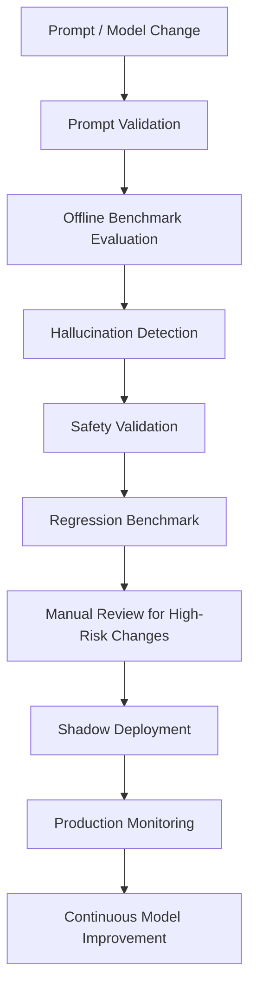

---

# Part 6(A) Summary

This section established the AI Quality Engineering foundation for CardWise, defining validation strategies for LLM behavior, prompt reliability, hallucination prevention, safety, deterministic benchmarking, offline evaluation, and continuous AI quality measurement. These practices ensure that AI-powered financial guidance remains accurate, explainable, trustworthy, and operationally safe throughout the product lifecycle.

# docs/15_TESTING_STRATEGY.md

# Part 6 (B) — Recommendation Engine Validation

> This section continues Part 6 by defining the enterprise validation strategy for the CardWise Recommendation Engine. It covers offline and online evaluation, ranking quality, personalization, experimentation, model drift detection, shadow deployments, A/B testing, feedback loops, and recommendation quality governance.

---

# 80. Recommendation Engine Validation Strategy

## 80.1 Overview

The Recommendation Engine is the intelligence layer of CardWise. It determines the optimal credit card, payment method, reward strategy, merchant offer, travel booking option, and financial recommendation for every customer interaction.

Unlike deterministic rule engines, recommendation systems continuously evolve as user behavior, merchant offers, financial products, and AI models change. Validation therefore combines statistical evaluation, controlled experimentation, production monitoring, and business outcome analysis.

The objective is not merely to maximize prediction accuracy but to optimize **customer value, recommendation trust, explainability, and long-term platform confidence**.

---

## Objectives

| ID | Objective | Description |
|----|-----------|-------------|
| AI-TEST-101 | Ranking Quality | Recommend the best option consistently. |
| AI-TEST-102 | Personalization | Tailor recommendations to each customer. |
| AI-TEST-103 | Recommendation Stability | Avoid unnecessary ranking fluctuations. |
| AI-TEST-104 | Business Value | Improve customer outcomes and engagement. |
| AI-TEST-105 | Explainability | Provide understandable recommendation reasoning. |
| AI-TEST-106 | Continuous Learning | Improve from user interactions. |
| AI-TEST-107 | Drift Detection | Identify quality degradation quickly. |
| AI-TEST-108 | Safe Deployment | Validate recommendation quality before rollout. |

---

## Scope

| Recommendation Domain | Included |
|-----------------------|----------|
| Credit Card Selection | ✓ |
| Payment Method | ✓ |
| Merchant Offers | ✓ |
| Cashback Optimization | ✓ |
| Reward Redemption | ✓ |
| Flight Recommendations | ✓ |
| Hotel Recommendations | ✓ |
| Travel Optimization | ✓ |
| AI Insights | ✓ |

---

## Engineering Rationale

Recommendation quality directly affects customer savings, engagement, and trust. Validation must therefore measure both technical accuracy and real-world customer outcomes.

---

## Best Practices

- Evaluate using representative production datasets.
- Benchmark against previous production models.
- Monitor recommendation quality continuously.
- Explain recommendations whenever possible.

---

## Trade-offs

| Decision | Benefit | Cost |
|----------|----------|------|
| Extensive offline evaluation | Reliable baseline | Larger datasets |
| Continuous experimentation | Better optimization | Operational complexity |

---

## Risks

| Risk | Mitigation |
|------|------------|
| Model drift | Continuous monitoring |
| Recommendation instability | Regression benchmarking |
| Bias in datasets | Periodic dataset review |

---

## Operational Considerations

- Recommendation quality dashboards are monitored continuously.
- High-impact recommendation models require staged rollouts.
- Model performance reviews occur on a recurring cadence.

---

# 81. Offline Recommendation Evaluation

## AI-TEST-110 Overview

Offline evaluation measures recommendation quality using historical datasets before exposing changes to customers.

---

## Evaluation Dataset Categories

| Dataset | Purpose |
|----------|---------|
| Historical Transactions | Card recommendation quality |
| Merchant Purchases | Offer ranking |
| Travel Searches | Flight & hotel ranking |
| Reward Redemptions | Optimization quality |
| Customer Preferences | Personalization validation |

---

## Validation Areas

| Area | Tested |
|------|--------|
| Ranking Accuracy | ✓ |
| Recommendation Consistency | ✓ |
| Personalization | ✓ |
| Explainability | ✓ |
| Stability | ✓ |

---

## Engineering Rationale

Offline evaluation enables reproducible benchmarking and rapid comparison between recommendation algorithms without impacting production users.

---

## Best Practices

- Maintain versioned evaluation datasets.
- Include diverse customer segments.
- Separate training and evaluation datasets.

---

## Risks

- Historical bias.
- Dataset drift.
- Limited representation of future behavior.

---

# 82. Ranking Quality Validation

## AI-TEST-120 Overview

Ranking quality determines whether the highest-value recommendation consistently appears at the top of the recommendation list.

---

## Ranking Metrics

| Metric | Purpose |
|---------|---------|
| Precision@K | Top recommendations relevance |
| Recall@K | Relevant recommendation coverage |
| NDCG | Ranking quality |
| MAP | Average ranking precision |
| MRR | First relevant recommendation position |

---

## Validation Dimensions

| Dimension | Tested |
|-----------|--------|
| Top Recommendation Accuracy | ✓ |
| Ranking Stability | ✓ |
| Merchant Relevance | ✓ |
| Reward Optimization | ✓ |
| Booking Ranking | ✓ |

---

## Engineering Rationale

Customers typically interact with only the highest-ranked recommendations. Small ranking degradations can significantly reduce customer value.

---

## Best Practices

- Benchmark multiple ranking metrics.
- Validate ranking stability across releases.
- Review business-critical scenarios manually.

---

## Trade-offs

| Benefit | Cost |
|----------|------|
| Better recommendation quality | More evaluation complexity |

---

## Risks

- Ranking instability.
- Metric optimization without customer benefit.

---

# 83. Personalization Testing

## AI-TEST-130 Overview

Personalization validation ensures recommendations adapt appropriately to customer preferences, financial products, and behavioral history.

---

## Validation Matrix

| Personalization Area | Tested |
|----------------------|--------|
| Spending Habits | ✓ |
| Card Portfolio | ✓ |
| Reward Preferences | ✓ |
| Merchant Preferences | ✓ |
| Travel Behavior | ✓ |
| Historical Engagement | ✓ |

---

## Validation Goals

- Relevant recommendations
- Stable personalization
- Cold-start handling
- Fair treatment across customer segments

---

## Engineering Rationale

Effective personalization increases recommendation usefulness while preserving transparency and user trust.

---

## Best Practices

- Validate new and existing customers separately.
- Benchmark cold-start scenarios.
- Avoid overfitting to historical behavior.

---

## Risks

- Personalization bias.
- Over-specialization.
- Cold-start degradation.

---

# 84. Feature Validation

## AI-TEST-140 Overview

Recommendation quality depends on reliable feature generation and transformation.

---

## Feature Categories

| Category | Validation |
|----------|------------|
| Customer Profile | ✓ |
| Spending History | ✓ |
| Merchant Features | ✓ |
| Reward Rules | ✓ |
| Travel Preferences | ✓ |
| Offer Metadata | ✓ |

---

## Validation Areas

| Area | Tested |
|------|--------|
| Feature Completeness | ✓ |
| Missing Values | ✓ |
| Data Freshness | ✓ |
| Transformation Accuracy | ✓ |
| Feature Consistency | ✓ |

---

## Engineering Rationale

Incorrect or stale features can significantly degrade recommendation quality despite correct model behavior.

---

## Best Practices

- Validate feature freshness.
- Monitor feature distributions.
- Compare against historical baselines.

---

# 85. Model Drift Detection

## AI-TEST-150 Overview

Model drift testing identifies quality degradation caused by changes in customer behavior, merchant offers, financial products, or external market conditions.

---

## Drift Categories

| Drift Type | Validation |
|------------|------------|
| Data Drift | ✓ |
| Feature Drift | ✓ |
| Concept Drift | ✓ |
| Prediction Drift | ✓ |
| Distribution Drift | ✓ |

---

## Detection Signals

| Signal | Purpose |
|---------|---------|
| Recommendation Acceptance | Customer behavior |
| Ranking Changes | Stability |
| Feature Distribution | Data quality |
| Model Confidence | Prediction reliability |

---

## Engineering Rationale

Models naturally degrade over time. Automated drift detection enables proactive retraining before customer impact becomes significant.

---

## Best Practices

- Monitor drift continuously.
- Define alert thresholds.
- Compare against production baselines.

---

## Risks

- Silent quality degradation.
- Delayed retraining.
- False-positive drift alerts.

---

# 86. Shadow Testing & Online Validation

## AI-TEST-160 Overview

Shadow deployments evaluate new recommendation models in production without affecting customer-visible recommendations.

---

## Validation Areas

| Area | Tested |
|------|--------|
| Prediction Comparison | ✓ |
| Latency | ✓ |
| Recommendation Stability | ✓ |
| Resource Consumption | ✓ |
| Ranking Differences | ✓ |

---

## Engineering Rationale

Shadow testing provides production-quality evaluation without introducing customer risk.

---

## Best Practices

- Log recommendation differences.
- Compare business metrics.
- Review high-impact ranking changes.

---

## Trade-offs

| Benefit | Cost |
|----------|------|
| Production realism | Additional infrastructure |

---

# 87. A/B Testing Strategy

## AI-TEST-170 Overview

Controlled experiments compare recommendation strategies using statistically valid customer cohorts.

---

## Experiment Categories

| Experiment | Purpose |
|------------|---------|
| Ranking Algorithm | Quality comparison |
| Personalization Strategy | Engagement |
| Explanation Format | Customer trust |
| Offer Prioritization | Conversion |

---

## Success Metrics

| Metric | Objective |
|---------|-----------|
| Recommendation Acceptance | Increase |
| Customer Savings | Increase |
| Booking Conversion | Increase |
| Reward Redemption | Increase |
| Recommendation Dismissal | Decrease |

---

## Engineering Rationale

Offline improvements do not always translate into production outcomes. Controlled experimentation validates real customer impact.

---

## Best Practices

- Define success criteria before launch.
- Maintain statistically meaningful sample sizes.
- Avoid overlapping experiments affecting the same users.

---

# 88. Feedback Loop Validation

## AI-TEST-180 Overview

Recommendation quality improves through continuous customer feedback and behavioral learning.

---

## Feedback Sources

| Source | Validation |
|---------|------------|
| Accepted Recommendations | ✓ |
| Rejected Recommendations | ✓ |
| Manual Card Selection | ✓ |
| Booking Completion | ✓ |
| Customer Ratings | ✓ |
| Reward Redemption | ✓ |

---

## Validation Goals

- Correct feedback ingestion
- Accurate attribution
- Timely model updates
- Data quality verification

---

## Engineering Rationale

Reliable feedback loops enable continuous model improvement while preventing incorrect learning from noisy or incomplete signals.

---

## Best Practices

- Validate feedback pipelines.
- Detect anomalous feedback.
- Monitor delayed event processing.

---

# 89. Recommendation Quality Metrics

## AI-TEST-190 Core Metrics

| Metric | Purpose |
|---------|---------|
| Precision@K | Ranking relevance |
| Recall@K | Recommendation coverage |
| NDCG | Ranking effectiveness |
| Acceptance Rate | Customer trust |
| Recommendation CTR | Engagement |
| Savings Generated | Customer value |
| Booking Conversion | Business impact |
| Drift Score | Model health |

---

## Operational Dashboard

- Recommendation quality trends
- Personalization quality
- Drift monitoring
- Experiment results
- Acceptance trends
- Customer savings trends

---

# 90. Recommendation Validation Architecture

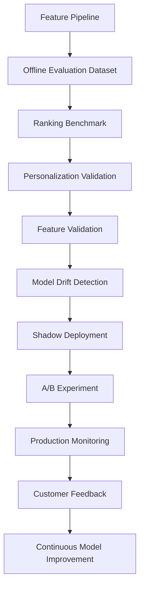

---

# Part 6(B) Summary

This section defined the enterprise validation strategy for the CardWise Recommendation Engine, covering ranking quality, offline benchmarking, personalization testing, feature validation, model drift detection, shadow deployments, A/B experimentation, continuous feedback loops, and production quality monitoring. These practices ensure recommendations remain accurate, explainable, personalized, and continuously optimized while minimizing customer risk during model evolution.

# docs/15_TESTING_STRATEGY.md

# Part 6 (C) — Booking Engine Testing Strategy

> This section completes **Part 6** by defining the enterprise Quality Engineering strategy for the CardWise Booking Engine, including flight and hotel search validation, pricing integrity, availability verification, booking workflows, payment processing, cancellations, refunds, external provider integration, and end-to-end booking validation.

---

# 91. Booking Engine Testing Strategy

## 91.1 Overview

The CardWise Booking Engine integrates multiple flight, hotel, payment, loyalty, and travel service providers to enable users to search, compare, book, modify, and manage travel while maximizing credit card rewards and offers.

Unlike traditional CRUD applications, booking systems involve distributed transactions, rapidly changing inventory, dynamic pricing, third-party dependencies, and financial operations. Quality engineering must therefore validate correctness, resilience, consistency, and recovery across the complete booking lifecycle.

The strategy combines functional validation, integration testing, provider simulation, production monitoring, and business workflow verification.

---

## Objectives

| ID | Objective | Description |
|----|-----------|-------------|
| AI-TEST-201 | Search Accuracy | Return correct travel options. |
| AI-TEST-202 | Availability Integrity | Display only valid inventory. |
| AI-TEST-203 | Pricing Accuracy | Ensure displayed and charged prices match. |
| AI-TEST-204 | Booking Reliability | Prevent duplicate or incomplete bookings. |
| AI-TEST-205 | Payment Integrity | Validate payment correctness and recovery. |
| AI-TEST-206 | Cancellation Reliability | Support predictable booking modifications. |
| AI-TEST-207 | Refund Correctness | Ensure accurate refund calculation and processing. |
| AI-TEST-208 | Provider Compatibility | Validate integrations with external travel providers. |

---

## Scope

| Domain | Included |
|---------|----------|
| Flight Search | ✓ |
| Hotel Search | ✓ |
| Availability | ✓ |
| Dynamic Pricing | ✓ |
| Fare Rules | ✓ |
| Booking | ✓ |
| Payments | ✓ |
| Cancellations | ✓ |
| Refunds | ✓ |
| Loyalty Integration | ✓ |
| External APIs | ✓ |

---

## Engineering Rationale

Travel booking is a business-critical workflow where failures may result in financial loss, customer dissatisfaction, or inconsistent reservation state. Testing therefore emphasizes transactional integrity, provider compatibility, and resilient recovery.

---

## Best Practices

- Validate entire booking journeys.
- Test real-world failure scenarios.
- Verify consistency across provider responses.
- Monitor production booking success rates.

---

## Trade-offs

| Decision | Benefit | Cost |
|----------|----------|------|
| Extensive provider simulation | Higher confidence | More complex test infrastructure |
| Full booking workflow validation | Better reliability | Longer execution time |

---

## Risks

| Risk | Mitigation |
|------|------------|
| Provider API instability | Mocked and sandbox validation |
| Inventory race conditions | Concurrency testing |
| Dynamic pricing inconsistencies | Continuous pricing verification |

---

## Operational Considerations

- Run booking regression suites before every release.
- Continuously monitor production booking success and failure metrics.
- Validate provider compatibility after external API changes.

---

# 92. Flight Search Testing

## AI-TEST-210 Overview

Flight search validation ensures customers receive accurate, relevant, and complete flight options from integrated providers.

---

## Validation Matrix

| Area | Tested |
|------|--------|
| Search Results | ✓ |
| Date Validation | ✓ |
| Passenger Counts | ✓ |
| Cabin Classes | ✓ |
| Multi-city Trips | ✓ |
| Round Trips | ✓ |
| One-way Trips | ✓ |
| Filters & Sorting | ✓ |

---

## Edge Cases

- No available flights
- Invalid airports
- Time-zone boundaries
- Overnight journeys
- Code-share flights
- Mixed carriers

---

## Engineering Rationale

Search is the entry point to the booking funnel. Incorrect search behavior directly impacts conversion and customer trust.

---

## Best Practices

- Validate realistic search datasets.
- Test peak travel periods.
- Verify sorting consistency.

---

# 93. Hotel Search Testing

## AI-TEST-220 Overview

Hotel search validation ensures correct inventory, pricing, availability, and filtering across providers.

---

## Validation Areas

| Area | Tested |
|------|--------|
| Destination Search | ✓ |
| Availability | ✓ |
| Room Types | ✓ |
| Occupancy | ✓ |
| Amenities | ✓ |
| Ratings | ✓ |
| Filters | ✓ |
| Sorting | ✓ |

---

## Edge Cases

- Fully booked properties
- Split inventory
- Last-room availability
- Same-day bookings
- Long-duration stays

---

## Engineering Rationale

Hotel inventory changes rapidly. Validation ensures accurate availability and pricing while minimizing customer disappointment.

---

# 94. Availability & Inventory Validation

## AI-TEST-230 Overview

Availability testing validates synchronization between CardWise and external inventory providers.

---

## Validation Matrix

| Category | Tested |
|----------|--------|
| Real-time Inventory | ✓ |
| Seat Availability | ✓ |
| Room Availability | ✓ |
| Inventory Refresh | ✓ |
| Sold-out Handling | ✓ |
| Concurrent Booking | ✓ |

---

## Failure Scenarios

- Inventory changes during checkout
- Provider synchronization delays
- Partial inventory updates
- Concurrent customer bookings

---

## Engineering Rationale

Availability mismatches are among the highest-impact booking failures. Continuous validation minimizes stale inventory exposure.

---

# 95. Pricing Validation

## AI-TEST-240 Overview

Pricing validation ensures that prices displayed to users remain consistent throughout the booking lifecycle.

---

## Validation Areas

| Area | Tested |
|------|--------|
| Base Fare | ✓ |
| Taxes | ✓ |
| Service Fees | ✓ |
| Currency Conversion | ✓ |
| Dynamic Pricing | ✓ |
| Promotional Discounts | ✓ |
| Reward Redemption | ✓ |

---

## Validation Goals

- Price consistency
- Accurate totals
- Correct discount application
- Reward optimization correctness

---

## Engineering Rationale

Pricing inconsistencies directly affect customer trust and booking completion rates.

---

## Best Practices

- Validate pricing at each booking step.
- Compare provider responses.
- Test multiple currencies.

---

# 96. Booking Workflow Testing

## AI-TEST-250 Overview

Booking workflow validation verifies complete reservation creation from search through confirmation.

---

## Workflow Validation

| Step | Tested |
|------|--------|
| Search | ✓ |
| Selection | ✓ |
| Traveller Details | ✓ |
| Price Confirmation | ✓ |
| Payment | ✓ |
| Reservation | ✓ |
| Confirmation | ✓ |
| Notification | ✓ |

---

## Failure Scenarios

- Session expiration
- Payment timeout
- Inventory change
- Provider timeout
- Duplicate submission

---

## Engineering Rationale

Complete workflow validation provides the highest confidence that customers can successfully complete travel bookings.

---

# 97. Payment Validation

## AI-TEST-260 Overview

Payment validation ensures secure and reliable processing across supported payment methods while preserving transactional integrity.

---

## Validation Areas

| Area | Tested |
|------|--------|
| Authorization | ✓ |
| Capture | ✓ |
| Retry | ✓ |
| Duplicate Prevention | ✓ |
| Payment Failure | ✓ |
| Currency Support | ✓ |
| Reward Application | ✓ |

---

## Engineering Rationale

Payment failures must never produce duplicate charges or inconsistent booking states.

---

## Best Practices

- Validate idempotency.
- Simulate gateway failures.
- Verify reconciliation.

---

## Risks

- Duplicate payment.
- Partial payment success.
- Provider timeout.

---

# 98. Cancellation & Refund Testing

## AI-TEST-270 Overview

Cancellation and refund validation ensures accurate processing of booking modifications according to provider rules and customer entitlements.

---

## Validation Matrix

| Area | Tested |
|------|--------|
| Cancellation Eligibility | ✓ |
| Partial Cancellation | ✓ |
| Full Cancellation | ✓ |
| Refund Calculation | ✓ |
| Refund Status | ✓ |
| Reward Reversal | ✓ |

---

## Validation Goals

- Correct eligibility
- Accurate refund values
- Timely status updates
- Consistent accounting

---

## Engineering Rationale

Cancellation workflows are financially sensitive and require precise coordination between booking providers, payment systems, and reward calculations.

---

# 99. External Provider Integration Testing

## AI-TEST-280 Overview

The Booking Engine depends on external travel providers for inventory, pricing, reservation creation, and booking management.

---

## Validation Areas

| Provider Capability | Tested |
|---------------------|--------|
| Search | ✓ |
| Availability | ✓ |
| Pricing | ✓ |
| Booking | ✓ |
| Cancellation | ✓ |
| Refund | ✓ |
| Rate Limiting | ✓ |
| Timeout Handling | ✓ |

---

## Failure Scenarios

- Provider unavailable
- Slow response
- Invalid payload
- Partial booking
- Authentication failure

---

## Engineering Rationale

External dependencies are beyond platform control. Testing emphasizes graceful degradation, retries, fallback behavior, and observability.

---

## Best Practices

- Use provider sandbox environments.
- Validate retry policies.
- Monitor provider SLA compliance.

---

# 100. End-to-End Booking Validation

## AI-TEST-290 Overview

End-to-end validation confirms that complete customer booking journeys function correctly across all integrated systems.

---

## Journey Validation

| Journey | Tested |
|----------|--------|
| Flight Booking | ✓ |
| Hotel Booking | ✓ |
| Reward Redemption | ✓ |
| Payment | ✓ |
| Confirmation | ✓ |
| Cancellation | ✓ |
| Refund | ✓ |

---

## Quality Gates

| Gate | Requirement |
|------|-------------|
| Search Validation | Pass |
| Availability Validation | Pass |
| Pricing Validation | Pass |
| Booking Workflow | Pass |
| Payment Validation | Pass |
| Cancellation Validation | Pass |
| Refund Validation | Pass |
| Provider Compatibility | Pass |

---

## Booking Engine Testing Architecture

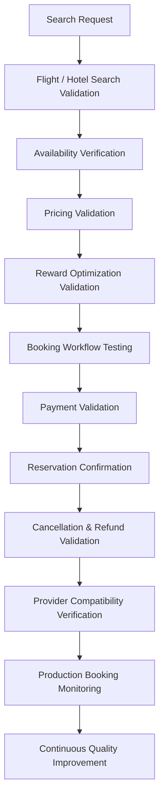

---

# Part 6 Summary

Part 6 established the enterprise Quality Engineering strategy for CardWise's AI and intelligent decision systems. It covered LLM validation, prompt engineering, hallucination prevention, recommendation engine benchmarking, personalization, model drift detection, shadow deployments, A/B experimentation, and the complete booking engine validation lifecycle—from search and pricing through payments, cancellations, refunds, and external provider integrations. Together, these practices ensure that AI-driven recommendations and travel booking workflows remain accurate, explainable, resilient, and trustworthy in production.

# docs/15_TESTING_STRATEGY.md

# Part 7 (A) — Security Testing Strategy

> **Note:** Due to document size, Part 7 is delivered in two continuations. This section defines the enterprise Security Testing strategy for CardWise, including secure SDLC validation, SAST, DAST, dependency scanning, secrets detection, authentication and authorization testing, penetration testing, API security validation, and security quality gates. Performance Testing follows in Part 7(B).

---

# 101. Security Testing Strategy

## 101.1 Overview

CardWise processes sensitive financial information, user identities, payment workflows, travel bookings, and AI-generated financial recommendations. Security testing is therefore integrated into every stage of the Software Development Lifecycle (SDLC) rather than performed as a final release activity.

The strategy follows **Shift Left Security**, **Continuous Verification**, and **Defense in Depth**, ensuring that vulnerabilities are identified as early as possible while continuously validating production deployments.

This chapter complements the platform security architecture defined in **docs/13_SECURITY_AND_COMPLIANCE.md** and focuses exclusively on quality engineering and validation.

---

## Objectives

| ID | Objective | Description |
|----|-----------|-------------|
| SEC-TEST-001 | Prevent Vulnerabilities | Detect security defects before deployment. |
| SEC-TEST-002 | Continuous Verification | Validate security controls throughout delivery. |
| SEC-TEST-003 | Protect Customer Data | Ensure confidentiality and integrity of financial information. |
| SEC-TEST-004 | Secure APIs | Validate authentication, authorization, and input handling. |
| SEC-TEST-005 | Infrastructure Assurance | Verify secure runtime configuration. |
| SEC-TEST-006 | Compliance Readiness | Support security and regulatory validation. |
| SEC-TEST-007 | Resilient Releases | Prevent insecure deployments. |
| SEC-TEST-008 | Operational Security | Continuously monitor production security posture. |

---

## Validation Scope

| Domain | Included |
|---------|----------|
| Backend APIs | ✓ |
| Frontend | ✓ |
| Mobile | ✓ |
| Browser Extension | ✓ |
| Infrastructure | ✓ |
| Kubernetes | ✓ |
| CI/CD | ✓ |
| IAM | ✓ |
| Secrets Management | ✓ |
| Databases | ✓ |
| AI Services | ✓ |
| Third-party Integrations | ✓ |

---

## Engineering Rationale

Security vulnerabilities are significantly less expensive to remediate when identified during development rather than after production deployment. Continuous validation reduces risk while enabling rapid release cycles.

---

## Best Practices

- Automate security testing wherever feasible.
- Treat security findings as engineering work items.
- Prioritize vulnerabilities using risk-based assessment.
- Continuously review security testing coverage.

---

## Trade-offs

| Decision | Benefit | Cost |
|----------|----------|------|
| Continuous scanning | Early detection | Longer CI pipelines |
| Automated validation | Faster feedback | Tooling investment |
| Multiple security layers | Defense in depth | Increased operational complexity |

---

## Risks

| Risk | Mitigation |
|------|------------|
| False positives | Triage workflows and rule tuning |
| Scanner blind spots | Layered security validation |
| Configuration drift | Continuous runtime verification |

---

## Operational Considerations

- Security validation executes on every pull request.
- Critical vulnerabilities block releases.
- Security dashboards are monitored continuously.

---

# 102. Secure SDLC Validation

## SEC-TEST-010 Overview

Security activities are embedded throughout the development lifecycle to identify vulnerabilities before production.

---

## Secure SDLC Stages

| Stage | Validation |
|--------|------------|
| Requirements | Threat identification |
| Architecture | Security design review |
| Development | Static analysis |
| Pull Request | Automated security gates |
| Build | Dependency validation |
| Release | Dynamic testing |
| Production | Runtime verification |

---

## Engineering Rationale

Embedding security validation into development minimizes remediation cost while reducing production risk.

---

## Best Practices

- Include security acceptance criteria in requirements.
- Perform architecture reviews for high-risk features.
- Automate recurring validation activities.

---

# 103. Static Application Security Testing (SAST)

## SEC-TEST-020 Overview

SAST analyzes application source code to identify security weaknesses before deployment.

---

## Validation Categories

| Category | Tested |
|----------|--------|
| Injection Risks | ✓ |
| Unsafe Deserialization | ✓ |
| Cryptographic Misuse | ✓ |
| Input Validation | ✓ |
| Authentication Logic | ✓ |
| Authorization Checks | ✓ |
| Error Handling | ✓ |

---

## Engineering Rationale

Static analysis provides rapid developer feedback and detects many classes of vulnerabilities before runtime.

---

## Best Practices

- Run SAST on every pull request.
- Review new findings before merge.
- Suppress false positives with documented justification.

---

## Trade-offs

| Benefit | Cost |
|----------|------|
| Early detection | False positives |

---

## Risks

- Rule misconfiguration.
- Incomplete language coverage.

---

# 104. Dynamic Application Security Testing (DAST)

## SEC-TEST-030 Overview

DAST evaluates running applications from an external attacker's perspective by exercising exposed interfaces and workflows.

---

## Validation Matrix

| Area | Tested |
|------|--------|
| Authentication | ✓ |
| Authorization | ✓ |
| Session Handling | ✓ |
| Input Validation | ✓ |
| API Security | ✓ |
| Error Responses | ✓ |
| Security Headers | ✓ |

---

## Engineering Rationale

Dynamic testing validates runtime behavior that static analysis cannot observe.

---

## Best Practices

- Execute against production-like environments.
- Include authenticated and unauthenticated scenarios.
- Validate critical customer journeys.

---

## Risks

- Environment instability.
- False negatives for internal logic flaws.

---

# 105. Dependency & Software Composition Analysis

## SEC-TEST-040 Overview

Software Composition Analysis (SCA) validates third-party libraries for known vulnerabilities, licensing issues, and outdated dependencies.

---

## Validation Areas

| Area | Tested |
|------|--------|
| Vulnerable Packages | ✓ |
| License Compliance | ✓ |
| Transitive Dependencies | ✓ |
| Outdated Versions | ✓ |
| Supply Chain Risks | ✓ |

---

## Engineering Rationale

Modern applications depend heavily on third-party packages. Continuous validation reduces exposure to publicly disclosed vulnerabilities.

---

## Best Practices

- Review dependency updates regularly.
- Prioritize critical vulnerabilities.
- Maintain an approved dependency inventory.

---

## Risks

- Delayed patch adoption.
- Dependency conflicts.
- Supply chain compromise.

---

# 106. Secrets Detection & Configuration Validation

## SEC-TEST-050 Overview

Secrets detection prevents credentials and sensitive configuration values from entering source control or deployment artifacts.

---

## Validation Scope

| Category | Tested |
|----------|--------|
| API Keys | ✓ |
| Tokens | ✓ |
| Certificates | ✓ |
| Private Keys | ✓ |
| Database Credentials | ✓ |
| Cloud Credentials | ✓ |

---

## Configuration Validation

| Area | Validation |
|------|------------|
| Environment Variables | ✓ |
| Secret Rotation | ✓ |
| Encryption Configuration | ✓ |
| Runtime Injection | ✓ |

---

## Engineering Rationale

Credential exposure is among the most common and impactful security failures. Automated detection reduces accidental disclosure.

---

## Best Practices

- Store secrets outside source repositories.
- Rotate credentials periodically.
- Validate least-privilege access.

---

# 107. Authentication & Authorization Testing

## SEC-TEST-060 Overview

Security validation confirms that identity verification and access control mechanisms enforce intended permissions.

---

## Validation Areas

| Area | Tested |
|------|--------|
| Login | ✓ |
| Logout | ✓ |
| MFA (where enabled) | ✓ |
| Session Expiration | ✓ |
| RBAC | ✓ |
| Resource Ownership | ✓ |
| Privilege Boundaries | ✓ |

---

## Negative Scenarios

- Privilege escalation
- Cross-user resource access
- Invalid tokens
- Expired sessions
- Session fixation attempts

---

## Engineering Rationale

Authentication verifies identity, while authorization protects customer resources. Both require continuous regression testing.

---

## Best Practices

- Validate least-privilege access.
- Exercise negative authorization paths.
- Review administrative workflows separately.

---

# 108. Session Management Testing

## SEC-TEST-070 Overview

Session testing validates secure session establishment, maintenance, renewal, and termination.

---

## Validation Matrix

| Area | Tested |
|------|--------|
| Session Creation | ✓ |
| Session Renewal | ✓ |
| Expiration | ✓ |
| Logout | ✓ |
| Concurrent Sessions | ✓ |
| Idle Timeout | ✓ |

---

## Engineering Rationale

Incorrect session handling may expose customer accounts or administrative capabilities.

---

## Best Practices

- Verify session invalidation.
- Test concurrent device behavior.
- Validate timeout policies.

---

# 109. Penetration Testing

## SEC-TEST-080 Overview

Penetration testing evaluates the platform using attacker-oriented techniques to identify exploitable weaknesses beyond automated scanning.

---

## Assessment Scope

| Domain | Included |
|---------|----------|
| Web Platform | ✓ |
| Mobile | ✓ |
| Browser Extension | ✓ |
| APIs | ✓ |
| Infrastructure | ✓ |
| Authentication | ✓ |
| Administrative Interfaces | ✓ |

---

## Testing Categories

| Category | Validation |
|----------|------------|
| OWASP Top 10 | ✓ |
| Business Logic | ✓ |
| Privilege Escalation | ✓ |
| Input Manipulation | ✓ |
| Session Attacks | ✓ |
| API Abuse | ✓ |

---

## Engineering Rationale

Manual penetration testing complements automated tooling by identifying complex business logic vulnerabilities.

---

## Best Practices

- Conduct assessments before major releases.
- Validate remediation with follow-up testing.
- Track recurring findings.

---

# 110. API Security Testing & Security Quality Gates

## SEC-TEST-090 API Security Validation

| Validation Area | Tested |
|-----------------|--------|
| Authentication | ✓ |
| Authorization | ✓ |
| Rate Limiting | ✓ |
| Input Validation | ✓ |
| Output Encoding | ✓ |
| Security Headers | ✓ |
| CORS Configuration | ✓ |
| Error Disclosure | ✓ |

---

## Mandatory Security Gates

| Gate | Requirement |
|------|-------------|
| SAST | Pass |
| DAST | Pass |
| Dependency Scanning | Pass |
| Secrets Detection | Pass |
| Authentication Validation | Pass |
| Authorization Validation | Pass |
| Penetration Test Findings | No unresolved critical issues |
| API Security Validation | Pass |

---

## Release Blocking Conditions

- Critical or high-severity vulnerabilities
- Authentication bypass
- Authorization bypass
- Exposed secrets
- Unresolved dependency vulnerabilities above accepted risk threshold
- Critical infrastructure misconfiguration

---

# 111. Security Testing Architecture

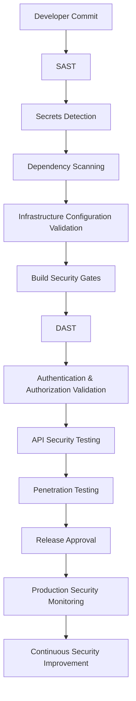

---

# Part 7(A) Summary

This section established the enterprise Security Testing strategy for CardWise by integrating security validation throughout the SDLC. It defined layered validation using SAST, DAST, software composition analysis, secrets detection, authentication and authorization testing, session validation, penetration testing, API security verification, and mandatory security quality gates. Together, these practices provide continuous assurance that releases remain secure, resilient, and compliant before reaching production.

# docs/15_TESTING_STRATEGY.md

# Part 7 (B) — Performance Testing Strategy

> This section completes **Part 7** by defining the enterprise Performance Engineering and Performance Testing strategy for the CardWise platform, including load testing, stress testing, spike testing, endurance testing, capacity planning, scalability validation, resource utilization analysis, performance budgets, and production performance verification.

---

# 112. Performance Testing Strategy

## 112.1 Overview

Performance is a first-class quality attribute for CardWise. Users expect instant reward recommendations, responsive dashboards, low-latency booking searches, fast AI responses, and reliable payment processing regardless of system load.

Performance testing validates that the platform meets defined Service Level Objectives (SLOs) under expected, peak, and abnormal traffic conditions.

Unlike functional testing, performance engineering focuses on latency, throughput, scalability, resource efficiency, stability, and predictable degradation.

---

## Objectives

| ID | Objective | Description |
|----|-----------|-------------|
| PERF-001 | Validate SLOs | Ensure performance targets are consistently achieved. |
| PERF-002 | Measure Scalability | Verify horizontal and vertical scaling behavior. |
| PERF-003 | Detect Bottlenecks | Identify infrastructure and application constraints. |
| PERF-004 | Validate Stability | Confirm reliable operation under sustained load. |
| PERF-005 | Capacity Planning | Estimate production infrastructure requirements. |
| PERF-006 | Protect User Experience | Maintain acceptable response times during peak demand. |
| PERF-007 | Release Confidence | Prevent performance regressions before deployment. |
| PERF-008 | Continuous Optimization | Use production telemetry to drive improvements. |

---

## Scope

| Domain | Included |
|---------|----------|
| REST APIs | ✓ |
| AI Services | ✓ |
| Recommendation Engine | ✓ |
| Booking Engine | ✓ |
| Authentication | ✓ |
| Kafka | ✓ |
| PostgreSQL | ✓ |
| Redis | ✓ |
| Frontend | ✓ |
| Mobile APIs | ✓ |
| Browser Extension APIs | ✓ |

---

## Engineering Rationale

Performance defects frequently emerge only under realistic production workloads. Comprehensive performance validation enables proactive optimization and reduces production incidents.

---

## Best Practices

- Test representative production workloads.
- Define measurable performance objectives.
- Automate regression detection.
- Correlate performance metrics with business transactions.

---

## Trade-offs

| Decision | Benefit | Cost |
|----------|----------|------|
| Large-scale testing | Accurate capacity estimates | Higher infrastructure cost |
| Frequent regression testing | Early detection | Longer CI pipelines |

---

## Risks

| Risk | Mitigation |
|------|------------|
| Unrealistic workloads | Production-derived traffic models |
| Environment differences | Production-like infrastructure |
| Hidden bottlenecks | Distributed tracing and profiling |

---

## Operational Considerations

- Major performance tests execute before production releases.
- Production telemetry continuously validates assumptions.
- Capacity models are reviewed periodically.

---

# 113. Load Testing

## PERF-010 Overview

Load testing validates expected production traffic under normal operating conditions.

---

## Validation Goals

| Goal | Validation |
|------|------------|
| Response Time | ✓ |
| Throughput | ✓ |
| Error Rate | ✓ |
| Resource Usage | ✓ |
| Database Performance | ✓ |
| Cache Efficiency | ✓ |

---

## Representative Workloads

| Workflow | Included |
|----------|----------|
| User Login | ✓ |
| Dashboard Loading | ✓ |
| Card Search | ✓ |
| Recommendation Generation | ✓ |
| Flight Search | ✓ |
| Hotel Search | ✓ |
| Booking Checkout | ✓ |
| Reward Calculation | ✓ |

---

## Engineering Rationale

Load testing verifies that production infrastructure supports anticipated customer demand without unacceptable degradation.

---

## Best Practices

- Base workloads on production traffic.
- Include realistic user think times.
- Validate business-critical workflows.

---

# 114. Stress Testing

## PERF-020 Overview

Stress testing evaluates system behavior beyond expected operational limits to identify failure thresholds and recovery characteristics.

---

## Validation Areas

| Area | Tested |
|------|--------|
| Extreme Concurrent Users | ✓ |
| API Saturation | ✓ |
| Database Saturation | ✓ |
| Kafka Backlog | ✓ |
| Cache Exhaustion | ✓ |
| External Dependency Delays | ✓ |

---

## Expected Behaviors

- Graceful degradation
- Controlled failure
- Recovery after load reduction
- No data corruption

---

## Engineering Rationale

Understanding failure boundaries improves operational readiness and capacity planning.

---

## Best Practices

- Increase load gradually.
- Observe recovery behavior.
- Validate monitoring alerts.

---

# 115. Spike Testing

## PERF-030 Overview

Spike testing evaluates platform resilience during sudden and significant traffic increases.

---

## Example Scenarios

| Scenario | Validation |
|----------|------------|
| Major Sale Events | ✓ |
| Reward Campaign Launch | ✓ |
| Flash Travel Deals | ✓ |
| Marketing Push Notifications | ✓ |
| Viral Social Media Traffic | ✓ |

---

## Validation Goals

- Autoscaling responsiveness
- Queue stability
- Request success rate
- Latency recovery

---

## Engineering Rationale

Traffic spikes can expose scaling delays and queue saturation that remain hidden during steady-state testing.

---

## Best Practices

- Simulate realistic growth curves.
- Validate autoscaling behavior.
- Measure recovery time.

---

# 116. Endurance (Soak) Testing

## PERF-040 Overview

Endurance testing validates long-running platform stability under sustained production-like traffic.

---

## Validation Areas

| Area | Tested |
|------|--------|
| Memory Stability | ✓ |
| Connection Pools | ✓ |
| Cache Consistency | ✓ |
| Background Jobs | ✓ |
| Resource Leaks | ✓ |
| Queue Processing | ✓ |

---

## Engineering Rationale

Long-duration execution identifies resource leaks and degradation patterns not visible during shorter tests.

---

## Best Practices

- Execute tests over extended durations.
- Monitor resource trends continuously.
- Validate recovery after completion.

---

# 117. Capacity Planning Validation

## PERF-050 Overview

Capacity validation estimates infrastructure requirements for expected business growth and seasonal demand.

---

## Capacity Metrics

| Metric | Purpose |
|---------|---------|
| Concurrent Users | Infrastructure sizing |
| API Throughput | Service capacity |
| Database TPS | Database planning |
| Kafka Throughput | Event platform sizing |
| Storage Growth | Capacity forecasting |
| Network Utilization | Bandwidth planning |

---

## Engineering Rationale

Capacity planning reduces operational risk by identifying scaling requirements before customer demand exceeds available resources.

---

## Best Practices

- Use production growth projections.
- Revalidate after significant feature launches.
- Include peak seasonal demand.

---

# 118. Scalability Validation

## PERF-060 Overview

Scalability testing verifies that platform performance improves predictably as infrastructure capacity increases.

---

## Validation Areas

| Area | Tested |
|------|--------|
| Horizontal Scaling | ✓ |
| Vertical Scaling | ✓ |
| Kubernetes Autoscaling | ✓ |
| Database Scaling | ✓ |
| Cache Scaling | ✓ |
| Message Queue Scaling | ✓ |

---

## Engineering Rationale

Elastic scaling is a core architectural capability. Testing confirms that additional resources translate into measurable performance improvements.

---

## Best Practices

- Measure scaling efficiency.
- Identify diminishing returns.
- Validate scaling under realistic workloads.

---

# 119. Resource Utilization & Performance Budgets

## PERF-070 Resource Validation

| Resource | Monitored |
|-----------|-----------|
| CPU | ✓ |
| Memory | ✓ |
| Disk I/O | ✓ |
| Network | ✓ |
| Database Connections | ✓ |
| Cache Utilization | ✓ |

---

## Performance Budgets

| Budget | Purpose |
|---------|---------|
| API Latency | User responsiveness |
| Page Load Time | Frontend experience |
| AI Response Time | Recommendation quality |
| Booking Search Latency | Travel experience |
| Error Rate | Platform stability |

---

## Engineering Rationale

Performance budgets define measurable acceptance criteria that prevent gradual degradation across releases.

---

## Best Practices

- Review budgets quarterly.
- Align budgets with SLOs.
- Alert on sustained violations.

---

# 120. Performance Quality Gates

## PERF-080 Mandatory Release Gates

| Gate | Requirement |
|------|-------------|
| Load Testing | Pass |
| Stress Testing | Pass |
| Spike Testing | Pass |
| Endurance Testing | Pass |
| Capacity Validation | Pass |
| Scalability Validation | Pass |
| Performance Budgets | Within limits |
| Resource Utilization | Within acceptable thresholds |

---

## Release Blocking Conditions

- Critical SLO violations
- Significant latency regression
- Throughput regression beyond approved threshold
- Sustained resource exhaustion
- Memory leaks
- Unacceptable error rates under expected load

---

# 121. Performance Testing Architecture

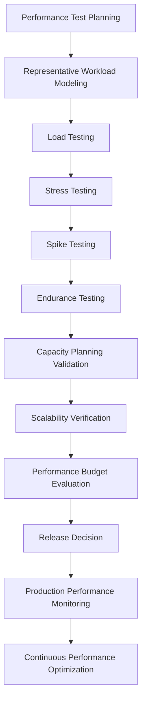

---

# Part 7 Summary

Part 7 established the comprehensive Security and Performance Testing strategy for CardWise. It integrated security validation throughout the SDLC using static analysis, dynamic analysis, penetration testing, dependency scanning, secrets detection, and security quality gates. It also defined a complete performance engineering framework covering load, stress, spike, endurance, capacity, scalability, and resource utilization testing. Together, these practices ensure that CardWise remains secure, performant, resilient, and capable of meeting production-scale demands while maintaining high release confidence.

# docs/15_TESTING_STRATEGY.md

# Part 8 (A) — Reliability Testing & Chaos Engineering

> **Note:** Due to document size, Part 8 is delivered in two continuations. This section defines the enterprise Reliability Engineering strategy for CardWise, including reliability validation, fault injection, chaos engineering, disaster recovery validation, backup verification, failover testing, RTO/RPO validation, and operational resilience metrics. Accessibility and Cross-Browser Testing follow in Part 8(B).

---

# 122. Reliability Engineering Strategy

## 122.1 Overview

Reliability is a foundational quality attribute for CardWise. Users expect uninterrupted access to financial insights, reward optimization, AI recommendations, and booking services regardless of infrastructure failures or dependency outages.

Reliability engineering extends traditional testing by validating that the platform continues operating correctly during infrastructure degradation, network instability, service failures, and disaster recovery events.

The strategy combines proactive validation, controlled fault injection, chaos engineering, production observability, and continuous operational learning.

---

## Objectives

| ID | Objective | Description |
|----|-----------|-------------|
| REL-001 | Continuous Availability | Maintain service continuity during failures. |
| REL-002 | Fault Isolation | Prevent cascading failures across services. |
| REL-003 | Automated Recovery | Validate self-healing capabilities. |
| REL-004 | Disaster Readiness | Verify recovery procedures before incidents occur. |
| REL-005 | Operational Confidence | Continuously validate production resilience. |
| REL-006 | Customer Trust | Minimize customer-visible disruptions. |
| REL-007 | Observability | Detect failures rapidly. |
| REL-008 | Continuous Improvement | Learn from resilience exercises and incidents. |

---

## Validation Scope

| Domain | Included |
|---------|----------|
| Kubernetes | ✓ |
| Backend Services | ✓ |
| Databases | ✓ |
| Kafka | ✓ |
| Redis | ✓ |
| API Gateway | ✓ |
| AI Services | ✓ |
| Booking Engine | ✓ |
| External Providers | ✓ |
| Monitoring Stack | ✓ |

---

## Engineering Rationale

Reliability cannot be assumed from architecture alone. Production systems must demonstrate resilience under controlled failure scenarios before those failures occur in real environments.

---

## Best Practices

- Automate resilience validation.
- Validate customer-facing workflows during failures.
- Conduct recurring resilience exercises.
- Continuously improve recovery procedures.

---

## Trade-offs

| Decision | Benefit | Cost |
|----------|----------|------|
| Regular resilience testing | Higher confidence | Additional operational effort |
| Production fault injection | Realistic validation | Carefully managed operational risk |

---

## Risks

| Risk | Mitigation |
|------|------------|
| Cascading failures | Fault isolation validation |
| Recovery procedure drift | Scheduled disaster recovery exercises |
| Undetected dependencies | Service dependency mapping |

---

## Operational Considerations

- Reliability validation is included in release readiness.
- Chaos experiments require predefined rollback criteria.
- Post-incident reviews feed future testing strategies.

---

# 123. Reliability Validation Strategy

## REL-010 Overview

Reliability validation confirms that platform services remain operational despite infrastructure failures and degraded operating conditions.

---

## Validation Matrix

| Area | Tested |
|------|--------|
| Service Availability | ✓ |
| API Recovery | ✓ |
| Database Resilience | ✓ |
| Cache Recovery | ✓ |
| Queue Processing | ✓ |
| AI Service Availability | ✓ |
| Booking Workflow Recovery | ✓ |

---

## Validation Goals

- Continuous availability
- Graceful degradation
- Predictable recovery
- Minimal customer disruption

---

## Engineering Rationale

Reliability testing focuses on customer experience during failure rather than only verifying normal system operation.

---

## Best Practices

- Validate both technical and business recovery.
- Exercise partial failures.
- Test degraded operating modes.

---

# 124. Fault Injection Testing

## REL-020 Overview

Fault injection deliberately introduces controlled failures to verify system resilience and recovery mechanisms.

---

## Fault Categories

| Fault | Validation |
|--------|------------|
| Service Restart | ✓ |
| Pod Termination | ✓ |
| Network Delay | ✓ |
| Packet Loss | ✓ |
| Database Timeout | ✓ |
| Cache Failure | ✓ |
| Kafka Delay | ✓ |
| External API Failure | ✓ |

---

## Expected Behaviors

| Behavior | Expected Outcome |
|-----------|------------------|
| Retry | Within configured limits |
| Circuit Breaker | Activated appropriately |
| Fallback | Safe degradation |
| Monitoring | Alerts generated |
| Recovery | Automatic where applicable |

---

## Engineering Rationale

Controlled failure validation identifies resilience gaps before unexpected production incidents.

---

## Best Practices

- Introduce one failure at a time initially.
- Measure recovery time.
- Validate monitoring accuracy.

---

## Risks

- Incorrect rollback procedures.
- Unexpected dependency interactions.

---

# 125. Chaos Engineering

## REL-030 Overview

Chaos Engineering validates the behavior of distributed systems under unpredictable failure conditions.

Experiments are conducted using controlled blast-radius principles and clearly defined success criteria.

---

## Chaos Experiment Categories

| Category | Validation |
|----------|------------|
| Infrastructure Failures | ✓ |
| Service Failures | ✓ |
| Network Failures | ✓ |
| Dependency Failures | ✓ |
| Database Degradation | ✓ |
| Queue Delays | ✓ |

---

## Experiment Lifecycle

1. Define steady-state metrics.
2. Formulate hypothesis.
3. Introduce controlled fault.
4. Observe system behavior.
5. Validate recovery.
6. Document learnings.
7. Improve resilience.

---

## Engineering Rationale

Complex distributed systems exhibit emergent behavior that cannot always be predicted through traditional testing alone.

---

## Best Practices

- Start in lower environments.
- Expand blast radius gradually.
- Automate experiment execution where appropriate.

---

## Trade-offs

| Benefit | Cost |
|----------|------|
| Improved operational confidence | Operational planning effort |

---

## Risks

- Excessive experiment scope.
- Inadequate monitoring.

---

# 126. Disaster Recovery Validation

## REL-040 Overview

Disaster Recovery (DR) validation confirms that the platform can recover from severe infrastructure failures while preserving business continuity.

---

## Disaster Scenarios

| Scenario | Tested |
|----------|--------|
| Region Failure | ✓ |
| Cluster Failure | ✓ |
| Database Failure | ✓ |
| Storage Failure | ✓ |
| Message Broker Failure | ✓ |
| Network Isolation | ✓ |

---

## Validation Areas

| Area | Tested |
|------|--------|
| Recovery Procedures | ✓ |
| Infrastructure Restoration | ✓ |
| Data Integrity | ✓ |
| Application Recovery | ✓ |
| Monitoring Recovery | ✓ |

---

## Engineering Rationale

Recovery procedures that are not exercised regularly cannot be assumed to work during real incidents.

---

## Best Practices

- Perform scheduled DR exercises.
- Document recovery timelines.
- Validate dependencies.

---

# 127. Backup & Restore Testing

## REL-050 Overview

Backup validation ensures that platform data can be restored accurately and within operational objectives.

---

## Validation Matrix

| Area | Tested |
|------|--------|
| PostgreSQL Backups | ✓ |
| Redis Snapshots | ✓ |
| Configuration Backups | ✓ |
| Object Storage | ✓ |
| Secrets Recovery | ✓ |

---

## Validation Goals

- Backup completeness
- Restore correctness
- Recovery consistency
- Data integrity

---

## Engineering Rationale

A successful backup is only valuable if restoration procedures are verified.

---

## Best Practices

- Test restore procedures regularly.
- Validate backup integrity automatically.
- Track restore durations.

---

# 128. Failover Testing

## REL-060 Overview

Failover testing validates automatic or controlled transitions to redundant infrastructure components.

---

## Validation Areas

| Component | Tested |
|-----------|--------|
| API Gateway | ✓ |
| Application Pods | ✓ |
| Database Replicas | ✓ |
| Kafka Brokers | ✓ |
| Redis Replicas | ✓ |
| Load Balancers | ✓ |

---

## Validation Goals

- Automatic failover
- Minimal service interruption
- Correct traffic routing
- Consistent application state

---

## Engineering Rationale

High availability depends not only on redundancy but also on successful failover execution.

---

## Best Practices

- Test planned and unplanned failovers.
- Validate customer-facing workflows.
- Measure recovery duration.

---

# 129. RTO & RPO Validation

## REL-070 Overview

Recovery objectives define acceptable service interruption and data loss during disaster recovery.

---

## Validation Matrix

| Objective | Validation |
|-----------|------------|
| Recovery Time Objective (RTO) | ✓ |
| Recovery Point Objective (RPO) | ✓ |
| Data Consistency | ✓ |
| Service Availability | ✓ |

---

## Engineering Rationale

Recovery objectives transform disaster recovery planning into measurable operational commitments.

---

## Best Practices

- Validate against documented objectives.
- Review after infrastructure changes.
- Include production-scale datasets.

---

# 130. Reliability Metrics

## REL-080 Operational Metrics

| Metric | Purpose |
|---------|---------|
| Availability | Service continuity |
| MTTR | Recovery efficiency |
| MTTD | Detection speed |
| Error Budget Consumption | Reliability management |
| Recovery Success Rate | Disaster readiness |
| Failover Success Rate | High availability |
| Backup Restore Success | Data protection |

---

## Operational Dashboard

- Service availability
- Error budget status
- Recovery performance
- Failover health
- Backup verification
- Disaster recovery readiness

---

# 131. Reliability Testing Architecture

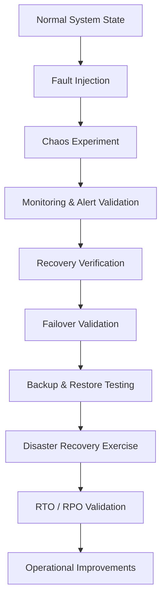

---

# Part 8(A) Summary

This section established the enterprise Reliability Engineering strategy for CardWise, covering fault injection, chaos engineering, disaster recovery validation, backup verification, failover testing, and RTO/RPO validation. These practices ensure that the platform can withstand infrastructure failures, recover predictably, and continuously improve operational resilience while maintaining customer trust.

# docs/15_TESTING_STRATEGY.md

# Part 8 (B) — Accessibility & Cross-Browser Testing

> This section completes **Part 8** by defining the enterprise Accessibility Engineering and Cross-Browser Validation strategy for CardWise. It establishes compliance with WCAG 2.2 AA, validates assistive technology compatibility, verifies browser interoperability, and ensures a consistent customer experience across supported platforms.

---

# 132. Accessibility Testing Strategy

## 132.1 Overview

Accessibility is a core quality attribute of the CardWise platform rather than a post-development compliance activity. Customers must be able to manage their financial information, evaluate recommendations, complete bookings, and administer their accounts regardless of physical, sensory, or cognitive abilities.

Accessibility validation is integrated into design reviews, component development, automated testing, manual verification, and production monitoring.

The platform targets **WCAG 2.2 Level AA** compliance across the web application, administrative portal, browser extension, and applicable mobile experiences.

---

## Objectives

| ID | Objective | Description |
|----|-----------|-------------|
| TEST-801 | Inclusive Experience | Ensure equitable access to platform capabilities. |
| TEST-802 | WCAG Compliance | Validate conformance with WCAG 2.2 AA. |
| TEST-803 | Keyboard Accessibility | Support complete keyboard-only navigation. |
| TEST-804 | Assistive Technology | Ensure compatibility with screen readers and related tools. |
| TEST-805 | Visual Accessibility | Maintain readable, perceivable interfaces. |
| TEST-806 | Continuous Validation | Detect accessibility regressions before release. |
| TEST-807 | Accessible Components | Ensure reusable UI components remain compliant. |
| TEST-808 | Operational Monitoring | Continuously monitor accessibility quality. |

---

## Scope

| Domain | Included |
|---------|----------|
| Consumer Web | ✓ |
| Admin Portal | ✓ |
| Browser Extension UI | ✓ |
| Shared Design System | ✓ |
| Responsive Layouts | ✓ |
| Authentication Flows | ✓ |
| Booking Experience | ✓ |
| Recommendation Experience | ✓ |

---

## Engineering Rationale

Financial platforms often present dense, data-rich interfaces. Accessibility ensures that users can understand reward calculations, compare financial products, complete transactions, and manage their accounts regardless of assistive technologies or input methods.

---

## Best Practices

- Build accessibility into reusable components.
- Validate during development rather than after implementation.
- Combine automated and manual verification.
- Treat accessibility defects with the same priority as functional defects.

---

## Trade-offs

| Decision | Benefit | Cost |
|----------|----------|------|
| Continuous accessibility validation | Reduced regressions | Additional CI execution |
| Manual accessibility reviews | Higher confidence | Engineering effort |

---

## Risks

| Risk | Mitigation |
|------|------------|
| Component regressions | Automated accessibility testing |
| Keyboard navigation defects | Manual validation |
| Dynamic content issues | Screen reader verification |

---

## Operational Considerations

- Accessibility validation executes on every release candidate.
- Critical accessibility regressions block production releases.
- Accessibility scorecards are reviewed during release readiness.

---

# 133. WCAG 2.2 AA Validation

## TEST-810 Overview

Accessibility validation follows the WCAG principles of **Perceivable**, **Operable**, **Understandable**, and **Robust (POUR)**.

---

## Validation Matrix

| WCAG Principle | Validation |
|----------------|------------|
| Perceivable | ✓ |
| Operable | ✓ |
| Understandable | ✓ |
| Robust | ✓ |

---

## Core Validation Areas

| Area | Tested |
|------|--------|
| Page Structure | ✓ |
| Semantic HTML | ✓ |
| Form Labels | ✓ |
| Error Messaging | ✓ |
| Heading Hierarchy | ✓ |
| Focus Indicators | ✓ |
| Live Regions | ✓ |

---

## Engineering Rationale

Standards-based validation provides consistent accessibility expectations across all engineering teams and releases.

---

## Best Practices

- Validate semantic structure before visual styling.
- Review accessibility during design system updates.
- Reassess compliance after major UI changes.

---

# 134. Keyboard Navigation Testing

## TEST-820 Overview

All platform functionality must remain fully usable without a pointing device.

---

## Validation Areas

| Area | Tested |
|------|--------|
| Sequential Navigation | ✓ |
| Visible Focus | ✓ |
| Skip Navigation | ✓ |
| Dialog Navigation | ✓ |
| Form Interaction | ✓ |
| Menu Navigation | ✓ |
| Data Tables | ✓ |

---

## Validation Goals

- Logical tab order
- No keyboard traps
- Predictable navigation
- Accessible shortcuts where appropriate

---

## Engineering Rationale

Keyboard accessibility improves usability for assistive technology users as well as power users and accessibility tools.

---

## Best Practices

- Validate focus after dynamic UI updates.
- Maintain consistent navigation order.
- Avoid hidden interactive elements.

---

# 135. Screen Reader Testing

## TEST-830 Overview

Screen reader validation ensures that meaningful information is conveyed accurately through assistive technologies.

---

## Validation Areas

| Area | Tested |
|------|--------|
| Headings | ✓ |
| Forms | ✓ |
| Tables | ✓ |
| Charts | ✓ |
| Buttons | ✓ |
| Dialogs | ✓ |
| Notifications | ✓ |
| Recommendation Cards | ✓ |

---

## Validation Goals

- Meaningful announcements
- Logical reading order
- Descriptive controls
- Correct landmark usage

---

## Engineering Rationale

Users relying on assistive technologies require equivalent access to financial information and transactional workflows.

---

## Best Practices

- Prefer native semantic elements.
- Validate dynamic announcements.
- Review custom widgets carefully.

---

# 136. Color Contrast & Visual Accessibility

## TEST-840 Overview

Visual accessibility validation ensures information remains readable and distinguishable across supported devices and viewing conditions.

---

## Validation Areas

| Area | Tested |
|------|--------|
| Text Contrast | ✓ |
| Icons | ✓ |
| Charts | ✓ |
| Focus Indicators | ✓ |
| Error States | ✓ |
| Status Indicators | ✓ |

---

## Validation Goals

- Sufficient contrast
- No color-only communication
- Clear visual hierarchy
- Consistent focus visibility

---

## Engineering Rationale

Financial information frequently relies on visual comparisons. Accessible presentation reduces interpretation errors and improves usability.

---

## Best Practices

- Validate contrast during design reviews.
- Include dark and light theme testing where applicable.
- Avoid relying solely on color for status communication.

---

# 137. Lighthouse & Automated Accessibility Validation

## TEST-850 Overview

Automated accessibility analysis provides continuous regression detection during development and release validation.

---

## Validation Categories

| Category | Tested |
|----------|--------|
| Accessibility | ✓ |
| Best Practices | ✓ |
| Performance | ✓ |
| SEO (Public Pages) | ✓ |

---

## Engineering Rationale

Automated analysis provides rapid feedback while complementing manual accessibility reviews.

---

## Best Practices

- Execute Lighthouse validation in CI.
- Track historical score trends.
- Investigate significant score regressions.

---

# 138. Cross-Browser Testing Strategy

## TEST-860 Overview

CardWise supports modern browsers across consumer and administrative experiences. Cross-browser validation ensures functional consistency despite differences in rendering engines and browser implementations.

---

## Supported Browsers

| Browser | Validation Level |
|----------|------------------|
| Chrome | Full |
| Edge | Full |
| Firefox | Full |
| Safari | Full |

---

## Validation Scope

| Area | Tested |
|------|--------|
| Authentication | ✓ |
| Dashboard | ✓ |
| Recommendation Engine UI | ✓ |
| Booking Flows | ✓ |
| Payments | ✓ |
| Forms | ✓ |
| Charts | ✓ |
| Accessibility | ✓ |

---

## Engineering Rationale

Standards-compliant implementations reduce browser-specific issues, but continuous validation remains necessary due to differences in rendering engines and browser APIs.

---

## Best Practices

- Validate critical customer journeys across all supported browsers.
- Minimize browser-specific behavior.
- Maintain compatibility with supported browser versions.

---

# 139. Responsive Validation

## TEST-870 Overview

Responsive validation ensures that interfaces remain functional, readable, and accessible across supported viewport sizes.

---

## Device Categories

| Device | Validation |
|---------|------------|
| Mobile Browser | ✓ |
| Tablet | ✓ |
| Laptop | ✓ |
| Desktop | ✓ |
| Large Displays | ✓ |

---

## Validation Areas

- Responsive layouts
- Navigation
- Forms
- Tables
- Charts
- Booking workflows
- Recommendation cards

---

## Engineering Rationale

Responsive quality directly affects usability across diverse customer devices and interaction patterns.

---

# 140. Accessibility & Browser Quality Gates

## TEST-880 Mandatory Release Gates

| Gate | Requirement |
|------|-------------|
| WCAG Validation | Pass |
| Keyboard Navigation | Pass |
| Screen Reader Validation | Pass |
| Color Contrast | Pass |
| Lighthouse Accessibility | Within approved threshold |
| Cross-Browser Validation | Pass |
| Responsive Validation | Pass |

---

## Release Blocking Conditions

- Critical WCAG violations
- Broken keyboard navigation
- Screen reader regressions affecting core workflows
- Cross-browser failures in customer-critical journeys
- Accessibility regressions in reusable design system components

---

# 141. Accessibility & Cross-Browser Testing Architecture

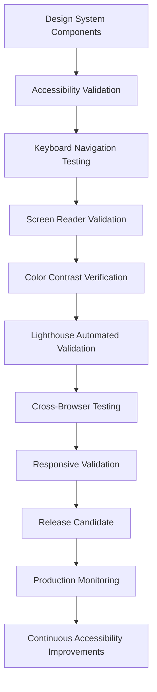

---

# Part 8 Summary

Part 8 established the enterprise Reliability, Accessibility, and Cross-Browser Quality Engineering strategy for CardWise. It defined comprehensive practices for chaos engineering, disaster recovery validation, failover testing, WCAG 2.2 AA compliance, keyboard accessibility, screen reader compatibility, Lighthouse automation, browser interoperability, and responsive validation. Together, these capabilities ensure that the platform remains resilient, inclusive, standards-compliant, and consistently usable across supported environments.

# docs/15_TESTING_STRATEGY.md

# Part 9 (A) — Test Automation Strategy & CI/CD Quality Gates

> **Note:** Due to document size, Part 9 is delivered in two continuations. This section defines the enterprise Test Automation strategy, automation architecture, test environment management, test data strategy, parallel execution, flaky test governance, and CI/CD quality gates. Reporting, engineering metrics, release validation, and production verification follow in Part 9(B).

---

# 142. Test Automation Strategy

## 142.1 Overview

Automation is the foundation of CardWise Quality Engineering. Every production change should generate measurable evidence that it is correct, secure, performant, reliable, and ready for deployment without relying on extensive manual verification.

Automation spans the entire Software Development Lifecycle—from local development and pull requests to deployment validation and production monitoring.

Manual testing is reserved primarily for exploratory validation, usability assessment, accessibility review, and exceptional scenarios that cannot be effectively automated.

---

## Objectives

| ID | Objective | Description |
|----|-----------|-------------|
| AUTO-001 | Fast Feedback | Provide developers with rapid validation. |
| AUTO-002 | Release Confidence | Automatically verify production readiness. |
| AUTO-003 | Regression Prevention | Detect unintended changes continuously. |
| AUTO-004 | Scalable Validation | Support increasing platform complexity. |
| AUTO-005 | Consistency | Eliminate manual variability. |
| AUTO-006 | Operational Efficiency | Reduce repetitive engineering effort. |
| AUTO-007 | Observability | Produce actionable diagnostics. |
| AUTO-008 | Continuous Improvement | Improve automation using production learnings. |

---

## Automation Scope

| Layer | Automated |
|--------|-----------|
| Unit Testing | ✓ |
| Component Testing | ✓ |
| Integration Testing | ✓ |
| API Testing | ✓ |
| Contract Testing | ✓ |
| Database Validation | ✓ |
| Security Testing | ✓ |
| Performance Smoke Tests | ✓ |
| Accessibility Validation | ✓ |
| Production Smoke Tests | ✓ |

---

## Engineering Rationale

Automation transforms quality from a periodic activity into a continuous engineering capability, enabling frequent deployments while maintaining confidence.

---

## Best Practices

- Automate deterministic validation first.
- Keep feedback loops short.
- Continuously retire obsolete automation.
- Measure automation effectiveness rather than quantity.

---

## Trade-offs

| Decision | Benefit | Cost |
|----------|----------|------|
| Extensive automation | Faster releases | Initial engineering investment |
| Continuous execution | Early regression detection | Additional infrastructure consumption |

---

## Risks

| Risk | Mitigation |
|------|------------|
| Brittle automation | Stable test design |
| Long pipelines | Parallel execution |
| Automation debt | Regular maintenance |

---

## Operational Considerations

- Automation health is monitored alongside production health.
- Failed automation receives the same engineering attention as production incidents.

---

# 143. Automation Pyramid

## AUTO-010 Overview

CardWise follows a balanced automation pyramid to maximize feedback speed while maintaining production confidence.

---

## Test Distribution

| Layer | Relative Volume |
|--------|-----------------|
| Unit | Very High |
| Component | High |
| Integration | Medium |
| Contract | Medium |
| API | Medium |
| End-to-End | Low |
| Exploratory | Targeted |

---

## Engineering Rationale

Large numbers of deterministic, fast-running tests reduce dependence on slower end-to-end validation.

---

## Best Practices

- Maintain a balanced pyramid.
- Continuously review test distribution.
- Minimize duplicated coverage.

---

# 144. Test Environment Strategy

## AUTO-020 Overview

Reliable automation depends on stable, reproducible environments that closely resemble production while remaining isolated from live customer data.

---

## Environment Matrix

| Environment | Purpose |
|-------------|----------|
| Local Development | Developer feedback |
| Pull Request | Automated validation |
| Integration | Service interaction |
| Staging | Release candidate validation |
| Pre-Production | Final verification |
| Production | Smoke verification |

---

## Environment Characteristics

| Requirement | Validation |
|-------------|------------|
| Production Parity | ✓ |
| Repeatability | ✓ |
| Isolation | ✓ |
| Observability | ✓ |
| Automated Provisioning | ✓ |

---

## Engineering Rationale

Environment inconsistency is a major source of non-reproducible failures. Standardized environments improve reliability and developer productivity.

---

## Best Practices

- Provision environments automatically.
- Keep infrastructure version-controlled.
- Refresh environments regularly.

---

# 145. Test Data Management

## AUTO-030 Overview

Representative, deterministic, and secure test data is essential for reliable automation.

---

## Test Data Categories

| Category | Included |
|----------|----------|
| User Accounts | ✓ |
| Credit Cards | ✓ |
| Transactions | ✓ |
| Rewards | ✓ |
| Bookings | ✓ |
| Offers | ✓ |
| AI Evaluation Data | ✓ |

---

## Data Validation Goals

| Goal | Validation |
|------|------------|
| Deterministic | ✓ |
| Repeatable | ✓ |
| Privacy Protected | ✓ |
| Production Representative | ✓ |
| Easily Refreshable | ✓ |

---

## Engineering Rationale

Poor test data quality frequently causes unstable automation and misleading results.

---

## Best Practices

- Use synthetic or anonymized datasets.
- Version reference datasets.
- Reset shared environments between executions.

---

## Risks

- Stale datasets.
- Data contamination.
- Privacy violations.

---

# 146. Test Execution Strategy

## AUTO-040 Overview

Automated validation executes progressively as software advances through the delivery pipeline.

---

## Execution Stages

| Stage | Validation |
|--------|------------|
| Local | Unit & component |
| Pull Request | Integration & API |
| Merge | Regression |
| Release Candidate | Full validation |
| Production | Smoke verification |

---

## Engineering Rationale

Layered execution balances rapid developer feedback with progressively stronger release confidence.

---

## Best Practices

- Execute the fastest tests earliest.
- Stop pipelines immediately on critical failures.
- Parallelize independent suites.

---

# 147. Parallel Execution Strategy

## AUTO-050 Overview

Parallel execution reduces pipeline duration while preserving deterministic results.

---

## Parallelization Areas

| Area | Parallelized |
|------|--------------|
| Unit Tests | ✓ |
| Component Tests | ✓ |
| API Suites | ✓ |
| Browser Validation | ✓ |
| Mobile Device Matrix | ✓ |
| Performance Smoke Tests | ✓ |

---

## Engineering Rationale

Efficient parallel execution enables comprehensive validation without significantly increasing delivery time.

---

## Best Practices

- Keep tests independent.
- Avoid shared mutable state.
- Balance execution workloads.

---

## Trade-offs

| Benefit | Cost |
|----------|------|
| Faster pipelines | Infrastructure resources |

---

## Risks

- Hidden test dependencies.
- Environment contention.

---

# 148. Flaky Test Management

## AUTO-060 Overview

Flaky tests reduce engineering confidence and slow delivery. Managing instability is a dedicated engineering responsibility.

---

## Flaky Test Categories

| Category | Example |
|----------|---------|
| Timing | Race conditions |
| Environment | Shared resources |
| Data | Inconsistent fixtures |
| External Dependency | Network variability |

---

## Governance Strategy

| Activity | Purpose |
|----------|---------|
| Detection | Identify unstable tests |
| Quarantine | Isolate affected suites |
| Root Cause Analysis | Eliminate instability |
| Trend Monitoring | Measure improvements |

---

## Engineering Rationale

Automation is only valuable when consistently trustworthy. Stable tests are more valuable than large test suites.

---

## Best Practices

- Eliminate retries that hide defects.
- Investigate recurring instability.
- Track flaky test trends.

---

# 149. CI/CD Quality Gates

## AUTO-070 Overview

Every deployment progresses through mandatory quality gates that verify functional correctness, security, reliability, performance, and operational readiness.

---

## Pull Request Gates

| Gate | Requirement |
|------|-------------|
| Unit Tests | Pass |
| Component Tests | Pass |
| Integration Tests | Pass |
| Static Analysis | Pass |
| Security Validation | Pass |

---

## Merge Gates

| Gate | Requirement |
|------|-------------|
| API Validation | Pass |
| Contract Verification | Pass |
| Database Validation | Pass |
| Accessibility Checks | Pass |
| Regression Suite | Pass |

---

## Release Candidate Gates

| Gate | Requirement |
|------|-------------|
| End-to-End Validation | Pass |
| Performance Validation | Pass |
| Security Validation | Pass |
| Chaos Validation (Scheduled) | Pass |
| Release Readiness Review | Approved |

---

## Production Gates

| Gate | Requirement |
|------|-------------|
| Canary Verification | Pass |
| Smoke Testing | Pass |
| Observability Validation | Pass |
| Rollback Readiness | Confirmed |

---

## Engineering Rationale

Progressive quality gates reduce deployment risk by validating increasingly comprehensive quality characteristics before customer exposure.

---

## Best Practices

- Keep gates objective and measurable.
- Prevent manual gate bypasses except under documented emergency procedures.
- Continuously review gate effectiveness.

---

## Trade-offs

| Benefit | Cost |
|----------|------|
| Higher release confidence | Longer validation pipelines |

---

## Risks

- Excessive gate complexity.
- Manual overrides.
- Pipeline bottlenecks.

---

# 150. Test Automation Architecture

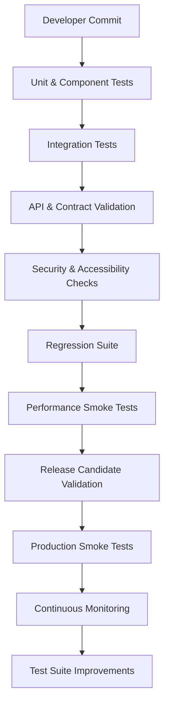

---

# Part 9(A) Summary

This section established the enterprise Test Automation strategy for CardWise, covering automation architecture, balanced testing distribution, environment management, deterministic test data, execution orchestration, parallelization, flaky test governance, and progressive CI/CD quality gates. These practices ensure scalable, reliable, and repeatable validation across the complete software delivery lifecycle.

# docs/15_TESTING_STRATEGY.md

# Part 9 (B) — Reporting, Engineering Metrics, Release Validation & Production Verification

> This section completes **Part 9** by defining reporting, quality dashboards, engineering metrics, release readiness, production verification, and continuous quality measurement for the CardWise platform.

---

# 151. Test Reporting Strategy

## 151.1 Overview

Automated testing only delivers value when results are actionable, traceable, and visible to engineering teams. CardWise standardizes test reporting across all validation stages to provide a unified view of platform quality.

Reports should answer:

- What changed?
- What failed?
- What customer impact is expected?
- Is the release safe?

---

## Objectives

| ID | Objective | Description |
|----|-----------|-------------|
| AUTO-101 | Actionable Reports | Provide diagnostic information rather than only pass/fail status. |
| AUTO-102 | Traceability | Link failures to commits, builds, and releases. |
| AUTO-103 | Visibility | Surface quality information to engineering teams. |
| AUTO-104 | Trend Analysis | Track quality evolution over time. |

---

## Reporting Scope

| Category | Included |
|----------|----------|
| Unit Tests | ✓ |
| API Tests | ✓ |
| Integration Tests | ✓ |
| Security Validation | ✓ |
| Performance Validation | ✓ |
| Accessibility | ✓ |
| Release Validation | ✓ |
| Production Verification | ✓ |

---

## Engineering Rationale

Well-structured reporting reduces Mean Time to Detect (MTTD) and accelerates engineering response.

---

## Best Practices

- Standardize report formats.
- Preserve historical execution data.
- Highlight new regressions separately from known issues.

---

# 152. Quality Dashboards

## AUTO-110 Overview

Quality dashboards aggregate technical and operational signals into a unified engineering view.

---

## Dashboard Categories

| Dashboard | Purpose |
|-----------|---------|
| Build Health | Pipeline status |
| Test Health | Test execution quality |
| Release Readiness | Deployment confidence |
| Reliability | Availability metrics |
| Security | Vulnerability trends |
| Performance | SLO compliance |

---

## Dashboard Indicators

| Indicator | Purpose |
|-----------|---------|
| Pass Rate | Test success |
| Failure Trend | Regression monitoring |
| Flaky Tests | Stability |
| Coverage | Validation breadth |
| Release Confidence | Overall readiness |

---

## Engineering Rationale

Dashboards support proactive engineering by identifying quality trends before they become production incidents.

---

# 153. Engineering Metrics

## AUTO-120 Core Metrics

| Metric | Purpose |
|---------|---------|
| Build Success Rate | CI stability |
| Pipeline Duration | Delivery efficiency |
| Test Execution Time | Automation performance |
| Deployment Frequency | Engineering velocity |
| Change Failure Rate | Release quality |
| Rollback Frequency | Operational stability |

---

## Quality Metrics

| Metric | Description |
|---------|-------------|
| Test Pass Rate | Percentage of successful executions |
| Regression Detection Rate | Ability to identify regressions |
| Escaped Defects | Production quality |
| Automation Coverage | Validation breadth |
| Flaky Test Rate | Automation reliability |

---

## Engineering Rationale

Engineering metrics should measure delivery quality rather than simply engineering activity.

---

## Best Practices

- Review trends rather than isolated values.
- Correlate engineering metrics with customer outcomes.
- Avoid optimizing individual metrics in isolation.

---

# 154. Coverage Strategy

## AUTO-130 Overview

Coverage measures the extent to which platform behavior is validated.

Coverage extends beyond source code to include APIs, business workflows, infrastructure, accessibility, security, and production validation.

---

## Coverage Dimensions

| Dimension | Included |
|-----------|----------|
| Code Coverage | ✓ |
| API Coverage | ✓ |
| Business Workflow Coverage | ✓ |
| Security Coverage | ✓ |
| Accessibility Coverage | ✓ |
| Performance Coverage | ✓ |
| Production Verification | ✓ |

---

## Engineering Rationale

High code coverage alone does not guarantee release quality. Multiple complementary coverage dimensions provide a more complete assessment.

---

## Best Practices

- Measure behavior, not only implementation.
- Prioritize critical business workflows.
- Review coverage after major feature additions.

---

# 155. Defect Leakage & Quality Trends

## AUTO-140 Overview

Defect leakage measures the proportion of defects discovered after release relative to those detected before deployment.

---

## Validation Metrics

| Metric | Purpose |
|---------|---------|
| Escaped Defects | Release effectiveness |
| Critical Production Incidents | Customer impact |
| Regression Incidents | Release stability |
| Root Cause Distribution | Process improvement |

---

## Trend Analysis

| Trend | Purpose |
|--------|---------|
| Monthly Leakage | Long-term quality |
| Feature-Level Leakage | High-risk domains |
| Team-Level Trends | Process improvement |
| Severity Distribution | Risk assessment |

---

## Engineering Rationale

Defect leakage is one of the strongest indicators of overall testing effectiveness.

---

# 156. Build Stability & Operational Metrics

## AUTO-150 Overview

Stable build pipelines are essential for maintaining engineering productivity and deployment confidence.

---

## Build Metrics

| Metric | Purpose |
|---------|---------|
| Build Success Rate | CI reliability |
| Average Build Duration | Pipeline efficiency |
| Failed Builds | Stability |
| Queue Time | Delivery efficiency |

---

## Operational Metrics

| Metric | Purpose |
|---------|---------|
| MTTD | Detection speed |
| MTTR | Recovery speed |
| Error Budget Consumption | Reliability |
| Service Availability | Operational health |

---

## Engineering Rationale

Build quality and operational quality are interconnected. Stable delivery pipelines contribute directly to production reliability.

---

# 157. Release Readiness Assessment

## AUTO-160 Overview

Release readiness combines technical validation, operational verification, and business confidence into a structured deployment decision.

---

## Readiness Checklist

| Area | Required |
|------|----------|
| Functional Testing | ✓ |
| Security Testing | ✓ |
| Performance Testing | ✓ |
| Reliability Validation | ✓ |
| Accessibility | ✓ |
| Documentation | ✓ |
| Monitoring | ✓ |
| Rollback Plan | ✓ |

---

## Decision Outcomes

| Outcome | Description |
|----------|-------------|
| Ready | All quality gates satisfied |
| Conditional | Accepted documented risks |
| Blocked | Critical quality gate failure |

---

## Engineering Rationale

Structured release readiness improves consistency and reduces subjective deployment decisions.

---

# 158. Production Smoke Testing

## AUTO-170 Overview

Smoke testing verifies that critical platform capabilities remain operational immediately after deployment.

---

## Smoke Validation

| Workflow | Tested |
|----------|--------|
| Authentication | ✓ |
| Dashboard | ✓ |
| Portfolio | ✓ |
| Recommendations | ✓ |
| Booking Search | ✓ |
| Payments | ✓ |
| Notifications | ✓ |

---

## Validation Goals

- Service availability
- Basic functional correctness
- Dependency health
- Monitoring integrity

---

## Engineering Rationale

Production smoke tests provide immediate deployment confidence before broader customer traffic reaches new releases.

---

# 159. Canary Validation & Production Verification

## AUTO-180 Overview

Canary validation gradually exposes production traffic to new releases while monitoring technical and business health.

---

## Canary Metrics

| Metric | Validation |
|---------|------------|
| Error Rate | ✓ |
| Latency | ✓ |
| Resource Usage | ✓ |
| Booking Success | ✓ |
| Recommendation Quality | ✓ |
| Customer Impact | ✓ |

---

## Production Verification

| Area | Tested |
|------|--------|
| Monitoring | ✓ |
| Logging | ✓ |
| Tracing | ✓ |
| Alerting | ✓ |
| Business KPIs | ✓ |

---

## Engineering Rationale

Production verification confirms that deployment assumptions remain valid under real customer workloads.

---

## Best Practices

- Define rollback thresholds before deployment.
- Monitor both technical and business metrics.
- Validate customer-critical workflows first.

---

# 160. Quality Reporting Architecture

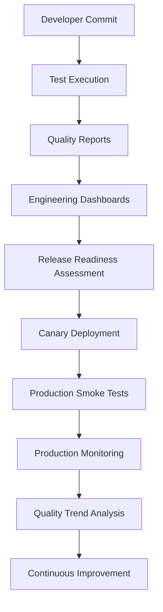

---

# Part 9 Summary

Part 9 established the enterprise Test Automation, Reporting, and Release Validation strategy for CardWise. It defined scalable automation practices, deterministic environments, quality gates, engineering dashboards, coverage strategies, defect leakage analysis, release readiness assessments, production smoke testing, canary validation, and continuous production verification. Together, these capabilities provide measurable release confidence while supporting rapid, high-quality software delivery.


# docs/15_TESTING_STRATEGY.md

# Part 10 — Best Practices, Architecture Decision Records, Quality Maturity Model & Future Roadmap

> This chapter concludes the Quality Engineering strategy for CardWise by defining long-term engineering practices, Architecture Decision Records (ADRs), quality governance, release checklists, maturity progression, future investments, and the final Quality Engineering architecture.

---

# 161. Quality Engineering Best Practices

## 161.1 Engineering Principles

Quality is a shared engineering responsibility rather than the responsibility of a single QA organization.

Every engineer contributes to quality through design, implementation, automation, observability, documentation, and operational ownership.

---

## QE Best Practices

| ID | Practice | Engineering Rationale |
|----|----------|-----------------------|
| QE-BP-001 | Test Early | Defects are less expensive to fix during development. |
| QE-BP-002 | Automate Repetitive Validation | Reduce manual effort and improve repeatability. |
| QE-BP-003 | Validate Customer Journeys | Optimize for customer outcomes instead of isolated components. |
| QE-BP-004 | Build Observable Systems | Faster diagnosis and recovery. |
| QE-BP-005 | Design for Testability | Simplifies automation and maintenance. |
| QE-BP-006 | Minimize Test Coupling | Improves suite stability. |
| QE-BP-007 | Prefer Deterministic Tests | Reduces flaky automation. |
| QE-BP-008 | Continuously Improve | Production learnings feed engineering improvements. |

---

## Cross-Team Responsibilities

| Role | Primary Responsibility |
|------|------------------------|
| Product | Acceptance criteria |
| Engineering | Automated validation |
| Platform | Test infrastructure |
| Security | Security verification |
| SRE | Reliability validation |
| DevOps | Pipeline quality |
| AI Engineering | Model evaluation |

---

## Operational Considerations

- Every production incident results in new automated validation where appropriate.
- Quality reviews are included in architecture discussions.
- Test maintenance is planned alongside feature development.

---

# 162. Architecture Decision Records (ADR)

## Purpose

Quality-related architectural decisions are documented using Architecture Decision Records to preserve engineering rationale and historical context.

---

## Recommended ADR Structure

| Section | Description |
|---------|-------------|
| ADR Identifier | Unique reference |
| Status | Proposed / Accepted / Superseded |
| Context | Background and problem statement |
| Decision | Selected approach |
| Consequences | Positive and negative impacts |
| Alternatives | Considered options |
| Related Documents | Architecture references |

---

## Recommended Quality ADRs

| ADR | Description |
|-----|-------------|
| ADR-QE-001 | Automation-first Quality Engineering |
| ADR-QE-002 | Balanced Test Pyramid |
| ADR-QE-003 | Consumer-driven Contract Testing |
| ADR-QE-004 | Shift Left & Shift Right Validation |
| ADR-QE-005 | Production Verification Strategy |
| ADR-QE-006 | AI Evaluation Framework |
| ADR-QE-007 | Chaos Engineering Adoption |
| ADR-QE-008 | Release Quality Gates |

---

## Engineering Rationale

Documented decisions improve architectural consistency and simplify future evolution of the testing platform.

---

# 163. Enterprise Testing Checklist

## Development

| Item | Status |
|------|--------|
| Acceptance Criteria Defined | □ |
| Unit Tests Added | □ |
| Component Tests Added | □ |
| Integration Tests Updated | □ |
| Accessibility Reviewed | □ |

---

## Pull Request

| Item | Status |
|------|--------|
| Code Review Complete | □ |
| Static Analysis Passed | □ |
| Security Checks Passed | □ |
| CI Pipeline Passed | □ |
| Documentation Updated | □ |

---

## Release Candidate

| Item | Status |
|------|--------|
| Regression Suite Passed | □ |
| Performance Validation Passed | □ |
| Security Validation Passed | □ |
| Reliability Validation Passed | □ |
| Accessibility Validation Passed | □ |
| Browser Compatibility Passed | □ |

---

## Production

| Item | Status |
|------|--------|
| Canary Validation Complete | □ |
| Smoke Tests Passed | □ |
| Monitoring Verified | □ |
| Alerting Verified | □ |
| Rollback Strategy Confirmed | □ |

---

## Engineering Rationale

Standardized release checklists reduce operational variability and improve deployment confidence.

---

# 164. Quality Engineering Maturity Model

## Levels

| Level | Name | Characteristics |
|-------|------|-----------------|
| Level 1 | Initial | Mostly manual testing, limited automation |
| Level 2 | Managed | Automated unit and integration testing |
| Level 3 | Defined | CI/CD quality gates, standardized testing processes |
| Level 4 | Quantitatively Managed | Metrics-driven engineering, continuous quality monitoring |
| Level 5 | Optimizing | AI-assisted testing, autonomous quality improvements, continuous experimentation |

---

## Capability Matrix

| Capability | L1 | L2 | L3 | L4 | L5 |
|------------|:--:|:--:|:--:|:--:|:--:|
| Unit Testing | ✓ | ✓ | ✓ | ✓ | ✓ |
| Integration Testing |  | ✓ | ✓ | ✓ | ✓ |
| Contract Testing |  |  | ✓ | ✓ | ✓ |
| Security Automation |  |  | ✓ | ✓ | ✓ |
| Performance Engineering |  |  | ✓ | ✓ | ✓ |
| Chaos Engineering |  |  |  | ✓ | ✓ |
| AI Evaluation |  |  |  | ✓ | ✓ |
| Predictive Quality Analytics |  |  |  |  | ✓ |

---

## Engineering Rationale

The maturity model provides a roadmap for evolving Quality Engineering capabilities while maintaining measurable progress.

---

# 165. Future Quality Engineering Roadmap

## Near-Term (0–12 Months)

| Initiative | Objective |
|------------|-----------|
| Expand automation coverage | Reduce manual validation |
| Improve production verification | Faster release confidence |
| Enhance accessibility automation | Earlier regression detection |
| Increase chaos experiment frequency | Higher operational confidence |

---

## Mid-Term (12–24 Months)

| Initiative | Objective |
|------------|-----------|
| AI-assisted test generation | Accelerate automation |
| Predictive flaky test detection | Improve pipeline stability |
| Intelligent test selection | Faster CI execution |
| Autonomous environment provisioning | Reduce operational overhead |

---

## Long-Term (24+ Months)

| Initiative | Objective |
|------------|-----------|
| Self-healing automation | Reduce maintenance effort |
| Autonomous quality scoring | Improve release decisions |
| Continuous experimentation platform | Data-driven optimization |
| Production digital twin testing | Safer operational validation |

---

## Engineering Rationale

Future investments focus on increasing automation intelligence, improving engineering efficiency, and strengthening production confidence without compromising quality.

---

# 166. Quality Governance

## Governance Principles

| Principle | Description |
|-----------|-------------|
| Shared Ownership | Quality belongs to every engineering team. |
| Evidence-Based Decisions | Releases rely on measurable quality signals. |
| Continuous Improvement | Learn from incidents and production telemetry. |
| Standardization | Common tooling and practices across the platform. |
| Transparency | Visible metrics and engineering dashboards. |

---

## Governance Reviews

| Review | Frequency |
|---------|-----------|
| Automation Health | Weekly |
| Release Quality | Every release |
| Security Review | Regular cadence |
| Reliability Review | Quarterly |
| Architecture Review | As required |

---

## Engineering Rationale

Governance aligns engineering practices across teams while ensuring quality investments remain measurable and sustainable.

---

# 167. Final Quality Engineering Architecture

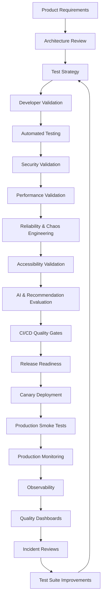

---

# 168. Architecture Summary

## Enterprise Quality Engineering Pillars

| Pillar | Purpose |
|---------|---------|
| Shift Left Engineering | Prevent defects early |
| Shift Right Validation | Verify production behavior |
| Automation First | Accelerate delivery |
| Security by Default | Protect customer data |
| Performance Engineering | Maintain user experience |
| Reliability Engineering | Ensure operational resilience |
| Accessibility | Deliver inclusive experiences |
| AI Quality Engineering | Validate intelligent recommendations |
| Continuous Observability | Detect issues rapidly |
| Continuous Improvement | Strengthen quality over time |

---

## Final Engineering Outcomes

| Outcome | Description |
|----------|-------------|
| Faster Delivery | High automation with progressive quality gates |
| Higher Confidence | Evidence-based release decisions |
| Improved Reliability | Resilience validated before production |
| Stronger Security | Continuous verification integrated into SDLC |
| Better Customer Experience | Functional, performant, accessible platform |
| Sustainable Engineering | Standardized quality practices across the platform |

---

# Final Document Summary

The **CardWise Quality Engineering & Testing Strategy** defines a comprehensive, enterprise-grade framework for validating every aspect of the platform—from unit tests and API contracts to AI recommendations, booking workflows, security, performance, reliability, accessibility, and production verification.

The strategy combines **Shift Left** and **Shift Right** engineering, automation-first validation, continuous observability, measurable quality gates, and operational feedback loops into a unified Quality Engineering architecture.

By treating quality as a platform capability rather than a release phase, CardWise enables:

- Safe and frequent deployments
- High confidence in production releases
- Continuous validation of business-critical workflows
- Reliable AI-powered financial recommendations
- Secure handling of sensitive customer data
- Scalable operational excellence
- Long-term engineering sustainability

This testing architecture complements the backend, frontend, mobile, browser extension, AI, security, scalability, and DevOps architectures defined in the preceding documents and serves as the authoritative reference for Quality Engineering across the CardWise platform.

---
**End of `docs/15_TESTING_STRATEGY.md`**

