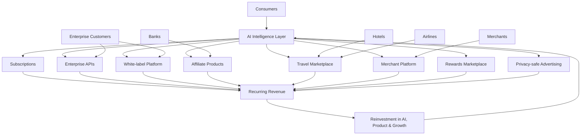
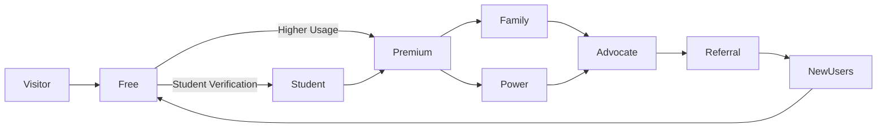
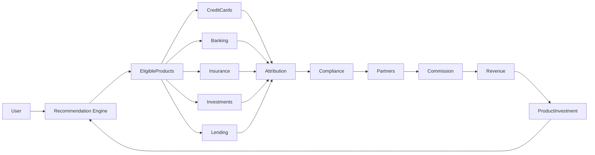
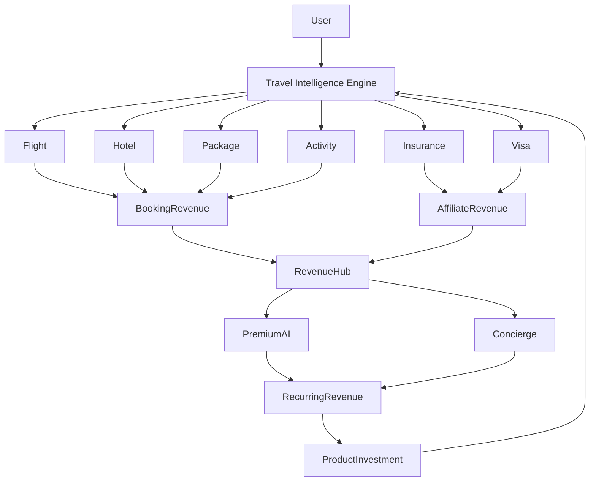
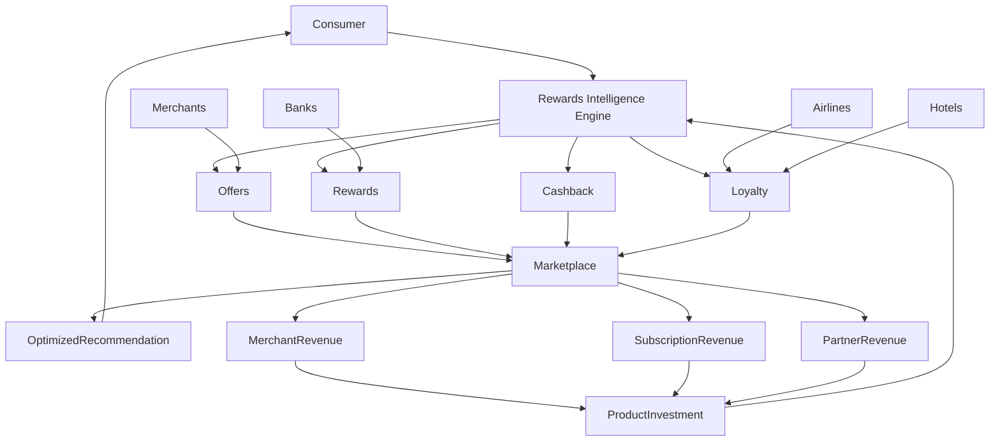
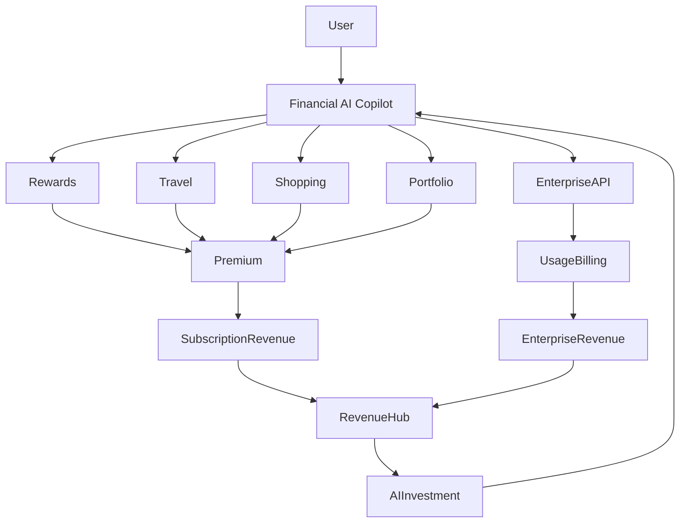
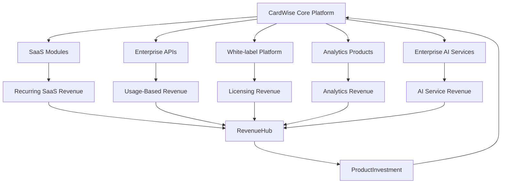
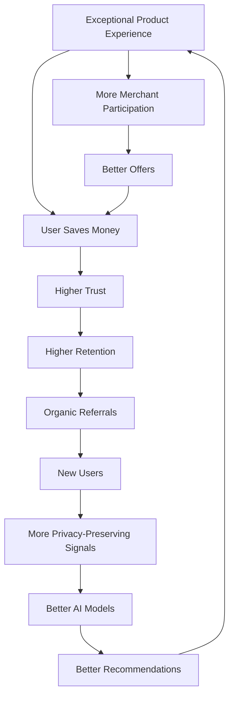
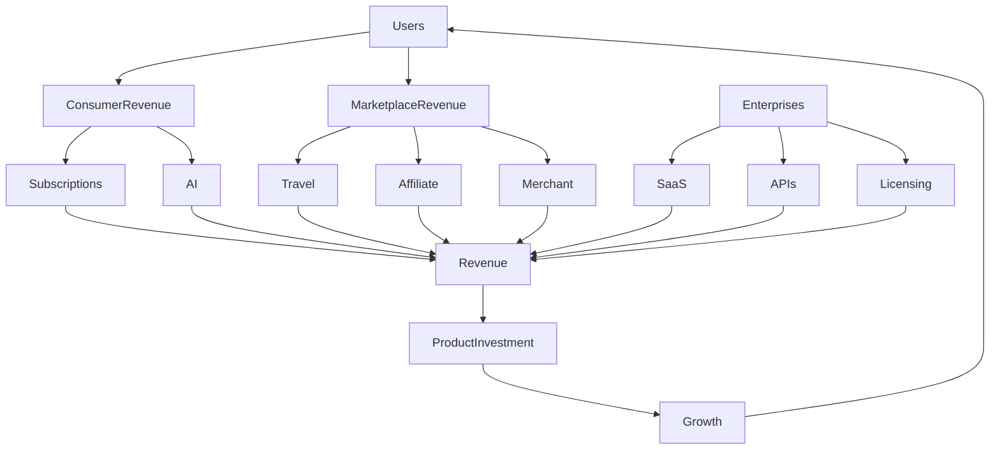
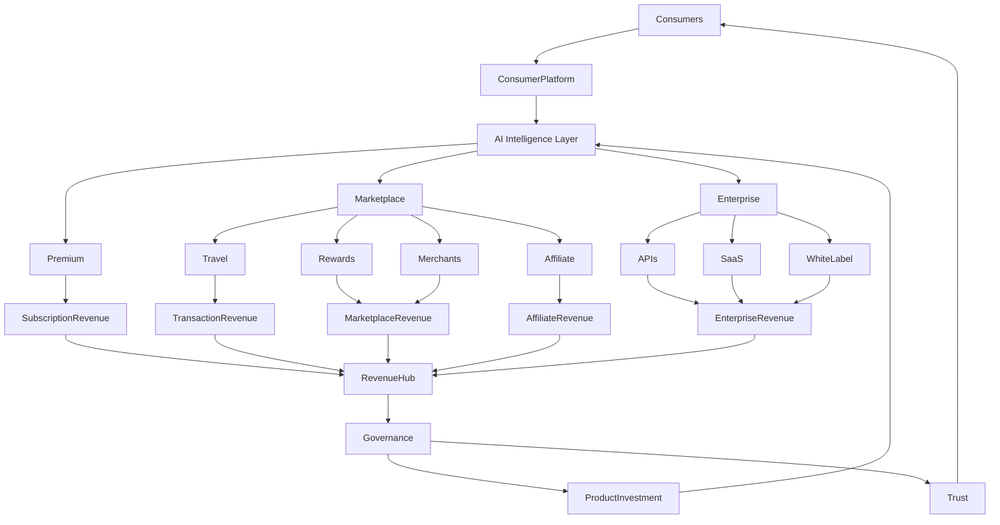

# docs/16_MONETIZATION.md

# Part 1 — Executive Summary & Revenue Architecture

| Document Status | Value |
|----------------|-------|
| Document | Monetization Strategy |
| Version | 1.0 |
| Status | Production Ready |
| Owner | Product, Revenue & Strategy |
| Scope | Global |
| Dependencies | Docs 01–15 |
| Stable Prefixes | REV-*, BIZ-*, PRICE-*, SUB-*, AFF-*, TRAVEL-*, AI-REV-*, ENT-*, MARKET-*, GROWTH-*, FIN-* |

---

# 1. Executive Summary

CardWise is designed to become the operating system for consumer financial decisions—not merely another affiliate website or travel booking platform.

Its long-term objective is to own the **decision layer** between consumers and the financial ecosystem.

Instead of monetizing attention, CardWise monetizes value creation.

Every recommendation generated by the platform must improve one or more of the following:

- Reward earnings
- Cashback
- Travel savings
- Financial efficiency
- Credit optimization
- User convenience
- Time savings
- Decision confidence

Revenue is therefore an outcome of creating measurable value rather than influencing user behavior toward the highest-paying partner.

This distinction is foundational to the CardWise business model.

---

# REV-001 Revenue Vision

## Vision Statement

> Become the world's most trusted financial intelligence platform by aligning monetization with user outcomes instead of advertiser incentives.

Unlike traditional comparison websites, CardWise does not optimize for:

- Highest affiliate commission
- Highest sponsored bid
- Highest advertisement revenue

Instead it optimizes for:

- Lifetime customer trust
- Recommendation quality
- Retention
- Network effects
- Platform utility
- Long-term recurring revenue

---

## Revenue Mission

Generate sustainable recurring revenue from multiple independent business lines while maintaining recommendation neutrality.

The platform should eventually reach a diversified revenue mix where no individual revenue stream contributes a disproportionately large share of total revenue.

---

# REV-002 Strategic Revenue Objectives

| Objective | Description |
|------------|-------------|
| Trust First | Revenue never overrides recommendation quality |
| Diversification | Multiple independent revenue streams |
| Predictability | Increase recurring subscription revenue |
| Scalability | Revenue grows faster than operational costs |
| Global Expansion | Revenue architecture reusable across countries |
| Platform Effects | More users improve ecosystem value |
| AI Leverage | AI increases customer lifetime value |
| Capital Efficiency | High gross margins through software-driven monetization |

---

# 2. Business Philosophy

## BIZ-001 Core Philosophy

CardWise operates under five foundational business beliefs.

### Principle 1

Recommendations are products.

Every recommendation has measurable quality.

Higher recommendation quality leads to:

- Better savings
- Better travel experiences
- Better financial decisions
- Higher retention
- Greater trust

---

### Principle 2

Trust compounds faster than commissions.

A recommendation that sacrifices user value for affiliate revenue destroys future revenue potential.

Therefore:

```
Trust > Commission
```

always holds true.

---

### Principle 3

The ecosystem wins together.

CardWise should create value for:

- Users
- Banks
- Airlines
- Hotels
- Merchants
- Payment Networks
- Travel Partners
- Enterprise Customers

This creates positive-sum economics rather than zero-sum competition.

---

### Principle 4

Software scales better than sales.

Revenue growth should primarily result from:

- Better AI
- Better personalization
- Better recommendations
- Better automation
- Better marketplace efficiency

rather than proportional increases in human sales teams.

---

### Principle 5

Every feature should either:

- increase trust,
- improve retention,
- improve monetization,
- reduce churn,
- or strengthen the ecosystem.

---

# BIZ-002 Guiding Business Principles

| Principle | Description |
|-----------|-------------|
| User First | User outcomes always take priority |
| Transparency | Explain why recommendations are made |
| Neutrality | No hidden ranking manipulation |
| Long-Term Value | Optimize LTV instead of short-term revenue |
| Privacy | Never monetize personally identifiable financial data |
| Automation | AI reduces operational costs |
| Diversification | Multiple business lines reduce risk |

---

# 3. Monetization Principles

## REV-003 Monetization Framework

Every revenue opportunity must satisfy the following evaluation framework.

| Criterion | Requirement |
|-----------|-------------|
| User Benefit | Mandatory |
| Regulatory Compliance | Mandatory |
| Transparent Disclosure | Mandatory |
| Recommendation Neutrality | Mandatory |
| Privacy Protection | Mandatory |
| Operational Scalability | Mandatory |
| Positive Unit Economics | Mandatory |

Revenue streams failing these requirements should not be introduced into the platform.

---

## REV-004 Trust-Oriented Monetization Rules

### Rule 1

Affiliate payouts never directly influence recommendation rankings.

---

### Rule 2

Sponsored content must be explicitly labeled.

---

### Rule 3

Users should always be able to distinguish between:

- Organic recommendation
- Sponsored recommendation
- AI recommendation
- Partner recommendation

---

### Rule 4

Premium subscribers never receive biased recommendations.

---

### Rule 5

Recommendation algorithms remain isolated from revenue optimization algorithms.

---

## Engineering Rationale

Separating recommendation logic from monetization logic prevents hidden coupling that could compromise recommendation quality and erode user trust. Independent services also simplify testing, auditing, and regulatory reviews.

---

## Business Rationale

Long-term consumer platforms are built on credibility. Sacrificing neutrality for short-term commissions increases churn, weakens referrals, and reduces customer lifetime value.

---

## Trade-offs

| Benefit | Cost |
|----------|------|
| High trust | Lower short-term affiliate revenue |
| Regulatory resilience | More governance overhead |
| Strong retention | Slower early monetization |
| Better brand perception | Requires independent auditing |

---

## Risks

| Risk | Mitigation |
|------|------------|
| Partner pressure to influence rankings | Contractual neutrality clauses |
| Hidden monetization conflicts | Independent recommendation governance |
| User skepticism | Transparent disclosures and explainability |
| Regulatory scrutiny | Regular compliance reviews and audits |

---

## Operational Considerations

- Establish a Revenue Governance Committee.
- Audit recommendation neutrality on a scheduled basis.
- Publish transparency reports summarizing sponsored content and partner relationships.
- Maintain immutable logs for recommendation decisions where required by regulation.

---

# 4. Platform Business Model

## BIZ-003 Platform Evolution

CardWise evolves through multiple business stages.

| Stage | Platform Identity |
|---------|------------------|
| Stage 1 | Credit Card Intelligence Platform |
| Stage 2 | Rewards Optimization Platform |
| Stage 3 | Financial Decision Engine |
| Stage 4 | Travel Intelligence Platform |
| Stage 5 | AI Financial Copilot |
| Stage 6 | Consumer Financial Operating System |

Each stage introduces additional value while leveraging the same core user base.

---

## BIZ-004 Multi-Sided Marketplace

CardWise operates as a multi-sided marketplace connecting:

- Consumers
- Banks
- Card issuers
- Payment networks
- Merchants
- Travel providers
- Loyalty programs
- Enterprise clients
- Financial partners
- AI service providers

Every participant both contributes value to and benefits from the ecosystem.

---

### Marketplace Participants

| Participant | Receives Value | Contributes Value |
|-------------|----------------|-------------------|
| Consumers | Better financial decisions | Spending data (with consent), engagement |
| Banks | Qualified customers | Products, offers, rewards |
| Merchants | Increased conversions | Promotions, funded offers |
| Airlines | Direct bookings | Inventory, loyalty integration |
| Hotels | Incremental demand | Room inventory |
| Enterprises | APIs and analytics | Subscription revenue |
| AI Partners | Distribution | Models and capabilities |

---

## Engineering Rationale

A modular marketplace architecture allows new participant types to be added without redesigning existing systems. Clear service boundaries also enable independent scaling of consumer, partner, and enterprise capabilities.

---

## Business Rationale

Multi-sided marketplaces benefit from reinforcing network effects. As additional participants join, the platform becomes more valuable to every other participant, increasing defensibility and reducing acquisition costs over time.

---

# 5. Marketplace Strategy

## MARKET-001 Marketplace Objectives

The marketplace exists to maximize ecosystem efficiency.

Instead of selling products directly,

CardWise matches:

```
Right User
        ↓
Right Time
        ↓
Right Financial Product
        ↓
Right Reward
        ↓
Right Merchant
        ↓
Right Payment Method
```

---

## MARKET-002 Marketplace Characteristics

| Characteristic | Strategy |
|---------------|----------|
| Neutral | Recommendations remain unbiased |
| AI-Driven | Personalized ranking |
| Dynamic | Real-time pricing and offers |
| Global | Country-specific catalogs |
| Extensible | New partner categories |
| Privacy-Preserving | Consent-based personalization |

---

## Marketplace Success Metrics

| Metric | Description |
|---------|-------------|
| Recommendation Accuracy | Quality of suggested actions |
| Conversion Rate | Successful user actions |
| Reward Uplift | Additional rewards generated |
| User Savings | Monetary value delivered |
| Repeat Transactions | Marketplace stickiness |
| Partner Retention | Long-term ecosystem participation |

---

# 6. Revenue Flywheel

## GROWTH-001 Core Revenue Flywheel

The platform compounds value through a self-reinforcing cycle.

```text
Better AI
      ↓
Better Recommendations
      ↓
Higher User Savings
      ↓
Higher Trust
      ↓
More Active Users
      ↓
More Transactions
      ↓
More Data Signals (Consent-Based)
      ↓
Better Models
      ↓
Better AI
```

This creates a durable competitive advantage that strengthens as the platform scales.

---

## Engineering Rationale

Continuous feedback loops improve model quality while preserving privacy through aggregated and consent-driven signals. Improved models increase recommendation relevance without requiring linear increases in engineering effort.

---

## Business Rationale

A flywheel centered on delivered value compounds customer retention, referrals, and transaction volume, reducing reliance on paid acquisition over time.

---

# 7. High-Level Revenue Architecture

## REV-005 Revenue Portfolio

The business intentionally diversifies revenue across multiple categories.

| Revenue Category | Strategic Role | Recurring |
|-----------------|----------------|-----------|
| Consumer Subscriptions | Predictable cash flow | Yes |
| Affiliate Revenue | Growth accelerator | No |
| Travel Bookings | Transactional | Partial |
| Merchant Platform | Marketplace expansion | Yes |
| Rewards Ecosystem | Engagement | Partial |
| AI Premium Services | High-margin recurring | Yes |
| Enterprise SaaS | B2B recurring | Yes |
| APIs | Usage-based | Yes |
| White-label Licensing | Enterprise expansion | Yes |
| Data Intelligence Products | Aggregated insights | Yes |
| Advertising | Supplemental | Partial |
| Financial Products | Performance-based | No |

---

## Revenue Diversification Target

| Revenue Source | Long-Term Target Share |
|----------------|------------------------|
| Consumer Revenue | 25–35% |
| Enterprise Revenue | 20–30% |
| Travel Revenue | 15–20% |
| Affiliate Revenue | 10–20% |
| Merchant Ecosystem | 10–15% |
| AI Services | 10–15% |
| Advertising & Other | <10% |

**Engineering Rationale:** A diversified portfolio reduces dependency on any single integration or business capability, enabling independent scaling and resilience.

**Business Rationale:** Balanced revenue streams lower concentration risk and improve valuation by creating predictable, recurring income.

**Trade-offs:** Building multiple revenue engines increases operational complexity and requires disciplined prioritization.

**Risks:** Some streams may mature at different speeds; diversification should not dilute execution focus.

**Operational Considerations:**

- Track revenue by business line with independent P&L visibility.
- Monitor concentration risk quarterly.
- Establish partner performance scorecards.
- Regularly reassess target revenue mix as the platform evolves.

---

# 8. Business Goals

## BIZ-005 Strategic Business Goals

### Near-Term (0–2 Years)

- Build user trust through measurable savings.
- Establish diversified affiliate partnerships.
- Launch premium subscriptions.
- Integrate travel monetization.
- Validate AI-assisted financial recommendations.

---

### Mid-Term (3–5 Years)

- Become the primary financial decision platform for consumers.
- Expand into multiple international markets.
- Launch enterprise APIs and white-label offerings.
- Build a thriving merchant and rewards marketplace.
- Increase recurring revenue as the dominant revenue source.

---

### Long-Term (5+ Years)

- Operate as the default intelligence layer across consumer payments.
- Power financial recommendations across third-party ecosystems.
- Create a globally scalable marketplace for rewards, travel, and financial products.
- Achieve durable profitability with software-driven margins.
- Become the trusted operating system for consumer financial intelligence.

---

# Mermaid Diagram — High-Level Revenue Architecture



---

# Part 1 Summary

This section establishes the strategic foundation for CardWise's monetization architecture:

- Revenue is aligned with measurable user value rather than partner incentives.
- Trust, transparency, and recommendation neutrality are non-negotiable principles.
- CardWise operates as a multi-sided marketplace connecting consumers, financial institutions, merchants, travel providers, and enterprises.
- A diversified revenue portfolio minimizes concentration risk and increases long-term resilience.
- The revenue flywheel compounds value through better AI, stronger recommendations, greater trust, and higher engagement.
- Business goals define the evolution from a consumer credit intelligence platform to a global financial operating system.


# docs/16_MONETIZATION.md

# Part 2 — Consumer Monetization

---

# 9. Consumer Monetization Strategy

## SUB-001 Vision

The consumer monetization strategy is built on a simple philosophy:

> Every user should receive tremendous value for free before ever being asked to pay.

CardWise should never become a paywall around essential financial intelligence.

Instead:

- Free users discover value.
- Premium users unlock automation.
- Power users unlock optimization.
- Families unlock shared intelligence.

Revenue follows trust—not the other way around.

---

## Consumer Monetization Objectives

| Objective | Description |
|------------|-------------|
| Build Trust | Free tier demonstrates measurable value |
| Maximize Adoption | Low friction onboarding |
| Increase Retention | Premium features improve daily utility |
| Encourage Upgrades | Clear value-based feature differentiation |
| Reduce Churn | Continuous premium innovation |
| Increase LTV | Long-term recurring subscriptions |
| Maintain Fairness | Essential financial insights remain accessible |

---

## Engineering Rationale

A layered entitlement system enables progressive feature unlocking without fragmenting the product architecture. Subscription checks should remain centralized through the entitlement service defined in the platform architecture documents.

---

## Business Rationale

Freemium minimizes acquisition friction while subscriptions provide predictable, high-margin recurring revenue and reduce dependence on affiliate income.

---

# SUB-002 Consumer Segmentation

CardWise serves multiple user personas with different financial maturity levels.

| Segment | Characteristics | Primary Need | Monetization Strategy |
|----------|----------------|--------------|-----------------------|
| Explorers | New credit card users | Learn & compare | Free |
| Optimizers | Existing card holders | Rewards optimization | Premium |
| Frequent Travelers | Monthly travelers | Travel savings | Premium+ |
| Families | Shared household spending | Household optimization | Family Plan |
| Professionals | High-income users | Portfolio optimization | Power Plan |
| Credit Enthusiasts | Multiple premium cards | Advanced analytics | Power Plan |
| Students | Limited credit history | Financial education | Student Plan |
| Digital Nomads | International spending | FX & travel intelligence | Premium+ |

---

# SUB-003 Consumer Value Ladder

```text
Visitor
    ↓
Registered User
    ↓
Active User
    ↓
Portfolio User
    ↓
Premium Subscriber
    ↓
Power User
    ↓
Family Account
    ↓
Platform Advocate
```

Every stage increases:

- User value
- Platform engagement
- Retention
- Customer lifetime value

---

# 10. Free Tier

## SUB-010 Philosophy

The free tier should be the best free financial optimization platform available.

Users should receive enough value to confidently recommend CardWise before spending any money.

---

## Included Features

| Category | Included |
|-----------|----------|
| Credit Card Portfolio | ✓ |
| Reward Tracking | ✓ |
| Cashback Tracking | ✓ |
| Merchant Offers | ✓ |
| Basic AI Recommendations | ✓ |
| Spending Categories | ✓ |
| Bill Reminders | ✓ |
| Credit Score Monitoring (where supported) | ✓ |
| Basic Travel Search | ✓ |
| Browser Extension | ✓ |
| Mobile App | ✓ |
| Wallet Recommendations | ✓ |
| Reward Expiry Alerts | ✓ |

---

## Usage Limits

| Feature | Free Limit |
|----------|------------|
| Linked Cards | 5 |
| AI Queries | 25/month |
| Portfolio Refresh | Daily |
| Travel Price Alerts | 3 |
| Offer Alerts | Standard |
| Saved Trips | 3 |
| Reward Simulations | Limited |
| Historical Analytics | 6 Months |

---

## Engineering Rationale

Usage limits should be configurable through feature flags and entitlement policies rather than hardcoded values, allowing experimentation without product releases.

---

## Business Rationale

The free tier must solve real problems while naturally exposing opportunities where automation and advanced intelligence justify upgrading.

---

# 11. Premium Subscription

## SUB-020 Premium Philosophy

Premium is not about hiding information.

Premium is about removing effort.

Instead of asking:

> "What information should we hide?"

CardWise asks:

> "What repetitive work can we automate?"

---

## Premium Capabilities

| Capability | Premium |
|------------|----------|
| Unlimited Cards | ✓ |
| Unlimited AI | ✓ |
| Unlimited Reward Analysis | ✓ |
| Real-time Offer Detection | ✓ |
| Advanced Spending Analytics | ✓ |
| Portfolio Optimization | ✓ |
| AI Financial Copilot | ✓ |
| AI Travel Planner | ✓ |
| Reward Redemption Optimizer | ✓ |
| Smart Card Switching Suggestions | ✓ |
| Multi-Year Analytics | ✓ |
| Priority Notifications | ✓ |
| Premium Support | ✓ |
| Early Feature Access | ✓ |

---

## Premium Experience

Premium users should feel that CardWise works proactively on their behalf.

Examples include:

- Continuous reward optimization
- Automatic offer discovery
- Intelligent travel recommendations
- Bill optimization reminders
- Spending anomaly detection
- Subscription optimization
- Merchant switching recommendations

---

# SUB-021 Premium Feature Categories

| Category | Benefit |
|-----------|----------|
| AI Automation | Less manual effort |
| Financial Intelligence | Better decisions |
| Travel Optimization | Lower travel cost |
| Rewards Optimization | Higher reward earnings |
| Analytics | Better visibility |
| Alerts | Faster action |
| Concierge | Personalized recommendations |

---

# 12. Subscription Plans

## PRICE-001 Subscription Portfolio

| Plan | Intended User | Billing |
|------|---------------|---------|
| Free | Everyone | Free |
| Premium Monthly | Individual | Monthly |
| Premium Annual | Individual | Annual |
| Family | Household | Annual |
| Student | Verified students | Annual |
| Power User | Heavy optimizers | Annual |

---

## PRICE-002 Proposed Positioning

| Plan | Relative Pricing Position |
|------|---------------------------|
| Free | Entry |
| Student | Lowest paid tier |
| Premium Monthly | Flexible |
| Premium Annual | Best value |
| Family | Multi-user discount |
| Power User | Highest consumer tier |

Pricing should remain market-specific and be localized for each country instead of using globally fixed amounts.

---

## Family Plan

### SUB-030 Objectives

Support households managing shared finances.

Capabilities include:

- Shared financial dashboard
- Shared travel planning
- Household reward optimization
- Family goal tracking
- Shared subscriptions
- Shared notifications
- Joint travel wallets
- Family spending analytics

---

## Student Plan

### SUB-031 Objectives

Acquire users early in their financial journey.

Benefits include:

- Lower entry pricing
- Credit education
- Beginner AI assistant
- Credit building guidance
- Budgeting tools
- Spending insights
- Graduation upgrade incentives

---

## Power User Plan

### SUB-032 Target Users

Designed for:

- Frequent travelers
- Premium card holders
- Rewards enthusiasts
- Business travelers
- Digital nomads
- High spenders

---

### Additional Features

| Feature | Included |
|----------|----------|
| Unlimited Portfolio Simulations | ✓ |
| Advanced Travel Optimization | ✓ |
| Premium AI Models | ✓ |
| Cross-country Reward Analysis | ✓ |
| Advanced Merchant Intelligence | ✓ |
| Multi-currency Analytics | ✓ |
| Premium API Integrations | ✓ |
| White-glove Support | ✓ |

---

# 13. Pricing Strategy

## PRICE-003 Pricing Philosophy

Pricing should be value-based rather than cost-based.

The platform should monetize measurable outcomes such as:

- Rewards earned
- Money saved
- Time saved
- Travel value unlocked
- Financial confidence
- Automation convenience

---

## Pricing Principles

| Principle | Description |
|-----------|-------------|
| Transparent | No hidden charges |
| Predictable | Recurring billing |
| Fair | Localized pricing |
| Flexible | Monthly & annual options |
| Outcome-Oriented | Users pay for automation and optimization |
| Upgrade-Friendly | Simple transitions between plans |

---

## PRICE-004 Annual First Strategy

Annual subscriptions should become the preferred option.

Benefits include:

- Better retention
- Lower payment processing costs
- Improved cash flow
- Reduced churn
- Higher LTV

Monthly plans remain important for discovery and lower commitment.

---

# 14. Feature Gating Architecture

## SUB-040 Gating Philosophy

Essential financial literacy and transparency remain available to everyone.

Premium gates focus on:

- Automation
- Scale
- Convenience
- AI sophistication
- Historical depth
- Advanced analytics

---

## Feature Gating Matrix

| Capability | Free | Premium | Power |
|------------|------|----------|-------|
| Portfolio Management | ✓ | ✓ | ✓ |
| Unlimited Cards | — | ✓ | ✓ |
| Basic AI | ✓ | ✓ | ✓ |
| Advanced AI | — | ✓ | ✓ |
| Premium AI Models | — | — | ✓ |
| Historical Analytics | Limited | ✓ | ✓ |
| Unlimited Travel Alerts | — | ✓ | ✓ |
| Family Sharing | — | Family | Family |
| Advanced Simulations | — | Limited | ✓ |
| Priority Support | — | ✓ | ✓ |

---

## Engineering Rationale

Feature gating should be entitlement-driven and configurable through centralized policy management. This allows experimentation, A/B testing, regional customization, and enterprise overrides without modifying application logic.

---

## Business Rationale

Value-based gating avoids frustrating users while providing compelling reasons to upgrade. Premium features emphasize convenience and automation instead of restricting core functionality.

---

## Best Practices

| Practice | Reason |
|-----------|--------|
| Keep essential insights free | Build trust |
| Gate automation, not transparency | Improve conversion without harming credibility |
| Localize pricing | Improve affordability across regions |
| Reward annual subscribers | Increase retention |
| Continuously test packaging | Optimize conversion and ARPU |
| Offer upgrade moments contextually | Higher conversion than generic prompts |

---

## Trade-offs

| Decision | Advantage | Trade-off |
|----------|-----------|-----------|
| Generous free tier | Faster adoption | Lower immediate revenue |
| Annual discounts | Better cash flow | Lower short-term ARPU |
| Multiple plans | Better segmentation | Higher pricing complexity |
| AI-heavy premium | Strong differentiation | Higher inference costs |

---

## Risks

| Risk | Mitigation |
|------|------------|
| Low free-to-paid conversion | Continuously improve premium automation |
| Premium feature commoditization | Ship exclusive AI capabilities regularly |
| Regional pricing abuse | Purchasing power adjustments and verification |
| Subscription churn | Personalized retention campaigns and annual incentives |
| Rising AI costs | Usage-aware pricing and model optimization |

---

## Operational Considerations

- Monitor conversion by acquisition channel.
- Track plan-specific retention and churn.
- Review feature usage before introducing new gates.
- Localize payment methods and billing cycles.
- Continuously evaluate AI operating costs against subscription pricing.
- Support seamless upgrades, downgrades, pauses, and renewals.

---

# Mermaid Diagram — Consumer Subscription Architecture



---

# Part 2 Summary

The consumer monetization architecture establishes a value-first freemium model where essential financial intelligence remains free, while premium plans monetize automation, advanced AI, and deeper optimization. Segmented subscription offerings, entitlement-driven feature gating, localized pricing, and annual-first billing create predictable recurring revenue without compromising trust or recommendation neutrality.

# docs/16_MONETIZATION.md

# Part 3 — Affiliate Monetization

---

# 15. Affiliate Monetization Strategy

Affiliate revenue is an important monetization channel for CardWise, but it is intentionally designed **not** to become the primary decision-making driver.

Unlike traditional comparison websites that optimize for affiliate commissions, CardWise optimizes for **user outcomes**.

Affiliate revenue is therefore treated as:

- A consequence of high-quality recommendations
- A scalable customer acquisition channel for partners
- A diversified transactional revenue stream
- A complement to subscriptions—not a replacement

---

## AFF-001 Affiliate Revenue Philosophy

CardWise follows three immutable principles.

### Principle 1

Recommendations are generated before monetization is evaluated.

---

### Principle 2

Users always receive the objectively best recommendation.

---

### Principle 3

If two equivalent recommendations exist, transparent partner preference rules may be applied, provided they do not reduce user value.

---

## Affiliate Revenue Objectives

| Objective | Description |
|------------|-------------|
| Preserve Trust | Recommendations remain unbiased |
| Diversify Revenue | Multiple partner categories |
| Increase Conversion | Context-aware recommendations |
| Improve Partner ROI | Higher quality customer referrals |
| Reduce Concentration Risk | No dependency on a single partner |
| Global Expansion | Country-specific partner ecosystem |

---

## Engineering Rationale

Recommendation ranking services and affiliate attribution services remain independent. Recommendation engines produce ranked results first, after which attribution services determine eligible partners without altering ranking logic.

---

## Business Rationale

Maintaining recommendation neutrality strengthens user trust, improves retention, and ultimately increases long-term affiliate conversions through higher engagement.

---

# AFF-002 Affiliate Ecosystem

CardWise connects consumers with regulated financial providers through a trusted recommendation marketplace.

## Partner Categories

| Category | Examples |
|-----------|-----------|
| Credit Card Issuers | Banks & card issuers |
| Lending Institutions | Personal loans, education loans |
| Insurance Providers | Health, travel, motor, life |
| Investment Platforms | Mutual funds, ETFs, brokerage |
| Wealth Management | Advisory platforms |
| Payment Products | Wallets, BNPL, payment services |
| Savings Products | Deposits, savings accounts |
| Business Banking | SME financial products |

---

## Marketplace Participants

| Participant | Receives Value | Provides Value |
|-------------|----------------|----------------|
| Consumer | Best product recommendation | Qualified intent |
| Partner | High-quality customer acquisition | Commission |
| CardWise | Revenue & ecosystem growth | Recommendation platform |

---

# 16. Credit Card Referral Monetization

## AFF-010 Vision

Credit card referrals represent one of the most valuable affiliate categories.

However, CardWise must avoid becoming another "Top 10 Credit Cards" website.

Instead, recommendations should answer:

> Which card is best for **this specific user**, at **this specific moment**, based on **their actual spending behavior**?

---

## Recommendation Inputs

Recommendations may consider:

- Spending categories
- Existing cards
- Reward overlap
- Credit profile
- Annual fee tolerance
- Merchant preferences
- Travel frequency
- Lounge usage
- Reward redemption goals
- Portfolio diversification

Affiliate commission is **not** an input.

---

## Referral Lifecycle

```text
Recommendation
      ↓
User Research
      ↓
Eligibility Analysis
      ↓
Application Referral
      ↓
Partner Approval
      ↓
Commission Attribution
      ↓
Revenue Recognition
```

---

## AFF-011 Credit Card Revenue Model

| Revenue Source | Description |
|----------------|-------------|
| Approved Applications | Primary affiliate payout |
| Premium Card Campaigns | Time-bound promotions |
| Co-branded Campaigns | Joint marketing initiatives |
| Portfolio Upgrades | Existing customer upgrades |
| Cross-Sell Campaigns | Complementary card recommendations |

---

## Best Practices

- Recommend only cards that improve the user's portfolio.
- Explain recommendation reasoning.
- Surface approval probability where permitted.
- Clearly disclose affiliate relationships.
- Avoid excessive promotional messaging.

---

# 17. Banking Product Monetization

## AFF-020 Supported Banking Products

CardWise may expand recommendations beyond credit cards.

| Product | Monetization Model |
|----------|-------------------|
| Savings Accounts | Referral |
| Current Accounts | Referral |
| Fixed Deposits | Referral |
| Digital Banking | CPA / Revenue Share |
| Premium Banking | Qualified lead |
| Salary Accounts | Referral |
| Business Accounts | Enterprise referral |

---

## Banking Recommendation Principles

Recommendations should prioritize:

- Customer fit
- Product quality
- Long-term value
- Fee transparency
- Digital experience
- Regional availability

---

## Engineering Rationale

Banking products share a common recommendation framework with configurable eligibility rules and localized product catalogs, enabling expansion without redesigning recommendation services.

---

## Business Rationale

Adding adjacent banking products increases wallet share while leveraging existing user trust and engagement.

---

# 18. Insurance Affiliate Revenue

## AFF-030 Insurance Categories

| Insurance Type | Example |
|----------------|----------|
| Travel Insurance | Domestic & international |
| Health Insurance | Individual & family |
| Motor Insurance | Vehicle coverage |
| Life Insurance | Term plans |
| Gadget Insurance | Electronics |
| Purchase Protection | Shopping benefits |

---

## Insurance Recommendation Signals

Recommendations may consider:

- Planned travel
- Existing coverage
- Family composition
- Card benefits
- Purchase history
- Risk profile
- Regional regulations

---

## Revenue Sources

| Source | Description |
|---------|-------------|
| Policy Purchase | Commission |
| Renewals (where permitted) | Revenue share |
| Cross-Sell | Complementary recommendations |
| Embedded Insurance | Travel booking integration |

---

## Compliance Considerations

- Clearly distinguish advisory content from regulated advice.
- Display required disclosures.
- Respect jurisdiction-specific licensing requirements.
- Maintain audit logs for recommendation decisions.

---

# 19. Investment Product Monetization

## AFF-040 Investment Ecosystem

CardWise may recommend regulated investment products where legally permitted.

Supported categories may include:

- Mutual funds
- ETFs
- Robo-advisors
- Stock brokers
- Retirement products
- Goal-based investment platforms

---

## Recommendation Principles

Recommendations must never:

- Guarantee returns
- Encourage excessive risk
- Hide fees
- Promote products solely for commissions

Instead, recommendations emphasize:

- Diversification
- Cost efficiency
- Long-term suitability
- Risk alignment

---

## Revenue Opportunities

| Opportunity | Model |
|-------------|-------|
| Brokerage Referrals | CPA |
| Investment Platform Sign-ups | Revenue share |
| Advisory Partners | Qualified lead |
| Retirement Products | Referral |
| Wealth Platforms | Revenue share |

---

# 20. Lending Monetization

## AFF-050 Lending Categories

CardWise may recommend lending products that align with user needs.

| Product | Typical Trigger |
|----------|-----------------|
| Personal Loans | Large planned expenses |
| Education Loans | Education planning |
| Home Loans | Property purchase |
| Auto Loans | Vehicle purchase |
| Business Loans | SME financing |
| Credit Line Products | Cash flow management |

---

## Lending Recommendation Framework

Recommendations should evaluate:

- Existing liabilities
- Affordability
- Credit profile
- Interest rates
- Repayment flexibility
- Product suitability

---

## Ethical Lending Principles

- Avoid encouraging unnecessary borrowing.
- Promote responsible credit usage.
- Highlight total borrowing costs.
- Explain repayment implications.
- Respect affordability constraints.

---

# 21. Referral Economics

## AFF-060 Revenue Model

Affiliate revenue consists of multiple compensation structures.

| Model | Description |
|--------|-------------|
| CPA | Cost per approved acquisition |
| CPL | Cost per qualified lead |
| Revenue Share | Percentage of generated revenue |
| Hybrid | CPA + Revenue Share |
| Tiered Incentives | Performance-based payouts |

---

## Diversification Strategy

No individual:

- Bank
- Insurance provider
- Investment platform
- Lending partner

should contribute an excessive percentage of affiliate revenue.

---

## Affiliate Portfolio Targets

| Category | Strategic Role |
|-----------|----------------|
| Credit Cards | Core |
| Banking | Growth |
| Insurance | Cross-sell |
| Investments | Long-term expansion |
| Lending | Contextual recommendations |

---

## Engineering Rationale

A configurable partner rules engine enables multiple payout models while insulating recommendation systems from commercial logic. This supports rapid onboarding of new partners and regional expansion.

---

## Business Rationale

Revenue diversification reduces dependence on a single affiliate category and improves negotiating leverage with partners.

---

# 22. Attribution & Compliance

## AFF-070 Attribution Principles

Attribution should be:

- Accurate
- Transparent
- Auditable
- Privacy-preserving
- Consent-driven

---

## Attribution Lifecycle

```text
Recommendation
        ↓
Partner Click
        ↓
Consent Validation
        ↓
Referral Tracking
        ↓
Application
        ↓
Approval
        ↓
Partner Confirmation
        ↓
Commission Settlement
```

---

## Compliance Framework

| Area | Requirement |
|------|-------------|
| Advertising Disclosure | Mandatory |
| Consent | Required where applicable |
| Data Privacy | GDPR/DPDP and regional compliance |
| Financial Promotions | Jurisdiction-specific review |
| Audit Logging | Recommendation traceability |
| Partner Contracts | Commercial transparency |

---

## Operational Governance

Partner onboarding should include:

- Due diligence
- Product quality review
- Compliance approval
- Commercial approval
- Technical integration validation
- Ongoing performance monitoring

---

# Affiliate Performance KPIs

## FIN-030 Key Metrics

| KPI | Purpose |
|------|----------|
| Recommendation Acceptance Rate | User trust |
| Referral Click-through Rate | Recommendation relevance |
| Application Completion Rate | Funnel efficiency |
| Approval Rate | Lead quality |
| Revenue per Referral | Commercial performance |
| Revenue per Active User | Monetization efficiency |
| Partner Retention | Ecosystem health |
| Revenue Concentration | Diversification monitoring |

---

## Best Practices

| Practice | Benefit |
|-----------|----------|
| Separate ranking from monetization | Preserve trust |
| Explain recommendations | Improve transparency |
| Diversify partners | Reduce dependency |
| Regularly audit recommendation quality | Maintain neutrality |
| Optimize for user outcomes | Increase long-term LTV |
| Continuously review partner quality | Protect brand reputation |

---

## Trade-offs

| Decision | Benefit | Trade-off |
|-----------|----------|-----------|
| Neutral recommendations | High trust | Lower short-term commissions |
| Multiple affiliate partners | Reduced concentration risk | More integration complexity |
| Strong compliance controls | Lower regulatory risk | Higher operational overhead |
| Context-aware recommendations | Higher conversion quality | Greater AI complexity |

---

## Risks

| Risk | Mitigation |
|------|------------|
| Regulatory changes | Dedicated compliance review process |
| Affiliate program changes | Diversified partner portfolio |
| Partner insolvency | Multi-partner redundancy |
| Recommendation bias perception | Public transparency policies |
| Commission volatility | Expand recurring revenue streams |

---

## Operational Considerations

- Conduct quarterly partner reviews.
- Measure recommendation quality independently of revenue.
- Audit disclosure compliance regularly.
- Monitor revenue concentration by partner and category.
- Periodically reassess commercial terms without impacting recommendation algorithms.
- Establish escalation procedures for partner misconduct.

---

# Mermaid Diagram — Affiliate Monetization Architecture



---

# Part 3 Summary

The affiliate monetization architecture positions CardWise as a trusted financial recommendation platform rather than a commission-driven marketplace. Recommendation neutrality, independent attribution, diversified partner relationships, regulatory compliance, and transparent disclosures ensure affiliate revenue scales without compromising user trust. By expanding beyond credit cards into banking, insurance, investments, and lending, CardWise creates a resilient, multi-category affiliate ecosystem aligned with long-term customer value.

# docs/16_MONETIZATION.md

# Part 4 — Travel Monetization

---

# 23. Travel Monetization Strategy

## TRAVEL-001 Vision

Travel is one of the highest-value spending categories for premium credit card users.

Most existing Online Travel Agencies (OTAs) optimize for:

- Lowest price
- Highest commission
- Sponsored inventory

CardWise instead optimizes for **overall travel value**.

Travel recommendations should consider the complete optimization problem:

- Price
- Credit card rewards
- Cashback
- Airline miles
- Hotel loyalty
- Lounge access
- Elite status benefits
- Travel insurance
- Foreign exchange costs
- Cancellation flexibility
- Upgrade opportunities

The platform should answer:

> **"What is the best overall way to book this trip?"**

rather than:

> **"Which booking earns the highest commission?"**

---

## TRAVEL-002 Strategic Objectives

| Objective | Description |
|-----------|-------------|
| Increase Transaction Revenue | Generate booking commissions across travel products |
| Maximize User Savings | Optimize total trip value, not just price |
| Increase Premium Adoption | AI-powered travel planning becomes a subscription driver |
| Improve Retention | Make CardWise the default travel planning platform |
| Build Ecosystem | Integrate airlines, hotels, loyalty programs, and insurers |
| Enable Global Expansion | Country-specific travel partnerships |

---

## Engineering Rationale

Travel monetization should reuse the booking engine architecture (Document 10) while keeping pricing, inventory aggregation, recommendation ranking, and commercial attribution logically separated.

---

## Business Rationale

Travel has high transaction values, strong repeat usage, and rich cross-selling opportunities, making it one of the most attractive long-term revenue categories.

---

# 24. Travel Revenue Architecture

## TRAVEL-010 Revenue Sources

CardWise earns revenue from multiple travel services.

| Category | Revenue Model | Recurring |
|-----------|---------------|-----------|
| Flight Bookings | Commission | No |
| Hotel Bookings | Commission | No |
| Vacation Packages | Margin / Commission | No |
| Activities | Commission | No |
| Car Rentals | Commission | No |
| Airport Transfers | Commission | No |
| Travel Insurance | Affiliate | No |
| Visa Services | Referral | No |
| Premium Concierge | Subscription | Yes |
| Travel AI | Subscription | Yes |

---

## Revenue Diversification Goals

| Revenue Stream | Strategic Role |
|---------------|----------------|
| Flights | Core volume driver |
| Hotels | Margin enhancer |
| Insurance | Cross-sell |
| Activities | Engagement |
| Concierge | Premium differentiation |
| AI Planning | Recurring revenue |

---

# 25. Flight Booking Monetization

## TRAVEL-020 Flight Marketplace

CardWise should aggregate inventory from multiple sources.

Potential partner categories include:

- Airlines
- Global Distribution Systems (GDS)
- OTA aggregators
- Airline consolidators
- Direct airline APIs

---

## User Value Optimization

Flight recommendations evaluate:

- Ticket price
- Reward earning
- Card-specific discounts
- Airport lounge eligibility
- Elite status benefits
- Flexible cancellation
- Seat upgrade probability
- Baggage policies
- Payment offers
- Total effective travel cost

---

## Revenue Opportunities

| Opportunity | Description |
|-------------|-------------|
| Flight Booking Commission | Standard booking revenue |
| Airline Campaigns | Seasonal promotions |
| Premium Seat Upsell | Ancillary commission |
| Fare Protection | Add-on revenue |
| Priority Boarding | Ancillary services |
| Travel Bundles | Higher transaction value |

---

## Flight Optimization Score

Rather than sorting by lowest fare, CardWise should calculate a composite travel value score.

Example inputs include:

- Cash price
- Reward value
- Cashback
- Loyalty miles
- Lounge access
- Travel insurance benefits
- Estimated upgrade value

---

# 26. Hotel Booking Monetization

## TRAVEL-030 Hotel Marketplace

Hotel recommendations should optimize total stay value.

Inputs include:

- Nightly rate
- Loyalty earnings
- Elite benefits
- Breakfast inclusion
- Resort fees
- Cancellation policy
- Card promotions
- Cashback
- Location relevance
- Reward redemption value

---

## Hotel Revenue Sources

| Revenue Source | Description |
|----------------|-------------|
| Hotel Booking Commission | Primary revenue |
| Premium Hotel Collections | Preferred partnerships |
| Resort Packages | Margin opportunity |
| Loyalty Promotions | Partner-funded campaigns |
| Room Upgrades | Ancillary revenue |

---

## Premium Hotel Experience

Premium subscribers may receive:

- AI-curated hotel recommendations
- Elite benefit optimization
- Reward redemption analysis
- Multi-program comparisons
- Stay value forecasting

---

# 27. Vacation Packages

## TRAVEL-040 Package Strategy

CardWise should dynamically compose travel packages instead of relying solely on pre-built bundles.

Package components include:

- Flights
- Hotels
- Airport transfers
- Activities
- Insurance
- Visa services
- Local transportation

---

## Package Revenue

| Component | Revenue Type |
|------------|--------------|
| Flight | Commission |
| Hotel | Commission |
| Insurance | Affiliate |
| Activity | Commission |
| Transfer | Commission |
| Concierge | Subscription upsell |

---

## Business Rationale

Dynamic packaging increases average order value while improving customer convenience and optimization opportunities.

---

# 28. Activities & Experiences

## TRAVEL-050 Experience Marketplace

CardWise may recommend:

- Tours
- Theme parks
- Museums
- Adventure sports
- Cultural experiences
- Local transportation passes
- Dining experiences
- Event tickets

---

## Monetization

| Source | Revenue Model |
|---------|---------------|
| Ticket Sales | Commission |
| Local Partners | Marketplace fee |
| Premium Experiences | Revenue share |
| Exclusive Offers | Sponsored campaigns |

---

## AI Enhancement

Recommendations may incorporate:

- User interests
- Budget
- Family composition
- Trip duration
- Weather
- Local events
- Loyalty partnerships

---

# 29. Travel Insurance

## TRAVEL-060 Embedded Protection

Insurance should be offered contextually rather than aggressively.

Examples:

- International trip
- Adventure activities
- Family travel
- High-value bookings
- Long-duration trips

---

## Revenue Sources

| Product | Revenue Model |
|----------|---------------|
| Travel Insurance | Affiliate |
| Trip Cancellation | Affiliate |
| Medical Coverage | Referral |
| Lost Baggage | Add-on |
| Flight Delay Coverage | Partner commission |

---

## Best Practices

- Explain coverage clearly.
- Respect regional regulations.
- Highlight existing card benefits before recommending additional insurance.
- Avoid duplicate coverage.

---

# 30. Visa & Documentation Services

## TRAVEL-070 Visa Assistance

Potential services include:

- Visa application referrals
- Document verification
- Appointment booking
- Travel documentation checklists
- Embassy guidance

---

## Revenue Sources

| Service | Model |
|----------|-------|
| Visa Partner Referral | Commission |
| Documentation Services | Referral |
| Premium Concierge | Subscription |
| Expedited Processing | Partner revenue |

---

# 31. Airline & Hotel Partnerships

## TRAVEL-080 Partnership Framework

CardWise should establish strategic partnerships with:

- Airlines
- Hotel chains
- Boutique hotel groups
- Loyalty programs
- Airport services
- Airport lounges
- Premium travel brands

---

## Partnership Benefits

| Partner | Receives |
|-----------|-----------|
| Airlines | Qualified bookings |
| Hotels | High-intent travelers |
| CardWise | Booking revenue |
| Users | Better travel value |

---

## Commercial Models

| Model | Description |
|--------|-------------|
| Standard Commission | Booking-based |
| Preferred Partner | Strategic agreements |
| Marketing Development Funds | Joint campaigns |
| Loyalty Integration | Shared value creation |
| Exclusive Promotions | Time-limited offers |

---

# 32. OTA Revenue Strategy

## TRAVEL-090 Positioning

CardWise is **not** intended to become another generic OTA.

Instead, it should become the **Travel Intelligence Layer** sitting above travel inventory.

Differentiators include:

- AI planning
- Card optimization
- Loyalty optimization
- Reward simulations
- Total trip value scoring
- Personalized recommendations

---

## Revenue Composition

| Revenue Category | Strategic Role |
|------------------|----------------|
| Booking Commissions | Core |
| Ancillary Services | Expansion |
| AI Premium | Recurring |
| Concierge | Subscription |
| Partner Promotions | Supplemental |

---

## Engineering Rationale

Commercial relationships should be abstracted behind partner adapters, allowing inventory providers to change without impacting recommendation logic or customer experience.

---

## Business Rationale

Owning the intelligence layer creates stronger differentiation than competing solely on inventory breadth or pricing, enabling higher customer loyalty and premium subscription conversion.

---

# Travel Monetization KPIs

## FIN-040 Travel Business Metrics

| KPI | Purpose |
|------|----------|
| Gross Booking Value (GBV) | Transaction scale |
| Booking Conversion Rate | Funnel effectiveness |
| Revenue per Booking | Commercial efficiency |
| Average Order Value | Customer value |
| Ancillary Attachment Rate | Cross-sell effectiveness |
| Premium Travel Adoption | Subscription impact |
| Repeat Booking Rate | Retention |
| Travel NPS | Customer satisfaction |

---

## Best Practices

| Practice | Benefit |
|-----------|----------|
| Optimize total trip value | Build long-term trust |
| Compare multiple booking paths | Improve recommendation quality |
| Bundle services intelligently | Increase order value |
| Promote transparency in pricing | Reduce abandonment |
| Integrate loyalty optimization | Differentiate from OTAs |
| Continuously evaluate partner quality | Protect user experience |

---

## Trade-offs

| Decision | Benefit | Trade-off |
|----------|-----------|-----------|
| Multi-provider aggregation | Better inventory | Greater integration complexity |
| Dynamic packaging | Higher revenue | Increased optimization complexity |
| AI-first planning | Premium differentiation | Higher inference costs |
| Transparent ranking | Greater trust | Potentially lower preferred-partner revenue |

---

## Risks

| Risk | Mitigation |
|------|------------|
| Airline commission reductions | Diversify travel revenue streams |
| OTA competition | Differentiate through AI and rewards optimization |
| Inventory availability issues | Support multiple supply partners |
| Regulatory changes | Regional compliance reviews |
| Seasonal demand fluctuations | Expand recurring subscription revenue |

---

## Operational Considerations

- Continuously monitor booking conversion funnels.
- Evaluate partner pricing competitiveness.
- Audit recommendation neutrality.
- Measure incremental savings delivered to users.
- Review ancillary attachment rates by market.
- Localize travel partnerships for international expansion.

---

# Mermaid Diagram — Travel Monetization Architecture



---

# Part 4 Summary

The travel monetization strategy transforms CardWise from a traditional booking platform into an AI-powered travel intelligence layer. Rather than maximizing booking commissions, the platform optimizes overall trip value by combining pricing, rewards, loyalty benefits, payment optimization, and premium AI planning. Diversified revenue from bookings, ancillary services, insurance, concierge offerings, and subscriptions creates a resilient travel business while preserving recommendation neutrality and long-term user trust.

# docs/16_MONETIZATION.md

# Part 5 — Rewards & Merchant Ecosystem

---

# 33. Rewards & Merchant Ecosystem Strategy

## MARKET-100 Vision

Rewards are the primary engagement engine of the CardWise platform.

However, today's rewards ecosystem is highly fragmented:

- Banks operate independent reward programs.
- Airlines maintain separate mileage systems.
- Hotels have proprietary loyalty currencies.
- Merchants launch isolated cashback campaigns.
- Wallets provide temporary offers.
- Payment networks introduce periodic promotions.

Users are expected to manually discover, compare, and optimize these disconnected ecosystems.

CardWise becomes the **Unified Rewards Intelligence Layer**, continuously identifying the optimal combination of:

- Credit card rewards
- Merchant offers
- Payment network promotions
- Loyalty redemptions
- Cashback opportunities
- Reward transfers
- Coupon stacking
- Travel loyalty benefits

The objective is to maximize **total realized value**, not simply the highest reward balance.

---

## MARKET-101 Strategic Objectives

| Objective | Description |
|-----------|-------------|
| Maximize Reward Value | Increase realized value from every transaction |
| Increase Merchant Participation | Build a scalable merchant ecosystem |
| Improve User Retention | Daily reward discovery encourages repeat engagement |
| Expand Marketplace Revenue | Merchant-funded campaigns and promotions |
| Strengthen Network Effects | More merchants attract more users and vice versa |
| Create Switching Costs | Consolidated reward intelligence becomes difficult to replace |

---

## Engineering Rationale

Reward optimization should consume standardized reward and offer data from partner integrations while remaining independent from merchant sponsorship logic.

---

## Business Rationale

Rewards create recurring engagement far more frequently than travel bookings or card applications, increasing retention and monetization opportunities across the platform.

---

# 34. Unified Rewards Marketplace

## MARKET-110 Marketplace Architecture

The marketplace aggregates multiple reward sources into a unified decision engine.

Sources include:

- Credit card reward programs
- Cashback programs
- Merchant-funded offers
- Payment network promotions
- Airline miles
- Hotel points
- Wallet offers
- Coupon programs
- Subscription benefits
- Limited-time campaigns

---

## Marketplace Participants

| Participant | Receives Value | Provides Value |
|-------------|----------------|----------------|
| Consumers | Maximum savings | Spending intent |
| Merchants | Incremental sales | Promotional funding |
| Banks | Increased card usage | Reward programs |
| Networks | Higher transaction volume | Payment incentives |
| Loyalty Programs | Member engagement | Redemption inventory |
| CardWise | Marketplace revenue | Optimization platform |

---

# 35. Merchant-Funded Offers

## MARKET-120 Merchant Promotion Platform

Merchants should be able to fund promotions that reach highly relevant customer segments.

Example campaign objectives:

- Customer acquisition
- Increased basket size
- Category growth
- Repeat purchases
- Geographic expansion
- Seasonal promotions
- New product launches

---

## Promotion Types

| Campaign | Description |
|-----------|-------------|
| Cashback | Fixed or percentage cashback |
| Instant Discount | Immediate savings |
| Bonus Rewards | Extra loyalty points |
| Spend-Based Offer | Threshold incentives |
| Bundle Promotion | Multi-product rewards |
| Limited-Time Offer | Urgency-driven campaigns |

---

## Merchant Benefits

| Benefit | Description |
|----------|-------------|
| Targeted Reach | High-intent customers |
| Better ROI | Outcome-based campaigns |
| Performance Analytics | Campaign insights |
| Flexible Budgeting | Adjustable campaign limits |
| Attribution | Conversion measurement |

---

## Revenue Models

| Model | Description |
|--------|-------------|
| Campaign Fee | Fixed setup fee |
| Performance Fee | Cost per redemption |
| Revenue Share | Percentage of campaign value |
| Subscription | Merchant platform access |

---

# MARKET-121 Merchant Self-Service Platform

Merchants should eventually manage campaigns through a dedicated dashboard.

Capabilities include:

- Campaign creation
- Audience targeting
- Budget management
- Offer scheduling
- Performance analytics
- Redemption tracking
- ROI reporting
- Creative management

The dashboard architecture is defined separately in the Admin Portal documentation; this section focuses on the commercial model.

---

# 36. Cashback Marketplace

## MARKET-130 Cashback Optimization

CardWise should aggregate cashback opportunities across:

- Banks
- Cards
- Wallets
- Merchant programs
- Payment networks
- Shopping portals

---

## Cashback Decision Logic

Recommendations evaluate:

- Cashback percentage
- Cashback limits
- Category eligibility
- Merchant exclusions
- Card eligibility
- Stackability
- Effective reward value

---

## Cashback Revenue

| Source | Model |
|---------|-------|
| Merchant-funded Cashback | Marketplace fee |
| Cashback Platform | Revenue share |
| Bank Promotions | Partner agreements |
| Sponsored Campaigns | Commercial fee |

---

## Engineering Rationale

A unified cashback engine simplifies comparison across heterogeneous programs and enables real-time optimization without exposing underlying commercial complexity to users.

---

## Business Rationale

Cashback is universally understood by consumers, making it a strong engagement driver and an attractive acquisition tool for merchants.

---

# 37. Sponsored Offers

## MARKET-140 Sponsored Promotions

Sponsored promotions provide merchants with increased visibility while preserving recommendation integrity.

---

## Sponsorship Rules

Sponsored offers must:

- Be clearly labeled
- Never replace organic rankings
- Meet quality standards
- Respect relevance thresholds
- Comply with advertising policies

---

## Sponsored Placement Categories

| Placement | Example |
|------------|----------|
| Merchant Spotlight | Featured retailer |
| Category Promotion | Electronics campaign |
| Seasonal Campaign | Holiday shopping |
| Travel Promotion | Airline sale |
| Loyalty Bonus | Double reward event |

---

## Ranking Policy

Recommendation ranking uses:

1. User relevance
2. Financial value
3. Reward optimization
4. Sponsorship (only among equivalent options)

---

# MARKET-141 Quality Standards

Sponsored content should satisfy minimum standards for:

- Offer quality
- Redemption simplicity
- Transparent terms
- Geographic accuracy
- Availability
- User satisfaction history

Campaigns failing quality thresholds should not be promoted.

---

# 38. Loyalty Program Integration

## MARKET-150 Loyalty Ecosystem

CardWise should unify loyalty programs across industries.

Supported ecosystems may include:

- Airline miles
- Hotel points
- Credit card rewards
- Retail loyalty
- Fuel rewards
- Dining rewards
- Lifestyle memberships
- Entertainment memberships

---

## Unified Loyalty View

Users should see:

- Total reward balances
- Expiration timelines
- Redemption opportunities
- Transfer possibilities
- Estimated monetary value
- Best redemption options

---

## Revenue Opportunities

| Opportunity | Revenue Model |
|-------------|---------------|
| Loyalty Campaigns | Sponsored promotions |
| Point Purchase Programs | Revenue share |
| Transfer Promotions | Partner agreements |
| Premium Redemption Analysis | Subscription |

---

## Business Rationale

Users often underutilize loyalty currencies. Helping them unlock value increases platform engagement while strengthening relationships with loyalty partners.

---

# 39. Merchant Intelligence Platform

## MARKET-160 Merchant Insights

CardWise should provide participating merchants with actionable insights derived from aggregated and privacy-preserving analytics.

Potential insight categories include:

- Campaign performance
- Category trends
- Redemption rates
- Purchase timing
- Geographic distribution
- Customer acquisition efficiency
- Repeat purchase behavior

No personally identifiable financial information is exposed.

---

## Merchant Subscription Opportunities

| Tier | Target Customer |
|-------|-----------------|
| Starter | Small businesses |
| Growth | Mid-sized merchants |
| Enterprise | National brands |

---

## Monetization Models

| Model | Description |
|--------|-------------|
| SaaS Subscription | Dashboard access |
| Premium Analytics | Advanced reports |
| API Access | Programmatic integration |
| Managed Campaigns | Service fee |

---

# 40. Offer Marketplace Economics

## MARKET-170 Marketplace Dynamics

The ecosystem creates value for every participant.

```text
More Merchants
        ↓
More Offers
        ↓
Higher Consumer Savings
        ↓
More Active Users
        ↓
Higher Transaction Volume
        ↓
More Merchant ROI
        ↓
More Merchants
```

---

## Marketplace Incentives

| Stakeholder | Incentive |
|-------------|-----------|
| Consumers | Better savings |
| Merchants | More conversions |
| Banks | Increased card spend |
| Loyalty Partners | Higher engagement |
| CardWise | Marketplace revenue |

---

## Marketplace Health Metrics

| Metric | Description |
|---------|-------------|
| Active Merchants | Supply growth |
| Active Offers | Marketplace liquidity |
| Redemption Rate | Offer effectiveness |
| Average Savings | Consumer value |
| Merchant ROI | Commercial success |
| Repeat Campaign Rate | Merchant retention |

---

# 41. Reward Redemption Monetization

## MARKET-180 Premium Redemption Intelligence

Most users redeem rewards inefficiently.

CardWise should recommend:

- Best redemption timing
- Highest redemption value
- Point transfer opportunities
- Reward pooling
- Card-specific redemption bonuses
- Travel redemption optimization

---

## Monetization Opportunities

| Opportunity | Model |
|-------------|-------|
| Premium Redemption AI | Subscription |
| Loyalty Promotions | Sponsored |
| Transfer Bonuses | Revenue share |
| Concierge Assistance | Premium service |

---

## Engineering Rationale

Recommendation models should estimate effective redemption value across programs, allowing consistent comparison regardless of underlying loyalty currency.

---

## Business Rationale

Helping users maximize redemption value reinforces trust and creates a compelling premium feature without introducing conflicts of interest.

---

# Merchant Success KPIs

## FIN-050 Marketplace Metrics

| KPI | Purpose |
|------|----------|
| Merchant Acquisition Rate | Ecosystem growth |
| Campaign ROI | Merchant value |
| Offer Redemption Rate | Campaign effectiveness |
| Average User Savings | Consumer value |
| Revenue per Merchant | Monetization |
| Merchant Churn | Platform health |
| Loyalty Engagement | User retention |
| Marketplace GMV | Commercial scale |

---

## Best Practices

| Practice | Benefit |
|-----------|----------|
| Optimize for user savings | Strengthens trust |
| Label sponsored campaigns clearly | Improves transparency |
| Measure merchant ROI continuously | Increases partner retention |
| Maintain quality thresholds | Protects marketplace integrity |
| Diversify merchant categories | Improves ecosystem resilience |
| Prioritize long-term partnerships | Sustainable revenue growth |

---

## Trade-offs

| Decision | Benefit | Trade-off |
|----------|-----------|-----------|
| Strict sponsorship rules | High user trust | Lower short-term advertising revenue |
| Self-service merchant platform | Scalable operations | Higher initial product investment |
| Unified loyalty engine | Strong differentiation | Complex integrations |
| Rich merchant analytics | Higher SaaS value | Greater data governance requirements |

---

## Risks

| Risk | Mitigation |
|------|------------|
| Low merchant adoption | Demonstrate measurable ROI |
| Poor campaign quality | Enforce marketplace standards |
| Reward program changes | Modular integration architecture |
| Excessive sponsorship | Recommendation neutrality audits |
| Loyalty fragmentation | Standardized reward abstraction layer |

---

## Operational Considerations

- Review merchant quality before onboarding.
- Monitor campaign performance continuously.
- Audit sponsored placement compliance.
- Measure consumer savings delivered by campaigns.
- Refresh expired offers automatically.
- Conduct quarterly merchant business reviews.

---

# Mermaid Diagram — Rewards & Merchant Marketplace



---

# Part 5 Summary

The Rewards & Merchant Ecosystem transforms CardWise into a unified marketplace for rewards, cashback, loyalty, and merchant promotions. Rather than acting as an advertising platform, CardWise optimizes total consumer value while providing merchants, banks, and loyalty partners with measurable business outcomes. Merchant-funded campaigns, privacy-preserving analytics, premium redemption intelligence, and a scalable marketplace model create diversified revenue streams that reinforce trust, engagement, and long-term network effects.

# docs/16_MONETIZATION.md

# Part 6 — AI Monetization

---

# 42. AI Monetization Strategy

## AI-REV-001 Vision

Artificial Intelligence is the core differentiation of CardWise.

However, AI is **not** the product.

AI is the intelligence layer that continuously improves every financial decision made by the user.

CardWise should monetize:

- Better decisions
- Saved time
- Automated financial management
- Personalized optimization
- Continuous intelligence

—not simply access to an LLM.

The objective is to evolve from an AI assistant into an **Autonomous Financial Copilot** that proactively helps users maximize financial outcomes.

---

## Strategic Objectives

| Objective | Description |
|-----------|-------------|
| Increase Subscription Revenue | AI becomes the primary premium differentiator |
| Improve User Retention | Personalized AI creates daily engagement |
| Reduce User Effort | Automate repetitive financial decisions |
| Increase LTV | Premium AI capabilities justify long-term subscriptions |
| Create Platform Differentiation | AI becomes difficult for competitors to replicate |
| Build Enterprise Opportunities | AI capabilities become monetizable APIs |

---

## Engineering Rationale

AI monetization should leverage the AI architecture defined in Document 09 while separating inference costs, entitlement policies, and commercial packaging from core recommendation services.

---

## Business Rationale

Consumers are willing to pay for measurable outcomes and automation. Packaging AI around continuous financial value creates sustainable recurring revenue instead of one-time transactional income.

---

# 43. AI Product Portfolio

## AI-REV-010 AI Capability Layers

CardWise AI evolves across multiple capability levels.

| Level | Capability | Monetization |
|---------|------------|--------------|
| Level 1 | Information Retrieval | Free |
| Level 2 | Personalized Recommendations | Free |
| Level 3 | Optimization Analysis | Premium |
| Level 4 | Automated Planning | Premium |
| Level 5 | Autonomous Copilot | Power Plan |
| Level 6 | Enterprise AI APIs | Enterprise |

---

## AI Product Categories

| Product | Audience |
|----------|----------|
| Financial Copilot | Consumers |
| Travel Copilot | Consumers |
| Rewards Copilot | Consumers |
| Portfolio Copilot | Consumers |
| Shopping Copilot | Consumers |
| Enterprise AI APIs | Businesses |
| White-label AI | Financial institutions |

---

# 44. AI Financial Copilot

## AI-REV-020 Vision

The Financial Copilot acts as an always-on financial advisor that continuously analyzes:

- Spending
- Rewards
- Bills
- Travel
- Credit utilization
- Offers
- Subscriptions
- Investments
- Financial goals

Its purpose is to reduce cognitive load rather than merely answer questions.

---

## Premium Capabilities

| Capability | Free | Premium | Power |
|------------|------|----------|-------|
| Basic Questions | ✓ | ✓ | ✓ |
| Personalized Advice | Limited | ✓ | ✓ |
| Spending Optimization | Limited | ✓ | ✓ |
| Bill Optimization | — | ✓ | ✓ |
| Portfolio Reviews | Limited | ✓ | ✓ |
| Autonomous Recommendations | — | Limited | ✓ |
| Continuous Monitoring | — | ✓ | ✓ |
| Advanced Simulations | — | — | ✓ |

---

## Example Outcomes

The Copilot may proactively recommend:

- Switching payment methods
- Redeeming rewards before expiration
- Closing redundant cards
- Applying for a more suitable card
- Reducing annual fees
- Improving credit utilization
- Avoiding foreign exchange charges

---

# AI-REV-021 Premium Automation

Automation should focus on:

- Reward reminders
- Travel price monitoring
- Offer monitoring
- Spending alerts
- Bill reminders
- Subscription reviews
- Credit utilization alerts
- Portfolio health checks

The user pays for continuous optimization—not isolated AI conversations.

---

# 45. AI Travel Copilot

## AI-REV-030 Travel Intelligence

The Travel Copilot plans entire journeys using:

- Budget
- Reward balances
- Loyalty programs
- Preferred airlines
- Hotel memberships
- Travel goals
- Existing card portfolio

---

## Premium Features

| Feature | Premium |
|-----------|----------|
| Personalized itineraries | ✓ |
| Multi-city optimization | ✓ |
| Reward redemption planning | ✓ |
| Flight monitoring | ✓ |
| Hotel optimization | ✓ |
| Visa planning | ✓ |
| Lounge recommendations | ✓ |
| Travel budget forecasting | ✓ |

---

## Revenue Opportunities

| Source | Model |
|----------|-------|
| Premium Subscription | Recurring |
| Concierge Upgrade | Premium service |
| Booking Conversion | Transactional |
| Travel Partner Upsells | Revenue share |

---

# 46. AI Rewards Copilot

## AI-REV-040 Rewards Intelligence

The Rewards Copilot continuously evaluates:

- Reward balances
- Cashback opportunities
- Loyalty transfers
- Redemption timing
- Merchant campaigns
- Credit card promotions

---

## Premium Capabilities

- Point valuation
- Redemption simulations
- Transfer recommendations
- Merchant optimization
- Reward forecasting
- Expiration prevention
- Cross-program optimization

---

## Business Value

The platform shifts from:

> "Track my rewards"

to

> "Maximize every reward automatically."

---

# 47. AI Shopping Copilot

## AI-REV-050 Purchase Optimization

Before every purchase, the Shopping Copilot determines:

- Best payment method
- Best credit card
- Merchant offers
- Cashback
- Coupon stacking
- Reward multipliers
- Delivery benefits

---

## Monetization

| Revenue Opportunity | Model |
|----------------------|-------|
| Premium Subscription | Recurring |
| Merchant Marketplace | Sponsored |
| Affiliate Revenue | Contextual |
| Browser Extension Upsell | Subscription |

---

## Engineering Rationale

Shopping recommendations reuse merchant, rewards, and payment intelligence while adding contextual AI orchestration rather than duplicating business logic.

---

## Business Rationale

Shopping occurs frequently, making it one of the highest-engagement AI surfaces and an important driver of premium retention.

---

# 48. AI Premium Experience

## AI-REV-060 Experience Philosophy

Premium AI should feel proactive rather than reactive.

Examples include:

- "You are likely to lose ₹8,200 worth of rewards next month."
- "Switching to another payment method saves ₹1,450 this week."
- "Redeem airline miles before the upcoming devaluation."
- "Move this hotel booking to another portal for greater value."

---

## Premium Benefits

| Benefit | Outcome |
|-----------|----------|
| Less Manual Work | Convenience |
| Better Financial Decisions | Higher savings |
| Faster Planning | Time savings |
| Continuous Optimization | Increased trust |
| Personalized Insights | Daily engagement |

---

# 49. API Monetization

## AI-REV-070 AI Platform APIs

Selected AI capabilities may be exposed as enterprise APIs.

Potential API products include:

- Reward recommendation
- Credit card recommendation
- Merchant optimization
- Travel optimization
- Offer recommendation
- Financial insight generation
- Portfolio scoring

---

## API Revenue Models

| Model | Description |
|--------|-------------|
| Monthly Subscription | Fixed recurring fee |
| Usage-Based | Per request |
| Tiered Pricing | Volume discounts |
| Enterprise Contract | Custom pricing |

---

## Customer Segments

- Banks
- FinTechs
- Super Apps
- Travel companies
- Expense platforms
- Employee benefit providers

---

# 50. Usage-Based Pricing

## PRICE-100 Usage Principles

Consumer subscriptions should remain simple.

However, enterprise AI usage is naturally suited to consumption-based pricing.

---

## Usage Dimensions

| Metric | Example |
|----------|----------|
| AI Requests | Per inference |
| Recommendation Calls | Per request |
| Optimization Runs | Per analysis |
| Batch Jobs | Per execution |
| Report Generation | Per document |
| Data Enrichment | Per record |

---

## Pricing Principles

- Predictable
- Transparent
- Scalable
- Enterprise-friendly
- Region-aware
- Cost-aware

---

## AI Cost Management

Inference costs should be managed through:

- Model routing
- Intelligent caching
- Response reuse
- Batch inference
- Context optimization
- Tier-specific model selection

---

## Engineering Rationale

Separating pricing from model selection enables continuous optimization of inference costs without changing customer-facing commercial plans.

---

## Business Rationale

Usage-based pricing aligns enterprise revenue with infrastructure costs while preserving simple subscription pricing for consumers.

---

# AI Revenue KPIs

## FIN-060 AI Business Metrics

| KPI | Purpose |
|------|----------|
| Premium Conversion Rate | Subscription growth |
| AI Daily Active Users | Engagement |
| AI Requests per User | Product adoption |
| Cost per AI Interaction | Margin management |
| AI Revenue per Subscriber | Monetization |
| Retention Lift | Customer value |
| Average Savings Generated | Outcome measurement |
| Enterprise API Revenue | B2B growth |

---

## Best Practices

| Practice | Benefit |
|-----------|----------|
| Monetize outcomes, not prompts | Stronger customer value |
| Keep basic AI free | Encourage adoption |
| Differentiate through automation | Sustainable premium value |
| Continuously optimize inference costs | Improve gross margins |
| Measure financial impact | Demonstrate ROI |
| Invest in explainability | Build user trust |

---

## Trade-offs

| Decision | Benefit | Trade-off |
|----------|-----------|-----------|
| Generous AI free tier | Higher adoption | Increased infrastructure cost |
| Premium automation | Better differentiation | Greater product complexity |
| Enterprise APIs | New revenue stream | Additional operational support |
| Advanced models for Power users | Strong premium value | Higher inference expense |

---

## Risks

| Risk | Mitigation |
|------|------------|
| Rising LLM costs | Multi-model routing and optimization |
| AI hallucinations | Validation pipelines and explainability |
| User overreliance | Confidence indicators and transparency |
| Rapid model commoditization | Focus on proprietary financial intelligence |
| Regulatory evolution | AI governance and compliance reviews |

---

## Operational Considerations

- Continuously monitor AI unit economics.
- Track feature usage by subscription tier.
- Evaluate inference costs by model family.
- Review AI-generated recommendation quality.
- Measure measurable savings delivered to users.
- Refresh premium AI capabilities regularly to sustain differentiation.

---

# Mermaid Diagram — AI Monetization Architecture



---

# Part 6 Summary

The AI monetization strategy positions artificial intelligence as CardWise's primary long-term differentiator and subscription driver. Rather than charging for chatbot access, the platform monetizes continuous financial optimization, proactive automation, and measurable user outcomes. Consumer subscriptions, enterprise APIs, and usage-based pricing create diversified recurring revenue while careful cost management, explainability, and governance ensure AI remains profitable, trustworthy, and scalable.

# docs/16_MONETIZATION.md

# Part 7 — Enterprise Monetization

---

# 51. Enterprise Monetization Strategy

## ENT-001 Vision

While CardWise is fundamentally a consumer platform, its underlying technology, AI models, recommendation engine, marketplace infrastructure, and financial intelligence have significant enterprise value.

The enterprise strategy transforms CardWise from a Business-to-Consumer (B2C) platform into a **multi-product FinTech infrastructure company**, enabling organizations to leverage CardWise capabilities without rebuilding complex financial intelligence systems.

Enterprise monetization should focus on:

- Software
- APIs
- AI Services
- White-label Platforms
- Analytics
- Licensing
- Infrastructure

—not consulting or custom development.

---

## Strategic Objectives

| Objective | Description |
|-----------|-------------|
| Diversify Revenue | Increase recurring B2B revenue |
| Improve Gross Margin | Sell high-margin software products |
| Expand Distribution | Reach users indirectly through partners |
| Increase Platform Stickiness | Deep enterprise integrations |
| Strengthen Ecosystem | Financial institutions become long-term partners |
| Accelerate Global Expansion | Regional partner-led growth |

---

## Engineering Rationale

Enterprise capabilities should expose existing platform services through secure, versioned interfaces without introducing separate business logic. Consumer and enterprise products should share the same core intelligence platform.

---

## Business Rationale

Enterprise SaaS revenue improves valuation due to predictable contracts, higher annual contract values (ACVs), lower churn, and strong expansion opportunities.

---

# 52. Enterprise Product Portfolio

## ENT-010 Product Categories

CardWise Enterprise consists of multiple commercial offerings.

| Product | Target Customer |
|----------|-----------------|
| Recommendation APIs | FinTechs |
| AI Decision APIs | Banks |
| Rewards APIs | Loyalty platforms |
| Travel Intelligence APIs | OTAs |
| Merchant APIs | Commerce platforms |
| White-label Platform | Banks & financial institutions |
| Analytics Suite | Enterprises |
| Partner Dashboard | Commercial partners |

---

## Enterprise Revenue Mix

| Category | Revenue Model |
|-----------|---------------|
| SaaS | Subscription |
| APIs | Usage-based |
| White-label | Licensing |
| Analytics | Subscription |
| AI Services | Hybrid |
| Premium Support | Annual contract |

---

# 53. SaaS Platform

## ENT-020 Platform Vision

CardWise capabilities can be delivered as modular SaaS products.

Potential modules include:

- Rewards Management
- Offer Management
- Merchant Campaign Management
- Financial Insights
- Portfolio Analytics
- Travel Intelligence
- AI Copilot
- Customer Engagement

Organizations may subscribe to one or multiple modules.

---

## SaaS Packaging

| Package | Intended Customer |
|----------|-------------------|
| Starter | Startups |
| Growth | Mid-market |
| Professional | Regional enterprises |
| Enterprise | Large financial institutions |

---

## Subscription Components

Enterprise subscriptions may include:

- Platform access
- User seats
- API quotas
- Analytics dashboards
- AI features
- SLA commitments
- Premium support

---

## Engineering Rationale

A modular architecture enables feature-based packaging while reducing deployment complexity and accelerating onboarding for new enterprise customers.

---

## Business Rationale

Modular SaaS packaging increases upsell opportunities and allows customers to expand usage over time.

---

# 54. API Monetization

## ENT-030 API Product Strategy

CardWise APIs expose core platform intelligence rather than raw data.

Representative API categories include:

- Credit card recommendation
- Reward optimization
- Merchant recommendation
- Offer discovery
- Travel optimization
- Spending categorization
- Financial insights
- AI recommendations

---

## API Packaging

| Tier | Characteristics |
|------|-----------------|
| Developer | Limited usage |
| Startup | Production ready |
| Business | Higher quotas |
| Enterprise | Unlimited/custom |

---

## API Pricing Models

| Model | Description |
|--------|-------------|
| Monthly Subscription | Fixed usage allocation |
| Pay-as-you-go | Usage-based |
| Volume Discounts | Tiered pricing |
| Enterprise Contract | Negotiated pricing |

---

## Usage Metrics

Potential billing dimensions include:

- API requests
- Active users
- Monthly transactions
- AI inferences
- Optimization jobs
- Batch processing

---

# ENT-031 API Value Proposition

Enterprise customers should gain access to:

- Proven recommendation intelligence
- AI decision support
- Financial optimization algorithms
- Continuous platform improvements
- Managed infrastructure
- Comprehensive documentation

---

# 55. White-label Platform

## ENT-040 Vision

Banks and financial institutions increasingly require digital financial engagement platforms but often lack specialized recommendation and rewards technology.

CardWise can provide a configurable white-label platform that partners can brand as their own.

---

## White-label Components

| Component | Availability |
|------------|--------------|
| Mobile Experience | Optional |
| Web Experience | Optional |
| AI Copilot | Optional |
| Rewards Platform | Optional |
| Merchant Marketplace | Optional |
| Travel Platform | Optional |
| Offer Engine | Optional |
| Analytics | Included |

---

## Commercial Models

| Model | Description |
|--------|-------------|
| Annual License | Fixed recurring fee |
| Revenue Share | Joint monetization |
| Hybrid | License + revenue share |
| Managed Platform | Premium contract |

---

## Business Benefits

Partners receive:

- Faster time-to-market
- Reduced engineering investment
- Continuous feature updates
- AI capabilities
- Regulatory-ready foundation

---

# 56. Licensing Strategy

## ENT-050 Intellectual Property Licensing

Certain proprietary technologies may be licensed independently.

Potential licensing opportunities include:

- Recommendation engine
- Rules engine
- Offer engine
- Loyalty optimization
- AI orchestration
- Merchant marketplace
- Financial scoring models

---

## Licensing Principles

- Retain core intellectual property ownership.
- License capabilities—not source code.
- Prefer recurring licensing agreements.
- Separate licensing from implementation services.

---

## Revenue Opportunities

| Opportunity | Model |
|-------------|-------|
| Annual Licensing | Recurring |
| OEM Agreements | Long-term contracts |
| Regional Partnerships | Territory-based licensing |
| Technology Bundles | Multi-product licensing |

---

# 57. Partner Platform

## ENT-060 Commercial Partner Portal

Enterprise partners require operational visibility into platform performance.

Capabilities include:

- API usage
- Campaign analytics
- Revenue reporting
- Customer acquisition metrics
- Conversion analysis
- Marketplace performance
- Billing
- Contract management

---

## Revenue Models

| Model | Description |
|--------|-------------|
| Included | Enterprise contracts |
| Premium Analytics | Paid add-on |
| Additional Users | Seat-based pricing |
| Advanced Reporting | Subscription upgrade |

---

## Engineering Rationale

Partner tooling should leverage the shared admin and analytics infrastructure while enforcing strict tenant isolation and role-based access.

---

## Business Rationale

Operational transparency improves customer satisfaction, increases renewal likelihood, and supports enterprise expansion.

---

# 58. Data Intelligence Products

## ENT-070 Privacy-Preserving Analytics

CardWise should never monetize personally identifiable financial information.

Instead, enterprise data products rely on:

- Aggregated insights
- Anonymous trends
- Category-level benchmarks
- Market intelligence
- Campaign analytics
- Consumer behavior patterns

All products must comply with applicable privacy regulations and user consent policies.

---

## Potential Products

| Product | Customer |
|----------|----------|
| Spending Trends | Banks |
| Merchant Analytics | Retailers |
| Reward Benchmarking | Card issuers |
| Travel Demand Insights | Airlines & hotels |
| Category Intelligence | Brands |
| Market Reports | Financial institutions |

---

## Data Governance Principles

- Aggregation by default
- Privacy preservation
- Consent-aware processing
- Minimum reporting thresholds
- Differential privacy where appropriate
- Regulatory compliance

---

## Business Rationale

Aggregated analytics create high-margin enterprise products while reinforcing CardWise's commitment to user privacy and trust.

---

# 59. Enterprise Success Metrics

## FIN-070 Enterprise KPIs

| KPI | Purpose |
|------|----------|
| Annual Recurring Revenue (ARR) | Revenue growth |
| Net Revenue Retention (NRR) | Expansion performance |
| Customer Lifetime Value | Long-term profitability |
| Enterprise Churn | Customer health |
| API Consumption | Product adoption |
| Average Contract Value (ACV) | Commercial efficiency |
| Gross Revenue Retention | Renewal performance |
| Enterprise Gross Margin | Profitability |

---

## Expansion Strategy

Enterprise growth should prioritize:

1. Land with a focused product.
2. Demonstrate measurable ROI.
3. Expand into additional modules.
4. Increase API usage.
5. Introduce AI capabilities.
6. Transition to strategic partnership.

---

# Best Practices

| Practice | Benefit |
|-----------|----------|
| Productize capabilities | Improve scalability |
| Prefer recurring contracts | Increase revenue predictability |
| Maintain API versioning | Protect customer integrations |
| Design modular offerings | Enable upselling |
| Invest in customer success | Improve retention |
| Build self-service onboarding | Lower operational cost |

---

# Trade-offs

| Decision | Benefit | Trade-off |
|----------|-----------|-----------|
| Shared platform architecture | Faster innovation | Greater multi-tenant complexity |
| White-label products | Broader distribution | Increased customization expectations |
| Usage-based APIs | Align revenue with value | Revenue variability |
| Modular SaaS | Flexible packaging | Pricing complexity |

---

# Risks

| Risk | Mitigation |
|------|------------|
| Long enterprise sales cycles | Build partner ecosystem and self-service entry points |
| Customer-specific customization requests | Maintain configurable platform boundaries |
| API abuse | Rate limiting, quotas, and monitoring |
| Privacy concerns | Strong governance and anonymization |
| Contract concentration | Diversify customer base and industries |

---

# Operational Considerations

- Maintain dedicated enterprise onboarding processes.
- Define clear service-level objectives (SLOs) and support tiers.
- Review customer health quarterly.
- Continuously monitor API performance and adoption.
- Standardize commercial contracts where possible.
- Align product roadmap with common enterprise needs rather than bespoke requests.

---

# Mermaid Diagram — Enterprise Monetization Architecture



---

# Part 7 Summary

The enterprise monetization strategy extends CardWise beyond consumer applications into a scalable B2B platform. Modular SaaS products, enterprise APIs, white-label solutions, licensing, partner platforms, and privacy-preserving analytics create diversified, high-margin recurring revenue. By productizing core platform capabilities instead of delivering custom consulting services, CardWise can achieve strong enterprise scalability while maintaining a unified technology foundation across consumer and business offerings.

# docs/16_MONETIZATION.md

# Part 8 — Growth Strategy

---

# 60. Growth Strategy

## GROWTH-001 Vision

CardWise is designed to become a **compound-growth platform**, where every satisfied user, partner, merchant, and enterprise customer contributes to future growth.

Growth should not rely primarily on paid marketing.

Instead, growth should emerge from:

- Exceptional product utility
- Network effects
- Financial outcomes
- AI-driven personalization
- Community trust
- Ecosystem expansion

The objective is to build a platform whose **customer acquisition cost decreases as the ecosystem matures**.

---

## Strategic Growth Objectives

| Objective | Description |
|-----------|-------------|
| Reduce Paid Acquisition Dependence | Increase organic growth |
| Improve Retention | Long-term engagement |
| Increase Referral Rate | Customer-driven acquisition |
| Strengthen Network Effects | More value with scale |
| Increase Customer Lifetime Value | Higher monetization efficiency |
| Expand Internationally | Localized growth loops |

---

## Engineering Rationale

Growth mechanisms should be implemented as configurable platform capabilities (referrals, incentives, campaigns, experimentation) rather than hardcoded business logic, enabling rapid iteration and regional customization.

---

## Business Rationale

Compounding growth loops create sustainable competitive advantages that are significantly harder for competitors to replicate than advertising budgets.

---

# 61. Referral System

## GROWTH-010 Referral Philosophy

The best marketing message for CardWise is measurable financial value.

Users should recommend the platform because it genuinely helped them:

- Save money
- Earn more rewards
- Plan better travel
- Discover better financial products
- Reduce unnecessary spending

Referral incentives amplify—not replace—that motivation.

---

## Referral Lifecycle

```text
User Achieves Savings
          ↓
Shares Experience
          ↓
Friend Joins
          ↓
Friend Achieves Value
          ↓
Both Receive Reward
          ↓
Network Expands
```

---

## Referral Incentive Framework

| Event | Example Incentive |
|--------|-------------------|
| New Registration | Welcome benefits |
| Portfolio Completion | Reward points |
| Premium Subscription | Subscription credit |
| Successful Referral | Reward credits |
| Travel Booking | Bonus travel rewards |
| Card Approval | Partner-funded incentive (where permitted) |

---

## Referral Design Principles

- Simple to understand
- Fraud-resistant
- Transparent
- Region-aware
- Sustainable unit economics
- Compliant with financial regulations

---

# GROWTH-011 Referral Economics

Referral rewards should remain lower than the expected lifetime value generated by successful referrals.

Illustrative relationship:

```
Referral Cost
        <
Expected Customer LTV
```

This maintains healthy contribution margins while encouraging viral growth.

---

# 62. Product-Led Growth

## GROWTH-020 Product-Led Philosophy

Every major feature should naturally encourage sharing or continued engagement.

Examples include:

- Annual savings reports
- Reward milestone achievements
- Travel optimization summaries
- AI-generated financial insights
- Personalized spending reports
- Portfolio health scores

These artifacts become organic growth assets.

---

## Product-Led Triggers

| Trigger | Growth Opportunity |
|----------|--------------------|
| Reward milestone | Shareable achievement |
| Travel savings | Social proof |
| AI insight | Daily engagement |
| Subscription success | Upgrade advocacy |
| Family onboarding | Household expansion |

---

## Engineering Rationale

Growth events should be emitted through a centralized event framework, allowing experimentation without modifying core product logic.

---

## Business Rationale

Users sharing tangible financial wins create more authentic acquisition than traditional advertising.

---

# 63. Network Effects

## GROWTH-030 Multi-Sided Network Effects

CardWise benefits from reinforcing network effects.

### Consumer Network

More users generate:

- Better recommendation quality
- Better AI models
- Higher marketplace activity

---

### Merchant Network

More merchants provide:

- Better offers
- More rewards
- Greater savings
- Higher engagement

---

### Partner Network

More financial partners create:

- Better product selection
- Better conversion opportunities
- Stronger ecosystem resilience

---

## Network Effect Matrix

| Growth Driver | Improves |
|---------------|----------|
| Users | AI quality |
| Merchants | Offer diversity |
| Banks | Product selection |
| Travel Partners | Booking value |
| Enterprises | Platform credibility |

---

# GROWTH-031 Network Effect Protection

To preserve long-term defensibility:

- Maintain recommendation neutrality.
- Encourage broad partner participation.
- Avoid exclusive commercial arrangements that reduce consumer choice.
- Continuously improve AI models using privacy-preserving signals.

---

# 64. Retention Strategy

## GROWTH-040 Retention Philosophy

Retention is driven by continuous value rather than habit alone.

CardWise should create reasons to return:

Daily:

- Offer discovery
- Spending insights
- Reward updates

Weekly:

- AI portfolio reviews
- Merchant opportunities
- Budget progress

Monthly:

- Financial health reports
- Reward optimization
- Subscription reviews

Annually:

- Card renewal analysis
- Portfolio restructuring
- Tax-related summaries (where applicable)
- Financial goal reviews

---

## Retention Metrics

| Metric | Purpose |
|----------|----------|
| Daily Active Users | Engagement |
| Weekly Active Users | Habit formation |
| Monthly Active Users | Platform relevance |
| Premium Renewal Rate | Subscription health |
| Churn Rate | Customer retention |
| Feature Adoption | Product stickiness |

---

## Business Rationale

Consistent delivery of measurable financial value increases customer lifetime value while reducing acquisition costs through lower churn.

---

# 65. Loyalty Strategy

## GROWTH-050 Loyalty Philosophy

CardWise should reward engagement—not excessive spending.

Users may earn recognition for:

- Completing financial goals
- Improving financial health
- Optimizing rewards
- Helping others
- Maintaining accurate portfolios
- Participating in community discussions

---

## Loyalty Framework

| Activity | Potential Recognition |
|-----------|-----------------------|
| Portfolio Completion | Achievement |
| Annual Savings | Milestone |
| Community Contribution | Reputation |
| Successful Referrals | Ambassador status |
| Premium Loyalty | Long-term subscriber benefits |

---

## Guiding Principle

The loyalty system should encourage:

- Better financial decisions
- Education
- Long-term engagement

—not unnecessary transactions.

---

# 66. Community Growth

## GROWTH-060 Community Vision

Community strengthens trust and accelerates knowledge sharing.

Potential community areas include:

- Reward strategies
- Credit education
- Travel optimization
- Merchant discoveries
- AI-generated insights
- Financial planning discussions

---

## Community Monetization (Indirect)

Community primarily supports:

- Retention
- Organic acquisition
- Brand credibility
- Product feedback

Direct monetization should remain secondary.

---

## Best Practices

- Encourage verified knowledge.
- Highlight high-quality contributors.
- Moderate misinformation.
- Reward educational content.

---

# 67. International Expansion

## GROWTH-070 Expansion Strategy

Growth should follow a repeatable market expansion framework.

Typical phases:

1. Market research
2. Regulatory readiness
3. Banking partnerships
4. Merchant onboarding
5. Travel integration
6. Consumer launch
7. Enterprise expansion

---

## Localization Dimensions

| Dimension | Examples |
|------------|----------|
| Currency | Local currencies |
| Language | Native localization |
| Banking | Regional card issuers |
| Rewards | Local loyalty programs |
| Travel | Regional inventory |
| Regulations | Country-specific compliance |
| Payments | Local payment methods |

---

## Expansion Prioritization

Target markets should be evaluated using:

- Digital payment adoption
- Credit card penetration
- Travel spending
- Reward ecosystem maturity
- Regulatory complexity
- Partnership availability
- Customer acquisition economics

---

## Engineering Rationale

Localization should rely on configurable regional catalogs, pricing policies, partner adapters, and compliance rules rather than market-specific forks of the platform.

---

## Business Rationale

A standardized expansion playbook reduces execution risk while accelerating entry into new regions.

---

# 68. Growth Experimentation

## GROWTH-080 Continuous Optimization

Growth initiatives should be validated through experimentation.

Potential experiment areas include:

- Referral incentives
- Subscription packaging
- Pricing
- Merchant campaigns
- AI onboarding
- Upgrade prompts
- Notification timing
- Reward messaging

---

## Experiment Success Metrics

| Metric | Goal |
|----------|------|
| Activation Rate | Faster onboarding |
| Referral Rate | Organic growth |
| Premium Conversion | Revenue growth |
| Retention | Long-term engagement |
| CAC | Acquisition efficiency |
| LTV | Profitability |

---

## Experimentation Principles

- User-first decision making
- Statistical rigor
- Ethical experimentation
- Transparent communication where appropriate
- Continuous learning

---

# Growth KPIs

## FIN-080 Growth Metrics

| KPI | Purpose |
|------|----------|
| Customer Acquisition Cost (CAC) | Acquisition efficiency |
| Organic Acquisition Rate | Sustainable growth |
| Referral Conversion Rate | Viral effectiveness |
| Viral Coefficient | Network growth |
| Net Promoter Score (NPS) | Customer advocacy |
| Customer Lifetime Value (LTV) | Long-term profitability |
| DAU / MAU Ratio | Engagement quality |
| Churn Rate | Retention health |

---

# Best Practices

| Practice | Benefit |
|-----------|----------|
| Build product-led growth | Lower acquisition cost |
| Reward meaningful referrals | Sustainable expansion |
| Prioritize retention before acquisition | Better unit economics |
| Localize international launches | Higher market fit |
| Encourage community participation | Stronger trust |
| Continuously experiment | Faster optimization |

---

# Trade-offs

| Decision | Benefit | Trade-off |
|----------|-----------|-----------|
| Generous referral incentives | Faster acquisition | Higher short-term cost |
| Strong localization | Better market adoption | Increased operational complexity |
| Community investment | Greater trust | Moderation overhead |
| Product-led growth focus | Sustainable expansion | Slower initial scale than heavy paid marketing |

---

# Risks

| Risk | Mitigation |
|------|------------|
| Referral fraud | Verification systems and abuse detection |
| High CAC in new markets | Prioritize organic channels and partnerships |
| Community misinformation | Active moderation and expert content |
| Weak localization | Regional partnerships and market research |
| Growth stagnation | Continuous experimentation and product innovation |

---

# Operational Considerations

- Review acquisition channel performance monthly.
- Monitor referral quality in addition to referral volume.
- Track cohort retention by geography.
- Evaluate international expansion readiness using standardized scorecards.
- Refresh growth experiments continuously.
- Align growth incentives with long-term platform value rather than short-term transactions.

---

# Mermaid Diagram — Growth Flywheel



---

# Part 8 Summary

The growth strategy is centered on compounding, product-led expansion rather than paid acquisition. Referral systems, network effects, retention loops, loyalty programs, community engagement, and international localization work together to create a self-reinforcing ecosystem where every new user, merchant, and partner increases value for the entire platform. Continuous experimentation and disciplined measurement ensure growth remains efficient, sustainable, and aligned with long-term customer trust.

# docs/16_MONETIZATION.md

# Part 9 — Financial Modeling

---

# 69. Financial Modeling Philosophy

## FIN-001 Vision

CardWise is designed as a **high-margin, software-first fintech platform** with diversified revenue streams.

The financial model prioritizes:

- Recurring revenue over transactional revenue
- High gross margins
- Capital-efficient growth
- Predictable cash flows
- Strong unit economics
- Sustainable profitability

Unlike businesses dependent on a single monetization source, CardWise intentionally diversifies revenue across subscriptions, enterprise SaaS, APIs, affiliate partnerships, travel, merchant marketplaces, and AI services.

The objective is to build a business that remains resilient under changing market conditions, regulatory environments, or partner economics.

---

## Strategic Financial Objectives

| Objective | Description |
|-----------|-------------|
| Increase ARR | Grow recurring subscription revenue |
| Improve Gross Margin | Software-driven operating leverage |
| Diversify Revenue | Reduce dependence on any one stream |
| Reduce CAC | Product-led growth and referrals |
| Increase LTV | Long-term customer relationships |
| Achieve Positive Cash Flow | Sustainable operations |
| Maintain Capital Efficiency | Invest selectively in high-ROI initiatives |

---

## Engineering Rationale

Platform reuse across consumer, enterprise, AI, and marketplace offerings increases revenue opportunities without proportional infrastructure growth, improving operating leverage.

---

## Business Rationale

Diversified, recurring revenue typically commands higher market valuations and provides greater resilience than businesses dependent solely on affiliate or advertising income.

---

# 70. Revenue Streams

## FIN-010 Revenue Portfolio

| Revenue Stream | Type | Recurring | Margin Profile |
|----------------|------|-----------|----------------|
| Consumer Subscriptions | B2C | Yes | High |
| Family Plans | B2C | Yes | High |
| Power User Plans | B2C | Yes | High |
| Enterprise SaaS | B2B | Yes | High |
| Enterprise APIs | B2B | Yes | High |
| White-label Licensing | B2B | Yes | High |
| AI Premium Services | B2C/B2B | Yes | Medium-High |
| Affiliate Revenue | Marketplace | No | High |
| Travel Bookings | Marketplace | No | Medium |
| Merchant Marketplace | Marketplace | Partial | High |
| Sponsored Campaigns | Marketplace | Partial | High |
| Analytics Products | B2B | Yes | High |

---

## Revenue Mix Objectives

The long-term strategy favors increasing recurring software revenue while maintaining transactional revenue as a complementary growth engine.

| Category | Strategic Priority |
|-----------|-------------------|
| Recurring Revenue | Highest |
| Marketplace Revenue | High |
| Transaction Revenue | Medium |
| Advertising | Low |
| One-Time Revenue | Lowest |

---

# 71. Revenue Diversification

## FIN-020 Concentration Targets

To reduce business risk:

- No single bank should represent a significant share of revenue.
- No individual enterprise customer should dominate ARR.
- No travel partner should materially influence platform economics.
- No single monetization channel should become indispensable.

---

## Illustrative Long-Term Revenue Mix

| Revenue Category | Target Allocation |
|------------------|-------------------|
| Consumer Subscriptions | 30% |
| Enterprise SaaS & APIs | 25% |
| Travel | 15% |
| Merchant Marketplace | 10% |
| Affiliate Financial Products | 10% |
| AI Services | 5% |
| Analytics & Licensing | 5% |

These targets are directional and should evolve based on market conditions.

---

## Business Rationale

Revenue diversification improves resilience against partner policy changes, regulatory shifts, or market-specific downturns.

---

# 72. Unit Economics

## FIN-030 Core Principles

Every customer should become more valuable over time through:

- Higher engagement
- Premium upgrades
- Travel usage
- Merchant interactions
- AI adoption
- Enterprise expansion (where applicable)

---

## Unit Economics Framework

| Metric | Goal |
|----------|------|
| Positive Contribution Margin | Required |
| Increasing LTV | Required |
| Declining CAC Over Time | Desired |
| High Gross Margin | Strategic |
| Strong Payback Period | Required |
| Healthy Renewal Rates | Required |

---

## Customer Lifecycle

```text
Acquisition
      ↓
Activation
      ↓
Retention
      ↓
Premium Adoption
      ↓
Expansion
      ↓
Advocacy
```

Each stage should improve expected customer lifetime value.

---

## Engineering Rationale

Shared platform capabilities reduce marginal servicing costs as the user base grows, improving contribution margins.

---

## Business Rationale

Strong unit economics enable sustainable reinvestment without relying on excessive external funding.

---

# 73. Customer Acquisition Cost (CAC)

## FIN-040 CAC Strategy

Customer acquisition should increasingly rely on:

- Organic search
- Referrals
- Community
- Content
- Product sharing
- Partnerships
- Browser extension discovery
- App marketplace visibility

Paid marketing should complement—not dominate—the acquisition strategy.

---

## CAC Components

| Component | Description |
|------------|-------------|
| Marketing | Paid acquisition |
| Sales | Enterprise acquisition |
| Partnerships | Business development |
| Referral Incentives | Growth programs |
| Content | Educational resources |
| Community | Organic engagement |

---

## CAC Optimization Levers

- Improve referral rates
- Increase organic discovery
- Enhance onboarding conversion
- Improve premium conversion
- Increase retention
- Strengthen partner ecosystem

---

# 74. Customer Lifetime Value (LTV)

## FIN-050 LTV Philosophy

Customer value extends far beyond the first subscription payment.

Potential revenue sources during the customer lifecycle include:

- Premium subscriptions
- Family upgrades
- Power plan adoption
- Travel bookings
- Affiliate referrals
- Merchant interactions
- AI services
- Enterprise relationships (where applicable)

---

## LTV Drivers

| Driver | Impact |
|----------|---------|
| Retention | Highest |
| Premium Adoption | High |
| Travel Usage | High |
| AI Engagement | Medium-High |
| Merchant Activity | Medium |
| Referral Generation | Indirect |
| Enterprise Expansion | High (B2B) |

---

## Best Practice

Optimize for **lifetime customer value**, not first-year monetization.

---

# 75. Gross Margin

## FIN-060 Margin Strategy

Software products should remain the primary gross margin driver.

Marketplace revenue introduces variable costs but expands ecosystem value.

---

## Margin Characteristics

| Revenue Stream | Margin Characteristics |
|----------------|------------------------|
| SaaS | Very High |
| APIs | Very High |
| Licensing | Very High |
| AI Services | High (cost managed) |
| Marketplace | Medium-High |
| Travel | Medium |
| Affiliate | High |
| Advertising | Medium |

---

## Margin Improvement Levers

- AI inference optimization
- Platform automation
- Self-service onboarding
- Infrastructure efficiency
- Partner negotiation
- Localization at scale

---

# 76. Payback Period

## FIN-070 Philosophy

Growth investments should recover efficiently through long-term recurring revenue.

Rather than optimizing for rapid monetization, CardWise prioritizes durable customer relationships.

---

## Payback Drivers

- Strong onboarding
- High activation
- Premium conversion
- Annual billing
- Low churn
- Referral growth

---

## Operational Monitoring

Track payback across:

- Geography
- Acquisition channel
- Subscription plan
- Customer cohort
- Enterprise segment

---

# 77. Revenue Forecasting Framework

## FIN-080 Forecasting Principles

Forecasts should be scenario-based rather than deterministic.

Three planning models are maintained:

- Conservative
- Expected
- Aggressive

Forecasts should be updated regularly as new operational data becomes available.

---

## Forecast Inputs

| Input | Example Factors |
|---------|----------------|
| User Growth | Organic + paid |
| Premium Conversion | Subscription adoption |
| Enterprise Sales | Contract pipeline |
| Travel Volume | Booking growth |
| Merchant Participation | Marketplace expansion |
| AI Adoption | Premium feature usage |
| International Markets | Country launches |

---

# FIN-081 Year 1 Objectives

Primary focus:

- Product-market fit
- Initial premium subscriptions
- Affiliate partnerships
- Merchant onboarding
- Early travel integrations
- Initial enterprise pilots

Success is measured more by engagement and retention than absolute revenue.

---

# FIN-082 Year 3 Objectives

Platform characteristics:

- Growing recurring revenue base
- Strong marketplace participation
- Enterprise expansion
- Mature AI subscription offering
- Multi-country operations
- Positive operating leverage

---

# FIN-083 Year 5 Objectives

Desired characteristics:

- Global platform presence
- Diversified revenue portfolio
- Mature enterprise ecosystem
- High recurring revenue ratio
- Strong marketplace liquidity
- Sustainable profitability
- Category leadership

---

# Scenario Planning

## Conservative Scenario

Assumptions:

- Slower premium adoption
- Gradual enterprise sales
- Moderate travel growth
- Limited international expansion

Focus:

- Profitability
- Operational discipline
- Efficient capital allocation

---

## Expected Scenario

Assumptions:

- Healthy premium conversion
- Stable enterprise adoption
- Strong marketplace participation
- Planned international rollout

Focus:

- Balanced growth
- Product investment
- Ecosystem expansion

---

## Aggressive Scenario

Assumptions:

- Rapid product-led growth
- Strong AI differentiation
- Successful enterprise platform
- Fast international scaling

Focus:

- Market leadership
- Platform expansion
- Global partnerships

---

# 78. Business KPIs

## FIN-090 Executive Dashboard

### Revenue Metrics

| KPI | Description |
|------|-------------|
| Annual Recurring Revenue (ARR) | Subscription revenue |
| Monthly Recurring Revenue (MRR) | Monthly recurring revenue |
| Revenue Growth Rate | Business growth |
| Revenue Diversification Index | Concentration monitoring |

---

### Customer Metrics

| KPI | Description |
|------|-------------|
| Active Users | Platform adoption |
| Premium Subscribers | Monetization |
| Enterprise Customers | B2B growth |
| Net Revenue Retention | Expansion |

---

### Marketplace Metrics

| KPI | Description |
|------|-------------|
| Gross Booking Value | Travel scale |
| Merchant GMV | Marketplace activity |
| Offer Redemption Rate | Campaign performance |
| Affiliate Conversion Rate | Recommendation effectiveness |

---

### Financial Metrics

| KPI | Description |
|------|-------------|
| Gross Margin | Profitability |
| Contribution Margin | Unit economics |
| CAC | Acquisition efficiency |
| LTV | Customer value |
| Payback Period | Capital efficiency |
| Churn Rate | Retention |

---

### AI Metrics

| KPI | Description |
|------|-------------|
| AI Adoption Rate | Product usage |
| Cost per AI Interaction | Cost control |
| AI Revenue | Monetization |
| Savings Delivered | Customer value |

---

## Engineering Rationale

Business metrics should be generated from standardized event pipelines and governed data definitions to ensure consistency across operational and executive reporting.

---

## Business Rationale

A unified KPI framework aligns product, engineering, finance, sales, and executive teams around measurable business outcomes rather than isolated departmental metrics.

---

# Best Practices

| Practice | Benefit |
|-----------|----------|
| Prioritize recurring revenue | Revenue predictability |
| Monitor unit economics continuously | Sustainable growth |
| Diversify revenue | Reduced concentration risk |
| Forecast using multiple scenarios | Better planning |
| Measure customer outcomes | Stronger product decisions |
| Invest based on ROI | Capital efficiency |

---

# Trade-offs

| Decision | Benefit | Trade-off |
|----------|-----------|-----------|
| Subscription-first strategy | Predictable revenue | Slower early monetization |
| Diversified revenue | Greater resilience | Operational complexity |
| Conservative forecasting | Better financial discipline | May underestimate upside |
| High investment in AI | Long-term differentiation | Increased near-term costs |

---

# Risks

| Risk | Mitigation |
|------|------------|
| Slower premium adoption | Improve value proposition and onboarding |
| Rising AI operating costs | Model optimization and cost controls |
| Enterprise sales delays | Diversify customer acquisition channels |
| Marketplace imbalance | Invest in partner acquisition |
| Macroeconomic downturns | Maintain diversified revenue portfolio |

---

# Operational Considerations

- Review financial forecasts quarterly.
- Track KPIs using standardized dashboards.
- Monitor revenue concentration across partners.
- Measure customer cohorts over time.
- Align product investments with measurable business outcomes.
- Reassess scenario assumptions as market conditions evolve.

---

# Mermaid Diagram — Financial Model



---

# Part 9 Summary

The financial model positions CardWise as a diversified, recurring-revenue fintech platform with strong software economics and disciplined capital allocation. Long-term success depends on growing subscriptions, enterprise SaaS, AI services, and marketplace revenue while maintaining healthy unit economics, efficient customer acquisition, and balanced revenue diversification. Scenario-based forecasting and standardized business KPIs provide a robust framework for measuring sustainable growth and financial performance.

# docs/16_MONETIZATION.md

# Part 10 — Best Practices, Governance & Future Revenue Roadmap

---

# 79. Monetization Architecture Principles

## REV-100 Guiding Principles

The monetization architecture of CardWise is governed by one overarching principle:

> **Revenue is a by-product of creating measurable financial value for users.**

Every monetization decision must strengthen one or more of the following:

- User trust
- Financial outcomes
- Platform sustainability
- Ecosystem growth
- Long-term recurring revenue

Revenue that weakens trust is considered architectural debt.

---

## Core Principles

| Principle | Description |
|-----------|-------------|
| Trust First | Recommendations always prioritize user outcomes |
| AI-Assisted, Not AI-Driven Revenue | AI improves value rather than maximizing commissions |
| Subscription-Led | Recurring revenue is strategically preferred |
| Marketplace Neutrality | Equal opportunity for qualified partners |
| Privacy by Design | No sale of personally identifiable financial information |
| Compliance by Default | Regulatory readiness embedded into business processes |
| Platform Reuse | Consumer and enterprise offerings share core capabilities |

---

## Engineering Rationale

Business policies should be implemented through configurable governance frameworks rather than embedded into application code, enabling rapid policy evolution while maintaining platform consistency.

---

## Business Rationale

Clear monetization principles reduce strategic drift as the company grows and new revenue opportunities emerge.

---

# 80. Architecture Decision Records (ADRs)

## ADR-REV-001

### Decision

Recommendation ranking is independent of monetization.

### Status

Accepted

### Rationale

Preserves user trust and regulatory defensibility.

---

## ADR-REV-002

### Decision

Recurring revenue is prioritized over one-time revenue.

### Status

Accepted

### Rationale

Improves predictability, valuation, and capital planning.

---

## ADR-REV-003

### Decision

Advertising is supplemental, not foundational.

### Status

Accepted

### Rationale

Avoids attention-driven product design.

---

## ADR-REV-004

### Decision

Personally identifiable financial information is never monetized.

### Status

Accepted

### Rationale

Protects user trust and privacy.

---

## ADR-REV-005

### Decision

Enterprise products reuse consumer platform capabilities.

### Status

Accepted

### Rationale

Maximizes engineering efficiency and platform leverage.

---

## ADR-REV-006

### Decision

AI monetization focuses on automation and measurable outcomes rather than conversational access.

### Status

Accepted

### Rationale

Creates durable product differentiation.

---

## ADR-REV-007

### Decision

No single partner category should dominate total revenue.

### Status

Accepted

### Rationale

Improves resilience and negotiation leverage.

---

# 81. Monetization Governance Framework

## REV-110 Governance Objectives

Governance ensures commercial decisions remain aligned with platform values.

Objectives include:

- Recommendation neutrality
- Financial sustainability
- Regulatory compliance
- User transparency
- Revenue diversification
- Responsible AI commercialization

---

## Governance Responsibilities

| Function | Primary Responsibility |
|-----------|------------------------|
| Product | Value proposition and packaging |
| Engineering | Platform implementation |
| Finance | Revenue planning and forecasting |
| Legal & Compliance | Regulatory oversight |
| Partnerships | Commercial relationships |
| Data & AI | Recommendation quality and fairness |
| Executive Leadership | Strategic prioritization |

---

## Review Cadence

| Review | Frequency |
|----------|-----------|
| Pricing Review | Quarterly |
| Partner Portfolio Review | Quarterly |
| Recommendation Neutrality Audit | Quarterly |
| AI Cost Review | Monthly |
| Revenue Mix Review | Quarterly |
| Strategic Planning | Annually |

---

# 82. Monetization Checklist

## REV-120 Product Launch Checklist

Every new monetization initiative should satisfy the following checklist before launch.

| Requirement | Status Required |
|-------------|-----------------|
| Improves user value | Mandatory |
| Supports long-term trust | Mandatory |
| Regulatory review completed | Mandatory |
| Privacy assessment completed | Mandatory |
| AI fairness validated (if applicable) | Mandatory |
| Recommendation neutrality preserved | Mandatory |
| Unit economics reviewed | Mandatory |
| Operational readiness confirmed | Mandatory |
| Customer communication prepared | Mandatory |
| Success metrics defined | Mandatory |

---

## Launch Approval Gates

```text
Idea
   ↓
Business Review
   ↓
Legal & Compliance Review
   ↓
Engineering Review
   ↓
Finance Review
   ↓
Executive Approval
   ↓
Controlled Rollout
   ↓
Performance Monitoring
   ↓
General Availability
```

---

## Engineering Rationale

A standardized launch process reduces operational risk and ensures commercial features integrate cleanly with existing platform capabilities.

---

## Business Rationale

Cross-functional governance improves launch quality while minimizing compliance, financial, and reputational risks.

---

# 83. Business Maturity Model

## REV-130 Platform Evolution

### Level 1 — Product Validation

Characteristics:

- Product-market fit
- Early subscriptions
- Initial affiliate partnerships
- Basic AI capabilities

Primary objective:

Validate customer value.

---

### Level 2 — Monetization Validation

Characteristics:

- Growing premium adoption
- Travel revenue
- Merchant campaigns
- Referral growth

Primary objective:

Validate repeatable revenue.

---

### Level 3 — Marketplace Expansion

Characteristics:

- Large merchant ecosystem
- Loyalty partnerships
- Enterprise pilots
- AI differentiation

Primary objective:

Strengthen network effects.

---

### Level 4 — Platform Scale

Characteristics:

- Enterprise SaaS
- APIs
- White-label platform
- Multi-country operations

Primary objective:

Diversify recurring revenue.

---

### Level 5 — Financial Operating System

Characteristics:

- AI Financial Copilot
- Autonomous optimization
- Global partnerships
- Mature ecosystem

Primary objective:

Become the default financial intelligence layer.

---

## Maturity Assessment

| Dimension | Level 1 | Level 3 | Level 5 |
|-----------|---------|---------|---------|
| Consumer Platform | ✓ | ✓ | ✓ |
| Premium Revenue | Limited | Mature | Optimized |
| Enterprise | Pilot | Growth | Global |
| Marketplace | Emerging | Strong | Mature |
| AI | Basic | Advanced | Autonomous |
| International Presence | Single Market | Regional | Global |

---

# 84. Future Revenue Roadmap

## REV-140 Evolution Timeline

### Phase 1

Primary Revenue

- Consumer subscriptions
- Affiliate partnerships

---

### Phase 2

Expansion

- Travel marketplace
- Merchant campaigns
- Rewards optimization

---

### Phase 3

Platform

- AI Premium
- Enterprise APIs
- White-label products

---

### Phase 4

Global

- International partnerships
- Regional marketplaces
- Enterprise expansion

---

### Phase 5

Financial Operating System

- Autonomous Financial Copilot
- AI agents
- Embedded financial intelligence
- Cross-platform ecosystem

---

## Revenue Evolution Matrix

| Phase | Dominant Revenue Drivers |
|---------|--------------------------|
| 1 | Subscriptions + Affiliate |
| 2 | Marketplace + Travel |
| 3 | AI + Enterprise |
| 4 | International Expansion |
| 5 | Financial Intelligence Platform |

---

# 85. Long-Term Strategic Moats

## REV-150 Sustainable Competitive Advantages

CardWise's defensibility should be built on multiple reinforcing moats.

### Data Moat

Privacy-preserving behavioral intelligence improves recommendations over time.

---

### AI Moat

Proprietary financial optimization models continuously improve through user outcomes.

---

### Marketplace Moat

Growing ecosystem of banks, merchants, travel providers, and enterprises.

---

### Trust Moat

Transparent recommendations strengthen customer loyalty.

---

### Platform Moat

Shared infrastructure enables rapid expansion into new products and markets.

---

### Brand Moat

Association with measurable financial improvement.

---

## Business Rationale

Multiple independent competitive advantages reduce the risk of disruption from single-feature competitors.

---

# 86. Future Monetization Opportunities

## REV-160 Potential Expansion Areas

Future opportunities may include:

- Embedded finance
- Open banking premium services
- Business expense optimization
- SME financial intelligence
- Wealth management integrations
- Tax optimization assistance
- Subscription marketplace
- Carbon-aware travel optimization
- Cross-border payment optimization
- Financial wellness programs
- Employer financial benefit platforms
- AI-driven procurement optimization

These opportunities should be evaluated using the monetization governance framework before implementation.

---

# 87. Final Revenue Architecture

## REV-170 End-State Vision

CardWise evolves into a platform where every participant benefits.

### Consumers

Receive:

- Better financial decisions
- Higher rewards
- Lower travel costs
- AI automation
- Long-term financial confidence

---

### Partners

Receive:

- Qualified customers
- Better conversion
- Rich analytics
- Platform distribution

---

### Enterprises

Receive:

- Financial intelligence
- AI capabilities
- APIs
- White-label solutions

---

### CardWise

Generates diversified recurring revenue from:

- Consumer subscriptions
- Enterprise SaaS
- AI services
- APIs
- White-label licensing
- Marketplace participation
- Travel bookings
- Affiliate partnerships
- Merchant ecosystem
- Analytics products

---

## Engineering Rationale

The architecture maximizes reuse of shared platform capabilities while minimizing duplicated commercial infrastructure across consumer and enterprise products.

---

## Business Rationale

A balanced revenue architecture increases resilience, supports global expansion, and creates long-term enterprise value.

---

# Final Architecture Summary

| Layer | Primary Responsibility |
|---------|------------------------|
| Consumer Platform | User acquisition and engagement |
| AI Intelligence Layer | Financial optimization |
| Marketplace | Rewards, merchants, travel |
| Enterprise Platform | APIs, SaaS, licensing |
| Governance | Trust, compliance, transparency |
| Financial Layer | Revenue diversification |
| Growth Engine | Product-led expansion |

---

# Best Practices

| Practice | Benefit |
|-----------|----------|
| Preserve recommendation neutrality | Long-term trust |
| Favor recurring revenue | Predictable growth |
| Continuously optimize AI costs | Strong margins |
| Measure customer outcomes | Better product decisions |
| Maintain governance discipline | Regulatory resilience |
| Diversify commercial partnerships | Business stability |

---

# Trade-offs

| Decision | Benefit | Trade-off |
|----------|-----------|-----------|
| Governance-first monetization | Strong trust | Slower commercial experimentation |
| Platform reuse | Engineering efficiency | Greater architectural discipline required |
| Enterprise standardization | Scalability | Less customer-specific flexibility |
| Subscription-led revenue | Predictability | Longer monetization cycle |

---

# Risks

| Risk | Mitigation |
|------|------------|
| Regulatory evolution | Continuous compliance monitoring |
| AI commoditization | Invest in proprietary financial intelligence |
| Marketplace imbalance | Diversify partner ecosystem |
| Competitive pressure | Strengthen product differentiation and trust |
| Global expansion complexity | Standardized localization framework |

---

# Operational Considerations

- Maintain quarterly monetization strategy reviews.
- Monitor revenue concentration continuously.
- Review pricing and packaging regularly.
- Audit recommendation neutrality.
- Track platform-wide unit economics.
- Continuously evaluate future monetization opportunities against governance principles.

---

# Mermaid Diagram — Final Revenue Architecture



---

# Architecture Summary

CardWise's monetization architecture is intentionally designed around **trust, intelligence, and long-term value creation** rather than short-term commercial optimization.

Key architectural outcomes include:

- A diversified portfolio of recurring and transactional revenue streams.
- Strong separation between recommendation quality and monetization incentives.
- AI positioned as the primary value multiplier across consumer and enterprise products.
- A multi-sided marketplace connecting consumers, financial institutions, merchants, travel providers, and enterprises.
- Governance mechanisms that preserve transparency, privacy, and regulatory compliance.
- A scalable financial model that supports global expansion while maintaining capital efficiency.

By aligning every revenue stream with measurable customer outcomes, CardWise is positioned to evolve from a consumer application into a global Financial Intelligence Operating System with durable competitive advantages and sustainable long-term growth.