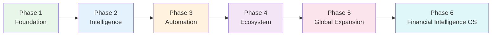
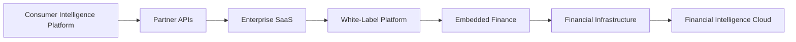
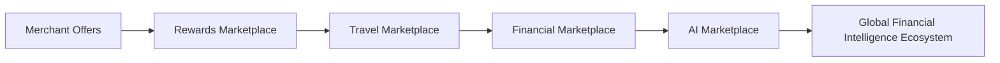
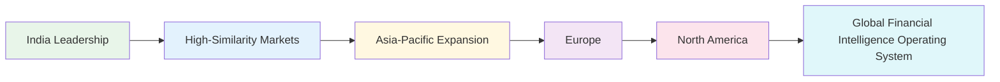
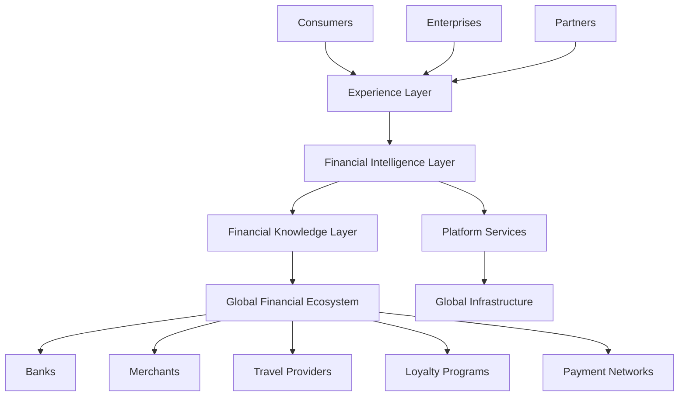

# docs/17_FUTURE_ROADMAP.md

# Part 1 — Executive Summary & Long-Term Vision

> Document Scope:
> This document defines the long-term strategic roadmap for CardWise beyond the initial product roadmap. It describes how CardWise evolves over the coming decade into the world's leading Financial Intelligence Operating System (FIOS). This document focuses on product strategy, business evolution, AI leadership, ecosystem development, and market expansion rather than implementation details.

---

# ROAD-001 Executive Summary

## Overview

CardWise is being built with a fundamentally different philosophy from traditional fintech products.

Most financial products solve a single problem:

- credit card comparison
- expense tracking
- travel booking
- rewards redemption
- budgeting
- investments
- personal finance

CardWise aims to solve the decision-making problem itself.

Instead of becoming another financial application, CardWise will become the intelligent operating layer that continuously optimizes financial decisions across the user's entire financial life.

Rather than asking users to search, compare, calculate, and remember, CardWise will progressively assume those responsibilities through AI, automation, predictive intelligence, and trusted execution.

The end state is not a better rewards platform.

The end state is an autonomous financial intelligence platform that helps individuals and businesses make optimal financial decisions without requiring continuous human effort.

---

## Strategic Vision Statement

> **CardWise will become the world's most trusted Financial Intelligence Operating System, enabling every consumer to maximize financial outcomes through autonomous, explainable, secure, and personalized intelligence across payments, rewards, travel, loyalty, banking, and commerce.**

---

## Future Identity

CardWise ultimately becomes:

| Today | Future |
|----------|-------------|
| Credit Card Platform | Financial Intelligence Platform |
| Rewards Optimizer | Autonomous Decision Engine |
| Offer Discovery | Real-Time Commerce Intelligence |
| Travel Optimizer | AI Travel Operating System |
| Recommendation System | Autonomous Financial Agent |
| User Dashboard | Personal Financial Control Center |
| Consumer App | Global Financial Operating System |

---

## Strategic Transformation

The company evolves through multiple strategic transitions.

| Stage | Company Identity |
|------------|----------------|
| Stage 1 | Credit Card Intelligence |
| Stage 2 | Rewards Intelligence Platform |
| Stage 3 | Payment Optimization Platform |
| Stage 4 | Consumer Financial Operating System |
| Stage 5 | AI Financial Assistant |
| Stage 6 | Autonomous Financial Intelligence Company |

---

# FUTURE-001 Long-Term Vision

## The Core Problem

Modern financial ecosystems have become overwhelmingly complex.

Consumers must constantly answer questions such as:

- Which card should I use?
- Which rewards should I redeem?
- Which airline gives better value?
- Which hotel booking site is optimal?
- Which wallet has cashback?
- Which bank account should receive salary?
- Which subscription should be canceled?
- Which card should be closed?
- Which merchant has hidden offers?
- Which EMI option is actually beneficial?

These are not isolated decisions.

They are interconnected optimization problems spanning multiple financial domains.

CardWise's long-term mission is to solve these optimization problems continuously on behalf of users.

---

## Future State

In its mature form, CardWise becomes an always-on financial operating system that:

- understands the user's financial goals
- understands spending behavior
- understands travel habits
- understands loyalty programs
- understands merchant ecosystems
- understands banking products
- understands reward economics
- predicts future financial opportunities
- automates optimization decisions
- explains every recommendation transparently

The user no longer manages financial complexity.

CardWise manages complexity while the user retains full control.

---

## Vision Beyond Credit Cards

The platform expands beyond credit cards into a unified financial intelligence layer.

Future optimization domains include:

| Domain | Future Scope |
|------------|----------------|
| Credit Cards | Complete lifecycle management |
| Debit Cards | Intelligent payment routing |
| UPI | Smart payment recommendations |
| Wallets | Dynamic optimization |
| Travel | End-to-end planning |
| Hotels | Intelligent booking |
| Flights | Reward-aware booking |
| Insurance | Context-aware recommendations |
| Investments | Goal-aware financial insights |
| Banking | Unified banking intelligence |
| Loyalty | Cross-program optimization |
| Commerce | Merchant intelligence |
| Taxes | Financial awareness (non-advisory) |
| Family Finance | Household optimization |
| Business Spending | SME optimization |

---

# FUTURE-002 Company Vision

## Vision Statement

Build the world's most intelligent consumer financial platform that earns trust by consistently improving every financial decision a user makes.

---

## Mission

Reduce financial complexity through intelligence instead of increasing it through features.

---

## Long-Term Aspirations

CardWise strives to become:

- the default financial companion
- the default payment recommendation engine
- the default rewards optimization platform
- the default travel optimization platform
- the default financial AI assistant
- the intelligence layer powering financial ecosystems

---

## Desired Global Position

Within the next decade, CardWise aims to be recognized as:

| Category | Target Position |
|-----------|-----------------|
| Consumer Financial Intelligence | Global Leader |
| Rewards Optimization | Category Leader |
| AI Financial Decisioning | Category Creator |
| Intelligent Payments | Top Platform |
| Loyalty Intelligence | Industry Standard |
| Travel Reward Optimization | Global Leader |
| Consumer Finance AI | Trusted Platform |

---

# FUTURE-003 Product Evolution

The product will evolve through expanding layers of intelligence rather than isolated feature additions.

| Evolution Layer | Primary Outcome |
|-----------------|-----------------|
| Information | Surface accurate financial data |
| Recommendations | Suggest optimal choices |
| Predictions | Forecast future opportunities |
| Automation | Execute routine optimizations |
| Intelligence | Coordinate across multiple domains |
| Autonomy | Manage financial optimization with user approval |
| Ecosystem | Become the operating layer for financial services |

---

## Product Evolution Philosophy

Instead of adding disconnected modules, every new capability must strengthen one or more core intelligence loops:

1. Better data collection
2. Better user understanding
3. Better prediction
4. Better optimization
5. Better automation
6. Better trust
7. Better outcomes

Every feature should reinforce these loops rather than introduce unnecessary complexity.

---

# FUTURE-004 Future Philosophy

## Philosophy 1 — Intelligence Before Features

Adding features without improving decision quality creates complexity.

Every release should increase the platform's ability to make better decisions.

---

## Philosophy 2 — User Control Above Automation

Automation must always remain transparent and reversible.

The platform recommends and assists, while users retain authority over meaningful financial actions.

---

## Philosophy 3 — Explainable Intelligence

Every recommendation should answer:

- Why?
- Why now?
- What assumptions were made?
- What are the trade-offs?
- What alternatives exist?

Trust grows when users understand recommendations.

---

## Philosophy 4 — Ecosystem Thinking

CardWise succeeds by integrating with the financial ecosystem rather than replacing it.

Future partnerships will include:

- banks
- card issuers
- payment networks
- travel providers
- merchants
- loyalty programs
- fintech platforms
- enterprise partners

---

## Philosophy 5 — Long-Term Trust

Trust compounds faster than features.

Every strategic decision should prioritize:

- privacy
- transparency
- security
- user benefit
- regulatory compliance
- ethical AI

---

# STRAT-001 Strategic Principles

## Principle 1

Optimize outcomes, not engagement.

---

## Principle 2

Reduce cognitive load.

---

## Principle 3

AI must augment human decision-making before automating it.

---

## Principle 4

Every recommendation should be measurable.

---

## Principle 5

Financial intelligence should become increasingly proactive rather than reactive.

---

## Principle 6

Build platforms instead of point solutions.

---

## Principle 7

Prioritize compounding network effects across users, merchants, banks, travel providers, and partners.

---

## Principle 8

Create sustainable competitive advantages through data quality, explainability, ecosystem integrations, and continuous learning rather than feature parity.

---

# FUTURE-005 Future Success Metrics

Traditional SaaS metrics alone do not capture CardWise's long-term value.

The platform should measure both business performance and user financial outcomes.

## Consumer Impact Metrics

| ID | Metric | Long-Term Objective |
|----|---------|---------------------|
| FUTURE-MET-001 | Annual savings per user | Continuous growth through optimization |
| FUTURE-MET-002 | Rewards value unlocked | Maximize realized rewards |
| FUTURE-MET-003 | Cashback optimization rate | Near-optimal payment routing |
| FUTURE-MET-004 | Travel savings | Lower total travel cost while preserving user preferences |
| FUTURE-MET-005 | Recommendation acceptance rate | High trust without manipulation |
| FUTURE-MET-006 | Automated optimization adoption | Increasing voluntary automation |
| FUTURE-MET-007 | Financial confidence score | Improve user confidence over time |

---

## Platform Metrics

| ID | Metric | Strategic Goal |
|----|---------|----------------|
| FUTURE-MET-101 | Active intelligence recommendations | Sustainable growth |
| FUTURE-MET-102 | AI explanation satisfaction | Maintain user trust |
| FUTURE-MET-103 | Ecosystem integrations | Expand platform reach |
| FUTURE-MET-104 | Merchant participation | Strengthen marketplace network |
| FUTURE-MET-105 | Banking partnerships | Deepen financial connectivity |
| FUTURE-MET-106 | International market availability | Global expansion |
| FUTURE-MET-107 | Enterprise platform adoption | Diversify revenue streams |

---

## Business Metrics

| ID | Metric | Long-Term Outcome |
|----|---------|------------------|
| FUTURE-MET-201 | Revenue diversification | Balanced multi-stream revenue |
| FUTURE-MET-202 | Customer lifetime value | Sustainable long-term relationships |
| FUTURE-MET-203 | Gross margin expansion | Efficient platform economics |
| FUTURE-MET-204 | Ecosystem transaction volume | Platform network growth |
| FUTURE-MET-205 | Partner retention | High-value strategic alliances |

---

# ROAD-002 High-Level Roadmap Overview

The evolution of CardWise follows six strategic eras.

| Phase | Strategic Theme | Primary Outcome |
|--------|-----------------|-----------------|
| Phase 1 | Build Trust | Reliable financial intelligence for individual users |
| Phase 2 | Optimize Decisions | AI-powered recommendations across spending, rewards, and travel |
| Phase 3 | Automate Workflows | Intelligent automation with user oversight |
| Phase 4 | Expand Ecosystem | Marketplace, enterprise services, and partner network |
| Phase 5 | Scale Globally | Multi-country platform with localized intelligence |
| Phase 6 | Financial Intelligence OS | Autonomous, explainable, ecosystem-scale financial operating system |

Each phase compounds on the previous one, prioritizing durable capabilities over rapid feature expansion.

---

# Engineering Rationale

| Decision | Rationale |
|----------|-----------|
| Platform-first evolution | Minimizes architectural fragmentation and supports long-term extensibility. |
| Intelligence-centric roadmap | Ensures AI capabilities enhance every product surface instead of existing as isolated features. |
| Explainability as a core principle | Enables trust, regulatory readiness, and easier validation of AI-driven recommendations. |
| Incremental autonomy | Reduces operational and reputational risk while allowing users to build confidence in automation. |

---

# Business Rationale

| Strategic Choice | Expected Value |
|------------------|----------------|
| Focus on financial outcomes instead of engagement | Creates stronger customer loyalty and differentiation. |
| Expand into adjacent financial domains gradually | Increases lifetime value while avoiding premature diversification. |
| Build ecosystem partnerships | Generates defensible network effects and multiple revenue streams. |
| Develop enterprise capabilities after consumer maturity | Leverages proven consumer intelligence for B2B growth without diluting early focus. |

---

# Trade-offs

| Decision | Benefit | Trade-off |
|----------|---------|-----------|
| Long-term platform vision | Durable competitive advantage | Longer path to maturity |
| Explainable AI over opaque optimization | Greater trust and compliance | Increased product and AI complexity |
| Ecosystem collaboration instead of replacement | Faster adoption and partner alignment | Dependence on external integrations |
| Measured automation rollout | Lower user risk | Slower realization of autonomous capabilities |

---

# Risks

| Risk | Potential Impact | Strategic Mitigation |
|------|------------------|----------------------|
| Rapid regulatory change | Delayed market expansion | Build adaptable governance and compliance processes. |
| AI recommendation errors | Loss of user trust | Prioritize explainability, human oversight, and continuous evaluation. |
| Platform dependency on partners | Reduced flexibility | Diversify partnerships across banks, merchants, and travel providers. |
| Competitive convergence | Feature parity | Invest in proprietary intelligence, data quality, and ecosystem scale. |

---

# Best Practices

- Anchor every roadmap decision to measurable user value rather than feature volume.
- Treat trust, privacy, and explainability as long-term strategic assets.
- Expand into adjacent domains only after achieving product-market fit in existing ones.
- Maintain platform consistency through reusable intelligence capabilities instead of siloed product teams.
- Validate strategic bets through measurable outcomes before committing large-scale investments.

---

# Operational Considerations

| Area | Long-Term Consideration |
|------|--------------------------|
| Governance | Establish periodic roadmap reviews aligned with market, regulatory, and technology shifts. |
| Portfolio Management | Balance foundational platform investments with customer-facing innovation. |
| Partner Strategy | Develop scalable onboarding and governance models for ecosystem participants. |
| AI Operations | Continuously monitor model quality, fairness, transparency, and business impact. |
| Organizational Growth | Evolve from a product-centric organization toward a platform and ecosystem operating model. |

---

# High-Level Strategic Evolution

---

## Part 1 Summary

Part 1 establishes the strategic foundation for the remainder of this roadmap by defining CardWise's long-term vision, company philosophy, product evolution model, guiding principles, measurable success metrics, and the six-phase journey from a focused credit card intelligence platform to a global Financial Intelligence Operating System.

# Part 2 — Vision Evolution (5-Year & 10-Year Strategic Outlook)

> This section expands the long-term vision introduced in Part 1 and describes how CardWise evolves across product, platform, AI, business, ecosystem, and organizational dimensions over the next decade.

---

# ROAD-100 Vision Evolution

CardWise is intentionally designed as a compounding platform.

Unlike products that rely primarily on feature expansion, CardWise creates value through continuously improving intelligence. Every new integration, recommendation, transaction, merchant, and user interaction strengthens the platform's understanding of financial behavior.

The long-term strategy is therefore centered around **compounding intelligence**, **compounding trust**, and **compounding ecosystem value**.

---

# FUTURE-100 Five-Year Vision (Years 1–5)

## Vision Statement

> Become the leading consumer Financial Intelligence Platform across India and selected international markets, trusted to optimize every payment, reward, travel, and loyalty decision.

---

## Primary Objectives

| ID | Objective | Expected Outcome |
|----|-----------|------------------|
| ROAD-101 | Establish category leadership in Credit Card Intelligence | Strong brand recognition |
| ROAD-102 | Become the default rewards optimization platform | High daily engagement |
| ROAD-103 | Launch AI Financial Copilot | Personalized recommendations |
| ROAD-104 | Build intelligent travel ecosystem | Integrated booking and optimization |
| ROAD-105 | Create merchant intelligence network | Data-driven commerce insights |
| ROAD-106 | Build enterprise API platform | B2B monetization begins |
| ROAD-107 | Expand internationally | Multi-market operations |

---

## Product State After Five Years

Consumers should be able to:

- Manage every credit card
- Track every reward
- Automatically discover offers
- Optimize payments
- Plan reward-based travel
- Receive proactive financial recommendations
- Use AI for financial questions
- Build long-term financial goals
- Manage household financial optimization
- Connect multiple financial products

---

## Platform Characteristics

By Year Five the platform should provide:

- Unified financial profile
- Unified rewards profile
- Unified travel profile
- Unified merchant intelligence
- Unified payment optimization
- Personalized AI recommendations
- Cross-product optimization
- Continuous learning engine

---

# FUTURE-101 Ten-Year Vision (Years 5–10)

## Vision Statement

> Become the world's most trusted Financial Intelligence Operating System that autonomously coordinates financial decisions across consumers, merchants, banks, travel providers, and enterprises.

---

## End-State Characteristics

The mature platform behaves less like an application and more like an intelligent operating system.

Instead of users initiating actions, CardWise continuously identifies opportunities, evaluates trade-offs, and recommends or executes approved optimizations.

---

## Ten-Year Capabilities

| Capability | Future State |
|------------|--------------|
| Payments | Autonomous payment routing |
| Rewards | Cross-network optimization |
| Travel | End-to-end AI planning |
| Loyalty | Dynamic portfolio optimization |
| Banking | Intelligent financial orchestration |
| Insurance | Context-aware recommendations |
| Commerce | Merchant-aware optimization |
| AI | Persistent financial companion |
| Enterprise | Financial Intelligence APIs |
| Marketplace | Global ecosystem platform |

---

## Strategic Position

CardWise no longer competes solely with fintech applications.

It operates at the intelligence layer above banks, payment networks, merchants, and travel providers.

---

# FUTURE-102 Product Evolution

The product evolves through successive layers of capability.

## Evolution Model

| Generation | Product Identity | User Value |
|------------|------------------|------------|
| Gen 1 | Information Platform | Transparency |
| Gen 2 | Recommendation Engine | Better decisions |
| Gen 3 | Optimization Engine | Maximum rewards |
| Gen 4 | Automation Platform | Reduced effort |
| Gen 5 | AI Copilot | Intelligent guidance |
| Gen 6 | Autonomous Financial OS | Continuous optimization |

---

## Maturity Progression

### Generation 1

Focus:

- Accurate data
- Reliable information
- Card portfolio
- Rewards visibility

Primary outcome:

> Users understand their financial ecosystem.

---

### Generation 2

Focus:

- Recommendations
- Personalization
- Merchant intelligence
- Offer intelligence

Primary outcome:

> Users consistently make better financial decisions.

---

### Generation 3

Focus:

- Optimization
- AI reasoning
- Predictive analytics
- Multi-variable decision making

Primary outcome:

> Users maximize financial value.

---

### Generation 4

Focus:

- Automation
- Smart reminders
- Intelligent workflows
- Background optimization

Primary outcome:

> Users spend less time managing finances.

---

### Generation 5

Focus:

- AI Copilot
- Voice
- Conversation
- Planning
- Forecasting

Primary outcome:

> Users interact naturally with financial intelligence.

---

### Generation 6

Focus:

- Autonomous optimization
- Financial agents
- Ecosystem orchestration
- Continuous learning

Primary outcome:

> Users rarely need to think about financial optimization.

---

# FUTURE-103 Platform Evolution

The platform expands horizontally while deepening intelligence vertically.

---

## Phase A — Consumer Platform

Core capabilities:

- Credit cards
- Rewards
- Offers
- Payments
- Travel

---

## Phase B — Intelligence Platform

Expansion:

- AI reasoning
- Predictions
- Personalization
- Financial insights

---

## Phase C — Ecosystem Platform

Expansion:

- Merchant integrations
- Banking integrations
- Travel providers
- Loyalty networks

---

## Phase D — Financial Infrastructure Platform

Expansion:

- APIs
- SDKs
- Enterprise products
- White-label services

---

## Phase E — Global Financial OS

Expansion:

- Multi-country
- Multi-currency
- Multi-language
- Multi-regulatory support

---

# FUTURE-104 AI Evolution

AI maturity follows a structured progression.

| Stage | AI Capability |
|---------|--------------|
| AI 1 | Rule-based recommendations |
| AI 2 | Personalized ML models |
| AI 3 | Explainable AI recommendations |
| AI 4 | Financial Copilot |
| AI 5 | Agentic AI |
| AI 6 | Autonomous Financial Agents |

---

## AI Transformation

Initial AI answers questions.

Later AI predicts needs.

Eventually AI coordinates financial decisions.

The final objective is trusted autonomy rather than unlimited automation.

---

## AI Responsibilities Over Time

| Timeline | Responsibility |
|-----------|---------------|
| Early | Recommend |
| Mid | Predict |
| Mature | Coordinate |
| Long-term | Optimize continuously |

---

# FUTURE-105 Company Evolution

The company evolves alongside the platform.

---

## Stage 1

Company Identity:

Product Startup

Focus:

Product-market fit

---

## Stage 2

Identity:

Consumer FinTech

Focus:

Growth

---

## Stage 3

Identity:

AI FinTech

Focus:

Intelligence

---

## Stage 4

Identity:

Platform Company

Focus:

Ecosystem

---

## Stage 5

Identity:

Infrastructure Company

Focus:

Financial APIs

---

## Stage 6

Identity:

Global Financial Intelligence Company

Focus:

Operating System

---

## Organizational Evolution

| Function | Initial Focus | Long-Term Focus |
|----------|---------------|----------------|
| Product | Consumer features | Platform strategy |
| Engineering | Product delivery | Platform scalability |
| AI | Recommendation models | Autonomous intelligence |
| Partnerships | Banks | Global ecosystems |
| Operations | Support | Platform governance |
| Compliance | Local regulations | International regulatory frameworks |

---

# Engineering Rationale

| Decision | Rationale |
|----------|-----------|
| Layered product evolution | Enables reuse of intelligence across multiple products. |
| Progressive AI maturity | Reduces technical risk while improving model quality over time. |
| Platform-first architecture | Supports future enterprise, marketplace, and global capabilities without redesign. |
| Separation of product generations | Simplifies long-term roadmap governance and prioritization. |

---

# Business Rationale

| Decision | Business Value |
|----------|----------------|
| Expand by intelligence layers | Higher customer lifetime value with lower acquisition complexity. |
| Grow ecosystem before infrastructure | Establishes network effects prior to platform monetization. |
| Enterprise expansion after consumer success | Creates credibility and reusable technology assets. |
| International rollout after domestic maturity | Reduces regulatory and operational risk. |

---

# Trade-offs

| Decision | Benefit | Trade-off |
|----------|---------|-----------|
| Gradual AI autonomy | Higher trust | Slower automation adoption |
| Ecosystem partnerships | Faster market access | External dependency |
| Platform expansion | Long-term defensibility | Greater organizational complexity |
| Global ambition | Larger addressable market | Increased compliance burden |

---

# Risks

| Risk | Impact | Mitigation |
|------|--------|-----------|
| Rapid AI disruption | Competitive pressure | Continuous AI research and modular architecture |
| Regulatory fragmentation | Slower expansion | Region-specific compliance strategies |
| Ecosystem concentration | Dependency risk | Diversified partnerships across industries |
| Organizational scaling | Operational inefficiency | Platform-oriented governance and standardized processes |

---

# Best Practices

- Treat intelligence as a reusable platform capability rather than a product feature.
- Sequence expansion according to platform maturity instead of market pressure.
- Build explainability into every AI generation.
- Align organizational evolution with product complexity.
- Maintain measurable milestones for each vision stage.

---

# Operational Considerations

| Area | Consideration |
|------|---------------|
| Roadmap Governance | Annual reassessment of strategic priorities while preserving long-term vision. |
| AI Governance | Independent evaluation of model quality, fairness, and transparency. |
| Ecosystem Management | Formal partner lifecycle and integration standards. |
| Organizational Design | Transition from functional teams to platform-aligned business units as scale increases. |
| Investment Planning | Balance foundational platform investments with market-facing innovation. |

---

# Vision Evolution Timeline

---

## Part 2 Summary

This section describes the strategic evolution of CardWise across a ten-year horizon. It outlines how the product, AI capabilities, platform architecture, company, and ecosystem mature together—from a focused consumer fintech application into a globally trusted Financial Intelligence Operating System powered by explainable AI, scalable platforms, and ecosystem partnerships.

# Part 3 — Product Roadmap (Phase 1 → Phase 6)

> This section defines the long-term product evolution of CardWise. It focuses on strategic capability expansion, business priorities, ecosystem maturity, and product milestones. Implementation details are intentionally covered in previous architecture and engineering documents.

---

# ROAD-200 Product Roadmap Overview

The long-term evolution of CardWise is divided into six strategic phases.

Each phase introduces a new layer of customer value while strengthening the platform's long-term competitive advantages.

The roadmap follows five guiding principles:

- Build trust before automation.
- Optimize existing financial behaviors before introducing new ones.
- Expand horizontally only after achieving sufficient depth.
- Prefer platform capabilities over isolated features.
- Build compounding data and intelligence loops.

---

## Product Evolution Timeline

| Phase | Strategic Theme | Platform Maturity | Primary Success Indicator |
|--------|-----------------|-------------------|---------------------------|
| Phase 1 | Foundation | Product | Product-Market Fit |
| Phase 2 | Intelligence | Intelligent Product | Daily User Value |
| Phase 3 | Automation | AI Platform | High Recommendation Adoption |
| Phase 4 | Ecosystem | Connected Platform | Partner Network Growth |
| Phase 5 | Expansion | Global Platform | Multi-Market Scale |
| Phase 6 | Financial OS | Autonomous Platform | Trusted Financial Intelligence |

---

# ROAD-201 Phase 1 — Foundation

## Vision

Establish CardWise as the most trusted platform for credit card, rewards, and offer intelligence.

---

## Strategic Objectives

| ID | Objective |
|----|-----------|
| ROAD-201A | Build trust through accurate financial data |
| ROAD-201B | Create a delightful user experience |
| ROAD-201C | Validate product-market fit |
| ROAD-201D | Build foundational AI recommendation capabilities |
| ROAD-201E | Establish data quality standards |

---

## Major Product Launches

| Product | Description |
|----------|-------------|
| Consumer Web Platform | Unified dashboard for credit cards, rewards, and offers |
| Mobile Applications | Native financial companion |
| Browser Extension | Real-time merchant recommendations |
| Credit Card Portfolio | Complete lifecycle management |
| Rewards Dashboard | Unified reward visibility |
| Intelligent Offers | Merchant-specific offer discovery |
| Basic AI Assistant | Explainable recommendations |

---

## Strategic Outcome

Users stop manually comparing cards and offers.

---

# ROAD-202 Phase 2 — Intelligence

## Vision

Transform CardWise from a financial dashboard into an intelligent financial advisor.

---

## Strategic Objectives

| ID | Objective |
|----|-----------|
| ROAD-202A | Increase personalization |
| ROAD-202B | Improve recommendation accuracy |
| ROAD-202C | Expand payment optimization |
| ROAD-202D | Introduce predictive intelligence |
| ROAD-202E | Improve travel optimization |

---

## Major Product Launches

| Product | Strategic Purpose |
|----------|-------------------|
| Financial Copilot | Conversational financial intelligence |
| Merchant Intelligence | Personalized merchant recommendations |
| Spending Intelligence | Category-based optimization |
| Travel Optimizer | Reward-aware travel planning |
| Smart Notifications | Context-aware recommendations |
| Subscription Intelligence | Detect recurring optimization opportunities |
| Goal-Based Planning | Financial objective tracking |

---

## Strategic Outcome

Users receive personalized recommendations before making financial decisions.

---

# ROAD-203 Phase 3 — Automation

## Vision

Reduce manual financial management through intelligent automation while preserving user control.

---

## Strategic Objectives

| ID | Objective |
|----|-----------|
| ROAD-203A | Automate repetitive financial workflows |
| ROAD-203B | Improve predictive recommendations |
| ROAD-203C | Reduce user effort |
| ROAD-203D | Increase trust in AI |
| ROAD-203E | Build cross-domain optimization |

---

## Major Product Launches

| Product | Strategic Value |
|----------|-----------------|
| Intelligent Automation Center | Central automation management |
| Auto Reward Optimization | Automated redemption suggestions |
| Travel Automation | Intelligent itinerary optimization |
| Payment Automation | Dynamic payment recommendations |
| Household Finance | Shared optimization across family members |
| Financial Calendar | Upcoming opportunities and reminders |
| AI Workflow Builder | User-defined automation rules |

---

## Strategic Outcome

Users actively rely on CardWise to automate routine financial optimization.

---

# ROAD-204 Phase 4 — Ecosystem

## Vision

Expand from a consumer application into an ecosystem platform connecting banks, merchants, travel providers, and enterprise partners.

---

## Strategic Objectives

| ID | Objective |
|----|-----------|
| ROAD-204A | Build partner ecosystem |
| ROAD-204B | Launch marketplace capabilities |
| ROAD-204C | Introduce enterprise APIs |
| ROAD-204D | Expand loyalty integrations |
| ROAD-204E | Create network effects |

---

## Major Product Launches

| Product | Strategic Value |
|----------|-----------------|
| Merchant Platform | Merchant engagement and offer management |
| Rewards Exchange | Cross-program redemption ecosystem |
| Banking Partner Portal | Financial institution integrations |
| Enterprise APIs | Financial intelligence services |
| White-Label Platform | Powered-by-CardWise solutions |
| Travel Partner Network | Unified travel ecosystem |
| Loyalty Exchange | Multi-program optimization |

---

## Strategic Outcome

CardWise becomes an ecosystem rather than a standalone product.

---

# ROAD-205 Phase 5 — Global Expansion

## Vision

Scale the platform internationally through localization, regulatory readiness, and regional partnerships.

---

## Strategic Objectives

| ID | Objective |
|----|-----------|
| ROAD-205A | Launch international markets |
| ROAD-205B | Support multiple currencies |
| ROAD-205C | Localize AI recommendations |
| ROAD-205D | Expand banking partnerships |
| ROAD-205E | Build regional ecosystems |

---

## Major Product Launches

| Product | Strategic Value |
|----------|-----------------|
| Global Rewards Engine | Country-aware optimization |
| Multi-Currency Intelligence | Cross-border financial recommendations |
| Localization Platform | Regional personalization |
| International Travel Intelligence | Global optimization |
| Country Marketplace | Local merchant ecosystems |
| Regulatory Compliance Platform | Region-specific governance |
| Cross-Border Wallet Intelligence | International payment optimization |

---

## Strategic Outcome

CardWise evolves into a globally relevant Financial Intelligence Platform.

---

# ROAD-206 Phase 6 — Financial Intelligence Operating System

## Vision

Become the trusted operating system coordinating financial decisions across consumers, enterprises, merchants, and financial institutions.

---

## Strategic Objectives

| ID | Objective |
|----|-----------|
| ROAD-206A | Deliver autonomous financial intelligence |
| ROAD-206B | Become ecosystem infrastructure |
| ROAD-206C | Enable enterprise financial intelligence |
| ROAD-206D | Create industry standards |
| ROAD-206E | Lead responsible AI in finance |

---

## Major Product Launches

| Product | Strategic Value |
|----------|-----------------|
| Autonomous Financial Agents | Continuous financial optimization |
| Financial Digital Twin | Personalized financial simulation |
| Global Intelligence Network | Shared ecosystem insights |
| Financial Operating System APIs | Intelligence as infrastructure |
| Enterprise Decision Platform | Organizational financial optimization |
| AI Marketplace | Third-party intelligence capabilities |
| Financial Knowledge Graph | Unified financial reasoning layer |

---

## Strategic Outcome

CardWise is recognized as the intelligence layer above the global financial ecosystem.

---

# ROAD-207 Cross-Phase Capability Evolution

| Capability | P1 | P2 | P3 | P4 | P5 | P6 |
|------------|:--:|:--:|:--:|:--:|:--:|:--:|
| Credit Card Intelligence | ✅ | ✅ | ✅ | ✅ | ✅ | ✅ |
| Rewards Optimization | ✅ | ✅ | ✅ | ✅ | ✅ | ✅ |
| Payment Intelligence | ◐ | ✅ | ✅ | ✅ | ✅ | ✅ |
| AI Recommendations | ◐ | ✅ | ✅ | ✅ | ✅ | ✅ |
| Automation | — | ◐ | ✅ | ✅ | ✅ | ✅ |
| Travel Intelligence | ◐ | ✅ | ✅ | ✅ | ✅ | ✅ |
| Marketplace | — | — | ◐ | ✅ | ✅ | ✅ |
| Enterprise APIs | — | — | ◐ | ✅ | ✅ | ✅ |
| Global Support | — | — | — | ◐ | ✅ | ✅ |
| Autonomous Agents | — | — | — | ◐ | ◐ | ✅ |

Legend:

- ✅ Full Capability
- ◐ Emerging Capability
- — Not Introduced

---

# ROAD-208 Strategic Roadmap Themes

| Theme | Phase 1 | Phase 2 | Phase 3 | Phase 4 | Phase 5 | Phase 6 |
|-------|---------|---------|---------|---------|---------|---------|
| Trust | ★★★★★ | ★★★★★ | ★★★★★ | ★★★★★ | ★★★★★ | ★★★★★ |
| Intelligence | ★★☆☆☆ | ★★★★☆ | ★★★★★ | ★★★★★ | ★★★★★ | ★★★★★ |
| Automation | ★☆☆☆☆ | ★★☆☆☆ | ★★★★☆ | ★★★★★ | ★★★★★ | ★★★★★ |
| Ecosystem | ★☆☆☆☆ | ★★☆☆☆ | ★★★☆☆ | ★★★★★ | ★★★★★ | ★★★★★ |
| Global Reach | ★☆☆☆☆ | ★☆☆☆☆ | ★★☆☆☆ | ★★★☆☆ | ★★★★★ | ★★★★★ |
| AI Maturity | ★★☆☆☆ | ★★★☆☆ | ★★★★☆ | ★★★★☆ | ★★★★★ | ★★★★★ |

---

# Engineering Rationale

| Decision | Rationale |
|----------|-----------|
| Sequential capability expansion | Reduces technical debt while enabling reusable platform services. |
| Phase-gated roadmap | Aligns engineering investment with validated business outcomes. |
| Platform reuse | Encourages shared capabilities instead of duplicated solutions. |
| Progressive automation | Allows AI maturity to grow alongside user trust. |

---

# Business Rationale

| Decision | Business Value |
|----------|----------------|
| Consumer-first strategy | Builds brand trust and proprietary behavioral data. |
| Ecosystem expansion | Creates defensible network effects and diversified revenue. |
| Enterprise products after platform maturity | Reuses consumer intelligence for higher-margin offerings. |
| Global rollout in later phases | Maximizes return on foundational platform investments. |

---

# Trade-offs

| Decision | Benefit | Trade-off |
|----------|---------|-----------|
| Phased expansion | Sustainable execution | Longer time to full vision |
| Platform-first investments | Strong scalability | Higher upfront engineering effort |
| Ecosystem partnerships | Accelerated growth | Increased coordination complexity |
| AI-assisted before AI-autonomous | Greater user confidence | Slower automation adoption |

---

# Risks

| Risk | Potential Impact | Mitigation |
|------|------------------|-----------|
| Expanding too quickly | Reduced execution quality | Strict phase exit criteria |
| Partner dependency | Ecosystem instability | Diversified integration strategy |
| AI overreach | Loss of trust | Human oversight and explainable recommendations |
| Global regulatory changes | Delayed expansion | Modular compliance framework |

---

# Best Practices

- Complete each phase before introducing major adjacent domains.
- Measure success through user outcomes rather than feature counts.
- Preserve platform consistency across every expansion.
- Treat ecosystem growth as a strategic asset, not just a distribution channel.
- Continuously validate roadmap priorities using measurable customer value.

---

# Operational Considerations

| Area | Consideration |
|------|---------------|
| Portfolio Governance | Quarterly roadmap reviews with annual strategic recalibration. |
| Resource Allocation | Balance foundational investments with customer-facing innovation. |
| Partner Readiness | Define maturity requirements before ecosystem expansion. |
| Product Operations | Maintain consistent product quality during rapid portfolio growth. |
| AI Governance | Evaluate recommendation quality and automation safety before each phase transition. |

---

# Six-Phase Product Evolution

---

## Part 3 Summary

This roadmap defines the six major stages in CardWise's long-term evolution. The journey begins with establishing trust through intelligent financial management, progresses toward AI-driven automation and ecosystem expansion, and culminates in a globally scalable Financial Intelligence Operating System that coordinates financial decisions across consumers, enterprises, merchants, and financial institutions.

# Part 4 — Consumer Platform Future

> This section describes how the CardWise consumer platform evolves over time into a comprehensive AI-powered Financial Intelligence Operating System. It focuses on customer-facing capabilities, strategic product expansion, and long-term consumer value rather than implementation details.

---

# ROAD-300 Consumer Platform Vision

## Vision Statement

The future consumer platform should evolve from helping users make individual financial decisions to continuously optimizing their entire financial life.

Rather than being a collection of financial tools, CardWise becomes a unified intelligence layer that understands user goals, predicts opportunities, coordinates financial activities, and automates routine optimization while maintaining user trust and transparency.

---

## Consumer Platform Evolution

| Platform Generation | Primary Focus | User Benefit |
|---------------------|---------------|--------------|
| Generation 1 | Financial Visibility | Complete financial awareness |
| Generation 2 | Intelligent Recommendations | Better daily decisions |
| Generation 3 | Financial Automation | Reduced manual effort |
| Generation 4 | Cross-Domain Optimization | Holistic financial outcomes |
| Generation 5 | Personal Financial Copilot | Conversational intelligence |
| Generation 6 | Financial Intelligence Operating System | Autonomous optimization with user approval |

---

# FUTURE-300 Personal Finance Intelligence

## Strategic Goal

Transform financial management from reactive tracking into proactive optimization.

---

## Long-Term Capabilities

| ID | Capability | Strategic Value |
|----|------------|----------------|
| FUTURE-PF-001 | Unified Financial Profile | Single source of financial truth |
| FUTURE-PF-002 | Spending Intelligence | Personalized spending optimization |
| FUTURE-PF-003 | Financial Goal Management | Goal-oriented recommendations |
| FUTURE-PF-004 | Cash Flow Forecasting | Anticipate future financial events |
| FUTURE-PF-005 | Financial Health Score | Continuous financial wellness assessment |
| FUTURE-PF-006 | Household Finance | Multi-user financial coordination |
| FUTURE-PF-007 | Financial Timeline | Longitudinal financial insights |

---

## Future Experience

The platform should answer questions such as:

- Am I spending efficiently?
- Can I improve my reward earnings?
- Which upcoming expenses need attention?
- What financial opportunities am I likely to miss?
- How close am I to my long-term goals?

---

# FUTURE-301 Rewards Intelligence

## Vision

CardWise becomes the universal rewards operating system.

Instead of managing individual loyalty programs, users interact with one unified rewards ecosystem.

---

## Future Capabilities

| Capability | Long-Term Outcome |
|------------|------------------|
| Cross-Program Rewards | Unified visibility |
| Dynamic Reward Valuation | Accurate redemption decisions |
| Intelligent Redemption | Maximize realized value |
| Reward Expiration Forecasting | Minimize loss |
| Multi-Program Optimization | Highest overall return |
| Reward Portfolio Analytics | Strategic earning insights |
| Personalized Reward Goals | Goal-aware earning strategies |

---

## Future Intelligence

The platform continuously evaluates:

- redemption value
- transfer opportunities
- airline partners
- hotel partners
- seasonal promotions
- bonus campaigns
- loyalty multipliers

---

# FUTURE-302 Travel Intelligence

## Vision

Travel planning evolves from booking assistance to complete travel optimization.

---

## Future Capabilities

| Capability | Strategic Purpose |
|------------|-------------------|
| AI Trip Planner | Personalized itinerary generation |
| Reward-Aware Booking | Maximize travel value |
| Fare Opportunity Detection | Timely recommendations |
| Hotel Intelligence | Personalized accommodation selection |
| Multi-City Optimization | Efficient route planning |
| Loyalty Optimization | Maximize elite benefits |
| Travel Budget Intelligence | Cost-aware planning |

---

## Long-Term Outcome

Users plan entire trips through financial intelligence rather than manually comparing providers.

---

# FUTURE-303 Intelligent Payments

## Vision

Every payment becomes an optimized financial decision.

---

## Platform Evolution

| Stage | Capability |
|--------|------------|
| Stage 1 | Best card recommendation |
| Stage 2 | Merchant-aware optimization |
| Stage 3 | Real-time payment intelligence |
| Stage 4 | Cross-wallet optimization |
| Stage 5 | Context-aware payment routing |
| Stage 6 | Autonomous payment orchestration |

---

## Future Optimization Factors

The recommendation engine evaluates:

- rewards
- cashback
- merchant offers
- EMI benefits
- payment fees
- reward caps
- annual fee impact
- spending milestones
- travel objectives
- user preferences

---

# FUTURE-304 Wallet Intelligence

## Vision

Digital wallets become intelligent financial containers rather than payment instruments.

---

## Future Capabilities

| Capability | User Benefit |
|------------|--------------|
| Unified Wallet Dashboard | Centralized management |
| Wallet Recommendation Engine | Context-aware usage |
| Wallet Offer Intelligence | Better savings |
| Cross-Wallet Optimization | Maximum value |
| Wallet Health Monitoring | Continuous optimization |
| Digital Asset Organization | Simplified management |

---

# FUTURE-305 Lifestyle Intelligence

## Vision

Financial intelligence extends beyond banking into everyday lifestyle decisions.

---

## Lifestyle Domains

| Domain | Future Intelligence |
|---------|--------------------|
| Dining | Reward-aware recommendations |
| Shopping | Merchant optimization |
| Entertainment | Subscription optimization |
| Fuel | Dynamic payment selection |
| Healthcare | Benefit-aware spending |
| Education | Goal-aligned financial planning |
| Luxury Purchases | Long-term value optimization |

---

## Strategic Purpose

CardWise becomes part of everyday life rather than being used only during financial events.

---

# FUTURE-306 Intelligent Automation

## Vision

Routine financial decisions gradually become automated.

Automation focuses on reducing cognitive effort while preserving user approval for meaningful actions.

---

## Automation Categories

| Category | Example Outcome |
|----------|-----------------|
| Recommendations | Context-aware suggestions |
| Notifications | Opportunity detection |
| Planning | Goal scheduling |
| Rewards | Redemption optimization |
| Travel | Intelligent itinerary updates |
| Payments | Best payment routing |
| Financial Reviews | Periodic optimization reports |

---

## Automation Principles

- User approval remains central.
- Recommendations remain explainable.
- Automation remains configurable.
- Users can override decisions at any time.

---

# FUTURE-307 Voice Intelligence

## Vision

Financial interactions become conversational.

Users no longer navigate menus—they communicate naturally.

---

## Example Conversations

Instead of searching manually, users ask:

- How can I maximize rewards this month?
- Which card should I use today?
- Can I afford this vacation?
- What's the best way to redeem my points?
- Which subscriptions should I review?
- How much value did CardWise save me this year?

---

## Future Voice Capabilities

| Capability | Strategic Benefit |
|------------|-------------------|
| Conversational Financial Assistant | Natural interaction |
| Voice Planning | Faster decision-making |
| Spoken Financial Insights | Accessibility |
| Voice Notifications | Timely awareness |
| Hands-Free Travel Planning | Improved convenience |
| Multi-Language Voice Support | Global usability |

---

# FUTURE-308 Unified Consumer Experience

The long-term platform unifies every consumer experience into a single intelligence layer.

| Experience Layer | Long-Term Objective |
|------------------|---------------------|
| Identity | Unified financial identity |
| Cards | Intelligent lifecycle management |
| Rewards | Cross-network optimization |
| Payments | Dynamic optimization |
| Travel | AI-assisted planning |
| Lifestyle | Everyday financial intelligence |
| AI | Continuous personalized guidance |
| Automation | Low-effort financial management |
| Voice | Natural interaction |
| Insights | Explainable recommendations |

---

# FUTURE-309 Consumer Journey Evolution

| User Stage | CardWise Role |
|------------|---------------|
| New User | Financial onboarding guide |
| Active User | Intelligent recommendation engine |
| Power User | Financial optimization platform |
| Household | Shared financial coordinator |
| Frequent Traveler | Travel intelligence companion |
| Long-Term Customer | Personal Financial Operating System |

---

# Engineering Rationale

| Decision | Rationale |
|----------|-----------|
| Unified intelligence platform | Eliminates fragmented user experiences across financial domains. |
| Shared recommendation engine | Enables consistent optimization logic across payments, rewards, and travel. |
| Modular capability expansion | Supports continuous innovation without disrupting existing workflows. |
| Voice-first interaction layer | Future-proofs the platform for emerging conversational interfaces. |

---

# Business Rationale

| Decision | Strategic Value |
|----------|-----------------|
| Expand beyond credit cards | Increases customer lifetime value and daily engagement. |
| Lifestyle integration | Creates more frequent user interactions and stronger retention. |
| Intelligent automation | Improves user satisfaction while lowering perceived complexity. |
| Unified consumer platform | Establishes a differentiated competitive position difficult to replicate. |

---

# Trade-offs

| Decision | Benefit | Trade-off |
|----------|---------|-----------|
| Broad consumer platform | Larger addressable market | Greater product complexity |
| Increasing automation | Higher convenience | Requires stronger trust and governance |
| Lifestyle expansion | More engagement opportunities | Higher partnership requirements |
| Conversational UX | Lower learning curve | Greater AI infrastructure investment |

---

# Risks

| Risk | Potential Impact | Mitigation |
|------|------------------|-----------|
| Feature overload | Reduced usability | Maintain progressive disclosure and personalized interfaces. |
| Incorrect recommendations | Loss of confidence | Invest in explainable AI and continuous quality evaluation. |
| Privacy concerns | Lower adoption | Privacy-by-design and transparent user controls. |
| Partnership dependency | Inconsistent experiences | Diversified ecosystem integrations and fallback strategies. |

---

# Best Practices

- Prioritize measurable financial outcomes over feature breadth.
- Introduce automation gradually as user trust grows.
- Maintain a single, consistent intelligence layer across all consumer experiences.
- Ensure every recommendation is explainable and actionable.
- Expand into adjacent lifestyle domains only when they strengthen the core financial optimization mission.

---

# Operational Considerations

| Area | Consideration |
|------|---------------|
| Product Operations | Monitor adoption and customer outcomes across each capability domain. |
| AI Governance | Continuously evaluate recommendation quality and fairness. |
| Customer Success | Educate users on new automation capabilities to build trust. |
| Partner Operations | Maintain reliable integrations with merchants, travel providers, and financial institutions. |
| Lifecycle Management | Introduce advanced capabilities progressively based on user maturity. |

---

# Consumer Platform Evolution

---

## Part 4 Summary

This section outlines the long-term evolution of the CardWise consumer platform into a unified Financial Intelligence Operating System. It describes how personal finance, rewards, travel, payments, wallets, lifestyle services, automation, and conversational AI converge into a single intelligence layer that continuously improves financial outcomes while maintaining transparency, trust, and user control.

# Part 5 — AI Future Roadmap

> This section defines the long-term evolution of Artificial Intelligence within CardWise. AI is not treated as an isolated feature, but as the foundational intelligence layer that powers every recommendation, prediction, optimization, and autonomous workflow across the platform.

---

# AI-FUT-500 AI Vision

## Vision Statement

CardWise aims to build the world's most trusted Financial Intelligence AI—an explainable, privacy-first, continuously learning system that helps users make better financial decisions and gradually automates routine optimization while preserving transparency and user control.

The objective is **not** to replace human decision-making, but to augment it with trusted intelligence and, where appropriate, automate repetitive financial tasks with explicit user approval.

---

## AI Evolution Principles

| ID | Principle | Purpose |
|----|-----------|---------|
| AI-FUT-501 | Explainability First | Every recommendation must be understandable. |
| AI-FUT-502 | Human-in-Control | Users retain authority over meaningful financial actions. |
| AI-FUT-503 | Privacy by Design | Personal financial data remains protected throughout the AI lifecycle. |
| AI-FUT-504 | Continuous Learning | Improve recommendations through anonymized feedback and evolving user preferences. |
| AI-FUT-505 | Responsible AI | Ensure fairness, transparency, and regulatory readiness. |
| AI-FUT-506 | Platform Intelligence | AI capabilities should be reusable across every product surface. |

---

# AI-FUT-510 AI Capability Evolution

## AI Maturity Model

| AI Generation | Primary Capability | User Outcome |
|---------------|-------------------|--------------|
| AI Gen 1 | Rule-Based Recommendations | Better payment decisions |
| AI Gen 2 | Personalized ML Models | Context-aware optimization |
| AI Gen 3 | Explainable Financial Reasoning | Increased user trust |
| AI Gen 4 | Conversational Financial Copilot | Natural interaction |
| AI Gen 5 | Agentic Financial Workflows | Semi-autonomous task execution |
| AI Gen 6 | Financial Intelligence Operating System | Continuous optimization across domains |

---

# AI-FUT-520 Financial AI Copilot

## Long-Term Vision

The Financial Copilot becomes the primary interface between users and the CardWise platform.

Instead of navigating menus and dashboards, users interact naturally with an AI assistant that understands goals, preferences, historical behavior, and financial context.

---

## Future Responsibilities

| Capability | Description |
|------------|-------------|
| Financial Q&A | Answer questions using personalized financial context |
| Spending Guidance | Recommend optimal payment methods |
| Rewards Strategy | Suggest earning and redemption opportunities |
| Travel Planning | Build reward-aware itineraries |
| Financial Goal Planning | Guide users toward long-term objectives |
| Opportunity Discovery | Surface high-value financial events proactively |
| Decision Explanation | Explain recommendations with supporting rationale |

---

## Example User Interactions

- Which card should I use for this purchase?
- Can I reach my travel goal faster?
- Is it worth upgrading this credit card?
- How much value have I unlocked this year?
- Which reward should I redeem next?
- Can I reduce my annual card fees?

---

# AI-FUT-530 Autonomous Financial Agents

## Vision

Financial Agents specialize in narrow domains while collaborating through a shared intelligence platform.

Rather than relying on one monolithic AI, CardWise evolves into a coordinated system of domain-specific agents.

---

## Planned Agent Categories

| Agent | Responsibility |
|--------|----------------|
| Payment Agent | Optimize payment selection |
| Rewards Agent | Maximize reward earnings and redemption |
| Travel Agent | Coordinate travel planning and bookings |
| Merchant Agent | Detect offers and merchant opportunities |
| Portfolio Agent | Manage card lifecycle recommendations |
| Budget Agent | Monitor spending behavior |
| Goal Agent | Track progress toward financial objectives |
| Subscription Agent | Optimize recurring expenses |
| Household Agent | Coordinate family financial optimization |
| Compliance Agent | Ensure recommendations remain policy-aware |

---

## Long-Term Agent Collaboration

Agents exchange structured intelligence rather than isolated recommendations, enabling coordinated optimization across multiple financial domains.

---

# AI-FUT-540 Predictive Finance

## Vision

Move beyond historical reporting toward predictive financial intelligence.

---

## Prediction Categories

| Prediction | Strategic Value |
|------------|-----------------|
| Spending Forecast | Anticipate future expenses |
| Reward Forecast | Estimate future earnings |
| Offer Prediction | Identify upcoming merchant opportunities |
| Card Utilization Forecast | Optimize spending allocation |
| Travel Opportunity Prediction | Recommend ideal booking windows |
| Cash Flow Forecast | Improve financial planning |
| Goal Completion Prediction | Estimate achievement timelines |

---

## Future Outcome

CardWise proactively identifies financial opportunities before users begin searching for them.

---

# AI-FUT-550 Voice AI

## Vision

Voice becomes a first-class interaction model for financial intelligence.

---

## Long-Term Capabilities

| Capability | User Benefit |
|------------|--------------|
| Conversational Financial Assistant | Hands-free financial guidance |
| Voice Recommendations | Immediate contextual advice |
| Spoken Financial Reports | Improved accessibility |
| Multi-Language Conversations | Global usability |
| Context-Aware Voice Sessions | Personalized interactions |
| Voice-Based Goal Planning | Faster financial planning |

---

## Strategic Importance

Voice reduces friction, increases accessibility, and enables users to interact with financial intelligence in everyday situations.

---

# AI-FUT-560 Multimodal Financial Intelligence

## Vision

Future AI understands financial information regardless of format.

---

## Supported Inputs

| Input Type | Example |
|------------|---------|
| Text | Financial questions |
| Images | Credit card photos, offer screenshots |
| PDFs | Statements and reward summaries |
| Receipts | Merchant transactions |
| Emails | Promotional offers and travel confirmations |
| Calendars | Travel and billing events |
| Notifications | Banking and payment alerts |
| Voice | Conversational queries |

---

## Supported Outputs

| Output | Purpose |
|---------|---------|
| Personalized Reports | Explain financial performance |
| Interactive Conversations | Guide decision-making |
| Charts and Summaries | Improve comprehension |
| Opportunity Alerts | Highlight actionable events |
| Workflow Suggestions | Recommend automation |

---

# AI-FUT-570 Financial Digital Twin

## Vision

Create a continuously updated digital representation of each user's financial ecosystem.

The Digital Twin simulates potential outcomes before recommendations are presented.

---

## Long-Term Components

| Component | Strategic Role |
|-----------|----------------|
| Financial Profile | Comprehensive financial identity |
| Spending Model | Behavioral understanding |
| Reward Model | Optimization simulation |
| Goal Model | Progress forecasting |
| Travel Model | Reward-aware planning |
| Risk Model | Evaluate potential trade-offs |
| Preference Model | Personalization engine |

---

## Strategic Benefits

- Safer recommendations
- Scenario planning
- Personalized simulations
- Better explainability
- Long-term optimization

---

# AI-FUT-580 AI Research Roadmap

## Research Themes

| Theme | Strategic Objective |
|--------|---------------------|
| Financial Reasoning | Improve complex recommendation quality |
| Explainable AI | Increase transparency |
| Reinforcement Learning | Optimize sequential financial decisions |
| Retrieval-Augmented Generation | Ground responses in trusted financial knowledge |
| Knowledge Graphs | Connect financial entities and relationships |
| Agent Collaboration | Coordinate specialized AI systems |
| Causal Inference | Distinguish correlation from financial causation |
| Federated Learning | Improve models while protecting privacy |

---

## Research Priorities

1. Explainability
2. Recommendation quality
3. Personalization
4. Safety and robustness
5. Multi-agent coordination
6. Long-term financial reasoning

---

# AI-FUT-590 AI Capability Timeline

| Timeline | AI Milestone |
|-----------|--------------|
| Early Stage | Personalized recommendations |
| Growth Stage | Conversational Financial Copilot |
| Expansion Stage | Predictive intelligence |
| Platform Stage | Multi-agent collaboration |
| Global Stage | Multimodal financial understanding |
| Long-Term Stage | Financial Digital Twin and trusted autonomous optimization |

---

# Engineering Rationale

| Decision | Rationale |
|----------|-----------|
| Modular AI architecture | Enables independent evolution of specialized intelligence capabilities. |
| Shared AI services | Promotes consistency across consumer, enterprise, and marketplace products. |
| Explainability-first approach | Supports user trust, governance, and regulatory compliance. |
| Multi-agent strategy | Improves scalability and domain-specific reasoning compared to a single monolithic model. |

---

# Business Rationale

| Decision | Strategic Value |
|----------|-----------------|
| AI as platform capability | Differentiates CardWise beyond traditional fintech applications. |
| Financial Copilot | Increases daily engagement and customer retention. |
| Predictive intelligence | Creates proactive customer value rather than reactive assistance. |
| Digital Twin | Enables highly personalized recommendations and future premium offerings. |

---

# Trade-offs

| Decision | Benefit | Trade-off |
|----------|---------|-----------|
| Specialized AI agents | Better domain expertise | Increased orchestration complexity |
| Explainable recommendations | Greater user confidence | Higher development effort |
| Progressive autonomy | Lower operational risk | Slower path to full automation |
| Multimodal intelligence | Richer user experiences | Broader infrastructure requirements |

---

# Risks

| Risk | Potential Impact | Mitigation |
|------|------------------|-----------|
| Hallucinated recommendations | Reduced trust | Ground AI responses with verified financial data and explainability. |
| Regulatory evolution | Compliance challenges | Build adaptable AI governance and auditing processes. |
| Model bias | Uneven user outcomes | Continuous evaluation and fairness testing. |
| Over-automation | User discomfort | Maintain configurable automation with explicit user approval. |

---

# Best Practices

- Treat AI as shared platform infrastructure rather than isolated product functionality.
- Measure AI success by improved financial outcomes instead of conversation volume.
- Continuously validate recommendations using real-world performance metrics.
- Prioritize transparency over opaque optimization.
- Introduce increasingly autonomous capabilities only after demonstrating sustained user trust.

---

# Operational Considerations

| Area | Consideration |
|------|---------------|
| AI Governance | Independent review of recommendation quality, fairness, and safety. |
| Model Lifecycle | Continuous evaluation, retraining, and monitoring. |
| User Feedback | Capture explicit and implicit signals to improve recommendations. |
| Compliance | Maintain auditable decision histories where appropriate. |
| Research Portfolio | Balance foundational AI research with customer-facing innovation. |

---

# AI Evolution Roadmap

---

## Part 5 Summary

This section defines the long-term AI roadmap for CardWise. AI evolves from recommendation engines into a trusted Financial Intelligence Platform composed of specialized agents, predictive models, multimodal interfaces, and a Financial Digital Twin. Throughout every stage, explainability, privacy, user control, and measurable financial outcomes remain the foundational principles guiding AI development.

# Part 6 — Enterprise Future

> This section defines the long-term enterprise strategy for CardWise. The enterprise platform extends the intelligence, optimization, and infrastructure built for consumers into reusable products for banks, fintechs, merchants, travel providers, payment companies, and enterprises. It focuses on strategic evolution rather than implementation.

---

# ROAD-600 Enterprise Vision

## Vision Statement

CardWise evolves beyond a consumer application into the Financial Intelligence Platform powering the next generation of financial products.

The enterprise platform enables organizations to leverage CardWise's intelligence without rebuilding recommendation engines, rewards optimization systems, merchant intelligence, AI capabilities, or financial decision infrastructure.

---

## Enterprise Mission

Provide modular financial intelligence capabilities through APIs, SaaS products, and infrastructure that enable partners to build differentiated financial experiences faster.

---

## Enterprise Evolution

| Stage | Enterprise Identity | Primary Value |
|--------|---------------------|---------------|
| Stage 1 | Internal Platform | Shared capabilities for CardWise products |
| Stage 2 | Partner APIs | Intelligence services for strategic partners |
| Stage 3 | Enterprise SaaS | Business-facing optimization tools |
| Stage 4 | White-Label Platform | Powered-by-CardWise experiences |
| Stage 5 | Financial Infrastructure | Industry-wide intelligence platform |
| Stage 6 | Financial Intelligence Cloud | Global financial intelligence ecosystem |

---

# FUTURE-600 Enterprise API Platform

## Vision

Expose CardWise capabilities as composable APIs that enterprises can integrate into their own digital experiences.

---

## Long-Term API Categories

| ID | API Category | Strategic Purpose |
|----|--------------|-------------------|
| API-601 | Card Intelligence API | Card recommendations and lifecycle insights |
| API-602 | Rewards Intelligence API | Reward optimization and valuation |
| API-603 | Offer Intelligence API | Merchant offer discovery |
| API-604 | Payment Recommendation API | Context-aware payment guidance |
| API-605 | Travel Intelligence API | Reward-aware travel optimization |
| API-606 | Merchant Intelligence API | Consumer and merchant insights |
| API-607 | Financial Recommendation API | Explainable AI recommendations |
| API-608 | Loyalty Intelligence API | Cross-program optimization |

---

## Strategic Benefits

- Faster partner innovation
- Consistent recommendation quality
- Platform network effects
- Reusable intelligence across industries
- Diversified enterprise revenue

---

# FUTURE-610 Enterprise SaaS Platform

## Vision

Offer enterprise-grade SaaS products that enable organizations to optimize customer engagement, rewards, loyalty, and financial experiences.

---

## Product Portfolio

| Product | Target Customers |
|----------|------------------|
| Rewards Management Suite | Banks and issuers |
| Merchant Intelligence Platform | Retailers and marketplaces |
| Loyalty Analytics Suite | Loyalty operators |
| Offer Management Platform | Merchant networks |
| Travel Rewards Console | Travel providers |
| Customer Financial Insights | Fintech companies |
| Financial Recommendation Dashboard | Enterprises |

---

## Long-Term Value

Organizations gain access to mature financial intelligence without investing in years of AI and data platform development.

---

# FUTURE-620 White-Label Platform

## Vision

Allow organizations to deliver CardWise intelligence under their own brand while maintaining a consistent, high-quality optimization engine.

---

## White-Label Capabilities

| Capability | Business Outcome |
|------------|------------------|
| Custom Branding | Seamless customer experience |
| Configurable Recommendation Policies | Organizational flexibility |
| Localization | Regional customization |
| Modular Product Selection | Tailored deployments |
| Analytics Dashboard | Operational visibility |
| Partner Administration | Independent management |

---

## Target Segments

- Banks
- Digital banks
- Credit card issuers
- Fintech platforms
- Travel companies
- Retail marketplaces
- Loyalty providers
- Corporate finance platforms

---

# FUTURE-630 Banking Platform

## Vision

Become the intelligence layer supporting banks rather than competing directly with them.

---

## Strategic Services

| Service | Long-Term Role |
|----------|----------------|
| Card Recommendation Engine | Improve customer acquisition |
| Rewards Optimization | Increase engagement |
| Customer Insights | Better personalization |
| Merchant Analytics | Improve partnerships |
| AI Financial Assistant | Enhance digital banking |
| Offer Marketplace | Expand value-added services |
| Loyalty Optimization | Increase retention |

---

## Strategic Outcome

Banks leverage CardWise intelligence to improve customer outcomes while maintaining ownership of customer relationships.

---

# FUTURE-640 Embedded Finance

## Vision

Financial intelligence becomes embedded wherever consumers make financial decisions.

---

## Embedded Experiences

| Industry | Example Capability |
|-----------|--------------------|
| E-Commerce | Best payment recommendation at checkout |
| Travel | Reward-aware booking |
| Hospitality | Loyalty optimization |
| Retail | Merchant offer intelligence |
| Subscription Platforms | Payment optimization |
| Digital Wallets | Intelligent funding source selection |
| Super Apps | Financial Copilot integration |

---

## Long-Term Objective

CardWise intelligence becomes available without requiring users to switch applications.

---

# FUTURE-650 Financial Infrastructure

## Vision

Provide foundational infrastructure for financial decision intelligence.

Rather than exposing only APIs, CardWise evolves into an intelligence infrastructure platform.

---

## Infrastructure Layers

| Layer | Strategic Purpose |
|--------|-------------------|
| Recommendation Infrastructure | Shared optimization engine |
| Financial Knowledge Layer | Unified financial reasoning |
| Merchant Intelligence Layer | Merchant ecosystem insights |
| Rewards Intelligence Layer | Cross-network optimization |
| Decision Engine | Explainable financial recommendations |
| AI Platform | Shared intelligence services |
| Analytics Platform | Enterprise insights |

---

## Long-Term Benefits

- Consistent financial intelligence
- Faster enterprise adoption
- Reduced duplication
- Scalable ecosystem growth
- Stronger network effects

---

# FUTURE-660 Enterprise Customer Segments

| Customer Type | Primary Need | CardWise Value |
|---------------|--------------|----------------|
| Banks | Customer engagement | AI-powered financial intelligence |
| Credit Card Issuers | Card usage optimization | Better customer retention |
| Fintech Companies | Faster innovation | Reusable financial capabilities |
| Merchants | Customer acquisition | Offer and payment intelligence |
| Travel Providers | Reward optimization | Increased booking conversion |
| Loyalty Programs | Member engagement | Cross-program intelligence |
| Enterprises | Employee financial tools | Intelligent financial services |

---

# FUTURE-670 Enterprise Capability Roadmap

| Capability | Stage 1 | Stage 2 | Stage 3 | Stage 4 | Stage 5 |
|------------|:-------:|:-------:|:-------:|:-------:|:-------:|
| APIs | ◐ | ✅ | ✅ | ✅ | ✅ |
| SaaS Products | — | ◐ | ✅ | ✅ | ✅ |
| White-Label | — | — | ◐ | ✅ | ✅ |
| Embedded Finance | — | — | ◐ | ✅ | ✅ |
| Financial Infrastructure | — | — | — | ◐ | ✅ |
| AI Intelligence Cloud | — | — | — | — | ✅ |

Legend:

- ✅ Full Capability
- ◐ Emerging Capability
- — Not Introduced

---

# FUTURE-680 Enterprise Revenue Evolution

| Revenue Stream | Strategic Importance |
|----------------|----------------------|
| API Usage | High-volume recurring revenue |
| SaaS Subscriptions | Predictable enterprise revenue |
| White-Label Licensing | Long-term partnerships |
| Intelligence Platform Fees | Usage-based monetization |
| Analytics Services | Premium enterprise offering |
| Marketplace Revenue | Ecosystem monetization |
| Strategic Partnerships | Co-developed value creation |

---

# FUTURE-690 Enterprise Success Metrics

| ID | Metric | Long-Term Goal |
|----|---------|----------------|
| ENT-001 | Enterprise Customers | Sustainable growth across industries |
| ENT-002 | API Utilization | Increasing platform adoption |
| ENT-003 | Partner Retention | Long-term ecosystem stability |
| ENT-004 | White-Label Deployments | Global expansion |
| ENT-005 | Embedded Integrations | Broad platform reach |
| ENT-006 | Enterprise Revenue Share | Diversified business model |
| ENT-007 | Ecosystem Transaction Volume | Expanding network effects |

---

# Engineering Rationale

| Decision | Rationale |
|----------|-----------|
| API-first enterprise strategy | Maximizes reuse of consumer platform capabilities. |
| Modular SaaS architecture | Enables flexible enterprise adoption without product fragmentation. |
| Shared intelligence platform | Maintains consistent recommendation quality across customers. |
| White-label capabilities | Accelerates enterprise adoption while preserving platform scalability. |

---

# Business Rationale

| Decision | Strategic Value |
|----------|-----------------|
| Expand into enterprise after consumer maturity | Leverages validated intelligence and proprietary data assets. |
| Banking partnerships over competition | Creates collaborative growth opportunities and reduces market friction. |
| Embedded finance | Extends platform reach into high-frequency customer journeys. |
| Financial infrastructure | Establishes long-term defensibility and recurring enterprise revenue. |

---

# Trade-offs

| Decision | Benefit | Trade-off |
|----------|---------|-----------|
| Enterprise expansion | Diversified revenue streams | Greater organizational complexity |
| White-label platform | Faster market penetration | Reduced consumer brand visibility |
| Infrastructure strategy | Strong network effects | Higher long-term investment requirements |
| Embedded intelligence | Increased adoption | Greater integration support obligations |

---

# Risks

| Risk | Potential Impact | Mitigation |
|------|------------------|-----------|
| Enterprise customization demands | Platform fragmentation | Maintain configurable, standardized modules. |
| Partner concentration | Revenue dependency | Diversify customer segments and regions. |
| Regulatory obligations | Slower enterprise adoption | Build compliance capabilities into platform governance. |
| Competitive infrastructure providers | Margin pressure | Differentiate through explainable financial intelligence and ecosystem depth. |

---

# Best Practices

- Build enterprise offerings from proven consumer capabilities.
- Maintain a single intelligence platform serving all customer segments.
- Favor configuration over custom development.
- Measure enterprise success through customer outcomes and platform adoption.
- Preserve long-term compatibility across APIs, SaaS products, and infrastructure services.

---

# Operational Considerations

| Area | Consideration |
|------|---------------|
| Enterprise Support | Dedicated onboarding and lifecycle management. |
| Platform Governance | Versioning and compatibility for enterprise integrations. |
| Partner Success | Joint planning with strategic customers. |
| Security & Compliance | Enterprise-grade governance and auditability. |
| Product Portfolio | Continuous evaluation of enterprise offerings based on customer adoption. |

---

# Enterprise Platform Evolution

---

## Part 6 Summary

This section defines the enterprise evolution of CardWise from an internal intelligence platform into a global Financial Intelligence Cloud. Through APIs, SaaS products, white-label solutions, embedded finance capabilities, and financial infrastructure, CardWise extends its proven consumer intelligence to banks, fintechs, merchants, travel providers, and enterprises, creating scalable ecosystem value while diversifying long-term revenue.

# Part 7 — Marketplace Future

> This section defines the long-term marketplace strategy for CardWise. The marketplace transforms the platform from a recommendation engine into a multi-sided ecosystem connecting consumers, merchants, banks, travel providers, loyalty programs, fintech companies, and enterprise partners. The objective is to create sustainable network effects while improving financial outcomes for every participant.

---

# ROAD-700 Marketplace Vision

## Vision Statement

CardWise will evolve into the world's largest Financial Intelligence Marketplace where consumers, financial institutions, merchants, travel providers, and loyalty ecosystems collaborate through trusted intelligence rather than isolated transactions.

The marketplace creates value by matching the right consumer, with the right financial product, at the right time, through the right channel.

---

## Marketplace Objectives

| ID | Objective | Strategic Outcome |
|----|-----------|-------------------|
| ROAD-701 | Build a multi-sided ecosystem | Sustainable network effects |
| ROAD-702 | Increase ecosystem liquidity | Better consumer outcomes |
| ROAD-703 | Enable intelligent discovery | Higher conversion rates |
| ROAD-704 | Improve partner ROI | Stronger ecosystem participation |
| ROAD-705 | Expand platform monetization | Diversified revenue |

---

# FUTURE-700 Marketplace Evolution

## Platform Progression

| Generation | Marketplace Identity | Primary Focus |
|------------|----------------------|---------------|
| Gen 1 | Offers Marketplace | Merchant promotions |
| Gen 2 | Rewards Marketplace | Reward optimization |
| Gen 3 | Travel Marketplace | Reward-aware travel |
| Gen 4 | Financial Marketplace | Financial products |
| Gen 5 | AI Marketplace | Intelligence services |
| Gen 6 | Financial Intelligence Ecosystem | Unified marketplace platform |

---

# FUTURE-710 Merchant Platform

## Vision

Enable merchants to intelligently engage customers through personalized financial incentives rather than generic promotions.

---

## Merchant Capabilities

| Capability | Business Value |
|------------|----------------|
| Merchant Dashboard | Campaign management |
| Offer Publishing | Dynamic promotions |
| Customer Segmentation | Personalized targeting |
| Campaign Analytics | ROI measurement |
| Payment Insights | Consumer behavior analysis |
| Reward Partnerships | Loyalty expansion |
| AI Campaign Recommendations | Improved campaign effectiveness |

---

## Long-Term Benefits

### For Consumers

- Better offers
- Relevant discounts
- Personalized promotions
- Higher savings

### For Merchants

- Better customer acquisition
- Increased conversion
- Higher retention
- Better campaign efficiency

---

# FUTURE-720 Rewards Exchange

## Vision

Create a universal rewards exchange that allows consumers to maximize the value of loyalty currencies across programs.

---

## Future Capabilities

| Capability | Strategic Value |
|------------|-----------------|
| Reward Discovery | Improved visibility |
| Cross-Program Valuation | Better redemption decisions |
| Intelligent Redemption | Maximum reward value |
| Transfer Optimization | Efficient point transfers |
| Partner Recommendations | Expanded earning opportunities |
| Reward Portfolio Management | Unified loyalty experience |

---

## Long-Term Outcome

Users optimize loyalty value across multiple ecosystems instead of managing isolated programs.

---

# FUTURE-730 Loyalty Network

## Vision

Connect loyalty programs into a collaborative intelligence network.

---

## Ecosystem Participants

| Participant | Marketplace Role |
|-------------|------------------|
| Airlines | Travel rewards |
| Hotels | Loyalty optimization |
| Banks | Reward issuance |
| Retailers | Merchant incentives |
| Fuel Providers | Spending optimization |
| Entertainment Platforms | Partner rewards |
| Subscription Services | Ongoing engagement |

---

## Strategic Value

The Loyalty Network strengthens retention for partners while increasing realized value for consumers.

---

# FUTURE-740 Travel Marketplace

## Vision

Transform travel booking into an intelligence-driven marketplace optimized for financial value, convenience, and personalization.

---

## Marketplace Components

| Component | Purpose |
|-----------|---------|
| Flight Discovery | Intelligent fare comparison |
| Hotel Marketplace | Personalized accommodation |
| Reward-Aware Booking | Maximize travel rewards |
| Experience Marketplace | Activities and attractions |
| Insurance Marketplace | Context-aware protection |
| Transportation Marketplace | End-to-end mobility |

---

## Future Differentiator

Travel recommendations optimize:

- total cost
- rewards earned
- rewards redeemed
- elite benefits
- convenience
- travel preferences
- long-term financial goals

---

# FUTURE-750 Financial Marketplace

## Vision

Enable intelligent discovery of financial products tailored to each user's needs and financial profile.

---

## Marketplace Categories

| Category | Long-Term Capability |
|-----------|----------------------|
| Credit Cards | Intelligent product recommendations |
| Savings Accounts | Goal-aware suggestions |
| Investment Products | Educational discovery (non-advisory) |
| Insurance Products | Context-aware recommendations |
| Lending Products | Personalized comparisons |
| Wealth Services | Future ecosystem integration |
| Financial Tools | Third-party applications |

---

## Marketplace Principles

- Consumer-first recommendations
- Transparent ranking
- Explainable matching
- No pay-to-win prioritization
- Clear disclosure of commercial relationships

---

# FUTURE-760 AI Marketplace

## Vision

Allow trusted partners to extend CardWise through AI-powered capabilities built on standardized intelligence services.

---

## Potential Marketplace Participants

| Participant | Example Capability |
|-------------|--------------------|
| Banks | Specialized recommendation models |
| Travel Providers | Intelligent itinerary optimization |
| Merchants | Personalized shopping assistants |
| Fintech Companies | Financial planning extensions |
| Developers | Domain-specific AI agents |
| Analytics Providers | Enhanced financial insights |

---

## Strategic Purpose

Create an extensible ecosystem without compromising platform consistency or user trust.

---

# FUTURE-770 Marketplace Network Effects

## Growth Flywheel

| Step | Ecosystem Effect |
|------|------------------|
| More Consumers | Richer behavioral insights |
| Better Insights | Improved recommendations |
| Better Recommendations | Higher engagement |
| Higher Engagement | Increased merchant value |
| More Merchants | Expanded offers |
| Better Offers | More consumer value |
| More Value | Accelerated consumer growth |

---

## Long-Term Competitive Advantage

Every additional participant increases the value of the ecosystem for every other participant.

---

# FUTURE-780 Marketplace Governance

## Guiding Principles

| Principle | Purpose |
|-----------|---------|
| Transparency | Maintain trust |
| Fair Access | Encourage healthy competition |
| Quality Standards | Protect user experience |
| Privacy | Safeguard consumer data |
| Explainability | Justify marketplace recommendations |
| Compliance | Support regulatory requirements |

---

## Governance Objectives

- Prevent marketplace abuse
- Ensure recommendation integrity
- Protect consumer interests
- Maintain partner accountability
- Preserve ecosystem quality

---

# FUTURE-790 Marketplace Success Metrics

| ID | Metric | Strategic Goal |
|----|---------|----------------|
| MKT-001 | Active Marketplace Participants | Continuous ecosystem growth |
| MKT-002 | Merchant Retention | Long-term partnerships |
| MKT-003 | Reward Redemption Value | Increased consumer benefit |
| MKT-004 | Marketplace Transaction Volume | Platform liquidity |
| MKT-005 | Travel Bookings | Marketplace adoption |
| MKT-006 | Financial Product Conversions | Intelligent matching effectiveness |
| MKT-007 | Ecosystem Revenue | Sustainable monetization |
| MKT-008 | Consumer Satisfaction | High trust and engagement |

---

# Engineering Rationale

| Decision | Rationale |
|----------|-----------|
| Marketplace as platform extension | Reuses existing intelligence capabilities across multiple participant types. |
| Shared recommendation engine | Ensures consistent decision quality throughout the ecosystem. |
| Standardized partner interfaces | Simplifies onboarding and long-term scalability. |
| Governance-first design | Maintains marketplace integrity as participation grows. |

---

# Business Rationale

| Decision | Strategic Value |
|----------|-----------------|
| Multi-sided marketplace | Creates durable network effects and diversified revenue streams. |
| Merchant intelligence | Improves campaign performance and partner retention. |
| Rewards exchange | Differentiates CardWise beyond traditional loyalty platforms. |
| AI marketplace | Encourages innovation while expanding ecosystem capabilities. |

---

# Trade-offs

| Decision | Benefit | Trade-off |
|----------|---------|-----------|
| Broad marketplace participation | Larger ecosystem value | Greater governance complexity |
| Consumer-first ranking | Stronger trust | Potentially lower short-term monetization |
| Unified rewards ecosystem | Better user experience | Higher integration requirements |
| AI extensibility | Faster innovation | Increased quality assurance responsibilities |

---

# Risks

| Risk | Potential Impact | Mitigation |
|------|------------------|-----------|
| Marketplace imbalance | Reduced participant satisfaction | Continuously monitor ecosystem health and incentives. |
| Low partner engagement | Slower network growth | Deliver measurable ROI and simplified onboarding. |
| Recommendation conflicts | Reduced user trust | Maintain transparent ranking and explainable AI. |
| Regulatory changes | Marketplace restrictions | Build adaptable governance and compliance frameworks. |

---

# Best Practices

- Optimize long-term ecosystem value over short-term transaction volume.
- Ensure recommendations remain transparent and consumer-centric.
- Maintain consistent marketplace standards across all participant categories.
- Encourage innovation through standardized interfaces rather than fragmented integrations.
- Measure marketplace success through participant outcomes, not only platform revenue.

---

# Operational Considerations

| Area | Consideration |
|------|---------------|
| Partner Lifecycle | Standard onboarding, certification, and performance reviews. |
| Marketplace Operations | Continuous monitoring of ecosystem quality and liquidity. |
| Trust & Safety | Detect abuse, misleading offers, and low-quality partner experiences. |
| Analytics | Measure ecosystem performance using shared success metrics. |
| Governance | Periodic review of marketplace policies as the ecosystem expands globally. |

---

# Marketplace Evolution

---

## Part 7 Summary

This section defines the long-term marketplace strategy for CardWise. The platform evolves from an offer discovery engine into a global Financial Intelligence Marketplace connecting consumers, merchants, banks, travel providers, loyalty programs, fintech companies, and AI partners. Through strong governance, explainable intelligence, and multi-sided network effects, the marketplace becomes a foundational pillar of CardWise's long-term competitive advantage.

# Part 8 — Technology & Innovation Roadmap

> This section defines the long-term technology evolution for CardWise. It describes how the underlying technology platform matures over the coming decade to support global scale, AI-first experiences, enterprise infrastructure, and continuous innovation. It intentionally avoids implementation details, which are covered in the architecture documents.

---

# ROAD-800 Technology Vision

## Vision Statement

Technology is not a supporting function—it is the strategic advantage that enables CardWise to become the Financial Intelligence Operating System for consumers and enterprises worldwide.

The technology strategy prioritizes:

- Intelligence-first architecture
- Platform engineering
- Global scalability
- Continuous experimentation
- Responsible AI
- Privacy-preserving computation
- Operational excellence

---

## Guiding Technology Principles

| ID | Principle | Strategic Goal |
|----|-----------|----------------|
| TECH-801 | Platform over Products | Build reusable capabilities |
| TECH-802 | AI-Native Architecture | AI embedded into every layer |
| TECH-803 | Data as a Strategic Asset | Improve decision quality |
| TECH-804 | Security by Design | Build trust from the foundation |
| TECH-805 | Cloud Agnostic Thinking | Long-term flexibility |
| TECH-806 | Developer Experience | Accelerate innovation velocity |
| TECH-807 | Continuous Evolution | Incremental modernization |

---

# TECH-810 AI Infrastructure Evolution

## Vision

Develop a unified AI platform capable of serving consumer products, enterprise APIs, marketplace intelligence, and autonomous agents.

---

## AI Infrastructure Layers

| Layer | Strategic Role |
|--------|----------------|
| Foundation Models | General financial reasoning |
| Domain Models | Specialized financial intelligence |
| Knowledge Layer | Structured financial understanding |
| Retrieval Layer | Grounded recommendations |
| Agent Orchestration | Multi-agent coordination |
| Evaluation Platform | Measure quality and safety |
| Governance Layer | Responsible AI oversight |

---

## Long-Term Objectives

- Faster model experimentation
- Lower inference cost
- Higher recommendation quality
- Explainable reasoning
- Safe autonomous workflows

---

# TECH-820 Cloud Evolution

## Vision

Evolve from cloud-hosted services to a globally distributed intelligence platform.

---

## Cloud Maturity

| Stage | Cloud Focus |
|--------|-------------|
| Stage 1 | Reliable cloud-native platform |
| Stage 2 | Regional deployments |
| Stage 3 | Global multi-region architecture |
| Stage 4 | Intelligent workload optimization |
| Stage 5 | Globally distributed platform |

---

## Strategic Outcomes

- Improved availability
- Lower latency
- Better disaster resilience
- Regional regulatory compliance
- Efficient resource utilization

---

# TECH-830 ML Platform Evolution

## Vision

Establish a unified machine learning platform supporting the complete AI lifecycle.

---

## Platform Components

| Component | Strategic Purpose |
|-----------|-------------------|
| Feature Platform | Shared intelligence inputs |
| Model Registry | Versioned model governance |
| Experiment Platform | Controlled innovation |
| Evaluation Framework | Recommendation quality measurement |
| Monitoring Platform | Production observability |
| Feedback Platform | Continuous learning |
| Deployment Framework | Reliable model delivery |

---

## Future Benefits

- Consistent model quality
- Faster experimentation
- Improved reproducibility
- Scalable AI operations

---

# TECH-840 Data Platform Evolution

## Vision

Transform data into the core strategic asset driving financial intelligence.

---

## Data Evolution

| Generation | Capability |
|------------|------------|
| Gen 1 | Transaction intelligence |
| Gen 2 | Behavioral analytics |
| Gen 3 | Knowledge graph integration |
| Gen 4 | Predictive intelligence |
| Gen 5 | Financial Digital Twin support |
| Gen 6 | Autonomous intelligence platform |

---

## Strategic Data Domains

| Domain | Purpose |
|---------|---------|
| Consumer Intelligence | Personalization |
| Merchant Intelligence | Commerce optimization |
| Rewards Intelligence | Loyalty optimization |
| Travel Intelligence | Booking recommendations |
| Financial Knowledge | Decision support |
| AI Telemetry | Continuous improvement |
| Ecosystem Analytics | Marketplace optimization |

---

# TECH-850 Open Banking Evolution

## Vision

Leverage Open Banking capabilities where available to improve financial intelligence while respecting user consent and regulatory frameworks.

---

## Strategic Opportunities

| Capability | Future Benefit |
|------------|----------------|
| Account Aggregation | Unified financial view |
| Payment Intelligence | Better optimization |
| Financial Insights | Richer recommendations |
| Identity Verification | Improved trust |
| Consent Management | User transparency |
| Banking Connectivity | Expanded ecosystem reach |

---

## Guiding Principles

- Explicit user consent
- Transparent data usage
- Regulatory alignment
- Interoperability
- Secure integration

---

# TECH-860 Privacy Technologies

## Vision

Privacy becomes a competitive advantage rather than a compliance requirement.

---

## Future Privacy Capabilities

| Capability | Strategic Outcome |
|------------|-------------------|
| Privacy-by-Design | Trustworthy architecture |
| Granular Consent | User control |
| Differential Privacy | Safer analytics |
| Federated Learning | Distributed model improvement |
| Secure Computation | Confidential collaboration |
| Data Minimization | Reduced risk exposure |

---

## Long-Term Objective

Deliver highly personalized intelligence while minimizing unnecessary exposure of personal financial information.

---

# TECH-870 Emerging Technology Research

## Research Portfolio

| Technology | Strategic Evaluation |
|------------|----------------------|
| Agentic AI | Autonomous financial workflows |
| Financial Knowledge Graphs | Rich relationship modeling |
| Digital Identity | Trusted financial identity |
| Embedded Finance | Ecosystem expansion |
| Edge AI | Low-latency intelligence |
| Privacy-Enhancing Technologies | Secure collaboration |
| Quantum-Resistant Cryptography | Future security readiness |
| Spatial Computing | Evaluate future financial interfaces |
| Ambient Computing | Context-aware financial assistance |

---

## Evaluation Criteria

Emerging technologies should be adopted only if they:

- Improve customer outcomes
- Strengthen platform capabilities
- Enhance trust
- Reduce operational complexity
- Support long-term strategic goals

---

# TECH-880 Future Technology Watchlist

## Technologies Under Continuous Evaluation

| Technology Area | Current Position | Long-Term Outlook |
|-----------------|------------------|-------------------|
| Large Language Models | Core investment | Foundational capability |
| Small Language Models | Strategic | On-device intelligence |
| Multi-Agent Systems | Strategic | Platform orchestration |
| Knowledge Graphs | High priority | Core reasoning engine |
| Edge Computing | Selective adoption | Regional optimization |
| Federated Learning | Research and pilots | Privacy-preserving intelligence |
| Open Banking Standards | Active monitoring | Regional expansion enabler |
| Decentralized Identity | Evaluation | Potential trust infrastructure |
| DeFi | Observation only | Evaluate when regulatory and consumer maturity improve |

---

# TECH-890 Innovation Framework

## Innovation Portfolio

| Horizon | Focus |
|----------|-------|
| Horizon 1 | Improve existing platform capabilities |
| Horizon 2 | Expand into adjacent financial domains |
| Horizon 3 | Research transformative financial intelligence technologies |

---

## Innovation Governance

Every strategic innovation initiative should be evaluated across five dimensions:

| Dimension | Key Question |
|-----------|--------------|
| Customer Value | Does it improve measurable financial outcomes? |
| Technical Feasibility | Can it scale sustainably? |
| Regulatory Readiness | Is it compatible with current and anticipated regulations? |
| Ecosystem Fit | Does it strengthen partnerships and network effects? |
| Strategic Alignment | Does it reinforce the Financial Intelligence Operating System vision? |

---

# TECH-895 Technology Success Metrics

| ID | Metric | Strategic Goal |
|----|---------|----------------|
| TECH-MET-001 | AI Recommendation Quality | Continuous improvement |
| TECH-MET-002 | Platform Availability | Global reliability |
| TECH-MET-003 | Deployment Velocity | Faster innovation cycles |
| TECH-MET-004 | Experiment Success Rate | Efficient R&D investment |
| TECH-MET-005 | Model Explainability Score | High user trust |
| TECH-MET-006 | Privacy Compliance | Maintain regulatory alignment |
| TECH-MET-007 | Platform Reuse Rate | Maximize engineering leverage |
| TECH-MET-008 | Research-to-Production Time | Accelerate innovation adoption |

---

# Engineering Rationale

| Decision | Rationale |
|----------|-----------|
| AI-native platform | Enables intelligence to become a reusable capability across all products. |
| Unified ML lifecycle | Improves consistency, governance, and operational efficiency. |
| Modular platform evolution | Supports incremental innovation without large-scale redesigns. |
| Privacy-first architecture | Reduces long-term regulatory and operational risk. |

---

# Business Rationale

| Decision | Strategic Value |
|----------|-----------------|
| Invest in platform capabilities | Lowers marginal cost of future products. |
| Research emerging technologies | Maintains long-term competitive advantage. |
| Open Banking readiness | Expands ecosystem opportunities across markets. |
| AI infrastructure investment | Creates defensible differentiation difficult for competitors to replicate. |

---

# Trade-offs

| Decision | Benefit | Trade-off |
|----------|---------|-----------|
| Long-term platform investments | Sustainable innovation | Higher upfront cost |
| Responsible AI governance | Greater trust | Slower feature delivery |
| Privacy-enhancing technologies | Stronger user confidence | Increased engineering complexity |
| Technology evaluation framework | Disciplined adoption | Slower adoption of unproven technologies |

---

# Risks

| Risk | Potential Impact | Mitigation |
|------|------------------|-----------|
| Rapid technology shifts | Platform obsolescence | Maintain modular architecture and continuous technology reviews. |
| AI infrastructure costs | Margin pressure | Optimize model selection and inference efficiency. |
| Vendor dependency | Reduced flexibility | Favor portable standards and cloud-agnostic design. |
| Emerging regulatory requirements | Delayed innovation | Build governance into every technology investment. |

---

# Best Practices

- Treat technology as a long-term strategic asset rather than a delivery function.
- Separate experimental innovation from production platform evolution.
- Continuously measure engineering investments against customer outcomes.
- Maintain technology flexibility through modular platform design.
- Adopt emerging technologies only when they strengthen the Financial Intelligence Operating System vision.

---

# Operational Considerations

| Area | Consideration |
|------|---------------|
| Technology Governance | Annual strategic technology reviews and architecture assessments. |
| Research Management | Structured portfolio balancing near-term delivery and long-term innovation. |
| Platform Engineering | Maximize shared services and reusable capabilities. |
| AI Operations | Continuous monitoring, evaluation, and governance. |
| Knowledge Management | Capture research outcomes and institutional learning across teams. |

---

# Technology Evolution

---

## Part 8 Summary

This section outlines the long-term technology and innovation roadmap for CardWise. The platform evolves through AI-native architecture, unified machine learning, privacy-preserving technologies, global cloud infrastructure, Open Banking readiness, and disciplined innovation management. These investments provide the technological foundation required to realize the vision of a trusted Financial Intelligence Operating System while remaining adaptable to future technological advances.

# Part 9 — Global Expansion

> This section defines the long-term international expansion strategy for CardWise. It outlines how the platform evolves from an India-first Financial Intelligence Platform into a globally trusted Financial Intelligence Operating System through phased market expansion, localization, regulatory readiness, banking partnerships, and ecosystem development.

---

# ROAD-900 Global Vision

## Vision Statement

CardWise will become the world's leading Financial Intelligence Operating System by expanding deliberately into markets where intelligent payments, rewards optimization, loyalty ecosystems, digital banking, and AI-powered financial guidance deliver measurable customer value.

The objective is **not** rapid geographic expansion.

The objective is **sustainable expansion with localized intelligence**.

---

## Global Expansion Principles

| ID | Principle | Strategic Purpose |
|----|-----------|-------------------|
| GLOBAL-901 | India First | Validate product and platform maturity before international expansion |
| GLOBAL-902 | Localization over Translation | Adapt to local financial behaviors, not just language |
| GLOBAL-903 | Regulatory-by-Design | Build compliance into every expansion |
| GLOBAL-904 | Partnership First | Grow through ecosystem collaboration |
| GLOBAL-905 | Platform Reuse | Reuse core intelligence while localizing data and rules |
| GLOBAL-906 | Customer Trust | Prioritize trust over speed of expansion |

---

# GLOBAL-910 Country Prioritization Framework

Rather than expanding opportunistically, markets are evaluated through a structured scoring framework.

---

## Market Evaluation Criteria

| Evaluation Area | Strategic Importance |
|-----------------|----------------------|
| Credit Card Adoption | High |
| Digital Payment Maturity | High |
| Loyalty Ecosystem | High |
| Travel Spending | High |
| Open Banking Readiness | Medium |
| Regulatory Stability | High |
| Partnership Opportunities | High |
| Consumer AI Adoption | Medium |
| Market Size | High |
| Competitive Landscape | Medium |

---

## Expansion Philosophy

Each market should strengthen the long-term Financial Intelligence Platform instead of creating isolated regional products.

---

# GLOBAL-920 Expansion Roadmap

## Phase 1 — India

### Strategic Goal

Establish category leadership in Financial Intelligence.

---

### Priorities

- Consumer trust
- Banking partnerships
- Merchant ecosystem
- Rewards intelligence
- Travel optimization
- Enterprise APIs

---

## Phase 2 — High-Similarity Markets

### Candidate Characteristics

Markets with:

- strong digital payment adoption
- mature rewards ecosystems
- English-language accessibility
- compatible fintech ecosystems

---

### Strategic Objective

Validate platform portability with minimal structural changes.

---

## Phase 3 — Asia-Pacific Expansion

### Strategic Focus

Expand into high-growth digital financial markets with increasing AI adoption.

---

### Key Priorities

- Regional partnerships
- Local payment methods
- Country-specific rewards
- Travel ecosystem localization
- Multi-currency intelligence

---

## Phase 4 — Europe

### Strategic Focus

Deliver localized Financial Intelligence while respecting diverse regulatory frameworks and consumer expectations.

---

### Expansion Goals

- Local financial partnerships
- Regional travel optimization
- Privacy-first AI experiences
- Country-specific recommendation engines

---

## Phase 5 — North America

### Strategic Focus

Compete through superior intelligence rather than feature parity.

---

### Differentiators

- Explainable AI
- Cross-network reward optimization
- Financial Copilot
- Enterprise intelligence platform
- Marketplace ecosystem

---

## Phase 6 — Global Financial Intelligence Platform

### Long-Term Objective

Operate a globally distributed Financial Intelligence Operating System with regionally optimized intelligence and a shared technology platform.

---

# GLOBAL-930 Localization Strategy

## Vision

Localization extends beyond language to financial behavior, consumer expectations, regulations, and ecosystem partnerships.

---

## Localization Layers

| Layer | Examples |
|--------|----------|
| Language | User interface and AI conversations |
| Currency | Regional financial calculations |
| Payment Methods | Local payment ecosystems |
| Credit Products | Country-specific financial products |
| Rewards Programs | Regional loyalty systems |
| Merchants | Local commerce ecosystems |
| Travel Providers | Regional airlines and hotels |
| Regulations | Country-specific compliance |
| AI Models | Localized financial reasoning |

---

## Guiding Principle

Maintain one global platform while enabling region-specific intelligence.

---

# GLOBAL-940 Regulatory Strategy

## Vision

Treat regulatory excellence as a long-term competitive advantage.

---

## Regulatory Objectives

| Objective | Purpose |
|-----------|---------|
| Compliance-by-Design | Reduce expansion risk |
| Explainable AI | Support emerging AI regulations |
| Data Governance | Strengthen user trust |
| Regional Privacy Controls | Respect jurisdictional requirements |
| Audit Readiness | Enterprise and regulatory confidence |
| Risk Management | Sustainable global operations |

---

## Long-Term Approach

Every new market follows a standardized regulatory readiness assessment before commercial launch.

---

# GLOBAL-950 Banking & Financial Partnerships

## Vision

Partner with financial institutions rather than competing with them.

---

## Partner Categories

| Partner Type | Strategic Role |
|--------------|----------------|
| Banks | Financial intelligence integration |
| Credit Card Issuers | Reward optimization |
| Payment Networks | Payment intelligence |
| Digital Wallets | Context-aware payment routing |
| Fintech Companies | Platform integrations |
| Loyalty Providers | Cross-program optimization |
| Insurance Companies | Contextual financial products |
| Travel Providers | Reward-aware travel ecosystem |

---

## Partnership Objectives

- Improve customer outcomes
- Increase ecosystem liquidity
- Expand platform reach
- Strengthen intelligence quality
- Enable embedded financial experiences

---

# GLOBAL-960 International Operating Model

## Organizational Evolution

| Stage | Operating Model |
|--------|-----------------|
| Stage 1 | Centralized operations |
| Stage 2 | Regional partnership teams |
| Stage 3 | Regional product localization |
| Stage 4 | Multi-region platform governance |
| Stage 5 | Globally coordinated operating model |

---

## Regional Responsibilities

- Market development
- Strategic partnerships
- Regulatory coordination
- Customer success
- Localization
- Ecosystem growth

---

# GLOBAL-970 International Platform Capabilities

| Capability | Strategic Value |
|------------|-----------------|
| Multi-Language Platform | Local customer experience |
| Multi-Currency Intelligence | Accurate financial recommendations |
| Regional AI Models | Localized personalization |
| Cross-Border Travel Intelligence | Global traveler support |
| Regional Marketplace | Country-specific commerce |
| Global Rewards Engine | Cross-country optimization |
| Distributed Platform Services | Low-latency user experiences |

---

# GLOBAL-980 Expansion Success Metrics

| ID | Metric | Long-Term Goal |
|----|---------|----------------|
| GLOBAL-MET-001 | Countries Supported | Sustainable global footprint |
| GLOBAL-MET-002 | Localized AI Quality | Region-specific recommendation excellence |
| GLOBAL-MET-003 | Banking Partnerships | Strong financial ecosystem |
| GLOBAL-MET-004 | Merchant Coverage | High local relevance |
| GLOBAL-MET-005 | Marketplace Liquidity | Healthy regional ecosystems |
| GLOBAL-MET-006 | Regulatory Readiness | Full compliance in active markets |
| GLOBAL-MET-007 | International Revenue Share | Balanced geographic diversification |
| GLOBAL-MET-008 | Customer Satisfaction | Consistent global experience |

---

# GLOBAL-990 Global Expansion Risks

| Risk | Potential Impact | Mitigation |
|------|------------------|-----------|
| Regulatory fragmentation | Delayed market entry | Modular compliance framework and regional legal expertise |
| Cultural mismatch | Lower product adoption | Local user research and market-specific design |
| Partnership concentration | Ecosystem dependency | Diversified regional partner strategy |
| Currency volatility | Recommendation accuracy | Dynamic financial intelligence models |
| Regional competition | Slower growth | Differentiate through AI, explainability, and ecosystem integration |

---

# Engineering Rationale

| Decision | Rationale |
|----------|-----------|
| Shared global platform | Maximizes engineering reuse while enabling regional customization. |
| Modular localization | Reduces duplication and simplifies long-term maintenance. |
| Regional intelligence layers | Improves recommendation accuracy without fragmenting the platform. |
| Distributed architecture | Supports global performance and regulatory requirements. |

---

# Business Rationale

| Decision | Strategic Value |
|----------|-----------------|
| India-first strategy | Builds a validated foundation before international scaling. |
| Partnership-led expansion | Accelerates market entry while reducing operational risk. |
| Localization-first approach | Improves customer adoption and long-term retention. |
| Regulatory readiness | Strengthens trust with consumers, enterprises, and financial institutions. |

---

# Trade-offs

| Decision | Benefit | Trade-off |
|----------|---------|-----------|
| Phased expansion | Sustainable execution | Slower geographic coverage |
| Deep localization | Better customer experience | Higher operational complexity |
| Partnership-led growth | Faster ecosystem development | Greater external coordination |
| Global platform reuse | Lower engineering cost | Requires careful regional abstraction |

---

# Best Practices

- Enter new markets only after achieving measurable platform maturity.
- Build regional intelligence instead of maintaining separate regional products.
- Prioritize ecosystem partnerships over direct competition.
- Treat compliance and trust as product capabilities.
- Measure success using customer outcomes rather than the number of supported countries.

---

# Operational Considerations

| Area | Consideration |
|------|---------------|
| Market Entry | Structured readiness assessment before launch. |
| Regional Operations | Dedicated localization and partnership management. |
| Compliance | Continuous monitoring of evolving regulatory requirements. |
| Customer Support | Regionally appropriate service models and languages. |
| Platform Governance | Shared global roadmap with localized execution priorities. |

---

# Global Expansion Roadmap

---

## Part 9 Summary

This section defines the international expansion strategy for CardWise. The roadmap prioritizes sustainable growth through India-first validation, partnership-led expansion, deep localization, regulatory excellence, and reusable platform capabilities. Rather than becoming a collection of regional products, CardWise evolves into a globally distributed Financial Intelligence Operating System that delivers localized intelligence on a shared technology foundation.

# Part 10 — Strategic Future

> This final section concludes the CardWise Future Roadmap by defining the company's largest strategic bets, long-term risks, business maturity model, future architectural direction, and the ultimate vision of CardWise as the Financial Intelligence Operating System. This section intentionally remains at the strategic level and does not redefine implementation architecture covered in previous documents.

---

# ROAD-1000 Executive Strategic Outlook

## Final Vision Statement

CardWise is not building another fintech application.

CardWise is building the **Financial Intelligence Operating System (FIOS)** that sits above the global financial ecosystem.

Banks will continue to build financial products.

Payment networks will continue to move money.

Merchants will continue to sell products.

Travel companies will continue to provide travel.

Loyalty programs will continue issuing rewards.

CardWise's responsibility is different:

> **Determine the optimal financial decision for every user, every time, across every financial interaction.**

This positioning allows CardWise to complement the financial ecosystem rather than compete directly with it.

---

# STRAT-1001 Biggest Strategic Bets

The future of CardWise depends on a small number of high-conviction investments that compound over many years.

---

## Strategic Bet Portfolio

| ID | Strategic Bet | Expected Long-Term Advantage |
|----|---------------|------------------------------|
| STRAT-1001 | Financial Intelligence Platform | Category-defining differentiation |
| STRAT-1002 | Explainable AI | Long-term customer trust |
| STRAT-1003 | Unified Financial Graph | Proprietary intelligence moat |
| STRAT-1004 | Multi-Agent Financial AI | Superior decision quality |
| STRAT-1005 | Global Rewards Intelligence | Difficult-to-replicate network effects |
| STRAT-1006 | Merchant Intelligence Network | Commerce ecosystem leverage |
| STRAT-1007 | Enterprise Intelligence Platform | Diversified recurring revenue |
| STRAT-1008 | Financial Marketplace | Ecosystem expansion |
| STRAT-1009 | Privacy-First Intelligence | Sustainable regulatory advantage |
| STRAT-1010 | Platform Engineering | Accelerated innovation velocity |

---

## Investment Philosophy

Every major investment should satisfy at least one of the following:

- Improves customer financial outcomes.
- Strengthens proprietary intelligence.
- Increases platform leverage.
- Creates durable network effects.
- Expands ecosystem participation.
- Builds long-term trust.

---

# STRAT-1010 Biggest Opportunities

## Opportunity Landscape

| Opportunity | Strategic Potential |
|-------------|---------------------|
| AI-Native Financial Guidance | Create an entirely new product category |
| Autonomous Financial Optimization | Reduce financial decision fatigue |
| Global Rewards Intelligence | Become the universal rewards platform |
| Enterprise APIs | Expand into B2B infrastructure |
| Embedded Finance | Extend platform reach beyond CardWise applications |
| Marketplace Network Effects | Accelerate ecosystem growth |
| Open Banking Expansion | Improve financial visibility |
| Multi-Modal AI | Simplify financial interactions |
| Financial Digital Twin | Personalized financial simulation |
| Financial Knowledge Graph | Improve recommendation quality |

---

## Opportunity Prioritization

| Priority | Focus Area |
|----------|------------|
| Near-Term | Consumer intelligence and trust |
| Mid-Term | AI platform and ecosystem expansion |
| Long-Term | Autonomous financial operating system |

---

# STRAT-1020 Biggest Risks

## Strategic Risk Register

| Risk | Potential Impact | Mitigation Strategy |
|------|------------------|---------------------|
| AI Trust Erosion | Lower recommendation adoption | Explainability, human oversight, continuous evaluation |
| Regulatory Change | Delayed expansion | Compliance-by-design and adaptable governance |
| Ecosystem Dependency | Reduced strategic flexibility | Diversified partnerships and open standards |
| Competitive Convergence | Reduced differentiation | Continuous AI innovation and proprietary intelligence |
| Data Quality Degradation | Lower recommendation quality | Strong governance and validation processes |
| Organizational Complexity | Reduced execution speed | Platform-centric operating model |
| Platform Fragmentation | Increased maintenance cost | Shared capabilities and architectural governance |
| Global Expansion Challenges | Operational inefficiency | Phased expansion with localized execution |

---

## Risk Management Philosophy

Strategic risk should be managed proactively through:

- Platform governance
- AI governance
- Data governance
- Privacy governance
- Partner governance
- Product governance

---

# STRAT-1030 Business Maturity Model

## Evolution Journey

| Stage | Company Identity | Primary Objective |
|--------|------------------|-------------------|
| Stage 1 | Product Startup | Product-market fit |
| Stage 2 | Consumer FinTech | Customer growth |
| Stage 3 | AI Financial Platform | Intelligence leadership |
| Stage 4 | Ecosystem Company | Network effects |
| Stage 5 | Enterprise Platform | Infrastructure expansion |
| Stage 6 | Global Financial Intelligence Company | Category leadership |

---

## Organizational Evolution

| Function | Early Stage | Mature Stage |
|----------|-------------|--------------|
| Product | Consumer-first | Platform portfolio management |
| Engineering | Product delivery | Platform engineering organization |
| AI | Recommendation systems | Enterprise AI platform |
| Partnerships | Banking relationships | Global ecosystem management |
| Operations | Product support | Worldwide platform operations |
| Compliance | Regional readiness | Global governance framework |

---

# STRAT-1040 Future Architecture Principles

## Strategic Objective

The future architecture should remain adaptable for at least the next decade without requiring fundamental redesigns.

---

## Architectural Principles

| Principle | Strategic Purpose |
|-----------|-------------------|
| Platform-First | Shared capabilities across products |
| Intelligence-Centric | AI integrated into every experience |
| Modular Evolution | Independent capability growth |
| API-Driven | Enterprise and ecosystem readiness |
| Event-Oriented | Continuous financial intelligence |
| Privacy-by-Design | Sustainable customer trust |
| Explainability | Transparent recommendations |
| Observability | Operational excellence |
| Global Scalability | Multi-region platform growth |
| Resilience | Long-term operational reliability |

---

## Future Capability Layers

| Layer | Long-Term Role |
|--------|----------------|
| Experience Layer | Consumer, enterprise, partner applications |
| Intelligence Layer | AI reasoning and optimization |
| Financial Knowledge Layer | Unified financial understanding |
| Ecosystem Layer | Banks, merchants, travel, loyalty |
| Platform Layer | Shared business capabilities |
| Infrastructure Layer | Global cloud and operations |

---

## Architectural Evolution Philosophy

The architecture evolves through capability expansion rather than periodic rewrites.

---

# STRAT-1050 Long-Term Competitive Advantages

## Sustainable Moats

| Competitive Advantage | Why It Matters |
|-----------------------|----------------|
| Proprietary Financial Intelligence | Better recommendations over time |
| Financial Knowledge Graph | Rich contextual understanding |
| Explainable AI | Higher trust and adoption |
| Marketplace Network Effects | Ecosystem defensibility |
| Enterprise Platform | Revenue diversification |
| Unified Consumer Platform | Lower switching costs |
| AI Platform | Continuous innovation |
| Global Partner Network | Distribution and data advantages |
| Privacy Leadership | Consumer and regulatory trust |

---

# STRAT-1060 Success Definition

CardWise succeeds when users no longer ask:

- Which card should I use?
- Which points should I redeem?
- Where should I book?
- Which payment method is best?

Instead, users simply trust CardWise to provide the best available financial guidance.

---

## Long-Term Success Metrics

| Dimension | Strategic Measure |
|-----------|-------------------|
| Consumer | Improved financial outcomes |
| AI | Recommendation quality and trust |
| Platform | Ecosystem adoption |
| Marketplace | Network liquidity |
| Enterprise | Platform utilization |
| Global | Sustainable international growth |
| Business | Diversified recurring revenue |
| Innovation | Speed from research to customer value |

---

# STRAT-1070 Final Vision

## The Future State

The mature CardWise platform behaves less like software and more like an intelligent operating layer for personal finance.

Every payment...

Every purchase...

Every reward...

Every trip...

Every loyalty decision...

Every financial opportunity...

is evaluated through a continuously improving intelligence engine that understands user goals, preferences, context, and long-term objectives.

The user remains in control.

CardWise provides the intelligence.

---

## Ultimate Mission

> **Empower every individual and every organization to consistently make the best possible financial decisions through trusted, explainable, and intelligent technology.**

---

# Engineering Rationale

| Decision | Rationale |
|----------|-----------|
| Platform-centric architecture | Enables sustainable evolution without large-scale redesign. |
| Shared intelligence services | Maximizes reuse across consumer, enterprise, and marketplace products. |
| Modular capability growth | Reduces long-term technical and organizational complexity. |
| Explainable AI | Supports trust, governance, and responsible automation. |

---

# Business Rationale

| Decision | Strategic Value |
|----------|-----------------|
| Financial Intelligence positioning | Creates a new product category rather than competing on features alone. |
| Multi-sided ecosystem | Generates durable network effects and diversified revenue. |
| Enterprise expansion | Increases platform leverage and recurring revenue. |
| Long-term trust | Builds defensible customer relationships and regulatory resilience. |

---

# Trade-offs

| Decision | Benefit | Trade-off |
|----------|---------|-----------|
| Long-term platform investment | Sustainable competitive advantage | Delayed short-term returns |
| Responsible AI | Stronger customer trust | Greater governance effort |
| Ecosystem collaboration | Faster market adoption | Increased partnership management |
| Global platform strategy | Reusable capabilities | Higher localization requirements |

---

# Best Practices

- Optimize for customer financial outcomes rather than platform engagement.
- Treat trust as the most valuable long-term product asset.
- Invest in reusable intelligence before expanding feature breadth.
- Build governance alongside innovation rather than after it.
- Review strategic assumptions annually while preserving long-term vision.

---

# Operational Considerations

| Area | Long-Term Focus |
|------|-----------------|
| Corporate Strategy | Annual review of strategic bets and market evolution |
| Platform Governance | Cross-functional architecture and product oversight |
| AI Governance | Independent evaluation of quality, fairness, and explainability |
| Ecosystem Management | Long-term partner success and marketplace health |
| Organizational Development | Scale leadership, culture, and operational excellence alongside platform growth |

---

# Future Architecture (High-Level)

---

# Architecture Summary

The future CardWise architecture remains centered on a single intelligence platform that powers every consumer application, enterprise solution, marketplace interaction, and partner integration.

Rather than building isolated systems, the platform evolves through reusable capabilities, shared intelligence, modular services, and strong governance.

This strategy minimizes long-term complexity while maximizing innovation velocity, ecosystem expansion, and customer value.

---

# Final Strategic Roadmap

---

# Document Conclusion

CardWise's long-term ambition is not to become the largest credit card platform, travel platform, or rewards platform.

Its ambition is significantly broader.

CardWise seeks to become the trusted intelligence layer that sits above the global financial ecosystem—connecting consumers, enterprises, merchants, banks, payment networks, travel providers, and loyalty programs through explainable AI and measurable financial outcomes.

The journey outlined across this roadmap is intentionally phased, platform-first, and trust-centric.

If executed successfully, CardWise will evolve from a consumer fintech product into a globally recognized **Financial Intelligence Operating System**, creating a durable competitive advantage through intelligence, ecosystem scale, responsible AI, and continuous innovation.