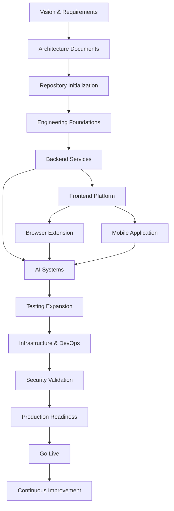
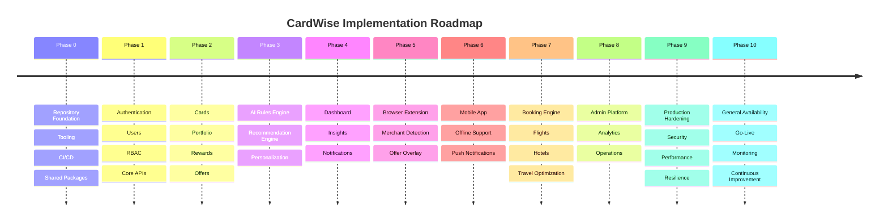
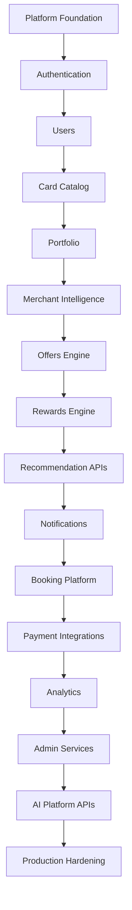
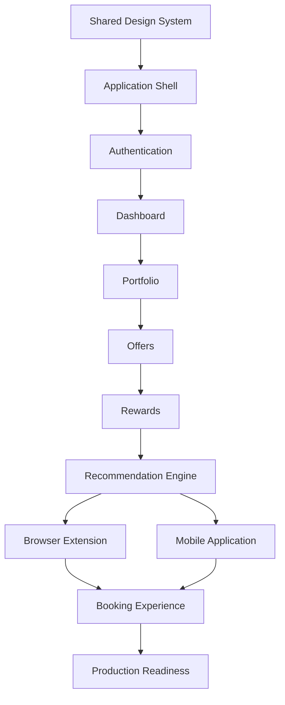
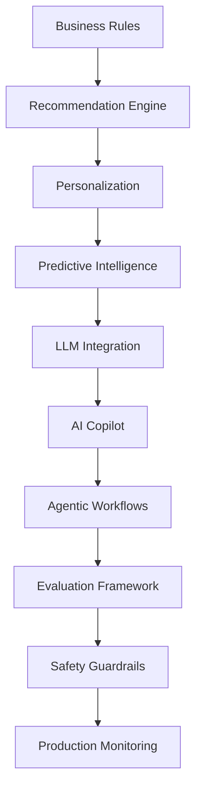
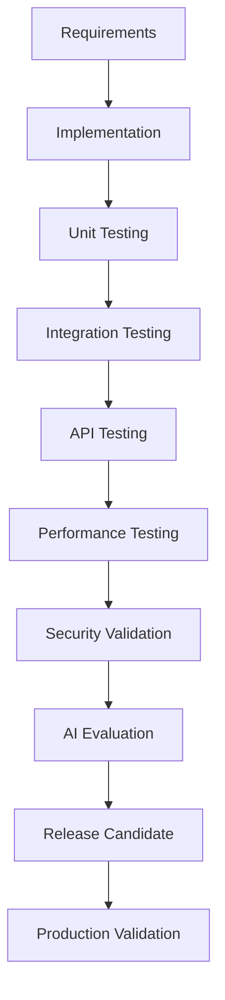
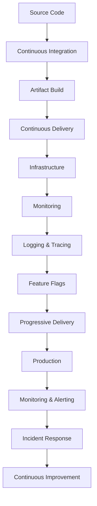
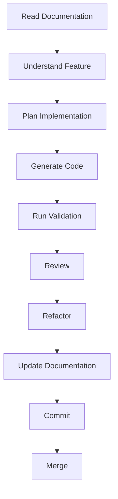
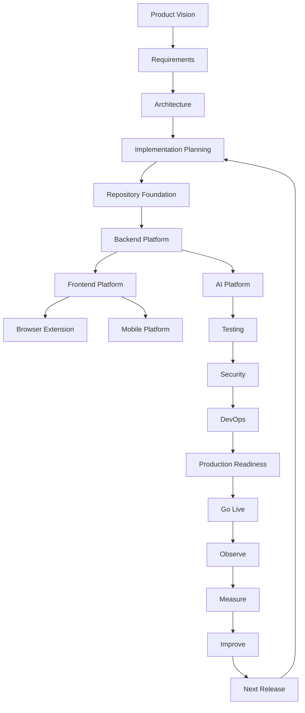

# docs/18_CURSOR_IMPLEMENTATION_GUIDE.md

# Part 1 — Executive Overview, Engineering Philosophy & Repository Strategy

---

# Executive Summary

## Document Objective

This document serves as the **master engineering implementation guide** for CardWise.

Unlike the previous documentation, which focuses on product vision, architecture, infrastructure, AI, security, scalability, testing, and roadmap planning, this guide defines **how the system should actually be implemented** in a structured, repeatable, and AI-assisted manner.

Its primary audience includes:

- Software Engineers
- Technical Leads
- AI Coding Agents (Cursor, Claude Code, Codex, Gemini CLI, etc.)
- Architects
- QA Engineers
- DevOps Engineers
- Product Engineers
- Future Engineering Teams

This guide is intended to minimize ambiguity, reduce implementation risk, and establish a consistent engineering execution model across the entire product lifecycle.

---

## IMPL-001 — Primary Goal

The goal of this implementation guide is to ensure that CardWise can be developed:

- incrementally,
- safely,
- predictably,
- with high engineering quality,
- while remaining scalable from MVP to enterprise scale.

Rather than explaining *what* CardWise is, this document explains *how* it should be built.

---

## IMPL-002 — Key Outcomes

Following this guide should enable an engineering team or AI coding agent to:

- Build the project in the correct sequence.
- Avoid premature optimization.
- Maintain architectural consistency.
- Preserve coding standards.
- Reduce integration risks.
- Deliver production-ready software with minimal technical debt.
- Continuously evolve the platform without architectural rewrites.

---

# Purpose of this Guide

## IMPL-003 — Why This Guide Exists

Large software systems often fail not because of poor architecture, but because implementation becomes inconsistent over time.

Common failure patterns include:

- inconsistent folder structures
- duplicated business logic
- undocumented architectural decisions
- divergent coding conventions
- fragmented testing strategies
- integration bottlenecks
- feature-first development without platform maturity
- AI-generated code that ignores architectural boundaries

This guide exists to prevent those issues by acting as the execution blueprint for the engineering organization.

---

## IMPL-004 — Scope

This guide defines:

- implementation sequencing
- repository governance
- engineering workflows
- AI-assisted development standards
- release sequencing
- testing rollout
- production readiness
- coding agent guidance
- implementation checkpoints
- operational governance

It intentionally does **not** redefine:

- product requirements
- feature specifications
- API contracts
- database schemas
- infrastructure architecture
- frontend architecture
- backend architecture

Those remain authoritative in their respective documentation.

---

# Relationship to Previous Documents

## IMPL-005 — Documentation Hierarchy

The CardWise documentation set follows a layered approach.

| Layer | Purpose | Primary Document |
|---------|----------|------------------|
| Vision | Product vision | 01_PRODUCT_VISION_AND_PRD.md |
| Market | Competitor analysis | 02_COMPETITOR_RESEARCH.md |
| Roadmap | Business evolution | 03_PHASE_WISE_ROADMAP.md |
| Features | Functional specifications | 04_FEATURE_SPECIFICATIONS.md |
| Data | Database design | 05_DATABASE_DESIGN.md |
| Backend | Service architecture | 06_BACKEND_ARCHITECTURE.md |
| Frontend | UI architecture | 07_FRONTEND_ARCHITECTURE.md |
| Admin | Internal tooling | 08_ADMIN_PORTAL.md |
| AI | Intelligence systems | 09_AI_AND_RECOMMENDATION_ENGINE.md |
| Booking | Travel engine | 10_BOOKING_ENGINE.md |
| Browser | Extension architecture | 11_BROWSER_EXTENSION.md |
| Mobile | Mobile ecosystem | 12_MOBILE_APP.md |
| Security | Security model | 13_SECURITY_AND_COMPLIANCE.md |
| Infrastructure | DevOps and scalability | 14_SCALABILITY_AND_DEVOPS.md |
| Testing | Testing strategy | 15_TESTING_STRATEGY.md |
| Revenue | Monetization | 16_MONETIZATION.md |
| Innovation | Long-term roadmap | 17_FUTURE_ROADMAP.md |
| **Execution** | **Implementation handbook** | **18_CURSOR_IMPLEMENTATION_GUIDE.md** |

---

## IMPL-006 — Source of Truth

This guide references previous documents without replacing them.

Engineering teams should treat documentation precedence as follows:

```text
Product Requirements
        ↓
Architecture Documents
        ↓
Implementation Guide
        ↓
Engineering Tasks
        ↓
Source Code
        ↓
Production
```

Whenever conflicts arise:

1. Product Requirements define *what* should be built.
2. Architecture documents define *how the system is designed*.
3. This guide defines *how to execute implementation*.
4. Source code must conform to all three.

---

# Engineering Philosophy

## IMPL-007 — Core Engineering Principles

Every implementation decision should be evaluated against the following principles.

| Principle | Description |
|------------|-------------|
| Simplicity | Prefer understandable solutions over clever implementations. |
| Modularity | Build independently deployable and maintainable components. |
| Incremental Delivery | Deliver working software in small iterations. |
| Maintainability | Optimize for long-term evolution rather than short-term speed. |
| Scalability | Design for growth without requiring major rewrites. |
| Observability | Every service should be measurable and diagnosable. |
| Security | Secure-by-design, not secure-after-development. |
| Automation | Automate repetitive engineering workflows wherever practical. |
| Reliability | Prioritize predictable behavior and graceful failure handling. |
| Documentation | Treat documentation as part of the product, not an afterthought. |

---

## IMPL-008 — Engineering Decision Framework

Every significant engineering decision should answer:

1. Does it simplify future maintenance?
2. Does it align with existing architecture?
3. Does it reduce operational complexity?
4. Can it be tested effectively?
5. Is it observable in production?
6. Does it improve developer productivity?
7. Does it introduce unnecessary coupling?
8. Does it preserve extensibility?

If the answer to multiple questions is negative, reconsider the implementation approach.

---

## IMPL-009 — MVP-First Execution

CardWise should always evolve through progressive capability rather than attempting to build every planned feature at once.

Implementation should prioritize:

1. Core platform stability.
2. Essential user journeys.
3. Reliable data foundations.
4. Observability.
5. Incremental intelligence.
6. Advanced automation.
7. Long-term optimization.

This ensures that each release delivers tangible value while maintaining a stable engineering foundation.

---

# AI-Assisted Development Philosophy

## CURSOR-001 — AI as an Engineering Accelerator

AI coding agents are intended to increase engineering velocity, not replace engineering judgment.

AI should assist with:

- boilerplate generation
- repetitive implementation tasks
- documentation drafting
- test scaffolding
- code explanations
- refactoring suggestions
- migration assistance
- implementation planning

Human review remains mandatory for:

- architecture decisions
- security-sensitive code
- business logic
- performance-critical paths
- financial calculations
- AI model behavior
- compliance requirements
- production deployments

---

## CURSOR-002 — AI Implementation Rules

Every AI-generated change should satisfy the following criteria before acceptance:

- Compiles successfully.
- Passes linting.
- Passes formatting.
- Passes unit tests.
- Includes meaningful documentation updates when applicable.
- Aligns with existing architectural boundaries.
- Does not introduce duplicated logic.
- Preserves backward compatibility unless explicitly planned.
- Avoids speculative abstractions that are not yet required.

---

## CURSOR-003 — Context Preservation

Large AI coding tasks should be divided into small, well-defined units.

Preferred workflow:

1. Understand the feature.
2. Review relevant documentation.
3. Identify affected modules.
4. Implement a single responsibility.
5. Validate with tests.
6. Commit.
7. Continue to the next increment.

This minimizes context drift and improves the quality of AI-assisted development.

---

## CURSOR-004 — Human-in-the-Loop

AI-generated code should be reviewed with the same rigor as human-authored code.

Review focus areas include:

- correctness
- readability
- maintainability
- security
- performance
- consistency
- documentation
- test coverage

AI output is considered a draft until reviewed and validated.

---

# Repository Overview

## BUILD-001 — Repository Objectives

The CardWise repository should provide a unified engineering workspace that supports:

- web application
- backend services
- browser extension
- mobile application
- shared libraries
- AI components
- infrastructure automation
- documentation
- testing
- deployment tooling

A monorepo approach enables shared standards, consistent tooling, and coordinated releases while reducing duplication across platforms.

---

## BUILD-002 — Repository Characteristics

The repository should emphasize:

- clear ownership boundaries
- reusable packages
- centralized configuration
- deterministic builds
- isolated testing
- shared type definitions
- version consistency
- automated quality checks

---

# Monorepo Strategy

## BUILD-003 — Monorepo Principles

The repository should be organized around **domains**, not technologies.

High-level categories include:

- Applications
- Shared Packages
- Services
- Infrastructure
- Documentation
- Tooling
- Automation
- Configuration

This structure promotes discoverability and encourages reuse.

---

## BUILD-004 — Package Boundaries

Packages should follow these principles:

- Single responsibility.
- Explicit dependencies.
- No circular references.
- Stable public interfaces.
- Independent testing.
- Semantic version awareness.
- Shared utilities extracted only when justified.

Dependency flow should remain directional, avoiding tightly coupled modules.

---

## BUILD-005 — Shared Libraries

Shared libraries should encapsulate reusable functionality such as:

- UI components
- design tokens
- domain models
- validation utilities
- API clients
- authentication helpers
- analytics utilities
- logging
- configuration
- feature flag abstractions
- testing utilities

Extraction into shared libraries should occur only after repeated, validated use cases rather than speculative anticipation.

---

## BUILD-006 — Naming Conventions

Repository naming should remain:

- predictable
- descriptive
- domain-oriented
- technology-agnostic where appropriate

Examples of conventions include:

| Area | Convention |
|--------|------------|
| Packages | kebab-case |
| Components | PascalCase |
| Files | kebab-case |
| Environment variables | UPPER_SNAKE_CASE |
| Database entities | Singular nouns |
| API resources | Plural nouns |
| Feature folders | Domain names |
| Test files | *.test.* or *.spec.* |

Consistent naming improves navigation for both engineers and AI coding agents.

---

# High-Level Implementation Flow

## IMPL-010 — Execution Lifecycle

Implementation progresses through a series of controlled stages.

```text
Planning
    ↓
Repository Setup
    ↓
Development Environment
    ↓
Shared Platform Foundations
    ↓
Core Backend Services
    ↓
Frontend Platform
    ↓
Browser Extension
    ↓
Mobile Application
    ↓
AI Capabilities
    ↓
Testing Expansion
    ↓
Infrastructure Hardening
    ↓
Security Validation
    ↓
Performance Optimization
    ↓
Production Readiness
    ↓
Go-Live
    ↓
Continuous Improvement
```

Each stage builds on validated outputs from the previous stage, reducing rework and enabling predictable delivery.

---

## IMPL-011 — Governance Gates

Progression between stages should require explicit validation.

| Stage | Exit Criteria |
|---------|---------------|
| Foundation | Repository, tooling, and standards established |
| Core Platform | Authentication and foundational services operational |
| Product Features | Primary user workflows functional |
| Intelligence | Recommendation and AI capabilities integrated |
| Quality | Testing, observability, and security validated |
| Operations | Production readiness confirmed |
| Release | Go-live approval completed |

---

# High-Level Engineering Execution Diagram



---

# Part 1 Summary

This section established the implementation philosophy that governs the execution of the CardWise platform.

Key outcomes include:

- Defined the role of this implementation guide within the broader documentation ecosystem.
- Established engineering principles emphasizing maintainability, scalability, security, and incremental delivery.
- Introduced AI-assisted development practices with clear human oversight expectations.
- Outlined the monorepo strategy, repository governance, package boundaries, and naming conventions.
- Presented the high-level implementation lifecycle and governance gates that will guide all subsequent phases.

The following part transitions from strategic execution principles to the practical engineering environment by detailing the development toolchain, local setup, environment management, code quality standards, Git workflow, and build system required to implement CardWise consistently.

# Part 2 — Development Environment

---

# Executive Summary

The development environment is the foundation of engineering productivity and implementation consistency. Every contributor—whether a human engineer or an AI coding agent—must be able to clone the repository, install dependencies, configure the environment, and start building with minimal setup effort.

This section defines the standard development toolchain, environment configuration, repository workflows, quality gates, and build system for CardWise. The objective is to ensure that development is deterministic, secure, reproducible, and automation-friendly across all supported platforms.

---

# DEV-001 — Development Environment Objectives

## Goals

The development environment should provide:

- Fast onboarding for new contributors
- Reproducible local builds
- Consistent dependency management
- Cross-platform compatibility (macOS, Linux, Windows via WSL)
- AI-friendly repository organization
- Secure secret handling
- Automated quality enforcement
- Minimal manual configuration

## Guiding Principles

| Principle | Description |
|-----------|-------------|
| Deterministic | Same inputs produce identical builds |
| Automated | Reduce manual setup steps |
| Secure | No secrets committed to source control |
| Portable | Works consistently across supported operating systems |
| Observable | Local development includes logging and diagnostics |
| Fast Feedback | Linting, tests, and type checks execute quickly |

---

# DEV-002 — Standard Toolchain

## Core Runtime

| Tool | Purpose |
|------|---------|
| Node.js (LTS) | Primary JavaScript runtime |
| Bun | Fast package manager and local runtime (preferred for development tasks where compatible) |
| TypeScript | Strongly typed language foundation |

## Repository Management

| Tool | Purpose |
|------|---------|
| Git | Version control |
| GitHub | Source repository |
| Changesets | Version management |
| Turbo | Build orchestration and task caching |

## Backend

| Tool | Purpose |
|------|---------|
| Fastify | Backend framework |
| Prisma | ORM |
| PostgreSQL | Primary relational database |
| Redis | Cache and queues |

## Frontend

| Tool | Purpose |
|------|---------|
| React |
| Vite |
| React Router |
| TanStack Query |
| Zustand |

## Mobile

| Tool |
|------|
| React Native |
| Expo (initial development where applicable) |

## Browser Extension

- Manifest V3
- TypeScript
- Shared UI package
- Shared recommendation SDK

## Infrastructure

- Docker
- Docker Compose
- Kubernetes (production)
- Terraform
- GitHub Actions

---

# DEV-003 — Local Machine Requirements

Minimum recommended workstation:

| Resource | Recommendation |
|-----------|---------------|
| RAM | 32 GB |
| CPU | 8+ cores |
| SSD | 512 GB+ |
| Node LTS | Installed |
| Docker Desktop | Installed |
| Git | Latest stable |
| VS Code / Cursor | Latest stable |

Recommended VS Code/Cursor extensions:

- ESLint
- Prettier
- EditorConfig
- Docker
- GitLens
- Prisma
- Markdown All in One
- Error Lens
- GitHub Copilot (optional)
- Continue / Cursor AI (optional)

---

# DEV-004 — Local Repository Bootstrap

Every contributor should follow a consistent initialization process.

## Step 1

Clone repository.

## Step 2

Install dependencies.

## Step 3

Generate environment files.

## Step 4

Start local infrastructure.

## Step 5

Run database migrations.

## Step 6

Seed sample data.

## Step 7

Start all applications.

## Step 8

Run verification checks.

---

Acceptance Criteria:

- Repository installs without errors
- Database reachable
- API healthy
- Web app accessible
- Shared packages build successfully
- Tests pass
- Lint passes
- Type checking passes

---

# DEV-005 — Environment Configuration

Environment configuration should follow a layered model.

```text
Default Configuration
        ↓
Shared Environment
        ↓
Local Overrides
        ↓
CI Overrides
        ↓
Production Secrets
```

---

Environment files:

| File | Purpose |
|------|---------|
| .env.example | Template |
| .env.local | Developer overrides |
| .env.test | Testing |
| .env.ci | CI |
| Runtime secrets | Production |

---

# DEV-006 — Environment Variable Categories

Variables should be grouped logically.

## Platform

- Environment
- Region
- Application mode

## Database

- Connection string
- Pool settings

## Authentication

- JWT secrets
- OAuth credentials

## AI

- LLM provider
- API keys
- Embedding configuration

## Booking

- Flight APIs
- Hotel APIs

## Payments

- Gateway credentials

## Notifications

- Email provider
- SMS provider
- Push provider

## Analytics

- Event pipeline
- Telemetry keys

---

# DEV-007 — Secrets Management

## Rules

Never commit:

- API keys
- Passwords
- Certificates
- Tokens
- Private keys

Never hardcode secrets in:

- Source code
- Tests
- Scripts
- Configuration files

Production secrets should be injected at deployment time.

---

Secret lifecycle:

```text
Creation
    ↓
Secure Storage
    ↓
Rotation
    ↓
Usage
    ↓
Expiration
    ↓
Audit
```

---

# DEV-008 — Dependency Management

Package ownership principles:

- Explicit dependencies only
- No unused packages
- Shared packages preferred over duplication
- Lockfile committed
- Version updates reviewed

Dependency categories:

| Category | Examples |
|-----------|----------|
| Runtime | Application dependencies |
| Development | Build tools |
| Testing | Test frameworks |
| Tooling | Linting, formatting |

---

# DEV-009 — Repository Configuration

Top-level areas include:

```text
apps/
packages/
services/
infra/
docs/
scripts/
configs/
.github/
```

Every folder must contain:

- README
- ownership documentation
- dependency description

---

# DEV-010 — Build System

Build objectives:

- Incremental
- Cacheable
- Parallel
- Deterministic

Build pipeline:

```text
Shared Packages
        ↓
Libraries
        ↓
Backend
        ↓
Frontend
        ↓
Extension
        ↓
Mobile
        ↓
Tests
```

---

# DEV-011 — Code Generation

Generated artifacts should be reproducible.

Allowed generation:

- Prisma client
- OpenAPI types
- GraphQL types (if applicable)
- AI prompt manifests
- SDK generation
- Typed API clients

Generated code:

- Never edited manually
- Always reproducible
- Included in CI validation

---

# DEV-012 — Code Quality Standards

Quality gates include:

- Formatting
- Linting
- Type checking
- Unit tests
- Security scanning
- Dependency validation

No pull request may bypass mandatory quality gates.

---

# DEV-013 — Formatting Standards

Formatting should be automated.

Guidelines:

- Prettier for formatting
- EditorConfig for editor consistency
- ESLint for code quality
- Markdown linting for documentation

Manual formatting changes should never dominate pull requests.

---

# DEV-014 — Type Safety

TypeScript should operate in strict mode.

Guidelines:

- Avoid `any`
- Prefer inferred types
- Explicit interfaces for public contracts
- Shared domain models
- Exhaustive switch statements

---

# DEV-015 — Git Workflow

Recommended branching model:

```text
main
 │
 ├── develop
 │
 ├── feature/*
 ├── fix/*
 ├── hotfix/*
 ├── release/*
```

Branch naming:

| Prefix | Example |
|---------|----------|
| feature | feature/rewards-engine |
| fix | fix/login-timeout |
| hotfix | hotfix/payment-crash |
| release | release/v1.0 |

---

# DEV-016 — Commit Standards

Commit messages should be structured.

Preferred categories:

- feat
- fix
- refactor
- docs
- test
- perf
- build
- ci
- chore

Example:

```text
feat(rewards): implement reward calculation pipeline
```

---

# DEV-017 — Pull Request Requirements

Every PR should include:

- Summary
- Linked implementation task
- Testing evidence
- Documentation updates
- Screenshots (UI changes)
- Risk assessment

Required reviewers:

- Feature owner
- Platform owner (if shared package changes)
- Security reviewer (security-sensitive changes)

---

# DEV-018 — Git Hooks

Pre-commit:

- Format changed files
- Lint staged files
- Type check affected packages

Pre-push:

- Unit tests
- Build verification

Commit-msg:

- Validate commit format

---

# DEV-019 — Local Testing Workflow

Before every commit:

- Format
- Lint
- Type check
- Unit tests

Before opening PR:

- Integration tests
- Build
- Documentation validation

Before merge:

- CI success
- Code review approval
- Security scan
- Performance regression check (where applicable)

---

# DEV-020 — AI Development Workspace

AI coding agents should always operate with limited, focused context.

Recommended workflow:

1. Read relevant documentation
2. Inspect affected package
3. Implement one feature
4. Run validation
5. Update documentation
6. Commit
7. Proceed to next task

Avoid asking AI to generate multiple unrelated features in a single prompt.

---

# BUILD-001 — Development Readiness Checklist

| Item | Status |
|------|--------|
| Repository cloned | ☐ |
| Dependencies installed | ☐ |
| Environment configured | ☐ |
| Secrets configured | ☐ |
| Local infrastructure running | ☐ |
| Database migrated | ☐ |
| Seed data loaded | ☐ |
| API running | ☐ |
| Frontend running | ☐ |
| Extension running | ☐ |
| Mobile emulator running | ☐ |
| Tests passing | ☐ |
| Lint passing | ☐ |
| Type check passing | ☐ |
| Documentation verified | ☐ |

---

# Part 2 Summary

This section established the standardized engineering development environment for CardWise, including:

- Development toolchain
- Local setup workflow
- Environment variable strategy
- Secrets management
- Dependency governance
- Build system
- Code generation
- Type safety
- Formatting and linting
- Git workflow
- Commit and PR conventions
- AI-friendly development practices
- Development readiness checklist

These standards ensure that every engineer and AI coding agent works within a consistent, secure, and reproducible environment before implementation begins.

# Part 3 — Implementation Order

---

# Executive Summary

One of the primary causes of delays in large software projects is implementing components out of sequence. Building advanced features before establishing foundational capabilities often leads to rework, unstable integrations, duplicated logic, and technical debt.

CardWise follows a **Foundation → Platform → Intelligence → Scale** implementation strategy. Each phase delivers independently valuable functionality while preparing the platform for the next stage. Every phase has clearly defined objectives, dependencies, deliverables, acceptance criteria, risks, and governance checkpoints.

This implementation order should be followed by both human engineering teams and AI coding agents to ensure predictable delivery and architectural consistency.

---

# IMPL-101 — Implementation Principles

Implementation sequencing should follow these principles:

1. Build shared foundations before feature-specific code.
2. Complete vertical slices where practical (backend + frontend + tests).
3. Avoid parallel implementation of tightly coupled modules.
4. Stabilize interfaces before integrating dependent systems.
5. Deliver production-ready increments rather than partially completed capabilities.
6. Validate each phase before proceeding to the next.

---

# Phase Overview

| Phase | Name | Primary Goal |
|--------|------|--------------|
| Phase 0 | Foundation | Repository, tooling, standards |
| Phase 1 | Core Platform | Authentication, users, core infrastructure |
| Phase 2 | Credit Card Platform | Portfolio, cards, rewards, offers |
| Phase 3 | Intelligence | Recommendation engine and AI rules |
| Phase 4 | User Experience | Dashboard, insights, notifications |
| Phase 5 | Browser Extension | Merchant intelligence and recommendations |
| Phase 6 | Mobile Platform | Native mobile experience |
| Phase 7 | Booking Platform | Flights, hotels, travel optimization |
| Phase 8 | Platform Operations | Admin, analytics, observability |
| Phase 9 | Production Hardening | Performance, security, resilience |
| Phase 10 | General Availability | Launch readiness |

---

# Phase 0 — Foundation

## IMPL-102

### Objectives

Establish the engineering foundation for all future development.

### Deliverables

- Monorepo initialized
- Shared package structure
- Build system
- CI pipeline
- Linting
- Formatting
- TypeScript configuration
- Docker environment
- Local development setup
- Documentation baseline

### Dependencies

None.

### Acceptance Criteria

- Repository builds successfully.
- CI executes successfully.
- Shared packages compile.
- Development onboarding is documented.
- Local environment setup completes without manual intervention beyond documented steps.

### Risks

| Risk | Mitigation |
|------|------------|
| Inconsistent tooling | Standardize configuration at repository root |
| Dependency drift | Lockfile enforcement |
| Build instability | Automated validation in CI |

---

# Phase 1 — Core Platform

## IMPL-103

### Objectives

Implement the foundational business capabilities required by every other feature.

### Scope

- Authentication
- User management
- Profile management
- Session handling
- RBAC
- Preferences
- Feature flag integration
- Audit logging
- Base API framework

### Dependencies

- Phase 0 completed.

### Deliverables

- Secure login
- Registration
- Session lifecycle
- User profile
- Role management
- API authentication
- Shared API client
- Core frontend shell

### Acceptance Criteria

- Users can register and authenticate.
- Authorization rules enforced.
- Sessions managed securely.
- Audit events generated.
- Core APIs documented and tested.

### Risks

- Authentication vulnerabilities
- Session persistence issues
- Authorization inconsistencies

---

# Phase 2 — Credit Card Platform

## IMPL-104

### Objectives

Implement the core value proposition of CardWise.

### Scope

- Credit card catalog
- User portfolio
- Reward rules
- Offer ingestion
- Offer matching
- Merchant mapping
- Reward calculation engine
- Spend categorization
- Card comparison

### Dependencies

- User identity established.
- Authentication complete.

### Deliverables

- Portfolio management
- Card recommendation baseline
- Reward calculations
- Offer visibility
- Merchant database
- User dashboard foundation

### Acceptance Criteria

- Users manage card portfolio.
- Reward calculations are deterministic.
- Offer matching succeeds for supported merchants.
- Merchant normalization implemented.
- Integration tests pass.

### Risks

- Complex reward logic
- Offer inconsistencies
- Merchant data quality

---

# Phase 3 — Intelligence Platform

## IMPL-105

### Objectives

Transform CardWise from a tracking application into an intelligent recommendation platform.

### Scope

- Rules engine
- Recommendation engine
- AI abstraction layer
- Spend optimization
- Best card recommendation
- Personalized insights
- Recommendation explanations

### Dependencies

- Card portfolio
- Reward engine
- Merchant intelligence

### Deliverables

- Recommendation API
- Decision engine
- AI service integration
- Rule evaluation framework
- Recommendation confidence scoring

### Acceptance Criteria

- Recommendations are reproducible.
- Rule engine test coverage exceeds target threshold.
- Explanation layer available.
- AI fallbacks defined.

### Risks

- Recommendation inaccuracies
- Conflicting rules
- Explainability challenges

---

# Phase 4 — User Experience Platform

## IMPL-106

### Objectives

Deliver a polished and engaging product experience.

### Scope

- Dashboard
- Analytics
- Spending insights
- Notifications
- Search
- Personalization
- User onboarding improvements
- Accessibility enhancements

### Dependencies

- Core recommendation engine
- User portfolio

### Deliverables

- Modern dashboard
- Personalized home screen
- Notification center
- Search experience
- Accessibility improvements

### Acceptance Criteria

- Primary user journeys complete.
- Responsive layouts validated.
- Accessibility checklist satisfied.
- User onboarding finalized.

### Risks

- UI inconsistencies
- Accessibility regressions
- Performance degradation

---

# Phase 5 — Browser Extension

## IMPL-107

### Objectives

Bring CardWise intelligence directly into the shopping experience.

### Scope

- Extension shell
- Merchant detection
- Offer overlays
- Best card recommendation
- Cashback visibility
- Coupon detection
- Authentication sync

### Dependencies

- Recommendation API
- Merchant database
- Authentication platform

### Deliverables

- Browser extension MVP
- Merchant detection
- Overlay UI
- Recommendation panel
- Secure communication with backend

### Acceptance Criteria

- Supported merchants detected.
- Recommendations displayed.
- Authentication synchronized.
- Performance within target thresholds.

### Risks

- Browser API limitations
- Merchant DOM changes
- Store review delays

---

# Phase 6 — Mobile Platform

## IMPL-108

### Objectives

Extend the CardWise experience to mobile users.

### Scope

- Mobile authentication
- Portfolio
- Dashboard
- Notifications
- Offline mode
- Biometrics
- Deep linking

### Dependencies

- Stable backend APIs
- Authentication
- Dashboard services

### Deliverables

- Mobile MVP
- Push notifications
- Offline caching
- Secure storage
- Deep links

### Acceptance Criteria

- Feature parity for core user journeys.
- Offline behavior validated.
- Notification delivery verified.
- Mobile accessibility reviewed.

### Risks

- Platform-specific behaviors
- Offline synchronization conflicts
- Device fragmentation

---

# Phase 7 — Booking Platform

## IMPL-109

### Objectives

Integrate travel booking with reward optimization.

### Scope

- Flight search
- Hotel search
- Reward optimization
- Booking recommendations
- Price intelligence
- Travel offers

### Dependencies

- AI recommendation engine
- User preferences
- Merchant ecosystem

### Deliverables

- Travel search
- Booking recommendations
- Travel rewards optimization
- Loyalty integration layer

### Acceptance Criteria

- Search returns valid results.
- Reward optimization applied.
- Booking flow completes successfully.
- Recommendation explanations available.

### Risks

- Third-party API instability
- Pricing inconsistencies
- Supplier limitations

---

# Phase 8 — Platform Operations

## IMPL-110

### Objectives

Provide operational visibility and administrative capabilities.

### Scope

- Admin portal
- Analytics
- Audit tools
- Feature flags
- Content management
- Monitoring dashboards

### Dependencies

- Core platform stable.

### Deliverables

- Admin console
- Operational dashboards
- Business analytics
- Configuration management

### Acceptance Criteria

- Operational metrics available.
- Administrative workflows complete.
- Audit capabilities validated.

### Risks

- Excessive administrative privileges
- Data exposure
- Operational complexity

---

# Phase 9 — Production Hardening

## IMPL-111

### Objectives

Prepare the platform for reliable production operation.

### Scope

- Performance optimization
- Security validation
- Load testing
- Disaster recovery
- Observability
- Resilience improvements

### Dependencies

All functional features complete.

### Deliverables

- Load test reports
- Security assessment
- Disaster recovery validation
- Performance tuning
- Operational runbooks

### Acceptance Criteria

- Performance targets achieved.
- Security findings resolved.
- Recovery procedures tested.
- Monitoring coverage complete.

### Risks

- Hidden scalability bottlenecks
- Performance regressions
- Operational readiness gaps

---

# Phase 10 — General Availability

## IMPL-112

### Objectives

Execute a controlled production launch.

### Scope

- Final validation
- Release management
- Monitoring
- Incident readiness
- Customer support readiness
- Documentation completion

### Deliverables

- Production deployment
- Monitoring dashboards
- Launch documentation
- Support procedures
- Release notes

### Acceptance Criteria

- Go-live checklist complete.
- Production environment validated.
- Rollback strategy verified.
- Incident response process confirmed.

### Risks

- Unexpected production behavior
- Third-party service outages
- Elevated support demand

---

# Cross-Phase Dependencies

```text
Foundation
      │
      ▼
Authentication
      │
      ▼
Credit Card Platform
      │
      ▼
Recommendation Engine
      │
      ├────────────┐
      ▼            ▼
Dashboard    Browser Extension
      │            │
      └──────┬─────┘
             ▼
        Mobile Platform
             │
             ▼
      Booking Platform
             │
             ▼
      Admin & Analytics
             │
             ▼
     Production Hardening
             │
             ▼
        General Availability
```

---

# Engineering Milestones

| Milestone | Description | Exit Criteria |
|-----------|-------------|---------------|
| M1 | Engineering Foundation | Tooling, CI, monorepo operational |
| M2 | Secure Platform | Authentication and user management complete |
| M3 | Core Value Delivered | Portfolio, rewards, offers functional |
| M4 | Intelligent Platform | Recommendation engine operational |
| M5 | Multi-Platform | Web, extension, mobile integrated |
| M6 | Operational Excellence | Admin, analytics, observability complete |
| M7 | Production Ready | Performance, security, resilience validated |
| M8 | Public Launch | General Availability achieved |

---

# Release Governance

Every phase concludes with a governance review.

Required validation includes:

- Architecture compliance
- Code review completion
- Documentation updates
- Test coverage targets achieved
- Security review
- Performance validation
- Operational readiness assessment
- Product owner approval

A phase cannot begin until the previous phase satisfies all mandatory exit criteria.

---

# High-Level Implementation Timeline



---

# Part 3 Summary

This section established the definitive implementation sequence for CardWise, defining:

- A phased delivery model from foundation to General Availability
- Objectives, deliverables, dependencies, acceptance criteria, and risks for each phase
- Cross-phase dependency mapping
- Engineering milestones and governance checkpoints
- Release validation requirements
- A high-level implementation timeline to guide execution

By adhering to this phased roadmap, engineering teams and AI coding agents can build CardWise incrementally, reduce integration risks, maintain architectural integrity, and achieve predictable, production-ready releases.

# Part 4 — Backend Implementation Strategy

---

# Executive Summary

The backend is the foundation of the CardWise platform. Every client—including the Web App, Browser Extension, Mobile App, AI services, Admin Portal, and future integrations—depends on a reliable, scalable, secure, and observable backend.

This section does **not** redesign the backend architecture defined in **06_BACKEND_ARCHITECTURE.md**. Instead, it provides the implementation sequence, rollout strategy, engineering governance, integration checkpoints, and operational considerations required to build the backend incrementally.

The guiding philosophy is:

> **Platform before Features. Services before Intelligence. Stability before Scale.**

---

# Backend Implementation Principles

## IMPL-201 — Guiding Principles

Every backend service should follow these principles:

| Principle | Description |
|-----------|-------------|
| Domain Driven | Services organized around business capabilities |
| API First | Public contracts defined before implementation |
| Stateless | Horizontal scalability by default |
| Secure by Design | Authentication and authorization integrated from day one |
| Observable | Logging, metrics, and tracing included in every service |
| Backward Compatible | Breaking API changes are controlled and versioned |
| Testable | Every service independently testable |
| Idempotent | Retry-safe operations where applicable |

---

## IMPL-202 — Backend Rollout Strategy

Backend implementation should proceed in layers rather than building isolated features.

```text
Platform Foundation
        ↓
Identity Services
        ↓
Core Domain Services
        ↓
Business Intelligence
        ↓
External Integrations
        ↓
Operational Services
        ↓
AI Services
        ↓
Production Hardening
```

---

# Service Rollout Matrix

| Rollout Order | Service Domain | Priority |
|---------------|----------------|----------|
| 1 | Platform Foundation | Critical |
| 2 | Authentication & Identity | Critical |
| 3 | User Services | Critical |
| 4 | Credit Card Catalog | Critical |
| 5 | Portfolio Management | Critical |
| 6 | Merchant Intelligence | High |
| 7 | Offers Engine | High |
| 8 | Rewards Engine | High |
| 9 | Recommendation Engine | High |
|10 | Notification Service | Medium |
|11 | Booking Platform | Medium |
|12 | Payment Integrations | Medium |
|13 | Analytics Platform | Medium |
|14 | Admin Services | Medium |
|15 | AI Copilot APIs | Future Phase |
|16 | Background Automation | Future Phase |

---

# BUILD-201 — Platform Foundation

## Objectives

Build the common backend capabilities that every domain service depends on.

### Deliverables

- API gateway
- Shared middleware
- Configuration management
- Error handling
- Validation framework
- Logging framework
- Metrics collection
- Health checks
- Dependency injection
- Common utilities

### Dependencies

- Monorepo
- CI/CD
- Database connectivity

### Acceptance Criteria

- Every service inherits common platform behavior.
- Health endpoints operational.
- Request lifecycle observable.
- Error responses standardized.

### Engineering Governance

No business service should duplicate platform functionality.

---

# BUILD-202 — Authentication & Identity

## Objectives

Implement secure identity management before any user-facing business logic.

### Scope

- Registration
- Login
- Session lifecycle
- Token management
- Password reset
- MFA hooks
- OAuth integrations
- Device management
- Refresh tokens
- RBAC

### Dependencies

Platform Foundation

### Deliverables

- Identity APIs
- Authentication middleware
- Authorization framework
- Session storage
- Audit events

### Acceptance Criteria

- Authentication fully operational.
- Authorization enforced consistently.
- Token lifecycle tested.
- Audit logs generated.

### Risks

- Token leakage
- Session fixation
- Privilege escalation

---

# BUILD-203 — User Domain

## Objectives

Create the central user profile and preference system.

### Scope

- User profile
- Preferences
- Financial profile
- Notification settings
- Privacy settings
- Connected accounts
- Consent management

### Dependencies

Authentication

### Deliverables

- Profile APIs
- Preferences APIs
- Account management
- User settings

### Acceptance Criteria

- User lifecycle complete.
- Profile updates audited.
- Privacy preferences enforced.

---

# BUILD-204 — Credit Card Catalog

## Objectives

Provide a canonical source of truth for supported credit cards.

### Scope

- Card metadata
- Issuer information
- Benefits
- Fees
- Eligibility
- Reward programs
- Images
- Status

### Dependencies

User services

### Deliverables

- Card catalog APIs
- Search endpoints
- Filtering
- Pagination
- Versioning

### Acceptance Criteria

- Catalog searchable.
- Stable identifiers established.
- Data validation implemented.

### Engineering Notes

This service should remain independent from user portfolio data.

---

# BUILD-205 — Portfolio Service

## Objectives

Manage user-owned financial products.

### Scope

- Add card
- Remove card
- Card lifecycle
- Spending limits
- Card aliases
- Card metadata
- Ownership verification

### Dependencies

Card Catalog

### Deliverables

- Portfolio APIs
- CRUD operations
- Validation
- Event generation

### Acceptance Criteria

- Portfolio consistent.
- Business rules enforced.
- Ownership maintained.

---

# BUILD-206 — Merchant Intelligence

## Objectives

Normalize merchant identities across payment ecosystems.

### Scope

- Merchant normalization
- Merchant aliases
- MCC mapping
- Merchant categories
- Geographic enrichment
- Merchant metadata

### Dependencies

Portfolio

### Deliverables

- Merchant lookup
- Normalization APIs
- Merchant search
- Category APIs

### Acceptance Criteria

- Merchant deduplication operational.
- Consistent merchant identifiers.
- Category accuracy validated.

---

# BUILD-207 — Offers Engine

## Objectives

Provide personalized offer discovery.

### Scope

- Offer ingestion
- Eligibility rules
- Merchant linkage
- Time windows
- Prioritization
- Expiration handling

### Dependencies

Merchant Intelligence

### Deliverables

- Offer APIs
- Offer matching
- Offer search
- Personalized offers

### Acceptance Criteria

- Active offers correctly filtered.
- Expired offers removed.
- Eligibility rules enforced.

---

# BUILD-208 — Rewards Engine

## Objectives

Calculate expected user rewards.

### Scope

- Cashback rules
- Reward points
- Multipliers
- Spending categories
- Caps
- Bonus campaigns

### Dependencies

Offers Engine

### Deliverables

- Reward calculation APIs
- Simulation endpoints
- Rule evaluation
- Reward summaries

### Acceptance Criteria

- Deterministic calculations.
- Rule engine validated.
- Historical calculations reproducible.

### Risks

- Complex issuer rules
- Floating-point precision
- Rule conflicts

---

# BUILD-209 — Recommendation Engine APIs

## Objectives

Expose recommendation capabilities through stable backend APIs.

### Scope

- Best card selection
- Alternative recommendations
- Confidence scoring
- Explanation generation
- Recommendation history

### Dependencies

Rewards Engine

### Deliverables

- Recommendation APIs
- Decision metadata
- Ranking endpoints

### Acceptance Criteria

- Explainable recommendations.
- Stable ranking output.
- API latency within target thresholds.

---

# BUILD-210 — Notification Service

## Objectives

Centralize outbound communications.

### Scope

- Email
- Push notifications
- SMS
- In-app notifications
- Scheduled reminders

### Dependencies

User Preferences

### Deliverables

- Notification APIs
- Delivery queue
- Retry handling
- Templates

### Acceptance Criteria

- Delivery status tracked.
- Retry policy validated.
- User preferences respected.

---

# BUILD-211 — Booking Integration Layer

## Objectives

Expose travel search and booking capabilities.

### Scope

- Flight search
- Hotel search
- Booking orchestration
- Reward optimization
- Supplier abstraction

### Dependencies

Recommendation APIs

### Deliverables

- Booking APIs
- Search APIs
- Availability APIs
- Pricing normalization

### Acceptance Criteria

- External providers abstracted.
- Search latency acceptable.
- Booking workflow validated.

---

# BUILD-212 — Payment Integrations

## Objectives

Provide secure payment-related integrations.

### Scope

- Payment gateways
- Tokenization
- Transaction status
- Webhooks
- Reconciliation hooks

### Dependencies

Authentication

### Deliverables

- Gateway abstraction
- Secure payment APIs
- Webhook processing

### Acceptance Criteria

- Idempotent processing.
- Secure credential management.
- Audit logging enabled.

---

# BUILD-213 — Analytics Platform

## Objectives

Capture product intelligence and operational metrics.

### Scope

- Event ingestion
- User behavior
- Funnel analytics
- Business metrics
- Recommendation metrics

### Dependencies

Core platform

### Deliverables

- Analytics ingestion
- Event APIs
- Reporting datasets

### Acceptance Criteria

- Event schema validated.
- High-volume ingestion tested.
- Data retention policy implemented.

---

# BUILD-214 — Admin Services

## Objectives

Support internal operational workflows.

### Scope

- Content management
- Card management
- Offer management
- User support
- Audit review
- Feature management

### Dependencies

Analytics

### Deliverables

- Administrative APIs
- Role-restricted operations
- Audit interfaces

### Acceptance Criteria

- Administrative access secured.
- Changes fully auditable.
- Operational workflows validated.

---

# BUILD-215 — AI Platform APIs

## Objectives

Expose AI capabilities through stable interfaces.

### Scope

- Copilot endpoints
- Prompt orchestration
- Recommendation explanations
- AI evaluation
- Agent workflows

### Dependencies

Recommendation Engine

### Deliverables

- AI gateway
- Prompt APIs
- Context retrieval
- Evaluation endpoints

### Acceptance Criteria

- AI responses observable.
- Prompt versions tracked.
- Guardrails enforced.

---

# API Rollout Strategy

## DEV-201 — API Evolution

Implementation order:

```text
Authentication
        ↓
Users
        ↓
Cards
        ↓
Portfolio
        ↓
Merchants
        ↓
Offers
        ↓
Rewards
        ↓
Recommendations
        ↓
Notifications
        ↓
Bookings
        ↓
Payments
        ↓
Analytics
        ↓
Admin
        ↓
AI
```

---

# Integration Sequencing

## DEV-202

External integrations should be introduced gradually.

| Stage | Integration |
|--------|-------------|
| Stage 1 | Authentication providers |
| Stage 2 | Card metadata providers |
| Stage 3 | Merchant datasets |
| Stage 4 | Offer providers |
| Stage 5 | Notification providers |
| Stage 6 | Travel suppliers |
| Stage 7 | Payment gateways |
| Stage 8 | AI providers |

Each integration must include:

- abstraction layer
- retry policy
- timeout configuration
- observability
- circuit breaker strategy
- fallback behavior

---

# Engineering Governance

## OPS-201 — Service Ownership

Each backend domain should have:

- Clear ownership
- Documented boundaries
- Independent tests
- API documentation
- Versioning policy
- Operational runbook

---

## OPS-202 — Definition of Done

A backend service is considered complete only when it satisfies all of the following:

- Functional requirements implemented
- API contract validated
- Unit tests passing
- Integration tests passing
- Performance benchmarks met
- Security review completed
- Observability integrated
- Documentation updated
- Error handling implemented
- Operational metrics exposed

---

## OPS-203 — Cross-Service Communication Rules

To maintain loose coupling:

- Prefer synchronous APIs only for low-latency interactions.
- Use asynchronous events for domain notifications.
- Avoid direct database access across services.
- Share contracts, not implementations.
- Maintain backward compatibility for published APIs.

---

# Backend Delivery Milestones

| Milestone | Exit Criteria |
|-----------|---------------|
| B1 | Platform foundation operational |
| B2 | Authentication and user services complete |
| B3 | Card catalog and portfolio stable |
| B4 | Merchant, offers, and rewards engines operational |
| B5 | Recommendation APIs available |
| B6 | Notifications and bookings integrated |
| B7 | Analytics and admin platform complete |
| B8 | AI services operational |
| B9 | Backend production ready |

---

# Backend Rollout Diagram



---

# Part 4 Summary

This section translated the backend architecture into an executable implementation strategy by defining:

- Service rollout order from platform foundation to AI services
- Objectives, scope, dependencies, deliverables, and acceptance criteria for each backend domain
- API rollout sequence and external integration strategy
- Engineering governance, ownership, and Definition of Done
- Cross-service communication principles and delivery milestones
- A staged rollout diagram to guide implementation

The result is a clear execution roadmap that allows engineering teams and AI coding agents to implement the backend incrementally while preserving architectural integrity, scalability, and operational excellence.

# Part 5 — Frontend + Browser Extension + Mobile Implementation

---

# Executive Summary

The frontend ecosystem is the primary user-facing layer of CardWise and consists of three closely related products:

1. Web Application
2. Browser Extension
3. Mobile Application

While each platform has distinct user experiences and technical requirements, they should share as much business logic, design language, and domain models as possible. This section defines the rollout strategy, implementation sequence, shared component philosophy, UX milestones, and release strategy without redefining the architecture documented in:

- 07_FRONTEND_ARCHITECTURE.md
- 11_BROWSER_EXTENSION.md
- 12_MOBILE_APP.md

The implementation philosophy is:

> **Build once where practical, share intelligently, and optimize for each platform only where necessary.**

---

# Frontend Engineering Principles

## IMPL-301 — Core Principles

| Principle | Description |
|-----------|-------------|
| Design System First | Build reusable UI primitives before feature pages |
| Feature-Based Architecture | Organize by business domains, not page types |
| Shared Logic | Reuse domain logic across web, extension, and mobile |
| Accessibility by Default | WCAG compliance from the first component |
| Progressive Enhancement | Deliver core functionality before advanced interactions |
| Performance Budget | Maintain fast startup, rendering, and interaction times |
| Offline-Friendly | Design for graceful degradation where appropriate |

---

# BUILD-301 — Shared Frontend Foundation

## Objectives

Establish a common UI and application foundation.

### Deliverables

- Design tokens
- Typography
- Color system
- Icons
- Spacing scale
- Theme support
- Shared utilities
- API client
- Authentication client
- Analytics SDK
- Error handling
- Loading components

### Dependencies

- Backend authentication
- Shared packages
- Monorepo

### Acceptance Criteria

- Design tokens consumed consistently.
- Shared UI package operational.
- Cross-platform consistency validated.

---

# BUILD-302 — Design System Rollout

Implementation order:

1. Theme foundation
2. Typography
3. Layout primitives
4. Buttons
5. Inputs
6. Form controls
7. Modals
8. Navigation
9. Tables
10. Cards
11. Charts
12. Feedback components
13. Accessibility utilities

### Governance

- No feature-specific styling outside the design system unless justified.
- Shared components should be platform-agnostic where feasible.
- Component APIs must remain stable and documented.

---

# BUILD-303 — Routing & Application Shell

## Objectives

Implement the application shell before feature development.

### Scope

- Global navigation
- Layout framework
- Authentication guards
- Error boundaries
- Route-level code splitting
- Loading states
- Global notifications

### Deliverables

- Shell layout
- Navigation
- Route protection
- Error pages
- Shared page templates

### Acceptance Criteria

- Navigation stable.
- Unauthorized routes protected.
- Route transitions performant.

---

# BUILD-304 — State Management Rollout

Implementation order:

| Layer | Responsibility |
|--------|----------------|
| Local State | Component interactions |
| Server State | API synchronization |
| Global State | User session, preferences |
| Feature State | Domain-specific workflows |

### Guidelines

- Prefer server state for backend data.
- Keep global state minimal.
- Avoid duplicated state.
- Derive state where possible instead of storing redundant values.

---

# BUILD-305 — Feature Rollout Sequence (Web)

## Phase 1 — Foundation

- Authentication
- User onboarding
- Dashboard shell
- Settings
- Profile

### Acceptance Criteria

- User can authenticate and navigate the application.

---

## Phase 2 — Credit Card Portfolio

- Card catalog
- Portfolio management
- Card details
- Issuer information
- Reward summaries

### Acceptance Criteria

- Users manage and view their card portfolio.

---

## Phase 3 — Offers & Rewards

- Offer discovery
- Merchant offers
- Reward calculator
- Best card recommendation
- Spending categories

### Acceptance Criteria

- Personalized recommendations displayed.

---

## Phase 4 — Insights

- Spending analytics
- Reward history
- Trends
- Financial insights
- Goal tracking

### Acceptance Criteria

- Dashboard provides actionable insights.

---

## Phase 5 — Advanced Experience

- AI Copilot
- Saved searches
- Personalization
- Travel optimization
- Booking integration

### Acceptance Criteria

- Advanced workflows available with acceptable performance.

---

# BUILD-306 — Progressive Enhancement

Feature delivery should prioritize:

1. Functional correctness
2. Responsive layouts
3. Accessibility
4. Animations
5. Micro-interactions
6. Advanced personalization

This ensures a usable experience even on constrained devices and networks.

---

# BUILD-307 — Accessibility Checklist

Every feature should satisfy:

- Keyboard navigation
- Focus management
- Semantic HTML
- Screen reader compatibility
- Sufficient color contrast
- Accessible forms
- Descriptive labels
- Error announcements
- Reduced motion support

Accessibility should be validated continuously rather than deferred to the end of development.

---

# Browser Extension Implementation

## IMPL-310 — Objectives

Bring CardWise recommendations directly into the user's browsing experience with minimal friction.

---

## BUILD-308 — Browser Extension Rollout

### Stage 1 — Extension Foundation

Deliverables:

- Manifest configuration
- Authentication
- Background service
- Popup UI
- Shared design system
- Secure storage

Acceptance Criteria:

- Extension installs successfully.
- User authentication operational.

---

### Stage 2 — Merchant Detection

Deliverables:

- Merchant identification
- URL normalization
- Supported merchant registry
- Category mapping

Acceptance Criteria:

- Supported merchants detected reliably.

---

### Stage 3 — Recommendation Integration

Deliverables:

- Best card recommendation
- Reward estimates
- Cashback visibility
- Offer retrieval

Acceptance Criteria:

- Recommendations rendered within target response times.

---

### Stage 4 — Offer Overlay

Deliverables:

- Merchant overlays
- Coupon suggestions
- Offer banners
- User actions

Acceptance Criteria:

- Overlay integrates without disrupting merchant pages.

---

### Stage 5 — Production Readiness

Deliverables:

- Browser compatibility testing
- Performance optimization
- Store assets
- Privacy disclosures
- Release packaging

Acceptance Criteria:

- Ready for Chrome Web Store and other supported browser stores.

---

# Browser Extension Performance Guidelines

Performance targets:

- Lightweight startup
- Minimal DOM mutations
- Lazy API requests
- Efficient content scripts
- Cached merchant metadata
- Limited memory footprint
- Fast popup rendering

Avoid injecting unnecessary scripts on unsupported websites.

---

# Mobile Application Implementation

## IMPL-320 — Objectives

Deliver a mobile experience optimized for daily financial decision-making while maintaining feature consistency with the web platform.

---

# BUILD-309 — Mobile Rollout

### Stage 1 — Mobile Foundation

Deliverables:

- Navigation
- Authentication
- Secure storage
- Theme
- Shared API layer

Acceptance Criteria:

- Stable application shell.

---

### Stage 2 — Core Experience

Deliverables:

- Dashboard
- Portfolio
- Card details
- Offers
- Rewards

Acceptance Criteria:

- Core workflows available.

---

### Stage 3 — Mobile Intelligence

Deliverables:

- Recommendations
- Spending insights
- Personalized notifications
- Search

Acceptance Criteria:

- AI recommendations integrated.

---

### Stage 4 — Offline Support

Deliverables:

- Cached portfolio
- Offline dashboard
- Background synchronization
- Retry handling

Acceptance Criteria:

- Core features remain usable with limited connectivity.

---

### Stage 5 — Device Integration

Deliverables:

- Biometrics
- Push notifications
- Deep links
- App shortcuts
- Share extensions (future)

Acceptance Criteria:

- Native platform capabilities operational.

---

### Stage 6 — Release Readiness

Deliverables:

- Store metadata
- Crash reporting
- Analytics
- Performance optimization
- Accessibility validation

Acceptance Criteria:

- Ready for production deployment.

---

# Shared Components Strategy

## BUILD-310

The following should be shared wherever practical:

| Shared Package | Used By |
|----------------|---------|
| Design System | Web, Extension, Mobile |
| API Client | Web, Extension, Mobile |
| Domain Models | All platforms |
| Validation | All platforms |
| Authentication Utilities | All platforms |
| Analytics SDK | All platforms |
| Feature Flags | All platforms |
| Localization | All platforms |

Platform-specific implementations should remain isolated behind shared interfaces.

---

# UX Milestones

| Milestone | Outcome |
|-----------|---------|
| UX-1 | Authentication complete |
| UX-2 | Dashboard operational |
| UX-3 | Portfolio management complete |
| UX-4 | Offers and rewards integrated |
| UX-5 | AI recommendations available |
| UX-6 | Browser extension MVP |
| UX-7 | Mobile MVP |
| UX-8 | Booking experience integrated |
| UX-9 | Accessibility validation complete |
| UX-10 | Production-ready multi-platform experience |

---

# Release Strategy

## RELEASE-301 — Internal Alpha

Objectives:

- Engineering validation
- Core workflow testing
- Early performance measurements

Scope:

- Web application
- Limited backend integration

---

## RELEASE-302 — Private Beta

Objectives:

- Validate recommendation accuracy
- Test extension
- Evaluate mobile stability

Scope:

- Trusted internal users
- Controlled datasets

---

## RELEASE-303 — Public Beta

Objectives:

- Real-world feedback
- Performance validation
- Merchant compatibility testing

Scope:

- Web
- Extension
- Mobile

---

## RELEASE-304 — General Availability

Objectives:

- Stable production deployment
- Operational monitoring
- Support readiness
- Continuous improvement

Exit Criteria:

- Performance targets achieved
- Security validated
- Accessibility reviewed
- Documentation complete
- Monitoring operational

---

# Cross-Platform Dependency Flow

```text
Shared Design System
          │
          ▼
Shared Domain Models
          │
          ▼
Shared API Client
          │
     ┌────┴────┐
     ▼         ▼
Web App   Browser Extension
     │         │
     └────┬────┘
          ▼
      Mobile App
          │
          ▼
 AI Recommendations
          │
          ▼
 Booking Experience
```

---

# Multi-Platform Rollout Diagram



---

# Part 5 Summary

This section defined the implementation strategy for the CardWise user experience across the Web Application, Browser Extension, and Mobile Application. It established:

- A shared foundation centered on the design system and reusable domain logic
- A phased rollout for frontend features, browser extension capabilities, and mobile functionality
- State management, routing, accessibility, and progressive enhancement principles
- Cross-platform shared component strategy
- UX milestones and staged release strategy from internal alpha to General Availability

By following this rollout plan, engineering teams can deliver a consistent, accessible, and performant multi-platform experience while maximizing code reuse and maintaining platform-specific optimizations where appropriate.

# Part 6 — AI Implementation Guide

---

# Executive Summary

Artificial Intelligence is the strategic differentiator of CardWise.

Credit card comparison platforms help users discover financial products.

CardWise goes significantly further.

Its AI systems continuously answer questions such as:

- Which card should I use?
- Why is this card better?
- Which payment method maximizes rewards?
- Should I use UPI or Credit Card?
- Should I redeem points now?
- Which hotel should I book?
- Should I transfer points?
- Which airline provides maximum value?
- Is this offer worth using?
- Am I overspending?
- Which card should I apply for next?
- Which card should I close?
- How do I maximize rewards over the next year?

The objective of AI is **not merely automation**.

The objective is to become an intelligent financial decision engine.

This document does **not** redesign the AI architecture described in:

- 09_AI_AND_RECOMMENDATION_ENGINE.md

Instead, it defines:

- implementation sequencing
- rollout strategy
- evaluation methodology
- governance
- prompt lifecycle
- operational guardrails

---

# AI Engineering Principles

## AI-001 — AI Philosophy

CardWise AI follows five principles.

| Principle | Description |
|------------|-------------|
| Explainable | Every recommendation should include reasoning whenever practical. |
| Deterministic First | Prefer rules before probabilistic AI when the outcome is governed by explicit business logic. |
| Human Controlled | Users retain decision-making authority; AI assists rather than acts autonomously on financial decisions. |
| Observable | AI behavior should be measurable, testable, and auditable. |
| Safe | AI must avoid generating misleading financial guidance beyond supported capabilities. |

---

## AI-002 — AI Evolution Model

AI maturity should evolve incrementally.

```text
Static Rules
      ↓
Business Rules Engine
      ↓
Recommendation Engine
      ↓
Predictive Models
      ↓
LLM Assistance
      ↓
Multi-Agent Workflows
      ↓
Continuous Learning
```

Never begin with complex agentic workflows before deterministic systems are stable.

---

# AI Rollout Roadmap

| Phase | Capability | Priority |
|--------|------------|----------|
| AI-1 | Rules Engine | Critical |
| AI-2 | Recommendation Engine | Critical |
| AI-3 | Personalization | High |
| AI-4 | Predictive Analytics | High |
| AI-5 | LLM Integration | High |
| AI-6 | AI Copilot | Medium |
| AI-7 | Agentic Workflows | Future |
| AI-8 | Continuous Optimization | Long-term |

---

# AI-101 — Rules Engine

## Objectives

The Rules Engine provides deterministic decision making.

It should implement business rules such as:

- reward multipliers
- issuer conditions
- merchant offers
- cashback caps
- lounge eligibility
- milestone rewards
- spending thresholds
- welcome bonus qualification

Rules should always take precedence where outcomes are explicitly defined.

---

## Deliverables

- Rule evaluator
- Rule repository
- Rule versioning
- Rule testing
- Rule explanations
- Rule conflict detection

---

## Acceptance Criteria

- Rules produce deterministic outputs.
- Rule execution is traceable.
- Version history maintained.
- Test coverage meets quality targets.

---

# AI-102 — Recommendation Engine

## Objectives

Transform deterministic outputs into ranked recommendations.

Example questions:

- Best payment method?
- Best card?
- Best redemption option?
- Best travel strategy?
- Best merchant offer?

---

Recommendation pipeline:

```text
User Context
        ↓
Portfolio
        ↓
Merchant
        ↓
Offer Matching
        ↓
Reward Calculation
        ↓
Business Rules
        ↓
Ranking
        ↓
Recommendation
        ↓
Explanation
```

---

## Deliverables

- Ranking engine
- Confidence scoring
- Alternative recommendations
- Recommendation explanations
- Historical decisions

---

## Acceptance Criteria

- Stable ranking
- Explainable output
- Repeatable decisions
- Latency within defined targets

---

# AI-103 — Personalization

## Objectives

Move beyond generic recommendations.

Personalization inputs include:

- spending behavior
- owned cards
- preferred merchants
- travel preferences
- redemption history
- reward goals
- notification preferences

---

Deliverables

- User preference model
- Personal recommendation weighting
- Dynamic prioritization
- Preference learning

---

Acceptance Criteria

- Recommendations adapt to user context.
- User preferences respected.
- Personalization remains explainable.

---

# AI-104 — Predictive Intelligence

## Objectives

Predict future opportunities instead of only responding to current events.

Examples:

- Upcoming milestone rewards
- Annual fee optimization
- Reward expiration
- Spending forecasts
- Card utilization trends
- Travel planning opportunities

---

Deliverables

- Forecast APIs
- Trend analysis
- Opportunity detection
- Predictive alerts

---

Acceptance Criteria

- Predictions evaluated against historical outcomes.
- Forecast confidence recorded.
- User trust maintained through transparency.

---

# AI-105 — LLM Integration

## Objectives

Introduce natural language capabilities without replacing deterministic systems.

Typical responsibilities:

- Explain recommendations
- Summarize offers
- Answer product questions
- Compare cards
- Travel assistance
- Educational content

LLMs should **not** independently calculate rewards or eligibility where deterministic logic exists.

---

## LLM Workflow

```text
User Query
      ↓
Intent Detection
      ↓
Context Retrieval
      ↓
Business Rules
      ↓
Knowledge Retrieval
      ↓
LLM
      ↓
Safety Validation
      ↓
Response
```

---

## Deliverables

- Prompt orchestration
- Context retrieval
- Conversation memory (session scoped)
- Response formatting
- Citation support where applicable

---

## Acceptance Criteria

- Hallucination rate monitored.
- Context grounding validated.
- Unsafe responses blocked.

---

# AI-106 — AI Copilot

## Objectives

Provide an interactive financial assistant.

Example capabilities:

- Explain rewards
- Compare cards
- Optimize purchases
- Recommend travel strategies
- Guide onboarding
- Interpret account information

---

Deliverables

- Conversational interface
- Prompt routing
- Context manager
- Follow-up handling
- Suggested actions

---

Acceptance Criteria

- Context retained during conversations.
- Recommendations consistent with platform rules.
- Appropriate fallback messaging when confidence is low.

---

# AI-107 — Agentic Workflows

## Objectives

Enable orchestrated AI workflows for complex tasks.

Examples:

- Annual card optimization
- Travel itinerary optimization
- Reward redemption planning
- Offer monitoring
- Credit card application planning

---

Workflow example:

```text
Goal
   ↓
Planner
   ↓
Task Decomposition
   ↓
Data Retrieval
   ↓
Rule Evaluation
   ↓
LLM Reasoning
   ↓
Validation
   ↓
Recommendation
```

---

Governance

- Human approval required for consequential recommendations.
- Agent execution must be auditable.
- Every step logged for review.

---

# AI-108 — Prompt Lifecycle Management

Prompt development should follow the same engineering rigor as application code.

Lifecycle:

```text
Design
   ↓
Review
   ↓
Implementation
   ↓
Testing
   ↓
Evaluation
   ↓
Versioning
   ↓
Deployment
   ↓
Monitoring
```

---

Prompt Repository Guidelines

Each prompt should include:

- Identifier
- Purpose
- Inputs
- Expected outputs
- Guardrails
- Evaluation criteria
- Version history
- Owner

---

# AI-109 — Evaluation Framework

Every AI capability should be measurable.

Evaluation dimensions:

| Category | Example Metrics |
|----------|-----------------|
| Accuracy | Recommendation correctness |
| Consistency | Stable outputs |
| Latency | Response time |
| Explainability | Quality of reasoning |
| Safety | Guardrail compliance |
| User Satisfaction | Feedback scores |
| Cost | Model usage efficiency |
| Reliability | Successful completion rate |

---

Evaluation datasets should include:

- historical transactions
- synthetic scenarios
- regression suites
- edge cases
- adversarial inputs

---

# AI-110 — Prompt Testing

Prompt validation should include:

- Normal cases
- Ambiguous requests
- Unsupported questions
- Malicious prompts
- Conflicting information
- Context overflow
- Missing user data

Regression testing should occur whenever prompts are modified.

---

# AI-111 — Safety Guardrails

Safety layers:

```text
User Input
      ↓
Validation
      ↓
Prompt Construction
      ↓
Context Filtering
      ↓
LLM
      ↓
Output Validation
      ↓
Business Rule Verification
      ↓
User Response
```

---

Guardrails include:

- Prompt injection protection
- Sensitive data filtering
- Output validation
- Unsupported request handling
- Rate limiting
- Context isolation
- Personally identifiable information protection

---

# AI-112 — Observability

Every AI interaction should capture:

- Prompt identifier
- Model version
- Latency
- Token usage
- Retrieval success
- Confidence score
- User feedback
- Error classification

Operational dashboards should expose trends while respecting user privacy.

---

# AI-113 — Model Governance

Model upgrades should follow controlled rollout.

Stages:

1. Offline evaluation
2. Internal testing
3. Shadow deployment
4. Limited rollout
5. Performance comparison
6. Full deployment

Rollback procedures must be documented before deployment.

---

# AI-114 — AI Coding Agent Guidance

AI coding agents implementing AI features should:

1. Reuse shared abstractions.
2. Keep prompts version-controlled.
3. Separate business rules from LLM logic.
4. Avoid embedding provider-specific logic throughout the codebase.
5. Write evaluation tests alongside implementation.
6. Document assumptions and limitations.
7. Expose telemetry for every AI endpoint.

---

# AI Delivery Milestones

| Milestone | Exit Criteria |
|-----------|---------------|
| AI-M1 | Rules Engine complete |
| AI-M2 | Recommendation Engine operational |
| AI-M3 | Personalization enabled |
| AI-M4 | Predictive insights available |
| AI-M5 | LLM integration validated |
| AI-M6 | AI Copilot released |
| AI-M7 | Agentic workflows piloted |
| AI-M8 | Continuous optimization operational |

---

# AI Implementation Flow



---

# Part 6 Summary

This section translated the AI architecture into a practical implementation roadmap. It established:

- An incremental AI maturity model from deterministic rules to advanced agentic workflows
- Rollout strategies for the Rules Engine, Recommendation Engine, Personalization, Predictive Intelligence, LLM Integration, and AI Copilot
- Prompt lifecycle management and evaluation framework
- Safety guardrails, observability, and model governance
- AI-specific implementation guidance for engineering teams and AI coding agents

Following this roadmap ensures that CardWise's AI capabilities remain explainable, measurable, secure, and aligned with business logic while progressively increasing intelligence and user value.

# Part 7 — Testing + Security + Quality Gates

---

# Executive Summary

For CardWise, testing and security are continuous engineering disciplines—not final release activities.

Because CardWise operates in the financial domain and provides AI-assisted recommendations, quality failures can directly impact user trust. Therefore, every implementation phase must include corresponding validation activities.

This section translates the comprehensive testing strategy (**15_TESTING_STRATEGY.md**) and security architecture (**13_SECURITY_AND_COMPLIANCE.md**) into an implementation rollout that engineering teams and AI coding agents can follow throughout development.

The objective is to establish:

- Continuous Quality
- Continuous Security
- Continuous Verification
- Automated Release Gates

---

# Quality Engineering Philosophy

## QA-001 — Shift Left

Quality begins before implementation.

Every feature should start with:

- Requirements validation
- Acceptance criteria
- Edge case identification
- Test planning

Testing is not a separate phase.

Testing is part of development.

---

## QA-002 — Continuous Validation

Every implementation increment should be validated.

```text
Requirements
      ↓
Implementation
      ↓
Unit Tests
      ↓
Integration Tests
      ↓
Security Checks
      ↓
Performance Validation
      ↓
Deployment
```

No feature should bypass validation.

---

# Testing Rollout Strategy

| Phase | Testing Focus |
|---------|---------------|
| T1 | Unit Testing |
| T2 | Component Testing |
| T3 | Integration Testing |
| T4 | API Testing |
| T5 | End-to-End Testing |
| T6 | Performance Testing |
| T7 | Security Testing |
| T8 | AI Evaluation |
| T9 | Production Validation |

---

# QA-101 — Unit Testing

## Objectives

Validate individual units of business logic.

Coverage includes:

- utilities
- services
- domain logic
- hooks
- helpers
- validation
- reward calculations
- recommendation rules

---

Acceptance Criteria

- Fast execution
- Deterministic results
- Independent tests
- High business logic coverage

---

Engineering Guidelines

- Mock external dependencies.
- Avoid testing implementation details.
- Focus on behavior.

---

# QA-102 — Component Testing

Objectives

Validate UI behavior in isolation.

Coverage:

- Forms
- Inputs
- Cards
- Tables
- Charts
- Modals
- Navigation
- Accessibility

Acceptance Criteria

- Rendering verified
- User interactions validated
- Accessibility checks included

---

# QA-103 — Integration Testing

Objectives

Verify collaboration between modules.

Examples:

- Authentication + Users
- Portfolio + Rewards
- Merchant + Offers
- AI + Recommendation Engine
- Booking + Rewards

Acceptance Criteria

- Cross-module workflows succeed.
- Error handling verified.
- Contracts remain compatible.

---

# QA-104 — API Testing

Objectives

Validate backend contracts.

Coverage

- Authentication
- Authorization
- CRUD operations
- Validation
- Pagination
- Filtering
- Error responses
- Rate limiting

Acceptance Criteria

- Contract stability
- Version compatibility
- Response consistency

---

# QA-105 — End-to-End Testing

Objectives

Validate complete user journeys.

Priority journeys include:

- Registration
- Login
- Portfolio creation
- Add card
- Merchant recommendation
- Offer discovery
- Booking optimization
- AI assistant interactions

Acceptance Criteria

- Critical business flows complete successfully.
- Cross-browser validation complete.

---

# QA-106 — Performance Testing

Objectives

Ensure the platform scales predictably.

Coverage

- API latency
- Database performance
- Frontend rendering
- Browser extension responsiveness
- Mobile startup
- AI response latency

Acceptance Criteria

- Performance budgets achieved.
- No significant regressions.
- Bottlenecks identified and documented.

---

# QA-107 — Security Testing

Objectives

Validate secure implementation.

Coverage

- Authentication
- Authorization
- Session handling
- Encryption
- API security
- Input validation
- Dependency scanning
- Secret detection

Acceptance Criteria

- No critical vulnerabilities.
- Secure coding guidelines followed.
- High-risk findings resolved before release.

---

# QA-108 — AI Evaluation

Objectives

Measure AI quality.

Evaluation dimensions

- Accuracy
- Consistency
- Explainability
- Safety
- Latency
- Cost
- Hallucination rate

Acceptance Criteria

- Evaluation datasets maintained.
- Regression testing automated.
- Prompt versions tracked.

---

# QA-109 — Production Validation

Objectives

Validate production behavior after deployment.

Activities

- Smoke testing
- Synthetic monitoring
- Health verification
- Critical workflow validation
- Rollback testing

Acceptance Criteria

- Production health confirmed.
- Monitoring operational.
- Alerts verified.

---

# Test Pyramid

```text
                 End-to-End
              Integration Tests
           Component / API Tests
              Unit Tests
```

The majority of automated tests should remain at the unit and integration levels, with end-to-end tests focused on critical user journeys.

---

# Security Rollout Strategy

| Phase | Focus |
|--------|-------|
| S1 | Identity |
| S2 | Authorization |
| S3 | Data Protection |
| S4 | Infrastructure Security |
| S5 | Application Security |
| S6 | AI Safety |
| S7 | Compliance |
| S8 | Production Monitoring |

---

# SEC-101 — Authentication

Implementation Order

1. Secure registration
2. Password policies
3. Session lifecycle
4. Token validation
5. Refresh strategy
6. MFA hooks
7. Device tracking

Validation

- Token expiry
- Session revocation
- Login throttling
- Password reset

---

# SEC-102 — Authorization

Objectives

Protect every resource.

Requirements

- RBAC
- Least privilege
- Permission inheritance
- Administrative isolation
- Audit logging

Validation

- Unauthorized access denied.
- Privilege escalation prevented.

---

# SEC-103 — Encryption

Coverage

- Data in transit
- Sensitive configuration
- Tokens
- Personal information
- Stored credentials

Implementation Principles

- Encrypt sensitive data.
- Never store plaintext secrets.
- Rotate encryption keys.

---

# SEC-104 — Secrets Management

Requirements

- Environment isolation
- Secret rotation
- Access auditing
- Central management
- No repository storage

Validation

- Secret scanning
- Rotation testing
- Audit verification

---

# SEC-105 — Audit Logging

Every security-sensitive action should generate audit events.

Examples

- Login
- Logout
- Password changes
- Role updates
- Offer modifications
- Administrative actions
- AI administrative changes

Audit logs should be immutable and retained according to policy.

---

# SEC-106 — Vulnerability Management

Continuous scanning includes:

- Dependencies
- Containers
- Infrastructure
- Static analysis
- Dynamic analysis

Critical findings block production deployment until resolved or formally accepted through the documented risk management process.

---

# SEC-107 — Compliance Validation

Areas include:

- Privacy
- Consent
- Data retention
- User deletion
- Auditability
- Financial data handling

Compliance validation should occur before every major release.

---

# SEC-108 — AI Safety Validation

AI-specific checks:

- Prompt injection resistance
- Context isolation
- Sensitive information filtering
- Recommendation validation
- Unsupported request handling
- Output moderation

Human review required for significant prompt or model changes.

---

# Release Quality Gates

## RELEASE-401 — Feature Complete

Requirements

- Functional implementation complete
- Documentation updated
- Unit tests passing

---

## RELEASE-402 — Integration Ready

Requirements

- Integration tests passing
- API validation complete
- Observability implemented

---

## RELEASE-403 — Staging Ready

Requirements

- Performance verified
- Security review complete
- Accessibility reviewed

---

## RELEASE-404 — Production Candidate

Requirements

- Regression suite passing
- Disaster recovery validated
- Monitoring configured
- Rollback procedure documented

---

## RELEASE-405 — General Availability

Requirements

- Executive approval
- Product approval
- Engineering approval
- Security approval
- Operational readiness

---

# Definition of Done

A feature is complete only if:

- Business requirements implemented
- Code reviewed
- Documentation updated
- Unit tests passing
- Integration tests passing
- Accessibility validated
- Performance reviewed
- Security reviewed
- Monitoring added
- Feature flags configured (if applicable)

---

# Continuous Quality Workflow

```text
Requirements
      ↓
Implementation
      ↓
Unit Tests
      ↓
Component Tests
      ↓
Integration Tests
      ↓
API Validation
      ↓
Security Scans
      ↓
Performance Tests
      ↓
AI Evaluation
      ↓
Release Candidate
```

---

# Release Gate Matrix

| Gate | Required Validation |
|------|----------------------|
| G1 | Lint, Formatting, Type Checking |
| G2 | Unit Tests |
| G3 | Component Tests |
| G4 | Integration Tests |
| G5 | API Validation |
| G6 | Performance Validation |
| G7 | Security Validation |
| G8 | AI Evaluation |
| G9 | Documentation Review |
| G10 | Production Readiness |

Failure at any mandatory gate should block promotion to the next environment.

---

# Quality Metrics

Engineering should continuously monitor:

| Metric | Objective |
|----------|-----------|
| Unit Test Coverage | Maintain agreed project target |
| Integration Success Rate | Stable service interactions |
| Deployment Success Rate | Reliable releases |
| Mean Time to Recovery | Continuous improvement |
| Defect Escape Rate | Minimize production defects |
| Security Findings | Resolve critical issues promptly |
| Performance Regression | Detect early |
| AI Recommendation Accuracy | Continuous evaluation |

---

# Testing & Security Timeline



---

# Part 7 Summary

This section established the operational implementation strategy for testing, security, and quality assurance across the CardWise platform. It defined:

- A phased testing rollout from unit testing to production validation
- Security implementation sequencing covering identity, authorization, encryption, secrets, compliance, and AI safety
- Continuous quality principles and Definition of Done
- Automated release gates and governance checkpoints
- Quality metrics and validation workflows

By integrating testing and security into every stage of development, CardWise ensures that new functionality is delivered with high confidence, strong security posture, and production-grade reliability rather than relying on late-stage validation.

# Part 8 — DevOps + Production Readiness

---

# Executive Summary

DevOps is not merely deployment automation—it is the operational foundation that enables CardWise to deliver software safely, reliably, and continuously.

Every engineering activity should be designed with production operations in mind. Infrastructure, deployment pipelines, monitoring, incident response, rollback procedures, and disaster recovery must evolve alongside product development rather than being deferred until launch.

This section translates the operational strategy defined in:

- 14_SCALABILITY_AND_DEVOPS.md
- 13_SECURITY_AND_COMPLIANCE.md
- 15_TESTING_STRATEGY.md

into an executable implementation roadmap.

The objective is to build a platform that is:

- Highly Available
- Observable
- Recoverable
- Secure
- Continuously Deployable
- Operationally Mature

---

# DevOps Engineering Principles

## OPS-301 — Core Principles

| Principle | Description |
|-----------|-------------|
| Infrastructure as Code | Infrastructure changes are version controlled and reproducible. |
| Automation First | Manual production operations should be minimized. |
| Immutable Deployments | Replace rather than modify deployed artifacts whenever practical. |
| Observability by Default | Every service emits logs, metrics, and traces. |
| Progressive Delivery | Release changes gradually and safely. |
| Fast Recovery | Prioritize rapid restoration of service over perfect prevention. |
| Operational Simplicity | Prefer maintainable operational processes over unnecessary complexity. |

---

# DevOps Rollout Strategy

| Phase | Focus |
|--------|-------|
| D1 | CI Foundation |
| D2 | CD Foundation |
| D3 | Infrastructure Automation |
| D4 | Observability |
| D5 | Feature Flags |
| D6 | Progressive Delivery |
| D7 | Disaster Recovery |
| D8 | Production Operations |

---

# OPS-302 — Continuous Integration

## Objectives

Every code change should be validated automatically.

Pipeline stages:

```text
Source Code
      ↓
Dependency Validation
      ↓
Formatting
      ↓
Linting
      ↓
Type Checking
      ↓
Unit Tests
      ↓
Integration Tests
      ↓
Security Scan
      ↓
Build
      ↓
Artifact Generation
```

---

Acceptance Criteria

- Pipeline executes automatically.
- Build artifacts reproducible.
- Failures block merge.

---

# OPS-303 — Continuous Delivery

Objectives

Automate deployments across environments.

Environment flow:

```text
Development
      ↓
Integration
      ↓
Staging
      ↓
Production
```

Promotion between environments requires successful completion of mandatory quality gates.

---

# OPS-304 — Infrastructure Rollout

Implementation sequence:

1. Networking
2. Databases
3. Cache
4. Object storage
5. Compute platform
6. Secrets infrastructure
7. Monitoring stack
8. Load balancing
9. Backup systems

Every infrastructure component should be managed through Infrastructure as Code.

---

# OPS-305 — Configuration Management

Configuration hierarchy:

```text
Repository Defaults
      ↓
Environment Configuration
      ↓
Runtime Configuration
      ↓
Secrets
```

Configuration principles:

- Immutable deployments
- Environment-specific overrides
- Centralized validation
- Auditability

---

# OPS-306 — Monitoring

Every production service should expose:

- Health status
- Request metrics
- Latency
- Error rate
- Throughput
- Resource utilization
- Dependency health

Monitoring should cover:

- Backend
- Frontend
- Browser Extension
- Mobile
- AI services
- Infrastructure

---

# OPS-307 — Logging

Logging objectives:

- Troubleshooting
- Auditability
- Security investigations
- Performance analysis

Log requirements:

- Structured format
- Correlation identifiers
- Consistent severity levels
- Sensitive data masking
- Retention policies

Logs should never expose secrets or personally identifiable information.

---

# OPS-308 — Distributed Tracing

Tracing should capture:

- Request lifecycle
- Service dependencies
- External API calls
- Database operations
- AI inference requests

Benefits:

- Root cause analysis
- Latency identification
- Dependency visualization

---

# OPS-309 — Alerting

Alert categories:

| Category | Examples |
|-----------|----------|
| Availability | Service unavailable |
| Performance | Latency thresholds exceeded |
| Infrastructure | Resource exhaustion |
| Security | Unauthorized access attempts |
| AI | Elevated failure or hallucination metrics |
| Business | Recommendation pipeline failures |

Alerts should be actionable and prioritized to reduce alert fatigue.

---

# OPS-310 — Feature Flags

Feature flags enable controlled rollout.

Use cases:

- Experimental features
- AI capabilities
- Browser extension releases
- Mobile releases
- Performance optimizations
- Emergency disablement

Feature flags should include:

- Ownership
- Expiration date
- Rollout strategy
- Documentation

---

# OPS-311 — Progressive Delivery

Recommended rollout strategy:

```text
Internal
      ↓
Alpha
      ↓
Beta
      ↓
Limited Production
      ↓
General Availability
```

Rollouts should be monitored continuously, with predefined rollback criteria.

---

# OPS-312 — Rollback Strategy

Rollback triggers include:

- Elevated error rates
- Performance degradation
- Security incidents
- Data integrity issues
- AI quality regressions

Rollback requirements:

- Automated where possible
- Tested regularly
- Documented
- Observable

Rollback should prioritize restoring service quickly while preserving data integrity.

---

# OPS-313 — Backup Strategy

Protected resources:

- Databases
- Object storage
- Configuration
- Infrastructure state
- AI prompt repository
- Operational documentation

Backup validation should include periodic restoration testing.

---

# OPS-314 — Disaster Recovery

Recovery objectives:

- Restore critical services
- Preserve user data
- Re-establish observability
- Resume AI services
- Validate operational integrity

Disaster recovery exercises should be performed regularly.

---

# OPS-315 — Production Readiness Checklist

## Functional Readiness

- Core user journeys operational
- Recommendation engine validated
- Browser extension functional
- Mobile application operational
- Booking workflows validated

---

## Performance Readiness

- API latency within targets
- Frontend performance budgets met
- Mobile startup optimized
- Browser extension responsive
- AI response latency monitored

---

## Security Readiness

- Authentication validated
- Authorization reviewed
- Secrets managed securely
- Encryption verified
- Vulnerabilities resolved

---

## Scalability Readiness

- Load testing completed
- Horizontal scaling validated
- Cache effectiveness reviewed
- Database capacity verified
- Queue processing tested

---

## Observability Readiness

- Logs operational
- Metrics operational
- Tracing operational
- Dashboards complete
- Alerts validated

---

## Documentation Readiness

- Architecture documentation updated
- Operational runbooks completed
- API documentation current
- Incident procedures documented
- Deployment guides verified

---

## Operational Readiness

- On-call procedures established
- Escalation paths documented
- Support processes defined
- Maintenance procedures available

---

## Disaster Recovery Readiness

- Backups validated
- Restoration tested
- Recovery procedures documented
- Recovery exercises completed

---

# OPS-316 — Incident Management

Incident lifecycle:

```text
Detection
      ↓
Classification
      ↓
Response
      ↓
Mitigation
      ↓
Recovery
      ↓
Postmortem
      ↓
Preventive Actions
```

Every significant production incident should result in:

- Root cause analysis
- Action items
- Documentation updates
- Automation improvements where feasible

---

# OPS-317 — Operational Metrics

Engineering leadership should continuously monitor:

| Metric | Purpose |
|----------|---------|
| Deployment Frequency | Delivery velocity |
| Lead Time | Engineering efficiency |
| Change Failure Rate | Release quality |
| Mean Time to Recovery | Operational resilience |
| Service Availability | Reliability |
| API Latency | Performance |
| Error Rate | Stability |
| AI Success Rate | Recommendation quality |

---

# OPS-318 — Environment Strategy

| Environment | Purpose |
|--------------|---------|
| Local | Developer productivity |
| Development | Feature integration |
| Integration | Cross-service validation |
| Staging | Production-like testing |
| Production | Live user traffic |

Each environment should be isolated, reproducible, and managed consistently.

---

# Production Readiness Governance

## RELEASE-501 — Go / No-Go Review

Before production deployment, validate:

- Engineering approval
- QA approval
- Security approval
- DevOps approval
- Product approval

All critical issues must be resolved or formally accepted through documented risk management before launch.

---

# Operational Delivery Milestones

| Milestone | Exit Criteria |
|-----------|---------------|
| OPS-M1 | CI pipeline operational |
| OPS-M2 | CD pipeline operational |
| OPS-M3 | Infrastructure automated |
| OPS-M4 | Monitoring and logging active |
| OPS-M5 | Feature flags deployed |
| OPS-M6 | Rollback validated |
| OPS-M7 | Disaster recovery tested |
| OPS-M8 | Production readiness approved |

---

# DevOps Rollout Diagram



---

# Part 8 Summary

This section translated the CardWise DevOps and operational architecture into an executable implementation strategy. It established:

- A phased DevOps rollout from CI/CD to full production operations
- Infrastructure, configuration, monitoring, logging, tracing, and alerting strategies
- Feature flag management, progressive delivery, rollback, backup, and disaster recovery processes
- Comprehensive production readiness checklists and governance
- Operational metrics, incident management lifecycle, and environment strategy

Following this roadmap enables CardWise to achieve continuous delivery, operational resilience, rapid recovery, and enterprise-grade production readiness while supporting long-term platform scalability and maintainability.

# Part 9 — Cursor / AI Coding Agent Playbook

---

# Executive Summary

CardWise is intentionally designed to be **AI-native in its engineering workflow**.

Modern AI coding agents such as:

- Cursor
- Claude Code
- OpenAI Codex
- Gemini CLI
- Continue.dev
- Cline
- Windsurf
- GitHub Copilot Agent

can dramatically accelerate development.

However, without governance they can also introduce:

- duplicated implementations
- architectural drift
- inconsistent naming
- hidden technical debt
- security vulnerabilities
- undocumented behavior
- poor test coverage

This playbook defines how AI coding agents should participate in the engineering process while preserving the architectural integrity established throughout the CardWise documentation.

---

# CURSOR-201 — AI Coding Philosophy

AI is treated as an engineering collaborator.

It should accelerate:

- implementation
- refactoring
- documentation
- testing
- code reviews
- migrations

It should **not** independently decide:

- architecture
- security models
- database design
- public API contracts
- domain boundaries
- business rules
- production deployments

Human engineers remain accountable for all consequential engineering decisions.

---

# CURSOR-202 — Required Context Order

Before implementing any feature, an AI coding agent should load context in the following order:

1. `docs/00_MASTER_PROMPT.md`
2. Relevant Product Requirements (`01`, `03`, `04`)
3. Domain architecture (`05`–`14`)
4. Testing strategy (`15`)
5. Monetization impacts (`16`, when applicable)
6. Future roadmap (`17`, when planning extensibility)
7. This implementation guide (`18`)

Only after the relevant documents have been reviewed should code generation begin.

---

# CURSOR-203 — Context Management

AI context windows are finite.

Large implementations should be decomposed into focused tasks.

Preferred workflow:

```text
Read Documentation
        ↓
Identify Module
        ↓
Plan Implementation
        ↓
Implement One Capability
        ↓
Run Validation
        ↓
Update Documentation
        ↓
Commit
        ↓
Continue
```

Avoid asking an AI agent to implement multiple unrelated domains in a single prompt.

---

# CURSOR-204 — File-by-File Development

Implementation should proceed incrementally.

Recommended order within a feature:

1. Domain models
2. Shared interfaces
3. Validation
4. Business logic
5. API layer
6. UI components
7. Integration
8. Tests
9. Documentation

Each step should compile successfully before proceeding.

---

# CURSOR-205 — Feature Development Workflow

Every feature should follow the same lifecycle.

```text
Understand Requirements
        ↓
Review Architecture
        ↓
Create Implementation Plan
        ↓
Generate Code
        ↓
Run Tests
        ↓
Review
        ↓
Refactor
        ↓
Document
        ↓
Commit
```

This process minimizes context drift and simplifies reviews.

---

# CURSOR-206 — Prompt Engineering Guidelines

Prompts should be:

- Specific
- Scoped
- Deterministic
- Architecture-aware
- Test-oriented

Include:

- Objective
- Constraints
- Relevant documentation
- Expected output
- Acceptance criteria

Avoid open-ended prompts that encourage unnecessary redesign.

---

# CURSOR-207 — Prompt Templates

## Template 1 — New Feature

```text
Context:
Implement the Portfolio Management feature.

Reference:
- 04_FEATURE_SPECIFICATIONS.md
- 06_BACKEND_ARCHITECTURE.md
- 07_FRONTEND_ARCHITECTURE.md
- 18_CURSOR_IMPLEMENTATION_GUIDE.md

Constraints:
- Do not redesign architecture.
- Reuse shared packages.
- Follow existing naming conventions.
- Include tests.
- Update documentation.

Deliver:
- Incremental implementation only.
```

---

## Template 2 — Refactoring

```text
Refactor the selected module.

Requirements:

- Preserve behavior.
- Reduce duplication.
- Improve readability.
- Do not change public APIs.
- Maintain test coverage.
- Document architectural rationale if necessary.
```

---

## Template 3 — Bug Fix

```text
Investigate the issue.

Requirements:

- Identify root cause.
- Minimize changes.
- Add regression tests.
- Explain reasoning.
- Do not introduce architectural changes.
```

---

## Template 4 — Documentation Update

```text
Update documentation after implementation.

Include:

- New behavior
- Configuration changes
- Testing updates
- Operational considerations

Avoid duplicating existing documentation.
```

---

# CURSOR-208 — AI Coding Rules

Every AI-generated implementation should:

- Compile successfully
- Pass linting
- Pass formatting
- Pass type checking
- Include tests where appropriate
- Respect architectural boundaries
- Avoid duplicated logic
- Update documentation when behavior changes

AI-generated code is not complete until these conditions are satisfied.

---

# CURSOR-209 — Refactoring Guidelines

Refactoring should be:

- Incremental
- Behavior-preserving
- Well-tested
- Measurable

Refactor only after:

- Existing behavior understood
- Tests available
- Dependencies analyzed

Avoid large-scale refactors mixed with feature development.

---

# CURSOR-210 — Code Review Checklist

Every pull request generated with AI assistance should be reviewed for:

## Architecture

- Consistent layering
- No boundary violations
- Reuse of shared packages

## Maintainability

- Readability
- Simplicity
- Naming consistency
- Modularity

## Security

- Input validation
- Authorization
- Secret handling
- Dependency safety

## Performance

- Efficient algorithms
- API efficiency
- Rendering performance
- Database access patterns

## Testing

- Unit tests
- Integration tests
- Regression tests
- Edge cases

## Documentation

- Updated documentation
- Configuration changes recorded
- Operational impact described

---

# CURSOR-211 — Documentation Discipline

Documentation should evolve with implementation.

Whenever code changes:

Update:

- Feature documentation
- Architecture notes (if required)
- Operational procedures
- Configuration
- Runbooks
- Changelog

Documentation should never lag behind implementation.

---

# CURSOR-212 — Commit Strategy

Keep commits:

- Small
- Focused
- Atomic
- Reversible

Recommended sequence:

```text
Foundation
↓

Business Logic
↓

Tests
↓

Documentation
↓

Refactor
```

Avoid mixing unrelated work in a single commit.

---

# CURSOR-213 — Branch Strategy

Recommended workflow:

```text
main

↓

develop

↓

feature/*
fix/*
hotfix/*
release/*
```

Each branch should address a single engineering objective.

---

# CURSOR-214 — AI Review Workflow

```text
AI Generates Code
        ↓
Automated Validation
        ↓
Human Review
        ↓
Requested Changes
        ↓
Regression Testing
        ↓
Approval
        ↓
Merge
```

Human review is mandatory for:

- Security-sensitive changes
- Financial calculations
- AI prompt modifications
- Infrastructure
- Authentication
- Authorization

---

# CURSOR-215 — AI Anti-Patterns

Avoid asking AI to:

- Rewrite the entire repository
- Replace architectural patterns
- Merge unrelated features
- Ignore documentation
- Skip tests
- Bypass linting
- Remove validation
- Invent unsupported business rules

Large, unfocused prompts increase the risk of inconsistent implementations.

---

# CURSOR-216 — Context Preservation

When working over multiple sessions:

Maintain:

- Current implementation status
- Pending tasks
- Known technical debt
- Design decisions
- Open risks
- Documentation references

A session summary should be created before ending significant implementation work.

---

# CURSOR-217 — AI Quality Gates

Before accepting AI-generated code:

| Validation | Required |
|------------|----------|
| Builds successfully | ✓ |
| Type checks | ✓ |
| Lint passes | ✓ |
| Tests pass | ✓ |
| Documentation updated | ✓ |
| Security reviewed | ✓ |
| Performance reviewed | ✓ |
| Architecture validated | ✓ |

Failure of any mandatory gate should prevent merging.

---

# CURSOR-218 — Engineering Documentation Checklist

For every completed feature verify:

- Requirements satisfied
- Architecture unchanged
- Documentation updated
- Tests updated
- Operational impact documented
- Monitoring added
- Feature flags configured (if applicable)
- Release notes updated

---

# CURSOR-219 — AI Coding Maturity Model

| Level | Description |
|---------|-------------|
| Level 1 | Boilerplate generation |
| Level 2 | Feature implementation |
| Level 3 | Refactoring assistance |
| Level 4 | Test generation |
| Level 5 | Documentation automation |
| Level 6 | Architectural validation |
| Level 7 | Multi-file implementation with human oversight |
| Level 8 | Continuous engineering assistant |

CardWise aims to progressively reach higher maturity levels while maintaining human governance.

---

# CURSOR-220 — Engineering Governance

AI-generated work should align with these engineering values:

- Simplicity over cleverness
- Reuse over duplication
- Explicitness over implicit behavior
- Incremental delivery over large rewrites
- Documentation alongside implementation
- Security by default
- Testing before merge
- Observability from day one

---

# AI Coding Workflow Diagram



---

# AI-Assisted Development Decision Matrix

| Scenario | AI Should | Human Should |
|-----------|-----------|--------------|
| Boilerplate generation | Generate | Review |
| Business logic implementation | Assist | Validate |
| Architecture decisions | Suggest alternatives | Decide |
| Security-sensitive code | Draft | Review and approve |
| Database schema changes | Assist with implementation | Approve design |
| API contract evolution | Implement approved contracts | Own contract decisions |
| Test generation | Generate | Validate coverage |
| Documentation updates | Draft | Review for accuracy |
| Production deployment | Prepare artifacts | Execute and approve |

---

# Part 9 Summary

This section established the operational playbook for AI-assisted engineering within CardWise. It defined:

- The role and governance of AI coding agents
- Required documentation context and implementation workflow
- Prompt engineering guidelines and reusable prompt templates
- Incremental development, refactoring, and commit strategies
- Code review expectations and documentation discipline
- AI-specific quality gates, maturity model, and governance principles

Following this playbook enables engineering teams to safely leverage AI coding agents while maintaining architectural consistency, code quality, security, and long-term maintainability across the CardWise platform.

# Part 10 — Final Engineering Blueprint

---

# Executive Summary

This document concludes the CardWise Engineering Documentation Suite.

Across the previous 17 documents, CardWise has been defined from multiple perspectives:

- Product Vision
- Product Requirements
- Competitor Research
- Feature Specifications
- Database Design
- Backend Architecture
- Frontend Architecture
- Admin Portal
- AI & Recommendation Engine
- Booking Platform
- Browser Extension
- Mobile Platform
- Security
- Scalability & DevOps
- Testing Strategy
- Monetization
- Future Roadmap

This implementation guide translated those architectural decisions into a practical engineering execution strategy.

The objective is not simply to build software.

The objective is to build a **long-lived, intelligent financial platform** that can evolve from an MVP into a global operating system for rewards, payments, loyalty, travel, and consumer financial intelligence.

---

# IMPL-901 — End-to-End Engineering Checklist

The following checklist should be completed before declaring CardWise feature-complete.

## Foundation

- Repository initialized
- Monorepo configured
- Shared packages established
- CI/CD operational
- Documentation repository created
- Engineering standards adopted

---

## Platform

- Authentication
- Authorization
- Users
- Profiles
- Preferences
- Audit logging
- Feature flags

---

## Core Business

- Card catalog
- Portfolio
- Merchant intelligence
- Offers
- Rewards
- Recommendation engine

---

## User Experience

- Dashboard
- Analytics
- Search
- Notifications
- Accessibility
- Personalization

---

## Browser Extension

- Merchant detection
- Offer overlays
- Recommendation integration
- Store readiness

---

## Mobile

- Authentication
- Portfolio
- Offline mode
- Notifications
- Deep links
- Production readiness

---

## AI

- Rules engine
- Recommendation engine
- LLM integration
- AI Copilot
- Evaluation framework
- Prompt management
- Safety guardrails

---

## Platform Operations

- Monitoring
- Logging
- Tracing
- Alerting
- Rollbacks
- Disaster recovery

---

## Security

- Identity
- Encryption
- Secret management
- Compliance
- Vulnerability scanning
- Audit logging

---

## Quality

- Unit tests
- Integration tests
- End-to-end tests
- Performance tests
- AI evaluation
- Release validation

---

# Engineering Maturity Model

## BUILD-901

CardWise engineering maturity evolves progressively.

| Level | Characteristics |
|---------|-----------------|
| Level 1 | Repository established |
| Level 2 | Platform foundation operational |
| Level 3 | Core business features complete |
| Level 4 | Multi-platform ecosystem delivered |
| Level 5 | AI-assisted recommendations operational |
| Level 6 | Production-grade observability and security |
| Level 7 | Continuous delivery with automated governance |
| Level 8 | Intelligent platform capable of continuous evolution |

Engineering decisions should consistently move the platform toward higher maturity without introducing unnecessary complexity.

---

# RELEASE-901 — Final Go-Live Checklist

## Product Readiness

- Product requirements implemented
- Feature specifications satisfied
- Acceptance criteria validated
- Critical user journeys operational

---

## Engineering Readiness

- Code review complete
- Documentation current
- Architecture compliance verified
- Technical debt reviewed
- Release notes prepared

---

## Quality Readiness

- Unit tests passing
- Integration tests passing
- End-to-end tests passing
- Regression suite passing
- Accessibility reviewed

---

## Performance Readiness

- API latency within targets
- Frontend performance budgets achieved
- Browser extension optimized
- Mobile startup optimized
- AI response times validated

---

## Security Readiness

- Authentication validated
- Authorization reviewed
- Encryption verified
- Secrets secured
- Critical vulnerabilities resolved
- Compliance requirements satisfied

---

## Operational Readiness

- Monitoring active
- Dashboards configured
- Alerts validated
- Runbooks completed
- On-call procedures established

---

## Disaster Recovery Readiness

- Backups verified
- Restoration tested
- Rollback validated
- Incident procedures documented

---

## Business Readiness

- Monetization configured
- Support documentation available
- Administrative workflows operational
- Analytics reporting verified

---

## Executive Approval

Final approval required from:

- Product
- Engineering
- Security
- Operations

Go-live should proceed only after all mandatory readiness criteria have been satisfied or formally accepted through documented risk management.

---

# Long-Term Maintenance Strategy

## OPS-901 — Continuous Improvement

CardWise should adopt a continuous improvement cycle.

```text
Plan
   ↓
Build
   ↓
Validate
   ↓
Deploy
   ↓
Observe
   ↓
Measure
   ↓
Learn
   ↓
Improve
```

Every release should contribute to product quality, operational maturity, and engineering efficiency.

---

## OPS-902 — Technical Debt Management

Technical debt should be managed intentionally.

Guidelines:

- Record debt when introduced.
- Prioritize based on business impact and risk.
- Address high-risk debt within planned engineering work.
- Avoid accumulating undocumented shortcuts.

Technical debt should never become institutional knowledge.

---

## OPS-903 — Dependency Management

Maintain dependencies through:

- Regular updates
- Security scanning
- Compatibility testing
- Version review
- Removal of unused libraries

Dependency upgrades should be incremental and validated through automated testing.

---

## OPS-904 — Documentation Lifecycle

Documentation is a living artifact.

Update documentation whenever:

- Features change
- APIs evolve
- Operational procedures change
- AI prompts are revised
- Infrastructure changes
- Security controls are modified

Documentation should be reviewed as part of every release.

---

## OPS-905 — Knowledge Sharing

Engineering knowledge should be distributed through:

- Architecture Decision Records (ADRs)
- Runbooks
- Onboarding guides
- Coding standards
- Internal technical documentation
- Post-incident reviews

Institutional knowledge should reside in documentation rather than individuals.

---

## OPS-906 — Release Governance

Every release should include:

- Scope definition
- Risk assessment
- Validation evidence
- Rollback plan
- Monitoring plan
- Communication plan
- Post-release verification

Release governance should remain lightweight but consistent.

---

# Engineering Success Metrics

## IMPL-902

Engineering leadership should monitor:

| Category | Example Metrics |
|-----------|-----------------|
| Delivery | Deployment frequency, lead time |
| Reliability | Availability, MTTR, change failure rate |
| Quality | Defect escape rate, test pass rate |
| Performance | API latency, page load times, AI response latency |
| Security | Vulnerability resolution time, audit completion |
| Operations | Alert noise, incident frequency |
| AI | Recommendation accuracy, user feedback, evaluation scores |

These metrics should be reviewed regularly to guide continuous improvement.

---

# Long-Term Evolution

Future platform evolution should follow this progression:

```text
Credit Card Intelligence
          ↓
Rewards Optimization
          ↓
Payment Intelligence
          ↓
Travel Optimization
          ↓
Loyalty Management
          ↓
Financial Planning
          ↓
Autonomous Financial Assistant
          ↓
Consumer Financial Operating System
```

Each evolution stage should preserve backward compatibility where practical and build upon the established platform rather than replacing it.

---

# Final Engineering Principles

The following principles should guide every engineering decision:

1. Build for maintainability.
2. Deliver incrementally.
3. Reuse before creating new abstractions.
4. Prefer explicit over implicit behavior.
5. Optimize only after measurement.
6. Secure every layer.
7. Test continuously.
8. Document as you build.
9. Observe everything.
10. Automate repetitive work.
11. Design for change.
12. Keep the user at the center of every technical decision.

---

# End-to-End Engineering Blueprint



---

# Executive Conclusion

CardWise has been designed as more than a software application. It is an extensible platform intended to become an intelligent operating system for consumer financial decisions.

The complete documentation suite establishes:

- A clear product vision
- A phased delivery roadmap
- Domain-driven architecture
- Scalable backend and frontend foundations
- Multi-platform user experiences
- AI-powered recommendation capabilities
- Enterprise-grade security and operational practices
- Comprehensive testing and quality assurance
- Sustainable engineering governance
- AI-assisted development workflows

By following this documentation hierarchy and implementation sequence, engineering teams and AI coding agents can build CardWise incrementally while preserving consistency, scalability, maintainability, and long-term adaptability.

The guiding principle throughout the project remains:

> **Build a reliable platform first, deliver user value continuously, automate responsibly, and evolve intelligently.**

---

# Document Completion

**Document:** `docs/18_CURSOR_IMPLEMENTATION_GUIDE.md`

**Status:** Complete

**Sections Delivered:**

- ✅ Part 1 — Executive Summary, Engineering Philosophy & Repository Strategy
- ✅ Part 2 — Development Environment
- ✅ Part 3 — Implementation Order
- ✅ Part 4 — Backend Implementation Strategy
- ✅ Part 5 — Frontend + Browser Extension + Mobile Implementation
- ✅ Part 6 — AI Implementation Guide
- ✅ Part 7 — Testing + Security + Quality Gates
- ✅ Part 8 — DevOps + Production Readiness
- ✅ Part 9 — Cursor / AI Coding Agent Playbook
- ✅ Part 10 — Final Engineering Blueprint

This completes the master implementation handbook for CardWise and provides a comprehensive execution framework for engineering teams and AI coding agents to build, operate, and evolve the platform from MVP to enterprise scale.