# docs/19_ARCHITECTURE_DECISION_RECORDS.md

# CardWise Architecture Decision Records (ADR)

**Document Version:** 1.0  
**Status:** Approved  
**Owner:** Chief Architect  
**Last Updated:** July 2026

---

# Part 1 — Executive Summary & ADR Governance

---

# Executive Summary

## Overview

The Architecture Decision Records (ADR) catalog is the permanent architectural memory of CardWise.

Unlike architecture documents that describe **what has been built**, ADRs explain **why specific architectural decisions were made**, what alternatives were considered, what trade-offs were accepted, and under what circumstances those decisions should be revisited.

As CardWise evolves from an MVP into a large-scale intelligent financial platform, hundreds of technical decisions will accumulate across infrastructure, AI, backend services, frontend applications, mobile platforms, browser extensions, security, data engineering, and platform operations.

Without a formal decision history:

- architectural context is lost,
- previous mistakes are repeated,
- engineers revisit already solved problems,
- business rationale disappears,
- future redesigns become unnecessarily expensive.

The ADR catalog prevents this by providing a durable institutional memory.

---

## Why This Document Exists

CardWise is intentionally designed as a long-term platform rather than a short-lived application.

Its architecture must survive:

- multiple product generations
- organizational growth
- changing technologies
- scaling infrastructure
- AI evolution
- regulatory changes
- expanding engineering teams

This document captures the reasoning behind architectural decisions so that future contributors understand not only **what** the architecture is, but **why** it exists in its current form.

---

## Goals

The Architecture Decision Records aim to:

- document significant architectural choices
- preserve engineering rationale
- record rejected alternatives
- communicate trade-offs transparently
- support future architectural reviews
- reduce knowledge loss
- improve onboarding
- create consistent governance
- enable evidence-based redesign decisions

---

## Non-Goals

This document does **not**:

- describe implementation details
- replace technical specifications
- replace backend architecture documentation
- replace frontend architecture documentation
- replace infrastructure documentation
- redefine previously approved architecture
- act as a design proposal

Instead, it records the decision history behind the approved architecture.

---

# Why ADRs Matter

Modern software systems evolve over years rather than months.

Many architectural mistakes occur because engineers ask:

> "Why was this done?"

and nobody remembers.

Examples include:

- Why PostgreSQL instead of MongoDB?
- Why React instead of Vue?
- Why Kubernetes?
- Why Fastify?
- Why Monorepo?
- Why Rules Engine before LLM?
- Why Event-Driven integrations?
- Why Browser Extension?
- Why Shared Design System?
- Why Domain-driven architecture?

Without ADRs:

- discussions repeat endlessly
- redesigns happen prematurely
- hidden assumptions accumulate
- engineering velocity decreases

ADRs solve this by preserving architectural intent.

---

# Principles of Architectural Decision Making

CardWise architecture follows several guiding principles.

## Principle 1

Architecture serves business goals.

Technology choices are never made because they are fashionable.

Instead they are selected because they maximize:

- business value
- maintainability
- scalability
- developer productivity
- long-term flexibility

---

## Principle 2

Prefer simplicity over novelty.

Every new dependency introduces:

- operational risk
- maintenance burden
- hiring complexity
- upgrade cost

The default assumption is:

> Simpler systems are better unless complexity provides measurable business value.

---

## Principle 3

Optimize for long-term ownership.

CardWise is designed to operate for many years.

Short-term optimizations that increase long-term maintenance cost are avoided.

---

## Principle 4

Favor modular evolution.

Every major subsystem should evolve independently wherever practical.

Architecture should encourage replacement rather than complete rewrites.

---

## Principle 5

Evidence over opinion.

Major architectural decisions should be supported by:

- benchmarks
- operational experience
- engineering research
- production evidence
- business requirements

rather than personal preference.

---

# Purpose of Architecture Decision Records

Each ADR answers a common set of questions.

## What problem existed?

The architectural challenge.

Example:

> Supporting multiple clients with shared business logic.

---

## Why was the decision necessary?

What business or engineering pressure required action?

Examples:

- scalability
- performance
- developer productivity
- maintainability
- compliance
- operational cost

---

## Which alternatives were evaluated?

Every meaningful alternative should be documented.

For example:

| Alternative | Reason Rejected |
|-------------|-----------------|
| Microservices | Too complex for MVP |
| MongoDB | Weak relational guarantees |
| Vue | Smaller ecosystem alignment |
| GraphQL-only | Increased operational complexity |

---

## Why was the chosen solution selected?

The decision should explain:

- measurable benefits
- expected outcomes
- architectural alignment
- long-term maintainability

---

## What trade-offs were accepted?

No architecture is perfect.

Every decision includes costs.

For example:

Monorepo improves consistency but increases repository size.

Kubernetes improves scalability but increases operational complexity.

Rules engine improves explainability but requires continuous rule maintenance.

Recording trade-offs prevents unrealistic expectations.

---

## When should this decision be revisited?

Architecture is never permanent.

Each ADR defines explicit review triggers.

Examples:

- traffic exceeds threshold
- engineering team grows
- cloud costs exceed budget
- regulatory changes
- AI technology changes
- performance targets missed

---

# ADR Methodology

CardWise adopts a lightweight but rigorous ADR methodology.

Every significant architectural decision follows the same lifecycle.


---

## Decision Inputs

Architectural decisions may originate from:

- Product requirements
- Engineering challenges
- Infrastructure constraints
- Security concerns
- AI research
- Regulatory requirements
- Customer feedback
- Performance bottlenecks
- Operational incidents
- Cost optimization initiatives

---

## Evaluation Criteria

Every architectural proposal should be evaluated using consistent dimensions.

| Dimension | Questions |
|-----------|-----------|
| Business Alignment | Does it support long-term vision? |
| Scalability | Can it grow with users? |
| Reliability | Does it improve system resilience? |
| Performance | Does it meet latency goals? |
| Developer Experience | Does it simplify engineering work? |
| Operational Complexity | Is ongoing maintenance reasonable? |
| Security | Does it strengthen the security posture? |
| Cost | Is the total cost of ownership acceptable? |
| Flexibility | Can it evolve without major rewrites? |
| Risk | What new risks are introduced? |

---

# Decision Lifecycle

Every ADR progresses through a controlled lifecycle.

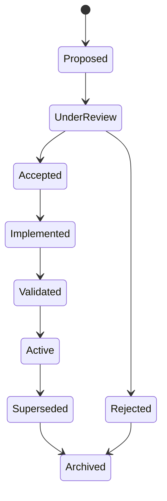

---

## Stage Definitions

| State | Description |
|--------|-------------|
| Proposed | Initial architectural proposal |
| Under Review | Cross-functional evaluation in progress |
| Accepted | Official architecture decision approved |
| Implemented | Solution delivered in production |
| Validated | Production metrics confirm expectations |
| Active | Current architectural standard |
| Superseded | Replaced by a newer ADR |
| Archived | Historical reference only |
| Rejected | Decision declined after evaluation |

---

# ADR Template

Every Architecture Decision Record uses the same standardized structure.

---

## Metadata

| Field | Description |
|--------|-------------|
| ADR ID | Unique identifier |
| Title | Decision title |
| Status | Proposed / Accepted / Superseded / Rejected |
| Date | Approval date |
| Authors | Decision owners |
| Review Date | Planned reassessment |
| Related ADRs | Cross references |

---

## Context

Describe:

- existing situation
- business drivers
- engineering constraints
- architectural challenges

---

## Problem Statement

Clearly define:

- what issue exists
- why it matters
- what risks arise if left unresolved

---

## Decision

Document:

- chosen solution
- architectural direction
- scope of applicability

---

## Alternatives Considered

Each alternative includes:

- description
- advantages
- disadvantages
- rejection rationale

---

## Engineering Rationale

Explain:

- performance considerations
- maintainability
- scalability
- operational impact
- technical reasoning

---

## Business Rationale

Explain:

- customer impact
- delivery speed
- operational efficiency
- financial implications
- strategic alignment

---

## Trade-offs

Every decision should explicitly document:

### Benefits

- improvements gained

### Costs

- engineering cost
- operational cost
- maintenance burden

### Risks

- potential future issues

---

## Consequences

Document both:

### Positive Consequences

Expected improvements.

### Negative Consequences

Known limitations accepted by the architecture.

---

## Success Metrics

Whenever possible include measurable indicators.

Examples:

- latency
- deployment frequency
- infrastructure cost
- MTTR
- developer onboarding time
- feature delivery speed

---

## Review Trigger

Examples include:

- team exceeds 50 engineers
- user base reaches 10 million
- cloud costs exceed target
- latency objectives missed
- regulatory changes
- AI capabilities evolve significantly

---

## Current Status

Possible values:

- Active
- Monitoring
- Deprecated
- Superseded
- Archived

---

# Architecture Governance

Architecture governance ensures that technical decisions remain aligned with business strategy while preserving consistency across the platform.

Governance is intended to guide architectural evolution—not to create unnecessary approval overhead.

---

## Governance Objectives

The governance process aims to:

- preserve architectural consistency
- avoid fragmented technology choices
- reduce long-term technical debt
- encourage evidence-based decision making
- improve cross-team alignment
- document reasoning for future maintainers

---

## Governance Principles

| Principle | Description |
|-----------|-------------|
| Consistency | Similar problems should receive similar solutions unless justified otherwise. |
| Transparency | Significant decisions must be documented and reviewable. |
| Accountability | Every ADR has an identified owner. |
| Traceability | Decisions should reference related documents and previous ADRs where applicable. |
| Reversibility | Architectural decisions should be revisited when assumptions change. |
| Business Alignment | Technology decisions must support product strategy and customer outcomes. |

---

## Decision Ownership

Architectural decisions should be owned by the appropriate domain experts while remaining aligned with the overall platform vision.

| Decision Domain | Primary Owner |
|-----------------|---------------|
| Product Architecture | Chief Architect |
| Backend Services | Principal Backend Architect |
| Frontend Platform | Principal Frontend Architect |
| AI Systems | Principal AI Architect |
| Infrastructure | Principal Cloud Architect |
| Security | Principal Security Architect |
| Data Platform | Principal Database Architect |
| Mobile | Principal Mobile Architect |
| Browser Extension | Principal Browser Extension Architect |
| Platform Engineering | Principal Platform Architect |

---

## Governance Review Cadence

Architecture governance is an ongoing process rather than a one-time exercise.

| Review Type | Recommended Frequency |
|-------------|-----------------------|
| New ADR Review | As needed for significant decisions |
| Active ADR Validation | Quarterly |
| Strategic Architecture Review | Biannually |
| Full ADR Catalog Audit | Annually |

---

## Relationship to Existing Documentation

This ADR catalog complements the broader CardWise documentation set.

| Document | Primary Purpose |
|----------|-----------------|
| Product Vision & PRD | Defines what will be built and why from a product perspective |
| Backend Architecture | Describes backend system design |
| Frontend Architecture | Describes frontend architecture and platform |
| Database Design | Documents data modeling decisions |
| Security & Compliance | Defines security architecture and compliance posture |
| Scalability & DevOps | Covers operational infrastructure |
| Architecture Decision Records | Explains why major architectural decisions were made and how they should evolve |

---

## Guiding Philosophy

The architecture of CardWise is expected to evolve as the product, business, technology landscape, and regulatory environment change.

Accordingly:

- every major decision is documented,
- every decision is open to future review,
- every change requires explicit reasoning,
- architectural evolution should be deliberate rather than reactive.

The ADR catalog serves as the long-term decision ledger that enables CardWise to scale without losing the rationale behind its foundational architecture.

# Part 2 — ADR Standards & Governance Framework

---

# 2. ADR Standards

## Executive Summary

Architecture Decision Records are only valuable if they are consistent.

Without a standardized format, decisions become difficult to search, compare, review, or supersede. CardWise therefore adopts a formal ADR standard that governs:

- how architectural decisions are proposed,
- how they are reviewed,
- who approves them,
- how they evolve over time,
- how historical context is preserved.

The objective is to ensure that every important decision is documented with the same level of rigor, regardless of the domain (backend, frontend, AI, infrastructure, security, data, mobile, or browser extension).

---

# ADR Design Principles

Every ADR in CardWise follows six guiding principles.

## Principle 1 — Decisions Must Be Permanent

ADRs are append-only historical records.

If a decision changes:

- never rewrite history,
- create a new ADR,
- supersede the previous ADR.

This preserves the evolution of the architecture over time.

---

## Principle 2 — Capture Intent, Not Implementation

ADRs explain:

- why
- when
- under which constraints
- expected consequences

Implementation belongs in architecture documents, technical specifications, or engineering design documents.

---

## Principle 3 — Every Major Decision Has an Owner

Every ADR must clearly identify:

- decision owner
- approving authority
- review authority

This avoids orphaned decisions.

---

## Principle 4 — Evidence Before Opinion

Architectural decisions should be supported by objective evidence whenever possible.

Evidence may include:

- production metrics
- scalability projections
- latency benchmarks
- engineering prototypes
- operational incidents
- cost analysis
- security assessments
- regulatory requirements

---

## Principle 5 — Explicit Trade-offs

Every architecture decision introduces trade-offs.

Every ADR must document:

- advantages
- disadvantages
- accepted compromises
- long-term risks

No architecture should be presented as universally optimal.

---

## Principle 6 — Decisions Are Revisitable

Architectural decisions are durable but not immutable.

Every ADR must define one or more review triggers so that assumptions can be reassessed as the platform evolves.

---

# ADR Classification

Not all architectural decisions carry the same level of significance.

CardWise categorizes ADRs by impact.

| Classification | Scope | Examples |
|----------------|-------|----------|
| Strategic | Company-wide | Platform vision, Operating System philosophy, AI-first strategy |
| Platform | Shared engineering platform | Monorepo, Design System, Shared SDKs |
| Domain | Individual subsystem | Recommendation Engine, Booking Engine |
| Infrastructure | Cloud and operations | Kubernetes, CI/CD, Observability |
| Security | Security architecture | Zero Trust, RBAC, Secrets Management |
| Data | Data platform | PostgreSQL, Event Store, Analytics Pipeline |
| Product | Product architecture | Rewards Engine, Card Portfolio Model |
| Operational | Engineering process | Deployment strategy, Release governance |

---

# ADR Numbering Standard

Every Architecture Decision Record receives a permanent identifier.

## Format

```
ADR-###
```

Examples:

```
ADR-001
ADR-002
ADR-057
ADR-128
```

ADR identifiers are never reused.

If an ADR is deleted before approval, its identifier remains reserved.

---

## Supplemental Identifiers

Supporting references may use additional identifiers.

| Prefix | Purpose |
|---------|----------|
| ARCH-* | Architecture reference |
| DEC-* | Supporting design decision |
| REVIEW-* | Scheduled architecture review |
| RFC-* | Request for Comments |
| RISK-* | Architecture risk reference |

Example:

```
ADR-012
ARCH-FE-004
DEC-DATA-008
REVIEW-014
```

---

# ADR Status Definitions

Every ADR progresses through a defined state.

| Status | Meaning |
|---------|----------|
| Draft | Initial working document |
| Proposed | Submitted for review |
| Under Review | Architecture committee evaluation |
| Accepted | Official architectural decision |
| Implemented | Production implementation completed |
| Validated | Operational success confirmed |
| Active | Current standard |
| Deprecated | Scheduled for replacement |
| Superseded | Replaced by another ADR |
| Rejected | Proposal declined |
| Archived | Historical reference only |

---

## Status Transition Rules

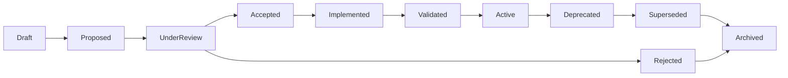

---

# ADR Approval Workflow

Every significant architectural decision follows the same governance workflow.

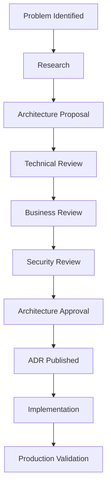

---

# Approval Responsibilities

Different categories of ADR require different approvers.

| Decision Category | Primary Approver | Secondary Review |
|------------------|------------------|------------------|
| Product Architecture | CTO | Founder |
| Platform | Chief Architect | VP Engineering |
| Backend | Principal Backend Architect | Chief Architect |
| Frontend | Principal Frontend Architect | Chief Architect |
| AI | Principal AI Architect | CTO |
| Infrastructure | Principal Cloud Architect | DevOps Lead |
| Security | Principal Security Architect | CISO equivalent |
| Mobile | Principal Mobile Architect | Chief Architect |
| Browser Extension | Principal Browser Extension Architect | Security Architect |
| Database | Principal Database Architect | Backend Architect |

---

# ADR Versioning Policy

ADRs are versioned independently of source code.

## Initial Version

```
v1.0
```

Represents the first approved architectural decision.

---

## Minor Updates

```
v1.1
v1.2
```

Used for:

- clarification
- typo corrections
- additional references
- updated review dates

Minor versions must not alter the architectural decision itself.

---

## Major Versions

```
v2.0
```

A major version is only permitted when:

- architectural assumptions materially change,
- decision rationale changes,
- scope significantly expands.

In most cases, a new ADR should supersede the previous one instead of incrementing the major version.

---

# ADR Review Process

Architectural decisions must be periodically reviewed to ensure they remain appropriate.

## Review Objectives

- validate assumptions,
- measure actual outcomes,
- identify unintended consequences,
- determine whether alternatives have become more suitable,
- ensure continued alignment with business strategy.

---

## Standard Review Questions

Every ADR review should answer:

1. Is the original problem still relevant?
2. Have business priorities changed?
3. Has technology evolved?
4. Has operational complexity increased?
5. Are costs still acceptable?
6. Are performance targets being met?
7. Has developer productivity improved?
8. Has security posture changed?
9. Should the ADR remain active?
10. Does a replacement ADR need to be proposed?

---

# Review Triggers

An ADR should not only be reviewed on a fixed schedule but also when significant events occur.

| Trigger | Example |
|----------|----------|
| Scale | User growth exceeds architectural assumptions |
| Performance | SLA or latency objectives missed |
| Cost | Infrastructure cost exceeds budget |
| Security | New threat model or regulatory requirement |
| Product | Major feature expansion |
| AI | New model capabilities fundamentally change design |
| Technology | Mature alternative becomes available |
| Operations | Frequent production incidents |
| Organization | Engineering team structure changes |

---

# ADR Quality Checklist

Before approval, every ADR should satisfy the following checklist.

| Requirement | Required |
|-------------|----------|
| Clear problem statement | ✓ |
| Business rationale | ✓ |
| Engineering rationale | ✓ |
| Alternatives evaluated | ✓ |
| Trade-offs documented | ✓ |
| Risks identified | ✓ |
| Consequences listed | ✓ |
| Success metrics defined | ✓ |
| Review trigger specified | ✓ |
| Approval recorded | ✓ |

No ADR should be approved unless all mandatory sections are complete.

---

# ADR Traceability

Every ADR should be traceable to related documentation.

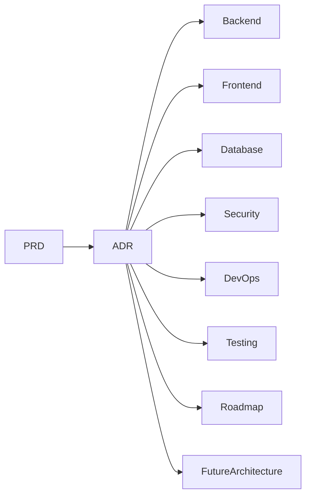

This ensures that architectural reasoning can always be connected to implementation and future planning.

---

# ADR Dependencies

Some architectural decisions depend on earlier decisions.

Example dependency chain:

```text
ADR-001
Platform Vision
        │
        ▼
ADR-006
Domain-Driven Architecture
        │
        ▼
ADR-014
Modular Backend
        │
        ▼
ADR-027
Recommendation Engine
        │
        ▼
ADR-041
AI Agent Framework
```

Dependencies help reviewers understand the broader architectural context before modifying a decision.

---

# ADR Supersession Policy

Architectural evolution should preserve history.

When a decision becomes obsolete:

1. Do not edit the original ADR.
2. Create a new ADR.
3. Reference the previous ADR.
4. Explain why the replacement is necessary.
5. Mark the earlier ADR as **Superseded**.
6. Link both records for traceability.

Example:

| Previous ADR | Replacement |
|--------------|-------------|
| ADR-018 | ADR-052 |
| ADR-041 | ADR-088 |

---

# Architecture Governance Metrics

The effectiveness of the ADR process should itself be measurable.

| Metric | Objective |
|---------|-----------|
| ADR Coverage | Major decisions documented |
| Review Compliance | ADRs reviewed on schedule |
| Supersession Rate | Architectural evolution tracked |
| Decision Lead Time | Time from proposal to approval |
| Traceability Score | ADRs linked to implementation documents |
| Documentation Freshness | Percentage of ADRs reviewed within review window |

These metrics help ensure that the ADR catalog remains an active governance tool rather than a static archive.

---

# Part 2 Summary

This section established the governance framework that all subsequent Architecture Decision Records will follow.

The remaining parts will apply these standards to the specific architectural decisions that define CardWise across product strategy, platform architecture, frontend, backend, AI, infrastructure, security, data, mobile, browser extension, and future evolution.

# Part 3 — Product-Level Architecture Decisions

---

# 3. Product-Level Architecture Decisions

## Executive Summary

The earliest architectural decisions are often the most important because they shape every subsequent technical, product, and organizational choice.

For CardWise, the foundational decisions were intentionally made **before writing production code**. These decisions define the product's identity, long-term strategy, architectural boundaries, and engineering priorities.

Unlike infrastructure or implementation decisions, product-level ADRs have the longest lifespan. They influence roadmap planning, data modeling, AI strategy, monetization, platform extensibility, and user experience.

The following Architecture Decision Records represent the strategic foundation upon which the rest of the platform is built.

---

# ADR-001 — CardWise is an Operating System, Not a Credit Card Comparison Website

| Field | Value |
|--------|-------|
| **ADR ID** | ADR-001 |
| **Status** | Active |
| **Category** | Product Architecture |
| **Priority** | Strategic |
| **Owner** | Founder / Chief Architect |

---

## Context

Most products in the market focus on one or two isolated use cases:

- comparing credit cards,
- listing offers,
- calculating rewards,
- tracking expenses,
- recommending travel cards.

These solutions require users to manually make financial decisions.

The long-term vision for CardWise is to eliminate that decision-making burden by becoming the intelligence layer between users, payment instruments, merchants, rewards, travel, and financial products.

---

## Problem Statement

A comparison website provides information.

Users still need to decide:

- which card to apply for,
- which payment method to use,
- how to maximize rewards,
- when to redeem points,
- when to upgrade or close cards,
- which travel option provides maximum value.

The problem is not a lack of information—it is the cognitive effort required to optimize financial decisions.

---

## Decision

Position CardWise as an **Operating System for Intelligent Credit Card Management** rather than a comparison portal.

The platform becomes a persistent financial decision engine that continuously optimizes user outcomes.

---

## Alternatives Considered

| Alternative | Decision |
|-------------|----------|
| Credit card comparison website | Rejected |
| Rewards calculator | Rejected |
| Cashback tracker | Rejected |
| Expense management application | Rejected |
| Personal finance application | Rejected |
| Financial intelligence operating system | **Accepted** |

---

## Engineering Rationale

An operating system architecture:

- supports modular domain expansion,
- enables AI orchestration,
- allows independent feature evolution,
- encourages reusable business capabilities,
- avoids tightly coupling features to a single workflow.

---

## Business Rationale

The operating system model:

- increases user retention,
- creates multiple monetization opportunities,
- supports partnerships,
- enables subscriptions,
- provides defensible differentiation,
- reduces feature commoditization.

---

## Pros

- Long-term extensibility
- Strong competitive moat
- Unified user experience
- Higher lifetime value
- Supports AI-driven automation

---

## Cons

- Larger product scope
- Longer MVP roadmap
- Higher architectural complexity

---

## Trade-offs

Accept slower initial feature breadth in exchange for a platform capable of supporting many future domains.

---

## Risks

- Broader vision increases execution complexity.
- Requires disciplined scope management during MVP.

---

## Consequences

### Positive

- Unified ecosystem
- Shared business logic
- Extensible architecture

### Negative

- Requires careful domain boundaries
- Longer strategic planning horizon

---

## Review Trigger

Reassess if:

- core vision changes,
- major adjacent domains emerge,
- customer behavior consistently indicates a narrower product fit.

---

# ADR-002 — AI-First Rather Than AI-Only

| Field | Value |
|--------|-------|
| **ADR ID** | ADR-002 |
| **Status** | Active |
| **Category** | Product Strategy |

---

## Context

Large Language Models have transformed software capabilities, but they remain probabilistic systems with varying accuracy, latency, explainability, and cost.

Financial recommendations require deterministic behavior in many scenarios.

---

## Problem Statement

Should every decision rely on AI models, or should deterministic logic remain the primary decision-maker?

---

## Decision

Adopt an **AI-First** philosophy.

AI enhances decision-making but does not replace deterministic systems where correctness, compliance, or explainability are essential.

---

## Alternatives Considered

| Alternative | Decision |
|-------------|----------|
| Rule-based only | Rejected |
| LLM-only | Rejected |
| AI-first with deterministic fallback | **Accepted** |

---

## Engineering Rationale

This approach provides:

- explainable outputs,
- predictable behavior,
- controlled operational costs,
- graceful degradation,
- easier testing.

---

## Business Rationale

Users trust financial recommendations that can be explained.

Combining AI with deterministic logic improves confidence while preserving innovation.

---

## Pros

- Explainability
- Lower inference costs
- Reduced hallucination risk
- Better compliance

---

## Cons

- More architectural components
- Increased orchestration complexity

---

## Trade-offs

Additional engineering effort is accepted to improve trustworthiness and operational resilience.

---

## Review Trigger

Review if:

- LLM reliability substantially improves,
- regulations change,
- inference economics shift significantly.

---

# ADR-003 — MVP Before Platform Expansion

| Field | Value |
|--------|-------|
| **ADR ID** | ADR-003 |
| **Status** | Active |
| **Category** | Product Strategy |

---

## Context

The long-term vision spans multiple domains, including rewards optimization, travel booking, browser automation, AI assistants, merchant intelligence, and financial planning.

Attempting to build all capabilities simultaneously would delay validation.

---

## Problem Statement

How should engineering balance long-term ambition with early market validation?

---

## Decision

Adopt a phased delivery strategy.

The MVP should validate the core value proposition before expanding into adjacent capabilities.

---

## Alternatives Considered

| Alternative | Decision |
|-------------|----------|
| Build full platform first | Rejected |
| Incremental MVP evolution | **Accepted** |
| Feature-by-feature marketplace | Rejected |

---

## Engineering Rationale

A phased roadmap:

- reduces delivery risk,
- simplifies architecture validation,
- enables iterative learning,
- lowers maintenance burden during early stages.

---

## Business Rationale

Early user feedback is more valuable than speculative feature completeness.

---

## Trade-offs

Delayed availability of advanced capabilities in exchange for faster validation.

---

## Review Trigger

Review after:

- product-market fit,
- stable user growth,
- sustainable monetization.

---

# ADR-004 — Platform-First Instead of Feature-First

| Field | Value |
|--------|-------|
| **ADR ID** | ADR-004 |
| **Status** | Active |
| **Category** | Platform Strategy |

---

## Context

Independent feature development often results in duplicated logic, inconsistent user experiences, and fragmented engineering practices.

---

## Problem Statement

Should features own their infrastructure, or should common capabilities be centralized?

---

## Decision

Build reusable platform capabilities first whenever they unlock multiple domains.

Examples include:

- authentication,
- notifications,
- recommendation framework,
- rewards engine,
- merchant catalog,
- user preferences,
- analytics.

---

## Alternatives Considered

| Alternative | Decision |
|-------------|----------|
| Feature-specific implementations | Rejected |
| Platform-first architecture | **Accepted** |

---

## Engineering Rationale

Shared platform capabilities:

- reduce duplication,
- improve consistency,
- simplify maintenance,
- accelerate future development.

---

## Business Rationale

Reusable capabilities reduce long-term delivery costs and improve feature velocity.

---

## Risks

Initial platform investment may slow early feature delivery.

---

## Review Trigger

Review if platform abstractions begin to hinder rather than accelerate development.

---

# ADR-005 — Domain-Oriented Product Structure

| Field | Value |
|--------|-------|
| **ADR ID** | ADR-005 |
| **Status** | Active |
| **Category** | Product Architecture |

---

## Context

CardWise spans multiple business domains:

- credit cards,
- offers,
- rewards,
- travel,
- AI,
- user portfolio,
- merchants,
- analytics.

Organizing by technical layers alone would tightly couple unrelated business capabilities.

---

## Decision

Adopt a domain-oriented product structure where each domain owns its business concepts while sharing common platform services.

---

## Alternatives Considered

| Alternative | Decision |
|-------------|----------|
| Layer-based organization | Rejected |
| Domain-oriented architecture | **Accepted** |

---

## Engineering Rationale

Domain ownership improves:

- modularity,
- scalability,
- maintainability,
- parallel development.

---

## Business Rationale

Business capabilities evolve independently, making domain alignment a natural organizational model.

---

## Trade-offs

Requires clearer domain boundaries and governance.

---

## Review Trigger

Review if domain overlap creates excessive coordination costs.

---

# Product-Level Decision Matrix

| ADR | Decision | Primary Benefit | Main Trade-off | Status |
|-----|----------|-----------------|----------------|--------|
| ADR-001 | Operating System vision | Long-term extensibility | Larger initial scope | Active |
| ADR-002 | AI-First strategy | Explainable intelligence | Increased orchestration complexity | Active |
| ADR-003 | MVP-first roadmap | Faster validation | Deferred advanced features | Active |
| ADR-004 | Platform-first architecture | Reuse and consistency | Upfront platform investment | Active |
| ADR-005 | Domain-oriented structure | Modularity and scalability | Stronger governance requirements | Active |

---

# Cross-ADR Relationships

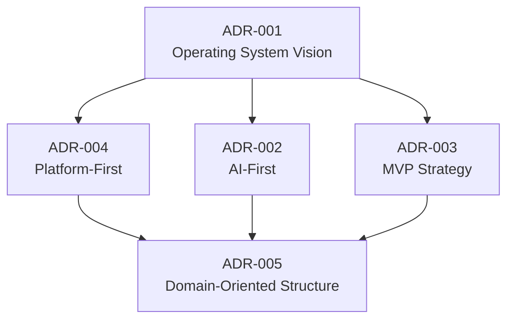

---

# Part 3 Summary

The product-level ADRs establish the strategic foundation for CardWise:

- The product is positioned as an intelligent financial operating system rather than a comparison site.
- AI augments deterministic systems instead of replacing them.
- Product-market fit is prioritized through a phased MVP strategy.
- Shared platform capabilities are preferred over isolated feature implementations.
- Business domains, rather than technical layers, define the long-term architectural structure.

These decisions guide every subsequent architectural choice documented in the following sections.

# Part 4 — Core Architecture Decisions

---

# 4. Core Architecture Decisions

## Executive Summary

While the product-level ADRs define **what CardWise is**, the architecture-level ADRs define **how the platform is organized**.

These decisions establish the structural principles that every engineering team, subsystem, and future contributor must follow. They are intended to maximize scalability, maintainability, extensibility, and operational simplicity over the lifetime of the platform.

The ADRs in this section cover:

- Repository organization
- Architectural style
- Domain decomposition
- Service communication
- API philosophy
- Event-driven integration
- Shared platform capabilities

---

# ADR-006 — Monorepo as the Default Repository Strategy

| Field | Value |
|--------|-------|
| **ADR ID** | ADR-006 |
| **Status** | Active |
| **Category** | Platform Architecture |
| **Owner** | Principal Platform Architect |

---

## Context

CardWise consists of multiple deliverables:

- Web application
- Admin Portal
- Backend APIs
- Browser Extension
- Mobile Application
- Shared Design System
- Shared SDKs
- AI Components
- Infrastructure Code

Managing these as separate repositories would increase operational overhead and duplicate shared logic.

---

## Problem Statement

Should CardWise use multiple repositories or a unified repository?

---

## Decision

Adopt a **Monorepo architecture** as the default repository strategy.

The monorepo serves as the single source of truth for all first-party applications, libraries, tooling, and infrastructure definitions.

---

## Alternatives Considered

| Alternative | Decision |
|-------------|----------|
| Polyrepo | Rejected |
| Hybrid Repository Model | Considered |
| Monorepo | **Accepted** |

---

## Engineering Rationale

A monorepo enables:

- shared libraries,
- atomic refactoring,
- unified dependency management,
- standardized tooling,
- consistent testing,
- simplified CI/CD,
- reusable build pipelines.

---

## Business Rationale

A unified repository reduces engineering friction, accelerates onboarding, and lowers long-term maintenance costs.

---

## Pros

- Single source of truth
- Shared tooling
- Easier dependency management
- Cross-project refactoring
- Consistent engineering practices

---

## Cons

- Larger repository size
- More complex build orchestration
- Requires disciplined ownership boundaries

---

## Trade-offs

Repository complexity is accepted in exchange for greater engineering consistency and platform cohesion.

---

## Risks

- Longer build times if tooling is poorly optimized.
- Ownership boundaries may become blurred without governance.

---

## Review Trigger

Reassess if:

- repository scale significantly impacts productivity,
- build performance becomes unacceptable,
- organizational structure requires repository separation.

---

# ADR-007 — Domain-Driven Architecture

| Field | Value |
|--------|-------|
| **ADR ID** | ADR-007 |
| **Status** | Active |
| **Category** | System Architecture |

---

## Context

CardWise spans multiple business domains that evolve independently.

A layer-oriented architecture would tightly couple unrelated business capabilities.

---

## Problem Statement

How should business functionality be organized to support long-term evolution?

---

## Decision

Adopt **Domain-Driven Architecture (DDA)**.

Primary domains include:

- Users
- Credit Cards
- Rewards
- Offers
- Merchants
- Payments
- Travel
- AI
- Analytics
- Notifications

Each domain owns its business rules while relying on shared platform services for cross-cutting concerns.

---

## Alternatives Considered

| Alternative | Decision |
|-------------|----------|
| Layered Architecture | Rejected |
| Feature Folder Organization | Rejected |
| Domain-Driven Architecture | **Accepted** |

---

## Engineering Rationale

Domain ownership:

- reduces coupling,
- simplifies reasoning,
- enables modular growth,
- improves maintainability,
- aligns with bounded contexts.

---

## Business Rationale

Business capabilities evolve independently, making domain-oriented architecture more adaptable to future product expansion.

---

## Trade-offs

Requires well-defined boundaries and disciplined governance.

---

## Review Trigger

Review if domain interactions become excessively complex or duplicated.

---

# ADR-008 — Modular Backend Instead of Early Microservices

| Field | Value |
|--------|-------|
| **ADR ID** | ADR-008 |
| **Status** | Active |
| **Category** | Backend Architecture |

---

## Context

Microservices provide scalability but introduce operational complexity.

During early product stages, independent deployment is less valuable than development simplicity.

---

## Problem Statement

Should CardWise adopt microservices from the beginning?

---

## Decision

Implement a **Modular Monolith** for the backend during the initial stages.

Modules remain logically isolated and can be extracted into independent services if required in the future.

---

## Alternatives Considered

| Alternative | Decision |
|-------------|----------|
| Immediate Microservices | Rejected |
| Modular Monolith | **Accepted** |
| Traditional Layered Monolith | Rejected |

---

## Engineering Rationale

The modular monolith:

- minimizes operational overhead,
- simplifies debugging,
- supports transactional consistency,
- enables future service extraction,
- reduces infrastructure complexity.

---

## Business Rationale

Engineering effort is focused on delivering product value rather than distributed systems management.

---

## Pros

- Faster development
- Simpler deployments
- Easier debugging
- Lower infrastructure cost

---

## Cons

- Larger deployment unit
- Requires architectural discipline to avoid tight coupling

---

## Trade-offs

Operational simplicity is prioritized over independent deployment.

---

## Review Trigger

Revisit when:

- independent scaling becomes necessary,
- deployment frequency differs significantly across domains,
- team size justifies service ownership boundaries.

---

# ADR-009 — API-First Architecture

| Field | Value |
|--------|-------|
| **ADR ID** | ADR-009 |
| **Status** | Active |
| **Category** | Platform Integration |

---

## Context

CardWise supports multiple clients:

- Web
- Mobile
- Browser Extension
- Admin Portal
- Future Partner APIs

Inconsistent API design would increase maintenance costs.

---

## Problem Statement

How should platform capabilities be exposed to multiple consumers?

---

## Decision

Adopt an **API-First architecture**.

Business capabilities are defined through stable contracts before implementation.

---

## Alternatives Considered

| Alternative | Decision |
|-------------|----------|
| UI-first development | Rejected |
| Backend-first development | Rejected |
| API-first architecture | **Accepted** |

---

## Engineering Rationale

API-first design:

- improves client consistency,
- enables parallel development,
- supports contract testing,
- simplifies integrations,
- encourages reusable services.

---

## Business Rationale

Stable APIs accelerate future partner integrations and ecosystem expansion.

---

## Trade-offs

Requires additional upfront design effort.

---

## Review Trigger

Review if API governance becomes a bottleneck or client diversity significantly changes.

---

# ADR-010 — Event-Driven Integration for Cross-Domain Communication

| Field | Value |
|--------|-------|
| **ADR ID** | ADR-010 |
| **Status** | Active |
| **Category** | Integration Architecture |

---

## Context

Many CardWise domains react to changes initiated elsewhere.

Examples include:

- reward calculations,
- analytics,
- notifications,
- recommendation updates,
- fraud monitoring.

Direct synchronous dependencies would tightly couple domains.

---

## Problem Statement

How should cross-domain interactions be coordinated?

---

## Decision

Adopt an **event-driven integration model** for asynchronous business events while preserving synchronous APIs for request-response workflows.

---

## Alternatives Considered

| Alternative | Decision |
|-------------|----------|
| Fully synchronous communication | Rejected |
| Event-driven integration | **Accepted** |
| Event sourcing everywhere | Rejected |

---

## Engineering Rationale

Event-driven communication:

- reduces coupling,
- improves scalability,
- supports asynchronous processing,
- enables independent consumers,
- simplifies future integrations.

---

## Business Rationale

New capabilities can subscribe to existing business events without changing upstream systems.

---

## Trade-offs

Requires event governance and monitoring.

---

## Risks

- Event ordering challenges
- Duplicate event processing
- Event schema evolution

---

## Review Trigger

Review if event complexity outweighs modularity benefits.

---

# ADR-011 — Shared Platform Services for Cross-Cutting Concerns

| Field | Value |
|--------|-------|
| **ADR ID** | ADR-011 |
| **Status** | Active |
| **Category** | Platform Architecture |

---

## Context

Many platform capabilities are required across nearly every domain.

Examples include:

- Authentication
- Authorization
- Notifications
- Audit Logging
- Configuration
- Feature Flags
- Analytics
- Observability

Implementing these independently within each domain would introduce duplication and inconsistency.

---

## Decision

Centralize cross-cutting capabilities as **Shared Platform Services**.

Business domains consume these services rather than implementing their own versions.

---

## Alternatives Considered

| Alternative | Decision |
|-------------|----------|
| Domain-specific implementations | Rejected |
| Shared Platform Services | **Accepted** |

---

## Engineering Rationale

Shared services:

- reduce code duplication,
- improve consistency,
- simplify maintenance,
- enable centralized governance.

---

## Business Rationale

Consistent platform capabilities improve reliability and reduce long-term engineering costs.

---

## Trade-offs

Platform teams become responsible for maintaining foundational services.

---

## Review Trigger

Review if shared services become bottlenecks or require domain-specific customization.

---

# Relationship Between Core Architectural Decisions

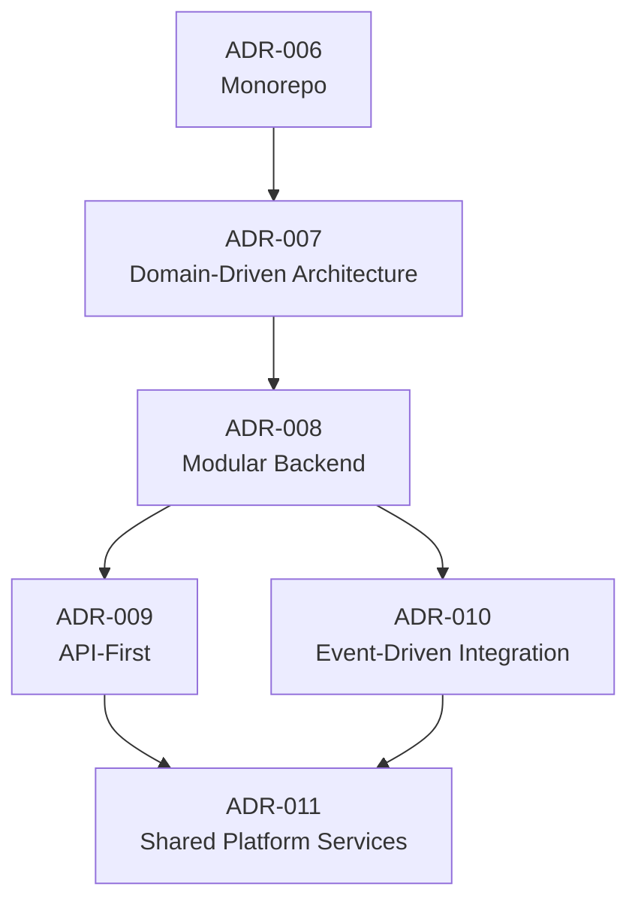

---

# Core Architecture Decision Matrix

| ADR | Decision | Primary Benefit | Main Trade-off | Status |
|-----|----------|-----------------|----------------|--------|
| ADR-006 | Monorepo | Unified engineering platform | Larger repository | Active |
| ADR-007 | Domain-Driven Architecture | Business modularity | Strong governance required | Active |
| ADR-008 | Modular Monolith | Simpler operations | Larger deployment unit | Active |
| ADR-009 | API-First | Multi-client consistency | Upfront contract design | Active |
| ADR-010 | Event-Driven Integration | Loose coupling | Event governance complexity | Active |
| ADR-011 | Shared Platform Services | Reuse and consistency | Centralized ownership | Active |

---

# Architecture Principles Reinforced

The decisions in this section reinforce several enduring architectural principles:

| Principle | Supported ADRs |
|-----------|----------------|
| Separation of Concerns | ADR-007, ADR-011 |
| Reusability | ADR-006, ADR-009, ADR-011 |
| Loose Coupling | ADR-007, ADR-010 |
| Incremental Scalability | ADR-008, ADR-010 |
| Operational Simplicity | ADR-006, ADR-008 |
| Future Evolution | ADR-007, ADR-009, ADR-010 |

---

# Part 4 Summary

The core architecture ADRs establish the structural backbone of CardWise:

- A monorepo provides a unified engineering workspace.
- Business capabilities are organized using domain-driven architecture.
- The backend begins as a modular monolith with a clear migration path.
- APIs are treated as stable platform contracts.
- Cross-domain interactions rely on event-driven integration where appropriate.
- Shared platform services centralize common capabilities and reduce duplication.

These decisions provide the architectural framework upon which the frontend, backend, AI, infrastructure, and future platform capabilities are built.

# Part 5 — Frontend Architecture Decisions

---

# 5. Frontend Architecture Decisions

## Executive Summary

The CardWise frontend is more than a traditional web application. It is the primary interface through which users interact with intelligent financial recommendations, card portfolios, merchant offers, travel planning, and AI-powered assistance.

As the platform expands across multiple applications—including the consumer web app, admin portal, browser extension, and future partner interfaces—the frontend architecture must prioritize:

- Consistency
- Reusability
- Performance
- Accessibility
- Maintainability
- Scalability

The following ADRs define the architectural principles that govern all frontend development across the CardWise ecosystem.

---

# ADR-012 — React as the Primary Frontend Framework

| Field | Value |
|--------|-------|
| **ADR ID** | ADR-012 |
| **Status** | Active |
| **Category** | Frontend Architecture |
| **Owner** | Principal Frontend Architect |

---

## Context

CardWise requires rich interactive interfaces with reusable components, client-side state management, server-driven rendering support, and a mature ecosystem.

Several frontend frameworks were evaluated.

---

## Problem Statement

Which frontend framework best supports long-term scalability and developer productivity?

---

## Decision

Standardize on **React** for all first-party frontend applications.

---

## Alternatives Considered

| Alternative | Decision |
|-------------|----------|
| Vue | Rejected |
| Angular | Rejected |
| Svelte | Rejected |
| React | **Accepted** |

---

## Engineering Rationale

React provides:

- Mature ecosystem
- Component-based architecture
- Large talent pool
- Excellent tooling
- Strong TypeScript support
- Broad community adoption
- Compatibility with modern rendering strategies

---

## Business Rationale

React minimizes hiring risk, accelerates onboarding, and benefits from long-term ecosystem stability.

---

## Trade-offs

React requires architectural discipline because it is intentionally unopinionated.

---

## Review Trigger

Review if another framework demonstrates significant long-term advantages in ecosystem maturity, performance, or maintainability.

---

# ADR-013 — TypeScript as a Mandatory Language Standard

| Field | Value |
|--------|-------|
| **ADR ID** | ADR-013 |
| **Status** | Active |
| **Category** | Engineering Standards |

---

## Context

CardWise consists of multiple applications and shared packages maintained over many years.

JavaScript alone provides insufficient compile-time guarantees for a growing codebase.

---

## Problem Statement

Should the frontend use JavaScript or TypeScript?

---

## Decision

Adopt **TypeScript** as the mandatory language for all frontend code.

---

## Alternatives Considered

| Alternative | Decision |
|-------------|----------|
| JavaScript | Rejected |
| Mixed JavaScript/TypeScript | Rejected |
| TypeScript | **Accepted** |

---

## Engineering Rationale

TypeScript improves:

- static analysis,
- refactoring safety,
- API contract validation,
- IDE support,
- documentation through types,
- maintainability.

---

## Business Rationale

Compile-time correctness reduces production defects and long-term maintenance costs.

---

## Trade-offs

Additional type definitions increase initial development effort.

---

## Review Trigger

Review if future language evolution materially changes the value proposition of static typing.

---

# ADR-014 — Shared Design System Across All Applications

| Field | Value |
|--------|-------|
| **ADR ID** | ADR-014 |
| **Status** | Active |
| **Category** | Design Architecture |

---

## Context

CardWise includes multiple user-facing products that must provide a consistent user experience.

Duplicating UI components across applications leads to inconsistency and increased maintenance.

---

## Decision

Create and maintain a **shared Design System** that serves all first-party applications.

Core assets include:

- UI components
- Design tokens
- Typography
- Icons
- Accessibility standards
- Interaction patterns

---

## Alternatives Considered

| Alternative | Decision |
|-------------|----------|
| Independent component libraries | Rejected |
| Shared Design System | **Accepted** |

---

## Engineering Rationale

A centralized design system:

- promotes reuse,
- simplifies maintenance,
- enforces consistency,
- reduces implementation effort.

---

## Business Rationale

A consistent user experience strengthens product identity and lowers design costs.

---

## Trade-offs

The design system requires dedicated governance and version management.

---

## Review Trigger

Review if application requirements consistently exceed the capabilities of the shared system.

---

# ADR-015 — Feature-Based Component Organization

| Field | Value |
|--------|-------|
| **ADR ID** | ADR-015 |
| **Status** | Active |
| **Category** | Frontend Structure |

---

## Context

Organizing components purely by type often scatters related functionality across the codebase.

---

## Problem Statement

How should frontend code be organized?

---

## Decision

Organize components primarily by **feature/domain**, with shared components extracted into common libraries.

---

## Alternatives Considered

| Alternative | Decision |
|-------------|----------|
| Type-based folders | Rejected |
| Feature-based organization | **Accepted** |

---

## Engineering Rationale

Feature ownership:

- improves discoverability,
- reduces coupling,
- simplifies maintenance,
- aligns with domain-driven architecture.

---

## Business Rationale

Independent feature evolution accelerates delivery and simplifies ownership.

---

## Trade-offs

Shared abstractions must be carefully managed to avoid duplication.

---

## Review Trigger

Review if feature boundaries become unclear or shared logic proliferates.

---

# ADR-016 — Predictable State Management

| Field | Value |
|--------|-------|
| **ADR ID** | ADR-016 |
| **Status** | Active |
| **Category** | Frontend State Management |

---

## Context

CardWise manages:

- authenticated user sessions,
- card portfolios,
- offers,
- rewards,
- AI conversations,
- travel searches,
- application settings.

Inconsistent state management increases cognitive load and maintenance effort.

---

## Problem Statement

How should client-side state be managed?

---

## Decision

Adopt a predictable state management strategy that distinguishes between:

- local UI state,
- server state,
- shared application state.

The architecture emphasizes minimal global state and clear ownership boundaries.

---

## Alternatives Considered

| Alternative | Decision |
|-------------|----------|
| Component-local state only | Rejected |
| Multiple independent global stores | Rejected |
| Structured layered state management | **Accepted** |

---

## Engineering Rationale

Clear state ownership:

- improves debugging,
- reduces unintended side effects,
- simplifies testing,
- enhances scalability.

---

## Business Rationale

Predictable application behavior improves user trust and reduces production incidents.

---

## Trade-offs

Developers must follow consistent state management conventions.

---

## Review Trigger

Review if application complexity changes state management requirements.

---

# ADR-017 — Route-Based Application Architecture

| Field | Value |
|--------|-------|
| **ADR ID** | ADR-017 |
| **Status** | Active |
| **Category** | Navigation Architecture |

---

## Context

CardWise contains multiple major functional areas that evolve independently.

Examples include:

- Dashboard
- Card Portfolio
- Rewards
- Offers
- Travel
- AI Assistant
- Profile
- Settings

---

## Decision

Organize navigation around clearly defined route boundaries aligned with business domains.

Each route becomes the entry point to an independently evolvable feature area.

---

## Alternatives Considered

| Alternative | Decision |
|-------------|----------|
| Flat routing | Rejected |
| Route-based domain architecture | **Accepted** |

---

## Engineering Rationale

Route boundaries improve:

- code organization,
- lazy loading opportunities,
- feature ownership,
- scalability.

---

## Business Rationale

Clear navigation improves usability while enabling independent product evolution.

---

## Trade-offs

Requires consistent route governance as the application grows.

---

## Review Trigger

Review if routing hierarchy becomes overly deep or difficult to navigate.

---

# ADR-018 — Performance by Architectural Design

| Field | Value |
|--------|-------|
| **ADR ID** | ADR-018 |
| **Status** | Active |
| **Category** | Performance Architecture |

---

## Context

CardWise serves dynamic dashboards, AI recommendations, analytics, travel data, and personalized content.

Performance cannot rely solely on optimization after implementation.

---

## Problem Statement

Should performance be addressed reactively or incorporated into architectural decisions?

---

## Decision

Treat performance as a first-class architectural concern.

Frontend architecture should encourage:

- modular loading,
- efficient rendering,
- asset optimization,
- responsive interactions,
- scalable caching strategies.

---

## Alternatives Considered

| Alternative | Decision |
|-------------|----------|
| Optimize after implementation | Rejected |
| Performance-first architecture | **Accepted** |

---

## Engineering Rationale

Architectural performance decisions are easier to maintain than continuous reactive optimization.

---

## Business Rationale

Responsive experiences improve engagement, retention, and user satisfaction.

---

## Trade-offs

Requires additional design effort during early development.

---

## Review Trigger

Review if user experience metrics consistently fall below established performance objectives.

---

# Relationship Between Frontend ADRs

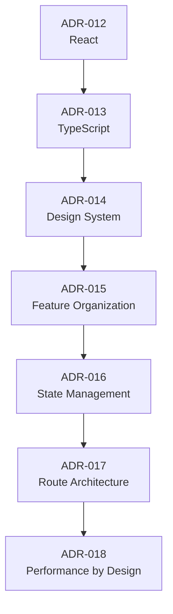

---

# Frontend Decision Matrix

| ADR | Decision | Primary Benefit | Main Trade-off | Status |
|-----|----------|-----------------|----------------|--------|
| ADR-012 | React | Mature ecosystem | Requires architectural discipline | Active |
| ADR-013 | TypeScript | Compile-time safety | Additional type maintenance | Active |
| ADR-014 | Shared Design System | UI consistency | Governance overhead | Active |
| ADR-015 | Feature-Based Organization | Better modularity | Shared abstraction management | Active |
| ADR-016 | Predictable State Management | Reliable application behavior | Convention enforcement | Active |
| ADR-017 | Route-Based Architecture | Independent feature evolution | Navigation governance | Active |
| ADR-018 | Performance by Design | Better user experience | Upfront architectural investment | Active |

---

# Alignment with Previous ADRs

The frontend architecture directly reinforces earlier architectural decisions:

| Product/Core ADR | Frontend Alignment |
|------------------|--------------------|
| ADR-001 — Operating System Vision | Supports multiple interconnected product domains through a unified interface. |
| ADR-004 — Platform-First Strategy | Shared Design System and reusable frontend libraries extend the platform philosophy. |
| ADR-006 — Monorepo | Frontend applications, shared packages, and tooling coexist in a unified repository. |
| ADR-007 — Domain-Driven Architecture | Feature organization and routing mirror business domains. |
| ADR-009 — API-First Architecture | Frontend consumes stable API contracts independent of backend implementation. |

---

# Part 5 Summary

The frontend ADRs establish a scalable, maintainable, and consistent user interface architecture for CardWise:

- React provides a mature foundation for all web-based applications.
- TypeScript is mandatory to improve correctness and maintainability.
- A shared Design System ensures a unified user experience across products.
- Feature-based organization aligns frontend code with business domains.
- Predictable state management encourages clear ownership and testability.
- Route boundaries support modular application growth.
- Performance is treated as an architectural concern from the outset rather than a post-implementation optimization effort.

These decisions ensure that the frontend platform can evolve alongside the broader CardWise ecosystem while remaining consistent with the strategic and architectural principles established in earlier ADRs.

# Part 6 — Backend Architecture Decisions

---

# 6. Backend Architecture Decisions

## Executive Summary

The backend is the operational core of CardWise. It powers user authentication, card portfolio management, rewards optimization, merchant intelligence, recommendation generation, booking workflows, notifications, analytics, AI orchestration, and third-party integrations.

The backend architecture has been designed to satisfy several long-term objectives:

- High reliability
- Predictable scalability
- Modular evolution
- Operational simplicity
- Strong security
- API stability
- Efficient data access

The following ADRs document the reasoning behind the foundational backend technology and architectural choices.

---

# ADR-019 — Fastify as the Primary Backend Framework

| Field | Value |
|--------|-------|
| **ADR ID** | ADR-019 |
| **Status** | Active |
| **Category** | Backend Framework |
| **Owner** | Principal Backend Architect |

---

## Context

CardWise requires a backend capable of supporting:

- High request throughput
- Low latency APIs
- Strong TypeScript support
- Plugin-based extensibility
- Validation
- Schema-driven development

Several Node.js frameworks were evaluated.

---

## Problem Statement

Which backend framework provides the best balance between performance, developer productivity, and long-term maintainability?

---

## Decision

Standardize on **Fastify** for all HTTP services.

---

## Alternatives Considered

| Alternative | Decision |
|-------------|----------|
| Express | Rejected |
| NestJS | Considered |
| Koa | Rejected |
| Fastify | **Accepted** |

---

## Engineering Rationale

Fastify offers:

- High performance
- Native schema validation
- Strong TypeScript support
- Plugin architecture
- Efficient serialization
- Low operational overhead

---

## Business Rationale

Higher throughput and reduced infrastructure requirements lower operational costs while preserving developer velocity.

---

## Trade-offs

Fastify has a smaller ecosystem than Express, requiring more deliberate library selection.

---

## Review Trigger

Review if framework limitations materially affect productivity or ecosystem compatibility.

---

# ADR-020 — PostgreSQL as the Primary Operational Database

| Field | Value |
|--------|-------|
| **ADR ID** | ADR-020 |
| **Status** | Active |
| **Category** | Data Architecture |

---

## Context

CardWise stores highly relational data:

- Users
- Credit cards
- Rewards
- Transactions
- Merchants
- Offers
- Loyalty programs
- Travel bookings
- Recommendations

Data integrity is essential.

---

## Problem Statement

Should the operational database prioritize relational consistency or schema flexibility?

---

## Decision

Use **PostgreSQL** as the primary operational database.

---

## Alternatives Considered

| Alternative | Decision |
|-------------|----------|
| MongoDB | Rejected |
| MySQL | Considered |
| CockroachDB | Deferred |
| PostgreSQL | **Accepted** |

---

## Engineering Rationale

PostgreSQL provides:

- ACID transactions
- Rich indexing
- Advanced SQL capabilities
- Strong ecosystem
- JSON support
- Mature tooling

---

## Business Rationale

Reliable transactional consistency is essential for financial correctness and user trust.

---

## Trade-offs

Relational modeling requires greater schema discipline compared to document databases.

---

## Review Trigger

Review if global distribution or horizontal scaling requirements exceed PostgreSQL's operational model.

---

# ADR-021 — Redis for Distributed Caching and Ephemeral State

| Field | Value |
|--------|-------|
| **ADR ID** | ADR-021 |
| **Status** | Active |
| **Category** | Performance Architecture |

---

## Context

Not all backend data requires persistent storage.

Examples include:

- Sessions
- Rate limits
- Temporary recommendation results
- Cached merchant metadata
- Feature flags
- Distributed locks

---

## Problem Statement

How should temporary and frequently accessed data be managed?

---

## Decision

Adopt **Redis** as the shared in-memory caching and ephemeral state layer.

---

## Alternatives Considered

| Alternative | Decision |
|-------------|----------|
| In-process caching | Rejected |
| Memcached | Considered |
| Redis | **Accepted** |

---

## Engineering Rationale

Redis enables:

- Low-latency access
- Shared distributed cache
- Atomic operations
- TTL-based expiration
- Pub/Sub capabilities

---

## Business Rationale

Improved response times enhance user experience while reducing database load.

---

## Trade-offs

Introduces an additional operational dependency that must be monitored.

---

## Review Trigger

Review if workload characteristics require alternative caching technologies.

---

# ADR-022 — Background Job Processing for Asynchronous Workloads

| Field | Value |
|--------|-------|
| **ADR ID** | ADR-022 |
| **Status** | Active |
| **Category** | Backend Processing |

---

## Context

Many operations should not block user requests.

Examples include:

- Recommendation generation
- Email delivery
- Push notifications
- Analytics aggregation
- Offer synchronization
- AI enrichment
- Report generation

---

## Problem Statement

How should long-running or asynchronous operations be executed?

---

## Decision

Use a dedicated background job processing architecture separate from synchronous request handling.

---

## Alternatives Considered

| Alternative | Decision |
|-------------|----------|
| Inline request processing | Rejected |
| Background job architecture | **Accepted** |
| Fully event-sourced workflows | Deferred |

---

## Engineering Rationale

Background processing:

- improves responsiveness,
- isolates failures,
- supports retries,
- enables workload scaling,
- reduces API latency.

---

## Business Rationale

Users receive faster responses while heavy processing occurs independently.

---

## Trade-offs

Requires operational visibility into job execution and retry behavior.

---

## Review Trigger

Review if asynchronous workloads become latency-sensitive or require workflow orchestration.

---

# ADR-023 — Stable API Versioning Strategy

| Field | Value |
|--------|-------|
| **ADR ID** | ADR-023 |
| **Status** | Active |
| **Category** | API Governance |

---

## Context

Multiple clients consume backend APIs:

- Web
- Mobile
- Browser Extension
- Admin Portal
- Future partner integrations

Breaking API changes create operational risk.

---

## Problem Statement

How should API evolution be managed?

---

## Decision

Adopt explicit API versioning with a strong preference for backward-compatible changes.

---

## Alternatives Considered

| Alternative | Decision |
|-------------|----------|
| Unversioned APIs | Rejected |
| Frequent breaking changes | Rejected |
| Explicit API versioning | **Accepted** |

---

## Engineering Rationale

Versioning enables:

- controlled evolution,
- safer deployments,
- predictable client behavior,
- independent release cycles.

---

## Business Rationale

Stable APIs reduce customer disruption and simplify ecosystem integrations.

---

## Trade-offs

Multiple API versions increase maintenance effort.

---

## Review Trigger

Review if API lifecycle management becomes operationally expensive.

---

# ADR-024 — Centralized Authentication and Authorization

| Field | Value |
|--------|-------|
| **ADR ID** | ADR-024 |
| **Status** | Active |
| **Category** | Identity Architecture |

---

## Context

Every backend capability depends on consistent identity verification and authorization.

Decentralized security logic increases the likelihood of inconsistent enforcement.

---

## Problem Statement

Where should authentication and authorization responsibilities reside?

---

## Decision

Centralize identity management through shared authentication and authorization services.

Business domains consume these capabilities rather than implementing their own.

---

## Alternatives Considered

| Alternative | Decision |
|-------------|----------|
| Per-service authentication | Rejected |
| Shared Identity Platform | **Accepted** |

---

## Engineering Rationale

Centralized identity provides:

- consistent enforcement,
- easier auditing,
- simplified policy management,
- reduced duplication.

---

## Business Rationale

Uniform security improves user trust and simplifies compliance.

---

## Trade-offs

Identity services become foundational platform dependencies.

---

## Review Trigger

Review if federation requirements or organizational boundaries change significantly.

---

# ADR-025 — Backend Domain Isolation

| Field | Value |
|--------|-------|
| **ADR ID** | ADR-025 |
| **Status** | Active |
| **Category** | Backend Modularity |

---

## Context

As business capabilities grow, backend modules risk becoming tightly coupled through direct dependencies.

---

## Problem Statement

How should backend domains interact while preserving modularity?

---

## Decision

Each backend domain owns:

- business rules,
- persistence,
- validation,
- internal workflows.

Interactions between domains occur through well-defined APIs or domain events.

---

## Alternatives Considered

| Alternative | Decision |
|-------------|----------|
| Shared database access across domains | Rejected |
| Domain isolation | **Accepted** |

---

## Engineering Rationale

Domain isolation:

- limits coupling,
- improves maintainability,
- simplifies testing,
- enables future service extraction.

---

## Business Rationale

Independent domain evolution accelerates feature delivery and reduces regression risk.

---

## Trade-offs

Cross-domain workflows require additional coordination.

---

## Review Trigger

Review if domain boundaries consistently generate excessive integration complexity.

---

# Relationship Between Backend ADRs

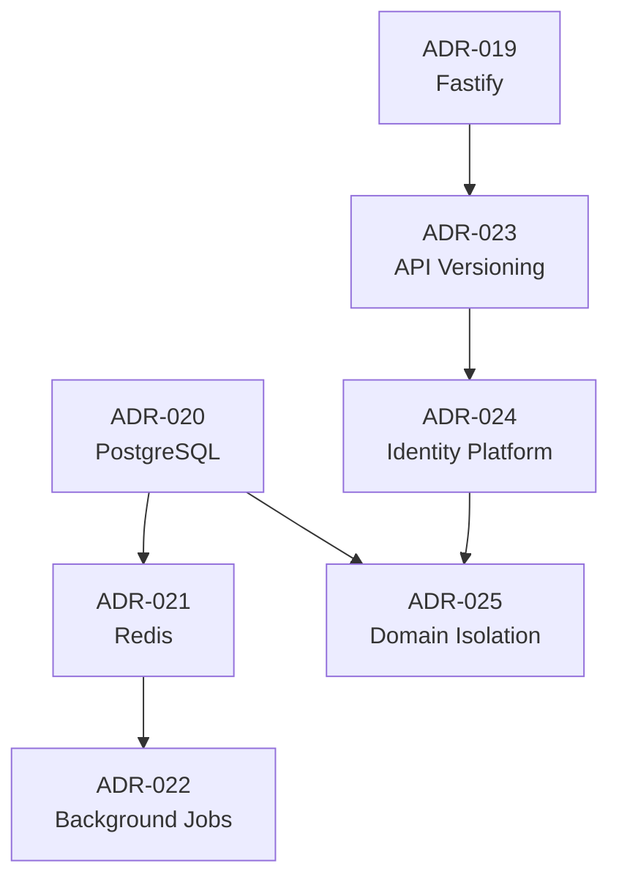

---

# Backend Decision Matrix

| ADR | Decision | Primary Benefit | Main Trade-off | Status |
|-----|----------|-----------------|----------------|--------|
| ADR-019 | Fastify | High performance and TypeScript support | Smaller ecosystem | Active |
| ADR-020 | PostgreSQL | Strong transactional integrity | Structured schema management | Active |
| ADR-021 | Redis | Low-latency caching | Additional infrastructure | Active |
| ADR-022 | Background Jobs | Responsive APIs | Operational monitoring required | Active |
| ADR-023 | API Versioning | Stable client integrations | Multiple versions to maintain | Active |
| ADR-024 | Centralized Identity | Consistent security enforcement | Platform dependency | Active |
| ADR-025 | Backend Domain Isolation | Modular architecture | Cross-domain coordination | Active |

---

# Alignment with Previous ADRs

| Earlier ADR | Relationship |
|--------------|-------------|
| ADR-006 — Monorepo | Backend services share tooling, libraries, and CI/CD within the unified repository. |
| ADR-007 — Domain-Driven Architecture | Backend domains align directly with business bounded contexts. |
| ADR-008 — Modular Monolith | Backend modules remain independently structured while sharing a deployment unit. |
| ADR-009 — API-First Architecture | Stable APIs remain the primary interface between backend capabilities and clients. |
| ADR-010 — Event-Driven Integration | Background jobs and domain events enable asynchronous workflows across backend domains. |
| ADR-011 — Shared Platform Services | Authentication, authorization, observability, and configuration are centralized platform capabilities consumed by backend modules. |

---

# Part 6 Summary

The backend ADRs define a pragmatic architecture optimized for long-term growth:

- Fastify provides a performant and type-safe application framework.
- PostgreSQL serves as the authoritative operational datastore.
- Redis supplies distributed caching and ephemeral state management.
- Asynchronous workloads execute through dedicated background processing.
- Stable API versioning protects client compatibility.
- Identity management is centralized to ensure consistent authentication and authorization.
- Domain isolation preserves modularity while supporting future architectural evolution.

Together, these decisions create a backend platform that is reliable, maintainable, secure, and aligned with the broader architectural principles established throughout the CardWise documentation.

# Part 7 — AI Architecture Decisions

---

# 7. AI Architecture Decisions

## Executive Summary

Artificial Intelligence is a foundational capability of CardWise, but it is **not** the architecture itself.

The platform is intentionally designed so that AI enhances deterministic systems rather than replacing them. This approach maximizes user trust, explainability, regulatory readiness, operational resilience, and long-term flexibility.

The AI architecture must satisfy several principles:

- Recommendations must be explainable.
- Critical financial decisions must remain deterministic.
- AI components must be independently replaceable.
- Multiple AI providers should be supported.
- Prompt engineering should be governed like application code.
- AI quality should be continuously evaluated.

The ADRs in this section document the reasoning behind these architectural choices.

---

# ADR-026 — Rules Engine Before Large Language Models

| Field | Value |
|--------|-------|
| **ADR ID** | ADR-026 |
| **Status** | Active |
| **Category** | AI Architecture |
| **Owner** | Principal AI Architect |

---

## Context

Many CardWise recommendations involve deterministic business logic:

- reward eligibility,
- merchant offers,
- spending thresholds,
- card-specific benefits,
- travel redemption rules,
- regulatory constraints.

These rules are objective and should produce consistent outcomes.

---

## Problem Statement

Should financial recommendations rely primarily on LLM reasoning?

---

## Decision

Deterministic rules are evaluated before invoking Large Language Models.

LLMs enhance recommendations, summarize outcomes, personalize explanations, and assist users, but they do not override validated business rules.

---

## Alternatives Considered

| Alternative | Decision |
|-------------|----------|
| LLM-only reasoning | Rejected |
| Rules-only engine | Rejected |
| Rules Engine + LLM augmentation | **Accepted** |

---

## Engineering Rationale

A rules-first approach:

- guarantees correctness,
- improves explainability,
- reduces inference cost,
- simplifies testing,
- enables deterministic validation.

---

## Business Rationale

Users are more likely to trust recommendations that can be explained with objective reasoning.

---

## Trade-offs

Requires maintaining both rule definitions and AI orchestration.

---

## Risks

- Rule maintenance overhead
- Synchronization between rules and AI explanations

---

## Review Trigger

Review if AI reliability and regulatory acceptance significantly improve.

---

# ADR-027 — Recommendation Engine as an Independent Platform Capability

| Field | Value |
|--------|-------|
| **ADR ID** | ADR-027 |
| **Status** | Active |
| **Category** | AI Platform |

---

## Context

Recommendation logic is consumed by multiple product domains:

- Dashboard
- Credit Cards
- Rewards
- Travel
- Offers
- Browser Extension
- Mobile
- AI Assistant

Embedding recommendation logic inside individual features would create duplication.

---

## Decision

Implement the recommendation engine as a shared platform capability with well-defined interfaces.

---

## Alternatives Considered

| Alternative | Decision |
|-------------|----------|
| Feature-specific recommendation logic | Rejected |
| Shared Recommendation Platform | **Accepted** |

---

## Engineering Rationale

Centralization:

- improves consistency,
- enables model reuse,
- simplifies experimentation,
- reduces duplicated logic.

---

## Business Rationale

Consistent recommendations strengthen user trust and product coherence.

---

## Trade-offs

Requires governance to manage evolving recommendation strategies.

---

## Review Trigger

Review if recommendation domains become sufficiently different to justify specialized engines.

---

# ADR-028 — Provider-Agnostic AI Architecture

| Field | Value |
|--------|-------|
| **ADR ID** | ADR-028 |
| **Status** | Active |
| **Category** | AI Infrastructure |

---

## Context

The AI ecosystem evolves rapidly.

Tightly coupling business logic to a single provider increases strategic and operational risk.

---

## Problem Statement

How should external AI providers be integrated?

---

## Decision

Adopt a provider-agnostic abstraction layer between CardWise and external AI services.

---

## Alternatives Considered

| Alternative | Decision |
|-------------|----------|
| Single-provider integration | Rejected |
| Provider abstraction layer | **Accepted** |

---

## Engineering Rationale

Abstraction enables:

- provider replacement,
- cost optimization,
- capability comparison,
- resilience,
- future expansion.

---

## Business Rationale

Vendor flexibility reduces long-term lock-in and supports negotiation leverage.

---

## Trade-offs

Additional abstraction increases architectural complexity.

---

## Review Trigger

Review if one provider becomes the clear long-term strategic choice or industry standards emerge.

---

# ADR-029 — Prompt Management as a Governed Asset

| Field | Value |
|--------|-------|
| **ADR ID** | ADR-029 |
| **Status** | Active |
| **Category** | AI Governance |

---

## Context

Prompts influence AI behavior as significantly as application code influences software behavior.

Uncontrolled prompt changes create unpredictable user experiences.

---

## Problem Statement

How should prompts be managed?

---

## Decision

Treat prompts as governed assets with versioning, review, testing, and traceability.

---

## Alternatives Considered

| Alternative | Decision |
|-------------|----------|
| Inline prompts in application code | Rejected |
| Version-controlled prompt management | **Accepted** |

---

## Engineering Rationale

Prompt governance:

- improves reproducibility,
- simplifies rollback,
- enables experimentation,
- supports auditing.

---

## Business Rationale

Consistent AI behavior protects user trust and brand quality.

---

## Trade-offs

Prompt lifecycle management introduces additional operational processes.

---

## Review Trigger

Review if AI interaction models evolve beyond prompt-centric architectures.

---

# ADR-030 — Agentic Architecture with Controlled Autonomy

| Field | Value |
|--------|-------|
| **ADR ID** | ADR-030 |
| **Status** | Active |
| **Category** | AI Orchestration |

---

## Context

Future CardWise capabilities include autonomous workflows:

- travel planning,
- rewards optimization,
- offer discovery,
- payment recommendations,
- portfolio reviews.

These tasks may require multiple coordinated AI interactions.

---

## Problem Statement

How should autonomous AI workflows be structured?

---

## Decision

Adopt an **agent-oriented orchestration model** with explicit governance, bounded responsibilities, and deterministic checkpoints.

Agents assist decision-making but operate within defined architectural and security constraints.

---

## Alternatives Considered

| Alternative | Decision |
|-------------|----------|
| Single conversational assistant | Rejected |
| Fully autonomous AI | Rejected |
| Governed agent architecture | **Accepted** |

---

## Engineering Rationale

Bounded agents:

- isolate responsibilities,
- simplify orchestration,
- improve observability,
- reduce unintended behavior.

---

## Business Rationale

Controlled autonomy enables richer user experiences without sacrificing trust.

---

## Trade-offs

Requires orchestration infrastructure and agent governance.

---

## Review Trigger

Review as AI agent capabilities and operational requirements evolve.

---

# ADR-031 — Continuous AI Evaluation Framework

| Field | Value |
|--------|-------|
| **ADR ID** | ADR-031 |
| **Status** | Active |
| **Category** | AI Quality Assurance |

---

## Context

Traditional software testing alone cannot validate AI systems.

Recommendation quality, explanation accuracy, hallucination rates, latency, and consistency require ongoing measurement.

---

## Problem Statement

How should AI quality be evaluated over time?

---

## Decision

Establish a continuous AI evaluation framework that measures model behavior against predefined quality metrics.

---

## Alternatives Considered

| Alternative | Decision |
|-------------|----------|
| Manual evaluation only | Rejected |
| Continuous evaluation framework | **Accepted** |

---

## Engineering Rationale

Continuous evaluation enables:

- regression detection,
- benchmark comparison,
- safer model updates,
- evidence-based improvements.

---

## Business Rationale

Consistent AI quality protects customer confidence and reduces operational risk.

---

## Trade-offs

Requires ongoing evaluation infrastructure and curated validation datasets.

---

## Review Trigger

Review if AI evaluation methodologies evolve significantly or regulatory expectations change.

---

# Relationship Between AI ADRs

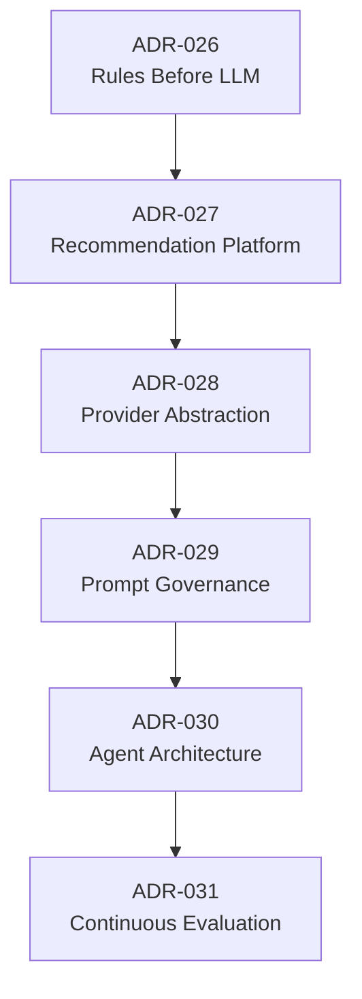

---

# AI Decision Matrix

| ADR | Decision | Primary Benefit | Main Trade-off | Status |
|-----|----------|-----------------|----------------|--------|
| ADR-026 | Rules Before LLM | Explainability and correctness | Dual rule/AI maintenance | Active |
| ADR-027 | Shared Recommendation Engine | Consistent recommendations | Centralized governance | Active |
| ADR-028 | Provider Abstraction | Vendor flexibility | Additional abstraction layer | Active |
| ADR-029 | Prompt Governance | Predictable AI behavior | Operational management overhead | Active |
| ADR-030 | Governed Agent Architecture | Controlled automation | Orchestration complexity | Active |
| ADR-031 | Continuous AI Evaluation | Reliable model quality | Dedicated evaluation infrastructure | Active |

---

# Alignment with Previous ADRs

| Earlier ADR | Relationship |
|--------------|-------------|
| ADR-001 — Operating System Vision | AI functions as the intelligence layer across the platform rather than a standalone feature. |
| ADR-002 — AI-First Strategy | These ADRs operationalize the AI-first philosophy through deterministic safeguards and governed AI capabilities. |
| ADR-004 — Platform-First Strategy | Recommendation services, prompt management, and evaluation frameworks are shared platform capabilities. |
| ADR-007 — Domain-Driven Architecture | AI consumes domain knowledge while remaining independent of business domain ownership. |
| ADR-010 — Event-Driven Integration | Recommendation updates, AI enrichment, and asynchronous workflows leverage domain events. |
| ADR-022 — Background Job Processing | Long-running AI inference and enrichment tasks execute asynchronously when appropriate. |

---

# AI Governance Principles

The AI architecture is governed by several enduring principles:

| Principle | Description |
|-----------|-------------|
| Explainability | Recommendations should be understandable by users and operators. |
| Determinism | Financial rules remain authoritative where correctness is essential. |
| Modularity | AI capabilities can evolve independently of business domains. |
| Provider Independence | External AI providers are replaceable without widespread architectural change. |
| Continuous Validation | AI quality is measured continuously rather than assumed. |
| Human Oversight | Significant automated recommendations remain observable and reviewable. |

---

# Part 7 Summary

The AI ADRs establish a responsible, extensible, and governed intelligence platform for CardWise:

- Deterministic rules remain authoritative, with LLMs augmenting rather than replacing them.
- Recommendation capabilities are centralized as a reusable platform service.
- AI integrations remain provider-agnostic to reduce vendor lock-in.
- Prompts are governed as version-controlled assets.
- Agent-based workflows are introduced with explicit architectural boundaries and controlled autonomy.
- Continuous evaluation ensures AI quality remains measurable and aligned with user expectations.

These decisions ensure that AI strengthens the CardWise platform while maintaining trust, explainability, operational resilience, and long-term architectural flexibility.

# Part 8 — Infrastructure, Security & Data Architecture Decisions

---

# 8. Infrastructure, Security & Data Architecture Decisions

## Executive Summary

Infrastructure, security, and data architecture form the operational foundation of CardWise.

While users primarily experience the product through its applications and AI capabilities, long-term success depends on the reliability, resilience, observability, security, and integrity of the underlying platform.

The decisions in this section establish principles for:

- Cloud infrastructure
- Deployment architecture
- Infrastructure as Code
- Observability
- Zero Trust security
- Identity and access management
- Encryption
- Secrets management
- Data modeling
- Event logging
- Analytics
- Data lifecycle governance

These ADRs prioritize operational excellence while preserving flexibility for future growth.

---

# ADR-032 — Cloud-Native Infrastructure Strategy

| Field | Value |
|--------|-------|
| **ADR ID** | ADR-032 |
| **Status** | Active |
| **Category** | Infrastructure |
| **Owner** | Principal Cloud Architect |

---

## Context

CardWise must support continuous feature delivery, elastic scaling, disaster recovery, and operational automation.

Traditional infrastructure management limits deployment velocity and increases operational effort.

---

## Problem Statement

How should the platform infrastructure be provisioned and managed?

---

## Decision

Adopt a **cloud-native infrastructure strategy** that emphasizes managed services, automation, elasticity, and operational resilience.

The architecture should avoid unnecessary dependence on self-managed infrastructure where managed cloud services provide equivalent capabilities.

---

## Alternatives Considered

| Alternative | Decision |
|-------------|----------|
| Traditional VM-centric infrastructure | Rejected |
| Hybrid infrastructure | Considered |
| Cloud-native architecture | **Accepted** |

---

## Engineering Rationale

Cloud-native infrastructure provides:

- elastic scalability,
- managed operational capabilities,
- simplified disaster recovery,
- improved deployment automation,
- reduced infrastructure maintenance.

---

## Business Rationale

Operational efficiency allows engineering effort to focus on product innovation rather than infrastructure management.

---

## Trade-offs

Managed services may increase provider dependency and require cost governance.

---

## Review Trigger

Review if regulatory requirements, cost structures, or operational constraints significantly change.

---

# ADR-033 — Kubernetes as the Primary Container Orchestration Platform

| Field | Value |
|--------|-------|
| **ADR ID** | ADR-033 |
| **Status** | Active |
| **Category** | Platform Operations |

---

## Context

CardWise services require consistent deployment, scaling, resilience, and workload isolation.

---

## Problem Statement

How should containerized workloads be orchestrated?

---

## Decision

Standardize on **Kubernetes** for long-term workload orchestration.

---

## Alternatives Considered

| Alternative | Decision |
|-------------|----------|
| VM deployments | Rejected |
| Docker Compose | Rejected |
| Serverless-only architecture | Deferred |
| Kubernetes | **Accepted** |

---

## Engineering Rationale

Kubernetes enables:

- workload portability,
- rolling deployments,
- self-healing,
- horizontal scaling,
- declarative infrastructure,
- operational consistency.

---

## Business Rationale

A standardized orchestration platform reduces long-term operational complexity across environments.

---

## Trade-offs

Kubernetes introduces a steeper operational learning curve and platform management overhead.

---

## Review Trigger

Review if workload characteristics or infrastructure economics favor a different orchestration model.

---

# ADR-034 — Infrastructure as Code as the Operational Standard

| Field | Value |
|--------|-------|
| **ADR ID** | ADR-034 |
| **Status** | Active |
| **Category** | Infrastructure Governance |

---

## Context

Manual infrastructure changes reduce reproducibility and increase operational risk.

---

## Problem Statement

How should infrastructure changes be managed?

---

## Decision

Treat infrastructure definitions as version-controlled code subject to the same review and governance processes as application code.

---

## Alternatives Considered

| Alternative | Decision |
|-------------|----------|
| Manual infrastructure management | Rejected |
| Infrastructure as Code | **Accepted** |

---

## Engineering Rationale

Infrastructure as Code enables:

- repeatable deployments,
- peer review,
- auditability,
- disaster recovery,
- environment consistency.

---

## Business Rationale

Automated infrastructure reduces operational risk and accelerates delivery.

---

## Trade-offs

Requires disciplined change management and infrastructure expertise.

---

## Review Trigger

Review if infrastructure management paradigms evolve substantially.

---

# ADR-035 — Observability by Design

| Field | Value |
|--------|-------|
| **ADR ID** | ADR-035 |
| **Status** | Active |
| **Category** | Reliability Engineering |

---

## Context

As distributed systems grow, failures become inevitable.

Operational visibility must be built into the platform rather than added after incidents occur.

---

## Problem Statement

How should production systems be monitored and diagnosed?

---

## Decision

Adopt **Observability by Design**, ensuring that all production services emit meaningful telemetry from the outset.

Observability encompasses:

- logs,
- metrics,
- traces,
- health signals,
- business events.

---

## Alternatives Considered

| Alternative | Decision |
|-------------|----------|
| Reactive monitoring | Rejected |
| Comprehensive observability | **Accepted** |

---

## Engineering Rationale

Early observability:

- reduces MTTR,
- simplifies debugging,
- improves operational confidence,
- supports capacity planning.

---

## Business Rationale

Higher platform reliability improves customer trust and operational efficiency.

---

## Trade-offs

Telemetry collection introduces infrastructure cost and governance responsibilities.

---

## Review Trigger

Review if observability coverage no longer reflects platform complexity.

---

# ADR-036 — Zero Trust Security Architecture

| Field | Value |
|--------|-------|
| **ADR ID** | ADR-036 |
| **Status** | Active |
| **Category** | Security Architecture |

---

## Context

Financial platforms process sensitive user information and interact with external providers.

Traditional perimeter-based security assumptions are insufficient.

---

## Problem Statement

How should trust be established within the platform?

---

## Decision

Adopt a **Zero Trust** security model.

Every request, service, and user interaction must be authenticated, authorized, and validated regardless of network location.

---

## Alternatives Considered

| Alternative | Decision |
|-------------|----------|
| Perimeter security | Rejected |
| Zero Trust Architecture | **Accepted** |

---

## Engineering Rationale

Zero Trust:

- minimizes implicit trust,
- reduces lateral movement,
- strengthens service authentication,
- improves auditability.

---

## Business Rationale

Improved security posture supports regulatory readiness and customer confidence.

---

## Trade-offs

Additional authentication and policy enforcement increase operational complexity.

---

## Review Trigger

Review as identity technologies and compliance expectations evolve.

---

# ADR-037 — Centralized Secrets Management

| Field | Value |
|--------|-------|
| **ADR ID** | ADR-037 |
| **Status** | Active |
| **Category** | Security Operations |

---

## Context

Application credentials, API keys, encryption keys, and service tokens require secure lifecycle management.

---

## Problem Statement

How should secrets be stored and distributed?

---

## Decision

Adopt centralized secrets management with controlled access, auditing, rotation, and lifecycle governance.

---

## Alternatives Considered

| Alternative | Decision |
|-------------|----------|
| Environment-specific manual secrets | Rejected |
| Centralized secrets management | **Accepted** |

---

## Engineering Rationale

Centralization:

- reduces credential sprawl,
- improves rotation,
- enables auditing,
- strengthens access control.

---

## Business Rationale

Consistent secret management lowers operational risk and supports compliance.

---

## Trade-offs

Secrets infrastructure becomes a critical platform dependency.

---

## Review Trigger

Review if organizational scale or compliance requirements change.

---

# ADR-038 — Normalized Operational Data Model

| Field | Value |
|--------|-------|
| **ADR ID** | ADR-038 |
| **Status** | Active |
| **Category** | Data Architecture |

---

## Context

CardWise manages interconnected entities with strong consistency requirements.

---

## Problem Statement

Should operational data favor normalization or denormalization?

---

## Decision

Use a primarily normalized operational data model while selectively introducing denormalized views where justified by performance requirements.

---

## Alternatives Considered

| Alternative | Decision |
|-------------|----------|
| Fully denormalized model | Rejected |
| Normalized model | **Accepted** |

---

## Engineering Rationale

Normalization improves:

- integrity,
- maintainability,
- transactional correctness,
- schema clarity.

---

## Business Rationale

Accurate financial records are more valuable than simplified storage models.

---

## Trade-offs

Complex queries may require optimization strategies.

---

## Review Trigger

Review if analytical workloads significantly outweigh transactional workloads.

---

# ADR-039 — Immutable Event Logging

| Field | Value |
|--------|-------|
| **ADR ID** | ADR-039 |
| **Status** | Active |
| **Category** | Data Governance |

---

## Context

Financial platforms benefit from traceable historical events.

---

## Problem Statement

How should operational history be preserved?

---

## Decision

Treat significant business events as immutable records.

Events are append-only and provide historical traceability for auditing, analytics, and debugging.

---

## Alternatives Considered

| Alternative | Decision |
|-------------|----------|
| Mutable operational history | Rejected |
| Immutable event logging | **Accepted** |

---

## Engineering Rationale

Immutable events improve:

- auditability,
- debugging,
- analytics,
- operational transparency.

---

## Business Rationale

Historical traceability increases trust and simplifies investigations.

---

## Trade-offs

Storage requirements increase over time.

---

## Review Trigger

Review if retention policies or compliance requirements materially change.

---

# ADR-040 — Data Retention and Lifecycle Governance

| Field | Value |
|--------|-------|
| **ADR ID** | ADR-040 |
| **Status** | Active |
| **Category** | Data Governance |

---

## Context

Different categories of data require different retention periods, archival policies, and deletion workflows.

---

## Problem Statement

How should the platform manage long-term data lifecycle?

---

## Decision

Establish formal lifecycle governance covering:

- retention,
- archival,
- deletion,
- anonymization,
- audit preservation.

Policies are driven by business requirements, legal obligations, operational needs, and user expectations.

---

## Alternatives Considered

| Alternative | Decision |
|-------------|----------|
| Unlimited retention | Rejected |
| Managed lifecycle governance | **Accepted** |

---

## Engineering Rationale

Lifecycle governance reduces storage costs while supporting compliance and operational efficiency.

---

## Business Rationale

Responsible data stewardship strengthens customer trust and regulatory readiness.

---

## Trade-offs

Retention policies require ongoing governance and periodic review.

---

## Review Trigger

Review as regulations, storage economics, or product requirements evolve.

---

# Relationship Between Infrastructure, Security & Data ADRs

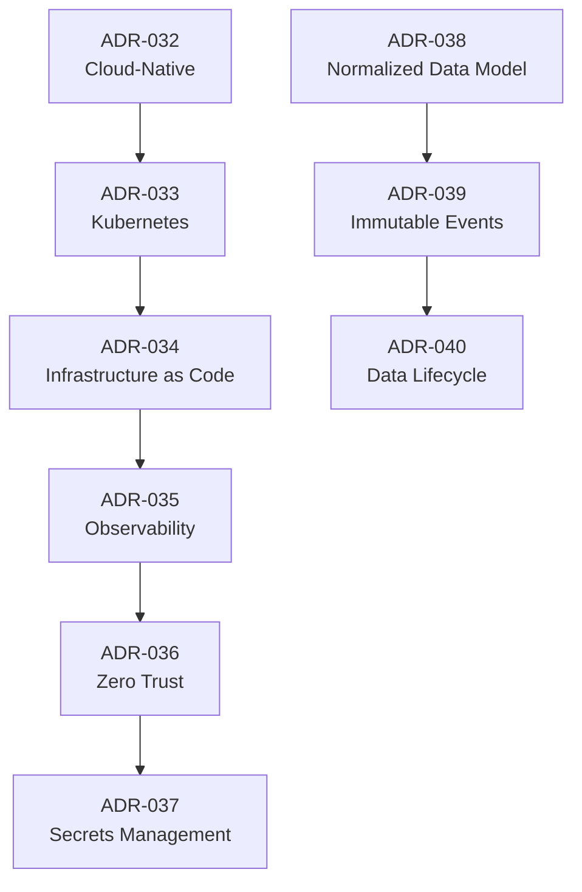

---

# Decision Matrix

| ADR | Decision | Primary Benefit | Main Trade-off | Status |
|-----|----------|-----------------|----------------|--------|
| ADR-032 | Cloud-Native Strategy | Elastic operations | Cloud dependency | Active |
| ADR-033 | Kubernetes | Standardized orchestration | Platform complexity | Active |
| ADR-034 | Infrastructure as Code | Repeatability and auditability | Infrastructure governance | Active |
| ADR-035 | Observability by Design | Operational visibility | Telemetry overhead | Active |
| ADR-036 | Zero Trust | Strong security posture | Additional policy complexity | Active |
| ADR-037 | Centralized Secrets | Secure credential lifecycle | Critical platform dependency | Active |
| ADR-038 | Normalized Data Model | Data integrity | More complex queries | Active |
| ADR-039 | Immutable Event Logging | Traceability | Increased storage | Active |
| ADR-040 | Data Lifecycle Governance | Compliance and cost control | Ongoing governance effort | Active |

---

# Alignment with Previous ADRs

| Earlier ADR | Relationship |
|--------------|-------------|
| ADR-006 — Monorepo | Infrastructure definitions, deployment automation, and operational tooling coexist with application code. |
| ADR-010 — Event-Driven Integration | Immutable event logging complements asynchronous domain communication and auditability. |
| ADR-020 — PostgreSQL | The normalized data model extends the relational database strategy. |
| ADR-021 — Redis | Cloud-native infrastructure supports distributed caching and ephemeral state. |
| ADR-024 — Centralized Identity | Zero Trust architecture builds upon centralized authentication and authorization. |
| ADR-031 — Continuous AI Evaluation | Observability and data governance provide the telemetry required for AI quality measurement. |

---

# Part 8 Summary

The infrastructure, security, and data ADRs establish the operational backbone of CardWise:

- Cloud-native infrastructure provides elasticity and operational efficiency.
- Kubernetes standardizes workload orchestration.
- Infrastructure as Code ensures reproducible and auditable environments.
- Observability is treated as a foundational architectural capability.
- Zero Trust security strengthens identity-centric protection across the platform.
- Centralized secrets management secures sensitive credentials.
- A normalized data model preserves transactional integrity.
- Immutable event logging supports auditability and analytics.
- Data lifecycle governance ensures responsible long-term stewardship.

Collectively, these decisions create a resilient, secure, and governable platform capable of supporting CardWise as it scales in users, capabilities, and operational complexity.

# Part 9 — Mobile & Browser Extension Architecture Decisions

---

# 9. Mobile & Browser Extension Architecture Decisions

## Executive Summary

CardWise is designed as a multi-platform ecosystem rather than a web-only application.

Beyond the primary web experience, two strategic client platforms significantly extend the product's capabilities:

- Mobile Applications
- Browser Extension

Although both platforms share core business logic, they serve fundamentally different user journeys.

The **mobile application** enables persistent engagement, notifications, portfolio management, and on-the-go financial decision making.

The **browser extension** delivers contextual intelligence directly within the user's shopping and travel workflows.

The following ADRs document the reasoning behind these architectural decisions.

---

# ADR-041 — Cross-Platform Mobile Strategy

| Field | Value |
|--------|-------|
| **ADR ID** | ADR-041 |
| **Status** | Active |
| **Category** | Mobile Architecture |
| **Owner** | Principal Mobile Architect |

---

## Context

CardWise requires:

- Android support
- iOS support
- Shared business logic
- Consistent user experience
- Sustainable long-term maintenance

Independent native applications would significantly increase engineering effort.

---

## Problem Statement

How should mobile applications be developed while balancing performance, delivery speed, and maintainability?

---

## Decision

Adopt a **cross-platform mobile architecture** with a shared application layer while preserving the ability to integrate platform-specific capabilities where necessary.

---

## Alternatives Considered

| Alternative | Decision |
|-------------|----------|
| Independent native applications | Rejected |
| Cross-platform architecture | **Accepted** |
| Progressive Web App only | Rejected |

---

## Engineering Rationale

A shared architecture:

- maximizes code reuse,
- reduces maintenance effort,
- accelerates feature delivery,
- improves architectural consistency.

---

## Business Rationale

A unified engineering approach lowers long-term ownership costs while maintaining feature parity across platforms.

---

## Trade-offs

Platform-specific optimizations occasionally require additional abstraction.

---

## Review Trigger

Review if platform divergence becomes significant enough to justify native implementations.

---

# ADR-042 — Offline-First Mobile Experience

| Field | Value |
|--------|-------|
| **ADR ID** | ADR-042 |
| **Status** | Active |
| **Category** | Mobile Reliability |

---

## Context

Users may access CardWise under unreliable network conditions.

Essential capabilities should remain functional whenever possible.

---

## Problem Statement

Should the application require continuous connectivity?

---

## Decision

Design mobile experiences with **offline-first principles** for selected capabilities.

Examples include:

- cached portfolio information,
- previously synchronized offers,
- recent recommendations,
- user preferences.

---

## Alternatives Considered

| Alternative | Decision |
|-------------|----------|
| Online-only architecture | Rejected |
| Offline-first strategy | **Accepted** |

---

## Engineering Rationale

Offline support:

- improves resilience,
- enhances responsiveness,
- reduces perceived latency,
- enables graceful degradation.

---

## Business Rationale

Reliable experiences increase user engagement and satisfaction.

---

## Trade-offs

Requires synchronization logic and conflict resolution strategies.

---

## Review Trigger

Review if product capabilities become predominantly real-time.

---

# ADR-043 — Push Notifications as a Shared Engagement Platform

| Field | Value |
|--------|-------|
| **ADR ID** | ADR-043 |
| **Status** | Active |
| **Category** | Mobile Platform |

---

## Context

Multiple domains generate user notifications:

- offer alerts,
- reward reminders,
- payment recommendations,
- travel updates,
- AI insights.

---

## Problem Statement

Should each feature manage notifications independently?

---

## Decision

Centralize notification orchestration through a shared engagement platform.

Individual business domains publish notification intents rather than directly managing delivery.

---

## Alternatives Considered

| Alternative | Decision |
|-------------|----------|
| Feature-specific notification systems | Rejected |
| Central notification platform | **Accepted** |

---

## Engineering Rationale

Centralization:

- simplifies prioritization,
- prevents duplicate notifications,
- improves observability,
- supports future channels.

---

## Business Rationale

A consistent communication strategy improves user trust and engagement.

---

## Trade-offs

Notification governance becomes a platform responsibility.

---

## Review Trigger

Review if engagement channels diversify significantly.

---

# ADR-044 — Deep Linking as a Core Navigation Capability

| Field | Value |
|--------|-------|
| **ADR ID** | ADR-044 |
| **Status** | Active |
| **Category** | Mobile Navigation |

---

## Context

Users may enter CardWise from:

- notifications,
- emails,
- browser extension,
- partner integrations,
- marketing campaigns.

---

## Problem Statement

How should users be directed to relevant content across platforms?

---

## Decision

Adopt a unified deep-linking strategy that maps external entry points to internal application destinations.

---

## Alternatives Considered

| Alternative | Decision |
|-------------|----------|
| Manual navigation after launch | Rejected |
| Unified deep-link architecture | **Accepted** |

---

## Engineering Rationale

Deep linking:

- improves navigation,
- simplifies integrations,
- supports marketing campaigns,
- enables contextual experiences.

---

## Business Rationale

Reducing navigation friction improves conversion and user satisfaction.

---

## Trade-offs

Requires centralized link governance and lifecycle management.

---

## Review Trigger

Review if navigation architecture changes substantially.

---

# ADR-045 — Browser Extension as a Context-Aware Intelligence Layer

| Field | Value |
|--------|-------|
| **ADR ID** | ADR-045 |
| **Status** | Active |
| **Category** | Browser Extension |

---

## Context

Many valuable financial decisions occur while users browse merchant websites.

Waiting for users to manually consult CardWise introduces friction.

---

## Problem Statement

How can CardWise provide recommendations at the exact moment users need them?

---

## Decision

Treat the browser extension as a contextual intelligence layer rather than an independent application.

The extension augments existing browsing experiences with timely insights while relying on shared platform services.

---

## Alternatives Considered

| Alternative | Decision |
|-------------|----------|
| Standalone browser application | Rejected |
| Context-aware browser extension | **Accepted** |

---

## Engineering Rationale

The extension:

- minimizes user effort,
- reuses platform APIs,
- leverages shared recommendation services,
- maintains consistent business logic.

---

## Business Rationale

Real-time contextual assistance increases user value and product engagement.

---

## Trade-offs

Browser platform restrictions require careful capability planning.

---

## Review Trigger

Review if browser platform capabilities or privacy models change significantly.

---

# ADR-046 — Manifest V3 as the Browser Extension Standard

| Field | Value |
|--------|-------|
| **ADR ID** | ADR-046 |
| **Status** | Active |
| **Category** | Browser Platform |

---

## Context

Modern browsers continue to evolve extension security models.

---

## Problem Statement

Which extension platform standard should CardWise adopt?

---

## Decision

Standardize on **Manifest V3** to align with current browser security expectations and long-term ecosystem support.

---

## Alternatives Considered

| Alternative | Decision |
|-------------|----------|
| Manifest V2 | Rejected |
| Manifest V3 | **Accepted** |

---

## Engineering Rationale

Manifest V3:

- improves security,
- aligns with browser roadmaps,
- reduces future migration risk.

---

## Business Rationale

Following current platform standards improves compatibility and long-term sustainability.

---

## Trade-offs

Certain legacy extension capabilities require architectural adaptation.

---

## Review Trigger

Review if browser vendors introduce significant platform changes.

---

# ADR-047 — Shared Business Logic Across All Clients

| Field | Value |
|--------|-------|
| **ADR ID** | ADR-047 |
| **Status** | Active |
| **Category** | Cross-Platform Architecture |

---

## Context

The web application, mobile apps, browser extension, and future clients all require consistent business behavior.

Duplicating recommendation logic increases maintenance effort and creates inconsistent user experiences.

---

## Problem Statement

How should business logic be distributed across clients?

---

## Decision

Centralize business rules and recommendation logic in shared platform services.

Client applications focus on presentation, interaction, and platform-specific capabilities.

---

## Alternatives Considered

| Alternative | Decision |
|-------------|----------|
| Client-specific business logic | Rejected |
| Shared platform logic | **Accepted** |

---

## Engineering Rationale

Shared logic:

- improves consistency,
- simplifies maintenance,
- reduces duplication,
- supports future clients.

---

## Business Rationale

Users receive consistent recommendations regardless of platform.

---

## Trade-offs

Shared services become foundational dependencies across the ecosystem.

---

## Review Trigger

Review if offline or edge-computing requirements justify localized decision logic.

---

# Relationship Between Mobile & Browser ADRs

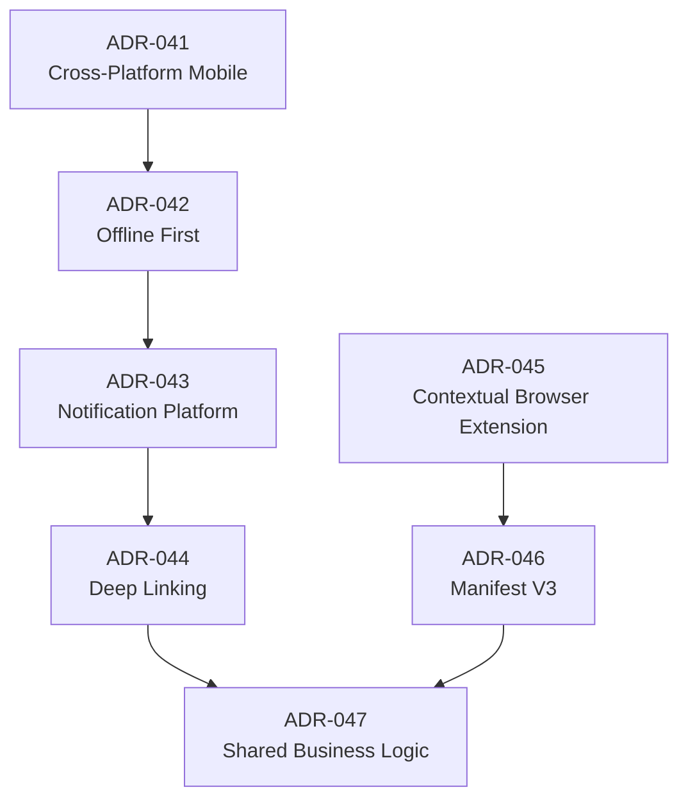

---

# Mobile & Browser Decision Matrix

| ADR | Decision | Primary Benefit | Main Trade-off | Status |
|-----|----------|-----------------|----------------|--------|
| ADR-041 | Cross-Platform Mobile | Shared engineering effort | Platform abstraction complexity | Active |
| ADR-042 | Offline-First | Improved resilience | Synchronization complexity | Active |
| ADR-043 | Shared Notification Platform | Consistent engagement | Central governance | Active |
| ADR-044 | Deep Linking | Seamless navigation | Link lifecycle management | Active |
| ADR-045 | Context-Aware Browser Extension | Real-time recommendations | Browser platform constraints | Active |
| ADR-046 | Manifest V3 | Security and ecosystem alignment | Legacy capability limitations | Active |
| ADR-047 | Shared Business Logic | Consistent behavior across clients | Greater dependency on platform services | Active |

---

# Alignment with Previous ADRs

| Earlier ADR | Relationship |
|--------------|-------------|
| ADR-004 — Platform-First Strategy | Mobile and browser clients consume shared platform capabilities rather than implementing independent business logic. |
| ADR-009 — API-First Architecture | All clients interact with backend capabilities through stable APIs. |
| ADR-014 — Shared Design System | Mobile and browser experiences align with the broader design language where appropriate. |
| ADR-027 — Recommendation Platform | Contextual recommendations originate from the centralized recommendation engine. |
| ADR-035 — Observability by Design | Mobile and browser clients contribute telemetry to the shared observability platform. |
| ADR-036 — Zero Trust Security | All client platforms participate in the same identity and authorization model. |

---

# Cross-Platform Architectural Principles

The following principles guide every client platform:

| Principle | Description |
|-----------|-------------|
| Consistency | Users should receive the same core business behavior across platforms. |
| Shared Logic | Business rules belong in shared services whenever practical. |
| Native Experience | Platform-specific interactions should feel natural to users. |
| Offline Resilience | Essential capabilities should tolerate temporary connectivity loss where feasible. |
| Security | Every client adheres to the same identity, authorization, and security standards. |
| Extensibility | New client platforms should integrate without requiring major architectural redesign. |

---

# Part 9 Summary

The mobile and browser extension ADRs extend the CardWise platform beyond the web:

- A cross-platform mobile strategy balances development efficiency with user experience.
- Offline-first principles improve reliability under varying network conditions.
- Notification orchestration is centralized to ensure consistent engagement.
- Deep linking enables seamless movement between external entry points and application experiences.
- The browser extension acts as a contextual intelligence layer rather than a standalone application.
- Manifest V3 aligns the extension with modern browser security expectations.
- Shared business logic guarantees consistent recommendations and behavior across every client platform.

Together, these decisions ensure that CardWise delivers a cohesive, secure, and scalable multi-platform experience while remaining aligned with the broader architectural vision established throughout the ADR catalog.

# Part 10 — Future Review Items, ADR Catalog & Governance Summary

---

# 10. Future Review Items

## Executive Summary

Every architectural decision is based on a set of assumptions.

Some assumptions remain valid for years, while others become obsolete as:

- the product evolves,
- customer expectations change,
- engineering teams grow,
- infrastructure scales,
- AI capabilities mature,
- regulations evolve,
- new technologies emerge.

The purpose of this section is to identify architectural decisions that should be deliberately revisited rather than remaining unchanged indefinitely.

Architecture should evolve intentionally—not reactively.

---

# Future Architecture Review Framework

Every strategic ADR should periodically answer the following questions:

1. Does the original business problem still exist?
2. Are the original assumptions still valid?
3. Has technology materially changed?
4. Has the cost profile changed?
5. Has operational complexity increased?
6. Are customers benefiting from the current architecture?
7. Is the engineering organization constrained by the decision?
8. Is a replacement architecture demonstrably superior?
9. Would changing the decision create more value than maintaining it?
10. Should the existing ADR remain Active, become Superseded, or be Deprecated?

---

# REVIEW-001 — Modular Monolith to Microservices

## Current ADR

ADR-008

---

## Review Context

The initial architecture intentionally favors a modular monolith.

This minimizes operational complexity while enabling rapid product evolution.

---

## Review Trigger

Reassess when:

- engineering teams own independent domains,
- deployment frequency differs substantially across domains,
- independent scaling becomes necessary,
- operational bottlenecks emerge,
- platform ownership becomes decentralized.

---

## Success Criteria

Migration should only proceed if measurable benefits exceed the operational costs introduced by distributed systems.

---

# REVIEW-002 — AI Provider Strategy

## Current ADR

ADR-028

---

## Review Context

The AI provider ecosystem evolves rapidly.

Model quality, pricing, latency, privacy guarantees, and regulatory requirements will continue changing.

---

## Review Trigger

Review when:

- new foundation models materially outperform current providers,
- inference costs shift significantly,
- self-hosted models become operationally practical,
- regulatory requirements favor provider changes.

---

## Success Criteria

Provider changes should preserve platform abstraction while improving quality, resilience, or economics.

---

# REVIEW-003 — Recommendation Engine Evolution

## Current ADR

ADR-027

---

## Review Context

The recommendation platform initially serves multiple domains through a centralized engine.

As specialization grows, recommendation strategies may diverge.

---

## Review Trigger

Review when:

- recommendation domains require fundamentally different models,
- experimentation velocity slows,
- centralized governance limits innovation.

---

## Success Criteria

Specialized recommendation engines should only be introduced if domain-specific value clearly outweighs additional complexity.

---

# REVIEW-004 — Data Platform Evolution

## Current ADR

ADR-020 / ADR-038

---

## Review Context

Operational workloads and analytical workloads evolve differently.

---

## Review Trigger

Review when:

- analytical workloads dominate,
- reporting latency becomes unacceptable,
- large-scale historical processing becomes routine.

---

## Success Criteria

Operational integrity must remain unaffected while analytical capabilities improve.

---

# REVIEW-005 — Kubernetes Adoption Scope

## Current ADR

ADR-033

---

## Review Context

Kubernetes provides long-term scalability but introduces operational overhead.

---

## Review Trigger

Review when:

- workload mix changes,
- managed container platforms mature,
- serverless economics improve,
- platform operational cost increases.

---

## Success Criteria

Infrastructure changes should reduce total operational complexity without compromising reliability.

---

# REVIEW-006 — Cross-Platform Mobile Strategy

## Current ADR

ADR-041

---

## Review Context

Cross-platform development provides efficiency early in the product lifecycle.

---

## Review Trigger

Review when:

- platform-specific functionality diverges significantly,
- performance constraints become platform-dependent,
- native capabilities become strategic differentiators.

---

## Success Criteria

Separate native implementations should only be adopted if measurable user or engineering benefits justify the additional maintenance.

---

# REVIEW-007 — Browser Extension Capabilities

## Current ADR

ADR-045 / ADR-046

---

## Review Context

Browser platform capabilities continue to evolve.

---

## Review Trigger

Review when:

- browser APIs change,
- privacy models evolve,
- extension permissions become more restrictive,
- alternative contextual integration mechanisms emerge.

---

## Success Criteria

Maintain contextual assistance while preserving user trust and security.

---

# REVIEW-008 — AI Agent Autonomy

## Current ADR

ADR-030

---

## Review Context

Agent capabilities are expected to improve substantially over time.

---

## Review Trigger

Review when:

- autonomous planning becomes more reliable,
- multi-agent coordination matures,
- governance frameworks evolve,
- explainability improves.

---

## Success Criteria

Any increase in agent autonomy must maintain transparency, user control, and auditability.

---

# Enterprise Architecture Review Calendar

| Review Category | Frequency |
|----------------|-----------|
| Strategic Product Architecture | Annual |
| Platform Architecture | Biannual |
| Security Architecture | Quarterly |
| Infrastructure | Quarterly |
| AI Architecture | Quarterly |
| Data Architecture | Biannual |
| Mobile Architecture | Annual |
| Browser Extension | Annual |
| API Governance | Quarterly |
| Observability | Quarterly |

---

# Complete ADR Catalog

| ADR | Title | Category | Status |
|------|-------|----------|--------|
| ADR-001 | Operating System Vision | Product | Active |
| ADR-002 | AI-First Strategy | Product | Active |
| ADR-003 | MVP Before Platform Expansion | Product | Active |
| ADR-004 | Platform-First Strategy | Product | Active |
| ADR-005 | Domain-Oriented Product Structure | Product | Active |
| ADR-006 | Monorepo Strategy | Platform | Active |
| ADR-007 | Domain-Driven Architecture | Core Architecture | Active |
| ADR-008 | Modular Backend | Backend | Active |
| ADR-009 | API-First Architecture | Platform | Active |
| ADR-010 | Event-Driven Integration | Integration | Active |
| ADR-011 | Shared Platform Services | Platform | Active |
| ADR-012 | React Standardization | Frontend | Active |
| ADR-013 | TypeScript Standard | Frontend | Active |
| ADR-014 | Shared Design System | Frontend | Active |
| ADR-015 | Feature-Based Organization | Frontend | Active |
| ADR-016 | Predictable State Management | Frontend | Active |
| ADR-017 | Route-Based Architecture | Frontend | Active |
| ADR-018 | Performance by Design | Frontend | Active |
| ADR-019 | Fastify Framework | Backend | Active |
| ADR-020 | PostgreSQL | Data | Active |
| ADR-021 | Redis | Backend | Active |
| ADR-022 | Background Job Processing | Backend | Active |
| ADR-023 | API Versioning | Backend | Active |
| ADR-024 | Centralized Identity | Security | Active |
| ADR-025 | Backend Domain Isolation | Backend | Active |
| ADR-026 | Rules Before LLM | AI | Active |
| ADR-027 | Recommendation Platform | AI | Active |
| ADR-028 | Provider-Agnostic AI | AI | Active |
| ADR-029 | Prompt Governance | AI | Active |
| ADR-030 | Governed Agent Architecture | AI | Active |
| ADR-031 | Continuous AI Evaluation | AI | Active |
| ADR-032 | Cloud-Native Infrastructure | Infrastructure | Active |
| ADR-033 | Kubernetes | Infrastructure | Active |
| ADR-034 | Infrastructure as Code | Infrastructure | Active |
| ADR-035 | Observability by Design | Infrastructure | Active |
| ADR-036 | Zero Trust | Security | Active |
| ADR-037 | Centralized Secrets Management | Security | Active |
| ADR-038 | Normalized Operational Data Model | Data | Active |
| ADR-039 | Immutable Event Logging | Data | Active |
| ADR-040 | Data Lifecycle Governance | Data | Active |
| ADR-041 | Cross-Platform Mobile Strategy | Mobile | Active |
| ADR-042 | Offline-First Mobile | Mobile | Active |
| ADR-043 | Shared Notification Platform | Mobile | Active |
| ADR-044 | Deep Linking | Mobile | Active |
| ADR-045 | Context-Aware Browser Extension | Browser | Active |
| ADR-046 | Manifest V3 | Browser | Active |
| ADR-047 | Shared Business Logic | Cross-Platform | Active |

---

# ADR Dependency Overview

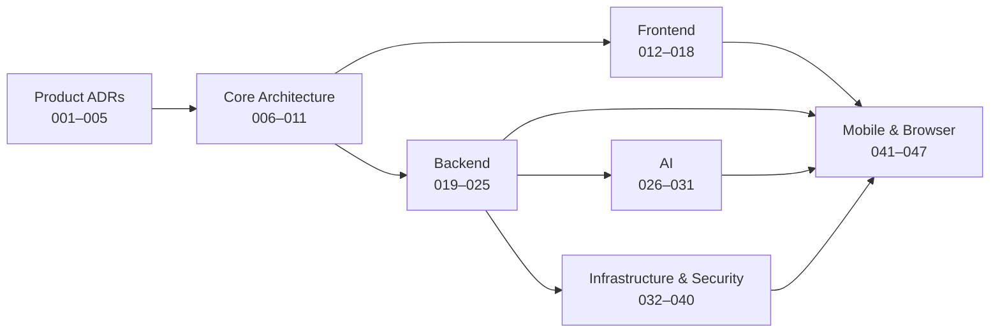

---

# Architecture Governance Lifecycle

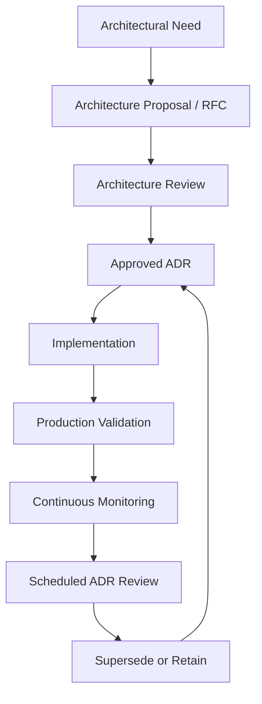

---

# Architecture Governance Responsibilities

| Responsibility | Primary Owner |
|---------------|---------------|
| Product Architecture | Chief Architect |
| Platform Governance | VP of Engineering |
| Backend Architecture | Principal Backend Architect |
| Frontend Architecture | Principal Frontend Architect |
| AI Architecture | Principal AI Architect |
| Cloud Infrastructure | Principal Cloud Architect |
| Security Architecture | Principal Security Architect |
| Data Architecture | Principal Database Architect |
| Mobile Platform | Principal Mobile Architect |
| Browser Extension | Principal Browser Extension Architect |
| ADR Process | Architecture Review Board |

---

# Architecture Health Metrics

The ADR program should be evaluated continuously using measurable indicators.

| Metric | Target Outcome |
|---------|----------------|
| ADR Coverage | 100% of significant architectural decisions documented |
| ADR Freshness | All active ADRs reviewed within their scheduled review period |
| Review Compliance | ≥95% of planned architecture reviews completed |
| Supersession Traceability | Every superseded ADR linked to its replacement |
| Architecture Drift | Minimized divergence between documented and implemented architecture |
| Platform Consistency | Cross-platform architectural standards maintained |
| Technical Debt Trend | Stable or decreasing over successive reviews |
| Operational Reliability | Architecture decisions continue to support defined reliability objectives |

---

# Closing Statement

The CardWise Architecture Decision Record catalog is intended to be the definitive institutional memory for the platform.

It preserves the reasoning behind architectural choices, making future evolution deliberate rather than accidental.

As CardWise grows from an MVP into a comprehensive financial intelligence platform, these ADRs provide:

- continuity across engineering generations,
- transparency in technical decision-making,
- governance for architectural evolution,
- traceability between business strategy and technical implementation,
- a structured process for balancing innovation with long-term maintainability.

Architecture is not static.

The value of this catalog lies not only in the decisions it records today, but also in the discipline it establishes for tomorrow's decisions.

---

# Document Completion

**Document:** `docs/19_ARCHITECTURE_DECISION_RECORDS.md`

**Total Parts:** 10

**Architecture Decision Records:** 47

**Future Review Records:** 8

**Primary Goal:** Long-term architectural governance, traceability, and institutional knowledge preservation.

**Status:** Complete