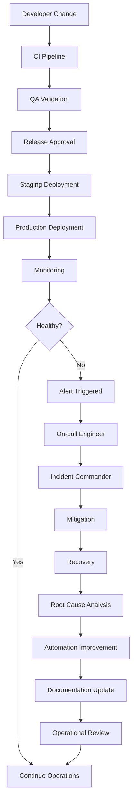
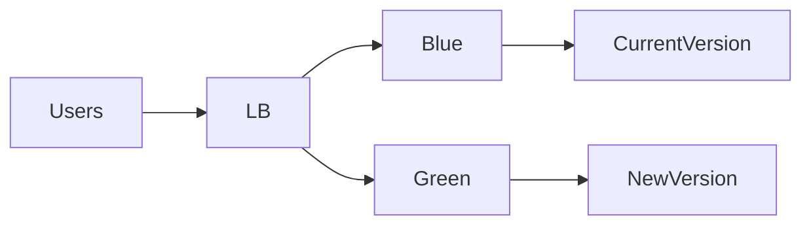
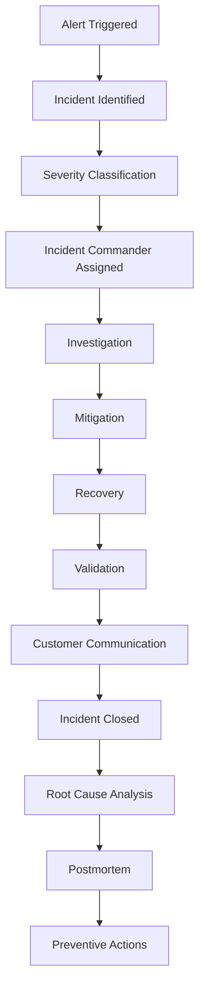

# docs/20_ENGINEERING_RUNBOOK.md

# CardWise Engineering Operations Runbook

**Document ID:** RUNBOOK-001  
**Version:** 1.0.0  
**Status:** Production Approved  
**Owner:** VP Engineering  
**Maintainers:** Platform Engineering, SRE, DevOps, Security Engineering  
**Classification:** Internal Engineering Documentation

---

# Part 1 — Foundations of Engineering Operations

---

# 1. Executive Summary

## RUNBOOK-001 — Purpose

The CardWise Engineering Operations Runbook defines the operational standards, governance model, production procedures, and operational excellence practices required to reliably operate the CardWise platform at scale.

Unlike architecture documents that explain **how the system is built**, this runbook explains:

- How production systems are operated
- How incidents are handled
- How releases are executed
- How failures are mitigated
- How engineers respond to emergencies
- How operational quality is measured
- How reliability continuously improves

This document serves as the single operational handbook for every engineer responsible for operating CardWise.

---

## Operational Objectives

The runbook establishes repeatable operational standards that ensure:

- High Availability
- Operational Predictability
- Fast Incident Recovery
- Safe Deployments
- Reliable Customer Experience
- Secure Production Operations
- Measurable Engineering Excellence

---

## Engineering Principles

OPS-001

CardWise production operations follow several non-negotiable principles.

### Reliability First

Every operational decision prioritizes system reliability before velocity.

---

### Automation Over Manual Processes

Any repetitive operational process must eventually become automated.

Examples include:

- Deployments
- Rollbacks
- Backups
- Secret rotation
- Health verification
- Infrastructure provisioning
- Alert routing

Manual execution is reserved only for emergency recovery scenarios.

---

### Observability by Default

Every production component must expose:

- Metrics
- Structured Logs
- Traces
- Health Endpoints
- Operational Dashboards

If a system cannot be observed, it cannot be operated safely.

---

### Safe Change Management

Every production change must be:

- Reviewable
- Traceable
- Reversible
- Auditable

No production change should be irreversible.

---

### Minimize Blast Radius

Operational changes should always begin with the smallest possible impact.

Examples:

- Canary releases
- Feature flags
- Progressive rollout
- Regional rollout
- Shadow traffic

---

### Continuous Improvement

Every operational incident becomes an opportunity to improve:

- Monitoring
- Documentation
- Automation
- Testing
- Architecture
- Operational Process

No incident should recur for the same root cause without an engineering review.

---

# 2. Audience

RUNBOOK-002

This document is intended for:

| Role | Responsibility |
|--------|---------------|
| Founder | Business continuity awareness |
| CEO | Operational visibility |
| CTO | Platform governance |
| VP Engineering | Engineering operations |
| Platform Engineers | Production platform |
| DevOps Engineers | Deployment pipeline |
| SRE | Reliability |
| Backend Engineers | API operations |
| Frontend Engineers | Web production |
| Mobile Engineers | Mobile releases |
| AI Engineers | AI operations |
| Security Engineers | Security response |
| Database Engineers | Database maintenance |
| QA Engineers | Release validation |
| Incident Commander | Incident coordination |
| On-call Engineers | Production support |

---

# 3. Scope

RUNBOOK-003

This runbook covers production operations across:

- API Platform
- Web Platform
- Mobile Platform
- Browser Extension
- AI Services
- Booking Engine
- Recommendation Engine
- Database Layer
- Infrastructure
- Kubernetes
- CDN
- CI/CD
- Monitoring
- Security
- Disaster Recovery

This document intentionally excludes:

- Business requirements
- Product specifications
- Architecture design
- Source code implementation
- UI specifications

Those topics are documented elsewhere.

---

# 4. Operational Philosophy

OPS-002

CardWise adopts a modern Site Reliability Engineering (SRE) operational model.

The operational philosophy is built upon five pillars.

---

## Pillar 1 — Reliability

The platform should remain available despite failures.

Failures are expected.

Outages are anticipated.

Recovery is engineered.

---

## Pillar 2 — Automation

Automation replaces manual work wherever possible.

Examples include:

- Deployment
- Rollback
- Scaling
- Monitoring
- Recovery
- Health verification
- Secret rotation

---

## Pillar 3 — Observability

Every production event should be observable through:

- Metrics
- Traces
- Logs
- Dashboards
- Alerts

Unknown failures represent operational debt.

---

## Pillar 4 — Security

Security operations are embedded into every operational workflow.

Including:

- Deployments
- Access management
- Incident response
- Auditing
- Compliance
- Secret management

---

## Pillar 5 — Continuous Learning

Every production incident results in:

- RCA
- Documentation update
- Monitoring improvement
- Process improvement
- Automation opportunity

---

# 5. Production Environment Overview

RUNBOOK-004

CardWise operates multiple isolated environments throughout the software lifecycle.

Each environment has a well-defined operational purpose.

| Environment | Purpose |
|------------|----------|
| Local Development | Individual engineering work |
| Development | Shared engineering integration |
| QA | Functional validation |
| Staging | Production verification |
| Preview | Pull Request validation |
| Production | Customer traffic |

Each environment has:

- Independent infrastructure
- Independent secrets
- Independent configuration
- Independent monitoring
- Independent deployment pipeline

No production resource is shared with non-production environments.

---

## Environment Promotion Flow

```text
Developer

↓

Local

↓

Development

↓

QA

↓

Staging

↓

Production
```

Promotion only occurs after successful validation.

---

## Production Principles

OPS-003

Production is immutable.

Production changes occur only through approved deployment pipelines.

Direct production modifications are prohibited except during emergency recovery.

Examples of prohibited actions:

- Manual database edits
- SSH application changes
- Manual configuration updates
- Manual container replacement

Emergency procedures are documented later in this runbook.

---

# 6. Runbook Structure

RUNBOOK-005

This document is organized into operational domains.

| Section | Focus |
|----------|------|
| Executive Summary | Operational principles |
| Production Environment | Environment management |
| Deployment Operations | Releases |
| CI/CD | Automation |
| Observability | Monitoring |
| Incident Response | Emergency handling |
| Database Operations | Data reliability |
| Security Operations | Operational security |
| AI Operations | LLM operations |
| Scalability | Capacity |
| Disaster Recovery | Business continuity |
| Operational Playbooks | Failure procedures |
| On-call Operations | Support model |
| Operational Checklists | Daily operations |
| KPIs | Reliability metrics |

---

# 7. Roles & Responsibilities

RUNBOOK-006

Production reliability is a shared responsibility.

---

## Founder / Executive Leadership

Responsibilities:

- Business continuity
- Risk acceptance
- Operational investment
- Incident communication approval

---

## CTO

Responsibilities:

- Engineering governance
- Architecture approval
- Operational strategy
- Reliability targets
- Incident oversight

---

## VP Engineering

Responsibilities:

- Release approval
- Team readiness
- Operational health
- Delivery governance
- Incident ownership

---

## Platform Engineering

Responsibilities:

- Kubernetes
- Infrastructure
- CI/CD
- Networking
- Platform automation
- Runtime stability

---

## Site Reliability Engineering (SRE)

Responsibilities:

- Reliability
- Monitoring
- Alerting
- Capacity planning
- Incident management
- Error budgets

---

## Backend Engineering

Responsibilities:

- API reliability
- Database migrations
- Performance
- Service health
- Dependency management

---

## Frontend Engineering

Responsibilities:

- Web production releases
- Performance
- CDN
- Browser compatibility
- Client monitoring

---

## Mobile Engineering

Responsibilities:

- Store releases
- Mobile monitoring
- Crash reporting
- Feature rollout

---

## AI Engineering

Responsibilities:

- Prompt management
- Model quality
- Provider reliability
- Cost optimization
- AI monitoring

---

## Security Engineering

Responsibilities:

- Access reviews
- Incident investigation
- Secret management
- Vulnerability response
- Compliance

---

## Database Engineering

Responsibilities:

- Backup validation
- Recovery testing
- Schema evolution
- Replication
- Performance tuning

---

## QA Engineering

Responsibilities:

- Release validation
- Regression verification
- Smoke testing
- Production verification

---

## Incident Commander

Responsibilities:

- Incident coordination
- War room leadership
- Communication
- Decision making
- Resolution tracking

---

## On-call Engineer

Responsibilities:

- Initial triage
- Alert acknowledgement
- Escalation
- Temporary mitigation
- Documentation

---

# Responsibility Matrix (RACI)

| Operational Activity | CTO | VP Eng | Platform | SRE | Backend | Security | QA |
|----------------------|------|---------|----------|-----|----------|-----------|----|
| Production Release | A | R | R | C | C | C | C |
| Incident Management | A | R | R | R | C | C | C |
| Rollback | C | A | R | R | C | I | I |
| Database Recovery | I | C | C | C | R | I | I |
| Security Incident | C | C | I | C | I | A/R | I |
| DR Activation | A | R | R | R | C | C | I |

Legend:

- R = Responsible
- A = Accountable
- C = Consulted
- I = Informed

---

# 8. Engineering Governance

RUNBOOK-007

Engineering operations follow formal governance standards.

---

## Governance Objectives

Ensure:

- Repeatability
- Accountability
- Auditability
- Security
- Compliance
- Operational Excellence

---

## Governance Policies

### SOP-001

Every production deployment requires:

- CI success
- QA approval
- Security checks
- Release notes
- Rollback plan

---

### SOP-002

Every incident requires:

- Timeline
- Severity classification
- RCA
- Action items

---

### SOP-003

Every production change must be:

- Version controlled
- Peer reviewed
- Traceable
- Logged

---

### SOP-004

Every operational automation must be:

- Tested
- Monitored
- Documented
- Versioned

---

### SOP-005

Production access follows least privilege.

No engineer receives permanent administrative access without explicit approval.

---

## Engineering Governance Lifecycle

```text
Proposal

↓

Review

↓

Approval

↓

Implementation

↓

Monitoring

↓

Audit

↓

Continuous Improvement
```

---

# 9. Operational Documentation Standards

RUNBOOK-008

Every operational procedure must include:

- Purpose
- Preconditions
- Required permissions
- Execution steps
- Verification
- Rollback
- Escalation path
- Related documentation

Operational documentation must be updated whenever:

- Infrastructure changes
- Production architecture changes
- Deployment process changes
- Monitoring changes
- Security policies change
- Incident learnings introduce new procedures

Documentation is treated as a production artifact and versioned alongside engineering changes.

---

# 10. High-Level Operational Model



---

# Part 1 Summary

This section established the operational foundations for CardWise by defining:

- The purpose and scope of the Engineering Operations Runbook
- Core operational philosophy centered on reliability, automation, observability, security, and continuous improvement
- Production environment overview and promotion model
- Runbook organization and documentation standards
- Engineering roles, responsibilities, and governance
- High-level operational lifecycle from deployment through incident resolution and continuous improvement

Subsequent parts build on these foundations with detailed operational procedures, deployment workflows, monitoring, incident management, disaster recovery, and production playbooks.


# Part 2 — Production Environment & Deployment Operations

---

# 11. Production Environment Strategy

**RUNBOOK-009**

CardWise follows a **progressive promotion model** where every software change is validated through increasingly production-like environments before reaching customers.

## Environment Principles

| Principle | Description |
|------------|-------------|
| Isolation | Every environment is logically isolated |
| Repeatability | Infrastructure is reproducible |
| Immutable Deployments | Deploy instead of modifying running systems |
| Configuration Separation | Configuration is externalized |
| Secret Isolation | Secrets never shared across environments |
| Infrastructure as Code | Infrastructure changes are version-controlled |
| Observability Everywhere | Every environment exposes telemetry |

---

## Environment Hierarchy

| Level | Environment | Primary Users | Customer Traffic |
|--------|-------------|---------------|------------------|
| E1 | Local | Developers | No |
| E2 | Development | Engineering | No |
| E3 | QA | QA Engineers | No |
| E4 | Preview | Feature Validation | Limited/Internal |
| E5 | Staging | Release Validation | Internal |
| E6 | Production | End Users | Yes |

---

## Environment Promotion Policy

```text
Feature Branch
      │
      ▼
Local Validation
      │
      ▼
Development
      │
      ▼
QA
      │
      ▼
Preview
      │
      ▼
Staging
      │
      ▼
Production
```

Promotion is always one-directional.

Hotfixes follow an emergency release process but still pass through automated verification.

---

# 12. Environment Definitions

## 12.1 Local Development

**OPS-010**

Purpose:

- Feature development
- Unit testing
- Component development
- API integration
- Local debugging

Characteristics

- Local databases
- Mock services where appropriate
- Local AI provider stubs
- Developer-owned configuration

Production secrets are never available locally.

---

## 12.2 Development Environment

**OPS-011**

Purpose

Shared engineering integration.

Used for:

- Early integration
- API validation
- Internal testing
- Infrastructure verification

Deployment Frequency

Continuous.

Multiple deployments per day are expected.

---

## 12.3 QA Environment

**OPS-012**

Purpose

Dedicated validation environment.

Activities

- Functional testing
- Regression testing
- Integration testing
- API verification
- Browser testing
- Mobile validation

Deployment occurs after successful Development verification.

---

## 12.4 Preview Environments

**OPS-013**

Every Pull Request automatically provisions a temporary preview environment.

Purpose

- UI validation
- Product review
- QA review
- API compatibility
- AI prompt verification

Lifecycle

```text
Pull Request Opened

↓

Preview Created

↓

Automated Testing

↓

Manual Validation

↓

PR Closed

↓

Preview Destroyed
```

Preview environments must automatically expire after inactivity.

---

## 12.5 Staging Environment

**OPS-014**

Staging is production's closest replica.

Requirements

- Production-scale infrastructure
- Production-like configuration
- Same deployment process
- Same monitoring stack
- Same security policies
- Same ingress architecture

Differences from Production

- No customer traffic
- Reduced infrastructure size
- Sanitized datasets
- Test payment providers

No experimental features are introduced directly into Production.

---

## 12.6 Production Environment

**OPS-015**

Production serves all customer traffic.

Production Goals

| Goal | Target |
|--------|---------|
| Availability | ≥99.9% |
| Security | Zero unauthorized access |
| Reliability | Error budget compliant |
| Observability | Full telemetry |
| Rollback | Under defined operational objective |
| Recovery | Documented procedures |

Production changes occur only through approved release workflows.

---

# 13. Configuration Management

**RUNBOOK-010**

Configuration is external to application binaries.

## Configuration Categories

| Category | Example |
|----------|----------|
| Application | Feature toggles |
| Infrastructure | Cluster configuration |
| Database | Connection parameters |
| AI | Provider selection |
| Third-party | API endpoints |
| Security | OAuth configuration |

---

## Configuration Rules

Configuration changes:

- Require version control
- Require review
- Must be auditable
- Must support rollback
- Must be environment-specific

---

## Configuration Hierarchy

```text
Global Defaults

↓

Environment Defaults

↓

Service Configuration

↓

Runtime Overrides

↓

Feature Flags
```

---

# 14. Secret Management

**OPS-016**

Secrets are never stored inside:

- Source code
- Images
- Repositories
- Build artifacts

Secret Categories

- Database credentials
- JWT signing keys
- OAuth credentials
- AI provider keys
- Payment credentials
- Cloud credentials
- Booking provider tokens

---

## Secret Rotation Policy

| Secret Type | Rotation |
|-------------|----------|
| API Keys | Quarterly |
| Certificates | Before expiry |
| Database Credentials | Semi-Annual |
| Service Accounts | Annual |
| Emergency Secrets | Immediately after incident |

Emergency rotation procedures override normal schedules.

---

# 15. Deployment Operations

**RUNBOOK-011**

Deployment operations standardize production software releases.

Objectives

- Predictable releases
- Minimal downtime
- Safe rollback
- Progressive exposure
- Full auditability

---

## Deployment Lifecycle

```text
Code Complete

↓

CI Build

↓

Automated Testing

↓

Artifact Generation

↓

Security Scan

↓

Approval

↓

Staging

↓

Smoke Tests

↓

Production Rollout

↓

Health Verification

↓

Monitoring

↓

Release Complete
```

---

# 16. Release Types

| Release Type | Description |
|--------------|-------------|
| Standard | Scheduled release |
| Patch | Small bug fixes |
| Hotfix | Emergency production fix |
| Infrastructure | Platform changes |
| Security | Critical vulnerability remediation |
| AI Release | Prompt/model updates |

Every release type follows documented operational procedures.

---

# 17. Release Calendar

**OPS-017**

Production releases should follow predictable windows.

| Window | Usage |
|----------|-------|
| Regular | Planned feature releases |
| Emergency | Critical incidents only |
| Maintenance | Infrastructure upgrades |

Major releases should avoid:

- Peak shopping periods
- Major public holidays
- Planned infrastructure maintenance
- Banking blackout periods

---

# 18. Blue/Green Deployment Operations

**RUNBOOK-012**

Blue/Green deployment minimizes production downtime.



Process

1. Deploy new version to idle environment.
2. Validate health.
3. Execute smoke tests.
4. Shift traffic gradually.
5. Monitor.
6. Finalize cutover.
7. Retain previous environment for rollback.

Advantages

- Near-zero downtime
- Fast rollback
- Full validation before traffic switch

---

## Blue/Green Validation Checklist

**CHECKLIST-001**

Before traffic switch:

- Application healthy
- APIs healthy
- Database migrations complete
- Cache warm
- CDN synchronized
- Metrics normal
- Logs healthy
- AI providers reachable
- Payment gateways verified
- Authentication verified

Traffic switches only after all validation passes.

---

# 19. Canary Deployment Operations

**RUNBOOK-013**

Canary deployment gradually exposes new software.

Typical rollout pattern:

```text
1%

↓

5%

↓

10%

↓

25%

↓

50%

↓

100%
```

Health is evaluated after each stage.

Rollback triggers include:

- Increased latency
- Increased error rate
- Authentication failures
- AI failures
- Payment failures
- Database errors

---

## Canary Monitoring

Metrics evaluated:

- API latency
- Error rate
- Memory usage
- CPU utilization
- Cache hit ratio
- AI response latency
- Payment success rate
- Booking success rate

Progression pauses automatically if thresholds are exceeded.

---

# 20. Feature Flag Operations

**OPS-018**

Feature flags decouple deployment from feature release.

Feature Flag Categories

| Type | Example |
|------|----------|
| Release | New dashboard |
| Operational | Enable fallback mode |
| Experiment | A/B testing |
| Emergency | Disable AI recommendations |
| Customer | Premium-only features |

---

## Feature Flag Lifecycle

```text
Create

↓

Review

↓

Deploy

↓

Enable for Internal Users

↓

Canary

↓

Gradual Rollout

↓

General Availability

↓

Retire Flag
```

Feature flags must not become permanent technical debt.

---

# 21. Rollback Operations

**RUNBOOK-014**

Rollback is considered a normal operational capability, not a failure.

Rollback Triggers

- Increased 5xx errors
- Severe latency
- Failed health checks
- Security issue
- Data integrity concerns
- AI regression
- Customer impact

---

## Rollback Workflow

```mermaid
flowchart TD

Issue Detected

↓

Alert

↓

Incident Assessment

↓

Rollback Decision

↓

Previous Version Restored

↓

Health Verification

↓

Customer Validation

↓

Incident Review
```

Rollback should prioritize restoring customer experience before root cause investigation.

---

## Rollback Decision Matrix

| Condition | Rollback |
|------------|----------|
| Minor visual bug | No |
| Elevated latency | Evaluate |
| Critical API failures | Immediate |
| Authentication outage | Immediate |
| Payment failures | Immediate |
| Data corruption risk | Immediate |
| AI degradation only | Feature flag preferred |

---

# 22. Release Approval Process

**SOP-006**

Every production deployment requires documented approval.

Approval Requirements

| Stage | Required Approval |
|--------|-------------------|
| Development | Engineering |
| QA | QA |
| Staging | Release Owner |
| Production | Engineering Lead / On-call Approver |
| Emergency | Incident Commander |

Approvals verify:

- Test completion
- Security validation
- Release notes
- Rollback readiness
- Monitoring readiness

---

# Part 2 Summary

This section established the production operating model by defining:

- Environment strategy and promotion flow
- Responsibilities of Development, QA, Preview, Staging, and Production environments
- Configuration and secret management standards
- Deployment lifecycle and release governance
- Blue/Green and Canary deployment procedures
- Feature flag governance
- Rollback strategy and decision criteria
- Production release approval process

# Part 3 — CI/CD Operations & Monitoring / Observability

---

# 23. Continuous Integration & Continuous Deployment (CI/CD)

**RUNBOOK-015**

The CardWise CI/CD platform provides a standardized, automated, repeatable, and auditable software delivery pipeline across every service.

Objectives:

- Reduce deployment risk
- Detect regressions early
- Ensure consistent artifact generation
- Enable rapid recovery
- Maintain deployment traceability
- Enforce engineering quality gates

CI/CD is mandatory for all production services.

Manual deployments are prohibited except under documented emergency procedures.

---

# 24. CI/CD Architecture


---

# 25. CI Pipeline

**OPS-019**

Every code change executes the following pipeline.

| Stage | Purpose |
|----------|----------|
| Source Checkout | Retrieve repository |
| Dependency Installation | Install packages |
| Static Analysis | Linting & formatting |
| Type Checking | Compile validation |
| Unit Tests | Component validation |
| Integration Tests | Service validation |
| Build | Artifact generation |
| Security Scan | Dependency verification |
| License Validation | Open-source compliance |
| Artifact Signing | Integrity verification |

A failed stage immediately stops pipeline execution.

---

## CI Quality Gates

**CHECKLIST-002**

A Pull Request cannot merge unless:

- All checks pass
- Unit tests succeed
- Integration tests succeed
- Security scan passes
- Coverage threshold achieved
- Build successful
- Peer review completed
- Required approvals received

---

# 26. Build Pipeline

**RUNBOOK-016**

The build pipeline produces immutable release artifacts.

## Build Principles

- Deterministic
- Reproducible
- Versioned
- Signed
- Auditable

Build artifacts never differ between identical source revisions.

---

## Build Outputs

| Component | Artifact |
|------------|----------|
| Backend | Container Image |
| Frontend | Static Bundle |
| Mobile | Release Package |
| Browser Extension | Extension Package |
| AI Service | Versioned Service Image |
| Infrastructure | Deployment Manifest |

---

# 27. Test Pipeline

**OPS-020**

Testing executes in multiple stages.

```text
Unit Tests

↓

Component Tests

↓

Integration Tests

↓

Contract Tests

↓

End-to-End Tests

↓

Smoke Tests

↓

Performance Validation

↓

Release Candidate
```

---

## Required Coverage

| Layer | Minimum Target |
|----------|----------------|
| Business Logic | High |
| API Contracts | High |
| Critical Flows | Comprehensive |
| Security Components | Comprehensive |
| Payment Flows | Comprehensive |
| AI Evaluation Pipelines | Comprehensive |

Coverage percentages are governed by the Testing Strategy document.

---

# 28. Artifact Management

**RUNBOOK-017**

Artifacts are immutable production assets.

Every artifact includes:

- Version
- Commit SHA
- Build timestamp
- Build identifier
- Security scan status
- Digital signature

---

## Artifact Lifecycle

```text
Build

↓

Scan

↓

Sign

↓

Publish

↓

Deploy

↓

Archive

↓

Retention

↓

Deletion
```

---

## Retention Policy

| Artifact | Retention |
|-----------|-----------|
| Release Builds | Long-term |
| Nightly Builds | Limited |
| Preview Builds | Temporary |
| Failed Builds | Short-term |
| Security Reports | Long-term |

---

# 29. Deployment Gates

**OPS-021**

Production deployment requires passing every gate.

| Gate | Required |
|--------|----------|
| Build | ✓ |
| Tests | ✓ |
| Security | ✓ |
| QA | ✓ |
| Smoke Tests | ✓ |
| Release Approval | ✓ |
| Monitoring Ready | ✓ |
| Rollback Plan | ✓ |

No gate may be bypassed without documented emergency authorization.

---

# 30. Versioning Strategy

**RUNBOOK-018**

Every deployable component uses semantic versioning.

Example:

```
Major.Minor.Patch
```

Examples

```
1.0.0

1.5.2

2.1.0
```

---

## Version Increment Rules

| Change | Increment |
|----------|-----------|
| Breaking Change | Major |
| New Feature | Minor |
| Bug Fix | Patch |
| Emergency Fix | Patch |
| Documentation | No Release |

---

# 31. Release Automation

**OPS-022**

Release automation includes:

- Version tagging
- Release notes
- Artifact publication
- Deployment initiation
- Health verification
- Notification generation
- Rollback readiness

Human intervention is limited to approvals and incident response.

---

# 32. Production Monitoring Strategy

**RUNBOOK-019**

Monitoring provides continuous visibility into platform health.

Objectives:

- Detect failures early
- Reduce MTTR
- Validate releases
- Protect SLOs
- Enable proactive operations

Monitoring covers every production workload.

---

# 33. Observability Model

CardWise adopts the three pillars of observability.

```mermaid
flowchart LR

Metrics --> Observability

Logs --> Observability

Tracing --> Observability

Observability --> Dashboards

Dashboards --> Alerts

Alerts --> Incident Response
```

---

## Observability Components

| Component | Purpose |
|------------|----------|
| Metrics | Quantitative health |
| Logs | Event history |
| Traces | Request lifecycle |
| Dashboards | Visualization |
| Alerts | Automated notification |

---

# 34. Metrics Strategy

**OPS-023**

Metrics are collected for every production service.

Categories include:

### Infrastructure

- CPU
- Memory
- Disk
- Network
- Kubernetes health

---

### Application

- Request count
- Error rate
- Throughput
- Latency
- Queue depth

---

### Database

- Query latency
- Connections
- Replication delay
- Cache hit ratio
- Lock contention

---

### AI

- Token usage
- Model latency
- Provider availability
- Prompt failures
- Cost per request

---

### Business

- Active users
- Booking success
- Payment success
- Recommendation acceptance
- Offer redemption

---

# 35. Logging Standards

**RUNBOOK-020**

All production services produce structured logs.

Every log entry includes:

- Timestamp
- Service
- Environment
- Request ID
- Trace ID
- User Context (when appropriate)
- Severity
- Error Code

---

## Log Levels

| Level | Usage |
|---------|------|
| DEBUG | Development only |
| INFO | Normal operation |
| WARN | Recoverable issues |
| ERROR | Failed operation |
| FATAL | Immediate operational attention |

Sensitive information must never be logged.

---

# 36. Distributed Tracing

**OPS-024**

Every customer request should be traceable across services.

Example request flow:

```text
Browser

↓

API Gateway

↓

Authentication

↓

Rewards Engine

↓

Booking Engine

↓

AI Recommendation

↓

Database

↓

Response
```

Tracing enables:

- Bottleneck identification
- Dependency analysis
- Latency attribution
- Incident investigation

---

# 37. Operational Dashboards

**RUNBOOK-021**

Dashboards provide real-time operational visibility.

Required dashboards include:

| Dashboard | Audience |
|------------|----------|
| Executive Health | Leadership |
| Platform Overview | SRE |
| API Health | Backend |
| Frontend Health | Frontend |
| Mobile Health | Mobile |
| AI Operations | AI Team |
| Database Health | Database Team |
| Security Events | Security |
| Deployment Status | Platform Team |

Dashboards should prioritize actionable information over excessive detail.

---

# 38. Alerting Strategy

**OPS-025**

Alerts notify engineers only when action is required.

Alert Principles

- Actionable
- Timely
- Accurate
- Low noise
- Prioritized

---

## Alert Severity Levels

| ID | Severity | Description |
|----|----------|-------------|
| ALERT-001 | Critical | Immediate customer impact |
| ALERT-002 | High | Significant degradation |
| ALERT-003 | Medium | Potential issue |
| ALERT-004 | Low | Informational |
| ALERT-005 | Advisory | Trend monitoring |

---

## Alert Workflow

```mermaid
flowchart TD

Metric

↓

Threshold

↓

Alert Rule

↓

Notification

↓

On-call Engineer

↓

Acknowledgement

↓

Investigation

↓

Resolution

↓

Closure
```

---

# 39. Service Level Indicators (SLIs)

**RUNBOOK-022**

SLIs measure observable customer experience.

Primary SLIs

| Indicator | Description |
|------------|-------------|
| Availability | Successful request percentage |
| Latency | Request duration |
| Error Rate | Failed requests |
| Throughput | Requests processed |
| Booking Success | Booking completion |
| Payment Success | Payment completion |
| AI Response Success | Successful AI responses |

---

# 40. Service Level Objectives (SLOs)

**OPS-026**

Representative production objectives.

| Objective | Target |
|------------|--------|
| Platform Availability | ≥99.9% |
| API Success Rate | ≥99.9% |
| Authentication Success | ≥99.95% |
| Payment Success | ≥99.95% |
| AI Availability | ≥99.5% |
| Booking Availability | ≥99.9% |

Specific numerical objectives may evolve as the platform scales.

---

# 41. Error Budget Policy

**RUNBOOK-023**

Error budgets balance innovation with reliability.

```text
Availability Target

↓

Allowed Error Budget

↓

Consumed?

↓

YES → Reduce Release Velocity

NO → Continue Normal Delivery
```

---

## Error Budget Actions

| Status | Engineering Action |
|----------|-------------------|
| Healthy | Normal releases |
| Warning | Increased monitoring |
| Critical | Freeze non-essential releases |
| Exhausted | Reliability improvements prioritized |

---

# 42. Observability Governance

**SOP-007**

Every production service must provide:

- Health endpoint
- Readiness endpoint
- Liveness endpoint
- Metrics endpoint
- Structured logging
- Distributed tracing
- Dashboard integration
- Alert ownership

No service may enter production without satisfying these operational requirements.

---

# Part 3 Summary

This section established the operational standards for continuous delivery and production observability by defining:

- End-to-end CI/CD architecture and quality gates
- Build, test, artifact, and release management processes
- Deployment governance and semantic versioning
- Monitoring and observability architecture
- Metrics, logging, distributed tracing, and dashboards
- Alerting framework and severity model
- SLIs, SLOs, and error budget governance
- Mandatory observability standards for all production services

# Part 4 — Incident Response & Database Operations

---

# 43. Incident Response Framework

**RUNBOOK-024**

CardWise adopts a structured Incident Management process designed to:

- Restore customer service rapidly
- Minimize business impact
- Coordinate engineering efforts
- Preserve operational evidence
- Enable continuous improvement

The primary objective during an incident is **service restoration**, not immediate root cause identification.

---

# Incident Management Principles

**OPS-027**

Every production incident follows these principles:

- Customer impact first
- Single Incident Commander
- Clear ownership
- Transparent communication
- Evidence-driven investigation
- Blameless culture
- Continuous documentation
- Mandatory post-incident review

---

# Incident Lifecycle



---

# 44. Incident Severity Levels

**INCIDENT-001**

Incidents are classified according to customer impact.

| Severity | Description | Customer Impact | Target Response |
|-----------|-------------|-----------------|-----------------|
| SEV-1 | Critical outage | Platform unavailable | Immediate |
| SEV-2 | Major degradation | Significant impact | Urgent |
| SEV-3 | Partial degradation | Limited impact | High Priority |
| SEV-4 | Minor issue | Minimal impact | Normal Operations |
| SEV-5 | Informational | No customer impact | Scheduled Review |

---

## SEV-1 Examples

- Complete production outage
- Authentication unavailable
- Database unavailable
- Payment processing unavailable
- Kubernetes cluster unavailable
- Security breach in progress
- Complete AI infrastructure failure affecting core functionality

---

## SEV-2 Examples

- Elevated API failures
- Significant latency
- Booking failures
- Regional outage
- Cache cluster failure
- Recommendation engine unavailable

---

## SEV-3 Examples

- Single microservice degraded
- Increased error rate
- Non-critical AI degradation
- Notification delays
- Search performance degradation

---

## SEV-4 Examples

- Minor UI issue
- Dashboard inaccuracies
- Reporting delays
- Low-priority background job failures

---

# 45. Incident Roles

**RUNBOOK-025**

Every major incident assigns clear responsibilities.

| Role | Responsibility |
|------|----------------|
| Incident Commander | Overall coordination |
| Communications Lead | Internal & external updates |
| Operations Lead | Infrastructure coordination |
| Technical Lead | Root technical investigation |
| Scribe | Timeline documentation |
| Executive Sponsor | Business decisions |

No individual should simultaneously perform Incident Commander and Scribe responsibilities.

---

# 46. Incident Response Workflow

**SOP-008**

## Phase 1 — Detection

Trigger sources:

- Monitoring alerts
- Customer reports
- Internal teams
- Security monitoring
- Automated anomaly detection

---

## Phase 2 — Acknowledgement

Initial responder must:

- Acknowledge alert
- Confirm validity
- Determine severity
- Create incident record
- Notify Incident Commander (if required)

Target acknowledgement should align with severity objectives.

---

## Phase 3 — Containment

Possible containment activities include:

- Disable feature flag
- Roll back deployment
- Scale infrastructure
- Fail over service
- Rate limiting
- Disable integrations
- Activate degraded mode

---

## Phase 4 — Recovery

Recovery priorities:

1. Restore customer functionality
2. Stabilize platform
3. Validate system health
4. Resume monitoring
5. Continue investigation

---

## Phase 5 — Closure

Incident closes only after:

- Customer impact resolved
- Monitoring stable
- Leadership informed
- Timeline completed
- RCA scheduled

---

# 47. Escalation Matrix

**RUNBOOK-026**

| Severity | Escalation |
|-----------|------------|
| SEV-1 | Immediate executive escalation |
| SEV-2 | Engineering leadership |
| SEV-3 | Service owner |
| SEV-4 | Team backlog |
| SEV-5 | Operational review |

Escalation should occur based on business impact rather than organizational hierarchy.

---

# 48. War Room Process

**OPS-028**

Major incidents require a dedicated virtual war room.

## Objectives

- Centralize communication
- Coordinate decisions
- Track investigation
- Eliminate duplicate work

---

## War Room Rules

Only relevant participants join.

Every update includes:

- Current status
- Recent findings
- Risks
- Next actions
- Owner
- ETA (if available)

---

## War Room Timeline

```text
Incident Declared

↓

War Room Created

↓

Teams Join

↓

Investigation

↓

Mitigation

↓

Recovery

↓

Validation

↓

Closure

↓

Postmortem
```

---

# 49. Communication Standards

**RUNBOOK-027**

Communication must be:

- Timely
- Accurate
- Transparent
- Consistent

Avoid speculation.

Only verified information is communicated externally.

---

## Internal Status Update Template

**INCIDENT-002**

| Field | Description |
|--------|-------------|
| Incident ID | Unique identifier |
| Severity | SEV-1 to SEV-5 |
| Impact | Customer impact |
| Current Status | Investigating / Mitigating / Monitoring |
| Actions Taken | Completed actions |
| Next Steps | Planned actions |
| Next Update | Expected communication time |

---

## Customer Communication Principles

Communications should include:

- Acknowledgement
- Current impact
- Services affected
- Progress updates
- Resolution confirmation

Avoid technical implementation details.

---

# 50. Root Cause Analysis (RCA)

**RUNBOOK-028**

Every SEV-1 and SEV-2 incident requires a formal RCA.

RCA objectives:

- Identify contributing factors
- Prevent recurrence
- Improve monitoring
- Improve automation
- Improve documentation

---

## RCA Structure

| Section | Purpose |
|----------|---------|
| Executive Summary | Incident overview |
| Timeline | Chronological events |
| Detection | How issue was discovered |
| Impact | Customer/business impact |
| Root Cause | Primary cause |
| Contributing Factors | Supporting causes |
| Resolution | Recovery actions |
| Lessons Learned | Operational improvements |
| Action Items | Assigned follow-up work |

---

## Five Whys Example

```text
Service Down

↓

Database Connections Exhausted

↓

Connection Leak

↓

Improper Resource Cleanup

↓

Missing Automated Test

↓

Testing Gap Identified
```

---

# 51. Postmortem Process

**SOP-009**

CardWise follows a **blameless postmortem** philosophy.

Focus areas:

- Systems
- Processes
- Tooling
- Automation
- Documentation

Not:

- Individual fault
- Personal mistakes
- Public criticism

---

## Postmortem Deliverables

- Incident timeline
- RCA
- Action items
- Monitoring improvements
- Documentation updates
- Automation opportunities

Every action item requires:

- Owner
- Priority
- Due date
- Verification

---

# 52. Database Operations

**RUNBOOK-029**

Database reliability is critical to CardWise operations.

Objectives:

- Preserve integrity
- Ensure recoverability
- Minimize downtime
- Maintain consistency
- Support safe schema evolution

---

# 53. Backup Strategy

**OPS-029**

Backups protect against:

- Human error
- Infrastructure failure
- Data corruption
- Security incidents
- Regional disasters

---

## Backup Types

| Backup | Purpose |
|----------|----------|
| Full | Complete recovery |
| Incremental | Efficient recovery |
| Transaction Log | Point-in-time recovery |
| Snapshot | Fast restoration |

---

## Backup Policy

| Database | Frequency |
|-----------|-----------|
| Production | Daily full + continuous transaction logs |
| Staging | Regular scheduled backups |
| Development | Best-effort backups |

Backup schedules may vary by workload criticality.

---

# 54. Backup Validation

**CHECKLIST-003**

Backups are not considered valid until restoration is verified.

Validation includes:

- Backup completion
- Integrity verification
- Restore testing
- Data consistency
- Application startup
- Performance validation

Regular restore testing is mandatory.

---

# 55. Restore Procedures

**RUNBOOK-030**

Restore workflow:

```mermaid
flowchart TD

Backup Selected

↓

Integrity Verified

↓

Restore Environment Prepared

↓

Database Restored

↓

Consistency Validation

↓

Application Validation

↓

Customer Verification

↓

Production Ready
```

---

## Restore Verification

Successful restoration requires confirmation of:

- Database accessibility
- Data integrity
- Application connectivity
- Authentication
- Payment functionality
- AI data availability
- Background jobs
- Reporting systems

---

# 56. Database Migration Process

**OPS-030**

Schema changes must support zero or minimal downtime.

Migration principles:

- Backward compatible
- Reversible
- Incremental
- Validated
- Monitored

---

## Migration Workflow

```text
Schema Review

↓

Migration Approval

↓

Staging Validation

↓

Production Migration

↓

Application Deployment

↓

Verification

↓

Monitoring
```

---

# 57. Schema Rollout Policy

**RUNBOOK-031**

Schema evolution follows an expand-and-contract strategy.

Typical lifecycle:

```text
Add New Structure

↓

Dual Compatibility

↓

Application Migration

↓

Traffic Validation

↓

Legacy Cleanup
```

Destructive schema changes require explicit operational approval.

---

# 58. Data Validation

**OPS-031**

Following major migrations:

Validation activities include:

- Row count comparison
- Constraint verification
- Referential integrity
- Index validation
- Query performance
- Business rule validation

Production monitoring continues until stability is confirmed.

---

# 59. Database Maintenance Windows

**RUNBOOK-032**

Maintenance windows are scheduled to minimize customer impact.

Typical maintenance activities:

- Engine upgrades
- Storage optimization
- Index maintenance
- Replication validation
- Capacity expansion
- Backup verification

---

## Maintenance Procedure

Before maintenance:

- Notify stakeholders
- Validate backups
- Prepare rollback
- Freeze deployments
- Confirm monitoring

After maintenance:

- Validate database health
- Verify application functionality
- Resume deployments
- Publish completion notice

---

# Part 4 Summary

This section established the operational framework for managing production incidents and maintaining database reliability by defining:

- Incident lifecycle, severity model, and response principles
- Roles, escalation paths, war room operations, and communication standards
- Root Cause Analysis and blameless postmortem processes
- Database backup, restoration, migration, and schema governance
- Backup validation, data integrity verification, and maintenance procedures
- Operational standards for reliable, recoverable, and resilient data management

# Part 5 — Security Operations & AI Operations (AIOps / LLMOps)

---

# 60. Security Operations

**RUNBOOK-033**

Security Operations (SecOps) ensure the confidentiality, integrity, and availability of the CardWise platform throughout its operational lifecycle.

The Security Operations program covers:

- Identity & Access Management
- Secret Management
- Key Management
- Certificate Lifecycle
- Vulnerability Management
- Security Monitoring
- Threat Detection
- Incident Response
- Compliance
- Audit Readiness

Security is treated as a continuous operational function rather than a one-time engineering activity.

---

# Security Principles

**OPS-032**

CardWise follows several operational security principles.

- Zero Trust
- Least Privilege
- Defense in Depth
- Continuous Verification
- Secure by Default
- Assume Breach
- Continuous Monitoring
- Full Auditability

---

# 61. Identity & Access Management

**RUNBOOK-034**

Every production identity must be:

- Authenticated
- Authorized
- Audited
- Revocable

Access Categories

| Identity | Purpose |
|----------|----------|
| Human Users | Administrative access |
| Service Accounts | Service-to-service communication |
| CI/CD | Deployment automation |
| Infrastructure | Cluster operations |
| AI Services | Model providers |
| Third-party Integrations | External APIs |

---

## Access Levels

| Level | Description |
|--------|-------------|
| Read Only | Observability |
| Operator | Operational tasks |
| Maintainer | Service ownership |
| Administrator | Platform administration |
| Emergency Access | Break-glass operations |

Emergency privileges are temporary, monitored, and audited.

---

# 62. Secret Management Operations

**RUNBOOK-035**

Secrets include:

- API keys
- Database credentials
- OAuth secrets
- JWT signing keys
- Encryption keys
- Payment provider credentials
- Booking provider credentials
- AI provider credentials

Secrets must never appear in:

- Source code
- Git repositories
- Build logs
- Container images
- Monitoring dashboards

---

## Secret Lifecycle

```mermaid
flowchart TD

Generate

↓

Store Securely

↓

Approve Usage

↓

Distribute

↓

Monitor

↓

Rotate

↓

Revoke

↓

Destroy
```

---

## Secret Rotation Policy

**SOP-010**

Rotation events include:

- Scheduled rotation
- Employee departure
- Vendor compromise
- Security incident
- Credential exposure
- Compliance requirement

---

# 63. Certificate Management

**RUNBOOK-036**

Certificates secure:

- Public HTTPS endpoints
- Internal service communication
- Kubernetes ingress
- API Gateway
- Administrative portals

---

## Certificate Lifecycle

```text
Issue

↓

Deploy

↓

Monitor Expiration

↓

Renew

↓

Verify

↓

Retire
```

---

## Operational Rules

Certificates should never expire unexpectedly.

Monitoring must detect expiration risk well in advance.

---

# 64. Encryption Key Management

**OPS-033**

Key categories include:

| Key | Purpose |
|------|----------|
| Data Encryption Keys | Encrypt stored data |
| Key Encryption Keys | Protect encryption keys |
| JWT Signing Keys | Authentication |
| TLS Keys | Secure transport |
| Backup Encryption Keys | Backup protection |

---

## Key Rotation

Rotation is required:

- Periodically
- After compromise
- Following security incidents
- During major infrastructure changes

---

# 65. Vulnerability Management

**RUNBOOK-037**

Vulnerabilities originate from:

- Application code
- Dependencies
- Infrastructure
- Containers
- Operating systems
- Third-party services

---

## Vulnerability Lifecycle

```mermaid
flowchart TD

Discovery

↓

Classification

↓

Risk Assessment

↓

Prioritization

↓

Remediation

↓

Validation

↓

Deployment

↓

Verification
```

---

## Severity Classification

| Severity | Expected Response |
|-----------|-------------------|
| Critical | Immediate |
| High | Expedited |
| Medium | Scheduled |
| Low | Planned |

Actual remediation timelines are defined by Security Governance policies.

---

# 66. Security Monitoring

**RUNBOOK-038**

Security telemetry continuously monitors:

- Authentication anomalies
- Authorization failures
- Secret access
- Administrative actions
- Infrastructure changes
- Network anomalies
- AI provider access
- Database access

---

## Security Alert Categories

| Alert ID | Description |
|-----------|-------------|
| ALERT-006 | Authentication anomalies |
| ALERT-007 | Privilege escalation |
| ALERT-008 | Secret access anomaly |
| ALERT-009 | Infrastructure change |
| ALERT-010 | Data access anomaly |
| ALERT-011 | API abuse |
| ALERT-012 | AI provider abuse |

---

# 67. Security Incident Response

**RUNBOOK-039**

Security incidents follow an enhanced response process.

Objectives:

- Contain
- Preserve evidence
- Protect customers
- Restore operations
- Notify stakeholders
- Improve defenses

---

## Security Incident Lifecycle

```text
Detection

↓

Containment

↓

Evidence Preservation

↓

Investigation

↓

Eradication

↓

Recovery

↓

Monitoring

↓

Lessons Learned
```

---

## Immediate Containment Options

- Disable credentials
- Rotate secrets
- Block IP addresses
- Disable integrations
- Isolate infrastructure
- Suspend affected services
- Enable emergency feature flags

---

# 68. Access Reviews

**SOP-011**

Access reviews occur regularly.

Review activities include:

- User permissions
- Administrative privileges
- Service accounts
- Third-party integrations
- Emergency accounts
- Dormant identities

Unused access should be removed.

---

# 69. Audit Logging

**RUNBOOK-040**

Audit logs record security-sensitive events.

Examples:

- Login
- Logout
- Privilege changes
- Secret access
- Production deployments
- Administrative actions
- Data exports
- Configuration updates

Audit logs are immutable.

---

# 70. AI Operations (AIOps / LLMOps)

**RUNBOOK-041**

AI Operations govern production AI systems including:

- Recommendation Engine
- Rewards Intelligence
- Prompt Orchestration
- Merchant Intelligence
- Travel Optimization
- Offer Ranking
- Customer Assistant

Objectives:

- Reliability
- Predictability
- Quality
- Cost Efficiency
- Safety
- Governance

---

# AI Operational Principles

**OPS-034**

AI systems should be:

- Observable
- Versioned
- Evaluated
- Explainable where feasible
- Cost-aware
- Provider-agnostic
- Continuously monitored

---

# 71. AI Model Deployment

**RUNBOOK-042**

AI deployments include:

- Prompt updates
- Model upgrades
- Routing changes
- Provider updates
- Retrieval improvements

Deployment stages:

```text
Development

↓

Offline Evaluation

↓

Staging

↓

Internal Validation

↓

Canary

↓

Production

↓

Monitoring
```

---

## AI Release Approval

Every AI release requires:

- Quality verification
- Safety review
- Cost analysis
- Regression evaluation
- Rollback readiness

---

# 72. Prompt Version Management

**OPS-035**

Prompts are treated as production assets.

Every prompt includes:

- Version
- Owner
- Change history
- Evaluation score
- Approval status
- Rollback reference

Prompt changes follow the same governance process as application releases.

---

# 73. AI Evaluation Framework

**RUNBOOK-043**

Evaluation occurs before production rollout.

Evaluation dimensions:

| Dimension | Purpose |
|------------|----------|
| Accuracy | Correct recommendations |
| Consistency | Stable outputs |
| Safety | Appropriate responses |
| Cost | Token efficiency |
| Latency | User experience |
| Hallucination Rate | Reliability |
| Business Alignment | Customer value |

---

## Evaluation Workflow

```mermaid
flowchart TD

Prompt

↓

Offline Evaluation

↓

Benchmark Comparison

↓

Human Review

↓

Approval

↓

Production Rollout
```

---

# 74. AI Regression Monitoring

**RUNBOOK-044**

Production AI monitoring tracks:

- Recommendation quality
- Hallucination trends
- User feedback
- Latency
- Token consumption
- Provider failures
- Business KPIs

---

## Regression Indicators

Examples include:

- Reduced recommendation acceptance
- Increased support tickets
- Latency increase
- Higher hallucination frequency
- Lower conversion
- Higher retry rate

Regression automatically triggers operational review.

---

# 75. AI Cost Monitoring

**OPS-036**

Operational cost monitoring includes:

| Metric | Description |
|----------|-------------|
| Token Usage | Consumption |
| Cost per Request | Financial efficiency |
| Daily Spend | Operational cost |
| Monthly Spend | Budget tracking |
| Provider Distribution | Multi-provider utilization |
| Cache Hit Rate | Optimization effectiveness |

---

## Cost Optimization Strategies

- Prompt optimization
- Response caching
- Model routing
- Retrieval optimization
- Context reduction
- Batch processing
- Intelligent retries

---

# 76. AI Provider Failover

**RUNBOOK-045**

CardWise supports provider-independent AI operations.

Provider failures should not create platform outages.

---

## Failover Workflow

```mermaid
flowchart TD

Primary Provider

↓

Health Check

↓

Healthy?

├── Yes → Continue

└── No

↓

Automatic Failover

↓

Secondary Provider

↓

Health Verification

↓

Monitoring

↓

Recovery
```

---

## Failover Triggers

- Provider outage
- Elevated latency
- Rate limiting
- Authentication failures
- Regional failures
- Excessive error rate

---

# 77. AI Rollback Procedures

**SOP-012**

Rollback may involve:

- Previous prompt version
- Previous routing strategy
- Previous provider
- Previous model
- Previous retrieval configuration

Rollback prioritizes restoring recommendation quality before introducing additional changes.

---

# 78. AI Operational Governance

**RUNBOOK-046**

Every production AI system must provide:

- Version tracking
- Prompt history
- Evaluation reports
- Monitoring dashboards
- Cost reporting
- Rollback capability
- Audit logging
- Ownership assignment

AI systems are operated with the same rigor as traditional production services.

---

# Part 5 Summary

This section defined the operational standards for Security Operations and AI Operations by establishing:

- Identity, access, secrets, certificates, and encryption governance
- Vulnerability management, security monitoring, and incident response
- Audit logging and periodic access reviews
- AI deployment lifecycle, prompt versioning, and evaluation framework
- Regression detection, operational cost monitoring, and provider failover
- Governance requirements ensuring secure, reliable, and auditable AI systems in production

# Part 6 — Scalability Operations & Disaster Recovery

---

# 79. Scalability Operations

**RUNBOOK-047**

Scalability Operations ensure CardWise can continuously support increasing workloads without compromising:

- Availability
- Reliability
- Performance
- Security
- Cost Efficiency
- Customer Experience

Scalability is treated as an ongoing operational discipline rather than a one-time engineering activity.

---

# Scalability Principles

**OPS-037**

CardWise follows these operational scalability principles:

- Scale Horizontally First
- Automate Capacity Decisions
- Minimize Manual Intervention
- Measure Before Scaling
- Predict Future Growth
- Optimize Before Expanding
- Scale Safely
- Continuously Validate Capacity

---

# 80. Capacity Planning

**RUNBOOK-048**

Capacity planning is performed continuously using historical trends, business forecasts, and operational telemetry.

Objectives

- Prevent resource exhaustion
- Maintain SLO compliance
- Support business growth
- Reduce operational surprises
- Control infrastructure costs

---

## Capacity Planning Inputs

| Source | Examples |
|----------|----------|
| Traffic Growth | Daily active users |
| Business Forecast | Seasonal campaigns |
| Historical Metrics | CPU, Memory, Requests |
| AI Usage | Token consumption |
| Booking Trends | Travel demand |
| Payment Volume | Transaction growth |

---

## Capacity Planning Cycle

```mermaid
flowchart TD

Historical Metrics

↓

Forecast

↓

Capacity Model

↓

Infrastructure Planning

↓

Scaling Decision

↓

Validation

↓

Continuous Monitoring
```

---

# 81. Resource Planning

**OPS-038**

Capacity planning covers all major platform components.

| Resource | Planning Objective |
|-----------|--------------------|
| Compute | CPU utilization |
| Memory | Stable allocation |
| Storage | Growth forecasting |
| Database | Connection capacity |
| Cache | Hit ratio optimization |
| Network | Bandwidth planning |
| AI Providers | Token budget |
| CDN | Edge capacity |

---

# 82. Autoscaling Operations

**RUNBOOK-049**

Autoscaling automatically adjusts infrastructure to match workload demand.

Objectives

- Maintain performance
- Reduce manual intervention
- Improve availability
- Optimize operational cost

---

## Autoscaling Targets

Examples include:

- API Services
- Worker Services
- AI Processing
- Search Services
- Queue Consumers
- Background Jobs

---

## Autoscaling Workflow

```text
Metrics

↓

Threshold Evaluation

↓

Scaling Decision

↓

Provision Resources

↓

Health Validation

↓

Traffic Distribution

↓

Continuous Monitoring
```

---

## Autoscaling Triggers

| Trigger | Example |
|-----------|----------|
| CPU | Sustained utilization |
| Memory | Sustained utilization |
| Request Rate | Increased traffic |
| Queue Length | Background backlog |
| AI Requests | Increased inference demand |
| Response Time | Elevated latency |

Scaling decisions should use multiple indicators rather than a single metric.

---

# 83. Load Testing Operations

**RUNBOOK-050**

Load testing validates production readiness before significant releases or expected traffic increases.

Objectives

- Validate capacity
- Measure bottlenecks
- Verify autoscaling
- Confirm SLO compliance
- Reduce operational risk

---

## Load Test Types

| Type | Purpose |
|--------|----------|
| Baseline | Normal workload |
| Load | Expected production |
| Stress | Beyond expected limits |
| Spike | Sudden traffic increase |
| Soak | Extended duration |
| Failover | Recovery validation |

---

## Load Testing Lifecycle

```mermaid
flowchart TD

Test Planning

↓

Environment Preparation

↓

Execution

↓

Metrics Collection

↓

Analysis

↓

Optimization

↓

Retesting

↓

Approval
```

---

# 84. Performance Monitoring

**RUNBOOK-051**

Performance monitoring evaluates the customer experience continuously.

Key metrics include:

- Response latency
- Throughput
- Error rate
- Queue latency
- Cache hit ratio
- Database latency
- AI inference latency
- Frontend rendering performance

---

## Performance Dashboard

Required views include:

| Dashboard | Audience |
|------------|----------|
| Executive Overview | Leadership |
| API Performance | Backend |
| Frontend Performance | Frontend |
| Mobile Performance | Mobile |
| AI Performance | AI Team |
| Database Performance | Database Team |
| Infrastructure Performance | Platform |

---

# 85. Cost Optimization Operations

**RUNBOOK-052**

Operational cost management balances reliability with financial efficiency.

Objectives

- Eliminate waste
- Improve utilization
- Optimize AI spend
- Right-size infrastructure
- Improve cache efficiency

---

## Cost Categories

| Area | Examples |
|-------|----------|
| Compute | Application workloads |
| Storage | Databases and backups |
| Networking | Data transfer |
| CDN | Edge delivery |
| AI | Model inference |
| Observability | Metrics and logs |
| Third-party APIs | External providers |

---

## Optimization Activities

- Resource right-sizing
- Reserved capacity planning
- Cache optimization
- Storage lifecycle management
- AI routing optimization
- Log retention optimization
- Idle resource cleanup

---

# 86. Resource Governance

**OPS-039**

Every production resource must have:

- Owner
- Purpose
- Environment
- Cost center
- Monitoring
- Lifecycle policy

Unused production resources should be identified and removed through regular operational reviews.

---

# 87. Scalability Review Process

**RUNBOOK-053**

Scalability reviews occur before:

- Major feature launches
- Seasonal demand increases
- Infrastructure migrations
- Large marketing campaigns
- Geographic expansion

---

## Review Checklist

**CHECKLIST-004**

Review includes:

- Capacity forecasts
- Database limits
- Cache utilization
- Queue throughput
- AI capacity
- Cost projections
- Monitoring readiness
- Rollback preparedness

---

# 88. Disaster Recovery (DR)

**RUNBOOK-054**

Disaster Recovery ensures CardWise can recover from major service disruptions while maintaining business continuity.

Recovery scenarios include:

- Cloud infrastructure failure
- Regional outage
- Database corruption
- Security incident
- Kubernetes failure
- AI provider outage
- Third-party dependency outage

---

# DR Objectives

**OPS-040**

Disaster Recovery aims to:

- Restore critical services
- Protect customer data
- Minimize downtime
- Reduce financial impact
- Preserve operational confidence

---

# 89. Business Continuity Strategy

Business continuity prioritizes essential customer capabilities.

Critical business functions include:

| Function | Priority |
|----------|----------|
| Authentication | Critical |
| Credit Card Portfolio | Critical |
| Rewards Engine | Critical |
| Booking Engine | High |
| AI Recommendations | High |
| Notifications | Medium |
| Analytics | Low |

Recovery prioritizes customer-facing services before internal reporting functions.

---

# 90. Recovery Objectives

**RUNBOOK-055**

Recovery planning is governed by Recovery Point Objective (RPO) and Recovery Time Objective (RTO).

| Service Category | RPO | RTO |
|------------------|-----|-----|
| Authentication | Minutes | Minutes |
| Customer Data | Minutes | Short Duration |
| Payment Services | Minutes | Short Duration |
| Booking Services | Short Duration | Short Duration |
| AI Services | Moderate | Moderate |
| Analytics | Extended | Extended |

Exact values are maintained within internal operational policies and may evolve as the platform scales.

---

# 91. Disaster Recovery Workflow

```mermaid
flowchart TD

Disaster Detected

↓

Assessment

↓

Incident Commander

↓

DR Decision

↓

Recovery Plan

↓

Infrastructure Recovery

↓

Application Recovery

↓

Validation

↓

Business Verification

↓

Service Restoration

↓

Post-Recovery Review
```

---

# 92. Backup Validation Program

**RUNBOOK-056**

Backups are continuously validated through restoration exercises.

Validation includes:

- File integrity
- Database restoration
- Application startup
- Authentication
- Payments
- AI services
- Booking functionality

Backups that cannot be restored are considered failed backups.

---

# 93. Regional Failover

**OPS-041**

Regional failover protects against cloud region failures.

Failover principles:

- Automated where practical
- Controlled traffic transition
- Continuous monitoring
- Customer impact minimization
- Rapid rollback if necessary

---

## Regional Failover Workflow

```text
Primary Region Failure

↓

Health Detection

↓

Failover Decision

↓

Secondary Region Activation

↓

Traffic Routing

↓

Validation

↓

Business Verification

↓

Normal Operations
```

---

# 94. Disaster Recovery Testing

**RUNBOOK-057**

Recovery procedures are exercised regularly.

Testing scenarios include:

| Scenario | Purpose |
|-----------|----------|
| Database Restore | Validate backups |
| Infrastructure Recovery | Validate automation |
| Regional Failover | Validate continuity |
| Kubernetes Recovery | Validate orchestration |
| AI Provider Failure | Validate provider independence |
| Security Recovery | Validate containment procedures |

Testing should simulate realistic operational conditions whenever feasible.

---

# 95. Recovery Verification

**CHECKLIST-005**

Recovery is considered successful only after verifying:

- Authentication operational
- APIs healthy
- Database consistency
- Payments functioning
- AI recommendations available
- Booking services operational
- Monitoring active
- Alerts functioning
- Customer experience validated

---

# 96. Post-Disaster Review

**RUNBOOK-058**

Every Disaster Recovery event or exercise concludes with a structured review.

Review topics:

- Timeline
- Recovery duration
- RPO achievement
- RTO achievement
- Operational challenges
- Automation opportunities
- Documentation updates
- Training needs

---

## Continuous Improvement Cycle

```mermaid
flowchart LR

Exercise

-->

Review

-->

Lessons Learned

-->

Automation

-->

Documentation

-->

Retesting

-->

Improved Readiness
```

---

# 97. Disaster Recovery Governance

**SOP-013**

The Disaster Recovery program requires:

- Documented recovery procedures
- Version-controlled runbooks
- Defined service ownership
- Periodic testing
- Executive reporting
- Continuous improvement tracking

Every critical production service must have a documented recovery procedure before being considered production-ready.

---

# Part 6 Summary

This section established the operational framework for scalability management and disaster recovery by defining:

- Capacity planning and resource governance
- Autoscaling, load testing, and performance monitoring
- Infrastructure and AI cost optimization practices
- Business continuity strategy and disaster recovery objectives
- RPO/RTO governance, regional failover, and backup validation
- Disaster recovery testing, recovery verification, and continuous improvement
- Governance standards ensuring resilient and scalable production operations

# Part 7 — Operational Playbooks (Standard Operating Procedures)

---

# 98. Operational Playbooks

**RUNBOOK-059**

Operational Playbooks define standardized response procedures for common production incidents.

Objectives:

- Reduce Mean Time to Recovery (MTTR)
- Eliminate uncertainty during incidents
- Standardize engineering responses
- Protect customer experience
- Ensure repeatable recovery procedures

Every playbook follows the same structure:

- Purpose
- Detection
- Impact Assessment
- Immediate Actions
- Investigation
- Recovery
- Verification
- Escalation
- Communication
- Post-Incident Actions

---

# PLAYBOOK-001 — High API Latency

**Severity**

Typically SEV-2 or SEV-3.

---

## Detection

Possible indicators:

- Increased P95/P99 latency
- SLO breach
- Customer complaints
- Elevated timeout rates
- Increased queue depth

---

## Immediate Actions

1. Verify monitoring dashboards.
2. Identify affected services.
3. Check recent deployments.
4. Review infrastructure utilization.
5. Assess database performance.
6. Review cache hit rates.
7. Determine customer impact.

---

## Investigation Checklist

**CHECKLIST-006**

- CPU utilization
- Memory utilization
- Request volume
- Database latency
- External API latency
- AI provider latency
- Network health
- Cache performance

---

## Recovery Options

- Scale services
- Roll back deployment
- Enable degraded mode
- Reduce traffic via rate limiting
- Disable non-essential workloads
- Fail over to healthy resources

---

## Exit Criteria

- Latency within SLO
- Error rate stabilized
- Customer impact resolved
- Monitoring normal

---

# PLAYBOOK-002 — API Failure

**Severity**

Typically SEV-1 or SEV-2.

---

## Detection

Indicators include:

- Elevated 5xx responses
- Failed health checks
- Customer reports
- Alert notifications
- Service unavailability

---

## Immediate Response

1. Confirm outage.
2. Determine affected APIs.
3. Assess deployment history.
4. Verify infrastructure health.
5. Check downstream dependencies.
6. Activate Incident Commander if required.

---

## Investigation Areas

- Application logs
- Container health
- Load balancer status
- Database availability
- Authentication services
- Third-party dependencies

---

## Recovery

Possible actions:

- Rollback
- Restart workloads
- Scale services
- Fail over
- Disable feature flags
- Activate emergency routing

---

# PLAYBOOK-003 — Database Outage

**Severity**

SEV-1

---

## Detection

- Connection failures
- Replication alerts
- Application failures
- Health endpoint failures

---

## Immediate Actions

1. Freeze deployments.
2. Confirm outage scope.
3. Notify Database Owner.
4. Preserve evidence.
5. Validate backups.
6. Begin recovery planning.

---

## Recovery Workflow

```mermaid
flowchart TD

Outage

↓

Assessment

↓

Primary Recovery

↓

Failover Decision

↓

Restore

↓

Validation

↓

Application Recovery

↓

Monitoring
```

---

## Verification

- Database accessible
- Replication healthy
- Queries successful
- Applications connected
- Customer functionality restored

---

# PLAYBOOK-004 — Redis / Cache Outage

---

## Detection

Indicators:

- Cache miss spike
- Increased database load
- Elevated latency
- Cache health alerts

---

## Immediate Actions

- Confirm cache availability
- Evaluate failover
- Monitor database capacity
- Prevent cascading failures

---

## Recovery

- Restart cache cluster
- Promote replica
- Warm cache
- Monitor latency
- Verify application stability

---

## Exit Criteria

- Cache operational
- Hit ratio stabilized
- Database load normalized

---

# PLAYBOOK-005 — AI Provider Outage

---

## Detection

Indicators

- Increased inference failures
- Provider timeout
- Elevated latency
- Authentication failures
- Provider status notifications

---

## Immediate Actions

1. Verify provider health.
2. Activate provider failover.
3. Enable cached recommendations.
4. Disable non-essential AI features if required.
5. Monitor business KPIs.

---

## Recovery

```text
Provider Failure

↓

Automatic Failover

↓

Health Verification

↓

Traffic Migration

↓

Monitoring

↓

Primary Recovery
```

---

## Verification

- AI responses available
- Recommendation quality acceptable
- Latency stabilized
- Customer impact resolved

---

# PLAYBOOK-006 — Third-Party API Outage

Examples

- Banking APIs
- Rewards providers
- Booking APIs
- Identity providers

---

## Immediate Actions

- Verify provider status
- Determine impacted workflows
- Enable graceful degradation
- Retry where appropriate
- Notify stakeholders

---

## Recovery Options

- Provider failover
- Cached responses
- Deferred processing
- Queue requests
- Disable dependent features

---

# PLAYBOOK-007 — Payment Provider Outage

---

## Detection

Indicators

- Failed transactions
- Authorization failures
- Gateway timeouts
- Customer reports

---

## Immediate Response

1. Stop automatic retries that could duplicate transactions.
2. Verify gateway status.
3. Activate alternate routing if available.
4. Notify support teams.

---

## Verification

- Payment authorization successful
- Duplicate protection active
- Reconciliation validated

---

# PLAYBOOK-008 — Notification Delivery Failure

Includes

- Email
- SMS
- Push
- In-App Messaging

---

## Immediate Actions

- Verify provider availability
- Check queue backlog
- Confirm worker health
- Validate credentials

---

## Recovery

- Restart workers
- Retry queued notifications
- Activate alternate provider
- Monitor delivery success

---

# PLAYBOOK-009 — Authentication Failure

---

## Detection

Indicators

- Login failures
- Token validation errors
- Elevated authentication latency
- Authorization failures

---

## Immediate Actions

1. Validate identity provider.
2. Check certificate validity.
3. Verify secret rotation.
4. Review recent deployments.
5. Confirm database connectivity.

---

## Recovery

- Roll back identity changes
- Restore previous signing keys if appropriate
- Rotate compromised credentials
- Restart authentication services

---

# PLAYBOOK-010 — Kubernetes Cluster Issues

---

## Detection

Possible indicators

- Node failures
- Pod crash loops
- Scheduling failures
- Networking issues
- Persistent volume errors

---

## Investigation

- Cluster health
- Node capacity
- Scheduler status
- Networking
- Storage
- Control plane

---

## Recovery

- Drain unhealthy nodes
- Replace failed nodes
- Restart workloads
- Scale cluster
- Restore networking

---

## Verification

- Pods healthy
- Services reachable
- Monitoring restored
- Autoscaling operational

---

# PLAYBOOK-011 — Production Rollback

---

## Trigger Conditions

- Failed deployment
- Elevated errors
- Performance degradation
- Customer impact
- Security concern

---

## Rollback Procedure

```mermaid
flowchart TD

Deployment Failure

↓

Incident Assessment

↓

Rollback Approved

↓

Previous Release Activated

↓

Smoke Tests

↓

Monitoring

↓

Customer Validation

↓

Incident Review
```

---

## Validation

- APIs healthy
- Authentication working
- Payments operational
- Booking engine operational
- AI recommendations functional
- Dashboards healthy

---

# PLAYBOOK-012 — Data Corruption

---

## Immediate Actions

1. Stop write operations where appropriate.
2. Preserve evidence.
3. Notify Database Owner.
4. Validate backup integrity.
5. Assess blast radius.

---

## Recovery

- Restore affected data
- Validate integrity
- Reconcile transactions
- Confirm customer data consistency

---

## Post-Recovery

- RCA
- Monitoring improvements
- Prevent recurrence

---

# PLAYBOOK-013 — Security Incident

---

## Detection

Sources include:

- Security monitoring
- Threat intelligence
- Customer reports
- Internal investigations

---

## Immediate Containment

- Disable compromised accounts
- Rotate credentials
- Isolate affected systems
- Preserve logs
- Activate Security Incident Team

---

## Investigation

- Timeline reconstruction
- Evidence collection
- Attack vector identification
- Impact assessment
- Regulatory evaluation

---

## Recovery

- Remove malicious access
- Restore affected systems
- Validate integrity
- Resume operations
- Increase monitoring

---

## Exit Criteria

- Threat removed
- Systems validated
- Monitoring stable
- Security approval obtained

---

# 99. Operational Escalation Decision Matrix

**RUNBOOK-060**

| Incident Type | Primary Owner | Escalation |
|---------------|---------------|------------|
| API Latency | Backend | SRE |
| Infrastructure Failure | Platform | CTO |
| Kubernetes Failure | Platform | SRE |
| Database Outage | Database Team | CTO |
| Authentication | Platform | Security |
| AI Failure | AI Team | Platform |
| Payment Failure | Backend | Executive |
| Security Incident | Security | Executive |
| Third-Party Outage | Service Owner | Leadership |
| Data Corruption | Database Team | Executive |

---

# 100. Incident Documentation Requirements

**SOP-014**

Every operational incident must include:

- Incident ID
- Severity
- Start time
- End time
- Timeline
- Customer impact
- Services affected
- Root cause
- Resolution
- Preventive actions
- Owners
- Status

Documentation should be completed promptly after incident resolution while details remain accurate.

---

# 101. Operational Communication Matrix

**RUNBOOK-061**

| Audience | Communication |
|-----------|---------------|
| Engineering | Real-time updates |
| Leadership | Major milestone updates |
| Customer Support | Customer impact summaries |
| Security | Security-related findings |
| Executives | Business impact and recovery status |
| Customers | Approved public status updates |

Communication frequency increases with incident severity.

---

# 102. Playbook Governance

**SOP-015**

Every playbook must:

- Have a documented owner
- Be version controlled
- Be reviewed regularly
- Be validated during incident exercises
- Include rollback guidance
- Reference related runbooks
- Be updated following relevant incidents

Operational playbooks are living documents and evolve continuously based on production experience.

---

# Part 7 Summary

This section established standardized operational response procedures by defining:

- A consistent structure for operational playbooks
- Incident-specific playbooks for API, database, cache, AI, payment, authentication, Kubernetes, data corruption, and security failures
- Recovery workflows, verification steps, and exit criteria
- Operational escalation and communication matrices
- Documentation requirements for every production incident
- Governance practices ensuring playbooks remain accurate, tested, and continuously improved

# Part 8 — On-Call Operations & Operational Checklists

---

# 103. On-Call Operations

**RUNBOOK-062**

The CardWise On-Call Program ensures that production systems are continuously monitored and that incidents receive timely, coordinated responses.

Objectives:

- Maintain platform availability
- Reduce Mean Time to Detect (MTTD)
- Reduce Mean Time to Recovery (MTTR)
- Ensure consistent incident handling
- Provide clear operational ownership
- Minimize customer impact

On-call engineering is a shared operational responsibility across Platform Engineering, Backend Engineering, SRE, Security Engineering, AI Engineering, and Database Engineering.

---

# On-Call Principles

**OPS-042**

The on-call process follows these principles:

- Customer impact first
- Fast acknowledgement
- Clear ownership
- Minimize alert fatigue
- Escalate early
- Automate repetitive operational tasks
- Document every significant incident
- Continuously improve monitoring

---

# 104. On-Call Team Structure

**RUNBOOK-063**

Primary operational roles include:

| Role | Responsibility |
|------|----------------|
| Primary On-Call Engineer | First responder |
| Secondary On-Call Engineer | Backup responder |
| Site Reliability Engineer | Infrastructure escalation |
| Platform Engineer | Kubernetes & platform |
| Backend Engineer | API ownership |
| Database Engineer | Database operations |
| Security Engineer | Security incidents |
| AI Operations Engineer | AI platform issues |
| Incident Commander | Major incident coordination |

Every production service must have a clearly identified operational owner.

---

# 105. On-Call Rotation Model

**OPS-043**

Typical rotation structure:

```text
Primary Engineer

↓

Secondary Engineer

↓

Service Owner

↓

Engineering Manager

↓

CTO (Major Incidents)
```

Rotation goals:

- Balanced workload
- Shared operational knowledge
- Sustainable schedules
- Clear escalation paths

---

## Rotation Principles

- Rotations should be predictable.
- Engineers receive adequate handover.
- Consecutive extended shifts should be avoided.
- Escalations should not bypass the primary responder unless necessary.
- Major incidents automatically engage additional responders.

---

# 106. Shift Handover Process

**RUNBOOK-064**

Every on-call transition requires a structured handover.

---

## Handover Checklist

**CHECKLIST-007**

Outgoing engineer provides:

- Active incidents
- Open investigations
- Temporary mitigations
- Monitoring anomalies
- Pending maintenance
- Known risks
- Upcoming releases
- Customer-impacting issues

Incoming engineer confirms understanding before assuming responsibility.

---

## Handover Workflow

```mermaid
flowchart TD

Outgoing Engineer

↓

Operational Summary

↓

Incident Review

↓

Risk Review

↓

Monitoring Review

↓

Incoming Engineer

↓

Confirmation

↓

Shift Transfer Complete
```

---

# 107. Alert Triage Process

**RUNBOOK-065**

Every alert follows the same evaluation process.

---

## Step 1 — Validate Alert

Determine whether the alert is:

- Valid
- Duplicate
- Informational
- False positive

---

## Step 2 — Determine Customer Impact

Questions:

- Are customers affected?
- Is data at risk?
- Is the issue spreading?
- Is availability degraded?
- Are SLOs violated?

---

## Step 3 — Classify Severity

Assign:

- SEV-1
- SEV-2
- SEV-3
- SEV-4
- SEV-5

---

## Step 4 — Execute Playbook

Reference appropriate PLAYBOOK.

---

## Step 5 — Escalate if Necessary

Escalation follows documented operational matrix.

---

## Alert Triage Workflow

```text
Alert

↓

Validate

↓

Determine Impact

↓

Classify Severity

↓

Execute Playbook

↓

Resolve or Escalate

↓

Document
```

---

# 108. Escalation Policy

**RUNBOOK-066**

Escalation should occur whenever:

- Customer impact increases
- Recovery exceeds expectations
- Additional expertise is required
- Security implications emerge
- Executive awareness is needed

---

## Escalation Matrix

| Situation | Escalation |
|-----------|------------|
| API Failure | Backend Owner |
| Infrastructure | Platform Engineering |
| Database | Database Engineering |
| Authentication | Security Engineering |
| AI Platform | AI Engineering |
| Payment Systems | Engineering Leadership |
| Regional Failure | Incident Commander |
| Security Event | Security Lead |
| Multi-Service Failure | CTO |

---

# 109. On-Call Responsibilities

**OPS-044**

Primary On-Call responsibilities:

- Acknowledge alerts
- Validate incidents
- Execute runbooks
- Coordinate escalation
- Maintain communication
- Update documentation
- Verify recovery
- Participate in postmortems

---

Secondary On-Call responsibilities:

- Assist investigations
- Verify mitigation
- Review monitoring
- Coordinate additional resources
- Assume ownership if required

---

# 110. Operational Readiness

**RUNBOOK-067**

Every engineer participating in on-call must demonstrate operational readiness.

---

## Required Knowledge

- Production architecture
- Monitoring dashboards
- Alerting system
- Deployment process
- Rollback procedures
- Disaster Recovery
- Security procedures
- Operational playbooks

---

## Operational Training

Training includes:

- Incident simulations
- Disaster Recovery exercises
- Security response drills
- Deployment rehearsals
- Database recovery exercises
- AI failover simulations

---

# 111. Daily Operational Checklist

**CHECKLIST-008**

Every business day:

- Review overnight alerts
- Verify production health
- Review failed deployments
- Check infrastructure capacity
- Review error budget
- Review API latency
- Review AI costs
- Review payment success
- Review booking success
- Verify backups completed
- Review security alerts
- Verify monitoring systems

---

# 112. Weekly Operational Checklist

**CHECKLIST-009**

Every week:

- Review recurring incidents
- Validate dashboards
- Review infrastructure utilization
- Review deployment metrics
- Validate backup restorations
- Review certificate health
- Review security findings
- Validate AI quality metrics
- Remove obsolete feature flags
- Update operational documentation

---

# 113. Monthly Operational Checklist

**CHECKLIST-010**

Monthly activities include:

- Capacity planning review
- Cost optimization review
- Database maintenance review
- Secret rotation verification
- Access review
- Infrastructure optimization
- Performance trend analysis
- Reliability KPI review
- Incident trend analysis
- Technical debt review

---

# 114. Quarterly Operational Checklist

**CHECKLIST-011**

Quarterly reviews include:

- Disaster Recovery exercise
- Security audit
- Architecture review
- Scalability review
- Vendor review
- AI provider evaluation
- Incident process review
- Operational maturity assessment
- Compliance review
- Executive operational report

---

# 115. Production Release Checklist

**CHECKLIST-012**

Before every production deployment:

### Engineering

- Code reviewed
- CI successful
- Tests passed
- Security scan completed
- Release notes prepared

---

### Operations

- Monitoring verified
- Dashboards updated
- Alerts configured
- Rollback ready
- Feature flags validated

---

### Database

- Migration reviewed
- Backup confirmed
- Rollback validated
- Data migration tested

---

### AI

- Prompt evaluation approved
- Regression tests completed
- Cost review completed
- Provider health verified

---

### Final Approval

- QA approved
- Engineering approved
- Operations approved
- Deployment window confirmed

---

# 116. Disaster Recovery Checklist

**CHECKLIST-013**

Before executing DR procedures:

- Declare incident
- Assign Incident Commander
- Freeze deployments
- Notify stakeholders
- Verify backup availability
- Prepare recovery infrastructure
- Review recovery plan
- Confirm communication channels

---

After recovery:

- Validate customer workflows
- Confirm monitoring
- Verify data integrity
- Resume deployments
- Schedule postmortem

---

# 117. Security Operations Checklist

**CHECKLIST-014**

Daily

- Authentication anomalies
- Privilege changes
- Secret access review

Weekly

- Vulnerability review
- Certificate review
- Security alert analysis

Monthly

- Access review
- Secret rotation verification
- Audit log verification

Quarterly

- Penetration testing review
- Disaster Recovery validation
- Compliance review
- Incident simulation

---

# 118. Operational Health Review

**RUNBOOK-068**

Operational Health Reviews evaluate platform performance across:

| Category | Evaluation |
|-----------|------------|
| Availability | Service uptime |
| Reliability | Incident frequency |
| Performance | Latency trends |
| Security | Operational posture |
| Scalability | Capacity readiness |
| Cost | Infrastructure efficiency |
| AI | Quality & spend |
| Customer Experience | Business impact |

---

## Review Workflow

```mermaid
flowchart TD

Operational Metrics

↓

Engineering Review

↓

Risk Assessment

↓

Improvement Planning

↓

Action Items

↓

Implementation

↓

Verification

↓

Next Review
```

---

# 119. Operational Governance

**SOP-016**

Operational governance ensures that:

- Every checklist has an owner.
- Every review produces actionable outcomes.
- Every operational procedure is version controlled.
- Every incident contributes to continuous improvement.
- Every operational process is regularly validated.

Checklists are mandatory operational controls and should be completed, reviewed, and retained as evidence of production readiness and operational discipline.

---

# Part 8 Summary

This section established the operational framework for day-to-day production support by defining:

- On-call organization, rotations, and responsibilities
- Structured shift handovers and alert triage procedures
- Escalation policies and operational readiness expectations
- Daily, weekly, monthly, and quarterly operational checklists
- Release, Disaster Recovery, and Security operational checklists
- Operational health reviews and governance practices supporting reliable production operations

# Part 9 — Engineering KPIs, Operational Metrics & Continuous Improvement

---

# 120. Engineering Operations Metrics

**RUNBOOK-069**

Engineering metrics provide objective insight into the operational health of CardWise.

Metrics are intended to:

- Measure reliability
- Improve engineering effectiveness
- Reduce operational risk
- Identify trends
- Support business decisions
- Drive continuous improvement

Engineering metrics are **decision-support tools**, not individual performance metrics.

---

# Measurement Principles

**OPS-045**

All engineering metrics should be:

- Objective
- Actionable
- Consistently measured
- Easy to understand
- Historically comparable
- Business aligned

Metrics that cannot influence engineering decisions should not be collected.

---

# 121. DORA Engineering Metrics

**RUNBOOK-070**

CardWise adopts the industry-standard DORA metrics as primary indicators of engineering delivery performance.

---

## KPI-001 — Deployment Frequency

Measures how frequently production deployments occur.

### Purpose

Indicates delivery velocity and deployment confidence.

### Measurement

```
Production Deployments
----------------------
Time Period
```

---

## KPI-002 — Lead Time for Changes

Measures the elapsed time from approved code commit to successful production deployment.

### Includes

- Build
- Testing
- Review
- Approval
- Deployment

### Excludes

- Product planning
- Design
- Backlog grooming

---

## KPI-003 — Change Failure Rate

Measures the percentage of production deployments that require:

- Rollback
- Hotfix
- Incident response
- Emergency mitigation

### Formula

```
Failed Deployments
------------------
Total Deployments
```

---

## KPI-004 — Mean Time To Recovery (MTTR)

Measures the average time required to restore customer-facing service after an incident.

MTTR begins when customer impact starts and ends when normal service has been restored.

---

# 122. Reliability KPIs

**RUNBOOK-071**

Reliability metrics evaluate production stability.

---

## KPI-005 — Platform Availability

Measures successful customer availability.

Includes:

- APIs
- Authentication
- Booking Engine
- Rewards Platform
- AI Services
- Customer Dashboard

Availability is measured using externally observable service health.

---

## KPI-006 — Error Budget Consumption

Tracks the portion of the allowed error budget consumed during the reporting period.

States:

| Status | Interpretation |
|---------|----------------|
| Healthy | Within target |
| Warning | Approaching limit |
| Critical | Near exhaustion |
| Exhausted | Reliability improvements prioritized |

---

## KPI-007 — Incident Rate

Measures the number of production incidents by severity.

Tracked by:

- SEV-1
- SEV-2
- SEV-3
- SEV-4
- SEV-5

Trend analysis is more valuable than isolated counts.

---

## KPI-008 — Customer Impact Duration

Measures the total duration during which customers experience degraded service.

Objectives include:

- Minimize impact
- Improve recovery
- Validate operational improvements

---

# 123. Performance KPIs

**RUNBOOK-072**

---

## KPI-009 — API Latency

Measured across:

- P50
- P95
- P99

Services monitored include:

- Authentication
- Portfolio
- Rewards
- Booking
- Offers
- AI

---

## KPI-010 — Throughput

Measures:

- Requests per second
- Concurrent users
- Queue throughput
- Booking volume
- Payment volume

---

## KPI-011 — Error Rate

Tracks:

- HTTP 4xx
- HTTP 5xx
- Internal exceptions
- Dependency failures

Error rate trends are correlated with deployments and infrastructure changes.

---

## KPI-012 — Database Performance

Operational indicators include:

- Query latency
- Replication lag
- Connection utilization
- Lock contention
- Cache effectiveness

---

# 124. Infrastructure KPIs

**RUNBOOK-073**

Infrastructure metrics evaluate platform efficiency.

---

## KPI-013 — Compute Utilization

Measures:

- CPU
- Memory
- Storage
- Network

Objectives:

- Prevent saturation
- Avoid over-provisioning
- Maintain operational headroom

---

## KPI-014 — Autoscaling Effectiveness

Evaluates:

- Scaling response time
- Scaling accuracy
- Recovery speed
- Stability after scaling

---

## KPI-015 — Infrastructure Availability

Measures:

- Kubernetes availability
- Load balancer availability
- Database availability
- Cache availability
- Networking availability

---

## KPI-016 — Infrastructure Cost

Tracks:

- Compute spend
- Storage spend
- CDN
- Observability
- Networking
- Third-party infrastructure

Cost is evaluated alongside customer value and service reliability.

---

# 125. AI Operational KPIs

**RUNBOOK-074**

AI Operations require dedicated operational metrics.

---

## KPI-017 — AI Availability

Measures successful AI responses delivered to customers.

---

## KPI-018 — AI Latency

Measures:

- Model response time
- Provider response time
- Retrieval latency
- End-to-end inference latency

---

## KPI-019 — AI Cost

Tracks:

- Token consumption
- Daily spend
- Monthly spend
- Cost per request
- Cost per successful recommendation

---

## KPI-020 — AI Recommendation Quality

Measured using:

- Recommendation acceptance
- Customer engagement
- Conversion impact
- Offline evaluation scores
- Human review samples

---

## KPI-021 — AI Provider Reliability

Tracks:

- Uptime
- Error rate
- Failover frequency
- Retry rate
- Timeout rate

---

# 126. Customer Experience KPIs

**RUNBOOK-075**

Engineering success is measured through customer outcomes.

---

## KPI-022 — Authentication Success

Measures successful customer authentication attempts.

---

## KPI-023 — Booking Success Rate

Measures completed booking transactions.

---

## KPI-024 — Payment Success Rate

Measures successful payment authorization and completion.

---

## KPI-025 — Rewards Calculation Accuracy

Measures consistency between expected and delivered reward calculations.

---

## KPI-026 — Offer Recommendation Accuracy

Evaluates how effectively CardWise recommends the most beneficial card or offer.

---

## KPI-027 — Customer-Facing Reliability

Aggregates:

- Availability
- Latency
- Errors
- Successful transactions
- Business-critical workflows

This KPI represents the overall operational quality perceived by customers.

---

# 127. Operational Dashboards

**RUNBOOK-076**

Operational dashboards provide role-specific visibility.

| Dashboard | Audience |
|------------|----------|
| Executive Operations | Leadership |
| Engineering Operations | VP Engineering |
| Platform Health | Platform Team |
| API Performance | Backend Team |
| Frontend Health | Frontend Team |
| Mobile Operations | Mobile Team |
| Database Operations | Database Team |
| AI Operations | AI Team |
| Security Operations | Security Team |
| Cost Management | Engineering Leadership |

Dashboards prioritize trends, actionable insights, and SLO compliance.

---

# 128. KPI Review Cadence

**OPS-046**

| Review | Frequency |
|----------|-----------|
| Availability | Daily |
| Incidents | Weekly |
| DORA Metrics | Monthly |
| AI Metrics | Monthly |
| Capacity Planning | Monthly |
| Infrastructure Cost | Monthly |
| Disaster Recovery Readiness | Quarterly |
| Operational Maturity | Quarterly |
| Executive Review | Quarterly |

---

# 129. Continuous Improvement Framework

**RUNBOOK-077**

CardWise follows a structured operational improvement cycle.

```mermaid
flowchart LR

Measure

-->

Analyze

-->

Prioritize

-->

Implement

-->

Validate

-->

Standardize

-->

Measure
```

---

## Improvement Sources

Improvements originate from:

- Incidents
- Customer feedback
- KPI trends
- Security findings
- Performance testing
- Scalability reviews
- Disaster Recovery exercises
- Engineering retrospectives

---

# 130. Operational Maturity Model

**RUNBOOK-078**

Engineering operations evolve through progressive maturity levels.

| Level | Characteristics |
|---------|----------------|
| Level 1 | Reactive operations |
| Level 2 | Documented procedures |
| Level 3 | Standardized automation |
| Level 4 | Predictive operations |
| Level 5 | Self-healing platform |

The long-term objective is to maximize automation while maintaining human oversight for critical decisions.

---

# 131. Technical Debt Management

**RUNBOOK-079**

Operational technical debt includes:

- Manual operational tasks
- Legacy monitoring
- Obsolete alerts
- Aging dependencies
- Temporary workarounds
- Long-lived feature flags
- Incomplete automation

---

## Technical Debt Prioritization

Factors include:

- Customer impact
- Reliability risk
- Security implications
- Operational complexity
- Maintenance cost
- Engineering effort

---

# 132. Operational Risk Register

**RUNBOOK-080**

Operational risks are continuously identified and reviewed.

Example categories:

| Risk Category | Examples |
|---------------|----------|
| Infrastructure | Regional outage |
| Database | Capacity limits |
| AI | Provider dependency |
| Security | Credential compromise |
| Third-party | External API outage |
| Deployment | Failed releases |
| Compliance | Regulatory changes |

Each risk includes:

- Owner
- Likelihood
- Impact
- Mitigation
- Review cadence

---

# 133. Governance & Audit

**SOP-017**

Operational governance requires periodic reviews of:

- KPI accuracy
- SLO compliance
- Incident trends
- Deployment performance
- Security posture
- Documentation quality
- Runbook currency
- Operational automation

Audit findings should produce measurable improvement actions with assigned ownership.

---

# 134. Part 9 Summary

This section established the operational measurement and improvement framework by defining:

- Engineering and DORA KPIs
- Reliability, performance, infrastructure, AI, and customer experience metrics
- Operational dashboards and review cadences
- Continuous improvement methodology
- Operational maturity model
- Technical debt and operational risk management
- Governance and audit practices that ensure long-term operational excellence

# Part 10 — Engineering Operations Governance, Appendix & Final Production Readiness

---

# 135. Engineering Operations Governance

**RUNBOOK-081**

Engineering Operations Governance ensures that CardWise production operations remain:

- Reliable
- Secure
- Auditable
- Repeatable
- Maintainable
- Continuously improving

Governance applies equally to:

- Infrastructure
- Applications
- AI Systems
- Databases
- Security
- CI/CD
- Monitoring
- Operational Processes

Governance is not intended to slow engineering velocity—it exists to ensure that changes are delivered safely and sustainably.

---

# 136. Production Readiness Review (PRR)

**RUNBOOK-082**

Every production service, major feature, or infrastructure component must successfully complete a **Production Readiness Review (PRR)** before its initial production deployment.

---

## PRR Objectives

The review verifies that:

- Functional requirements are complete
- Operational ownership is defined
- Monitoring is available
- Alerting is configured
- Runbooks are documented
- Security requirements are satisfied
- Rollback procedures are tested
- Disaster Recovery considerations are addressed

---

## PRR Checklist

**CHECKLIST-015**

### Engineering

- Architecture approved
- Code reviewed
- Testing complete
- Performance validated
- Documentation complete

---

### Operations

- Dashboards available
- Alerts configured
- SLOs defined
- Runbooks published
- On-call ownership assigned

---

### Security

- Threat model completed
- Secrets managed
- Access reviewed
- Vulnerability scan completed
- Audit logging enabled

---

### Database

- Migration reviewed
- Rollback validated
- Backup confirmed
- Restore tested

---

### AI (where applicable)

- Prompt version approved
- Evaluation completed
- Cost reviewed
- Provider failover verified

---

### Disaster Recovery

- Recovery procedure documented
- Recovery dependencies identified
- Backup validation completed

---

A service is considered production-ready only after all applicable checklist items have been completed and approved.

---

# 137. Operational Change Management

**RUNBOOK-083**

All production changes follow a standardized change management process.

---

## Change Categories

| Change Type | Example |
|--------------|---------|
| Standard | Routine deployments |
| Normal | Infrastructure upgrades |
| Emergency | Critical production fixes |
| Security | Vulnerability remediation |
| Configuration | Feature flag or runtime configuration changes |

---

## Change Lifecycle

```mermaid
flowchart TD

Change Proposal

↓

Risk Assessment

↓

Technical Review

↓

Approval

↓

Implementation

↓

Verification

↓

Monitoring

↓

Closure

↓

Post-Implementation Review
```

---

## Change Risk Classification

| Risk | Examples |
|------|-----------|
| Low | Documentation updates |
| Medium | Routine service deployment |
| High | Database migration |
| Critical | Authentication or payment changes |

Higher-risk changes require additional approvals and validation.

---

# 138. Documentation Governance

**RUNBOOK-084**

Documentation is a production asset.

Every production system must maintain:

- Architecture documentation
- Operational runbooks
- Disaster Recovery procedures
- Security procedures
- API documentation
- Ownership records
- Dependency inventory

---

## Documentation Standards

Every operational document must include:

- Owner
- Version
- Last reviewed date
- Approval status
- Related documents
- Change history

Documentation should be reviewed periodically and updated after significant operational or architectural changes.

---

# 139. Configuration Governance

**RUNBOOK-085**

Configuration changes are managed with the same discipline as source code.

Requirements:

- Version control
- Peer review
- Approval
- Audit trail
- Rollback capability
- Environment isolation

Configuration drift should be detected and corrected through automated validation wherever practical.

---

# 140. Operational Audit Framework

**RUNBOOK-086**

Operational audits verify adherence to engineering standards.

Audit domains include:

| Domain | Review Focus |
|----------|--------------|
| Reliability | SLO compliance |
| Security | Access & vulnerabilities |
| Infrastructure | Capacity & resilience |
| AI | Quality & governance |
| CI/CD | Deployment integrity |
| Incident Response | Process adherence |
| Disaster Recovery | Recovery readiness |
| Documentation | Currency & completeness |

---

## Audit Outcomes

Possible outcomes:

- Compliant
- Minor observations
- Major observations
- Critical findings

Each finding requires:

- Owner
- Priority
- Remediation plan
- Due date
- Verification

---

# 141. Operational Knowledge Management

**RUNBOOK-087**

Operational knowledge should be preserved to reduce dependency on individual engineers.

Knowledge assets include:

- Runbooks
- Incident timelines
- Postmortems
- Design decisions
- Troubleshooting guides
- FAQs
- Training materials
- Architecture Decision Records (ADRs)

Knowledge should be searchable, version-controlled, and regularly reviewed.

---

# 142. Engineering Training & Certification

**OPS-047**

Engineers participating in production operations should receive ongoing training.

Training topics include:

- Incident response
- Production debugging
- Kubernetes operations
- Security awareness
- Database recovery
- AI operational governance
- Deployment procedures
- Disaster Recovery
- Monitoring and observability

Operational readiness should be validated through periodic simulations and tabletop exercises.

---

# 143. Operational Lifecycle

```mermaid
flowchart LR

Plan

-->

Build

-->

Test

-->

Deploy

-->

Operate

-->

Monitor

-->

Respond

-->

Recover

-->

Review

-->

Improve

-->

Plan
```

This lifecycle represents the continuous engineering operations model used throughout CardWise.

---

# 144. Operational Success Criteria

**RUNBOOK-088**

A mature production platform demonstrates the following characteristics:

- High service availability
- Predictable deployments
- Low incident frequency
- Rapid incident recovery
- Reliable Disaster Recovery
- Secure production operations
- Observable systems
- Automated operational workflows
- Well-maintained documentation
- Continuous operational improvement

---

# 145. Runbook Maintenance Policy

**SOP-018**

The Engineering Operations Runbook is a living document.

Updates are required after:

- Major production incidents
- Infrastructure changes
- New platform capabilities
- Security events
- Disaster Recovery exercises
- Significant process improvements
- Changes to engineering governance

All revisions should include:

- Version increment
- Summary of changes
- Reviewer approval
- Publication date

---

# 146. Cross-Reference Matrix

| Related Document | Purpose |
|------------------|---------|
| `00_MASTER_PROMPT.md` | Overall documentation strategy |
| `01_PRODUCT_VISION_AND_PRD.md` | Product vision and business objectives |
| `02_COMPETITOR_RESEARCH.md` | Market context |
| `03_PHASE_WISE_ROADMAP.md` | Delivery roadmap |
| `04_FEATURE_SPECIFICATIONS.md` | Functional requirements |
| `05_DATABASE_DESIGN.md` | Data architecture |
| `06_BACKEND_ARCHITECTURE.md` | Backend architecture |
| `07_FRONTEND_ARCHITECTURE.md` | Frontend architecture |
| `08_ADMIN_PORTAL.md` | Administrative systems |
| `09_AI_AND_RECOMMENDATION_ENGINE.md` | AI architecture |
| `10_BOOKING_ENGINE.md` | Booking platform |
| `11_BROWSER_EXTENSION.md` | Browser extension |
| `12_MOBILE_APP.md` | Mobile platform |
| `13_SECURITY_AND_COMPLIANCE.md` | Security architecture |
| `14_SCALABILITY_AND_DEVOPS.md` | Platform infrastructure |
| `15_TESTING_STRATEGY.md` | Testing standards |
| `16_MONETIZATION.md` | Revenue strategy |
| `17_FUTURE_ROADMAP.md` | Long-term platform evolution |
| `18_CURSOR_IMPLEMENTATION_GUIDE.md` | Engineering implementation guide |
| `19_ARCHITECTURE_DECISION_RECORDS.md` | Architectural decisions |

---

# 147. Glossary

| Term | Definition |
|------|------------|
| SLI | Service Level Indicator |
| SLO | Service Level Objective |
| SLA | Service Level Agreement |
| MTTR | Mean Time To Recovery |
| MTTD | Mean Time To Detect |
| RCA | Root Cause Analysis |
| PRR | Production Readiness Review |
| DR | Disaster Recovery |
| RPO | Recovery Point Objective |
| RTO | Recovery Time Objective |
| DORA | Deployment performance metrics framework |
| AIOps | AI-assisted operational management |
| LLMOps | Operational practices for Large Language Models |
| Canary Deployment | Gradual traffic rollout |
| Blue/Green Deployment | Parallel deployment strategy |
| Feature Flag | Runtime-controlled feature enablement |

---

# 148. Final Engineering Operations Principles

The CardWise Engineering organization commits to the following enduring principles:

1. **Reliability over complexity** — Simpler, well-understood systems are preferred over unnecessarily complex solutions.

2. **Automation over manual intervention** — Repetitive operational work should be automated wherever practical.

3. **Observability before optimization** — Systems must be measurable before they can be improved.

4. **Security by default** — Security considerations are integrated into every operational workflow.

5. **Customer impact first** — Operational decisions prioritize restoring and preserving customer experience.

6. **Blameless learning culture** — Incidents are opportunities to improve systems, processes, and automation rather than assign individual fault.

7. **Documentation as a production artifact** — Operational knowledge is version-controlled, reviewed, and maintained alongside the platform.

8. **Continuous improvement** — Every deployment, incident, audit, and recovery exercise contributes to higher operational maturity.

---

# Final Summary

The **CardWise Engineering Operations Runbook** defines the complete operational framework for running the platform in production.

Across ten parts, this document established:

- Engineering operations philosophy and governance
- Production environment management
- Deployment and CI/CD operations
- Monitoring, observability, and SLO management
- Incident response and database operations
- Security Operations (SecOps)
- AI Operations (AIOps / LLMOps)
- Scalability and capacity planning
- Disaster Recovery and business continuity
- Standard operational playbooks
- On-call processes and operational checklists
- Engineering KPIs and continuous improvement
- Production readiness, audits, documentation governance, and long-term operational excellence

Together with the preceding CardWise documents, this runbook serves as the authoritative reference for safely operating, maintaining, scaling, and continuously improving the CardWise platform throughout its lifecycle.