# CardWise API Reference
**Document:** `docs/21_API_REFERENCE.md`

---

# Part 1 — API Foundation

---

# API-001 Executive Summary

## Purpose

The CardWise API Platform provides a unified, secure, scalable, versioned interface for every capability across the CardWise ecosystem.

It serves as the canonical contract between:

- Web Application
- Mobile Applications
- Browser Extension
- Admin Portal
- AI Services
- Recommendation Engine
- Booking Platform
- Rewards Platform
- Analytics Platform
- Notification Platform
- Third-party Integrations
- Future Public Developer APIs

This document defines behavioral contracts rather than implementation details. Every endpoint described here is treated as a stable interface with strict compatibility guarantees.

---

## Design Goals

The CardWise API ecosystem is designed around the following engineering principles:

| Principle | Description |
|-----------|-------------|
| Consistency | Uniform request/response models across all services |
| Predictability | Similar endpoints behave identically |
| Version Safety | Backward compatible API evolution |
| Developer Experience | Easy to learn and integrate |
| Security First | Zero-trust authentication and authorization |
| Performance | Low latency with efficient payloads |
| Observability | Every request traceable end-to-end |
| Scalability | Horizontal scaling across services |
| Reliability | Idempotent operations where required |
| Extensibility | Future services integrate without redesign |

---

## API Consumers

| Consumer | Authentication |
|-----------|----------------|
| Web App | JWT + Refresh Token |
| Mobile App | JWT + Refresh Token |
| Browser Extension | JWT + Device Session |
| Admin Portal | JWT + MFA |
| Internal Services | mTLS + Service JWT |
| AI Platform | Internal Service Token |
| Booking Engine | Internal Service Token |
| Rewards Engine | Internal Service Token |
| Analytics Engine | Internal Service Token |
| Future Partners | OAuth2 Client Credentials |

---

# API-002 API Philosophy

---

## REST First

CardWise primarily follows REST principles.

Characteristics:

- Resource-oriented URLs
- Stateless requests
- Standard HTTP verbs
- JSON payloads
- Predictable status codes
- Hypermedia-friendly responses (future)
- Versioned endpoints
- Cache-aware responses

Example

```
GET /api/v1/cards
```

instead of

```
GET /getUserCards
```

---

## Resource-Oriented Design

Resources are nouns.

Examples

```
/users
/cards
/rewards
/offers
/bookings
/notifications
/preferences
/devices
/statements
```

Avoid verbs inside URLs.

Good

```
POST /cards
```

Bad

```
POST /addCard
```

---

## Hierarchical Resources

Nested resources are used only when ownership is clear.

Example

```
/cards/{cardId}/statements

/cards/{cardId}/benefits

/users/{userId}/devices
```

Avoid excessive nesting.

Maximum nesting depth:

```
3
```

Example

```
/users/{id}/cards/{cardId}
```

Avoid

```
/users/{id}/cards/{cardId}/rewards/history/monthly
```

---

## Stateless Requests

Every request contains all required information.

Server never depends on previous requests.

Authentication always accompanies each request.

---

## Idempotent Operations

The API respects HTTP semantics.

| Method | Idempotent |
|---------|------------|
| GET | Yes |
| PUT | Yes |
| DELETE | Yes |
| PATCH | No (typically) |
| POST | No (unless Idempotency-Key supplied) |

---

# API-003 API Governance

---

## Governance Objectives

The API Governance Board ensures:

- Consistent naming
- Stable contracts
- Documentation quality
- Backward compatibility
- Security reviews
- Performance reviews
- Breaking-change approval
- Schema validation
- API lifecycle management

---

## API Lifecycle

```text
Draft
   │
   ▼
Internal Review
   │
   ▼
Security Review
   │
   ▼
Architecture Approval
   │
   ▼
Development
   │
   ▼
Testing
   │
   ▼
Beta
   │
   ▼
General Availability
   │
   ▼
Deprecated
   │
   ▼
Sunset
```

---

## Stability Levels

| Level | Description |
|---------|-------------|
| Experimental | Internal only |
| Beta | Available with limited guarantees |
| Stable | Production supported |
| Deprecated | Scheduled for removal |
| Sunset | No longer available |

---

# API-004 URL Structure

General format

```
https://api.cardwise.com/api/v1/{resource}
```

Example

```
GET https://api.cardwise.com/api/v1/cards
```

---

## Internal APIs

```
https://internal-api.cardwise.com
```

Accessible only through:

- Internal network
- Service mesh
- mTLS

---

## Admin APIs

```
https://admin-api.cardwise.com
```

Restricted to administrative roles.

---

## AI APIs

```
https://ai-api.cardwise.com
```

Dedicated inference gateway.

---

## Booking APIs

```
https://booking-api.cardwise.com
```

Dedicated booking infrastructure.

---

## Analytics APIs

```
https://analytics-api.cardwise.com
```

Read-heavy optimized infrastructure.

---

# API-005 URI Naming Conventions

---

## Rules

Use lowercase.

Correct

```
/credit-cards
```

Incorrect

```
/CreditCards
```

---

Use hyphens.

Correct

```
reward-history
```

Incorrect

```
reward_history
```

---

Plural resources.

Correct

```
/cards
/users
/offers
```

---

Resource identifiers

```
/cards/{cardId}
```

---

No verbs.

Correct

```
POST /cards
```

Incorrect

```
POST /createCard
```

---

Use query parameters for filters.

```
GET /offers?bank=hdfc
```

---

# API-006 HTTP Methods

| Method | Usage |
|----------|------|
| GET | Retrieve resources |
| POST | Create resource |
| PUT | Replace resource |
| PATCH | Partial update |
| DELETE | Delete resource |
| OPTIONS | CORS negotiation |
| HEAD | Metadata |

---

Example

```
GET /cards
POST /cards
PUT /cards/{id}
PATCH /cards/{id}
DELETE /cards/{id}
```

---

# API-007 Media Types

Supported

```
application/json
```

Future

```
application/problem+json

application/graphql-response+json
```

File Upload

```
multipart/form-data
```

Downloads

```
application/pdf

text/csv
```

---

# API-008 Request Standards

Every request contains:

```
Method

URL

Headers

Authentication

Body (optional)

Query Parameters (optional)
```

Example

```http
POST /api/v1/cards
```

Headers

```
Authorization

Content-Type

Accept

Accept-Language

X-Correlation-ID

Idempotency-Key
```

---

## Standard Headers

| Header | Required | Description |
|----------|-----------|-------------|
| Authorization | Yes | JWT token |
| Content-Type | Yes | application/json |
| Accept | Yes | application/json |
| X-Correlation-ID | Optional | Distributed tracing |
| Accept-Language | Optional | Localization |
| Idempotency-Key | POST only | Duplicate protection |
| User-Agent | Recommended | Client identification |
| X-Client-Version | Recommended | App version |

---

# API-009 Response Standards

Every successful response follows a consistent envelope.

Example

```json
{
  "success": true,
  "data": {
    "...": "..."
  },
  "meta": {
    "requestId": "req_12345",
    "timestamp": "2026-07-08T10:15:30Z",
    "version": "v1"
  }
}
```

---

Error response

```json
{
  "success": false,
  "error": {
    "code": "AUTH-401",
    "message": "Authentication required",
    "details": []
  },
  "meta": {
    "requestId": "req_98765",
    "timestamp": "2026-07-08T10:15:30Z"
  }
}
```

---

## Response Metadata

Every response includes:

| Field | Description |
|---------|-------------|
| requestId | Trace identifier |
| timestamp | UTC timestamp |
| version | API version |
| pagination | Collection responses |
| warnings | Optional warnings |
| deprecation | Deprecation notice when applicable |

---

# API-010 Status Code Standards

| Status | Meaning |
|----------|---------|
| 200 | Success |
| 201 | Created |
| 202 | Accepted |
| 204 | No Content |
| 304 | Not Modified |
| 400 | Bad Request |
| 401 | Unauthorized |
| 403 | Forbidden |
| 404 | Not Found |
| 409 | Conflict |
| 410 | Gone |
| 412 | Precondition Failed |
| 422 | Validation Failed |
| 429 | Too Many Requests |
| 500 | Internal Error |
| 502 | Bad Gateway |
| 503 | Service Unavailable |
| 504 | Gateway Timeout |

---

# API-011 Authentication Overview

CardWise supports multiple authentication mechanisms depending on the client type.

| Client | Authentication |
|----------|----------------|
| Web | JWT |
| Mobile | JWT |
| Browser Extension | JWT + Device Token |
| Admin Portal | JWT + MFA |
| Internal Services | Service JWT + mTLS |
| External Partners | OAuth2 |
| Webhooks | HMAC Signature |

---

## Token Strategy

```
Access Token

↓

15 minutes

↓

Refresh Token

↓

30 days

↓

Rotation Enabled
```

---

## Authentication Flow

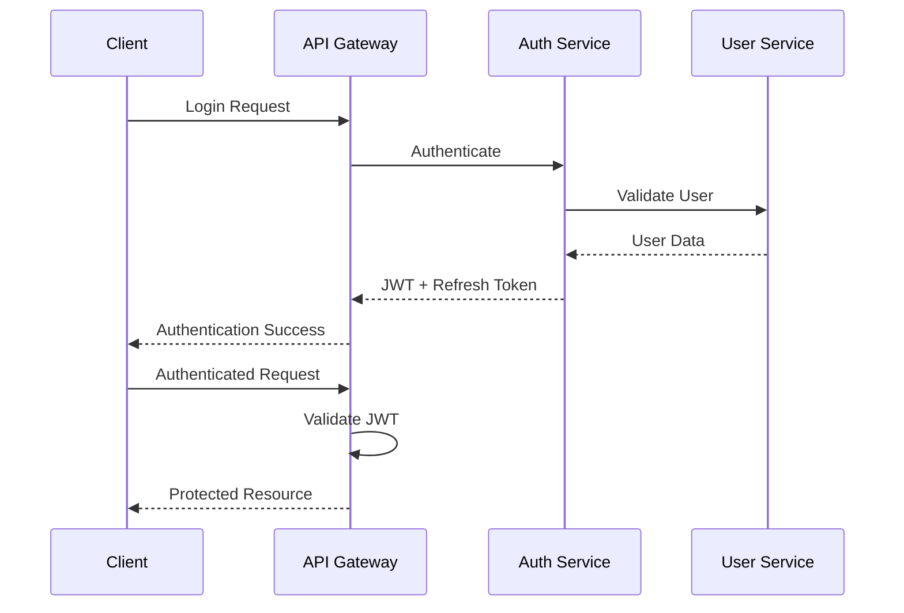

---

# API-012 Versioning Strategy

CardWise uses URL-based semantic versioning.

Example

```
/api/v1/cards

/api/v2/cards
```

Version remains stable throughout its supported lifecycle.

---

## Compatibility Rules

Minor additions:

Allowed

Breaking changes:

Never allowed in same version.

Examples

Allowed

```
New optional field

New endpoint

New optional parameter
```

Not Allowed

```
Rename field

Delete field

Change data type

Change authentication

Change status codes
```

---

## Deprecation Window

| Version | Support |
|----------|----------|
| Stable | Active |
| Deprecated | 12 months |
| Sunset | Removed |

---

# API-013 Base URL Strategy

| Service | Base URL |
|-----------|----------|
| Public API | `/api/v1` |
| Admin API | `/admin-api/v1` |
| AI API | `/ai-api/v1` |
| Booking API | `/booking-api/v1` |
| Analytics API | `/analytics-api/v1` |
| Internal Services | `/internal/v1` |

---

# API-014 Request Lifecycle

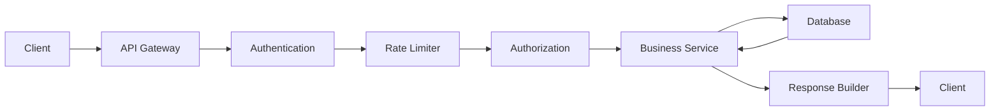

---

# API-015 High-Level API Architecture

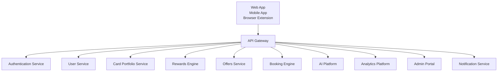

---

# API-016 Documentation Standards

Each endpoint documented in subsequent sections will consistently include:

- Endpoint ID (`ENDPOINT-*`)
- Purpose
- HTTP Method
- URL
- Authentication Requirement
- Required Permissions
- Request Headers
- Path Parameters
- Query Parameters
- Request Body Schema
- Validation Rules
- Success Response Schema
- Error Response Schema
- HTTP Status Codes
- Rate Limits
- Idempotency Behavior
- Caching Semantics
- Audit Logging Behavior
- Example JSON Request
- Example JSON Response
- Related APIs
- Operational Notes
- Sequence Diagram (where applicable)

This standardized structure ensures every CardWise API remains discoverable, predictable, maintainable, and consistent across all client applications and internal services.

---

# Part 2 — Authentication APIs

---

# AUTH-001 Authentication Overview

## Purpose

The Authentication Service is responsible for:

- User registration
- Identity verification
- Secure login
- Session management
- Refresh token rotation
- Device management
- Multi-factor authentication (MFA)
- OAuth authentication
- Password recovery
- Session revocation
- Token validation

All authentication APIs are exposed through the Authentication Service and are consumed by:

- Web Application
- Mobile Applications
- Browser Extension
- Admin Portal
- Internal Services

---

# Authentication Architecture

```mermaid
flowchart LR

Client --> API Gateway

API Gateway --> Auth Service

Auth Service --> User Service

Auth Service --> OTP Service

Auth Service --> Email Service

Auth Service --> SMS Service

Auth Service --> Device Registry

Auth Service --> Session Store

Auth Service --> Token Service
```

---

# Authentication Base URL

```
/api/v1/auth
```

---

# AUTH-002 Signup

## ENDPOINT-AUTH-001

### Create User Account

| Property | Value |
|------------|---------|
| Method | POST |
| URL | `/api/v1/auth/signup` |
| Authentication | None |
| Idempotent | No |
| Rate Limited | Yes |

---

## Purpose

Registers a new CardWise user.

---

## Request Body

```json
{
  "email": "user@example.com",
  "phone": "+919999999999",
  "password": "********",
  "firstName": "John",
  "lastName": "Doe",
  "country": "IN",
  "referralCode": "CARD123"
}
```

---

## Validation Rules

| Field | Validation |
|----------|-------------|
| email | Valid email |
| phone | E.164 format |
| password | Minimum 12 characters |
| password | Uppercase required |
| password | Lowercase required |
| password | Number required |
| password | Symbol required |
| referralCode | Optional |

---

## Success Response

```json
{
  "success": true,
  "data": {
    "userId": "usr_123",
    "verificationRequired": true
  }
}
```

---

## Errors

| Code | Meaning |
|---------|------------|
| AUTH-001 | Email already exists |
| AUTH-002 | Phone already exists |
| AUTH-003 | Weak password |
| AUTH-004 | Invalid referral code |

---

# AUTH-003 Verify Email

## ENDPOINT-AUTH-002

| Property | Value |
|------------|---------|
| Method | POST |
| URL | `/api/v1/auth/verify-email` |

---

## Request

```json
{
  "verificationToken": "token_here"
}
```

---

## Success

```json
{
  "success": true,
  "data": {
    "verified": true
  }
}
```

---

# AUTH-004 Resend Verification Email

## ENDPOINT-AUTH-003

```
POST /api/v1/auth/resend-verification
```

---

## Request

```json
{
  "email": "user@example.com"
}
```

---

# AUTH-005 Login

## ENDPOINT-AUTH-004

| Property | Value |
|------------|---------|
| Method | POST |
| URL | `/api/v1/auth/login` |

---

## Purpose

Authenticates a user and issues access and refresh tokens.

---

## Request

```json
{
  "email": "user@example.com",
  "password": "********",
  "deviceId": "device_123",
  "deviceName": "Chrome on macOS"
}
```

---

## Success

```json
{
  "success": true,
  "data": {
    "accessToken": "...",
    "refreshToken": "...",
    "expiresIn": 900,
    "user": {}
  }
}
```

---

## Error Codes

| Code | Description |
|---------|-------------|
| AUTH-101 | Invalid credentials |
| AUTH-102 | User blocked |
| AUTH-103 | Email not verified |
| AUTH-104 | MFA required |

---

# AUTH-006 Refresh Token

## ENDPOINT-AUTH-005

```
POST /api/v1/auth/refresh
```

---

## Request

```json
{
  "refreshToken": "..."
}
```

---

## Response

```json
{
  "success": true,
  "data": {
    "accessToken": "...",
    "refreshToken": "...",
    "expiresIn": 900
  }
}
```

---

## Operational Rules

- Refresh token rotation enabled
- Previous refresh token immediately revoked
- Replay attempts rejected
- Session remains unchanged

---

# AUTH-007 Logout

## ENDPOINT-AUTH-006

```
POST /api/v1/auth/logout
```

---

## Request

```json
{
  "deviceId": "device_123"
}
```

---

## Behavior

- Invalidates access token
- Revokes refresh token
- Closes active session
- Writes audit log

---

# AUTH-008 Logout From All Devices

## ENDPOINT-AUTH-007

```
POST /api/v1/auth/logout-all
```

---

## Result

- All sessions revoked
- Refresh tokens revoked
- Browser extension signed out
- Mobile devices require login
- Audit event generated

---

# AUTH-009 Forgot Password

## ENDPOINT-AUTH-008

```
POST /api/v1/auth/forgot-password
```

---

## Request

```json
{
  "email": "user@example.com"
}
```

---

## Response

```json
{
  "success": true,
  "data": {
    "emailSent": true
  }
}
```

---

# AUTH-010 Reset Password

## ENDPOINT-AUTH-009

```
POST /api/v1/auth/reset-password
```

---

## Request

```json
{
  "token": "...",
  "newPassword": "********"
}
```

---

## Validation

- Token valid
- Token unused
- Password policy satisfied
- Password not recently used

---

# AUTH-011 Change Password

## ENDPOINT-AUTH-010

```
POST /api/v1/auth/change-password
```

---

## Authentication

Required

---

## Request

```json
{
  "currentPassword": "...",
  "newPassword": "..."
}
```

---

# AUTH-012 OTP APIs

---

## Generate OTP

### ENDPOINT-AUTH-011

```
POST /api/v1/auth/otp/send
```

---

## Request

```json
{
  "phone": "+919999999999",
  "purpose": "LOGIN"
}
```

---

## Response

```json
{
  "success": true,
  "data": {
    "expiresIn": 300
  }
}
```

---

## Verify OTP

### ENDPOINT-AUTH-012

```
POST /api/v1/auth/otp/verify
```

---

## Request

```json
{
  "phone": "+919999999999",
  "otp": "123456"
}
```

---

## Success

```json
{
  "verified": true
}
```

---

# AUTH-013 Multi-Factor Authentication

---

## Enable MFA

### ENDPOINT-AUTH-013

```
POST /api/v1/auth/mfa/enable
```

---

## Response

```json
{
  "qrCode": "...",
  "secret": "...",
  "backupCodes": []
}
```

---

## Verify MFA Setup

### ENDPOINT-AUTH-014

```
POST /api/v1/auth/mfa/verify
```

---

## Disable MFA

### ENDPOINT-AUTH-015

```
POST /api/v1/auth/mfa/disable
```

---

## Authentication Factors

Supported:

- Authenticator App (TOTP)
- Email OTP
- SMS OTP (fallback)
- Backup Recovery Codes

Future:

- Passkeys
- Hardware Security Keys (FIDO2/WebAuthn)

---

# AUTH-014 OAuth Authentication

Supported Providers

| Provider | Status |
|-----------|--------|
| Google | Supported |
| Apple | Supported |
| Microsoft | Supported |
| GitHub | Future |
| LinkedIn | Future |

---

## Start OAuth

### ENDPOINT-AUTH-016

```
GET /api/v1/auth/oauth/{provider}
```

---

## OAuth Callback

### ENDPOINT-AUTH-017

```
GET /api/v1/auth/oauth/callback
```

---

## OAuth Response

```json
{
  "accessToken": "...",
  "refreshToken": "...",
  "user": {}
}
```

---

# AUTH-015 Session Management

## List Sessions

### ENDPOINT-AUTH-018

```
GET /api/v1/auth/sessions
```

---

## Response

```json
{
  "sessions": [
    {
      "deviceId": "dev_123",
      "deviceName": "Chrome",
      "lastActive": "...",
      "location": "Bengaluru",
      "current": true
    }
  ]
}
```

---

## Revoke Session

### ENDPOINT-AUTH-019

```
DELETE /api/v1/auth/sessions/{sessionId}
```

---

# AUTH-016 Token Validation

## ENDPOINT-AUTH-020

```
POST /api/v1/auth/token/validate
```

Used internally by API Gateway.

---

# AUTH-017 Device Registration

## Register Device

### ENDPOINT-AUTH-021

```
POST /api/v1/auth/devices
```

---

## Request

```json
{
  "deviceId": "device_123",
  "platform": "ios",
  "appVersion": "2.4.0"
}
```

---

## Remove Device

### ENDPOINT-AUTH-022

```
DELETE /api/v1/auth/devices/{deviceId}
```

---

# AUTH-018 Authentication Rate Limits

| Endpoint | Limit |
|-----------|------:|
| Signup | 10/hour/IP |
| Login | 20/hour/IP |
| OTP Send | 5/hour/phone |
| OTP Verify | 10/hour |
| Forgot Password | 5/hour |
| OAuth | 30/hour |
| Refresh Token | 100/hour |
| Session APIs | 60/min |

---

# AUTH-019 Authentication Sequence

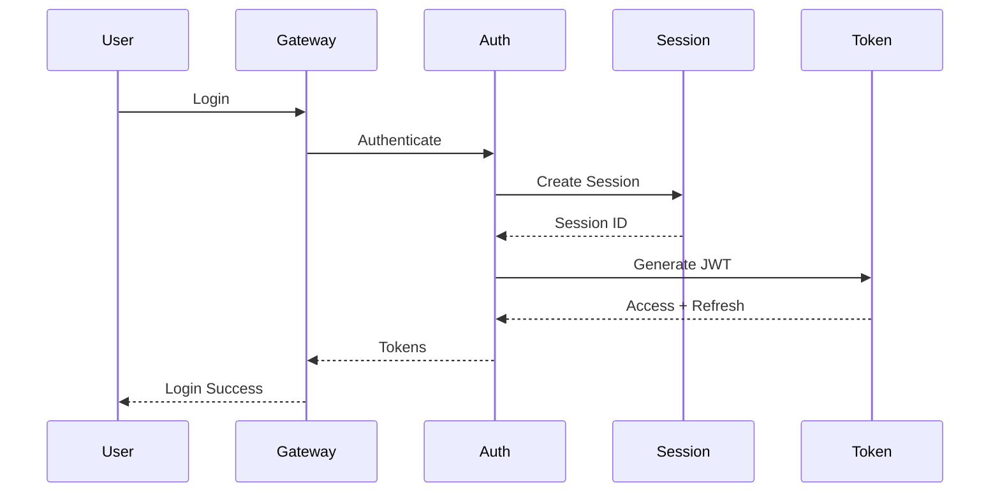

---

# AUTH-020 Authentication Decision Matrix

| Capability | Web | Mobile | Browser Extension | Admin |
|------------|-----|---------|-------------------|-------|
| Email Login | ✓ | ✓ | ✓ | ✓ |
| Password Login | ✓ | ✓ | ✓ | ✓ |
| OAuth | ✓ | ✓ | ✓ | Optional |
| Refresh Token | ✓ | ✓ | ✓ | ✓ |
| MFA | Optional | Optional | Optional | Mandatory |
| Device Tracking | ✓ | ✓ | ✓ | ✓ |
| Session Management | ✓ | ✓ | ✓ | ✓ |
| Logout All Devices | ✓ | ✓ | ✓ | ✓ |
| TOTP | ✓ | ✓ | ✓ | ✓ |

---
# Part 3 — User APIs & Credit Card Portfolio APIs

---

# USER-001 Overview

The User Service manages all user-centric resources across the CardWise platform, including:

- User profile
- Preferences
- Account settings
- Privacy controls
- Notification preferences
- Connected devices
- Linked financial accounts
- User metadata
- Account lifecycle

All endpoints require authentication unless explicitly stated otherwise.

---

# User Service Base URL

```
/api/v1/users
```

---

# USER-002 User Profile

## ENDPOINT-USER-001

### Get Current User

| Property | Value |
|----------|-------|
| Method | GET |
| URL | `/api/v1/users/me` |
| Authentication | JWT Required |
| Cache | No |

---

## Success Response

```json
{
  "success": true,
  "data": {
    "userId": "usr_123",
    "firstName": "John",
    "lastName": "Doe",
    "email": "john@example.com",
    "phone": "+919999999999",
    "country": "IN",
    "currency": "INR",
    "timezone": "Asia/Kolkata",
    "createdAt": "2026-01-10T12:00:00Z"
  }
}
```

---

## ENDPOINT-USER-002

### Update Profile

```
PATCH /api/v1/users/me
```

---

## Request

```json
{
  "firstName": "John",
  "lastName": "Doe",
  "timezone": "Asia/Kolkata",
  "currency": "INR"
}
```

---

## Validation Rules

| Field | Validation |
|---------|------------|
| firstName | 2–50 characters |
| lastName | 2–50 characters |
| timezone | IANA timezone |
| currency | ISO-4217 |

---

# USER-003 Avatar

## Upload Avatar

### ENDPOINT-USER-003

```
POST /api/v1/users/me/avatar
```

Content Type

```
multipart/form-data
```

---

## Response

```json
{
  "avatarUrl": "https://..."
}
```

---

## Delete Avatar

### ENDPOINT-USER-004

```
DELETE /api/v1/users/me/avatar
```

---

# USER-004 Preferences

## ENDPOINT-USER-005

### Get Preferences

```
GET /api/v1/users/me/preferences
```

---

## Response

```json
{
  "theme": "dark",
  "language": "en",
  "currency": "INR",
  "distanceUnit": "km",
  "rewardPreference": "Travel"
}
```

---

## ENDPOINT-USER-006

### Update Preferences

```
PUT /api/v1/users/me/preferences
```

---

## Request

```json
{
  "language": "en",
  "theme": "dark",
  "rewardPreference": "Cashback"
}
```

---

# USER-005 Notification Preferences

## ENDPOINT-USER-007

```
GET /api/v1/users/me/notifications
```

---

## Update Notification Preferences

### ENDPOINT-USER-008

```
PUT /api/v1/users/me/notifications
```

---

## Request

```json
{
  "email": true,
  "push": true,
  "sms": false,
  "offerAlerts": true,
  "priceAlerts": true,
  "rewardAlerts": true,
  "statementReminder": true
}
```

---

# USER-006 Privacy Settings

## ENDPOINT-USER-009

```
GET /api/v1/users/me/privacy
```

---

## ENDPOINT-USER-010

```
PUT /api/v1/users/me/privacy
```

---

## Privacy Options

```json
{
  "analytics": true,
  "personalization": true,
  "locationTracking": false,
  "marketingEmails": false
}
```

---

# USER-007 Connected Devices

## ENDPOINT-USER-011

```
GET /api/v1/users/me/devices
```

---

## Response

```json
{
  "devices": [
    {
      "deviceId": "dev_123",
      "platform": "ios",
      "lastSeen": "2026-07-01T11:22:33Z",
      "current": true
    }
  ]
}
```

---

## Remove Device

### ENDPOINT-USER-012

```
DELETE /api/v1/users/me/devices/{deviceId}
```

---

# USER-008 Export User Data

## ENDPOINT-USER-013

```
POST /api/v1/users/me/export
```

Creates an asynchronous GDPR-compliant export request.

---

## Response

```json
{
  "exportId": "exp_123",
  "status": "PROCESSING"
}
```

---

# USER-009 Delete Account

## ENDPOINT-USER-014

```
DELETE /api/v1/users/me
```

---

## Behavior

- Soft delete initiated
- Cooling-off period
- Active subscriptions checked
- Sessions revoked
- Audit log generated

---

# USER-010 User Endpoint Catalog

| Endpoint ID | Method | URL |
|--------------|--------|-----|
| ENDPOINT-USER-001 | GET | `/users/me` |
| ENDPOINT-USER-002 | PATCH | `/users/me` |
| ENDPOINT-USER-003 | POST | `/users/me/avatar` |
| ENDPOINT-USER-004 | DELETE | `/users/me/avatar` |
| ENDPOINT-USER-005 | GET | `/users/me/preferences` |
| ENDPOINT-USER-006 | PUT | `/users/me/preferences` |
| ENDPOINT-USER-007 | GET | `/users/me/notifications` |
| ENDPOINT-USER-008 | PUT | `/users/me/notifications` |
| ENDPOINT-USER-009 | GET | `/users/me/privacy` |
| ENDPOINT-USER-010 | PUT | `/users/me/privacy` |
| ENDPOINT-USER-011 | GET | `/users/me/devices` |
| ENDPOINT-USER-012 | DELETE | `/users/me/devices/{deviceId}` |
| ENDPOINT-USER-013 | POST | `/users/me/export` |
| ENDPOINT-USER-014 | DELETE | `/users/me` |

---

# CARD-001 Credit Card Portfolio Overview

The Card Portfolio Service maintains the user's complete credit card inventory.

Capabilities include:

- Card onboarding
- Card lifecycle management
- Statement management
- Reward tracking
- Spend tracking
- Benefits
- Fee tracking
- Card health
- Metadata synchronization

---

# Card Service Base URL

```
/api/v1/cards
```

---

# CARD-002 Add Card

## ENDPOINT-CARD-001

| Property | Value |
|----------|-------|
| Method | POST |
| URL | `/api/v1/cards` |

---

## Request

```json
{
  "issuer": "HDFC",
  "cardNetwork": "Visa",
  "cardVariant": "Infinia",
  "lastFourDigits": "1234",
  "creditLimit": 500000,
  "joiningDate": "2025-01-01",
  "billingDay": 12,
  "paymentDueDay": 30
}
```

---

## Validation

| Field | Rule |
|--------|------|
| billingDay | 1–31 |
| paymentDueDay | 1–31 |
| creditLimit | Positive number |
| lastFourDigits | Exactly 4 digits |

---

## Response

```json
{
  "cardId": "card_123",
  "status": "ACTIVE"
}
```

---

# CARD-003 List Cards

## ENDPOINT-CARD-002

```
GET /api/v1/cards
```

---

## Query Parameters

| Parameter | Description |
|------------|-------------|
| status | ACTIVE, CLOSED |
| issuer | Bank |
| network | Visa, Mastercard |
| sort | createdAt |
| order | asc, desc |

---

# CARD-004 Card Details

## ENDPOINT-CARD-003

```
GET /api/v1/cards/{cardId}
```

---

## Response

```json
{
  "cardId": "card_123",
  "issuer": "HDFC",
  "variant": "Infinia",
  "network": "Visa",
  "creditLimit": 500000,
  "rewardProgram": "Reward Points",
  "annualFee": 12500
}
```

---

# CARD-005 Update Card

## ENDPOINT-CARD-004

```
PATCH /api/v1/cards/{cardId}
```

---

## Editable Fields

- Credit limit
- Nickname
- Billing date
- Due date
- Card status
- Notes

---

# CARD-006 Remove Card

## ENDPOINT-CARD-005

```
DELETE /api/v1/cards/{cardId}
```

---

## Behavior

- Soft delete
- Historical transactions retained
- Rewards preserved
- Audit entry generated

---

# CARD-007 Card Statements

## List Statements

### ENDPOINT-CARD-006

```
GET /api/v1/cards/{cardId}/statements
```

---

## Upload Statement

### ENDPOINT-CARD-007

```
POST /api/v1/cards/{cardId}/statements
```

Supports:

- PDF
- CSV
- OCR ingestion

---

## Statement Details

### ENDPOINT-CARD-008

```
GET /api/v1/cards/{cardId}/statements/{statementId}
```

---

# CARD-008 Spend Tracking

## ENDPOINT-CARD-009

```
GET /api/v1/cards/{cardId}/spending
```

---

## Query Parameters

| Parameter | Description |
|------------|-------------|
| from | Start date |
| to | End date |
| category | Spending category |
| merchant | Merchant |

---

## Response

```json
{
  "totalSpend": 185000,
  "transactions": [],
  "categories": []
}
```

---

# CARD-009 Reward Tracking

## ENDPOINT-CARD-010

```
GET /api/v1/cards/{cardId}/rewards
```

---

## Response

```json
{
  "availablePoints": 258000,
  "pendingPoints": 1800,
  "expiringPoints": 5000,
  "nextExpiry": "2027-03-31"
}
```

---

# CARD-010 Card Benefits

## ENDPOINT-CARD-011

```
GET /api/v1/cards/{cardId}/benefits
```

---

## Example Response

```json
{
  "airportLounge": true,
  "golf": true,
  "concierge": true,
  "insurance": true,
  "rewardMultiplier": 3
}
```

---

# CARD-011 Card Metadata

## ENDPOINT-CARD-012

```
GET /api/v1/cards/metadata
```

Returns:

- Supported issuers
- Networks
- Variants
- Reward programs
- Categories
- Supported countries

---

# CARD-012 Fee Summary

## ENDPOINT-CARD-013

```
GET /api/v1/cards/{cardId}/fees
```

---

## Response

```json
{
  "joiningFee": 12500,
  "annualFee": 12500,
  "waiverSpend": 1000000,
  "renewalDate": "2027-01-01"
}
```

---

# CARD-013 Card Health

## ENDPOINT-CARD-014

```
GET /api/v1/cards/{cardId}/health
```

Provides:

- Utilization
- Payment history
- Due reminders
- Fee waiver progress
- Reward efficiency score

---

# CARD-014 Card Portfolio Summary

## ENDPOINT-CARD-015

```
GET /api/v1/cards/summary
```

---

## Response

```json
{
  "totalCards": 6,
  "totalLimit": 2300000,
  "monthlySpend": 185000,
  "availableRewards": 580000
}
```

---

# CARD-015 Portfolio Sequence Diagram

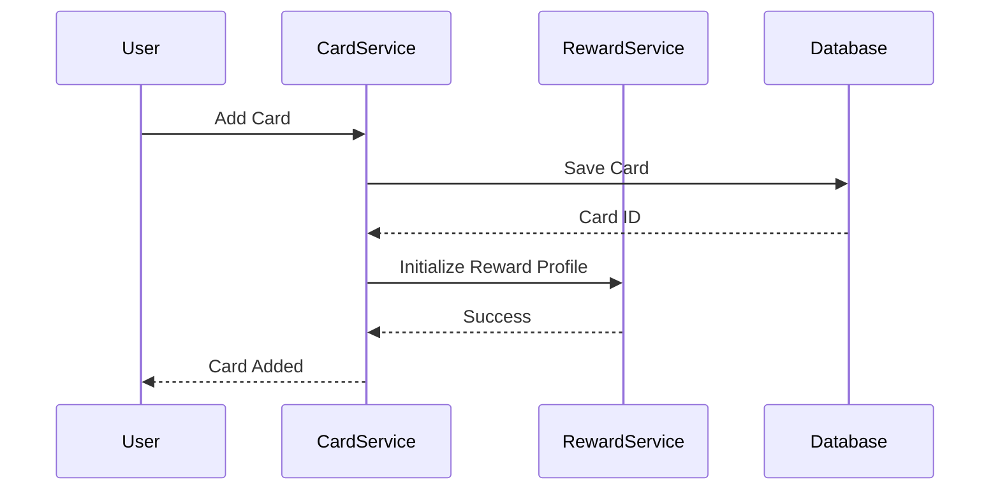

---

# CARD-016 Card API Catalog

| Endpoint ID | Method | URL |
|--------------|--------|-----|
| ENDPOINT-CARD-001 | POST | `/cards` |
| ENDPOINT-CARD-002 | GET | `/cards` |
| ENDPOINT-CARD-003 | GET | `/cards/{cardId}` |
| ENDPOINT-CARD-004 | PATCH | `/cards/{cardId}` |
| ENDPOINT-CARD-005 | DELETE | `/cards/{cardId}` |
| ENDPOINT-CARD-006 | GET | `/cards/{cardId}/statements` |
| ENDPOINT-CARD-007 | POST | `/cards/{cardId}/statements` |
| ENDPOINT-CARD-008 | GET | `/cards/{cardId}/statements/{statementId}` |
| ENDPOINT-CARD-009 | GET | `/cards/{cardId}/spending` |
| ENDPOINT-CARD-010 | GET | `/cards/{cardId}/rewards` |
| ENDPOINT-CARD-011 | GET | `/cards/{cardId}/benefits` |
| ENDPOINT-CARD-012 | GET | `/cards/metadata` |
| ENDPOINT-CARD-013 | GET | `/cards/{cardId}/fees` |
| ENDPOINT-CARD-014 | GET | `/cards/{cardId}/health` |
| ENDPOINT-CARD-015 | GET | `/cards/summary` |

---

# Part 4 — Rewards APIs & Offers APIs

---

# REWARD-001 Rewards Platform Overview

The Rewards API provides access to CardWise's reward intelligence capabilities.

It manages:

- Reward calculation
- Reward simulation
- Reward balances
- Redemption optimization
- Transfer partners
- Reward history
- Milestone tracking
- Expiry management
- Reward valuation

The Rewards Platform aggregates data from:

- Credit Card Portfolio Service
- Transaction Service
- Merchant Intelligence Service
- Bank Reward Programs
- Loyalty Partners

---

# Rewards Service Base URL

```
/api/v1/rewards
```

---

# REWARD-002 Reward Summary

## ENDPOINT-REWARD-001

### Get User Reward Summary

| Property | Value |
|----------|-------|
| Method | GET |
| URL | `/api/v1/rewards/summary` |
| Authentication | JWT Required |

---

## Response

```json
{
  "totalPoints": 580000,
  "estimatedValue": 29000,
  "expiringPoints": 5000,
  "programs": [
    {
      "name": "HDFC Reward Points",
      "balance": 250000
    }
  ]
}
```

---

# REWARD-003 Card Reward Balance

## ENDPOINT-REWARD-002

```
GET /api/v1/rewards/cards/{cardId}
```

---

## Response

```json
{
  "cardId": "card_123",
  "program": "Reward Points",
  "available": 250000,
  "pending": 3000,
  "expiry": "2027-03-31"
}
```

---

# REWARD-004 Reward Calculation

## ENDPOINT-REWARD-003

```
POST /api/v1/rewards/calculate
```

---

## Purpose

Calculates expected rewards for a transaction.

---

## Request

```json
{
  "cardId": "card_123",
  "merchant": "Amazon",
  "category": "Shopping",
  "amount": 25000
}
```

---

## Response

```json
{
  "rewardPoints": 750,
  "cashValue": 375,
  "multiplier": 3,
  "benefitsApplied": [
    "Online Shopping Bonus"
  ]
}
```

---

# REWARD-005 Reward Simulation

## ENDPOINT-REWARD-004

```
POST /api/v1/rewards/simulate
```

---

## Purpose

Compares multiple cards for the same transaction.

---

## Request

```json
{
  "amount": 50000,
  "merchant": "Flipkart",
  "category": "Shopping",
  "availableCards": [
    "card_123",
    "card_456"
  ]
}
```

---

## Response

```json
{
  "recommendation": {
    "cardId": "card_123",
    "expectedReward": 2500,
    "reason": "Highest reward multiplier"
  },
  "alternatives": []
}
```

---

# REWARD-006 Reward Redemption

## ENDPOINT-REWARD-005

```
POST /api/v1/rewards/redemptions
```

---

## Request

```json
{
  "program": "HDFC Reward Points",
  "points": 10000,
  "redemptionType": "TRAVEL"
}
```

---

## Response

```json
{
  "redemptionId": "redeem_123",
  "status": "PROCESSING"
}
```

---

# REWARD-007 Redemption Status

## ENDPOINT-REWARD-006

```
GET /api/v1/rewards/redemptions/{redemptionId}
```

---

# REWARD-008 Transfer Partners

## ENDPOINT-REWARD-007

```
GET /api/v1/rewards/transfer-partners
```

---

## Response

```json
{
  "partners": [
    {
      "name": "Airline Partner",
      "conversionRate": "1:1"
    }
  ]
}
```

---

# REWARD-009 Transfer Reward Points

## ENDPOINT-REWARD-008

```
POST /api/v1/rewards/transfers
```

---

## Request

```json
{
  "sourceProgram": "HDFC Rewards",
  "destinationProgram": "Airline Miles",
  "points": 50000
}
```

---

# REWARD-010 Milestone Tracking

## ENDPOINT-REWARD-009

```
GET /api/v1/rewards/milestones
```

---

## Response

```json
{
  "milestones": [
    {
      "name": "Annual Spend Target",
      "progress": 750000,
      "target": 1000000,
      "reward": "Fee Waiver"
    }
  ]
}
```

---

# REWARD-011 Reward History

## ENDPOINT-REWARD-010

```
GET /api/v1/rewards/history
```

---

## Query Parameters

| Parameter | Description |
|-----------|-------------|
| from | Start date |
| to | End date |
| program | Reward program |
| type | Earn / Burn |

---

## Response

```json
{
  "transactions": [
    {
      "type": "EARN",
      "points": 500,
      "merchant": "Amazon",
      "date": "2026-07-01"
    }
  ]
}
```

---

# REWARD-012 Reward Expiry

## ENDPOINT-REWARD-011

```
GET /api/v1/rewards/expiry
```

---

## Response

```json
{
  "expiring": [
    {
      "points": 5000,
      "expiryDate": "2027-01-01"
    }
  ]
}
```

---

# REWARD-013 Reward API Sequence

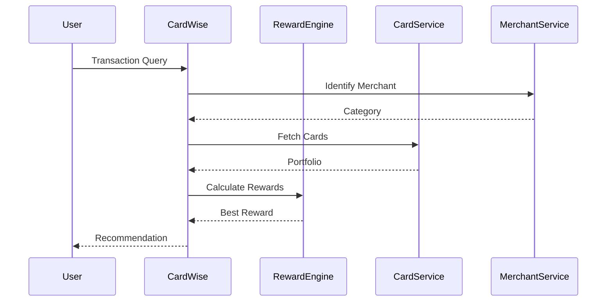

---

# OFFER-001 Offers Platform Overview

The Offers API manages merchant and banking offers.

Capabilities:

- Offer discovery
- Personalized offers
- Bank campaigns
- Merchant offers
- Nearby offers
- Offer search
- Offer eligibility
- Offer tracking

---

# Offers Service Base URL

```
/api/v1/offers
```

---

# OFFER-002 List Offers

## ENDPOINT-OFFER-001

```
GET /api/v1/offers
```

---

## Query Parameters

| Parameter | Description |
|-----------|-------------|
| category | Shopping category |
| merchant | Merchant |
| bank | Issuer |
| card | Eligible card |
| location | Nearby location |
| sort | Relevance/date/value |

---

## Response

```json
{
  "offers": [
    {
      "offerId": "offer_123",
      "merchant": "Amazon",
      "discount": "10%",
      "validTill": "2026-08-01"
    }
  ]
}
```

---

# OFFER-003 Offer Details

## ENDPOINT-OFFER-002

```
GET /api/v1/offers/{offerId}
```

---

## Response

```json
{
  "offerId": "offer_123",
  "merchant": "Amazon",
  "description": "10% cashback",
  "eligibleCards": [],
  "terms": []
}
```

---

# OFFER-004 Search Offers

## ENDPOINT-OFFER-003

```
GET /api/v1/offers/search
```

---

## Query

```
?q=flight cashback
```

---

# OFFER-005 Personalized Offers

## ENDPOINT-OFFER-004

```
GET /api/v1/offers/personalized
```

---

## Response

```json
{
  "offers": [
    {
      "offerId": "offer_789",
      "reason": "Matches your spending pattern"
    }
  ]
}
```

---

# OFFER-006 Nearby Offers

## ENDPOINT-OFFER-005

```
GET /api/v1/offers/nearby
```

---

## Query Parameters

| Parameter | Required |
|------------|----------|
| latitude | Yes |
| longitude | Yes |
| radius | Optional |

---

# OFFER-007 Bank Offers

## ENDPOINT-OFFER-006

```
GET /api/v1/offers/banks/{bankId}
```

---

# OFFER-008 Merchant Offers

## ENDPOINT-OFFER-007

```
GET /api/v1/offers/merchants/{merchantId}
```

---

# OFFER-009 Save Offer

## ENDPOINT-OFFER-008

```
POST /api/v1/offers/{offerId}/save
```

---

# OFFER-010 Remove Saved Offer

## ENDPOINT-OFFER-009

```
DELETE /api/v1/offers/{offerId}/save
```

---

# OFFER-011 Offer Eligibility Check

## ENDPOINT-OFFER-010

```
POST /api/v1/offers/check-eligibility
```

---

## Request

```json
{
  "offerId": "offer_123",
  "cardId": "card_123"
}
```

---

## Response

```json
{
  "eligible": true,
  "reason": "Card qualifies"
}
```

---

# OFFER-012 Offer Tracking

## ENDPOINT-OFFER-011

```
POST /api/v1/offers/{offerId}/track
```

---

## Events

Supported:

- Viewed
- Saved
- Applied
- Converted
- Ignored

---

# OFFER-013 Offer API Catalog

| Endpoint ID | Method | URL |
|-|-|-|
| ENDPOINT-OFFER-001 | GET | `/offers` |
| ENDPOINT-OFFER-002 | GET | `/offers/{offerId}` |
| ENDPOINT-OFFER-003 | GET | `/offers/search` |
| ENDPOINT-OFFER-004 | GET | `/offers/personalized` |
| ENDPOINT-OFFER-005 | GET | `/offers/nearby` |
| ENDPOINT-OFFER-006 | GET | `/offers/banks/{bankId}` |
| ENDPOINT-OFFER-007 | GET | `/offers/merchants/{merchantId}` |
| ENDPOINT-OFFER-008 | POST | `/offers/{offerId}/save` |
| ENDPOINT-OFFER-009 | DELETE | `/offers/{offerId}/save` |
| ENDPOINT-OFFER-010 | POST | `/offers/check-eligibility` |
| ENDPOINT-OFFER-011 | POST | `/offers/{offerId}/track` |

---

# Part 5 — Recommendation APIs & AI APIs

---

# RECOMMENDATION-001 Recommendation Platform Overview

The Recommendation API is the intelligence layer that helps CardWise users make optimal financial decisions.

The Recommendation Engine combines:

- User profile
- Card portfolio
- Spending behavior
- Merchant intelligence
- Reward programs
- Offers
- Travel preferences
- Historical decisions
- AI-generated insights

to provide personalized recommendations.

---

# Recommendation Service Base URL

```
/api/v1/recommendations
```

---

# RECOMMENDATION-002 Best Card Recommendation

## ENDPOINT-RECOMMENDATION-001

### Get Best Card for Transaction

| Property | Value |
|----------|-------|
| Method | POST |
| URL | `/api/v1/recommendations/best-card` |
| Authentication | JWT Required |

---

## Purpose

Determines the optimal credit card for a planned transaction.

---

## Request

```json
{
  "merchant": "Amazon",
  "category": "Shopping",
  "amount": 25000,
  "location": "Bengaluru",
  "paymentMode": "CARD"
}
```

---

## Response

```json
{
  "recommendedCard": {
    "cardId": "card_123",
    "score": 96,
    "expectedReward": 750
  },
  "alternatives": [
    {
      "cardId": "card_456",
      "score": 82
    }
  ],
  "explanation": "Highest reward multiplier available"
}
```

---

# RECOMMENDATION-003 Best Payment Method

## ENDPOINT-RECOMMENDATION-002

```
POST /api/v1/recommendations/payment-method
```

---

## Purpose

Recommends:

- Credit card
- Debit card
- Wallet
- UPI
- Bank transfer

---

## Request

```json
{
  "merchant": "Uber",
  "amount": 1200,
  "category": "Travel"
}
```

---

## Response

```json
{
  "method": "CREDIT_CARD",
  "provider": "HDFC Infinia",
  "benefit": "3x rewards"
}
```

---

# RECOMMENDATION-004 Reward Optimization

## ENDPOINT-RECOMMENDATION-003

```
POST /api/v1/recommendations/rewards
```

---

## Purpose

Finds the highest reward outcome.

---

## Request

```json
{
  "transactionAmount": 50000,
  "merchant": "Flipkart",
  "cards": [
    "card_123",
    "card_456"
  ]
}
```

---

## Response

```json
{
  "optimization": {
    "cardId": "card_123",
    "rewardGain": 5000,
    "strategy": "Use accelerated reward category"
  }
}
```

---

# RECOMMENDATION-005 Offer Recommendation

## ENDPOINT-RECOMMENDATION-004

```
GET /api/v1/recommendations/offers
```

---

## Response

```json
{
  "recommendations": [
    {
      "offerId": "offer_123",
      "reason": "Frequently used merchant"
    }
  ]
}
```

---

# RECOMMENDATION-006 AI Recommendation

## ENDPOINT-RECOMMENDATION-005

```
POST /api/v1/recommendations/ai
```

---

## Request

```json
{
  "query": "Which card should I use for international travel?"
}
```

---

## Response

```json
{
  "answer": "Use your travel optimized card",
  "cards": [],
  "confidence": 0.94
}
```

---

# RECOMMENDATION-007 Travel Recommendation

## ENDPOINT-RECOMMENDATION-006

```
POST /api/v1/recommendations/travel
```

---

## Request

```json
{
  "destination": "Paris",
  "duration": 10,
  "budget": 200000
}
```

---

## Response

```json
{
  "cards": [],
  "airlines": [],
  "hotelRecommendations": []
}
```

---

# RECOMMENDATION-008 Recommendation Feedback

## ENDPOINT-RECOMMENDATION-007

```
POST /api/v1/recommendations/{recommendationId}/feedback
```

---

## Request

```json
{
  "rating": 5,
  "feedback": "Useful suggestion"
}
```

---

# RECOMMENDATION-009 Recommendation Explanation

## ENDPOINT-RECOMMENDATION-008

```
GET /api/v1/recommendations/{recommendationId}/explanation
```

---

## Response

```json
{
  "factors": [
    {
      "factor": "Reward Multiplier",
      "impact": "HIGH"
    },
    {
      "factor": "Offer Eligibility",
      "impact": "MEDIUM"
    }
  ]
}
```

---

# Recommendation Decision Flow

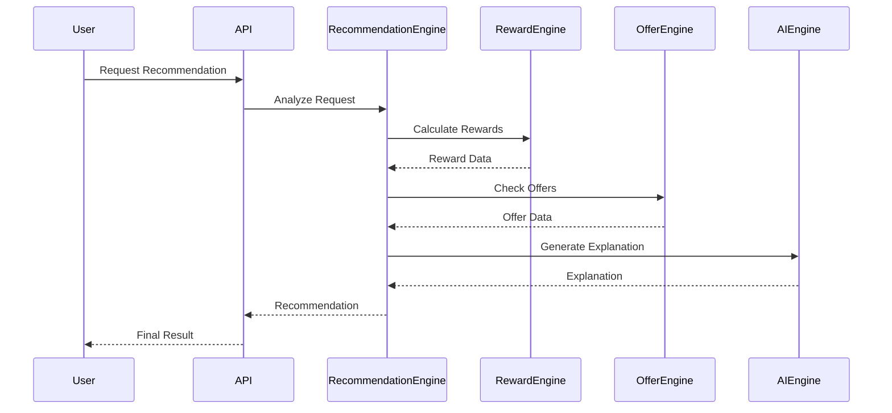

---

# AI-001 AI Platform Overview

The AI API provides access to CardWise intelligence capabilities.

AI capabilities include:

- Conversational assistant
- Financial recommendations
- Spending analysis
- Merchant intelligence
- OCR processing
- Receipt understanding
- Document extraction
- Explanation generation

---

# AI Service Base URL

```
/api/v1/ai
```

---

# AI-002 AI Chat

## ENDPOINT-AI-001

```
POST /api/v1/ai/chat
```

---

## Purpose

Provides conversational financial assistance.

---

## Request

```json
{
  "conversationId": "conv_123",
  "message": "Which card should I use today?"
}
```

---

## Response

```json
{
  "conversationId": "conv_123",
  "message": "Use your travel rewards card",
  "actions": [
    {
      "type": "VIEW_CARD",
      "id": "card_123"
    }
  ]
}
```

---

# AI-003 Prompt Execution

## ENDPOINT-AI-002

```
POST /api/v1/ai/prompt
```

---

## Request

```json
{
  "prompt": "Analyze my spending"
}
```

---

## Response

```json
{
  "result": "Your largest category is travel",
  "confidence": 0.91
}
```

---

# AI-004 Recommendation Generation

## ENDPOINT-AI-003

```
POST /api/v1/ai/recommendation
```

---

## Request

```json
{
  "context": {
    "merchant": "Amazon",
    "amount": 50000
  }
}
```

---

## Response

```json
{
  "recommendation": {},
  "reasoning": []
}
```

---

# AI-005 Merchant Intelligence

## ENDPOINT-AI-004

```
GET /api/v1/ai/merchant/{merchantId}
```

---

## Response

```json
{
  "merchant": "Amazon",
  "category": "Shopping",
  "popularCards": [],
  "availableOffers": []
}
```

---

# AI-006 Receipt OCR Processing

## ENDPOINT-AI-005

```
POST /api/v1/ai/ocr/receipt
```

---

## Request

```json
{
  "imageUrl": "https://..."
}
```

---

## Response

```json
{
  "merchant": "Starbucks",
  "amount": 450,
  "category": "Food",
  "date": "2026-07-01"
}
```

---

# AI-007 Document OCR

## ENDPOINT-AI-006

```
POST /api/v1/ai/ocr/document
```

---

## Supported Documents

- Credit card statements
- Bank statements
- Bills
- Receipts

---

# AI-008 Spending Analysis

## ENDPOINT-AI-007

```
POST /api/v1/ai/spending-analysis
```

---

## Request

```json
{
  "period": "LAST_MONTH"
}
```

---

## Response

```json
{
  "summary": "Travel spending increased",
  "insights": []
}
```

---

# AI-009 AI Completion Status

## ENDPOINT-AI-008

```
GET /api/v1/ai/jobs/{jobId}
```

---

## Response

```json
{
  "jobId": "job_123",
  "status": "COMPLETED",
  "result": {}
}
```

---

# AI-010 AI API Rate Limits

| Endpoint | Limit |
|----------|------:|
| Chat | 100/hour/user |
| Prompt | 200/hour/user |
| OCR | 50/day/user |
| Analysis | 20/day/user |
| Recommendation | 500/hour/user |

---

# AI-011 AI Processing Flow

```mermaid
flowchart LR

User

Request

Gateway

AI Gateway

Prompt Router

LLM Service

Knowledge Layer

Recommendation Engine

Response


User --> Request

Request --> Gateway

Gateway --> AI Gateway

AI Gateway --> Prompt Router

Prompt Router --> LLM Service

Prompt Router --> Knowledge Layer

Knowledge Layer --> Recommendation Engine

Recommendation Engine --> Response

Response --> User
```

---

# RECOMMENDATION & AI API Catalog

| Endpoint ID | Method | URL |
|-|-|-|
| ENDPOINT-RECOMMENDATION-001 | POST | `/recommendations/best-card` |
| ENDPOINT-RECOMMENDATION-002 | POST | `/recommendations/payment-method` |
| ENDPOINT-RECOMMENDATION-003 | POST | `/recommendations/rewards` |
| ENDPOINT-RECOMMENDATION-004 | GET | `/recommendations/offers` |
| ENDPOINT-RECOMMENDATION-005 | POST | `/recommendations/ai` |
| ENDPOINT-RECOMMENDATION-006 | POST | `/recommendations/travel` |
| ENDPOINT-AI-001 | POST | `/ai/chat` |
| ENDPOINT-AI-002 | POST | `/ai/prompt` |
| ENDPOINT-AI-003 | POST | `/ai/recommendation` |
| ENDPOINT-AI-004 | GET | `/ai/merchant/{merchantId}` |
| ENDPOINT-AI-005 | POST | `/ai/ocr/receipt` |
| ENDPOINT-AI-006 | POST | `/ai/ocr/document` |
| ENDPOINT-AI-007 | POST | `/ai/spending-analysis` |
| ENDPOINT-AI-008 | GET | `/ai/jobs/{jobId}` |

---

# Part 6 — Booking APIs

---

# BOOKING-001 Booking Platform Overview

The CardWise Booking API provides integrated travel booking capabilities while preserving credit card reward optimization.

The Booking Platform enables:

- Flight search
- Hotel search
- Availability checking
- Price comparison
- Booking creation
- Payment processing
- Cancellation
- Refund processing
- Loyalty optimization
- Coupon application
- Travel reward utilization

The Booking Engine integrates with:

- Airline providers
- Hotel aggregators
- Travel partners
- Loyalty programs
- Payment providers
- Rewards Engine
- Recommendation Engine

---

# Booking Service Base URL

```
/api/v1/bookings
```

---

# BOOKING-002 Flight Search

## ENDPOINT-BOOKING-001

### Search Flights

| Property | Value |
|----------|-------|
| Method | POST |
| URL | `/api/v1/bookings/flights/search` |
| Authentication | JWT Required |
| Cache | Short-lived |

---

## Purpose

Searches available flights based on user preferences.

---

## Request

```json
{
  "origin": "BLR",
  "destination": "CDG",
  "departureDate": "2026-12-01",
  "returnDate": "2026-12-10",
  "passengers": {
    "adults": 2,
    "children": 0
  },
  "class": "ECONOMY"
}
```

---

## Response

```json
{
  "searchId": "search_123",
  "flights": [
    {
      "flightId": "flight_001",
      "airline": "Airline Name",
      "duration": "10h",
      "price": {
        "amount": 65000,
        "currency": "INR"
      },
      "rewardOpportunity": {
        "points": 5000
      }
    }
  ]
}
```

---

# BOOKING-003 Flight Availability

## ENDPOINT-BOOKING-002

```
POST /api/v1/bookings/flights/availability
```

---

## Request

```json
{
  "flightId": "flight_001",
  "date": "2026-12-01"
}
```

---

## Response

```json
{
  "available": true,
  "seats": [
    {
      "class": "ECONOMY",
      "remaining": 24
    }
  ]
}
```

---

# BOOKING-004 Hotel Search

## ENDPOINT-BOOKING-003

```
POST /api/v1/bookings/hotels/search
```

---

## Request

```json
{
  "city": "Paris",
  "checkIn": "2026-12-01",
  "checkOut": "2026-12-05",
  "guests": 2
}
```

---

## Response

```json
{
  "searchId": "hotel_search_123",
  "hotels": [
    {
      "hotelId": "hotel_123",
      "name": "Hotel Example",
      "price": {
        "amount": 12000,
        "currency": "INR"
      },
      "benefits": [
        "Card Cashback"
      ]
    }
  ]
}
```

---

# BOOKING-005 Hotel Availability

## ENDPOINT-BOOKING-004

```
POST /api/v1/bookings/hotels/availability
```

---

# BOOKING-006 Pricing Details

## ENDPOINT-BOOKING-005

```
POST /api/v1/bookings/pricing
```

---

## Purpose

Returns final pricing including:

- Base fare
- Taxes
- Discounts
- Coupons
- Rewards
- Fees

---

## Response

```json
{
  "basePrice": 50000,
  "taxes": 5000,
  "discount": 2000,
  "finalPrice": 53000,
  "currency": "INR"
}
```

---

# BOOKING-007 Coupon APIs

---

## Validate Coupon

### ENDPOINT-BOOKING-006

```
POST /api/v1/bookings/coupons/validate
```

---

## Request

```json
{
  "couponCode": "TRAVEL500",
  "bookingType": "FLIGHT"
}
```

---

## Apply Coupon

### ENDPOINT-BOOKING-007

```
POST /api/v1/bookings/coupons/apply
```

---

# BOOKING-008 Create Booking

## ENDPOINT-BOOKING-008

```
POST /api/v1/bookings
```

---

## Idempotency

Required.

Header:

```
Idempotency-Key: booking_request_123
```

---

## Request

```json
{
  "bookingType": "FLIGHT",
  "itemId": "flight_001",
  "travellers": [
    {
      "name": "John Doe",
      "age": 30
    }
  ],
  "paymentMethod": {
    "type": "CARD",
    "cardId": "card_123"
  }
}
```

---

## Response

```json
{
  "bookingId": "booking_123",
  "status": "CONFIRMED",
  "confirmationCode": "ABC123"
}
```

---

# BOOKING-009 Booking Details

## ENDPOINT-BOOKING-009

```
GET /api/v1/bookings/{bookingId}
```

---

## Response

```json
{
  "bookingId": "booking_123",
  "status": "CONFIRMED",
  "amount": 53000,
  "currency": "INR"
}
```

---

# BOOKING-010 Booking History

## ENDPOINT-BOOKING-010

```
GET /api/v1/bookings
```

---

## Query Parameters

| Parameter | Description |
|-----------|-------------|
| type | Flight/Hotel |
| status | Confirmed/Cancelled |
| from | Date |
| to | Date |
| page | Pagination |

---

# BOOKING-011 Cancel Booking

## ENDPOINT-BOOKING-011

```
POST /api/v1/bookings/{bookingId}/cancel
```

---

## Request

```json
{
  "reason": "Change of plan"
}
```

---

## Response

```json
{
  "bookingId": "booking_123",
  "status": "CANCEL_PENDING"
}
```

---

# BOOKING-012 Refund Status

## ENDPOINT-BOOKING-012

```
GET /api/v1/bookings/{bookingId}/refund
```

---

## Response

```json
{
  "refundId": "refund_123",
  "amount": 45000,
  "status": "PROCESSING"
}
```

---

# BOOKING-013 Loyalty Optimization

## ENDPOINT-BOOKING-013

```
POST /api/v1/bookings/loyalty/optimize
```

---

## Purpose

Suggests optimal usage of:

- Airline miles
- Hotel points
- Credit card rewards

---

## Request

```json
{
  "destination": "Paris",
  "budget": 200000
}
```

---

## Response

```json
{
  "strategy": {
    "airline": "Partner Airline",
    "pointsRequired": 70000,
    "cashSaved": 80000
  }
}
```

---

# BOOKING-014 Travel Recommendation

## ENDPOINT-BOOKING-014

```
GET /api/v1/bookings/recommendations
```

---

## Response

```json
{
  "recommendations": [
    {
      "type": "CARD",
      "message": "Use travel rewards card"
    }
  ]
}
```

---

# BOOKING-015 Booking Webhooks

External providers send booking lifecycle updates.

Webhook events:

| Event | Description |
|---------|-------------|
| booking.created | Booking initiated |
| booking.confirmed | Confirmed |
| booking.failed | Failed |
| booking.cancelled | Cancelled |
| booking.refunded | Refund complete |

---

# BOOKING-016 Booking Sequence Diagram

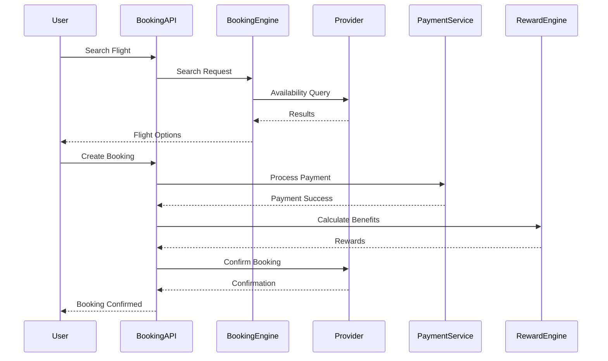

---

# BOOKING-017 Booking Error Codes

| Code | Description |
|---------|-------------|
| BOOK-001 | Flight unavailable |
| BOOK-002 | Hotel unavailable |
| BOOK-003 | Price changed |
| BOOK-004 | Payment failed |
| BOOK-005 | Cancellation failed |
| BOOK-006 | Refund pending |

---

# BOOKING-018 Booking API Catalog

| Endpoint ID | Method | URL |
|-|-|-|
| ENDPOINT-BOOKING-001 | POST | `/bookings/flights/search` |
| ENDPOINT-BOOKING-002 | POST | `/bookings/flights/availability` |
| ENDPOINT-BOOKING-003 | POST | `/bookings/hotels/search` |
| ENDPOINT-BOOKING-004 | POST | `/bookings/hotels/availability` |
| ENDPOINT-BOOKING-005 | POST | `/bookings/pricing` |
| ENDPOINT-BOOKING-006 | POST | `/bookings/coupons/validate` |
| ENDPOINT-BOOKING-007 | POST | `/bookings/coupons/apply` |
| ENDPOINT-BOOKING-008 | POST | `/bookings` |
| ENDPOINT-BOOKING-009 | GET | `/bookings/{bookingId}` |
| ENDPOINT-BOOKING-010 | GET | `/bookings` |
| ENDPOINT-BOOKING-011 | POST | `/bookings/{bookingId}/cancel` |
| ENDPOINT-BOOKING-012 | GET | `/bookings/{bookingId}/refund` |
| ENDPOINT-BOOKING-013 | POST | `/bookings/loyalty/optimize` |
| ENDPOINT-BOOKING-014 | GET | `/bookings/recommendations` |

---

# Part 7 — Analytics APIs & Admin APIs

---

# ANALYTICS-001 Analytics Platform Overview

The Analytics API provides financial intelligence, reporting, and behavioral insights across the CardWise ecosystem.

The Analytics Platform processes:

- Spending data
- Reward activity
- Card utilization
- Offer interactions
- Booking activity
- User engagement
- Financial trends
- Predictive insights

The APIs support:

- User dashboards
- Admin analytics
- Business intelligence
- Recommendation optimization
- AI-generated insights

---

# Analytics Service Base URL

```
/api/v1/analytics
```

---

# ANALYTICS-002 Dashboard Summary

## ENDPOINT-ANALYTICS-001

### Get Financial Dashboard

| Property | Value |
|----------|-------|
| Method | GET |
| URL | `/api/v1/analytics/dashboard` |
| Authentication | JWT Required |

---

## Response

```json
{
  "summary": {
    "monthlySpend": 185000,
    "rewardEarned": 5800,
    "rewardValue": 2900,
    "savings": 12000
  },
  "insights": []
}
```

---

# ANALYTICS-003 Spending Analytics

## ENDPOINT-ANALYTICS-002

```
GET /api/v1/analytics/spending
```

---

## Query Parameters

| Parameter | Description |
|-----------|-------------|
| from | Start date |
| to | End date |
| category | Spending category |
| cardId | Card filter |

---

## Response

```json
{
  "totalSpend": 185000,
  "categories": [
    {
      "name": "Travel",
      "amount": 50000
    }
  ]
}
```

---

# ANALYTICS-004 Spending Trends

## ENDPOINT-ANALYTICS-003

```
GET /api/v1/analytics/trends
```

---

## Response

```json
{
  "monthly": [
    {
      "month": "July",
      "spend": 185000
    }
  ]
}
```

---

# ANALYTICS-005 Financial Reports

## ENDPOINT-ANALYTICS-004

```
GET /api/v1/analytics/reports
```

---

## Query Parameters

| Parameter | Description |
|---|---|
| type | Monthly/Annual |
| year | Report year |

---

## Response

```json
{
  "reportId": "report_123",
  "status": "READY",
  "downloadUrl": "..."
}
```

---

# ANALYTICS-006 Spending Forecast

## ENDPOINT-ANALYTICS-005

```
POST /api/v1/analytics/forecast
```

---

## Request

```json
{
  "period": "NEXT_MONTH"
}
```

---

## Response

```json
{
  "forecast": {
    "estimatedSpend": 210000,
    "confidence": 0.89
  }
}
```

---

# ANALYTICS-007 AI Insights

## ENDPOINT-ANALYTICS-006

```
GET /api/v1/analytics/insights
```

---

## Response

```json
{
  "insights": [
    {
      "type": "SPENDING_ALERT",
      "message": "Travel spending increased by 20%"
    }
  ]
}
```

---

# ANALYTICS-008 Card Performance Analytics

## ENDPOINT-ANALYTICS-007

```
GET /api/v1/analytics/cards
```

---

## Response

```json
{
  "cards": [
    {
      "cardId": "card_123",
      "rewardEfficiency": 92,
      "utilization": 30
    }
  ]
}
```

---

# ANALYTICS-009 Analytics Sequence

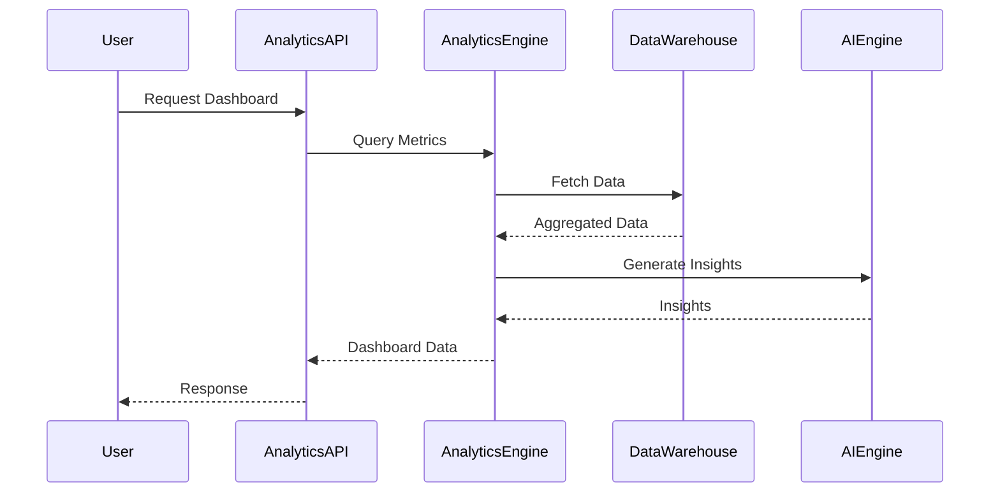

---

# ADMIN-001 Admin Platform Overview

The Admin API powers CardWise internal operations.

Admin capabilities:

- User management
- Card catalog management
- Offer management
- Merchant management
- AI configuration
- Feature flags
- Content management
- Audit tracking

All Admin APIs require:

- Admin authentication
- MFA
- RBAC permissions
- Audit logging

---

# Admin Service Base URL

```
/admin-api/v1
```

---

# ADMIN-002 User Management

---

## List Users

## ENDPOINT-ADMIN-001

```
GET /admin-api/v1/users
```

---

## Query Parameters

| Parameter | Description |
|---|---|
| search | Email/name search |
| status | Active/Blocked |
| role | User role |
| page | Pagination |

---

## Response

```json
{
  "users": [
    {
      "userId": "usr_123",
      "email": "user@example.com",
      "status": "ACTIVE"
    }
  ]
}
```

---

# ADMIN-003 User Details

## ENDPOINT-ADMIN-002

```
GET /admin-api/v1/users/{userId}
```

---

# ADMIN-004 Block User

## ENDPOINT-ADMIN-003

```
POST /admin-api/v1/users/{userId}/block
```

---

## Request

```json
{
  "reason": "Policy violation"
}
```

---

# ADMIN-005 Unblock User

## ENDPOINT-ADMIN-004

```
POST /admin-api/v1/users/{userId}/unblock
```

---

# ADMIN-006 Offer Management

---

## List Offers

## ENDPOINT-ADMIN-005

```
GET /admin-api/v1/offers
```

---

## Create Offer

## ENDPOINT-ADMIN-006

```
POST /admin-api/v1/offers
```

---

## Request

```json
{
  "merchant": "Amazon",
  "title": "10% Cashback",
  "validTill": "2026-12-01"
}
```

---

## Update Offer

## ENDPOINT-ADMIN-007

```
PATCH /admin-api/v1/offers/{offerId}
```

---

## Delete Offer

## ENDPOINT-ADMIN-008

```
DELETE /admin-api/v1/offers/{offerId}
```

---

# ADMIN-007 Merchant Management

---

## List Merchants

## ENDPOINT-ADMIN-009

```
GET /admin-api/v1/merchants
```

---

## Create Merchant

## ENDPOINT-ADMIN-010

```
POST /admin-api/v1/merchants
```

---

## Merchant Request

```json
{
  "name": "Amazon",
  "category": "Shopping",
  "website": "https://example.com"
}
```

---

# ADMIN-008 AI Configuration

## ENDPOINT-ADMIN-011

```
GET /admin-api/v1/ai/configuration
```

---

## Update AI Configuration

## ENDPOINT-ADMIN-012

```
PUT /admin-api/v1/ai/configuration
```

---

## Request

```json
{
  "modelVersion": "v2",
  "temperature": 0.4,
  "enabledFeatures": [
    "CHAT",
    "OCR"
  ]
}
```

---

# ADMIN-009 Feature Flags

## ENDPOINT-ADMIN-013

```
GET /admin-api/v1/features
```

---

## Create Feature Flag

## ENDPOINT-ADMIN-014

```
POST /admin-api/v1/features
```

---

## Update Feature Flag

## ENDPOINT-ADMIN-015

```
PATCH /admin-api/v1/features/{featureId}
```

---

## Response

```json
{
  "feature": "AI_ASSISTANT",
  "enabled": true,
  "rolloutPercentage": 50
}
```

---

# ADMIN-010 Audit Logs

## ENDPOINT-ADMIN-016

```
GET /admin-api/v1/audit-logs
```

---

## Query Parameters

| Parameter | Description |
|---|---|
| actor | User/admin |
| action | Action type |
| from | Date |
| to | Date |

---

## Response

```json
{
  "logs": [
    {
      "action": "OFFER_UPDATED",
      "actor": "admin_123",
      "timestamp": "2026-07-01T10:00:00Z"
    }
  ]
}
```

---

# ADMIN-011 Content Management

## List Content

## ENDPOINT-ADMIN-017

```
GET /admin-api/v1/content
```

---

## Create Content

## ENDPOINT-ADMIN-018

```
POST /admin-api/v1/content
```

---

## Update Content

## ENDPOINT-ADMIN-019

```
PATCH /admin-api/v1/content/{contentId}
```

---

# ADMIN-012 Admin Authorization Matrix

| Capability | Admin | Support | Analyst | Editor |
|-|-|-|-|-|
| User View | ✓ | ✓ | ✕ | ✕ |
| User Block | ✓ | ✓ | ✕ | ✕ |
| Offer Create | ✓ | ✕ | ✕ | ✓ |
| Offer Update | ✓ | ✕ | ✕ | ✓ |
| Analytics View | ✓ | ✓ | ✓ | ✕ |
| AI Config | ✓ | ✕ | ✕ | ✕ |
| Feature Flags | ✓ | ✕ | ✕ | ✕ |
| Audit Logs | ✓ | ✕ | ✕ | ✕ |

---

# ADMIN-013 Admin API Sequence

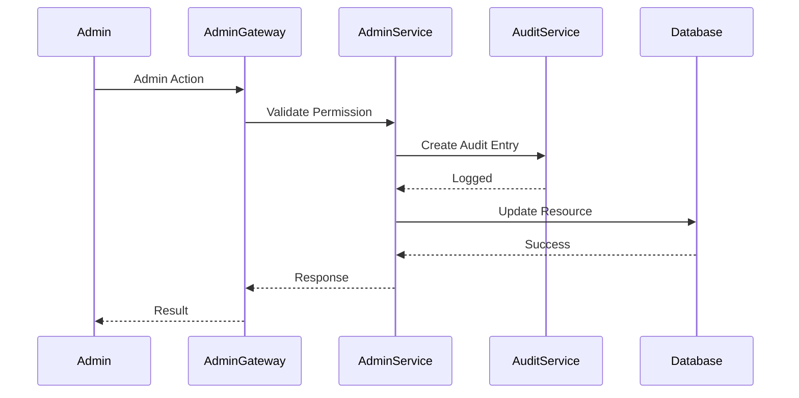

---

# ANALYTICS & ADMIN API Catalog

| Endpoint ID | Method | URL |
|-|-|-|
| ENDPOINT-ANALYTICS-001 | GET | `/analytics/dashboard` |
| ENDPOINT-ANALYTICS-002 | GET | `/analytics/spending` |
| ENDPOINT-ANALYTICS-003 | GET | `/analytics/trends` |
| ENDPOINT-ANALYTICS-004 | GET | `/analytics/reports` |
| ENDPOINT-ANALYTICS-005 | POST | `/analytics/forecast` |
| ENDPOINT-ANALYTICS-006 | GET | `/analytics/insights` |
| ENDPOINT-ADMIN-001 | GET | `/admin/users` |
| ENDPOINT-ADMIN-002 | GET | `/admin/users/{id}` |
| ENDPOINT-ADMIN-003 | POST | `/admin/users/{id}/block` |
| ENDPOINT-ADMIN-004 | POST | `/admin/users/{id}/unblock` |
| ENDPOINT-ADMIN-005 | GET | `/admin/offers` |
| ENDPOINT-ADMIN-006 | POST | `/admin/offers` |
| ENDPOINT-ADMIN-007 | PATCH | `/admin/offers/{id}` |
| ENDPOINT-ADMIN-008 | DELETE | `/admin/offers/{id}` |
| ENDPOINT-ADMIN-009 | GET | `/admin/merchants` |
| ENDPOINT-ADMIN-010 | POST | `/admin/merchants` |
| ENDPOINT-ADMIN-011 | GET | `/admin/ai/configuration` |
| ENDPOINT-ADMIN-012 | PUT | `/admin/ai/configuration` |
| ENDPOINT-ADMIN-013 | GET | `/admin/features` |
| ENDPOINT-ADMIN-014 | POST | `/admin/features` |
| ENDPOINT-ADMIN-015 | PATCH | `/admin/features/{id}` |
| ENDPOINT-ADMIN-016 | GET | `/admin/audit-logs` |

---

# Part 8 — Browser Extension APIs & Mobile APIs

---

# EXTENSION-001 Browser Extension Platform Overview

The CardWise Browser Extension provides intelligent payment optimization during online shopping and checkout journeys.

The Browser Extension API enables:

- Merchant detection
- Checkout analysis
- Card recommendation
- Offer discovery
- Reward optimization
- User authentication
- Configuration synchronization
- Extension telemetry

Supported browsers:

- Chrome
- Edge
- Firefox
- Safari (future)

---

# Browser Extension API Base URL

```
/api/v1/extension
```

---

# EXTENSION-002 Extension Authentication

## ENDPOINT-EXTENSION-001

### Authenticate Extension

| Property | Value |
|----------|-------|
| Method | POST |
| URL | `/api/v1/extension/authenticate` |
| Authentication | JWT Required |

---

## Request

```json
{
  "extensionId": "ext_123",
  "browser": "chrome",
  "version": "1.0.0"
}
```

---

## Response

```json
{
  "sessionToken": "...",
  "expiresIn": 86400
}
```

---

# EXTENSION-003 Merchant Detection

## ENDPOINT-EXTENSION-002

```
POST /api/v1/extension/merchant/detect
```

---

## Purpose

Identifies merchant context from browser activity.

---

## Request

```json
{
  "url": "https://amazon.in/product/123",
  "domain": "amazon.in"
}
```

---

## Response

```json
{
  "merchantId": "merchant_123",
  "merchantName": "Amazon",
  "category": "Shopping"
}
```

---

# EXTENSION-004 Checkout Analysis

## ENDPOINT-EXTENSION-003

```
POST /api/v1/extension/checkout/analyze
```

---

## Request

```json
{
  "merchantId": "merchant_123",
  "cartValue": 25000,
  "currency": "INR"
}
```

---

## Response

```json
{
  "eligibleOffers": [],
  "recommendedCards": [],
  "bestPaymentMethod": {
    "type": "CREDIT_CARD",
    "cardId": "card_123"
  }
}
```

---

# EXTENSION-005 Offer Suggestions

## ENDPOINT-EXTENSION-004

```
GET /api/v1/extension/offers
```

---

## Query Parameters

| Parameter | Description |
|-|-|
| merchantId | Merchant |
| amount | Cart value |

---

## Response

```json
{
  "offers": [
    {
      "offerId": "offer_123",
      "discount": "10%"
    }
  ]
}
```

---

# EXTENSION-006 Reward Suggestions

## ENDPOINT-EXTENSION-005

```
POST /api/v1/extension/rewards/recommend
```

---

## Request

```json
{
  "merchantId": "merchant_123",
  "amount": 10000
}
```

---

## Response

```json
{
  "recommendedCard": "card_123",
  "expectedReward": 500
}
```

---

# EXTENSION-007 Extension Configuration Sync

## ENDPOINT-EXTENSION-006

```
GET /api/v1/extension/configuration
```

---

## Response

```json
{
  "features": {
    "offerPopup": true,
    "rewardPrediction": true
  },
  "refreshInterval": 3600
}
```

---

# EXTENSION-008 Extension User Sync

## ENDPOINT-EXTENSION-007

```
POST /api/v1/extension/sync
```

---

## Request

```json
{
  "lastSync": "2026-07-01T10:00:00Z"
}
```

---

## Response

```json
{
  "updatedCards": [],
  "updatedOffers": [],
  "timestamp": "2026-07-01T12:00:00Z"
}
```

---

# EXTENSION-009 Extension Events

## ENDPOINT-EXTENSION-008

```
POST /api/v1/extension/events
```

---

## Supported Events

| Event | Description |
|-|-|
| merchant_detected | Website identified |
| offer_viewed | Offer shown |
| checkout_started | Checkout detected |
| recommendation_clicked | User interaction |
| purchase_completed | Conversion |

---

## Request

```json
{
  "event": "checkout_started",
  "merchantId": "merchant_123",
  "timestamp": "2026-07-01T10:00:00Z"
}
```

---

# EXTENSION-010 Extension API Flow

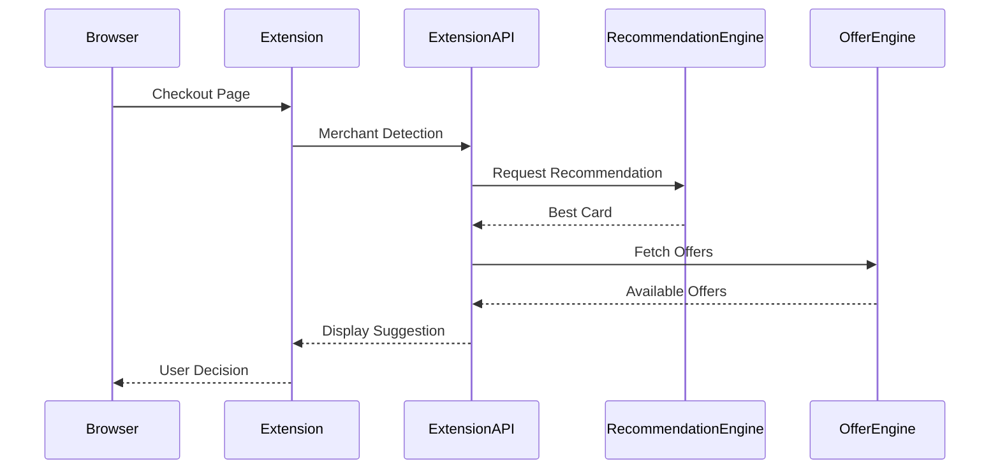

---

# MOBILE-001 Mobile Platform Overview

The Mobile API provides mobile-specific capabilities for:

- Device synchronization
- Push notifications
- Offline data synchronization
- Deep linking
- App configuration
- Mobile sessions

Supported platforms:

- iOS
- Android

---

# Mobile API Base URL

```
/api/v1/mobile
```

---

# MOBILE-002 Device Registration

## ENDPOINT-MOBILE-001

```
POST /api/v1/mobile/devices/register
```

---

## Request

```json
{
  "deviceId": "device_123",
  "platform": "ANDROID",
  "appVersion": "3.0.0",
  "pushToken": "token"
}
```

---

## Response

```json
{
  "registered": true
}
```

---

# MOBILE-003 Device Unregister

## ENDPOINT-MOBILE-002

```
DELETE /api/v1/mobile/devices/{deviceId}
```

---

# MOBILE-004 Push Notification Sync

## ENDPOINT-MOBILE-003

```
GET /api/v1/mobile/notifications
```

---

## Response

```json
{
  "notifications": [
    {
      "id": "notif_123",
      "title": "Reward Expiring",
      "read": false
    }
  ]
}
```

---

# MOBILE-005 Mark Notification Read

## ENDPOINT-MOBILE-004

```
PATCH /api/v1/mobile/notifications/{notificationId}
```

---

## Request

```json
{
  "status": "READ"
}
```

---

# MOBILE-006 Push Preferences

## ENDPOINT-MOBILE-005

```
GET /api/v1/mobile/push/preferences
```

---

## Update Preferences

## ENDPOINT-MOBILE-006

```
PUT /api/v1/mobile/push/preferences
```

---

## Request

```json
{
  "rewardAlerts": true,
  "offerAlerts": true,
  "paymentReminder": true
}
```

---

# MOBILE-007 Offline Synchronization

## ENDPOINT-MOBILE-007

```
POST /api/v1/mobile/sync
```

---

## Purpose

Synchronizes local mobile state with CardWise backend.

---

## Request

```json
{
  "lastSync": "2026-07-01T10:00:00Z",
  "entities": [
    "CARDS",
    "OFFERS",
    "REWARDS"
  ]
}
```

---

## Response

```json
{
  "syncId": "sync_123",
  "changes": {
    "cards": [],
    "offers": [],
    "rewards": []
  }
}
```

---

# MOBILE-008 Deep Links

## ENDPOINT-MOBILE-008

```
GET /api/v1/mobile/deeplinks/{linkId}
```

---

## Response

```json
{
  "destination": "CARD_DETAILS",
  "resourceId": "card_123"
}
```

---

# MOBILE-009 App Configuration

## ENDPOINT-MOBILE-009

```
GET /api/v1/mobile/configuration
```

---

## Response

```json
{
  "minimumVersion": "3.0.0",
  "maintenanceMode": false,
  "features": {
    "aiAssistant": true
  }
}
```

---

# MOBILE-010 Mobile API Sequence

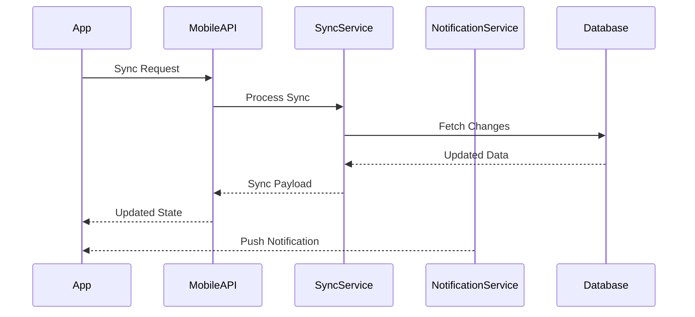

---

# EXTENSION & MOBILE API Catalog

| Endpoint ID | Method | URL |
|-|-|-|
| ENDPOINT-EXTENSION-001 | POST | `/extension/authenticate` |
| ENDPOINT-EXTENSION-002 | POST | `/extension/merchant/detect` |
| ENDPOINT-EXTENSION-003 | POST | `/extension/checkout/analyze` |
| ENDPOINT-EXTENSION-004 | GET | `/extension/offers` |
| ENDPOINT-EXTENSION-005 | POST | `/extension/rewards/recommend` |
| ENDPOINT-EXTENSION-006 | GET | `/extension/configuration` |
| ENDPOINT-EXTENSION-007 | POST | `/extension/sync` |
| ENDPOINT-EXTENSION-008 | POST | `/extension/events` |
| ENDPOINT-MOBILE-001 | POST | `/mobile/devices/register` |
| ENDPOINT-MOBILE-002 | DELETE | `/mobile/devices/{deviceId}` |
| ENDPOINT-MOBILE-003 | GET | `/mobile/notifications` |
| ENDPOINT-MOBILE-004 | PATCH | `/mobile/notifications/{id}` |
| ENDPOINT-MOBILE-005 | GET | `/mobile/push/preferences` |
| ENDPOINT-MOBILE-006 | PUT | `/mobile/push/preferences` |
| ENDPOINT-MOBILE-007 | POST | `/mobile/sync` |
| ENDPOINT-MOBILE-008 | GET | `/mobile/deeplinks/{id}` |
| ENDPOINT-MOBILE-009 | GET | `/mobile/configuration` |

---

# Part 9 — Error Handling, API Standards & Security

---

# ERR-001 Error Handling Overview

CardWise APIs follow a consistent error handling contract across all services.

The objective is to provide:

- Predictable error responses
- Machine-readable error codes
- Developer-friendly debugging
- Secure error exposure
- Distributed tracing support
- Retry guidance

---

# ERR-002 Standard Error Response

All API failures follow:

```json
{
  "success": false,
  "error": {
    "code": "ERR-400",
    "type": "VALIDATION_ERROR",
    "message": "Invalid request parameters",
    "details": [
      {
        "field": "email",
        "reason": "Invalid email format"
      }
    ]
  },
  "meta": {
    "requestId": "req_12345",
    "timestamp": "2026-07-08T10:30:00Z",
    "version": "v1"
  }
}
```

---

# ERR-003 Error Object Definition

| Field | Description |
|---|---|
| code | Stable CardWise error identifier |
| type | Error category |
| message | Human readable message |
| details | Validation details |
| requestId | Trace identifier |
| retryable | Retry recommendation |

---

# ERR-004 Error Categories

| Category | Description |
|-|-|
| AUTH | Authentication failures |
| ACCESS | Authorization failures |
| VALIDATION | Invalid input |
| RESOURCE | Resource state errors |
| PAYMENT | Payment failures |
| BOOKING | Booking failures |
| RATE_LIMIT | Request throttling |
| SYSTEM | Internal failures |
| INTEGRATION | External provider failures |

---

# ERR-005 Authentication Errors

| Error ID | HTTP | Description |
|-|-|-|
| AUTH-401 | 401 | Missing authentication |
| AUTH-402 | 401 | Invalid token |
| AUTH-403 | 401 | Expired token |
| AUTH-404 | 403 | MFA required |
| AUTH-405 | 403 | Account blocked |

---

# ERR-006 Validation Errors

| Error ID | HTTP | Description |
|-|-|-|
| ERR-VALIDATION-001 | 422 | Required field missing |
| ERR-VALIDATION-002 | 422 | Invalid format |
| ERR-VALIDATION-003 | 422 | Invalid enum value |
| ERR-VALIDATION-004 | 422 | Value out of range |

---

# ERR-007 Resource Errors

| Error ID | HTTP | Description |
|-|-|-|
| ERR-RESOURCE-001 | 404 | Resource not found |
| ERR-RESOURCE-002 | 409 | Resource conflict |
| ERR-RESOURCE-003 | 410 | Resource removed |

---

# ERR-008 Rate Limiting Errors

When rate limits are exceeded:

HTTP Status:

```
429 Too Many Requests
```

Response:

```json
{
  "success": false,
  "error": {
    "code": "RATE_LIMIT-001",
    "message": "Too many requests"
  },
  "meta": {
    "retryAfter": 60
  }
}
```

---

## Rate Limit Headers

Response includes:

```
X-RateLimit-Limit

X-RateLimit-Remaining

X-RateLimit-Reset

Retry-After
```

---

# ERR-009 Retry Semantics

Clients should retry only when:

| Error | Retry |
|-|-|
| 429 | Yes |
| 502 | Yes |
| 503 | Yes |
| 504 | Yes |
| 400 | No |
| 401 | No |
| 403 | No |
| 422 | No |

---

## Retry Strategy

Recommended:

```
Initial delay: 1 second

Backoff: Exponential

Maximum attempts: 3
```

Example:

```
1s → 2s → 4s
```

---

# ERR-010 Correlation IDs

Every request receives a correlation identifier.

Header:

```
X-Correlation-ID
```

Purpose:

- Distributed tracing
- Debugging
- Support investigations
- Incident management

---

Example:

```
X-Correlation-ID: cardwise-request-12345
```

---

# API-STD-001 Pagination Standards

All collection APIs support pagination.

Default:

```
page=1

limit=20
```

Maximum:

```
limit=100
```

---

## Pagination Request

Example:

```
GET /offers?page=2&limit=50
```

---

## Pagination Response

```json
{
  "data": [],
  "pagination": {
    "page": 2,
    "limit": 50,
    "total": 500,
    "totalPages": 10,
    "hasNext": true
  }
}
```

---

# API-STD-002 Cursor Pagination

Used for:

- Transactions
- Analytics streams
- Event feeds

Example:

```
GET /transactions?cursor=abc123
```

Response:

```json
{
  "items": [],
  "nextCursor": "xyz789"
}
```

---

# API-STD-003 Filtering

Filtering uses query parameters.

Example:

```
GET /cards?issuer=HDFC&status=ACTIVE
```

---

Supported filters:

| Resource | Filters |
|-|-|
| Cards | issuer, network, status |
| Offers | merchant, category, bank |
| Rewards | program, type |
| Bookings | type, status |
| Analytics | date range |

---

# API-STD-004 Sorting

Format:

```
sort={field}&order={direction}
```

Example:

```
GET /offers?sort=expiryDate&order=asc
```

---

Supported order:

```
asc

desc
```

---

# API-STD-005 Searching

Search endpoints support:

```
?q=query
```

Example:

```
GET /offers/search?q=flight
```

---

# API-STD-006 Idempotency

Required for sensitive POST operations.

Applicable APIs:

- Booking creation
- Payments
- Reward redemption
- Transfers

---

Header:

```
Idempotency-Key
```

Example:

```
Idempotency-Key: booking_123_request
```

---

Behavior:

First request:

```
Process operation
Store result
```

Duplicate request:

```
Return previous response
```

---

# API-STD-007 Caching

CardWise uses HTTP caching standards.

Supported headers:

```
Cache-Control

ETag

Last-Modified
```

---

Caching Strategy:

| Resource | Cache |
|-|-|
| Card Metadata | Long |
| Offers | Short |
| Recommendations | Short |
| User Data | Disabled |
| Analytics | Medium |

---

# API-STD-008 Compression

Supported:

```
gzip

brotli
```

Recommended for:

- Analytics
- Reports
- Large responses

---

# API-STD-009 Localization

Supported header:

```
Accept-Language
```

Example:

```
Accept-Language: en-IN
```

---

Supported languages:

| Language | Status |
|-|-|
| English | Supported |
| Hindi | Planned |
| Regional Languages | Future |

---

# API-STD-010 Currency Handling

All monetary values contain:

```json
{
  "amount": 5000,
  "currency": "INR"
}
```

---

Currency standard:

```
ISO-4217
```

---

# SECURITY-001 Security Overview

CardWise follows a zero-trust security model.

Security principles:

- Authentication everywhere
- Least privilege access
- Encryption by default
- Secure communication
- Auditability
- Data minimization

---

# SECURITY-002 JWT Authentication

JWT contains:

```json
{
  "sub": "userId",
  "role": "USER",
  "permissions": [],
  "exp": 123456789
}
```

---

Token properties:

| Property | Value |
|-|-|
| Algorithm | Asymmetric signing |
| Access Token | Short lived |
| Refresh Token | Rotated |
| Storage | Secure client storage |

---

# SECURITY-003 OAuth Security

Supported:

- Authorization Code Flow
- PKCE
- Client Credentials

Used for:

- External partners
- Third-party integrations

---

# SECURITY-004 RBAC

Authorization model:

```
User

↓

Role

↓

Permission

↓

Resource
```

---

Example:

```
ADMIN

↓

OFFER_WRITE

↓

Create Offer
```

---

# SECURITY-005 API Keys

Used for:

- Internal integrations
- Partner APIs

Requirements:

- Rotation
- Expiration
- Scope restrictions
- Usage monitoring

---

# SECURITY-006 Request Signing

Used for:

- Webhooks
- Financial integrations

Algorithm:

```
HMAC-SHA256
```

---

Header:

```
X-Signature
```

---

# SECURITY-007 Encryption

## Transport

```
TLS 1.3
```

---

## Data Encryption

Sensitive data encrypted:

- Card information
- Personal information
- Financial records
- Tokens

---

# SECURITY-008 CORS

Allowed origins:

Production:

```
https://cardwise.com
```

Development:

```
localhost
```

---

Restrictions:

- Explicit origins only
- Credentials controlled
- Methods restricted

---

# SECURITY-009 CSRF Protection

Enabled for:

- Browser sessions
- Admin operations

Methods:

- CSRF tokens
- SameSite cookies
- Origin validation

---

# SECURITY-010 Input Validation

All APIs validate:

- Payload schema
- Data types
- Length
- Format
- Allowed characters
- Business rules

Protection against:

- Injection attacks
- XSS
- Malicious payloads
- Abuse patterns

---

# Security Request Flow

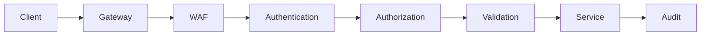

---

# Security Decision Matrix

| Capability | User | Admin | Service |
|-|-|-|-|
| JWT | ✓ | ✓ | Optional |
| MFA | Optional | Mandatory | N/A |
| RBAC | ✓ | ✓ | ✓ |
| API Keys | ✕ | Optional | ✓ |
| mTLS | ✕ | ✕ | ✓ |
| Audit Logs | Limited | Full | Full |

---

# Part 10 — Webhooks, SDK Guidelines, GraphQL Gateway, API Lifecycle & Final Standards

---

# WEBHOOK-001 Webhook Platform Overview

CardWise Webhooks provide event-driven communication between CardWise and external systems.

Webhooks are used for:

- Payment lifecycle updates
- Booking lifecycle updates
- Offer changes
- AI processing completion
- Notification events
- User account events
- Partner integrations

---

# WEBHOOK-002 Webhook Architecture

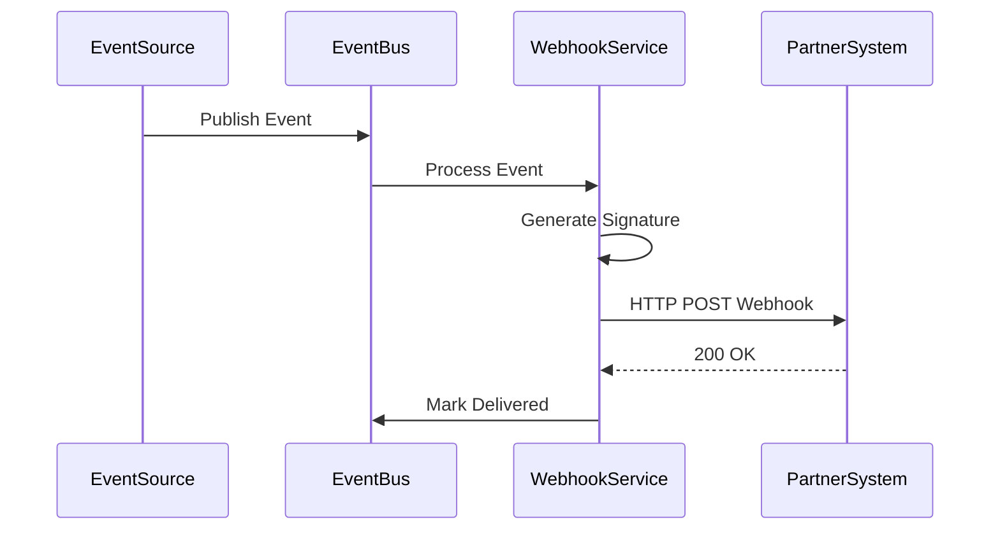

---

# WEBHOOK-003 Webhook Request Standard

All webhook requests contain:

Headers:

```
X-Webhook-ID

X-Webhook-Event

X-Webhook-Timestamp

X-Webhook-Signature
```

---

## Payload Format

```json
{
  "id": "event_123",
  "type": "booking.confirmed",
  "timestamp": "2026-07-08T10:00:00Z",
  "data": {}
}
```

---

# WEBHOOK-004 Webhook Security

Webhook consumers must validate:

- Signature
- Timestamp
- Event ID
- Replay protection

---

Signature:

```
HMAC-SHA256(payload + timestamp)
```

---

# WEBHOOK-005 Payment Events

---

## payment.created

Triggered when payment starts.

```json
{
  "paymentId": "pay_123",
  "amount": 50000,
  "currency": "INR",
  "status": "CREATED"
}
```

---

## payment.completed

Triggered after successful payment.

---

## payment.failed

Triggered after failed payment.

---

# WEBHOOK-006 Booking Events

Supported events:

| Event | Description |
|-|-|
| booking.created | Booking initiated |
| booking.confirmed | Booking confirmed |
| booking.failed | Booking failed |
| booking.cancelled | Booking cancelled |
| booking.refunded | Refund completed |

---

Example:

```json
{
  "bookingId": "booking_123",
  "status": "CONFIRMED"
}
```

---

# WEBHOOK-007 Offer Events

Supported:

| Event | Description |
|-|-|
| offer.created | New offer |
| offer.updated | Offer modified |
| offer.expired | Offer expired |

---

Example:

```json
{
  "offerId": "offer_123",
  "merchant": "Amazon"
}
```

---

# WEBHOOK-008 AI Events

Supported:

| Event | Description |
|-|-|
| ai.request.created | Processing started |
| ai.request.completed | Processing completed |
| ai.request.failed | Processing failed |

---

Example:

```json
{
  "jobId": "job_123",
  "status": "COMPLETED"
}
```

---

# WEBHOOK-009 User Events

Supported:

| Event | Description |
|-|-|
| user.created | New user |
| user.updated | Profile updated |
| user.deleted | Account deleted |
| user.device.registered | Device added |

---

# WEBHOOK-010 Webhook Retry Policy

Failed deliveries follow:

```
Attempt 1
↓
1 minute
↓
Attempt 2
↓
5 minutes
↓
Attempt 3
↓
30 minutes
↓
Dead Letter Queue
```

---

Retry conditions:

| Status | Retry |
|-|-|
| 200 | No |
| 201 | No |
| 400 | No |
| 401 | No |
| 429 | Yes |
| 500 | Yes |
| Timeout | Yes |

---

# SDK-001 SDK Overview

CardWise provides official SDK guidelines for simplifying API consumption.

Supported SDK targets:

- JavaScript
- TypeScript
- Swift
- Kotlin
- REST Clients
- Future GraphQL Client

---

# SDK-002 JavaScript SDK

Package:

```
@cardwise/sdk
```

Capabilities:

- Authentication handling
- Token refresh
- API clients
- Error handling
- Retry handling
- Type definitions

---

Example capabilities:

```json
{
  "client": "CardWiseClient",
  "features": [
    "cards",
    "rewards",
    "offers",
    "recommendations"
  ]
}
```

---

# SDK-003 TypeScript Support

Requirements:

- Strong typing
- Generated interfaces
- API response models
- Error types

Supported:

```
TypeScript >= 5
```

---

# SDK-004 Swift SDK

Target:

```
iOS 16+
```

Capabilities:

- Async networking
- Secure token storage
- Push notification handling
- Offline sync

---

# SDK-005 Kotlin SDK

Target:

```
Android API 26+
```

Capabilities:

- Coroutines
- Secure storage
- Background synchronization
- Push handling

---

# SDK-006 REST Client Guidelines

All SDKs must support:

- Authentication lifecycle
- Request cancellation
- Timeout configuration
- Retry configuration
- Logging controls
- Environment switching

---

# SDK-007 Environment Support

Supported environments:

| Environment | URL |
|-|-|
| Development | dev-api |
| Staging | staging-api |
| Production | api.cardwise.com |

---

# API-GQL-001 Future GraphQL Gateway

CardWise may introduce a GraphQL gateway for complex read-heavy experiences.

Potential use cases:

- Dashboard aggregation
- AI assistant queries
- Personalized feeds
- Analytics visualization

---

# GraphQL Strategy

REST remains the primary API contract.

GraphQL is an aggregation layer.

Architecture:

```mermaid
flowchart LR

Clients

GraphQLGateway

REST APIs

Services

Database


Clients --> GraphQLGateway

GraphQLGateway --> REST APIs

REST APIs --> Services

Services --> Database
```

---

# API-VERSION-001 API Version Lifecycle

CardWise follows semantic API lifecycle management.

Lifecycle:

```
Design

↓

Review

↓

Beta

↓

Stable

↓

Deprecated

↓

Sunset
```

---

# API-VERSION-002 Backward Compatibility

Within a major version:

Allowed:

- Add optional fields
- Add endpoints
- Add optional parameters
- Add response metadata

Not allowed:

- Remove fields
- Rename fields
- Change field types
- Remove endpoints
- Change authentication behavior

---

# API-VERSION-003 Deprecation Policy

Deprecated APIs receive:

Response Header:

```
X-API-Deprecated: true
```

Additional headers:

```
Sunset: <date>

Link: migration-document
```

---

# API-VERSION-004 Migration Strategy

Migration process:

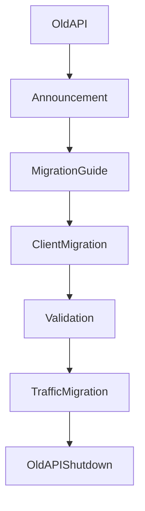

---

# API-OPS-001 Operational Standards

Every production API must provide:

- Health checks
- Metrics
- Logs
- Distributed tracing
- Error monitoring
- SLA tracking

---

# API-OPS-002 Required Metrics

Tracked metrics:

| Metric | Purpose |
|-|-|
| Request latency | Performance |
| Error rate | Reliability |
| Throughput | Capacity |
| Rate limit usage | Abuse prevention |
| Dependency failures | Stability |

---

# API-OPS-003 Observability Headers

Supported:

```
X-Correlation-ID

X-Request-ID

X-Client-Version

X-Trace-ID
```

---

# API-OPS-004 API Documentation Requirements

Every API addition requires:

- Endpoint documentation
- Request schema
- Response schema
- Error mapping
- Security review
- Performance expectations
- Example payloads
- Migration impact

---

# API-FINAL-001 CardWise API Principles Summary

| Principle | Implementation |
|-|-|
| Consistency | Standard contracts |
| Security | Zero trust |
| Reliability | Idempotency |
| Scalability | Stateless APIs |
| Developer Experience | SDK support |
| Compatibility | Versioning |
| Observability | Distributed tracing |
| Extensibility | Service-based APIs |

---

# API-FINAL-002 Complete API Ecosystem

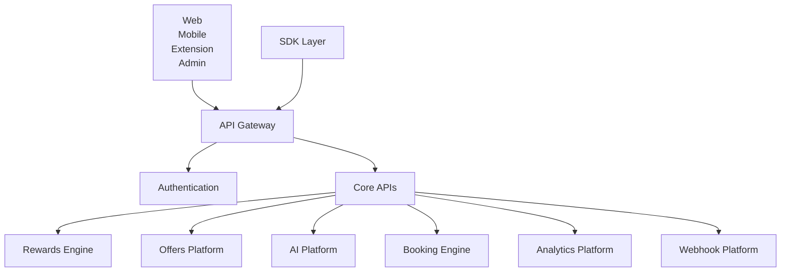

---

# API-FINAL-003 Document Completion

This API Reference establishes the official CardWise API contract.

It defines:

- Authentication interfaces
- User management APIs
- Credit card APIs
- Rewards APIs
- Offers APIs
- Recommendation APIs
- AI APIs
- Booking APIs
- Analytics APIs
- Admin APIs
- Browser Extension APIs
- Mobile APIs
- Error standards
- Security standards
- Webhook contracts
- SDK guidelines
- Versioning lifecycle

Future API additions must follow the standards defined in this document.

---

# End of Document

`docs/21_API_REFERENCE.md`

---