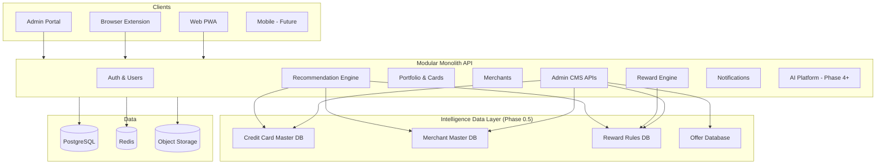

# CardWise — Cursor Project Bootstrap Plan

## Status

**Updated after architecture review — Approved**

Awaiting Sprint 0 kickoff. No application code has been written.

## Changes Applied

1. **Data Foundation phase added** — Phase 0.5 inserted between engineering foundation and Core MVP
2. **Admin CMS moved earlier** — Admin CMS v0 delivered in Phase 0.5 (not Phase 2/3)
3. **Analytics architecture added** — `@cardwise/analytics` with centralized event tracking from Phase 0
4. **Feature flag system added** — PostHog Feature Flags from Phase 0; internal service deferred
5. **Privacy baseline added** — Phase 0 privacy implementation; full governance doc before public beta
6. **Repository structure updated** — `database-seed`, `analytics`, `feature-flags` packages; admin app at Phase 0.5
7. **Phase dependency flow updated** — Foundation → Data Foundation → MVP → Personalization → Travel → AI → Copilot
8. **Seed strategy added** — Version-controlled seed files in `packages/database-seed/`
9. **Reward rule architecture clarified** — Configuration-driven, database-versioned rules; no hardcoded business logic
10. **Product Analytics Dashboard strategy added** — Phase 1 PostHog dashboards for user, recommendation, merchant, and card intelligence metrics

---

> **Author:** Engineering leadership (CTO / Principal Architect)  
> **Date:** 2026-07-08 (revised 2026-07-08)  
> **Scope:** Implementation blueprint only — no code

---

## Executive Summary

CardWise is an **AI-first Financial Decision Intelligence Platform** focused initially on Indian credit cards. The product answers one question better than anything else: **“Which card should I use right now?”** and evolves into a full financial operating system.

The documentation set (22 planned files, ~100K+ lines) is unusually thorough for a greenfield project. Architecture direction is sound: **modular monolith**, **domain-driven design**, **API-first**, **rules-before-LLM**, **event-ready**, **multi-client** (web, extension, mobile, admin).

This bootstrap plan **validates feasibility**, **resolves documented inconsistencies**, and defines the **exact execution order** for Phase 0, Phase 0.5, and Phase 1.

**Verdict:** The product vision and architecture are **feasible** for a disciplined solo/small team. **Phase 0.5 (Data Foundation)** correctly addresses the critical insight that CardWise is a recommendation intelligence platform — recommendation quality depends on structured, accurate, maintainable data before any engine code is written. The primary risks are **seed data accuracy**, **reward rule complexity**, **Admin CMS delivery timeline**, and **timeline optimism** (Phase 1 remains full-scope including extension + notifications).

---

# 1. Documentation Review

## 1.1 Product Understanding

### What CardWise Is

| Dimension | Summary |
|-----------|---------|
| **Category** | Financial Decision Intelligence Platform — not a comparison site, expense tracker, or bank app |
| **Core job** | Maximize value of every transaction by recommending the optimal payment instrument |
| **Initial market** | India — credit cards, merchant offers, UPI-adjacent decisions |
| **Long-term** | Intelligence layer above cards, wallets, loyalty, travel, investments |

### Primary User Value (Phase 1 MVP)

1. Add and manage a personal card portfolio
2. Search merchants
3. Receive **explainable** best-card recommendations
4. Understand estimated savings
5. Access via responsive web PWA + basic browser extension

### Product Philosophy (Consistent Across Docs)

- **Deterministic before generative** — reward math must never depend on LLMs
- **Explainability before intelligence** — every recommendation shows rationale
- **Platform before features** — invest in foundations (Phase 0)
- **Quality before speed** — production standards from day one
- **User owns data** — export, delete, privacy by design

### Target Users

Working professionals, reward optimizers, premium card holders, frequent travelers — expanding later to students, first-time users, families, and small businesses.

---

## 1.2 Architecture Understanding

### High-Level System



### Architectural Decisions (Accepted Pattern)

| Decision | Source | Rationale |
|----------|--------|-----------|
| Modular monolith (not microservices day 1) | ADR-008, Backend Architecture | Faster delivery, lower ops burden, clear module boundaries |
| Domain-driven bounded contexts | ADR-007, DB Design | Independent evolution, future service extraction |
| Hexagonal / clean architecture per module | Backend Architecture | Testability, swappable infrastructure |
| REST + OpenAPI | ADR-009, ADR-023 | Stable contracts, multi-client support |
| Event-driven cross-domain communication | ADR-010 | Loose coupling; async workflows |
| Rules engine before LLMs | ADR-026 | Trust, determinism, explainability |
| Monorepo | ADR-006 | Shared types, UI, config, coordinated releases |
| AWS + Kubernetes (production target) | ADR-032, ADR-033, DevOps doc | Cloud-native, scalable |
| PostgreSQL as system of record | ADR-020 | Relational financial data, ACID, schema partitioning |
| Zero Trust security | ADR-036, Security doc | Defense in depth, continuous verification |

### Database Model

- PostgreSQL with **schema-per-bounded-context** (`users`, `cards`, `merchants`, `rewards`, etc.)
- UUID v7 primary keys, soft deletes, audit trails, optimistic versioning
- Prisma ORM with forward-only migrations (expand → migrate → contract)
- Redis for cache and ephemeral state; OpenSearch/ClickHouse/Kafka deferred until scale demands

---

## 1.3 Features Understanding

The Engineering Product Specification (`04_FEATURE_SPECIFICATIONS.md`) defines 52 chapters across:

| Domain | Key Capabilities |
|--------|------------------|
| **Core Platform** | Auth, onboarding, dashboard, profile, settings |
| **Portfolio** | Card catalog, user cards, comparison, details |
| **Financial Tracking** | Transactions, statements, bills (Phase 2+) |
| **Rewards** | Engine, cashback, milestones, redemption |
| **Offers & Benefits** | Merchant offers, bank offers, travel, lounge, EMI |
| **Intelligence** | Recommendation engine, AI assistant, search |
| **Productivity** | Calendar, reports, analytics |
| **Integrations** | Import/export, bank connections (future) |
| **Growth** | Premium, referrals, gamification |
| **Admin** | Card catalog CMS, user management, ops console |

**Phase 1 MVP scope** (unchanged — full scope, no sub-phases):

- Authentication
- User profile
- Credit card portfolio
- Merchant directory
- Reward engine V1
- Recommendation engine V1
- Dashboard
- Basic browser extension
- Notifications
- Analytics
- Settings

**Prerequisite:** Phase 0.5 data foundation complete (card catalog, merchant catalog, reward rules, benefit data, Admin CMS v0 operational)

**Explicitly excluded from Phase 1:** AI copilot, travel planning, knowledge graph, premium subscription, autonomous automation

---

## 1.4 Roadmap Understanding

| Phase | Roadmap Name | Primary Goal |
|-------|--------------|--------------|
| **0** | Foundation & Architecture | Repo, tooling, CI/CD, design system, analytics + feature flags foundation |
| **0.5** | Data Foundation & Intelligence Foundation | Card/merchant/offer master data, reward rules, seed pipeline, Admin CMS v0 |
| **1** | Core MVP | “Which card should I use?” — full consumer product |
| **2** | Public Beta & Personalization | Deeper recommendations, personalization, extension V2 |
| **3** | Travel Platform | Travel hub, trip planning, travel optimization |
| **4** | AI Intelligence Platform | RAG, knowledge graph, conversational AI |
| **5** | Financial Copilot | Proactive AI assistant |
| **6** | Production Excellence | Launch readiness |
| **7** | Continuous Evolution | Long-term platform growth |

### Implementation Dependency Flow

```text
Phase 0
Engineering Foundation
        ↓
Phase 0.5
Data Foundation
- Card Database
- Merchant Database
- Reward Rules
- Admin CMS v0
- Analytics Events
- Feature Flags
        ↓
Phase 1
Core MVP
- Authentication
- Card Portfolio
- Recommendation Engine
- Dashboard
- Browser Extension
- Notifications
- Analytics
        ↓
Phase 2
Personalization
        ↓
Phase 3
Travel Platform
        ↓
Phase 4
AI Intelligence Platform
        ↓
Phase 5
Financial Copilot
        ↓
Phase 6–7
Production Excellence & Continuous Evolution
```

**Implementation sequencing principle:** Foundation → **Data Foundation** → Platform → Intelligence → Scale

---

# 2. Architecture Validation

## 2.1 Frontend Architecture

### Good Decisions

| Decision | Why It Works |
|----------|--------------|
| Feature-first folder structure | Aligns with bounded contexts; enables lazy loading |
| Zustand + TanStack Query separation | Clear client vs server state; avoids over-rendering |
| shadcn/ui + Radix + Tailwind | Accessible, customizable, no vendor lock-in |
| React Router v7 route boundaries | Matches domain navigation (ADR-017) |
| PWA / offline-first philosophy | Resilience for Indian mobile connectivity patterns |
| Performance budgets from Phase 0 | LCP < 2.5s, bundle < 250KB — appropriate for fintech UX |

### Risky Decisions

| Risk | Impact | Mitigation |
|------|--------|------------|
| **Next.js vs Vite conflict across docs** | Wrong scaffold, wasted rework | **Finalize: Vite + React 19 SPA/PWA** (see Section 3) |
| PWA + offline-first in Phase 0 | Scope creep before core value | Implement service worker shell in Phase 0; full offline sync in Phase 2+ |
| Framer Motion everywhere | Bundle bloat | Lazy-load motion; respect `prefers-reduced-motion` |
| Multiple clients sharing UI package early | Coupling | Extract to `@cardwise/ui` only when 2+ apps need same components |

### Required Improvements

1. **Resolve Next.js references** in Phase 0 checklist — replace with Vite + React Router
2. Add explicit **SEO strategy** (marketing site may need separate Next.js app later — out of MVP scope)
3. Define **extension ↔ web shared code boundaries** before Phase 1 extension work

---

## 2.2 Backend Architecture

### Good Decisions

| Decision | Why It Works |
|----------|--------------|
| Modular monolith with identical module internal structure | Predictable; AI agents and humans navigate easily |
| Hexagonal architecture (ports/adapters) | Swappable Prisma, Redis, email, AI providers |
| REST + OpenAPI first | Multi-client, contract testing, SDK generation |
| Domain events for cross-module communication | Avoids direct DB access across contexts |
| JWT + RBAC centralized auth | Matches security doc; extension/mobile compatible |
| Pino structured logging | Production-grade observability |

### Risky Decisions

| Risk | Impact | Mitigation |
|------|--------|------------|
| **NestJS vs Fastify ADR conflict** | Team builds wrong framework | **Finalize: NestJS on Fastify adapter** (Section 3) |
| **Kafka in Phase 0** | Massive ops overhead for solo builder | **Defer Kafka**; use BullMQ + Redis; migrate at Phase 3+ |
| OpenSearch + ClickHouse in initial stack | Premature complexity | Add when search/analytics features ship (Phase 2–3) |
| 20+ backend modules documented pre-MVP | Over-engineering temptation | Implement only Phase 0–1 modules; stub interfaces for future |
| NestJS Scheduler + BullMQ + Kafka (three job systems) | Confusion | **Single job abstraction** over BullMQ initially |

### Required Improvements

1. Update ADR-019 status to **Superseded** or amend to “NestJS with Fastify HTTP adapter”
2. Create **module activation map** — which modules exist in which phase
3. ~~Define **card catalog ownership**~~ — **Resolved:** Admin CMS v0 + version-controlled seed pipeline in Phase 0.5

---

## 2.3 Database Design

### Good Decisions

| Decision | Why It Works |
|----------|--------------|
| Schema-per-bounded-context | Clear ownership; future extraction |
| UUID v7 | Distributed-friendly, sortable |
| Soft delete + audit logs | Compliance, user trust, debugging |
| Expand-migrate-contract migrations | Zero-downtime evolution |
| Tenant-ready design (single-tenant MVP) | Enterprise path without rewrite |

### Risky Decisions

| Risk | Impact | Mitigation |
|------|--------|------------|
| Full schema defined upfront (~50+ tables) | Migration fatigue | **Phase migrations** — only create tables when features ship |
| Cross-schema FK references | Coupling between contexts | Enforce via application services; document allowed FKs |
| Reward rules in DB + code | Complex to maintain | **Phase 0.5:** Versioned rule definitions in DB; Admin CMS v0 for rule management; configuration over hardcoding |

### Required Improvements

1. Publish **Phase 0 schema** (users, sessions, audit_logs, settings only)
2. Publish **Phase 0.5 schema** (credit card master, merchant master, reward rules, offers, benefits, version history)
3. Publish **Phase 1 schema addendum** (user_cards, recommendations, notifications, analytics events)
4. **Phase 0 privacy baseline** implemented before real user production data; full `22_DATA_PRIVACY_AND_GOVERNANCE.md` before public beta

---

## 2.4 AI Architecture

### Good Decisions

| Decision | Why It Works |
|----------|--------------|
| Rules engine before LLMs (ADR-026) | Financial trust; deterministic MVP |
| Provider-agnostic AI gateway (ADR-028) | No OpenAI lock-in |
| Hybrid intelligence (rules + ML + LLM explanation) | Best of precision and UX |
| Explainability as first-class output | Regulatory and user trust |
| MCP-compatible tool layer | Future agent extensibility |

### Risky Decisions

| Risk | Impact | Mitigation |
|------|--------|------------|
| LangChain in Phase 0 stack | Unnecessary for MVP | **Exclude until Phase 4** |
| Vector DB in roadmap Phase 4 but mentioned in Phase 0 AI stack | Confusion | No vector infra until semantic search ships |
| Knowledge graph ambition | High engineering cost | Start with relational merchant/card graph queries |
| AI evaluation framework (ADR-031) before AI features | Premature | Define eval harness when first LLM feature ships |

### Required Improvements

1. Phase 1 recommendation engine = **pure deterministic rules** — zero LLM dependency; rules loaded from Phase 0.5 database
2. ~~Define **card rule authoring format**~~ — **Resolved:** JSON rule schema in `packages/database-seed/reward-rules.json` + Admin CMS
3. Document **human-in-the-loop** for card catalog updates via Admin CMS v0

---

## 2.5 Infrastructure

### Good Decisions

| Decision | Why It Works |
|----------|--------------|
| AWS as primary cloud | Mature fintech compliance path (India: ap-south-1) |
| Multi-account AWS organization | Blast radius isolation |
| Terraform IaC (ADR-034) | Reproducible environments |
| GitHub Actions CI/CD | Standard, well-documented |
| OpenTelemetry + Grafana stack | Industry-standard observability |
| Docker Compose for local dev | Fast onboarding |

### Risky Decisions

| Risk | Impact | Mitigation |
|------|--------|------------|
| **Kubernetes from Phase 0** for solo builder | Weeks lost to cluster ops | **Local: Docker Compose; Staging: ECS Fargate or single EKS; Prod: EKS when traffic warrants** |
| Full Prometheus/Grafana/Loki/Tempo stack in Phase 0 | Overkill | Phase 0: **Sentry + structured logs + health checks**; full stack Phase 3+ |
| Cloudflare + NGINX + AWS WAF + K8s ingress | Layer redundancy confusion | Document single request path per environment |
| Bun mentioned as preferred dev runtime | Toolchain inconsistency | **Node.js LTS only** for CI/production parity |

### Required Improvements

1. Define **environment progression**: `local → preview → staging → production`
2. Staging cost budget and **minimum viable infra** for Phase 0–1
3. Preview deployments per PR (Vercel for web static? or container preview?) — decide in Sprint 1

---

## 2.6 Security

### Good Decisions

| Decision | Why It Works |
|----------|--------------|
| Zero Trust architecture | Appropriate for financial data |
| OAuth 2.1 + OIDC + MFA roadmap | Industry standard |
| Encryption at rest (KMS) + in transit (TLS) | Baseline compliance |
| CSP, CSRF, rate limiting from Phase 0 | Security not bolted on later |
| Audit logging for auth events | Incident response ready |
| No PCI scope initially (no card numbers stored) | Reduces compliance burden |

### Risky Decisions

| Risk | Impact | Mitigation |
|------|--------|------------|
| Empty data privacy doc (`22_`) | DPDP Act (India) compliance gap | **Phase 0 privacy baseline** before real user data; full governance doc before **public beta** (does not block development) |
| JWT in extension storage | XSS token theft | HttpOnly cookies for web; extension uses short-lived tokens + PKCE |
| Admin portal attack surface | Expanded risk | **Separate admin RBAC** from consumer auth; IP allowlist in staging; Admin CMS v0 in Phase 0.5 |

### Required Improvements

1. Implement **Phase 0 Privacy Baseline** (see Section 5.1) before handling real user production data
2. Complete `22_DATA_PRIVACY_AND_GOVERNANCE.md` before public beta launch
3. Threat model review for **browser extension** (Manifest V3, content script isolation)
4. Secrets: **AWS Secrets Manager** in cloud; `.env.local` locally — never commit

---

## 2.7 Documentation Inconsistencies (Must Resolve Before Coding)

| # | Inconsistency | Documents Affected | Resolution |
|---|---------------|-------------------|------------|
| 1 | **Backend framework: NestJS vs Fastify** | `06_BACKEND`, `00_MASTER`, `03_ROADMAP` vs `19_ADR-019`, `18_IMPL_GUIDE` | **NestJS + `@nestjs/platform-fastify`** |
| 2 | **Frontend: Next.js vs Vite + React Router** | `03_ROADMAP` Phase 0 checklist vs `07_FRONTEND`, `00_MASTER`, `18_IMPL_GUIDE` | **Vite + React 19 + React Router v7** |
| 3 | **Job queue: BullMQ vs Kafka** | `03_ROADMAP` vs `06_BACKEND`, `15_TESTING` | **BullMQ + Redis (Phase 0–2); Kafka Phase 3+** |
| 4 | **Project name: `cardwise` vs `credit-card-os`** | `00_MASTER_PROMPT` vs all other docs | **`cardwise`** (npm scope: `@cardwise/*`) |
| 5 | **Phase numbering mismatch** | `03_ROADMAP` (8 phases) vs `18_IMPL_GUIDE` (11 phases) | Use **Roadmap phases 0–7** as product truth; map impl guide tasks into them |
| 6 | **Browser extension timing** | Roadmap Phase 1 includes extension; Impl Guide Phase 5 | **Include basic extension in Phase 1** (roadmap wins — it's core value prop) |
| 7 | **Runtime: Bun vs Node** | `18_IMPL_GUIDE` mentions Bun | **Node.js 22 LTS** everywhere |
| 8 | **Empty privacy document** | `22_DATA_PRIVACY_AND_GOVERNANCE.md` | Phase 0 baseline in code; full doc before public beta |
| 9 | **Validation library: Zod in both FE/BE** | Backend arch mentions Zod; NestJS typically uses class-validator | **Zod everywhere** via `nestjs-zod` or shared schemas in `@cardwise/types` |

---

## 2.8 Missing Decisions — Resolved

The following decisions were open in the initial bootstrap plan and are now **approved**:

| # | Decision | Approved Resolution |
|---|----------|-------------------|
| 1 | Preview deployment target | AWS ECS Fargate per environment |
| 2 | Email provider | AWS SES (staging) / Resend (dev DX optional) |
| 3 | Card catalog initial data source | **Manual curated seed + Admin CMS v0** |
| 4 | Merchant data source | **Curated merchant database + MCC mapping** |
| 5 | Auth approach | Custom JWT + Google OAuth |
| 6 | Analytics | **PostHog Cloud** with centralized `@cardwise/analytics` |
| 7 | Feature flags | **PostHog Feature Flags** (Phase 0); internal service if needed later |
| 8 | Domain & SSL | Route 53 + ACM + Cloudflare |
| 9 | Error tracking | Sentry |
| 10 | Indian locale defaults | `en-IN`, `Asia/Kolkata`, `INR` |
| 11 | Monorepo package manager | pnpm |
| 12 | Reward rules architecture | **Database-driven, versioned, configuration over hardcoding** |
| 13 | Admin security | **Separate RBAC system** for admin portal |
| 14 | Seed management | **Version-controlled seed files** in `packages/database-seed/` |

### Remaining Open Decisions

| # | Decision Needed | Deadline |
|---|-----------------|----------|
| 1 | Marketing site hosting (if separate from web app) | Before public launch |
| 2 | Internal feature flag service trigger criteria | Phase 3 review |
| 3 | Mig core CPU operation workers to Rust (FBI-001) | Post M-083 / profiling evidence; ADR required — see master plan Future Backlog |

---

## 2.9 Technical Risks

| Risk | Severity | Likelihood | Mitigation |
|------|----------|------------|------------|
| Card/reward rule data accuracy | **Critical** | High | Phase 0.5 Admin CMS v0, versioned rules, curated seed, user feedback loop, disclaimers |
| Phase 1 scope too large for solo builder | **High** | High | Phase 0.5 de-risks data; Phase 1 remains full-scope per product decision |
| Phase 0.5 data curation effort | **High** | High | Start with top 100 cards / 500 merchants; expand iteratively via Admin CMS |
| Admin CMS v0 delivery | **High** | Medium | Scope to CRUD + rule versioning only; no advanced workflows |
| Kubernetes ops burden | **High** | Medium | ECS Fargate for staging; EKS only for production scale |
| Documentation drift during implementation | **Medium** | High | ADR updates required for any stack deviation; doc 23 as living index |
| Reward engine edge cases (exclusions, caps, milestones) | **High** | High | Extensive unit tests; start with top 20 cards only |
| Extension Chrome Web Store review delays | **Medium** | Medium | Start extension submission early; web app is primary |
| DPDP compliance gap | **High** | Medium | Phase 0 privacy baseline in code; full governance doc before public beta |
| AI cost overrun (Phase 4+) | **Medium** | Low (Phase 1) | No LLM in MVP; budget caps when introduced |
| Flaky E2E tests | **Medium** | Medium | Minimal E2E; contract + integration heavy |

---

## 2.10 Feasibility Validation

| Area | Feasible? | Notes |
|------|-----------|-------|
| Phase 0 (foundation) | ✅ Yes | 2–3 weeks solo with AI assistance |
| Phase 0.5 (data foundation) | ✅ Yes | 3–4 weeks solo; seed curation is parallelizable |
| Phase 1 MVP (full scope) | ✅ Yes, tight | 8–12 weeks solo after Phase 0.5 gate; extension remains schedule risk |
| Phase 2–3 (maturity) | ✅ Yes | Requires Phase 1 stable APIs |
| Phase 4 (AI platform) | ✅ Yes | Infrastructure exists; needs ML ops investment |
| Full doc vision (all 52 feature chapters) | ⚠️ 18–24+ months | Expected; phased delivery is correct |
| Solo builder strategy (documented) | ⚠️ Ambitious | Phase 0.5 adds 3–4 weeks but de-risks Phase 1; total MVP ~14–19 weeks |

**Overall:** Proceed with implementation after approval, with stack conflicts resolved per Section 3.

---

# 3. Technology Stack Finalization

> Decisions below **supersede conflicting documentation** where noted. Corresponding ADR amendments should be filed after approval.

## 3.1 Frontend

| Layer | Choice | Why |
|-------|--------|-----|
| **Framework** | **Vite 6 + React 19** | Documented in frontend architecture and master prompt; faster dev loop than Next.js for authenticated SPA; PWA is Phase 1 delivery target |
| **Language** | **TypeScript 5.x (strict)** | ADR-013; shared types with backend |
| **Routing** | **React Router v7** | ADR-017; feature-based code splitting |
| **State (client)** | **Zustand** | Minimal boilerplate; slice pattern documented |
| **State (server)** | **TanStack Query v5** | Caching, retries, optimistic updates — required by master prompt |
| **UI** | **shadcn/ui + Radix UI + Tailwind CSS 4** | Accessible, themeable, matches design system docs |
| **Forms** | **React Hook Form + Zod** | Shared validation schemas with backend |
| **Charts** | **Apache ECharts** (lazy-loaded) | Documented; defer until Phase 2 dashboards |
| **Testing** | **Vitest + React Testing Library + Playwright** | Phase 0 testing foundation doc; Playwright for critical paths only |
| **PWA** | **vite-plugin-pwa + Workbox** | Offline shell; full sync later |

**Rejected for MVP:** Next.js (SSR/SEO not required for authenticated app), Redux (unnecessary complexity)

---

## 3.2 Backend

| Layer | Choice | Why |
|-------|--------|-----|
| **Framework** | **NestJS 11 on Fastify adapter** | Resolves NestJS/Fastify conflict; NestJS gives modular monolith structure (documented modules, DI, guards); Fastify satisfies ADR-019 performance goals |
| **Language** | **TypeScript 5.x (strict)** | End-to-end type safety |
| **Database** | **PostgreSQL 16** | ADR-020; schema-per-context; AWS RDS in production |
| **ORM** | **Prisma 6** | Schema migrations, type-safe client, documented everywhere |
| **Cache** | **Redis 7** | Sessions, rate limits, recommendation cache, job queue backing |
| **Queue** | **BullMQ** (Phase 0–2) → **Kafka** (Phase 3+) | BullMQ: simple, Redis-backed, sufficient for MVP async jobs; Kafka when event streaming scale requires |
| **Validation** | **Zod** (shared `@cardwise/validation`) | Single schema source for API + clients |
| **Logging** | **Pino** | Structured JSON; NestJS integration |
| **API** | **REST + OpenAPI 3.1** | ADR-009; generate typed client |
| **Auth** | **JWT (access + refresh) + OAuth 2.0 (Google)** | Documented; Passport strategies in NestJS |
| **Testing** | **Vitest + Supertest** | Unified test runner with frontend; NestJS testing utilities |

**Rejected for MVP:** GraphQL (REST sufficient), tRPC (multi-client OpenAPI better), standalone Fastify without NestJS (loses modular structure)

---

## 3.3 Infrastructure

| Layer | Choice | Why |
|-------|--------|-----|
| **Cloud** | **AWS (ap-south-1 primary)** | ADR-032; RDS, ElastiCache, S3, EKS/ECS, SES, Secrets Manager |
| **Local dev** | **Docker Compose** | PostgreSQL + Redis + Mailpit (email capture) |
| **CI/CD** | **GitHub Actions** | Lint → typecheck → test → build → deploy pipeline documented |
| **IaC** | **Terraform** | ADR-034; staging + production |
| **Container orchestration** | **ECS Fargate (staging)** → **EKS (production)** | Reduces Phase 0 ops; K8s when multi-service scale needed |
| **CDN / WAF** | **Cloudflare** (DNS, CDN, WAF) | Documented; DDoS protection |
| **Object storage** | **AWS S3** | Statements, exports (future) |
| **Monitoring** | **Sentry + OpenTelemetry → Grafana Cloud (Phase 2+)** | Sentry day 1; full LGTM stack when traffic justifies |
| **Analytics** | **PostHog Cloud** + `@cardwise/analytics` | Centralized event tracking from Phase 0; product analytics + recommendation intelligence |
| **Feature flags** | **PostHog Feature Flags** (Phase 0–2) | Environment, user, and percentage rollout; internal service if needed at scale |
| **Monorepo** | **pnpm workspaces + Turborepo** | Documented; incremental builds, caching |

---

# 4. Repository Structure

```text
cardwise/
├── apps/
│   ├── web/                    # Consumer PWA (Vite + React) — Phase 0 shell
│   ├── admin/                  # Admin portal — Phase 0.5 (Admin CMS v0)
│   ├── extension/              # Chrome MV3 extension — Phase 1
│   └── mobile/                 # Placeholder README only (Phase 6+)
│
├── services/
│   └── api/                    # NestJS modular monolith
│       ├── src/
│       │   ├── modules/        # Domain modules (auth, users, cards, ...)
│       │   ├── shared/         # Cross-cutting (guards, filters, pipes)
│       │   ├── infrastructure/ # Prisma, Redis, BullMQ adapters
│       │   └── main.ts
│       ├── prisma/
│       │   ├── schema/         # Split schema files per bounded context
│       │   └── migrations/
│       └── test/
│
├── packages/
│   ├── ui/                     # Shared React components (shadcn wrappers)
│   ├── design-system/          # Tokens, themes, typography
│   ├── types/                  # Shared TypeScript interfaces
│   ├── validation/             # Shared Zod schemas
│   ├── api-client/             # OpenAPI-generated typed client
│   ├── auth/                   # Auth utilities (token parsing, guards)
│   ├── analytics/              # Centralized PostHog event tracking — Phase 0
│   ├── feature-flags/          # PostHog feature flag abstraction — Phase 0
│   ├── database-seed/          # Version-controlled seed data — Phase 0.5
│   │   ├── cards.json
│   │   ├── banks.json
│   │   ├── merchants.json
│   │   ├── reward-rules.json
│   │   └── offers.json
│   ├── config/                 # Shared runtime config
│   ├── eslint-config/          # @cardwise/eslint-config
│   ├── tsconfig/               # @cardwise/tsconfig (base, react, node)
│   └── testing/                # Test utilities, factories, mocks
│
├── infra/
│   ├── terraform/              # AWS infrastructure
│   │   ├── modules/
│   │   └── environments/
│   │       ├── staging/
│   │       └── production/
│   ├── docker/
│   │   ├── docker-compose.yml    # Local: postgres, redis, mailpit
│   │   └── Dockerfile.api
│   └── kubernetes/               # EKS manifests (Phase 3+)
│
├── docs/                       # Existing documentation (00–23)
│
├── scripts/
│   ├── setup.sh                # First-time dev setup
│   ├── seed/                   # Seed runner (imports packages/database-seed)
│   └── codegen/                # OpenAPI client generation
│
├── .github/
│   ├── workflows/
│   │   ├── ci.yml
│   │   ├── deploy-staging.yml
│   │   └── deploy-production.yml
│   └── CODEOWNERS
│
├── turbo.json
├── pnpm-workspace.yaml
├── package.json
├── .env.example
├── .nvmrc                      # Node 22
└── README.md
```

### Package Naming

- npm scope: `@cardwise/*`
- Apps: `@cardwise/web`, `@cardwise/admin`, `@cardwise/extension`
- Service: `@cardwise/api`

### Dependency Flow Rules

```text
apps/*  →  packages/*  →  (no upward deps)
services/api  →  packages/types, packages/validation, packages/database-seed
apps/*  →  packages/api-client, packages/ui, packages/analytics, packages/feature-flags, packages/types
apps/admin  →  packages/ui, packages/api-client (admin RBAC APIs)
```

**Prohibited:** `packages/*` importing from `apps/*` or `services/*`; circular package dependencies.

---

# 5. Development Phases

## Phase 0 — Foundation & Architecture

| Field | Detail |
|-------|--------|
| **Goal** | Production-ready engineering platform |
| **Features** | Monorepo, CI/CD, Docker Compose, design system tokens, API health check, logging, Sentry, **`@cardwise/analytics`**, **`@cardwise/feature-flags`**, **Phase 0 privacy baseline** |
| **Dependencies** | None |
| **Deliverables** | Building repo, passing CI, local setup script, Phase 0 DB schema (users/sessions/audit), empty web app shell |
| **Complexity** | **Medium** (2–3 weeks) |
| **Definition of Done** | CI green; `pnpm dev` works; PostHog events fire; feature flags resolve; privacy policy + consent flows stubbed; new developer setup < 30 min |

### Phase 0 Privacy Baseline

Required **before handling real user production data** (does not block development):

| Requirement | Deliverable |
|-------------|-------------|
| Privacy policy | Published page (legal review optional for dev) |
| Terms of service | Published page |
| Consent management | Cookie/consent banner + preference storage |
| Cookie policy | Documented + linked from consent UI |
| Data export flow | API endpoint + UI trigger (stub acceptable in Phase 0) |
| Data deletion flow | Account removal API + cascade rules |
| Account removal | Self-service delete account |
| India DPDP alignment | Basic consent, purpose limitation, deletion rights |

Full `22_DATA_PRIVACY_AND_GOVERNANCE.md` documentation required before **public beta**, not before development.

---

## Phase 0.5 — Data Foundation & Intelligence Foundation

> **Purpose:** CardWise is a recommendation intelligence platform. Recommendation quality depends on structured, accurate, maintainable data. This phase establishes the intelligence data layer **before** the recommendation engine is built.

| Field | Detail |
|-------|--------|
| **Goal** | Foundational intelligence data layer + operational data maintenance capability |
| **Dependencies** | Phase 0 complete |
| **Complexity** | **High** (3–4 weeks) |
| **Definition of Done** | All Phase 0.5 gate criteria pass (see below) |

### Phase 0.5 Deliverables

- Credit Card Master Database
- Merchant Master Database
- Reward Rules Engine Foundation (configuration-driven)
- Offer Database Foundation
- Initial Data Seed Pipeline (`packages/database-seed/`)
- Admin CMS v0 (`apps/admin`)

### Phase 0.5 Gate Criteria (Required Before Phase 1 Recommendation Work)

- [x] Card catalog exists (top 100 Indian credit cards seeded)
- [x] Merchant catalog exists (top 500 Indian merchants seeded)
- [x] Reward rules exist (versioned, database-driven)
- [x] Benefit data exists (lounge, fuel, travel, dining, etc.)
- [x] Admin update capability exists (CMS v0 operational)
- [x] Offer database foundation seeded with major offers
- [x] Seed pipeline is reproducible (`bun run db:seed` from version-controlled files)

---

### Credit Card Master Database

Design support for:

| Entity | Attributes |
|--------|------------|
| **Banks / Issuers** | Name, slug, country, logo |
| **Card variants** | Name, slug, network, tier |
| **Card networks** | Visa, Mastercard, RuPay, Amex |
| **Fees** | Annual fee, joining fee, waiver conditions |
| **Eligibility** | Income criteria, age, residency |
| **Reward programs** | Program name, point value, transfer partners |
| **Reward rates** | Category multipliers, base rate |
| **Cashback rules** | Percentage, caps, categories |
| **Benefits** | Lounge, insurance, dining, fuel, travel, forex |
| **Milestones** | Spend thresholds, bonus rewards |
| **Categories** | Travel, dining, shopping, fuel, etc. |
| **Exclusions** | Fuel, wallet loads, rent, etc. |
| **Temporal** | Effective dates, expiry, version history |

**Example record:**

```text
Card: HDFC Infinia
Issuer: HDFC Bank
Network: Visa
Annual Fee: ₹12,500
Reward Program: SmartBuy
Categories: Travel, Dining, Shopping
Reward Rules:
  Travel: 5X points
  Fuel: Excluded
```

---

### Merchant Master Database

Structured merchant intelligence layer:

| Field | Purpose |
|-------|---------|
| Merchant name | Primary identifier |
| Merchant aliases | Fuzzy matching, extension detection |
| Merchant category | Recommendation grouping |
| MCC mapping | Payment network category codes |
| Payment categories | UPI, card, wallet applicability |
| Supported cards / reward mappings | Per-merchant reward eligibility |
| Available offers | Active merchant offers |
| Historical offers | Offer versioning and audit |

**Example record:**

```text
Merchant: Amazon
Category: Shopping
MCC: 5311
Supported Rewards:
  SBI Cashback
  HDFC SmartBuy
  ICICI Amazon Pay
```

---

### Reward Rules Engine Foundation

The reward engine must be **configuration-driven**. Do **not** hardcode business rules in application code.

| Capability | Description |
|------------|-------------|
| Cashback percentage | Per category / merchant |
| Reward multipliers | Points multipliers (e.g., 5X) |
| Reward caps | Monthly / per-transaction limits |
| Monthly limits | Category spend caps |
| Spend thresholds | Milestone triggers |
| Merchant restrictions | Merchant-specific rules |
| Category restrictions | Category inclusions / exclusions |
| Exclusions | Fuel, rent, wallet, etc. |
| Milestone rewards | Bonus on spend thresholds |
| Temporal validity | `valid_from`, `valid_until` |
| Rule versioning | Activate, deactivate, version history |

**Example rule (JSON):**

```json
{
  "card": "hdfc_infinia",
  "category": "travel",
  "reward_multiplier": 5,
  "cap": 15000,
  "valid_from": "2026-01-01",
  "valid_until": null
}
```

Rules are stored in the database, seeded from `packages/database-seed/reward-rules.json`, and managed via Admin CMS v0.

---

### Initial Data Seed Strategy

```
packages/database-seed/
├── cards.json          # Top 100 Indian credit cards
├── banks.json          # Major Indian banks / issuers
├── merchants.json      # Top 500 Indian merchants
├── reward-rules.json   # Major reward programs and rules
└── offers.json         # Major active offers
```

| Seed Target | Initial Volume |
|-------------|----------------|
| Indian credit cards | Top 100 |
| Indian merchants | Top 500 |
| Reward programs | Major programs (SmartBuy, Rewardz, etc.) |
| Offers | Major bank + merchant offers |
| Banks | All major issuers |

**Requirements:**

- Seed data is **version controlled** in git
- Seed pipeline is idempotent (safe to re-run)
- Seed runner validates schema before insert
- Admin CMS can override / extend seeded data without redeployment

---

### Admin CMS v0 (Phase 0.5)

**Reason:** CardWise requires continuous data maintenance. The internal team must update cards, rewards, benefits, merchants, offers, and rules **without code deployments**.

**Architecture:**

```text
Admin Portal (apps/admin)
        |
Backend Admin APIs (separate RBAC)
        |
Domain Services
        |
Database
```

#### Card Management

Admin can: create cards, edit cards, archive cards, manage benefits, manage fees, manage reward programs

#### Reward Rule Management

Admin can: create rules, edit rules, version rules, activate rules, deactivate rules

#### Merchant Management

Admin can: create merchants, update categories, map MCC codes, manage aliases

#### Offer Management

Admin can: create offers, assign cards, set validity, track expiry

**Security:** Separate admin RBAC system; distinct from consumer authentication; audit log on all mutations.

---

### Analytics & Feature Flags (Established in Phase 0, Consumed in Phase 0.5+)

See **Section 5.1** (Analytics Event Architecture) and **Section 5.2** (Feature Flag System).

---

## Phase 1 — Core MVP (Reward Intelligence)

| Field | Detail |
|-------|--------|
| **Goal** | Answer “Which card should I use?” with explainable recommendations |
| **Features** | Authentication, user profile, credit card portfolio, merchant directory, reward engine V1, recommendation engine V1, dashboard, basic browser extension, notifications, analytics, settings |
| **Dependencies** | Phase 0 complete; **Phase 0.5 gate criteria met** |
| **Deliverables** | Deployed staging app; OpenAPI spec for Phase 1 endpoints; 80%+ unit test coverage on reward engine; **Product Analytics Dashboard** (PostHog) |
| **Complexity** | **High** (8–12 weeks) |
| **Definition of Done** | User can register, add cards, search merchant, get ranked recommendation with explanation; extension shows same reco on supported sites; notifications deliver; analytics events captured; Product Analytics Dashboard live with core metrics |

**Note:** Phase 1 scope is unchanged. No Phase 1A/1B split. Phase 0.5 ensures data exists before engine development begins. Product Analytics Dashboard is part of existing Phase 1 analytics — not a scope expansion.

---

## Phase 2 — Public Beta & Personalization

| Field | Detail |
|-------|--------|
| **Goal** | Smarter recommendations through personalization and richer merchant data |
| **Features** | Reward engine V2, reco V2, user preferences, favorite merchants, extension V2 (auto-detect merchant), analytics dashboards, A/B testing via PostHog |
| **Dependencies** | Phase 1 stable; recommendation event data accumulating |
| **Deliverables** | Public beta launch; full privacy governance doc; feedback mechanism |
| **Complexity** | **High** (6–8 weeks) |
| **Definition of Done** | Recommendations adapt to user preferences; merchant coverage > 2000; NPS collection live |

---

## Phase 3 — Travel Platform

| Field | Detail |
|-------|--------|
| **Goal** | Travel optimization and booking intelligence |
| **Features** | Travel hub, trip planning, flight/hotel offer matching, lounge tracking, travel benefit optimization, premium benefits dashboard |
| **Dependencies** | Phase 2; Kafka introduction; OpenSearch for merchant/travel search |
| **Deliverables** | Travel module operational; booking engine foundation (per `10_BOOKING_ENGINE.md`) |
| **Complexity** | **Very High** (10–14 weeks) |
| **Definition of Done** | Users plan trips with card-optimized booking recommendations |

---

## Phase 4 — AI Intelligence Platform

| Field | Detail |
|-------|--------|
| **Goal** | AI-native intelligence with RAG and conversational assistant |
| **Features** | Knowledge graph, vector search, RAG pipeline, AI assistant (read-only), financial memory, semantic search |
| **Dependencies** | Phase 3 data volume; analytics/recommendation event history; AI eval framework |
| **Deliverables** | LLM gateway, prompt registry, AI safety guardrails |
| **Complexity** | **Very High** (12–16 weeks) |
| **Definition of Done** | AI answers “why this card?” in natural language with cited sources; zero hallucinated reward rates |

---

## Phase 5 — Financial Copilot

| Field | Detail |
|-------|--------|
| **Goal** | Proactive financial assistant |
| **Features** | Proactive insights, purchase timing suggestions, redemption optimizer, agentic workflows (controlled autonomy) |
| **Dependencies** | Phase 4 AI platform stable |
| **Complexity** | **Very High** |
| **Definition of Done** | Users receive proactive weekly optimization summary |

---

## Phase 6 — Production Excellence & Launch

| Field | Detail |
|-------|--------|
| **Goal** | GA launch with enterprise-grade reliability |
| **Features** | Performance hardening, security audit, load testing, DR plan, premium subscription, mobile app start |
| **Dependencies** | All prior phases stable |
| **Complexity** | **High** |
| **Definition of Done** | 99.9% uptime target; pen test passed; DPDP compliance verified |

---

## Phase 7 — Continuous Evolution

| Field | Detail |
|-------|--------|
| **Goal** | Long-term platform growth |
| **Features** | Bank integrations, UPI optimization, family accounts, business cards, international expansion |
| **Dependencies** | GA stable; partnerships |
| **Complexity** | **Ongoing** |

---

## 5.1 Analytics Event Architecture

Introduced in **Phase 0**. Implemented in `packages/analytics/`.

### Centralized Event Tracking

All apps (`web`, `admin`, `extension`) emit events through `@cardwise/analytics` — never call PostHog directly from feature code.

### User Events

| Event | Trigger |
|-------|---------|
| `USER_REGISTERED` | Account created |
| `CARD_ADDED` | Card added to portfolio |
| `CARD_REMOVED` | Card removed from portfolio |
| `MERCHANT_SEARCHED` | Merchant search executed |
| `CARD_COMPARED` | Card comparison viewed |
| `RECOMMENDATION_REQUESTED` | User requests recommendation |
| `RECOMMENDATION_VIEWED` | Recommendation displayed |
| `RECOMMENDATION_CLICKED` | User acts on recommendation |
| `OFFER_VIEWED` | Offer detail viewed |
| `OFFER_SAVED` | Offer saved by user |

### Recommendation Events (Stored for Intelligence)

Each recommendation event captures:

| Field | Purpose |
|-------|---------|
| Merchant | Context |
| Category | Reward category |
| Amount | Transaction amount |
| Available cards | Cards evaluated |
| Recommended card | Selected card |
| Expected reward | Calculated value |
| User action | Accepted, dismissed, ignored |

**Purpose:** Improve recommendation accuracy, enable personalization (Phase 2+), create AI training data (Phase 4+), measure product performance.

### Implementation

```text
packages/analytics/
├── src/
│   ├── client.ts           # PostHog initialization
│   ├── events.ts           # Typed event definitions
│   ├── track.ts            # trackEvent() wrapper
│   ├── recommendation.ts   # Recommendation event helpers
│   └── index.ts
```

---

## 5.1.1 Product Analytics Dashboard

### Phase

**Phase 1 — Core MVP**

### Purpose

CardWise is a recommendation intelligence platform. The product must measure whether recommendations are useful and whether users trust the intelligence provided.

Provide visibility into:

- User behavior
- Recommendation quality
- Product adoption
- Merchant intelligence
- Card intelligence performance

### Dashboard Metrics

#### User Metrics

| Metric | Purpose |
|--------|---------|
| Daily active users (DAU) | Engagement baseline |
| Monthly active users (MAU) | Growth / retention baseline |
| User registration conversion | Funnel health |
| User retention | Habit formation |
| Card additions | Portfolio adoption |
| Portfolio size | Depth of engagement |
| User engagement | Frequency of core actions |

#### Recommendation Metrics

| Metric | Purpose |
|--------|---------|
| Total recommendations generated | Engine volume |
| Recommendations viewed | Exposure |
| Recommendations clicked | Interest |
| Recommendation acceptance rate | Trust / usefulness signal |
| Most recommended cards | Engine bias / popularity |
| Most rejected recommendations | Quality / trust gaps |
| Average expected reward | Value proposition strength |
| Actual user selection | Alignment vs model output |

#### Merchant Intelligence Metrics

| Metric | Purpose |
|--------|---------|
| Most searched merchants | Demand signal |
| Merchant coverage | Catalog completeness |
| Failed merchant searches | Missing merchant gaps |
| Missing merchant mappings | Alias / MCC quality |
| Merchant recommendation accuracy | Per-merchant intelligence quality |

#### Card Intelligence Metrics

| Metric | Purpose |
|--------|---------|
| Most added cards | Portfolio demand |
| Most recommended cards | Engine preference distribution |
| Underperforming cards | Cards rarely selected or rejected |
| Missing reward rules | Data foundation gaps |
| Missing benefit data | Catalog completeness gaps |

### Initial Implementation

Use:

**PostHog dashboards**

connected through:

**`@cardwise/analytics`**

```text
apps/web + apps/extension + services/api
        │
        ▼
packages/analytics  (@cardwise/analytics)
        │
        ▼
PostHog Cloud (events + insights)
        │
        ▼
Phase 1 Product Analytics Dashboards
```

| Layer | Responsibility |
|-------|----------------|
| Feature code | Emits typed events only via `@cardwise/analytics` |
| `@cardwise/analytics` | Normalizes payloads, enforces event schema, forwards to PostHog |
| PostHog | Insights, funnels, retention, dashboards |
| Admin / engineering | Consumes dashboards for product decisions and data quality triage |

### Phase 1 Dashboard Requirements

- [ ] User metrics dashboard configured in PostHog
- [ ] Recommendation quality dashboard configured in PostHog
- [ ] Merchant intelligence dashboard configured in PostHog
- [ ] Card intelligence dashboard configured in PostHog
- [ ] All dashboard charts derive from Section 5.1 event definitions
- [ ] Failed merchant searches and missing reward/benefit signals are visible for Admin CMS triage

### Out of Scope for Phase 1

- Custom internal analytics warehouse
- Real-time custom dashboard UI in `apps/admin` (PostHog UI is sufficient)
- Attribution models beyond acceptance / rejection
- Automated ML quality scoring (Phase 2+)

---

## 5.2 Feature Flag System

Introduced in **Phase 0**. Implemented in `packages/feature-flags/`.

### Phase 0 Flags

| Flag | Default | Purpose |
|------|---------|---------|
| `browser_extension_enabled` | `true` | Gate extension rollout |
| `ai_assistant_enabled` | `false` | AI features (Phase 4+) |
| `travel_booking_enabled` | `false` | Travel platform (Phase 3+) |
| `premium_features_enabled` | `false` | Monetization (Phase 6+) |

### Requirements

| Capability | Phase 0 Implementation |
|------------|------------------------|
| Environment-based flags | PostHog environment targeting |
| User-based rollout | PostHog person properties |
| Percentage rollout | PostHog gradual rollout |
| Admin control | PostHog dashboard (admin team access) |
| Audit history | PostHog flag change log |

### Future

Build internal feature flag service if PostHog limitations arise (latency, compliance, complex rules). Review trigger: Phase 3.

### Implementation

```text
packages/feature-flags/
├── src/
│   ├── client.ts           # PostHog flags client
│   ├── flags.ts            # Flag key constants
│   ├── useFeatureFlag.ts   # React hook
│   ├── isEnabled.ts        # Server-side check
│   └── index.ts
```

---

## 5.3 Additional Approved Architecture Decisions

| Decision | Approved Resolution |
|----------|---------------------|
| Card data source | Manual curated seed + Admin CMS v0 |
| Merchant data source | Curated merchant database + MCC mapping |
| Reward rules | Database-driven versioned rules |
| Analytics | PostHog Cloud via `@cardwise/analytics` |
| Product Analytics Dashboard | PostHog dashboards fed by `@cardwise/analytics` (Phase 1) |
| Feature flags | PostHog Feature Flags via `@cardwise/feature-flags` |
| Admin security | Separate RBAC system (distinct from consumer auth) |
| Seed management | Version-controlled seed files in `packages/database-seed/` |
| Business rules | Configuration over hardcoding — no reward logic in code |

# 6. First 30 Days Engineering Plan

> **Note:** The first 30 days establish engineering foundation (Phase 0) and data foundation (Phase 0.5). Phase 1 recommendation engine work begins **after** Phase 0.5 gate criteria are met — typically days 31+.

### Required Foundations Before Recommendation Engine

- [x] Card catalog exists
- [x] Merchant catalog exists
- [x] Reward rules exist
- [x] Benefit data exists
- [x] Admin update capability exists

## Week 1 — Repository & Tooling (Phase 0)

| Day | Task | Output |
|-----|------|--------|
| 1 | Initialize monorepo: pnpm workspaces, Turborepo, shared tsconfig/eslint/prettier | `pnpm install` succeeds |
| 2 | Docker Compose: PostgreSQL 16, Redis 7, Mailpit | `docker compose up` healthy |
| 3 | NestJS API scaffold on Fastify; health endpoint; Pino logging | `GET /health` returns 200 |
| 4 | Vite + React web scaffold; app shell with routing | Web app loads at localhost:5173 |
| 5 | GitHub Actions CI: lint, typecheck, build | CI green on main |

## Week 2 — Shared Platform (Phase 0)

| Day | Task | Output |
|-----|------|--------|
| 6 | Prisma setup; Phase 0 schema (users, sessions, audit_logs, settings) | Migrations run clean |
| 7 | `@cardwise/types` + `@cardwise/validation` packages | Shared Zod schemas compile |
| 8 | `@cardwise/analytics` — PostHog client + typed events | `trackEvent()` works |
| 9 | `@cardwise/feature-flags` — PostHog flags abstraction | `isEnabled('ai_assistant_enabled')` returns false |
| 10 | Design system tokens + shadcn/ui init in `@cardwise/ui` | Core components render |

## Week 3 — Phase 0 Completion + Privacy Baseline

| Day | Task | Output |
|-----|------|--------|
| 11 | OpenAPI setup; Swagger UI at `/api/docs` | Spec generates |
| 12 | Sentry integration (API + Web) | Errors captured |
| 13 | Phase 0 privacy baseline: policy pages, consent banner, export/delete stubs | Privacy flows accessible |
| 14 | Auth module skeleton: JWT strategy, guards (stub endpoints) | Auth structure in place |
| 15 | **Phase 0 gate review** | Phase 0 complete |

## Week 4 — Data Foundation Start (Phase 0.5)

| Day | Task | Output |
|-----|------|--------|
| 16 | Credit card master DB schema (banks, cards, benefits, fees, networks) | Migration applied |
| 17 | Merchant master DB schema (merchants, aliases, MCC, categories) | Migration applied |
| 18 | Reward rules schema (versioned rules, caps, exclusions, effective dates) | Migration applied |
| 19 | `packages/database-seed/` — create seed JSON structure + validation | Seed files committed |
| 20 | Seed pipeline: idempotent runner importing seed packages | `pnpm db:seed` loads data |

## Days 21–30 — Phase 0.5 Completion (Admin CMS + Data Curation)

| Day | Task | Output |
|-----|------|--------|
| 21–22 | Curate seed data: top 100 cards, 500 merchants, major reward rules | Seed files populated |
| 23–24 | Offer database foundation schema + seed | Offers seeded |
| 25–26 | Admin CMS v0 backend APIs (cards, merchants, rules, offers CRUD) | Admin APIs tested |
| 27–28 | Admin CMS v0 frontend (`apps/admin`) — CRUD UI with separate RBAC | Admin can edit card rules |
| 29 | Phase 0.5 gate review: verify all foundation checklists | Gate criteria validated |
| 30 | Phase 1 planning: auth, portfolio, reco engine sprint breakdown | Phase 1 backlog ready |

### After Day 30 (Phase 1 — unchanged full scope)

| Workstream | Timing |
|------------|--------|
| Authentication + user profile | Days 31–37 |
| Card portfolio (consumer) | Days 38–42 |
| Reward engine V1 (reads Phase 0.5 rules) | Days 43–49 |
| Recommendation engine V1 | Days 50–56 |
| Dashboard + analytics events | Days 57–60 |
| Browser extension (basic) | Days 61–67 |
| Notifications | Days 68–72 |
| Staging deployment + Phase 1 gate | Days 73–80 |

---

# 7. Coding Standards

## 7.1 Folder Conventions

### Backend Module Structure (mandatory per module)

```text
modules/{domain}/
├── {domain}.module.ts
├── controllers/
├── application/          # Use cases / command handlers
│   ├── commands/
│   └── queries/
├── domain/               # Entities, value objects, domain services
│   ├── entities/
│   ├── events/
│   └── repositories/     # Port interfaces only
├── infrastructure/       # Adapters (Prisma repos, external APIs)
├── dto/                  # Request/response DTOs (Zod-derived)
└── __tests__/
```

### Frontend Feature Structure

```text
features/{feature}/
├── components/
├── hooks/
├── stores/               # Feature-scoped Zustand slices only
├── api/                  # TanStack Query hooks
├── types/
└── __tests__/
```

## 7.2 Naming Conventions

| Element | Convention | Example |
|---------|------------|---------|
| Files | kebab-case | `reward-engine.service.ts` |
| React components | PascalCase | `RecommendationCard.tsx` |
| Hooks | camelCase, `use` prefix | `useRecommendation()` |
| NestJS modules | PascalCase + Module | `CardsModule` |
| Services | PascalCase + Service | `CalculateRewardService` |
| Database tables | snake_case, singular schema prefix | `cards.user_cards` |
| API routes | kebab-case, plural | `/api/v1/user-cards` |
| Env vars | UPPER_SNAKE_CASE | `DATABASE_URL` |
| Events | PascalCase + past tense | `CardAddedEvent` |
| Git branches | `{type}/{description}` | `feature/reward-engine` |

## 7.3 Git Workflow

```text
main          ← production-ready; protected
  └── develop ← integration branch
        ├── feature/*
        ├── fix/*
        ├── hotfix/*
        └── release/*
```

| Rule | Detail |
|------|--------|
| Branch from | `develop` (features/fixes); `main` (hotfixes) |
| Merge via | Pull request only; no direct pushes to main/develop |
| Commit format | Conventional commits: `feat(rewards): implement cap logic` |
| PR size | < 400 lines changed preferred; split large features |
| Required checks | Lint, typecheck, unit tests, build |
| Reviewers | Feature owner + platform owner (shared packages) |

## 7.4 Testing Requirements

| Layer | Requirement | Coverage Target |
|-------|-------------|-----------------|
| Reward engine | **Mandatory** unit tests for every rule type | 90%+ |
| Recommendation engine | Unit + integration | 85%+ |
| API endpoints | Integration tests (Supertest) | All Phase 1 endpoints |
| React components | RTL behavior tests for critical flows | Auth, reco, portfolio |
| E2E | Playwright: register → add card → get recommendation | 1 happy path minimum |
| Contract | OpenAPI schema validation in CI | All endpoints |

**PR gate:** No merge without tests for new business logic.

## 7.5 Code Review Rules

1. **Architecture compliance** — module boundaries respected; no cross-module DB access
2. **No `any`** — strict TypeScript; exceptions require comment + approval
3. **No secrets** — automated secret scanning in CI
4. **Zod validation** — all API inputs validated
5. **Error handling** — structured errors with correlation IDs
6. **Accessibility** — new UI components must be keyboard navigable
7. **Performance** — no N+1 queries; list endpoints paginated
8. **Documentation** — public API changes update OpenAPI spec
9. **AI-generated code** — reviewer must verify business logic, not just syntax
10. **Financial calculations** — double-review required for reward math changes

---

# 8. Environment Setup

## 8.1 Required Software

| Tool | Version | Purpose |
|------|---------|---------|
| Node.js | 22 LTS | Runtime |
| pnpm | 9.x | Package manager |
| Docker Desktop | Latest | Local PostgreSQL, Redis |
| Git | Latest | Version control |
| Cursor / VS Code | Latest | IDE |
| Terraform | 1.9+ | Infrastructure (Week 3+) |
| AWS CLI | Latest | Cloud deployment |

### Recommended IDE Extensions

ESLint, Prettier, EditorConfig, Docker, Prisma, GitLens, Error Lens

## 8.2 Environment Variables

See `.env.example` (to be created in Sprint 1). Categories:

| Category | Variables | Phase |
|----------|-----------|-------|
| **Platform** | `NODE_ENV`, `APP_URL`, `API_URL`, `LOG_LEVEL` | 0 |
| **Database** | `DATABASE_URL`, `DATABASE_POOL_SIZE` | 0 |
| **Redis** | `REDIS_URL` | 0 |
| **Auth** | `JWT_ACCESS_SECRET`, `JWT_REFRESH_SECRET`, `JWT_ACCESS_EXPIRY`, `JWT_REFRESH_EXPIRY`, `GOOGLE_CLIENT_ID`, `GOOGLE_CLIENT_SECRET` | 0–1 |
| **Email** | `SMTP_HOST`, `SMTP_PORT`, `SMTP_USER`, `SMTP_PASS`, `EMAIL_FROM` | 1 |
| **Observability** | `SENTRY_DSN`, `OTEL_EXPORTER_OTLP_ENDPOINT` | 0 |
| **Analytics** | `POSTHOG_API_KEY`, `POSTHOG_HOST` | 0 |
| **Feature flags** | `POSTHOG_API_KEY` (shared with analytics), `POSTHOG_FEATURE_FLAGS_ENABLED` | 0 |
| **AI** | `OPENAI_API_KEY`, `ANTHROPIC_API_KEY` | 4 (not Phase 0) |
| **Storage** | `S3_BUCKET`, `S3_REGION`, `AWS_ACCESS_KEY_ID`, `AWS_SECRET_ACCESS_KEY` | 3 |

## 8.3 Local Setup (Target Developer Experience)

```bash
# Clone
git clone git@github.com:cardwise/cardwise.git
cd cardwise

# Install
pnpm install

# Environment
cp .env.example .env.local
# Edit .env.local with local values

# Infrastructure
docker compose -f infra/docker/docker-compose.yml up -d

# Database
pnpm --filter @cardwise/api prisma migrate dev
pnpm --filter @cardwise/api prisma db seed

# Development
pnpm dev          # Starts API + Web via Turborepo

# Verify
pnpm lint && pnpm typecheck && pnpm test
```

**Acceptance:** Fresh clone → running app in < 30 minutes.

## 8.4 Development Workflow

```text
1. Pull latest develop
2. Create feature branch
3. Make changes (+ tests)
4. Run locally: pnpm lint && pnpm typecheck && pnpm test
5. Push → CI runs → preview deploy (staging)
6. Open PR → code review
7. Merge to develop → auto-deploy staging
8. Release branch → QA → merge to main → deploy production
```

### Daily Commands

| Command | Purpose |
|---------|---------|
| `pnpm dev` | Start all apps in dev mode |
| `pnpm dev:api` | API only |
| `pnpm dev:web` | Web only |
| `pnpm test` | Run all tests |
| `pnpm test:watch` | Watch mode |
| `pnpm db:migrate` | Run Prisma migrations |
| `pnpm db:seed` | Seed development data |
| `pnpm codegen` | Regenerate API client from OpenAPI |

---

# 9. First Implementation Sprint

## Sprint 0 — "Foundation Bootstrap" (Phase 0)

**Duration:** 2 weeks  
**Goal:** Monorepo builds, CI passes, local dev environment works, analytics + feature flags + privacy baseline stubs operational

### Tasks

| # | Task | Owner | Estimate |
|---|------|-------|----------|
| T-001 | Initialize pnpm monorepo with Turborepo | Platform | 4h |
| T-002 | Configure shared `@cardwise/eslint-config`, `@cardwise/tsconfig` | Platform | 3h |
| T-003 | Docker Compose (PostgreSQL, Redis, Mailpit) | Platform | 3h |
| T-004 | Scaffold `services/api` — NestJS + Fastify + health check | Backend | 6h |
| T-005 | Scaffold `apps/web` — Vite + React + Router + shell layout | Frontend | 6h |
| T-006 | Prisma init + Phase 0 schema + initial migration | Backend | 4h |
| T-007 | GitHub Actions CI pipeline | Platform | 4h |
| T-008 | `.env.example` + `scripts/setup.sh` | Platform | 3h |
| T-009 | `@cardwise/ui` — init shadcn + design tokens | Frontend | 6h |
| T-010 | `@cardwise/analytics` — PostHog client + event types | Platform | 4h |
| T-011 | `@cardwise/feature-flags` — PostHog flags wrapper | Platform | 3h |
| T-012 | README.md with setup instructions | Platform | 2h |
| T-013 | Sentry integration (API + Web) | Platform | 3h |
| T-014 | OpenAPI/Swagger setup on API | Backend | 3h |
| T-015 | Phase 0 privacy baseline stubs (policy pages, consent banner) | Frontend | 4h |

### Files to Create (Sprint 0)

```text
cardwise/
├── package.json
├── pnpm-workspace.yaml
├── turbo.json
├── .nvmrc
├── .env.example
├── .gitignore
├── README.md
├── .github/workflows/ci.yml
├── infra/docker/docker-compose.yml
├── scripts/setup.sh
├── packages/eslint-config/package.json
├── packages/eslint-config/index.js
├── packages/tsconfig/base.json
├── packages/tsconfig/react.json
├── packages/tsconfig/node.json
├── packages/ui/package.json
├── packages/ui/src/index.ts
├── packages/types/package.json
├── packages/types/src/index.ts
├── packages/analytics/package.json
├── packages/analytics/src/index.ts
├── packages/analytics/src/events.ts
├── packages/analytics/src/track.ts
├── packages/feature-flags/package.json
├── packages/feature-flags/src/index.ts
├── packages/feature-flags/src/flags.ts
├── services/api/package.json
├── services/api/src/main.ts
├── services/api/src/app.module.ts
├── services/api/src/health/health.controller.ts
├── services/api/prisma/schema.prisma
├── services/api/prisma/migrations/
├── apps/web/package.json
├── apps/web/index.html
├── apps/web/vite.config.ts
├── apps/web/src/main.tsx
├── apps/web/src/app.tsx
├── apps/web/src/routes/index.tsx
├── apps/web/src/layouts/app-shell.tsx
└── apps/web/src/pages/legal/privacy-policy.tsx
```

### Acceptance Criteria

- [ ] `pnpm install` completes without errors
- [ ] `docker compose up -d` starts PostgreSQL and Redis
- [ ] `pnpm dev` starts API (port 3000) and Web (port 5173)
- [ ] `GET http://localhost:3000/health` returns `{ "status": "ok" }`
- [ ] Web app renders app shell with placeholder navigation
- [ ] `@cardwise/analytics` `trackEvent('USER_REGISTERED')` fires to PostHog
- [ ] `@cardwise/feature-flags` resolves `ai_assistant_enabled` as `false`
- [ ] Privacy policy and terms pages render; consent banner displays
- [ ] `pnpm lint` passes with zero warnings
- [ ] `pnpm typecheck` passes
- [ ] GitHub Actions CI passes on push to `develop`
- [ ] README documents complete setup flow
- [ ] No secrets committed; `.env.example` has all required keys documented
- [ ] Sentry test error captured in dashboard

### Out of Scope (Sprint 0)

- Authentication implementation (Phase 1)
- Business logic / domain modules
- Data foundation schemas (Sprint 0.5 / Phase 0.5)
- Admin portal (Phase 0.5)
- Staging deployment
- Browser extension
- AI integration
- Kafka

---

## Sprint 0.5 — "Data Foundation Bootstrap" (Phase 0.5)

**Duration:** 3–4 weeks (follows Sprint 0)  
**Goal:** Intelligence data layer operational; Admin CMS v0 can manage cards, merchants, rules, and offers

### Key Tasks

| # | Task | Estimate |
|---|------|----------|
| T-101 | Credit card master DB schema + migration | 8h |
| T-102 | Merchant master DB schema + migration | 6h |
| T-103 | Reward rules schema (versioned) + migration | 8h |
| T-104 | Offer database schema + migration | 4h |
| T-105 | `packages/database-seed/` — JSON files + Zod validation | 8h |
| T-106 | Seed pipeline (idempotent runner) | 6h |
| T-107 | Curate top 100 cards, 500 merchants, major rules | 16h+ |
| T-108 | Admin CMS v0 backend APIs (separate RBAC) | 16h |
| T-109 | Scaffold `apps/admin` — CRUD UI for cards, merchants, rules, offers | 20h |
| T-110 | Phase 0.5 gate review | 4h |

### Sprint 0.5 Acceptance Criteria

- [ ] `pnpm db:seed` loads 100 cards, 500 merchants, reward rules, offers
- [ ] Admin can create/edit/archive a card without code deployment
- [ ] Admin can version and activate/deactivate reward rules
- [ ] Admin can manage merchant aliases and MCC mappings
- [ ] All Phase 0.5 gate criteria (Section 5) pass

---

# 10. Approval Gate

## Status: Approved (Architecture Review Complete)

All decisions below are **confirmed**. Sprint 0 may begin upon explicit kickoff instruction.

| # | Decision | Approved Resolution |
|---|----------|---------------------|
| 1 | Backend framework | NestJS on Fastify adapter |
| 2 | Frontend framework | Vite + React 19 + React Router v7 |
| 3 | Job queue (Phase 0–2) | BullMQ + Redis |
| 4 | Cloud staging target | AWS ECS Fargate |
| 5 | Project name / npm scope | `cardwise` / `@cardwise/*` |
| 6 | Phase 1 scope | Full scope unchanged (auth, portfolio, reco, dashboard, extension, notifications, analytics) |
| 7 | Phase 0.5 data foundation | Required before recommendation engine |
| 8 | Auth approach | Custom JWT + Google OAuth |
| 9 | Analytics | PostHog Cloud via `@cardwise/analytics` |
| 10 | Feature flags | PostHog via `@cardwise/feature-flags` |
| 11 | Admin CMS | Phase 0.5 with separate RBAC |
| 12 | Privacy | Phase 0 baseline before real user data; full doc before public beta |
| 13 | Reward rules | Database-driven, versioned, configuration over hardcoding |
| 14 | Seed data | Version-controlled in `packages/database-seed/` |

## Pre-Sprint 0 Checklist

- [x] Bootstrap plan reviewed and approved
- [x] Architectural improvements incorporated
- [ ] ADR amendments filed (NestJS+Fastify, Phase 0.5)
- [ ] `03_PHASE_WISE_ROADMAP.md` updated to reference Phase 0.5
- [ ] Explicit Sprint 0 kickoff instruction received

## Post-Kickoff Actions

1. File ADR amendments for stack decisions and Phase 0.5 addition
2. Update `03_PHASE_WISE_ROADMAP.md` with Phase 0.5 and Vite correction
3. Author `22_DATA_PRIVACY_AND_GOVERNANCE.md` outline (before public beta)
4. Begin Sprint 0 implementation

---

# Appendix A — Document Index

| Doc | Status | Role |
|-----|--------|------|
| 00_MASTER_PROMPT | ✅ Complete | Permanent AI context |
| 01_PRODUCT_VISION_AND_PRD | ✅ Complete | Product truth |
| 02_COMPETITOR_RESEARCH | ✅ Complete | Market context |
| 03_PHASE_WISE_ROADMAP | ✅ Complete | Product phases |
| 04_FEATURE_SPECIFICATIONS | ✅ Complete | Feature requirements |
| 05_DATABASE_DESIGN | ✅ Complete | Data architecture |
| 06_BACKEND_ARCHITECTURE | ✅ Complete | Backend patterns |
| 07_FRONTEND_ARCHITECTURE | ✅ Complete | Frontend patterns |
| 08_ADMIN_PORTAL | ✅ Complete | Admin requirements |
| 09_AI_AND_RECOMMENDATION_ENGINE | ✅ Complete | AI architecture |
| 10_BOOKING_ENGINE | ✅ Complete | Future travel booking |
| 11_BROWSER_EXTENSION | ✅ Complete | Extension architecture |
| 12_MOBILE_APP | ✅ Complete | Mobile strategy |
| 13_SECURITY_AND_COMPLIANCE | ✅ Complete | Security baseline |
| 14_SCALABILITY_AND_DEVOPS | ✅ Complete | Infrastructure |
| 15_TESTING_STRATEGY | ✅ Complete | Quality engineering |
| 16_MONETIZATION | ✅ Complete | Business model |
| 17_FUTURE_ROADMAP | ✅ Complete | Long-term vision |
| 18_CURSOR_IMPLEMENTATION_GUIDE | ✅ Complete | Implementation handbook |
| 19_ARCHITECTURE_DECISION_RECORDS | ✅ Complete | Decision ledger |
| 20_ENGINEERING_RUNBOOK | ✅ Complete | Operations |
| 21_API_REFERENCE | ✅ Complete | API contracts |
| 22_DATA_PRIVACY_AND_GOVERNANCE | ⚠️ **Empty** | Phase 0 baseline in code; full doc before public beta |
| 23_CURSOR_PROJECT_BOOTSTRAP_PLAN | ✅ This document (v2) | Execution blueprint |

---

# Appendix B — Phase 1 API Endpoints (Preview)

> Full spec in `21_API_REFERENCE.md`. MVP subset:

| Method | Endpoint | Purpose |
|--------|----------|---------|
| POST | `/api/v1/auth/register` | Email registration |
| POST | `/api/v1/auth/login` | Email login |
| POST | `/api/v1/auth/google` | Google OAuth |
| POST | `/api/v1/auth/refresh` | Token refresh |
| GET | `/api/v1/users/me` | Current user profile |
| PATCH | `/api/v1/users/me` | Update profile |
| GET | `/api/v1/cards/catalog` | List supported cards |
| GET | `/api/v1/user-cards` | User's portfolio |
| POST | `/api/v1/user-cards` | Add card to portfolio |
| DELETE | `/api/v1/user-cards/:id` | Remove card |
| GET | `/api/v1/merchants` | Search merchants |
| GET | `/api/v1/merchants/:id` | Merchant detail |
| POST | `/api/v1/recommendations` | Get best card recommendation |
| GET | `/api/v1/health` | Health check |

---

**End of Bootstrap Plan v2 — Awaiting Sprint 0 kickoff instruction. No application code has been written.**
