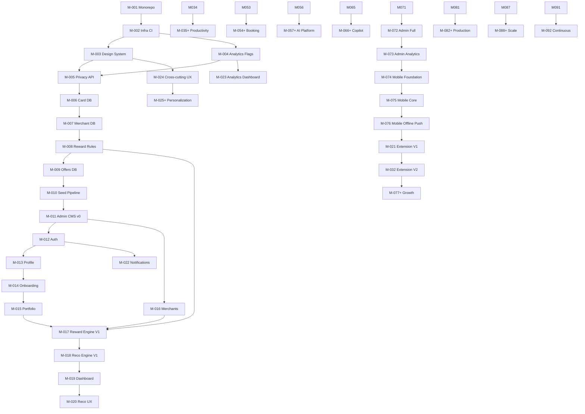

# CardWise — Master Development Plan

> **Status:** Approved implementation roadmap  
> **Version:** 1.4  
> **Date:** 2026-07-08 (revised 2026-07-10)  
> **Authority:** Single source of truth for CardWise development execution  
> **Supersedes:** Ad-hoc sprint planning; does not supersede product/architecture documentation

---

# Executive Summary

CardWise is a **Financial Decision Intelligence Platform** that answers: **“Which card should I use right now?”** and evolves into a full financial operating system for credit cards, rewards, travel, and AI-assisted optimization.

This Master Development Plan converts all existing CardWise documentation into a **milestone-driven, dependency-ordered implementation roadmap** covering the entire platform — from the first line of code through production readiness and long-term evolution.

**Technology stack (finalized — do not change):**

| Layer | Choice |
|-------|--------|
| Frontend | Vite 6 + React 19 + React Router v7 + Zustand + TanStack Query + shadcn/ui |
| Backend | NestJS 11 on Fastify + Prisma + PostgreSQL 16 + Redis + BullMQ |
| Analytics / Flags | PostHog Cloud via shared analytics and feature-flag libraries |
| Cloud | AWS (ap-south-1), Docker Compose local, ECS Fargate staging → EKS production |
| Monorepo | Bun workspaces + Turborepo |
| Lint / Format / Hooks | Oxlint + Oxfmt + Lefthook (see ADR-048) |

**Critical sequencing insight:** CardWise is a recommendation intelligence platform. **Intelligence data (cards, merchants, rules, offers) must exist before recommendation engines.** Phase 0.5 (Milestones M-006–M-011) is mandatory before consumer MVP recommendation work.

**Total milestones:** 92 (M-001 through M-092)  
**Estimated duration:** 18–24 months to GA (solo/small team); M-092 is ongoing


# Project Progress

| Metric | Value |
|--------|-------|
| **Overall Progress** | ~42% |
| **Current Phase** | Booking complete → Financial Copilot |
| **Current Milestone** | M-066 |
| **Completed Milestones** | M-001 … M-056, **AI-001–AI-012** |
| **In Progress** | — |
| **Blocked** | — |
| **Remaining Milestones** | M-057–M-065 (reference), M-066 through M-092 |
| **Next Milestone** | **M-066** Financial Copilot |
| **Last Updated** | 2026-07-14 (M-056 Verified; booking platform M-054–M-056 complete) |
| **Overall Completion %** | ~42% |

> Update this section as milestones are completed and verified.

---

# Planning Philosophy

## What This Plan Is

- A **milestone-driven engineering execution plan**
- A **dependency graph** for the entire CardWise platform
- The **permanent implementation roadmap** referenced by all future development

## What This Plan Is Not

- Not a Scrum backlog
- Not an Agile sprint board
- Not a Jira task list
- Not a redesign of CardWise requirements

## Milestone Execution Model

```text
Start Milestone
      ↓
   Develop
      ↓
    Verify
      ↓
  Fix Issues
      ↓
   Complete
      ↓
Next Milestone
```

- **No fixed sprint durations** — milestones complete when verified
- **Deployable after every milestone** — application remains buildable and deployable
- **Verify before advance** — Definition of Done must pass before proceeding

## Source Documents

| Document | Role in This Plan |
|----------|-------------------|
| `docs/00_MASTER_PROMPT.md` | Engineering principles |
| `docs/01_PRODUCT_VISION_AND_PRD.md` | Product truth |
| `docs/03_PHASE_WISE_ROADMAP.md` | Phase features & sequencing |
| `docs/04_FEATURE_SPECIFICATIONS.md` | Feature requirements (Ch 1–52) |
| `docs/05_DATABASE_DESIGN.md` | Schema & data ownership |
| `docs/06_BACKEND_ARCHITECTURE.md` | Backend module structure |
| `docs/07_FRONTEND_ARCHITECTURE.md` | Frontend architecture |
| `docs/08_ADMIN_PORTAL.md` | Admin requirements |
| `docs/09_AI_AND_RECOMMENDATION_ENGINE.md` | AI & reco architecture |
| `plans/AI_INTEGRATION_PLAN.md` | **AI platform execution plan (AI-001–AI-012)** |
| `plans/GEMINI_SETUP_AND_PROMPTS.md` | Gemini setup + prompt playbook |
| `docs/10_BOOKING_ENGINE.md` | Travel booking |
| `docs/11_BROWSER_EXTENSION.md` | Extension architecture |
| `docs/12_MOBILE_APP.md` | Mobile architecture |
| `docs/13_SECURITY_AND_COMPLIANCE.md` | Security baseline |
| `docs/14_SCALABILITY_AND_DEVOPS.md` | Infrastructure |
| `docs/15_TESTING_STRATEGY.md` | Quality engineering |
| `docs/16_MONETIZATION.md` | Premium & growth |
| `docs/17_FUTURE_ROADMAP.md` | Long-term vision |
| `docs/18_CURSOR_IMPLEMENTATION_GUIDE.md` | Implementation handbook |
| `docs/19_ARCHITECTURE_DECISION_RECORDS.md` | Decision ledger |
| `docs/20_ENGINEERING_RUNBOOK.md` | Operations |
| `docs/21_API_REFERENCE.md` | API contracts |
| `docs/22_DATA_PRIVACY_AND_GOVERNANCE.md` | Privacy (outline before public beta) |
| `docs/23_CURSOR_PROJECT_BOOTSTRAP_PLAN.md` | Bootstrap & stack finalization |

> See **Development Rules** (next section) and **Milestone Completion Protocol** (Final Completion Strategy) for mandatory execution and verification workflow.

---

# Development Rules

This section defines how development must proceed throughout the entire CardWise lifecycle. These rules are **mandatory** for all implementation work — human or AI-assisted.

## Core Discipline

1. **One active milestone at a time.** Only one milestone may be actively implemented at a time. Do not parallelize milestones that share unverified dependencies.
2. **Dependencies must be Verified.** Never begin a milestone until all dependency milestones are marked **Verified** (not merely complete or in progress).
3. **No early implementation.** Never implement functionality belonging to a future milestone, even if it seems convenient or reduces rework.
4. **No skipped dependencies.** Never bypass the dependency graph to reach a downstream milestone faster.
5. **No undocumented features.** Never introduce capabilities, APIs, data models, or UI flows that are not defined in the referenced documentation for the current milestone.
6. **Documentation is authoritative.** Every implementation must follow the documentation referenced by the milestone — Product, Feature Specs, Architecture, API Reference, Database Design, Security, DevOps, and Testing Strategy.

## When Implementation Uncovers Missing Work

If implementation reveals gaps, ambiguities, or missing requirements:

- **Document the finding** — note what is missing and where it was discovered.
- **Do not implement it** unless it clearly belongs to the **current** milestone scope.
- If the work belongs to a future milestone, defer it and continue with current milestone scope only.
- If the work is required to complete the current milestone but was omitted from the plan, stop and follow **Change Management** (below) before proceeding.

## When Architecture Must Change

If implementation requires a deviation from documented architecture or stack decisions:

1. **Stop implementation** on the affected milestone.
2. **Create or update an ADR** in `docs/19_ARCHITECTURE_DECISION_RECORDS.md`.
3. **Update this roadmap** and any affected milestone definitions before resuming.
4. Do not merge architectural changes without ADR approval and roadmap alignment.

## Quality and Verifiability

- **Independently verifiable milestones.** Each milestone must be completable and verifiable on its own — with clear deliverables, verification checklists, and Definition of Done.
- **Always deployable.** Every completed milestone must leave the application in a **buildable and deployable** state. No broken builds, failing gates, or partial deployments at milestone boundaries.
- **Verify before advance.** A milestone is not done until it is **Verified** per the Milestone Completion Protocol (see Final Completion Strategy).

## Milestone Completion, Approval, and Commit Gate

**No milestone is complete until automated verification passes, the milestone owner grants final review approval, and changes are committed.**

### Role split

| Role | Responsibility |
|------|----------------|
| **Engineering (implementation agent)** | Run **all** verification commands automatically; fix failures; update docs and checklists; present milestone for final review **only when verification is green** |
| **Milestone owner (you)** | **Final review only** — confirm Definition of Done and scope; approve or request changes. You do **not** need to run `bun run verify:milestone` yourself |

At the end of every milestone (M-001 through M-092), **before presenting for your final review**:

1. **Run full verification automatically** — engineering runs `bun run verify:milestone` (and any milestone-specific integration/E2E commands). All gates must pass:
   - `bun run build`
   - `bun run lint`
   - `bun run typecheck`
   - `bun run format:check`
   - Unit tests (`bun test` when test files exist)
   - Integration tests (when applicable per milestone and `docs/15_TESTING_STRATEGY.md`)
   - **Web SEO baseline** (always, when `apps/web` exists)
   - **Web Lighthouse** (Accessibility/Best Practices/SEO ≥90 enforced; Performance target ≥85 logged) when milestone touches `apps/web` — see `docs/design/WEB_CONSUMER_DESIGN_SYSTEM.md`
2. **Fix all failures** — do not request final review with failing build, lint, typecheck, or tests.
3. **Update documentation** — milestone deliverables, Project Progress draft, and referenced docs.
4. **Present for final review** — share verification output summary and Definition of Done checklist with milestone owner.

**After your approval only:**

5. **Commit milestone work** — create a milestone-scoped git commit immediately after approval. Commit message must reference the milestone ID (e.g. `M-001: monorepo foundation`).
6. **Mark milestone Verified** — update status in this plan only after commit is complete.
7. **Begin next milestone** — start the next milestone **only after** steps 1–6 are complete for the current milestone.

**Hard rules:**
- Never request final review before automated verification passes.
- Never commit before explicit owner approval.
- Never begin a new milestone while the previous milestone’s approved work remains uncommitted.

---

# Overall Development Strategy

## High-Level Progression

Milestone **IDs** (M-001 through M-092) are fixed. **Execution order** follows dependency flow below — notably, mobile (M-074–M-076) completes before browser extension (M-021, M-032).

```text
Foundation (M-001–M-005)
        ↓
Data Foundation (M-006–M-011)
        ↓
Core Platform (M-012–M-015)
        ↓
Consumer Platform — Web (M-016–M-020, M-022–M-024)
        ↓
Admin Evolution (incremental from M-011; expanded M-072–M-073)
        ↓
Personalization (M-025–M-028) ✅
        ↓
**AI Platform Track (AI-001–AI-012) — PRIORITY before M-029**
        ↓
AI-G1 gate (AI-001–AI-005)
        ↓
Personalization continued (M-029–M-034)
        ↓
Financial Productivity (M-035–M-053)
        ↓
Booking Platform (M-054–M-056)
        ↓
AI Intelligence — remaining (AI-006–AI-012; supersedes early delivery of M-057–M-065)
        ↓
Financial Copilot (M-066–M-071)
        ↓
Mobile Application (M-074–M-076)
        ↓
Browser Extension (M-021, M-032 — after mobile)
        ↓
Growth & Integrations (M-077–M-081)
        ↓
Production Readiness (M-082–M-087)
        ↓
Scale & Optimization (M-088–M-091)
        ↓
Continuous Evolution (M-092)
```

## Admin Portal Evolution Principle

The Admin Portal is **not** a one-time deliverable. Every milestone that introduces or changes data models, business rules, or operational features must **incrementally update the Admin Portal** so internal teams can manage that capability without code deployments. See `docs/08_ADMIN_PORTAL.md`.

## Documentation Cross-Reference Map

| Feature Spec Chapter | Milestone(s) |
|---------------------|--------------|
| Ch 2 Auth & Account | M-012 |
| Ch 3 Onboarding | M-014 |
| Ch 4 Dashboard | M-019, M-029, M-050 |
| Ch 5–7 Portfolio / Details / Comparison | M-015, M-018, M-038 |
| Ch 8–10 Transactions / Statements / Bills | M-039, M-040, M-041 |
| Ch 11–14 Rewards / Cashback / Milestones / Redemption | M-009, M-017, M-035, M-042, M-043, M-044 |
| Ch 15–21 Offers & Benefits | M-010, M-031, M-047 |
| Ch 22 Recommendation Engine | M-017, M-018, M-027, M-049, M-063 |
| Ch 23 AI Assistant | M-065, M-066 |
| Ch 24 Universal Search | M-064 |
| Ch 25–26 Calendar / Reports | M-052, M-053 |
| Ch 27–28 Integrations / Import-Export | M-080, M-081, M-079 |
| Ch 29–31 Premium / Referral / Gamification | M-077, M-078 |
| Ch 32–33 Profile / Settings | M-013 |
| Ch 34 Admin Console | M-011, M-072, M-073 |
| Ch 35–46 Cross-cutting UX / Platform | M-003, M-004, M-005, M-024, M-082–M-085 |
| Ch 47–52 Appendices | Woven into all milestones |

---

# Complete Milestone Roadmap

> **92 milestones** (M-001 through M-092). Milestone IDs are fixed; **execution order** may differ — see Dependency Flow. Browser extension (M-021, M-032) executes **after** mobile (M-074–M-076).

| # | Milestone | Short Description |
|---|-----------|-------------------|
| **M-001** | Monorepo & Project Foundation | Monorepo workspace, shared tooling, repository structure |
| **M-002** | Local Infrastructure & CI/CD | Local development infrastructure, CI quality pipeline, setup automation |
| **M-003** | Design System & Shared UI | Design system, shared UI component library, visual tokens |
| **M-004** | Analytics & Feature Flags | Product analytics and feature-flag foundation |
| **M-005** | Privacy Baseline & API Scaffold | Privacy baseline, API scaffold, consumer web shell |
| **M-006** | Credit Card Master Database | Credit card master database and domain model |
| **M-007** | Merchant Master Database | Merchant master database and domain model |
| **M-008** | Reward Rules Foundation | Configuration-driven, versioned reward rules data layer |
| **M-009** | Offer Database Foundation | Offer database and assignment model |
| **M-010** | Seed Pipeline & Data Validation | Seed pipeline and data validation for intelligence layer |
| **M-011** | Admin CMS v0 | Admin CMS v0 for cards, merchants, rules, offers |
| **M-012** | Authentication & Sessions | User authentication and session management |
| **M-013** | User Profile & Settings | User profile and settings |
| **M-014** | User Onboarding | Guided user onboarding and portfolio setup |
| **M-014b** | Consumer Product UI Overhaul | Premium playful redesign — tokens, UI kit, consumer surfaces |
| **M-015** | Consumer Card Portfolio | Consumer card portfolio management |
| **M-016** | Merchant Directory & Search | Merchant directory and search |
| **M-017** | Reward Engine V1 | Reward engine V1 — deterministic calculation |
| **M-018** | Recommendation Engine V1 | Recommendation engine V1 — explainable ranking |
| **M-019** | Dashboard & Home (MVP) | Dashboard and home experience (MVP) |
| **M-020** | Recommendation & Search UX | Recommendation and search user experience |
| **M-021** | Browser Extension V1 | Browser extension V1 — contextual recommendations *(after M-076)* |
| **M-022** | Notifications Foundation | Notifications foundation (email and in-app) |
| **M-023** | Product Analytics Dashboard | Product analytics dashboard for engineering and product |
| **M-024** | Cross-Cutting UX Foundation | Cross-cutting UX foundation and accessibility baseline |
| **M-025** | Merchant Intelligence | Merchant intelligence and coverage expansion |
| **M-026** | Reward Engine V2 | Reward engine V2 — advanced rules and caps |
| **M-027** | Recommendation Engine V2 | Recommendation engine V2 — contextual personalization |
| **M-028** | User Preferences & Personalization | User preferences and personalization model |
| **M-029** | Personalized Dashboard | Personalized dashboard |
| **M-030** | Saved Searches & Favorite Merchants | Saved searches and favorite merchants |
| **M-031** | Offer Intelligence | Offer intelligence and matching |
| **M-032** | Browser Extension V2 | Browser extension V2 — auto-detect and overlay *(after M-076)* |
| **M-033** | Recommendation History & Feedback | Recommendation history and user feedback |
| **M-034** | Analytics Expansion & Experimentation | Analytics expansion and experimentation |
| **M-035** | Reward Wallet | Reward wallet and balance tracking |
| **M-036** | Reward Expiry Intelligence | Reward expiry intelligence and alerts |
| **M-037** | Card Benefits Dashboard | Card benefits dashboard |
| **M-038** | Card Comparison | Card comparison experience |
| **M-039** | Spending Insights | Spending insights and category analysis |
| **M-040** | Transactions | Transaction tracking and categorization |
| **M-041** | Statements & Bills | Statements and bill due tracking |
| **M-042** | Milestone Tracker | Milestone tracker and fee waiver progress |
| **M-043** | Cashback Module | Cashback module |
| **M-044** | Reward Redemption | Reward redemption guidance |
| **M-045** | Travel Hub | Travel hub and benefits overview |
| **M-046** | Trip Planner | Trip planner with card-aware recommendations |
| **M-047** | Travel & Lifestyle Benefits | Travel and lifestyle benefits depth |
| **M-048** | Premium Benefits Dashboard | Premium benefits dashboard |
| **M-049** | Recommendation Engine V3 | Recommendation engine V3 — travel and milestone aware |
| **M-050** | Personalized Homepage | Personalized homepage |
| **M-051** | Advanced Notifications | Advanced contextual notifications |
| **M-052** | Calendar & Timeline | Calendar and financial timeline |
| **M-053** | Reports & Analytics (User) | User-facing reports and analytics |
| **M-054** | Booking Engine Foundation | Booking engine foundation |
| **M-055** | Flight Booking | Flight booking with card optimization |
| **M-056** | Hotel Booking | Hotel booking with loyalty optimization |
| **M-057** | Knowledge Graph | Knowledge graph for financial entities |
| **M-058** | Vector DB & Semantic Search | Vector database and semantic search |
| **M-059** | RAG Pipeline | RAG pipeline for financial Q&A |
| **M-060** | Context Engine & Financial Memory | Context engine and financial memory |
| **M-061** | AI Explanation Engine | AI explanation engine for recommendations |
| **M-062** | Smart Insights | Smart proactive insights |
| **M-063** | Recommendation Engine V4 | Recommendation engine V4 — AI-augmented with guardrails |
| **M-064** | Intelligent Universal Search | Intelligent universal search |
| **M-065** | AI Assistant (Read-Only) | AI assistant (read-only conversational Q&A) |
| **M-066** | Financial Copilot | Financial copilot — full conversational assistant |
| **M-067** | AI Workspace | AI workspace |
| **M-068** | Conversation Memory | Conversation memory for copilot |
| **M-069** | Financial Timeline & Goal Planning | Financial timeline and goal planning |
| **M-070** | Multi-Step Reasoning & Tool Calling | Multi-step reasoning and controlled tool calling |
| **M-071** | Recommendation Conversations | Recommendation conversations via copilot |
| **M-072** | Admin Console (Full) | Admin console (full) — user management and ops |
| **M-073** | Admin Analytics & Advanced CMS | Admin analytics and advanced CMS |
| **M-074** | Mobile App Foundation | Mobile application foundation |
| **M-075** | Mobile Core Features | Mobile core features — portfolio, reco, dashboard |
| **M-076** | Mobile Offline & Push | Mobile offline support and push notifications |
| **M-077** | Premium Subscription | Premium subscription and monetization |
| **M-078** | Referral & Gamification | Referral and gamification |
| **M-079** | Import & Export | Import and export / data portability |
| **M-080** | Integrations Framework | Integrations framework |
| **M-081** | Bank & Payment Integrations | Bank and payment integrations foundation |
| **M-082** | Security Hardening & Compliance | Security hardening and compliance |
| **M-083** | Performance Optimization | Performance optimization |
| **M-084** | Observability & SRE | Observability and SRE |
| **M-085** | PWA, Offline & SEO | PWA, offline web, and SEO |
| **M-086** | Production Deployment & DR | Production deployment and disaster recovery |
| **M-087** | GA Launch Readiness | GA launch readiness |
| **M-088** | Event Streaming (Kafka) | Event streaming at scale |
| **M-089** | Search Infrastructure | Search infrastructure at scale |
| **M-090** | Analytics Data Platform | Analytics data platform |
| **M-091** | Multi-Region & Cost Optimization | Multi-region and cost optimization |
| **M-092** | Continuous Evolution | Continuous evolution (ongoing) |
---

# Dependency Flow




> **Note:** Milestone IDs are fixed. **Execution order** may differ — browser extension milestones (M-021, M-032) execute **after** mobile milestones (M-074–M-076).

**Hard gates:**

| Gate | Required Milestones | Blocks |
|------|---------------------|--------|
| **G-0** Engineering Foundation | M-001–M-005 | All data and product work |
| **G-0.5** Data Foundation | M-006–M-011 | Recommendation engine (M-017+) |
| **G-1** Web Consumer MVP | M-012–M-020, M-022–M-024 | Personalization (M-025+) |
| **G-1b** Browser Extension | M-021, M-032 (after M-076) | Growth features requiring extension |
| **G-2** Public Beta | M-025–M-034 | Productivity features |
| **AI-G1** AI Platform (early) | **AI-001–AI-005** | **M-029**, AI-native catalog & reco UX |
| **G-3** Product Maturity | M-035–M-053 | Booking & advanced AI |
| **G-4** AI Platform (full) | **AI-006–AI-012**, M-057–M-065 (reference) | Financial Copilot |
| **G-5** GA | M-082–M-087 | Public launch |

---

# Detailed Milestone Plans

> Milestones M-001 through M-024 are specified in full detail. M-025+ follow the same template with scope derived from `docs/03_PHASE_WISE_ROADMAP.md` and `docs/04_FEATURE_SPECIFICATIONS.md`.

**Standard sections (every milestone):**

| Section | Purpose |
|---------|---------|
| **Status** | Not Started / In Progress / Blocked / Completed / Verified |
| **Inputs** | Dependencies consumed (milestones, APIs, schema, UI, infrastructure) |
| **Outputs** | Artifacts produced (APIs, DB, UI, tests, docs, admin capabilities) |
| **Admin Portal Evolution** | Required admin updates when introducing manageable data or ops features |
| **Authoritative Docs** | Backend, Frontend, API, Database, Feature Specs, Security, DevOps, Testing |

> **M-025 through M-092:** Each milestone uses the standard sections above. Default **Status: Not Started** until work begins. **Inputs** and **Outputs** are defined per milestone scope in the referenced documentation and phase tables below.

---

## M-001 — Monorepo & Project Foundation

| Field | Value |
|-------|-------|
| **Milestone ID** | M-001 |
| **Milestone Name** | Monorepo & Project Foundation |
| **Phase** | 0 — Foundation |
| **Docs** | `18_IMPL_GUIDE` BUILD-001–006, `23_BOOTSTRAP` §4 |

### Status

**Verified**

### Inputs

- Approved technology stack (bootstrap plan)
- Repository naming and scope conventions

### Outputs

- Monorepo workspace configuration
- Shared linting, formatting, and TypeScript configuration packages
- Build orchestration pipeline stubs
- Repository folder structure (applications, services, packages, infrastructure, documentation)
- Root README

### Admin Portal Evolution

Not applicable — no admin features at this milestone.

### Objective

Establish the CardWise monorepo with shared tooling so all future packages and apps build consistently.

### Description

Initialize the repository with monorepo workspace configuration, shared build orchestration, and standardized code quality tooling per `docs/18_CURSOR_IMPLEMENTATION_GUIDE.md` and `docs/23_CURSOR_PROJECT_BOOTSTRAP_PLAN.md`.

### Business Value

Enables parallel development across web, API, admin, extension, and shared packages without toolchain drift.

### Dependencies

- **Previous:** None (first milestone)
- **Enables:** M-002, M-003, M-004, all future milestones

### Scope

**Included:** Monorepo structure, shared linting, formatting, and TypeScript configuration packages, build orchestration pipeline stubs, README  
**Excluded:** Application code, database, Docker, CI workflows

### Deliverables

- [x] Dependencies install successfully across workspace
- [x] Build, lint, and typecheck tasks defined
- [x] Shared configuration packages compile
- [x] Repository folder structure (applications, services, packages, infrastructure, documentation)

### Verification Checklist

- [x] Fresh clone + install works
- [x] Lint and typecheck run (empty passes acceptable)
- [x] No secrets in repository

### Definition of Done

Monorepo builds; shared configs published; README documents structure; milestone **Verified**.

---

## M-002 — Local Infrastructure & CI/CD

| Field | Value |
|-------|-------|
| **Milestone ID** | M-002 |
| **Phase** | 0 — Foundation |
| **Docs** | `14_SCALABILITY`, `18_IMPL_GUIDE` DEV-004, `23_BOOTSTRAP` Sprint 0 |

### Status

**Verified**

### Inputs

- Monorepo from M-001
- Infrastructure requirements from DevOps documentation

### Outputs

- Local development infrastructure (database, cache, email capture)
- CI workflow (lint, typecheck, build)
- Setup automation script
- Environment variable template

### Admin Portal Evolution

Not applicable.

### Objective

Provide reproducible local development environment and automated CI pipeline.

### Description

Local containerized infrastructure for database, cache, and email capture; automated CI quality pipeline; developer setup automation and environment templates per `docs/14_SCALABILITY_AND_DEVOPS.md`.

### Business Value

Any developer (or AI agent) can start development in < 30 minutes with confidence changes are validated automatically.

### Dependencies

- **Previous:** M-001
- **Enables:** M-005, M-006+, all database work

### Scope

**Included:** Docker Compose, CI workflow, setup script, env template  
**Excluded:** Cloud deployment, Terraform, staging environment

### Deliverables

- [x] Local infrastructure starts healthy (`docker compose up -d --wait`)
- [x] CI workflow defined (`.github/workflows/ci.yml`)
- [x] `.env.example` documents Phase 0 variables
- [x] `scripts/setup.sh` automates install, env, and Docker startup

### Verification Checklist

- [x] PostgreSQL reachable on localhost (via Docker Compose healthcheck)
- [x] Redis reachable on localhost (via Docker Compose healthcheck)
- [x] CI workflow runs lint, typecheck, build on push/PR
- [x] Setup script completes with only env edit as optional manual step

### Definition of Done

Local infra healthy; CI green; setup documented; milestone **Verified**.

---

## M-003 — Design System & Shared UI

| Field | Value |
|-------|-------|
| **Milestone ID** | M-003 |
| **Phase** | 0 — Foundation |
| **Docs** | `07_FRONTEND` §4, `23_BOOTSTRAP` Phase 0 design system |

### Status

**Verified**

### Inputs

- Monorepo from M-001
- Frontend architecture and design system specifications

### Outputs

- Shared design system package (tokens, themes)
- Shared UI component library (core primitives)
- Component usage documentation

### Admin Portal Evolution

Not applicable — admin UI consumes shared library starting M-011.

### Objective

Establish CardWise visual language and shared UI component library.

### Description

Create `shared UI component library` and shared design system package with Tailwind CSS 4, design tokens (CSS variables), shadcn/ui initialization, core primitives (Button, Input, Card, Dialog, Toast).

### Business Value

Consistent premium UX across web, admin, and extension; faster feature development.

### Dependencies

- **Previous:** M-001
- **Enables:** M-005 web shell, M-011 admin UI, all frontend milestones

### Scope

**Included:** Tokens, themes, core components, Lucide icons  
**Excluded:** Feature-specific components, charts, motion

### Deliverables

- [x] Design tokens defined (color, typography, spacing, radius)
- [x] shadcn/ui configured
- [x] Core components export from `shared UI component library`
- [x] Light theme (dark theme stub acceptable)

### Verification Checklist

- [x] Components render in isolation
- [x] WCAG 2.2 AA contrast on core components
- [x] Package builds independently

### Definition of Done

Design system package builds; core components documented; milestone **Verified**.

---

## M-004 — Analytics & Feature Flags

| Field | Value |
|-------|-------|
| **Milestone ID** | M-004 |
| **Phase** | 0 — Foundation |
| **Docs** | `23_BOOTSTRAP` §5.1, §5.2, `04_FEATURE_SPEC` Ch 42, Ch 44 |

### Status

**Verified**

### Inputs

- Monorepo from M-001
- Analytics event catalog from feature specifications
- Initial feature flag definitions from bootstrap plan

### Outputs

- Shared analytics library with typed event catalog
- Shared feature-flag library with environment and rollout support
- Initial product events and feature flags

### Admin Portal Evolution

Feature flag visibility and override controls added to Admin Portal in M-034. Event catalog documented for admin analytics in M-073.

### Objective

Centralize product analytics and feature flag evaluation from day one.

### Description

Implement `shared analytics library` (PostHog client, typed events, `trackEvent()`) and `shared feature-flag library` (PostHog flags, `isEnabled()`, `useFeatureFlag()`). Define initial event catalog and flags.

### Business Value

Measurement infrastructure before features ship; safe rollout of extension, AI, travel, premium.

### Dependencies

- **Previous:** M-001
- **Enables:** M-023, M-034, all feature rollouts

### Scope

**Included:** Analytics package, feature-flags package, event type definitions, 4 initial flags  
**Excluded:** Custom dashboards (M-023), internal flag service

### Deliverables

- [x] `USER_REGISTERED`, `CARD_ADDED`, `RECOMMENDATION_REQUESTED` event types defined
- [x] Flags: `browser_extension_enabled`, `ai_assistant_enabled`, `travel_booking_enabled`, `premium_features_enabled`
- [x] PostHog test event captured

### Verification Checklist

- [x] Events fire from test harness
- [x] Flags resolve correctly per environment
- [x] No direct PostHog calls outside packages

### Definition of Done

Packages build; events and flags functional; milestone **Verified**.

---

## M-005 — Privacy Baseline & API Scaffold

| Field | Value |
|-------|-------|
| **Milestone ID** | M-005 |
| **Phase** | 0 — Foundation |
| **Docs** | `06_BACKEND`, `13_SECURITY`, `23_BOOTSTRAP` Phase 0 privacy, Sprint 0 |

### Status

**Verified**

### Inputs

- Local infrastructure from M-002
- Design system from M-003
- Analytics/flags from M-004
- Phase 0 database schema requirements from `docs/05_DATABASE_DESIGN.md`

### Outputs

- Backend API with health endpoint and OpenAPI spec
- Consumer web application shell with routing
- Observability integration (logging, error tracking)
- Privacy baseline (policy pages, consent UI, export/delete stubs)
- Phase 0 database schema

### Admin Portal Evolution

Not applicable — admin portal begins M-011.

### Objective

Establish API foundation, observability, and privacy baseline before user data.

### Description

NestJS 11 on Fastify adapter, health endpoint, Pino logging, Sentry, OpenAPI/Swagger, Vite+React web shell, privacy policy + terms pages, consent banner, export/delete API stubs.

### Business Value

Production-grade API skeleton; legal baseline before real users; deployable empty app.

### Dependencies

- **Previous:** M-002, M-003, M-004
- **Enables:** M-006+, M-012 auth, all API milestones

### Scope

**Included:** API scaffold, web shell, logging, error tracking, privacy stubs, Phase 0 DB schema (users, sessions, audit_logs, settings)  
**Excluded:** Authentication logic, business modules, admin portal

### Deliverables

- [x] `GET /health` returns 200
- [x] Swagger UI at `/api/docs`
- [x] Web app shell with routing
- [x] Privacy policy + terms pages
- [x] Consent banner component
- [x] Export/delete endpoint stubs

### Verification Checklist

- [x] API and web start in development mode
- [x] CI passes
- [x] Sentry captures test error
- [x] No auth endpoints yet (by design)

### Definition of Done

**Gate G-0 passed.** API and web deployable; privacy baseline stubbed; Phase 0 schema migrated; milestone **Verified**.

---

## M-006 — Credit Card Master Database

| Field | Value |
|-------|-------|
| **Milestone ID** | M-006 |
| **Phase** | 0.5 — Data Foundation |
| **Docs** | `05_DATABASE`, `23_BOOTSTRAP` Credit Card Master DB |

### Status

**Verified**

### Inputs

- Outputs from dependency milestones (see Dependencies)
- Authoritative documentation for this capability

### Outputs

- Deliverables listed in this milestone
- Tests and documentation updates per Definition of Done

### Admin Portal Evolution

Prepares data model for Admin CMS v0 (M-011): card, bank, benefit, and fee management.

### Objective

Create the authoritative credit card intelligence data model.

### Description

Prisma schemas for banks, issuers, card variants, networks, fees, eligibility, reward programs, benefit types (lounge, insurance, dining, fuel, travel, forex), categories, exclusions, effective dates, version history. Admin API stubs.

### Business Value

Foundation for all reward calculations and recommendations — no hardcoded card data.

### Dependencies

- **Previous:** M-005 (G-0)
- **Enables:** M-008 reward rules, M-011 admin CMS, M-015 portfolio, M-017 reward engine

### Scope

**Included:** `cards` schema tables, migrations, domain entities, repository ports  
**Excluded:** Consumer UI, reward calculation logic, seed data population (M-010)

### Deliverables

- [x] Banks, cards, card_benefits, card_fees tables
- [x] Version history / effective date columns
- [x] UUID v7 primary keys
- [x] Soft delete support

### Verification Checklist

- [x] Migrations apply cleanly
- [x] Schema matches bootstrap plan entity list
- [x] No consumer endpoints yet

### Definition of Done

Card master schema live; domain layer testable; milestone **Verified**.

---

## M-007 — Merchant Master Database

| Field | Value |
|-------|-------|
| **Milestone ID** | M-007 |
| **Phase** | 0.5 — Data Foundation |
| **Docs** | `05_DATABASE`, `23_BOOTSTRAP` Merchant Master DB |

### Status

**Verified**

### Inputs

- Outputs from dependency milestones (see Dependencies)
- Authoritative documentation for this capability

### Outputs

- Deliverables listed in this milestone
- Tests and documentation updates per Definition of Done

### Admin Portal Evolution

Prepares merchant management in Admin CMS v0 (M-011): aliases, categories, MCC mapping.

### Objective

Create structured merchant intelligence layer for recommendation matching.

### Description

Schemas for merchants, aliases, categories, MCC codes, payment categories, reward mappings, offer links. Full-text search index preparation.

### Business Value

Enables merchant-aware recommendations and extension merchant detection.

### Dependencies

- **Previous:** M-006
- **Enables:** M-009 offers, M-011 admin, M-016 merchant directory, M-017+ engines

### Scope

**Included:** `merchants` schema, alias table, MCC mapping  
**Excluded:** Consumer search UI, OpenSearch (M-089)

### Deliverables

- [x] merchants, merchant_aliases, merchant_categories, mcc_mappings tables
- [x] Historical offer reference structure
- [x] PostgreSQL full-text search index on merchant names

### Verification Checklist

- [x] Alias lookup works in repository tests
- [x] MCC mapping queryable by code

### Definition of Done

Merchant schema live; repository tests pass; milestone **Verified**.

---

## M-008 — Reward Rules Foundation

| Field | Value |
|-------|-------|
| **Milestone ID** | M-008 |
| **Phase** | 0.5 — Data Foundation |
| **Docs** | `09_AI`, `23_BOOTSTRAP` Reward Rules, ADR-026 |

### Status

**Verified**

### Inputs

- Outputs from dependency milestones (see Dependencies)
- Authoritative documentation for this capability

### Outputs

- Deliverables listed in this milestone
- Tests and documentation updates per Definition of Done

### Admin Portal Evolution

Prepares reward rule management in Admin CMS v0 (M-011).

### Objective

Establish configuration-driven, versioned reward rules data layer.

### Description

Rules schema supporting multipliers, caps, thresholds, exclusions, merchant/category restrictions, milestones, `valid_from`/`valid_until`, rule versioning. Shared validation schema shared with seed files and admin.

### Business Value

Reward engine reads rules from DB — no business logic in code; rules updatable without deploy.

### Dependencies

- **Previous:** M-006, M-007
- **Enables:** M-010 seed, M-011 admin rules CRUD, M-017 reward engine

### Scope

**Included:** `rewards` schema, rule versioning, Zod validation schema, rule evaluation port interface  
**Excluded:** Rule evaluation implementation (M-017)

### Deliverables

- [x] Shared rule validation schema
- [x] Versioned rules tables with activate/deactivate
- [x] Example rule fixtures for tests

### Verification Checklist

- [x] Invalid rules rejected by Zod
- [x] Version history queryable
- [x] No hardcoded reward rates in application code

### Definition of Done

Rules data layer complete; validation shared across seed/admin/engine; milestone **Verified**.

---

## M-009 — Offer Database Foundation

| Field | Value |
|-------|-------|
| **Milestone ID** | M-009 |
| **Phase** | 0.5 — Data Foundation |
| **Docs** | `04_FEATURE_SPEC` Ch 15–16, `23_BOOTSTRAP` |

### Status

**Verified**

### Inputs

- Outputs from dependency milestones (see Dependencies)
- Authoritative documentation for this capability

### Outputs

- Deliverables listed in this milestone
- Tests and documentation updates per Definition of Done

### Admin Portal Evolution

Prepares offer management in Admin CMS v0 (M-011).

### Objective

Create offer intelligence data layer for merchant and bank offers.

### Description

Offers schema: offer definition, card assignments, merchant links, validity windows, expiry tracking, historical offers.

### Business Value

Enables offer-aware recommendations in Phase 2+; supports Admin CMS offer management.

### Dependencies

- **Previous:** M-006, M-007
- **Enables:** M-010 seed, M-011 admin, M-031 offer intelligence

### Scope

**Included:** Offers schema, card-offer junction, merchant-offer junction  
**Excluded:** Offer matching engine (M-031)

### Deliverables

- [x] offers, offer_card_assignments, offer_merchants tables
- [x] Expiry and validity constraints

### Verification Checklist

- [x] Active offers queryable by date
- [x] Historical offers preserved

### Definition of Done

Offer schema live; milestone **Verified**.

---

## M-010 — Seed Pipeline & Data Validation

| Field | Value |
|-------|-------|
| **Milestone ID** | M-010 |
| **Phase** | 0.5 — Data Foundation |
| **Docs** | `23_BOOTSTRAP` Seed Strategy |

### Status

**Verified**

### Inputs

- Outputs from dependency milestones (see Dependencies)
- Authoritative documentation for this capability

### Outputs

- Deliverables listed in this milestone
- Tests and documentation updates per Definition of Done

### Admin Portal Evolution

Seed data is initial admin content; admin can override from M-011 onward.

### Objective

Populate intelligence data layer with curated Indian market seed data.

### Description

Create seed pipeline package with `cards.json`, `banks.json`, `merchants.json`, `reward-rules.json`, `offers.json`. Idempotent seed runner with Zod validation. Target: top 100 cards, top 500 merchants, major banks/programs/offers.

### Business Value

Recommendation engine has real data to operate on; reproducible across environments.

### Dependencies

- **Previous:** M-006, M-007, M-008, M-009
- **Enables:** M-011 admin overrides, M-017 reward engine, G-0.5

### Scope

**Included:** Seed package, runner script, initial curated data, seed pipeline command  
**Excluded:** Automated external data ingestion, consumer features

### Deliverables

- [x] 5 seed JSON files version-controlled
- [x] Seed pipeline command runs without errors
- [x] Re-run produces identical state (idempotent)
- [x] Validation rejects malformed seed entries

### Verification Checklist

- [x] ≥100 cards seeded
- [x] ≥500 merchants seeded
- [x] Major reward rules present
- [x] Seed data passes Zod validation

### Definition of Done

Seed pipeline operational; target volumes met; milestone **Verified**.

---

## M-011 — Admin CMS v0

| Field | Value |
|-------|-------|
| **Milestone ID** | M-011 |
| **Phase** | 0.5 — Data Foundation |
| **Docs** | `08_ADMIN_PORTAL`, `23_BOOTSTRAP` Admin CMS v0 |

### Status

**Verified**

### Inputs

- Outputs from dependency milestones (see Dependencies)
- Authoritative documentation for this capability

### Outputs

- Deliverables listed in this milestone
- Tests and documentation updates per Definition of Done

### Admin Portal Evolution

**Establishes Admin CMS v0.** All future milestones extend admin incrementally.

### Objective

Enable internal team to maintain card, merchant, rule, and offer data without code deployments.

### Description

Admin portal with separate admin RBAC per `docs/08_ADMIN_PORTAL.md`. CRUD for cards, benefits, fees, reward rules (version/activate/deactivate), merchants (aliases, MCC), offers (validity, card assignment). Audit log on mutations.

### Business Value

Continuous data maintenance — critical for recommendation accuracy as bank rules change.

### Dependencies

- **Previous:** M-006–M-010
- **Enables:** G-0.5, all consumer milestones, M-072 admin expansion

### Scope

**Included:** Admin auth (separate RBAC), CRUD UI, admin APIs, audit logging  
**Excluded:** Bulk import, advanced workflows, user management (M-072)

### Deliverables

- [x] Admin can create/edit/archive cards
- [x] Admin can version and activate/deactivate rules
- [x] Admin can manage merchants and aliases
- [x] Admin can manage offers
- [x] All mutations audit-logged

### Verification Checklist

- [x] Data change in admin reflects in DB without redeploy
- [x] Consumer auth cannot access admin routes
- [x] Admin UI uses `shared UI component library`

### Definition of Done

**Gate G-0.5 passed.** Admin CMS v0 operational; all G-0.5 criteria from bootstrap plan met; milestone **Verified**.

---

## M-012 — Authentication & Sessions

| Field | Value |
|-------|-------|
| **Milestone ID** | M-012 |
| **Phase** | 1 — Core MVP |
| **Docs** | `04_FEATURE_SPEC` Ch 2, `06_BACKEND` Auth module, `13_SECURITY` IAM |

### Status

**Verified**

### Inputs

- Outputs from dependency milestones (see Dependencies)
- Authoritative documentation for this capability

### Outputs

- Deliverables listed in this milestone
- Tests and documentation updates per Definition of Done

### Admin Portal Evolution

Not applicable — consumer auth milestone.

### Objective

Secure user registration, login, and session management.

### Description

Email registration, login, Google OAuth, email verification, forgot password, JWT access + refresh tokens, session lifecycle, RBAC foundation for consumer roles.

### Business Value

Users can create accounts and access personalized card intelligence securely.

### Dependencies

- **Previous:** M-005, M-011 (G-0.5)
- **Enables:** M-013–M-024, all user-specific features

### Scope

**Included:** Auth APIs, Passport strategies, refresh rotation, email via Mailpit/SES  
**Excluded:** MFA, passkeys, Apple Sign-In (future-ready interfaces only)

### Deliverables

- [x] Register, login, logout, refresh endpoints
- [x] Google OAuth flow
- [x] Email verification flow
- [x] Password reset flow
- [x] API client auth methods

### Verification Checklist

- [x] E2E: register → verify → login → access protected route
- [x] Refresh token rotation works
- [x] Invalid tokens rejected
- [x] `USER_REGISTERED` analytics event fires

### Definition of Done

Auth fully functional; security review passed; milestone **Verified**.

---

## M-013 — User Profile & Settings

| Field | Value |
|-------|-------|
| **Milestone ID** | M-013 |
| **Docs** | `04_FEATURE_SPEC` Ch 32–33 |

### Status

**Verified**

### Inputs

- Outputs from dependency milestones (see Dependencies)
- Authoritative documentation for this capability

### Outputs

- Deliverables listed in this milestone
- Tests and documentation updates per Definition of Done

### Admin Portal Evolution

Admin: user profile inspection capabilities (read-only) for support.

### Objective

User profile management and application settings.

### Description

Name, email, avatar, country, currency (`INR`), timezone (`Asia/Kolkata`), language (`en-IN`), notification preferences, privacy settings.

### Dependencies

- **Previous:** M-012
- **Enables:** M-014, M-028 preferences

### Scope

**Included:** Profile CRUD, settings UI, `GET/PATCH /api/v1/users/me`  
**Excluded:** Financial preferences (Phase 2)

### Deliverables

- [x] Profile page and settings page
- [x] Profile API endpoints
- [x] Default Indian locale applied

### Definition of Done

Users can view and update profile/settings; milestone **Verified**.

---

## M-014 — User Onboarding

| Field | Value |
|-------|-------|
| **Milestone ID** | M-014 |
| **Docs** | `04_FEATURE_SPEC` Ch 3 |

### Status

**Verified**

### Objective

Guided first-run experience minimizing time-to-first-recommendation.

### Dependencies

- **Previous:** M-012, M-013
- **Enables:** M-014b, M-015

### Deliverables

- [x] Onboarding flow UI
- [x] Onboarding completion tracking
- [x] Analytics events for onboarding steps

### Definition of Done

New user completes onboarding to portfolio setup; milestone **Verified**.

---

## M-014b — Consumer Product UI Overhaul

| Field | Value |
|-------|-------|
| **Milestone ID** | M-014b |
| **Docs** | Approved hi-fi mockups; extends M-003 design system |

### Status

**Verified**

### Inputs

- M-014 onboarding behavior (API unchanged)
- Approved hi-fi mockups (premium + playful)

### Outputs

- Retokenized design system (Cormorant Garamond + Inter, jewel emerald, refined motion)
- Expanded `@cardwise/ui` primitives
- Redesigned consumer web surfaces (home, auth, onboarding, account)

### Admin Portal Evolution

Inherit tokens/primitives only — no marketing redesign.

### Objective

Product-grade consumer UI before portfolio (M-015).

### Description

Phase 1 implements layout, typography, colors, components, and placeholder SVG illustrations. Phase 2 adds drop-in `/public/illustrations/*.webp` slots, enhanced SVG fallbacks, Lottie on onboarding complete, auth-edge pages on `AuthLayout`, and polish — swap 3D PNGs when ready (see `docs/design/m014b/ASSETS.md`).

### Dependencies

- **Previous:** M-014
- **Enables:** M-015 (blocked until Verified)

### Deliverables

- [x] Design system tokens updated (M-014b)
- [x] UI primitives: Label, Checkbox, Switch, Badge, Progress, SelectableTile
- [x] Home, shell, auth, onboarding, account layouts match mockup intent
- [x] Phase 2: Illustration swap layer, enhanced SVG fallbacks, Lottie complete, auth-edge on AuthLayout
- [x] Side-by-side visual QA vs approved mockups (manual — owner approved 2026-07-08)

### Definition of Done

Consumer web matches approved mockup intent (~90%+); `verify:milestone` passes (including web SEO baseline; Lighthouse when `apps/web` changed); design locked per `docs/design/WEB_CONSUMER_DESIGN_SYSTEM.md`; milestone **Verified**.

---

## M-015 — Consumer Card Portfolio

| Field | Value |
|-------|-------|
| **Milestone ID** | M-015 |
| **Docs** | `04_FEATURE_SPEC` Ch 5–6, `03_ROADMAP` Feature 3 |

### Status

**Verified**

### Inputs

- Outputs from dependency milestones (see Dependencies)
- Authoritative documentation for this capability

### Outputs

- Deliverables listed in this milestone
- Tests and documentation updates per Definition of Done

### Admin Portal Evolution

Admin: portfolio analytics signals for product intelligence.

### Objective

Users manage personal credit card portfolio from catalog.

### Description

Browse catalog, add/edit/remove cards, activate/deactivate, favorite, view benefits summary. `user_cards` schema.

### Dependencies

- **Previous:** M-011, M-012, M-014
- **Enables:** M-017, M-018, M-019

### Deliverables

- [x] Portfolio list and card detail views
- [x] Add card from catalog flow
- [x] `CARD_ADDED` / `CARD_REMOVED` events

### Definition of Done

Users manage portfolio against seeded catalog; milestone **Verified**.

---

## M-016 — Merchant Directory & Search

| Field | Value |
|-------|-------|
| **Milestone ID** | M-016 |
| **Docs** | `04_FEATURE_SPEC` Ch 15 (merchant), `03_ROADMAP` Feature 4, 8 |

### Status

**Verified**

### Inputs

- Outputs from dependency milestones (see Dependencies)
- Authoritative documentation for this capability

### Outputs

- Deliverables listed in this milestone
- Tests and documentation updates per Definition of Done

### Admin Portal Evolution

Admin: failed search signals visible for merchant gap triage (feeds M-023).

### Objective

Searchable merchant catalog powering recommendations.

### Description

Merchant list, fuzzy search, category filter, popular merchants, recently searched. `MERCHANT_SEARCHED` event.

### Dependencies

- **Previous:** M-007, M-011
- **Enables:** M-017, M-018, M-020

### Deliverables

- [x] Multi-route Lighthouse verification (15 consumer screens, production preview)
- [x] Merchant search API with pagination
- [x] Merchant detail page
- [x] Failed search tracking for analytics

### Definition of Done

Users search 500+ seeded merchants; milestone **Verified**.

---

## M-017 — Reward Engine V1

| Field | Value |
|-------|-------|
| **Milestone ID** | M-017 |
| **Docs** | `04_FEATURE_SPEC` Ch 11–12, `09_AI` deterministic rules, `03_ROADMAP` Feature 5 |

### Status

**Verified**

### Admin Portal Evolution

Admin: reward rule testing/preview tool for rule validation.

### Objective

Deterministic reward calculation from database rules — zero LLM dependency.

### Description

Evaluate rules for merchant + card + amount: points, cashback, caps, exclusions, effective rates. 90%+ unit test coverage.

### Dependencies

- **Previous:** M-008, M-010, M-015, M-016 (G-0.5)
- **Enables:** M-018 recommendation engine

### Scope

**Included:** Rule evaluator service, cap logic, exclusion logic, explanation output  
**Excluded:** AI, personalization, milestone bonuses (partial — basic only)

### Deliverables

- [x] reward calculation capability with port/adapter pattern
- [x] 50+ unit tests covering rule types
- [x] No hardcoded rates in code

### Definition of Done

Reward calculations match seeded rules; tests pass; milestone **Verified**.

---

## M-018 — Recommendation Engine V1

| Field | Value |
|-------|-------|
| **Milestone ID** | M-018 |
| **Docs** | `04_FEATURE_SPEC` Ch 22, `09_AI`, `03_ROADMAP` Feature 6 |

### Status

**Verified**

### Admin Portal Evolution

Admin: recommendation audit view (merchant, cards evaluated, outcome).

### Objective

Rank user cards for a merchant + amount with explainable output.

### Description

Compare all portfolio cards via reward engine; rank by expected value; return explanation, expected reward, recommended card. Store recommendation events.

### Dependencies

- **Previous:** M-017
- **Enables:** M-019, M-020, M-021, M-023

### Deliverables

- [x] Recommendation API endpoint per `docs/21_API_REFERENCE.md`
- [x] Recommendation event payload to analytics
- [x] Integration tests with fixture cards/merchants

### Definition of Done

Recommendations are deterministic, explainable, and test-covered; milestone **Verified**.

---

## M-019 — Dashboard & Home (MVP)

| Field | Value |
|-------|-------|
| **Milestone ID** | M-019 |
| **Docs** | `04_FEATURE_SPEC` Ch 4, `03_ROADMAP` Feature 7 |

### Status

**Verified**

Primary user landing experience with recommendation access and savings summary.

### Description

Dashboard with quick recommendation, portfolio summary, recent merchants, estimated savings placeholder.

### Dependencies

- **Previous:** M-015, M-018
- **Enables:** M-020, M-029, M-050

### Deliverables

- [x] Dashboard route and layout
- [x] Recommendation widget
- [x] Portfolio summary cards

### Definition of Done

Authenticated dashboard renders with live data; milestone **Verified**.

---

## M-020 — Recommendation & Search UX

| Field | Value |
|-------|-------|
| **Milestone ID** | M-020 |
| **Docs** | `03_ROADMAP` Feature 9–10 |

### Status

**Verified**

### Admin Portal Evolution

Not applicable.

### Objective

Dedicated recommendation and merchant search experiences.

### Description

Full recommendation screen with card ranking, explanation breakdown, amount input. Merchant search with autocomplete and category browse.

### Dependencies

- **Previous:** M-018, M-016, M-019
- **Enables:** M-021 extension parity

### Deliverables

- [x] Recommendation screen UI
- [x] `RECOMMENDATION_VIEWED` / `RECOMMENDATION_CLICKED` events
- [x] Merchant search UX polish

### Definition of Done

Core UX flow: search merchant → get recommendation → understand why; milestone **Verified**.

---

## M-021 — Browser Extension V1

| Field | Value |
|-------|-------|
| **Milestone ID** | M-021 |
| **Docs** | `11_BROWSER_EXTENSION`, `03_ROADMAP` Feature 10, ADR-045, ADR-046 |

### Status

**Verified**

### Admin Portal Evolution

Extension feature flag management; extension usage metrics in admin analytics (M-073).

### Objective

Browser extension delivering contextual recommendations on supported merchants.

### Description

Extension per `docs/11_BROWSER_EXTENSION.md`: merchant detection, recommendation display, shared UI components. Gated by browser extension feature flag.

### Dependencies

- **Previous:** M-018, M-012, M-004, **M-076** (mobile complete)
- **Enables:** M-032 extension V2

**Execution order:** M-021 runs after M-076 despite lower milestone ID.

### Deliverables

- [x] Extension loads in supported browser
- [x] Popup shows recommendation for known merchants
- [x] Extension auth via short-lived tokens

### Definition of Done

Extension recommends card on test merchants; milestone **Verified**.

---

## M-032 — Browser Extension V2

| Field | Value |
|-------|-------|
| **Milestone ID** | M-032 |
| **Docs** | `11_BROWSER_EXTENSION`, `03_ROADMAP` Feature 9 (Extension V2) |

### Status

**Verified**

### Objective

Auto-detect supported merchants and show a contextual in-page overlay with portfolio recommendations and matched offers.

### Dependencies

- **Previous:** M-021, M-031 (offer intelligence), M-018
- **Enables:** G-1b browser extension gate completion, growth features

### Deliverables

- [x] Content script on supported merchant hosts
- [x] Floating collapsible recommendation overlay
- [x] Checkout amount detection (best-effort DOM heuristics)
- [x] Matched offers in overlay via `/api/v1/offers/matches`
- [x] Toolbar badge auto-detect on supported merchants
- [x] Extension telemetry events (M-034)
- [x] Quick feedback thumbs (M-033)

### Definition of Done

Overlay recommends card and shows offer preview on test merchants without opening popup; milestone **Verified**.

---

## M-033 — Recommendation History & Feedback

| Field | Value |
|-------|-------|
| **Milestone ID** | M-033 |
| **Docs** | `03_ROADMAP` Feature 10–11, `09_AI_AND_RECOMMENDATION_ENGINE` |

### Status

**Verified**

### Objective

Persist recommendation history and collect structured user feedback to improve future recommendations.

### Dependencies

- **Previous:** M-018, M-020, M-032 (extension feedback carryover)
- **Enables:** M-034 analytics, AI ranking signal enrichment

### Deliverables

- [x] `recommendation_history` and `recommendation_feedback` tables
- [x] Persist history on `POST /api/v1/recommendations/best-card`
- [x] `GET /api/v1/recommendations/history` and detail + feedback endpoints
- [x] Thumbs up/down on merchant recommendation panel
- [x] `/account/recommendations/history` page
- [x] Extension overlay quick feedback
- [x] `RECOMMENDATION_FEEDBACK_SUBMITTED` analytics event

### Definition of Done

Users can review past recommendations and submit feedback; milestone **Verified**.

---

## M-034 — Analytics Expansion & Experimentation

| Field | Value |
|-------|-------|
| **Milestone ID** | M-034 |
| **Docs** | `03_ROADMAP` Feature 12–13 |

### Status

**Verified**

### Objective

Expand product telemetry for Phase 2 features and enable controlled A/B experiments with admin visibility.

### Dependencies

- **Previous:** M-004, M-023, M-032, M-033
- **Enables:** G-2 public beta measurement, data-driven UX iteration, M-035+

### Deliverables

- [x] Phase 2 analytics events (extension, favorites, saved searches, alternatives, dashboard widgets)
- [x] Extension telemetry wired (overlay + popup)
- [x] `searchLatencyMs` on merchant search events
- [x] Two new PostHog dashboards (extension telemetry, feature adoption & experiments)
- [x] `experiment_definitions` table + variant assignment API
- [x] Admin experiments page + analytics event catalog
- [x] `EXPERIMENT_EXPOSED` client tracking on web bootstrap

### Definition of Done

Expanded events flow to PostHog; experiments assign stable variants; admin can manage rollouts; milestone **Verified**.

---

## M-035 — Reward Wallet

| Field | Value |
|-------|-------|
| **Milestone ID** | M-035 |
| **Docs** | `04_FEATURE_SPEC` Ch 11, `03_ROADMAP` Phase 3 Feature 1 |

### Status

**Verified**

### Objective

Give users a consolidated view of reward balances (points, cashback, miles, hotel points) with estimated INR value and expiring-reward visibility.

### Dependencies

- **Previous:** M-009 (reward programs), M-017 (portfolio), M-034
- **Enables:** M-036 expiry intelligence, M-042 milestones, M-044 redemption

### Deliverables

- [x] `reward_accounts` and `reward_balances` tables (rewards schema)
- [x] `GET /api/v1/reward-wallet` overview with totals and expiring-soon list
- [x] `GET/PUT /api/v1/reward-wallet/cards/:userCardId` for per-card balances
- [x] Manual balance entry (issuer sync deferred)
- [x] `/account/rewards` wallet page
- [x] Dashboard savings widget wired to wallet totals
- [x] Estimated value from reward program `pointValueInr`

### Definition of Done

Users can view consolidated reward value and update per-card balances; expiring rewards visible; milestone **Verified**.

---

## M-036 — Reward Expiry Intelligence

| Field | Value |
|-------|-------|
| **Milestone ID** | M-036 |
| **Docs** | `04_FEATURE_SPEC` FR-RWD-005, `03_ROADMAP` Phase 3 Feature 2 |

### Status

**Verified**

### Objective

Proactive reward expiry intelligence — alerts, redeem-first ranking, and redemption strategy guidance.

### Dependencies

- **Previous:** M-035 (reward wallet), M-022 (notifications)
- **Enables:** M-051 advanced notifications, M-044 redemption, M-052 calendar

### Deliverables

- [x] `REWARD_EXPIRY` notification type with dedupe keys (30/14/7/1-day windows)
- [x] `GET /api/v1/reward-expiry` — expiring soon, high value, redeem-first, strategy
- [x] In-app alerts on wallet access and batch scan CLI (`reward-expiry:scan`)
- [x] Dashboard wallet widget — expiry summary banner
- [x] Wallet page — full expiry intelligence panel
- [x] Unit tests for intelligence logic and validation

### Definition of Done

Users see redeem-first guidance on dashboard and wallet; receive deduplicated in-app expiry alerts; milestone **Verified**.

---

## M-037 — Card Benefits Dashboard

| Field | Value |
|-------|-------|
| **Milestone ID** | M-037 |
| **Docs** | `04_FEATURE_SPEC` Ch 17–21, `03_ROADMAP` Phase 3 Feature 3 |

### Status

**Verified**

### Objective

Dedicated per-card benefits dashboard — overview, grouped benefits, reward rules, offers, lounge, insurance, annual fee, and recommendation history.

### Dependencies

- **Previous:** M-015 (portfolio card detail), M-009 (benefits catalog), M-031 (offers), M-033 (reco history), M-035 (wallet snapshot)
- **Enables:** M-038 comparison, M-042 milestones, M-045 travel hub

### Deliverables

- [x] `GET /api/v1/user-cards/:userCardId/benefits-dashboard` aggregated API
- [x] Benefit sections by type (lounge, insurance, travel, fuel, dining, etc.)
- [x] Active reward rules and milestone previews from rule payloads
- [x] Card-assigned offers and recommendation history for the card
- [x] Portfolio card detail page upgraded to full benefits dashboard UI
- [x] Unit tests for grouping/mapping logic and validation schema

### Definition of Done

Users open any portfolio card and see a sectioned benefits dashboard with rules, offers, fees, and history; milestone **Verified**.

---

## M-038 — Card Comparison

| Field | Value |
|-------|-------|
| **Milestone ID** | M-038 |
| **Docs** | `04_FEATURE_SPEC` Ch 7, `03_ROADMAP` Phase 3 Feature 4 |

### Status

**Verified**

### Objective

Side-by-side comparison of 2–4 portfolio cards across fees, rewards, benefits, and lifestyle dimensions with difference highlighting and best-value badges.

### Dependencies

- **Previous:** M-015 (portfolio), M-037 (benefits data), M-009 (reward rules), M-031 (offers)
- **Enables:** M-049 reco V3, M-038+ sharing presets (future)

### Deliverables

- [x] `POST /api/v1/card-comparison` for 2–4 portfolio cards
- [x] Standardized comparison rows (fees, rewards, lounge, insurance, forex, fuel, travel, welcome, milestones, offers)
- [x] Best-value highlighting and composite recommendation badge
- [x] `CARD_COMPARED` analytics event
- [x] `/account/cards/compare` UI with card picker, differences-only filter, column sort, shareable URL
- [x] Unit tests for metrics logic and validation schema

### Definition of Done

Users compare portfolio cards in a side-by-side table with difference highlighting and recommendation badge; milestone **Verified**.

---

## M-039 — Spending Insights

| Field | Value |
|-------|-------|
| **Milestone ID** | M-039 |
| **Docs** | `04_FEATURE_SPEC` Ch 26, `03_ROADMAP` Phase 3 Feature 5 |

### Status

**Verified**

### Objective

Help users understand spending category mix and surface reward optimization hints from recommendation history and onboarding profile until transaction import (M-040).

### Dependencies

- **Previous:** M-028 (onboarding personalization), M-029 (recommendation history), M-015 (portfolio), M-009 (reward rules)
- **Enables:** M-040 transaction import, M-042 milestones, M-045 travel hub

### Deliverables

- [x] `GET /api/v1/spending-insights` — category breakdown, top merchants, narrative insights
- [x] Blend recommendation history (90-day) with onboarding spend band and category preferences
- [x] Optimization opportunity hint using portfolio reward rules for top category
- [x] `SPENDING_INSIGHTS_VIEWED` analytics event
- [x] `/account/insights/spending` UI with category bars, merchant list, insight cards
- [x] Account nav link and unit tests for aggregation logic

### Definition of Done

Users see category share insights and optimization hints on the spending insights page; milestone **Verified**.

---

## M-040 — Transactions

| Field | Value |
|-------|-------|
| **Milestone ID** | M-040 |
| **Docs** | `04_FEATURE_SPEC` Ch 8, `03_ROADMAP` Phase 3 |

### Status

**Verified**

### Objective

Unified transaction feed with CSV import, manual entry, categorization, and merchant matching to power real spending insights.

### Dependencies

- **Previous:** M-015 (portfolio), M-039 (spending insights), M-007 (merchants)
- **Enables:** M-041 statements, M-042 milestones, M-049 reco V3

### Deliverables

- [x] `transactions` schema with status, source, category, merchant linkage
- [x] `GET /api/v1/transactions`, `GET /api/v1/transactions/:id`, `POST`, `POST /import`, `PATCH`
- [x] CSV import with deduplication via external reference
- [x] Merchant catalog matching and category normalization
- [x] Spending insights prefer imported transactions when available
- [x] `TRANSACTIONS_VIEWED` and `TRANSACTIONS_IMPORTED` analytics
- [x] `/account/transactions` UI with feed, filters, import, and manual add
- [x] Unit tests for CSV parsing

### Definition of Done

Users import or add transactions, view a categorized feed, and spending insights reflect transaction data; milestone **Verified**.

---

## M-041 — Statements & Bills

| Field | Value |
|-------|-------|
| **Milestone ID** | M-041 |
| **Docs** | `04_FEATURE_SPEC` Ch 9–10, `03_ROADMAP` Phase 3 |

### Status

**Verified**

### Objective

Statement repository, bill due tracking, payment recording, and billing calendar powered by portfolio billing days and M-040 transactions.

### Dependencies

- **Previous:** M-015 (portfolio billing days), M-040 (transactions), M-022 (notifications foundation for future reminders)
- **Enables:** M-042 milestones, M-051 payment reminders, M-052 calendar

### Deliverables

- [x] `credit_card_statements` and `bill_payments` schema
- [x] `GET/POST/PATCH /api/v1/statements` with period spend from transactions
- [x] `GET /api/v1/bills`, bill detail, payment history, payment recording, autopay visibility stub
- [x] `GET /api/v1/billing/calendar` with due dates and statement days
- [x] Computed upcoming bills from portfolio `statementDay` / `dueDay`
- [x] Billing analytics events
- [x] `/account/billing` UI with bills, statements, and calendar tabs
- [x] Unit tests for billing date logic

### Definition of Done

Users track statement totals, see upcoming/overdue bills, record payments, and view a billing calendar; milestone **Verified**.

---

## M-042 — Milestone Tracker

| Field | Value |
|-------|-------|
| **Milestone ID** | M-042 |
| **Docs** | `04_FEATURE_SPEC` Ch 13, `03_ROADMAP` Phase 3 Feature 6 |

### Status

**Verified**

### Objective

Track spend milestones and annual fee waiver progress from reward rules, card fees, and M-040 transaction spend with completion forecasts.

### Dependencies

- **Previous:** M-009 (reward rules), M-015 (portfolio), M-040 (transactions), M-037 (benefits previews)
- **Enables:** M-049 reco V3, M-051 milestone notifications, M-052 calendar

### Deliverables

- [x] `GET /api/v1/milestones` — spend milestone progress across portfolio
- [x] `GET /api/v1/milestones/annual-fee-waiver` — fee waiver progress from card fees
- [x] `GET /api/v1/milestones/forecast` — estimated completion from spend rate
- [x] Period-aware progress (monthly, quarterly, annual) from transaction aggregates
- [x] `MILESTONES_VIEWED` and `ANNUAL_FEE_WAIVER_VIEWED` analytics
- [x] `/account/milestones` UI with progress bars, fee waiver section, forecasts
- [x] Card benefits dashboard links to full milestone tracker
- [x] Unit tests for progress and period logic

### Definition of Done

Users see milestone and fee waiver progress with remaining spend and forecasts; milestone **Verified**.

---

## M-043 — Cashback Module

| Field | Value |
|-------|-------|
| **Milestone ID** | M-043 |
| **Docs** | `04_FEATURE_SPEC` Ch 12, `03_ROADMAP` Phase 3 |

### Status

**Verified**

### Objective

Dedicated cashback tracking — dashboard totals, history, category breakdown, forecasts, and per-transaction attribution from reward rules and M-040 transactions.

### Dependencies

- **Previous:** M-009 (reward rules), M-035 (wallet), M-040 (transactions)
- **Enables:** M-044 redemption, M-049 reco V3

### Deliverables

- [x] `GET /api/v1/cashback` — total, pending, credited, monthly cashback
- [x] `GET /api/v1/cashback/history` — paginated earning history with ledger status
- [x] `GET /api/v1/cashback/categories` — category-wise cashback breakdown
- [x] `GET /api/v1/cashback/forecast` — projected monthly earnings
- [x] `GET /api/v1/cashback/transactions/:id` — per-transaction cashback attribution
- [x] Deterministic calculation via reward rule evaluator (NFR-CB-001)
- [x] `CASHBACK_VIEWED` and `CASHBACK_HISTORY_VIEWED` analytics
- [x] `/account/cashback` UI with dashboard, categories, history, forecast
- [x] Reward wallet links to cashback tracker
- [x] Unit tests for aggregation and status mapping

### Definition of Done

Users see cashback earned/pending/credited with category breakdown and forecasts; transaction attribution available; milestone **Verified**.

---

## M-044 — Reward Redemption

| Field | Value |
|-------|-------|
| **Milestone ID** | M-044 |
| **Docs** | `04_FEATURE_SPEC` Ch 14, `03_ROADMAP` Phase 3 |

### Status

**Verified**

### Objective

Redemption catalog with effective value comparison, eligibility validation, recommendations, and manual redemption history tied to the reward wallet.

### Dependencies

- **Previous:** M-035 (reward wallet), M-036 (expiry intelligence), M-043 (cashback)
- **Enables:** M-045 travel hub, M-049 reco V3

### Deliverables

- [x] `reward_redemptions` table for immutable redemption history (BR-RED-002)
- [x] `GET /api/v1/redemptions` — catalog with value multipliers and eligibility
- [x] `GET /api/v1/redemptions/recommendations` — ranked options with expiry boost
- [x] `GET /api/v1/redemptions/history` — paginated redemption history
- [x] `POST /api/v1/redemptions/validate` — eligibility and estimated value (FR-RED-005)
- [x] `POST /api/v1/redemptions` — record redemption and adjust wallet balance
- [x] `GET /api/v1/redemptions/:id` — redemption detail
- [x] `REDEMPTIONS_VIEWED`, `REDEMPTION_VALIDATED`, `REDEMPTION_RECORDED` analytics
- [x] `/account/redemptions` UI with recommendations, catalog, history
- [x] Reward wallet links to redemption catalog
- [x] Unit tests for valuation, validation, and ranking

### Definition of Done

Users compare redemption value, see recommendations, validate eligibility, and maintain redemption history; milestone **Verified**.

---

## M-045 — Travel Hub

| Field | Value |
|-------|-------|
| **Milestone ID** | M-045 |
| **Docs** | `04_FEATURE_SPEC` Ch 17, `03_ROADMAP` Phase 3 Feature 7 |

### Status

**Verified**

### Objective

Dedicated travel product area — lounge access, travel benefits, miles overview, travel spend, and travel offers across the portfolio (recommendation-focused; booking deferred).

### Dependencies

- **Previous:** M-037 (card benefits), M-035 (wallet), M-040 (transactions), M-031 (offers)
- **Enables:** M-046 trip planner, M-054 booking engine

### Deliverables

- [x] `GET /api/v1/travel-hub` — portfolio travel overview
- [x] `GET /api/v1/travel-hub/lounge` — lounge benefits by card
- [x] `GET /api/v1/travel-hub/miles` — miles and hotel points overview
- [x] `GET /api/v1/travel-hub/spending` — travel category spend summary
- [x] Lounge allowance parsing from benefit catalog text
- [x] `TRAVEL_HUB_VIEWED` analytics
- [x] `/account/travel` UI with summary, cards, spending, offers
- [x] Card benefits dashboard links to travel hub
- [x] Unit tests for lounge parsing

### Definition of Done

Users see consolidated travel benefits, lounge access, and miles across cards; milestone **Verified**.

---

## M-046 — Trip Planner

| Field | Value |
|-------|-------|
| **Milestone ID** | M-046 |
| **Docs** | `03_ROADMAP` Phase 3 Feature 8 |

### Status

**Verified**

### Objective

Trip-aware planning — users enter destination, dates, and budget to receive card recommendations by spend category, estimated points, lounge eligibility, and travel reward opportunities (recommendation-focused; booking deferred).

### Dependencies

- **Previous:** M-045 (travel hub), M-018 (recommendations), M-035 (wallet)
- **Enables:** M-049 reco V3, M-054 booking engine

### Deliverables

- [x] `POST /api/v1/trip-planner/plan` — card-aware trip plan from destination, dates, budget
- [x] Budget split across flights, hotels, dining, transport with reward evaluation per category
- [x] Lounge eligibility by domestic/international scope
- [x] Miles redemption and travel offer opportunities
- [x] `TRIP_PLANNER_VIEWED`, `TRIP_PLAN_CREATED` analytics
- [x] `/account/travel/planner` UI with form and results
- [x] Travel hub link to trip planner
- [x] Unit tests for budget split, scope inference, ranking, and plan assembly

### Definition of Done

Users plan a trip and see category-specific card picks, estimated rewards, lounge access, and opportunities; milestone **Verified**.

---

## M-047 — Travel & Lifestyle Benefits Depth

| Field | Value |
|-------|-------|
| **Milestone ID** | M-047 |
| **Docs** | `04_FEATURE_SPEC` Ch 18–21, `03_ROADMAP` Phase 3 |

### Status

**Verified**

### Objective

Portfolio lifestyle benefits hub — deep insurance, fuel, dining, and EMI coverage with parsed metadata, category spend context, and card-level summaries (recommendation-focused).

### Dependencies

- **Previous:** M-037 (card benefits), M-040 (transactions), M-045 (travel hub)
- **Enables:** M-048 premium dashboard, M-049 reco V3

### Deliverables

- [x] `GET /api/v1/lifestyle-benefits` — portfolio lifestyle overview
- [x] `GET /api/v1/lifestyle-benefits/insurance|fuel|dining|emi` — section views
- [x] Benefit text parsing for coverage, surcharge waiver, dining discount, EMI terms
- [x] Fuel and dining spend summaries (90-day)
- [x] `LIFESTYLE_BENEFITS_VIEWED` analytics
- [x] `/account/benefits` UI with section breakdown and card panels
- [x] Account nav and card benefits dashboard links
- [x] Unit tests for enrichment parsers

### Definition of Done

Users see consolidated insurance, fuel, dining, and EMI benefits across cards with parsed detail; milestone **Verified**.

---

## M-048 — Premium Benefits Dashboard

| Field | Value |
|-------|-------|
| **Milestone ID** | M-048 |
| **Docs** | `03_ROADMAP` Phase 3 Feature 9 |

### Status

**Verified**

### Objective

Premium card ROI dashboard — annual savings, reward efficiency, fee vs benefits, milestone upside, and actionable recommendations (intelligence-first, not subscription-gated).

### Dependencies

- **Previous:** M-037 (benefits), M-035 (wallet), M-042 (milestones), M-047 (lifestyle depth)
- **Enables:** M-049 reco V3, M-077 premium subscription

### Deliverables

- [x] `GET /api/v1/premium-dashboard` — portfolio premium ROI overview
- [x] Per-card net ROI, reward efficiency, benefit value estimates, fee waiver progress
- [x] Premium recommendations (ROI, fee waiver, efficiency, milestones)
- [x] `PREMIUM_DASHBOARD_VIEWED` analytics
- [x] `/account/premium` UI with summary, recommendations, and card ROI panels
- [x] Account nav links to milestones and card comparison
- [x] Unit tests for ROI engine and recommendations

### Definition of Done

Users with premium cards see ROI, efficiency, and recommendations; milestone **Verified**.

---

## M-049 — Recommendation Engine V3

| Field | Value |
|-------|-------|
| **Milestone ID** | M-049 |
| **Docs** | `03_ROADMAP` Phase 3 Feature 10, Ch 22 |

### Status

**Verified**

### Objective

Strategic recommendation ranking — travel category affinity, milestone unlock value, and expiring-reward signals tip card choice beyond immediate transactional reward (V3 behind `recommendation_v3`).

### Dependencies

- **Previous:** M-027 (reco V2), M-042 (milestones), M-036 (expiry), M-045/M-046 (travel)
- **Enables:** M-050 personalized homepage, M-051 advanced notifications, M-054 booking

### Deliverables

- [x] `recommendation_v3` feature flag (defaults on for local/dev)
- [x] V3 scoring: V2 composite + milestone / expiry / travel strategic bonuses
- [x] Strategic signals from milestones, reward wallet expiry, travel benefits/rules
- [x] Explanations when milestone long-term value tips a lower immediate-reward card
- [x] History + analytics support for `rankingVersion: v3`
- [x] Web UI badges and score-breakdown lines for strategic bonuses
- [x] Unit tests for strategic helpers and V3 tip-ranking

### Definition of Done

Recommendations can prefer a card that unlocks milestones or travel value over slightly higher immediate reward; milestone **Verified**.

---

## M-050 — Personalized Homepage

| Field | Value |
|-------|-------|
| **Milestone ID** | M-050 |
| **Docs** | `03_ROADMAP` Phase 3 Feature 11 |

### Status

**Verified**

### Objective

Adaptive authenticated home that reflects each user's financial context — morning summary, expiring rewards, recommended actions, travel, milestones, offers, merchants, and recent activity.

### Dependencies

- **Previous:** M-019 / M-029 (dashboard), M-049 (reco V3), Phase 3 hubs (wallet, milestones, travel, transactions)
- **Enables:** M-051 advanced notifications, M-052 calendar

### Deliverables

- [x] `personalized_homepage` feature flag (defaults on for local/dev)
- [x] Dashboard snapshot fan-in: reward wallet, milestones, travel hub, recent transactions
- [x] Morning summary + prioritized recommended actions builder
- [x] Adaptive widget availability for homepage sections
- [x] Web homepage UI sections + layout customization labels
- [x] `PERSONALIZED_HOMEPAGE_VIEWED` analytics
- [x] Unit tests for homepage builders and preference sanitization

### Definition of Done

Authenticated `/account` home renders context-aware sections from live financial signals; milestone **Verified**.

---

## M-051 — Advanced Notifications

| Field | Value |
|-------|-------|
| **Milestone ID** | M-051 |
| **Docs** | `03_ROADMAP` Phase 3 Feature 12, Ch 37 |

### Status

**Verified**

### Objective

Contextual in-app notifications from financial signals — milestones, bill due dates, matched offers, travel tips, and purchase-timing prompts (Notifications V2 behind `advanced_notifications`).

### Dependencies

- **Previous:** M-022 (notifications foundation), M-036 expiry alerts, M-042 milestones, M-041 billing, M-031 offers, M-045 travel, M-050 homepage signals
- **Enables:** W-004 notifications worker batches, M-052 calendar reminders

### Deliverables

- [x] `advanced_notifications` feature flag (defaults on for local/dev)
- [x] Notification types: milestone, bill due, offer match, travel tip, purchase timing
- [x] Contextual candidate builder + deduped delivery
- [x] Sync on inbox / unread-count + `POST /notifications/sync` + CLI `notifications:sync`
- [x] `inAppContextual` preference toggle
- [x] Web inbox type badges, refresh insights, analytics
- [x] Unit tests for contextual formatters

### Definition of Done

Users receive meaningful contextual in-app alerts from live portfolio signals; milestone **Verified**.

---

## M-052 — Calendar & Timeline

| Field | Value |
|-------|-------|
| **Milestone ID** | M-052 |
| **Docs** | `04_FEATURE_SPEC` Ch 25, `03_ROADMAP` Financial Timeline |

### Status

**Verified**

### Objective

Unified financial calendar (due dates, milestones, reward expiry, offers) plus activity timeline and custom reminders.

### Dependencies

- **Previous:** M-041 billing calendar, M-042 milestones, M-036 expiry, M-031 offers, M-051 notifications
- **Enables:** M-053 user reports, richer calendar integrations

### Deliverables

- [x] `financial_calendar` feature flag (defaults on for local/dev)
- [x] `GET /calendar` month view aggregating bills, statements, milestones, expiry, offers, reminders
- [x] `GET /calendar/agenda` upcoming events window
- [x] `GET /calendar/timeline` chronological activity history
- [x] Custom reminder CRUD (`calendar_reminders`)
- [x] Web `/account/calendar` with month grid, agenda, timeline, reminders
- [x] Analytics: `FINANCIAL_CALENDAR_VIEWED`, `FINANCIAL_TIMELINE_VIEWED`, `CALENDAR_REMINDER_CREATED`
- [x] Unit tests for calendar builders

### Definition of Done

Users can browse a unified financial calendar and timeline from live signals; milestone **Verified**.

---

## M-053 — Reports & Analytics (User)

| Field | Value |
|-------|-------|
| **Milestone ID** | M-053 |
| **Docs** | `04_FEATURE_SPEC` Ch 26 |

### Status

**Verified**

### Objective

User-facing reports hub for spending, cashback, rewards, and fee analytics with period comparison and CSV export.

### Dependencies

- **Previous:** M-039 spending insights, M-043 cashback, M-044/M-035 rewards, M-048 premium fees, M-052 calendar
- **Enables:** Phase 4 booking/AI depth; admin analytics remains M-023/M-073

### Deliverables

- [x] `user_reports` feature flag (defaults on for local/dev)
- [x] `GET /reports` hub composing spend, cashback, rewards, fees + MoM comparison
- [x] Typed reports: monthly spending, category/merchant/issuer analysis, cashback, rewards, fees
- [x] Period filters (`30d` / `90d` / month / quarter / year) + optional card filter
- [x] CSV export via `GET /reports/:type/export`
- [x] Web `/account/reports` hub UI
- [x] Analytics: `REPORTS_HUB_VIEWED`, `REPORT_VIEWED`, `REPORT_EXPORTED`
- [x] Unit tests for report builders

### Definition of Done

Users can view and export financial report sections from live portfolio data; milestone **Verified**.

---

## M-022 — Notifications Foundation

| Field | Value |
|-------|-------|
| **Milestone ID** | M-022 |
| **Docs** | `04_FEATURE_SPEC` Ch 37 |

### Status

**Verified**

### Inputs

- Outputs from dependency milestones (see Dependencies)
- Authoritative documentation for this capability

### Outputs

- Deliverables listed in this milestone
- Tests and documentation updates per Definition of Done

### Admin Portal Evolution

Notification template and channel configuration added to Admin Portal in M-051.

### Objective

Basic notification delivery for user engagement.

### Description

In-app notification center, email notifications (welcome, recommendation summary), async job processing for delivery per backend architecture docs.

### Dependencies

- **Previous:** M-012
- **Enables:** M-036, M-051 advanced notifications

### Deliverables

- [x] Notification schema and APIs
- [x] Email templates (welcome)
- [x] In-app notification list UI

### Definition of Done

Users receive welcome email and in-app notifications; milestone **Verified**.

---

## M-023 — Product Analytics Dashboard

| Field | Value |
|-------|-------|
| **Milestone ID** | M-023 |
| **Docs** | `23_BOOTSTRAP` §5.1.1 |

### Status

**Verified**

### Inputs

- Outputs from dependency milestones (see Dependencies)
- Authoritative documentation for this capability

### Outputs

- Deliverables listed in this milestone
- Tests and documentation updates per Definition of Done

### Admin Portal Evolution

Dashboard definitions documented; admin analytics views expanded in M-073.

### Objective

Measure recommendation quality, user trust, and data intelligence gaps.

### Description

PostHog dashboards: user metrics (DAU, MAU, retention, portfolio size), recommendation metrics (acceptance rate, rejected recos), merchant metrics (coverage, failed searches), card metrics (missing rules/benefits).

### Dependencies

- **Previous:** M-004, M-018 (events flowing)
- **Enables:** Data-driven Phase 2 prioritization

### Deliverables

- [x] 4 PostHog dashboards configured
- [x] All charts derive from `shared analytics library` events
- [x] Failed search / missing rule signals visible

### Definition of Done

Dashboards live in PostHog; engineering can triage data gaps; milestone **Verified**.

---

## M-024 — Cross-Cutting UX Foundation

| Field | Value |
|-------|-------|
| **Milestone ID** | M-024 |
| **Docs** | `04_FEATURE_SPEC` Ch 35–41, 45–46 |

### Status

**Verified**

### Inputs

- Outputs from dependency milestones (see Dependencies)
- Authoritative documentation for this capability

### Outputs

- Deliverables listed in this milestone
- Tests and documentation updates per Definition of Done

### Admin Portal Evolution

Not applicable — consumer UX milestone.

### Objective

Platform-wide UX consistency and resilience.

### Description

Global navigation, error boundaries, empty states, loading skeletons, toast notifications, WCAG 2.2 AA baseline, performance budget enforcement.

### Dependencies

- **Previous:** M-003, M-019
- **Enables:** M-025+ all UX milestones

### Deliverables

- [x] App shell navigation complete
- [x] Error handling framework
- [x] Empty states for portfolio, search, recommendations
- [x] Lighthouse > 90 on dashboard

### Definition of Done

**Gate G-1 (Web Consumer MVP) passed.** M-012–M-020, M-022–M-024 complete; CardWise answers "which card should I use?" on web; M-021 completes under G-1b after M-076; milestone **Verified**.

---

## M-025 through M-034 — Personalization Phase

> **Admin Portal Evolution:** Merchant intelligence (M-025), reward rules V2 (M-026), offer intelligence (M-031), feature flags/experimentation (M-034). M-032 executes after M-076.

> **Phase:** 2 — Public Beta & Personalization (`03_ROADMAP` Phase 2)  
> **Gate:** G-1 required; completes G-2  
> **Status (all):** Not Started — **M-025 Verified** · **M-026 Verified** · **M-027 Verified** · **M-028 Verified** · **M-029 Verified** · **M-030 Verified** · **M-031 Verified** · **M-032 Verified** · **M-033 Verified** · **M-034 Verified**

| ID | Name | Key Deliverables | Docs |
|----|------|------------------|------|
| M-025 | Merchant Intelligence | Expanded merchant data, mapping quality tools, coverage metrics | Roadmap F1 |
| M-026 | Reward Engine V2 | Advanced caps, quarterly campaigns, milestone in rules | Roadmap F2 |
| M-027 | Recommendation Engine V2 | Contextual signals, preference-aware ranking | Roadmap F3 |
| M-028 | User Preferences | Spending/reward preference model and UI | Roadmap F4 |
| M-029 | Personalized Dashboard | Adaptive dashboard content | Roadmap F5 |
| M-030 | Saved Searches & Favorites | Saved merchants, favorite list | Roadmap F6–7 |
| M-031 | Offer Intelligence | Bank + merchant offer matching | Ch 15–16, Roadmap F8 |
| M-032 | Browser Extension V2 | Auto-detect, contextual overlay *(after M-076)* | Roadmap F9 |
| M-033 | Reco History & Feedback | History log, thumbs up/down, feedback loop | Roadmap F10–11 |
| M-034 | Analytics & Experimentation | A/B tests, expanded PostHog, funnel analysis | Roadmap F12–13 |

**Definition of Done (G-2):** Recommendations adapt to preferences; merchant coverage > 2000; NPS collection live; public beta ready. M-032 completes after M-076. **M-029 starts only after AI-G1** (see `plans/AI_INTEGRATION_PLAN.md`).

---

# AI Platform Track (AI-001 – AI-012) — Priority Side Milestones

> **Authority:** [`plans/AI_INTEGRATION_PLAN.md`](./AI_INTEGRATION_PLAN.md)  
> **Status:** AI-G1 verified (2026-07-11) — IDFC ingest published, staging smoke-tested, eval CI green  
> **Gate:** **AI-G1** complete → M-029 unblocked; consumer AI branding via AI-012  

| ID | Name | Key Deliverables | Depends | Status |
|----|------|------------------|---------|--------|
| **AI-001** | AI Platform Foundation | `packages/ai`, Gemini client, env-configurable models, `AiRun` logging, feature flags | M-004, M-005 | **Verified** |
| **AI-002** | Prompt Registry & Admin | Prompt versions, model routing config, AI runs dashboard | AI-001 | **Verified** |
| **AI-003** | AI Catalog Ingestion | Fetch issuer pages → AI structure → import queue | AI-001, M-011 | **Verified** (W-002 worker polish optional) |
| **AI-004** | AI Recommendation Explanations | Grounded NL explanations + calculation breakdown on reco API/web | AI-001, M-018 | **Verified** |
| **AI-005** | Eval Harness & Safety | Golden datasets, CI evals, anti-hallucination guards, fallbacks | AI-003, AI-004 | **Verified** |
| **AI-006** | Smart Insights | Proactive insights + AI narrative (dashboard, notifications) | AI-004, M-028 | **Verified** |
| **AI-007** | AI Ranking Signals | Capped preference signals for M-027 ranker (not LLM ranking) | AI-004, M-027 | **Verified** |
| **AI-008** | Embeddings & Semantic Search | Vector index, NL catalog/merchant search | AI-001, M-006 | **Verified** |
| **AI-009** | RAG & Context Engine | User context + retrieval for Q&A | AI-008, M-028 | **Verified** |
| **AI-010** | Knowledge Graph (optional) | Entity graph if RAG insufficient | AI-009 | **Verified** |
| **AI-011** | Read-Only AI Assistant | Chat + tools (`getRecommendation`, RAG) | AI-009, AI-004 | **Verified** |
| **AI-012** | AI Branding & UX | Product badges, settings opt-out, GTM copy | AI-G1 | **Verified** |

**Definition of Done (AI-G1):** AI catalog ingest for IDFC (admin-published); reco API returns AI explanations with deterministic breakdown; eval CI green; zero hallucinated reward rates in golden set. See AI Integration Plan §13.

**Model config:** All providers/models via env (`AI_PROVIDER`, `GEMINI_API_KEY`, `GEMINI_MODEL`, `AI_DEFAULT_*_MODEL`) — swap when upgrading Gemini tiers or alternate providers.

---

# Worker Platform Track (W-001 – W-005) — Background Jobs

> **Authority:** [`plans/WORKER_PLATFORM_PLAN.md`](./WORKER_PLATFORM_PLAN.md)  
> **Stack:** Redis + BullMQ + `services/worker` + `JobRun` persistence  
> **Why:** Long-running tasks (AI ingest, evals, notifications) must not block HTTP or live inside the API process.

| ID | Name | Key Deliverables | Depends | Status |
|----|------|------------------|---------|--------|
| **W-001** | Worker Foundation | `packages/jobs`, `services/worker`, BullMQ, `JobRun`, enqueue/status API | M-005 Redis | Not Started |
| **W-002** | Migrate AI catalog ingest | `catalog.ai-ingest` processor; JobTracker in Import Center | W-001, AI-003 | Not Started |
| **W-003** | Admin Jobs UI + SSE | `/admin/jobs`, progress stream, cancel/retry | W-001 | Not Started |
| **W-004** | Notifications worker | Async email/notification batches | W-001, M-051 | Not Started |
| **W-005** | Scheduled catalog refresh | Weekly cron → catalog jobs | W-002 | Not Started |

**Gate W-G1:** AI ingest runs via worker only; API restart does not lose in-flight jobs. See Worker Platform Plan §16.

---

## M-035 through M-053 — Financial Productivity Phase

> **Admin Portal Evolution:** Rewards/wallet (M-035–M-044), travel (M-045–M-047), notifications (M-051), transactions/statements (M-040–M-041).

> **Phase:** 3 — Product Maturity (`03_ROADMAP` Phase 3)  
> **Gate:** G-2 required; completes G-3

| ID | Name | Key Deliverables | Docs |
|----|------|------------------|------|
| M-035 | Reward Wallet | Balances, miles, points, expiry display | Ch 11, Roadmap F1 |
| M-036 | Reward Expiry Intelligence | Proactive alerts, redeem-first strategy | Roadmap F2 |
| M-037 | Card Benefits Dashboard | Lounge, insurance, dining, fuel, travel UI | Ch 17–21, Roadmap F3 |
| M-038 | Card Comparison | Side-by-side comparison | Ch 7, Roadmap F4 |
| M-039 | Spending Insights | Category trends, spend analysis | Ch 26, Roadmap F5 |
| M-040 | Transactions | Transaction import/display, categorization | Ch 8 |
| M-041 | Statements & Bills | Statement view, due date tracking | Ch 9–10 |
| M-042 | Milestone Tracker | Spend milestones, fee waiver progress | Ch 13, Roadmap F6 |
| M-043 | Cashback Module | Cashback-specific display and rules | Ch 12 |
| M-044 | Reward Redemption | Redemption value comparison | Ch 14 |
| M-045 | Travel Hub | Travel benefits, lounge, miles overview | Ch 17, Roadmap F7 |
| M-046 | Trip Planner | Trip-aware recommendations | Roadmap F8 |
| M-047 | Lifestyle Benefits Depth | Insurance, fuel, EMI, dining detail | Ch 18–21 |
| M-048 | Premium Benefits Dashboard | Premium card ROI summary | Roadmap F9 |
| M-049 | Recommendation Engine V3 | Travel + milestone-aware reco | Roadmap F10 |
| M-050 | Personalized Homepage | Dynamic home experience | Roadmap F11 |
| M-051 | Advanced Notifications | Smart contextual notifications | Ch 37, Roadmap F12 |
| M-052 | Calendar & Timeline | Due dates, milestones, expiry calendar | Ch 25 |
| M-053 | User Reports & Analytics | User-facing financial reports | Ch 26 |

**Definition of Done (G-3):** Users return weekly for non-transaction tasks; reward expiry alerts working; travel hub operational.

---

## M-054 — Booking Engine Foundation

| Field | Value |
|-------|-------|
| **Milestone ID** | M-054 |
| **Docs** | `10_BOOKING_ENGINE` §1–7 |

### Status

**Verified**

### Objective

Supplier-agnostic booking foundation with search, effective-cost pricing, and explainability — no live GDS reservation yet.

### Dependencies

- **Previous:** M-045 travel hub, M-046 trip planner, M-049 reco V3
- **Enables:** M-055 flight booking, M-056 hotel booking
- **Flag:** `travel_booking_enabled` (defaults on for local/dev)

### Deliverables

- [x] `travel_booking_enabled` feature flag (defaults on for local/dev)
- [x] Supplier port + deterministic mock supplier (no Prisma inventory)
- [x] Canonical offers + pricing breakdown schemas (`@cardwise/validation`)
- [x] `GET /bookings` hub, `POST /bookings/search`, `POST /bookings/flights/search`, `POST /bookings/pricing`
- [x] Effective cost = gross − cashback − reward value − offers; explainable factors
- [x] Travel-hub enrichment for best card / lounge / offers
- [x] Web `/account/travel/booking` + CTA from travel hub
- [x] Analytics: `BOOKING_HUB_VIEWED`, `BOOKING_SEARCH_PERFORMED`, `BOOKING_PRICING_VIEWED`
- [x] Unit tests for pricing / ranking builders

### Definition of Done

Users can search mock inventory and see card-optimized effective-cost rankings with explanations; milestone **Verified**.

---

## M-054 through M-056 — Booking Platform

> **Admin Portal Evolution:** Booking suppliers, pricing rules, and offer configuration.

> **Phase:** 3/4 — Travel & Booking (`10_BOOKING_ENGINE`, `18_IMPL_GUIDE` Phase 7)

| ID | Name | Key Deliverables | Docs |
|----|------|------------------|------|
| M-054 | Booking Engine Foundation | Supplier abstraction, search, pricing, explainability | `10_BOOKING_ENGINE` §1–7 |
| M-055 | Flight Booking | Flight search, card-optimized payment reco, **issuer portal channels** | `10_BOOKING_ENGINE` BOOK-006 |
| M-056 | Hotel Booking | Hotel search, loyalty optimization | `10_BOOKING_ENGINE` |

**Dependencies:** M-045, M-046, M-049; `travel_booking_enabled` flag  
**Definition of Done:** Users search and receive card-optimized booking recommendations across CardWise and bank portals.

---

## M-055 — Flight Booking (includes issuer portal channels)

| Field | Value |
|-------|-------|
| **Milestone ID** | M-055 |
| **Docs** | `10_BOOKING_ENGINE` (flights + BOOK-006) |

### Status

**Verified** (2026-07-14)

### Objective

Deepen flight booking and rank **where** to book — CardWise inventory vs issuer portals with accelerated rewards (deep-link handoff, not iframe).

### Dependencies

- **Previous:** M-054 booking foundation, M-045 travel hub, M-046 trip planner
- **Enables:** M-056 hotel booking; extension portal assist

### Deliverables

- [x] Issuer travel portal catalog (HDFC, Axis, Amex, ICICI, SBI, Kotak, IDFC FIRST, IndusInd, YES, SC, BoB, RBL, HSBC, AU, Citi) with acceleration rules
- [x] Channel ranker comparing DIRECT vs `PORTAL_HANDOFF` effective value
- [x] `POST /bookings/channels/recommend` + `POST /bookings/channels/handoff`
- [x] Web portal rail on `/account/travel/booking` with new-tab handoff + disclosure
- [x] Extension overlay assist on known portal hostnames
- [x] Analytics: `BOOKING_CHANNEL_RECOMMENDED`, `BOOKING_PORTAL_HANDOFF_CLICKED`
- [x] Multi-supplier mock flight inventory (MOCK_GDS + MOCK_OTA) with fare families
- [x] Multi-signal ranking (price / convenience / reward) + filters (stops, cabin, round-trip)
- [x] `POST /bookings/flights/availability` + `POST /bookings/flights/validate`
- [x] `POST /bookings/payment/optimize` card ranking for an offer
- [x] Web: cabin/pax/return/sort, validate fare, pay-with card picker
- [x] Analytics: `BOOKING_OFFER_SELECTED`, `BOOKING_FARE_VALIDATED`, `BOOKING_PAYMENT_OPTIMIZED`
- [x] Unit tests for mock suppliers, fare validate, payment optimize, ranking

### Definition of Done

Users compare CardWise multi-supplier flight offers with bank portal channels, validate fares, and pick an optimized payment card; enriched mock GDS (not live credentials); milestone **Verified** after review/commit.

---

## M-056 — Hotel Booking

| Field | Value |
|-------|-------|
| **Milestone ID** | M-056 |
| **Docs** | `10_BOOKING_ENGINE` (hotel engine HOTEL-001–008) |

### Status

**Verified** (2026-07-14)

### Objective

Deepen hotel booking with multi-supplier property discovery, reward-aware stay ranking, rate validation, and loyalty-path optimization (card earn vs chain points vs bank portals).

### Dependencies

- **Previous:** M-054 booking foundation, M-055 flight booking / portal channels
- **Enables:** Booking platform complete (M-054–M-056); later reservation workflows

### Deliverables

- [x] Dedicated hotel search input (dates, guests, rooms, stars, chains, meal plan, sort)
- [x] Multi-supplier mock hotel inventory (MOCK_GDS + MOCK_OTA) with room types, meal plans, loyalty
- [x] Multi-signal hotel ranking (effective cost / stay quality / loyalty) + filters
- [x] `POST /bookings/hotels/search` + `/hotels/availability` + `/hotels/validate`
- [x] `POST /bookings/hotels/loyalty/optimize` comparing card / chain / portal / redeem paths
- [x] Web Hotels tab: search, validate rate, pay-with card, loyalty paths, portal rail
- [x] Analytics: `BOOKING_LOYALTY_OPTIMIZED` (+ existing search / validate events for HOTEL)
- [x] Unit tests for hotel suppliers, rate validate, loyalty optimize, hotel ranking

### Definition of Done

Users search hotels across mock suppliers, validate rates, and choose between card rewards, chain loyalty, and bank portal acceleration; enriched mocks only (not live hotel APIs); milestone **Verified** after review/commit.

---

## M-057 through M-065 — AI Intelligence Platform

> **Note (2026-07-10):** Early AI delivery moved to **AI-001–AI-012** track. Milestones below remain as **reference / late-phase** scope; do not execute before AI-G1 unless explicitly mapped in [`AI_INTEGRATION_PLAN.md`](./AI_INTEGRATION_PLAN.md).

> **Admin Portal Evolution:** AI configuration, prompt registry, knowledge graph curation, recommendation rule overrides.

> **Phase:** 4 — AI Intelligence (`09_AI`, `03_ROADMAP` Phase 4)  
> **Gate:** G-3 required; completes G-4

| ID | Name | Key Deliverables | Docs |
|----|------|------------------|------|
| M-057 | Knowledge Graph | Entity graph for cards, merchants, offers, users | Roadmap F1, `09_AI` §8 |
| M-058 | Vector DB & Semantic Search | Embeddings, vector index, similarity search | Roadmap F2–3 |
| M-059 | RAG Pipeline | Retrieval + generation for financial Q&A | Roadmap F4 |
| M-060 | Context Engine & Financial Memory | Read-only user context for AI (ADR-030) | Roadmap F5–6 |
| M-061 | AI Explanation Engine | NL explanations of recommendations | Roadmap F7 |
| M-062 | Smart Insights | Proactive non-conversational insights | Roadmap F8 |
| M-063 | Recommendation Engine V4 | AI-augmented ranking with deterministic override | Roadmap F9, ADR-026 |
| M-064 | Intelligent Universal Search | Cross-domain semantic search | Ch 24, Roadmap F10 |
| M-065 | AI Assistant (Read-Only) | Conversational Q&A, no autonomous actions | Ch 23, Roadmap |

**Definition of Done (G-4):** AI explains recommendations with cited sources; zero hallucinated reward rates; `ai_assistant_enabled` flag on.

---

## M-066 through M-071 — Financial Copilot

> **Admin Portal Evolution:** AI copilot configuration, prompt and tool registry, conversation audit controls.

> **Phase:** 5 — Financial Copilot (`03_ROADMAP` Phase 5)

| ID | Name | Key Deliverables | Docs |
|----|------|------------------|------|
| M-066 | Financial Copilot | Full conversational assistant | Roadmap F1 |
| M-067 | AI Workspace | Dedicated AI interaction UI | Roadmap F2 |
| M-068 | Conversation Memory | Persistent multi-turn context | Roadmap F3 |
| M-069 | Financial Timeline & Goals | Goals, timeline, planning | Roadmap F4–5 |
| M-070 | Multi-Step Reasoning & Tools | Agentic workflows, MCP tools (ADR-030) | Roadmap F6–7 |
| M-071 | Recommendation Conversations | Copilot-driven reco dialogues | Roadmap F10 |

**Definition of Done:** Users receive proactive weekly optimization summary; copilot respects deterministic rule override.

---

## M-072 through M-076 — Admin Evolution & Mobile Application

> **Execution order:** M-072 → M-073 → M-074 → M-075 → M-076 → **then** M-021 → M-032 (browser extension)

| ID | Name | Key Deliverables | Docs |
|----|------|------------------|------|
| M-072 | Admin Console (Full) | User management, ops console, system config | Ch 34, `08_ADMIN` |
| M-073 | Admin Analytics & Advanced CMS | Bulk ops, admin dashboards, audit | `08_ADMIN` |
| M-074 | Mobile App Foundation | Mobile app scaffold, auth, API integration | `12_MOBILE` |
| M-075 | Mobile Core Features | Portfolio, reco, dashboard on mobile | `12_MOBILE` |
| M-076 | Mobile Offline & Push | Offline cache, FCM push, deep links | `12_MOBILE`, ADR-042–044 |

**Definition of Done:** Admin manages users and system; mobile app feature-parity with core web MVP.

---

## M-077 through M-081 — Growth & Integrations

> **Admin Portal Evolution:** Premium plans (M-077), referral config (M-078), integration credentials (M-080–M-081).

| ID | Name | Key Deliverables | Docs |
|----|------|------------------|------|
| M-077 | Premium Subscription | Billing, plans, premium gates | Ch 29, `16_MONETIZATION` |
| M-078 | Referral & Gamification | Referral program, engagement mechanics | Ch 30–31 |
| M-079 | Import & Export | CSV/JSON import, full data export | Ch 28 |
| M-080 | Integrations Framework | Provider abstraction, webhooks | Ch 27 |
| M-081 | Bank & Payment Integrations | Account aggregation foundation | Ch 27, `17_FUTURE_ROADMAP` |

**Definition of Done:** Premium tier operational; data portability works; integration framework ready for partners.

---

## M-082 through M-087 — Production Readiness

> **Phase:** 6 — Production Excellence (`03_ROADMAP` Phase 6, `18_IMPL_GUIDE` Phase 9–10)  
> **Gate:** G-5 — GA Launch

| ID | Name | Key Deliverables | Docs |
|----|------|------------------|------|
| M-082 | Security Hardening | Pen test, OWASP, DPDP compliance, `22_PRIVACY` complete | `13_SECURITY` |
| M-083 | Performance Optimization | LCP < 2.5s, API P95 < 300ms, bundle < 250KB | Ch 45, `15_TESTING` |
| M-084 | Observability & SRE | Grafana/LGTM, alerting, `20_RUNBOOK` operational | `14_DEVOPS`, `20_RUNBOOK` |
| M-085 | PWA, Offline & SEO | Service worker, offline sync, SEO pages | Ch 40, Roadmap Phase 6 |
| M-086 | Production Deployment & DR | EKS prod, Terraform, backup/recovery, multi-AZ | `14_DEVOPS` |
| M-087 | GA Launch Readiness | Launch checklist, smoke tests, public beta → GA | `20_RUNBOOK`, `15_TESTING` |

**Definition of Done (G-5):** 99.9% uptime target; pen test passed; DPDP verified; public launch approved.

---

## M-088 through M-091 — Scale & Optimization

| ID | Name | Key Deliverables | Docs |
|----|------|------------------|------|
| M-088 | Event Streaming (Kafka) | Kafka migration for cross-domain events | `06_BACKEND` ARC-090, ADR-010 |
| M-089 | Search Infrastructure | OpenSearch for merchant/catalog at scale | `05_DATABASE`, `14_DEVOPS` |
| M-090 | Analytics Data Platform | ClickHouse/warehouse for analytics | `05_DATABASE`, `14_DEVOPS` |
| M-091 | Multi-Region & Cost Optimization | CDN tuning, RDS scaling, cost governance | `14_DEVOPS`, `16_MONETIZATION` |

**Definition of Done:** Platform handles 10x traffic; search sub-100ms; analytics pipeline operational.

---

## M-092 — Continuous Evolution

| Field | Value |
|-------|-------|
| **Milestone ID** | M-092 |
| **Phase** | 7 — Continuous Evolution |
| **Docs** | `03_ROADMAP` Phase 7, `17_FUTURE_ROADMAP` |

### Status

**Not Started** (ongoing operational milestone)

### Inputs

- GA platform from M-087
- User feedback, analytics, and market signals

### Outputs

- Continuous product and platform improvements

### Admin Portal Evolution

Ongoing admin capability expansion with each release.

### Objective

Establish permanent measure → learn → improve → release loop.

### Description

No end date. User-led evolution, continuous refactoring, AI-assisted engineering, platform stability. Features from `17_FUTURE_ROADMAP`: UPI optimization, family accounts, business cards, international expansion, investment integrations.

### Dependencies

- **Previous:** M-087 (GA)
- **Enables:** Ongoing product growth

### Scope

**Included:** Quarterly planning from analytics, tech debt budget, ADR reviews  
**Excluded:** Major architectural rewrites (require new ADR)

### Definition of Done

This milestone never "completes" — it represents ongoing operations.

---

# Future Backlog Improvement Initiatives

Tracked ideas that are **explicitly out of the current 92-milestone execution path**. Do **not** start these until triggers below are met, an ADR is filed, and Change Management updates this plan. Prefer extracting hot paths over rewriting the NestJS modular monolith.

## FBI-001 — Migrate Core CPU Operation Workers to Rust

| Field | Value |
|-------|-------|
| **Initiative ID** | FBI-001 |
| **Status** | Backlog — not scheduled |
| **Earliest review** | After M-083 (Performance Optimization) and/or measured CPU saturation on reward/recommendation workers |
| **Related milestones** | M-017 / M-026 (Reward Engine), M-018 / M-027 / M-063 (Recommendation), M-083 (Performance), M-088–M-089 (Scale) |
| **Required before work** | New ADR (polyglot workers; Nest API remains facade); profiling evidence; feature-flagged rollout plan |

### Intent

Keep the NestJS + Fastify API as the product orchestration layer (auth, CRUD, OpenAPI, Admin). Move **CPU-bound workers only**—deterministic reward calculation batches, multi-card ranking/scoring, heavy rule evaluation, offline recompute jobs—into isolated **Rust** services or native workers invoked via Redis/BullMQ-compatible job queues (or a thin gRPC/HTTP worker protocol).

### In scope (when activated)

- Strangler extraction of identified hot paths behind stable contracts
- Shared fixtures so Nest tests and Rust workers agree on reward outputs
- Observability parity (traces, error reporting, queue lag)
- Capacity comparison: Node worker p99 vs Rust worker p99 under load tests

### Out of scope

- Full backend rewrite from NestJS to Rust/Go
- Moving I/O-heavy CRUD, auth, or Admin CMS into Rust
- Starting Rust work during Phase 0–1 without profiling evidence

### Success criteria (future)

- Documented CPU bottlenecks with before/after benchmarks
- Rollout behind feature flags; Nest path remains fallback
- ADR Accepted; this initiative moved to a concrete milestone or closed as Won't Do

### Related open decision

Also logged in `docs/23_CURSOR_PROJECT_BOOTSTRAP_PLAN.md` §2 Remaining Open Decisions (polyglot worker review).

---

# Feature Coverage Matrix

Ensures no documented feature is orphaned:

| Feature Area | Milestone(s) | Status |
|--------------|--------------|--------|
| Authentication | M-012 | Covered |
| Onboarding | M-014 | Covered |
| Dashboard | M-019, M-029, M-050 | Covered |
| Card Portfolio | M-015, M-018 | Covered |
| Card Details | M-015, M-037 | Covered |
| Card Comparison | M-038 | Covered |
| Transactions | M-040 | Covered |
| Statements & Bills | M-041 | Covered |
| Rewards Engine | M-008, M-017, M-026, M-049, M-063 | Covered |
| Cashback | M-043 | Covered |
| Milestones & Fee Waiver | M-042 | Covered |
| Reward Redemption | M-044 | Covered |
| Merchant Offers | M-009, M-031 | Covered |
| Bank Offers | M-031 | Covered |
| Travel Benefits | M-045, M-047 | Covered |
| Lounge / Insurance / Fuel / EMI | M-047 | Covered |
| Recommendation Engine | M-018, M-027, M-049, M-063 | Covered |
| AI Assistant | M-065, M-066 | Covered |
| Universal Search | M-064 | Covered |
| Calendar & Timeline | M-052 | Covered |
| Reports & Analytics | M-053, M-023 | Covered |
| Integrations | M-080, M-081 | Covered |
| Import & Export | M-079 | Covered |
| Premium Subscription | M-077 | Covered |
| Referral & Gamification | M-078 | Covered |
| User Profile & Settings | M-013 | Covered |
| Admin Console | M-011, M-072, M-073 | Covered |
| Global Navigation & UX | M-024 | Covered |
| Notifications | M-022, M-051 | Covered |
| Offline Experience | M-085, M-076 | Covered |
| Accessibility | M-024, M-082 | Covered |
| Analytics & Telemetry | M-004, M-023, M-034 | Covered |
| Security Framework | M-005, M-082 | Covered |
| Feature Flags | M-004 | Covered |
| Performance Framework | M-083 | Covered |
| Future: Rust CPU workers (FBI-001) | Backlog — post M-083 | Deferred |
| Design System | M-003 | Covered |
| Browser Extension | M-021, M-032 | Covered |
| Mobile App | M-074, M-075, M-076 | Covered |
| Booking Engine | M-054, M-055, M-056 | Covered |
| Knowledge Graph & RAG | M-057, M-059 | Covered |
| Data Privacy & Governance | M-005, M-082, `22_PRIVACY` | Covered |

**No orphan features identified.**

---

# Change Management

The roadmap (`plans/00_MASTER_DEVELOPMENT_PLAN.md`) is the **permanent source of truth** for CardWise development execution. All new work must be introduced through controlled changes to this plan and its supporting documentation — not through ad-hoc implementation.

## Principles

1. **No silent scope expansion.** Do not add features, endpoints, tables, or UI flows without updating the roadmap and referenced documentation.
2. **No undocumented features.** Every capability must trace to a milestone, feature specification chapter, or explicitly approved roadmap addition.
3. **Roadmap updates required for new features.** New features require a milestone assignment (new or existing), dependency updates, and Feature Coverage Matrix verification before implementation begins.
4. **Dependency graph must remain valid.** Any change that adds or reorders work must preserve a valid, acyclic dependency graph. Never introduce circular or skipped dependencies.
5. **Feature Coverage Matrix must remain complete.** After any roadmap change, confirm no documented feature is orphaned and no milestone is orphaned from documentation.
6. **Stable milestone numbering.** Milestone IDs (M-001 through M-092) should remain stable. Prefer extending deliverables within scope limits over renumbering.
7. **Milestones should not continuously grow.** Existing milestones must not accumulate unbounded scope. If work exceeds milestone intent, add a new milestone or split via Change Management — do not silently expand Definition of Done.
8. **ADR before major architecture changes.** Structural, stack, or cross-cutting architectural changes require an ADR in `docs/19_ARCHITECTURE_DECISION_RECORDS.md` before implementation.
9. **Preserve execution order.** Every roadmap modification should preserve overall execution order and gate semantics unless an explicit replan is approved.

## Change Process

| Step | Action |
|------|--------|
| 1 | Identify the change (new feature, scope adjustment, dependency fix, architectural shift) |
| 2 | Determine affected milestones, gates, and documentation |
| 3 | Create or update ADR if architecture is affected |
| 4 | Update this Master Development Plan (milestone scope, dependencies, coverage matrix, or progression notes) |
| 5 | Update referenced documentation (`04_FEATURE_SPECIFICATIONS`, `21_API_REFERENCE`, etc.) as needed |
| 6 | Confirm dependency graph and Feature Coverage Matrix remain valid |
| 7 | Resume implementation only after the roadmap reflects the approved change |

**Purpose:** Keep the roadmap stable, traceable, and trustworthy throughout the full development lifecycle.

---

# Final Completion Strategy

## Path to GA

```text
M-001 → M-011   Foundation + Data              (~5–7 weeks)
M-012 → M-024*  Web Consumer MVP               (~8–12 weeks)  *excludes M-021
M-025 → M-034*  Public Beta                    (~6–8 weeks)   *M-032 after mobile
M-035 → M-053   Product Maturity               (~10–14 weeks)
M-054 → M-056   Booking                        (~6–8 weeks)
M-057 → M-065   AI Platform                    (~12–16 weeks)
M-066 → M-071   Financial Copilot              (~10–14 weeks)
M-072 → M-073   Admin Evolution (full)         (~3–4 weeks)
M-074 → M-076   Mobile Application             (~6–8 weeks)
M-021, M-032    Browser Extension              (~3–4 weeks)   after M-076
M-077 → M-081   Growth & Integrations          (~6–8 weeks)
M-082 → M-087   Production & GA                (~6–8 weeks)
M-088 → M-091   Scale                          (~4–6 weeks)
M-092           Continuous                     (ongoing)
```

## Milestone Completion Protocol

This is the **standard completion workflow for every milestone** (M-001 through M-092). A milestone may be marked **Verified** only after every step and gate below succeeds.

### Completion Lifecycle

```text
Start Milestone
      ↓
  Implement
      ↓
Run Full Verification
  (build, lint, typecheck, format, unit tests, integration tests)
      ↓
  Fix Issues
      ↓
Update Documentation
      ↓
Verify Definition of Done
      ↓
Present for Final Review   ← owner reviews only; verification already run
      ↓
 Owner Approval
      ↓
 Commit Changes          ← required before Verified / next milestone
      ↓
Mark Milestone Verified
      ↓
Update Project Progress
      ↓
Begin Next Milestone      ← only after commit + Verified
```

### Verification Gates (all required)

**Engineering runs these automatically** via `bun run verify:milestone` before presenting for final review. The milestone owner performs **final review only** — not command execution.

Before marking a milestone **Verified**, confirm:

| # | Gate | Requirement |
|---|------|-------------|
| 1 | **Functionality complete** | All deliverables and scope items for the milestone are implemented |
| 2 | **Acceptance criteria satisfied** | Verification checklist and Definition of Done criteria pass |
| 3 | **Build succeeds** | `bun run build` green across affected workspace packages |
| 4 | **Type checking succeeds** | `bun run typecheck` green |
| 5 | **Lint succeeds** | `bun run lint` green |
| 6 | **Format check succeeds** | `bun run format:check` green |
| 7 | **Unit tests pass** | Unit tests pass per `docs/15_TESTING_STRATEGY` for changed code (when tests exist for milestone scope) |
| 8 | **Integration tests pass** | Integration tests pass for affected modules and APIs (when applicable) |
| 9 | **Documentation updated** | README, runbook, and milestone-referenced docs updated as needed |
| 10 | **API documentation updated** | `docs/21_API_REFERENCE.md` updated when APIs change (when applicable) |
| 11 | **ADR updated** | `docs/19_ARCHITECTURE_DECISION_RECORDS.md` or `docs/adr/` updated if architecture changed |
| 12 | **Deployable state maintained** | Application remains buildable and deployable; staging deploy succeeds where applicable |
| 13 | **Approval granted** | Milestone owner explicitly approves completion |
| 14 | **Changes committed** | Milestone work committed to git with milestone ID in message |
| 15 | **Progress dashboard updated** | Project Progress section updated (status, phase, completion %, last updated) |
| 16 | **Web design system compliance** | When `apps/web` changes: UI follows `docs/design/WEB_CONSUMER_DESIGN_SYSTEM.md` (locked M-014b theme) |
| 17 | **Web SEO baseline** | `scripts/verify-web-seo.sh` passes (meta, favicon, robots, shell patterns) |
| 18 | **Web Lighthouse scores** | When `apps/web` changes: Accessibility, Best Practices, SEO ≥90 enforced; Performance target ≥85 (logged, advisory until M-085) — `bun run verify:web` |

### Sign-Off

- Engineering runs `bun run verify:milestone` and fixes failures **before** requesting final review.
- Milestone owner performs **final review** and explicitly approves (or requests changes).
- Milestone status transitions: **In Progress** → **Completed** (verification passed) → **Approved** (owner final review) → **Verified** (after commit).
- **Commit is mandatory** between approval and Verified status.
- Only **Verified** milestones satisfy dependencies for downstream work (see Development Rules).
- **Do not start the next milestone** until the current milestone is **Verified** and its changes are **committed**.

## Document Maintenance

All roadmap and documentation changes follow **Change Management** (above). This table summarizes recurring maintenance triggers:

| Trigger | Action |
|---------|--------|
| New feature approved | Add milestone or extend existing; update coverage matrix |
| ADR supersedes decision | Update affected milestones only |
| Milestone scope change | Update this plan; do not silently expand |
| Milestone completed | Mark complete in project tracking; reference in commit/PR |

## Relationship to Bootstrap Plan

`docs/23_CURSOR_PROJECT_BOOTSTRAP_PLAN.md` remains the **engineering bootstrap and stack authority**. This plan (`plans/00_MASTER_DEVELOPMENT_PLAN.md`) is the **execution roadmap authority**. Stack decisions in bootstrap plan are not revisited here.

---

**End of Master Development Plan v1.3**
